# PMP 解题思路讲解 - P1：未命名项目-2021-6-8 22：53：33 - bili_1789931775 - BV1ib4y1d7hs

刚，开始上课啊，那今天呢这节课呢比较重要。今天晚上呢我带大家一起把这个主要的解题思路呢说一下。好吧，那么这节课的目的是什么呢？第一个让大家了解关于偏僻里面的题目应该怎么去处理。

然后第二个呢就是用一个正确的解题思路，能够提高大家做题的速度和准确性。好吧，所以说我们把常见的一些解题思路呢跟大家说一下。那么我们在拿到一套题的时候，大家要明白。

其实PMP的题目里面有一些题目是比较基础的。但是也有一些题目是比较纠结的，一套题目里面肯定有纠结题，它不可能让你考的那么舒服的对吧？所以接下来我们看一下拿到这种偏僻的题目，我们应该怎么去考虑。好。

那么我个人觉得呢做偏僻的题目，它的顺序呢最好用这样一个顺序。😡。

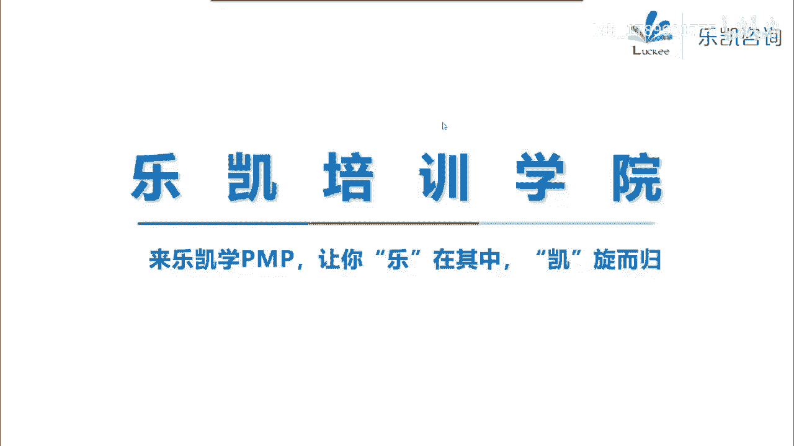

首先第一步是浏览选项，这个跟我们考试的常规的顺序呢不太一样。就是说我们在做题的时候，并不是直接去读题目。😡，直接去读题目，你可能一时半会儿很难把握这个题目，它考察哪一个方向。那么最好的方法是什么呢？

如果选项很短，先花个一秒钟时间扫一眼选项，对吧？那么扫完选项之后，你就知道这道题目大概要考哪一个方向的内容，那么我们整个PMP里面它的知识点是很多的对吧？你如果说不去明确你去读题干，那么你要去想，哎。

它考的是什么呀？这个浪费时间，你不如直接去看选项，那么这是第一步可以缩小选择的范围。😡，然后如果说选项它长短不一啊，乱七八糟，你看不出个什么花出来。那么第二步看什么呢？好，我们刚刚说你已经花了一秒钟。

少了一眼选项，对吧？那么接下来再花一秒钟，少一眼问题。😡，就这道题目它在问你什么？哎，有的时候你会发现我们有一些题目啊，它问题是问的很明确的。😡，对吧他就问你这个东西。😡。

甚至呢有的时候这个问题跟前面的题干它的关系呢都不大。😡，所以说你一秒钟扫一问题，他的问你是什么？😡，对吧这个不需要花太长的时间的。那么这个是第二步。如果说这两步做完之后，选项呢也看不出来。

问题呢也问的不是很清楚。那么这个时候怎么办？这个时候我们再去看题干，再去看题干。那么在看题干的时候，就要找出题干当中，一些关键的点，比如说要你解决什么问题。😡，比如说一些典型的关键字，对吧？

那么你会知道这个题目应该是在考察什么。那么这是我们。😡，常用的这三部。那么还有两步是什么呢？就是比较常规的一些解题的思路了。比如说定位过程。我在跟大家讲题的时候，有的题目会跟大家说，唉。

大家觉得这道题目应该归属在哪一个知识领域？😡，啊，应该归属在资源知识领域。那么又归属在哪一个过程呢？啊，归属在建设团队。那么这道题目问的是建设团队的什么呢？啊，问的是工具，对吧？那么你把这个定位准确了。

范围也就小了，对吧？或者说啊我定位在相关方知识领域，管理相关方这个过程，对吧？啊，再问了四句话的东西。😡，这个是PMP里面比较常见的一个。😡，解题的思路。当然最后还有什么呢？就是在一些纠结题目里面。

什么叫纠结的？比如说我一眼看不出这道题目想考我什么，或者呢这个选项呢也比较纠结。那么这个时候怎么办？我建议大家就是用排除法，排除掉明显错误的选项。那么我们尽量做到在选择的时候啊，你做到二选一。😡。

二选一就有50%的可能是正确的对吧？那么这是P僻里面解题的这几种思路。那么接下来我们用模拟一的题目来看一下这几种思路，以及我们后面会讲一讲卷子上的一些对应的知识点。好吧，那么刚刚在讲的时候。

有人问了我一个问题。他说我在考试的时候，能不能在卷子上把一些字圈出来。😡，因为我们国内的考试是发一本纸质的，叫考试书。那么这个考试书呢是双面打印的。一般来说，一场考试考试书有多厚呢。

差不多应该在100页100页。因为它有中文跟英文字体的含间距也比较大，对吧？是一本。那么你可不可以在上面涂呢，可以的，对吧？你只要不要在上面写论文对吧？画漫画，你画两个圈儿，这个是可以的，对吧？

贴个ABCD是可以的，😡，明白吧？这个是没有问题的，所以说在上面做一些记号是可以的。但是我说一下啊。😡，答题卡上面请你不要瞎搞，答题卡一定要认真，要规范。好吧，试卷上面你画两个圈是可以的啊。

我说到100页，很多人都疯了是吧？妈的100页，还有这种考试的。😡，因为有的时候题干有点长，而且是中英文对照的一页就只有一道题。明白吧？一页就只有一道题了，所以说一页最多就是两道。正常来说应该是两道。

有的时候题目常就是一页就是一道，它有中文，有英文嘛，上面是英文，下面是中文。😡，好吧，好，那么接下来我们看一下这几种解题思路的一些具体的情况。首先第一种叫浏览选项。

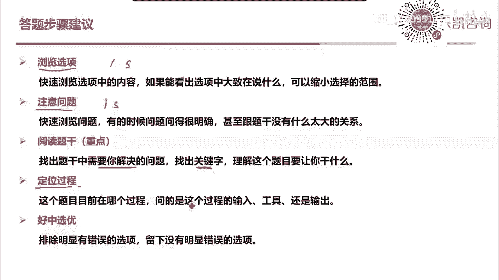

好，接下来大家注意听。😊，像这种题目就是很典型的浏览选项的题目。比如说我扫眼选项啊，我就知道这道题目在考我什么，这道题目在考我合同类型。😡，对吧就是选择哪一种合同。

那么你马上脑子里面就要跳出来合作的这几种区别。总价类合同对甲方比较有利，成本补偿类合同对乙方比较有利，总价合同它要求范围明确成本补偿合同有范围，但是会发生重大变更，对吧？公料合同适合用于短期。好。

题目里面在说什么？这个项目可能会发生变更，而且是高层级需求，可能会发生变更。它有范围，但是会发生重大变更。那么它一定是成本补偿类合同。😡，对吧马上就把A选出来了。😡，这种题目就比较快。再看第二道题目。

一看在考什么呢？塔矿模型。😡，对吧这几个阶段马上脑子里面关键字就跳出来，什么叫开始阶段，相互独立，相互相互认识，不一定开诚木公，对吧？然后正荡阶段规范阶段成熟阶段各自是什么关键字？好。

那么接下来到题目里面去找，现在是什么情况，现在增加了5个资源，然后问你现在是什么阶段，那么马上就跳出来，我上课说的话，新的成员加进来肯定是相互认识，相互独立这个阶段啊，对吧？形成阶段，像这种题目。😡。

大家会明白啊，PMP考试的题目200道题。😡，理论上来说，每道题目给你的时间是多少，也就是一分钟。😡，对吧因为一分钟200道题也就要200分钟，200分钟就是3小时20分钟。那么你涂答题卡要多长时间？

涂答题卡，我建议大家要留30分钟。😡，对吧那么这就3小时50分钟，还有10分钟干什么？不是每个人都像我这么牛的，可以讲4个小时不去尿尿的。你4个小时不一定憋得住的对吧？那么你要去厕所吧。

你去厕所叙嘘一下。😡，十分钟留点时间总要吧，对吧？所以说这个题目你要控制在每道题，不能超过一分钟，不能超过一分钟。好吧，那么像这种题目给你是干什么的？😡，这种题目就是给你来争取时间的。

像这种题需要一分钟吗？不需要的对吧？像一般学的比较熟悉的同学做这种题目，扫一眼选一选10秒钟肯定搞定了，对吧？这10秒钟还搞不定吗？那么你就节约了50秒啊，节约了50秒，好吧，好，再看。😡。

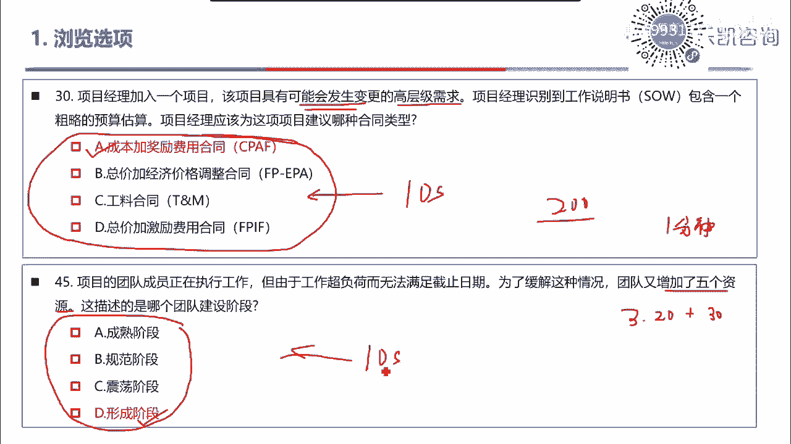

看到这个题目知道在考什么吗？很明显在考风险的应对策略。😡，对吧那么风险的应对策略怎么去考虑？首先这道题目问的是机会还是威胁？😡，长期效益一定是机会。先把威胁的两个干掉。对吧机会里面就这两个去选。

然后接下来选接受还是开拓长期效益，你想一想应该怎么办？应该想办法抓住嘛，抓住嘛，对吧？开拓嘛。😡，好，再看这道题目，再考什么？再考估算的一些工具，估算的一些技术。😡，对不对？然后就到题目里面去找，哎。

哪一句话能够说到这个呢？比如说涉及到数据模型要计算它公式的那么就参数对吧？速度快，成本低，但是不准的叫类比，对吧？专家判断这个东西呢，其实说的有点大，专家判断它包括很多种方式。比如说类比估算。

或者叫自上而下估算，甚至包括我们的德尔菲，也可以叫专家判断一种方法，对吧？然后自下而上的估算呢。哎。😡，准确但是慢。那么你看到题目里面类似想都不要想了，马上就是什么呢？类比估算了，对吧？

像这种题目就一定要快了，一定要快。这些题目对大家的要求是什么？就是又要快，而且准确率又要高，因为这些题目才是真正决定你过和不过的题目。如果这些题目都做错了，你纠结题在于纠结，那怎么弄呢？是吧？好。

接下来。😡。

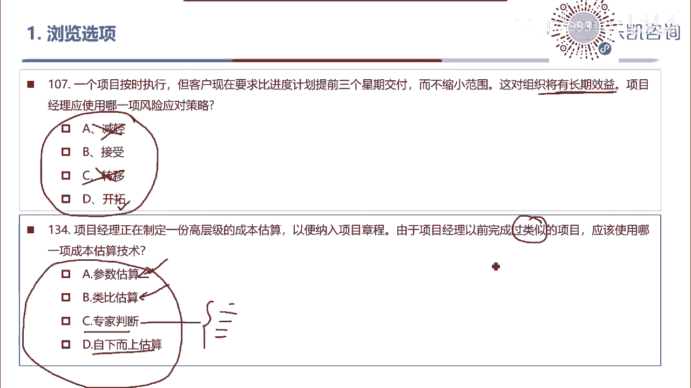

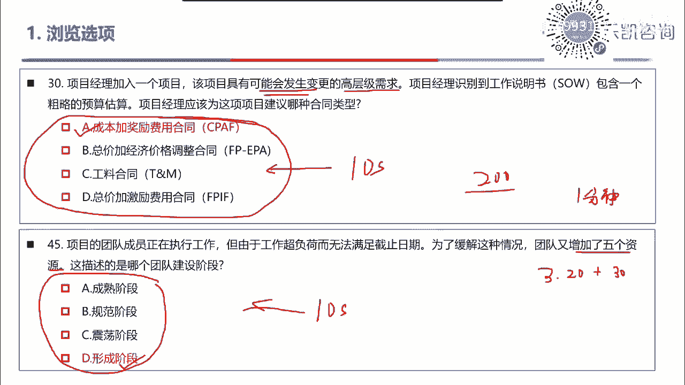

前面讲的是看选项对吧？扫一眼。好，接下来如果选项看不清楚，你可以扫什么扫问题。比如说我们看模拟器里面的这几道题。😡。

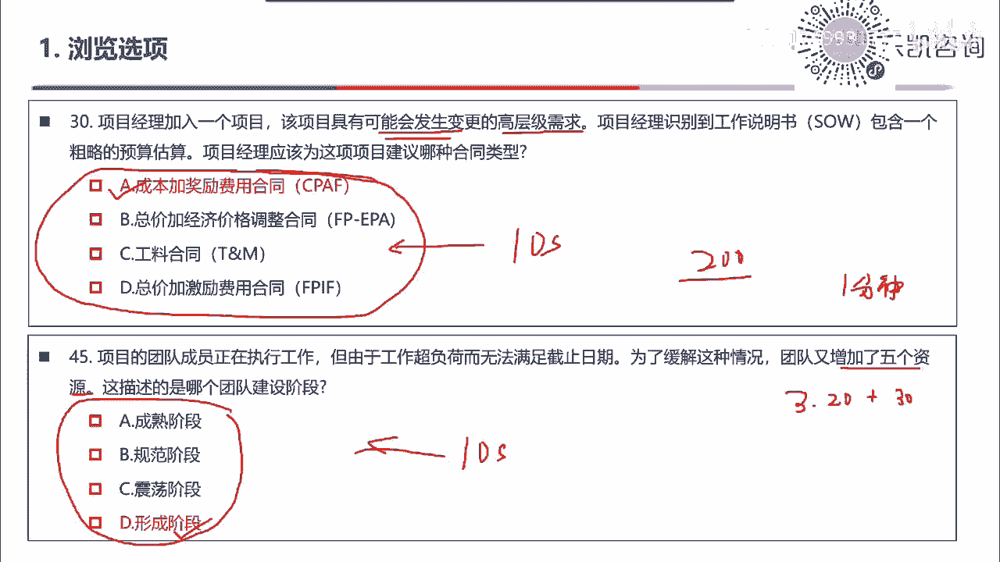

项目经理应该从哪里收集经验教训？😡，对吧跟经验教训有关系的。😡，是什么呢？😡，总结嘛。😡，回顾总结会议嘛。当然这个呢我们在明天讲敏捷的时候会讲一讲，对吧？什么叫回顾总结会议。然后25题对吧？😡。

项目经理可以和高级项目经理分享哪一份文件来行使他们获得资源的职权。😡，你扫了一眼这个问题。😡，那么接下来你就知道了哦，从哪里能够得到授权呢？分享什么呢？很明显在说项目经理的上方宝健项目章程。😡，对吧。

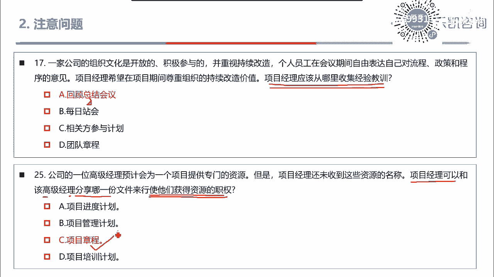

好，再比如说。😡，可以使用哪些组织个人资产来了解类似项目面临的挑战。问你组织个人资产了。😡，对吧那么组织个人资产你选什么？很明显就只有他呀经验教训知识库啊。😡，再比如说在问哎。

项目经理应该如何提高未来项目的绩效？😡，好，那么这个我们反复说了，我们项目都是独特的。😡，对吧凭什么这个项目能够提高未来项目的绩效？那么只有什么东西，只有经验教训类的或者组织个人资产类的。😡。

对吧很明显就把D选出来了。那么这是第二种直接看问题的，看到问题基本上你就能选了，对吧？所以说第一种跟第二种少选项和少问题的，这个都是比较快的一些做法，一些简单的题目都是能够把它给很快的很准确的做出来的。

😡。

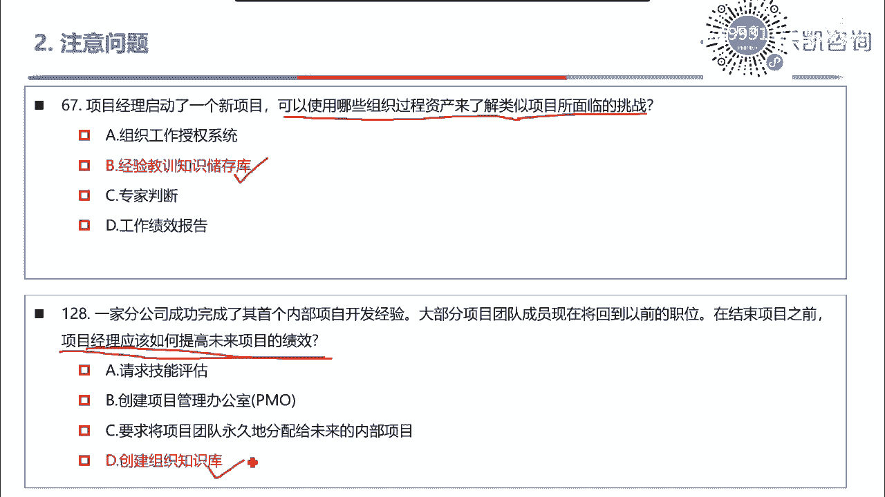

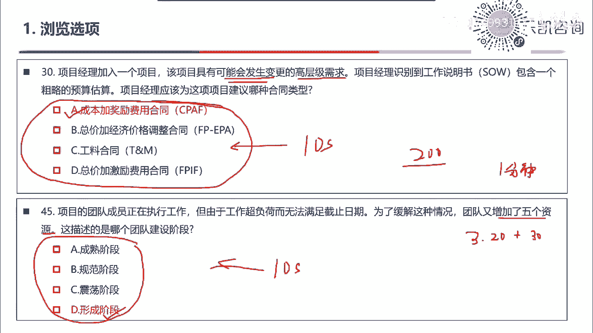

那么接下来还有一些题目，选项乱七八糟。而且呢可能选项也比较长，对吧？问题呢问的也不清楚，甚至就问你项目经理应该怎么办，项目经理应该怎么办？那么这个时候你就不能用这两种方法，那么不要紧，接下来就用常规的。

我们先看题干。那么看题干的时候一定要找到题干中的关键字。😡。

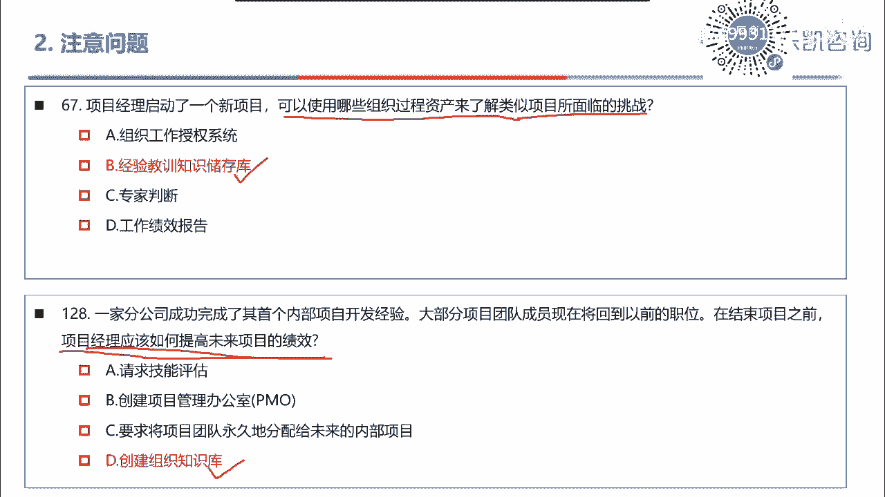

好，哪些题干里的字是比较关键的，大家注意听啊。比如说。😡，看到额外的你想到什么？😡，嗯。呃，客户说了，要求增加一个额外的功能。一般像这种词往往体现了什么呢？😡，要做好变更。

对吧额外的计划以外的往往就涉及到变革。好，再比如说你忽然扫到一个词，可能会怎么怎么样。遇到这种词啊，要到后面形成条件反射，对吧？哎，一说到可能，我就马上想到什么呢？风险。😡，对吧再比如说。😡。

看到根本原因就想到与骨图，看到是不是有相关关系，想到什么呢？散点图，看到什么新的相关方。😡，哎呦，是不是要更新相关方登记册啊？😡，对吧这是题目中一些比较典型的关键词。

再比如说还有很多啊还有很多这些呢我希望大家呢都要熟。比如说随便说几个，发现技能不足。😡，选什么培训往培训上面去靠，哎，发现谁负责什么，谁负责什么，没有搞清楚职责不清，你往什么地方去靠。

有没有IACI或者IIM。😡，对吧像遇到这种，我们上课讲了很多很多了，练了很多了，一定要熟是吧？好，如果没有这些关键字怎么办？那么就找题目中它的需要或者一些关键的点，对吧？比如说若要怎么怎么样。

或者若要避免这个问题，若要确保。😡，对吧包括什么事先应该干什么，这些都是比较重要的一些词。包括还有一些词，比如说但。😡，一旦出现这个担字，就意味着什么？就意味着题目中他描述的这个场景出问题了。😡。

是不是？那么遇到这些东西很明显，肯定就是题目考察的一些方向。那么我们一定要注意这些东西，对吧？再比如说题目中。😡，我说的一旦出现但这个字，那么就问题来了。那么典型的问题再看有没有什么说法。

比如说虚拟团队。😡，啊，不在同一个地方，对吧？然后呢出现了什么什么问题。好，马上考虑到是不是沟通，对吧？刚刚说到的技能不足，是不是需要培训？哎，有人在会议上同时发言攻击别人，哎，是不是会议礼仪的问题啊？

😡，哎，有的人直接做了，没有做这个流程，是不是要补个流程啊，对吧？这些都是很容易的。😡，很容易抓到考点的一些题目。那么遇到这些题目，一定要根据关键字或者题目的需要，题目中存在的问题，然后去什么呢？

对症下药，这样呢才会避免出现一种情况。避免出现什么情况呢？😡，很多人选择的选项，最终的选择跟题干的要求，它不是一回事儿，往往容易造成这种答非所问，答非所问，对吧？好，那么接下来我们用一些题目来看一下。

う。

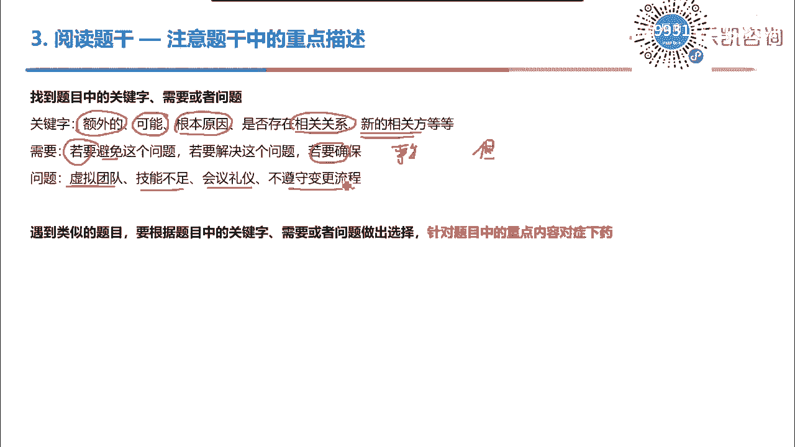

比如说我们在模拟做的第一道题目。😡，对吧。第一道题目，你要看题目的要求是什么啊，他要求说项目经理，你应该如何去调整相关方的意见，获得他们的积极参与。😡，对吧啊，就是怎么去把他们引导过来，积极参与。

然后再去调整他们的意见，这是题目的要求。那么像我们在讲模拟题的时候，C和D这两个选项选的比较少，有很多人选了A。😡，那么你再看一下A这个选项，它跟题目的要求有关系吗？题目在问你。

你如何去调整相关方的意见，让他们积极参与，对吧？你A说我告诉你这个项目我做什么，你你告诉别人了，别人就要参与吗？😡，是吧。😡，那么你根据这个你就知道啊，这可能跟相关方式有关系的。

我可能要去跟他澄清一些东西。那么澄清什么东西呢？哎，题目里面又有一个关于项目利弊，项目好还是不好，说白了值得还是不值得，对吧？有没有价值，啊，我要跟他澄清商业价值多好的一个选项？😡。

对吧这个时候你会发现，如果说B是高圆圆，A是什么？A连李宇春都比不上。😡，这个就不需要纠结了，对吧？你肯定选它了，所以说你一定要抓住题目的需要是什么，对吧？再比如说第二集。😡，第二题题目的要求是什么？

若要确保项目成功。那么这题干里面又问了一个什么，又说了一个什么呢？又说了一个问题，他说那商业论证还没定。😡，项目经理强烈感觉到没有办法实现这个目标。😡，对吧那么这个时候项目经理应该怎么做？😡，好。

什么问题？马上分析一下这个题目存在的问题是商业论证，现在还说不定。两说对吧？估计呢商业论证有很大的问题。😡，那么这个时候怎么办？😡，没有办法实现，我们就不要去做不要去做，对吧？😡。

不要做A再说我要做C修改项目章程本身就不对，对吧？而且他的意思也是要去做，包括D，我把它的假设条件更新到假设日志。什么叫更新到假设日志呢？假设日志是制定项目章程的输出。😡，你把它更新进去也代表什么？😡。

代表这个制定项目章程要做下去了，也要做了。而这道题目现在很明显没法做，不能做。

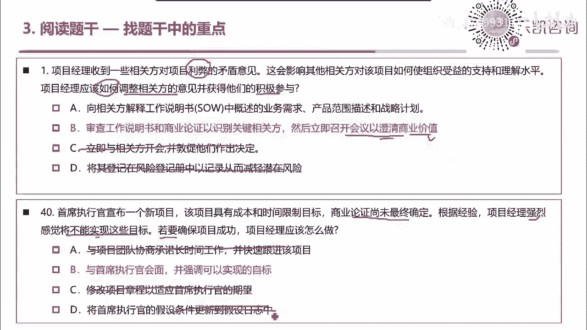

对吧好，再比如说61底。😡，若要解决这个问题。那么你就要看了，要解决的是题目中的哪个问题。😡，对吧题目前面一共就两句话，第一句话是句废话，再交代一个背景。😡，问题就出现了，只能是第二句话了。好。

什么问题呢？项目经理注意到每个部门的需求不能引起其他部门的兴趣。😡，跨部门问题。如果存在这个问题，那么跨部门协调就是扯淡，对吧？那么你就要想办法怎么样让部门跟部门之间。😡，能够协调起来。对吧。😡，引导。

对不对？你抓住题目的问题嘛，再比如说103方呃103题。😡，但是。😡，好，问题来了。明明这些人的意见是不可或缺的。😡，但是他们连我们的相关方都不是。😡，对吧那么这就是题目中存在的一个问题了啊。

明明人家的意见是不可或缺的。结果呢你发现他们连我们的相关方都不是，那么更不用说前面这个新批准的范围里面，他们参与了没有啊，他们肯定没有参与啊。那么这个时候怎么办？好，如果这道题目有更新相关方登记册。

你就得选更新相关方登记册。那么这道题目它没有考察这个点，首先更新相关方登记册，他都在说变更的事儿，那怎么办？好，那么接下来就要想。😡，前面一个批准的变更，没有这些相关方参与，但是他们必须是要参与的。

我感觉前面这个批准的变更有点不靠谱了。那么这个时候怎么办？那么这个时候。😡，我也不要去改前面的变更，我怎么办呢？我提一个新的变更请求，再把他们再把它包含进去，让他们来参与这个过程。😡，对吧所以B。😡。

马上就出来了，你再看其他选项哦，问团队要不要变更，你问啥对吧？更新现有变更，为啥要更新现有变更，对吧？这些人很关键，他们一定要做CCB吗？😡，不一定的呀。😡。

是吧所以这些题目啊一定要注意它题干里面的一些关键的问题，要解决什么问题。😡。

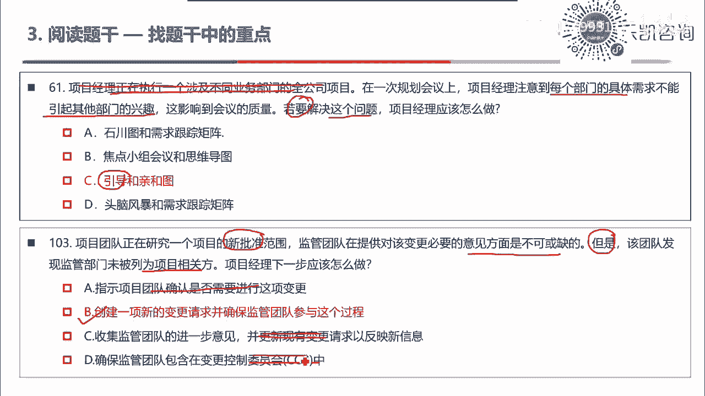

再比如说114题。😡，若要更好的了解这个问题。你事先应该做什么？😡，好，那么你看一下题目总在说什么。😡，你之前做了一个类似的项目，出现了一个问题。😡，你现在做这个项目还是遇到这个问题。😡。

对吧你说明什么呢？😡，很明显说明什么你没有吸取经验教训啊，对吧？你为什么做这个项目之前没有参考组织个人资产呢？好，忽然发现题目中有一个蛋。😡，他说，为什么没有参考组织个人资产呢？

因为我发现没有什么地方提到过这个事儿。😡，那么你马上就要想了，那么你之前遇到这个问题，有没有总结经验教训，有没有更新组织个人资产啊，对吧？你为什么不更新呢？为什么不把它记下来呢？😡。

马上看一下C选项就出来了。对吧你之前明明犯了一个错，做这个项目还是犯了错。😡，对吧而且你在做这个项目的时候，查了任何文档都没有提醒你这个东西。😡，那么很明显你当时没有更新组织工人资产，对吧？

再比如说137题。😡，好，若要确保产品性能。对吧若要确保产品性能，那么你就想到什么跟质量有关的。那么题目里面说，哎呀，我不知道如何定义和控制产品性能。😡，你看到这句话想到什么呀？😡。

我不知道如何去说白了，如何去做质量有关的事情。规划质量他都做不下去了，对吧？那么规划质量做不下去，不会怎么办？😡，忽然看到选项里面有一个抄啊，对吧？以后不要说不会。😡，你应该说我可以学。对不对？

找谁学找标杆去学呀，人家做的好的是怎么做的？😡，对不对？所以像这些题目，你把题目中一些它主要的一些矛盾点找出来。😡，那么基本上就没有问题了。是吧。好，那么这些题目相对来说我觉得呢也不算难。

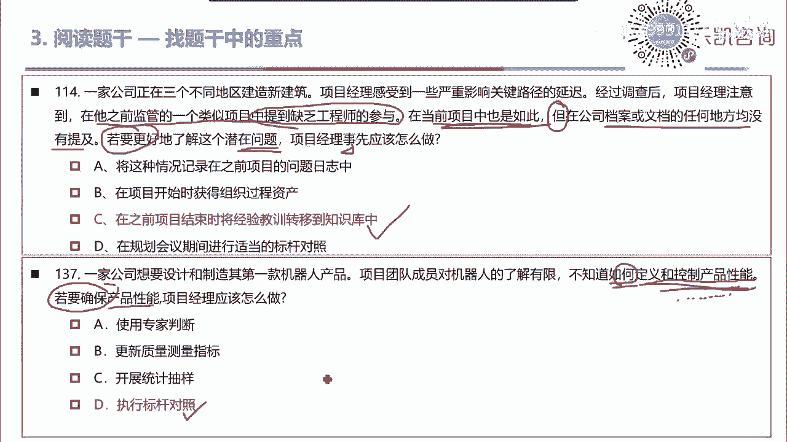

也是比较简单的，因为基本上的题目中还是有一些关键点在的。😡。

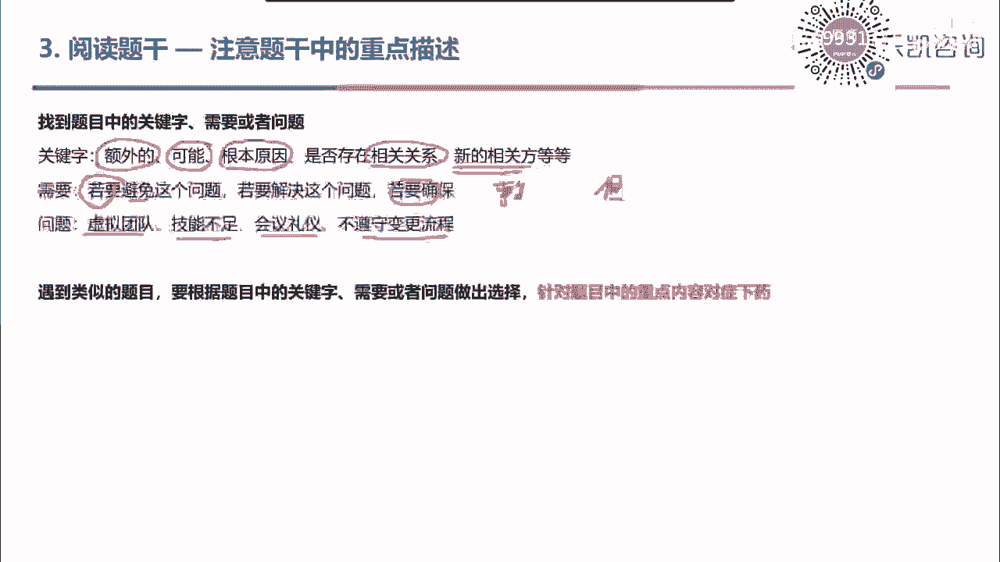

啊，那么这一部分题目也希望大家能够把它给做对。好。还有人在问这道题目为什么不写专家判断？😡，那么请回答我什么叫专家？😡，什么叫专家？😡，对吧这些基本的点要知道的PMP里面第一大水货专家判断什么叫专家。

😡，在我们组织里面，凡是接受过培训的，有任何经验的这些个人都叫专家。好，请问第一款机器人，你们组织里面有没有这种受过培训的，有经验的人？😡，没有。对不对？你选专家判断，你们组织里面有吗？没有啊。😡。

那么有人说标杆对照对照谁呢？我们组织里面也没有啊，标杆对照你可以对照别的公司啊。😡，对吧那么有人说我找专家也可以找别的公司啊，也可以找大学里面的一些学术带头人啊。好，注意那个不叫专家。

那个叫一般我们叫什么？一般叫SME主题专家。😡，对不对？那这个领域里面呢，比如说机器人领域，哎，我找清华大学里面的哪个教授是这个领域的学术带头人。😡，这个叫专家吗？这个叫主题专家。😡。

是不是偏M僻里面的专家判断这个专家不是主题专家。😡，他只是有任何经验技能的人，这个叫专家判断。😡，专家和主题专家，这是两码事儿。😡，是吧所以最基本的东西就不用去纠结它了。😡，好吧，好，接下来。

讲一讲题目中阅读题干的时候，比较典型的这几种题。

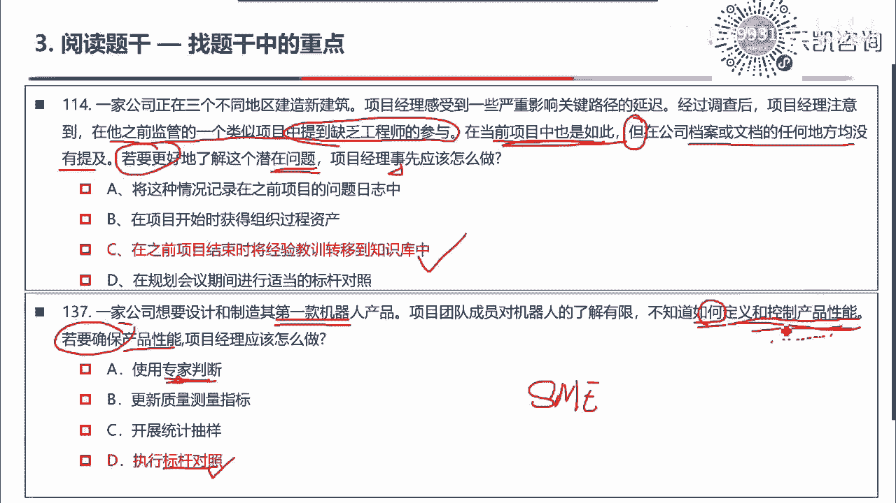

第一种变更题。这个是PP考试中考的非常多的一种题目。

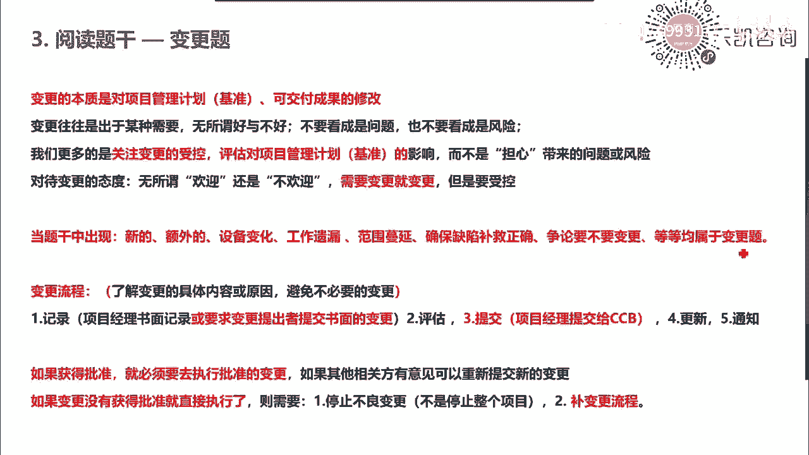

好，马上王家强就问了，如果这道题目里面有一个选项是SME。有一个选项是标杆对照，你选哪一个？好，那么我问你，如果高圆圆和赵丽颖现在都说你必须要跟我结婚，你不跟我结婚，我感觉生活都是无意义的。

我都活不下去。请问你选择哪一个？这种题目这个问题不要想。为什么？😡。

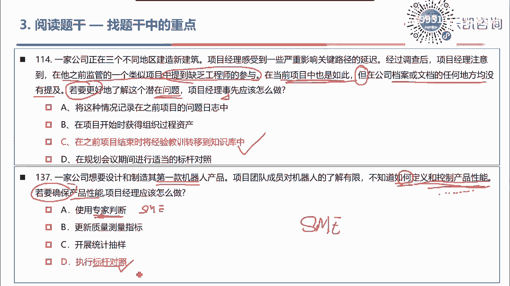

不可能出现的事情，干嘛要为难自己呢？对吧？😡，明明不可能出现，还要去出一个这样的题目来为难自己，晚上都睡不着。哎呀，我睡不着觉啊。你看啊高圆圆跟赵丽颖都喜欢我怎么办呢？😡，有意义吗？没有意义。😡。

明白吗？你说你硬要设定一个场景，一道题目里面有两个选项都没有问题，都是正确的。然后还出出来让你去选。😡，呃，你说怎么办？如果真的遇到这种题目，我建议你怎么办？眼睛一闭。然后呢，考试的时候。

他不是发橡皮吗？橡皮里面一面写A，一面写B，扔一扔，把这个决定交给上帝，知道吧？美国人他信上帝，那么你就信上帝。😡，好吧，好，接下来。😊，不开玩笑了啊。说一下考试中比较重要的地方。第一种变更题。

那么大家首先要知道变更变更什么叫变更。问大家一下，变更，你们觉得学到现在啊PMP都学完了，你觉得这个变更是好的还是不好的？😡，变更好还是不好？😡，学到现在，大家一定要知道，变更没有什么好与不好。😡。

只能说什么呢？需要还是不需要。😡，如果确实需要变更，我们就走流程。对吧哎，如果是一些什么没有道理的，那么经过流程，他也会把它拦住的。所以说大家要注意，变更的本质肯定是对一些东西的修改，对吧？

比如说常见的对项目管理计划的修改，包括对可交付成果的一些修改，对吧？那么要注意的是变更只是一种需要，它没有什么好与不好。😡，也不要跟问题和风险放在一起说哎这个变更会带来什么风险变更。我们强调什么？

强调走流程。如果用两个字来描述是什么呢？我们只强调受控。😡，一定要受控。一定要规范，对吧？你不能瞎搞。所以说我们关注的是变更要受控评估影响，而不是说它好还是不好，有没有问题带不带来的风险，对吧？

我们想变还是不想变，我们只强调受控。😡，那么什么题目是变更题？大家注意一下，当题目中出现客户需要一个新的什么什么东西。一个额外的什么什么东西。😡，对吧包括设备的一些东西发生变化。比如说模拟器。

我记得做了一道题目，说什么一个存储罐的尺寸要变，对吧？包括工作遗漏，你少做了范围蔓延呢，你多做了，多做少做，对吧？包括好质量那边也有一个变更，在第六版的考试中经常出现的。😡，就是当有缺陷要你做缺陷补救。

你用什么来保证缺陷补救，它一定是。😡，没问题的。用什么来确保？一定要让缺陷补救走合理的变更流程。经过评估，经过审批。对吧还有。😡，我们在模拟也遇到过了。包括单元测试也遇到过的。一个人说要变。

一个人说不要变，那么究竟是变还是不变呢？😡，好，走流程让CC必须决定。对吧像这些题目，它都是属于变更题。😡，那么变更题应该怎么办？😡，我们要记住流程。好，流程我再次强调一下啊，政5部第一步叫记录。

什么叫记录呢？其实记录的意思它的关键点并不是说记录什么，而是强调我们这些变更最终要书面化。😡。

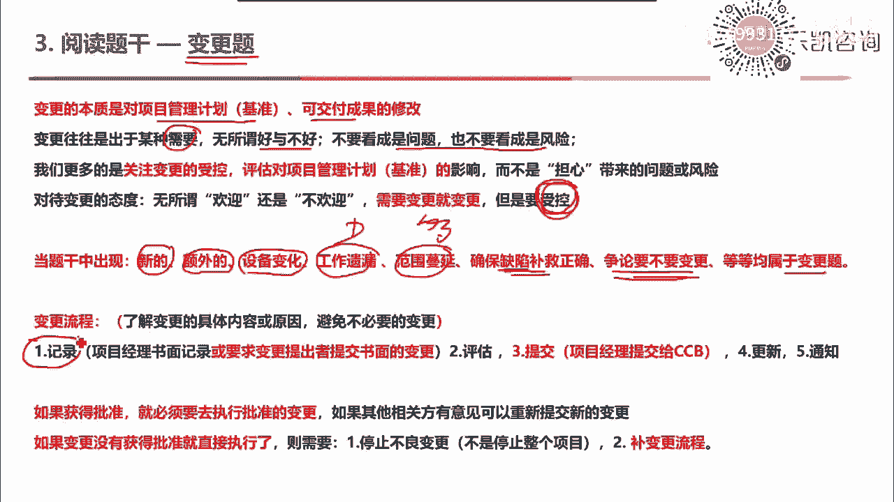

比如说哪些是记录的？好，项目经理把变更记录在变更日志是不是记录，是记录。😡，对吧。😡，创建变更请求，生成一份书面的变更请求，这都是记录。还有在题目中经常出现的。😡，这句话。要求客户提交书面的变更。

一定要注意啊。😡，这句话的意思是什么？客户说要变一个东西。好，项目经理跟客户说，那么这样吧，你要么给我一份书面的变更吧。好，这个时候要求客户提交书面的变更，是提交给谁？😡，一定要注意这个提交。

它不是第三步，因为客户有变更。项目经理说你给我，你提交一份书面的变更，提交给谁呢？他不是直接提交给CDB的，他是交给项目经理的。😡，对吧这也是强调了书面化，这是第一步。😡，这是第一步。好吧，我先放句话。

这里你们不信看模拟2。😡，我看看还有没有人这道题目做错。对吧这第一步我们强调书面化。然后第二步我们强调什么呢？评估。😡，好，谁评估项目经理带着团队，甚至带着相关方一起评估。

对吧那么评估主要是评估什么东西呢？我们主要是评估这个变更对项目带来的影响是什么？😡，对吧然后评估完了之后，接下来提交。好，那么第三步是项目经理把变更和评估的结果提交给CCB，让CCB来决定。

那么不管通过不通过，我们要更新，要通知受影响的相关方，这五步一定要熟，这是变更的核心中的核心，对吧？当然有人会发现前面有一个括弧写了这样一个。

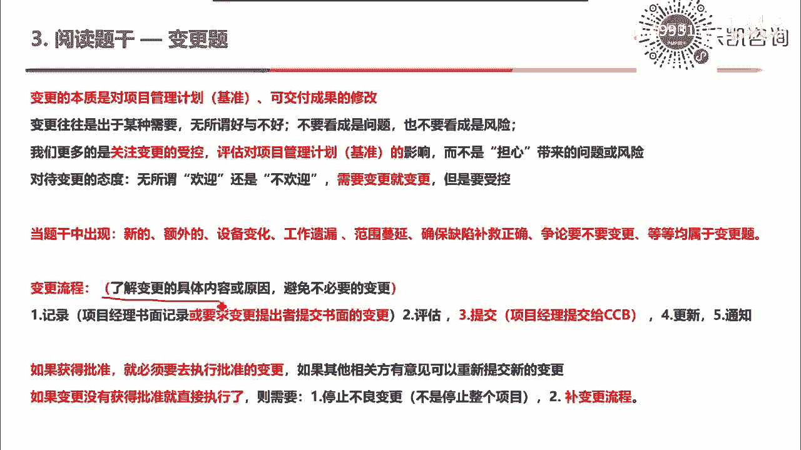

了解变更的具体内容或者原因，避免不必要的变更，甚至告知变更潜在的影响。那么像类似这些说法，一般如果出现。他是比较早的，因为他在记录还要前面，你只有了解了具体的原因和内容，你才能去记录。

对吧所以如果很少见的啊出现这种的，那么可以去选可以去选。也有很多人把它说什么？这第零部，对吧？哎，很早的好，那么接下来还有几个地方我要补充的，可能大家没有引起重视。第一个地方。如果变更获得了批准。

就这个变更已经被批了，结果呢好有相关方不同意。😡，那么请问这个变更做还是不做？哎，变车已经批了。😡，我们开始准备去做批准的变更请求了。结果有人他不同意啊，他有反对意见，那么做还是不做呢？好。

大家要注意啊。😡，如果说变更已经获得批准，我们就要去执行批准的变更。为什么呢？因为如果你不做。😡，那么就意味着什么？就意味着你否定了这套流程。😡，对吧。啊，变更是谁批的这个问题，现在还还有问题吗？

CCB批的呀，对吧？如果CCB已经批准了变更。😡，好，你说我不做。😡，那么就意味着什么？😡，意味着你否定的这个流程啊。😡，那么这个变革流程还有什么用？不就形同虚设吗？那么有人说那有人不同意怎么办呢？好。

不同意可以重新提交新的变更。😡，对吧哎，你说有问题，我们可以这样，你如果觉得有什么问题，你提交新的变更请求，走流程。😡，对吧但你不能说不做的。😡，你不做你前面这个批准的变更，你不做。

那么这套流程你遵守还是不遵守啊？😡，是不是？好，这是第一种要注意的。第二种。如果片变更的没有获得批准，就直接做了。😡，其实这个是什么？其实这个就是有点像范围蔓延。对吧好，那么这个时候我们需要怎么办？😡。

主要的是要补变更流程，一定要补一个变更流程，对吧？当然前面还可能会出现这句话叫停止不良变更。😡，停止不良变更，就是你还没走流程，你就开始做了。那么怎么办呢？先叫停。哎，这个不良变更先不要做。

然后赶紧去补一个流程。😡，对吧。🤧诶。这里面是不是有9月份的学学员在听课啊，我怎么感觉大家提的这个问题让我有点忐忑。这些问题不是我觉得大家现在都应该很熟的问题吗？😡，对吧有人在问什么？好，我补流程。

我第一步记录，第二步评估，第三步提交，结果CCB不同意，那怎么办？😡，这个不是反复讲过了吗？😡，如果CCB不同意，你怎么办？😡，CCB不同意你该更新还是更新，该通知还是通知，但是要注意要取消不良变更。

对吧你之前做的不良变更要取消掉的，要恢复的。😡。

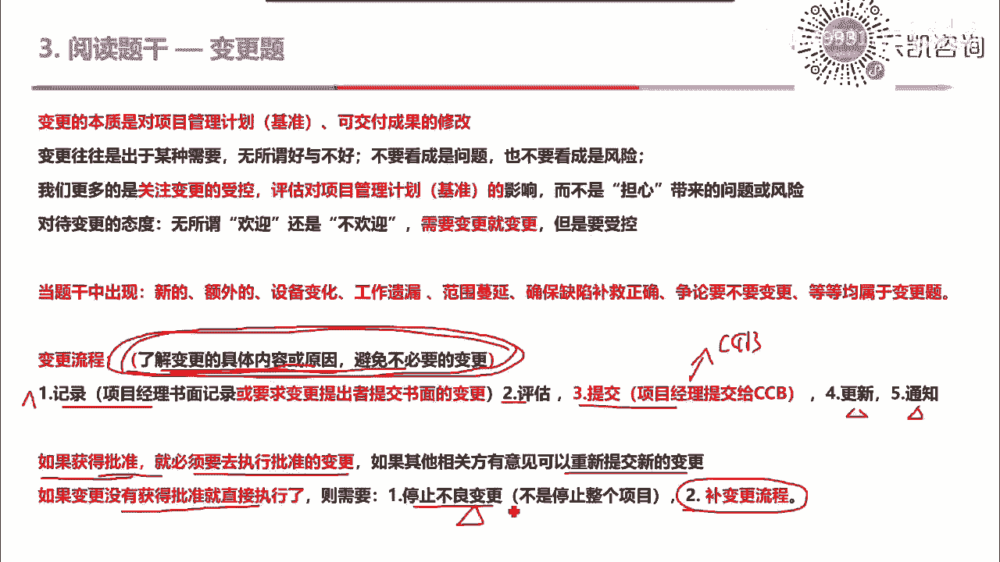

是吧这个都是反复讲过的啊，不能再出问题了。那么变更题它是考试中比较重要的一个环节。大概有几十道题，大这个大家都知道的对吧？所以我们的要求是什么？乐凯的学员做变更题，尽量要做到全对。😡，尽量要做到全对。

好吧，我们上课是这么讲的这些内容大家如果说不熟的啊，个别不熟的，再去反复听一听。好，接下来拿几道典型的变更题看一下。😡。

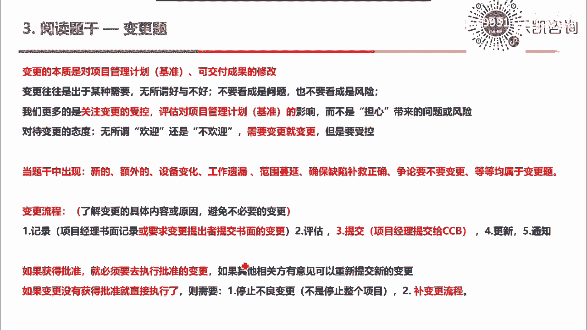

比如说第五十题。你会发现题目中出现了一个字，要实施额外的技术控制。😡，那么一般看到这种题目，你就要想到什么呢？这很有可能是变更。😡，对吧那么你就不要去考虑什么风险的事情了。啊，有人说哎呀，将怎么怎么样。

这是不是风险了，不要往这边想，一般出现额外的基本上都是变更，对吧？如果你真的要想的多，那么你就要考虑一个问题。😡，你想选C加到风险登记册，你认为这是识别到一个风险，对吧？你再看一下后面。

好在这道题目还有一句话，他跟团队一起执行了影响评估。😡，怎么可能先评估影响后更新风险政记策呢？😡，对吧如果是风险，也是先更新风险的计测，然后再去评估概率和影响啊。😡，是不是？

所以说变更体它有很典型的特征，不要去往风险上去靠，有额外的，它一定是变更。😡，那么接下来怎么办？走流程。D就是走流程。😡，对吧再比如说62题反复提到额外的额外的。😡，用什么变更管理计划？😡。

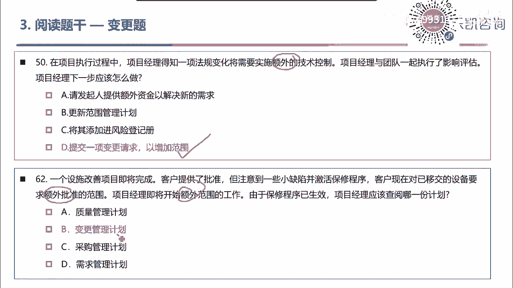

对吧好，再比如说141题。😡，141题有没有想到有没有看到变更在什么地方？在这儿，他们要求把交付日期提前一周。😡，对吧你要提前一周，那么接下来进度基准肯定变了。😡，那么进度基准变了，你要怎么办？

你不能直接更新的，你肯定要提交变更请求的，对吧？好，再比如说在做的时候，有一个鸟人希望做一个轻微的变更，在考试的时候，别他妈听他瞎说，哪有什么轻微的变更，轻微的变更，出在题目里面，他想考你什么呀。

对不对？他肯定没那么简单怎么办？走流程，对吧？评估吗？😡。

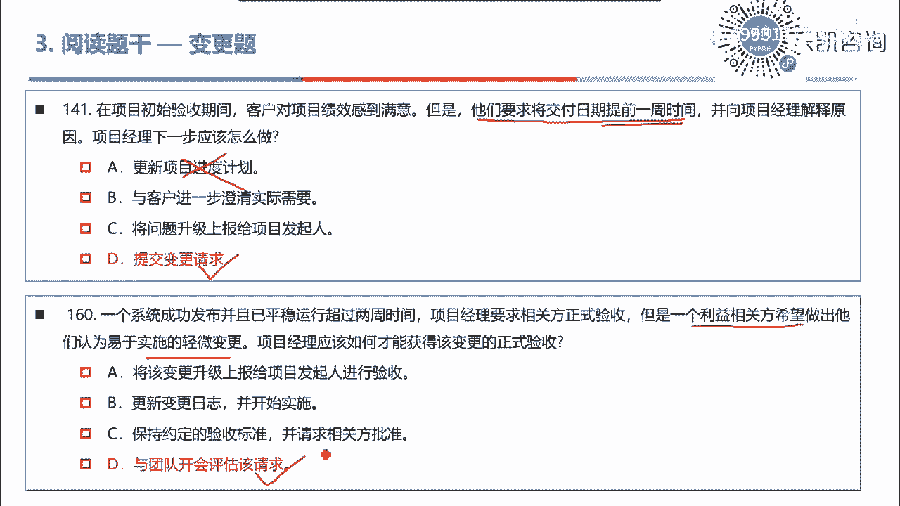

是不是再比如说177题，好，发起人要求承包商改承包商应该怎么办？那么这道题目你要特别注意。😡，遇到这种题目，首先要考虑清楚，他问承包商哪个是甲方，哪个是乙方，而，发起人是甲方，承包商是乙方。

其实这道题目就相当于客户。要求项目经理去改，问你项目经理应该怎么做，对吧？项目经理走流程嘛，提交变更请求。😡，你想明白甲方乙方你就不会去想选D了啊，评估影响再向项目经理提交。

我乙方的为什么提交给项目经理啊，当然提交给CCB啊是吧？再比如说68题已经有范围蔓延了。😡，那么项目经理应该怎么办？补变更流程。对吧一定要补变更流程C嘛，补变更流程，这些都是很典型的变更的题目啊。

再比如说91题对吧？一个说要改，一个说不要改怎么办？走流程。😡。

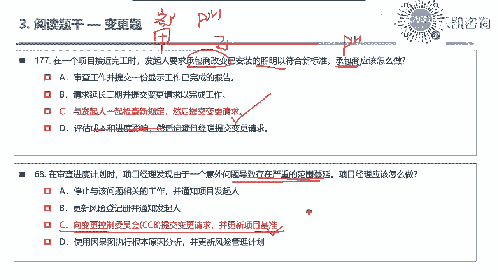

对吧再比如说59题好，59题一定要注意一下。😡，就是我们刚刚强调的。😡，存在一个缺陷，那么存在一个缺陷，你接下来怎么办？😡，你接下来肯定要考虑缺陷补救啊。那么他问你哎。

你怎么确保最终这个产品能够符合要求？😡，那么缺线补救也是要走变更流程。也是要走变更流程的。对吧。😡，好，换一个问法大家会做吗？比如说现在发现了一个缺陷，团队学员去做了，结果做出来之后，相关方不满意。

甚至还投诉你了，问你你本应该怎么做。😡，会做吗？应该也会做的，我本应该走好变更流程。对不对？这些都是跟变更有关的，都是跟变更有关的。😡，稍微注意一下一些细节，比如说甲方乙方的问题，对吧？

比如说变更提交给谁的问题，这些东西都要注意一下。好，这是第一个问题。变更题变更题在考试中是特别多的特别多的啊。好，接下来第二类。😡。

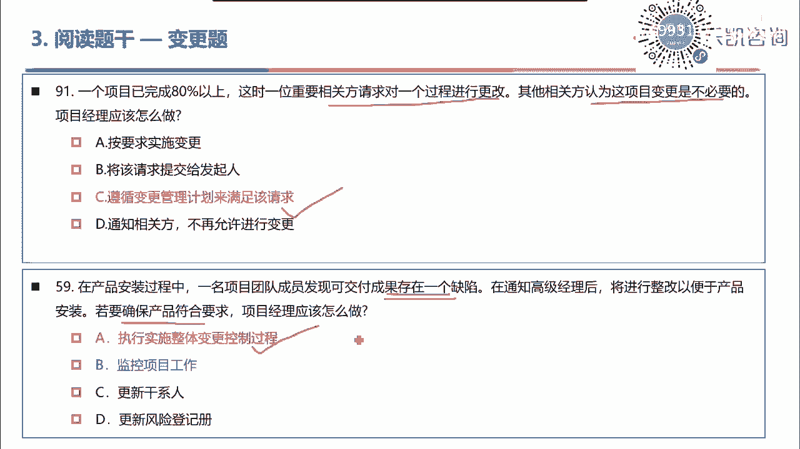

关于相关方和沟通的问题。

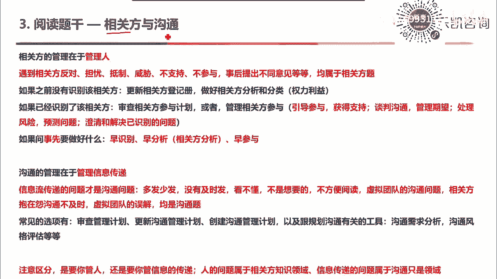

第六版改版之后，准确的说，其实在第五版的时候，在第五版后面几次考试。他就出现了一个很大的变化。相关方的题目非常的多，甚至多到什么地步，多到跟变更已经差不多的这个程度了。😡。

对吧那么我们有很多学员关于相关方跟沟通这两个方面总是在搞来搞去，搞来搞去，搞不清楚。😡，对吧那么要注意的是。相关方的管理它的重点是什么？重点在管人。😡，对吧或者叫搞定的人。那么哪些题目是搞定人的？

比如说。遇到有人在反对你。😡，有人在担忧，有人在抵制你威胁你，有的人不支持不参与，对吧？包括事后提出不同意见，包括有人不相信你这个项目可以怎么怎么样等等。好，总结来说就是有一个鸟人在兴风作浪。😡，对吧。

哎，怎么会项目上出现这么个孙子呢？是不是？那么怎么办呢？你又不能弄死他，我们做项目对吧？要合理合规，那么你只能什么管理它，只能去盘他。那么这个时候怎么办？好，如果说之前没有识别到这个相关方。😡。

那怎么办呢？更新相关方登记册，做好相关方的分析工作分类工作。比如说啊我为什么要说之前没有识别，有的题目就体现出这样一个意思。比如说我来说几个常见的考法，大家回忆一下。😡，我们正在做一个项目。

有一个环保组织。说我们的项目不符合什么什么要求。😡，好，他的说法是有一个环保组织，有一群环境保护人士或者附近的居民忽然怎么怎么样抗议你了，他用的这个描述，他并没有说哎发现了一些什么什么相关方。

他直接说居民环保组织对吧？哎，怎么怎么样，那么这说明什么？😡，这说明就是突然出现了这样一群人，你之前并没有去把它识别出来，你肯定也没有去什么呢？去管理过他们，他们突然就过来闹事了，对吧？

这种就体现了新的小官方出现了。😡，那么如果有更新相关方登记册，你肯定要更新相关方登记册的，对吧？好，如果说已经是我们的相关方，他明确说了，有一个相关方在担忧，我们的有一个相关方在抵制，在威胁，在反对。

那么怎么办？两种做法注意一下啊。😡。

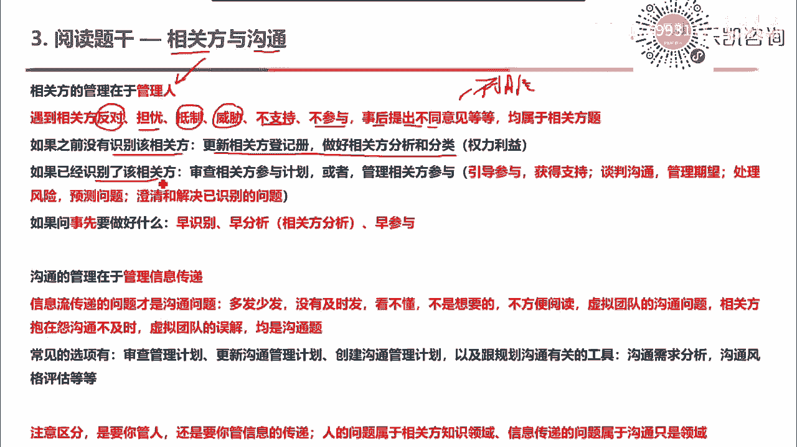

第一种做法问你审查什么，参考什么，那么就审查相关方参与计划，或者呢就是盘他怎么去盘呢？😡，就是管理相关方参与，具体的有4句话是很重要的。比如说引导参与获得支持。

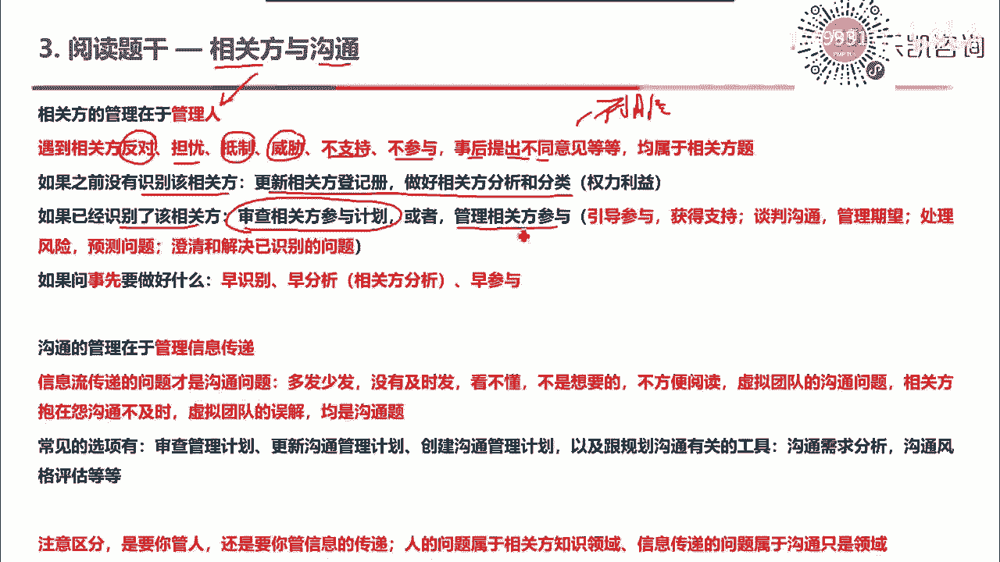

对吧。好，比如说谈判沟通管理期望，那么什么时候会出现这个选项？我说一下啊。😡，往往在我们项目中出现一些问题的时候。比如说进度落后了呀，成本超支了呀，然后你发现选项里面他没有说我要想办法纠正。

都是说的一些感觉很怪的啊，完全不正确的。但是忽然有一句话是说啊，我要跟相关方去谈判沟通，这个也可以，因为出现这种问题，如果确实是事出有因的，有原因导致的。那么我们要通过谈判沟通来管理期望的。😡。

对吧那么第三种要处理风险，预测相关方有关的问题。好，特别是第四句话，这句话出现的特别多。澄清和解决已识别的问题。我们需要澄清的就澄清，有什么问题一定要积极去解决。这四句话没有先后顺序。没有先后顺序啊。

😡，就有问题，我们经常就用这四种方法去考虑的。好，这是如果有人在搞你你怎么办？那么还有一种方法，他会问，如果发现有一个人在搞你，那么你事先要做好什么呢？😡，记住三个早。尽早识别。😡。

对吧尽早做好相关方的分析，尽早让他们参与。😡，早识别，早分析，早参与。那么这些都是跟人有关的，在搞人。对吧有人在做这些事情，那么你要搞定他。😡。

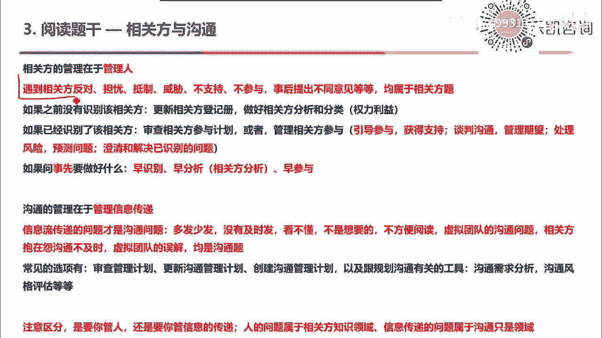

相关方的题目，那么什么叫沟通的题目？沟通的题目它重点在于信息的传递。😡。

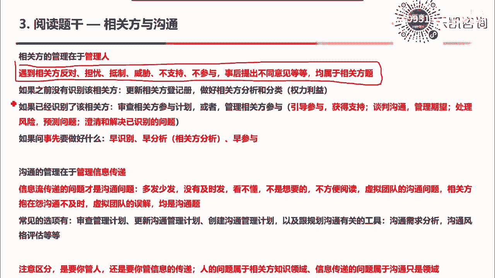

或者叫信息的交换，对吧？那么什么题目是沟通问题呢？就是信息的交换出问题了。比如说发的东西多发了少发了。😡，哎呀，你怎么发这么多邮件影响我的工作效率。哎，为什么相关方需要这个东西，他没收到，对吧？

多发少发，包括什么呢？实发。😡，对吧。哎，没有及时的发，包括你发的东西看不懂，或者不是别人所需要需要的信息，或者不方便阅读，包括虚拟团队怎么怎么样，这些都是包括还有什么啊，相关方在抱怨这一点呢有点特殊。

😡。

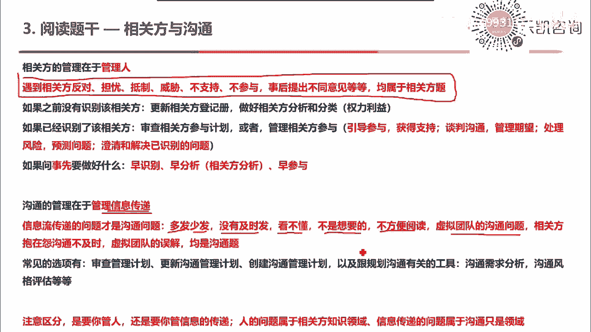

相方方是在抱怨，但是在抱怨什么呢？抱怨你的沟通不及时，他抱怨的是一个沟通问题。😡。

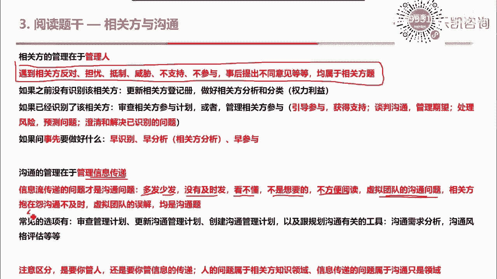

对吧再比如说虚拟团队有误解，像这些题目都属于什么呢？沟通题。😡。

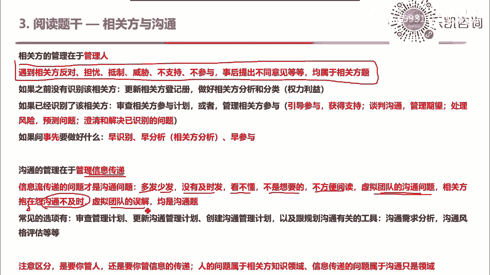

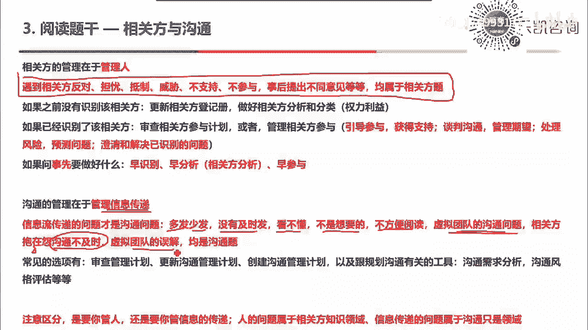

信息的交换的问题，对吧？那么常见的选项有什么？😡。

要么就是审查沟通管理计划，要么更新沟通管理计划，甚至你事先应该创建一份沟通管理计划。另外还有可能会出现跟沟通有关的工具。而我事先应该做好沟通需求分析。我应该去做好沟通风格评估。

这些都是规划沟通典型的工具。😡。

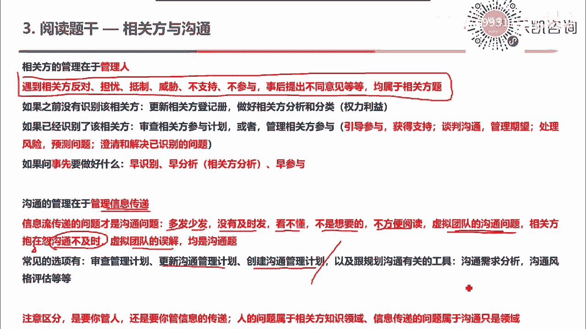

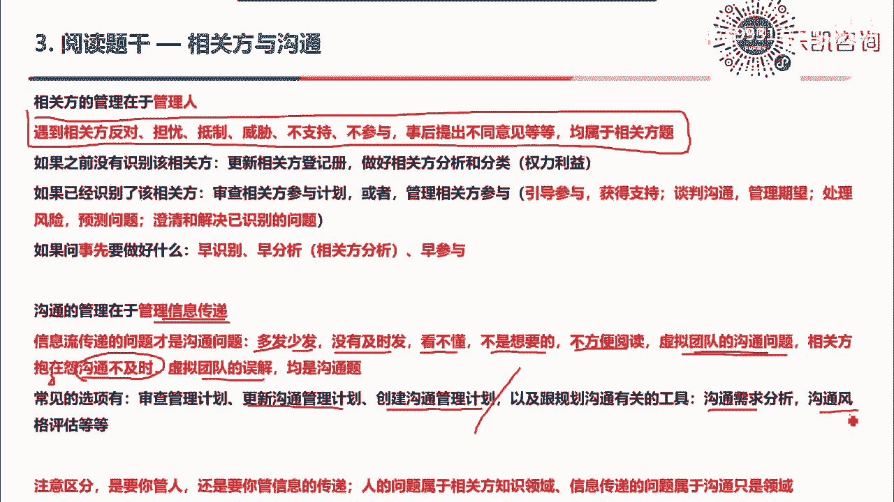

对吧所以说要注意总结。如果要你管人。那么它属于什么领域？它属于相关方知识领域。

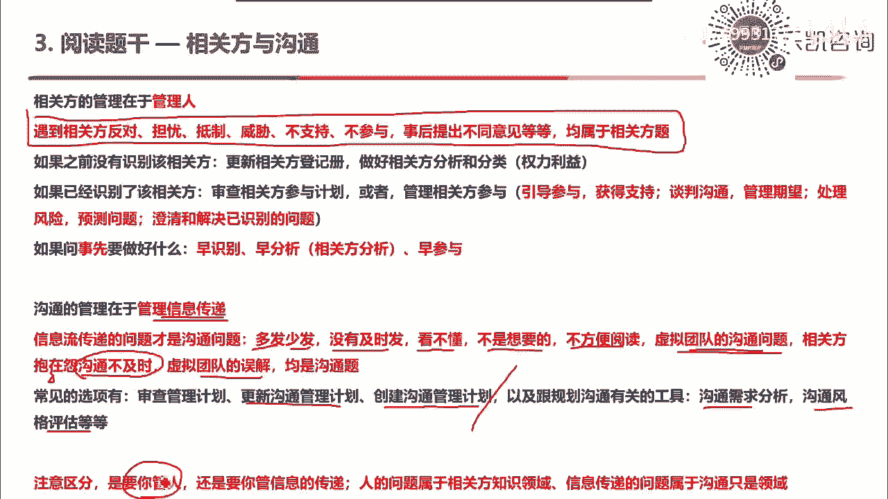

如果要你管信息的交换或者传递，它属于沟通知识领域。你一定要看清楚这个题目里面是人出了问题还是信息交换出了问题。

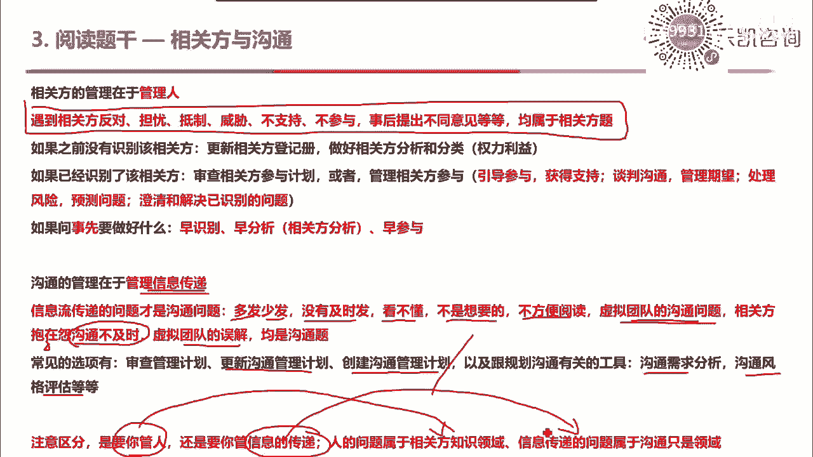

对吧这两个一定要搞清楚的。好，比如说模拟一的135题。😡，开会的时候。一个销售经理发发表了一个重要评论，影响到整个项目。项目经理对这个孙子参与项目呢感到很吃惊，对吧？哎，为什么你会来插这么一嘴呀？

为什么你要去管这些事儿啊，这跟你有啥关系啊？😡，好，这个是什么问题？是有人在瞎搞，还是说信息的交换出问题了？😡，很明显是有人在瞎搞。哎，本来我觉得跟你没关系的，结果呢没想到开会的时候，我靠。😡。

对吧那你怎么会。😡，莫名其妙的发表这么一个观点了。所以说要预防这个问题，你事先应该做什么？你事先应该尽早识别出来。你以为它不是相关方，实际上它是一个相关方。😡，对吧好，再比如说113集。😡。

之前未识别到一个小王方，这个不用说了，肯定是跟人有关的。好，79题。

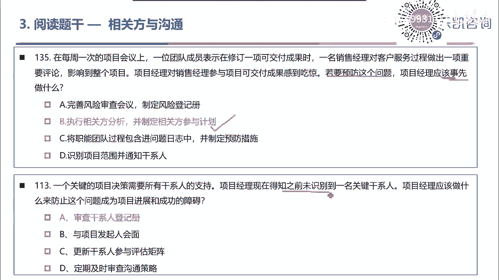

有一个相相关方在威胁。😡，对吧啊，威胁说要停止项目，这很明显是相关方的问题啊，他没有说到沟通，你跟沟通有什么关系，对吧？不是说哎呀我们去沟通沟通偏僻面的沟通，它只是说信息的交换。

所以这道题目不要去更新什么沟通管理计划，跟沟通没有关系。😡，没有说到信息交换有问题。😡，对吧那么这道题目的A我稍稍微说一下啊，有部分学员选了A说检查组织图，组织架构图里面或者项目的组织图里面。

它是没有相关方的。一般项目组织图里面，他说的是团队成员。😡，好吧，这个要稍微注意一下。稍微注意一下。好，118题再看。客户在担心。担心他们的期望没有得到满足。😡，对吧。担心他们的期望没有得到满足。

那么这个是什么？相关方在担心啊。😡，相关方在担心，那么你去查阅什么文件，其实跟相关方在抵制你，在反对你，在威胁你是他么一模一样的对吧？只不过他呢。😡，就像有人生病一样的，他的症状没有那么疯狂。😡。

是吧他不像别人，哎呀，要咬你要打你，他只在担心你也是一样的，还是有人在兴风作浪啊。那么你怎么办？查阅哪一份文件，相关方参与计划嘛，审查相关方参与计划。😡。

对吧好，再比如说。😡，75题。分发文件。😡，三个人没收到。这什么题目？😡，想都不要想。😡，文件的收发不就是信息的交换吗？分发文件有人没收到，这肯定是你沟通有问题，对吧？你就不要去考虑什么相关方。

跟相关方有啥关系啊，人家搞你了吗？没搞你啊，对吧？你的沟通存在问题。😡，是不是好。不支持的相关方加入了项目。😡，这道题目前面半句说这个人不支持，但是题目的要求是什么？若要。😡，帮助改善跟他们的沟通。

还是在说沟通，因为题目的要求是要求你改善跟他的沟通，马上脑子里面跳出来，不支持的相关方，我们怎么去跟他沟通。😡，上课着重讲到一个沟通风格评估。😡，对吧要做一个舔狗，人家本来就不支持你，你还不去舔他脸下。

对不对？😡，沟通风格评估嘛，很典型的沟通题目，这个就不是相关方的题目。再比如说。😡。

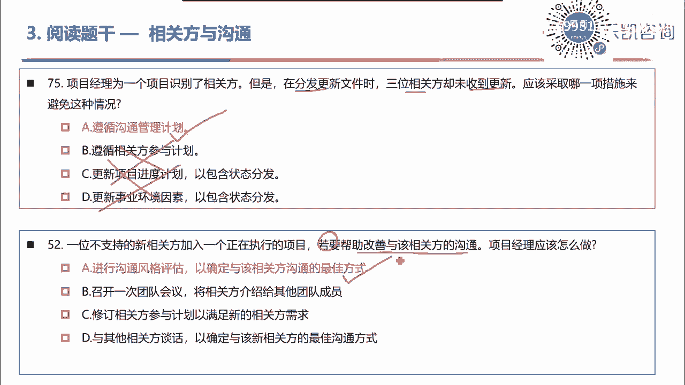

虚拟团队沟通不畅。😡，更新哪一份计划？不用说呀，沟通管理计划呀。😡，对吧好，哪些信息可能会影响到报告，这在说什么问题，沟通问题啊，肯定选沟通啊，对吧？所以说一定要注意啊。😡。

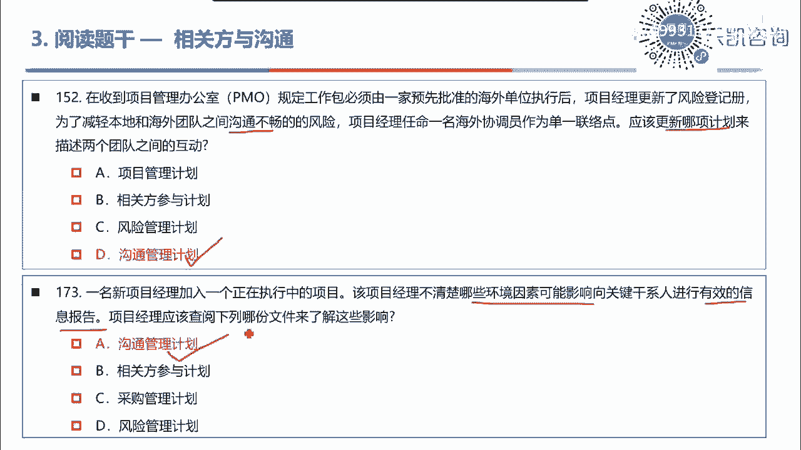

跟人有关的。😡。

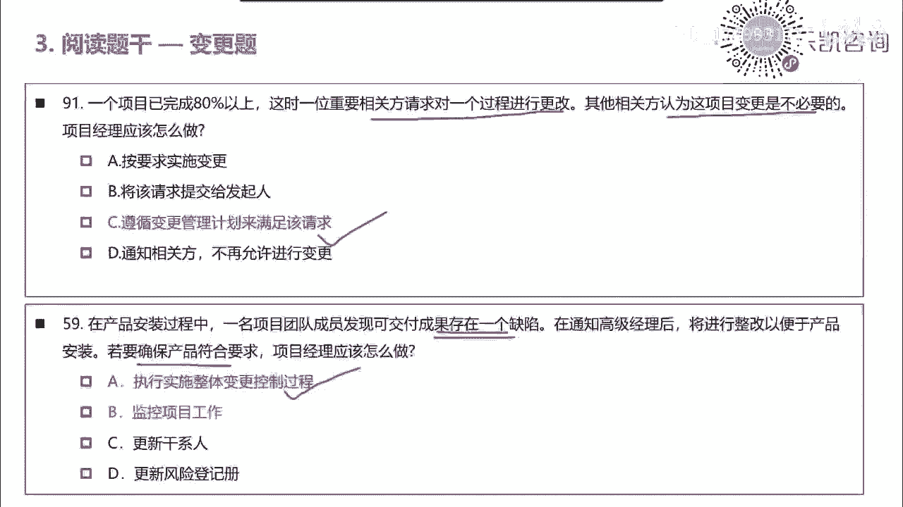

有人在搞你的才是相关方题目，信息的收发问题、交换问题，这个是沟通题目。😡，好吧，这两个不要搞混了。好，接下来还有。😡。

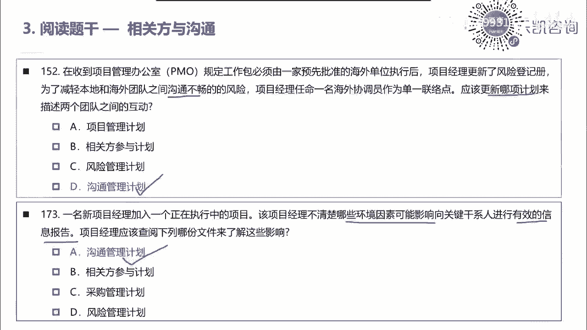

关于风险和问题。这也是我们很多人在做题的时候经常出现的一个问题，对吧？因为你会发现题目里面往往会出现问题日志、风险登记测。那么究竟是问题还是风险呢？好，首先定义要搞清楚。😡，什么叫风险？

风险是一种不确定的事件或者条件。😡，也就是说它是有概率发生的。😡，而且呢发生之后会产生积极或消极的影响。而问题是什么？问题是当前客观存在的。😡，已经对项目产生了影响，而且这个影响都是不良影响。😡。

对吧也就是说，总结来说，风险是未来可能发生。而问题强调当前客观存在。😡，对吧一个是可能发生，不一定。一个是现在已经是一个客观存在的事实了。😡，啊，为什么很多人对风险和问题很纠结？😡，马上有人。

就会问一个问题啊，已经有无数的人问了我这个问题，我不知道他们是在哪里看了一些参考资料，对吧？或者说去哪里听了一些东西。反复在问我我一个问题，他说。😡，风险发生了是不是一个问题？😡，好，我首先明确说啊。

你可以认为风险发生了，它就是一个问题，或者未知风险发生了，它更典型，跟问题差不多了。但是我要说的是什么啊？听清楚。在PMP考试当中，我们从来不说风险跟问题之间有什么联系。😡，明白吗？

也就是说我们在学习的时候，风险它就是风险，问题它就是问题。😡，因为风险有风险的流程，识别定性定量规划应对，实施应对监督风险。😡，风险有风险的这一套，问题有问题，它自己的一套，它有什么一识别问题。

2啊一定义问题。2、识别根本原因。3、生成很多的方案，4、选择一个方案。然后5、执行方案，第六步验证。也就是说风险跟问题我们不需要把它混起来，也不需要去考虑他们有什么联系。风险走的是风险管理。

问题走的是什么？问题走的是第八章的问题解决。😡，对吧它明显是考了两个方向。所以说我们为什么要去把它混起来呢？对不对？不要去混，好吧，那么什么是风险级呢？😡，风险题在大多数题目里面往往会有一些词提醒你的。

😡，比如说。可能会导致什么？这个是一个非常关键的词，对吧？😡，可能就代表还没有发生，包括项目经理在担心什么。😡，项目经理忽然意识到什么。😡，这些都是风析的一些说法。😡，对吧那么风险呢考题的方方向有两个。

一个就是。😡，当识别到一个风险怎么做？那么识别到风险，我们首先要更新风险登记测或者查阅风险登记册也行，对吧？如果没有往后选定性定量规划应对实施应对。那么如果说风险已经发生了，那怎么办？好，风险发生了。

那么已知风险就查阅风险登记册直接应对。如果要有储备，已知风险一般是应急储备，对吧？未知风险发生了怎么办？😡，现在考试未知风险的发生考的很少。😡，为什么呢？因为你会发现第六版也没有讲。😡。

那么我们补充讲了未知风险发生，一般我们要用全面措施，对吧？所谓全面就是随机应变，灵活应对。😡，那么这个时候我们可能涉及到变更，可能要用管理储备。对吧好，那么问题怎么办？问题在考试中也有几种考法。

比如说遇到一个问题，好，我就记录这个问题，这是肯定是第一步的。如果没有记录在问题日志，那么接下来一定要注意，我们首先要评估影响。然后再去执行三动一分析对吧？三动一分析不要乱用啊。

三动一分析这个方法只用在什么？只用于问题的解决。😡，当我们在解决一个问题的时候，有三个选项说我直接去解决它。还有一个选项说的是什么呢？我先识别一下根本原因，你肯定是先识别原因。😡，好吧。

所以问题跟风险它是两码事。😡，那么接下来我们也用模拟的题目来看一看，对吧？

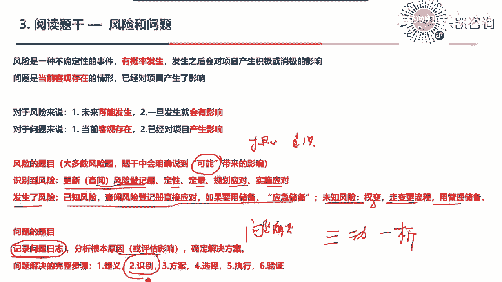

好，比如说。43题。43题就是很简单的一种题目。像这种风险题一定要会做。😡，可能会怎么怎么样。对吧。😡，这就代表了识别到一个风险。那么可能识别到一个风险，首先更新风险登记测，这种题目就是送风的。

一定要抓住的。好，再比如说94题。可能会怎么怎么样。😡，对吧啊，有的人说这个题目的答案里面不是问项目经理应该在哪份文件里面记录这个问题吗？😡，其实我觉得啊这个。😡，中文呢可能问题跟问题是一样的。

这英文呢还是多多少少有一些区别的。比如说。真正的我们说到的问题或者说问题日志，我们一般的描述是什么呢？叫。😡，一首。但有的时候呢它可能出现一个problem，我们也把它翻译成问题是吧？

这个东西呢它不能说明什么。其实它就是问你你记在什么地方，对吧？可能怎么怎么样，就代表我识别到了，或者我想到了这个东西。😡，对吧。然后接下来问你，那么你这个这种情况你应该记在什么地方？哎，他总不能问你吧。

哎，项目经理应该在哪份文件中记录这个风险。😡，这样问是不是也太直白了？刚才有人说的对吧？他也不能这么问吧，所以说遇到可能这个东西。😡，接下来基本上就是风险登记册了。对吧。嗯，这个也是比较简单的题目啊。

好，再比如说127题。😡。

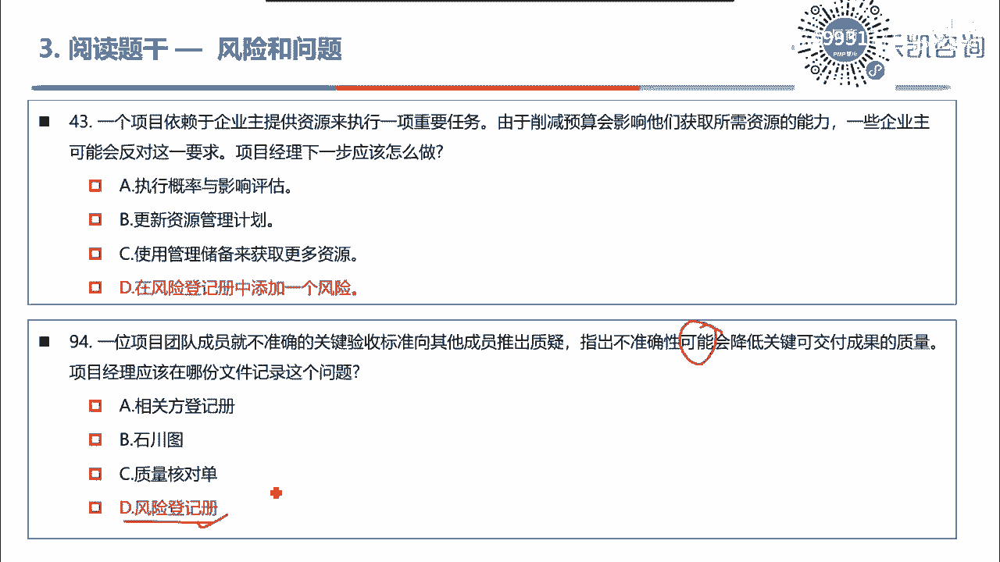

一个低概率高影响的风险发生了。那么这道题目说的是什么意思？什么叫一个低概率高影响的风险发生了？😡，既然是低概率高影响，就代表我们之前怎么样，之前一定是定性过的。😡。

对吧也就是说这个风险它一定是一个已知风险发生了。那么已知风险发生了怎么办？直接去应对呀。😡，对吧？好，包括136题，之前已经识别到这个风险，结果呢风险发生了，怎么办？直接应对啊。😡。

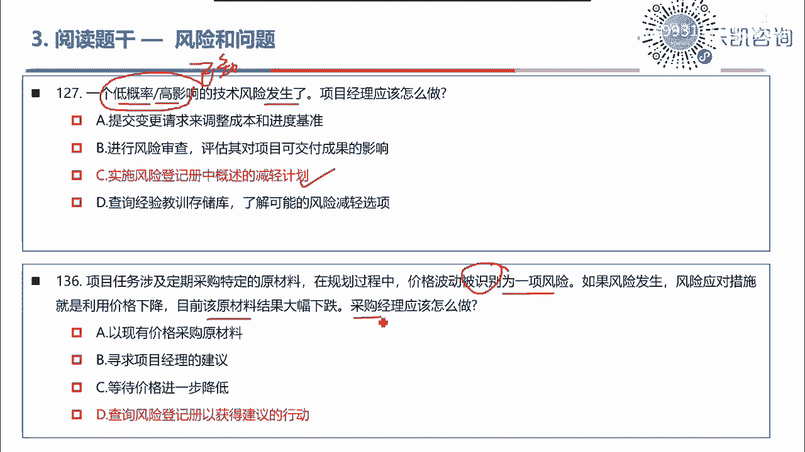

对吧好，再看46题。IT小组拒收了一个项目可交付成果，称其不符合现有过程。那么团队认为如果你对这个成果返工会导致延迟延迟，那么这个时候怎么办？好，你会发现题目的选项里面有风险，有问题，对吧？

那么你就分析好。哪个是有没有客观存在的？如果有，那么我们就要更新问题日志，有没有什么东西是现在客观存在的，确实存在的。有的什么东西呢？拒收了。😡，人家拒收了你一个可交付成果，人家说你做的有问题。😡。

那么这就是客观存在的呀，这不是可能发生的是人家现在确实就已经拒收了。😡，对吧好，那么有没有将来可能发生的呢？也有的。😡，什么东西？现在要不要返工呢？不好说，没有明确说要不要返工，对吧？但是他告诉你。

如果返工会导致项目交付延迟。😡，对吧这是一个可能会出现的返工。那么返工一旦发生，就会带来进度延期的影响。😡，对不对？所以有问题有风险。😡，这个是没有错的对吧？再比如说124题。😡，在一个矩证型组织。

项目经理注意到一个资源正在进行大量的加班工作来完成任务。好。😡，我问一下。这个是一个客观存在的事实，还是将来可能发生的风险。题目描述的就是一个客观存在的一个事情。什么事情？

一个资源在进行大量的加班来完成任务。😡，对吧那么有的人他会出现一个什么问题？有的人他会多想，当他读到这句话，自己在脑子里面就补充了另外一句话。哎呦，这样搞，有可能他妈会猝死啊。😡，问题是题目说了没有啊？

😡，题目并没有说哎一个资源正在进行大量的加班工作，这可能会导致人员的猝死。😡，有这句话吗？😡，对不对？他没有说这句话，他就是说啊我现在发现有这样一个问题。😡，这就是很多人想的。

会不会由于一个问题带来什么风险啊？题目没有说对不对？题目没有说就不要去想。😡，是吧好，他就问你，你现在注意到这样一个事情，下一步应该怎么办？其实这道题目是不该错的。你看一个说把问题上报。

一个说把问题记在问题日志。一个说更资源集体去讨论这个问题，对吧？只有最后一个说把这个信息更新到风险。好，我问一下，如果你要选D。😡，将该信息更新到风险登记册。请问这个D里面的该信息是指什么信息？😡。

D选项把该信息更新到风险的预测，是指什么信息？😡，大量的加班这个信息。对吧那么这个时候你就忽然要想到哎。😡，这个大量的加班这个信息更新到风险登记社，这好像有点不太对吧？因为这个大量的加班。

这是一个问题啊，它不是一个风险啊，对吧？你说能更新什么题目一共他妈就两句话，只有最后一句话问你，你下一步应该怎么办？这句话没有什么含义的，对吧？就第一句话有点用，你更新什么？😡，对不对？

这肯定是一个客观事实啊。所以这个时候你要更新什么更新问题日志，这一定是第一步，对吧？好，还有人出现一个情况说，那么我B和C在纠结我是更新到问题日志还是跟资源经理去讨论。好，那么我问一下。😡。

问题解决的步骤里面是先记录问题，还是先跟别人讨论方案。😡，或者跟别人去识别原因。😡，哪个在前面？对不对？🤧B和C实际上是最不需要纠结的。因为遇到问题，我们先不谈什么讨论原因也好，还是讨论解决方案也好。

这都是后面的。首先第一步肯定是记录在问题日志，然后再去识别根本原因，生成很多的方案，然后再选择方案执行方案验证方案。😡，对吧。所以记住我的一句话，一旦你发现题目中在描述一个问题。第一步。

先把它更新到问题日志。你要做任何事情，把它更新进去再说。对吧所以这种问题跟风险，我希望大家一定要搞清楚哪个是客观存在的对吧？问题是客观存在的，风险它是将来可能发生的。好吧。

那么这些题目其实已经包括了PMP考试中大量的大部分题目变更是一个大头。

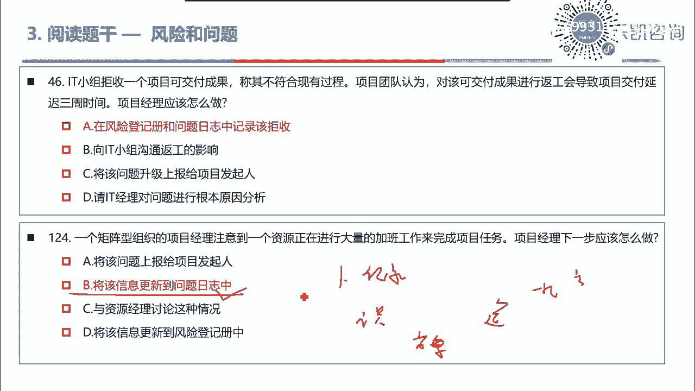

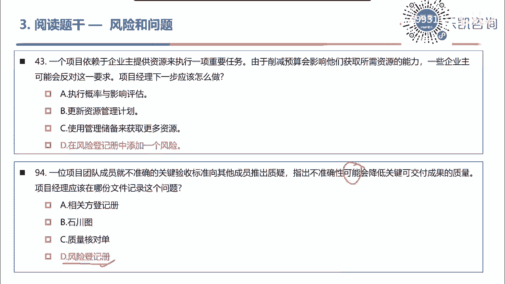

对吧相关方沟通也是一个大头。😡，然后风险和问题又是一个大头，再加上前面的送分题，基本上200道题里面大部分题目都在这里面了。😡。

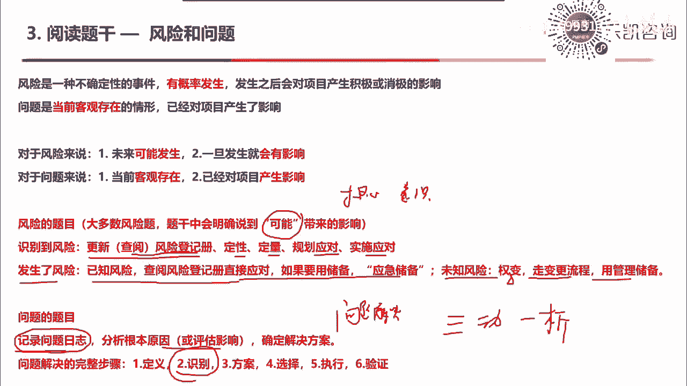

那么还有一些题目怎么办？😡，啊，有一些题目看不出考点，那怎么办呢？好，注意第四种。定位过程。那么定位过程怎么去定位？😡，这道题目在说哪一个知识领域，哪一个过程。对吧他问的是输入工具还是输出？

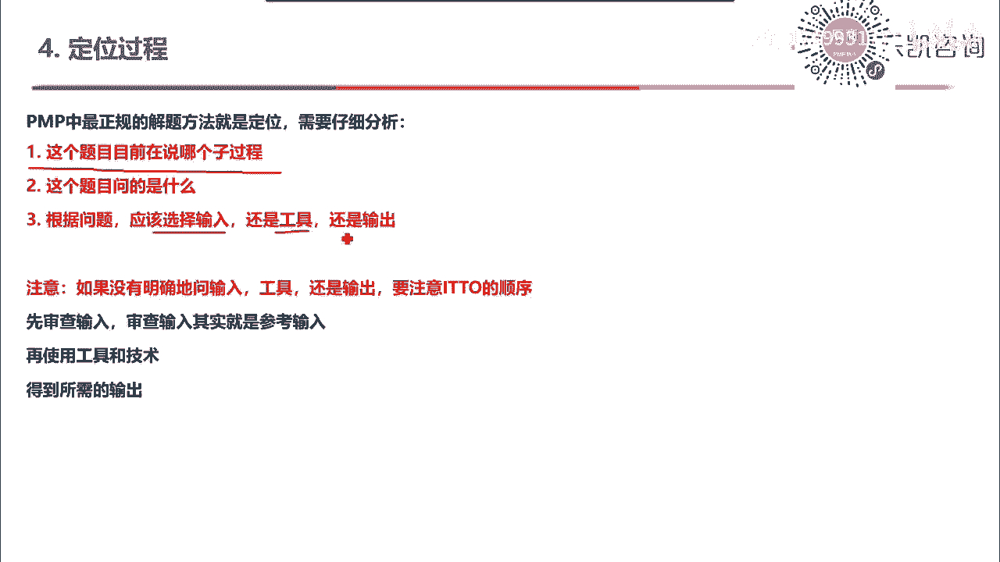

我先定位一下，比如说44题，当然这个题目很简单。😡，哪一个过程制定项目章程。😡，制定项目章程下一步做什么？他人家告诉你书步有了，接下来考什么输出嘛。😡，对不对？159题。用什么来编写报告，要写什么报告。

好，质量报告和工作绩效报告，用什么来编写扫引选项肯定是不能输入。😡，质量报告是管理质量的过程。那么它的输入有什么？它的输入有质量控制测量结果，当然也有质量测量指标，对吧？那么工作绩效报告的输入是什么？

工作绩效报告的输入是工作绩效信息，这个是很明显的呀，对吧？直接把它选出来。😡。

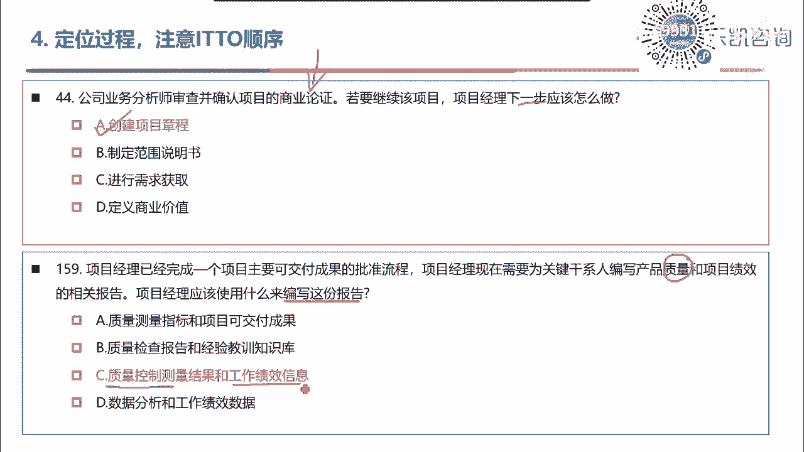

是吧像这种题目要做是可以做的。😡。

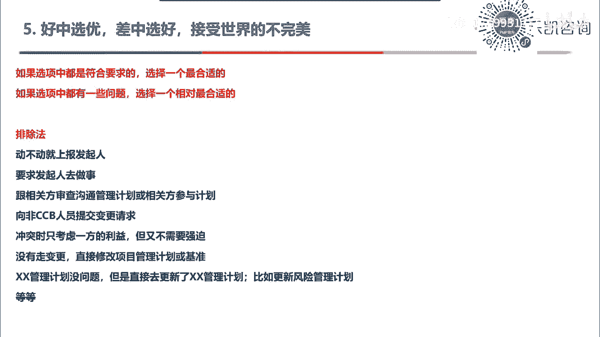

有人说做这个题目用这种方法是可以，但是要熟悉ITTO啊。好，我问一下。😡，难道这些重要的ITTO到现在我们还不熟吗？你没发现考试考你考ITTO他不会考那些边边角角的。😡，对吧。他要考的都是一些很典型的。

你想都能想得到的，在它概念里面就会出现的。比如说指导与管理项目工作，它的输入有两个重要的，你不应该记住吗？😡，什么叫指导与管理项目工作？😡，按照计划去执行。包括有批准的变更，我们要去做批准的变更。

对吧你至少这两个要记住吧。好，我要做一份工作绩效报告，监控项目工作这个过程，输入跟输出记不住吗？😡，把信息整合成报告，它输入一定有工作绩效信息。对不对？好，再问一下定义活动有什么输入？😡。

定义活动是把工作包分解成活动的一个过程，它的输入一定有范围基准。对不对？好，创建WBS有什么输入？创建WBS是把可交付成果分解成工作包的一个过程，它的输入一定有范围说明书，像这些。😡。

对吧我在开课的时候就强调了每一个过程它是干什么的，一定要记住。因为他是干什么？他的这个定义就已经明确告诉你什么东西的哪一些输入是非常重要的输入。😡，至于说其他输入。😡，你要记得干嘛？我也记不住啊。😡。

考试考到了怎么办？考到了大家都得玩完，对不对？考到这种很冷门的输入，大家心里面都会问候出题人的家人。😡，没有什么意义的。😡，对吧所以这个东西不要去考虑它考的一定是。😡，比较常见的这个东西。好。

最后我还有第五点要说一下。

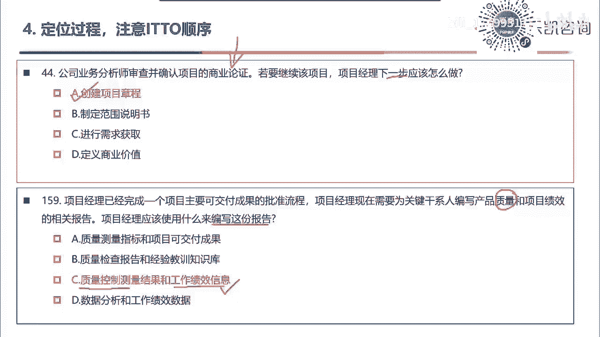

Okay。除了这些题目以外，还有一些纠结题。😡，这些纠结级的特点是什么？😡，特点是看不出明确的考点，做的不舒服。😡，或者题目的选项呢存在一些问题。那么这个时候我们怎么办？大家一定要记住这句话叫好中选优。

😡，就大家都还可以，我选择一个比较全面一点的。对吧再比如说差中选好，大家都不怎么样，选一个稍微呢可以的对吧？我经常跟我以前的这个我以前做项目的时候，经常跟团队学员说，我们要接受这个世界的不完美。😡。

对吧选项里面都是符合要求的，选一个最合适的都有问题的，选一个相对合适的。你可以有一些排除法，比如说常见的排除法有哪些，不要他妈动不动就早发起人。😡，对不对发起人是你的干爹对吧？是我干爹，没有错。

我是项目经理，发起人是我干爹。但是记住一句话，我们现在长大了，不要他妈什么事都去问爸爸。😡，项目经理要积极主动什么时候去找干爹。😡，要么。😡，项目经理确实已经无能为力了。😡，对吧题目中明确说了啊。

项目经理无论怎么样精心去处理，都是解决不了，无能为力。要么它明显超出了项目经理的层面。比如说涉及到需要问题升级的，确实要问题升级了，否则不要动不动，这里也找发起人，没钱了，找发起人，没时间了，找发起人。

对吧？什么都找发起人。😡，特别是变更，很多人还在问，哎，能不能找发起人，你发现在考试当中出现的题目里面有多少是不找CCB的，几乎是没有的，对吧？所以我说你们在外面看的一些资料说，哎呀，变更的流程很复杂。

如果影响基准怎么样？如果不影响基准怎么样，没有必要这么复杂，对吧？变更就是找CCB在考试中题目变更一定是加一个功能啊，额外的需求啊，有那种不影响基准的变更出错来让你做吗？不会的呀，对吧？

发起人不要去找更不要要求发起人去做事儿。😡，好，再比如说。😡，跟相关方去一起审查沟通管理计划或相关方参与计划。或者呢他说的更加离谱，要求相关方遵守沟通管理计划。那么这种选项一定要注意它有很大的问题。😡。

为什么说他有很大的问题？😡，因为我们说沟通管理计划是量身定制的。我们要做沟通需求分析，沟通风格评估，你怎么能要求相关方来遵守一个所谓的沟通管理计划呢？😡，对吧包括相关方参与计划。

怎么样去引导他们参与的一些策略，这些策略是有敏感性的。😡，是吧怎么能跟他们去？😡，看跟相关方去看啊，我打算用什么策略来搞你。😡，是吧好，再比如说向非CCB人员提交变更请求。比如说向客户提交变更。

向发起人提交变更，这种选项十有八九都是错的。😡，对吧比如说冲突。😡，在不需要强迫的时候啊，只考虑一方啊，比如说没有走变更，直接改项目管理计划。那么关于这一点我要说一下啊。😡，当选项中四个选项。

有一个选项出现了要走变更流程。啊。这就意味着这道题目它肯定要考察要不要走流程。但是如果说有4个选项，它都没有说变更的事儿，它就不是问题变更。比如说刚刚就有人问了一个问题，我说。

当发现信息多发少发迟发怎么办？有可能选项就是更新沟通管理计划。好，马上有人就会问更新沟通管理计划要不要走变更。好，明确告诉你，项目管理计划的子计划的修改肯定是需要走变更的。对吧。

但是你会发现这种题目它的选项里面有一般会不会出现走变更流程这个选项，它一般不会的，它的选项一般是什么选项？有一个选项再说更新沟通管理计划，其他选项就是请他开会发会议纪要怎么怎么样，对吧？

他就没有提到变更的事儿。😡，对不对？所以他考察的方向，他就不是在考察变更题。他就问你你怎么去解决这个问题而已。😡，是吧但是如果选项里面出现了，有的走变更，有的不走变更，很有可能要注意啊，它强调流程的事。

好吧，啊，比如说最典型的排除的选项是什么？😡，更新风险管理计划。这是很多人对吧？不断吃亏，不断的上当，对吧？这么渣的一个渣男。😡，对吧他都已经骗了你这么多次了，你看不出来吗？😡。

还要去更新风险管理计划吗？😡，对吧还要去更新范围管理计划吗？像这种管理计划都是一个指南型的文件。😡，对不对？你要去更新它干啥？😡，反复错反复错反复错，从每日一练错到周练习，错到单元测试到模拟还在错。

对吧？这个不行了，它是一个。我一直在说，这种选项出现的意义是什么？这种选项出现的意义就是让你排除的。😡，对吧。就像我们说的渣男存在的意义是什么？存在意义嘛？你最多嘛吃一次亏嘛就行了，对吧？你被他反复骗。

像傻子一样被他玩，这个就不行了。好吧，这种选项我希望大家在模拟二的时候能够尽早排除掉，尽早排除掉。好，那么这些东西是不得已的方法。😡，PP考试的时候是有这种题目的。有的题目其实考点是不明确的。

他有可能考一些什么呢？跟职业道德有关的。对吧啊，比如说考虑什么其他的一些方面的，这个东西看不出考点的，那么怎么办？你只能去排除排除。😡，好吧，好，那么刚刚有人一直在问，什么叫冲突？只考虑一方面的理。

但又不需要强迫。你们模拟不是做过这种题目吗？😡，好，什么相关方之间意见不一致。好，选项里面说的是什么？只考虑哪一方的意见，只重视哪一方的意见，对吧？有一个选项是说啊我要跟相关方一起去协调。😡，对吧。

有没有遇到这种题目，说只考虑哪一方的意见，只考虑哪一方面意见。那道题目，我说你不看题干，你都能选得出来的。😡，是吧。所以说像这种题目啊，能排除的就把它排除掉。好吧。好，比如说。😡。

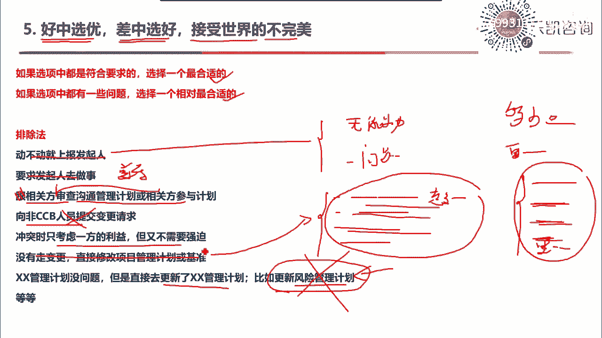

模拟一的第五题就是很典型的这种题目。这道题目比较好的选项是低于预算。😡，超前于进度。对吧但是没有这个选项，但是没有这个选项怎么办呢？你只能选一个差中选好的。😡，这个比较接近，其他的都不对，对吧？

什么超出预算，这个肯定不对的，落后于进度也不对的。那么一个C是说的两个都符合，一个呢还说了超前于进度。那么相对来说嘛，A码更加好一些了。😡，对吧好，接下来请大家看下面这道题。这道题不是模拟一里面的题目。

大家看一下这道题目选什么。

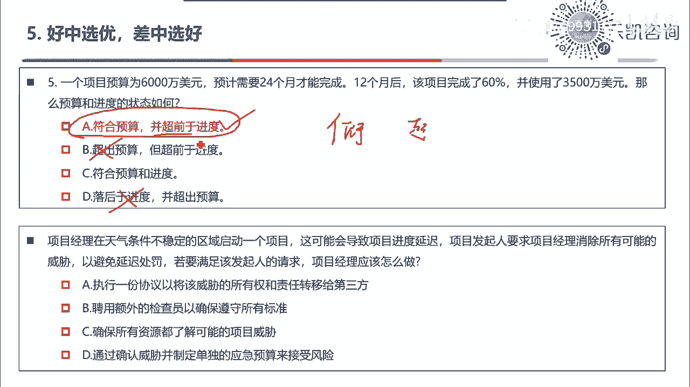

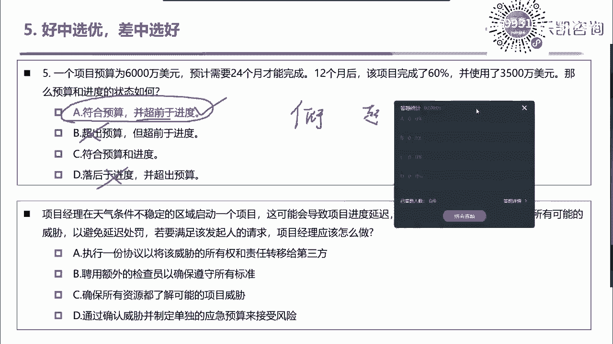

看一下这道题啊，我们用这道题来结束今天的解题思路的讲解。对吧讲了很多了。那么这一种呢就是我感觉就是四科学院都不太好的。那么你只能在其中选择一个，你选哪一个？🤧好，已经有1600个人左右回答这个问题是吧？

那么接下来我说一下啊。难道这一道题目？😡，当年我拿到我也很头疼。他说，项目经理在天气条件不稳定的区域启中一个项目。😡。

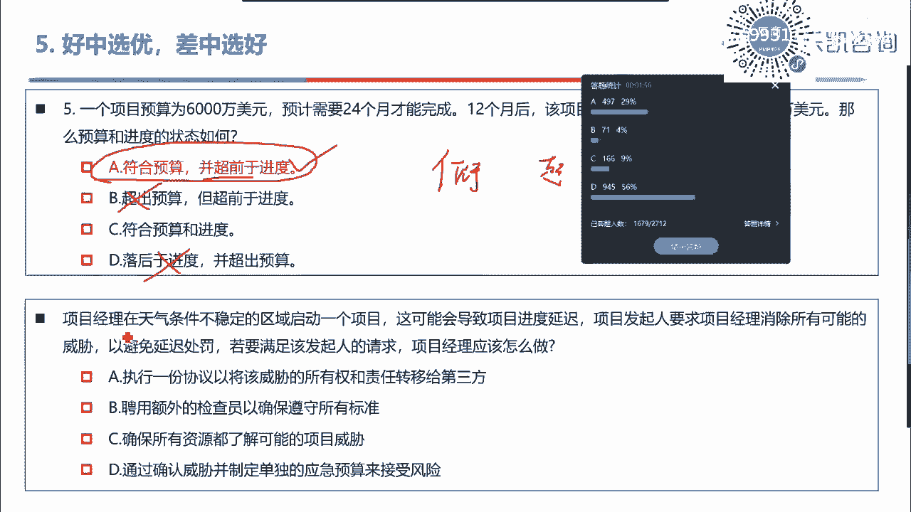

这可能会导致进度延迟，这是一个风险，对吧？风险的事件是，这个地区的天气条件不稳定，那么有可能会造成什么影响，进度延迟。那么发起人要求项目经理要消除所有可能的威胁，以避免延期处罚。好，他说的是什么？

消除所有可能的威胁。他要的是什么呢？规避。😡，对吧好，以避免延期处罚。若要满足发行人的请求，项目就应该怎么做？😡，看到题目其实还是大概能看得出来的对吧？好，AA做的是什么呢？转移。😡，做这个策略。B呢。

😡，说实话啊，之前有人在群里面发了这道题目，说是别的机构给的这道题，它的解析是B是减轻检查和测试。但其实说实话B不是减轻。😡，为什么说B不是减轻呢？😡，第一，他们有强调更多的测试。第二个，天气不稳定。

跟你检查有啥关系啊？😡，对吧其实B是没什么意义的，他对这个风险并没有去做过一些什么很有效的主动管理。😡，对不对？其实B呢我不认为它是一个有效的手段。😡，然后C。😡，啊，有人说额外的检查员对吧？

更多的检查员，那么检查跟天气有啥关系呢？跟这个风险有啥关系呢？没什么关系，然后C也是一样的，确保所有的资源都了解可能的威胁。但是要求是什么？要你消除所有的威胁。C呢也没有什么。😡，用处的。

然后D再说什么，D再说接受。😡，他说的很明确，接受风险。那么问题来了。你会发现刚刚很多人的选择啊，大家应该看到我发的这个答题卡，答题卡里面。😡，大部分人集中在什么地方就集中在A和D。😡，也就是说。

其实大部分人分析这个题目是能够分析出来，基本能做到二选一的对吧？那么接下来A和D选哪一个？😡，只能选择A。为什么啊？第一个。😡，接受不管是主动接受还是被动接受，它相对来说都是一种被动的做法。😡。

他没有去主动处理。😡，对吧转移呢它还是一个主动的策略，我还去买了一个保险。😡，这第一个。第二个，注意这句话，消除威胁的目的是为了什么？消除目的消除威胁的目的是以避免延迟处罚。😡，对吧。

那么哎我把这个应对威胁的责任转移给第三方，从某种程度上来说，让第三方来帮我承担这个处罚。对吧只能往这上面去靠一靠，相对来说A比D呢要好一些，要好一些，对吧？那么这道题目我想说的是什么？第一。

大家要注意啊。😡，我们不能由于一道很烂的题目。我们不能由于一道很烂的题目来得到一个错误的结论。比如说有人看到这道题目啊，转移也能规避风险，这个想法是错的。我们偏僻面明确说了，转移并不能消除威胁。

只是把威胁它的责任它的影响和责任转移给第三方。😡，对は。这个还是要清楚的。第二个，你要学会在这种选项里面去选择哪一个去选择哪一个好吧，那么为什么会出现这种情况呢？这是由于偏僻它的一个原则导致的。

偏僻考试有一个什么原则？讲课的人不出题。出题的人不讲课。对吧就讲课的人是不允许参与出题的，而出题的人呢，他又不能讲课。然后他就从全国全球各地收集一些案例，从案例里面拿出来形成一个题目。

所以你会发现我们现在偏批考试的题目都是什么题目，都是情景题。那么难免有一些什么呢？题目是不严谨的。对吧那么遇到这种题目你怎么办呢？你只能这么办。😡，你只能这么办。尽量的去选一个稍微正确一点的。

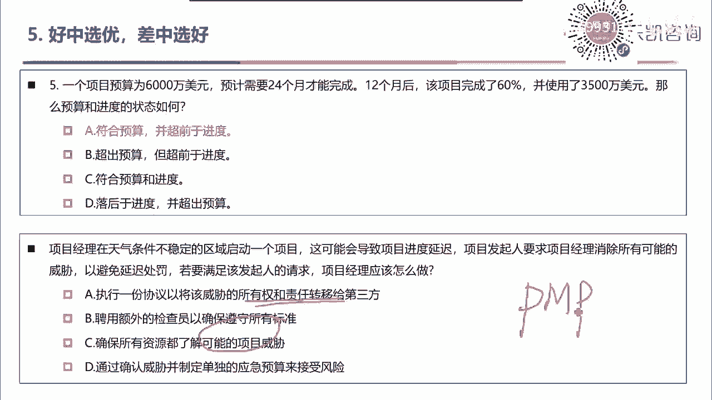

好吧，那么今天呢我们就讲这么多，好吧，我希望大家啊做两件事儿。第一个事情。😡。

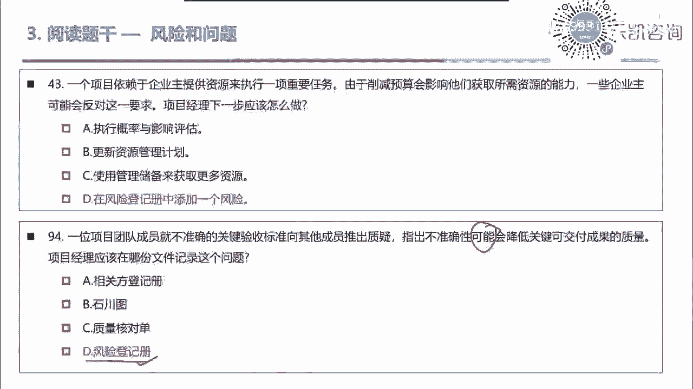

基础的点不熟的，一定要把基础的点搞熟，对吧？搞熟基础的点从哪个地方去搞。😡。

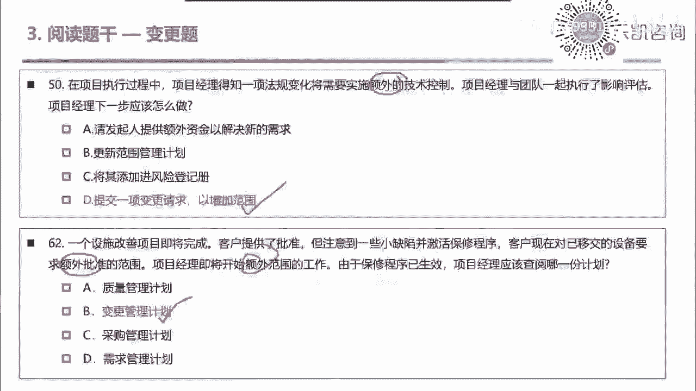

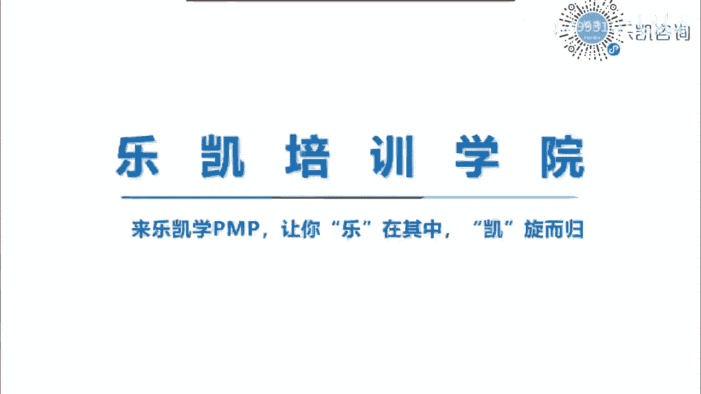

最好的方法现在就是什么呢？你课如果没上啊。😡，有很多人加我的好友，我都不知道怎么回复他。到现在，比如说我课还没还没听完，我还有好几张没听，那怎么办呢？😡，那么你赶紧把没听的课先听一听，先有个印象，对吧？

赶紧听听完之后，喜马拉雅。😡，有100分钟的全书串讲。100分钟里面重要的东西。都包含进去了。这是题目没听完的，赶紧听对吧？赶紧听完了之后，反复听这100分钟的IDT呃，100分钟的这个全书唱卷。😡。

赶紧听。然后接下来。😡，基础的知识点如果掌握到比较好的。😡，一定要看那些错题，特别是那些不该错的题目，你为什么做错了，对吧？然后这个解题思路。

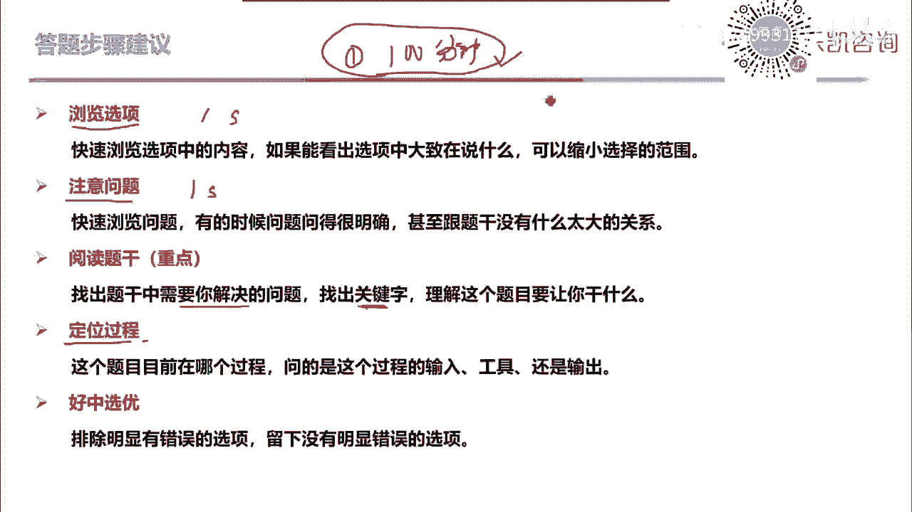

特别是这个解题思路里面的这些部分。比如说关于变更的总结，关于这个风险和问题相关防和沟通，这些都是考试中的大头啊，这些东西一定要去看一看的。

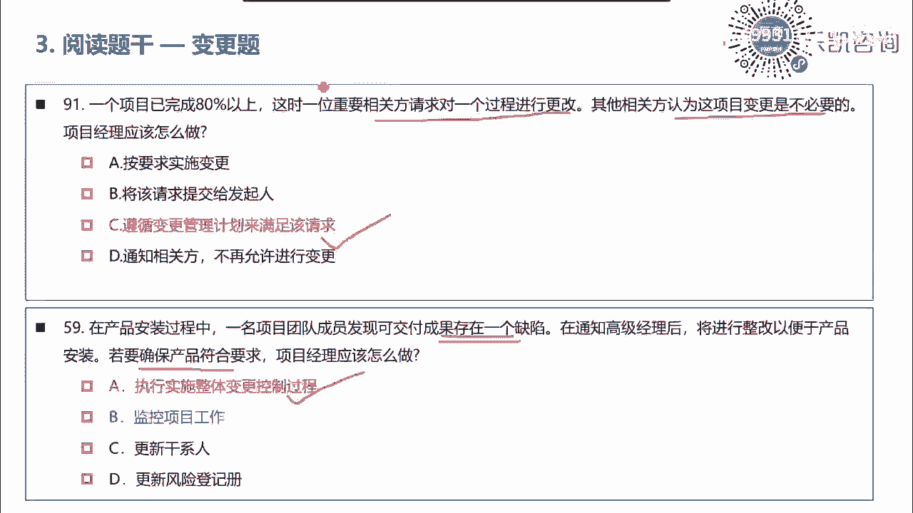

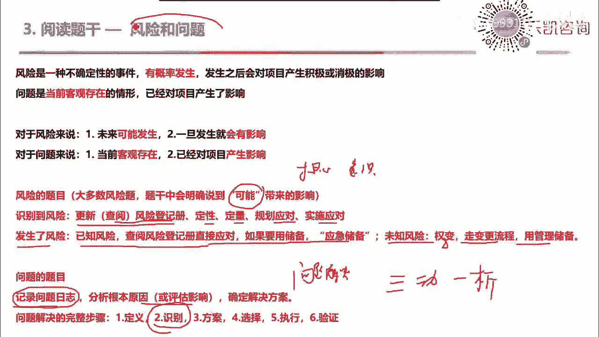

好吧，那么我希望大家呢在在这几天再好好的巩固一下，包括解题思路熟悉一下。然后星期六我们有模拟二。

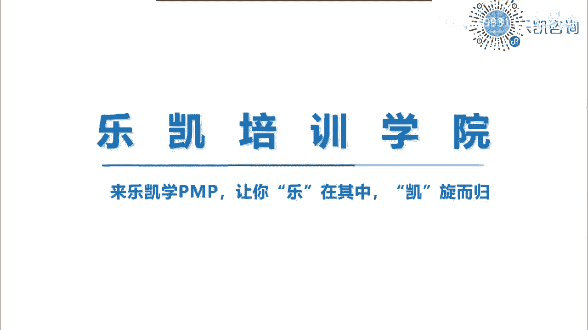

模拟二再看一下大家的成绩。看看有没有人有没有一些人能够有一些提高。好吧，那么明天晚上呢我们会把敏捷的内容讲一讲。那么PMP里面在没有改考纲之前，敏捷的内容不是太多。

我们把考试中常见的一些敏捷的东西会讲一讲的。好吧，明天晚上我们讲一下敏捷。那么星期五你们自行复习一下，星期六。可以做题了。好吧，那么模拟题我们会提前发的。😡，一般星期四的晚上，星期四。

也就是明天讲完敏捷之后，晚上我们会把它开放出来。好吧，如果星期六实在有事了，那么你要么星期五把它做掉，或者星期六晚上把它做掉。😡，好吧，那么面授班星期六浦东还是在浦东啊，除了普通班以外，其他所有的班级。

😡，都有同一都有一个地方。三四百个人同一个地方考试，面授班考试完全按照偏僻考试的。场疾好吧。纸笔橡皮。我们都有的PMP考试。文具都发的。包括发一瓶水给你。对吧时间也是考试的时间，早晨9点钟到。

然后你突达题卡，好吧，那么网络班自己一定要。也是按照这个时间来4个小时啊。另外我友情提示一下。有很多人说我做一题涂一题，这个方法是不好的。啊，真正考试应该是做五十道题涂一下。再做5十道题，再涂一下。

不要做一道图一道，做一道图一道，就是你要连连搞200道，这个是很累的。你做五十道题。然后去涂有什么好处？第一个涂50道题目是需要一些时间的。你在涂的时候，你的头脑可以稍微休息一下。对吧你做一道涂一道。

连涂200道，连做200道，你的脑子要晕的。😡，做五十道涂一下。😡，休息休息，顺便看一眼时间做一个参数估算，对吧？50道题涂完哎，用了多长时间，一个小时以内，那么基本上差不多超过一个小时。

那么后面你要抓紧。对吧我的建议就是5十道题图一下，5十道题图一下。好吧。好，那么其他的话不多说了啊，大家好好复习一下，你们模拟二的时候看一看啊，看一看成绩怎么样。明天我们敏捷还是会讲的啊。

敏捷还是会讲的，好吧？好，不耽误大家时间了啊，大家这个。😊，该休息的休息啊，该复习的复习。好吧，这个文档我会放到钉盘里面去的，会放到钉盘里面的。好，今天就先到这里啊。其他考试的注意事项。

我们考前会跟你讲的什么能带，什么不能带，现在不要去关心，好吧，考前我会跟你们讲考试注意事项的，先这样啊，拜拜。😡。

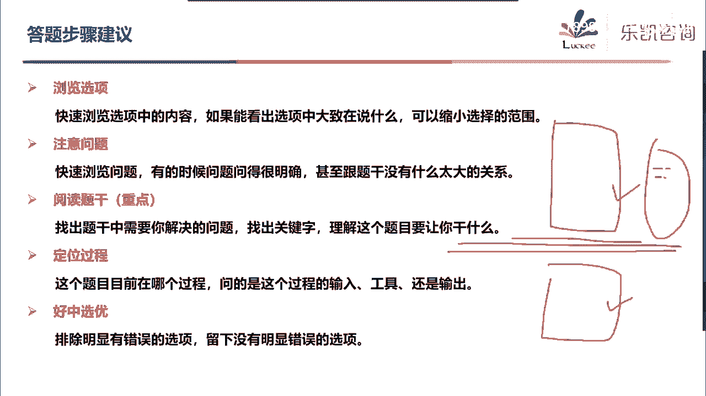