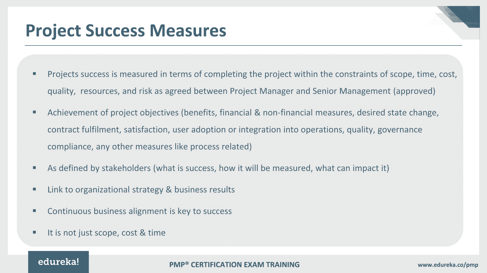
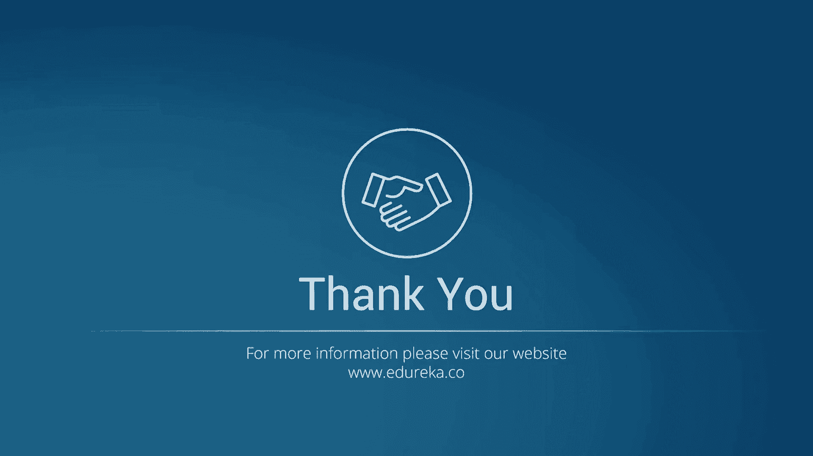
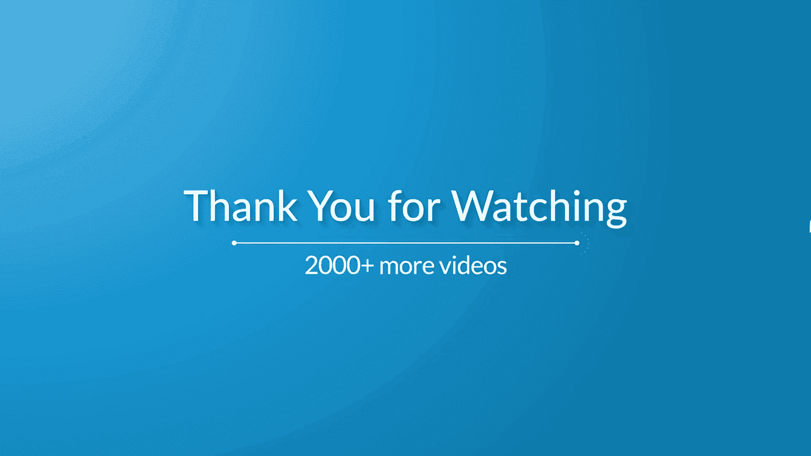
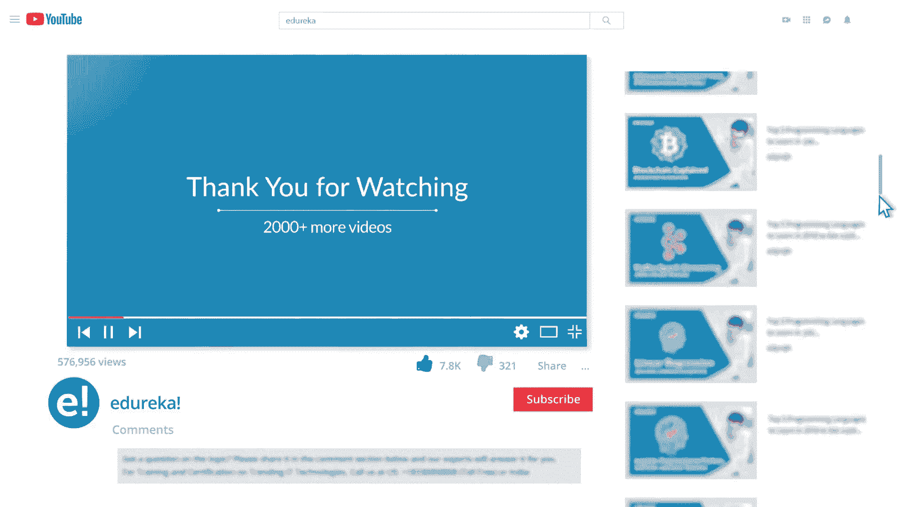
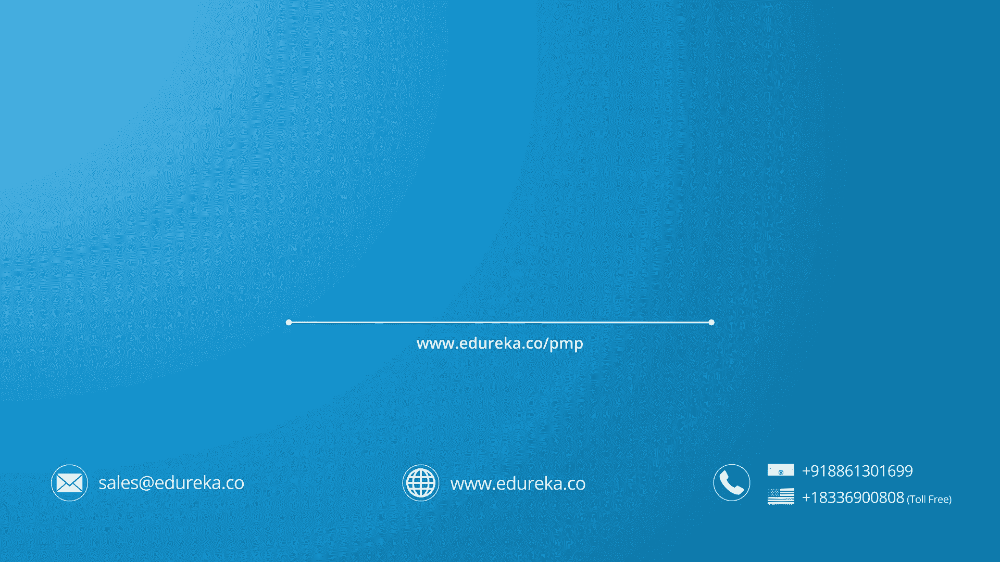

# PMP® Project Management Training - P2：PMP® Training Video - 2 - patwl - BV1m441177DS

Hello everybody and I welcome you all to the PMP certificationert trainingining program。

Alright so now let's move on to the next topic which is about understanding the types of development cycles now I'm sure some of you may have already read about these life cycles some of you may have work on different life cycles so we'll just touch upon all these different types of life cycles and I'll also try to give you some generic examples and we try to also take some specific examples so you may have come across various life cycles like predictive life cycle or adaptive life cycle and in fact there are a combinations so sometimes predictive and adaptive way of working is combined and then it becomes a hybrid life cycle apart from that we also built in a iterative way and incremental way so we have iterative and incremental life cycles as well so let's start with the predictive life cycle typically what happens in a predictive life cycle now youll agree that the best example of predictive life cycle is waterfall because in waterfall life cycle what。

Happens is that we do upfront planning and waterfall lifecycle as you may be aware already and you may have worked on waterfall way while working on software projects specifically and if in case you are not working in software projects then also in the traditional way of working typically we always do the upfront planning so we spend good amount of time in gathering requirements in defining the scope upfront and based on that scope that we have defined we come up with the schedule how much time this project would take to complete and accordingly we also derive the cost that is required to complete a project so that means all these activities we do upffront and therefore it's a predictive way of working so the best example is the waterfall lifecycle where we do upfront planning and then we have these different phases through which we actually go through in order to build that software product so there are various phases that we talk about as a part of waterfall lifecycle like starting with we initiate。

projectject then we spend good amount of time in gathering requirements then we do analysis of those requirements and based on the analysis we start working on design part and on design again we create highle design lowle design etc and then we start actually built activities and then we test the software and then it is deployed for use so that means all these activities are actually plan well in advance because we create a front document for requirements specifications similarly based on that we do a front analysis and planning etc So it's absolutely a predictive way of working or developing their software product and therefore it's predictive lifecycle water for lifecycle the another type of lifecycle that we can talk about is adaptive lifecycle so this is going to be definitely different than the predictive way of working so here the detailed scope is defined but that's defined typically for a particular。

Iteration now this iteration is nothing but a specific duration that we are talking about。

 The duration of iteration could be anywhere between one to four weeks so you may define that in the beginning of your project itself So let's say in your project you all agreed as a team that you would like to have iteration duration of two weeks So what you will do essentially is that in adaptive lifecycl you will define the scope of the product that you're building for that two weeks So whatever that you think you could complete within two weeks you identify that as a scope and then you agreed to that so that means you build those features within two weeks in the iteration that is agreed upon and again the next iteration you will pick up next set requirements or features So by this way you will actually go on building the software now the advantage over here is that we have got multiple feedback cycles because by the end of every iteration we go back to the customer and ask know what is good in it。

Could be improved etc so that means we get to adapt as per the requirements or as per the changes that are given by the customers and therefore this is change drivenn lifecycle or adaptive lifecycle and this is typically used even on the agile project as well there is also a hybrid way of wherein we do a bit of afrontent planning and we also respond to the changes that are coming on the project so it's a combination of predictive lifecycl wherein we are doing bit of a planning maybe for if it is one year project then you are doing bit of planning for three months and then you are also building iteratively incrementally at the same time we are showing the demo to the customer taking feedback and then building or responding to the changes that are suggested by the customers in the upcoming iteration so this way what is happening essentially is that you are not only doing the upfront planning but also youre responding to the changes or suggestions given by the customer so this is truly a hybrid way of working。

Therefore， it's a hybrid lifecycle Now one of the example of hybrid lifecycle could be framework know or disciplined agile is one of the way wherein it actually covers about bit of a predictive planning at the same time。

 we also adapt to the changes that are shared by the customer so that could be one of the example of the frameworks or the lifecycle point of view。

 the disciplined agile Now moving on to the next two lifecycls first is iterative out of those two the iterative lifecycle again here also as far as a project scope is concerned we determine the project scope early in the project lifecycle itself and what typically happens in iterative lifecycle is that we have this iterations So development happens within the iterations and then we go on building the product in chunks small chunks we pick up a small chunk of the product we build that in iteration and again we move on to the next iteration again we build the next set of features So this is how we kind of go on built。

Over the increments that are produced out of this iteration in a successive fashion incrementally when we work in an incremental lifecycl。

 what happens is basically again deliverables here are produced through series of iteration so in both the cases youll find one thing common is iterations So iterative lifecycl we built it in cycles however in incremental lifecycle we built on the previous chunk or we built on the previous incremental of the product so of course we'll take an example probably I think I should take it to this example is very nicely explained the iterative and incremental way of working and how we combine these ways of working when we start working in an agile way so I came across this blog and I found this very useful and this blog which is written by Stephen Thompson and heres nicely explained about iterative and incremental way of working so for example。

 if you have to paint Mona Lisaa picture in an incremental way if you go so typically what happens。

Incremental as we just saw we built it in small chunk so you just pick up a small chunk。

 which is in this case， let's say just a phase and then you paint it in this iteration alright so if there are three iterations out of these three iterations you have basically painted just a phase then on the top of that now this is my first increment that I produced out of this iteration now in the second iteration I'm going to build on that increment and then I'll extend the picture alright and in the third iteration I will build on my previous increment that Ive created and this is how I complete the picture so in the third iteration I build the remaining part of the picture so this is how I actually go on built on the previous increment that I have created and inly I complete if it is a software product then you just go on building the features or depending on the kind of product that you're working on So this is incremental way of working Now what happens in iterations again afront you。

Have decided that you will be building this picture in three iterations and then one by one you just go on enhancing in each and every iteration so maybe in the first iteration。

 you have just created a highlevel architecture and design in the second iteration you sort of try to start working on few features and then you again enhance those features as you move ahead in the third iteration so in iterative way we built it cyclically okay and then we just go on of course we go on getting the feedback and then we go on improving upon that as well so that's how within this three iteration in an iterative way I could complete this picture as well So just by changing the approach the way you work changes definitely drastically and when you combine both these approaches then I think this is the best way I would say because this is what we do in agile in agile we built incrementally and iteratively and therefore the biggest advantage is that at a particular iteration we can also think of deploying that product in production。

Or maybe we can start using those features as well so as you can now see in an incremental and iterative way。

 we not only are talking about the features that we would like to focus on but also we are also considering the highleve design and the architecture and then from there I have started at the same time I have also built certain features in the first iteration in the second iteration again I'm going to built on the increment that I've created at the same time I am also able to prove my target level architecture early during this lifecycl which certainly helps me which gives me better confidence when I move ahead through this iterations in the third iteration if you see actually Im even better in terms of my design and architecture overall at the same time I could complete my feature as well suppose if tomorrow I decide to put this just a face paint things then I should be able to even do that because that is ready so this is how I go on just building it in iterative and incremental way。

And with continuous feedback it's going to only help me in responding to the changes that are coming through the customers or the stakeholders so this is our incremental and iterative way of working helps so if you see the predictive lifecycl if you just remove at this point in time then rest of this lifecycl youll find we definitely use it in a way adapt you hybrid incremental iterative and some part of predictive also we use as I mentioned especially when we work in an hybrid way so this is about the development lifecycls now were moving to the next topic which is about phase gate now if you see phase gate。

 what is a phase gate we typically work in phases we are talking about a project so project will happen through various phases of the project phases and as a part of the phase gate what typically happens is that the project performance is always compared with what's documented in various project documents you will come across documents like business case or。

Project Charter， the project management plan or benefits management plan。

 and we created certain things there。 We may have put up milestones of the project over there or we may have put up how the benefits would be realized on this project once we deploy it in production once my customer started or start using it so I need to then compare the performance of the project with what is mentioned in these documents So as a part of the phase that's what I do typically and these things actually helps me in taking certain decisions of course take the example but for now what well do is that let's take a quick example of project charter or project management plan so you may have put up there as a part of the project management plan that you would be completing your requirements gathering the start date and the end date and what you will get as an output is requirements specification document so this is what you have agreed as a part of your project management plan under scope management activities so when you proceed。

On the project we look back and check as a part of the project performance。

 whether we completed the requirement phase or not and when we completed the requirement phase。

 whether my requirement specification document has it been created has it been approved by the stakeholder or not and based on the overall progress then we make certain decisions like for example whether to continue to the next phase so if in case depending upon again in which phase you' are working so if it is a feasibility phase that you are at so you just identified some project idea and then you started working on it and you are doing the feasibility。

 whether can we convert this idea into some product which we can then set it in the market so at the feasibility stage itself you've realized that this can be materialized maybe because of certain reasons so then you may decide to not to continue ahead of it right so these decisions are taken based on the phase gates another decision could be continued to the next phase so if your idea is going to work if it is feasible to be implemented then you might。

Just work on a business case and you just start working on a project so you've just decided that let's just continue working on it and let's move on to the next phase where we actually create a business case and the benefits management plan and then the sponsor will create that and then we' hand it over to the project manager who will then work on the project charter or sometimes this could be to end the project so at the middle of the project at times if the business objective itself has changed then at times it could also be decided to end the project then and there itself so for example there was some regulation due to which we started working on a project however we realize that that regulation itself is no more now valid and we don't need to now work on any changes which were triggered as a part of that regulation or maybe the compliance activity so we could just end the project then and there itself or we could just remain in the phase and we could extend it so if you are in requirements and if you're behind the schedule or if you're not。

Able to achieve what you have put up as a part of the plan。

 then you might need to then extend it or might you agree to extend that plan as well。

 or you could also repeat the phase or elements of it。 you could extend it。

 you could repeat it So these kind of decisions are taken based on the phase gates that we agreed and that we have put up in these documents。

 These are the project documents and these are definitely important。

So moving on to then the project management processes so let's try to understand first what is a process I'm sure you must have worked on n number of processes and if you actually see the typical whenever we work on a process we always come across there are some series of activities that are mentioned in a process and we have to perform those activities one by one and these activities are interdependent on each other whenever we work on any process there is always a predefined objective that we try to achieve so if it is a requirement gathering process there is a predefined objective that by the end of this process I should be able to produce a requirement specification document which will then be analyzed further in order to create a design of the product which I'm working on so there is always some predefined objective like whenever we even start working on a process there is some objective that you have on mind it could be that product service or a result as an outcome。

That we talk about so that's a process you take any process you would always find these characteristics of a process so whenever we work on any process we always have few things that we need to really take into consideration like they would always be some inputs to the process when we work on a process we need to refer to some of those inputs then we always use certain tools and certain techniques which actually helps us in working through that process efficiently and we always have certain outcome you know so which is certain outputs that we get at the end of the process when we complete that let's take a quick example for example you are working on a process which is the scope management so as a part of the scope management process for example you would refer to certain inputs which could be the project charter or project management plan or quality management plan or project lifecycle descriptions that are given the development approach etc all this is given as a part of your project management plan you would also。

Refer to the enterprise environmental factors and organizational process assets so that you can get readymed templates as a part of the OPA or organizational process assets so these are the inputs that I would refer to when I will start working on the scope management now what kind of pools and techniques can I use one of the tool technique that I can start using is the expert judgment so I can identify those people who have gathered scope or who have worked on the scope before and who are kind of subject matter expert or who have got good number of years of experience into that and I'll try to take their judgment I'll try to take their views on this I'll try to take their inputs on this so the expert judgment could be a very simple and yet very useful and something which we can do quickly as well as a part of the technique the another thing that we could do is the alternative analysis so I can always look for what are the different alternatives that I have in front of me and then what I could do right？

TheAnother simple tool I could use is conducting meetings so I could conduct meetings with my stakeholders to find out what are their expectation out of the product that we are building and even I could run surveys I could run questionnaires so there are so many different techniques and tools I could use in order to gather requirements as a part of the scope management and what I would get by the end of it what output can I expect at the end of this process is of course the scope management plan so I would have a scope management plan which I can refer to in order to understand the overall approach to the scope management in the project that I'm working on what I would also get is the requirements management plan how am I going to manage requirements overall so it could be even the requirements which keeps coming even after we kick start working on the project so how am I going to manage them what is the approach that overall I have agreed or we have agreed as a team on this project so this is just one quick example so whenever we come across a process always remember。

You always find certain inputs which needs to be used in order to get started on that process well always need to use certain tools and techniques which will help and make our life easier and make that process efficient at the same time there is always going to be something that is expected by the end of that process which is nothing but your outputs so what is that output that I'm expecting by the end of this process I should be knowing that upfront so that's about process and of course we are going to learn more about process as we proceed we are going to cover 49 processes which are a part of the Pibok guide6 edition and as a part of the examination which should be aware about all these 4 end processes and what happens within these processes what are the different inputs outputs tools techniques that we use and at times it might sound confusing but once you understand the context then you will be able to relate it very easily so from there we are going to actually move on to a bit of a different topic which is tailoring。

Now this topic has been introduced as a part of the sixth edition of Pimbok Guide it was not there earlier but and I completely appreciate the fact that PMI has decided to put this topic as a part of the sixth edition the reason is that as a project manager especially this is very very important this is where we get an opportunity to implement and practice the knowledge and skills that we have learned over the period of time tellingoring what do we do typically in this tele so this is the area where we actually select an appropriate process tools inputs。

 outputs techniques， lifecycl based on the kind of project that I'm working on so it could also depend on the kind of project constraints I will be coming across or kind of governance expectations on the project the culture right or for that matter the customers am catering to so project manager is the one who will be ultimately doing this and for that project manager need to collaborate with multiple stakeholders。

In order to ensure that the process is tailored based on these factors that we just discussed so every organization will have their own project management methods to suit them and provide additional tailoring guidelines for individual projects and bigger the organization have seen the complexity goes up and especially there is a lot of demand there is a lot of need from the governance point of view so if you do not manage or if you do not tailor your process well you might land up getting into a trouble so it's very important that you need to tail the process based on the kind of project that you're working on kind of constraints that you are handling and kind of governance requirement that you would have on your project so to give you an example let's say we were working on a project wherein the complexity was very very high because there are multiple stakeholders involved not only that there stakeholders involved from different different time zones as well so we had to use certain tools which will help us in ensuring that all the stakeholders。

Collaborrating well because that was our biggest challenge and hence we started using a tool which is actually a confluence and Gra and that helped us in ensuring that even though our team members and the stakeholders actually are distributed but still we were able to perform the tasks smoothly and we had to make use of also the various tools as I mentioned from Jra and confluence as far as the collaboration is concerned we had to use of course the video conferencing movie and you some of these tools which actually helped us and coming together during the meetings and the discussions at the same time even if you are working out of some time zone wherein there is no overlap happening but still whatever the activities that you have completed are always updated so that when the other person start working the other person would know what all things that person is supposed to start working on so this kind of a tailoring really helped us ensuring that we sell smoothly even。

Complexity in the project was bit on a hi side， especially with respect to the distributed teams and distributed stakeholders This is just a quick example。

 but as we go ahead in this training we have taken some more example and based on the context we have actually discussed out some scenarios as well and what we could use what could work better etc we have discussed as part of this training as well I'm just taking a pause here to check if there is any question so I can see here there is one question from Matt and then he's asking about where all we can apply tailoring and how we could do this so Matt as I mentioned here when we started discussing about tailoring so tailoring is all about based on the context that youre working in so you need to first understand what kind of context you are in as I mentioned our project context was that we had a team which was highly which was heavily distributed at the same time there was a time zone challenges。

So that was our context， though people were experienced and though people were having that kind of a past experience of working this way。

 so Useup tool only facilitated the whole experience of working smoothly so you need to first understand the kind of context that you are in even some of the factors that are mentioned here on the slide like culture so if you are dealing with a culture。

 what kind of cultural aspects like if you have stakeholders belonging to let's say US or UK or China or India so then the culture definitely changes so you need to factor that as well what kind of a governance do you need really if the project is for example。

 I have seen sometimes a project is like a high performing project so there is a lot of attention given to such a project wherein if there is any project which is strategically linked to the organizational subjective then that project gets a lot of attention so if that is the case that probably you need to have a separate governance altogether so you can't really have just。

Governance calls just for the sake of it once in a fortnight or once in a month probably you need to get started or you need to have such a governance calls once in every week and you need to also think about how are you going to really report the progress of such project to the senior management What kind of a dashboard should you be using etc so these are different ways which we need to really think through based on the context that we are working on so I hope I answered your question。

All right so Matt has given a thumbs up so I presume that you know he's happy about what we just shared and of course as we go ahead。

 you will also come across various ways through which we can do that so let's move on to what we discussed sometimes about the process now let's understand about the project management processes and its group so as I mentioned the project management as far as the PMI is concerned and the PM is concerned so there are certain process groups that you may have read somewhere or if in case you have already started reading about Pimba then probably you may have already read about these five different process groups and these are nothing but initiating planning executing monitoring and controlling and closing these are the five process groups that we have as a part of the Pimbak guide and these process groups would there are almost 49 processes and these are like map to the 4 end processes as I said so for example initiating would have two processes planning。

4 executing10 monitoring and controlling 12 processes and closing has only one process。

 One important point here， which we need to really remember and understand is these are not the phases sometimes it seems as if these are phases So for example we initiate a project then we do planning and we execute and then we monitoring control and we close but remember that these are not the phases they are also called as domains of project management from the PMI or from the Pimbochi point of view but actually these process groups will be a part of each and every phase So for example if we take a phase let's say requirement gathering is a phase so we initiate requirement gathering then we do planning about how are we going to do or how are we going to gather requirements then we execute that means we actually go and maybe do interviews or we run surveys or we have focus group exercises etc so thats execution part of it and throughout this we also monitor and control。

Because we have a requirements management plan right or we have a scope management plan and then we see how whether we are performing as per the plan or not。

 so we have a monitoring and controlling happening as well and once we complete it then we close which is nothing but we actually look for what output did we get as a part of the requirement management process so maybe you've got a requirement specification document youve got a requirement management plan etc so then you are good to close the process so this is just a quick example but you must have realized that all these process group can fit into each of these processes each of the phases I mean to say so these are not phases but these are just the domains and this fits into various phases of the project。

Apart from the process groups we also have knowledge areas so initially they were nine but now we have Ibok guide the latest in fact the previous edition itself added the new knowledge area which is stakeholder management so now we've got 10 knowledge areas so starting with integration management is one of the biggest in fact amongst these 10 knowledge areas then we have scope management schedule management cost management quality management resource management communications management risk management procurement and stakeholder management so as you can see here the various processes belong to these knowledge areas and I'll give you another view which will also help you in getting a fair idea about how these knowledge areas and the process groups and the different processes fits and this will gives us a large picture about the knowledge areas process groups and the various processes so as you can see here these are the process ones that you see here in the column left most column is nothing but。

The different knowledge areas and the ones that you see at the top are nothing but the different processes that we have so initiating planning。

 executing monitoring and controlling and closing and then there are these 14 end processes so just to give you one example so for example project integration management would cut across all the process groups because when it comes to integration we are integrating the activities that we are performing right or the processes that we are performing as a part of these various process groups that means project integration management is definitely one of the biggest knowledge areas then scope management would have mainly planning part and bit of a monitoring and controlling as I mentioned skill management however will be mostly planning and a bit of a monitoring and controlling but if you see closing is the smallest one so it has only one process in that right so this is how the 14 end processes are mapped across these process groups and the different knowledge areas so I am sure this must have given you a fair idea。

About what will we have to study as a part of the exam so as part of the examination we have to study how these process groups how these 10 knowledge areas and 49 processes they are interlinked and we need to also go through all of these processes and we need to understand them one by one as far as this training is concerned this training is organized by knowledge areas so you'll find each and every module in this training is based on the knowledge areas so we'll be starting with for example a module on integration management right then we'll be moving on to scope management likewise there are various modules on this training which are based on the knowledge areas so from there so we've just saw a bit on process groups then knowledge areas now let's talk a bit on processes the various processes that we just saw there are 49 of them now there are few things that are just wanted to highlight about them so you'll find these processes which sometimes they are used only onces or at a predefined。

Point kind of in the project example could be project charter or close project or a phase So if you see the project charter。

 So once you create a project charter in the beginning of the project。

 then you just keep on referring to that you don't have to unless there is impact you don't modify it but of course you go on modifying it if in case there is an impact but once you have it you have it for the whole project and that is something which kind of empowers you as a project manager and also gives you an authority to use all the resources that are required on the project Now similarly。

 even the close project if you see there is only one process that's it So it is just used during the last phase which is nothing but closing Similarlyly youll find there are certain processes which are performed periodically one of the example could be acquiring resources Now resources are required on the project throughout So whenever we acquire resources we need to refer to this process or for that matter conduct procurement we need to work on conduct procurement。

As and when we need to engage， for example， vendors or as and when we need to procure certain machineries or you need to buy some licenses from some OEs or some vendors so that means we need to keep on performing procurement related activities throughout the project so these are periodically performed processes on the other hand there are certain processes which are to be performed on a continuous basis throughout the project like define activities so you'll find we need to keep on defining activities as a part of each innovative process youll always have activities because if you see process process will have different activities which are inter so that's one example another one is monitoring and controlling activities again these activities you'll find if I just go back here and you'll find monitoring and controlling activities are part of almost all the knowledge areas so these activities will need to be performed on a continuous basis so this is a bit on the processes that were going to cover as a part of this training anyways。

Right from there we are going to move on to project management data and information because while working on project you will be gathering lots of data so you should be knowing you should have some strategy in place in terms of how are you going to deal with that data what kind of information what kind of metric should I be preparing so let's take a look at this how does this work most of the times I have seen that on project unless you're a very small company there's always some PMIS that is used which is project management information system it could be for example the one that you may be using already from Microsoft which is M project or it could be from CA technologiesologies clarity so whichever the tool that you're using or it could be simply exc based PM tool that you are using currently in your project so whichever the tool that you're using typically what happens all the work performance related data its captured as a part of the tool so right from the planning activities to executing the activity。

And capturing the actuals and maybe completion of tasks etc。

 all this information is captured through this tool which is PMmi tool whichever the tool that you're using actually now based on that data we have to actually come up with the work performance information and for that what's typically done is that the data is collected from various controlling processes it's analyzed context and it's integrated based on the relationships across areas So you'll find that data is gathered。

 let's say from cost point of view from schedule point of view if I have to give you quick to examples So how are we doing in terms of cost how are we doing in terms of schedule so we also take into consideration the cost performance index schedule performance index So are we ahead of the schedule or are we behind the schedule are we overspending or are we underspending so typically all this information is kind of analyzed based on the data that is gathered and then we。

different work performance reports these reports are then shared with the team with the stakeholders。

 etc。 Now these reports， there are certain standard report formats also again。

 the reports will have information about against the project management plan how are we performing So that's what typically the report information would have So again from the schedule point of view from the cost point of view from the scope point of view risk etc。

 So all these constraints typically we need to represent in a very concied and a succint manner in report which is then shared with the team as well as with the management Now if you see this particular diagram you'll find that we gather all the data through the PMIS then we work on the performance information so which I gave a few examples and then we create reports these reports are then shared with the team right with team members as well as the stakeholders through the project communication management Now whenever there is any。

Project change that is introduced it goes through the project change control Now the project is change whatever the change that is incorporated at any point in time in project。

 either it is approved or rejected so if the change is approved again it will go back to executing process and the same thing will happen and all this information is again shared with the team member and the stakeholders so this is what typically happens with respect to data and information on the project because there is lots of data there is lots of information that's available and we need to analyze it we need to ensure that we are making use it effectively and we are communicating it to the right people at the right time and most importantly we are also taking certain decisions in order to take some preventive and corrective actions so that's the most important thing from the data point of view from there we are now going to talk about project management documents now especially from the business side you will find a couple of documents as I mentioned earlier as well the project business case and the project benefits management plan。

Couple of documents which are developed by the sponsor and where the project manager's responsibility will come into picture is aligning project plan or business case or benefit management plan charter even for that matter the project success measures organizational goal and most importantly tailored some of these documents so as to aligned to the program business case and that's where the project manager come into picture in order to establish that overall alignment to the business case because ultimately that business case and the benefit management plan is the most important document from the business point of view so whatever the activities that are perform on the project needs to be aligned to that so that in turn it will help you achieve the ultimate objective of the business and that's where the project manager come into picture Now we'll also take a look at the interrelationship of how the need is assessed and some of the critical business project documents Now this is。

Important from a highleve point of view as a project manager sometimes I have seen that not everybody has this viewve。

 but it's good to have this view So as I mentioned。

 some need assessment may have done based on which business case gets triggered and then business management plan is is created So if you take a simple example let's say you are working in some service line or some line of business and certainly you decide strategically that you want to move digital okay so there is some need assessment that must have done that all the competitors there are digital and it's important that we also need to move on the digital platform So that's a need assessment that is done。

 then you create a business case So if you have to move digital what kind of a business case。

 how much what are the options， what are the various alternatives that are available and what is the best possible alternative and what kind of benefits would we get once we implement the solution that we have chosen can be then captured as part of the benefit management plan So once this is agreed at a business side then。

These two documents are prepared by business sponsor the sponsor will work on the business case and the benefit management plan and we'll give it to the project manager the project charter is also prepared and given it to the project manager because then project manager is authorized to use different resources on the project at the same time is then formally engaged on the project so actual project activities will kickstart from once the project charter is in place onwards so before that whatever the activities that happen are basically categorized under prepro work activities so right from that idea generation or subneted assessment to coming up with a business case or for that matter then writing business benefit plan etc all these are nothing but the pre-project work now these pre-project work is important because ultimately this is the one that will trigger the project and then once we have a project charter in place we kickstart the project activities so then you will come across various the preparation part of the project。

Also work on the project management plan based on the project charter and then you would typically carry out your execution of the project management plan activities and once you complete all the phases。

 then you will close it so this is typically some of the key documents would fall in through this various phases and through this project lifecycl Now what we' do is as an example we will take some of these documents and we'll just try to learn about them what all these documents usually content So starting with a project business case So if you see project business case what would it have of course I'm going to show you the actual business case so that you will get a fear idea but let me just pause here and take a look at if there is any question so I can see here that Savita is having this question that who prepares project charter this is a good question by the way because I have seen sometimes this question is also there in the examination and people get confused sometimes I have seen people writing about project manager is the one who will create。

A project charter but don't forget that project manager is been given a project charter that means somebody else has prepared it so in this case it's going to be the sponsor of the project who will be creating the project charter and handing over it to the project manager which authorizes the project manager to kickstart the project at the same time it gives as I said authority to the project manager to use all the resources on the project so that means it's a project sponsor who is actually working on the project charter and then hand over it to the project manager so I hope this answers your question。

All right so I got affirmation from her Thank you Now then moving on to the project business case so this is what we were talking about so business case will typically have again need assessment which we just referred to there are various evaluations criteria it would have even some preproject work activities most importantly is project success how it's going to be measured at the same time how can we maintain it throughout the project and of course the recommendations go no go various business needs what are the various problem areas why this project is triggered or would need to be triggered ultimately what are some of the goals or root causes etc and recommendations so the best thing that I'm going to do is that I would rather take you through very quickly the business case itself so that you would get to know exactly what all things are covered as a part of the business case so this is just the example of the business case for some project and I'm just going to read through this not everything of course but only the key thing so that you can understand。

Can relate to what we just spoke about the business case。

 the key points So talking about executive summary So for this business case So for example。

 this business case outlines how the web platform project will address current business concerns the benefits of the project recommendations and justification of the project the business case also discusses detailed project goal performance measure assumptions constraints alternative options so that means I come to know that this project is about web platform project so what was the issue the business was facing due to which this project is initiated because of an expanding client base Smith consulting has moved to a decentralized business model over the last two years as we continue to support more clients in more locations the administration of our workforce has become more difficult until now many of our internal requirements such as reporting payroll activities resources management have been done via agency legacy mainframe systems so in a way。

This gives us an idea about why this project was initiated so basically they were a lot of decentralized activities that are performed。

 but now they wanted to centralize it obviously theres a cost benefit as well so what are the anticipated outcomes moving to a centralized web-based administrative platform which will not only give ease operation but also will save cost what are the recommendations of course there are various options and alternatives were analyzed to determine the best way to leverage technology to improve the business process and reduce the overall cost within Smith consulting the approach described here allows us to meet our corporate objectives of continuously improving efficiency this is very important what is objective ultimately right objective here at a corporate level in this case Smith consulting has this objective of improving efficiency reduce cost and capitalize on technology so there is some technology already in place so can we capitalize on that technology and achieve some of these business objectives。

So I'm sure this must have given you a zest of idea about the problem area why this particular project is initiated Smith consultulting's overall objective and how this is aligned to that justification the migration of payroll and other administrative function from the legacy manfim system to the web based platform will result in great efficiency with regards to company resources and business process so here we are talking about mainly efficiency and if you see you must have noticed here this particular project is straight away aligning to the organizational goals and objectives so in this case one of the goal is of course efficiency gains and cost saving and this project of moving on to the web based platform is completely aligning to that Another important thing that here we need to really focused on is what exactly are we expecting what kind of benefits are we expecting so here very objectively it is mentioned 15% reduction in over costs。

In the first 12 months，10% decrease in employer no in the first 12 months。

50% immediate decrease in time to generate weekly and monthly financial reports etc。

 So very objective， if we need to capture this data so that we can start measuring it So this would also then be a part of my business benefits management plan when it will talk about it then I'm sure we will be able to relate it to this as well business case analysis team so who are going to be involved then what is a problem statement I'm sure now we are clear with that at a high level what will be the organizational impact So for example this is another area which will give us an idea about with this project what kind of a changes would happen what kind of impact it would create on technology on people on structure etc。

 So let's take a quick example here Wp project will impact consulting in several ways the following provides highle explanations of how the organization tools processes rules will be affected as a result of WP project implementation so for example。

With the WP project comes more efficient and streamlined administrative and payroll process this improved efficiency will lessen the burden on managers and provide autonomy to employees in managing their administrative and payroll tasks and actions So that means there is a change in process earlier this was done by the managers now it's going to be done by the employees themselves So there is an impact clear on the process This was just one example this going to be impact on ruless and responsibilities。

 even technology point of view hardware software etc how the technology migration will be done So you will put the overall approach。

 what phases you would follow what is overall project overview again。

 you will put that description etc and most importantly again。

 the cost what kind of cost your project would incur and even from the performance point of view this is another area where I would like to just spend few seconds So this talks about some of the key resources like reporting times software and system maintenance and staff resources So this is where the performance enhancement will come into。

So these are the areas of focus that the team has identified what kind of assumptions Now assumptions and constraint we need to also highlight very clearly assumption is all staff and employees will be trained accordingly in their respective data entry time shifts and reporting tasks because this involves employee performing these activities which were performed earlier by the managers so that means we need to train the employees so the assumption is that training would happen on the platform that is being created project constraint will be there are limited I resources available to support W project and other ongoing it initiative so that means there is a very clear good impact on the resources which could hit another constraint could be cost or could be quality if it's not managed effectively then project milestones so what are the milestones again you can mention about the various phases completion of these phases and maybe some of the key outputs that we're expecting what is the strategic alignment we already covered this so this project is strategy。

aligned in terms of， as you can see here， improve the record keeping new technologies again from technology point of view and from even the workforce retention point of view cost benefit analysis of the solution is done and you have to recommend the best solution so it could be migration onto the new platform So by or built it in house whatever the option that you decide etc Okay so this was just one example of the business case now there is also a business benefit management plan now again I would like to relate it to the business case and some of the pointers that were given in the business case we can certainly relate even this two but you may use whichever the template that is available in your company because every company would have their own op as I mentioned earlier organizational process assets So one of the thing under op is the organizational standard templates for benefit management plan one thing that we need to remember under this is even though you create plan。

In advance but the benefits will start coming once your product is introduced in the market or once it is live and used by the users etc。

 that means the real benefit management plan will be active first of all even though the project is completed still the plan will be active because once the project is live the product is live or it's in the market you will start measuring the benefit and start comparing the performance against whats captured as a part of this plan So what typically it would contain it would contain the target benefits。

 so whatever the benefits that are mentioned for example。

20% cost reduction by the first 12 month or employee staff reduction of 15% in the first two years etc what is a strategic alignment in this case we just saw the strategic alignment to the cost saving benefit or efficiency gain timeframe so what are the timeframe so again very clearly it was mentioned within 12 months within two years within three years etc is a benefit owner So for each of these benefits that were mentioned so we need to identify who is going to owe those。

and how those will be then track So what is a metric to track those benefits again within that also we can mention if you come across any assumptions or risks likewise。

 you can create this plan and the project manager will ensure that the project activities are also aligned towards this plan All right so these were the two documents mainly from the business side now once these documents are in place then project sponsor will hand over the project charter to the project manager so project charter will typically include your highlevel scope items the background the context behind wireless project is initiated bit on a business case etc Who is a sponsor who are some of the key stakeholders。

 what are the phases that are involved on the project etc some of that information including what is acceptance criteria apart from that you would also have in the project charter things like what is my started and the end for each of the key milestones that have agreed to or repeat the stakeholders etc then who are my signing authority。

who is going give me sign off on some of the key milestones when I go on achieving them then a bit on know cost whatever is mentioned as part of the business case。

 but stay tuned I'm going to show the project charter example the actual project charter as part of this training and I'm sure you will be able to then related to the project charter better and that example is definitely good thats the project charter of the actual project then project management plan is another document which I'm going to show you which actually contains various subsidary management plans like scope management risk management quality management apart from that how are we going to manage the schedule stakeholders etc etc so the project management plan is nothing but the I would say it comprises of all the different subsidy management plans which I just now mentioned so in short this will also have how the project is executed how it is monitored and controlled etca so all that is going to be a part of your project management plan Now how the project success is going to be。

Ultimately because you are doing that project so that you'll get some benefit out of it Now how are you going measure those benefits there are various ways which we can use So one of the ways could be the project success could be measured if you complete the project within constraints like you achieved all the scope or you completed project within schedule or within the given budget or whatever the quality parameters that are agreed with the stakeholders or you optimally used the resources on the project or you manage risk effectively so that means one of the way to measure the success of the project is how well did you perform on some of these project constraints and in fact I did mention that earlier as well if I have to measure how successful is the project manager or what is the performance of the project manager how do I measure that one of the ways through which I'll measure it is how well the project manager is managing these project constraints so one of the ways through which we can measure the project。

I whether I'm able to deliver the project， whatever the commitments that I have made to my clients or customer。

 whether I have delivered those within the budget schedule at minimal risks and issues etc etc。

 So that is one way of doing it another way of doing it is of course achievement of the project objectives in itself So for example。

 the project objective is it could be some benefit that we are committing to So benefit would come once that project or product whatever the outcome of the project we talk about either product or service or some result。

 once that product is out in the market， the benefits will start coming by selling that product or once that service is out in the market that service will enhance the customer satisfaction So that objective with which we started working on the project So it could be financial it could be nonfinancial for example。

 achieving better customer satisfaction could be nonfinancial because it's difficult to really measure it not be 100 percent tangible I mean there are a ways through which we。

To quantify， but it's not fully tangible Also if you move to the desired state maybe you're working on a change project and then you were let's say you had a traditional mindset and then you are moving from that to the agile mindset not to the mindset of responding to the changes which customer is demanding so that we can perform better in the market so if that was a project and then if you achieved that objective then that is your success or contract fulfillment so you are obliged to some contract to the government sometimes that there are commitments which are made to the government that out of the findings could be non-compliance issues or whatever depending on the scenario that you are in and then you initiated that project as a result of that and you could achieve the benefit such that you are now confident that you have started complying to those non-compliance things that you have identified okay apart from that there are also other things that。

mentionedention in terms of quality or all that project could be governance compliance so that project is initiated as a result of some regulatory compliance activities and then you successfully completed that and it was done well within time so that now we don't have to pay fine okay so whatever the fines or regulatory fines that we talk about you have avoided that so that's a cost avoidance which is one of the objective that you achieve what is defined by the stakeholders so sometimes as I mentioned in the project charter we also put what is the acceptance criteria for this project so when this project would be successfully completed so what's the success criteria that is being agreed between you and the business and have you decided to measure it so all this you mention anyways as a part of the project charter itself and what can be the impact if you don't do that so whatever is defined against that you could measure it Another thing is how to link it to the organizational strategy and business results so as we took this example of the WP Smith consulting project that。

We were talking about the WP platform so in that case that project was completely aligned to the organizational objectives of achieving the cost reduction or gaining efficiency or for that matter。

 the employee retention etc so even that is another success criteria of the project continuous business alignment okay is definitely the most important thing so I have seen that many times whenever we talk about the project success measurement we always revolve around scope cost and time but it's definitely beyond all that we need to also factor in a lot of other things that we just mentioned over here so this covers everything that I wanted to cover as part of the PMmpP certification introductory training today and thank you for signing in today and I'm sure I answered all your questions that you asked through this training and during this training we took quite a few example at the same time have you can embark the journey for PMP certification and have you can plan。

How you can go about completing a P certification successfully what kind of a support is available to you through Edureureka at the same time。

 what kind of tools and resources that are available at your disposal in the form of the question bank or when you will do the practice of the 200 question sets so how that support is available to you and all the basic PMP certification training introductory part we covered today。

 of course next time when you will come will get started with the first module which is about integration management and from there we start so I'm sure you have started your journey for the PMP certification and this training will definitely help you in learning about various PMP certification topics as a part of the Pimbo sixth edition which is based on the latest Pimbo edition at the same time it will give you direction and a lot of practice at the same time confidence to appear for the PMP certification and I'm。

With this， you'll be able to clear the PMP examination in just your first attempt。

 so I wish you all good luck for your examination and thank you so much for being a part of today's session。

I hope you have enjoyed listening to this video。 Please be kind enough to like it。

 and you can comment any of your doubts and queries， and we will reply them at the earliest。

 Do look out for more videos in our playlist and subscribe to Eduureka channel to learn more。

 happyappy learning。😊。

