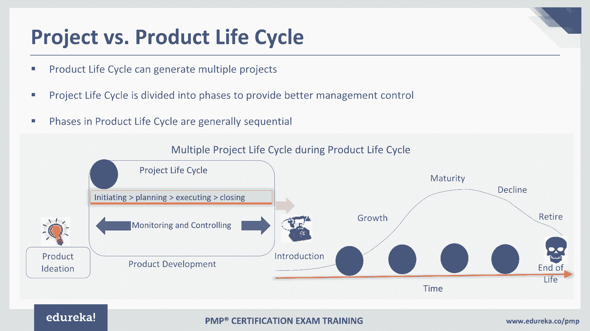
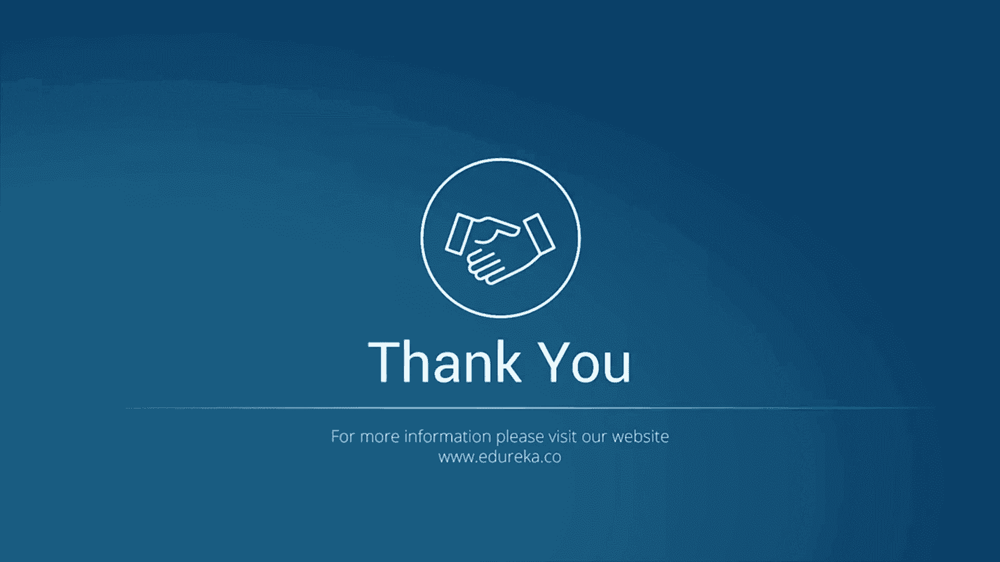
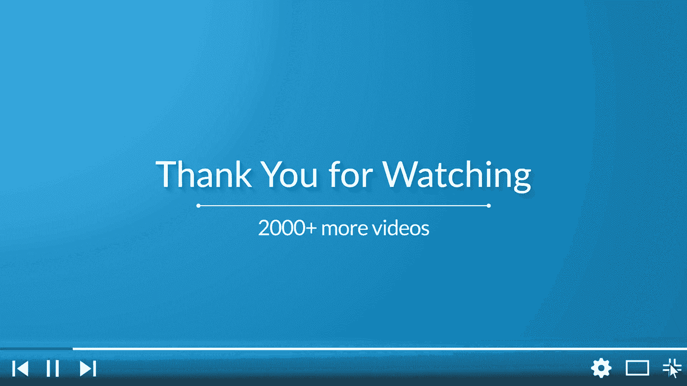
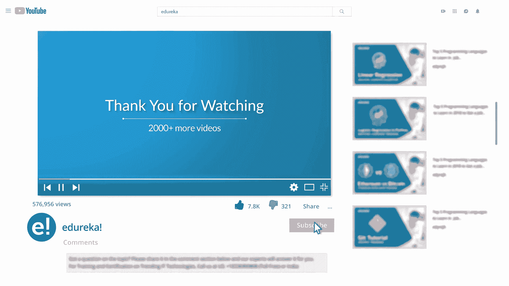
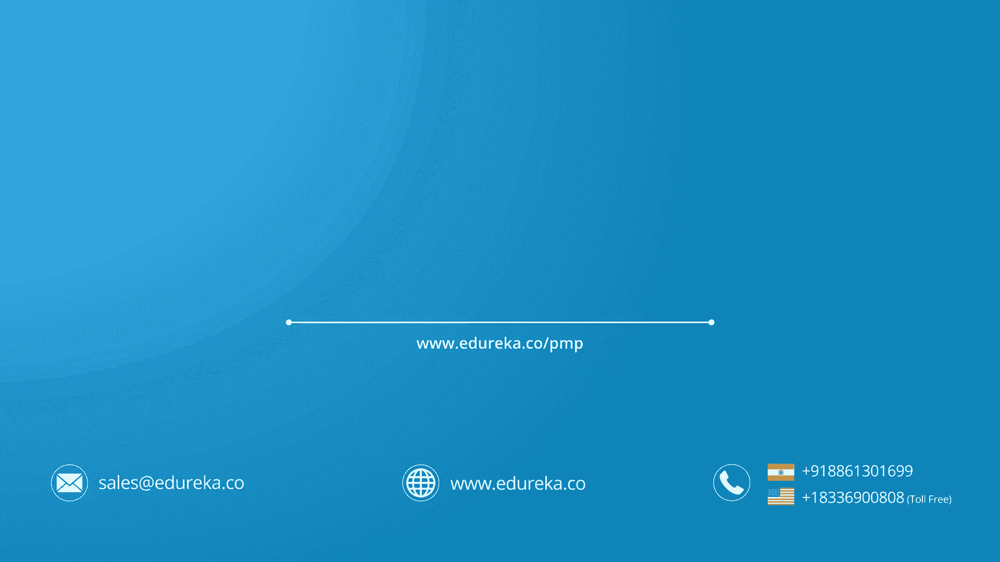

# PMP® Project Management Training - P1：PMP® Training Video - 1 - patwl - BV1m441177DS

Hello everybody and I welcome you all to the PMP certification training program in PMP training program。

 what we are going to learn today， we are going to learn today about what is project and its importance of the project management we will also understand the relationship between project program and portfolio and operations management the key components of project management how to go about doing tailoring and the most importantly some of the project management business documentation but before we get on to the PMP training program let me introduce myself my name is Paant and I have total experience of 17 years I worked in different domains like FMCG pharmaceuticals even for that matter the banking domain and sales and marketing etc I not only worked in projects but also Ive worked in enterprise level programs so I'm going to share with you all my experience of working on various project and how I applied the。

Skills， the experience that I've gained so far by working through various projects and programs and how PMP certification helped me in applying some of these basic concepts as well as some of the specialized concepts in terms of risks as well as the scheduling etc that we're going to talk about today I'm not only PMP certified。

 but also MPmiI ACP certified so that is one of the best part I have seen here because with the sixth edition of PMP certification now the PMI has also ensured that the agile is embedded as a part of the Pimbo guide sixth edition which is already introduced so I can definitely be in a position then to compare it with the agile way of working and with the traditional way of working and also I'll be able to explain with you very well some of these agile concepts that are now embedded as a part of Pimbo guide A from that I have also done L6。

Black pill certification and that's really very very useful I found at the same time considering that there are a lot of lean and six Sigma projects where you can also apply some of the learning out of the PMP certification that I have had it's been over five years that I PMP certified and I have realized that attending PMP certification training program is how important when we begin our PMP certification journey and if you are looking out for such a training program then you are definitely at the right place because this training program will help you prepare well for the PMP examination and PMP certification training program is based on the sixth Pibok edition and we will be talking about some of the latest additions in terms of the contents that the PMI has ensured to be there as a part of the Pimba sixth edition and some of these concepts are covered with。

Examples in this training what am' I going to do basically I will be taking you through various topics that are there as a part of the Pimbachi sixth edition at the same time we will also be going through what it takes to get that PMP certification get that PMP credential why the PMP credential is important at the same time where all the PMP credential could help you in Excel in terms of different industries that we see here apart from that we will be also actually going to go through some of the documentation some of the artifacts of the actual projects that were delivered so those artifacts those documents will definitely give you an idea about how you can go about writing a project charter or how you can go about writing a project documents like business case so I welcome you all once again to the PMP certification training program and I can see here John Matt and so if you have joined this training program and。

Welcome you all so if you have any questions I would like you all to put it in the chat box and that will help me in taking a pause reading your question and I'll try to answer your question then there itself apart from that also if you have any question any point in time you can certainly raise your hand this is an interactive training program that we are having and hence feel free to participate and try to converse with me through this virtual mode that we are getting this training program starting so with this let's get onto the training program actually what we will be doing basically is that as part of this training program well be talking about the introduction first which talks about a little bit about PM certification and this will kind of help us in getting our journey started as far as a PM certification is concerned I'm sure some of you may have multiple questions on your mind like why I should be going for PMP certification I remember a lot of people asking me。

specspecially in people from IT as well as nonIT now that we also have PMIACP and we have a PM certification as well so why we should go for PMP certification I strongly believe that for those people who would like to develop their career in the area of project management and if they want to strengthen their foundation of project management PMP certification is definitely the one certification that we should look forward to apart from that there are numerous advantages of doing the PM certification as you can see here on the screen some of these advantages we have highlighted one of the most important benefit I see of doing PMP certification is this is the most recognized certification today in the industry and not only in a particular industry but you go to any industry that you work for this is definitely one certification that the companies are looking into people who are aspiring to become the project managers this is globally recognized certification。

By all the industries as I said， apart from that this particular certification PMP not only demonstrate your knowledge but most importantly it also ensures that you have experience before you apply for the certification so it takes care of your experience your education and the competency so all this put together makes you the PMP certified individual and that's its strength and that's precisely why many industries out there today look for people who are certified into PMP certification now this will certainly help you increase your marketability when you go out looking out for a job or within your organization when you look out for promotions one of the things that I have seen certainly gives us age over competition is this credential which is PMP certification and we also found typically people who are PM certified people who are PM professionals they have got 15 to 20% higher salaries over the noncertified。

So PMmpP certification will definitely put you on spot and give you edge over many people out there who are looking out for the job opportunities into the project management or if you want to develop your career in this area。

 then you're definitely looking for a right certification。

I was just talking about different industries， so we have already listed some of the industries here。

 but you name the industry and you will find that PMP certification could certainly be a big value add。

 but to name few industries as you see on the screen be it from the water supply to protection to mobile services。

 education， healthcare apart from that even public transportation。

 so many of these industries that you see today they actually look out for professionals who are PM certified when they come and work on any projects be it itT nonIT projects across domains and industries PMP certification is definitely very well recognized。

In terms of job opportunities if you see sometimes people keep thinking about would there be any job opportunities by doing the PMP certification so obviously you have gained some experience into project management on the top of that you have done a PMP certification that will certainly strengthen your case when you go out in the market and look out for the job as far as the overall opportunities are concerned to the project management role by 2020 they're only going to grow and as you see on the screen we've got these opportunities as far as the growth is concerned as you can see in China and US everywhere today the project management roles are going to go up many folds by 2020 that means there is huge opportunity for you out there in the market to apply for these role that will be created as a part of the project management and PMP certification will certainly strengthen your case when youll go out and apply for some of these roles。

Now how to embark on this journey as I can see here， Matt asking this question。

 how to go about really doing the PM certification and this question is there I'm sure on everybody's mind now when you decide to do PMP certification first of all I must appreciate your decision that yes you have taken the right decision and we have just now seen why is it so now when you decide to do PM certification and when you just commit to yourself yes I want to be a PM certification person then by when should you get started your journey you should embark your journey approximately one and a half to two months before you actually take the examination so as you can see here you take the examination sometimes here right so from that particular date one and a half to two months before you actually schedule your examination and before that itself you undertake or you undergo a training program so you attain PM certification training program and I would encourage you to attain this training program which is。

And this particular training program will certainly cover everything that it takes for you to become PMP certified not only the certification but also other support you will get here the first and most important support that you will get is once you enroll for the virtual training program by Edduureka a lot of things will be covered and when you embark this journey for PMP certification I'm sure a lot of questions must be there on your mind and you would always need somebody who can support you who can guide you that means you're at the right place once you enroll for this program this program will cover not only the courses outlined defined by PMI for the PMP certification based on the Pbo guide sixth edition but also a lot of support you will get for submitting application I've seen many people coming to me and asking me guidance on how to write an application a successful application because that's also very important your application might get rejected if you do not。

The application properly so that application how to really go about writing the application。

 how to put your experience， how to ensure that you write properly about your project the experience that you're showing in whichever the project that you have done in the past how to ensure that you put down the experience which is non overlapping within the last 8 years right so all these things are certainly going to be looked into and then once the application formals are completed let's say before one to three weeks then you can schedule your examination and once the exam is schedule the advantage here would be that you would get a target now that after two to three weeks my exam is going to be there or maybe after four weeks have got my exam coming up so that means you get a target target date and this much of time you would get certainly to prepare yourself now by the time you have already attended the training program that means you have already gone through all the basics and you had gone through。

various knowledge areas， process groups as well as definitely a lot and lot of questions which we cover as part of training as well so all that is already covered so it be then very easy for you to prepare for your examination during this period of four to six weeks after the training is completed after you schedule your examination so you will get complete support from the Eduureka to fill out your application even if your application get selected for the audit because approximately 20% application may get selected for the audit and many times there could be a confusion in terms of how to face audit there also you will get a lot of support here and assistance to face the audit from Eureka team personalized guidance will be provided by the SMs like us who actually support delivering the training program throughout this study and most important thing is that you will have access to the course anytime so even if you want a particular topic to be repeated you can always。

Go back， repeat that topic， attend that topic again， you can sharpen your skills。

 you can revise a particular question， for example。

 or maybe you want to clarify about understanding on a particular topic or in a particular area you can always go back and do that and that's the biggest advantage with this training I believe unlike the classroom training so at times in classroom training what happens if you are not paying attention that means you're gone you can't really go back and ask to repeat the same topic and after the training is over then there is no opportunity at all but here the biggest opportunity that you would get is you can always go back and play the recording play the session as many at times as you want over and above there are also thousand mock questions and this is the most important thing once you are ready for the examination especially in the last couple of weeks you should be only focusing on taking up those mock questions and from where those mock questions will come you can。

refer to the Eddu course for the mock questions1 thousand00 is definitely a good number and I always recommend before we appear for the final exam once you complete your study。

 it's important that you should appear for the examination by taking full 200 questions by sitting at once and taking those 200 questions at once at least twice before you appear for the exam that will give you confidence not only of facing questions but most importantly sitting at a place for four hours because it' exam duration is four hours and all those questions will come from this mock questions that are already designed taking into consideration various contents and of course the new topics the new pebak guide changes that are happened So once you clear the examination once you are PMP certified obviously you have to reive your certification every three years and even for renewal you need 60 ps and those 60 ps will come from the courses that you will attend through。

Uka，So Eduureka definitely help there as well。 You can get assistance in Elearning for earning different Pds。

 There are various courses that you can undergo。 And within three years， again。

 you complete 60 Ps and you can renew your examination successfully。 The most importantly。

 you will get support from Eureka the 24 by 7 when you will enroll for this course。

 So I would strongly encourage you all to look no further than enrolling for the PMP certification course from Duureka。

So let's continue this session and let's understand more about the training approach overall how are we going to deliver this training program for you all so we are going to cover here the PMIs philosophy which is basically based on the contents that are outlined as a part of the Pimbok guide so I don't know how many if you got a chance to really see the Pibok guide but it's definitely the big book which covers five process groups there are 10 knowledge areas and there are 49 processes and these 49 processes will ensure that you understand various concepts from project management for example how to take care of communication with stakeholders how to go about putting everything in the charter and ensure that you are authorized as a project manager to work on that project and take decisions for example how to do continuous monitoring and controlling of the project activities so all these concepts are going to be covered as part of the。

And most importantly for each of these processes there will be inputs tools。

 techniques and outputs there are these four things that we covered as a part of each and every process so all these 14N processes will be covered and we'll be doing deep dive into inputs tools and techniques and output for each of these processes and we have taken lots and lots of examples on the top of that I have also covered some of the actual artifacts of the project so which gives you an idea about how a project charter actually looks like or how a business case actually looks like so we of course covered as part of this module a business case the benefit realization plan and I'll try and also give you an idea about how the project plan typically looks like on the top of that we have also covered questions at the end of each of the module so we have discussed we have reviewed some of these questions and feel free to participate if you want to clarify the answer of any of the questions that we're going to covered as well today。

If you have any questions from whatever the topics that we covered so far。

 please feel free to put your questions in the question box that have already showed you where it is and start participating in the session。

To continue with we have so far covered about a little bit about PMP certification a little bit about PMI certification now we'll talk more about PMI as an institute so if you see PMI it's a very old institute established in 1969 that means if you actually see PMI has completed more than 45 years know and it's a global organization with headquarters in USA peninsa and it's a project management institute which is based on nonprofit organization it's a nonprofit association altogether most importantly this institute is there worldwide in over 171 countries and over five La members are associated today with this instit now PMI actually actively engages a lot of professionals across globe and these professionals are engaged through conducting research in the area project management as well as providing access to wealth and information so lots of World Cup information and resources are available。

Today with PMI related to project management now under project management again various areas so that wealth of information you will get to access once you become the member of PMI PMI also promotes career and professional development and lots of other certifications also it offers and most importantly it offers the opportunity to network and form the communities so you'll find there are local chapters there are local PMI chapters where people from the local area they come and participate and they talk about what's going on in the project management space and exchange their knowledge they share their knowledge so that certainly helps big time。

As I mentioned that there are certifications from PMI like some of you were asking about what else is there apart from the PM certification。

 so as you can see here on the screen to begin with people with they have just started in the project management or they would like to start for them certified associate in project management is one of the certification for the beginners in the project management。

 then they can move to the PM certification now people are working in agile or would like to have experience again they're working in agile they have experience in a child they can go for PMI ACP certification apart from that if you want to do deep dive then go for scheduling professional so again you are working in project management and for quite some time if you want to strengthen you or some of these areas like scheduling so you can certainly do the deep dive into scheduling per se know and then you also complete the certification same as the case with risk management so if you have been practicing project management for quite some time if you want to。

Get into a sort of specialization into risk then I would recommend you the risk management professional otherwise also you can certainly jump into this because risk management is definitely one of the important processes that we talk about as a part of PM as well apart from that if you want to go for a little next level certifications like you have been doing project management for quite a some time and now you got promoted into program management so you can certainly go for Pgmp is another certification and from there again from program you can jump onto the portfolio management professional as well as you go ahead up in the ladder in your career so as you see here there are lots of different certifications that are available and some of you as Matt asked this question that what could be done if I don't have to go for PMmp certification is there any other option that I can opt for so you can opt for so many options but the fundamental option that you have already chosen for yourself is PM certification so even if you complete your PM certification and if。

wantant to continue your journey into the project management。

 you can certainly go for the next level， which is program management or for that matter。

 the portfolio management as well， I hope I answered your question。Okay。

 thanks for your confirmation， Matt。Allright， then I'm moving to the prerequisite now this certification。

 the PMP certification requires you and this is one of the biggest advantage with PMP unlike some of the other insit have seen that it ensures that you have experience you have completed enough education at the same time you have also gained the actual experience of working in the project management right so let's take a look at the prerequisite for appearing for the PMP certification I'm sure some of you must have already gone through the PMP certification。

 brochure which is available on the PMI site， I would always recommend you to go to the PMmi。

orRG and browse the PMP certification brochure because there you will get the latest information always but as far as the qualification criteria is concerned for PM certification you are expected to be high school diploma or associated degree or anything which is global equivalent which should be like 60 months plus and the project experience of 7500 hours is expected。

😊，And of course 35 contact hours required Now these experience in the project should be within last eight years is what we need to remember contact hours is fine so you can add contact hours from last typically you know they ask for 35 contact hours anyways so this particular training will give you 35 contact hours that's another benefit of attending this training program so you'll get a certificate and you can claim 35 contact hours out of that the other way is if you are already a bachelor degree holder then it's pretty straightforward so in terms of you already have 36 plus months of the formal education and if you have 4500 hours of experience now this experience should be nonoverping experience working into project not necessary as a project manager you could have worked in whichever the domain whichever the area within the project management that should be fine and even here also the expectation is 35 contact hours so you don't have to worry about 35 contact hours in this case。

And that's the best part because since you all have already enrolled for this program and you are going to get the certification of completion of the training and 35 contact hours you can claim through that now some of the things that we need to keep in mind that this particular experience should be non overlapping as I explained so if you worked on two projects ensure that those two projects start and end should not be overlapping so that is one of the important things then project experience should be only from last eight years and not before that 20% applications as I mentioned are picked up for random audit so don't worry even if your application is picked for the audit we will definitely support you there and apart from that once you clear the certification if you appear for the online examination you will definitely get the soft copy of the certification and your score you will immediately come to know if you appear for the online examination apartpart from that from the praik point of view the designation is not an issue this is another question which some of you were。

Asking just now that would there be any specific role I should have played So in a project there are multiple roles right so if you take an example of a software project。

 you may be a developer or you may be a tester or you may be just doing the deployment of the code that is written or deployment of the releases or deployment into other environment etc so you are contributing you're definitely the team member to the project that is running right so it is not necessary that you need to be project manager to have that experience of 4500 hours even if you have this experience of working on any project by any role still you qualify for the PM certification provided that you have non overlapping experience of 4500 hours and of course the other prerequisites as we discussed so I hope these have clarified your question about the qualification criteria to appear for the PMP examination。

Now let's get on the pattern of PMP certification This is another important thing for us to understand as I mentioned PMP examination is four R so it's definitely longer and this is where sometimes I have seen people struggle if you do not practice enough so you have to first of all practice to sit for four hours right and therefore I mentioned that you need to at least take full 200 question mock test before you appear finally for the examination it's conducted in the prometric center so that means it's properly anulator at the same time there is an environment where in the exam is conducted so it's a examination environment you will find there is a camera and everything so this examination is conducted in a proper prometric center and with proper inviilulation there are 200 multiple choice questions and you will get four hours now out of 200 question what is important to notice is hundred75 questions are only considered for the final score and there are 25 questions。

pretest questions now these 25 questions will not be considered for your final score but you would not know which are those 25 questions hence for you200 question is what you need to look for because you won't be able to differentiate between which are those 25 questions for pretest and which are those 175 questions so for you you have to attempt all the 200 questions there is no negative marking definitely and the examination is developed by individuals or groupup individuals so people who have been working in the project management area for quite some time and they have acquired knowledge and skills and expertise so these are those individuals who get to participate in the examination I remember even PMmiI approached me for PMI ACP examination but since I delivered training program hence I didn't get to participate but otherwise if you don't deliver the training program and if you want to contribute actively into as a PMmiI。

That individual or the group of people you can certainly nominate yourself or sometimes PMmiI directly approach you as well now after clearing the examination as I said you will if it is a soft if yous online examination then you can immediately see the result and you should be able to then even waive your soft copy of the certificate immediately after the examination I guess there are a few hours but that should be available more or less after the examination is completed successfully all right so this is about the examination pattern。

Now let's come to the examination fees very quickly we' go through the fees that you' would be paying now there are two options one is computer based testing and there is a paper based testing also of label if you are appearing for the paper based testing then your score will not come immediately right itll take time but if it is computer based then your score will definitely come immediately now if you see the PM experience and education we have already covered this part but what you need to understand is for computer based exam the charges are 405 and if it is read this as members and non-me right so if you are PMmiI member the charges for you will be 405 if you are not PMI members in triple5 if it is paper based for PMmiI members 250 for nonpmiI members is 400 similarly you can take a look at the reexamination computer based and the paper based so it's always wise it's always even if you do any math you would know that it's always good to do the PMmiI membership。

To take PMmiI membership and then appear for the PM examination so you first take the membership of course you first create your count on the pmi。

org site you take the membership and then you go for the PM certification this way you will land up paying more or less the same amount but the most importantly you will get membership for one year on the top of that you also get a soft copy the latest PM guide so that is the biggest advantage here right now we can also go for the PMmi local charter membership so these membership fees you can check locally how much are they and as I mentioned earlier when you renew your PM certification after three years you will have to complete 60 ps professional development units and for these 60 ps also you can certainly take up the courses of Edduureka and these courses will help you gain those 60 ps right so if you have any questions please feel free to put it in the chat box so that we can discuss those as well。

Most important information I remember I did mention this earlier as well。

 but again I would like to emphasize that if you want to appear for PM examination and since you have already taken this decision go to PMmi do org and refer to the PMP handbook very importantly PMP handbook will give you the latest information about everything that it takes to know about PMmpP examination right right from the prerequiqui to the examination fees to exam it takes everything all the information all the questions that you may have about the exam you'll be able to get those clarified through this PMP certification Okay so that was made at a high level about the examination and about PMI etc so that was just the basic information that I provided so far about the examination I hope you all are with me so far okay。

Alright， thank you for confirming So we're now on that Okay。

 now let's then continue since you all are fine with it and I just wanted to then take you through the basics of the project management So we'll get started since this is our first class so we'll get started with the basics of the project management and then we'll gradually get on to bit of a deep dive into some of the areas that I have already told you about。

😊，So starting with the Pimbook guide so Pimbo guide is project management bookup knowledge now this particular guide which is publisheded by PMmiI and this is considered as distilled version of project management body of knowledge and now the sixth edition is available which is already introduced last year and this particular sixth edition is basically the source of information now which is referred across this PM training course is based on the sixth edition and hence this course will cover everything in terms of your knowledge areas your process groups as per the sixth edition of Pimbo guide now Pimbo guide is structured typically like this so it will have key concepts trends and emerging practices tailoring what needs to be done to tailor a process considerations for project adapt to environment etc so each knowledge area you will find these four sections so the way this course is designed is exactly based on the Pimbo guide structure will be。

Talking about the key concepts from each of these processes that we be covering there are 49 processes that we have and there are 10 knowledge areas that we'll be covering so under each of these knowledge areas and the processes we will touch upon key concepts trends and emerging practices how to tailor a process and if you are implementing agile or if it is adaptive environment that you're working in then how to go about considering some of the newer concepts from agile and adaptive environments Pimboke is typically structure it will give you the project environment 10 knowledge areas roll up the project manager so this is something that is introduced as a part of the six edition it was not there previously though it was there but it was embedded into different knowledge areas but now rollup project manager is going to be covered explicitly as a part of the separate structure as a part of the separate structure of the pibochi itself apart from the 10 knowledge areas and of course the project management foundations is also covered as。

Part of this so I would strongly recommend you after going through the training program at least once you should go through the Pimbo guide it's always good to know the fundamental project management and read at least once even it is lendingy even if this book bigger book but reading it once is definitely the target that you should take okay let's move on so fundamental question i'm sure you can ask yourself is what is a project now since this particular training PMmp certification training and this certification is basically for the project so it's important for us then to learn about the definition of a project so what is there now think from the examination point of view objective of this training is to make sure that you prepare for the examination so as per the PMP certification what is a definition of a project so project is a temporary endeavor which is undertaken to create unique product service or result so if you take any project ultimately you'll get some outcome and that outcome is unique that outcome could be you will。

Undertake a project and at the end of the project what you will get is a product right or at the end of the project what you will get maybe a service or you will get some result。

 but that is going to be unique what you will create at the end of the project is unique apart from that project is a temporary endeavor so you will always find one thing that project has a start and the ended so project will be ended when you achieve the objectives of the project or sometimes it may happen that there is no funding available or the project objectives are obsolete or sometimes the project is terminated there could be various scenarios that you may come across but definitely another attribute which is also equally true is project is unique so you will always find that even though two buildings that sometimes you see those are identical but at least you will find some attribute which is unique to each building so that means if you see put together everything here you will find that project are unique they are temporary and they are undertaken to create。

A unique product service or a result you can take example of it project or a non- it project if you' are developing a product and that particular product development that you have undertaken is for a year's period so within that one year you actually go through various phases of the project you could have undertaken a feasibility phase that you have done the analysis that you have actually done the development and then you have implemented it so you have gone through various phases in order to build that product and by the end of the one year what you produce is that product which you will take it to the market and then you will sell that product so that means in this example we have seen that what's unique is basically that product that you're producing that product could be any product it could be it product it could be a non- it product that you're producing and the project that we have just said has got a started and the ended we have got one year in between and within that one year where doing all the project phases activities and it's a unique。

that you're producing at the end of the day as well。

 right which you can take it to the market So of course， as we go ahead。

 we will take multiple examples of the project as well， but from definition point of view。

 we need to just remember some of these keyword that from the Pimbak guide and from PMP example point of view projects are of course unique they are temporary nature and what we produce at the end of the project is product service or some result。

😊，Now if you take the examples of like projects drive change you will come across projects why they are initiated。

 you must be thinking about why projects are initiated so sometimes projects are initiated to drive change I've seen that organizations undertaking big transformation project now those transformation projects are basically to drive change within the organization I was part of such a transformation project and the transformation project was about the agile transformation within organization so it was 18 months project and that has started and the end and then lot of activities have were undertaken as a part of this project and then with an objective obviously there was objective that they want to shift from the traditional mindset or traditional way of working to the agile way of working so that was completely a project to drive change at the organizational level right projects could be also undertaken to enable business value creation now value could be tangible or written。

That's fine。 But what is the value， How value is gonna to be generated in the business。

 It could be by launching a new product altogether or new line of business。

 whatever that line of business that you would like to enter into and you are undertaking a project basically to enter into that new line of business and that's going to add value and that you can measure it how can you measure that value obviously value could be measured in the form of the benefits that you're going to realize once the product or that product is in the market so sometimes that value could be intangible by launching that product service or a result。

 youll be able to achieve the customer satisfaction。

 Sometimes not everything is measured in the form of value right so customer satisfaction can be measured in the form of value but definitely when you achieve the customer satisfaction you can generate more business out of thes customers and you can even do the cross selling of the product So that's the intangible benefits。

 which is difficult to measure。But there is definitely a benefit that we can show so sometimes projects are undertaken just so that we achieve those intangible benefits there are also projects which are initiated sometimes to meet the regulatory requirement I have worked on many regulatory projects now some of these projects were initiated so that we can fulfill the regulatory requirements of the customers right so for example there are certain like if you work in a banking industry there are certain reports which needs to be furnished which needs to be submitted to the regulators now an itT projects is initiated so that those reports are produced out of the data which is gathered from all the IT systems across banks I organizations it's a captive organization typically and you get data from multiple IT systems and then that data is ultimately used to prepare various reports which are then submitted to the regulators so that means you initiate a project so that you can fulfill the regulatory requirement or。

Legal or social requirements to satisfy customer request or need as I said。

 that sometimes we initiate a project out of a request that we received from the customers so sometimes product is already there now you are getting the change requests just so that we can make enhancement to the product that we are using we also initiate the project so that we implement or change business or sometimes technology technology is another change that I have seen suppose if you want to go for the evergring project so that's where you actually demise the old infrastructure and you are upgrading to the new infrastructure so that's purely because of the technology advancements that have happened in the market and I've seen that companies are investing lot of money and changing their technology stack especially with the Devops coming in every company wants to make themselves Devops ready so that they can establish the continuous integration continuous delivery pipeline build pipeline and then deploy more frequently to the customers so that they can capitalize on。

The deployments that are happening or they could be also created out of the let's say you want to improve a product or release some fixes etc。

 so even those could also be the reason why the project gets initiated so projects as as you can see here the project could get initiated due to various reasons。

Now some of the examples we can take here which are specific to these categories that are listed down so first could be developing a new product service or a result。

 so let's say you are working in an automobile industry and there is a strategic vision that your owner of the company has to manufacture a car which is priced least the cheapest car so that's the strategic vision that your owner of the company has and with that vision you then start working on a product so that means you undertake a project which will produce a product to fulfill that vision and that vision is to manufacture a car with what I would say the cheapest car in the market so that cheapest car in the market to manufacture that obviously for that product to manufacture you will undertake a project and that project may run for three years for two years or even for four years depending upon the complexity of the project etc but ultimately what you get at the end of that project is。

product which is cheapest right you may succeed or you may fail in the project That's a different thing。

 but ultimately the outcome of the project is some product or it could be some service so if you are launching a customer care service let's say you wanted to you are into a call center business and then you are providing services to your customers so there are various such services that you could introduce and just to launch those services you could undertake various projects or they could be some result ultimately that we may get as a result of the project that we have undertaken it could be affecting a change in structured process staffing or style of an organization have seen sometimes that a projects are undertaken so that the structure of the organization may undergo a change or for that matter。

 the process improvement you must have seen a lot of process improvement projects so I gave you example of lean six sigma project which are undertaken so that we can make the process lean we can enhance the productivity etc。

I've seen even the projects are undertaken to reduce the cost associated with staff。

 so maybe you undertake a project wherein the solution is to put the robotic process automation RPpas and through RP you are actually cutting down the staff cost so that's another example of a project so as to introduce change projects are also undertaken for developing or acquiring new or modified information system so you are procuring new hardware or software so sometimes those are like infrastructure projects which are undertaken just so that you replace the old hardware which is no longer supported by the OEs of those hardwares whom you bought that hardware or for example software。

 so a lot of everging as I said sometimes if the software is not supported you would like to either upgrade that or you would like to change the solution one of the biggest reasons for this could be the security issues so you want to protect yourself from the security threats that these days we。

See coming through the another opportunity is conducting a research efforts so we conduct a research efforts and obviously what we get at the end of that research effort is some outcome construction I think this is pretty straightforward you're constructing a bridge or maybe you're setting up a industry or it could be a big Turkey project that you are undertaking or for that matter if you are changing in a business process so lots of these examples that you would see here I hope with this set of examples now it must be very clear to you that project is a temporary ende with start date and end and what we get is unique and that is product result or some service at the end that we get out of a project。

So what is importance of project management ultimately so why we are doing whatever the efforts that we have been talking about。

 why we are putting in so much of efforts so project management is all about applying the knowledge skills tools and techniques but in order to apply these knowledge skills tools and techniques first of all we need to know which are those knowledge what is that knowledge what are those tools and techniques if you don't know how would you apply and that's what exactly we train people on so this training actually talks about knowledge skills。

 tools and techniques skills of course you acquire as you go on applying the knowledge but for that you need to know what kind of skills that are required now it is also required because there is a cutroat competition that's there in the market so if you want to prove yourself that you are different and that you are sharp and at the same time you've got those skills that are required to be there so as to be effective so that you can effectively manage the project and not the poor project manager for that matter so how would you be able to。

ing that So there there are certain things that are required here actually so effective managed project。

 which actually helps individuals， groups， public or private organizations for a few things for sure。

 So one is of course meeting the business objectives。

 what are the business objectives that you have visualize yourself or that you have actually drawn So those business objectives will be achieved So as I said manufacturing of the cheapest car if that's the strategic vision with which you have started the project you achieve that business objective by the end of the project satisfy stakeholders expectations So you deal with n number of stakeholders on the project again。

 depending on the complexity of the project， So how would you satisfy the needs of the stakeholders。

 the expectations of the stakeholders， the changes that they are requesting so you'll be able to do that if you do it effectively and overall chances of success will go up most importantly managing the constraints of project you'll be able to manage project constraints effectively if you have those skills and if you have that knowledge and risks is another。

key area。 How do you manage risks so you will be able to learn to manage risks through the difference tools and techniques that we'll be covering as a part of this training delivering product on time is the key to successful project as we always say we have project constraints of course well be talking about those and those project constraints we need to keep on mind and ensure that we are delivering the project within those constraints of the project when you begin working on the project you will come across multiple changes from the stakeholders so if you don't know how to manage change effectively you will struggle to accommodate that change within the project that you're working on and therefore in order to effectively manage project you need to have the skills and tools and techniques poorly manage project would certainly lead to multiple disadvantage here there could be a failure in achieving the objectives misdes cost overs we come across these situations right whatever the project budget that is given have seen sometimes project manager。

paying more or land up spending more than how much is the budget given or they could be a compromise in the quality of the outcome that that is being produced or they may end up in doing a lot of rework and rework is a vest and that requires a lot of money and all these lead to unsatisfied stakeholders for that matter so therefore project management is definitely very important and hence we need to learn the associated knowledge and the skills that are required to manage project effectively and obviously we need to also know what are the tools and techniques that are required and most importantly we need to be using the right tool and right technique at right time so that's what is going to be covered as part of the training so we'll be covering each and every processes and we'll be covering the each and every tool and technique that is required。

Now if you see project manager meant as a methodology now each organization have seen they have done some sort of a customization It's not like they may follow whatever we are going to talk about as it is so there's going to be always a customization so templates I have seen every organization will have their format will have their own templates there will be policies around how to manage vendors there will be policies around how to go about doing the human resourceosis management etc there will be certain processes over and above what we are going to covered which are specific to the organization as well and there are a lot of guidelines that are available as well but most important thing is when we talk about a methodology we are talking about we should be able to plan project properly monitor it properly and control the project properly within the organization and to do that what is required is going to be covered as a part of this training so PMP certification training will actually cover the project methodology as a whole and that will give you an idea about what kind of。

I should be using when I put or when I start working on the project charter or when I create a business case。

 how I should be going about doing that or what policies I should be you know peer minimum policies I should be having right what kind of guidelines I need to follow when I'm doing a particular thing so from project management methodologyological point of view these are some of the areas that are needs to be looked into。

Okay， so if you have any questions， of course， feel free to put them into the chat box that is provided so that we can also answer those questions as we proceed。

Allright so right now I don't see any specific question as such coming in so I hope you all with me on the training so far Okay so I got a confirmation from John that so far so good so we are going on fine thank you for confirming that Savita is fine to right thank you so let's just continue with the same pace let's move on to one of the most important points which is about constraints of the project so we called as compensating factors or project constraints if you ask me how the project manager's performance is rev or performance is judged I would say it's based on how that project manager is overall managing the constraints of project because every project will have these constraints when I'm saying constraints what does that mean actually so there are these six constraints that we talk about scope time cost。

 quality risk and resources now they are constraints because even if you change one at least one other。

Will get affected if you increase the scope of the project。

 obviously cost might go up right if you don't increase the cost and if you're just increasing the scope。

 risk might go up and quality might go down right at the same time if you reduce the time if you want something to be deployed early or finished early。

 then obviously we need to increase the number of resources if you don't increase number of resources。

 then it's going to cost you either you will not be able to complete all the scope or you will not be able to achieve the quality that is expected to be there So you have to play around with these constraints So effective project manager would know how to deal with these constraints and most importantly。

 if there is change to any of these con it's important to go back and update the relevant documents that are being created So it could be a scope management plan risk management plan or resource management plan so we need to go back and update these documents as well if there is any change to the constraints。

RightSo from that point of view， these constraints are very。

 very important to manage and these constraints is to be managed from the point of view of these stakeholders。

 they should also be satisfied because if the scope is not fulfilled your stakeholders might not be then satisfied so how can you deal with the scenario wherein you are behind the schedule that means either you have to reduce the scope or you have to delay your project by maybe a couple of weeks so you are in such a situation that how would you handle the situation and that's where the project managers skills and knowledge will come into picture so how can you go back to the stakeholders and understand the importance is it scope delivering is important as it is or is it the schedule that is important like when I was working on a regulatory project from the regulatory's point of view the most important was delivering it within the time because that timing is most important otherwise your company might be fined you will have to pay the regulatory fines so from the scope point of。

We had to go back and reprioritize the scope items so there were certain scope items which we were just good to have so we had to really drop them off and whatever rest of the scope items we have then taken them ahead within the available schedule so what's important here is to understand how you can make use of this constraints to the best of your knowledge and to go back and negotiate with the stakeholders。

Allright， so I hope now have made it clear the most important thing how to deal with project constraints All right so I see a question here from MA that how do we manage project risks all right so Matt so basically to manage a project risk we kind of start working on the project risk management right from the beginning of the project itself so like in our project what we do is that we have risk workshops to identify various risks that we might face on the project so we first identify all the possible risks that we might face on the project we prioritize those risks then we have to also do the quantitative and qualitative analysis of the risks then create a risk response strategy so that risk response strategy could be we may like to mitigate few risks we may like to also accept few risks if there is no good option that is available or if the cost of mitigation is higher than the cost of the risk overall risk then sometimes we might have to accept that risk as well or sometimes we。

Have you transfer the risk so risk response strategy needs to be agreed upon and then we assign the risk ownerss。

 those respective risk ownerss will then ensure that before the risk occurs。

 the risk response needs to be implemented and all this execution happens as per the risk management plan that is created in the beginning of the project itself So all these things that have just now covered is going to be covered as part of this training where I'm going to actually show you the risk management plan I'll be actually taking you through the examples of how do we identify risk how do we do qualitative and quantitative analysis of the risks at the same time。

 what are those different risk response strategies that we come up with so don't worry hold on but for now just to answer your question I have just given you this highleve idea and then we are going to do a deep dive into each of these processes as we go ahead I hope this answers your question Matt okay so he's saying that he happy to get this。

Inmpput so far。 Okay， thank you， Matt。 Alright， so let's get started then from here。

 So we'll continue and we'll talk about now the project program portfolio and then OPM as well。

So talking about project and strategic planning so let's get started with the project and strategic planning first so typically what happens if you talk about a program it's always made of a multiple projects and a portfolio would have projects and programs put together and then that's how ultimately everything is aligned with the organizational goals objectives or whatever the strategic plan that is created so I gave you this example of if you want to manufacture a cheapest car if that is a vision highlevel strategic plan that is created then probably you might need to run multiple such a programs and the project because it's a complex project altogether right you will have to learn run multiple projects and this program would include lot of components in it okay so component would be there could be a vendor management activities that needs to be separately handled there could be activities where an establishing a plan where this assembly line for example where this。

would be manufactured or for that matter， there could be another component altogether in order to source the material that is required in the cost that we're looking out for that's another component altogether so based on these components then you would form various projects within this itself so setting up the assembly line could be a project in itself right so procuring the material right or sourcing the vendors to procure the material just in time could be another project in itself so that's sort typically happens you have some strategic guideline you have some strategic vision or a plan for that matter that triggers various projects and programs and then all those becomes a part of the ultimate portfolio at that level the overall governance is managed so program and the project management will ensure that the programs and the projects are managed in a right way so that is very。

 very important the most important thing is you to。Agize these programs。 So for example。

 you have the programs which are similar kind of project should be part of that program course we'll take example as we go ahead。

 but portfolio management alliance with portfolios。

 So what we can do is that probably we can take example and then it would be in a position and then we can come back and also see what exactly we mean to say。

So this particular example is to understand the difference between project programs and a portfolio so at a portfolio level what you're basically deciding is so that's your maybe strategic plan you're planning to put up a new line of business in the organization so strategically that's what you have decided so you could run market research project for that okay so would it be really feasible to go ahead and set up a new line of business altogether so you're doing a market research activity which is a separate project in itself now if you see the kind of programs that I might need to create under this portfolio would be marketing okay so I'm setting up a new line of business I need to think about how am I go to market that then I would also need to think about the application development as a separate component altogether then content development would be there so I would run these three different programs and under these three different programs there could be multiple projects running like。

Marketing I would have a product launch as a separate project altogether so all the activities that are pertaining to product launch would then be carried out under this project or new market development would be another project in itself so these couple of projects which are related projects which are linked projects would then be clubed with this component which is marketing as a program similarly for the application development I would look into various things as well like for example I would think about a web application Android and the i based application as well so then I would club these related projects under this program which is application development so this will actually ensure when I complete all these three projects I'll be able to complete the application development program as a whole similarly in case of content development so I would need to look for the content now my project could be classified based on maybe class1 class2 class3 class4 contents。

Okay so this is just one example， one representation you could do it multiple ways as well。

 There are multiple ways to do that， but this is one way which will give me a better visibility。

 better opportunity to establish proper governance at a portfolio level and thereby control what's going on in each of these projects and the programs Now if you talk about operations operations will focus more on the ongoing activities so operations will come into picture once we launched so for example。

 once the application is built and it is launched， then the operations will come into picture until then you are actually working within the project itself or a program so project and operations may intersect this is very important to understand actually so we have seen a project now we have seen operations as well operations will come into picture once you launch the product or service into market and then you start supporting that then you start making enhancements or then you start supporting the customers etc So what is important here is that though operations team will。

Take the full control once the product is in the market。

 but that intersection happens at multiple points， which are those points where the intersection happens when is opposed when developing a new service or a product。

 you need to involve the operations team as well so that they would know that something like let's say the web application is coming on their way for support。

 you could also do that when you improve the operations So sometimes what happens when there is existing application and then you're enhancing。

 So again you engage the operations team as well。Most importantly。

 at the end of the product life cycle there would be a proper handover between the project team and the operations team so that handover has to happen properly and we need to pass on all the relevant documents to them and at the end of each phase closure we need to also invite the operations team so that there is a proper handship happening and they are not engaged only towards late in the project so some of these things is to be taken into consideration so I hope this example must have given you a fear idea about program project and how a typical strategic plan initiate the launch of a program and a project。

So project program and portfolio is clarified so portfolio which is typically at a strategic level so this is where the collection of projects or programs happen we have just taken one example here and they are basically grouped together so that we can facilitate them effectively from overall governance and management point of view which will ultimately help in achieving the strategic objective so in earlier example the strategic objective was to launch a new line of business so that's how it is program is where we collect projects together and they are definitely interrelated or sometimes they are interdependent as well but most importantly they obtain benefits which are not available from individual components so if you see only the web application will not give as much benefit as even when you add the Android app or iOS so when they put together the application development as a program will deliver much more benefits multiple interrelated projects needs to be run parallel so sometimes they are run parallel sometimes they are。

So dependent right so they could be run in Cs or they could also be run in parallel now projects they are generally dependent on each other and serve a common outcome so if you see typically is that let's say class1 and class2 there could be a bit of a dependency as well in terms of content okay baselineing or delivery for that matter or there could be bit of a dependency between what youre developing as a web application and then Android and i so generally that's what is observed within the project so we need to ascertain what's that dependency level and we need to manage that dependency level effectively as well when you are working on project and programs。

Allright， so moving from there altogether so we just covered up what is a project program and portfolio and we have taken one good example to classify this to differentiate this and as we progress we are going to take more examples as well so organizational project management so if you see the OPM so this is specific to the organization now we are talking about now this is a framework where we talk about project program and portfolio management all this is integrated so that we can achieve the organizational objectives ultimately and for that reason it's basically integrate how does this work if you think from the application point of view now so you have project program portfolio management knowledge and now you're applying it and that's where the organizational objectives will come into picture so you have a strategy right so we have taken example here that we have some strategy which is launch a new line of business right and then you decide the portfolio value decisions then。

We have the business impact analysis is done program and project results are delivered Op will start here okay the value performance analysis is carried out right from identifying the strategy because value will start coming in only once you launch that line of business so programs and projects will be a part of this section and then there's a portfolio here okay so what we need to understand is that same example you can apply here as well so in order to achieve the strategic objectives of launching a new line of business then obviously you are aligning with the portfolio which are the portfolio that you're working in then there are multiple projects and programs that you're running here okay and once you complete those programs you will be able to then deploy that to the production team or to the operations and support team and once they are out in the market then only the value will start coming in then you start measuring that value so in the beginning itself you create a sort of the business realization plan。

or the business benefit management plan and you try to measure the business benefit against that business benefit measurement plan。

 So this is more less the same thing as what we covered earlier here we are just trying to put it in the form of Os allright so let's just move on to pimbo now since we are just talking about PMmpP certification training here So we need to also know a bit more about Pimbo and how the piboite is structured So we did covered the highleve structured but there are a few more things that we need to know about Pimbo especially at the component level and at the same time how these process groups。

 the knowledge areas， the processes， how they are aligned how they are interlinked So let's talk a bit more on these quickly So I'm just going to take you through each and every component very quickly So project life and phase。

 So what is project lifecycle ultimately project lifecycle is nothing but contain series of phases you must have seen。

SDDLC， so project lifecycle， which is software development lifecycleright so when the software development life So when the software is built。

 we go through various phasesright so those phases that happens in series so we've got a phase called maybe the initial assessment that is done feasibility we call it as so initiation we can call them as so then we have requirement and then course you analyze them you create design so you build you test you deploy so all these are nothing but your lifecycl phases then the project phase so project phases collection of logical related project activities so you could differentiate between the project lifecycle and the project phase as well so project lifecycl is a very generic at a high level so for example feasibility is one thing or analysis is another phase or implementation is another phase so from the project lifecycle point of view the project phase could be requirements gathering so you have gathered requirement which is logically based on the activities that you're performing。

De which is again activity of designing that you're performing so we just we can differentiate here tinline difference that we see then these are a specific project These are very generic then we have a phase gate so which is a that happens typically at the end of the phase so once the requirement gathering is completed as a phase then we produce a document called as requirement specification document and that is reviewed So that is my sort of a milestone that I can say that achieved by the end of the requirement phase and that needs to be reviewed then which of course may get modified later if that's fine project management process so this is now if it is a process that obviously typically process has series of activities which are interdependent and then which will perform to achieve a specific objectives so here also for example if you take example of let's say a communication management plan so when we work on the communication management plan ultimately our objective is to create an approach how。

Are we going to communicate to all my stakeholders in the project that I'm working on so that's how typically it happens the project management process groups so again when logically the grouping of project management input tools techniques and output happens you know so that particular group you can define it as a project management process groups so in PMP here we have these five groups initiating planning executing monitoring and controlling and closing so these are the five process groups that we have。

Right， so of course they cut across all the phases of the project and they are going to be going to be there actually so when you are starting right from the feasibility of the project you would okay you would have to initiate the feasibility you would have to do planning for the feasibility you would have to execute the tasks within feasibility so that means these are not phases what I mean to communicate here is that initiating planning executing are not the phases of the project but these are the process groups and these process groups would fall in each and every phases now what are the knowledge areas now these are the basically ones that are identified areas of project management and these are the areas of project management where we basically learn about the different processes right we understand the different inputs output tools techniques from each of these knowledge areas So if you talk about any knowledge area if you pick up okay so you would need to then understand what are some of the tools techniques and。

The inputs and outputs。 So let's take example here。

 So I'm also going to give you the idea about some of these examples wherever possible。

 So I use this as a supporting material。 Okay， so that we can， you know， take some examples。

 Allright， so starting with。Let's say the plan scope management is one of the processes that we talk about here right so plan scope management is basically one of the knowledge areas that we talk about and under that there are input tools techniques and output as you can see on the screen so these could be the inputs for a planning project charter then various plans like quality management plan project lifecycl description development approach etc so these are my inputs to the scope management plan what tools and techniques can I use when I do the scope management one is of course I use expert judgment as well as I'll do alternative analysis so as a part of this training we actually cover we take a deep dive and actually come up with examples in terms of how to do the alternative analysis so we try and cover some of these examples we actually cover the scope management plan and I'll be telling you guys you know how the scope management plan looks like and what should be what are the components of the plan and what needs to be added into the plan as well similarly what do we expect out of this process so by end up。

This particular process we should get the scope management plan in itself and we should also get requirements management plan right so this is just one example of the project management knowledge area So scope management is one of the knowledge areas so this entire training PMP training is based out of these knowledge areas so we're going to cover all these 10 knowledge areas and under each and every knowledge area we'll be talking about tools and techniques and inputs and outputs right one example I just now gave you okay so this covers all the components now talking about lifecycle as you can see project lifecycle it would have like you start the project you do a bit of a planning then you actually execute the activities and then you end the project now this process group as I said earlier will be a part of all these phases of the project okay because for planning will have to initiate the planning activities we have to actually do the planning then we have to execute the plan etc right so that means this is going to be definitely。

Part of this there are 10 knowledge areas right so for example communications management。

 stakeholder management， scope management right risk management， etc。

 there are 10 of these and these 10 knowledge areas we will cover each and every of these knowledge area with many examples and actual artifactefacts as I said。

Okay， then there will be a phase gate like we took one example here， project phase， etctera。

 timeline， Okay， so this covers everything that I supposed to be covering as a part of Embak guide。

Now let's quickly get on to a project lifecycl， so if there are no more questions so far。

 then we can talk about project lifecycl。Okay so here now I have a question here coming up as I can see the question is from John and then he is asking about how the training is organized so John as I mentioned here that this training is based on knowledge areas so you'll find each and every module is going to be covering the knowledge areas let me just give you a brief about how this training is going to be conducted as you can see on the screen we have the different process groups so we've got initiating planning。

 executing monitoring and controlling and closing and under each of these process groups there are various processes so total there are 49 processes that we'll be talking about right and there are 10 knowledge areas so these knowledge areas are mentioned here horizontally right so project integration management is biggest ones well start with integration management then we have scope management then we have stakeholder management right then cost management quality management resource management communications management。

Risk management， procurement and stakeholder management So these are those 10 knowledge areas which we will cover each of these knowledge areas will have multiple processes within them which actually cut across multiple process groups So for example project integration management will have processes from each of these process groups okay but if you see scope management will have mainly the planning because it's all about most of these things that we do as part of planning and some bit of the monitoring and controlling activities will happen so this training is basically organized based on these knowledge areas so they will be a modules on these knowledge areas will be covering a module integration management scope management schedule management these are the modules that we'll be covering as part of this particular training and will of course monitor the progress through this sheet that I'm showing we just now okay so I hope you I have answered this question to you Sean。

Okay so John is happy with the answer overall and I'm sure you can look forward to more in terms of gaining the in-dth knowledge on each of these knowledge areas as we proceed with the training Thank you okay so let's proceed for now so we have project lifecycl and product lifecycl will just quickly take a look at this project lifecycle will have this phases as we already spoke about so we have a feasibility analysis design implementation etc this phases you could name them based on the industry that you're working on and this phases the whole idea of working in this phases is basically that I can certainly look forward to some milestone at the end of the phase so when I complete feasibility I would know that whether it is possible to continue working on this project or not for example the product that I will be working on whether they would be market available or not so as about the feasibility study whether the solution that I were built feasible to build the solution or not so all this feasibility study I would do from the point。

Of view of whether it is at all possible to make that product or not okay so all that I would do again technical feasibility。

 business feasibility so all these aspects will be covered as part of that as I said that project lifecycle is based on the industry that you're working in if it is just an example if it is I software industry then typically your project lifecycl would be like requirements gathering phase analysis design development testing implementation these other phases that we go through okay similarly in pharmaceuticals it will be different in construction will be different in industry that you are working on it could be different but ultimately at a high level these phases will give us some framework to work through and we go on achieving the milestones and most importantly these phases will help us in establishing the project governance as well。

Now these phases could be done sequentially or they could be overlapping so it depends on the phase that you're working on。

 So face to face relationship could vary， as you can see。 And if if we are doing the overlapping。

 then it's also called as fast tracking。 So there are concepts like fast tracking and crashing。

 So we'll be covering these concepts as part of the training and stay tuned。

 I'm sure we would be happy to know that there are two different ways through which we can actually。

😊，You know move the project a little bit faster so by doing the fast tracking or crashing So what is fast tracking and what is crashing the project is what we'll be covering as we proceed now you have to stay tuned for that right so we just covered about the project now let's also quickly talk about the product lifecycl and try to understand what is project and the product lifecycl very quickly now understand one thing the project lifecycle could be a multiple project lifecycl within the product lifecycle。

 So once you have a product this is a product lifecycl you can undertake multiple project but when you create a product for the first time So you have one such project that you have undertaken to launch that product right so the same example if we have to continue so let's say you have launched or you have started that project to come up with a cheapest car in the market So that was your idea right and then you started your project you had gone through different phases of the project and then。

Introded that car here。 So you have taken up one project here。 and then your outcome is。

 of course the product that you're launching and then the product lifecycle starts here。

 So product lifecycle typically goes through this various phases so you have a introduction phase So car is there in the market and then since the cheapest car。

 So of course you've got a sales then you' are in a growth phase and then after a few years。

 you realize that because there is a competition lot other cars are also coming up and because even others have started realizing this market So then the maturity level is what slowly the product starts achieving this is where you are selling at peak and then because of the competition etc your sales start declining and then gradually you stop enhancement on that product and then you just sell whatever is selling and then that's how the product ends。

 but you' in this entire product lifecycl you might do multiple projects So for example you are enhancing the car by doing the multiple projects So you're doing the facelifting。

Of the car right or you're doing complete makeover you know wherein you' are actually doing changes you're doing in the engine。

 So when you're at a growth phase， you are actually undertaking a project wherein you would like that car to maybe do some sort of changes so that itll appeal to young crowd young generation depending on your marketing strategy depending upon what's driving this growth。

 you would undertake multiple projects So you have taken a project and outcome is a cheapest car that you launched in the market and now your product lifecycle started and within that product lifecycl。

 there are number of phases that you have going through and then you are undertaking multiple projects within the product lifecycl in order to ensure that you keep up the sale of the product as much as possible。

So that's typically the difference between the product and the project life cycle。

So thank you so much everybody for participating in this training in this module， thank you。😊。

I hope you have enjoyed listening to this video。 Please be kind enough to like it。

 and you can comment any of your doubts and queries， and we will reply them at the earliest。

 Do look out for more videos in our playlist and subscribe to Edduureka channel to learn more。

 happyappy learning。😊。

