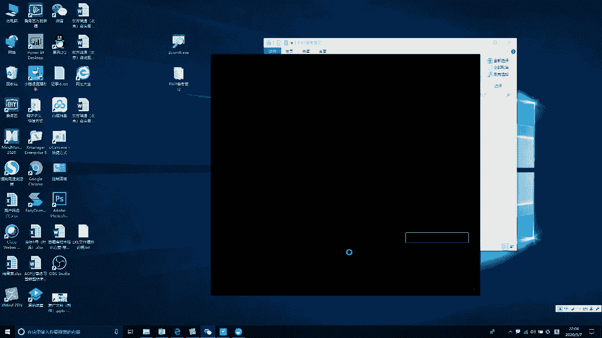
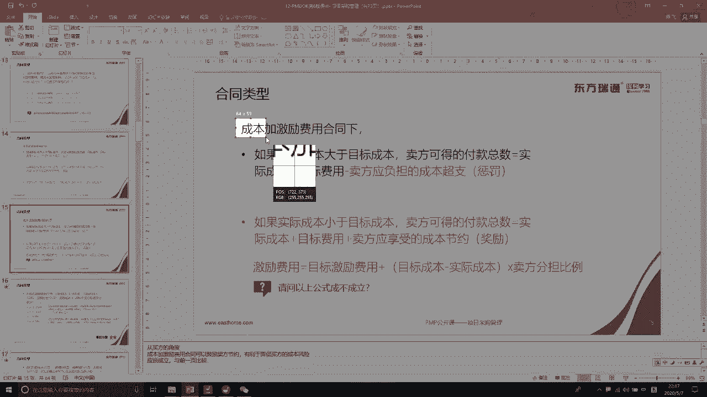
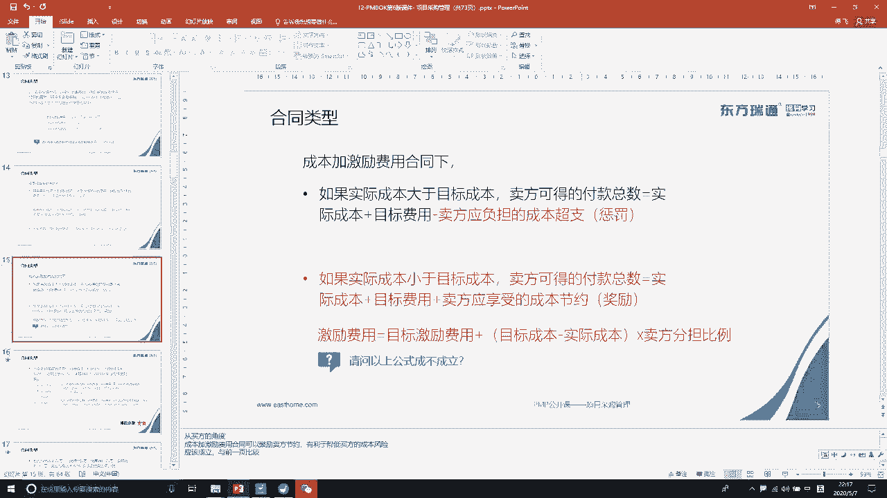
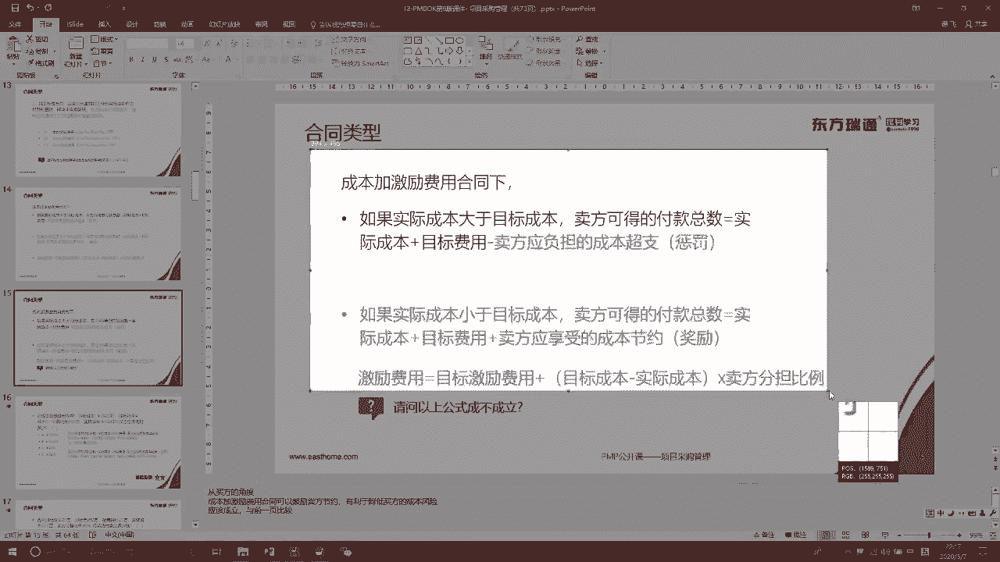
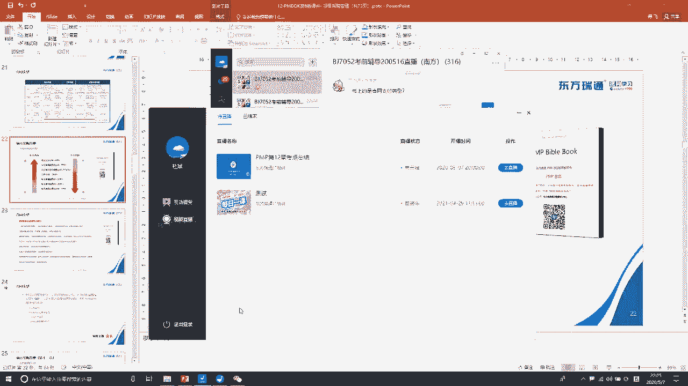

# PMP串讲 - P10：串讲第12章 - 我的乐芙兰 - BV1uE411N7zG

🎼，🎼，🎼The。🎼，🎼，🎼。🎼，🎼あ。🎼，🎼，🎼あ。🎼，🎼The。🎼，🎼The。🎼。

🎼，🎼我。🎼あ。🎼あ。🎼，🎼あ。🎼打开。🎼。🎼，🎼。🎼，🎼，🎼The。🎼，🎼。🎼，🎼。🎼，🎼，🎼，🎼The。🎼妈妈。🎼The。🎼。🎼，🎼Yeah。🎼あは。🎼，🎼ああ。🎼あ。🎼，🎼，🎼，🎼，🎼，🎼The。

🎼The。🎼，🎼，🎼。🎼。🎼，🎼，🎼，🎼，🎼The。🎼，🎼あ。や。🎼The。🎼。🎼The。🎼The。🎼，🎼The。🎼，🎼あ。🎼，🎼，🎼打开。🎼，🎼，🎼，🎼Yeah。🎼。🎼，🎼，🎼，🎼，🎼。🎼。🎼。🎼あ。

🎼，🎼，🎼，あ。🎼The。好。🎼By。あ。あた。高速上。🎼。あ。🎼By。🎼，🎼，🎼，🎼，🎼。🎼，🎼。あ。🎼The。🎼ああ。🎼，🎼，🎼，🎼Yeah。🎼好好。🎼ああ。🎼，🎼，打发。Yes。🎼By。🎼，🎼。

🎼，🎼，🎼Yeah。🎼，🎼，🎼，🎼ここ。🎼好好跟大家确认一下声音啊。🎼因为上一次包括这一次有的学员就反映声音呢过大或者过小。🎼好，大家如果说听到声音和看到画面有问题的话，及时的跟班主任反馈。

或者说把它发到这个呃微信群中。🎼我们的课程将会在2分钟之后准时开始。あは。🎼ああ。🎼。🎼，🎼あ。🎼走话。🎼，🎼，🎼。

好，各位学员，各位老师晚上好啊。呃，今天我们的备考课呢是。讲第十2章采购管理。嗯，在讲这个内容之前呢。呃，简单的说两句啊，就是通过这一周呢，我看到学员们在群里面的一些呃提问，发现呢。提的问题越来越少啊。

这是一个好的趋势。呃，提问呢主要集中在一些有争议的题目上面，这说明大家对这个基础知的掌握还是不错的啊。呃，看题做题呢也比较深入和敏锐，是吧？能够发现一些细微的疑点。但是呢还是还是有个别的学员啊，就是。

感觉还是在这个基础的知识层面上面有些漏洞是吧？有些遗漏的地方，所以现在时间很紧迫。希望大家能够呢利用一些闲鱼的时间，把这些。地方呢补缺补漏吧。呃，大家一定要紧张起来啊。就是我们以往在考前两周的时候呢。

经常有学员晚上做题做到一两点钟。呃，这个考试确实啊需要投入时间，需要大家投入一定的这个精力和热情。好，那多的就不说吧，我们开始今天的内容12章采购管理。呃，这个采购管理呢。

跟我们的第八章质量管理有点类似啊，就是感觉呢不太好学是吧？对它没有什么很多的概念。呃，原因很简单，主要是绝大部分学员呢没有亲身参与这个采购工作。对他不熟悉。另外呢，采购。也体验了很多的专业领域的知识。

所以对他陌生，或者说学起来觉得不是很。清晰很正常啊。好，那么在讲它之前呢，我。把对采购有关的一些呃知识点吧，给大家做一个明确。呃，第一点呢就是。这个采购工作。主要是由。经授权的。

具有专业知识领域的采购管理员去指导，就是采购工作呢是由采购管理员去主导的。而项目经理在这个过程中，主要是起到协助和协调的这么一个作用。并且项目经理是没有权利去跟我们的供应商签订协议的啊。

是由我们授权的采购管理员签订协议的。哎，这是第一点啊。第二点呢，我们的采购工作。可以分为组织外采购和组织内采购。组织外采购呢一般称之为外包。是吧。这种采购活动一般都是要签合同的。

合同是一种非常严谨的书面正式协议。它具有法律效力的啊。这是因为具有法律效力，所以呢。签订他的时候是需要双方平等协商会签。一旦签订之后，大家都需要呢共同去坚守和维护他。这是组织外的外包采购。那还有一种呢。

可能就是我们直接找组织类公司里面的某个部门哎进行采购。我们称这这种形式呢为内包，内包呢一般不签合同是吧？只签一些协议就可以了。这种协议呢是不太严谨的，这个大家需要区分一下啊。

我们的第十2章主要针对的指的是外包形式是吧？呃，基本上不涉及到内包啊。这是第二点。第三点呢就是我们在学习和做这章题目的时候，一定要注意身份的转变。整个偏不可。13章是吧，除了采购管理，其他的12章。

我们的身份都是乙方啊，都是乙方乙方的项目经理是吧？但是呢我们。在采购管理这一章节中呢，我们。变成了甲方了，因为是我们是吧，把工作外包给。哎，外包给供应商去做，我们是出钱方是吧？那个他们是供应商。

是哎干活的地方啊，所以说你在做题的时候呢，你这个思考的角度需要转变是吧？哎，我们是甲方了。😊。

这是第三点啊。第四点呢我们来说一下这个有关合同的两个比较专业的词汇啊。这个呢在我们的偏MB考试中是不会涉及的。但是跟大家呃分享一下吧。采购一般要签合同是吧。

而合同的成立呢取决于是否已经完成了邀要约和承诺。那什么是要约，什么承诺呢？嗯。这两个概念啊听起来好像很专业是吧？但实际上呢理解起来也比较简单。😊，啊，要约是什么呢？要约是。与。他方或者他人。

邀请订立合同的。表示呃，就是我想跟你签合同是吧？我想跟你签合同，这叫要约。而承诺呢是针对这种要约，我们表示愿意接受。啊，我们表示愿意接受，你想跟我签合同。行，我愿意跟你签合同，这叫承诺啊。好。

这么讲了之后呢，大家可能都要想唉，这要跟我们采购工作中的什么东西对应。很多人呢就容易去把这个要约。跟我们的啊。这个招标文件对应上去。而承诺呢很容易跟我们的投标文件对应上去。是吧。也就是甲方。

发出这个招标文件。嗯，你愿愿不愿意参与我们这个呃采购，参与我们这个合同。而乙方呢？嗯。提出或者准备。这个投标文件我愿意是吧，我愿意跟你合作，往往是这么理解啊，这样理解是不对的是吧？这样理解是不对的。

其实在这个邀约和承诺的前面呢，还有一个邀约邀请啊，还有一个邀约邀请。这个邀约邀请呢，它指的是。希望他人向自己发出邀约。哎，希望他人向自己发出邀约。啊。那应该是这么梳理一下啊。就是甲方是吧，他要做采购啊。

他要把部分工作进行外包进行采购。那么这个时候呢，他就。向外发出这个招标文件。那么这个招标文件呢，它就透露了表示了是吧？我希望有人来接我这个采购来跟我怎么来跟我这个发出邀约。发出邀约啊。哎，就生出来这种。

意象的橄榄枝是吧？那么呢这种邀约的邀请。他才是。对应这个招标文件，这是甲方啊甲方提出的。好，那么呢市场上面呢可能有很多的潜在供应商一看到哎这个招标文件这个邀约邀请之后呢，就觉得哎自己可以去试一下是吧？

自己愿意去参与这么一个投标。就准备了。这个标书是吧？准备这个标书，把这个标书呢就发给我们的甲方表示是吧，我愿意跟你签订这个合同。所以这个呢是邀约啊。就是我们的乙方的。标书。好，那么这个标书呢？

都交到甲方手中去了之后，甲方呢。根据这个评标要求之呢，选定了是吧？愿意他愿意合作的这个卖方。所以呢这个时候他就发出中标的通知书。哎，这个中标通知书呢就是承诺是吧？我愿意跟你。嗯。去。签订这么一个合同。

好，这是跟大家简单的聊了一下，就是合同成立它起决的这么三个啊概念或者这么三个要素啊。了解一下就可以了。我们的PMP考试呢是不涉及的啊，是不涉及的。好了。那另外呢我们再来说一下。

这个采购管理他的学习和掌握呢其实也是有两条线的啊。第一条明线。这是我们的采购流程。是吧。你看三个过程啊，第一个规划采购准备采购是吧？第二个啊，实施采购，执行采购签订合同。第三个，控制采购就是去依据合同。

把这个采购由乙方由我们的供应商去执行。而甲方呢进行监督。好，这个这个是明线啊，就是我们的采购流程。那么还有个暗线呢，就是合同是吧？整个三个过程中都跟合同是有瓜葛的。所以我们有必要啊有必要。

等一会儿呢去把这个采购流程跟大家梳理一下，跟大家梳理一下。好，至于说这个采购工作中的一些新兴实践和发展趋势，这个大家可以去了解一下就可以了啊，了解一下就可以了。这个我在这个地方呢就不去细说。

但是我会把它组织安放在我们的那个思维导图中去，大家可以呢唉。顺带的复习一下。好，还有就是这个集中采购和分散采购的优缺点比较是吧？那大家应该知道啊。集中采购呢就是。我们组织我们公司是吧？

针对每个项目的需求集中在一起，然后呢进行采购。而分摊采购呢，就是各个项目都有自己的采购人员，按照项目的具体需求及时的进行采购。这两者呢优缺点比较看一下就可以了啊。好，我们来看一下这个采购流程一览啊。

这个页面上面呢显示的是我们的规划采购的工作。首先呢我们的项目要去做自制外购分析是吧？就是这个。项目工作。我们是自己做好，还是到外面去买好，是吧？呃，做一个分析，拿出一个决策结果出来。如果决定。采购。

那我们就要去准备编写招标文件。好，这个地方的招标文件是一个。广广义的概念啊，它不光是有我们的。呃，这个招标文件它可能还有我们的这个采购。管理计划。所以这个地方我觉得啊把它改为编写一些准备一些采购文件。

可能更加完善一些。然后呢，去找一找我们有哪些潜在的供应商是吧？嗯。好，这个。这三个工作啊，它归属于。规划采购阶段。规划好了之后，我们要实时采购。实时采购呢首先要去发布我们的。呃，投标广告是吧？广而告之。

让更多的潜在供应商知道我们有这么一个采购的需求。好，然后呢召开我们的投标人会议。这个在我们后面会具体的去讲它的啊。然后呢，对。潜在供应商。他们的标书进行评估分析是吧？最终选定1到几家最佳的。

合适的供应商啊。选进来之后呢，我们需要给他谈判是吧，讨价还价。最后达成了一致之后就签订合同。这个屏幕呢这个内容。是我们的实时采购。说白了啊就是是吧？根据我们的这个规划。去跟前的供应商。进行谈判。

进行挑选，最后签合同的过程。然后这个呢是进入到第三个阶段，就是我们的控制采购。管理合同是吧，合同签完之后呢，要由我们的乙方去执行。甲方进行监控。那监控什么呢？第一要监控它的绩效是吧，质量有没有问题？

进度符不符合，成本有没有超支？是吧一定要监控着它，以免。他的。工作会影响我们的项目主体工作。然后怎么付款呢？这个需要对他提交的这个呃可交付成果来进行验收。然后呢，按这个进行付款。还要进行相应的记录。啊。

付款管理。如果在这个过程中。出现了一些纠纷和争议，我们怎么去解决，怎么去管理是吧？最后项目结束的时候呢。我们需要。关闭采购总结进验教训。把我们的采购文件呢进行记录存档。啊。

这就是我们简单的一个采购流程啊，分为三大阶段。每个阶段呢主要做了一些工作，通过这个图啊可以了解一下。呃，书上面呢有这么一页啊有这么一页，也是说了一个典型的采购，它的步骤。那么他这个罗列内容呢。

只罗列到了合同的签订是吧？控制采购这个阶段呢，它没有。嗯，没有没有具体写啊，所以大家可以把这两个部分呢结合在一起看一看是吧？就是把那个流程图和我们这个。典型步骤列表机合再去看一看。好了。

那采购流程呢有一个简单的了解之后呢。合同。这个东西。也是一个重要考点啊。首先我们应要知道合同呢。他有模板。来自于。组的个人资产。那么我们在组织过程资产中呢，获得了合同的模板。它主要分为三大类。

总价类合同、成本类合同和工价类合同是吧？然后呢，每个大类底下又有一些啊细的分支。三大类总共是7种类型的合同啊。关于合同这合同这一块呢，大家一定要有一个清晰的了解。因为这一块呢绝对会有考题是吧？

是必考的啊。好，我们来说一下啊，这个合同如何去选择。嗯。如果我们的采购范围非常的清晰。是吧。那我们选择总价来合同。而采购范围的清晰主要体现在有采购工作说明书SOW。

那采购工作说明书主要是描述了我们准备采购的产品服务的详细内容。是吧简单说就是你要采购什么东西，它的规格、型号、数量等等是吧？都非常清晰。大家想一想啊，你要采购的。这个范围这么清晰。

你把它发给我们的潜在供应商，他们呢。就非常了解了，也可以依据这个清晰的范围来进行估算和报价，是吧？呃，大家都很清楚，大家都清楚的情况下，那我们就可以把这个价格呢算的比较准是吧？呃。

这样的情况我们就签订总价类合同啊，注意关键词是吧？采购范围清晰。有SOW的是吧，这样可以有利于。准确的报价。那成本类合同呢主要是在范围不清晰的情况下，有的时候呢我们要采购的东西不定说就清清楚楚，是吧？

或者说风险比较高，哎呀，这个项目的风险比较高。没有人愿意来是吧？接受你这个采购，因为他也不知道能不能赚到钱。范围不清楚或者风险较高的情况下，我们就不能签总价合同。因为算不清楚是吧？不能提前算清楚。

这个时候呢我们就签成本的合同。成本实报实销，就是你把这个项目先接下来啊，真正项目中发现的成本是多少，我们到时候给你实报实销是吧？啊，所以范围不清楚啊，风险较高的。这种采购全成本的合同。供量合同呢。

这个好理解是吧？工就是工时跟人。雇人也有关系，尿是材料设备的采购是吧？啊，这个呢我们后面再详细的去说它啊，详细的说它。来，我们再进入到这个小大类的呃具体方法里面来。总价类合同呢又可以分成三种合同。

固定总价。固定总价呢？呃，最能体现总价来合同特点是吧？范围清楚。然后呢，这个价格固定了之后以后就不再改了。这是说你的卖荒啊，你的供应商。你管理的好，你挣的大钱，那是你的本领是吧？你管理的不好啊。

赚的钱少，甚至亏本了，那也跟我没有关系。呃，这是固定。总价合同一般我们。最常见的合同就属于这类合同。或者说我们建的最都的合同，就这一类合同啊，固定总要的合同。另外呢。还有总价加经济价格调整和总价加激励。

这两个类型呢是在总价固定的情况下要。做一些。呃，商定或者做一些调整。比如说总价加经济价格调整是吧？呃，我先跟你商定一个总价，然后呢，可能因为经济因素的原因。以后可以给你进行价格方面的调整。

那什么情况下我们签这种合同，或者什么情况下我们可以进行调整啊？有以下几个关键词啊，第一，履行合同的周期比较长。因为女性服的周期长可能会受到我们通货膨胀的影响。比如说大家知道典型的三峡工程是吧。

最初的预算。嗯，感觉好像不是很多，但是实际十几年项目下来。最终的啊这个这个。投资啊远远超出当初的预算是吧？这就是因为受到了。通货膨胀的影响。好，第一个啊就是履行合同的周期比较长，因为它受通货膨胀的影响。

哎，那考试题目中是吧，怎么样认为它这个周期长呢？一般是三年啊3年以上。那第二个特点呢就是。😊，使用了不同的货币进行支付。因为不同货币它存在着一个费率的因素是吧？那费率往往有时候呢会有波动有影响啊。

第三个呢就是采购的某种。啊，商品。他可能。价格成本呢波动比较大。如果存在这种情况，哎，我们也可以考虑使用经济价格调整。啊，比如说我们可以发现啊，近些年的铁矿石这些大宗商品是吧。

被人操纵的时候波动的比较厉害。好，除了刚才所说的三个要素之外呢，还要加一个关键性的要素，就是金额必须大。是吧你如果金额不大，就算你周期长，就算你。有费率影响，就算你呢价格波动比较大是吧？那也无所谓。

所以说签总价加进行价格调整的这种合同呢，是这四个因素啊结合在一起去考虑。第三种呢是总价加激励费用是吧？嗯，跟你商量一个总价之后呢，我们还约定一个激励的条款，怎么去激励你。

但是这个里面呢往往它会有一个最高限价啊，就这种合同。它涉及到有计算题的啊，我们后面呢再补充啊，后面再补充。有个最高限价，就说我们的最终付款金额是不能超过这个最高限价的。好，这是。呃。

跟大家说了一下总价类合同啊，总价类合同的。大前提是范围比较清晰啊，最好是有这个SOW的方采购工作说明书是吧？那第一种是锁死的，后面两种呢我们可以。做一些约定，做一些调整。

适当有一定的灵活性啊有一定灵活性。好，第二类合同成本类合同是吧？它签订的前提是。范围不清楚，风险比较大。同样它也细分为三类。成本加固定费用。成本人合同的首要特点是成本实报实销。是吧你花了多少成本。

我都认啊，只要是正常成本，我都认。但是呢这三者也有区别。我们来看一下啊，第一种叫成本加固定费用，就是成本实报实销。另外呢我还给你一笔固定的费用，作为你完成我这个采购。哎，的一的一部分利润是吧？

那这种合同呢？是一般不能签的，因为风险。最大啊不是太大，是最大。因为乙方发生了成本是吧，你都给他报了。并且呢它这个。利润是稳拿的。那这种情况下呢，我们就知道啊。我们可以呢进行。呃，加班是吧？

大家知道啊加班它是会增加成本的，但是会缩短我们的什么项目工期是吧？啊，拼命的。增加成本来缩短他的工期，最终让他在短时间内能够创造这个固定的利润。这样呢对于我们的甲方来说啊，风险是太大了的。

一般这种合同呢。不会签，我们的考试中呢也出现的比较少是吧？那重点呢还是看下面这两个合同啊，尤其是。这个合同。成本加激励合同。还是成本释放时效是吧？那如果说你。干得好，给我节约了成本。这个节约的部分。啊。

节的部分我们。双方可以分享。啊，一般这个分享的比例呢是8020。就是甲方拿大头8080%啊，乙方呢获得小头20%。那反过来呢，如果说你的成本。超支了我们可能有一个目标啊，有一个目标成本啊。

如果超过这个目标成本，那么超出的部分是吧，我们都是要。要要分摊的啊，还是呢甲方80%，乙方20%。同样这个地方也是有计算的啊，也是有计算的。嗯。第三种呢是成本加奖励。成本实报实销。

另外呢可能会让你获得一笔奖励。那，这个奖励。书上这么说的啊。就是我们的甲方根据主观的判断。对乙方的绩效进行判断。如果他觉得你的绩效来主观判断好，他就会给你奖励。如果呢觉得他觉得不好是吧？看心情啊不好。

他就不会给你这个奖励。所以说这个不客观啊不客观，并且呢他还不让你去申诉，就是由他说来算，是吧？所以说这种合同呢也不是特别的靠谱啊，不是特别的靠谱。好，这是成本补偿类合同。呃，它的签订前提是范围不清晰。

或者说风险比较大。然后他的。金额合同金额呢是成本实报实销是吧？另外再加上后面的部分。同样呢。这个是固定死的。这个也是要做一些约定啊做一些约定。具体怎么约定是吧？加奖励。讲基励。好，那我们把这个。

计算的部分跟大家说一下啊，就是关于合同类型这一块的出题的题型有三类。第一类是吧。给你提供一个情境，让你判断这个采购。适合签什么类型的合同？比如说我们刚才已经说过了是吧，范围清晰。总价类。有风险高的。

成本类是吧。这是第一类题型啊。第二类题型呢就是给据提供一个情形，让你判断。这些合同类型它的风险高低大小。是吧。那一般情况下呢，总价类合同的风险要低一些。成本类的合同呢风险要高一些啊，尤其是。

刚才说的那个成本加固定费用是吧，成本加固定费用这个合同的风险最高啊。那第三种题型呢就是计算题。让你根据提供的数据来计算我们的合同的。呃，金额报价是吧？好，关于计算的公式啊。有好多。

那我呢给大家精简了一下。呃，就留了三个公式，大家只要把这三个公式掌握就可以了。那即使是这三个公式的话，我在这个地方讲大家去理解呢，仍然。会觉得有点绕是吧？会觉得有点绕啊，所以呢我们先去看题。

通过把题目做了之后，回过头再来总结这三公式，可能就简单一些。好，来看题啊。这道题。在成本加激励合同中，目标成本。为10万。就是这是一个成本类合同是吧？成本将实报实销的啊。啊。

但是呢为了奖励为为了激励你是吧？我们双方约定了一个目标成本，这个目标成本是什么意思呢？就是我们双方共同认为完成这些工作。大概一般情况下需要成本10万是吧？呃，这是一个参考线啊是一个参考线。目标利润1万。

那我们就把这个是吧成本10万的10%的部分。10%啊大概10%。1万块钱作为你的利润。啊，就是这个是一定要给你的啊。至是说你在具体执行。合同过程中是吧，如果。你刚刚好给我节约了成本。好。

那我们节约的部分啊节约的部分。甲方。分享70%。乙方分享30%。啊，一般情况下啊是80%的和20%。那题目具体是多少，你就按多少去算就完了，是吧？反过来呢，如果说你的成本。啊，超支了。

比这个10万要多啊比这个10万要多。那么多出的部分同样啊甲方负担70%，乙方负担30%。现在呢要求我们计算最终支付给。哎呀，我们的乙方的。金额是多少？好，这个题目怎么算呢？是吧。呃。

就是说这个10万是一个参考成本。把你的实际成本去跟这个参考成本做比较。嗯，看似。低于它，那我们的奖励。高于他呢，我们就惩罚。那显然啊12万是高于1010万的是吧？呃，这是需要惩罚的啊。那具体怎么算呢？

具体怎么算呢？😡，我们还是根据我们前面的讲解是吧？实际成本实报实销。哎，那我呢？发了。12万的成本，这个我要实发实销啊，要算给你是吧？然后呢，还要。加上这个目标利润是吧，这是你该得的。这是你该读的啊。

加上1万。因为我们这个成本是超支了是吧？实际成本高于目标成本是超支了，所以我们是要处罚的。那么处罚处罚的部分啊处罚的部分。是超支的部分，就是12万减去10万。就是这两万部分呢，我们是要做处罚的。

至于说处罚多少。你作为乙方。啊，你作为乙方。是吧你指。啊，你只分担分担30%。那就是我们的2万。乘以30%。注意啊，这是处罚你的处罚你的。嗯，所以它是负值。嗯，它是复制啊。啊，应该变成减是吧，减。

如果说你是节约了。那就是奖励你的是要加上这部分钱的。所以最终大家看一下啊，12万。加上1万13万，13万减去。这个6000。是吧最终呢结果应该是124000啊，最终结果应该是124000。好。

我们采取的计算公式啊。我们采取的计算公式呢是这个公式是吧？大家看一下啊，这个公式。实际成本是吧。12万181千0。目标费用目标利润该给你的1万。然后呢，因为你超支了2万，2万中呢，你只用负担30%。

所以减去2万乘以30%。啊，最终等于这么多。我们只要掌握这么一个公式就可以了啊。呃这个公式的算法呢结果是一样的，不用掌握那么多，掌握那么多呢，相反把自己是吧弄复杂弄晕了。好。

这就是成本加激励费用合同的计算不难啊不难是吧？嗯。再说一次啊。嗯。实际成本实报实销是吧，加上你应得的。利润。然后呢，看是加，如果是奖励，就是加。如果是惩罚，就是减。嗯。这个部分。这个部分是我们的超支。

或者说是我们的节省的部分啊，得出来结果。好，这是一个题啊，我们再来看这个题。合同目标成本20万是吧？那同样就是我们甲乙双方共同商讨好了的。我们认为呢完成这个采购执行这个合同大概啊一般可能要花20万是吧。

目标费用2万。另外2万作为你的利润。但是呢他有个最高限价23万。这么一看。谁有最高限价了？就是。固定总价类合同里面的。奶类。大家回回过头去看一下啊。这一类是吧，总价加激励费用合同啊，他有。上线是吧。

还有上线。所以你看到这个词啊。你就应该马上意识到他指的是。呃，固定。总价加。激励合同是吧？好，那它的计算公式呢。它的计算公式跟我们那个成本加激励合同的计算公式实际上是一样的，无非就是。

无非就是多了个最高限价是吧？如果说你最终的成本超出这个最高限价的话，你就不用算了，我们再多是吧，也只给只给你这么多啊，只给你这么多。好，你看这个题目，他就这么描述的是吧？我们约定的最高限价是23万。

结果你乙方在执行的时候发了23。5万的成本。😡，那对不起，那我们就不算了是吧？我们只能按照23万给你。啊，其多出的部分我们不负责我们不负责啊。嗯。这是最高限价在起作用。所以这个题目啊不用算了。

选择C23万是吧？因为你超出最高限价了。那如果说你没有超出最高限价，你说我执行的时候是22万。那这个呢它的算法就跟这个题目的算法是一样的啊是一样的那我们就不再多讲了啊不再多讲了。好，再看一下这个题目。

这个题目呢稍微的要比前面的题目呢又要复杂一点点。买方和卖方签订了一个成本加激励费用合同。合同的目标成本为30万。奖励费用就是目标奖励费用，目标利润啊。为4万，大家可以发现啊，你看不同的题目。

它这一块的翻译。都有差异是吧？那有的翻译叫做目标利润，有的叫目标成本，有的叫目标奖励费。其实呢我们都要把它理解为啊一个意思。奖励分摊比例为8020，奖励费用上限。你看它对这个奖励的费用。

做了一个上下限的规定。上限6万，下限1万。如果卖方的实际执行成本为38万，则奖励费用为多少。那这个题目呢，他没有让你算这个合同的。总的金额，而只是让你算那个奖励费用。那我们应该知道啊。

奖励费用它等于什么呢？等于你。是吧超支或者结余的。这个部分。乘以你的分摊比例。啊，乘以的分散比例。那么大家看一下啊。实际执行38万。目标成本是30万是吧，目标成本是30万。那就说你超了8万。

超到8万这个超支的部分，你要负担20%。那就是2816000。嗯。16000啊。这个16000是负的，不是正的啊。如果是奖励给你的那就是正的这是处罚你的，是负的是吧？那我们可以看到呢。

这个16000是在上线6万和下线1万之间。所以。按实际执行。啊，按实际执行就可以了。按实际执行啊。好，这个实际执行呢，它应该是你的。4万啊，这个是怎么都人拿到手呢？4万。减去。这个16000。

最终算的结果呢是我们的。24000啊2400。上线。也就是说你算的这个值。超出它了，那就按照他执行。下限你说的这个值低于它了，就按它执行是吧？这是上下限的这么一个概念啊。好，这个计算合同的金额的计算呢。

大家还是一定要掌握。虽然这个考题。呃，比那个合同类型的判断风险大小的对比题目要少一些。但是呢我建议大家还是有必要掌握。因为你掌握了之后，对于前面的理解可能就更加的印象深刻一些啊。好，这个题目呢。呃。

差不多的，我们因为时间的关系啊，就不去做了啊不去做了。哦，我看一下群里面。讨论区里面有人问。10万加1万加2万乘以0。7。对的啊对的。买方是70%。对，买方是70%，买方是甲方啊是吧，甲方啊。啊。

如果你站在甲方的角度上面去考虑呢，你就以另外一个角度的公式计算。我们现在呢。我刚才说了嘛，有几种公式嘛是吧，都可以的啊都可以的。有的啊这看约定嘛，有的激励是有上限和下限的，有的是没有上限和下限的啊。

有的是没有上限和下限的，这就要看。合同的具体约定是吧，因为合同是双方平等协商的啊。好，大家如果说还有一些细节。😊，不了解不清楚的地方，我们。在课间或者课后去讨论。好了，我们再来看一下这个公料合同啊。

公料合同呢。呃，很多人觉得它不是很明晰，所以这个地方呢我稍微发点口舌把它说一下啊。就他的选择不是很明晰，实际上他的考试呢也不多，考题也不多。什么时候选供商合同呢？大家看一下啊，第一个。工作范围是明确的。

但是工作量呢多少无法确定。是吧另外呢。合同的规模很小。但是单价非常明确啊，大家可以记着4个4个点是吧？第一，工作量无法确定。第二个采购的规模很小。第三个单价非常明确。第四个呢就是。时间比较急。好。

那有人说你让我。死记硬背是吧，我可能记不下来，那我就给你提供一个场景吧，就容易记下啊。比如说你是个导演是吧，你在拍电视拍拍电影，你需要。采购这个群众演员。大家想一想啊，群众演员的工作范围是很明确的是吧？

我就是让你来演。呃，群众的啊可能是是吧在旁边摇嘻呐喊的，可能是。呃。演这个什么尸体可能是演有几句对白的是吧？工作范围很明确，但是工作量不不太好确定哦，今天可能要三个群演，明天可能要10个。

后羿要100个是吧？而且很急啊呃也很急。😊，马上就要拍戏是吧嗯。很急啊。另外呢。这个采购的规模很小是吧，就找几个人嘛，单价非常明确是吧？刚才说了啊，你演什么样的角色，那么这个价格都是很。很清楚的是吧？

好，这是我们公料合同的适核场景啊适和场景。所以说。供量合同呢往往是。雇人。聘专家是吧，聘专家或者说采购原材料，采购设备的时候用这种。另外特别强调指出一下啊。就是我们的敏捷项目一般采用的是供料合同。啊。

一般产生供联合同。好，至于说这个买买方承担工作量的风险，卖方承担单价的风险呢，这个呃因为时间的关系，我就不跟大家详细的去分析和解释了啊。掌握前面说的那么多已经。足够了已经足够了啊。啊。

关于这个合同的风险。排序是吧，这个图大家需要花一点点时间呢。把它记一下，最起码你要知道啊固定总价合同对于我们的买方就是甲方啊，风险是最低的。成本加固定费用。对于甲方的风险是最高的。

或者说我们应该意识到总价合同的风险低，成本的合同风险是高的。因为前面就说了啊，为什么签成本债合同呢？风险高嘛，是吧？风险高。嗯。好，这是关于我们的合同类型啊。在这个备考辅导书里面呢，也有相关的一些口诀。

大家可以呢呃发点时间看一下。比如说你看第一句话是吧，依看范围明不明确。那范围明确的话呢，我们签总那个总价类合同，尤其是签固定总价类合同是吧？第二个看紧不紧急，一般紧急的哎，再加上采购的规模小，单价明确。

那就公料类合同呗。三、看持续时间长短。范围明确。履行合同的时间比较长3年以上是吧？受这个通货膨胀的影响。那么就先。那个经济价格类调整是吧，合同。四抗风险谁大谁小啊，风险。大的。😡。

铅成本类风险小的铅总价类。好，这个是关于合同类型啊，这一块嗯是必考的一个考点。呃，内容呢也稍微有点多啊，有点小复杂。好，关于计算这一块啊，我估计很多人是有点头疼的是吧？那这样吧。

我们等一会儿下课时间再给大家把这个地方呃做两道题来呃梳理梳理吧。来看一下这道题啊，有的公司即将进入一个项目的招标工作。该项目的范围定义不是很清晰。你看。😊，关键词啊范围不清晰。

但是公司要想尽力的尽量的降低财务风险，你应该选择哪类合同？第一个啊，范围不清晰，肯定要签成本类合同是吧？同时呢你作为甲方，你又希望风险尽量小。啊，那你可以看一下，或者你可以回顾一下啊。成本的合同中是吧。

哪一个合同类型，它的风险都于甲方是最小的。你看啊。成本债合同是吧，最小的。最小最低的啊就是成本加激励费用。成本价激励费用。所以你选择D成本价激励费用，不要选成本加固定费用。我们反复的说过啊。

成本加固定费用它的风险是最高的一种，没有谁比它高是吧？没有谁比他高。好，这样吧，呃，现在呢是8点49分啊，呃我们就休息10分钟。那么关于钢材合同的。金额计算或者是。这个奖励费用的计算啊，有疑问的。

我们再把那个地方讲一讲啊，没有疑问的呢可以休息啊，没有疑问的可以休息。好。好，还是把这几个道题。😊，过一过啊。成本类合同。它的共同特征是成本实报实销。是吧成本是不实效啊，这一句话先要记在心里。

那成本实报时效呢，我们在双方合同里面还有一个约定是吧，怎么去奖怎么去激励啊，怎么去奖励，怎么去分摊是吧？有个约定的那具体怎么约定呢？首先我们要约定一个。目标成本就是大家都认为啊。😡。

干这么多工作需要花的成本是多少啊，需要花10万是吧？那我觉得呢既然是吧你作为我的供应商。我不能让你呢白干。我会以。这个成本为参照。以他的10%就是1万块钱作为你的目标利润。

就是这个利润我肯定是要给你的是吧？嗯，你不能说义务白干。啊，这是目标利润。然后呢，如果说在具体实际执行的过程中。啊。成本。实际成本啊。超出了目标成本。那就说你成本没管好是吧？呃，我要对你进行处罚。

超出的成本部分，你。乙方啊。负责30%。甲方。承担70%。那反过来，如果说你成本控制的非常好，低于我们的10万是吧？😊，那这个节约的部分我们是要。呃，进行奖励的是吧，把节余的部分30%。奖励给你乙方。

甲方得70%。记住啊，甲方永远是扛大头拿大头的。哎。好，那这么一说的话，大家对这个最终啊最终我们的。卖方应该支付。呃，买方应该支付啊，卖方应该获得的。这个总的金额多少，做一个计算。对吧那怎么算呢？😊。

实际成本181，你发了12万是吧？你都说得出理由啊，给你实报实销，这是要给你的。目标利润1万。这个也是要给你的。然后呢。激励部分。是吧基励部分，因为你超支了2万，那这个12万减去这个目标成本10万。

就超支了2万。那你超支2万的话呢。😡，我们是要对你进行处罚的。所以是减啊。呃，处罚多少呢？就是这个2万。这个2万啊，你要分摊30%。你要分摊30%。啊，2万乘以30%。就是6000吗？

是吧那这个呢是13万13万减6000。不就是124000吗？啊，就这么去理解啊就这么去理解。😊，这个实际成本实报实销。目标利润。绝对会给你。那至于说奖励的部激励的部分啊。成本超支要处罚是借。

成本节约要奖励是加。是吧。就是这样的啊就这样的。好，再来看一下这道题啊。😊，这道题呢？他说合同的目标成本是20万，那这就不解释了啊，目标费用2万是吧？但是还有最高限价，一看到这个最高限价。

我们就要把它映射到那个。总价类合同里面的第三种啊，总价加激励费用。是吧。它的计算啊它的计算如果。你的实际成本没有超出这个最高限价。再强调一次啊，如果你的实际成本没有超过这个最高限价。

那么的计算跟前者是一模一样的。跟前者是一模一样的啊。如果一旦超出这个最高限价。那对不起就不用算了是吧，就按他去支付。就让他去支付啊就让他去支付。大家可以看一下这道题呢，最高限价是23万。

实际成本呢是23。5万，是超过最高限价的是吧？那就不用算了。就按23万去支付就完了啊。那如果说实际成本没有超过23万。是吧22万甚至是低于目标成本18万。啊，是18万。

那它的计算呢跟我们前一道题的计算是一样的啊是一样的。好，这是这道题。这道题嗯。跟前面的题目呢。又多了一个奖励费用的上限和下限设定。就这些东西你都是甲乙双方可以在合同里面去约定的，是吧？好。

还是要先看清楚啊，他签的是一个成本加激励费用的合同。大家注意啊，7种类型的合同只有两种类型的合同，有计算题。就是成本加激励和总价加激励这两种啊有计算，其他的呢呃其他的是没有计算的。没有计算的啊。好。

这个上限和下限的意思就是说我们就去算这个讲激励啊，这又是翻译的问题啊。哎，我们算这个激励费是吧，高于它。那就是它是封顶的啊，我们就按它去支付就完了。低于它它是下限，我们按它去支付是吧？

它存在着一个上下限封顶和封底的这么一个概念。那如果是在上下线之间呢。那就是多少就付多少。所以我们要算这个最终的激励费用。我们呢。要跟这两者做做对比是吧？好，我们来看一下啊。

目标成本30万啊目标成本30万，实际执行成本是38万，超支了8万。那么超支8万的话，这个8万我们的乙方是要分摊。要承担20%的。所以他要乘以20%啊。那8万乘以20%就是16000。是吧16000。

16000啊。好嗯。这个16000。嗯，我们再去跟我们的。这个4万相加。是吧4万相加啊，这是负的1600，因为你是要处罚。4万。减去这个16000。那就还剩下24000。

我们可以看到这个24000是在我们的上线和下线之间的。上限和下线之间的那就支付24000就完了是吧，支付2000就完了。好，大家注意啊，大家注意跟上线和下线比较的是。用它减了。分摊比例之后。再去比较。

而不是没有减之前去比较啊。好。为了。巩固一下，我们再把这个题目也看一看啊。买方和卖方签订了一个成本加激励费用的合同。那，大家可以看到呢，计算题啊主要是集中在这一种类型的合同上面，是吧？

偶尔可能有总价加激励费用。当然那个是吧跟这个其实差不多的啊，就多了一个啊。最高上限的这么一个东西。目标成本32万。基励费用4。5万。成本分摊比例8020。上线622下限1000。

如果卖方实际成本为38万，则应该支付多少费用。其实你看上一道题会做这道题也没有问题是吧？只不过强化巩固一下就行了啊。好，那看一下吧。嗯，38万超出了我们的目标成本。32万。超了6万是吧，超了6万。

这个6万呢。我们要分摊20%。并且是要。处罚的啊，所以是减。那6万乘以20%就是12000。嗯，12。不管你是超了还是节约了成本，这个45000是总要给你的是吧？所以我们用45000。减去。

这个12000。等于。33000。等于33000，可以看到33000的这个激励费用，它是介入6。2和1。1的上下限之间的。所以按实际进行支付，选择D啊选择D。好，我相信啊呃。😊，把它再讲了一次。

大家应该是没有疑问的啊，没有疑问的。再回头说一下吧，就是合同类型的考试这一块肯定是必考的。但是呢考题的这个分布，考合同类型的选择，考风险大小的对比，这种考题比较多啊，这种考题比较多。

考计算比较少啊比较少。你不要看到我这个地方连续的给大家举了这么几个例子，就以为计算比较多啊，这种认识是不对的啊。好啦。😊，那我们就继续了啊。整个采购管理呢是三个过程。规范。采购管理制定采购管理子细划。

属于规划过程组是吧？实时采购呃，就是我们。跟那个选定的供应商签合同的，这个属于执行过程组啊。然后呢，乙方执行合同，甲方负责监督。控制采购，这属于监控过程组是吧？这个非常清晰啊清晰。好。

我们来看一下这三个过程啊。😊，首先，12。1规划采购呢，它的定义是吧？记录采购决策。就是我们要先做一个自度外购分析，到底是自己做，还是外面去采购去买，要呃做一个决定嗯，有一个选择是吧？那既然选择采购了。

我们就要明确我们的采购方法，制定我们的采购策略。为我们的采购做一些准备工作。识别潜在的卖方是吧？你要采购，你要找谁去买？你也要找潜在的卖方啊。好，看一下IDTO。IT呢我还是。惯例啊。

把这个输入呢给大家呃稍微的带一下。输入项目章程。大家可以发现啊。这个10个子计划。都要输入项目章程。是吧你可以看一下啊，这10个子计划都有项目章程的输入是吧？因为它里面有高层级的东西。

输入商业认证效益管理计划。那我们的商业认证的输入主要是为了让我们的采购策略。跟我们的商业认证呢保持一致，确保我们实施了采购，还能够达成我们的。呃，商业目标就是实质上采购呢，我们还可以让这个项目能赚钱嘛。

简单的这么说啊。😊，然后下面呢，范围管理计划跟范围基准配合是吧？我们准备把范围基准中的一部分工作进行外包啊，进行外包。质量管理计划哎，我们的。外包工作它是要质量要求和质量标准的，是吧？资源管理计划。嗯。

啊，这个也用到啊，自然管理计划呢是确定。哪些资源要采购和租赁是吧？大家应该知道啊，资源管理计划里面是包含有这个RCI矩阵是吧？呃，包含有资源需求这一方面东西的。里程碑清单，既然我要把这个工作外包。

那么呢。卖方他在交付的时候。什么时间交付是吧，是什什么时间交付啊，一定要确保这个里程碑。项目团的开工单啊，看一下我们这个项目团队有没有能够执行采购活动能力的资源。可以使用。这个需求文件和需求跟踪矩证呢。

主要是我们的外包工作是要去满足一定的项目需求的，是吧？风险管理呃，风险登心册。大家知道啊，在风险应对里面。我们就可能会把一些工作通过外包，将风险转移给第三方是吧？另外的话呢。

我们的采购本身就可能会存在着一些风险。所以呢需要啊需要通过风险等析测。来进行风险的管理。啊，相关的册就没什么好说的啊。组织共同资产这个里面呢主要是。拿到我们的合同类型的模板是吧？合同类型的模板。

工具和技术里面大家画一下啊，市场调研。市场调研呢主要是。调查市场的行情是吧，了解潜在卖方的。能力大小，这样呢就不会被我们的潜在买方忽悠了。哎，所以自己要做一个调查啊。自制外购分析。工方选择分析好。

这个在里面。专门去讲解一下。大家可以发现啊，这个12。1它的输出。特别多，而且呢还比较重要。所以说12。1的主要考点。都在输出里面，这是一个非常独特的现象啊。好，自制外构分析这个很好理解是吧？

我们现在做一个对比嘛，是自己做好还是外面去买好是吧？外面买是购买还是租赁这都要去怎么去对比权衡拿出一个决策出来的那往往制定这么一个决策呢，是通过计算。实际的计算比较复杂，考试这计算呢？比较简单。

就是做这种方程式的计算，得出来X值，你得出来X值自然就得出来判断结果啊，大家可以看一下这道题啊。😊，某零件是吧？如果自制的话，单位变动成本是12块钱，还需要自制买一台设备，6000块钱。如果外购的话。

量大于2000，那么就14块钱一件。小于2000就15块钱一件。现在呢我们如果说需求量大于3000件，请问是自制还是外购？是吧。🤧好嗯。大家可以呢把这个数值啊带进去计算一下，一比一较就知道了。

你看呢如果自制我们如果采购3000件的话，那就12块钱。乘以3000。这是。单位变动成本是吧？还要加上采购这个设备的6000块钱。这么一算的话呢。啊，这个是。嗯。这是多少？3000是吧。

36加600422。就如果是自制的成本。是这么多。那如果是外购呢？3000件它是大于2000件，我们要按14块钱一件去计算是吧？那就是14乘以。这个3000。那我们发现呢计算的结果它也等于42000。

呃，如果你这么一算的话是吧，你就发现啊资质也可以，外购也可以，很容易就选择了，很容易选择C。😊，甚至有人可选这个啊，不怕麻烦。但是我们要注意到啊细微的关键词是吧，蓄求量是大于而不是等于。

那刚才是为了好计算，所以是选等于大于啊那大于三级键的话，量越大的话，我们这个单位成本。就选低的嘛是吧，这个就高一些嘛，是吧？所以应该最终选的是资质啊，最终选的是资质。这个这样的计算题非常少啊。

大家掌握一下就可以了，这是自助外部分析。另外呢跟大家补充一点，那为什么我们有时候要外购呢？😡，不光是说从成本方面考虑啊，有时候成本是一个方面而已。呃，我们外购的原因。有时候。可能是。啊。

可能是风险能力的问题。比如说我自己做，我做不好，我不会做是吧？我做不好，我自己做呢，有风险。我不会说压根儿就不能做是吧？那这个时候必须要外购去采购嘛？那还有的呢就是我不想做是吧？我自己做觉得划不来。

并不是成本方面的因素啊，并不是成本方面因素是吧？嗯，所以说。自制外购分析主要考虑的。因素可能是成本，但是也可能会考虑一些其他的因素是吧？好，这是自制外购分析啊。供方选择分析。供方选择分析呢。

这个里面考虑的因素比较多。呃，就。挑三个给大家简单说一下啊。第一个。以最低成本为主要考虑内容。那么这种。以最低价格去选供应商，往往使用于采购标准化的产品。或者常规采购。因为标准采购常规采购，它的服务。

它的产品的质量都是非常稳定的，都是差不多的。供应商都是差不多的，是吧？那既然服务和质量都差不多的那我们就选择价格低的成本低的。嗯。这是考虑最低成本是用于这个方面的采购。仅凭资质呢，这很容易误会啊。呃。

很多人就会认为唉，仅凭资质就是看一下我们的潜在工方。他是不是有相关的资质认证？当然你这样说也没错，是吧？准确的理解应该是。这个资质是我们的买方。给卖方确定的资质，简单来说就是一个。

一个短名单啊一个短名单是吧？因为你跟我们长期合作，你进入到我们采购的短名单里面去了。我们如果说有一些什么需求。是吧一般都是一些比较小的需求啊。有小的需求是吧？没有必要劳丝动用。

那这个时候呢我们就在短名单里面去挑。啊，挑的话呢就按照这些纬度进行对比，最终选择最佳的。呃，这么一个供方啊，所以说这个资质是指的卖方的短名单这么一个资质啊。第三个呢就是基于质量和技术解决方案的得分是吧？

如果说我们的采购方它是有问题。要解决，而且呢解决起来还有一定的风险。那么这个时候呢，他可能就不是要首要考的是成本。嗯，或者说。在这个小范围短名单里面去找了。那这个时候呢可能。

就更看重我们的潜在供应商提供的建议邀请书里面的解决方案，哪个质呢比较好，有针对性，我们就选择哪一个。哪个解决方案适合我们的情况，我们选哪一个？所以说啊这个主要是针对解决问题的解决方案。

而解决方案在哪里呢？在建议邀请书中是吧？对这个建议对这个公方的建议邀请书进行评分，看哪个啊得分高质量高就选哪一个。好，其他的几个呢大家自己去看一下啊，其实就好理解了。😊，是吧。好，这是工方选择分析啊。

工方选择分析。把三个工具呃了解了三个工具大家回顾一下啊，第一个是吧。这个市场调研。第二个资制外沟分析。第三个呢，工方选择分析。重点是后面的输出。输出。采购管理计划。购管理情况呢。

大家重点是要知道在这个计划里面呢有这么样的三个内容或者两个内容啊。第一个内容呢。就是采购管理计划中也是有相关方的角色和职责的呃，这么一个明确的那到此为止呢，大家可以发现是吧？质量管理计划里面有角色职责。

自然管理计划里面有角色职责。风险管理机划里面有角色职责，财务管理机划里面也定有角色职责，看到吗？这是第一个要明确的啊。第二个要明确的就是这里面有风险的管理。呃，风险的管理事项，我再说一次啊。

本身在风险的应对里面。就有一个是什么转移是吧？这个通过外包把我们的风险转移给工方。哎，那你说风险管理要不要纳入到我们的采购管理里面去呢？其二。整个采购的过程中，很容易出现各种风险，是吧？

采购过程中的风险我们也要进行管理的。好，这是这两个点啊，稍微明确一下。其他的点呢就是能技多一点，能掌握多一点更好是吧？这个啊非常重要。前面我们也说了是吧？采购范围清晰的，我们采用总价来合同。

那么采购范围清不清晰呢，很多时候就体现在有没有。采购工作说明书SOW是吧？SOW是什么呢？S和W是源于我们的范围基准的是吧？我们把范围基准中的一部分工作拿出来进行采购，进行外包。是吧。

也就是说它是源于范围基准的啊。然后呢。他对我们的采购的产品和服务进行了详细的描述。进行了详细的描述啊，那么这个详细的描述呢。嗯，就形成了我们的采购工作说明书。另外呢，在签订合同的时候。

这个财务工作说明书是要纳入到合同里面成为合同的一部分的啊。所以这个东西挺重要的，是吧？挺重要的。嗯。前后是有关联的啊，它的来龙去脉是吧？来龙去脉。我再说一次啊，它的制定源于范围基准。啊。

依据范围基准去制定。是吧制定好了之后呢，它会作为一个采购文件。采购文件提供给潜在的卖方。你看我们要采购这么一些东西，是吧？嗯。跟你说的很清楚。最后它的去向呢是被纳入到我们的。呃，协议和合同里面去了。好。

我们的买方还需要准备的就是我们的招标文件。那么招标文件的形式呢？一般有三种啊，信息邀请书。报价邀请书和。建议邀请书。请数啊，细息邀请数呢往往是在这个。我们看一下啊，往往是在投标入围前。

就需要呃我们的这个工方提交的是吧？那我们的。买方呢通过他可以对我们要采可以。就是我们的买方通过他可以更多的去了解供方的。产品服务和公司的一些细列情况。哎，就是通过这个东西，我对你这个公司对你的产品。

对你的建这个这个服务有一个大概的了解，是吧？好，如果觉得你还可以不错。那么呢，再让你提供报价邀请书或者建议邀请书。如果说我们是。基于啊最低。成本的啊最低报价的。这么一个呃选择工方的标准的话。

那就提供这个是吧？因为我们关心你的价格高低吗？那如果说我们是为了解决问题。消除我们的风险的是吧？那我们就重视这个啊重视这个。所以说他在前啊他在前，他们两个呢是后提交的。啊，至于说哪个重要。

一些直接看我们的。这么一个供方选择的分析倾向是在哪个方面，是吧？好，这个要清楚啊，一是要清楚这三个采购文件的名称。是吧2要清楚它的。大概内容啊，三要清楚它的。呃，先后的这么一个顺序吧。好，来看一道题啊。

😊，以下哪项不是采购管理计划的内容？这是考那个采购管理计划这个子计划它的具体内容了，是吧？那你看啊。风险管理事项刚才强调了，这个里面是有的是吧？C如何管理多个供应商？这个呢在书上面没有写啊。

但是我们琢磨琢磨这个是成立的，是吧？因为一个项目中。可能存在着一个或者多个采购。那么一个多个采购的话，肯定就有一个多个供应商。那自然而然呢如何去管理我们的采购，管理我们的供应商。

这肯定是财购管理计划要考虑的内容，是吧？B是铝采购的产品服务和成果的详细描述。那么一看这句话呢，我们就可以锁定他说的是SOW采购工作说明书。是吧这是采务工作说明书的内容，这不是管理。😡，呃。

财务管理计划的内容，所以应该选B啊。那最后我们来看一下A吧。看一下A啊，如果A里面写的这个，它也是财务管理计划的内容，是吧？相关的角色和职责。那如果写的这个答案呢？与采购的合同的类型。呃。

如果是这个答案的话，那就说明这个题是第五版的题目啊，第五版的题目。在第五版中。在第五版中啊，合同类型。它属于采采购管理计划。在第六版中呢，合同类型它就不属于它了，它属于谁了呀？它属于采购策略。

大家可以翻一下书啊，采购策略里面包含的内容有3个。第一个。采购的方法。第二个合同类型。第三个采购阶段的划分是吧？呃，直接看。啊，当然考试中不会出现这种情况啊，考试中肯定不会出现出现这个难案的是吧？

因为它是第五版的啊。好，ok。😊，工方选择标准，大家注意啊，工方选择标准这个地方是一个输出的文件。要跟我们前面的工方选择分析加以区分。工方选择分析是一个工具。这是一个输出的项目文件是吧？

那两者有什么关联呢？那肯定是有关联呢，是吧？通过工方选择分析，从而制定出工方选择标准。这个工方选择标准呢，大家不需要去详细了解它的内容啊，大概就这么理解就可以了，是吧？呃，比如说。女生啊要选一个什么呢？

选要要去相亲是吧，选一个男朋友。那么选男朋友呢，他肯定有很多的标准。比如说有房没有，有车没有，有存款，没有是吧？这都属于选择标准啊，这都属于选择标准是吧？通过这个选择标准呢。去评标。呃，去评标啊去。

就是通过这个选择标准去跟我们。评估的。结果进行对比是吧？我再说一次啊，通过这个选择标准去跟我们。对供应商潜在供应商的评估结果去对比是吧，看一下是不是你符不符合这个标准，你符合这个标准，那我就跟你签合同。

呃，去跟相亲差不多的是吧，看一下你符不符合这个标准，符合这个标准，那我们就交往，就这个意思啊。嗯。好，这个内详细内容呢大家不用去特别记它啊，理解它就够了啊，理解它就够了。好。

还有一个输出就是独立成本估算，这也是一个考点啊。就是我们刚才说的几个输出都是考点是吧？这也是个考点。这个独立成本估算它是个什么情况呢？一般用于大型的采购是吧？事关重大了。然后我们的甲方采购方。

他会自己进行独立估算。哎，我自己估一下，我这个采购应该是吧，应该花多少钱。如果自己不具备这个能力，可以去聘请外部的专业估算师做这个事情啊。那么估gle这个成本干嘛呢？

估这个成本主要是跟我们的潜在卖方的报价做一个对比是吧？看一下你这个报价。呃，会不会很离谱啊会不会很离谱是吧？会不会忽悠我？那如果说两者存在着明显的差异。嗯。比我这个特别高多了，或者比我这个低多了。

那就说明有两种可能性。第一种可能性就是我们的采购工作说明书。没有写好是吧，没有写好。嗯。🤢，这是我的责任啊，或者说是我财务的说明说没问题。😡，而你在理解的时候有偏差。是吧有偏差。

所以说我们要找原因到底是采购工作说明书的问题，还是我们的潜在卖方的理解问题是吧？用来消除这么一个差异啊。啊，这也是个考点啊，也需要大家去理解和掌握。好，这个地方跟了一道题啊。😊，一家施工单位。

一个部件采购召开投标人会议是吧？收到。这些投标人的建议书并然进行评审。其中就发现呢有一个供应商，它的这个价格非常的优惠。啊，这个非常优惠，怎么得出呢？啊这就说明。😊。

他把这个报价是跟我们的独立成本估算做了个对比是吧，做了个对比。然后呢。专家判断觉得啊这个价格不现实是吧？不现实。问项目经理接下来应该怎么做？那么这种ABCD的选项呢，我们只能使用排除法啊。

只能使用排除法。大家看一下啊，比如说D相应的更改我们的成本基准。这个是不对的啊。第一。😡，第一，更改成本基准是要走变更的是吧？你不能直接更改。第二的话呢，你不能看到别人的报价这么低。

你就怀疑自己怎么独立成本估算，算错了，这是不对的啊。你要相信自己是吧算的是对的。😡，自己选的专家是靠谱的，所以这个答案肯定是不能选的啊。C档案在合同中增加处罚条款，确保供应商履行义务。就说哎。

你看他报价这么低是吧，捡单个便宜，那我赶紧就利用他了，跟他签合同。但是为了担心他是吧，履行合同不利，那我就加了很严。的处罚条款那这个也是不道德的是吧？这个是不道德的。呃。

我们PMP它是一个净化心灵的洗脑的一个过程啊嗯这这个选择不应该是吧？那B呢让采购部门迅速签合同，这个其实跟C是差不多的，是吧，差不多的。嗯，你不要以为捡单便宜。实际上呢，如果说真正这个采购直营的时候呢。

你会吃大亏的啊。哈哈。😊，而有的学员在有学员在评评论区里面说要考虑这个6000年的设备啊。呃，我跟大家说一下啊，这个PMP的题目啊真的是不能考虑太多，考虑太多，没有正确答案，或者选不了正确答案。

这就是为什么我们的做题中有一个重要的技巧，就是要相信第一感觉是吧？相信第一感觉。😊，不能考虑到复杂啊，当然该考虑的还是考虑，不能过度考虑复杂是吧？这个6000块钱的设备。好，你认为是。做完了之后。

我们还赚了一台设备。是吧但是我想问一下各位，你这个类存管的设备。😊，你这个项目做完了之后，他是用报废了，还是说？是吧它折旧完了，还是说他有一定的残值可以去卖钱，这都是一个大大的问号。

所以说不要去假设啊不要去假设是吧？那万一这个六线的设备。他在我们这个项目中，他用完了之后，他就怎么就全部消耗完了6000钱的全部消耗完了呢。是不是啊全部折掉完了呢，都有可能的啦，用报废了也有可能呢。

是不是啊？所以不要去劳补啊这些东西。哎，想简单一点吧。好，这个这个题目啊这个题目BCD都是不能选的，最终你只能选什么让供应商提供成本结构的补充信息。就是我觉得你这个价格太优惠了，我们觉得是不现实的是吧？

你能不能把这个价格成本。分解一下，让我看你这个成本到底是怎么形成的，是吧？呃，如果说你这个形成有道理。优惠的有道理，那我就跟你签合同是吧，那是我们自己怎么估计的不足。😡，否则的话，你这个。报价有问题啊。

你这个报价有问题。OK好，这是这道题啊。😊，考独立成本核算，间接的考独立成本核算啊。好，大家可以发现呢，在12。1中，我们要准备的这些采购文件挺多的啊。你看第一个采购管理计划，指导我们的采购管理工作。

12个子计划的其一。第二个采购策略就是我们刚才说的是吧，采购交付方法采购方法啊。合同类型是吧，采购阶段的划分。看到没有？在第六版中，合同类型是归属于他的啊归属于它的。采购工作说明书是吧。

这是一个非常重要的。采购文件。在我们的招投标中发挥重要作用的啊。当然这个也很重要是吧？我们的招标文件，我们的招标文件需要先提供它啊，有可能啊不一定。然后呢，后提供他们两个。侧重于哪一个，看你的。

这个工方选择分析是吧？看你侧中哪一个啊。好，这是我们的12。1。12。2实时采购，实时采购呢就是为了获得卖方应答是吧？哎，我把我的准备工作甲方都准备好了。那现在呢我们就去找潜在供应商。

看谁啊愿意来参与我们这么一个。😊，采购的招投标工作。他参与了是吧，我们呢。呃，进行。评标选择。最终选择最佳的供应商之后，跟他们呢签订合同。所以啊这个是签合同的一个过程，是吧？看清衡的过程。把合同签完。

所以他的输出。最重要的就是这个协议。啊，把这个合同签了。好，简单的看一下输入啊，这个输入其实呢就跟刚才差不多的是吧？呃，这上面大一一大节我就我就不说了啊，主要是说下面这个成本基准是吧？😊。

既然你要跟选定的供应商签合同，那么在签合同之前呢，有一个谈判的环节，谈判讨价还价最重要的一个方面就是我们的合同金额。那你的合同金额谈到多少，一定要参照我们的成本基准。因为成本基准中呢。

有用于我们这个采购的预算。简单来说，就是你的谈判中的合同金额不能超出我们的。采购预算否则的话是吧，那我们的成本基准包不住啊。然后下面的啊下面的。呃，这个就不用多说了啊。采购文档就是上一过程12。

1的一系列的输出是吧？这个地方都可以用都要用的啊。然后呢，卖方建议书。卖方建议书就是我们的潜在买方应答我们的那个建议邀请书是吧？因为在所谓的应答文件中，建议邀请书应该说是最重要的啊最关键的。好，呃。

我就重点呢提出这四个啊，这这三个。这三个啊下来就上一个过程中说过了嘛，是吧？关于工具呢也是比较简单。第一个要发布。招投标广告广而告知是吧？那为什么要去发布这么一个招投标广告呢？原因一般有两种。

第一种就是我们的潜在供应商不够。嗯。我们觉得以前的潜在供应商呢太少了是吧？我们要扩充这个队伍。第二种可能性就是。比如说要求啊进行公开招标的。尤其是比如说政府的采购项目是吧，那就法律呃。

这个政策明文规定啊，一定要公开招标。所以事先是要广而告之发布这个招标广告的。注意啊，招标广告是在12。2里面去做的。第二个投标人会议，这个等一会儿稍微详细的说一下他啊。第三个建议书评价就是评标是吧？

评标。第四个呢，谈判，这就是签合同的前兆了。啊，把这4个。工具画一下啊，输出，那就是这个最重要了啊。呃，整个12。2采购的实施呢，其实考点并不多，考题也不多啊，12。1的考题多一些，12。3的考题次之。

它的考题最少。嗯。好，来说一下这个投标人会议啊。投标人会议呢大家明确。他是。我们的。投标前就是时间点啊时间点大家一定要注意它在投标前。召开。甚至是在卖方提交，就是潜在卖方提交建议书之前。

那开这个会干嘛呢？开这个会的目的就是为了确保我们的投标人，我们的潜在卖方都能对我们的采购有一个清晰且一致的理解关键词啊，大家都对我们的采购非常清晰。并且呢是一致的理解。嗯。

这样的话就可以确保这些潜在卖方进行公平的竞争。得到公正的对待。是吧得到功能对大。哦，投标人会议啊，第一注意它的时间点是吧，是在我们的投标前。在我们的潜在卖方提交建议书之前是吧，召开这个会。召开这个会呢。

确保。这些相关方都能够清楚的理解，一致的理解我们的采购情况。只有他清楚，只有他理解了，那么他回去再提供我们提供那个应答才能是吧？对得上号，否则是呃文不对题嘛，对不对？否则文不对题。呃。

也体现在一个公正公平的原则啊，不要。是吧不公喜竞争。好，这个是一个考点啊这个是考点，这个地方有考题的。那么第二个呢也是我们较为熟悉的这么一个评标的环节，是吧？在正式的这个投标会上面啊。

我们会组织专家团队。那么评委专家呢一般是都参加过这个呃高项。通过高前考试的啊，就是比如说我们公司有这个软考高校的这个培训是吧？你通过了软口高向，那么你就可以去做评委评标是吧？做评委评标。啊。

组织专家评委。对潜在卖药方提供的建议邀请书进行评估打分。评估打分之后要做加权。啊，计算是吧，加权计算。把这个最终的分儿算出来，算完这个最终的分之后呢，可能还要结合参考一下其他的一些东西。

最终呢挑选出1到几家。合格的供应商。你看第一专家评委。第二是吧，评估建议书。第3个加权打分儿。加权评分啊。第四个呢。嗯，最终筛选。最终才行。那么一旦我们确定了最佳的卖方之后啊，就可以准备下一阶段工作。

就是跟他们谈判签合同。但是这个地方要明确一个点啊，如果说我们的采购是复杂的是吧，是高价值的，是高风险的。啊，有这么一个前提啊，复杂的、高价值的、高风险的这么一个采购。那这个时候呢，你作为。采购管理员。

你就不能说自己批了。你还要去向公司高层怎么。呃，向工资高层去去。申报啊，得到他的批准之后。也就是说要给公司高层去把把关是吧？把把关。因为这个呃事关重大嘛。好，这几个点啊大家把握一下就行了。

采购的谈判技巧。是吧这一块呢大家看一下了解一下就行了啊，考试不会考的是吧？考试不会考的。最终呢签订协议是吧，这终签订协议。那么协议里面包含的内容。呃，大家。主要是。知道这两个点啊，一个是验收标准是吧？

另一个呢就是合同终止条款。那么合同终止条款呢可以分为正常终止和提前终止。这个在后面呢我们再补充啊，还有替代争议解决的办法是吧？呃，这三个点稍微注意一下就可以了啊。后面我们还会进一步的。追溯的。好。

这是12。2内容呢。呃，不是很难不是很复杂，考点不多啊考点不多。12。3控制采购。它的定义是管理采购关系。监督合同绩效。是吧。呃，在这个过程中呢，是由我们的乙方去执行合同，甲方呢负责监督。

主要是监督它的绩效。那绩效可能有是吧，成本方面的进度方面的质量方面的。唉，等等这些绩效啊。还有资源方面的也可能啊。实施必要的变更和纠偏。是吧在执行的过程中，肯定有的时候。要发起变更，要纠偏的啊。

以及关闭合同是吧？如果说采购完成了，我们的合同就应该关闭。好，基本上啊这个定义你把它理解了之后，大概就知道这个过程要干些什事儿。来看一下IDTOIDTO呢前面的这些计划，下面的这些啊文件呢。

我们挑几个说一下就可以了啊。比如说挑的第一个进度基准是吧，乙方在执行合同的时候呢，我们要特别关注它的进度。如果它的进度有延误的话，很有可能会影响我们的主体项目。大家发现没有？三个过程。关注三个基本是吧。

12。1。我们要把放外基理们的部分工作。呃，外包出去。实施采购。12。2我们签合同的时候呢，合同的金额。一定要是吧控制在我们。成本基准的采购预算这个线以内。12。3是吧，在控制采购。

在监督乙方的这个合同绩效的时候，我们一定要重点关注他的进度啊，不要因为他的进度延误了我们的工作。所以你看下面呢也是有里程碑清单是吧？😊，你这么清单啊，还有质量报告是吧？通过质量报告。

通过乙方提供的质量报告啊。我们可以了解是吧，这个合同执行的过程中。有没有过程上面的问题，有没有。产品质量上面的问题啊。需求文件和需求公共指证呢，这个是看一下需求有没有得到满足，是吧？没有满足。

我们需要去跟踪。风险登记册风险管理啊呃这这个这个就不用去看了啊，重点就是这个，然后呢。在监控过程中，我们是要去跟协议。做对比，以它做参照的啊。所以有很多的题目呢。正确答案都指向我们的合同协议。

所以啊它是一个重要的监控输入。还有采购文档，采购文档就是我们前面的是吧，生成在采购过程中生成的一些文件，他们也是要拿过来呃去作为我们监控的依据的。啊，批准变更请求，这个好理解是吧？

就是在乙方执行的过程中有变更提出这个变更提了之后，还被是吧，正式批准的。那么正式宣传之后，我们在这个里面呢，让它进行实施，我们进行监控。好。这个输入啊输入呢重点就画一下进度基准协议。啊。

这两个呢也考虑一下。工具重点工具是索赔管理是吧？呃，双方出现了争议分歧。这个索赔。怎么去处理？这个是考虑比较多的一个考虑啊。第二个考点呢就是绩效要审查，这个考点也不少。其次的就是检查和审计。

这个检查审计大也好理解啊也好理解。然后输出里面呢就是关闭采购。呃，我们的一些。文件的组织个人资产的更新是吧？好这个。是我们要。关注的点啊。首先我们来说一下这个索赔管理索赔。源于什么呢？源于有争议的变更。

哎。就是在项目执行过程中，资那个变更。肯定是难免的是吧？那有变更，我们双方。达成了一致，通过批准了就没有争议。但是如果说有一方啊。不认同，那就有争议了。呃，有争议呢就会出现索赔。就会出现索赔。

或出现争议管理啊。🤧嗯。索赔管理争议的管理呢方式一般有3种。啊，一般有三种。第一种叫做替代争议解决方式。啊，第一种叫做替代争议解决方式。缩写ADR。第二种呢好理解叫仲裁。第三种呢叫诉讼。啊，这是第一种。

第二种是仲裁。第三种是诉讼啊。好，首先呢我们来说一下替代增议解决的方法主要指的是什么？呃，他的具体表现形式呢有。谈判是吧？那既然我们这个地方出现了分歧和争议，那我们能不能坐在坐下来一起怎么？呃。

谈谈一谈，协商一下，斡选一下，调解一下。啊。这都属于替代争议解决方法。但是通常在考试中出现谈判这个词的几率最高的。这是首选啊这是首选。那很多学员他就在这个地方就出现了呃认识上的偏差，他认为什么呢？

认为啊在美国或者在国外，包括香港电影电视里面是吧？好像。😊，这个出现了争议，出现了索赔的时候呢呃这个是。诉讼打官司比较多一些，而不是我们的谈判。好，我们接着往后看，你就理解了啊。也理解了，大家想一下啊。

谈判协商，这符合什么呢？冲突管理里面的解决方式的面对合作解决嘛，是吧？我们前面在冲突管理里面。那，对这一点是非印象非常深的是吧？😊，有这种解决方法，其他的方法就不要用了。好。😊，这是首选啊。其次是仲裁。

其是找。第三方是吧，进行裁决一下。啊，裁决一下。第三种呢就是诉讼。呃，优选它四选它，最后选诉讼，这是为什么呀？嗯，我们来说一下啊。仲裁它是有法律效率的。呃，它是有法律效力的啊，但是它有个致命的缺点。

就是它不具备强制执行力。就从法律上来说是吧？呃，这是有效的，但是他不会强制执行。而诉讼的法院的判决结果，它是有法律效力，同时也。有强制执行力的，就是你不按这么办。

那我们的法警我们的这个相关人员是强制执行的。但是为什么不选诉讼呢？😊，因为诉讼的缺点非常大，第一是费钱。呃，那个请律师费、诉讼费都是很大一笔钱是吧？第二是费时这个打官司取证啊。过程是很漫长的。费时是吧？

所以大家会发现啊，无论是公司还是个人打官司，经常就打了什么公司破产，家破人亡。第三点呢，这种法律的法院的裁决呢，它是要公开审判。它是对隐私不保密的是吧？隐私不保密的。呃，这对于我们的商誉是有影响的。

所以啊你可以发现仲裁的缺点就是不具备强制执行力。诉讼的缺点就是费钱费时。啊，又不保密。所以最终啊我们商业行为是吧，是求财，所以呢最好是怎么和气生财，选择谈判去首先解决。Okay。好，再来看一下。

这一个重要考点。采购的绩效审查是吧？就是合同签了是有法律效率。但是有时候呢我们的卖方他在执行的过程中呢，我们也要对它监控着呃，监控着啊，不要等它出了问题之后。我们的项目受影响就晚了。

所以我们要对它的过程进行监控，进行审查。审查的绩效依据合同啊，这都是要依据合同的。对乙方的质量呃，看这质量有没有出问题。你的质量管理过程是吧，是不是合规？对你的资源。对你的进度啊。

刚才说了这个进度是一个很重要的关注点是吧？对你的成本啊，有人就会理解了，哎，为什么要对这成本进行。😊，审查进行监控呢。大家不要忘了啊，我们前面有一种合同类型是成本类合同，成本实报实销是吧？那我监控着你。

我审查你的原因就是看你这个成本。呃，合不合理是吧，合不合理？🤧嗯。好，这就是我们的。这个对卖方啊，对乙方的绩效审查的工作是吧嗯。不要等到问题出来之后就就晚了啊。最后我们来看一下这个检查和审计。

关于检查的工具呢，在好几过程中呢出现了，比如说5。5确认范围是吧，甲方对乙方。进行验收检查。那么那个时候在5。5里面，我们是乙方啊，甲方对我们乙方进行检查。而这个12。3呢，我们现在是什么？😡。

是甲方啊，我们作为甲方，对我们的工方。进行。检查验收是吧？角度不一样而已啊嗯。😊，还有一个呢就是我们的8。3。8。3。QC部门的人员对我们的产品进行检查，进行验收是吧？内部验收啊。

所以大家只要把这个检查能够关联起来，就没有什么东西了。审计前面我们说过了啊。PMP有三大审计。8。2质量审计考点最多是吧，考题最多。然后呢，11。7风险审计。也偶尔会考到。那么这个地方是采购审计。

采购审计呢往往是。安排在我们采购。即将结束的时候是吧？那审计的共同特点就是对过程它的合规性。进行审查。哎，我们对我们的采购过程。的合规进行审查是吧，计划有没有。😊，按计划执行呢，有哪些不合规的地方呢？

是吧？对采购过程的合规性进行审查。对采购工作的有效性进行审查。以及呢总结进行教训。更新我们的组织共人资产啊，这是审计的共同特点啊，审计的共同特点。好，O。😊，那。这应该说四个工具啊，第一个是。

索赔管理是吧，这个考点是考的最多的啊，其次呢就是绩效审查。这两个工具呢偶尔有考偶尔有考。关闭采购。关闭采购。在第五版中呢有一个专门的过程是结束采购。第六版中呢把这个过程删掉了。

所以呢第六版中我们的关闭采购就放到了12。3这个里面作为一项工作了，是吧？那正式的关闭采购呢，它是。由被授权的财务管理员。是由他来做的啊，向卖方发出合同已经完成的正式书面通知。在这个通知里面呢。

他会告知他是吧，可交易成果已经验收移交了。付款前。都已经支付了是吧，也没有争议和未觉事项。所以这个合同我们就可以关闭这个采购，我们就可以结束掉了。啊，这是关闭的采购啊。那在这个地方呢。

我们还补充了一个内容，就是合同的收尾和行政收尾的区别。这个大家自己看一下啊，自己看一下都看得懂的，很简单是吧？合同收尾呢往往是在采购结束的时候，而行政收尾呢往往是在我们的项目或者阶段结束的时候。

一个项目可能有多个合同，所以可能有多次合同收尾。但是一个项目呢只有一次行政收尾。合同收尾是对外的。行政收尾是对内的，所以要先外。后肋啊先外后肋。好，大家自己看一下吧，好吧，自己看一下啊。😊，另外呢。

我们的。采购的收尾或者说采购的结束啊。呃，简单的分个类就行了啊。😊，分为是吧。这个正常结束和提前终止。正常结束呢，那我们就按程序关闭采购是吧？然后呢合作愉快，后会有期啊。如果提前终止呢，又分为两种情况。

第一种呃，我们要双方谈判协商。最终达成一致是吧？这样呢好聚好散啊，好聚好散。如果说提前终止的时候，我们有重大违约谈不到一块去。那我们就可能会出现罚款、争议、仲裁甚至诉讼啊，甚至诉讼。是吧能谈则谈。

不能谈的话，也不是说不能去使用诉讼。和仲裁。但是根据美国法律的话，仲裁和诉讼二者只能选一。那什么原因的话呢，我猜测啊可能是是吧？他为了节省政府公共资源吧，是吧？你两个都选的话，你来搞两次啊。

浪费了政府的公共资源。消耗了政府的公共资源，是乱猜的啊，这纯属个人猜测。好，来看两道题啊。一个产品的部件，供应商通知项目经理，下个月部件的价格将会上涨，看到没有？在采购过程中，供应商说。它的成本涨价了。

是吧它的成本涨价了，意思就是说你要给他加钱给他涨价。😊，那他说涨就涨嘛，肯定是吧？我们要去审查一下嘛，这个题目其实考的就是。绩效审查对供应商的成本绩效进行审查。所以我们应该选择应该选择B啊。

看你这个涨价是合心合理的，还是你瞎说的是吧，还是你瞎说的那其他的答案呢我们就不做考虑了啊。指向非常明确。项目你管理一个关键工作包的执行。了解到这个供应商以前出现过质量问题。

为了避免当前项目出现过出现该问题。项目经理要对该供应商实施质量审计。项目经理接下来应该怎么做？其实这个题目呢看起来有点难啊看起来有点难。实际上呢。实际上。其实很好选择。你这个工作它就是什么？

就是属于控制采购的工作嘛，是吧？控制采购的工作。就是我们要去对供应商。进行。审查啊进行审查啊，进行审计审查。那么供应商的审计审查显然它是属于。控制采购过程的工作范围嘛，是吧？嗯，所以。别的啊。别的。

不能选，或者说通过排除法也可以排除一下。这个题目稍微有点难啊，我觉得它难度系数呢不应该是两颗星，应该是三颗星才对。啊，由于对可交付成果不满意，项目经理呢提前终止合同是吧？提前终止合同的话。

要基于什么来补偿供应商？呃，就是我们双方要。提前终止合同应该使用什么？这个其实啊。呃，通过常识我们也可以判断，应该通过合同条款、合同约定是吧？我很长内，因为一切的采购行为都是。依据。依据什么呢？

依据合同或者依据采购办理计划啊来进行的。合同里面怎么规定的？合同里面怎么说的，先去看一看他是吧？因为这个是双方约定的，是有法律效率的。第一就要看它。所以像这种题题型很多啊，题醒很多。呃。

大家可能会很容易去选择其他的。肯定是要看合同条款是吧？好，最后这个题目呢有点像考这个输入输出啊。我们来看一下吧，这应该是最后一道题了。一个项目。经经理在收尾是吧？包含有多供应商。

相面的通知项目成序员、项目团队的合同经理。进行正确的合同收尾啊，注意关键词是不是？他现在是在做合同收尾啊，那么做合同收尾呢，要做什么工作，要更新下面哪一项。这个呢。其实上就是考。12。

3的输出里面的更新的内容。那你们能会说哎呀这么多要去记好什么记啊，那就排除法呗。像这种题目不多啊，这种题目不多，11倍不多。那你用排除法吧，记得不清楚就排除法。比如说啊嗯。在合同收尾，在项目收尾的时候。

肯定是要总结经验教训，更新组织共人资产的这是毫无疑问的。而且呢是吧四个选项都有。四个选项都有啊。第二个，你看这种答案也是对的是吧？采购的文档存档啊更新也是也是对的啊。呃，然后呢。

可交付成果的验收这一块也是需要去做的，是吧？呃，验收和交接，这也需要去做的。那么呢。这个里面有一个答案啊，非常刺眼，就是预算是吧？预算是什么？是基准。😡，基准这个东西在结束合同的时候去更新它意义何在呢？

所以说啊通过排除法的话呢，我们就发现。这个啊肯定不应该是肯定不应该有的是吧？你看这三个答案呢。呃，都有这个，所以可以把这三个答案排除，那剩下的就是B。是吧在合同收尾的时候，在关闭采购的时候。

要总结进验教训。要把采购文档。进行整理更新存档。要对我们的可交污成果进行什么验收是吧，验收移交。所以选B啊。好，这是整个第12章啊，这个流程图呢大家自己可以看一下，你就发现呢。规划采购管理是吧？

他这个输出的。内容比较多。那么这些数东西呢都是去服务于我们的实时采购的啊，实时采购的。那么实时采购呢。最重要的输出就是要签这个合同。有了这个合同之后呢，我们在执行合同和管理合同的时候呢，是。

以它为依据去控制，去监控我们的采购行为的是吧？哎，这个大概就这么一个情况啊。好了，那第十二章的这个回顾总结呢就到这个地方为止。我们的内容也差不多完了啊，大家看一下有什么问题没有。

有问题就提出来探讨一下啊，没有问题呢，就回去休息去复习。我把这个思维导图还是发给大家啊，给大家。😊。

去参考。去补充。采购管理。PDF。两个大群哎两个大群。

啊，还卡住了啊。稍等评刻。好，这个这个这个哎浏览器很那个啊。先关闭一下吧。好，北方群啊发给大家了。蓝方群也发给大家。好，我再来看一下啊两个群中大家提出的问题。呃，这个应该是有声音的啊，一直有声音。

如果听到没有声音的部分的话，就可以去放去看回放吧。上海班的赵工实际成本没有超出最高上限。但是需要支付金额的计算，结果超出最高上限，最终支付是否还是最高上限，还是按照实际执行呢？嗯。

我觉得啊我觉得这个可能性不大。如果出现这个可能性的话，那就是我们的合同在约定的时候没有考虑周前。我相信考试的过程中是不会出现这种情况的。😊，嗯。那如果说出现这种情况，万一出现这种情况。

我觉得还是应该按最高上限去支付。要不然这个最高上限就失去了意义了，是吧？所以啊赵工，这是我的呃这是我的回复。是吧一般情况下是不会出现这种情况的，是吧？出现这种情况，就说明你的合同签的有有问题嘛，对不对？

😊，好，再看一下北方群的啊。提到的啊。啊，这个。我我只能给大家分享这个思维导图啊，这个思维导图已经非常全面了啊，呃是重点的和。😊，不是特别重要的，都在里面形成一个整体的体系是吧？整体体系。这个有问题吗？

4。5万减去那个1。2万呢呃，32万减去38万，就是负的6万嘛，负的6万。乘以0。2就是负的100嘛，负的120004。5。减去12000就是3。3。3万嘛，这个没有问题啊。没有问题啊这个没有问题。

没有问题。对对对，这个肖老师啊，肖老师已经已经是专家了啊，没有问题。😊，再讲一下总价加激励费用的出题形式吧。呃，总价好的，总价加激励的话呢，跟成本加激励。呃，是非常类似的在计算上面啊是非常类似的。

非常类似的。计算上面啊，你就按照成本加激励的方式去计算，就okK了，就OK了啊。嗯。无非就是多来一个是吧，最高限价的这么一个概念啊，好，再讲一下那道题吧。大家对这个计算题感觉还是看的比较慎重的啊。呃。

当然这个没错，计算题呢。它的特点跟大家说一下，计算机的特点题量是越来越少了。越来越少了啊，计算题并不难。只要你理解的知识点，记住了公式，套公式就可以算出正确结果。呃，所以说计算题它不难，它是它是减分题。

是送分题啊，是送分题，大家不要去怕它。是吧。但是呢计算题有一个缺点，就是它比较耗时，它比较耗时啊，大家还担心它算的不对，不准是吧？总还会去验验证一下，重算一下它。所以计算题是个坑儿啊是个坑儿。好吧。

那我们看一下这道题啊。这道题。你看他说合同的目标成本是20万，目标费用是2万，这个理解没问题啊，最高限价是23万。就是我们只要看到有这个最高限价这么一个关键词，就可以认为它是。总价加激励类型的合同是吧？

我们前面不是说了吗？做PMP的题目啊，四步曲嘛是吧？第一步快速读懂题目，第二步找出关键词。第三步，让关键词跟我们的过程。IDTO以及呢知识点进行准确的映射。那么映射之后呢，最后一步就是快速得出。

判断你的判定的答案啊。嗯。好，实际的成本是23。5万，那就说实际成本呢是超过最高上限的那就不用算了，就按照最高。现价去支付就完了。所以这个题的正确答案是23万。那有人可能会说。

那如果说我没有超最高限价呢，比如说啊我们的实际执行的成本是22万，假设啊是22万，你这个最高限价是3万，那我们应该支付给。😊，这个买方多少钱呢？啊，支付给卖方多少钱呢？我们来算一下啊。

那计算的方法跟成本加。😊，几励是一样的啊。你看啊。嗯，22万实报实销。加上。啊，2万是吧，加上2万。加上2万啊。这个目标费用。是吧因为你是是超了啊，因为你是超了。是吧你超了，所以要减。减多少嘞？

减的就是我们的。20。2万减去20万。是吧乘以这个。啊，20%。2万减20万等于2万，2万乘以0。24000。啊，4000。那这个呢是24万是吧，减去4000的话就是23万。236000了。

那这就出现了我们刚才上海班的赵工那种情况是吧？呃，最终的结果呢是超出了我们的这个最高限价，那就还是按照最高限价去支付啊，还是按照最高限价去支付。啊，这样的本身这种题目就非常少，就是。固定。

总价加激励费用的这种合同啊，总价激励费用这种合同呢？它的考题非常少，更多的还是成本加激励啊，因为成本加激励呢，这是一个风险共担，是吧？这样子就有效的将工方和采购方双方的利益捆绑在一起是吧？呃。

方向就一致了。所以说这份合同呢是。大家采用的比较多，也是PMI觉得比较推崇的合同啊。好，计算的具体细节呢就不再多说了吧。来看一下。啊，看一下大家的。好，这个是。广州楼卢工啊与合同类型呃。

是合同类型采购策略类容还是支付类类型？还是合同支付类型才是。合同类型啊。婚姻类型。不是支付类型啊。是合同类型，就是说我们最终准备在这个采购中选择一个什么样的合同类型，是吧？这是要纳入到我们的。

采购文件中去的啊这准备好的啊，这是要准备好考虑好的。是吧就是这7种类型嘛，7种类型。总价类的三种成本类的三种是吧，再加上一个公料合同，这7种到底选哪一种类型，我们想想好，想好之后确定好了之后呢。

把它作为一种采购策略啊。这个版本的上海版这个版本的。啊，其实也差不多啊。师腹类型。这个人。你怎么理解支付类型呢？是吧是其实这个意思还是差不多的。差不多的。合同类型里面，他刚才我们讲这个合同类型。

不就是讲了以不同的报价形式，不同的金额形式，不同的付款形式吗？是吧？所以说这个意思应该是差不多的啊。嗯，应该差不多的，没关系的没关系的。这个版本和上一次的内容不同是这样的啊，钳工。

就是我现在不是负责后面的沟通风险采购和相关方四个章节的管理吗？呃，那个那个备考讲解吗？那么呢我这个是重新准备的。重新准备的啊是新版的。是新版的啊。另外，上一次发的那13个章节的。

这个格式哦这个格式是老版的。呃，因为我当时用的是这个做的，但是现在呢我觉得这个软件不好，所以我现在没有用这个软件呢，我是用另外一个软件做的这种格式啊，做这种格式的。是吧所以这个给大家造成了困扰了啊。

就是你可能要用。这个思维导图要用这个思维导图，你可能要。装两个啊装两个导图软件。呃，但是如果说你不想装两个导图软件也没关系。你看PDF文件就可以了是吧？看PDF文件就可以了。嗯，好吧。好。

大家看一下还有什么问题都提出来啊。呃，这次的参加直播的人员比上一次多啊。这个我猜测可能大家现在越来越是吧。呃，越来越越紧张起来了，越来越重视起来了是吧？毕竟你考试时间。越来越近了嘛？

确实啊每天要合理安排时间，尽量分配。一定的时间用于这个复习备考是吧？确保一次性一次性通过啊。好，大家记这个。公式的话呢就记这页公式就可以了啊。

记这页公式就可以了。我刚才讲的时候都是以这一页公式去讲的，这一页公式好理解一些啊。

符合是吧，成本的合同成本。

实际成本啊实报实销的这么一个特点。

所以我把这一页截个图发给大家。这三个公式啊。呃，采购文档就是采购文件。对，没错啊没错。呃，它包括包不包括这个管理计划。包括啊可以可以包括啊可以包括，因为。这个计划它也属于广义的文件嘛，是吧？

我们在以前也说过的啊。你要那个。基本是特殊版本的计划是吧？计划它其实也是广义的文件嘛。所以说我们有时候说广义的项目文件，那就既包括项目文件，也包括。项目管理计划也包括。我们的项目基准。哦。

还有这个收尾工作和收尾工作的对比是吧？好，这个也把这个图发给大家吧。好，这个提的很好啊，要不然。嗯，你不提醒我的话，我我也不知道大家我也没想那么周全，是吧？好，这个了解一下就行了啊，了解一下就行了。

是吧？😊，诶。有个概念就行了啊。他是增进我们的理解的是吧？是的，采购文件它包括这些东西啊，包括这些东西。采购文档就是采购文件，就是在采购过程中形成的各种文件的总称。好，大家有问题就提啊，没有问题的话。

啊。好的。啊，你们也辛苦了啊。😊，考前两周更辛苦啊。啊，现在看到这个直播间的人数是720人次啊。这就差不多南方群和北方群的人人员都基本上参加了。嗯，好事儿啊。好的，大家有问题就发出来啊。

没有问题在这个以后群里面去发布也可以。呃，看了一下，现在还没基本上没有没有没有人在提问的啊。好，那我们几位老师。那我们就今天就直播到这里吧啊，各位各位老师啊，各位学员，那我们就结束今天的直播了啊。

谢谢大家。😊，好的，刘老师，您也辛苦了。Mmhh。

