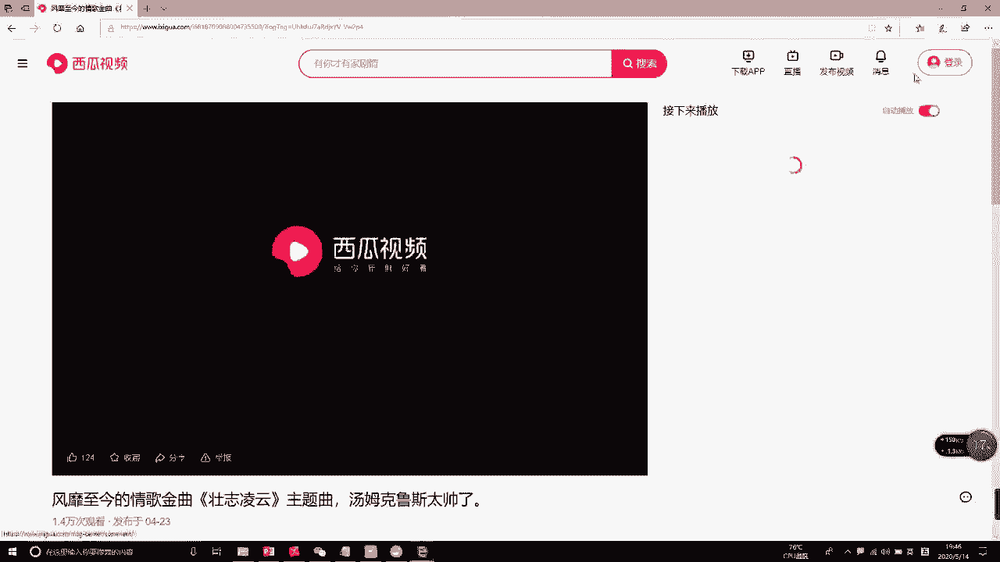
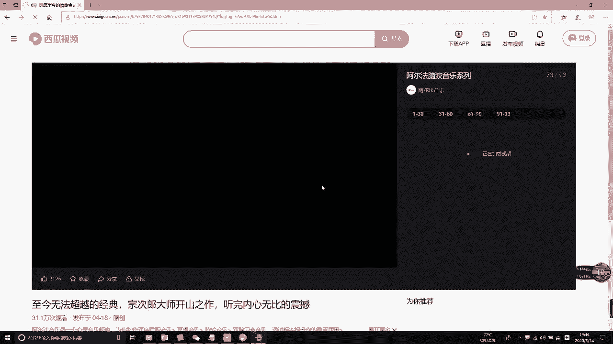
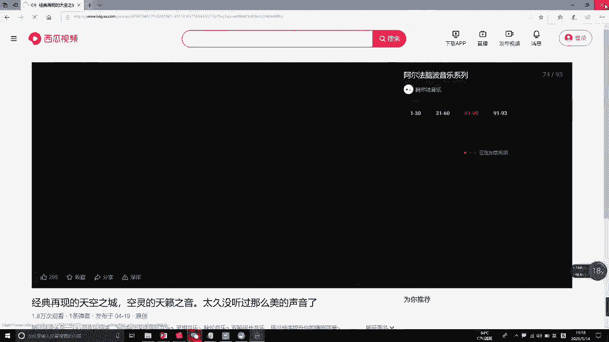
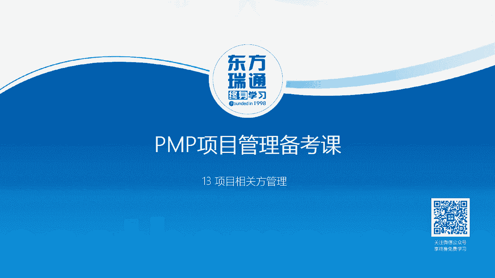
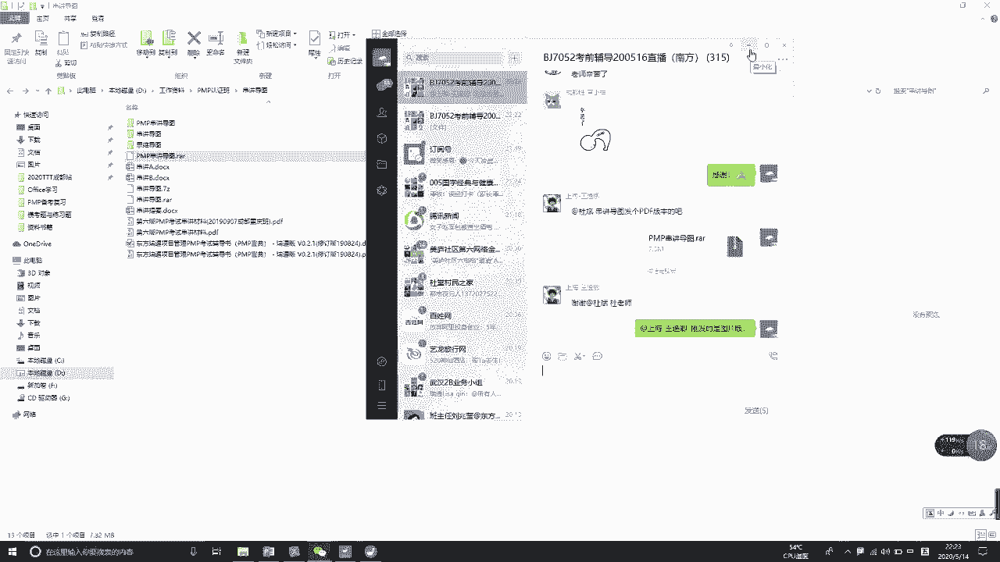
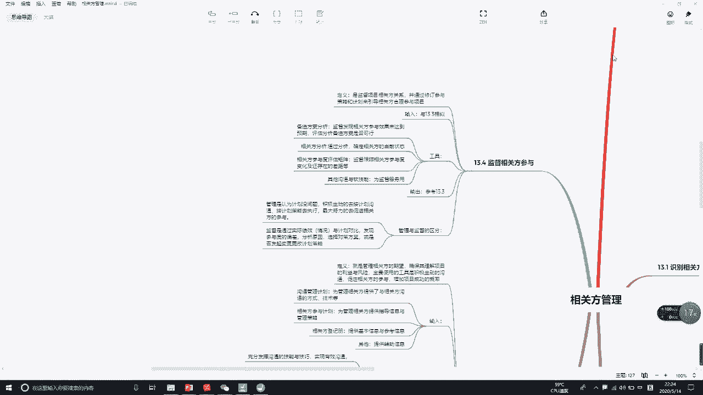

# PMP串讲 - P11：串讲第13章 - 我的乐芙兰 - BV1uE411N7zG

。あ。

🎼，🎼あ。い。🎼あ。🎼。🎼。🎼，🎼Yeah。🎼あ。🎼，🎼あ。🎼The。🎼，🎼The。🎼，🎼，🎼，あ。ああ。🎼，あ。🎼あ。あ。🎼，🎼，🎼The。🎼。🎼好妈妈。🎼，🎼Yeah。

🎼，🎼あ。🎼あ。🎼，🎼，🎼Yeah。🎼，あね。🎼，🎼Yeah。🎼，🎼，🎼あ。🎼Yeah。🎼，🎼。

好，上线的同学赶紧检查一下自己的声音和画面。呃，没有上线的，赶紧上线啊，我们在8点钟准时开始今天的直播。哼哼。😊，呃，能够感觉外面的这个车辆的声音是吧？好吧，我把这个窗户关一下。好，谢谢你的反馈啊。😊。

好了，各位各位学员，各位老师啊，晚上好。呃，今天呢是我们。这个班啊这一期班的最后一次复习备考课啊，今天内容呢是第十三章相关方的管理。在讲这个内容之前呢。对，是在家里。呃，在讲这个内容之前呢。

因为收到了PMI的通知是吧？又一次的延期考试，这个有点啊有点影响到我们的这个复习和备考的一个计划一个步伐。那么有很多学员在群里面呢就问老师或者相互讨论这个后一阶段怎么安排是吧？呃。

应该怎么去应对这么一场情况。好，这样啊，我呢本来这个事情呢。呃。我我在这个地方啊，就我个人的观点就是给大家。😊，提提出一点参考的意见吧嗯。是这样的啊。

大家可以发现那个PMI的邮件通知里面有一句很关键的话，就是在确认考试前的45天给大家发那个呃返考和退考的通知。那也就是说，在考试的45天前，PMI呢会给你们发邮件。你们就等着收到那一封邮件。

收到那封邮件就意味着从那天开始，45天之后就是正式的考试时间。所以说如果从那个时候开始响应的话，大家还是有45天的时间去呃冲刺去准备。所以大家一嗯不要乱啊不要乱，也不要着急，这个是没办法的事情是吧？

不可抗拒的事情。所以呢呃我建议啊你们呢自己可以去找200道。质量较好一点的这个PMP的题目，然后呢自己把时间掐着。4个小时是吧，去做这两百道题，自我检测一下啊，自我检测一下，看能打多少分啊。

检测一下自己前一阶段的学习和这个准备的一个水平怎么样。如果说啊考的比较好啊，你能够考140分甚至以上的话，那我觉得你可以完全呢这个放松休息一段时间啊，等到那个。通知邮件过来之后，再重新准备。都不要紧。

那如果说考的非常的差啊，甚至可能连100分、110分都没有的话，那我建议呢你还是得要在这段时间内去抽时间看这个金讲视频。做一些题目是吧，以及呢自己去总结归纳一些东西，维持一种状态啊。

当然我也知道维持这种状态呢还是比较辛苦的。好了，这是关于我们这一次的这么一个研考的情况，跟大家呢呃简单梳理一下啊。好，下面我们再来说一下今天的第13章相关方的管理。关于这一章呢。

我有种感觉啊很容易被我们的考生或者我们的学员呢所忽视，为什么这么说呢？一、因为这一张在整个篇 book的书上面所占的篇幅不多，只有30多1点页。😊，而且呢重点的。考点或者重点的工具技术也不多。

屈指可数是吧？这是第一个啊。第二个原因呢，就是我们在精讲5天的课程中分配到13章的时间。不多啊，这个大家是呃经历过或者是是有体验的，是吧？这样就导致有很多学员认为哎第四三章呢似乎不重要，是吧？

但是重不重要呢？我跟大家提供一个数据啊。😡，第十三章它可能在考试中的分值占到10到15分左右，多可能十三四道题少的话可能就十道题左右。呃，这么一个份额呢不算高啊不算高。如果说是想考5A的同学。

不能复制这一张是吧？而且这一张呢它的考题呈现一个两极分化的特点。就是有一部分题。考的比较简单，就是考那个呃基本的工具，基本的知识点是吧？很容易呢能够得出正确的答案。那么另一个问题呢。

可能他会跟其他的章节的知识点混到一起是吧？那这个难度呢就比较大，很容易在这一块丢分。所以说第十三章的话呢，很多人学完之后呃还是有点有点懵啊啊如果大家的对第十三章感觉有点懵的话呢，那今天就好好的听一下。

因为我们今天的时间还是比较充裕的两个小时嘛，是吧？😊，跟第十三章容易引起打粉的，主要是第九章资源管理和第十章沟通管理，资源管理还要好一点啊。大家可以回顾一下资源管理这一章是吧，资源主要指的是。

项目团队啊，内部相关方。那么整个这一章所做的工作都是围绕一个目标，就是最终能够提升我们团队的整体绩效，让我们的团队成员能够又快又损又好的去完成我们的项目工作。是吧你抓住这么一个核心啊。

其实你就发现第九章呢还是比较简单的啊。😊，但是我们的第十三章它的这个相关方具有内部的，更多的可能是涉及到外部相关方。对于这一相关方呢，它主要的目标是要通过。

识别这些相关方之后呢呃然后呢促进这些相关方参与我们的项目工作。为什么他们参与呢？是希望他们来支持我们的项目，降低抵制，从而推动项目的呃正常前进，最终达到成功的目标。所以他的目的是要促进相关方的参与。

让他们多多支持减少这种抵制和反对是吧？这是他的核心目标，这是这也是我们十三章和第九章。它的本质区别。这个还很好区分啊。😊，呃，最难的人呃难的打粉的就是跟第十章沟通管理。那我们也知道呢。

沟通管理的目的是为了使我们的信息能够有效的在项目的相关方之间进行流转和传递。所以他强调什么呢？强调有效沟通，达到信息的有效传递和流转。呃，他就只要传递信息做好了就行了。而我们的第十三章呢，它有个特点。

也是很强调沟通。那为什么呢？因为相关方都是人呐，跟人打交道是吧？最主要的一个工具。就是沟通。那么第十三章呢除了进行积极主动的沟通之外，还需要靠我们发挥一些软技能和影响力。呃，要不然你想让别人。

去参与到项目过程中去支持你的项目，别人就听你了吗？是吧是？呃只有你呢去跟别人积极的沟通，发挥一些你的软技能，去影响别人是吧？从而呢来达到让他们参与的目的，支持的目的。所以这个地方的沟通啊。

他不光是体现了。这个传递信息获取反馈这么一个基本的作用，他还要承担。传播思想和传达情感的这么一个作用是吧？就是跟别人把关系搞好啊，获得他们的信任之后，这个事情就容易办的。好，在讲解的过程中呢。

我们会再次体验这本一个沟通的差异化的啊。呃，第十三章还有一个特点，就是他早早的就把一些内容呢在前面章节中做了一些铺垫是吧？比如说相关的定义是什么，大家都应该回顾一下，知道一下啊，相关方的定义是什么。

能够影响项目或受项目影响，以及呢自认为受项目影响的个人组织和团体。是吧。所以说相关方这个群体可能我说的是可能啊非常大可能非常复杂。所以在相关方管理的实原则中的第七条是这么描述的。

他说相关方包括项目各异的成人和小孩是错综复杂的，是吧？当然我们PMI里面是那我们的PIP里面是没有提这个相关管理的10条原则的啊，这是别的地方提的，是吧？所以说相关方啊无处不在，相关方可能错综复杂。

所以他的管理呢也不是一件容易的事情。可以这么说啊，甚至有的时候呢往往媒体都可能是我们项目的相关方。我记得有一道题目啊是这么描述的。他说客户需要在我们的项目施工现场主办一个新闻发布会是吧？

他就问项目经理下一步应该做什么，那么答案呢，我就给大家提供几个啊，大家可以判断一下，比如说第一个答案立即停止施工，整理现场环境。😊，是吧啊既然这个新闻发布会啊，新闻媒体记者都要来了。

那我们要把现场环境呢整一整，似乎呢哎很多时候都是这么做的啊。那B答案呢与客户进一步的沟通。😊，这个相关事宜就是你突然跟我说这个事儿是吧，那我还子们我还要进一步的了解一下细节。😊，这是B啊，C评估分析。

对现有项目的影响，就是你要在我这个地方开信闻发布会是吧，会不会对我的项目的进度啊什么东西产生影响，要评估分析影响。而D答案呢是识别新的相关方更新相关方登记册，这是正确答案啊，这是正确答案。

就是你现在新闻记者哎来到我们这个现场了，那我们马上要把你识别为新的相关方跟据它进行相关的分析。😊，呃，进行相应的管理啊。好，这是相关方的定义。那么管理相关方呢，我也把它呃自己总结归纳了一条啊。

这个说的很长啊，说的很长。但是呢它涵盖了相关方的。😊，管理的全部过程。首先是相关方要尽早定期的识别。然后分析和记录他们。在项目中的期望和影响。以此制定合适有效的能调动相关方参与项目的管理策略和计划。

通过积极主动的沟通和互动。改善与相关方的关系。取得他们的信任。就说我们要通过沟通是吧，传达情感，传递信息，从而呢去跟他们搞好关系。那么关系搞好之后是吧，自然而然后面的事情也好办了啊，取得信任。

从而促进相关方的参与，推动相关方的持续支持，降低相关方的反对和抵制。最终达到的目的是提升项目的成功概率。哎，都是为了让方方面面的相关方去支持我们。大家可以想象一下啊，你做个事情呃，大家都来支持你。

你这个事情呢不可能不成功。如果大家都来反对的话，你这个事情想成功，恐怕有人难，所以叫得道多助，时道寡助嘛。😊，好，这是管理相关方啊，这句话中其实就包含有我们的相关方管理的四个过程是吧？

以及呢我们相关方的他的工作的重点方式是沟通啊是沟通。然后呢获得他们的支持，最终的目的目标是提高项目的成功概率。

相关的管理总共有四个过程啊，四个过程呢。识别相关方在启动过程组中。规划相关方管理在规划过程组中，管理相关方参与在执行过程组。监督相关参与呢在监督过程组哎，它的过程还不少，4个是吧？

分别分布在这四个过程中。啊，好，那么下面呢我们就一个一个的嗯。来跟大家说一下啊来跟大家说一下。好，首先我们来看一下13。1识别相关框是吧？首先我们来找到。我们项目的利益相关方。

有时候相关方也成为利益相关方啊，就是这些相关方在你的项目中是有利益的，或者说他的利益会受你项目的影响。是吧。你管理他们就是管理他们的期望和利益。好，实别相关的定义。其实我刚才在常常一句话里面呢。

已经概括了，要尽早的定期的去识别相关方，就找到这些呃利益相关方啊，首先要识别。那么识别到了之后呢，进行记录和分析他们呃的影响、需求和期待等等。最终形成我们的相关方登记册啊，相关登记册。

在考试中啊在考试中，只要发现新的相关方，第一件事情就是更新相关方登记册。所以这种题目呢是很容易。减分的啊很容易减分的是吧？就像我们只要发现了问题。我们就第一个事情就是要更新问题日志，只要识别到风险。

第一个事情就是更新风险登记册一样的啊一样的。那在这个地方呢，我提出识别相关方有三个特点，第一个要尽早。啊，第二个要。全面。第三个要定期。而不叫持续。好，我分别把这三个词呢。来解释一下啊。

尽早就是识别相关这个工作啊，越早越好，晚了可能会。被动会出问题是吧？这个我就不详细的去解释。大家在经讲的过程中呢，老师会说过的啊，那早到什么程度呢？找到可以跟我们的项目章程的编制同时开展。呃。

你们就不要认为啊，项目章程是项目的第一个文件，不要这么认为，其实不是的是吧？其实不是的，我们的相关方登记册。他的编制。或者说识别相关方的工作是可以跟项目章程的编制同步进行的，也可以给他找。

比如说大家都知道啊，项目之前可能有售前的工作是吧？授前工作完成之后，肯定会识别到一些相关方。那么这个时候授前工作完成之后，会把这些相关方哎转项目中来。还有呢在我们项目的准备和论证阶段。

也会识别到很多的相关方。比如说我们的商业文商业文件，商业认证里面是吧？比如说我们在签合同过程中呃，签协议的过程中，也会有很多的相方。所以啊识别相关的工作可能比项目章程还早是吧？这要尽早啊尽早。

第二个就要全面进行上下左右前后的360度的全方位识别。上可能有我们的发起人和组织类的高级管理层，下有我们具体干活的项目团的成员。前有提供我们帮助和支持的专家团队。

后有对项目进行监督、检查、审计验收的这些相关方。那么左。外部相关客户、供应商、政府部门、行业协会等等是吧？呃，又呢我们组织内部的相目方，比如说职能部门啊，还有呢其他项目的。人员等等。啊。

这些前前后后上上下下左左右右的相关方都要进入到我们的视野，是吧？都要被我们能够识别到。好，这是指的全面识别。最后我们来说一下定期识别。注意定期可能它会有几个时间点是吧？而持续呢它是一个不艰难的过程。

比如说我们的监控工作就强调持续无时不刻的要监控。识别相关的工作呢，我们提倡的是或者说我们强的是定期。起码有以下几个时间点啊，我们要去重新识别一下。比如说第一个。

项目在进入项目生命周期的不同阶段的时候是吧？大家可以发现啊，这个药品的研发。是吧在实验室阶段的时候，那我们打交道的可能就是我们是吧投资人呢啊我们的团队成员这些相关方。但如果说现验室的取得成果之后。

我们进入临床阶段的时候，那可能相关方就有医院里面的医生和患者等等，是吧？所以说在项目进入不同的生命周期的不同阶段的时候，我们的相关方要进行重新的识别。这是第一个。第二个。当有些相关方他不再跟项目有关系。

或者说我们的项目出现了新的相关方成员。这个时候也要重新识别。比如说我一前一个采购啊结束了，关闭了。那么前一个采购的供应商，他将不再是我们项目的相关方了。那如果说我们这段时间要开取一个新的采购。

那这个新的供应商或者说来参与我们这个招投标的潜在供应商是吧，都是我们的相关方。好，这是第二个啊第二个。第三个呢就是我们组织内部或者说更大范围的相关社区的人员发生了变动。打个简单比方说。

我们的发起人变了是吧？呃，新的发起人来了，那新的发起人是我们的相关方。😊，比如客户组织里面的。组织。结构发生调整是吧？那我们的相关方也得要做相应的重新的识别。好。

这是跟大家解释了一个尽早啊全面和定期识别的原则。来，我们来看一下它的IDTO啊。2DTL呢因为识别相关化这个工作，它不是做一次就完了的，是吧？它是需要进行定期周而复始的去做。所以我们在这个输入里面呢。

把它分为两类，一类是首次识别用到的输入。比如说我现在框住的这几个就属于首次识别要用到的输入。项目章程中有项目的关键相关方的。姓名和他们的职责，他肯定是我们的项目的主要相关方，是吧？

还有呢我们的商业认证和效益管理计划，在这两份商业文件中呢，会有我们项目的投资人和我们项目的收益方等等。他肯定也是相框是吧？再就是协议合同，签协议，签合同的各方肯定是我们的项目相框。好。

这三个啊是我们首次识别相框时候会用到的。以后在识别的时候，呃，这个里面呢基本上就不怎么用，不能说绝对不用啊。再来看一下。呃。以后识别要用到的，比如说有我们的沟通管理计划是吧？在这个里面。有。

如何去跟相关方进行沟通的方法呃，技术等等。那这个里面是可以找到一些相关方的。还有呢就是给我们项目提变更的。提问题的和提需求的。这些人是吧，他也肯定是我们的相关方。所以说啊你把它分成两类。

一类是首次识别用到的输入，一类呢是重复定期识别用到的输入。我们再来看一下工具。工具呢主要分为三类，第一类数据收集，用到问卷调查和头脑风暴。这两个工具呢就不用解释。通过这两个工具呢。

主要是获得相关方的基本信息。啊，基本信息。通过他获得相关方登记册的基本信息啊，等一会儿我们看到这个相关登记册的内容就知道了，是吧？嗯。数据分析通过相关分析和文件分析呢，它可以获得相关方的评估信息。

最后数据表现。啊，通过这个映射分析，我们可以得到。像权利利益方格是吧，权利影响方格、凸现模型等等这些图示化的图表。那么这些图表图式化的这些方格呢，主要是获得相关方的预册的分类信息。哎。

我们通过它这个图表把相关方做一个分类是吧？做一个分类。好，大家要意识到啊，所有的数据表现。都是图示化的工具是吧？都是图式化的工具，都是非常的直观明了的呈现工具。啊，我们这个地方也不例外啊。😊。

那么大家重点呢就是学习或者复习的重点是这几个。相关分析工具是吧？还有呢这个相关方映射分析以及呢相关方登记册这个输出文件啊。输出文件来，我给大家看一下我们的。诶。这个文件不知道从哪里去了啊。好吧。

这个文件我现在不知道把它存哪里去了，这样吧，我们就。就不找他啊，后面我再。补发给大家。啊，没翻译是吧啊。跟那个页面关系不大啊，那个时的内容是我补充的，我会在那个。思维导图中发给大家。

大家有文字性的东西的。因为PPT不能发给大家嘛，是吧？所以做一个小小的规避啊。嗯。呃，没没事的，屏幕是我没翻页啊，不是屏幕有问题。好，刚才跟大家发了重点啊，发了重点。你看就这三个重点。

这三个东西呢在考试中是。考的比较多的啊，相关管理考的比较多的。好，那我们详细的来看一下他们。详细来看一下他们啊。🤧嗯。那刚才说了是吧，通过问卷调查和头脑风暴呢，我们想到这个项目有哪些相关方。

并且找到这些相关方的基本信息。这相关叫什么名字啊，是吧？还有他们的呃联系方式啊，他们的职位呀等等啊，这些非常基本的信息。那然后呢，依据这些基本的信息是吧，我们对相关方进行进一步的分析。

分析出他们在相关方中的利益诉求。啊，利益诉求。期望和影响力大小。好，还有其他的一些东西啊，比如说兴趣啊是吧，爱好啊、权利啊，以及相关方跟项目的关系，相关方和相关方之间的关系等等。

这个呢大家有一个了解就行了，关键是要理解这个地方啊，比如说我就以这个利益和期望来说一下。假如说一个房地产开发项目为例的话是吧？那你想一下有哪些相关方，这个相关方在这个楼盘项目中的期望是什么？利益是什么？

比如说我们首先首先说这个开发商啊，客户是吧？他肯定是希望是吧？你这个项目做快一点啊，能够提前完工是最好的是吧？这样呢可以早点把楼盘卖出去，早点实现什么资金的回笼，这是客户啊，开发商。😊，那么我们的业主。

我们的用户呢？我们也是希望这个楼盘能够按期完工是吧？不要延期交付。啊。影响我的入住是吧？我们希望质量好一点点。啊，质量好一点点，不要是豆腐渣。这样呢影响这个楼盘的升值。和我住在里面的安全性。是吧。

我们还希望呢能够实现以前的设计的，以及以前承诺的所有的东西。啊，不要缩水，不要偷换概念是吧？这是我们的业主的利益和期望所在。那周边小区的居民呢，他们可能希望你们这个项目在施工的时候比要文明施工是吧？

少一些噪音，少一些扬尘，少一些渣土。希望你这个项目能高大上是吧？有很好的配套，他们也可以加以利用。你的楼盘升值了，带动周边的这个地产升值。😊，这是他们的啊期望和利益之所在。所以大家可以发现啊。

在同一个项目中，各个项目方他在你项目中的利益，他在你项目中的期望是不一样的。自然然他们的。职位高低是吧，权利大小以及关系也都是不一样的。这个我们都需要去通过分析，一一的把它们记录在相关方登记册中。好。

这是这个工具啊，稍微理解一下就没问题了，是吧？重点呢我们是要记住呃，分析他们的利益期望、影响和关系。这几个红字部分。啊，红字部分，这是核心啊评估信息。好，我们再来说一下这个。数据表现。

这个地方呢数据表现有4个啊有4个是吧？第一个权利利益方格或者叫权利利益矩证。第二个叫权力影响啊方格。第三个叫作用影响方格。第四个叫凸显模型。那我们重点呢主要是掌握这一个。这个了解一下就可以了啊。

最最考的多的就是这个。所以你要把这个画一个星号啊，画一个星号。嗯。好，这个权利、利益方格或者叫利益举证呢，它实际上是以利益为横轴，以权利高低为纵轴。那，这两个纬度的。名字我们可以理解是吧？

相关方在我们项目中的利益是大还是小？相关方在我们项目中的权利表现是高还是低？通过这两个纬度，这样我们就把相关方分成四个类别或者叫四个象限啊。嗯呀。那我们可以看到右上角这个。类别。他是权利也高。

利益也大的这类相关方。那么这类相关方呢，以客户以发起人为代表是吧？你看客户的权利和发起人的权利都是很大的。那么项目成功了，他们获利最大，项目失败，他的损失最大的。关于这类相关方啊关于这类相关方。

我们应该怎么样去管理它呢？大家这些地方都是要把它记得非常熟的啊。这样的相同方我们是要重点进行管理。那怎么重点管理呢？怎么体现这个重点管理呢？重点管理的直接体现就是要跟他们进行紧密的沟通。哎。

有什么事儿要跟他们去怎么呃沟通沟通探讨探讨是吧？尽量满足他们的各种要求和需求。就是你说客户说的什么你都要办是吧？发起人说了什么你都要去执行，基本上是属于这种情况啊。😊，是吧。这是。重点管理啊。

再来看一下第二个。第二个啊。这个是权力大，但是在项目中的利益。很小是吧？那主要表现为。这一个类别的就是我们的组织类的高管层和组织类的职能部门经理。你看他们啊他们呢在我们组织内。他的权利是很大的是吧？

高级管理层跟发起人不相上下吗？但是他在我们项目中的利益呢很小是吧？你项目成功了和项目失败了，跟他的关系呢嗯并不大。那么这类相关方呢，我们要。做到的是要令其满意。啊，你让他满意啊，你不能让他不满意。

不满意的话，他很有可能你在需要他支持的时候。是吧他不支持你，他甚至给你小鞋穿，那你的项目呢就很难做了。那怎样做到令心满意呢？😊，这个里面有个很关键的特点，就是要以他的方式进行沟通。然后呢，投其所好。

令其满意。哎，投其所好，令其满意啊，你让他满意了，让他心里舒服了是吧？他自然然了，他就不会为难你。😊，哎，他觉得你还不错的话，他可能就支持你。好，这是。一。

组织高级管理层和职能经理为代表的啊权力大、利益小的这类相框。再看这个象限啊，这个象限是指的在项目的利益。很大，但是权力呢却很小。主要是以团队成员和用户为代表。就比如说我刚才说的啊。

房地产开发项目的业主用户是吧？他在你这个楼盘项目中的利益很大了。是吧但他没什么权利。那这样的相关方呢，我们的管理原则是。好，我们的管理原则是。要。随时告知他们关切的，他们感兴趣的信息。

做到保持信息的什么透明可见是吧？大家想象一下啊，如果说你跟。这个相关方是吧，你跟别人呢很坦诚，信息呢很透明，那就能获得他们的信誉任。能获得上信任，你想象一下啊，你在家里是吧？

你如果你说手机你给你老婆随便翻是吧？那你老婆肯定很信任你。但如果说你一回家你就把手机是吧，加密加锁，不让他碰你的手机，那他肯定会怀疑你了，肯定就不信任你了。所以说啊在管理中这个信息的透明是吧。

是可以获取别人信任的一个很好的途径。😊，那人家信任你了，自然而然人家会支持你。所以啊这类相关方我们的特点是要随时告知他所关切的感兴趣的信息，做到信息的透明是吧？做到信息的透明。

然后呢获得他们的信任和支持。好，最后一个纬度的。就是。权利小，利益也很小的相关方。那么这样的相关方呢，主要体现在比如说组织内的一些辅助人员。比如说。保安啦、门卫呀、保洁啦，以及组织外的。

就比如说我们刚才说的这个附近的楼盘是吧？呃，附近小区的这些居民或者说路过你们小那个那个楼盘的一些行人等等，是吧？都有可能是。那么这样的相关方呢，我们采取的管理方式是尽量以最小的付出，以最小的代价。

实现呢监督可可控是吧？只要能够把它控制的维持维系的啊，不让他添烂就可以了。打个简单比方说是吧？你看有时候保安啊，门卫，他如果你当下刁难你的话，那一般呢我们就每个月丢一包烟给他是吧？送副油给他嗯。

让他能够什么维系这种呃关系就可以了，是吧？嗯。好，这是我们通过这种方式啊，通过权利和利益。把我们的相关方呢去分成四个类别，然后的四个类别呢去制定。或者说去实施不同的这种管理的方法是吧？管理的方法。

那大家可以发现这四个象限的三工方，他们的管理过程中呢都有一个相同的特点，就是要跟他们进行。不同程度的不同角度的不同侧重点的沟通。是吧沟通。和跟他们打交道啊。好。

这是权利利益方格式考试中特别常见的啊特别常见的一个一个工具。有工具。那我刚才说了，有一个权利影响方格和作用影响方格。那这两个方格什么叫作用是吧？什么叫影响？这个大家可以看一下书啊，以篇不可的这个书为。

终极解释是吧？为终极解释，就是你不要去按照你的理解啊，或者说你去查什么字典去理解。是吧我们这个考试是以这本书为啊。基本依据的。好，我们再来简单的啊还补充一句啊。

就是不管你是用的权利利益还是权利影响作用影响。呃，这三个矩阵图或者三个方格图示，他们都是用的什么情况呢？用在小型项目。注意啊是小型项目是吧？是相关方的关系或者相关方和项目的关系不太复杂的情况下用。

因为它都是二维的，看到没有？都是二维的。😡，呃，平面的二维的不在复杂情况用，可以满足要求啊。而下面这个凸显模型呢。它就有三个维度了，你看一看就三个维度是吧？第一个相关的权利跟这个是一样的啊。

第二个紧急程度需要立即关注的程度。这个大家很不好理解是吧？很不好理解。简单解释一下啊，比如说大家啊可能有一个想想不明白的一个地方，就是为什么同样是坐飞机从上海到北京是吧？头等舱。

和商务仓跟经济仓的价格差异还是相差很大的。哎，这个不太理解是吧？嗯，但是其实你后来细细的想一下呢，也可以理解这个地方我就不去展开说啊，那我现在就主要说一下这个。😊，呃，头等舱的乘客是吧，他也是相公方。

经济三个乘客它也是相关方，对不对？那如果说你们两个相关方同时。去呼叫这个空乘人员空姐是吧？那你想象一下，他会首先响应谁？那肯定是因为响应什么头等舱的乘客是吧？因为头等舱乘客这个相关方对他们来说重要一些。

紧急一些，需要立即加以关注。而经济舱的乘客呢往后优先级往后啊往后。然后第三个纬度呢就是合法性，或者也可以换成为临近性。就这。可以放的啊，这个地方是可以放的是吧？你看三个轴XYZ3个轴。

它就可以组成一个什么组成一个。一个三维的是吧，一个三维的模型啊一个三维的模型。呃，关于这个临近性呢，其实在前面我们也了解过一些是吧？那这个地方啊这个地方的解释不一样，所以大家要看书啊，不要凭自己的理解。

这个地方的凝聚性呢主要指的是主要指的是相关方参与到项目的程度。也就是我后面要说的是吧，它是支持型的还是中立型的，还是反对型的？那显然啊我们在管理相关的过程中。

我们肯定要把很多的关注和时间更多的要花在什么？反对项目的相关方者。这个群体上面是吧？而支持的相关方可能我们发的时间沟通时间要少一些。好，这是这三个纬度或者三个轴啊，简单跟大家解释一下。

那么大家重点呢一是要能够理解这三个纬度，三个轴的含义。二呢就是因为它是三维的，是复杂的，它主要是用于那种大型复杂的相关管理。是吧呃这个呢是用于小型的呃关系简单一些的相关管理，因为它是二维的啊。

用为它二维的那最终呢不管你是呃三维的还是二维的。都是要把我们的相关方去。分级去分类，最终生成我们的。相港环境印册的分类信息。所以大家再看一下啊再看一下啊，这个这个数据表现把相关方进行怎么一个分法。

其实分法很多是吧？分法很多。你看我前面说了，上下左右前后这个地方上下外横你也可以分为支持反对中立领导和不知情等等，都可以啊，都可以，还可以分为什么这个四象限的嘛，对不对？所以分法。😊。

看你的啊看你的需要啊看你的需要。好，这样啊我们先把这个相相关登记册看一下啊，相关登记册看一下。你看刚才我说了是吧，通过数据收集里面的问卷调查和头脑风暴，主要是识别到这些相关方的基本信息，这属于基本信息。

嗯。然后呢，在这个基础上进行。相关方的分析和文件的分析，从而获得相关方的期望、需求、利益和影响。这些评估信息。这个评估信息为后续的工作提供重要的依据啊提供重要依据。再就是最后一个分类信息是吧？

分类信息你怎么分都可以啊，怎么分都可以。看你怎么管理比较好是吧？好，这就是我们第13。1的三个重要考点啊三个重要考点。那么看完之后呢，我们看几道题啊。看这道题。而一家公司的CEO属于某个项目的相关方。

但是在该项目中呢。享有的利益很小是吧？很少的利益。为了与预期保持一致，项目经理应该怎么做？那其实呢你看了这个题干的描述呢，你就应该隐隐的感觉到啊，这其实在考我们的权利利益方格是吧？CEO它属于权力大。

这个里面也说了，他享受的利益少，那么它属于什么令其满意的这一类相关方。那我们该怎么做呢？令气版意呗，你看一下答案中哪个。能够更让他满意啊更让他满意。我们选D答案是吧，仅向CEO提供高层级的信息。哎。

这个符合COO的身份嘛，是吧？你不可能把一个项目，而且跟他利益诉求很少的项目很小的项目的一些是吧详细的信息汇报给他他他也没人用是吧，他也不感兴趣。所以提供高层的信高层的信息可以啊。然后每个月与他开会。

确认其满意度啊，尤其是确认其满意度是吧，确认其满意度，这就是令其满意的依据嘛。然后其他答案呢都不是很好是吧？仅向其报告。重大事项，那你就认为他只对重大事项感兴趣吗？啊，也许有人可能会说。

你就认为他只高感兴趣高层级的信息吗？关关关键的信息是我们后面有个确认性满意啊。😊，是吧那美日国内更新它肯定是。肯定是有点问题的啊。嗯，这个好像是说询问CEO其希望的告知方式，是不这个好像是没有多大问题。

但是还是没有体现什么，或者说还是没有D档好是吧？D档。啊，非常符合这个。权利利益方割模型的。这么一个啊分析结果啊。好，再看一下下面的几个关键客户担心他们被排除在重大的决策活动之外。

你看我们的关键客户这样的关键相关方，他们有担心是吧？呃，他们有疑虑。那么这些东西呢，我们是要去分析去了解它的。所以啊为了避免这种情况的发生，我们应该去进行数据的分析，就是相关分析和数据的表现，是不是啊？

嗯。其他的呢跟我们这个。隔得很远啊隔得很远。好，这是13。1啊，还有一道题看一下啊。由英国政府资助的艾滋病综合防治项目，涉及到国家的十部委、两个国际组织。和云南四川的。许多县市以及很多人群和团体。

你作为项目经理，你最关心的是什么？是吧你最关心的是什么？啊，大家可以看一下啊。是吧A答案是应该公开他们之间的利益冲突。这个显然啊呃利益冲突是有的，但是应不应该公开，这个值得商榷是吧？

这个公开说太不好了啊。B这些项目相方对项目有不同的需求。那当然呢是吧？当然呢。这些相关方在项目中他都是有利益的。都是有诉求的是吧？都是有诉求的那想也想得到吗？比如说。

这些艾滋病人群他肯定希望能够得到关爱，得到治疗是吧？而这些现实呢减轻财政负担是吧？引起更广泛的关注等等啊，所以他们的需求是不一样的啊。B答案还是不错的。这个项目应该是很容易的。这句话说的大错而特错是吧？

看相关方这么样的错错综复杂，这个项目沟通协调非常的复杂，还容易。D项目实施过程的沟通比较简单，这个也其实说的不对是吧，说的不对。呃，能讲一下上一个题吗？是指的。这个体吗？我想应该是指这个题啊嗯。是吧。

好，我们把这个题呢再简单的呃分析分析啊。其实这道题呢说简单也简单，说难呢也有点小难度。简单的就是这道题是可以通过可以通过排除法，很容易得出。A答案的是吧？呃，肯定不是质量管理，也肯定不是项目管理。是吧。

也肯定不是沟通管理啊，管理沟通啊，不是管沟通管理啊。所以排除法可以得到正确答案。那么另外一个方面呢，就是。往往啊。我们的这个客户。或者相关方是吧，他有什么担心呢？那么这样的题目啊这样的题目呢。

指向可能有三个方向。就是他担心他忧虑啊，可能三个方向。第一个。就是可能是沟通造成他的信息不畅是吧？因为他没有获得足够的信息。来消除的担忧。啊这是第一种指向沟通这个方面。那么第二个指向呢就是风险是吧？

不是因为信息不畅，是因为它怎么。看到了别人没看到的风险是吧？那么第三个指向呢就是。啊，这个相关方的管理是吧，你没有对他进行充分的管理，没有知道他的心，知道他的诉求是什么啊，他的需求是什么？

是吧你看他需求什么，他需求他要参与决策了是吧，他要参与决策，而你呢可能没有关注他这个点是吧，没有关注他这个点啊。所以他有他有这种担心啊他有这种担心。

所以你就应该怎么就应该进行我们的相关识别的数据分析是吧？分析到他有这种需求。有这种担忧。然后呢，把它圈入到我们的。刚才说的那个。重点管理的这个象限里面去是吧，跟他进行密集沟通，就不会存在销售的担忧嘛。

就不存在担担心吗？啊，当然这就是也体现了我前面说的，相关方的管理跟沟通管理很容易分，是吧？因为沟通管理是跟人打交道，相关管理呢也是跟人打交道，并且。经常要使用到主动积极的沟通。啊，所以这两两个方面呢。

我们后面还要进一步的去分析啊进一步的分析。为什么不是B呢？😡，🤧B呀。B是这样的。管理沟通它是。第十章第二个过程是吧，是执行过程，执行是按计划去执行。那我们前面在讲沟通管理的时候就说过了。

所有沟通产生的问题绝大部分都是什么？都是指向计划的。你现在指向管理执行。这个呢我们的题目中无法体现啊无法体现，所以只能去找他啊，只能找A。是吧。对。所以啊我刚才前面的最些就说了嘛？

十3章的题目有一半的是很容易判定答案的。但是另一半的话是很容易做错的。很容易做错的啊。所以这就是想考5A的要引起关注的原因。啊，现在好像是51分了是吧，那时间过得很快啊，那这样吧，我们就休息10分钟啊。

休息10分钟，10分钟之后继续，就是9点。9点钟，我们继续吧。大家。😊，都以为这个没有翻页是吧？卡住了，没有卡住啊没有卡住。好，大家有什么疑问的啊，可以提出来可以提出来解答一下。沟通管理不对呀。

我们刚才说了啊，一是题干中没有体现它是沟通的问题，是吧？二的话呢我们说过了。这个沟通的问题呢主要是体现在沟通管理计划的问题上面，是吧？你看发现。只要出了问题啊，基本上不说百分之百是吧？啊。

90%多99%的。都是指向沟通管理计划这个答案。是吧。所以大家在这个地方啊在这个地方嗯管理呃这个沟管理沟通啊，管理沟通作为正确答案的几率。或者考的很少是吧，考的很少。我刚才也说了嘛。

我刚才又再又强调一次啊，凡是在题目中出现了什么相关方。担心啊、忧虑啊这样的词汇是吧，指向三个目标吗？要么是沟通信息不畅，让他不能了解到信息的前貌，所以产生了啊不应该的担忧。可以忧虑。那第二个呢。

就是他看到了别人怎么没有看到东西是吧，风险。第三个呢就是在我们管理的过程中是吧，管理的过程中出现了问题。一般题目沟通管理计划没有可以选项。没有可疑选项这句话。这句话怎么怎么理解？😊，啊。

我看到大家现在都放松了啊。嗯，都放松了，这个参加直播的人数远远不如上一次啊。然后大家大家的问题啊也问的不那么急迫了。没关系啊，这个考试我相信你们都能过得了的，是吧？呃。

我们这么长时间呢准备应该是很充分的。如果查看有查看沟通管理计划。应该怎么选是吧？这个啊如果是有这个选项的话呢，我们偏向这个答案的几率还是很高的。在哪里？嗯。你看啊这个会被排除在重大决策和活动。之外。

这显然啊这个关键词关键词它明显的指向相关方的管理是吧？嗯。这个情况不应该是沟通不畅所造成的。就这种担心啊，不应该是沟通不畅所造成的。哪一道题啊？这有两道题。下下面一个错了的是吧？呃。

因为不熟悉项目经理的。因为不熟悉项目经历的新采购经理正在为组织的一个项目提供支持。在项目规划期间，该采购经理要求项目经理提供一副。需要采购的物品清单应该怎么做？嗯，这个答案没问题啊。没问题啊。你看啊。

为什么D答案是正确的，B答案不对呢？😡，是吧啊你看那个采购经理，他要要的是什么？要的是采购清单。那这个按顺序来呗是吧？你看采购管理里面第一个工具。就是12。1里面的第一个工具就是自制外沟分析嘛，是吧？

自制外沟分析。首先，进行资治外观分析的决策嘛。然后。把这个角色下下达了之后呢，我们再去准备。物品清单嘛是吧，这就是他需要的东西，你给他提供嘛，他要这个东西，你给他提供嘛。采购完理计划不包含采购决策吗？

嗯。采购管理计划，你可以看一下书上面啊，看一下书上面。问题是他要的是采购清单呢，采购清单是什么？采购清单是那个应该严格的说啊，是映射了这个采购工作说明书的。所以说你说制定这个采购管理计划。

采购管理计划是不包含采购工作说明书的啊。所以选D答案。是对的，B答案是答非所问呐，人家要的是清单是不是啊？应该说的就是那个采务工作说明书，而采务管理计划中是不包含这个东西的。好的，OK。😀呵呵呵。😊。

这个夜幕弹。是啊。这个题目还出的不算蓝是吧？嗯。但是一旦啊一旦把这个。相关方的管理题目中混进了这个沟通的一些东西进去的，我们有时候就很难区分了。好的，不谢月宫。所以大家也要看看到这种题目。

就要特别小心啊特别小心。好，还有一点大家注意啊，这个下面这个星星的棵数的话呢。😊，不一定很准啊，有的时候我们在放题目上去的时候，可能把这个地方复制了，没有更新。啊，没有更新。哦，9点了啊，大家回来吧。

我们就继续了啊。嗯，到10点钟继续啊。好，来看一下这道题，这道题的难度指数是非常低的，这就是我说的。😊，那种简单的题目是吧？在一个项目中参与的关键相关方的期望潜在影响和利益记录在哪一份文件中。

所以我刚才说了嘛，这个相关方的分析的主要内容，几个关键词，红字部分一定要大家心里知道是吧？呃，期望。影响利益关系这几个词啊，你看到这个词就知道哦，这是属于什么相关方的评估信息。

它是记录在相关方登记册的中间那一栏的，是吧？左边那一类是基本信息，生份信息，最右边的是它的分类信息，而分类的方式不一而同啊。好，下面我们进入到。第二过程，13。2规划相关参与。

看这个名字呢就应该知道他就是制定相关方参与这个子计划的是吧？好，同样呢大家一定啊看书的时候，一定看书的时候要去看一下这每个过程的。最前面那一段定义那一段定义是非常精华的东西，是吧？

你把那个定义如果说能够理解。背下来的话，你在学习这个过程的过程中呢，就变得非常简单了，是吧？那个定义什么呢？定义是依据13。1输出的相关方登记册，尤其是里面的那个评估信息啊，需求期望利益和影响是吧？

依据这个东西去。对症下药的啊。呃，恰如其分的来制定我们的相关方参与计划。那么我们相关参与计划里面有个非常重要的组成部分，就是搞定促使相方参与项目的这个策略和方法是吧？

当然啊相关参与计划里面不止这一个部分，但是这个部分呢是非常重要的一个部分。呃，输出相关参与计划。简单的说就是根据相关登记策是吧，有针对性的去制定相关参与计划。好，来看一下它的IDTOIDO啊。😊。

在这个。输入中最为关键的那自然而然是这个输入是吧？相关的计册刚才定义都说的很清楚，是要依据它的评估信息去制定这个计划的那其他的是干嘛的呢？其他的是提供一些参考信息，一些指引信息，一些辅助信息的啊。

一些辅助信息的。比如说。啊，比如说。项目章程中是吧有我们项目的目标，有我们的成功标准。那么有了这些东西，我们知道这些东西之后呢，如果说有的相关方是吧，他。啊，提出来一些什么想法，一些需求。

超出了我们这个范围。那我们就要跟他说，你看我们的章程是这么规定的啊，是这么制定的，是吧？通过这个去引导他啊，去控制它。是吧去工打。还有呢我们的这个资源管理计划，资源管理计划里面主要是。

团队成员的在项目中的角色和职责是吧？那我有了这个东西之后，我就知道他应该干活干到什么程度，以及他实际干到什么程度，是吧哎？还有沟通管理计划啊，还有风险管理计划。风险管理计划里面呢。😊。

有我们的找相关方了解到的这个风险的偏好，风险的敞口这些东西。那比如说这个地方跟大家解释一下啊，比如有的学员是吧，有的学员。😊，他这个老师不参加上课啊，老师不参加做题。那这样的话呢，大家想一下啊。

他不参加我们这么一个考试项目是吧？呃，参与度很低嘛，那么他很有可能就有考不过的这种风险是吧？那这个时候呢，我们的班主任啊就要去制定一个相关方参与策略参与计划来改变他这么一个参与度很低的现状。

那怎么改变呢？这个时候就可能要考虑到或者要借用一下风险管理计划中的。这么一个风险敞口和风险编号。也比如说通过以前的了解啊，我们知道这个学员呢是吧，他考过公司跟他报销考试费，考不过呢，自己出3900块钱。

而同时我们也通跟他聊天知道是吧？他自己如果出钱考不过的话。他就惨了，因为他每个月他老婆只给他1000块钱的零用钱。如果他一旦考不过的话，自己承担考试费。他4个月的零用钱。都没了是吧？那这个时候呢。

你就在制定这个相关参与计划策略的时候，就可以把这个拉入进来是吧？很容易就可以改变他的想法，促进他的以后的参与程度啊。好，这是特地把这个地方聊一下。

所以说主要的输入是他主要的输入是他其他的输入都是一些提供一些指引的参考的辅助的信息是吧？嗯，不一不用一一的去了解啊，不用一的去了解。😊，好，我们再看一下工具，工具这个顺序我觉得要调整一下啊。嗯。

这个应该放在第一位是吧，相关方参与度评估举证。这是一个非常容易考到的考点。嗯，给他发个心啊。那么这个参与的评估举制呢非常简单，其实。但但是它很重要，经常考到嘛，是吧？它主要呢是记录了两个方面。

一个是需要参与到的程度，一个是实际参与的程度。那大家想一想啊，它需一个相关方需要参与到的程度，我们往往呢是通过前面的相关方分析，就知道他应该参与到什么程度。是吧。实际三个程度呢，这个要靠。我们的13。

4监控监督相关的参与才能了解到是吧？你通过这个持续的监督，了解到他的参与程度。好，所以说啊所以说相关方参与过评估指政，这是一个首先要做的工作是吧？首先做的工作，通过13。1。了解他应该达到参与程度。

通过13。4的监控。发现他实际的参与程度。这两者啊，如果说。没有。偏差是吧呃，应该到什么程度，实际到了什么程度。那这样的相关方很让人放心嘛，是吧？那我们就不必在他们的身上去花时间。什么制定策略和计划了。

所以说啊相关参与计划和策略主要是针对什么那些参与度不足的相关方去制定的。😊，是吧一旦发现哎参与度远远低于需要的参与度，就实际参与度低于应该达到参与度。那这样的想框，往往我们就需要给它制定。嗯。

制定计划了制定策略了。所以啊这个工具应该是第一个要做的事情。好。做了之后呢，我们就尽量找出那些参与度不足的相关方是吧，干嘛呢？第二个工作分析他们的根本原因是为什么让是什么原因是吧？

为什么让他参与度这么低呢？要找原因，而且要找根本原因。好，找到原因，找到根本原因之后，我们第三个工作。利用现有条件考虑到现有的一些。阻碍和制约因素，以及把这些。信息都拉入进来是吧？哎，拉入进来进行分析。

😊，进行分析。分析清楚了，分析明白了之后是吧，我们的计划和策略就出来了。啊，所以说这个相关方参与计划的策略是这么出来的。啊，最后还一个工具啊是决策工具。这个角策跟我们前面的很多的决策是不一样的，是吧？

这个地方的决策呢主要是把我们的。相关方进行。优先级的排序。就比如说我们刚才说了是吧，都是作为飞机上面的乘客啊，飞机上面的乘客。啊为什么头等舱的乘客他优先级高？经济上的乘客优先级低呢是吧？

我们不可能把所有的时间是吧？一视同仁的去投入到所有的相关方身上去啊，所以他应该有一个轻重反击的优先级排序。和分组啊和分组。所以大家稍微的关注一下这个工具就可以了。好，我把这个顺序给大家重新捋了一下啊。

捋了一下是吧？这些工具应该这么用的。首先第一步是要。画出这个。参与多评估决定。那怎么画？是吧要靠13。1和13。4的输入来画这个图。那也就说13。4不是还没来吗？滚动啊滚动我们的这四个过程是循环往复的。

不是做一次的是吧，不是做一次的啊。嗯。第二个工作分析根本原因是吧？第三个工作利用现有的信息和现有的条件。去制定我们的策略和计划。然后呢，做出一个排序。这么一个好，重点呢大家把这两个画一下重点啊。

考试中这两个是重点。其一都不怎么重要啊。OK来看一下这个看一下这个相关方的参与度评估举证。其实很简单啊，大家只要听到我们的PMP里面说什么什么举证的话，就应该想到它是一个。它是一个一个二维表格啊。

一个二维表格类似或者类似于二维表格啊。嗯，你看相关方一。应该参与度是支持我们的项目，实际参与度呢是完全对我们的项目不了解是吧，不了解。好，相相关方2啊中立支持相关三呢相关三是。

应该达到的程度和实际达到程度是相同的。所以你看啊通过这个举证，我们就应该知道是吧？我们的计划和策略要重点放在这两个相关方上面。而这个相关方我们要花的时间，精力可能就比较少啊。好。

大家一定要心中有这个图啊，第一是要心中有这个图。第二呢要知道这个相关方的参与度有5个层级是吧？这5个层级其实不用去多解释啊，不知情，就是他对我们这个项目的。情况不了解利益。厉害都一概不知是吧？

那这样呢我们就让他了解就行了啊。了解之后，他有可能是反对，有可能是中立。也有可能是。支持是吧。领导呢这一类。这类。大家要把这个地方稍微的理解一下，领导就是。致力于推动项目走向成功的这种人这种相关方。

那显然这种相关方就是我们的发起人，就是我们的客户是吧？就是我们的项目经理呗，是吧？うん。啊。最符合他这两个字的应该是。发起人是吧，应该是发起人。所以说我们不知情，不可能不可能走到这个地方来啊。

一般多数的管理目标都是做到这个程度就够了。好，这是这个工具。呃，其他的像那个。根本原因分析是吧，这些东西我们就不用去解释了啊，不用解释了，稍微了解一下就可以了，是吧？把这个关系捋顺就行了啊。

来看一下这道题。项目经理和项目相关方难以保持一致的参与程度。是吧理解一下这句话啊，是吧？确定适当参与度的最佳方法。最佳方式是什么？然后。那其实这个题目考的是我们的相关参与度评估举证是吧？

我们希望他参与到这种程度，希望他支持。但是有的人。支持有的人中立，有人反对，老是怎么步调一不一致啊。那怎样才能够让他们的参与度能够达到我们所想到的最佳方式呢？所以你应该选择D答案是吧？

制定相关方参与度评估矩阵。嗯首先来看一下他们。这个参与度差异有多大？一看到之后，我们就知道哪些人是属于支持的这一类别，哪些人属于。啊，反对的这一类别是吧？

那下一步我们就给他制定这个计划和策略来搞定他们就可以了。所以你看啊其他答案呢你过一下都发现完全是吧？不靠谱。每周召开信息报告会，并将会议作为唯一的沟通渠道。我就不说这句话对不对啊。

凡是答案中出现这种绝对性的词汇。这种答案完往是错误的。是吧事情哪有那么绝对呢？B为所有相关制定一份综合性的项目更新报告，这句话肯定也不对。通过沟通管理，我们就知道是吧？

这个提供给各个相关方的报告是不一样的，他们的信息需求是不一样的。呃，你制定一个大而全的综合性的肯定不对嘛。C为每个相框创建一份单独的沟通计划，这也是不现实的吧，是吧？这种答案我们在考第十0章题目的时候。

早就已经说这种答案是吧？不现实，所以啊稍微正常一点的，是这个答案。所以说这个三个星级其实没有那么高啊没那么高。好，来看一下啊，看一下输出相关方参与计划里面包含的东西。其实我建议大家啊对。

很多计划它的这个组成。要引起重视是吧？我就不说这个像资源管理计划这种重要的计划，像那个。风险管理计划这种重要的计划，它的组成我们是要特别的去了解。甚至要把它背下来。然后呢，像这种。啊。

这种相关参与计划呢，我们也是要对它的组成还是要发重点的是吧？发重点的，因为他考的是比较多的啊，你不了解他的细节，比如说刚才就有一位这个北京北京班的是吧，月工，他就问的这个问题，里面就涉及到是否对。

这个采购管理计划的内容有一个大概的印象，很重要是吧？那如果有很。很清晰一点的印象的话，它就可以容易排查这个答案。我们看一下啊，放一下重点3个。第一个是吧，相关参与度的。程度是吧。呃，刚才就说了嘛。

这个计划重点是为那种抵制中立啊，甚至中立这样的这样的相关方去制定。而这样的相关方呢，我们可能稍微是吧稍微要要要轻量级一些啊，这个就是要重量级了。所以它包含这个东西啊，第二个是沟通，那你怎么去搞定他们呢？

你肯定是沟通啊，跟人打交道肯定是要沟通是吧？沟通所以啊沟通也是它的重要组成部分。还有呢你光只是沟通啊，是吧，你也要有一些策略和方法了。嗯，有的人不能说不能说你跟他说几句好话就完了的。有的时候是要是吧？

这个大家懂的啊。策略。前面说了是吧，这是它的重要组成部分。好，记得这三个就可以了。其他的呢大家可以可以记一下啊，能记可以记一下，不想记。把它次要一点，忽略一点，先不要紧啊。好，这是我们的13。2是吧。

制定那个。相关方参与的那个子计划子计划啊，输入以上一过程的相关方登记册为主要依据，结合其他的一些辅助信息参考信息进行输入工具的顺序使用顺序是吧？首先进行相关方的参与度评估举证。

找出那些抵制的反对的呃这些相关方重点进行管理。然后找根本原因。是吧然后呢，结合各种信息去制定这个策略和计划。所以自然而然在这个计划中呢，就包含有这么三个方面啊，重要的三个方面。好，O。看一道题啊。

项目经理接下来在一个处于项目执行阶段的项目，发现之前缺席的项目经理和一些外部项目方现的问题，且一些高级经理经常缺席会议。当前，项目经理接下来应该怎么做？🤧嗯。好，大家看到这个题干就会发现啊。

这是一个非常考中非常典型经常出现的这种题型是吧？就是有一些相关方子嘛？哎缺席会议缺席会议就说明他的参与度不够呗，是吧，参与度不够呗。😊，那么参与度不够，它应该到什么程度？是吧他实际是经常缺席。

那我们现在应该怎么做呢？所以。啊，毫不迟疑的去选择A审查相关方参与计划。这个审查有两层含义啊。第一是要去。查看一下这个相关参与计划是吧？

第二个是要去看一下这个这这个这个这个里面的个策略和计划有没有去实施实施，实施之后有没有效果是吧？有没有效果，没有效果的话，我们还要。去更新这个计划，所以肯定选这个啊。那其他的你看审查沟通管理计划。嗯。

大家注意啊大家注意有人可能会说，那我选沟通方那句话也有道理啊，因为他不参加会议，有可能是我们没有通知到啊。哈。这个参加会议没有通知到是吧，一次两次可能没有通知到，不可能说次次没有没有通知到，对不对？

他是经常缺席。所以啊有这两个字，我们就应该排除掉。他出要这个沟通的问题是吧，他是故意不参加的。嗯，他就是不参加，不支持你的项目。C制定相关方团队建设计划。注意啊，高级经理。一些高级经理，我们可以认为是。

组织类的高管层是吧，它不属于你的团队成员啊。地与相关方开会解释项目报告管理计划这个答案啊不知所云是吧？不是所用。好，你看13。2比较简单，13。3也简单，13。4也简单啊，但是简单的表面。

下面啊是隐藏着这种混沌区分的难度的。啊，看一下啊，13。3，这是一个执行过程组，管理相关方的参与是吧？管理相关的参与。好，那么我们有了计划之后，我们就去执行呢，是吧？嗯，而且你在看这一章的时候。

你的重点要大脑领中有这么一个思维啊，就是我们管理相关方的参与，主要是管理什么？相关方，主要是管理那种抵制的反对的这种相关方是吧？那这样的相关方怎么去管理它呢？按计划按策略去把它搞定呗，是吧？提高他的。

参与项目的程度啊，最终是不是变成支持。推动我们项目成功。这就是管理的目的和核心之所在。对不对？啊，你把这个搞搞懂了之后是吧？自然然的定义我们想都想的出来。是吧。那这个定义呢我们可以自己去是吧。

自己编一下都可以的啊。比如说。管理相关方的参与就是怎么根据相关方的期望是吧？确保他们理解相方的利益和风险之所在。然后通过积极主动的。沟通。施展你的。影响力的软技能。促进相方的参与。提高他们的支持。

降低他们的。抵制。是吧。最终推动项目的成功。好，大家注意啊，这个沟通不光要沟通，是吧是，还要发挥我们的影响力等方面的软技能。这是我们管理相关方的一个重要特征。我以前就跟大家说过了啊。

当然你们不是所有的人都听到的是吧？其实人家老师这么说的。他说天底下啊就三件事儿是吧，你自己的事儿，别人的事和老天爷的事。那怎么说这三件事儿呢？你自己的事情是吧？😊，嗯，这个好理解。

比如说你觉得啊你觉得我这个工资太低了是吧？工作太累了，生活现状不满意是吧？这都属于你自己的事情。那么你自己的事情呢，你是可以通过自己的持续努力加以改观的，对不对？觉得习惯不好，改习惯呗。😊。

对于工资太低了，跳槽呗。是吧对于工作太累了是吧，你可以通过学习是吧？找一份更轻松的工作，薪水更高的工作，这都是可以通过你的持续努力加以改变的啊，这是自己的事情。😊，那么别人的事情，你看你老婆浪花钱。

你小孩不听话是吧？你老板呢不尊重你。😊，对不对？你老爸呢呃经常呢也是怎么怎么的，那么这就属于别人的事情，别人的事情。你是管理不了的，注意啊，管理不了的你自己的事情你可以管理是吧？

你别人的事情你管理不了他的，你管他不会听你的，对不对？你改变不了他。哎，改变一个人是不可能的是很难的那这个时候你就怎么呢？你要通过施加你的影响力，你去影响他是吧？你去影响他，而不是管理他啊。

那同样呢我们做项目也是一样的，是吧？在项目里面我们团队成序员，就是内部相关方是吧？他拿你的工资，对不对？你是可以进行管理。啊，就是我们说的项目经理的权利啊，你可以执行什么奖罚权是吧？奖励和处罚权。

但是我们还说过了啊，这两类权利其实并不太好是吧？更好的权利是什么？是。专家权利和参考权利吧。而专家权利和参考权利，我们就不说专家权利，我们就是参考权利啊，它更多的是来自于影响力。

是吧更大的影响力是通过你方方面面的影响去改善各方的关系，从而得到他们的支持，让他们听你的。我们的这个管理相关方很多时候都是外部相关方是吧，你能管他吗？你管不了他，你只能通过积极主动的沟通是吧？

只能通过影响，只能通过一些其他的软实力来改变来影响他们。所以啊13。3管理相关方不光是要指定执行这个策略，不光是要主动积极的沟通，去了解信息，传达信息和反馈信息，传达情感。

我们还要去使用很多的软技能是吧？从而施加这种影响力。啊。这就是管理相关方的核心思想。好，来看一下ITTO输入。那么输入呢不用说最核心的呢是这两个，一个是相关方登记册，一个是相关方参与计划是吧？

相关登记册里面呢是有他们的需求、利益这些评估信息是吧？你起码你要知道他想要什么。想得到什么？然后相关关参与计划里面呢，刚才我们刚刚看过的里面有。第一个沟通方面的。第二个。策略搞定他们的东西是吧？

同样啊其他的。什么风险管理计划啦、沟通管理计划啦、变更日志啊，这些东西都是提供辅助信息的，是吧？让你能够得到一些辅助信息，更好去做这个管理的工作。好，工具呢我们也不能说重点啊，其实这也说谈不上重点。

圈圈三个啊圈三个。第一个沟通。是吧第二个就是我们刚才所说的这些软技能啊，这些软技能。但是我觉得这个里面的软技能呢呃还不够多是吧？还不够多。第三个就是基本规则。呃。

我们要充分的利用这三个方面的工具去做好我们的相关的管理工作。好，这三个工具呢，我们等一会儿呢稍微的把它展开说一说啊，稍微的把它展开说一说。来再看一下输出，输出呢。

这个地方我们可能要稍微注意的就多了一点点了。比如说。输出变更请求，输出沟通管理计划的更新，相关参与计划的更新，还有问题日志的更新和相关登记册的更新等等。啊，那这这啊把这几给它画一下啊，都画一下。嗯。

这样吧，我们先把工具还是先把工具说了，再回过头说这个输出吧。嗯，工具第一重要的就是沟通技能是吧？沟通技能。呃，前面就反复的在提这个沟通啊，跟相关方跟这些人打交道，第一步就是要用沟通是吧？

第一步就是沟沟通。那么这个地方的沟通呢，更多的是要体现。比如说传递信息获得反馈。是吧以及呢传达情感，就是搞关系嘛，是不是搞关系。还有呢就是。我们还要注意这个。沟通在这个地方体现的一些原则东西。好。

关于这个原则是我补充进去的啊，我在地方稍微的展开说一下。这个沟通的原则有以下几个方面。第一个原则呢就是尽早的沟通。是吧尽早。有主动权。晚了就比较被动，这个大家都可以理解的啊。就是尽早原则。

第二个原则呢就是主动原则。嗯，主动原则。就是我们不要有拖延症是吧？要主动积极，而且呢我们的思想上面也要主动积极。这样才会有更好沟通效果嘛？嗯，你要主动积极自动自发的去做一些事情。

第三个呢就是要采用对方接受的方式。我不知道说这个话的时候，大家还记不记得是吧？在我们的第十章沟通管理里面就提到过一个。啊，相那个那个相关方的沟通风格的一个什么评估。是吧这就跟那个挂上钩了啊，你再想一想。

😊，管理相关方重点管理什么？反对的相关方啊，那你反对的相关方，你要跟他沟通，他愿意跟你沟通吗？是吧？他反对你他压根就不不想理你了，他不想理你的情况下，你肯定要去采用一个他愿意接受的沟通方式，是吧？😊。

呃，所以说这一点非常重要，采取对方能接受的沟通方式。所以你要结合我们第十当中的相方沟通风格的评估是吧，这就连接上了啊。第四个方面呢，沟通升级的原则。哎，构能升理的原则。🤧比如说。你跟某个相关方是吧。

进行主动积极的沟通，但是他就是怎么不甩你啊。嗯，你感觉跟他沟通呢，对着弹琴啊。完全没有效果。那这个时候呢你就忍无可忍，只是可以采用升级的原则。是吧升级的原则，那你就跟他的上级去沟通。最后一个方面啊。

沟通是内外有别的是吧？沟通内外有别的。这个大家一听就可以理解，不用多解释啊。好，所以说在说这个沟通技能的时候，我们要充分的理解是吧？沟通，在这个地方发挥的作用，因为对相关方人的管理，所以第一步要做沟通。

传达信息获取反馈啊，以及呢传达情感搞好关系。那么沟通要遵循以下5个原则，尽早沟通，主动积极的沟通，采取对方接受的沟通方式，以及呢他不听我的，他不愿意跟我沟通，老是没有效果，我就采取升级原则。

还要注意内外有别。好，再来看一下。下面的啊这些人际关系和谈得技能。大家一定不要把这个地方复视了啊，有些题目考的非常刁钻。他就喜欢考这个系的部分是吧？我问你啊。

管理相关方参与里面以下不属于人际关系和谈的技能的选项有哪几个？那这个时候你就要对这几个内容有点印象了，你这种题目就考的太是吧？太刁钻了，是吧？甚至说太无聊了啊，甚至太无聊了。

但是他的目的就是要引起你的重视是不是？引起你的重视。他不可能考那么细，但是他考虑要请你关注他。比如说这里面就有一个冲突管理是吧，冲突管理。呃。冲突管理呢，我跟下面这个基本规则结合来说一下啊。

结合来说一下。在第九章资源管理9。哦，应该是9。4啊。啊，9。5啊9。59。5里面呢，应该老师是详细的讲了这个。冲突管理的。5种解决方法是吧？啊，这个大家应该掌握的很好啊。那我这个地方呢。

我今天想说的是什么呢？其实在冲突管理里面，我们可以把冲突分为5个层级。就是按照冲突的这种烈烈度啊级别分为5个层级是吧？第一个层级呢就是带解决问题，就是为什么引起冲突呢？就是为了解决问题是吧？为有些问题。

呃，去讨论一下啊，这个级别是一级。那第二个级别就是争论是吧？呃，两个相关方。发生了什么争执和争论。这是第二个级别。第三个级别呢，这个当然这个这个很书面化啊，叫做竞竞赛竞争是吧？竞赛竞争。

第四个级别的战斗。第五个级别叫世界大战啊世界大战。呃，简单的说一下这5个级别的太书面化，大家不好理解是吧？刚才说的第一个级别的待解决的问题，就是我们呢。发生这么一个冲突，主要是为了解决问题啊。

主要是为了解决问题，把这个问题解决的。就可以了啊，大家是吧基于事实去探讨一下。所以这是一种典型的建设性。对抗冲突。是一种很好的冲突啊，级别也很低是吧？那第二个级别就是争论。哎，这个级别有得高了是吧？

两个人呢为了一个小事情争论起来，然后呢。😊，主要是为了保护自我，哎，保护自我。为什么增呢？你说你是对的，我说我是对的是吧？为了保护自我啊，它的关键特点是保护自我。当然基本上还是基于事实的。

基于客观事实的啊。第三个级别叫竞赛竞争是吧？这个就体现了想赢。呃，想赢啊，我跟你呢比是吧，我想赢想超过你。你是我的竞争对手。你是我的家想敌是吧？这是竞赛竞争。第四个级别呢就是战斗。

那这个时候就带有攻击性的，带有意识形态性的东西。就这个时候说话和讲道理可能就有有带有这种什么。不是依据客观事实的味道了啊。所以这个这个这个就这个级别就不行了啊，这个级别就不行了。

我们不应该让冲突到这个级别。啊，最厉害是第五个级别是吧？世界大战那就他可能会有两个阵营或者有意识形态是吧？他是不是基于事实的，他就是想搞倒对方，就是想打败，就是你死我活是吧？当然我们说这个话。

可能大家会觉得在项目中不可能存在你死我活了是吧？当然这夸张啊夸张就到这种程度基本上打起来了是吧？打起打架打起来了啊，而且可能是分阵营的啊，双方进行攻法。好了，把这5个层级讲完了之后呢。

我们再来说一下解决冲突的。这里面可能有几个简单的小原则是吧？😊，第一个小原则呢就是。原则上啊，冲突如果在前三个级别的时候。刚才说了啊，12三级是吧？冲突如果在前三个级别的时候。

我们的项目经理呢是不要过度的介入。呃，因为这三个级别的冲突，它是有建建设性的啊，它是有好处的是吧？包括竞争竞赛。是吧它也是有好处的啊。所以说这个时候我们的项目经理原则是不要过度介入。

它是有建设性的对抗是吧？我们的项目经理的主要职责是防止它升级到第四个层级，这是第一个原则啊，那么第二个原则呢，也是大家听得最多的是吧？什么时候项目经理应该介入到冲突呢？就是冲突。

升级之后导致影响了项目的绩效，就是影响工作了。呃，影响工作了。呃这个时候项目经理是要介入的，而且介入之后没有效果的话，我们是要去网上升级上报的是吧？上报到职能经理上报到发起人等等。这个我就不细说了啊。

😊，这个大家应该是掌握的最好的一个原则是吧？我们再来说一下第三个原则，这就跟基本规则有关系了啊，跟基本规则有关系了。基本规则大家可以理解，就是我制定一个什么解决冲突的一个基本规则是吧？哎。

你们最好不要犯这个规是吧？如果犯了这个规的话。那就按照这个上面的规定去办啊，这就有点像我们的。是吧项目章程里的东西了。那同样呢我们的冲突。我们的冲突如果说重复发生。呃，就这件事情呢第一次发生了，哎。

我们通过。通组双方自行解决了，或者通过我们的项目经理介入解决了。但是后来又重复重复重复再发生，老是发生，这就很伤神很伤脑筋是吧？那怎么办呢？那我们就制定一个基本的解决规则以后再出现这种问题。

就按这个规则去解决就完了啊，这叫基本规则啊，就叫基本规则。好啦，这是它的工具啊，其实考试没那么复杂。考试你就重点关注前面我们仿佛说的是吧，沟通是第一要务，积极主动的沟通，然后施加一些人际关系和谈得技能。

啊，去促使我们的相关方。参参与啊参与。提高支持是吧？降低反对啊，好，再来说一下这个变更请求。这个这这些输出吧。这个地方我们说了下一个过程，这个地方我们就不再说了啊。变更请求就是我们在管理相关的过程中呢。

跟相方进行沟通之后，相方可能会提出一些新的需求。怎么理解的？怎么理解的？比如说啊嗯。这个班主任在跟你们。管理你们的参与的时候是吧？呃，发现有的学员就提出来新的需求。他说我看到这个考试题目呢。

经常会出现一些敏捷项目的题目，能不能让老师是吧这个。开一个。开一个专题课程，把这个敏捷的内容呢稍微给我们串一串。嗯，这个建议不错是吧？那也就是说我们要发起这个变更请求，改变我们的。

这个项目工作项目范围啊，这是变更请求啊，沟通管理计划的更新是吧？你看在管理相关方的参与过程中，经常要用到沟通，经常要执行沟通管理计划。那如果说我们的相关方他的联系方式发生变化了，是吧？那我们这个。

管理计划也要自然的要更新。相关方参与计划的更新这个最好的意见。我们在实施这个策略的时候，发现效果不好。那这个策略要调整啊是吧，这个计划要改变呢，这个计划更新呢是吧？呃，同样啊我们前面说过了。

这个计划的更新跟那个资源管理计划和沟通管理计划的更新，有时候是不必走严格的变更流程的。尤其是他的理由非常充分是吧？因为这个里面存在着搞定相关方的一些策略，结果你还去走这个流程，让大家都过一次看一次。

那策略就不灵了，是吧？那策略就就不灵了。所以说往往呢我们都是自己调整一下啊。不必走严格的变更流程。好了，还有呢就是我们的问题日志是吧，问题日志就是你在跟相关方沟通的过程中发现了一些问题。

比如我发现哎有个学员班主任发现啊，有个学员他老是不参加什么面授课啊，假如说我们是面授啊，老是不参加面授课是吧？还有，后来通过跟他一沟通。😊，就知道了哦，原来是吧跟他同桌的是一个长得比较胖的啊学员。

他觉得坐起坐坐这个地方很挤，或者说原来他的牌的位置在后排嗯，导致他视力看的不是很清楚，算了，他就不来了，不参加面授了，他就在家里呢参加远程是吧？这就提出来一些问题。好，还有呢相关方登记册的改变。

这个就更好理解了是吧？更好理解了。比如说客户啊，他的接洽人发生改变了，换人了。那我们要把这个相关方登记册呢进行更新。😊，啊，所以呢大家。把这个里面的输出啊呃挑几个呢看一看啊，挑几个看一看。

理解一下就可以了。呃，这个里面呢。最最重要的我觉得还是。这个啊还有相关方的参与计划的更新。是吧。嗯。相关上需要的更新。嗯，因为你管理是要积极主动的去沟通的。然后呢。

在管理的过程中发现一些策略计划不是很好，要及时的进行调整和更新。不要等到监控的时候再去做监控里面也有啊也有。好，这个这个就没什么好说了啊。来看一道题。项目项目方对项目目标有不同的需求和期望。

项目经理应该使用什么？这个答案太明显了啊，答案太明显了是吧？你不管它是那肯定是期望和需求都怎么都不同啊，是吧？哪有一致的呢？刚才就说了嘛，那是应该怎么做呢？应该去管理相关方的参与呢？是不是？

你你虽然他需求不同是吧？但是你最终你的目的是要提高他的参与度，支持你的项目，推动项目成功的。好，其实这个题目呢还映射到一个就是相关管理原则的十条中的第一条啊。相关管理原则。

这个偏不可这个数字上没有啊没有。这十0条原则中有第一条是指的随着是吧，项目的进行，相关方的。这个。诉求。逐渐的会跟我们的。项目相一致。啊，下面一致，那为什么会这样呢？是吧？

就是因为你在不断的对项目相目方进行什么引导啊，进行管理啊，最终让他跟你怎么。上一条船目标一致，一起前进嘛，是吧？一起前进啊。所以说这个这个题目呢画三颗星还是还是比较恰当的啊还比较恰当的。但是。

做这个题目啊。做这个题目要转弯，思维要转弯，这是其一。其二，如果说你。呃，了解过相关方管理的实原则，就很容易想到这个答案是吧？或者说你实在是不会做这个题目，可以用排除法做啊。排除法是一种最笨的方法。

最耗时的方法，但是也是不得而为之的方法。好，最后一个过程，13。4监督相关方这个名字一看，我们就知道它属于监督过程是吧？监督过程的定义自然就想出来了。嗯。是吧。把我们的相关方的实际参与度。

实际参与情况和计划。去做对比。啊，发现。是吧偏差。分析原因。然后嘞。提出措施。发起变更请求最终就是要改计划。好，但是这个过程呢也不单单是改计划啊，我们把它展开看一下。

它的IDTO呢具有所有的监控过程的特点，是吧？你看它也是输入了工作绩效数据和一些计划和基本，然后也是输出绩效信息和变更请求。但是这个都不是我们重点要去掌握的东西啊。我们重点掌握的东西呢。

重点掌握的输入是这个是吧，相关方参与计划。就是我们要把通过监督啊。通过监督监测到相方的实际参与程度和这个计划里面。存在多少差异是吧？存在多少差异。好，来看一下它的工具吧，看一下它的工具啊。嗯。工具里面。

同样我先把它。排个序啊，下面来排个序。这个顺序应该是这样的。一、备选方案分析。就是通过我们的监控，我们发现呢哎这个相同方没有达到什么。😊，应该参与的程度，对不对？以及呢我们采取了。

这个策略和计划它仍然没有达到。那就是说这个计划和策略是。效果不好的那效果不好的话，那我们能不能考虑用一下备选方案呢？大家都应该知道啊，计划策略他们不止有一套是吧？它会有几套方案。

所以第一考虑一下是不是采用备选方案。可不可行啊可不可行？🤧好嗯。如果说备选。也不可行的话是吧？那我们同样呢要分析。根本原因啊，对我们的相关进行分析以及分析根本原因是吧？分析根本原因。然后呢。

重新去调整我们的相关方参与计划。就是这一块我们要进行更新。进行更新啊，这是第一个我们要做的监控工作。好，我们再来说一下第二个要做的监融工作啊，监工作。同样我们通过积极的沟通和反馈，了解到。监测到是吧。

这些相关方应该达到的参与程度和实际达到的参与程度，从而去更新我们的相关方参与度评估举证。是吧就是这个啊。这个。他可能是要更新的。因为大家注意到啊注意到这个监控的工作或者说相关的参与。它是一个动态的是吧。

它是一个动态的，大家注意啊还是动态的。以前它可能是什么，可能是反对的是吧？通过我们一段时间的跟工作之后，它变成中立。所以说这个时候啊这个时候你要把它拿出来用一用是吧？那么一旦发现哎它有反对变成中立之后。

那它的这个以前的这个策略我们又得改一改呗，是吧也得改一改呗。啊，所以说这个工具啊也是要引起关注的啊，这是一，这是二，这是3。好，还有啊就是在监争的过程中，肯定也是要积极主动的去沟通的。

也是要发挥一些什么人际关系和谈的技能的。所以说这跟那个上面一个过程是一样一样的啊，然后也是。有一些新的需求变更是吧？也是有沟通管理计划的变更，也是有。

这个相关的预测的变更这些东西啊啊也还可以发现一些风险是吧？这个就发现一些问题啊，这就不一的去说了啊，不一的去说了。好了，那我们把。13。3和13。4说完了之后呢。

大家可能就会发现一个严重的问题反在我们面前。是吧怎么去区分这两个过程呢？好，关于这两个过程的区分啊，我说慢一点，大家好好的去理解一下啊，这两句话很关键。管理相关方。管理相关方。他的前提是我们认为。

相方参与计划是没有问题的，是切实可行的是吧？然后呢，我们采取积极主动的方式按计划去沟通，按这个计划中的策略去执行。啊，我们首先觉得这个计划是没有问题的是吧？是可行的。按沟通计划去沟通。

按相关参与计划去策略去执行。通过我们自己最大的努力。啊，去促进我们相关方的参与，提高他们的参与度是吧？提高他们的支持，降低他们的反对。哎，这是管理相关方他的核心啊，就是我们觉得计划是没问题的。

而监督项目中呢？他。跟很多的监控过程是一样的是吧？通过将实际参与。绩效实际参与情况与需要的计划做对比，发现存不存在偏差。它重点在于什么监控有没有偏差，你看是吧？没偏差，那就继续就这么干呗，有偏差怎么办？

有偏差，你看。就这么办是吧？所以他第一第一个工作就是通过这个。发现偏差。第二工作就是分析原因呢是吧，分析原因，然后选择对策。选择对侧啊。这个选择对策呢有可能是备选方案对策。

也有可能是我们要调整我们的计划和策略。所以啊他要更新这个东西。好嗯。就是。监控啊很多时候呢都是。都是要去。注意这个点的是吧，注意这个点的管理，他是认为计划没有问题。

而监控呢计划不一定没有问题啊不一定没有问题。好了，但是还是做题的过程中要根据实际题目的描述和情景去做判断啊。好，来看一下这个几道题啊，现在是53分，还有7分钟的时间。

当信息发展者和信息接触者怎么样沟通的时候，沟通通常效果会得到提升。那么这个题目的难度系数是有点高啊。那个确实肯定高。这个题目呢很多时候呢我觉得应该是。是应该在。

很多人啊不是说我很多人是应该觉得还是在考沟通是吧？而我们学了沟通之后呢，我们很自然的会选择这一个答案。啊。因为我们输了啊。有效沟通是吧，是。面对面沟通嘛是吧？嗯，最好的方法是面对面沟通。

面对沟面对面沟通，它可以提供什么更多的非语言信息吗？或者说我们说了解的这个。梅拉比法则梅拉宾法则之后。是吧我们就知道呢这个语言信息只占7%，语音语调占38%。这个正言占分之什么55%嘛，对不对？

所以很容易去选择了B。但是啊说实在话，我还在前面是跟大家说过这么一个话题的。是吧什么话题呢？就是你沟通好的话是有三部曲的嘛。第一是要想好。第二是要说好，这个说好不是不是只单单只是说啊，应该是表达好。

第三个是要怎么积极倾听嘛，对不对？积极倾听。所以说这个啊这个B答案呢还不是最好答案是吧？还不是最好答案，看有没有比它更好的答案。呃，更好答案的话呢，那看C肯定比他。不定的表达好啊。

那么这个D答案呢是正确答案，明确跟大家说，信息发展者对信息接者表示关心。这个关心啊可以体现在两个方面。第一个方面就是。获取它的反馈是吧，获取他的反馈。因为我们说基新情里面是要是要重在反馈的嘛，对不对？

呃，这个关心第一体现在。继续倾听你们的反馈。第二个呢就跳出这个范围了，这个要结合一下。情商管理就是情绪管理这个话题。情绪管理啊有5个层级是吧，有5个层级。这个关心就体现在第三个呃第四个层级啊。

第四个层级是这么说的。啊，第四个字据这么说的。就是。我们需要通过怎么移情的方式，移情就是我们常说的放位思考，同理心是吧？通过将心比心移情的方式，放位的方式。通过细微的觉察。发现别人的需求。啊。

情商高的人往往就是能够体验这一点是吧？他能够通过细微的观察，发现别人的细微需求。然后呢发现之后呢，采取。针对需求有效的措施。啊，就踩起来行动是吧，让他觉得很舒服，让对方觉得很舒服。

那么对方觉得很舒服之后，对方往往就怎么。嗯。对你表示什么表示这个接受和欢迎。接受翻译，就是他觉得你这个人不错是吧？这就是情商高的一种表现嘛，对不对？情绪管理五个层级啊，这是第四个层级是吧？

能够觉察他人的情绪和需求，并采取适当的措施，从而获得别人的认可和反迎。😊，那同样这个也是一样的是吧？呃，你信息发射者通过觉察，通过观察是吧？信息接受者它的一些细微地方，然后呢我们做相应的。反馈啊。

相相应的调整啊，最终是吧，让他觉得哎你很关心我是吧？那我自然而然呢我对你的这个讲的东西说的东西我要听进去，我要。是吧按你说的去这么去做啊，好，这个就扯得远了啊，扯得远了。

那基本上啊基本上你只要想到了这个沟通里面的基极心心里面的反馈，这一点基本上就可以选这个答案了，是吧？这只是到第二个层级啊，这已经到第三个层级了。那如果要结合我们的情绪管理里面的5个层级的第四个层级。

选D档案钮就绝对是没有任何问题的。啊，一个经验丰富的项目经理任命管理一个不可能实现项目目标的项目。就是这个项目呢一般是不可能成功的是吧？你看关键词在这个地方，为了降低这种情况发生的可能性。

项目经理应该怎么做？就是你要管理一个不可能成功的项目，让这个不可能成功的变得有可能，甚至一定成功。你应该怎么做？其实这个啊这个答案很容易选择A答案是吧？选别的答案呢往往是太片面了是吧？往往太片面了。

比如说审查变更，严格控制变更，就能确保它呃成功吗？提高质量就能确保它成功吗？是吧更新经验教训，这是很容易选的一个答案啊，就能确保它成功吗？都是的。不是的啊。这个答案体现了相关方管理的重要性。

为什么这么说呢？大家应该知道有一个软件估算模型吧，是吧呃。那个软件估算模型里面通过分析就发现啊通过分析就发现。人的因素是最重要的。是吧人的因素最重要的。通过分析发现啊。

这个人员的因素要比流程制度的因素重要10倍，还会止。你看这些东西呢，我们其实都是在强调什么流准制度。是吧。嗯。山光方就是人呐是吧？😡，因为事情你看这个质量是人做的，经验是人总结更新的，变更是人控制的。

你把人管好了，这些都做好。你把这些香风管好了之后，他们都支持你，你就会发生奇迹，便不可能为可能。啊，所以说这个情况真的是有点难啊，有点难。呃，很容易很容易会去选。我个人认为啊是很容易选择D的是吧。

很容易选择D的。好，你看这样的题目是真的有点难啊，有点难的，但是他就是考的相关方管理是吧？人的因素是第一因素啊。好OK嗯，这第十三章就要结束了啊，这个图大家可以自己看一下，自己看一下。

自己看一下这个我就不多说了。好，那个最后是一个做题的原则。这个前面我已经说过了是吧？第一，要迅速的读懂题目。第二，要找到它的关键词。第三个要。找到跟这个关键词对应的工具技术和方法。最后呢迅速做出判断。

争取实现一分钟做一道题是吧？OK啊，大家看还有什么问题没有，有问题就在微信群里面。提出来啊解答一下，没有问题呢，我们就可以。呃，放松一下，休息一段时间啊。呃，有时候会有一点卡滞，这个很正常，为什么呢？

因为说实在话，我前面就说过了啊，小额通这个直播平台是最费流量，也是最容易卡的一个平台。但它的最大优点就是跟微信绑定。支付交易比较方便。还他它的推广也比较比较方便啊，所以有利有弊吧。好，大家看有没有问题。

有问题就发出来啊。好。Yeah。好，看一下狼方群啊。呃，成都班的长工控制采购中索赔管理的替代争议解决办法是指调解和仲裁，不包括谈判。不对不对啊，看来你是没有看我那个思维导图啊。没有看我这个思维导图。

我这个思维导图是给大家。总结归纳好了的。这都是花了大量的时间的啊。呃，这个思维导图是采购管理是吧？我来找一下采购管理啊。采购管理的思维打算在这里。啊，大家现在复习到这个程度的话啊。复到这个程度的话呢。

我建议大家啊，如果基本概念都不清楚的话，应该去看金讲视频。如果对某个地方觉得含糊不清，应该去找这个PMbook的书进行求证。是吧如果是想进行结构性的归划归纳总结。就应该看我这个思维导图。呃。

如果说想快速的是吧进行这个知识点的滚动，就应该看那个备考辅导书，就是那个宝典啊。好，刚才长功的这个问题，我们看一下这个地方啊。索赔管理呢有三种形式，解决方法三种形式是吧？第一种叫替代争议解决方法。

缩写为ADR，它包含谈判、协商、斡旋、调解书上面也明确的说了啊，谈判为首选。方法是吧这也符合我们有冲突的时候，采用面对合作解决的这种原则嘛，是吧？然后呢，如果说谈判解决不了或者替代争议。

解决方法解决不了的话，我们可以去实施第二个仲裁或者第三个诉讼在美国法律里面仲裁和诉讼是相斥的啊，就是你选了仲裁就不能选择诉讼，选诉讼就不能选择仲裁是吧？而且呢我在后面还给大家补充了。

仲裁虽然具有法律效力，法律认可啊，但是呢没有强制执行力，所以有时候呢仲裁也没有什么用是吧？诉讼它也有它的不好之处，它虽然有法律效力，有强制执行力，但是它太费钱太费时，而且呢。不公开啊，不保密啊。

公开进行是吧？所以看了这一段之后，我们就不会有这么一个呃疑惑了啊成功。呃，设维导图还没发了，我马上发给大家啊。😊，相关方思维导图。同样是有软件的，用软件打开，可以进行修改和补充。

因为这个里面有很多的也也也许有很多的错别字啊，我就是做了一道，我就没有没有检查的。大家可以发现一些错别直接改一下。如果说没有装软件的话，没有装软件的话呢，就就用PDF打开。啊，这皮料给打开。Oh。

这个题目选择这个答案是没有问题的。因为书上面书上面啊有一句话说的是非常清楚的。他说。出现的这种。索赔管理争议解决首选谈判。所以说像这样的题目，我们其实想都不怎么想，我们就直接选谈判就完了是吧？

选谈判就完了啊。虽然谈判属于替代争议解决方法的其中一种，但是书上面白纸黑字的写的那么清楚，我们就选谈判是吧？绝对没有问题。呃，1到13章是这样的，因为我在复习备考阶段，我只负责10到13章这4个章节。

这四个章节的思维导图，我是重新的整理过的。以前的思维导图我没有做，或者说是老版的啊，老版的思维导图价值。哦，没有没有这个那么样的细致啊，以前就粗略一些。粗略一些看，没没有那么细。如果要的话呢。

我现在再发在群里面发一次啊。以前也是发过来的。思维导图。好，两个群都发一下啊，有需要的就。把它保存一下。好，可以看回放的啊可以看回放的，就是还是可以使用这个链接嘛。

还是使用这个前面的登录链接就可以看回放。是吧。你看运行期间，我们看了这么多的小儿童直播。对的，ADR是包括调。不包括仲裁不包括仲裁啊，只包括调解。只包括调解，不包括仲裁。怎么不一致呢？

怎么哪里哪里不一致啊，你看思维导图啊。看思维导图啊，这个思维导图这个部分我是通过。P安book的书和结合一些像。百度百科所做的一个归纳总结啊做了一个归纳总结应该是。可靠的是没有问题的啊。你再看一下那。

ADR包括谈判协商调解是吧？但是它不包括仲裁，仲裁属于。这是一这是二，这是3。嗯。哦，解释是吧，我们要看解释啊，我看一下解释吧，看一下解析啊。嗯，看一下这行啊ADR是替代资议解决方案。

其中包括调解和仲裁。呃，这个这个解析不对啊这个解析不对。不对，他不光了仲裁。你看书吧，你你你首先啊你首先看这个D达这个地解析。他站不站住脚，你首先去可以看一下篇安book。

篇安book如果说不能找到答案的话，就去在百度上面去找是吧？或者是去参参阅相关的书籍啊。这个这个答案这个解析是是是不对的啊。注意啊，我我再说一次啊，我们的所有这些练习题的答案和解析仅供参考。啊。

仅供参考，因为我前面也说过了，PMI它从来都没有对外公布过考试的真题和标准答案，更不谈解析了。更不难解释了啊。所以这些东西都是参考的，难免会出现一些呃小的差异。所以我们自己也要也也要去分辨啊也要去分辨。

就是这样的。呃，13。2相关参与过评估举证的什么东西呢？我没有看全啊。呃，输入是吧。呃，是的是的，你不能说是这这个是这个写的不严谨啊，说输入是相关方登记册这个不严谨。就是他的我是这么跟大家解释的啊。

相方参与度评估举证里面不是有一个实际参与和希望参与吗？是吧？实际参与程度是通过监控获得的。就是通过13。4获得的。我通过监控，我发现他的实际参与程度是什么情况是吧？那他的需要参与程度呢。

我们可以认为是13。1得来的是吧？既然我通过13。1识别相关方分析了他之后哦，他是一个什么重要相同方比如说是客户是吧？那他参与度就应该很高啊，对不对？如果说我们通过分析发现它是一个。

公司组织的高级管理层度是吧？那样的参与程度呢可以不必很高是吧？可以不必很高。啊，这么去解释啊，所以说这个写法呢一定要去理解我说话的含义啊，不能直接看这个东西是吧，直接看这个东西啊。思维导图只有。

你发的部分的思维导图，想问一下有啊，这个这个问题在在微信群里面看到了啊，那刚才已经把这个。1至13章的老板的思维导图发给大家了啊。啊，这个是的嗯。可能是有点差异啊，但是。但是怎么说呢，是吧？嗯。

这些东西啊，我刚才说了，我是。首先参考的是第一句是偏book是吧？如果偏Mbook上面没有明确的东西，我们再去找别的相对可能靠谱或者权威一点的资料啊啊我可以看一下你这个。这是被告辅导书上面说的是吧？

这没错啦。这没错啊。哦，我看一下啊，看下这个顺序。谈判是解决所有索赔争议的首选方法。这句话没错，来自书上通常顺序。第一，谈判。第二，调解。第三，仲裁。第四诉讼这个顺序没错啊这个顺序没错。

ADR是替代争议解决方法，其中包括调解和仲裁，这句话有待商榷啊，这的这句话有待商榷。你首先可以在书上去找一下原文，看有没有这个说法是吧？然后诉讼是不得有为之的办法，这个肯定也是没问题的啊。

因为你看谁愿意打官司，打到家破人亡，公司破产呢，是吧？所以说就是这个就是这个啊这个有待求证。啊，有点求整。但是这个地方存在疑点的话呢，不影响你的考试啊不影响你的考试。基本上不影响啊。O。好。

我还是坚持我的说法啊，坚持我的思维导图里面的这个这个说法。好，大家看一下还有什么问题。啊，大家有问题的话，还是发到发到这个微信群里面啊，或者发到我们的。手机评论区。备考辅导书有电子版呢，我来找一找啊。

备考辅导书。😔，啊。呃，发个word版给你们吧。word版的话，你可以进行修改补充啊。好，大家有问题提问题啊，没有问题，那我们就。就准备结束吧。好的，不谢。我刚才又一次的看了这个篇book的书啊。

书上面是没有明确的说。这句话的。没有明确说计优化的啊。没有说这个ADR替代争议解决方法，包括调解和仲裁，没有说这句话。所以这句话有可能是其他的老师去干看的，参考了别的资料得来的。

当然我的结论是我去参考别的资料得来的啊，到底这哪个资料为准，这个我也不能说我的是百分之百的准确的啊。但是起码我认为我起码在目前我认为我的。应该是应该是。呃，应该是是可以的吧。但是我还是那句话啊。

这个这个地方虽然存在小小的疑虑的话，但是不影响考试。不影响考试啊。好了，大家如果没问题的话，我们就结束今天的课程了。感谢大家的参与啊，大家辛苦了。😊，Yeah。谢谢卢工，你们也辛苦了啊。好。

大家如果说有什么问题的话，以后也可以在群里面发出来啊。我们老师都在群里面。呃，好的，这个在北方群里面发一下。PDF版是吧？好的。思维导图的。😔，我看一下啊，这个好好像没有。没有图片版吧。

我看一下这个是不是图片吧啊。对慢有可能删了。哦，这就是图片吧啊，可以。刚发的这个是图片吧。但是图片版说实在话啊，这个。呃，图片不好不好看，收放起来很麻烦。好的，不谢不谢。

其实我还有一个建议啊，大家。这个可以考虑报一下ACP因为ACP主要是讲敏捷的。呃，如果说听到ACP之后呢，再去应对这个PMP考试的敏捷题就应该完全没有问题。另外呢这个往后的话。

大家做IT的或者是做这个呃软件开发的，基本上都在采取敏捷的项目管理方式啊。或者说是把敏捷的一些做法和传统的瀑布式的做法进行结合。实实施的是混合式的管理方式。所以啊。呃，基于以下几个点的话。

大家不妨以后也可以多去了解，或者去报考学习一下这个ACP的。考试呃ACB的这个这个课程学习。好的，嗯，大家辛苦了啊，你也辛苦了。

Yeah。好的，那我现在就。关掉直播了啊。