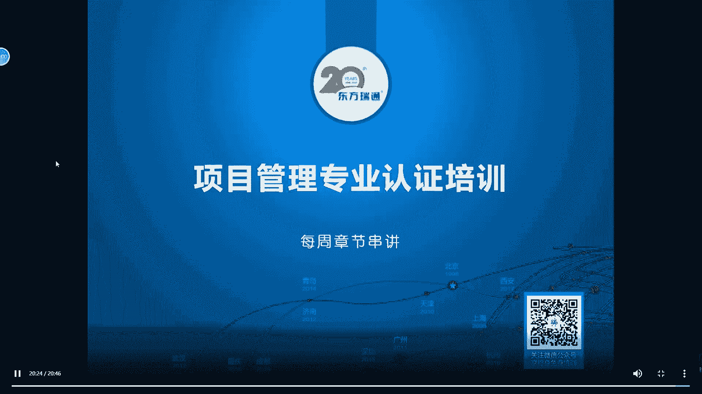
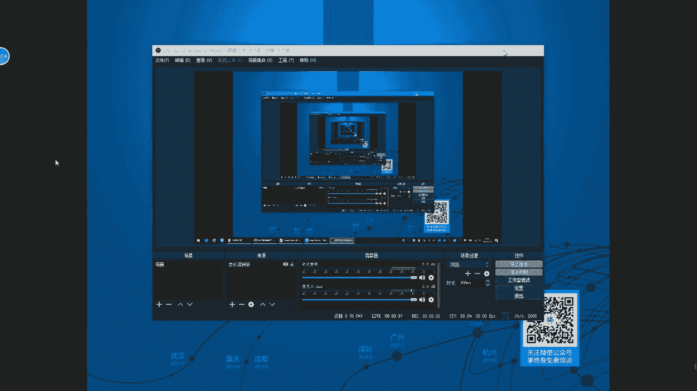
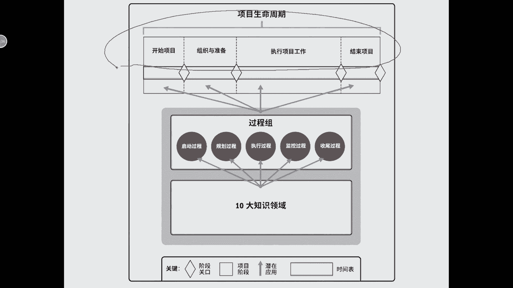
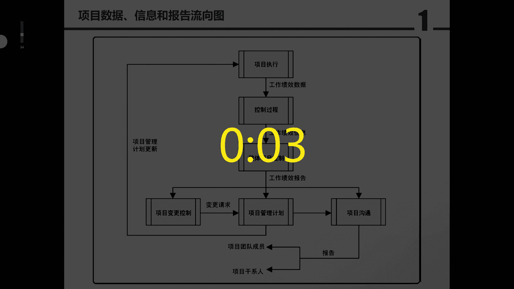
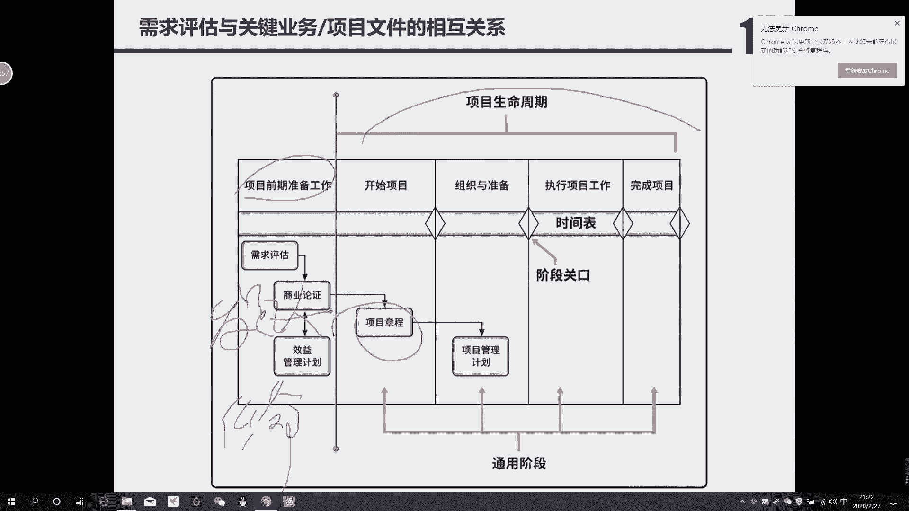
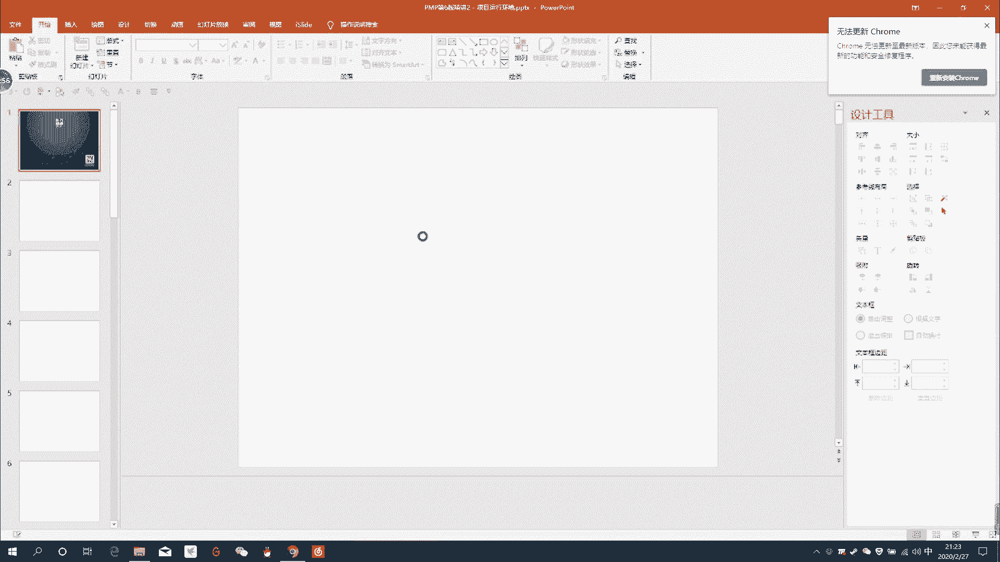
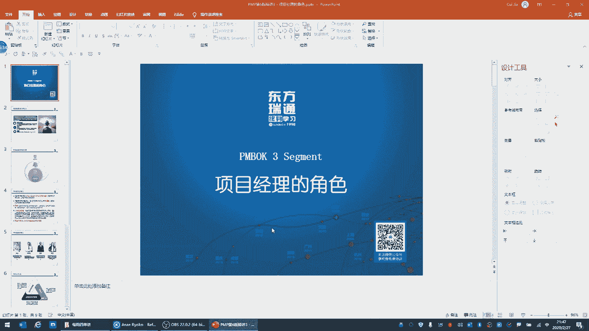
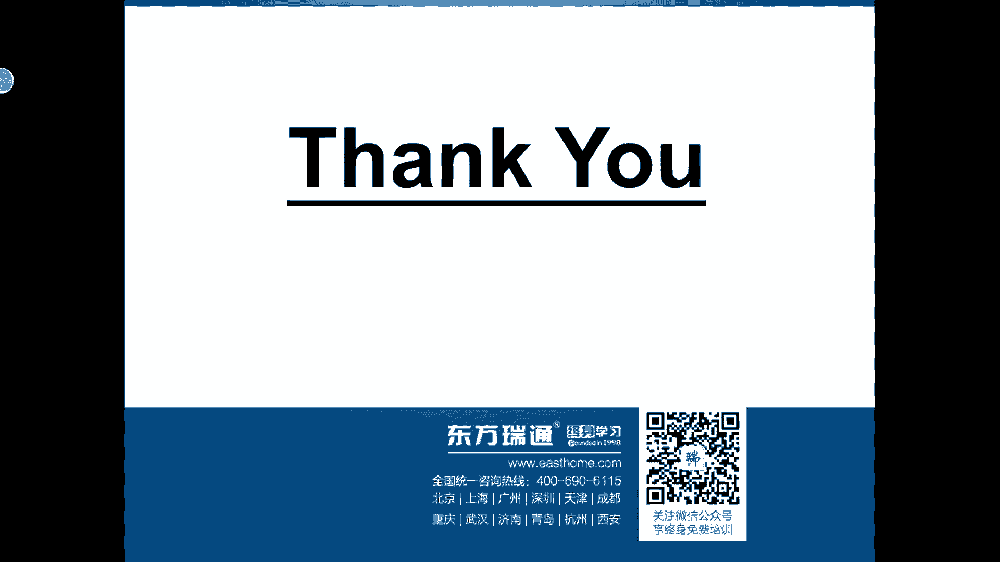
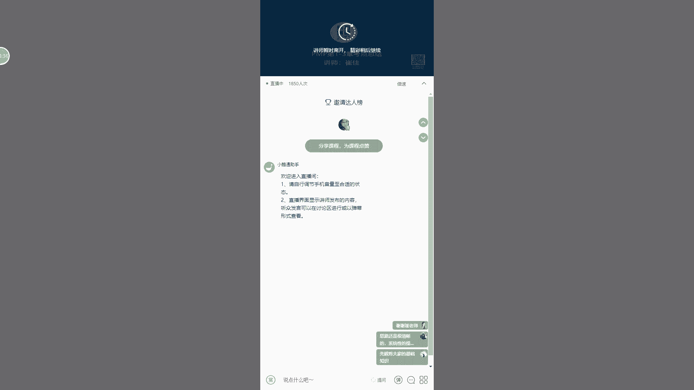

# PMP串讲 - P1：串讲第1-3章 - 我的乐芙兰 - BV1uE411N7zG

呃。

我看到大家的留言了啊，我也去录一下像啊，稍等我一下，我稍微处理一下。可能会屏幕上会有一个切换的过程啊。呃，我首先说一下这个课程的由来啊，是这样的啊呃，因为疫情的原因，我们的考试推后了。

一个意外啊呃用项目管理的术语呢，这别是一个未知的风险。那么针对未知的风险呢，我们这次特别动了管理储备，也就是增加了晚上的这个在线的这么一个串讲，目的是为了保持大家对于这个知识的热度。

以及对于我们学习的热度啊，包括我们每日每天的练习，每日呃这练习。虽然题不多啊，呃就是为了让我们能够还想着有PMP考试的这么一件事情。呃，所以呢有些准备工作做的肯定会有一些个不充分的地方啊。

包括我们的文档啊，包括我们组织这个直播，可能会有一些小的疏漏啊，我们也是内部测试了很多平台，最后选择了微信的小额通的这么一种方式。因为呃人数太多了。呃，大家第一天的课有一些问题呃。

我们也恳请大家呢能够谅解，我们也及时的调整啊。所以今天的课呢，我们想把1到3章啊给各位串一下。肯定会有一些个小的问题。呃，如果针对课程本身的问题或者知识点的问题呢。

我们留在这个明天我们在微信群里可以问啊。如果是对平台或者对于课程有什么问题呢，大家尽快的反应给我，咱们在这个。嗯，微信群里告诉我，比如说哪断了啊，或者声音有点小啊，声音有点小，我稍微调整一下。啊。

只要是有关呃课程的，大家啊这个都可以反馈给我。好啊，不多说，我们来正式开始今天的课程。嗯，自我介绍我就简单的写一下，我叫崔佳。啊，是瑞通的全职老师，主要我是本身那个呃工作地点呢是。天津啊。

我是天津本地的老师，所以天津的同学大家对我比较熟悉啊。嗯，北京包括全国的同学呢，可能对我不太熟悉。没关系啊，我们慢慢的相互了解和认识。我负责前三个呃前四个模块啊，分别是1到3章，今天讲的。

然后下周的周四呢讲一下第四，然后是分别是5六啊，就讲到进度的部分都是我。然后789包括敏捷是由我们广州的一位老师，大家呃广州和深圳的同学就比较熟悉了，就是刘通老师来讲一下中间的四个部分。

那最后呢呃这个1111213，最后这4张。呃，是这个由我们武汉的啊瑞通的全职老师啊，大家如果武汉和上海是由他来负责的，是杜杜冰老师啊。声音小哈，我已经把我的音量调整到最大了。

而且我是贴着这个耳麦发声的啊。呃，如果声音。😊，没有问题的话，大家打1个OK啊，我就知道了。如果剩音还有问题的话，打一个呃不OK或者是no啊，我再调整一下啊，说不OK是为了曲解这个啊。好。

那我们开始今天的课程啊。大家有什么问题的话，及时及时告诉我，我及时调整。😊，啊，我已经把我的音量放到了最大。如果声音好呃，可以的话，大家打1个OK确认一下啊。好的，我看见了啊成都的很多同学。

包括深圳班的。好，我们来开始讲一下第一章啊，有关于论论的部分。😊，呃，这个课程的主要目的呢是为了把考点提取出来。很明显，我们通过前几天的做题，大家的这个自新可能会受一点打击啊。我个人认为有两点。

第一个题目是相对比较难。而且呢有些题目呢的确是PMP的真题可能翻译的有些争议。第二个呢，在于什么呢？我们之前没有做过类似这样的题可能有些知识点，包括答题的风格啊，还需要调整。好。

那引论啊这个地方呢考的比较多的，首先是项目的三个特性啊。呃，大家注意，如果是天津班的同学呢相对熟悉我的讲课风格。如果是其他的这个同学，其他地点的同学呢？呃我是怎么记知识点呢，比如说什么项目。

我们就记住记住了三个特点。哦，我一般会用数字来记，这样的话呢，记得逻辑比较清楚。那项目的三个特点分别是什么呢？第一个独特，那所谓独特是什么？前无来者。就是之前这个项目啊没有人做过或者这个成果。

它有独特的地方啊，所以那什么是全锋连着，就至少你要有创新，有区别于以往项目或者是以往成果的一个特点啊，这就是独特性。第二个临时性。那说到临时性很明显，这就跟什么跟进度有关了。它会有一个明确的结束的时间。

😮，啊，他也就是在一个期限内，所以项目的特点是临时性。第三个呢就是建进明细。所谓的建定明细我们也叫滚动式规划。就是这个部分啊，最后我总结一下什么是项目啊。

书上的原话是为了创造独特的产品服务和成果而进行了临时性的工作，总结一下就是什么独特临时和建进明细啊，考试的时候，这个地方应该呃是异星级的考点，什么是异星级的考点，就是有可能会考到。啊。

有可能会考到他一般考什么呢？考项目和运营之间的区别。那很明显啊，项目是独特的那运营是什么？是重复的。呃，项目是临时的那运营是什么？是持久的？那项目是建定运行的呃，这个运营是什么？是明确的。而且是什么？

是流程化的，所以这是他们之间的区别。呃，我还特别喜欢用这种对比法。因为很显然，对比法有两个好处。第一个，你同时记住了两个概念，第二个通过对比，你更清楚的了解每一个概念，他们之间的联系和区别。

这样的话方便我们的记忆啊，有关项目的第三个概念，我们就先讲到这儿。然后我们看一下项目是怎么来的。这页PPT呢。在这个地方，我们就看它就商业价值。呃，项目是怎么来的？是项目推动了组织变更。那么反过来。

也就是因为组织的变更或者是什么状态变化会产生项目啊，也就是组织的状态变化会产生项目。所以有的时候我们看到有的题目您会发现啊，因为。项目呃组织发生了这个人员的变化或者组织做调整。

那么会产生一个新的项目出来。那么这个组织的。调整或者组织的变化，很显然就是什么？就是业务的需求。所以一看到业务需求，我再强调下，一看见业务需求或者是商业价值。很明显，这是在什么？通常他是在启动阶段。

它有这么一个特点。也就是说，一看见商业价值和业务需求通常是在启动阶段。为什么？因为商业价值和业务需求一般都是高层来确认的。也就是说，我要定义一个项目，肯定是由高层定义的。我们作为项目呃经理，我们是。

只是一个执行者啊，有可能发起人跟着高层一起来定义这个项目。为什么呢？很明显啊，因为我们的组织有需求，或者我们的如果是个外部项目的话，我们的客户啊拿着这个合同找我们公司来做项目来定一个项目合。

那是由发起人来签那个合同嘛。很明显啊，高层定义了商业价值和业务需求。那么作为项目经理来讲。我们只是去解释他或者是参与什么讨论，而我们不能对于商业价值和业务需求做决策。

通常商业价值和业务需求都是由高层或者由发起人来定义的。啊，这个地方大家一定要理解啊，也就是说当我们在题目中看见商业价值或者业部需求的时候，一定要呃稍微的小心一点啊，通常是在启动阶段，而且是由。

高层来啊定义的这个事情。我看到了广州班的同学说的啊，他说这个讲的有点快OK那我会把这个语速稍微的调慢一点，这可能受制于那个南北方啊，对于这个说话习惯的问题啊，我稍微调整一下。呃。

项目驱动了组织变更这句话本身是没有错的。也就是说项目会这个不能说呃，是由项目只是推动呃组织变更的一件事情啊。呃，组织变更呢的确是定立了项目，所以他们之间是相互有那么一个关系的。呃。

我所有的这个文字的组织都是来自于PMB或者是汪博士啊的这本书。好，那我们再往下看，这页PPT是特别特别重要的1个PPT是1个五星级的考点。呃，就是当我们在做题的时候，比如说我在天津班也上课也讲过。

就是当我做完拿到一道题之后，我不知道面对这道题我怎么选，或者我看不出来他考什么。他考的是什么知识点的时候啊，我们蒙啊，就是这个题我蒙一个答案，我怎么蒙，它也是有一个逻辑的那我们把这个逻辑呢。啊。

这是我自己定义的啊，叫做PMP的精神啊，因为是这个PMP考试本身来自于美国。所以呢啊我们总结出来的就是把美国人他的思维逻辑或者他的思维习惯给他提炼出来。那一共有三件事儿。

第一个美国人呢认为自己是高大上的。我们看过很多的美剧。嗯。那美国人认为自己高大上什么意思呢？很明显啊，在美国人心目中首先是什么？对，首先是诚实内部公开的，就是高大上。就是他他认为他很坦诚。

或者他认为坦诚是先决条件。所以在这个地方呢，什么叫做诚实和内部公开呢？大家注意啊。比如说有人挖我墙角。啊，或者是给我贿赂，我们一般要选择的都不是那种特别冷漠的处理，或者是默默拒绝。

通常啊有很多答案我们要选择跟领导去沟通，或者是什么呢？或者是这种不好意思，我的鼠标稍微动一下，或者在这个地方呢呃，什么叫做这个内部公开呢？另外一个原则，比如说如果有在考试中有什么担心啊。什么焦虑啊。😔。

啊，或者是这种怀疑呀。像这种词汇的话，在美国人的题目中，他是。认为这种事情是什么不确认的那什么是城市内部公开？也就是说我们要跟当事人去沟通。通常的选项是我们要跟这个人去谈心，或者是聊天，去明确他的想法。

或者了解他担心或者焦虑的内容。但我不知道大家做这个练习题或者做客后题的时候，有没有这种状况啊。就是如果出现了担心焦虑怀疑，也就是类似这种主观的倾向。就是你会读题的时候。

你会发现这个人是情绪化的或者是主观的那通常的答案，第一个答案都是什么，都是去跟他沟通。因为通过沟通才会了解对方的真实想法，我们才能够真正的来判断啊这个。人或者是呃这个相关方他的诉求或者他的需求是什么？

因为如果我们把对方的担心或者焦虑当成是这个事情的真实的话，那很显然有一句话叫天下本无事，庸人自找之，对吧？有可能不是我们的问题。也就不是项目自身的问题，那有可能是对方的一种心理状态。我们可能只是。

不去啊，不用去过多的关注是吧，只是低道处理就OK了。那与其相反的或者是与其相悖的一种情况。就是如果您们发现了啊，它有偏差。啊，发现发生了偏差或者进度发生了延迟。

各位这种情况就不是一种什么一种情绪化的或者主观反应了。因为偏差或者延长他肯定是什么通过数据或者报告得来的。但如果在题目中它出现的是这些词的话，很明显，这就不是谈心的解决的了。

也就是需要我们干什么去找原因了，而不是第一件事。一会儿我们会讲到啊，这个地方叫澄清分析解决。如果是通过数据找到了偏差，或者已经在报告中反反映出来的问题，那就。不是澄清的这个事情了。😡，啊，他不是主观的。

他是客观的，就是你已经找着了啊，能够真实确认他有问题。那好，那我要做的后边是什么找原因了。所以这点上第一件事啊，城市内部公开也就是说先去了解对方啊，针对这是怀疑啊焦虑的这种情况。第二个事情呢。

美国人认为什么呢？如果沟通啊，是能敞开心扉的话，第二件事就是他的价值观。😡，这个地方也特别有意思，在项目经理的心目中，他的价值观第一件事儿应该是项目高于一切。啊，作为项目经理来讲，他是很本位主义的。

因为项目经理项目经理应该是项目的经理。所以他的第一件事先考虑项目的什么理。当我们的项目跟别的项目有冲突，当我们的项目跟公司之间有冲突。那作为项目经理，你应该怎么考虑事情？各位不是去让着别人，没有谦让。

因为我作为我项目经理，我优先保护我的项目是第一位的。所以我的视角是先让我的项目利益最大化。啊，比如说我们在项目中有个关键资源啊，发现什么呢？

发现这个这个高层呢想把这个关键资源抽调到一个啊这个为公司更能产生利润的另外一个项目中。那作为项目经理应该怎么办？大家注意这种视角什么？有的同学会说，崔老师，你应该选这个资源不被放走不行。

因为这个资源是公司的，但是干什么我不能主动的去啊，不不应该去选，主动的把这项目给其他项目，那不行，应该是一定要跟领导谈。如果你把我这个资源拿走，你给我对等的资源是什么。

或者你帮我处理其他的善后问题是什么？啊，永远不要选这种自觉自愿的会把这个资源释放到别的项目中。因为什么？我们在保证项目利益。是第一位的情况下，我们在考虑企业利益。啊。

大家一定要记住这个原则就是答题的时候，我不知道这题怎么答的时候，一定要判断是否对于我的项目是利益最大化的。我再举个例子，大家就理解作为发起人也好，作为项目经理也好。

最大家心目中都希望把最好的资源或者是最优势的这个成本放在我的项目中。对吧那有的时候呢，我们会牺牲其他项目的利益。那有那从公司的角度看，他会认为什么呢？谁挣钱，我应该让这个项目的利益最大化。

所以他的视角是完全不一样的啊，在这个地方一定要注意啊。如果他问你项目经理应该怎么做，那肯定是我的项目啊，要选择的答案是对于我的项目最有利。然后是企业利益，然后是团队利益，最后才是个人利益。啊。

一定要把个人利益放在最后一面，这也是什么美国人的思维逻辑，对吧？美国人讲究是个人英雄主义，但是是什么是英雄，而不是说是一个这利己主义者，他永远是放在最后一面。第三个呢就比较虚了，叫做责任尊重公平诚实。

呃，之所以讲这样呢，是因为PMP他提到了这8个字，以前会考概念，现在这个概念不会考大家了解即可。但是我们得知道什么是最大的责任，保护项目是我们作为项目经理最大的责任。OK啊，这是第一件事儿啊。

叫做高大上。😊，讲到这儿呢，我再停顿一下大家对于我讲课的风格，以及我对知识的理解。大家如果觉得这儿讲啊还是可以的话，你就打一个yesS区别以往我们发的这信息啊，我就按照这种思路或者这个节奏来讲。啊。

包括我的语速啊，如果没有问题的话，在这个群里打一个yes。嗯，好好，这是第一件事。第二件事呢。大家注意啊，叫浴事用笔与人用嘴。那什么叫做浴室用笔，与人用嘴呢？我。见过很多题啊，什么是浴室用笔，语人用笔？

咱先说浴室用笔，我之前上课时我也经常强调啊，什么叫做浴室用笔。如果您发现了偏差。先记到哪里啊，这个课应该很有意思。如果像这种题的话，如果是面授的话，我会问啊，那有有偏窗了，我我首先要记录到哪是问题日志。

大家注意啊，在题目中如果出现问题日志的这个答案通常是好答案。另外一个是什么呢？这是偏差啊。另外一个。就是风险。如果是出现了风险，还有什么是将来。或者是未来或者是可能怎么怎么样，这些词作为项目经理。

你要选择的通常是什么？这个叫做风险征记策。这种答案通常是好答案。因为什么啊？如果有偏差的话，那我先把偏差记到我的问题日志里。如果他说的是将来未来可能这是一种概率，说明什么未来要发生的事儿。

那先记录到风险能预测这两个文件只要在题目中在在这个选项容一出现，大家一定要引起重视，通常是好答案。除非哪种情况？刚才我们说了，像怀疑和焦虑，大家注意啊，这是主观的臆端。像这种情况，我们要跟他去什么沟通。

或者跟他去聊天去明确。啊，否则的话经常是问题之识和风险的逆测，这是一个很重要的一个拿分的点。因为这种题在考试中会有很多很多啊，叫遇事用笔，先记下来再说。很明显，如果这个事情不记下来的话。

通常还是事情或者还是问题，只有记下来，我们才有可能解决。另外一个叫与人用嘴，大家也做了很多题。比如说啊我们在这个讲沟通的时候，或者再讲嗯这种矛盾冲突啊或者冲突解决的时候，什么是与人用嘴呢。

尽可能的是什么面对问题。双方面对。解决什么是面对和解决呢？就是什么把这个事什么谈开。就是把双方的矛盾的焦点，获得把矛盾冲突的问题完全是公开化的。这样的话才有利于问题的解决。

而不是去瞒着或者采用这种什么被动的解决方法，就是我不说啊，我让着他，或者我忍着。通常有面对和解决，这也是一个好答案。为什么与人用嘴先用我们的交流，先把大家的想法。给他解开，而且应该是私下面对面的啊。

尽量用面对面叫什么双向沟通。啊，未来我们讲沟通的时候有三种情况是啊分别是双向沟通，还有是拉式沟通和推势沟通。那拉式沟通它在什么地方用呢？未来讲沟通的时候会有老师单独讲那个，我现在把它提一下。

为什么有双向沟通通常是好答案啊，因为双向沟通它会得到另外接收方的一个反馈。那什么是拉式沟通呢？很明显啊，拉式沟通是针对这种什么网站。啊，明确说什么呢？人数多啊。

网站论坛这都属于就是人数多或者是什么物理位置分散。啊，位置分散的时候，那么经常会用到的是拉式沟通。也就是说我信息上传上去之后，你们随便看谁自己去看啊，他会很实时的得到一个信息的反馈。但是呢他有一个问题。

万一这个人找不着怎么办呢？所以他得不到对方的反馈。另外一个是推手沟通，像短信邮件都属于推手沟通，尤其考邮件的时候，经常会有这么一类题。他说。啊，某些相关方抱怨啊，没有收到这个项目经理的邮件。

或者没有得到什么什么信息，他感觉到不满。那我们要选择的是什么，要不就选择双向沟通，这个打，要不选择什么沟通管理计划，你有问题，你得调整，说明你的沟通的这种推势沟通，不满足对方对于信息的需求啊。

所以这个叫与人用嘴，大家就知道了指的是什么，通常是面对面的，而且是通常是最好的是双向沟通，这是第二个原则啊，也符合每个人的习惯啊，中国人相对比较内敛啊，有伙都憋着，有气都都都都都忍着。

而国外人老外是什么呢？有伙就发出来，咱俩怎么打一会儿啊直接在喝顿酒就好了以这是第二个他的文化。第三个文化呢叫做什么各有本分啊，澄清分析解决。大家注意啊，这是一个整个这页是一个五星级的考点。

而这个超五星的这个点就叫做澄清分析解决。大家注意啊，这分别是1233个层次。澄清是什么？如果您在读题的时候，经常是什么呢？项目经理去沟通啊。去了解呀，大家去讨论呢，这些答案通常是好答案。

我上课时候也讲过，一定不要选什么，我增加预算啊啊，我增加时间啊，我增加这个成本啊，或者我增加一些资源，这些答案通常不是好答案，为什么？没有经过论证的，没有经过信息对称性的这种解决。您直接下一个判断。

只要去选那个答案，通常是错的。因为那个答案。的这种做法肯定会有偏颇。啊，我没经过充分论证，我就去做一个操作的话，三思而行吧，那肯定是有问题的。所以第一件事先解决问题的什么这个信息的对称性。

第二件事什么分析？什么是分析呢？就是我针对我的问题，如果澄清了哎，我也记到我的这个问题登记册了。第二件事什么分析，什么是分析呢？就找原因。所谓的分析就是找原因。还有什么啊，还有这个像找原因啊。

还有像那个。找办法。找原因啊，或者找趋势，这都属于分析，就评估。第三件事解决，什么是解决呢？如果办法找着了，怎么解决，大家注意你得第再往后才是什么变更。😡，对我得发起变更走变更的流程啊，什么是解决。

那不外乎就是事先的预防嘛啊，事中的什么，如果在事情的中间或者在过程中，你发现有问题有偏差，那就是什么纠正啊啊，那事后是什么？已经造成了结果的问题，那就是什么变更了三种类型，分别是什么预防。😡。

对吧第二个是什么纠正。第三个不就是什么补救吗？如果后果有问题的话，就补救。啊，所以这是什么？针对解决方案的三种方法。但是通常你要选到这个地方的话，已经肯定是什么分析到原因了啊。

就是我找着了解决办法了那我的解决办法具体说就这三种变更的类型。其实还有一种叫更新。这更薪同城不可。然后大家注意啊，如果你确认这个变更，你读体你确认。这个变更已经发起来了怎么办？他就得走变更的流程。啊。

比如说某人说了我要增加时间，或者某人说了，我要增加预算，那都是什么走后边的流程。但是这里有个特例，什么呢？就是比如说他说抱怨不满足某个需求，大家注意他抱怨不满足某个需求。那你作为项目经理。

你得找解决方案。所以通常我们针对什么范围啊啊增加某个模块，增加某个需求或者增加某个这个工艺或者增加某个技术，对吧？那作为项目经理应该是什么发起一个正式的变更流程。因为什么你得找着一个解决办法。

然后再走变更的流程，然后再进入4。6变更来走项目流程，把这个变更批准掉。啊，所以这个地方呢澄清瘟析解决后边经常跟的就是什么呢？那个4。6。变更的那个整体控制，所以它是一脉相承的。大家一定要把这个。

这个就是我们学习学的是什么？其实是逻辑和结构，而不是说一个一个碎片的知识点。那样的话，第一你考试很累。第二个这这个知识它是形成体系化的，所以一定要把那个脉络哎给他学清楚啊。

这样的话我们就针对这些题目的话就很有自信了嗯。😮，好的啊，这个大家能够感觉到啊，我们已经进入了这种状态和节奏啊，这是有关真清分析解决，一定要把这个啊给他记下来。这三件事很重要，答题的时候一定要套用啊。

就如果你不知道这道题，它考的什么，哪个质点一定要本着我们这个原则，千万不要选什么，直接选赶工，或者直接就就就就增加什么什么投成本的投入，或者增增加相应的资源，那样的答案肯定通常会有问题。

我不能说百分之百就有问题啊。😊，呃，另外一个就是阳光法则啊，勇于面对问题，答题的时候永远不要选那种什么看看再说呀啊，你可以去沟通，你可以去了解，但是你不能说我回避啊，项目经理不管啊。

或者项目经理认为这不是他应该做的，或者项目经理告诉团队成员啊，不要去参与这些答案是有问题的啊，为什么太消极了，就是你一读题啊，你感觉到特别消极或者感觉到就读的就是就就项目经理好像没有作为。

这种答案通常不要选啊，我说的是通常不要选。因为这种答案不符合美国人的思维啊，这个应该是多承担多回报多沟通啊，另外一个就是做事本分做确只做，尤其是防前变，什么是防前变。我再强调一下啊。

在项目这个项目管理考试中，经常有类似这样的题。比如说啊团队成员。由团队成员，他要什么增加一个功能。啊，增加是什么跟范围相关的。您可以这么理解，比如说功能。啊，什么新技术？这种答案大家注意啊。

针对这个大家大家都知道，如果我们学的范围学的比较好的话，基本就是镀金。您应该选择的是什么？是通过变更的流程，就是走变更的流程把它拒绝掉。这也是答题的一种思路，就是我应该做的，我一定要做好。

我不应该做的不好意思，跟我没有关系啊。虽然我们觉得他很实际或者很世俗，但是的确就是这样的。因为我们现在是拿人钱财再替人消灾，而不是我们我们不是这个福利院，也不是福利机构。所以这个是什么防钱变。

大家一定要体会出来，就该我做的，我一定要做好，但不该我做的我也不要去过多参与啊，由团队成员增加范围，通常这不是好答案，但你要说比如说客户或者发起人增加范围没问题，那您给我相应的费用，我走变更的流程。

只要我的这个高层能批准CCB那边批准，那对吧？你是增加一个新的项目或者是做一个这个在做一个这个合同的变更，你给我钱就好了所以这也是反映了项目经理的心目中啊，也是保护项目的这么一个特点啊，就是坐只做。

最后一个呢就是不断完善PDC。地方呢经常考的是质量。这个质量呢又分为三件事啊，未来我们有有会有老师讲质量的话啊，分别是QP啊，做质量的规划，然后是QA做这个质量的审计或者做质量保证，也就管理质量。

另外一个呢是QC什么是QC呢？就是质量控制，所以质量控制就是看产品行不行。这个分别是什么呢？是规划阶段啊，做这个标准和计划QA是什么？大家注意啊，QA关注的是过程，它不关注结果。啊。

什么是PDC一看你们PDC，我们就知道它应该是管理质量，而不是控质量。它是针对过程的，他是他是在过做审计。什么是审计？我只看过程和文档，我不关注产品。你产品好坏的话，我看不出来，我也不检测产品。

我也不检查产品啊，所以这个地方应该是过程啊，一看你PDC通常指的是过程。而且PDCA是质量的管理基础，对吧？啊，不停的去完善去改进啊再明缓法则OK啊，有关这一页我们就讲这么一次。

您会发现针对这一页可以处理很多的考点。啊，有的时候我们掌握的知识并不好。呃，有些同学的确是这样的，就是事后我我也问过，崔老师，我的书看的其实并不好，但是我考的分还可以啊，甚至我考5A的同学。

关键就是掌握了这么一个思路，就是这三件事，大家一定要啊这个希望深深的去理解它，而且能够掌握在啊日常咱们答题的逻辑中。好，就是。PMP的精神啊很重要的一页PPT啊，想到这点。嗯，还有一个事情呢。

在这个地方啊，这就提到了勇于面对哈嗯小问题小变更自己扛什么概念呢？就是这个小的问题啊，或者小的变更就是基准内的。很明显基准内的这种变更呢是由项目经理批准的哈。那么大变化大风险一定要沟通领导。

大家注意这个地方我得强调一下基准外我们都知道啊，基准外一般是走CCB。对吧但是有一个特例，什么特例了？什么叫大变化大风险？如果您在读题的时候。比如说啊组织。签并。啊，或者组织的变更组织变化。

或者是市场变化。各位啊，这不是客户或者发起人说你产品发生了变化，不是是我公司组织被兼并了。比如说我A公司被B公司兼并了，或者是什么市场环境发生了变化。像这种事都是什么？都是这种叫做强外力因素。

通常什么这种强外力因素的话会产生一个什么？就是你的这个产品啊。或者你的成果呀，没就是产品或者成果的什么商业论证。打注呀产品或者这个。商业论证啊，产品或者成果的商业论证有可能就不复存在了。因为什么呢？

因为市场变化，比如说有些产品淘汰了啊，或者竞争对手把这个您正在开发的产品，它已经搞定了。像这种。提你一看被兼并或者是这个市场环境发生了变化，应该干什么？一定要沟通领导。那么咱再说领导领导有这么几个啊。

有发起人。优先选发起人，没有发起人选谁呢？选这个PMO。这也是个好答案。如果没有PMO的答案，选什么叫做高级管理层，它是这么一个逻辑。我指的是什么？叫影响项目成败。也就是说你的项目的商业论证。

如果有可能不存在的话，你一读题基本上就是他就是这么一个逻辑。有发起人先有发起人。啊，因为你跟发起人说，为什么发起人是投资方，他应该你应该是对发起人的利益是充分的保护。如果这个选项中没有发起人。

那PMOPMO有什么有支撑的作用。那如果没有PMO答案，通常是什么高级管理层，那肯定是代表公司的利益，对吧？啊，所以这也是一个答题的逻辑。我再请教一下什么叫大风险大大变更，是指影响到你项目成败。

也就是你做的产品有没有意义的这这种题目。啊，那就赶紧告知高层啊，这种题目在考试中有啊，之前考的很多，现在呢考的也越来越少，但是会有这样的题啊，大家做题的时候，未来我们通过模考。

或者未来我们通过课后练习啊，每日一题的话，这种题会有啊，这是有关整个这一页啊，这一页很重要，真的很重要。然后既然说到了商业价值，我们来看一下什么是商业价值啊，商业价值呢其实是指项目的整体价值啊。

也就是我们做一件事，整体价值是什么呢？两件一个是无形价值，一个有形价值啊，包括两这两件事，什么是无形价值，一个字是明什么是有形价值，一个字是例。就是我们做事就就是名利双收，没有别的。啊。

你咱们也不用谈什么这个社会价值，这这些东西。咱做的是项目，还是那句话啊，什么是名啊，包括品牌啊，商誉认助。有的时候他会考你比如说成本，他算那个质量成本的时候。

他说我这个成本有可能呢根本就啊我这质量投入很高了啊，根本就有可能这个占我整个产品成本投入的50%了。他问你有没有必要，你应该选哪个答案。对我不但做产品要考虑他的这个验收的成本，我还得考虑什么。

对验收如果失败，它造成了名誉或者信誉成本啊，所以我加大这个测试是对的啊，这就是有关名。另外一个就是利利是什么，就是挣钱。当您在考试的时候看见了，如果是名或者利受到威胁的话，刚才我们刚讲完干什么。

尽早找发起人。这个答案中通常是找发起人，赶紧跟他沟通，或者向发起人汇报。如果没有这个就是找PMO如果没有PMO找高高级管理层啊，刚才我们已经提到。另外在考试中一看见什么使命和愿景。大家注意啊。

一看见使命和愿景，通常。这是什么问题呢？就是业务需求。啊，一看见使命和愿景通常是业务需求。其实这个需求呢不是由项目经理找到的。

肯定是由高层或者您公司的这个呃决策层来定义的那基本上可以判定他应该是在启动项目。阶段啊，像什么使命啊或愿景这个地方啊，通常是在要不就是在项目的某个阶段正在过渡。就是我上一个阶段的成果已经提交了。

我即养老金进入下一个阶段，我来研判一下我下呃上一个阶段的成果是否满满足公司的业务需求。那我下一个阶段是否啊这个具备了项目启动的这个。对吧这个符合这个业务需求的定义啊，就商业论证啊，它存在它的价值还有。

那我可以启动啊项目的下一个阶段啊，它是这么一个过程。而业务需求呢通常特别体现在项目组合中啊，一会儿我们会讲到项目组合是什么？很明显，这是由高层管理的。啊，项目组合经理基本上都是公司的高级管理层。

就是决策层啊，作为项目管理的人员，大家捋项目组合，那肯定是高层。项目管理是什么PM什么是PM我们就是中层或者是什么，就是那个执行人，咱们。呃，我总认为项目经理应该是一个管事儿的啊。

也就是就是就一个基基础职员就好了啊。所以这个大家一定要搞清楚，项目组合应该是高级管理层啊，像那个项目级啊应该是应通常是中层，而项目管理呢通常就是就就职员啊。作为项目经理来讲，我们就是就是工种不不同啊。

所以大家一定要把这个搞清楚啊，项目组合经理通常是指高级管理层。好，那说到商业论证了，大家如果有感兴趣的话，或者有时间的话，把书上偏不可的这些商业论证好再看一下啊。就是它有各种类型的商业论证。

我就不在这一一介绍了啊，因为咱们毕竟是个串讲的课程。嗯，这些商业论证呢通常是。呃，看看无无妨。因为我们做事情的初衷是什么。另外在考试的时候呢，他会给你一个逻辑啊，基本你一看那逻辑你就能感觉到啊。

他是在做商业论证，你就能定位它是正在启动项目啊，这个仅此而已，现在考纯商业论证的题呢不是很多。但是呃据说啊就是我们现在是第六版的PM book啊。呃我们有幸。嗯，虽然我们赶上了这个疫情。

但是呢啊这应该是因为疫情又导致他可能9月份。他也不会去更新这个最新版的平安爆款啊，就是因为这个全球的这个。呃，新新这呃叫什么这个冠状的这个病毒的影响啊，所以他不会更新。所以我们趁着之在版本更新之前呢。

我们一鼓作气把队考试搞定啊就OK了。嗯，大家。就是跟着我们的节奏走就行啊，您只要该做的就跟着我们的节奏，把该做的做了就行啊，基本上就是这么一个逻辑。呃，那说到了项目组合，我们也提到了啊。

叫组织级的项目管理。这书上明确讲到了一个概念。因为虽然我们是针对第六版的PM部的考纲。但是呢现在其实我们做我们作为讲师在读题或者在答题的时候，发现了，他越来越强调这种战略和这种叫治理啊。

所谓的嗯这种战略或者公司的治理呢。他是考虑什么呢？就是为项目做这个利益的定义。其实就是项目利益的定义。你会发现啊这个什么是治理呢？就是在框架中定义了战略，就是我未来公司我的愿景。

我到底是证明是政力的那个趋向性啊，这就是战略和治理。那作为项目来讲呢，大家注意这句话很重要，我们必须要服从总体的战略方向啊，必须要服从总体的战略方向。所以为什么刚才我说了。

如果市场发生了变化或者组织发生了变更，你干什么？必须要跟发起人去确认。就是我的这个现在的项目还符不符合公司的整体战略？因为这个事太大了，作为项目经理，你不能说啊，如果不符合我的项目不干了不行。

你得把这个事情反馈到高层了，让他去去决定，或者去去研判到底我的个项目是接着做还是不做。所以一旦什么组织变更啊，或者是这个市场发生变化，项目经理通常你选择的答案不是项目经理能做得了主的。😡，啊。

比要不你就找什么在这个地方啊，还有一种可能性就是找这个项目叫做刚才也提到了，叫做项目级或者项目组合经理，这也行。其实项目级和项目组合经理通常经常是PMO来做这个事情，或者是高级管理层。啊。

这个逻辑是没有问题的。嗯，那作为高层来讲呢，为什么要找项目级和项目组合经理，我再强调一下，在项目间分配资源的，或者在组织间或者在项目间分配资源的，肯定不是项目经理的能力。啊。

比如说A项目啊B项目想动A项目的这个资源，那A项目的项目经理怎么办？还是那句话啊，要不就找发起人，要不就选项目组合经理。为什么你这个B项目想动A项目的资源，那肯定是B项目的优先级可能比A项目高。

那作为项目经理来讲，你你你是完全被动的，你说不给不给他他是高层，你给他，你给他你的项目怎么干，所以经常选择项目组合经理的那个答案，或者是高高级管理层啊，一旦涉及到两个项目之间的这个资源的博弈。

大家答题的时候通常是得找高层去沟通，或者是这个。嗯，跟他去想想办法。好，然后呃那么有的时候还有一种可能性啊，我说的是通常会选高峰。还有一种可能性。比如说如果领导想用你的人，你还有一种选择。

你看看你的那什么那个项目日历或者是资源管理计划。啊，就是他找我要人，如果这个人恰恰在我的资源日历里已经弄完了，或者在我的这个什么叫做呃人力资源管理计划中啊，他恰恰是没有这这个人的这个工作已经做完了。

那啊对吧？我这个风险就小很多啊，对吧？所以我可以第一个先选什么，在资源日历或者在资源管理计划中来看看影响。第二个，如果没有这个答案，那你就直接选什么找高级管理层啊去沟通，对吧？😊，啊。

大家这个还有一个需我现在讲课是讲我思维的逻辑，但是不是说你见着这个题就得这么选啊，一定要搞清楚了。我我经常在所有的我的这个逻辑之前都加上一个通常啊，因为他总有这个个例，有的同学经常会说崔老师。

你你这个之前你讲课时可是这么讲的。你现在又不选这个。我就特别冤，对吧？你这这这咱不是考背诵，他就是一个逻辑性的东西，我就把那个我的思路给您。您不能说村老师你这么说，我就得选那个答案，哪有这种事儿，对吧？

我要是真做到这个程度的话，我我对吧？我这个全球来讲，我我厉害了，你你看见那个词，你就选那个答案，看那个词选那个答案，那肯定不对，那也不是做项目的原则啊。好，项目组合啊，什么是项目组合。

刚才我们说的啊是项目之间的优先顺序。啊，项目间的优先顺序优先排序。那么基于优先排序呢，就是什么呢？就是这个就是资源的分配。啊，所以很明显这是什么公司高级管理层或者高层来做的，就项目组合的这个管理。

大家如果感兴趣的话，你们可以学一下在PMP的上面，它有个PGMP是针对项目级了。那PGMP再往上呢，它叫做什么？呃，PFGP啊什么的，我具体我记不太清了。

因为我达不到那个那个那个level啊那个层次我也就不太关键现在他就是分项目集和这个项目组合或者是组织级的治理啊这个大家了解即可啊。如果您接着想往上考的话呢，那PGEMPGMP的话肯定是全英的考试啊。

全国可能有20002000个，对吧？项目级啊或者项目组合的这个这个层次啊，也是PMI的一个认证啊。好，这是项目组合啊嗯优先级排序和资源分配了解了。然后我们看项目级，项目级是什么呢？

项目集他关注的是项目之间的依赖关系。大家注意啊，这个项目组合是研究项目之间的利益关系，而项目级是研究项目之间的什么呢？这个相互关联其实就是什么呢？就先后顺序。啊，大家了解即可。

以前考这个知识点考的特别多，就是项目级和项目组合的区别。但是现在很少考，你可以把它化成是一个异性级的考点，考的很少啊，之前考的特别多。呃，作为项目级来讲呢，就是谁先干谁后干，其实是是什么？

是由这个物理的属性。比如说刷浆啊，你是先得刮墙皮再刷浆，你不能说先刷完浆再刮墙皮，那你这个刷浆的这个浆不浪费了嘛，对吧？肯定是先刮墙皮再刷浆，它这由自然顺序来规定它啊。

所以很明显这个项目级的管理是中层来管，为什么？它这个利益关系对吧？或者决策的呃这个价值不是这么高了啊，只要你按照这个事情的顺序啊，自然属性你给它做了就好。所以它经常是中层啊，这个大家了解一下。好。

再往后呢，就是啊哦这页图挺好的，大家可以看一下啊，什么是项目集和项目组合和项目之间的关系。肯定啊项目组合包含了项目和项目集。啊，而项目呢又是项目级的一个子级，对吧？啊。

这个他肯定是项目项目级和项目组合是由低到高的这么一个顺序，肯定啊项目组合刚才我们说了是高级管理层到项目级这是中层那项目是什么咱不能说低层吧，对吧？就PM就好了，其实就是个leaber啊。

就绝对到不了leader我上课时候也他不是领导，他就是一个什么是leaber大家上海的同学都知道就小leaber就是干活的那个小伙计吧？所以他是这么一个逻辑嗯，作为高层来讲，他讲究的是什么呢啊，对吧？

优先顺序资源配置就是哪个先干哪个后干哪个与我挣钱更多对吧？我们作为中层来讲呢啊先干和后干他的哪个自然顺序是什么？这干更合理这这个。他考虑的是合理性，他考虑什么是利益的最大化呀？对吧。而我们作为项目经理。

你这上面这些人都是什么干哪个事更好，干哪个事儿更合理。而作为项目经理什么，你就干这个事儿，你是怎么把事干好？😡，对吧把事情办好，这是候作为项目经理要做的。所以他的思维逻辑和方法是不一样的啊。

你会发现到领导越越高到高层的领导越虚，为什么呢？他就是战略想法，他不是具体做事啊。好，这是有这么一页PPT啊，就是他研究了项目集和项目组合，他们的区别和联系啊。大家如果感兴趣的话，看一下呃。

最多也就考一道题。我们之前的经验啊也就这一道题，但是也不排除他万一对吧？啊，这个多考点有可能，但是经常也就最要考的话，也就一道题。但是它的这个思维逻辑我们必须要清楚。

他可能不会直接考你项目集和项目组合的概念。但有时候他说在项目组合中啊，您当前项目A的这个资源，有可能被一个利益更高的项目B所调用，问你项目经理应该怎么办啊，所以像这种题他会有啊，要不就选择什么呢？

这个通常啊在这未来我们在讲风险的时候会讲过呃，风险里有这么一句话叫上报。也就是说，如果这个项目呃风险应对方案超出了我项目经理的职权或者我的能力范围，那怎么办？我得报告给高层。什么意思呢？刚才我们说的。

因为项目B比项目A的利益要这个实现盈利要多，那作为项目A的项目经理发现了项目B啊争他的资源，那怎么办？那作为项目经理是吗？对，那你就得找这个项目组合的经理来谈这些事，对吧？你得对吧？我可以给你资源。

但是你得给我置换项的资源。你不能直接给他。就是这个逻辑。项目和运营我们之前讲过了啊，项目是独特的啊，而且是这个叫做短期的啊，叫做这个。独特性和坏了，突然间那个脑子断片了啊，一个是独特性。

另外一个是临时性。而这个运营呢是什么啊？呃运营是重复的，而且是持久的啊，运营希望时间越长越好，而项目希望时间呃越短或者越精验越好啊，就是他们之间。呃，本质的区别。嗯。呃，组织啊，那说到这个地方呢。

大家了解即可啊，这个考试中。他不会去明确的去考您这么一个质点。但是我们得知道，其实我们从一个公司的管理来讲呢，它包括两部分。啊，一个就是我们日常的工作，也叫做职能工作。另另外一个就是项目工作。

就是这两手都要抓都要用。那针对职能经理呢，他研究是流程，为什么他是怎么管好运营？而作为项目经理呢，他是做好项目，而项目上面不是项目组合嘛，对吧？所以第一个公司啊，如果能够长期发展。质量或者运营你得做啊。

日常的这管理工作就是日常的行政和管理工作，对吧？行管的工作而这个是什么？项目是什么？不就是产品吗？啊，这种创新。对吧你也得做啊，否则的话缺一啊，这个公司就倒了啊，你这个呃日常流程做不好，你的质量不行。

产品靠不住啊，对吧？你要说没有项目的话，你没有新产品，你这都有固步自封，都是老产品，你企业也活不下去。啊，这是项目和运营的关系，这个是一个三星级的考点。考的经常考，但是考的也不是特别多。

像刚才那个项目级一项目组合，那是一星级的考点，就是有有可能会考，但是很少考像三星级考点呢是经常考，但是考的不多啊，大家这个项目和运营的关系，我们得搞清楚啊，所以一个公司的运作呢，从战略到运营啊。

有中中间呢是通过什么项目项目集以及项目啊，让这个什么让这个产品落地的，所以很明显，项目上战略落地的工具，对吧？而落地之后怎么办呢？你能不能实现盈利呢，那时候运营要考虑的。啊，我再强调一下。

项目是让战略落地的一个工具。那落地之后怎么办啊？你能不能实现长久的利利润呢就是运营啊，所以这个不在这儿多多阐述了啊。好，另外一个重要的知识点，在前三中啊，有个很重要的知识点就提到了项目的生命周期。呃。

那我们得了解，其实一个大项目呢，它可能会有若干个。大家把这句话啊，这是都是书上的原话啊，我摘抄下来的。我们读一下啊，他说什么呢？项目阶段一般是呃是一组具有逻辑关系的项目活动的集合。

为了有效完成某些重要的可交付成果而。在需要特别控制点将项目进行分界，这就是项目的阶段划分。也就是说。项目的阶段是基于项目可交付成果进行划分的。也如果你的项目有多个可交付成果，那你就得分成多个阶段完完成。

啊，所以项目的生命周期是什么呢？是多阶段的。通常是一个或者多个阶段。为什么我说一个呢？如果我的项目就一个成果，那就简单了。那你这项目就是单成果的项目就是一个阶段。如果有多阶段的话，有多个成果的话。

相当于什么呢？你得验收上一个成果，验收没有问题，你还得做行政收尾，把一些个文件啊、组织文档都打包，然后你才能进入下一个阶段。而你从上一个阶段验收之后，能不能进入下一个阶段，你在这个地方要有一个叫关。

关键决策点也叫做什么阶段性审审查，也叫做阶段关口，相当于两个成果之间的转换的这么一个时间点或者里程碑，这就是一个阶段关口。啊，比如说我们看一个药品研发的项目啊，上课时我就用的这个例子，就是药研阶段啊。

你这个药品上市之前，我们要把药品上市看成一个大项目，包括药研药研阶段，你得出配方啊，实验阶段你得出统计报告啊，对吧？你大规模实验临床临床实验。然后你出完报告之后，你得去那个药监局拿药号啊。

那那拿到这个审批的文件呢，就是第三个阶段。所以这个项目因新药上市的项目划分为三个阶段，分别是药物研究阶段实验临床实验阶段和这个什么这个呃呃药号审批阶段啊，因为你有三个成果分别是配方。呃。

实验阶段就是这个报告拿报告啊，统计的报告，那批准阶段我得拿那个药号，或者拿这个食品药品的那个就是。呃，就那个药就是药号，对吧？就是一个小的串号嘛。而这三件事要是从产品的角度，它只是什么只是什么上市啊。

你这个那要它刚上市啊，这就属于什么？这下边底下就既有项目，又有运营了，这不是我们关注的，我们就关注上面就OK了。为什么要讲它呢？很明显，每一个阶段啊，比如说我这个一个很复杂的产品啊。

我在调研阶段就划分为三个项目啊，或者我在升级淘汰时又划分了几个这个呃一个大项目又划分了几个阶段。而每一个阶段大家注意啊，我们现在学的启动规划执行监控收尾，它是叫做项目管理的生命周期。

我们也叫做什么一个阶段。在。一个这个阶段内。也就是说你针对一个成果，在某一个阶段内，你干什么呢？还得经过5个什么叫做这叫什么这叫过程组啊。我们上课时讲过，不管您是谁的学生，对吧？

那老师肯定讲过叫做又得经过5个过程组，分别是系动规划执行监控收，5个过程组。也就是说，每一个过程组。他都是一个完整的项目管理的生命周期，它只是针对一个成果的。而我的项目如果有多个成果，意味着什么？

你这个项目生命周期，如果有多个成果，你得划分为多个。刚才我们刚讲完叫做阶段的关口，每一个阶段内我都得用启动监呃规划执行监控收尾。对吧，然后我这个阶段收尾，你首电你验收啊，我能不能进入下一个阶段。

是不是你又有什么启动监控，启动规划执行监控收尾，又有这么一个完整的管理的生命周期。所以项目的生命周期就包含了多个项目管理的生命周期，或者包含了多个阶段。😊，啊。

大家如果针对我这个生命周期讲的没有问题的话，那在我们的微信群里打一个5。因为这个考点是什么？是一个五星级的考点。经常考。😔，就是。从这个项目的生命周期和来研判这个多阶段或者阶段的观卡。

而每一个阶段又是一个项目管理的这个5个过程组的一个构成。啊，大家如果没有问题的话，打一个5，我们区别以以往的确认。看看有没有什么问题。没有问题打一个5，确认一下啊，因为这是一个五星级的考点啊。

各位一定要把这个部分的PM book给他读一下啊，很重要的一个点。嗯，我看见了天津班的同学啊，对线回复，因为是我本人也在天津不对呀，这网络离得近，远近跟那没关系啊，跟物理位置哈。好，谢谢大家啊。

我们接着往下继续。还真有关，北方不对，南方回的快，北方回的慢。😔，好，咱不讨论网络的这个。好，我们再看一下。讲完了生命周期之后呢，另外一个很重要的知识点啊，就说到了。好，有一位同学还真的很好啊。

他成都的这位周拱，他晒出来了思维导图哈，我不知道是是不是您自己做的，还是我们发的啊，这个思维导图真的很好。他把这个所有的知识点都整理出来了啊，即便是我们发的，或者您。嗯，您是手头的资料。

说明您肯定是看了这个部分了。啊，这这这这种学习方法是很好的，还有逻辑哈。好，我们接着继续啊，然后再往下就讲到了。😊，嗯，项目开发生命周期的类型嗯，我中间就不上课了啊，不下课了，因为总共就这个。嗯。

就两个小时，我就一口气儿下来了啊，咱们讲完课咱就早点睡觉。第一个开发生命周期的类型叫做预测性。啊，这个我们得或多或少的了解啊，什么是预测型，就是什么需求或者范围啊。相对明确。啊，就是我的产品的需求。

经过我充分的调研。然后我一口气儿呢就把这个产品给它做出来，相当于什么呢？我一口气把这个产品呃从头到尾给他给他做出来，这就是预测性。呃，玉则行。也叫做什么呢？如果大家做开发的话。

就是我们之前在七八十年八九十年代用的比较多的瀑布开发啊，就是一口气儿啊，从需求到这个最终产品啊，一汽贯通，第二个叫迭代和增量。大家这个了解即可，迭代和增量考的几乎是不怎么考啊，就是我的这个需求不明确。

我每隔一段时间呢，我再更新一个版本，比如说像那个office或者windows，对吧？你这每隔34年才就得更新一个版本啊，增加一部分需求或者功能。第三个会考到这个是一个重要的点，我们会有另外一位老师啊。

叫刘同刘老师，会在大概应该在两个月啊之后会讲到啊，就是敏捷开发。他是讲这个中间三三个过程，而且他对敏捷的理解很深啊。他会讲那个适应性。敏捷开发呢也叫适应型。大家把它画一下啊。

虽然这个概念未来我们在强调啊，什么是适应性，应对大量变更，也就是你的产品的需求啊，它总在变变化，那怎么办呢？我我我不考虑那么多，我2到4周我迭代一次，而每次我的迭代，大家可以看底下的这个图。

这个他会有产品的叫做什么呢？叫做剩叫做遗流清单或者剩余清单。那我从这个遗流清单里呢，你就是会它会有大量的需求，这相当于是是一个需求的池。啊，相当于需求池，因为我每次迭代呢只有这么2到4周。

那我会从这个需求池里找出来，我最最本次开发最关注的两个需求，这也叫用户故事。我这次需要做的这个用户需求，也叫用户故事。那针对我的用户故事干什么呢？我再确定我的任务清单，有点类似于分解WBS一样。啊。

我在确认我的叫做什么呢？叫做这个叫做迭代，或者叫做这个敏捷的这个back lock，就是迭代清单，或者叫做这个任务清单。然后我每天干什么的，得开一个每日战会，什么意思呢？因为我总共就2到2到4周。

我就不别开例会了，但是我的每天的绩效报告和绩效审查怎么做呢？每天上午大家啊都都都开个会，七八个人一个开发小组，都在这站着，不允许坐下，为什么？你要坐下的话，一聊聊起来没完了啊。

咱就站着15分钟说一下什么呢？什么是每日战会两件事，一个说一下你的什么绩效。就是你是今天要呃，昨天完成的是什么？就是你的绩效。😡，啊，就相当于你从那个blog里，就是你的任务清单里，你做了哪些工作。

你做完了，你就挑根啊，就是有点类似于这个。😡，呃呃呃to do list啊，你做了哪些你就挑根啊。剩下还有另外一个什么呢？就是你遇到的哪些问题啊，所以这周是每日大会要做的。😮，有的同学会说了。

在每日战会里又发现新的需求怎么办呢？大家注意啊，如果是在这种瀑布模型或者叫做驱动型，也就是我们说的正常的，或者叫做普遍的啊这种PMP的流程中，那你肯定得发起变更。但是如果在每日战会中。

我们发现新的需求干什么？他不做，他直接又放到这个什么叫需求清单里，就我这次开发，我只做应该做的用户故事。你要有新的需求，我直接放在这个就是你有用户反馈的话，我直接放在这个产品的back里，对吧？

放在这个呃遗流清单里啊，我我我我这次我先不考虑，因为我当前只关注当下的用户故事啊，可能一个可能两个取决于这个用户故事是。繁打的还是简单的。啊，然后呃到2到4周开发之后，他有个叫演示会议。

什么是演示会议呢？哎，对，就是什么呢？我这个迭代周期结束之后呢，我来看一下我符不符合我当时预期的这个用户故事能不能满足。很明显啊，这是针对这种。我们经常用到的叫做这个。呃，APP啊，包括电商啊。

他的产品啊研发经常用作是自适应。什么是自适应啊？也就是我们说的大大大大家把它画一下，叫敏捷开发在哪了，这个词。敏捷啊，书上是有的。敏捷开发。啊，大家如果知道第七版的话，应该知道啊。

第七版特别强调民捷开发啊，因为。另外一个考试叫ACP啊，就是敏捷开发。所以第七版它会关注人和敏捷开发这两个部分啊，所以我们现在第六版已经提到了，但是第七版。会有50%会考敏捷，那个考试的难度会更大啊。

敏捷是。需求需要应对快速变化的环境，看护看重这个用户的反馈和感受的啊。我看见有的同学反应是不是断了。电脑比较流畅哈，大家试着总结一下经验啊，比如说怎么进用哪个呃，用哪一个浏览器好进。

然后进去之后用哪种方式可能呃效果最好。啊，这个。我们可以总结一下哪位同学啊，辛苦一下。好，这也符合我们的组织共资产的更新啊。然后生命周期的开发方法，这有PPT大家看一下，这是比较了这几种生命周期。

考我再强调一下，考的最多的一个是预测型，一个是适应性，也就是敏捷。OK啊，我就不再强调了。然后他们之间的关系是这样的啊，生项目的生命周期是很长的，因为他可能会有很。

好几个阶段或者是好几个这个成果。那针对某一个成果呢，它可能又有5个过程组啊，这就是项目管理这么周期，它有5个过程组。而每一个过程组呢，它要映射到我们十大知识领域啊。

所以这这边就整个PM book这个这个逻辑就是这么一个逻辑啊。啊，大家把这个逻辑关系给他搞清楚。嗯，在第一章里的最后一个点是很有意思的，他又讲到了绩效啊。叫做我们叫做绩效线。嗯。

这个绩效线也是经常考的一个点。现在这个第六版我感觉已经越来越咱们有的同学提到了啊，咱们稍微停到一下，去个厕所哈。好，这儿。这纪要现讲的时间比较长，我们在这休息个，咱们休息5分钟啊，稍微休息5分钟。

时间还得来得及，我看了一下啊，咱们休息5分钟，大家5分钟后会来，好吧。

。🎼，好，各位同学如果回来的话，打家一个一帮着确认一下啊。嗯，正好在等各位的时候，我多说两句啊，没想到这个课没火，两件事火了。一个是我的口音，我觉得我说话口音没有，就标准的北京腔啊。很很标准的普通话啊。

第二个就是这个音乐，刚才我也。😮，找了一下哈，我已经发到群里了，大可以。愿意听的话可以看一下纯天津味都行，更精神。我说的是普通话标准的普通话哈。好，我们不过多关注这个啊。这个课没火。

这个口音和音乐火了哈，这太悲哀了。对于老师来讲。😔，大家好好听讲啊。嗯，刚才我看到了有一位同学问的问题很好啊，他提到了产品和生命周期啊。嗯，多说一句吧，往回叨一下啊，我就提一句什么是产品的生么周期啊。

这个大家了解即可。考试中很少很少考到啊，因为它跟运营相关的。因为一个产品呢从这个产品的研发。😊，到这个呃试生产，到最后呢，投入到运营，再到最后升级改造和淘汰。

它是这个产品的生命就就相当于是由项目而且是多个项目和运营之间啊相互的转化和够构过渡。😮，啊，来它形成了是相当于一个公司推推出来一款产品，它既包括项目，也包括这个这个产品的运营，一直到这个产品的下线。

它有很多的项目和运营交替啊来实现那个产品的生命周期。大家了解到。了解到这个层次就就行了啊，相当于产品生目周期，包括着项目和运营。好。不在这儿过多的阐述呀，因为他考试又不会考，我们也没有必要啊。呃。

更多的去交流这个地方啊，这是项目的生命周期啊。然后我们讲一下绩效线，什么是绩效线呢？三件事啊，一个是绩效的数据，一个是绩效信息，一个是绩效报告。那绩效的数据是来自于什么呢？来自于执行阶段。他是什么呢？

执行阶段，我们一提到整呃叫做项目的指导和管理项目执行啊是4。3。相当于我们规划完了之后，通过k进入执行阶段，那你就会产生数据啊。就是我花了多少钱，我工作多长时间，我产生了多多我完成了多少工作量。

就是我们说的那个绩效的什么。对，就是AC就是AC啊EV啊啊，就是这些。什么什么它是原始值，来自于生产一线的原始值，它无好无坏，就是你干了多少，其实无好无坏。然后什么它来自于这个生产一线的在执行阶段。

然后用这个什么用这个数据啊。去什么用数据去PK。PK什么呢？PK计划就是或者基准，你用你的数据去减计划，也就是减去PV你会得到一个结果，要不就是1个CV，要不就是1个SV这就是工作绩要信息。

什么是工作要信息呢？就是用数据去减去你的计划得到的偏差加上什么你有偏差不行。刚才我们讲过，如果你已经发现了有成本和绩效偏差，你还得找到原因啊，就偏差加原因，就是工作要信息，这第二部分第三，你你有了偏差。

你你有了原因之后，你得干什么？你未来你得怎么干啊？大家注意啊，工作要信息来自于什么呢？来自于所有的子监控，它是from所有的子监控。比如说你控制范围，控制成本和控制这个呃控制进度。

就是你拿相应你的基准去，你拿你的绩效去减去你相应的基准，你会得到一个负值，就是偏差。那正值就是干的好，我们其实也一种偏差啊，然后你再找个原因，就是每一个子监控都会有各自的它的这个SV或者CV对吧？

这个大家都能理解啊，这就是偏工作绩要信息。然后你的工作介绍信息干什么呢？你在。产生工作绩要报告，工作绩要报告是什么呢？是相当于是汇总，再加上趋势。就是你得你得未来你打算怎么干啊，对吧？

你这这个这CV和EV你得加起来啊，对吧？你得去看到底你成本对吧？成本坏，但是你进度好，你到底是干的好是干的坏，你得去什么汇总，就是综合考虑，然后还得包括你的趋势，你未来怎么干啊？😮，啊。

所以这个工作纪要报告是什么呢？大家记一下44。5，这整体叫做整体监控过程多哈。而这个工作绩效信息和工作纪要报告大家可以翻一下啊，工作绩效信息所有的资监控，比如说55。55。6，包括这个6。6，包括7。

4啊，这这每每一个知识领域的相应的它的控制过程，它都会发起变更。因为你有你有偏差，你就得变你的工作纪要报告是什么呢？是你跟领导汇报的时候，你整体项目的一个趋势，相当于4。5，你看4。

5的输出它也要有变更，所以很明显啊，这个工作绩效信息，工作绩要报告都是为了发起变更的。其实工作绩效数据也要变更。为什么你来对生产一线的话，比如说某个螺母它松了啊，或者是这个呃工具不好用，它也得发起变更。

所以这这些个就整个绩效都是为了发起变更的啊，大家就理解了。但是我们得明确数据信息和报告之间的关系啊，这是。呃，他至少得是一个三星级的考点，他肯定会考，但是考多少题不好说。

有的时候有一年考了大概得有五六道啊信息绩效的题。所以这个回去咱们得好好看一下，把这个逻辑关系给他捋顺了。呃，还有一个点需要注意的，开会带报告，他要问您开会需要带什么啊，项目经理需要带什么文件。

你就记住了，开会带报告，为什么，你得通过报告工作绩效报告得跟相关方和这个项目干系人沟通，比如说客户啊啊，比如说这个。呃，这个相关方啊，对吧？包括这个关键干系人啊，你得用报告跟他汇报。

千万不要用数据和信息跟那个成员或者干系人汇报。因为第一他他没有那么专业。第二个，你你你要解决的是这个事，你要怎么办，而不是说到底这个偏差是什么，对吧？他不关注偏他关注你未来你打算怎么处理啊。

为什么在这了说了很明确，这个这个报告是为了产生决策的，就是你未来变更，你怎么打做答案怎么做。另外一个就是项目管理的商业文件啊，项目管理的商业文件很重要的就是商业论证。大家注意商业论证不是项目经理做的。

是谁做的呢？您看这句话，他说发起人通常负责商业论证文件的制定和维护，我们就理解了。商业论证就是你的项目的那个定义是否挣钱是否证明，那肯定是高层定义的。对吧项目发起人有可能就是高层。

比如说你们公司的副总什么的，对吧？而项目经理干什么呢？项目经理不负责定义或者写这事案文章，但是项目经理可以负责提供建议和见解，就是你只是参与。对你连讨论和决策的资格都没有，你只是参与啊。

我我我我说一下对这事的理解。啊，另外一个商呃，项目经理需要确保项目管理方法紧扣商业文件的一图。什么意思？就是你得维护商业。商业论账。什么叫维护商产认证？对吧？你得把所有的资源，把这钱花了。

把这个进度保证啊啊把把这钱花到这个产生他相的这个价值啊，相的绩效，这是我们作为项目经理应该做的。所以一定要搞清楚，涉案论证是发起人或者高层来制定的。那什么是商业论证的？四件事。第一个业务需要。

什么是业务需要？就是你的战略。有的时候他也叫愿景。说的都是一回事儿。哎呀，那个业务需要或者叫做商业需求，都是一回事。啊，呃，然后有了这些业务需要，你得做形式分析，什么是形式分析了解即可啊。这不会考。

就是我能不能做，我能不能挣到钱，或者我有没有项目的资源。然后我针对我针对我的内部的情况，然后我有三种解决方案或者几中解决方案。那我那这些解决方案呢哪一个更好，对吧？那或者我更关注项目的是证明是正利。

对吧？就是什么评估比较。😊，我们只需要记住一个原则，商业论证是什么？一看见业务需要或者是愿景或者是战略，那肯定是商业论证高层啊。通常是在什么项目立项或者叫做项目的准备阶段来研判。这些就是项目还没有了。

涉产认证首先得有，对吧？啊，我相信大家对，就是这页PPT就是我们现在研究的项目的生命周期都是什么启动规划执行哈，就是都是你得有这个项项目的上这个项目章程，就是你得针对项目经理，他已经能够授权了。

而在前期准备工作呢，其实是有什么发起人签头，你作为项目经理，你是跟着参与的，你还没有得到一个明确的一个批准和授权的过程啊。所以在这个阶段呢，作为项目经理，可以叫什么任命。就是我任命了一个项目经理。

但是呢他没有经过正式的批准和授权，也就是未来这项目做不多，还不好意思，还不好判断。如果在题目中他说了啊，这个项目啊，有这个有一些问题，或者我这个项目的发起人呢呃。

感觉这个成本有可能还不能够确定这个成本完全能够覆盖这个项目的成本，或者这个投资是不是能够赚回来，他不确定，那就说明什么在做商业论证，项目经理要选的是什么。最多你就是建议你不能是。啊，你去撰写这个事表。

那肯定不对，而且说明那个项目还没开始了，或者是在启动阶段的早期啊，这个是一个点。

啊，讲到这第一章其实就是这么几个点啊，大家可以把这页截个屏，回去把这几个知识点搞定就OK啊，我就不再重复了。我觉得我讲的比这个精讲可能都稀哈。因为第一节课嘛。啊，这个。啊，我是用普通话啊，很流利的。

从头到尾讲了一遍啊，大家能够感觉到啊，有的同学说听到标准的北京腔，我笑喷了啊，说明这个同学的确啊这个北京腔啊能够让您产生共鸣啊。好，然后这是有关第一章啊，我们就讲到这儿，我们看一下第二章。好。

第二章呢叫项目的运行环境啊。嗯有。

呃，项目的运行环境第二章啊一上来他就抛出来一个很重要的概念。也就是项目的运行环境可能会影响项目的成败。而影响的因素呢有两个部分，一个叫做世业环境因素。大家注意事业环境因素就是通常是外力。

就是你你你不能改变的一个叫内部的组织过剩资产。什么是内部的组织过剩资产呢？就是知识库啊啊一些模板啊一些个项目管理的流程，大家注意啊，这些个政策和程序都是项目。就是针对项目管理的，不是针对组织管理的啊。

比如说你们公司的那个人事政策，那肯定是事业环金因素啊，而事业环金素呢又分为内外部和内部。这个地方说的内部。是指企业的内部，而不是指项目组织内的内部啊。所以这个大家一定要了解。那世界环境因素包括哪些呢？

我们看一下啊，首先就是组织文化。就是你组织的构成，你的结构，对吧？啊，什么职能型、项目型啊平衡型呃，财务考虑的因素。嗯，这个财务考财务考虑因素大家了解即可。一般是指什么呢？比如说他要说资源的能力。啊。

或者是资源的这个数量，那都是你改变不了的啊，资源的能力或者数量，这都是事业份因素。这个经常考叫做信息技术软件啊，事业环因素还包括什么？比如说office啊，包括这个project。

你用office是哪个版本啊，这些大家了解即可啊。大家看一下风险票号肯定是事业环因素，就是我们的高层怎么理解这个风险啊，这是通常是事业环因素。呃，还有一部分事业环因素，大家把它画一下，就是外部条件。

还有市场的环境啊、法律法规这些啊，但这个都眼能看出来。那组织共剩资产其实组织共剩资产最重要的是三件事儿。第一个叫共享知识库。什么是共享知识库呢？就是你。你的项目。

你当前项目会或者是你以往项目的这些什么这些文档。或者这个过程文件啊，这都是呃共享的智识库。第二个是经验教训，什么是经验教训呢？很明显那个文档是客观的。什么是经验教训，就主观的啊，就是我的这个成败的原因。

啊，我这个做事成败的原因，我的分析还有一部分就是什么？在这里特别强调有一个叫客户满意度，也属于阶验教训，对吧？客户满意度为什么要做呢？是为了我们今后的项目啊成功的概率更高。第三个叫历史信息。

什么是历史信一些未决的问题，未识别的风险。啊，比如说有一些个这个已经验收之后了，他问你这个客户已经验收之后啊，他要发起一些个需求的变更，那怎么办啊？我们通过变更管理，但是啊这个CCB又没批准。

那怎么办呢？嗯，直接就给他放在这个历史信息里了，就把这事记下来啊，嗯，有可能未来呢。呃，项目通过二次项目啊或者后续项目来解决。还有一种情况呢，有可能就是对吧？呃直接转运营了，就交给4S了。呃。

因为作为如果验收之后，相当于我的这个项目，所为对于产品呃，对于项目经理来讲就做完了，但是呢客户再提出来一些个想法，那怎么怎么办呢？我们得记下来，你得转给运营啊，那运营来负责后续的处理啊，对吧？

比如最典型的我们那个一款汽车上线，你会发现这个车有些问题怎么办？那就4S店再召回呗，对吧？都得交给4S店啊，所以他是这么一个流程。这是有关组织过剩资产啊，大家注意，这里有个重要的点啊，组织过程资产。

一定要把这个画下来。如果在考试中，他问您啊，嗯什么上一次项目。或者之前。😔，啊，或者以往出现这种词，通常你要选择的就是组织网资产，或者是建验教训增记册。很明显，这都是来自于我们以往经验的一个总结。

或者他还会这么考啊。你现在做的这个项目，你未来怎么怎么样，你那个这个为今后的项目啊怎么怎么样。那那其实也是记录到什么组织光资产中，就是为了那从未来的项目角度来看，你当前的项目不就是以往的项目。

所以这个今天考试题目中他有一道题，他说的是什么什么呃，这个客户啊，呃采购我经常不付款。他问你怎么确认这个客户呃，你给他记下来了。我读完那道题的理解是什么呢？

我是通过哪个文件来确定那个客户有类似这样的情况，所以我选的是B答案，是B答案吧。啊，对，B答案就是经验教训或者组织共剩资产。而A答案呢是项目章程，那个C答案呢是。

呃，是假述日志哈，一会儿我们讲明天我们呃下次我们讲第四章的时候，你会发现什么那个项目章程里有一个叫做高层级的风险。😊，而假设日志呢也是这个一些制约因素和假设的记录。所以那俩档案呢其实都有道理。

你说这俩档案你要选C的话，那A为什么不对呢？😊，对，所以我基于这两点考虑，一个我认为他考的是你能确认这个事儿是从哪个文件里，那我得从以往的经验里来获得。另外一个那个A和C的这个俩答案呢。

它它都是一个正确答案。你说四选一，这俩答案都正确，那你怎么选，那选不了，所以我。认为选B可能更合适。当然这也是有争议的一个论点。因为我们老师之间的确也分为两派啊，希望那道题不考。

但是我们就能够得到一个结论。什么以往的项目啊，什么之前的项目啊呃上一次项目，这都属于组织公共资产。我说的是答题的技巧和逻辑啊，就是这种关键词法。呃，最后总结一下啊，组织固剩资产是。

每一个项目都可以去更新，去增补的啊，去这个。变化的，但世界环金因素通常不会变化，只有两个过程，世界环金因素发生变化，但是从来没考过，一个是9点。4。🤢，对，9。4叫做呃建设团队。一个是9。

5是管理团队啊，这两个过程是对事界环因素，它会有一个更新，但是几乎没考过啊。我到目前为止，因为我从。嗯。我从13呃14年13年开始讲课啊，就讲PMP到现在只经过两次考试考过这个点啊，实现环因素的更新。

啊，由还是在第五版和第六版的早期，现在应该没有这个知识点，所以大家了解即可啊。呃，最后我们看一下，比如说像合同的模模板，这就属于什么组织光资产，因为合同模板你可以不停的完善，对吧？啊。

包括一些法律法法规啊，不可抗力的描述啊，风险承受力，这肯定是什么环境因素，对吧？刚才我们讲过这个人天生胆小，它通常不会改变的啊。我们的高层对于市场的判断啊，它是不会改变项目档肯定是什么对知识库啊。

这是最典型的知识库肯定是组织光资产，行业出版的数据一看见行业那外部，那肯定是实业环境因素项目管理软件我们刚才也说了啊，这个也是什么事业环境因素，对吧？你用哪个软件。

你你有的公司用的就是office2003，你着急也没有用，它它就是office2003你的那个文档就得改给它改成兼容模式，它才能够打开。啊，这就是涉用因素和组织公共资产的区别。

然后组织系统五星级考点很重要的一个考点。什么是组织系统呢？其实大家可以感觉到组织系统就是这个地方，就了解组织内的职权啊，它的分配情况或者它的层级。呃，这页PPT不是重要啊，大家看一下就行啊。

就是来自于PMbook，但是它不会考一些纯概念，它会考具体这这些个组织结构，包括你几种状况。第一个就是智能型。所谓的职能型，我们的书上也有介绍啊，就是他是通过技是部门嘛。

就我们现在很多公司用的这种部门式的管理啊，拆分成若干个部门。然后呃作为公司的老板，他会让某一个部门来牵头来协调这个项目。啊，呃作为职能型的组织项目成功的概率很低。因为什么？你牵头的话也很难。

因为你能调动你部你这个部门的职员，你调动不了跨部门的职员。因为他们俩是评级的，而且。那个职能经理都是本位主义考虑的对吧？我做完我做坏了有责，我做好了无功，对吧？还投入我资源。

我本身还有自己的KPI我何必去这样去做呢？所以啊这个职能型的组织很明显，项目成功的概率很低，也没有也没有项目经理。啊，就是职能经理作为兼职的项目经理，所以这个很难。啊，他没有正式的项目经理的这个岗位。

第二个叫做。弱举阵弱举阵其实也没有一个正式的项目经理，但是。总经理会口头任命一个人，会交代给某一个人啊，叫做项目协调员。而在弱矩阵中呢，协调员呢他的能力很低很低，他只是个跑腿的人。所以呢这句话很重要啊。

作为职能经理呢，他还是掌握着资源的控制权。也就是作为项目经理，你没有任何的权利，或者是你只有一个就是传话沟通的这么一个能力啊。呃，弱举证成功的概率也不是很高。在弱举阵中呢。如果是在职能型和弱矩阵。

大家注意啊，只要您看见职能型和弱矩阵，在选项中你就选职能竞控。你这个答案，通常没错。为什么都是他说了算，你跟谁商量也没有用，你就找他这事才能解决啊。好，第三个叫做平衡式矩阵。大家注意啊。

这个是很重要的一个点就是。我们可以这么理解，就是如果这个题目明确。没有明确告诉你默认是哪种举证结构。通常我们可以把它理解成是个平庸举阵。相当于什么呢？权力和资源混合在职能经理和项目经理的手中。

就是FM和PM啊，职能经理和项目经理就平分秋色。啊，为什么那个总经理会给职项目经理一个正式的授权，就是项目章程。就是他会给他一个红头文件啊，当着所有职能经理啊，今天任命啊某一个能力比较强的职员啊。

小崔当那个项目经理啊，希望你们几个人配合他的工作。大家注意啊，其实职能经理也不愿意配合。但是呢因为他有这张纸啊，就是什么？你要不配合，我就告诉总经理啊，你这个职能经理，你不配合有工作。

这总经理不就不就得好好的去压制他吗？所以很明显项目经理干什么，我们就了解了。如果比如说考试时，他说他说项目经理呢和职能经理可能针对某一个资源或者某些资源，他的使用产生了冲突。

那作为项目经理和职能经理怎么办？就是谈判。这就过渡到了什么呢？过渡到了第九章的9。3获取资源，我们也叫组建团队啊，不叫建设团队是组建团队，你有一个重要的手段，就是。项目经理和职能经理谈判，因为什么？

因为你们俩是平分秋色的，这个资源两头都可以用。所以这个这个在平衡矩阵的这个结构中，你的项目管理难最大的难度在于什么呢？在于。你的这两个这个。就是你的这这就是这两方啊，他他的沟通都很困难。

就是你这个资源既得跟智能经理沟通，你又得跟项目经理沟通。他的沟通是多头的啊，他的管理难度是最高的啊，他他的管理难度最高。嗯。他的管理难度是比较大的。而且作为项目经理，他是兼职的。

虽然你有一个正式的一个项目商程，但是你也是兼职的。因为什么呢？相当于你是在从属在某一个职能经理底下的啊，只是在这一刻他让你干项目。然后第四个强举阵，强举阵就不一样了。

你看啊强举阵这里有个重要的点叫项目经理的经理，也就是什么你的项目经理，他有一个从属关系了，就是他有自己的部门了。意味着什么？他有自己的部门，他就有自己的资源，他有自己的成本核算他有自己的KPI什么。

大家把它画一下，项目经理和团队成员都是全职的。就是我搭建的这个项目班的，我可以让我经理的经理为我提供资金。我把你们这个时间都买下来。啊，他有一个什么就类似于PMO的概念，就是项目经理办公室啊。

就是我所有的就是我所有的项目经理，他都有自己的一个独立的组织机构啊，就有职能机构。嗯，拥有了到加大职权的这个全职的项目经理和团队成员啊，他画一下全职。啊，这是强举阵。强举阵的话。项目经理。他的能力。

是比较大，权力比较大。最后一个是项目型。项目型组织的话，大家就就记住一个原则啊，项目经理肯定是全权自主，他无这个职能经理。就整个这公司都是都是基于项目性的，就像婚介公司啊，都跟着这个呃跟着这个对吧？

跟着这个司仪走呃，或者是这个律师事事务所都是跟着律师走啊。😮，啊，他是没有职能经理的。好，在书上有这么一张表，大家回去看一下有几个点啊，什么时候项目经理什么时候是这个职能经理权利高呃。

另外一个什么时候这个是全职的，把这几个点搞得搞定。还有一个我再强调一下。只要是弱矩阵或者是职能型。就选职能经理。我再强调一下，若举证或者职能行，就选职能经理。因为项目经理没有任何办法啊，他没有任何能力。

呃，在这有一道题，我念一下，公司正在启动一个项目，公司组织授予项目经理的职权比职能经理要高，这是什么型组织，这是强举阵。为什么呢？你看啊他呃PM比FM。要大说明还有啊FM，那么就是什么全矩阵啊。

大家了解一下这个地方选A。呃，另外一个是PMO嗯PMO这个考点之前是考的特别多，现在充其量哦，不好意思，往你先叨一下，就是这几个组织的，就这页PPT是个五星级啊。刚才我们说了啊。

组织级的关系是个五星级考点。然后PMO的话呢是一个异性级考点，考的越来越少。😮，什么是PMO项目经理办公室啊？PMO呢其实有5个作用。我在讲天津班的时候，我是这么讲的，叫两个S3-2就好机。

两个Sstandard和support啊，就是一个是支持，一个是它可以提供标准。3-2呢一个是关系啊，一个是这个资源，另外一个是这个控制啊，监监控就两个S3-2，很明显PMO是项目经理的老板。

所以呢你有难处，我可以帮你啊，你缺资源，我可以帮你去找啊。你说人际关系或者组织关系，你搞不明白，我可以去帮你协调啊，但是我得时时刻刻看你工作的好坏啊，我得给你像的这个控制标准，我得对你进行把控啊。

所以你要不明白，你可以问我，所以两个S3个2，你就能记下来，就是PMO是什么意思，对吧？呃，我记一个概念，通常都是用这种二分法三分法什么五分法，对吧？最多也就六分法，啊，未来我们讲那个项目章程的时候。

你就知道了啊，就是321就三个高层啊，三高两懂一关键啊，这样你好记啊。有关PMO我们就讲到这儿，记住了2个S3-2啊。PMO呢通常也是中高层啊，它有一定的执行或者决策权。好。嗯，然后讲到了项目相关方。

什么是项目相关方呢？大家。一个是影响项目的人。一个是受项目影响的人啊，我上课时反复强调过这个影响项目的人就是他有权。受项目影响的人，他有他有利益，这不就是权利利益矩阵吗？不就113。1的权利利益矩阵吗？

所以什么是相关方案，你得搞明白，一个是影响项目的。权利一个是受效影响利益啊嗯。作为项目经理，你有一个最主要的一个责任，大家划一下，平衡相关方的利益。其实项目经理啊作为管项目就两件事，一个是沟通。啊。

一个是这个一个是沟通，一个是平衡啊，平衡的就是利益啊，沟通的就是信息的传递啊。好，这是有关相关方。嗯，我们看一下具体有哪些相关方呢，这一页PPT是关键相关方，大家把它得画一下发起人。我再强调一下。

发起人的作用很重要。大家仔细思考一下，发起人啊，在启动阶段，他批准项目章程，就是他给你项目经理的任命。在这个规划阶段。你做完的计划，他得干什么？keick off。😡。

这个kick off的本质就是发起人批准你项目经理，你的这个项目计划OK了啊，建立共识了，大家按照这个计划去做好，形成基准了。😊，在执行阶段，你要缺资源啊，或者是遇到了这个重大问题，重大风险找谁发起人。

你得跟他报告啊。在这个监控阶段，CCTB里面通常会有发起人。大家注意啊，如果考变更的话，请易不要选发起人。除非项目章程的变更，那肯定是发起人。为什么项目章程换项目经理的话，呢直接是发起人，对吧？呃。

如果是这个基准的变更啊，通常是选CCB。呃，在结束项目或阶段就是在结束过程组中，那发起人也很重要。为什么他批准项目的结束啊，他是。呃，产品验收找客户项目验收找发起人。所以有一道题。

他说什么那个客户已经验收了啊，然后那个发起人呢却不同意验收啊，他问你作为项目经理应该怎么办？那你肯定你的文档没更新啊，对吧？你组织过程资产没更新啊，就是人家客户说你产品没毛病，但是你发起人为什么呢？

为什么不验收，你那个资料都不全，我怎么后期转运维，我怎么就就对吧？给这个运运营的团队啊，所以这个大家就理解了，发起人是负责项目啊，最后没有问题了，批准结束。而这个客户呢是产品，你的成果产品没有问题啊。

他是这么一个过程。呃，除此之外，还有哪些呢，我们得知道呃对吧？这个项目的相关方案，还有哪些呢职能经理很重要，职能经理一般选什么呢？谭志远。一般啊跟职能经理就是谈资源。千万不要选什么。

比如说你要有技术问题，你找职能经理，这事就错了。职能经理没义务给你解决问题。😡，对你要你要说缺资源，你找他要，对吧？因为他你是平庸矩阵，你们俩能谈人那个技术问题，人又不是你团队成员，你找他，对吧？

要我我就连理都不理，对吧？职能经理他没有这个义务啊。😡，这是一个很重要的点啊，大家了解一下。然后我们看一下项目周期中的这几个曲线。首先，资源投入曲线。大家了解啊，它随着项目的推进。

它的资源是成这种抛五线的很明显。在执行阶段，它的资源使用量是最高的，对吧？前期的话，你你这个计划刚拿到项目当中，你计划还没有了，对吧？大家先商量的做计划，所以你人不用的过来啊。

中期执行的时候按部按部就班，各就各位，大家该做什么做什么。在项目结束阶段，你的有些个工作已经做完了。执行阶段啊，项目的资源已经1。1点已经释放干净了，所以这个是抛五线性的。除此之外，还有两个曲线。

一个是相关方影响力和风险是降低的对吧？你随着你项目推进过程中，你的那个相关方7788的说一大堆啊，你越往后他的这个变更的这可能性，他对项目的影响力越低，对吧？我的产品都做完了，你再跟我说这些有点晚了。

而风险呢也是越来来越小，为什么呢？你不确定性越来越小，你项目成么也没有的事，你不确定性很高，对吧？而反过来是不是变更的代价越来越大，对吧？你之前说让我做一个三轮，你现在说想改成汽车，对吧？

那那不是不是装一个备胎就能解决的这个变更的代价很高啊，所以他们之间的逻辑大家得清楚啊，一个是。😊，风险是随着时间的推进越来越低，而冰更的代价越来越高，而资源投入呢是从炒股线啊。

这个地方有可能会考一颗星啊，大家看一下这图就OK啊，基本也没什么问题。第二章就这么几件事儿啊，大家回去之后把它看一下。啊呃作为天津班的同学呢，我之前还留过课后的作业啊。

呃我也不希望这个疫情期间呢让全国人民呢都讨厌我，所以我就不留作业了啊。大家回去之后把这几个点回去之后看一下啊，这是有关第二章啊，项目运行环境。好，我们看一下第三章。

好，第三章是这个项目经理的角色。嗯，这张未来在第七版嗯，PMI就是官方说了啊，它可能这个考的会越来越多。但是在第六版说实话考的点不是很多啊，我们把它过一下就好了，大概只需要10分钟左右。

好，我们首先得呃了解一下这个项目经理的角色哈。有的同学说作业来听听啊，做不做定说。啊，做做另说呢还听什么？对吧？所以这个除非您说我崔老师我必须做作业，我单独的发给您，就是把刚才我们说的那几个知识点。

您看看书就行了。因为整个前三章啊，说实话在考试中他占的比重不高，也就大概在十道题左右。但是您不得不看，因为前三章如果不看的话，一些个项目的基本逻辑，尤其他有我在这个地方讲一个那个价值观。

我相信大家的讲义里应该都有这一页，这页是我特别看中的。其实咱们这个PPT呢之前讲过的讲义是我写的。但是我不知道别的老师是不是他针对那一页，他能够讲出来，我当时想表达的逻辑。

我所以我今天特别强调的是那一页啊。对，然后我们看一下那个项目经理的决策和定义哈。呃，项目经理是由执行组织委派，大家注意，这是一个考点。什么项目经理被授权。所以呢一定要大家一定要看清楚什么呢？

这个点一定要注意啊，就是有的时候他会问您项目经理呢呃。呃，来处理一个项目或者一个新的项目经理啊，落地到一个正在执行的项目。他问您作为项目经理，第一件事干什么？如果是在启动阶段或者是一个新项目经理。

第一件事干什么？作为项目经理的第一件事，先拿项目章程。对呀，你没有项目章程，你项目经理寸步难行啊。你说你连正式的这个资格或角色都没有的话，你怎么做项目啊？所以这个点特别重要啊，一定大家注意拿项目章程。

说到这呢，我再讲一下，我在天津班这个上课时也说过啊，经常现在考试考这么一一个类型的题。他说这个作为新项目经理。啊，作为新项目经理落地到一个正在执行的老项目中。他问你你你需要干什么三件事。第一件事。

刚才我们说了啊，拿这个项目章程，你没有项目章程，你你你没法做啊，你得出师无名啊。项目专程。😔，那么第二件事是什么呢？第二件事基本上是参考着那个什么项目管理计划。就是你得去审查或者去。

研判这个原有的项目管理计划，就是你看看你当前的绩效和原有的计划和原有的基准到底有没有偏差，有多少偏差，对吧？通过计划呢来这个这个。来研判绩效对吧？来看那个绩效的情况啊，来绩效找找偏差。第三件事呢。

如果绩效确实有偏差。比如说我的老项目经理落新项目经理落地到老项目中，我也拿了项目章程了，我也看了原有的计划，我也找到偏差怎么办？那很明显有偏差什么，对吧？有偏差的话。找原因干什么发起变更啊。发起变更。

不好意思，那你得走变更了是吗？4。6，你得走流程，你不能说说改就改。千万啊，那我在这儿我再强调一下，千万在答案中不要选直接更新项目管理计划的答案，通常不要选管理更新管理计划的答案。你能更新的计划。

大家注意啊，文件是可以更新的。比如说更新呃问题日志更新这个。呃，问题日和风险等预测，这都没问题。但是你说你更新项目管理计划。你经过CCB了吗？😔，对吧你只有经过CCB的高层的认可，你才能更新计划。

你当时制定计划的时候，你还得经过那个发起人。关键干系人，你才能keick off才能执行了。你说你现在在执行过程中，你要改计划，那不可能的。所以永远不要选。

我说的是永远不要选更新什么什么管理项目管理计划的这个答案，你能更新的计划有什么管理计划可以改呢？比如说相关方登记册，你能改你增加人，那你直接更新就好了啊呃，沟通管理计划，你可以更新。😊。

为什么沟通管理计划它不会影响基准，对吧？你说范围进度成本，他不会的，你就直接更新他怎么了，对吧？我发现某个相关方对于沟通不满意，你这选个沟通更新沟通管理计划，这个答案没有问题。

但是如果他有跟这个相关方去沟通，了解他报怨的原因。那当然那个是最好的答案。我们之前说过，为什么澄清分析解决，你先澄清的话，肯定比你先解决要好啊，这个逻辑我不知道我说的是否清楚啊，很重要的一个点。呃。

然后是项目经理的影响范围，大家看看即可啊，很明显，项目经理随着项目推进或者随着组织关系越远啊，他的影响力越小啊，了解即可。因为我怕什么呢？怕第七版，他有他会考一些有关人的管理啊。

他会问你项目经理作为项目经理来讲，是不是对吧这个呃他管理这个能力的呃，他的层次是什么？了解即可。这个通常不会考。但是呢大家看一下，作为项目经理，我们也应该知道我能管理的就就。

对吧我能跟那个项目团队还有点话语权，我到发起人，这就得跟人请示了。我到客户那我就得求人家了，对吧？那这这个角色就变化越来越大，我们得这这这个很明显，这个是项目经理的定位啊，咱得了解咱能干什么不能干什么。

对吧？对。这个不会考啊，大家了解即可。那么作为项目经理的领场力，刚才我也已经说了一个是沟通，一个是平衡。沟通是什么？是信息的传递。那什么是平衡？大家把它画一下，相关方之间的冲突以及竞争目标就是利益。啊。

呃人际关系大家注意了解即可。人际关系的技能啊，它基本上不会考。为什么呢？这个软技能它没法考。你说我通过1个PMP考试，我就能够考出来你的这个这个人际关系。这不现实啊，这这个这我个人认为是太不现实了。嗯。

这个项目影响力大家了解一下，主要是沟通和平衡的能力。呃，作为项目经理的组织能力啊，互动倡导，这都是刚才我们说的软技能啊，看一下即可，这个都不重要。但是把它得划一下报告。

项目经理可能和其他项目呃项目经理可能与其他项目经理一起向PMOO和项目组合或者项目级经理报告。大家尤其把后半句话画一下。这就是我刚才讲到的。作为项目经理，你要报告的时候，要不就找你的发起人。

要不就找项目组合和项目这个级的经理啊，这个是很重要的一个证点。稍微等我一下，我找一下东西啊。😔，好啊，这个点很重要。那说到报告，大家有时间的话，看一下10点1沟通的规划。他提到了一个报告，一个是11。

5风险应对，它里头有一个呃报告的这么一个风险应对的策略啊，大家回去啊，我既然讲到这儿了，我会告诉您，您报告的原则在哪或者具体细节，因为我不确认这个其他老师的讲讲课风格。

但是我现在就告诉您勾这个说到报告了，他的考点在在在哪个地方回去看一下啊，作为顾问来讲，大家了解即可。这个你自己能力咱还没达到，咱给谁顾问啊，对吧？就是最主要的就是报告的一个考点啊。呃。

那么PMI的人才三角了解即可。一个是技术啊，就是你的专业的项目管理能力。第二个领导力领导力的话，把这个词画一下激励。这个词建议各位，如果有电子版的PM book，自己回去搜一下什么是激励啊。

何北激励是确认目标，以及带领大家啊能够顺利的让大家去实现这个目标的能力，就叫激励啊。这个点大家回去得看一下。呃，这个项目经理的组织能力的影响力，这是PM book的一个一个这个图，我给他拿出来了。

因为这里有一个点是之前考过激励的这个概念啊，这个大家不用也不用要我的这个PPT我觉得这PPT也没有什么，就是一些个。一些个文档的总结啊。这个PPT和我们用的PPT几乎没有什么区别吧。😮。

最后一页大家注意啊，项目经理解决问题的能力，大家注意澄清分析评估方案决策，落实行动是什么？澄清。就之前我们讲的啊那个价值观澄清。然后再分析，然后是方案决策不就是解决嘛？解决之后你得走流程，就是什么变更。

大家把它这个过程啊又讲了一遍，澄清分析解决和变更。什么是澄清呢？就是像有什么怀疑啊。啊，什么焦虑呀。焦虑啊，我写到了焦虑啊，还有什么这个不满啊。首先你作为项目经理，你应该跟他沟通。啊，如果有这个答案呢。

经常是什么谈话呀，跟相关方谈话，或者跟相关官都沟通，这个答案最好。如果这个事情他没有那个考点，或者这选项中没有，说明他已经沟通完了，然后紧接着分析什么是分析。比如说他会说我发现了什么什么偏差啊。

成本或者是进度的。😊，对吧然后问你下边就是什么？什么是评估，就找原因。😡，嗯，或者他或者是什么呢？或者是根本原因分析。这种答案都是好单。如果这件事也做完了，紧接着找解决方案是什么呢？比如说啊呃什么。😊。

什么发起变更请求。啊，或者是什么呢？那个嗯那个。嗯，什么。😔，发起变更请求或者是这种叫做我想想啊。呃，什么呃，制定。什么什么决策。或者什么呃是就什么什么他还有一种是引导什么什么客户实现什么什么统一。

就这种答案啊，或者是什么面对和解决。刚才我哦对，想起来了，面对和解决啊，组织大家面对和解决问题，充分的沟通。像这种答案啊，通常是在这个地方也有最后一个变更，什么是变更了，其实在这个地方已经发起变更了。

在这个地方的变更是指什么呢？什么是是什么流程。😮，啊，大家回去再看呃，下节课我们会讲到什么变更的流程。比如说如果经过了什么什么讨论之后，他问你什么是不是更新计划？大家注意，我说的这个更新计划。

你一定要注意，刚才我们说了，不要永远不要选更新什么什么计划。只有一种情况叫什么批准变更后，一定要注意是批准变更后，你才能够去选择这答在题目中明确告你已经CTB已经批准变更。问你下件事是什么啊。

才是这个更新什么什么计划啊。😡，好，这是有关解决问题的能力啊，我再从头到尾捋了一下啊，基本上这个前三章的点就是这么多。嗯，有的专学说我有点吵，我在屏幕上写的当然会有点吵啊。呃。

有关这个课程的讲解的这个录音啊，实话实说，我录了啊，到时候呢我会问一下我们的后台怎么把这个录音给它导出来，我看看有没有这种可能性啊。嗯，这个的确有点吵，从您那看呢有点吵啊。

是不是这个显示器不不是特别清楚分辨率的事啊？啊，没关系，呃，有录音，大家回去之后可以听一下录音再复习一下，我讲的只是我的经验啊，嗯就是我答题的经验未必都符合。因为不通老师的讲课方法不一样啊。

就是我的这套逻辑呢，可能针对我对知识的理解啊，我答题有我的思路啊，只是说。对，这个有可能未必对于所有人都适用啊，提到一个大家能够相互讨论啊，相互探讨。如果有有这个有问题的话呢，我们也可以一起去交流哈。

呃，如果各位没有问题的话呢，今天我们的课程呢，就讲到这儿啊，大家可以呃，比如说打一个啊这个886啊，或者打1个OK我们今天的课咱就讲到这个地方。呃，如果大家针对技术看看还有什么问题吗。

不要关注我讲课的这个口音风格，关注知识点啊嗯。这个显示器的分辨率又不是我项目的问题。买一个apple pencil，我用的不是apple的笔记本，我我买什么apple pencil啊。😡，嗯，啊。

大家有问题提问啊，咱们就是这个多做一些个呃有利于这个项目推进的事儿啊。😊，好，谢谢各位同学。那我们下周四再见，一定要关注我们的每日一练啊，下周可能每日一练的难度会降低一点。但是我们会增加一点题量啊。

这个我们老师也正在研究这个事情，我们会动态调整一下。啊，因为没有经历过模考，可能呃我们的很多同学在答题的一些思路啊，包括风格上呢可能还没有建立起来。就是直接拿真题练的话呢，可能这个有点高啊。

还是我们以这个呃呃就是怎么说呢？以知识点啊为主。哎，对你像北京的这个安同学啊，今天的讲课非常不错啊，这个是一个心里话啊，这个能够反映出来真实情况啊。呃，组织包资产的话，我我今天讲完课之后呢。

我会问一下后台啊。咱们应该最晚是在周末的时候，我会更。如果呃这种技术录下来的话，能导出的话，我会通知各位。我今天听课突然有点感觉的感觉啊，这个好啊，3到5个合适。好，这儿我们是15。

5个啊5个题目作为一个呃这种标的或者基准啊。好，我再看看啊。😔，呃，领导力风格会不会考这块不会考。大家看一下即即可。注意我刚才说的领导力有一个点，之前考过，就是什么是激励啊，大家去找一下。

还有一个我们的这些资源要丰富哈。这个电子版的PM book大家有吗？没有的话，找我们班主任要一下啊。希望每日一考增加难度，更贴近真正的考试。咱们以之之前的题就是就是这个呃几乎就是这个呃之前的真题的风格。

😮，每日一练的话，我们适度的会调整一下吧，那么适度的调整一下难度。

有的题目他过难的话，他可能会有些歧义啊，这也是我们担心的。

