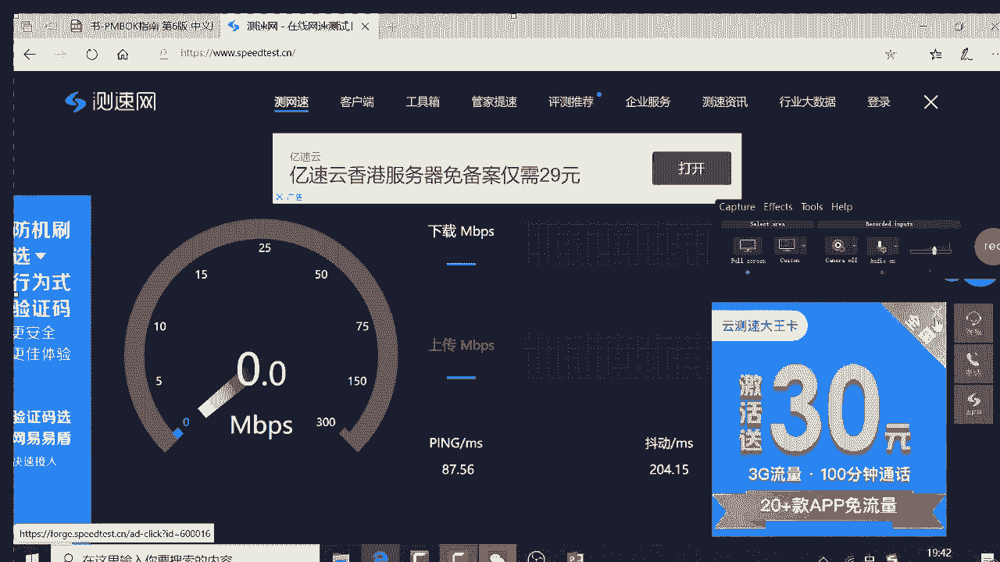
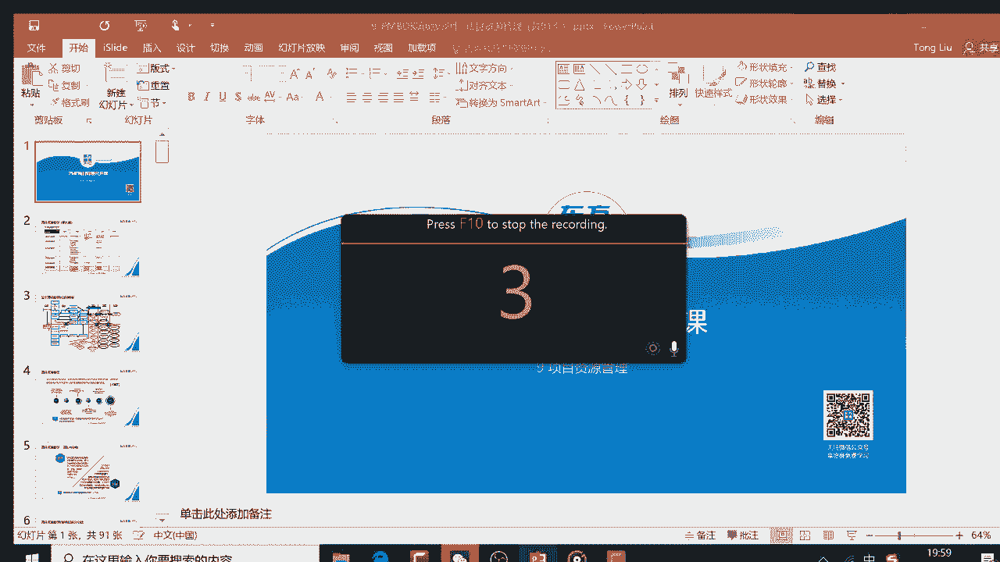
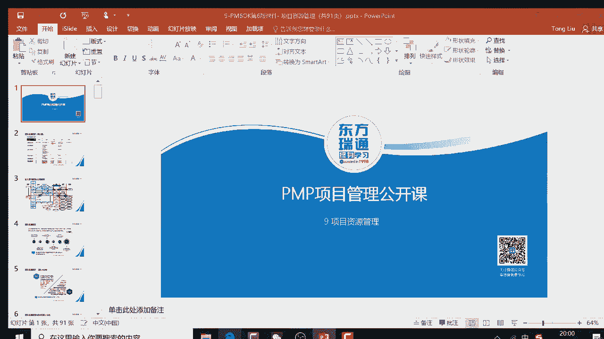
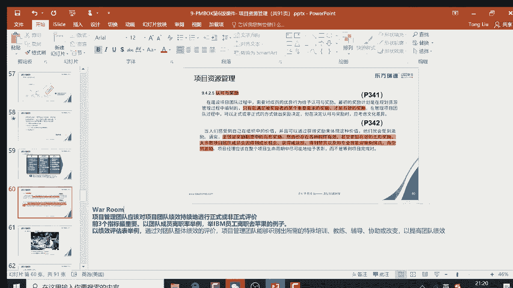
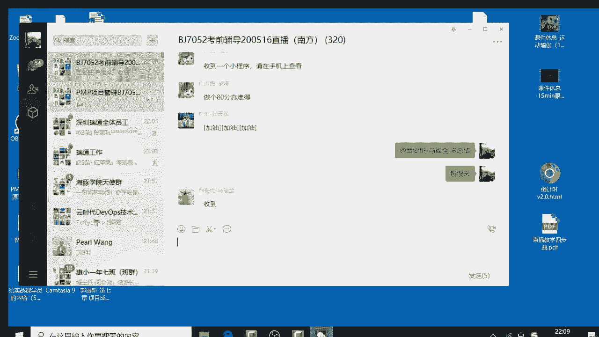

# PMP串讲 - P7：串讲第9章 - 我的乐芙兰 - BV1uE411N7zG

嗯。

Test speed。A speed test。啊，speed太。

看一下网速。응。Yeah。

上传下载。你，把它关掉。

。哎，怎么没有啊？

广告。对呀。😔，哎，看不出来是多速度。新疆电信。碉包。美妙。Yeah。Oh。这算是网速比较低吗？呃，大家早上好吧。大家晚上好啊。可以测一下。有。嗯。Yeah。啊，谢谢同学啊啊。

我这个看到我的网速好像有点低哈。

应该能听到，没有断啊。嗯呃今天来同学可以先打开那个电子版啊。

然后还有真子版的书，然后还有这个。这个你们的课件可能跟我这有点稍微的有点区别，那无所谓的，哪个课件都可以啊，打开一下嗯。Yeah。我这边先挂着哈，先挂在这儿。然后放点音乐，然后省得太单调了，是不是？

嗯。😊，嗯，我想一下。

把放过去。嗯。到盛。啊。小名。实战班不是这个不是这个东西。嗯。这吧。我天。应该可以过去了。还不行。为什么这个你要重启还可以啊。嗯。

这个不用管他了，你看还有什么东西要做。哎，为什么没换呢？他那个。为什么这么慢？还没有切过去呢。没。然后。

正常应该切到我这个页面的。啊，能切到是吧？但有点慢。有点治好。嗯。那之后。你要没断就还好，没跳出来就还可以。嗯。😊，等等吧。

明白的。嗯。对，放点音乐。啊音乐是什么？放点提神的音乐吧。困了。😔，光年。奇迹。嗯。🎼别关。🎼，你是。🎼。🎼Yeah。原来是这个。🎼，🎼春天的花开，秋天的风以及冬天的洛阳。

🎼忧郁的青春年少的我曾经不知的这么想。😔。

🎼风车在四季轮回的歌里，它甜天的流转。😔。

🎼风花雪月的诗句里，我在年年的成长。😔，🎼流水它带走光阴的故事，改变了一个人。

🎼就在那多愁善感而初次等待的青春。😔，🎼。

🎼，🎼发黄的相片，古老的心，一句褪色的圣诞歌。

🎼年轻时为你写的歌。🎼啊你早已忘了吧。

🎼过去的誓言，就像那颗本里缤纷的书签。🎼刻画着多少美丽的雪，可是终究是一阵烟。🎼流水他带走光阴的故事，改变了三个人。🎼就在那多愁善感而出自流泪的季呀。

第九章。

项目的资源管理。这个是第一张。第八章项目质量管理啊，我错了。The。

第八章项目质量管理。あちに。So。嗯，啊就以10秒的延迟。有10秒的延迟。唔系啦。

🎼，🎼，🎼Yeah。🎼春天的花开，秋天的风以及冬天的洛阳。🎼忧郁的青春，年少的我，曾经无知的这么想。😔，🎼风车在四季轮回的歌里，它天渐的流不转。🎼风花雪月的诗句里，我在年年的成长。😔。

🎼流水它带走光阴的故事，改变了一个人。🎼就在那多愁善感而初次等待的青春。🎼，🎼Yeah。🎼发黄的相片，古老的心，一句褪色的圣诞卡。😔，🎼年轻时为你写的歌。🎼把你早已忘了吧。🎼过去的誓言。

就像那颗本裂缤纷的书签。🎼刻画着多少美丽的诗，可是终究是一阵烟。🎼流水它带走光阴的故事，改变了三个人。🎼就在那多愁善感而出自流泪的青春。🎼The。🎼Yeah。🎼う。🎼遥远的路程，昨日的梦已经远去的笑声。

🎼再次的见面，我们又历经了多少的路故程？🎼不再是旧日熟悉的我，有着旧日狂热的梦。😔，🎼也不是9月熟悉的你有着依然的笑。あん。🎼流水，它带走光阴的故事，改变了我们。🎼就在那多愁善感而逐自回忆的青春。

🎼流水它带走光阴的故事，改变了我们就在那多愁善感而初次回忆的青春。🎼。

🎼Yeah。Yeah。

🎼，🎼春天的花开，秋天的风以及冬天的洛阳。🎼忧郁的青春年少的我曾经不知得这么想。😔，🎼风车在四季轮回的歌里，它甜甜的流着。😔，🎼风花雪月的诗句里，我在年年的成长。😔，🎼流水它带走光阴的故事。

改变了一个人。

🎼就在那多愁善感而初次等待的青春。🎼，🎼发黄的相片，古老的心，一句褪色的圣诞歌。🎼年轻时为你写的歌。🎼把你早已忘了吧。🎼过去的誓言，就像那颗本里缤纷的书签。🎼刻画着多少美丽的诗，可是终究是一阵烟。

🎼流水它带走光阴的故事，改变了三个人。🎼就在那多愁善感而出自流泪的青春。🎼う。🎼，🎼Yeah。🎼遥远的路程，昨日的梦，已经远去的笑声。🎼再次的见面，我们又历经了多少的路故程？🎼不再是旧日熟悉的我。

有着旧日狂热的梦。😔。

🎼也不是旧日熟起的你有着依然的笑。

🎼Oh。🎼流水他带。🎼走光阴的故事改变了我们。🎼就在那多愁善感而逐自回忆的青春。

🎼流水，它带走光阴的故事，改变了我们就在那多愁善感而初次回忆的青春。

🎼。

各位啊，晚上好啊。😊，啊，又开始见面了啊。啊，这个会有点延迟。啊，我在我的手机上还看他听到音乐哈，再等一下。有大概10秒钟延迟哈。Yeah。好啊。😊，听到声音了吗？听到声音，请回复个一哈。😊。

听到声音了吗？听到声音请回复个一哈。😊，我的手机能够听到声音哈。好。那个画面没动，对，还没有开始哈啊。

都来了哈，我们看一下人数多少啊。😊，呃，200好。那我们再等一分钟，我们就开始啊。大家在等待的过程中呢，可以先打开你的那个。

呃，这个电子版的PM book。纸质版也可以。然后呢，你纸质版的话呢，翻到呃，大概是我看一下。班到。307页。电子版的话呢翻到307页。好。都准备好了吗？翻到307页哈。😊。

电子版，然后还有纸质版，然后课件有的话呢，也可以准备着作为备用啊好。好，我们再等10秒。等10秒之后，我们就开始啊。把你的那个电子版PN book，还有纸质版PN book，然后还有就是那个呃。

快件也行，反过来也可以啊啊。好，那我们开始了啊。😊，我们今天讲那个第九章项目资源管理。昨天呢呃叶老师呢给我们几乎灌领灌输了一些很多高大上的一些思想啊，希望大家呃能有所帮助啊啊，就是事为先人为重啊。

反正对我来说是很有帮助啊。啊，也是说呃按照昨天那个叶老师的那个大概的分享，就是说DISC就是那个测评，然后这边的话呢涉及到说呃左边的话偏重于做事，对吧？以做事为主，右边的话偏重于以做人为主哈。好。

所以呢呃这种呃性格测试的话，可以测一下，我们这边也有些这样的一些测评的这种word版，然后网上有很多事很多哈，都可以去测一下啊，会好一些。好，那我们今天的话呢，我们讲述的呢更多的是这种跟书上相关的。

那跟书上相关的话呢，我们给大家展开一下啊。首先第九章请大家翻到你你书的307页哈，你的书的307页。大家可以看一下你书上有这些过程，然后呢，课件里头呢也有类似的这些过程啊。好，那这边的话呢，我们看一下。

资源管理这边的话呢，它会有相应的一些考试要点。考试要点是什么呢？我给大家先先给大家那个先从概率的角度来说，去给大家展示一下。比如说呃资源管理这边有一个过程叫规划资源管理。规划资源管理。它的输出很关键。

就是资源管理计划。资源管理计划呢，它会涉及到这种资源的选用预留的计划，选用预留的计划。然后这边的话呢会涉及到一些什么角色和职责。英文叫row and responsibility。

那这边就会涉及一个关联的考点了。比如说在PNP中大概有12个子计划。那其中有几个呢是跟角色和职责相关的那哪个呢？一个就是那种质量管理计划，还有什么呢？就是风险管理计划，还有资源管理计划。

起码这三个管理计划呢是跟角色和职责相关的。因为质量管理计划呢，我们上周讲刚讲过，对吧？上周讲到说什么呢？就是呃质量管理要全员负责嘛，然后风险管理计划呢，它也会涉及到角色和职责，为什么呢？

因为呃具体的风险应对销售专家做嘛，能帮项目经理做是这样的，所以这就是要知道的，而且资源管理计划更加涉及到角色职责了，因为涉及到说要把活分出去嘛。好，所以了解。然后接下来呢就是估算活动资源。

估算活动资源这块呢，要考到什么东西呢？就是最主要是你要考虑到就是估算活动资源，它呢会有一些工具，而且呢会会有一些先后顺序，比如说一般来说呢，先估算活动资源再估算活动持时间，为什么呢？

因为不同的资源做同样的活呢，时间是不太一样的。好，所以说呢这块涉及到一些工具，比如说那个类比估算呢参数估算呢，什么三点估算呢等等。那这边的话呢，哎我就会涉及到一个问题的。三点估算到底有没有，是不是啊。

那一般来说呢，在那个估算活动值时间，估算成本的时候呢，一般会涉及到三点估算，对不对？那估算资源有没有啊？如果你觉得有的话，你就回一，没有的话就回零啊，那答案的话应该是没有，是不是？

所以说呢我们要知道说估算活动资源跟估算活动值时间和估算成本的工具的比较一同啊，这要知道的。然后这边的话呢呃像昨天叶老师说的，就是这三过程的话呢，可能会改变事业环因素，就是获取资源建设团队和管理团队。

那这边的话呢，我们要怎么理解呢？比如说获取资源主要是主要是从职能经理那边获取。然后这边的话呢呃职能经理未必职能经理未必派好人给你，对不对？那可能会涉及到什么呢？你要跟他谈判啊，好。

那当然当你获得了一些关键资源之后，在组织中的资源的可能性会受到影响，所这样的话呢会影响组织的一些环境。然后呢，建设团队的话，我们知道说当资源过来之后，能力有限。

你要做 team building做团队建设。这样的话呢，对资源的能力会有所提升。那回到职能部门那边呢，可能干活更更加有利了，或者更加的给力了，对不对？好，所以他会改变资源的这种能力。

大家知道说有一个考点就是资源能力属于事业环因素。好，然后呢管理团队的话呢，针对的是。这种个别人员他的绩绩效的打分，对吧？这个打分的话呢，是他全年绩效的一部分，会对他全年绩效会发生影响。所以这边的话呢。

获取资源、建设团队和管理团队呢会改变世界环因素。其他的这些过程的话，基本来说都受世界环因素的影响。好，然后昨天呢叶老师强调了说这种控资源的话，更多是对物的实物的分配的控制。而这种针对人的管理的话呢。

主要是在这儿管理团队啊，是这样的啊，所以大家可以看一下，所以说控资源更加是食物的一个分配，而不是对人的控制。好，这就是这些呃大概的过程中，可能一些关键要点给大家稍微的展示了一下好。呃，有没有卡看看啊。

好，那卡的话，我稍微等10秒哈。好，然后接下来呢给大家看一下这个具体的一个框架图。这个呢是结合以前的老师针对这些4九过程的这个这些关系呢，我们做了一个展示。这样的话，有利于大家对这种流程之间的关系呢。

一个宏观的理解。大家可以看到说资源管理的话呢，它涉及到这些过程，有两个是在规划，有三个在执行，有一个在监控。好，然后刚才说了资源管理计划是规划资源管理的这种主要的的内容。而且呢它的工具包括什么层级型啊。

矩阵型啊，文本型啊，这些工具的展示的话呢，也是一个要点。比如说还有一个叫一个概念叫OBS我们回头会展开的，就是组织分解机构，对吧？好，然后这边的话讲到说有工具。然后这边是这三个过程可能会改变事应和因素。

并且呢这三个过程的话，相应的会有一些工具。啊，比如说冲突管理。在管理团队这边是比较重要的对吧？好，然后这边的话呢还有是控制资源，所以呢我们会逐一的给大家做一个展开。然后这边的话呢呃在呃。

你们的有些课件呢是这样的对吧？那这个课件里头的话呢会包括一些关键的点，看到没有？每个过程大概的关键点这边标红了，大家可以看一下啊，所以这些都是一些我们今天是串讲，所以呢我不会太多的外延的一些什么案例。

更多的是给大家讲一下这知识点的要点是什么啊好。然后这边的话呢，我们逐一讲一下要点。要点的话呢，就是首先我们以前呢这个章呢叫做项目人力资源管理，然后现在叫资源管理了，就说明什么呢？

说明这章呢开始既管人又管物了，对不对？所以呢这块的话就涉及一个要点，什么要点呢？就是310页，大家可以画一下。310，你书上也有哈，大家可以看一下这边他就会强调强调什么东西呢？就是对食物的管理的高效性。

比如说你管好人是一块，管好物也是一块。所以这边的话呢涉及到说物的那个不有效的管理的话，会有什么问题呢？大家可以看一下会导致风险的来源。好，这样的话物的有效管理的话，最好的这种例子，谁呢？就是丰田零库存。

所以这边的话你看这边一个加ine看不对？损失制零库存。看这是这样的啊，而且呢这边的话还会关联到其他的理论，你也去什么呢？你也去把它画一下。在这儿。就是什么开等呢，这讲质量管理之后说过，对吧？

这属于不断的改进，然后并且什么约束理论，就是关联到精历的价值流素分析。比如说你的流程活动的某一个节点。那就像木从理论一样，你这个是看到最最短的板子它决定了整个链条的一个大概的效率嘛，是这样的约束理论。

所以说呢我们呢就要把约束松法是这样的啊，所以这些理论的话呢，都要去看一下啊，好，这个是要知道的，就说这这这一章的话呢，它会有关联一些理论，并且呢强调对物的管理，也说不仅仅是人的管理，还是对物的管理。

好的，这是要知道的一些基本概念。好，然后接下来呢给大家说一下，对人的管理这边的话呢，我们前三章就讲到了说我们要做好服务，做好服务型领导，对不对？服务型领导。所以这边的话呢就会涉及到说你未来的项目经理。

那你到底是什么样的一个这种工作方式和工作风。就是所谓到叫服务型领导。所以这一块的话呢就会涉及到一些内容了。比如说你书上。

还是310页。那这边的话就涉及到把这句话画出来。项目经理可能不称为项目经理，他主要是什么呢？为团队创造环境。什么环境呢？no blame环境就是说一个那种不指责的文化，比如说对事不对人啊。

然后并且的话呢要信信任团队成员，信任他能够什么呢？完成有能力完成他所做的工作。然后呢团队是什么样的团队呢，就是要敏捷方法中说的要自组织团队。比如说团队的话呢，他能决定他每次迭代能做多少活。

并且的话呢对技术的细节，他可以自己控制的，不需要你管理者指手画脚。好，在敏捷中有一个基本的概念叫什么呢？叫做管理者管理团队团队管理任务。那具体的技术任务的话，由团队去负责，而不是管理者指手画脚。

那前提是自组织团队的话，你要对技术有什么呢？完备的能力去交付，否则的话一定会被人家指手画脚的。所以呢他强调自组织团队的能力要。强谈到什么程度呢？就是一专多能，一专多能的话呢？就是梯型人才。

就是在一个领域呢是number one啊，就是比如说在一个领域就是珠穆朗玛峰，在其他领域呢还是要群山环绕，就喜马拉雅山啊，比如说简单理解就是一个领域呢，你是numb one，其他领域的top10啊。

就可以了。那但是呢谈何容易呢，比如说你在开发很厉害，而且呢哎那个还可以做设计，还可以做需求分析，还可以做测试，还可以做运维啊，是最好的了。那这样的话呢，自组织团队的一个比较理想的状态。

就是一个人在你的团队中会做三件以上市。然后呢，一个事儿呢在你的团队中呢，三个人以上会啊，这个大家可以看一下，对比一下，看看你们有没有这样的能力啊，这样的团队能不能实现。这个是一个问号。

所以现在目前说敏捷自组团队呢是很看好的，是这样一个位。改的趋势。但是很多团队呢都在路上，因为他不具备啊不具备这样的能力和这样的一个文化啊，带这样子。所以这要了解的好。

所以要了解现在目前的就是说理论和实际的区别啊。好，然后接下来呢我们看一下，我看一下我的电脑的话呢，这个手机还没有还没有转过来，我希望你们能转过来哈，我的手机是最慢的啊。好，然后这边。

哎，这边的话我等10秒钟，因为我发现我的手机还没转过来，我所以我等10秒钟啊，看看能不能转过来啊，就是转到我这一页啊。你们啊看到我这个。这个这一页的啊看到了，刚才我重新退出来，发现能进来了哈。好。

然后接下来继续讲这个是这样的啊。这个然后这个就是说那你书上的话，因为既然讲资源管理，资源管理会有很多大师。那大师呢就会关联一些理论。A理论的话呢多少也是个考点啊呃有一个理论呢就是SY理论。

SY理论什么意思呢？就是他会对人进行假设啊，假设人是好的还是坏的啊，我们要记住一个要点，就是说Y是好的人，就是属于属于什么呢？有追求责任感呢，就是那种有创造力啊，有理想有追求的人，对不对？

就是Y类型的X类型呢就是没理想，没追求，需要罗卜加当棒的那种啊，那这边的话呢我们要知道一个要点是什么呢？就是哪个是好的哪是坏的呢，你就这么记，你就是Y表示yes，对吧？X表示坏，对不对？啊。

所以说呢你要把它不要把它记混了。

那我们就会知道了，说那个在真正的你做管理的时候，你默认是什么的人呢？那现在目前的话呢，从PMP所说的自组织团队更加强调，就是你的团队应该是自我负责的，对自己的工作有什么呢？有承诺的。

有有责任心有创造力的，所以呢默认应该是Y，对吧？啊，所以说你要知道啊，其实呢PMP都很想说这些人呢就应该是Y类型的，你就按Y类型的去管就行了，对不对？但实际的工作中呢都是X类型的，对不对啊。

所以说呢呃从理论上跟大家说一下，就是原先那个萝卜加大棒政策呢，萝卜加大棒政策呢，其实越来越无效了。但是在很多企业还在持续的做着啊，该这样。但是呃现在目前的话强调什么呢？

就是你默认如果你的人是Y类型的话呢，你应该激励他，比如说给他以什么呢？给他一机会，然后成就感，激发在内驱力等。大这样子，然后我们通过co制通过引导技术去让他做的事做更加有效率，更加有热情，对不对？

是这样的。但实际上呢工作上可能会遇到S类型，不配合人会很多。但这样子啊，那所以说你要知道考试，你要知道他的管理思想是Y类型的人多一些啊，但这样子啊，所以要了解。然后这边的话呢，还有一个理论叫Z理论。

这理论一般也不怎么考。什么意思呢？就是说一个人表现出在一个企业中是Y类型的SX类型的取决于企业文化，比如说好的企业文化决定了好的什么人啊，是这样的，所以刚才我们说了说到了，作为管理者你要建立这样的文化。

比如说不指责文化呀，建立什么呢？这种所谓的啊比较好的那安全的文化。然后呢，要大家互相叫什么协作呀，合作呀，这会对应的两个单词要collaration就是协作，然后还有coration就是合作，对不对？

啊，要知道这样的这样的文化是最好的。但是实际上的话呢，对，不能说。

负面了是说就应该是这样的对，就应该是这样的啊，就应该是这样的啊，这样的文化就比较合适了。好，所以说呢呃在当下这种所谓的数数字化转型的时代，对不对？那我们要知道说哎我们其实呢我们需要什么人呢？

我们需要外类型人，哎，就是应该这样的，就是说建立一种什么呢？就是和谐的文化，不指责的文化，然后服务型的领导，然后呢，让大家激发他的善意，所以说德鲁克曾经说过一句话，就是什么叫管理。

管理的目标就是激发员工的善意。

当员工有善意的时候呢，也就是员工是Y类型的那种情况呢，他就会激发他的内驱地去可以帮忙干活，对不对？或者说努力的去帮助企业提升价值。然后呢，那个在做的再好一点，企业家的话，就像稻盛和夫一样。

就冠以大义民分。也就说矜瓷哲学，像我们公司一直在学这个事儿，就是在说什么呢？就是作为一个企业家，你要灌输给员工一个思想。就说你这么努力工作呢？其实是是什么呢？是为你你自己而努力的。因为什么呢？

我们的企业文化，就是要为那个每个员工及其家人物质和精神世界的什么双丰收并肩带社会责任，看到没有？稻盛和夫的这种所谓的这种理念的话，是非常的什么呢？这种所谓的那种植入人心的。也就说意思说他告诉你说。

你努力是为你自己啊，而且呢我们还会兼代社会责任，大义民分啊，在这样子好，所以了解一下，所以呢。

我相信金瓷哲学金英瓷公司的话呢，他下目的人呢基本都是Y类型的，对不对？然后并且的话呢努力奋斗啊。好，然后这边的话呢，我们再看一下那个下一个理论，下一个理论的话呢，基本来说呃了解一下就可以了。

考试的呃这种概率不是很大，也就是说一个心理学家，他把那个工作风格呢分成了几个类型，一个是专制，一个是民主，一个是放任自流，要知道然后呢，我们要知道一些要点就是什么呢？

也就是说针对这种所谓的能力比较差的人啊，你要专制要独裁。那一般来说呢，它映射到项目什么场景呢？就是前期和收尾，也就说项目开头一收尾。这个时候呢你要强制什么呢？强制推一些事情，然后呢。

并且呢收尾就要快速收尾嘛。所以有些时候呢，他会用这种所谓的独裁型的这种方式或者是强制性的方式。然后呢，在那个项目的这种管理过程中的话呢。可能是什么呢？你可以是授权的，也可以是放任的。

也可以是民主的这个取决不同的需要。那一般来说呢，什么情况是可以授权呢？就是这些人呢能力很强，很配合，啊，就是像那种所谓的民立项目管理那种自主织团队，哎，他很配合，对吧？而且他愿意什么呢？不扬边制分题。

所以你就是就授权他就可以了。但是呢有些时候的话呢，如果那个所谓的大家参与度不高，那你的可能什么呢？你这种授权或者说你有民主式的话，可能会影响到什么呢？这个角策慢。

所以有些时候你会发现比如说民主的国家的话呢，有些时候就像特朗普那些人的话，他角色就比较慢啊，这也是很正常的那因为他要民主集中嘛，那这样子，所以说不同的这种风格的话呢，他有好处，也有缺点。

然后呢也有不同的适应人群，那跟项目相关的，你就知道说这种指导型的或者强制性的那种呢，那一般来说。不是在前期和收尾期。然后呢，这种所谓的授权放任或民主型的话呢，一般是在中期、中后期等等。

这个了解一下就可以了。好，而且呢还要知道一个点，一个什么点呢？一般来说啊，那针对这种所谓的放任型的话呢？如果这个人这个团队能力自觉性很差，那怎么办呢？那你就放任他。

那所那肯定是效率是工作效率是比较低的啊，大这样这要了解一下就可以了。好，然后这边的话呢呃还有一个激励理论呢，就是所谓的什么呢？就是那种马斯洛马斯洛需求层次理论，这块呢知道什么点呢？就是所说的。

马斯洛西层次理论的话呢分成5个层级，生理、安全、社会尊重和自我实现。我们要知道一个点，就是说当这个对底层的需求没有满足的时候呢，你跟他通谈理想是没有用的啊，所以说这边就会涉及到一些呃基本的点。

比如说你看啊比如说一个保安，他是基本的就是所谓的合同工或者是一个非正式工嘛，带这样子，然后呢，你跟他去那个激励谈的时候，你会不会跟他谈人生啊，谈理想啊，一般不会那你会一脚踹过去，对不对？然后呢。

让他什么呢干活去，对不对？所以说呢针对这种呃合同工或非正式工和正式工的区别是什么呢？就其实就是萝卜加棒帮，萝卜加大棒，那是萝卜多一点还是大棒多一点而已啊，好，一般来说正式工可能萝卜多一点。

那合同工非正式工呢，可能大棒多一点那这样子，然后接下来呢就是涉及到骨干层和管理层，一般来说呢都需要什么呢？都需要画大饼的啊，就是说呃当。那个骨干层管理层的话呢，他可能会有被关爱的需求，对不对？

有被尊重的需求。这个时候呢你就不能一脚踹过去，对不对？那你需要考虑什么呢？要考虑怎么去给他关爱，给他那个尊重。这个时候呢就会涉及到一个叫感情账号的感情账户的概念了，什么意思啊？

就是说你跟员工都是有一个感情账户的，然后你你投入的都是什么爱呀，或者是投入的关心呢，那基本来纯的是正数。那如果你投入的是什么呢？你投入的是那种指责呀，责骂呀，对不对？那他肯定是什么呢？就是那种负数。

负数多了之后呢，他就跑了，对吧？他就开始就想准备走了，对吧？是不是哎，所以说呢要知道啊，就是你针对不同的人，然后呢，你要采取不同的跟他的需求，采取不同的管理方式。然后呢。

这边我们说到了就是当你底层没有满足的时候，通常高层是没有办法实现的。然后并且的话还要知道一点，就是自我实现。一般来说呢，他是要他不是不讲投资回报的。比如说最典型的就是佛陀这样的自我实现啊。

那一般的人做不到，那谁能做到自我实现呢？比如道盛还可以。因为他在2011年的时候，曾经呃不拿一分钱成功拯救日航，大家可以到百度去查一下，2011年左右。然后呢，像马云那种人呢。

其实呢也顶多就是尊重的需求。为什么呢？因为他是付出讲回报的那比如说呃有人采访马云说那个呃巴菲特和比尔盖茨都裸捐了，你怎么不裸捐呢？马云会怎么说啊，当我80岁的时候，我也会裸捐，对不对？

那说他付出是有条件的，凡是有条件的付出的话，一般都很难成为自我实现啊，好，所以说了解这就是一个典型的考虑，也就说什么意思呢？就是尊重需求和自我实现需求，不要轻易选自我自我实现。因为呢付出要不讲回报的。

对不对？那一般的人做不到，对不对啊，那做到了也不变得是人，是不是啊，除了稻圣之外哈，哎道圣是一个比较神人啊，但这样子好，所以了解一下。所以说呢针对这样的题的话呢，你不要轻易选自我实现。那大家可以选一下。

针对这块，大家可以看到啊，项目经理希望激励一名希望在项目中变换角色的项目成员。该项目团的成员呢希望在培训部门申请培训师的职位。也就是说他希望做一些什么呢？类似像自己的自我实现的感觉。

所以你很容易选自我实现。但是呢按照马斯洛需求层次理论来说呢，按照马斯洛需求层次理论，这就不能够选自我实现，也就是顶多选尊重，也就是说培训岗位呢或培训师呢是一个受人尊重的职位而已。

他不能够说这个这个这个是自我实现，因为自我实现是要不讲投资回报的，也是什么意思呢？就是说一个培训师的话呢，他也要拿工资的啊，所以说呢这就是只能选B啊，不能够选什么呢？C。好。

然后接下来呢呃这个就是赫斯伯格的双因素理论。这个的话呢稍微了解一下。比如说这个考点是什么呢？就是它会分成激励因素和卫生因素。那激励因素是什么呢？比如说最典型的就是那个给他以什么成就感，对吧？然后呢。

给他以比较好的一个发展空间啊，是这样的，那卫生因素是什么呢？就是工资啊，包括那个什么工作环境啊等等。那这边有一个考点是什么呢？工资一般属于什么呢？属于卫生因素或者是保健因素，而不是激励因素。

很容易我们会选成激励因素的。因为你觉得工资对你有激励作用。但其实呢那工资加了一定程度的时候呢，就麻木了，就像那些富豪一样，对不对？就是个数字而已。好，所以说呢这种它不是持续有激励的那一个人的什么呢？

成就感却是很好，就是说持续有激励的这样的。要了解这个事情。然后还要知道下一个考点是什么呢？就是良好的激励因素会有什么激励作用。良好的这种，就比如说工资对吧？卫生因素和保健因素呢，它是没有激极作用的。

但是恶劣的保健因素或恶劣激励因素都会有破坏激极作用。看到没有？这就是了解一下，这就是很容易搞混的部分，要了解啊，好，然后这边的话呢，我们看一道题，看这道题，看看这道题能选哪个。

比如说如下哪个激励理论认为你真正起到激极作用的，并不是工作所带的收入，也就是刚才说的卫生因素，对不对？而是对工作的责任自我实现等等这些发展。其实就是那种谓激励因素。所以这个是很明显的要要得考什么东西呢？

就是这种所谓的赫斯不克双因素理论啊，所以要了解。而且再给你补充一个知识点，补充一个什么知识点呢？就是。这种赫斯伯格双因素理论跟马弗洛的需求层次理论呢还是有点关系的。也就说赫斯伯格所说的这种保健因素。

它针对马弗洛的基本是下三层啊，下三层啊，就是这种呃生理呀安全啊社会，对吧？然后呢，这种激励因素呢？针对的是比如说我实现的那种嘛，对吧？那就是成就感嘛，那正更多的什么是上两层啊，是这样的啊，所以了解一下。

这就是就赫斯伯格双因素理论和马弗洛的需求层次理论呢还是有点关系的。所以考试的时候很容易作为什么呢？作为一个备选项，很容易选这个或者这个对吧？大家之间可能模糊，对不对？是这样的啊。

会有这样的一些呃可能考试的场景，所以要了解一下。然后接下来呢，这个是一个典型的一个场景。就刚才说了，我们到底认为缺省的话呢，我们团队到是X类型的还是Y类型的。但有些时候呢，很多项目经理就会认为说什么呢？

说其实呢他觉得下边人都是无理想无追求的，对不对？然后我就一言堂啊，就一言堂管，对不对？很多的一些企业不都是这样吗？就是呃一把手就算一言堂，然后下边人不敢说话，对不对？进到进到房间很压抑，对吧？

就这种情况的，这种情况的话呢，管理者更多的是他怎么去做决策呢，他认为下边人呢都是X类型的对吧？都是无理想无追求的，所以我就要什么呢？我就自己搞定了算了，那这样子，所以这就是很典型的。

就是所谓的就是选什么呢？选B也就说他认为下边人是无理想无追求的，所以呢不需要听取他们的意见。然后我自己就做决策就可以了啊，大概这样子好，所以了了解一下。然后这边的话呢。

还有个理论的话呢呃我们也要了解一下，叫费鲁姆期望理论。费鲁姆期望理论的话是什么意思呢？就是说我们其实我们要讲的是什么呢？人员激励，所以激励的话呢，就需要考虑到说怎么激励。那激励就是它分成两部分。

就是说我要给一个人分一个活。那我首先要看这个人针对这个活的话呢，他完成这个活的期望值怎么样。然后呢，二的话呢，就是说这个人他一迷意识到说这个做完这个活对他是有价值的。那如果他没意识到的话呢。

我就需要给他扣制他。比如说我需要那个引导他，对不对？让他让他明白是有对他是有价值的。比如说。呃，我给你举个例子，比如说呃你让一个员工给他分个活，让一个员工去骑着自行车上月球，对不对？然后他会觉得什么呢？

这个上月球这个期望值呢比较低，就是上不去，对不对？然后呢，而且呢就是效价也不好啊，为什么呢月球又没有空气，又没有长额去他干嘛，对不对？所以说呢这样的话呢，员工的努力程度是可想而知的，就是应付一下。

他是认为你是什么呢？你你是说话肯定是不靠谱的，对不对？所以我就不理你了，对吧？是这样的，所以他他执行的话会打折扣，所以给我们这样一个什么启示呢？我们要想让员工我们要想让员工努力干活全力以赴。

我们必须什么呢？首先给他分活的时候，那分的活呢，不要跟他能力太不匹配。比如说这个人能跳一。2米，你就顶多给他个分个一米三的活，对不对？然后呢让他能够的，就是说够得着的，对不对？那就是期望值还可以。

然后接下来呢就是这个员工的话呢，他对这个活的。意义那没有太多深刻的认知，尤其对他自己的价值，怎么办呢？你要跟他谈跟他谈话，然后呢，跟他说这个事情，然后呢是对他有好处的，未来是发展是有好处的。然后呢。

让员工呢认同这一点，然后呢从心里认同这一点，这样的话他会有什么呢？还会有内驱力，还会有内驱力啊。所以说给我们什么启示呢？作为一个老板，作为一个老板，然后你需要什么呢？需要分活的时候。

一是要去看一下这个期望值的问题。就是员工的大概对这个活的一个期望值，就是完成完成这个活的这种期望值，是否有期望啊，然后或者是否有希望，对不对？然后二就是然后让员工意识到做这个活对才有价值，这样的话。

员工才会全力以赴啊，好，然后这边的话呢，还会有一些点的话呢，这个跑的比较少，叫麦克里兰的成就动机理论。什么意思呢？就是要考虑到说针对不同的人呢需求是不太一样的。有些人喜欢权力啊。

有些人喜欢亲和需求或成就需求。稍微举个例子。比如说大家知道说那个像那个之前美国大选的时候，然后呢，不是2个70岁多岁的老人，为了一个什么为了一个职位争得面红耳赤，对吧？就是特朗普和希拉里，然后呢。

未来美国大选的话呢，将会你会发现呢2个80岁的老人为了一个职位呢争得面红耳赤，对不对？那这样子，所以说呢，权力需求的话呢，是很很大的，对不对？他们然后呢，亲和需求什么呢？就是不要有办公制。

不要有什么办公室政治，对不对？然后最好是什么按时上下班啊，哎，那成就需求的话呢，现在是什么的情况呢？就是比如说那些网红啊，比如说还有就是那个罗振宇啊，包括那个什么吴晓波呀，然后呢。

每年还做个跨跨年演讲啊，罗振宇曾经说过一句那个明年这么说的，说世界是平的，因为互联网把世界拉平了。所以说呢当你是一颗珍珠的时候，然后呢，别人是沙子，这样的话你就。脱颖而出。所以说呢他说的是他自己哈。

他这样子，所以了解一下，比如说针对不同的人的需求。然后你要知道要怎么呢对症下药。比如说人有人喜欢权利。比如说像于世维就说了，有人喜欢权利，我就让他盖章，对吧？帮帮他盖章啊，好，有人喜欢成就。

那就给他成就的一些机会，对吧？他这样子好，所以这些就是各种的理论，你就是大概了解一下，就是外延的一些知识点，然后呢，在你书上63页这边的话呢，会涉及到一些权利权利类型，比如说什么专家权利呀。

比如说什么参考参照权利呀，比如说什么回避权利呀，就是我们昨天叶老师也说了一些，大概14914种哈，所以这个呢大概要看一下啊，尤其是在PMI他比较推崇专家权利。因为专家权利有什么好处呢？

就是不需要那个外在给你什么赋能的，你自己就有对吧？你是专家，对吧？然后对应的什么一个词叫SME对吧？这个领域的专家。SME的话，大家可能知道，对吧？我给你稍微写一下。就是S。M对吧？E。

然后这个可能写的不太好看，对吧？那我就就这写吧。顺便要等一下其他同学，对吧？Subject matter。fer对吧啊，这个领域的专家简称SME啊，比如说你是呃某个领域的专家，然后呢，你说话有人听。

并且的话你是管理者，这样的话你就双管齐下了。哎，比如说之前我们也举过一个例子，就是说那个如果你的团队的成员针对一个技术解决方案，大家莫衷于是A说A的道理，B说B的道理。

C说C的道理啊后你该怎么摆平他们呢？你说啊这个事情呢，我我们以前的项目遇到过。然后呢，我们是如何做的，结果成功了。哎，然后呢，也就说意思说你是实践过的？他们那些人呢。

只是只是大概一个假想或者是还没有实论证过或没有实践过。并且你是这个项目项目经理，那就你是对结果负责的那他们还说什么呢？对吧？就听你的呗。好，所以要了解一下这个情况啊。好，这就是一些外研的内容。

然后给大家说一下，然后接下来呢我们就开始进入正题了，就进入什么呢？这个书上内容呢，书上内容这边的话呢就会涉及到一些点跟大家说一下。首先每一个过程呢，它都会有一个目标啊，都会有一些输出啊等等。

那规划资源管理的话呢，它其实就是对后续都对后续如何怎么这个估算资源呢，如果获取资源呢，如何管理资源呢提出了一些指南或方向等等。所以它就会出有两个比较重要的输出，哪两个输出呢？就是一个是资源管理计划。

一个是团队章程啊，团队章程的话呢，也就知道就是团队的基本规则。这个呢当这个基本规则制定的比较好的话呢，会有好什么好处呢？就是减少冲突啊，这样的。好，所以说呢我们后期你会发现团队章。这边的话呢。

他在那个相关方管理这边的话呢，管理相关方它有个相应的工具叫做什么叫基本规则。啊，其实团队过章程呢包括基本规则。所以大家可以去看一下。好，那这边的话呢，我为了让大家知道哪一页呢？我给你翻一下吧，你找一下。

就这边等一下其他同学啊。好，那个因为有些时候它是是有点滞后的。所我先稍微等一下，就是管理相关，我记得是管理相关方。然后这边的话它有个基本规则，然后这边呢给你稍微给你画一下吧。这样的话。

既然你们都那个已经啊学了很多遍了，是不是？那应该就是说江互前后章的一些关联关系，应该把它那个融会贯通，对不对？所以这边的话我给你找一下。啊，请大家翻到你书的528。即。第九章的话呢。

它是输出了这个团队章程。然后呢，在那个第十3章管理相关方参与这边的话，它是作为工具出现的。团队章程中定义的基本规则来明确团队成员和其他相关方应该采取什么行为去引导相关方参与，是这样的。那这个什么意思呢？

就是说哎我要制定规则。然后呢，通过这个规则呢去管理相关方是这样的。也就是说是团队行为的下限，就是你需要有规有规矩才能方圆，对吧？好，所以了解一下。对这两个输出是很关键的，一个是资源管理计划。

一个是团队章程啊，要知道的。

然后这边的话呢，关于资源管理计划和团队章程的话呢，一会儿会给大家稍微画一下一些要点哈。比如说我们看一下这个资源管理计划，资源管理计划这边的话呢，哎我这边的话是先梗工具了哈。好，那我们那个我看后边。

这个啊大家可以看一下。这是在书的318页。318页这边的话呢，资源管理计划，然后你会发现这块有些要点，哎，我们画书就可以了。画书比这个看的更清楚啊。然后这个318。318这边的话呢，要画什么东西呢？

就是刚才说了，有三个子计划是跟角色职责有关的，起码要知道是一个是质量管理计划，一个是资源管理计划，一个是什么呢？一个是风险管理计划，对不对？然后你看角色角色和职责。哎，看有没有断呢，看看没断吧。

那我听了一声响啊，好，然后呢角色和职责。好，这个是要知道的，对不对？这是一个点。然后接下来呢下一个点是什么呢？就是这个。项目组织图，我们知道说我们一般做项目的时候呢，会画一个甲乙双方的汇报关系，对吧？

所以他就会涉及到谁汇报给谁，就是会有个报告关系啊。然后呢，资源管理计划呢要点什么呢？就是他会去呃明确资源的选用预留，所以说这边就会对应个专有名词，什么专业名词呢？就是项目团队资源管理。

关于如何定义如何配备管理和最终遣散。哎，大家可以看到遣散啊，也就说资源遣散的话呢，这边我们昨天叶老师也说了，遣散的话呢，有可能是在这种所谓的就是说你用这个这个资源的话呢，有可能是说用完之后就释放了。

对不对？等不到的时候那个收尾啊，那可能就是用完之后就回到职能部门了，还有可能就是到最后你留到这些人到什么呢？收尾验收的时候，还要做点事儿。比如说什么经验教训总结呀，组织过程产更新呢，对吧？是这样的。

所以这个遣散它不是跟那个项目结。项目阶段的收尾那块不发生关系了嘛？啊这样子啊，所以了解一下。因为那个结束项目阶段的最后一步就是遣散员工到职能部门啊，所以这边的话呢还有一个点是什么呢？就是呃这个所谓培训。

也如说你要安排一些能力不足的人去培训，对不对？然后而且这个培训的话，可能成本是这种所谓的直接成本，就是你的项目直接会会去花钱的啊，好，这个是一个资源管理计划，这个要点，然后呢。

团队章程他说了他建立一些什么价值观呢共识，这样的话减少什么冲突，然后并且的话如果冲突怎么做呢？对吧？他就会可能会有一些相应的指引啊，来这样子好，然后这个是它的输出，然后这边的话呢，除了输出之外的话呢。

就其实就是一些工具了，那工具这边的话呢，我们看一下一些要点是什么，比如说这个这个其实在书上都有啊，就是你看OBS和WBS这个要知道就是OBS组织分解机构organganization structure对吧？

组织分解结构，在你书上的大概316。有上面。大家可以看一下，你看这就是一个要点。就是组织分解机构，对吧？组织分解结构这块的话呢要点什么呢？

就是大家知道说组织分解结构就是一个大概一个从上到CEO下到员工的一个组织的一个架构图。然后这边的话呢，我们要知道说哎，你你之前在讲范围管理的时候呢？就是有工作分解机构。就是工作包。

工作分解结构的最底层的工作包嘛。你要把这些工作包，这些相应的工作内容跟什么呢？组织的资源进行匹配。所以这边的话就涉及到说这种WBS和OBS是有一个链接关系的。好，那组织分解结构的大概的定义这边画一下。

使得按照组织现有的部门单元并在每个部门下，你看列出工作包，所以他期望就说PMI期望就是你的OBS和你的WBS应该有一个链接关系啊，要知道这个事。那链接关系长什么样子呢？就是。大概长这个样子。

看到有这样大概长这样子啊，就说你这边是上头总经理，下到是一些这个部门，对吧？然后你这边就是一些工作任务工作包，然后最好是把具体的工作，比如说调研包括设计开发，然后交给相关的部门去做啊。

大概这样就是一个呃映射关系。然后这边的话还会关联到一个额外的一个知识点，就是我们知道在那个呃范围管点一章啊，他讲到了一个概念叫做控制账户。还记得吧？就是工作包上面是规划包，规划包上面是控制账户。

控制账户是很多工作包的一个集合，是综合评价绩效的，就是那个成本的一些绩效的情况。就SPICPI这些东西。好，所以这边的话呢就是你可以把很多很多工作包合成一个控制账户conttrol account。

然后呢交给一个部门去做，然后去综合评价一个部门的什么KPI啊绩效等等啊，是这样的。所以这边这个图是很好。他把那个OBSWBS和CA。控账户这个三个概念得融合在一起，用一张图呢给体现出来了。

所以这个是非常好的一个图，大家可以看一下好。这是我们给以大家啊做一个外延。因为在书上呢，它只建立了WBS和OBS的关系，其实还还应该有TA的关系，就控账户的关系。好。

背书上的话呢呃接下来的下一个知识点呢，就是那个所谓的呃在。这边它会涉及到数据表现。也如说在规划资源管理这边的话呢，它会涉及到一些这种所谓的数据表现形式。那数据表现形式的话分三类。

就是那书上在316页就是层级型。矩阵型和文本型啊，层级型的话呢是表示这个层级高高低的那种啊，就是就像我们的画了一个组织架构图。那矩阵型的话呢，就是IC啊，文本型就是更加细化的一些记录。在这呢。

那所以说呢呃基于这个东西的话呢，我们就需要去给大家看一下。比如说这就是典型的层级型。比如说呃项目经理这是甲方的。这是乙方的，然后一个汇报关系，然后上面都有高层，这是甲方高层，这是乙方高层啊。

这样的下边是有团队成员，大家可以看一下，就在这儿你看团队成员，这是甲方的。然后这是乙方的啊，大这样子，这就是典型的层级型的一个这个汇报关系。在我们开项目开工会的时候，或者是在做资源管理计划的时候呢。

这就是相应的一些内容了。好，所以要了解一下。然后接下来呢就是这种所谓的一种矩阵型，矩阵型是有考点的，矩阵型的话呢，它有个词儿要记得这个词儿叫什么呢？叫RAM。

要责任分配矩阵RAM。然后这个词儿呢不要跟ROM混了。ROM是什么东西呢？叫做什么呢？你看你翻到241页，那这边是叫做什么呢？叫做粗略量级估算。比如说在项目启动的时候，那偏差是在什么呢？

负25%到正75%嘛，然后之前也说过，在规划的时候呢，有些数据是这么说的，说是呃这种负10%到正25%，对不对？然后之后在估到每一个工作包和活动的时候呢，偏差是负5%到正10%。所以说呢就是由粗到细。

所以说呢你要知道考试的话呢，这个责任分配矩阵，它是RAM。然后呢，这个粗略量级估算叫ROM只有一个字母之差，看到没有？所以这块的话呢就涉及到什么呢？不要搞混了，看到没有？不要搞混了。好。

所以这个是要知道一个点，就是RAM是责任分配矩阵。是属于那个资源管理章的。好，然后这边的话呢呃关于IM这边还有一个要点，就是它分成高层级和低层级。那高层级的IM的话呢，就是你的工作工作包可以分给谁呢？

你是可以分给部门部门级别的。但是如果是低层级的那个那个工作包的话呢，基层级的IM的话呢，你的工作包直接可以分给什么具体的角色，看到没有？高层级的分给部门，低层级的分给角色啊，这个要知道的。

也就是说它分高和分低啊，这个是要知道一个点，然后接下来呢就是还要知道下一个点，就这个点，如果团队是由内部和外部人员组成的IRAACI矩阵，对明确划分角色职责非常有用。

比如说呃你的团队就是内部外部呃那个组成的，然后他给你俩选项，一个是IM一个是II你就犹豫了，对不对？那你到底选哪个呢？一般既然书上说这么说了，说团队是由内部和外部团队同时组成的对吧？

内部和外部人员组成的。那那你应该选什么RAI对不对？RAI要知道这个这个词啊，比如说你可以简单理解说RAI是RAM的特定，而它。代表什么呢？有内部外部团队共同有的这样的一个什么项目。好。

这个是要知道一个点。然后这边的话呢，关关于IC的话呢，这边就涉及到一个这个。这个点了给大家看一下II的话，直接看你书上就行了啊，就这个啊这一块的话呢，我们看一下针对一个工作包，一个活动的话呢。

那这边有一个考点，就是你看首先II是什么东西啊，我这边就不放大了，放大可能是看不清楚啊。那啊表示respon，就是负责A是able问责就或就是属于什么应该是啊应该翻译成执行执行人，然后A是什么呢？

就是负责人啊，C是咨询到的人，I是通知到的人，应该是这样的，会好一点。然后这边的话呢呃有一个考点是就是针对一个工作包，针对一个工作包。那应该是什么呢？A有且只有一个。

也就说负责人应该有且只有一个而这个执行人呢应该什么呢？应该可有多个。就是也就是说RCI都可有多个，唯一不可有多个的就是A唯一不可有多个的就是A好，所以要了解这个。事情好，RI好，大家了解一下。好。

然后这个是要知道的。然后接下来呢跟大家说一下文本型。文本型的话呢，大家说过了，就是它一般来说呢是这种比较精细化的记录看用于记录详细的职责的时候，用文本型。所以呢大概你举个例子。比如说这个是一个典型的。

就是以前做的项目哎这些角色，然后呢，这些职责，然后描述的非常之详细，对吧？这就属于文本型的啊，好，然后这边呢接下来呢就会涉及到一些就是你看就是另一个工具了叫什么呢？叫做组织理论，组织理论的话。

它介绍的太少了，就是只有一段话，对吧？只有一段话不足以什么说明问题啊，所以这块的话呢，其实呢就应该去什么？应该去那个再扩展一下，扩展一下很多东西。那我这边的话呢，我看一下。

我这边的话呢会去给大家稍微稍微说一下，比如说扩展一点东西吧。比如说组织理论这块的话，涉及到一些什么呢？就是所谓的呃全面是领导力的这样的一个关系。比如说呃首先就是领导风格的话呢，应该是全变的。

作为管理者的话呢，你是昂迪旺的，也说真的不同的情况，然后呢，你要采取不同的领导力风格。那这样的好，比如说刚才也说了，有些是说要强制的，有些可能需要那个所谓的要奖励的等等，把你的方式方式方法呢。

这种使用的权利的类型的话呢，根据不同的需要，那你就要开采取不同的方式啊，是这样的，比如说我们没有固定的领导风格，我们需要什么呢？随机应变，就像有一个那个著名企业家叫郭广昌。郭广昌的话呢。

是复兴集团董事长上海首富。然后呢，他就说过一句话，他说管理就要穿衣服，对吧？你什么什么情景呢？你穿什么衣服，就什么温度，穿什么衣服，大家这样的好，所以了解一下。然后这边。的话呢在真正的用这些权利的时候。

那家考虑到说最好是不要什么零合式的奖励。所谓零合式的奖励，什么意思呢？就是说你奖励的一个人，其他人不happy，其他人不满意，那这样的话呢，你奖励的效果就会打折扣。那这边的话。

我们昨天那个那个叶老师也说了，说这种奖励啊，最好是什么呢？亲自颁发，最好是及时颁发，对不对？那也就是说你要那个颁发的有点什么晚的话会有什么问题呢？比如说那个人家找的工作了。

然后你说那个给你点那个年终奖吧，我给你点奖励吧，你别走了，人家说不好意思，那个那个新工作是你现在的工资的3倍，对吧？你就无话少说了，对吧？好，所以了解一下，所以呢这个时候呢就是要亲自颁发，要表示诚意。

并且呢要及时颁发，这个是很重要的。然后这边的话呢，还要考虑到什么东西呢？考虑到就是。就是不要零合式的奖励。当然说了，那谁能做到不零合式奖励呢？比如说稻盛还可以哈，他这边有一个例子，一个例子很明显。

就是说比如说他公司就是金次公司很小的时候，然后呢，他们呢就是为了冲业绩，冲业绩，然后他就是鼓励一些销售人员说什么呢？哎我们努力三个月，如果呢能达到这个业绩目标的话呢，全员到什么香港海北三天。

如果达不成的话呢，全员到什么呢？到寺庙竞修三天啊，大概这样子，所以大家可以看到，这就说明什么问题呢？说明他就是要不就全员奖励，要不就是全员惩罚，也不算惩罚，就是全全员进修是吧？大概这样子。

所以要了解一下，就是组织里边会有很多东西，那我就大概稍微扩展一点点而已。然后关于这个呃规划资源管理这块呢，我们说呃出两道题感受一下，就是这个这道题大家可以看一下，看能不做对。呃。

公司刚刚启用了一个复杂项目，涉及到7国家，将近有一半的团队成员呢分布在不同的国家和地区，并且兼是兼职的。为了更好的管理。你看哎呦，这不是分布式团队嘛，对吧？就是虚拟团队，对吧？

然后你一个想是不是沟通管理呀，对吧？啊，那下面没有，是不是啊，这其实呢是在考什么资源管理。也是说当你资源是分布在不同的地区，那其实呢你就是虚拟团队，这个时候呢，更加有要什么呢？

要很好的什么这种资源管理计划，和很好的计划。所以这个呢相对来说这个B选项是比较不错的啊，这是一个就说资源管理计划用在一个场景，也是用在分布式团队？好，然后这边的话呢，我们看看另一个是另一个一道题哈。

团队成员通知项目经理和交付成果将延迟。同时，另一名团队成员提交了辞职信，项目经理应该怎么做呢？哎，这也是一样的，就是说这个资源的话呢，提交辞职，那你要考虑到说他该不该走啊，啊。

是不是可以那个就说这个事情做不做没做完呢，或者说有没有back up呀，对不对？所以这个时候呢，你要考虑到去什么呢？去看资源管理计划。就说他什么时候来，什么时候应该走，对不对？哎。

所以这个呢也是一个典型的查看资源管理计划的一个场景啊，是这样的，所以这道题选择是什么呢？选的是C啊，选的是C。然后团队章程这边的话呢，我们当然也说过了哈，刚才我们那个说到了。

就说在那个管理管理那个管理相关方的时候，他会用到什么作作为那个基本规则，对吧？那那只跟团队章程有关系的啊，就了解一下就可以了。而且要知道团队章程刚才说了是可以什么啊，你看。有助于减少误解吧。

提高生产力啊等等啊，了解一下，明确价值观啊。然后这个呢我就不出题了。然后我们接下来去看下一个。下一个的话呢就是这个估算活动资源。估算活动资源的话，我们刚才说了，就是说你要先估算活动资源后估算活动值时间。

对不对？那这边的话会有什么样要点呢？就是它首先我们要知道这个。就是它有两个比较关键的输出，一个是估算依据。谈到估算依据的话呢，你立马要知道说在那个估算这些过程中呢，其实都有估算依据的。

也说什么叫估算依据呢，就是估算的日性水平。你估算资源也好，你估算时间也好，估算成本也好，你没有执行水平的话，界面砍一半，对吧？所以说要知道说那估算依据是要要让人家信你才可以。好，所以呢最好的话。

比较好的方式呢，就是呃在你的在你的公司里头做任何事，最好什么呢？是有标准工时标准成本，包括标准资源的那个匹配或者是那个配备的这样的一些那种大概的参数或者是这样的一些呃标准。

但是我问过很多公司基本都没有哈，但是还是有些公司有的。比如说广汽丰田啊做的还行，就是说他针对一个活的话呢，它有标准工时标准成本概念。比如说这个活大概是30分钟做完，大概呃几人天。

或者说大概是那个呃什么级别的人做，大这样花多长多长时间花多少钱，大概这样子是这样的一个情况。所以这个呢呃不是一般公司能做到的啊，但是呢在PP角来说呢，因为他强调怎么精准估算，对不对？

所以他一定要这个估算依据。好，这个是要知道一点的。然后接下来呢就是资源分解结构。资源分解结构的话简称叫什么啊resource，就是资源的类别呀类型啊等等，这块呢是一个要点要知道的，就这个资源分解结构啊。

所以了解一下会一会会讲的。然后这边的话呢，我们还要知道什么东西呢？估算和资源和估算活动之间或者是估算成本的大概的一些工具的差别，你会发现呢，比如说你们都学过第六章了，对吧？第七章。

那你们都学过什么什么那个什么这种类比估算呢参数估算呢，什么三点估算等等。那这边的话呢，要点是。

类比和参数，那一般涉及到模型算法统计的，选参数，对吧？然后呢，考虑到风险的选三点。然后这边的话呢，估算活动资源的话呢，它是没有三点估算的，看到没有？没有，对不对？没有，咱才问过了哈，没有啊。

但其他基本都有，是不是其他都有啊，好，所以要了解这个事情，这就是一个区别。然后呢，他们的相同点都是什么呢？都是有估算依据的。你看这有估算依据，资源需求，对不对？那这边呢也其实也是有的，对吧？

有估算依据啊，好，所以了解这个事情啊，好，这个是他们有相同的部分，有不同的部分，所以要比对对看啊，这个是要知道的。然后这边的话呢，它还有个不同部分，就是那个资源分解结构，一会儿会讲到的哈。然后呢。

这边的话呢呃。这个过程估算活动资源的话呢，它有个输入。

这个输入呢叫做什么呢？叫资源日历。这块就会关联的另一个考点。就是说资源日历的话呢，它会知道说什么叫是资源日历，就是资源的可能情况和可用班次。那你要考虑到资源的可能性，才能知道说这个资源到底能不能用啊。

对不对？所以这就涉及到一个这个基本的一个概念叫资源值方图的概念。资源值方图是什么呢？就是横坐标识时间，纵度标志资源的需求量，一般单位可能是小时或分钟。那这边的话呢，就说这个时候啊有一个什么啊？

就是有个柱子，表示这个时候要用这么多资源。所以这边的话就会涉及到就是在你在进度管理这边，他们会涉及到一个什么呢？这种资源的供最大供给量。所以这块的话呢就会呃。我怕他。等一下，我我看为什么它是放大呢。好。

那这边它就会涉到一个这样的一个东西，就是一条横线对吧？啊，一条横线就是资源最大供给量啊，那资源最大供给量的话呢，当你的这个什么呢？资源的需求量大于供给的话。

你就需要像让进度管理这边就会涉及到什么东西来着？叫什么资源平衡啊，资源平滑等对吧？资源优化技术啊，所以这个是要了解的，就是这个资源日历它关联到资源直方图啊，是这样的一个概念要了解。

这个是我再给回顾一下而已。好，然后这边的话呢三点估算的话呢，这个是我们这章呃不怎么去提及的。但是呢在在第六张进度管理的这块的话是一个常见的一个考点，所以这个百分比三个百分比是常量，对吧？还记得吧？

要把它要把它那个记下来，然后并且的话呢我们这边有一有一篇文章对吧？啊，项目时间管理值计划评止技术，以及之前发过的，所以大家那个把它呃把它呃看一下，而且呢要把这个词儿，因为。这个词是计划评准技术。

它关联三点估算。也就说这个这个技术它应用到三点估算了。哎这样子哎，所以说呢这个这个概念的话呢是在进度管理中有的。但是在那个估算活动资源这块呢，它就没有三点估算，要知道的。好，这个是一个点要知道。

然后这边的话呢呃我们要考虑到说呃这个这个是一个点，就是刚才说的资源分解结构。资源分解结构的话，在你书上呢大概是有一个描述啊，一个描述。一个描述的话呢要把它画出来，就是大概326页。这个这个描述要画出来。

比如说大概是这样的。就是属于什么资源分成类别和类型，对吧？要知道哪个是大啊，一般来说呢是这个类别是大类，就是什么呢？人力材料社会用设备用品。而类型是小类。比如说这个人的技能水平啊，证书要求程度啊等等。

我这边有一个成本分析模型，大概长这个样子。就是说你可以看一下大类是什么意思呢？比如说他这边书上是怎成呢叫做什么人员材料设备。那我这边的话呢就是。变成什么？大类就是硬件软件执行成本。小类是什么呢？

这在你执行的时候，比如说你要做项目管理，做那个需求分析析架构设计，你什么级别人，你的技能是不一样的，不能技能的人的话呢，你的单价也是不一样的啊，单价啊，每小时的单价也不一样。好。

所以说呢在你去估算成本的时候，你可以按硬件投入，软件投入和执行成本分大类。然后小类呢就是不同的工作，有不同技能的人去做啊。那概这样子好，所以了解一下，这就是所说的就是大类和小类。从考试角来说。

你要不要搞混了，就是类别是大类类型是小类啊，而且要知道说这个RBS是叫资源分解机构。在书上的话呢，还有一个叫风险分解机构在风险管理那张的叫risk不 structure。所以考试的时候。

看到RBS要看一下，它是考资源的，还是考风风险的啊，就是我先说一下RBS这边。叫做什么资源。对吧。回单算事。对吧然后呢还有1个RBS是。这个风险分结构risk。哎，这个这个要看一下。

就是说你考试的时候要看到底是考资源的还是考风险的啊，只要不要搞混了。好就可以了。然后这边的话呢，我们接下看接下看的话，重头戏来了啊，就是说在那个获取资源这块，获取资源这块呢，它涉及到一些工具。

我们需要那个去掌握的。然后这一块的话呢，要的是什么呢？就是。

就是那个当然说了，获取资源，它会对资源的可能性会产生影响。比如说这个资源被你获取了，别人就占不到了，对吧？那会去改变世界环因素。然后呢，还有一个是建设团队，它会提升团队的或者提升什么这种团队事迹。

还有是个人的能力啊，然后呢管理团队呢会给个人打绩效啊，所以这块的话呢涉及到一些这种这三个过程，获取资源那个建设团队和管理团队呢，是改变世界环因素的，改变环境的啊，比如说在PMP49过程呢。

就这三个可以改变，其他呢基本不改变都受影响啊，所以这个是要知道的，然后获取资源，它会考什么东西呢？首先我们要看就是他主要的这考的是什么，考的是工具。

你看它也考输出，看到没有？这个这环因素有更新，所以呢先把输出搞定那。输出比较简单，所以画一下。对吧把这个画一下，你看啊。需要更新世界环因素，包括组织内部的资源可能性。也说这个资源被你占了，然后呢。

别人就占不了，对不对？好，所以这个是要知道的，你消耗了，别人就没了嘛，对不对？哎这样子好，所以这个是一个典型的点啊，就是获取资源，它会改变环境啊。然后接下来呢就是。

这些工具啊这些工具的话呢我们看一下这些工具有很多。那有谊工具呢叫做决策，然后对应的什么多标准决策分析啊，多标准决策分析。在什么意思呢？就是说资源的话呢，其实呃有好有坏。

那你要考虑到到底是什么资源对你是最有利的。比如说有些资源的话呢，他可能性不强，有些资源比较贵，有些资源能力好，但是态度不怎么样，那这边的话呢就涉及到一个我们选资源的一个准则。比如说我们那个叶老师也说过。

说要建班子，对吧？那建班子的话呢，这边涉及到一个能力和态度的问题，那最好的话呢，应该如果按西西天取经的那种角度来说呢，应该项目团的成员呢，最好是都具备什么孙悟空的能力杀生的性格，而不是杀生的能力。

孙悟空的性格，对不对啊，了解啊，也说不要搞反了，所以说呢作为管理者要不呢就痛苦一辈子，要不就痛苦一阵子。对吧也时说你痛苦一阵干嘛呢？痛苦一阵子呢？就是把co制员工引导员工，让他呢具备什么呢？

孙悟空的能力，杀生的性格，对吧？你不管员工呢，他就员工可能能力不行，然后呢，并且脾气很大。好，所以要了解。而且要知道说这个资源的话呢，要符合你的公司的价值观，那不太符合公司价价值观的话呢。

其实呢这个这个资源可能会对你的组织的危害更大。比如说我看过很多这种HR总监的或总裁的一些论述。比如说最典型的啊，最典型的是谁呢？就是那个华为华为和阿里的那个HR的那个都有视频，那我都看过了。

那概是这样子，什么意思呢？就是。呃，有两种选择，一种就是这个人能力很强，但是不认同你的价值观是一种这一一就是这第一种人。第二种人就是这个人能力一般，但是呢比较认同你的价值观。然后问HR你选哪一种？

十有89，你问华为，你问阿里巴巴，那基本来说都是选第二种，就是说那个能力呢就是不强，可以慢慢培养。但但是那个文化不认同，那态度有问题的话，那应该是害群之马，就是应该是害群之马，是这样的啊，了解啊，哎。

所以说这就是我们要知道的一个点啊。所以说呢如果你真的能力很强。你去华为去阿里要乖乖的哈，你要表现出你对他的文化的认同，你不要动不动抱怨，否则的话呢就被咔嚓了啊。好，所以了解一下，这就是一个典型的点啊。

就是说要综合考虑这个人的能力态度和什么呢？可能性等等。好。然后接下来就是涉及到什么呢？就会涉及到一些那个呃更进一步的一些考点了。更进一步的考点的话呢，就涉及到一个大家可以看一下。

首先就是这个课件上说的是预分派。其实呢还应该有还有谈判，对吧？在这儿呢谈判的话呢，在你书上是在332页，对不对？那332页的话呢啊你可以看一下，就跟课件是差不多的啊。哎，这边的话呢你会发现这儿。

这个谈判呃要知道他在起码在两处有一处就是那个资源管理，对不对啊，一个处就就是这个这块了，就是资源管理这块有另一处就是采购管理。采购管理你要找什么，找下包去谈的，谈合同的条款呢，对不对？

包括那个这个大概说有申诉或者是有争议，那要也要谈呢？对吧？因为谈判是所有争端的首选办法嘛，对不对？所以这块的话，谈判，谈到谈判，你起码要知道有两处有一处就是资源管理，一处就是采购管理，是这样的啊。好。

然后接下来在资源管理这边的谈判的话呢，要知道他跟谁谈。比如说昨天叶老师也说了，就是说资源的话呢，一般来说最好是在内部搞定，为啥呢？因为本来就是一个公司的，不用考虑签合同，然后并且的话呢。

就是这个调配也很容易，是不是？所以呢优先选择找职能经理谈。但是呢职能经理可能未必什么呢？未必甩你，对不对？所以这个时候呢怎么办？被偏偏的话呢，才强调说，那当职能经理不甩你的时候怎么办呢？你要有说服能力。

你说服职能经理对吧？最好你的人际关系啊，影响力比较到位，对不对？对不对？然后你要考虑什么呢？就是不用像道盛说什么冠以大义名分，估计人家也也觉得你还不过那个lebel，对吧？那怎么办呢？你就跟他说。

你说你看这个项目啊其实呢是在公司很重视的，然后呢，很有很好的前景，对吧？如果你派这个资源过来之后的话呢，那他可能会对对他是有很很多的锻炼的，而且对你部门的绩效呢，也是朝好的方向发展的等等，要冠以什么呢？

冠以在这个所谓的呃战略，对吧？就是跟组织战略这一致啊，这种方向给他画大饼啊，带这样子，所以这个因为这个偏僻有这样一个特点，就是说呃一个人什么人到你的团队中，你是决定不了的，就是你项目经理是决定不了的。

因为谁能决定呢？尤其是弱矩阵，就是职能经理决定，啊，所以说呢你必须忽悠好职能经理，然后他觉得心甘情愿派一个好人给你，对不对？因为你不能够说我要他我要不要他，那你你没有这个权利啊。好，所以了解一下。

所以这个就需要你要你的接口。人就是应该是职能经理啊，跟他谈，或是跟其他项目项目经理谈实在不行，他要下包，因为下包要给钱的啊。呃，下包要给钱的，所以你要想呃想清楚，就说内部大概的原则是内部能解决的资源。

就不要找外部啊，是这样的好。这个是一个点要知道的。然后接下来呢就是哎这个就是所谓的预分派，这是个考点。预分派的话什么意思呢？就是有三种情况和预分派。一个是什么呢？竞标过程中，你承诺说要这个人要来。

第二呢是专有技能非他不可。第三种呢什么呢？就是在章程中立项的时候指定的啊，就是你把它那个弄了就是说意思提前跟老老板打声招呼说这个人就一定是我的啊，带这样子啊，好，所以了解一下。

就是那种预分派三种情况和预分派。就所以说呢就是逢三缺一啊，所以要了解这个事情。好，然后这边的话呢呃下一工具就是虚拟团队，这个的话是一个考点。为什么呢？虚拟团队就是分布团队他会有什么问题呢？

他就会有这个语言问题，时差问题，工作方式方法问题。这样的话呢就会有冲突。所以虚拟团队的话呢要加强什么沟通，所以这个话这块的话呢就会跟这个第十章沟通管理发生了关系，是这样的啊。

所以说呢大家就知道说虚拟团队分布。团队，然后呢，他就会引发沟通的一些问题啊，这些要知道的。所以要比较比较好的什么沟通管理计划啊，带这样子。好，这是一些点要知道的。然后呢呃。接下来我们看一下下一个过程啊。

然后这边的话，我们这些基本来说都已经说过了哈，这些点的话我大概说过了。然后呢，看下一过程之前的话呢，我们可以做道题哈。然后做到题是这个项目正处于启动阶段。几个关键技术专家能否到位。

将直接决定的项目能否正式启动，那怎么办呢？这是要要提前我们要较hold的，对吧？或不置不可住，对吧？先把它占上，所以这个怎么办呢？这就是要选什么啊？要选预分派啊，通过预分派的形式，然后呢。

就是明确说这个人是我的，这个人是我们项目的对吧？你不能亲自把它，你不能擅自把它呢拿到别的项目去啊，好，所以这个是一个点。好，资源日历我们已经说过了啊，这一块呢为啥叫又说了一遍呢？这块有一个要点。

就是你会发现一个特点，这个特点就是说在这一章叫获取资源，它的资源历是什么呢？是它的输入也是在输出，这是绝无仅有的。那什么意思呢？就是说一般来说。PNP它的输入和输出一般都是不同的，呃。

很少有说输入和输出相同的东西。所以这个资源力的话呢，它是一个特别。那这块我们要解释一下，既然它这么这么一个惯现象，就说有点像什么呢？要呃就是那个那种天有二日，对不对？那种感觉，对不对？那但是为什么呢？

所以这边的话呢，我们要看一下。那你书上的话呢，应该有一个描述的，记得是有描述的，就是在那个资源力呃，在那个资源力这块应该是在输入或输出这块，应该有，我给你找一下。啊，输入啊，这儿呢对，就这个啊。

你看资源历需要在整个就在331页资源日历需要在整个项目过程中渐进明细啊更新啊，同时呢它的是输出，也是会重复本过程，随时出现啊，什么意思呢？就是随时可用，也就是说它既是输入又是输出，既是输入又是输出啊。

所以这个是一个一个典型的点啊，要知道要体会它的一个不断迭代的过程啊，在这样好，所以说那个获取资源的话，它也是不断迭代的一个情况啊，所以资源日历的话呢，不断的更新。这这个是要了解一下的。好。

然后这边的话呢，这个题我们也做了。然后接下来我们看一下下一个过程，下一个过程叫做什么？叫做建设团队。建设团队的话呢，刚才我们说了，是说我们要提升团队的什么这种绩效啊事情。那这一块的话就会涉到一个问题。

什么问题呢？就是建设团队和管理团队的话呢，他是有不同的概念的，一般来说我们要知道一个考点考点就是建设团队针对是针对的是团队的绩效，而管理团队针对的是个人的绩效啊，比如说个人有问题，然后通过跟他谈。

然后呢，那个记到问题是这种去考虑怎么解决它，对吧？那那个建设团队更更多是团队事情。那他其实他建立团队事情的目的什么呢？叫提升团队绩效啊，所以说建设团队这边的话呢，它会涉及到一些这个团队建设的工惧。

一会会讲，这是重要的考点啊。好，所以这个是一个典型的建设团队，我们要知道它是针对团队的绩效。所以。会有个输出叫团队绩效评价，然后它也会改变世界环因素。所以这块的话呢，既然呃都涉及到社界环因素更新的话呢。

我们就就就把它那个稍微的把输出也看一下，对吧？好，那这边的话呢，我们看一下那个输出在哪板块，把它把它画一下。就是344344。344。那，你看这样呢建设团队的话呢，刚才说了我们那个获取资源的话呢。

它会改变资源的可能性，对不对？好，然后呢那个建设团队的话，刚才说了它会提升团队的技能嘛。因为你个人到你的团队中去磨练了一下，你的回来之后肯定能力强强，能力增强了嘛，因为打怪了嘛，对不对？

你打怪回来能能增强了。那所以说呢你这个技能这个评估啊，技能评估的话呢，就会比如说原先技能是二，那就比如说刚会一点，现在是三了及格了对吧？或者是良好状态等等。好，也就说一般组织的话呢。

就是他都会有技能评测表的，就说针对那个技能啊，一到5打分啊，一表示不会二表示了解一点，三表示那个基本及格四表示良好，我表示优秀，可以培训别人，所以这样的话呢，他原先是二，对吧？

后来经过那个项目锻炼变成三了，对吧？那这样的话就可以什么呢？就是在什么赋予什么更多重要的工作嘛，这样啊，就会改变环境的就是组织。能力的对不对？因为能力是什么呢？能力是环境啊，世业环境。好。

所以这个是要知道的。然后这边的话呢呃它会涉及到一些什么这个建设团队的一些工具，或者是一些模型。其中有一个是一定会基本是考到的，叫塔克曼接西阶西理论。塔克曼这块这个理论的话呢。

是在是在那个建设团队这块的前那个前几页能看到，大概是338页，大家可以看一下，可以对应书上看一下好。好，那这个位这个位呢都要画出来啊，这个你看啊这个就是说呃团队分成形成期、震荡期、规范期、成熟期和解散。

那这边的话呢，它怎么会怎么考呢？他会考说哎团队是呃是什么样场景，比如说刚开始组建，对吧？然后大家还不认识，对不对？彼此还说什么呢？啊尊重一下，对不对？然后这样的话呢互相问候一下，这样是没开始观看干活呢。

就形成，然后一看干活就不就就是原型不一漏了，对不对？你开始说观点不一样啊，大家工作方式不一样，风格不一样，就吵起来了，那就是震荡啊，然后这边的话呢哎那震荡的话总会有一个什么呢？这个逐渐的话协同的过程嘛。

就说逐渐大家趋于什么对方跟对方一致啊，当然了，也需要那个那个领导者或经理项目经理去引导大家达成一致。那这个时候呢就是开始协同工作了，这个时候呢，就是所谓的叫做什么规范阶段，然后接下来呢像一个有序团。

对就是成熟。所以考试看关键字，开始开始协助工作规范，像一个有序团队成熟。然后还会考什么东西呢？就是当你团队已经成熟了啊，突然来了一个新人问你的团队进入什么阶段，如果这个新人呢没干活，对吧？

那可能是进入行成阶段了。然后接下来这这个新人开始挑刺，或者说开始发表不同意见，那就震荡期，比就说打回原形了，对不对？如果说团队是成熟期，然后又来一个新的那来一个新人，要不就是形成阶段，要不是震荡阶段。

取决于这个新人到底是以什么表现形式进来的。好，所以这个是要知道的。这个是一个典型的点哈，要知道就是所谓塔克曼阶阶梯理论。然后这边的话呢呃涉及到呃。跟团队绩效相关的有一个外延的知识点。

也就说当那个团队进入震荡期的时候，那其实呢你的绩效在下降是吧？所以说呢给我们项目经理一个义务，或者说给一个大概的一个要求，要求就是你作为项目经理要快速通过震荡期。因为这个震荡期越久的话，你的绩效越差。

久久久之，有可能说你的项目可能因此被取消掉，都是有可能的。所以呢呃针对这种不同阶段。因为当然也说过了，那个管理者呢这个领导风格呢一般来说是全变的啊，就是说那个昂迪on的对吧？

按需的那所以说呢针对行成期的，就说项目一头对不对？形成的时候呢，一般来说命运性指导性多一些。然后呢正当就属于的教练式啊，就最好是什么呢？给他配个师傅或扣制的对吧？然后呢。

规范期呢对应的是参与式的领导风格，然后成熟期呢对应的是授权，这个很多时候呢，这块呢，这个外延指点，未必考，但是你大概了解一下。就说作为管理者针对不同的阶段，团队的项目针对不同的阶段需要考虑什么呢？

需要考虑到说这个你的管理风格是不同的。然后一会的话我会结结合大家问的问题的话，我一会会啊集中去回答啊，我先不不回答啊，就是说单个同学的问题啊。好，这个是要知道的。然后接下来呢啊看这道题，这道题的话呢。

就是把那个这种所谓的跟建设团队有点关系的。大家可以看一下，你看你选哪个。来自竞争公司的一名新职员加入项目团队，新项目团队成员是从纳入一些，你看就开始震荡了嘛？就开始他就开始跳刺了嘛，对吧？

开始有不同想法了，那怎么办？那给的答案是什么呢？找一个人找一个师傅带他，对吧？让他知道该怎么说话，怎么做事儿，对吧？那这样这就是典型的震荡就要cose他一下啊，好，所以这就是典型的点啊。

就是教你教练他一下啊，或者给他配个师傅啊好。

然后这边的话呢呃建设呃建设团队这块的话呢，它其实还应该有什么一些考点呢？就是这个。刚才我们说了，就是一个是改变市界和因素，还有一个是。是他科曼的机器机器理论嘛。然后接下来就是这个就是一些什么工具。

这些工具的话呢，它会有很多工具。那我们逐一看一下啊，我们就是看书可能会更加好一点啊，就是直接这些东西都能看得到啊。好，那我们就看书好一点，340页。

然后这边的话呢，我们看一下那个首先是集动办公，集中办公的话呢就是很典型的把大家拉在一起。然后呢，比如封闭式开发。然后这块的话呢，它有什么好处呢？就是首先增加集体感，对吧？啊，然后并且就当当兵的。

集增加集体感。然后呢，并且什么呢？就是他可以提高起码提高那个工作效率吧。因为大家就什么呢？就不用想别的了，不用上网了，对不对？不用玩游戏了，对不对？就是天天在那干活，对吧？好，所以说这种集中办公的话呢。

是呃是比较好的然后呢，集动办公其实还会关联另一个点就是它是有一个词叫war room，就是有占着的房间，也说大家可以集中去什么呢？这个呃通过带个就是在一个房间去说针对一个事情去争吵啊。

或者是大呃大家意见不一致，可以去什么呢？互相去呃，就是那种呃以激励的方式，然后去研讨，但是我们要知道一一点就是现在目前以空子也有这样的说法，就是说君子。不同，小人同而不合，对吧？

所以说呢我们在那个战斗的房间是warroom嘛，哎，warroom大概是这样一个意思。Yeah。对吧？在那个IBM做项目就有这个东西，就是比如说一个全国的一个说全世界全世界的一个项目。然后呢。

他的活从新加坡来的。当时新加坡人他新加坡这些人的话呢，呃他自势比较高，他他转到中国来之后呢，他就觉得趾高气扬的，然后就会跟我们的态度很不好，我们这边的接收方呢就会跟他吵，然后就是他拍多了摔板凳，对不对？

都可能在这个房间里去发声，但是出去要一个声音，对吧？那就是说你在你有吵可以你踹互相骂都可以，在是拍多的可以，但是你出去就是一个声音啊，好，所以就是一个典型的就是说君子和而不同，对吧？

哎就是说你要知道说我虽然不认同你。但是呢我们出去既然决定了，就需要一个声音去对外对下属对员工啊，是这样的。好，所以要了解这个事情。

然后接下来呢就是呃下一个。下一个呢就是这个叫训团战说了啊，就不说了，就是分布式的。然后这边的话呢，还有什么东西呢？就是这个。这一块的话呢，其实最重要的是这个就是团队建设。团队建设的话呢是。可以是什么呢？

大家一起分解工作包，一起去估算估算这个活动，这些东西都是算团队建设，就一起干个活，都是算团队建设。然后这边的话呢呃团队建设还可以是开会，开会的话呢，你看团队建设，团队就是一个有口才的人，对吧？

跟一群有耳朵人讲话，这就要团队建设，所以呢作为管理者的话要具备这种沟通能力啊，这很重要啊，好，就就无其是人群讲话的能力。这个我试过，然后我在那个几十人面前讲话的话呢，基本来说都是不是很那个打触的。

然后但是我在100人以上或者几百人以上去面前讲话的时候呢，我心里就非常的紧张，非常紧张。所以我很佩服那个什么呢？罗振宇啊，或者罗永浩，哎，还有那个那个樊登对吧？还有时候是那个呃那个什么吴晓波。

哎他们在几千人面前讲话，对不对？然后没有什么没有太多紧张感，这需要锻炼出来的啊，所以我知道这个。过程以前在几个人面前讲话，我都我都会流汗，对不对？但现在这几十人无所谓了，但是在几百人我还会还会紧张啊。

但是这样子，所以说我们需要什么呢？需要练出来这种所谓的人群讲话的能力，这样的话呢，你的沟通成本是比较什么呢？最低的哎，然后呢你对一次性跟所有人说话啊，这也是一种层队建设啊，所以了解。

然后刚才说了认可奖励这边呢是什么呢？是这种建设团队的一个工具。之前说了什么要亲自颁发呀，及时颁发呀，对不对？要不要临合式奖励呀等等这些东西要知道的。然后这边呢这个培训这个培训这块呢要知道，就是培训的话。

一般是直接直接成本，就说职能部门的经理派一个不太靠谱的人过来，但是你不能退回去，因为你退回去之后呢，他派的人可能更差，对不对？然后呢，你就只能给针着这个不靠谱的人呢去什么培训，然后呢。

因为PP强调说什么呢？不能够轻易辞退，所以说呢，你就应该做到张艺谋那种说一个都不能少啊，带这样子好，而且呢这个培训的成本需要你什么呢？执行组织承担，谁呀？就是你项目经理承担嘛？项目团队承担，那这样子。

因为你要要拿拿这个这个报销单去报叫执行经理报销，他他不理你呢，对不对？好，所以了解一下，这就是要知道的。然后这边的话呢，这个输出刚才说了，建设团队针对的是什么呢？针对的是团队绩效。

而管理团队针对是个人的绩效。所以针对团队绩效，你要知道它有四个方面啊，其中呢，比如说个人能力的改进呢，然后呢团队能力的改进等等这些东西的话呢，有些是虚的。然后但这个是实的。比如说团队成员离职率降低。

比如说举个例子。一个团队成员之所以来到你公司，要不就你公司给的工资不够高。比如说BT，要不就是什么呢？你是IBM比如说你有一个很好的image啊，很好的一个这个品牌。然后呢，一个员工之所以。

离开你这公司，七有八9是对你的直接领导这个什么不对付。会以什么呢？或者是有看法啊，所以说呢呃你要做不好你的服务，做不好你的知识性领导的话呢，就可能会导致员工的离职率提升。

所以说呢这就是你KPI的一部分啊这样子，所以我们作为管理者需要什么呢？需要做好什么呢？这种团队建设。然后呢，把这个氛围这个士气呃建起来。否则的话呢他的团队的绩效就因为什么呢？士气有问题，氛围有问题。

导致他的离职率增啊增高啊，所以这是要知道的这个点要知道。然后这边的话呢，针对这边的话，我看呃这些工具我都讲过了，然后呢做道题感受一下这个。大家可以做一下提啊。

这个是跟建设团队有关的那由一个跨国公司启动的项目中，有时候不同语言的。你看刚才说了，就是运营团队嘛，还有文化不同，时差不同，包括语言不同，对不对？然后怎么才能做好这件事儿呢？哎。

很容易你在B和D中选这块的话呢，我们我们建议什么呢？或者我建议呢？就是呃最好是选B为啥呢？因为团队章程的话呢，他是那个大概大家什么呢？大家建立一些归本规则的那这边是他说有说不同语言跨文化的团队。

要确保协作和项目成功，也就说怎么能确保项目成功呢？就是你要通过这种所谓的这种激励手段，是吧？然后呢激发员工的内驱力，然后去协作，然后确保项目成功，然后呢要让员工的话呢，能够有很好的试题做这个事。

那这个呢更多是团队建设能做的事情。而团队章程只是说明确他基本的一些行为守则，只能确保他他不犯事，或者说他那个冲突少一点。而这种对这个团队协作和确保项目成功的话呢，作用力会次于B团队建设。所以这个呢。

建设就是好的绩效，决定了好的成果，然后确保项目成功。所以这个呢应该选什么？选B多一点，B大于D。所以这个呢很容易在B和D之间在什么呢？在犹移啊，所以我建议的答案是答案是什么呢？答案是B啊，第二个。好。

然后这边的话呢呃这道题再多一道题看看啊。项目经理领导一个快速形成且经验不足的团队。如要提高团队绩效。当然说了，建设团队是针对团队绩效来说的，管理团队针对个人，对吧？应该如何使用下列哪些技术呢？

这是变这是变相在考建设团队的工具。大家可以查看一下书上的相关内容。比如说建设团队工具呢，就是在340页到什么呢？300呃。340页到就是。340页，我看一下啊，在340页到342页啊。好。

你可以对照一下，你会发现呢好像也就只有这个B是最和最靠谱的。比如说培训是什么呢？342页的移动办公340页的对吧？认可奖励341页的啊，是这样的，所以这道题的话选的是什么？选的是第二个好，注意了解。

所以刚才说了，培训是一个典型的点，什么点呢？就是说那个职能经理派个人过来不靠谱，对吧？你需要培训，而且是你要项目要出钱的啊，大概这样子好，所以了解一下。然后呢，这边的话呢，在建团队这边的工具。

那我们昨天我们叶老师讲的那个就是这些工具的话呢，就是这就这块东西，就是个人和团队的评估，就DISC对吧？好，然后昨天说了这两个呢角色，D和C呢是偏重于做事的对吧？这两个是做人的，或者说偏重于情的。

这偏重于事儿的对吧？好，所以这个叫要了解啊，那他呃之前我那个昨天晚上我也问了叶老师了，就是说一般来说高层领导的话呢，一般是具备的性格是D和I多一些，那种低层的话呢，可能是这样C和S。

尤其是尤其是做技术的艺术出身的管理者，那一般来说呢呃你可能是猫头鹰性格的。但是呢你也有优点，就是坚韧不拔，就像就像唐僧一样啊，你有什么呢？这种坚韧不拔的那种那种决心。

然后呢历时13年终于把那个精取回来了，对不对？好，所以我们做技术人员的话还是有优势的。虽然我们不是老虎型，不是那个孔雀型。但其实我们有坚韧的不拔的精。啊，带正。好，然后这个老虎的话有孔雀。

这两个再加点加持一下就更好了。就是说你本身是个技术男，对吧？然后呢，你又有什么有点马云那种影响力，然后呢，并且呢能够有一个什么这种独挡一面的能力。那这样的话你就很很丰满了，对不对？是这样的啊。

所以呢最好的呃比如说我们做IT的做技术的话呢，可能你应该是这个C和I搭配一下，对不对？啊，或者是D和S打配一下，反正你就要这边要具备一个，这边要具备一个，对不对？然后你最好上面具备一个，下边具备一个啊。

这样子会好一点。我个人觉得哈。是这样的，但是你到到高层的时候，按照叶老师说法呢，就是这个两个是E和I是经常具备的哈。但中低层的话呢，这两个是那个可能是常态啊，是这样的，就这个是要知道的。

然后老虎型的是对应什么呢？对应的孙悟空对吧？然后那个。

那个猪八戒对应的是那个这个影响性的，就是那个I型的对吧？

好，就是孔雀型的对，然后这个是呃猫头鹰的是唐三藏，对吧？然后考拉士沙和尚啊，大概这样了解一下就可以了。好，然后这边的话呢接下来我们看这个就是管理团队，管理团队这边的话呢，我们要知道它的关键的考点什么呢？

一是事业环境因素更新，也就说他会对团队成员打打绩效，对不对？然后这样的话可能是成为它全年绩效的一部分啊，就要知道的，然后这边的话呢，管理团队这边它的要点什么呢？就是冲突管理。

冲突管理这边的话呢呃就涉及到冲突的一些风格。比如说我们要一要知道英文，要知道中文，因为他考试的时候可能会考什么呢？可能不是说考中文中英文对照啊，他可能会会那个那个搞错了。

因为那个他的翻译可能是马来西亚人翻译的。

马来西亚的官方语言是英文，但是中文的就是妈ma day啊，所以说呢它英文很好，但是翻译成中文的话可能匹配不见得对啊，所以说呢我们要呃把它稍微的要把它对一下。

比较competing就是竞争collaboration这个不会错的对吧？就是就是所谓的合作和协作aing这也不会错的，就是避免这我们都知道就这两词会有可能会搞错，一个是妥协，对吧？一个是包容啊。

accommodating这个东西的话呢很很多时候呢我发音都会觉得发音要怪怪怪的，所以这块这两个的话呢很容易搞混，所以要特意的去记一下，然后呢，妥协和包容有什么区别呢？有个老师这么总结的。

我觉得挺到位的，就是妥协是双方的包容，包容是单方的妥协。按照昨天叶老师的说法的话呢，是这样的，就是呃我们需要什么呢？我们需要那个首先各项目经理呢要双赢思维微问 solution。所以呢怎么办呢？

应该先是以合作的心态去解决问题，就说比如说什么叫合作协作呢，最好的方式就是说A说A的道理，B做B的道理。然后我们创造性的讲出一个新的道理，这样的话大家都很happy啊，就是就是属于的协作就双赢思维。

大家都很happy嘛，然后呢，如果协作不了的话呢，退而求其四，我要去干事，对吧？我做事不是要不是以做人为主，所以怎么办呢？我就要把事做了，所以就要考虑什么？我赢你输啊竞争，然后实在不行的话呢？

就是说跟大家施均一敌怎么办呢？我就各退一步对吧？所以就是特退一步，然后把事也做了，对吧？其实呢也是能够把事推一下，反正总总比这个回避好，对吧？然后包容也是部分解决问题，对不对？所以大概的顺序是这样的。

就是呃合作对吧？优先选这个对不对？然后实在不行怎么这个对吧？竞争。然后接下来是妥协，然后接下来是包容，然后接下来是避免啊这样子，因为避免是最差的，就是事儿没推进去啊，没推下去啊。大概这样子。

所以这个是要了解的。好，然后才家知道说这个冲突呢是无处不在的，所以这边就会设计一个考点，一个什么考点呢？就是冲突是好事还是坏事。那这块的话呢呃348。

这一块的话就这块你要画一下，也就说冲突是什么情况下会有冲突呢？就是你看这边你课件也有，对吧？就是说比如说前期就是资源选择资源争夺，有项目优先级选子，项目优先权的选择这块会引发冲突，就先做什么后做什么？

然后呢，在执行过程中呢，可能是工作方式方法不同，后期的话就是大家不验收，对吧？就是甲方不验收，然后乙方就可以扯对吧？大概这样子好，这就是各种各种的一些问题啊，就是就凸显。那但是呢冲突未必是一定是个坏事。

那在P批中他强调说这种冲突的话呢，有些时候成功的冲突管理可以提高生产力，而且呢意见分歧有利于提高，创造力和改进决策。什么意思？就是说冲突什么未必是坏事，炒吵更健康。比如说呢呃在冲突的过程中。

如果你成功的去解决冲突的话，项目经理可以立信和立威。是这样的。那这边的话呢，给大家举个例子啊。比如说在那个呃偏僻中义好，还是其他管理体系中呢，他都强调人的多样性。什么意思？叫virusice。

就是世界是什么？由不同人组成的，就像毛主席说的叫百花齐放，百家争鸣。所以说在中国最灿烂的文明呢？是什么时候呢？就是春秋战国时期，就是那诸子百家，就是老子啊、庄子啊，道呃，那个庄子什么那个墨子、韩非子。

对吧？孔子，还有什么荀子等等啊，那就是那个时候是中国最灿烂的文明啊，他会有诸子百家百家争鸣，对不对？然后这样的话才有创新，才有创意出来。然后呢，不能说大家都一个声音，对不对？

所以说呢要知道说哎那个大家有不同的声音，从短期那个角度来说呢，是呃团队成员可能会什么呢？会引发冲突，绩效可能稍微差一点，但是长期角来说呢，这是个好事，就是可以激发创意和创新啊。好。

所以这个是一个典型的点，冲突未必是坏事，要知道这个这个概念哈。好，二的话就是这这个怎么去什么呢？

去选择这边的话，你们有些课件是这么写的，对不对啊，怎么双赢啊，什么带双输啊等等。哎，这个是刚才我们也说了一个顺序啊，但这块有时候有大概的一些什么呢？呃一些具体的操作办法等等。

其实呢呃总结一句话就是要求同存异啊，就是说其实呢最好的方式呢，大家是合作双赢。但是如果不行的话，就求同存异，就大的方面呢要求同小的方面要保留一些，来这样子，然后达成一个一个相互妥协也好。

还是相互大家都谅解的一个目标去什么呢？去努力推进它啊，要做事儿啊，大概这样子啊，所以要了解这个事情好。

所以这块呃我们要知道，当然我们举个例子嘛，就比如说最典型的说那个妥协是双方的包容啊，包容是单方的妥协啊。好，所以这个了解一下。然后强迫是什么情况会有呢？比如说台风要来了，时间紧迫，你就立马做决定。

对不对？那你就你就采采取的是强迫，然后呢，什么时候是什么呢？退退呀退押呢，会回避呢？就是现在不具备什么呢？解决问题的条件，然后争也没有用，所以怎么办呢？我就选择休会，我就先不以后再开。

这个会就先以后再开啊，所以就是选择回避等等啊，好，然后什么时候会选择是妥协呢？就是你就是你和对方其实都想都想赢，但是呢谁也吃不了，谁也吃不了谁，对不对？那就各让一步啊，大概这样子，最典型的就是那个满清。

当时入关的时候，皇皇太极死了。然后当时呢清朝有8旗，每四期呢支持那个一个候选人。然后一个是那个。王长子豪格那个是那个十四叔，对吧？那个什么多衮对不对？然后呢。双方呢势均力敌，如果选择火并。

那就没有8起了嘛，就没有清朝了，所以怎么办呢？退让一步，各退一步。那比如说呃那个他要那个。黄六子茯霖，就是康熙老爸上来之后呢，就是当皇帝，然后呢，多衮当摄政王，这样子成功的解决了这样一个事情，对吧？

然后呢，化解了一次灾难，或者是一次风险啊，这样子。所以他然后清国清朝的就立国了啊，但这样子，所以了解一下，所以说这种所谓的这种呃缓和也好，或者是所谓的妥协也好，也不也未必不是一种解决问题的办法啊。

所以了解一下。然后这边的话我们做道题感受一下，比如说产品展销会的产品可能推迟无法按时交付，发起人要求更换产品。项目经理表示，如果更换产品会导致更多的延误，或者是有什么问题。

比如说你的呃就是说跟你不同意见的人呢，是发起人。然后你很难强迫的，对不对？所以但怎么办呢？最好是选择合作解决问题啊，所以优先选择这个合作解决问题啊，好，所以了解一下。

然后所以说呢我们在日常在管理团队的时候呢，其实有些时候呢，也要呃去说服别人，对吧？然后发挥你的什么这种所谓的一些呃立场观点啊，然后呢能够让对方所认同，最好是能达成一致啊，是这样的，所以书上350页呢。

也提到了些大概所谓说的那些什么影响力啊、领导力之类东西。好，那这一块的话呢，其实跟那个之前我们在做那个什么项目立项的时候也是差不多的。就是要去什么求同存异呀，或者是要去考虑到说大家啊能够目标一致啊。

协同啊。等等或者是引导啊等等，这些东西都是相一致的啊，围了解些就可以了。然后这边的话呢。我们再看一下这道题，这道题的话呢就是也是跟那个所谓观察的有的关系的啊。

那这个这边你看一下某个来自公司财务部的项目团队成员，在你的项目上工作了一个月之后，马上要离开了，这就是一个典型的考虑，就是什么呢？就是管理团队会改变事业和因素，会给什么呢？团队成员打绩效。对。

那这边的话呢那可以看一下呃，涉及到在哪呢？就是在351页。351页啊351页。那大家可以看一下。351。351这边你看这边，你看对组织绩效输入嘛，比如说这个人哎你降了一个月也好，还是一天也好。

那你就要给他打绩效。这个绩效呢作为他全年绩效的一部分。哎，这个是要知道的。所以这块呢，因于这个情况的话，你要给他打绩效。所以这块大家可以看一下。应该怎么办呢？应该给他打绩效，对吧？

该为该成员的工作绩效来提供输入啊，这样的。然后这边的话我们看这道题，这道题是一个项目没有进展，而且太多循而未决的问题要解决。也就是说这就是典型的考什么呢？就是有问题记下来，对吧？所以说也在考什么呢？

就是管理团队的输入，有问题制啊，管理团队的输入有问题制啊，所以说呢要把它记下来，问题是在哪里呢？在347页，你看一下，比如说你看书上。37。🎼那你看这个。有什么啦？有问题又又出来一个东西好。有问题制。

对吧？你看有问题记下来，你看记住各种问题。然后这边问他一个问题啊，其实问题制在什么地方首次出现来的？问题日志在什么地方？首次首次出现啊，是在什么指导管理项目执行，对不对？直导管理项目执行。

然后之后的话呢，那个这种问题制的话要依次更新啊，这样有问题记下来，比如沟通问题啊，还是资源问题啊，好，所以这个是要知道的，然后接下来呢就是哎还没断哈，还好，那个这个是选什么呢？选C啊，选C啊，好。

然后这边的话就是最后一个了。最后一个的话，其实考试的考点比较少。啊我们之前知道了，这样叶老师昨天说过一个很重要的一个点，就是说这个控资源的话。

更多是实物分配啊这个这种呃人的管控呢更多是在管理团队那边是不是啊，管理团队，建设团队这块啊，管理团队是对绩效进行评价。然后呢，在建设团队这边发奖金或者发什么东西，对不对？

发就发发鼓励啊，来这样子。所以说这就是对物的管理的话呢，更多是在控资源这边，而对人的管理的话，更多的是什么呢？建设团队和管理团队啊是这样的，这个是要知道一个点。然后接下来呢就是。那控制资源这块的话呢。

也是一样的，它也需要一些相应的一些控制方法。那那做是控什么东西呢？这个要知道，这个是在书上的354页，这边描述的东西，书上都有啊，354页大家可以看一下。

354。354啊，然后这边你看要监督资源的支出啊，然后呢及时识别那个处理资源的缺乏情况。比如说刚才我们说了资源管理的话，既管人又管物，对不对？然后呢，你要考虑到合理的去释放资源。然后并且的话呢。

必要的时候要触发变更控制，对吧？这些你看那些都是。控制资源这边要考虑的事情。然后当然了，他有问题也记下来。比如说最典型的是食物资源的问题，比如说缺乏资源呢，物料短缺呀，对吧？

然后没有没有那没有那个那个口罩了，对吧？没有口罩了，对吧？啊，这些对吧？所所以说要考虑什么要申请到中国那边进口啊，对等等，对吧？是这样的啊，所以说这个就是啊，比如说现在美国是吧？呼吸机没有了吧。

要找中国进口，对吧？然后口罩没有了，找中国进口，对吧？是这样的啊，好，所以了解一下，就是物呃对物控制不好，对不对？啊，导致了它就会有问题，那你说这是为什么呢？供应链在中国，对吧？对吧？好，没有办法。

对吧？啊，好，所以这就是一个典型的点哈，好，所以这边的话呢，我们稍微总结一下。也就是说这些过程的话，它是有先后关系的。然后这边的话呢，我们知道就是规划资源管理产生资源管理计划，它会定应几个知识。

比如说角色职责，包括组织架构图，然后呢呃包括资源的使用率预留的计划，对吧？然后还会涉及到一个输出，就是团队章程吧？然后还会涉及到一些工具，就是数据表现，比如说什么OBS啊和WBS之间的关系。

然后呢有几种层级呃，有几种表形式就是层级型矩阵型和文本型，那那个矩阵型的话定应的是什么呢？RAMIM的特例就是ICI针对是团队内部外内外部团队的情况，对吧？项目团队由内外部团队组成的情况。

ICR表示执行A表示负责，然后C表示咨询到I表示通知怎么通知呢？按照沟通管理计划去通知，有通知执行的一些情况。好，然后咨询到咨询谁呢？咨询专家专家就是SME就是这个领域的专家。然后这边的话呢。

这个有三个过程，会取资源建设团队管理团队，它这三个可以改变什么事业和因素。然后呢，会计资源它会影响资源的可能性。建设团队的话呢是提升团队的人员的技能。然后管理团队呢是给他打绩效啊，但是这样子。

然后这边的话呢，那个会计资源这块，比如说有些工具，就是谈判，什么预分派等等，对吧？好，然后那个建设团队这边的话工具比较多，什么集中办公啊，然后还会涉及到说那个团队建设呀等等，对吧？还有奖励呀。

还有培训啊，然后管理团队最主要的工具就是那个这种冲突管理啊，冲突管理的几种风格，对吧？好，这就要了解的。然后呢，估算活动资源这块的话呢，它会涉及到什么呢？就是他会他有一个输出，叫估算依据。

还有个输出就是资源分解结构，然后呢，它会分成类别和类型，对吧？类别大类类型小类，然后这边的话呢还会涉及到一些工具。那工具的话呢是会涉及到说什么类比啊，参数啊，什么那个自下上。估算它没有三点估算啊。

它只只有那个类比参数自下而上。好，这以要了解。然后这边控制资源的话呢，更更多是控制物。那控制人怎么办呢？就是这个是观察队是给他那个什么那个打绩效的建团队给他发定金的啊，对吧？

这边是通过会理资源是获得这个人的啊，大概这样子啊，是不太一样的，所以控制资源针对是物的控制多一些啊，所以这边的话呢就会涉及到这样的一些。过程所在的框架。所以这个框架图的话呢。

大家可以呃印到的自己家脑袋里头知道说大概是什么样一个情况。包括你看这个范围管理这些核进度的呃关系。然后呢，跟那个就是资源管理。然后比如说估算活动资源跟估算活动实习时间的关系，对吧？先要估算活动活动资源。

再要估算活动实续时间等等啊。好，所以关于这章的话呢，它基本的要点的话呢，之前你们有些课件的话呢，是就有这些问题的。大家可以相对来说可以去看一下啊，那基本来说这些都是一些考点啊。好。

那我们接下来还有大概是15分钟，看看那个。啊。看看这个是什么一些问题啊。我们先从一点点来啊。好，今天人比较不太多哈，没事，我们一点点来看看有什么问题。然后我们那个逐一答一下。好呃。感谢爱丽丝同学啊。

爱同学还是比较积极的嘛啊，500多人，500多人在线上没关系哈，线下就就紧张了哈。好，然后这边的话呢那个呃跨国怎么搞团队建设，是这样的，就是比如说呃我那个之前的话就在那个所谓的跨国团队做事哈。

比如说我的老板呢是我的组长是印度人，我的那个经理是澳洲人，然后我在中国，然后这样的话呢，其实我发现我的老板呢就是就是那个经理呢经常是找我们开会，每周要开一次会啊，一定要开会的啊。

然后呢会让我们去针对这些技校去KPI呢，就跟他向他汇报，什么up down啊这些东西啊，肯定要去给他汇报的，然后并且的话呢呃要考虑到说要建立基本的一些规则行为规范。所以呃需要有合适的工具。

合适的一些流程，控制员工的操作。控制员工的大概的。具体的一些行为啊啊这个一般外体是这样的，但是现在目前不太流行了，现在强调的是员激发员工的内驱力啊，就像员工什么呢，去能够能够自动自发自觉的干活。

我信任你啊，大概这样子。所以呃这种跨国团队的话，更多的是如果从考试角来说呢，就是增加沟通。然后你要制定比较合适的沟通管计划。然后呢定期开会啊，大概这样子好，然后这边67页这个题为什么不是第。就7月的哈。

看一下。这道题是吧？67月的话呢是你看啊。呃，快速形成起经验不足团队。如果要提高，你看首先你会以发现团队绩效对吧？团队绩效。刚才说了，建团队是团队绩效评价嘛，就是所以说建设团队真的是团队绩效。

所以说你要选那个建设团队的工具。而那个冲突解决冲突管理的话呢，它更多的是什么呢？更多的是这个。那个管理团队的工具，你说这个团队好像也有，是不是？但你会发现那个基本规则基本规则的话呢，其实在呃两处有。

就是说意思说一个是团队章程，那个是在规划资源管理那块的出出，然后基本规则主要出呃体现在就是那个叫管理相官方参与那块，张大燕你画过了，对不对？他没有在这个没有在这个就是。所谓的介绍团队那边出的比较明显。

比如说你看一下你书上，你可以看一下，我有给你看书也可以一样的，就是348。大家可以看一下你的基本规则，在这块那个体不贴现的明不明显啊，就是刚才说的是建设团队，对吧？那么放到前面吧。让那前面再来这版。

还是再用电子版也行啊。好，比如说你在下面。也就是说团队绩效评价，那这块偏重呢，你要定位到是建设团队，所以你看这边有培训，对吧？有会议，然后呢，有这个任何奖励。然后你看这个团队建设。

它没基本没有提到基本规则，对吧？没有提到基本规则。但是但是你要知道你看这个这个B选项培训集动办公，任何奖励，但书上都有啊，所以这个相对来说不能选D啊，D有瑕疵啊，基本规则啊。

而且是冲突管理冲突管理这边的话呢，虽然这边好像貌似好像也有一点啊这种感觉，对吧？这呢对吧？但是呢相对来说这个冲突管理还是用在那个这种管理团队那块多一些啊，来这样子。

所以这个呢相对来说这个D选项是一个次选答案啊，B是非常完美的，就这些工具都有啊，好，这个是一个D。然后。84题对吧？84题为什么不选第四个，看到啊，84看一下。84。一个项目没有进展。

项目太多学而为急的问题要解决像应该怎么做？呃，与团队开会解决未未解决的问题是这样的。呃，一般偏P的话强调是那种呃首问的记录原则。比如说问题也好，风险也好，也就说呃首先问题要记下来。

然后呢再去讨论怎么解决它那这样子。所以说呢先记录首问记录原则，就是说你先记下来啊，相对来说那个C选项比D选项会好一些啊。好。测试题的第六题。今天每日测试题你发过来看看。没怎么注意哈，每日测试题。第六题。

我看一下啊。每日测试题是今天发的吗？我看一下你们那个班里头的。是不是这边的那个少一点，我看啊。第六题。嗯。这是信析就这个是吧，是这个吗？对吧？呃，每日测试题的第六题能否讲一下为啥选A不选第四个啊。

呃确实这道题哈，质量团队对项目执行一项审计发现可交付成果存在一个问题。啊，团队应该采取下下列哪一项？啊。我看一下他是怎么这么描述的，我看此期待考管理质量的输出并请求应既定的流程，对吧？然后。

需要首先发起兵请求在研讨变更的影响。优先选A，而不是第四个A是一定要做的。D不一一定团队会这么个步骤，没有精准的就选范围大的啊。有一定道理啊。

就是说一般来说呢那个呃可交成果呃成果存在一定问题呢呃要考虑到怎么解决。但是开会开会未必是唯一的解决办法啊，但是呢你的变更请求啊，审计发现问题一定要通过变更请求这方式走正式的审批流程。

然后去更改这个这个这个缺陷啊，所以说这个的话呢呃他这种解释的话也是一定也是对的啊，那个D未必是一定要做的是。但是A一定要做啊，所以这个呢是这个建议还是选A，我觉得这个是没有什么问题的这个解析啊嗯。

就是D不见的一定要做啊，但是A一定要做啊，这是在变相考管理质量的那个输出是要提交并请求的。也就说审计发现问题，要通过变更来去调整。好，还有什么问题看看。啊，上面有有问题哈。诶。

这个资源力同时是输入和输出，区别在于输入一个比较粗略的资源力，通过滚动式规划。对对，这样理解是对的。哎，这是迭代的嘛，滚动式规划。哎，资源人力本身你要考虑到资源的可能情况吗？

而且你的资源是不断的去过来的嘛？对，是的，没有问题。就是那个七同学哈，好，然后前面还有什么问题。网上题还有好多其他理论需要记吗？其实这样的，就是这种理论的话呢，建一个记一个。

但是这种理论的题考的比较概率比较低啊，考的概率比较低，所以不用太担心你建一个记一个就可以了啊。好，所以那个飞扬的同学啊，就说你建一个G一就可以了。好，然后还有什么问题看看我正在往前加载哈。😊，啊。

没有问题啊，前面是最最顶头了，对吧？好，还有什么问题吗？还有将近6分钟，大家可以问问题啊。随便问哈哪些张都可以哈啊，我这个网络有点稍微差一点哦，所以我就那个我慢往上慢一下，我这边好像有点卡啊。

看一下还有什么问题。我有的卡啊，一样的，等我看一下嗯。如果我没看到有问题的话，你再发一遍哈嗯再发一遍嗯。看一下还有什么问题。呃，澄清问题要先不是要先记录问题啊。记录问题和讨论这个问题不是一回事啊。

也如说很多老师的话呢，他有一个习惯，就是比如说记录问题日志，风险登测这些东西他优先选啊。有些就是这个大大概率时间是对的，就是说要要什么首首先记录原则，是要首先记录原则，所以这个是大概率大概率时间是对的。

但是你的那个第六题的话呢，属于是他他并没有说记录，他只是说要开会啊，也就是说默认好像说已经记了，但其实这个东西呢不好说，你知道吗？啊，好。呃，审计出来的问题可能是要澄清的。

但是这个呢其实是在那个审计那块早就做过了。比如说你的管理质量那块不是有个审计工具嘛？它其实就是已经把这些事情呢，该做的都做了。而他其他那个而且呢该召开的会呢，基本来说在审计的时候就你就开了啊。

比如说呢要澄清一下，就说所说的那些那个呃这种大概的缺陷呢，给你开罚单呢或开什么。其实这些东西其实有些时候该做的都做完了啊，然后呢，项目经理只是被通知说你要干活了。啊，你在你干活的话，需要不能够马上干。

你需要走变更请求那个流程的，理解吧？比如说审计他更多的是一个什么，更多的是一个部门，他把这些相关东西给你给你告诉出来，然后让你去做，然后做整改。然后你的要能做的手段就是发起变更请求，提交一个变更单。

然后你干活。澄清分析这些东西全部都是审计部门早就做完了。你项目经理要干的是不是执行？你执行需要什么呢？你需要走变更控制。呃，在你创建变更请求的时候，其实就已经在评估影响了。

所以它的A选项呢就是默认就是这些东西都该要做的，该都做了。有时候他告诉你说，你有你的审计发现问题，就需要走变更控制去执行而已。所以这个呢D选项的话呢，实实是不太好的，还是A好一点。嗯，还是第一个好一点。

好，所以这个就选A吧啊，第六题啊，这个解析应该没什么太大问题了。啊，刚才那个就之前我们讲质量管理也讲过一点，就是说管理质量这边的话呢，针对的是过程过程合规性啊，控质量针对结果的正确性。

所以呢这种控质量的话呢，它会对应一个词叫wifi啊，就是说你要呃校验这个这个产品的正确性。那一般来是单个产品的正确性的问题的话呢，一般选控质量。如果有大批量的产品，有什么呢？有这种要返工啊。

重做这种情况的话，选管理质量，就是过程过程是空了啊，但这样子。那过程这边的话呢，就涉及到一些审计呀，对吧？管理质量这边是还会有些其他工具。就是核对单的这些这些东西就是说回对单就是checklist。

就是说看一下，就是说这个过程大概的哪些该做哪些不该做呀，或者哪些做了没有，就是打个勾之类的，大概这样子。所以说管理长更加是过程的合规性的那个管控。然后好的过程决定了好的结果啊，大概这样子啊。

所以这个的话，我们之前好像那个讲过质量管理，这些那个视频和音频都有，你可以再去听一下，都有的啊。好，还有什么问题？啊，西安同学马全马福全说这个又打了他的思路是吧？啊。

这个东西的话呢啊如果说你说有一个呃问题先成清问题进行记录的话呢，如果他有这样的选项的话，你就先选那个也可以，你不用打乱哈啊，其实在这个选项D选项，他并没有说说那个那个问题记录嘛。

他只是说问题要那个他讨论一下。但这种讨论的话呢，其实呃其实在那个审计那个动作那边你就做完了，或者说指控部门的也就做完了嘛。你要看到这个场景，场景是审计审计是指控部门，你要把这些事情该做的都给你做了。

然后你让你去给你发个单，让你去整改而已，对吧？你做的事情就是执行而已啊，你要看一下场景啊。圆形法的话就可以简单理解，就是一个这种迭代增量啊，迭代是对当前功能的细化，增量就是增加新功能。

所以原形的话就是在迭代增量啊，带这样子啊。所以呢基本来说是迭代增量就行了。圆形法嗯。呃，一般来说是这样的，就是如果是外部的相关方提出来的变更。

我们这边有流程图嘛啊也说在那个我一会儿我会发一个在群里发一个变更管理流程。那个这个总结就是一般外部的话呢，先先提变更团队在再提影响。因为你控制不住嘛，就问一谁都可以发起变更请求的。然后呢。

在内部的团队内部的话呢，由于绩效问题导致的变更。那你先去评估影响，再发起变更请求，就是有内外团队之别的啊，这样的一会儿我会发一个文件哈，就是那个一个公众号文章啊，一会你看一下就知道了。Yeah。好。

还有什么问题吗？嗯。没有啦。啊，还有对我看到了。呃，区同学理解的不对，获取资源输出资源日历的原因是你占用的资那些资源需要告知组织或其他项目，某些资源已经被占用了。

更新后的资源力是截止目前可用的资源而滚动式规划是会改变资源的需求，但是。但不是获取资源。会输出资源日历的根本原因。啊，你就说你告诉别人，你的资源被占了，是不是哼？啊啊。这种理解的话也是可以考虑的。

我们看一下原输上的描述哈，我们看谁说的对一点。好，我们看一下啊，我找一下。331。他是有鉴定明细的说法，看到没有？啊，但是你说这个建议明细的话，有可能说之前被占用了，你可以占成对吧？你这么理解的话呢。

也有一定道理，只不过我这边的话呢，只能告诉你说，从书上描述的角度来说呢，它是一种借体民宿更新。就是说其就是你站住了，然后然后呢你更新一下也也非尝不可，就是这样的所以说这就是在不断迭代的过程。

所以说那个七同学的话呢，他说是迭代的过程呢也也不会算太错啊，但这样子啊，所以说这就是一种不断迭代更新的过程啊，更新那也可以说是那个资源的可用情况的更新。那这样子，所以说你跟他不冲突的啊。呃，子晓同学说。

做题以现在的练习就够了吗？需要再做其他题库的补充吗？是这样的。呃，呃，现在目前的话一般来说是这样做题的话，1000到1500道就足够了。那基本来说现在目前因为呃疫情期间的话呢，你做的题比较多，对不对？

就说你的你的时习时间比较长嘛，你要统计一下，呃，我们未来还有三套模拟题大概600道，所以你的平时练习题呢应该是900道就可以了。那你看一下现在目前做的题有没有90道，如果没有的话，再做多点。然后有的话。

就基本差不多啊。然后接下来你做的不是为了说这个题做的越多越好，你更多应该是找什么呢？就是找做题思路，然后你就应该把所有的那些错题，就你做错的题，或者是你蒙对的题，对吧？那些题呢，你拿过来去看一下。

然后你再看一下解释，你看看能不能够自圆其说，然后多提问题，然后去那个建在提问题的过程中呢，就像那个刚才说那个那个记同学也好，还有原同学也好，然后去呃建立自己的做题思路，建立自己做题思路。

这最重要最重要了。然后这样的话呢，你就呃基本来说那个考试就没问题了。你就怕什么呢？你自己的做题思路还没建立，然后你去考试，然后你而且在一个很短的时间内去做200道题，你就留点什么呢？就是守足无措啊。

是这样的。所以说你就应该是呃看一下有没有900道题，有900道题差不多了。然后你就更多是要总结这个错题题啊。多个产品出现缺陷，有修改质量观计划管质量优先选哪个。嗯，这个是个好问题啊，这确实是个好问题啊。

多个产品出业缺陷可能是过程这个什么不合规啊。那如果我选的话呢，我会选管理质量，就是你看一下过程是不是有问题了。如果发现这个过程本身这个本身不合理，再去调整质量管理计划。

所以说管理质量这边是可以提出变更请求去改变质量管理计划的。但是前提是他发现这个这个过程或者这个计划不合理啊，不合适啊才去啊但是你执行有问题呢，就是你你执行审计的问题，就是你审计出事了啊。

那个是不太一样的。所以我我优先会判断说那是审计可能是有问题，或者是执行层面是有问题，就是审计发现执行有问题。然后呢，但实在不行，再看什么呢？是不是计划有问题啊，大概这样子。对。

就是说你先把那些错题集看一下。然后按照之前我不发的什么帕雷图图嘛，分章分章去看一下，看看是哪些章节比较不入。然后你再你再那个去那个着重的去看一下。嗯，一会儿的话，我会把那个把那个变更的那个发给你们。

就是变更那个啊，就是先提交变更请求，还是先评估影响那个那个会有我我会有不众化文章的啊，这个可以去看一下。好，还有什么问题吗？没有啦。我再等几分钟哈。

嗯。

嗯。嗯，没有了是吧？好，谢谢你们啊。嗯谢谢你们一直坚持到这么晚哈。😊，好，那我就那个发公众号文章了，然后其他的有什么问题可以在群中问啊嗯。好，那我退了哈，然后我一会儿发公众号文章给你们，我再等。

但是这个事我再等一会儿再退，我先发公众号文章吧。就关于变更这块是个难点啊，所以说要多看看。然后这边我再打开5号文章。然后发给你们。算掉。😔，啊，变更那个我发发到群里了。

喐学乜。

。