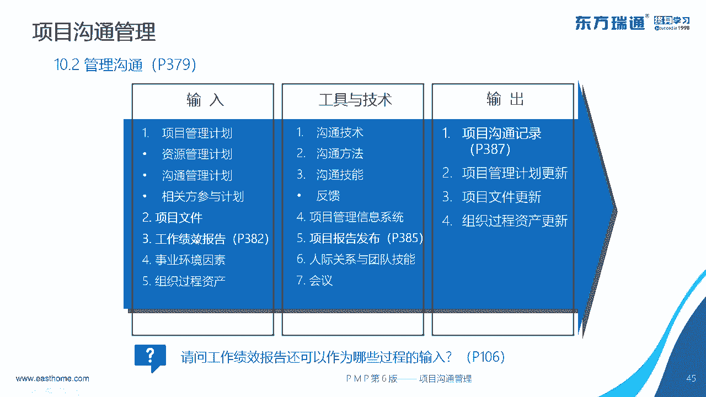

# PMP串讲 - P8：串讲第10章 - 我的乐芙兰 - BV1uE411N7zG

う。🎼，🎼，🎼好。🎼，🎼The。🎼Yeah。🎼ピ。🎼，🎼。🎼The。🎼，🎼，🎼あ。🎼。🎼。🎼The。🎼Yeah。🎼嗯。🎼The。🎼，🎼The。🎼，🎼，🎼The。🎼。🎼。🎼Yeah。🎼The。🎼Yeah。

🎼不是。🎼，🎼。好的，各位同学啊，各位老师晚上好。那个我先确认一下我们这个声音和屏幕，大家是否能够正常的接收。呃，人的话呢就在微信群里面。呃，回复一个一吧。应该是没问题的哈。对。

这个小儿通有比较长时间的延迟，所以。大家接收消息可能还得一点时间。嗯，对的啊。好，我就直接问吧。走坐房间呢。看不到。唉，我已经直播了啦。呃，确实有点看不到啊。好的，大家稍等一会儿。うん。

没问题，很流畅是吧？哦，那刚才。好的好的，有了。刚才是有一部分学员说没有，所以我就退出了，现在重新进了。哦，现在是有了是吧？😊，好的，可以了。行好，那我就开始了啊。😊，好，各位学员晚上好啊。呃。

从这一次开始后面的。第十第11、第12、第十3章呃，我们将会分4个晚上的时间。就是每个周四两个小时的时间跟大家做一个分享和复习备考啊。那在进进行今天内容之前呢，呃刚才刘老师呢他委托我把今天的这个。

测试的情况给大家呃通报一下啊，不是公布，是通报一下。就是我看了一下啊，很多学员第一是缺考呃，没有按照这个要求去去参加这个测试，这个是肯定不对的，是吧？因为你不参加测试的话。

你就不知道前一个阶段的复习情况。也不知道自己到底能不能去应对这个考试的情况，所以一定要去参加啊，参加很重要。那么第二个问题呢，就是看了一下这个考试的成绩，有的学员呢考的非常好，达了这个满分100分。

那足可见呢，他在前期是发了时间是吧？是投入进去了的，是有收获和成果的。但是还有一部分学员呢，这个考试成绩不是很理想。那这样的学员的话呢，我建议你就是要多去呃做题，多去看书。

多去看一下以前老师的精讲和老师的这个呃平常的一些啊一些资料。说白了还是因为时间没有花到位是吧？没有参与进去。所以我希望后一阶段的话，我们的时间也不算很多了啊。从今天到这个6月6号考试的话呢。

呃时间不是特别多，所以大家一定要抓紧时间。不能说花了这么长时间是吧，大概半年的时间，结果呢我们这个。

考试到时候还不能够圆满的达成的话。哦，现在是可以了是吧，又卡住了。没声儿了。嗯，好，那我就还是正常的进行吧。我发现我这边也是好像手机上面进这个直播间也是。看一下啊。不卡不卡。は。呃。

确实啊确实是要去总结一下是吧，问题在哪个地方。哦，微信关了，我就看不到大家的反馈呀，所以说这很是两难，知道吧？很流畅是吧？好的好的，那我就不再去关注这一块了啊，就是现在可以正常的直播，正常的听课了。

是吧？嗯，关声音。好吧，我关我的声音。😊，OK这个建议很好啊。好，那个第十章呢沟通管理在正常的精讲过程中呢，我们老师所发的时间。这是谁？老师所花的时间呢呃一般是一个小时多一点就可以把它讲完。

而我们今天的时间呢是两个小时，然后中间呢还有10分钟的休息时间。所以在这一块呢，我可能呃。可能既要跟大家去把那些。考试中的高频考点做一个回顾和复习之外呢，还可能要做一些内容的扩展啊。好。

那么今天内容呢主要是2块内容吧。第一块呢就是给大家讲一下这个沟通的三部曲，通过这个沟通三部曲的了解是吧？从而做到有效的沟通，高效的沟通。那么第二个内容呢，就是围绕我们这个篇book这个书里面的。呃。

三个过程是吧，去了解我们的偏安不可是如何建立一个沟通体系。最终呢呃实现我们各个相关方的一个信息传递的需求的。这2块内容呢。都跟我们的考试有关系啊，所以大家听的时候呢都要关注。🎼呃，关于沟通这一块的话呢。

平常有的人可能也参加过一些沟通方面的呃这个培训是吧？那么在公司组织的或者自己参加的一些其他的沟通培训的话呢，更着重的关注的是。个人沟通技能的提升。比如说怎么样去面对公众演讲是吧。

怎么样去提高我们的报告和文档的写作能力。以及怎么样去将我们说话的内容组织更加有条理，更加有逻辑性。呃，让我们的听众能够听得更加清楚，更加明白。还有呢就是跨部分的沟通要注意哪些问题等等。总的来说呢。

传统的沟通培训。🎼讲这个沟通的管理的话呢，主要是提升个人的沟通技能是吧？而我们这个偏不可。或者说我们考试中更多的是。关注的什么呢？关注的是如何为了去满足相关方的一些信息的需求，建立我们的这个沟通体系。

然后呢，让这些信息在相关方之间有效的进行流转，从而呢。通过这样的沟通，达到把这些相关方组织在一起是吧？新网一些注项目力网一注时，最终呢呃能够去完成我们的项目标，让我们的项目呢能够成功的呃。进行。

所以说我们这个篇book里面的沟通的话呢，它还是服务于啊服务于我们的项目管理。好，不管是哪一种啊，都是我们有必要掌握的是吧？都是我们比要有必要掌握的。那么首先我们看一下这个沟通的定义。

共同定义呢不同的呃人员下的定义或者不同的。这个资料上面下的定义都是不一样。那我这个地方呢呃把它们综合了一下啊，得出来这么一个定义。大家可以看一下，沟通是为了传递信息。😊，传播思想。

传达情感的这么一个过程。这个过程呢可以消除我们。的误解，消除我们的偏见，增进相互间的了解，最终还可以达成一些共识。所以说在实际的工作中，在实际的管理中呢，有的时候出现的一些问题，并不一定说是我们的。

员工能力不足。很多往往都是因为沟通不畅，沟通失败造成的。所以啊一些企业。呃。管理方面的大师是吧？一些企业知名企业家，他们都认为呢或者都。有一个共识，就是认为沟通及管理。好，不好意思啊。

这个天津打了电话过来，是不是因为直播又出了问题？好，我接一下啊接一下。喂。诶。呃，微信的提示，因为现在我们微信的声把把声音关了。好的，行。好。其他的画面和声音还还比较稳定吗？好的。好，行，谢谢。嗯嗯。

好的，大家建议就是那我就把这个微信退了吧。嗯。所以呢大家都会有这么一个说法，就是管理，就是沟通。沟通在我们的管理过程中呢，有相当不相当部分的工作。那沟通到底有什么作用呢？我们在沟通中要达到什么目的呢？

这个地方罗点四点啊，第一点就是我们通过沟通去控制我们的团队成员的行为。比如说给团队人员下达这个。命令是吧，传达这个指示。从而让他们去完成他们的工作。那第二个呢就是信息的流通。比如说我们开一个。

传达上级精神的会议。我们呢讨论一下当前的市场状况是吧？还有表达情感，分享挫折和满足。那比如说我们做一个金享呃经验的。分享会议是吧，总结一下经验教训嘛。还有就是我们开一个年会啊。

跟我们的主要客户做一个联谊会等等。最后一个呢就是他可以激励员工。比如说开一个表彰会，开一个项目最后的一个庆功会等等。这是我们沟通的目的啊要达成的目的。呃，项目经理呢？PMI认为。

75%到90%的时间是要花在这个沟通上面的。呃，这个数字呢。各个方面的资料啊都差不多。呃，各个方面的资料呢都显示。这个沟通的时间基本上是在80%上下。所以说75到90这个数字呢呃。很多都是这么认为的啊。

那为什么项目经理需要发这么多时间在沟通上面呢？我们看一下这一页PPT就知道了啊。你看项目经理在我们的。沟通中所承担的各种角色。比如说他作为这个沟通信息的中枢是吧？所有的信息都要汇到他这一块来。

然后又通过它这个地方呢呃传达出去。所以它是一个信息的中转啊，中枢是一个综合者。另外，在项目中，团队管理出现冲突的时候，需要我们的项目经理去呃去解决，这需要通过沟通来解决。还有呢在采购行为中，我们要协助。

是吧采购经理去谈判啊，做商务方面的谈判。还有制度的建呃制度制定的时候呢，我们去协调各个相关方。整个项目室的过程中呢，我们要参与这个监督。所以说啊项目经理他在项目中呢承担着各种沟通角色。

所以他的相当多的时间是要花在沟通上面。这就决定了我们的项目经理呢一定要具有良好的沟通技能、沟通技巧，把它作为自己管理和领导项目团队的重要工具和手段，是吧？好，那既然沟通这么重要是吧？

项目面的主要时间都花在沟通上面，并且呢我们的沟通还要去确保它的效果和确保沟通的效率。那效果是什么呢？这是我们这个偏不可书上面的啊。效果就是指的在正确的时间。以正确的形式。为正确的受众提供信息。

从而产生正确的影响。说白了就是把事情。把沟通做对，做正确，产生良好的效果。是吧。另外一个沟通的效率。通常我们理解就是。速度是吧，高效。那这个地方呢还提出来，就是我们的效率呢体现在只提供所需要的信息。

就是相空。提供给他的信息的话呢，不要多给，也不要少给。那不要少给这个好理解是吧？这个好理解嗯，因为不能信息缺失。那么多给有什么不好的？😡，其实大家都很明白啊。比如说你早上到公司去是吧？你收到大量的邮件。

等你花了大量时间看完这些邮件之后呢，发现没有几个邮件可能是特别必要的。多数的邮件呢。都可能不需要你知道的，可都都都行是吧？另外你看我们参加了那么多的微信群。呃，大量的信息涌现在我们的面前。

但是没有几条呢是有价值的，多数都是。低密度价值的信息。是吧。多了一不好是吧？多了一不好。恰恰到好处，不多不少是最好的啊，这样可以保证它的效率。是吧。好，了怎样去保障我们沟通的效果和效率呢？

这个地方我个人啊提出一个沟通的三部曲。是吧。那第一步就像我们说话一样的第一步，我们大脑里面要想好哎，想好要说的东西。第二步呢，我们去说。去执行，那要把它说清楚说好。第三步呢就是我们听的人要能够听好它。

这就是我认为的沟通三部曲啊，第一要想好，第二要把它说好表达清楚。第三个呢，听的人要认真听，把它听清楚，听明白。好，这分别对应什么呢？分别对应的是。这几个内容。第一个沟通的5C原则。

这个5C原则呢最初是来自于书面沟通。啊，他的一个提出一个要求是吧？那这5点呢简单解释一下啊。第一个就是目的要明确。你要确保。你说的这个内容，这个信息是对方需要的是吧，你说的他不需要。那他肯定不不会听啊。

确保说的信息是对方需要的，并且是对方感兴趣的。这是目的要明确。那第二个呢就是表达要正确。不能有错误的拼写和语法错误是吧？信息的扭曲等等。所以说我们在表达的时候呢。不能说错啊。第三个呢就是表达简洁。

言简意赅是吧？简单明了啊，没有多余的东西。这个同时刚才也说了，体验效率啊，也可以体验效率。第四个呢就是逻辑要连贯。啊，你的逻辑。性要强是吧，要严密。然后呢，内容要。结构严谨。最后一个思路掌控。

就是我们可以通过一些图表来辅助我们进行说明讲解是吧？我们也可以呢去做一些小节归纳。使他更加清楚。我们还可以呢做一些承上启下的一些呃连接。呃，这就是我们沟通的5C原则啊。

简单的就是说我们要把我们想说的东西，想沟通的信息先要组织清楚，想好。也成为沟通的smart原则。那这个地方我问一下各位啊。😡，沟通是一种本能还是一种技能呢？如果是本能，就是天生的。如果是技能呢。

后天是可以通过训练得出的。好，大家可以在这个直播间里面回复一下啊。如果认为是本能，就回复一。如果认为是一种技能，就回复2。呃，延迟我得等好久啊。好，实际上沟通呢它是一种技能是吧？通过我们后天的学习。哎。

我们。沟通要注意些什么东西，要掌握些什么东西。还要通过我们训练啊训练去练习，最终能够提高我们的沟通能力。好，那我们沟通要注意些什么东西是吧？怎么把它能够。表达的好呢，刚才说的是要想好是吧？5C原则。

那怎么表达的好呢？这个地方就涉及到我们的一个。梅拉比法则啊。梅拉比法则是美国。主要研究沟通的一个心理学家，他叫埃伯特。梅拉热比这个人啊，他提出的。他提出沟通的最终效果取决于呃这三个方面。

取于这三个方面啊。第一个呢就是。文字语言。文字语言可以是我们。这个白纸黑字写的东西。可以是图片。也可以是我们说话的。这个内容是吧，但是这个部分啊在沟通效果中所起的作用呢只有7%。

大家可能会觉得这个很少是吧？好。先别急啊，我们把它说完。那第二个方面呢就是语音语调。云语调。这个好理解，不用解释啊，他占。38%。这就挺多了啊。那最后一个就是肢体语言，肢体语言就比较广泛了。

比如说我们的手势。我们的。动作。还有我们的表情。我们的情绪，我们的态度，我们的眼神是吧？都是肢体语言，它这个占55%啊。好。一般人第一次接触这个公式这个法则的时候呢，呃感觉不是很认可或者不是很理解。

其实我们简单解释一下。他是成立的。比如说一个小孩儿啊，很多我相信很多学员家里已经有了这个呃小孩儿是吧？那你跟他沟通的时候，你跟他说，叫他不要做的时候，不要做某件事情的时候啊。😊，你光只是通过。

这个跟他说这么轻描淡写的说这么一句话，他往往往呢。😡，他没有没有动静是吧，没有理睬你。他听到没有了？听到了是吧？那他为什么是吧没有改过来？没有听力的原因，就是因为他只提了这一块东西了。

那这块东西给他产生的效果只有7%是吧？但是如果你在说这句话的时候。🎼啊，你这个语气很重是吧？语气很重。那他就听得出来了啊，他可能就不像刚才那么无动于衷啊，纹丝不动是吧？但是如果说你在跟他说的时候。

你还让他看到你要打他的手势和你很生气的狰狞的表情。那他就会吓一跳，马上呢他就会停止他的呃这个。行为动作是吧？所以说这么说的话呢，我们可以我们可以呢。感觉啊这个维拉比法则的这个公式还是可以成立的。

另外再说一个啊，比如说一个女生跟你谈朋友的时候是吧？她说你讨厌。那么你光只是听这个文字。内容的时候呢，你可能觉得他不喜欢你。但如果说你再结合他的语音语调或者肢体语言的话呢。

可能意思就完全不是那个意思了啊。到底是讨厌你，真的讨厌你，还是喜欢你这个。嗯，结果呢要取决于后者更多一些。好，这是我们这个梅拉比法则啊，这个法则非常重要，大家一定要怎么把它当做一个。

重要内容去加以理解和记住。好。那为了体现这个。梅莱比法则。我们呢。给大家介绍一个。沟通沟通的方式吧，就是它的效果啊，我们给大家介绍一个沟通的方式，就是面对面沟通。这个面对面沟通了。

是我们PMP以及我们ACP考试都非常推崇的。一种沟通方式。好，这个内容呢我们先放一放吧，我们讲了这个。第三部曲记忆倾听之后再说它也行啊，嗯可能更好一些。积极倾听关于第三个啊，你前面是吧，你想好了。

第二步。你按照梅拉比法则是吧？在讲这个话的同时，有语音语调的配合，有肢体语言手势动作的配合，是吧？把这个呃信息传达的更加全面一些。那么到了第三步，我们受众听众在听的时候应该怎么听呢？关于这个听这个倾听。

它是有三个层级的啊。那第一个层级。我们称它为内容的倾听。正当为内容的倾听。呃，就是说我们受众了只。关注到他说话的文字内容，忽略他的语音语调。没有看他的肢体语言。表情手饰等等。那你想一下啊。

这种内容的倾听的效果是非常差的，是吧？根据梅拉比法则呢，它只有。只有7%的效果。啊，第二个层级呢叫做。啊，专注倾听。那么专注倾听。他不光啊听到你的文字内容。他还关注到你的语音语料是吧？

那这个效果就更好一些。同时呢这个里面还强调，就是我们的听者。还要使用一个移情的方式。什么叫移情呢？😡，嗯，就是放位思考是吧？把自己放置在。我们的信息发发送者这一方去考虑是吧？站在他的角度上去想。

他想表达什么，他想说明什么，他的真正意图是什么？好，这是第二个层绩啊，叫专注倾听是吧？那效果就比第一个层级啊更好一些。第三个层级呢叫前局倾听。也就是真正意义上的。积极倾听。他不仅关注文字内容。

关注云语调，他还会关注我们信息发送者的这个肢体语言是吧？真正做到全局倾倾听。真正做到进行倾听。那么这样的倾听，我们也称它为有效倾听。那这个上面呢罗列了啊有效倾听的9个原则是吧？九个原则不打断讲话人。

就是把你的。注意力把你的关注点放在我们的讲话人身上。设身处地的为对方着想，这就刚才说的移情放位思考是吧？还有呢就是要进行。这个复述和确认。哎，你有没有听明白，有没有理解是吧，可以进行确认和复述。

还可以做一些。这个鼓励性的眼神点头的动作。以及呢不打蛋和提一些开放性的问题等等，是吧？好，这个地方呢大家可以去呃自己去看一下啊，看一下。好啦，那到这个地方为止呢，我们就把这个沟通里面的三部曲哎给大家呢。

呃，补充了一下啊，可能。几位老师啊，以前的几位老师在金讲的时候呢呃没有。说的那么。全是吧，或者说那么细。那我呢在这个地方把它就是全部的过来一下啊，三部曲是吧？第一步想好再说，使用5C原则。第二步。

怎么去讲？不光是要把这个文字内容信息传递出去，我们还要配合我们的语音语调和肢体动作等等。啊，只有这样呢才能提升我们的沟通效果。第三个环环节呢也是非常关键的是吧？就是听的人，如果说他没有好好的听。他没有。

积极倾听的话，那最终的这个沟通的效果也是不好的。啊，也是不好的。好了，把这三个步骤说完之后呢。我再来回过头说一下刚才的。什么样的沟通最能体现我们的这个。

沟通效果啊沟通效率就是我前面说的PMP和ACP特别推崇的面对面沟通。啊，面对面沟通，就是沟通双方怎么。坐在一起是吧？然后进行沟通。那为什么最推崇这种沟通方式呢？😡，他有三个优点啊。第一个优点。是吧他的。

传递信息量是最快的在一个时间内传递的信息量是最多的。我相信啊写字。是吧包括你用电脑打字，肯定是没有说话的速度快是吧嗯。所以他这个速度很快，效率很高。我们也称它为高宽高带宽的这种沟通方式。啊。

体验第一个体验效率了啊。那么第二个呢。就是他有。这些非语言的。呃，信息沟通方式。我们把这个呢称为。语言这两个称为非语言的。呃，沟通方式是吧？那就是说你面对面的坐在一起的时候。

你不光是可以听到对方的文字语言是吧？你还可以呢清晰的感受到对方的语语调，还可以看到对方的。这个肢体语言动作等等。那么获得的信息啊，这个信息量肯定大一些，更全面一些。面对面沟通。第三个优点呢就是。

他可以进行及时的反馈是吧？可以进行及时的反馈。那么反馈的优点。有什么呢？有哪些呢？我们在后面那个交互式沟通里面，我们再去说它啊再去说它。哎，他可以呢及时的获得反馈是吧？是理解了是听有没有听清楚等等。

都可以获得反馈。所以呢我们特别强调这个面对面的沟通。所以在考试的题目中呢。面对面沟通。这种答案呢很多时候都作为第一选项或者作为正确答案。啊，这就是我为什么要讲它的原因啊，讲它的原因。好。

那这个地方的面对面沟通跟我们后面要讲的一个交互式沟通，他们两者之间是个什么关系呢？显然啊，面对面沟通属于交付式沟通的一种。但是交付者沟通的方式不止面对面沟通这一种是吧？比如说我们打电话。我们开视频会议。

哪怕我们微信聊天。他都属于交付式沟通，但他并没有面对面啊，他并没有面对面。好，最后跟大家说一下这个沟通的漏斗模型是吧？有的老师可能讲过，有老师呢没讲啊。比如说。你跟别人说一个事的时候。

你想百分之百的把它说完说清楚是吧？但是实际上呢你可能。只说出来80%。最后听的人呢没有积极倾听，没有前局倾听是吧？只接收到了，只听到了60%。但是却还有一部分没有听懂，只有40%听懂了。然后再过了几天。

过了几个月之后呢，又忘了不少。通过这个root模型呢，我们就可以发现啊，在沟通的行为中有大量的信息。是会消沉的是吧？是会消沉的，这样呢自然而然就影响了我们的。沟通的效果。那怎么样减少这个信息的消损。

防止这个沟通效果的。折扣呢其实还是我们刚才所说的，你看。是吧为什么只有80%的表表达出来呢？就是因为没有想好，没有准备好没有准备好啊。是吧。以及呢。没有充分的利用梅拉底法则里面的。啊。

三个方面结合去进行。信息的沟通传递。那为什么讲了80%，还有20%没有听到呢？就是因为没有积极倾听，没有全局倾听是吧？漏掉了一些信息。这就是为什么只有40%听懂，还有20%的。没有听懂啊。因为没有复述。

没有反馈是吧？你如果说你有反馈，你说我有老那是没听懂。那我们可以再把它说一次是吧？有本分让什么理解，我们再说一次啊，让你能够理解是吧？最后呢忘记的部分我们可以通过复习巩固的方式是吧，让它忘的慢一点。

忘的少一点点。好，这是我们前面啊给大家补充的这一部分内容是吧？就是再简单回顾一下啊。简单回顾一下。就是沟通非常重要是吧？沟通是项目经理的主要工作，70%到90%的时间用于沟通，充当各种沟通角色。

那么沟通呢强调效果和效率。啊，强调效果效率，怎么样达成这个效果，怎么样实现这样一个效率呢？我们可以使用沟通三部曲是吧？第一步，想好再说，使用5C原则。第二步，怎么去把它表达好？怎么把它说清楚。

使用梅拉比法则。啊，既要。把文字内容说清楚，说全是吧，也要配合相应的。语音语调和肢体语言。那么听的人也很重要是吧？要积极倾听。所以啊今天的这个每日一练里面。有其有的题目。

我刚才在下午的时候啊看了一下这个聊天记录是吧？啊，就是提到为什么。不选择那个肢体语言，要去选择那个呃关注。听众和受众这个选项答案。是吧这是为什么呢？嗯，梅拉比法则不是说50%的沟通效果来自于肢体语言吗？

其实。这个答案呢？是源于。这个啊。在这些新金点我们就输了是吧？嗯。要有移情范位思考。嗯，你要去关注你的听众。是吧。他有没有听懂？他有没有反馈是吧？你讲的这种沟通的方式，他能不能接受等等。呃。

这个呢比你说更重要。所以继续心听啊，特别强调这一点。好，另外呢再补充一个一点内容，就是这个提高沟通效率的几个几个原则啊，简单的说一下吧，这沟通内外有别是吧？类就是项目类组织类。啊。

就是在你的组织内项目内部的话，我们是强调什么呢？这个诚实内部公开嘛，是吧？但是对外的话就不一定了。而且对外呢我们要同一个声音。哎，同一个声音。因为你代表你对外的就代表公司，代表项目代表组织是吧？

所以内外有别啊沟通。第二点就是采用对方能够接受的风格是吧？这个呢。刚才也提了一下是吧？第3个啊，非正式沟通有利于关系的融洽。正式沟通。比如说你在谈判桌上面是吧，在会议上面不一定能够把这个订单拿下来。

但是如果说你通过。在酒桌上。在私人社交的场合是吧？有可能把这个订单就很容易拿拿下来了。第四个，扫除沟通的障碍。比如说你要跟。客户打电话跟您导打电话，你要找一个安静的地方是吧？扫除沟通障碍。

最后一个沟通的升级原则，这个在考试中经常考经常出现啊，是一个考点是吧？沟通的审计原则就是。哎，我找你是吧？但是。不能解决问题的话嗯，你。我的问题得不了解决。那么呢。我就会去找你的上级啊。

这种题目非常多啊，是吧？我找你。你不给我解决是吧，那我就去找你的上级。这就升级了啊升级了。如果找你的上级仍然得不到解决。那我就让我的上级去找你的上级。如果说这样不效的话。

那我的上级可以去找你上级的上级啊，这是沟通的升级原则啊。在考试中有这样的题目经常出现是吧？就是我跟你沟通无效，我们就要升级了。关于沟通的这个分类这一块呢，本来是想快速的略过的。但是同样呢。

因为今天看了一下这个。呃，每日一练的微信做题的这个群里面，大家对这一块呢还是有一些。呃，不太清晰的地方啊，可能因为时间太长了是吧？再加上呢有没有。没有去及时的。维持这个状态，看书啊，都忘了。

简单的说一下啊。呃，刚才说了内部就是项目内部组织内部是吧？正式非正式。正式呢就是。组织的规章制度明文规定的沟通方式。不这样做不行，这叫正式沟通。垂直沟通就是上下级的沟通。你和你的上级，你和你的下级是吧。

垂直。水平沟通平行部门之间的沟通。那同样今天的每日营练里面呢，应该是有这道题的啊。属于水平平行的沟通是吧？官方和硅方方呃非官方沟通。那么官方沟通。很容易跟这个正式沟通呢呃，混为谈是吧？应该这么说啊。

官方沟通是正式沟通的一种，但是正式沟通呢不止官方沟通。这一种是吧？还有呢书面和口头。口头就是。用嘴。书面的那就是白纸黑字了。单纯的这样看没有什么问题。那同样如果说把几个概念混到一起。也会有点分不清楚。

比如说什么是正式书面是吧，正式书面。呃，正式书面往往是指那些有签字盖章的啊，叫正式书面。正式口头。那比如说开会这种形式基本上就属于正式口头是吧？语言和非语言。那刚才我们说了那个7%属于语言。

那个38%和55%就属于非语言的沟通。好，这个大家看一下啊。看一下。呃，我们把这个地方给大家梳理一下啊，这是直接跟我们的考试挂钩的是吧？跟直接跟我们考试挂钩的。比如说制定项目章程。

制定项目管理计划这个制定的过程。我们应该使用的是正式书面的是吧？有文字、白纸、黑字记录的。啊，正式书面的。还要签字盖章的啊，刚才说了啊嗯再说一次呢，制定项目章程，制定项目管理计划。

这个往往要使用到正式书面是吧？有白纸黑字。有签字盖章。那么在发布项目章程。是吧以及。发布我们的项目管理计划的时候呢，要用到正式口头。你看发布项目章程的时候，我们要开项目初始会、初始启动会是吧？

以及我们的开题会。那么这两个会应该就是属于正式口头的。啊，正是口头的。还有呢我们的项目管理计划的更新，项目管理计划的更新是要走变更的，而变更。提出。是需要通过正式书面的形式提出的，是吧？

再就是远距离的沟通啊。远距离的沟通。那这个我们在做题的过程中呢，也是有很多的困惑。比如说我们有跨团队是吧，跨国团队跨地区的团队。那这样的团队为了保障这个沟通的效果呢。一般啊如果答案中有这个。呃。

有类似于。交付式沟通是吧？或者面对面沟通这种。答案的话呢，一般选这种答案。那有的人可能会说。我们都跨地区，我们都跨国了，怎么面对面呢？是吧我们可以营造这种氛围嘛？比如说远程会议嘛，是吧？远程会议啊。

远程会议。它是一种交互式的，它同时也是可以看到对方的。呃，动作表情、肢体语言的啊。所以说远距离的沟通的话呢，如果有这种是吧，类似于面对面的交互这种沟通，可以选那的啊。如果没有的话，我们次选书面正式啊。

书面正式。好，再就是下面这个电子邮件这个沟通方式呢。也是容易引起大家的困扰。是吧。为什么这么说嘞？你看啊讲义这个上面写的是非正式书面。这样写的没错。但是电子邮件呢有时候也可以作为一个正式书面的沟通形式。

比如说大家可以。回去翻一下啊你的讲义或者你的书是吧，你的书。在4。1的这个过程中。有一个输入就是协议啊，制定项目章程要输入协议嘛。而协议的种类中有一种就是电子邮件。是吧就电子邮件。那你说协议他赢。

他应该是正式书面的吧，对不对？呃，这是第一个佐证啊。那第二个佐证呢就是你看很多公司里面。我们以邮件为准是吧？包括我们公司也一样的啊。是吧。比如说要开一个班儿，开一个课程。那我们就发出一个教务部门啊。

就发出一个开课邮件。我们就以这个邮件为准，看到这个邮件，我们就准备课程是吧？没有看到呢，我们就。啊，不认为这个课程一定会开。我相信你们公司也是赚的啊是吧？有时候呢。

是把这个电子邮件作为一个正式书面的沟通方式的。当然说它是非正式，也可以吧？毕竟多数邮件。呃，都不像刚才我们说说的那那那两种邮件那样是吧，正式那样夸张嘛。所以啊电子邮件呢我认为它既可以作为正式书面的形式。

也可以作为非正式。书面的形式进行沟通。所以它不矛盾啊它不矛盾。嗯，不矛盾。好，这几个标红的啊，包括我说的这个第四个大家都是要特别注意的是吧？特别注意的。好，然后这个第八点也是要特别注意。

就是团队成员犯错了，出问题了啊，今天的每日英年也也有这个题目是吧？我们应该使用什么样的方式沟通？好，这个地方也是有一定的。也是有一定的分歧的啊，大家注意一下或者记一下。两种情两种情况啊。

就是项目经理如果发现团队的成员犯错了。第一次往往采用的是非正式口头。呃，一般还是什么私下的找个没人的地方是吧？私下的。面对面的跟他聊一聊啊，问一下什么原因呢？操什么情况啊，是吧？

就是团队成员第一次犯错的时候，往往是私下。面对面非正式口头。那么第二次呢。啊，第二次呢。如果是同样的错误，同样问题出现第二次。这就要看情况了，看题目的描述是吧？如果题目描述这个问题不大啊。

造成的后果不是很严重。造整的后果不是很严重啊。那我们可能采用的是。正是口头。比如说在会上面呢，把这个事情提提出来提一下是吧，正式口头。哎，这个问题不是很严重啊，这个错误不严重是吧？第二次正式口头。

如果这个不严重的问题又出现一次，第三次。那这个时候我们可能就是非正式书面发个邮件啊。发个邮件。甚至可能出现第四次。那么第四次事不过三是吧？第四次呢就使用正式书面啊，发个通报批评一下啊。

非常严肃的批评一下。好，这是。谈的成员犯错误，但是这个错误呢不严重啊，第一次非正式口头私下面对面是吧？第二次啊，正式口头在会上面提一下，第三次非正式书面邮件说一说，第四次呢，那就是非常严肃的。

正式书面发出。处理的。结果啊通报批评等等啊。但是如果题目描述的第二次，这个问题很严重是吧？你比如说今日这个今天的每日一练里面呢。他这个问题就比较严重，那我们就不用1234了。

我们第二次就进行正式书面是吧？严肃处理啊，严肃处理。因为毕竟这个犯错这个事情啊。每个人都不是圣人，都可能犯错是吧？但是第一次判中呢，有可能是无心的无心的啊。以后屡教不改。明知故犯，那就不对了是吧。

那就不对了。啊，所以说这两种情形啊，大家要区分开来是吧？看这个结果这个后果严不严重来进行区分。呃，然后呢安排会议会议通知嘛，一般采用一个邮件的形式是吧？这个时候邮件形式呢。可以认为是非正式书面的啊。呃。

还有一个情况啊还有一个情况回过头说一下，就是解决一个复杂的。问题比如说项目经理带领团的成员解决一个复杂的技术问题的时候。这个时候呢我们除了正式书面，还要加正式口头。正是口头。比如说正式可乐开个会是吧。

讨论讨论。那通过这个会议面对面的沟通是吧？嗯，效率很高啊效率很高。然后得出解决的办法之后是吧，我们把它呢形成正式书面的东西。所以啊解决复杂问题，解决复杂技术问题的时候呢，应该是正式书面加正式口头的方式。

好，刚才所说的。这几种。沟通方式沟通情景啊，使用沟通的方式。这个呢大家一定要去关注，因为它跟我们的考题结合的是。非常紧密的，而且经常会出现。我们所说的这些描述的情景啊，尤其是我们的这个标红的部分啊。

标红的部分。啊，包括这个是吧，包括这个。好啦，那这是这个内容啊，就这个内容。这样吧，我们休息一下，休息10分钟之后呢，我们再讲这个书上面的三个过程啊，把这个三个过程里面的高频考点。

以和一些相应的容易出现的考题给大家一起呢梳理一下，一起讲一下。好，在课间的时候呢，我登录一下我的微信啊，看一下大家。有什么。有什么问题，有什么不明白的，可以在这个微信里面。发出来啊。对。

我这个手机上面也显示讲师一直是离开状态，但是我可以看到。这是南方群，这是北方群。单独的事件怎么判定口正式口头和非正式书面？正式口头就是。刚才我们说了正式。口头就是要要用嘴说话的嘛，正式就是刚才我们说了。

是按照规章制度的方式去做去执行的。要符合规章制度，不这么做还不行的这叫正事是吧？最典型的代表呢就是。开会啊开会。那么非正式书面。非正式书面。非正式就是不是按照组织规定的要求，强行硬性的要求。

什么叫非正式书面就是有白纸黑字的，要有文字记录的。有文字记录的啊。这叫书面是吧？两者结合在一起，非正式书面。呃，廊方。啊，大家可以把问题提出来啊，提出来我再来。一的看一的处理一下。对方。今天的练习题。

是。正式口头还是非正式书面？这个练习题是白纸黑字的，应该是书面的啊。哪怕是电子形式，它也是书面的，是吧？但是它属于。属于正式还是属于非正式，这个不是很好判定。

如果说公司强行规定必须要以这种呃这种方式让学员参加的话，那就是正式的是吧？如果说呃可以不用这种方式，我也可以让班主任把这个通过。word文档发给你做一做是吧，那就是那那就可以说它是一个非正式的啊。

但是他觉得是书面的。呃，今天这个这个这个练习题他肯定是书面的是吧？书面的，但是是不是正式的，这就看公司。对这个规定的。严格程度。我看一下今天这道题啊。呃，这个题。好的，我现在打开这个题了啊。😊。

这个题说的是。以前是12点之前提交。工作的周报是吧？但是你现在呢准备将这个时间提前到10点钟，你打算用什么方式来通知这个变更？好，这个问题呢其实问的很好啊，这涉及到一个对沟通管理计划的一个变更。

涉及到一个。涉及到一个沟通管理计划的一个变更啊，后面我们在讲10。3的时候。会说到这个沟通管理计划的变更，应该是。怎么去做？哦，我现在说也可以啊我现在说也可以。就是一般情况下，我们的项目管理计划。

当然我们的沟通管理计划也算是项目管理计划的其中一个子计划嘛，是吧？就是项目管理计划，它应该是。正式书面的啊，这个我们在4。6里面讲这个实时整体变更控制的时候，已经说的非常明确啊，一定要书面正式提出是吧。

书面正式提出。好，那么这么一说的话，你可能就会容易选择这个答案。是吧那我现在本来以前啊我们是要提交12点之前提交的是吧？现在要求10点之前提交。哎，我们这个计划就要沟通计划变更了。

但是啊但是沟通管理计划呢。他不必走这么严格的变更流程。啊，就是没有必要走这么严格的变更流程，是吧？只要沟通双方达成一致，不影响其他的任何相关方，我们就没有必要去走这种严格的书面。啊，正式的这种变更程序。

所以说这个地方呢。这个地方呢我们一般选择。一般选择呢非正式，不要选择正式是吧？但是为什么不选择口头呢？因为口头这个东西。他没有留存呢，他说过去就就过了，对不对？都过了，他没有白纸黑字作为证据的东西。嗯。

那如果以后出现了这个问题的话，是吧，就没办法对症。哎，没办法对质对症，所以啊最好是要选择这种非正式书面的沟通方式。是吧我有白纸黑字写着，但是呢我们只要是吧，这个沟通双方。认可达成一致了。啊。

不影响其他的任何其他的相关方是吧？我们是可以不走严格的。变更流程不需要做这种正式书面的提交的对吧？你这么去解释啊。西方把邮件作为非正式书面沟通的形式。嗯。这个说法呢我刚才也说了是吧。

邮件它作为一种非正式书面沟通形式，这个是没有什么问题的。但是显然。在实际工作中以及我们的篇book里面，偶尔我们的邮件也可以作为正式说明的功能形式。呃，我的证据就是4。1里面。协议的输入。

你看在协议中有一种啊就是电子邮件，不信大家可以去翻书啊，可以去翻书。为什么分析根本原因要使用非正式口头？分析根本原因肯定是要开会呀，肯定是要面对面的讨论呢，是吧？嗯。呃，这个地方啊这个地方我。

我说明一下啊，分析根本原因肯定是要口头的。至于说是正式的还是非正式的，这个不一而定啊，不一而定。你分析根本原因，要么就开会是吧？要么就是啊大家聚在一起嗯，面对面。它必须是口头的啊，那口头的话。

它就有交互性呢。他就可以。把这个信息更加深入啊。是吧你找根本原因，你是要往里面找啊，5Y呀，5个Y呀，是吧？YYY的分析5个Y呀，所以说你不口头不交付，不往深去的去做。深度挖掘的话是找不到根本原因的。

是吧是找不到根本原因的。所以说分析根本原因肯定是要口头，但是是不是非正式？还是正式，这就不一而定，是吧？嗯。哦，好了，这个时间很快就到了啊，大家还是可以。把就是心中的疑问都给发出来啊发出来。

我们有时间就跟大家解答。我们下课再解答都是可以的啊。好，现在已经8已经9点08分了。那我们继续啊继续。好，刚才呢我们主要是说了一下这个沟通三部曲是吧？第一。

把事情把这个沟通的信息要想好5C原则啊啊5C原则。第二，怎么去把它说好呢？把它表达清楚，表达好呢就是梅拉比法则7%加38%加55%是吧？那最后一个环节也是最为关键的一个环节，就是受众听众。

他要积极倾听啊，要全面全局的倾听是吧？这个听非常关键啊。这个厅里面呢要涉及到移情换位思考。而且要以这个。听众能够。接收的方式是吧？而且呢还要多多的去关注他，而且要。使用到反馈和复述等等是吧？来确保这个。

呃，听的效果啊。那另外呢我们又把这个沟通的分类给大家梳理了一下啊，梳理了一下。呃，这个就直接跟我们的考试跟我们的考题挂钩了是吧？像这样的题目呢，我相信你们在平常练习中。碰到不少啊，但是说个实在话。

在真正考试中不一定有那么多。因为这个这种题目呢是是很有套路性的，是吧？所以有套路性的考试中呢并不并不会出现这么多啊。好，下面呢我们。这个题是吧。好，这个题先别急啊先别慌。那个我们讲了10。3之后。

还会讲一次的啊，10。3我们还会讲一次的。嗯。好，下面我们进入到第二个阶段啊，就是P安book上面。关于沟通管理的三个过程是吧？第一个过程，规划沟通管理。这个规划沟通管理呢着眼于三个关键点啊。

第一个就是根据相关方的信息需求，就是他想获得哪些信息，他需要哪些信息是吧？我们给他提供什么啊，不多不少是吧？这就跟我们前面这个呃项目的需求收集是一样的啊，根据需求的收集，去制定我们的范围。

这个地方根据我们的信息需求来制定我们的沟通管理计划，第二个关键点就是。呃。要看一下我们可用的资源是吧？嗯，我们沟通是需要有资源，是需要有设备的啊。是吧你比如说开会有会议室啊是吧？你打电话也电话是吧？

你发邮件要电脑，要有网络啊。第三个呢就是。因地制宜的是吧，恰如其分的去制定合适的沟通方式。形成我们的沟同计划。这是规划沟通啊。属于。计划过程组的规划过程组的。那10。2呢管理沟通管理沟通简单的说就是。

创建这个沟通模型沟通体系。按计划去完成我们的沟通。啊，完成我们的沟通。属于执行过程中是吧？那10。3呢监督沟通所有的监督都有一个特征去共性，就是拿实际执行情况和计划去做对比啊，看两者是否存在着偏差。

是否存在着问题是吧？那有偏差，有问题，我们就需要找原因。并且把这个问题和偏差呃解决掉啊解决掉。在考试题目中呢。10。1和10。3考的比较多。10。2的考题呢。比较偏少是吧？比较偏少。但是总体来说啊。

沟通的题目其实并不是很难，题量也不大，题量也不大啊。呃，一套卷子200道题中大概就十道题，上下吧，多一点，1二三道题是吧，少一点呢就可能八九道题，十道题左右。所以说这个沟通管理的话呢，其实。难度不大啊。

重要性呢一般。但是在实际工作中沟通还是很重要的，是吧？好，如果说你们听刘老师的课啊，就是刘通老师的课呢，这个图应该是非常熟悉的是吧？我觉得这个图还挺好的，它是整个49个过程的。相当一个流程图啊。

我们从项目的启动到项目的结束收尾，要经历哪些过程，哪些流程。啊，这个上面呢只画了47个啊，在这个地方缺一个制定。是吧进度计划这个地方缺一个制定。成本管理计划啊。制能金的管理计划这缺两个啊。

但是这个不影响，我们重点呢应该放在什么地方呢？就是。😊，第十章的三个过程，在整个49过程中处在什么位置是吧，处在什么位置。那我们跟他说了啊。规划沟通它是属于。规划过程组的是吧，它的位置呢是处在这个位置。

也就是你通过这个流程图可以看清楚它前面要做什么，后面需要做什么。那管理沟通属于执行过程组，在这个位置是吧？监控。过程组中的监督沟通的这个位置。也，就是说我们通过这个流程图呢可以。

知道我们的这三个过程所处的位置是吧，它的上下。

啊，过程是什么？可以看的比较清楚啊，了解一下就可以了。规划工能管理呢？嗯。考试重点在工具和技术这一块，但是我们仍然还是要对它的输入和输出呢是有所了解的。呃，这个输入这一块呢其实很好理解啊。

这是3块内容是吧？第一个我们要去收集相关方的这个。信息需求。那在哪里去找这个信息需求呢？第一，在项目章程中去找。因为项目章程中自然有一些高层级的。呃，这个需求。

但是我们在这些需求中找一找有没有信息方面的需求，是吧？在就是需求文件中找一找需求文件，虽然主要是产品的需求、功能需求、质量需求这一块东西，但是也可以找一找是吧，信息方面的需求。嗯。😊。

这是在这两个地方找需求啊。这需求。还可以呢就主动的跟我们的相关联系，问他啊有哪些方面的信息需求是吧？所以要用到相关登记册。但是不是每个相关方都非常乐意去配合我们的这个工作。所以我们可以去。

看一下相关方参与计划里面有哪些策略，能够搞定他们，让他们参与是吧？好，这是第二个方面啊，就是沟通跟相关方有关系，用到了相关方参与计划和相关登记册。那第三个方面就是刚才说了，沟通是需要有资源的啊。

开会会议室是吧？发邮件需要有网络，需要有电脑啊，这是输入啊，但是还是那句话啊，重点呢在于。工具和技术这一块。工具技术这一块重点考试重点呢，这是一个。这是一个这是一个。呃，然后这个里面呢偶尔会有。

会有考到啊，不多是吧？不多。那我们进到里面去看一下啊。首先是要收集到相关方的信息方面的需求，是吧？那怎么收集这些信息的需求呢？第一种是我们主动去找啊，主动去找是吧？我们可以找这个项目章程，找需求文件。

找相关方去问。都属于我们主动。那还有一种呢就是相框。他主动找我们，告诉我们他需要哪些信息需求。所以说第一步是要获得这个信息的需求是吧？那么第二步呢是要进行评估啊，进行评估。不能说他要我们就给他提供是吧？

我们说过了啊，为了保证这个沟通的效率，我们只提供它必要的啊，不多不少的是吧？不多不少的。所以说要对他进行对他的信息需求呢进行评估。真的他需要这个信息，我们就给他提供。如果不是他所需要的。

跟他没有多大关系的，我们是可以拒绝的啊可以拒绝的。好，第二步是评估。那么第三步呢是。结合我们的沟通技术。是吧结合我们的资源。然后呢确定我们的沟通。形式。哎呀，我们使用什么功能技术是电话。还是邮件啊。

还是会议是吧？然后呢，格式。是什么样子的啊？还有呢就是沟通的内容确定下来。是吧。沟通的频率。啊，一个月。开一次会还是一周发一次邮件，还是怎么怎么的是吧？频率，这是它的三个步骤啊。

第一个就是收集信息的需求。第二个做评审。第三个确定。他的。形式技术格式、频率等这些细节部分。好，来看一道题啊。项目高级经理要求各团队成员每日更新项目的状态。项目经理应该怎么做？哎，这道题目呢。

提出了我们的高级经理是吧，他要改变这个。沟通的形式啊。啊，沟通的频率是吧应该是沟通频率是吧？那么怎么去沟通沟通的频率有多高，这应该都在我们的沟通管理计划中是有明确的定义的。突然这个高级经理要求改变。

那这个时候项目经理该怎么做呢？项目经理呢应该选择C啊，与这个高级经理呢去分享已建立的沟通管理计划是吧？你看我们当初都是协商好，确定好了的这么一个。沟通计划里面有我们的沟通频率是吧？你现在要突然改。

那怎么弄啊，到底怎么弄？所以说首先第一步我们是要去给他分享这个。沟通计划的。就是说他说啊当初哎确定确实是这样的啊，那现在呢我突然想到有这么一个想法啊，这是我不对啊，算了吧，大家还是按照以前的沟通计划吧。

这是一种情况。那还有一种情况呢，就是以前我是觉得那样可以，但是现在呢我觉得那样不行，我想把这个什么频率提高一些。好，如果你们两双方啊觉得他提出这个要求呢合情合理是吧？好，那我们呢就是。

更改更新我们的工程管理计划，这是可以的啊。但是第一步肯定是要去分享的，所以选C是没错的啊，其他答案呢都不好是吧？大家可以使用排除法，可以使用排除法看一下啊，你看A允许团队成员将更新的内容提供给高级经理。

那就是说没按计划了是吧，没按计划了。第二个呢，将最你没按计划计划就是虚设了，是吧？B将最近更新的状态提供给高经理啊，高经理是要每日更新的，你只提供了最近的，像是敷衍他。D呢邀请高经理参加每日团队会议。

是吧。那这个呢。嗯，不太现实啊，因为高经理可能很忙，他不不一定能够每天来参加，是吧？哎，每天来参加。同样呢这个D跟这个A是一样的，没有按照原先的计划去执行是吧嗯。改了计划呢，也没有遵循相应的这个流程吧。

所以啊这个答案选C。啊，这也是一个必考的知识点是吧？就是沟通技术里面的一个沟通渠道的计算。在两个相框之间。都有一个潜在的沟通渠道。比如说你和我，那么呢沟通我们两个相关方是吧，我可以跟你沟通。

你可以跟我沟通。但实际上呢，这个沟通渠道只有一条，所以两个相关方有一条沟通渠道。那三个相框呢？两两之间。可以建立三条功通渠道。沟通渠道的计算公式是N乘以N减1除以2。这个N是指的相关方的。

个数相关的数量是吧？N减一就是除了你的其他相关方。那N乘以N减1就是你可以跟除了你的所有相关方进行沟通。那除以2呢，刚才说了啊，你和我沟通和我和你沟通实际上是同一个沟通渠道。所以要。减除一半啊除以半。

好，这是第一点是吧，就是。一定要理解和记住这个沟通渠道的计算公式。啊，这个应该是没有问题的啊。那么考试的难点在什么地方呢？在于我们的。沟通的这个相关方的数量的确定，就这个N怎么确定它。呃。

讲义上面写的这么一句话啊，就是如果题目描述，如果题目描述啊。说的是相关方的数量。那么我们的项目经理是吧，他属于相方的。其中1元。所以说呃相关方式包含PM的，是包含项目经理的。

那如果说题目描述是团队成员有多少名？那你就要注意了啊那你就要注意了。那这个团队成员的数字有可能包含项目经理，也可能呢不包含项目经理。具体呢如何判断？第一种判断方法就是你要去分析题目的。描述题目的。提议。

第二种呢就是通过计算进行验证。那同样今天的每日一练里面也有一个题目是吧？也有一个题目，大概意思是说呃，团的成序员有10名，后来有3名离职了。请问这个沟通渠道减少了多少是吧？那到底这个N是10。

包含项目经理还是十1不包含项目经理呢？我们把两种情况都算一下啊把两种情况再算一下，最终去跟那个答案对啊，对的上号的就正确的。对账号就是正确的啊。好像应该是那个24吧，B是对的上号的是吧？

那你就选择B就正确答案。啊，这是第二点啊第二点就是如何去确定这个N相关框的数量。嗯。方法呢就是有三个小点。那第一个小点呢是如果提供明确的描述相关方，那肯定包含项目经理是吧？如果布置很明确。

那你要找其他的线索。或者说是。通过计算验算得出结果。呃，关于这个渠道的计算呢，我们还在补充一点这个敏捷项目管理里面的一个知识点啊。就是敏捷项目管理里面呢强调小而美的团队。建议团的成员呢数量是。5到9人。

哎，为什么不建议大团队呢？大家可以看一下，算一下啊，一旦这个。相关的数量是吧？增加之后，我们的沟通渠道呢会呈指数级的增加。使我们的沟通变得非常的复杂啊沟通变得非常复杂。所以说团队成员也是一样的啊。

人数太多。会使沟通变得非常复杂。在这个时间成本，在沟通效率方面呢呃不划算，是吧？那为什么人数不是越少越好呢？人数太少的话。会有这个技能方面的瓶颈，不能覆盖我们的。交付链。呃，就是活有时候呢做不出来是吧。

不能完成交付。所以最终呢我们就发现啊5到9人这个团队呢比较合适是吧？比较合适。好，再另外再说两点啊。就是在每项目管理中呢，还有一个两个披萨的理论。就是如如果一个团队啊买两个披萨。仍然吃不饱是吧，不够吃。

那么意味着这个团队呢有点大了。呃，沟通可能会比较复杂，应该进行相应的呃拆分啊，应该进行相应的拆分是吧？这是敏捷项目管理中的两个P萨理论。还有一个说法就是。15人以下。啊。

这15人的相关方啊以下啊以下这个沟通呢比较简单比较简单，是吧？嗯。但是如果说15人以上的话，这个沟通就比较复杂了。比较复杂的话呢，我们就非常有必要的去建立我们的。沟通体系。

也就是说我们有必要去制定这个沟通管理计划啊。建立这么一个体系，然后呢才能够保证我们的沟通的效果和效率。啊，如果15人以下的话呢，这个要求就不是不怎么严格了啊。好，这是有关沟通技术里面的沟通渠道的计算啊。

给大家呢略微的扩展了一下。好，这个题目呢非常简单是吧？非常简单，我们就不做了啊就不做了。沟通模型。功能模型呢？我们提出三个点就行了。第一个点就是你能够。描述陈述我们这个沟通模型。

它是以一个什么样的流程进行工作的是吧？进行工作的那这个我们就不去想啊，因为老师可能在经讲的过程中呢，是讲的非常清楚了，是吧？嗯，但是你自己要能够描述。怎么完成这么一个沟通反录的啊。那第二点呢。

就是我们来理解这个沟通中的噪音是吧？就是干扰我们沟通效果的这个噪音啊，这个噪音呢分为主观的和客观的那客观的。干扰沟通效果的噪音非常多。比如说你打电话信号不好，你打电话周围的环境，你开会。

周围的环境上课周围的环境很嘈杂，是吧？嗯。这都属于什么客观因素。那主观因素呢，你在休假是吧？你的。上级跟你沟通，跟你聊工作的事情。那你可能这个时候呢就心不在焉是吧？就没有积极倾听。

就有可能会使这个沟通的效果呢打折扣。好，这是噪音这一块啊。第三个呢最为重要。就是沟通双方的。责任。要明确。发送者的责任。是要发送清晰完整的信息给接收方，这是第一个责任啊，要确保发送的信息清晰完整是吧？

第二个责任呢就是要确保对方正确理解。怎么确保对方正确理解呢？对方要反馈呀，是吧，要复述啊。嗯。那接收方的责任呢也是两个啊。第一个是吧，要接收完整信息，不要有遗漏啊不要遗漏。这个通过。通过反馈啊。

通过反馈就可以了。然后第二个呢，要进行要确认能够正确理解啊，你说的东西我都理解了是吧？做一个确认，做一个复数就可以了。好，这是这个沟通模型啊，三个点嗯，第一个点呢就是沟通的这个流程要能够。进行口述。

进行描述是吧？第二个就是噪音的理解。第三个就是。沟通双方的责任有哪些？好，下一个知识点呢就是沟通的方法，主要分为交付式推势和拉式是吧？那这个。我们主要明确两个点就可以了。哪两个点呢？

第一个点就是这各种沟通。它的优点缺点是什么？啊，第二个呢就是。它的形式有哪些啊，就把这两个点呢。掌握就可以了啊掌握就可以了。好，先说一下这个交付式沟通啊，它的优点。是吧。交付式沟通。

它的优点就是有来有往啊，这个时候效率非常高。效率非常高，效果也非常好。因为它有反馈呀，他可以及时得到反馈呀。另外呢它可以进行深入是吧？呃，你来我往的可以把这个信息呢呃进行深入。

得到信息更有深度的一些内容。还有一个呢就是可以达成共识是吧，达成共识。看它的优点是非常多的啊非常多的。那比如说我们前面就说了，这个面对面的沟通，就属于交付式沟通的一种。

但是交付式沟通的形式不止面对面沟通一种。你看他有是吧，电话沟通。即时通讯、微信短信。都算啊，还有我们的视频会议。是吧。呃，第二种呢就是那个推势沟通。发送者主动的把信息推送到接受者的。面前。

那这种沟通方式呢？这种功通方式它的优点就是可以减少。我们信息发送者的责任啊。嗯。起码我把信息非常主动的积极的把它推到你那里去了，是吧？推到你那去了。呃，避免了什么呢？避免了就是你没有得到这个信息。

你会质问我，哎，为什么这个信息你不给我，但是我确实给了是吧，给了。😡，所以他可以减减少或者减轻这个信息发送者的责任啊。但他缺点呢就是。不能确保送达。不能确保对方理解。哎，这是两大缺点啊。不能确保送达。

你比如发邮件发传真是吧？你说你发了，但是对方呢他有时候没收到。嗯，它有个送达率的问题。那怎样解决这个问题呢？一般情况下，我们除了使用推。推送。呃，推市。之外呢，我们可能还要辅助另外一种沟通方式。

比如说你跟对方发了邮件是吧，你接着打个电话啊，我给你发了个邮件啊，你注意查收一下是吧？那对方他收到和没有收到，他都会。呃，都会引起注意是吧？甚至会给你做一些反馈啊。

所以啊推势沟通它的这个缺点呢怎么去避免是吧？往往要结合一下，辅助一下其他的沟通方式。第二个呢缺点就是不能确保对方理解。那这个呢就是我们的接受者。要主动反馈一下，哎，你发这个东西，我怎么我收到是收到了。

但是我看不懂，我不能理解，不知道什么意思是吧？那你要反馈一下啊，反馈一下就可以了。啊，形式呢下面的写了有我就不一的练了啊，不一的练。这是第二种啊。第三种呢叫拉式沟通，是接受者主动是吧？接受主动那。

往往用于信息量比较大，受众人群众多的时候所采用。哎，这它的特点啊这它的特点形式呢下面也写了有，我就不一的念了。那考试中呢考这种考这种比较多，那这种呢它没有。特别。多的优点是吧？

所以呢考的相应而言少一些啊。好，来看两道题吧。项目经理必须沟通大量信息，他们。的不同受众，包括组织内的高级管理人员和跨文化团队应该选择什么沟通方式？那么这个答案呢，我们应该选择的是。拉式沟通，为什么呢？

呃，作为PMP的题目啊讲究。四个要点是吧？第一个要点就是信书信速的读懂题目。呃，要要快啊，因为一分钟做一道题嘛，要迅速读懂题目。第一第一个点啊第一个要点。那第二个要点呢就找到关键词。

我们有的时候也称它为体验是吧？也称为体验。那这个题目的关键词就是需要沟通大量的信息。不同的受众。这是关键词，这是题啊。第三个关键点呢就是要结合PM book里面的过程。工具技术。

指点就是迅速的锁定是哪个过程。是在考哪个知识点，哪个工具是吧？要迅速跟书。结合在一起跟考点结合在一起啊。第四个呢就是要迅速做出判断啊，迅速做出判断，而且要相信第一感觉是吧？相信第一感觉。

因为PMI的题目，它有时候呃PMP题目啊，它有时候呢出的不算是特别的严谨，是吧？你琢磨琢磨了就发现。嗯，有些地方有很大的争议是吧？好，这是做题的四个要点啊。第一个要迅速读新题目，第二个要找到关键词体验。

第三个呢要与你的过程、工具、技术知识点相连接。第四点呢要做出判断是吧？那我们找到这两个关键词呢，我们就可以认为大量的信息是不是要沟通，要传递。嗯，使用拉式。受众不同，受众众多拉屎啊。下一道题。

在一个多文化的项目分布。团队分布在不同的地理位置是吧？因为密切沟通，对团的成效非常关键，若要最大限度的减少团队的沟通错误。你看啊，他说要减少关键词，减少错误的沟通，沟通的错误。而且呢非常关键非常重要。

沟通非常关键，关常重要。那看到这样的关键词呢，我们就应该想到是吧？为了减少错误，减少误解。应该有反馈是吧，应该有反馈。只有通过反馈复述，才能够有效的减少误解和错误。那有及时的反馈，及时的复述的话呢。

应该是交付式沟通。那你可以在这个答案中找一找啊，哪一个答案是交付式的那A安排每日虚拟会议，会议是一个典型的交付式沟通是吧？你不管是视频会议还是音频会议，它都有交互性啊，都可以及时的访问呃反馈是吧？

减少这样的错误和误解。哦，其他的答案，比如说B答案。制作这个仪表板。仪表板呢。他属于信息发射源啊。信息发热源就是像我们这个敏捷项目里面的什么呢？看板哪是吧嗯。这这这这种东西啊，就是你自己看。

你想关心的话，关注的话你自己看是吧？呃，这个属于什么呢？拉拉式沟通C发送每日装态报告，推送了是吧？发送电子邮件电子邮件属于典型的推势啊推势。所以这两个是推势，这一个是拉式，这个是交付式。嗯，应该选择。

诶。好，这个人际关系和谈的技能里面有4个工具。第一个沟通风格评估啊，这这个这几个工具简单了解一下就可以了。重点呢还是这个沟通风格的评估啊。各种风格评估呢多数是用于不支持的相关方是吧？

你想跟别人好好的沟通，别人不配合，不支持。那怎么办呢？那往往呢首先是要去做。参与度。评估。就是我们通过参与度评估矩阵啊，去评估一下应该参与到什么程度，实际参与到什么程度有多大差距是吧？

为了弥补这个差距呢？呃，为了让他积极参与啊，弥补这个差距，我们要跟他沟通沟通是吧？那你找他，你求他自然而然呢你就得要去看一下他喜欢用什么方式，他喜欢在什么时间沟通。是吧那他在什么喜欢什么方式。

他喜欢什么时间，这就属于沟通风格评估。最典型代表就是我们的销售人员去找客户是吧？客户总是说没时间。呃，不配合你不参与。那我们就要评估一下这个客户。是吧他喜欢打电话还是喜欢发发微信。嗯，他什么时间有空？

容易接触，容易接近跟他沟通。好，政治意识呢就是在考虑办公室政治啊。权利方面的东西是吧？文化意识呢就要考虑这个跨文化啦，考虑知识文化的差异，避免在这一块呢出现这个理解错误和理解的偏差。数据表现呢。

主要就是刚才说的那个相关方参与度评估举证，但是也不仅仅只这一个啊表现形式。这个呢重点是沟通风格评估。比如说我们下面这个题目就是考它的是吧？大家可看一下啊，项目团队主要有高级软件开发人员组成。其中。

几名高级开发人员告诉项目经理，初级开发人员通过电子邮件向他们发送技术问题。而这些技术问题呢，最好是当面解决。也就是说，高级开户人员认为这些问题的解决，最好是通过面对面的沟通来解决。

但是项目经理询问初级人员的时候呢，他们说。呃，最好是书面解答比较有帮助是吧？这样可以节省时间。那项目经理到底应该怎么做？呃，这个题目呢其实是一个综合性的考题啊。它里面呢既有沟通的问题，也有冲突的问题。

啊也有冲突的问题。嗯，这是这这属于沟通，也属于冲突解决是吧？冲突解决。如果读懂题目能够理解到注意到这两个点，那我们再去找答案呢，就好找了，是吧？比如说我们可以使用排除法。啊，使用排除法。

指导初级考务人员。呃，当面询问这个问题。因为这是高级人员的首选，那这个就属于冲突解决你们的强制命令了，是吧？呃，你初级人员听高级人员的吧。那么。这个D答也属于强制命令是吧。

要求高级人员进行电子邮件书面回复。这A和D都属于冲突解决你们的强制命令。这个效果呢往往不好是吧？哎，次选啊次选。C答案呢其实也是属于强制命令是吧？定期召开会议啊。呃，进行召个会议呢属于面对面的沟通嘛。

是吧？那其实也是使用了使用了这个高级软件开发人员的沟通方式。所以说通过排除法呢，我们可以把ACD排除。但是这个里面呢。呃，如果选择B的话，我们可以看到呢，后面半句是与团队合作确定沟通准则。

就是到底使用什么样的沟通方式。我们要怎么？我们要先分析分析是吧？嗯，这个符合什么呢？符合冲突管理里面的面对合作解决的。原则啊这是首选原则是吧？另外再看前半句啊。引导沟通风格的评估。

是吧那这就属于什么沟通风格评估。到底是初级人员去适应高级人员还是高级人员去使用初级人员的，是吧？我们也要考虑这个沟通风格的评估啊。沟通风格的偏好是吧？好，B答案呢。明显的比其他答案要好得多啊。呃，4。

1输出的是沟通管理计划。沟通管理计划的话呢，其实就已经确定了是吧，确定谁要什么时候要要什么信息，怎么提供什么格式，怎么确认啊，怎么确认，看到吗？那么具体呢这个书上面的沟通管理计划包含的内容。呃。

包含内容还是比较多的啊，大家还是需要把这些内容呢去去了解，去看一下，熟悉一下是吧，熟悉一下具体这里面包含有哪些东西。啊，这里方来，比如说就包含有什么。升级上报是吧，升级上报。升级程序啊。

来看这个题目就属于升级程序是吧？在会议期间通知公司约定范围存在偏差，下一次会议之前仍然没得到解决是吧？你看我和你沟通无效。呃，在下次会议前还是老样子跟你沟通过了没有效果。没有效果怎么办呢？没有效果呢。

就要升级上报升级上报。那么升级上报怎么去申请上报？他在哪里呢？在沟通管理计划里面有明确的啊有明确的规定。所以要去看。沟通管理计划啊，选择C。好，这是10。1，所以10点1的内容比较关键啊比较关键。

大家需要去认真的。去掌握。那么10。2是吧。创建沟通渠道，按计划去沟通。啊，沟通完了之后呢，我们还要把这些沟通。

记录下来。记录下来形成项目沟通记录这份文件。这个IDTO这个就比较简单啊，跟大家梳理一下就可以了。梳理一下就可以了。啊，这个其实这个这个看这个书上的好一些啊。

这个不全是吧？简单的说什么呢？简单的说就是。简单的说就是我们首先是要去收集生成信息，就你沟通你的信息啊，那信息在哪里呢？要收集要生成。在哪里去收集在哪去生成呢？来自于日志和报告啊日志和报告。

比如说问题日志是吧，把这个问题呢跟大家通报通报，传达传达变更日志是吧？我们变更之后呢，我们要通知。相关方案是吧？这不是沟通吗？对不对？嗯。日志啊里面有信息。需要去沟通，需要去传递。那第二个方面是报告。

你看有风险报告、质量报告、绩效报告，尤其是这个绩效报告啊。尤其这个计效报告，考试中出现的比较多。好，这就是信息的收集和生成来自报告来自日志是吧？来自日志。那我们怎么要把这个信息传递出去呢？

主要通过的是会议。和PMS。啊，信息管理系统是吧？啊，实现自动化嘛，对不对？实现自动化。那么开会会议工具是一种很重要的沟沟通工具嘛，是吧？沟通工具。把信息传递出去之后，我们要及时的做一些记录是吧？

及时做一下记录啊，我们PMPMP是强调啊。文字记录的。啊，这个过程呢就注意这个注意这个就行了啊。那另外还要注意一点的就是我们的绩效报告所包含的内容有哪些？这个书上面就是篇book上面呢写的不是很。

不是很清晰啊，在这个地方呢，我给大家简单的说一下。绩要报告里面包含有三个方面，第一个是状态报告。呃，第二个是进展报告，第三个是项目的预测分析是吧？首先说一下这个状态报告吧。

状态报告呢主要是强调某一个时间点啊，在这个时间点上面，我们项目的状态是个什么样子的。是吧。比如说你在这个时间点啊，现在是51分这个时间点是吧？你是什么状态呢？你28岁是吧，正坐在家里啊。

通过这个远程参加我们这个复习报考的课程。是吧这就是当前的状态。那我们的绩效报告里面的状态报告呢，它主要是对我们项目的范进程。进行描述。说白了呢就是相当于这个正值啊，正值是吧？

第二个进展进展报告呢是指的在一定时一段时间内啊一段时间内完成的。工作情况取得哪些进展是吧？比如说啊通过你报名之后参加金讲，然后又参加这个这么长时间的每日一练，还参加每周四的这个复习。啊。

备考的课程你发现呢以前完全不了解项目管理是吧？现在你对项目管理的知识体系有一个大概的了解了。并且呢以前做题正确率只有啊40%50%，好的时候60%。现在呢通过这一段时间有很大的进展啊，正确率大了提高了。

达到80%甚至百分之百是吧？这叫进展报告。预测通过现状啊通过现有的状态和进展进行分析预测未来的情况。好。结合现状，结合这段时间的进展呢，我觉得再过一个月的时间啊，我可以呢把这个体系了解的更加清楚。

这些知识点呢记得更加的明确，做题呢也更有方法是吧？到时候去参加考试的话呢，应该是可以顺利通过，没问题，这叫预测是吧？预测。就是绩效报告里面呢包含着三个方面的信息啊三个方面信息。我来看两道题啊。

大型虚拟项目。不同地点的相关方是吧？一位相关方呢不但要求更新项目。项目经理应该使用什么向这个项目方通知项目的状态。状态项目的状态来自于状态报告，而状态报告在哪里呢？在项目的绩效报告里面。

是吧在下面的绩要报告里面。啊，大家就不要去选正值啊。不要选正值，你看结合我们的这个IDTO是吧？结合我们这个ITO。它是输入。绩效报告的，而不是输入政值啊，而不是输入正值。所以不能选不能选这个啊。呃。

项目的状态。状态报告在绩效报告中，所以选A。呃，一个相关方担心下一个工作包的交付以及下个阶段的相关成本。下面你应该在哪个地方找到这个信息？我们仍然是要选择工作绩效报告是吧？嗯。下一个工作包。

下一个阶段的成本，这是一个。未来的预测的东西是吧？那么呢在也在我们的工作绩效报告里面，因为它有个项目预测嘛。相目预测啊选C。好，关于会议的管理这一块呢，因为时间的关系，我就不详细的讲啊，如果说是。

这个参加我的精讲课程的话，我是把这个会议工具会议的管理呢做了详细的描述的是吧？详细的讲解的那大家。嗯。😊，呃，如果说想了解的话，可以看一下这个啊，它可以分为睡前准备。会中管理和会后的呃这个工作。

其实会议的管理呢可以把它当做一个项目去管理是吧？你看有认证，有明确的目标，有议程计划。啊，还有会中的执行控制是吧，等等等等啊，这个我就不详细的讲它了。呃，监督这一块呢，其实内容非常简单是吧？理解起来呢。

好像跟其他的监督过程呢也没有什么两样。呃，也是。输入计划，输入我们的输工作绩效数据是吧？然后呢输出工作绩效信息和变更请求，这都没什么两样啊。嗯，大家可以看一下呢。

计划是吧。

然后呢，输出这个，但是它为什么考题的这一块也比较多嘞？呃，接近50%的考题呢，接近沟通管理50%的考题。主要哈题型就跟我后面这几道题呢是非常关联非常强的，非常类似的。我们来看下这几道题啊，关键这几道题。

うん。🤢，来自一个内部部门的关键相关方，抱怨说收到项目经理发送过多的策略和相关邮件，那就是信息过剩了是吧？呃，不符合我们沟通的效率的原则。我们沟通效率说什么？只提供他必要的所需的是吧？

那这个时候项目经理应该怎么做呢？嗯。实际情况是有点过多。那我们把实际情况跟我们的计划做对比。做对比啊。做对比。发现偏差是吧？发现这个分析这个偏差，改正这个偏差。所以啊要去查阅工通管理计划。啊。

这是一种解释啊。那么另外一种解释呢就是。我们项目经理呢？一听啊，他说发的太多了，那是不是真的多了呢？😡，嗯，可以去看一下这个沟通管理计划里面。以前是不是包含有这些东西？是吧如果以前包含一这些东西。

那说明这个该给他。但是他现在闲多了。那是不是真的多了是吧？我们要不要纠正？是吧。所以要去跟他核对一下吗？核对一下。好，这个题目呢也跟刚才差不多的是吧？项目经理接到接管正在执行的项目工程上任不久。

他发现呢这个。负责跟客户沟通的玛丽经常抱怨客户对他的报告太挑剔了，经常要他返工。那这到底是什么原因呢？是吧。我们下面应该怎么做呢？这个题目描述的情况是。客户的要求比较多。是吧要求比较多。嗯。

他的需求比较多。嗯，那么这个需求到底是。合理还是不合理是吧？哎，我们要去了解一下，了解之后。啊，相当于说一下他的沟通需求嘛，是吧，心理需求嘛。了解之后呢，我们再去跟我们的计划做对比啊做对比。

所以选B啊选B。是吧了解他的需求到底是。属于沟通范围计划范围内的，还是计划范围外的。好，这个也跟刚才的。第一道题差不多的是吧，参加会议的时候反馈说人太多了，应该怎么样去解决这个问题。我们还是选择。

沟通管理计划啊。呃，为什么人太多呢？因为这些人都是你通知来的，你怎么通知呢？按计划通知来的呗，是不是啊？如果说继续按这个计划执行的话呢，效果不好。所以要改这个计划。那有人可能就抓住这个字眼。

沟通管理计划属于项目管理计划的子计划。改计划要走变更流程呢，能直接变更吗？唉，这就非常关键了啊这就非常关键了。我再把这个地方解释一下啊，再把这个地方解释一下。😊，沟通管理计划是一个比较特殊的计划。

它的变更有可能要走严格的变更流程。很多时候是不走营格的变更流程。为什么呢？因为沟通是双方的事情。是双方的事情啊。一旦我们沟通双方。达成一致了。同意了，在不影响其他任何相关方的情况下。

只要我们双方觉得没问题是吧，就可以了。那这样的。变更的话是不必走严格的变更流程的。你看呢参与者数太挤了哦，那我们项目经理下一次就怎么定一个大的会议室呗，解决这个问题就行了是吧？解决这个问题就行了。

挑一个会议室啊，挑一个会议室就行了，是吧？不影响。其他的相关方啊。所以我们没有必要搞那么复杂去走严格的变更流程。嗯。嗯。在考试中啊，我们还把这个地方可以拓展一下，是吧？在考试中呢有3个。项目管理子计划。

有时候是可以不走严格的变更流程的啊。第一个就是我们的沟通管理计划。那第二个呢就是相关参与计划。第三个就是资源管理计划。嗯，这三个计划有时候是不需要走严格的变更流程的。

所以这个地方直接变更沟通管理计划是没毛病的啊。不要看到有变更两个字就不敢选。呃。这个题目也非常典型是吧？你让那个虽然向客户定期更新了项目的状态，简单说就是每次跟客户怎么呃。传递了信息。做了沟通是吧？

但是现在呢客户的高级管理层仍然对每个季度更新中提供的一些更新感到吃惊。审查时发现定期状态未能传达给我们的高级管理层，那就这就说明了这个推市沟通的弊端嘛，是吧？不能确保送达，不能确保理解。嗯。

那就说明我们以前的。单一的推势沟通是有问题的是吧？为了避免这个问题的话。为了避免这个问题的话，我们是要。我们是要更新啊更新我们的沟通管理计划的。就是除了使用推式邮件，我们可能还要追一个电话是吧？

这样做到呢更加保险一些。好，最后一个题啊。项目启动大会的时候，项目经理发现有些关键相关方没有参加会议，项目经理应该怎么做？那这个题目呢也是一个。有点综合性的题目是吧？为什么关键相关方他没有来参加会议呢？

是没有收到通知。那就跟沟通管理计划有关系。沟通不到位。还是收到通知之后不愿意来。那这就跟相关方的参与度有关系是吧？就这两种可能性啊，他没有参加，他没有来，就这两种可能性，要么就没有通知到位，没收到通知。

要么就通知了之后，他不来，他不想来，他不想参与。所以我们选择B啊，审查沟通管理计划是吧，以及呢。审查相关参与计划。看到底是哪个地方出了问题，出了毛病。好了，那最后总结一下，我们就发现啊。这句话很关键。

沟通管理中，只要沟通出了问题。一般。都找。沟通管理计划。是吧只要沟通出了问题，都找沟通管理计划。要么就是查阅。呃，要么就查阅哎，我去看一下。是吧要么就是审查，要么就是。更新要么就是修订啊这样的词。

基本上都是可以的啊，都可以看得到的，是吧？呃，查阅审查。更新。和修订。那更新我们前面说了啊，嗯有的是多数是不需要走严格的变更流程的，所以是可以直接更新的是吧？直接更新的。好，这是我们第十章的一个总结啊。

三个过程是吧？在章程中去找这个。信息的需求。啊。然后管理计划中有相关方参与计划，有资源管理计划。沟通跟人有关系，跟相关有关系，用到相关登记册，把这三个作为它的输入是吧？输出沟通管理计划。

沟通管理计划一方面要用作。执行啊，按计划去建立沟通渠道，按计划去执行是吧？另一方面呢也要用于监督沟通。把它和实际情况去做对比是吧？然后呢，管理沟通中。因为管理沟通是执行过程，它需要有信息啊。

要收集信息和生成信息。那么其中信息的一个重要来源就是我们的绩效报告。绩效报告里面有状态报告、进展报告和预测。三个方面是吧？那执行完。沟通之后，我们要及时的进行记录啊，及时的进行记录。监督沟通。往往是。

啊，监督的过程中呢，我们会发现问题是吧？发现了沟通的问题的话。

我们往往呢是要去检查，是去找我们的沟通管理计划。哎，所以正确答案呢往往是沟通管理计划。

好，那今天的内容呢呃我们就到这个地方。大家如果有问题的话。差不多啊，前面耽搁了一下。大家有问题的话呢，就把它发到这个微信群里面啊，微信群里面。这个北京的陈武军现在还不能理解吗？如果现在还不能理解。

我再讲一次你这个题目啊。嗯。你看呢你负责这个项目，你是项目经理，以前提交周报是12点之前，现在你要求提前到10点之前是吧？那么这么一个。Xiang。这么一个想更改我们的沟通管理计划的行为。

想让这是要改我们的工程管理计划，是吧？嗯。要把这个时间点。做修改，你打算用什么方式来通知团的成员？呃，打算用什么方式通知坦的成员？好，这个呢我们再解释一下啊解释一下。首先我们要。否决这个正式书面的沟通。

只有走正式的变更流程是吧？我们才取正式书面啊，正式书面。我们刚才也说了是吧？呃，只要沟通双方达成一致。不影响其他相关方的情况下，是可以不走这种正式渠道的。再何况的话，你作为项目经理谈的成员受你的领导。

受你的指挥，你是可以怎么你是可以。你是可以直接这么做的是吧？嗯，就相当于强制命令要求他们这么做嘛，对不对？所以说没有必要去正式书面啊。那为什么不口头呢？😡，啊，您选的答案是口头是吧？

因为口头这个东西它没有它没有留程啊，他一说就过了是吧？你说一说就过了，还没听到，那他这个信息就没有传达到位了，是吧，没有传到位。所以说最好的方式还是用非正式书面啊，非正式书面是吧？因为书面它有流程。

但是呢又不需要特别正式。呃，就这么去理解他吧。呃，三个。多数情况下不走严格变更流程的子计划是一个是沟通。管理计划一个是相关方。管理计划。还有一个是资源管理计划。对对对对对。啊。好，刚才的沟通管理计划。

它为什么不用走严格的变更流程？我已经呃已经给大家解释解答了啊。大家可以去理解是吧？那相关方参与计划为什么不用走严格的变更流程呢？我们在十3章中有时间再去说它啊。Cheng。我看一下啊。正式的呢。

比如说开会会后的会议纪要。是不是可以？是不是也可以。嗯。会议纪要是吧，就说您是您问那个开会后的会议纪要是不是正式书面还是非正式书面，是是这样问吗？是问这个吗？还是那句话啊。正式书面。就这么理解。有签字。

盖章的啊。啊，这叫正式书面是吧？正式口头正式口头，那就是口头就要用贼呀是吧？用贼呀，正式的那就是这么规定去做的事情呢。你这个会后会议纪要它是书面的了，它不是口头了。正式口头的典型代表就是开会。啊，开会。

沟通管理计划和相关参与计划侧重点最大不同是什么？呵呵呵。😊，呃，沟通管理计划里面它是明确的确定了。相关方的需求是什么？信息需求是什么？以什么形式，什么时间，什么频率跟他进行沟通，里面还有这个上报的。

步骤或叫升级程序，包含这些东西是吧？呃，相关参与计划它的重点呢是。它里面有一个参与策略啊，参与策略就是我怎么样。让那些不听话不配合的相关方来搞定他，是这样的啊。比如说你那个。你那个找。

客户收集项目需求的时候。你担心。这个访谈者不配合你。那么呢你就是吧。呃。跟他的上级啊去联系，然后他让他上级去指派他是吧？这属于一个参与策略。还有呢就是我们在做问卷调查收集需求的时候是吧？

那人家收到你的问卷，他会好好的给你填吗？不会是吧，他会配合你吗？不会，那我们就可以给他准备一些小礼品嘛，是吧？嗯，你你跟我配合一下啊，填写好了之后，我就给你送一个小礼品。

那这些策略呢都是在我们的相关方参与计划里面写了有的，是吧？显然，这两者还是。差异很大的啊还是差异很大的。但是共同点呢。就是都跟相关方有关系是吧？沟通也是跟相关方有关系。跟相关沟通。

相关参与计划呢是为了搞定相关方，是尤其是为了搞定那些。不支持的啊不配合的相关方。是这样的。这个成都的理工。呃，重庆的啊。重庆的理工，如果这三种管理计划更新不需要走变更流程。那么需要记在变更日志里面吗？

不然。项目资料后面看着就和实际不同。嗯。这个问题问的非常好啊。呃，他既然不走严格的变更流程的话呢，基本上基本上也不用怎么去。记录是吧，基本上不用怎么记录这个这个。是这样的啊。

这个PMPMP的书里面是没有任何这方面的说法的这只是我们呃呃做题在辅导的时候，我们老师很多老师达成的一个一个认识啊，是这样的。所以说这个我认为它是不应该记录在变更日志中的，因为它压根就没有走任何的流程。

没有走任何的流程，就不需要去记录嘛，对不对？我们变更日志强调跟变更捆绑在一起的。记录变更的前过程嘛，是吧，没有走了就不用记录啊。会后有会议纪要，会议纪要就是一个书面的呢就是一个书面的啊。就是一个书面的。

但是这个会议纪要我们把它下发给。参费者的话。这个看情况是正式还是非正式是吧？如果说我们这些会议纪要会后是要去追踪的。呃，你在会议上面做了一些承诺，那我把这个会议纪要送到你面前，让你签字，甚至让你按手印。

那这个呢我们就认为非常正式了，是吧？非常正式。如果说这个会议纪要只是发送给你们，让你们留存者备忘啊呃那那那我觉得它是个非正式的是吧？廊坊的完工工作绩效报告为啥是管理沟通的输入，这个我没理解。啊。

是这样的啊，王工因为工作绩效报告中有大量的相关方所关注的信息。是吧。你看你这个。项目的绩效。半金城怎么样是吧？你这个进展如何，你这个未来还需要发多少成本？え。

等等这些东西都是我们相关方所关注的一些信息啊，是吧？那你要把这些信息。通过管理沟通传递给这些相关方，自然就作为它的输入嘛，是吧？通过它来获取。信息。是吧把这些信息获取到，然后传递给这些相目框嘛。

所以它是输入啊。这两个群。因为他要从里面拿到信息是吧？把这些信息传递给相关方，所以他是输入啊。😊，那传递的工具就是我们的PMIS和会议是吧？通过会议工具来传达，通过PMIS这个自动化的工具来进行传达。

好的，大家还有什么问题没有？卡。啊，如果大家还有问题的话，也可以在我们的微信群里面陆续发出来啊。呃，我看到了，或者其他老师看到也会跟大家解答的。课件能不能发？😔，可见。呃。好，你。嗯您可以问一下。呃。

对，可以看回放的啊可以看回放的。以以前。这个崔老师和刘老师的课件。有没有发了？是这样的啊。😡，北京班的张工是这样的，这个课件其实上跟我们的金讲那个课件是差不多的。

只不过我在这个里面稍微的补充了一点点内容进去了。

呃，是差不多的啊。好，大家也辛苦了啊。如果没有问题的话，我们就就结束今天内容，有问题也可以发到群里面。陆续给大家解决啊。谢谢感谢。😀Ha。😊，武汉的刘工，感谢。好的，谢谢大家。😊，谢谢大家，谢谢各位。

😊，今天听的跟我这个实际对应上了，什么实际对应上了。可以分享一下吗？天哪，这个延迟好好长时间呢。嗯。是这样的，确实是这样的。好的，感谢大家。好的，刘老师，您辛苦了。是的。好的，结束直播。

