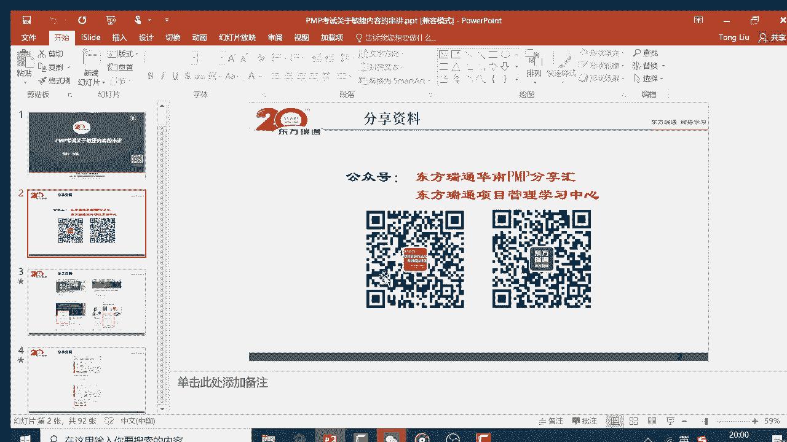
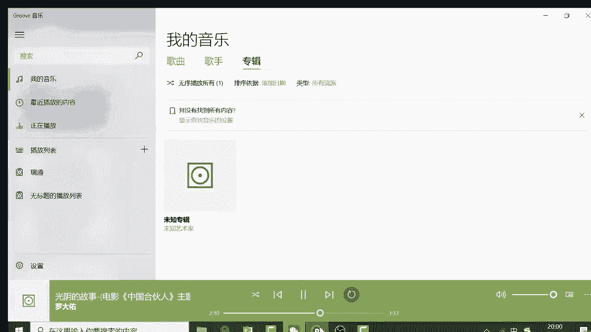
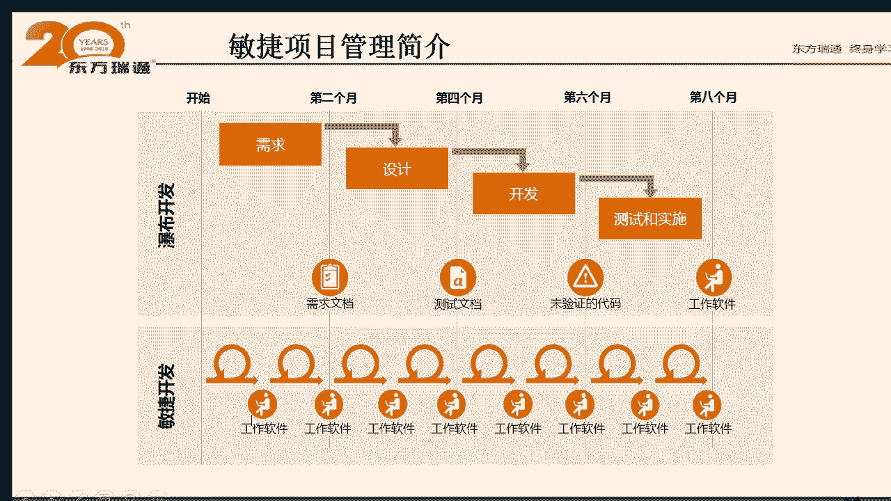
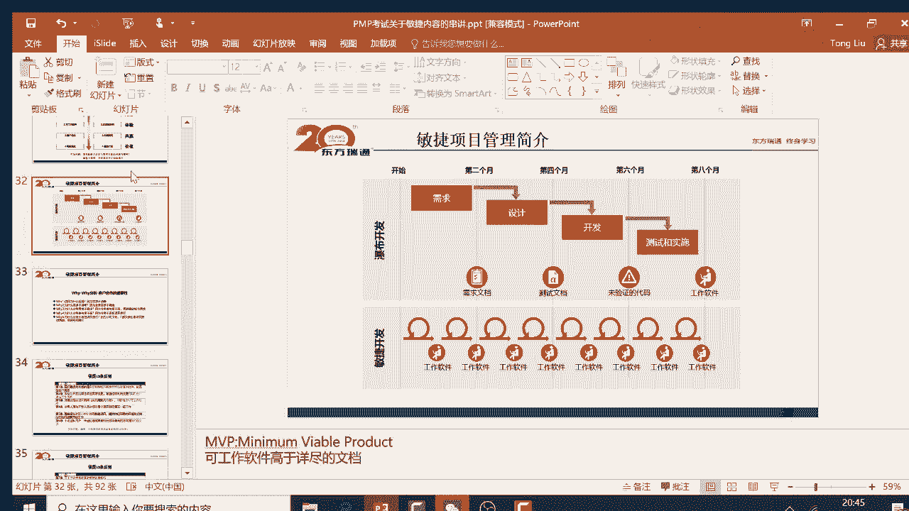
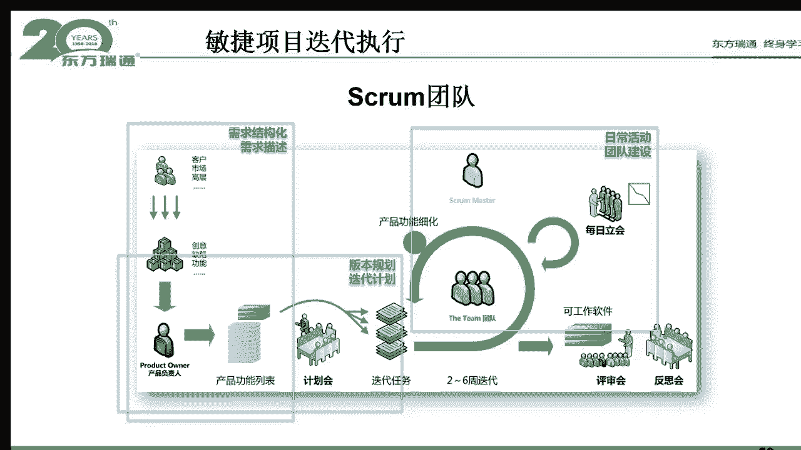
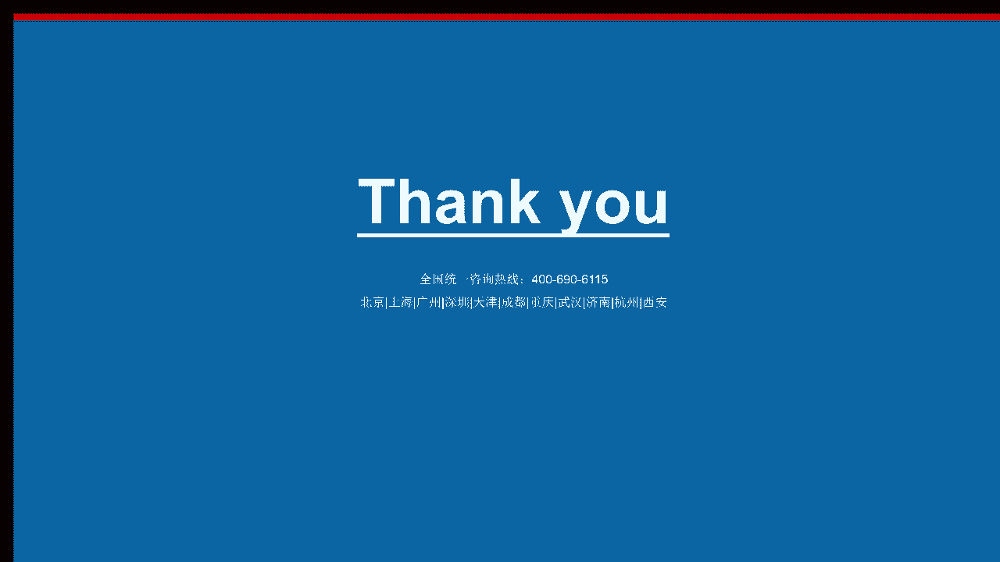

# PMP串讲 - P12：PMP中的敏捷课程 - 我的乐芙兰 - BV1uE411N7zG

我世业退流哈。多谢你啊。没事儿，还有2分钟。

嗯。

🎼你轮回的歌里，它天甜的流不存。我看一下风花雪月的诗句里，我在年年的成长。😔，🎼流水它带走光阴的故事，改变了一个人。🎼就在那多愁善感而初次等待的青春。🎼，🎼发黄的相片，古老的心，一句褪色的圣诞歌。

🎼年轻时为你写的歌。

🎼怕你早已忘了吧。🎼过去的誓言，就像那颗本里缤纷的书签，刻画着多少美丽的诗，可是终究是一阵眼。🎼流水它带走光阴的故事，改变了三个人。😊，🎼就在那多愁善感而出自流泪的青春。🎼うん。

🎼有来的同学可以先关注下服哈。

🎼啊，里头是关于你天的文章。🎼。

好呃，8点了啊，该来都来了哈呃没来在路上。😊，好。那个我等一下啊，再等一分钟。呃，今天来的同学可以先关注一下我们公众号啊。😊，公众号里头有关于敏捷的文章，一会告诉大家在哪。嗯。嗯，刚200多人再等一下。

嗯。呃，第天来的小伙伴可以先关注一下我们公众号啊。等到人数到300左右的时候，我就开始讲了啊。

嗯，人数在增加哈。好，那我们开始了啊。😊，呃，大家晚上好啊，今天我们讲的题目是PMP考试关于敏捷内容的一些串讲内容哈呃一些大概的基本的考点。呃，之前的话呢我们在群中给大家分享了，就是关于敏捷的一些视频。

呃，那个视频的话呢是之前录制的，大概有将近3个小时，比今天的内容呢还要多一些哈，所以大家可以提前看一下，呃，有那个提前看的同学可以回复个一哈。😊，没有的看的同学可以回复零哈，我就知道大大概多少人看了哈。

就是敏捷的一些视频和文章在群里发的哈。😊，好，那大概将近300人了。我们看一下啊呃，这边的话呢先介绍一下，就是我们这边有两个公众号。那里头关于PMP考试的一些内容的话呢，呃很多总结都有哈。

大家可以先关注一下呃，跟考试相关的，更相关的是右边这公众号啊，叫做东方瑞通项目管理学习中心啊，相信大家都关注了哈。然后你关注公众号之后的话呢，这边如果你关注右边的公众号。

你就会看到一个叫PNP备考总结大全。这里头它将近有30篇文章啊，里头关于各种考点。比如说那种质量管理工具啊呃项目启动会开题会的区别呀啊，包括一些呃关质量工质量的区别啊等等啊，这些内容的话呢。

我们都总结了，所以大家可以看一下。还有这里头有一篇关键的文章叫做什么呢？叫做PNP的备考的，或者说考试的关键字的总结大全啊，大家可以去看一下，可以持续总结。好，这个是跟大家说的。

就是关于PNP的一些常规的内容，大家可以看PNP备考总结大全。然后这边的话呢，我们今天讲敏捷，那敏捷这块的话呢，我们东方瑞通项目管学中心这公众号里头呢，它有个菜单，就是相关课程。然后最下面叫叫做什么呢？

叫敏捷项目管理啊，里头大概有将近30篇文章啊。而这30篇文章呢跟这个考试相关的基本内容都有哈，也就是说你考呃今年6月份也好，还是9月份的这种PMP考试，关于敏捷这部分的话呢，你看这个菜单就可以了啊。

这个菜单里将近30篇文章啊，文章和视频哈，然后里头会讲到什么是用户故事，什么是看板方法，敏捷的一些宣言呢，敏捷原则的内容啊等等，都是我们今天可能会涉及到的那大家可以提前去啊在这边去阅读哈。

这边也发到群中了，相信大家不是在看，就在看的路上哈。好，所以这个是跟大家说的。比如说大家可以看一下这30篇文章呃，30篇文章是什么呢？大家可以看到啊。比如说。有一篇文章叫敏捷项目管理，一叶知秋。

人家说一叶落而知天下秋雨，对吧？所以呢通过一篇文章，你就知道敏捷讲什么啊。然后并且的话呢，关于敏捷的一些专有名词跟PNP有什么区别？然后这边的话还涉及到敏捷的一些典型的概念。比如说什么是用户故事。

什么是敏捷估算，什么是sm敏捷方法啊，包括一些这种具体的用户故事的一些原则呀啊包括落地的一些实践呢等等啊。这些文章的话呢都是免费给大家的，大家可以去看一下啊好。然后这边的话呢。

我们看一下这个人数332了啊，就基本来说我们就可以讲正题了哈。那我们要知道说我们考的是1个PMP的考试。那PNP考试的话呢，我们参考的书籍是PM book就这本书。这本书的话呢，每四年会改一版。呃。

上一版就是第六版是2016年出的那这边的话呢呃正常情况呢应该是2020年初，但现在的话看来有困难啊，因为PMI它work from home了，对吧？就说在家办公了啊，所以说这本书的话呢。

它下一版第七版的话呢，它可能会是什么呢？会2021年才出来啊，来这样子，但是考的考试大纲呢也就出来了。也就说它为了迎合呃新的考试大纲呢，它都会加入一些这种第七版或者是新的考试大纲的一些内容啊，但这样子。

所以呢即使我们现在考的是第六版。但是我们要知道说呃考试的趋势是什么？啊，所以大家可以看到趋势是什么呢？就是我研读了PNP的第七版的考试大纲。然后我发现一个惊人的发现啊是这样的。也就说第一个发现是这样。

就是以前的话呢，我们考PNP的话呢，就是25页那些什么四九过程，也就是考这种流程或过程的。那现在的话呢，它基本来说是三分天下了。就是说它不仅考什么过程，还考人的因素，还考什么这种商业论证或者商业环境。

大家知道说有人的因素的话呢，现在目前占42%的考点，也就说未来呃，大概是明年3月份吧，就是1月份呃明年1月份以后的考试基本来说就是参照这个那也就是说我们现在的考试的话呢，基基本来说呢这块的内容会加强。

也就是说管人管人这块的话呢，我们想一下啊，就是说它会有一些基本概念。比如说服务型领导，比如说第九章。资源管理讲服务型领导，讲这些什么团队建设，比如说大家一起开会，对吧？

一起去那个做一些工作任务的分解等等，包括讲到什么自组织团队等等。比就说关于人这块的话呢，它主要集中在资源管理章，然后并且的话呢也会强调沟通管理和相关方管理等等。也就是说第十章啊，第十三章啊。

都是相关联的章节啊，所以这边的话呢，关于这块，我相信的话未来的考试的话会越来越多哈。其是敏捷的话呢，敏捷项目管理的话呢，它其实就是玩人的，或者说他会去对人方面呢会有更多的一些深入的理解好，那我们看一下。

就是说针对呃第七版的那种大概的一个变化趋势，我们可以看到跟人相关的部分，那跟第六版呃比较接近的部分是什么呢？大家可以看一下啊，比如说呃冲突管理。管理团队的冲突。那管理团队冲突的话呢。

我们知少知道说那个在资源管理这边第九章对吧？那他就会有这种所谓的管理团队，就会有一个冲突管理的工具。然后这边的话你可以看到说团队这边他需要做培训，需要做什么呢？啊。

也就是说你作为管理者是服务型领导去排账，对吧？哎，排除那个阻塞，然后让团队呢能够那个减负的前行啊，是这样的，然后强调相关方合作，强调相关方在一起共创共赢等等。那些思想的话，在敏捷实践中呢，它是很体现的。

呃，他有一个敏捷宣言叫什么呢？叫做呃个体互动，高于呃合同谈判啊，也也就是说呃基本来说呢就是呃应该说什么呢？应该是呃所谓的客户合作，高于合同谈判什么意思啊？就是说呃强调甲乙双方应该在一起合作啊。

而不是通过合同来控制那个对方在这样子好，所以这个呢是。一个基本的变化。所以我们今天讲的敏捷项目管理的话呢，是迎合偏NP那种大的版本改变的。比如说这种敏捷的题它会只会越来越多，而不会越来越少啊。

现在目前的话呢，我们第六版的话呢，基本来说这个考试关于敏捷的题呢，顶多也就十0道20道左右吧啊不会超过20道。但是未来的话呢将近42%的这种题的话是跟敏捷相关的，也是跟人相关的啊，那这样子。

所以呢这就是我们现在给大家强调的，我们要强调作为管理者不仅仅是按照流流程去做工作啊，还有什么呢？还要去考虑人的因素，怎么去管人啊，好，这个是很重要的。所以呢在敏捷项目管理过程中的话呢。

它就会涉及到这些跟人相关的。比如说刚才强调了一个典型的考点，就是自组织团队啊，那基本来说是一专多能的这种团队哈。好，比如说在你的团队中，那一个人会做三件以上的。

事一个事儿呢，三个人以上会做。比如说你会做开发，会做设计，会做需求分析等等。然后呢，强调管理者是一个服务型领导，强调不指责文化。比如说对事不对人，好，然后呢通过建立一个什么不指啊不指责文化高技效的团队。

然后呢激发团队成员的善性啊善意的部分啊，就是让他有内驱力，然后不断干活啊，在这样子，哎，这这一块的话呢是非常强调的，希望大家呢能重视起来啊，就是今天的话我们就讲一下这个人到底怎么管啊。

就从敏捷的视角中看一下这个人到底怎么运作。然后并且的话呢，敏捷还强调说我是短接代的形式去适应未来市场的变化，所以商业环境的变化的话呢，他也跟敏捷相关。比如说敏捷的话呢，他强调这种所谓的产品的愿景。

比如说像腾讯的微信，他的愿景什么呢？育人与世界，对吧？万物互联，对吧？用微信啊，是这样的。所以呢基于这产品的愿景。的话呢他就会做一些什么产品路线图啊啊这种大概的具具体的啊流程和计划。

那这边的话你可以看到说唉比如说未来的话呢PNP的考试的话，以前是做那个相关计划，12个死计划，对不对？太太臃肿了啊，那其实呢现在敏捷的话呢，它强调是说基于产品说事，产品有愿景，有这个路线图啊，然后呢。

并且呢有发布和迭代计划那是这样的那就问大家一个问题，基于产品的愿景，产品路线图和发布迭代计划，在你PNP第六版有没有体现呢？答案是肯定的啊，也就是说是第六章。

第六章这边的话呢，在制定相目机图计划的时候，这边有一个敏捷发布规划，看到没有？这里这边就是讲到了一些敏捷的概念了。大家可以看一下，比如说产品愿景产品路线图。

产品路线图和这种所谓的发布计划和迭代计划有什么区别呢？一般来说呢，产品路线图一般是什么呢？跨年的，比如说微信从201年产生的，然后之后的话呢，在1213年的时候呢，就加入植入了什么游戏啊。

然后15年的时候呢，就加入了微信公众号，现在呢1819年的最后段时间的话呢，它做了什么呢？微信小程序啊，或者是这种所谓的像微商的一些东西，对吧？啊，好，所以大家可以看到说像产品路线图的话呢。

腾讯是比较明确的。然后基于跨年的这种产品的一个版本更新，是产品路线图。然后呢，跨季度的就是属于的叫什么呢？发布计划。它这个写错了哈，应该是发布计划。然后接下来呢是。

这种跨周的叫做迭代计划一般是2到4周啊，是这样的。哎，也就是说以以前的话呢我们做了一个相关计划是比较比较繁琐的。现在的话呢在敏捷角度来说呢，它强调简单设计。但是呢它还是有计划的，它的计划呢也很简单。

也就是说几几个层级，一个是基于战略的产品愿景，然后呢，这种跨年的产品路线图，然后呢，这种跨季度的这种发布计划，还有这种跨周的迭代计划等等啊，那这样子好，然后具体的每次迭代来把任务分解成用户故事。

然后呢分解成那种具体的执行的tact啊任务。然后呢分给相关人哈。好，所以了解一下，这就是你书上有这种类似的这种变化啊，所以说呢可以想见呃未来PMP第七版的话呢，它针对第六章它就会有很大的变化啊。

所以说你看到现在目前呢它只是一个大概的一个工具。但未来的话呢，它可能会充斥到呃整体。

的这种进度管理啊，大概这样子好。

然后这边的话呢，我们看到说在第六版的时候呢，他强调作为项目经理的话呢，它会有一个三角形的概念。大家可以知道说就是这边就是那些过程的了解知识的掌握。比如说你可以简单理解说PMP的49过程，对吧？

然后这边就是商业环境啊，然后这边就是人的因素，所以说这边强调什么呢？作为项目经理要有leadership，有领导力，对吧？包括什么沟通啊啊，这种谈判技巧啊，包括什么情商啊，压伤啊等等。哎，而这块的话呢。

就是敏捷刻意去打造的，就是软技能这部分。好，所以这一块的话呢是未来那个出题的话呢，量占42%啊，来这样子所以了了解一下。好，那这边的话呢我们看一下关于敏捷的一些概念。我们今天会讲到啊。

刚才刚才讲的就是说那个从PMP第七版，然后我们可以看到说原先是基于流程的管控。现在呢基于人的管控越来越多了。那这种基于人的管控的话呢，那强调自组织团队正是敏捷的一些精神和概念。

所以给大家讲一下这个它的大概的一个观联哈。然后接下来看一下这种敏捷的项目管理的一些内容。这些内容的话，大家可以看一下。比如说我们知道说传统PP的话。

它定义项目成功标准是有几个层级的对基本的层级呢就是范进程不要超。比如说在既定的项目范围之内，既静的进入计划下，既定预算下，把事果做了啊，这就是最基本的成功。然后呢再高一点成功呢就是相关方满意等等。

并且符合战略的落地的预期。那这边的话，我们按照基本的项目成功的条件，就是范进程不要超。那基本来说呃很多组织呢他做了一个调查，只有26%左右的项目呢算是成功的那这样的话呢，我们知道说基本来说有4分之1啊。

所以呃绝大多数项目的话，要不就是预算超了，要不就是进度延期了，要不就是范围蔓延了等等。那为什么是这样呢？所以罪魁祸首的话呢，就是需求老是多变。大家知道说呃在那个呃PP中他提到了一个概念。

就是在风险观念章，就是11章里头有一个叫乌卡，对吧？这个乌卡是过联哪工具呢就是提示清单，就是风险提示清单。比如说呃。

风险的话呢是那个无处不在的。比如说呃今年的疫情就是这样的哈，就是一个黑天鹅就来了哈。好，所以你可以看到说呃未来的世界就是这种呃模糊的不确定性的多一些，所以呢这就是在这种无卡时代的话呢，需求就是多变的。

因为市场多变。所以呢你的甲方你的客户呢他为了迎合市场的需要，它也会变战略啊变需求啊等等。那所以我们作为这种交付部门的话呢，我们就知道说这是变化是一种常态。

所以呢以前在上世纪70年代比较流行的一个概念叫瀑布式开发。那现在呢越来越傲了，越来越不知呃越来越不流行了哈，为什么呢？因为瀑布式开发它会有什么问题呢？就是所谓的反馈环太长。

这个feback look太长啊，就是你看家可以看一下啊，比如说。从需求分析到价格数设计到开发到测试到部署。然后你部署上线了，基本上7788工作都做完了。然后客户说不是不是我想要的。然后你说早干嘛去了。

我时间也花了90%了，这个钱也花90%了。你再想要我重做走变更啊，客户说没钱对吧？按照P说法应该走变更变更申请流程啊，因为东西重做呀走变更请求啊，客户说不给然后押乙双方就将那了，对不对？哎。

这是一种常态，也就说我们之前甲方看到的整个瀑布式开发的话呢，整个瀑布式开发更多的是一大堆文档啊，这就是敏捷不太强调的，敏捷强调简单设计，敏捷强调基于产品说事，而不是基于文档说事。

那种所谓的半成品的文档全都是库存啊，大概这样子好，所以说步式开发就会遇到这种情况。在之前的话呢，忽悠客户说要交付一个李若同然后之后在竣工的时候呢，就变成了包子版的陈希了啊，这种反馈。还太长了。

导致什么呢？导致那种所谓的时间过去了，然后呢，钱也花光了，然后交付的东西不是客户想要的货不对吧啊，该章样。所以敏捷强调什么呢？为了为了怕这种情况发生，敏捷强调短迭代，它通过2到4周的迭代。

然后每次做一个增量交付，然后让你去确认啊，然后在增量交付的过程中，不是要那个扣取验收吗？这个关联到PMP那个确认范围，就是或者叫验收范围。去验收一下，看看满不满意，然后再修订啊，带这样子啊。

所以这就是敏捷开发和部署开发的一个典型的区别。就是敏捷开发的话呢，它的反馈环比较比较短，2到4周啊，好，然后这边的话呢为了应对未来的乌卡时代。所以呢呃我们要知道敏捷应该是一种常态，敏捷方法是一种常态。

为什么呢？呃有个大师有个大师叫黛西啊，他画了一个图啊，然后呢呃这个图的话呢是这样的，就是大家可以看一下，横坐标表示什么技术解决方方案确定还是不确定，然后呢，纵坐标表示需求确定和不确定啊。

遇到这个零点的这个这个点呢表示说确定。那这边的话呢，我们可以看到说什么呢？就是现在目前的话呢呃基本来说乌卡时代，要不就是什么呢？就是需求不确定。要不就是技术解决方案不确定。所以说呢这种敏捷适应的。

场景的话呢是一种什么呢？是一种常态啊，PMP传统的PNP适用场景的话呢，它是在这个区域中。为什么呢？大家知道说我们学PMP的时候，知道说有个需求文件，就有点像我们的需求规格说明书，对吧？

它基本来说是呃需求是比较确定明确的。然后并且把确定的需求变成了范围项目范围说明书，并且的话把这个范围分解成工作包，然后并且在定义活动的时候，它已经关联到一些技术内容等等。所以这块的话呢。

它基本来说就已经确定的啊，那敏捷和PNP适用场景的话，简单一句话，你可以简单理解说PNP适用的场景是地球，而敏捷适用就是地球以外的宇宙啊，但是这样子，所以说呃未来的话呢敏捷项目管理适用场景是一种常态啊。

好。所以呢我们要知道说我们要去学习这个东西。所以PMP第七版的话呢，他也强调这样的一些改变。那这边的话呢呃很多敏捷大师的话，他写了很多的一些敏捷项目管理的书籍，呃，在业界的话呢，有很多本哈。

那大家可以随便找一本，比如说敏捷项目管理有这样的书，那有一个大师呢写了这本书之后的话呢，他说一句话，他说为什么现在敏捷项目管理很好。

但为什么那个呃还是有呃绝大多数同呃绝大多数这个公司呢还是用了传统的PNP的模式呢，原因是什么呢？因为他痛还没痛到一定的临界点，看了这个临界点的话呢，立刻想到说在PMP有个工具叫控制图，对吧？控制上下限。

正负三四个嘛，对不对？所以这个的话呢，就是说他呃企业还没有呃碰到那个点高处控制上限以上啊，或第一控制下限以下，所以呢还没有什么还没有改变，还有试图没有改变的一种动力哈。好，所以说呢呃思想是很好。

但是行动呢需要有原动力的啊，所以要了解。然后这边的话呢，我们看一下，就是说敏捷这边它会有什么样的一些要点呢。那我们之前呢我们知道说在讲偏僻的时候，我们知道有一个叫正三角形，对吧？

就是说范围需求是比较明确的，在既定的需求范围之内，然后去什么呢？去估算这个成本啊，比如说有呃成本估算或者是做做预算嘛，对不对？然后呢，还还做什么，做那个进度排期嘛啊估算呃这种活动嘛，活动的时间啊等等。

所以这就是一个典型的正三角形就是泛进啊范进程，对吧？好，然后敏捷的话正好倒过来，因为敏捷讲短迭代，所以他每次迭代的话，人数是5到9个人，因为他主要是卖人的嘛，就是说就是大概是人数是一定的啊。

成本是一定的，就是5到9个人。然后呢时间是2到4周，所以这两个是一定的，它能变的东西呢是什么呢？是这种范围或需求啊等等。好，所以了解你看呃，所以敏捷跟传统PP的话呢，模式的话会有很大的不同啊。

不同就是什么呢？他基本来说正好是倒三角形。然后这边的话呢有一个大师呢叫做smith。那嗨smith的话呢，他把这种敏捷的三角形的话呢，做了一个更进一步的诠释。什么诠释呢，大家可以看一下。

呃其实呢敏捷强调说他也知道说这个做任何事情的话是有约束的。所以呢呃这种所谓偏P所谓的三个基准，范围进度成本基准呢是约束。那每个项目都是有的那他它放到这儿了，就是一个一个顶点。

然后呢呃他把另一个顶点呢呃写成价值。比如说敏捷的话呢，它交付就是以以价值为依规的，符合经济思想。所以这边的话呢呃它。这边创造性的说了一句话，这句话很著名就是价值大于约束。比如说传统PNP的话呢。

他强调说当你基准一旦确定之后，你再做任何变更呢，需要走变更请求啊，这是我基本的考点。但是呢在敏捷实践中的话呢，他强调说如果你的市场多变。然后呢你的价值很明显，那就是说市场呃改变了。

所以你的价值要迎合市场的变化。所以呢当价值来了的时候，那约束呢就是价值高于约束啊，就是说敏捷强调可以拥抱变化啊，这个就是一个典型跌了。比说呃你要考试的话。如果是典型的题目。

是传统的那种偏僻的模式的那你就应该什么呢？基准一旦确定走走什么并请求。如果你发现里头有什么产品经理啊，什么用户故事啊，什么看板呢，敏捷实践的字样的话，那你就知道说那个范围的改变是可以的。

因为价值大于约束。然后这边的话呢我们再关注另一个点，就是说这个质量质量这块的话呢，我们要知道说敏捷强调快啊，快速交付价值，但是你不能牺牲质量为代价啊，所以说呢呃敏捷的话呢，它也要考虑到一种质量的交付。

所以他会强调所谓的像偏P说的验收标准啊等等，这些都是有的啊，所以了解一下，这就是所谓的倒三角形啊，啊我们要记住一句话，敏捷强调价值大于约束啊，带这跟偏P是很不同的。好。

然后所以说呢我们要知道敏捷它的一些内容哈，敏捷的其中有一个内容就是敏捷力啊。敏捷地义的话什么意思呢？就是你快速适应市场变化的能力，或者或者说你掉头的或者转向的能力。比说候市场变了。

然后你的企业呢能够不断的去适应已经变化的市场，所以呢大家知道说有有一本书叫人类简史那个老外呢，他曾经呃在视频中说过说过一句话。他说未来我们培养人，就是有其你的下一代应该是什么呢？培养什么能力呢？

就是快速迭代改变的能力。所以现在呃这种能力未来已经是一种常态，现在企业是一样的，就是说他需要考虑到说如何适应未来的一个变化。如果它适应不了的话呢，就什么呢？就像腾讯马化腾说了，有大向死了。

他的一摸一下它的体温还是暖的啊，大概是这样的一个情况，这就是没有办法的那个情况啊，所以大家你可以看到说现在目前比如说很多培训机构现在都转世线上了，原因是什么呢？他没有办法不改变哈，因为那个。

线下的业务在萎缩啊，因为很多的一些学员没办法在线下培训啊，带这样子。所以这就是所谓的说你要适应呃这种市场的变化，否则话你就只能够等死了，对不对？大概是这样的一个情况。好，然后呢敏捷的话呢。

他他的最基本的定义，刚才说的是敏捷力嘛，就是快速适应市场变化。那我怎么能够做到这一点呢？那所以他会提出来说敏捷有些价值观和原则，就是形而上的东西，你要遵循一会会讲到的。然后呃还有些什么呢？

就是你形而下的一些人的能力，就是你是一个就像偏僻那个他说到什么自组织团队对吧？协作的文化啊，刚才说了自组团队的话能力很强，就是一个人会做三件以上的事，一个事儿呢，三个人以上会做是这样的啊。好。

所以了解那这样的话呢，就是说当你的人是所谓的非常的呃这种复合型人才的话呢，就是你就可以能够快速去响应市场中市场中的任何。的这种需求变化。然后这样的话呢。

那种管理者就不会对你的技术啊这种实施的技术细节呢这手化角。然后呢，你这边的话呢就是能够自己控制你的开发节奏，就你是自组织的啊，是这样的off所以了解一下，这就是敏捷的一些文化啊。好。

然后这边的话呢呃标准的定义，这边的话呢就仅用了smith就是那个大师的他的在他书上敏捷项目管理中的一个标更标准定义。那是这样的，比如刚才我们说到的就是敏捷是一种敏捷力啊。

这边呢大师他创造性说了说敏捷式创造并响应变化的能力。刚才说了嘛？敏捷力响应变化。那为什么创造呢？啊，大师说就是你需要考虑到说为了能够在竞争中赢得那种优势的话呢，最好什么呢？你可以去创造些新的商机。

比如说现在目前的话，大家知道说那种所谓的拼多多相对淘宝来说，它的商业模式呢是一种创新，也就说通过这种创新扰乱这种竞争对手，然后呢赢得市场的现金啊，大概这样子，所以了解一下，那就是未来的一个变化。

就是说你一是要快速适应变化，二是能创造变化的能力啊。好，然后呢呃还有一句话呢。很著名的就是那个吉利那个李书福说的说呃，作为一个企业，在风浪平静的时候呢，你要跑的比别人快。在风浪来临的时候呢。

要那个要比得比谁稳啊，但这样的就是敏捷它是一个这种稳定性和灵活性的一个平衡的一个能力啊，这个企这个对企业来说是非常重要的啊。好，所以了解。然后呢，再进一步的讲的说，那我我为什么要做这种创新呢？

那就是我要快速的去占领市场，或或者说我的新产品能够快速投向市场能够实现企业的长期的盈利。但是道说一个企业，不管你的管理文化多好。但是如果你的呃这种价值呃，所谓的什么呢？这种现金流断了。

那企业就面临着倒闭。所以我我看过很多的书就发现什么呢？就是说一个企业他要看你的持续的这种业务业务增长和盈利能力。然后其他的东西的话呢，很多时候呢是在包就是呃其次的你最起码应该什么呢？

能够换到钱是很重要的。所以呢稻盛稻盛和夫，他曾曾经说过一句话，说呃当你这种所谓的这个市场比较好的时候，那你应该怎么办呢？要持续性的去积累什么呢？积累财富，积累所谓的现金流。然后呢，比如当现在这种。

所谓类似像疫情这种情况发生的时候呢，你才会什么呢？能够撑过很久，对吧？对，就就最后剩的就是你自己了，对不对？哎，所以说你要了解，这就是一个企业，一个企业家，他都要考这个事情的。

所以呢我们需要面对这样的一个当下的市场，需要持续保持创新能力和什么盈利能力，这是很重要的啊。好。

然后这边的话呢，我们再讲一下敏捷的一些背景啊。敏捷的背景的话呢，这边我们给大家看一下啊，比就说我们以前的话呢，他呃更多的是强调是瀑布式开发，是上世上个世纪70年代。呃。

上世纪90年代的时候就有一些敏捷实践了。那敏捷实践是基于什么样的原理出来的呢？上世纪70年代的时候，有个大师叫布鲁克斯这个人呢他发明的一个法则叫no silver bull。就是说呃没有银弹的法则。

比如说什么意思呢？他知道说呃，其实不是说一个技术或产品能解决呃所有的终极问题的那或者说解决所有问题的。所以我们必须要通过原型法，就像我们PMP说的什么原型法呀，短迭带呀啊这种模式建定明细啊。

然后去不断的去试错，或者不断的去那个呃迭代式的产生新产品啊，所以呢基于这样的一个没有淫淡的理论。所以现在目前的话很多的一些敏捷实践就应运而生了。比如说现在目前最流行的就sm啊，什么极限编程啊。

什么看板方法等等。所以这些方法的话，在我们的公众号文章里头都有哈，大家可去看一下。然后这就是上市90年代一些原始的这种敏捷的这种实践出来了。然后之后的话呢，在01年的时候，然后那个很多的敏捷大师。

包括hsmith那个当成那个大师啊，他们一起呢在加拿大的一个一个。华雪圣地他们共同呢成立了一个联盟，叫敏捷联盟，然后发表了什么敏捷宣言等等啊。然后这样的话呢呃一个组织，一个一个类似像官方的组织就出来了。

那敏捷实践的话呢，那相对于传统PNP呃有什么区别呢？就是我们需要考量的事情。因为我们现在学的很多都是PNP的49过程。那现在敏捷的话呢，它会有一些东西呢，是要守的，有些东西呢可需要破的。

有些东西需要什么抛弃的那这边的话呃在敏捷里头有个专有名词叫做什么叫手破离啊，所以这边呢我们看一下怎么去守怎么去破啊。比如说我们一般讲这个PNP的时候呢，就讲施九过程前后的关系，就大概这样的。

这是我画了一个图哈。然后这边就是你可以看到说传统PNP非常强调这个计划。

然后呢强调过程的监控。那这边的话呢呃你可以看一下，那什么东西能守呢？比如说呃传统PP啊强调计划，敏捷强强调计划，只是说他把他计划呢更加什么呢？更加细了。比如说细到迭代计划，然后四周那个迭代计划。

然后并且呢细到每天所以呃敏捷的话，他会有一个什么呢？会有一个那种每天的战会，然后让每个员工去表态，昨天做什么事，当呃当下今天要做什么事儿，然后呢，还有什么问题在解决等等啊，是这样的。

所以他的计划做的更细了，所以说敏捷更加强调计划，所以他的计划要守啊，并且的话呢呃PP第6版强调相关方的参与，敏捷更加强调相关方参与。大家说了嘛，客户合作高于合同谈判嘛。好，也就是说这是首的部分。

什么东西可以破呢？呃，大家知道说刚才说了破的东西就是那个约束，就是那个范进程啊，就是范围进度成本。所以呢呃大师还smith他说一句话嘛，就是价值高于约束，当你价值来的时候呢，约束都是nothing。

对吧？好，要了解，就是说所以要考虑到说哎我们是呃可以拥抱变化的这是要破的部分，然后接下来呢还有就是估算，大家知道说我们在偏僻中讲什么呢？

就是估算成本估算进度什么自上而下估算什么类比参数估算什么自下而上的对吧？估算等等，这些估算呢未未免太多了，对不对？那敏捷的话强调短迭代，它这么短的一个周期，引用这么多估算方法呢，有点什么杀机用牛刀。

是不是所以呢需要考虑到说所以呢那个呃在第六版以后，他提到的一个概念，呃就是叫轻量级的估算啊，冰量级估算什么意思呢？就是通过出剖牌估点数的形式。比如说呃当产品负责人或需求方提出了一个需求。

然后呢呃开发人员围在一起，然后去出点数。比如说一个主持人说123，大家出一下出个牌吧。比如说我估一一人天，我估三人天，我估五人天，然后之后呢，三轮对吧？三轮达成一致啊。

这就是跟PMP的所谓的叫群体角色差不多啊，所以就是通过出扑克牌估点数的形式呢啊把这个这个人天呢，包括工作量给估一下就可以了。这就是破的部分。然后离的部分呢更多的什么呢？更多的就是所谓文化。

文化的话呢呃大家知道说以前的话讲究什么呢？就是所谓的叫叫命令型领导，对吧？哎，就说员工的话呢就是听领导就行了。那现在的话强调是服务型领导，服务型领导的话呢就是帮团队去排账。那在偏P中呢。

他只说了一下服务型领导，并没有太多的例子。在敏捷中的话，敏捷实践中专门有个角色叫做squa market就是敏捷教练。敏捷教练就是服务型领导，未来我相信第七版的时候。

敏捷教练这种所谓的角色会融入到偏批项目经理那个角色的职责的一部分。比如说项目经理的话呢，他要做好什么呢？就是敏捷教练的职责，做好服务型领导啊，帮团队去排账啊，就是这样的，所以就是离的部分。

然后接下来呢跟大家再说一下，那现在敏捷的话呢，最典型的一会儿会讲到那个squaum就是敏捷那个方法论。敏捷方法论中会有几个角色。比如说这种所谓的产品负责人，包括敏捷教练。

包括什么所谓的什么那个这种研发团队，然后每天开战会，然后迭代有评审会等等，然后呢，并且通过看板的形式呢，看这种大概的迭代状态啊，并且达到一个所谓的什么这种协作的文化等等。好，那后这边的话呢。

就是说这就是具体的敏捷实践了。很多做敏捷的都用sum的方式呢去执行啊，执行这个所谓的什么这种敏捷的这种尝试。然后呢，很多做这种敏捷尝试的的公司的话，他会说啊这种大师的关于这种所谓的各种会呀。

包括一些组织架构呢，我能不能见面砍一半啊，就是说哎我就引用部分啊，不是引入全部啊，那。大师可能会这么说，说，如果你这样做的话。那他就不认不认为说你在执行squam啊，就是执行你自己的所谓的中国式敏捷哈。

但这样子。那为什么呢？因为我告诉你说squam的话呢，它是有一个这种所谓的白皮书的大师会有白皮书的，然后里头会把这个这种呃敏捷实践的组织架构，包括这种会议形式，包括这种比如说迭代评审会的一些内容的话呢。

他都讲的很细，为什么呢？因为他就是从实践中来的。他认为说我们我们从实践中就是这么总结出来的。然后你用这个东西的话，就和跟我们实践是相一致的啊，大大概这样子呃，所以说呢你最好是人家让你去设什么角色。

你就设什么角色。然后呢，要站有站会的，你就站会啊，不要说你见面砍一半啊，然后呢，你可以调的东西什么呢？比如说哎大师说了，你可以用看板去做一些大概的一些呃这种可视化管理。那。你就可以怎么办呢？

你就可以把看板的格式稍微调一下，对吧？调的更美观一点，这是可以的。然后并且的话呢哎组建的话不仅仅是在形式上组建sm的团队，更加应该是打造一个文化的改变，就是建立一个不指责呀，信任哪协作的文化等等。

这些都是一些啊比较好的种实践。也就说我们怎么去做那种敏捷实践呢，先也要做手破离。就是说你先按照人家的方式做。然后再不断的去调整。然后呢，最终你打造的是一个什么呢？这种所谓的这种精益也好，敏捷也好。

或者是PNP第6版也好，或或者第七版他强调的这种所谓的那种比较高大上的文化，就是信任不指责协作的文化啊，这是最难达造的啊，这就是所谓的文化的改变。那大家可以看一下文化的改变为什么这么难达到呢？

比如说呃这就是一个举个例子，那这就是在硅谷有谊公司的CEO。他说了说呃在他们公司的话，什么东西都可以报销。只要你放到Vkey上就可以报销，说明什么问题啊，就是说信任还会什么呢？管理还会简单。

那团队之间的话就应该建立这种开放的这种所谓的可视的环境，这样的话呢就会啊这种文化就会逐渐建立啊，也说像很多团队把那个开发跟那个运维，为什么不对付呢？原因就是开发也不知道你运维在搞什么搞，对吧？

运维也不知道开发在把什么坑给他，对不对？所以彼此不什么不那个可视，所以不信任啊，这就是一种很典型的非敏捷的文化，敏捷强调所谓的什么这种信任啊，来这样子好，所以了解一下就可以了。然后这就这是说以前的话呢。

我们更加强调的是这种所谓的这种哎大家可以看一下瀑布式的对吧？瀑布式的管理。然后呢，以前是这样的职能部门，就是很典型的开发部门、测试部门、毕业部门，这些都是职能部门啊。然后呢。

以前就我们就是通过这样的一个跨职能部门做项目，然后去带团队的，然后沟通成本是很高的啊，尤其是属于这种项目经理去跟这些各部门去协调。但现在呢想着什么呢？敏捷小团队。

那这种组织架构的改变，大家知道组织架构的话呢，在那个PMP中叫做视域环因素，对吧？环境。那也就是说它会改变一些文化的。那你你会也会触犯一些利益的，对不对？动什么利益，比动灵魂还难，是不是啊？

那所以说你可以看到说敏捷强调这种自主制团队，也就说这样一个小团队大概5到9个人，他包括开发，包括测试，甚至包括运维的人，对不对？甚至包括业务需求分析的啊，架构设计的，也就如说一个人会做三件以上的事儿嘛？

那这样子，所以说他就会动了什么利益呢？就是以前开发团队。他会有一个研发经理，测试团队会有测试经理，现在不需要你了，对吧？那更多是这样的一个敏捷团队。然后你的话应该像PP就说以前的管理者。

应该像PMP说的服务型领导干嘛呀？就是帮员工去培训呢，帮员工去打造一些啊或者说这种呃这种所谓不值责文化呀，比如说你就变成一个什么分会或协会的会长了，然后去干嘛呀。

去呃比如说道内协会啊或者什么java协会啊，这样的，你去帮员工去呃提升他的技术能力了，是这样的，这是不是一般的管理者是有这样的认识的。他会觉得我失去了控制，失去了什么失去了权利啊，那这样子。

所以敏捷最深层次的是一种文化的改变，他可以通过动组织架构就可以看出来，大家可以看一下，以前的组织架构是这样的对吧？然后现在是这样的你看一个小团队，然后呢是什么呢？就是。他呢呃制度由这个敏捷教练去制定。

但其实他的需求是来自于产品负责人的啊，大概这样子，然后呢，这笔头会涉及开发测试就打散了啊，带这样所以这样的一个情况，所以了解一下，所以这就是一种文化的改变。那所以说呢敏捷的话要做敏捷的话呢。

它是要做什么呢？要做到呃不仅也要形似啊，还要神似啊，所以呢形似啊形似的话什么样的？就是大概就是说你把那个scum把它该建的角色建起来，该开的会开了，就是形似啊，其实呃更多的是神似啊。

神似就是你的文化应该遵循敏捷的价值观。敏捷价值观就是这大概是这4条，这就是我们考试中可能会涉及到的一些基本概念。

大家可以看一下。呃，那个有听说过这4条的，可以回复个一哈。我看一下那个屏幕有没有动。有听说过这个4条的可以回复个一哈，叫个体互动，高于流程工具和工作软件高于详尽文档，客户合作高于合同谈判，详应变化。

高于遵循计划。大家可以看到说传统的PMP就更多的是什么啊？右边这部分啊，就是有49过程详尽的文档需求文档设计文档等等，然后呢，有合同谈判，对吧？有采购管理啊，然后呢，所有的变更要走变更控制流程。

来这样子好，所以了解一下，所以呢敏捷的话呢，他知道做PMP那些东西的话呢是好东西，对吧？但是呢他说我还有东西比你更好，对吧？那就是左边的部分刚才说了就是强调客户合作高于合同谈判啊。

甲乙双方应该是共创共赢的概念啊，现在目前的话呢，价值的定义已经基本说出来说就是乙方应该什么呢？跟甲方一道帮甲方去创造价值啊，是这样的一个概念。现在高大上的这种呃价值服务的定义都是这么定义的了。那这样子。

所以了解这就是未来的一个变化。好。然后呢呃还要强调说什么呢？可供软件，因为敏捷强调可那个什么就是短地带嘛，每次迭代交付个可供作软件。然后呢，然后它不是一味的写各种需求设计文档啊。

这就是呃PMP那套东西要了解的。好，所以这就是左边这部分相对右边的部分呢是更加高级了啊。好，所以呢我们要知道说个体互动高于流程工具。我们强调什么什么战会，对不对？强调面对面沟通。

然后通过短地带交付可可供的软件实现价值，然后并且的话呢共创共赢，然后并且的话呢就是价值大于约束，当价值来的时候呢，就可以去什么呢？不走变更控制流程啊，但概这样子，所以这就是敏捷可能会呃有所的改变。

然后这边的话呢，敏捷强调短接带跟传统的瀑布式开发是有很大的区别的。传传统瀑布式开发的话，刚才说了，就是那种反馈环太长，敏捷强调短地带增量交付啊，就是每次交付一个这种可工作软件啊，给到什么呢？

给到那种客户去验证。所以这边呢可工作软件的话，它会对一个名词要知道叫MVP叫。

mininimum。ve variable per就最小可运行的产品啊，最小可运行的产品然后知道这个事情。好，所以了解一下就可以了。好，然后关于这个这种四个价值观的话呢，这边的呃敏捷他会衍生12个原则。

这12个原则的话呢，大家可以先看一下啊，了解一下就可以了。那这边的话呢关于12个原则，在我们之前的那个给大家预习视频中都讲解，大家可以去看一下呃，就是说我们就像那个叫叫道生一一生四四生十2嘛啊。

就是说呃他把那个四个价值观呢分解成12条，然后让你更加细的理解啊。那后这边的话这12条的话呢，呃其实如果你想去呃比较透彻了解的话，你可以做个小练习。也就说什么小练习呢？

就是把这12条呢用短语把它去写一下啊，就这样的，你写一些短语哈。好，那大概给大家一个参考答案。

也说第一条的话呢，短语是什么呢？就是这种价值交付，也说它增量价值交付嘛，然后并且价值大于约束，对不对？所以要不断拥抱变化呀，持交付，然后并且的话强调什么呢？合作协作，对吧？强调自组织团队面对面沟通等等。

也就是他把那个所谓的四个价值观，然后分解成12条啊，所以说呢呃人家说偏P是净化心理能考试，对不对？一是敏捷项目管理的话呢啊更是净化心能考试，你可以看一下啊你的组织离这还有还有多远啊，那这样哦。

所以你可以看到说呃偏P也好，还是敏捷也好，它都是强调经营思想的。经济思想强调什么呢？就是以价值交付为依规，然后呢考虑节省成本啊，那这样子，所以了解一下，而且敏捷不鼓励加班，他他叫做有节奏开发啊。

所谓有节奏开发什么意思呢？就是每次迭代活呢不是推给你的，不是管理人，国外人员推给你的，是你。呃，基上次迭代的这种工作量去什么领的活，自己自己认的活啊，自己承诺的活。然后呢，你承诺的东西的话呢。

是一定会什么呢？能达成的。如果在这次迭代中，然后呢呃你正在做现有的活，然后老板说还有新活要来的话呢，你说对不起。那应该把什么呢？等量的低优先级的活呢，从我这个当下做的事情中拿出去啊，我要做到有节奏开发。

不能加班，而且呢要按期交付啊，大概这样子好，所以了解一下。所以这个符合经营思想。什么经营思想呢？就是呃就是你做完了才有价值做的做半半成品的话呢叫做库存，进一步讲零库存嘛，所应呢DIT对吧？

加 time对不对？好，所以了解那种所谓开发的半成品，包括那种文档的半成品，基本没有被验证过的，全部都是库存啊，大是这样子好，所以了解一下，这就是敏捷的一个基本概念。好。

然后这边的话呢呃刚才说的就是那种敏捷宣言也好，敏捷价值观也好，更多的是形而上的东西，是文化的部分。那这边的话呢嗯。今日下的就是敏捷方法。敏捷方法呃，现在目前如果考试相关的话呢，更多是这个。

所以这个sscriberumum是很重要的啊，squaum的话呢，我今天会重点讲，就是它具体的一些呃形式啊，包括考试的内容。然后这边的话呢，它是有两个大师发明的。然后呢呃除了srum之外的话呢。

在PMP中还有一个呃基本的一个知识点叫做用户故事user story，对吧？呃，us story的话呢，它是哪个方法论中的呢？跟大家说一下是这个极限编程啊，它是极限编程的一个这种基本的概念。包括。呃。

在那个呃PNP中可能会还会涉及到一些基本概念是比如说测试驱动开发啊，比如说大家知道说PNP进度管理呃，里头会有一个什么选择性依赖关系，对吧？选择性依赖关系的活动就是说你可以先开发后测试。

但现在敏捷呢非常强调是先测试后开发叫t呃t develop呃，应该测试t drivingdevelop啊，测试驱动开发TDD啊，TD。

呃，有没有听说过这个词儿的TEDD。叫测试。dri文驱动开发。测试系统开发啊，比如说先呃呃基于开发的功能写测试逻辑，然后再让开发人员去写开发代码啊。大概这样子，这就是这个也是一些编程的一些内容。

所以说呢。

这两个方法是很流行的，他们都秉成于基因思想。并且的话呃敏捷也好，偏僻也好，都强调什么呢？看板就是可视化。所以这前四个方法是最基本的，也是我们今天呃着重去讲的前四个东西啊，重点重中之重只会讲squam啊。

大概这样子好，所以了解一下，就是我们今天呃的一些呃内容要点是什么啊？好，所为了解，然后这边这个图的话呢很好，就是他告诉你说呃，敏捷也好，还是看板也好，因为看板的话不仅仅用在敏捷开发嘛。

它可以用在那个工业嘛，比如说丰田广汽丰田对吧？然后它会有很多看板啊，就是工业上的看板。所以你可以看到说看板方法的话呢，是来自于制呃制造业工业的。然后呢，这种所谓的这这些其他方法的。

跟软件开发更加相紧密联系。刚才我们说了这些方法的话。很多都来自于上世90年代，对吧？好，所以了解这个事情呃，他们都是有一个形而上的理论，就是经营思想。刚才说了，经济思想就精益讲价值交付，然后节省成本啊。

但这样子好杜绝浪费啊，所以他们都会秉成一种经济思想去交付的啊，所以了解。然后呢，经营思想这边的话呢，它是完全是以价值为依归的。它要实现这个价值的话呢，就需要有大概的一些柱子。最基本的是三个柱子。

然后一个柱子的话呢，也是敏捷比较推崇的。刚才说了什么呢？就是对人的尊重协作的文化，不指责的文化，对不对？no blame的 culture对吧？不指责的文化，协作的文化。

 collaborationlaboration对吧？这这些都是呃对人的尊重，然后呢去协作，这就是现在呃敏捷也好，精英也好，都强调这种呃这种尊重的文化，信任的文化等等，这要了解。这是一个柱子。

然后接下来呢就是就是产品开发呃，就或者软件开发这块的话呢，他强调这个词儿要稍微了解一下叫单件流one piece flow。比如说呃精益强调就是最好杜绝浪费，浪费有很多种，一种就是不断切换角色。

比如说呃你同时来好多项目，然后这个项目做一点，然后还没做完，然后就就被拉到另一个项目去做，对不对？然后回来再去做原先的事情，然后你还要还要自己思考一下，对吧？原你做到哪了，对吧？

所以在这种单件流的思想的话呢，其实我们日常做题的时候也会遇到，比如说呃就怕什么呢？你做题的时候呢，就是。做一道图答案，做一道图答案，这样的话就属于切换角色，那效率很低。因为你在切换的时候。

你的做题的体感呢，包括做题的速率会一个会打破啊，那最好什么呢？就是单电流的形式是什么样子的，就是你做30道题或做50道题图答案啊，大概是这样子，这就是相当于是我们的精意的叫做单电流一次只做一件事。

做完之后再做下一页啊，大概这样子好，然后呢还有一个就是敏捷强调持续改进。这块有个典型的点啊，这也是偏P强调一个知识点叫开等就是在那个呃资源管理章310页啊，就专门有这样一个词儿啊，开等。但开等的话呢。

它就是强调说积小善为大善，或者积小胜为大胜，就什么意思啊，就是你要考虑到啊，不断的去改进啊，它不是他不要求每次改进都什么呢？都是非常的明显的，但是你要不断的改进啊，大家讲解。好。

所以这边的话你可以看到说这就是经济思想，它有几个柱子啊，它强调了文化，强调了所谓的杜绝浪费、单径流，强调不断的改进等等。

好，然后这边的话呢，关于敏捷这块，嗯，他会有一些更多的一些知识点跟大家稍微说一下。比如说大家还记得用户是在哪一章有的，比如说你PP中可能是那个范围管理，对吧？范围管理，他那个叫引导式研讨会那边，对吧？

它会有用户故事的概念。比如说什么是用故事呢？它跟传统需求什么区别呢？就是他会是比较典型的一句话需求，比如说作为一个用户，我需要做什么事，你实现什么，你实现价值嘛？

理解比如说他是按照业务语言去去阐生阐述需求的那比如说这个很典型的一个呃概念就是比如说那个。京东和淘宝对吧？然后呢，一个网民我需要购物车功能，然后实现我的购物的欲望啊。

那所以说呢这就是一个按业务式的视角去那个写的用户故事那这种用户故事的话呢未免太简单，所以呢呃会敏捷会有这样一个概念，说叫三C原则，这是一个考点，三思原则什么意思呢？

就是说呃你的用户故事用户呃这种需求的话，一句话需求放到卡片上具体的细节由产品负责人和什么呢？和这个研发团队谈出来啊，就composition就具体的细节谈出来，当然了，前提是开发人员要懂业务，对不对？

要否则的话基对压奖，对不对？啊，对了解，然后在这无形中对开发人员有这样要求，说你要懂业务。然后呢，当然还跟测试员就是产品负责人跟测试人员要考虑到什么呢？验收怎么验收啊，叫confiation理解吧？

就是验收标准跟PNP所述说的验收标准是相关的。比如说PNP的项目范围说明书中有验收标准，对吧？所以这个验收标准。那如果是写一个详细的需求设计文档的话呢，基本验收标准会写的很清楚，对不对？

但是敏捷强调什么呢？就是这个文档写的很简单，就一句话需求。所以。很多东西呢需要什么呢？需要弹出来confiation，就是说这个验收标准需要弹出来啊，带这样子。好，所以了解。所以未来通过这一句话需求。

你就知道说对这种所谓的那种开发人员也好，还是测试人员也好，那其实你的对你的要求高了，你要懂业务，对不对？你要你的沟通能力要强，否则话呢呃研发人员和测试人员，他听不懂产品负责人那个说什么，对不对？

就很麻烦啊，就像广东话叫机对压奖，对不对？这很麻烦的啊，所以了解。

然后这边的话呢，关于这种需求的话，以前的。

那个文档它是比较详细的，像PP也好，或者是那种呃这种软件工程，他都会强调要写用例啊，用力要写描述。那就是以前的需求是写这么写的，就是说需要有一个角色actctor。

对像那个用户故事的用户一样啊actctor。那这个是一个呃这种所谓的医疗的软件。比如说药剂科或者是医院的领导，他通过这样的一些功能去什么呢？查一些这种呃比如说做一些呃用药监查的一些处理啊。

比如说做这个功能的话呢，第一步怎么做，比如他登到这个页面，第二步的话呢输入什么一个什么这个关键字，然后做一些什么报表查询，第三步怎么样。然后呢，最后生成一个excel或生成一个图表等等。好。

所以这个就是所谓的就是说呃传统的话，我们的需求要写的足够细，要把业务逻辑甚至画流程图。那现在目前的话呢，敏捷他更加强调说简单设计。比如说我就一句话需求。然后了不起给。你花点界面对吧？

页面原行就完事儿了啊，哎这样子，然后我还问过很多开发人员说那些产品经理啊或者修更析师，他就给你一句话需求。然后并且的话呢给你点界面运行，然后你就开发吧，你你能不能做开发。然后呢，有些开发人说不行啊。

然后还问过腾讯，我说这样这样呢你的你们的人能不能开发呀。然后腾讯的人这么说的说那个如果给了他的那个用户故事需求，然后给他一些界面运行，他如果做不了这个事的话，反正做不了这个事的人呢，都已经不在了哈。

也就说比如说未来的话呢，就对用种开发人员的要求的话，就要走高的哈，就是你需要懂业务，懂一句话需求，然后更多细节可以弹出来，人家不愿意给你写文档啊，大概这样子，所以呢人家是写一句话。

然后呢具体的细节包括什么验收标准需要弹出来的啊，所以了解这个事情好，所以这边的话呢，我们要知道看比如说验收标准，在敏捷的话呢，他有专门一个概念叫就说基于什么样的条件，就说输入什么场景对不对？

比如说你输入账号啊，输入密码，对吧？输入什么场景，然后你做什么。操作对不对？然后呢得到什么结果，这不就相当于说验收标准嘛？所以敏捷的验验收标准很典典型叫做given问阵。就是说基于什么样的经形条件。

我做什么操作得出什么结果。那这边的话呢，跟跟那个所谓的。用例它有什么关系呢？比如说以前我们写这个需求的话，写的这么很很详细嘛，那这样呢就这就是given，就是说我就要呃输到什么界面上去，对吧？

这就是前提条件嘛，然后我做什么操作，对吧？也就是说这是基于前提条件，我有这样的什么账号密码对吧？我有这样的权限，然后呢我这我才能做的一个操作，对吧？然后得出这样的一个什么处理结果，对不对？

所这是given when然后 outcome就是啊，就是说我基于什么基于什么条件，然后输什么做什么事，然后得出么什么结果，比如说呃这种所谓的用故事，它没有写这么详细，但是你的测试用力要写的这么详细。

对不对？或者说你测试用力要要测出来这样的一个逻辑，那说明什么问题呢？说明就是你很多的这种开发人员测试人员要懂这些事情，否则的话呢这就是一个概ap，就是一个就是一个这种所谓的缺陷。

或者说一个一个可能需要补齐的部分啊，没人。补齐了，这样的话就敏捷推不下去了，对吧？因为敏捷强调什么呢？就是人的能力，然后弱化文档的作用啊，是这样的啊，刚才不说了吗？就说越来越考人的能力了。好。

所以说未来对管理者有要求说你要管好人，然后呢，或者是要激励好人。呃，未来对开发就技术人员也是一样的，你要那怎么办呢？你需要懂业务，比如说就是一句话需求，就用户故事那种，对吧？然后呢。

你就需要能够搞出来什么测试逻辑，对不对？就give问，对吧？基于什么条件，我做什么事得是这么结果啊，以前这文档写的就明白白的白纸黑字。现在是没有这文档了，对不对？那所以说你需要怎么呢？

你需要去自己去品出来啊，所以了解一下。然后这边的话呢呃关于用户事，那我们这边有很多很多的一些什么那个公众号文章，大家可以去看一下。如果感兴趣的话。然后这边的话呢，我们刚才还说了一个概念，就是产品路线图。

对不对？产品路线图给你举个例子，就是这跟敏捷的启动有点关系的那敏捷的话呢，它强调是与产品说事儿。所以大家可以看一下微信就是很典型的一个产品。然后它会有很多路线图的。比是说或者说一个很多版本的。

大家可以看一下，比如说这边。就是他是11年出来的对标中国移动的飞信。然后接下来呢，12年就有朋友圈，然后呢，13年有游戏中心，14年有小视频，然后15年公众号等等，对吧？微信小程序等等。

这就是这像大版本，对吧？这就是类似像产品路线图好。然后呢，敏捷的话呢，它有没有这种所谓的项目章程立向啊？如果是PMP考试的话，或者说这种PMI考试的话，就是美国项目管理考试的话，它一定会有的。

因为PMP有一个专门的一个考点，考点什么来着？就是项目无论大小都需要立项审批明正和言顺，对不对？是这样的啊，所以说呢呃即使说纯敏捷的话，未必有这种敏捷章程的概念，对吧？但是如果你考PPP的考试，对吧？

那你要知道这一定要有的，对不对？因为这是不能丢弃的东西啊，都要了解，但是呢呃它也需要考虑怎么离的部分，就是说可以去呃就是简化的部分啊，或者改变的部分，就是它的这种章程的话，或者说这种立项的话呢。

它不见得像那种所谓偏MP那种项目章程写那么那么什么三高两种啊呃一些比较细的东西，对吧？它更多是一句话啊，大家可以回去可以那个看一下。

就是你可以啊试着做一个这个练习啊，这个在敏捷叫做电梯营销原理。什么意思呢？就是你作为一个这种产品经理也好，包括项目经理。然后你想亏你的项目或你的产品嘛，然后呢呃在一次机缘巧合的时候呢。

你遇到了你的投资方或者你的老板，然后呢，大家一起坐电梯，然后呢，坐电梯的话呢，这个时间的话很短，也就是几呃顶多一分钟，对吧？呃，或者说呃顶多几十秒，那这个几十秒这个大概的时间里头。

你和你的老板可以有独立的或者说独处的时间，这样的话呢，你要怎么呢？叫惜字如金，是不是所以要怎么办？应该这个。说一句话，然后把你的这个卖点，你的产品的卖点呢告诉老板，愿意什么呢？

愿呃让你的老板呢能愿意把这个钱通他的腰包里掏给你，对不对？是这样的，所以呃这就相当于敏捷立项，就是为了某个目标客户，就是说我的产品是为了一些目什么样的目标客户的，然后呢，他们有什么样的一些需求希望。

对吧？然后这个产品的名字叫什么？它是什么类型的产品，它可以呃他可以做什么样的一些这种功能，或者说他有什么优点，然后他跟竞争对手的什么呢？这种类比，就是它不像竞争对手产品有什么差异化的声明等等啊。

是这样的，这句话呢很简单，所以说呢你要善于组组织，对吧？那就是相当于是几十秒一分钟内说出来。那这边的话呢，我给你看一个例子啊，这个例子很典型，就是比如说要做一个亲子出游的一个这种微信小程序。

他的目标客户的话就是有孩子的家庭。

户，然后呢，他们有亲子出游的这种打算。所以这个我们的系统就是亲子预定系统，它是用微信小程序那个做的。然后并且的话呢它的优点是可以让你去选房啊，能够通过VR虚拟现实的去选房啊。

然后不同于其他的那种那个酒店预定系统呢，就是它让你呃感觉到非常的什么这种预定非常的什么这种人性化，而且提供一站式的亲子体验。这种预定体验啊，是这样的，所以这就是很典型的。

就是你通过呃这个例子就知道说敏捷的话，它有立项。它带上立项的话呢，它就会很简洁，也很简洁的形式。比如说一句话或者是几句话就说出来了。啊这样子啊。

比如说我们需要了解敏捷的一些基本的一些要点。刚才说了，一个是用户护士，一个是产品路线图，对吧？一个是项目那个立项啊等等。

给大家说一下啊，然后接下来呢就是涉及到就是具体的敏捷方法的内容，有没有知道的？首先是squaum。squaum的话呢要知道它是这种呃现在目前最流行的敏捷方法论。那squam什么意思呢？就是橄榄球运动。

啊那个两个球队球员呢并列争求的动作。叫sm。比如说啊大家知道说现在敏捷强调自组织团队，强调什么？每个球员的能力，是不是？所以每个球员都有全局全局事业，然后都是为了共同进球得分而努力的，对不对？

有一个明确的目标等等啊，所以squam的话，为什么定这个名词呢？就是强调团队，而不是管理者啊，这样的好，这就是squamsquam的话，之前说了有两个大师发明的啊，尚德兰肯司法部，对不对？

这两个人是长这个样子。然后呢呃他会有关联的这种squaum的白皮书啊啊，有兴趣的同学可以到网上或者找我要也可以哈，是。那种所谓的敏捷白皮书啊，这里头会有些呃squaum的一些内容啊的介绍。呃。

一会儿的话会讲一下跟考试相关的啊，就是这关srum相关的，会讲一些要点给大家说一下。首先我们刚才说了产品的什么愿景路线图之类的，应该在这个这边对吧？产品愿景路线图。然后呢会有所谓的产品负责人。

它会基于产品的愿景路线图呢，把一些要待完成的开发任务呢，它会整理成一个表格，叫做产品功能列表，或者叫待完成事项。那根据这种功能优先级的高低。那优先级的话怎么定呢？比如说一般来说呢。

要考虑到这种产品功能的价值和风险。大家可以想一下啊，是先做高价值高风险的东西呢，还是先做高价值低风险的东西呢？大家可以回一下。其实的话呢这就跟我们的同呃这种平时的理论不太一样。

平时我们会想说先做高价值低风险的比较好，对不对？但是敏捷强调有一个概念叫试错试错啊，也就是说那你还有钱还有时间的时候呢，你应该把风险前移或者风险左移，对不对？所以呢你应该先做什么呢？

这就是一个典型的考点了，应该先做什么啊，应该先做高价值高风险的，然后再做高价值低风险的，对不对啊，所以要了解这个事情。然后当然了，你还要考虑到可能的什么成本啊，对吧？啊，收益呀等等。哎。

这就是呃要综合考量来去来判断产品功能的列表优先级的高低。这就是产品负责人要做的事情。然后接下来就是研发团队，这个研发团队5到9个人还记得吧？5到9个人。他们呢需要考虑什么呢？

他需要考虑到说他们是自组织的，他们是领活的，而不是派活的。比于说他基于以前的开发能力或者开发的一个工作量，然后呢，他会呃把优先级，刚才说了产品工作列表中优先级最高的部分的活拿过来啊。

当然拿多少是要由团队自己决定的，而不是管理者派给他的啊。好，然后拿过来之后的话呢，去承诺，这就是有一个英文叫commitment承诺承诺说我这2到4周迭代呢，一定能够什么呢？一定要能够做完。

之前不是我们偏P也说了嘛，承诺是庄严的嘛，对不对？那所以说呢你先承诺就一定要做做出来，对吧？因为英尼思讲中讲的讲究什么东西啊，讲究就是。

你做一半还不如不做，对不对啊？所以这边的话呢呃有一个词儿不是有是有节奏开发吗？啊，所以这边关联到一个英文叫是。Stop。😡，Starttting， fat。Finish。什么意思啊？就是停止翻译成中文。

就是停止启动，聚焦完成啊，停止启动，聚焦完成啊。比如说我一定要什么呢？做完，否则话就是就是库存啊，所以敏捷的话呢，也强调什么呢？就是零库存，它叫限制在制品。什么叫在制品就是你经开始做了。

大家没做完的东西，就是半成品啊，大概这样子。好，所以了解一下。

所以呢我力求拿过的东西呢不是越多越好，而是符合我的开发的工作量的。然后确保在两周之内应该把它做完啊。好，那这边的话呢，在每次迭代之初的时候，有一个规划会叫做迭代规划会。那迭代规划会的话。

一般是产品负责人。和研发团队，你看这边大家可以看到还有米粒教练，对不对？哎，他们一起开的那他们开的目的什么呢？就是在梳理梳理这个所谓的这种这种活。那比如说他是原先是以用户故事形式来拿过来的。

他可以去在这种迭代规划会，把他这个用户事，它分解成tft，分解成任务。就点像我们的工作包分解成活动一样啊这样，然后再指定的相关人是这样的啊啊估算一下工作量啊，估算一下工作量啊，是这样的。

是这样一个迭代的梳理或者规划会。然后呢，这是一个会啊，就一般是在迭代之初开的。然后这边的话呢，在迭代的过程中，他会开什么呢？每日站会，这会的话，以前的话应该是由敏捷教练主持，但敏捷强调自主织。

所以呢未来的话应该是敏捷教练在与不在这个会呢还应该正常开。所以说像京东很多公司的话呢，他会有一个比较好的实践，就是轮流主持这会啊，就是管理成员轮流主持，对吧？强调你的自组织。

你的自我的职责或者说你的纪律性啊，轮流主持啊，然后这边呃战会的话，一般强调说昨天做什么事，今天要做什么事儿。然后呢，还有什么。问题要解决，这边有一个考点就是。站会提出的问题不是在战会本身解决，为什么呢？

因为战会只有15分钟15分钟啊，所以呢他呃没有太多时间去解决问题，实际问题只是报状态啊，好，那这一块的话呢，那你说问题怎么办呢？那应该是在另开会，找相关的人去开而不是大家一起开这个站会啊。

或者一起开那个问题解决会，为什么呢？因为这个问题可能只涉及了两个人，对吧？你让七8七八个人，对吧？一起听着，那不是浪费另5个人的时间嘛。啊，这样子好，所以了解一下。

这就是要知道就是说战会所列出的问题需要另呃另外的会去单独解决啊，找相关人去涉及的人去解决就行了。然后这边的话呢。两周或4周之后不有一个这个任务已经开发完了吗？开发完之后的话，需要找相关人去评审。

这个关联到就是偏P那个确认范围那个过程啊，好，就是验收嘛。那那怎么办呢？就是由产品负责人，他去找一些关键相关方，就是像偏P说的关键相关方或者客户嘛，过来看一下，然后去看一下评审一下。

然后这块有一个典型的点，就是评审发现了一些遗留的bug。bug对吧？那这个bug的话呢怎么办呢？是不是考虑到本次迭代。继续把它bug修订完呢，肯定不是啊，跟偏僻一样，收尾，收尾的变更需要什么呢？

需要重新立项，或者是选择不做嘛，但这个不能选择不做，就是要考虑到呃去在以后可能考虑做，对不对？那怎么办？就是你评审会发现软件有些bug需要修复的那这些bug的话呢，它会呃把一些呃就是跟其他的。

那种所谓的没有呃纳入到本次迭代的任务，就是说还在还是在那个就是排期的那些任务呢，一起在排序，由谁来负责这个事儿呢？产品负责人对吧？也就是说他一直维护这个产品功能列表，然后呢。

总是把一些什么优先级最高的放到上面，然后由什么呢？研发团队去领活，在下次迭代去领活，所以这边就会涉到一个点了，就是说那个。如果你在本次迭代发现了bug，未必未必啊未必什么呢？在下次迭代能够解决。

为什么呢？因为还有更多其他的，比如用户故事或需求优先级比那个bug还高，这是有可能的啊。所以了解一下，这就是未必哈。因为它要跟其他功能待完成任务再进行优先级的排序。然后呢，敏捷非常强调反馈啊或者反反思。

那这块的话就涉及到一个改进嘛。那怎么办呢？就是大家在评审完会议之后，要考虑到这个反思会，就是说呃大家去看一下，就是哪些做的好，本次迭带哪些做的好，哪些做的不好，然后怎么怎么办改进的啊。

那这边的话呢还可以去我看到很多敏捷团队呢还做一些什么呢？做一些所谓的这种呃有表彰啊，通过一些可视化的一些看板，然后把一些做的比较好的呃同呃同事或者是那个技术人员呢做一个什么比较提些大红花啊，对吧？啊。

放小红花之类的，对不对啊，就是做一些表彰啊，所以这些呢都是比较好的一些实践啊，那这边的话呢呃刚才讲的这些一些点啊，就是所谓的啊刚才说的那个各种会啊，包括可能的问题啊，如果出来的话。

不是不见得说是马上解决，对吧？啊，跟其他的待完成事项进行什么优先级的排序等等啊，这些实件的话要去啊掌握的。

好，那刚才呢我们讲到了说各种会有一个会的话就是叫迭代规划会在这儿呢，就这个这个会对吧？迭代规划会这边有有更多细节，大家可以看一下，一是你要明确本次迭代的目标，然后要考虑到什么呢？就是把用户故事。

刚说了嘛，分解成任务，就要像工作包分解成活动一样，对吧？估算人天对吧？估算人天，可以通过那个出扑克牌的形式去估算估点数的形式去估算，要了解这个事情。然后呢呃在迭代开始的时候，要把这些待完成任务，对吧？

然后分给相关人，然后通过看板的形式呢，把它呈现出来，是在这些任务在哪儿。比如在开发中啊，在测试中啊，还是在上线呢等等等等，对吧？所以这边的话就会有很多的一些这种小的变题条，然后上面就会有具体的任务。

然后呢，贴上人的名字。

这就磁体里头会缀到人的名字，当然可能会有照片等等，对吧？这就是。可以通过可视化，然后呢看到团队的一个协作状态。或者是些问题。比如说。这个这个任务，然后呢连续好几天，比如连续3天以上。

它的状态在这个这个这个这个代码开发中啊，没有到什么呢？没有到那个这个测试，没有到那个部署。所以这边可能会标红啊，他就会通过看板把它标颜色，然后看到一些状态的改变啊，然后我还问过米尼教练。

他说最好是什么呢？把任务分的比较比较小。我说小到什么程度呢？就是。呃，一个任务的话呢，最好是半天到两天的活，也就说他能看到什么呢？就是每天这个看板上应该能看到这个活往下往后什么的流动，就往下流下去。

他如果不动的话，证明什么呢？就是有一定的问题了，就有阻塞。那你作为米尼教练，作为管理者需要什么帮团队去排账啊，比如说遇到什么技术难题啦，或者是遇到一些呃协调问题啊等等等等啊，这些需要考虑的。

要去看看怎么去从管理上去帮他去解决啊，打仗。好。然后这就是呃大概的一个战会的场景。战会的场景的话就是你看这边是这个看板啊，然后这边是围了围了一圈，然后每个人说三件事，昨天做什么事儿，今天要做什么事。

还有什么问题在解决。当才说了一个考点是什么呢？说出的问题不是在战会上解决的，要什么呢？需要在另一些会上去单独解决，为什么呢？比如说候他提出一个问题，然后只涉及到他自己对吧？那别人在解决他的问题的时候。

别人不都在等嘛，这不浪费其他人的时间嘛，要了解这个事情。好，然后要知道下一个知识点就是这个squarum不仅仅涉及到跟IT相关，像你的这种所谓的业务运营其实也可以通过看板squa来来去把它运行起来。

比说srum不仅仅涉涉及到是IT。然后呢，比如说这就是京东的，京东的话呢，你看这些女孩子的话呢，她其实做的是运营的活或业务的活，他们也可以通过这种所谓的看板squam呢去开什么这种战会呀。

然后看到大概大概的一些情况啊，对不对？好，所以了解一下，所以敏捷实践未必只适合IT软件开发，还涉及到什么业务运营都可以。注以了解一下。好，然后这边的话呢，刚才说了s的话呢，那个他会有三种类型的角色。

回顾一下啊，一个是敏捷的这个教练，对吧？他是负责什么维护秩序的那这边的话呢呃传统意义上的项目经理，如果你想转敏捷团队的话呢，你能扮演的角色，其实最主要是这个未来的话呢就是你这个scrm的主管这个角色呢。

可能是项目经理角色的一部分，就是工作任务的一部分，就是扮扮演好你仆人识的领导，维护秩序，帮团队去排照啊，是这样的。而这个跟业务更相关的，就是那种有个角色叫做产品负责人，他会去维护一个产品代办事项的列表。

这边的话扮译成英文的话，就是有一个叫backlog，就是产品代办事项列表叫product backlog对吧？产品代办事项列表。然后呢，按照由大到小或者说应该说按照优先级由大到小的顺序，然后呢。

由高到低的顺序去排序啊。好，所以了解一下开发团队就是他要明确一个冲刺目标，然后干嘛呢？又承诺说本次冲刺，本次迭代呢一定要能把它做完啊，是这样的。好，所以我们这个的话呢，大家可以去做一个练习。

这个练习的话，大家如果呃一时半是不会做的话呢，可以拍个照片啊。也就是说这个是一个典型的练习，那就是说这就是敏捷的一些任务。然后到底是谁做啊，通过这个练习呢，你就知道这三个角色到底怎么分工了。

这是一个参考答案。大家可以拍个照片。我这边平十0秒拍个照片啊。哎，刚才说了，就是你看第一个任务就是什么呢？就是任务的估算，就是在那个迭代规划会的时候去估算的这估算的话呢，是谁来估呢？

主要是开发团队去出扑克牌，通过那种所谓的三轮群体决策，对吧？啊，就是估点数啊，这个是开发团队做的。然后呢产品。代办事项列表它的优先级的话是由谁做的呢？是由这个产品负责人做的。

他是负责那个先做什么后做什么的。然后呢，这种敏捷教练的话呢，就是这个还会做这些这个这种引导方式啊，包括去那个引导大家去遵循敏捷的一些原则和工作习呃工作方法呀等等。然后呢，这个是我们经常会做错的一个点。

就是叫做工作协调。传统意义上呢更多是主管，对吧？或者是项目经理去协调工作的。但是呢现在敏捷强调自组织，所以更加什么呢？就是比如说两功能稳定开发功能的什么啊，这种调用这个接口这些东西的细节，技术细节。

更多什么呢？更多的是研发团队自己自己去自组织去去那个沟通，不需要什么呢？那个管理者参与啊，是这样的，就是具体的工作细节需要开发团队自己搞定。然后这个呃每个用户户使的验收标准。

或者说每次迭代的这种完成标准，那应该是什么呢？大家共同的决定啊，就刚才说那些比如说given问阵呢，对吧？就是说你什么什么情况算验收了，算是通过了呀，对不对啊，很多这些情况的话呢。

这个在敏捷中有一个概念，这个词叫DOD啊它记下来叫definition of down啊，DOD啊，这个是一个在敏捷中是一个专有名词definition of down啊。

就是定义完成也就是说什么意思呢？就是你可以简单理解是准出标准。比如说每次迭代。每次迭代的话呢，我什么情况算是已经做完了啊，比如说地典型的一个准确标准，就是所有的代码的单元测试都已经通过。

然后就可以什么呢？转测试了，对不对？就是我开发都做完了，然后转测试，对不对？或者说所有的测试工作都做完了，管什么该转发布了，对不对？那这样这就是所谓的叫定义完成，就是它是比验收标准还大的一个东西啊。

定义完成。就是说你的准出标准是什么？就是你的这次本次迭代，你的准出标准是什么啊？好，所以了解一下。然后呢，这个确保团队遵守流程。那这个呢更多是什么呢？就是所谓的呃敏捷教练要做的事情。

有说候你可以看到说我们偏批的项目经理的话呢，不是要求大家遵守流程嘛，49过程，那这边的话呢在敏捷开发中呢，他也有一些过程。比如说最典型的就是每天必须开战会，对吧？那这个呢是由sm主管来召集大家开的。

但是一个成熟的敏捷团队，那应该是呃有主管在和不在的话，应该是一回事，对不对？所以呢大家应该什么呢？就是呃敏捷要深入人心啊，遵守团队的一些章程啊，或者是一些规则，就是战会不知道啊。

要准时参参参加战会啊等等，对吧？好，然后呢技术决策，因为是自主的团队，所以所谓的技术决策都是由研发团队自己决定的。然后呢，这个所谓的冲刺规划会啊，应该是大家一起去什么规划梳理工作的，就是产品负责人。

包括米教练和研发团队一起做的。哎，所以这个拍一下照片，大家只通过这个就知道具体sm中的一些操作模式是什么啊，这个等10秒，大家可以拍照片啊。好。然后接下来呢就是我们讲一下这个一键编城。

一键编城的话呢谈到叉P对吧？很容易讲到windows叉P，对不对？所以你不要错会了啊，这个一键名称叫extreme programming。那这个呢比呃相对于s来说，它更加偏重于软件开发啊。好。

它是偏那个IT的。然后这一边的话呢，它会有一些内容的话，需要我们掌握的啊，一个就是呃强调这种所谓的呃有勇气去做代码重构啊，有勇气做代码重构。那比如说你问一个开发人员说，你平时项目工作不太忙。

而且呢又没有什么bug要改，那你平时做什么？那标准答案就是应该是做代码重构，代码重构什么意思呢？就是这个界面一般来说接口啊不变，然后里头的那个代码要不断优化。比如说是以前是呃三重循环，对吧？然后呢。

变成优化成两重两重优化成一重，对吧？以前是全表扫描，对吧？现在应该优化成所谓的索引扫描等等，就是你要呃把这些逻辑要不断优化，优化的目的什么呢？就是要考虑到运维的感受。比如说呃你的功能可能是不优化的话。

功能也能那个结果也能出来，但是有个问题就是。是它不能够支持高并发，就是属谓的容量高并发。比如说大叫双十一对吧？双十一呃，像淘宝的话，天猫每秒钟40万笔交易。那这样的话呢。

你的业务的如果你的那个功能啊不优化的话呢，可能同时40万个人访问你的功能的话，就贪了，对不对啊，所以呢要考虑到运维的感受，对吧？要有勇气去不断的去什么呢？代码重构啊。好。

所以这个是一个典型的对开发人员的面试题啊。好。然后接下来呢就是呃代码不光重构，还要考虑到代码的所有权共享。那么所有权共享的话呢，这是做另一个面试题。

就是说你可以问一下开发人员说如果另啊另一个开发人员他病了，对吧？啊，不来上班了，对不对？那你愿不愿意改他的代码呢？正常的话应该是愿意对，因为呃集限编程强调那种代码的所有权共享啊，那概这样子。好。

这个是一个典型的点要知道的。并且的话呢呃极限编程，它关联到一个概念刚才也说过了，要把它记下来。

就是useer story对吧？

哎，就是用户护事这个概念的话。它更多是极限编程出来的东西，而不是sm出来的东西啊。刚才说了，就是作为一个用户需要做什么功能，以以实现什么价值嘛？更多是IT的术语嘛，就是软件的术语是这样的，可以了解一下。

所以它来自于极限编程。然后呢，还有一个典型的点是是绝对编程。绝对编程就是两个人同时处理什么一个程序啊，那这个的话呢，两个人同时处理一个程序，大概是这样一个概念哈啊看一下啊，可能会擦出火花来啊，带这样的。

所以说绝对编程最好是什么呢？一男一女对不对？好，那其实呢啊我也问过很多开发人员啊，即使是一男一女的话，他们也不干啊，那这样子好，那一般绝对编程是用什么场景呢，就是老帮新啊，就是有个新人进来。

然后不知道那个开发的一些大概的一些规则呀，包括呃企业的一些内容啊，就是一些代码代码或者一些怎么去访问啊等等等等。所以那需要什么呢？需要那个老人去帮他一把，就绝对编程这样的一个场景。

那比如说呃简单理解什么叫绝对编程呢，就是两个人一起处理一行代码，对吧？那就相当于什么那个那个。两双眼睛对吧？四只眼睛看同一行代码。那在敏捷上呢，就是这就是强调反馈嘛。那这种反馈的话呢。

就是相当于比一个人啊那个大概对这个代码的这个审视的话，可能更加严谨。因为两个人他通过不同的视角嘛去看同一行代码，这样的话呢，他可以增加反馈，提高代码的质量啊，但当是当然了。

他会牺牲一点什么这个开发的效率效率，对吧？但不会是50%。很多呃开发人员会说，两个人做同一个事情不是他会消耗50%的工作呃，那个所谓的呃劳动力嘛。就是我问过敏捷大师，他说可能会有10%到20%的偏差。

或者说10%到20%的这种效率的损失。但是他提升了这个代码的质量。将来什么呢？因为是那个增加了反馈嘛，因为就是一个人在编程序，另一个人在关于审查嘛，那这样子啊，所了解。

然后刚才我们说了另一个典型点就是测试驱动开发，对吧？哎，tax driven development就是先要写什么测试的这种脚本。啊，就是基刚才说的givenive问，对吧？还记得吧？就是基于什么条件。

我做什么事儿，去实现什么价去实现什么结果嘛。outoutcom实现什么结果。先写测试脚本，讲完后再居测试脚本，测试逻辑呢再写程序，然后带入到测试脚本中去测试，测试通过了，表示代码完成测试不通过的话呢。

就表示有问题，对不对？然后我问过很多开发人员呢？他都是对测试驱动开发呢？嗤之以鼻，说什么呢？这不是请君入瓮嘛，就是我先做个梦，对吧？然后然后呢把我投进去对吧？以为我是来俊臣，对吧？就是请君入瓮，对吧？

那个成语啊，那这样好，呃，但是考试的话呢，需要那个测试驱动开发是很好的敏捷实践啊，知道啊？就说呃为什么要先写测试脚本呢，就是强迫开发人员，应该说不应该说强迫引导引导开发人员有这种业务逻辑啊。

因为呃你的需求都是用用户故事用业务语言去说的，对不对？所以你的测试的逻辑应该就是给问在的，对不对？就是按业务的逻辑测嘛啊，而不是按技术的去测，对不对？那这样子好，所以。

是引导开发人员和测试人员都要按照业务逻辑测，这样的话呢才能测出东西来。而不至于说你测完之后没bug，一到生产环境有bug这样的，所以了解一下。然后呢，还有一个概念就是所谓的持集成。

这是一个典型的典考点啊。持机成的话呢就是强调说呃它是首先应该强调代码会有这样一个规则，叫每日构建，就是每日提交或者每日che check音啊，每每日每日提交代码，然后一需代码的话呢。

它会应该有个自动化测试的软件测试脚本，现在BATT都能做到这一点啊，就是说它有测试逻辑测试的一些用例，它能够呃有测试平台会提供自动化测试。然后在10到15分钟之内，然后给你个自动化测试的报告。呃。

这块的话经常我会问开发人一个一个问题，我说比如说你工作到晚上12点了，然后呢，你提交了，按照公司的规定，应该提交什么追集程嘛，应该提交代码到代码代码库。然后呢呃你正准备夹包走人呢，10到15分钟之内。

给你个邮箱中发个邮件，说你你这个程序有3个bug问你是走还是不走？然后呢，很多开发人说应该毅然决然走，是不是？我说错了，呃，这个不符合敏捷或者经济思想。经济思想中强调什么呢？谁制造麻烦，谁负责修复它。

尤其是那种呃在现在考试有这样一个概念，叫follow some。follow the sun的概念就是叫向日葵。向日葵啊，什么意思啊？就是你是那种研发也好，还是呼叫中心也好，是3乘8的，对不对？啊。

三乘八的那种呃研发团队，比如说一个在悉尼，一个在那马来西亚，一个在硅谷，对不对？然后呢，就是你的代码，然后提交完之后就转下下一个市区的同事开发了，你不知要给别人添麻烦嘛，你的程序有bug，对不对？

然后人家接起来也麻烦，对不对？是不是也不好改呀，是不是？所以了解一下，这就是告诉你说你不要给下一家添麻烦，对吧？向日葵，对吧？不要给下一家添完下个8小时的团队添麻烦，所以应该怎么呢？毅然决然的什么留下。

把你的bug修复了再走啊，大概这样子啊，好，所以了解一下，就是所以说你看到持级成自动化测试，啊，其实也在强化什么呢？或者是加强了短地带，就加强了反馈，对吧？加强了反馈。

就说你提交10到15分钟就给你反馈了，就代码有bug啊，你就不能走啊，但这样子，所以未来的话，你会发现。对研发团队的纪律性要求也在走高，能力也在走高，纪律性要求走高。为啥呢？因为你的所做的错呃这错施啊。

那随时都会被检查到，对不对？就像我老子说这一句话，什么天网恢恢，疏而不失啊，对不对？了解吗？就这样一个典型的点要知道了。好。然后接下来呢就是我们再讲一些就是呃更深入一点的一些呃这种理念。

这种理念就是所谓的精营思想。精营思想的话，我们要掌握什么东西呢？精营也有原则。那这就是一个精营的基本原则，就是一个最基本原则就是杜绝浪费啊，杜绝浪费，然后强调什么呢？内建质量。

刚才说了就是我们不要给下一家添麻烦。比如说你做需求的，不要给那个设计添麻烦，设计不要给开发添麻烦，添开发，不要给测试添麻烦，测试不要给运维添麻烦，这样呢就是内建质量，这符合精营思想啊，好。

所以呢这个词要记住，要build quality in或 build in quality啊，内建质量，而且呢全盘式角，这就是打造什么呢？就是写作的文化，这很重要，这属于精济思想。

比如说以前就是呃说一句俗话，要屁股决定脑袋，对不对？那也就说就是属于到呃本位主义，比如说我是开发的，然后呢我就再来开发。

的视角去看这个事儿啊，我是测试的那我跟开发者不对付，对吧？我是运维的，跟跟开发测试不对付，对吧？哎，所以说就没有建立到一种全局的视野。那全局视野是什么呢？就是站在整个不是说实物链的价值链的最顶端啊。

哎站在什么呢？整个公司的价值层面去看这个事儿啊，比如说一切以公司的价值交付移归啊，大概这样子啊。好，比如说那个呃孙子兵法曾经说过一句话嘛，叫不关不不什么不关全局不足以怎么关一域，对不对啊？大概这样子。

就是你不能关全盘的话，你不能不能关到这个具体的一个具体的细节啊，或者说呃一个局部战场啊，大概这样子。好，那所以说呢就要叫建立一种全盘视角，那所以说我们看一下，我们举个例子。这边的话就是敏捷实践。

刚刚说了敏捷有什么迭代规划会呀，回顾会呀对吧？啊这些内容，然后它跟这个所谓的。这种呃精益的原则，这边是精益的一些原则，它是怎么对应的。大家可以看10秒钟啊，看看怎么对应。你可以画叉画叉表示画画勾也行啊。

表示说能对应上的它是一个多选题。大家可以看一下，这这个是一个典型的点啊，大家可以看一看。10秒钟，然后给你答案。好，答。上答案啊，大家可以拍一下啊，再给你10秒钟拍一下。然后你看呃敏捷强的什么来着啊。

强调这种自组织团队，对吧？所以团队对技术具体的技术实施细节负责任嘛，对不对？所以呢这边就是跟那个精益的一个原则叫授权团队size的什么team嘛，对吧？就是授权团队是一样的对吧？

就是授权团队就是自组织的，就是你所充分授权了，Itrus you，对不对？我信任你对吧？你就干吧，对吧？那这样子好，所以这就是一个典型的就是授权你那个具体的做我决策或者是技术细节，我不过问，作为管理者。

我不过问这事好，然后呢，及时的迭代计划。原来计划什么意思呢？就是大家知道说我们的计划分成就是所谓的愿景。产品路线图对吧？bu布计划迭代计划一直到每天的那个。战会嘛对吧？贴的计划。

那迭代计划就是大概是2到4周那个迭代计划。那你也有一个概念，就是就是所谓的。呃，这个工作已经很清晰了，能分解成这个那个所谓的什么用户事或者是任务的那种情况。那我才把它纳入到本次迭代中啊，就是清晰的东西。

所以要进进可能晚的做决策啊，或者叫做延迟决策啊，但概这样子，比如说规划到本次迭代的里头的东西的话，应该是相对来说信息比较充分的。然后然后是比较方便去分解的这跟那个PMP的思想是差不多的。

PMP有这样的什么叫做控账户规划包和工作包的概念嘛，规划包就是就是大范围知道，但是具体细节不清楚的这个东西肯定是不能够马上做的嘛，对不对？那就要放到远期嘛。

那你就可以简单理解说像那个发布发布计划或者是产品路线图，对？像什么规划包的概念，对不对？就是远期的东西啊，迭代计划就是像什么呢？工作包的概念啊，就是我近期你就把那个分解好了。

然后纳做本次迭代的东西要做啊，但这样，所以它。比较符合尽可能晚的做决策。然后呢，团队。回顾就是你看到回顾这改进嘛开展嘛，关联到开展KKIZE嘛，对吧？然后这是强化学习，不断改进。

然后这是强化学习属于精益的原则之一。然后呢，两周迭代就是所谓的增量交付嘛，所以他交付1个MVP嘛啊，尽可能快速的交付一个可工作软件嘛，对不对啊，两周交付一个那个可工作软件。然后接下来呢执行单元测试哎。

就是说之前说了嘛，就是说你开发人员要执行单元测试测试通过才能转测试，所以单元测试就是你开发转测试的第五D什么意思啊？就是呃所谓的定义完成嘛，就是你的大概的一个准出标准啊，所以说叫做内件质量。

就说你到这种程度了，符合第五D了，对吧？就是你的。准出标准，然后才能准测试啊，是这样的。然后呢，引导团队呃引导用户全局思考认知啊，这就是全呃大家就是说以价值为依规嘛，全局对吧？全局思考，对不对？

然后不断的去做什么原型开发，然后呢考虑到不断什么去优化你的流程降低啊，或者呃交出什么浪费，啊，这就是典型的。比如说呃你的当下的一些那个流程可能会有比较臃肿，或比较不经意。那怎么办呢？

就要不断的去迭代啊后然后去改进，这就关联到那个PNP有一个管理质量这边不有一个工具叫做过程分析嘛啊，过程分析改进啊，是这样的，消除浪费。通过改进消除浪费。然后呢最典型的浪费就是什么呢？

就是等待wait对吧？等待啊，还记得吧？啊，等待啊，就是说你的流程里头会有一些什么呢？等待的部分啊，这样的话就需要解除它啊待这。所以现在敏捷强调什么？或者是现在经意。

强调说能自动化不需要人干预的部分都需要自动化啊，好，所以了解一下，这就是很典型的点，这就是考察说敏捷实践跟精益原则之间的什么这种对应关系。关于浪费这块的话呢，为了等待。还会有一些其他的一些浪费的情况。

刚才我们说了一个一个就是切换角色，对吧？角色不断切换这种发生在什么场景呢？就是呃一个人做多个项目场景。除了这个节奏切换是一种浪费，还有什么的库存。当然说了嘛，就是停止启动聚交完成啊，是这样的。

然后还有就是所谓的额外的流程啊，过渡生产这两个很有可能什么呢？就会搞混。额外流程是什么样的？就是不必要的审批无用的文档啊，就是比如说最典型的像PP那些很复杂的文档，就需求文件呢，很多很多东西敏捷都没有。

对不对？敏捷只有那个用户故事啊，然后过度生产什么意就是像P说的那个镀金啊，就是不该你做的事情，就善敢的做了对吧？镀金啊，是这样的，就是过度生产。所以额外流程就是冗余的流程。

冗余的文档过度生产就是你额外做的一些事情啊，这两个呢都属于浪费的一种啊，好，所以了解然后等待是最典型的，然后还有缺陷这个bug就反工嘛，所以说这种浪费有大概一个7种啊，最典型的7种啊，好。

所以这个呃这7种所对应的具体的举例，大家可以去拍个照片，然后回去思考一下啊，就是你的浪费的一些情况。然后其实在浪费的话。

有些书籍中还有第八种就是属于的tent就属于那种所谓的非常聪明的人或者非常优秀的人，他也是种浪费的一种。你说。优秀的人也算浪费吗？就是把优秀的人或者说非常那个那个成本非常高的人呢，用了做了什么。

做了很多低端的活啊，这也是一种浪费，理解吧？最典型的就是你作为项目经理，然后呢，你的你的单价比较贵，是不是？但是你做了一些技术活，理解吗？就说你平时增加做沟通协调的活，但是呢由于技术技术人员不做一些事。

你你冲上去把技术那些什么账号密码那些活都干了，对吧？比如说采集数据啊，输入个命令行啊，这这些那些事情，你都帮他做了，这个就是属于tent做一些第一那个就是低价值的活，理解吗？就是你本身你的人钱比较贵。

那技术人天的话呢，就是技术那些级别比你比你便宜，然后呢，你做了技术的活这不行啊，对吧？这样的话就是属于tent的浪费，理解吗？啊，所以说这就是更加从侧面上告诉你，你不能做技术啊，你不能够做技体的技术活。

你该怎么呢？应该。

做管理的活啊，带这样子，否则的话你的人天划不来啊。好，所以了解一下。然后这边的话呢，还有一个这种呃敏捷实践，就是看板。看板的话呢呃有相应的公众号文章，你可以去看一下看板。

大概就是可视化的这个信息源可视化的信息源，它可以通过看板方式呢，能看到一些阻塞，比如标红的部分，刚才也说了，对吧？然后呢呃这边会关联到一个考点，一个知识点，就是叫Gil。

Smell。什么意思啊？就是叫敏捷味道，比如说敏捷味道什么意思呢？就是那不不仅要看到，还要闻道。那我们闻道呢就是那老外比较比较有意思啊，他还会什么呢？在那个阻塞的这样一个任务上。

那拿个钉子呢定一根香蕉皮啊，然后呢他看着那个香蕉皮变黑，因为香蕉皮很容易变黑，而且呢会什么呢？发霉，对吧？会有味道，这叫做敏捷味道啊，所以说呢这就是关点呢一考点什么呢？就是这个看板不应该放在什么呢？

放在你团队旁边，应该放在更加可视的地方，比如说放在公共区域，对不对？那所有的人都能看得到，对吧？哎这样的话呢，当你敏捷有味道的时候，或者你团队有味道的时候，对吧？就是什么呢？就是有堵塞的时候，然后呢。

所有人都会关注，对不对？包括你公司CEO啊，是这样的，所以这个是一个典型的点啊，哎，所以要了解啊，就是要可视化信息员要公示给所有人。

所以呢在敏捷方法中呢有会会有一些相应的叫看板方法啊。然后呢，其实看板和squam呢可以是什么呢？可以协相配合的啊。squam是一个他更加强调迭代嘛，更加强调这种组织架构。

就是说你的有有那个产品负责人研发团队和那个敏捷教练嘛。而看板更加强调可视化，他家可以配合用啊。那比如说最典型的就是啊通过这样的一个形式，比如说这是产品负责人负责呃管理这个代办事项列表，这是研发团队。

然后这是测试的和部署的对吧？然后呢，这边就涉及到呃工作不是不是做越多越好嘛，所以他要考虑到现制在制品，所以这个有个考点就是WIP要知道了。要work in program。啊，理解吧？在制品啊。

work in program啊，什么意思呢？就限制在制品。😊，啊，限制贷品啊，就是你要考虑到在制品呢要要有个就是每个角色，它是应该有个上限。比如说开发是二，什么意思啊？就是它会分两列。

一个就是ongoing，就是在开发的工作当就是已经完成了。就是他俩两列加在一起那那个开发任务呢不能超过两个啊，大概这样子好，这就是限制贷品，这个东西是怎么来的呢？给大家举个例子啊。

比如说呃有一个大师叫做呃david的安erson，他那个就是看板方法的大师，他去日本旅游的时候呢，他发现比如说日本看樱花，在一个公园的时候呢，他发现有一个老头呢在看门，然后呢，他发牌子，就是老头发牌子。

就说你领了牌子才能进去。然后呢，等你出来的时候呢，就是应该把牌子那个收老头收上收上去了。然后呢，如果老头的牌子发霉了。这个什么这个就不能让进了啊，是这样的一个概念。

然后那个老外很很那个好奇说为什么要这么做呢？然后呢，老头说什么呢？哎，要控制什么呢？应员的人数，否则话就看人头了，对吧？那这样的，你双十一啊，或者说那个为1一黄金周你就知道了，对是这样的。好。

所以呢这老外很受启发，说啊，原来这个要控制这个这个量啊，对吧？所以他他在看板中呢，他就发明了叫在制品的概念，就大P的概念。当家说work in program对吧？所以每个角色他都要有一个在制品啊。

这个你比如开发商2啊部署是一，然后呢，这种所谓的同只能选两个这个任务，对不对？或者说呃功能去完成啊，就是涉及到什么呢？这个代待选的任务也是要是在制品的。所以这就是他在看板中会有这样的一个概念。

然后接下来。按照这样的价值品的限制。所以呢产品经理他只能同时拿两个过来，不能拿三个，对吧？因为这个上限是2，然后开发人员的话呢，他就是把你看也同时拿两个过来，对不对？因为它的上限是2，对吧？

一个是A一个是B啊做。然后呢之后的话呢就是A做完了，就从ongoing变当了，就是说已经从开发中变成已完成，对吧？然后这边的话涉及到一个问题，就是DOD对不对？就是说什么时候能够转测试呢或者怎么部署呢？

应该是单元测试都已经充分测了，而且没bug啊，该这。然后就可以转测试中部署了。然后部署的时候上线只有一个是什么意思啊？因为它不是自动化部署，所以它手工部署，所以它靠人的。

所以这边的话呢就是会有个工作量上线，同时只能部署一个，然后部署还什么失败了，对吧？这块标红了啊，然后这边的话呢当标红的话，大家能看到嘛，所以开发人员也来了，然后呢，这个产品负责人也来了。

大家群测群力一起去把什么呢？把这个事情解决掉，然后之后的话就部署成功了，然后之后就留下去了，这不是是留下去了嘛，管理的流动，对吧？然后这边你看他一留下去之后。那这边活着来了嘛，对不对？啊。

所以说你看当你留下之前会有什么问题呢？就是说当你部署这个部署呃不成功，那这边呢就不能够领太多活了，对不对？因为它只能你再领一个啊，就是在这个因为它上线是2嘛，不能再领D了，只能领C，对不对？啊。

这样的话这个是活都开回去了，这产品赋人派回去了，对吧？就相当于管理的阻塞对吧？就是整个流着就阻塞了啊，这就应该是标红，对不对？那或者插相交对吧？是这样的哎，所以这就是哎就是你要把这个东西留下去。

所以说通过看板你会到说价值是从左边留下去的到online到那个真正的到生产线上或者说上线还表示说真正的有价值，就是那个产品被用户使用上了才真正有使用价值，是这样的之前的话都是属于在制品啊。

或者说属于那个库存，对不对？好，可以了解一下，这就是一个典型的一个概念好，然后呢这个敏捷的话呢，它强调大家再说一遍，就是说。他强调未来的管理者是属于服务型的。就是以前的话，你你在上门是高贷上去管人。

对不对？现在现在呃谁负责那个呃。也不是说管人呢，谁负责去领导团队干活呢？就是PO他是业务导向的，理解吧？PO就说每个小团队他都会对应个PO对他负责，对吧？因为他的需求才会有价值嘛。

而且他这个这个功能就是说PO所呃投放到市场的功能真正赚钱了，所以研发团队的绩效才好嘛。那这样子好，然后这边的话呢那个。管理者到哪去了？变成横向管理了。比如变成什么分会呀，协会的主席。

比如说你看这个是chapter是什么呢？就是分会。然后呢，这个这个跨团队的就是协会，对不对啊，干嘛呀？他们会主持主持一些什么呢？一些分会和协会去做培训员工的技能的，比如说这个是当内的开发的分会，然后呢。

测试分会，包括这个什么所谓的什么协会，对吧？哎，沟通协会等等等，然后去呃帮助研发团队呢去啊提升那个能力的啊，大概这样子啊，所以说你看管理者变成服务行领到了，就是成为分会协会的主席了，对不对？啊。

这样子很多管理者看这个图的话吐写了，对不对？他说啊我这个权利没了，对吧？还还服务别人啊，啊，要不跟那个那个饭店的那个试应生差不多嘛，概这样子啊，所以很多管理者的话，他不太愿意动这样的一个文化或奶酪啊。

大概这样，所以但是呢敏捷。强调服务型领导，这个跟偏P相一致的啊服务型领导。比如你做好服务。比如说你成为分会和协会主席，然后呢，培养大家开发能力啊、测试能力啊、沟通能力啊等等啊。大概这样子好。

那开发团队怎么去分任务呢？比如说这个是比如说像淘宝或者是支付宝，它会有很多菜单嘛，它可以分分豆腐块，比如这个这个区域有一个小团队去开发。然后呢，这个区域有个小团队开发，是这样的分的。

所以说敏捷也是用这种所谓的呃大型的规模化的团队去一起去开发啊，这是一个典型的点，要知道的，然后刚才说了呃敏捷强调自组织强调什么全战式公式，就什么意思呢？就是。一个人在你组织中会做三件以上的事儿。

比如说你会做需求分析，你会做架构设计，会做开发，会做测试，对吧？一个事儿在你组织中三个人一上会啊大概这样的，就是所谓的叫自组织团队。

自组织。全战式啊工程师就啥都会啊，大家这样子。所以这样的话呢就是一专多能啊。好，然后并且的话你要配有什么自动化的一些工具啊，比如自动化测试啊，构建啊，对吧？工具平台等等。比如说云音平台啊。

什么自动化监控啊，自动化运维啊等等，对吧？啊，这些工具都可以去用上的，好，包括项目管理软件，对吧？这些。

好，这些工具库。这工具的话，在整个全生命周期呢都可以用得到。大家这个可以拍个照片啊，大家可以看一下。比如说你看在整个的做需求分析，在做什么呢？这种研发管理，在做单元测试，包括性能测试。

包括一些配置管理等等，包括监控，包括文档管理，其实有各种工具的啊，你可以去啊试图去用一下啊这种敏捷的一些实践啊。好，然后看一下。呃，会有什么问题，还有10分钟哈。

大家可以提一些问题看。今天差不多讲完了哈。😊，因为听的人不算太多哈，估计大家都已经成为敏捷高手了哈，不需要听这块了哈。好，看一下。有有问呃，提问题的同学可以现在提了哈，我这边好像没有看到历史有问题啊。

我再退出来再看一下。

你就按照10%就行了，5%到10%吧。呃，大概就是十道题到2道题左右啊，大概是这样的。就是敏捷大概现在的考试的题的话，也就是10到20道。敏捷期有什么关键字？

就是呃比如说用户故事、看板方法、产品负责人迭代啊，这些用呃这些那个什么测试驱动开发等等。它跟敏捷实践，就是说我刚才提到那些什么限制在制品啊，很多很多这些词，对吧？咱啊还有说那个MVP对吧。

最小可运行产品等等。就是当你发现这些东西的时候，比如用户故事啊、看板方法呀，什么实体，什么那个呃测试驱动开发呀等等。那这跟敏捷时间有点关系的啊。好，我再看一下。呃。

如果你没有做过软件开发这块确实是对你来说是难点。因为tot new to you，对吧？就是说所有东西是新的哈，所以这个需要你去。看一下。嗯。备考辅导书。精益版文件。有的你要吗？

我这边有有那个敏捷的那个备考辅导书啊，但是你有点超纲哈，就是凡是要敏捷备考辅导书，可以单独艾特我啊。因为有超纲，我不怕怕误导别人哈啊因为那个敏捷那个知识，我那个文件有将近180多页，理解吧？

就是说他呃大于应该是大于你考试的基本要求。所以呢呃建议大家是这样的。如果说你就是为了考试敏捷的部分来说呢，就是想简单掌握的话，不想失太多分，那怎么办呢？就看这个就行了。

绝大的同学就看这个就是东方瑞通项目管理学中心那个敏捷项目管理这个菜单。如果对敏捷真的感兴趣的，可以单独艾特我，然后给1个180页的那个呃敏捷备考不导书。但是这个已经超过PNP的那个考试范畴了啊啊。

可以单独找我啊，没问题啊嗯。

绝大多同学就可以看这个这边有30篇文章就可以了。敏捷考题的话呢呃大家可以关注这个。呃。这个公众号。叫做东方瑞通啊，华南PMP分享会。就这个这里头关于各种题，我们总结了，关于敏捷的题的，我也总结了。

就是大概有将近30道题左右啊，那你可以找菜单就可以看得到啊。这个你的关注这公众号一一查能查到。在菜单里头就会涉及到那种题目，然后你会发现有一张叫敏捷项目管理的。就是东方瑞通华南PMP分享会啊。

考题的话就在这个就在这里头，你去找一下典型例题都有。就是我把以前那些模考题总结了一下嗯。书上没有敏捷的内容。是的，但是在第七版的书里头会有，但现在还在大纲的状态下，第六版还没有太多。

有一点点就是我们刚才讲的说那个敏捷呃，他第六章不是有一个这样的一个什么敏捷发布规划嘛，对吧？这样的一个东西啊，多少有一点，还有就是第五章那个用户故事啊。大概是这样的，就第五章第六章会有一点点。

但很少啊来这样。嗯，所以关于敏捷的呃文章或内容的话，建议大家。就看那个。东方瑞通项目学息中心敏捷项目管理，包括我们之前分享的预习视频，大家可以看一下。敏捷状态下，三大基准的话，是刚才说了。

就是有一个考点就是价值大于约束。什么意思呢？就是当价值来的时候，基准是可以改变的，而且不不需要走变更控制流程。所以你要考虑到说那个呃如果是题目场景是偏P模式的，你就走严格的被控制流程就行了。

但如果是敏捷的，你判断是敏捷的那你就知道一句话叫价值大于约束。呃，有个同学说敏捷是不是很难适应于实体产品或者传统的呃，不是的，比如说那个呃有这边有个名人叫特斯拉老板叫马马斯克，对吧？

他不叫马克斯叫马斯克，对吧？哎，他是通过敏捷迭代的形式去呃做火箭的发射和回收，大家可以看到网上看见那个视频，然后最近不是他又火了嘛？就是那个他不是做那个呼吸机嘛？呃，你知道美国不是少呼吸机嘛。

呼吸机比较少，所以他马斯克他用了特斯拉的那个那个零部件，对吧？然后做了很多的通过短迭代形式做出了很多呼吸机给美国人用。所以那个产品实体的制造业也可以用，而且非常明显就是特斯拉马斯克。那个录屏的话呢。

其实我之前在预习视频中就发给大大家了，而且那个比这个还要多一些，那个3小时呢，还记得吧？我今天上午还发了，好像是昨天也发了，好像是你可以看一下啊，就之前有回放视频。带这样子啊，嗯这个是2小时的对吧？

你看3小时的更好，对吧？呃，敏捷呃项目管理的备考辅导书爱丽丝同学可以单独艾啊。如果你要的话，如果你觉得那个这个敏捷文章不够，你你看的话，你就可以跟我要啊。这个这个文文章啊，就是那个呃备考辅导书。

不过那个内容有点有点多。啊，你可以呃有选择再裁裁剪也可以。呃，我们只有我们只有一个版本，无所谓高配低配哈。😊，啊，就是一个版本啊你可以呃结合我今天讲内容，在那里头塞一些东西出来就可以了啊。

就是你觉得哪个东呃哪个里头东西比较重要的，你就啊就是结合我今天讲内容，你就看一下相关的点就可以了。一些今天没讲的其他的敏捷方法论。比如说DSDM那个你就可以不看啊。呃，传统制造业现在越来越密集了。

马斯克特斯拉就是一个典型的典型的典啊。有奇琪同学啊。呃，PN book的话呢，它现在它的迭代还没到米集那块儿。第七版就会有了啊，就是说它迭代少呃少差一步哈，或者说呃节奏上差了一步。呃，是这样的。

PNP的话呢，它其实有个敏捷分册的，大概有100多页。但是呢其实内容不太全，而且那个英文版好像有在中文版的时候翻译的时候，他人为的把那个那个敏捷分册那块可能为了节省篇幅吧，把它删掉了。啊，是这样的。

100多页啊。就篇部的英文版其实有一个呃100多页的，但是在中文版里头，他把它删掉了。呃，严家同学说那个敏捷教练是否单独的团队成员呃或者游离是这样的，敏捷教练的话呢，就是就是管理都是这样的。

当团队都很自组织的时候，当团队都很自组织的时候，就不需要你了，包括项目经理也是一样的。敏捷教练作用就是当团队还不行的时候，需要你去co他，就要引导他。所以说呢敏捷教练是一个独立的角色。

在sm里头那他强调说敏捷的一些规则，要去遵循。比如说每天开战会啊，要开什么迭代评审会啊等等等等等这些东西啊，但未来那应该什么呢？就是应该没有这种角色了，因为你团队很成熟，对不对？那应该什么呢？

就是自运转，像自地球自愿自传一样，对吧？大概这样大概这样子。所以呢现在目前在团队不成熟的时候呢，你的敏捷教练还是单独的一个角色。未来的话你就可以走人了啊，大概这样子好。那你说怎么办呢？

就是如果你你现在是米捷教练的话，你未来就可以朝业务方向去向发展啊，变成产品经理。呃，题目就是在那个大才说了。在这个公众号里头，你去你去看一眼，一会儿我会发一下吧。啊，在这个公众号里头。

我把那个题目转转给大家，大家可以有时间去做一下。好吧，可以的，一会我发一下，在群中发一下嗯。呃，现在如果是你判断是佳子同学说了，那个如果你判断那个这种如果是敏捷题的话呢，可以不用走。

因为敏捷原则中有一个什么呢？叫呃叫响应变化，高于中心计划嘛，就是敏捷宣言中第四条。明语同学说，敏捷有什么相关证书，就是APP对，所以我针对ACP有一个备考备考辅导书，大概180多页。

然后有单独想要的同学可以单独艾特我啊嗯。跟PNP比较的话，以后会不会更有价值？IT行业是这样的对。IT行业是要你双证的，为啥呢？因为IT行业的话呢，它。虽然很多的软件开发，但是也会涉及到集成项目。

比如说ACP更加适合软件开发啊，就是说跟IT相关的软件开发。而但你其他的项目的话呢，比如说做机房搬迁那，做集成的话呢，其实你还是走的PNP那套东西。所以建议是先学PNP后学ACP啊，两个东西都有用啊。

最好是呃都要有双管齐象啊来这样啊，比如说你比如举个典型的例子，像互联网公司做现在腾讯也好，阿里也好，不做企业客户嘛那就 to B嘛，那他们也也是面临的很多是PNP的场景。啊，所以还是两个都要有。呃。

有的开门同学，如果你想要那个备考报导书的话，可以单独艾我嗯。MVP就是刚才说的minimum variable product，对吧？最小可运行的产品。那这个的话呢。就是每次迭代。

刚才不是说有迭代规划会嘛，每每次迭代交付一个最小可运行产品，你可以简单理解说，交付1到多个用户故事。因为每个用户故事的话，它是有价值的，对不对？因为它是作为一个用户，我需要做什么事，实现什么价值嘛。

对不对？那是这样的啊，所以说呢他需要考虑到交付一到多个用户故事，然后实现所谓的最小可运行的产品，就是有价值的产品。然后呢，严同学说迭代的次数一般如何控制有没有迭代次数的标准？一般来说呢。

这个就是呃你不是在PPMP的时候，不是规划进度管理，这边不有个迭代的那个呃大概周期嘛，有一个这样的安排嘛。啊，也就是说它跟PMP就是在规划进度管理这个进度管理计划迭代周期的确定。一般来就是2到4周。

那标准的话呢两到到底是两周四周还是6周呢，取决于你的那种用户故事，或者你的工作拆分的颗粒度啊，一般公司它属于什么呢？就是猜不出来，就是它它就相当叫句石架构，它猜不出来，所以它就很难去呃分解成短迭代啊。

但互联网公司才能猜的比较好。因为它本身就原生态，就是属于那种叫解偶的就耦合的这样子，所以呢用户故事的话，它有一个原则叫invas原则。

在我们的在我们的那个公众号文章里有就是那个inve原则就是I表depend。就是独立的。就是解耦的。所以说你的迭代的次数迭代的周期，那呃它的呃就是到底多长取决于你的这种呃一个是开发开发团队的开发能力。

二就是你的那个架构的软件架构的解耦的能力啊。一般你解耦的解解不出来的话呢，就很难去短迭代啊。嗯，两公众号都关注一下，然后底头会一会儿会把敏捷的题给大家看一下啊，就是给发一下。Yeah。呃，王元兵同学说。

风险迁移，先做高价值高风险，再做高价值低风险的工作。啊，刚才不说了吗？叫风险左移嘛，风险前置。也就说呃你知道在PP中不是有说有说法嘛？就是说随着时间推移那个风险在走低或者是变更代价在走高嘛？

还记得两两条曲线吗？那说明什么问题呢？就是当你还有钱的时候，那应该怎么办？应该去试错，如果一些高价值高风呃，高风险的这样的话呢，呃防止说你未来没钱了，然后你你风险来了，你还什么呢？

你赶紧没有没有能力或者没有成本去做这个事儿了。所以要风险左移哈。就要做一些高价值、高风险的工作。李宁同学说当项目经理和产品负责人研发呃负责人三个权利是对等的吗？啊呃，是这样的，呃，在呃squab里头。

在敏捷在那个什么在那个敏捷里头的话，他无所谓项目经理，理解吗？他他就大概是呃三个角色，产品负责人，呃，squam master对吧？敏捷教练，然后还有那个研发团队，那这边的话呢，他们是各司其职的啊。

各司其职。就是说产品负责人是做那个产品的优先级功能优先级的一个排序的，对不对？然后呢，敏教练是维护秩序的排账的啊，然后团队是承诺就要干能干活的对吧？或者说能完成任务的，是这样的一个情况。那这一块的话呢。

呃，你这边是呃，他把研发团队已经分解成小团队了，小团队的话呢基本来说都是以价值为导向的那他们都可能呃从宏观上可能会说归一个研发部门的经理管。但是研发部门的经理，未来他越来越朝什么服务型领导那个转型了。

他可能从这业务层面干紧管不了那么多了，所以更多是这个研发团队要听这个的产品负责人的，然后呢从秩序上听主管的啊，大概这样子，有时候以前的传统意义上呢呃这种所谓的研发负责人的话，权利很大。

但现在的话越来越弱了啊，他变成服务型领导。那现在目前呢业务层面包括打绩效应该是这个决定的多一些产品负责人呃决定多一些。因为他是能够那个知道市场的一个声音嘛，然后能够知道这个产品的是否是爆款嘛等等。

那这样子啊，所以说未来的业务部门或产品负责人对这个研呃这种研发团队的绩效的控制会更加更加强，更加。更加多，对不对啊，大概这样子好，所以这就是一个改变啊，所以说这个产品负责人、研发负责人和那个项目经理。

那权利肯定不是对等的。这个这里头的话就没有什么项目经理啊。那未来的话呢，那你说我多个。研发团队或者那种敏捷小团队，是不是有项目经理，可以通过协调，对吧？所以说呃如果你是多个小团队，多个研发小团队啊。

协作做个事儿的话，需要项目经理。那项目经理的话呢，可能他既是充当跨团队的协调，又负责这个这个角色，就是s主管的角色。而研发团队就是自组织的。

他更加去听命于这个产品负责人的这种大概的业务的一些优先级的安排啊，大概这样子，因为他要跟那个业务的市场的绩效保持一致啊，这样。国内敏捷公司多吗啊呃追风啊扶风追梦是吧？敏捷公司很多呀。

现在很多传统现在传统的银行都在做敏捷啊，就内现在银行多的几千人，是上万人都在做敏捷啊，敏捷的尝试啊，现在目前互联网公司都是敏捷实践啊，是这样的。小杨同学说，敏捷团队是怎么建立的。

会出现PNP组建出来的那个5个阶段，这个是适用的。呃，任何团队比如说你在那个呃之前不是在PP中，不是说团队那个章程嘛？就应该说团队章程对吧？就是大家呃明确能做什么，不能做什么，对不对？那敏捷的话呢。

在主建团队的时候，他也要开一个什么战会啊，这就是关联到一个典型的点，就是在你的书上，这不有个迭代零嘛，迭代零就是主建团队然后明确团队章程啊，这个迭代零不涉及到代码开发，啊，迭代一开始代码开发，那这样子。

所以这就是一个考点，对吧？所以呢呃他也在主建团队的时候也会会有震荡期的，只不过他的这种呃周期会很短。因为他强调在一次迭代中就可能把这个团队都把它变成比较成熟了，就可以干活了，对吧？

在迭代一就应该那个什么能够产出了，对不对？如果凡是那适应不了这个节奏的都已经不在了啊。是道吧。好。非常了解，他也会涉及到这个组建团队的五个阶段的。只不过他那个这几个阶段的迭呃这种啊衔接会很紧密。

他可能通过一个底代就搞定了啊，带这样的就这儿嗯。然后这个如果客户一天一个想法怎么管理，谁负责管理相关方期望和平衡利益啊，这个的话主要是产品负责人要做的事儿，就是刚才不说了嘛，叫延迟决策嘛。

就是能够确定好的东西拿过来，本次己在做，确定不好的东西再排什么，排那个那种低优先级，对吧？然后由那个产品负责人来维护那个产品订单待待完成列表。所以呢呃相关方的期望汇总到哪呢？产品负责人。

Orduct owner。对，因为敏捷有个原则就是什么呢？啊，不鼓励加班，有节奏开发，这个也是考点哈，就是工作不是做的越多越好，而且要聚焦完成。不刚说了嘛，停止启动，聚焦完成，对吧？所以敏捷有一个。

呃，原则叫做有节奏的开发，看到没有？稳定的开发步骤不鼓励加班。一会儿我会发那个题样题给到群里哈，大家可以去看一下。好，然后这边我看看前面有什么问题没有？艾丽同学之前听过，就可能会今天跟得上一点。

凡正是那个第一次听到，今天肯定是有点跟不上，原因什么呢？就是。都是新的对吧？所怎么办呢？再回去听三遍哈。好，所以呢建议啊今天跟不上的同学回去听三遍啊，然后大概的内容的话，跟之前发的预习视频差不多的啊。

大家听哪个视频都可以啊，就听三遍啊。😊，精益管理的话呢，你买一本书就行了，精济思想啊。或者到去丰田去参观一下嗯。😊，精益其实刚才说了就是杜绝浪费嘛，而且精益的那个几个原则嘛，对不对？颜值角色啊全军思考。

对吧？啊，所以呃如果再深入一点了解的话，专门有一本书叫精益思想啊，大家可以去看一下。

嗯。所以考试的话呢，你就把精历那个原则呀，包括那个浪费的形式啊，那7种八种形式呢知道就行了啊啊，那就基本足够了啊，就这个就是这个原则呀，包括浪费的几种形式啊啊，这就是基本的内容。うん。

更深入的可以去呃学习呃什么价值流素分析啊，经济思想啊等等啊。什么约束理论呢，这个在PP也讲了约束理论，其实约束理论的话就跟木木桶理论差不多，对不对？

就是最短那个板子决定了整个的这个什么承载水的那个量嘛啊，也就是说在整个的价值流流中，啊你的单个的活动，它的效率最低，对吧？那它决定了整个上下游的一个效率嘛，就跟那水管一样，对吧？那你就堵塞了嗯。

预期视频的话，一会儿我也再发一下啊，然后还有那个敏捷题也发一下好吗？嗯，没问题。好，还有什么问题看看。如果大家对这个呃敏捷内容的话比较生的话，建议真的回去看三遍啊。我再等个5分钟哈。

大家有问题可以随时再问哈。然后我现在就开始。发预习视频啦。好，我先发预期视频。你试试。Yeah。等一下啊，我发一些预习视频啊。然后呢，一会儿我来看一下留言哈，看看有没有还有什么问题。我先等5分钟。

我先发视频啊。然后再发题下给你们啊，等会啊。还有题，我找一下题哈，等会儿。就是样题，就是以前的模拟的样题，你就知道大概的考试难度，考试的形式啊，这个我总结了，等一下。然后一会儿我再看一下留言。

我先把那个题发给你。有点慢，等一会儿啊。好，来了，等一下啊，我发一下啊。然后你们就可以看这样题，就知道大概可能掌握的程度是什么样子啊。大家可以做一下。然后再进度这个。

进我们那个呃互动那个我看一下还有什么留言。等一下。那个样题已经发给你们了，还有那个预习视频。那个预视频比这个还要多一点，因为那个是3个小时的，这刚2个小时啊。大家可以哪个都看都可以的，就差不多嗯。然后。

嗯。我再看下留言。嗯，我在加载中哈。😊，嗯。好像留言的话看不到了。呃，大家可以如果啊没有回复你的问题的话呢，你可以在那个群中回哈。就是你回呃群中那个你那个写一下，如果我没回答你问题，因为有我没发现呃。

就是更多的留言哈，等会儿我再打开。啊，视频再发一下啊，讲义可以发一下啊，讲义是吧？可以可以。因为昨天呃上次的话嗯那个刘老师他呃班主任刘老师，他把之前的几张的都都要过去了嘛。那既然前面几张都发了。

这这张也要发嘛，对吧？行我这个回头我会发给刘老师啊，还有车老师，就华南的车老师和啊华北的刘老师好吗？然后呢由他们发给你啊，好吧。好，没有什么问题了哈，一会儿我就那个发给那个呃刘老师和车老师哈嗯。😊，好。

那有呃进一步的问题的话，大家可以随时在那个群里头那个问啊，微信群。那我就那个不占用大家时间了哈。那我先退出来啊，那有什么问题可以继续在群里问啊，需要那个就是敏捷备考辅导书的，可以单独艾特我啊。

因为那个不想发到群中，因为我怕误导其他同学说啊，这内容太多了，对不对？对吧？好，就是呃建议大家如果只是为了PNP考试应对敏捷的部分的话呢，我这个30篇文章是足够了啊，就这个就在这儿你就进去看就行了。

其他的再多了就不用看啊。啊，就是顶多再把我那个视频再预习一下，或再复习一下就可以了啊，好吧嗯。😊，그。

好，那我我就退出来了啊嗯。😊。