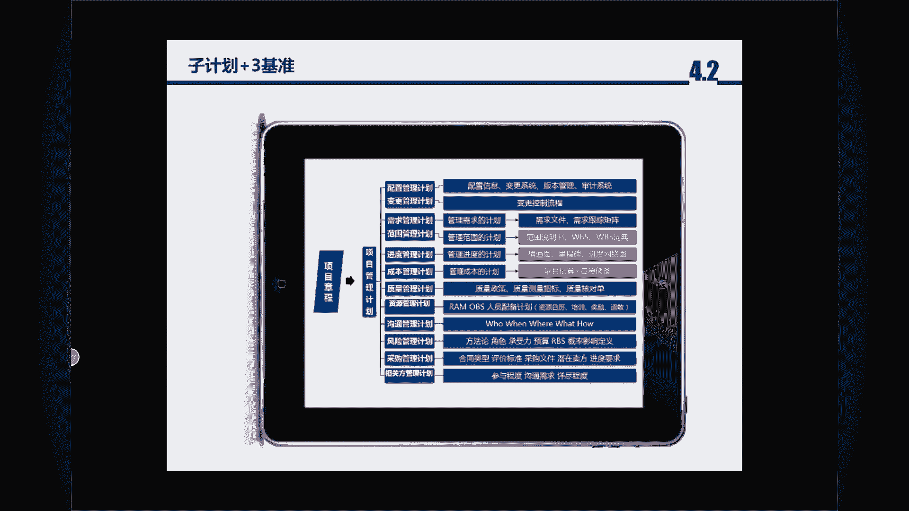
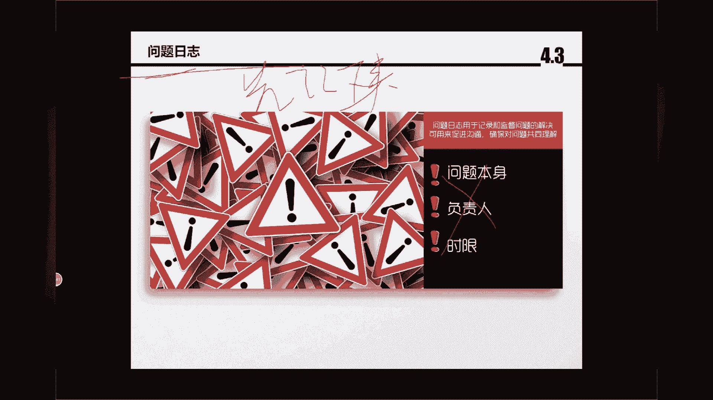

# PMP串讲 - P2：串讲第4章 - 我的乐芙兰 - BV1uE411N7zG

嗯，各位辛苦了，一直如约而至啊。嗯，我们每天有每日。就是每晚一讲的这么一个活动。大家如果感兴趣的话，也可以看一下我们班主任的微信啊，他他的这个微信朋友圈他也会发布。嗯，很明显啊，我换了一个音乐的风格。

因为这两天嗯。就是工作安排的比较忙啊。所以可能。呃，稍微活泼一些啊，或者造了一点。好啊，话不多说，我们来开始今天的课程。嗯，今天的课程就一个课程目标啊，我们把第四章有关项目整合管理这个不呃这个。

这个章节给他啊讲完，嗯，整合管理呢可以说是考的比较多的。因为从篇幅上来讲，它比较重。另外呢。项目管理中最主要的项目经理的功能就是在于整合。所谓的整合，也就是平衡。各个模块啊。

各个基准之间的关系以及平衡人质。间的关系。另外。再一个就是沟通啊，在整合里头，其实他有一部分沟通。比如说我们讲的变更。啊，包括这个绩效线啊，包括变更线，其实都是跟沟通相关的。嗯。

大家做题的时候一定不要把这个问题呀。看着特别绝对化啊，我发现大家提的很多问题呢，就是有两个。😊，不符合我们答题风格的一个逻辑。第一个，千万别套自己的工作。啊，因为我们毕竟学的是国外的思维。

或者是美国人的思维啊，美国人认为自己是高大上吧。之前我们也讲过啊，他跟中国人的思维逻辑呢不太一样啊，我们是比较内敛的。他是比较张扬的，而且比较兴而上学的。我们是讲究中庸和内敛，他是不不太一样。

所以千万别套用我们工作中的思路。只要您套用工作中的思路肯定是有问题的。第二个什么时这个做IT的人呢，容易把非黑即白哈，二分法，千万别那么偏执和执着。就有些答案呢。我们讲的是套路，但是法无定法。

千万就是说这个套路它也有一个。呃，这么一个适用性啊，千万别用某一个套路来做所有的题。呃，我。这个人可能就就是比较比较张扬，或者是比较自信哈。我能保证的是，我的套路大概在70%到80%是正确的。

我不能说这个套路覆盖所有的题。另外一个可能不同的老师对于套路的理解不一样。比如说今天的第三十题，我多说一句啊。这个题呢我没有截屏啊，因为。呃，手机端跟那个PC端可能不太一样，他讲的是。

那道题好像是考虑什么风险啊，以及呃就是在之后啊已经拿到项目章程，在呃制定计划的时候，在之后啊考虑一些风险和不可变的一些因素。呃，他会呃去想啊，那你应该选择哪一个答案啊，是未来后边需要建你名细的。呃。

如果没这道题没有前面这个问话或者前提，就是考虑更多的是风险或者不可控的因素，那我直接就会写项目章程。因为项目章程。他是呃项目管理计划的输入啊，项目当程是一个核心目标。

那在后期呢可能去慢慢的去细化每一个点。呃，但是如果他他这个题目他有个呃范围或者考察的一个对象，他是围绕着风险或者这种不可控的因素或者变化的这种因素。那么选A啊，假设是日。可能更会更好一些啊。嗯。

为什么要讲这么一个呢？就是我们答题的时候应该有这么一个思路，大家可以记一下，首先你判断是哪个阶段。啊。也就是也就是过程组，你是启动。还是这个规划。还是执行，还是监控哈。还是收尾。

就你一定我们一定要搞明白他这个知识点它考的是什么。很明显，如果是启动阶段的话呢，更多的是山份认证或者是这个项目的。项目章程。啊，在启动阶段很少会有变更会有，但是极少有。

因为我们都了解变更应该出现在kick off之后。所以第一件事先搞不清它是哪个阶段。第二件事是什么呢？然后我们再研究它考的是什么领域或者知识点。啊，也就是他是哪个考的是哪个过呃。

考的是哪个工作组中的哪个过程，或者哪个知识领域中的哪个过程。然后第三个你得去看他问的是什么呢？他问的是工具。或者技术还是这个文件输入输出的文档。他要说参考什么什么，那肯定是文件或文档。他要说通过什么啊。

怎么办？像这些词呢都是工具。所以答题的时候，我们一定要讲究它的这个逻辑。啊，因为老外呢他是比较携而上学的，也就是他的指他有会有一个知识的指向性。他不是说呃宽泛的去考。因为呃之前我上课时我也讲过啊。

这个PMP的这四个答案。如果没上过我们的课，你会认为哪个答每个答案都有道理。如果上过我们的课的话，你会从这四个答案中呢迅速的排除两单，还剩下两单。这两个答案就让人纠结了，到底我是选其中的哪哪一个答案啊。

我之前在天津班我也说过啊，带一枚硬币。啊，因为这个也没有什么太好的办法。所以这两个答案我讲到这，当然开个玩笑，您一定得看出来它更好的那个答案，或者更适应题景的这个答案，一定要找着什么呢？题的这个情景。

或者我在上课的时候，我也讲精讲的时候，我也讲过叫做题眼。坏了眼睛的眼。😔，啊，体眼。就是这个题目中最主要的那个关键词是什么？一定要把它找出来，否则的话啊，这个你学的知识再多，你抓不住重点。

就是它考的是什么？他问的是什么啊。在这种情况下，你应该我们应该判断它到底它的倾向性是什么啊，要把这个给它提炼出来，这个很重要啊。好，话不多说啊，我们来开始今天正式的课程。

呃，整合这个工作组呢包括7个事情啊。第一个啊是启动阶段中的一个过程，叫做制定项目章程。啊，刚才我也提到了什么是制动项目章程？就是项目的核心目标。啊，这个这个项目的核心目标或者项目章程里啊。

它又分为什么呢？这个项目章程的三个作用。啊，三个作用分别是呃。这叫做。批准啊。啊，批准项目的合法性，授权项目经理的角色啊，以及批准授权和支持，就是定义了项目的责权益。大家注意啊。

一定要用结构化的知识框架来记忆知识。你看我一般呃正好把我的方法也推荐给大家，就是我一般记的话，我记起三个作用，那我就去选这三个作用是什么？如果你没有一个这种总分关系，或者没有一个框架，你会想。

为什么要有项目章程啊，你总结不出来，他可能会有很多的。这种词汇啊，另外一个叫做什么六个内容。啊，一会儿我们数会说啊，项目章程中的六大内容是什么啊？三高两懂一关键一共是6个啊。

这个上天津班的同学一定要唤起我们这个精讲的课程的记忆啊，把这一些东西都提取出来啊。天津班的同学可以在这个题目中啊，这个发表一下啊，有有问题的话，记呃有这个呼应啊，一定要呼应知识点能够提取出来。

尽快的呼应啊呃，让这个我们情绪饱满起来啊，这是制定项目章程。呃，制定项目章程的输入输出啊，有很重要的一个呃，为什么说项目章程是核心目标呢？因为项目章程里面它有个重要的输入叫做商业论证啊。

一会儿我们会单独说说它。哎，不好意思啊，换切了屏幕。

啊，呃好，这是制定项目章程啊，三个作用。6个内容，还有一个重要的输入啊，是申份论证。好，我们看一下四宅制定项目管理。计划那到4。2，他就进入了规划过程组。很明显，当我们有了项目的核心目标。

我们需要干什么？做一个详细的计划。啊，所以这个制定项目管理计划呢很明显啊，是规划的一个什么呢？嗯，是规划的一个总的。或者打包的一个计划啊，一个计划的打包。啊，这是一个总的计划是4。2。

这里有一个重要的会议节点啊，这4。2有一个重要的会议节点叫什么呢？叫kick off。它代表着我们的计划没问题。当然我们往回推一下，制定项目程项目章程的时候也有一个很重要的会议。

就是init的这个INIT啊IIIT的meing。这是两个重要的节点啊，一个是立项会，一个是这个kick off会在考试的时候，这个kick off会很重要，它代表着你的规划的计划没有问题。

那即将进入的就是执行了。好，然后我们看一下4。3啊和4。44。3和4。4是执行阶段的两个过程。啊，4。3呢是指导和管理项目工作啊，这个过程很虚，几乎没有什么太多的考点。如果有考点的话呢。嗯。

他可能会考到绩效信息啊，这不好意思，是绩效数据。啊，绩效数据。嗯，很明显。呃，什么是指导和管理项目工作呢？那就是做这个产品啊。就是我得把成果和产品做出来。那在4。4呢，这是呃这个第六版啊。

现在也不能成为新版了。因为到今年的年底应该考第七版就更新了。啊针对第六版的话呢，它叫做知识管理。呃，有多少同学觉得卡？如果不卡的话，打一个一。如果觉得卡打一个0，谢谢啊。我看你。嗯，有同学的回复了。

声音时大时小是刚才我可能耳耳耳机动了一下啊，这个我来克服，我我自己能能搞定啊，我能控制。但是这个卡可能跟网络相关，有多少同学觉得卡啊，如果不卡就打一个一，就是没有问题啊，我们就接去。如果有卡的话。

打一个0，我再想办法。嗯。好的，我看到了。😔，OK呃，那这样的话卡的同学呢有两个解决办法。第一个可能得调整一下您的网络。第二个呢。我们晚上的课程都有录播啊，实在一下，如果特别特别卡，没有解决办法的话呢。

那没关系啊，也不咱们也不用耽误时间，到时候听录播啊，所有的讲课的完整流程都有。好，谢谢大家啊。我们。😊，接着往下说啊，4。4啊，它也是一个执行阶段。这个知识管理特别强调的是什么呢？他讲的是。

对于知识的记录，大家一定要建立啊，叫做全过程。就是这个知识啊，之前的版本呢特别强调是在4。7，就是结束和项目和阶段的时候啊，对整个项目做一个总结。但是第六版强调的是什么呢？

就是在我这个项目的管理的这个生命周期中啊，所有的这个。知识从启动阶段一直到结束啊，有知识或者。啊，我们有一些经验啊教训就是就这就我面说的啊，浴室用笔尽可能的先给它留存下来啊，这是知识管理。然后4。

5啊监控项目工作啊，这个过程啊是很重要的一个过程啊，监控项目工作并且叫做整体监控。因为。呃，每一个知识领域呢它也会有这个子监控啊，那总体监控项目工作呢，它讲究的是什么？打记俩字啊，就是工作纪要报告。

是从4。5的这个过程出来的。如果有的同学反映的卡啊，确实卡的话，您切换一下4G网络啊，我们的课程可能浪费点您手机的流量。有可能晚上您的就因为各个城市它的宽带的质量不一样啊。好。

在这个地方我最后再强调一下，因为总打断课程我认为也不太好哈。好，4。5是出工的绩要报告。4。6很重要的一个章节是变更。就是变更的流程，大家注意啊。我再强调一下变更批不批啊，这个变更是否被批准是4。6。

而发起变更不是这个过程。4。3可以发起变更，4。5可以发起变更，包括所有的子监工，什么意思呢？未来我们会讲啊所有的子监控。都是发起变更。啊，也就是在执行和监控的过程中都能发起变更。啊，而4。6是什么？

嗯，我没打喷喷嚏吧。4。6的这个过程是你针对4。34。5以及所有的子监控啊，发起来变更之后，这个变更我到底是批还是不批，我领导啊怎么看待这个变更是4。6。所以它是一个批不批准变更的过程啊。

大家一定要注意，而不是发起变更的过程。4。7啊结束项目和阶段很明显，这是。结束过程组。嗯，他讲究的是一个流程，就是先做什么后做什么，需要做什么啊，最后一个很重要的一个地方啊，4。

7有一个很重要的会叫做什么呢？叫做项目。总结会。也叫做项目的庆功宴。庆功会什么意思呢？也就是由发起人，大家注意啊，这个是一个很重要的一个人物。发起人批准项目结束。各位。客户是批准不了项目结束的。

也就是说，客户如果针对产品的满意，不代表着发起人对于项目满意啊，你这个客户插错呃产品我很满意啊呃我对产品的这个长宽高啊，包括这个什么性能和功能啊，什么压力测试，我都满意都OK。

但是很有可能发起人未必满意。为什么呢？我们交付产品之后，我们还得交付产品对应的文档，包括你的过程文件，包括你的这个什么，比如说我们做IT的同学或者做集成的同学，你的配置点啊，你的这个。呃。

竖景的走线图啊，什么CAD画的机房的这个呃鸟瞰图，就这些图你都得打包啊，否则的话你怎么转运的？你如果没有这些行政手段来组织组织过剩资产的话，嗯，那客户是对吧？他他转换不不到运营里啊，他还是在项目中。

为什么呢？这个我只销售的产品怎么用，用不起来啊，所以4。7啊，一定要发起人批准，那发起人怎么批准呢？是你的文档要全。啊，第一个是文档要全，第二个是什么？你的产品移交了这个概念很重要。什么是产品移交？

就是客户有正式的验收报告，而且把这产品已经啊投入生产，或者拿给这个拿到了客户的产品的环境中。哦这个运行环境中，所以这个很重要。也就是发起人最后才有权批准项目结束。那项目结束的最后一件事什么？是释放资源？

很重要。为什么要做庆功宴？大家都懂啊，做一个。影视。啊嗯比如说一个电影的拍摄，你到最后这个P样拍摄完了之后，大家啊包括那个演唱会，你演唱会开完了之后，大家得吃顿饭啊，对吧？代表我们演唱会。成功啊。

然后干什么？什么是释放资，那这个团队就是解散了啊，各干各的这个导演该干搞导演的事，演员也就释放啊，也就释放到别的这个剧组里了。所以啊4。7的最后一件事是释放资源。

当然释放资源前面一件事必须要发起人批准啊，所以是整个的它的一个过程。好。嗯，那么在整合的这个。知识领域啊，就是第四章它还讲了另外一件事情，就是有关整合管理中的发展趋势和新兴实践啊。

一看见每一章的发展趋势和新型实践。这书上的原话，它指的就是什么呢？就是这个在适应性项目中，也就是在敏捷项目中。啊，因为第六版，包括第七版未来的变化，它会把PMP和这个敏捷给它杂糅在一起。啊。

因为现在的项目很少是这种传统的瀑布型项目，或者叫做一一。呃，需求驱动性项目很少啊，现在的项目基本上都是以这个客户满意度或者客户反馈。啊，不是单单的这个这个需求，它总在变啊，不是单单的一个传统项目。

从头到尾做回来，它总在编。嗯，所以呢在发展趋势上来讲呢。大家把它画一下，特别强调商业认证和效益管理。也就是说我们得时时刻刻调整这个项目的。方向啊，很有可能啊这里提到了敏捷或者是迭代的做法。

就是我们得不停的去改。啊，特别强调不停的去改改没关系，你走什么CCB啊，走这不能说走CCB啊，应该走这个变更的流程。因为CCB只是变更的一种流程过程中的一个环节啊，你得走变更的流程。啊。

我就简单的把呃整合针对敏捷它的作用环境下，它的变化或者一些特点啊，说一下，就是我们得时时刻刻的关注你的产品是否满足身份证，或者是否符合主流的这种。啊，产品的价值。可能时时刻刻得调整。好，我们看一下4。

1制定的项目章程。嗯，那4。1制定项目章程。嗯，大家把它画一下啊，这是它的作用。明确项目与组织战略目标之间的关系，树立项目的正式地位。并。展示组织对项目的承诺。其实这就是项目章程中的三个作用。

我们来看一下。

大家把它记一下就行，上面那句话的可能太拖沓了，一个是批准，一个是授权，一个是支持。考试的时候有很多题都是跟他相关的。他会问啊，比如说项目经理在啊得到了组织的正式任命之后，那么作为项目经理，你的第一件事。

或者你的首先要做的事情是什么？就是拿项目章程。其实，批准授权支持就是我们说的责任责权益。责任权利和义务什么意思呢？责和义大家都懂啊，义是什么呢？就是你需要做的这个事情的一个态度啊。

就是我得对这个这个事情，首先是这个事情应该是组织认可的啊，什么是批准是批准项目的合法性，就是组织认可这个项目。第二个授权是什么？是你项目经理的合法性。就是组织。首先说啊这个项目是组织的项目。

而且他有商轮证，他能挣到钱啊，或者能够挣到名。之前我们说过啊，什么是项目的呃这个核心目标，就是你得实现名利嘛，你至少得你得得到一个啊。第二个就是项目经理。那项目经理是什么呢？是项目经理的角色被授权。

什么是被授权？大家一定要注意这个授权就是你得拿到这个发起人的红头文件，相当于。就是这个发起人得在这个项目章程中啊，得盖章，而且呢得同时有发起人，就得有项目经理。这两个人在项目中章程中都得出现。

一讲到这个地方，所以问题就来了。大家注意啊，这里有个重要的考点，如果在项目中换项目经理的话，那么新项目经理的第一件事应该找发起人拿项目章程。道理很明显，你不可能说我现我这个新来的项目经理。

之前老项目经理做的呃，项目做的绩效太差了。那我一个新项目经理落地到一个正在执行的老项目中。那很明显，我得把项目章程中的项目经理的名字我得换了。对吧这个老项张程，他可能是啊张三，那新的项目可能是李四那。

这个新项目经理必须要把项目章程的。人人名得改了，得改成是我呀，否则还是张三的话，你拿着项目章程，对吧？保本身就是平衡组织结构，你找那个职能经理要资源，他不给你啊啊，那小翠，这不是你啊。

我我之前我怎么认为是那个张总是是这个项目经理，对道吧？他就会有问题。啊，所以第二个就是授权。我也讲到了啊，如果是一个新项目经理，通常要啊之前我们上课时也说过啊，作为新项目经理接触老项目需要做三件事儿。

一个第一件事儿拿项目章场。你先把项目章程换到。第二个是什么去看那个老的计划啊，老版本的计划，你得了解之前项目经理他的计划是怎么做的，我需要做哪些事啊，有是不是现在项目有有哪些偏差。第三件事是什么？

如果这个你这个新项目经理落地的到一个老项目中，你发现的确有偏差，你干什么，你得发起变更啊。各位一走一一提到变更，必须得走流程，你不能说随便的就改计划，不行，我们只。上节课上课时也说过。

你直接选永远不要选，直接改计划的答案，你肯定得走别人的流程，对吧？啊，所以这是第二个事情。嗯，我讲课是这样的，我讲课的话，针对第一个知知识点，他所有的考点啊，我都把它都反映出来。

这样的话我们遇见题的话呢，就有更多的自信啊，但是还是那句话，法无定法，千万别拿老师的这些套路来。就是你可以心领神会，但是你不能说啊，我一遇见这个题，我就得看老师的这个关键词。我一见那个题。

我就看老师的那个关键词，就是我们可以找关键词啊，本身不矛盾，但是你不能说所有的题都拿这个，那对吧？它本身是一个逻辑的这么一个学科，你非得变成这个古诗文背诵，那你这个课的味道就变了。

但是我会总结出来一些个逻辑。所以大家呢。就是说。如果认为这个老师讲课，他讲的是对的，那就按那个老师的思路走。但同时呢在答题的时候，一定要质疑老师就是我先拿这个老师的套路去判断来选择。

然后反过来我看这个在这个题目的情况下，这个老师这个思路是否是符合的啊，是OK的啊，我们得做逻辑的判断啊，一个人的思维，它是分为正反两方面的，这是一个成年人的思维啊。第三件事是支持。什么是支持呢？

就是说我给你责任了，我也给你相应的义务了，我还得给你相应的什么，什么是支持，就是我得给你相应的权利，什么是权利，就是调动资源或者是什么资源的支持。啊，作为发起人，你得给项目经理钱财物相目资源。

否则的话这个项目经理啊就就没法干了。嗯，那作为发起人人来讲呢，有可能大家看那个地方啊，有可能是一个个体，也有可能是项目级或者项目组合的经理，或者是一个组织。啊，大家一定要注意啊。

就是说发起人有可能不是一个人，但啊有可能是一个组织啊，也有可能是多个人是有可能的。而且这句话很重要，多阶段项目中需要项目章程来启动一个新阶段。也就是如果。我们一个项目可能有多个产品。

而每一个产品呢它就是一个阶段的关口。上节课我们也讲过什么叫阶段啊，那有可能每一个阶段我都得做一个新的项目。为什么呢？因为。这个阶段的话，有可能项目不同的阶段项目经理就换掉了啊，像这种大型的项目来讲。

可能不是一个项目经理。啊，在某一个阶段可能是一个项目经理，在下一个阶段可能又是一个新的项目经理啊，所以大家一看见多成果或者多阶段，我们就就知道啊，有可能得有多个启动项目的过程。好，大家如果没有问题的话。

在这个地方打一个Y啊，很重要的一个点啊，同时也让我确认您们能够正常的听到看到啊，大家一直在努力。

嗯。刚才我们也提到了啊，就是制定项目章程或者签发项目章程啊，它很有可能是以一个正式的会议啊来来做的。而这个会呢在考试的时候，大家一定要看啊，它叫做initial这个meeting，或者是叫初始化会议。

这个初始化会议就是什么批准项目章程的啊，或者是签发项目章程的。为什么要讲这个事情？因为在考试的时候，经常有一个词叫启动会。这个老外啊翻译的不是特别好，他把他这个启动会会有两种可能。

有可能是指这个INIT会，它叫做立项会。也有可能这个启动会呢，他认为是kick off。什么是kick off呢？就是那个呃签发项目管理计划的会议，这两个都有可能。所以啊一看见启动会的这个词。

你一定要要去看他的英文，是这个INIT会还是这个。kick off会如果是IEIT会的话，很明显这是在启动阶段的第一件事。如果是kick off的话，这是什么？这是在什么规划阶段的最后一件事儿。啊。

那就相当于我计划写的都没有问题，我即即将要进入执行呢啊，所以这个大家一定要注意啊。他的逻辑和含义。会有一些个差别，所以考试的时候。一定要注意啊。好。

然后我们看制定项目章程的ITTO制定项目章程的ITTO输入的话，大家把它画一下，叫做商业论证。嗯。有关商业论证啊，我们在上节课第四第二章哎，第一章就讲过什么是商业论证，哪位同学都可以写一下，一共4件事。

啊，第一件事叫做业务需求。啊，这是第一个。第二个是什么呢？叫做形式分析。第三件事儿叫做。方案推荐。最后一件事儿呢叫做评估比较。也就是说我们如果要做一件事儿，你肯定得有一个什么是业务需求。

就是我公司或者组织的需求，对吧？如果我是一个外部项目，那我是通过这个合同来挣到钱。如果我是内一个内部项目。比如说我是组织的变更，我还是说这个我的呃产品的公益需要优化，他肯定是由某个业务组织。

或者呃或者是这个外部客户来发起的，这叫业务需求，那我针对业务需求呢？我第二件事，形式分析，什么是新形式分析呢？就是我挣不挣钱啊，不是所有的合同我都做的。你说那个客户他给我一个合同，我不赚钱。

我何必干他呢，对不对？就是我是否能挣到钱，或者是我是否有能力把这个。把这个合同做下来啊都得需要判断，这个就是第二件事。大家一定要注意，在考试的时候，你一读题，你发现什么呢？就是这个高层啊。

针对这个呃项目他挣不挣钱，他拿不准主意，或者说。他对自己有没有组织，有没有能力把这个合同执行下来，他拿不准主意，大家一定要注意啊，这个应该是在启动阶段。而且作为项目经理，您不能替老板拿主意，因为什么？

因为这都是花钱的事儿。对你作为项目经理，你是执行人，你不是来定义这个项目的人，你挣不挣钱的话，得高层说了算啊，所以这些都是高层做的。第三个方案推荐就是我可能也会有一系列的解决方案。

我会找到一个最好的解决方案，干什么，就是立项。啊，所以作为数入来讲，一看见商面论证的这个词啊，我给大家一个建议。可以判定当前应该是在启动阶段啊，通常是在启动阶段。因为在启动阶段的时候。

我们才会研究这个项目值不值得做，应不应该做。啊，那有的同学说，崔老师，那在启中阶段有没有项目经理有？有项目经理，但是项目经理这个被任命和被授权是两件事，就是任命一个项目经理，未必你未来就做这个项目。

为什么呢？有可能你经过商业认证啊，还没有拿到正式的这个项目章程被批准之前，有可能对项目发现不挣钱，那就不做了。所以项目经理可能啊在前期讨论的时候，他有一定的角色，但是还没有正式任命的时候。

这项目经理就什么就没没有位置了啊，可能我转别的项目。啊，大家一定要注意这一个人的。另外一个这工具。通脑风暴。是什么？是创新。一看见创新，你要选择的这个。答案就是头脑风暴，大家都知道头脑风暴是啊。嗯。

有这么呃呃一几个人啊，就是天马行空。啊，你也说一句，我也说一句啊，也没有什么呃条条框框的限制啊，所以这个就是找到创新。什么是焦点小组呢？一说焦点小组和访谈他是一对啊，访谈。我讲课是这样的。

我的个串讲可能会快一点啊。访谈是一对一的。他比他的特点是比较慢。因为访谈嘛大家都看过鲁豫有约往那一坐啊，一定一咱俩聊啊，然后呢这个明星的八卦隐私啊就全出来了，被鲁豫访谈的人就全倒霉了。

为什么说说说就说了漏嘴了。所以访谈这个工具它是真。最后总结一下啊，你看我讲课的特点是这这样的，什么叫访谈叫做真慢。就是你得到的信息是真实的，但是它的问题在于特别慢。啊，所以访谈是一对一的。

所以什么时候用访谈呢？是针对高层用访谈。因为什么？因为那个高层，每一个高层他说的话都很重要啊，这是而交警小组是什么呢？是多对一。就。😊，这多对于或者一对多，这一是指的谁呢？指的是主持人多是什么呢？多。

大家注意一个特点啊，我再强调一下，焦点小组的这个多意味着什么？得有多个被采访的被访谈的对象，但是这多个对象肯定是同一个组织或者同一个部门。为什么这个焦点小组经常和谁是一对反义词呢？

和这个引导是一对反义词。这焦点小组是一个同字啊，是多同。这引导是什么呢？是多一。这个意是什么？是不同的立场，不同的组织。啊，因为不同立场不同的组织，你会发现什么呢？他的立场不同。你如果是一个主持人的话。

你直接让他们敞开心扉是不行。你得引导什么是引导，是不同组织，不同利益关系之间，我得得到一个什么同相对统一的一个答案或者需求，一般用引导啊，所以焦点小组和引导是经常考的一对，尤其是引导这个工具。

我都说一下啊，这个引导这个工具。考试中是必考。大家回去把它看一下我们的讲义和PM book啊，这个是必考的，什么是引导？我再强调一下，是不同。或者是什么E。啊，不同的组织，不同的立场会得到一个。

第四个是什么？有一位同学问您那问的详细一点，我不太清楚。因为我的讲课可能到您那边会有大概十几秒的延迟，它经过服务器的转换啊，您要写问题的话，就写的详细一点。这是头脑风暴交接消毒访谈和引导。那好。

我们看一下冲突管理啊，这冲突管理一会我们单讲，但是我们也得知道，这也是一个必考的一个点。冲突管理是必考。你想作为项目经理来讲，你的最主要的能力就管理冲突嘛。嗯，会议。也会考，但是他不会考特别概念的题。

一会儿我们再说啊。好呃，输出两个，一个是项目章程，一个是假设这啊，一会我们再单独说它我们刚才把几个工具都讲了啊，是呃商业认证啊，刚才我们已经说了，什么是商业论证。大家注意啊。

我每一页在看那个IDTO的时候，大家如果还不知道IDTO的话，那这个自己恶补一下啊，这就是I输入这是出两个T分别指工具和技术啊，这是学习项目管理的一个基本思路，我们得知道什么是IDTO。

就是每一个过程都有输入啊，通过工具和技术的整理啊，加工啊，出来输出。好，那么主要几个重要的输入，一个是商业认证。刚才讲了啊，商业价值是我值得投资，就是商业认证。一般。我跟他也说了啊。涉业认证都是高管系。

项目经理不屑项应认证，但项目经理是负责。叫做确保和维护生产认证，就是你的项目你得能让。发起人挣到钱啊，或者是能让发起人。觉得他你能实现那个项目的价值啊，这就是项目价。就是你得把什么叫保护价值？

你项目经理，你得把项目做成功了，之前我们也讲过，如果一读题，你看见这个答案啊，这个项目经理发现什么呢？发现，比如说啊市场发生了变化。啊，就你的这个项目啊所做出来的产品啊，它已经不流行了。

那你作为项目经理应该干什么？大家注意啊，作为项目经理，如果你发现你的项目已经没有商业的价值或者商业认证的时候啊，你读题，作为项目经理，你不能够去停止项目或暂停项目。

因为项目只要项目经理只要发起人还给你钱，你就得义无反顾的把这项目接着往下做。但是如果你发现这个项目，比如说。ううん。产品没有价值了，或者环境发生了变化。我们之前讲过，如果商业论证产生了问题干什么。

或者这个项目成功是已经啊这个靠不住了，或者这个项目的成败产生了问题，你一定要找发起人。为什么？所以项目经理你都不住，你必须要告知发起人，让他来决策，让他来看怎么办？啊，我之前看大家讨论啊。

包括这个这个老师也也也讨论，就是作为发起人，作为项目经理来讲，不能找总找发起人。我从来也没有讲过项目经理没事，总找发起人，那对吧？那这个这个上节课我们也说过，那你作为项目经理来讲。你天天找发起人。

那要要我们项目经理干什么？但是啊项目经理针对发起人需要做两件事儿。第一个就是重大风险，重大变更，一定要找发起人。你说你的项目都没价值了，你你你你的这个比如说我开发一款U盘，发现什么。

现在已经出了一个这个吧？我开发1个512G的U盘，现在对吧？这个512兆U盘，现在一个G的U盘都有了，或者几十个G的U盘都有了。你说你开发那个小U盘有什么意义？那赶紧找发起人。对吧让他赶紧决色。

因为这个风险太高了，这项目。另外一个就是什么这个绩效报告你得经常给发钱。这是。平时的时候不用总找发钱，也没有意也没有意思哈，就是重大事情情时候一定要他发钱。好，协议。呃，另外一个作为重要的输出的协议呢。

大家了解即可啊。如果我们这个项目是跟外部客户的合同，也就是通过中标啊，跟外部客户签发的合同，那么合同会作为一个主要的文件啊，你在制定项目章程的时候，发起人会把合同中的什么验收标准啊。

一些个要求啊会导入进来啊，这个了解即可。呃，另外两个工具，一个叫做啊另外两个输出，一个叫组织共剩资产和事业环金因素啊，这个我们之前都说过，有一道题吧，好像是。第八题是第几题，他就讲到了。

就是那道题应该选哪个答案？啊，我。认为应该选组织共融资产。有的同学呢可能认为选那个呃他份什么作为。什么这个客户总不付款。然后他问你从哪能找着这个客户总部付付款的这个这个记录。啊，我倾向于储储公们资产。

因为很明显啊，你这个客户总部付款，对于你当前的项目，你是一种假设，但是你不能确认的事。他问你在哪，在哪个文件里能确认这个事情。那之前的项目，你作为书应该有。啊，但是那个题出的也特别的不好。

我估计翻译有问题，他说针对你这个项目应该记录到哪儿？针对我这个项目，我不能说记入到哪，我应该我我可以这么说，在哪个文件中我可以找到，那一样也选组织光资产，没问题啊。

对我这项目的组织光资产是来自于之前项目。但凡您在考试中看见什么以往。之前。那么上一次这这这些关键词，通常你要选择的答案就是组织共共资产。虽然我这样说的有点以偏概全了，但是我讲的是这个道理和逻辑。

大家应该能理解啊，咱们不能说一看那些词，我就选组织共人资产啊，或者不看看不见那些词，我就不选组织国人资产。我讲的是逻辑大家都懂啊，我就不再深说了。另外一个是事业因素，我们也说过啊，是不可改变的。

一般事有因素呢都是一些个什么的，比如说制约因素啊，或者组织环境中的一些个呃什么人力管理制度啊，你打破不了的，或者行业标准，对吧。这都是制约。好。能感觉到今天大家发言不是这么踊跃了哈，是不是。

是不是我讲的不像上节课这么有意思啊，或者是不是大家这周的状态不好啊，这这也没看见各位的发言。😔，好，让我们看一下工具啊，专家判断。专家判断大家把这句话给他记一下啊，或者在书上。

其实我的这个讲义都来自于书上。专家判断常用于评估制定项目章中的输入，就是很多时候很多章都有工具判断的这个工具。啊，什么是专家判断？不好意思啊，是专家判断的一个工具。

专家判断就是说让做过的人或者有这些职业背景的人来研判一下您的输入的这些文件是否是可靠的啊。或者我针对我这个过程啊，做相应的整理啊，或者加工是否是。呃，是否这个是具备相应条件的？啊，所以这个是专家判断。

考试的时候呢，如果在选项中出现专家判断，或者是想咨询一个行业的啊专家。这个答案呢。就需要我们引起重视和注意啊，这个答案通常。是一个不错的选择。我说的是不错的选择，未必是百分之百。因为呃作为项目管理。

我大概从做了这么。反正几万呃上万道题应该有了啊，我总结出来的思路它是。鼓励项目经理去找更多的人，或者找更多的专家来去这个获得获取他们的一些个宝贵的经验。这也符合项目管理的逻辑啊。好，嗯，然后是访谈。

刚才我们讲了啊，这个特点是真慢，而且通常是一对一的啊，真是你会获得一个真真实的知识，慢是它就是费时间啊，所以它一般是一对一的啊。嗯，但是你得到的信息是真实的啊，清楚的。焦点小组刚才说了啊，同一个立场。

头脑风暴创意啊，然后是引导技术。引导技术在这个过程。因为咱是不是精讲啊，是串讲，大家了解即可，我就不在这再展开了啊。但是得需要知道啊，得看那个背后的一个字是什么？是不同组织。

如果在题目中明确的说是不同立场，不同组织。您直接这个答案就选引导啊引导。但有的时候他出题的时候啊，他特别绕。他说在一个多环境或者跨职能部门的啊，你看什么跨职能部门。或者是多部门的环境中。

那一样也选择引导。那作为部门之间，我我从来不相信啊，所有部门的所有员工啊都没有这个利益冲突，那不叫工作啊，那是对吧？那。那那不现实啊，你这个教会可能能实现。但是你要说一个工作环境中，那肯定他会有纷争。

有利益的啊。所以一看见跨职能多部门这种词。在答案中很明显，这个关键词。给我们的线索就让我们写引导技术。好。这个另外一个五星级的考点来了，冲突管理啊，这是一也是一个必考项。什么是冲突管理呢？

我们得先建立一个认知。所谓的冲突管理，不是说项目经理去管理和别人的矛盾，是项目经理啊。去管理冲突双方的矛盾。也就是你作为项目经理，你管的是A和B的矛盾，而不是你和A或者你和B的矛盾，通常是这样的。

也就比如说一个老的员工和一个新的员工，他们有针对技术解决方案有些纷争啊，那我们来看一下怎么管。首先最好的选择叫面对和解决。什么是面对和解决呢？一般在考试中什么充分沟通啊。或者是项目经理什么呢？

让这两大矛盾的双方啊充分的发言讨论这些答案啊，各位这都是什么？这都是面对和解决。你得充分的去讨论或者充分发言。相互了解对方的矛盾和对方的想法。干什么彻底解决问题，为什么说彻底解决问题呢？

是找一个利益平衡点，实现双赢，就是你也受获利，我也受获利。因为大家畅所欲言，把所有的想法都都说开了。啊，这叫双赢，在考试的时候有面对和解决，这是最好的答案。通常选它。因为作为项目经理来讲。

你期待是这样的答案。但有的时候呢，他没有这个答案，他他也他有的答案是什么？合作，其实合作和面对和解决也是一样的。因为我们大家都看过那个什么什么就外交部发言都是什么公开合作和对话。所谓的合作是什么呢？

也是建立共识啊，他有这个合作其实不是书上的一个概念，就是考试的时候，他对面对和解决，他可能翻译的不好，他就。有的时候范译成合作了。其实是一回事。如果没有面对和解决或者合作的话呢。

大家接着往下选的是要妥协和调解。什么是妥协和调解呢？叫做各退一步。嗯。就是矛盾的冲突，双方呢各让一步。他也叫做双输达到相对平衡。什么是双输呢？呃，一般我们像马路出现交通事故。

一般都是这么解决的那警察从来不会说偏袒某一方，或者来到底来研究这个主责是谁啊，各排五大板，你们尽快把车开走啊，咱这个别别别迎上马路的事啊，谁重谁不重要，你看你你你慢行。

你的病道是你对不你让一下都解决问题了。啊，所谓双输呢很明显啊是各退一步。第三个是缓和包容，缓和包容是什么呢？一提到包容容就知道了啊，不能说某一方对，但是会抑制一方的利。啊。

一般就是说比如说夫妻两口子打架啊这个。不说那个。嫂子哪做对了啊，劝那大哥大哥，别跟嫂子吵吵了啊，这个到我这喝点酒啊，这事过去了，他没说另外一方对，但是呢会抑制一一其中某一方的意见。啊，所以这叫单书。

这个单书能够快速解决问题，但是单书它有个问题把它画一下，再次发生。如果我们在答题的时候，你会发现啊就是冲突双方的某一方又产生了新的意见。那通常这个答案就是单书就是单书也叫啊术语叫做的缓和和包容啊。

大家都理解。第四个事情呢叫做回避或者撤退。什么是回避和撤退的？就是项目经理啊。从冲突的双方中抽离出来。这个答案其实不太好啊，一般是指的项目经理。比如说啊。这个AB两个人打架，作为项目经理啊。或者闹矛盾。

作为项目经理呢，因为什么呢？就是。嗯，目前啊他们打的还不够激烈啊，没有对项目造成什么后果。我先啊这个先忙别的事情了啊，或者。啊，项目经理呢这个认为自己能力有限，解决不了，就是无作为啊，就是回避。

最后一个叫强制，什么是强制呢？啊，比如说项目经理说啊，让B听A的，或者项目经理决定采用A的建议啊，就是项目经理是什么支持某一方。大家注意啊，他和这个呃缓和和包容正好相反。完和包容是什么呢？是。

抑制某一方。啊，不是支持另外一方，是抑制某一方，就是你别说话了，而这个强制是什么呢？啊，他说的对。啊，就支持某一方。大家注意你支持某一方的本质就是什么？一就是强调你错呃AB错A对。

那这种伤害是double的对吧？那你说他对你错，你得听他的那。被抑制的或者被这个强迫的一方，他他心里更难受了。所以作为强制来讲，他是最差的一种冲突解决的办法。因为它会破坏组织的氛围。

但是强制考试时会考到什么？大家把它画一下啊，或者记一下。啊，我讲的都是书上有的内容，但是会比书要。就是考试的指向性要强一点。一般比如说转天要就项目就要交付了，或者转天这个项目就要验收了。

那项目经理应该选择的是强制，因为哪有时间讨论的，你就听他的就好了。啊，一般是什么呢？时间特别紧迫，我们来选枪支。冲突管理很重要，我就讲这么多，最后总结一句话，有好的不选坏的。

就是同时出现那几个答案怎么办呢？由靠上的答案优选。除非强制明确告你是紧急事件啊，我说的是什么呢？是这几个单案同时出现，如果你一眼能看出来当前的情景是什么，那你就得选那个对吧？那？嗯对吧？

单说你意志某一方或者再次发生，那肯定是缓和包容啊。大家跟我互动一下，如果没有问题，的在屏幕中打一个5啊。好，这是有关冲突啊。考试中。是经常考的一个点。嗯，然后我们看一下会会议，大家都开过会啊。

书上也有相应的一个案例。呃，作为会议。又分为是前中后啊，会前先确认每一个参与者的角色。会中呢确认会议讨论的议程，一般会议都是一会一议，就是一个会议只讨论一件事儿。会后大家注意啊，这个很重要。

一定要有会议纪要，而且通常会发送会呃参加会议的与会者。啊，他通常会发送一个。啊，然后为什么呢？因为你这个会议的机要是为了转化。你后期的行动计划，对吧？你得让大家动起来。你说开个会没有会议纪要。

没有会议纪要，那不了了之了啊。所以这个考试中。有关会议现在考的不多，但是我们得知道怎么开会啊，这属于是这种通用技能或者是管理技能啊。好，像呃项呃项目章程。项目征程之前我们讲了三个作用，大家还记得吗？

在聊天栏里写一下三个作用，分别是什么？都要看之前的讲义和笔记啊，尽可能凭印象给大说出来。然后呢，这个地方又讲了6个内容。六内容分别是什么呢？三高两种一关键啊，三高指的是高层级的需求。

这个高层级的需求来自于什么呢？就是你在输入的时候，你不有业务需求嘛，对吧？你业务需求就确定你的项目需求。第二个是高层级的项目边界，就是你这个项目的产品大概有几个会分为几个阶段啊，它会有什么。

第三个高层级的项目风险。什么是高层低的项目风险呢？一般是来自于什么之前的组投光资产。那还他就就为什么我这道题我要选这个这就是那道题我要选那个那那个左织国资产。因为那道题同时出现了，假设日和项目章程。

你项目章程你太有高层级的项目风险。你那个客户总不给钱，对吧？所以它应该指的是你之前的项目的文件，你从哪找？你要说指的是我当前的项目，你需要记录到达你的项目章程和那假设日里都有啊。

所以就是有的时候我可能答题可能考虑的更多，或者未未必是个好事儿啊。就我会有的时候我会就是。因为这个。答案的选项呢，他们之间的逻辑关系也会左右我对于这道题的判断，就是就是你不合理。你这个如果选A和C的话。

你那道题。对个那那两个答案它本身都是对的，那说明那两个答案都不选，那肯定不考的不是那个点啊，这是三高两种，一个是总体进度，一个是总体预算。大家注意啊，这个总体进度和总体预算不是我们规划出来的基准。

而是发钱他心目中期待的花多少钱用多少时间啊，最后一个是关键相关方，大家注意关键相关方和所有相关方是两回事儿。一关键指的是那些大佬，什么客户用户是那些啊，和我们13。

1的识别相关方的所有相关方式不太一样的。关键相关方就是对吧？你这影视剧开拍你的制片人是谁，对吧？就是投资方案，你的导演是谁，几个主要演员是谁，后边那演员多了还有巨无了，对吧？那都是后边要要识别的。

就是最关键的那几个利利益啊，出资人啊，这个交交付者啊，产品使用方是谁，这个在项目当中会有。嗯，其实我们讲课的时候呢，应该在这个地方啊，如果讲实战的话，会有一个这些项目章程的这么一个过程啊。嗯。

咱别说精讲了，现在都是串讲了，所以根本没有时间了啊。最后总结一下项目征程三个作用。我到目前为止还没有看见大家写的这个三个作文是什么的回忆啊，然后是6个内容，六个内容怎么记呢？三高两组一关键。

三个作用分别是批准授权和支持啊，这不就都记下来了。嗯，好了，这是项目章程啊，它的作用就是项目的目标啊，没有目标路在何方啊，路看不见。嗯。推荐给大家一个电视剧吧，虽然我们的时间很紧张啊。

电影叫爱丽丝梦如仙境。啊，讲的就是爱丽丝走到一个村口，是走左边，走右边，不知道他问猫猫说你要去哪。啊，这个爱丽丝说，我也不知道，那猫说你走左边左右边都无所谓了。其实这就是项目章程的本质。啊。

就是项目的什么方向或者核心目标。大家注意啊，这个方向和目标和需求是不一样的。方向和目标指的是你发起人想实现的。业务目的啊或者是项目的核心价值。它跟你后边产品的定义其实关系不是特别大。

你说你挣不挣钱跟客户想用什么样的东西，他。有一定的联系，但是它不一样啊，这个通常是你组织内部的他的一些想法。

好，假设日志啊，这个最近考的也比较多啊，什么是假设志呢？也就是我们在启动阶段啊，可能针对这项目有一些个。就是。你希望他具备的一些条件啊，就是假设日止。假士日未来会渐渐明细成风险。啊，通过这个后期的规划。

以及在项目中的。这种运作。你之前认为他具备相应的钱，相应的资产啊那个资源。但是到后边会发现人能力很差啊，这个老板钱又不多，对吧？这都是假设未来都是风险。

嗯，制约和假设是差不多的，制约主要是环境因素哈。大大家看着书，我就不在这儿再说了，因为几乎。制约因素不考啊，考的，因为现在。制于因素和假假呃假设都放在了就假设志的一个统一打包文件里。4。

2啊制定项目管理计划。制定项目管理计划，大家把它画一下啊，项目经理是总负责人。而且是什么呢？制定项目管理这计划是尽可能多的人参加。就是。啊，韩信不能说韩信点兵啊，就是你这个作为相关方啊。

应该是大家都一块儿跟着项目经理来一块制定项目章程。这样呃去制定这个项目管理计划。这样的话在后期的时候呢。啊，这个相官方。那，针对项目管理计划，他都了解。你后边在执行过程中，因为大家已经参与这个项目。

管理计划了，他也好处理。呃，这里有个很重要的原则，项目管理计划需要主要向官方的批准。它指的是什么呢？就是那个keick off会议，就是就是你项目管理计划，你得不停的总分总，总分总这么去完善。

到最后一个版本啊，主要就是发起人。他说啊你的小崔，你的项目管理计划已经制定的相相应对比较充分和完善了啊，可以按照这个就计划执行了，那我们就得进入呃项目管理中的第三个阶段就是执行起来啊。

就是你不能一直规划起来没完没了。嗯，很明显啊一个。不可执行的项目管理计划，或者是个假大空的项目管理计划。嗯，他是很麻烦的啊，就是你应该作为项目经理，应该在项目前期的时候可能是最费头脑的。就跟诸葛亮一样。

把事安排好了就去做就好了啊。多说一下，他考试时不会这么考，但是我们得知道项目管理计划其实在项目管理过程中是很重要。嗯。嗯，说到做计划的话呢，今天的课程大家可以看一下，每天一课。

今天是刘通老师同期会讲时间的关联啊，但是那个能回放。啊，大家如果感兴趣的话呢，通过扫码可以听一下，它是7点半到。到9点半啊，所以跟他那个课程呢错开，我们是8点到10点啊，大家如果感兴趣的话。

可以明天有时间可以听听啊。嗯，讲的时间管理就涉及到怎么规划时间。嗯，这个很明显是一个植入广告啊，这个也替别的老师打打call。然后制定项目管理计划，大家DTO作为输入很重要。项目章程你肯定得进来。

为什么这是核心目标啊？啊，这个大家需要了解啊，它是核心目标。就是刚才我说的那个题，其实那道题你选项目章程也未尝不可。就是第十二题。

但是他问的是你的你的这个这个建议明细的那些风险或者不可控的因素指的是什么？你选项目章程就不太好了啊。另外项目章程呢，它通常是在。呃，规划过程中是参考的一个文件啊。

你要说项目章程一直在滚东市规划也不太合适。嗯这个项目章程一般不会改。呃，然后输出是什么呢？输出是项目管拟计划啊，这是一个。总的计划其实它包含了所有的子计划啊，过来打包了解即可。然后我看一下工具啊。嗯。

作为这个项目管理计划，它书上写的是19个子计划，但是常的计划呢，是范围进度和成本，我们把它叫做三基准，对吧？什么是三基准呢？就是这三个基准。对于项目管理啊是最重要的，是我们经常要控制的。

你改其中的某一个，他那另外那两个都会有影响。啊，所以这个是三基本的一个概念，大家需要了解。其实就是我们日常老百姓说的那个多快好省啊，当然质量也很重要，但是质量对于像目模拟来讲，它是单独的一个模块。

相当于第八章。啊，因为质量其实指的是那个好，你怎么评价好坏呢？其实。跟那个项目范围说明书和WBS和8WBS点套有验收标准，他们之间是呼应的。啊，所以呢还是范围进度和成本是最重要的，多快好省嘛。

多不就是范围嘛，快不就是进度嘛？呃，省就是成本好就是质量啊，其实质量呢作为基准来讲呢呃它不是最主要的基准啊。

好，那么作为这个项目管理计划，哪里有什么呀？这是。哦，您问的是那个时间管理的那门课哈，到时您问一下我们的班主任。其实我们班主任的朋友圈里都会有嗯，大家可以添加一下我们的班主任，对吧？那个赵颖老师啊。

相当干练和美丽的一位老师啊，加一下他的这个微信没有亏迟啊，他的朋友圈里会分享很多的。😊，最终免费课程。呃，然后特殊版本的项目管理计划，这就提到了基准。什么意思呢？就是项目管理计划，如果规划完了之后。

大家把它画一下啊，经过高层批准或者主要相关方确认的。项目管理计划就是基准。也就未来你得按照这个基准去执行你的。啊，做这个项目执行的工作。啊，这个是很重要的。好。还有一个啊基准一旦确定下来之后啊。

您如果再去修改这个计划的话，你得走流程。你作为项目经理来讲，你不可能去随便的或随意的更新项目管理计划。我再请教一下，为什么你作为项目经理来讲。或者我们在考试的时候，你永远不要选更新。

不能说如文啊通常不会选更新项目管理计划。你这个项目管理计划，你要更新的话，你必须得走流程，你不能随意随便调调整。一会我们讲这个呃呃变更管理的时候，大家就理解了。

什么时候如果以这个题目中他描述的是已经收到了CCB的确认，那作为项目经理，你下一步才能更新项目管理计划。除此之外，那个答案通常都有问题。啊，你做的像你你随时调整那个计划，这不行，你得走这个流程哈。嗯。

好，我看见了啊赵颖老师的回复啊，坏了，他在这个群里，他也在听课。没听到。😔，啊，我一般表扬人都是背后表扬。啊，当面批评背后表扬，这才是真性情况哈。这个他听到了啊。其实我知道他在群里哈。好，我们看一下呃。

作为项目管理计划做完了之后，最后一件事啊，就是pick off。什么是pickoff呢？大家注意啊，k off也是三个作用。第一批准。第二共识和加油。

很类似于我们之前讲的另外一个会议叫做什么in就是那个。😊，呃，制定项目章程的那个会那个会是什么呢？也是批准，那是授权和支持。这是什么批准？什么是批准，就是计划已经得到领导的认可。什么是共识？

这一句这个这个很重要，就是所有的人都应该参加Kick会议。为什么你得就是说大家针对这个计划都知情。而且都认可，就按照这个计划执行了。第三个是加油，什么叫加油呢？那你后边你经过了K up之后。

你就进入了执行阶段。你的计划就按照你的计划得去做做相应的工作。嗯，有的同学反应卡了，大家再回复我一下。如果没有问题的话，打一个一。如果还卡或者看不到的话，打一个0。大家回复我一下，没有问题。

打一个一确认一下啊，我看看是个体问题还是这个整体问题。如果整体问题的话，我还得想办法调整。好，我收到了啊，收到了几位同学的确认。那应该嗯不是我这边网络的声啊，可能是。大家得调整一下。哦。

有一位同学看到了，确实有些问题。嗯，我不知道你卡了多长时间啊，实在不行的话，找我们班主任去要一下录屏啊。好，然后既然讲到了会议，我们看一下项目中主要会议啊，相关方识别会大家了解即可啊。

就是尽可能多的相关方来参加会议呃，之前咱们有一道题，他他问你作为相关方识别来讲，应该选哪个答案啊，是跟找谁识别相关方应该是通过相关方来识别相关方？啊。

所以那道题上面相关方识别会就是把所有的相关方交集在一起。大家啊开个什么洽谈会啊，或者开个讨论会啊，或者开个相互认识的这么一个叫做什么呢？类似于国外的那叫什么来着呢？什么舞会啊、晚会啊那种啊。

就是让更多的人相互认识，这个了解即可。他很少考。呃，项目初始化会议你说这个会议刚才说了啊，它的作用是立项，然后呢，项目规划会是尽可能多的人参加日常的讨论啊。

就这些事情啊是尽可能多的人项目开例会就是pick off啊，它是进入执行阶段的一个会议啊，这两个会议是需要区别的啊，一个是初始化会议，一个是开例会，项目评审会考试的时候也经准考。比如说在日常的例会。

或者在项目他是看什么，看那个项目绩效的。啊，或还有什么呢？还有看看项目有哪些风险啊，有哪些问题，这都是什么？这都是项目评审会，这题目中经常有会说在项目执行过程中啊。

项目经理召开例会来讨论一下最这个项目近期的什么。状况状态或者绩效，那都是项目评委会。啊，项目评审会我再强调一下，通常是看绩效和状态的那作为项目评审会，作为你项目经理，你要干什么呢？你要带报告。

我在这儿强调一个答题的思路啊。如果您一看那个题干，他说什么什么开会，问你项目经理需要带什么什么文件，通常选择的这个答案就是报告开会一带报告。记住这句话啊，他要问您通常对于项目经理需要做哪些准备。

开会带报告。嗯，再往后啊，变更控制会变更控制会我们在讲4。6的时候今常会讲到啊，就是整个变更控制的流程。最后一个就是项目收尾总结会，我们也说过啊，它是什么，就是作为发起人批准项目结束。

昨天发起人批准项目结束的那个会议。项目启动会属于哪一个好问题？刚才我说了，你要在听目中看见项目启动会，你得看看他的英文原文。哎我是翻译都要项目启动会。啊，因为这个不同的呃就是他翻译的时候。

有时候找香港人翻译，有时候找那个马来呀，或者是新加坡的人翻译。啊，他有时候翻译的不是特别准确，他各个国家对于启动会的认知不一样，你就得看英文。如果是INIT，那就是立项啊。然后如果是kick off。

那就是开低会。好，然后呢，这是项目管理计划和项目文件啊，这个大家看一下，也不用去记，也不用去背。我就多说一点，在项目过程中可以随时更新的。啊，随时可以更新，不走变更流程的这是项目文件。

经常考到的项目文件，或者经常涉及到项目文件。一个是问题日志，有问题你得先记来，这是第一个。第二个是什么呢？呃，如果是。你发现了这是一种会产生问题的可能性。而现在问题还没发生，那很明显的就是风险。

它叫做风险登记册。另外一个就是相关方登记册。什么是相关方登记册呢？人来人往就是有新人进来，或者有人离开，都得需要更新相关方登记册。嗯。相关方登记册，他是就是只要有人。哎，人的变化，各位我说的是人的变化。

我没说产品和成果的变化。啊，就是相关方能计测。嗯，其他的还有一个比较注意的是需求跟踪矩阵啊，明天我们会讲什么是需求跟踪矩阵呢？就是记这个需求是谁说的。啊，是由哪个部门说的？啊，什么时时候说的呃。

怎么说的？就是这个需观众学。嗯，其他的大家看看即可啊。呃，项目管理计划我就不多说了啊，计划通常是不能不能随便改。不是说不能改，是不能随便改。如果改的话，要走变更的流程啊，要通过变更的流程。来改嗯。

它是这么一个过程。好，4。3指导和管理项目工作。我们来看一下啊，这是执行阶段。嗯，这有一个考点，之前考过，现在考的不是特别多啊，管理项目内的各种技术接口和组织接口。什么是接口呢？也就是项目中的真空地带。

比如说你的产品上一道做完了，下一道啊，即将要做，你怎么把这产品给它周转一下啊，或者你的消息怎么传递一下，就上上面一件事做完了，下边即将要做什么。每周会议碰头对那个那个每周的例会或者每个月的例会啊。

因为各个公司不一样，那就是状态评审会。为什么进度计划属于项目文件？哦，这可是个高级问题，项目计划属于项目文件，而不属于啊这项目计划。好，然后我们往往回看。

哎呀，能问出来这个问题，这绝对是一个高手啊。您是说这个地方哈。各位项目进度计划和进度基准是不一样的。为什么这么说啊，什么叫做项目进度计划？项目进度计划可能有多个。

而且可能在过程中就是这个这个这个进度计划会有多个版本，而最后一个被批准的进度计划才叫做进度基准。在项目管理计划中，你给领导看的是那个进度基准，为什么呢？因为项目可能有大家如果这个我们后期在讲进度的时候。

你会有多个backup的呃产品方案。啊，你还会有多个关键路径，就是就就你的关键路径，你你就是你的最短最长呃最短的那个活动之间的关系就是关键路径，对吧？但是呢很有可能是什么呢？你在中间过程中。

因为你的产品会有好几个方案，你的这个进度也会有好几个方案。你只是把相当于你把最好的那个进度计划拿出来交给领导去批准，变成了进度基准。它变成了你那个项目管理计划中的那个核心的那个最好的那个。

那个进度的期待或者进度目标。但是你其他的进度计划，或者你中间过程的这个版本，它就就是。项目进度计划。所以我们可以这么理解，项目进度计划不一定是最终你项目或者你整个完工的那个日期。而。

那个完工日期它是进度的基准，它是我我会把进度计划中最好的那个拿出来。我不知道我这么说啊，这位同学是否能理解。大家您回去可以看一下输入这个项目进度计划应该是个中间状态，可能会包含着多个版本的一个进度的。

这么一个规划文件啊，而最终的状态经过。管理计划是运营部门使用的，进度计划也不能那么说啊，这个你要说项目管理计划，那就是项目组织的对吧？你得看是什么管理计划啊。好，咱在这儿呃不用这么细抠啊。

他考试他也考不了那么细啊。嗯，在在考试中，大家如果看见项目管理计划的话。他不会考，你您把它看成项目管理计划的一部分也行，把它看成项目文件也无所谓。他不会考这个质点啊这个。关键就刚才我说的那几个项目文件。

这个大家。嗯。更新项目进度计划还用走变更流程吗？考试不会这么说，考试一般他会这么问，他说更新进度基准或者更新项目的最最后完工日期，那肯定得走基准。啊，肯定得有变更。你要说更新项目管理计划。

在过程在这个规划阶段，那不用，那叫做建定明细。那你要是说更新项目管理计划呃，更新项目的进度计划，在这个执行过程之后，那有可能也得走变更。

其实这个项目管进度计划应该指的是规划阶段中的一个项目基准的一个中间状态，就是他没被批准的那个进度基准。它才叫做项目进度计划。经过批准之后的项目进度计划，它就变成了项目进度基准。

那你在这个完工的完工的那个时间就相对比较清晰。嗯，可以这么理解，批准的进度计划就是进度基准或者批准的进度模型就是进度基准。可以这么理解啊，这样说是对的，可以可以啊，这看书看的比较细了嗯。好。

然后我们看一下4。3啊，指导和管理项目执行。咱那课要讲不完呢，第四章内容有点多，这可怎么办？我们不能走别人的路程，我稍微加快点进度吧。好，然后我们看一下输入啊，输入没有什么太多要说的。呃。

这个点大家回去看一下输入叫批准的变更请求。什么意思呢？你看啊就是我我这个项目管理计划是第一个版本或者被批准的基准。然后我在执行过程中，有可能我的计划得经过CC变更的管理啊，得更新。那经过变更的管理。

我的计划，项目管理计划的更新呢叫做批准的变更请求。所以这个我们可以这么理解，就是第二个版本或者今后版本的项目管理计划。啊，就就是相当于你你要改管理计划，可以，你得批准的变更请求，为什么？

相当于这个批准的变更群，我们在这写一个from这么4。6，必须要经过4。6整体变更控制。其实啊大家问的很多问题啊。比如说有的同学会说什么进度文件啊，有的同学会说，其实这个进度计划，大家如果看书的话。

往后看我的讲里有在PM book里也有进度计划其实是你规划进度的中间状态啊，咱们不用去刻意的去关注它，就是可以这么理解被批准的进度计划就是进度基准。你要说进度基准你的更新必须要走变更。你要说进度计划。

进度计划通常它的更新是在规划阶段，那根本不用走变更。对吧你你规划阶段你走什么变更啊？嗯在执行阶段变更比较多。哎，那有的同学会问崔老师，那在讲6点一的时候，这个我跟大家说一下，你看一个老师的水平。

你怎么看他讲课，他能够反映出来今后的就知识的前后关系，而且什么。我现在没讲。没讲进度的管理，大家可以翻一下6。1进度的管理是不是在规划阶段。它就有这个6。1和在规划阶段，它就发起变更请求了。

他就会有变更请求，为什么？这一说这个就麻烦了，因为它是针对敏捷的项目，有可能你在规划进度的时候，你会发现什么呢？这个进度要求特别紧，有可能我得发起变更。就是我按照原有的计划做我的范围，我做不了了。

我得改我的范围，有可能在规划进度的时候，你就得发起对于范围的变更。啊，所以大家千万别去去就是。这个书啊我们在学的过程中呢，尽量做到每一个字都看。但是。就是你得抓住了它的重点是什么啊。

千万不要纠结于某个细节的某个词。但是呢有些个这个概念基本概念大家一定要看看仔细了。啊，这个各位同学的学习态度，我能感受到大家真的是。啊，这个看的是很细的很好，但是一定要搞明白了啊，这他的重点是什么？好。

不多说了啊，我们再往下。啊，然后是计划和批准的变更。刚才我讲了这个逻辑啊，指导和管理项目工作的输入没什么要说的啊。批准的变更是经过4。6之后的一个二次或者或者是今后版本的一个项目管理计划啊，就更新后的。

嗯，这个词考试中大家得了解，叫项目管理信息系统。项目管理信息系统，它在考试中它也叫PMS啊，在书上它也是这么出现。啊，这个英文单词的缩写我就不在这再说了。嗯，PMS大家需要了解啊，它有一个重要的作用。

它可以反映项目的状态和报告。一个是看见会议选报告，一个是看见项目管理信息系统。他问你他会你这个项目相关方会从PMS里得到什么？是项目的状态啊，或者是项目的报告。啊，这是一个重点。

另外一个呢就是我们得需要了解啊在。这个点考的不是很多啊，大家回去看一下书，它考的不是很多，就是配置管理。配置管理一共包含4件事儿，配置分别是配置识别，也就的配置清单，然后是变更管理。

因为变更是配置管理的一部分。大家如果在公司用过CMDB啊，就是这个。configuration什么management啊，这个dabbase就数据库。嗯，它里面会有什么呢？就是你在版本发生变化的时候。

或者你的这个基线发生变化的时候，在配置管理里都会有相的状态啊，每一个版本都会记录。而每一个版本的变化，你得通过变更。所以第二配置管理的第二件事就变更。第三件事呢是配置状态记录。什么是配置状态记录。

大家可以记一下，就是版本的变化。啊，这也反映了配置管理它的作用和价值。最后一个叫配置和质审计，就是你变化之后的版本啊，就每一个版本你都得有痕迹，而且变化之后的版本是不是按照最新的版本执行的啊对。

快捷便利这是什么意思呀？😔，啊，这个因为咱人数太多了，没有办法交流哈。有的时候大家写的的比较简练啊。嗯，有问题的话，可以单独的再私信我啊。好，我们看一下输出啊，那作为4。3啊，第四章的第三个过程。

执行阶段，那肯定他要输输出成果。啊，在这我我们讲一下啊，4。3输出的成果得经过8。3的质量控制。啊，这叫做成果线。这个我们得知道啊，4。3出来的成果先得做质量控制，很明显这是内部测施。然后经过5。55。

5就确认范围。什么是确认范围，是什么？就是验收啊，外部验收。这叫内部测试，这叫外部验收。然后经过4。7，什么是4。7呢移交都可交成果，这就是什么？就把这个你经过5。5之后就进入了结受阶段啊，到4。

7什么就是移交啊，你把成果给客户送过去，然后干什么那个更新组织国人资产把文件一打包，那就项目结束了。哦，我明白助攻的意思了啊，批准的变更对他会有这个进度外的成本和范围的这个版本，它会有啊批准的变更会有。

这大家啊这个讨论区啊太小了。我有时看不全，我看见的就是一个点焦点儿，所以有的时候会产生不，我有奇啊，我得点开看。好的，我明白我明白。OK啊，然后4。3还有另外一个，这个大家得了解叫工作纪要数据。

什么是数据，把它画一下，是原始值和底层的细节。啊，什么是数据，就是没有经过加工的。就是你干了多少天，花了多少钱，用了多少时间啊，就是原始数据。他应该不是那种。

他反映的这个这个工作绩效数据只是反映了你当前的工作情况，他不会他没有偏差，因为他没有经过计算。大家如果了解的话，数据给谁呢？是所有的子监控作为输入都是数据。然后呢，经过所有的子监控。

他的输出都是工作绩效信息。啊，在这我们说一下啊，一个是数据，就之前我也讲过，数据完了之后呢，是信息。信息之后呢，再给这个报告啊。4。3出来的是数据，然后所有的子监控都是信息。

然后所有的子监控的这个信息作为输入，再给4。5。未来我马上就会讲到他出报告。啊，那另外1个4。3呢会出这个问题日志，什么是问题日志啊？我说一下，有问题先记下来，对吧？我再强调一下，先记下来。

你不记下来的问题，你永远解决不了，你首先把问题记来。而问题就是包括三件事儿，一个是问题本身的描述。第二个问题负责人。第三个是这个。这个解决问题的一个check checkcklist的一个时间啊。

就是这个叫做呃审计呃审查的一个时间啊。大家了解一下这个概念呢，它不会这么考您。但是有的时候我们得知道啊这个问题日识是什么，它怎么记录的啊。或者它的作用是什么嗯。有问题日志通常这个答案是个好答案。

我再强调一下啊，在答题的过程中有问题日志这个答案通常是个好答案，因为你记下来没毛病。

这是4。3，然后。那你有问题记来之后，你分析完原因，找完找出来这个解决方案之后呢，有可能会发起变更啊，在执行过程中是有可能发起变更的，因为有错机改嘛。而变更有三种类型，分别是预防纠正和补救。

什么是预防呢？就是。这个事情没发生啊，我。担心它发生，有可能未来发生，那么这就是属于风险。那我把风险扼杀在摇篮里这种变更，我就直接在执行过程中就发起变更了。就这事儿还没发生，我就发起变更。

就是预防纠正是这个事儿已经发生了，但是还没造成后果，就是纠正什么是补救呢？在题目中明显的能看到啊，比如说8。3测试不合格啊，那就是或者是5。5验收不合格，那就是补救。就是你的产品已经出现问题了。

就结果已经造成了，那你肯定得补救啊，这是三种变更的类型。OK啊嗯，然后一些个文件在执行过程中需要更新啊，什么这个风险登给测呀，相关方分给测呀、问题日志啊，需求文件啊，有有需求就记了啊。

大家注意有需求记录到需求文件啊，这是通常是个好单案，但是不是说所有需求都是做的。对吧你还得走流程啊，而且有些需求它本身就不合理，对吧？你就借了就好了，但是不一定去发起变更啊。

或者不一定去理会它。第4。4啊管理项目知识。我们看一下管理项目知识。这个过程其实没有什么太多的考点啊，如果有考点的话，大家回去把书。啊，讲义后或者是偏book的。这个文件看一下叫做经验教训登记册。

什么叫基验教育政策呢？我在开篇的时候也讲过，就是你嗯大家在项目执行的过程中，就或者别说执行就是整个项目管理的过程中。只要你认为你的这个是个经验，或者是呃出了问题之后的，我的一个感受。

那你都记录到基教育政策。他讲究的是在整个项目管理的过程中，项目经理有一些个。对于项目的感受啊，或者有一些个教训的总结啊。嗯，一定要注意它应该是什么呢？任何一个过程组都有经验教训啊。

它不是只只在项目的监控和收尾阶段才记，在任何阶段都有。嗯，另外一个考点呢，大家注意了有这么一个考点啊，就是隐性隐性知识的传递。什么是隐性知识，把它记一下。考试的时候，他经常说。

比如说有一些专家的一些个窍门啊，或者一些专家的一些思路啊，问项目经理应该如何这个整理啊，我们要选择的是什么呢？通过人际交流或者互动，就是会议。啊，因为显性的知识我们可以记录在书本上，你可以通过看书啊。

对吧？通过这个文字啊，你能描述出来。嗯，那这个隐性之识你就没有办法去记录你怎么记？比如说咱就说一个最简单的例子，大家都看那厨师做做饭。啊，这个火药这油要油温要7分。啊，什么叫七分热啊。

这个牛肉要做到七分熟。怎么叫七分熟啊？多少度是七分熟啊？每一个这个厨子的理解他不一样啊，就厨师。所以这个你只能去跟他走一遍啊，或者跟他谈话啊聊天啊，通过互议去交流啊，大概这个七分热。

比如说我们一看那个锅稍微冒烟了，就是七分啊，冒黑烟了，就可能就全全温了啊，一般油温的话呢，气氛是180度是多少度的，这这可能。嗯，嗯我做饭也一般就不会在这儿再再过度阐述了啊。一些人际关系的技能。

刚才我们已经说了啊，引导这个技术很重要啊，什么领导力、政治意识、人际交往啊这些个点呢大家看一下就很虚，他考就不是说他不重要，他考不出来。但是呢我们得知道啊，有个很重要的一个概念啊，作为项目经理来讲。

什么叫做领导力或者什么叫做这个管理艺术。是什么呢？作为项目经理，应该是这种把它画下来，叫做非正式的联系。就是项目经理办的是正事，因为这个项目的成果和结果，你得给客户和发起人一个答案。

但是千万对于人的管理别太郑重了啊，多跟这个团队成员或者相关方的日常的啊搞好关系啊，或者是多交流啊。啊，经常出现的是什么呢？如果出现怀疑。啊，什么焦虑。啊，或者是什么是不满，你要选的答案是什么？

如果有这个跟他们沟通或者交流的答案，先把这个答案选上。啊，交流沟通他还是个好的，就是我得先了解他，至少你得体会体恤他，或者是。能够理解他的情绪的变化，对吧？嗯，输出刚才说了。

建教训登记册它应该是个全过程啊，只要在答案在答题的过程中。啊，他出现经验教育政策也通常是个好答案，因为有感受或者有经验教育年纪了。啊，经点教训意外市值是问题解决后，你需要更新的。

其实它是组织过剩资产的一部分，对吧？组织过剩资产呢包括三件事啊。什么这个啊知识库啊，基算教训登记册啊，另外一个叫历史信息啊，这些都。都是很重要的一些文件啊。4。5监控项目工作。嗯，监控项目工作呢。

大家把它画一下啊，监控项目工作是这样的，他应该出项目管理报告啊，就是项目绩效报告。这个监控项目工作的主要目的是什么呢？它是为了对于未来趋势啊，他要是做研判的。就是你的你这个项目进行一个进行的过程中。

你会从历史的数据中来研判你未来的项目状态。然后做出相应的决策，对吧？你是发起变更啊，或者你做相应的调整啊啊，他这个报告的作用就是为了做决策的。所以大家都懂啊，为什么我们国家经常做报告啊。

就是为了制定后期的决策哈。然后我们看监控项目工作的输入，大家把它画一下，输入工作绩育信息。我们刚才说过了，它是pro什么，所有的子监控。未来我们在讲呃监督呃过程监控过程组的时候，所有的子监控啊。

所控制的，我怎么控制容能结个子监啊子监控。啊，所有的监控它都会输出项目绩效信息。而项目绩效信息呢经过4。5打包，它会出报告。这里有个过程啊，就在这做一个打包。所谓的打包就是什么呢？把它画一下。

它有个趋势分析，包括啊趋势分析的过程。嗯，考试的时候，他经常考，如果这个项目出现了偏差，什么是信息呢？之前我们学也说过，叫做偏差。啊，如果出现偏差干什么呢？就是分析原因，研判趋势啊。

整理出工作纪要报告汇总啊，所以它是这么一个过程，就是一看见信息，大家就可以选工作绩要信息或者工作绩要偏差。你要选择的就是原因分析。如果没有这个原因分析，你就选择趋势判断。这个答案你通常都没错。

他的目的是为了出工作纪要报告啊，因为领导看的是报告，对吧？我们也说过，领导看报告。呃，作为这个项目相关方，看这个啊不能说项目相关方，就是这个什么呃项目管呃项目管理团队啊，项目经理啊，项目发起人啊。

他经常看这个项目绩要信息啊，因为他更关注的是你中间的过程。而领导关注的是你未来的过程。那未来的状态，输出工作绩要信息。刚才我们说了啊，是偏差加原因，不不在这在强调。嗯，然后是。然后是这个输入啊。

工具备选方案分析，大家了解即可是啊，就是你的这个工作绩效报告啊，你会提交更多的解决方案，那肯定就有备选的解决办法啊，backup。另外这个很重要。在状态评审会议啊，或者在这个状态就做整体监控的。

出那个项目状态报告的时候。呃，还有一个很重要的一点，就是你得做成本效益分析。啊，就是我在有偏差的时候啊，你为什么要要做这个趋势分析啊？因为你这个未来的状态，你项目未来状态的走势，你得做成本效益啊。

就是未来我得花多少钱，我值不值啊？我这个发起变更，是不是有效的，是不是一个合理的啊，你都得去做成本效益。决策这有一个考点，大家画一下来啊。决策的话呢，因为就是说我有我有这个工作绩要报告之后。

我未来怎么办啊，得多方领导去讨论，这就是决策。嗯，决策有就全体同意大家了解即可这个。主要把这个画一下，叫相对多数人得。我不知道其他老师讲没讲过啊，如果其他老师也讲过这个，大家打一个一啊，叫第尔非法。

大家记，什么是德尔菲？大家如果在这个地方，我稍微停顿一下，我也喝杯水，大家说说有多少同学知道对多尔飞法打一个一。就是您们的那个代课老师讲过德尔菲法。什么叫多少非叫做相对多数。嗯。好的，我看到啊。

如果没讲的话，您打一个零，同时您写一下您是哪个地区的，我心里有个数啊，哪个城市的。相对多数是指什么呢？就是我们在选嗯在决策的时候，你很难达到绝对统意。什么叫相对统一？就没有一方能超过半数票。啊。

那我可能都是30%几啊，就是背对背，没错，就是背对背。就匿名对吧？匿名啊，然后是多伦相对统一得到最后的一个结果。啊，这个大家都讲过的话。对，可以这么理解啊，就是不是一个唯一选项。

或者是没有人超过呃这个绝对50%的绝对半数的话啊，通过多轮匿名呃。它的好处啊就是德尔菲法，就是相对多数原则，它有个什么好处呢？防止。冇意。相关方的影响。有的时候有的相关官方比较强势。

因为你用了匿名投票的话，你就他就防止了某一个相关方的这个影响。啊，就是匿名多轮okK大家可以啊，掌握的还是相当不错的。好，监控项目工作的输出啊，工作绩效报告和变更请求啊，你有这个报告，我们刚才说过啊。

一个是它是汇总工作绩效信息的文件，同时呢再加上这个趋势。啊，你有汇总的信息，而且你有趋势，那你的目的不就是为了发起变更嘛，对吧？你怎么做调整啊，你后期你怎么做相应的调整和变化呢，对吧嗯。好啊。

工务业绩要报告我就不多说了啊。在这儿大家可以看到啊，工作纪要报告它反映的是未来趋势，可能你干到某一天这个这个状态。但是未来呢它的趋势你也能画出来。啊，这个叫做燃进图，大家画一下啊，燃进图在书上会有。

它是代表着剩余工作量。他关注的是剩余工作量啊，大家如果对燃进图感兴趣的话。可以去看一下。我们每日一课啊每晚一刻，未来会有老师会讲到啊高山。我们瑞通有高山老师和赵月老师啊，几个讲office老师。

包括这个。武汉的杜斌老师啊，他们不但项目管理，有时也讲项目管理，他们也会讲office，在office里就会有这些图表。啊，什么数据透视图啊，什么这个propro BI啊，就是类似的这些图表啊。

我在这儿就不再做这个宣传和推广了啊。嗯，4。6整体变更控制，大家一看见4。6，先在这儿写个40。或者您找到您的讲义中有40天津班的同学都知道啊，这个40代表什么？

也就是我们200道题目中会有40道题跟变更相关。就占了什么20%，就这一个过程就占了20%的分数5分之1啊。啊，这个其重要程度。啊，不说自明，不言而喻啊。好，我们看一下实施整体变更控制设计的内容。

首先啊项目经理对此负最终责任，各位是最终责任，应该是什么呢？就是你基准内的是项目经理，基准外的是CTB。但是不管基准内基准外项目经理对此负最终责任。啊，就是你这个事，最后你得项目经理。

因为你作为项目经理来讲，你是最终解决这个项目管理的人啊，你得对此负最终责任，这是第一个第二个，大家把这个。这个画一下。记录在案的变更都必须有负责人批准或者否决。什么意思啊？如果发几个变更。

应该是用书面的形式发起变更。

啊，通常是用说明的形式发起病告。好，然后我们看一下这里提到了CCB什么是CCB呢？叫做变更控制委员会。那CCB的相关方的组成应该有发起人。大家注意啊，CCB里通常会有发起人，然后是PMO。

然后是职能经理，就是一些大佬啊。

啊，关键相官方。大家注意啊，为什么CCB得是大佬把它画一下。CCB通常批准的是管理储备。什么是管理储备呢？大家再把这个记一下，是基准卖。基准外的变更。是由CCB来批准，通常会动用管理储备。

而且在考试的时候，他有是这么考，他说。发起被发起人批准变更是。是合理的吗？大家说说看啊，如果发起人批准了一个变更，还有没有必要走CTB。如果您认为有必要走CTB打1个Y。如果您不需要。

认为不需要再走CCB打一个N，我再重复一下我的问题啊，呃有一个变更被发起人批准了。您认为这个被发起人批准的变更，还有没有必要经过CCB？如果有必要打一个Y，如果没有必要打一个N，我在这等各位同学一分钟。

因为这个问题很重要。对，很明显啊。对，经过发起人批准的变更，不代表着CCB同意。但是经过CCB批准的变更，可以认为发起人。也O。啊，我看见了大家啊，包括这个。啊，助攻啊，还有咱们很多的同学啊。

我都看见了。好的嗯。应该是Y不是no。嗯，发起人批准不代表CCB批准。为什么？我再强调一下，因为发起人是站在项目利益的角度，而CCB是站在公司的利益角度。你现在动的管理储备是什么？是公司资源。

你你发起人当然希望公司把最好的资源或者更多的资源给你的项目，但是公司未必同意啊，对吧？你那项目不不不怎不怎么挣钱，花钱挺多啊。那领导啊那个角色层么西这这发起人和小崔，你们俩人对吧？一个是发起人。

一个是项目经理，你们俩想干什么呀，对吧？那得需要全方考虑。好，我们看一下实施整体变更的ITQO，大家把它画一下。很明显啊，你看这个地方都是基准，要不就是计划，要不就是基准。另外一个什么？公呃，变更请求。

各位我再请教一下这个变更请求from哪呢？from执行。和监控。就所有的执行和监控过程组，它都会出变更请求。也就是变更请求不是由4。6发出来的。你看它的输出并没有变更请求，它叫什么批准的变更。

批准的变更同一般是指什么呢？是支持的或者是批准的变更日制什么的，不但有批准的，还有什么，还有没批的，还有拒绝的或者否定的。所以不管变更被批准还是没必须，你变更制都得记了。啊，所以这个很重要好。

让我们看一下。呃，然后常见引起了变更请求的原因，大家了解前面了解即可啊，我们就不再讲了，把这个话一下。各位，我现在的问题是，风险是在变更前还是在变更后？也就是我我是先有风险登记册的风险等着它发生。

我再发起变更，还是说发呃这个变更啊，这个呃先有变更，然后我再这个在这个什么在呃记录到风险登记册。大家说是风景在前还是变更在前？啊，如果您绝对绝对风险在前，你写个风或者写风险。如果您认为变更在前。

你写个变更在变更。呃，我的问题是是是风险在签还是病更在签？对，好的好的好的。😔，对，应该是奉献的钱，对吧？哎，对，okK啊，有一位同学直接一个F啊，写的很好。啊，简单明了。好的，嗯，我看到了。

各种写法啊，太。没有想到会有啊这么多类型的相应难。好，谢谢大家啊，风险在先。因为风险会当风险发生的时候呃，有可能不发生，那就没有病更。但是当风险发生的时候啊，然后你得走冰的流程，对吧？嗯。

如果是已知的风险的话，已知的未知，那有可能我们已经有储备金了，那就是应急储备就不用动管理储备啊。那如果是呃未知的未知啊，就是未是个未知风险，就或者是个意外的话，那这个风险就直接发生了。

那有可能还得走什么走。得走这个CCB啊这个流程。因为你是管理储备啊，未来我们讲风险值，到时候再说那个是应该是杜冰老师讲啊，后我是讲一就是前三章、第四章、第五章、第六章。

然后刘通老师讲这个789和这个敏捷。然后最后杜冰老师啊，是一位武汉的老师，他讲的后边几张。好，然后我们看一下实学整体变更控制的技术啊。嗯，把这个原则再说一下，变更是配置的一部分啊。

因为变更相当于是配置管理中的第二步啊。第一个是配置识别，就是出配置清单。第二个是变更控制啊，也就是变更的批准的流程。第三个是这个叫做配置状态的更新啊，就是你的版本需要发发生变化。

最后一个呢叫是配置核实与审计，你得按照最新的版本啊确定并且执行你最新的版本。好，这个配置管理不多说了啊，大家可以看一下啊，这是有关配置的管理。好，然后我们看一下呃变更控制的工具，这张图很重要。我。

从头到尾把它说一下。首先啊这个任何人都可以发起变更请求。大家注意啊，这个发起变更请求不是4。6的第一件事。但是它是触发4。6的。一个导火索或者啊它应该是子监控。嗯，纸监控。

它是指监控或者是执行阶段发起的变更。但是呢它是触发4。6啊呃作为呃变更来讲，第一件事呢需要澄清变更。什么是澄清变更呢？我们可以这么理解啊。不是所有的变更，我都走变更的流程，有很多变更呢是这种假变更。嗯。

比如说。嗯ん。或者这个成功变更呢也是一个书面记录的过程。大家在选项中，比如说他说某一个人想发起个变更啊，但是是这个口头跟项目经理说的那作为项目经理，你应该怎么判断啊，让这个人写一个正式的变更的一个文件。

或者写一个正式变更的这个呃一个请求啊，来签发一个正式变更的请求。呃，有的时候你会发现这个题目他是这么说，他说某某个人已经啊发起了一个对于进度的变化，或者对于这个成本的变化。大家注意啊。

如果看到题目是进度。或者是这个成本的变化。我我现在说的是解题的思路啊，各位。比如说他增加多少天或者增加多少钱，您要选择的是跟团队。啊，项目经理和团队一起评估什么影响，他评估的是什么影响呢？

就是你增加的进度或者增加的成本，对于其他三制约，就是呃三制约的其他那两那几个基准的变化。对吧你比如说你增加进度，有可能你会增加。范围有可能也会增加成本。我说的是有可能。就是你得研判一下。

然后作为项目经理呢。啊，和这个项目团队一起来研判一下。研判什么呢？这个是对于三制约的影响。一如果是基准内的话呢，项目经理是可以批准的。啊，如果作为项目经理来讲，如果是支持变更的话。

你还得判断是基准内还是基准外。如果是基准内。啊，你看是否变更基准，如果是否就是基准内，对吧？也就是基准内，那是什么动应急储备，比如说加班啊这些东西，对吧？就是你已经识别出来的已知风险。

或者是那种什么就根本不用增加成本基准或者是或者这个呃项目的这个。呃预算的这些个呃项目不能说预算，应该是啊项目这个成本基准的一些变更。就是我的我的加班费，或者我的那个应急储备经理有，那你项目经理就批了。

对吧？如果是基准外的话啊，如果是基准外的话，你就得提交给CCB啊。比如说像一些个什么未知的风险。嗯，或者是意外。不就未知的风险，那你得提交给CCBCCB呢有可能批准变更，有可能是什么拒绝变更。

如果是拒绝变更，直接就记录到什么问题，这个这叫什么变更日志。对吧变更日志不但记录到被批准变更，也会记录被被批准变更。如果是CCB是批准了变更，那是什么？那肯定是动物管理储备，对吧？因为是刚才我们讲过。

基准外的是管理储备。那干什么通知相关方更新项目管理计划。同时呢CCB再确认一下计划没有问题，这一步通常不好啊，就是说。呃，CCTB批准之后呢，应该是通知相关方更新项目管理计划。另外呢。

按照这个新的计划来执行啊，来执行这个呃批准后的变更啊，然后然后再也得记录到啊变更的日它是这么一个过程啊，就是。一直是这个一路的批准啊，那直接拒绝的话，就直接记录到问题是呃，那个变更日就OK了。

在这我多说一句，刚才讲的是进度和成本，他是这么做的。因为是进度和成本，有可能是基准类，也有可能是基准类。但是在考试中有一个特例啊，我再强调一下，如果你收到一个变更请求，你研判它它是什么呢？它是范围的。

通常有哪些词呢？包括增加一个需求。增加了一个新技术。增加一个产品的模块儿。功能模块儿。像这些个点。啊，或者这些个用词在题干中。不如在这儿强调一下。你不用和项目经理，不用和团队评估影响，一看见是这些个词。

你直接要选择答案室签发变更请求或者提交给CCB这种答案。为什么？各位我再强调一下，作为项目经理来讲，针对范围的变高，通常是基种外表，你根本就没有办法来判定。是基准内还是基准外，为什么通常是基准外？

你说你判定什么，你直接就提交给CPB不就完了。因为你说需求技术功能模块你作为项目经理根本就没有资格。啊，所以针对成本或者是针对进度，我们通常选择的是什么呢？是跟PM跟团队成员一块来评估影响。

但如果是针对这个范围的啊，就有的同学问了，崔老师怎么判断是否变更基准，通常一看见是什么需求技术功能模块，你要选择的就是什么提交给CCB或者是这个。呃，走变更的流程或者是提交变更请求，签发作为项目经理。

应该签发变更请求啊，给CC给CCB，这是一个好答案。啊，我不知道这么说，有关变更的部分，大家是否理解。如果没有问题的话，这样我也不问了啊，我就直接往下过了。因为那时间有限，有问题的话，咱群里问啊。

但是这张图很重要。当然每个老师可能画出来的图会不一样，因为不同的人有不同的理解，但是大体上的逻辑和意思都是这么一个。嗯，都是这么一个。都有一个过程，可能在一些细节上，有的老师画的图这个复杂性更高一些啊。

因为我的我不希望这个学员啊，怎么说，你答题的时候这个线索太多啊，就是我希望就是尽可能的给他巨化，这样的话省得乱。输出刚才讲了啊，变更日志，不管是批准和拒绝，都得记录到变更日志啊，另外一个批准的变更。

比如说那个CCB已经批准变更了，问您下一件事干什么更新计划。啊，更新计划，这是一个。嗯。更新计划，然后按照新的计划执行啊。好，讲完了变更之后，我们看一下4。7结束项目和阶段。嗯。

结束项目和阶段呢这个考试大家一上来先这个考点很重要。就是你要进入到结束项目和阶段，它有一个重要的里程碑，你得先拿到客户的正式验收。什么是正式验收，就是书面的。考试时经常会考这样的题。

就是项目经理已经这个收到了客户的。啊，不是呃，项目经理已经那个跟客户沟通啊。呃，客户已经验收了产品，但是项目经理呢呃发现啊客户不满意，还经常投诉问项目经理。呃，之前应该怎么做？大家注意啊。

那个说明什么项目经理没有拿到用户的正式验收的报告或者书面确认。也就是说他虽然验收了，但是他为什么现在才迟迟的不能关闭项目，还有很多的问题。因为你客户验收不行啊。客户说小崔，你做的产品挺好的啊。

就就这样吧。不行，你得给我一个书面的确认啊。对你你我我经过你书面确认之后，你再有问题的话，不好意思，我咱已经这个正式已经已已经走这个什么，已经我已经拿到你的正式报告了。啊，后边未来是交给运维。

或者是交给这个。这个今后的二次项目来处理。啊，就组组入光资产了。所以这个很重要啊，就是为什么客户会迟时的不满意，或者会有很多的。对，那就是什么？他没有对文档不全，没有拿到正式验收报告啊，这是经常考的。

另外一个进入项目的结束阶段会有三种情况，一个是5。5正式验收没有问题啊。有的时候他会问你啊，如果这个5。5没有正正式没有这个呃客户不愿意收问你之前应该怎么办？那什明什么8。3你做的不好，就是8。3。

你做内部测试，如果做的很完善的话，通常5。5的验收就是顺利呃顺理成章了。另外一个，他要问你这个5。5验收之后怎么，那你要进入的就是4。7。刚才我们换了那个产品线和成果线。另外两个啊是在你执行过程中。

你还没有验收了，发起人或者客户宣布项目结束，这也叫做提前项目。各位啊，这个也是经常考的一个点啊。因为这个内部或者外部的一些制约因素或者原因啊，客户或者发起人提前终结项目可以吗？可以。而且作为项目经理。

你你要做的是什么？你就别再跟他们讨论了，因为他们已经下定决心了。你要做的是什么？对。把组织共剩资产做好了，并记录下什么提前终止的原因，用来未来可能有些审计和调查工作。啊。

比如说发起人和客户要准备啊提前终止项目，那作为项目经理来讲，不要选跟他们讨论啊或者维护项目。因为他们认为项目的这个商业论证已经不具备了，那作为项目经理，你就干什么哎，赶紧把文档整理好啊。

同时记来这个这个提前终止的原因，不是我项目经理啊，是这个发起人主动不干了，大家自己摘出来就OK了啊，所以就是不管是正常结束还是这个异常结束，你要做的都是行政收尾什么文件啊。这个文件的组织和更新啊打包啊。

啊。然后我们看一下结束项目阶段的ITTO啊。好，首先我们把这输入化一下，验收的可交互成功from5。5。对吧你得什么确认范围，就是验收啊，正式验收。好，说说化一下积验教训登记册啊，产品移交最终报告。

尤其是最终报告很重要，一定要最终二字。大家注意啊，中间的报告都叫做绩效报告，只有当题目出现了最终报告才指的是4。7。如果是中间的叫绩效报告，那都是指的是什么监控过程组。好，然后我们看一下。

结束项目阶段的输入刚才说了啊，是这个项目呃一个是验收的可调成果。另外一个就是采购文档。采购文档是什么呢？很明显，你要对你的客户呃验收呃，拿到你客户验收报告，即即将进入结束项目，那说明你什么？

你针对你的乙方就是你的采购啊，未来第十二章我们会讲采购，你肯定什么已经关闭合同啊。就是你采购已经OK了。啊，你的采购都得做完了，你才能够说你去客户那验收啊，这是一个重要的点。嗯，这个工具我们只需要记住。

有这么一个叫回归分析的工具。在4。7啊工具里有ITT，我们往回翻两页，这个地方有个回归分析，大家了解几可啊。呃，在一年前考的比较多，现在这个知识点考的不是很多。啊，现在的知点考的越来越虚了。呃。

什么是回归分析呢？就是你做完一个项目，大家如果做软件开发或者做测试都知道啊。就是你你比如说你打一个补丁，你看一下这个补丁，对于你的项目或者你的成果造成的呃呃负面影响是什么，这就是回归分析，啊。

就是说它会带来一些个新的变化因为你打补丁本身就是一个变化，对吧？你这项目做完之后，你肯定会对状态发生变化啊，你带来的新的变化是什么啊，做一下评估，这就是回归分析。

我们还有几页应该可能会耽误5分钟之内啊，这个今天我就不走CCB流程了。我认为5分钟项目经理啊是属于应急储备。

好，让后我们看一面4。7的输出，大家把它画一下。最终报告什么是最终报告啊？最终报告和工作绩效报告是不一样的，工作绩效报告是为了发起变更的啊，最终报告是什么，就不管你干的好干的坏。他都不是偏差了。

因为偏差是中间状态，最终你干的好与不好，都是什么，都是最终的什么结果的一个汇总。就盖棺定论啊，就是一个定论，而不是什么，而不是这个偏差了啊，就是我就我最后就这样了。啊。

我就反映一下我的这个工作的最终状态就好了啊，也叫做这个呃经验教训啊。另外一个组织光资产的更新很明显啊。你的成果转移给他人啊，得能你的客户文件得打包。啊，包括你的这个刚才我们说的一些个你跟乙方的些合同啊。

都得。呃，在讲采购中有一个叫关闭的采购的这么一个输出。那大家可以看一下，就是你关闭采购的文件，你得在4。7也得打包嗯。最后我们说一下它的流程，首先确定完成的工作啊，这是5。5。这个5。5呢其实不是4。

7。不是结束阶段的工作，但是我们得知道5。5验收。正式验收之后。你才能够进入4。7。而且进入4。7的时候，你的那个采购结束的采购就是12。3也肯定做完了。啊，你的那个乙方已经移交给你产品的所有权。

包括你的财务结算啊，你的付款都付款啊，付款的记录和合同都已经有了。叫先合同收尾后行政收尾，就你先跟你的乙方把事儿都交代清楚了，然后干什么呢？你的项目最后再收尾，你再把自己的项目关闭。好。

然后你针对你的乙方所有的产品那些工作都做完了。然后你把你的产品又给你的甲方。啊，这是你的乙方，这是你你把产品送到你的甲方，然后包括什么呢？文档大家把它画一下项目最终报告。刚才我们说了啊。

必须要有最终二字啊，我在前头下最终还有什么呢？相关方满意度。还有历史信息，什么是历史信息呢？有些个这个。就是。味觉问题。还有一些什么呢？叫做。未识别风险，我在这再强调一下啊。他考试他怎么考？他说了。

我已经拿到了客户的一些验收的验收的信息啊，然后验正式验收的一个文件。啊，我发现的那个产品呢，可能未来还有一些个小的问题啊，就是你已经拿到验收文件了啊，或者客户呢还想就是说增加一些个需求。大家注意啊。

这个我们不要选批准变更。通常是什么呢？是通过实施整体变更的控制，把这个变更给他拒绝。但是呢你拒绝后的变更，你也得把什么这个用户的信息，包括你的。你针对这个用户，他的这个一这个需求跟踪矩阵啊。

未来我们都会说你也得更新到你的项目的组织共同资产里。为什么？就是我的我验收之后，我的客户再发起来的变更，我通常是不予批准和接受的。但是我得把这需求记下来，为什么？也有可能未是二次未来项目的一个销售机会。

也有可能是什么呢？就是我得转运运维，我得交给4S店来解决，就是你不变更的这事儿是对的。你走一个流程，把这个变更拒绝这事本身没问题。但是说你不能说不记录下来，你得把它记下来。

就是你不就是你不过度关注或者不过度关心那事是对的这个态度。但是你得把这个需求记来，为什么？我不做是对的，但是我不记，那就是错误了。好，最后把这些文件都打包之后干什么的？叫做项目庆功宴。大家注意啊。

最后应该是什么发起人。批准项目结束。而不是客户，客户验收的是产品发起人才验收项目。什么意思呢？不能说验收项目就是批准那个项目最后结束。他就就你你你有可能你客户认为你的产品交付的不错。

但是你发起人必必须得最终确确认，不但你的产品做的没有问题，你的行政工作，你的文档也是完整的。你项目才能结束，大家注意啊，项目必须经过发起人的批准才能释放资源，否则的话，这个资源不能轻易释放。

这是一个很重要的考点。就是经过发行的批准项目的这个。嗯，项目团队才能够解散。因为你的团队的人都是借来的对吧？嗯，就是整个项目管理啊，这个这页PPT可能显示的有点问题啊。这于在线平台它的格式有点乱啊。

大家看一下，这是有关7个过程的一个流程。

呃，我们可以把这页PPT给他照过来啊，这是我在天津办里留的教做课后作业。嗯，大家如果感兴趣的话呢，可以把这个PPT截个屏啊，这是一些个点。大家把这些点呢看一下啊。第一个作为项目呃项目管理的学习呢。

我们得留下一些个重要的知识或者概念。第二个啊这些点呢有利于我们考试对于术语的理解啊。天津班的同学这些作业我看了一下啊，做的还是不错的。有的同学写的很细啊，我不希望写的很细。

我只希望就是我希望不一定写的很细，但写细的同学肯定是对的啊，更为详细。但是我希望这个比如说项目章程三高两懂。一关键啊就是内容啊作用批准授权支持，就是你得。重要的知识啊得个形成体系。好。

今天的课程呢我们讲到这儿啊，第78页是最后一页。

啊，讲的比较快，大家看看有没有问题。有问题的话，您就写一下啊，我都会统计一下，或者咱在群里写吧。啊，各位同学呢尽量把这个最后一页的作业啊找好来之后自己看一下。因为非天津班的同学呢有又有。

自己的作业我估计啊。如果没有问题的话呢，大家打一个一确认一下啊，我们今天课程就结束了啊。很感谢。😊，全国的同学啊耐心听我讲了两个小时。啊，水平也有，现有的时候讲的也不是令我自己特别满意啊。

大家帮我打一个一确认一下。

