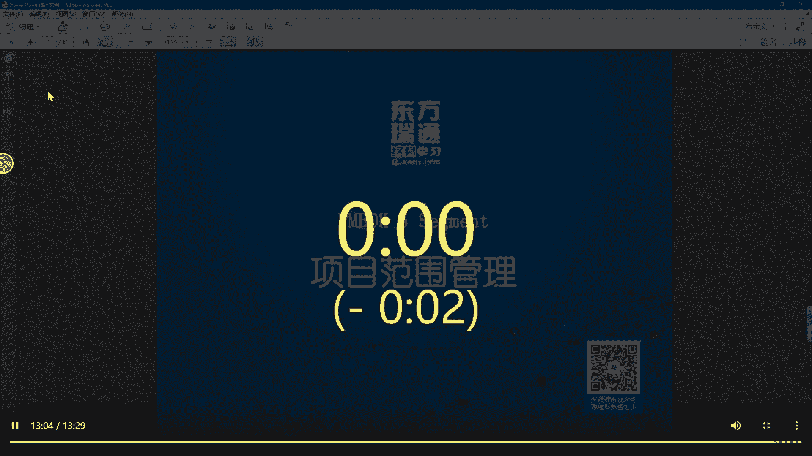
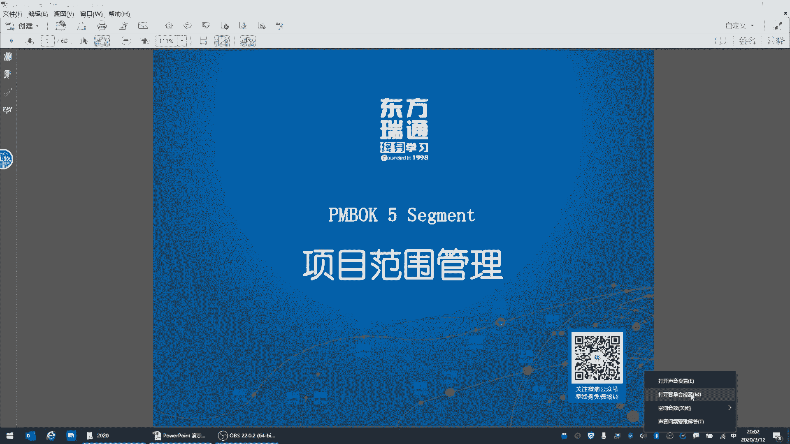
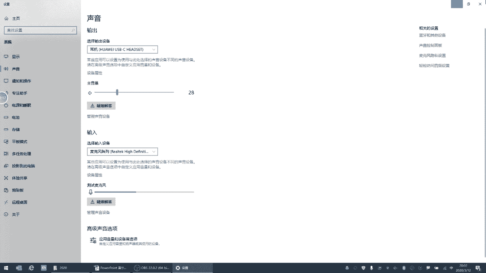
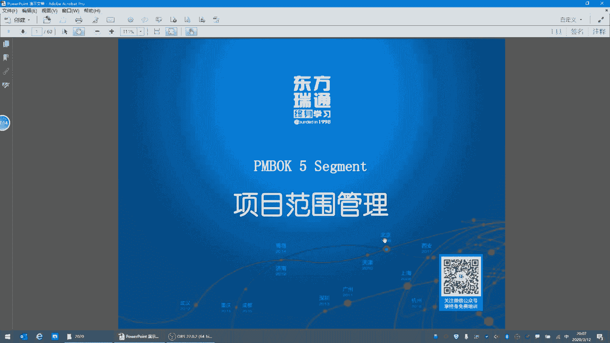
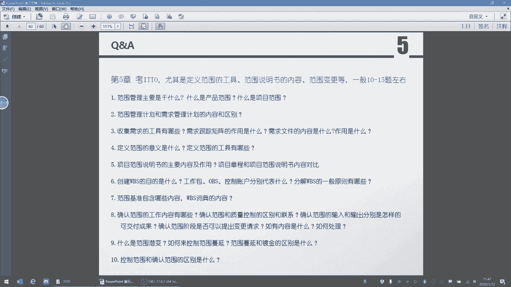
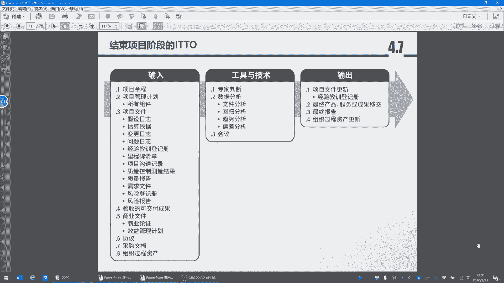
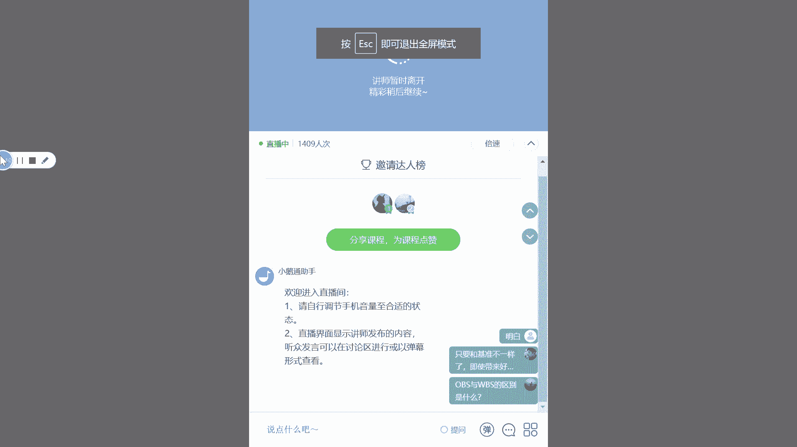

# PMP串讲 - P3：串讲第5章 - 我的乐芙兰 - BV1uE411N7zG

🎼。

大家是否可以听到我的声音？喂，是否可以听到我的声音？喂，是否可以听到？现在好一点吗？是否可以听到？如果没有问题的话，打一个一呃，协助确认一下是否可以听到我的声音。好的好的，哦，我换了一下。

可能是我的那个麦调整有问题哈。

好，那我们现在开始啊。嗯，我再重复一下，就是是这样的，我看了一下大家在群里头答题的情况。还是不错的啊，我们的进步还是很大的。从一开始可能只有一两道题。对到现在基本上有很多同学都是满分啊。虽然五道题不多。

但是能够感觉到大家越来越自信啊。这里有两点。第一个呢是我们对于。PMP他考试的风格以及他出题的这种逻辑啊越来越熟悉。就是有很多同学写的是套路，的确。啊，就像刘老师说的。嗯，PMP的这个认证啊。

它是有自己的套路和理解的。我们之前也讲过很多了。嗯，第二个呢。很明显啊，通过做练习的话，我们可以找着知识薄弱的地方。啊，我希望这两点大家尽量的都去提高啊，不光光是呃这个知识点，一定要把它的答题的逻辑啊。

也就是我们怎么思考这个这个题啊，给它搞清楚了，这样的话可以有助于我们大幅度的提高成绩啊。嗯，有很多同学是这样的啊，没有过多的时间来练习呃，来学习啊，那就是利碎片时间啊，跟上我们的节奏就OK了。好。

那闲言碎语不多讲，我们来看一下。啊，有一位同学说越答越差哈。嗯，是这样的啊，那那我也看到了很多同学问的问题，也有同学反映可能答的情况不是特别好。我多说一句啊，这里有一个基本点。大家一定要掌握一套逻辑。

有可能很多这个很多的呃网上写的，或者呃这个知识点理解层次不一样，但是一定您就。围绕着您自己的，一定要建立起来自己的一个节奏和逻辑。就是如果这个题您答的时候，就是那种感觉啊，选这个也可以选那个也可以啊。

这个不行，必须就是我很坚定我选择这个答案啊。是符合某个知识点，一定要ITTO的逻辑答题，千万别用那种工作思路答题。比如说像考呃职业职场的这种结构的。啊，就是我们那个组织呃事业环境因素中的啊这种。

矩阵的这几个形式，它其实都有自己的点。就是你看那个考题，它就我们就知道他考哪个点。比如说一看见有职能经理，那基本上肯定不是什么基本上都是这种呃弱矩阵或者职能矩阵啊。弱矩阵的话。

直接就在答案弱矩阵或者职能职能型矩阵。那直接就就选择这个职能经理。因为职能经理是老大。你你你项目经理一点能力也没有，或者只有一部分协调的能力，那你不找他找找谁也找不到。那如果是平衡矩阵的话。

或者在听中他说的就是矩阵结构的话啊，他媒体是否是什么矩阵，默认就是平衡矩阵的话。那有的时候我们就得看题了。那我平种举证的话，也就是项目经理和职能经理啊，他各有一半的权利。

那一般来讲呢是当我们呃某个资源对项目投入不够的话，那我就找职能经理，让他去找这个团队成员啊，这就是谈判。那如果是强举阵的话，那题目就简单了。那强举阵的话，作为项目经理，他的。

这个了level或者呃权利更高一些，那直接就可以呃去压制啊，或者是这个呃怎么说呢？口气就强硬一些。啊，所以这个大家一定要掌握好一个节奏啊。好。好啊，我看见大家在。嗯，一般我错一个啊，今天错两个好房啊。

其实说实话这个成绩已经不错了啊。嗯，实话实说，这个题坦白讲，在5个里错一个属于正常情况。因为有很多题它并不是很简单的，有的时候我们得绕一个要有坑啊，要有自己的点，容易让我们错啊。

所以我认为达到80%以上的正确率，这就很棒了。如果能够说呃五个题都对的话，那说明今天的知识点掌握的很清楚啊。好，还有错5个同错5个的同学没有交啊，我觉得这也没必要啊，错5个的同学也很难得啊。

这个一个也没蒙对呃，实话实说，这也不太容易啊。嗯也有的确也有骄傲的资本啊。好，我们来开始今天课程啊，讲一下项目的范围观理。

嗯，范围管理呢一共是6件事儿啊，我们先看一下呃，规划范围的管理啊，这个规划范围的管理比较特殊啊，考的点不多啊，我在天津班我也讲过啊，一一看见这个规划范围管理就是一个字啊，就是比较虚，比较空。

现在大家听着还断断续续吗？啊，这个规划范围管理呢，为什么说是比较虚的呢？它其实会创建一个范围管理计划。大家注意啊，范围管理计划和范围基准没有任何关系。

范围管理计划是怎么规划范围或者是怎么管理范围的这么一个方法论。为什么说比较蓄呢？它没有什么东西啊，它就是一个方法论。通常这个子计划呀。呃，严格意义上来讲，也不不能够说必须得批准成基准。

他他就是在规划阶段用的比较多啊。所以呃当然在控制阶段呢，有可能看看啊范围怎么管啊，再参考一下。你说这个方法论嗯，实话实说，没有必要说必须得跟领导看让他看看是否。呃。

是否是这个呃符合相应的呃就是让他批准一下。这个其实就是当我们很多的基准或者很多的计划打包，让领导来整体的批准一下的话，有些个小计划其实它不是这么呃这么苛刻啊，要求不是这么严啊，包括范围管理计划。

其实很虚的一个计划啊，领导看看就OK了，没有必要说必须针对它形成一个什么什么基准啊。好，这就是一套方法论。然后我们看一下5。2收集需求。嗯，是这样的，我的屏幕没有办法开全屏啊。

因为这个屏幕是用的这个宽屏显示器啊，这个文档是800乘600的。啊，开不了啊，大家可能会有一些不方便啊，这个我们稍微屈求一下。好，我们看一下5。2数据需求。收集需求的本质是什么呢？就是需求的文档化。

就是把需求记下来。啊，我们把需求寄来，这就是收集需求。收集需求考的最多的是相应的技术。啊，就是工具和技术考的比较多啊，这是5。2手机需求。大家还得需要了解啊，这个需求是范围的一个前端啊。

也就是你只有需求，你才会有范围。范围是什么呢？是做在需求中，你必须要做。做妾只做的部分。啊，就是氛围。啊，不是所有的需求都做，我只关注我应该做的范围，呃，只应该呃只关注我应该做的需求，这就是范围。啊。

所以定义范围呢有个很重要的输出啊，定义范围它会考什么呢？就是范围说明书，这个很重要。啊，范围说明书这个是一个重要的考点。然后5。4呢是创建WBS创建WBS的理解呢，其实和5。3是呼应的。

因为范围说明书是个整体，我们可以理解，就是你整个项目的一个整体的一个产品。而5。4呢是把你的这个成果整体给它分解开啊，所以它应该叫做工作包或者叫做工作模块啊，那书上的专用术语呢叫做工作分解结构。啊。

其实说的是一回事，因为中中文翻译过来之后就更简单一些，就是工作包啊。嗯有一口有一句话就一口气吃不出来个胖子啊，但是胖子是一口一口吃出来的，就是我们要把一个复杂的事情给它分解成若干个啊。

更容易管理的组件啊，就是工作包。到这个地方有个很重要的里程碑啊，就是范围的基准就有了。范围的基准呢包括三件事情啊，一个是。范围说明书啊，一个是WBS就工作包或者工作分解结构。另外一个。

就是WBS的词典啊，这是范围的基准。那好了，那么范围这个过程是没有执行阶段的啊，因为范围不是做出来的，是管出来的，所以确认范围是5。5。而控制范围是5。6啊，5。5之前我们说过，其实就是验收。

这个地方的验收是什么？是客户对于产品的验收。其实就是我们说的什么呢？就是客户对于你的产品，他认为没问题啊，验收啊，验收完了之后就可以去就是就是就去移交产品，或者把这个产品啊让那个送到甲方那边啊，签入库。

那么产品从这个合同的角度来讲就可啊就可以收款了。那后边发起人就可以去收款。大家注意验收完了之后啊，呃作为我们的作为我们项目经理，你需要对乙方付款。因为我们有分包商。但是从甲方来讲啊。

项目经理没必要找您的甲方去。去怎么说呢？去这个收款。我再强调一下啊，我不知道别的老师是怎么理解的，大家一定要仔细看书。项目经理作为项目的管理者来讲，管理的是为甲方提供产品的项目或者是自己公司的啊。

就是有可能是内部项目，那就是自己公司的某个业务部门发起的项目，也有可能是外部的那可能是某个甲方，但是项目经理跟甲方一般或者跟客户来讲，一般就是针对产品的，你不会说跟他具有这个合同关系。

因为合同协议是作为什么？作为这个项目章程的输入，他进来的。就是你项目经理只能看见项目章程，你看不见合同。啊，你看见的合同也只是合同中针对产品的这个验收的部分，你看不见合同的金额。

这个道理我在天津班已经讲了好几次了，大家读书一定要读出来滋味，要把这个事儿给他搞明白。有的时候就是说。我看见很多咱们在答题的时候啊，他有很多的错乱就是。从乙方来讲，我们就是项目经理啊。

因为我们作为这个项目经理来讲，就是怎么把乙方就是您公司作为乙方把项把甲方的项目做好。但是呢我们还有一个模块叫做采购模块，那是从采购的角度来讲，我们是甲方。但是你的这个供应商只会做你产品中的一部分。

或者做你做你的甲方的这个呃项目范围的一部分。你不可能说把你甲方所有的产品啊，把客户所有的项目都转包给你的乙方，那成了这皮包公司了啊，大家就理解了啊。所以这个地方确认的范围是什么？是。

客户对我的产品进行验收啊，是这么一个逻辑，千万别弄混了。我看见。很多这个。题目啊大家问的问题，我能感觉到在这个地方上可能还有些混淆啊。然后是5。6是控制范围，其实是什么呢？

就是最后一次你对范围的检查是5。5，就相当于让客户检查你的。产品那在中间过程中呢，那项目经理呢还会有控制范围。什么是控制范围呢？其实是防止镀金啊。或者是定期的，大家注意啊，如果你要说定期的检查产品。

这就有问题了。定期的检查产品那是什么？那是控制质量，那是8。3啊，那是叫做控制质量里头也有个检查啊，就像那个。嗯，叶老师说的有三个检查，第一个检查是什么5。5，第二个检查是这个8。3。第三个检查是这个。

啊，12。3啊，这是三个检查啊，大家一定要给他搞清楚啊，这这个5。6的作用其实。主要是防止什么？你监督产品范围的状态，你是防止镀金。啊，防止少做是5。5，防止多做是什么？5。6。好了啊。

有了这么几个基本的逻辑，我们就。对整个的范围的这个流程或者整个过程有了一个。鸟瞰啊，基本上大家对于这个事情有一个基本认识。好，我们看一下。后边又讲到了一个。逻辑啊产品和范围都逻辑。为什么说5。

5是产品范围的终结？也就是说，先客户验收。我再强调一下，是先客户验收后发起人验收。为什么？因为客户验收是5。5，发起人验收是4。7，这个5。5的验收是验收你所有的产品满足客户的要求。

就是人家你按照这个合同的验收标准啊，人这个客户一看没有问题。OK了啊，他在验收那个报告中一签字，然后才进入4。74。7的本质是什么？4。7的本质是意味着发起人认为你产品做的没问题，客户满意。

然后什么你所有的文档啊，所有的建教训也都打包了，能够转运为了，这是发起人的验收。啊，大家千万别弄混了，有很多同学就说怎么4。7还让客户验收呢？没有这么一回事啊，4。7是发起人验收，客户验收5。

5没完成的话，不能进入4。7。你客户验收都没有验收完，那你赶紧发起变更，赶紧走流整改啊，这个你不允许你进入4。7，你说客户都没验收的话，你你能够说这个组什么呃最终报告出最终报告，你客户都没验收。

怎么出最终报告呢，那不现实所以大家一定要把基本逻辑搞清楚啊，这5。5在4。7之前，我再重申一遍啊，千万不要认为这个先发起人验收，再客户验收那。发起人那不叫验收，如果是发起人验收的话，肯定是在客户之后。

你整个项目为什么发起人验收完了之后，你整个项目团队是就解散了。啊，这个之前我们在讲4。7时讲过，最后一件事叫释放资源，是你项目团队什么释放解散了。啊，千万要把这个事情搞理解了。也就是说我们可以这么理解。

其实项目范围支撑了产品范围，而产品范围呢又决定了项目范围。但是项目范围啊从这个理论讲或者从这种不是科学的角度。但是我们可以这么理解啊，项目范围应该更就是做的工作量会更大，但是不一定都是产品啊。

它有一部分行政啊、管理啊，这部分工作。好，让后我们看一下项目范围管理的一些基本的原则啊。嗯，在这里呢大家可以。产品范围包括项目范围不对啊，是项目范围应该比产品范围更多。我我可以这么说。

项目范围应该是包括产品范围。另外一个客户和发起人不是不都是甲方吗？错了，客户是客户，客户是您的甲方，发起人和您都是一个公司的啊，您不能理解客户就是发起人，发起人是在我我组织之内啊，发起这个项目的人。啊。

没关系，这个很很正常啊，因为有的这个可能大家理解的层次不一样啊，客户和发起人不是一个人。啊，如果在您公司内部的话，有可能是一个业务部门发起一个项目啊，然后发起人呢是为了推动啊立项。

然后把这个资源给您授权给项目经理。然后您来做这个项目啊，所以客户说发起人不是一个人啊，我再强调一下，客户是客户，发起人，是发起人。啊，在您公司内部永远呃在公司的角，从公司角度来讲。

永远客户不不可能是发起人。因为客户和您根本就不是一个组织内的人啊。好，大家没有问题哈。这个圈E的同学啊写的很好啊，get了ok大家一定把它搞清楚了啊。好。

然后我们看一下项目管理范围的发展区域和这个新兴实践。大家把这个划一下。这个地方特别强调了敏捷方法，什么意思呢？是这样的啊，如果按照传统的项目管理，也就是说我们说的这个PMP的这种管理呃。

传统的思维逻辑啊，它是什么范围是明确的，就是范围是完整而且明确的，做确只做吗？也就是说我一口气得把我应该做的需求都做完。但是敏捷是什么呢？啊，未来那个刘通老师会讲敏在敏捷的时候，他也会讲敏捷啊。

之前我们在讲这个呃项目生命周期的这几种类型中也讲过啊，叫自适应型的项目生周期。呃，敏捷是因为呀这个需求啊变化太快了，而且客户的反馈太快了，那怎么办呢？那我就是说在我做一个项目的时候，我2到4个月。

我不可能把所有的需求啊，2到4周我不可能也就是一个月的时间，我不可能把项目啊，所有的事情都搞定。那好，那我在一个迭代的周期内啊，也是这2到4周，我只针对我应该做的需求。

我给它拿出来放在我的这个迭代的生命周期里叫做什么呢？叫做这个。呃，叫做这个任务清单啊，而未完成的需求怎么办呢？那我列入未完项，我在下一个迭代的生命周期，我再考虑哪个需求更重要。我在这个迭代周期里。

我应该把我应该做的需求做完啊，再做这个根据需求来确定我的这个任务列表。所以它不一样的个思维的逻辑，也就敏捷的话，那个需求总是在变。啊，那但是我这个敏捷的周迭代周期之内，我要做的这个需求啊。

可能叫用户故事，可能只有一个两个啊，所以我要做的任务量就这么多啊，所以这个大家要了解。还有一个敏捷是通过原型法，什么？就是多个版本啊，不一会儿我们会讲圆型法是多个版本来明确我要做的需求，这个大家。

基本逻辑得清楚。那原形卡目的是什么？降低了这个项目的风险。因为如果一口气，你把所有的需求都做出来的话，问题就来了。对吧。是所有的人都卡了吗？哦，我看见很多同学说卡了是吗？现在好一点吗？大家如果不卡的话。

打一个一确认一下啊。因为我我不知道这个网络是不是有问题哈，我用的是宽带网应该还可以呀。可能晚上的时候，大家共享带宽可能会有点卡，现在OK吗？哦，他有可能啊人数特别多的时候啊，那个平台啊有点卡啊。

大家刷一下。呃，我在刚才有一个同学问的问题啊，如果是内部项目哈。发起人提供钱不是甲方，嗯，这句话说的是对的。发起人您的您问的是发起人提供钱，不是甲方吗？是这样的。甲方是什么？是客户啊。

也就是客户跟您的公司签合同，然后由您公司的一个人把项目分配给您。所以您公司的那个人叫发起人，他提供钱，但是他提供钱是从公司内部提供给您资源，不是不是甲方为什么你道理很简单啊。

客户跟您公司签合同不可能说我就按照这个合同的金额来做这个项目的成本。啊来做我项目的预算。那是不可能的对吧？那肯定是什么呢？肯定是我内部的一个发起人，有可能是什么一个业务部门，或者是什么呢？

或者是PMO或者是项目组经理，或者是这个。呃，那个您公司的某个高层把这个合同拿拿过来之后，然后他自己啊算了一下，我大概啊大概我的预期利润啊，我的营收是多少，我的成本是多少。

我留回来那个毛利率然后呢啊找一个这个经营能干的项目经理啊，做一个立项的工作，就是颁发项目征程来来指定啊一个项目经理让他把这事搞定啊，然后我把利润呢挣到手啊，所以发起人也提供钱，但不是甲方。

我不知道明天这位同学是否ok方便的话打一个get或者打一个okK，我就心里有数了。嗯。嗯，小马哥问了一个问题，范围这样不断变化，不会出现蔓延吗。啊，如果您问的这个问题得有一个前提，您应该写在敏捷项目中。

范围这样变，不断的变化，不会出现蔓延吗？不会在敏捷项目中压根儿没有蔓延这一说。啊，他的蔓延跟PMP的这个我们现在理解的蔓延不一样啊。未来在呃后几节课中。

刘老师会着重讲那个刘通老师会着重讲敏捷的这个逻辑啊。敏捷他他就是就敏捷这个项目没有完的这一刻啊，他始终在做。因为这个产品不停的在接待，不停的更新。您现我我我我反问一个问题，大家就好理解。

你像那个天猫淘宝，您说这个项目他有结束的什候，他不停的在完善他的产品。啊，他范围不停的在变化，因为他根本就没有完的那那个迭代是什么？是其实迭代有点类似于产品经理的工作。

也就是说他在某个时间内这个范围是固定的，但是他增加的范围或者增加的需求怎么办？他列代这个需求未联未完项里头，未来再再说。嗯，我不知道您是否听过我之前的课。啊。

小马哥听我听我第一天的课的第二章会有相应的认识。敏捷的项目严格意义上来讲是不涉及范围变更的。啊，小马哥的问题，我是我我get到了啊，我不知道我说的您是否OK。好，大家有什么问题就可以问啊。

今天时间还可以啊。我现在啊就感觉到有一个让我感觉到有点说是怎么说呢？就是。就是有点担心的，就是大家的这个知识体系没建起来。啊，我不知道是不是这个咱们的精讲还没有结束啊，还是什么情况。

就是大家一定要建立起来一些基本的逻辑。可能有些细节我们得1。1点的来来来去突破。但是有一些基本的逻辑。比如说这个客户，甲方乙方的事事情啊，什么是项目结束啊，什么是时候是这个变更才能有的情况下。

这几个基本的点啊，我我我觉得有的时候大家还会还是有些混淆，这个就麻烦了。不能凭着感觉大题啊。如果是敏捷项目，还满足项目临时性的这个说法吗？嗯，敏捷项目严格意义上来讲，在一个迭代的周期内，它是临时的。

因为我得一个呃2到4周，也就是一个月，我得把我这个版本的项目搞定。所以从这个角度来讲，敏捷项目它也有临时性。但是你要从一个产品的放眼望去的话，还真没有一个明确结束的时间。可能这个项目不停的在改。

大家也就是今即便我今天讲课，大家也抱着一个质疑的态度，为什么你得看讲义，看书。如果看我们的讲义，还有疑问，那就看偏安报感。因为那本书考的话，就考这本书，大家一定得去看书。

千万别别就说我周四或者我周二或者我这个做做题啊，听听老师讲，就把所有的问题都解决了，不经过自己加工的，永远是别人这个别人的东西，那可能你怎么就这么对这个老师这么这么自信的，这么信任的那不一定啊。

那可能就是我现在讲的也是我的理解，不一定是对的。大家一定要形成自己的理解啊。发起人提供的资金不是客户提供的资金。如果内部项目的话，发起人提供的资金也是由业务部门拨划资金，是这样吗？对，员工说的相当棒。

如果是外部项目的话，有可能客户跟您公司签的合同，然后您发起人呢把其中的一部分啊资金拿出来。当然这时候客户还没给你钱，但是那是预期未来可以应收的。所以那么我公司先承担这个风险。

那从财务那拿出来一笔钱作为成本，那肯定是小于客户金金额的一般，对吧？那如果是内部项目的话，那是业务部门拨划的，或者是高层直接啊，有的时候你会发现高层来定一些项目。比如说我们上一套OA吧啊。

或者我们啊部署一个这个ERP，那可能都是高层啊，他想实现某个业务功能或者是这个公司的战略，对吧？那也OK啊。嗯，我不知道这儿说员工如果没有问题的话，打1个okK确认一下您的这个理解本身已经很深了啊。

我们看一下fly这位同学，制造业农敏捷开发嘛。可以。严格意义上来讲，任何行业都能敏捷开发，关键看您制作的产品。它迭代是否足够快，或者它是不是根据市场变化得不停的调整啊，我不知道这么说。

弗赖同学是否能够啊，咱们能能能不能建立共识啊？啊，制造业也会有这个敏捷开发。现在就是为什么会有敏捷开发啊，引用一句话就是不是我不明白这世界变化快啊。总公司也要怎么也要留个管理费和应急费啊。嗯。

田工这个话说的有点理解过深了啊，其实严格意义上，不管哪个公司，他都会留留利润，对吧？嗯。这个应急费其实写的不是特别好，应该您得改成叫做管理的储备啊，管理储备金啊，这个应急你要这样写的话。

就有可能变成了应急储备了，那就是不对了。因为什么应急储备是在项目基准内的。敏捷项目多次迭代范围变了，成本是不是会重新计算？很有可能他在一个迭代周期内，它的成本有可能会重新计算。

所以敏捷项目的成本如果是卡的很死的话，有可能甚至牺牲一部分范围。但是那通常是敏捷。而在传统的项目管理中。啊，不会说因为成本和进度来改范围，应该是先定范围，再确认成本和这个时间啊。成功，如果没有问题的话。

打一个get或者OK啊。好，谢谢fly的同学的回应。所谓的柔柔性生产，这个我就有点什么了啊，我这个猜数学浅了，因为柔性生产这个词我能理解您说的话，但是我不知道。就是这个柔性生产的理论的这个点。

那如果这样的话，我直接回答房宫的这个说法，显得我就以偏概全了。我能理解，但是我不确定是不是就是柔性生产的定义啊。这个敏捷开发啊，但是您提的这个词我能理解啊。好，谢谢啊。好，那没有问题的话，我们继续啊。

画面的一确卡了，因为我半天没有动，着重讲一下敏捷啊。如果范围变了，成本和进度肯定会变化。这个话呢，你要说肯定你看啊我有时讲题的时候，我一般会说通常为什么千万不要说肯定，一说肯定就以偏概全了。

说这个世界上哪有什么肯定这个词，但是天宫的话本身我能理解，也没错，就是一旦范围变化，通常是基准弯。因为什么范围一变，肯定会通常会增加成本或者增加进度。敏捷开发怎么签合同，范围都不能签确定。嗯。

敏捷开发你要说范围不能确定的话，也也可以签合同啊。因为有的时候你会发现我要维护一个大型的产品，或者做一个产品运营的话，比如说像阿里这个你说他怎么来确定合同？对吧那就是什么，那我就一期一签好了。

或者是什么？我就是一个运维的合同，你就一直做就好了，或者一个产品一直做就好了。啊，所以敏捷开发的合同图后边我们会讲到在加强采购时，我也会讲到它有可能是基于成本的。你干了多少工量，我就给你多少钱就OK了。

因为范围是不确定的。啊，郑这个郑凯郑工是否啊这个郑凯同学是否OK啊，方便的话，get我一下啊，因为的确是这样的，敏捷开发的合同还真跟传统的项目管理合同不太一样。

验收的可交付成果内容是不是和现实技术合同一个意思？うん。嗯。不能这么说。😔，验收的可交付成果严格意义上来讲，应该是5。5的什么那个验收报告里确认的这个。啊，确认的这个。

那么说和现实的技术合同是不是一个意思？我不太理解您引用的这技术合同啊，这个不能这么说。这个这个川普同学啊，这个不能这么说啊。嗯，fly同学回了一个公告合同啊，我看到了啊，这个可以这么理解。

公告合同也可以啊，卖人呗啊，这个补充也补充的很好，成功哈。好，郑工也明白了啊，正凯同学也明白了ok我们不在这停留，接大家接着继续啊，经过讨论，我不知道是否这个讨论，大家是否能够加深理解啊。

或者这种方式是否O稍微耽误点的时间啊，我们得加快进度。好，讲一下规划范围的管理。Yeah。规划范围的管理刚才讲到了啊一个字嗯，就是虚啊，因为它是就是一套方法论嘛。好，然后呢我们来看一下啊。

它会出两个计划，一个是需求管理计划，一个是范围管理计划。刚才我们说了啊，需求在于一个求资，不是所有的需求都做，而范围管理计划在于一个借资。所以是什么求中取借，也就是说我得在很多的需求中。

我明确一个工作界面。因为什么有一件说的标准，我只做，我应该做的。因为你合同给我就那么多钱，我不可能说你所有的想法我都满满足啊。所以在这个地方我就特别强调一点，我个人理解，或者我看了很多书像。

不应该是以客户为第一。满足。相关方子。因为你如果去从呃项这个项目管理的角度来讲，你要满足客户所有的需求或者所有他的期望，那你的项目就赔了。为什么道理很简单？客户并没有把钱直接给项目经理。

客户把钱交给的是发起人，发起人把钱交给的是项目经理。所以说你应该满足的是发起人的利益。发起人，即便你这个他的这个发起人有可能会缺斤短两，会少给客户一些钱。啊，或者少给客户一些产品产品啊。

那是价值观的问题。但是多我多说一句，你首先你得尊重什么发起人，有可能他就是希望这个项目更多的盈利。那我们凭什么更多的来给这个客户做更多的产品或者更多的这个需求。那不现实啊，所以一定要搞明白啊。

作为项目经理来讲，还是那句话是让发起人满意啊，这是贯彻整个项目管理的一个思维的。你要说客户满意度第一。那些话都是从给客户在的时候说的，大家能理解我的意思啊，这哪个国家的项目管理，这不是说中国式项目管。

就哪个国家的项目管理，他也是什么？他也不是说全文全意的为客户服务，那不可能，那冠冕堂皇，那是从站在公司角度说的那公司关起门来，那肯定你得听发起人的，谁给我们钱，那我们首先满足谁的利益OK啊。

技术合动可能只是验收的一部分啊，这个不一定啊，不好说。好，让我们看一下规划范围的管理的IDTO大家注意啊，因为规划范围管理之前啊，这是第一个子计划，有可能有项目章程。对吧因为项目当中是在启动阶段。

他可通常会进来。上目江程有三个作用，6个内容大家还记得吗？如果有回忆的话，有记忆的话，大家可以在聊天栏里写一下。小马哥写这个太对了，我不知道您说的是什么事儿啊。然后我们再看一下这个其他的。

还有一个就是项目的管理计划。呃，项目的管理计划应该是一个总分总的关系，先有个总的计划，再有分计划，然后再打包成为一个总计划啊，所以它是这么一个过程。所以作为总计划来讲呢，他有可能会指导这个嗯子计划啊。

所以这个输入里会有项目管理计划也是OK的。客户至上都是假的了这句话，您不能这么说，当然客户至上是对的了。但是我们现在研究的是项目经理的立场或者角度。客户至上这句话没错，我再强调一遍，那是公司的角度。

从项目管理的角度，我们心中得知道有客户啊，这个客户的需求，我们得这个质量做到满百分之百。但是你不能说您客户的至上的这个逻辑是假的，我没有那么说过。我说在项目管理的角度，谁最大是发起人，不是客户啊。

崔鹏同学回答三高冷冷了解行，这就这就OK了啊。啊，批准授权支持，这绝对OK了。如果是没看书回答出来的那是更OK了。好，然后这个规划范围的IDTO我们过啊，出来两个计划，一个是范围管理计划。

一个是像需求管理计划啊，大家可以看一下啊，需求管理计划在于求啊，而范围的管理计划在于G。好，我们看一下5。这是一个重点考的一个过程啊，大家得。更多的去投入啊，什么是收集需求。刚才我们说了。

就是你需求的文档化啊。好，我们看一下收集需求的ITQ。收集需求问题给我个很重要的就是项目商程。因为项目章程就是项目的核心目标。对吧就是你做项目的本质是什么？而这个在项目的项目章程里的核心目标里。

又会有一个什么商业论证。因为商业论证也是项目章程的一个输入。为什么在这个地方也求商业论证？就是你从企业的角度，或者你从战略的角度，你的价值是什么？对，这个东西很重要，一个是发起人告诉你啊，小翠啊。

这个范围啊呃范围质量和成本呃，范围都快好省，这几个哪个是最重要的啊你还得什么，你还得看啊。这个我实现了项目章程里的这个所有的要求之后，是不是从公司角度来讲，他也得挣钱啊，也得挣到名名利二字嘛，躲不开啊。

所以你还得去参考上业证章啊，一因为上一轮证里有什么？我们之前讲过上一轮证里有业务需求。对吧哎对你的业务需求是什么？而这个呃核心目标是你的针对你的这个关键发起人，他哦关键相关方。

他对你项目的一些个基本的要求是什么？这些都得考虑。嗯，输出的文件我们一会儿再看工具啊，输出的文件一个是需求文件，需求文件就是把需求记下来。另外一个就是需求跟踪矩阵。大家注意这个很重要啊。

什么是需求跟踪矩阵两件事，一个是什么溯源。就是谁说的什么需求，另外一个需求跟踪矩阵是什么呢？是商业价值，就是你做的产品你得有商业价值。对吧你客户做完产品之后，客户不给钱，不好意思，我拿需求跟踪举证。

一说什么谁谁谁说的，什么时候说什么时候说的，他签的字啊，你得能够。追项的这个责任啊，收及需求的数不多说了啊，刚才已经讲过了。好，我们看一下工具啊，头脑风暴之前讲过创意不不不研究。啊。

天马行空访谈叫做什么。真慢啊，不好意思，我咳嗽了一声啊。真是什么？你了解到的是真实的，清楚的，慢是什么？这个访谈的技术就是时间长，通常是一对一啊，对于什么，对于这个关键相关方或者大老板啊一般用这个。

嗯嗯。这是拿到员工写了一个拿到项目章程后，要知道为什么做这个项目，所以要上业论证。这个话是谁说的？这个是不是本末到了呀？是先有的商业论证，什么是商业论证？就是你组织内部发起这个项目的原因。

你拿到项目章程，那是那是项目那个发起人对你项目经理的一个核心要求。你你没有商业论证，你怎么会有项目章程呢？而不是说你拿到项目章程之后，你再找人找商业论证。

其实商业论证压根就不是项目经理写的那个那是那是高层，都不一定是发起人写的。可能发起人去参与和这个高层去论去确定这个去讨论商业论证，有可能是外部的这个这个这这个这个商业论证分析师或者VC来做的。对。

或者是这个风险投资方他来做的那商业论证有可能都不来自于你你这不是来就就为你作为项目经理都没有，就你只能去参与，你都不不可能去决策商业论证。那都是高层的事。有可能发起人只是呃在讨论商业论证的这个层次里。

他也是一个呃这个这个这个level比较低的。这个涉案论证是先有才会有项目章程啊那员工如果OK的话，打一个get啊。当然是呃对，小马哥说的对，当然是先有商业证证，后有章程了。

所以我看员工写的是拿到项目章程后要知道为什么做这个项目，所以要有商业证证。我不知道您想表达的是什么啊，是不是。这个我不太理解了，这个。哦，我能理解的，是不是员工是对之前的一位同学的补充啊。

是你得看看筛业认证啊，你要这么理解可以，但是是现有的筛业认证才有的项目章程啊，这个大家逻辑要清楚。确是确认章程对商业论证的理解啊，房工这个那个谁员工已经OK了啊，他应该是回复的。

可能是因为这个聊天栏里表达的不一定那么这么。对，成功的理解是对的，是向上论啊商业论证。嗯，好。嗯，然后是焦点小组，焦点小组是。一对多啊，但是呢是同一个立场或者同一个组织啊，是一个同字啊。

所以之前我们说过不多说了。好，然后是问卷调查，问卷调查是什么呢？是。大家都做过文件调查啊，它的特点是快能够快速的从更多的相关方啊地理位置分散的这个人。人中找着这个最快的收及到需求。

但是他的问题大家可以看到啊，他的问题是什么？是难以保证真实性和有效性，所以是加快。大家还记得那个真曼是谁吧？啊，这个地方是加快，这就这俩就都记住了。嗯啊，一个是真办，一个是假快是这样的啊。

咱们讨论讨论也是O的啊，这个我去减短见这个去减少啊这这个讨论的时间。但是为什么这个课本身就是讨论的啊，如果不讨论的话，大家有些东西不就是理解比较模糊啊。所以这是文卷调查问卷卷调查我最后总结一下。

是尽快的啊从更多的人中啊收集到这个需求。然后我们看一下标杆对照，什么是标杆对照呢？大家可以看一下，这书上能量化啊，与其他可比的组织实践进行比较，以便识别于最佳实践。就是从什么？

一般是他人或者是他人的项目或者是他人的组织中来获得经验教训，这就是标杆对照啊。相当于什么呢？对举个典型的例子，就是抄袭啊，路酷揽胜，咱们国家咱们国内有一款车叫做C叉70啊，跟这个路酷揽胜嗯是很相似的啊。

这个就是啊标二对照啊，是抄袭他人的经验啊，或者呃其他项目的经验。然后文件分析文件分析主要是分析是什么？从组织过程资产中。从以往的组织过程，资产中来获得相应的这些个需求啊，就是我们的当前的需求。

可能是来自于以往我们对于项目项目的理解或者类似项目它有哪些需求啊，叫文件分析。嗯，这个是用的比较多的一个工具啊。嗯，还有一个我再强调一下啊，一个是文件分析。还有一个如果我们是从。以往的人种啊。

就是从以往的文件中你获得经验。一个是从以往的人中，他就是专家判断。嗯。嗯，我再强调一下，专家判断未必是高层，有可能是这种就是只要但凡做过项目，或者有这个哪怕是没有成功经验，有教训的人啊。

都可以用专家判断。就是我可以问问对方或者问问这个呃做过的人，他们的感受，或者他们的一些经验教训啊，专家判断在什么收集需求啊，包括这个呃识别风险啊，很多地方都用专家判断。

或者是这个定性定量的风险分级中都用专家判断啊。专家判断是一个常用的工具，未必是这个高层，就是任何做过的人都是专家啊。然后是投票投票的话，我们之前说过德尔菲啊，这个就是相对大多数大家都很熟了。

我就不再介绍了啊。啊，多轮命名。然后是多标准决策分析。多标准决策分析呢其实是为了方便。嗯，我们收集需求啊，就是从很多的这种复杂需求中，我们找着最关键的最核心的几个需求啊，它可以进行评估和排序。

比如说买车啊，有可能有的同学买那个省油的，有的同学买那个安全的，有的同学买舒适的。有的同学可能买这个啊这个性价比高的那怎么办？我们就来啊就这个横纵向比较一下啊，这就是多标准决策分析。好，然后这是亲和图。

亲和图在5。2收集需求和8点，我记得是8。2啊，在在管理质量中都有用过。啊，亲和图大家画一下，主要是分组技术，也就是你作为这个呃头脑风暴法，你可能有一系列的需求。

经过什么亲和图干什么进行这个不同的类别的归类。大家可能做过类似很多这样的事情。比如说我们开一个会，最后你总结一下，可能很多人的想法，最后我们总结出来就是这几类啊，说的都是一回事。

它的目的是为了进一步的审查和分析啊，大家了解即可，这是亲和图。那现在用了很多很多的会议技术或者做培训的，用的很多。然后思维导图思维导图之前我们也说过了啊，这个之前我好像跟大家也打开过啊。

优秀的人这个思维导图啊，他是会把这个这个PMbo整个把它这书都拆开啊。思维导图应该是。通脑风暴先收集需求，然后用亲和图收集分类，分成那么几个几类，再用思维导图啊，这在这几个信息导。

或者在这几个信息的关键点上再给它扩散啊，这就是思维导图。它是激发一个二次创意的过程，了解即可，很少考。然后是民意小组，民意小组是这样的，德跟德尔菲很相似啊，德尔菲属于这种匿名投票。

而民意小组呢是一种类似于这种公开投票啊，呃有点像什么呢？就是他虽然也是也就是不是像德尔菲这么严肃，就是就是有什么想法，就往这个这个人的底下的这个想法去贴一下啊，就是就是呃我同意他的，我同意他的啊。

就是就是很随意的，就可以啊这名警小组大家了解即可，很少考，就是对于呃这种头脑风暴的一种什么的一种。就是大家的一种倾向性的啊一种收集。好，然后这个观察与交谈了解即可，这个很少考啊，什么是观察与交谈呢？

就是我收集不了需求怎么办呢？我就看看其他人的啊，或者我是旁边看，或者我在一个流程中啊，跟他去学整个去在一个流程中去找他的所有的生产的工艺啊，包括他呃这个这个车的这个技术理解啊，这就是观察与交谈。呃。

很少考啊，大家了解即可，就是有点类似于工作跟踪技术啊。引导之前我们在4。2的时候呃在4。1的时候也讲了很多次了啊，什么一个意思就是不同的组织，不同的立场用引导啊。嗯，它和焦点小组是对应的，是一对反译啊。

焦点小组是相同的对吧？啊引导和这个焦点小组，它是这一对反义词啊，大家一记的话呢，你看这个就是我的学习经验是大家一定要用类比法去记，这样你能记住两个啊，这个更快一些。嗯，再往下是引导师研讨会啊。

引导技术有三个工具，第一个叫GED也叫甲方乙方联合开发。既然说到了，甲方乙方肯定是什么，对吧？肯定是冲突的，而不能立场呃，立场不同的双方不能说冲突双方啊，通常它不是一个组织，不是一个立不是一个立场啊。

有可能是不同的立场。而且很有可能。然后呢，除了引导时间讨会呃的这个GED还有一个叫QFD叫做质量功能展开。质量功能展开呢就是围绕着需求，它你会有一系列的分类和排序，你得到一个最主要的需求。

有点类似于多标准决策分析，但是和那个还不太一样啊多标准学折策分析是不同的角度，而质量功能展开呢，是你把一个产品拆开，你得需要有哪些哪些的功能和性能的要求或者模块啊，这是质量功能展开。呃，而且在其中呢。

你也去找到一个或者找到你一个你的啊比较关注的这个产品的模块啊，就是质量共同展开。其实一个是站在产品角度，一个是站在。这个呃这个更优的一个角度啊，所以就是质量功能。大家这个考的也不是很多啊。

考的最多的是JED这个是经常考的，包括引导技术啊，我把经常考的点我都说一下啊。嗯，有的同学会说崔老师，你怎么知道会考会不考呢？因为是基于大数据统计的，就是。几乎是每一次考试之后。

我们的内部教研组都会去讨论一些题啊，包括实话实说，我做了得有。得有这么。😔，你想200道题是一套的话，我做了几百套题是有的。基于这种做题的感受，就是有的题目就是一看我就知道他想考什么啊。

这个可能也不太好，大家一定要注意。我再强调一下，千万不要拿老师讲的这些技巧当知识来学，这些都是为了我们辅助配合我们考试的。真正的学习肯定是看书。形成自己的这个知识体系和理解，而不是说我见招拆招。

见招拆招，这都是为了应试。但是呢我为什么要这么讲串讲，或者未来我模考中，国还会去强调这些，是因为我们作为这个培训机构是尽可能希望同学用最小的时间，最小的成本，最小的代价通过考试啊。

这是我们能做的也是应该做的。但是呢从学习的角度来讲，这样有点功利啊，所以我们该看书还是要看书的。第三个引导技术的另外一个工具，叫做用户故事来画一下。什么是用户故事呢？是广泛应用于敏捷方法中。

就是我们可以把自己想象成是一个客户或者相关方。在整个产品的这个过程中，或者或者这个流程中，我们啊。能受到什么样的收益啊，我们应该怎么想怎么做，或者我怎么使这个用户的感受会更好，会实现更大的价值啊。

就是站在用户的角度看待产品整个流程。你像很多APP的开发，对吧？这个淘宝啊、天猫都会用到用户故事。好，系统交互图系统统交互图和用户故事它是经常用的。但是系统交互图呢，它是沿着一个这种输入输出的关系。

就是我的上一步应该产生什么样的一个结果。那我的下一步我应该啊应这个会应用哪些输入进来啊，然后再创造我的下一步，就是考虑流程之间关系的啊，系统交互图。啊，或者是考虑一个完整系统中的各个功能模块之间。

他们的输入输入关系啊，比如说像信息系信息系统安全就经常用这个系统交度嗯。圆形法一上来我们就讲了啊，在敏捷中它用的比较多。呃，圆形法也叫做什么呢？也叫多版本。也就是你设计出来很多的版本啊。

而不是一口气交付一个成熟的产品给客户，而是我给你个1。0。你看看这个行不行？不行，我改，然后2。03。0一直到客户满意为止啊，这就是圆形法圆形法运为呢用的比较多，因为它什么，大家画一下，它减小了风险。

啊，在考试中他会说啊，那我通过这个多次的提供版本，让客户明确或者确认最终的一个需求啊，来降低项目风险的方法是什么？这就是原型法。大家注意啊，我讲课其实讲精讲的时候可能讲的会更多。但是讲串讲的时候。

我会强调一些关键词，你像原型法一出现多版本或者出现这个减小项目的开发风险或者是产品风险啊呃那基本上就是在收集需求的这个角度来看，就是圆型法。好，然后经过这一系列的这个嗯。数据需求的工具。

最后我们产生了一个重要的输出，就是需求跟踪矩阵。刚才我讲了需求跟踪矩阵。是一个文件啊，它是一个输出嘛。他至少包括两个部分，另一个是什么呢？一个是他的这个溯源，就是他来找你的，谁说的这个需求。

另外一个呢就是他的这个。一个是溯源，一个是商业价值，确保商业价值。就是你谁说的那最后我得找你验收，所以需求功能矩证经常用在5。5和5。6。啊，这个大家一定要注意啊，大家一会用会看5。5和5。6的ITQ。

你看它的输入经常有需求跟踪矩阵。为什么？就是我验收的时候，我得让这个需求跟踪矩矩阵中说出来这个需求的来源，我得让他去看是不是满足他的要求。他要满足的话，那好，那你要这个你要满足你的需求，你也同意了。

没有问题，你也这个认为呃符合功能要求的话，那你作为客户来讲，你就得给我验收报告啊，给我相的这个成费用后期。啊，所以这个后期谁要这个费用呢，或者谁来结算呢？一般都是发起人或者业务部门啊，那不归我们管。

但你得给我验收啊。它是这么一个过程。好，5。3定理范围定理范围大家画一下是把需求转化为可定理的范围。很明显，需求是一个什么无形的，就来自于人的头脑中。而这个范围是什么？是有形的，你得能描述出来。

而且可以被量化出来。对吧。好，我们看一下定义范围的TTO很明显啊，作为需求文件你得进来。大家注意，你看它进来的是需求文件，而不是需求跟踪矩阵。我再强调一下，需求跟踪矩阵是经常在监控。啊。

这个过程中用的啊，这个监控工作组啊用的，而这个需求构念是在规划阶段经常。好，我们看一下输出。范围范围项目范围说明出很重要的一个考点。项目范围说明书包括有4件事。第一个就是什么项目范围的描述。

就是项目范围的描述。我们刚才讲了，首先是项目范围，然后是什么产品的描。啊，就是可交互成果的描述，也就是产品的描述。第三个，你要描述到产品这个层次，那肯定有验收的标准。就是你必须要做哪些事。第四个是什么？

你验收书你必须要做的。刚才我们讲过范围是做切止做，那什么还有不做的事情叫做什么叫做这个除外责任或者除外因素啊，所以项目范围说明书，这四件事，大家在脑子里要有数，首先是项目的描述，然后产品的，然后是验收。

然后是验收是必须要做到的，而且啊必须要满足的。啊，后边是这个不做的，还有什么叫除外责任，大家都有声音吗？方便的话打一个一确认一下啊。因为为我看同有的同学问了。好，然后我们看一下工具啊。

工具的话呢没有太多的考点啊。如果说考的话，大家知道这个产品分析就行了。产品分析是什么呢？也就是我们老百姓常说的那个性价比分析，它叫做工程价值或者叫工程分析啊，性价比。啊，我们只需要了解产品分析是5。

3定义范围的一个工具。就是我们作为一个产品啊，有有形产品的描述的话，你肯定你得啊确认一个性价比。就是你你做这个产品的范围啊，呃是不是应该做的，你的功能啊和你的成本之间的关系啊。

这个就是你为什么要做为什么要做到这个地方啊，它会有一个分析了解即可啊。啊，备选方案分析很少考，就是你在做产品的描述的时候呢，有可能有一个主产品，还有个bakeup啊，就是你主备可能都有。

比如说你像做银行IDC的时候，你肯定会有一个栽备中心啊。因为我是做信息化做了大概十几年的样子啊，嗯给这几个股份制银行之前做栽备中心做的比较多，就是很明显就是你在规划IDC的同时。

你可能就直接就做这个啊叫它叫做三三线两地啊，这个双备份。从线路来讲是三个备份啊，从地点来讲是两个。然后产品的分析刚才我们讲了啊，就是性价比，这有一个公式，V等于F除以C很明显啊。

呃我们是追求的是C越小F越大啊，这个产品的价值越高。好，输出啊，项目范围说明书刚才在这个地方已经说了啊，一共这四项，这是来自于PM报啊，大家去看一下这个PM报告上的理解就OK了。嗯。

需要区别的是项目章程和产品范围说明书，很明显，产品范围说明书已经在项目章程的基础上做了啊建定明细或者滚动式规划，不是说只有项目管理计划来建定明细或者滚动规划的啊，很多地方都是在建定明细和滚动规划的。

你项目章程，你到你前提是一个文件，你到后期可能就更明确项目的这个具体的要求了。但是项目章程一般不会变啊，项目章程应该定来之后就固定了。但是你可以基于这个文件给它建定明细成项目范围说明书啊。

这个大家得需要了解。啊，我看见了很多同学的回复啊，一看就是做IT的哈，3D两中心没错。两地三中心啊，大家说的应该是两地三中心啊，两个地点三个中心。因为这个IDC就有一个主，一个备，啊。

然后在在备中心中再有一个啊再有个信息系统。好，五度。好，然后我们再看一下至约因素啊。这个制约因素呢是。项目范围说明书中，另外一个需要记的。其实这些因素和这个假设条件都记录到了一个叫假设日志文件中。啊。

在假设日志里。有这个呃有这个假设条件和制约因素，假设条件是什么？就是说我希望未来啊他这个能发生，但是有可能他发生不了。而这个基约因素是什么？是你必须要遵守的。比如说我公司就是这个能力差。

人员就是能力差啊，或者流程就是很复杂，那假设条件是什么呢？是假设客户对吧？我认边能力差，但是假设客户呢啊时间啊他能接受啊，我这个项目的时间干长一点，他能接受，或者这个呃客户呢提供的资金能到位啊。

这就是假设啊，所以假设和制约未来啊，在目前都填写到这个假设这里，但是未来他会渐进明细成什么呢？就是风险。就是我们现在在规划范围的时候，先不考虑风险啊，通常不考虑不太多考虑风险。

但是在后期你在识别风险的时候，你可能在前期的一些假设和这个制约，可能后边再详细再展开风险的时候，我们再给它填充进去啊，再滚动建明气成风险。好，5。4创建WPSS。大家针对这个课程，如果感觉还ok的话呢。

我们就不休息了啊。大家打一个一确认一下，还能坚持。包括之前讲的啊，大多数可以接受的话，打1个ok或者打1个一确认一下啊。我喝口水，咱正好休息这么一分钟。Okay。大家看看有什么问题吗？啊。

老师给哪份哪些银行做过栽备哈这个。跟本本科没有关系啊。如果感兴趣，可以跟我单聊。是很大的一家股份制银行啊。好的嗯，这个。能够感觉到啊大家听的很很认真啊，因为基本上这个一其实是一个签到的过程。

大家尽可能打一个一签一下到啊。哦，我知道这个大E是哪位同学了，谢谢。嗯。好，这是。我们讲到了5。3呃，项目范围说明书。然后我们看一下5。4创建WBSWBS刚才说了，其实是一个分解分解的过程啊。

大家可以看一下他的定义，他说把项目可交付成果，项目工作分呃，项目的项目工作分解成较小更易于管理的组件。一看见把项目可交付成果，那那我们肯定就知道这肯定是输入啊，是吗？这不就是那个。范围说明书嘛，对吧？

范围说明书里描述的就可教成。大家一看书的时候，一定要把这种过程之间的逻辑你给它提炼出来。就是有的时候我一看书，我就知道啊，它的前后顺序，这也是ITTO最重要的部分。

就是其实这个ITTO的价值是你你得去把它学透，就是把这个体系这个这个逻辑关系你得给它建立起来，就是哪个过程是哪个过程的前导，哪个过程又是哪个过程的这个输，这个未来的这个后续啊，把这个逻辑学学学出来啊。

项目范围说明书很很明显，5点3的输出是5点4的输入。好，然后我们看一下创建WBS看输入里就项目发明说明书，另外一个需求文件，对吧？你项目发明说明书你是针对产品或者成果的啊。

你的需求文件呢是你的这个一些这个。像官方的一些个。愿望或者期待啊，这两个你都得老看。然后你看这里也有专家判断啊，这里专家判断的目的是什么呢？其实啊就是我征求一下专家的意见。啊，因为什么呢？

我要产生的是范围的标准啊，可能得给这个相关方看一下。另外一个分解就是你得去做拆分啊，范围的基准包括三个，一个是刚才我们说了啊，范围说明书啊，我就简写了范说书。另外一个呢，WBS和WBS词典啊，各位同学。

你看啊这个课呀，我讲课，我周围也没有草稿，我就讲到哪儿，我就说到哪，为什么。你得有一就我不要求大家每1个IDDO都这么说。但是你像范围说明书这种，你就得形成一种条件反射。一想到范围说明书。

马上这个这个范围啊这个范围基准三部分，就得能够形成个映射。否则的话，你你要这个都不收的话，你考试就很麻烦。啊，一定就是说针对某些个词，你一看你就知道它是什么，它是什么外延，它是什么内涵，它的逻辑是什么？

它的内容是什么啊，它未来有哪些呃这个这这个这个这个过程作为输入啊，它是在哪个过程输出的啊，这这叫做什么呢？这叫做输入输出的文成果啊。输入。输出这都是属于成功果。那中间呢就是什么两个。T就是工具和技术啊。

大家一定要把这个逻辑给它搞清楚。说到了分解四件事儿，第一啊，尽可能去更多的人去参加，经常你会发现相关方尽可能参与这个这句话。包括有很多同学问那个4。7。啊，谁应该参加经验教训的争理，谁应该所有人都应该。

对吧他他要问您啊，这个组织过程资产的整理是谁的最终责任，那肯定是项目经理。他没问您是谁是最终责任。他问您谁应该参与，那肯定是所有人啊，对吧？那每一个人在项目中都会有自己的感受啊。大家现在可以听清吗？

有问题吗？没有问题打一个一确认一下卡了。没有问题的同学打一个一确认一下，以确定是某些同学的问题，还是我的问题啊，这个时长的交流一下啊。有问题吗？各位同学。好啊，这是有关分解的这个工具。

考的最多的这个地方会考到啊，它也是一个Tbu。因为你尽可能多的人参加的话，相互认识，相互了解啊。又卡了。我稍微停顿一下。大家如果恢复的话，打一个一确认一下啊。现在OK了吗？好。

我确认一下分解这个过程四件事。第一个啊，尽可能多的人参加。啊，是一个tam building的机会。第二个是工作包是最底层，什么叫最底层呢？就是他没法从产品的角度没法再拆了。

第三个是自上而下逐层分解的过程。什么叫自上而下，就是你是从一个产品的整体去拆分成若干个这个部分。今天有一位同学啊，这个问有老师回答的特别好，什么叫自上而下，自上而下就是什么？就是在项目的早期。

你没有更多的这种。呃，更多的这种线索或者更多的这个产品的时候，那你就得需要什么呢？就就你拆不下去了，就或者你对产品不熟悉，没做过，那你就是只能是这种这种蒙着来啊，所以应该是自上而下的分解。

那自上而下的估算，那就属于什么？就相当于类比估算，就拍脑门啊啊。好，这最后一个叫做什么百分百原则，什么做妾只做。啊，你只应该做你应该做需求中的部分，而有些需求不是做的。有些不做的需求，大家注意。

你也得记录到那个需求跟踪矩阵或者需求文件里。就你不做的需求，你也得记下来，你不能说不做的需求，我就不做了，为什么他有一个除外责任不不做的需求，为什么要记下来。第一个啊，这个需求我不做，我明确一下。

我防止镀金，我就时刻关就提醒自己这事我不能做啊。第二个是什么呢？你不做的需求有可能这些人对你的项目会产生这种副作用或者是反弹作用，你得规避或者是这种这个就是尽可能让他减小这种副作用啊。

因为有不是还是你句话不是所有客户的需求，我都做，我凭什么做呀，对吧？他就他给我10块钱，那我就跟他聊10块钱的，这是一个正常正常的这个项目管理的逻辑，你你说你给我10块钱，我还得赔你一晚上，那不可能的。

对不对？我就跟你聊10块钱，聊完了啊，这个质量。也没有问题就OK了啊，就是不多不少啊，小马哥说的很对。嗯。好，然后我们看一下大BS分解的逻辑很明显啊，这是一个飞机系统啊。

是站在一个产品的或者可交互成果的角度来讲啊，然后拆成了若干个模块，然后再往下拆，因为你可能得拆到什么，不能再拆为置啊，这是书上的一个原图，大家可以感受到，所以有的时候你看这句话，这是书上一句方。

他说纳入由项目团队以外的组织开发的各种较低层次的组件，如外包工作很明显。他要问您，我作为采购来讲，我的输入是什么？那应该是WBS。你不能把项目范围说明书给人家。

你相当于啊我针对我的甲方所有应该做的产品的这个描述，啪都给我的乙方了。那叫什么那叫皮包商，那叫做什么产品的转包项目转包，那都是违法的。你项目可以什么分包，但你不能转包，那转包就是违法。

对吧尤其在这个中国明确这个采购法里也说了，你项目可以分包，但是你不能层层分包。你像那青岛有个项目，对吧？青岛地点的项目是13个分包还是十11十几个分1十几个分包，到最后一个上千万的项目。

到最后可能变成几十万，这不就出事了吗，对吧？所以大家就理解了啊，这个很重要，就是作为采购的输入，它应该是WBS啊，你只能分包一个产品模块。好，在下边C控制账户嗯，控制账户现在考的不是很多了啊。

以前总考什么是CA呢？就是你工作包和你的OBS叫做组织分解结构的交叉点。啊，说句白话，就是你的项目中有哪些工作模块啊，可能交给某一个team或者某一个部门，让他来做啊，因为什么呢？

因为你的那个还是那句话，你的组织结构默认就是矩阵式的。啊，所以你的这个人都是从职能部门里抽调出来的那可能我把一个工作包抽调呃分派给呃职能部门中的某一个工作小组，又得几个人干。

或者是某一个职能部门来覆盖掉我的这个几个工作包啊，所以这个大家就理解了，基本上就是OBS和WBS的一个这个一个这个交叉，就是CA啊，什么叫做控制账户。为什么呢？这个CA未来你在算成本的时候。

就是你这个部门在成在你的财务那挂账。你核算的时候，你把所有的CA加起来，就是你的项目的估算，对吧？然后你再加上风险那基储备金，不就是你的这个基本上就是你的成本基准啊，它是这么来的嗯。好。

然后我们看一下WBS的出出啊，项目范围基准，项目范围基准。第一个项目范围说明书四件事啊，项目范围和交互成果验收标准和除外责任。当然还有假设日志啊。是另外一个附属文件。第2个WBS。啊。

WBS尽可能多的人参与是个T优等机会啊，然后对底层4080原则，然后自上而下的分解。最后一个。百分百做起只做第三个WBI词典WBI词典是什么呢？大家注意啊，其实也是4件事儿。

第一个它是对WBS的一个详细说明，就是详细展开。第二个WBS店里会有什么？你工作包会有逻辑关系，你前后顺序是有逻辑关系的。第三个是什么呢？验收标准啊，你作为工作包你也有验收标准，对吧？第四个啊。

你需要用哪些资源它都会有。嗯，范围讲到这个地方，各位范围的基准，这就定了。我们再往前倒，范围是基于需求来的那需求是什么？你的这个关键人的关键相关方的需求，或者你项目的核心目标是在项目章程。

你项目章程再往前推，你这个这个这个这个立项对吧？你业务的需求是怎么来的？那是商业文件啊。嗯，讲到这个地方，我相信啊咱们的很多老师。啊，其实我不知道在看没看那个视频啊，呃一定要给学员这个产品线。啊。

就是叶老师也说过的产品信就是。我们得让学员最后形成这么几个条理化的，一个是变更线，一个是绩效线，一个是产品线，一个是风险线啊，未来还有一个就是结束项目的一个结束项目线啊，那个刘通老师之前分享过。

就是你把这几条线你给他搞清楚了，这这这几件事，你项目管理不就这么几个流程嘛，你给他搞清楚就OK了啊，这几个大块啊，我们得需要建立建立起来。因为有的老师呢不同的老师讲法不一样啊。

所以这个大家得把就是得把这个老师的内容得提取出来。当然我们的老师也应该会把这些东西给大家提炼和整合出来，推送给我们。这样的话，这个课就变得有脉络了。讲的稍微慢一点哈。因为是怎么说呢？是串讲。

我可能语速有点快哈。嗯。记着工作包那里是不是还有个规划包？这个规划包好像就是CA吧。PM报中应该啊有这么一个逻辑，您可以看一下，大概会在就是在4点呃5。4，它有这么一个画啊，规划包。呃。

规划包应该是C下边的一个逻辑啊，一个层次，好像考试中。我实话实说，这个规划包我我知道有这么一个词，但是好像考试中他没考，我就没放在这个串讲的讲义中啊。这个小马哥呀，我感觉您过考试应该是问题不大啊。

因为可以感觉到看书看的很细啊。应该问题不大，我不知道那个做题的情况怎么样啊。好，然后我们看一下5。5确认范围啊，我把这个速度降上来点啊。嗯，讲的快有可能会有问题啊，这是我的责任，我稍微慢一点。

确认范围之前我们说了啊，这应该是什么外部验收的过程。你看啊，这书上的原话是个正式验收，已完成可交付成果。大家注意，他说的是成果，那肯定是产品，他没说所有的项目工作啊，这是针对产品的。再强调一下。哦。

刚才提到的那条线哈，就是这条线。就是你看啊什么是商业文件，商务文件，也就是我的业务需求，也就是我的组织为什么要发起这个项目的原因啊，因为很多时候我发起一个项目，是为了我的这个战略的啊一一个构想。

我公司的战略或者远景的一部分可能得需要项目逐层推进。而我这个项目可能是其中一环，那就是业务需求。那业务需求是什么是高层定义的。然后到项目当程是什么？是发起人。啊，业务需求可以这么理解是企业的要求。

那发起人的要求，那就是项目章程，肯定发起人是遵守或者是这个这个遵循业务需求的那发起人的什么目标不就是章程。那到那其在我给项目定了一个调子之后，到业需求文档是什么？是相关方啊，是相关方所有人的这个想法。

一说到相关方，其实在这个地方它少了一个叫13。1叫做识别相关方。但是为什么没写呢？因为你是针对产品的。你说13。1是针对人的放在这就不太合适了。啊，然后这是相关方，这个是相关方的想法写在需求文件里。

但不是所有人的，所有相关方的需求，我都得做啊。那怎么我应该做的相关官方的需求是在范围说明书里的。对吧为什么对项目范围的描述以及验收的标准，就是我必须要做的这些东西是什么啊，或者是这个什么是验收标准？

就是我必须要达到的那个层层次啊，或者我必须要做的那个范围的那个圈是什么？那WBS什么的是分解，就是我得把这个这个说这个整体的啊，这是一个整体的，我分解成什么，分解成工作包啊，或者工作模块啊。

就是工作分解结构嘛。啊，然后工作呃WBS点是什么呢？针对工作包详细的描述，因为你每一个工作包又是一个个体，那我针对它在展开啊，这就是叫做这个产品线。我不知道这样说的话，那个鲍勃同学是否OK啊。

这是产品线，还有哪些线呢？还有风险线。啊，风险线未来后边的老师会讲，还有变更线。之前我讲过。还有绩效线，之前我也讲过，什么是绩效线，就是绩效的数据。啊，绩效的数据与绩效的信息，绩效的报告。

这就是绩效线哈。嗯，成果线还有就是结束线。就你怎么接触项目的那条线，我在4。7里也讲过啊。好，收到啊，谢谢鲍勃。嗯，潘工哎，我再看看啊，远期暂时不能做的是规划包哦，长工提到了啊，不能再分解的是工作包。

远期暂时不能做的是规划包，可以这么理解。呃，刚才我说的可能有些偏颇啊，我这个这个呃规划包呢其实是嗯。怎么说呢？是更概括一些啊，不能再分解的是工作班。嗯，可以这么理解，从产品的角度来讲。

就工作包是最底层了。其实工作包再往下分解就是工序了，就到了那个6。2的定义活动了啊，从产品角度来讲，那个成写的是对的啊，从产品角度来讲就是这样。对，小马哥说的那个数据信息报告也没有问题。好啊。

这几条线我们未来都会学到啊。好，我们看一下5。5确认范围。刚才我们说了啊，这是来自于外部客户的。如果是内部项目的话，那肯定就是发嗯如果是内部项目的话，那就是发起人。但是大家注意发起人验收完产品之后。

未来还得验收项目，这是两件事儿。你不能说发起人就验收完产品就不验收项目了，因为什么呢？验收产品的这件事儿其实是什么呢？就是如果是内部的话，是客户，如果是外部的话。

是发起人有可能带着这个业务发起方一块来验收您的产品啊，他大家注意啊，这个我在情调下，5。5验收的是可交付成果，再说一遍是产品。他没说项目就结束了啊。好嗯，然后作为验收来讲呢，我们看一下啊。

从时间点大家需要了解，它应该是8。3以后。什么是8。3呢？是内部测试，内部的质量测试。啊，内部质量测试之后才能做外部的验收。这是很重要的一个点啊，先内部只能测试在外部验收。所以先有8。3，再有5。5。

有的时候他经常说5。5没有验出成功啊，这个客户对产品不满意，问您事先应该怎么做，那就是8。3。啊，他要说5。5验收不成功，那事后应该怎么做？那就发起变更，赶紧改呀。所以一定要搞明白啊。

事先事后他要问您下一步该怎么做。那5。5下一步要不行的话，那就是什么？那就是这个发起变更，你赶紧改啊，一共是一一共是4种类型的变更，分别是预防啊，这个补救啊，预防纠正补救和这个更新。当然更新很很少考啊。

对啊，这个亚子说的很对啊，这工作包再往下分解的确是活动。但是从产品角度来讲，到工作包已经到了最底层啊，OK。好，这是基于实间的那基于人物的是谁？你看客户和发起人，如果是内部项目，就是发起人啊。

如果是外部项目，就是客户。嗯嗯，外部项目就是客户啊。好，那事件是什么？大家把它一下来，正式验收什么你得有签字。有的时候你会发现啊这个项目经理和这个客户针对产品的验收啊，最终不能确认到底验没验收。

然后他要问您啊，那项目经理应该怎么办？项目经理去查看什么，有没有一个正式的验收报告。如果有正式验验收报告，那我就确认就是正正常验收了。啊，所以必须要一个什么这个验收的文件，这一点很重要啊。这是有关5。

5，然后5。5的ITTO其实考的并不是很多。我们来看一下啊，确认这个范围的ITTO你会发现有一个需求功能矩阵。另外一个是范围的基准。这两个都有。另外一个就是何时的可交成果。

很明显这是from什么这个from8。3。也就是说我这边得拿着成果，然后我看着我的范围标准啊，包括说明书，包括WBS。然后我再看着是什么需求啊，这三者之间啊，一个是看你少没少做。

一个看你是不是达不达标或者达不到对方的满意啊，就是如果说是是不是达到对方的满意或者需求啊。然后可交成果就是你做出来的产品，你自己什么叫核实的？就是你已进什么质量测试啊，经过QC的产品。

这三者你都得去研判啊，如果都没有问题，那就是验收的可交成果。那验收的可交互成果给谁了呢？大家去查一下书给了4。7了。你只有验收的可交付成功，你才能进入4。7，对吧？另外一个就工作绩效信息。

所我再强调一下，所有的子监控啊，我再在这强调一下，所有的子监控输入都有工作绩效数据。工作绩效数据from4。3，为什么？那执行阶段叫做指导和管理项目执行。在执行过程中都是出的是数据。

原始值未经过加工修改的那输出来讲，什么叫做绩效信息，什么是绩效信息？我以前也讲过，叫做偏差和原因。就不行，你就得。你有偏差什么，你就就就你跟计划比，你不符合，那怎么办？找原因啊，那找到原因之后干什么？

那就赶赶紧发起变更去改啊，找解决方案，发起发起变更啊，但是你改你也得发起变更。就你做错了，你也走变更的流程。为什么你得让大家知道这是第一。第二，你得符合流程。你不能说啊我错了，我就随意改，那那行，对吧？

你错了之后，你改的话，你得有什么，你得花费时间，得花费成本，你得经过讨论啊，或者经过如果是大变更的话，基准外更，你还得经过CCB的这个这这这个批准啊，你才能够去变化。所以这个很重要。嗯。

确认范围输确认范围的输入。刚才我们都讲过了，不都说啊，确认范围的工具就是检查。这个检查大家了解及个，他很少考，但是我们得知道这三个地方都有检查，一个是5。5。啊，5。5是客户检查，那么8。

3是质量团队检查，一个是这个12。3叫控制质量。啊，控制质量是相当于你项目经理啊，作为甲方，你来检查你的乙方，就是你的分包商的工作情况啊，这个是为什么客户进行验收，还要查看工作绩效数据啊。

应该是工作绩效数据。嗯，这个地方是这样的。为什么客户验收来看工作纪要数据好问题其实是这样的啊。这个地方这个过程本身是客户来验收，没错，但是不是说只有客户就客户如果是外部项目，是客户组织验收啊，项目经理。

你带产品去，但如果是什么，是你内部的话，或者你你你的那个项目经理也得看你工作的情况，对吧？什么是工作工作介要数据，你再提供对方成我的时候，你还得关注什么，你你花了多长时间。你用了多少钱。

你你是指验收这个范围的成果，但是你是不是自己心里得有数啊，我我我我在哪天验收啊，应该我在对方要求我验收之前，我验收，那对吧？你成果是一方面，但是你你进度你成本你也得你你也得搂得住啊，对吧？他也得看这个。

所以有的时候你会发现什么？好，我成果验收了没没问题，但是我。进度和成本超了。对吧你有可能比如说也有可能什么客户说我不验收，你这个核适和交商我不满足他的想法。那你得通过绩效数据。好，我已经做的范围是什么？

为什么你得发你得改呀？所以你改的时候，你都得去研判进度成本和范围的三三制约或者三基准。我不知道这么说啊，魏公这个问题问的相当好啊，很有质量的一个问题。然后我们再看一下77同学啊。

七七同学说外部验收不合格，应该先查范围管理计划，然后再看质量过程，再发几分稿。不对啊，外部验收最重要的是看两个文件，一个看范围基准。范范围基准，你的项目范围说明书里，你有验收的标准。

你怎么验收的标准在里面会有，包括你的那个WBS以及WBS词典都有验收的标准。你不看它，你看那个项目范围需求范围管理，我再强调一下，范围管理计划是个方法论。包括那个谁也说过。包括这个燕老师也说。

他是个方法论。还有一个我再强调一下，你的这个验收呃，如果是这个呃，应该先查范围管理计划，再看质量过程，再发几遍不不对啊，这个质量啊已经都OK了，你那个8。3的过程已经完事了，你才能进入5。5。嗯。

但是你在这个过程里，你就质量工作已经都完完成了啊。所以在这个在这个过程里，你不能看质量。但是你要说从项目的这个整个的流程上来讲，那当然是先得把这个质量搞定。啊，然后再说这个产品是否能验收过啊。

这样说没错，但你要说就这个流程，我发不发起变更，我先得看那个质量，我还得先看看范围管理计划，没有这么一个逻辑。啊，我不知道琪琪同学，我这儿讲完之后是否OK啊。你的这个验收过程也有数据。对。

验收的过程也有数据，就是就是即便你成果没有问题的话，你花了多少钱用了多少多少成本，用了多少时间，这些都是数据。大家看看这块还有什么问题吗？5。5。啊，针对魏工和那个琪琪同学，如果没有问题的话。

打1个okKge我一下啊。如果有问题的话，到时咱们还可以讨论啊。好，我这个是确认范围的输入啊，刚才我都说完了工具啊就是检查。另外一个就是群体决策。什么意思呢？在这儿还有一个啊，就是群体决策里我投票。

就是如果你是一个大型项目的话，有可能有多个客户啊。啊，他们得去讨论，形成一个相对统一的理解。如果验收客户说不合格，那我应该怎么做呢？好，这是个好问题啊。好问题啊，琪琪同学好问题。如果大家注意啊。

你这个正常的流程，你这个地方验收可交付成果是什么？是合格？如果不合格怎么办？好问题，大家注意，如果不合格很明显，也就是你的工作纪要信息、数据和你的这个基准。什么大家注意啊，如果你是OK的那没问题。

那如果不合格，你的公告纪要数据就你的产品和你的什么范围基准是什么？是有这个偏差的。你有偏差的话，你就什么工作绩效信息。那你在答题的时候有这么几个选项啊。如果啊针对这种题，就是如果不合格的，题你怎么答啊。

首先第一个先干什么？先根本原因分析，我不知道大家哦，他还没做到第五章，根本原因分析，你先得找原因，如果没有这个答案啊，第二个是什么呢？你可以记录到问题日志，因为本身你一发生偏差就是个问题。

如果也没有这个答案，你可以选什么？第三个，你发起并更请求。大家注意啊，我说的是答题的逻辑，而真实的情况是什么？是你这三个都是其实是同时在做的。但是你答题你有根本原因，这是个好答案。你有问题。

这是也是个好答案。你有发起变更请求也是个方案。但有的同学说你这三个能不能同时出现，几乎没有过。因为他考试的时候，你这三个答案都同同时出现的话，他怎么答，没法答了。我不知道这么说是否OK啊，提起动句。

项目项目范围管理计划太虚了，就是指导你如何定义规划和监控范围的。没错啊，小马哥说的很对啊，范围管理计划是一个方法论啊，通常他不会提供基准。这个这个是说客户验收也会关心。比如你延迟交付，所以要数据嘛？

可以这么理解，房工说的有道理，就客户也会就你产品做的没毛病，但是你给人给人时间太长了，人家也不满意，那可能涉及到未来看看怎么办啊，你得发起变更啊，是不是你得赔一点点钱啊，或者是啊可能会增加一些东西。

那都不好说啊，当然这只是一种假想啊，这个房房工的这个理解是对的，也得需要数据。好。好，没有问题的话，我们这是确认范围的输入，不得多说了啊，工具也说完了啊，确认范围的输出就是一个验收的可交成果。

什么是验收可交成果，就是你得写一个验收的报告啊。大家把这个画一下，验收报告通常由客户和发起人正式批准啊，正式签字批准，为什么你得走流程啊，这还是流程。这个项目是这样的，有很多考过PMP的同学会说。

崔老师其实选哪个不重要。啊，你的这个答案必须得符合流程。他说出来那句话，我就觉得那他好事他肯定过了。其实你可以发现什么呢？就是我在答题的时候，你选什么真不重要。

就是你就去想我符不符合PMP它的这个流程啊，这个很重要。什么情况下选择范围管理计划几乎没有。因为我说了，那个答案比较那个过程比较虚，不太重要。几我说几乎没有。

只有在呃很早很早以前有过一次选项目范围管理计划。很早很早以前。那个范目管理管理计划是什么呢？就是说那道题是怎么管理范围啊，包括怎么在产品出问题的时候，我怎么进行这个确认啊，这个过程它是通过范围管理计划。

但是那题特别特别的。我说句实话，记得不是特别清楚，几乎没有考过选项，是范围管理计划的题。好，然后看一下这是成果线的后半部分。之前讲过成果线的前半部分，成果线的后半部分是4。3出可交互成果。然后经过8。

3变成核实可交成果。然后经过5。5变收验收的可交互成果，再经过4。7变成最终可交互成果。大家注意啊，之前那是什么商业论证。项目章程。然后是需求文件收集需求，对吧？需求文件5。2，然后是5。3呃。

项目范围说明书。然后是这个5。4WBS啊，这是产品怎么来的，这是前半条线，加上后半条线，这个产品怎么走的这是一套啊，这叫做产品线或者成果线。嗯。如果确认范围时发现还有没纳入进来的工作，是否要通知发起人？

各位如果确认范围的时候，发现还有没纳入的工作，不是通知发起人，而是什么发起变更。你在发起变更的时候，你在经过CCB的时候，发起人就知道了。你可以这么理解，CCB通常给发起人。

但是发起人批准未必代表着CCB批准，因为CCB是高于发起人的，或者说CC发起人只是CCB的一员啊，我不知道这样说这个梦想同学是否能理解我的意思。就是你走流程，你你确认范围的时候。

你验收我就发现有有些个工作没做，那怎么办？没关系，你走变更的流程啊，走领导领导认为你你得改，那我就改。领导认为小崔，你没必要改啊，不要听客户的那我就不改。嗯，那就直接走流程。所以CCB如果说批准。

那发起人肯定知道。因为发起人通常在CCB里是CCB的1员啊。好，然后这是确认范围的输出工作介绍信息。刚才我们已经讲过了啊，是偏差加原因。然后发起项的变更请求四种变更请求我们之前也讲过了，不多说了啊。

还有一些文件的更新，大家了解即可。然后我们看一下控制范围。嗯，控制范围大家画一下是监督项目和产品范围状态，管理范围基准，有可能会管理基准这个。大家一看一上来再说监督项目和产品的范围就理解了。

这个控制范围啊和验收不一样，验收就是针对结果可交互成果的。但是控制范围包括什么项目，你的工作的情况，他都得控制。就是你都干事了，或者你这个不符合相的这个范围管理的这个方法了，它有可能都会修正。

它不单单的是说什么针对产品的。另外一个大家画一下项目的控制5。6控制范围和5。5，最主要的一个区别是防止范围的什么前边是什么。就是多干了。多冠了分为两种，一个叫镀金。

我们做题的时候经常有一个成员说啊需这个为了提高客户满意度，为了这个用一个新技术啊，发现多做了项目工作，问你项目经理该怎么办？是不是有好今天是昨天就这样的一道题？那作为这个范发现范围镀金怎么办？

不是直接停止这个项目团队承员的工作，而是通过流程啊去拒绝这个镀金。另外一个是范围的蔓延，什么是范围的蔓延？比如说客户说要求增加一个功能啊，客户这个说呃这个对于产品的功能不满意。

而项目经理任这个查看了一下啊，发现自己的项目工作并没有是完整的，并没有遗漏，问怎么办？也得发起变更，就是两种情况，你都得走这个变更的流程啊，通过变更，把这种这个你多做的部分给它去除掉。嗯。

在这个地方呢其实是有争议的。有很多老师呢认为如果是镀金的话呢，应该是这个项目经理，就直接把这个镀金啊就先停下来。严格意义上来讲，得走流程。为什么？我是说一个逻辑啊。就是如果你的那个团队成员镀金的话。

意味着什么？他肯定就是该干的活，他干了，那不该干的活他也干了，他肯定多花了钱，多用了时间。你为什么要走CCB呢？就是说我即便多干了，你领导不批，或者你成员多干了这个CCB不批，我也得让你知道。

让领导知道我多干了。我我的团队多干了啊，不是我项目经理的责任，而且呢我多干了什么，你领导心里有个数。因为你后期在核算成本或者这个你这个进度的这个万一延期的话，他有这么一个审计的功能。

或者相当于项目经理把这个事能说清楚。所以还是那句话，就是你不管做什么事，你按照流程走，就OK。你说你项目经理私自决定让那个团队成员停来，即便他也知道错了，不应该多做，你这是不行的。因为你多做的。

你得反映出来，对吧？你凭什么多做了，你怎么都做的，为什么都做了啊，会造成什么样的影响，你都得反映出来啊，所以就是就是这个范围的前边，你也得走变更的流程啊，还是这句话，你看道理很简单。

就是你多做的话就是什么会出现偏差，为什么出现偏差，是不是你的工作绩要数据，你的原始值和你的基准一比较，你发现什么有偏差，什么是工作绩要信息就是偏差啊。うんうん。😊，嗯。

七7同学说的是客户提出来的应该是范围的前变，镀金和前变成为范围的蔓延。你也是说这页是吧，这个啊无所谓。西西同学，这个无所谓，因为不同的教辅材料他翻译的不一样，但是我们知道就行了。啊，这个是无所谓的。

我不知道您是从这个结论是从哪里来的啊。嗯，我再强调一下范围的前变，镀金和蔓延，我们只需要知道镀金是内部的。而范言和前面有的时候这这个词的描述是交错的，他翻译不同。我的这个词为什么说我对这个词有。

我能理解您的这个说法。但是我这个词我为什么多少有些自信？因为这个词在第五版中它出现过。对，在第五版啊，包括有一本是汪博士，就是中国的这个项目管理的。汪晓金博士写的一本书里也是这么说的。

所以我能理解您说的，因为我也在这个问题上，我也有质疑，但是第一它不重要，就是前面和这个蔓延它不重要。第二个，我们只需要区分这个镀金和那两词的区别就OK了啊。我不知道这么说。

这个七一同学是否满意您的这个问题说明您对这个事情呃是就是看书看的很细，但是我希望他不应该成为您的这个困扰。因为翻译的地方的确在这个地方翻译的不是特别好。范围镀金也会带来未知的风险吧。对，可以这么理解。

所以范围的镀金必须要经过CCB。是批准和拒绝都得经过CCB。因为很明显就是我们做了不应该做的事情，而且是不知不觉就做了。没错，其实是一种意外。但是考试它这个范围的镀金和风险，它其实没有必然的联系。

就这种题好像。还没有，还真没有这么出过，但是你要这么理解，可以没问题。因为镀金的确得经过CTB的这个批准不拒绝。对，通常CCB会拒绝。二位啊复工和第七级同学如果没有问题，我们接着继续啊，这是控制范围。

嗯，控制范围其实就是一个子监控啊，大家了解即可。其他的点呢不是很重要啊。嗯，岁月同学问了一个，怎么就不用CCB，这个我不太理解您的问题，一会儿您再详细的写一下，我们先往下讲。因为这这个您的问题太大了。

怎么就不用CCP我得了解您为您问的是什么情景。好，然后是控制范围的工具啊，技术一个是偏差分析，一个是趋势分析。什么是偏差分析呢？我们来看一下，就是用执行绩效，也就是数据。啊。

执行的这个绩效数据和基准做比较。如果做比较的话，它会什么就会发现偏差。如果你是一个大于计划的那肯定是个正正数，那无所谓。一般偏差只的是负数，对吧？就不好情况不好，我小于这个基准或者计划。

那我就得分析原因啊。刚才我说，如果发现偏差，就是包括什么，刚才说了，那验收不合格，其实也一样，只是应该出现在5。5，就是我得先找原因，找原因之后，什么发起变更啊，发起个变更请求。

然后具体用哪种形式的变更，那到时再说啊，你到时候再判断。那根据你的解决方案。小变更也是镀金吧，对，小变更也是镀金镀金不分大小，只要是镀金基本上都是范围。那你你只要是范围变了，通常都是都是基准外啊。

没有大小之分。什么情况可以不经过CCB只有变更呃，只要有变更，就一定经过CCB嘛。呃，岁月同学，一会儿我把这一章讲完，咱俩再详细说这个啊，因为这个变更的事，说明您之前的4。

6那那个过程您听的不够不够仔细。那个地方只之前是讲过的啊，我们先把这个课程讲完。然后我最后总结一计划，5。5和5。6的区别啊，5。5是什么？是确认范围，是指验收，验收是什么？是防止干不到位。

防止结果干不到位啊，这是5。55。6是什么？是控制范围，放防止干出圈。我这样一说，大家就能理解了。一个是你多干。一个是你少干。啊，我这样说，其实也未必就是说表达的特别的和逻辑。但是你这么理解。

从角度的角度，呃从那考试的角度应该没有问题，绝对没有问题。嗯。😊，因为周一刚好叶老师讲西游记范围蔓延这个时候，寇老师说我记反了。所以刚好讲到这个，我就发现我的书和您讲的刚好是相反的啊。西琪同学没有问题。

的确，因为有的那个老师看的书的版本可能会不一样啊。好，这是控制范围和确认范围，一个是5。5，1个5。6。讲到这个地方呢，整个这一章就讲完了啊，一共是6件事，规划范围的管理是比较虚的一个过程啊，是方法论。

然后收集需求呢是需求的一个文档化啊，然后是定义范围呢，是整体的啊一个项目范围成果的描述。到了分解WBS呢就是工作分解结构啊，工作分解结构。就是工作包啊，对吧？WBS嘛，然后到了确认范围5。

5的时候就是外部验收。呃，控制范围呢就是在过程中啊，在你整个产品的这个执行过程中啊，防止过程去超过你的那个就是呃防止过程的这个呃范围的前变啊。一共就是这么66件事情。嗯，这是作业，大家可以截一下屏。

哎呀，大家可以去找一下书的相应的部分啊，然后去找一下相应的概念，方便我们对于这些关键点的理解。好，各位同学这一章我们就讲到这儿，大家有什么问题可以问一下，我先回答一下岁月同学问的问题。

什么情况可以不经过CGB只要有变更，就一定经过CGB嘛。是这样的啊。

我们来翻一下上一章的内容。

您问的这个问题啊，我们在上次讲课的时候讲过，您可以找班主任要一下这个我讲课的录像，您可以看一下啊。既然您问到了，我就多说一句，正好大家如查漏补缺啊。嗯，CCB是这个地方，应该是什么？发起个变更之后啊。

然后项目经理来研判一下啊，来研判一下是基准内的变更还是基准外的。如果是基准外的变更，是经过CCB。什么是基准外呢？就是你得多花钱，多花时间，或者是这个多干了要干的活，就是范围范围发生了变化啊，就是。

你是在原有计划基准之外的，多多得多消耗的部分就是基准外。你多消耗的部分是由什么呢？是由这个。嗯，是由啊是由那个什么。呃，是由呃公司或者是公司资源，或者是调用那个管理储备，其实是一回事啊。

是由公司来支付的这部分，这就是基准为而CCB是什么呢？是公司高层，它组成了一个对于变更是否被批准或者是否拒绝变更的这么一个高层的这么一个组织啊，或者一个高层的呃高层组织的这么一个呃。相当于一个。

一部分人嘛或者一个结构啊，是由他来判定。而基准内是什么呢？比如说我加个班，这就属于基基准内。因为加班费已经在成本的基准之内了啊，所以这就是基准类。以这项这个基准内的是应急储备，是项目经理就可以研判的啊。

我不知道这么说呃，是项目经理就可以基准呃批准的，所以不是任何变更，都需要走CTB没有这么一个逻辑啊。嗯，我不知道这么说，那个岁月如歌同学是否OK但是通常是这样的，只要是针对机化的修改。呃。

除了几个小计划啊，就是像沟通的修改，通常不不会走这个。像那个你去更新一个什么那个相关方登记册，不会走这变更，其他都得走变更。几乎所有的这个对于计原计划的修改都得走变更啊。具体基准内内基准外。

你得去研判啊，去去分析。对，那个成功底下的那个问题，其实就是针对岁月同学一个很好的回复啊，就是呃不用CCB跟我说是一个意思，小变更是不是项目经理就可以批。当然啊就是不不动用更多的钱。

或者不去修改进度完工的时间的这些个小变化。这项目经理就可以批啊，而那个CCB批准的都是就是动用更多的钱，动用更多的时间，就是你打破原有的这个这个计划的这个呃这这重要的几个时间范围和成本，这几个制约。

你被打破了啊，通常是CCB。嗯。大害虫同学，这个名字不错啊，崔老师西游记那块麻烦您再说一下。对西游记啊实话实说啊，没法说，因为不同老师的了理解他不一样啊。有的同有的老师呢看的是西游记的原著。

他用这西游记的原著来说啊，有的老师呢像我讲课，我要说西游记这块，我会用这个电视剧，因为大家耳熟能详啊，所以这个呢咱们不做讨论啊，跟着咱那个课呢。有关，但是呢仁者见仁智智者见智啊，所以这个就不做评价。

您讲完课以后再讲一下4080原则，谢谢，没咋听懂。什么是4080原则？就是这个一般的这个工作包啊，一般是40小时或者80小时给他搞定啊。为什么你刚才说了，这个工作包应该分解到，不能分解，就是最最底层。

什么是最底层的？就是我40个小时或者80个小时，我把这工作包搞定，就是1到2周。其实就是1到2个工作周，这个这个工作分解结构我能做出来。你划分的太细了的话，没意义，你划分的太粗呢，对吧？也不太好。

就太粗犷了。但是一般40到80原则的工作包了，通常是指半年期3到3个月到半年期的效。这4080就指小时数啊，这个月供如果OK的话，打一个get或者打1个OK啊。经过CCB了。

方便以后索赔吧弗莱同学的这个理解。其实是对的，但是不能这么说，其实相当于什么呢？比如说我啊我这个团队镀金了，然后我告诉领导了，领导说小崔啊，你镀金了这事呢。虽然不太好啊，但是呢这个我们我们领导啊出吧。

这部分成本，你别算到项目成本里了，有可能。但是自己用的这个索赔这支词呢。对，第一，领领导不一定批准。第二，你用索赔的词呢就不太好。嗯嗯。😊，嗯，5。5的ITTO中，如果客户验收了，产品也签字了。

发现绩效信息出现了偏差怎么办？这是个好问题啊，朱拱问的这个问题，坦白讲的确是一个就是。怎么说呢？就有点超纲的问题。因为5。5我们关注的是产品的验收。但是你会发现有的时候啊。

就是你客户针对产品验收也签字了，没问题。但是你的成本或者你的进度超期了，那其实也是一直111种基准外的变更。但是它不不涉计5。5针对范围的变更，那怎么办呢？那你是内部走找CCB来解决。

也就相当于我发起的变更了，针对范围没有问题。但是我的这个进度或者我的成本超了啊，那那之前应该是在成本和进度的控制中，他已经发起了项目变更。哦，大害虫同学说的是我不是让你讲西游记。

我是问你控制范围和确认范围啊哦，这个地方啊我知道了，明白好的啊，您是问这张图啊，西游记这张图嗯，控制范围啊通常是什么呢？是5。6控制范围是什么呢？防止多做。也就是我们说的是防止干出圈了，这是控制范围。

而确认范围是什么呢？是是客户验收啊，就是你可以理解为收房。收房是什么？就是防止干不到位，你缺斤短两，我我估计你要验验收房子的时候，他要是平米数增加了，你不会找找找找这个相关方麻烦，不会找这盖房的麻烦。

你得多干点不好。他是这个意思，一个是防止多干，一个是防止少干啊。这个大中同学，我这样说是否OK既然镀金已经发生了，那CCB再拒绝有意义吗？又有意义。就是镀金如果发生了CCB拒绝了。

至少第一领导知道你多干了。第二是什么？有可能是什么呢？CCB拒绝之后啊。如果CB拒绝之后干什么，你得记录到那个变更日志里啊，就是我多干了，领导拒绝了，但是领导已经知情了啊，我这件事我就反应上去了。

再有一个，您怎么知道您镀经已经发生了CCB有可能就肯定拒绝。他万一什么接受了或者他批准了怎么办？所以镀金这种情况，不管是什么情况，只要镀金了，我就走变更啊，发几个变更的流程。如果拒绝。

也是由CCTB那边拒，也不能项目经理私自就把这事停了，就不太合适。至少这个领导得知情啊，不知道这么说，刘工是否OK。好，然后我们再看下一个月供题的问题啊，是说这个WBS要4080小时能做出来。

还是W最底层的工作包啊，一般需要40到80，一般需要40到80，不是说40到80必须要做出来，不是这个意思。啊，一般是需要40个40到80小时完成。就是你如果这WBS分的不够细的话，你就没有意义了。对。

一般就是相当于我分解到我的这个工作包啊，11到2周能给它搞出来。确认范围是范围的下限，控制范围是范围的上减啊，可以这么理解，做起指做可以这么理解啊，员工的这个理解，在答题从答题的角度可以这么理解。

如果镀金带来风险怎么办？所以你得走CCB啊，让领导来评估啊，他接受不接受这个风险。小小马哥。对啊。😔，通常是圈确认才能镀金不杨工的理解有问题。这个是这个这个我得说一下这个镀金啊，如果能确认就不叫镀金。

镀金是什么呢？是我在工作过程中，这个这个成员啊认为他他这样干更好，他就什么就辞资的就就多干了，这叫镀金。然然后项目经理发现了他已经镀金了，已经多干了，然后干什么，我走流程。啊。

让那个CCB让那个高层来拒绝这个这个这个租金，或者呃领导认为他多干这事也行啊，那我我能买单，那领导同意的那就那就这个CCB啊，增加相应的储备啊，增加相应的嗯项目成本，那也OK啊，我我不知道这么说。

杨工是否能理解，不是先确认再租金是镀金之后，我发现了这事不对，然后我走流程啊，然后看看领导针对这事他怎么看。对，如果CCB确认的话，也是已经镀金了。否则的话，如果CCB说行啊。

那个团队这种说法是正确的那就不叫董金了。如就相当于什么？相当于我团队成员没有经过变更的批准，我已经实施变更了。如果比如说你团队啊发现了一个一个想法，然后告诉领导，领导也同意，那就不叫镀金了。啊。

镀金是就是你已经多干的部分。张工问的问题，怎么判断说5。5是产品的验收，而不是项目的验收。这个问题我不好回答，您得看书。5。5明确是有的，这个讲义中也也也也提到了，5。5是什么？

是可交付针对可交付成果的验收，它叫做确认的可交付成果。而5。25的输出就是验确认的可交成果，又是4。7的输入。我可以给您看一下4。7的讲义，你就理解了。咱看一下，咱看一下5。5啊。5。5的输出叫什么？

我们来看一下。这个过程之间的关系叫验收的可叫成。这是书上写的，明确写了啊，这是产就验收的可交付成，验收的可交付成果不就是产品吗？你要说这个验收的可交收成果不是产品，那我也能理解。因为书上确实没这么说。

这。然后我们看验收的可交收成果，你到了这个地方。你到4。7的地方就作为输入验收的可交不成果。输出叫做什么？叫做最终报告。包括组织过程资产的更新，这不就是什么释放资源，这是项目的验收。

项目的验收是最后一件事儿，因为是这个这个团队这个发起人针对项目说小崔，你做的没问题，可以释放资源。产品的验收应该在项目验收之前，而且项目验收也可能是分阶段，就是你这个阶段的成果做完了。我是这么理解的啊。

这个月供的回复也很好，就是5。5是产品的验收，4。7是项目的验收，我也是这么理解。我不知道这么说，张工和那个月工是否OK。CCB不是不负责评估嘛？评估不应该是团队做的吗？对。

这个团队和CCB都评估一个团队先评估什么对于三级三制约的影响。如果他评估出来的结果发现三制约是什么是基准外的，那么这事儿他做不了主，就得交给CCB再评估。啊，卢工，我不知道我说的是否OK。对。

成功回复很好。CCB确认之后就不叫租金了，应该叫做批准的变更，没有问题啊。对，相当于镀金的效果或者镀金的影响已经产生了。杨工说的对啊，OK我我我通过您的回复，我就知道您对这个问题理解已经已经OK了。

没有问题啊，我我收到。大家看看还有什么是问题吗？没有问题，我们今天的课先到这儿啊，有问题没关系，咱们消化一下的话，在微信群里还可以再问一下我啊，包括几位老师都会回复啊，谢谢张工的确认啊。好。

我们看一下员工的问题啊。如果交付成果与范围定义完全符合，且无额外范围新增。但在开发过程中，开发人员使用了新工具，新技术比原技术更好，可扩展能力算镀金。员工，你说的这算镀金，就是我的产品没有变化。

但是我用了新功能新技术、新工具、新模新的这个模具，这都不行，为什么？坦白讲，你目前看不出来是好是坏，但是它至少有风险啊，你用的这个新技术万一要不行怎么办呢？对，这也是一种镀金。

所以也得走4CB得领导认可这事。嗯。😊，嗯，义公问的问题绝对是好问题。镀金了，提交给CCBCCB拒绝了，回回退也要花时间怎么办啊？好问题，这个不现在我们。不用管他为什么，你交提交给CTBCTB拒绝之后。

你回退要花的时间怎么办？其实在你的变更里会给领导一个说法，就是我针对其实应该什什么？应该你的回退的时间，你项目经理你通过加班什么的，你得给他追回来。因为是你私自这个镀金了，就是你团队成员私自镀金。

或者你项目经理没控制住但这里有一个逻辑，万一真的要花时间怎么办？所以CCB那个地方，他也得评估你镀金造成的，对于成本和进度的影响，所以他也得统一，就是全局考虑。这也就是说为什么。

项目团队需要评估到CCB那个地方还得需要评估。有可能他评估之后发现什么，你这个回退到原有的基准，你也得花费花费代价怎么办呢？那领导说这样吧，你已经镀金了，你再增加一天时间吧。啊，我不知道这么说。

义工是否O。WBS点和卖家建议书都是项目文件吗？不是WBS点是基准，是计划的一部分。卖家建议书您写的这个不是特别好，应该是那个叫做呃这个这个这个供应商建议书啊，这是采购的那个招标文件，那是项目文件。

如果用了新技术，反而结了成本，结了时间算租金吗？这个拉这位同学问的是，如果用了新技术节约了成本，节了时间算租金嘛？也算为什么？您您在镀金的时候，您并不知道肯定会节约成本，肯定会节约时间。您让领导来定夺。

否则的话您就我找到了一个新技术，我也不告诉领导，我就擅自用新技术也算镀金。所以。不管是否节约成本，是否节约的时间，只要是用了新技术，用了新模具，那都算租金。你得走流程，让领导来评估影响，他认可就OK。

客5。5客户验收以后，如果他们还想要增加新功能新范围怎么办？也得走变更的路程。一般是通过变更拒绝。因为什么？道理很明显，客户验收之后证明我的产品没问题，也符合你的验收标准，我也没多做，我也没少做。

你再次增加功能，增加范围，我必须得做变更的流程。走变更的流程被拒绝之后怎么办呢？然后项目经理得记到组织过程资产里，作为未决问题或者未识别风险记录到历历史文件中。为什么呢？就是说这事儿啊。

未来有可能发起一个新项目，但是那不是项目经理该考虑的，就是你记来就行了。未来怎么做那后边的事。技术和工具都有约定吗？哪种管理计划中有配置管理。对，只要和基准不一样，即使带来好的影响也是镀金。

因为你得走流程，你不走流程就是镀金，你走流程，那领导认可，那就是叫做批被批准的变更啊。然后李立工问的这个问题，技术和工具都有约定吧，在哪种管理计划中配置管理。他是这样的。

这个技术和工具其实是ITTO他没有约定。在这个第第一章时就是讲到这个项目管理和项目定义和项目管理定义时就说了这么一句话，就是说。

嗯。那就是我们学的是这套方法论，但是在实际的项目中啊，这些个工具和技术都需要裁剪，包括过程都需要裁剪啊，所以这个没有那某种约定，就是说我针对这个这个这个过程，我必须要用那个。

