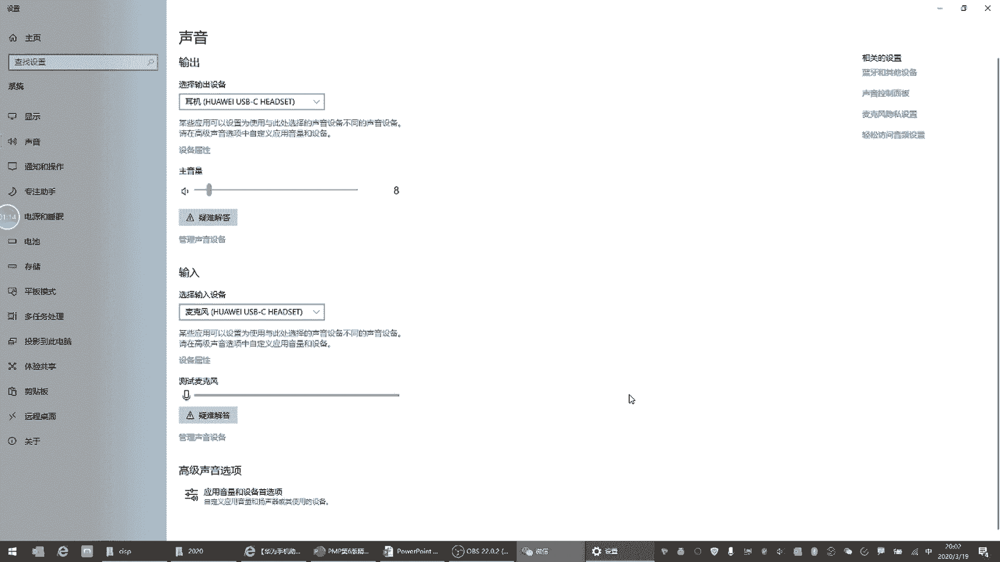
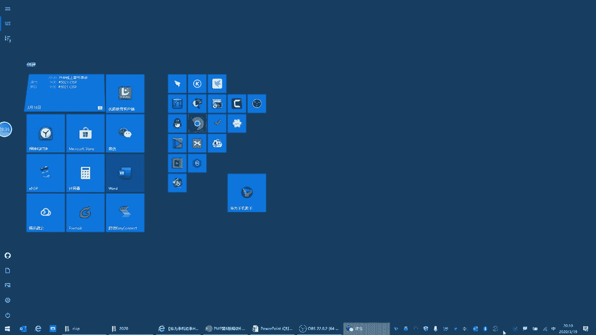
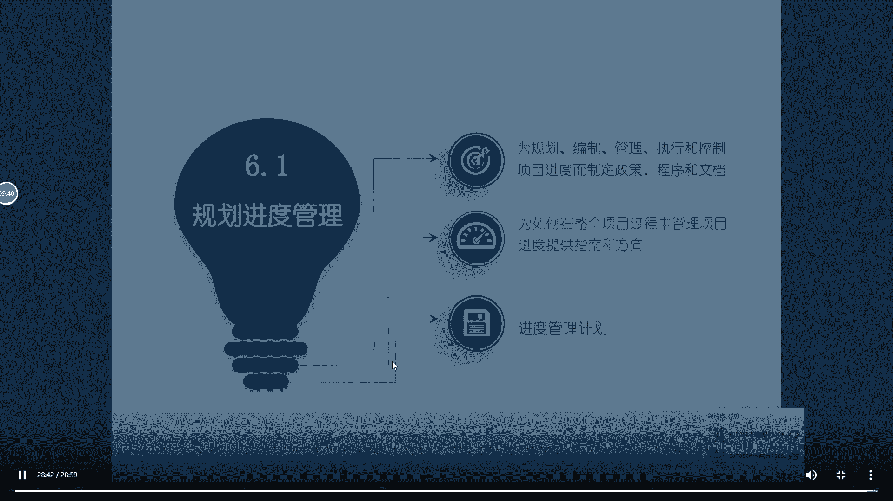
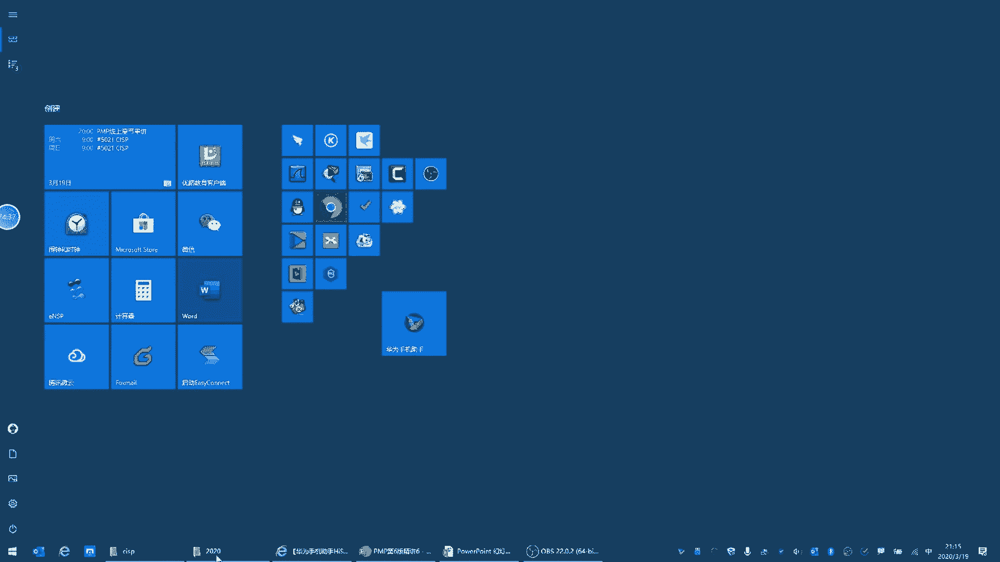
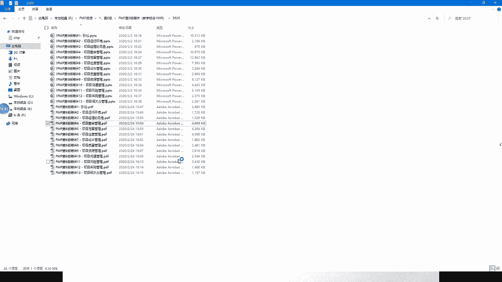
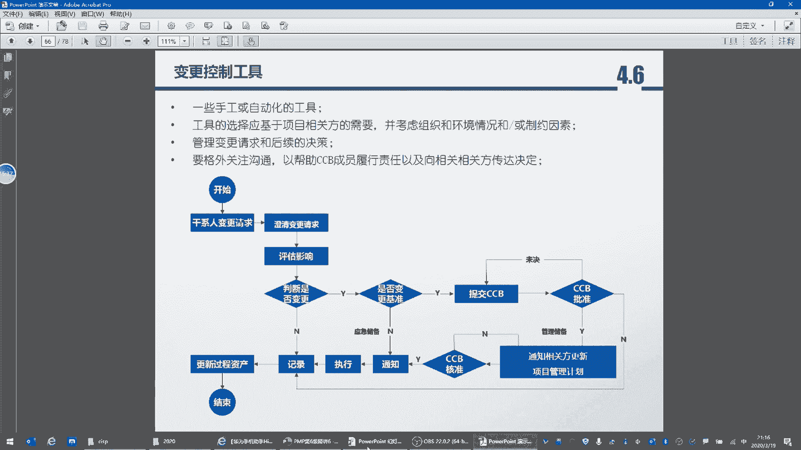
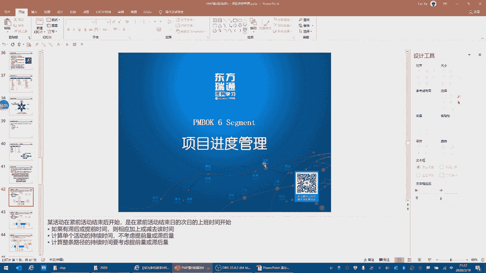
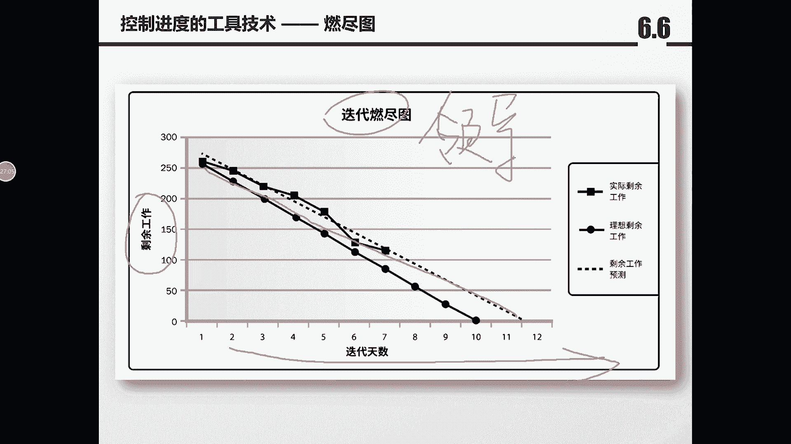

# PMP串讲 - P4：串讲第6章 - 我的乐芙兰 - BV1uE411N7zG

或者这么轻景化的这么一个知识点考出来就已经很难了。第二个呢，他翻译过来的时候的确啊有些差强人意。这个我个人是同意的这种观点，的确那个题有的时候很挠头让人，他翻译的的确特别差。

但是我们就是这么一个啊嗯真面对的就是那么一个考试，所以呢基本上。大家只需要把把握住一些重点就行了。嗯，可能会有小孩子的声音，这是我们家的孩子啊。可能稍微有一点背景音啊，我尽量把这个声音压的稍微低一点。

实在不好意思啊，稍微我稍微等我一下，我调整一下。嗯，现在大家听着感觉好一点吗？现在感觉好一点吗？就是这个呃回音啊，包括声音，我调整一下麦克风啊，用的是。如果回音没有问题的话，打一个五帮确认一下啊。

好，我们来开始今天的课程啊，今天我们讲到的是进度啊。其实是三级准中的另外一个啊，上节课我们讲的是范围。然后今天讲进度，下节课我们讲成本。嗯，他的这个课程安排也很有意思啊，多快好省就是四个基准。

他是安安分别安排了嗯5678啊这么4张。好，我们看一下进度。呃，基本上项目管理就是和进度赛跑。为什么这么说呢？因为这个它有一个进度，有一个那就是对于项目来讲，有三大特性啊。第一个是。

独特性就是我们做的这个产品之前是没做过的。第二个做的是临时性啊，所以项目的临时性就意味着。嗯，在现实生活中的项目也是啊时间是最紧张的。最后一个就是他的建立明细。好，然后我们看一下啊这个进度的管理。

基本上就是项目经理一直在和时间散赛跑。那进度管理呢分为6个过程。第一个过程啊是规划进度管理也是比较空啊，比较虚的一个过程。我们不用太干关注它。他主要是什么呢？是这个方法论。而且考试的时候呢。

我们呃之前也有一道真题啊，很早很早以前的一个真题，大家也不必去过多的关注。就是他说项目的一些子计划呢，可能是非正式的啊，就是指呃范围的进管理计划进度的管理计划和成本的管理计划。

因为这三个计划都是相对比较空的，它都是方法论。他其实是为了指导规划进度范围和成本的一个呃这么一个指导文件啊，它主要是方针和政策的一个指导文件。呃，那进度的管理计划一会儿我们会说一下啊。

它会有一个叫单位时间啊。第二个是定义活动，那什么是定义活动呢？定义活动的本质啊，我们来看一下，嗯，好像在题目中，今天还是昨天的题目中就一个啊，他说他说把一个项目去分解啊。

应该是制定WBS那定义活动是在WBS的基础上干什么的？这个活动可不是针对产品的分解，它是工序。啊，相当于是怎么做项目的这个具体的每一个呃这种什么的这种行动落实到行动层面了啊，所以它不是WBS。

它不是针对产品的，这个一定要理解，产品分解到WBS就是最底层了。然后再往下分的话，其实是什么呢？其实是我们。呃，作为这个项目的团队成员，他去做这个产品的具体的行为啊，所以这个这个点我们需要了解啊。

活动是具体的行动，它不是站在产品的角度来说的。然后第三件事呢，那你做1个WBS的模块，可能需要很多的活动啊。比如说这个工具从哪儿拿到哪儿啊，再怎么组装上。那么它会有一个活动的顺序，很明显啊。

一提到活动的话，肯定他会排列一个活动的顺序。那么6。3就是一个嗯先后顺序啊，先后关系6。4呢是持续的时间。大家注意6。4估算活动持续持续时间，它指的是单个活动，就是它需要把你1个WBS分解出来的活动。

一个一个活动去估算相应的持续时间。因为每一个工序都得需要相应的人去估算。呃，那么问题来了，谁来估算这个持续时间呢？肯定是最熟悉活动的人，就是你没做过的人。也没有办法来说出来，就是你的。这个活动。嗯。

他需要多长时间，那肯定是做过的人。一提到做过的人或者最熟悉的人，那肯定他里面会有专家判断这么一个工具，对吧？这个之前我们讲过，那做过的人或者有感触的人才能成为专家啊。

那你要说这个一些学者或者在大学金字塔里的那些个，那是那是什么，那不叫专家，我个人认为那是理论学家，或者是这个学者。嗯，哪怕你做错了。上一个项目做失败了，只要你做过就依然是专家。因为你有发言权啊。

经过实践过。然后6。5是制定进度计划，那什么是制定计划进度计划呢？就是汇总，他把每一个活动进行一个汇总啊，因为前后顺序已经有了，每个活动的持续时间也有了，然后呢再把这个是呃活动的时间给它汇总起来。

就是进度计划。当然这个汇总呢，因为有些活动是并行的，它不是纯数学关系的加法。这是6。5啊，到这个地方呢，基本上这个项目的什么时间就明确了。啊，项目的结束时间就有了。因为什么呢？道理很显然。

我把所有的活动都加起来，那不就是项目的总历史嘛。所以这个地方就出来了项目时间。我们可以看到它是创建项目进度模型基准的过程啊，这个进度模型基准，一会我们再讲到那就是被批准的计划才能叫基准。然后6。

6呢很显然就是控制进度了。就是我们在执行或者在监控过程中，我们怎么来啊研判我们的进度有没有偏差，然后发起项目的变更。所有的子监控啊，我再强调一下进来的都是数据输出的都是啊信息和这个变更。好。

那有了这么一个认知之后，我们看一下啊，进度在敏捷过程中，它的发展趋势。呃，这句话有一个很重要的一个点啊，在这个地方。具有未完象未完象的迭代进度计划，适应于基于适应型生命周期的滚动式规划。例如。

敏捷开发方法，这种方法将需求记录在用户故事中，它允许整个开发生命周期的期间进行变更。什么意思啊？也就是说，如果是针对敏捷开发的话，你如果有需求的话。干什么？先放在这个用户共识中。

然后在整个开发的生命周期中，什么不停的来接单，因为你得不停的改。说到这个地方，今天有一道有一道题就是圆形法。我强调一下，其实原形法指的就是敏捷或者迭代开发的方法。它讲究的是什么呢？也就是我划分多个版本。

我每一个版本就是一个迭代的周期。大家注意，每一个版本是一个迭代周期，但是你不能认为每一个版本就是一个成果。不是它的这个产品会一直做下去。因为它不停的在变更。所以它的这个生命开发周期呢。

每一个迭代的生命开发呃，每一个迭代的管理周期呢是比较短的，就是大概2到4周。但是它这个产品或者整个开发的生命周期是很长的啊。有的时候是像这个淘宝或者是天猫它是无穷无尽的，不停的在改。啊。

所以它在不停的变更，但是在一个迭代的生命周期中，基本上是没有变更的。因为它不强调这个敏捷开发是忽略变更的。就是就是我这个这个迭代周生命周期，我应该做什么做什么需求，我就做什么需求。如果你有新的需求。好。

那我先给你放在这个用户故事清单里，或者叫生余清单里。那下一次迭代的这个生命周期中，我再从这里面拿出来最应该做的部分啊，再放到这个我的呃这个任务清单里，在分解任务清单，我再去做。

所以我的每一个迭代生命周期要做的事，只能在那个迭代生命周期中的开始规划阶段来明确啊，你做几个用户故事，或者你只做一个需求啊，这个点大家一定要给他思考清楚哈。好，然后我们看一下6。1规划进度管理。哦。

我把这个背景音去掉啊，因为微信开始实在不好意思啊，可能会影响大家的这个收听。我先把它关掉啊。

大家有什么问题的话，也尽量在这个聊天栏儿里来发送啊，而不是发送到微信中啊，我这个聊天的记录我是开着的，这样方便去查看啊。好，我们看一下6。1规划进度管理。我刚才说了啊，它只是一个指南和方向啊。

它是怎么管理进度的一套方法论啊，很虚。

呃，输入来讲有一个很重要的逻辑。大家看这个地方。作为输入来讲，你在规划进度的管理的时候，什么就有了范围的管理计划。你看它的数据有范围高诉你下，说明什么？说明啊这个三级准是现有范围，再有进度。再有成本。

道理很明显，如果我连我。要做的事儿我不都不确认的话，我怎么能够确认进度和成本呢？所以永远是效范围。啊，大家在后边的课程中，我们会发现你在很多进度规划的过程中，他进来的已经有进度的基准了啊。

讲的就是这么一个逻辑，就是哎就是它已经有范围的基准了。就是你在规划进度时，它范围的基准已经做好了。所以这个地方呢就有一个逻辑，就是这个kick off啊。啊，keick up是什么呢？

是这个开工会其实本质是什么呢？本质是你所有的计划都被批准成基准之后，我来进入执行。但是它在规划阶段，它的这些基准的这个生成或者是产生的时间它是有间隔的啊，他不是一口气，所有的基准都拿着给领导一块批啊。

那领导我的这个范围基准明确下来之后，我先给领导看看啊，发起人，你看一下是不是咱要做这些事情啊，是不是符合这个用户的验收标准都没有问题了。好，那您先把这范围明确下来，先批准一下。

也就范围的基准有了之后才会有进度和成本的O啊，是这么一个逻。那工具和技术我就不多说了啊，专家判断啊，什么数据分析啊，会议啊，这个之前都讲过，其实数据分析是包括了很多技术的一个大的一个组合啊。

这个并不重要，输出进度管理计划。那进度管理计划虽然是哄空的一个计划，但是它里又有个重要的逻辑叫计量单位啊，这个之前是考过的，就是说你的项目是以天还是周还是年。啊，或者月还是年，他的计量单位是什么？咁。

那不同的项目，它的计量的这个单位是不一样的啊。你像咱们国家有一个叫雄安的项目，它是千年大计，那你肯定不能用天啊，对吧？千年大计的话，1000乘以363总之很大一个数吧，对吧？

你你把那个每一天要做的工作都分解下来的话，我估计分解完了，这个这这个这个项目经理啊，这100年也白干了。所以很明显啊，它的不同的项目，它的这个结账单位的呃基数是不一样的。好，我们再看一下定义活动啊。

我稍微把语速稍微控制一下，现在可以吗？大家这个声音。现在的声音可以吗？如果没有问题的话，大家打一个打1个OK确认一下吧，声音是否O是否可以。啊，声音啊包括画面是否OK。好的，谢谢刘老师。呃，是这样的。

大家有的时候可能得调整一下。因为晚上实话实说啊，包括我家里的网速，包括各位的网速可能都是稍微有点差。因为晚上上午的人多啊。嗯如果有问题的话，各位就及时提供啊，谢谢之前有一位同学啊。

未来这位同学啊及时告诉反馈情况。好。呃，我们接着继续看一下定义活动。那定义活动它是这么说的，你看啊他说将工作包分解为活动，作为项目工作进行估算进度规划、执行监督和控制的基础。很明显，工作包分解为活动。

那工作包是什么呢？这是书上牛号啊，这是WBS叫工作分解结构。也就是说，如果你想规划禁毒，你的范围必须要明确啊，为什么我们来看那个地方。那么6。2定义活动的ITTO您看啊，作为输入来讲。

一进来它就是范围基准。为什么我要讲这个地方就大家就理解了，至少它这里头有两个逻辑。第一个什么kick off是开一次，但是这个基准或者计划被批准成基准，它不是一次性产生的。啊，证明是阶段性的。

一直到你所有的计划都被领导认可了。那最后一次开一个kick off走一下行式。啊，所以在规划进度的时候，其实范围已经什么对，已经相对比较明确，而且领导已经认可了。这是第一个逻辑。第二个逻辑呢。

什么范围的基准有哪三个，大家写一下。第一个叫做范围说明书。啊，第一个是范围说明书。啊。第二个是WBS，第三个是WBS词典。我现在要说的是什么？但咱们现在很多同学答题呀，之所以错有两种情况。第一个是什么？

这个题的确出的不好。他有的题目出的的确不好。啊，这个我可以大家都可以理解啊，这就是说你读起来很很蹩脚。第一个你可能不知道他考什么，也有可能就是他给你一个歧义。

但是很多时候其实这都是客观的那主观是我们这个知识掌握的不好。比如说WBS里今天出现了1个WBS，它的特点叫做什么？它是一个建设团队的一个有效机会。我讲课时明确讲过，它是团队建设的一个。

很好的这么一个机会，就是尽可能多的人来参与WBS的话，大家可以互相认识，而且知道工作之间的衔接关系啊。今天有很多同学这个地方选错了，很明显，这是什么知识没看到。那有的时候我们错我们得得得分析啊。

有的时候我在群里头很着急，就是大家可能都会把就是谁也不愿意接受错误，会把错误归结为这个题出的不好，或者是我看着这个答题的方式不好。这个我都能理解，但是主观上啊，各位真的我知识掌握到那个层次。

这些概念都很熟的话，错一两道题很正常，对吧？我我的目的不是为了考考满分。我这只要通过考试就OK啊，所以他你得能达到什么呢？这就是这些逻辑我都没有问题。有些特别细小的一知点，其实我认为大家可以不用去。

钻太钻，因为我们这时间是有限的，大家拿到这证书就OK了，对吧？我们不是为了搞这学术。啊，当然作为老师的要求就必须要严格啊，包括这个范围说明书啊，这个记准中的范围说明书，它里面有44个事儿啊。

范围说明书里有什么呢？第一个就是叫做项目的这这个范围啊，范围描述或者项目工作的描述。第二个是什么产品的描述。第三个是。你说到产品了就有验收的标准。第四个是什么？除外责任。

因为验收是你必须要做的那你你那个不做的就是除外责任。大家注意我讲课的逻辑，你看啊，我其实只需要记住了范明说明书是四件事儿，分然后干什么，项目和产品是一对。然后验收和除外是一对，这个概念就记了。

就是我们记概念其实不用死记背它的这个每一字一字不差，而是把逻辑记下来就OK了。啊，把逻辑进来就OK了啊，一定要。要把这个事情搞定啊，很明显啊，这里就有专家判断，对吧？因为你要分解WBS分解成活动的话。

肯定得一些熟悉的人啊。你当然这个地方应应该也是尽可能多的人来参与分解，只要是分解，基本上都是尽可能做的人。啊，然后涉及到滚动式规划，因为你分解WBS的时候，有的时候你会发现离我最近的WBS我先分解啊。

因为可能这个下一个阶段我再做下一个WBS或者做下一个成功，到时候再分啊，像那种大型的这个项目，它可能啊一个WBS就是一个产品有也有可能啊，这不好说，嗯，所以你可能得不停的分解啊，边干边分解。

然后输出就是这三个很重要，一个是活动清单，就是你你要做的工序有哪些你都写下了。第二个活动属性，什么是活动属性呢，它里面至少有两件事，一个是活动之间的，就是你活动啊，每一个工序之间的关系。好。

活动之间的关系它会有。另外一个呢，它会有一些资源的需求，就是谁来做这个活动的要求啊，就是资源的需求，他会有。一会儿我们会讲到这个事情啊，这两个事情它都会有我这儿写的话可能写的不是很好啊。

但是大家注意听就好了。第三个里程碑清单，什么是里程碑性呢？就是你几个活动的重要的一个节点啊，这。就有点像嗯像是这种什么呢？嗯，像是我们在走古国道或者省道啊，他走一个阶段。

你会以发现它那个路旁边就有一个小的标尺一样的一个小界碑啊，很矮啊，就是就是这个里程碑。就是你走一段就是你的活动执行一段的话，你几个活动都做完了之后，它会有一个什么里程碑是一个虚的，它不需要资源。

那就相当于到这个点，我应该看一下，我做了你的事情啊，它是一个节点然后我看了一下咱们讨论区里有一位同学留言啊，工作包不是WBS嘛，没错，是一回事，工作包是WBS啊，工作包其实就是WBS大家千万不要想太多。

他有什么这个规划包啊，这些大家了解即可啊。CA是WBS的几个WBS的一个组合叫CA叫控制账户啊，相当于是啊几个WBS和你的OBS中的那个部门给它对应上啊，就是有几个部门来覆盖掉几个WBS这就叫CA啊。

叫控制账户。好，那我们看一下讲完了他带TTO我们看一下它的输入啊，刚才说过了范围的基准啊，包括三个不再重复。那什么是分解呢？举个最简单的例子啊，把大象装冰箱是个工作包啊，在项目中可能是个工作包。

那么大把大象装冰箱这事儿总共分几步。第一把冰箱门打开。第二，把大象放进。第三把密航门带上，这个就是什么工序。就是你每一个行为。WBS就叫工作分解结构啊，它的术术语叫工作分解结构。但是有的时候考试的时候。

它就翻译过来的更简单，就就是工作包。其实工作报就是WBS就是工作分解结构，是一回事啊，是一种是一种说法。呃。广州的卢工说没有声音了啊，应该不会吧。这个我刚才确认了一下，我还和那个月工在沟通哈。

大家如果剩下没有问题的话，再打一个5确认一下帮我，谢谢啊。我先往下讲啊。因为平台有自动录音，应该还可以。我的我家里带宽还可以啊。是百兆的带宽应该还可以。然后我们看一下下一页啊，滚动式规划。

那么除了分解之后，还有另外一个叫滚动式规划的呃一个工具啊，那什么是滚动式规划呢？刚才我们也说了啊，其实最简单的四个字儿啊，滚动式规划就是近享远盖。就是离我最近的呢，我去详细展开，因为离我比较远的呢。

就是去概括性的。因为我可能现在还不能够有些事情还不明朗，或者有些工序或者技术还不明朗啊，应该是1。1点的呃，它体现在就是你做计划它不是一蹴而就的。你可能这个计划得做好几个版本，不停的在细化啊啊。

因为有些东西得1。1点的去剥离开，就叫做滚动式规划。嗯，很明显啊，滚动式规划有点类似于我们日常说的那种摸着石头过河，它差不多，就是1。1点的明确化啊，我就不相细展开了啊，大家理解它的这个逻辑就OK。

那么经过滚动式规划啊，然后就会出现三个。输出。一个是活动清单，就是你全部活动啊都需要给他。展开。啊，都需要整理出来，就是每一个工序啊。然后那刚才我们说过有活动或者有行为，它就有什么呢？

对它就会有资源的需求啊，包括对应的成本啊，大家注意啊，这个地方呢它都会有一些个叫做什么呢？我们也叫做就是这种粗估或者叫做概呃，就这种叫粗量计估算。就就是当你在规划活动时。

你大概会说啊我得需要哪个部门的人啊大概这个活动得需要什么样的工具，有可能就有成本就带出来了。所以它这个地方的资源和成本呢就是更多的是一种需求，它还没有后期还没有算出来这个对应的具体成本是多少，还没有。

但是它会有一个大概的想法，另外一个就是什么？刚才我们说了，就是它的逻辑关系，就是你这个活动和活动之间的逻辑关系是那些。那什么是里程碑呢？就是你几个活动，它会有对应的一个点。就是啊比如说我要做一个网站。

首先得静态页面都搞定，把所有的静态页面都搞定，就是我的页面没问题了。然后是什么呢？这个页面和页面之间的链接，我们叫做网站的框架架构或者框架啊，这是第二个事情，其实啊你要做的呢，有很多啊。

你的链接之间的关系，包括那个后期的这个页面的优化，对吧？啊，因为现在用的都是记都是即种这种内容式的数据库啊，就是你的那个数据呃资源都是动态产生，都是入数据库的。第三个就是啊什么测试啊啊上线啊这些事情啊。

一直到客户验收。所以你至少有三个里程碑。第一个静态页面，第二个啊数据这个页面之间的关系或者叫网网站的框架，第三个是什么呢？这个上线啊，所以呢这个就是大家注意啊，这三个就是里程碑。

但是你会发现这三个里程碑它不是一个活动，它是指你几个活动形成的一个状态啊，这就是里程碑。所以里程碑是不需要资源的。早上说的题目是创建1个WBS是一种团建。这里又说定义活动是一种团建，是一个意思吗？

有点晕。我再强调一下，刚才我说了一句话。几乎所有的分解都是一个团建的都是一个团建的机会。所有的分解都是一个团建的机会。为什么你在分解WBS的时候。

你把一个工作呃呃范围说明书分解成什么呃工作包或者工作分解结构是一回事啊，就是一就是得需要所有的人都去参加，或者尽可能多的人参加。你在分解活动的时候是把你的什么WBS一个工作包再分解成一个具体的行为。

又是一次分解，也是尽可能多的人参加。但凡是分解都是一个团建啊，七琪同学，您的问题问的很好啊，其实不是说您有点晕，是您想的比较深啊，其这个有很多同学都可能没思考这么深啊，这个问题很好。

就是但凡是分解基本上都是团建啊。如果我回答的没有问题，回复的没有问题啊，七琪同学帮我打一个一确认一下。啊，彭工问的是输出里面有进度基准和成本基准的更新，怎么理解输出里面有进度基准和成本基准的更新。

您指的是哪个输出？我们看一下是6。2的输出吗？哦，叫项目管理计划的更新，对吧？是这个地方哈，进度基准和成本基准哦，没错，可以吗？可以可以这么理解，为什么说输出里面会有进度和成本基准？您别忘了啊。

我在这强调一下，有一个叫什么迭代。也就是他针对敏捷项目是有可能的。但是我们在考试的时候，您不用关注他，为什么考试的时候，如果没有强调说明的话，默认是站在这个通用项呃通用项目管理的角度。

这个地方的进度基准和成本基准呢是什什么概念？有可能你的氛围基准发生了变化，那导致你的成本和这个进度基准也会发生变化。它指的是什么敏捷项目中的那种迭单。对。哦，这个彭工，我这么讲完之后。

如果我想的和您要说的是一回事，而且你也能理解我要表达的。如果没有问题的话，也打1个OK确认一下啊。只要大家一起成功说的，只要大家一起做的就都叫一次团建嘛，不是分解是一一个记。

就是以前考试中总考的啊定义活动和分解WBS都是一个是都都是团建的机会，都它是两个不同的团建。77同学看看我回复的有没有问题，没有问题打1个OK确认一下啊。好，这是有关定义活动啊。但是这个不重要啊。

在WBS的那个团建是很重要的啊，分解活动的话就是尽可能多的人参与就好了。你看这这个地方有啊，让团队成员啊去参与分解过程，有助于更好的更准确的结果啊，这就是书上的原话。好，定义活动滚动式规划啊。

然后定义活动的另外一个输出变更请求。这个地方大家一看就懵了，为什么它怎么会有变更呢？你在规划阶段怎么会有变更呢？很明显是什么？对，是针对你的滚动式规划，或者是针对你的这个。这个迭代的这种生命周期啊。呃。

所以他有的时候他也会产生一些变更请求，但是这很明显啊，这是。这个都是什么呢？这个是。呃，变更请求的输出是。针对某种特殊的情况啊。它相当于是针对这种迭代，还有其他地方有团建吗？呃。

您只需要记住了WBS是个很好的团建机会。另外一个团建出现的点是9。4，有一个叫做。呃，获取资源是9。3，9。4，是建设团队，就专门单门有1个9。4，叫咱们第九章的第四节叫9。4建设团队的这么一个过程。

啊，但是跟这个团建不太一样，那个团建指的是什么呢？指的是这种就是我们日常说的team building。好，就是大家吃吃喝喝。啊，找个地方啊，这个做一个什么空吧呀啊谈谈心啊。

就是那是为了增加团队的这种情感啊，改善团队的氛围。然后最终目的是为了提高团队的绩效。嗯，大家很明显啊，我能感觉到各位的书看的嗯，怎么说呢？应该是看的。但是看的。没还没有建立起来概念。啊。

这个有些时候就是我比如说回答您的问题的时候，我也得特别小心，就是我回答多了吧。有的时候大家会产生更多的这种歧义，因为什么？因为不是我回答的不对，是因为我站在从考试和我对知识从头到尾的理解上去去回答。

就是因为它这个项目本身就是有很多的东西在里面穿插着的。但有的时候我一说出来的话，有可能会给您们造成一个歧。哎，这个地方怎么会有这个工具呢？啊，那个地方怎么会有那个工具呢？很明显，可能。

这个书我们得一脉相通的，得给他把这个条例捋出来。啊，这几个点大家需要注意啊，那个团建指的是9。4怎么提高呃团队的绩效啊，或者那是管理管理资源的啊那个角度来来。来去思考的。好，这是有关变更呃。

这是有关那个6。2啊定义活动。然后我们看一下6。3。嗯，排列活动顺序。那么排列活动顺序刚才我们也讲过了啊，就是定义活动之际工作啊，或者活动之间的逻辑关系就是谁前谁后。我们来看这么一个啊，你看你看再讲6。

3啊，定排列活动顺序的时候，你看您看它的输入啊，呃，活动清单就是刚才6。2的啊，然后活动属性，包括里程碑清单，很明显啊，先有6。2再做6。3，否则的话你做不了，然后工具呢有这么几个工具。

一个是紧钱关系绘图法。这个考试中会考到考计算。啊，会考1到1到2个计算题。然后提前量和滞数量一块儿我会说一下这个点呢，有的时候它跟那个计算也是一块考。输出叫做呃项目进度网络图啊。

这个其实这输出呢项目进度网络图就是让你画一个图，但是这个图呢也是结合计算，它和这个紧年关系绘图法，只是两种表现形式啊，几年关系绘图法是工具。那么项目进度网络图呢是出来的这个图纸或者结果。好。

我们看了看一下啊，输入啊也还会有范围的基准，包括活动清单，我就不讲了啊，我们看一下工具叫做活动关系。什么是活动关系啊。嗯，我发现大家的这个。就是咱们之前精讲啊很多概念啊，这个还得需要加深啊，或者是。嗯。

嗯，还得需要去看书啊，应该就是把这个思路给它捋出来。比如说一看活动关系，什么是活动关系？就是紧前紧后马上要思考出来。有很多工作中工这个这个现实工工作或者学习中有很多这种活动。

比如说先把活动一干完了才能干活动B，对吧？啊，我举个例子啊，先把菜切了才能才能炒菜，这就是最典型的一个啊紧前关系和紧后关系。对吧这个那有的活动呢是这种关系是可以并行的。

对吧比如说烧水和做饭就可以一块儿做，对吧？因为他们俩你把水烧上，同时就可以做做饭，它就是并行的这是没有问题的对吧？好，然后我们看一下啊，呃比如说我再举个例子啊，他有些活动的这种逻辑关系是不能打破的。

叫强逻辑。比如说先建桥墩再建桥面。你把它反过来，这个项目就会出质量的问题。那什么是软逻辑呢？它不受自然，就是它也它不受这个自然的先后顺序顺序的这个严格控制。比如说刷牙和洗脸，你先干哪个都可以。

就是你可以优化。一般软逻辑是可以优化的，而硬逻辑呢，通常是这种自然属性，你是很难打破或或者突破的对吧？外部逻辑和内部逻辑大家自己看一下，这个不重要啊，有些事情必须要外部的条件具备。

比如说你的这个你要做风电，你要没风的地方，你做一个上一个风电呃风力发电机的话，那很显然是。不合适宜的。还有一部分是内部逻辑啊，比如说有很多公司那个OA对吧？你领导不确认不签字的话，你很难推动。

这就是内部逻辑，就是组织内的关系啊，所以是一共是4种。四种依赖关系大家了解一下，考试的时候他有可能会考。啊，这个强逻辑或者软逻辑啊，大家了解即可，这个不是特别难理解的部分啊。呃，然后是提前量滞后量。

什么意思呢？有很多事情您会发现它要有一个就是两个活动本身是紧前紧后关系的。但是呢后边这个活动呢可以往前提前一部分。啊，比如说像这个建筑设计院，你设计一个建筑，你设计阶段可能没设计完，我就可以开始施工了。

大家会听说这崔老师还有这样的事吗？太多了。像我们一般做设计设计有可能有两个。第一个是什么呢？这种叫基础设计。啊，就是你这个楼楼的这个整体框架，包括你的这个水钢筋水凝土。另外一个设计呢叫做什么呢？

叫做这个内装设计。啊，就是你内部装修啊，每个屋子的这种布置和陈设。那可能在基础设计做完了之后，还没做内装设计的时候，就可以开始施工了。你可以打第级啊啊，所以这就是什么啊，叫做提前量。那什么是滞后量呢？

比如说刷浆啊，我刷了一遍漆，我刷了第一遍漆。然后我放两天再刷第二遍漆二刷。啊。刷第二遍气的时候，我中间可能啊去晒两天，那么晒的这两天就是什么？就是之后两个这种情况很多。呃，书上也讲了一个小的概念哈。

就是小的一个图，大家可以看一下，这个就叫做什么呢？刚才紧前紧后的关系其实是一种工具，那围绕着紧前紧后的关系呢，我们来做一个图啊，包括来反映他们的之间的关系。大家这个图都没问题，叫做进度网络图。啊。

进度网络图它最大的作用是什么呢？一会儿我们会讲到啊，这个图它是在6。3讲的，因为有活动顺序，但是它最大的应用价值其实是在什么呢？是在6。5，它来出那叫什么。对他来算那个关键路径。

就是你活动的所经历的最长的那个时间，它的那个路径啊，它排出排列出来的那个关键路径啊，这是很重要的一个点啊，关键路径。好啊，这就是这个紧前紧后关系。

包括梯前量滞后量以及紧前关系绘图法绘制出来的进度网络图啊，他们几个概念或者工具之间的逻辑。大家看看这部分有没有问题，没有问题的话，打一个一确认一下。因为考试的时候，他会考计算题。啊，就是。嗯。

lisa同学问了一个问题，这个团建是什么啊？团建其实就是一一个大家嗯。team building吧呃去相互增加。增加理解，增加认识，或者建立这个亲密的工作关系的这么一个过程。

刚才我们讲的定义活动就是一个很好的团建的机会。包括之前我们在呃规划范围的时候，有一个叫做呃分解WBS也是一个啊team building就是团建的一个机会。好的，我收到各位的回复了啊，谢谢啊。

这个大家没有问题。好的啊，这是有关这个紧钱关系回头法。あ。嗯。对，就是增加信任，增加了解，增加熟悉度啊。啊，然后我们看一下6。4。6。4是估算活动的持续时间，大家可以看一下，这是书上的原文。他说。

之前都是尽可能多的人或者这个项目团队一起来做啊。但是到6。4估算活动持续时间的时候，他说由项目团队中最熟悉活动的具体个人或者小组来估算，所以很明显啊，6。4它就不再是一个团队建设的机会了。

基本上啊两个分解，一个是分解WBS一个是定义活动啊，也用到分解的工具。那都是团建的一个好的契机。大概6。4估算活动的持续时间啊，他就。嗯，W4个问号X这位同学，您是哪个城市的？网络图能讲一下吗？呃。

最好让您的那个授课老师帮讲一下，因为这个得需要画图，可能在呃串讲的时候讲就不太方便了。啊，这个耽误时间比较长。感觉今天老师不在状态，很在状态啊，员工我我没问题啊，还是比较在状态的。

大家怎么会产生我不在状态的感觉？我基本上都是这么一个一个。一种这个持续性的状态。嗯，是感觉有点紧紧吗？讲课有点紧张，不那么放松吗？因为今天的课程啊稍微有点多，我怕时间来不及。这样我们先往下讲。

如果有时间的话，我再回头再把网络图再给大各位再捋一下啊。好，然后我们看一下6。4估算活动的持续时间，刚才讲过了啊，是由这个团队成员最熟悉的具体活动的人啊，个人或者是小组来估算。嗯，这个地方呢。

我再强调一下，他是针对嗯个体活动，也就是一个一个的单个活动。啊，每一个活动都得需要去估算它的时间。很明显啊，因为每一个活动的时间凑起来，它就是你的WBS时间。那所有的WBS时间凑起来。

就是你整个项目的时间。好，计算题一会儿我会单独讲哦，我明白了啊，感觉有点累哈。好，那这个我调整一下，实在不好意思啊。嗯，老师的语调是这样的，这个我得改这个我希望给大家是这种精神饱满的状态。好。

让我们看一下估算活动持续时间的IDTO。嗯，大家可以感觉到啊，估算活动持现持续时间的ITTO作为数来讲，它有很多。首先我们看这个地方，活动属性活动清单，包括里程碑清单，这是在6。2就已经出来的呃这种。

嗯，这三个输出，而这三个输出呢，它。基本上都是在前面规划阶段之前要做的。为什么说6。4的这过程，大家需要引起注意呢？大家看这个地方，风险登记测。啊，包括这个资源日历这两个输出说明什么？

说明啊之前我们都是啊先有的范围，再有的这个进度。但是到进度这个地方就不然了。也就是它不像那个之前我们规划进度的时候先得规划范围啊，到规划进度时候，你会发现什么？也就是在6。

4之前都是按照这个逻辑顺序关系走。但是但是6点4到6。4这个地方，您会发现啊，资源日历说明什么资源已经。在此之前就规划了。啊，你这个资源没规划的话，你不会出现资源日历。什么是资源日历？也就是这个资源啊。

这个资源指的是什么？就是人。这个人在您这个项目中。哪天上班，哪天休息，或者哪天那个不在您的项目中。因为。很明显，这个资源有可能是同时是几个项目或者是这个资源，还有呃职能部门的工作需要兼任。

所以他不一定完全可以全身心的投入这个项目。就是他有时在，他有时不在，说明什么，我针对资源的规划已经都有了。啊，那么他是在。已经在此之前就规划了资源。另外一个风险登记册，风险登记册是什么？

是记录风险的那个文件。啊，它是记录风险的文件。说明在。规划进度。它的这个持续时间或或者估算活动持续时间的时候，你的风险已经什么开始规划了，否则的话它不会有风险能记测。在此之间是也会就是也会有。

但是它不会着重的去强调出来这个风险能记测啊，比如说我们再往前倒，它它在4。1的时候，它叫假设日知的对吧？它记住的都是那种高层次的那种风险，或者是制约和这个假设所以到这个地方它干什么。

你得需要去识别或者去清晰风险能力测啊，也就是说我得去花精力来规划风险了，否则的话它不会出现这个完整的风险能力测的这么一个文件。啊，所以在此在这个地方大家需要了解一下，就是6。4是一个重要的节点。啊。

他需要来考虑这个风险和资源了。我们可以这么理解啊，你估算持续时间的话，你肯定是跟资源相关的。因为资源能不能到位，会影响着你的活动的进展的时间啊，比如说那个刷浆的人他到不了，他可能两天就能刷完。

但是他他到不了，你就得让那个活动变得更长，拉的更长，或者他更更往后排，对吧？很明显，也就是我们可以这么说，基本上有人在，因为之前是很少考虑人的，从这个6。4就开始考虑人了，一有人这事就来了。

所以风险就大大的增加啊，有人的地方就有江湖，有江湖的地方必然有风险啊，是是非非就很多了。嗯。好的，大家如果有什么问题的话，时时刻刻的告诉我，谢谢像郑工，像lisa啊反映这个这些情况，包括那个WS同学。

一会儿我会讲一下啊。好，这是有关呃估算活动的持续时间。好，我们嗯这是输入。那工具的话呢，类比估算参数工作三点估算啊，这几个估算的工具都会考，包括自下而上的估算。有一道题呢，还有一个叫自上而下的估算哈。

大家注意啊，你要仔细看出的话，自上而下的估算其实就是专家判断。它也是什么呢？通过这个专家的经验啊，其实就是一种利用历史经验的一种估算，它跟类比估算是很很相似的。大家这个了解即可自上而下的估算。

它有时候考试中会作为干扰性啊。呃，子晓同学问到了什么是项目日历，一会儿我们会讲到，咱先把这个资源日历讲明白啊嗯。您问的这个问题就比较难了。因为您看见资源日历就能想到项目呃项目日历，说明您看书了啊。

但是别着急，一会儿我们再讲项目日历的那个事情啊，项目日历是整体，资源日历是个体。然后我们看一下输出啊，持续时间估算，很明显，这是针对单个资源的。另外一个叫做估算依据。什么是估算依据呢？

就是你的那个针对你的这种呃。持续时间就是每一个活动的持续时间啊，你怎么估算的？包括什么呢？这个最主要的它有一个致自信水平。就是你估算的方法，你是用类比估算，你还是用这个自下而上的估算。

你会发现你的致径水平不一样。就是你估算的精度会不一样。比如说如果用类比估算的话，你估算的精度很差，你是负15%到正75%，你会发现什么？它这个偏差值这个嗯呃-25%到正75%，不好意思啊，它的偏差值呢。

积它是正就是是分之百的。那如果你用的是自下而上的估算的话，它的偏离值呢大概是5%到之-5%到正10%。你加起来的偏离差值也就在15%以内，所以它是不一样的。呃，成功问了一个问题，崔老师前面的问题。

帮忙回答一下6。2的输出更新进度和成本基准也是需要走变更流程的？是如果是传统的项目呃这种流程的话，就是PMP这种通用项目流程的话，是需要走变更流程。但如果是敏捷或者是这个呃迭代啊。

就是敏捷的生呃那个敏捷的生命周期中的这种呃每一个迭代的周期中，它不走变更。因为它是先放到那叫做需求清单，或者叫做这个剩余清单里头的啊，等下一个迭代的生命周期，它才会重新再更新这个进度和成本基准。

所以它不一样。但是如果指的是传统的项目管理的话，那肯定他也得走变更流程。只要是成本和进度基准，你就记住一点，只要成本和进度基准一变，那肯定得走变更的流程。可以这么理解啊，没有问题。所以在之前那个6。

1在规划进度管理计划的时候，他它也会有在在前面的那个过程中也会有变更一样的，就相当于什么呢？就是。就就是我的这个进度和成本的基准定下来了。但是呢我还没有被kick off。然后呢。

我在规划其他子计划的时候，发现我这个进度和成本不成立了。那领导说你可能改，那还得走流程。啊，只要是进度和成本的基准发起发生变更，就是针对基准的变更，都是都得走变更啊，都得走流程OK啊。嗯。

然后是老师这个资源日历是可用资源吗？闲置资源用不用。呃，不用考虑这么多啊，既然说到这了，我刚脆都讲一下吧啊，咱们这个课因为大家都已经从头到尾都读过了，可能有些问题问的就是后面的问题啊，但是我就一块讲了。

因为时间还可以。我说一下资源日历啊，和项目日历他们的区别。什么是资源日历呢？是指单每一个资源，就是单个资源。啊，包括你什么车间洗报膜，就是不同工种的资源啊，你用这个人或者用这一类人。

他能不能为我项目所用，你得需要看他的时间去约他的时间啊。比如说他跟他说了，小崔啊，你下周二啊，我下周二到周四我能来，其他时间我不能来。那么你得去看他的资源日历。所以这个资源日历是单个资源。啊。

然后呢才能够去接就你每一个单个资源的日历都得有相应的这么一个表。然后呢，把这些表都放在一起，你会发现什么呢？就是有某一天所有的人都不上班，为什么你像春节。啊，像法定假日，他们都不上班。

这个地方就是项目日历。所是所谓的项目日日历指的是什么？就是你整个团队那天工作那天休息的一个日历。所以项目日历是针对整体的，而资源日历是每一个资源都有各自的资源日历。我不知道这么说。

那个化然然是把化工是否能够理解啊。所以资源日历嗯它不涉及到可用资源或者是闲置资源，它就是针对你项目中必须要用的资源啊，它都会有一个资源日历OK啊。好，这是有关它的IDQ。

我们看一下啊嗯在估算时间时还得需要考虑其他的一些因素啊，这个点在后边在讲质量的时候，有可能也会涉及到啊。但是我先说一下，首先有个叫收益递减规律，叫做什么呢？叫做基多不下蛋，人多倒加乱。什么意思。

随着人数的增加。单个资源。的效率会降低。就是人越多。单个资源的效率越低。大家是不是都有这种感受啊，这就叫做收益递减规律，他不会单独的去考您收益递减规律。但是有时候他考试他会考，他会给您个情景。

问项目经理是不是人多多益善，人多了，管理的成本，包括管理管理的效率会降低，反而管理的成本会增加，大家都都能理解啊，所以小心就好了。另外一个我们讲一下叫员工激励啊，员工激励之前也考过，叫做什么呢？

叫做拖延症。对，小马哥说的不是线性的啊，这个指的就是收益D什么是拖延症呢？就是人都有叫学生综合症，只有在最后一刻，他才这个时间只要有的话，他就还认为有时间就是先玩会儿啊，再耗会时间。

一直到拖的不能再拖了，他才会全力以赴。这个大家理解了啊，就是人们只有在最后一刻，即快到期限时才会全力以赴，这就叫做拖延症，也叫做这个员工激励。大家了解一下，有这么一个词就好了啊。有这么一个什么叫做激励。

也就是意味着目标明确项目经理应该明确目标，同时应该迅速的而且有效的员员工尽可能快的实现目标，这就是激励啊，把这个概念在脑子中有这么一个逻辑，或者有一个印象即可啊。好的。

然后我们看一下啊看一下估算活动持续呃活动持持续时间的输入。啊，刚才我们也讲了很多了啊，我就不再一一介绍了。重点什么风险登记册呀，包括资源分解结构，资源分解结构就RBS啊，它是在9。

2讲那个估算资源的时候啊，才会讲到第一个概念。所以我们呃未来会讲到，我先不在这讲啊，大家只需要记住一件事，就是估算活动持续时间的时候，相当于什么资源已经被规划啊，你不会啊资源的话。

你没法确定有哪些人可以用，也就没法确定你的活动需要。持续或者经历的时间啊，大家了解好，然后我们看一下具体的几个工具。第一个叫类比估算。呃，利比估算大家看图就可以知道啊，也叫做拍脑门法。

它是利用主观经验啊，它不是算出来的。就是我举个例子，领导说小翠啊，你觉得这个事儿得需要多长时间啊，你拍脑门啊，领导我大概得需要5天啊，领导会说你这5天怎么得来的，我也不知道啊，完全凭感觉。

我觉得5天差不多了啊，所以他在项目的早期可以这样估算，就是你很多工作你还不明确或者没有被细化的时候，你可以这么估算啊，因为相对他的呃这个什么准确性很低。刚才我们说了他的准确性是-25%。到正75%啊。

粗估嘛。几乎偏差它的偏差的这个范围在百分之百了啊，所以就是不不是特别靠谱，不不可靠的一种估算。第二个参数估算法，那参数估算是什么呢？就引用了一个公式啊，我再举个例子，大家注意啊。

比如说我从从这个某地去另外一个地地点，我可能啊他问你需要多长时间啊，然后领导还是问这个人。那这个人说啊，这个小崔，我估计大概得需要330分钟，那你为什么说30分钟呢？因为从这个地到那个地方啊。

得坐6站地铁啊，一站地铁呢，咱们按5分钟算那么五六30啊，一共得需要30分钟啊，这个5分钟呢，又包括了这个什么啊，上车和这个下车以及等待车的时间啊，基本上差不多，就是这个5六30是是这么来的。

啊以很明显他就有了什么有了生产率和一个数学统计的关系。啊，它参数估算就会比这个。类比工算要准确一些，但是呢他还是利用以往的经验。啊，所以参数估算它的准确率呢来自于你的两个项目。

包括类比估算也是就是你两个项目，它的近似程度会决定你估算的准确率是否是。啊，是是可靠的啊。第三个是三点估算，那什么是三点估算呢？这个也很好理解，它其实也是基于一种历史的估算。但是呢它引用了什么呢？

它比类比估算和这个参数估算。增加了什么呢？一种风险。啊，基于风险的考虑。啊，这个在我们日常工作中用的最多。比如说你跟领导说，领导说呃，这个小崔，你需要多长时间把这个活干完？一般我们会说啊最少也得3天。

然后领导说不可能这个你太快了啊，你你说话得稍微保守一点啊，那我估计最多吧。最多给我两周，那领导又急了。小崔，这个时间太多了啊，那你会说什么啊？正常情况下你给我5天。就OK了。所以这个就是什么呢？

他考虑了风险。啊，三点估算今天呃今天在答题的时候也也有，它也叫做什么叫计划评审技术。就是他加了自己的一些个评估，或者是自己的一些个这个判断啊，叫计计划评审技术。呃，书上是有明确的一个定义的。

大家看一下就OK。但是考试时几乎不考，它作为干扰项，有时候会出现那么一次两次，但几乎不考这不用过度关注哈。嗯，这个大家了解即可。所以这这个题，就很多时候我们看见啊，大家注意啊。

在考试的时候看见那种特别生僻的词，不要去选，通常那不是正确的答案。一定要去选择我们在IDTO里，包括我们在讲义中出现的这些名词。就很多生僻的词通常都是干扰性。啊，亲尽量不要去选。

他其实就是考验您们是不是看书了啊，是不是有这么一个正确概念。啊，他会加杂一些干扰性。所以讲到这儿呢也挺可怕的。有的同学会说了，崔老师这四个答案ABCD我没法选了，哪个我也不能选，为什么呢？

我看哪个都不熟，各位那个不是书上没有，是您没看书，是您没看到。所以我们看讲义看书，这是必要的。所以就怕这种我看哪个哪个我都没有亲切感和熟悉来，是因为各位没看，对吧？大家没看，不是不是说人家这个题干扰性。

是我没根本就这词我都不熟悉，所以这个必要看书得还是有效，三点估算那个地方会考到计算。会考计算题。大家回去得把这个项目的题目得看一下。まあ。嗯。三点估算的这个计算题呢，在这里他没写啊。

因为是串讲时间有限啊，一个是网络图的计算，一个是三点的三点估算的计算。嗯。我只把公式说一下吧，三点估算啊，最主要的我们得需要记住公司公式啊，一个是叫做平均估算值，还有一个叫做什么呢那个。呃，叫做标准差。

这个部分呢其实应该是放在成本里讲的啊，在成本里它会有相应的公式啊，一个是这个平均也叫均值。大家就记住，一个叫均值，一个叫标准差啊，这两个。词汇大家得看看书啊。好，我就不在这过多介绍了。

然后呢呃再下一个工具呢，叫自下而上的估算。自下而上的估算就相当于他把你的每一个活动啊，每一个细节都考虑到到了。比如说啊我要去从某地到某地，他把每一个细节，比如说你需要坐电梯啊，做多少层。

你从电梯间下下来到这个对小马哥说的很对啊，就是68。2695和99，大家只需要记住68、95、999就O了。这是三个那个西格ma的概率的区间啊啊，自下而上的估算呢就是把这个活动再明确化啊。

比如说我要去某地的啊这么一个活动，那可能呃怎么坐电梯啊，你得走多少步啊，你这个。地铁多少站，然后你出地铁站，你得需要需要多长时间，就是每一个细节我都考虑到了，这叫做自下而上的估算。

然后他把每一个细节进行一个什么汇总。而，他来出现什么单个活动的时间。他来汇总单个活动活动的时间，就是每一个细节都考虑到了。所以它是什么最准确的。啊，他是最准确的。在我们的讲义中会有一张表。

它会比较这这几种估算啊，很明显类比估算是最粗糙的。自下而上的估算是最准确的。三点估算考虑了风险。啊，这个考试中他有可能考，他说哪种估算考虑了这个风险的这种概率。那参数估算是什么呢？

动了公式或者是数学的这个什么呢公式或者模型啊。这么一共这么4类。老师能说下啥时候自下而上估算，啥时候自上而下估算，啥时候自下而上估算啊，两种一直没没怎么弄明白哈，没有问题啊，七琪同学，我说一下。呃。

自上而下的估算其实就是专家判断，它一般用在项目的早期。这个您可以把它看成是类比估算，就OK了，不用去过多关注。它在考试的时候只就是一个干扰项，但是自下而上的估算，您回去得好好看一下它的概念。

它是把活动中所有的细节都考虑清楚了。然后是什么呢？把所有的细节做一个时间的汇总关系，所以自下而上的估算一般是什么最准确的。比如说考试的时候，他说呃项目经理已经分解了WBS，也考虑了每一个活动的细节。

同时他不希望在项目中啊针对这个成本或者针对时间。的基准啊做变更。也就是说他他不希望后边的这个时间发生变化或者成本发生变化，那就意味着他前期的规划得特别明确，得特别清晰或者特别细啊，或者特别细化。

那就是那你要选择的答案，只能选自上自下而上的估算，因为它是最准确的。啊，考试的时候基本上不会选自上而下的估算，因为这只是书上的一句话，它表明的是只是类比，或者是呃早期的那种粗略估算就OK了。对。

自下而上基本上就是汇总，就是把所有的细节进行一个打包啊，得到这个活动的时间。好。西琪同学如果没有问题的话，可以打一个一确认一下啊。嗯。うんうん。😊。

分解的时候自上而下而准确估算的时候自下而上可以可以这么理解啊，可以这么理解分解的时候就自上而下，可以这么理解。所以在项目早期的时候，自上而下的估算其实就是拍脑门法啊，因为我还可能还没分解完了嗯。好。

然后估算活动持续时间的技术。还有一个叫备选方案分析。什么意思呢？就是您在估算时间的时候，有可能有好几套方案。因为你的产品啊就是这个备选方案分析，大家如果回忆一下的话。如果大家回忆一下的话，在5。3。

在定义范围的时候，也有一个备选方案。分析啊很明显就是你的成果可能会有两两套。啊，一煮一倍，那你的时间。或者进度的管理也会有两套。所以这个大家了解即可，这个不重要啊。

然后那亚子同学问老师预期值啊是初三还是初六呃，初三和初六其实指的是三点估算的两种表现形式啊，一种叫三角估算。如果是三角估算，我们往回导一下这个地方。如果是他说题目中明确说三角分布的话，也就是它是线性的。

啊，他用的就是除以3，就是刚才那个小马哥回复的，如果像这种叫贝塔分布，就是抛物线的，什么意思呢？就是你最可能的情况它是出现的概率更多，所以它是那种贝塔分布，也就28分布，就是最可能的情况呃。

它不是这种线性的那这个地方它就得除以6。其实这个贝塔分布，它叫做三点估算。而如果他。他是用初三的话叫三角分析这种考这种三角分布，除非题目中明确说，除除此之外，默认都是三点估算，都是除以6的。

所以这三角估算大家了解即可，他通常不会考。啊，我说的这个可能有可能有点事故，但是大家呢应该是都会，但是他通常不考。哎，对，三角应该是这种除以3，而3点3点估算，或者叫做贝ta分布啊。

他说除以6亚子同学如果没有问题的话，打一个一确认一下。大家要方便的话，给我一个确认，否则的话，我不知道我之前对于您的问题是否讲明白了啊。大家最好给我一个确认。咱这个讲项目管理也讲过啊，咱应该用双向沟通。

对吧？有去有回，但我我回复完了之后，您那边没有回复。第一个对吧？我这个我不我不知道您是否理解。第二个就是我也。就讲完之后没有反馈，这个对于我来讲，我心情也不是特别好啊。哦，三点也叫白塔哈，嗯可以这么说。

这个很多国内的书啊可能会有这样的解释啊。好，自下而上的估算啊，包括然后我们看一下储备分析。好，谢谢各位同学啊。好，我们看一下什么是储备分析啊。呃，储备分析其实就是针对你的备份的这个呃备备选方案分析啊。

呃然后针对您前期的这种估算。然后干什么呢？就是我得加上一部分叫做什么呢？应急储备金，也就是针对风险的储备金。相当于我每一个活动我都得把这个活动的不确定性考虑进去，然后再加上一个储备金。很明显。

我要加的这个风险储备金，肯定是针对什么应急储备，就是我我能够加进去的储备金，那肯定是针对已知的风险。那么这个这个储备分析主要是增加什么呢？增加应急储备用。为什么你储备分期增加不了管理储备？

因为管理储备的话，你能够识别出来的风险，那就不会用管理储备。因为应急储备是在什么基准内的。し。而管理储备是什么？是基准外的？所以各位在这个地方我们就理解了储备分析增加的是什么？是应急储备。

对吧是我针对已知的未知风险，什么叫已知的未知风险？已知是什么？这个风险我已经判断出来了。啊，已知的未知，这是这是一类风险。那未知的未知又是一类风险。我们来看一下啊，这个说的有点多了。

其实应该放在风险里讲，已知的未知是这个风险我已知，但是这风险什么时候发生，我什么时候来处理我，我不知道啊，是否处理我不我也不知道什么是未知的未知，就这风险我都没识别出来啊，那不更何况我应对不应对。

我更不知道了，所以未知的未知也叫做什么意外。对吧那针对意外的话，这部分钱其实在你的项目呃，基准你肯定没有。那么已知的未知叫做应急储备啊，这个okK没有问题。

然后赵公问了一个问题是贝塔分布和标准差有什么区别？呃，贝塔分布只是一种三点估算法的一种表现形式，就是这样的。就它是这样，这是杯的分布，它的标准差是用6分之最悲观。减去最乐观。除以6得到的就是标准差啊。

赵工回去看一下。呃，我不知道赵工是哪个城市的方面的话，可以打一下啊。这个我到时候再跟您的那个任课老师再反映一下。然后敬重昙花这位同学活动持续时间估算是由谁来进行的？为什么不是项目经理。

而是由项目团队中最熟悉活动呢？呃，持活动持续估算呢，最终责任还是项目经理。但是他要问您由谁来估算，那肯定不是项目经理。因为我们反复强调过，项目经理是管项目的人，而不是做项目的人。

这个项目经理不可能去做所有的这个活动。那到工序这个级别的话，那像车间喜报对吧？项目经理一般他咱也做不了，反正对吧？我除了大学实习的时候去做我这些东，你现在让我用那车窗，我哪会用。所以肯定不是项目经理。

项目经理是负责组织呃做持续估时间估算的人，但是做具体来估算持续呃活动的呃，持续时间的人，那肯定是最熟悉活动的这个项目团队成员。对，小马哥说的对，项目经理是组织组啊。得由最终执行的人来估算。好。

我看见赵工的回复了啊，谢谢啊这个。也代表一种尊重。我再看看前面的问题。好，这个好，然后另外一个好，谢谢啊。呃，另外一个估算持续持续时间呃，持续时间的工具就是决策。

也就是说你的各种呃各种估算的方法都估算完了之后，最最终你得啊得到一个统一的答案，就用决策啊。一说到决策的话，大家就理解了，有这么之前我们讲的4种，一个叫做什么呢？叫做。呃，叫做这个全票哈叫做全部通过。

另外一个呢叫做相对多数呃绝对多数，还有一个相对多数就是德尔菲法啊，这个大家了解即可，主要是德尔菲。最后一个呢就是独裁啊，就是一支笔一个人说了算啊，大家看到决策能想到那个德尔菲法就OK了。啊。

通过投投票啊。然后6。4的输出叫做活动持续时间和估算的依据。那什么是活动持续时间的估算呢？呃，活动持续时间大家可以看一下啊，你看他这书上是这么说的，活动呃估算活动持续时间是完成某项活动。

大家注意它指的是什么？这个地方的某项活动就是单单个的活动。所需工作时段数的定量评估，持续估算不包括任何之偶量。大家注意啊，持续时间的估算不包括任何任何估算量。有一年考试考了这么一道题，我跟大家说一下。

他说某个活动需要3天。然后什么呢？它的紧后活动需要两天，也就是你假如说啊我再举个例子，刷刷浆刷漆刷了3天，然后刷完漆之后呢，还得晾两天才能做下一个活动。大家注意他问您刷漆这个活动A一共持续时间是多少天。

还是3天，而不是5天，为什么？这个道理是在于你滞后的这个两天是不需要什么，你滞后的两天是不需要是资源的。你最后的这两天他不需要资源，你很明显你是不是活动持续时间，对吧？那否则的话这个成本你怎么算。

所以这是不没有工时的啊。管理呃，许工问林说的是管理储备在进度基准外动用的是否要走变更。当然啊就是应急储备和管理储备都需要走变更的流程。但是如果是管理储备的话，肯定是在CCB啊。

得走CCB那项目经理是无权动用的。嗯。持续时间的估算是不包含折活量的啊，大家一定要注意这个细节。好，然后我们看一下6。5。嗯，大家问的这个问题有点让我害怕啊这个。呃，有两个事情啊，我我讲到哪个过程。

大家就就就抓紧问一下。还有一个就是这个管理储备啊和这个呃应急储备，各位一定回去得好好看看啊。这个许工问的问题呃，真的是很重要很重要的一个问题。您一问我在反而是。因为这个在我们在4。6的时候是有一个图。

他讲过管理储备，那个呃是需要走这个流程的。我们来看一下啊，我再多说一下。因为是串讲，可能会。这个图。一定要把知识给它串起来啊，这一打开就是这个图太好了啊，就这个地方你看。管理储备那肯定是CCB批准。

为什么这肯定是什么这个针对未知的风险。那就是意外呀，那只有意外的话，才会用公司的资。资源。那如果是基准类的话，看那个地方啊是否变更基准。如果是基准内不变更的话。

但是什么应急储备，应急储备什么项目经理就批了，您就这么记啊，应急储备就是加班费，可以这么记。

加班费的话，那项目经理还连批个加班费的权利还没有。对，好的啊，这个许工的问题，然后杨工也给了得到一个补充啊，大家这个回去再把这块好好看看啊，这个很重要啊，就是有的时候我们的确会出现类似这样的情况。

就是前后啊。把这些知识给它串起来。好，我们看一下6。5制定进度计划。那有了单个活动的持续时间的估算之后，然后我们把每一个活动的持续时间啊，按照他的这个活动顺序，把每一个活动的持续时间给他做一个汇总。

就得到了一个进度计划。我在这先讲一个概念，进度计划和。进度管理计划是两个不同的计划。

大家注意那个进度管理计划，我们刚才已经说完了，这个计划是什么？比较虚，它只是一个方法论，怎么去做进度管理的一个方法论或者流程。而进度计划它是什么呢？对它是你的什么这个项目时间。

他来他明确了你项目的历时、总历时，项目时间是由进度计划来确认。千万一定要小心啊。对，进度中的储备分析是来增加缓存的缓冲的时间。那成本的成本也要储备分析，它是增加这个项应的金额。是这样的啊。

我明白这个呃这个娘子的相公啊，相同学说的这个就是。我能理解您的意思。😡，虽然时间有可能是在基准外，但是时间在基准外的变更也得走CCB，它也叫做光理储备。啊。

我们通常会说管理储备是公司资产或者是动物公司的资源，但是多余的时间就是在基准外的时间也是一样的。因为时间和金钱只是两个不同的维度，它都是公司的资资产。如果您这个项目滞后了啊，超出了这个时间的基准。

那有可能会影响着整个项目或者整个项目组合。所以他也得高层去批复。我不知道说的是不是呃你要问的这个问题。如果这个这个索答呃呃是所问的话，你打一个一一帮确认一下啊。对。

区别呃进度计划和进度管理计划是两个完全不同的计划。好，我们看一下制定进度计划。呃，进度计划首先大家画一下啊，它是通过制定进度计划，它会得到一个项目的总时长，就是你结束项目的日期会有啊，就这个地。然后呢。

其实进度计划和进度基准只是两个不同的说法，其实是一回事。也就是说你的进度计划。你你你你把所有的这个活动。就估算做一个累加排序之后啊，然后得到一个项目的总历值。然后你跟领导汇报。

就跟发起人或者跟关键相关方去汇报。他们如果批准了您的进度计划，那您的进度计划就变成了进度基准。也就是被批准的进度计划就是进度的基准。OK啊，它是这么一个逻辑。所以进度计划和进度基准其实是一回事。

只是两种不同的状态，可以这么理解啊可以这么理解。好，然后我们看一下那制定进度计划，您看一下它的输入又有很多很多，但是我们惊喜的发现还是有范围基准。也就是什么意思？就是范围一直是没变的，大家也很容易理解。

如果我在制定进度计划的这个流程或者过程之中，你会发现范围发生了变化，那你的进度计划就无从谈起了，那整个都得推翻了。所以还是那句话，范围一改肯定是基准完。为什么进度成本必然会改。对吧所以我们。之前也讲过。

一提到什么增加新需求，新。新技术新模块，那肯定得走这个完整的变更流程。作为项目经理，你就直接发几个变更请求提交给CCB就OK了啊。他就是这么一个理解。呃，其他的输入呢因为特别多，我们也不用去记。

因为什么几乎所有规划过程中的输出作为6。5的输入都进来了，就是直其他的过程啊，这个它的一些文件都进来，所以你咱们也不用背了。呃，6。5考的最多的和6。41样，他特别关注的是这些工具啊，6。

4就是那些个估算的方法输出啊，一会儿我们再看啊，进度基准有很有可能会考到。好，我们先看一下工具啊，输入就不多说了。刚才给我讲过了。好，我们看一下工具。嗯，经常考的工具，关键路径法。

假设情景分析也叫模拟技术，另外一个资源平衡，这三个都经常考。好，我们先看一下关键路径法。就之前有一位同学问到了有关关键路径的计算，我干脆就在这个地方，我们来算一下，大家可以看一下啊。嗯。

左侧它是一个小型项目的这么一个活动关系。大家可以看到啊，A是准备一个活动。而是这个准备。呃，准备的一个小的程序需要什么呢？两天，就是你需要这个就是你家庭装修项目啊，你需要整理一下东西啊，把墙打。

这个稍微打磨打磨，把这个一些东西清走啊，还有包括你的物料准备需要两天，然后刷门窗是两天，刷门窗得在A活动之后，就是你把所有东西都清了之后，然后同时可以并行的有刷屋顶刷墙。

也就是BCD这三个活动是A活动的紧后活动，就是你A干完了之后，你BBCD就可以展开了。然后BCD做完了之后，大家注意啊，这个E活动刷第二遍墙，在D活动之后，同时还得在D活动之后再加两天，这叫做滞后量。

就是D做完了还得加两天，刚才讲了滞后量啊，大家注意这两天还不算在D的持续时间里，因为什么它不需要资源，就是你干晾两天，然后刷第二遍强E活动又得需要两天。然后干什么呢？这个BCE这三个活动都做完了啊。

它有一个紧货活动叫做F活动是结束。好，我们最后来看一下这张图。A需要两天，然后BCD在A之后。B需要两天，C需要两三天D做两天，然后晾两天再刷再走E活动，再刷第二面墙，又得需要两天F活动也得需要两天。

各位一共需要多少天？第一个问题，一共需要多少天？嗯嗯嗯。Yeah。第二个，什么是关键路径？关键路径就是您经历活动时间最长的这个路径。您经历活动最长的这个路径，恰恰是您什么项目最短的时间。

也叫做项目的总时长。对，子晓同学回答的很快啊，是10天。啊，这就是叫做项目进度网络图，也叫做什么。通过项目网络图来找到这个关键路径啊，关键路径的长度又决定了项目的总历时。我看见各位的回复了啊。

还是很快的啊。大家嗯到目前为止还没有错的，很棒啊。这个考试中这个计算需要考到啊，之前这位同学问的问题，就是之前有位同学问的这个。嗯，进度网络图我不知道是否您现在通过这个讲明白了是否OK啊。嗯。啊。

是WX同学是否OK。嗯。好，然后我们看一下关键路径法的说明啊。关键路径法刚才提到了，就是网络图中工期最长的那条路径啊，恰恰决定了项目的最短工期。问这个问题的同学反而没在线哈，或者没有回答。好。

然后关键路径可以有多条吗？可以有啊，就是你的关键路径恰恰呃两条这个呃这个就是两个。呃，就正好有两条路径，它的长度是一样的。那么这两条关键路径呢都是等长的，那么呃就就的确会有两条关键路径。嗯。

大家都问了一个问题哈。呃，不是不包括滞后量吗。T啊这位同学问的哈，然后是活动持续时间不包括持，是这样的，我们回去看一下这张图啊。这个D活动它的持续时间是两天，它的确。他的持续时间就两天。

它不包括这个后边的这两天。这个滞后量啊，各位这个滞后量它不我注意我说的话，滞后量不包括在活动的持续时间，但是它在项目的总时长里，他肯定会包括。嗯，这就是肯定是咱精良的老师或者这个概念没讲到。

我再强调一下，滞后量是不算单个活动的持续时间里的。但是你项目的总时长，你下一个活动肯定得等这个前一个活动，它的持续时间，再加上它的滞后量才能够是下一个活动的那个开始的时间。啊，大家我不知道是否能理解。

也就是作为项目的总历师，肯定得包含滞付量，得反映滞后量。但是作为单个活动的持续时间肯定是不包含对个滞付量的。呃，海小伦同学的理解是正确的。啊，您的这个理解恰恰回答了TA同学的这个问题啊。

这个呃应该是老师在上课中是必须要讲到的这是一个很重要的知识点啊。多条关键路定怎么进度压缩，一会儿成功的问题，一会儿我再说啊，您的这个问题稍微有点难度。我不知道那个T同学是否我讲完之后，您没有问题。啊。

包括那个海工是不是没有问题，没有问题的话，打1个ok或者打1个一确认一下。这个点一很重要很重要啊，考试的时候，这个有关这个部分计算，大家就滞后量必须要反映到你的项目总历史里。

但是它的这个这个活动的历史里是不包含的。好，然后我们再往下看，关键路径可以有多条吗？可以有关键路径的活动时差。什么叫是活活动时差？就是关键路径上的活动能不能够向前两天啊，向后两天不行。

关键路径的活动是没有活动时差的啊，什么叫活动时差，就是它有富余量。比如说我们往回看一下这个地方大家的这个网络图学的不是特别扎实啊，这个地方。就是比如说我们看这个地方啊，这个图ADEF是关键路径。

而BC这两个活动叫做非关键路径的活动。这个BC这两个活动很明显，它可以往后错两天，没有问题。因为什么呢？你只要不影响F活动的这个最晚的开始时间就OK了。所以BC往后错两天，这就叫做什么浮动时间。嗯。呃。

这个而关键路径上的活动是没有时差的。为什么你看那个关键路径ADEF哪个活动它都不能往后动。它一动的话，那整个项目的历史发发生变化，那不就延期了。反正就工总工期就会有影响。好，然后再往下。嗯。

关键路径的活动可不可以为负值？可以。如果是负值的话，那说明你的项目就延期了啊。嗯，那就得需要调整，那怎么调整呢？那这个地方就得需要赶工或者进度压缩。一会儿我们会讲到啊，大家先给先把这个概念先说一下。

然后关键路径是相对的，可以变化吗？可以我们再往回看，假如说B活动往后搓。啊，错到了什么呢？你F活动应该是第八天的晚上或者第九天的上午开始，就B活动往后错一直错到错到什么呢？

它影响F活动的这个最早最晚的开始时间了，那相当于什么？这个呃这个项目的总历时就变成了叫ABF这个时间。那很明显，非关键路径就变成了。新的观键路径对吧？新的观键路径。就变成了ABF这个关键路径。

那导致什么？导致你的项目整个就得延期啊，所以这个关键路径有可能会发生变化。那么关键路径一旦发生变化，意味着什么？非关键路径变成了关键路径。那你整个项目的时间啊就。就增加了。然后关键路径越多。

项目的风险就越大。这句话是没错的。为什么你要有两个关键路径或者三个关键路径，就像陈功问的问题是一个啊稍微比较难的问题，就是这个技术含量比较多了，比较深。就是如果有多条关键路径啊，它发生了延期的话。

你会发现但凡是其中的某一条，只要有一条发生了延误，整个项目就都延误了。所以关键路径越多，你会发现它的那个项目的延迟的几率或者风险也就越高啊，反过来你追的难度就很大。

因为你有可能在追某条关键路径的时候会造成其他关键路径又延期。以一般他不会考多条关键路径啊，是否能用进度压缩。一般我们说的关键路径在项目中啊，基本上指的就是一条关键路径。因为多条关键路径的管理，那太复杂。

考考级至少在PMP的考试中呢计算不会有动么。又呃这是关键路径，大家看看啊。呃，然后这个地方呢有一个正推法和逆推法，我就不再说了啊，这个大家回去看一下相应的教材和书。呃，最好看一下汪博士。因为咱们串讲啊。

这个我就不再说了，大家对于这个关键路径和时差看看有没有什么问题。大家对于关键路径和时差看看有没有什么问题。如果没有问题的话，打1个OK。Yeah。因为串讲我不可能讲的特别的细。

因为这个地方一讲的起来的话，又得讲很长时间。啊，这一应该是精讲的老师就应该搞定的事情啊，因为我就不在这浪浪费时间了。就是我作为知识点，我告诉您这个地方它。这个大家一定要要会啊，但是。嗯。

在线他也没有办法啊去详细展开，大家看看有没有什么问题，没有问题打1个OK确认一下啊。呃，时差为何有负数啊？岁月如歌这位同学问的是一个好，大家一定要实事求是，有个问题一定要问啊。

你像那个岁月如歌问的问题是一个极其好的问题。这个恰恰说明您懂您得问出来这个这个问题。什么意思呢？很明显，我们首先得明白啊，这个时差一般都是正数。比如说嗨不好意思啊，切了一下。比如说咱看这个这个题。

大家先就针对这个图，各位，我们先看一下这个B活动有几天的浮动时间，或者有几天的时差，大家写一下。其实我也怕耽误大家的时间啊，有的同学会问汪博士的书是哪本书哈，是一本黄色的书。

您可以单独的去艾特我们那个班主任在群里头。不管您是南方班还是北方班，可以问一下班主任啊，那本书是中国人写的，就比PM book要好理解。我的问题是在这个图里，B活动。

它的时差或者他的这个浮动时间是多长时间。大家看一下。

。算一下告诉我。好的好的啊，其实我应该这样问好了。我这样问的话，大家给出来这个答案4天的话，就证明您对关键路径肯定是明白了。嗯，亚子同学回答的5到6天呃，您是按照那个开始的时间来算的哈。

所以如果同学回答的6天哈，我还必须得说一下啊，我们来看一下他怎么算啊。大家可以看一下这个地方。A活动两天意味着什么呢？BCD这三个活动意味着可以从第三天早上开始，对吧？第三天的早晨开始。

因为我不能其实相当于第二天晚上就开始，但是一对吧？大家都知道T加一就是有植数问题，就是你一般你这个第三天早晨就可以干一块干这个BCD3个活动。但是大家注意啊，你看啊。这个按照这种推法。

第活动在第三天他干两天啊，就是第四天晚上干完，第五天的早晨再亮两天，相当于第六第五天，第六天，第六天的晚上干完了。第七天的上午开始干E活动，对吧？然后再加两天，相当于第八天晚上干完，相当于第九天的早晨。

也就是第八天晚上。啊，我这个地方干干脆冻冻晚上哈，第二天的晚上。F活动是第八天的晚上就可以开始了哈。那这个地方呢什么叫B活动的时差或者浮动时间？我们来看一下啊，第二天的晚上相当于开始干B活动。

或者就是第二从第三天开始就可以看干干B活动，或者从第八天的晚上啊，B活动干完了就可以干F活动，但是呢你相当于是第九天的早晨开始干啊，其实这个这是一回事。各位什么叫做B活动的浮动时间很明显啊。

我们来看一下。就是B需要两天，意味着什么呢？就是B活动最晚哪天开始，不会影响F活动。大家再回答我一下BB活动最晚哪天开始干，它不会影响F活动的这个这这个时间开始的时间，也就是不会影响到你项目的总历史。

大家回复我一下。啊，B活动是第二天晚上干完啊，就是你这个B活动最晚哪天干完，不会影响F活动。他的这个最晚开始的时间就是你项目的总历时。对啊，小K走天下这位同学回答的是。对你至少得什么第七天开始干。

因为你干两天，相当于第七天白天干一天啊，你跟那许工回答的也很对，第六天晚上也行，其实这两种说法都行，一个是晚上因为对吧？你第七天的早上开始干，或者第六干的，就是第六天晚上开始干都行。

因为你晚上一般是不开始干。为什么这么说，很明显，你B活动得需要两天，大家可以往回倒，你你F活动第八天晚上可以开始干，意味着什么呢？你往前倒两天。也就是B活动应该是第六天晚上开始干，或者第七天早上开始干。

你要用早晨就都用早晨要用晚上都晚上。相当于什么呢？是第六天的晚上必须开始干这个B活动。我们这个第二天晚上开始干叫最早。开始时间。第六天晚上开始干叫做最晚。呃，不好意思啊，叫最晚开始时间。很明显。

最晚开始减去最早开始就等于什么呢？是6。相当于第六天晚上开始干，减去第二天晚上开始干，一共是4天，这叫做浮动时差，也叫做什么，也叫做这个这个这个这个叫浮动时间，也叫做时差。我这儿说完之后。

大家是否对于浮动时间或者时差这个词，其实这浮动时间和时差是一回事啊，大家是否O是什么？用一个活动的最晚开始，减去这个活动的最早开始的时间差。那这个活动的最晚时间是什么呢？

是不会影响下一个活动的最晚开始的时间，就你别影响后边的那个时间。你要影响F活动的最晚开始时间的话，导致什么？这个项目这个关键路径上的活动就就就就把就就都变了。因为你一最晚的话，他那个最晚的时间一变的话。

整个项目的最晚时间就都变了。那项目不就延期了吗。讲到这个地方，大家是否理解了什么是时差，包括这个浮动时间啊，尤其是之前我看一下啊，岁月如歌那位同学。呃，您提的问题我不知道我是否解释清楚了。

如果没有问题的话，大家打1个ok或者打1个一啊。好，那么月工又提出来，您这个您的问题又来了。就是老师的您问的问题是活动时间能不能为负数。比如说我现在啊假如说我B活动不是第六第八天晚上开始呃。

就是不是第六天晚上开始，假如说我B活动是第七天晚上开始，可不可以？啊，相当于是第八天早晨开始做B活动啊，比如说我的B活动啊是第八第七天的晚上开始的。啊，咱干脆都晚上。大家注意可不可以说明什么？

我不知道月供您是不是理解了。如果第七天晚上开始干，说明B活动的浮动时间不是4天，变成了负一天。所以浮动时间可以为负值吗？可以为如果某个活动出现了负的浮动时间，那OK那说明什么？你项目就延迟了。

我不知道这样说是不是那个月供理解了。对，就是10减呃10减6等于4，这样可以吗？我不我不太理解10减6这个时间是怎么算出来的。应该是6。4。10减6您是不不行，10减6肯定不行。

咱先说一下这负一天那个谁月供是不是能理解，这就是什么？如果某个活动的时间时差是负数可以吗？可以，那说明什么，说明延期了。哎，月供这回真我能看出来，这真的是理解了。好，那么我多问一句。

如果非关键路径的浮动时间变成了负数，那说明什么？是不是说明这个什么这个活动因为资源受限制，资源来不了，所以它开始就是最晚开始时间什么比那个最晚开始时间还要晚。那说明什么？说明项目就延期了。

它ABF就变成了关键路径。对你看彭公的回复特别好，那样B活动不就成了关键路径吗？没错，因为什么肯对关非关键路径的某个活动，它的浮动时间发生了负值，那说明什么它就变成了关键路径，没错。

大家回答的全部OK啊。长功的这个理解不对，十是关键路径的时间。B是呃六是活动全部完成做完的时间，这样算不行。因为这个关键这个浮动时间是针对某一个活动的，它跟你关键路径没关系。啊。

亚子同学也回复了关键路径发生变化啊，这这个大家都没问题啊，这个回复都没问题。啊，彭工呃，还月宫问的这个问题真的是个好问题啊。对，包括彭鹏回答这些都没问题。啊，常工您的这个这个理解，还是得需要回去看看书。

您可以看一下汪博士，或者单独在群里问我啊。嗯这个呃那个呃。呃，那个汪博士的书您可以问一下班主任啊，北如果是北方区的话，问一下刘兆龙老师。如果是南方区的话，问一下车老师啊。那就不叫那就不叫延期了。

关键路径变了，再叫浮动时间合适吗？呃，此后无凡的这位同学啊，呃您的这个说法我能理解您的意思，但是您的说法不对。那关键路径发生了变化，也就是产生了新的关键路径。它就是什么呢？就说明这个项目延期了。

因为您项目延期你得走流程，你得得发起变更才能够增才能够发起对于项目时间的修改。所以在这一刻它还叫什么？还叫延期，还得这个关键路径。这个浮动时间是负值，因为你得等变更完了之后，你的观键中才发生变化。

它才没有那个复值关系啊，所以。这个就咱们不过分解读，大家理解就OK啊。好的啊，基本上大家有没有问题的话，就不用回复了。有问题的话，您再单独的问我啊，或者再打问号，我再回复啊。负一怎么算出来的？

因为您最晚的开始时间应该是第六天的晚上，结果您第七天的晚上才开始干。那么就什么就用6减7啊，那肯定等于-1啊，因为。太晚了。好。呃，川普同学的问题还两两个，如果有两个关键路径，还能用进度压缩吗？

通常不能用啊，我直接回复您吧。这个您的这个问题问的有点太难了，他不会这么考啊。好，那还有一个问题就是有的同学会问到，假如说B的这个活动确实是这个呃晚了，或者确实发生了延期怎么办？大家注意啊。

这个中间的这个时差的概念我就不讲了，包括关键路径是什么？如果出现了负的浮动时间怎么办？大家看这个地方叫赶工或者快速跟进啊，这个之前的这些我都讲过了啊，都没有问题。就是说如果出现了负的活动时间。

那说明你项目延期里也就是项目延期怎么办？那就是什么赶工或者快速跟进。好，我们来看一下什么叫赶工或者快速跟进。其实赶工和快速跟进都叫做进度压缩，它是进度压缩呃的两个不同的工具。什么是赶工呢？就是加班。

什么是赶工？就是加班？比如说你你的B活动已经晚了一天，那怎么办呢？好，我假如我一天按照8个工工时算，那我干什么？我加班。我一天干16个小时，我相当于是通过加班，把我什么其实工作量还是这些工作量。

工时数没有发生变化。但是我把什么单自然日的工作工作的这个呃单自然日的工作数发生了变化。其实你活动的工作总量或者工时数没有发生变化。那赶工其实就是增加什么，通过增加资源，就是你人数增加了。

或者是什么增加单个资源的使用量，就是加班。这好理解吧，就是我一天干两天的活，或者一天干一天半的活。那这样的话，相当于什么？你的自然日没有发生变化。但是你往前追，你每天的工作量增加了，其实还是这些公式数。

这就是赶工。很明显赶工会什么不改变活动间的逻辑关系。然后它会造成成本的增加。各位，我问你一个问题，赶工是赶关键路径的活动还是赶非关键路径的活动？大家回复我一下。赶工是赶关键路径的活动。

还是赶非关键路径的活动？嗯。嗯。嗯。没关系，咱还有时间啊，可能会耽误个这么10分钟之内，我拖堂的话，只只最多也就拖10分钟之内啊。各位咱们把今天把这个进度给他讲完，咱就讨论清楚就好了。

如果这个大多数同学都理解的话，没有问题的话，我们。那肯定是关键路径啊，那非关键路径的话，它有富余的时间啊，那根本就不用关注，对吧？好，另外一个快速跟进。什么是快速跟进呢？那赶工相当于什么呢？

我是把这个每一天的工作量增加了。啊，那什么是快快速跟进呢？快速跟进是什么呢？就是说我赶工，我我发现什么也赶不上了，那时间还是特别紧张，那怎么办呢？本身是什么？比如说咱往回退一下，看这个地方。

咱就看那个图，假如说D活动。干完了需要花两天，然后晾两天再干一活动。为什么呢？就是你刷第一变浆之后再晾两天再刷第二面浆。什么意思呢？什么叫做赶工是什么呢？比如说我这个E活动啊，已已已经晚晚开始了怎么办？

我是不是E活动也得两天，干脆我刷一天，刷一天，我我怎么办呢？我早晨6点开始刷，我刷到晚上的这个9点，我我刷16个小时，这是一种方法，这叫做什么？这叫做赶工，也就是加班，还有一种方法是什么呢？你看E活动。

假如说啊这个之前项目已经延期了。这个E活动发现坏了，我已经延期了，怎么办呢？呃，应该晾两天，但是我能不能晾一天，我就开始E活动，就是他把什么把两个应该是串行的活动，或者有滞后量的这个活动往前挤。

变成了什么部分病情。这就叫快速跟进。很明显，快速跟进会导致什么？导致质量发生风险。也就如果你选快速跟进，那很有可能造成返工或者质量风险的增加。那么在题目中有感工不选快速跟进，因为快速跟进会造成质量问题。

我再强调一下，有赶工优先选管工，轻易不要选快速跟进。如果赶工也不行，快速跟进也不行，那你就得发起变更，去改什么改这个进度的基准。那什么时候才能选快速跟进呢？题目中明确说什么不考虑质量风险。

而且项目的难度比较低。就是项目的难度特别低的情况下，你可以用快速跟进。但是在题目中他明确说了啊，不考虑质量风险啊，就质量风险我能接受，而且是什么呢？这个难度比较低，才会用快速跟进。

有关进度压缩的赶工和快速跟进。大家如果理解没有问题，打一个3好，我们接着往下继续。那下一个要讲的叫做什么资源优化。嗯。好，我们看一下什么是资源优化，也叫做资源平衡。另外一个叫资源平滑。

它跟这个进度压缩是一样的，有两个工具。一个叫资源平衡，一个叫资源平滑。我们来看一下它啊什么叫资源平衡和资源平衡。好，我们回去再看这张图。好，我收到了啊。林力这位同学好好，施工的回复。

什么叫做呃资源优化啊？好，我们来看这张图。呃，很明显啊，这个BCD的这个活动是从第二天晚上或者第三天早晨可以同时开工。但是这里问题就来了。什么问题呢？如果BCDC三件事同时开始做的话。

意味着什么你第三天这个人啊，这个资源的使用量一下子就上去了，就是人都得到位啊，什么瓦匠啊、木匠啊是啊，我我举个例子可能不恰当，就是。刷墙的刷门的，刷屋顶的。都得来。这样的话一下子这资源就上来了。

虽然啊这个活还是这些活，但是你会发现你的管理成本增加了。之前我们讲过叫做效益递减规律。因为你人一多啊，你的这个人互相聊天啊，或者相互干活，他就有冲突和摩擦。很明显，那我希望什么呢？

我希望把B活动往后调一下。这样调一下的话呢，我既不耽误F活动，我只要不耽误F活动，因为我还有浮动时间。我同时又和B和C和D两个活动呢岔开。那我也不会呃影响他们，就是我们三个同时干的话，相互影响呢。

我也我我又能降低。所以这个地方呢就这个这个技术就叫做什么呢？叫做进度优化。但是进度优化又有两个，一个是什么呢？我B活动啊，我虽然往后挪，但是我不会影响F活动，也就是我不会影响关键路径，这个叫做什么呢？

叫做平滑。各位平滑是什么？平滑是优化资源。的使用率优化资源。但。😊，但。不能调整关键路径。就不调整关键路径，这叫做自源优化，就是你怎么优化都可以。你只是在你允许的这个浮动时间内优化，这就叫做什么平滑。

它不会影响关键路径。啊，所以资源呃这个平滑大家只需要记住一点，它不会改变进度的基准就OK了。就是你不管那个活动，你怎么动，你在你浮动时间。那什么叫做平衡？各位啊，这个资源平衡的本质它就不是平衡。

它是因为资源的紧张造成了资源制约。所以我得去平衡资源的使用使用关系。我再举个例子，比如说现在告诉你了这个B活动只能第七天资源才能到位。那意味着什么？对，意味着你就就就就只能第七天晚上资源才能到位。

那意味着你B活动就已经得往后推一天了。是不是因为这个B活动啊，它的资源没有到位，导致什么关键路径发生了变化。关键路径刚才我们讲过变成了ABF活动。所以因为你的资源的制约或者资源不可用。

而导致你的关键路径发生了调整或者变化，很明显这个优资源优化是被动的，或者是什么被资源手所困导致的关键路径的变化，这叫做资源平衡。我再强调一下平衡。再考虑这个资源的使用的这个状况。如果打破了关键路径。

叫资源平滑啊，如果这个不打破关键路径，不改变关关键路径，叫资源平滑，而改变的关键路径就叫做资源平衡。大家对于这两个概念看看我没有问题的话，打一个6。小马哥的回复是没有问题的啊。啊。

尤其是刚才问这个问题的同学叫做。T啊同学啊，我不知道您是否能够理解，没有问题的话，打一个6确认一下。然后我们接着往下继续啊，书上有个实例，大家回去看一下PM book啊。

PM book中有一个实例写的挺好，我就不在这讲了啊。因为我刚才讲的已经我觉得已经相对比较明白啊，比较清晰了。好。嗯，最后我们总结一下啊。

关键路径就是呃这有项目中啊历时最长的活动的这个顺序组成的这个路径。资源平衡是改变了关键路径，因为受资源的制约，而需要调整这个资源使用啊，而导致关键路径发生了变化。

而这个关键呃资源平滑呢是考虑资源的使用负荷啊，降低资源的使用负荷，防止资源某一天突突然增加，或者某一天呃这个没有资源的使用。而而什么在遵守关键路径的基础上来调整这个关键路径。嗯，资源平衡举的例子。

作为项目经理应该怎么做啊？这个咱有时间在群里头再聊吧。这一句话，两句话说不清楚。其实在项目中，所有的项目经理在实际操作中都是为资源所累。啊，就是你总得调整资源。

很很难做到你按照你这个项目活动的历史来规划项目。为什么你的资源都是借来的，都是从那个职能部门里抽调过来的，是哪个公司资源富裕，这都是资源紧张的啊，所以这一句话两句话说不清楚。大家如果感兴趣的话。

可以学一下那个project那门课啊，就是有的同学去说过那project啊，就是讲到了这个资源怎么调整的一个微软的那个那那那个软件，就是他考虑了资源的使用情况啊，我在霍尼威尔的时候。

曾经用过这个这个工具去调整资源啊。好，嗯，我就不在这去讲那个例子了。这个课他毕竟是个串讲。然后另外一个工具呢叫做假设情景分析。什么是假设情景分析呢？就是当这个我在规划资源的时候啊，会有各种各样。

包括资源啊，包括这个干系相关方啊啊，包括这个很多的资源的情况啊，包括这个环境的情况，会会对我项目造成很多的风险。那我考虑各种各样的风险对我的影响，就叫做假设情景分析。啊。

假设情影分析呢呃也叫做蒙特卡罗分析，它是种模拟或者建模的技术。呃，最后我们跟领导汇报的时候呢，你会得到这么一张图，就是一般来讲那个项目在这种大多数情况，大多数人都是在一个叫80的一个概率的啊。

就比如说这个项目特别用时特别少的情况很小，用时特别多的情况也很小，通常是在一个区间段就是假如说是多少天到多少天之间啊，会会会在这个区间段完成项目啊，这个概率分布的曲线就叫做什么呢？

蒙特卡罗分析也叫做假设情景分析，了解一下即可啊。这个概念一提到假设情景分析或者模拟，我们就是把这句话画一下，他考虑了各种情况的风险啊做一个评估啊，呃他用到的叫蒙特卡罗或者叫概率分布啊。一看见这个词。

我们知道是模拟或者假设情景就OK了啊，它考的是概念，它不会考您计算。另外一个是敏捷发布的规划，大家了解。啊是针对敏捷，它是针对一个迭代的时间来规划的。它和传统的我们刚才说的那个项目历史是不一样的啊。

这个工具是不不会考的啊，不是说不会考，它不会呃出这种计算啊，或者是它是在敏捷中可能有一两道题，就是我们一次迭代的时间是相对固定的那针对我这个迭代的时间来规划，我能做的。

用我故事相当于是用时间来看我做的这个工作量或者工作范围，它跟我们传统的那个项目管理不一样。传统项目管理是我范围明确的，我在确定我的工时，而这个敏捷的发布规划是根据我的工时来判定我的工作量啊。

最后得到的是项目基准啊，进度基准。进度基准呢有3个，一个叫做里程碑图，一个叫做横道图，一个叫网络图。很明显，网络图研究的是什么？大家追啊网络图大家画一下，研究的是活动之间的关系，把它记一下。

就是如果你想反映工序之间上一个工序是谁做的，我是哪个工序，我的下一个工序是我要交给谁啊，也就是作为团队成员，作为团队，他关注的是这个呃进度网络图。因为他关注的是活动之间的关系。那横道图是谁关注的呢？

是基于高层汇报的，一般是项目管理团队。就是针对项目的管理团队啊，是项目管理的团队啊，大家注意啊，是跟项目相关的管理方啊，他是关注横道图，就是我们在很多的这个在很多的这个这个这个公司的指挥部里啊。

项目指挥部里看到的就是这个。啊，就是每一个活动需要历时多长，它能反映每一个活动的历时。啊，然后这是横道图，那什么是现进度里程碑图呢？它是向团队外部的高层，比如说决策层或者客户。啊。

就是大老板或者客户来汇报这个项目呃规划的情况。他用里程碑图就是在你的自这个自然日历里来标注哪一天需要给领导提供什么结果啊，它是结果导向。大家这三张图得需要了解一下，不能目图啊，给谁用。嗯。

这是有关进度基准。好，讲完这个部分，5六。5就结束了哈。这个有一个更难的题，大家可以截个屏，自己回去练一下啊，但是这是软考的题。啊，我们作为这个PMP的题，最多也就是6个活动啊，这是10个活动。

就很难了。然后我们看一下啊呃进度计制定进度计划，除了进度基准，还有哪些呢？包括进度数据啊、项目日历。这个刚才我讲过了，进度日历就包括了那个进度的储备啊，这个大家了解即可，他不会考项目日历是针对团队的。

就是团队那天。啊，哪天工作，哪天休息。呃，崔老师呃，有一位同学WX同学问的是崔老师逆推法还没讲这个WX同学，您是哪个城市的？我多问一下这个逆推法。第一个咱们的精讲的老师应该讲过了。第二个呢。

刚才其实我也也已经讲到了哈，这个您一定要跟您所在的城市的那个老师去联系，让他去说一下啊。咱们在这个串讲中，我不能浪费更多人的时间啊，到时或者您单独的在群里艾特我一下也可以。这个我确实没有时间讲。

其实刚才叶静讲到了，就是用最晚的时间去倒推你的这个呃紧前面紧尖活动的时间啊。这个您到时候去联系一下您精精讲的老师啊，这这个这个逆推法的话，在精讲中应该肯定会涉及到相应的部分啊。实在不行的话。

您单独艾特我一下。因为这个正推法逆推法我都从头到尾都讲一遍的话，就得一个小时，那这串点是根本达不到的。好，然后我们看一下6。6控制进度，6。6控制进度就简单多了啊，控制进度的话。呃，正推法会考。

逆推法不会考，逆推法就是算那个那个时差用的。大家如果掰手指头能算出来的话，就不用逆推法。逆推法的话。这这这个就很复杂了啊，这是作为这个精讲老师，他应该在精讲里可能跟大家说一下。啊。考试的时只会考正推法。

不会考逆推法。就是你你会画关键路径就OK了。嗯，WS同学可以单独问我，好吧，您在课下的话，单独问我您的讲义公式是错的。我这个我得问问您是哪个城市的。

那我得跟您的精讲的老师得确认一下他的讲义怎么这这这个如果错的话，我得单独的去去艾特他一下啊。这个这事情就很严重了。您要方便的话，您告诉我是哪个城市的，到时候我去找您啊，我不不。

不能说影响到全国的这个所有的呃学这个同学啊。好，然后是6。6控制进度IDT啊，大家可以看一下。控制进度的ITTO很明显啊，您看呃这个地方范围的基准啊，包括进度的基准都进来了。为什么我要控制进度的话。

肯定得参考着我范围和进度的基准来管理我的这个项目，对吧？呃，你要是去看控制成本的话呢，就是范围的基准和成本的基准啊，因为就是进度和成本它是相互交互的。但是范围通常是不变的啊。呃，输入有数据啊。

输出就是这个。输出就会有信息，那有信息就会有变更啊，就会有这个变更的请求。呃，输入有数据输出就会有工作绩效信息，然后就会有变更请求。什么是数据呢？来自于原始值啊，未经加工的输出啊，绩效信息来自于偏差。

干什么和原因。啊，然后是什么呢？有偏差的话，你肯定得发起变更，你得解决问题啊，对吧？走变更就给谁给4。6经过批准之后，我才能够回到4。3变成已经批准的煤更在执行。嗯，在这儿我问大家一句啊。

工作机要信息作为输出是在6。6，他给了哪一个过程，大家回复我一下。啊，工作调信息给了哪一个过程？就他作为输入又给了哪些个过程？嗯。大家回复我一下，工作既要信息作为输入又给了哪一个过程啊？

我们可能耽误过几分钟，实在不好意思啊，因为跟各位同学抱过歉啊，因为我想把这个事情。重点的地方考点的地方，我想跟大家讨论和确认一下啊，最多耽误再耽误5分钟。大家说一下工作纪要信息给了哪一个过程作为输入。

很明显，我们有可能有很多同学在这个地方。啊，大家注意，这是什么？我自问自答吧，这是4。5。对整体监控说的很棒啊，包括亚子同学很棒。然后他的输出4。5的输出又变成了工作绩效报告啊，报告给谁了，对，再给4。

6，你变更的时候需要参考着未来的趋势，包括你沟通的时候啊，这个管理沟通10。3啊，这个就是报告啊，开会再报告啊，这个我反复强调了啊呃，然后控制进度的输入不多说了啊。

控制进度的工具就有个绩效审查就是什么呢？就是我们说的那个正值分析。这个部分它是成本在成本中一个重要的点啊，正值分析在成本中，因为成本那一章它就单独的控制成本，就讲那个正值分析。它详细展开啊。

因为它只有四个过程。你说他这个正值他再不讲的话，那它就没有什么东西了，所以放在成本里来讲了，进度我就不不过多介绍了。呃，然后控制进度有一个现在用的比较多的叫人进度。这个燃尽图考试中也考到，大家注意啊。

一般我们会画绩效图，就是随着时间的增加，你的绩效会越来越多，对吧？啊，这是绩效啊，这个纵坐标是叫。但是什么是燃尽图的，大家画一下，他关注的是剩余工作量，也就是随着项目的时间增加，他剩余工作量越来越小。

他这个燃尽图现在用的比较比较火。为什么他给领导看，因为领导更关注他教比你完成了什么？他更关注你还有哪些工作没有完成，还得花多少钱或者用多少时间啊，所以这就是燃尽图，它的优势。呃，然后呢控制进度的输出呢。

就包括着什么工作纪要信息加进度预测。这个什么是纪效信息，就是偏差加原因啊，然后呢再把这个工作纪要信息呢再打包给4。5啊，再出最后的这个各个维度的预测出来一个总的预测，就是那个工作纪要报告啊。

讲到这个地方呢，有关进度的部分就讲完了。这里有一个作业，大家给它拍下来。啊，大家把这页啊抓个屏给他拍下来，这里有作业。各位同学，如果时间啊还是ok的话，把这些个作业中的点设计的点。干什么？您就查。

比如说什么是资源日历，你就有什么，我我们不有那个P安 book的电子版吗？没有的同学找对班主任要啊，或者班主任统一发一个云盘。然后干什么呢？针对资源日历干什么contrl F，你就直接搜资源日历。

你看那书上的怎么解释啊，然后啊把这些概念看一下，也未必大家去写。因为各位工作都很忙，尤其在家工作还有孩子呀什么的啊，我现在工作状态也不是特别特别的好啊，有的时候总有干扰。

把这些概念心里有个数给他搞明白，有不明白的可以在群里问我，或者问问一下那个刘通老师啊，包括杜斌老师，包括对吧？这个呃可以在您自己的那个本地群里问一下您的那个精讲老师，把这些概念搞明白啊。呃。

今天的课我们就讲到这，大家如果没有问题的话，我们打1个886啊，或者打1个这个。这个bye，然后我们下周再见，还有一个需要多说一句的，下周啊就不是由我代带这个晚上的呃课程了，是由我们另外一个老师啊呃。

刘通老师来讲一下带班啊，这个前几章的问题，包括123456的问题，大家可以去问我啊，后几张的问题呢，我们这个换了一个老师啊，也换一个思路，未必我讲的就是正确的啊，大家要批判的去去听那个老师的课啊。

如果有问题的话，再单独按我，谢谢各位同学一路来的支识和陪伴啊。我们后会有期啊，希望大家能够在这段时间内啊，抓紧复习来迎接这个6月份的考试啊，自信的迎接6月份的考试。好，那我的课程呢就告一段落了啊。

再次感谢各位同学。