# PMP串讲 - P5：串讲第7章 - 我的乐芙兰 - BV1uE411N7zG

不。嗯，大家晚上好，我先提前进来了哈啊大家可以先测试一下。😊，Oh。呃，提前到来小伙伴可以先看一下呃，你手头的纸质书有没有。然后如果实在没有纸质书的话呢，我刚才在群里发了一个电子的电子的这个文件。

大家可以先打开啊。我这边先等一下大约时间哈，还有7分钟。我先测试一下。好像没有语音呢。能听到我声音吗？哎，我这边怎么听不到，看一下。可以听到是吧？我这个手机呃没有听到声音，我看一下。有声音是吧啊，那好。

呃，提前带来呃提前来的同学呢，可以先呃看一下我们这边发的电子书哈。然后如果有纸质数最好了，你先把纸质书拿到手里。有课件的也可以拿到课件哈。等一下大约时间哈嗯还有几分钟。这个我的手机终于有声音了。😊，好。

明白了，我先测试一下嗯。好，那就行了。我的手机有声音，我听到了嗯。好呃，这个互动这块的话，我能看到我手机的一些互动的这个大概的呃弹出框哈，或者说这个消息我会盯着这块的。大家有有问题的话。

可以随时说一下啊。如果有卡顿的现象的话呢，我这边稍微暂停一下，然后再讲哈。大家如果发现有卡顿，我就稍微停一下啊，大概这样子。还有4分钟呃，大家提前来的的同学的话呢。

可以先看一下我们这边发了三篇公众号文章。

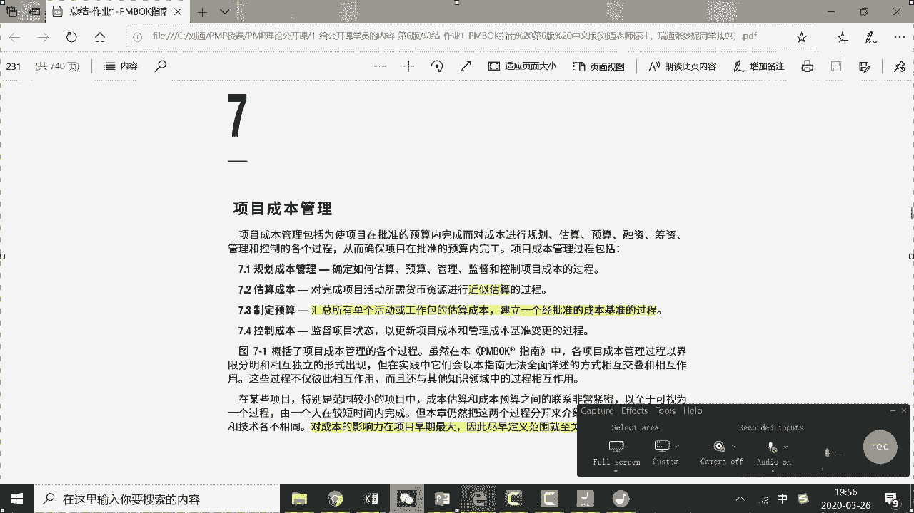

嗯。嗯。呃，哪三篇呢是这个。一个是关键字的汇总大全啊，大家可以看一下啊，比如说一般来说你要想把那个做题的速度提升的话呢，需要看一下它是关联到哪一章或哪过程的一些考题。所以大家可以结合这个来去定位。

精准定位你的考点。

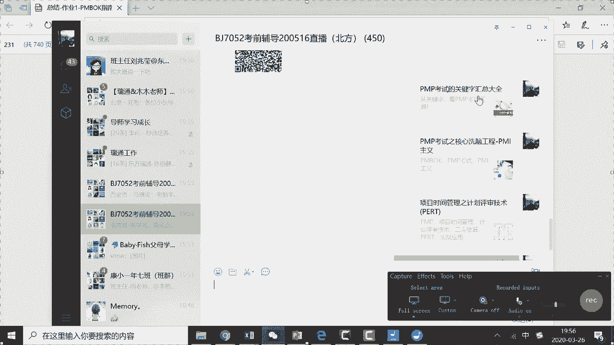

然后还有就是PMP考试的话呢，更多是一个洗脑的过程。所以这边的话呢呃如何洗脑呢？就是看PMI主义多一遍哈。

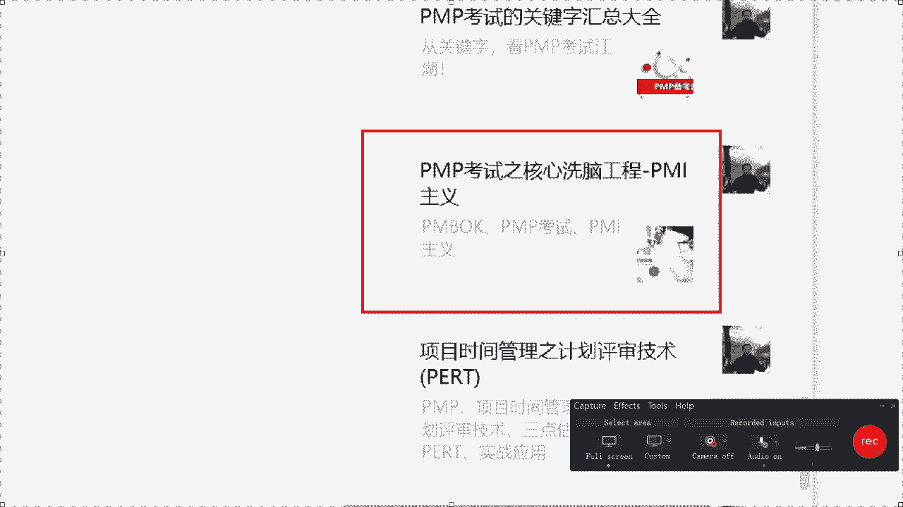

然后并且的话我们今天讲就是那个成本管理，它跟进度管理的话呢，都有一个工具叫三点估算，就是计划评审技术。这个是一个考试的要点，或者是一个难点。大家可以先看一下，掌握一下啊。

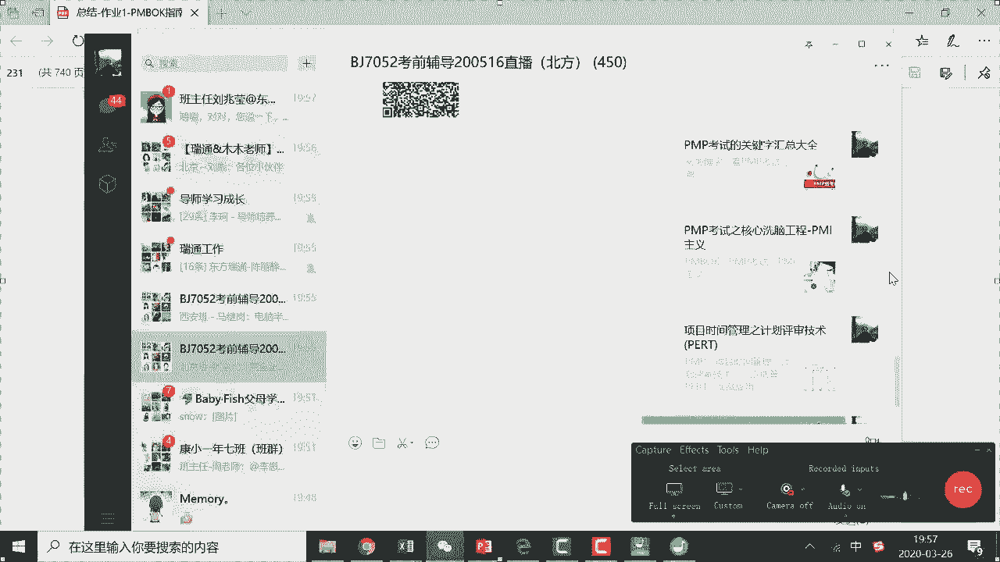

好，多谢啊。我看到有同学已经准备好小板凳了哈。😊。

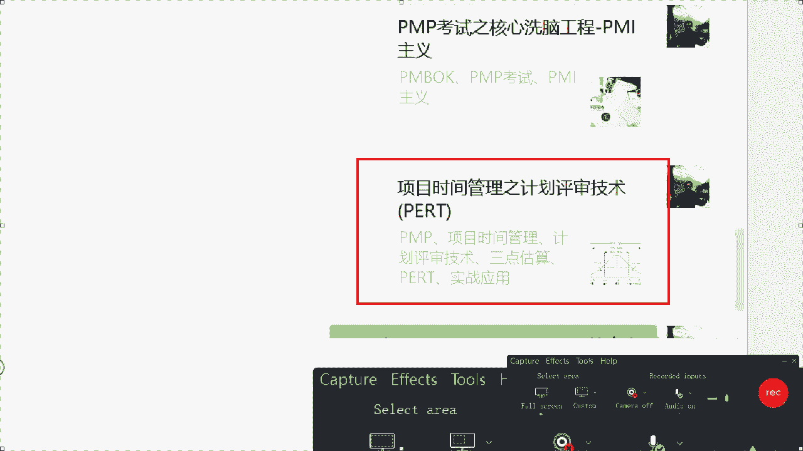

诶。一会儿的话呢呃我会跟跟大家说一下考试的情况啊。呃大家看到了一些同学的成绩啊，因为有人名，所以不方便啊把一些具体的成绩列出来哈。但是我大概看了一下。一会儿我会跟大家说一下。嗯。

右下角的工具的话呢是啊明白，是录屏的。谢谢啊。😊，还有2分钟啊，大家该进来就进来了哈。😊，一会儿我会问大家一个问题，200道题的话，你要答对多少多少道题才算过呢？还有两分钟大家思考一个问题啊。

就说200道题你要答对多少道题才算过啊。还有一分钟哈。还有一分钟。大家抓紧过来哈。我们还有一分钟就开始了。呃，确保大家呢呃把那个纸质的书拿到，或者是我这边发了一个电子版嘛，把它打开，请大家翻到231页。

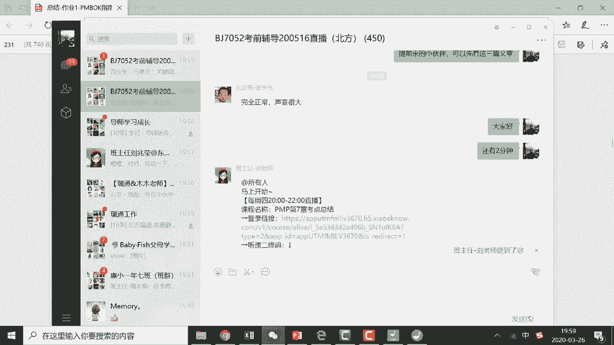

或者是拿纸质书哈，或者是电子书。我们还有一分钟哈。😊，好，呃，现在是整8点了，我们开始了啊。呃是这样的啊，就是我们给你讲的是成本管理。成本管理呢是第七章。第七章的话呢呃一会儿在讲之前的话呢。

因为呃大家做了一些这种所谓的平时练习题。呃，这个测试题的话呢，大概可能是十道。那我看到有些同学的话，有大多数同学都是正确率是70%以上啊。那还是有一些呃大概10名左右的同学的话呢，正确率只有40%。呃。

大家知道说我们200道题的话呢，我们要保守估计的话呢，要答对131道。刚才有些同学已经回复了。25道的那个所谓的所谓不不算分的题，即使不算分的话呢，那有175道题中呢，要答对106道。大家可以除一下啊。

106除以175等于多少啊？大家可以算一下自己哈。😊，106除以175。大概是61%左右。也就说你的。呃，真正考试的正确率呢是应该达到61%以上的。所以大家都知道说PNP考试的话。

硬度管理成本管理有一个概念叫做什么应急储备，你要有点buffer，有点缓冲啊。那所以呢你知道说平时你模拟考试的话，你的成绩应该多少呢？应该是70%，对吧？70%以上正确率。

所以呢呃今天我们考试凡是低于70%的同学，那要回去什么呢？再自省一下，看看是不是说你这边考试的话呢，风险系数是比较大的。如果说你未来考试的正确率还是在这个70%以下的话呢，你真正考试的时候呢。

可能你的通过是哈 half就是一半的可能是过一半的可能是不过这样的话呢，你就那个所谓的呃钱的打水漂了。就是在成本管系中叫做什么呢？叫做沉默成本。好，所以呢希望大家不要有沉默成本啊，也不要有机会成本。

也就是说如果你再次去考试的话呢，你又要去花费一个多月的时间划不来呀。你完全可以什么呢？去工作去照顾家庭，对不对？是这样的，所以呢我们要一次把它。过掉是这样的，所以大家呢希望大家能够正确率达到70%以上。

平时比如说你做十道题要正确七道以上，最好是八道。我还担心什么呢？就是有些同学好像没有跟着我们做题。当然我看到比如说某一区域的别呃同学的话呢，他可能考试的人数是两三百人。

但真正的今天晚上做题的人数呢只有一半，125人左右。所以那一半哪知道呢？好，所以说大家可以看一下啊，就是说我们要跟得上我们的节奏，这样的话呢才不会掉队哈。好，所以希望大家能够重视这个考试。

大家知道说这个考试延期了，可能是什么呢？就是大家有点什么懈怠了。因为呃时间就长了嘛，但是呢我们要知道说叫什么像相管讲的以终为始，我们要。😊，确定这个目标。比如说考试通过，那我们要达成以终为始哈。好。

我们要以目标为导向的过程控制。所以怎么控制过程呢？就是每天跟着我们读书打卡，或者说做题打卡哈。大这样子好，那怎么读书呢？这边。我相信大家应该已经把书看过一遍了吧，至少如果没有看过怎么办呢？

建议大家结合我这边给大家发的那个这个电子版，有标黄的部分，对不对？那你回去呢画一遍书，也就是说把你的纸质书跟电子书呢做个对照。然后呢去把标黄的部分，当然了，你会说有些部分的话，你觉得还更重要。

那怎么办呢？一样，你就把它标出来标出来啊。然后画一遍书，证明你起码看过一遍书了哈。好，这个的话呢大概用时是多少呢？用时是大概是8到16个小时。也就说你看完一遍书的话呢，至少有有8到16个小时的时间啊。

大概这样子。好，所以有同学说了，不忘初心，邦得始终，对吧？好，所以了解一下啊，呃，这就是刚才我看到了大家做题的情况，凡是正确率40%的同学，那更要自省些自省一下啊。好，那这边的话呢，跟大家说一下啊。

我们今天讲的是成本管理。成本管理这边的话呢，呃我会结合这个电子书去讲，大家可以看一下成本管理这边的话呢，我们电子书可以翻到231页，大可以看一下。也就说大概是这四个过程。规划成本管理估算成本和制定预算。

还有控制成本。这边的话呢会有一些相应的考点的。比如说最典型的呃估算成本和制定预算这两个过程的话，会有相应的什么工具，对不对？比如说我们之前在讲季度管理的时候讲什么三点估算等相关的工具。

什么类比估算什么参数估算等。好，所以这个的话呢，我们会今天会讲到成本管理这一章，希望大家呢如果还没有画书的同学呢，可以回去画一下啊。好，那我们结合一下课件。那成本管理这边的话呢。

我们看一下具体的成本的定义。

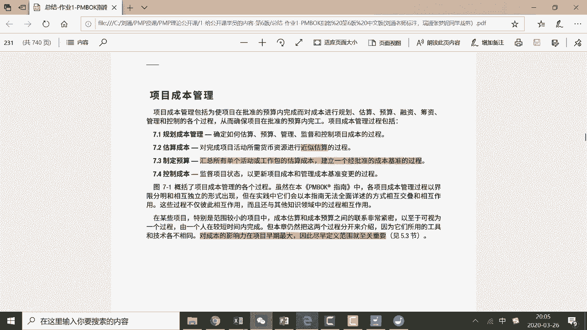

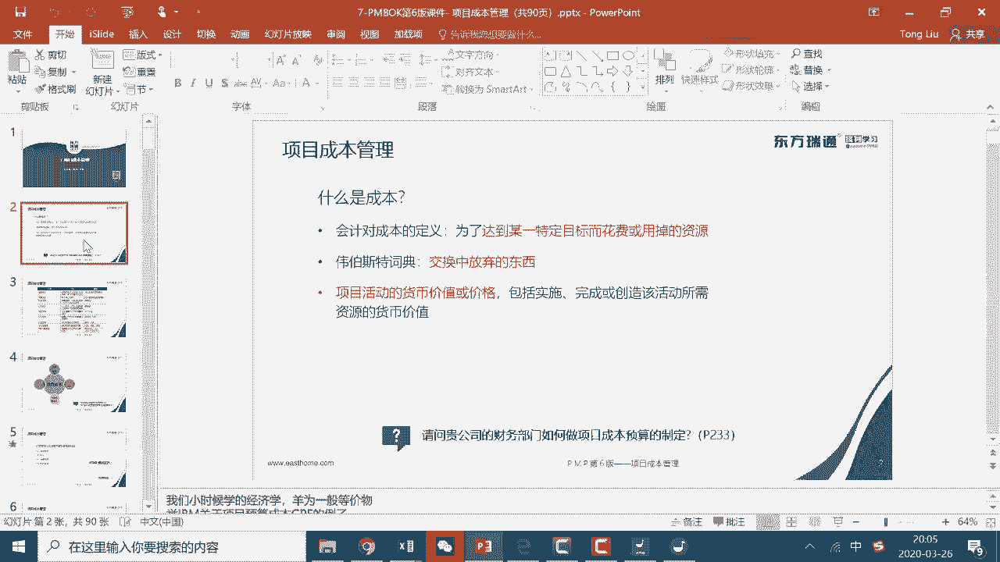

成本的话呢是为达到一一个特定目标而花费或用掉的钱。比如说在商言商做什么事呢？都是要花钱的。所以大家知道我们讲范围管理的时候，就说到什么呢？就是如果你作为乙方甲方要你多做的事，没给你补钱补时间呢。

这就属于的范围的蔓延，对乙方来说呢，是不划算，所以应该什么呢？应该不做或者走变更控制流程，对吧？大概这样子，好，所以说呢我们做项目是有什么这种成本或时间的限制的，所以成本的限制呢，就是一种制约因素。

所以我们要知道说我们要想做好项目的质量不仅仅是交付没有bug的什么产品，它应该是什么呢？控制好进度控制好成本。比如说预算超了，进度延期了，项目范围蔓延了，都属于质量问题，要知道的啊好。

这就是成本的一个定义。要知道为做什么事情而花费的钱。做什么事情呢？都有都是花钱的。好，关于成本这块的第二个概念呢就是所谓的成本的分类。成本分类这块的话呢，这块我们要记住几个基本概念。

比如说沉默成本和机会成本。咱要举例了。比如说你PNP考试。如果没有通过D是沉默成本，也是机会成本，机会成本的意思什么呢？就是你做项目A没做项目B做项目B的收益，就是做项目A的机会成本。

所以我们如果再次去考试了，那其实呢你就浪费了很多时间，比如一个多月的时间，对吧？对你来说是有时间成本的，唉我不能够什么呢？不能够考两次，我们就一次通过。而且呢这个沉默成本这块，我们也考虑到考虑到什么呢？

比如说如果你再次考试的话，那你是否是呃在什么呢？比较什么在意之前花到花掉了钱呢，比如3900块钱呢，那就不要考虑了。也就是说。

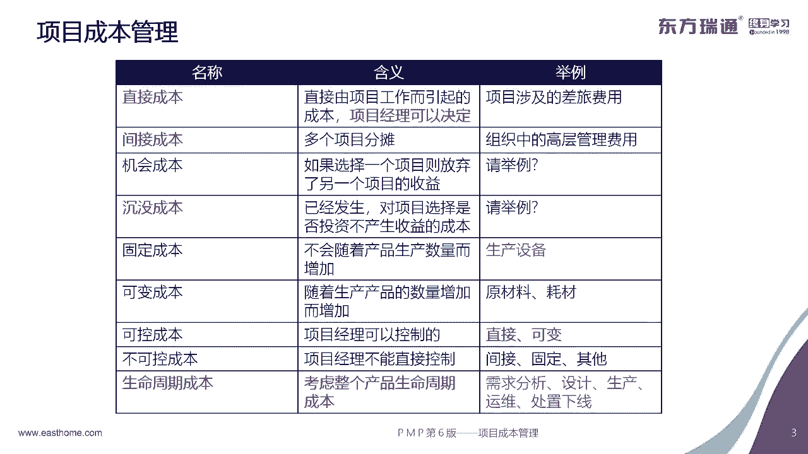

什么成本那你就是过去时了，对吧？你要什么要放眼未来是这样的啊，所以我们希望什么大家呢应该一次性把考试通过好。

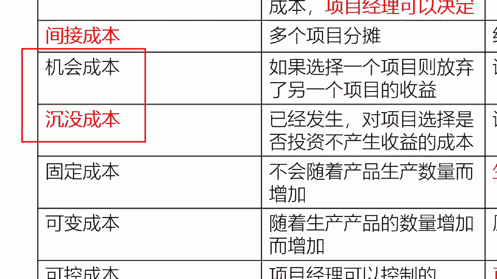

不要产生额外的什么机会成本或者是沉没成本啊。好，然后这边的话呢呃关于成本的分类，这边还有一个考点，就是直接和间接成本。也就说直接作用到你项目中的花费就是直接成本。比如说这个钱是为你项目那个花费使用的。

好，那间接成本的话呢，最典型的就是各个项目分摊的。你说是不是水电费啊，其实很多时候是管理成本。

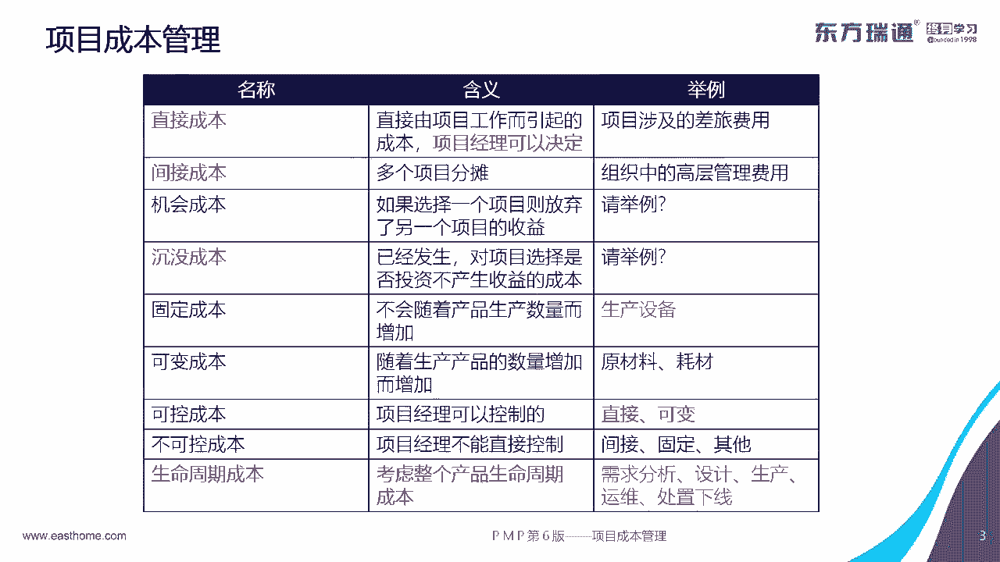

比如说大家可以想象一下，如果你们的财务科目这个大概非常明晰的话，你们老板就是你们的项目总监，公司的管理层。他一般来说呢，如果填你们项目的工时的时候呢，他其实呢他更多的是编辑成本。为什么呢？

比如说我老板他管二三十个项目。然后呢，他每周的话要添40小时的工时，他在某个项目中填2小时，那个项目中填1小时，他就把他所谓的40小时的工时呢，添到所谓的不同项目中，大概这样子。

所以有些时候你可以看一下你们公司是不是有管理层填你公司的什么或添你的项目的code呀，就是工时啊。如果。如果添的话，你可以回复一哈，不添回复0。但是基本来说我问过很多企业，基本来说都不添。

这这样证明什么呢？它的管管理成本的话呢，尤其高层的管理成本呢，它是没有太多出处的。它的账是比较乱的。在偏僻中它有专门一个概念叫做什么来？要控制账户，对不对？所以呢每一笔花费都是要要有控制的，对吧？

所以大家了解一下，间接成本和直接成本的概念啊，就直接作用到你项目中的花费就是直接成本。然后呢，多项目分摊的就属于间接成本，尤其是管理成本，就是高层的管理成本。好，然后这边的话呢。

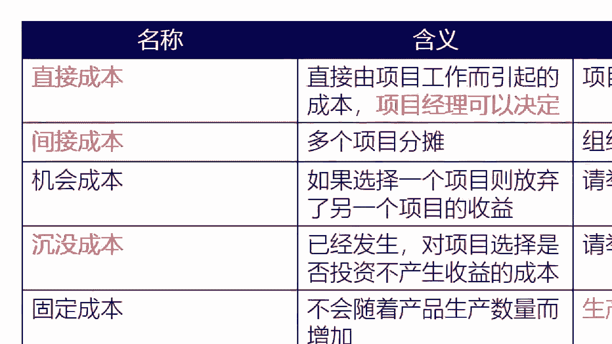

还有就是什么呢？所谓的固定成本和可变成本啊，这个这也是一对一个区别的。比如说大宗的这种呃产品或者固定资产，它属于固定成本。然后呢，那种所谓的呃使用的耗材，那属于可变成本。比如说你固定成本和可变成本。

你可以简单理解说固定成本就是那种大型的打印机可变成本呢，打印纸是这样的。好，所以这边的话会涉到一个基本的知识点，什么知识点呢？就是所谓的呃项目经理可以直接控制成本，一般是直接成本和可变成本。

不可以直接控制的，通常是间接和什么固定成本等等。好，然后这边的话呢，还有一个概念叫做生命周期成本。生命周期成本的话呢，如果你做招投标的话，你就知道就是一般来说如果乙方要去报价的时候。

你要报什么原生命周期的成本。比说什么意思呢？大家可以看一下，我这边有一个模板。

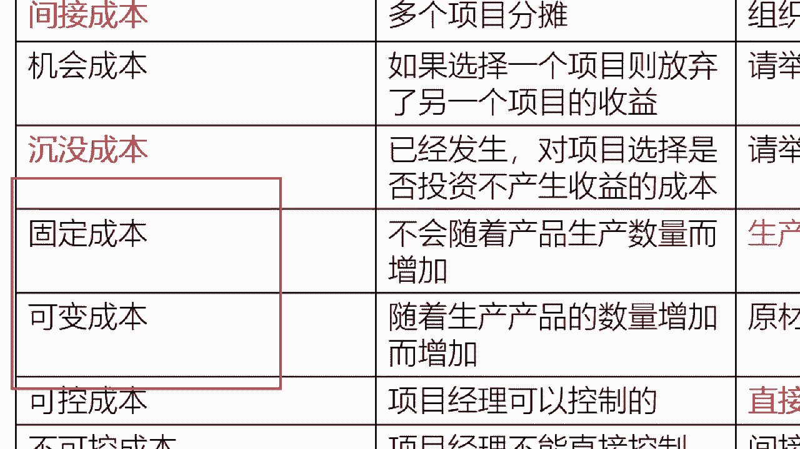

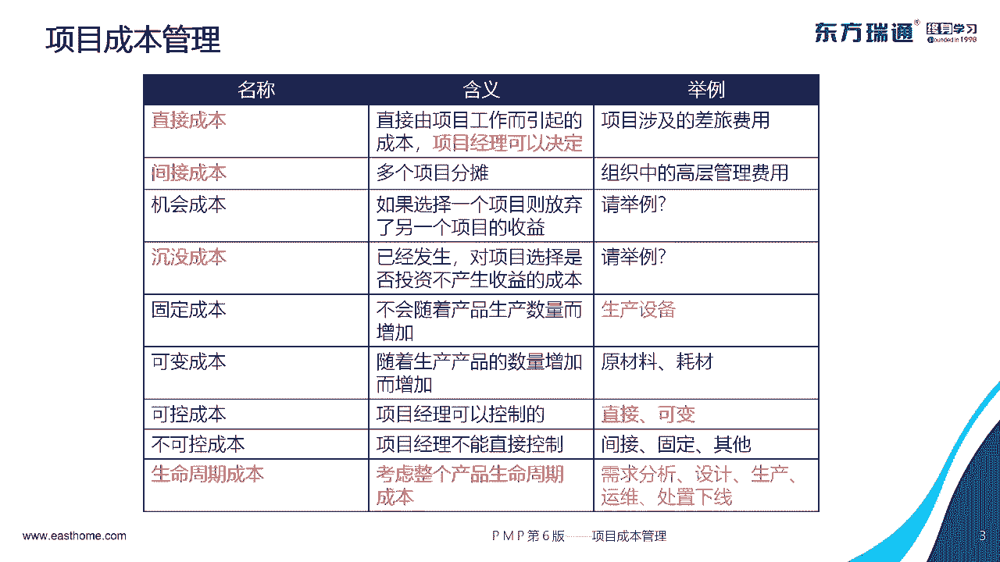

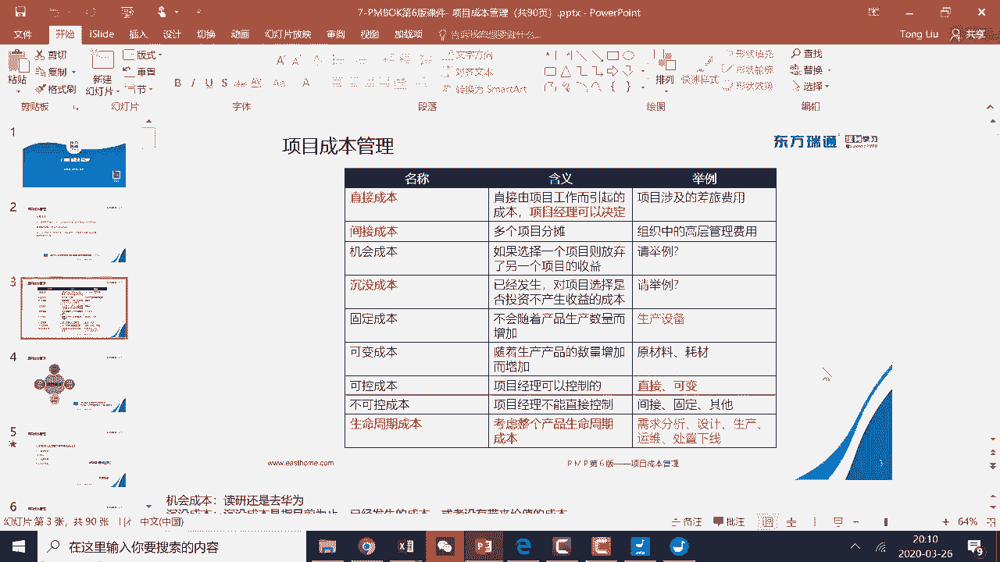

比如说乙方报价的时候呢，他要把项目的一次性的花费，比如说硬件的花费、软件的花费和执行成本。比如说需求分析架构设计、项目管理集成上架，包括开发等等的这种成本呢，把它报出来，这就是一次性的成本，然后呢？

还要报什么呢？3到5年的运维。比如说服一线、服台一线的应用二三线的基础设施二三线的这种所谓的维护成本。这样的话做一个汇总，这就是所谓的全生命周期成本。为什么呢？为什么要报全生命周期成本呢。

因为我们要知道说这个产品一到一旦到客户那个呃生产环境，他还需要什么要维护，维护需要保养的那我们要看从产品的制造到产品的整个的下限。这个整个生命周期，这个过程中，我作为甲方，我一共要花多少钱才算合算的。

大概是这样子。好，所以呢有些时候呢乙方他可能项目实施的时候，这个成本报的很低，或者是报价报的很低。但是维护成本很高。所以你也不划算呢，大概这样，所以这就是很多的这种成本的分类，大家要知道。

然后这边的话呢。

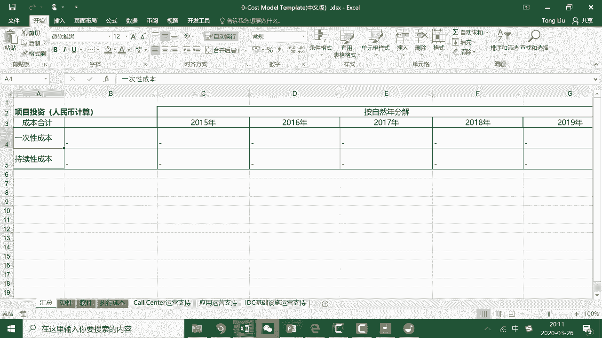

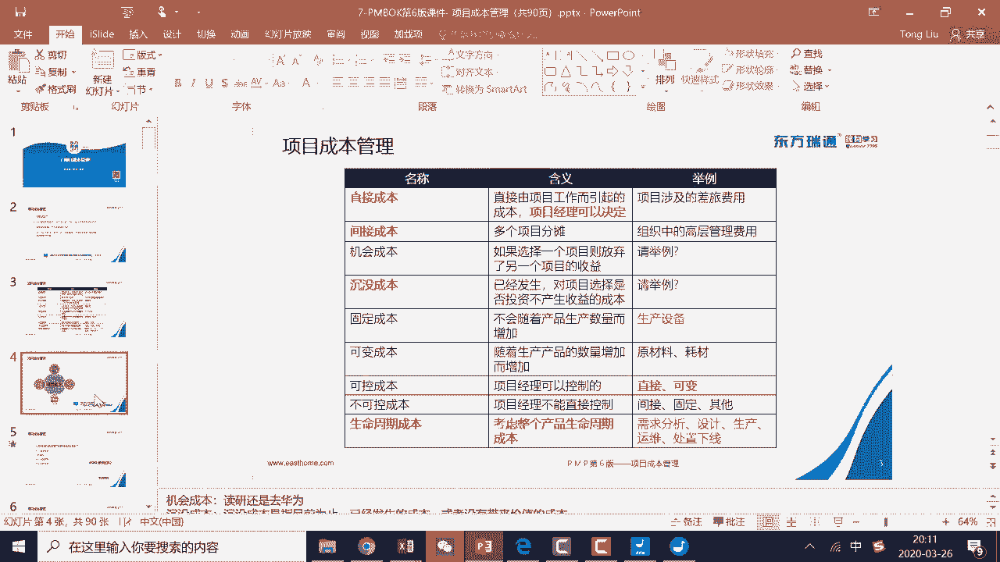

我们给大家问一道题哈，比如说简单的，如果说考试的时候说培训成本，那你觉得是直接成本呢，还是属于间接成本呢？那个表格的话回头会发给你的，没问题。培训成本是直接成本还是间接成本啊？大家知道说哎。

如果这种团队的成员技能不足，然后之前大家都知道说不能够轻易的把团队成员退回给什么，退回给职能部门，对不对？是这样的那更多的是团队内部的去什么去培养，对吧？好，那如果是你花钱去培训团队成员的能力。

那是这个团队成员的话，它是直接作用到什么呢？你的项目中的所以呢这种培训费应该是什么？应该是直接成本。那什么样的培训费属于间接成本呢？比如说呃你们公司的HR，你们公司的HR呢它。

举办了一些沟通管理培训或表达力的培训。这些培训的话呢，他会发个广而告知的邮件。这么说说呃各个项目组啊都可以过来报名啊，你报一个人呢，就交100块钱报两个交200。是这样的啊，这样的话。

也就是说A叉举办的这种这种沟通能力的培训，他会让所有的项目组呢都去报名，这样的话呢，他就把他的培训成本分摊给各个项目组了。大概这样子啊。好，对意了解，比就说有些时候是这种能力的培训。

比如说直接作用到你项目团队能力的培训。有些呢是属于H叉的培训，还是不太一样的。那种A叉的培训的话呢，可能是经辑成本多一些。大概这样子好。所以这就是要要了解的。然后接下来呢，我们看一下那个呃关于成本。

关关于什么呢？关于这个培训，它会关联另一个考点。比如说大家可以翻到你书的342页。

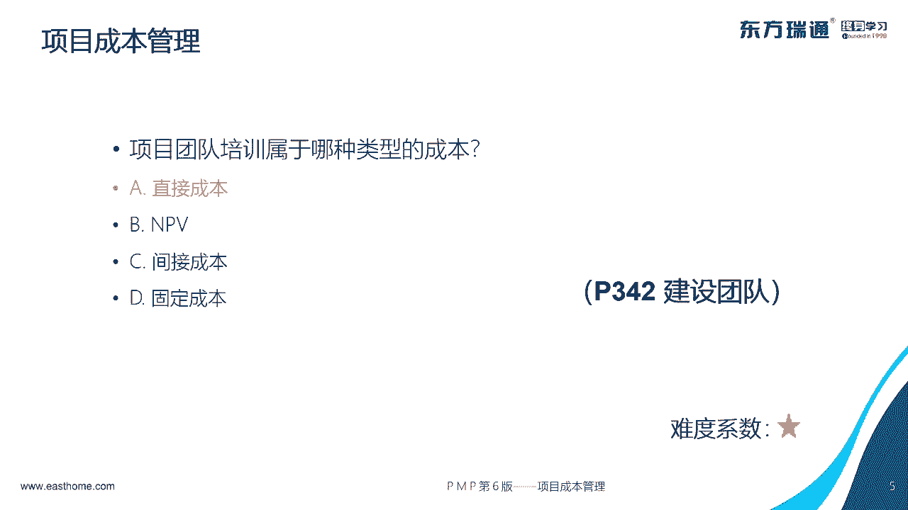

呃，大家可以画一下，342这边的话呢，大家可以看看到这是一个典型的关点考虑了。

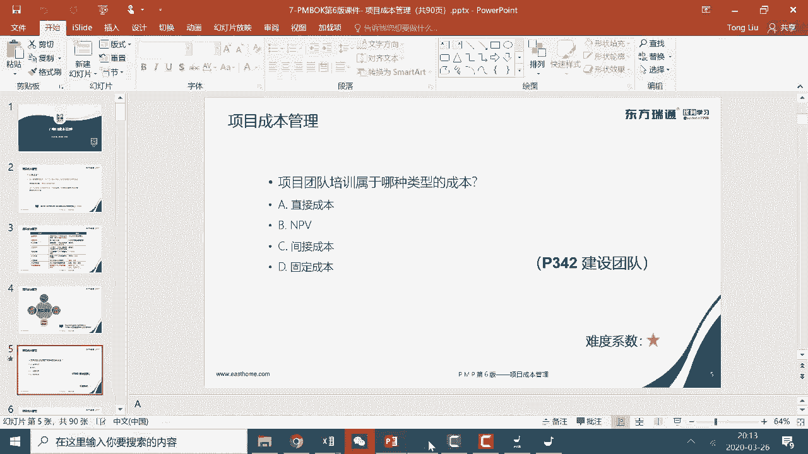

哎，你看这个培训培训属于建设团队的一个工具。大家可以看一下啊，比如说团队建设对吧？建设团队的工具，也就说这边就很典型的一点啊，你看到没有？如果这个人的技能不行怎么办啊？

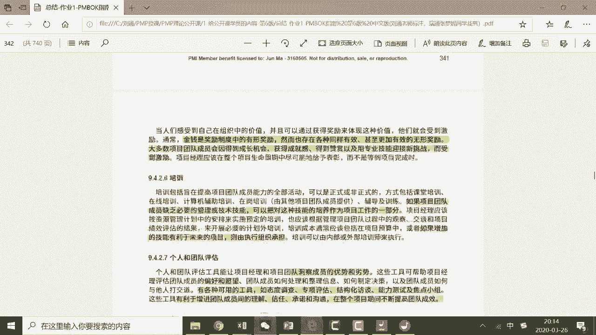

那需要什么呢？需要去培训，需要培养。然后这边呢你看有利于未来项目的话呢，肯定是项目团队自己去什么花这个钱呢。那这样子好，这是关联的一个考点。也可以看到啊。好，这就是一个典型的一个知识点。

比如说培训既可以关联到这种直接成本和编辑成本又可以关联到建设团队的一个工具啊，好，可以了解，然后这边的话呢，带给大家注意道题，这就是关于固定成本和可变成本的大家可以看一下。

你可以看一下这个固定成本的话呢是2500美元。可变成本的话呢，是就是属于的那些耗材嘛。那一个呢产品的可变成本是100，那它一共是10个产品。所以整个的这个产品的总成本，就是固定成本加可变成本呢。

加在一起是多少呢？

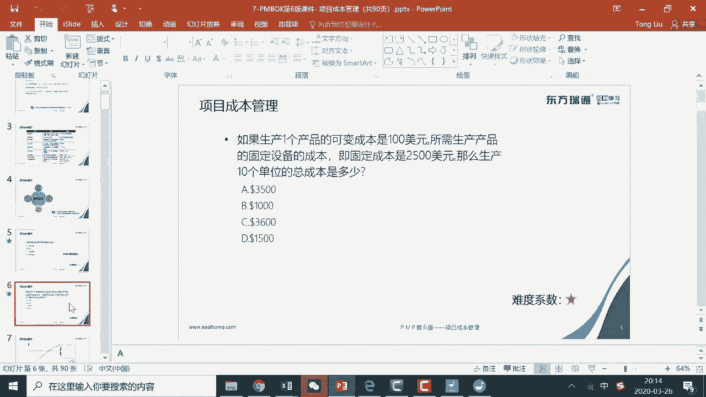

大家可以算一下啊。

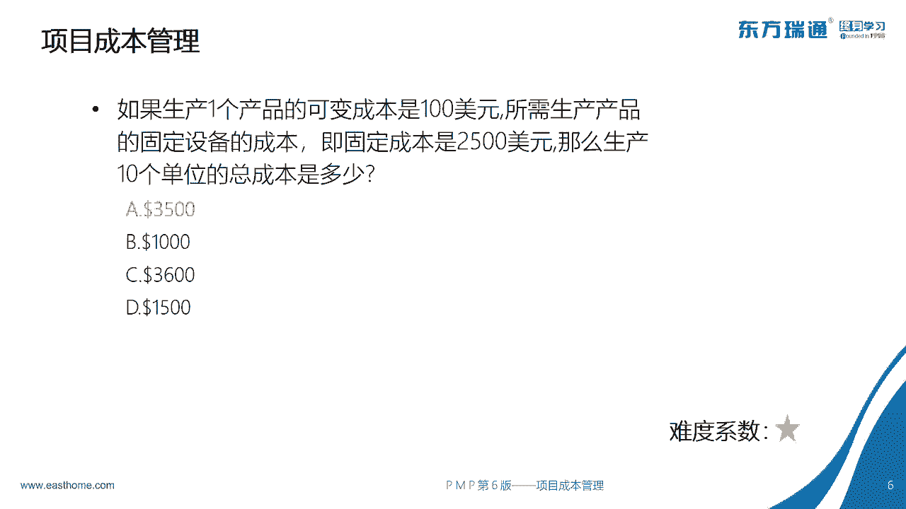

是3500块钱，大家可以看到对我么算出来的呢？就是呃2500加上10乘以100，大家可以看到啊。好，然后这边的话呢。客户培训当然算直接成本了。因为你要知道说如果你的客培训的范围是什么呢？啊。

是你的项目范围的一部分。懂吗？就是你项目直接花的钱呢啊这样子啊那种所谓的H叉的培训的话呢啊有可能是什么呢？就属于是间级成本，就是你团队，就是你公司内部的HR培训。好，所以了解一下。

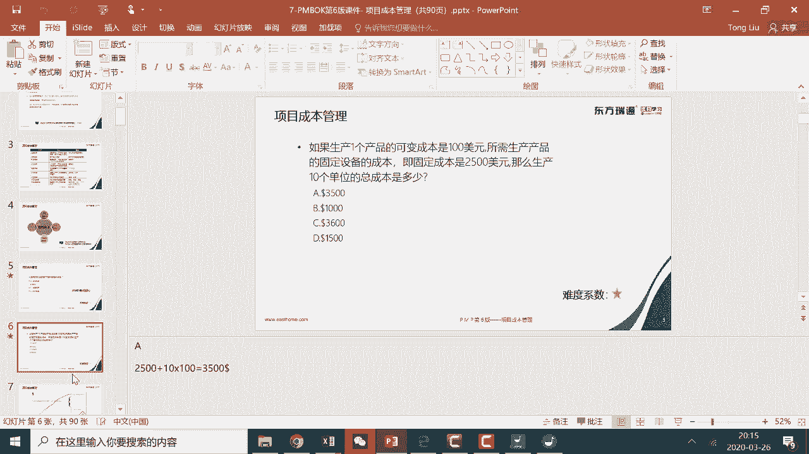

然后这边的话呢，我们再给大家有一个外延的，关于成本的一个概念。这个概念什么呢？就是所谓的学习曲线。比如说呃从制造业角度来说呃，生产单个产品的成本，随着这种所谓的生产量越来越多，你越来越什么熟悉。

所以呢单个产品的产出的这种所需的成本应该是什么，逐渐的降低，啊，在这样逐渐降低。好了，那这边的话就问大家一个问题啊，比如说你现在在学PMP然后呢，你也在产出啊，比如说你再去读篇布，那问大家一个问题。

问题是。请问如果你读一遍PMbook书要多少天呢？有些同学说需要两个月。那我说那你读第二遍呢。😡，他说还是两个月。这个有点太慢了，是不是？即使呢到你最后的话，你应该越读什么越什么越快，为什么呢？

要把书由薄到厚，再由厚到薄，对吧？好，由薄到厚再由厚到薄，那么到薄呢？就是说你的相关章节其实都已经很熟了，你就不用重复看了嘛，你只看不会的，然后呢，最后你留下的那个读书笔记呢，应该是一本无字天书。

今天中午我看到有的同学打开篇部之后，发现是一个白屏，对吧？好了，也就是最佳状态。无字天书，对不对？就是你的东西呢全都进入脑子里头了。大家这样的就要学习曲线，比如说书应该越看越快。

你的学习效率包括做题的效率应该是什么越来越快，对不对？是这样的啊。好，所以了解一下。然后接下来呢给大家讲一下呃一些基本的折旧的概念。首首先为什么要讲折旧？我这边呢稍微给大家讲一到两个方法，是这样的。

也就说我们要考虑到这个你要买到大众商品之后，它可能会折旧，折旧的话呢，会呃跟你的收益或者说你的利润将挂钩。比如说你你要去考虑到说你公司要盈利的，你盈利的话呢。

要减去你的大众商品的折旧才是你纳税要纳税的部分，所以呃合理的折旧，尤其财务这边合理的折旧会可能什么呢？合理的避税啊，这样的话呢，你的现金流，尤其是在疫情期间，你的现金流还是比较健康的，对不对？

那这样子好，那折旧的话呢，肯定我们作为这种公司那我们希望什么呢？折旧越快越好。这样的话呢，我就可以什么呢？把那个利润减去或者收益减去这个成本折旧，这就是我纳税的部分就会少嘛。大家这样子。好。

所以折旧这边的话呢，它有几种折旧方法有三种，基本考试的时候的话呢，偶尔会考前两种。第三种的话基本不带考。那这边的话呢，前两种这边比如说直线折旧法，这个呢是一个典型的一个一个知识。大家可以简单了解一下。

一般一般这种题的话呢也比较少哈。好，比如说呃以一部手机，比如说iphone为例，iphone它原价比如说1万块钱，那这边的话呢那。我使用年限的话，可能比如说按5年计。那我5年之后的话呢。

这个净残值就是这个手机啊，大概你要到什么爱回收啊，什么京东当当当去卖。这个时候的话呢，可能只值200块钱。那这样的话呢，大可以看一下，那直线折旧顾名思义，就是什么呢？就是每年折旧率都是一样的。

那怎么算这个折旧率呢？就是这样一个公式，我们按这个例子来去看就知道了。比如说一减去。叫做预计净残值率，什么意思啊？就是这个净残值是200，原价是1万，就是200除以1万，然后一减去200除以1万。

再除以555是什么呢？折旧年限。然后这样的话呢，再乘以百分之百就等于119。6%。那直线折旧的话就是每年都折旧都折旧19。6。好，然后这边的话呢，哎大家可以看一下，哎，这个19。6的话呢。

我们可以看一下一乘就是乘以个什么乘以1万，这边是1960，大概这样子啊好。然后这边的话我们看一下这个课件的话是最新课件，就是说按照我们2020年版的一个最新课件啊啊，以前的都是比较旧版的。

现在是我们2020年会改一个最新版啊，大家是这样的，最新版。然后这边的话呢，我们看一下呃，年折旧额的话，大家可以看到是1960折旧5年，一直到什么呢？一直到200。好，这个折旧大概是10。6%。

貌似还可以哈，但还有更可以的，就是双倍余额递减法，大家可以看一下，比如说还是一款手机比如说一万，那我的年折旧率怎么算呢？你看double双倍分子是2分母就是5，所以5分之2乘以之百40%。

大家可以看一下，刚才那个是19。6%，看到没有？所以这个呢就是 doubleouble了，好，那折旧的就快一点。所以这个从财务角度来说呢？你们公司的财务呢是很喜欢的，对不对？折旧比较快。

然后第一年呢折旧什么呢？折旧4000到4000了，比如说1万乘以40%嘛，4000。第二年呢就是它的净残值就变成1万减400了嘛，就是6000块钱了。比如说那手机只就只值6000块钱了。

但乘以40%就是2400。第三年是以此类推，1440。然后呢，如果按这样的一个所谓的年折旧率的话呢，它可能折不进。所以呢它第四到第五年的时候，也就是说后两年的时候呢，它折旧是按照什么呢？按照直线折旧。

我们按直线折旧呢？比如说呃1万块钱的原价点去第一年的4000。折了4000嘛，然后第二年折了2400，第三年折了1440，再减去净残值200再除以2。哎，这样的话呢就说第四年和第五年各折旧980啊。

大概是这样子啊。好，所以了解一下，这就是一个典型的点，那这边的考试的话，它会不会是折旧5年呢？通常它是折旧三年。那这边的话，如果折旧三年的话呢，那大家都知道什么呢？应该从第二年到第三年的时候。

就后两年呢，它应该什么呢？它应该是按照什么？按那个所谓直线折旧这样的，所以了解一下，那你说考试的时候会不会这个数这么大呢？不会它不会这么变态的哈。肯定是什么个位数的，而不起就十0位数的啊，那是这样子。

所以呢要理解这样的一个折旧的一个算法就可以了。所以这个是一个典型的点哈。然后接下来呢我们就看一下这个关于这个过程过程的话，请大家翻到231页。大家知道说呃成本管理。

我们知道它跟这个范围管理进度管理是很相关的那怎么相关呢？因为它有三个基准。哎，大家要记得啊，范围基准，你们都学过了，带什么呢？创建WS对吧？产生的然后呢进度基准呢？是制定进度计划，成本基准呢是制定预算。

然后这边的话呢，我们要知道一个简单的概念。比如说什么叫范围基准呢？比如说已经审批通过的项目范围嘛，很简单，对吧？那什么是进度基准呢？审批通过的进度计划嘛，那那成本基准呢？很简单理解就是审批通过的预算嘛。

好，比如说我们要知道这个范围进度成本就属于制约因素嘛，因为你你要按照这样的一个范围进度计划和预算做事嘛？好，如果做不好的话呢，就是绩效有问题，大概这样子，所以你要控制好什么范围控制好进度控制好成本。

然后这边的话呢，我们要知道呃估算成本和制定预算还是有区别的。估算成本的话呢，它针对的是单个活动或工作包的成本估算。而制定预算呢，就是把它什么所有的工作包这个成本进行汇总，然后形成一个什么叫BC还记得吧？

叫完工预算budget at completion啊，完工预算。

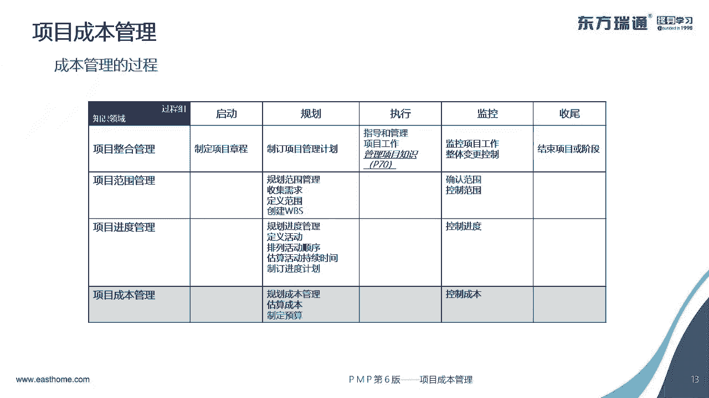

这个词儿大家不不陌生吧。

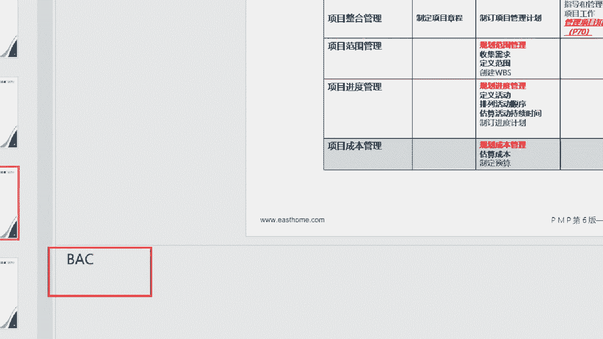

这个词儿对吧？完工预算啊，好。😡。

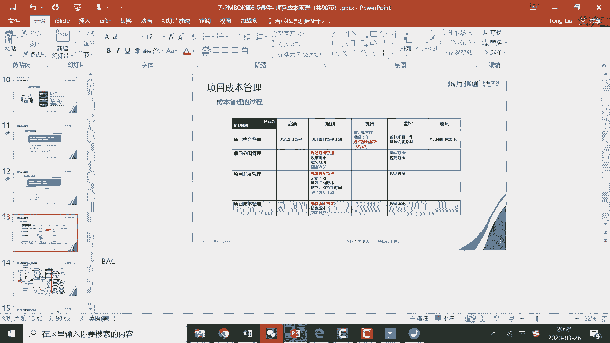

然后接下来我们看一下啊，这边关于这个成本管理这边，我们还有一个框架图。这框架图的话呢，这个是我画的哈呃基本来说把其他章节的内容都放进去了。那我们要看一下成本管理。

它大概跟那个什么跟那个其他的章节是什么关系。大家可以看一下，比如说我们可以看到说哎当你去创建了那个工作包或者是活动之后，然后你去估算什么呢？活动的历时和成本。所以这边的话会有一个考点考点什么呢？

就是估算活动值时间和估算成本，它的工具差不多差不多的。比如说什么三点估算呢，什么类比估算呢，对吧？参数估算自下而上估算等等。大概这样子啊好。😊。

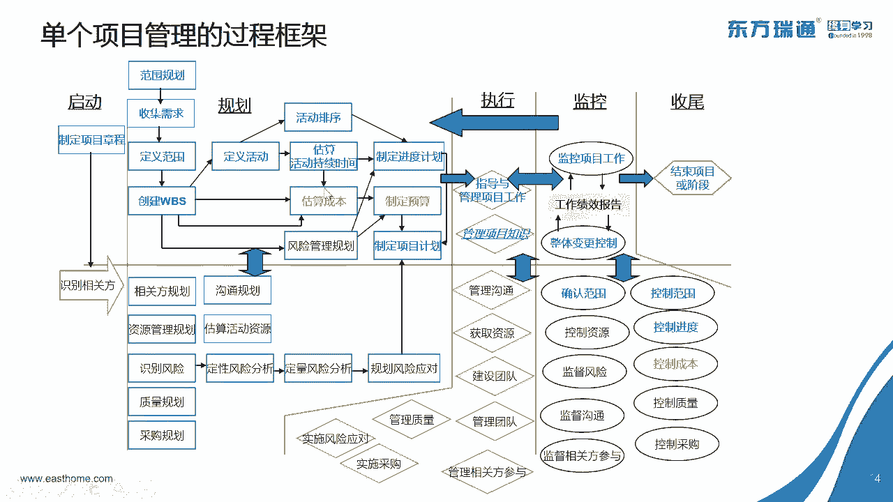

然后这边的话呢呃大家有兴趣呃，如果对这个公式比较感兴趣的话，我可以单独把这个课件拷给你啊。好，没有问题。啊，我看今天好像我们班主任还发了一些所谓的什么啊，发发了一些什么，发了一些那个这种计算题哈好。

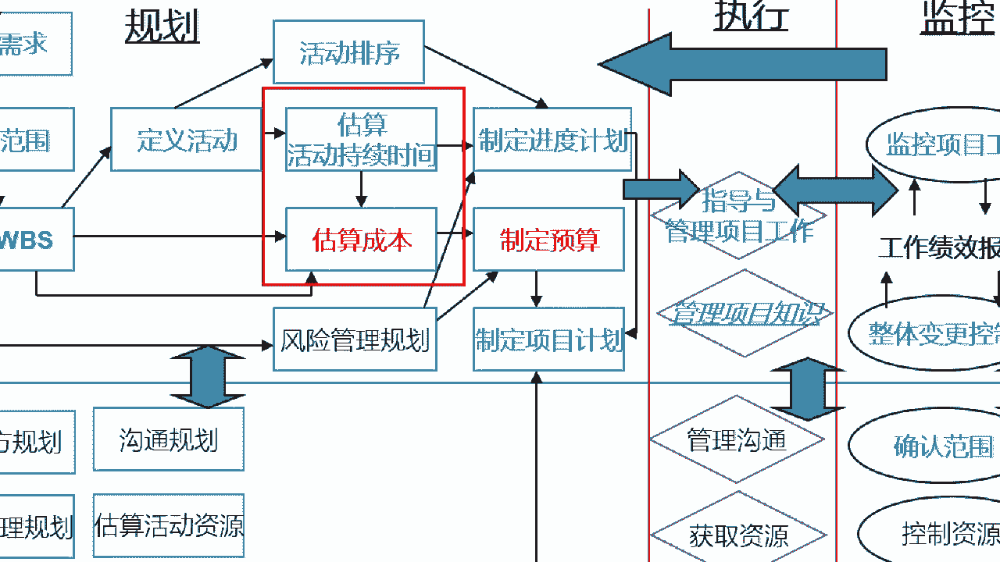

呃，我们不同地方的课件会有出入的。好，我们后期会统一啊，这就是呃最新的统一课件啊。好。然后接下来呢，我们看一下这个是呃这个大家可能是我北方区的同学的话，可能不陌生了哈。这就是你们课件里头的一个图。

那这个图的话呢，我们看一下刚才说到了一个典型的点哈，这个点的话是什么呢？就是呃估算成本是对单个活动工作包的近似估算。那这边的话有一个要点了，作谓近速估算偏差在多少来的。😊。

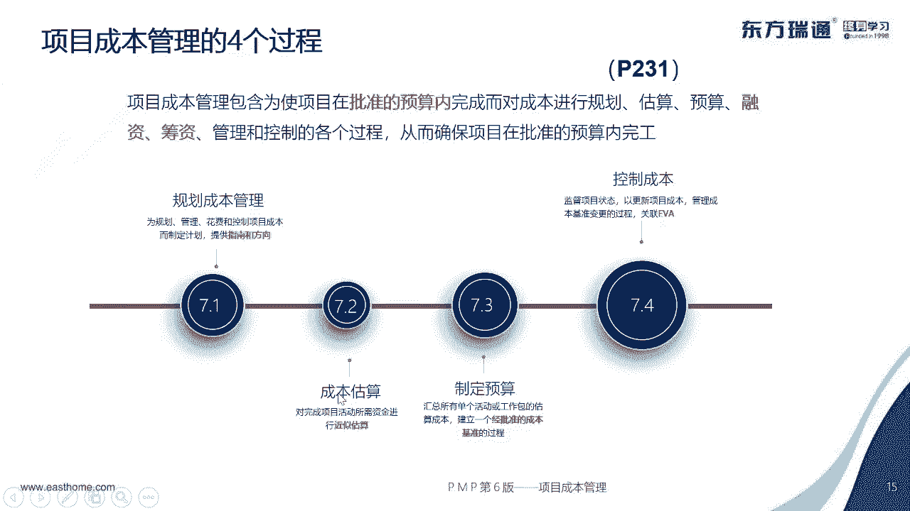

偏差在负5%到正10%左右，大这样子啊，就就是精准估算嘛。然后这边的话呢，我们要看一下啊，把它怎么呢变成制定预算，然后呢变成已经批准的成本基准。大概这样子。好，所以了解一下。

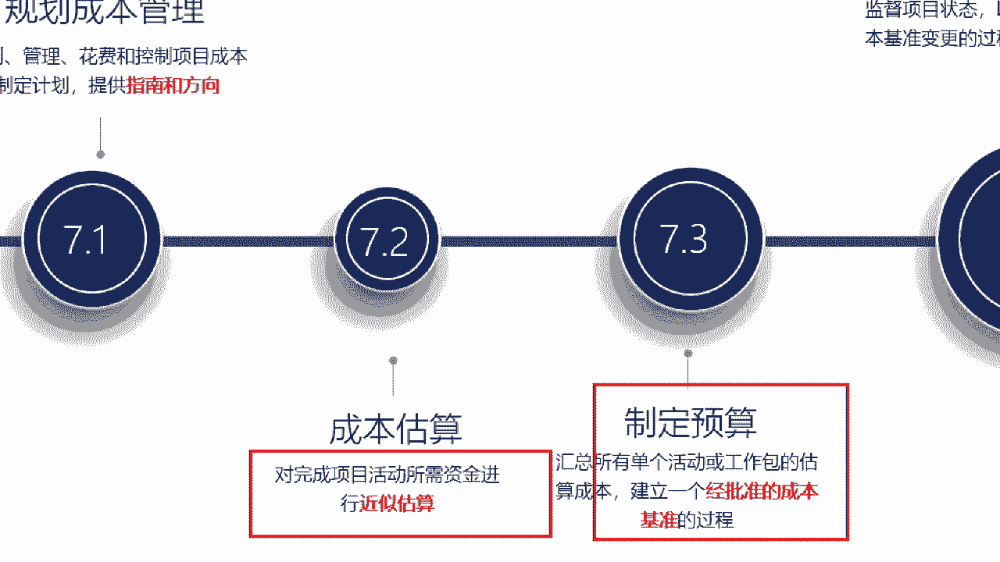

好，这个是要知道的。然后成本基准一旦确定之后，又需要考什么呢？又需要考虑成本的过程控制。然后呢，钱从哪来？这边的话呢，你可以看到PP的话呢，它还是什么呢？海纳百川有容乃大的。

他他考虑到说钱有可能未必是你乙方公司能够独立的去支付的，有可能可以靠第三方的去众筹啊或融资啊等等啊，这些都可以去看一下的啊。好，然后这边的话呢。

我们看一下就是规划成本管理这边我们需要掌握什么样的一些知识哈。规划成本管理这块这边的话呢，大家可以翻到你书的235页。

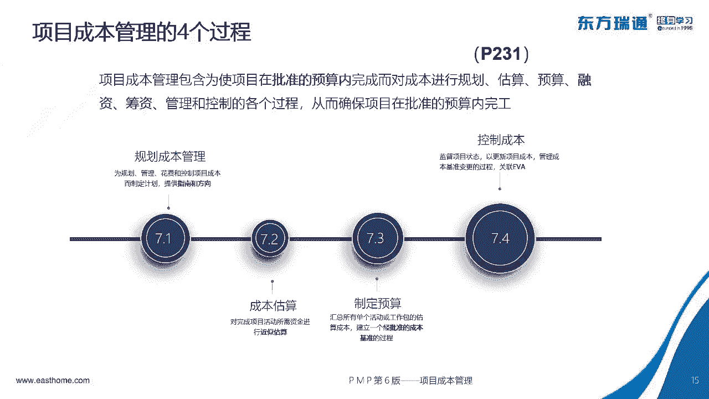

235页的话呢，大家可以看到它是提供一个什么呢？如何做好这个事儿，就是成本管理的一些规划和什么指南。所以大家可以看一下啊。

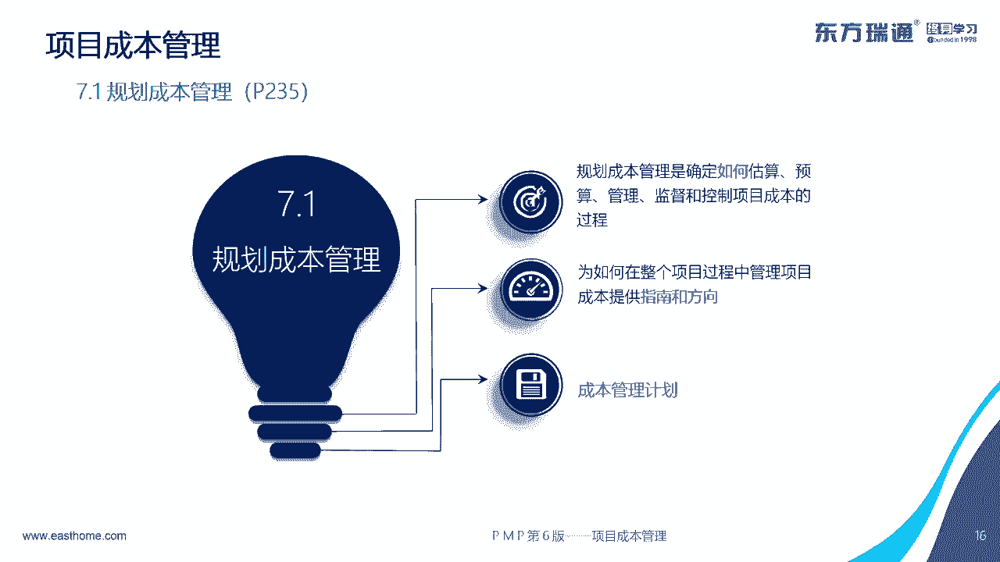

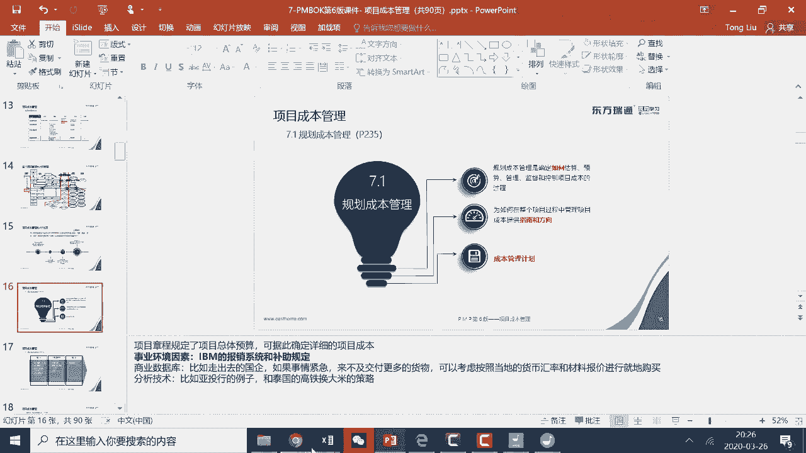

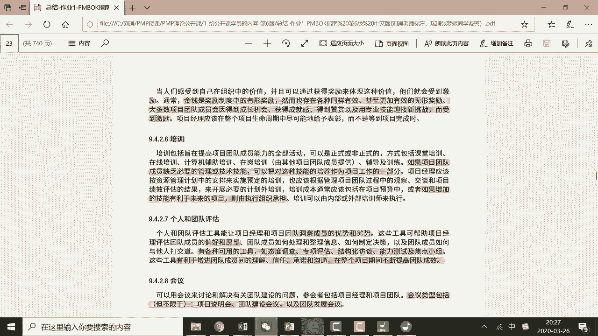

比如说大家可以翻到235页。那你看如何做这个事情的什么的指南方方法或者方呃方向。比如说这个getline就是指南呃准则等。大这样子。好，那这边的话呢，我们看一下，那所以它会产生一个什么啊？

产生一个成本的管理计划啊，就是说所谓的成本管理计划。成本管理计划这边的话呢会涉及到一些要点。要点是什么？要点的话呢是这样的，就是首先它会关联到两个概念，一个叫做精确度，一个到叫做什么准确度。

这个大家在238页可以去看到说入到238页可以看到精确度和准确度。大家可以看一下啊，238页。

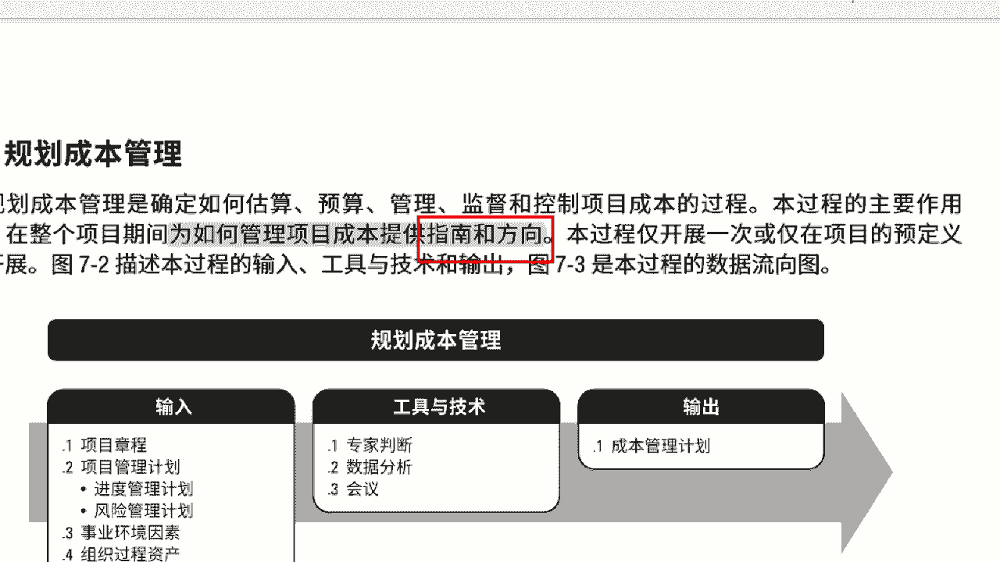

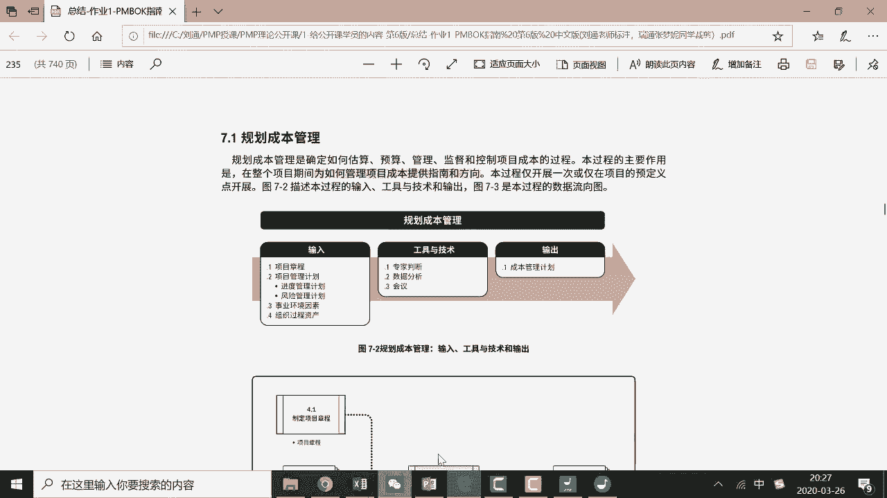

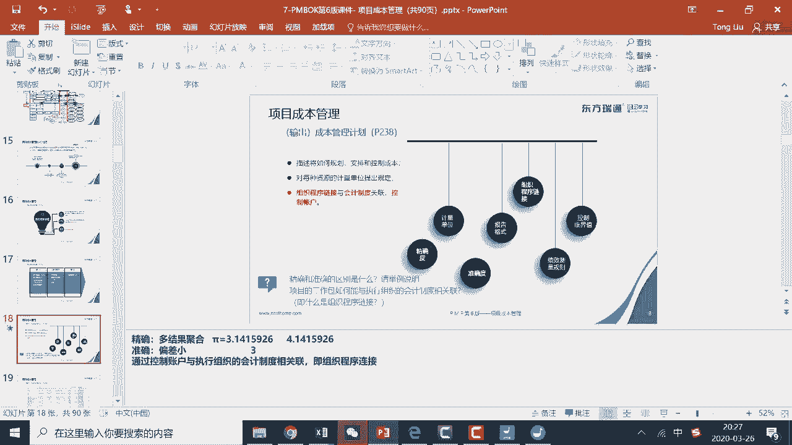

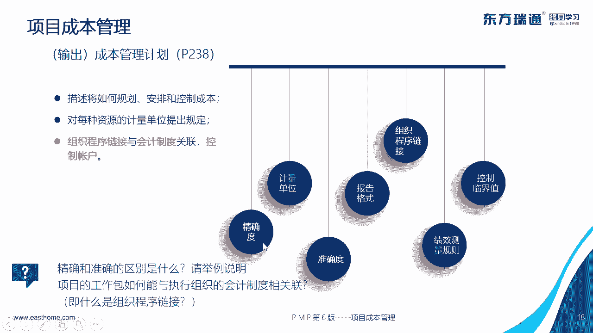

精确度和准确度啊。

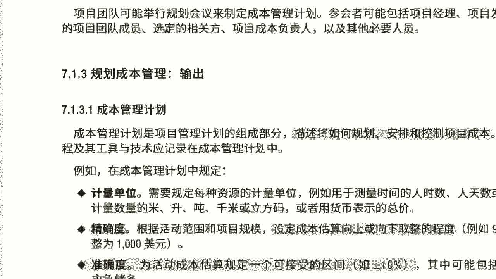

这儿呢那个精确度的话呢，比如说你看。如果是成本的话，那肯定是小数点后几位，对吧？然后准确呢就是接近真实值。如果是这种呃精准估算或者近似估算的话，偏差应该在-5%到正10%左右，大概这样子啊。好。

所以了解一下，那这边的话呢，我们要知道说精确度和准确度呢，更多的什么呢？它也是一个质量的概念。比如说我们之前在讲印度管理的时候也会讲到什么精确度准确度。比如说这种精确度的话。

比如说你在规划这种印度的时候，具体的人天在人天还是人时。然后呢，准确度的话呢，就是偏差也是说负5%到正10%左右，大概是这样子啊。好，可以了解一下。这个是所谓的精确度和准确度概念。

而且呢我们知道它也是质量管理概念。比如说精确度就是多次测量结果的聚合，准确度呢就是接近真实值。后期我们讲质量管理的时候呢，也会再讲这个东西啊，大家可以看一下，比如说你在成本管理规划的时候。

你要考虑到小数点后几位。你看这是小数点后两位，有可能小数点后三位，对吧？这就属于精确，那这样子好，所以了解一下这个概念，然后接下来呢还有一个概念是非常重要的，重要是哪概念呢？是这个要组织程序链接。

它会关联到控制账户，哎，这就是一个典型的要点了。然后然后我们要知道说如果每笔花费都是要算钱的。所以呢应该在你的财务科目上，你在组织账户上应该什么呢？应该有什么账号。

所以所以说呢比如说你老板给你项目的工时，对不对？那这样的话呢会有什么相相应的一个code。所。

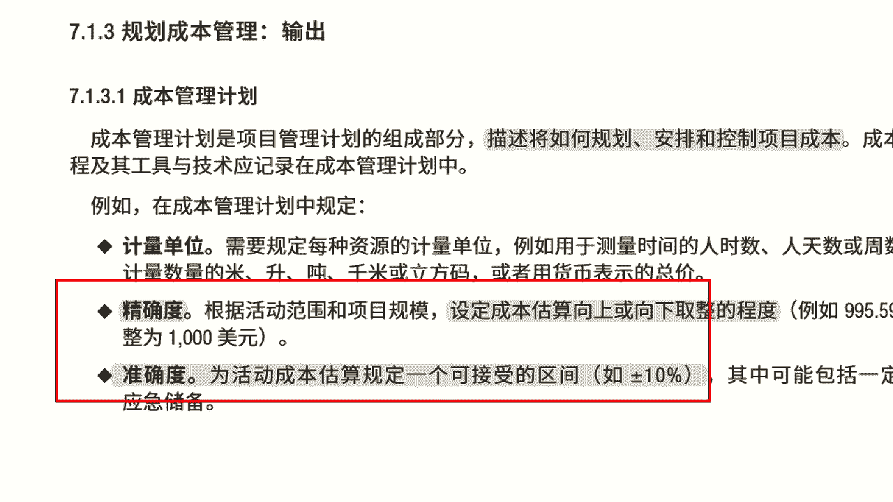

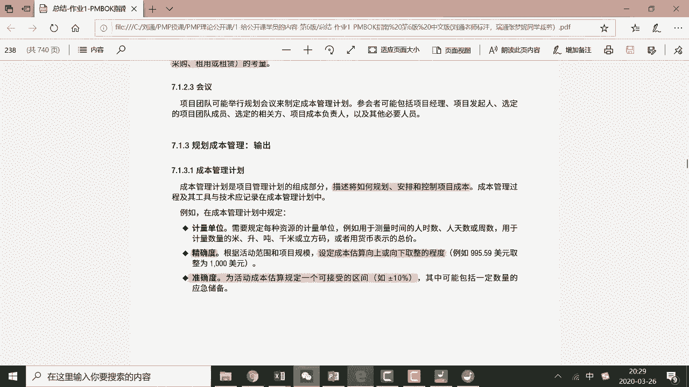

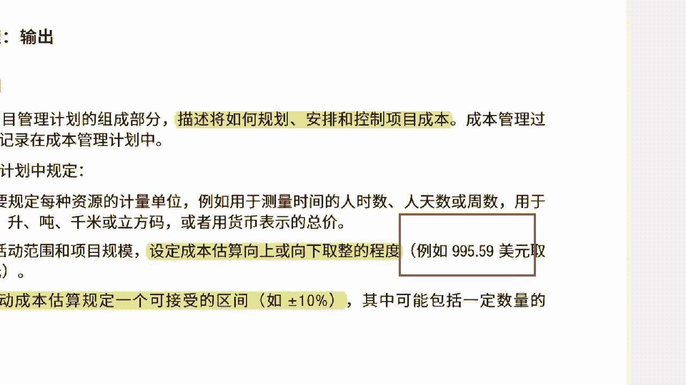

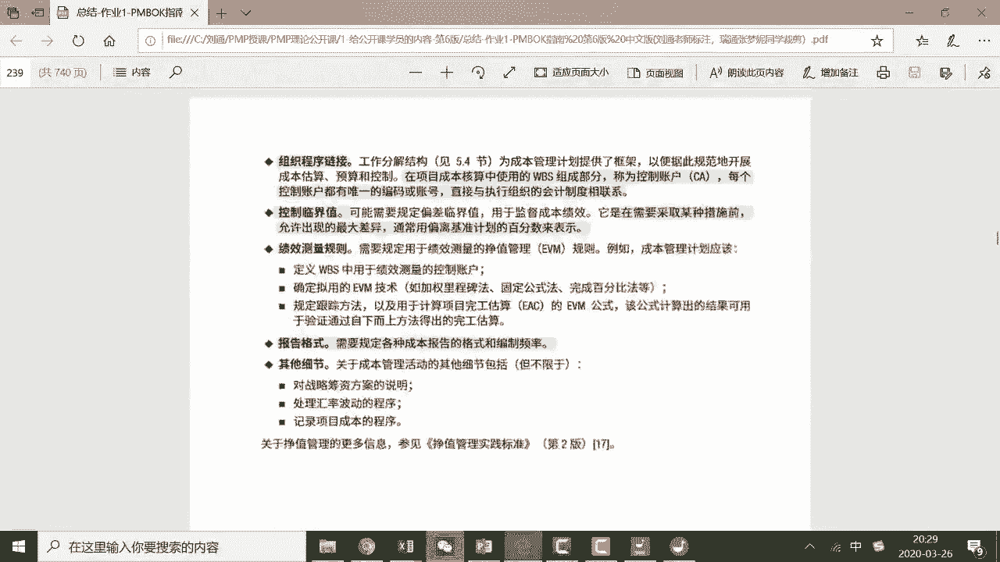

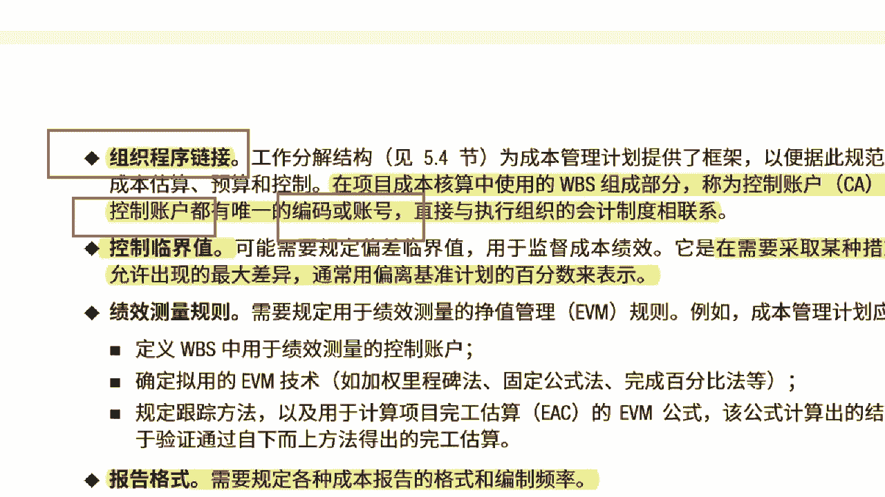

这个都是很典型的一个点了。所谓控制账户关联到什么组织成序链接。好，控制账户的话，我们之前在哪块讲过呢？范围管理，大家记得吧？比如说什么呃工作包，然后规划包控制账户在最上面，对不对？控账户是什么意思啊？

就是你多有工作包，综合看绩效，看什么绩效，进度成本绩效，就是说该花的钱是不是都花花了，或者说是不是花冒了。啊这样好，所以了解一下啊。

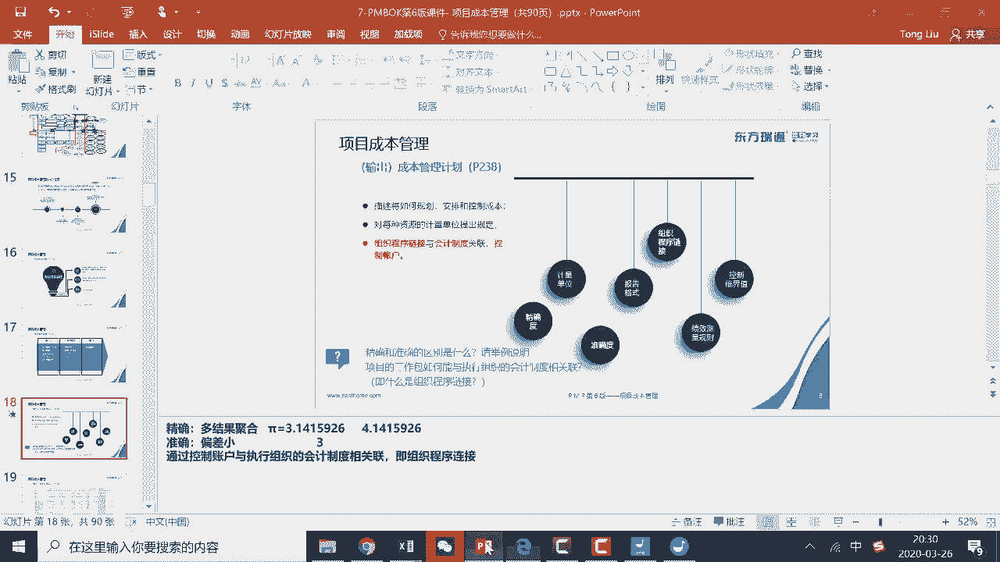

然后这边的话我们看一下怎么看控账户怎么怎么理解这个事情呢？给你举个例子。呃，比如说呃IBM这种公司跟中国移动签1个1000万的合同，那它基本来说呢它会不可1000万去花呢？他会不会可1000万去花呀。

他不可能去花可可1000万花。所以他的完工预算是多少呢？完工预算是750万。比如说他有250万是利润，是这样的，所以他在那个财务这边的话会设有很多的控账户。那么控账户呢？比如说这750万。

他可以去控制一下，比如说有100万是人力成本，有多少钱是差旅成本，有多少钱是下包成本等等。哎，这就是所谓的在PMP中叫控账户。比如说这么多工作包或这么多活动，我只能够花这么多钱。好。

然后接下来呢因为财务这边的话呢，他每花一笔钱的话，会过呃做控制的。比如说最典型的那像IBM这种公司的话，那我做很多项目啊，这就是项目扣，这就是项目扣，然后呢，这就是项目的名称。

比如说这个就是中国移动的项目。然后这个项目的话呢，就是我做一个员工，我要做这个项目，我要添工时，怎么填呢？就是周一到周五添工时。

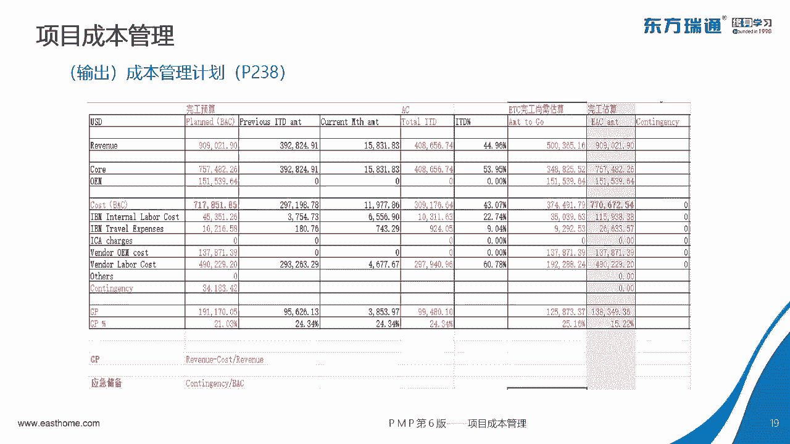

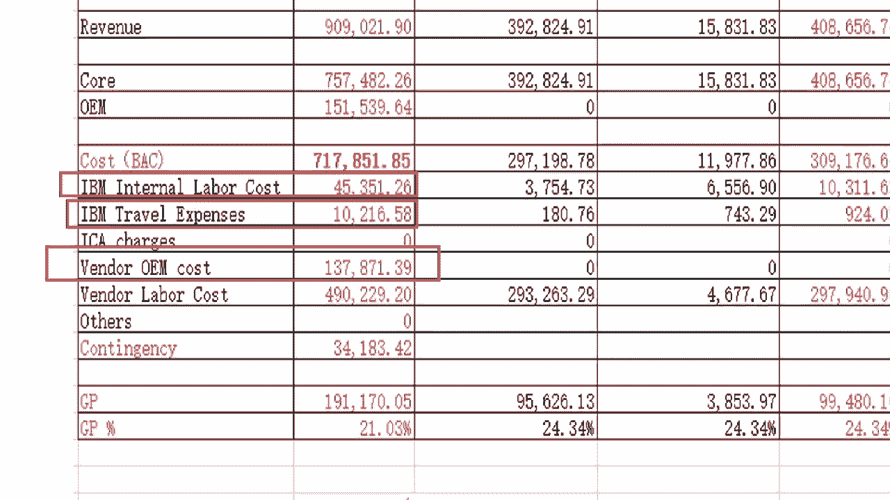

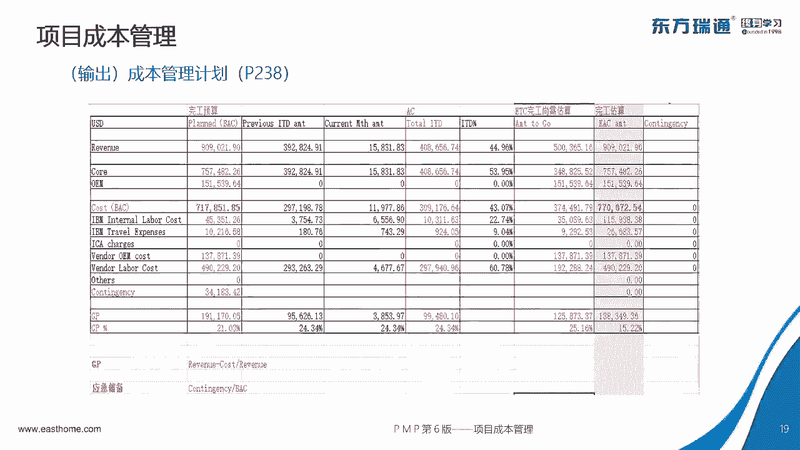

比如说我这个项目我添天一小时，比如周一天一小时，那我的成本价的话呢，就是比如说就是688块钱。那如果我一天一小时的话，成本是688块钱的话呢，我只要签8小时就什么呢？就是5000块钱就出去了。

我只要签两周呢，就是2万啊。所以说你可以看到说这就是告诉你说呃，当你计划了750万的这种项目预算，但是呢你不扛花，为什么呢？因为大家都在签你的项目工时，所以呃各个控账户当前花多少钱。

上上个月上个月上上月花多少钱，我项目经理的话，每周或者是每个月都应该看到这样的一个什么钱的花的状态，这样的话，我就要看这个钱是不是花冒了，或者说这个花的可能我后期这个项目还没完事，我的钱就花没了。

对不对？大概是这样一个概念啊，这叫做什么呢？关联到控制账户，我要控制住，对吧？我要考虑到说哎呃比如说我这个项目这个人力成本又计划了200万，又计划200万。那我这个钱很快就花光了，对不对？我要考。

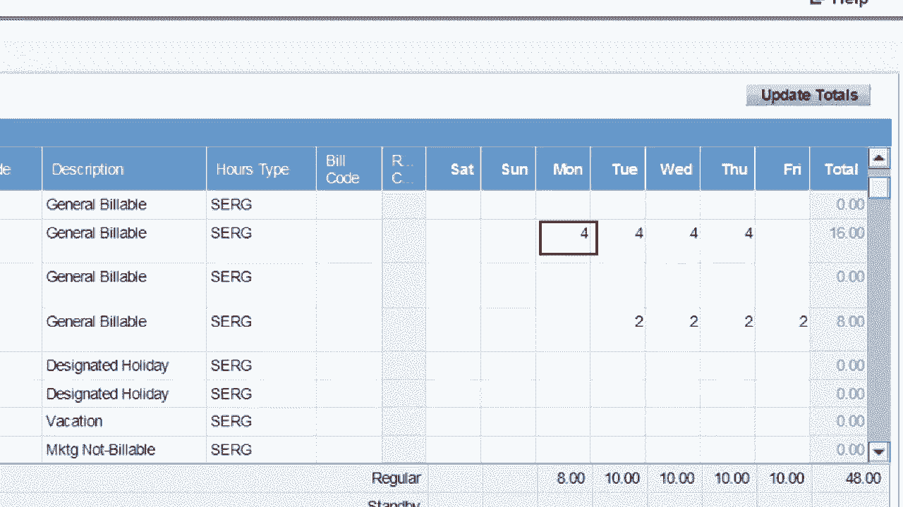

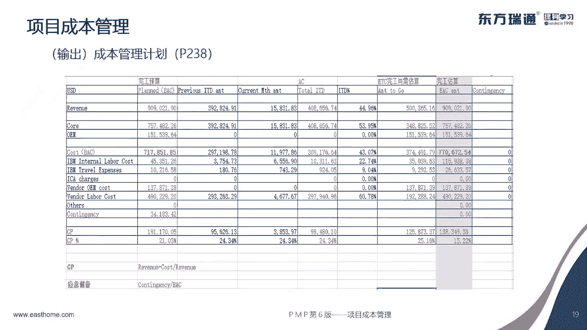


到说是不是呃不能让他添的东西，或者说考虑到找更便宜的人去做呀。哎，这就是我要去考虑的事情。所以我每一个月我都要需要考虑这个钱的实际花费情况啊，然后呢，我要看一下怎么去控制啊，这就是所谓的控账户。

它关系到组织的财务系统关系到组织的一些什么这种财务的账的科目，大概这样子好，所以这个是给大家讲一个例子啊，就是所谓的控账户。也就说呃做的比较好的组织，你的项目的每笔花费，在你的财务上应该什么啊？

应该是有体现的，你的项目经理每个月应该拿到相应的财务财报，然后所以说你应该什么呢？会看什么损益表，会看现金流量表等等，这样的话是你的看家本领，对吧？好，所意了解一下，然后接下来呢我们跟大家说一下。

就是所谓的估算成本。下一过程，下一过程的话呢，它要点是什么呢？刚才说了估算成本和估算活动时间，它的工具都差不多一样的，对不对？


所以要知道说它的这些工具是要点，而且呢也要考虑到说它估算成本是对单个活动或工作包的什么的成本估算，对不对？所以它需要考虑什么？叫近速估算。所以大家请大家翻到你书的240页，把它画出来。


240页。


啊，这样往加翻一1就可以了。哎，把这个词画出来叫近似估算。然后你旁边写一个叫做精准估算。比就说偏差在-5%到正10%啊，大概是这样一个概念啊，叫了解比就说针对这种所谓的这种一个空包，一个活动来说。

你应该怎么办？应该是这种精准估算或者近似估算考试的时候看到近似估算就知道偏差在-5%到正10%啊，大概这样也叫精准估算。好，那精准估算它对应的哪个工具可以做呢？这是另一个考点了，就是自下而上估算。

这就比较精准啊，大概这样子，像类比估算参数估算呢，都属于自上而下的，就属于偏差在-10%到正25%了。大概这样子啊，所以它是不同的，这就是另一个考点要知道的好，所以了解一下。


然后呢，你估算的话呢，还应该有什么估算依据，这是另一个考虑。比说你不管估算什么进度也好，估算成本也好，那你你估出来的东西要人信的，对不对？那怎么才能有估算依据呢？啊，我看到很多公司做的比较好。

比如说广汽丰田等公司啊，当然IDT也做的不错，当然他做到什么程度呢？就是呃他有标准工时的概念。比如说在他们组织中拿任何一个开发工作也好，还是运维工作也好，还是集成工作也好。

他都知道大概花多少人天或花多少小时，哎，他有标准工时的标准成本概念。这样的话呢，你估算就有依据了。哎你可以自己回想一下你公司，你公司有没有标准工时标准成本概念啊。但如果没有的话，会有什么问题？

就是你跟老板或者跟你的呃高层去估了一个项目的大概的花费，老板就是或者客户界面什么砍一半，对吧？是不是？为啥呢？因为他觉得你没有依据，你你可以去拍导的吧？偏差很大，是不是那怎么办？我说界面卡一半嘛，对吧？

好，所以要考虑到要有估算依据，不管是估算这个进度还是估算成本都要有依据的啊。好，所以要解决这个事情。


然后这边的话呢，当然了，你会说这个估算活动啊，估算成本呢要符合项目的三个特点，就是变记明细，对不对？对吧？变记明细是的，所以这边就另一个考点了，所谓在项目启动阶段。

那你的估算偏差可以是负25%到正75%。在规划阶段，就你规划什么呢？整个的就是就是从整体规划的这种所谓的项目关计划的层面的话，那你的偏差可以是负10%到正25%，在规划到某一个工作包的时候。

就刚才说了估算成本，它这边说是呃什么呢？不是定度估算或进度估算吗？偏差在负5%到正10%，就属于自下而上估算的。好，所以呢这边的考点是ROM。


等大家翻到你书的241页，翻到你书的241页。这边的话呢，这个词把它画出来。叫粗类量级估算。比如说在那个项目启动的时候，那你刚开始的时候，你的偏差允许偏差是负25%到正75%，对不对？

但是你规划到某一工作包的时候，你要偏差，就基本来说可以确定到么-5%到正10%，这边可以关联到另一个考点，就是说哎你不留有什么应急储备嘛？那个储备的话呢，一本来说如果对应的百分比的话呢，那应该是什么呢？

负5%到正10%左右，有卡吗？有卡的话，我就稍微等一下啊，我看一下我的网络。


看一下，哎，我的网络还行哦啊。好，那我再等个10秒钟哈。😊，有卡的话，就等一下啊。有没卡的回复一哈，因为不知道它是不是都卡了嗯。😊，我等10秒啊。好，然后我这边我再继续讲哈啊，然后这边的话呢。

我们看一下关于这些公式啊，唉能听得到的话，太好了。好，关于这些那个工具啊，这边的话我标了一下啊，就是你看啊类比参数什么自下而上三点估算，这是为什么要你去看那个PRT对不对？计划评准技术嘛，对吧？好。

然后呢还有储备分析啊，质量成本等等这些工具的话都很重要。😊。


大家可以回去好好看一下啊。好，这些工具。然后呢，我分别给大家说一下。😡，呃，关于类比和参数估算的话，是一个典型的对比考点。那对比考点的话什么意思呢？就是他会考察说它是。比如说就像如下这个两个选项。

那到底选类比呢还是参数呢？这边给大家总结一下啊，比如说类比和参数呢都属于自上而下的估算方式。然后呢，他们的话呢，它有一个相同的部分，就是跟历史项目进行比较。不同的话呢这就是他们的考点了。

也也就是说什么意思呢？如果谈到类比，比如说你们之前呃学过进度管理，以后去看一下书就知道进度管理的话呢，它的那种所谓的呃类比参数这块。如果你谈到参数估算的话，它就会书上会有这样对应的这样的一些名词，名词。

就是模型model。


统计stats统计算法，对吧？哎，这个这三个词儿，那如果有这三个词的概念的话呢，如果是在类比和参数中选的话呢，应该选参数，还有它是有算法的。好，然后呢，没有的话呢，基本上选这个对吧？哎。

所以类比和参数估算的话呢，它是有区别的。比如说这道题大家可以看一下。就很典型的，你选哪个啊？应该选类比，因为它没有模型算法和这个这个统计这个字样，对不对？好，然后你看一个有有统计字样的。

你看对项目经理使用历史信息，历史数据统计估算方法，你看没有？模型算法统计，然后这边呢你要选什么呢？要选参数，是这样的，这是一个典型的一个考点，大家可以看到啊，类比和参数的区别，这是一个典型考点。

然后接下来就是三点估算了，三点估算的话呢，我们知道说什么最悲观最乐观最可能对吧？然后它会对应大概是两公式，一个是除三的，一个是除六的，除三的是叫三角分布，除六的叫做贝塔分布，这样的对吧？好。

然后这边的话呢，我这边的话给给了一个什么一个案例，这个案例我不想详细讲哈，那边我再稍说一下，那我这边的话呢计算的这个标准差是这儿的。


然后呢求这个标准差的话，要求整个项呃怎么呢？要求整个项目每个活动的方差，就是标准差的平方，然后呢加在一起，就把所有的方差加在一起，再开方还会是整个项目的标准差是这样的，它不是针对一个活动。

它是针对项目来说的大概这样的，所以大家要学会去看这个东西，就知道什么是方差，什么是标准差了。这个是一个进度管理的一个案例，我这边只给你要稍微看一下，你呃可以去呃自己去理解一下时代有问题的话呢。

你可以找我哈，也这个是讲进度管理时候，一个典型的案例哈。大家了解就是因为讲成本管理这边的话，它也有这样的公式嘛。好，然后这边的话呢，我们要呃知道从考试的考点角来说呢，它会模拟出来一个正态分布。

正态分布的话，我们要知道正负一玛，就是一标准差。那大概的面积是68。26，正负两西G玛是95。46。正负3C马。


是99。73，这个要把它记下来，或者背下来，这是这样的啊。好，然后那个西格ma这个这个小的字母的话要看得懂啊，就可以了啊。大概这样。然后如果如果你想应用的话，看我那个案例，就是公众号文章就可以了。好。

这个是一个典型的点啊，要知道。然后我们算一道题，感受一下。感受一下你能不能够做对。首先这是三行词的，还有什么呢？呃。当前的美昂斯是。1200美金价格最高的是什么呢？1700。然后呢。

第一的是97160好。按三角分分布法，三角大家可以看一下三角分布啊。哎，等大家10秒钟，我看了一下网络有导什么。😡，有点慢是吧？好，大家可以看一下，三角分布的话呢是这个对吧？是除三的哦。

如果它是题倡题目说三角分布，我们就是用这个，然后贝塔分布呢用这个是这样的啊，了解一下好。嗯。然后你可以算一下。大家可以算一下，我等10秒钟啊，大家可以把这道题算一下，看看能不能够做对。如果做对的话呢。

一本来说啊。就是对这个东西有了解了。哎，有同学选B是吧？恭喜你啊只差了一点点哈啊，答案是什么呢？答案是D怎么算D呢？因为选B同学的话只算了一盎丝，这就是一个这就是陷阱，理解吧？好，那你看你看一下。

比如说按照三呃三角分布，对吧？三个加在一起除以3。😊。


肯定是1300嘛，对吧？但是是什么？但是是三行次，对不对？再乘以3对不对？就是3900，看到没有？是不是？哎，所以这道题的话呢，哎你就差一点点，反正选B同学啊。好，你回去再看看啊，是三行次哦。好。

这个是要了解的啊，选第四个。


然后呢，我们刚才说到了价工具的话，就是属于自下上估算，它对应的是一次估算，还记得吧？而且要知道不仅仅是在这个估算成本上，它考虑到自下上估算估算什么活动持续时间。比如说大家可以看到你书的202页。


202页看一下啊，哎，你看到没有？这就是估算这个进度的，你看到没有？哎它是也有自下上估算，了解一下啊。比如说这个自下上估算既可用在估算成本，又可以用在什么呢？估算这个进度啊，估算黄时时间。啊。

你说昂次不懂哈。来，你家有黄金就有就懂了哈。好，好，现在可以存一些黄金哈。好，然后接下来我们看一下啊。😊。


所以这个关于四项上估算，它会怎么不提呢？下列哪个估算方法可以准确的反映项目的实际成本。哎，准确看到没有？精准近似看到没有？哎，所以呢这道题选哪个啊？这道题选。四下乘估算，比如说精准近似对吧？

准确基本来说都是同义词这样的啊。好，所以了解一下，你看这就是四下乘估算的一个典型的点哈。好，然后接下来呢我们看下一个考点，比如说股份成本这边的话呢，它涉及到什么呢？它涉及到这个储备分析的概念。

这是一个考点，我们之前在讲进度管理时候，我们老师也讲过了，对不对？储备分析的话呢，它会对应的什么啊，这种什么已知未知风险呢，应急储备，对吧？然后还有什么未知未知风险呢，管理储备等等，对不对？好。

所以说呢大家可以翻到书的202页也是一样的，在进度管理也讲这个事，所以了解这个事情啊，比如说储备分析，如果你翻到245页，你会发现这边问你截屏了，它会对应了什么应急储备管理储备，我们要知道一个考点。

就是应急储备对应的是已知未知风险。比如说风险已经识别，但是发生的概率影响未知的，要留点余前或时间，对不对？一般来说你能。😊。


多少钱呢？也刚才说了，意素估算，精准估算是偏差是负5%到正10%，所以你能多余的钱的话，时间呢，也就是付5%到正10%左右。那管理储备的话呢，更多是老板控制控制的啊，也就是说它应对未知未知风险。

也就说风险未识别，发生概率影响也未知的情况，什么意思呢？比如说最典型的，比如说IBM跟中国移动签啊1个1000万的合同，它呢利润点是25%，所以它留了250万。理解吧，250万的利润，750万的成本。

大概这样子啊。好，那这边的话呢就会涉及到什么东西呢？那你就会问我说是不是我做项目时画冒了，我把那250万全要回来，作为我的管理储备啊，我就会说什么呢？我会会说什么呢？

try what you can对吧？万一实现了呢？我会告诉你基本实现不了，为什么呢？因为那250万的话呢，是CEO向华尔街去什么呢？去宣告说他是盈利的啊，所以说你要知道说哎你每个项目都是盈利的。

华尔街他会买你股票，是不是好，那是管理者来彰显他业绩的，他不会轻易的给到你的，所以要知道说那就是典型的一个考点，考点是什么呢？就是应急储备是基准的应度基准或成本基准的一部分，而管理储备的话，不是对吧？

是老板兜里揣着的，他未必能给你，对不对？彰显他业绩，他会轻给你吗？大概这样子好，所以了解啊，这就是。😡，所谓的一个典型的一个考点。然后这边的话呢，我们看下一个考点，下一个考点的话呢叫做质量成本。

质量成本这块的话呢，我们要知道它包括两大类，一个叫做一致性成本，一个叫做非一致性成本。那这边的话呢，我们要知道质量成本，它既是质量管理的工具，又是成本管理工具。如果谈到质量管理工具的话呢。

给大家翻到282。你就会发现质量成本的话呢，它也是质量管理工具。啊这样子。好，然后这边一致性成本这块的话呢，它会包括叫预防成本和评估成本。


然后这边的话我们要知道一个考点，就是什么是预防成本呢？最典型的培训就属于预防成本。然后呢，测试。属于什么？还有破坏性测试，你看到没有？哎，这也属于什么呢？都属于评估成本。好，那你说什么叫破坏性测试。

你有拔过网线吗？光纤线和双击拔拔线那种对吧？那叫破坏性测试啊，好，然后呢，比就说这就是所谓的你要知道预防成本，包括什么评估成本包括什么。然后呢，失败成本呢，或者说叫未置性成本呢，它会包括这样的。

那包括内部失败的，比如说内部的这种你测出来的返工，外部就是所谓的比如说召回啊，那比如说最典型的像丰田的油门脚踏板事件，然后呢，由客户发现你车有问题，然后之后呢召回了之后呢，你还要赔礼道歉，并且要返修。

但概这样子啊，好，这就属属于外部失败成本，所以这边一个典型的一个考点什么呢？就是预防剩余检查，比如说预防表示过程不思错。检查呢就是错误不落在客户的手里啊，大概这样子啊。好，所以了解一下，这就是。


典型的在讲质量管理的时候也会讲到这个东西，大家都知道的哈。所以我们下周讲质量管理的时候，还会强调要呃过程不突错，或者即使出错了，也不论不应该落在什么客户手里啊，要预防剩余检查好。😊。

然后你看这个就是丰田的油门脚踏板时间的一个召回函，叫recad notice。大家可以看一下啊，这就是丰田的召回函，这就是典型的外部失败成本。好，可以了解，这就是一个典型的点了，就是质量成本的概念。好。

然后给大家出一道题感受一下。比如说某客户在某银行办理汇款时发现银行开出的汇款的单据数字有错误。然客户填写给银行的原始单据是正确的，可能是什么？客户啊，就是可能是银行这个中途搞错了。

当客户打电话给银行核实时被告知这个错误，已在银行内部随后的审查程序中得到了纠正。哎，该银行应该怎么做呢？😡，是不是选C呀？告诉客户，不要被这样的小问题来麻烦自己啊。ICBC是吧？😡，啊，开玩笑。

然后是不是应该选C呀，你会选哪个呀？😊，当然说了。预防剩余检查啊。那首先要保证过程过程不出错。那题干中已经看出来什么，出错已经落在客户手里了，对不对？所以呢你该选哪个？对，选A的同学就对了啊。

就说你要要优化你的内部审查程序，最好不要让用户感知到。如果让用户感知到就基本是什么呢？就是外部失败成本了，对不对？理解吧？好，所以了解，也就是典型的就是预防剩余检查。好。

然后这边的话当然说了输出这边的话呢，它不是有一个估算依据嘛？那估算依据这边会关联一个专有名词叫什么呢？叫质信水平。那这边的话在你书上247页。


啊，你看没看到这块啊，比如说你要人信你啊，对不对？哎，智信水平哈。好，如果人家不信你呢，界面砍一半啊，那这样子啊好，所以了解智信水平是很重要的好。😊。


然后这边的话呢，关于知序水平这边的话呢，我们之前的话呢也出了一道题，看大家会不会做对哈。才知道说一般来说呢你的估算应该有精确度、准确度的概念。那比较近速估算的话，偏差应该多少来着？负5%到正10%。

对不对？好，也就是说你到估算到某一个工作包，某一个这个呃一个活动的时候，你的偏差就应该在负5%到正10%左右。那啊我问大家一道题，看看大家怎么做哈。比如说项目你就做了详细的成本的估算后。

甲方还是坚持把估算的成本砍他没有砍一半哈，才砍到20%。请问乙方项目经营应该怎么做。😊。


有选C的吗？减少一些工作包。还是选第四个拒绝还是选A和B呀，你选哪个？等大家10秒钟哈，大家可以考虑一下。嗯，选D同学不错呃，说明你的PMI主义看了哈。😊，也就是说我们要知道。

首先这个估算应该秉承一种诚信原则。诚信的话就是说你不能够有太多猫腻，有太多水分，对不对？你的估算是精准的那如果那么精准的估算，甲方还给你卡了20%那说明什么呢？这个项目你是完不，完工不了的对吧？好。

那这样的话呢，与其完工不了，烂尾还不如什么不做，对吧？好，这就是秉承了1个PMI主义，你说那么傻啊，哎啊，这就是PMI这就是PMP，对不对？哎，它就是呃让你的心灵进化了一点啊。

ABC的话都属于不道德行为，对不对？哎，你擅自减少工作包，减少工作量，或者换便宜资源都属于不道德的行为，理解吧？PMI太理想了，对吧？你考了一个非常理想的考试啊，那因为你的PMP考试。

让你的心灵进化了那么一点点啊，好，所以了解一下。然后接下来我们看一下重头戏来了啊，重头戏就开始就是那个制定预算了。我们刚才说了，制定预算就是单个工作包成本的什么这个汇总。

然后最后形成一个什么已经审批通过的成本基准，是这样的一个概念，对吧？好，所以呢制定预算这边。😡。


制定预算这边的话呢啊他需要考虑到什么？他需要考虑到这个成本基准的定义是什么啊，当然有同学说啊不是客户第一吗？啊，当然是客户第一啊啊，客户第一的话，你要考虑到说你要把一个能够做好东西交付给客户啊。

你做了一半是什么意思啊，是是啊，所以说呢与其做一半，你还不如不做嘛。大概这样子好，所以了解一下，你也要维护乙方的利益啊，你不赚钱也做吗？啊，大概这样子啊。好，所以了解一下。

也就是说在你的成本质量或者说你的收益在一定可控的环境下再去考虑客户第一的问题啊。好，然后这边的话我们看一下那个呃制定预算。啊这边的话，他怎么去把单个这个工作包汇这个成本汇总呢。

就是这个还通过这个工具叫成本汇总工具，然后形成了一个什么成本基准，你说我没钱怎么办？融资啊重筹啊，对吧？大概这样子啊，好，所以了解一下，就是呃制定预算的。

写输入工具和输出。然后这边的话呢，它的输出非常重要，就是成本基准。成本基准的话呢，请大家翻到254页。


哎，254页这块的话呢，大家可以去看一下啊。哎，这块你看标黄了，看到没有？哎，这就是一个典型的考点啊，什么叫成本基准。经过批准的，按时间段分配的项目预算。然后你看典型考点就是它不包括什么管理储备。

它包括应急储备是这样的啊。好，然后呢下一个考点什么呢？就是它会表现出来是一个曲线叫S曲线啊。在谈谈到S曲线的话呢，在偏P中基本有两处，一个就是在成本基准这块。另一个是在后期讲风险管理的时候。

定量风险分析的时候，模拟技术会产生一个S曲线啊，大概这样子，你回回去的话，你可以去查S曲线，就知道是有两处有啊，那这样。


好，这个是关于这个成本基准的定义，要知道的。然后这边的话，你书上还有个图，这个图也很关键。也就说他怎么汇总的对单个活动的成本，它都有应急储备，然后汇总成工作包，然后变成什么控账户。之前说了。

控账户是多个工作包的一个集合体，然后综合平绩效的，是不是这样的？然后呢多个控账户，刚才我给大家举个例子了，比如说人力成本什么差旅成本都是一个控账户嘛，然后合在一起，750万，就是成本基准。

比如说整个的一个完工预算，就是750万。哎，这样子啊。好，然后呢，它不包括管理储备，加上管理储备的话，才属于这样的总体的预算。所以这个图要会看得懂。哎，这样子啊好。注以了解，然后这边你总结一下。

比就说成本基准它包括什么啊？应急储备，但不包括管理储备。应急储备关联到是已知未知风险，管理储备关联到是未知未知风险。要知道的。好，所以了解一下，这这是一个举了一个例子而已。这个呃有些同学的课件中有啊。

那概这样子啊。好，就是应急储备。哎，它是成本基准一部分，而管理储备不是，这就是一个典型的考点啊，要知道的。


啊。然后接下来呢我们看一下那个唉这一块就会涉及到一个概念了，这个概念就是应急储备和管理储备的一大概一个比对。那刚才我们已经说过了啊，应急储备对应的是已知未知风险，管理储备对应是未知未知风险。

然后这边的话就涉及到一个审批的问题了。那管理储备它不属于成本基准一部分啊，你会知道说一旦要想获得必须走CC息P对不对？变更控制委员会是不是？哎，这样呢啊，哎。

所以说呢你要知道你看动用应急储备就是一个典型的考点，动用应急储备是什么呢？是项目经理批就可以了，对吧？而你那你要想动用管理储备呢，必须C机BP要变更控制委员会批哎这样子啊，所以要了解这个点。好。

然后这刚才说了S曲线，对吧？S曲线的话呢，你要呃看一下你书上长啥样，你书上的话呢是255页，255页哈。好，那255页这边的话呢，哎哪条是S曲线呢，你会说对吧？好那你说呢哎。😊。


一个是计划花的钱，对吧？一个是实际的支出，看到没有？那哪条呢是红色的还是那个蓝色的，你会告诉我是红色的。是的，比如说我计划大概什么呢？做一年的项目，然后呢呃整体花什么呢？花120万，那我的完工预算对吧？

就是120万，每个点的话，这上面的每个点应该是PV后期会讲到的，对不对？就计划价值吧。比如说我第一个月。😊，那个花计划花5万，所以这个横坐标是一个月，动作标是5万。第二个月呢计划花到10万。

所以纵作标就是10万。第三个月计划花到20万，那就是横坐标是第三个月，纵作标是什么20万，一直到120万啊，是这样的啊好。😊，有点有点快是吧？好，慢一点。好，这个呢就是所谓的什么。

这就是所谓的这种所谓的S曲线。比如说我计划什么时候花什么钱，一直花到最后啊，大概是这样的啊。好，然后了解一下，然后这边的话呢，我们看一下这块呢，这个是支出线，这是支出的支出线啊。

英文叫actual cost是吧？actual cost啊，一会儿会讲到的。好，所以我们要了解S曲线属于计划价值那条线啊，哎，它不是属于支出那条线啊，了解。但你书上的话呢，他也有这个图。

这个图的话呢在20。55页。255页啊。好。255页，我再慢点啊。😡，来，255页啊，看一下看到哪条直柱线了吗？😡，你看这支支出哈，这支出那这边呢虚线对吧？然后这个实现是什么呢？属于成本基准，对吧？

每个点都是PV对吧？计划价值还记得吧？啊，一会会讲到的plan value对吧？计划价值哈。好，所以了解一下。😊，好，我再慢一点啊。😊，然后接下来我们看一下啊。在项目执行过程中，管理层批准做几道题。

感受一下。管理层批准动用管理储备金。刚才说了，这个管理储备不属于成本基准的一部分。当然了，他批了就是属于成本基准一部分，对吧？好，来应对，就是说已经发生的风险。就是说来应对更多的风险吧。

这种情况下应该修改什么呀？又改什么呀？大家可以看一下ABCD等10秒。有的同学的屏幕还没有出来哈，我再等10秒啊。😊，啊，有些同学已经出来了，看来我的这个手机比你的慢啊。好，我的还没出来。好。

然后这边的话我们看一下，是的，修改成本基准。哎，绝大多数同学都做对了，为什么呢？因为你要刚才说了，就是这种管储备不属于成本基准的一部分。但一旦批了，就是考点啊，一旦批了就属于成本基准的一部分了。

大概这样子啊。好，然后接下来根据S曲线再去看一下啊，在项目执行过程中，应急储备增加了，应急储备增加了。😊，请问成本基准来曲线应该如何移动啊？应急储备。就是你那个F曲线，就上面那个F曲位曲线啊，就这个。

嗯呃是往上移呢，还是往下移呢，还是不不动了呢？等大家10秒钟。首先我们要看应急储备是不是属于成本基准的一部分呢？是的，对吧？所以呢当它增加了，那就相当于什么呢？你就成本基准增加了。

也是说时间横轴时间不变的情况下，纵轴是增加了钱了，所以应该什么？应该是向上移动啊，向上移动。比如说他在考察应急储备，属于成本基准的一部分。好，凡是选D的同学回去看一下H线的含义哈。好。

然后接下来看下道题。😊，项目执行过程中，实际成本支出增加了。请问成本基准的H曲线应该如何移动啊？要知道实际的成本支出是另一条线。刚才说的那个蓝线，对吧？然后呢，S曲线上的话，每个点都是PV计划价值。

都属于plan的 value流，对吧？计划的钱不是实际的支出的钱。所以呢实际成本增加了跟H曲线没有什么任何的瓜葛。所以S曲线应该什么呢？应该是不动。不动是这样的啊，这在考察什么东西。

想考察在考察AC和这个这种成本基准对应的S曲线，这两条线的区别是这样的啊。好，你很容易搞混的这是这样的啊，应该选第四个。对，不动。好，然后接下来我们看一下这道题。某人刚被任命为某项目的项目经理。

正在指导项目计划编制工作。你是该项目的主要干预人或者相关方，你想要立即拿到项目的成本预算。但是项目经理没有给你，你可能的可能的原因是什么呢？你会不会选D啊？这次你不应该选D了。项目经理，你有私人恩怨。

不愿意给你啊，这种消极的，今天不要选啊。😡，哎，就是说所谓呃考试的时候也不要选焦极的啊，半抱怨的对吧？埋怨的消极的、负面的都不要选。因为PMI很阳光啊，但是这样子。好，所以你把B排除掉ABC选一个。😊。

选哪个啊？应该选。对，有同学选对了，选A。


为什么选A呀？这是考的什么东西呢？它不仅考工具，还考什么东西，考输入，等大家翻到你书到250页。😡。


在你制定预算的时候，你要综合看一下风险，对不对？那风险要看一下什么啊，应对，对吧？就是你应对也是要花钱的，对不对？好，所以你看到没有？哎，这是风险登记册。😡。


他要考虑到识别一些风险，记入到风险登预侧，并且考虑到针对这个风险，我要留有一定的应对成本或者活动的这个钱，对吧？大概这样子好。


如果这个风险的话是发生概率比较大，那可能是我就把它应对的办法作为我范围的一部分了，这样的话肯定要花钱的啊。那这样，所以这就是考察什么呢？考察制定预算的一个。


输入。


考虑到风险啊，因为风险是什么呢？叫花应对是要花钱的啊，大概这样子好，所以了解一下，这就是一个典型的考点。那是你看它不仅考这个啊不仅考成本基准的定义，对吧？不仅考工具的内容，还考输入的内容。

所以呢这是为什么让大家要去学ITTO的原因，对吧？怎么输入输出什么工具，对吧？都要看一下的原因。好，所以了解一下。


然后接下来呢，我们看一下那个控制成本。控制成本这块呢就是一个重头了，它是重中之重，为啥呢？它会有公式啊，而且这公式呢未必好学，对吧？大概这样子，那公式在哪里呢？请大家翻到。


你书的267页。267。那该在上面哈267，你看这么做公式，对吧？好，那我问大家一个问题呃。😊，如果这公式全背下来的同学。全背下来的同学那个请回复一。啊，那个看一遍同学回复0。5，从来没看过这些公式的。

请回复0。

管理储备那道题再讲一下，看哪道题啊。是这个吗？😡，0。9。好，没有问题啊。啊，有同学的话呃发现哪一块哪道题要重讲的话，你给我截个屏哈，我不太知道是哪道题。啊好，然后这边的话呢跟大家说一下啊，呃。

如果回复0。01的同学回去马上要看了啊，因为这个是最基本的一个什么，应该是得分题，对吧？因为这个题的话呢比较简单，起码是确定性的。大家知道说我们考试的时候，那更多是场景题，对于场景题的选项呢？😊。


比较模糊，对不对？那这种确定性的，比如说什么CPIPI对吧？这种这种题的话呢，是给你共分的。然后你既然都失分了，这样的话是不行的啊。好，所以了解一下哎，所以呢呃看到大家什么呢啊这个回复0。30。40。

5，对吧？我很惆怅，对吧？那这样的啊，好，所以了解好，那这边的话我们看一下。😊。


我们的控成本这边是主要考工具的啊，考工具的话呢，它主要考什么工具呢？最典型的就是这个增值分析，英文呢叫EVA，对吧？然后增值分析的话呢，大家可以去看一下你书上再出到261页。


261页。261。看啊哎，就这个EVA增值分析哈。好，然后这一会儿的话，这块是一个重中之重哈。然后大家需要什么呢？需要好好的去看一下。然后这边的话，你看我这边标黄的部分都是需要去掌握的啊。好。

然后这边的话我们看到说控成本干嘛呢？其实就是维护什么，成本基准最好不变，因为成本基准一旦变的话，你的绩效就有问题嘛。因为你给你的钱你花冒了嘛，对不对？那概这样子一个概念，所以控成本的话呢。

它会关联到变更控制。那变更我们要知道一个要点，要点就是说变更是为了什么，是为了去维护基准。


不是其不是会轻易的改变基准。一旦改变的话，你的绩效就有问题了。比如说呃公司让你做这个项目花750万，结果你花了850万，公司本来利润就是就挣100万的，结果呢没挣钱，对吧？大概这样子一个概念。

所以你要考虑到去要去控制这个成本花费。


然后这边的话，所以会它会关联到什么变更控制。


也就说大家知道说我们呃讲第四章时候就讲过，就是有些变更是影响基准的，有些变更是不影响的，不影响基准的是什么项目经理批，对不对？影响的是C密批对吧？好。

所以说关于这个成本的呃这种管理储备的这种申请或者是进度的管储备申请都需要走TCB的啊，那一旦批了，那就可能会什么呢？成本基准就会呃改变嘛，比如说你的管理储备就加入到成本基准里头嘛，大概这样子好。

所以这是了解它会关联到一个变更控制流程要知道的然后接下来呢我们讲这个重要的东西啊。好，然后这边我们要讲什么东西呢？就是PV eVAC就是英文来了哈。那英文就是PV就是plan value啊。

这个意味着 value对吧？AC cost这个英文中文的话，最好都要把它记下来。


然后呢，PV是计划价值，然后EV是增值或者增值，对吧？AC是什么呢？实际的成本大概这样子。好，然后这边的话呢，我们举个典型的例子，比如说我计划呃这个工作包的话呢，花10万。

这就是我这个月比如说我花十0万要做的事儿，这个10万就是计划价值。好了，然后呢，我呢这个月的话，我只完成这个工作的一半，50%。那我的意为多少呢？就是10万乘以50%，就是5万。

但是呢这个月我做这个事儿啊，我做了一半的活嘛，我花了20万块钱，这个AC就是20万H cost。哎，大家看一下啊，比如说我计划花10万多的事儿，然后结果我所做了一半，就是我的EV是5万。

但是我花了20万。哎，大家觉得这个我的绩效怎么样啊，进度怎么样啊，成本怎么样啊，肯定是不爽嘛，肯定是不怎么样，对吧？大概这样子，所以他就会涉及到关于。😡，这个PVEVAC7的比三个比的话呢。

就可以看一下进度成本的绩效是这样的啊。好，然后这边的话呢，关于EV除以PV我们知道说后期会讲到说它会关联到什么进度绩效指数XTI对吧？SPI。


SPI进度绩效指数对吧？后期会讲到的，再先说一下，然后呢，那个E杯除以AC呢，对应的是CPI是这样的，大家了解啊好。


所以这两个啊第一次听说的请回复请回复0哈。第二次的呃没就说或者说以前知道的请回复一哈。😊，关于SPICPI不要把CPI理解为是通货膨胀指数哈。这个SICPI是不是都知道都知道的话，回复一哈。😊。

第一次听说的回复0。那还那还好哈好，刚才我举的例子就是绩效不怎么样，对吧？进度那个那个延期了，或者进度没有什么赶上计划，对吧？成本超了嘛？比如说我计划花10万做这个事儿，结果做了一半就增值是5万。

然后呢，那个我花了20万，对吧？这个绩效不怎么样啊。好，然后关于PVACEV的话呢，从考试角来说呢，它会有些别名。😊。


哎，大家可以呃稍微看一下这个别名的话呢，如果有兴趣的话呢，你可以去拍个照片。


呃，未必考，但是呢一旦考的话，你知道它换了马甲是什么。那你看啊这个AC就 cost of work perform看到没有？你看这个很容易很容易，这都是AC嘛，对吧？

然后PVPV和EV很容易混这两个这两个英文很容易混，那你怎么记呢？你知道这属于计划价值，所以它对应的那个英文最后一个字最后一个单词叫schedule对吧？schedule，然后呢。

这个EV就是执行执行那个这个产生的这种工作量或者说产生的那个产品所对应的计划价值嘛，好，那这边对应的是什么form是这样的，好，可以了解一下啊，对以PVACEV它对应的一些专有名词也要稍微了解一下。

或者说它的别名，就是换了一个名称啊，要了解啊。好，然后这边的话呢我们呃看一下关于PVEVAC在S。线上它是该怎么表示，大家可以看一下啊，比如说大家说了EV是这样的对吧？

AC是H costTV是plan value，对吧？然后这边的话，我们看这三条线，哪条线是S曲线呢？😊，你都知道说是关联到什么计划价值的线，对吧？所以这条线中间那条线属于X曲线。😡，它的顶点是什么？

完工预算叫做budget at completion的完工预算，对吧？比如说我我一个项目1000万，但是呢我只能花750万，我的完工预算就是750万。啊这样子好，然后这边的话我们看一下。

那在整个这个什么H线上，每个点的话，应该什么东西啊？应该是PV对吧？应该是这个PV啊，应该是PV好，然后呢，在某一个时间点去做一个切面，大家可以看一下啊，比说什么意思呢？哎。

这个是计划我要完成的一个这种一个进度情况，对吧？计划大概什么时候做什么事嘛，对吧？这个是计划价值，这个一条线，H线。然后呢，这个是我的实际的成本花费，这个是我实际上做做的活所对应的计划价值就是增值。

大概这样子对吧？好，比如刚才我那个例子，某一时间点，我计划花10万，比如说这个是10万，这个柱的10万，对吧？我计划花10万。


做这个事儿，比如这块是10万。但是我只做了什么呢？做了5万的活就做这么高，对吧？但是我花了什么呢？😡，我花啦。20万。对吧我花了20万。看到没有？哎，这是明显跟刚来我的例差不多，就是绩效不不怎么样。

对吧？比如说EV跟PV比，就是说这个是EV嘛，对吧？跟PV比小一对吧？就进度落后了，然后呢，EV跟AC比是什么？也小于一成本超了，大概这样子啊。好，所以了解一下，这就能看出它绩效的，对不对？了解啊，好。

所以这个是更明显了，这我画了一个图，你可以看一下，按照一个切面，那你看这条蓝色的线属于H线，然后这边的话呢，这个属于实际哎这个属于实际呃应该是属于什么，应该是EV对吧？这属于实际成本对吧？实际费用对吧？

实际费用，好，这个属于增值对吧？然后一个切面那你看一下也是一样的，EV除以PV小于一EV除以AC小于一对吧？大概这样子啊，所以了解一下啊，这就是很典型的。😊。


所以呢我们要知道一个典型的一个知识点，就是它可以看一下这种进度成本绩效的。当然了，可以相除，可以相减。大概这样子，所谓增值分析增值分析如果题干中没有给你增值是很难算出绩效的，所以一定要有意味啊。

增值要有它跟AC和PV比才能看到看出成看出什么呢？进度和成本绩效，我们要知道知道什么呢？就是SPI和CPI的话呢，大于一是好的，小于一什么呢？是不好的。来这样的好，所以了解。

然后这边的话呢呃通常考试的角来说呢，算这种相除的比较多，相减的偶尔也会考啊。大家知道说为什么相除的会优先考呢？因为相除的话，它的这种所谓的精确度。对吧精确度比较什么精准嘛，哎，因为它小数点后几位嘛。

而你的将减的话偏差的话看不太出来它的所谓的精确度和准确度的大这样子啊，所以一般来说呢，我们会看这种所谓相除的。然后并且的话呢它的精准度比较比较精准一点。然后这边问大家一个问题啊，就是这样。

就是如果项目正常结束。

SDI等于多少啊？项目正常终止。😡，项目正常终止IPI等于多少啊？😡，项目正常终止的话，SPI应该等于一。那项目提前终止呢？SPI应该什么？应该是小于一大账的项目异常提前终止。比如说第四章不讲收尾嘛。

项目可以正常收尾，也可以异常收尾。那这样子啊就提前终止。好，然后呢呃除了SPI这块的一个典型考点之外，就是剩下就是所谓的那种CPI一会会讲到的。好，CPI有一个典型的一个要点，什么呢？

就是当你的项目的工期超过15%，就计划的15%以上了。那你的CPI是比较稳定了。这样的话呢，你的完工估算。那就会等于完工预算除以CPI大账是属于典型偏差，或者会讲到这个事的。好，大家可以先回顾一下。

看你呃有没有理解这个事啊。好。


所以呢刚才我们讲了这些公式，大家需要大家什么呢？好好的去呃背一下，在这样子就是267页的一些公式啊，好好背一下，尤其是相除的这些公式啊，要背一下。好，然后呢给大家一分钟时间稍微背一下。

267页的一些公式。然后接下来我们就开始烧脑了啊，给大家一分钟时间背一下啊，这上面这一些公式，大家可以看一下，就这些公式啊。哎，你看267页就行了啊。然后你看完之后，一会儿的话，我们就开始做题了啊好。


我们等大家一分钟，大家稍微看一下，看一下267页。267。哎，回去好好看一下，现在看也行啊，要临时抱虎脚哈啊，这些公式呢都稍微看一下，看看你呃理不理解。因为考呃那种上课都讲过了，对不对？好，然后呢。

你之前也看过了，对吧？0。3也看过了，对吧？0。5的对吧？还有0。2的0。01的就可以忽略不计了哈。好，那所以呢你默认你都看过了，对不对？你起码都听过了，对不对？好。

所以呢呃这些公式大概一分钟回顾一下温故而知新，然后接下来我们开始做题啊，好，等大家20秒。😊。


小于一不要小于零就可以哈。😊，好，这道题看一下啊，在项目执行过程中。项目绩效为PVPV叫计划价值。就是说我计划这个时候花这么多钱做这个事儿啊，就计划价值啊。然后呢，EV你看是100小于PV。😡。

AC是120，然后呢，我们应该说明什么问题呢？对吧？你要用EV除以PV属于STIEV除以AC属于CPI对吧？然后呢，你算一下。


答案是A，对了，有位同学已经回复A了。对了。


怎么算出来呢？就是是这样的啊，对吧？就是你看。😊，都小于的。刚才说了SPI和CPI小于都属于不好的事儿，对吧？S也小于表示进度延期了，对吧？然后呢或者进度没落后了嘛，进度落后了。

CPI呢小于表示成本超了，对吧？反正不是什么好事儿。哎，所以进度延后，成本超支啊，是这样的啊，好。😊。


然后接下来看下道题，进度绩效指数是1。15，说明进度状态是好还是差呀？大家可以选一下啊，看一下。这道题。答案是什么呢？答案是D。也就是说呃你的进度绩效是大于，但是呢不知道你的成本绩效怎么样，对吧？好。

所以这边的话呢，你提供的信息是无法预估的。大概这样的，就是说一般来说它会呃什么呢？综合去评价SBXCPAI才能看出一个项目的状态。还这样子啊。好，那所以说这个呢就是一个。


选的是选这个第四个选项的，有些同学可能会选。A是吧，有可能是吧？好，这个是一个比较容易出错的一个选项。大家知道啊。好这个。


我们给的答案是第四个提供的信息无法预估啊。好，也就说给大家什么启示呢？就是呃我们做项目要综合看SPI和CPI，然后再去看什么呢？这相应的状态啊，大这样好。然后这边的话呢，我们看一道题，感受一下。

这道题的话，大家可以看一下啊，我们计划用2000打一个孔，预算是800元，进度计划是每天50%。我工作了一天，现在一天结束了。当我盘点工作时发现我完成了40%的工作。但用去360元成本啊，大概这样子。

好，那我们看一下呃，关于这个BAC和EAC你可能还没有完全的那个什么有可能忘记了，对吧？刚才我们讲的比较少，但是呢PVACEV。大家可以看一下啊，你们先算一下这道题哈。😊。

刚才有些同学还在呃犹豫这道题是吧？进度绩效指数是说明进度怎么样，对吧？有些同学还是建议选A是吧？好，我再看的在看的那个屏幕区呢嗯。你是说那个微信群吗？好，这道题的话呢呃如果你坚持选A的话呢。

你可以说一下道理哈。比如说你说啊EV除以啊PV对吧？😊，EV除以PV，然后呢大一，然后你就觉得是属于进度超前了，是吧？比计划好，对吧？嗯，好的，这道题的话呢，我个人建议是选择第四个的哈。呃。

大概的给你的概念是什么呢？当然当然可能是不通老师的想法不太一样。呃，我的概念是什么呢？就是进度成本的话呢，大概是要综合考虑的。所以呢这道题可以改一下，说明项目状态。对你说的很对。

就是说如果是进度状态的话，容易引起歧义，对吧？所以怎么办呢？你改一下这个这个会好一点，说明项目状态如何？比如说你要一个项目状态的话呢，最好是什么呢？最好是综合看进度成本的对，啊，感谢你的这个回复啊。

确实有容易引起歧义啊，好，那这边的话呢，要项目状态好一点。😊。


好，这道题的话，我们改成项目状态吧。好，如果项目状态的话呢，呃建议选择是第四个。如果是进度状态的话呢，那有些同学选A的话，也有选A的道理，有的是EV除以PV嘛，大概这样子啊好。然后我们做一道题啊。

这道题的话呢，我们看一下这道题是一个典型的比较经典的题。就是我们通过这道题能能够把一些基本的概念呢把它看清楚。大家可以花一分钟时间去看一下这道题哈。😊，好，那些选A的同学可以去坚持啊，没问题。

我们改成项目状态了。项目状态呃，选D进度状态选A吧，嗯，没有问题。这道题这道题的话呢，我们看一下啊。大家可以去算一下，比如说BACTVACEVCPISPI。大家可以在群中可以去写一下啊。


然后关于这个EAC和BAC的内容的话呢，大家可以去呃看这个就是给大家翻到你书的267页。


267页的话呢，关于大家可以看一下啊。267。里头关于什么EAC完工估算，还有什么BAC完工预算，它都有相应的一些描述的。大家可以看一下啊，完估算完工预算这些概念啊好。


完固预算的概念就是BC完固预算概念什么呢？就是嗯大概预算花多少钱，就是800。然后呢，玩估算的话就是你要根据你的当下的绩效去估计一下，你未来可能花多少钱，叫做actimate completion啊。


好，有的同学已经把它算出来了，大家对一下啊，有时候大家可以看到。😊。


这个就是BAC是800，然后呢，这个PV是400，对吧？因为他也做了一天了嘛，做了一天50%，对吧？哎他计划就是每天工作50%，所以呢PV是40010半AC是。360对吧？实际用气360，然后呢。

EV是40%，贼的40%呢是800的40%，所以是48320啊，是这样的啊，所以这个这个没有错吧，这都算对了，对吧？然后接下来呢你就可以通过这个来去看什么呢？CPSPAA对吧？好。

然后这边的话你会发现呢都是小于的，属于进度落后，成本超了。


然后这边的话呢，我们刚才说了一个点哈，比如说你的项目工期超过15%，这明显是超过50%了，对不对？那你的CPI是一定的了。所以呢你的完工估算等于完工预算除以CPI。😊，CPI数是9分之8。

所以800除以9分之8等于900。然后这就是说你的完固估算受CPI的影响。如果完估算同时受CPI和SPI的影响呢，那你书上也有一个公式，就是你书上的大概是265页，265页。


但是这个公式不经常考啊，但你也再稍微了解一下265页。就是同同时受到什么呢？CPI和FPI的影响。你看这是受到CPI影响的这是同时受到CPI和SPI影响的这种情况你都可以分别算一下啊。

你就知道大概是多少钱了，大概这样子。然后你可以看到我们给的答案是这样的。


如果只受C片影响的是900。如果是同时受到CPI和IPI影响是1035那这样子。好，所以这个是一个典型的点。这道题如果你做对的话呢，你就基本这些概念就基本都通了。

凡是这道题跟不上的同学回去一定要把267页好好的看一下啊，大概这样子。好，这是给大家说的，就是这大概的一个计算的结果啊。好，这个是回头会把这道题的截屏，还有一个公式呢，我会发到群里的，大家可以再算一遍。

凡是没跟上的同学呢，可以再算一遍啊。


好，然后这边的话呢，还有一个考点，就是267页的这个要。完工上需绩效指数。完工上虚基教指数。完工上去绩效指数的话呢是这样的，大家可以看到唉它的定义的话呢是比较模糊的。


那比如说如果你看书的话，你会发现你看不懂啊，比如说大概的描述是这样的。😡。


是一种为实现特定管理目标，剩余资源的使用，必须达到成本绩效指数啊成啊成本绩效指标是完成剩余工作所需成本和剩余预算之比。哎，你看这个描述是非常什么呢？非常的文绉绉的对吧？好，哎，刚才那个夜息公式。

你就记住那个B析除以CPI吧，就是最简单那个公式，不要把那个STNA了，那个好的概率比较低啊，大概这样子好，然后这个的话呢，我给你简单理解，什么叫完工上需绩效指数，就是什么意思呢？

就是用剩下的钱把剩下的活做了，你的绩效怎么样。比如说你当下绩效比较差，然后呢，然后你剩下钱不多了。然后呢，剩余活很多，这个时候你看用什么绩效指数去把它这个剩下的用剩下的钱把剩下的活给我做了。

然后这边的话呢，哎你看一下。


这个是典型的啊B公式，你看到没有？分母是什么呢？剩下的。😡，钱因为AC就是已经花去钱嘛，然后整个的钱是BC嘛，然后这个呢是什么呢？剩下的活嘛，还这样子就是剩下的钱把剩下的活做了，那你应该什么绩效。

那通常我们知道说CPI一般是大于好，那问大一问题，TCPI是大于好还是小于好啊，肯定是小于好，小于一好，对不对？为什么呢？因为什么呢？你希望什么呢？剩下的这个钱多多的，剩下的活少少的，也是说什么意思呢？

分母要比分子要什么要大嘛，那这样子好，然后你说我实在是这个钱不够花怎么办呢？你申请管理储备啊，如果你申请成功了呢？但基本来说你很难申请成功啊，一旦申请成功的话呢，你的分母就就加大了嘛。

就是你的BC变成了E了嘛？那概这样子，好，剩下的活少少的对吧？😊。


事与愿违哈，带这子啊，所以7CPI是什么呢？是小于一好，带这子啊。所以了解啊。好，可以了解这个啊这些公式哈。好，然后这边的话呢，我们关于完工上学基效指数，简单做道题，感受一下，大家可以做一分钟。

看一下能不能做对哈。😊，项目预算为这个就是BC75万。在第42天的时候，项比完成了40%，哎，这就可以看出来什么呢？就可以算EV了，就是70万乘以401V对吧？然后呢。

 cost呢就AC呢就是50万成本吧，在项目经理报告成本绩效的时候呢，项目客户拒绝增加更多的钱。也就是说意思说你的钱就不能增加了，就不能变成什么EAC了。也就是只是B对吧？

那这样的话你就必须用剩下的钱把剩下活我干了，对吧？那你的完工绩效指数怎么办呢？哎，大家可以算一下啊。😊，哎，这道题你算一下TCPI。😡，给大家一分钟算一下。出一个答案吧，ABCD。嗯。

有位同学已经算出来了哈，A等于D对吧？是的。😊，怎么算出来的？哎，这是把这个公式带一下啊，你看啊分子是BAC减EV剩下的活。分母是BC减AC剩下的钱啊，那BAC是75万，减去EV是。75乘以40%对吧？

刚才说的40%嘛，对吧？然后呢呃BC减ACAC是50嘛，对吧？就45除以。😊，25。1。8大于好不好啊，感觉不好，对吧？刚说了TCPI应该小于好，对不对？CPI大于太好了，对吧？好。

所以这是一个典型的啊，要把CPI和TCPI。😊，啊反着记对不对？理解吧？好。😊。


然后这边的话再给你补充一个知识点呃，知识点什么呢？就是ESES这概念的话在哪呢？在书到233页，大家可以看一下书哈，233页。


233。看哎，这个概念的话呃不怎么考，对吧？但是你要了解为什么它会有这东西啊啊，大家知道说什么意思呢？就是刚才说了一个考点了，就是如果项目正常完工，那你的这种所谓的这种SPI应该等于一，对不对？

那你SI等于一你看不出来是属于按时完工呢，还是延期完工的，因为按时完工还是延期完工的话呢啊啊有的同学没有给没有跟上一分钟没事，我再慢点慢点说哈。好，没事，那那个如果有的同学啊还没有算完的话呢。

回头我们可以在群中再讨论哈。那如果是按时完工，或者是延呃这种延期完工的话呢，它都是什么呢？都是SI等于一的，看不出来是是否延期，那怎么办呢？所以他用了一个增格进度的概念，在你书上有哈，有ES。

比如说ES表示什么呢？就是。😊，它算两个两个值相减，比如说你计划什么时候完成完工，就是ES。然后呢，实际完工的是AT这H的时间嘛，就是实际时间啊，那ES是计划时间，减去实际时间。

如果这个是ES减AT的话，如果是大于零的。也就说你实际时间比计划时间还提前了，那说明什么呢？说说明你是提前完工了，对吧？哎，那如果小于零呢，就属于什么呢？就属于延期完工的对吧？那这样的一个概念。

所以它会用这个来去表示说什么呢？表示说这个你是否是按期完工的啊，是这样的，它是弥补所谓的什么。弥补所谓的这个增值分析的一个缺点。它的缺点是什么呢？就是不管是按时完工还是延期完工，SPI都统一的缺陷啊。

是这样的一个概念。这个不经当考，但是呢你要看懂书啊，要了解一下。好，然后这边的话呢。


还有一个什么呢？就是除了这个概念之外，就是那个增则进度的概念之外，在你的233页之外呢，在234页这边还有一个概念也是要了解的。比就说现在目前的话，敏捷开发，讲究短迭带，你看敏捷方法嘛。

比如说敏捷短迭代的话呢，是一般是1到2周，顶多就是2到4周嘛。大概这样子。好，那基本来说迭代周期很短，那这样的话呢，你像偏P那种说法是我们类比参数估算未必什么呢？杀机用牛刀，对不对？

所以呢呃需要用轻量化的轻量级的估算方式。所以这边的话在234页，它就说了一个概念叫做采用轻量级的估算方法，何谓轻量，何谓轻量啊。


就是这个就是通通过什么，通过扑扑克牌的形式，什么意思啊？就是所说的什么呢？就是针对一个用户故事，针对一个需求。然后呢，我作为产品经理、产品负责人或需求方，我把这个需求说清楚了。

说完之后请大家估估人天估点数，那大家怎么估呢？呃，偏P讲什么呢？群体决策，对吧？或者参与决策，敏捷一讲这个东西，比如说呃团队成员研发团队每人一达扑克牌。那这个扑克牌的话呢，大概是。怎么样子呢？是这样的。

它符合一个数列就是一个数学家，他发明一个数列叫呃非波纳切列纳切数列啊，这个数列啊就是一个以数学家的名字命名的。它这个数列有一个特点。

特点就是前两数相加等于第三个第三数啊一加2等于32加3等于53加5等于8，大概是这样的啊，当然也有个案。那比如说通过大家出扑牌的形式，比如说估点数，比如说一个主持人说大家说123不排。然后孤排的话呢。

比如说你估一个点，比如说你估一人天，对吧？然后呢，另一个人估10人天，其他的人都估了5人天或者是8人天。那你估的点数越越少的那个同学，或者说那个研发人员，他要站起来说，哎，他为什么估一人天那个估最多的。

比如说10人天的，他也站起来说为什么估10人天。然后接下来呢，其他人不听到了吗？然后大家再有一个主持人再去什么让大家第二轮出牌。一般来说，三轮以上50%的人决定50%以上的人出同样的点数。

比如说大家都估什么8个点或者是5个点，就是5人天或8人天。这样的话，我们这个工作量就估出来了，就成本就估出来了。因为敏捷团队的它的成本，尤其是内部研发团队，它的成本更多是人的这种成本，就是投了多少人。

多少人天啊，大概这样子啊。好，所以了解一下，了解一下啊，是这个是一个典型的一个点，叫做就什么轻量级的估算。比如说在你书上234页，这的叫轻量级估算方法，就是出扑克牌的形式啊，了解一下就可以了。


好，我们还有点时间，所以我们再做道题强化一下啊。以下哪项代表着项目已经完工了。你会选哪个？等大家30秒吧，不说一分钟了哈，30秒。😊，对，刚才这个同学说，d尔fish它是种面对面的d尔phy。

因为darfish是背靠背的嘛，它属于面对面，但米就叫做面对面dorphy，就是属于群体决测的一种d方式，叫面对面的。敏捷强调面对面沟通。好，30秒啊，大家还有还有机会哈。那刚才那个没有算足时间的同学。

你的机会来了。😊，我要阻等30秒，是不是不能太快啊？我们刚才说过了，那个SPI等于一表示什么呢？项目完工了，对吧？角一表示提前终止了，那为什么SPI会等于一呢？

因为SPI等于EV除以PV那也就是说当分子分母都等于BC的时候，就EV等于BCPV等于BC那相当于什么呢？就等于一了嘛？SPI等于一，所以说当EV你就是说你计划做这么多活嘛，都做完了，对EV都做完了嘛。

对吧？做完的活对计划价值，正好等于BC的时候，那就表示说项目正常结束了啊，你的EV等于PV是属于一个中间的结果，理解吧？得到得做完全部的活，全部的活刚才不是刚才不有一个道题，不是800块钱吗？那个嘛？

哎就等于800才可以的那个啊所以等于400不行啊。好，所以着解啊，所以这道题的话，应该选什么？选A凡是选B的同学回去再把267页的。😊，这个公式好好的理解一下啊。好，这道题选A。然后接下来我们看这道题。

项目已经花了5000万美元，计划完成4000万美元的工作。那你看啊5000万是AC。4000万是PV，他并没有给你EV。刚才说过一个点啊，就是呃你一般看进度成本绩效的话呢。

你要用EV除以PVEV除以AC来比。那所以说。这一道题应该是选哪个？EV要等于BAC才能够算完事，就是说全部做完啊，EV等于PVPV只是中间一个结果嗯。比如说最典型的啊，比如说你看一个项目一年完事儿。

你的BAC是120万。然后呢，第一个月你要花10万，那PV就等于10万喽，对吧？哎，你第二个月花20万，那PV等于20万呢，那你就EV等于20万，你就这个活你就只做了什么只做了那个120万的呃。

什么6分之1啊啊，这是不行的啊好。😊，对。呃，E为等于BAC，然后才能够数S撇等于一啊，因为分子分母都等于BAC啊好。这道题的话应该是无法判断，对吧？是不是EV旁边个EV啊，所以这就是一个典型的考点。

增值分析增值分析没有增值是不能分析的啊。所以了解啊。好，然后接下来我们看下道题。😊，这道题的话呢是什么呢？SV然后你请大家翻到267页，对吧？SV是在哪呢？


267。SV这呢是吧？然后你看CV对吧？SV表示EV减PVCV是EV减AC对吧？SV表示进度偏差CV表示成本偏差，那这样子对吧？好，所以这个你看到这个这个公式了。然后接下来你回头我再看这个。


SV大于零就EV减什么PV大于零表示什么进度超前，对吧？CPI小于一呢？表示成本超支对吧？好，这一道题选哪个？选什么卷选A。有同学说我进度落后了，但EV等于BC不行吗？啊，不行，你E维等于B。

就实相当于你做完做完了。哎，比如说SPI是等于，然后进度落后，但是增值分析看不出来进度延呃延后了，但是你经完成了，你项目已经做完了啊。好，所以这个呢就是刚才不是有一个增得进度嘛，还是弥补这个。

就是项目延呃延期完工还是按时完工，都等于SB等于一的问题啊。大这样子。好，这道题是这样的啊，就是属于进度超前成本超支啊。好，这道题的话呢。我们看一下成本绩效指数怎么算。大家可以看一下。给大家一分钟。

大家可以算一下啊。嗯。有一同学算完了是吧？😊，这道题我们给的答案是B，看大家是不是能算出来。等大家一分钟哈。😊。


嗯，有算等于B的哈，怎么算出来的呢？哎，根据上面的题干，然后你看啊这个BC是9万，看到没有？9万。😊。


EV的话呢是他完成了，你看啊。9000个对吧？只完成了9000个。然后呢。啊，看一下啊。9万乘以0。9，我看一下是怎么算出来的啊，呃，生产了1万个小部件，价格为是这么多钱。

固定总价合同所有的部件都完成才可以开发票。啊，制造每个小部件的预算是99块钱。然后所有部件都应该今天完成。不幸的是项目落后了，只完成了9000个。19000个。然后。实际成本是9万。意为是。

这个9万乘以0。9。看一下。大家能能够算出来这个吗？有万乘以0。9。价格是。这是10万出定总价。制造每个小部件的。预算成本啊预算就是这个是完公预算，对吧？那完工预算是。它是1万个对吧？然后呢。

乘以9就是9万，但它只完成了9000个，就是0。9个，对吧？就是90%。然后这样的话就是81000啊，这个还有点绕哈。刚才我看了一下，有点绕。然后这边的话呢，E杯就等于81000，然后呢。

E杯除以AC正好是等于什么0。9。哎，这道题如果算算错的话呢，其实情有可原呢，因为它确实有点绕。刚才我我都看出来好像有点像这个上是BAC对吧？其实这个是BAC对吧？哎，这是这有9万，对吧？

9万是BAC也不是10万，对吧？哎，很容易绕进去的，对不对？这道题有点绕啊，这一道难题啊。好，这道题的话呢，选择是什么。


0。9啊，大概这样子。好，这道题是选B的。然后这道题呢等一下。一个项目DC是呃15万STH1。5。那么EAC呢？我们之前说了EAC应该等于那个BAC除以CPI才对，对吧？咱这边好像没有，对不对？😡。

所以这个说是无法判判断，应该是对的吧。哎，对对，有的同学说关键还算EV，对不对？刚才EV就算差点算错了，对不对？是的，哎，这个EV算对了就好办了。因为EV跟PV和AC比对不对？好。

所以这个就是很典型的这个所谓的什么这个B是给你的，但CPI没给你，对不对？所以这个是应该是无法判断的，是吧？好，然后这道题呢。😊，对，固定总价刚才我刚才也是看错了。对，是一个干扰项啊，是的。

因为合同它不见得是真正的你的完公预算哦，对吧？是不是好，然后这个呢。这道题。项目的完工预算，你看这边这有给你预算了，对吧？然后也给你实际花费了。😡，然后呢，成务绩效指数也给你了啊。

这这样的题的话给你一分钟，你看能不能算对啊。给大家30秒到1分钟之间啊，大家可以先看看，自己拿笔去算一下，感受一下啊。然后呢，给你的答案是。A，看能不算对？看什么算对。


嗯。这道题很容易。算错哈，这也是一个理解的问题。


然后我看一给你呃告诉你一个呃可能的一个过程啊，比如说这个项目的话呢已经完成了，就是大概是什么呢？你看呃花那么多钱，对吧？然后呢呃花那么多钱的话呢，我们看一下这个CPI给你了是0。0。8，对吧？0。8。

然后这边的话呢呃基本来说如果是一个项目的进度，基本来说是你看啊。


CPI是那个0。8的话，那如果是属于符合典型偏差，那应该什么E息等于B息除以CPI那。这就是这个这个数啊，大概这样子，比说啊相当于什么呢？

就是那大概的基本来说这个进度CPI或者说这个成本绩效指数CPI的话是比较稳定的那你的进度基本来说也就超过百分之不说28%也是20%多了。大概这样。好，那基本来说超过15%。

所以呢CPI属于比较稳定的那这块的话呢，EC等于BC除以CPI那这块的话等于什么125000。呃，如果你按非典型偏差的话呢，可能算出来也没有这个值哈，所以这个是一个典型的就是说啊它的。


就是A选项12050来这样子。好，这道题呢如果做错的话呢，还要回去看一下，E须等于B须除以CBI那个公式啊，要看一下，也就是典型啊考这个的。好。然后呢，这边的话呢啊。还有7分钟给大家再出两道题吧。

一个工作计划有两个人全呃全职两周完成，结果只分配了一个人。到了第二周周末，一个人完成了70%，问CPI是多少？这个就是做做最后一道题吧，一会儿我还要看一下互动的。就是说大家看有什么问题，对吧？啊。

这是最后一道题，大家可以算一下，给大家一分钟。


大家可以看一下啊，一个工作计划有两个人全职两周完成2乘2对吧？4周4人天对吧？四周人天对吧？然后呢呃但实际上只分配了一个人。这个人呢？到了第二周周末，这一个人完成了75%。一个人完成了75%。

那我们看一下。到第二周的周末。那这边的话呢，我们原计划这个BC是4周人天，完成了75%，那乘以75%3周人天。然后呢，实际上呢。他用了一个人对吧？就是用了两周，所以就是两周人天。

那就是说EV除以AC等于3除以21。5啊，大家这样这有点绕对吧？也是有点绕啊，比如说那个周人天呢搞绕进去了，对吧？啊，好，所以呢。我们就做这呃做到这这块就可以了，就是不做做了哈，别太多啊。

那做的话呃大家尤尤其是没有呃没有技术公式的同学可能是要做晕了，对不对啊？回去的话呢，知道要好好去做题了哈，尤其是成本管理。267页这些公式呢要好好做一下啊。好，这边的话稍微总结一下。


也就说我们刚才讲了规划成本管理的话呢，它会出一个成本管理计划。然后呢成本管理计划呢属于项目关计划的一部分。然后并且它考虑到什么组织成序链接。比如说每笔花费在你的财务科目上是有统计的。

它关联到控制账户的概念啊，这个是很重要的。然后接下来呢在成本管理计划中，它会考量到什么呢？精确度和准确度精确度的话呢，就是比如说成本这个前小数在后几位，对吧？准确度呢就是最好是偏差在负5%到正10%啊。

然后这边的话呢呃估算成本这块会关联到很多的工具啊工具的话呢，哎一会儿会给你去大家看一下啊，等会工具的话呢是什么呢？就是比如什么类比什么参数啊自下而上啊三点估算等等，然后它的输出估算依据，对不对？好。

然后呢。这边的话呢，还有就是控呃这个制定预算这块，它的它会产生了什么东西呢？产生了一些成本基准。什么叫成本基准呢？已经审批通过的完工预算，然后并且呢关联到S曲线，包括那个具体的H曲线。

怎么对应什么PV呀，什么EV这些东西，对吧？了解一下。好，然后呢控成本就针针对成本基准的控制。它会计算什么SPI呀，什么CPI等等。还这样子。好呃，这一块的话呢，我们看一下。


好，这一块的话，我们看一下这道题。这道题的话呢，你刚才说这道题。


。哎，不是这道题。是这道题是吧？这道题的话，有些同学说呃还不太会怎么做，对吧？大家可以再看一下。这道题我们我们还有几分钟，我们看一下这道题。工作计划由两人全职两周完成，就是2乘2。

也就说他的大概的需要的完工预算，或者说大概整体的成本就是4周人天。


然后呢呃。一个人完成了百分之这个75%，谁的75%呢就是四周人天的75%，四周人天的75%。所以这边的话就是对应的是三周人天。然后呢，他只派了一个人，他其实派了一个人呢投入只有2周。

所以是两周人天AC所以CPI等于EV除以AC嘛，EV是3为21。5。好，不是这个题是吧？然后还有哪道题？


还有78页的对吧？78页这个。


这是这道题啊就是XPI等于。EV除以PV，然后呢。项目。完成了STI等于一对吧？STI等于EV除以。PV，然后呢，EV。等于BAC。PV等于BACC这样的一除就是BACC除以。BC等于一啊。

大概这样子啊好，BC除以BC等于1。然后这这边就是EV等于BC啊，大概这样子好。


呃，B不行的，为啥呢？刚才说了很多很多遍了，就是你的PV是属于这条X曲线的任何一个点都是PV。你的PV最后等于BAC理解吧？啊，你的这这个X线的顶点是BAC。H项的某一点是PV啊。

你EV等于某个PV就证明你只是完成了某一个某一个阶段的一些结果。你并没等到BACC啊，是这样的，所以不能选B啊，不能选B嗯，就是EV一一定要等于BC才可以，不能等于PVPV是个中间结果啊，中间结果啊。

你要知道完工完工预算啊是对整体的这种成本要完工预算，就是你的整个的要降化的钱。EV等于BACC还是什么呢？就是真正的做完了啊好。


还有哪道题是多少页的？这道题吗？还是这道题。EV和PV确实是在动态变化的。是的啊，但PV的话是已经在最初的成本规划的时候，其实已经确定的。而EV的话呢，是在执行过程中，你看一下你的执行情况。呃。

你可以这么理解，已经是增值等于BC才算完。对，是的。管理储备。那个第一题管理储备那个第一题，我看一下啊。管理储备。是这个吗？是这页的吗？51页的。是这个吗？


啊。你说的就是应该是这个对吧？我想起了，你的意思是选这个对吧？是不是？😡，啊，是这样的啊。是这个对吧？哎，那位同学很好啊，就是说确实这个A选项确实是一个模糊选项。

那也就是说管理层批准动用管理储备金来应对风险。那项目的总体预算是不变的，为什么呢？是这样的，他在考察啥东西呢？他在考察这个图，你看一下啊，就这个图就说项目总体预算，它包括管理储备和成本基准。

也就说刚才你批了就张成什么呢？你的成本基准张升了一下，对吧？管理储备少了一点，然后但是它的项目的预算还是不变的，它得考察这个概念就这个概念。看到没有？哎，他看这个概念啊，所以他考察这个图啊。

所以说你刚才。系い。对，动用了产品基准增加了嘛。对？哎，但是你这个总体预算还是一样的。对，关守位包含在预算中啊，这样这是一个典型的一个考点概念。所以选A的话呢是不对的，应该选第4个。大家看看啊。

还有什么问题，看哪道题哈。😊，关于这些知识点，如果呃跟不上的同学的话呢，有一个原因可能是我语速太快啊，但是还有一个原因就是你对相关的概念还是不是很连贯啊，要回去好好看书啊。因为今天是串讲，串讲不是正啊。

就属于什么呢？就第一次上这种课，你应该已经学过了啊，这些东西都是应该你懂的东西，而不是说不是新的东西啊啊。为什么不选B啊？资金需求，这是另一个考点，就是什么呢？你看资金需求是这儿的，你看到没有？

这儿这儿这个跟那个所谓的成本基准没什么关系，看到没有？因为它是这在这儿的嘛，在这的这样一个概念？资金需求这是什么时候老板会给你钱啊，但这样他是不定期给你钱的啊，它跟这个资金需求没什么太大关系啊。

所以呃他更多是考察跟成本基准相关的东西。所以应该选什么？应该选第四个。呃，PPT的话我们还没统啊，就是说我们这个是最新版，一般我们还没有完全的去真正nice出来。所以这个的话我不能够发，现在不能发啊。

但是这个基本的部分的这个题就是它的计算过程我可以发啊，但整体不能发，现在因为现在还没有呃正式下发啊。


啊，现在还不能发嗯。


是这样的，就是这个公式。


，我看一下在下边。就是那个E也烯等于B也烯除以CPI对吧？


看一下在哪去了。这个是有一个大概看典型偏差和非典型偏差。刚才说了，就是如果你的项目的工期，大概有一个呃基本就是呃有些老师总结的呃，大概我觉得还是比较正确的一个一个大概的点啊，这个点是比如说你的细化。

比如说这个项目的工期是一年。然后呢，你已经做了这个项目工期的15%以上了。比如说你已经走了15%了啊，那基本来说呢，这个你现在的当下的绩效就是CP绩效应该是比较稳定的。这个时候的话呢。

你的要计算完工估算的话，那应该用哪个公式呢？就应该用这个。


就是BC除以什么CPAI你看这这就是典型偏差，看到没有？哎，也是说当你的CPI已经比较稳定的情况。那什么情况呢？就是你的工期超过15%左右了或者以上啊，那你的CPI比较稳定。

那你的EC跟BC的计算就应该是用BC除以CPI。5%15%哈啊你这样记住，这就是很多老师总结的哈啊，但是官方或者说那个课件上好没有这么说过哈，但是这个是一个呃一个知识点，一个经验一验一个经验点哈。

大家可以去姑写这么记，除非你看到一个反利啊，你再把它推翻掉啊。好，然后这边说小一1个1万块钱那个对吧？对，那个那个确实是一个绕的那个题哈。好，大家可以看一下。


我给你找一下。不是这个。也不是这个对吧？在前面这个是吧？这道题你再看一看啊。呃，这个公司有一份要生产1万个小部件，价格为。这个是10万是吧，固定总价值。合同也如这个合同是。10万。😊，然后呢。嗯。

也就说最后你都生产了之后，才给你开发票，就给你10万块钱。知道每个小部件的预算，看这就告诉你说合同的价钱不等于完工预算，对吧？合同是10万，但是你你要有什么呢？你的成本是9万，对吧？

因为你每生产一个是9块钱，所以你的完工预算BC对吧？所以这个是这个9万就应该是BC，对不对？对吧9万，然后呢，你做了多少呢？9万对应的是1万个1万个固呃那个小部件。所以说呢你只做了9000。

所以呢你9000呢就是1万呃，就是9万乘以0。9，就是81000。呃，黄色标注的那个是那个电子版已经发到群里头了啊，然后所以你呢EV就是8000。然后但是你花多少钱呢？花了9万，对吧？是是呢你看。

9万对吧？所以说这个EV除以AC就是0。9啊，这个刚才我看了半天，我差点绕进去，对吧？哎，因为我我以为这个BC这个预算是这个对吧？哎，我看了半天，然后我发现不对啊，这个是合同哎，合同它不属于什么。

不属于预算哎，这个属于预算。


看到没有啊，这样的啊嗯。对这道题的话呢是。选择是。0。9。


啊，这道题很容易绕进去答啊嗯。😊，刚才我也看了一下啊，看了半天啊嗯。好，还有什么问题？一会儿我会把典型的题啊截个屏哈，然后呃这样吧，我这么办，我把一些典型的题啊。把它那个整理出来一个文件。

然后传给你们啊。我一会儿整理一下啊，整理一下。然后呃他那个答案的话，我尽量的我先不写哈，然后你再重新做一遍，对吧？然后再有问题的，再去那个再去群中再问啊，好吧，一会儿我整理一下，整理个PDF文件吧。

就是把那些现在这些题啊，大家可能呃因为我说的有点快嘛，大家可能有些题没有做完，对吧？那我再做一遍，我一会儿会整理个PDF文件，好吧嗯。然后还有什么问题可以随时问哈，一会儿我会整理个PDF文件发给你们哈。

好吧。😊，五道考题啊，那个不是分开的啊，这些题的话，有些题是以前我们老师课堂都做的啊，大概这样子。然后呢，这些题对大家来说，应该有些同学不是很陌生的啊，大家这样子啊，平时的话我们是那种分章题啊。

分章题的话呢呃跟这个还是有一些，就是说难度差不多。不过题呃提的内容是有点区别的。一会儿我整理一个文件给你哈。好，没有问题的话，我一会儿看一下群中有什么问题啊啊，我在等大家5分钟哈。

一会我把那个文件整一下，因为大家有些同学跟不上那个毕竟那个有些公司不熟。一会儿把那个参考答案那个我把它。呃，放到那个文件中吧，我一会儿看一下，我整理一下吧。好，那我退了哈，那一会儿我这开整理那个文件。

然后发给你们。😊，呃，你发到群里头，然后测验第一题，你发到群里头，然后你选什么，你告诉我，然后我来看一下啊。嗯，好，谢谢你啊嗯。


