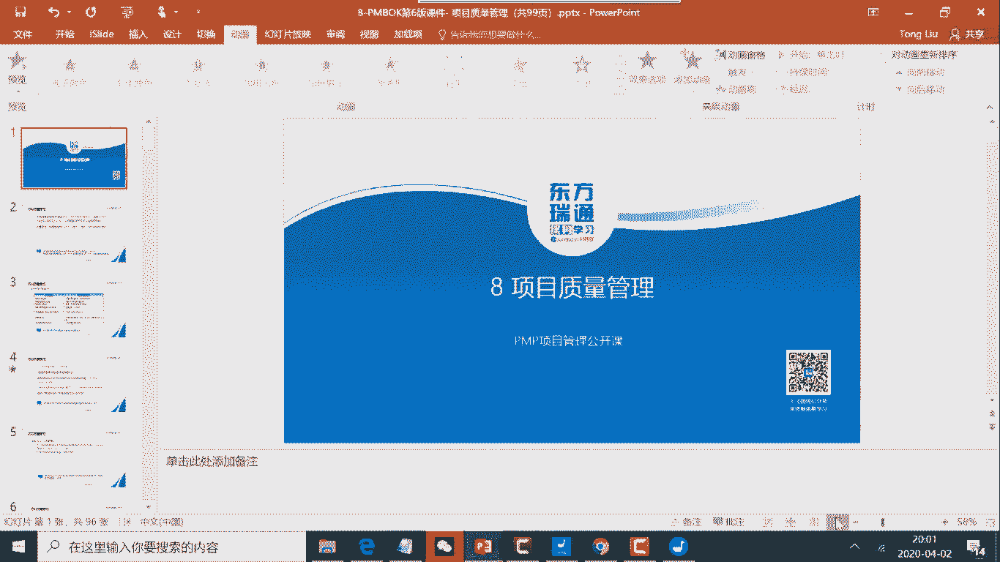
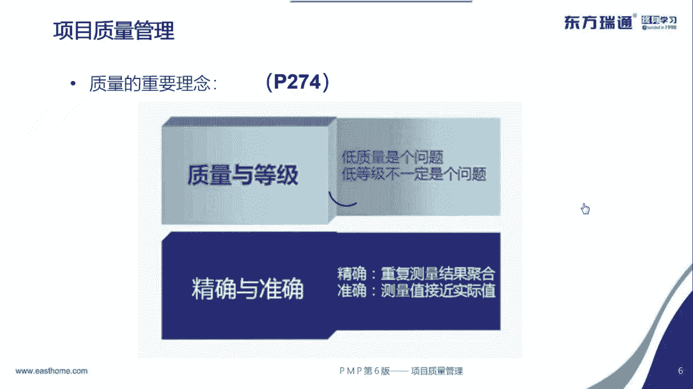
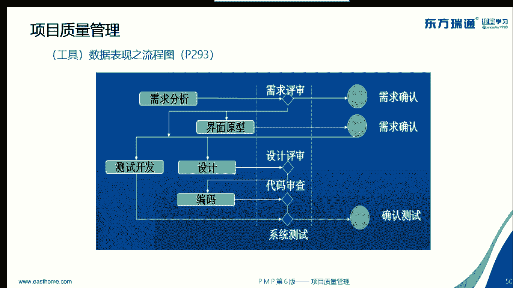

# PMP串讲 - P6：串讲第8章 - 我的乐芙兰 - BV1uE411N7zG

🎼我呀。🎼忧郁的青春，年少的我，曾经不知得这么想。😔，🎼风车在。🎼自己轮回的。🎼那甜甜的留不存。🎼风花雪月的诗句里，我在年念的城。😔，🎼挣着。🎼流水的带。🎼光阴的故。🎼改变了一个人。🎼。

🎼就在那多愁善歌而初自等慨的青春。🎼发黄的相片。

好，回来了哈，刚才突然网络断了哈。😊，好呃，能听到的请回复一。公众号。哦，已经看过了哈。这个不是我写的，这个是呃某同学写的。冯同学啊呃这个同学的话呢，他是质量管理的专家，并且是也考过业。

NBA哈也就说关于PNP的外延的内容呢，它基本都具备了。比如说财务财务也懂，质量也懂，并且是EMBA啊，还这样子。所以呢他写的还是不错的，大家可以看一下啊。

然后呢，我们今天的话呢就讲一下。质量管理东西。那质量管理的话呢，我们看一下，这是最新的一些呃串讲的PPT哈。我们稍微串一下。

好，请大家呃有两个东西，一个就是呃课件啊，课件你给我的顺序可能稍微有点差别啊，都无所谓。其实主要还是以书为主哈。另一个呢就是书这个电子书啊，大家如果已经具备的话呢，请回复个一哈。好。

那个这个电子书的话呢，请大家翻到271页。啊，可能是晚呃晚上的话呢，很多家都在用这个网络哈，还这样子啊。好，那可以了哈，那我们就言归正传。😊，呃，这边的话呢，我们既然讲质量管理。

那我们要知道说我们确保就是说项目的这种产品达到质量要求。所以这边的话呢，质量管理的话呢，它是有要求的那要求在哪里呢？是在质量管理计划中。好，那这边的话呢，我们可以看一下，按照计划去实施的时候呢。

这边有一个过程叫做管理质量。然后呢，对实时的结果进行这种检测的时候呢，叫做控制质量。哎，那这边的话就涉及到两个过程了，一个是管理质量，一个是控制质量，分别对应两个角色，一个是QA，一个是QC。

那管理质量的话呢，对应是这个。比如说贵公司有指控部门，肯定有什么QA的这样的一个角色。啊，好，然后呢你们公司可能有专门做，我们要知道QA和QC的两种角色是不同的那关联到PNP比如说271页这块的话呢。

大家可以看一下。QA呢对应的是管理者。QC呢对应的是个管理质量，对应的是质量保证人员啊。好，这是一个点要知道的。然后接下来呢，质量管理这个概念是来自于这种制造业的。比如说呃著名的一个大师叫戴明。

这个人的话呢是是制造业的质量管理大师。大家知道说现在呢很多质量管理的观点呢层出不穷，所以呢传统的质量观点和现代质量观点呢是不同的。所以大家可以看一下，左边是传统质量观点。右边是现代质量观点。

那这边的话呢，传统质量观点是这么说的，说质量就是产品的质量，不是过程质量啊。并且呢质量是检查时的，检查出来的。然后呢，现代质量观点说质量是规划出来的，所以它有质量管理计划。

然后并且的话呢质量不仅仅是产品质量，还包括什么呢？比如说你进度延期啦，包括那个范围蔓延啦，包括那个这种预算超啦等等，都属于质量的问题。好，并且管理者占85%的责任啊。好，那各位同学，你看一下啊。

你认同左边的传统质量观点的话，你就回复一，认同右边的现代质量质量观点的话呢，你就回复2。啊，我等一下啊，因为网络有点卡，是不是啊，所以我慢点啊好。😊，大家请回复一下啊，如果你认为左边这个这一列是对的。

你就回复一，右边这这一列是对的呢，你就回复2。222是吧，很多二是吧？看来你深度洗脑了啊。好，那恭喜你。如果你回复二的话呢，你就不用回去看PMI主义了。如果你回复的是一的话呢。

那你回去在看PMI主义多一遍，之前的话，公众号文章有哈，大家可以再多看一下。好，大家知道说现在这种质量的话，强调什么呢？预防剩余检查，比就说过程不做错，他有好的结果，好的过程决定了好的结果。

所以质量管理计划呢，就是质量管理过程。并且的话强调什么呢？这种管理层高层占主要责任。很多的高层的话肯定不认同说什么呢？说那那个人的能力有问题啊，对吧？不是我管控的问题。那也是什么呢？你督导不利。

教练不利，或者是管控不利。比就说你作为高层管理者，你是划出一条道，让对方走，对方跌到沟里的，也是你画到不清楚啊，大概这样子，不管你。认不认同，但是考试你要认同认同右边的现代质两观点啊，要知道的。好。

然后这边的话呢还要强调说质量管理全员负责，怎么全员负责呢？比如说在你做质量管理计划的时候，那你要考虑到质量的ro，就是角色和职责。大家可以看一下你书上，你书上的话呢有几处要有看到的一些概念。

给大家稍微画一下啊。比如说请大家翻到你书的275页。275页这边的话呢，大家可以看一下，哎，这个词就是全面质量管理，就说质量管理全员负责toto quality management。

也就说质量经理负责什么责任。项目经理负什么责任。然后呢，还有些基础经理负责什么责任啊，这是在质量管理计划中需要有的。而且这个概念呢也来自一些大师的理理念。好，然后这边的话，所以我们会关联的一个考点。

就是质量管理计划。质量管理计划呢，请大家翻到你书上的，我给你看一下页码啊，大概在。286页，大家可以看一下，286。然后你看这边就会涉及到角色职责了。那我就问大家一个问题啊。

比如说质量管理计划刚才说了全员负责，所以这边有角色职责嘛。那请问在哪一些章节中，比如说什么的管理计划还会有角色职责的概念呢？请大家至少说出两个。至少付出两个哪张有。就是那个第四章到第13章。

哪样哪章有这种管理计划，有角色职责的概念。大家可以。回复一下。啊，好，那告诉大家一个答案啊，答案什么呢？一个是资源管理计划。还有一个是风险管理计划，最起码这两个有啊。然后呢。

比如说质量管理计划、资源管理计划和风险管理计划，它都会涉及到。啊，角色职责。但是说。这个量外计划都很容易。比如说那个我要知道说谁干什么活嘛，对不对？啊，就是就是资源管理计划，谁。顶包嘛，对不对？

是不是那怎么办呢？你就需要考虑到那些专门的风险管理专家，帮你去什么呢？应对风险呢。好，所以在同。问一下关于角色呃角色和职责，起码。僵硬的概念。好，这是给你个外延的考点，跟你说一下。然后接下来呢呃。

质量的定义是下一个要点啊，比如说请大家翻到你书的274页。在那个书的大概第一行就说了，就是呃产品服务成果满足内在需求的总和。这个呢是来自于ISO9000啊，好，那这边的话呢，这个定义呢未免有点枯燥。

所以呢有些大师呢化繁为简，哪个大师呢叫朱兰，这个大师的名字呢未必你需要记住，但是呢它的这种质量的比较简化的定义呢，你稍微了解一下，比如说质量是符合要求，适合使用。符合要求呢就是功能性需求能满足。

使用呢就是非。

好。

好，回来了吗？😊，啊，讲到猪兰啦哼。😊，下一万字哈。好，那我回头再讲啊，再同论。😊，话比较枯涩呃，枯燥或者是比较晦涩。那朱兰的话作为一个大师呢，他讲到了质量的概念是符合要求，适合使用。

符合要求是使功能性需求能满足，适合使用呢？就是非功能性需求能满足。那刚才问一个问题，就是说功能性需求和非功能性需求在什么地方哪个文件中在PNP哪个文件中有啊。就是需求文件。

也就说需求文件中会有需求的分类，包括解决范需求，其中就包括功能和非功能。那非功能性需求呢更加强调客户的体验。也就说你的产品的易用性、可用性、可扩展性和支持高并发。来这样子啊好，注意了解一下。好。

听得到吗？听到回复一个一哈。好，听得到是吧？好，然后呢我们看一下那个呃另一个概念就是等级。等级的概念的话呢，它跟质量的概念是不一样的那这边的话呢，关于这个等级，大家可以看一下，在你输的274页。

274页。

大家可以看一下啊，就是。设计意图相同，但是。说同样是车，你可以是los莱，也可以是QQ哈。所以这边会关联到一个知识点，知识点什么呢？就是低质量一般是一个问题，对吧？但低等级未必是一个问题，这是要知道的。

然后呢，接下来呢还有两个概念就是精确度和准确度。精确表示重复测量结果的聚合，准确呢接定真实。

。嗯。哦，又回来了。啊，这是为什么？嗯，好。😊，我一个。就这样的，大家可以看一下啊。PNP中哪种管理计划，它有精确和准确的概念。哪一种管理计划中有精确和准确的概念啊？就是成本管理计划，还有什么呢？

还有就是这种进度管理计划。也就说大家知道说近似估算偏差在-5%到正10%左右啊，大概这样子啊，成本和进度。大家可以看一下成本管理计划和进度管理计划是有精确和准确的概念的。好。

然后接下来呢我们再看一些其他的重要概念。比如说之前我们说了一个概念叫做预防剩余检查。那这边我们要理解一下，比如说在书上的话呢，在274页，预防表示过程不出错。检查就是错误不落在客户手里。好。

然后接下来呢我们看一下。还有一个最基本的一个概念叫PDC就是275页PEDCA就是凡是先计划再做再检查，再修正plan do check action就是待明环。好。

然后呢刚才我们让大家画过了275页全面质量管理啊。这些呢都是比较经典的一些概念。然后呢，代你书的274页，这边的话呢还会有一个考点叫属性抽样和变量抽样。属性抽样，比如说考试合格不合格，变量抽样呢就是。

就比如说PP的那个考试的结果，5A选手或是5T选手，对吧？所以呢就看你合格的程度，所以谈到这种抽样的区别，你要把这个关键词记住合格的程度就什么呢？就是变量抽样。好，所以这个是要知道的。

然后接下来呢还会有一些质量管理概念。比如说最典型的就是零库存。零库存的话呢，也叫准时制。它其实呢在资源管理章呢，它也体现了，就是310页的justin碳啊，DIT啊。

310页有来大概这样的那些概念的话呢需要了解的。好，也就是说有很多概念，他是来自于不同的时期的那其实他的老祖宗呢就是泰勒就是属于呃科学经验管理大师啊，然后呢还有代名的老师就是崔华特。

然后代名呢就是继承发扬了，发明发明了。ECC然后日本的丰田它发明了什么呢？这种看板，包括一些什么这种开en，就是持续改进。当后期的像1988年以后，摩托罗拉发明了6西格玛等等。好。

这就是大概的一个发展的历史。好。然后接下来呢我们看一下，所以呢就会呃诞生很多的这种大师。那大师有很多哈，比如说我们最起码能记住两个吧，一个是什么呢？就是代名PDCA。另一个呢就是石穿新。因为他发明了石。

冇图。的话呢像那个猪兰，他发明了质量的定义，大概这样子。好，这些大师呢稍微了解一下。然后接下来呢跟大家说一些那种呃大师长什么样子啊。比如说这个呢就是一个大师，他叫代明，然后他发明了PEDCA好。

我看一下那个。好像还是你的没有看到那个这个屏幕变了啊，我这边已经到这个页了哈，你那个屏幕怎么还是那样呢？看一下，能看到这一页吗？能看到这一页吗？就是代名这一页。好。😊，这个是代明哈，他发明了PDC。

所以这个这个PDC的话呢，就是计划实施检查和。修订啊，好，这个C呢是check啊，因为我的手机的话呢，我我看不。那你的手机也不动好。😊。

好，我用了我手机哈，我的手机呃我相信中国移动哈，我的手机是移动的啊。好，那没有办法了，可能是大家晚上都在增强网络哈啊，抱歉啊。好，我是用我的手机，现在是哎还好吧。

然后我用了这个我又改了一个这种接入的这种方式哈来这样子啊。😊。

好。好，那个我们刚才我再回头再讲一下啊，讲到哪儿了啊，是这个代名是不是啊？代名的话呢，这边讲到了那个PDC。啊，我再等一下，我发现好像还是有点那个延迟啊。现在可以了是吧？好好，抱歉呃。

带灵的话呢它发明了太灵环dning cycle。planlan do type action要知道不断的持续改进。比如说我们今天发的公众号文章就说了，质量要不断的这种监控。

不断的去寻求这种改进分析过程分析。然后呢，不断的提升啊，是这样的。所以现在目前很多公司他会做精义6西格玛的项目，不断的过程改进啊，是这样的。好，然后呢这个大师呢叫朱兰啊，他发明了这种质量定义嘛。

就是质量是符合要求适合使用。比就说猪兰的话呢，他还做了一个这种三部曲的一个大概的一个说法，就是计划控制和改进。跟大明华很像哈，比如说PDC就少了一个D所以大师的这种理念呢比较通用啊，还这样子，然后呢。

还有一个大师呢叫做克劳斯比。这个大师的话呢基本来说不太好啊，但是我们要了解。就是那个叫零缺陷，zero defect。比如说凡事的话最好是一次性把它做正确，不要有太多的什么呢？这种缺陷啊。好。

要想做到零缺陷的话还是不容易的。比如说呃按照大师理论来说呢？在贵公司呢需要有什么呢？质量管理的体系哈，那管理者他需要什么呢？有持续的支持的决心，比如说大家知道举个典型的例子啊。

大家知道说秦始皇为什么能统一六国呀，在那个甲夷的过行论中，他说过一个句子啊，这么说的，叫秦朝呢分六世之余烈，镇环策与女内对吧？比如说他呃就从秦孝公开始，那六代君主呢都是比较支持这种商鞅这种类似的变法的。

然后才会到秦始皇那边统一六国。比如说管理层呢要有持续的决心。然后还还有什么呢？还有一个像商鞅那样这种强。很有力的团队去推进它，然后呢，并且做到持续的过程的改进啊，才可以做到啊。

所以现在目前很多的公司我去过很多制造业，发现呢他们都会持续的做精益6星版的改进项目的。那精意呢表示什么呢？就是属于价值价值这种概念，就是说价值交付。也说形而上的6十4马的话呢就是一些具体形而下的工具。

比如说那种控制图啊，鱼骨图啊等等，就是质量管理的工具基本来说都是6四个码工具。精益呢，我们刚才说过了，它是来自于丰田。而6四个马呢？来自于摩托罗拉啊，大概这样子啊，好，可以了解一下，然后呢。

以前那些大师，你说我记不住，那你起码记一个就是石穿鱼骨图，因为它会涉及到一个石穿石穿心这个人这个人的话呢，他发明了石穿鱼骨图。这个鱼骨图怎么看呢？我要知道要点是这样的。首先这种问题作为鱼头。

然后你要找原因，就是怎么找原因呢？你们来自制造业就知道人机料法环，就说从人的方面从机器的方面，从方法的方面，从环境的方面去寻求改进机会啊。找原因。好，所以呢这边的话会关联的一个考点。

就是这种鱼骨图的话呢，它会关联到叫过程改进或根本原因分析。那这边的话呢，过程改进根本原因分析呢，它是管理质量的工具。所以大家请大家翻到你书的292页。292。然后这边的话，你看这就是RC把这个词画一下。

然后呢，考试的时候会考察说根本原因分析和这个鱼骨图是或者是叫因果图什么关系啊？你可以简单理解说这个因果图就是这种根本原因分析的一个工具啊，比如说RC rootco analysis调用什么呢？

调用因果图。好，比如说这种过程分析根本原因分析和这种因果图的话，可以配合着使用啊。那这样的第三个工具哈。好，所以了解都是管理质量的重要工具。所以了解一下，尤其是这种因果图是什么呢？直穿星发明的。好。

然后呢，还有一个大师的话，他是发明了全面质量管理，他叫费根鲍姆，大概了解一下就可以了。长这个样子啊，一看是很精明的一个商人啊。好，自己了解一下。然后接下来呢我们看一下书上的内容，刚才讲的是外研的。

比如说PNP考试的话呢，可能有10%到20%左右呢，是一些增量的部分。那这块的话呢，我们呃上课的时候多多少少会涉及到，比如说这种大师的一些这种论著啊，包括它关联的工具啊等等。好，那这边的话呢。

我们看一下呃本章质量管理质量管理的话呢就仨过程。那刚才说的一个考点了，比如说管理质量和控质量什么区别啊？管理质量偏重于过程的合规性检查，它会涉及到跟QA的角色有关。

而控质量呢偏重于这种结果的正确性的检查。比如说它不会有一个什么呢？核实的可交成果嘛？英文叫wifi就核实为正确的可交成果，对不对？好，所以这个是管理质量偏重于过程的合规性，好的过程决定的好的结果。

而这个控质量呢偏重于结果的正确性，而且呢这边还关联一个考点，就是在内部。控制量何时为正确的东西呢，才到这边外部找什么。发起人或客户去验收，所以先要控质量，后要确认范围。好，可以了解一下。

然后还有一个考点是什么呢？就是在规划质量管理这边呢，它制定了质量管理计划。如果发现质量管理计划有问题，那用哪个过程去调整呢，或者说发起变更请求呢？通常是这个管理质量，而不是控质量啊，这个是要知道的。

因为计划就是流程，就是过程。那通常通过过程的控制去搞定它。好，所以这点要了解。然后这边的话呢在整个的四九过程呢，大概是这样一个框架图。那质量管理的话呢，它基本就是占三个，一个是在规划光阻。

一个是在执行光阻，一个是在监控光阻，看一下他们的位置。然后这边的话呢，我们可以看一下这三个过程，刚才说了的要点啊，这个是在做计划，然后这边呢是做过程控制，这是结果检查，所以要了解啊。然后这边的话呢。

我们再看一下一书上，比如说288页。然后这边289页这边呢，它会有一个概念，就是说以前呢就是篇book第5版的时候呢，它不叫做管理质量，它叫实时质量保证。那这边就会涉及到谁多谁少的问题了。

比说现在的叫做管理质量，以前叫质量保证，那谁多谁少呢，肯定是继承和多肽嘛。比如说呃继承原先东西，并且有发扬嘛，发扬光大。好，轻什么出于蓝而胜于蓝，对吧？

所以这个这句话它也证明了说管理质量包括所有的之前的质量管理就是实质量保证的一些活动，并且呢还关注到什么过程改进呢，产品设计呀等等。也就说这种产品的技术方面的设计。

比如说这边呃我们经常会说一些那种呃这种呃这种传统的设计也好，还是这种呃体验设计也好，那这块的话呢偏技术一点。然后这边的话呢还会涉及到一些第6四格玛这些过程改进的内容。比就说他想把技术的设计。内容。

比如方法论和这种6四科玛的管理的理念都会纳入到这个这个管理质量里头。也就说它要通知啊，大家这样，然后这边的考点是什么呢？就是这个这句话管理质量的工作，属于质量成本框架中的一致性成本。

把这句话记住一致性成本。比就说我们刚才说了叫预防生检查。那预防和检查，它属于一致性成本呢，还属于非一致一致性成本啊。比如说你认为预防和检查属于一致性成本的话，你就回复个一。

如果你认为是呃非一致性成本的话，你就回复个0啊，大家这样子啊好。大家可以回复一下啊。应该什么呢？应该透这的吧，是不是好，应该是预防和检查都应该是一致性成本。也就说这种关质量也好，还是控质量也好。

都属于一致性成本的投入，所以这边就会以关联到另一个指示了，就是有限的增加一致性成本，大量的降低非一致性成本，所以就会有一个工具叫质量成本。这个工具在哪里呢？在283页，对吧？283页，所以把它画出来。

这是一个考点，是不是好，然后这边的话呢呃从这种考试的精子度来角度角度来说呢？是这个一致性成本，包括预防和评估，非一致性成本，包括什么呢？内部的这种失败的成本和外部的，比如内部返工，外部召回。

然后还有什么？还赔礼道歉，包括那股价也跌了，对吧？那这样子啊，好，所以了解一下，那这边的话呢，关于预防成本的话，经常考的是培训，属于预防成本。然后呢，评估成本的话呢，就是测试属于评估成本。那这样子。哎。

那这边的话简单理解说，就是怎么叫预防成本或者一致性成本呢？就是避免失败的成本。然后呢，非一致性成本就已经失败了，你去纠错的成本。啊，这样子啊，可以了解一下它大概的一致性成本和非一致性成本的区别。

比如说最典型的丰田的油门脚踏板事件，就属于典型的什么呢？非一致性成本好，就是外部这种知道了，并且召回啊，好，可以了解一下，然后接下来呢我们看一些过程，这些过程的话呢，首先我们看一下规划质量管理。

规划质量管理这个过程的话呢，我们明确说它是做一个质量管理计划，然后并且的话呢会涉及到质量测量的KI就是指标。那这边的话呢会有什么样的一些要点呢？大家可以看一下啊。

比如说你看它的输出质量管理计划和质量测量指标，就是要点啊，然后并且的话呢，刚才说了刚才那个所谓的什么这种质量成本啊，肯定是一个典型的工具，要知道的。然后包括还有一些其他工具。

比如说成本效益分析呀等等工具，我们会逐一看一下。啊，好，我们先看一下那个呃比较典型的工具。那这个工具的话呢就是成本效益分析。请大家翻到282页。成本教育分析的话呢，它会是设一个什么呢？

就是成本效益的大大概一个平衡点。那这一块的话呢，我们要知道说这种质量不是越高越好，因为什么呢？因为你如果这种质量非常高的话，乙方可能什么呢？摊保了你的这种项目交付的利润，所以你不挣钱，你也不划算呢。

对不对？好，所以这边的话呢，所以会涉及到成本效益分析的概念。那这边的话呢，我们关联到一些考点，比就是说成本效益分析除了是规划质量管理的工具之外，还在什么地方有啊，大家知道的。就是什么商业论证，对吧？

所以呢如果大家翻到，比如说往前翻。呃，翻到你书的大概是我看啊77页，大家可以翻到你书的77页哈。商业论证。哎，你可以画一下啊。商业论证，然后呢，它会涉及到这儿的，你看就是商业论证包含什么成本效育分析。

也是说简单理解说成本教育分析属于商业论证的一个工具，对吧？好，所以呢商业论证它包括成本教育分析，而且成本效育分析也是什么呢？这个质量管理的工具，知道吧？这是一个点。然后接下来呢我们看这个质量成本这工具。

刚才也说过了哈，它也属于规划质量管理的工具，就是有限的增加一致性成本，大量的降低非一致性成本。好，然后这边的话呢，我们看一下再举个例子啊，比如说呃。怎么才能够把这个质量和成本做的比较好呢？

就是最好呢如果发现缺陷的话，要及时的去补救啊，或及时的去纠错。那有一个软件工程的大师要包含，他写了一本书，叫软件工程经济。他说了在需求分析阶段，如果你发现一个错的bug是一的话呢，那在那个设计段呢。

就要想纠正的话，就变成了3到6倍。在开发呢变成了10倍，在内部测试的时候变成40倍。在外部的话变成外部失败成本的时候呢，那可能就变成了40到1000倍了。那这样子啊，所以呢要尽早的什么去呃纠错哈。好。

所以说在敏捷项目管理中呢，他也强了一个概念叫什么呢？叫做要快速失败，快速失败。也就是说你失败也要快一点。在我还有钱的时候啊，那如果说那没钱的时候的话呢，那就是呃不能往狂澜于计到了。那这样子啊。

所以了解一下。然后接下来呢我们看一下下一个工具。下一个工具的话呢就是请大家翻到你书的284页。284页这块有一个考点呢，就是流程图。流程图的话呢它关联到另一个就是一个图。

就是叫做SIPUC这个词儿的话呢，在你书上有。所以大家可以看一下啊。我给你看一下285。SIPOC这个。然后这个的话呢，听说这个这个图呢是代名画的，它纯属是制造业的一个图哈。

就是供供应商和客户典型的类似像ID那种对吧？好，然后接下来你可以看一下这个图的话呢，我们要知道它对应的一些呃名称，比如说S比sp对吧？供应商，然后in对吧？procure。

然后out和cl或cuser啊要知道这个是你书上的一个流程图，那流程图这边的话会有什么考点呢？是这样的啊，流程图的话，比如说你画过甬道图就是纵表决色后表阶段嘛，然后会有分值循环嘛，然后这边的话呢。

如果是分值循环比较多的话呢，那你执行的次数多嘛啊，肯定是质量会上去，但是呢成本也上去了，所以流程图它会关联到就说你执行的频率多，比如说有一次评审二次评审三次评审对不对？然后呢有这种界面评审，有需求评审。

有设计评审。这样的话你执行。频率高，那你的质量上去了，但是你的成本也会上去。好，然后接下来呢就是这是第一个它关联到质量成本。另一个呢是什么呢？它还有些别名，看到没有？叫做过程流程图等等。

然后这边的话它关联这个东西叫做它也能识别缺陷，然后也能识别可能的缺陷，怎么识别呢？比如说我就画过流程图，那以前我就画了这样一个图啊，那也就说比如说这就是一个工单流转的一个流程。

那比如说服务台的一线收到报账，然后转给什么呢？啊，转到比说用户转到服务台一线了，然后一线有可能什么呢？不及时受理，比如说一般的像像那个中国移动，那可能是5到10分钟要受理，对不对？

但是呢可能是半小时以上都没人管这个单，对不对？那就是有点延期了，而且呢即使受理的，它可能什么呢？可能派转到不同的这种二线支持的团队有可能派错了。比如说是网络的单，派给主机了，派给应用了，对吧？

派给中间件的等等。那这样的话就会有很多的一些问题啊，他就说你看我这识别一些缺陷，我就会在这块标一下红的，就可能会有这样的一些情况。比如说还有可能什么呢？比如说工单派到一个部门。那部门呢，他他推诿。

他他说这个不是我的，然后推到别的部门去了。别的部门说这也不是我的推来推去，这样的话呢有可能什么呢？对工单就无主了，也有很多这样的一些问题，你在流程途中就可以设置一些KPI然后去考虑。

比如说你接着单多长时间能要去什么呢？要去派转多少多少时间受理，并且呢如果有工单推诿的，超过三个部门以上的，应该什么呢？自动升级给老板啊。好，所以这个是一个典型的点啊。

就是说你可以识别一些流程上面的一些缺陷或者是一些。可能的一些问题啊。好，然后这边的话呢，我们看一下下一个考点呢，就是284页。这个矩阵图，矩阵图的话呢，你可以画一下啊，因为这个是第六版的一个工具。

所以大家知道说哎它比较新嘛，对吧？那你就还是要把它画一下，比如说呃矩阵图是在行列间，然后去看一些这些变量之间的强弱关系。那这边呢关键点什么呢？你可以把它的作用，把它画出来。

有助于识别对项目成功至关重要的一个这种质量增量指标，它的质量增量指标，你就知道啊规划质量管理，它的输出叫质量增量指标，对不对？那肯定是这个工具对这个输出有帮助啊，是不是？好。

那怎么去看到哪个KPI质量增场指标有用呢？啊，所以说在网上有这样的一个图。大家可以看一下。比如说呃这那一列你看就是制造业的啊，比如说什么呃钢槽啊，钢孔啊之类的。

然后这边你看这个就是你可如果你是做IT的话，你就可以把它理解为软件的功能或特性啊，然后这个横坐标的话，你可以理解为就是一些那个指标。然后呢，它会。呃，按照这个三维的维度去看一下，就比如说这个指标。

针对呃针对这样的一个产品特性的话呢，它的作用作用不怎么样。比如说它的关联度比较强的话呢，就是画两个圈。如果是关联度比较弱，就画一个圈或者是没圈啊，大概这样子。哎，这就是相当于说呢针对这些产品的特性。

那这个API的话，或这个量仓指标的话呢，它作用力比较明显啊，或作用比较明显。所以这个指标就拿过来作为质量测量指标啊，大概这样子啊。好，然后你书上也说了，就是关于这种呃这种矩阵图的话。

它可以有那种类似像X型的L型的T型的，所以这个就是网上的一个图，大家可以看一下啊，就是可以三维的表示T型的包是L型的对吧？Y型的等等了解一下就可以了。好。然后接下来呢就是涉及到质量管理计划的输出这块。

也稍微了解一下。除了指标之外啊，就是质量管理计划。然后质量管理计划这块的话，我们要明确，就是说我们的质量目标要跟项目目标相一致，并且呢设有岗位职责。刚才说了岗位职责的话呢，除了质量管理计划之外。

还有什么呢？资源管理计划呀，还有风险管理计划等等。最起码这三个管理计划，有角色和职责的概念，要知道的好，那除了设有决色职责之外的话呢，就设有什么管控的一些过程。

所以这是后期为什么管理质量它会做一些什么合规性的检查呀，就是看你过程合不合规啊，审计呀等等啊，这是要了解的一个点。然后这个质量测量指标这块的话呢，我随便给你举个例子吧。比如说这是另一个输出。

大家可以看到你说到287页啊，但我现在看到的网络还可以啊，还不错，那287页的话呢，这边涉及到质量测量指标的概念。那这边的话呢，你可以稍微划一下啊，比如说最典型的。我们看一下两三阳指标。287。

然后你看这边你看啊这个有很多，比如说故障率什么呢，什么停机时间感觉像运维的指标，对不对？好，那边的话有个CPI那我就问大家一个问题，这个CPI是不是通货膨胀指数啊？是不是通货膨胀指数啊？

如果你认为是是的，你就回一，你认为不是的，你就回，你就回零啊。好。你认为是还是不是啊？CPI。是不是通货膨胀指数啊？我等一下啊。肯定不是是吧，是成本绩效指数，对不对？CPI所以这就是一个考点了。

也就说质量的度量指标的话呢，不仅仅是产品的bug，还包括什么呢？包括进度的绩效，成本的绩效，包括范围是否蔓延了，大概这样子啊，所以了解你看这从这儿能看出来。就说我们关注这个质量呢。

不仅仅包括这种这种产品的质量，还包括过程质量，那就相当于就是说我们在讲范围管理的时候，它会包括产品范围和项目范围，对不对？也就是项目管控的范围嘛，对不对？好，所以这就是关联上了啊，了解一下啊。

这就是一个点啊，就知道这个概念要搞清楚。好，这个是要知道的。然后呢，关于质量测量指标的话呢，怎么去那个去跟进呢？这就是我们后期会在那种呃控制质量这边的话呢，它会有这种所谓的控制图的概念。

比就说哎怎所谓控制图的话，就是你的指标，随着时间推移的这个波动吧。然后呢，要在一个什么呢？容忍的区间。如果你看这个指标的点高于控制上限以上低于控制下限以下，就表示过程与失控了，对不对？

这后期会讲到的一个点啊。所以你看这个量测量指标怎么去看它的一个稳定性呢，哎就看过程的稳定性呢，通过看控制图来去识别。好，所以了解一下。好，然后接下来呢我们看一下那个下一个过程，下一个过程叫管理质量。

这个过程的话非常重要，而而且呢它的定义也是非常重要。所以呢大家可以看一下，比如说。没有断吧，大家可以看一下啊。好，这块的话呢，管理质量这边请大家翻到288页。288亿。288。哎。

这句话呢其实是在你课件里头就有的对吧？啊，都是描描述过来的那这边呢其实是有书上的原话。呃，这边呢是这样的，把这句话画出来啊，在你书上就是识别无效过程。所以大家可以了解说，哎。

就是为什么管理质量它会有一个工具叫过程分析啊，过程分析就识别无效活动。那无效的过程。那无效的过程呢，它会关联到另一个概念叫非增值的活动。所谓非增值的活动呢，就是不产生价值的活动。然后呢，它还有什么呢？

导致质量低劣的原因啊，这边的话可以去通过画与骨图啊，去找到这种可能的原因啊，好，所以了解一下。然后这样的话呢，它有这样的一些问题了，就需要什么呢？过程的改进。所以管理质量的话呢。

它它会有一些过程改进过程分析的一些工具啊，是很重要的啊，这就是从这个定义就能看出来的啊好。然后这边的话呢，我们看一下呃大概是有什么样的一些呃这种过程，或者是是呃什么样的一些工具或者输出呢？

然后这边我们看一下，一会儿的话会讲一些这个工具。讲工具之前的话呢，我们先解决一些基本的概念，就是它的输出。它输出比较简单，我们先把它搞定。一个是是质量报告，质量报告这个词儿的话呢是比较重要的。好。

在大家可以看到你书的296页。两报告296页，大家可以翻一下，你输的296页。你可以画一下啊。好，为什么你画呢？就是一些关键点啊，你可以你体会一下啊。好。296页质量报告。那你看它这边的话呢。

可以是图形的，可以是文字的。然后呢，它综合去评价了这种呃质量的一些相关的情况。然后呢，我问大家一个问题，这个质量报告后期会。到哪边去什么呢？做体现呢？比如说质量报告，他后期到哪个过程去什么啊。

去作为输入呢？答案是什么呢？😡，监控项目工作。啊，监控项目工作。好，那如果说大家不信的话呢，我们往前看哈，比如说呃监控项目工作，我们找一下它的输入是什么。比如说我们先查一下输，然后告诉你页码。

有提前能够查到的话呢，大家可以提前去什么呢？提前去说一下那个那个页码哈。好，108页。108你看到没有？这呢，这是哪个过程的输入呢？监控项目工作的输入。比如说大家知道监控项目工作是它会产生什么啊？

这种工作绩效报告，就是把项目的情况标绿呀，标黄啊，标红啊等等，对不对？工作绩效报告。对，然后呢，接下来呢你可以看到说像质量报告和风险报告都作为什么呢？监控项目工作的输入。也就换句话说。

质量报告它有什么要点呢？就是质量报告是质量管理，对其他章节的一个综合的输入。啊，然后呢风险报告呢是风险管理，对其他章节的综合的输入。比如说是个大东西啊。好，比如说我们质量测量的一些结果的话。

一般都是在质量管理那章呢内循环。但输出的的那个报告的话呢是比较正式的，它是质量报告啊，了解，所以你看包括一些当下存在的质量问题和改进建议，它可以体现在什么呢？

这种最终交给客户或展示给关系相关方的这种这种项目绩效报告中啊。好，所以说有两个报告非常重要，一个是质量报告，一个是什么风险报告啊大要了解。比如说风险报告是对其他章节的一个输入嘛。

就是整体上就是风险那一章，对其他章节的输入，对吧？然后质量报告呢是质量管理章，对其他章节的输入啊，是要了解这个事情的。好，所以这个是给大家说一下质量报告很重要。除了质量报告之外的话呢。

测量评估文件也很重要。那为什么它会重要呢？大家可以看一下296。然后这边的话呢，你看它会有这样一个点叫你看这个测量评估文件的话呢，它也就说它可能是一个检查的类似像 checkcklist的东西哈。

然后这个东西的话呢，它包括专门的核对单和详尽的需求跟踪矩阵。核对单我们一会儿会讲它是什么呢？它是专门的这样管理质量这种工具这种过程的工具啊，就 checklist嘛，就是检查表，就如说哪步啊。

就是你做了还没做呀yes no啊，这样这样的东西啊，然后呢，这个还好，就是它是本章的对吧？核对单，然后这个需求跟踪矩阵是哪张的，你说是范围管理的，对不对？需求跟踪矩证概念什么样的？还记得吗？

需求从其来源到期验收的一跟踪表。貌似的话呢这个测量评估文件，它也是个跟踪表，对不对？从其来源到其验收U嘛，用户可接受测试，对不对？所以呢测试以评估文件和核对单和需求跟踪矩阵。它是有一个什么关联关系的。

要了解这个事情，尤其它关联到范围管理收集需求那块，它的输出需求跟踪矩阵。也如说这是跨章节的内容了，了解一下，这个是一个点要知道的。好，然后接下来呢我们看一下那个呃本章的一些工具。比如刚才说了核对单。

核对单的话呢呃英文叫什么checklist啊，checklist。所以大家可以写一下。比如说。Haack。累死的。有些同学可能把它记成了check sheet。啊。

那checklist和check sheet有什么区别呢？这个叫什么呢？和。查表后期会讲到是控制质量的工具。然后呢，核对单是什么呢？管理质量的工具。核对单啊好，大家一定务必把它中文、英文都把它记一下。

因为它翻译的时候考试的时候可能会翻译错了，可能可能会翻译错了啊。那这样的对以了解一下核对单和核查表不是一回事哦。好，那核对单核查表为什么不是一回事呢？请大家翻到302页。就输到302页。302。好。

de本02页的话呢，这边你看到没有？这是控制量有两工具，一个叫核对单，一个叫核查表。核对单就是checklist，核查表是checklist。核对单的话就有点像什么呢？就是打勾嘛，大家这样子啊。

结构化检查嘛，就是你该做的都做了啊。好，核查表是什么呢？就是你的bug缺陷什么时候发现的？就点像我们这种测试的bug list啊，测试的bug list啊。

了解所以他俩考试的时候这两个词不要搞混了就可以了，不要搞混了哦啊。好，这个是要知道的一个点哦。然后接下来。然后接下来我们看一下啊，就是还会管理指道这边还会有很多的工具。那这个工具的话，请大家翻到你书的。

我这边也截屏了292页。292页除了核对单这个工具之外的话呢，还有一个工具是非常重要的。就刚才我也说了哈，就是一个是什么过程分析，一个是根本原因分析，还会涉及到什么呢？那种因果图，还记得吧？好。

所以这边的话呢，我们要知道一些要点。比如说我们管理质量就是为了过程改进而而生的嘛，对不对？那怎么办呢？那就需要有搭配的一个工具叫过程分析。然后呢，我们可以看到它就是识别改进机会，发现非增值活动。

非争执就关联到经济思想的一些东西了，就是不产生价值的一种浪费，大概有7到8种浪费。最典型浪费就是你可以如果你说是7种我记不住啊，那最起码记住一个就是wait。就是等待。啊，就是等待。啊。

等待就是最典型的一个浪费了。啊，好，那等待是最典型的一浪费。然后呢还会涉及到其拉浪费，就是叫可能角色切来切去呀啊这样子好，那最典型的呃角色切来切去的话，比如说我们之前可能也讲过啊，就是比如说你答题。

你做一道题，然后干嘛呀，做一道题图答案，就是你在。呃，改变角色，做一道题图答案，做一道题图答案。之前说了嘛，你最好是做30到50道题来涂答案，对吧？比如说你保持这样的一个一个角色做下去。

然后接下来再再切那个角色。因为你在角色切来切去的时候呢，就是有浪费时间啊，理解吧？是这样的啊，所以浪费有大概有7到8种所谓的形式，最典型的就这两种，一个是等待，那个是角色来会切啊。好，所以了了解一下。

当你发现这种情况的时候，你就需要什么呢？改进过程分析，发现改进机会再改进啊。好，然后呢，还有就是根本原因分析就是这个词儿叫RCARC就是什么呢？就是你要把它记住。是rootca。analys对吧？

叫根源问题分析根源问题分析。也就说这个是我们后期还有讲到的，就是问题的分析解决，还有个工具的吧，它就会涉及到跟这个有点像啊根源问题分析。然后刚才我们说到一个考点了，就是根源问题分析呢。

它可以调用鱼骨图啊，去通过鱼骨图是做去做根源问题分析的啊，所以了解。好，然后这边的话关于过程分析呢，我给大家举个例子吧，比如说这就是很典型的，它其实来自于精济思想。

精益这边呢有一个概念叫做精益价值流图分析。比如说呃从客户的需求到你真正交付给客户的产品，它会走很多很多的步骤。那每个步骤都会有两个时间，一个叫LT，一个叫PT。LT表示什么意思呢？就是交付周期。呃。

英文叫lea time。哎，这边的话我给你改解下一下啊，利益的。看。啊，就是前置时间。然后呢，P7呢肯定是percept time嘛，就是处理时间，对吧？或者proceed time对吧？

就是处理时间啊。好，然后这边的话呢，我们看一下，也就说比如说有一个大概的。😊，这个步骤这步骤比如说需求评审。那评审的话呢，它真正的处理时间也就是1到2天。那为什么它的它的前置时间那么久啊？

什么叫前置时间呢？就是说从你打算做这个事儿，到真正做完这个时间叫前置时间啊。好，那这个整个的前置时间呢，它试了两周。因为呢呃这个评审的话呢，要等领导有时间，领导可能出差了，领导比较忙。

这段时间没时间对不对？所以他计划了两周时间做完这个事儿，但真正有效时间就是处理时间，有效时间呢就是两天。所以这样的话呢，就其摊时间呢除了这两天之外的话呢，都属于 waiting停，都属于等待。

等待是一种浪费。好，所以呢现在目前的话呢，我们需要考虑什么呢？压缩这个前置时间跟这个区域什么呢？处理时间这一致。那所以现在互联网公司的话就做的比较好。比如说现在像BT它能做到什么？自动化测试。

包括什么自动化部署等等，也是说凡是能自。动化的不需要人为干预的都是自动化。大概这样子啊可以了解一下。这就是电脑目前互联网公司做的比较好的部分。好，然后接下来呢我们看一下看一道题，感受一下。

刚才我们讲到了那个所谓的这种过程改进的过程分析。那我们看这道题会选哪个项目经理发现产品性能问题。项目发行人建议，项目经理对测试过程实施改进。那你看立马想到什么啊，过程分析过程改进，发现非正式活动。

对不对？好，那执行哪个呀？就是这个了啊，就是书上292页的嘛，就是过程分析过程改进嘛，然后找到问题根本原因，看它也调用了根本原因分析。所以这两工具的话会配合着使用，而且根本原因分析呢可以调什么鱼骨图。

对吧？还有鱼骨图。好，所以这个是要了解的。然后接下来我们看下一个项目经理在致力于分析项目上的浪费非增值活动。那这边的话呢大家可以看一下，哎这个非增值活动，当然你画过来啊，就在292页，对不对？然后呢。

你可以看一下项目经理怎么做呢啊，也就是它关联到管理质量啊，因为这种非增值活动，关联到过程分析的工具，所以呢它是管理质量的什么工具，所以这个应该选哪个呀，应该选这个啊实时管理质量，看到没有？

所以当你去查关键字，然后知道要选哪个过程。大家这样子啊，所以呃让你画书呢就是非增值活动，这关键字还是很重要的。大家可以画出来啊。好。然后接下来呢，我们看一下那个呃293页，这边的话有很多工具。

那这些工具的话呢，基本都是跟考点相关的那我们挑重点说一下啊，首先啊。哎，有些同学还是在前一页，我现在已经翻到下一页了。好，然后我翻到46页了哈啊，我等一下大家啊，我稍微等一下，等个10秒钟。😊。

大家可以看一下呃，提前过来的可以先看一下这些工具，293页。好，我看到我这个电脑，我这个手机过来了哈，我的手机是最慢的啊。好，然后接下来我们看一下，那这个亲和图问大家一个问题，清和图的话。

它会把缺陷分组分类。那它还在哪个章节见过？😊，你会说收集需求亲和图，把需求分类。对，好，这个是要知道的。然后那个因果图的话呢，它也叫鱼骨图。实穿图，因为实传新发明的嘛，还有叫YY分析图。

所以这些呢这些呃名词呢都要稍微记一下，因为换了个马甲，然后呢，你还认得它对吧？然后呢，那边的话有助于识别问题的根本原因，刚才不说了嘛？就是刚才就是叫做根本原因分析嘛。哎哎前面那个根本原因分析对吧？好。

认认的嘛？对吧？好，所以了解一下，它俩是相辅相成的，根本原因分析调用。雨骨图教育因果图哈。好，然后这边的话呢还会有些其他的，比如说这个是经常考的，叫散点图，他会看两个变量之间的关系的一个图形。

比如说自变量和因变量X表示那个比如说横轴，Y表示动轴嘛。我们中学都学过Y等于AI加B嘛，对不对？好，然后他通过一些呃这种所谓的回归分析，看一些相应的两变量之间的关系。

所以说考试看到两个变量之间关系的话呢，首选散点图啊，大这样这是一个典型的点啊。好。然后这边的话呢呃关于这些呃例子的话，大家看一看就行了。我这边就不呃着重讲了。那稍微随便说一个吧。

比如说像样那种呃因果图啊，那这边的话呢就是很典型的，就是这样的。比如说把这种问题放这儿然后找原因。比如说呃像中国移动的呼叫中心。如果发现有这种呃服务质量有问题，那怎么办呢？那你可以去朝几个方面去看。

比如说是这个菜单太复杂呢，还是队列太长啊，还是这种所谓的这种应答式语音的普通话不不标准啊等等啊，或者是这种接线员的服务态度不好啊等等啊，你就可以去找原因了，画这个所谓的鱼刺啊，就鱼骨图嘛。那这样子好。

我走访过一些企业啊，很多的顾问都是说他平时就是画鱼骨图解决问题的啊。所以大家呃如果去做一些这种质量管理，根本原因分析。的时候呢可以去画一个图，你说用什么工具画呢？比如说思维导图，比如说Xman呀。

man manager都可以去用的啊那这样子好。

然后呢，我们看一下下一个工具叫什么？叫这个流程图，293页。然后呢，这个流程图的话呢，好像你不是第一次出现了。哎，你说是在规划质量管理那个过程中就有。对，是的，哎他也在什么呢？在管理质量这边第二次出现。

然后问大家一个问题，还记得考点吗？就是流程图它会关联到质量成本。比如说你看评审评审一次，评审多次，你评审多次肯定是质量上去了，但是成本也上去了呀。哎关联到什么呢？识别缺陷啊，要了解这两点啊。好。

然后接下来呢我们看一下下一个工具，下一个工具叫做直方图。那问大家一个问题，哎，谈到直方图你在什么地方见过。

比如说有没有听说过一个概念叫资源直方图。资源直方图的话就是横坐标，就是那个时间，纵坐标就是一些柱子。然后就说这个时间我需要多少资源，然后还有一它上面还有一条横线，还记得吧？就是大概一条横线表示什么呢？

表示。地条横线。表示什么资源的最大的供给量这样的一个图，就是横过标识时间。然后呢，这些有些柱子，然后呢，这边有一一条横线叫资源的最大供给量。好，那问大家刚才那个资源置方图的概念有没有见呃。

就大概呃听说过听说过的回一没听说过的回0。听说过资源直方图的回一，没听说过的回0啊。好，然后呢，如果你回一的话，我就会问下一个问题了。问下一个问题就是什么呢？就是你在什么地方可能会用到资源直方图呢？

就是在第六章进度管理叫什么呢？资源优化技术。资源优化技术它会关联到资源直方图。然后看一下，比如说你的资源需求量大于供给量的话，你如何去平衡和平滑呀啊资源直方图关联到这种资源优化技术，资源平衡资源平滑。

而且之前有同学问过说资源平衡，通常会改变关键路径，通常是延长。好，所以直方图的话呢，在以前呢章节中是有的。然后在质量管理这边呢，它也是质量管理的一个什么一个工具。它怎么去那个使用呢。

就是你看这是我以前画的，就是它可以去识别缺陷的分布啊，你可以按什么地势来分，按什么呢？按项目组来分呢？啊，大概这样子，哎，这是可以的啊，这就是属于资源直方图啊，或者说直方图的一个大概的例子啊。

然后关联到资源直方图的一些内容。好，然后呢除了资源直方图被关联之外的话呢，还有一个。有类似的图。哎，这个图的话见过的同学请回一，没见过的，请回零。然后如果你见过的话呢，请告诉我这个是什么东西。是什么呀？

😊，见过的请回一，没见过的请回0。哇，真没见过，还有回4个零铛啊。这不就是我们一直在说的什么三点估算呢，什么正态分布吗？啊好，理解吧。哎，说呃这是给大家增补的一个概念。

就是所谓的正态分布这个图的话是特殊的直方图。😊，好了，然后接下来呃关于正负一次格码，正负二次格玛，正负三四玛它的面积的百分比68%、95%、99。7%。请问大家背下来没有？背下来，请回一，没背下来。

请回零，背一半请回0。5%，你说背的少一半0。30。4。对，正态分布图呢也是一种特殊的直方图，它关联到三点估算啊，带这样子啊好。这个百分比背下来，请回一，没背下下来，请回零。然后呢，背一半的请回0。

5啊。0。8是吧？好，哎你这个快了快接近一了啊。好，没背下的同学，今天晚上回去背哈，怎么背，就是只背小数点前面那两位就可以了。小数点后边的把它忽略掉啊，好吧。😊，这个是要要知道的。

然后接下来呢呃下一个工具就是那个闪点图。闪点图的话呢，刚才说了啊，刚才我们说了就是看两个边角之间的关系的，它关联到那个回归分析，所以这边就会涉到一个点了。回归分析在什么地方建过啊，那这边的话呢。

我这边给你找了一下。就是这个，但书的126页，大家可以画一下啊，126页。呃，126。在哪？126是哪哪个过程的工具呢？这个别束。项目或阶段第四章的。也就说这边的话呢，你可以简单理解说回归分析。

就如说你这项目做完了，然后你要要什么这个复盘嘛，对不对？那你复盘的话，你要看一下哪些做的好，哪些做的不好嘛。那你除了呃可以说一下之外，你还可以通过一些呃这种呃这种绩效指标啊。

或者是相应的一些变量啊去看一下啊，去看一下两个变量之间的一个关系。那你看回归分析，它关联到不同向变量之间的相互的关系，看到没有？这呢相互关系。而你这儿呢刚刚跟什么呢？跟这个散点图。降于致。

因为散点图的话呢是在293页，对吧？也是两变量，看到没有？293，你可以简单理解说呃，那种回归分析的话呢，它可以用三点图来体现啊，体现成什么样子呢？大概是这个样子的。好，就是两个变量之间的关系。

然后这个变量的关系呢有强关系，有弱关系。那这边的话呢，你可以看一下，这就是很典型的强正相关，这是负的正呃负的那个强负相关，大家这样子，你说这个太理论了，所以给你稍微举一个，因为还有时间啊。

我给你稍微举一个例子吧。比如说我这边找了一些找了一些例子吧。就是以前的一些例子，你看一下。好，我找一下找一个例子。正好可以等一下这个延迟哈好。然后这边的话呢呃我原先有1个IBM的同事，他是做指控的。

然后他给了我一些例子啊，然后我这边的话呢，借花线符我给你看一下。啊，比如说怎么看那个回归分析，怎么看那个这个大概的情况啊，比如说这就是IBM的一个呃情况。比如说它有两个变量，我们只说一个例子就行了。

比如说这个横坐标表什么呢？就是每个人支持的服系个数，就是每个全职员工支持服系个数，纵坐标就是不同的国家，大家可以看一下，不同的国家啊，好，你看这些呢，比如说这个是班加罗尔啊，这个是印度，这个是深圳对吧？

好，然后你看这个就是横坐标志什么呢？就是每个人支持的服妻个数，然后我们可以呃这种呃打打点，比如说每个小组，然后举一个样，它这样子，然后你会发现呃深圳这边中国这边的话，每个人支持服妻个数不足50个。

而那个印度人呢，他可以支持到什么呢？70到100个。还有一个国家，他可以支持到200个，看到没有？哎，所以说我基于这样的一个回归分析，我要知道说哎那哪个国家效率比较高，我就会把比如说美国的业务。

那个转给哪个国家来这样子啊，所以这就是一个典型的一个回归分析啊，感受一下就可以了。好，也如说你的项目做完了，或者你的这整个的这个工作做完了，然后你要去回归看一下大概之前的一个状态是什么样子。好。

所以这个是要了解的。

然后接下来呢给大家看一下，就是这个审计，就是下一个工具。下一个工具的话是274294页哈。然后这边的话呢，我呃今天我只讲要点啊，就是审计在PP第6版的话呢，它关联到三大审计，谁知道呢？三大审计吗？

一个就是涉及到什么呢？跟质量相关的。也就是说这次像质量审计，另一个呢就是风险审计。那谁能知道说风险审计在哪个过程啊？带监督风险对吧？然后还有一个是采购审计，控制采购那个过程呢，也说三大审计。

三大审计的它的目标或者说它的一些作用还是不太一样的啊。那比如说最典型的风险审计，就看风险应对是否有效。那这样子啊好，然后这种质量审计的话，更加看你什么是否合规啊，就是说你的做法是否违规，如果违规的话。

给你开什么整改单啊，让你去做整改的啊，大概这样子好，所以审计这块，三大审计回去好好的去总结一下质量审计风险审计和采购审计啊，我了解质量审计是在管理质量这这过程。风险审计是监督风险，采购审计呢是控制采购。

回去好好看一下啊。好，所以是这对的，刚才那个同学说了很不错啊。好，然后这边的话呢，关于审计这块呢，他更多是惩前毖后治病救人啊，所以这边的话呢，在294页。那我们看一下他结合294页的内容。

你可以看一下这道题。那。看一下这道题选哪个。可以可以看书给答案哈，294页，你去看一下啊。边嚟噶啊。大家可以看一下，给大家10秒。嗯。答案是什么呢？😡，哎，答案是B选C的同学加一分啊。

这个的话约定低效无效的政策的话呢，这个是可以考虑的。但是那个B选项的话执行瑕疵修复，这个是什么呢？是审计不包括的。比如说你审计呢是发现整改项，发现一些那个什么那种要做要改进的东西。

我们一般会开什么东西啊，开你说开发单是不是哎开整改单。然后呢，英文的话呢，它会关联到叫date sheet啊，date sheet啊，就是整改单。然后这个整改单的话呢。

它发给具体的什么项目组或是实施部门，然后呢，把他的老板挂上啊，就是说让他们老板去牵头去整改，这样的啊，然后定期会啊发起一些什么二次检查但这，所以只当审计的话呢，他是发现问题，但是不什么直接自己解决问题。

哎，所以说呢指控部门的话呢，一般不受待见。为什么呢？你就给。人添麻烦的对不对？好，所以了解一下啊，所以有些时候的话呢，质量管理推进工作的话还是不是那么容易的。也就说你只是给人敲敲刺儿。

但并并不是帮人家解决问题啊，那概这样子好，所以了解一下，就是执行瑕疵修复，还属于技术部门自己做啊，或项目组自己做啊，还概这样子。然后接下来呢我们看一下下一个工具叫做面向X设计。面向X设计的话呢。

这块X我们要知道。比如说你大家翻到295页，大家可以看一下啊。好，那295页这边的话呢，X表示什么呢？是考虑到产品开发的不同方面，比如说可靠性、可调配性啊，包括可服务性啊、可用性等等安全性和质量等等。

好，然后这边的话呢，你看好的，面向X设计可以降低成本改进质量，提高客户满意度。那也就是说面向S设计的话呢，是跟设计相关的那一般公司的话呢，它会有一些什么呢？会有一些设计相应的理念。

但是未必有设计这种方法论。那设计方法论的话呢，很多公司会有的。我知道说像IB惠普啊，像爱爱立信呢，很多公司还是可以的啊。那它在设计的方法论中呢，就会考虑到多个方面。还说你说我公司没有，那怎么办呢？你要。

具备一点设计的一些原理原则。比如说。最典型的一个简单的吧，就是面向于设计的话，比如说你设计人员需要考虑到不同人的感受。到这边的话呢会有一个概念，从架构设计角来说呢，叫试点的概念就viewpoint试点。

好，那问大家一个问题。这个试点的概念viewpoint这个词啊，请问。啊，你那个听说过的请回一，没听说过的，请回0。听说过的请回一。没听说过的请回0。也就是说你这个有点像面向S设计是很相通的啊。

比如说你作为这种设计方，你需要考虑不同人的试点，不同人的感受啊，或者感受点。比如说那个客户肯定是想什么呢？那个功能啊好用。然后并且的话呢，这个项目经理可能会想说这个部署要成功。

而且快速部署测试人员会想什么呢？要什么合规，指控人员会想合规。然后呢，运维人员会想什么呢？会想到说安全性啊，性能要有保证等啊，运维不要出事啊，所以呢你要想把这个设计做好，你要综合去考虑到不同人的感受。

然后才能够做好你的设计，面向S设计。比如说考虑综合的一个设计指标啊，大概这样子好，所以简单理解到这种程度就可以了。好。然后接下来呢，我们看一下这个下一个工具。下一个工具的话呢啊。

这个试点的话和视角的话不一样，试点就是你的关切点啊，关切点就是你的focus的点是什么？好，然后呢视角的话呢就是你呃看一个事情的角度。所以一般呢设计者来说呢，它会强调是要试点而不是试角啊，但是这样的。

好，就是你的就是说你要考虑到每种角色的关切啊，好，然后这边的话呢，问题解决是下一个工具，就是问题界定这个问题找到根本原因。哎，这个不就是刚才我们在观职当中说的RCA吗，对吧？所以这块的话呢。

可以去关联什么呢？关联这种鱼骨图啊，关联这个RCA呀，然后接下来干嘛对生成可能解决方案，再选一个最优的这个在你书上295页的内容。但是呢其实呢这个它是抄哪的呢？我看了一下，基本是抄丰田的。

因为丰田的话呢，它也有这种问题解决的报ach，也就说问题解决的方法论。然后这边的话呢也是一样的，就是借鉴这个问题，然后呢去做根本原因分析，然后找到可选的方案，然后最中选一个。

也说PMP可能借鉴精义或丰田的一些概念，然后拿过来做问题解决的好，然后这边的话问题解决的话呢，像IBM的话呢，它也借鉴了丰田的概念。所以这是IBM的问题解决的大家可以看一下，也就说一样的。

你看一下跟你书上差不多295页。借定这个问题列出可能的所有原因，针对每个原因连续问5万，就层地试问5个万啊，一会我回大家举例，然后呢，就是刨根问底，刨根问底之后的话呢，就是知道这个问题的就根源就知道了。

然后做什么呢？action plan就做一些行动改进建议。然后呢，做的好与不好的那你需要什么呢？你需要去做经验教训总结。好，所以这就是所谓的问题解决的一些方法。然后这边的话呢。

关于这个问题解决的步骤的话呢，刚才我举了就书上的295页的，举了那个丰田的，也举了IBM。然后您看一下IBM跟丰田的区别就是多了5个Y啊，就这个其实丰田也可以有这个5个Y啊，也是差不多的。好。

这5个Y的话，就是刨根问底。所以说你可以看到刚才不说了雨虎图不也是YY分析图嘛，对不对？好，那你看什么叫YY分析呢，就是层地是问的啊，比如说呃大家知道说呃古时候有一个非常著名的名人叫苏格拉底啊。

它就是专门的刨根问底，对不对啊？好，那这边的话呢呃我们可以看一下，我们不用像苏格拉底那样的，就是问那么多问题，对吧？我们就问5个，比就说大概为什么问5个Y呢？就是基本来说问5个Y的话。

基本就找了根源了啊，好，如果找不到的话，你可以问8个哈。好，然后接下来我们看一下，比如说这是一个典型的甲方IT的一个同事，他分享的一个案例。大家可以看一下。比如说Y一是项目为什么老延期。

回答是因为需求不清晰。然后Y2说为什么需求不清晰，因为业务需求不确定。那接下来对于这个YY2的回答呢，再说为什么业务需求不确定，因为业务参与度不高，很难确定细节。那Y4就说了，为什么业务参与度不高呢？

因为业务不承担项目的交付责任，那谁承担呢？啊，公司文化是IT部门的负责人去承担项目交付责任。看到没有？你的公司为什么老延期啊，有一种情况是文化，所以问到几个Y之后就到管理层了，你就不敢问了，对不对？

那这样子啊，所以这就是很典型的一个5万就是刨根问底哈，好，注意了解一下，还能找到问题的根源好。然后接下来我们看下一个工具，就是啊296页，就是那个质量改进方法。这块有个考点。

就是通常最简单的质量改进方法有两个，一个就是代名环PDC，另一个是6这个玛。好，而且呢代名环PDC也是质量改进的基础。量改进基础的话呢，在你书上呢也画一下吧。代书上呢，我看一下这页数是在275页。

275页。275。质量改进基础哈应该在。这儿看到没有？比如时候你看如果是呃职能二选一的话呢，你肯定优先选这个对吧？因为它是所有的改进的基础嘛。PDCA看到没有？好，所以了解一下啊。然后呢。

关于质量管理这边的话呢，还会有些其他的一些什么呢这种概念。比如说最典型的代书的310页也讲的啊，就是刚才我们也说了GIT对吧？零库存，然后呢，开整不断的改进啊。好，然后这边呢还有一个什么约束理论。

约束约束理论的话呢，你可以简单说跟那个价值流图分析有点关系。比如说在精益的价值流活动的环节中呢，每一个环节就像像那个木桶理论一样。就说这个流程活动这个有一个活动呢，它的效率最低。

它会对上下游产生了一种阻塞啊，就是一种约束啊，大概这样子一个概念啊，所以了解一下。所以这个是关于质量管呃管理相关的概念。就是刚才说了，就是所谓的什么PDC包括60个码，包括什么GIT啊，就是加庭碳。

还有开展等等，还有约束理论，都属于跟精益6四码有关的东西啊。所以都啊看一下。好，然后这边的话我们做一道题感受一下。比如说一家公司和呃与一个客户签订了多个项目的合同，完成第一个项目时。

客户对和交付成果不满意，要求重新评价剩余的项目。那项目经理应怎么还能满足未来对客户的期望呢？哎，这就是一个典型另一个考点了。比如说管理质量的话呢，它是通过好的过程决定了好的结果。

请嗯请大家翻到书的290页。我看这边我有没有。画过来哈，290页对，290页。大家可以看一下，你说的大概是。第四行，你看啊，建立信心。你看通过好的质量管理这种技术和活动，然后呢对什么呢？

能够确保它能满足什么未来的需求与期望，就是建立信心。那以这就是一个典型的考点。好的过程决定了好的结果，是不是？所以呢怎么能够赢得客户的信任呢，就是通过好的过程实时管质量的过程，然后呢去达到一个好的结果。

并且呢获得客户的信心啊，是这样的啊，所以了解一下，这就是管理质量，就是刚才强调管质量偏重于过程的合规性的检查，当然当然有审计嘛，然后控质量是结果正确性的这种检查的，理解吧？大家这样子。好。

这个质量报告我们也说过了啊，然后再做道题。然后接下来我们看一下呃，这道题你会选哪个法律成员向项目经理报告，项目将无法达成之前制定的质量标准。哎，这就是跟管理质量这个有关的。就是说质量标准、质量测量指标。

这些东西呢是在哪块定的呢？在规划质量管理，它会产生质量管理计划，对不对？好了，然后呢，对此，项目经理和主要相关方开会讨论质量的标准的合理性。也如说你通过哪个质量去考虑最初的计划或最初的标准。

最初的指标能够改一下呢？你会选哪个？呃，为什么不选控质量呢？你说这道题吗？这道题的话呢是选什么？管理质量。比如说管理质量和控质量的考点什么呢？管理质量是偏重于过程的合规性检查，就是偏重于过程。

然后控质量更多是产品的bug啊的正确性。比如说一个典型的考点什么呢？就是如果你的产品的就是一个产品单个产品有bug，更多的是是通过控质量来解决。而你诸多产品重复发生缺陷和故障，就是表示什么呢？

过程与失控，所以这个呢就是通过实施管理量来做。而且刚才我们上道题说了，好的过程决定了好的结果，所以赢得客户的信任啊，是这样的，所以管理质量偏重于过程的这种什么合规。然后呢，这种控质量偏重结果的正确性的。

检查啊，所以这个是要一个典型的一个区别啊，所以我们马上会讲控制量了，所以控质量偏重于结果啊就正确性。所以这边你可以看到它的输出就是什么呢？何实为正确。

那可交付成果，这很重要啊，所位了解一下。好，所以这边的话我们看到说哎那个控融指量这边它会涉及到这个，你看核实为正确可交付成果作为什么呢？未来就是我们之前也说了嘛，确认范围那个什么客户或发起人去验收嘛。

来这样子验收为就是说这是核实为正确可交成果嘛。然后之后在确认范围的过程之后就变成什么？就是那个验收的可交付成果了，然后就可以作为什么呢？就是发起收尾流程的一个起点了嘛。来这样子好，所以了解这是一个点啊。

然后这边的话呢，还有一个什么点呢？就这个就这些工具，这个三个工具是考点就是核对单核查表和统计抽样。刚才说了，就是核对单，它是checklist核查表是什么？checkse，对吧？好，所以了解。

而且呢之前也说过统计抽样的话呢，它关联到什么属性样本和变利样本。然后呢，哪个是跟合格程程度有关的呢？就变的样本，还记得吧？等于书上有画过了，对不对？好，一会我还会让大家来看一下啊。好。

然后接下来呢我们看一下核对单和核查表，这边的话呢，带书的302页。好，这边的话我们还记得吧？这个核对单是checklist核查表是check sheet啊，所以要了解。那che sheet的话。

你看你书上是这样一个图，这个图很简单，你会发现呢就是一些缺陷的类型，然后去什么时候发生的发生几笔嘛，啊这样就是buglist嘛，对吧？就是你的缺陷的一个列表而已嘛。然后这个列表的话呢，它会去做什么呢？

做统计分析，所以它会关联到一个工具，这工具叫帕雷托图，那帕雷托图什么意思呢？就是说比如典型的啊，就是你那些缺陷，你可以通过些比如说这个模板也是可以有的哈，就说我这边也有有有兴趣，我可以考个你。

然后这边的话你看我这把这个这个缺陷的类型按照发生的频率由大到小排序，也就是这个是缺陷的类型，然后这是数量，然后那个这个分比的话呢，是什么呢？是呃直接自动算出来的，模板中会自动算出来。

比如说这个23%就是。这个缺陷数最多的除以缩相加啊，分母是缩相加，分子是9。42%呢就是有加期第一大加第二大除以左右，以此类推，然后就变成了百分之啊百分之百嘛。好。

所以它这个横坐标就缺陷的类型有大的小排序。然后呢，这边的话呢，它这边对应个抛物线，抛物线左边这个点呢就对应的什么呢？就对应的这个。这个数量右边就对应百分比看到没有？就大概是这样的一个意思。然后呢。

按照28原则，大家知道帕雷托图这28原则嘛，80%的问题是20%原因造成的嘛。那我们发现主要的矛盾，那就是说频率最多的那肯定是矛盾最明显嘛。所以说帕雷托图，我们要记住一个这个定义。

它是从数量上发现主要矛盾的。所以说这个是这条曲线就是80%的线嘛。所以你可以看到抛物线和这个虚线有个交叉点，交叉点哪个抛物线这样的点在哪个跟那个交叉点，哪个最荐的是这个包括这个点。

然后之前的所有的点加在一起的这种缺陷的数量占所有缺陷的80%，这样的话我就知道哪些这种缺陷类型是比较矛比较什么呢？比较那个这种典型的那会这种主要作用啊，或者说我主要去这个解决。

那这边的话呢呃大家有兴趣我可以发给模板，你可以怎么做呢？就是你。这个模板你可怎么办呢？就是你可以把比如说这样这样的模板我可以拷给你的。如果你想要的话，就是我可以呃基于就是这种呃考试的章节。

然后做一个这种章节分类。然后章节分类的话呢，大家可以看一下啊，比如说还有时间我给你看一下真正的模板长啥样就行了。啊，有兴趣的话我可以拷给你啊。大概是这样的啊。我给你找一下。

就是说你可以按章节去统计你的这个错题数，也可以按什么呢？按过程。好，那按章节统计的话呢，大概是呃。长什么样子呢？是这样的啊，大家可以看一下。比较简单的是按章节的。Yeah。比如说这个。

大家有兴趣我可以拷给你啊。你现在就可以自己总结了，怎么总结呢？是这样的啊，比如说你看。这个就是下边对应的是什么呢？下边就就是一个核查表。大家可以看一下啊，哎，你看就这个你看你这些章啊，哎。

你可以按照这个错，你做没错一道题，你就知道是哪章的。然后你就按照这个章节由大的尾排序。比如说最典型的错题数最多的章节是第四章。比如第二多的是什么呢？第十一章，第三多的是第十3章，然后呢，分别是多少个。

对吧？然后你只有一天这两个一天，然后你就知道哎，这些哪些章节它的错题数占80%。然后这就是你要呃去主要去呃强化复习的地方了。那你说我这个我太我这个什么太精细活我不愿意做，没时间，我这个工作还忙着呢。

那我就告诉你个结论吧，最典型的结论是根据我的不完全统计，大概是这样的，就是呃基本来说第四章第十1章和第十3章是重灾区。然后呢呃我再告诉大家另一个结论，这个我也统计过，然后呢呃不得不告诉你哈。

就是我我是按我是按过程统计过的。然后我发现了一个秘密是这样的啊，这个是呃不得不告诉你的一秘密哈，按根据我之前的一些就是说同学的问我问题的呃大概的统计是按过程来的，大家知道偏MP有4九过程对吧？

四九过程是不是啊四九过程都都有哈。哎，然后我会发现呢，既然这些问题是全覆盖的啊，这是一个秘密啊，就是问题就是说你的考试这些过程是4九过程是一个都不能少的对吧？就像张艺谋说的，一个不能少啊，然后呢。

第二个秘密是什么呢？就是不是呃没有一个非常高的柱子顶多也就是柱子稍微高一点，也就说不是说这个这种你要只看几张就可以了。其实呢这些呃这个没有一个非常突出的过程。所以说你。还是要全面复习的哎。

这样子这是告诉你一个秘密啊啊，你说有没有那个。就是那种所谓的重点章节呀，就是我这里头也能看出来啊，在这儿呢啊就是你看我再再画一下。这儿看到没有？比如说你看到没有？这个第四章是一个重点章节，对不对？

然后呢，还有什么？你看我这边只要第七章第八章第六章，对吧？这是以前统计的，但现在统计的话呢，发现呢也是第十一章，就第十1章和第十三章都是很重要的啊，那这样的，你可以看一下这些章节。

然后再再告诉大家一个秘密哈，也就说很多同学掌握不了一些章节，比如说这一章，比如说这个是第八章，然后呢，还有就是那个第呃十二章就是采购管理，然后还有第十1章，为什么呢？

因为风险管理质量管理和采购管理呢都属于独立的学科，包括第九章资源管理，比如人力组织行学组织行为学嘛，这些呢很多同学都没有做过经理，都没有做过管理层，它其实很难涉及到这些内容。比如说他没有在指控部门做过。

没有做过风控，没有做过采购，没有做过管人的活，谈何容易。那这些章对不对？好，所以呢所以这些呢就是你的短板。所以就是为什么我在群里说，哎，那你去呃生活不是缺少美，而是缺找发泄。

你看一下哪些同学他是比如说质量管理专家呀，包括风险管理专家呀，你多向他请教一些问题，多讨论，多互动，多抛一些问题。然后呢跟同学互动啊，或者说跟老师互动，这样的话呢，你会更加有利于什么呢？

你快速的去那种学到东西啊，大家这样子啊好，就怕什么呢？自己不会，然后呢，那又不去什么呢？去学习的人啊，这就很麻烦好。然后这边的话我们看一下这个呃控指章这边，接下来的工具的话是什么呢？就是刚才我们说了。

就是呃这个核对单核查表说完了啊。哎而且刚说了是那个核查表，关联帕雷托图啊，然后这边的话还有一些工具。比如说问卷调查和统计抽样。然后这边的话问卷调查一看这个词很亲切啊，为什么呢？收集需求有对不对？

而且要知道说谈到问卷调查，一般会什么考点来着，就是说地理位置分散的对吧？啊，数目众多的等等，对不对啊，你收集的时候比较困难，反问反应比较迟钝那种，对吧？好，所以了解一下问卷调查。

然后接下来你可以看到统计抽样，就是另一个考点了。刚才说了有两种样本，一种是变量的，一种是属性的，然后属性样本的话呢，关联到合格不合格，变量的就是合格的程度。大家还记得是哪一页吗？就是那个274页，对吧？

你画过了，看到没有？274这往前走一下就行了，对吧？这的吗？你看合格不合格，合格的程度对不对？在这吗合格程度，比就说这有两种样本，对不对？属性变量哎谁是跟合格程度有关的啊，这个是跟统计抽样有关啊。

所以了解一下，比如说我们的PNP考试就是一个很典型的一个呃这种你看这个成立单有点像变量抽样，哎看你是5A选手还是5T选手，比就说5T就是5个领域启动规划执行监控收尾，都是要达到60%以上吧，至少对吧？

然后呢，5A呢就是起码有80%正确率吧，然后这个就是你就是合格程度在这也就说平时的话呢，你要有点 bufferffer，就像像我们之前讲的说就什么应急储备管储备有点储备嘛，对不对？所以你要正确率的话。

那应该考试的话，它要求是60%到61嘛。那所以呢你平时要在。充你平时应该达到70%以上，所以每给你十道题，不管是模考题还是平时练习练习题哈，应该对什么呢？应该至少对7道啊。

如果说你对是五道ha half一半一半，那你未来的考试，你的通过的概率也就是half half一半一半啊，那这样子啊，所以要对自己高标准严要求合格程度，你做不了5A选手要做成5T选手不要做成5B选手。

什么叫5B选手呢？正确率是40%。这就就挂了。那这样子，哎基本来说你的钱就变成了沉默成本了，对吧？那这样子啊好，所以了解一下。好，然后这种统计抽样的话呢，它会关联到什么样的一个考试场景呢？

就是这种类似像枚举啊，就是你看不样吧。那比如说每天一家公司制造说一万件产品，你不能够每个都查都查一下，对不对？那你肯定说哎我抽一下，啊当然了，你抽多少，有个质信水平的问题。那这边的话呢。

就是关联到这个工具，就是统计抽样啊，大概这样子好，所以了解一下，然后这边的话呢呃关于控制上这边有一个最典型的工具，就是检查那就知道说我就看这什么这个做还没做嘛，对吧？我肯定要去开会去检查呀，对吧？

比如说关于检查这块呢，他会有一些检查的不同的这种名词，什么同行评审啊，对吧？产品评审啊等等，审计呀等等。哎，所以你书上会有这些别名稍微看一下就可以了。好。然后这边的话呢呃。还有一个考点的话呢，就是开会。

这块的话，我看一下呃，我这个课件的话好好像是没呃，我看后边应该是有吧，我看一下没有。那所以我就要把在讲这个控制图之前的话呢，我需要把这个开会这个事情说一下啊。好，305页。这块有一个考虑。

就是也是空质量的一个工具哈。305页这块的话呢，哎大家可以看一下这个这个看到最近有做题的时候，发现有这样的那个考点就是什么呢？哎呃我们知道说呃在变更管理流程里头，它会涉及到说变更已经审批了，你需要执行。

但是呢你是否执行了呢？糊弄，谁知道呢？所以就需要什么呢？需要有个过程去检查一下，你是否就像你个法院已经判了，然后你是否真正履约啊，那这边的话就涉及到一个审查以批准变更请求是否真正做了对吧？

所以通过控制质量的会议这个工具去做。并且的话呢以前的就是说这种项目的这种呃回顾啊，经验教训这块呢，它是有回顾会，所以这两个会议还是不太一样的，一个是审查会，一个是回顾会哎，这个两个在措辞上会稍有不同。

所以这块它可能是两个场景，所以需要考虑去看一下，这个是一个点。啊，好，然后接下来呢就看下个点，就是后路图。后路图的话，我们要知道它是什么，它是呃这种。呃，控制质量的工具。所以在304页就在前面，对吧？

在这儿哎，这个的话是一个考虑，大家可以看一下，空图是确定一个过程。过程是否稳定，怎么看一个过程呢，或一个流程是否稳定呢？KPI指标啊，所以刚才我们看到说在那个规划质量管系不输出那个质量质量测量指标嘛。

然后你看一下指指标那个稳是否波动，就像中国股票是否波动那种比较剧烈啊。波动比较比较剧烈的话表示过程有问题啊。好，然后这边的话我们看一下那个。还有什么概念呢？就是跟空出相关，就是这个把它画出来。

上下控制界线不同于规格界线。这边有个考点，控制界线的话一般是正-3西格玛，规格界线是正负5西格玛。然后关联一个另一个考点什么呢？就是你的指标比如说波动比较比较那个猛烈的话。

那你这指标超出控制界限超出控制界限。但是在规格界限之内表示过程已是控。如果你超出规格界限以外呢，表示产品已报废。好，然后过程与失控的话，关联到变更请求的类型呢是纠正措施。然后呢，超出规格界些呢。

就是产品已报废呢，关联到变更请求呢就是叫做什么缺陷补救，缺陷补救啊，你看这不是关联到变更请求的内容了吗？好，所以了解一下。然后接下来呢，我们看一下这个呃大概是这样的一个意思。你看啊。

比如说呃这就是控制图，然后呢它是正负3四个码，然后这是正负5四个码嘛，然后你的过程啊是否稳定，就是说你这点有没有超过去。刚才说了，如果你抄到这儿没超没到外贬在这对吧？表示过程已失控。然后呢。

关联到是纠正复试一个变更请求类型。然后到这儿呢，就是表示产品已报废，就是关联到什么缺陷补救啊带正。然后除了这个点超出之外，是一个异常点之外呢？考试还有这样一个要点，就是什么呢？就是呃七点规则。

也说连续7个点在平均值一测会有上升下降趋势，表示什么呢？就是非随机原因，什么意思啊？就是不是很正常，对吧？啊，那一旦发生就是一个什么异常点。那需要什么呢？我们需要去关注的。好。

然后这边是我之前在IBM的时候，大概我们做的。其实呢我们就是通过excel去画这种类似项目控制图。然后我们关注的不见得是7点，我们是8点啊。也就说真正以实际的话未必是7点。但是呢考试要知道是7点规则。

七点规则来自于制造业，比是说像打孔一样，连续7个点在平值一测的话，这种概率很低，所以呢制造业可能发明了或者发现了这样的规律啊，所以才定出7点规则的。然后I点M的话用的IT的话。

它可能叫做六点规则或8点规则，这个是决决你自己的需要，你可是四点规则或三点规则都可以，对不对？好了，然后你看这个我们当时是定的8点规则。比如说连续8个点在平均值一测或者上升或下降趋势。

那这个就是符合这样的一个异常类型啊，你看就是这样的不稳定嘛，异常类型。然后基于这个异常类型的话呢，我们就需要怎么呢？做根本原因分析，也如说关联到管理质量的工具嘛。RC对不对？然后看它是一个好事情呢。

还是一个不好事情。如果是个好事情肯定要发扬就可以了。如果是不好事情呢，就需要什么呢？就需要这写整改啊，就过程改进嘛，然后有目标负责人完成时间，看到没有？这就是你看控制图。它是控制质量工具。

但是它关联到管理质量的过程分析和过程改进了。你看这一个表就可以把它列出来。这个表的话就是IBM的08年就开始用啊，大概这样子好，所以了解这是我们之前的一个模板啊，你看一下好。

但是你要知道说过程分析它属于管理质量的工具，控制图属于控制质量的工具。那它呀不能混为一谈。所以考试的时候，这两个工具，它的区别应该是一个考点。好，所以这边我们看一下，在项目执行过程中，啊。

项目团队查阅了项目质量测量指标。其中要求新产品的废比率必须降低到三个标准差水平。为了达到这个要求，那你用哪个技术呢？大家可以看一下，你选哪个呢？打嚟噶。对，答案是B，很多同学很容易选第四个，为什么呢？

你因为你看到三个标准差了，那标准差不是是那个那不是控制图的，正负三四个码嘛？哎，你很容易选第四个。但从考试角来说，你知道说比如说最典型的。你看啊这个控制图更多的是从偏僻的角度来说是发现缺陷的。

或发现异常不稳定的点的，或者说异常情况的，而你过程分析是真正的改进的，理解吧？就说这是发现现象的，这是做实实际的操作的。然后你的题干中说了必须降到三个标准差，表示说你就需要做过程改进啊。

所以相对来说那应该选什么过程分析改进，而不是只发现现象。控制图呢只发现现象，从偏僻的理论上带这样的。所以了解一下，这就是不要把过程分析和控制图混为一谈啊，大概这样。好，当然接下来我们看下一个一个点哈。

比如说控制图超过控制上下线几个。点表示过程已失控啊。边嚟噶。选什么？选A就超过一个点就失控了嘛。好了，这个呢也很容易选错。因为你看到7个点就想选对吧？哎，7个点哎，不错，似曾相识哈。好，那其实呢就错了。

因为呃7个点的大概的样子呢是在什么呢？就是呃在。有什么上升趋势，下降趋势，对吧？包包括平均值一测，对不对？那你只要超过这个点超过控制上限或第一控制下限一个点就表示过程已失控了，是这样的啊。

可以了解这个是很容易选错的，哎，应该是一个点啊，而不是7个点啊，所以这个是经常很容易选错的一个一个点啊，好。然后接下来看这道这道题。就是项目经理制作的一份图表记录缺陷并允许的规格。

你看这个就是一个关键字了。那才我们说了控制图关联到规格上下限和控制上下限，对不对？所以说这个就是大家你选一下吧，选哪个。给大家10秒钟啊，我们还有时间，所以呢稍微等一等啊。嗯。再嚟噶即个。😊。

你不知道怎么选的话，请翻到304页，对不对？304页有什么上下控制界线，什么规格界线，刚要你画过，对不对？对吧。😊，请嚟噶。选B对，是的，好，这就是关键字嘛。所以给大家发了关键字大全嘛。

这里头就涉及到控制界限和规格界限关联控制图啊。好，所以要了解啊，然后它的输出的话，才我们也说过了，核实可交成果作为什么呢？确认范围的输入，然后最后确认范围的输出是验收的可交成果。

然后呢还有一个考点是什么呢？就是你控制质量它输出的这个测量结果不是给外部的，它是给谁的呢？它作为管理质量的输入，然后最后给外部的什么呢？是质量报告是管理质量的输出，对不对？哎，这个是要知道的啊，好。

也就说你质量管理章的话呢，综合的输出叫质量报告，那个质量报告不是控质量出来的，但是管理质量出来的，质量的，很容易理解有偏差啊，因为你做过测试，因为我也做过测试，我知道啊。

你说啊bug bugg list，然后呢，接下来呢就发给其他部门或比如说研发部门去改嘛啊，大家这样你很容易会理解说这是对外的输出。啊，好，注意了解一下。😊，然后呢，我们看一下这道题，经过实地检查。

被确认为正确的科交成果应该是指哪个呀？嗯，核实为正确，然后呢在确认范围就变成验收的可交成果了，对不对？哎，是这样的啊，所以一定把那个核实和验收把它区分开。那这边的话呢。

我们再再考察一下大家怎么掌握怎么样。你看啊，比如说。啊，一个词儿呢叫做。没断网哈，一个词儿叫wifi，一个词儿叫viidate啊。好那。回答家一个问题，wifi表示。核实啊还是表示验收啊？Yeah。

看到没有？wifi是核实为正确的，内部核实为正确的。也就是说它关联到你的指控部门或测试人员。而5。viday呢是找什么客户或发起人去验收的wedayverify和weday啊，这两个词很容易搞混的。

对不对啊，你就要把它记下来，然后查一下英文，看看我说的对不对啊。大概这样子啊verify和weday啊。好，因为考试的时候，这两个词有可能会翻译错哦啊，大概这样子啊。好。然后接下来呢我们看一下。

刚才我们呃讲了这三个过程，我们稍微总结一下。比如说质量管理规划质量管理这边的话呢，它是做一个质量管理计划，然后包括质量测量指标，质量管计划包括质量的目标，岗位职责，包括什么呢？它的一些过程，对吧？好。

质量参量指标的话呢，不仅仅要考虑到这种产品的KPI，还要包括过程的KPI最典型的就是CPPI这些指标。好，然后呢管理质量QA。QA就是就是管理质量，就C是什么？这个控质量呃，管理质量偏重于什么呢？

偏重于这种过程合规。然后呢，过好的过程赢得了客户的信信心或信任，对吧？然后呢，怎么看过程合规呢，通过质量审计过程改进等等，对吧？然后呢，控质量更通过什么呢？结果正确性。

所以它有个输出叫那个wifi的核实为正确的可程成果，作为确认范围的输入嘛，那这样子好，然后这边的话呢，哎他这个控质量的输出质量测量结果也作为什么呢？这个管理质量输入，最后输出一个什么质量报告出去。

那这样子啊。好，所以这边的话呢，我我们看一下书上的，我们总结一下书上的273页。这个图的话呢，希望大家回去去复述一下。你看这里头你注意发现呢，谁是核心是吧？你看规划质量管理，它输出的计划和指标进来。

然后呢，控质量的测量结果进来对吧？然后最后输出一个报告出去，所以这个是比较核心的。你看哎管理质量你看。在中间啊来这样子，而且你看这两个先是内部核实为正确的，然后再外部验收。

所以说控质量的输出作为确认范围，就是第五章那个确认范围到发起人或客户验收的什么输入啊，大概这样子好，这是要了解的。而且你看到本章的一个核心的报告是从管理质量输出来的。转给其他的过程或章节。

刚才说了哪个过程呢？监控项目工作啊，最终产生这种工作绩效报告啊，大概这样子啊？好，对以了解一下。好，刚才那个有一个同学核实啊，就是wifi啊，它是核实为正确，是什么呢？是。控制质量的输出啊。

比如说你确保什么没bug就是核实正确了，就是产品没bug啊，那这样子好，注意了解一下。所以这边的话呢我们看一下这三个过程的话，就是在这个框架里头，一个是这个规划工组的对吧？管理质量啊。

规划工组的是那个规划质量管理。然后呢，执行工组是管理质量。然后呢，监控工组呢是控制质量。哎，这样子啊。好，这个是本章的一些内容。哎，现在还有五六分钟哈，大家可以现在提问题了。好。

那我这边的话呢给大家做一些解答，关于质量管理这章的，大家有什么问题可以实实时说啊。好。我们啊按照就是就这个图吧啊，然后大家可以去随便提问题啊。好，我这边啊把手机拿过来，嗯，大家可以提问题了。

然后我们现在等着啊嗯。哎，不好意思，刚才那个断了，是不是不好意思啊啊，我也不知道为什么，这都这个网不太好啊。貌似我的手机比这个网络还坚强一点啊。嗯，大家可以提问题了，嗯，我在等着啊。😊，我在看我的手机。

然后大家有问题的话，我就我就能看到啊。大家可以在那个下边开屏啊，就是下边去分享知识那个那块可以去提交你的问题。嗯。嗯。啊，核对单和核查表。哎，这个是一个好问题啊，这也是一个考点。

核对单的话是checklist，核查表是check sheet啊，然后这边的话呢，核对单的话呢，大概是我给你举个例子啊，在之前也讲过了一下啊，我再上前看一下。比如说比如说你考试。

然后你去呃在考试前你要准备一个表嘛，对吧？然后就是说这个这个准考证下载啦，然后呢那个呃期间线路也考察了，然后头一天要11点之前休息等等，这就是一个check this。

比就说他强调说那个你之前规划的一些过程，该做的都做了啊，所以它是管理质量的一个工具。然后核查表呢叫check sheet，就是它是控质量的一个工具。那这边的话呢，大概是这样的。就是在你书上。

长这个样子的。就是这个书上302页，你可以简单理解说是个bug listbug list，看到没有啊，然后它涉及到说这个缺陷什么时候发生的，关联帕雷托图发现主要矛盾啊。我看一下还有什么问题啊。

第八章后面的练习题是否可以做一下？你是指我这课件上连一起吗？还是指什么？啊，当然了，你做的题的话呢，要控制在1000到1500道左右就可以了啊，就说做题的话不求多，但求呢就是你做完之后的话。

知道是考哪个知识点的是最重要的啊。好，能做都可以做哈。然后呢，质量报告的内容和监控过程组能再说一下。啊，这个也可以哈，就是我跟大家说一下，我把直接说出吧。比如说监控项目工作，大家可以去呃翻一下啊。

比如刚才不是我们已经说到了吗？质量报告它是对其他章节的输出，对不对？知的吗？对吧？其他章节嘛，对吧？它主要给谁了呢？主要给了那个监控项目工作。监控项目工作室，大家知道是第四章了，对不对？那我们看一下。

我们找一下页数监控项目工作。在124页。这呢吧？比如说在偏僻中有两个比较关键的报告，一个是质量报告，一个是风险报告，对吧？哎，然后也就说质量报告和风险报告的话。

都是呃比较就是说质量报告是质量管理的总输出。然后呢，风险报告是风险管理总输出，对吧？这呢，然后它都作为这种绩效报告的可能是一部分监控项目工作的输入啊，最终产生绩效报告。好，然后这边的话呢。

审计呃审查那个可能是说一般来说呢是outly和check嘛，就是那种一般审计的话呢是看合规性的。审查的话呢，一般你如果你在这的，就是你在看那个呃在采购管理那张的话，就会检单检查的啊。

会有个叫什么绩效审查。那更多的是KPI相关东西，审计更多是合规性的，更加严重啊。大概这样子哎，所以审计的话是out底啊，就是说你还需要整改，审查的话可能是一些KPI啊，这种大概的检查一下。

看看你是否是否否是否那个偏离啊，盖章好，所以了解一下。在那个采购管理也有这种这种概念哈。然后采购管理这边的话，关联的概念我给你找了页码吧，我给你找一下。大概是在控制采购啊，控采购的那个页码的话。

你找一下。啊，就是在498页啊，大家可以看一下498。那你看这呢，你看绩效审查，看到没有？这是审计，你看。这呀还不太一样的啊。哎，好，所以了解一下，你可以看一下498页啊。然后我看一下还有什么问题啊。

t list check sheet已经有了哈。然后。前面还有什么问题？啊，你经没问题了哈，看一下。好，还有什么问题可以继续问哈。如果我没没找到或者没看到那个问题的话，你再再再那个再提交一次啊。

这样的话我就我就不用往后翻了哈。大正好，还有什么问题大家可以说啊。就针对其他章节也可以啊，都可以问啊啊你你说哪个都可以啊，哪张都行。大家可以问吧嗯。再等大家5分钟哈，大家可以继续问哈嗯。😊。

我看群里有没有人问问题啊。这个图有问题吧。超时控制线应该表示失控。看一下。嗯。😊，好，不错，这个描述有问题哈。是的，那个北京的邱同学啊，这个岳同学对吧？说的很对啊，这个描述确实有点问题啊。

嗯超出控制界线表示什么过程失控，然后超出那个规格界线表示产品报废。对，所以这个图的话可以去再改一改啊，对了嗯。一个是针对过程的，一个是针对产品的啊，这个描述上可以稍微调一下嗯。啊，资源平衡的话。

这个之前不是呃那个在那个就是我们的关键字那个大全里头有哈。资源平衡资源平滑的话呢是这样的，就是呃资源平衡的话呢，哎我你找一下那个页数吧，所以你看一下会好一点，否则话我刚才说的话呢，你可能是记不住啊。

那这个呢是211页。大家可以看一下啊。21。也就说考试角来说呢，就把这个两个这个描述稍微看一下，我们关键字大全也也说了一下啊，大概这样子，资源平滑呃资源平衡和平滑的区别的话呢，就是资源平衡的话呢。

它是资源需求有短缺。这样的话呢，你没有合适的资源做这个事儿，你必须要延期，就是资源有的时候你才能做，它通常会导致什么呢？关键路径的延长。然后这边你看关键路径改变通常是延长。而资源平滑的话呢。

它会涉及到说你的活动有一个最早开始，最晚开始的情况，也就是说自由浮动时间。也说它的关键点是活动只在自由或总浮动时间的延迟。也说什么意思呢？就是什么叫自由或总浮动时间呢？就是说你的活动往会延呢。

不会影响后边活动正常开始啊，大概这样，也就说不会影响关键路径，也说不会改变关键路径或者延长关键路径啊，这样概是这样的一个概念，这就是典型的点，它会关联到那种之前说的资源。直肪图啊，大概这样子。

然后更加详细的呢，大家可以去查那个。比如说我们的关键字大全啊，我们的关键字大全的话呢，我们看一下。

就是在我给给你们发那个公众号文章里就有哈。

好，我再进行一下，等会儿啊。好，之前发那个关键字大全啊，就是这个嘛，然后呢，大家好好看一下，里头就会涉及到关于资源平衡啊，资源平滑的一些要点啊。然后这边的话你看到说这属于那个。进度把那一张的对吧？

我就把它。找一个它的版式比较正确的。这个这个版式应该还正确一点。有点慢啊，不知道为什么，今天网络有点真的有点慢啊。好，然后你看这个就是关于资源平衡和资源平滑这些要点的话，都给你呃列了一下。这呢啊这呢。

哎，大家可以去自己去看一下啊，资源平衡持平滑、赶工啊，什么快速跟进啊都有啊，大家可以去自己去看一下啊好，然后我再进来。🎼。好，看一看有什么问题啊，看一下。嗯，我进来之后，那个问题区看不到了，等会儿啊。

嗯。大家再发一个问题吧，因为我这个问题区我看不到那个你们留了什么问题啊。再发一下，我看好像还有两三个问题，好像是对吧？啊，大家可以再发一次。就是还有什么我漏的问题，你再发一次吧，我因为没看到啊。

但我又重新登录了，然后我没看到你的问题。好像还有两个，我记得。是谁问的，再问一下吧，不好意思啊，刚才没看到，刚才退出来了，因为我要进去公众号，被我退出来了嗯。管理质量中问题解决和控制。啊，对。

就是这两个问题。对，管理质量中问题解决和控质量中的问题解决是不是呃同一个工具？呃，是这样的，就是呃管理质量这边的话呢，它更多的是做问题的根源分析啊，那控质量的话呢，它叫做问题解决，对吧？哎。

大家可以看一下，比如说我们看一下这个。比如说我们往后翻一下，比如说你看问题解决是这个。控制。质量的话。哎，我看一下。啊，对，也是管是管理质量的。对，这是呢2。95。295。

这个是吧这个更多是这是管理质量的对吧？管理质量的那个工具啊，问题解决。我看一下控质量有没有哈。这个控质量的话呢，问题解决那块好像没怎么体现哈。也就说这个问题解决的话呢。

它是跟这个问题的这个所谓根本原因分析呀改进相关的。比就说你问题解决需要一个方法的那概这样子好，那这个的话呢是管理质量的工具啊。好，控制质量的话呢。空质量更多是发现bug啊，然后呢就是测试的一些东西了。

它呃还不是特别的涉及到什么根本原因分析的内容啊，大概这样子。所以谈到问题解决的话，还是管理质量的相关内容，就是295页的一些内容哈，大家可以看一下。空图那个没明白，7个点落在同侧和一个点套路都是对。

都是时控。比如说这就是一个典型的点，就是七点规则就是呃。相同就是说呃有同趋势的7个点在或者是什么呢？就是上升趋势和下降趋势的，或者是在平直一侧的都表示过程与时空啊，带这样子好。

PFD就是那个什么计划评审技术，对吧？啊。这个的话是三里估算，它作为什么呢？作为如果是真的跟风险那张有关的话呢，就是定量风险分析不是有一个。蒙特卡罗那个分析技术嘛，它作为这个这个蒙特卡罗分析的输入啊。

就是说在内估算作为一个输入，就是说你可以通过访谈，通过拍脑袋，然后去什么呢？去呃拿到一些。数据然后作为模拟的依据啊，大概这样子，如果是关联到风险的。然后呢，他更多是关联到三点估算，就是进度管联一张的。

啊，就是这个进度管理就是三点估算嘛一些东西。控制资源的控啊控制资源的问题解决啊，控制资源的问题解决。我给你看一下啊。呃，其实呢控资源更多的是说你资源呢这个分配不合理呀，或者说资源资源它有问题了。

然后你要考虑怎么解决啊，大概这样，这个的话呢大家可以看一下啊嗯。好，我给你看一下啊。356页对吧？哎，那么这位同学看的还挺细的啊啊，因为356呃就是资源管理这边的控资源的考点比较少。说句实话啊。

那你现在能看到说明还不错啊，说明这个同学很会看书啊啊，就卢同学不错啊，哎，刚才我们那个呃当然说了这个问题解决是管理质量的工具，对不对？哎，你看这边你看他这边好像超过来的，对不对？其实那侧点不一样。

比如说那种呃质量管理的话，更多想什么？就是你你产品不合规了，或者什么样的过程需要改进了，你要做根源问题分析了那，你要解决这样一个一种所谓的质量的问题的那你要去做问题解决和分析嘛。然后呢。

那个你控制资源干嘛呀？就说你要通过这个工具是为了它这个过程的目的作用的。比如说你看他这个控资源的目的干嘛呀？他就是呃你看他这就是强调这个。呃，这个资源的分配比较合理，然后叫做监督。它最主要目的是这儿的。

就是这块的步骤。你看到没有？监督资源的支出情况，资源缺乏的情况等等。然后这边的话呢，你看出现资源相关问题时，通知相关方看到没有？所以这就是阿里于说问题这个解决啊，它是属于无处不在的嘛，理解吧？

也就是说在自控的资源这块的话，它更多关注的是这个资源的合理分配的问题。啊，带这样的，哎，但你质量管理但是很宏观了，就是很全面的就质量各种问题了，尤其是产品的这种这种质量或者是过程不合规的质量等等等。啊。

大家章样这是不太一样的。也就说同一个工具做在不同的章节，不同的过程，要跟他的这个过程的目标有关系的啊，大这样子的各同学卢同学，你要看一下啊，就说工具本身它一样的，但是它的用法。他不一样啊，带这样子好。

所以了解一下，再回去再看看卢同学很会看书啊，不错，这个问题问的很好啊嗯。好，还有什么问题吗？😊，然后关于PFT的话，计划评审技术，我之前不发过公众号文章吗？一会儿再发一次，你再把它公众号再好好看看。对。

啊，届时这个三点估算的话，我关联的考点是这样的，一个是在那个估算那个比如说活动历时的时候用，对吧？还有一个是估算成本，对吧？它不关联到两个公式嘛，哎，就是一个初三一个初六的嘛。

然后并且它会关联到那个所谓的这个定量风险分析。所以这个呢我也跟大家再说一遍吧，再说一下会好一点，大家可能会稍微的理解透彻一点。就是定量风险分析，你看多少页哈，然后你找，然后我你翻到书书上的具体的页数。

好，433。33啊，哎，这你看啊，它是这个这个是一个考点，蒙特卡罗分析是这个定量风险分析工具，它有输入啊，因为它是模拟出来的，它是靠工具的，它要有数据啊，像大数据一样嘛，对不对？它的输入是什么呢？

就是你看使用项目成本估算作为模拟输入或进度的一些什么网络图啊，一持续时间，你看这不是三点估算嘛，这个也是三点估算嘛。就是说值时间和成本都可以用三个点来去估嘛，最悲观最乐观最可能嘛。比就说你的三点估算。

它管联和计划评准基术嘛，它作为蒙特卡罗分析的输入，然后最后输出一个这样的一个概率分布，比如说一个项目或一个指标，它在一个区间内完成的。概率是多少？所以说这个是蒙特卡的分析的话呢。

它它会模拟出来一个概率分布的一个曲线啊，大概这样，这也是另一个考点，就是S曲线嘛。因为在PMP中有两个S曲线，一个是成么基准嘛，另一个是这个啊，大概这样子好。所以这个是要知道的啊啊。

就是说你的PPFT啊啊啊不不是PEI不是PEPERT那是RPERT是吧？PEST是吧？PT哎，PFT不是PET吧，我看一下啊，你这叫PEFT啊嗯。哎，那个同学，你的PFT有全称吗？

我帮把我刚才把它理解为P压题了。😊，好，PST啊。不是PT吗？还是PST。啊，再呃再给我说一下是PT还是PT嗯。我估计应该是P加题吧嗯。应该是我看啊。应该是这个。是这个吧，应该写错了吧。

还是我还是我看错了嗯。😊，Yeah。这个公众号一会儿发给你哈，就这样了吗？这个是关联到三点估算。而三点估算的话呢，它就是呃蒙特卡的分析的输入啊，在这样子。哦，没有问题了是吧？我再等两分钟哈。😊，对。啊。

啊，看到了看到了，不好意思啊，爱丽同学，我我把它理解为PT了。PT是这儿的，它是属于风险管理那个识别风险的工具哈，在这儿的哈，不好意思，看来哎差一个字母啊就就不一样哈。好，那这个的话呢。

我给你找一下页码哈。嗯。😊，就是T表示political对吧？政治是不对啊，政治经济对不对啊？好，那这边的话呢是。啊，跟你的PFT比较相关的就是416页。大家看一下。好，再给这个也讲一下416。对。

政治经济对不对？啊，这就是他会关心这个考点，就是这个呃提示清单。其实清单是一个这种所谓的啊识别风险的工具。比如说你要综合去看政治经济各方面的一些什么啊有风险的来这样子啊，哎。

你看它这个书上是这样的PFTLE政治经济社会技术法律和环境，比如说这是你可以简单理解是啊事业环因素啊，就是这个啊，那这边的话呢就是你各个环境，那你就要考虑的综合分析的啊，你从政治层面上，经济层面上。

你比如说现在的新冠肺病毒啊，就是它会影响着对政治经济社会啊有深度的影响，你看到中美现在在炒啊，然后呢，各个国家可能在互相指责，哎，它会影响到比如说那个美美股四次熔断四次熔断，是不是？然后呢。

社会可能会有不稳定啊等等等等等等。哎，这些。东西呢就是会有深远的影响啊，所以这就是一一种什么风险啊。你可以从这几个维度去看啊。对，是的，嗯，对的，哎，你你关系到新冠病毒就可以了，对吧？对。

那现在目前就会这样的一个情况，百业都会受到影响啊，大这样的好，哎，所以还是影响还在持续。你看到没有？各种风险的不确定性啊啊，就是说黑天鹅嘛，各种不确定性越来越多了啊，大家这样子啊，这个是提示清单。

它关联到提示清单是识别风险的工具啊，刚才我把它看成PET的很看的看的很亲切，对吧？没想到就是PEST哈，抱歉啊，那个看错了啊嗯。好，谢谢蔡同学啊，帮我百度了一下啊。好。还有什么问题吗？嗯。

然后那个PTLE呢，它还有这个，你看这也是个考点VUC就是未来是易变不确定性的对吧？复杂的模糊的这个关联到项目的什么临时性啊，还有什么经定明细的特点嘛。你看模糊的经定明细嘛，对不对啊，这也是要看到。

就是这几个专有名词，什么TCOUP啊、PFTLE啊VUCA呀呃，稍微要了解一下就可以了。好，再等大家一分钟哈，大家有什么问题继续问哈啊，我看群里有谁问有问题啊。😊，啊，录屏的话有的啊。

我们的后台是在录着的嗯。刚才有那些段子部分，我基本都重讲了啊，大概这样子嗯。对。好，那差不多了哈，那感谢大家的收听收看啊，多谢大家。😊，好，那我退了啊。😊，啊，大家有呃继续有问题的话。

可以在群里头啊嗯去呃去问哈，大这样子。而且大家可以互相多讨论哈啊，这样的话可以更加察觉补露啊，察觉补漏，增进理解哈。好，那这个我就关掉了哈。Yeah。啊。

这个啊其实我们之前那个我们的线上的一些视频的话都差不多的啊，大家可以去看啊，没有问题啊嗯。

好，多谢啊。😊，那我就把它关了啊。抱歉，那个今天有点卡啊。

