# PMP串讲 - P9：串讲第11章 - 我的乐芙兰 - BV1uE411N7zG

。🎼不。🎼。

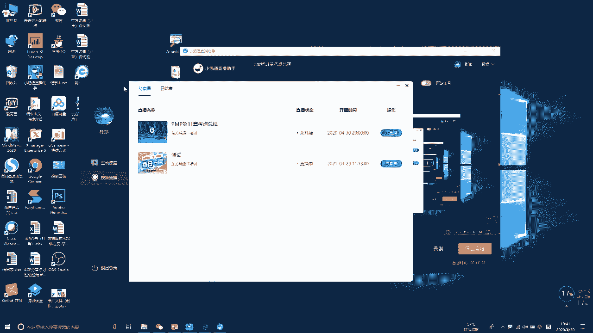

🎼。🎼The。🎼うん。🎼，🎼。

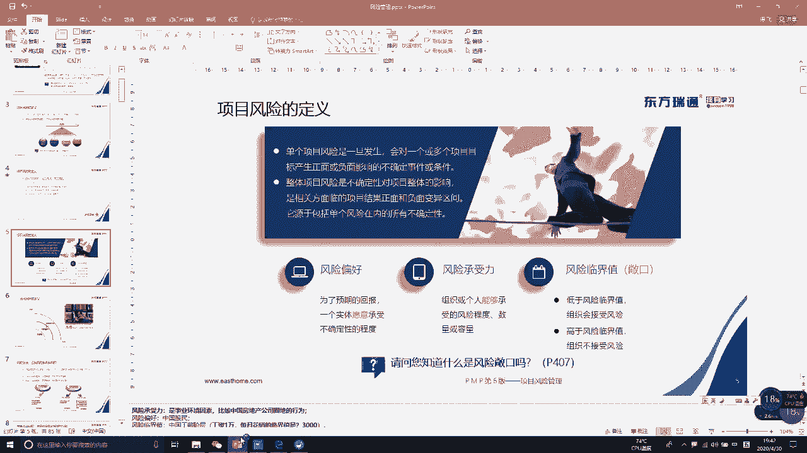

🎼可以。🎼，🎼あ。🎼，🎼，🎼，🎼。🎼。🎼Yeah。🎼嗯。🎼The。🎼The。

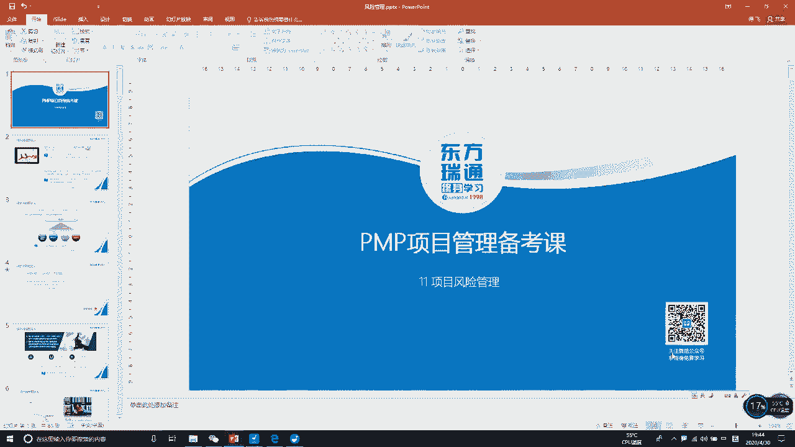

🎼う。

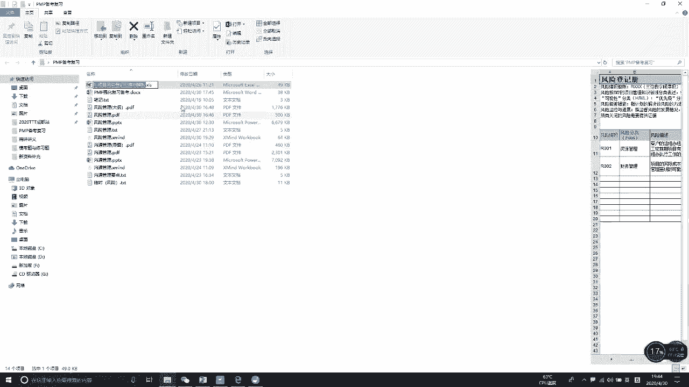

🎼嗯。🎼，🎼。🎼。🎼あ。🎼不是。🎼。🎼The。🎼。🎼うん。🎼。🎼没。🎼The。🎼う。🎼う。🎼，🎼，🎼，🎼。🎼おと。🎼あ。🎼，🎼，🎼，🎼。🎼Yeah。🎼Yeah。

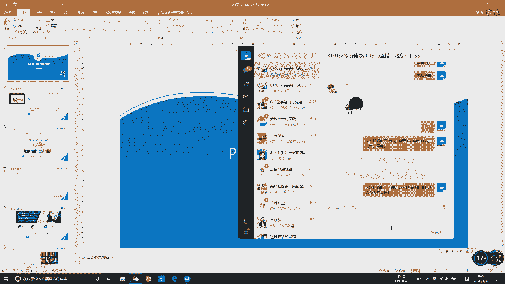

🎼，🎼，🎼画面质感真好。🎼相信我。🎼上课的时候。🎼な。你看下了。🎼嗯。🎼です。🎼。🎼那么。🎼よ。🎼。

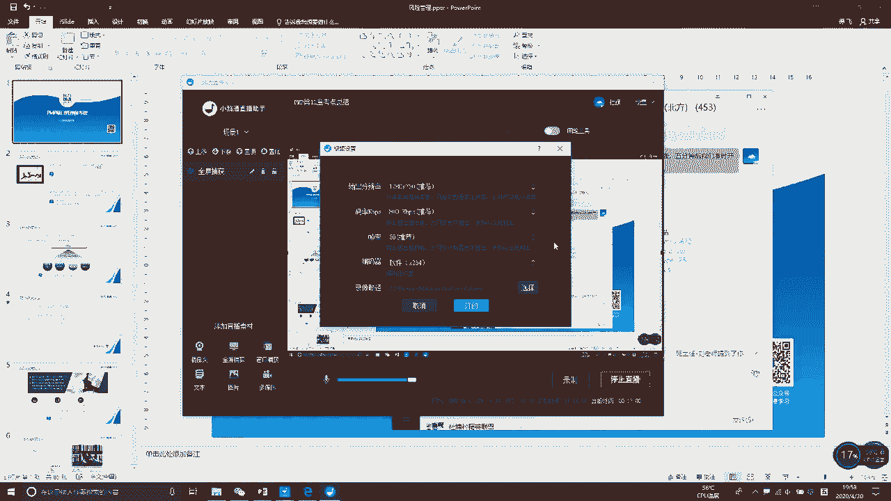

🎼遇见了。🎼う。🎼看能。🎼。

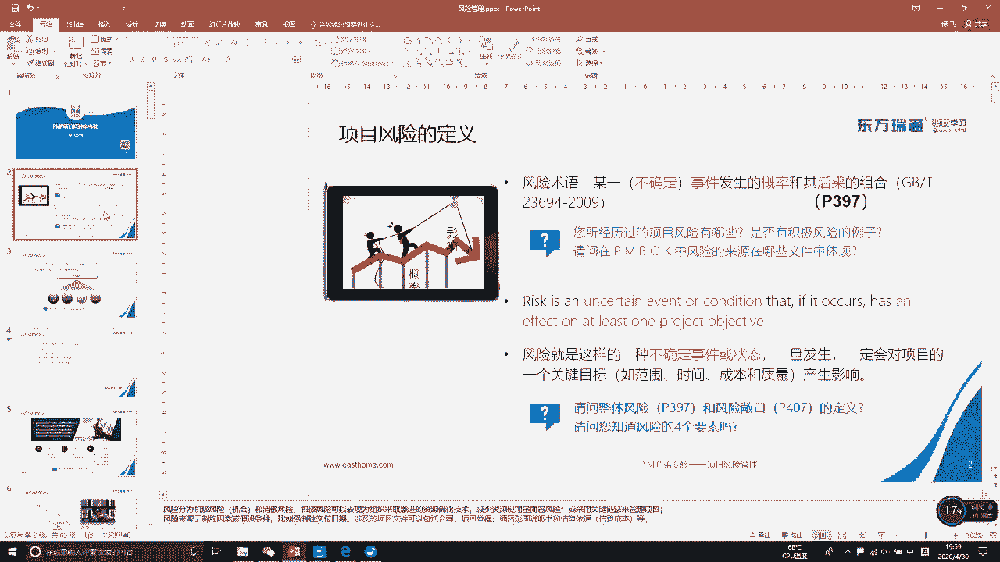

🎼。🎼그。🎼不可。

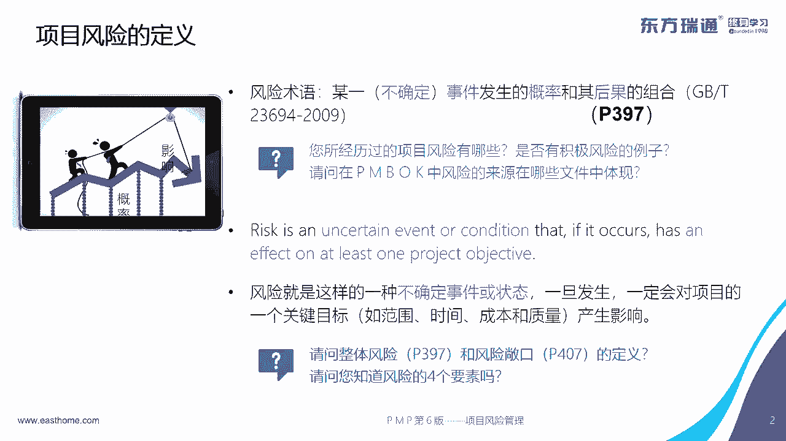

🎼うめ。

🎼他们。🎼うん。🎼。🎼不看。🎼，🎼爱。

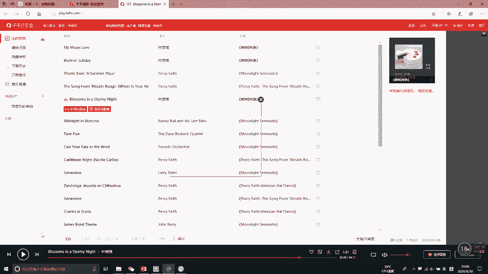

好，各位晚上好。今天的直播呢我们正式开始啊。呃，因为今天是五一这个假的前夕，所以有很多学员呢可能从工作的地方要返回自己休假的地方。所以有些学员呢请假了啊，不能。直接参加这个直播，准备看回放。

所以今天的人数可能要少一些。呃，但是我要提醒一下大家啊，我们这个考试6月6号是吧，剩余的时间呢只有一个月多一点点，所以大家一定要。紧张起来啊，把这个时间呢充分的去安排好，利用好。

争取呢这么长时间的备考能够一次性的通过。好，今天的主题呢是风险这一章，也就是第十一章风险管理。

会眼管理呢应该说是PMP考试的三大重点之一。呃，我把这三大重点呢给大家简单的回顾一下啊。

声音有点小是吧？好的，我把。呃，我我调一下啊，靠近一点。

嗯，好的好的。PMP考试呢有三个重点的区域，那简单的给大家回顾一下啊，因为我们这是一个呃备考课，也算是一个回顾的课程，是吧？第一个重点呢就是4。6实时整体变更控制。那么这一个过程呢，主要是讲的变更管理。

PMP呢是不太喜欢变更的哎。他对变更要进行严格的控制，为什么呢？因为变更会对现有项目的范进程造成冲击。也会给项目呢带来一些风险。

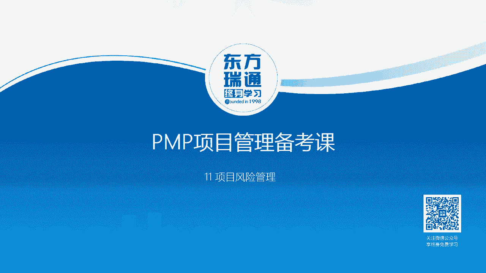

也会给项目带来一些风险啊。还有呢就是他可能。管理不当的话，容易造成我们项目的失控。所以PMP对变更的管理呢，它的重点。那大家以前在每日练一练里面碰到一个题目啊，就是变更管理的重点是什么？

就是项目经理呢应该去防止那些不必要的变更是吧？因为变更对项对这个PMP来说，他觉得不是好的啊，因为他这个预测型的开发方法是吧？那如果说你变更多了的话，就意味着我们这种预测性的开发方法呢，选择不当啊。

不适合这个项目。另外呢。在ACP的考试中，也就是敏捷项目管理中呢也喜欢提变，也喜欢提变更。因为呢敏捷中强调拥抱变更，变更可以给客户带来竞争优势。大家可以发现啊。

无论是传统的PMP考试还是敏捷项目管理呢嗯。都有这个变更的存在是吧？一个要严严防减少控制它。另一个呢要拥抱它。所以说在考试中呢变更的题目特别多啊，但是多不要紧，大家抓住一个核心的东西。

就是按照变更的流程去答题。所以大家一定要把这个变更的详细的流程图能够画出来，做到心中有图是吧？这是第一个考试重点区域啊，那么第二个考试重点区域呢就是7。4里面的政治管理。

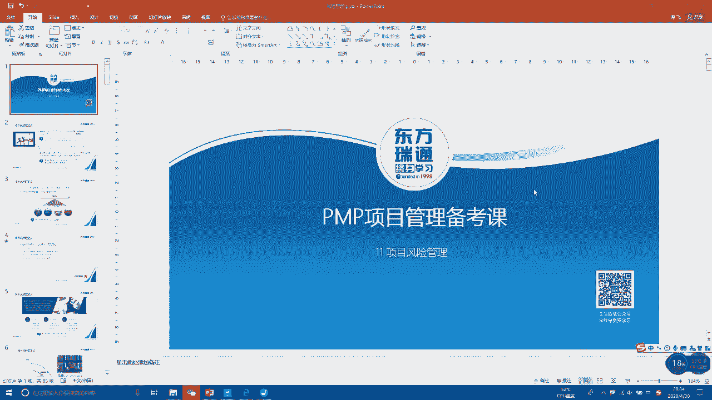

就是要对我们的。这个项目的成本和进度的绩效方面进行各种计算。那么它的核心地方就是需要把这些一堆的公式记得非常熟，能够非常熟练的去应用它们，计算出快速的计算出。所需要的结果。所以它的要点是要熟。

但是它的难点呢就是在这个预测分析中有那个EAC和ETC的计算。那这个地方呢比较麻烦，因为它公式比较多，我们面临着选择正确公式的这么一个考验。是吧那核心点就是说你要去分清楚是典型偏差还是非典型偏差啊。

把这个难点把这个地方呢给把握了。那政治管理的题目呢呃也是很容易拿到分的。而我们今天的第十一章风险管理呢，它的考试也是一个重点，分值大概占到少则十几分啊，多则20分上下是吧？分值也不少。

那他的这个考题呢分布比较均衡。呃，也就是它有7个过程，除了11。6。实施应对风险。那这个过程呢考题。不怎么考偏少啊，其他的6个过程呢都比较均衡，都要考点。所以大家需要对风险这一章呢进行全面的掌握是吧？

进行全面掌握。那如何去。有效的学习和复习这一章呢。呃，我觉得这个里面有有一个要点啊。就是风险管理啊。他有两份文件是贯穿始终的。第一份文件呢，大家猜得到就是我们的风险管理这个子计划是吧？

因为你风险管理的话，你先要制定这个子计划，然后拿这个子计划去指导后续的各个过程的工作。所以它是贯穿整个风险管理过程的。那么另外还有一个文件呢，就是风险登记册。所以我在课前呢。

我把这个文件的模板发到微信群里面去了，是吧？大家以后复习或者学习的时候呢，可以把这个风险登计册。打开是吧，自己呢去填写个一两行，真切的感受一下。真确的感受一下啊。呃，因为风险的预测。

它也是基本上贯穿我们风险管理的始终的。这个我们等一会在讲的过程中，或者回顾的过程中呢。是有很深的体会的。好，那。我们把这个三个重点啊，考试重点区域呢给大家。

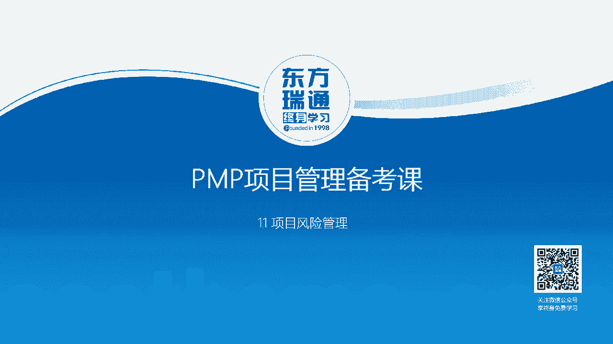

归纳一下。那下面呢我们来看一下风险的定义。风险呢就是一种不确定性的事件，是吧？那确定的时间呢。我们一般把它放到了我们的WBS里面去哎，作为我们的范围基准是必须要做的是吧？这种不确定的事件呢。

它的发生是有一定的概率的。概率就是说它可能发生，也可能怎么不发生。所以说管理起来呢是有难度的啊，是有难度的。一旦风险发生了，他会对我们项目的一个或者多个目标产生影响，是吧？诶，怎么又在打电话呢？好。

不好意思啊，我接一下重庆的一刘老师的电话，看看有什么问题。喂你了。哦，那我就把微信退了吧。但是我这边已经把它静音了了。在哪里呀？好，微信设置，然后通用设置里面吗？嗯。哦，好好好好吧。好的好的好好，行谢。

😊，哦，好的好的。嗯，好好好好好，再见。好的，不好意思啊。看来这个关声音还不行，只是我这边。好，ok那我们继续了啊。😊，呃，这就是风险的定义啊。所以我们对风险管理的话，肯定首先要对风险的定义非常清楚。

呃，PMI呢还是这么认为的，他认为风险呢分两类，一类是机会风险是吧？一类是威胁风险，也就是说所有的风险不仅是都是坏的，也有好的风险，我们可以加以利用啊，可以加以利用。风险呢有四要素。

或者有的说的是三要素啊，四要素呢分别是风险的起因起源是吧？为什么这个风险会发生？再就是风险事件本身是个什么情况？以及呢刚才说过的发生的概率。和造成的影响。这个影响呢就是我们的结果或者后果是吧？呃。

如果说是四要素呢，就是这4个。如果是三要素的话呢，就是后面的3个。啊，就是后面的3个。好，在这个地方呢，我们稍微提一下啊，很多学员在做题的时候呢。对于风险和问题这两者。容易打架不太好区分是吧？

不太好区分。那么这个地方呢，我简单的说一下啊。已经发生的。他属于问题是吧，没有发生呢。它是潜在的啊，是风险是吧？这是第一个区分。风险的管理重在防控。问题的管理呢重在跟踪和解决。这两者呢也有联系。

比如说某个问题发生之后是吧？可能会引发某个风险。而风险发生之后呢，往往就变成了问题。但是我们一般都不这么说啊，都不这么说。如果说大家实在是无法区分这两者。还有一个中极的解决方法，就是看一下啊，看一下它。

到底具不具备？这风险的四要素是吧？如果说它具备。那他就是风险。他如果不具备或者不完全具备的话呢，那我们认为他是一个问题啊，是为认为是一个问题。好，这是我们在做题。过程中呢比较纠结的一个问题。

在这个地方呢稍微提一下。好，我再把这个风险管理这个几个特点简要的说一下啊，这个讲义上面或者说我们的书上面都是没有的。但是我们呢大脑中要有这么一个概念。风险管理的特点啊。第一个特点，风险无处不在。

是吧他存在着他存在在我们的项目的方方面面。所以说，风险的管理是贯穿项目始终的。哪怕是项目在。是吧移交交付前，我们也要进行风险的管理。所以说风险的识别和风险的监控，风险的管理。

它是一个持续的反复的进行的一个过程。第二点。一个项目的整体风险呢是会随着项目的进行和时间的退移，逐渐减少的那这个我们也可以理解是吧？风险是不确定事件啊，随着我们项目的建定明细的特点，是吧？

一些信息越来越明朗了，自然而然就没有那么多的风险了，这是其一。其二呢我们识别的风险通过我们的管理啊，有些已经发生了，已经应对了。有些因为它概率的原因，它没有发生是吧？所以它风险是。逐渐减少的啊。

那么第三点呢，风险的管理或者风险本身不可怕是吧？怕就怕在我们没有风险管理的意识。我们没有风险识别的意识。哎，只要我们有这个意识。对他进行有效的识别，有效的管控，有效的应对。嗯，我们的风险是可以。

被管控的啊，那么有效的风险管理呢？它体现在提升积极风险的影响，降低消极风险的影响。是吧要因师利导啊因师利导。这是第三点。第四点呢，做风险管理本身是有投入的啊，本身是个投资是吧？需要人财物。啊，人财物。

所以说你不能过分的投入，你过分的投入的话，如果一旦超出它的潜在收益是得不偿失的。所以要把握这个度，把握这个平衡。呃，第五点呢，风险管理的程度。是要与我们的项目预算，与我们项目的重要性去匹配的，是吧？

如果你的项目预算多，你的项目重要性很高，那么我们就把风险管理的更加的唉。周全县。好，这是给大家呢稍微提了一下我们风险管理的5个特点啊，我会呢呃把它总结之后形成一个思维导图，到时候呢也是发到群里面去啊。

大家可以再去。补充一下，或者再去看一看啊。好，这个题目呢我们就不用做了，太简单了啊太简单了。

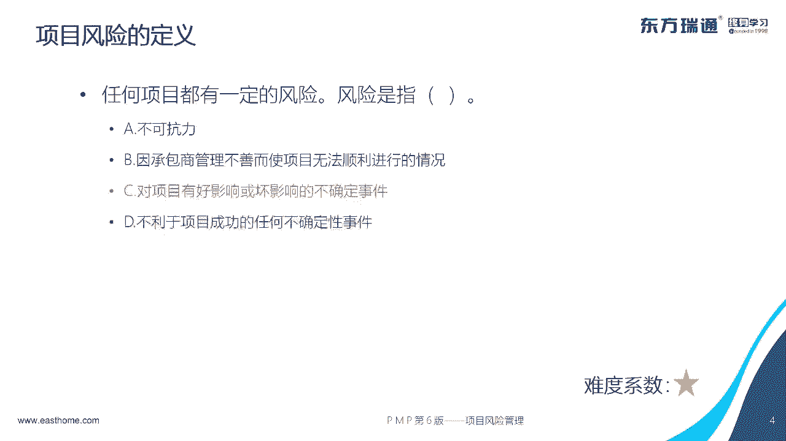

呃，我们在讲这个或者在学习这个风险管理的时候呢，必须要对有关风险的三个概念。非常理解啊非常理解。那么这三个概念呢，大家一定要理解啊。风险偏好是吧，是指的个体或者组织为了预期的回报呢。

愿意承受的不确定的程度，就是愿意承受风险的程度。这个地方的关键词是愿意承受的。简单的说啊，为了一个小的风险。🎼呃，为了一个小的回报，愿意承受一个大的风险，这属于风险偏好型。为了一个大的回报。

却不愿意承受一个小的风险，这叫风险。偏物性是吧？大家如果在银行去。投资理财的话，一般银行第一次就会给你做一个风险偏好的评估，是吧？第二个呢就是风险承受力，是指组合个人能够承受的风险的程度。呃。

它的关键词是能够承受。能够承受啊。呃，能够扛多重是吧？这个是愿意承受。那显然啊一般情况下我们应该是能够承受的程度大于我们愿意承受的程度。是吧。只有这样我们才能够嗯。合理。好，最后一个呢就是风险的临界值。

有风险的敞口，这个一定要找。我们的相关方尤其是以客户和发起人为代表的相关方去了解是吧？那风险临界值指的是如果高于这个临界值。那我们就需我们就不能接受，我们就需要找一些策略应对。低于这个零业值。

我们觉得无所谓，可以接受，可以接纳。哎，这三个啊概念。一定我们自己要理解。同时呢后面的至少有两个过程中是跟他有相关的。后面呢我们再再去说他啊，再去说他。

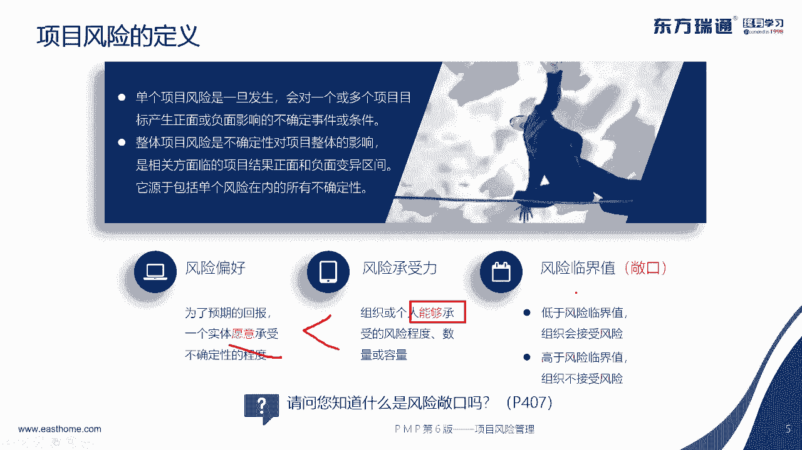

好，所以呢这个地方有个总结是吧？一个组织或者一个人他的。风险承受力一定要大于它的偏好。它的风险持有力呢一定要大于它的临界值，只有这样呢，我们才可以是吧？安全的进行我们的风险管理。好。

这个地方有一个风险的分类啊。其实我们在整个风险管理的过程中呢，风险的分类方式特别多。这一页PPT只是说是。分类的一种方式。我们把它呢分成为已知的已知风险。已知的已知风险，已知的未知和未知的未知。啊。

PPMP啊。他只涉及到。后面两种是吧，前面这一种呢基本上不提及。我们来看它为什么不提及啊。已知的已知风险就是我既可以识别它，我也可以知道它所造成的影响有多大。那么这样的风险呢，我们一般会主动去管理。

并且给他配备相应的应对措施。这个应对措施呢一般会纳入成为我们WBS的一部分，也就是纳入到范围基准中去。打个比方啊打个比方，比如说你买车是吧，你怕以后在使用车的过程中呢，呃会碰到这种碰瓷的情况。

或者遇到这种是吧？交通事故的时候呢，无法判定责任。就果了遇到这种风险，你可能要安一个行车记录仪是吧？所以你会发现啊，现在的行车记录仪呢已经成了我们买车或者说用车的一个标配，是吧？嗯，一个必然的组成部分。

所以呢它是WBS的一个部分。所以我们的PMP呢基本上就不提这种风险啊，主要呢在风险管理中是应对后面两种风险。那么后面两种风险呢，其实我们也非常明确是吧？已知的位置风险。使用的是应急储备。啊，掌控在。

PM手中。下面这种未知的未知风险。他使用的是管理储备。管理储备呢掌控在我们的管理层手中。只有通过变更。交CCB批准之后才能使用啊才能使用，才能纳入到我们的应急储备成本基准中来，是吧？好。

这个呃分类呢大家有这么一个呃，有这么一个概念啊，就是我们回顾一下跟前面的内容呢能接得上，对得上就可以了，是吧？接得上，对得上就可以了啊。好，在这个地方呢，这一页。这一页啊大家稍微了解一下就可以了。

不需要呢把它当做重点是吧？这个地方提到一个非事件的风险。啊我们。PMP的风险管理呢一般都是在讲这个事件类风险。非事件类风险呢主要是有变异性风险和模糊性风险。那大家把它了解一下就可以了啊。

比如先看一下变异性风险是吧？指的是风险，它有变化哎，它有变化，它会产生变异，它会变来变去是吧？那么关于这种变异性的情况呢。下面写的有啊，建议使用蒙特卡的模拟分析。得出这种风险的。

概率分布区间和变异的可能区间是吧？你不是还变吗？那我通过大数据是吧，模拟分析哎，了解到你的概率分布和变异区间。啊，对你有所掌控。第二种呢就是我们的模糊性风险。

就是我们的风险管理者自己都不太清楚这种风险的一些情况和信息。其实这个也很多啊。比如说市场未来的趋势，市场未来的需求变化是吧？没有几个人能够掌控，没有几个人能够说的清楚。这就属于什么模糊性的风险是吧？

模糊性的风险。还有呢就是技术解决方案，有时候我们也不清楚。哎，这问题出来了之后呢，我们也不知道怎么去解决这个问题。比如说当前的这个呃新冠肺炎是吧？这个肺炎。病毒啊它是一个什么情况。

我们怎么样才能够进行有效的应对和治疗它？那到目前为止是吧，全世界都还是不清不清楚的啊，是模糊的那如果是对他非常清楚，非常了解的话，那我们的疫苗就出来了，是吧？呃，我们的各种有效的防控措施就出来了。好。

关于这种摸付性的风险的话呢，我们的建议是。去使用原型法开发项目。或者是使用增量交付迭代是吧？这么一说的话，就特别像特别像什么呢？特别像我们敏捷项目管理里面的啊时代稀图。呃，一个方面是需求不明确。

另外一个方面是我们的解决方案不明确是吧，那怎么去解决这种是吧，敏捷项目的？风险呢我们就通过迭代增量啊，通过这个圆形开法是吧，圆形法。好，这个了解一下啊了解一下。嗯，基本上不会怎么考的。好了。

那风险管理呢，它总共是7个构成。前面我们也说了是吧？除了这一个不怎么考之外，其他的都有考点啊，都有考点。等一会呢我都会把重点给大家标出来的。那么这个汽过程呢，其实。对他梳理一下也非常清楚啊。

第一个规划风险管理就是制定了一个子计划。有了这个子计划呢，我们就可以指导后续工作怎么去开展。最后一个呢，监督风险是吧？对整个风险的管理过程呢进行实施有效的监控。然后呢，识别风险，我要管风险。

我首先要找到风险的是吧？找到风险之后呢，对风险进行。定性和定量分析把它分析清楚明白之后，我们就有办法去应对它了啊，就有办法应对它了啊。那么这7个过程呢，大家可以发现。多数过程或者叫5个过程。

在我们的规划过程组中是吧？另外两个过程呢，在执行和监控中。而且重点是规划，这些企业呢风险管理的特征是什么呢？未雨绸缪。没事找事是吧？防范于未然的这种思想。呃，这是风险管理的特征啊，重在防控是吧？

重在防控而不是等它发生。好，我们来进入到第一个过程，规划风险管理制定那个子计划啊。针据这个子计划的输入简单的说一下。章程里面有项目的总体风险和高层级的风险描述是吧？项目管理计划中输入所有的组件。

这也体现到我们风险管理风险存在于方方面面的特征。再下面这个呢是相关房登记册是吧，我们要找跟风险相关的。这些相关方来参与到我们的风险管理计划的制定中。工具呢很简单啊很简单，相关方分析。那么分析什么呢？

主要是。啊，主要是找相关方了解一下，分析他们对风险的偏好，风险的承受力和。得出风险的临界值，就是风险敞口这些东西。那么有了这些东西之后，就可以跟我们后面的。那个概率影响矩阵去映射啊去映射。

所以大家记住是吧，为什么要做相关分析呢？就是为了哎去了解相关方的风险偏好，风险承受力这些东西。好，它的输入和工具比较简单。那重点呢是这个输出风险管理计划啊，这份计划比较重要，建议大家。是吧建议大家画上。

一颗星必考的啊必考的。好，所以呢它所包含的内容。我们不光要理解，我们还要。很，能够。印象非常深刻，记住是最好的是吧？好，我们先来看第一个啊。他的内容。第一个。风险管理的方法论是吧？什么是方法论呢？

就是我们做事情的一套方法框架。比如说你们听刘老师讲这个敏捷项目管理，就应该知道啊，敏捷项目管理中有很多的方法论，其中最重要的4个方法论。那就是这四个。最重要的四个啊敏捷流派。那squirrl是吧。

XP极限编程。还有呢呃精益以及看板这四个内容是吧？同样啊，你看我们应对考试，不同的学员是吧，他的方法呢不一样。而有的学员呢他可能是认真的听课，认真的。看书认真做题是吧？他觉得啊把这几个方面做好。

考试问题不大。那么有的学员呢，他可能就想哎，那我是吧？呃，去多烧烧香，拜拜拜佛吧，是吧？求菩偿保佑。同样啊。我们生活中是吧感冒了，那么解决这个感冒的方法呢也不一样。有人呢崇尚西医，有人呢迷信中医。

有人说相信我自己的免疫力，我可以扛扛好是吧，这就是方法论。那么呢不同的风险管理，它的方法论是不一样的啊是不一样的。好，理解方法论是吧，这个词。呃，第二个呢就是角色和职责。角色和职责啊。哪里有角色呢？

剧本里面有角色是吧？呃，我们把剧本写好了。呃，各种角色有了。但是还没有呢去找具体的演员来演这些角色。那我们这个风险管理计划呢，它就是个剧本是吧，它这在角色和职责。嗯，但是目前呢还没有具体责任到人。

那大家可以回顾一下啊，有角色的职责的。管理子计划有哪些？至少有3个是吧，第一个质量管理计划，质量管理计划中肯定是有角色和职责的，以后是要责任到人的。第二个就是资源管理体械化。啊，那个RAACI矩阵是吧。

明显的就把我们的。工作包活动。责任到。我们的相关的资源。那第三个就是我们这个风险管理自计化，它是有角色和职责的啊。好，下一个呢就是风险类别啊，这个风险类别呢。呃，我们也称它为风险分解结构RBS。

是吧RBS。那这个地方呢我们要注意三个小点哦。第一个小点呢。就是它也相当于是风险分类的一种是吧？风险分类的一种。哎，我们前面呢把风险分为已知的已知已知的未知未知的未知是吧？这是一种方法。

那这个地方呢我们。可以。把风险呢分为四类是吧？技术类风险。啊，外部风险组织类风险和管理类风险。是吧。同时呢它也可以呢生成一个分解的结构。那所以呢我们称它为哎风险风险结构啊，风险风险结构RBS。

那么在PMP中，我们应该说是有。3个啊BS。一个是。工作分解结构WBS那这个是。高频考虑是吧，肯定会在考试中亮相的。定该在考虑亮相的啊。呃，第二个呢就是我们第九章中的OBS。

组织分解结构这个呢稍微次要多了啊，稍微次要多了。第三个就是我们这个地方的风险风险结构，这也是必考的是吧，也是必考的。而且呢我们要跟。资源分解结构那个RB区分开来。嗯，一般一般这个出现的多啊。

那个出现的少是吧？好，那么这个地方。是吧第一，我们应该意识到它也是一种风险分类的方式。第二。呃，我们再回顾一下有哪几个BS是吧，以及2个RBS分别指的什么？第三，他怎么考啊，他怎么考？他往往这么考的啊。

他往这么考的，他会在题目中出现。这个二级的内容。然后问你呢属于哪一类风险？啊，属于哪一类风险？那我们看一个题就知道了啊。他说项目经理制间了一个风险分解结构，分为四个类别是吧？

团队随后将提供资源识别为一个风险，这个风险应该属于哪个类别？那如果说啊我们对这个表不熟悉。是吧这个题目我们就。就不会做了。但如果说你对这个表的二级风险非常熟悉是吧？你应该知道呢。

提供资源它属于管理类风险。啊，它属于管理类风险啊，所以正确答案呢是D管理类风险。所以大家也把啊这个表这一页要画一个星号啊，要画一个星号。你看考的不难是吧？但是考的你处访不及。嗯。你要对他的二级风险。

类别比较了解。那另外呢，这个表还跟我们后面的一个工具是有关联的。后面再说啊，后面再说。好，这是风险类别是吧，要引起重视。再下一个呢就是我们对以客户和发起人为代表的相关方充分的分析，了解到他们的风险偏好。

风险敞口之后，我们呢就。去跟一个表格。进行对号入座啊，那这个表格呢我翻给大家看一下，就这个表啊，书上有这个表啊，书上有这个表是吧？你刚风险的。其中有两个重要的要素吗，一个是概率。一个是影响是吧。

影响可以呢表现为对时间的影响，就是进度的影响和对成本钱的影响。是吧。那如果说啊如果说相关方认为损失是吧，小于10万美元。呃，进度耽搁一周。这个事儿不大是吧？哎，这个事儿不大，那我们就呢把它量化为。

是一个很低的风险。依此类推啊以此类推。如果相关方或者客户认为是吧？呃，给我们造成了100万到500万的这种损失。项目进度呢或者说项目进度啊延误3到6个月。

这个呢对我们项目的影响是非常重大的那我们认为它是一个呃一个比较高的风险。是吧。嗯，一个比较高的风险。好，这是为什么要去。嗯。找相关方。分析他们的偏好和风险的敞口啊，就是了解之后呢。

去跟这么一个表去对应是吧，跟这么一个表去对应。好，得到这个对应的结果之后呢。我们再去。跟这个概率影响举证呢进行映射。啊，进映射。比如说啊打个比方说。现在呢有一个风险是吧，他可能呢。呃，他可能造成的。

成本影响成本损失啊是10万美元，那它属于很低是吧？同时呢。它发生的概率。啊，发生的概率呢有50%。那它属于中是吧，属于中。好了，我们就得到这两个啊，一个是中，一个是很低。

拿到我们这个概率影响举证中去对应啊，它属于什么呢？属于消极风险。就是威胁风险是吧？那我们找左边。找左边啊。嗯，赵祖边。横向是影响。我们刚才说的影响是很低是吧？纵向是概率。概率呢是中。那这两者。呃。

这两者一交叉。它的这个值。就在这个位置是吧？这样呢我们就可以把每个风险通过这种方式去一一的映射到我们这个概率影响举证上面。从而呢可以得出这个风险到底属于高风险。你看这个深色的区域就是高风险。中风险。

这个灰色的区域是中风险。白色区域呢是第一风险，这样自然而然就把我们的风险呢分成了三大类啊三大类。好，这就是为什么啊，这就是为什么我们需要去找相关方了解风险偏好。

为什么还要准备这么一个概率影响举证的模板是吧？一般这个模板呢是来自于组织固人资产的啊，公司有的，但是我们项目经理呢拿拿过来之后呢，我们可以进行呃优化更新和完善。好，再往下看呢，时间和资金的安排。

这个指的是两个储备嘛，是吧？应急储备和管理储备啊在。时间和钱上面。报告的格式和内容，这个指的是要准备我们的。风险登记册模板和风险报告的模板。啊，最后一个风险跟踪的规定，这个是指导我们11。

7如何去开展监督工作是吧？所以大家会发现啊这个风险管理计划这个子计划是非常务实的是吧？非常务实的，而且呢是很有必要去把它搞清楚的。嗯，很有必要把它搞清楚了。好，这个地方要发一颗心啊，绝对会考到是吧？

这个地方。呃，这个地方也是的啊，绝对会考到这个这个这一页啊这一页。再就是这一页。你现在不了解他，你后面也能了解他，所以这一页很重要啊，他怎么来的是吧？好，这是我们的。😊，11。1啊。规划风险子计划。

重点呢是它的输出输出。那么11。2识别风险识别风险呢就是找到风险的来源，记录风险的特征。就是我们要拼命去找，找到之后呢，把它们好好的详详细细的记录下来，为后续的工作开展，提供前提是吧？好。

这个地方呢识别风险啊有三个小特点，大家需要注意，也就是我们红字的部分是吧？第一个小特点。鼓励全体相关方参与。因为我们前面说了啊，风险无处不在是吧？呃，大家都参加人多力量大。呃，每个人的视角不一样。

这样呢识别风险没有死角。没有时角啊，所以说鼓励全体相关参加。那第二个呢，因为风险贯彻贯穿整个项目的始末是吧？所以不是说做一次就完了的啊，需要反复的持续的进行。那么看到这两句话呢。

大家不禁会有这么一种感觉，什么感觉呢？就是风险的管理要全员参加。是吧全员参加。要怎么全过程全方位。啊，体现三全啊体现三全，全员全方位全过程。哎，这么一说的话，大家应该回顾一下啊。

另外还有一个地方也体验这个三权的特点。那就是我们的全面质量管理是吧？全面质量管理呢，质量管理人人有责。啊，职质量管理人有责啊，所以呢也强调全员参与全过程管理，还有全方位的管理是吧？这是第二点啊。

第三点呢就是。这个识别风险呢，大家在一起探讨是吧？它也是一个很好的谈建机会啊很好的谈建机会。好，这是。把这个地方的三个小点呢给它提一下是吧，提一下。IDTO啊。IDTO呢。

我上一次课用的是那个新版的IDTO图片，但是我后来我又改了，我这次也改了啊，改成跟书上一致的。嗯，跟书状一致的。我觉得这个全面一些啊，我也习惯这么去讲。好我们来看一下这个IDTO啊，看一下这个ITO。

主要呢是把它分成输入啊，主要是把它分成三大类。啊，先看一下输入嘛，是吧？第一类就是我们的计划和基准。为什么要输入他呢？因为我们知道片批是严格的事先制理计划，事后执行。是吧如果你的计划，你的基准有问题。

那么执行呢结果也会有问题。所以我们找一下这些计划，看有些地方是不不完善，存在着风险是吧？在计划和基准中去找风险，去识别风险，这是第一类啊。那么第二类呢就是项目文件。项目件。

比如说这些项目文件中呢很容易藏有风险。那假设日志。假设条件还成不成立啊，是吧？假设条件不成立的话，马上就会出现风险。😊，这个我就不细说了啊。估算准不准呢？是吧？你估算不准。😡，估算不准的话。

导致缺钱缺时间是吧？嗯，进度保证不了啊进度保证不了。成本保证不了。问题日志。啊，已经发生的问题记录在问题日中是吧？那么已经发生的问题呢，我们通过根本原因分析哎，这个问题为什么又发生了？

通过深层次的分析和挖掘，找到了产生问题的根本原因。那我们就想一想是吧？想一想以后还会会不会发生这种问题呢？如果以后还存在着发生的可能性。那这就是一个风险的是吧嗯。所以问题日致啊，包括需求是吧。

能不能满足等等。都是有风险的啊，这是第二类。在文件中去找风险。那么第三类呢，就是在采购中去找风险，采购协议和在采购过程中产生的文件。那往往采购是很容易产生风险的，是吧？我们找一找有没有风险啊。好。

这是给大家分成了三大类是吧？计划基中长文件中长。采购文件中讲。那么这些找风险的地方呢，其实都可以归结到文件分析。啊，过及到文件分析。是吧你看计划基准是广义的文件嘛，对不对？哎，我把这些文件去分析分析。

看有没有风险。就像呢我们有些老师去看一下学员听课做的笔记。我们就可以分析出这个学员他听课的效果如何是吧？有没有标重点呢？有没有是吧，把补充内容记录下来，有没有做一些小节，做一些归纳，形成一些。

思维导图啊是吧，流程图啊，一些图示等等是吧？所以文件分析啊是映射他们的。根本原因分析是映射问题日志的。假设条件分析是映射我们的假设日志的。好是。把这几个剔除掉之后，我们再来画一下啊这几个。

这个里面的工具是吧？画一画啊，就是要引起稍微引起重视一下。头脑风暴。是吧头脑风暴。嗯。我们把大家集中在一起是吧？大家一起群策群力的拼命的想我们这个项目有哪些风险。所以这个地方它作为识别风险的一个工具。

第二个访谈去问那些有经验的专家是吧？你们见多识广，你们看一看我这个风项目中有哪些风险啊，访谈。是吧。核对单啊，后面会详细的讲，就是后面讲的我们会更加的重要一些啊。呃，后面会后面讲的我们会更加重要一些。

嗯，核对单、sword的分析提示清单这三个后面讲啊。好，先来说一下这个核对单啊。核贷单呢其实是来自于组织构成资产是吧？把公司以前类似的项目。识别到的或者已经发生的风险这么一个清单拿过来。

还有我们一个一个的去核对，看这些风险是不是在我们的项目中也会存在。是吧如果我们认为它也会存在，那我们就把它记录下来。所以说这个核德单非常有价值啊，它比我们头脑风暴来的容易是吧？比我们访谈来的轻松。

所以啊核对单这个风险识别工具，大家不妨呢在实际项目中也可以去用一用。核对单啊。好，这个红字的部分呢，大家也可以去记一下是吧？我们再来说一下swa的分析啊，所有的分析呢是大家在工作中经常使用的一个工具。

经常使用的一个工具。这个地方呢我主要说两点啊，也不说多的是吧？考试中呢也不会特别重要啊，稍微重要而已。是吧。sword呃分成4个纬度或者4个象限吗。就是机会威胁。优势劣势是吧？机位威胁呢是来自于外部的。

是来自于外部的啊，优势劣势呢是我们自身拥有的。所以这是第一点，我们要区分开来是吧？这个概念要有啊。比如说在疫情期间。呃，我回到我们那个老家乡下那个街道那个镇上是吧？所有的超市。都不准卖菜。

但是有一家超市是允许他卖的，别人卖呢是要去查封的，只有他一家可以经营是吧？那显然呢这就是疫情。给他或者政府给他带来了什么带来的机遇机会。机会。Mm。好，这个。我我本来想在另外讲故事啊，就不讲了啊，不讲。

呃，他虽然是有机会是吧？但是他老是啊在卖菜卖这个日用品的过程中呢，老是错别人的钱是吧？我去买东西呢，就错过N多次。呃，前面几次呢我都没有察觉，后面呢我就学精明了。我出去了之后呢，我就找个地方。

我把这个呃把这个小票呢核对了一次，我就发现呢给我错了好几次，后来找他了，把钱都退给我了，是吧？嗯，你看他就不好好的利用这个机会啊。好，这是第一点，就是我们要意识到机会威胁来自于外部。

是外部次予你的优势劣势呢，是我们自身拥有的。那么第二点呢，我们怎么样去处理这四者的关系？啊，大家看一下这个这个表啊，这个表其实挺有意思的是吧？写的很清楚啊，我也不在这地方多说，我只说一点点算了，是吧？

如果机会来了，并且我们在这个地方拥有优势。那我们就一定要怎么抓住这个机会，利用它，发挥它。不能让他溜走是吧，不能溜走。那反过来，如果现在存在一个威胁。而且这个威胁呢。我们在这个方面处于劣势。

那我们要努力的拼命的去消除它。啊，不要让他影响我们。是吧那其他的两个呢自己去看吧，是吧？所以这个东西还是还是有用的啊，还是有用的。所有的分析就了解这么多就够了，是吧？知道它是11。2。

识别风险的一个工具是吧，就可以了。好，根本原因分析我们前面说了啊，就是通过问题的根本原因分析找到。发生的原因之后。看还有没有再次发生的可能性是吧？如果有再次发生的可能性的话，那还就是一种风险。好。

最后一个工具呢就是我们的提示清单。这个提示清单大家需要。跟前面的合的单区分开来哦，很容易搞混的，很容易认为是一个工具的，是吧？嗯，那么这个提车清单怎么去讲他呢？啊，我给大家稍微的啊发一点点时间说一下。

就是我们可以制定这么一个提示清单，呃，以这个RBS。是吧以这个RBS。作为一个风险提示。清单啊，那有人说这个怎么提示我们呢？比如说你有了这个表之后，你就可以想一想是吧，我们在技术方面。

有没有可能存在着风险？呃，这个方面这个方面有没有是吧，利用这些条目。来提示我们。啊，让我们按照这个方向去想，这叫提示是吧？核对前面的核对就很清楚了。哎，我一条一条的比对，看存不存在去核对嘛，是吧。

去比对。所以啊前者。强调核对。这个呢强调提示名字啊名字其实就很好的体验它的区别了。好。嗯，重点呢还是这份输出。风险登记册和风险报告。风险的一测就是。第一版啊第一版。那么呢我们要注意三个点。

第一个点呢就是他肯定是要把我们识别的风险做详细的记录和描述的，是吧？这是肯定肯定的啊。那要注意的就是后面这两点是吧？我们不光要记录这个风险的特征。我们还要把潜在的应对措施。也给他记录下来。

但是记录下来之后呢。呃，他只是个潜在的，不是最终的，最终的应对措施要在11。5。规划风险应证中去确认啊。规划风险应证中确认。同样呢我们也可以把那些潜在的风险责任人记录下来，同样也是潜在的啊。

同样是潜在的，不是最终的。那么最终的风险责任人，我们是放在11。3中去确认。11点30风险。定性分析。哎，有人可能就会说，为什么责任人要早确认？而应对措施要晚确定呢。这就体验一个思维啊体验一个思维。

责任人早确定可以早让责任人牵头干活是吧？哎，牵头干活，责任明确嘛。那么应对措施晚确认是体验一个延迟决策的思想是吧？因为风险它存在变化。呃，或者说我们见进明细的特点，越往后呢把它看的越清楚是吧？

那么自样应对措施就更有效。所以它体现一个延迟决策的特点。好，这是第一版风险定测所需要记录的东西，记录的要点啊。另外还有一份输出就是风险报告。那大家知道风险报告主要是记录整体风险。它的一个概述是吧？

那这个呢书上写的非常的清楚啊。呃，我这个地方呢因为时间的关系就不去。多说，但是我要简单的把这个登记册和报告的区别简单的说一下是吧？登记册呢，它主要是谈的成员在使用。而且是经常的使用。就是只要做风险管理。

他就用到登记册。而风险报告呢，它是一种阶段性的展示。呃，就是隔一段时间阶段性的进行展示。使用的群体呢主要是相关方。是吧比如说以客户发行人为代表的相关方，他没有必要去了解你风险的详细记录啊。

他只要了解这个整体风险的概况就可以了，是吧？好，现在呢是8点53分啊，我们呢休息7分钟吧，因为今天内容比较多啊，休息7分钟，7分钟之后就是9点钟，我们继续。好，大家如果说有问题或者说有什么其他东西的话。

我们呃，发到这个微信里面去啊，我看到。声音很小是吧？这个不应该呀，现在声音大小怎么样？因为上次也是这样的，我没有调。声音有点小是吧？哦，现在还可以。现在还可以。不行。😔，好吧。

那大家可以把自己的这个耳麦或者是音箱的声音调大一点吧，这边我没动它啊。那应该是网络的原因。因为现在看到武汉的。武汉的学员。好的。呃，这个。这是每日一练的题目是吧？声音啊声音没问题好，没问题。

那就那就不管它啊。好，成都班的常同学上图做题目中D选项风险责任人。说在规划风云的。嗯。规划风印的中确认这个肯定是不对的啊，肯定是不对的。你看看翻一下书就知道它是要在11。3。中间确认了是吧？

确定确定这个责任人啊。嗯。所以你发出这个题目的话呢。我看一下啊，题目描述是这样的。已经完成了风险的识别工作，那就是做了11。2的工作了。该负责人对项目存在很多风险表示很担心，为了有效管理风险。

下一步应该开展什么工作？呃。我个人觉得啊我个人觉得这个题目答案是有问题的。是有问题的啊。那这确答案是这个是吧？这个这个答案我觉得是有问题的。干做了识别工作，就是做了11。2的工作。那接下来应该是做11。

3的工作了，11。3的工作就是。开展风险分析工作，不管是定性还是定量都是需要做的，是吧？进一步了解风险，我觉得这个答案应该是没毛病的啊没毛病的。也就是说这个是11。3。未已识别的风险编制有效的应对计划。

这个应该是11。5。通过风险分析确定哪些风险最值得管理，那就是找那个重大风险呗，那这应该11点。4。是吧。嗯，11。4。那这个呢制定责任人他也是属于11。3的工作啊。嗯，那如果是按照这个流程去答题的话。

觉得应该是选择呃，选择这个比较好一些是吧？那为什么这个是正确答案呢？我可能觉得啊。呃，他说这个也是我们的风险定级分析中的排序工作，是吧？而且呢这个答案呢去映射担心。还一是担心。如果这么解释呢。

是有一点点道理的。但是我觉得啊我觉得这个这个。如果从直观的分析的话，A答案的话应该不是最佳答案，是吧？D选项指定风险责任人是规划风险应对过程的工作，现在还不需要做不对不对啊不对。11点3钟。

是吧那有点晚了。A是11。3亩。那如果说A是11。3的话，那。那个C和D都是11。3呢。是吧。A档案唯一的优点就是它可以跟那个担心比较映射。啊，时间过得好快呀，已经到9点了啊。好，那我们就继续吧。

继续后讨论留在后面吧。是的，我们马上讲到11。3。排列优优先级。进一步分险呃进一步分析它也是为了排列优先级啊。而且排列优先级是最后体现出来的，你要做前面的评估分析之后才优先级的排列。

是吧。好。11。3实施定性分析啊，定性分析呢主要是利用所有的风险评估工具。注意啊，我这句话就是在11。3中就把所有的风险评估工具。都用到了都体验到了是吧？嗯。对他进行评估之后呢。对风险。

的重要程度进行排序。得出高中低是吧？高风险。我们可能要送去11。4做定量分析，做更加精准的量化分析。中风险呢送给11。5。去做。规划应对。低风险呢因为很多可以接受是吧？

那我们就放在观察清单中持续对它进行监监控啊，看它以后有没有变化。啊，这就是我们定性风险分析的工作。它的输出呢是第二版的风险登记册，就是在原来的。基础上呢有信息的增补。有兴息的增补。

同样我们看一下ITO啊。主要输入呢就是风险管理计划和风险登记册，这是第一版的风险登记册。工具我们画一下有。风险概率影响评估，这是最重要的一个评估啊。除了以这个为主要评估依据之外呢。

还加入数据质量评估和其他参数评估。把这些评估工作做完之后是吧，我们就把这些风险呢映射到概率影响举证上面去。通过概率影响举证。的颜色深浅体现这个风险的高中低。所以我打对勾的这两个工具啊是重要工具。啊。

其次呢还要对风险进行分类。你看这个地方又有风险分类，还有一个层级图了解一下就可以了。嗯，好，关于风险的概率评估和影响评估呢，这个我们前面说了的是吧，我再把它重复一下啊。

就是找以客户和发起人为代表的相关方去了解他们的风险偏好风险敞口。呃，跟那个表格去对应，对应完了之后呢，再去跟我们的概率影响。评估举证。进行映射是吧，就得出风险的高中低。

但是不能说以呃不能说只是以这个来做评估，我们还要加入其他的评估因素。比如说数据质量嗯，你你那个风险。是吧。他当初在进行估算的时候准不准啊？嗯。这个质量高低，精准如否是吧？对我们的。

概率和影响也是也是有呃也是有影响的吧。那另外呢。就是其他参数啊。这个如果是在家看书的话，就发现书上面呢有一堆其他参数。是吧这个地方呢我们稍微找两个说一说啊。嗯，大家简单理解一下，稍等下说一说。

比如说风险的紧迫性和风险的临近性。这个要加以区分。是吧。呃，打个简单比方说啊，我们所有的学员是吧？离6月6号考试都只有一个月多一点时间。那就是说我们所有人。离这个考试啊，离考试通不通得过这种风险。

它的临近性是一样的。是吧因为我们都距离考试这么多天，年性是一样的，但是紧迫性却不同。为了应对这个考试通过的风险。对吧有的学员呢可能准备的非常充分了啊，看了几遍书，刷了1000多道题是吧？嗯。

已经准备的非常充分，所以他的准备工作，他的应对。没有什么紧迫性。但是有的学员呢他。因为工作很忙，没有时间去准备，连课都没有听前。所以他的应对风险的紧迫性就非常的高。哎，这就是紧迫性和临近性的区别是吧？

还有可控性和呃，这个可管理性也是容易混淆的啊。好，因为时间关系呢，我就不这个地方详细的去。嗯，对比了。主要是以概率评估和影响评估为主是吧？然后再结合考虑其他的参数评估，最终呢映射到这个概率影响取证中。

从而把风险排序成为高中低。啊，前面我们说了高中低如何去分流，已经说过了啊。啊，另外呢，把这个层级图。了解一下就可以了。那把成绩图了解一下就可以了啊。也就是你会看这个图，知道这个图表示什么意思就行了啊。

你看横轴是可监测性。就这个风险，我们能不能监测得到它？是吧。纵轴是临近性跟时间有关系的啊。气泡大小是带来的冲击影响。所以说这个图呢是一个。三维的有三个维度。他说，右上角的大气泡不可接受。呃。

右上角是什么呢？是指的可监测性高是吧？像天气预报一样的，我能够预报到它。然后临近性也很高啊临近性也很高。冲击力也很大是吧？那这样的风险呢，我们是不能接受的。我可以预报了他。我就可以去避免去防范他。

那如果说没有防范的话，没有好的应对的话，它给我带来的冲击影响是非常大的，是不可接受的啊。左下角呢可监测性低，琢磨不定是吧？琢磨不定，临界性也很低，离我们时间还远着呢是吧？远着呢，冲击力也很小。

那么这样的风险呢，我们懒得理睬它啊懒得理睬它。好，这是这个图要会看啊要会看，最好是心中能够想象的出各种图。是怎么一个组成？怎么一个使用是吧？要做到心中有图是最好的啊。好，第二版的风险登析册呢嗯。

主要是就是把我们前面做的概率和影响的评估值记录下来。还有它的破戒性也记录下来。还有呢它的那个风险的分类也记录下来。那个分类你可以自由自在的分啊，你可以按照RBS分，你可以按照风险的来源分。

你也可以按照责任人分是吧？你怎么觉得好管理就怎么分。那么分完类之后呢，就把它记录在我们的风险对预测的指定类栏中去就可以了。啊，所以说这个地方的第二版的更新主要是更新概率值、影响，还有迫切性这些信息是吧？

同样也是有风险报告的输出啊，风险报告的输出呢主要是更新它的。那个最重要的啊单个风险。因为最重要的单个风险对整体的风险影响比较大嘛，是吧？还有那个以。排列顺序的优先级列表。大概知道它是一个什么样的排序。

好，这是11。3啊，11。3的话呢，大家重点就记住是吧，他使用了所有的。风险评估工具。然后最重要的是概率影响评估。第二点呢，就是他把我们的风险进行了排序，分成高中低，怎么去分流啊，怎么去分流就行了啊。

那么11。4定量分析呃，这个地方经常会出考题啊经常会出考题。就是我们要把风险呢做进一步的量化分析。通过更加精准的是吧，分析，从而呢更有效的去应对那些重大风险。啊。好。

这个地方呢我们再说的说一下啊得说一下。就是。定量分析不是所有的风险都做的是吧？不是所有的风险都做的啊，我们只对那种。重大风险去做是吧？因为做这种定量分析的话，是要花钱花时间的。是吧。嗯。

你有那么多钱和时间发吗？这是第一啊。第二的话呢。不是所有的风险都适合，也就是不是所有的重大风险都适合做定量的，要能够定量才可以定量，就是一一定要能够量化到时间和成本上面去。并且呢我们要有是吧？

可靠的数据。和扎实的。项目基准。如果说你想量化，你说我有数据，但是我的数据不准，那最终量化的结果也不准，那也是白做。所以说啊第二点要能量化，并且呢要有扎实的基础，也数据要准确。

才能才能够得到好的量化结果。呃，第三点呢就是红字这个地方是吧？也是引起大家重视的啊。定量分析适用于大型的复杂的、具有战略重要性的风险，或者说合同有要求的，主要相关方有要求的。哎，这样的项目。

这样的情况我们才去做定量，不要没事找事啊。哎，不要每事找事是吧？所以说做定量分析不容易啊不容易。好，他的输入。我们就只说3块啊，归纳为3块。第一块呢要输入风险管理计划，输入风险登记册和风险报告。

这是肯定要要用到的是吧？这第一块呃，我不说你懂啊。第2块呢就是要有数据啊，你看有估算是吧，成本估算时间、估算依据等等。估算依据等等啊，这第二块。好，这是输入啊工具的话呢，大家画一下访谈。不确定性表现。

模拟。敏感性分析决策术分析。其中这两个工具。是重点啊，是必须要掌握的，是考试必考的。好，先说一下访谈吧。就是我们可以去找专家是吧，向他们了解这种重大风险的来源，问他们要一些相关的数据。

那么专家呢他给我们提供了一些数据，而这些数据呢看符合正态分布啊是吧，利用贝ta利用三角这些来展来呈现来展示啊，呈现来展示啊，这个了解一下就可以了，是吧？然后有了这些数据之后呢，我们就可以使用模拟技术。

这个地方的模拟技术呢主要是蒙特卡洛模拟分析。蒙特卡拉模拟分析这种技术是通过计算机模拟软件啊进行大量的。迭代运算是吧，大量的迭代运算呢反复的运算呢，反复的推演呢，最终呢呃得出结果。

这个图啊就是蒙特卡拉模拟分析的一个输出结果啊，这个图呢叫做。累计概率分布曲线。也就是我们通常所说的S曲线啊，你把这个图呢。呃，了解一下是吧。了解一下，跟我们这个蒙德卡拉模拟呢技术去映射一下就可以了啊。

你看一下这个图啊。横向是我们项目的成本。纵向呢是项目目标实现的概率累积。也就是说，我们当项目成本是吧？投入是220万美元的时候，我们向目标实现的可能性是23%的概率。这概率就很低了是吧？呃，概率很低了。

但是如果说你把项目成本投入到245万美元的时候，概率可以达到85%，这个就比较高了。😊，如果说你更有钱，你投到280万美元的时候，可以达到百分之百。如果你继续再增加投入成本的话，就没有意义了。

这跟我们考试一样的是吧，你投入的时间越多。通过率就越高。但是一旦投入到一定程度之后，再投入就没有意义了，是吧？因为你已经百分之百可以通过了。好，了解一下啊，这个了解一下就可以了。

重点是后面的敏感性分析和决策术分析。这是必考的啊必考的。但是这个比较简单是吧，比较简单。敏感性分析呢主要是把我们项目的。重大风险。嗯，您能中风险低风险就不要拿过来了啊，把重大风险。它的影响值。分成两类。

一类是机费。一类是威胁是吧？分成两类。然后呢进行降序排序。进行这程序啊。就得到这么一个图。是吧如果说左边是机会，右边就是威胁。啊，机费风险少，威胁风险多。是吧。那么呢做成这个图。

这个图的形状有点像个漏斗，或者说有点像个龙卷风。所以呢我们也称它为龙卷风图。龙卷风分析。那说了这么多呢，最重要的一句话是这句话。哎，你为什么要做这个图？为什么做这个分析呢？就是为了找到啊就是为了找到。

对项目有最大潜在影响的风险，就是为了找他是吧？就是为了找他擒贼先擒王是吧？解决矛盾要解决主要矛盾。敏感性分析或者龙卷风图就起到这个作用的啊。把这句话一定要牢记在心。这个啊打一颗星这个页面。啊。

这个题目呢其其实很简单啊，项目在定行过程中发生了一些风险，为了识别最大的潜在风险是吧？最大潜在影响应该做什么？应该做龙卷风分析。啊，选择A。好，这个也是个重点啊，而且这个地方。挺麻烦的是吧？既有。

概念的理解。也有数据的计算。嗯，所以很多人在这个地方呢容易出错，但是这个必考的啊必考的。决策书分析。决策数分析呢第一点它的定义是吧？他是用于在。多个备选方案间。去选择最佳方案的一种决策分析。

就是我在应对风险的时候，我不止一个方案，我有好几个方案是吧？那么最终我们要选择。最好的方案，那怎么选呢？就用这个决策术分析。做决策用的。而角色数分析呢，它画的这个图。特别像一棵树是吧？比如说这个是树。

树干树根，那么上面就是树枝小枝啊，小枝，所以也叫是吧，决策树分析。决策术具体怎么分析呢？主要它用的是预期货币价值。嗯。预期货币价值的计算。来进行分析的。所以我们也称能为预期货币价值分析。

预期货币价值分析的缩写是EMV。EMV所以它也称为EMV分析。那大家可以发现啊，它有竟然有三个名字是吧？决策术分析。呃，预期货币价值分析或者叫EMV分析。这个EMV。

要跟我们前面的正直管理的EVM加以区分。嗯，这有点像是吧？有点像好，这是第一点啊，它的定义的理解。他的三个名字。是吧以及跟我们的EVM的区分。那么呢第二点呢就是计算怎么算啊，怎么算呢？他的计算其实。

比较简单。主要就是利用我们前面的那个。风险管理的。概率和影响相乘是吧？你看啊嗯。概率。60%。影响影响是什么呢？就是。我需求强劲的时候。是吧可以收入2亿美元。这是收入啊。嗯。那你要算他的影响。

是应该算他的。净收益。所以你的收入要减去投资成本1。2个亿。简单的说就是概率乘以括弧。收入减去。支出这是收入，这是支出，这是概率是吧？公司其实很简单。而收入减去支出。我们也称它为路径的静止。嗯。

就是在这个路径上面，在这个分支上面，它的静值。是它的利润是吧，它的利润是多少？啊，我在这个思维导图中啊给大家已经。总结或者写的非常清楚是吧？只是我说的时候呢，大家可能会觉得是吧？比较抽象。嗯。

所以啊大家在。学习这个的时候呢，一定要把这个图看懂，要把这个里面的计算。搞清楚是吧，为什么是。呃，2亿减去1。2个亿。为什么这个地方得到3600万美元？3600万的美元是怎么来的，是吧？要去分析分析啊。

分析分析。那今天因为这是一个复习课，所以。我们就不去展展展开的很细了啊，不去展的很细了。嗯。好，这是第二点啊，就是怎么计算计算公式是什么样子的。第三点也是最容易困扰大家的一点。

就是我们在计算过程中的注意事项有两点。第一点第一点啊，关于概率如何确定。这个图呢，他把各种概率都给你写的非常清楚是吧？但是有的题目呢。他给你的已知概率，你可能相加之后不等于百分之百。那你不等于百之啊。

你别管他，你不要说这个题目错了是吧？他给你什么样概率，你就怎么算就完了啊。😡，这是第一种概率情况。那么第二种概率情况呢，他就只给你一种概率，其他概率不给你。不给你呢，有两种情况。还，有两种情况。

一就是说没有给你那个概率跟给你的概率是相等的。2、没有给你的概率，你要通过百分之百去相减。哎，这要看题目的具体情况啊。呃，所以他给你挖一些小坑是吧？挖一些小坑给你产生一点困扰。嗯。

你要有这种心理的准备啊，这是第一点，关于概率。不要纠结。那么第二点呢，就关于这个净值的计算。关于这个净值的计算啊，如果既给了收入，也给了成本。那你就收入减成本，得到利润，得到净值。

是吧如果说题目他一概只给收入，一个成本都没给，那你就只向收入呗，是吧？只向收入啊，并且呢选择收入最大化。如果题目一概只给你成本，不给你任何收入的信息。那就只谈成本呗是吧，选择成本最小化。嗯。

这是我们管理中的一个基本的认知啊，基本的认知。好，这是关于决策数分析的三个点是吧？第一个点，了解它的定义啊。那是它的三个名字。第二点，它的公式如何去做计算。第三点呢就是在计算过程中，我们要注意的两个点。

是吧同样我在思维导图中给大家捋的非常清楚了啊，大家可以去仔细的看。好，这个地方也是需要画上一颗大大的星号的啊。啊，这题目呢其实就没有必要去做了。你看呢项目团队已经识别到了项目风险，并为这些风险做了排序。

为了进一步的分析这些风险，注意啊，风险的排序。就是把风险分成为高中第三类是吧？这个已经做了，11。3已经完成了。为了进一步的分析他们做量化分析呗。是吧关键词进一步分析。团队创建了决策图。

那这就更明显了是吧，更明显了。决策图就是决策数。应该使用哪种工具来量化，你看关键词量化。是吧三个关键词都指向C答。好，影响图这个图啊，大家只需要知道它是11。4的。工具就可以了，不需要知道更多的。好。

输出的话呢。这个过程的输出重点是更新风险报告。因为量化分析的风险是重大风险，自然而然要体现在。整体风险报告中啊。好，这是11。4，那么11。5。规划风险的应对。呃，你前面你看识别到了风险的。

尽量多识别是吧？对风险进行了各种有效的分析，你也把它整明白了。那么到这个地方来，我们就需要做应对措施了是吧，做应对措做准备了。这个11。5。考题比较多啊，主要是各种应对策略。是吧他的区分和选择。

他的取款选择啊。那么同样我们把各个风险的应对策略都制定好了之后呢，是要把它更新到我们的风险登记册中去的。是吧。O。那同样我们看一下输入啊。输入的话，这个地方分三类。第一类就是我们的风险管理计划。

风险登记册和风险报告是吧？在前面的基础上进一步的去延续他的工作。这是第一类啊。那第二类呢就是风成本基准。是吧。呃，成本基准大家都知道，这个里面是包含有应急储备的。

应急储备是给已识别的风险去使用的那现在我们要应对的话，我们要用这部分储备了，时间的储备和钱的储备我们要用了。那用的话这个基准包包得住，这个储备够不够是吧？哎，要把它纳入进来考虑。这是第2块啊。

第3块呢就是应对是要人去执行的，所以涉及到资源。你看有哪些人胜任这个工作？他的。时间是不是空闲的资源日历啊。另外呢，我们这个风险实应对实施的时间点。应该怎么去考虑？是吧。打个简单比方说啊。

我们这个项目团队的成员都是新手。很容易出现质量问题是吧？那我们为了应对这个质量风险，我们决定呢做一次岗前培训。那么这个岗前培训的这个风险应对措施，准备安排到进度计划里面的哪个位置比较合适？是吧。

所以要用到这个进度计划啊，这是3块，哎，这就好理解了，是吧？再来画工具。工具呢大家把这几个画一下啊，威胁应对机会应对，这是要划新的。重点考点。应急应对整体应对备选方案成本效益多标准决策分析。

这几个呢画一个标记就可以了。画一个标记可以，就是了解一下就可以了啊。重点是机会和威胁风险的应对。好，我们来先看一下机会啊，风险的应对。这个上面呢写了4种，实际上是5种，还有一个上报是吧？还个上报啊。

关于上报呢，我就说三点。第一点，什么样的计会风险需要上报？超出了你的项目范围的不归你管的。这样的要上报是吧？或者说归你管，但是超出了项目经理的职责权限的。呃，超出了你职场范围了。嗯，一啊超出项目范围。

2、超出PM的职权范围，这样的风险需要上报。是吧这是第一。第二，上报到哪个层级呢？你可以上报到发起人，上报到项目级、项目组合或者组织的其他相关部门。具体上到哪个层级？是要看这个机会风险影响了哪个对象。

影响了哪一个层级就上不了哪个层级。是吧跟他没关系，你上报给他没用啊。第三点啊，上报之后只记录在风险的预测中，不负责跟踪，相当于你把它交出去了，是吧，你管不了的事儿嘛。好，这是上报这个啊了解一下就可以了。

它不是重点。重点是下面的4个，我们先来看一下开拓。开拓看这个词就知道是吧？开天辟地啊，空权结后的。那么这样的风险一般是指的高优先级的风险。高优先级的啊，就这个风险很难得啊是吧？百年一遇的了很难得的。呃。

这么好的风险不抓住他可惜。那么怎么装呢？肯定就是要把你们组织的最好的资源是吧？嗯，最厉害的人搬出来。去抓他。所以说啊他的特点是使用组织类。最有能力的资源。去抓住这个风险是吧？那什么样的资源最有能力呢？

那就是在项目中嘛，就是我们的专家啦，高级工程师啊。所以说在做题的时候啊，一旦看到什么高级工程师去抓风险的话，那基本上就是十拿九稳，是吧？呃，就属于开拓啊，我们要确保这个机会，难得的机会是吧？

能够百分之百的实现。好，这就是开拓。开拓啊。第一，因为机会难得高优先级是吧？第二，使用最有能力的最优的资源去开拓。第三，确保它能够抓住百分之百的能够实现啊，这是开拓啊开拓。好，再来说一下第三类分享。

不影响是吧。机会摆在我们的面前，但是我们有能力去抓住他，我自己没能力也没关系是吧，我可以找别人呢。😡，所以说啊分享呢它是把我们风险的。责任啊去转移给第三方，让第三方来帮我们是吧，那人家白帮吗？

不是的是吧，我们也需要把风险带来的收益给他怎么分享。所以啊分享是质的。去找第三方合作是吧？比如说联合投标，哎，我们自己公司。实力有限啊，单独去投这个标肯定怎么中不了。那我们去。呃，找。合作伙伴是吧。

联合投标。进行资源优势的父补吗？还有呢大家可以发现啊，现在这个电拍电影是吧，它这个投资方都是很多都是很多。因为现在电影的这个。投入成本太大是吧？如果只是有一方去投资的话，万一票房不好，血本无归。

所以啊联合投资。啊，联合投资。好，这是分享的特点是吧？就是责任转移给第三方收益跟第三方进行分享啊，进行分享。但是呢找这个分享方，找这个第三方的时候，一定要找有能力的第三方。不能去找这个猪队友是吧啊。

不如不找。嗯，比如说题这个考试题目中啊经常就会出现是吧？这个。培训是吧我们这个项目准备搞一个培训。那么这个培训呢，不光是对我们有益，还对其他的所有项目都有异义。

我们把其他的项目呢人员也弄过来一起培训是吧，费用呢，大家分摊。我们要上一个软件是吧，这个软件对整个组织的项目都有利。那不能说只有我们去花了个钱买是吧？嗯，大家都出点钱。这就属于分享的典型题目啊。好。

再来说一下提高。提高呢非常简单是吧？就是为了提高这个机会风险发生的概率，或者提高它这个机会风险发生的影响。呃，这个举个例子大家就明白了啊。比如说你认为考过PMP。是给你的工作和人生带来的一个机会。

是一个机会风险是吧？但是呢这个时候你想把这个机会呢能够提高。你怎么提高了？比如说第一个方面，你想提高通过率啊，你就找你们老板说，老板这个时间太紧了了，能不能少给我分配点活是吧？让我多点时间复习。

如果老板批准的话，那你考试通过的。这个通过率就比较高了是吧？你就可以抓住这个机会。老板说现在人少活多啊，没时间。给你复息。那你就。这么说，你说老板这个证书特别有价值啊，我到时候考过的话。

你能不能不光要给我报这个考试会，你还把我的工资给涨一涨是吧？以前可能只报你的考试费。现在你提出来要把工资涨一涨。哎，老板同意了，那我们就提高了这个机费风险的影响力是吧？影响力。好，简单的一句话啊，就是。

去提高概率和提高影响是吧？从而把这个机会放大。好，最后一点呢接受这个也要特别的关注是吧？这都考的比较多啊，都有考点，都有考都有考题出现。接受是我承认这个机会存在。但是我呢没有任何的应对措施。好。

大家一听这句话就会认为这不是很消极吗？是吧？PMP呢它不主张消极啊。好，他为什么没有应对措施是有原因的？两个原因啊。第一个原因。这个风险的优先级太低了，就这个好处太少，太小了是吧？我们都看不中。哎。

我们都看不中。他要来就来是吧，他不来，我也不主动追求。这是第一种情况。那么第二种情况呢，就是。我目前是想抓住他，但是我没有经济有效的应对措施。关键词经济有效，经济就指的我低成本了。

有效就是它能够很好的去把握它了，但是我没有是吧？嗯，所以这么两个原因呢导致我们采取接受的这种应对策略。好，那接受呢出为主动接受和被动接受。主动接受呢往往是留储备加储备。就是我没有应对措施。

但是我可以把这个时间钱和资源。储备给你留下。一旦这个风险发生的时候，我们可以加以利用是吧？我有这些东西可以加以利用，这叫主动接受。那么还有一种是被动接受。被动接受就是说我一直。监控着你。啊，等到我是吧。

随着间记明细啊，随着时间的推移，可能有一天我就想到好的办法了。嗯，我到时候呢就有应对策略了。是吧所以这叫被动接受啊。不管是主动也好，还是被动接，被动接受也好是吧，都不存在消极的因素啊，大家需要注意。

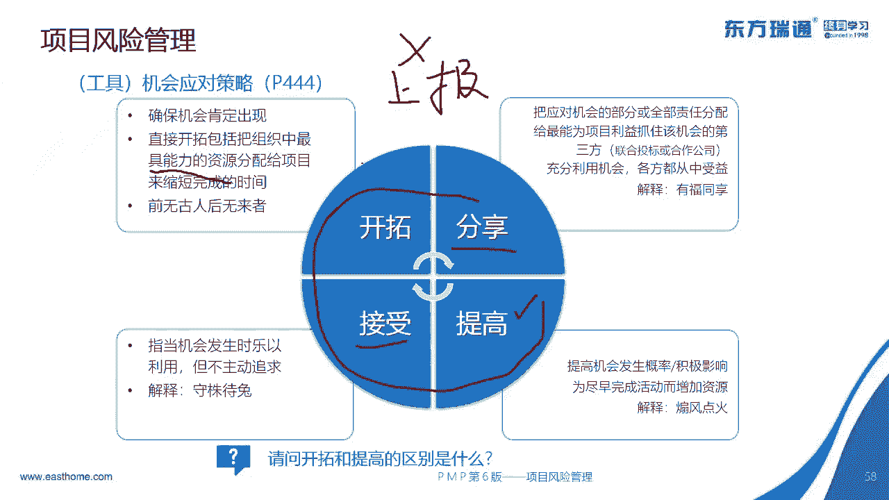

好，这是机费风险的5种或者4种。应对策略啊，大家一定要非常清楚是吧？一定要非常清楚。那么把它们理解之后呢，我们再看威胁风险的应对策略的话也差不多是吧？就好理解一些了。它也有上报啊。那么关于这个上报呢。

我就不多说是吧，也是三点，第一点，超出范围是吧，超出我的职责权限。上班了哪个层级，上班了受影响的层级。不负责跟踪，只记录就完了。再看一下第二个啊，回避。回避。这种应对策略呢往往是用于什么呢？

往往是用于概率高、影响大的这种风险。哎，这种风险很要命啊。发生概率高，影响也非常大是吧？影响非常大。那么这样的风险一旦发生的话，对我们的项目。是非常致命的。所以说这种风险我们的应对策略是什么呢？

我们的应对策略是。改计划或者说改目标。呃，我把以前的计划怎么给改了它是吧，给改了它。或者改目标。本来我是准备去实现这个目标的，我现在呢放弃这个目标。好，打个简单比方说啊，改计划。现在运行期间是吧。

本来大家应该是3月份考试的啊，3月15号考试的。但是因为呢这个。嗯，基金会或者说骗麦吧是吧，他觉得这个风险太大了啊，你看这个概率很高是吧？如果大家都聚在一起考试的话，交叉感染是吧，概率很高，威胁也很大。

影响也很大了。嗯，这个如果说都大家都感染的话，这后果是非常严重的，是吧？所以他没办法改计划是吧？😊，把3月份的考试推迟到6月份。嗯，一旦做了这么一个回避的策略之后，那么就完全消除了这个风险的。

发生的原因呢。呃，风险发生的根源就消除了是吧，已经把这个风险化于无形了啊。这就是回避。那我们再来说一下改目标吧啊改目标。是吧本来你准备啊去非洲某国旅游是吧？后来听说这个国家呢发生了军事政变啊。

太危险了是吧？抓住了就就可能会被当人质了啊。嗯，你就决定呢改另外一个国家是吧？那个国家的风景，那个国家的人文跟以前那个国家的差不多是吧？把目标改了啊。好，PMP这个项目管理里面的改目标呢。

主要是体现为删除一些有风险的工作包，甚至是放弃整个项目是吧？我们觉得这个项目的风险太大了，那我们干了干脆不做了是吧？干脆不做了。好，这就是回避啊，体现体现为改计划。嗯。改目标改目标。完全消除风险的。

发生的原因。是吧把风险完全化解掉，这就回避啊这就回避。但是我个人认为啊回避这种应对措施的话，是很容易产生次层风险的。啊，这很容易产生市种风险的啊。比如说这个考试时间改了是吧，你看次政风险一大堆。

PMI的收入减少了是吧？我们每个人的考试准备时间延长了。打烂了我们以前的计划和部署。是吧。你看次生风险一大堆啊，这是我个人认为的。好，我们再来说一下这个转移。威胁风险的转移呢。定义差不多的是吧。

也是找第三方。把这个风险的责任转移给第三方，同时呢是吧也要给对方好处和报酬啊。比如说啊我们有些工作包做不了，采取外包。这是转移是吧？比如说我们买保险。啊，把这种保险的风险转移给第三方。嗯。

买保险啊买保险。这都算啊，但是呢这个地方我们要特别注意的有两个点，大家一定要熟记在心啊。财务的风险可以完全转移买保险啊，这种风险是可以完全转移的，是吧？完全转移的财务风险可以完全转移啊。进度风险。

只能算减清的。呃，进度的风险只能算减轻。你不能说啊我们现在进度很急，我没时间去做这个工作包是吧？我们就把这个事呢。给一个供应商是吧？那你有延误的。风险那供应商其实也有延误的风险啊。哎，就这么理解吧。

进度风险只能算减轻，不能完全转移出去是吧？法律风险不能转移。呃，你干这个事情犯法，他干这个事情，就是供应商干这个事情，他也犯法了。第三方干这个事情也犯法了是吧？大家都要遵守法律啊。

所以法律风险不能转移啊。呃，考试中经常会有有关法律风险，他去骗你是吧，你就很容易选择转移。好，这是第一点啊第一点是吧？再说一次，财务风险可以完全转移。进度风险不能百分之百的转移，很多时候算减轻。啊。

法律风险不能转移。第二点第二点啊。外包。找供应商。情况比较特殊啊，外包找供应商，就是我我们经常会外包嘛，是吧？找供应商第一次找供应商。可以叫转移是吧？比如说我这个事情我干不了，我没有这个技术实力啊。

没有相关的资源，我干不了是吧？外包给第三方。嗯，他们有经验，他们保证可以干好。转移啊转移。转移。那如果说啊我们。第一次是吧，找这供应商，但是我们发现这供应商呢有某种原因不能履约。

这个时候呢我们眼看着呢进度有问题了，我们再去找另外一个可靠的供应商的时候，那第二次哦第二次外包相是第二次外包了。这个时候呢我们叫做减轻。呃，这个时候我们要减轻，因为这个时候体验的不光是。能不能做的问题。

而且是能不能按时做完的问题，进度方面的问题了是吧？进度方面的问题。那他可能会进度延误。好，这个地方大家需要去再去理解理解啊。所以我们通常说的是这么说的，是吧？嗯。找供应商啊，第一次叫转移，第二次呢往往。

啊，往往应该选择减轻。好，再来说一下这个减轻啊。减轻呢跟刚才的那个提高差不多。都是为了怎么都是为了呃。降低风险的概率或者降低风险的影响是吧？那这个地方是特别喜欢考的。

所以大家一定要把这个表格中的有关减轻的7种常见行为。

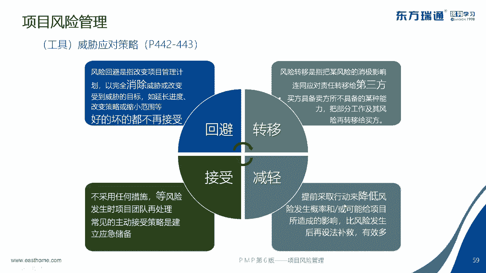

记在心里。啊，大家看一下呢，雇佣有经验的雇员是吧？呃，就是人家是老员工啊。老员工的话，他不会说不完全不犯错是吧？只不过犯错的。几率概率要少一些。采取较低复杂程度的流程。越简单的东西，它越不容易出错嘛。

是吧？概率要低，进行更多的测试。呃，我多次测试，防止漏网之鱼，降低。这个。不合格品的概率。也是概率啊，选用比较稳定的供应商，看到没有？选择比较稳定的供应商，这属于减轻啊。圆形开发是吧，大家如果是IT的。

搞软件开发的就应该知道啊。他也属于降低概率。进行培训也是降低概率是吧，伸手变成熟手啊。只有这一个加入冗余部件，这个属于降低影响啊，这个属于降低影响。比如说我以前面色的时候，我就喜欢煮这个例子是吧？

已结婚，请你朋友、同学。他的奔驰车作为你的分车，但是他不一定能来呀，是吧？那这个时候呢我就加入一个冗余倍件。哎，我找另外一个同学的这个奥迪车做一个备件。是如果他的奔驰车实在来不了。

我就用这个奥迪车作为分车。是吧啊它只能降低影响啊，奔驰多好嘞，是吧？奥迪就差差一些嘛，所以说7种啊7种形式一定要能够心中有数啊，一定要心中有数。

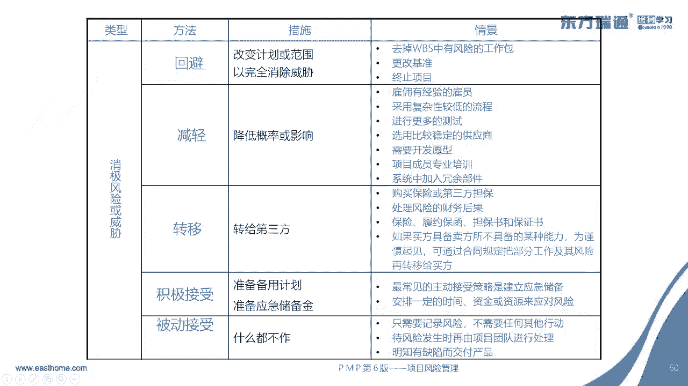

好，减轻考的比较多啊。接受。哎，这个就跟刚才一样一样的啊是吧？我知道这个威胁风险的存在。是吧，但是我现在没有。任何的应对策略。应对措施为什么没有呢？因为这个威胁风险。级别很低，很小。

对我造成不了多大的伤害。我可以硬扛。或者说我目前没有经济有效的策略，等到以后可能会有是吧？同样也分为主动接受和被动接受，主动由储备，被动一直监控着等待时机。

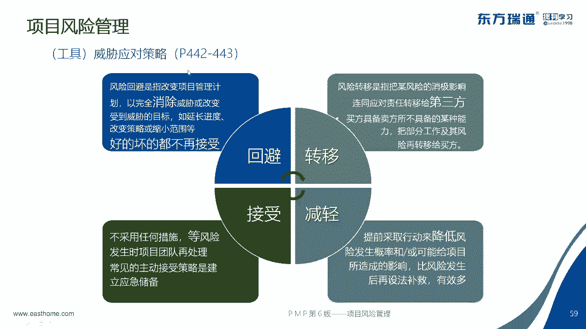

好，这个两个重点啊，这两页一定要打上星号，绝对必考，而且是吧题目还不见得很少啊。呃。这个。这个是机会和威胁啊，还有一个整体的整体的，我就说一下算了啊，整体大家需要注意啊，没有上报没有上报。是吧。

所以说他只有。呃，回避。和我们的开拓结合在一起。因为回避和开拓呢都是针对那种高优先级的风险。提高和减轻凑在一起。因为他们都是为了改变风险的概率和影响。是吧。分享。和转移结合在一起。

因为他们都涉及到第三方啊，涉及第三方合作是吧？然后接受是吧，差不多的差不多的啊，没有上报，就整理风险的应对策略里面没有上报。好，我们来简单的把这个三个工具简单说一下，知道它是怎么回事儿就行了啊。

备选方案分析，我们在制定应对措施的时候呢。肯定不止一个方案，要好几个方案是吧，好几个方案。那么选择最佳的。哦。方案是我们背景方案分析的目的。就这几个方面我们比较一下哪个方案是吧，效果比较好。第二个。

成本效益分析成本收益分析啊，因为应对风险是要花钱的是吧？成本收益分析呢主要是考虑成本的因素是吧？看这个成本。合不合适啊，哪个成本最低？决策这个地方的决策呢是多标准决策分析，是一种群体决策是吧？

大家呢一起来讨论决定选哪一个方案。好，这是选择效果好的，只是考虑到成本因素或者选择成本低的啊。然后啊。这个题目我们看一下吧。啊，这个题目看一下。嗯。他说，以下的风险。有哪一类风险应对措施没有涉及到。

我们看一下啊。外包。外包属于什么转移是吧？购买保险属于转移，置之不理，那就是接受是吧？把工作包分配给有经验的人，这属于。减轻就是缓解啊，在项目中增加测试的次数属于减轻降低概率是吧？增加应急储备属于接受。

对员工进行更好的培训，属于减轻中的降低概率。所以这几种都遍绿了之后，我们发现没有规避啊，没有回避。这个题目呢还是很有代表性的啊。好，下面的题目呢，大家自己做一下啊，我现在看到一下时间只剩下10分钟了。

是吧，自己做一下。因为1际章内容确实不少啊。好，输出的话呢，这个地方有4个概念，大家一定要清楚啊。就是应急计划和弹回计划。应急计划呢可以认为可以认为是主应对策略的补充策略。呃，就是我们有了主营的策略。

但是我们呢为了防止一些突发的呃情况出现，我们呢搞一个补充计划是吧？弹回计划，那显然就是弹回到原处是吧？当主应的策略无效的时候的一个备用策略。哎，我们把它滚回去，弹回去或者要第二方案啊第二方案。呃。

弹回计划和应急计划呢，一般都配有触发条件和预警信号的啊，这个我就不多说了。次身风险和参与风险这两个概念要理解是吧？残余就是我们实施了应对之后，但是还是有一定的影响没有消除掉，这叫残余。比如说感冒了啊。

打针吃药了是吧，症状明显的改善，但是还是有一点点感冒的症状，这叫残余是吧？次身就是我解决了这个风险呢，结果冒出那个风险。啊，这就二次风险，次生风险是吧？显然啊残余是。残留原来的风险。

次身呢是一个新的风险。是吧这几个概念要区分开来。OK好，11。6呢比较简单，实时应对这个是第六版新增的一个过程是吧？新增这个过程呢，我们主要注意三个点就可以了。第一个点呢就是。嗯，第一个点就是。

为什么新增这个过程的原因？就是为了引起我们风险管理的重视。不要呢有计划有策略，结果不去执行是吧？所以你看呢在工具里面有一个发挥人际关系的影响力，让大家能够主动的去把这个应对。做了他执行到位啊。

这是第一点。第二点呢就是这也是大家平常讨论最多的是吧？我认为是这样的啊。前面的。前面一直到11。5都是规划过程，都是在做计划是吧？都是做计划，而风险呢是有可能发生，有可能不发生的，是有概率的是吧？

所以它的所有这些计划呢呃所以这计划呢不可能纳入到WBS中去。答辩还是什么是范围基准的，是必须要做的了，是吧？而我们这些应对策略呢是属于计划，是属于应该属于计划外的啊嗯，属于基种外的。但如果一旦风险发生。

我们采取了应对策略之后呢，我们就正式要把它纳入到我们的WBS中去，就通过什么。发变更请求是吧，发变更请求。好，发辩更请求。好，这是第二点啊第二点。呃，这个。大家很容易在这个地方产生疑惑是吧？第三点呢。

就是。谁去主导这个风险应对？风险责任人呢是吧，风险责任人牵头入住这个事情，并且对应对的结果要负责的。啊，要负责的啊。好，这是11。6，最后11。7。监督风险。

监督风眼呢要干的事儿特别多啊要干的事儿特别多啊。那么第一个呢，就是他要去监督风险应对措试的实施。那我看你有没有去做是吧，风险栏有没有做。第二个呢，他要。嗯。识别和分析新风险。

所以说我们发现呢识别风险不一定是在11。2中啊，10。7中通过监控也是可以识别到新的风险，并且呢识别之后还要进行定性定定性啊，有可能还要进行定量分析是吧？也要要要做规划应对。第三个呢就是要。跟踪。

再评估。哦。已识别的风险就是风险可能会存在变异变化是吧？以及呢建接明细的特点。那我们在跟踪的过程中呢，我们看看有没有变化，有变化，我们要进行再评估是吧？如果说建定明细呢，我们就有。

好更好的应定的策略可以进行更新。第四个要做的事情呢就是。评估风险管理的有效性啊。好，这个我们后面再详细的说啊。呃，输入就没有什么好说的，我们主要是关注四个工具，这四个工具啊都要画重点标记。尤其是。

尤其是这两个工具。好。先看一下啊先看一下储备分析。我们在风险监控的过程中，要经常去比较储剩余的储备和剩余的风险，这叫储备分析是吧？嗯，再比较一下剩下的钱，剩下要应对的风险哪个多哪个少是吧？嗯。

但是一般情况下啊，随着项目的进行。是吧储备应该是比风险多。这个前面说的啊，因为有些风险它确实是没有发生是吧？有些风险通过我们有效的应对呢，钱可能还结余了。好，那如果说你的储备有多的，你就应该去释放他。

为什么呢？因为储备是。对应到我们的工作包的。是专款专用的是吧？嗯，大家应该知道啊，财务里面个专款专用是吧，你不能挪用啊，你不能挪用。好，这是储分分析，了解这么多就够了啊。😊，我们再来说一下第二个审计。

这个审计大家明确两点。第一点呢，它的定义啊，检查风险管理过程的有效性。注意啊，它是审查管理过程的。这个就特别跟我们的质量审计相似是吧？质量审计也是审过程，看你有没有呃按照计划去执行合不合规是吧。

合不合规。好，这是第一点啊，要注意它是对风险管理过程的有效性进行评估，进行检查。那么第二点呢，你要大脑中有一个概念，就是我们的PMP有三大神级。质量审计啊质量审计8。2。风险审计11。7。采购审计12。

3。是吧呃，等大家都复习完了，或者说都学习完了之后，要把这三个审计呢做一个归纳啊。好，再来说一下这个技术技效分析。技术绩效分析主要是将已实现的技术成果与。计划中的技术成果进行比较。

它哪些已经实现了实间的程度怎么样是吧？因为大家知道啊技术成果。他肯定是有风险的是吧？那我们做的怎么样，我们实现的怎么样？要把两者呢做一个分析。大家需要区分一下啊。呃，风险的技术分析和风险的技术技效分析。

这两这两个字之差啊。差别就很大了是吧？差别就很大了。啊，最重要的还是这个。风险的状态审查风险状态审查是通过会议进行的，他干的事情挺多的啊他干的事情挺多的。嗯。是吧。

那么第一个事情就是要去审查风险实施应对的有效性。注意啊，这句话需要跟上面这句话区分开来，上面是审查什么呢？风险管理过程的有效性。是吧。而下面我要说这句话是。去审查风险应对措施实施之后的有效性。简单的说。

就是我去应对实施了。效果怎么样？有没有刺身有没有残余？如果说有大量的次生和残与风险，那就说明这个效果不好是吧？以后呢这个应对措施要改进。好，这是第一个啊第一个。第二个呢就是要进行已识别风险的再评估是吧？

前面已经说烂了这个词了啊是吧？因为风险它会变化，风险项目有见定明细的特点是吧？所以要进行再评估。第三点呢就是要识别和分析新风险。我们在监控的过程中可能会发现新的风险。发现之后也要进行记录。

也要进行定性分析，也要进行规划应对。就第三点啊。第四点呢，就是。我们要关闭已过时的风险。啊，因为有一些风险呢本来应该在这地方发生的，但是它没有发生是吧？或者说已发生过了以后不会发生了那这样的风险呢。

我们要来关关闭啊，不再跟踪它了，而不是删除啊，删除是把记录都消除了，是关闭它以后不再跟踪啊，不再管它了。第五点呢，要总结经验教训。是吧嗯，风险应对啊，要总结进行教训。好啦，那我们风险管理的监控。

四个重要工具哎，非常重要啊，这一页一定要打星号，绝对会考的是吧？绝对会考的。好了，那最后呢是两个图，这两个图大家自己去看啊，一个图是风险应对的全流程，这是风险怎么去应对是吧？第二个是风险管理的全流程。

这个更复杂啊更复杂。所以大家一定要重视图，要做到心中有图，这样才能够掌握的比较全面是吧？因为很多的PMP考试题目呢都是按按照流程去答题的啊。OK那今天的内容呢。呃，就跟大家讲到这里。

大家有什么问题或者有什么需要了解的啊，我们留下来讨论啊，留下来讨论。好，北方群里面啊。呃，关于前面这个题目呢，我觉得啊呃再不去讨论它了。因为说实在话，CD和A应该说都有点体现什么呢？体现这个11。

3的工作。但是如果说按照11。3工作的这个顺序来的话呢，呃这个排列优先级是最后一步是吧？只有把前面的工作做完了之后才能得出优先级。所以我个人还是认为啊这个答案是有问题的。好，来看一下。看一下这个啊。

一个施工项目签订的总价加激励的费用合同。项目经理发现由暴雨期象出现延期的高风险。在执行阶段不会发生。暴风雨。更新风险日志。这个风险日志其实是风险登记测啊，在下一个风险审查会议上面。

应该提出什么样的应对策略？这个。这个应该选择啊应该选择A一呗，是吧，它不会发生。他不会发生你要接受呗。是吧。你看看他以前是一个威胁风险，是一个威胁风险。但是后来呢建记明细天气预报呢说它不会有这个暴风雨。

没有这个威胁了，它就变成一个机会了，是吧？或者说他即使不是一个机会，但是我们坦然接受就可以了。呃，看不出任何分享，也看不出任何提高，也看不出任何开拓。啊，所以这个答案选A没问题。没问题啊。

坦然接受就可以了，是吧？项目产品是一种软件，可以提高当前和未来项目的效率。你看这个题目就非常典型。我刚才其在讲的过程中就提到过是吧？你看有一种软件，它可以提高当前我们的项目和组织未来的项目的效率是吧？

好事儿啊，是吧？好事儿啊，所以它是个机会啊。呃，它是个机会风险，因为为什么是风险呢？你掌握了这个软件，你就把握了这个机会。你没有掌握这个软件呢，这个风险机会风险你就没有把握住嘛，是吧？

所以他就说啊这个新软件大家都不会用是吧？我用随这个风险啊。是个机会风险是吧？项目经理决定派遣高级工程师，看到没有？关键词啊，关键词高级工程师高级工程师是可以认为是我们组织内我们项目内比较流最流的啊。

最好的资源参加这个培训。那你派他出马的话，那就基本上一定可以把它学会嘛，是吧？一定掌握，一定可以用于未来的项目提高绩效。所以它应该是属于。开拓啊属于开拓。好，您的疑惑是说，它为什么不属于提高是吧？啊。

这么理解呢似乎有定道理是吧？嗯，但是我们一般认为啊高级工程师就是组织类的最优资源。我们项目经理把我们的看家的。😊，压箱底的东西都拿出来了是吧？其目的就是为了确保这个机会的发生。那这一系列。

行为动机和特征啊都符合开拓的特点。所以选开拓，不要选提高啊不要选提高，提高这个这个劲头不是很足啊，提高就是是吧没有下血本是吧？开拓是下血本的啊，开拓是下血本的力度不一样。O。PPT呃PPT不发PPT啊。

公司规定是不能发PPT的。呃，我稍后把这个思维导图发给大家，我觉得那个思维导图呢比PPT还好是吧？马上发给大家啊。好，北方群看一下南方群有没有什有没有什么问题啊。呃。哦，蓝万群还没有什么问题啊呃。

成都班的理工现在可以了是吧？Car。如果是那个地方卡的话，可以看一下回放啊，回放它是不会卡的，把那个地方补一下就可以了。嗯。呃，这个刚才已经说了了啊，已经说了了，就不再多说了。PPT的风险线。这两图吗？

把，这两个图截图丢到群里面去吧，应该大家都有的啊。应该是都有的。好，我再把思维导图发给大家啊，大家有问题可以继续。提出问题啊。思维导图。啊，应该是这两个啊，风险管理的思维导图。有导图工具的啊。

用导图工具打开，还可以呢进行补充和修改。那没有思维导的工具的，就只能使用PDF去去用了啊。培训教材。培训教材255页的练习题。第二题。能截图出来吗？培训教材是偏不可吗？我不好定位您那一个讲义的页数啊。

因为每个每个老师讲义的页数是是不不一样的。即使上海班当时是我讲的，但是我是把它分成了一个一个的文件，打印的时候是合在一起的啊，完工。麻烦截个图。哦，好的。提醒的对啊，谢谢你。嗯。练习题的第二题。好。

我看一下啊。啊，好，这个题说一下。唯一的原料供应商有50%的可能性延误计划的交货时间。呃，这是一个决策数的分析题目啊。呃，首先。你看啊唯一原料供应商50%可能会延误，那就另外50%是不会延误的是吧？

所以他这个题目呢只跟你说了一个概率。那另外一个概率呢就要通过你去推导了是吧，通过你推倒那另外概率50%啊。现在有200万的采购订单，如果延误的话，罚款60万。请问他的预期货币价值是多少？好。

那我们知道啊预期货币价值的计算呢，它是概率乘以这个。概率乘以那个路径净值吧，是吧？嗯，好，首先我们看一下啊。第一种路径。第一种路径呢就是不会延误。是吧不会延误，不会延误的可能性不会延误的概率是50%。

Cheng以i。不会延误的话，那你就得按照采购订单的实际金额进行支付。那就是我们付出的成本。是200万。乘以200万啊。这是第一个啊第一个路径。加上啊，因为这只有50%，另外还缺50%是吧？

第二种可能性。延误啊延误。他的概率也是50%。那么如果发生延误，我们应该支付多少钱的成本给供应商呢？呃，应该支付200万。但是呢因为他延误了，我们要给他罚款60万。所以真正实际的支付是200万。

减去60万。好，最终这就是我们这就是我们的预期货币价值。那你可以算一下啊，前面的50%乘以100呃，200万是100万。后面的200万减去60140万，140万的一半是70万。所以正确答案选择C啊。

正确答案选择C。选择C。为什么这个地方要相加是吧？只有你把各个路径的啊。都加起来，这样才能够形成。百分之百的概率是吧，百分之百的概率。好，这个题目呢大体上就是这样的。是的，导图工具使用的是这个软件啊。

就是用这个软件。这个软件各位如果说在网上下不了电脑版，可以在手机上面使用APP。使用APP啊APP可以看哎，它不收费的，可以看免费的啊，也可以简单修改也可以简单修改。好，王工这个这个题目。还有问题吗？

啊，延迟好长时间呢。啊，大家还有问题都可以把它发到微信群里面去啊。课件发一下。不能发了。这个课件是不能发的啊，大家以前是有打印版的，有打印版的。

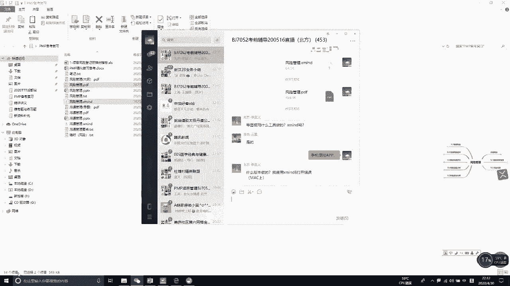

什么版本做的啊，我看一下我这是什么版本啊。这个版本呢？这个版本做的。哎，应该最新版应该是没问题的啊，我看一下到底什么版。啊，这个。我就是。就是在网上下的网上下的啊。哦，这个2020版。

就在应用商店里去面找啊，就找这个就找这个。应用商店里面找就可以找得到啊。呃，不是这个不是这个不是这个。我觉得这个挺好用的啊，特别高效。特别高效。我今天我我做这个思维导图呢。

就做这个思维导图这个文件这么大一个文件啊。我只发了半个小时。是吧我只花了半个小时，我把现在的资料复制粘贴挺快的。太太方便了啊。我以前是用那个思维导图软件做的，是用是用这个这个思维导图。

我现在觉得这个更好用一些。非常方便啊。是吧这内容。嗯。

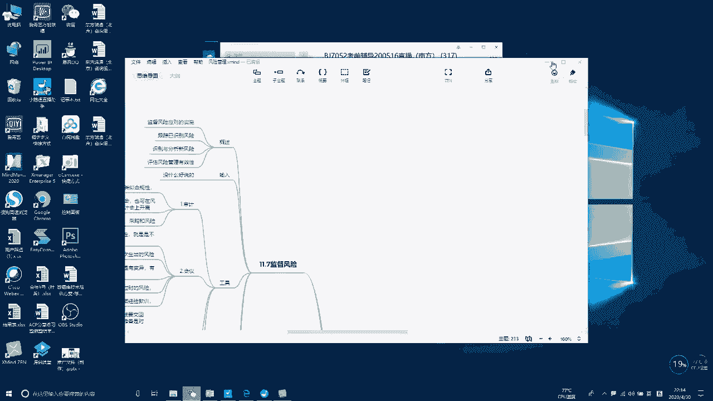

当然也可以在这个软件里面使用大纲式的方式进行查看。这种方式查看呢也感觉挺不错的啊。嗯，把思维导图用起来吧。不收费不收费啊。手机不收费，电脑版的。呃，你到网上去找。我去找。哈。大家找的版本各不一样啊。

不要紧，能用能打开就可以了，是吧？😊，呃，不光是我们这个复习。要把思维导图用起来，平常工作中生活中也可以用一用吗？思维导图要用成一个习惯啊。其他几又在问这个问题啊。

其他几张的思维导图是这样的那只有老版本。现在因为我是要跟大家负责后面四个章节的课，所以这个思维导图是新做的啊，是新做的。好，我我我我发出来吧，管的老版本大家也可以用一用啊。上次发过来的，我再发一次啊。

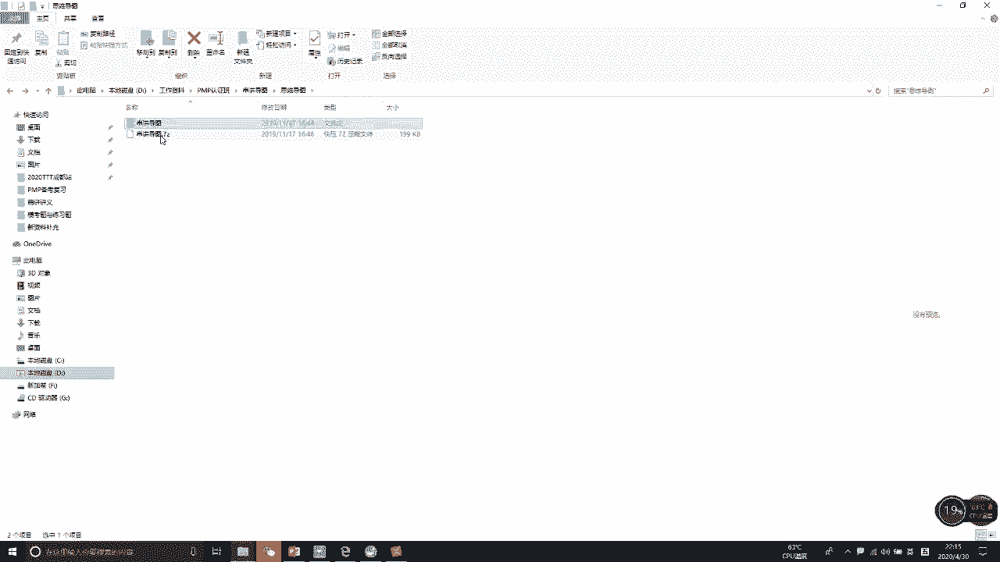

好，这是个压缩包啊，大家去去解一下就可以了。呃，八打不开就就找更高版本吧。那。这个我也不知道哪个版本能打的打的开啊。

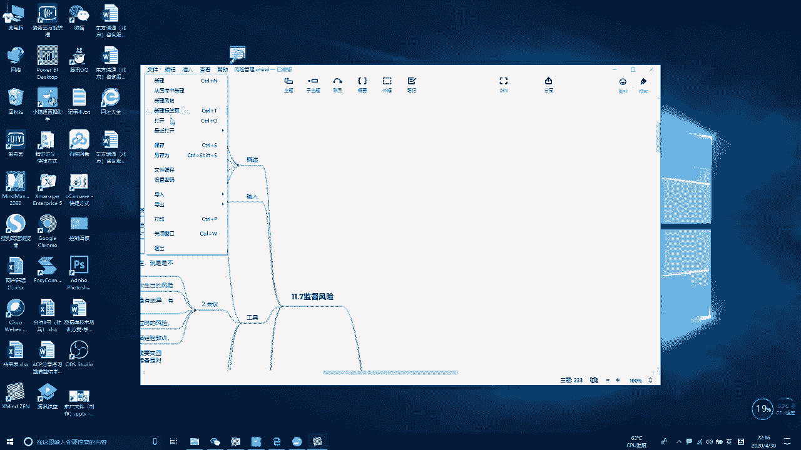

因为我在。保存的时候。保存的时候我看一下啊，是不能选择类型的，看到吗？是不能选择类型的。嗯，好的，我真有此意啊。啊，大家一定要紧张起来啊，前面一段时间是吧，离考试还有点远，你现在真的离考试很近呐。

就只有一个月的时间。呃，大家五一放假了是吧？去玩一玩，休息休息。就就到了5月几号了啊，再到6月6号，就只有真正只有一个月的时间呢。好，又有一道题是吧？一名关键项目团的成员生病，将影响项目进度。

在分析可用项目之后。应该说在分析可用项目资源之后，项目经理决定将项目进度计划延迟一周。这典型的啊属于回避。典型的属于回避啊。改计划了嘛，是吧？典型的回避啊。那进度计划延迟一周。改计划了。但是我也说过了。

个人认为啊。回避的话容易产生。次生风险是吧？这种风险。不是选C和选D啊不是选C选D。C的理论依据是要降低概率，降低影响。这个降低概率降低影响在题目描述中题干描述中是。完全不能体现的。

所以选C是没有道理的。第。D，你说我选择接受是吧？那这个呢勉强能对得上，但是肯定是没有A。好啊，没有A贴近T，贴贴近T一是吧？嗯。你看关键。地方就是进度计划推迟一周嘛，是吧，改计划了改计划了。

所以他明显的指向回避啊。呃，所以啊所以你看啊你们一定不能说光止听课，真的啊。要去把书看一下。要去把那个P部可看一下啊。偏安不可才是我们考试也好，做题也好的。根本依据这是根本依据啊。就是你听课的时候。

或者你看讲义的时候，可能会有一些怎么理解上面的偏差。但是如果说你要消除这个片差的话，是应该去看书的那你可能我最后面最后一本书我哪有时间看呢？找重点看找重点看啊，就比如说我们在讲课的过程中。

老师标了重点的地方，或者说你认为。不是很清晰的地方，你一定要去找书进行求证，看书进行求证是吧？呃，这样就不会理解存在大的偏差。哦，看一下啊。这个是选择开拓。派遣了高级工程师。首先啊它能够提高效率。

这是一个机会风险。是吧是一个机会风险。呃，首先你就把它分到机会风险应对这一块里面去。然后呢，它的关键词是派遣了高级工程师参加课程，那就是志在必得了。呃，我把最好的加底儿都拿出来了，我志在必得。

我确保这个机会能够发生，能够抓得住。所以要选择开拓啊，不要选提高。那你不要认为哎呀，我拍个高级工程师，这个高级工程师他有可能掌握，有可能他怎么没掌握是吧？不要这么认为啊，一定要跟那个。还是那句话啊。

要跟那个PM book的书去结合啊。你看一下呢，我给你们看一下讲义里面啊，讲义里面其实真的要。看讲义。呃，看看书啊，看片部可书。大家看一下啊呢。这书的截图是吧？啊，这是整体的啊，搞搞不好意思。好了。

这个还看不了啊，看不了，没有截图。没有截图还去找是吧，大家去找一下书上面吧。

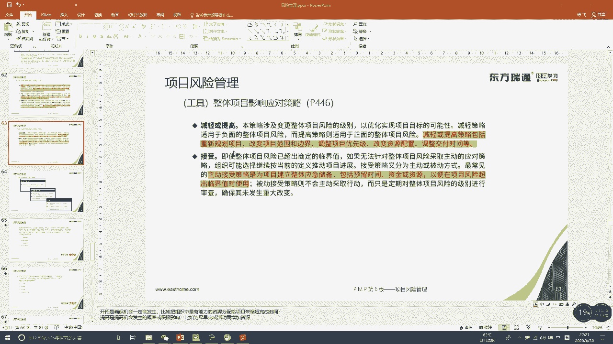

找一下书上面啊。书上面是有这么。一句话的是吧，使用组织的。最优的资源。呃，最好的资源我刚才也说了，高级工程师肯定是属于组织类或者项目类最好的资源是吧？最好的资源。嗯，好的。所以说还在看书啊。

书的有很多关键细节。是可以把这种模糊的东西做澄清的。哦，怎么现在要打开了？好，打开不更好吗？这个是另外一个思维导图，这个格式是另外一个思维导图工具。就是我以前是习惯用这个。用这个啊。这个。

现在发的是用这个。这是两个不同的。软件。😀H。😊，好，大家还有问题没有，有问题赶紧发出来啊，赶紧发出来。😊，我有个感觉啊，大家在做每日一练的时候呢，是越来越。呃，越来越厉害了啊，有很多的问题都。

把它扒出来了是吧？这说明大家精进了啊。好的，大家有没有问题？没有问题，那我就结束今天的没有问题，就结束今天的直播了啊。有问题以后就在。群里面。发出来，大家一起探讨啊。我们。好。呃。

班主任老师和大家都辛苦了啊。那今天就到这里就拜拜啦。

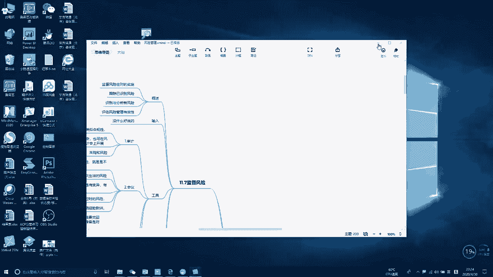

mm。大家辛苦了。嗯嗯，专家级。啊，专家也是最优资源嘛，这个不矛盾啊。专家也是最优资源，高级工程师，他也是最优资源。但是我们做题的话呢，一定。刚才也说了啊。呃，最终解释权是在这个偏不可这本书上面的。

所以你在做题的时候一定要去找关键词。一旦出现的关键词跟偏不可是高度契合的情况下。那就不存在争议了，是吧？所以说高级工程师是自由资源，这是毫无争议的啊毫无争议的专家当然也是好资源呢。好的，嗯。

你们也辛苦了啊。我找一找吧。嗯。这个。好，大家看一下啊。嗯。开拓措施可能包括把组织中最有能力的资源。最有能力的资源是吧，看了吗？呃，高级工程师。应该算是最有能力资源了啊。

如果说你连高级工程师都不算是最有能力的资源的话，那就没有什么是最有能力的资源了。啊，这个相信我啊，高级工程师的出现就是。开拓啊。好了。那我们的刘老师辛苦了啊。我就停止直播了。

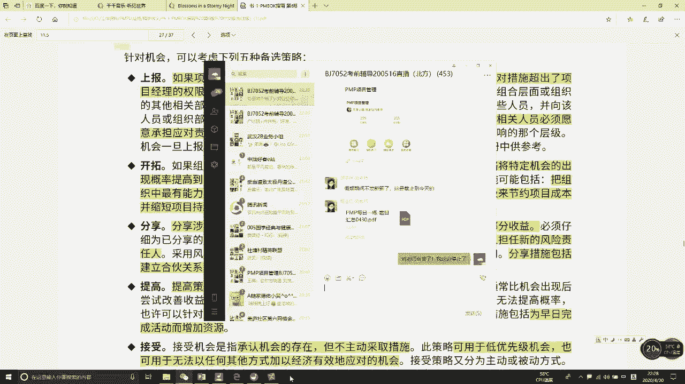