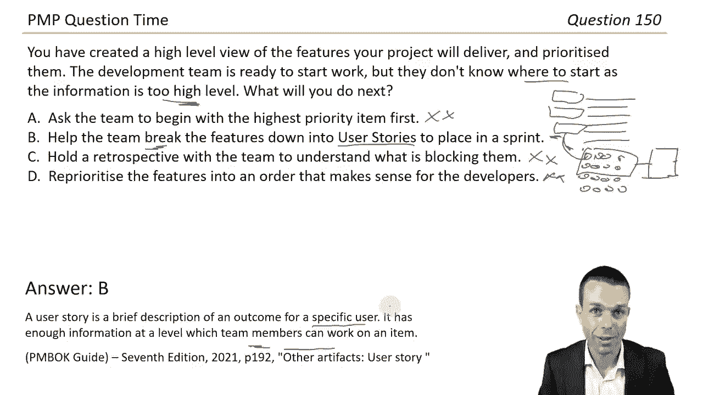

# PMP情景题答案解析（第七版；纯英文） - P1 - 顶顶顶天立地 - BV1Sm411S7Cr

🎼Hi everyone welcome to this set of 150 PMP questions and answers the questions and answers have come directly from the Pmbook Guide 7th edition making this a great way to prepare for your exam or just a great way to brush up on your project knowledge or your project management information and especially because these questions are scenariobased you'll find that they appear as reallife scenarios so it's a great way to just check and see what else is happening out there in the real world and how it matches up to that latest Pmok guide this is an absolutely fantastic way to prepare for your exam and I cannot wait to share this time with you by spending this time preparing I truly believe that you can pass the PMP let's get into the questions。

😊，You have been assigned to a new project where the work is behind schedule and the team are not working together well the team is relatively new and conflicts are arising team members are blaming each other for the work not done and some people are not showing up to work on the project at all Okay wow gosh what will you do next so it's hard to have a project if we haven't got people coming to work with us and sometimes this is hard because we've got you know we may not own these resources。

 we may be borrowing them from certain functional areas in the business or an organization。

So what are we going to do here Okay meet with the functional manager of that area to agree on team members time requirements know that could work but also conflicts are arising and the team is also relatively new so you know how are we going to manage that I think there's probably better answers there meet with your team to set a charter team charter and define roles and responsibilities that one sounds actually quite good because then we're getting into what they're responsible for what their role actually is sometimes that's unclear and also a team charter how is the team going to work together we're starting to move into an agile know agile terminology here so the vision you know the escalation points team roles team responsibilities I actually think that's a pretty good one let's see what else we've got meet with the project sponsor to gain additional funding for resources who can work together you know what even if we change the resources it's not100% guaranteed that they're still going。

Work without conflict。 Projectject are difficult situations。 And so， you know。

 conflict is going to arise。 It's up to us to manage it as project managers。

 It's part of the wonderful job that we have at last escalate the issue to the steering committee。

 Wow， escalating it even further as soon as possible as a project risk。 Okay， well。

 it's already happening。 So it's more of an issue。 I think know， probably could be could be a risk。

 for future scope or schedule issues maybe， but I don't think we really want to escalate this to the steering committee without managing it first。

 and we manage it by answer B， I think let's go with that。There it is。

 the standard for project management asks that we create a collaborative team environment。

 including team agreements， definitions of roles and responsibilities。

 formal committees tasked with specific objectives So really specific things they need to do Stan meetings that regularly review a given topic So all of those things create a collaborative team environment page 28 and 29 in the Pibot Guide 7th edition under creating a collaborative team environment。

 How did you guys go with that one First one。 there's many， many more。

 It's going to be fun And also I think that wasn't too bad。 So I think that was pretty good start。

 Let's see what we've got next。😊，You have recently completed a project for a new product and have been asked to manage it after its release to keep it relevant in today's marketplace。

 sounds like a product owner role or a product manager but perhaps half of your existing team are rolling off to other projects so we're on a project now but we need to keep the product relevant So we need to keep releasing features potentially to make sure that it's up to date What are we going to do next。

 The project budget is nearly depleted。 I don't think we'll manage this as a project。

 This is probably something that we go into more of a stable team or business as usual and then release continuous features。

 I think maybe again moving into an agile sort of way of work here let's see what options we have create a business case and a project charter for your project sponsor to approve but would be if we had a specific project in mind but I really think this is more about product。

Retain as many of your current project staff to continue work on the product。 That could work。

 but how are we going to do that， We're going to need money here。 You know。

 these things just don't magically appear。 People also may be rolling off the project as they say。

And there's no more money to pay them。 so unless we can pay them with love。

 I don't think that one's going to work。 raise a change request for your current project and add scope and continue making changes to add scope and continue making changes change request again probably not the best and I see probably answered D I think is probably where we're heading though secure funding for a stable team。

 That's what we were saying。 then use current research research to form a suite of projects to improve the product So this is where we're continuously releasing features to improve it over time。

 and we have a stable team So they become really， really good at that particular product I think we're going to go with answered D。

Allright， there it is。 This question is referring to product management。 Hey， that's good。

 We got that far。 Product management involves the integration of people。

 data processes and business systems to develop or maintain a product or service throughout its life cycle and of course。

 you know over time it may eventually finish the product may be retired and then then we can roll off and move on because we're not needed anymore under page 17 to 19 under product management considerations in the Pumark Guide 7th edition if you wanted to check that out for yourself。

 How did you guys go with that one I thought that was really， really good Let's see what we got next。

😊，You're delivering a critical change and several key stakeholders in your organization have added seemingly unnecessary steps for you to take with extra approvals。

 reports and meetings they're also restricting the people you need from working on your project in a larger capacity so again this is because if we don't own those people necessarily and they're coming from other functional areas in the business sometimes we don't have 100% control over those people and they may not end up working for us full- time what will you do next so we have to manage that we have to manage these things and this is great for the real world as well。

😊，Go directly to the people you need to avoid extra back and forth with the stakeholders so if we go directly to the people that we need they may agree to come and work for us。

 you know we could probably convince them but then what happens when their boss finds out and their boss you know that's probably going to be a more difficult situation to manage because now we've gone behind their back so you know I think you know。

That's probably the easiest way， but it just won't work in the long run because of that reason。

Raise a risk in the risk register on the lack of access to sufficient resources。Sure。

 maybe yeah we could raise a risk I mean that's a low maybe though if we're just raising a risk how are we're going to manage that risk so you know maybe there's a better way here。

 communicate more often with the stakeholders and gain a deeper awareness of their ideas and situation Okay communicating always good it's a large part of project management is this going to solve what we're after here。

😊，You know they're restricting people you know what communicating what does communicating do it helps with people's engagement this could be an issue with our stakeholder engagement actually and so if we're communicating more finding what their ideas are and their situation is maybe there's good reasons for them restricting the people or slowing down the project or maybe they just don't feel engaged or involved enough so communicating always helps there that's a high maybe for that one let's see if there's a better one just in case show your stakeholders the resource assignment matrix and project roles and responsibilities。

I think that also could be good。😊，So then we're just sort of saying look here it is。

 you know this is what you agreed to， but the thing is they may agree to it but they still may not do it because they're not engaged so I think if we're going we could win their minds by this for example。

 we can force them to do it but if what's that saying those convinced against their will are of the same opinion still so I think if we haven't won their hearts you know from that perspective we need to communicate more often let's go with that one。

 I think end toy。Okay this question refers to the principle of effectively engaging with stakeholders stakeholders may add steps or requirements or restrict team members if they're not engaged appropriately communication and awareness of their ideas through knowledge sharing and regular meetings ideally face to face may help and this is directly from the Pubro Guides 7th edition as well you've got page 32 and 33 under effectively engaging with stakeholders All right well so that was a little bit trickier and a bit of the soft skills there that we need on our projects let's see what we've got next you're managing a project team made up mostly of men Recently Jane was hired for her high high expertise in the brands that make up your industry so we've got mostly men and now we've got Jane well I mean what's going to happen here hopefully nothing crazy but you notice she has been left out of some key meetings and others are overlooking her opinions you also notice she has paid significantly less than her mail colleagues。

You do next wow okay tricky situation this one and I think for us as a project managers you know how do we manage this as managers and leaders you know we want to go for fairness I'm pretty sure so that things don't come back and bite us down the road and that people stay engaged and they see that you know we're acting fairly as well I wonder if there's an option here So make steps to update her pay to the same range as the others on your project and ask her opinion and advice specifically during each meeting along with others in your team well that covers pretty much everything doesn't it so I don't know that one's pretty obvious I think if we can act in a you know that's quite a fair manner I really like that one let's see what else we've got just in case take the lower pay as a win for your project as it will help keep costs low and her colleagues don't need to know wow okay you know what and you know what this will happen in the real world as well but what happens when people find out engagement。

Goes through the floor and then people leave and they take all that all that product knowledge with them at the same time。

 and then you have to hire someone。 trust me it just it's not the best scenario definitely a no for that one for those reasons you have to look at the bigger picture here。

 ask Jane to write down her knowledge of the industry just in case she leaves you know I mean yes。

 we would do that anyway I think I think it's good to capture some of that information but are we still acting fairly I would prefer I would prefer to still act fairly here。

 So no need to rock the boat。 This is just how people work in this industry Again。

 you know some people will just carry on with the status quo in the real world that will definitely happen but for us if we're gonna to be true leaders true managers。

 Let's go for the equality here。 I think let's go with answer A。Okay。

 this question is on integrity and stewardship。 This is good。

 We should have respectful engagement of project team members， including their compensation。

 access to opportunity and fair treatment and by the way。

 this can happen the opposite way as well you know you know it doesn't have to be a manwoman thing this can be just someone who's not assertive enough to ask for a higher pay you will see this happen all the time。

 So just something to be aware of and when people find out that it's not equal know then that engagement really does plummet。

 and that's what we don't want。 we want things to stay high engaged with our team members So that's really good page 25 be a diligent。

 respectful and caring steward That's a really nice principle Okay let's get into the next one during one of your work group meetings working group meetings。

 a stakeholder raises the concern that the product you're working on will be discontinued in the next five months。

 you are not aware of this and your project budget has already been approved until。

All the scheduled delivery， which is in five months。 Also。 Okay， hang on。

 discontinued in the next five months。 And we're delivering a project。

At that fivemon mark as well that's probably not a good thing。 what are we going to do next。

 Of course， another tricky situation for us to manage using our project management skills。

 let's see what we' got keep the project going as it is the discontinued product isn't your responsibility and you know what maybe it's not maybe you know maybe it's someone else's responsibility but also that stewardships thing again。

 you know can we do the right thing here So let's put a very low maybe maybe quite a no for this one set a meeting with your project sponsor to share the information probably good and a recommendation to terminate the project wow。

 that's quite full on I mean， I guess that makes sense because it's just why are we even delivering this it actually I think that actually does make sense let's put a high maybe for that one for now and see what else we have just in case。

😊，Change the scope of the project to meet a different product H on so your project can remain relevant you know what projects are usually about your one one set thing there you kick off a project for a particular reason for a particular improvement or a particular change and for us to just completely change that halfway through using the same money I don't think that's really going to work we probably have to kick off a new project ask for additional funding to see if you can improve the product instead of discontinuing it and again。

 look I mean improving it I think an additional funding。

There's a whole lot of rabbit holes that we'll have to go through for that and also it may not work because it actually is just being discontinued。

 we would probably terminate the project and start a new one based on a different set of rules and maybe a different product or maybe you a different scope that we're looking at here。

 I think under this set of circumstances， let's go with answer B。

Okay these are a little bit tricky actually， so this question is about delivering value。

 the primary motivator for a project， exactly if the project is no longer aligned with the business need or it seems unlikely to provide value。

 The organization may choose to terminate the effort。

 Okay so that's good news And remember that's directly from the Pmbo7th edition page 35 focus on value。

 So that's a very good thing to know and understand， definitely makes sense when I see it like that。

 So how did you go with that one， I think a little bit trickier there but still pretty good and we're halfway through this section So this is really。

 really good。 Let's see what else we've got。😊，You've collected the requirements for your project and you're creating the scope statement and the work breakdown structure。

 S statement is your acceptance criteria and just a statement about the scope and the work breakdown structure is breaking down highlevel features into smaller pieces and then ultimately to work packages that people can work on during this process you notice some functionality in your database system that will help a different project that you're aware of in your project management office。

 Okay so we've got our project another project and some of our scope over here actually could help this one over here。

 So what will we do next Wow okay wow， this is really good。

 place the feature in the other project backlog and ask them to prioritize it as soon as possible So we've done this research on on the feature we just hand it over to them and then they prioritize it I mean。

 that's maybe maybe we could do。That I wonder if we can just hand it over like that。

 Do they even want to do it。 Is it even on their scope。

 Do they have the budget for this sort of thing？ So maybe there's more to this tail raise the functionality in your risk register as a threat with the response to mitigate I don't think this is a threat。

 This is more of an opportunity probably I wonder if we've got something in here So definitely a no for that one add the scope to your project and complete it as soon as possible。

 do we just do it Well if we do it you know it's not within our product or what we're working on So our team is not gonna to be the experts on this。

 it's probably better if you know if the team who are the experts in that product actually completed because they'll have the resources specific to that product so I think that's a no for that one as well for that reason raise the functionality in your risk register as an opportunity okay。

 there we go with the response to exploit So we're exploiting the opportunity Probably a good thing and meet with the other project team。

And sponsor to the scarce。I think that actually could be good so I think if it's between that one and just throwing it into their backlog。

 I don't think we have the power to put it into another person's backlog。

 the steps that we would go through first are to talk with them so it would say。

 hey guys this is an opportunity we can exploit this you know and is this something that you were able to work on I don't think we're just going to throw it over the fence we need to talk about at first and I think for that reason let's go with NCD。

Excellent systems thinking。 wow， okay， I didn't know we're going there involves taking a holistic view of how project parts interact with each other and external systems。

 projects operate within programs。 So you've got programs， you've got projects underneath that。

 and then you've got BU layer under that So operations and all of that sort of thing and so small systems affect all of the larger ones。

 finding a previously unknown opportunity。 The next best step is to make it known and to exploit that opportunity There we are in the Pibo guide page 39 respond to system interactions。

 systems thinking page 129 and opportunities there in the Pibo guide 7 edition。 All。

 that's quite good to know。 Let's see what we've got next。 You're working on a high profile project。

 Several high ranking senior executives want to take the credit initiative while limiting the impact to their own resources。

 This has led to several conflict。And a scope statement that is unclear leading to a risk of project failure what will you do next Okay。

 it seems pretty straightforward， another difficult situation obviously maybe something around engagement let's see what we've gone create a scope statement yourself to avoid further conflict okay I mean we can definitely do this but then what if no one agrees to it and the customers that we're delivering to if they don't accept those deliverables then we're in trouble so probably a no for now on that one。

Facilitate a discussion with the executives as a neutral third party。 I like that。 And again。

 this is more of that， know facilitator role， that agile terminology that we will see in the Pmbox 7th edition。

😊，Focusing on agreed project goals， there's definitely a high maybe for that one I think that's pretty good。

 we'll see what else we've got just in case。Limit your project resources to the executives until they can agree on a way forward。

 I mean， maybe， but also if we've got our project resources that maybe they're sort of still costing money and still costing project funds。

 So if we're not using any of those resources， then we're also wasting the project funds。

 So potentially not a good thing I think probably a no for that one。

 escalate the issue to the project steering committee and ask them to resolve the problem。 again。

 for this as project managers， we should be managing this as best we can until we've exhausted every single option。

 And then if we need to escalate it， then we can。 So we'll put a no for that one for now。

 I think out of all of these， the best one becomes option B， let's see what we've gone。Fantastic。

Leadership is not the same as authority。 When senior managers suffer conflict over priorities。

 neutral facilitation helps more than detailed recommendations。 so we could， again。

 we could come up with recommendations for these guys and say， okay， here's what we're going to do。

 But then again， they haven't agreed to it， It hasn't come from them。

 So they're not really engage with those ideas。 If we're facilitating and extracting those ideas from them then potentially we have a better outcome。

 Leadership acumen involves focusing a team around agreed goals generating consensus on the way forward。

 So getting their inputs negotiating and resolving conflict and more all very tricky things to do all of these soft skills that you will need as a project manager and page 42 under demonstrate leadership behaviors。

 a wonderful， wonderful thing in the permmark Guide 7th edition。 fantasticantastic。

 How did you guys go with that one。 I think these are really， really good。

 Let's see what we've got next， there's only three to go in this little section。😊。

You're managing a project where the majority of the product has been planned up front。

But an external system is needed from a vendor in partial pieces where the requirements are unclear。

Half， okay， so that sounds like agile。 That one， doesn't it， So we've got agile。

 but we also have upfront planning。 So we've got our predictive or our waterfall。

So got a few different methodologies here。 Which one will we choose or can we do a hybrid approach。

Half of your stakeholders want to use a waterfall approach and the other half are advocating for an agile approach。

 What will you do next Let's see what we've gone I think if we've got both of those I think we could probably merge those two and create a hybrid approach and that's quite a common thing to do。

 So let's see what we've got Use an agile methodology the fixed scope is low risk and you can capture the changes using agile I think it's probably a better option use a waterfall methodology Okay so it's either one way or the other and ask the team to plan the uncertain scope better again。

I mean maybe a medium for that one， but not great， there's probably a better option here。

Proceed with a hybrid method to start and with preplanned scope。

 but agile ceremonies that promote feedback， I think that's probably one of the better ones。 Again。

 it's that hybrid approach we can combine them here because we've got two differing situations that need differing ways of management。

Use a combination of waterfall and agile to capture all the requirements and keep stakeholders happy。

I think this is really similar to C， except C uses the specific terminology of a hybrid method and hybrid is where we are combining waterfall and agile。

 but using it only where it's applicable。 So I think for all of those purposes， let's go with N C。😊。

All right， excellent。 This each project is unique and success is based on adapting to the unique context of the project to determine the most appropriate methods。

 So tailoring approach is iterative in nature。 Okay wow。

 so we might actually change our tailoring approach over time。

 know what we include or what we don't include， I it more waterfall， is it less waterfall。

 for example， And this project requires a hybrid of waterfall and agile with the option to improve it over time。

 I think that's actually quite good。 So page 44 to 46 under tailoring in the Pimbo Guide 7 edition。

 How did you guys go with that one， So that's a really good one to be aware of project lifecycls when to choose them。

 Lots of hybrid stuff in the PMP exam as well。 Excel work。 All right， only two to go。

 you're doing great。😊，You're working on a project where senior users have been testing the product as parts are released。

 They have found some missing requirements and defects。 Okay， good。

 their manager is worried that the project won't deliver a product that is fit for purpose without defects。

 and within the time frame needed。 What will you do next。

 so we've got some defects we've been testing it。 now the manager is worried about those defects。

 I think how do we manage this。 perform some of the testing yourself to ensure a quality product。

 We may be tempted to do this。 But I think the value in a project manager is where the conductor of the orchestra。

 So you need a conductor to keep everybody on track and to keep that rhythm going， Basically。

 So everyone has their little sections， trumpets， saxophones， xylophones， percussion know。

 would wind all the rest of it。 and they are experts in their area。

 I don't think we need to do the testing。 I guess that's the point there。

 Help every team member focus on quality。From correct acceptance criteria to a developed and tested product。

 that's a very broad answer。 maybe I mean definitely makes sense。 Yes。

 focusing on quality quality is everyone's responsibility in an agile team。

 you will hear that said a lot。 So let's put that as a high， maybe for now。

 limit testing until the very end of the project so you can do it all in one go when the product is completely ready。

 I think for this one， you know this may not work because again， in an agile project。

 we want to test at all levels unit testing on our story cards。

 system testing as for the system as a whole user acceptance testing with the user's eyes on it。

 and then even regression testing where we're testing to see if anything else is broken when we've released a certain part。

 So I don't think we necessarily just want to limit it to the end here。

Increase the testing on your project and add more testing resources so no defect goes unnoticed potentially again。

 may not be the best answer， I think actually looking at that。

I would choose B over D because now the whole team is focusing on quality。

 quality is everyone's responsibility， we're not just throwing resources at it。

 we're actually managing it like we should， I think let's go with answer B。Excellent work。 All right。

 Quality focuses on meeting acceptance criteria for deliverables and satisfying stakeholders expectations on product requirements。

 Quality is everyone's responsibility in an adaptive or agile project。 And there you are。

 you will hear that a lot。 So if there it is again， page 47 to 49 in the permo Guide 7 edition。

 build quality into processes and deliverables。 that section there。 And you know what else is really。

 really good quality is the last question that you've got in this section。

 And the way that you've gone through this amazing work。

 you're doing a great thing for your PM exam preparation。 Let's see what we've gone。😊。

You are working through the risk assessment with your team who are having trouble coming up with ideas for risks。

 You decide to give them some guidance on types of complexity that might affect your new product。

 What will you do next， Okay， risk and complexity to wonderful things that you will see or not see。

 you know， that will definitely be there， regardless of whether we can see it or not。

 in your project。 Ask them to brainstorm qualitative and quantitative risks。Yes。

 that could probably work from a risk perspective， but what about the complexity behind that。

 So what else have we got， ask them to perform the5Y's and Ihiikawa analysis。

 That is root cause analysis to find the root cause of a problem。

 probably not necessarily related to what we're doing here。

Ask them to brainstorm around possible unwanted human behavior， system behavior， ambiguity。

And technical innovation impacts。 So that way， we're gathering risks。

 but we're gathering risks based on all of these things。

 which are types of complexity and volatility。 So you'll see Vuca volatility。

 I don't know what that one is。 gosh， now I've forgotten it。 complexity， ambiguity。

That one will come to me in time I can't remember now if someone remembers put it in the comments。

 save me please and last one ask them to perform a retrospective uncertainty There it is your work to discover what isn't working well and what still puzzles us if you beat me to that in the comments。

 please。😊，Give yourself a thumbs up at the end of your comment。 Well done。

 And I don't think we're going to go with answer B either I D。

 I think C is definitely the best one there From that vka perspective。 I absolutely love it。

 Let's choose that one。😊，🎼And there it is。 complexityity is often the result of human behavior。

 system interactions， technical innovation， uncertainty and ambiguity。

 complexity can be introduced by events or conditions that affect our value。 our scope。

 stakeholders risk and more， which is why working on projects。 There is never a dull moment。

 We always have to deal with these wonderful things and having a toolkit to do that really really helps。

 That's where the PM is just the best thing to do for your career。 page 5051 navigate complexity。

 and you made it to the last bit of this little section well done。

 I absolutely congratulate you for doing that。 And also， I truly。

 truly believe that you can pass the PM with this preparation。

 And with all of the work that you're putting in。 keep working at it every day。

 it's definitely a worthwhile activity。 and it's definitely a worthwhile thing when you do get your PM。

 I truly believe that you can do it。 Youre working on a project where you discover a certain negative risk with a potential。

😊，Impact of $2 million。 Okay， negative risk impact。That's good to know。

 You meet with your project stakeholders who determine that this is within their risk appetite provided that you meet a risk threshold of 10%。

 interesting。 What will you do next。 Okay， risk threshold。

 I'm pretty sure this is the threshold around the impact。 So if we've got $2 million。

 So we've got2 million。 and we want a risk threshold of $10%。 So they're happy with it。

 They're fine with that， but it still has to meet within to within 10%。

 which is an extra $200000 here。Or minus2000， which will be 181。8 million， I think。

 so plus or minus200，000， which is 10% of 2 million。 I think that's what we're going to go with here。

 I know let's see what options we have note the acceptable risk。Level as a threat of $200，000。

 which is 10%。Tricky， but I don't think that's us for now。

 Note the acceptable risk level as a threat of1。8 million to 2。2 million， which is a 10% variance。

 I think that definitely matches up here。And we can potentially go with that。

Note the impact as outside the acceptable risk level of $2 million I don't think I mean they're happy to accept it。

 so I think we're okay there note the impact as an opportunity of $200，000 as well。

 which is 10% again。 So no I think those ones we can discount and get rid of I think we're going to go with answer B here。

All right， good work。 Rik appetite describes the level of uncertainty or risk your stakeholders are willing to accept。

 So they're willing to accept this。 and risk threshold is the measure of acceptable variation around an objective that reflects the risk appetite In this scenario 10% variation A around 2 million is 1。

8 to 2。2 million。 and we've got page 54 in the Pommoine 7th edition under risk directly if you want to check that out for yourself。

 All right， wow， good one to start with risk。 know it's always going happen on your project。

 So that's always good to know Let's see what we've got next。 a risk has been more risk。

 That's just what we needed。 a risk has been raised in your project A aroundund insufficient building materials。

 One risk response assigned to the functional manager suggests to use a brand new material which has not been fully tested before in a building project。

 So that actually could be even more risky maybe So we've got a risk。

Around insufficient building materials， but now we're suggesting a brand new material that hasn't really been tested yet。

 Ha of your stakeholder group are happy with this risk response。

 but the other half are not and refuse to sign off on it。

 What will you do next if the stakeholders that need to sign off if we've still got 50% not signing off on it then we probably can't proceed So what other options do we have here suggest a quantitative risk approach to give a more accurate financial impact As you will know from our other videos qualitative risk is our impact and the likelihood of happening and then we usually multiply those together to get a risk rating。

 but it's a subjective rating usually quantitative is more of your in-depth analysis scenarios and Montelo Monte Carlo analysis that sort of thing big simulations and big financial simulations usually as well anyway。

 all of that to say I don't think we need to do that just yet。

Suggest they proceed with the proposed risk response and ensure it is followed through。 Well。

 we can't force it on them because 50% are disagreeing as well。 So maybe a no for now。

 let's see what else we have just in case， suggest a different risk owner as an executive may have more power to respond to the risk。

I mean， again， someone could force this through， but if 50% of our stakeholders are disagreeing there's may be a reason for that and if it's a brand new building material。

 things could go wrong here so let's put a no on that one for now as well suggest a different risk response as they should be timely cost of oh this sounds promising timely cost effective。

 realistic and agreed to by relevant stakeholders and all those things are for a reason cost effective and realistic。

I think in this case， and people are disagreeing for that reason。 I think let's go with An D。

 I really like that one。Okay， excellent。 This question refers to risk responses。

 Risk responses should be appropriate and timely to the significance of the risk， cost effective。

 realistic within the project context， agreed to by relevant stakeholders and owned by a responsible person。

 Heres the best answer。 And we've got page 54 in the Pomot guide 7th edition under risk again。

 If you want to check that out for yourself。 All right， excellent work。 More risk。

 I wonder how much risk we're gonna have here。 But that was actually very good to know and a good way of managing risk in our project。

 What are we got next。Your project is starting to go off track due to a large amount of uncertainty in the requirements and resources。

 and you know what this will happen all the time in the real world。

 sometimes we need to come in here and help manage it。

 That's why they need us to help get clarity on that scope and the requirements and you know we need to gather that from our stakeholders at a significant cost。

 you manage to rein in these issues Okay， However， your project management office would like you to brainstorm ways to improve with your team so that it does not happen again。

 That makes sense。 What will you do next。So we're brainstormoming with our team okay what are we going to do here。

 ask your team to increase the project contingency reserve to allow for these impacts I think there's probably a better is there something around problem solving I think is probably what they're asking us let's see what else we've gone let's put it low maybe for now。

Ask your team to change the project methodology from waterfall to agile。

 And you know what this will happen in the real world as well。 People will say， okay。

 we just need to change the methodology and everything will be solved Unfortunately。

 life still happens and whether you're using waterfall or agile either one。

 we're still going to be faced with a lot of this complexity and uncertainty that we have to manage as project managers with our project management toolkit from the guide。

 wonderful， wonderful thing。 So I don't think I don't think that's our one yet。

 ask your team to use short feedback loops。 Okay continuous improvement and transparent planning。

 so all of those are agile tools as well。 short feedback loops to get feedback and improve continuous improvement。

 transparent planning so that people it's all visible what we're doing so that everyone can see at any moment。

 whether we're on track or off track and what we're delivering。

 I think that's actually quite a good one。 unless there's a better one that might be our one。

 Ask your team to check。Work twice before sending it to the next part of the process I think you know that could be one option。

 but C is definitely a far better option with you know better things in there as well and more and better things so all round I like that one better let's go with answer C。

Excellent work All right A project team needs to embrace adaptability and resiliency with methods such as using short feedback loops。

 continuous learning and improvement， regular inspection which is sort of like this and adapt adaptation of project work diverse project teams transparent planning using prototypes and more all of those are great tools。

 by the way， so really， really good to use in your own project management career page 56 under embrace adaptability and resiliency so really。

 really great stuff All right how did you go for that one I think that was quite good。😊。

Definitely leaning a bit more agile here as well， which is very nice。 Let's see what we've got next。

 As your project progresses， many of the business stakeholders are starting to voice their concerns to question some of the changes and even miss key meetings while trying to sabotage your efforts。

 What will you do next。 I think we had similar ones before。 And this is around that engagement。

 communication engagement。 I think let's see what we've got and I can already see communicate here。

 which is this could be know the one that we're looking for already。

 Com the vision and benefits for the change clearly along with the impact to their work。

 So communicating more communication will definitely help and also listening very clearly to what they need。

 So communication goes both ways。 So that's a definitely a high maybe for now。

 Let's see what else we have。😊，Create an impact over influence chart to determine who should be engaged appropriately。

 I mean， that's definitely also a good thing。But then it's not going to help with their missing key meetings or。

 you know， people questioning the changes。 I think we need to communicate those things first。

 So still a for me， escalate the matter to your project sponsor and arrange for different stakeholders again。

 you， sometimes， sometimes we can， but often we can't just replace our stakeholders。

 They're already embedded in an organization。 We have to work with them and do the best we possibly can。

 So that's a no for now。 map the current state and the proposed future state of the change。

For the stakeholders。So that's sort of working with them and problem solving with them。

 but what about all of the other things so I think again。Oh that' actually quite a good one。

 but I still think for engagement communication is more of the key， let's try answer A。

 it's between answer A and D， let's try A。😊，Okay， good。 Yeah， very tricky。

 could have been either of those。 They're pretty good。 This question is on change management。

Which is a structured approach to transitioning groups to a future state。

 Too much change or a lack of understanding can lead to resistance and change fatigue。

 Methods include communicating the vision， goals and benefits of the change early。

 along with the impact to work processes。 So we've got page 59 in the Pumbo Guides 7th edition。

 enable change to achieve the envisioned future state。

 Fantastic stuff and change management has a bit of a bigger place in the Pumbo Guide 7 edition。

 So it's becoming more prominent in today's projects， which is good。 All right。

 let's see what we've got next nearly half through。😊。

You are alysing your stakeholders through an impact over influenceence chart and have found more than 100 different groups of people and over 3。

000 impacted stakeholders。Other parts of your project are starting to fall behind as you try to keep up with a large amount of people。

 What will you do next。 Okay， so lots and lots of stakeholders， lots of groups of people。

 Some people are falling behind because we're trying to keep up with everyone。

 Can we prioritize these。 So this might be the best way to move forward here。 I think。

 let's see what options we have。 ask your project team to engage different groups of stakeholders。

 So everyone is covered。 Yeah， well， that could potentially work。

 it's not a specific thing that you'll find， you know， just sort of splitting up the work。

 but it definitely makes sense。 let's see what else we have just in case clearly prioritize the stakeholders。

 well so there's our prioritization。 That could be our one。

 then engage and communicate with the highly impacted and influential groups early and often。

 and there's that communication again as well。 So that's probably one of those keys。

 keys to change management like we were seeing。Before that's definitely a good looking answer that one we'll see what else we've got just in case monitor the stakeholders for signs of stress and respond to the groups most stressed about the project wow that's also quite good that might fall into like a prioritization method as well so potentially prioritizing is still our best overall answer with that keyword in there so let's see what else we've got just in case can create a SharePo page for the changes that any stakeholder can gather information from any time so they can pull information。

You know， whenever they need it。Again， that's another really good approach that one。

 So we've got lots of good options here。 but I think the key word we're looking for is to prioritize these things。

 So based on that， let's go with answer B。Excellent， al right。

 This question is about engaging stakeholders。 The process includes identify。

 understand and analyzeies。Prioritize， engage and monitor your stakeholders where you have too many to engage effectively。

 Prioritization is the key。 impactmp and influence are two ways， as well as power， beliefs。

 Exp and proximity to the project power， interest and more。 So again。

 you could make up ways or things that fit your circumstances to prioritize。 So。

 but all of that to say， Yeah， that still becomes that's that key word that were looking for。

 And we've got page 11 and 12。 under stakeholder engagement。

 and prioritize and engagement upon what guides 7 edition。 Wo work。

 And that means we're halfway through this little section as well。 which is even better。

 you're doing great。 keep going， guys，5 to go， if you want to keep continuing with this。

 And these are just starting to get good。 So it's good preparation for your PM exam。😊。

You're managing a project which communicates to the customer using mostly pool communication so far。

 just like we were talking about before， so that's very timely。

When monitoring the engagement of your stakeholders。

 you notice a trend that they are not clear on the impacts or benefits of the project。 Okay。

 so again， we seeing lots of communication here， which is really， really good。

 You decide to add push communication to your communication plan。 What will you do next。 Oh， Well。

 this seems fairly straightforward。 It's basically about what is push communication。

So we know what pool communication is， we've got a site where people can get information from any time they want to。

 they can pull that information， what is push communication where're pushing information to them with an email or a meeting or a telephone call or you know however we're doing that we're pushing it out to them they don't have a choice whether they get that information or not let's see what we've got create a web page using SharePoint with all the project information that your stakeholders can see that's poll information。

Push more funding for your project on your project and communicate this to the project sponsor。

While the keywords are right， you know the sentence doesn't really make sense。

 so we don't really need more funding for this and we don't need to communicate it to our project sponsor either。

 so let's put a no for that one for now。Push your stakeholders to engage in more two way communication again we've got the keywords here push your stakeholders but it's not quite right is it two way communication again sounds good but doesn't really fit I hope D works for us because we're running out of options here send okay send a weekly email to stakeholders with a project update including the impacts and benefits Well that sounds really really good and also it's the sending that we're doing we're pushing that email out into the world That's definitely the one Let's go with answer D。

😊，Excellent work。 All right。 Push communication is sent to stakeholders using memos， emails。

 status reports， voice mail and more。 Po communication is something a customer can pull at any time from a bulletin。

 a web page， a whiteboard， Anything visual as well。

 So that's that visual management that you'll see in Agile page 13 in the Pubook Guide 7th edition types of communication。

 Excelt， All right， we are really getting through these you're doing a great job And such a wide range of topics as well。

 really， really relevant for your project career。 This is good stuff。 Okay， what have we got next。😊。

You have taken over on a project with a vendor where scope and requirements have been missed。 Okay。

 you notice that miscommunication and mixed messages are common。

You set a meeting with your team and the vendors team。

 The meeting is extremely important to get right。 What will you do next， Okay。

 so this is more about communication Again， Very good stuff。

 Speak slowly and clearly with the vendor's team at a louder volume， if necessary， okay。😊。

And I mean we've all been there。 We've all seen that happen。 Sure， you know。

 we haven't done it ourselves， of course。 but if someone doesn't understand us when we're speaking at a louder volume to as if that's going to help them understand the words themselves So you know maybe a little bit of fun probably a no for now。

 unless it's the only option left， Of course， Con they hear your message， this is good。

 confirm they hear your message， determine if they agree， So we get that feedback loop。

 are are they hearing a message， are they agreeing and identify nuanced or unintended messages that they may have received or I love that and that's a very that's very big on a communication style and communication process。

 So we're getting feedback。 We're saying， hey， this is the way I see it， do you see it the same way。

 or you know do you agree with this， I there anything that I'm missing here and through doing that。

 we flesh out all of those unintended messages。😊，And we determine if they truly do agree or not I think this is a wonderful answer。

 let's see what else we've got just in case only communicate with the vendor in writing so you have a trail of proof if anything goes wrong in the future。

 potentially however， here's where this won't work because you've probably heard that most of communication is visible like it's like a 90% of communication。

😊，I when you're speaking and you can see the people and and you can hear the voice as well。

 So if we're taking out all of those things and just giving them the words in writing。

 there's actually more it can actually be misinterpreted a lot more easily and you've probably had that happen to yourself where you sent an email and you thought it was fine and someone has received that email and read it and they've read in some sort of in Uendo or some sort of maybe they think that you're being snarky when you're not actually because that's the way that they've read it So anyway all of that to say I think writing sounds good。

 but you're taking away all of that extra extra stuff that you need to communicate with like seeing people the body language the tonality all of those things are very important So that's a no for now prepare a claim for the mishandled scope of your project through the procurement team。

 I think if we can work on the communication first with our meeting I think that's probably our best case。

 let's go with answer。え？Excellent work。 All right。 This question is asking about communication with all forms of communication。

 Quick feedback loops provide the information you need by confirming they heard the message。

 determining if they agree and identifying any nuances or additions to the message that they may have added or heard themselves。

 page 13 stakeholder engagement engage in the perm guides 7th edition。 So that's really， really good。

 How did you guys go for that one。 Some really good tips in there as well。 So really。

 really good for your own PMP exam。 And also， we're down to the last three questions in this section。

 You're doing really， really great。 Keep going guys。😊，Your stakeholders seem to be engaged。 However。

 there are frequent changes to scope and requirements causing delays。

 Isues are often raised and result in multiple rounds of feedback。

You're not sure who or what could be the cause。 What will you do next。 Okay。

 so we've got a lot of issues， but we don't know who or what is the cause of these issues。

 I think let's see what options we have perform root cause analysis with your project team on the problem to brainstorm what is。

 Sure， that's pretty good。 We'll put that as a maybe for now。

Raise a risk in the risk register for the project delay and review responses with your team。

I don't think that's related to what we're after at all， so let's put that as a no。

 it's not a risk we're looking at issues and we need to know who or what is the cause so we've got root cause analysis that certainly fits what else have we got though review the issue log the risk register and the change log for the most frequent requesters。

Then update your stakeholder engagement approach for those people wow whoa okay that's deep okay and again it comes down to communication funny that you know so we're obviously needing to communicate a lot on our projects that's a good tip for us。

😊，This really does make sense。 We're sort of delving straight into this。 This takes a to a new level。

 We're looking at the issue log， risk register， change log for the people who are requesting it。

 So the who。And then we're updating the engagement approach so can we engage with those people more get that two way feedback you know get information from them。

 give information about the project to them so that they're more on board with the project maybe we are genuinely missing something and they really need to be in our stakeholder engagement approach engaging more often I think this is actually a pretty good one let's see the last one just in case。

Ensure your project budget has enough contingency reserves to meet the multiple reviews and delays。

 You know， that's a good practice。 But again， how can we manage that without just throwing money at it。

 Can we actually rein it in without spending money on it first。 Let's go with answer C。

 based on all of that information。Okay， excellent。 A significant number of changes or modifications to the project requirements or scope may indicate stakeholders are not engaged or aligned with the project objectives。

 again， it comes down to that engagement。 A review of the project issue register or risk register can identify challenges associated with individual stakeholders。

 So is it all coming from Billy over here。 is he the one who's just being loud and wanting changes and trying to slow things down or is he genuinely concerned and we've genuinely missed information from him。

 do we even need to engage Billy， you know， can we work with that or And if we do we need to do it more often because it's all coming from this area。

 So good information to be aware of here， really， really good stuff。

 page 15 under checking outcomes Stholder performance in the Pubook Guide 7th edition。 Wo stuff。

 All right， we're down to the last two questions。 You're doing great。 Let's get into this。😊。

You've been working on a project where the manager leads in a dictatorship style over time the team have stopped making suggestions。

 sick days and mental health stay have become more frequent。

 and the pace of work has slowed which typically does happen in a dictatorship style it can work for a little while but then over time the team becomes disengaged The manager comes to you for help you suggest a servant leadership style instead。

 What will they do next this seems pretty straightforward because we're probably just talking about a servant leadership style。

 What does that involve And I think I've got some ideas here。 You probably do as well。

 You might beat me to this one So serve the team as much as they can ensuring that every need is met and that sounds good。

 but that's not the case because we're serving them by helping them grow and removing the blockers to their work So we don't need to make sure that every need is met。

 they need to take responsibility for their lives as well。

 So while that sounds good It's not actually。One focus on obstacle removal。

 encouragement and development opportunities that's removing blockers and growing our team probably that's a really good one ensuresure the team is serving other team members。

And helping each other succeed。 That's also a good practice。

 but not typically servant leadership specifically。

 This is more removing blockers growing that sort of thing。

 Serve the team new ways to do the work and engage them through additional variety。 Again。

 we've got the right keywords in there。 But it doesn't quite make sense with what we're after。

 So I think all in all， let's go with answer B。😊，Excellent work。 All right。

 Sert leaders allow project teams to selforganise when possible and increase levels of autonomy。

 so they have power over how they do the work by passing appropriate decision making opportunities to project team members。

 Sert leadership behaviors also include obstacle removal being a diversion shield。

 So shielding them from other requests outside of the team。 and development opportunities。

 helping them grow and make progress in their careers。

 And there it is page 18 distributed management and leadership in the Pubook Guide7。 Wonder stuff。

 And also we're up to the last question， you've done really， really well， guys。 This is it。 So you。

 can take a break after this。 But you've done just such a wonderful job。 Let's see what this one is。

😊，You have been allocated to a new project team with members from different parts of the functional business area。

 It soon becomes clear that very few of them have worked on a project before。

 There is a lot of miscommunication and rework is occurring amongst the team。

 which is starting to cause delays。 What will you do next。 Okay， and again。

 this is one of those things that we'll see all the time in your own project career。

Set a daily stand up with your team to ensure they update what they completed。

 I mean that probably could help。Review the resource assignment matrix with your team to ensure they are doing their job that also could help I think I have a feeling there's a better option here。

 maybe around clarity know of the role or something similar help the team set their vision and objectives roles and responsibilities Here we are and team operations usually done through a team charter as we have seen so that is something really。

 really good to do at any stage in your project as well so really。

 really good to go through those things， send your team members on training in their roles to increase their capability。

So again， these three are all really really good options， but the best option。

 again from an agile perspective， or even from a leadership perspective， vision。

 setting the roles and responsibilities， getting clarity for your team。

 helping the team operations and how we operate and escalate things。

 let's go with NCC for all of that。😊，🎼And there it is when project teams form across different organizations。

 more work may be required upfront to establish a onete mindset。

 ensuring everyone understands how they contribute team development such as establishing a vision clear roles and responsibilities and a way of working are key page 18 under common aspects of team development and you made it that's the last of this 10 question set and of course there are many。

 many more to come。 if you want to continue， and I truly believe that you can pass the PMmpP exam with all of the wonderful preparation that you're doing。

 keep going I really do believe in you， I know it can seem challenging and difficult at times。

 but if you keep going and keep learning every single day I truly believe that you can do it you have collected the requirements for your project matched them to project scope and broken them down into smaller parts and the activities required in doing this。

 you notice that the manager of the marketing department has added extra scope that。

Unrelated to your current project okay what will you do next okay so we have scope in our project we've got someone over here has added something that they really want and they've just thrown it over into our project to see if we can do it so what do we do in these situations let's have a look start an open dialogue with the functional manager that sounds pretty promising。

😊，Actually I'm starting to see a trend as well in these questions in that they're a lot more about communication and collaboration and working together they're more about working with people as opposed to know the processes that you'll find in the Pumb 6th edition which is really process based This one is more people based probably with that agile way of working that you'll see it's much more common it's much more about people so this seems to be on track here raise the incorrect scope items and their impact and start an open dialogue I think that's actually pretty good we'll see what else we have just in case override the marketing manager's decision on scope as you're the senior project manager okay you know what this is going to be tricky especially because the functional manager is our customer so ultimately they'll be signing off on the scope Oh no the marketing manager isn't our customer。

😊，We could override it， but I think talking with them is probably a better option that we'll see。

 so let's put a low maybe an now and now one。Raise a change request for the additional scope and let the Change Control board decide or the CCB。

And this is in our change control process。 But again。

 we need to figure out really if we need to make a change first。

 I think talking it through is probably best。 We don't know if we're actually。

 you know if it actually fits in our project and if we don't think it does。

 then maybe we need to talk it through first。 Last one。

 place the additional scope into the product backlog for the product owner to prioritize it。

That's also a really good one especially from an agile perspective because we might just have an ordered list and maybe that item just stays at the bottom of the list and it never gets prioritisized to be worked on next and that's fine as well but you know that's one way to do it I think still we want to talk it through because maybe it was a mistake maybe they can actually do it you know maybe it needs to be part of some other project we just don't know until we talk it through I think for that purpose let's go with answer A。

😊，Okay without an open dialogue you may not know if the scope was a mistake there we go previously approved that's right。

 could have been previously approved as well or any other reason for it being there positive discourse and courage our key aspects of a winning project team culture so that's a really good thing to note others include support respect celebrating success and transparency as well so I think we're going to see these themes come up a lot as we go through these questions from the Pum 7th edition and this is in on page 21 project team culture if you want to check that out from the book directly yourself that's where it came from fantastic all right that was a good one to start let's see what we've got next。

😊，Your projects team are protected by a union agreement you notice that they don't know how to use the product you're improving。

 they're slow to respond and regularly complain about the work okay。

 difficult situation here your project sponsor has had enough okay。

 difficult situation getting worse。And threatens to shut down the project if improvements can't be made。

 what will you do next all right， another tricky situation where we have to use our project management skills to try and win the day。

😊，Let's see what we can do here and again maybe we use a similar idea where we're trying to collaborate with people。

 I think that's probably where we're going here， let's see set up a new project with different team members and transfer the work。

 the project work to that team。You know that is a nice idea but I don't think it's very feasible so that's just something there's going to take a lot of work to do that we may even need know oh gosh I just can't even imagine all the stuff involved to do that usually that won't be very straightforward plus you're not guaranteed to get better results with different people immediately you'll still have to go through the forming stages forming。

 storming， norming， performing you'll still have to go through the stages of a team development as well so anyway let's put that as a low maybe or a no for now set a clear project purpose and a vision and pair your team with a customer okay I like this one and again it has that agile bent to it where working directly with the customer and we'll also collaborating with setting a vision maybe through a team charter to show them how they are making a positive difference I think that works with our engagement we're trying to engage these guys especially if they're complaining not showing up slow to respond。

The engagement here is very low obviously so I think this is actually quite a good one let's see what else we have just in case tell your project team that they will lose their jobs okay。

 nothing like a threat to you know and you know what that might work for a little while but eventually you know either those people will leave if they get fed up the engagement still won't increase based on a threat as well if they don't increase the speed of their work。

😊，So let's put a no for that one for now， again， you know。

 sometimes that can work in some situations， but long term it's better to work with people。

Create a project Gt chart schedule and burndown chart so the work is transparent to all transparencypar is also a good thing will that help us in this situation。

 maybe not directly I don't think so I think working vision。

 working with a customer pairing with a customer and working with the product。

 helping them learn the product I think but for that reason let's go with answer B。

All right excellent this question calls for leadership skills that's really good where setting a vision and a purpose and showing your team how they're making a difference can increase their intrinsic motivation which is our internal motivation so when it's not money or bonuses or fame we're actually internally motivated。

 we feel pride in what we're doing we're happy with the work transferring to another team in the same company may risk the same result and threatening your team may embed their behavior further that's right because when you disagree with someone directly is like have you ever found do they change their mind immediately no they dig their heels in they go well no I'm even more right so and then it just becomes a battle like that and this is where we're going we're going with these ways around little psychological tricks you know instead of making people embed that behavior further where actually helping them come out of that behavior through these things pairing with the customer showing them how they're making a。

😊，This is actually pretty good page 24 25 leadership skills establishing a vision and motivation in the Guide 7 edition there we go all right let's get into the next one because these are actually pretty cool I'm liking these so far during a key scope meeting and argument arises well who would have thought the business manager accuses the technology manager of not delivering to their needs on past projects and the technology manager accuses the business manager of changing requirements that impact the delivery schedule？

😊，And of course you know when our teams are separate it's easy to point the finger at the other team isn't it the meeting is at risk with the stakeholders being closed off to any further discussion so what are we going to do what will we do next？

All right， let's see what options we have。Take the side of the technology manager as the scope that impacts delivery should be controlled。

I don't think we really want to take sides here so let's see if we have anything else。

 take the side of the business manager as we should always deliver to the customer specification。

 The thing is both of these things are true so I think we have to work together again you knows that collaboration because in this case there's a little bit of correctness in each view so that's pretty important facilitate that's a good word to keep the communication respectful focus on the issue in the present。

That's a good and search for alternatives together I think that's a really good answer again。

 we're sort of looking at that facilitation again， more of an agile way of working here。

 facilitating instead of directing that's really good and sure they both agree to the change control process to avoid disagreements in the future that's also a really good answer you know so why not well if we're agreeing to scope plus the change control process for how to make changes that's actually pretty good but to get there I think we need to problem solve first first and look at the issue in the present。

 not the past I think that's probably where we're going to go And again seeing that same theme with all of these questions so far let's go with answer C。

Okay， fantastic。 Not all conflict is negative。 How conflict is handled can either lead to more conflict or better decision making and stronger solutions。

 The Pimbo guide notes open and respectful communication focusing on the issue。

 not the person and the present， not the past and searching for alternatives together。

 And that's under page 29 under conflict management in the Pimbo Guide 7 edition that was really good。

 All right How did you guys go without one。 A few correct answers potentially there as well。

 So that's what you'll find on the PM exam， sometimes you'll see more than one answer that could be correct and you have to choose the best one。

 So for this purpose， I think this is actually pretty good。 Let's see what we've got next。😊。

You are working on a project where the project team is completely distributed around the country in multiple sites。

 including working from home some of the project team members have not been able to contribute to the project and there are concerns from the program that the project will fall behind what will you do next okay so we've got people everywhere and some team members actually haven't been able to contribute at all so you know that's a problem especially if we've got resources or we're paying for resources so now we're falling behind not good what are we going to do about this one okay raise a request to the program to colocate all your project team members as soon as possible。

Another good idea but how feasible is that really are we really going to uproot everyone from their respective cities and put them in one city in the one place that could be very difficult to do so let's put it low maybe for now。

😊，Proceed with daily standups and working group meetings with any team members in your area okay what about the team members in the other areas。

 probably not good for that one？Set team leaders for each area around the country to report back to you as the centralized project leader。

 Well this is where're still working in different silos isn't it。

 so that's probably still not good I there a way that we can get more transparency here and more interaction I think if there is let's go with that Use technology to maintain ongoing contact with audio and video for meetings a team website to keep all project information available so that's our transparency I think that's probably our one And again it's more about collaboration with everyone not just to select few people we want to talk with our team get them all involved and make sure they have all the information that they need as well。

 Let's go with answer D。Fantastic this question is on distributed project teams really good。

 especially in this day and age。 see it more and more and more to improve you can use audio and video capabilities for meetings。

 use technology including messaging for ongoing contact built in time to get to know remote team members and have an open project site for open information and transparency page 30 under distributed project teams in the Pmbo Guide 7th edition fantasticantastic if you want to check that out for yourself。

 I do recommend it it's not a bad read。 It's actually pretty good not as big as the sixthth edition。

 which is nice， So it's a little bit lighter。 All right， how did you guys go for that one。

 I think we're getting through these doing really， really well。 Let's keep going。😊。

You are initiating a project to a sales team。Where the process will change significantly。

 even though the outcome of a completed sale will remain the same。 Okay， that's fair enough。

 So we've got a process， but the process is changing。Even though the sale is the same。

 so you know that's fair enough， we still want the same outcome， the process is different okay。

 the functional manager is concerned about the change and any disruption that it might bring。

 what will you do next okay？So is this about change management。

 perhaps let's have a look kick off the project with multiple deliveries to deliver small parts and reduce the change impact I mean that sounds nice smaller deliveries will it actually reduce the change impact we're changing a whole process here kick off the project with a single delivery at the end of the project when the process change is complete。

 Let's see what else we've got kick off the project with continuous delivery in mind I think that's a red herring to ensure fast delivery to the business。

 kick off the project using periodic deliveryies as delivering delivering value as it's ready but again it's one process change so probably a no for that one It's between these first too and they're both good but I do seem to remember with process changes we want to do that in one go just because we're changing that one process all in one go It's a tricky one but I think we're going to go with an answer B and let's see。

Okay， all right， could have gone either way actually let's see if we get any tips from the answer This question covers delivery cadence and their various benefits a process reengineering project may not have any deliveries until near the end of the project when the new process is rolled out and ready okay all right so that's what we're talking about there directly from the Vermont guide page 34 under delivery cadence quite tricky could have gone both ways but that is something good to know and be aware of when you're doing the exam under those scenarios under a process scenario reengineering process All right。

 let's keep going we're halfway through this little section hopefully they're not as tricky as that one but we'll soon find out。

You're working on a project where the requirements are clear but the solution ideas are uncertain。

 the product owner and the technical experts can't be sure which ideas will work in practice and which ones won't The organization can't afford to get this project wrong Now that's a big clue as they have previously made mistakes and customers are starting to leave so what will you do next So we've got uncertain solution ideas。

So we might need to change or improve。But we can't afford to get the project wrong。

 so we can't really just be releasing bits to get feedback directly from our customers。

 We actually need to release in one big in one go。 So improvements along the way but one big release is an iterative approach。

 so we're iterating towards success。 So I think that's probably going to be our one here。

 I is delivering increments of value So we don't want to do that just yet because we don't want to scare away our customers user predictive development approach that will just plan everything up front and then deliver in one go without all of that feedback in between and a hybrid is part agile and part waterfall So not specifically for our scenario here。

 let's go with answer B。Okay， all right for development approaches an iterative approach is used when you need to capture ideas that might change while still delivering in one release okay that's good to know incremental progressively delivers features or increments predictive plans everything up front and hybrid is a combination of predictive and adaptive So this is page 37 under development approaches and page 18 as well in in the agile practice guide so that's pretty cool so this is the Pbo guide as well as the agile practice guide under characteristics of project lifecycls very。

 very handy to know and good information to have All right how did you go without that one So that's good to know I think there's going be quite a few of those on the exam around which lifecycl do we choose or which development approach do we choose All right next question。

You're working on a new product for your organization where the requirements are complex and are likely to change a few times as the project progresses All right that's another good clue so requirements are going to change。

The organization also needs usable parts of the products to be released that's another good clue those are our increments as fast as possible to capture some of the market that they're aiming for away from their competitors what will you do next sounds like an incremental approach here we're delivering an increment and increment and increment and getting that feedback as we're going along so iterative that's one big bang but feedback predictive is planned up front adaptive that could fit here that's our agile approach basically so a combination of feedback plus releases combination of iterative and in that is adaptive or an agile approach and hybrid is a combination of agile and waterfall so those two in those two situations of the scenarios so based on we don't have an in option here so increments but we do have an adaptive or agile。

which is increments plus feedback or increments plus iterations。

 I think we're going to go with answer C based on that。

Great doing very well adaptaptive approaches are useful when requirements are subject to uncertainty and change and a clear vision is established at the start of the project and initial known requirements are refined or replaced in accordance with user feedback as we're going along or unexpected events under page 35 adaptive approach in the Pim Guide 7th edition Wo。

 how did you go without one I think we've had a few on the same idea here now that development approach it's pretty good to get into so especially the different scenarios that we will see let's get into the next question we've only got three to go for this little section。

😊，A new project has been kicked off in your organization due to a recent government inquiry into your industry okay government could be a clue here so lots of regulation which found multiple processes with significant regulatory oversight that need to change okay usually when government or regulation is involved we if this is about processes again or development approaches。

 okay which it seems to be。It's usually going to be a predictive or a waterfall approach where we're planning everything up front。

 getting all of the quality checks and things signed off properly and then releasing so that there's no mistakes and that's where we've got a lot of regulation and a lot of government oversight so could be that one let's quickly finish this and see if there's any other clues just in case the inquiry ordering these changes has given you a due date of 10 months time before you start incurring penalties what will you do next proceed with an agile development approach to deliver change as quickly as possible you know again sounds good and that does have potential but with that government oversight and regulatory environments probably best to go with predictive at least from the Pebook Guides perspective。

Proceed with a hybrid development approach to respond to changes while planning up front again actually I think any of these could fit but again as sort of mentioned directly in the Piba I do remember that regulatory oversight。

 proceed with an iterative methodology to improve using feedback again so all of these are actually quite good but the best one for us let's go with answers C。

Okay all right， we're doing well in considerations for selecting a development approach environments that have significant regulatory oversight may need to use a predictive approach due to the required process documentation and demonstration needs So again here just trying to satisfy a lot those government regulations can be a bit more tricky can need a bit more oversight and a bit more planning page 40 under considerations for selecting a development approach in the Pi Guide 7 edition fantasticant work All right and last two questions you're doing amazing work these have certainly been a little bit different so much less process space isn't it than the Pi Guide  Sixth edition All right last two let's go your organization is moving to an agile way of work your project team are strongly opposed to using agile as they've been burned using iterations when executives used the team velocity to try and force the team to work faster instead of keeping a sustainable pace。

😊，How there's a lot of information there， sustainabletain pace is what we want in agile so we don't want to have peaks and troughs it's not hurry up and then wait。

 hurry up and then wait we want sustainable pace of work so people don't burn out and don't have to work over time to catch up and all of that to say velocity as well is the amount of work that we're getting through in an iteration so the average amount of work usually in story points so maybe it's 50 story points on average every iteration but that's an internal team measure we only want to measure that within the team because every team is going to be different and every team is going have different product。

 different complexity， different people so that velocity once executives get their hands on that and try and use it as a bedding stick instead of just as a way for the team to understand how much work they can take on to keep their sustainable pace then things get a little bit。

U， know， so that's something to be very aware of。 It's actually a pretty good， good scenario here。

 What are we going to do here， Okay， so we're moving to an agile way of work。

 So it seems like we have to do that anyway。 How can we get around this。😊。

Add extra resources to your team to deliver faster and avoid executives getting involved I don't think those two are related executives will probably still be involved potentially adding extra resources might complicate things as well so something that may not help proceed with a predictive development approach and deal with the consequences later we may not have that option because it's coming from the organization it's moving to an agile way of work we may have to do this eventually and so why not look see if we can figure it out now rather than later so let's put a no for that one for now ask your team to work with agile velocity and iterations despite their hesitations this might work but again we could force them to do it but because we're forcing them they are sort of convinced against their will and just may not work may not have their hearts in it so their engagement will be low again we're seeing a lot of engagement and sort of that leadership。

Come into these questions， I'm going to put a no for that one and hope the last one is okay。

Maybe we just select the last one based on elimination unless they're all wrong let's see what we've got suggest the team uses flowbased scheduling okay or this actually sounds promising flowbased scheduling with a canman board for visual work so those are agile principles that we can use so we've got visual management canman board moving our work across the board and flowbased scheduling don't go work in progress limit so we can we only want sort of three cards for this person at one time or one card or two cards or five cards user stories pieces of work work packages whatever you want to call them that someone is working on that's how we're limiting work in progress to keep people focused on the one or two things at once so we're not multitasking and context switching。

😊，Gosh， a lot of words in here， a lot of agile based words that you will see and find。

 but all of that I think let's go with answer D。😊，And there it is。

 Canban is one of the largest parts of agile approaches， aside from the other parts。

 other major parts such as lean， extreme programming and Scrum。

 a flow-based scheduling approach does not use sprints。

 velocity or life cycles but optimizes deliveries based on resource capacity and minimizes waste such as context switching and handoffs between different people So again。

 we sort of described how that happens with Canban there which is pretty cool。

 And you you can use that in the real world very， very handy stuff。

 and there we are answered D and that's the description page 45 under flow-based scheduling in the Pembo Guides 7 edition。

 This is really good stuff。 and you can see much more agile stuff coming into these questions。

 It's pretty cool。 and what else is pretty cool。 We're up to the last question。 you've done really。

 really well。 Let's do this。 you've done an amazing job。😊。

Your team have not worked on projects before and don't know about waterfall agile or any of the different models。

 your project may also have requirements that are certain or uncertain with varying levels of risk So you're not sure which approach to use as you begin this new project。

 What will you do next。 Okay so we're not sure about our know which which way we're going to go waterfall or agile And also we've got requirements that could be certain or could be uncertain。

 no one really seems to know So what approach can we use in this scenario can we use any approach at all。

 Let's see what we've got。 use waterfall and plan everything upfront So the team have more stability Sure mean that could definitely work That's maybe use general phase definitions such as feasibility design build test deploy and close that is actually very interesting。

Okay there's something about this because what you'll see in the Pim Guide and even just when you work around any projects。

 these are actually the broad you sort of phases that you'll go through on any project or on any lifecycl if we're using agile then you know feasibility design。

 build test deploy and closed， these are sort of done for each project increment。

And then we you know we get the feedback and then we do it again for the next increment if we're doing it for waterfall this is the sequential you know start to finish planning steps and then release steps from the very beginning of the project to the very end of the project where we release all in one go So these are actually the same you in any development lifecycl they're just at different stages or used a little bit differently but we still have to go through them that's actually pretty good so let's see what else we have just in case。

Use Agile to ensure you can respond to change while your team's capability increases again。

 that's a fine answer， it's actually quite good， but we're not sure on anything else we can use something that fits everything quite broadly。

Don't use any project approach。 It doesn't matter as long as the work is getting done。 I mean。

 maybe as well， there's probably better answers there。

You could probably do that in the real world and just see if you could go for it。

 but it's way better if you've got a process that actually works in my experience so I think for us let's go with An B。

🎼All right， excellent work。 All projects will go through the general phases of feasibility design。

 build， test， deploy and close waterfall projects will do these in sequence once while agile projects will do it multiple times for each feature or increment。

 The underlying principle remains the same。 So this is a good place to start page 42 lifecycle and phase definitions in the Pim Guide 7 edition。

 that was a really， really good one and wow， so much information here。

 so much great stuff for your own PMmp exam that now you know we've learned this。

 we've done it in an exam environment already， this is something that's truly。

 truly going to help you pass the exam。 and I really do believe that you can do it。

 especially with all this work that you are putting in I truly believe in you you're a project manager in an organization with a directive project management office and a currently in between projects。

 The PMO asks you to prepare for an upcoming project in the accounting area by meeting with。😊。

The functional manager there you have no team， no scope and no requirements and no timeline as yet what will you do next okay wow let's see what we've got ask the functional manager for their wish list of improvements so you can take these to your PMO。

Okay， I mean maybe then we could maybe prioritize those I wonder if there's anything any other better options here though。

Create a project management plan so the project scope， budget and schedule are more clear。

 I think we'll do that once we have kicked off the project and we can plan the project usually before that stage there's no project in existence so why do a plan necessarily。

Create a small backlog of work and start your first sprint then progressively update the backlog as the project progresses that's like an agile or an itative approach but you know we still may need to do the planning and why are we doing this project in the first place even though we've got a small backlog of work I think you know maybe we need something bigger than this a vision and direction it's put a low maybe on this one for now。

Progressively elaborate the vision， okay， there's our vision that could be good。

Vision statement and project chartter to kick off our project also good to define a coordinated approach okay remember where in the very early days here you know the project hasn't even been kicked off to kick off a project we do need a project charter or in an agile environment a vision statement at the very least to find out where we are going then we can do all of these other things project plan。

 small backlog of work and even prioritizing a wish list of improvements as well but for our purposes I think let's go with NCD。

Excellent work， All right Before initiating a project of any sort， we start with a vision statement。

 project charter or business case in order to identify a coordinated path to achieve the desired outcomes page 52 under planningning overview in the Puma Guide 7th edition All right。

 nice one to start with little bit of leadership， little bit of vision That's pretty good Let's see what we have next。

😊，You're working on a project where part of the project delivers a high value high risk component another part of the project delivers a routine change to the system Okay tricky your project sponsor wants to gain the business quickly the business value quickly but your project team want to start with the work that they're familiar with first what will you do next gosh okay so we've got high value high risk components we've also got BAU work as well so what do we do here and people want to start with different things Okay prioritize the high risk items at the end of the project。

let's see what else we have prioritize the high risk items at the start of the project Okay you know what that actually sounds pretty good because's that's sort of a principle that we do try and remove all of the high risk items first because the risk actually gets higher towards the end of the project So if we haven't delivered it haven't delivered it then it's actually the risk becomes higher and higher and higher because maybe we won't deliver it at all or maybe it will impact something else right at the end of our project which is a terrible scenario So actually that one could work let's see what else we have just in case。

Use an incremental approach and deliver part of the routine and high risk work in each sprint。

 incremental I know， I think because then we're doing increments and we're delivering one bit of this。

 one bit of that。 you know what？If anything， I would look at more of a hybrid approach where some of this is agile and some of this is waterfall。

 so some of this is planned upfront and some of this is released in increments or at least iterate it on so that we can get the feedback on it so I think no on that one for now plan out the work in detail and secure a scope baseline with formal change controls to reduce the uncertainty I think that's probably going to make the situation a little bit worse so for us based on that let's get rid of those high risk items first then work on our BU stuff let's go with answer B。

Excellent work。 This question refers to the concept of last responsible moment。 Well。

 that's something good to know。 Work that is novel or risky can be prioritized at the start of the project to reduce uncertainty with the project scope before a large investment has been made。

 routine work can be delayed until the cost of further delay would exceed the benefit。

 In other words， can we delay it as much as possible until it's just going to become too costly to delay that any further。

 And that's when we need to do it。 So that actually is pretty good。

 page 54 in the Pumbo guide under delivery page paragraph 3 Pebogos heaven edition。

 fantastic way to get us started on this。 That was actually pretty good。 All right。

 How did you guys go with that one。 I think we're getting through these pretty well。

 Let's see what we have next。😊，You are working on an agile project where the functional manager you're delivering to only has a high level idea of the system requirements that they'll need。

 The functional manager suggests a work breakdown structure。

 however your team feel that that is more for a predictive or waterfall delivery approach okay what will you do next So it says we're working on an agile sort of project but does that mean that we can't use a work breakdown structure。

 not necessarily but is there another way to put this or do this in an agile project So decomposition is the idea here and it still applies whether we're working in this way or that way。

 So let's see what we've gone create use and create a work breakdown structure anyway as it's just a tool I mean maybe maybe we do do that I wonder if there's anything more agile centric though。

Use rolling wave planning that sounds promising and keep the work at a high level until you're ready to work on it。

 and then you can plan in detail。That actually sounds pretty good。 I mean。

 I put that as a high maybe for that one as well。 that one's a high maybe。

 are these all going to be good answers， I'm not sure。Note the high level themes or epics okay。

 there's that decomposition， that theme， the principle of decomposition where decomposing things into smaller and smaller pieces。

 decompose them into features and again into user stories All right。

 that's a really good answer as well， especially because that's basically a work breakdown structure've got our high level themes。

Decompose them into features and then again， into multiple user stories for people to actually work on。

 that could be our one， especially because it's more agile centric there。 Last one。

 use the functional ask the functional area for more detailed requirements before the project begins。

 I think we want to collaborate with the functional area。 We can't just ask them for it。

 you know we really have to work with people to elaboraterate and extract these these requirements。

 So all of these are pretty good， but the best one I think for us is An。Allright， great work。

 This question refers to decomposition or breaking down the work。

 We could use a work breakdown structure or rolling wave planning， but for an incremental approach。

 breaking down the work from Epics into features to user stories is a form of decomposition that fits the delivery approach that we're using page 54 under delivery paragraph3 again in the Pimarkt Guides 7th edition。

 wonderfulful to know you can check that out for yourself。

 How did you go with that one A few good answers there that was actually pretty good。 Allright。

 let's see what we have next。😊，You're at the beginning of planning a new project and have researched and gathered the requirements from the area。

 broken them down into deliverables and activities which you believe could take 26 weeks to deliver Okay well we've done a lot of work here this is good The project sponsor is asking you for an estimate on how long the project will take what will you do next。

All right， tell the project sponsor 26 weeks。Is it that easy？That seems pretty straightforward。

 we think 26 weeks， a， hang on a minute though。You're at the beginning。

Of planning a new project so we're right at the beginning here we're not sort of even in the project at all。

 so potentially here then we're doing the planning and then we're doing the delivering and then ultimately the product is delivered so we're like all the way back here at the very very beginning this is tricky because when we're estimating on things our estimates are really bad at the beginning and they get more honed they get better and better and better as we get more knowledge and information as the project goes along。

So that's something that we really need to be aware of and not to mention there's actually ranges so now that I think about this more there's ranges when it's really far away it's like minus 50% plus 75% or something similar is they call it a rough order of magnitude that thats know that's a rough guide at the beginning and it gets narrower and narrower so then I think the budget estimate is minus 10。

😊，To plus 25 or something similar or and then maybe minus5 to plus 10 something like that until ultimately it's delivered and the estimates are just zero because that's what it actually is so all of that to say tell the project sponsor that you'll use an iterative approach where value is delivered until the project stops we still need to estimate it I think so we still need a rough guideline here to you know so that we know what we're dealing with so let's put a no for now。

Let's put a no on that one for now as well， tell the project sponsor approximately 24 to 28 weeks。

 okay， so we're right at the beginning， 26， what's 50% off that would be down to 13 wouldn't it？

So is that enough？Not really， that's not quite enough and plus 75%， not quite enough either。

But the other one is tell the project sponsors approximately 20 to 45 weeks。

 so is that's minus something like what is that 25 minus minus 25%？HOkay this is tricky。

 none of these match up with what we've done here， you know is I don't really remember them all exactly。

 but I think the biggest one I think is this last one， so this is the biggest range。

 let's go with that and see how we go。😊，Okay answered D this question is related to estimation and range estimates should have a broad range at the start of the project just like we said。

 starting at okay 25 to plus 75 I was close it was 25 instead of 50 there so that's good to know when there is not much information once the project team has a smooth delivery cadence and experience in the product a smaller range such as5 to plus 10% can be used a0% range is when everything is known when the product has been delivered so we were pretty close nearly but on the right track and still managed to eliminate all the other ones based on that so that's good page 55 under estimating and range in the Pembot Guide 7 edition right a little bit trickier that one how did you guys go did you beat me to it possibly I was floundered a little bit there so but we still got there in the end that was good。

😊，We're nearly halfway through After gathering your project requirements。

 project scope and breaking it down into activities。

 you need to estimate the project schedule within your team with your team okay more estimation maybe after some analysis and discussion your team come up with a range of 53 to 75 days assigned across all tasks what will you do next okay？

And look at our answers here，' we've got accuracy and precision this is a question on accuracy and precision and I think we've done this before in the sixthth edition Pimbo guide Six edition questions so accuracy and precision accuracy is the range so if it's a small range then it's high accuracy if it's a wide range so this is actually a pretty wide range it's like nearly 20 days more than 20 days here。

😊，And quite a big percentage of what we're looking at。 So I think for us。

 the accuracy is actually quite low。 It's a quite wide range here。 Okay， and the precision。

Is it more about you know is it sometime next week or is it specific this day like Wednesday or you in days or hours or minutes the precision is pretty good so we're saying you know it's this amount of days it's not saying you know sometime between now and November or whenever。

Okay， so low accuracy。😊，That's this one。Confidence and precision that's not a real thing so oh that's a little bit of a red herring we can get rid of those but low accuracy and high precision ensure the estimates become more accurate as the project unfolds and that's what we found as we get better at the project the estimates become more accurate like we were looking at before。

 I think based on that we can go with answer B。Alright， excellent。

 this question is on estimates and their accuracy， the lower the accuracy。

 the larger the potential range in values。 So big range。 and that's what we're seeing。

 precision is different from accuracy as it refers to the exactness of the estimate。 How exact is it。

 for example， two days is more precise than some time this week and that is good to know Pmbo guide's 7th edition page 54 again under estimating accuracy precision and confidence。

 How do you guys go with that one， that was actually pretty good getting a little bit trickier。

 but we're getting through them， You're doing a great job， Let's see what we've got next。

 You are working on a business case where you know that the industry is undergoing a significant change at the moment。

 and that could be many different impacts to your project benefits before it's delivered completely your project sponsor asks you to for the best estimate of benefits that you can give under the circumstances。

 What will you do next。 Okay wow， tricky。😊，So there's going to be lots of changes to our project and potentially to the benefits。

 but we have to estimate what the benefits are again， do we do that range， do we do a range here。

 let's have a look at the options we have。Ask your team for a probabilistic estimate。

 so that is a range and it's a range with estimates with probabilities attached to it。

 So maybe there's a 50% chance of here maybe there's maybe a 30% chance of this one maybe there's a 90% chance of this one So that's actually pretty good and pretty handy。

 that could be what we're after。 let's see what else we have just in case ask your team for a deterministic estimate。

 I think that's a specific number， So it we're determined about it， I think a specific number。

 let's see I would say a no for that one for now。 ask your team for an absolute estimate。

 maybe those two are similar， I'm not sure but both of those sound very absolute and where sort of changing our environments changing So it's not going to be the best。

 ask your team for a relative estimate that's more agile related where we'。

Looking at the smallest piece and then estimating everything else as it relates to that first piece。

 for example， there's two bits in there， four bits in here， for example， you know。

 that sort of thing， and there's various ways to do that。

 obviously with Fibonacci numbers and that sort of thing that you will see in the real world that's your relative estimating。

 not particularly what we're after here， I think we're going to go with answer A。All right。

 great work guys。 Probabilistic estimates include a range of estimates along with the associated probabilities within the range。

 such as a confidence level or a probability distribution like your so your cumulative distribution here where ultimately we get to 100% or this is0% here and at this stage we're going to have the highest probability for example。

 so know this is just one example， cumulative distribution where we're accumulating over time deterministic if the number is uncertain that that's the best approach deterministic is a number absolute is specific Okay so we're close。

 that's just a number that's specific and actual numbers and relative estimates are shown in comparison to other estimates page 57 under presenting estimates in the Guide7 edition Wow。

 all right， getting a little bit trickier but still I think we got there in the end。

 that was actually pretty good I'm learning quite a little bit here as well how did you guys go without one。

😊，I think we're doing this， we're doing really well， let's see what we have next。

You have noted nine Es for delivery as part of your most recent project。

 your team have broken down these epics into user stories and would like to see the effort involved for these deliverables。

Okay we're looking at effort again， potentially you ask your team to find the smallest user story。

 size it with a one and then determine the size of the other cards based on how they compare to the original card。

 this is okay， a few things here。 What approach are you taking。 So this is the type of estimating。

 And we had a bit of a clue from the last one。 It's not deterministic。 like so it is a number。

 that is fine but we're comparing it's relative to the original card。

's we've got one is a one then this one is going to be know two， for example。

 next one is going to be a three based on how big it is in relation to that first one。

 So what approach are we taking here and there it is relative estimating with your team。

 I think that's probably going to be our one。 Let's see what else we've got just in case deterministic estimating to determine the effort。

 again， that's that specific number， I think wasn't it Ab。

estimating was just something absolute specific number again。

 that was a number and that was a specific one， though I get those mixed up Probabilistic estimating is that probability that we used before。

 but it's not relative here for us， it is relative estimating。 Let's go with answer A。

Allright excellent work This question is about estimating and making an estimate in comparison to other estimates that is relative estimating page 57 under relative estimating in the Pimbook Guide 7th edition wonderful work guys we're really getting through this really really doing it learning a little bit that we can use in future questions as well All right let's keep going。

😊，You're working on a project where a competitor is also working on a similar feature and being first to the market will have a significant impact on this year's profit。

 Your product owner would like to measure how quickly story cards are being completed once they start being developed。

Okay， what will you do next， Do we have anything on velocity here。

 although that's velocity is for all of the story cards in a sprint， for example。

But this is so just how quickly story cards are being completed in general once they start being developed Okay。

 and I see we've got lead time， cycle time。Check the Gantt chart don I think that's going to throw us off。

 That's not it Check the schedule network and precedeence diagram that's going to throw us off as well。

 So we've got either the lead time or the cycle time The lead time is from the time the customer makes the order So for our purposes it might be from when the feature makes its way into our backlog and then to the time it is delivered to the customer or released So into production for example。

So that's the lead time that's the full time， but in between we might have different story cards being completed and that is our cycle time the cycle time is when a developer starts picking it up and then completes their work that's the cycle time for their work so all of that to say I think our answer here is going to be answer C。

😊，Excellent work。 All right。 cyclecle time is the total elapsed time。

 It takes one unit to get through a process or just their process。

 Lead time is the time from when the customer makes the order or the requirement is noted to the time that the item is delivered or released。

 Well， that's pretty much exactly what we were saying。 So that's really， really good news。

 schedule network diagram is useful for finding the critical path and precede diagraming is used to find what deliverable or activity relies on other activities。

 page 58 under flowbased estimating in the PEmba guide 7 edition。 That was pretty good。 All right。

 you know what else is pretty good。 We are down to the last two questions。

 You've done an amazing job。 Let's keep going we're nearly， nearly there。😊。

You're working on a project that has recently moved to a more agile way of work。

 The team have not completely taken on the scrum approach， however。

 and are comfortable working with a more flow based approach。

You are moving user stories across a canman board。 So flow based is that can ban approach that we saw before。

 You are wanting to get an estimate on how much work can be completed in the next three months。

Based on the team's existing process progress what will you do next wow okay so we're just using flow-based scheduling。

 it's a pull approach where someone pulls the work usually onto the canman board once they're ready there's usually a work in progress limit so we can only have one or two in progress at one time per person so they're not having to switch between tasks all the time so that reduces that cognitive load。

 that context switching so that people can really， really focus but。Because we're doing that okay。

 multiply the velocity by the number of remaining user stories。 That's more of a scrum way of work。

 Oh here we go。 multiply the cycle time by the throughput。

 cycle time is that time for each user story to be complete so maybe it takes three days for example。

 on average and multiply that by the throughput。 So how many of these are we getting completed every week or so or every month for example。

 And so then that gives us a really good idea on how much progress we're making and how much work can be completed in the next three months based on that。

 and that's for your caman approach really similar to the scrum approach。

 but just a little bit different there。 multiply the lead time by the schedule performance index that's a red herring try to throw us off multiply the planned value by the actual value。

 That's our earned value management that we will see and。relevant for other scenarios。

 but not this one in particular， for our purposes， let's go with answer B。

There it is scrum users velocity canban or flowbo based estimates are developed by determining the cycle time and throughput。

 cyclecle time is the total elapsed time。 It takes one unit to get through a process。

 Throughput is the number of items that can complete a process in a given amount of time goodnessright so to complete that feature。

 for example， that's pretty good to know page 58 under flowbased estimating if you want to check that out in more detail for yourself。

 which I do recommend that's pretty good and you can go directly there to the promote guide F。

 How did you guys go with that one。 You're up to the last question。 you're doing an amazing job。

 Let's do this。 your product owner wants to bring the next feature forward so that it is done in parallel to the current feature fast tracking perhaps so we're doing things in sequence and now we want to do them at the same time to make things go a little bit faster。

 but it's still released in the。😊，Feature order。 okay， so its this ones still coming first。

 This one is released a little bit afterwards。 Perhaps you make the necessary adjustments to the product backlog and decide to adjust the product roadmap。

 which you have visualized as a G chart。So product backlog is our list of features so which features are prioritized first。

 for example， so we can reprioritize those accordingly and then we can put them on our Gantt chart which is it looks like this just bars on a chart as they're going on a schedule so what are we going to do next how are we going to make this happen and I see we've got leads and lags here okay this is good leads and lags so lagging is when it's moving backwards。

 it's lagging behind leading is when we're leading it forward so we're leading the item back forward to us that's we're using the lead that we have available and so he wants to bring it forward so we're leading it forward remember so let's have a look user schedule lead so we've got either a or C here because we're using a schedule lead。

And， okay， change the feature to finish to start。 So this is precede diagramming。

 So the precede diagramming method where we've got finished to start， start to start。

 start to finish。 And there's another one there。 I think there's only four。 So yeah。

 So the way we do this。 This is a little trick as well。 is the second item。

Can't start before the first item has finished。And so on。

 So the second item can't start before the first item has started。

 the second item can't finish before the first item has finished。

 So that's your little trick to use when you see precedeence diagramming method So our second item for us still has to be in the same order so it can't finish before the first item has finished。

 like were saying here， there's still lag still the same order， isn't it。

 but it can start before the first one has finished。

 we actually want it to start so that it is ready to go based on all of that information So I think this is going be our one An to see we can finish。

 the second one can't finish before the first one finishes。

 but we can bring it forward and started so that it is ready to go。 All right。

 I hope we got this right。 Let's see。 And to see。 Okay， good work， guys， Excel。

 schedule lag is moving an item back。🎼Schedule lead is bringing an item forward。

 Pre diagraming method states for finish to finish items。

 The next item cannot finished until the previous item has finished。

 This allows the items to be worked on in parallel while still keeping the same delivery order Well that was actually pretty tricky and we've got page 59 schedules lead in lag in the seventh edition and we've got page 180 precede diagraming method in the sixth edition of the Pimbook guide。

 So both of those really good books definitely do recommend you go through them They're fantastic tos of information and what else is fantastic is that you and I have gotten through this little section of PMmp questions specifically on the Pimok guides  seventh edition So that latest information you're doing a wonderful job I truly believe that you can pass the PM exam keep practicing keep learning a little bit every single day and I know you can do it。

You're working on a project where you have been completing the deliverables in sequence and the project work is starting to fall behind The project sponsor asks you to speed up the work and reduce the time for the project to be delivered but also makes it very clear that there is no more money to use when speeding up the work What will you do next。

Okay so we've got sequence here oh and it looks like we've got a few different options around schedule around improving the schedule so bringing our schedule back on track we've got leads and lags Okay。

 but what are we trying to do here we're doing things in sequence？

We have no more money unfortunately， and so we can't use schedule crashing。

 so schedule crashing is where we're throwing money and resources at the schedule to bring it back on track so we can put that out of our minds because we don't have any extra money here。

😊，Leads and lags， we could use that but I think we need more information around that it needs to be more specific。

 so let's say no to that one for now。Resource leveling is when we're taking items that are being done at the same time and instead doing them in sequence。

 for example， if they're both assigned to the same person like these two tasks they can't be done by the same person at the same time so they need to be leveled out so that's actually the opposite of what we're wanting but schedule fast tracking is when we're bringing in items and doing them in parallel to each other so that now hopefully we're bringing the schedule back on track because we're doing them sooner instead of one after the other that's fast tracking and I think that's the one that we're going to go for and to be。

Fantastic Project fast tracking is a schedule compression method so we're compressing our schedule in which activities or tasks that are normally done in sequence are performed in parallel at the same time schedule crashing includes adding people to activities working overtime or paying to expedite deliveries and we've got page 59 under schedules fast tracking and crashing in the Pomarkt Guide 7th edition great way to start us off that is really good and a whole bunch of information just in that first question let's see what we've got next。

😊，After reviewing your project schedule you notice you are behind by three weeks and the schedule needs to be compressed excellent because we've just learned all about that so your project does not have enough budget to crash the schedule that sounds familiar you check with the lead for each area and review the schedule as to whether they can fast track their deliverables what will you do next and we know about that so that's doing doing them in parallel instead of in sequence bringing it back in line。

😊，But we're fast tracking all these items， but it looks like we're doing okay which one are we going to do with which with what sort of dependency are we going to do the fast tracking on So which items can we easily move on our schedule Can we move the industry regulated ones Probably not usually because there's a of lot more checks and balances。

 a lot more regulation， a lot more oversight on that one Let's put a low maybe on that one for now。

External dependencies also very difficult to move because we don't own those dependencies usually they're external to our team。

 harder to move， let's put a low maybe for that one。😊，Mandatory dependencies， they are set in stone。

 you they have to be done in a certain order or they have to rely on this one or that one So again。

 hard for that one to move Discretionary though is just at someone's discretion so you they may want it or they may not want it but it's not it's not a hard dependency it's not said in stone that one is much easier to move So I think for our purposes let's go with answer。

Allright， doing well when compressing the schedule。

 some activities cannot be fast trackracked because of the nature of the work while others can a discretionary dependency is based on project preferences so and it might be modifiable external and mandatory dependencies usually cannot be modified internal dependencies might be modifiable except when based on specific regulatory needs So regulatory needs not good for us but internal dependencies we might be able to do。

 but we didn't have that really specifically mentioned here either So all right that was really good we're really getting through these。

 you're doing a great job How did you go without that one I think that was another good addition to our schedule compression compression techniques hard to say but easy to get it right for us let's see what we got next okay your team are new to agile we've got agile and have previously been working with waterfall okay maybe moving from waterfall to agile your key。

😊，The customer asks you for a project schedule。The project team believes using a project schedule is from the old waterfall way of working and they shouldn't have to create one What will you do next now that's not necessarily true but maybe there's an agile centric way of describing a project schedule for example a product roadmap would usually do the trick let's see what we have。

Create a project Gant chart to visualize the activities within the project。That's a yes。

 a product roadmap can be a Gantt chart as well， so let's put a maybe for that one for now。

 determine the project's planned versus actual value instead of working with a schedule directly。

This one is more about the variance of the schedule。

 so what have we planned versus how is it actually going？It's not really agile centric。

 even though it's a good practice to do， so we could put a maybe a low maybe for that one for now。

Advise the customer that we don't need to plan ahead in an adaptive way of work not necessarily true that's the whole point of a product roadmap so we can see the features that are coming up and make sure that they're adding value in the eyes of our customer So I think what we've got here D is looking a bit more promising ask your team to develop a highlevel release plan why product roadmap showing the features to be included in each release as we're coming up and it's the coming up in the future the timeframe doesn't have to be exact but this is what's coming up in the future and we can usually tell when it's coming up based on how quickly we're completing our work our velocity so I think for our purposes let's go with answer D。

Allright， good staff adaptapive scheduling planning adaptapive schedule planning uses incremental planning a high levelvel release plan is developed that indicates basic features and functionality to be included in each release and then if we so those are the increments that we're delivering in other words that incremental planning so that's really good to know page 61 under adaptaptive schedule planning in the Pmbo Guide7th edition。

 wonderful stuff and I'm already learning more about the Pimok 7th edition without having to actually read it myself and that's even better even though it's not too bad it's not as big as the sixth edition which was a huge huge book we're really getting through these you're doing great。

😊，You're working in a project team that has recently moved to an agile way of work Your business analysts want to gather the requirements。

 solutions， match them to the scope and do a work break down structure for the whole deliverable your product owner says this will take too long and is not agile enough for their needs Okay What will you do next Okay iss there another way to break it down perhaps instead of doing it all in one go ask your team to review the scope management plan for the proper process I think maybe there's a better answer than that one let's put a low maybe for now。

Break the deliverable down into smaller pieces so you can deliver those faster Yeah that's definitely possible and then they could analyze those smaller pieces as well。

 potentially that could work。Ask your team to time box。

 work on the highest priority items in the backlog， update the estimates。

 and then reprioritize them as necessary。That' that sounds really quite good。

 obviously we're prioritizing the highest items， update the estimates for those highest priority items and then reprioritize them as necessary where time boxing the work。

 very agile centric lots of agile words there in that agile way of working timeboxing prioritizing I mean that's a pretty good one。

 review the project charter for the high levelvel scope and then use this to begin delivery quickly。

 I think there's definitely a better answer than that。

 we still need to plan properly whether we're working in an agile way or waterfall way。

 we still need to do the proper detail on the requirements and the scope and the solutions and that sort of thing So between B and C do we just break it down into smaller pieces that might not actually fit what we're doing So sometimes if we're just breaking it down into pieces they still have to be usable pieces really but this one working on the highest。

It and then getting them to analyze those highest priority items and reprioritizing as necessary。

 that one definitely sounds a lot better between those two。

 Let's go with the answer see and hope for the best。😊，Okay， all right。

That was actually a little bit tricky， both of those were pretty good。

 let's see if we get any tips here。Aaptive approaches often use time boxes。 So that's good。

 The work is based on a prioritized backlog。 That's what we're talking about。

 The project team determines the amount of work they can do in each time box estimates the work and selfman to accomplish that work at this point。

 the backlog may be reprioritized for the next timebox。

 So it basically is just describing an agile way of work。

 and then prioritizing those items to work on。 So I guess that satisfies all of these things moving to an agile way of work and you know ensuring that things that they can start the work more quickly rather than doing all of the analysis for everything before they begin。

 And here we've got page 62 under time boxes in the Pim guide。

 if you want to check out that one for yourself， which I really do recommend。 All right。

 How did you guys go with that one。 that was a little bit trickier。 Let's see what we have next。

When reviewing the current progress with your project sponsor。

 they notice that the system solution is missing a critical piece that will impact the benefit of the project okay the project sponsor approves the scope。

Okay， that's good to know your project has a planned value of 520，000 and an actual cost of 535，000。

So we planned to be at 520。AndBut were actual cost。

 So we've spent more than what we had planned to at this point。 So 535。 So we're behind our budget。

 so over our budget sorry let's see what options we have I'm not sure what we're trying to do here just to add this critical piece of scope I suppose work with the PMO to unlock the project management reserves for the extra work management reserves as we've been through a few times we've got our project budget then we've got our contingency reserves for any risks that pop up that becomes our I think I can't remember the name of it。

 but the overall project budget to which we and we add the management reserves on top of that for any scope that we didn't see but that is actually part of the project is approved。

 So that actually does fit that fits for what we're after here I wonder if there's any other answers that fit as well。

 let's have a quick。Look， but that one's looking pretty good。

Ask ask the product owner to reprioritize the backlog and see if the new work will fit。I think。

If we do that something else will have to be bumped out usually and it doesn't say we're specifically working on an agile project either so this could be any type or any style let's put it maybe for now。

Perform the work within your normal budget as your project is on track。

I think we can't do that because we are actually over budget so that's a definite no and that's very handy to know so that's good。

 raise a change request for the changes and gain approval from the Change control board。😊。

I think that one is also good， but it looks as though。🤢。

The project sponsor has already approved that scope。

 so project sponsor would usually be a part of the change control board but it depends on the project depends on what you've outlined in your change management plan。

 so the process for change management either way all of that to say it's already been approved I think we can say no there that gives us I think answer A is going to be our best one here。

There it is management reserves are set aside for unexpected activities related to in scopepe work depending on the organization's policies。

 management reserves may be managed by the PMO at the program or the portfolio level page 62 under budget in the Piba Guide 7th edition really good to read up on and you can go straight there you don't have to search for that and that's really really good to know All right how did you guys go without that one I think we're getting through them really well so this is quite good and we're halfway through this level section。

 you're doing a great job let's keep going。😊，You're in the planning stages of an agile project where the functional manager and senior users have provided the highlevel requirements and scope you have been asked to put together a project team that will be able to deliver quickly What will you do next Okay so everything is ready to go We need a team and to pull those guys together So a team that will be able to deliver quickly So what are the features of a high performing team Let's have a look。

Select project team members from each city to ensure diversity of knowledge within the team。

Knowledge might be one thing。Let's put a low maybe for now because I think an agile project specifically we're looking for things like transparency in our work environment。

 but also colocation is always a big one where people can learn by osmosis by overhearing conversations and working together closely so put together a resource management plan outlining the resources required I think not just yet do we have a strategy behind this。

 we're not sure yet， let's put a maybe for now， ask your PMO for current available resources and assign them to the work I mean。

 yes， we'll probably do that as well unless there's a better answer。

 those are okay select a small team okay that sounds good that can work in the same area so they can solve problems as they arise All right that actually sounds very good and that's part of that colocation idea as well plus a small team keeps the communication channels small as well Now can never remember the formula。

But basically the more people you have， it actually increases the communication channels so between this guy。

 this guy， this guy and this person and then this person。

 this person and then everyone interacting and the ways that they can interact it increases exponentially the more people you have so that's why we ideally want to work in smaller teams it actually keeps things a lot more simple but for us I think we're going to go with answer D。

😊，Excellent work When planning for the team， the project sponsor considers the ability and necessity for them to work in the same location small project teams that can work in the same room are able to take advantage of osmotic communication that's overhearing that information conversations and solving problems together quickly and they can solve problems as they arise So page 64 Project1 composition and structure in the Pimbo Guide 7th edition All right。

 that's really good Agile teams very good information to have very handy to know how did you guys go with that one All right。

 let's get into the next one。😊，You are putting together a project team to deliver an accounting system to officerss around the country。

The accounting system you're moving to has not been used by anyone in your organization before。

The project is quite high risk and the delivery needs to be right the first time what will you do next okay so if it's quite high risk and that needs to be right first time we might use a predictive or a waterfall way of work or an iterative way of work where we're iterating and then still releasing in one big bang so what are we going to do and look at that or select a small team that can work in the same area so they can solve problems as their arise maybe that's the right answer again？

Who knows， I mean， it certainly could work。😊，But I think we're looking for more other other things like you know it hasn't been used by anyone in our organization before。

 so that actually might not work for us。 We might need some information from outside our organization Let's think about that。

 Use a predictive project approach Okay that's what we're talking about here and source part of your team externally all right。

 if they have the skill sets in that new system or that's what we were just talking about very good So that actually could be our one。

 It could be pretty good。Train existing internal staff in the new system and then have them work on the project。

 That also could be very good。 obviously that's that's definitely way of working。

 It might come with other problems。 because they may not know ways of working in projects or not have worked on projects before。

 So you'll definitely be going through that forming storming norming stages of a team So that could be a little bit painful as well。

 let's put a maybe on that。 It's pretty good， but I still like this one the best。

 perform a make or by analysis on the different software options。

 I think we're a little bit past that one at the moment。 Yeah。

 I think we're past that we've already decided on that one。 I think for our purposes。

 the best answer are here， let's go with answer B。Okay， excellent。

 The benefit that outside skills bring to the project are weighed against the costs that will be incurred with higher risk and a single delivery。

 a waterfall or predictive project delivery approach is best。

 So it covers a few different angles there and both of them are good page 63 Project team composition and structure in the Pibot Guide 7th edition。

 and that's really good to know。 and that's good。 Team structure very handy。

 still usable in the real world as well。 All right。

 we've only got three questions to go in this little section you are doing great。😊。

You're putting together a project plan for a change that affects nearly 10。

000 stakeholders in your organization， you have identified the affected stakeholders analyzed and prioritized them okay。

 stakeholder analysis， very good， high impact， high influence， usually。

And are putting together a communication plan to ensure that the right engagement is made。

 what will you not include in your plan or that makes it simple communication plan。

 what do we not include in that okay？And what have we got here， we've got why， what。

 how and when they all sound pretty good， let's get a bit more information。

 why should information be shared with stakeholders， that's the why behind it， the vision。

 the reason for everything that's pretty good What is the best way to provide them the information。

 definitely that one， we want to work with them and give them what they need。

 how can they make changes to the communication plan。

I don't think they're necessarily making changes to the communication plan。

 that's more what we're here for and we need to take into consideration their feedback。😊。

So we're sort of doing that anyway， I think that's a low maybe for now。

 let's see what the last one is。When and how often is information needed or definitely that one。

 so we want to be communicating in the way that they need and how often they need as well So I think what we're not going to include let's put answer C for now。

Excellent work Planning communication for the project en considering the following who needs the information。

 who has the information that they need。 Why should information be shared with stakeholders。

 when and how often is the information needed。 What is the best way to provide the information What information does each stakeholder need。

 That's actually really， really good， And that's in your communication plan page 64 in the Pibo Guide 7th edition。

 great stuff。 I think I'm actually going to use that in the real world because communication is so important on a project so important。

 And when you stop communicating， then you start hearing about it from your stakeholders as well。

 So that's always they'll definitely let you know。 but I will also let you know we're down to last two questions in this section。

 let's get to this。 you put together a resource plan for a large amount of physical inventory to be purchased from overseas。

 You ordered the inventory during project execution。 However， global supply chains were impacted。😊。

And the shipment was delayed by three months， significantly impacting your project。

 What should you have done differently。 Oh， goodness。

Okay how can we work with this so we did it during project execution is there a better way so sounds like we needed to do it earlier obviously but you know how do we go about that？

Should we have hired a resource manager to take care of the resource tasks on your project。

Maybe let's put it that as a maybe for now， planned strategically about the timing。

Definitely from order to delivery to usage， definitely managing resource risks and their responses and I guess these。

This impact。I was a risk that turned into an issue， wasn't it。

 So were we even aware that this was potentially going to happen in the future and it was a risk on our project。

 We needed to manage that risk。 This is actually a really good one。 This is a great answer。

 Let's see what else we have。 But that's probably our one。

 And shorter it means to track the inventory from arrival on site to the delivery of an integrated product。

Even though we're tracking it that doesn't manage all those risks， either doesn't。

 so let's put a note for now， sourced the inventory locally to reduce the impact of local supply chains。

That's a definite possibility， but for our purposes。You know， it seems like in the question。

 it has to be purchased overseas。 So even though that's a good option。

 if we have that option available， we're not sure， I think。And plus would be。

 if we were managing it correctly， then that would be a part of managing it correctly as well。

 So I still think， let's go with answer B。Excellent work。 All right。

 Project teams whose projects require significant physical materials think and plan strategically about the timing from order to delivery to usage。

 This can include evaluation of bulk ordering versus the cost of storage。

 global logistics and more page 65 physical resources in the Pembook Guides 7th edition。

 and that's yeah， that's really， really good information to have as well。

 So wonderful things that we've learned in this set of questions and we're down to our very last one in this section。

 Well done guys。 Let's get this done。😊，You are halfway through your agile project when there is a significant change to the project scope after it was found that the project would not be able to deliver the benefits that it had promised you check your project budget and there are contingency and management reserves available what will you do next okay good information and we've been through those contingency management reserves that information before already so take the project scope change to the change control board for approval？

I mean maybe let's see what else we have， use the available contingency reserves to make the appropriate change to the project scope and remember contingency reserves for project risks and management reserves are for unforeseen scope usually that's still approved within the project。

So contingency reserves， that doesn't fit， let's put a no for now。

Review the change management plan for the change control process。嗯。

I think we need to do something else first， let's see what else we have。

Reprioritize the backlog and I see we're on an agile project so that does fit。

 including the new scope and begin work on the highest priority item straight away。

You know what actually that actually fits so if we've got a new scope item or a new feature。😊。

We just reprioritize that and you maybe this one drops off at the end instead。

 so either way we're still working always working， but we're working on the highest priority items and that's the way that agile and the prioritized backlog works so we don't need to worry about scope you know about reserves or anything extra extra cost we're just reprioritizing and if something low value doesn't get done。

 then that's what happens。 So for that reason I think we're going to go with ND。🎼Excellent， okay。

 changes may occur as a result of a risk event， environment change。

 a deeper understanding of requirements， customer requests and more project teams should prepare a process for adapting plans throughout the project in an agile team This may take the form of reprioritizing the backlog instead of formal change control process with project baselines page 66 under changes in the Pubo Guides 7th edition and here we are。

 we did 10 questions just like that that felt quite easy Are we getting better at this maybe I know I'm certainly learning a little bit。

 but more importantly， I truly truly believe that you can pass the PMP exam but not only that it's one of the most important things you can do for your career projects are everywhere and they are not going away。

 there's just more and more change happening every single day your skills are so important and we need them so much around the world。

🎼You can do this Keep going You have recently taken over on a project that is behind schedule and slightly over budget You raise an issue at the steering committee meeting where they advise that there is no additional funding available for the project and the project must finish on time You believe that you can optimize the project process to bring it back on track Okay that's good What would you do next How do we optimize a project process Let's have a look。

Use additional people and resources to the project or add them to speed it up well that'。

That's not really optimizing the project process， which's just throwing resources at it。

 So let's put a no for now。Utilize the project's contingency reserve to source the resources you need that's more about risk as we see in other questions。

 contingency reserve goes on top of our project the cost there that's for project risks and on top of that goes the management reserve for unforeseen scope that's still needing to be delivered for the project but that's not for us I don't think perform project activities in parallel completing multiple items at once instead of one at a time。

 that's schedule fast tracking so instead of doing them in sequence we're trying to do them at the same time to speed it up。

That's sort of optimizing the project， but not really the project processes。Ah here we go， of course。

 use lean production methods which is actually specifically around process improvement。😊。

To reduce non value ad activities， anything that doesn't add value to getting that product to our customer and retrospectives for the team to suggest improvements。

 That's process improvement。100%。 Let's go with answer D。

Excellent work All at ways of optimizing the process of project processes for the environment include lean production methods。

 retrospectivetives or lessons learned and finding where the next best funding is spent。

Adding people and resources may not always improve things。

 It can also increase the complexity and the communication channels on your project。

 making it more difficult， more ways for people to communicate and get messages wrong as well。

 So for mixed messages to happen page 71 under project processes in the Pibo Guides 7th edition。

 And that was a great first question for us in this little section。 really。

 really wonderful way to kick us off。 All right， let's see what we've got next。😊。

Your project management office is optimizing all the projects within their portfolio。

 They ask for your advice in tracking the type of work each team member is doing and how long it takes。

 suggesting that they categorize and record their work In addition to the work itself a bit painful What will you do next So they're doing their work。

 but now they also have to spend extra time just categorizing what work they're actually doing。

 So that is actually nonvalue add exactly like we were talking before with the lean production process improvement methods Oh。

 and I see we have some of that in our answers Here we go。

 Okay ask your team to record and categorize their work。As it's important。

 I think there's a better answer， so maybe we do it， but maybe there's a better answer here。

Recommend an automated reporting tool where possible as categorizing that work is non value add。

 I think that's a probable yes for that one。 Let's see if we can automate it or take it out of their hands because we want them to be doing the actual work instead。

Recommend an automated reporting tool because recording their work is value add， it's not value add。

 it doesn't add value to the end customer， it's just an administration task for us to do。

Ask your team to ignore the request and focus on delivering customer value only。

And you know sometimes we may want to do that， but also this is coming from our project management office。

 I think we want to keep them on side if we want to stay in a job potentially I think that's probably a good way to do it for our purposes let's go with answer B。

Excellent work。 The time taken to track or record time can be viewed。

 viewed as nonvalue added work that does not directly benefit the output or of the receiving customer or the receiving customer。

 whichever way you want to see that。 We should respect the PMO request。

 but in addition to being efficient processes should also be effective page 72 project processes in the Pigu 7th edition。

 Wo staff。 We're getting a really good range here， improving ourselves。

 working with teams working with risk。 Okay， I think let's see what we've got next。

 But this is going really， really well。 How did you guys go for that one。

 I hope that was pretty good nonvalue added activities。

You're working on an Agile project as a scrum master where the functional manager。

Has worked with some people in your development team before， Funal manager being from the business。

 So usually from a functional area。 they're the manager in that particular area。

 She approaches them directly。To see if they can add a feature to the product in their current sprint。

 what will you do next。 Okay， so we've got our team。 This doesn't sound like she's the product owner。

 even though she's from the functional area。 But she's approaching your team directly and trying to get them to do work。

 So there's a better way to do this， It needs to be prioritized first， especially in a agile team。

 Let's see what we've got here。Adjust the sprint backlog to allow for the additional feature。Maybe。

 but then we'd have to prioritize it。 And maybe it's not up to us either。

 I think the product owner needs to do this。 adjustjust the product backlog。

To add the customer requirement， sprint backlog， product backlog， right。

 So an extra feature would probably go in the product backlog。

 The sprint backlog is just for the upcoming sprints。 So how much work。

 know what are the user stories we can put in those sprints。 That's the backlog of work。

 the sprint backlog。 So I don't think either of those for now。

 ask the manager to speak with the product owner for the product priorities。

 then protect the team from direct requests in the future。

 This is really good because ideally in an agile team any new requests。

 people have to convince the product owner that it's actually a good idea。

 So instead of everyone just throwing ideas out there and saying， mine is the most important。 now。

 they actually have to come up with the goods and say， product owner， I have this great idea。

 should we can we prioritize this。 And here's why， and if the product owner is not convinced they're not going to do it。

 It's they' the single point of decision。The team for prioritizing work。

 the highest value work for the team。I really like this one。 Let's see the last one just in case。

 ask the manager to create a change request so it can go through the proper process potentially。

 except we're in an agile team。 So I think the prioritization method is probably the best。

 So let's go with answer， C。Fantastic work Project managers have a responsibility for assessing and balancing project team focus and attention。

This may involve protecting the team's production capability。

 so their team health and their satisfaction， protecting them from all these outside influences and the politics and all of the stuff that goes on that isn't valuable to their work in agile。

 This also means being a diversion shield， really， really good。 So we've got our team happy people。

 everyone's coming at us with requests but they can't get to us because our product owner and our Scrummaster are shielding the team from those requests Wo stuff。

 and that gets in the way of their making progress of their work。

 So we don't want any of that under page 73 maintaining project team focus in the Pibo Guide 7th edition a really。

 really good way。 And as you can see， a little bit of agile sprinkled in here。

 a little bit of waterfall questions。 We've got all sorts。

 So many different types of ways to manage a project。 All right。

 How did you guys go with that one Let's get into the next question you're doing。Great。

Part of the project management plan is a detailed communications plan。

 which has the stakeholders on the project， their communication needs。

 and how information will be communicated。While this is being signed off by the project sponsor。

 you receive many ad hoc requests for information from new stakeholders What will you do next so our communication plan we need to update this and make sure we've got all of the right stakeholders and also what their communication needs are I think because then obviously not getting what they need so let's see what we've gone。

Review the communications management plan to include the stakeholders。 Well， Okay， very good。

 Did I read ahead。 Yes， perhaps that was spot on。 I hope they're all like this one with the information that they need。

 exactly as we said。 and their communication preferences。 Wo， wonderful stuff。 Good answer that one。

 Let's see what else we've got just in case。 but I think that's probably going to be our one。

 createate an information radiator and ask the stakeholders to pull the information they need。

 That actually is pretty good。😊，It's pretty good， but we're talking about the communications management plan。

 So， I mean， that's actually a pretty good answer。😊，But I think this is still a better answer。

Ignore the new requests as you've captured all the stakeholders you need to in your plan。

 obviously not because we've got ad hoc requests。 ask the new stakeholders to review your communications management plan to see how you're distributing information。

 It's up to us to get the feedback and put it into the communications management plan Ourse。

 Let's go with answer a。Excellent， once collected， information is distributed。

 as indicated in the project management communications plan。

 an abundance of ad hoc communication requests may indicate that the communications planning was not sufficient to meet stakeholder needs。

 It's a good idea to review it。 page 72 project communications and engagement。

 a really good way to get into that communications always be communicating in the ways that our stakeholders need。

 Excel stuff。 When nearly halfway through， you're doing great guys。 Let's keep going。

You're working on a high value construction project to include smart home components within multimillion dollar buildings。

 After completing a make or buy analysis， you find that it will cost $700000 to make a new system or $500000 to buy it from a vendor。

 You prepare a procurement management plan to purchase it。

 So we're going to purchase this thing from a vendor。

 What will you do before conducting a procurement or tricky。Okay， we plan communication。

 we plan procurement， we've got our procurement management plan。

What do we do before actually conducting that procurement？Let's have a look。

Work with your project team to complete as much as we can in house as possible。

 That's not what we're doing。 So we can definitely mark that one off。

Work with contracting professionals in our organization， yes。

 so there's usually people who understand the legalities of these contracts to develop an RFP SOW request for proposal and statement of work so the work that needs to be done and the terms and conditions。

That actually sounds quite promising， so let's see what else we have。

 but that's probably looking pretty good。Adjust your stakeholder register to include the new vendor and add the scope to your work breakdown structure dictionary。

Probably not the right order。 We should have that scope already。

 That's how we create our statement of work comes from the scope that we actually need delivered。

 isn't it， That's just someone else who is going to be delivering at this time。

 So let's put a no for now。Work with your project team to develop an RM， SP and list of resources。

 Oh， I don't know what these are。I you RM。 iss this a made up term。 I'm not sure S。

 I cannot think of what that is So it's either I really like answer B。

 this one I'm not sure of if it's answer D instead。 then look， we'll have to take one for the team。

 but I think it is it's going to be answer B， let's have a look。😊，Okay， good we got it right。

 but let's see if we get any tips here prior to conducting a procurement the project manager and technically qualified project team members work with contracting professionals to develop the request for proposal statement of work terms and conditions and other necessary documents to go out to bid page 74 working with procurements it didn't give us any tips on this so I'm not sure about that I'm not sure if that's a real thing if it is leave a comment to see if you can find out I'm not sure I don't think it is that's probably a red herring actually。

So be ready for stuff like that just in case and also we're now over halfway through great stuff guys。

 how did you guys go with that question was a little bit trickier I think they're all going to be a little bit trickier on the real exam we have to be ready for it you can do it。

😊，A missing item has been uncovered in the project scope that your project team cannot deliver Okay。

 so a missing item in the scope， is this our management reserves again， Let's have a look。

The item is not complex and seems to be fairly readily available from various sources。 Oh。

 maybe it's a procurement item Again。 You are ready to move to source selection and choose a vendor that will meet their needs。

 What will you do before sending out those bid documents to vendors。 Oh。

 did we get any tips from the last question。What will we do before sending out bid documents。

I think we would already passed that stage。 maybe in the last question。

 Let's have a look at what we've got。Prepare a request for proposal for vendors to provide a solution to your needs。

That is the bid document， I think， wasn't it。 So that was part of the bid documents that we send。

 So let's put a no for that one， a request for quote to determine the best price from the vendors。

What will we do before sending out So both of these are bid documents， I think。

 so I'm going to put a no for that one because we're doing before that。

So prepare a request for information to gather more information and viable sources from the market。

 that would happen before these items， I think so that's a probable one。 That's pretty good。

 Let's put a maybe for that one。Review the procurement management plan for your project's procurement process。

啱。What will we do you are ready to move to sort and that's actually pretty good as well。

 but also would we be creating the project the procurement management plan and some of this information would go into that procurement management plan so between both of those。

If we were creating it maybe and putting some things into the procurement management plan。

 I would put that as a yes， but I think before all of these bid documents， we need the information。

 we need that information and that will go into this plan as well。

 So I think for our purposes let's go with answer C。Okay， good stuff。

 The request for information is used to gather more information from the market prior to sending out bid documents to a set of selected vendors。

 A request for proposal is used where scope is complex or the buyer is looking for the vendor to provide a solution。

 Request for quote is when price is the deciding factor。 It's just a quote。

 And this is direct from the Pimbot Guide 7th edition as well。 page 75。 The bid process， very。

 very handy information to have。 How did you guys go with that one。

 There are a few tricky questions in there。 Sometimes there are a few answers that will seem correct。

 and we have to choose the most correct one。 It can be very difficult， but I know you can do it。

 What have we got next。Youre working on a project where part of the work is planned carefully up front and another part is subject to change。

You negotiate terms and conditions including cost， delivery and payment dates。

 the vendor is concerned about confusion that might occur between pre plannedned。And changeable work。

What will you do next Okay， so it sounds like we're working with a vendor we've got some preplanned work some changeable work and you know is there confusion about this。

 how do we manage this with a vendor Okay， this could be tricky and it looks like we've got contracts。

Okay， maybe it's the different types of contracts to manage this， this could be good。

Use a firm fixed price contract to ensure the cost is fixed， but the scope can remain flexible。 In。

 firm fixed price is just here's the scope and here's the price。 And that's it。

 So let's say no for that one。 Use a time and materials contract to ensure only the time and the materials used are paid for。

 That could be pretty good。So， but again， we've got these two different sorts。

It still could get confusing exactly like they're saying， so how do we avoid that confusion？

Adjust your project plan to suit either a predictive or adaptive approach to reduce the confusion。

 So do we choose either one and just lock it in either one agile， either or waterfall。

 I think we need to go with both。 I prefer like a hybrid method here。

 So we'll say no for that one for now。Use a master agreement for the overall contract with an adaptive with adaptive work placed in an appendix Okay that actually could work。

 especially because we're talking about contracts， We have a master agreement on what we need and then for the adaptive work that's placed in the appendix so that we're aware that there is some changeable work happening as well。

 It's still part of the contract so it's still works for us。

 it gets rid of any confusion because it's all written in the contract。

 I think that's actually pretty good。 Let's go with answer D。Okay， great。

 for projects that use an adaptive approach for some deliverables and a predictive approach for others。

 a master agreement is used， and the adaptive work may be placed in an appendix or a supplement。

 This allows the changes to occur on the adaptive scope without impacting the overall contract。

 And remember again， this is direct from the Pba Guide 7th edition page 76。

 the bid process contracting for that particular section。 If you want to check that out for yourself。

 And I really recommend you do， you know， this is really good。

 you can go straight there and check that out。 And you know what else we can check out is the last three questions in this particular section。

 Wow，' really getting through this。 you're doing an amazing job not far to go。 Let's keep going。😊。

You're working in an agile project where there are vastly differing levels of product knowledge within your team。

 The scrum master suggests that you try to gain knowledge by osmosis because the project information may be lost when only communicating by email。

 What will you do next。 So how do we do things by osmosis。 we've spoken about this before。

 It's when we're all colocated in the same space so that we can overhear conversations and we're actually information is just seeping into our brain because we're overhearing it naturally and we're close to the action。

 we're close to the things that are happening。 This is such a powerful method and it really。

 really does work。 And I can see colocate the team to capture the benefit of each person's tacit knowledge。

 That's knowledge that they can't readily explain。 So it just happens in those conversations。

 I think that's actually really good。Refer to the organizational process assets to capture the team's explicit knowledge explicit knowledge is things that can be explained so like processes that we can put in place。

 for example， but that's a no for now osmosis is that colocation。

Refer to the project's knowledge management system and capture the project's explicit knowledge。

 very similar again， good practice， but not for us。

Create a process to capture the team's tacit knowledge。

 That's where're creating a process to do that。 But the process actually is colocation。

 usually we're all together。 We're overhearing things。 I think for our purposes。

 let's go with answer A。Excellent work。 All right。 Learn by osmosis is capturing information from immediate surroundings。

 such as colocating the team。 Tacit knowledge is information that is not straightforward。

 such as experience insights and practical knowledge or skill。

 explicit knowledge can be readily codified using words， a process or pictures。

 And that's page 77 under explicit and tacit knowledge in the Pum Guides 7 edition。

 How did you guys go with that one。 I think that's pretty good。

 And we're learning more about creating our own teams as well。 really powerful stuff。

 Last two questions。 Let's keep going。 your're doing great。😊。

You're working as a product owner this time and have placed high levell information about the product in the product backlog。

 That's good。 The highest priority feature is at the top。 That's also good。

 Seni users informing the project are unable to clearly articulate their requirements。 Okay。

 That's a clue。 and they're concerns that the product will not truly meet their needs。

 What will you do next， So how do we articulate requirements better， Let's see。😊。

PorProceed with the highest priority item during the first sprint。

I think this is more about articulating requirements。 so potentially no。

 work with the customer to create mock ups and prototypes to discover what works for them。

I think that is probably a yes because that's helping them get information on those requirements as well so that's actually pretty good ask your stakeholders to submit a change request and update the project scope accordingly again we need to articulate requirements so let's say no for now begin breaking down the work into user stories to place into the spring。

That could work， but only if we're clear on what we're delivering， which is what requirements are。

 And to get that， we need a mock up or a prototype or a wire frame or a storyboard so that we can get an idea of what it's going to look like and adjust that before we begin。

 I think for our purposes， let's go with answer B。Excellent work on projects that do not have clearly defined requirements。

 Pros， Des， storyboards and mockups can be used to evolve those requirements In these situations。

 St are more likely to take an。 I'll know it when I see it approach。 Now they can see it。

 And they can say， oh， that's actually not what I thought it was going be。 Let's adjust it。

 page 83 under evolvingvolving and discovering requirements in the Pimbo guide 7th edition。

 wonderful stuff guys。 you have made it to the last question in this particular section。

 Amazing work。 And I know I have learned a whole bunch， actually， So I hope you have too。

 and I hope you've had some good fun。 This has been really good， a great way to learn。

 Let's do this last question。 Then we can have a break。 A nice relax。 Well deserveservd relax。😊。

You are gathering requirements for a new feature in a customer management system。

 The product owner has given a user interface feature as the next highest priority。

 and you are co located with the team receiving the benefits。Everything sounds great so far。

 what will you do next？😊，Show the customer team how the new user interface will look as they will be using it。

So we've got our item。We're co- located with the team。 I think we need to break this down。

 So we've got our product item， we need to break it down and put it into the sprint backlog。

 So we've got our product backlog。We work with the team， make sure everything is good。

 get the user stories， and put them into the sprint backlog， I think。

Communicate the requirements to developers with a coherent logical flow of ideas。That is actually。

 that's also quite good。 We need those requirements。 Maybe we need a mock up again。

 So let's put a maybe for that one。 illlicit requirements into user stories。 Oh。

 so that's taking it to a new level。 I think So now we're getting those requirements。

 We're putting them into user stories using acceptance criteria。 Oh， that's much better。

 That is clear， verifiable and traceable， even better again。

 So good way to put your acceptance criteria。 Make sure it's clear。

 verifiable and traceable back to the requirement that that we want in the first place。

 I think that's actually a really good one。😊，Show the mock up or prototype to the developers and ask them to develop based on that。

Again， could be good， or there are quite a few good options here。

 but I think the best one with acceptance criteria and eliciting those requirements is answer C。

 let's have a look。😊，There it is。 elicitation means to draw out Well documented requirements are clear。

 concise， verifiable， consistent， complete and traceable。 Those are all really， really good things。

 That's good information to have。 A prototype is useful。😊。

🎼But may need more information for developers to turn into a product clear purpose， coherent ideas。

 controlling flow， concise expression and correct grammar are part of the five Cs of communication So separate。

 still good but not for us at this stage page 83 under requirements， elicitation。

 And you know what else is a really wonderful thing is the fact that we have made it to the end of this particular section of questions。

 It's a lot of work and I really respect the work that you guys are putting in to learn this information to improve your project management skills but more importantly to prove those skills through a wonderful thing like the PMmpP exam。

 You are doing an amazing thing， something that will truly help and improve and change your life and I really。

 really believe that you can do this with the work that you're doing and the improvements that you're making every single day keep going I truly believe in you。

😊，You're working in an agile team who are trying to break down the project requirements and the scope they have created a scope statement and a work breakdown structure excellent but are not sure how it will work when now that they're using sprints and user stories okay so is this about how to use a work breakdown structure sort of tool or you know that way of working in an agile way of working as well because it definitely can fit we might just call it something different for example？

So what will we do next okay assign activities to each of the scope items in the work breakdown structure and place them on a Gant chart that's what we do in a traditional project and it certainly can work in the agile project as well it might be our product roadmap but would just put it in the view of a Gantt chart in a project schedule so there's our items over time I mean so maybe let's see what else we have just in case create a product roadmap with the team using the lowest most detailed part of the work breakdown structure usually a product roadmap would be the feature level so like a high level not the most detailed level most detailed level is the user stories usually so I think maybe maybe for that one or a low maybe maybe a no。

Group the work by large themes of customer value such as shown as epics that sounds promising and then break them down into smaller user stories to complete in each sprint and that's exactly it so we've got our features and we break those down into user stories and then we place those in the sprints and that's the agile way of working and that's the way we do similar work breakdown structure or a decomposition of our work I think that's actually really good let's see what else we have。

😊，Ask the team to trace the requirements properly using a requirements traceability matrix。

 also good practice， but probably not what we're after here。

 I think the best answer for us is answer C。Excellent work。 All right。

 One way to identify scope is identifying the themes of customer value associated by a common factor such as functionality。

 So we're sort of releasing a usable feature ideally of customer value could be data source or it could be security level how we grouping this thing together These are shown as epics which are too big to complete in one sprint and we have smaller user stories which we can complete in one sprint within those page 84 under scope decomposition。

 wonderful and that's again， direct from the Guides 7th edition Direct learning too easy wonderful way to do it How did you guys go with that one。

 I think that was actually pretty good Let's go。 Let's see what weve got next。😊。

Your project team are trialing an agile way of work。

 The product owner has a clear vision for the product。

 There is confusion in the team as to how much work should be done on a user story before it's taken to the sprint review and how they will know that a story is complete What will you do next trialing an agile way of work not sure how we know when it is done this sounds to me like the definition of done and there's definition of ready and there's definition of done definition of ready is how we know that work can begin on an item and that might be a different stages as well so how is it ready for our analysts or together requirements。

 how is it ready to be developed， how is it ready to be tested there's different levels know and it doesn't have to be complex we can make it very very simple but each section usually has a definition of ready and each section has a definition of done。

 how do we know when when it's complete So is there something like that here。This looks good。

 refer to the user story acceptance criteria。 That's wonderful。

 and your team's definition of done I love that one。

 let's see what else we have just in case review the user story with multiple users to ensure it's correct Yeah I mean that's probably a good practice might be part of our definition of done actually So maybe ask the product owner to sign off on the completed user story that's also good practice because the customer is then accepting that item but again that's going to be part of our definition of done ensure quality testing on the user story is completed and past。

 Also good practice。 These are all great answers but the best answer for our purposes let's go with answer A。

All right， wonderful different ways to describe component completion include acceptance or completion criteria。

 technical performance measures and the definition of done quality testing will be done to the acceptance criteria as will the product owner sign off so it all feeds into that acceptance criteria into that definition of done page 85 completion of deliverables in the permark Guide 7th edition wonderful work how did you guys go did you beat me to that one that was pretty straightforward I really like that a little bit of agile centric wording there as well which we're going to see more and more of all right let's get into the next question。

😊，You've been working closely with the quality manager of your project。

 planning the budget for the project phase that's due to begin in the next two months。

Sounds like a waterfall project。They mentioned the need to budget for appraisal costs to avoid quality issues in the future。

 what will you do next okay， because the cost of appraisal there's different types of costs。

 cost of prevention for quality so the cost of quality。Prevention costs， appraisal costs。

 if there's failure costs if we catch a defect and there's internal and external failure so if we catch a defect before it reaches the customer。

s internal， if it reaches the customer and it's a failure in the quality then that's external failure costs the worst kind and the most costly as well So appraisal costs we're appraising。

 we're reviewing we're checking this is our testing testing phase so let's see what we've got here ensure there's enough for training or that's I think we've had that in a previous question that's probably preventative so we're preventing quality issues by training people for the future So it's a good practice but not for us ensure there's enough for a quality tester to verify the deliverables against the agreed specifications that sounds pretty good from our testing point of view ensure there's enough to create a quality assurance plan I mean maybe。

Well， but probably not as direct as this one， so I still like be better， I think。

 ensure there's enough to allow for rework or rectification。

When defects are found and so that's our failure costs there so we'll put a no for that one for an now and I think even though these two are both good。

 let's go the best one and to be， let's go with that one。Wonderful work all right。

 This question is on the cost of quality prevention costs are training or quality planning。

 appraisal costs Oh， so there we go that's maybe prevention。😊，Instead。

 so that's good to know appraisal costs are verification or audits internal failure is waste defects and rework externalnal failure is customer complaints。

 repairs and servicing and warranty claims again direct from the Pimbo guide that answer page 89 cost of quality a really great way to learn and a great way to do it How did you guys go with that one I thought that was pretty good we're really getting through these you're doing a great job let's see what we've got next。

😊，Your agile project has recently had multiple quality issues。

 project features have been prioritized by the product owner and broken down into user stories what will you do to help reduce the cost of quality issues the most okay so seems like everything is going quite well from an agile way of working perspective。

What will you do to reduce the cost of quality issues the most， okay？

Quality test each user story according to its acceptance criteria before release。

 I think that's pretty good yeah I mean that's what we were looking at before。

 that's that quality testing that appraisal costs but I wonder if there's something better or earlier that we can do here let's have a think advise the team that any quality defects will come out of their bonus。

And that's a pretty harsh way to do it and you know maybe that will work for a little while but also that's pretty harsh you might sort of lower the engagement of the team I mean it could work but I don't love that answer there's probably a better answer in there somewhere。

😊，Perform testing all in one go at the end to reduce the cost of testing resources for an agile team or for any team this is a particularly agile project but we test at all levels So at the unit unit test system test user acceptance test and regression Test so quality is everyone's responsibility in an agile team from the very beginning to the very end So that's a no so far this is the best one ensure a triad of developer Oh this sounds promising Tester and customer is involved during the requirements and design。

So reducing quality issues。😔，I mean， testing definitely is good， but here。😊。

Quality issues we're sort of catching it before it becomes an issue。

 so we're getting the testers involved， we're getting the customer involved。

 we're getting the developer involved and we're making sure that things are correct from the very beginning。

This actually could be the answer， answer D because there's different stages from the very beginning our requirements and acceptance criteria then goes into the development。

 then it goes into testing， but if we're catching all of those defects during testing。

 they have to go back to here and it's more costly。Then doing it at the big at the beginning。

 so when we're doing it and getting it all right from the very beginning， so this is pretty tricky。

 it could be either one， A or D， but if we're going to reduce the cost of quality the most。

 let's go with answer D。😊，Okay， cool， that could have gone either way。😊。

That was a little bit tricky this question is about the cost of change。

 let's see if we get some tips here。😊，The cost is leased during the requirements in design and is 20 times during the build 50 times during test and 150 times if a defect has to be rectified in production。

 So this is a good point。 if we catch it early on， it actually is quite easy to fix。

 So we can say oh， that's a little bit wrong， it might just be a wording change in the acceptance criteria。

 But by the time we've developed it now we have to change that acceptance criteria and redevelop it And then by the time we get a testing。

 we have to do all of those things and retest it。 And if it gets to the customer。

 it's even worse again。 So that's why the cost increases over time as these things as we go through the process of our project which is very handy to know。

 So that's actually really good if the requirements design and acceptance criteria is incorrect extra quality testing won't help。

 Now that's a good point as well。 page 90 under the cost of。

ChaThat was pretty good I actually learned quite a bit with that one How did you guys go with that one that was yeah that was pretty good I'm definitely learning a fair bit here and again direct from the permark guide so handy to know all right next question。

😊，You're working in a agile team where executives in the team you're delivering to are asking for a large display of reports to be created every two weeks。

 showing how the project is tracking and updating them on the cost and benefits What will you do next okay large display of reports。

Is there another way to do this where in an agile team can we have an information radiator。

 so you a large visual display， our canban boards burn down charts。

 our risks all in the one place so people can pull that information。See it at any time。

 let's see what we've got。Collect the planned value versus earned value to show the executives any variance in the plan。

 I think there might be a better answer than that one。

Colocate the team with the executives so they can answer any questions as they arise。 You know。

 that actually could be a good idea。 anytime we're colocated， we just pick up information So。

 you know， they would be learning by osmosis， which we're hearing a lot。 You know。

 you're picking up conversations。 You know， things are going on They can hear it directly。

 That's a pretty good answer， but maybe not the best one。😊。

Sugest a demonstration of the feature developed during each sprint instead and a burndown chart of future product releases right okay so we're not going with a big visual area。

 We're going with a direct demonstration， So a sprint review， for example， What did we complete。

 What do we create。 what value are we creating。 And here it is。

 We're going demonstrate it and show it to you right here and now。

 plus the burndown chart of future product features。

 So we've got product features coming up and we're completing them over time。

 that's actually pretty good。 So it's a high level burndown chart。 All right， yeah。

 that's actually pretty good and definitely agile centric that one。

 create the desired reports for the executives to keep them happy。I think out of all of these。

 let's go with answer C。Wonderful work。 All right。 The value of measurements is not in the collection and dissemination of the data。

 but it's how to use that data to take action to take appropriate action。

 So that's really handy to know Sometimes you'll be working in companies。

 And they just create reports for the sake of creating reports。 Has that ever happened to you。

 maybe not you directly， but someone you know， perhaps agile projects demonstrate value and features delivered。

 So we're demonstrating the actual item itself。 the real customer value。

 and we use live information radiators instead of large reports to stakeholders page 94 under measurement performance domain。

 And that's again。 Pemba Guide 7th edition is right there。 very agile centric。 So now as you can see。

 we're starting to get a lot more agile questions there。 How did you guys go with that one All right。

 I think that was pretty good。 Let's go to the next question。

Multiple features have been released but they are not having the effect that the product owner believes they should your team are using some key performance indicators。

 KPIs to track performance and you agree to move to more leading indicators okay What could you use as examples of leading indicators on your project？

So we've got leading indicators and lagging indicators。

Lagging indicators are things that have happened， so information that's already happened work that's already happened leading indicators is you know how do we figure out what's going to happen in the future and that can actually be very tricky So let's see what we've got here It's usually around do we have the right processes in place or do we have the right requirements for example。

 So yeah it's a little bit more fuzzy， but let's see an increase in customer usage once the feature is released that's lagging such as sales and repeat purchasing will put a note for now stakeholders who are not engaged and a lack of a risk management process So definitely disengaged stakeholders will lead to poor performance in the future that is a leading indicator and again it's a bit fuzzy but it's still leading so that's actually pretty good。

Vlocity of the work completed in each sprint and cycle time of the user stories now that is work completed again so it's already happened it's lagging you if we can use it to forecast but it's still a lagging indicator because you it will change as things as we're completing those things and updating the user stories in the cycle time variance in the schedule between planned and actual time taken again a lagging indicator。

 I think for all our purposes， let's go with answer B here。

All right great work there are two types of KPIs leading and lagging leading predict changes or trends in the project and include lack of a risk management process。

 stakeholders who are not engaged poorly defined project success criteria Oh that's a good one how many times have we been working on a project and we actually don't know what success looks like so everyone has a different version of it and now you know that also leads to disengage you know lots of leading indicators there？

😊，Lagging indicators include work completed or schedule variant page 96 leading indicators in the Pomark Guide 7 edition All right I think that was another good one now we're getting into metrics and measures there's a whole section on metrics and measures in the Pomarkt guide as well so that's really good to know and we're more than halfway through this section so you're doing a wonderful job onlyve got a couple to go let's see what we've got next。

😊，You're working in an agile project team that has increased in size and complexity since the project began。

In reviewing the throughput of work with your team。

 you notice fewer and fewer user stories being completed。

 so we've got increase in size and complexity and now the work is starting to go down and the roadmap of features scheduled to go live is being pushed out so our schedule is being pushed out so what are we going to do next？

So can we reduce the complexity here somehow place a limit on the work in progress and work with the team to reduce the cycle time okay。

 I mean agile team that's certainly anile you agile centric wording there so the work in progress。

That could work from a context switching perspective。

 So if we've got too many things that we're working on and we're switching between these， you know。

 every day。Then we actually it takes time to get back up to speed on each different feature so it's actually pretty difficult you know we waste it takes more time there and increases the complexity you just in that context switching but if we've only got one thing that we're working on or two things that we're working on here you know then that's a lot easier for us to just focus and push through and get it done that could be the one but let's see what else we have increase meetings with the team definitely not I don't know if you've seen recently Elon Musk in Twitter sending that email sending that notice out to all of his staff he's basically reduce meetings get rid of meetings you only meet if you absolutely have to and that is also good practice so we're certainly probably let's not do that one for now。

According to Elon Musk。Ask the team to work overtime until the number of features reduces you know and actually this is anti agile because we don't really want peaks and troughs we want a sustainable pace so we have six days here and over burn out here that is a terrible way to run a project for various reasons but if we've got a sustainable pace then everyone's there often all the time just completing work and engaged in the project that's the way we want to work I think so that's a no for now put a pool system in place where the team can pull work only when they are ready you know and that's actually pretty good except here's what will happen they will have you know they'll get blocked on a piece of work and instead of just focusing 100% on it and unblocking it they will pull a new piece of work and all of a sudden we've got too much work in progress so that is。

😊，a lot of agile stuff going on here， which is quite wonderful and the reasons why we do it。

 so I think for our purposes though out of all of those options，😊，Let's go with An I。Okay。

 great work with more work， different tasks and increased complexity。

 the team are likely context switching between too many different things。

 Canban aims to limit the work in progress to avoid that context switching and multitasking。😊。

Other things we can use are reducing queue size and batch sizes and reviewing process efficiency。

Allright， so also so those are other things and that's actually pretty good to know as well page 99 what to measure under delivery in the Pobook Guide seventhth edition wonderful work All right。

 how did you guys go with that one You are doing great only three to go in this little section。😊。

You're working on an agile project where the project customer wants a reliable way to measure the project performance and you know you first need a baseline。

 this is good。 What measures will you show to your customer as part of your agile project So this is good。

 What do we measure in an agile project should be pretty straightforward。

 and this is what we show to our customer this is tricky because team velocity I see is an agile know thing that we do for measuring but we try and keep that within the team not we don't really show that to our customer because it's an internal team measure start and finish dates。

 you know maybe but probably better to our customer。 The rate of features completed。

 So here's our feature。 Here's our next feature and here's what we're delivering。

 here's the value that we're delivering to you as the customer。

 I think agile wise we're going go with answer C schedule and cost variance。 more of an old。

 waterfall way of working and again an internal team measure， let's go with NC。Wonderful work。

 An agile project tracks and demonstrates the actual features delivered with a stable team。

 cost is most often fixed。 Oh， so that's good to know。

 Not really cost variance because cost is fixed。 Our team is stable。

 We just deliver features until we run out of money。 The schedule is also fixed。

 and the scope is variable depending on what the customer wants to prioritize in the given time。

 So the scope is the thing that changes。 page 100 under baseline performance in the Pimark guide。

 Woful work， guys， How did you guys go with that one。 Did you beat me to that one as well。

 possibly I think we're getting pretty good at these， All right， last too。😊。

The product owner has worked with a team of senior users to gather feature ideas。

They now have a list of more than 50 ideas for your team to develop。

 which has far too many to complete in the timeframe that you have。

 What will you do next and what do we do if we've got too much work and not enough time we prioritize the things。

 So the most highest value and potentially the least effort or the easiest things to do So what are those things let's do them first and over time we'll be delivering the lower value items as well if we get there but first。

 the highest value items So let's see if we've got that here and I can see it already。

 So ask the new product owner to prioritize the features。

Using cost to benefit that's one way to do it。 So pretty good and then deliver in their priority order until the time all the money runs out。

 that's definitely the way that we're going to go。 What else do we have just in case start work on the smallest features first again we want highest value so that's a no ask the product owner to return and ask for a shortened list you know we can have a long list but we just prioritize it with the highest value Work the features with a wider audience that could get messy。

And get a completely diverse view on their priority。

 We actually want the product owner to own this and be the one person who decides。

 So people have to convince the product owner not the other way around。 And so because of that。

 you know， because they have the deciding factor。 We can move much faster。

 We don't have to get a cast of thousands。 So again， that is a no。 Let's go with answer D。

Wonderful work product owners prioritize features based on business value metrics that measure business value include cost to benefit ratio planned to actual benefits delivery returnturn on investment and net present value。

 So all of those things， good metrics to know page 102 under business value in the Pmbo guide。

 Wo work。 We made it to the last question We're nearly there。

 you're doing great and these have been this has been some good learning for me。

 I know that let's do this last one we're nearly there。😊。

Your Agile project team has only recently formed， the product is still unclear and there have been disagreements and minor conflicts over the past two weeks as the team find their rhythm what you would like things to improve but you can't quite pinpoint or address the problem what will you do next？

So do we need to problem solve with our team oh probably again agile wise。

 what do we do retrospectives so if we're stuck we hold a retrospective。

 we find out what is challenging us you what's not working well， we get that feedback。

 take actions and we problem solve and move forward from there so let's see what we've got I see there's a retrospective here。

Have the team complete a net promoter school。That's interesting with comments so that's just one to 10。

 how am I enjoying my time in the team， for example。

 usually it would we recommend it to a friend but you know it can be adjusted for any situation it's like a customer satisfaction measure and ask for improvement ideas at the next retrospective。

Nepromotor score is an interesting choice here， but look I think we could roll with that。

 especially with the comments and then the retrospective is the real key where inviting that feedback improving our process I don't see it anywhere else so hold a workshop with your team and ask them why they're unhappy。

Maybe， but that could just turn into know a miserable session you know where people are just complaining we're not actually improving。

 so pretty important there， raise the issue with their line managers and ensure that everyone is working on the issue。

 we actually have to work on the issue ourselves and work with the team。

Have the team pair up together so they can learn from each other。 That's a great practice。

 but it's probably， you know。There might be other things that we need as well。

 that might actually come out of that retrospective as an action， so let's go with answer B。

🎼All right， great stuff。 Measuring stakeholders can be done with a net promoter score or a satisfaction score。

 especially with a comment or a mood chart。 So that's pretty good to know。

 improvement ideas are captured during retrospectives for most agile teams。

 Paring is another agile practice， but not as relevant here。 at least initially And again。

 we might get to that stage after some improvement information or decisions。

 Page 103 measuring stakeholders And you know what else we're going to get to is the very end of this little section of questions you've done an amazing job but more importantly。

 I really truly believe that you're doing the right thing and that you can pass your PMP exam。

 What you're doing is so important because projects are everywhere and this preparation will set you up for the rest of your life。

 you're doing a wonderful job Keep going。😊，The project has faced serious impacts in getting materials with supply chains being disrupted and a global pandemic sounds familiar and is currently three weeks behind schedule okay you take this information to the next project steering committee meeting where they advise they need more information on how much the project project will end up costing okay what will you do next So we're behind schedule how much is our budget going to be budget completion or something similar let's see what we've got here。

Use the current budget with no deviations until it runs out。

 that probably won't help us with what they need to know。 So let's see if there's a better option。

 use the project burndown chart to see the burn rate of accounting funds I's more about the features or the user stories that are being completed。

 So we thought that it was going to go this fast and it's going this fast。

 you know we could use that for a bit of variance analysis。

 but I don't know if that's the best answer here。Use regression analysis。

 which is so we see how it's tracking and we forecast that out into the future。

 So that's regression analysis。 and it will end up around here。

 to see the current rate of spending and see where the final cost will end up。

 I don't know if that's the best answer。 Hopefully there's another one here running out of options。

 use the projects estimate at completion。 So EAC there we go。

 So you've got your budget at completion， which is what we think what we thought initially。

 the budget would cost。 And the estimated completion is once we've been going。 you know。

 is there a variance， are we lower or higher than we thought we were going to be。

 that ends up as our estimate at completion to show the steering committee。

 the most likely final cost。 I think that's probably going to be our one。

 even just by a process of elimination， actually， So let's go with answer D。All right。

 wonderful this question is talking about budget forecasts regression analysis may work。

 but the best answer is estimated completion， which is the budget completion divided by CPI。

 the cost performance index， which is earned value， so how much have we actually completed？😊。

Divided by the actual cost how much have we actually spent so yeah there you go that's the formula for that you may not get the direct formula but you'll get a similar question around these formulas like you will on the PMP exam pretty good page 104 under forecasts directly from the per guide wonderful stuff How did you guys go with that one All right let's see what we've got next。

You're working on an agile project where the project sponsor and executive managers require lengthy reports about how the project work is going each week。

 about the project work each week this takes you and the project team a considerable amount of time to do and reduces time spent on creating the actual product This is nonvalue add work from the lean you know lean thinking and lean production method what will you do next Okay let's see if we can reduce this somehow。

And it's an agile project。 So what do we do instead we demonstrate to the customer We have visible charts and visible areas and information radiator that people can pull information from。

 Okay reuse most of the information each week So your time spent on them is reduced。

 that's I like that that's cheating a little bit actually but I think there's probably a better answer there。

 suggest the leaders come to the sprint review that could be good and gather any information that they need from the information radiator there we go。

 that's our big it's an open visual， transparent area。

 It's got all of the items that features that have been delivered you know perhaps things like the team velocity。

 current team risks maybe be burned down chart， how everything is going they should be able to see everything there and the sprint review is demonstrating the actual product that we've created in the last sprint So whatever usable piece of value。

 I think that's probably gonna to be our one。 Ask your project。

Sponsor to wait until a steering committee meeting for the information。

 it's better if they can get it any time and get it live as well。

 which is what that information radiator is， share your working project schedule and budget with the executives instead of creating the reports。

I mean， that could work。And it's sort of similar to the information radiator。

 but that one's better because they can just go there anytime this one we have to actually physically share it。

 so this one is more live， I think let's go with answer B。Excellent work。 All right。

 Agile teams showcase actual work completed at the sprint review。 Information radiators。

 also known as big visible charts are visible displays that allow anyone to pull that information from They can get it anytime。

 They're often low tech and high touch。 So doesn't have to be。

 technological thing could be a whiteboard， for example。

 but it's high touch because where looking at it， you changing it， updating it every day。

 and they contain information on work completed or remaining tasks， risks。

 things like the Canman board， burn down chart， like we said。

 page 108 under information radiators in the Pubo Guide 7 edition。 Wo stuff。 How did you guys go。

 I think we're really getting into a lot of agile questions here。

 So this is quite a good way that it's going。 I think it's really good。

 Let's see what we've got next。😊，You're working on a project that has planned as much as they can up front。

You would like them to move to a more agile way of work。 Currently， the work is hidden。

 The team catches up only once a week in a working group。

 and it's hard to see what each person is working on and to keep track of it。 What will you do next。

 Okay， I mean， this is where a lot of agile tools and ways of working really help。

 It makes it visible and transparent。 and we catch up more often as well。

 So let's see what we've got。 Ask your team to report on their work in a written status update each day so you can keep track。

I think no， that's that non value added work that we're talking about before。

Have more working group meetings， so you're always up to date on what the team is working on。

I think there's probably a better answer than that we might have a standup meeting but it's very short 15 minutes each day usually just so that we can remove blockers。

 make sure that everyone has what they need to get the work done for that day ask the team to work to move their work to a central visible task board like a Kan board and then have a short meeting each day to discuss progress on their cards like a standup meeting I think that is probably where we're going。

Remove the team meetings altogether and trust your team to get the work done。You know。

 definitely having trust in your team is a good thing。

 but also talking with your team is also a good thing。 So I think this one for our purposes。

 let's go with answer see。Excellent work all right this question is talking about standups and a Canman board task boards are part of the visual controls used where an increment of work moves from to do to in progress to done。

 you know maybe testing sign off development， any phases that you need in your project。😊。

The team meets for 15 minutes each day to discuss progress and raise any impediments which are blockers to their work page 109 visual controls。

 task boards in the Pi guide if you want to go and check that out directly。

 Wo staff really getting through these questions。 so let's keep going。

You're working on a hybrid project where the majority of the work has been planned upfront。

 The team manages their work via a canman board and report on progress in blockgerers each day。

 as the project evolves， stakeholders have added more and more scope to the product with one executive raising an urgent feature that needs to be added。

What will you do next okay so it's hybrid work we've got a canban board and we do the standups with reporting on progress and blockers but now we've got all of this scope coming in so too much scope what do we do then we try to prioritize it let's see what we've got。

Limit the number of cards in ready or to do and ask the product owner to work with stakeholder requests。

 noting the need to swap the new item for an existing item。 that is prioritization。

 So they might want to add something but it's going to cost them because we're going to have to bump something out we can only work on so much so we want to be working on the highest priority items at all time。

 the highest value items。 that's actually pretty good。

 let's see what else we have just in case match the number of user stories to the team's velocity to ensure a sustainable pace。

 probably not for now， work with the stakeholder to raise a change request and note the outcome in the change log。

That could work as well， but more obviously if we keep adding scope， it's not really a change。

 it's more of an addition， so for this one where we've got a bit of an agile way of working。

 I think prioritization is still the best way。Review the impact of the scope change with the stakeholder using the work breakdown structureture dictionary。

 I think we may not use that。To review the impact， we might use a variance analysis。 You know。

 is it going to impact our schedule or our cost， I think that's probably a bit of a red herring answer that one。

 So let's go with answer a。Excellent work。 All right。

 As a hybrid project using Canban and some agile ceremonies。

 the most appropriate way to manage the work and scope is by using a work in progress limit on the board。

 The product owner has the final say on prioritizing features and scope So they work with the stakeholders to ensure they understand that something might be deprioritized by adding a new feature。

 And sometimes that's hard for executives to handle but we have to be firm and strong and with a strong product owner in place who can make them can help them understand that。

 you know then obviously， again， if as long as we're delivering the highest value stuff。

 it shouldn't be a problem。😊，Page 110 under Canman board in the Pomo Guide 7 Division， All right。

 really， really doing well and we're nearly halfway through this section so you're doing a great job。

 Let's keep going。😊，You're working as a product owner in an agile team where the main measure of project success is the number of features delivered into production。

 Okay， that's good to know。Over the past six months。

 the team have delivered the highest number of features your organization has ever seen。

That's interesting。 However， customers are starting to complain about issues and bugs in the product。

 What will you do next。 This is super interesting actually。

 So our measure of success is the number of features。

 And so what does the team do they deliver as many features as they possibly can。

 But at the cost of everything else by the sounds of it because now we've got bugs and we've got issues and all of these things So it's actually not the best quality product。

 However， we are meeting our success measures， we're moving quickly So how do we fix this or how do we help this。

 What will we do next。 ask the team to work harder。 Okay， gosh。

 you know there's definitely better answers than this。

 especially when we're talking about sustainable pace in an agile team very important to deliver more features and fix the product product issues possibly a better answer there。

Adjust this product metrics to include customer satisfaction and quality measures this actually could work because we're adjusting the way we're measuring the team so now we're also focusing on customer happiness or customer satisfaction so we can deliver quickly but we also have to meet customer satisfaction measures and so you'll see the behavior change as we change what we measure in a project team I can't remember what it's called Hns Hawthorn's something it's like a fallacy like a bias that we have I can't remember exactly the name of it but maybe we'll get a tip in the answer。

Add a slackck card of five points in the sprint backlog to deal with the technical debt。

 it may not just be technical debt although yes， I mean that's actually pretty good that's a pretty good answer actually so yes we definitely want to be doing that reducing the technical debt。

 reducing the defects and issues。Definitely， but yeah。

 but how do we actually deal with the root cause of the issue。 So these are both good。

 but I think we'll still go with answer B。 Remove customer comments and feedback completely until you've finished delivering all the features。

 So I guess we can't they can't get mad of it at us if we're not measuring it at all。

 but then we stick our head in this end and all of a sudden it just gets worse。 So for our purposes。

 we've got two good answers there。 They're both good。 let's go to the root cause of the issue。

 Let's fix the measures and see if that helps initially An B。Okay， great。 Oh yeah， there it is。

 The Hawthorn effect there you go。 So I can't remember it by someone called Hawthorn。

 I think obviously and so what we measure influences the behavior of our team in this case we measure the number of features only and the team deliver those features but at the cost of quality and customer satisfaction by adding measures for those two things that will balance out the team's behavior wonderful wonderful thing to know really。

 really important stuff and good for the real world as well in your own projecting in your own team when you're leading and managing for yourself page 112 measurement pitfalls the Hawthorn effect that is really cool really good one to know You know what else is really cool is we are halfway through this little section So you are doing an amazing job。

 know this is tricky stuff， but we're really getting through this together。😊。

You've been working on a project for the past eight months。

Your project team have been approached by multiple stakeholders for reporting on various performance measures about the project and the product area now a large amount of their time is spent on creating these reports for others and they have escalated this issue to you while you do next okay。

And this will happen in your real project working life as well。

 you'll get people approaching your team， asking them to do things all of a sudden their time is spent on other things that they need to be you know instead of the real valuable work delivering the product for your project So how do we get around this ask the project stakeholders to stop interacting with your team。

I mean， that's a maybe， but also maybe we need them to interact for other things。

 so we can't just cut them off altogether together。 Let's put a maybe for that one for now。

Spend a portion of your project budget to automate the reports for your stakeholders that could be pretty good。

 Yeah， another decent idea。Work with the team， including the stakeholders to only measure things that will facilitate a decision。

 help avoid an issue or increase project performance。 Wow。

 okay that's very deep that answer and I really like that again。

 we're going way back to the root cause and the root thing that will solve this So we're measuring things that will so we're still engaging with our stakeholders as well。

 So that makes this one not the best because we actually want to engage with them。

 get those answers and we want to facilitate decisions。

Avoid issues and increase our project performance so we still want to talk with people and get those answers and that will actually help I think that's actually pretty good We could automate these reports as well。

 but we also want to talk and communicate and collaborate so let's see what the last one is just in case。

Invite your stakeholders to your sprint reviews so they can see a working feature in practice。

 Pretty good。 Again。 Good practice to do。 Defitely like it。 Like this one as well。

 But the collaboration aspect and getting back to the root cause of it。 Let's go with An C。

 There it is。 The intent in measuring and displaying data is to learn and improve to optimize project performance and efficiency only measure and report information that will allow the project team to learn。

 facilitated decision improve some aspect of performance。

 help avoid an issue or help prevent performance deterioration in the future。

 So we've got page 114 under growing and improving in the guide。 And that's really good to know。

 Another very handy tip for the real world And for the exam。 How did you guys go with that one。

 All right， Only a few to go。 Let's get into it。 You are working on a project where there is a significant amount of uncertainty about the requirements。

 There is also a legislative。😊，Coming and no one knows what it will mean for your industry as a project manager。

 how do you deal with this uncertainty or this is good And we've looked at this before where we've got volatility。

 uncertainty， complexity and ambiguity and there's different ways of dealing with this the Pemba guide actually goes into this in a fair amount of detail。

 probably because projects have a lot of all of these things and that's what makes them so difficult to deal with and why we need this toolkit to deal with them。

 So it's actually pretty cool let's see if we've got any good options here。

 So uncertainty perform additional planning for your project to improve your view on scope management I mean maybe we can make it less certain with more planning。

 that's a low maybe though I think there's better options there。

Hold additional retrospectives to capture challenges and improvements from your team。 Again。

 that doesn't help us with the uncertainty because we're still having to work through it。 You know。

 how do we figure out and make things more certain。

Create a risk assessment of all possible project risks maybe with their risk ratings and owners I mean potentially is there a better option there。

 that's a maybe is all of the risks now we're making you know now we've got ways of dealing with future risks and making things less uncertain for that way that's pretty good gather information and prepare for multiple outcomes and build team resilience through processes and training。

😊，嗯。Definitely the multiple outcomes， I think， if things are uncertain， we can prepare for this one。

 that one and that one and that one。 And that's sort of what the risk question is doing。

 But this one adds building team resilience。 So when we're working with uncertainty。

 Some people just are not good at working with that。

 So how do we build team resistance through resilience through processes and training。

 So we help them become more resilient to uncertainty in the future。

 I think that's actually pretty good tackles it from a few different angles。 let's go with An D。

Exllent。 This question is about general uncertainty and risk。 Un cannot be predicted precisely。

 and methods for responding to uncertainty include gathering information preparing multiple outcomes。

 preparing for multiple outcomes， using set based design。

 So maybe we're figuring out prototypes and that sort of thing to work our way through it and building in resilience for our team page 118 under general uncertainty。

 And that's a really good one to check out in the Pobo Guides 7th edition。

 How did you guys go without that one。 All right， Or only a few to go。 Let's get into it。

You're working on a project with a vendor where is a significant where there is significant ambiguity involved okay again VUCA ambiguity and multiple options that the team could go with Many outcomes are possible that have varying degrees of impact to improve the situation so what are we going to do next so we've got many outcomes it's ambiguous which way do we choose。

😊，Use experiments and prototypes and progressive elaboration to work your way through it。

 That actually sounds awesome。 So that sounds perfect。

 And progressive elaboration is that agile way of working。

 We're delivering something Maybe it is just a prototype， getting the feedback on it。 Yes。

 is it good is it working。 and then you know adjusting and moving forward and going again。

 getting that feedback We're progressively elaborating。

 and we don't have to do that with a full thing。 We can just use a prototype to do that？

 So that's actually pretty good， Let's see what else we have Ask your team for additional reporting around different options so you can make an informed decision。

 Probably not the best one for ambiguity。 Add all the different options into your project scope。

 So all your bases are covered。 what are we going to do then you know how do we work through the ambiguity。

 It's still going to be ambiguous， isn't it。😊，Even we've still got all of those options to choose from。

Work more closely with your senior users so they can inform you of the product requirements I think that's good practice in general but won't help us directly with the ambiguity this one is definitely the best option let's go with answer A。

Excellent work。 This question is on ambiguity Now that I've said that so much。

 There are two different types of ambiguity， conceptual where something is hard to understand。

 that's pretty good。 and situational where there are multiple options and multiple outcomes。

 and the reason this VCA it actually came from the military and for various reasons because in a military environment。

 you're going into an environment that is or could be volatile。 it could be ambiguous。

 know we're not sure there's lots of different options。 it could be complex。

 there's lots of things interacting with each other and changing the outcome。

 So this is even though it came from the military， many， many years ago。

 it actually works perfectly in a project environment because all those things are present for us all of this complexity。

 uncertainty happens in a day to day and and we have to work through it as project managers。

 So use progressive elaboration。😊，Like we said， experiments and prototypes to work through this ambiguity and we can do that in any project environment。

 physical， you know software related， any of those things page 120 under ambiguity in the Paba guide。

 wonderful work guys， last two questions you're doing great。

You're working on a project to improve some software that has been in production for over 17 years。

 and it's been modified extensively over that time。

 It also integrates with many other systems within your organization。 Gosh。

 This sounds like complexity， doesn't it， So we've got an old system。

 it interacts with many other systems。 So makes things quite complex。

 You cannot decide which features to deliver first。 How will you deal with the complexity。 Oh。

 that's good。 Okay， we're definitely on the right track here。😊。

List out the possible features you can deliver and prioritize them by cost over benefit。

 That's pretty good。 That's definitely a good practice。 Let's see what else we have just in case。

Simulate decoupling connecting parts to simplify the number of variables okay and we're simplifying and so we're decoupling this and decoupling this now all of a sudden it's not interacting with five things you know or the other way around and it's a little bit simpler to deal with。

 So now I think that reduces some of that complexity。 So we just do that in a simulation。

 we don't have to actually physically do that but we can check that out and see what would happen。

 then reframe your view by brainstorming with a diverse set of stakeholders We need lots of different viewpoints hopefully to get the information we need to reduce that complexity。

I think that's actually pretty good What else have we got just in case provide an incentive for your project team for whoever can solve this complex problem I think we have to work together on this and use the actual tools and methods for reducing complexity form a business case for a third partyy system to replace the existing complex system to transfer the risk of delivery。

That you know， that may not reduce the complexity。 So we still have to go through this process of critical thinking and reducing the complexity。

 Just outsourcing it may actually increase the complexity。 We don't know。

 So I think that's a no for now。 Let's go with answer B。Excellent， allright。

 this question is on complexity and methods for dealing with complexity include systemsbased decoupling and simulation。

 reframing by getting diversity and balance views process based so iterating forward engaging stakeholders and using errorroving or a faila。

 So how can we make it impossible to make a mistake or go something stops if it has an error So we've got page 121 under complexity in the Pim guide wonderful stuff。

😊，And what else is wonderful is that we've made it to the last question in this little section。

 and I've learned a whole bunch about the Pimbook Guides 7 edition， and I hope you have to。

 especially I love that volatility and va stuff because you see it every day and it's good to have tools to deal with that。

 Let's do this。😊，You're working on a project that requires a very particular programming skill set like Liam Nisin。

 He has a， he or she has a very particular set of skills。

 programming skills that are not very common， Excellent It's also the hottest job market The industry has seen in two decades。

 Gosh， Of course， People are hard to come by， and they leave often。

 The programming language is also evolving at a quick pace。 What will you do next。 Okay。

 so we need this programming skill People are hard to find How do we work with this。

 So is this another one of our vca things。 Is it volatility It sounds like it could be a volatile environment。

 And I think we've done all the others。 So that might be a clue for us。All right。

 how do we deal with volatility developing the product from scratch in a more common programming language。

 maybe maybe there's better answers， ask your whole team to learn the programming skill set to cover the risk。

 I mean maybe may not be very feasible for us to do that we might still need to keep delivering we don't have the time for it but it's okay in an unlimited world that would work。

😊，Use alternatives analysis that sounds promising to gather different options and ensure a sufficient cost reserve to help complete your project。

 Okay that sounds like a very pragmatic or mature approach so we've got different options just in case and we can brainstorm those and also also just in case we've got a cost reserve if something does go wrong or if we need to tap into that as people come and go that actually that's pretty good I think that makes sense raise a risk to your project completion with the threat of project team member skill sets Yes。

 that's also good practice。 these are all fine answers。

 but I think the best answer for us is that answer C for volatility I think it is let's see。

And it is， we got it very good。 the question is referring to volatility。

 which is an environment that is subject to rapid and unpredictable change。

 including ongoing fluctuations in available skill sets or materials。

 alternative analysis and cost reserves are ways to deal with volatility。😊。

🎼Page 122 under Vol in the Perma Guide 7 edition and we made it。

 you made it amazing stuff I had a whole bunch of fun with this set of questions I thought this was really really good。

 loved all of that volatility stuff good stuff to find out about but more importantly what you're doing is something amazing for your life and for your career as you can see these skills are so valuable in real worldorld environments not just in an exam it's so powerful you're doing the right thing I truly believe that you can pass the PMP as well you're doing an amazing job keep going。

😊，Your project team have found a significant data vulnerability in one of the features planned in your product backlog where customer data is exposed without password access okay wow that's pretty bad okay this feature is partially made by a third party vendor okay so we don't even control this necessarily third party vendor。

And the relationship is owned by a functional manager in your organization What will you do next Okay and it looks like here we've got answers relating to risk So what are we doing with this particular threat or this particular risk Let's have a look Do we avoid the risk and wait for the third party vendor to fix the vulnerability I think in this case this is pretty serious So I think we need to take action or get some sort of traction on this quickly or straight away if possible So I think that's a no for now transfer the risk by asking a different vendor to create a feature with no vulnerability in their design I mean that's sort of taking action but in the meantime what are we going to do that could actually take time to do I mean it's a maybe maybe a low maybe for that one。

Escalate the risk to the manager with the appropriate authority to act on the response。

 So it looks like we're talking about the different types of the way that we can respond to risks。

 do we avoid it or transfer it， do we escalate it I think in this case because it's quite a severe risk we can escalate it plus we don't have any authority know it's owned by someone else it's a separate vendor So we actually need to go to the people who have that authority and have that information who can actually do something about it。

 I think that's probably a good one accept the risk and move on to other features So the work continues to get done I don't think if it's that severe of a risk。

 I think we shouldn't just accept it， I think we should still raise it and try and do something about it So let's go with answer C there it is with project risks and responses to threats there are five main types avoiding escalating transferring。

 mitigating and accepting them escalation is appropriate when the project team agrees that the threat。

Is outside the scope of the project or exceeds the project manager's authority so that's a very good one to know Obviously we could try and manage it first but in this case it's well outside of our realm I think it's appropriate to escalate it that's page 123 in the Pubook Guide 7 edition under overall project risks and threats which is really good to know so you can go directly there if you want to very very handy How did you guys go with that one All right let's see what we have next。

😊，You brainstorm risk responses with your project team and project sponsor and decide you cannot transfer a certain high impact risk okay so we can't transfer it and it is high impact you also can't avoid the risk and there is no one in the organization to escalate it to okay that doesn't leave us with many options your project sponsor agrees that you should actively accept so actively accept the risk and I think there's a difference here between actively and passive accepting the risk I just can't remember what it is。

What will you do next okay， develop a contingency plan that would be triggered if the event occurred？

Oh。I think that actually sounds pretty good because it will still happen， but we'll be ready。

 we'll be actively accepting it。But we've got something ready if it does actually happen that actually could be good so we've got a contingency plan ready and yes it might happen。

 but we're ready if it does let's see what else we have just in case shift the ownership to a third party to manage the risk and bear the impact if it does occur。

I think it said we couldn't transfer it actually， but that is transferring the risk so it's not actively accepting it。

Act to eliminate the thread or protect the project from its impact only。Is that mitigating， I think。

 or mitigating the threat？Let's see what the last one is just in case take action to reduce the probability of its occurrence and the impact of the threat。

 so I think that's very similar but either way both of these I don't think that's actively accepting that's probably more putting in mitigations for the risk or that sort of thing for our purposes let's go with answer A。

There it is All right， This question is describing the various risks of risk responses to threats actively accepting a risk can include developing a contingency plan。

 which is exactly what we're doing that would be triggered in if the event occurred Pass acceptance means just accepting it and doing nothing so that's the difference up there acting to eliminate the threat is avoiding it okay so that's avoiding and the other one must be mitigating。

 I think so mitigating the risk is taking action to reduce the probability of occurrence or the impact so that's all the various ways that we can respond to those risks。

 which is very， very handy to know page 123 under risk threats in the Pu Guides 7th edition really good information to have All right how did you guys go Let's see what we've got next。

😊，You're working on a project to build a new customer database system for an engineering team in working with the requirements you realize that this system can also work with other teams in your organization and the effort to add those teams is actually quite small What will you do next okay wonderful that sounds good and oh it looks like this it really similar we're looking at opportunities now because it's a positive risk and so what are the different options that we have。

 we can work with the other teams and their managers to escalate it。Exploit it。

 enhance it or accept the opportunity。 Okay， so what are we going to do here。

 I think escalating it is when we don't have the authority。 So maybe。

 but I think there's possibly a better one。 accepting it is just if we again。

 could be passive or active acceptance when we're just accepting that it's there。

 enhancing it is when it's already happening perhaps and and now we're sort of making more of it。

 that could fit。 but I think probably the best one for us is to exploit the opportunity to actively make sure that it happens。

 So it's like mitigating a risk。 We're actually taking action。 We're saying， okay， let's do it。

 and let's let's make this opportunity happen。 I think for our purposes。 let's go with answer。

 I mean， there's a lot of good ones here。 maybe we'll get some tips in the answer。

 I'm pretty sure we really want to exploit this low。 Let's try answer B。Okay， that was good。 I mean。

 could have gone a few different ways， but let's see what our tips are here when dealing with opportunities in your project。

 there are five main responses。 Exploit is acting to ensure an opportunity occurs。

 Okay so that's good。 we're definitely doing that escalating is when it's outside the authority of the project manager。

 just like we said， sharing allocates ownership to a third party who is best able to capture its benefit。

 So if there was someone else it is another team but I think we're still adding that information。

 So even sharing may not have fit the best for us because we still need to actually exploited and do the work enhancing is increasing the probability of its occurrence。

 Okay so that's actually very good information to have Do we enhance it。 Well， no。

 we still need to exploit the opportunity and make sure that it happens。

 not just increase it the probability of it happening and then actively accepting accepting nearly acknowledges。

that it is existing without doing anything extra so I think we want to take a bit more action than that and there it is page 125 under risks and opportunities in the Pibo guide so that's actually pretty good we're getting a really good view of risks。

 positive and negative risks uncertainties it's actually pretty good How did you guys go without that one let's see what we've got next I think these are getting a pretty good little bit difficult too。

😊，You're working as a product owner in an agile team and during a recent risk review。

 the team have uncovered various risks， more risks， excellent。

 That's always fun that will impact your project。 you brainstorm risk responses with your team The project customer would like them to be mitigated as soon as possible what will you do next Okay so and again we're a product owner in an agile team So how do we deal with risk in an agile team Probably very similarly to the way we deal with everything else we prioritize it and we prioritize the highest risks first I think let's see if we have anything that aligns with that。

Ask your team to work on the risk responses and get them done as soon as possible so we've got what risk responses are we just asking them to just go ahead and do it Okay but what about all the other work within the team as well I think you know we still need to make sure that we're working on the right things so that's a maybe but you know maybe we've got something better。

Ignore the risks initially some might dissipate over time and only the important ones will be left you know in fact it might go the opposite way as well so then maybe those risks will get worse and blow out of proportion so I think we really want to tackle risk and be actively managing it。

Assign the risk responses to all stakeholders around your project team to share the load I mean you could do this but only if it's appropriate some people might end up with risks that they know nothing about and then it's just going to take them forever to do as well so let's put a no for that one for now。

Here we go， prioritize that beautiful word in Agile prioritize the risks by comparing the expected monetary value of the risk to the anticipated return on investment So it's similar to cost benefit I guess So the value of the risk the impact versus how much we need to invest how much return on investment so we're comparing it against the return on investment of our other deliverables so we're prioritizing all of that and maybe a risk will fit in here because it has a high monetary value and then something else has a lower value a feature so that gets bumped down That's how we prioritize that that's actually pretty good information I really love that one let's get with answer D。

And there we are prioritizing risk responses in a risk adjusted backlog is just as important as prioritizing features to avoid negative risk impacts and technical debt。

😊，Comparing the expected monetary value of a risk to the anticipated return on investment of a deliverable allows product owners to incorporate risk responses into the planned work in a normal way。

 So that's actually very handy。 I'm probably going to use that in the real world as well。 You know。

 So this is not just for our exam， This is actually good stuff to know very good information to have。

 All right， How did you guys go without one？ I think we're nearly halfway through。

 So you're doing great。😊，You are planning a project where supply chains have been impacted and the requirements are complex and intertwined with other areas of the business。

Your project sponsor asks you to manage these risks before the project moves to execution what will you do next Okay。

 so we have to manage the risks What do we want to do here？

Move to project execution so you can work through risks as they happen。

I think there's probably something better， it's complex。

Maybe that's a clue move to an agile way of work so you can deliver faster and also deal with the complexity I think there's probably a better way here again just changing our way of work often doesn't help you know because we still have all of these things in life that impact our project we still have to manage those things whether we're working agile or waterfall or anything in between。

Note the risks with appropriate controls and add this sounds good add a contingency reserve in the project budget As we've been over a few times。

 you've got your project cost， you add a contingency reserve for risks which becomes your project budget and then you add the management reserve for any unforeseen scope on top of that that's still within the scope of the project and so that's our way of you know managing these risks before it gets to execution that's actually pretty good assign sign a management reserve and that's a nice one sort of throwing us off there but as we saw management reserve more for scope so to deal with the risks before moving to project execution。

 not that one for us， let's go with answer C。😊，Excellent work。

 Reserves are an amount of time or budget set aside to account for handling risks。

 Contingency reserve is for identified risks。 Should they occur。

 Management reserve is for unknown events such as unplanned in scopepe work。

 And that's page 127 management and contingency reserveer in the Pimbot Guide 7 edition。

 Wonder stuff。 And I know we've been through that a few times， but you know。

 it's a good information to have still and also useful for your own projects when you're going to need maybe to tap into some contingency reserve for those risks。

 All right。 What have we got next。😊，You're working on an agile project and delivering a usable feature every few weeks The project sponsor is from a waterfall background and is concerned that there is not enough focus on risk of course I think there's certainly enough focus on risk in this set of questions though so you know at least we've got that covered they would like to hold a regular risk review with a wide group of stakeholders What will you suggest instead okay so agile project we don't want big meetings because that can end up being a waste of time we want small focused meetings or like standups and demonstrating the actual work So how do we manage risk on an agile project。

There is no need for a separate meeting as risk as everyone's responsibility in an agile team sort of。

 but maybe we could do something a bit more here， so low maybe for that one。

 use daily standups to report blockers early， sounding good and fortnightly demonstrations that's our sprint review of the product to catch any stakeholder dissatisfaction。

I think that actually sounds very， very good。 So you know that's capturing types of risk。

 but in a physical like in an actual way using the actual product and talking close in person place in time。

 that's pretty good。 So use the canban board to see the work and how it flows。 I mean。

 that's also a good option。 withre sort of uncovering things doing that。

 But I think this is still the best。😊，Hold the risk meeting。

 but only with the immediate project team to avoid unnecessary participants。

 we might actually need some of those external stakeholders。 So that's something to consider。

 So for our purposes， I think we're going to go with answer B in Agile teams。

 the risk review can take the form of the daily stand up Report blockers that come could become threats if they continue to delay progress。

 frequentequ demonstrations of the product can also surface threats and opportunities。

 as can retrospectives While quality is everyone's responsibility。

 and the canban board does visualize the work B is the best answer。

 page 127 under risk review in the Pibo guide 7th edition。 All right， that was pretty good。

 Lots of risk stuff。 Agile waterfall， lots of different ways to handle it。

 And it's actually really great。 How did you guys go with that one。 Let's see what we've got next。😊。

Your project management office has no prescribed way of work so they're working with a vendor who supplies an extreme programming framework at a significant cost okay well that's an interesting scenario maybe not for the real world or maybe your organization is using it but projects are still running behind schedule over budget and with low customer satisfaction and by the way this could be for any framework you know I mean I see this happened all the time replace this name with some other name you name it it's happened what are we going to do next okay tricky situation as always let's see what we've got。

😊，Taior the approach to suit the organization operating operating environment and project needs okay that actually sounds pretty good and that's a big theme in the Pim up guide as well is tailoring to suit your project environment or to suit the environment that you're in so we can take any again this could be anything could be waterfall be could be scrum be you know I mean you've got other agile frameworks hundreds of agile frameworks almost but all of those do need to be tailored to suit the organization that's actually pretty good let's see what else we have just in case。

😊，Use a waterfall approach instead to ensure the proper planning again same thing switch to scrum instead and see this is the thing we could literally switch to anything but we'd still need to tailor it as it's a more popular framework of course you'll see that happen all the time got to do the most popular one there must be a reason for it or you people get tricked by that but it's not always the best tighten the controls around the project environment with a more directive PMO approach I think for our purposes we really want to tailor it let's go with the answer a projects operate in complex environments that need to balance competing demands tailoring is performed to better suit the organization operating environment and project needs page 132 under tailoring overview in the Pimont Guide 7th edition Wo stuff All right only three to go you're doing great let's keep going your project management office is in the middle of a company wide ways of working transformation。

Similar situation here。They have taken a popular project framework and are tailoring it to the organization with branded templates and processes that meet their existing governance requirements。

 so controlling PMO perhaps you have been asked to help finalize the process What will you do next Okay。

 do we gather feedback from the functional business areas to ensure the process meets their needs this is more about a project management office so potentially no for that one roll out the new way of working to the PMO as a pilot then to the rest of the organization。

Maybe wonder if there's a better one here。Enable a process for tailoring again I think this might be our key word here based on size and complexity that's really good and implement ongoing improvement so again we won't get it right the first time we're going to need to adapt it and improve it over time I think that's also a bit of the agile sort of creeping in there that continuous improvement happening former working group comprised of executives and project professionals also I think there's more to it than that so for our purposes I really love the process let's go with answer C。

Excellent work。 This question is referring to the tailoring process。

 which is select the initial development approach， tailor for the organization。

 tailor for the project， and implement ongoing improvement。

 So that's a good process to be aware of page 137， the tailoring process in the Pembo Guide 7th edition。

 And again， this stuff is direct from the Pembo Guide 7th edition。 It's a good way to learn it。

 nice and easy scenario based， but also quite similar to what we'll see on the exam。

 which is also good。 And we've only got two to go。 That's also good。 I think we're doing great。

 Let's do this。😊，You're a manager of a PMO in a large organization which has recently undertaken a company wide way of working transformation。

You need to select an initial development approach for your projects。

 which you will then tailor to suit further to suit them further。 What will you do next， Okay。

 an initial development approach， and then we're going to tailor that。

 So we've learned all our lessons from the past questions that we just had。

And now it's time to select an initial approach before we tailor it how do we do that okay Use a framework that best engages your executive team through easy to use graphics and presentations Oh boy isn't that a can of worms okay let's not get started on that it's tempting to be you know bamboozled by beautiful graphics and presentations but let's put our critical thinking hats on and use the one that actually gets the work done okay let's put a no for that one for now and I don't want to go anymore about that we could talk for hours？

😊，Select the most popular current framework to keep up with what other organizations are doing wow okay I feel this question now they're just pulling our leg for all of these okay we don't have to keep up with the Joneses we have to do what's right for our organization what fits our project environment let's put a no for that one select multiple development approaches as a baseline for your organization look that's probably going to go wrong because now we've got to keep up with multiple development approaches so you know there may not be a one- sizeize fits all and that's fine but also if you've learned anything from these questions and the up guy we generally have the same steps whether it's waterfall。

 whether it's agile you know you've got and I can't remember them all but you know let's design you know build test and release that sort of idea and all of those steps are present no matter what idea that you're using what framework you're using so let's put a no on that one for now and I hope。

😊，The last one is correct because we're out of ideas now use a suitability filter okay that actually sounds quite promising to assess the most appropriate development approach makes complete sense suitability filters you know it gets sort of advanced you know once we get through all of our basic agile you how tos and we start looking into coaching and evolving organizations and when we do that using a suitability filter is a great way to start so AnD is fantastic let's do that one。

😊，And there it is， a suitability filter helps project teams consider whether a project has characteristics that lend themselves towards a predictive。

 hybrid or adaptive approach， select one of them as a base。

 then enable the ability to tailor to your project or organization's circumstances。

 really good answer page 138， select initial development approach in the Pimbot Guide 7th edition。

 Let's see what we've got next。😊，Your organization is starting to move to an agile way of work。

 and they're setting up a value delivery office or V to complement the existing PMO project management office。

 The executives in the area have begun working through what the function looks like and the roles and responsibilities that might exist They approach you for help What will you tell them Okay。

 Let's see what is a video basically what do they do A video is responsible for the value delivered and owns the programs within the organization。

😊，I think that might be more the PMO I'm not sure I wonder if there's a better option here The video focuses on coaching that sounds promising coaching project teams because you know in agile or value delivery where more coaches where more about facilitation rather than directing that sort of thing building adaptive skills growing our teams capabilities and mentoring sponsors and product owners to be more effective I think that's actually a really good answer so we'll see what else we have the video is responsible for agile resources such as scrummas and product owners to be allocated effectively to project teams that might be your directive PMO again sort of more of a PMO function the video creates the organizational framework to be used on each project throughout the company again probably more of that directing PMO function I think for our purposes value delivery let's go with coaching。

 building growing and mentoring answer。🎼Excellent work Allright Her video serves an enabling role rather than a management or oversight function It focuses on coaching project teams。

 building adaptive skills and capabilities throughout the organization and mentoring sponsors and product owners page 141 tailor for the organization the value delivery office but you know what else has brought value is you and I going through these questions having a little bit of fun hopefully a lot of fun who knows but also learning a whole bunch while we're at it I've had an absolute blast and I hope you've enjoyed yourself as well but more importantly I truly believe that you can pass your PMP exam and I know what you're doing is going to help your career so much you are doing the right thing keep going I know you can do it and I truly truly believe in you。

😊，You've been planning a project for the last two months gathering requirements in scope and assigning tasks to a schedule as you get closer to the execution phase of your project you decide what you need to decide what delivery approach you will use the requirements are likely to change okay require a medium amount of compliance that's good to know but can be released in one go what will you do next so we're sort of needing to change and update things but we've got release in one go that sounds like an iterative approach where we're iterating towards success and then releasing and one go it's not incremental where we're releasing increments at a time and not waterfall where we're just planning all the way up front and then releasing in one go so that's where it is in the middle there and I see it's not predictive incremental is probably our one it's not really agile or adaptive and it's not。

Iterative iterative is the one， sorry because we're iterating towards success。

 I always get them confused as well， a little bit tricky but it's not delivering increments so let's go with answer D。

😊，Fantastic。Gathering feedback and improving over time while delivering in one release is an iterative delivery approach incremental releases increments of value like features predictivetive plans Pretive plans everything up front once and then delivers in one go and Agile gathers feedback and releases incrementally we've got page 141 under Tayloror for your project product and deliverable in the Piba Guide 7 edition wonderful way to start How did you guys go with that one I thought that was pretty good So now we're starting to get into the delivery approaches very important staff What have we got next。

😊，You've been asked to make a process improvement in the accounting area for your organization you have been assigned a small team of nine people sounds promising each with all the skills you need to complete the project this sounds like a very agile way of work so far the team is co-located even better and have unlimited access to the project customer Okay wow this is just the perfect agile scenario I think how will you tailor your delivery approach wow what sort of delivery approach are we going to use by the sounds of it so use predictive probably not agile adaptive sounds perfect incremental I mean yeah we could deliver increments but this one's going to be better because it has everything it's iterative and incremental is an agile way of work so we're using both're getting feedback and delivering features use a hybrid delivery approach that's waterfall plus agile so that's not for now so I think for our purposes let's go with an。

TheB。Excellent work all right， An agile or adaptive delivery approach works best when the team is small fewer than nine to 12 people has close access to the customer is crossfunction so everyone has the skills required and some extra skills so that they can do other jobs as well if needed and is colocated in the same space so that we can learn by osmosis we will have heard that a few times in this series predictive is best when lots of planning is needed hybrid is best when there are two different approaches needed and incremental delivers features over time page 141 under Tayloror for the project project team in the Pombo Guide 7th edition wonderful wonderful stuff and we're certainly getting through them let's see what we've got next。

😊，You have been working as a project manager in an organization for some time where an agile centric delivery approach and way of work has been selected and tailored for the organization。

 Good stuff。 Over the past few months， you notice several things are not working and could be improved as you begin new projects What will you do next Okay so what do we do when things are not working in an agile team usually if we don't problem solve we hold a retrospective or something similar So I wonder if there's something here like that。

 review the product backlog to see the flow of features going through the teams not really necessary for what we're wanting to do here。

 look into issues， threats and quality assurance statistics So defects and things like that I don't think that's really going to help I mean that might be part of the problem solving approach but we need to get more broad range of ideas and solutions and feedback on our way of working。

So suggest retrospective， I think that's probably going to be our one with our PMO leaders to determine ongoing improvement opportunities So what worked well。

 what didn't work well can we take actions on the things that didn't go well and we can improve them over time review a control chart and value stream map to see non-value added activities and remove waste in the process that's also a really really good answer that's probably for our problem solving and it's going to be a process improvement approach so you know that is actually quite good Agile centric though you know that just might be one part of the problem solving that we do as part of a retrospective where we're going directly to the source and asking for feedback and improving as a team let's go with An C it could be either one but let's try An C。

Okay， pretty good lucky in an agile environment holding a retrospective together what is working well and what is challenging us or could be improved is the best way to find ongoing improvements so yeah this can definitely work still a good way to do it but the best way is close in- person place and time with our retrospective under page 151 tailoring diagnostics for agile teams pretty good all right how did you guys go with that one let's see what we have next。

😊，You have been working on a project to deliver a new customer data system and have noticed that the work is starting to slow down fewerew user stories are appearing in your sprint backlog as they are not ready okay and you hold a retrospective with your team。

 good thing maybe we we'd previously read the last question and we got a few tips maybe。

And we discover that there are long delays waiting for requirements and acceptance criteria approvals Okay why will you do next All right so how are we going to speed things up long delays waiting for those requirements and waiting for those approvals so you know that's definitely not a good thing we can problem solve this and improve so what do we do do we streamline approval decisions through fewer people such as a product owner authorize to make decisions up to certain value thresholds that actually sounds very good I really like that one actually make sense to let's see what else we have just in case ask your team to place the user stories in the sprint backlog reducing the need for customer approval that's probably going to end in tears I'd probably prefer to work with the customer directly and closely I think that's the whole point of agile as well so we can always be getting that feedback make sure the requirements are right make sure the development acceptance criteria is right and then the developed item is right and then the test。

😊，Priteria is correct and then the ultimate product is correct as well so happy days customers always involved and happy note the long delays as risk as a risk to your project with a high likelihood as it's already happening。

 probably more of an issue if it's already happening as we would know so maybe a no for that one escalate the issue to the functional manager to ensure approvals are happening quickly I think we could escalate it but is that still going to solve the problem you know so we still need problem solve this and manage it ourselves as project managers I think not the best answer that one let's go with that one answer A I think is our one。

😊，Excellent work all right where there are long delays or waiting for approvals the tailoring suggestion is to streamline decisions through fewer people authorized to make decisions up to certain thresholds certain values thresholds and don't forget that is directly from the Pmbox 7th edition so you know any questions you can go directly there it's page 151 common situations and tailoring suggestions go and have a nice read you know some good bed time reading there for sure and but this way you know we're sort of getting the information directly which is also nice how did you guys go with that one all right we're nearly halfway through let's keep going。

😊，You have been assigned to take over an existing project as the previous project manager leaves for another opportunity in working with your team you notice that there's a large amount of work currently in progress all at once or I think we've tackled this before with team members working on multiple items at a time and constantly context switching between tasks and we've spoken about that you know then it takes time to get back up to speed on the next task doesn't it and then they leave that one and then they go to the next task and then they have to get back up to speed on that one as well and all of that getting back up to speed is time lost and it also takes people out of the flow state know if you're into deep work so all of these things many。

 many different things I could talk about this for days if not weeks but we can't we haven't got time for that right now what are we going to do next add more people to the project if we add more people then that actually might complicate things。

We prefer small teams for a reason because there's fewer communication channels and there's fewer ways that we can get mixed messages so it's much easier to manage in a small team。

 so let's put a no for now， use value stream mapping and canban boards like that one to visualize the work and brainstorm solutions with your team。

😊，That definitely could be it， but a Canban board will help us visualize that work in progress so then we can limit the work in progress。

 typically that's something that comes from Canban because we can see it and we can easily only have one or two cards per person in progress for example so they're not having to context switch Ask your team to work overtime to cover the extra work and bring it all back in line obviously and again we've spoken about that working overtime is the opposite of a sustainable pace So we want a sustainable pace so people don't have to work overtime and then take sick days and get disengaged and then come back and work overtime and at that hurry up and stop hurry up stop all of that that just ruins the flow of work again we want a nice flow of work so that's a no for that one review the scope of the project and reduce items with low customer impact with low impact to customer satisfaction I mean yes that's a good practice so that's actually。

Decent answer as well， but I think the best answer for our purpose is getting rid of that context switching。

 keeping a low work in progress。 let's go with answer B Okay good and again。

 a few different answers that could be correct there you will see that on the exam It can be a little bit tricky but we want to choose the best answer for us where there is too much work in progress or high rates of scrap It's recommended to use techniques like value stream mapping and Kban boards to visualize the work identify the issues and proposed solutions adding more people can also complicate communication and processes and you'll probably see that happen in your real life and career many。

 many times page 151 in the Pi Guides 7th edition under common situations and tailoring suggestions really。

 really good stuff。 All right we are more than half or we're halfway through now you're doing great guys Keep going。

The product owner has prioritized the product backlog of features。

 and the team creates user stories with estimates and places and places enough of them to fill a twowe sprint。

 Very nice。 You notice that the pieces being completed are being rejected by the customer。 Okay。

 that's not so nice for defects and missed requirements。 What will you do next。 Okay， this is great。

 We've got so many really good scenarios here。 And stuff that you're going to find in your day to day job even better。

 Really great fun。 Okay， what do we do about this。 create the project scope from scratch。

 And the project team with the project team and customers。 So it's correct。 Okay。

 so we're suggesting we work together， but we burn it all down and you start from the ground up。

 I think there's probably a better way to do it than that。

 So let's put a low maybe for that one for now。 Have an iteration  zeros planning sprint with your project team to set it up for success。

 Oh， look， you will。😊，That term a lot iteration zero I think there's way better ways to do it so look what people suggest is you have this empty iteration that is just for planning but really we want to just be working and getting in that flow state and getting work flowing through the team straight away and so if there's way more to this that we could again talk about one because requirements take a long time usually or a longer time to figure out and get solutions for and then it's broken into pieces and those pieces take a couple of days to complete each so the work is done at different rates it's not really done in an iteration zero something to consider you will definitely see this in the real world when you're working in your career and corporate worlds and let's put a big fatau for that one for now。

Add more feedback loops Okay that sounds all right。

 such as shoulder checks peer review that sounds good unit testing and system testing okay obviously all of these sound good and this is testing and quality at all levels so we want the requirements to be correct we want them to be peer reviewed to make sure the customer is okay with those shoulder checking of the the development of the code unit unit testing of the single items。

 system testing of the system as a whole if we're doing all of those things now we're catching a lot of those issues before they become issues and it's less costly for us to catch them earlier at the requirement stage and then the longer it goes on the more costly it becomes to catch and fix those defects something else to consider so that's a pretty good answer I think we'll put that as a high maybe have less frequent customer demonstrations so they only see the product when it's correct for our purposes we want to be working with our customer all the time。

😊，The good， the bad and the ugly we need them to see what's being delivered so they can give their feedback on it。

 so we want that feedback， that feedback loop， let's go with An see。

Very nice When a product is facing poor quality deliverables the tailoring suggestion is to add more feedback loops or feedback verification loops and quality assurance steps including things such as demonstrations and reviews peer review of of the items shoulder checks pair programming working together with someone else close quality audits or testing。

 unit testing system testing， user acceptance testing。

 regression testing and automated testing as well Def a big thing and agile So all of those things what a great combination page 151 under common situations and tailoring suggestions directly from again the Pemboke Guides 7th edition Wo stuff All right how did you guys go with that one I think a little bit more complicated but still pretty nice really good learning as well I'm having a bit of fun I hope you guys are to All right let's see what we've got next your project team has started to find their rhythm Excel yet you notice that they seem disengaged。

😊，Okay there's always a catch isn't there I always think oh。

 this is going well Oh no something happens in their work and they're dragging their feet on normal tasks okay this will happen。

 you check your project budget and note that the team are all paid fairly for the market and within the same range for the role okay that's a good thing to check and as you will see it's not always and even rarely about the pay so as long as the pay is roughly fair then engagement for your team actually comes from many other different factors not just the money once the money is taken care of it's everything else and there's a lot so let's get some tips from this particular question this should give us some ideas look for ways to reward the team members with bonuses above their normal pay rate so this is just throwing more money at it again it works for a little while but then it wears off very quickly have seen it time and time again let's put a no for that one for now know it's nice but again。

😊，Not the best answer。Move team members around to different roles frequently。

 so they experience job variety。So variety in general is pretty good。

 except if we're moving around into different roles。

 we're losing that expertise and we're losing that progress and we're losing that flow state in the job and in the work as well So when you get really good at something you easily get into the flow state you can do it with your eyes closed much easier as long as it's not boring then that flow state is a very good state to be in so yeah look we're getting pretty deep into this stuff actually gosh I wasn't prepared for this I should probably stop waffling on give the team a paid day off okay more pay you know and again you'll see this happen all the time executives will just throw money at things because they don't have any other tools they actually don't know what else to do so let's give them all let's give everyone a pay day off again everyone loves a pay day off who's going to say no to that but it wears off so quickly know you come back to work and the work is still not good。

So you know it's probably even worse now you feel even worse about coming back to work Okay all right I hope the last one is good here。

 establish ways for the team to grow in advance Okay that's progress progress there's been studies on this so people who are having a sense of progress whether it's real or imagined that's why you see levels so people getting different levels you know from beginner to medium to advance。

 this is why computer games know are so can become addictive because you're always making that progress it adjusts for your skill level and again like I said I could talk about this for hours career paths learning pathways but all about to say that's one aspect of it there's probably 20 more but I think let's go with answer D for now okay all right and here's the study actually this is good so Frederick Herrstberg conducted a study of motivational factors in working life and found there are hygiene factors so company policies make sure they're fair salary make sure it's。

😊，physicalhysical environment make sure we're not in danger and it's not a dark dungeon know there's light and water and enough that it's nice and then there are motivational factors so once the hygiene factors are taken care of then people want to then the way to motivate people is through these extra factors。

 motivational factors which are achievement growth and advancement if the hygiene factors are insufficient they cause dissatisfaction but if they are sufficient then use motivational factors to provide satisfaction paying bonuses or a paid day off might seem like a good idea but will fade and not address the root cause of the engagement page 158 and again this is direct from the Pimbook guide it's a smaller guide than the Pibox 6 edition but they really go into a lot of this leadership。

 psychology， pretty good stuff， hygiene and motivational factors。And wow， wow。

 I had a lot of fun on that one， maybe too much fun， I think wheneverever gets three to go。

 let's get into this。 we're starting to run out of time now。😊。

You're working as a project manager on a regulatory change for your organization you notice that the team are not communicating as well as they could be and you put together a plan to improve team communication by increasing its effectiveness and richness what will you do all right good question。

😊，Include methods that will oh so oh I love this actually。 I know what this is to。 I've seen this。

 Con communication， effectiveness and richness。 I think this is directly from agile from crystal and I'm doing something on this。

 You're gonna to love it。 Crystal alasttair Coburn， I think his name is one of the original guys。

 you know from one of the original methods that fed into agile。

 and he had different things that fed into effectiveness and richness of communication。

 So it's like natural language and stuff like that。 and the first one is straight away。

 include methods that will handle multiple information cues。 So body language， voice words。

 all of those things combine to give you the message。 if you're just sending an email。

 you lose 90% of that as well。 You've heard that before。 facilitate rapid feedback very important。

 You， are they on the same page as us。 utilize natural language。 So none of this jargon or you know。

😊，Or fancy other language。I think that's a really good one include methods to escalate issues quickly with executives being open for anything the team needs you know that's actually pretty good too it's nice but I think directly it's this one include ways to get sign off in writing so it can be recorded and reviewed later when needed sounds nice decent idea nothing wrong with it necessarily include communication that ensures everyone gets a voice and input into decisions these are all nice answers very very nice but I think directly what we're looking for without that effectiveness and richness let's go with answer A。

Excellent work， All right， Aair Coburn， there he is。😊。

Really really good stuff to read actually on Crystal developed a model that describes communication channels along the axes of effectiveness and richness Media richness includes the ability to handle multiple information cues。

 rapid feedback， establish a personal focus， and utilize natural language for example。

 face to face communication， co-located teams as we'll see many。

 many times page 157 under effectiveness of communication channels， wonderful staff really。

 really good two to go you are doing great as well， let's keep going。😊。

Your deliverables have been signed off by the product owner。

 and they're ready to be released to the customer， which is in the which is the financial analytics team of your organization。

 The new system will be quite a change from their normal day today work。

 The team already have the desire to use the new system。 So what will you do next。

 Okay it's going to be quite a change。 where releasing something to to this organization。

 The team already want to use use it。 So they already have the desire。

 This sounds like it's a change management framework to me。

 So do they need a vision and the why they they're already on board。 So they already agree with it。

 That's a good thing to do， but not for us use training and education to show them the new processes and systems。

 They have a desire to use it。 We need to show them how to use it。

 I think that's actually pretty good。Give them unlimited hands on practice so they can get used to the new system I think we need to train them first so let's try that include rewards。

 recognition， feedback and measurement once we've released it to them you know let's let's do that so let's。

Do do that after that。 But this one first， I think answer B， I think that's going to be our one。

Excellent work All right the adcar model for change management and you'll see this quite a bit in change management awareness。

 desire， knowledge， ability and reinforcement Once people have the desire for change the next step which the next step is knowledge which includes training and education for the new processes and systems page 161 under adcar model and a lot more change things a lot more change management coming into project management these days you'll see a lot of it going around but what else we see going around is the last question from one to100 and there are some more coming after this by the way but 100 you've made it to 100 that's a pretty impressive feat really congratulations let's do this last one out of100 amazing work you are leading a large organizational change that affects more than 1000 people across multiple teams you've engaged with the senior members。

 senior managers of that area created a brief vision statement。

R the change and created a strategy to realize the vision you communicate the vision throughout the change process what will you do next release multiple usable features to the affected teams so they can get used to it gradually I think there's got to be a better answer than that one anchor the changes so this might be where are we up to in another change process I think it is so。

We're we're communicating the vision， we're creating a strategy to realize that vision but we haven't necessarily performed that yet。

 I think so anchor the changes into corporate culture so we haven't done it yet so we can't really anchor it into the culture yet。

 we can't tell success stories and we can't recognize people just yet so let's put a note we could release multiple usable features but I wonder if there's anything else address any obstacles to the change。

I think that could be good including outdated processes and people resistance so we've got a vision。

 we've created a strategy now let's figure out what the obstacles are towards that change。

 address them and then release I think that's actually pretty good we don't want to release before we address the obstacles right otherwise we could end up it just could be a bad situation。

Set goals for continued improvement on the change throughout the organization。

 I think that happens later again， I think our best one is probably going to be addressing those obstacles first then releasing it。

 let's go with NCC。🎼Excellent， all right John Cotter's eight step process for leading change you'll see that a lot as well is a topdown approach create the urgency form a powerful coalition。

 create a vision for the change communicate the vision remove obstacles create shortterm winds build on the change and anchor the changes in corporate culture so that's the way that they go that's step by step what we can do for that change after communicating the vision comes removing obstacles page 162 under the eight step process for leading change you have done an amazing job getting this far and also doing all of this together working on these PMP questions I truly believe with this practice and with this work that you're putting in you can pass the PMP exam I genuinely believe in you and I believe in what you're doing you're doing the right thing not only that I truly know that you can do it we're doing it together。

You're a project manager assessing the risk of future releases with your team。

 you have a clear set of requirements from your customer。

 However there are a range of possible correct solutions okay so one input。

 lots of different potential outputs that may or may not get the outcome that the customer needs there are a range of known unknowns I feel like that's a clue。

 but I'm not sure how known unknowns are like risks so we know that they're there but the sort of the impact of them is unknown so how we're going to approach this situation I have a feeling this is about one of the models in the Pibo guide as well as like complexity models there's a lot on complexity and ambiguity and stuff so let's see what we've gone。

Use current best practices to make decisions。That sounds all right Sure couldn't really go wrong there could we let's put a maybe for now use emergent practices that will allow you to probe the environment sense the situation and respond with action probe the environment I mean oh I think that's for like a quite a complex situation maybe this one is like medium complexity because we know that there's stuff out there we know what it is we just don't know what's going to happen。

 what the responses or what the solutions need to be so we need to what do we do here。

Assess the facts， analyze the situation and apply known good practices。

 I think if we were to look at this from that risk perspective， that's probably what we would do。

 I feel like I'm going to get tripped up here， though。

 sense where there is some stability and take steps to try and stabilize the situation。

 that's like an out of control situation。 I think So we need to stabilize it and then we can go and apply some of these other practices。

 So let's put them know in that one for now， it's not out of control。

 I think between these two let's treat it as we would as if we were to managing risk And so we don't need just just the normal best practices。

 We need to analyze a bit of analysis as well。 So let's try let's try with n。Okay wow。

 that was a little bit lucky I think and here's the framework So that's good and this one So it's spt that way but I think it's pronounced kunavn。

 the kunnin framework complicated relationships exist when there is a set of known unknowns or a range of correct answers so complicated relationships in these situations it's best to assess the facts analyze the situation and apply good practices Okay so we got there answer B is for complex unknown unknowns so that's unknown unknowns D is for chaotic no clear cause or effect so we need to bring it back in control and a is where there is an obvious cause or effect Okay wow that's a lot of information on the first question gosh I feel like I've got my money's worth already how good is that all right I hope they're not all like this but let's see what we've got next you've been asked to initiate a project to deliver a new system the requirements。

😊，Not clear here we go again okay and it will take some time to uncover them the system has been used by some team members but not all and it has a medium level of uncertainty around it okay how are we going to approach this project is this the same connivin model again I'm not sure release small usable features so the requirements are not clear we need to make them become clear。

😊，And there's medium level of uncertainty， release small usable features and improve your approach based on feedback I mean I think that sounds quite good actually。

That's your typical agile approach， isn't it， So that's why we use Agile is to work through that uncertainty and for things to become clearer。

 So that's pretty good。 Let's see else we have just in case。

Do additional planning up front to ensure every component is thought of。 I think no。

 because we're still going to have to work through that uncertainty。

 split the team into two and work on different parts of the system to simplify it。

 I think it's better if we have just small teams and work on it together and work closely together。

 So that that's a note。 form a business case for starting from scratch with new。

 easier to use technology。 You know， maybe， but that's going to be a long road to recovery for that one。

 So I think to get started straight away， we can actually we can actually get started straight away using small features and working through it。

 So let's go with answer， hey。Great stuff。 Oh and there is a model around this too。

 So it's not just sort of the agile way of working。

 The Stay matrix looks at two dimensions to determine complexity uncertainty in the requirements and uncertainty in the technology So that's good to know the labels this labels a project simple complicated complex or chaotic and agile methodologies work best in complicated and complex environments。

 if it's chaotic same as the other model we need to stabilize it and bring it back into that middle realm。

 so then we can use those agile methods。 page 165 under Stay matrixtri in the Pimon Guide 7 edition。

 wonderful stuff。 we're getting pretty deep here。 So this is pretty good。 All right。

 what do we have next your project team come came together from different parts of the organization and we're introduced formally to each other。

 So we've all met。 that's good。 Now you notice that there's some conflict in the team。

 Okay good you know we're going through that。😊，mstorming， norming， performing， you know。

 those phases of a team。 Some people don't respect others' decisions and are not working together well。

 And there are some personality clashes within the team。 What are we going to do next。 Okay。

 let's see what we've got here。Help team members get to know each other their names I feel like they were introduced so we sort of we know each other up I think we're past that。

 helped the team understand their roles and responsibilities and form a regular rhythm of meetings。

 collaboration and work maybe I think that's decent， perhaps。

Help the team shocky for position within the team and foster healthy conflict。

 I think that's that actually sounds unhealthy。 So I think that's contradictory。

 Conft can definitely be healthy， but only if we're working towards an outcome or a solution together。

 not competing against each other。 So last one， help the team complete project work and disperse onto other things。

 I think that's adjourning， perhaps I hope I'm on the right track here。

 But that's when we've finished， and then we can， we can leave the project。

 But if we've already done this one。 we don't want that one。 That one's at the end。

 then that really just leaves answer B。 So let's try that one。

Okay pretty good we got there by elimination， which is nice this scenario describes the five stages of team development。

 It was the Tuckman ladder I didn't quite match it up but it wasn't too bad when there is conflict and difficulty working together The team is in the storming stage we should help them understand their roles responsibilities and find a regular rhythm so they can move to the Noring stage that does make sense page 166 under Tuckman ladderder in the Pembook Guides 7th edition excellent。

 excellent work All right and we are really getting through these questions you are doing a great job Let's keep going。

😊，You have formed a new project team and have worked with worked through the purpose and mission of the project with them。

 Good， you expanded on who is on the project team and the skills and abilities each person brings great。

 you would like to foster a high performing culture and ensure the team is able to deliver as soon as possible。

 What are you going to do next。Okay， so we've done the vision。We we've done the who。Soir。

Now do we do the what So what do we do like as a project maybe high performing culture I wonder if that's any clues as well work through changes on the project team and the projects such as deliverables and stakeholders I think probably not for a high performing culture and maybe we're not there yet。

 I think if we've got the why the who and we need to do the what I think decompose the high levell plan into greater detail。

 including a detailed schedule or backlog Yeah maybe maybe maybe that's the what I wonder if there's anything else that gives a clue though Def a plan to achieve the project goals maybe including milestone schedules。

 the least plans and a high levelvel budgets Sure plan to achieve the goals。And the last one。

 clarify the goals of the team and what you are here to deliver Okay。

 the what so what is it we're here to deliver once we've done that then we do the plan and then with that plan then we decompose that into a backlog and then we work through the changes How about that I think we got there in the end I think the next step for us is answer D I hope。

Okay。These are， these are a little bit tricky for me。 I don't know how you guys are going。

 But we did get there in the end。 So that's good。 This question refers to the Drxless Cit team performance model。

 Wow， we've got models everywhere at the moment， This is great。 Project management models。

 How that the steps include orientation， trust building， goal clarification， commitment。

 implementation， high performance and renewal， And after trust building comes goal clarification。

 So that's good。 And we've got page 1，67 Drxless Cit team performance model in the Pembook Guide 7th edition。

 wonderfulnder stuff。 How did you guys go for that one， All right。

 we are really getting through these。 So let's keep going。😊。

Your team members have raised an issue as they believe the current project scope will not reach the intended project goal of increasing customer retention Okay。

 so our project， we don't think it's going to reach the goal， so that's good。

You take their concerns to the project sponsor who controls the funding and resources。

 the project the sponsor dismisses them and directs you to proceed with the scope currently set。

 What will you do next tricky situation。And is this so they've dismissed what they't they say just go ahead and do it anyway and they have the sponsor so they're in charge I mean really is there anything else that we need to do I'm not sure problemble solve with the sponsor and final a resolution Yeah problem solving is always one of the better answers for sure Let's put a maybe for that one Hi maybe。

Com from our， okay， or this is the different types of conflict， I think。 So we're where it's are。

 So this is win win， I think。It's something like that anyway， compromise with the sponsor。

 So each party gets a little bit of what they want。 That's actually a lose， lose。 Again。

 I hope I'm on the right track here。 Ac the sponsor to harm maintain harmony and goodwill。

 So we lose a little bit and they win。 And you know what that's appropriate。

 I guess because they are the project sponsor we're delivering it to the customer。

 It is actually up to them。 So， you know， that's actually not a bad thing。

 This might fit in our scenario here。 but again， you always do want to go for that win win scenario。

 I guess force the issue that would be so the sponsor accepts the change So that would be us winning and them losing。

 That's a win lose scenario。 So out of all of these。 we don't want lose lose so we can get rid of B。

 we don't want。You， win lose。 We don't really want to make our sponsor lose， you know， while we win。

 That's probably going to be bad for our careers。 So let's put a no for that one。 between win。

 win and lose win。 both of those are good。 But if it's if it is our literally the customer who we're delivering to。

 I think probably accommodating them。 in this case is going to work for us。

 So both of these are good。 This is actually another tricky1。 I hope I'm not wrong here。

 but let's go with answer C。Okay， all right， I'm a bit relieved。

 but also if that honestly could have gone either way， I think。

 let's see what tips they give us in the answer here。Looks like another model， which is。

 which is always good。 We must be up to the model part of the Pimbo guide。

 So can Thomas and Ralph Hillllman describe six ways to address conflict。

 depending on the relative power between the individuals。 Now that makes sense。

 So now all of a sudden， the sponsor。 They have a lot of power。 They have a power over our career。

 They have and they're the customer。 So we want them to be happy。 Obviously。

 they have all of the power， really。😊，So there is confronting and problem solving， collaborating。

 compromising， accommodating， forcing and withdrawing since there is a desire to maintain a good relationship with the sponsor adopting an accommodating posture might be appropriate that actually does make sense So page 168 and 169 under the conflict model in the Puka Okay well。

 I think you know I got lucky there， but how did you guys go and I certainly learned something at the end of that as well。

 which is definitely the main thing That's really really good All right we're more than we're halfway through now so you're doing great。

The functional manager raises a concern that they have not been engaged correctly。

 and the program is missing some key requirements as a result。

 You believe you've captured all the items required。

 Your program manager asks you to handle the situation and approach it from look at that a win win perspective。

 What will you do next。 Well， okay， I mean。Is it going to be another tricky one I'm worried about this now。

 escalate the decision to the steering committee to ensure your point of view is heard probably not a win win I think we want that problem solving don't we so。

😊，Demonstrate integrity。 That's always good。 Find mutual trust。 Also good。

 And look for the situation。 Look at the situation from their point of view。

All of those are good things， but is that a win win， I'm not sure， I mean， sort of。

 let's put it maybe for now。Choose to give some leeway in your approach so the functional manager can add their requirements so we want win win。

Again， is that a lose win， Is that more of a lose win scenario， I'm not sure。

 Let's put a low maybe on that。 Get your requirements baselined first and then compete with the manager to ensure a win and let's win at all costs except of course。

 there are going to be costs down the road when that manager doesn't you know collaborate with us in the future。

 So not the best scenario， let's put a no for now， if we're win win do we have to have integrity。

 absolutely， do we have to find mutual trust， do we have to look at it from their point of view。

 all of those things very appropriate。 I think I'm not confident on all of these or any of these。

 but the best one， I think， the high medium， let's go with answer B。Okay， all right。

 and it's Stephen Coy from the mad what is it， the seven highly the highly effective habits of people。

 something I can't remember what is the book someone help me out of the comments。 please。

 But you know， it's a wonderful book。 Stephen Coy， really good stuff。 And he says， think， win， win。

 So it shows different possible outcomes。 We've got all of those a win win approach is found when there is mature character trust and the ability to approach it from the other's point of view So there it is directly from the per guide 7th edition page 169 under negotiation and also nice that they threw in the7 habits of highly effective people。

 So I finally remembered it。 Excel。 And we're nearly done。

 We're only got four to go in this little section。 You're doing an amazing job， guys， Keep going。😊。

You have been planning a project to deliver a process change for the past four weeks。

 The requirements and scope have been signed off by the business owner and the team are moving into delivery and execution The work begins in line with the project plan and scope What will you do next。

You know well this sounds suspiciously like the Pmboxok 6th edition actually those steps。

 the project steps so we've planned， we've initiated it you know it's the requirements have been signed off by the business owner we're ready to move into execution and delivery so what do we do next we monitor and control and then we close the project so that's all of those steps that you've become very familiar with from the Pmbox 6th edition。

😊，And now they've taken a bit of a backseat in the Pmbox 7th edition so I see we've got that answer here and there we are these are all those steps execute the project work well we're currently doing that。

 plan the work we've already done that formally sign off the project we can't do that until it's finished so I think for our purposes let's monitor and control that work make sure that it stays on track。

 make sure it meets its goals let's go with answer A。😊。

Okay very nice and we've been through that so much if you've been through the waterfall questions you will know that back to front so the project management process groups are initiating planning。

 executing， monitoring and controlling and closing they may be performed in sequence or they might be iterated on you know or they might be done all at once for one increment if you're working in agile。

😊，They're applicable in every scenario as project work is executed its then it then needs to be monitored and controlled page 170 under process groups in the Pibo Guide 7th edition。

 Woful stuff。 How did you guys go for that one， All right， we've only got three to go。

 You're doing great。You're working as a product owner while your sales and revenue have been increasing over the past eight months。

 the overall profit has decreased by 17%。 Wow， this is great。

 and this is something this is a good lesson for us all because revenue and sales is not the same as profit So the money that we get to take is the profit And so in between that is all of our costs。

 So all about operating costs， people costs， system costs and that takes away from from the revenue and turns it into what we've got left which is our profit。

 So you'll hear a lot of people saying oh I made a million dollars in sales Okay well how much of that did you get to keep。

You know sorry basic business good to know your executive manager asks you to address the situation what are we going to do next stop the current work and set a planning session with your team to address the situation anytime we can not stop the work。

😊，You knowThat's what we want to do。 We want to keep going and I think that's part of why Agile works is because we're working just in smaller pieces and smaller teams and we can keep going even when things get difficult or complex。

So let's put a no for that one for now， ask your team to work overtime on the current features in your backlog to get the work done and we've been through this again and again and again you'll see it come up again and again and again in your life sustainable pace。

 We want to keep that sustainable pace， We don't want peaks and troughs。

 We don't want to hurry up and wait， hurry up and wait。So let's put a no for that one。

 perform benchmarking with a similar yet non-competitive company and add any process improvements to your product backlog。

 So what are we trying to do here。 We're trying to reduce that cost。

 So we have more profit left over at the end of the day。 How do we do that process improvements。

 Maybe we get some ideas from another company to see how they're going。 that's actually pretty good。

 So pretty good。 look for opportunities to partner with other projects。

 products in your organization and increase your sales further。 good example here。

 if we're increasing our sales further， but we haven't taken care of that cost issue。

 What's going to happen。 we might increase a little bit。 but we haven't addressed the root cause。

 So that profit is still not going to be as high as it could be。 This is a great question。 Wow。

 this is a lot of fun this one。 And I think if you guys are on the same page as I am。

 I think we're going to go with that that end to see。Okay， very nice As a product owner。

 your responsibility is to increase users sales revenue and profit for your product。

 If profit is decreasing while sales revenue is increasing。

 the product is costing more to produce or sell。Performing benchmarking to find gaps in your process。

 then executing them with your team will help。 Pmbo guide 7th edition。

 page 175 data gathering and analysis， benchmarkching again。

 this is information direct from the Pimbo Guide 7 edition。

 So we're learning while we're answering these questions。 you know， you don't need to read the book。

 You still can。 I would recommend it。 But you know， we're actually going through it piece by piece。

 So this is pretty good。 How did you guys go with that one。 All right，2 to go。 Let's do this。

You have been given authority to manage the upcoming features your team will release。

 You do not have a high enough level of expertise in the product。

 so you gather senior users from the product area to create a features list makes sense。

Each stakeholder wants their feature to be delivered first okay of course they do。

 you will see this happen in the real world all the time how will you prioritize them and move forward？

😊，Okay， this is just on prioritization so this we can do this one and I see Moscow here。

 that's really good。 So wonder what else we have， go with the features wanted by the top level executives first to avoid issues later on。

😊，We could do this。 In fact， there's a name for it， the highest。Paid person person's opinion。

 the hippo， you will see that a little bit。 but you know you might you might appease the high level executives。

 but they may not be close enough to the work to understand what's really， really needed。

 So that can be a dangerous thing。 Let's put a no for now。

 before Moscow analysis with the stakeholders。 that's certainly a way to prioritize you have must have should have could have and won't have something similar or will not have for now or something similar but the thing is with this with this。

 and you know you'll see this all the time as well is everyone just votes for their item to be must have So you know it's sort of works but not really。

 so Moscow everyone just says well mine as a must have okay we need to delve a little deeper here and get a bit more information。

If there's nothing else we'll go with this。 but let's see what else we have。

 perform a root cause analysis and go with the features that address the root cause。 Well。

 what are we doing here， What are we addressing the root cause of So I'm not sure about this。 I mean。

 maybe between these two。 I'm not sure I'd probably go with Moscow over that one actually。

 let's see what the last one is just in case Use a cost benefit analysis and compare the time needed to recover the project cost。

 Okay， oh， gosh， there's a lot of information there cost。Cost to benefit。

 That's a really good way to do it。 So what is the benefit we're getting from each of these features。

 Wow， you know， shouldn't we look at that， So high benefit， Yes， but also low cost。

 what's the lowest cost， highest benefit one that we can deliver first。 That makes sense。

 and compare the time needed to recover the project cost。 Okay， that one's got me a bit。

 I'm not sure on that。 but obviously， if we're trying to recover the cost from the benefit that we're getting。

 So that sort of makes sense。 I think if we're looking at that probably better than Moscow。

 even though Moscow is is a direct prioritization framework。 cost benefit analysis also is。

 So this is tricky but I really like this one better for those reasons that we spoke about。

 Let's go with answer D。OkayCos to benefit and the payback period time to recover an investment that's what they were talking about are the best accepted ways to prioritize business value Well there you go。

 something for the real world， something we can take away and use root cause analysis is better for specific problems which we didn't know what they were performing Moscow with the stakeholders may result in each of them wanting their feature to be must have yes indeed page 175 business justification analysis methods direct from the per guide again and here we are last question in this little section you've done an amazing job let's do this。

You are creating a business case and a project charter with a small initial project team。

 You have a high level feature decomposed into smaller release milestones。

 and you like to note a high level schedule using wide band Delphi or a high level version of planning poker。

Okay， what are we going to do next？Wideband Delphi is when we do an estimation and it's your high level And in the next pass。

 we actually get a bit more refined。 and then in the next pass。

 we get a bit more refined again and in the next pass And so actually this is based on everyone's information。

 So everyone has different estimates and then the estimates get closer together now that we know what everyone else is saying and they've given their reasons until finally we've got our final amount after all these different passes at estimating。

 So it gets more honed every time。 So planning poker hold round of cards with points on them where each team member places their cards in the center for the total estimate。

That sounds correct， but it's not because it's still this， planning poker is basically still this。

 but just with cards， so with playing cards or with numbers。

 so people change the numbers with each round。Let's put a no for now。

 ask subject matter experts to complete multiple rounds of estimates。 Sounds good。

 individually compare and explain the highest and lowest estimates for each round。 That's exactly it。

 show the wide band high level range from the lowest to highest for each feature。

 They use the right word， but that's not the right process。 So let's put a no for now。

 Find the business functionality for each feature and estimate the effort based on that。

 I think that's a different type of estimation， not wide band。 So that's a no。

 Let's go with answer B。🎼And there it is。 The wideband Delphi technique asks subject matter experts to complete multiple rounds of estimates。

 individually Comp and explain the highest and lowest estimates for each round。

 Planning poker is a variation of wide band Delphi。 page 1。

78 estimating wideband Delphi in the Pubo guide 7th edition。

 And you guys have made it through this little section。 You've done an amazing job。

 I have to congratulate you on just the work that you're putting in by putting in this work。

 you're truly proving that you can pass the PM。 You're putting in a little bit every single day learning a little bit more getting a little bit better。

 And if you keep doing that， nothing can stop you。 I truly believe that you can pass the exam。

 And I know you can get what you need out of your career once you do that。

 You have been asked to help facilitate a senior planning meeting in your organization。

 A high level executives have made a presentation on the strengths and opportunities of the organization。

 So strength。 Oh this sounds like S strengths。😊，Opportunities， weaknesses and threats。

 painting a rosy picture revenue has fallen recently。

 and the chief executive asks you to level out their analysis with a more complete view。

 What will you do next， Okay， so we've got the strengths and opportunities。 How do we level that out。

 We need the weaknesses and the threats as well， we need that whole picture， I think。

 unless I'm off track there。 But let's see if there's something like that in the answers。

 Add your organization's competitors and compare their products。

Competitors could be something around that with our threats or our you know maybe let's put a low maybe for now showcase the pipeline of upcoming work to be delivered in the next quarter。

 I'm not sure if that's relevant here， especially for what we're after。

 Let's put sort of a no for that one for now。 We can come back to that。

 Add in the background and abilities of the executive team that will allow the organization to deliver。

 I think we need a more rounded picture than that。 know we don't just need the good。

 we need the bad we don't just need you know their background either。

 So I think that's probably a bit less relevant here。

 braininstorm and capture the weaknesses here we go of the organization and threats to the organization。

 I think that's exactly where we're heading here。 Let's go with answer D。Alright。

 fantastic This question is referring to SWAT analysis， strengths， weaknesses。

 opportunities and threats Once strengths and opportunities have been captured。

 a complete picture also involves the weaknesses and threats page 175 under SWAT analysis in the Pubo Guides 7th edition Woful stuff。

 How did you guys go with that one Allright， let's see what we have next。😊。

You are adding an essential feature to your product roadmap。 Okay， very agile centric。

 your team believe they can complete the feature in six weeks。 However。

 the feature is quite large and a bit more complicated than normal。

 One of your lead developers says they worked on a similar feature in another company and it took around four months to complete。

 that's a good clue。 What will you do next。 So the team believe they can do it in six weeks。

 but someone else has worked on something similar in the past。 and what is something similar。

 similar is like an analogy， So that is analogous estimating where we're looking at something similar and using that as a guide。

 So maybe it's going to be that。 let's have a look use relative estimating So relative estimating is when we have the smallest piece of work that we could do and that we sign that as usually in story pointss as a one and then everything。

Else is relative to that。 So if it's twice as big it's a two， three times as big， it's a three。

 five times as big， it's a five。 It's all relative to that first smallest piece。

 but I don't think that's relevant here。 use analogous estimating so that's sort of what we were talking about I think that could work and place the feature with around four months to complete that way we're a little bit safer。

 maybe I wonder if there's a better one， but that's pretty good use parametric estimating and it looks like it's all just the different types of estimating here。

 So parametric is when there's a parameter。 so a dollar per meter。 know our dollar per hour。

 something like that。 but I don't think we have any parameters to go off here。

 So let's put a no for now use function point estimating to show the amount of business functionality in the feature And again。

 I don't think we have that information So that's not really relative here out of all of these options even though it's it's not really amazing but it's probably the best option。

Here analogous estimating because of that scenario they've worked on it in the past。

 Let's go with answer B。 Okay， that was definitely it。

 when the effort on a feature or deliverable needs to be estimated and there are people who have experience delivering a similar item you can use analogous estimating。

 Like I said， it's an analogy。 It's similar to something else so we can estimate the effort quickly and with a medium level of accuracy because they've already done it in the past page 178 estimating analogous estimating in the Pobo Guide 7 edition Wow。

 All right， getting a little bit trickier。 How did you guys go with that one。

 I think that was still pretty good good information to have as well。

You have a prioritized backlog of features。 Okay， very agile again。

 sorry lots of agile questions here。 You have decomposed the next feature to be delivered into user stories。

 Okay， backlog of features。Decompose them into user stories。

 and that can go into a sprint or multiple sprints。 to complete a sprint of two weeks。

 So that's good。 The team would like to estimate the effort involved on those user stories but are unsure on how to proceed。

 what will you do next。 So again， this is on estimating。

 And remember in the last question we were talking about you know mostly on user stories。

 That's that relative estimating。 usually with the Fibonacci method as well。

 although you know it can be various different ways it's not mentioned specifically in the Pobo guide。

 I don't think。 but Fibonacci is 1，2，3，5，8，13，21。 So it takes the previous two ads them together。

 and that's how you get the next number。 the previous two adds it together that becomes that one。

 So that's how Fibonacci works。 and that's just the way to show the increasing complexity as things get bigger。

But what are we going to do here for user stories ask each team member to add their own estimates as they complete the acceptance criteria potentially I mean that could work。

 That's a decent way to do it， estimate the effort for the overall feature and reduce the need for individual story estimates。

 I think we still need the story estimates to put into the sprints so we can get our velocity so how much we're completing on average within one sprint velocity is good so that's a no on that one for now。

Help the team perform relative estimating。 Okay this is what we're talking about where the stories are sized in points relative to the smallest piece。

 That's probably the most common method for user stories。 And they can do that。

 Oh but you know what if we're doing it on our own then we don't have the benefit of doing relative estimating together where now we're getting input from the tester。

 the developer and you know everyone involved in doing the work。

 So that is actually that's a key piece there。 I think that's pretty good。

Based the estimates on cost per hour。 That's our parametric estimating that we saw before。

 And add them after the work is done to ensure it's correct。 Okay， well。

 then it's not really estimating， is it we just know because that's what it actually。

 what actually happened。 So it doesn't really do us that much good。 I think that's a no。

 Let's go with answer， C。All right， wonderfulful stuff。

 Reative estimating is the most common method for user stories where they are sized in comparison to the smallest piece。

 often in story points and often on a Fibonacci scale。 like we said before。

 page 178 under relative estimating in the permark guide。

 So that's actually pretty good information to know All right。

 we are getting through these questions。 And you are doing a great job。 How did you go without one。

 I think that was pretty good。 Let's see what we have next。😊。

You are halfway through your current sprint of two weeks。 The work is progressing well。 However。

 you notice that there's not enough work ready and elaborated for when the next sprint begins。

 What will you do next， This is great。 Very agile centric as well。

 What do we do when we have our sprint It's happening。 We've got an upcoming sprint。

 but we only have that much work， We don't have enough work， So what do we need to do here。😊。

Hold a backlog refinement meeting and work with the team to identify the work that could be accomplished。

I think that's pretty good。 It's either that or a sprint planning meeting。

 except sprint planning happens just before the next sprint， where halfway through this sprint。

 we still get a little bit of time to go。 so backlog refinement could actually be our one。

Raise the issue as a blocker in the daily standup and ask your team to swarm around the problem。

 I mean， that's that's not bad， except swarming around the problem。

 Then it's potentially taking people off the work。 if we problem solved this with the team maybe。

 But that is what a backlog refinement meeting is for or a catch up。 So tricky， tricky situation。

 raise the issue in the next retrospective and take an action for the team。 that's decent。

 but it's going to be too late by that time。 because retrospective happens at the end of a sprint。

 So I think let's put a no for that one decent idea， though。

 place the cards on the canman board So the team can see the work and get started。

 I think we need to get the work ready has to be ready according to our definition of ready D R as well。

 you'll see So all of that， I think all that all of this is done in a backlog refinement。

 So I think we really need to go there。 Let's go with answer A。Okay。

 good stuff At a backlog refinement meeting， the backlog is progressively elaborated and repriitized or prioritisized to identify the work that can be accomplished in an upcoming iteration。

 Very nice。 page 179 meetings and events， backlog refinement。😊，Good information to have。

 not just for the PMP exam as well。 for the real world。 I think that's pretty good。 Okay。

 we're up to a question that's halfway through。 You're doing great。 Let's do this。😊。

You have completed a make or buy analysis in your project and found that part of your deliverable is best created by an external vendor。

 soundss like a procurement happening。 So this is good。 These can be a little bit complex as well。

 So we'll see how we go。 You work with your project team to create the procurement strategy。

 So selection criteria and statement of work。 So the selection criteria is we know the reasons why we're going to select someone。

 So this is， this is good。 And what are we going to do next。😊，So we've got our strategy as well。

 which is good， so gather the seller proposals， including technical details and price。

Seller proposals， I think we need sellers first actually， so we've got our source selection criteria。

 we need to find out who our sellers might be or could be。😊。

Meet with prospective sellers could be good to ensure all vendors have a common understanding of the procurement。

 That could be good。 let's put that as a maybe for now。

Perform source selection on analysis on what you want from prospective vendors。

 I think we've done that already。 gosh， I hope I'm on the right track here。

 So let's put a no for that one for now。Create the procurement agreement for the third party vendor to provide their specified services。

 I think the agreement is like a contract。 So we're not at about stage yet。

 I think we need to meet with those sellers and make sure that we get the right sellers and that they all have the same understanding of the procurement。

 so they can then provide， you know， request for quote or proposal。

 I think that's probably where we're going。 I think it's going to be answer B。 But let's see。Okay。

 all right， bit lucky there。 These are always tricky。 This procurement ones。

 These are the outputs of plan procurement management， a business， a bitter conference。

 So better conferences， That's what it is。 I meeting with prospective sellers prior to the preparation of a bid or proposal to ensure all prospective bidders have a clear and common understanding of the procurement。

 So that's good。 This meeting may also be known as contractor conferences。

 vendor conferences or prebid conferences， That's pretty good information to have two page 1。

79 under Bi conference in the Pim guide7th edition， Wonder stuff， Well done， guys。

 how did you guys go with that。 did you get to the same places I did。

 We just sort of eliminated the other ones。 So it wasn't too bad。 All right， next question。😊。

One of the stakeholders in your project has raised a change request after some of the deliverables contained defects and a missed requirement。

Your project has a formal change control process。 That's good as opposed to a more agile prioritized product backlog or that's good information to have What will you do next。

 So formal change control， how do we work with that？

Gathther feedback from other stakeholders to see if they also need the change。

 I think it's pretty clear that we're going through with it。 we've already raised the change request。

 Let's leave that off for now。 note the change in the change log。

 then place the requested item in the next sprint。 We need to go through the change control process。

 So again， its said a more formal change control process。

 We're not just putting it into the sprint It has to go through that process。

 Take it to the change control board。 Okay， that sounds good。

 Then communicate the decision to approve or reject the change。 Def yes。

 that's definitely your formal process。 I think that's pretty good。

 raise the request as an issue that will affect your project schedule and budget。

 I think that's not really what we're after here。 So I think for our purposes。

 formal change control process， Change control board。 Let's go with answer C。Excellent staff。

 All right。 Where are formal change control process is in place。

 A change control board includes the people who are accountable for reviewing。

 approving or rejecting changes to the project。 The decisions made at this meeting are recorded and communicated to the appropriate stakeholders。

 So good good information to have good to know page 1。

79 under change control board in the Pubo guide as well。 really great。

 So you can go directly there and check that out for yourself。 if you really， really want to。

 That's good。 All right。 And we're more than halfway through now， guys。

 you're doing great in this little section，10 questions。

 nice and neat little bundle we're doing fantastic。😊。

Your Agile project has recently gained some new stakeholders after a department restructure okay new people this is great what do we do they complain to you that they're not seeing enough traction of work delivered through the project and they're worried that it will not meet their requirements okay tricky situation new people all of a sudden you know other requirements different as well what do we do next？

😊，Invite them to the daily standup so they can see the work that happens on a daily basis。I mean。

 the daily standup， depending on the methodology that you follow。

 some people say it should be open to any stakeholder。

 other people say it should just be the development team so that's from your scrum so look there's a few different ways to do this。

I don't know because of that I'm not sure I'd put that as a maybe if there's a better answer。

 we'll go with a better answer I think。Invite them to iteration planning so they can choose what the team works on。

it depends on our situation do we have a product owner because the product owner needs to put that you choose what to work on the highest value item or you know what needs to be delivered next so if we're just inviting all these stakeholders it's going to end up in a bit of a messy situation potentially let's put a no for that one for now。

Invite them to the retrospective so they can raise their issue there and come up with a solution。

That's a maybe they're not really part of the core team。

 and really it's just to improve the core team's process。 So that's probably not the best one。

 okay last one actually looks pretty good。 Invi them to the iteration review。

 So the sprint review so they can see the usable increment that the team delivers。

 This is when we demonstrate what we delivered in that sprint and we demonstrate it to our customers to our stakeholders to anyone outside the team who wants to see a usable feature that we have delivered and created during the sprint。

 So now they can see what's being delivered， and then they can comment on that and give their feedback and that's that feedback process。

 I think answer D is probably going to be our one。 Let's go with that。All right， wonderful stuff。

 The iteration and all sprint review is held at the end of an iteration usually of two weeks to demonstrate the work that was accomplished during the iteration to the project customers and stakeholders exactly like we said that's very handy page 179 iteration review Woful good work guys How did you guys go with that one I think we got there eventuallys a few few good answers there too it was pretty tricky All right。

 Only three questions to go I think you're doing great Let's keep going。😊。

You have recently taken over a project。 Your project team approached you to say that there is a regulatory approval that has not been granted yet and it might block development of your project in the next five months。

 Okay wow， you check your project documentation but cannot see any mention of this What will you do next。

 Okay very， very tricky So something coming up in the future as well possibly a risk if it's happened it's an issue before it's happened。

 it's a risk and we can manage that and put controls around it and that sort of thing try and stop it from happening or mitigate that risk anyway Okay。

 let's see hold a risk review meeting， capture it as a risk and ensure an adequate risk response well that sounds pretty good So put that as a high maybe for now。

 let's sit what else we have just in case。Hold a retrospective with your team to capture what challenges the team are facing。

I think there's probably a better answer there， retrospective is for improving the teams process。

 maybe not all of these things issues or risks， so adjust your product roadmap to reflect the changes to the time frame of that deliver。

We may not know yet because regulatory approval has not been granted yet， and it might block it。

 but we're not sure， and it's coming up in the next five months。 So we're not sure on that either。

 So not sure if we can do that or if that's the best answer。

 at least escalate the regulatory approval to the project steering committee。

 Okay well I'm not sure what they're going to be able to do about it because it's a regulatory approval It's outside of there authority as well。

 plus where the project manager， we really need to manage this as best we can instead of escalating it to someone else。

 all of this to say， I think let's go with answer A as the best option here。Allright， great stuff。

 The risk review is a meeting to analyze the status of existing risks and to identify new risks。

 This includes changes to probability， impact or urgency and determining if responses are adequate。

 So that's good to know page 180 under risk review in the Pembu Guide 7th edition。

 And we're down to the last two questions in this section， You've done an amazing job。

 How did you go with that。 A little bit of risk always good。

 You'll see it everywhere on your project。 So good to handle it now， Okay。

 you're an agile project manager and holding daily standups with your team。

 You notice people accusing other team members of not doing their job。

 And there are some tasks that are not mentioned anywhere and no one is responsible for。 Okay。

 goodness， The team velocity has slowed in the last three sprints。😊，What will you do next， okay？

And the team are having issues and troubles in our team process so what do we do we usually hold a retrospective so I think if there's anything like that what we go with that what's the first one though refer to the team charter that actually could be good and the team roles also good and agreed ways of managing conflict wow that's actually really good so that's a great answer let's see what I mean。

Definitely we'll see what else we've got just in case raise it as an issue in the next retrospective okay so there's that retrospective and come to a solution with the team that's also a good answer So all of these are good assign team roles to those you think are best suited I mean that's decent as well if we're a manager on this project probably a better answer amount one though let's put a low maybe on that one work with your team to size user stories correctly So velocity improves So that's taking a different approach but I think we're looking at roles here roles and responsibilities so let's put a no on that one for now between these two these are both good。

😊，So you know that some tasks are not mentioned anywhere and no one is responsible for so even if we go to the team Charer maybe it's not there。

 I think you know we're saying that it's actually not listed anywhere so in that case we need to problem solving and probably update the team charter so that's maybe a little bit of a trick again I think we're coming back to that problem solving retrospective with our agile team let's go with answerB。

Okay， all right。2 very good answers there。 But I think， you know。

 if it if the information isn't there， we can't refer to it。 So， you know， that's always that。

 the agile approach is to problem solve with your team。

 a retrospective is a regularly occurring workshop similar to lessons learned similar to a lessons learned meeting where the team explore their work in order to improve their process and the product page 180 under retrospective in the Burmark guide。

 excellent， and what else is excellent， you made it to the last question in this particular question that amazing work。

 let's see what this one is， I think this has been a great practice so far。

 you're managing a large construction project。 due to some delays。

 the project schedule has been pushed back by one week As a result。

 one of the project risks has increased slightly。 but is still within the acceptable limits。

 What will you do next，😊，Hold a risk review and update the risk response on owners， maybe。

Raise a change request for the change to the project schedule。 It's still within acceptable limits。

 So let's put a no for now。Capture the change in your project reporting and take it to the next status meeting。

 I think that's pretty good。 We obviously want to keep our stakeholders informed。 So I don't know。

 none of these are really speaking to me yet update the sprint backlog to reflect the delayed work that's probably a no especially on a large construction project。

 So I think you know maybe on a software project maybe but still not the best。

 So between these two So one of the project risks has increased slightly hold a risk review to update the risk response。

And owners， do we need to update the risk response。

 It's still within acceptable limits it says do we update the owners。

 No not really Okay so purely by the process of elimination， I mean， this answer is okay。

 communicatingicating is always good taking it to the next status meeting。

 making sure people understand and know what's happening Def a good thing。

 So I think let's go with NC。Okay， all right， that was pretty lucky， maybe。

How did you guys go with that one maybe you got straight there I'm not sure but yeah it definitely by process of elimination does make sense a status meeting is a regularly scheduled event to exchange and analyze information about the current progress and the project and its performance。

😊，🎼Paid 180 under status meeting in the Pombook Guide 7th edition and so that's that and you know what else is a good way to communicate is to communicate that we have made it to the end of this little section of Pumbo and project management questions and PM questions You have done an amazing job I also want to say that I truly believe that you can pass the PM exam and when you do it will really positively impact your life。

 I know it has helped me personally and especially in my career。

 it's given me just such a great framework for working with projects and getting better outcomes that I could not get before。

 I truly believe that you can also do it and we're working together we're doing it every day and learning and improving this is fantastic You are an agile project manager and your team have delivered three features to improve a customer app over the last three months your product owner needs to know if the features are having the desired effect It's a large organization and there are multiple measures available what will you do next So。

What are we going to measure this or how are we going to measure that the features are having the desired effect as a product owner This could be a little bit tricky。

 What effect exactly are we wanting here let's have a look at the options that we have ask them to gather the team velocity and throughput over the past three months that's more of a team measure so are we you know how fast are we delivering but again that's more of an internal team measure usually throughput is more how many features are we delivering so just purely how many features not are they having the desired effect So let's put a note for now ask them together the cost benefit ratio over the past six months the cost benefit ratio is more so how much did things cost versus what's the benefit that they got it's actually the benefit that we're expecting usually so it's actually more of a measure we use to prioritize our items So what has the lowest cost but the highest potential benefit then we really want to do that one next。

That's not bad， but I wonder if there's something Ben here。

Ask them to gather the N over the last over the past six months。 Ne promoter score。

 So net promoter score is a customer measure and the product owner represents the customer。

 if they're not the customer themselves as well。 So net promoter score scores from1 to 10。

 How likely would you be to recommend this to a friend or something similar。 that's sort of question。

 It's a great customer measure。 and then you take then they do something fancy with that measurement as well to find the detractors and the promoters something like that。

 but that simple measure1 to10 is a good star。 and I think that's also a good measure。 actually。

 So I think that's pretty good。 ask them to gather the average app availability and up time。

 So that's more around the sort of the operations of the app unless we were delivering features to specifically improves those operations。

 I still think the customer measure is definitely the best from a product owner point of view。

 Let's go with answer C。Excellent work。 All right。 A product owner priorits features to improve usability and profitability of a product。

 The Ne promoter score measures the willingness of the customers to recommend a product or service to others and is used to gauge overall customer satisfaction and loyalty to the brand or product under page 181 Ne promotemor score in the Pembo Guide 7 edition。

 And that was a wonderful way to start us off。 All right， let's see what we've got next。😊。

You are a project manager in an agile team developing new features for an app。

 an executive stakeholder with a high influence in the organization approaches you and asks you to add a feature that they like and of course this will happen all the time they call it the highest paid person in the room the Hpo and and they have a lot of influence and sometimes they get their way simply because of the role or the title that they have very difficult situations they ask their friends and their friends think it's a good idea as well well。

 of course they did you know that's confirmation bias that we'll see and you'll see that happen in the real world as well you know we gather all of those opinions that conform with our own and then we say。

 well look everyone else agrees it must be a good idea。

But how do we get some critical thinking around this？ So what do we do next， Okay。

 this is a pretty good scenario， actually， place the feature in the product backlog and prioritize it using cost versus benefit。

 Allright， that's pretty good。 That's what we were talking about before。

 where we want the lowest cost but the highest benefit。 So now， you know。

 instead of just asking people whether they think it's a good idea。

 we're getting some hard data on this。 that actually could be a really good one。

 Let's see what else we have just in case。😊，Raise a change request to add the new feature into the scope baseline。

 I think we really want to analyze it first。 So let's say no for now。

 gather the requirements for the new feature and ask your team to elaborate it on it。 Well。

 we need to figure out if we're doing it first。 So let's put a no for now as well。

 Analy the impact to your project schedule and cost and add the feature to your project scope。

 I think we'd probably analyze the impact。Then then we'd raise a change request。

 and then we'd gather the requirements， but before all of that。

 we need to figure out if we're actually doing it， let's go with answer A。Excellent work。 All right。

 In Agile， we have a product backlog that we prioritize prioritization schema。

 are methods used to prioritize portfolio， program or project components。

 such as feed requirements or even risks。 Ex include multi criteria decision matrices。

 So we've got our criteria down the side and our criteria up the top。 And you know。

 does it score high on this one and high on this one。 Well， that's a five。

 maybe low on this one and low on this one。 That's a one， for example。

 So that's a good way to prioritize Moscow， which is must have should have could have or won't have cost to benefit and more。

 there's many different ways to do it some work better than others。

 and you'll find your way in the real world。 But we've got page 181 under prioritization schema in the Piba guide。

7th edition。 Wo work。 All right， how did you guys go without that one。

 Let's get into the next question。Your project team are gathering solution ideas for a particular customer requirement。

 which is prioritized to be worked on Next， the item is complicated and they've been trying to find a way forward for the past three weeks。

 There is not enough work for the upcoming sprint。 okay， So we've got our upcoming sprint。

 not enough work to complete in that sprint currently。 So that's not good。 And our requirements。

 you know， they're fuzzy。 We can't really， it's too complicated for them to figure out。

We need to get those requirements done so that we can get that work into the sprint and keep the work going and flowing。

 So how do we do this， This is good， All right， Start work on the item in the next sprint anyway and elaborate as the sprint begins。

I think it's going to be pretty tricky then we're not actually delivering instead we're actually working on the requirements。

😊，For agile I'd prefer to be doing both at the same time。

 people who need to be working on the requirements。

 doing that and then people who need to be developing， doing the development work。

 so you making sure that that work doesn't stop that's probably the best scenario。

 So let's put a no on that one for now。Arrangenge the right people to elaborate the issue with a spike。

Spike sounds promising。 That's a timeboxed research， you know， to try and figure it out。

 getting the right people as well， you know， in the room。

 making sure that they have the information of the people to solve that problem close in person place and time and timebox it to two days。

 so let's do everything that we can in next two days to try and figure it out that usually puts a deadline on it。

 So that gets rid of this of student syndrome where we might just carry this on as long as we can until the very。

 very last minute just like working on a project when we were back at school。

 hopefully not the PM exam study though of course right anyway。

 last one I just the project schedule to reflect the extra time taken on elaboration let's put a no for that one we prefer to solve it if we can and I missed answer deprioritize the item until the team can figure out the issue that could work if we could reprioritize it and work on something else but it is。

work prototypes to be worked on next。 There's probably a reason for that。

 Let's try and work through it and get that time boxed spike done and get that stuff into the sprint。

 Let's go with answer B。Okay， excellent。 The spike is a short。

 dedicated user story to research or analyze something。

 A time box is a short fixed period of time in which work is to be completed。

 Often a few days to a few weeks， And we've got page 181 under time box in the Pebook Guides 7th edition。

 Excel work。 Now we've got a few different agile terms coming through there， which is a lot of fun。

 So that's really good。 How did you guys go with that one。

 A few possible answers there that could work as well in the real world。

 And that you will have to work through in the real world， too， Pret good stuff。 Allright。😊。

Your project team have planned the requirements， scope。

 schedule and cost for constructing a new building in your organization。

 probably not an agile project this one then isn't it probably more of that sequential waterfall so this is going to be good an executive from another area approaches you as your project is funded and about to begin execution and asks if you can help them deliver a website as part of your work what will you do next。

Okay this is actually pretty tricky because if we're working on a construction project you know there's not a high chance that we have website developers on our project。

 it's probably more of a construction we might have architects。

 builders you know and all the rest of it so what are we going to do here？

Raise the request as an issue in your project's issue log Well I mean maybe there's a way we can work through it first。

Add the website to your project scope and adjust your project scope schedule and cost。

 I don't think it's really suitable for our project。 so let's see if there's a better option。

Raise a change request for the added scope and review the impact to your project schedule and cost。

 Do we even have the people to work on this， We're not sure。

 So I hope there's a answer D is a good answer because we're running out of options here。

Offer to help them create a business case for the new idea and get funding for new project。 Okay。

 that sounds pretty good。 It really is potentially a completely different project。

 It needs its own business case， its own project charter。

 and it will probably need its own funding as well。 So unfortunately， in this case。

 they can't just jump on the back of our of our project。😊。

It is a different scenario potentially with a different outcome， so let's go with answer D。All right。

 great work。😊，The scopent and team required to build a website is very different from a physical building。

 A new project with its own funding is the best option。

 A business case is a value proposition for a proposed project that might include financial and non financial benefits。

 It typically precedes a project charter。 and a formal project approval and kick off。

 So that's use your project charter to kick off or initiate a project。Using all of those things。

 project or the business case， the benefits， so we can show how much it will cost roughly and what the benefits we'll get out of it will be at a high level。

Page 1，84 under business case in the Pimbo Guides 7th edition。 wonderfulful work。

 How did you guys go with that1， I think we're really getting through these questions。

 So you're doing a great job。😊，You're working on an agile project and you're planning your product backlog for the next three to six months。

 You have some high levell features of feature ideas from various parts of your organization from frontline staff to executives to customer to direct customer research as well。

 What will you do next。 Okay， so we've got feature ideas。 That's exactly what we want。

 We're working on agile project planning the product backlog。 I think we've got those feature ideas。

 And we've got a lot of ideas。 We really just need to prioritize them。 probably。

 let's see if that's an option。 So well， goodness。 I'm not sure if it is。

 We'll see break down each feature into Es。 Yeah， we could do that and use the stories and then size the work with your team。

😊，That actually could be a good option because then we're figuring out the effort。 So。

 you know is it having a high effort or a low effort， that could work。 Let's put it maybe for now。

Add all of the items into your product backlog and work on the ones from the managers first。

 tempempting to do we want to keep those managers happy。 But again。

 we want to prioritise based on the best benefit and the lowest cost ideally or the lowest effort。

 So let's put a note for now。Work with the requesters and your tech technical experts。 Okay。

 that sounds promising。 So we're getting everyone together to create a business model canvas for each feature。

 Okay， business model canvas。I think that is going to give us all of the information on one page about the benefits。

 about the cost， about you know how we think this feature is going to serve the company and how we think it's going to win and help our strategy and stuff like that。

 So that actually could be pretty good as well and then we can use that information to prioritize and then once we've prioritized。

Because that's going to give us a bit of the size information as well pretty tricky A and C are both pretty good perform precede diagramming on each feature to determine the dependencies I think we can't really do that until we get more information about how it works the solution potentially and then even break it down so noting that let's get that information first so we can prioritize it and then we can break them down into epics and user stories once we know which one we want to work on first that's rolling wave planning high level in the future detailed level。

Up close。 So I think for our purposes， let's go with N to sea。All right， great stuff。

 The business model canvas is a one page visual summary that describes the value proposition。

 the infrastructure， customers and finances。 They're often used in lean startup situations。 But yeah。

 we can use that to feed in to everything else。 page 1。

84 under business model canvass in the Pubookke Guide 7th edition。 Wonderful stuff， guys。

 And we are halfway through this little section， You're doing a great job。

 How did you go with that one。 A few potential answers there as well。

 just like you'll find on the real exam。 A little bit tricky but good to work that through。

 All right， let's see what we've got next。😊，You're working in a new agile team where the work has started to slow and there is uncertainty and low team engagement。

 You set time to create a team charter with your team。 Hey， that's great。

 we must have learned from all the other questions that we've been through previously。

 We've done that a few times Now， agree on roles and responsibilities and team cadence。

 That's good stuff。 We're going to try and get that clarity in the team improve the engagement of the team。

 What will we do next。 Okay， set a team goal for them to be more engaged in the work over the next three months。

 Po， yeah， I mean， goals that the the what are we doing， That's pretty good。

 create a product vision statement。 showing the value you're bringing and the why behind the work。

 And that's really good。 So that's。😊，Part of us creating the team charter。

 So roles and responsibilities， plus that product vision statement。

 So that actually could be very good。 Ask the team to contribute more to all pieces of work during each team meeting。

 I don't think that's really what we're talking about here。 You know。

 so maybe that's something for a different time。 but not as part of us creating a team charter。

Raise it as a people issue for your project and manage it with the project steering committee So you know I think we are managing it ourselves and I don't think we need to escalate this just yet we want to manage it first and do the best that we can as project managers so let's put a no for that one for now I think for our team charter let's do that product vision statement。

 the why behind the work， the value that we're bringing I think that's going to be really good let's try answer B。

Okay， all right， that was really good。 The project vision statement is a concise high level description of the project that states the purpose and inspires the team to contribute to the project page 184 under project vision statement in the Permark Guides Seitth edition and that's really。

 really good stuff。 So I think you we're getting with through those engagement questions and I think we're getting pretty good at those by now。

 actually So how did you go with that one I thought that was pretty good What have we got next。😊。

You are integrating a third party system as part of your project。

 The developers in your project team have not worked on this system before。

 but they believe the language and layout is the same， and they should be able to implement it。

 adding a bit of time for the uncertainty。They give a high level estimate of five weeks。

 What will you do next。 Okay， that's actually pretty good。 So estimation， So this is good。

 Do we need to give ourselves a bit of leeway。 You know， if we've got five weeks。

 do we want to add a little bit on the end there， We've got some assumptions there。

 So how do we manage those。 Let's see what answers we have。😊。

Note the estimate of five weeks and update the assumption log。 Okay， well。

 that's good with the technical assumption that the languages and layout is the same。

 So that actually could be pretty good。I wonder if we add a little bit of time in there。

 but let's put a maybe for that one for now。Don't add the estimate。

 break down the integration to user stories and use a bottom up approach。 I mean。

 that also could work。 So you know， but if we're just trying to get a high level idea。 I mean。

 that's definitely a good answer。 I wonder， let's work through these and see what else we've got。

 check the estimate using parametric estimating to increase its accuracy。

 Also a good idea potentially not the best idea for us。 So let's put a low maybe for now。

 I think we need to just get that estimate done bottom up estimating with user stories is typically agile doing noting the estimate and the assumption is also really good practice。

 So yeah， we can put that one as a lower one for now。

Gather your whole team and customers together and estimate using wideband Delphi or planning poker。

 where we have one round of estimation， another round。 and it gets closer。

 another round it gets closer。 and each person explains their highest and lowest estimates。

 And then we reest and it usually gets closer and closer and closer until after a couple of rounds。

 It's probably the most accurate that will get it。 that's also good practice to do。

 So all of these are really good。 but here's the information we have。

 you know they know a little bit about the system。 we've made an assumption。

 We've got an estimate of five weeks already。 So I think let's put that estimate in with the assumption。

 and let's go with answer A。Okay， all right。 An assumption is a factor that is considered to be true。

 real or certain without proof or demonstration。 A constraint is a factor that limits the options for managing a project program portfolio process。

 and assumption log records all assumptions and constraints throughout the project。 Okay。

 so that's pretty good。 Good to know。 And I think that's obviously where we were going without question。

 So that's pretty good。 page 185 under As log in the Penbook Guides 7th edition。 And， of course。

 that can apply to many other questions that you might see。 So it's good information to have。 Now。

 let's see what we've got next。😊，Your Agile project has delivered three features so far and is halfway through delivering the latest improvement。

During a brainstorming session， one of your customers comes up with a new feature idea。

 You check the benefit and the benefit is high。 The complexity is also low。

 So this is exactly what we're after。 high benefit， low cost or complexity。 So this is good。

 What are we going to do next。 All right， Well， I mean。

 it seems like we'd probably want to work on this。 So let's see。

 And it's come directly from the customer as well。 So that's wonderful。 All right。

 add money to your budget to accommodate the additional feature as soon as possible。😊，Maybe。

 but on an agile project， we usually have a fixed budget and fixed time。

And then we have a variable scope so the scope can change， which is what we're doing here。

 we're changing and reprioritizing that scope。 So I wonder if there's a better answer here。

Elaborate on the feature。 break it down into user stories， and estimate them。

Again I think we need to prioritise it first so you know do we even want to work on this。

 we're not sure we don't want to break it down and spend all that work on it if we're not sure so let's put a no for now。

Place the item in the backlog and reprioritize it to be next。 Okay。

 well there's there's that magic word， prioritization， reprioritizing。 As we said。

 high benefit low cost is a good thing。 that does sound like what we would do。

 I think We put a high maybe on that one for now。 createate a business case for the new feature outlining the benefit and costs involved。

 Well， I think we already have the benefit and costs involved。

 And a business case we would do on a waterfall project。 But for an agile project。

 we place it in the backlog and prioritize it based on the prioritization schema。

 depending on what that is， this one seems to be pretty solid。 I think let's go with N。😊。

Excellent work， guys。 A backlog is an ordered list of work to be done。

 Project may have a product backlog， a requirements backlog。

 an impediments backlog and many other things。 items in a backlog are prioritized and prioritized work is scheduled for upcoming iterations or sprints so we place it in there so that we can get it done in each usually in each two weekek sprint as we got there。

 page 185 under logs and registrars The backlog in the pubook guide 7th edition。 Excelt work。

 All right， how did you guys go with that one， We've only got two questions to go in this little section。

 You are doing amazing work。 Okay， one of the senior users testing your product has found that it was missing a key requirement that he had assumed would be there。

 It was not noted in the project scope， which has been baseline already。

 You check the impact to cost and schedule， Ra a change request on his behalf。 So this is great。

 good process here。 And you take it to the change control board。😊，Where it is approved。 Hey， this is。

 do we need to do anything else， I'm not sure。 So that sounds pretty good。 Do we just work on it now。

😊，What will you do next， Okay， ask your team to elaborate and turn the requirement into user stories。

 Yeah， I mean， maybe we do。 Maybe we just go ahead with it。 Is there something we need to do first。

 though， Let's have a look。Place the new requirement into the sprint backlog for the next sprint。

 I think we need to turn it into acceptance criteria and actual user stories first。

 so we can't just place the requirement in there we have to elaborate on it and figure out what the actual work is first do we add the missed requirement to the issue log and solve and problem solve with your team to ensure it does not happen again in the future。

 I mean， yeah， maybe we do do that but but potentially after all of this。

 I think we need to figure out what to do with it first。 So we can problem solve。

 That's also a good option。 gosh， there are a few good options here again。

 So let's see what the last one is note the outcome in the change log and communicate it to your stakeholders。

 Okay this one I really love because this is actually the change control process。

 So once we've had it approved by the change control board we need to note that back in the change log and then we need to communicate the outcome to the affected stakeholders。

 So we do that first。We elaborate on it， then we place it in the sprint。

 and then we take it to the next retrospective and we problem solve and figure out how to avoid that happening in the future。

 So the first best next step， let's go with answer D。Excellent， all right。

 A change log is a comprehensive list of changes submitted during the project and their current status。

 A change can be a modification to any formally controlled deliverable。

 So any baseline line document。 a project management plan or project document。 And we've got page 1。

85 logs and registrars， change log in the Homebo guides 7th edition， Great stuff， guys。

 And you know what else is great。 you have made it to the last question in this little question set。

10 questions you've done an amazing job。 really great preparation for your exam。

 Let's see what that last one is。😊，You have you're working on a hybrid project to replace an aging customer system that has just had a feature upgrade release The senior developer raises a concern during the daily standup that the system doesn't seem to be able to connect to some parts of the organization after the upgrade Okay。

 so we've had an upgrade。And then now it's broken something by the looks of it， okay。

 what are we going to do next？Replan the project to ensure the correct scope is worked on that will connect to the organization。

We may need to do that。 Yeah， potentially。 so， but what are we going to do immediately， you know。

 we've currently got an issue， I think it's actually happened。 It's impacting our project。

 Here we go。 Raise it in the issue log could work for us， assign it to a responsible party。

 absolutely。 and work with them to find a resolution。 I think that's pretty good。 So and you know。

 we don't have to know all the details of this， but we have to know the process so that we can go through this。

 find the right person to work on it and help them come to that resolution。

 make surere not we're removing any blockers， making sure they've got free work。

 They've got all the connections that they need and the people that they need to get that answer and that outcome。

I think that's pretty good。 that one。 So let's see the other two just in case raise the concern as a risk and brainstorm risk responses。

 It's already happened。 So it's more of an issue。 Escalate the issue to the technical manager so they can resolve them。

 I think if we're going to do that， we prefer to do it to any responsible party。

 it may not be the technical manager。 And you know， and we need to raise it in issue log as well。

 So that's still the best answer。 Let's go with answer B。🎼Fantastic。

 an issue log is a current condition or situation that may have an impact on the project objectives。

 An issue log is used to record and monitor information on active issues。

 issues are assigned to a responsible party for follow up and resolution。

 And we've got page 185 under logs and registrars the issue log in the Pemba Guide 7th edition。

 And you guys have made it， you've made it through this 10 questions set。

 scenariobased questions really great preparation。 How did you go， I hope they were really enjoyable。

 And also， I hope you learned something because I know I did， but more importantly。

 with this preparation， I truly believe that you can pass the PM exam。

 And with the dedication that you're showing every single day to learn something new and to improve your skills。

 I know that nothing is too great， you'll be able to achieve anything with that mindset in the future as well。

 I know you can do it。😊，You're working on an agile project where your project team have raised multiple risks to project delivery。

 some of these risks may impact your cost and schedule significantly。

 your program manager asks you to manage them using a risk adjusted backlog。

 What will you do next looks like this is just a question about a risk adjusted backlog。

 So what is that it's where we take our risks。 and we place them into our backlog of work and we prioritize them against all of the other items as well。

 So make sure that we end up doing them in you know in the sprints as we're going along in our work。

 So it's not just normal work。 Now we include risks as well。 It's risk adjusted。

 we're including risk in our backlog。 let's see what we've gone here。

 adjustjust your risk register to include the work not completed if the risks are triggered。

 I think no backlog in there。 So we'll say no， adjustjust your backlog velocity or close。

 we've got that nice word。 but velocity doesn't really match。 so that your end date。

Not impacted by the raised risks so we're not really looking at the velocity here so how much work we can complete it's more you know can we place this risk and get that done as well as other items in as part of our work。

 gather risk mitigation responses from your retrospectives and assign them to an owner。

I think that's close， but I see probably the best one here place at least one risk response。

 so that's those risk responses it's good to have， but we want to work on them as well。

 we place them in each sprint in an agile project to manage and close So now they're in our backlog they're going into being worked on and that becomes our risk adjusted backlog I think probably out of all of these you know that's probably the best one Def agile centric so let's go with entityD。

Okay， a risk adjusted backlog is a backlog that includes work and actions to address threats and opportunities。

 So even though we're sort of putting those into each sprint sort of has to be in the backlog first。

 So I think that's still appropriate。 We've got page 185 risk adjusted backlog in the Pbot guide 7th edition。

 a great way to start us off。 All right， How did you guys go with that one。

 Let's see what we've got next。You are delivering a project to a functional area in your organization。

 The project is highly complex， and there are many risks to project delivery。

 The functional manager would like to see the biggest risks that are assigned to her。

 What will you do next， Okay， so risks。 who are they assigned to What do we do。

 How do we figure that out， Is it the risk adjusted backlog， I mean， maybe if they're。

 you know the risk user user stories or cards， maybe they're assigned to someone and they're placed in the sprint。

 potentially， but what about all the other ones。 Well in the backlog as well， that could work。

 Let's put a maybe for that one for now， show the risk register， I think that's。

Probably the one it doesn't say we're on an agile project specifically as well。

 so risk register will have the risks， their responses and know the stakeholders。

 the people who it's assigned to so all of the information Basically it's the whole register of all of the risks in that information that's probably going to be our one I think it has all of the information we need show the risk management plan。

 that's the risk process So how we're gathering and managing risks show her the qualitative risk assessment that is our impact and likelihood。

And we put the impact and the likelihood together and we get ourselves a qualitative risk assessment。

 I think that's not going to give the information that we need， but the best one between these two。

 they're both good， not specifically an agile project。Best case scenario。 risk register， I think。

Answer be fantastic。 A risk register is a repository which outputs in which outputs of risk management processes are recorded。

 So information can include the person responsible for managing the risk。 The probability and impact。

 So we've got this in there as well， which is good。 plannedned risk responses and more。

 So all of the information that we do need page 1，85 under risk register in the Pobo guides 7th edition。

 looks like we're working through artifacts。 So there is a section in the Pumo guide 7th edition that has just the artifacts that you'll use on a project as well。

 So I think we might be working through some of these by the looks of it。 And that was pretty good。

 There we go， Rik register。 Now we know， Al right， how did you guys go。

 Let's get into the next question。😊，Your project has been in progress for the past six months。

 Someone you have not met before approaches you and says they' have not been engaged sufficiently。

 even though he believes his team is highly impacted by the change。 Okay。

 so we've got high impact so impact and potentially I'm not sure about the influence but we'll soon find out either way if it's a high impact。

 we definitely want to help and manage those people closely and work with them closely。

 He advises he may block the project as a result。 Okay， and that can happen and that's not good。

 what are we going to do next about this。 Its stakeholder engagement is so important for that reason because things can go wrong when we're not engaging properly。

Perform a stakeholder engagement assessment with your with your stakeholder。 Okay。

 well that's pretty good。 That's what we do here。 So yes， I think that's a pretty good answer。

 Let's see what else we have just in case。 Add him to the stakeholder register。

 including his salary and interest information。 I don't know about salary。

 I don't know about interests either。 I think that's a little bit of a funny answer。 that one。

 stakeholder register I like。 So let's put a no。 I see there's another stakeholder register。

 Add him to the stakeholder register， including his impact and influence information。

 which is this again。 So we're taking this and adding to it now we're putting him in the stakeholder register as well。

 which is very appropriate。 otherwise， he's not there， he's not listed。 And you know。

 if someone else takes over the project， they won't have met him before either。

 and he won't be listed anywhere。 So that's actually better。 That's a better answer。😊。

Raise a risk to the project delivery due to the nature of his actions I think there's better answers here。

 we need to manage this first and you know I don't maybe it's a risk but probably there's better answers and I think the best one is answers C。

Okay， excellent work。 A stakeholder register records information about project stakeholders。

 which includes an assessment and classification of of the stakeholders。

 We need to know our stakeholder and sure their details are recorded and where they fit before we take further action。

 That's very good。 All right， So page 1，85 under stakeholder register in the permo guide a 7th edition。

 How did you guys go with that one。 A few good answers there again， So that was good to work through。

 I think we're getting through these pretty well。 Al right， let's keep going。😊。

You are a product owner on an agile project， and you've created a product backlog of features in a prioritized order for delivery。

 Okay， that sounds pretty good。 That's what we're supposed to do。 So that's great。

 You ask the team to break down the first feature into user stories and estimate their effort。

 What will you do next。 This is great。 So' got our product backlog high level features。😊。

Now we're breaking those down into user stories and now we have efforts for each of those stories。

 which is really really good story pointss， for example， maybe fives， threes， twos。

 maybe there's an eight in this somewhere we're ready to go so we're potentially ready to work on these so do we create an iteration plan with your team and the iteration is a sprint so same terminology。

Similar terminology， so sprint plan with your team。We take all that information。

 we place as much as we can in the sprint to match our velocity or how much we think we can do I think that's actually really good that's a great answer to that one so let's see what else we have create the product roadmap with your team。

That's part of the product backlog， but just put on a roadmap， when do we think it's coming out？

Similar to a Gant chart sometimes or a schedule but we've already passed that so we're now breaking it down into user stories。

 I think we're past that stage， perform a sprint review。

 that's why we demonstrate the items so we're not there yet begin daily standups with your team and I think we can't do that until we plan the sprint so let's go with answer A。

Excellent work。 All right， An iteration plan is a detailed plan for the current iteration。

 It usually matches the estimated work for the sprint to the average sprint velocity。

 So if we think we can get 40 points done or that's the average over the past five sprints。

 then we put 40 points worth of cards into the upcoming sprint and we try and get that done in the upcoming sprint。

 So items from the product backlog are broken down into user stories and placed into upcoming sprints page 186 plans iteration plan in the Permark guide 7th edition。

 wonderful stuff。 All right， and we're nearly halfway through guys。

 you're doing an amazing job How do you go without one Lots of agile terminology there。

 lots of agile ways of working， pretty good stuff。 we're getting pretty good at it。

 I think All right， What have we got next。😊，You have worked with your project customer to create a list of features that will bring the most value to them excellent these guys are just doing so great you know high value that's what we want that's exactly what we want so good times they would like to see when some of this value will be delivered and the expected outcomes of each what will we do next Okay great。

😊，How do we do this so we're doing it on the right f that's at least show the features at the next sprint review so the customer can see what they look like I think we're probably more after a schedule or a product back product roadmap here I think we can demonstrate it but we need a future view as well。

So let's put a no for now， place the features on a release plan and show this to the customer that could work yep。

 release plan。I think that's appropriate。 That's basically or similar to what a product roadmap is anyway。

 it's going to come around here， release here， release here。 I think that's pretty good。

Check the features against the velocity chart to see when they might be delivered。

I don't think that's necessarily， I mean， potentially but that can change。

 I think in Agile we have a high level view with the product roadmap more so that release plan I think is more appropriate。

 maybe this will be an input into that release plan potentially so。It's pretty good。

 but not the best answer。 Place the features into the next sprint plan and show this to your customer。

 Okay， but what about all the future stuff as well， So， you know， again， not too bad。

 but not the best answer。 I think let's go with the release plan so we can get that forward view。

 Let's go with answer B。Okay， excellent work。 This release plan sets expectations for the dates。

 features and outcomes expected to be delivered over the course of multiple iterations page 186 under planss release plan in the Pembot Guide7th edition Allright that was really good。

 we're really getting through those plans and artifacts as well so we're certainly going to learn a lot about those and also you're halfway through this little section so we've done amazing good job guys let's keep going。

😊，You're in the planning stages of your project where you need to find out exactly what the project customer needs so you can find a solution and make it happen。

 Your business analysts are new to their roles and they're not sure what their process will be What will you do next So we need to find out exactly what the customer needs their requirements。

And our business analysts who would usually help， you know， extract those requirements。

 gather those requirements from the customer or work with them to figure them out。 You know。

 what's the process for them to do that， So how to actually do that。

 We need a plan with so we needed a requirements， management plan。

 I think So ask the business analysts to begin writing user stories。So not just yet。

 we need that process first， create the project management plan to outline how the project will be delivered。

 I think we need to get more specific than that。It'll be it'll actually go into the project management plan。

 So I think that's what we're after。 work with the business analyst to cor a requirements management plan。

And that also could be sometimes this is called the business analysis plan as well。

 So how are we managing requirements， how are we going through our process as part of matching requirements to scope all of those things。

 I think that's probably a pretty good answer that one create a work breakdown structure on the project scope So now we're breaking it down。

 Yes， that's a good process， but that just might be one process out of many different things that we have to go through for our requirements。

 So I think for our purposes， let's go with answer C。Allright， great work。

 The requirements management plan is a component of the project management plan that describes how requirements will be analyzed。

 documented and managed page 186 requirements management plan in the permmark guide。 Wo stuff。

 All right， so we're really getting through those figuring out what to use and when this is pretty good and of course。

 direct from the permmark guide So really good way to study All right， how did you guys go。

 I think that was pretty good。 And now we're down to the last four for this section。

 So let's keep going you're doing great。 You're working on a new software application with a lot of complex interdependencies。

 The senior user providing and testing most of the requirements is concerned that some of those dependencies will cause errors upon release if they're not checked thoroughly。

 What will you do next。 Okay， senior user is doing a lot of the testing interesting。

 And so we've got requirements and interdependencies。😊。

And that they're going to cause errors when the product is released， Okay， wow。

 there's a lot of information here， so potentially a lot of things we could do ask the senior user for a written list of all his requirements。

 then check if they're included in the project's scope。

Is that going to figure out the dependencies or you know help manage the testing， I'm not sure。

 probably not， let's put an no for now。Raise a risk on the software complexity with the project team。

 maybe， and then we can manage that。 let's put it maybe for now。

Create an affinity diagram with the senior user where we're grouping things together as per their affinity to each other。

 So， you know， I don't think that's really appropriate here。

 we've got complex risks and interdependencies。 This could show some things that are you know。

 have an affinity to each other。 So that I mean， yeah，'s that's another maybe as well。

 review the test plan with the senior user。 Okay， well， you know what， like everything。

 all of this goes。Into the test plan， so you know the requirements to the test cases and the acceptance criteria。

 so that shows us what we're testing， when we're testing， how we're testing。

 all of that and all of that complexity and the interdependencies。

Would be covered as part of our test plan。 So that's where we need to catch it before it's released。

 None of these really jump out at me。 You know， Rik is O。 Affinity is fine。

 but test plan is probably the best， I think， for us。 Let's go with N D。Okay， excellent work。

 A test plan is a document that describes the deliverables that will be tested。

 tests that will be conducted and the processes that will be used in testing。

 It forms the basis for formally testing the components and deliverables page 186 on a plan Test plan in the Pomarkt Guide 7 edition。

 Another plan for us to check out， But pretty good。 actually， good information to have as well。

 We're definitely going to be able to use that in the future。 How did you guys go with that one。

 All right， I think that was great。 We've only got three to go， So you're doing well。😊。

You're planning your project and have captured the requirements from the project customer。

 You ask your team to plan the project scope， but they need to see exactly what needs to be delivered and how each part relates to each other。

 What will you do next So what we're delivering is the product and how does it relate to all of the other parts。

 You've got this part I think it's probably a breakdown。

 So breakdown structure potentially so create a product breakdown structure with your team that could definitely work now this piece is related to this piece over here etc。

 So could be good。 create the requirements traceability matrix with your project team that's the requirements to the scope into testing criteria and into deliverables as well。

 so that's not too bad but how does it relate to each other part。

 we're not sure So probably not the best one createate the risk breakdown structure with your project team similar but not as good createate the scope。

Panagement plan with your project team。's that's the process of how we're going to manage the scope not necessarily how it relates to each other。

 So I think for our purposes， the best one is the product breakdown structure and that will show the the sort of dependencies and how everything interres。

 Let's go with answer A。Okay， excellent work。 A product breakdown structure is a hierarchical structure reflecting on a product's components and deliverables。

 It provides an exhaustive， hierarchical tree。 And I hope I've said that correctly。

 structure of deliverables that make up the project arranged in a whole part relationship。

 So whole to a parts or to the parts。 And we've got page 187 product breakdown structure in the Pimbo Guide 7th edition。

 That was pretty good。 All right， how did you guys go with that one。

 I think we're definitely getting there。 I think getting through these a little bit faster。

 I think I maybe we're getting better at this。 So this is pretty good。 And we've only got two to go。

 So you're doing great。😊，You have just finished breaking down the scope with your project team that will meet your customers' requirements。

 Your program manager wishes to control the scope， the project scope。Control the project scope。

 So any changes go through the proper process。 What will you do next。

 Sounds like we're baselining the project scope here， I think。And I see that here。

 that could be our one。 Let's see what we have just in case create the change management plan to see how changes will be managed。

 Well we need to baseline our items first I think so that they're controlled and also baselineing the project scope and noting it in the configuration management plan so that it's a baseline item I think that's actually really really good so yeah let's see what else we have create the scope management plan with a rule minimizing changes that's the process of scope management but we need to know what is the baseline what does it look like I think that goes into the configuration management plan。

Create a resource assignment matrix limiting roles and that could also be a responsibility assignment matrix limiting the roles who can approve project changes。

 project scope changes I mean that could also work but I think we still need to know what is the baseline what does it look like and you know what is the item what are the items that are baseline in the configuration management plan I think for our purposes let's go with answer B。

Okay， wonderful work。 A baseline is the approved version of a work product or plan where actual performance is compared to the baseline to identify variances。

 baseline items are noted in the configuration management plan。 All right， we got it。

 You did it Well done。 Great work page 188 under baseline in the Pi guide。 So many artifacts。

 We're definitely going through those artifacts now。

 so I think we're not going to have too much trouble there on the PM exam。 So that's pretty good。

 How did you guys go with that one。 but more importantly， We got it。

 we've done nearly done the 10 questions。 We're up to the last one。

 So you've done a great job and it doesn't look too tricky either So amazing work。

 you have planned and begun the current sprint where the project team have committed to delivering and releasing a particular feature。

😊，You need to see how the team are tracking towards their sprint goal。What will you do next。

 How are we tracking towards our sprint goal， I think I know where we're heading here。

 The Canman board。 we could do that。 So Canman board， you know， cards， that's actually not bad。

 You can see it。 Is there a better answer though， Tim velocity chart。

Pelloity chart shows usually previous sprints and what we said we could do versus what we did。

 Then the next sprint， what we said we could do versus what we did。

Law always said we could do versus what we did so that's our velocity so and maybe it's 50 points。

 maybe it's 45 here， for example so measured in velocity usually but for our purposes is how we're tracking towards the goal。

 you know not really it's used to measure other things。You review the sprint burn down chart。

I think that could be could be quite good。 So we've got all of the items in our goal up here from here to the end of the sprint is a straight line。

 and then this is how we actually complete。The items。And maybe we've got a bit of a break。

 And then we finally get there at the end。 So the sprint burndown chart is a burndown of all of the items as we complete them。

 I think that's probably going to be the one。 perform a sprint review with the team。

 So the sprint review shows what we have completed in a sprint and we demonstrate to the customer。

 But for our purposes， I think the best answer， let's go with answer C。🎼Okay， wonderful work。

 A burndown chart is a graphical representation of the work remaining in a time box， for example。

 an iteration or a sprint of two weeks。 It compares the ideal trend with the items actually completed。

 Like we said， a sprint review demonstrates what was created during the sprint once that sprint is complete。

 And we've got page 188 under burndown chart in the Pibrot Guide 7 edition。 And you made it。

 you made it to these 10 questions。 Wo work。 I hope you enjoyed them。 but more importantly。

 the work that you're doing is really， really going to help you pass your PM by showing what are the correct answers。

 what are not the correct answers and figuring it all out together。

 and also putting that back directly from the Pimbrot guide。 This is a great way alone。

 I truly believe that you can pass your PM。 I know you can do it with all of the work you're putting in a little bit of dedication every day can work wonders。

 and I know you can do it。 Your agile project has recently been merged into a larger program。

 and the program。😊，I reviewing how the project is tracking She asks you how much has been completed in design。

 but also how much has been completed in development。

 testing and sign off what will you do next I think this is in Agile there's a few different ways we can do this so show her the sprint Canban board that could work obviously we've got the different phases so've got the backlog。

 then we've got know whatever phases you want to put on your canban board so you've got potentially requirements maybe design maybe sign off or testing something similar anyway whatever it is you choose so you could see all of the cards but that would usually just be for one sprint so depending on how we're managing the project let's see what else we've got just in case take her through the team product backlog so that would be the backlog of work but it won't show which phase everything is in necessarily so let's put a note for now show her the team cumulative flow diagram。

Okay so cumulative flow diagram is like a line graph but it shows each phase so maybe we've got all of these ones down the bottom here and that's in design and that's been completed and then we've got in development and then in test and then in sign off and so overall that's all of the stuff but here are the little different sections and where they've been completed and how much has been completed so that is actually pretty good that's not just for a sprint that's over the whole project as well so for the whole product so I think that's pretty good that one let's see what else just in case show her the team velocity chart well that'll just be the velocity chart so how much velocity 50 points for example on average in a sprint that's not for each little section so I think for our purposes let's go with answer C。

All right， wonderful a cumulative flow diagram indicates features completed over time separated at each stage such as features in the backlog。

 then design， development， testing and more Pmbo7th edition page 188 under cumulative flow diagram really getting into these diagrams and artifacts in the Pimbo guide as well so this is great obviously we're getting through it getting near the end of the book so that's really good news How did you guys go with that one let's see what we've got next。

😊，The features developed by your agile team have added some complexity to your website delivered quickly with no time to refactor the code so it's a bit messy code perhaps it hasn't been refactored。

 hasn't been cleaned up and made nice you believe the user stories are moving slower now as a result but you can't be sure what will you do next okay how do we know if and when user stories are moving slower as a result？

Do we check the velocity is sort of for the whole team check the cycle time of the chart of the team that actually sounds pretty good cyclecle time is time to complete one item so just from when we start developing to finish developing or cycle time for testing start testing and finish testing that's the cycle time of testing that card so that is actually pretty good。

 that's your user story cycle time lead time is from the time the customer makes the order or the item goes into the backlog log at the very very beginning to all the way through to the time that it is delivered to the customer so that's the full range and you've got multiple different cycle times in between that so that's there So what else have we got I mean that's pretty good I think that could be the one shadow the developers to overview view the work that they're doing I don't think that's gonna give us the answers we need view the product roadmap。

Proposed release dates， I don't think that's going to give us the user story。

 you know how much how long they're taking review the points in the sprint backlog versus the last three sprints velocity that could give us a bit of an idea of how the team is tracking as a whole but not just for the individual story cards So for our purposes I think let's go with answer a。

All right， excellent work， a cycle time chart shows the average cycle time of the work items completed over time。

 it can be a scatter diagram or a bar chart actually and usually it has so you if you've got days。

 so 10 days， for example， zero days here and。😊，An items completed here here。

 It's sort of a scatter chart， and then it will usually give you a bit of an average over time。

 So that's your cycle time of all of those user stories。 And again。

 many programs will have that information that you can extract a chart from pretty pretty well。

 All right， that's pretty good。 we must be getting into the charts and an artifacts section of the Pimbo guide now I think So you know this is good to be going through。

😊，You are working on an agile project with a full product roadmap for the next six months。

 your project team are not sure what the next feature does or how they should turn it into user stories What will you do next Okay。

 so we've got product roadmap of features， How do we turn that into user stories。

And we're not sure what the feature does as well。 So that is a clue I think for us。

 So review the scope baseline， the scope baseline would just sort maybe not on agile project either so I think it's not a great answer St mapping with your team is where we take the features we break them down into usable parts and then into you into parts that we can actually deliver again into user stories so story mapping breaking it down it's like a work breakdown structure in a way but based on the usability of a product so that shows us what the feature does and also how to turn it into user stories So that's actually pretty good Sprint planning with your team we need those user stories to go into the sprint plan so we can't do that yet perform a retrospective with your team at the end of the retrospective then we check in and we ask what went well。

 what didn't go well what's still。Asongly， what have I learned and we take any actions know for anything that's not going well and we' try and solve them and problem solve them with a team。

 but that's not what we want here， I think let's go with answer B。Allright。

 wonderful work a story map is a visual model of all of the features and functionality desired for a given product created to give the project team a holistic view of what they're building and why it can also break the feature down into user Stories based on functionality page 190 under Story map in the Pumark Guide 7th edition Excel work guys how did you go with that one that was pretty good we're really getting into those artifacts so that's really good stuff and we're getting through these questions really really well。

😊，You're a program manager on a large scale agile program where each project team has its own scrum master。

 You need to know the rate at which work is flowing through each team。

So you can see if there are any blockers or issues and whether they will remain on track what will you do next Okay。

 so the rate of work for each team so that could be good raise your query at Scrum of scrums so each team knows what they need to do I wonder if there's a better answer there Do we know what we need to do I think you know maybe we can come with some information there let's put a low maybe on that one。

Attend the sprint review of each team at the end of each sprint。 That could work。 Yep， I mean。

 thats that will show what was completed， I suppose。

 but will it give us the rate of work maybe not it's just a demonstration。

 review the schedule management plan for managing the schedule So that's the process of what we're going to do to manage the schedule I don't think that's appropriate to show us the rate of work So I hope answer D is a better one because none of these are any really good at the moment。

Review the team velocity charts that could work and what was committed versus what was completed we said we'd do 50 points and we got 47 you know pretty good and now our average our average is you know 45 so we commit to 45 we managed to do 47 again you know so that sort of thing that's your velocity chart goes over time and each sprint has what was committed versus what was completed I think that's probably going to be our best answer to show the rate of work let's go with answer D。

All right， excellent work。 The velocity chart tracks the rate at which deliverables are produced。

 validated and accepted within a predefined interval， like a sprint， for example， page 1。

90 under velocity chart in the Pembo guide。 And we've nearly made it to the halfway point。

 So you've done an amazing job。 And then after that， only 5 to go。 let's keep going。

 we're getting through this really， really well。😊，Your project has been executing for the past five months。

 and due to an organizational change， a new project sponsor has come on board。 Okay。

 what's going to happen here。He asks where the project is up to and whether it's on track。

 you tell him but he wants more information， What will you do next， okay？What can we do here。

 Show him the signed project charter Okay well let's sort of taking it back to the beginning of the project。

 isn't it where we kick off the project to ensure that he honors the original agreement。

 I think we need it like a status we need to know where the project up to actually so let's put a no for now show him the project management plan including the schedule management plan Now again with this while we'll have some information in it。

 it's more about the process。 so that's the process of how we're going to manage these things。

 the schedule and how we're going to manage the project and all of those things that go into the project So there will be some information in that it's probably going to be a lot maybe too much plus it's more about the process of managing on how we're going to do it Sos that's okay but let's see if there's something better。

😊，Review the status report。 Okay， that's promising and and previous status report with the sponsor。

 Okay， so we've got the previous one。 and then we've got this one as well。

 So we can see how it's actually going。 is it the same， Is it still on track。

 Did it go way off track。 Is it getting better。 that actually is good for whether the project is on track or not。

 usually you'll have red amber and green， I call it ragg status。

 how is the project tracking or maybe you'll have some variance information in there。

 maybe where100000 below budget or something similar。 So I think that actually could be our one。

 invite him to the next sprint review so he can see the progress made。

 We don't see an agile project here specifically。 So you know that's not bad。

 but I think whether it's on track or not。 that will show us a piece of progress。

 but not all the progress， So let's go with answer C。Excellent work。

 The status report provides a report on the current status of the project。

 It may include information on progress since the last report and forecasts for cost and schedule performance in the future as well。

 Page 1，90 reports， Staus report in the Pumark Guides 7th edition。 Great work， guyss。

 How did you guys go with that。 That was pretty good。 I think， you。

 we're able to eliminate some of those answers there that don't really fit。

 So we're doing a good job。 And we're also more than halfway through now。 So let's keep going。😊。

Your agile project needs a third party vendor to help complete the work。

 The project the product owner has multiple features on their roadmap。 Excel work。

 which may change over time。 Excelt， they might be reprioritized， for example。

 making the scope of your project uncertain。 Okay， so we're dealing。 well， so we've got a vendor。

And we've got uncertain scope in an agile project。 So how do we manage that in an agile project。

 What do we do next， Okay， ask your product owner to fix the features in scope so the project is more certain。

 Well， that wouldn't really fit an agile project then I think maybe there's a better answer here。

Create a cost plus incentive fee。 contract with your procurement team。Goodness。

 these are actually quite tricky。 That's not bad incentive fee with your procurement team that definitely could work。

 They're charging us what it will cost no matter what the cost is。

 and then there's an incentive fee usually based on a few factors like do they get it delivered quickly or that sort of thing so we can put those into the contract So I mean that's not bad then if the cost goes up or down depending on the new features could work let's put it maybe for now。

Create a firm fixed price contract with your procurement team。

 I think that will be very difficult because， you know everything is changing over time。

 So it's probably not fair to us or to the vendor to have a firm fixed price for a firm scope and a firm price。

 Let's put a no for now。Use the external vendor funding to create a project team in house and complete the project Wow okay。

You know， definitely so agile part of Agile is the whole team approach where we're trying to bring everyone into the project team。

 So do we go with the whole team approach， try and bring the vendor in house。

 or do we work with an agile centric procurement contract which will work from based on the cost and an incentive fee to keep that happy。

 I think probably the easiest way at the moment would be to do the contract。

 We don't know if we can actually bring an external vendor in house。 So， you know。

 there's all sorts of complexities around that。 it could get very messy。 I think the simplest。

 easiest way still agile centric。 Let's go with answer B。Okay， all right。

 that was pretty lucky they were both good those answers。 let's see if it gives us any tips here。😊。

Cost reimbursable contracts involve payments to the seller for actual costs incurred for completing the work。

 plus a fee representing the seller profit。 They are used when the scope is not well defined or subject to frequent change。

 Well， there's our clue。Includes cost plus award fee， fixed fee or incentive fee， page 1。

91 under costreimbursable contracts in the pomok guide。 Okay， that was pretty good。

 So really good to work through Def after that contract information。

 So that was good to know as well。 How did you guys go with that one。 That was pretty tricky。

 And we've only gone4 to go。 So you're doing great。 Let's keep going。

 your project is releasing a number of upgrades to a commercial building over the next 12 months。

 material costs have changed a lot recently。 Okay， you need to budget for the materials required。

 However， the volume of materials may change significantly。 as the project evolve。

 What will you do next。 All right， so， and again， I think we're starting to get into that procurement stage。

 So contracts and vendors and that sort of thing。 So how do we deal with contracts and vendors from a pombook guide perspective。

 So I mean， there are a few contracts here， create a firm fixed price contract for the materials。

 You， But that。😊，Indicates that we would know exactly how much we need。

 so we need this much and we're going to pay this much and it's firm and it's fixed。

 but it's going to change for us so we can't put that one for now ensure a sole supplier for your materials or ensure multiple suppliers for your materials so between those two while this one could work it's not going to solve the problem of having that we might need more and then the price might change as well。

 so that's going to get us but I think this one here。

 So IDIQ and this is a type of contract in deffinite delivery indefinite quantity so we can have an indefinite delivery timeframe that we choose and put into the contract and an indefinite quantity so the quantity can go up and up and up and up and up。

 it can change it doesn't matter but we put that at that certain price over the next 12 months for us for example。

 I think that's probably the contract that we would want to go with under this circumstance。

 let's try answer a。Okay， excellent indefinite delivery。

 indefinite quantity provides for an indefinite quantity of goods or services with a stated lower and upper limit。

 which is good。 And within a fixed time period， So that's also good。

 Fed price will work better if the quantities are known。 So that's really good to know as well。

 page 191 under agreements and contracts in the Piba Guide 7th edition。

 How did you guys go with that one。 that could be a new contract for some of us。

 but all of these things will be good to know， they might pop up in the exam，  different types。

 And just when are we going to use them what circumstances。 All right， let's see what weve got next。

😊，You've completed a make or buy analysis， and you agree to hire a third party vendor。

 Looks like we're really doing vendors here to complete part of your product。

 You create the statement of work and have a list of acceptable sellers that will meet their source selection criteria。

 Okay， so statement of work。 We know what we need to deliver。

 We have the sellers need that can deliver for us。 So that's good。😊，The work is not complex。

 that's even better。 And they understand the scope。

 So everyone understands it it's pretty straightforward。 It's business， as usual， potentially。

What do we do next， S a request for proposal or that they may not need to do a proposal because it's not too complex。

 It's pretty straightforward request for information from the sellers like if we already have their information。

We already have a list of acceptable sellers。 So that's actually pretty good。

 We're fine with both of those request for quotation。 If it's pretty straightforward。

 maybe we just need a price。 So that could be quite good。

 Hol a bidders conference to ensure all sellers are on the same page。 Again。

 I think we have that list of acceptable sellers。 So we're pretty good there for our purposes。

 I think it's straightforward enough that we can just get a quote for a price。 Let's go with An C。😊。

Okay， excellent work。 The bid documents are used to request proposals from prospective sellers。

 The best answer here is request for quote， as we have the requirements ready。

 Request for proposal is used when the item is complex。

 Request for information is when more information is needed。

 Bi conference is used to ensure all sellers have enough information。

 Page 192 bid documents in the Pimmok guide。 Okay， we're really getting through this。

 and we've only got two questions to go。 How did you go with that one。

 where certainly into this procurement and vendors part of the Pimok guide， that's for sure。

 So lots of really good information we're getting here。 Okay， last two。 Let's do this。

Your project is new， and the team have just come on board。 There have been multiple disagreements。

 and the work is slow as they try to understand where they fit in the project and the team。

 What will you do next。Okay， and this is one of those you team engagement things， you know。

 I think we've been through this a few times， so where they fit with the project and the team。

Project Charter kicks off the project definition of Read shows what an item needs to have on it before it can be worked on by the next person or start work。

 it's when it's ready。Project management plan is our whole project management plan for all of our schedule scope cost but it doesn't show people where they fit into the project the team charter shows us our team vision。

 our mission， our roles and responsibilities and ways to manage conflict and any other ways of working for our team I think that's going to be our best answer Let's go with answer D。

Excellent work。 The project team charter records the team values。

 agreements and operating guidelines。 It establishes clear expectations regarding acceptable behavior by the project team members page 192 Project team charter。

 And you did it。 You made it to the last question。 Let's do this。

 Hopefully is not too hard because you deserve a nice， easy one After all of this work。

 Let's see what we have。😊，You created a high level view of the features your project will deliver and prioritize them。

 prioritized product backlog， As we know， the development team is ready to start work。

 but they don't know where to start as the information is too high level。

 These features are too high level。 We need to break them down。 What we do next， okay。

Ask the team to begin with the highest priority item first。 Well， we need to get more information。

 maybe decompose them， break them down a little bit。 Help the team break the features down。

 That sounds promising and to use the stories to place in a sprint。 So this one。

Now we've broken it down into know similar to work packages， items that a person can work on。

 and we take this much and that goes into the next sprint because that's how much we can deliver。

 I think that's probably pretty good。Hold a retrospective with the team to understand what's blocking them。

 That will happen after the sprint。 after we've started。

 Reprioritize the features into an order that makes sense for the developers。 It's too high level。

 So that's not going to solve our problem。 We definitely need to break it down。

 Let's go with answer B。🎼Okay， wonderful。 A user story is a brief description of an outcome for a specific user。

 It has enough information at a level which  team members can work on that item page 192 other artifacts Use story。

 and 192 must be close to the end of the Pibook guide because we have reached the end of this little question set。

 And unless I add any more， you've done an amazing job，150 questions is a huge achievement。

 not only that， but I truly believe with this effort and dedication that you definitely can pass the PMmp exam。

 I truly do believe in you， and I know that when you do it。

 it will help your career and your life so much。 it's a truly wonderful thing to have。

 and I know you can do it。 I hope to see you in the next couple of videos and bye for now。😊。

