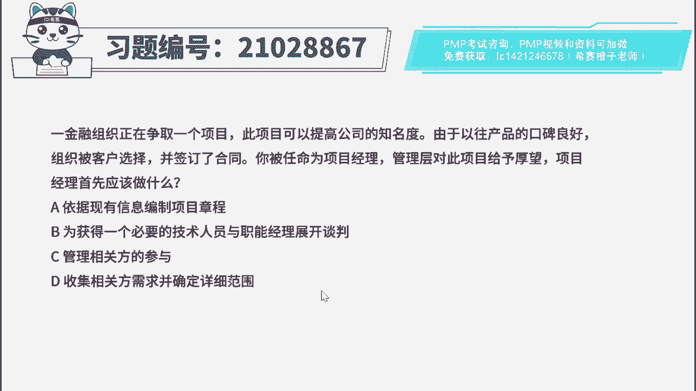
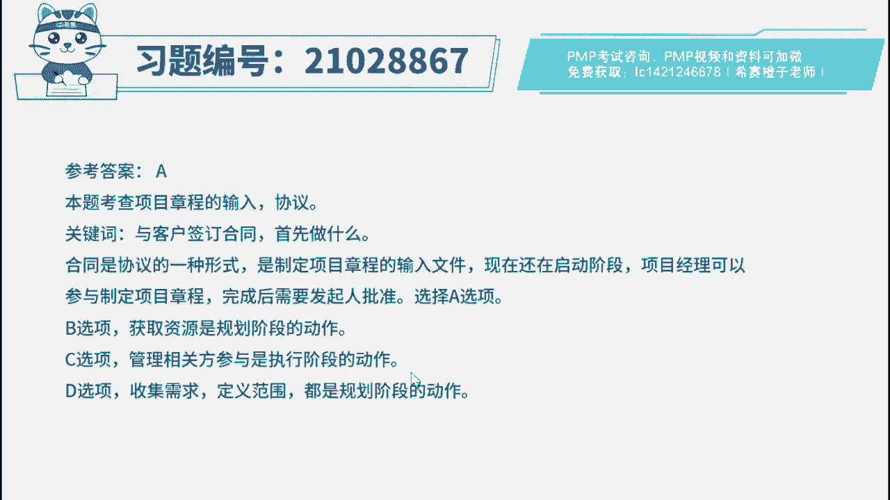
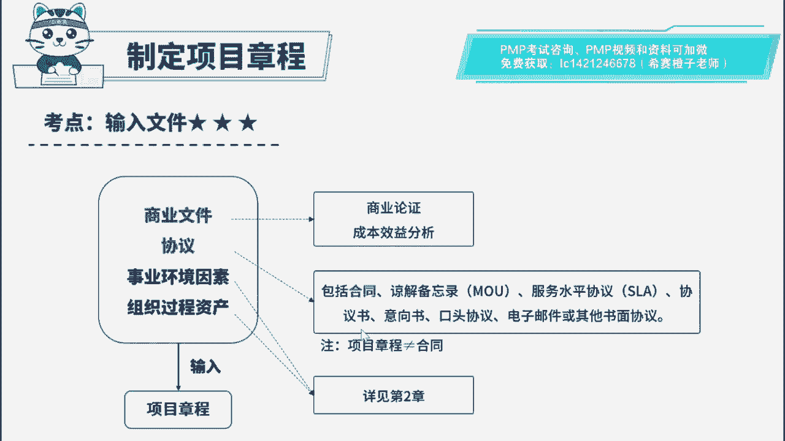

# PMP模拟题视频讲解-1 - P1：PMP模拟题视频讲解-1-2023-3-31 17：07：59 - 冬x溪 - BV1XY4y1S7mn

易金融组织正在获取一个项目，此项目可以提高公司的知名度，由于以往产品的口碑良好，组织被客户选择并签订的合同，已被任命为项目经理，管理层对此项目给予厚望，项目经理首先应该做什么。

a依据现有信息编制项目章程，b，未获得一个必要的技术人员，与职能经理展开谈判，c管理相关方的参与，d收集相关方需求并确定详细范围，好读完题目，我们先来看一下问题，项目经理首先应该做什么，回到题干。

可以看到一些关键词，组织正在获取项目，然后由于一些原因被客户选择并签订的合同，说明项目已经确立了，但是还没有正式启动，那么首先就需要完成项目章程的制定，获得批准来正式启动项目，因此这道题比较简单。

直接把答案定位到学校a，我们也来看看其他选项，abcd，这三个选项都不是启动阶段该做的事，获取资源，收集需求，定义范围都是在规划阶段做的事，而管理相关方参与是执行阶段的动作，目前还在启动阶段。

唉都与题意不符。

好了这道题我们就先讲解到这里，大家可以自行参考一下相关的文字解析。

整个题目讲解下来，我们可以知道，本题考察的知识点就是项目章程的输入文件。

