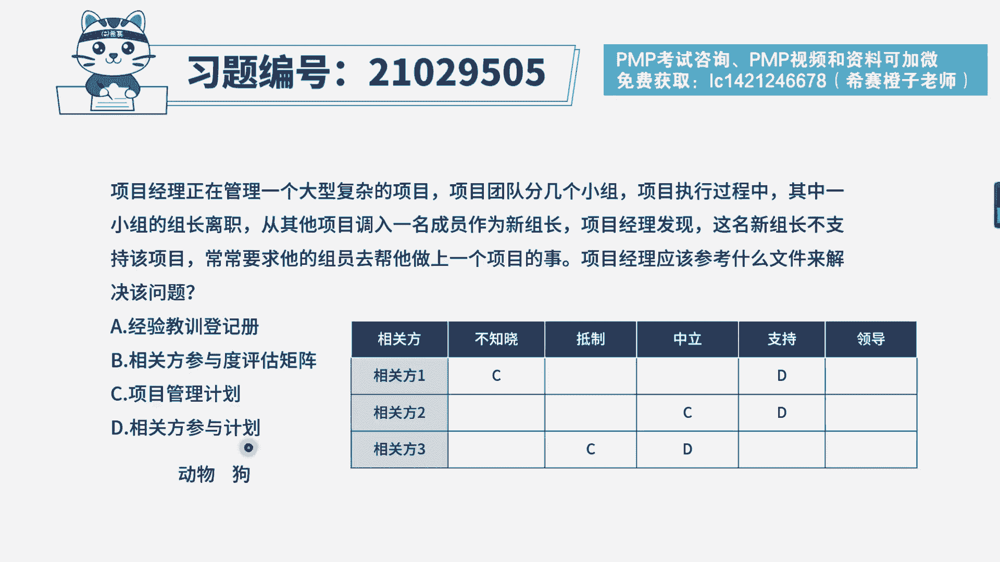
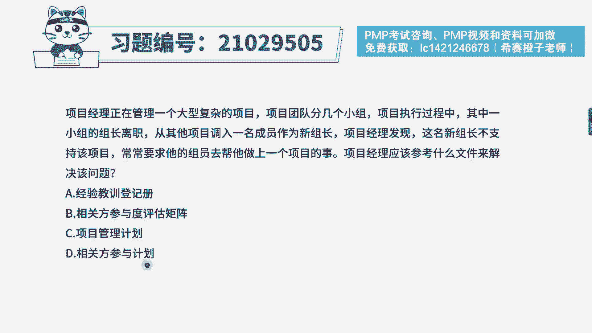
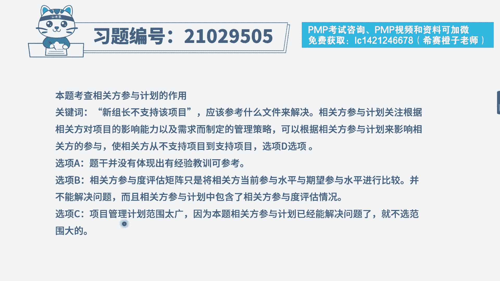
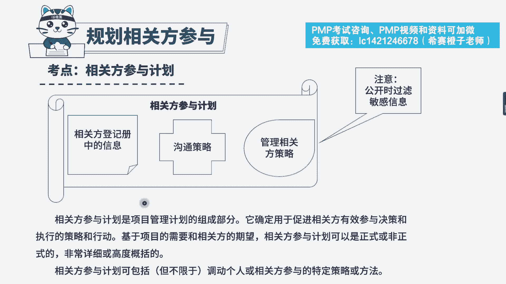
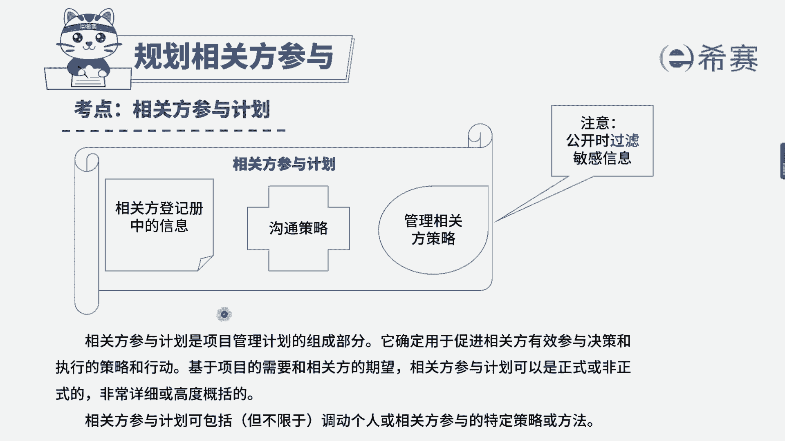

# PMP模拟题视频讲解-10 - P1：PMP模拟题视频讲解-6-10-2023-4-24 13：43：05 - 冬x溪 - BV1Mo4y187m2

项目经理正在管理一个大型复杂的项目，项目团队分为几个小组，项目执行过程中，其中一个小组的组长离职，从其他项目调入一名成员，作为新组长，项目经理发现这名新组长不支持该项目。

常常要求他的组员去帮他做上一个项目的事，项目经理应该参考什么文件来解决该问题，选项a经验教训登记册选项b，将官方参与度评估矩阵选项c，项目管理计划选项d相关方参与计划，我们先来看一下题干的关键词。

调入一名新组长，这名新组长不支持该项目，项目经理应该如何解决该问题，看一下选项a选项经验教训登记册，一般如果要选经验教训登记册，肯定是题目中出现了类似项目，或者说是本项目中曾经发生过这样类似的问题。

我们已经记录过相关的解决方案，才会优先选他，要不然的话他跟题干的关联性其实是不大的，而b选项相关方参与度评估矩阵诶，看上去好像很靠谱的样子，有个相关方。

什么是相关方参与度评估矩阵，我们来看这个表格，就是一个参与度评估矩阵，c表示相关方当前的一个状态，而d是我们期望的状态，这个表格只能将新组长不支持该项目的，这样一个状态进入的表格中。

从而我们能够知道相关方实际的参与程度，和咱们预期的之间有多大的差距，应该往哪个方向努力，它可以明确相关方参与程度，但是单单靠这样一个评估矩阵，我们是没有办法解决问题的，所以b选项它并不是解决问题的选项。

最后cd选项项目管理计划和相关方参与计划，这个时候同学们就会有疑惑了，a老师，我知道相关方参与计划，肯定是解决相关问题的一个文件能选，但是c选项呢项目管理计划岂不是更加全面。

这个时候我们就需要遵从考试的时候，经常用到的一个原则，有时候我们选更全面的，有时候选更具体的，举个例子，现在给你两个选项，动物和狗，我现在问你狗和猫属于什么，你是不是会选动物，因为只有它更全面。

可以涵盖问题，如果换种问法，我问你哈士奇是什么，这个时候我们应该选择更具体的狗，而不是更广泛的动物，所以说在这个题目中，要解决相关方参与程度不符合的这样一个问题，我们需要参照相关方参与计划。

里面的一些相关方策略来进行管理，这个选项是更具体且有用的。

因此本题的答案为d选项，相关方参与计划。

我们可以简单的看一下解析。

本题考察的是相关方管理中，相关方参与计划的内容。

这个文件是比较重要的考点。

