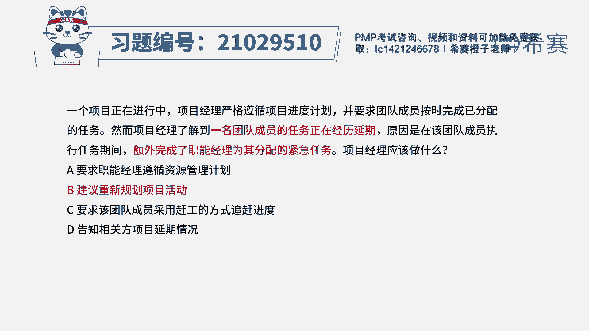

# PMP模拟题视频讲解-11 - P1：PMP模拟题视频讲解-11-15-2023-4-25 16：04：56 - 冬x溪 - BV1Dk4y1J748

一个项目正在进行中，项目经理严格遵循项目进度计划，并要求团队成员按时完成已分配的任务，然而项目经理了解到，一名团队成员的任务正在经历延期，原因是在该团队成员执行任务期间。

额外完成了职能经理为其分配的紧急任务，项目经理应该做什么，a要求职能经理遵循资源管理计划，b建议重新规划项目活动，c要求该团队成员采用赶工的方式追赶进度，d告知相关方项目延期情况，读完题目。

我们可以找到题干中的关键句，题干说一名团队成员的任务正在经历延期，原因是额外完成了职能经理问题，分配的紧急任务，现在问项目经理应该做什么，也就是针对成员的任务延期这种情况，项目经理应该采取什么措施。

来保证接下来项目顺利进行，我们逐一看一下选项，先看a选项，现在是已经发生了延期这个问题，所以现在缺项职能经理遵循资源管理计划，解决不了延期的问题，所以a不合适，再看b选项，建议重新规划项目活动。

就是要通过走变更来重新规划，也可以解决延期的问题，我们先保留再看有没有更合适的做法，c选项赶公式，具体的应对措施应该在b选项之后才能进行，所以c也不合适，最后看d选项。

只是单纯的告知相关方项目延期的情况，并没有从实际去解决项目延期的问题，所以d也不合适，因此本题最佳的答案就是b选项。

本题考察的知识点是项目进度管理中。

