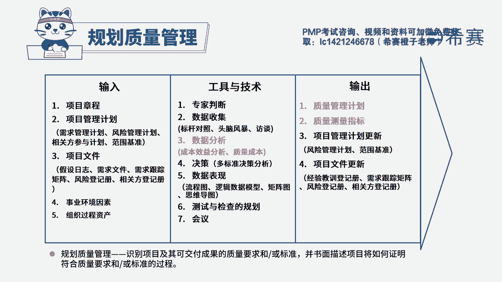

# PMP模拟题视频讲解-12 - P1：PMP模拟题视频讲解-11-15-2023-4-26 13：48：35 - 冬x溪 - BV13a4y1V7WC

经市场调研，西在公司准备拓展一项全新业务，项目经理不知道这类型的业务，如何在预防成本和评估成本之间，找到恰当的投资平衡点，避免浪费，项目经理应该怎么做，a审查组织过程资产，b对质量进行严格的控制。

提交变更请求，以规避质量成本，d寻求专家判断，读完题目，我们来看一下这道题目，它的关键词，现在公司他是准备开展一项全新的业务，但是不知道在这类型的业务，怎么在预防成本和评估成本之间，找到一个平衡点。

问项目经理应该怎么做，预防成本和评估成本，它都是质量成本，所以这道题目，他的意思就是不知道怎么设置，这个全新业务的一个质量成本，那既然它是全新的业务，那说明他就可能缺乏这一方面的经验。

所以不知道怎么去做，所以我们就可以去寻找专家的帮，助，专家判断它是指基于某一个应用领域，或者是知识领域，学科和行业等等一些专业的知识而做出的，关于当前活动的一个合理的判断。

所以这道题最佳选项应该是d选项，寻求专家判断，我们再来分析一下其他三个选项，a选项审查组织过程，资产组织过程，资产当中它是包括过往的经验教训和历史信息，但是这项业务它是一个全新的业务。

所以他还是没有相关的一个组织过程，资产他没有类似的经验教训可以给他借鉴，所以a选项排除，再看一下b选项，对质量进行严格的控制，体看他现在还是处于在一个规划，质量成本的一个阶段，它还没有到执行的这个阶段。

并且对质量进行严格的控制，它并不能够帮助我们找到，预防和评估成本之间的一个平衡点，解决不了我们题干的问题，所以b选项列排除，c选项提交变更请求，以规避质量成本，我们都知道质量成本。

它包括一致性成本和非一致性成本，非一致性成本我们都要尽量的去避免，但是移植性成本当中，它的一个预防成本和评估成本是必要的，是不能够避免的，所以c选项的说法不正确，所以这道题最佳选项就是d选项。

寻求专家判断，这是这道题的文字解析，有需要的同学可以暂停看一下。

整个题目讲解下来，我们就可以知道这道题目，它考察的知识点是规划质量管理当中。

