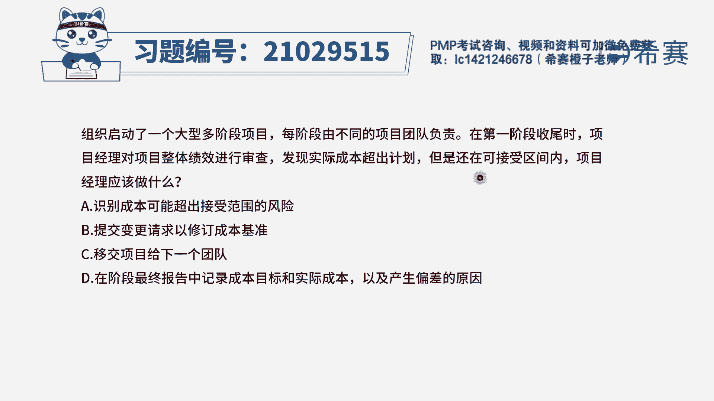
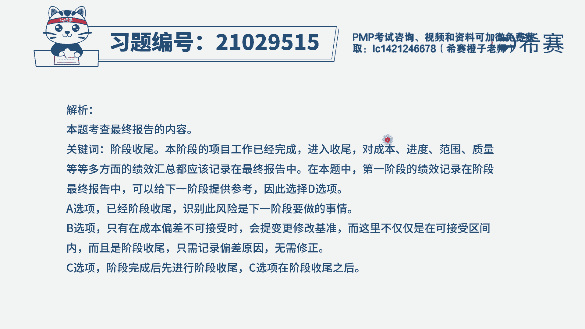
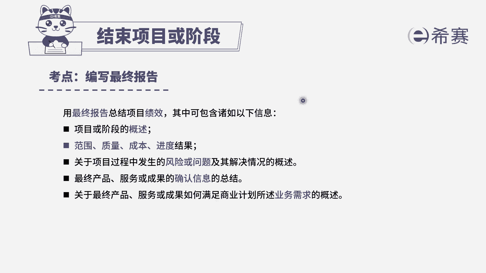

# PMP模拟题视频讲解-13 - P1：PMP模拟题视频讲解-11-15-2023-4-27 15：58：33 - 冬x溪 - BV1ma4y1V7wi

组织启动了一个大型多阶段项目，每阶段有不同的项目团队，负责在第一阶段收尾时，项目经理对项目的整体绩效进行审查，发现实际成本超出计划，但还在可接受区间内，项目经理应该做什么。

选项a识别成本可能超出接受范围的风险，选项b提交变更请求，已修订成本基准选项c，移交项目给下一个团队选项d，在阶段最终报告中记录成本，目标和实际成本以及产生偏差的原因，我们先来看现在的时间节点。

是不是正在进行第一阶段的收尾，在进行收尾，说明项目已经做完了，对不对，你这个阶段已经完成了，项目完成后，你再去审查技巧，相当于是一个回顾总结的作用，而并不是说出现问题还在要去纠正，因为咱们已经做完了。

但如果我们在这种情况下发现技巧上的偏差，应该怎么办呢，不管吗，不是的，按照标准的流程，我们应该将相关的信息编制成最终的报告，分析后，再来看一下选项，a选项识别成本可能超出接受范围的风险，我们已经做完了。

所以对本阶段来说，你不会再去做额外的成本，因此a选项并不是收尾需要考虑的，这可能是下一阶段时其他项目团队需要考虑的，b选项，提交变更请求，已修订成本基准，我们只有在成本偏差不可接受时。

才会提前跟修改记者，而这里不仅仅说了，是在可接受区间内，并且已经是阶段收尾了，所以我们只需要记录一下原因，移交项目给下一个团队，有同学说移交不是收尾的一个具体步骤吗，为什么不选移交呢。

注意这里是移交项目，并不是移交可交付成果，题干虽然说了，每阶段有不同的项目团队负责，但是我们是不是应该先完成收尾工作再移交呢，你总不能把阶段收尾工作，也交给别的项目团队吧。

所以c选项营销项目并不是我们首先要做的，最后d选项，在阶段收尾报告中，记录成本的目标和实际成本产生偏差的原因，这就是在出现题干这种情况时，我们应该做的标准做法。

因此选择d选项，大家可以看一下文字解析部分。

本题考察的是结束项目或阶段。

