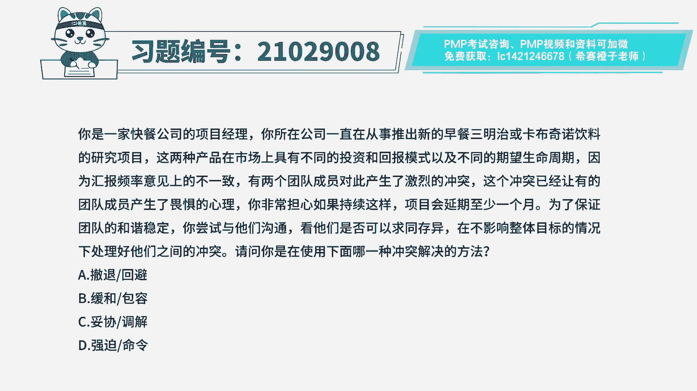
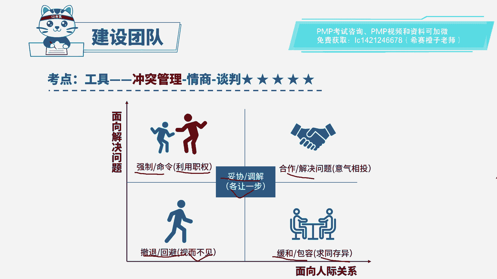
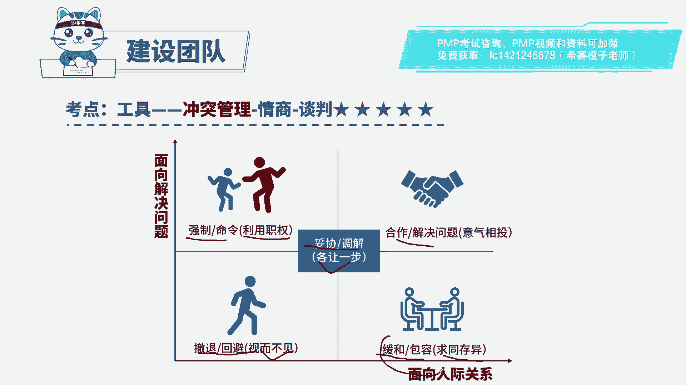
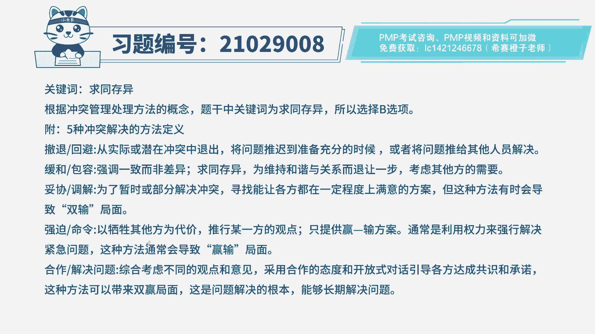

# PMP模拟题视频讲解-2 - P1：PMP模拟题视频讲解-1至3-2023-4-3 15：13：05 - 冬x溪 - BV1n24y1j7VN

你所在公司一直在从事推出新的早餐，三明治或卡布奇诺饮料的研究项目，这两种产品在市场上，具有不同的投资和回报模式，以及不同的期望生命周期，因为汇报频率意见上的不一致，有两个团队成员对此产生了激烈的冲突。

这个冲突已经让有的团队成员产生了，畏惧的心理，你非常担心，如果持续这样项目会延期至少一个月，为了保证团队的和谐稳定，你尝试与他们沟通，看他们是否可以求同存异，在不影响整体目标的情况下。

处理好他们之间的冲突，请问你是在使用下面哪一种冲突解决的方法，a撤退回b b缓和包容，c妥协调解d强迫命令，读完题干和选项，我们可以知道这道题是在考察冲突解决的方式。

那我们就先来回顾一下冲突管理的解决方式。

我们学到的冲突管理的解决方式一共有五种，包括强制命令，合作解决，缓和包容，撤退回避，还有妥协调解，我们先来看强制命令，强制命令一般是利用职权直接去下命令，要求团队成员去做什么事情。

而不去考虑团队成员的意见，再看合作解决问题，合作解决问题是相互理解，合作已达成长期的协作，解决问题，也能得到双方都满意的结果，所以也是最有效的冲突解决方式，再看缓和包容，缓和包容是求同存异。

强调冲突中的一致性观点，而非差异，但是缓和没有针对冲突本身去处理，所以也不是很好的解决方式，再看撤退回避，撤退回避就是视而不见，就是当冲突发生时，在逃避问题，不去解决问题，最后看妥协调解。

妥协调解就是各让一步，各让一步，就是说冲突双方各退一步，为了暂时或者是部分去解决冲突，然后寻找能够让双方都能，在一定程度上去满意的方案，但是这种方法有时会导致双输的局面。

因为双方的观点可能都没有被直接去采纳，我们现在了解了五种冲突解决方式。

再来看题目，先看题目的关键句，题目说有两名团队成员产生了激烈的冲突，你尝试与他们进行沟通，看他们是否可以求同存异，所以我们重点要关注求同存异这四个字。

从刚刚我们回顾的知识点，我们可以知道求同存异对应的就是缓和包容。

