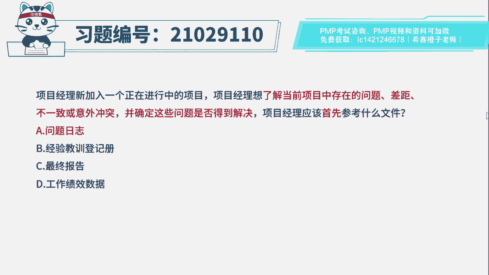
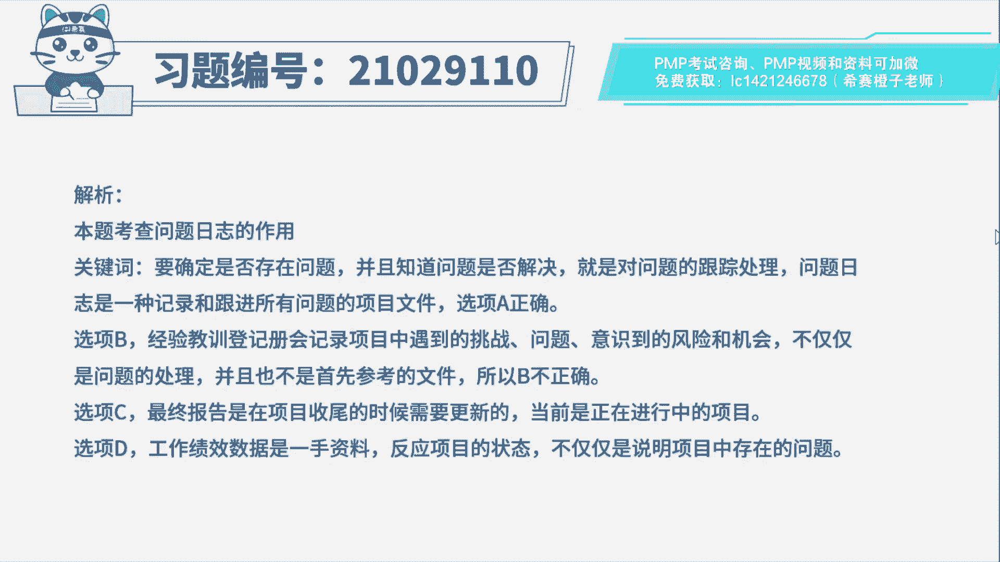
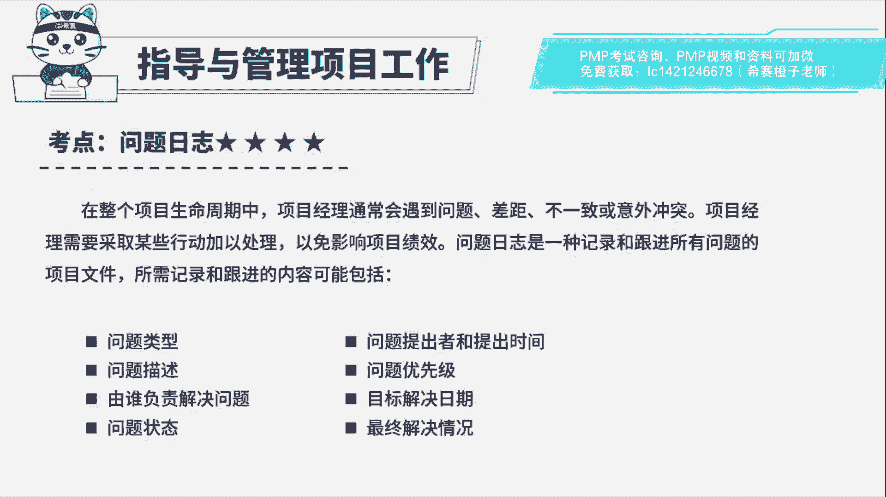

# PMP模拟题视频讲解-3 - P1：PMP模拟题视频讲解-1至3-2023-4-4 14：36：37 - 冬x溪 - BV1Es4y1S7T1

项目经理新加入一个正在进行的项目，项目经理想了解当前项目中存在的问题，差距不一致或意外冲突，并确定这些问题是否得到解决，项目经理应该首先参考什么文件，a问题日志b经验教训登记册。

c最终报告d工作绩效数据好，读完题目先来看一下问题，应该首先参考什么文件好，再回到题干中，可以看到一些关键词，想了解当前项目中存在的问题，差距不一致或意外冲突，并确定这些问题是否得到解决。

那这些想了解的信息都是属于什么呀，问题日志中的内容吧，问题日志就是一种记录和跟进，所有问题的项目文件，所以这道题的答案比较简单，直接定位到选项a问题日志好，再来看一下其他选项，选项b经验教训。

登记册会记录项目中遇到的挑战，问题意识到的风险和机会，虽然它也会描述问题，但是它不仅仅针对问题的处理，还包括其他的东西，就比如说举个例子，你想吃糖炒板栗了，那么首先你去的地方。

肯定是专门卖糖炒板栗的商店，而不是在既卖水果又卖糖炒板栗的店子里去买，唉，一样的道理，好选上c最终报告是在项目收尾的时候，需要更新的，目前还在执行中呢，没有这个文件产生好选项，d工作绩效数据是一手资料。

没有经过整理分析的数据啊，没有针对具体问题状态的描述好了。

这道题我们就先讲解到这里，大家可以自行参考一下相关的文字解析。

整个题目讲解下来，我们可以知道本题考察的知识点。

