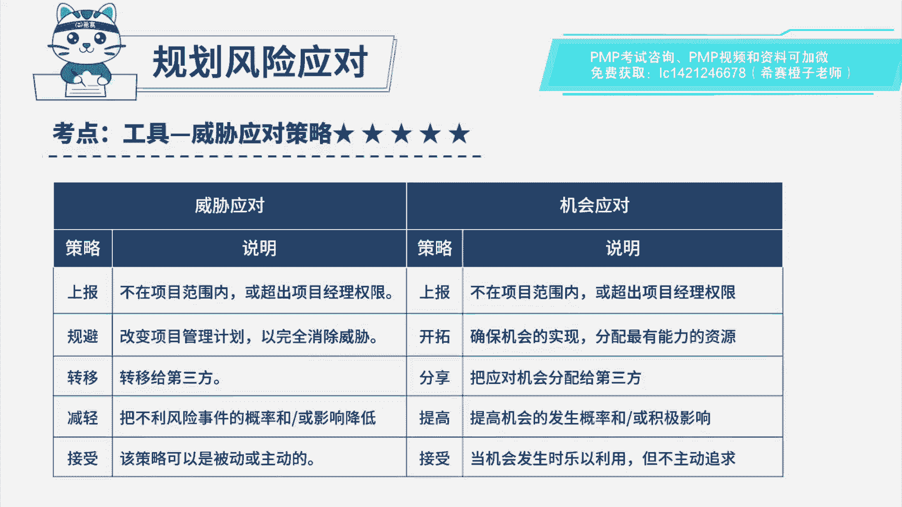

# PMP模拟题视频讲解-4 - P1：PMP模拟题视频讲解-1至4-2023-4-6 14：07：02 - 冬x溪 - BV1Ao4y1p7KQ

在一个标杆性的示范项目中，项目质量团队向项目经理汇报，a供应商的设备有瑕疵，如果设备发生故障，可能会导致项目有100万元的损失，如果采购b供应商的设备会有20万元的差价，经过研究。

以免a供应商设备出现故障时无设备可用，项目经理使用的是哪一种风险应对策略，a规b b转移，c减轻d接受好，读完题目先来看一下问题是哪一种，风险应对策略，可以定位到考察的是规划。

风险应对威胁应对策略的选择。

我们来回顾一下威胁应对策略有五种，上报的话一般是不在项目范围之内的，或者超出项目经理权限的情况，应对策略会选择上报，规避的话就是完全消除威胁，一般做法是改变计划，转移的话是把风险的消极影响。

一般常见的转移方式是买保险，担保外包减轻的话是降低风险发生时的影响，会发生概率减轻的措施，一般包括采用较简单的流程进行更多次测试，或者选用更可靠的卖方，接受的话分为主动接受和被动接受。

主动接受的话是预留了应急储备，比如多留点时间或者多备一些资源，被动接受，就是相信吉人自有天相，不管他等真的发生了再进行处理好。

再回到题干中来，注意这个备用很关键，这个b供应商属于备用，意思是原来的a供应商还在，如果a出现故障呢，会再用b啊，这种情况属于减轻，因为a发生故障肯定会造成一定影响，只是等a出现故障的时候，b再使用。

所以本题选项选c，这个题如果改为，直接把a换成一个，100%没有问题的供应商，那就属于规避了，但是如果改为直接把a换成更靠谱的供应商，那也属于减轻。

因为风险还是存在的，好了，我们此道题就先讲解到这里。

