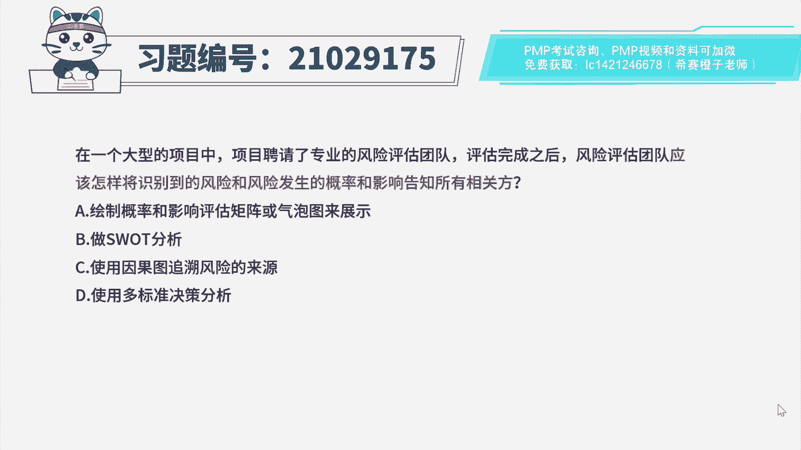
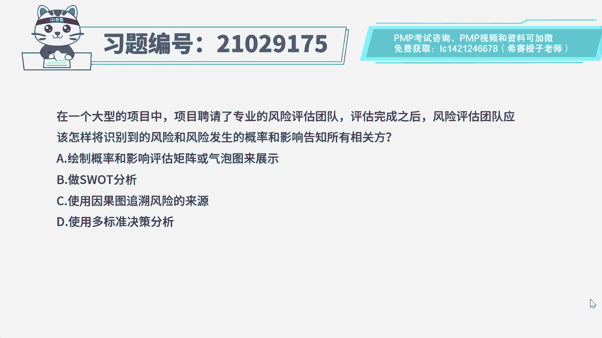
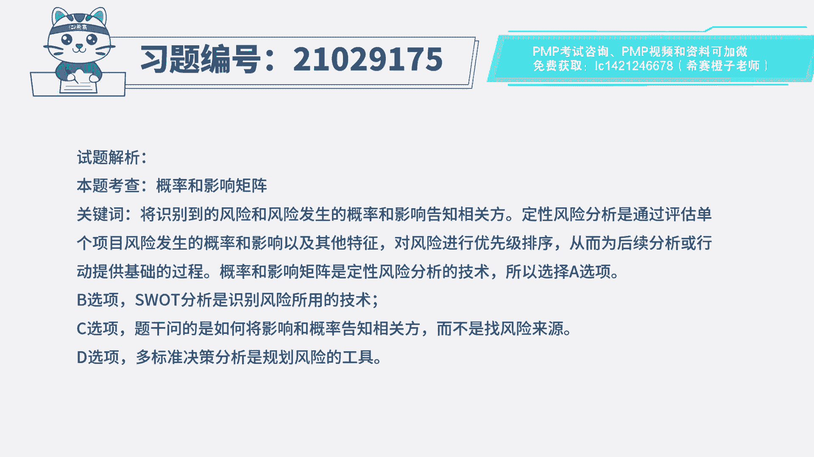

# PMP模拟题视频讲解-5 - P1：PMP模拟题视频讲解-1至4-2023-4-7 14：34：38 - 冬x溪 - BV1Ug4y1M73t

在一个大型的项目中，项目聘请了专业的风险评估团队，评估完成之后，风险评估团队应该怎么样，将识别到的风险和风险发生的概率和影响，告知所有相关方，a绘制概率和影响评估矩阵或气泡图来展示，b做swat分析。

c使用因果图追溯风险的来源，d使用多标准决策分析，读完题目，先来看一下问题，应该怎样将识别到的风险和风险，发生的概率和影响告知所有相关方，要知道风险的概率和影响，那么我们可以定位到是在考定性。

风险分析的工具，那就是风险概率和影响评估矩阵，上课也有讲过风险。

概率和影响评估矩阵是基于风险的概率和影响，对风险进行优先级排序。

所以本题中我们就可以绘制概率，影响评估矩阵来给相关方选项a啊，那就是最佳选项，有同学可能会不理解a的气泡图，气泡图也是定性风险分析的工具，概率影响矩阵只能展示二维数据，只有概率和影响。

气泡图更高级一些能展示三维数据，我们对气泡图有个印象就好好，我们再来看一下其他选项，选项b swat分析是识别风险工具，无法提供概率和影响，选项c啊，与题干问题无关，并没有要求要风险的来源，选项d。

多标准决策分析是对风险的多个应对措施，借助决策矩阵进行分析排序来选择最好的方案，属于规划风险的工具，与本题题干无关。

好了我们此道题就先讲解到这里。

