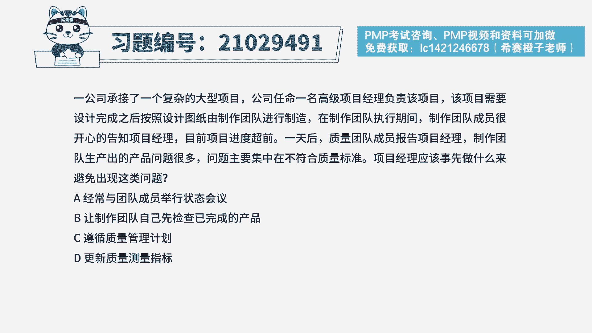
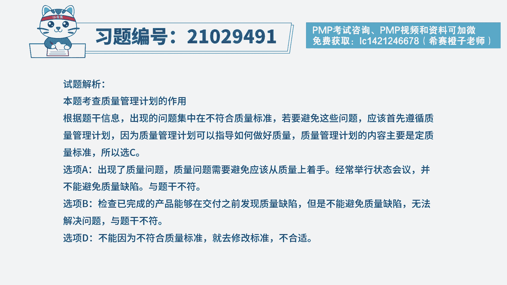
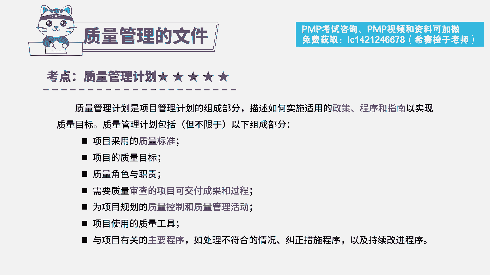

# PMP模拟题视频讲解-6 - P1：PMP模拟题视频讲解-6-10-2023-4-10 14：08：10 - 冬x溪 - BV1N54y1F7eY

一公司承接了一个复杂的大型项目，公司任命一名高级项目经理负责该项目，该项目需要设计完成之后，按照设计图纸由制作团队进行制造，在制作团队执行期间，制作团队成员很开心的告知项目经理，目前项目进度超前一天后。

质量团队成员告知项目经理，制作团队生产出的产品问题，很多问题主要集中在不符合质量标准，项目经理应该事先做什么来避免出现这类问题，a经常与团队成员举行状态会议，b让制作团队自己先检查已完成的产品。

c遵循质量管理计划，d更新质量测量指标，读完题目回答题干，我们来看一下这道题目，它主要的关键词，现在产品它出现了很多的问题，它主要出现的问题是集中在不符合质量标准，项目经理事先应该做什么来避免这个问题。

在我们考试当中一定要注意审题，因为他经常会问事先应该怎么做，所以一定要仔细看题，在还没有发生质量问题之前，那首先就是要遵循质量管理计划，这个文件，它就可以指导你怎么去做好质量管理工作。

然后我们严格的按照质量标准去完成产品，这样子的话，我们就可以避免后续出现这样子的质量问题，所以这道题正确选项是c选项，遵循质量管理计划，我们再来看一下其他三个选项，a选项经常与团队成员举行状态会议。

那题干当中它的重点是已经出现了质量问题了，那出现了这样子的质量问题，我们应该是事先从质量管理计划入手，那经常举行这样子的状态会议的话，我们只能够了解这个项目，它的一个状态和一个情况，他也没有办法避免。

我们经常出现这样子的质量问题，所以解决不了题干的问题，b选项让制作团队自己先检查已完成的产品，我们都知道预防它肯定是剩余检查的，那检查产品，它就是为了在交付之前能够发现产品的问题，及时改进。

但是它并没有办法减少质量问题的产生，所以预防剩余检查，所以b选项也排除，最后看一下d选项，更新质量测量指标，题干当中，它没有任何一点是指明了质量标准会发生变化，所以我们不能够。

因为产品它本身的质量问题没有达到标准，就去把这个标准降低，然后让这个产品它符合质量标准，这样子的做法肯定是不行的，所以d选项也排除，所以这道题最佳选项就是c选项。

遵循质量管理计划，这是这道题的文字解析，有时候同学可以暂停看一下。

这道题目。

