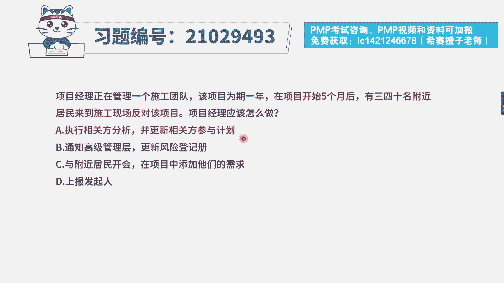
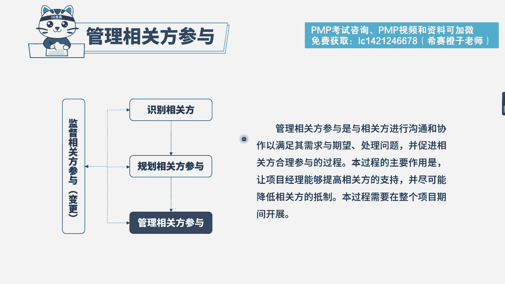

# PMP模拟题视频讲解-7 - P1：PMP模拟题视频讲解-6-10-2023-4-11 15：30：14 - 冬x溪 - BV1u54y1F79j

项目经理正在管理一个施工团队，该项目为期1年，在项目开始五个月后，有三四十名附近居民来到施工现场反对项目，项目经理应该怎么做，选项a执行相关方分析并更新相关方参与计划，选项b通知高级管理层。

并更新风险登记册选项c与附近居民开会，在项目中添加他们的需求选项d上报发起人，先来看一下题干的关键词，项目已经开始五个月了，结果遭到附近居民的反对，反对该项目，这是属于相关方参与度中的抵制性。

说明这些相关方，他们的参与程度并不是我们所预期的，所希望的，大家根据经验也应该知道，相关方反对项目，作为项目经理，应该去管理和影响这些相关方，然后我们来看一下选项，首先要排除的就是b d两个选项。

不管是通知高级管理层还是上报发起人，这都不是我们首选的，只有在超出项目经理权限的时候，我们才考虑上报，再来看一下大家非常容易混淆的，a选项和c选项，a选项执行相关方分析更新相关方参与计划。

对相关方进行分析，我们是去分析他们的角色，与项目的一个利害关系，他们的期望，他们的参与程度，然后通过更新相关方登记册这样一个动作，来包含相关方管理的一些策略，所以这个选项它跟题干信息是非常相符的。

是可选的，而c选项与附近居民开会，在项目中添加他们的需求，这个说法本身就不够准确，不能说他们有什么需求，我们就直接添加到项目中，举个例子，如果这些居民，他觉得你施工影响了他们生活出行，希望你停止施工。

难道咱们就真的听他们的诉求停止施工吗，当然不是，所以相对来说ac选项a选项会更合适，因此本题正确答案为a选项。

我们可以看一下解析，本题考察的知识点是项目相关方管理。

