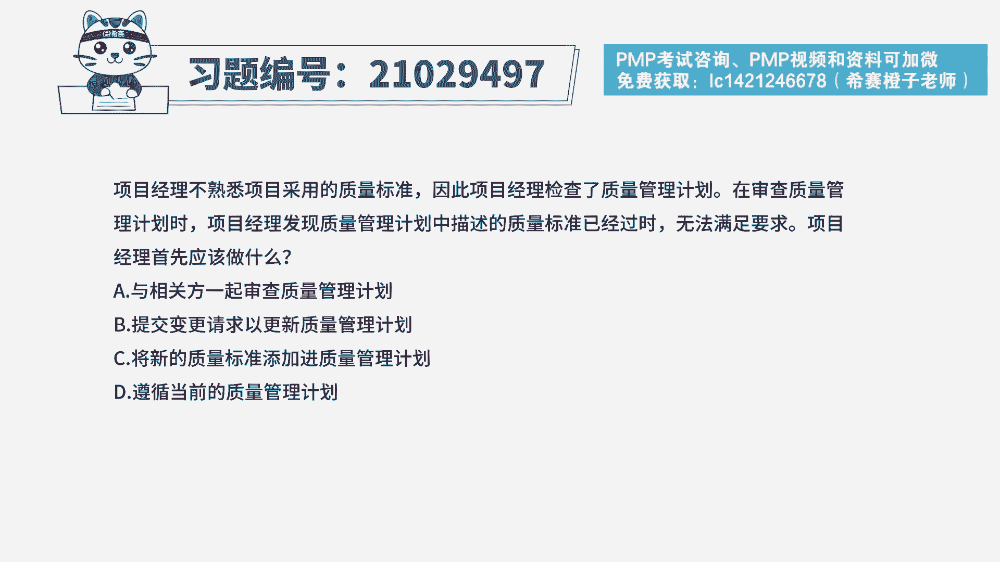
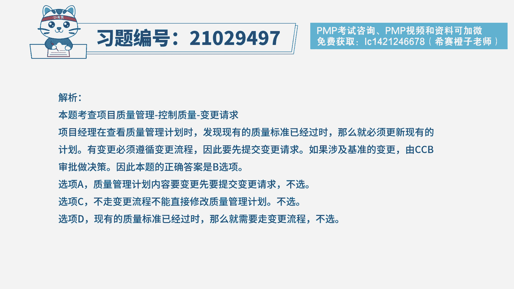
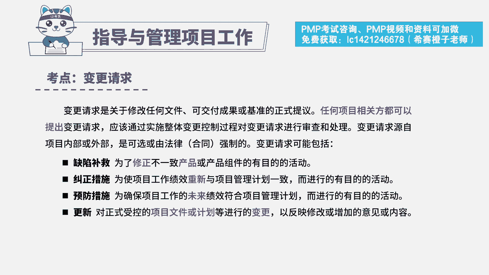
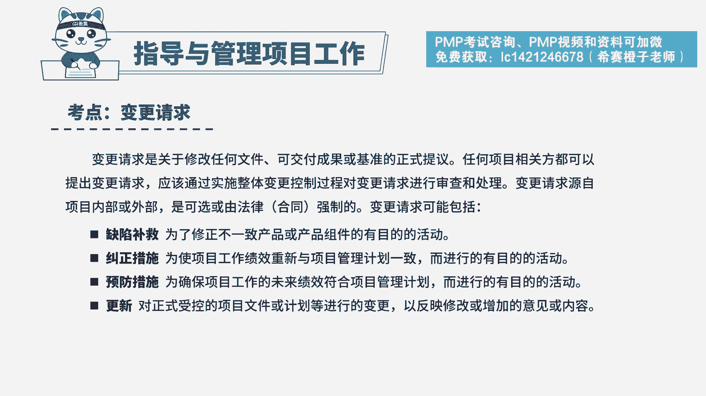

# PMP模拟题视频讲解-8 - P1：PMP模拟题视频讲解-6-10-2023-4-12 13：54：38 - 冬x溪 - BV1kc411p7Ye

项目经理不熟悉项目采用的质量标准，因此项目经理检查了质量管理计划，在审查质量管理计划时，项目经理发现，质量管理计划中描述的质量标准已经过时，无法满足要求，项目经理首先应该做什么。

a与相关方一起审查质量管理计划，b提交变更请求，已更新质量管理计划c，将新的质量标准添加进质量管理计划，第一遵循当前的质量管理计划，首先我们看到题干的关键词，项目经理审查了质量管理计划。

发现质量管理计划中质量标准已经过时，为了保证项目执行过程中，是按最新质量标准执行了，要及时走变更流程，对质量标准进行更新，所以这道题的正确选项是b选项，提交变更请求，已更新质量管理计划。

我们在用排除法分别再看一下其他的三个选项，a选项与相关方一起审查质量管理计划，题干中已经审查过质量管理计划了，和相关方再次审查质量管理计划，要等到更新完质量标准后再进行，所以a不是首先要做的，c选项。

将新的质量标准添加进质量管理计划，有变更就要走流程，未走变更流程是不能直接修改质量管理计划的，所以c的描述不合适，d选项遵循当前的质量管理计划，现有的质量标准已经过时了，就不能沿用旧的标准了。

要走变更流程来进行更新。

所以d选项也是不正确的，本题分析完之后，看一下本题的解析。

那本题考察的知识点就是质量管理，控制质量过程中的变更请求的内容。

遇到质量标准过时的情况，要及时走变更流程进行更新，本题考察的变更请求的种类。

