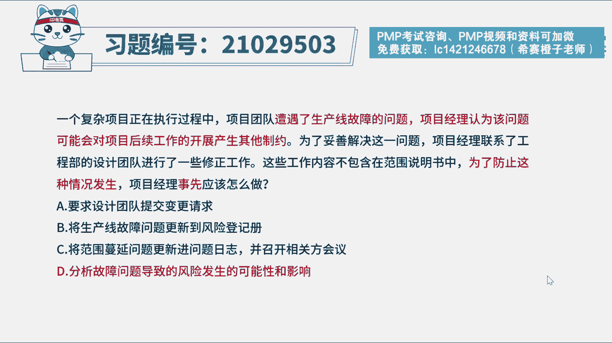
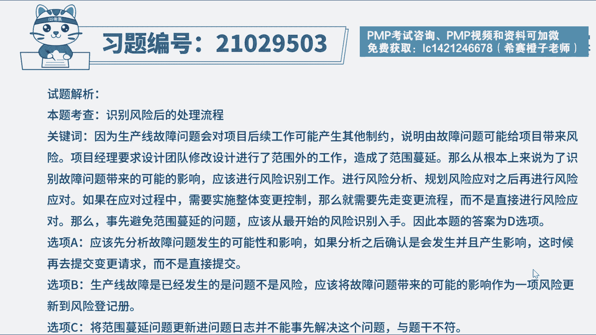
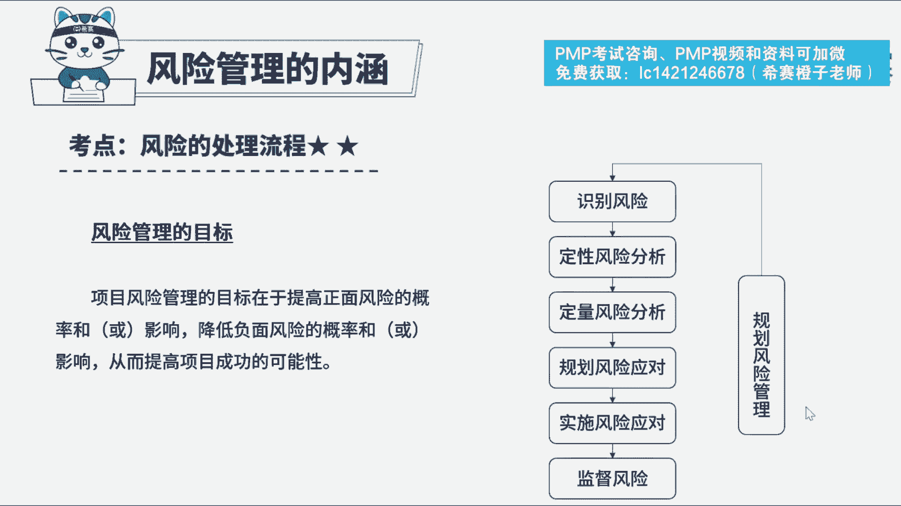

# PMP模拟题视频讲解-9 - P1：PMP模拟题视频讲解-6-10-2023-4-13 16：51：16 - 冬x溪 - BV12N411w7rA

一个复杂项目正在执行过程中，项目团队遭遇了生产线故障的问题，项目经理认为，该问题可能会对项目后续工作的开展，产生其他制约，为了妥善解决这一问题，项目经理联系了工程部的设计团队。

这些工作内容不包含在范围说明书中，为了防止这种情况发生，项目经理事先应该做什么，a要求设计团队提交变更请求，b将生产线故障问题更新到风险登记册，c将范围蔓延问题更新进问题日志，并召开相关方会议。

d分析故障问题导致的风险，发生的可能性和影响，好读完题目，先来看一下问题，项目经理事先应该怎么做，我们再回到题干，可以看到，因为生产线故障问题，会对项目后续工作可能产生其他制约。

说明因为故障问题可能给当前的项目带来风险，导致了范围蔓延，那么如果要防止这种范围蔓延，就应该从根本上来解决，先识别到风险，然后再进行风险分析，规划风险应对，如果需要涉及到范围的变更，那需要走变更流程。

而不是题干中所采取的措施，直接进行了风险应对，而要防止这种直接采取风险应对措施，导致范围蔓延的情况，应该从最开始的风险识别入手，选项中低负荷，再来看一下其他选项，选项a直接提交变更请求不妥。

属于选项d之后实施风险应对的可能做法，选项b本身说法有问题，生产线故障是已发生的问题，而不是风险，是这个问题可能给项目带来风险，选项c属于问题发生后的解决方案，但是题干问的是事先是在发生这个问题之前。

所以c选项不符合题干要求好了。

我们此题就先讲解到这里，大家可以自行参考一下相关的文字解析。

整个题目讲解下来，我们可以知道本题考察的知识点。

