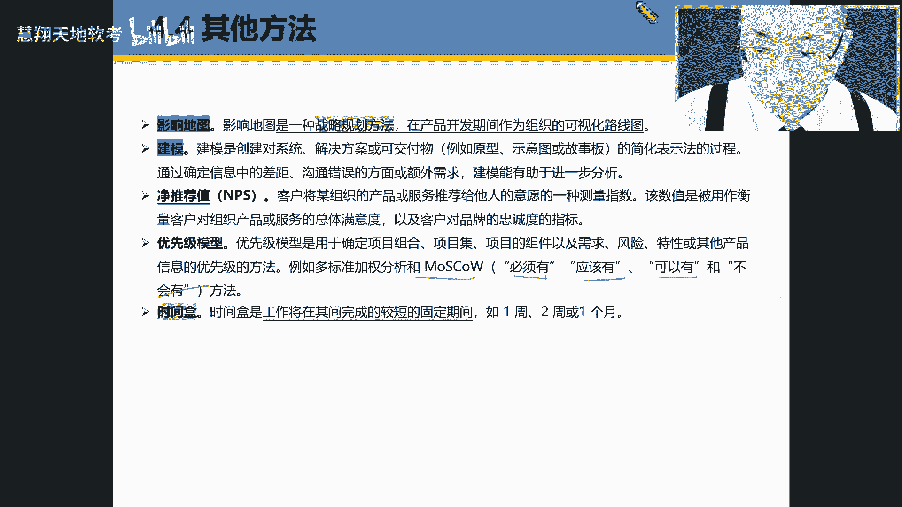
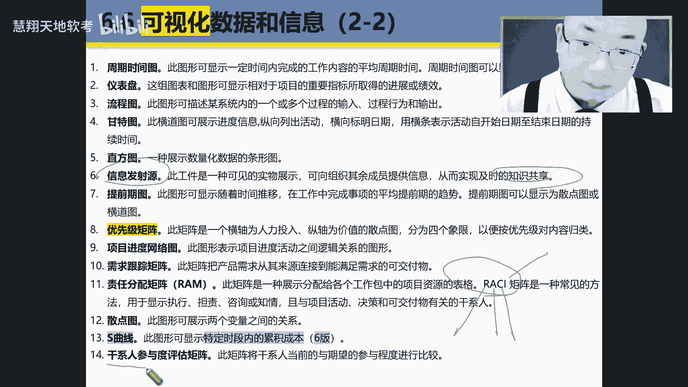

# PMP第七版全新课程  PMP精讲课程 ｜ 限时免费  知识点：模型、方法和工件  - P1 - 慧翔天地软考 - BV1Nn4y1o7fq

好的，三高点容模型方法和工件哈，我们讲完了，刚讲过模型，什么样模型啊，还是种思考的策略，是不是，然后什么叫方法，它就是种方式，OK它就是一种方式。

呃我们说过啊，就是原来第六版的书呢是多少页，是770一页，而现在书变成才变成啊300多页了，那就有一半没了啊，去哪里呢，就看到书中有个叫p m i standard的加plus，看到没有。

就p m i ser plus在网上都有，也就是说我们现在看到很多一些呃，ITTU的一些工具呀，技术方法在我们这书本没用，滴漏都在第六版那些第五第基本都没有讲，在哪里呢，就工具方法在哪里研究。

在p m i sander plus来说，遍PMI3这个plus在网上就用就可以了，咳咳我们这个应该说很多都，其实我们都在都是在原来的呃，第六版讲ITU都讲过了，比如说备选方案分析呃，假设支援因素。

还有假设这些因素吧，我们第一次接触的，做项目的假设因素和制约措施在哪个文档中啊。

在哪个文档在范围，什么说明书来说一遍，在那个文档里啊，换个说明书，一个记下，换个说明书。

包括这种标杆额标杆对照啊，标杆对照标杆对照，咱们好理解，是不是同样深刻，原来我们在做那个做项目的时候，给国内的一些咨询公司做项目的时候，那时候大家都学那个JERRY。

国内的服装行业都学那个西班牙的index公司的呃，ZARA那个品牌因为做的比较成功，那现在ZARA也好像也不灵了，那是哪家呀，日本的哪一家呀，优衣库优衣库啊，就是你会发现其实标本也在不断变化的变化。

好的这个商业合理性是个合理性的一个分析啊，这个不会考，但是是基本功，你可以看一下那个词非常重要，叫business justification，Analysis method，这是合理性。

这个词叫justification，他就有动词justify转过来的，这边justify也就是叫BIGATION，在很多一大例外启动呃，他们在做项目中，就是有一先会在做项目启动之前。

先做项目的justification，明白吗，这词会写不来，所以你要去看，就是JCT非K神的内容，啊这网可以可以搜一下，就说就比如像大的药企，我在开发一个新产品，新新的药品之前。

我会做先做一个这个药的什么呀，这个新这个药的研发项目的什么呀，来张嘴，现做的药的研发项目什么加C非K线啊，就是这个合理性分析可以的啊，它一般包括什么投资回收期呀，啊内部收益率RI啊。

什么NPV这几次包括收益分析啊，嗯这个考试不会考，但是你要记住了啊，像这几个词我说遍哈，像这个NPVIR是一对词，一般在分析一个项目中，说这个项目这两个项目做A项目，B项目做C项目。

就比较这三个项目的NPV和什么L2，只要是正直的话，就是越大越好，越小越好，对比较好，对再说一遍，是越大越好，来说一遍，对你好，就是经验值，哇塞更最多，今天值就是他赚更多的钱。

是不是OK收益率是最大的收益率，你像中国的老百姓，以前都是因为来怎么进行资产保值，就该买买什么买房子，然后买股票理财，哇塞几乎全都，现在目前呃理呃，房地产是报了吗，房地产也报了，是不是，然后理财也爆了。

现在唯一黄金现在也是也你也懂的，股票也报了2000多点，也完蛋了是吧，现在目前看就哪个还算好一点，就是那个嗯还有什么房子也不行，还有什么可言，你就存钱，只要存在银行里，这IPIP存在什么银行里。

得四大行才行，是不是啊，这这个真的是太吓人了，太吓人，人家从那些小银行弄跑中就挤兑了，刚兑银行就这样子，太吓人了，检查表我们在做那个质量检查时经常用到啊，就是呃检检在在质量在质量过程中的表。

质量成本是不是讲过CEO扣质量成本分两种成本，一种什么成本，一个叫什么成本，一是有成本，还有什么成本，并且说那个质量成本还包括什么成本，除了一致性成本之外，还包括什么成本，非一致性成本。

比如说内部失败和外部失败叫什么成本，非一定成本，比如说预防和测试或者测量或者测量评测，叫什么评估，叫什么成本，一定性成本啊，我给大家做培训，降低成本，对一个生命守哪个成本预防性，我给你做培训吗。

预防出错误。

预防成本，OK好的，这个集团会考的哈，决策树呢现在考的可能性会比较小，他一般会算一个叫做EMV，预期货币价值来叫EMV来张嘴来叫什么，EMV叫expected monetary value r呃。

Expected is expected mana military value e mv，他可不是EVM啊，咱们说EVM是什么，EVM是政治管理，是不是政治管理，这里管理必考的啊。

大概考虑一道两道题啊，就你就你就是你怎么算呃，什么CVSVSCPSPI那个很简单，如果小于三就会做的题，好决策树啊，决策树他这个时候那个考虑性可能性会很小，那就算那个你是你是建一个新厂还是重新装修。

装修那个老厂啊，这个算谁的那个业就预期货币价值越高，只要如果算收益，算收益，算收入，算利润的是越大越好。

越小越好，因为越大越好，如果算算费用是越小越好啊，但这个考的性更强啊，分值分析讲过了，以货币压力刚才讲过了，刚讲过了，在做决策树分析的时候，会计算什么呀，每一个决策方向的什么呀，预期货币价值啊。

把音响做成生命消息，苹果就算过了，这这个是在采购中讲过的，以前会考，现在不考了，就是什么叫资质和外购，就说我自己做和外购哪个更合适，包租哪个更合适啊，但这个是只是只简单只是评价成本。

它不是从占预去考虑的概率上取证，这是个题，也了解一下，就是我们在做风险评估的时候哈，要找要找哪一种风险呢，就可以算一个值，算每个风险的概率乘上它的影响叫做概率，影响值，叫probability啊。

score啊，不是probability，Impact score，就是拿这个风这个概率的风，这个风险的概率乘上这个分类影响，那个值最大的是我重点关注的，重点关注，啊过程分析，回归分析。

像过程一般就是分析过程中的一些，增值环节和非增值环节啊，回归就是一般就是什么，就是那种就是比如说呃，也是一种变量的一种关系啊，关系啊，算变量的关系好。

我们看一下这个呃，继续看哈，储备分析，除非讲过什么储备，分两种，应急储备和什么储备，官储备额，应急储备是针对什么的风险，已知的未知而管理储备呢对，然后我们的预算包括哪个，包括哪个储备，利益储备。

不包括什么管理储备，好，根本原因分析周的cos啊，这个是你偶尔会考到的，偶尔会考，一般是用哪个哪个工具来分析根本原因的，鱼骨图，有的好多名词你叫YY图，就是两个YY也叫呃一起卡瓦图，也叫伊西卡瓦图。

也叫石川图啊，因为他是一个日本人提出来的啊，这个日本人的名字叫石川，那个石川的话以石头和山川那个紫石川啊，山川的翻译就是什么叫一起卡瓦卡瓦，它画出来之后呃，像个鱼骨一样。

比如像那个小哥哥是做制造业的制造，比如说我们叫通过人机料法环测啊，经验来分析原因啊，OK敏感性分析呢是分析这个呃，单个风险的大小的敏感性分析和敏感性分析，一般是分析单个还是双个还是多个风险影响。

这大屏幕就有是哪个大一双三个，所以这时候我们在做项目去，有每个项目有很多风险，但是呢敏感性分析叫sensitive，Sensitive，Sensitivity，Sensitivity analysis。

他在这分析什么呀，是单个妇女还是多个风险，单个风险明白吗，单个风险OK好清楚啊，模拟呃，偶尔会问到，一提到模拟用到摩托卡洛就可以了啊，我们知道其实在AI正式出现之前，其实模拟很流行的，就建立一个模呃。

根据我历年的数据建立一个数据模型出来，然后根据现有数据来分析未来的一个什么东西，是不是啊，这是模拟啊，模拟一般会分析，假如我投资这么多钱，项目成功率多高，然后我需要增加多少投入，我的成功率会更更很呃。

我的成项目成率高多少，这是通过一个模拟，那用的方法有等于哪个方法来数遍哪个方法，MONTECARR来，顺便来MONTECARR来张嘴来，MONTECARA1听到我们的cover，它就是模拟啊，模拟啊。

干性质分析，这是必考的啊，干性容易必考啊，干性分析一般会分析什么呀，他的一些什么啊，影响啊，利益啊，参与度啊什么之类的，所有的分析偶尔有问到这四个字，你清楚吧，S代表什么呀，S代表什么呀。

优势W代表劣势，O代表机会，T代表什么呀，额风险啊，风险，趋势好说，价值流，价值流其实就是一般是价值投，一般是基于基因，你画出来加一图，我肯定不会，这个考的可能性不大啊，因为但是我们做经济制造的时候。

必须画价值流图啊，价值流图首先是要找到增值环节，还是非增值环节都要找，找到增值环节就不说了，找到非增值环节干嘛呀，来找到非就是在一个价值流图分析中，找到非增值环节要干嘛呀，把它干什么呀裁掉。

就像我们做这次，比如我们就比如我们做软件开发，像我们像我原来我们在公司的时候，经常跟人每过一年它也不叫裁员，它就叫我们叫优化，叫优化，一般打C连续两次C就优化，就是连续半年就是两个季度。

两个季度或者C的裁员，我们会发现财力一般都是什么，你看比如做架构设计的，做代码开发的，做测试的，你知道第一个被裁的是哪个部门，对，为什么要测试啊，就他的价值不是最大的，但测试分两种测试，一种是黑箱测试。

一种白箱测试，哪个比较牛掰一点的，黑箱和白箱，懂哥懂哪个比较牛一点，白象测试黑箱测试哪个比较牛一点对，因为白象是干嘛的呀，对呀太棒了，来掌声鼓励一下，来掌声鼓励下来，为什么第一他会做一些这测的测试。

自动化他会做什么呃，代码测试，但是黑箱测试代码就是写写脚本，测脚本那个东西就是是个人都会干啊，就是典型的重聘工作，OK好，偏差分析啊，特别重要啊，偏差分析，我们我们是我们在什么地方学过的偏差分析啊。

还记得吗，我们在什么地方学过那个天台分析，还记得吗，我们在哪个地方学过偏差分析，这个偏差分析这个偏差啊，这个词有时候别跟那个别和混了，有个叫BIOS BIOS，一个叫什么，这叫什么呀。

这个叫variance来说明variance，比如我们现在叫成本偏差，进度偏差叫CV和什么SC必考的话一到两分，一到两题啊，你看啊就你会算吗，他自己算就怎么算，CV怎么算。

CPI怎么算C哎SV和SSPI，我们来说便来CV叫什么呀，成本偏差SV呢，进度偏差CPI叫什么呀，CPI叫成本绩效，什么指数，SSPI呢，SP什么叫进度绩效指数啊，然后他考试的时候，他既你要考会算题。

还要看吗，还要考虑什么呀，要要会算这个题还要考，还要考虑什么呀，还要考虑那个呃，解释这个啥意思，理解吧，啥意思啊，OK啊，假设你分析这个还好理解是。

估算啊，这个估算。

像这里面有时候问到的，比如像类比啊，类比就类比主要是什么呀，就是以前相似的项目来，什么叫类比，类比一般什么，就是比如说以前相似的项目，那两个时间记下来叫previous similar project。

来亲爱的，张下嘴来张下嘴来，previous similar哎，就是说因为如果说不是以前的项目又不类似，你咋类比呀，所以我们类比的话，就是以前是以前类似像采用的ANALYX吧，ANALYX好。

功能点多点估算啊，这个看看就可以了，什么叫多点估算，我们去我们学过个三点估算，还有那个贝塔，就是那个什么那个贝塔分布，就是要有我们在估算的时候，比如假如说我现在打车，比如05：30打车呃。

悲观值到机场空调多长时间好，乐观值多长时间，就然后会加上一个公式一算，这叫多点估算，多点估算，这个是比较常见的一种方式，在统计学中用的是比较多的啊，统计学嗯，像故事点估算有时候会考的故事点估算故事点。

故事点估算，就说我们在敏捷项目的时候。

在敏捷项目开发的时候，我们来我们在写需求的时候用什么写需求，董哥我们在敏捷开发的时候，一般是用什么方法来写需求啊，叫故事什么呀，哎有user story来一起收，看，来用户故事哎这样的用户故事好了。

那用户故事之后，那那我们只要把那个需求写完了，需要用户故事写的，比如111个角色在什么场景下要干什么事，实现什么目的，就这个很简单，但就是要估算这个用户点，那我知道这个故事点越多的。

说明这个开发的这个工作量越大，还是越小越大好了，那怎么估算这个用户故事，它的开发，它的开发量多大呢，越大用的那个叫扑克牌法，而那个扑克拍法用到的原理，就是那个斐波拉契曲线。

就是菲波拉曲线的说明了飞波拉契，而且啊所以说为什么原理哈，这个你们好好得钻研一下子，我特别喜欢那种说经常有说老师为什么，这说明你成功了一半，但是呢你要记住哈，比这个人会问题的更厉害，什么意思啊。

又会问问题，还有什么问题的答案的人，你知道吗，我永远我一旦我想起来，我原来被我一个我上上物理学的时候，上高中学物理时候，因为我们那时候在湖北高考嘛，数理化的一般经以满分的水平，要达到老班同样的考试那种。

所以每次我最后一道题做总做不好，我就问老师，哎，我说为什么那个那个什么那个万有引力是什么，质量，一乘质量，二要除以R乘大G要除R的平方，为啥R的平方呢，然后老板说不要那么废话呢，公式有此经背得了。

我觉得那个年代哇塞，80年上高中，那个老板就是骂一顿，我的很出息，很重要下，但我一直解决不了，但后来的后来哈，因为现在不说嘛，现在好多孩子他不读的是美高嘛，都在国学校读美高。

然后读美高都会学习美国的那个课程，哇塞这个时候才发现，因为我们知道不管数学也好，还是物理也好，还是化学也好，因为数学和物理都是那时候来自于呃，一五几几年，一六几几年，一七几几年的那个什么欧洲。

那么德国呀，意大利呀，英国呀，法国呀，什么波兰啊，那些国家哇塞，然后他们就想把这各种。

包括英国各种推算公式给你推理了一遍，哦意思你看我早才知道原因是什么，原因因为我们现在我们那种，我们现在包括现在学数学，物理都是那种死记硬背学的啊，或者怎么去自用公式来解题，但是其实我们学的应该学什么呀。

就说哎牛顿当时他怎么推，怎么推断出万有引力来的，怎么推出第一定律出来的，明白了吗，你是要学的，包括现在引力波是指那个一引力波，那个label是怎么level，二是怎么推理出来，它是有应用公式的。

你知道吗，包括相对论怎么推算出来的，导数怎么求量值，你要算这个东西，这样有什么好处呢，就是说你是能知道这种推算推算方式的，那我们知道像那个呃，像那个就刚才讲过那个什么那个呃，那个那个就是那个。

我我们在做那个故事点估算的时候，用到的是用的是哪个曲线的，再说一遍叫什么黑波拉基曲线，这时候你说你说老师为什么好问题，你上网去搜，你可以通过AI，通过油管来搜，你要能找到人，你太好死了。

L少现在很多人就现在很多人还会用，但是呢用的一般般啊，用一般般一般般好，宽带德尔菲，那提到德尔菲困在德尔菲又请于什么情，什么德尔菲呀，就叫德尔菲，德尔菲，我讲过什么意思，就让这些专家干嘛呀。

做一些讨论啊，他一般讨论一般讨论他，因为有的是那种你一般是背对背讨论，他为什么要要背对背讨论，让专家免得怎么样，就是我希望听到你们不同的观念，你们别给我串通了就行了。

那这个时候我最后呃最后达成一致意见啊，他原来是讲了一个故事，什么故事，就是说原来就说那个宇宙的那个那个，那个是宙斯还是谁，他说我想知道宇宙中心在哪里，他抓了那个在神话传说。

从谁对那个第几地的那个方向比较熟，鸽子他抓两个鸽子，鸽子就是SM的啊，他说他有两个鸽子蒙上眼睛，他说这样子，你们现在你们俩背对背的飞，专家嘛，背对背，你们你们串通嘛，他们俩飞。

然后你们你们帮我找宇宙的那个中心在哪里，然后如果你们俩找到中心，你看谁能找到，结果，蛮巧啊，当然是神话传说了，然后这两个鸽子居然背对背的飞，飞到同一个地点，那个地点就是宇宙的中心哈。

那就所以就是就是德尔菲的原理啊，德尔原理，那后来就德学院接手了吧，在这边看，我这边来就让专家干嘛呀，背对背的提自己的观点，最终达成一致，这个好理解吧好了，但是呢你会发现其实专家的观点好不好，达成一致啊。

很难，所以这种我们应该用叫宽大德尔菲，什么意思啊，通过一种收敛的方式，那么收敛吗，我先看你们先找十个专家跟你们讨论讨论，然后讨论完之后可能开开是十个十个专家，十个观点，到后来你们讨论完之后就想我。

我筛除一半出来抽五个观点，然后再筛出哪个观点，我再猜，最终达成一致意见，懂我意思吗，这是一个收敛的过程，这个收敛方法叫宽带多少岁，明白吗，所以他比那个德尔菲的过程是多还是少。

还是过程步骤是多还是少，步骤多，他一轮一轮的一轮轮的收敛，一轮收敛，看到没有，他说让这个观点呃不断重复，直到接近一致啊，接近一致。

哇这个呢这个是经常被考到的哈代办事项列表，找到没有。

代表是是呃，这backlog啊，BALLOG啊。

细化，这个同个方把这个读一下什么叫blog refinement，由代办事项怎么说，叫代办事项叫backlog来说明来blog，他就属于final的细化，这啥意思，来你读下你的判断。

这也经常被考到的来呃，已确定在即将和即将到来的迭代中完成的任务，他的目的是他的目的是为了干嘛呀，他这个就是不但是在做一个呃，就是那个backlog的渐进明细。

就是backlog is the progressively elaborate，有一个叫pro叫机械来之词啊，这个是个关键术语，叫progressive。

Progressively elaborated，就是渐进与凝系式，随着时间推移，随着项目的progress推进，然后我的那个清内容越来越什么，elaborated来这边来，Elaborated。

什么叫ELLIBRITY呀，就越来越什么呀，越来越清晰细越来越清晰，越来越细化的意思啊，越来越清晰，越细化，越来越清晰，越来越细化的意思啊，细化的意思，越来越清晰，越来细化的意思，然后目的是为了干嘛。

目的是为了识别什么呀，是为了目的是为了识别是不是为了识别，然后还有目的是就是他sorry，还有个不断的细化，还有目的还要干嘛，不断的什么呀，再次排序，优先排序这两个关键词，第一是不断的细化。

第二不断是REPRIORITIZE啊，就清楚了吧，这就是呃backlog，因为我们知道每迭代一次，这时候肯定还会有一些又会有一些新的，还会有遗留的backlog，还会有新的BALLOG。

然后我们放在一起要干嘛呀，我让你低细化呃，细化，因为我们知道呃敏捷开发有个特点，需求是不断的什么呀渐进什么明细的再说一遍，来需求是不断什么，借你名气。

那这里面就是叫progress progressivity，progressively elaborate啊，然后还要重新进行优先级排序啊，图标上汇集我们以前讲过了啊，电工证员会哇，这个必考的啊。

CCD啊，来说遍CCD英文词怎么说。

前接前接control哦，接口罩什么呀，接口罩什么boot啊，boot啊，Boot，必考的，找到没有必考的，因为每天早上的时候呃，开发者就是那些与业团队不在一起，来找个一个房，一个会议室来开会。

一般不会超过十五十五分钟左右吧，然后大家把呃要要干哪些工作呃，准备干哪些工作，做了一些工作做个汇报呃，为什么，因为很短啊，出一回重大的一些事故啊，引起大家重视，说两句就可以了。

那主要还是一些任务的分分派呀，总结就是说做了哪些活啊，这样子很简单啊，额迭代的规划会议，我们知道每次在迭代之前，比如说迭代一般是两到四周迭代一次，在迭代之前开个什么会议啊，迭代的什么规划会啊。

这个呢超级重要啊，这两个会把它好好看一下啊，一起来看一个叫迭代规划会，一个叫迭代的审查会，你看啊，比如说你看那个迭代审查会是什么时候，迭代审查呀，你看看给再审查，就这个叫review啊。

review叫iteration，Iteration review，什么叫一度，什么叫innovation review啊，就是说在迭代结束时间，在结束时举行SD的结束就行，对。

比如迭代规划一般是应该是迭代开始的时候，是不是对，把这两块看一下啊，这重点是重点标了吗，是必考的开关好说开工会K口来说。

边k off他用的是哪个词啊，用的是那个打球踢球的时候是吧，然后开开球就开call k哎呀，这个国你提到的开头像国国足整成那样了，哇塞哎呀，真的被搞得不开心了，以前我们那时候还有去开个什么世界杯。

欧洲杯啊，国什么国家跟国家的比赛啊，现在都不愿意看了，真是那时候真的kick off啊。

很那很很嗨的，哇塞也不也不high了，也不kick off了哈好了。

这个也经常会问，那叫今年校训会特别重要，呃像这个哈，我们说一下经验教训会项目收尾，项目审查，这是也经常会被问到这块经验教训会收尾，把它标一下啊，这都是重点中的重点重点，我们可以看到有个叫做那个发布规划。

叫release planning啊，Release planning，那个朋克帮我组下什么叫release，3ding，发布规划会议是确定发布或改变产品，可交互或价值增量的高层级计划，嗯对了。

他首先是干嘛呀，它是它的核心是什么，发布会发布规划，就这个release planning，它主要干嘛，来说一说它主要是干嘛，主要是干嘛，做计划，再好好想想，记忆没错，咱们咱就不说那个词了。

high level plan是个高层级的，但如果你要有机会，你记在那个八十一八十一页，第680一页，找到那个项目章程的时候，那个项目章程就是high level，what还level。

what还LEVE你高阶这个高阶那个高阶那个，那既然设高阶计划一般是什么呀，是粗还是详细啊，来告诉我是high level，一般是粗还是详细啊，非常粗，所以你那个词叫海lever或者general。

非常general或者不是非常comprehensive啊，啊这是一个非常高阶的这样一个规划啊，就你就记住他是一个非常就是发布规划，它是一个比较高阶的计划啊，发布会你看我们刚刚讲。

我们在那个内蒙那个在内页中讲过，说呃说我们的比如是来跟着我看，我这边看过来看我这个手势先是什么呃，叫EPIC史诗是吧，然后变成什么样愿景，再变成什么样产品路线图啊，肉卖，然后再变成什么计划。

就是发布计划，发布计划，那发布就得包含什么计划，在启动什么计划，迭代计划啊，迭代计划，什么用户故事啊，任务白特性，这你多看几遍就可以了，多看几遍就可以回顾，会经常被考到回不会啊。

尤其这个词叫RROSPECTIVE，这个词我们在这呃翻译成回顾，但是我们在讲敏捷的时候，包括敏捷小伙伴一般都不说回顾，因为他觉得回把回顾容易跟这个review混在一起了，他用的是哪个词啊。

反省叫RROSPECTIVE，所以这个词你会发现他现在是翻重了，还是翻新了，翻轻了，return就是real识别是什么，有点像反省一样，比如这次考试考失败了，然后你老师和家长成这样。

你来RROSPECT就反省一下，Perspective review，就是就就是把它回顾一下，过一下子明白了吗，现有的时候就比如我们在座各位，有时候嗯就是我，因为我有时候我为什么你知道我。

我特别喜欢我的，因为我做项目经常会接触一些企业的高层，能参加战略会嘛，所以我有时候跟张去跟跟高老们也吃饭呀聊天，我看他们其实生活也蛮也蛮不容易的哈，他们每天会有这样的工作，干嘛就坐那，比如倒杯茶呀。

或者抽根烟干嘛，review他这一天做什么事，然后拿笔记一下就可以，比如review啊，叫5日五日什么呀，急醒了，5日三省，其实三醒确实有两个部分，第一时间是review，回顾一下子。

然后如果但是你可以每天做review，但是很少人说我每天都反省，好像不可能，但是像我们知道像这种像这种回顾，像这种回顾会有RETURSPECT这种反省会呃，一般他会可能比如过几次迭代之后再拍一次。

他不会说我每做一次迭代就做一个反省，但每做一个迭代必做一个什么呀，review我说明白了吗，来再说一遍哈，来看我这边每做一个迭代的时候，一定会做必做一个什么，必做一个review。

但retrospecting该可能我们做了好几个迭代之后，他会做个什么呀，RETURSPECTIVE反省啊，反正回顾啊，分页式来看看状态怎样都OK的啊。

影响地图啊，建模都没问题哈，净推荐值我们说过进推荐什么意思啊，就是你愿意把别把这个这个事推荐给别人，那NPS值高是好还是不好啊，高啊比愿意推杆好啊，优先模型不会考，但是呢你必须要学会的啊，叫优先级模型。

找到没有啊，叫PRIORITIZER，Prior，Prior，Prioritizes，the scheme哈scheme这什么意思，就是他是用的这个莫斯科模型，因为他用的是那个翻译。

跟那个莫那个俄罗斯那个莫斯科很接近，就是必须must应该should可以，could不会有哈啊，不会有，这个就是你看那几个词找到没有，就是won't have啊，won't叫won't have啊。

Won't have won't，所以他用的是叫must呃，should could呃，就是not嗯，那就是呃，Won't won't have，我们就在我们在做一些呃需求的时候啊，需求分析的方式。

哇时间和经常会被考到哇，时间核来说下什么叫时间和那个呃，小哥帮我读一下，时间合适，工作将在其间完成的较短的物理系，嗯好的，那我们就那temple到底是个啥呀。

看is a shorter fix the period，就是什么样时间和它就是一个什么呀，很短的固定的时间时间段，一个时间段，一个时间段，一个时间段吧，一个period段，那再说一遍，他是个什么。

它是一个很固定的，所以你会发现迭代和时间符一般谁包含谁啊，懂哥包含时间，诶对了，就是迭代就是一个迭代，可能包含多个时间活来说一遍来迭代，那什么叫时间和就说呃就在这个时间，它是一个固定的时间，是啥意思呢。

就是说呃呃它也涵盖了，就是说在这个时间和之内，我的需求一般是什么样，对固定不要再变了啊，不要再变了，是这个意思吧，这也是个敏捷很重要的概念。

OK好，我们看最后一个部分啊，常用的弓箭可用弓箭再坚持坚持啊，我们说过哈模型是什么，还记得吧，它是一个思维策略啊，叫thinking strategy啊，啊方法它是什么方式。

method is means啊方式，而弓箭是个什么工件，他就有具有他文档或者交互啊，文档就是文件或者什么呀，文件或者什么呀，交互就可以了。

好这边举个例子，比如一些一些战略的工件，我们说过工件，这其实就是啥呀，那些稳健哈，所以像有些词哈，就是反正这个词，我跟跟好几个比较关系比较好的项目令的聊，我说你你对这个词翻译完，你没有什么感觉。

我有很多这制造业客户，他说工匠，比如这个小哥哥在工厂做做工厂的，你觉得在咱们工厂中一般工件指的是啥啊，工件工价指的是什么，嗯是一个什么。

What is a artifacts in the factory or manor manufacturer，就在工厂中，一般工件指的是什么东西啊，工件更像是一个什么，大家说说看配件。

这可能就是就像一个component一样，对，就像个零件，就像一个零件或者一个什么锻锻造的，或者去机加工的一个工件，就是等一个钢件，那就是一个工件，明白吗，就这样就这样。

所以呃所以其实在英文中很多有些词哈，就是呃绝大部分你可以翻译中文是没问题，但就是没少部分的意思，应该反映中国产生歧义啊，所以战略文件其实就是个啥，告诉我这种玩意其实就是个啥，他就这个文件或者交付。

但这里面就这个文件啊，我们看看这个这里面的有哪些有哪些工件哈，就是哪些有哪些文件吗，商业论证是不是讲过了，叫basic case来说遍basic case好，这个呢叫商业模式，画布考的可能性不大。

但是呢超级值钱，明白吗，叫cameras cameras来说回来，caas cameras就类似于点，像那个就是有点像那个什么画布一样，咱们就比如你看呃，在座各位，你知道比如像我们中国人画画。

一般是把画画在哪里呀，纸上还有一般是什么纸啊，宣制那这种情况保保保质期就是是什么概念吗，很短的纸嘛，哇塞然后呢，你过多少年就老化了，而且极容易受到什么室外的空气呀，氧气啊，各种的污染物的这种破坏。

所以它的颜色就会发生变化，是不是啊，但是西方的油画不一样，油画画在哪里呀，布上而且是那种布，好像那个布还是不是那种，像我们说的是丝绸那种布，是那种特别粗糙的，像棉布一样，不是那个老棉布那种布一样。

那种布叫那种叫像帆布一样特别特别厚那种的，这种的一般是能保存的，关键是什么呀，他的油彩他的都是油彩，所以那个油彩有什么特点吗，就也是能够什么抵抗什么自然界的什么呀，氧化的，所以他画画几百年之后呢。

画来画呃，就是可以保持很长的时间，但是我们我们老祖宗画的画都是那个放久了，发颜色都发什么发暗，而且那个染颜料已经就变得黑黑的了，像氧化了一样啊，所以这个商业化布呢，就是也是一个非常重要的东西。

这个大家有空去看一下啊，他说一页指的什么可视化摘要描述了什么呀，一些主张啊，实施啊，财务流状，这个呢在呃在这个企业的高管班中经常会做。

会做这个business model cameras是一个很常见的一个工具啊，这个不是我们的重点，你了解下自好项目简介，项目章程啊，章程必考的啊，在你帮我写个80一页啊，再把这个章程写一下哈。

在第第几版的呀，第六版的80一页，我得好好的看一下，给他好好看一下，好愿景说明书啊，vision这个就是这个我们在我们在前面讲过了，把史诗变成什么样，把史诗变成什么样项目，什么样愿景。

愿景就应该就是一些高层级的海level的一些描述，路线图，什么叫路线图啊，你看他描述什么时间，那个能帮我录下那个路线走呃，此文件提供的高层级时间线，然后除了里程碑，重要事件审查活动和学策略，嗯对了。

你看他首先它首先它首先是一个他是个文ROMAX，是个文件，这个文件主要给了你一个high level的一个timeline，一个非常高阶的一个时间线，所以你有时候你比如去一些很多大的公司。

比如他有时候好多好多年，比如像我们去集一呀，包括像原来法国还有个公司叫圣格班，不知道听过没有，法国圣格班公司，我上来你做项目，哇塞这公司叫多少年了，300多年家族企业啊，资企业什么都做。

而现在国内做的比较多的是，他的一些什么一些建建筑材料也做的比较多，然后有事，然后你进现在公司，你件事看那公司300多年的这个time什么time line，时间线，20年前特别这样啊。

然后呢这个时间线呢，这个时间线里面它包含什么线，比如说里程碑重大的一些事件和事件，还有一些什么一些review，还有些什么一些决策点啊，尤其是那些什么里程碑和重要的事件，所以有机会大家你们可得像那个呃。

像董明是做那个软件开发的，一定要去关注一下那个美国的silicon valley硅谷，你看硅谷的那个发展史，像硅谷中其实最著名，现在最火的就是那个芯片，就是三明森林conductor。

你看看硅谷的那个发展视讯，昨天讲过叫肖克利，那个肖克利那个人很牛，他是诺贝尔获得者，他后来创造了肖克力实验室，他是从贝尔，他是从贝尔出来的，从贝尔实验出来，然后自己做的修复体实验室，然后后来他出来之后。

然后带着一帮哥们，然后那哥们都是三后毕业的，然后八个人就就这个八人组集体背叛他，成立一个公司，叫叫什么跳的公司，然后呢跳的公司，然后他们又又分，然后就什么创造了什么AAMD，英特尔这几个最牛司。

所以你这就是一个典型路线图，哎呦我看你那个你看完之后觉得真的哇，塞这个沧海桑田哇，这群牛人啊，这些牛人这个贪烂啊贪烂啊，我也希望各位小伙伴啊，就是你在做项目中多做那些就是比较大的项目。

他有一个很长很长的时间让你们三峡，那原来三峡我还我还做过两年，有个三峡项目，我们做他的那个一些企业信息化的项目，就他一些一些重大的事件，里程碑，一些review啊。

生产活动，现在点OK好，我们看下这个啊，这个偶尔会考到就是日志和这个登啊，登记册叫log and logs and registers来说，原来logs and registers来张嘴来log呃。

日志是来自于哪个行业，来自于MARIE航海啊，大航海时代啊，大航海时代海员在海上，因为说实在话，哇塞嗯没有任何的参照物，只看到太阳和月亮，是不是，所以他们每天一个日落会记下，一天过去画个正字。

那他我们中国人画正字，他们希望是画那个把一横一一，一横四竖五的也是五个这样子啊，OK然后就是这样，他会做日志，但我们做项目会不会一日志啊，比如说假设日志变更日志问题日志啊，这个比较好理解啊。

价格日志这看起包括变更日志，问题日志像我们用的比较多，是这个啊，这个变更这是个问题，日志和变更日志还行，因为我们做项目就是要解决问题的，明白吗，就是解决这个issue。

address issue或者attack issue，解决来里面的位置位置好，这里面有几个登记册，比如经验教训登记册，干系人登记册，风险登记册，看到没有啊，登记册这也讲过了啊。

然后这里面有一个叫做待办事项列表，就是block重点什么重点来说一遍哪个blog啊，BALLOG来那个还是读一下吧，那个鹏哥帮我读一下什么叫变异，什么叫那个代办事项列表，蛋白是那像我们蛋白质三列。

表示待完成工作的有序列表，对差不多哈，那它就是一个什么，它是一个有序的，它是一个order的的，order的意思就是有顺序的一个例子，什么意思，work这个work是要去执行的一个work。

就他就是一个work，所以back load他就就是一个work，所以你看这个work，在我们这个PM课中是用到很多地方，什么DBS是work，是不是啊，包括我们刚才讲过的是呃。

巴拉西教育中的project work，是不是啊，这边也有个什么backlog，也是一个work，也是一个work，你这边有他说项项目的有很多BALLOG。

有什么产品blog需求的BALLOG是不是障碍的blog哇，这好多好多这个多关注一下啊，但我们我们说的backlog一般是那种backlog，你看有产品BALLOG，需求BALLOG。

还有障碍物的backlog等等等等，那我们说的blog一般说的是哪种backlog呀，产品的就是类似于需求产品的blog，就我要去开发那个需求啊，需求BALLOG或者开发一个产品的BALLOG，就这样。

他这个要to do的啊，to do的一个work work，内个分析测有关系，register啊，像我们说过哈，像这个呃经验教训更新册哈，一般是放在哪个文档中啊，看这个看这个动作放哪个文档中，叫什么呀。

O，A来顺便来，这个经验教育政策一般一般放在哪里呀，放在什么呀，OPA中，就我们常说的组织过程更重要啊，老之前呢，老之前的，所以你要记住跟别人在聊天吃饭，不要扯，不要扯八卦，查查是别的。

就问他有什么宝贵的组织过程，资产包括流程和经验，教训库给到你之后就会很牛多，那个经验就固有词是吧，懂哥ALUT的rehouse try来说遍REPA定超值钱啊，超值钱啊。

好的好，这个计划啊，计划我们来看一下计划，这个就是都差不多啊，就是变更控制计划，沟通管理计划，这个十大组计划咱们都讲过，这里面有几个大家可以关注一下啊，这边以前我们很少说的，我说你标一下哈。

变更控制计划还有什么成迭代计划哈，迭代计划还有什么发布计划啊，发布计划，嗯OK，发布计划还记得吧，就是那个迭代计划和发布计划，是不是啊，谁在上面呢，发布发布计划其实是迭代计划和迭代计划。

这个咱们就讲过了十大子计划AX音符哈。

其实我说过这个书中总共其实讲过有几个，有几个WBSOBS，他这里用了，他用那个产品分解结构boom，这是boom来说明这个boom啊，boom叫什么，Bill of a material，叫物料清单。

bill清单叫bill bill，这bill bill of material来，首先来BER material啊，然后资源分解结构啊，风险分解结构，这个好理解，结构化的思维，结构化的文档。

我们知道学完项目管理之后，他有一个特点，就是希望文档一般叫什么画呀，就记住哈，叫文档化，结构化叫documented structured，来说回来，docuented structured呃。

就是反正我觉得我包括我自己，我身边我们也做项目小伙伴有一个特点，就是说呃就是做什么事喜欢做文档，就这也做咨询，做做项目的一个避避免，有些人要不做文章，就不可能根本干不下去的。

因为经常有时候因为有时候比如说你被调走了，或者被干掉了，或者你你辞职了，高升了，那就是别人接的项目怎么接啊，就要看你的什么文档，所以我们一般就会有一个ABAAB角，什么AB角，就说这个文档我做这个文档。

我来我主抓，但是呢我写文档我要给你看一下，就是AB备份一样，然后我辅导文档，我希望给你看一下，就万一是要怎么着呢，那是可以接的上去，要否的话，像我们做代码开发一样，有些人文档真的写的跟屎一样。

谁都不敢接，你知道吗，所以他那个项目风险巨大巨大，就是他要谁接这个项目，谁接谁死，因为他的文档做的好不好啊，就几乎那个备注我看都没法看，你知道吗，没法看，所以现在所以为什么我们特别喜欢学AI啊。

AI什么好处吗，AI第一个功能就是什么，特别会特别好什么，第一查代码写备注，是不是啊，这是我们觉得为什么喜欢AI这个很重要语对，所以咱们现在很多公司已经开始部署私有，部署私有的这种AI。

就是做开始做一些呃自动化的工作了啊，这样就可替代很多人的工作啊，工作OK好的基准哈，我们说我们这我们原来我们在做学第六版中，学过哪几个基准呢。

范围基准，季度基准还有什么成本基准，你看范围基准啊什么之类的啊。

这个看看就可以，这个不重要，好可视化数据这个经常会被考到的来看一下哈，这个可视化的部分经常会被考到的，叫什么叫围roll，叫什么叫v roll啊，VRO到了没有。

围绕我们前面刚讲过一个那个叫那个dashboard，是不是啊，Dboard，可视化的信息和数据，比如第一个叫清河图啊，清河图清河图，这也是个日本人提出来的啊，他这个就是对数据进行创意的分组和分组。

他的分组是比较简单的那种分组，我目前看到的在生活中见到的比较好的，和亲友的不就是呃来到了虹桥机场不疼，我比较特别害怕去哪几个机场呃，首就是那个呃首都机T3机场，还有呃大北京大兴机场，还有上海的浦东机场。

还有成都的天府机场，就这些机场就是很大，然后呢都是ABCD1去，就是像我这浦东啊，浦东这边哎，然后T1和T2，然后中间什么五洲大，什么非洲大街，什么街，哎哟就这现在都是标识，也不是太友好。

然后走的也很遥远哇，太痛苦了，找起来特别费劲，你知道要是原来我有一次在前一阵，就是年初的时候，去年去年的时候去那个去欧洲出差，然后在那个T1转转铺张转，我插上没没china china没呃。

就给了我两个半小时，我以为我以为说那在T1转飞机，那应该没问题啊，两个半小时足足够的，哪知道是T的卫星厅，我得从T的卫星厅坐小火车坐到T1大楼未来，然后再绕绕绕着绕，哇塞给我吓个半死哈。

差点我那个因为我还坐了半天，我还坐在那个楼里转半天，越走越心里发毛，都没有人呢，然后这个时候我得赶紧看地图，我我坐到卫星厅里，然后跟人家坐火车去T1去，所以你说的T就像对是首都机场一样，也他也是T3。

说是T3，你要T3的是CD还是E，所以有时候真的很很晕菜的，我说你我们还经常出差的人，我们那么晕，但是虹桥机场为什么好，虹桥机场就特别好，你看出来找找这块了，比如橘子什么大象，是不是啊，这是什么粉。

然后P6啊，P6是P6是植物对，P6是水果，P7好像是动物，什么大象啊，什么斑马呀，然后那个是橘子，香蕉什么之类的，所以就是你看都是可视化的，所以每次到虹桥机场时候，我就觉得嗯很很舒服，为什么不紧张。

因为他那个分他那个分组啊是非常人性化的，分子，明白啊，这个很好啊，对就是这但是这个东西哎呀说了也没用，所以有些有有些东西说了也没用，但我知道这个轻度真的是很好的啊，必考的燃净土燃起图啊。

呃考的标多是燃尽土燃究什么意思啊，就是随着时随着时间推移，所剩余的那个那个叫所剩余的什么blog，是逐渐的什么呀，减少叫燃燃尽燃起，什么意思啊，随着时间推移，你完成的什么blog越来越什么越多。

直到完成因果图不用说了，累积流量图啊，这个看不清故事图啊，这个经常会看这些一些功能的可视化模块，产量用力，这个用例我们讲就是一般就是什么，就是这个我们在做开发中的表，就不会考价值流图，好好看一下。

来那个鹏哥把这个读一下。

什么叫价值价值流图读一下嗯，这是一种经营企业的方法，用于记载分析和改进，为客户生产产品或提供服务，所需信息流或物流域，这个我们这边有价值流。

其实前面讲过一个信息流啊，关注一下，oh sorry好。

这边的话有几个地方可以关注一下子啊，像这个信息发射源，这前面前也讲过了，这个有偶偶尔会考到的啊，信息发射源那个彭格图像，这是个这是个什么工件呃。

此弓箭是一种可见的实物展示嗯，可向组织其余成员提供信息，从而实现及时的知识共享嗯。

叫来顺便叫information vidiator，你服务的小学，比如举个例子哈，像我们有时候在外面去玩，比如去工地啊或者沙漠啊，去哪玩，有些经验工人说，你不要在路上捡到一些比较漂亮的石头。

不要捡那个石头，有可能还有什么呀，放射性元素啊，放N元素啊，就这样子就是radiation啊，radiator啊，所以很危险的啊，额，那我们知道就是在这在我们做一些敏捷项目中。

用的比较多，就是什么意思，就是我做大型项目也会有的啊，就说他会给我一般会是一个展板或是一个看板。

或是一个展板，就把信息就贴在那，站在那或者粘个图钉在那，是不是目的是干嘛。

就让你从那经过的时候，你都能听见都能看见啊，就是瑞信息发射源，还有这个工件就是一个实信息的展示，主要是为了一些信息和知识的共享，这叫信息发射源。

所以这个词其实翻译的比较直直白啊，直白他这就是一个可视化的一个一个展示，一个展示，那我们知道在座各位，比如说董哥，你在家里有没有做这种让你的家人呃，就是有的时候你就你就会有这样一个一个东西，展示一下子。

让当你家人，你的夫人，那你的孩子或者你的父母能看到这个东西呢，就是你适用的做信息共享的，我举个例子啊，我我比如说我在我在冰箱上，我会贴一个那个那个磁贴，这么大，一个巨大的物品的磁贴。

然后有时候我会写几个单词，然后就是主要是为了提高大家自英语哈，然会写点这个冰箱什么时候买的东西，比如什么时候买的鱼啊，虾啊，什么豆腐啊，或者买了些时间，然后目的干嘛，就因为我们也就偶尔经常出差。

我也不在家，他们有人去我家里买东西的。

就看那就是一个那就是一个信息发展点，是不是就这样，就说你我就做这一个展示的东西，让你知道这些信息共享，知识共享啊，就这么简单就可以了，对。

责任分配矩阵用的比较多哈，我们有些问题也包括我们与比责任分配矩阵。

其实用的更多是哪个矩阵，是RA什么CI矩阵记录边讲过的，哪个是担责的，RCA哪个人担责A0人干活了，而零人是专家请教的人呢，C我要通知他是哪个角色呀，I好清楚了吧，Ok，哇这个是虽然不考，但是超级重要。

就肝写在书面来，干心是什么样。

干西人吗，才能平衡矩阵呃，干西人呢我们知道呃，干杏仁清单是在哪个过程的产出，叫识别什么呀，识别干信任啊，阅人无数吗哈好那干性人有五种状态，哪五种状态呀，呃不不知晓，拒绝中立呃，支持还有力的领导是不是。

OK这就是该型填空句子，好报告啊，报告我们看一下报告啊，有几个报告，质量报告，风险报告正在报告啊，这个看看就可以。

好合同，以前考，现在很少考，现在不怎么考了啊，以前都开考计算，现在不考了，你知道几啊，其实合同是分两种加一三种，但主要以两种为主，一个是总价合同，一个是成本补偿合同，主权合同叫叫FFF。

叫FL就是就是firm firm fix啊，price f f p就from fix prime price，就是价格是固定的啊，呃承包补偿合同也叫CR合同啊，CR行，咱们第六版讲过的啊，C2过的呃。

什么叫CR合，就是一般我就是我会给你一个目标成本，假如你比那个实际成本比目标成本省了钱，我是会奖励你还是罚你啊，我说会讲，就甲方是会奖励那个C的，所以一般会拿那个省下来的钱，按照一个比例来奖给你。

这个比例一般是大比例还是小比例啊，小比例好了，假如你超了，那也是我会拿我的实际成本减轻你的目标成本，然后这个拿这个超出那一部分，乘上哪个比例来发力啊，大比例是小比例奖励你，这是对等的，明白了吗。

别搞错了情况，就是既有总价合同的特征，也有成本补偿特征，它一般是应用在就是在项目初期嗯，要着急上项目，但是呢可能项目的范围呢呃呃项目范围不明确，但是呢我可以明确什么东西呢，比如呃这个你原料的价格呀。

这个工人的这个费率啊，税额那个税工那个税率呀，呃呃我可以是给呃确定的啊，对它具有这个总总价合同的特征固定一部分，然后呢比如需求是不固定的啊，是时间是不固定的啊，所以工料合同是那个工。

就是那个工和料是可以固定的啊，就是比如说人工工资比一天100块钱哎，这个固定的原料一吨啊，11吨一块钱啊，不是一吨100块钱哎，这是可以固定的，明白吗，所以它是有特点，有它的特点，有有也有谁的特点来。

工料合同是哪两个合同的结合物啊，就是一和二，就是总价合同和成本补偿合同的一个结合物，就可以了，不确定交付和数量合同，就说白了就是你看他这个你看他这个特点，什么特点，这个不会考的哈，你感受一下哈。

感受一下哈，来那个鹏哥躲一下，什么意思啊，什么叫不确认交付的数和数量，就或确认和此合同会规定，必须在固体基限内提供不确定数量呃，但规定了下限和上限，而商品或服务，然后这些合同可用于建筑。

工程和信息技术的强化，对首先它你会发现啊，他的这个东西有哪些是哪些是不确定的呀，现在什么固定期限内，提供不出业的数量的服务商品，这可该用于什么，建筑工程和信息技术这样的一些项目，可以有哪些是固定的。

哪些是固定的，它会在固定的什么固定期限之内，是不是固定期限内，就是在一个固定的期限之内，但是呢数量数量够不固定，数量不固定啊，数量不固定，但是呢数量虽然不固定，但是我规定的数量是什么上限和下限啊。

上限和下限就是你也别多了，你也别少了，我给你这样一个象限，对这个我们在那个控制图中的比较多，那控制图在那个在那个第五版那个质量过程中，控制图什么意思，就是这样啊，就是说我会给你这样一个几个。

比如这个均均均值，然后均值上面是一个上限和下限，这个均值是种命值来说明mean一个密值，一下这个值，那个这个均值是不是平均的，意思是这个均值是不是平均的意思啊，不是它是mean值啊。

mean值它是个统计学啊，然后上面那个什么上面叫上限，叫上叫UPL叫U叫upper，叫叫upper limit啊，就上叫upper，Control limit，叫UCL叫上控制线，limit啊。

Limit，然后下面是low control，Low control limit，下控制线，然后一般你怎么样，怎就这里这个叫这是下沉，这是下控制线，这是上控制线，也就是说你在这波动是可以的。

但是你不能超过什么呀，上控制线你也不能低于什么呀，下控制线就跟那一样，你不能超过什么上限，你也不能低于什么下限，就是我会我会给这个，我会我这个合同是这样，我给你给一个这个时间点，你要跟我交付这个数量。

你也别跟我高多少，你也别给我低多少，这就是一个叫做呃叫IDIT啊，Tell defected the delivery indebility quality。

去看看就可以了啊啊还有一些其他的工件啊，感受一下，就比如说哎这几个咱们虽然不考，但是我们一直都很实用的，大家可以关注一下，活动清单是哪个过程的输出啊，要定义什么呀，在进度管理中哪个定义什么呀。

定义活动啊，定义活动度量指标来自哪个过程，再说一下多张指标，咱们讲过N多遍，来自哪个过程，matrix来自于哪个时间，哪个小短来自于哪个来自于哪个过程吗，那个matrix多量指标扣什么呀，扣什么哎。

非常棒，来掌声鼓励一下，太棒来来自于扣P哈，来自于QP啊，呃日历有我们分三种日历，有哪三种日历啊，有自然日历呃，项目日历，还有资源日历来说一遍哪三种日历，首先是自然之力，然后什么日历啊，项目日历。

然后还有什么日历啊，这个资源日理啊，什么叫项目日历，不是什么叫自然日历，就是一年365天，这就是就是自然日历，什么叫项目日历啊，就是去掉什么时间，去掉你休息日和什么呀，节假日剩余的时间你可用时间。

那叫项目日历，就去掉一些休息日啊什么之类的，好了，还有什么日还有什么日历啊，就是叫资源日历，什么叫资源日历，就是说我没有资源，是一些专家，是人的资源还是设备的资源，他们在每个时每一个时间点。

就是每个日期的，每个日期的时间点，他的复合情况如何，就这样，比如举个例子，比如假如假如这一个月30天，比如123456789十，然后我们我会发现哈，就说比如说比如在一号的时候，假如这都八个小时。

一号的时候他是这个时时间点，而2号时候是这么多，比如干一号干八个小时，2号干时就是呃是比如十个小时啊，这样3号干几个小时，这样比如这十六十六个小时，这样你会发现越资源越就是越稀缺。

那些呃那些资源越稀缺的资源，他那个日历是越超还是越低啊，越就是越超负荷的，是超超负荷的，明白了吗，因为他是稀缺资源吗，大伙要用还是不用啊，要用啊，所以你会发现他总是处于什么状态。

超负荷状态是个over还是under over，叫overload，来顺便来overload，什么叫overload呀，对啊，这还有这个这个系统兼容emotion么样嗯，我就不说了哈。

他就是一个overload哈，就是负就是一个过载状态，是一个过载，啊过的他不是安under load，所以各位小伙伴啊，我我这就再次说过了哈，所以我们原来在排那个日历的时候。

发现哇塞公司只要是公司的头牌顾问，那个资源日历是什么状态呀，Overload，然后新来的或者身体不行的，或者也没有信念的，也不想干了，他的状态是什么状态啊，Under load，你知道老板要把谁干掉吗。

Under load，所以有些人呢就是他是有危机感的啊，有些人八费了帮我干掉，给给个N加一，我就走人得了啊哈你要形势好的时候呢，你反正在哪能找份工作，但现在形势不行，现在形势很挑战的时候。

你呢就老老实实活着，是不是这这种状态，所以就这个要清楚哈，越是牛，但是你但是话说回来，如果你成为公司的头牌顾问之后，你也别太高兴太早，为什么呀，因为你会累死，那一天你一想，卧槽你每天超负荷工作。

你们谁能受得了啊，是不是你像我闫超，今天脖子贴了多少狗皮膏药，贴了五片狗皮膏药，就是因为脖子一抬不起来，半夜走还得去把你叫起来写东西，我还不如我还没笑话出来，不是说嗯还行，没问题，能搞得定。

因为是个很重要的客户，他是说白了找你是半夜找你，是想能想起来你那不找你不就凉了吗，是不是啊，就这样子，所以大伙就是所以在阿斯克模型中，哪个是最难的，ask斯克模型A是哪个attitude态度态度。

所以各位小伙伴，有时候就是你多跟那些就是呃那些有些人去聊，你别总跟那些比较很消极的人，因为你越是跟消极人聊，你越是不想干活，能理解吧，你越想躺平，越是积极的人鸟，你想我。

因为我们做项目经常计算公司的老板呃，副总啊，什么郑总不让的人，所以你看他们那种拼搏劲，你看哎呀，我们这就不算啥，那都不算啥，OK哈资源日历，项目日历，自然日历，用故事好好把它好好看一下，是必考的环节哈。

User story，鹏哥帮我补一下吧，有点sorry，什么叫user s呃，用户是简要描述针对特定用户的成果，对呃你看看看他这个他其实他是个什么，他是一个成果的描述。

它是一个describe description啊，Description of outcome，它是一个项目成果的一种描述啊描述，然后呢呃会给一个会给一个用，会做一个么一个特定用户的特定用户。

特定用户的一个for special user，然后他会有有会有什么东西啊，Is a promise of a composition of a clarify detail。

确保可以通过对话澄清细节啊，澄清细节，这什么意思呢，什么叫通过什么细节，就是说也就是说呃，我们在写这个用户故事的时候，其实你是可以通过这种对话，来把这个故事进行描述的，是因为有有的时候就是你就举个例子。

你比如你看到有些那个呃有些需有些需求，他写的就就是很像描述一样，你看不懂的，但如果是通过一个像对话一样，因为用user story，它是它是基于一个user，明白吗。

user就像我们现在写那个AI那个提示词一样，他也基于是个基于user哦，你是个项目经理，你现在处于AI时代，你觉得你应该怎么面对你，你会遇到什么样的挑战和怎么应对这个挑战，哇塞那这个AI能写的出来吗。

当然写的出来，因为你给它赋予了个什么角色，你是个谁啊，You are project manager，那user story也是user story，什么意思啊，你会告诉他你是个什么user。

你是这个角色，你是个user，你这个时候你开始描述你的一些需求，懂我意思的吧，所以很好，所以在选题的时候，他一定会有通过一些conversation，因为他这样会有一对话，对话的目的是干嘛呀。

Clarify details，就会把一些细节怎么样描述的很好，很这个比原来在写那种用意好很多，因为他是用一个用户的角度，用户对话的方式来写需求，这样写的更加有什么，就是有更为以用户为中心。

OK好我们的就讲完了，讲完之后呢，我再说一下哈，说这里面还有哪些内容要回归后可以看一下啊，看一下我们来快速的翻译一下啊，这来我来给你指几个，指几几个人，他可以翻到那个你那个电子书中，你能看到页。

能看到197页吗，能看到197页吗，能翻到有，你看有197页吗，能找到吗，啊哎对对，附录一找到了吗，最后面那个题找到了没有好，OK好了，叫CCIA，找到没有啊，SENSEA嗯。

这个算也算是我一个也是个贵人哈，呃他是偏不个第四版，然后第六版，然后他写过一本书，然后我帮他翻的，算是我算出来的御用译者了，那个叫项目项目经理，现不叫偏颇的工具，那本书我建议你们。

到时候你们你们你们两个人可以买一本，你们两个可以买一本啊，买完不一本拼下来才二块钱，有时候真的很好，这是为什么，就是把他就把项目管理所有的文档，就工件全列出来什么好处吗，我有些客户真的贼聪明贼聪明。

他把那个书买完之后，他就结合他们公司实际，就把写他们公司一套项目管理的表格，因为什么公司比较厉害呢，用国际化的公司，因为他这样这些文档是跟国际接轨的，有时候有些文档，比如有些人说。

哎老师我们做项目咋没用到过项目章程啊，这问题好尴尬，你知道吗，那说明他们公司做的项目是大还是小啊，很多说白了你压根都没这个文档，大公司的文章，第一个就是项目章程，你知道吗，天啊，所以不怪他，不怪他好的。

然后这里面哈有人说老师你在哪哈，你在哪哈，我看我在哪哦，对我在那个206页，你们有看到能看我的名字吗，你们看到吗，最后是吧啊最后是吧，OK哈能看到有的时候我的名字找不到，而且我的名字在哪都是最后一个。

因为你是赵门Z吗，就比如说最后一个啊，Ok，哎你们看到那几个，你看那个是不是上面有个ACP吗，有CP是不是你看有有ACP认证吗，我是我们这几个沈教授，我是当时还是我一个考过考过ACP的，后来他们也考了。

后来他因为沈教花了3年时间，他们已经考完了，OK好呃，这里面的话可以看下有几个东西给内容干货哈，我们可以看到那个207页，207页有一个词很关键，你看哪个词叫发起人。

哎你们这你们这就觉得这个角色是高还是低啊，高很高很高很高的一个角色啊，发起人的角色，这种sponsor来说一下，那sponsor他只要做以下几个职能，画个大圈圈很重要啊，sponsor我们说过了哈。

比如拍电影就是个大项目，投资几个亿，作为最底层的艺人来说，看着最光鲜，但最底层的艺人来说，他要找谁呀，第一不会找导演，第二也不会找制片人，要找谁呀，投资公司的幕后投资人再说一遍啊。

叫投资公司的幕后投资人，因为投资公司只是个壳儿，你知道吗，那是个壳，他要看幕后的人是谁，那这个人呢他你是不知道的，我也不知道，只有那些专门的渠道指导是谁的，一般会知道呢，那个制片人导演也都不知道导演。

因为导演只是一个拍电影的人，他是拍，但是制片人干嘛，这片人要钱的，要钱啊，他是很牛逼的，所以制片人一般都会把自己打扮成，很有钱的样子，其实他没钱谁有钱呢，SBS有钱死SPONSIR干这个活啊。

你看SMT中有一个特别重要的点，他说你看啊，就是第一看他那个初中，你看207页有个叫什么啊，帮助获得什么呀，帮助获得什么呀，帮助获得什么，找到没有，在207页，帮助获得什么，找到没有。

那个sponsor，那个鹏哥找到没有，找到没有框，还没找到吗，207页，207页，找到没有，207页，下面有个叫help secure，Help secure，获得资源哎，对帮助获得资源。

Help secure resource，帮助获得资源，这个很关键，还有消除障碍，就是sponsor，第一我可以帮你找资源，第二还可以帮你找资源，还要干嘛呀，或者还可以帮你干嘛呀，帮你获得障碍。

还获得障碍，这个很关键，好的嗯，然后这个角色我们可以看看，然后这边还有一个很关键的内容，就是他有时候我们在做项目的时候，这个项目叫什么sponsor，缺乏参与，看到没有啊，就是缺乏参与。

那缺乏参与是好事还是不好还是不好事啊，肯定不好啊，你的出资人，你的金主爸爸都不参与这个事，那你玩啥呀，所以这个是这个把它阅读下，作为阅读场景啊，作为一个场景来阅读啊，作为一个场景来阅读，阅场景来阅读。

然后最后sponsor他有什么，他第一他有什么，第一他有什么职能，第二有什么行为啊，行为把这个行为好好看一下，这行为也看一下啊，这个好好看，因为死sponsor是一个非常关键的角色，角色好又来了哈。

呃在210一页，在211中有个叫做项目管理办公室，PMO啊，这个呢跟你就写下来，跟六版一起来看六版，因为六版中有个叫4+6，是专门讲TMO的几件呃，做这十件事，4+6啊，看一下啊，这TM很关键的。

你看PMO还有哪些能力，比如213，PM找到没有找到PM有什么能力没有，那么你有什么能力测试，培训，比如第一个人要培养什么呀，以交付成果为导向的，还有第二个保持什么观呀，全局观，那个全局我们都自学过哈。

看我这边那个词叫什么，叫holistic，来顺便来holistic也是全局，这用什么big picture，哎，哪个你觉得你记起来容易一点呢，对反正这两词都很好，be个P，你要记住HOLION。

你去big picture也可以啊，好OK包括什么持续变革，知识转移改进这个就很重要，要改进转移和变革呃，只要是成为PMM的成员，他们职位都比较高的，一定会有一个知识转移和变革的过程，来持续改进。

做项目人，一般做项目的一般是很容易变革的，所以我们知道做项目有什么特点，就是它的呃适应性和韧性是比较什么呀，强的来顺便来，只要是做项目人一般什么性比较强，适应性和什么变强。

所以有人就有所有总有学学员问我说，老师我失业了，你有失业的经济没有，我说第一我有第一我每做完一个项目就失业了，这是第一个，这是实实在在的失业，第二就是什么，第二就是说而且我也有过长时间的半年的事业。

就是在那个非典那个时候，在北京那时候真的就没项目做了，然后公司也公司也不养闲人，就是这样子啊，在而且那个年代正好多少岁刚三十三十出头，水平真是一般的时候，因为做项目30岁也就也就说白水平一般般。

所以很多时候你真的干不过40岁，50岁经验的人啊，他们又有很多大量的些组织资产，你们干不过他，所以那时候就是个积累的过程，所以很苦逼哈，很苦逼的哈，谁都有这个过程啊，我不说嘛。

除非有一点就是你是天生聪慧，第二就是你家里有矿，就这两种人是过得很好的，但凡普通人都是有这样一个低迷期，很低迷期，OK哈咳，这个看看就可以用，然后这边有这边214页，在214页中啊。

在二百二百一十二百一十四页中，这几个词把它好好看一下，比如培养人才呀，促进变革呀什么之类的，呃而简单的建立智能而简单的过程啊，就是这样使这个过程变得更加smart和simple。

我们知道我们最害怕那个项目过于什么样复杂，是不是啊，因为我们做敏捷项目是希望项目变得很简单，包括专注于关键计划，你把它标注一下啊，这是我们做大项目，就是做PM的一些挑战吧，哪些挑战包括培养人才等等。

好我们翻到最后哈，这边还有一个就是那个产品啊，产品217页的产品，这边有一个叫呃，可以看到218页，咳咳好，看到218页了，没有找到没有好，218页中有几个词，比如说产品产品管理和产品生命周期啊。

把它好好看一下，找到没有啊，找到没有，218页来说明218页，我就把它读一下，什么叫产品，什么叫产品管理，什么产品周期，这个不复杂，很简单，不耽误大家时间，呃包括219页这边的一些趋势。

像这种情况一般会用场景来描述一个描述，比如以客户为中心，软件增强的价值，持续哼持续提供和呃这个知识哈，比如什么叫软，什么叫软件增强的价值，这个你如果你要不知道，其实后面讲的非常清楚，221得到222。

有没有老牛，你看那个软件增强的价值，他提到过哈，或者30年前的时候，软件是用在计算机上，但是现在的软件应用到哪里的车辆和控制系统，所以我会发现，现在就像我原来做那个施耐德那些呃高压呀。

中低压电柜的时候呃，就连电柜上都现在都加了什么都加了，液晶屏，都加了操作系统了，就更加是使这个非常传统的一个电柜，就那个盘柜，就那个中中压或低压电器就已经很智能化了，那还有像我们这样像一些冰箱啊。

还像自行车，是不是身份证都加了些软件了，是不是啊，所以你发现软件无处不在啊，软件就包括像汽车，以前汽车以前汽车就是个纯机械机械设备，现在车已经变得怎么样非常怎么样，这种话典型的特点。

所以现在新能源汽车中，都招大量的软件开发人员，就典型的软件增强的价价值，尤其是那个特斯拉，包括像那些什么自动驾驶出来之后，哇塞你看完那个车之后，自动驾驶之后，你真的是惊呆了，就像我举例。

我用的最喜欢的一个例子就是自动停车，有的时候你在你停车的时候，大一大部分你是能停的进去的，有时候有时候你遇到过那种比较真的，太考验车技的那种什么医院呐，或者市中心那些什么停车场那个车位。

那个就已经就是极小的，不能再小了，我在想像我这个胖子，我说我车上能停进去，我出不来了，你知道吗，因为他太近了，你出不来，你出不来，然后怎么样，这个时候呢无人驾驶太棒了，为什么呢。

这个时候自动驾驶自动泊车功能，因为你他情况你你不用吓人了嘛，我就站在旁边一设自动提示，他就它是稍微慢一点诶，听进去了就可以了，以前我都弄完之后，我自己出不来，我都很痛苦，人家车就进去了，出不来了。

听这就是现在的车，现在软件无处不在，杭州就是你看你把那句话记下来，软件已经嵌入到车辆和家庭的控制系统，我们知道现在我们各位小伙伴，家里是不是装了很多些智能化的，比如智能家居是吧，包括物联网IOT。

是不是啊啊，在家里可以在外面可以看到家里一些情况，是不是啊等等，和一个老人的孩子可以聊天，因为通过这种智能化的这种家居，都是软件增强的功能啊，Ok，在220一页，关于产品管理的一些组织考虑因素。

在220一页，就这个几条什么建立稳定的团队啊，提供什么资金啊，相机管理这个好好看一下就可以，这是产品产品开发的一些考虑的组织环境，然后有一个阅读就227页啊，227页的阅读，就是说从呃第六就是二版三版。

因为从第三版，第四版，第五版，第六版到现在第七版，它有什么变化，比如我们可以看到227页，在227页中，可以看到有一个词叫向基于原则的标准转变啊，转变我们说几几个原则啊，12个原则，12个原则。

行差不多了啊，后面就是有一些定义哈，就是些定义我们可以翻到数据表，在那个二百二十二百三十三页啊，坚持下来233页，这个呢数据量很重要，其实我们知道到目前为止，第五版的数据是最多。

第五版数据大概大概是500，好像到532个，500多少，就是那是最多的关键，第七版其实很少的了哈，像这些东西其实都不复杂，我是建议大家就是你不一定要考考试，倒不会说扛着死记硬背哈。

但这些东西呢这些术语呢你能背多少就背多少，因为它体现你什么呀，专业什么专业度，尤其那些英文的那些词，因为这些词说白了你要一突然一背出来之后，立马让别人觉得怎么样，你好什么呀，好专业好专业好吧行的。

那我们今天的内容呢就到这儿哈，就在说诶天气也晴了啊，我们我们下次也是有很一个很关键的部分啊，就下次我们最后我们这个这个月的，还有一天是吧，最后一天是干嘛，主要就是把那个敏捷好好讲讲。

我们说过敏捷的考题量是多还是少啊，特别多，占到一半，我查一下最多是涨了70%，我所以那次的学生很多都没过了，为什么就是真的是没办法，你去跟PMI申诉也是很难申诉，因为他是这个题是吧。

让我们这个题就是抽签，抽签题，我们也没，我们也不能控制，就是机器抽题就正好抽的那次概率就特别多啊，对它不像咱们国内高考一般还会怎么样，还会那个要给你均部分均线，比如代数数考多少，几何号多少。

什么曲线考多少都不是这样子啊，然后第一是敏捷，他说还没去，下次我们争取来多多找几个小时，让他再把那个呃呃那个场景题材做一做，场景题好不好，给大家找找感觉哈，感觉是最重要的，所以你你就平时你就多看。

你看看哪些是讲项目场景的，你把那个东西好好多读一下对，然后阅读场景加场景再说遍，来阅读加什么场景，因为阅读量好的小伙没什么好处，你做题特别快，因为你看题看的快，因为第一题干看得快，答案看得快。

就是哎你看多了有什么好处吗，你不觉得恶心，我先问个小伙伴，我说为什么你做不完他，我一看到这个东西之后，我一个大脑我就恶心，我也不知道为什么原因，可能是因为估计是不是看少了原因造成的啊。

就是他可能就是你像我们为什么看的不恶心，看多了看多了就就就就习惯了，你知道吗，所以大家一定要注意克服一下，那个那些阅读叫阅读障碍，这词听过没有，阅读障碍听过吧，有些小孩就阅读障碍。

就他就一看就就就他就不爱说啥，就这个是比较难受的一件事情啊，阅读障碍好吧，我们今天就熬到这来给静姐讲师吗，谢谢大家啊，我们说过了哈，就是说呃还是要我建议大家一定要有PIRES啊，撇S啊。

你们都有一定要有撇S哈，PS啊，那个董哥，那个峰哥，你们到时候就跟几个几个姐姐们，都成为成为一个pis好不好，相互的就是就是嗯主要主要是跟进进度，跟进进度，我们为什么要跟那个跟那个那个谁。

跟那个什么董哥聊，因为董哥他是做那个软件开发的，因为软件开发，因为我们说过有一半题都是考敏捷题，因为我们知道搞软件的小伙伴，他对那个软件题是最有sense的，明白吗，你要不运动。

到时候你会很你说有时候你都很晕，因为毕竟隔行如隔什么如隔山，好吧行，那我们今天就到这哈，谢谢大家，谢谢大家，周末愉快哈，很辛苦，周末两天都在学习，我回去之后呢，跟自己呃买个大鸡腿啊。

买个我觉得上海有个叫什么叫正什么鸡，正新鸡排，大鸡排是不是嗯这一记牌是不是还有吗，现在有还有是吧，挺有名，还有那个台湾的叫什么叫什么记牌来着，就是有时候在那个商场有一个地下。

什么叫台湾什么什么鸡排也也还也蛮好吃的哈，有时候我觉得有时候治愈一下，治愈一下自己，就是你每天虽然说吃的不是很健康，因为油太大了嘛，但是呢吃了这东西之后呢，心情会比较好一点，好开开心心的好。

给见点掌声吗。

