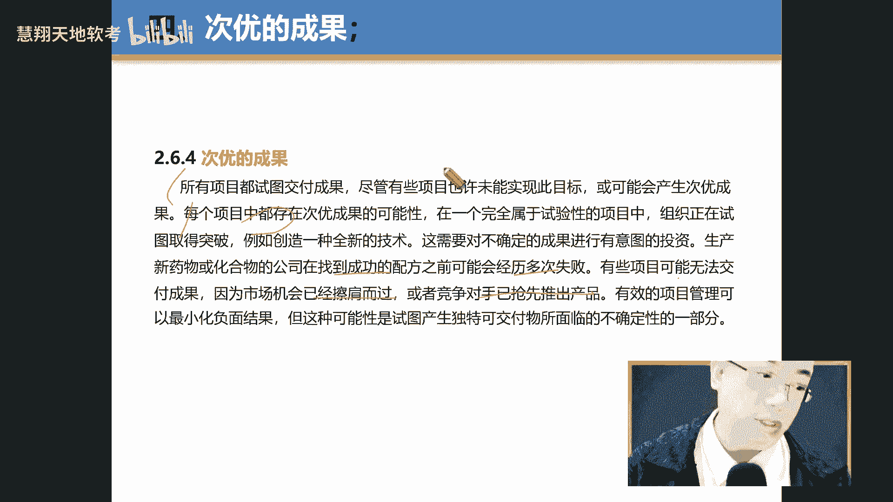

# PMP第七版全新课程 PMP精讲课程 ｜ 限时免费 知识点： 交付绩效域 （下） - P1 - 慧翔天地软考 - BV1Nr421u7zu

呃你这个地方帮我写个页码，47，87，我们现在是在87页啊，你再写个47，这两对着一起来看，对着一起来看47个，而且这个我们也讲过了，这个第六版中，第六版中是不是有个质量呃。

计呃质量的那个知识体系包括几个过程啊，q p com和OC来说一遍，扣什么呀，扣PQMQC啊，QC好了，质量成本咱们是不是讲过了。

跟第六版一起来看一下，呃我建议大家是这两个都看都看，因为偶尔会考一道题，考试大成，比如什么预防成本，评估成本，什么内部失败，外部失败啊，咱们就讲过了讲过了，这个不浪费大家时间，助理看下例子。

最好能去第六版看下例子，讲的最好包括一致性成本和非任意成本举例。

他这没有，他这没有写呃，你看他这写的的，比如一定成本，非制成本，比如说我们知道像那个，你看看你看这个书上也讲的有。

比如像预防和评估，是属于的一类性成本还是非一致性成本，来这个预防和评估也叫测试咯，他们属于一利成本还是非利用成本得一成本，什么样，就是叫conform啊，conform就是一致性成本。

就是confirm to，为什么呀，就是我通过预防，通过评估测试，然后呢保证我的产品质量是一致的啊，一直叫应用成本，为什么叫非定成本就失败了啊，失败了就分了，那非一定成本就失败了，就不一致了。

但包括联盟成了一个内部，你内部失败了，内部不一致了，那怎么办，还有外部不一致怎么办，那内部你无非就不一致了，那怎么办，那无非就报废咯，或者重工啊什么之类的啊，那外部或者不一致的，那你就保修咯。

保修或者索赔咯，或者别人退货了，然后甚至什么丢单了，所以为什么有些人有些产品我是不会买的，尤其我这这这这十几年做了一些呃，手机客户之后，有些客户的手机我是绝对不会买的，为什么就是包括我做买我买电脑一样。

就是说我很多时候不但不是为了追求一个什么，新奇特的功能，有多么炫酷，不是呢我是追求什么稳，因为对于我来说，比如像我原来买的是那个芒果的，那个芒果的那个那个电脑，哇塞花了快小2万块钱，真的是装逼特别好使。

但是几次第一不兼容，第二就是出现总不稳定，就是最后说主板出问题了，不兼容的，后来玩了半年，花了2万块钱，最后就放屋里放，那没用真的没用，最后还是回到这个这个是X1的这个carbon。

这个XRE这个品牌太不稳定了，真的是就包括我们说的那个戴尔啊，真的惠普都不好说，就这款式是我用过最多年最稳的一个版本，后来因为我原来以为这是我老东家做的产品，我就这么聊，我说为为什么叫产品。

而这款产品它的测试成本是最高的，那测试我们知道是属于一类里面对应成本，对应的成本就那个PRESU，比如他有比如他有什么防霉的，灰尘的，震动的，什么发热的，就是各种老化，他通过那个军方就美国军方认证。

就是你知道幺零多少，109多少多少人忘了一个这个认证啊，就是多一个认证就得12项的认证，就极端测试的，包括老化测试，很稳定啊，很稳定的，包括自我保护，他有时候不会烧啊，自我保护的包里面的一些东西。

就是你就是你举例，比如你买一个电脑，比如这个电脑是1万5或者2万买的，或者一个几万自己买的那种的，你打开那个下一看，用量都用料都不一样啊，就这样就跟我买手机一样，我一定问他。

我说你们哪一款是做那个做那个老化测试，做的最多的，他给我推的是这款那个摩托罗拉，这款我用这这用了快4年了，倍儿好使，关键它是它是开放系统，在咱们国内很少买到开放系统的开放系统手机，明白意思的吗。

咱们不都是阉割版的吗，这有什么好处，就有后人，比如找找什么资料图方便，所以就是稳定稳定稳定，所以大家一定要记住。

就这个就很关键，评估测试啊，记住啊，测试叫appraisal，测试评估是一直在成本是一致性，还是比定成本一定啊，你会重点把这行背下去，就是预防那些东西，怎么预防，你重点背这个东西啊，背去背和看啊。

去背里面的词儿啊，说明白了吗，就把它去背啊。

有的还是该理解还是理解，该背还是背嗯。

就包括这个我们内部内部失败了啊，内部失败的成本。

那怎么做啊，比如说什么报废啊，包括做失败分析什么的，外部了什么修为保修啊，索赔啊，投错啊，退货啊，生育啊什么之类，所以这点很重要，所以各位小伙伴就是你买呃什么产品的时候，我是强烈建议不要买第一批产品。

你知道吗，你没有必要用第一批产品，因为第一批产品你不要我们稳定啊，不稳定，你先等等个等个几个月，那几首批用户用完之后，然后你感受下用的怎么样，知道吗，他一般这个时候因为有有些客户。

就尤其是在咱们这个平时这个生活的地方，大伙都为了抢首发抢首发，所以测试多不多啊，不多的，所以就是他就宁可冒着这个，失去市场的那个风险，太为了抢就抢占市场，首批发放还是什么什，就这样。

假如你要有时间就算了，反正你跟他耗得起，修就修呗，你要每天就是忙的要死，就是他就是个工具，你要出了问题，你不就完蛋了，是不是就是这样子，不一定要生意，就像我给我买车一样，我就每次我都问哪款车是最稳定的。

最皮实的啊，然后他告诉我说是大众最皮实，最好买个捷达什么的，特皮实，就是然后来我有个有重去那个西安出差，然后开了个捷达车，居然翻车了，掉沟里去了，给我吓个半死，然后那个因多少都系安全带的，啥也没有。

那个车真是真皮实啊，所以有时候你看有些好车很出名的好车，它并不皮实，所以就是他就说你你要看这块，就是外部市场上，这点是非常重要的，但你要说我要品牌。

那就算了，嗯好了，这地方有一个考点哈，叫变更成本啊，在书90页，呃这个特别好理解，就是什么意思，就是说呃那个小方法第一话读一下，发现什么发讯息的缺陷的时间越晚，纠正缺陷哇，这个呢超巨人打四个P啊。

打四个币给主要给谁剪啊，这个应该给谁讲，告诉我给谁剪的，甲方两是乙方向，给甲方向，给乙方向A甲方向，非常棒，来掌声鼓励一下来，非常棒，就是你要跟甲方讲说你要做变更啊，或者做变更啊什么。

包括什么做质量这个东西就是变更，也是变更是越晚越好，越早越好变更，记得好质量，发现质量也是你别有发现质量了，你不说，然后用后拖都快做完了，跟我又说那质量冲击了，我疯了，那我这时候再去改已经来不及了。

所以越早发现问题及时改就是一样的啊，啊这点很重要，所以这边有一个有一这边有一句话特别重要，你看那个在那个90一页，他说呃谁要跟谁来合作呀。

就这个质量什么质量分析师和设计师什么，他们来合作，知道吗，他们俩合作，就是也就是说我们经常讲说有很好的设计师，但是呢你的你的产品不一定卖的很好，为什么你要你设计出来的能不质量合不合格，做不出来。

像原来我们作为一个一款车，叫什么叫所谓的钻石切工，那个钻石切工程车手开出什么好处呢，那个车就是棱角分明，但我们知道这个对模具的要求是很高，就是模具出不来或者良率什么样良率不高。

所以很多时候你所以你不光要还设计出来，你还要怎么样子，你还跟那个质量工程师说，诶咱们质量能做质量能保证，你会发现越是高端的设计，前卫的设计质量怎么样呢，越难做出来做出来啊，就是这样子好的。

什么叫次优的结果哈，次优的结果这个词呢挺好的啊，挺好的嗯那个呃那个小峰老师帮我读一下。

这什么自由的结构啊，所有项目都试图交付成果，尽管有些项目也许未能实现目标，不可能产生自由，什么嗯，那个U呢就是叫O呃，叫opium opium是吧，最优的叫opium是吧。

opp m那次U呢sub opium sao some subopa optical呃，Optimal，Suboptimal，Optimal，Suboptimal，这样其实有的时候可能呃。

我没能达到我原来目的，但是次优的次优就像你在买，我说大家在有时候你在网上买一些东西产品，他告诉我说这个产品就说是我们一个自有产品，这价格会比以前的价格打个八折，七折的，你其实你要对要求不质量不要求很高。

不是很抠的话，其实足够你用的了啊，足够你用的了，这样嗯这个把这段我们再好好看一下哈，看一下，包括这里面主要看那个，例如哎重点说下来重点背什么，例如这种文字重点画个圈圈，好好读，是典型的场景题啊。

场景题场景题常见性，他举了个例子啊，嗯他说我们要去做一个什么一个药物，一个化合物，看到没有啊，我们做一个药物药物的化合物，他说我做这个医药化合物之后多次失败啊，甚至无法什么呀，无法交付市场擦肩而过。

或者进这种抢先推出产品出来呃，所以为什么有时候你觉得那些药为什么那么贵，你知道药为什么我为什么药那么贵吗，因为它是做化合物，化合物化学反应就是这样的，有的时候可能它会有一些什么。

它不光是产生一种一种化合物，比如我来想生产这个A和，结果有A1A2A三是B1B2B三出来了，而那个A肯定做不出来，所以我不得不有接受A1A2或者B1B2，是这样的，就是化学法反应就是这样的。

它可能不是说，所以我们现在讲化合物的筛选，最后摔来摔去，摔了几千个化合物，就一个也没成啊，所以你这个多少亿就白投了啊，所以为什么有人说药那么贵，原因在这个地方，所以有时候你不得不接受一种自由的。

自由的成果，就不是最好的啊，不是最好，这好好看一下主要原因是什么呀，是确定还是不确定啊，不确定造成不确定。

造成这个特别特别特别好的词，并好吧，与其他绩效益的关系，我们刚讲过交付绩效率，主要交换两讲两部分内容，第一范围，第二什么呀，质量啊，质量没，这包括刚才也讲了过，在交互的过程中存在什么呀，不确定性啊。

不确定性，交互的时候存在不确定性，你把那个不确定性记下来啊，那个不确定性，这就是交互那些不确定性就是风险。

这样给好的嗯，这里面刚刚讲过了额几个哈，比如那就是比如说是写什么实现商业目标，实现交付及实现交付啊，达到项目的收益啊，然后客户的满意，然后最后呢需求的对需求对需求的了解，正好看一下。

这都是我们的设备上像那个实现商业目标，实现商业成果，实现交服务，实现收益，然后交这个客户满意，然后需求的清楚认知是这里面是个关键的环节，就这个这个是关键中的，关键是，这就完结好吧，OK好吧。

我们就先到这儿，我们休多休息会儿吧，现在因为今天上午比较辛苦啊，10。21010310104，我们这样吧，我们10。40。42来周回下10。42啊，10。40，10。40，10。42。

这B让我们第六有问题，啊10。40啊好吧，要起早起启动的话就去喝点热水啊，因为天今天天气比较凉，喝点热水喝点热水。

