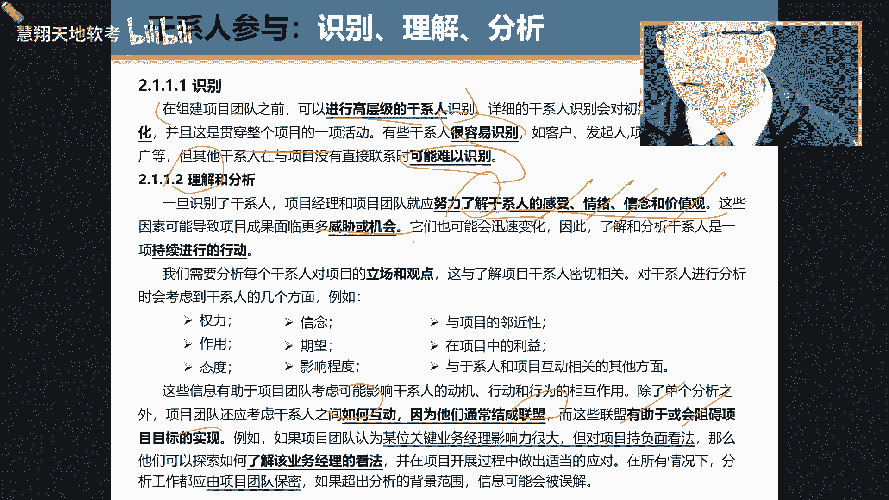
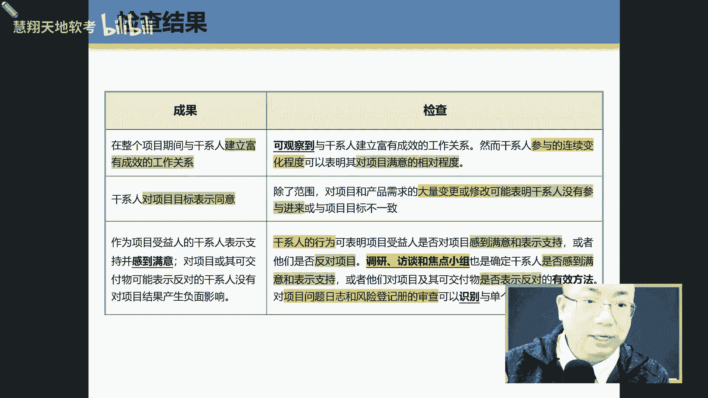

# PMP第七版全新课程 PMP精讲课程 ｜ 限时免费 知识点： 干系人绩效域 - P1 - 慧翔天地软考 - BV1zJ4m1P78B

就是为学文科就没有必要付出，那就没有必要，那是因为他没有意义，知道死记硬背上网搜肯定有，你只需要找几个人把你的架构搜索架构，不要有全球思一样，全科思维，全科思维不要被蒙克里全科思维。

然后应该做那些都是别人做的，然后就会进进入AI技术的，不然人家给几个做项目，他们在那听说牛逼工工的，我这样看到你，你想一下他留留在什么，院长这样说，我要抽时间，一念之间从来打破的那个专家的界限造成出来。

然后打开对，但是我们就是不断，还好是这四个，这四个全杀也不会差他那点东西，在AIM要是觉得婚礼找个成员都在，你不会换问题，讲解思路足够快，你就不要大不溜大不溜大，Why why why。

啊越来越相信他就愿意叫哦，原来做项目需要与人打交道，怕是要成精，就是所以所以我们要勇敢去找，去下一场，千万不要有刷题考证，要做项目，这个年代考证真的是不是最好的，你没有想过。

没有说你把其他的你直接能想象能接受吗，能接受吗，对呀，因为他是推理吗，他会推理可强多了，记忆力好，听力好像对文本识别不大，于是非强多了，但是有一点他还替代不了你，就是女人打了他，现在目前不是个人。

还还需要你去付命令啥的，所以就是让你能够能打败他的东西，好吧我们开始啊，来吧，我马上给自己掌声，来给自己掌声来，嗯我们说过啊，在第七版的话，它比如像第六版它的架构是基于什么，基于过程的啊，多少个过程。

第六版40几个，49个过程，49个过程，40过程呃，五大五大过程组，十大知识领域思维过程，然后记忆过程那是最经典版的，所以以后你要去那个就是石板，为什么叫石版呢。

就实际应用的for practical的，但这一版就比较偏这个，这个就比较偏一些什么呃，理论呢呃架构的东西哈，所以它就是比较它是基于什么，基于DOM8大绩效玉啊，玉，所以等会说什么叫玉啊。

什么叫玉这个词呢，你也不用太担心啊，什么叫纪效玉，他就是一系列的是一系列的活儿啊，什么之类的啊，好我们先翻到书啊，翻到书的这个第三页啊，稍等下次你都翻到，我都说，嗯好嗯，在这个哈在这部分中。

我们可以在这个指南中哈，指南中嗯，比如前一部叫标准，第一部叫指南，它包括三部，比如项目只是绩效预啊，裁剪还有方呃，模型方法和工件啊，来我们看看内容量最多的就是技效率啊，就是绩效率，什么叫纪效率。

什么叫纪效率，我们可以翻到书，什么叫技巧遇，所以我们先看一下啊，我们先翻到那个书的第五页，第五页正好是呢，就上面是什么，第五页找到没有啊，上面是什么，上面12个原则，下面是什么呀，八大进小玉。

12个原则，我们教会了，我们再把12玉说一遍，来12个原则包括什么东西啊，四个环境，四个人，四个新家具是吧，四个环境什么东西啊，变革适应性韧性，然后什么呀，系统性复杂性，然后人什么呀。

团队该系人还有什么呀，啊啊啊对，还有什么管家力和领导力是吧，还有领两个新家就亲是什么呀，价值裁剪就是什么呀，质量和风险，OK好，那我们看一下这个这个八大八大计教育，我也给他做了一个做了一个逻辑啊。

逻辑哈呃88712呃，第一你分三个层级哈，第一个层级叫不确定性，导致生理周期和开发方法的变化啊，一边写一边说来第一个叫什么呀，不确定性，不确定性导致的什么呀，导致了生育周期开发方法的变化。

就是因为他不确定性，所以我们的开发方法就有传统的预测性，变成什么样，预测性变成什么样，哎一说就是由于现在现在环境变化太快了，我们就变成什么，就是不是预就不运作，预测性越来越少，变成什么样。

你就是适应性了或者混合性了是吧，这就是什么呀，是商业方法变化了，第二层级就是新考官更加重视人，你还记得吗，我们讲过的ECO吗，他更重视人，为什么就是团队和干系人，是不是咱们在那个12个运动中来。

各位小哥哥小姐姐，咱们讲过团队干系人了没有啊，讲了，但那个地方讲的是原则，就是一些指南，但这个讲的就是具体一些具体的行为啊，具体行为可能是第三层叫PDCA，什么叫PDCA啊，就是计划执行监控啊。

嗯复盘那东西啊，所以就有四个技效率叫规划交付工作，测量来说变叫什么，来张嘴来规划交付工作和测量，哎哪个词呢，不要用中文去理解，其实第六版我们讲过的，你看规划交付工作和测量哪个不要用中文句子。

不要用中文去理解，记得帮我们讲过了，那个工作分解结构，work哪个呀，就是工作啊，所以又叫呃工作及教育，那个工作不要用汉语去理解，你要用汉语去理解的话，你就那个就保不齐，你能想成啥了啊。

你看别的都OK好三层我们再说一遍哈，第一层是什么呀，好来张嘴，那个小峰拿着那个那个跟大家一起说来，第一层是什么呀，大家一起说来，大家一起说来不确定性是什么呀，导致生命周期开放的变化啊。

OK第二层是第二层，更加重视人诶，就是新考就是一定要注意新考纲，就是nee c o信仰更重视人，那包括哪两个呀，团队和什么呀，干系人，然后第三层就是我们常说的PDCA是不是PC。

这个方法我不知道在座的各位，你们上你们上班的时候，老老老你们在单位老师给你讲过没有啊，就是做什么事都要按照PDC先做什么呀，规划在规划，然后执行，然后要监控，最后呢要做一个A那个A是action。

就是要怎么复盘呢，呃呃反馈啊这个工作啊，OK然后循环螺旋上升啊什么之类的啊，它包括三层哪三层啊，哪三哪四哪四个部分，包括什么呀，来规划交付work和测量呃，这里面等会哈，其实难的地方就是后面那几个什么。

那个就是交付工作和测量，尤其那个work和测量，尤其是work，就是他是因为他是这个我不说过嘛，因为有些词哈我跟老师你记住哈，你跟的是老师是原版学项目管理，所以我要看点原汁原味的。

比如你学到现在流传有有哪些词，比如像manager这个词容易产生歧义，来看我这边manage容易产生歧义啊，对没错，这管理这个词有没有产生歧义啊，来张嘴啊，是容易还是不容易啊，对容易产生歧义的。

因为我们在汉语中是把它翻译成管理，就感觉像监控一样，不是的，你看咱们讲的第六版，什么管理团队管理沟通管理，干系人参与管理，质量跟那个管理汉语的管理，俩字儿111点都不费事，他指的是他是个混。

而更多是放在哪，不是放在监控，放在执行吗，你明白吗，所以很多人有时候在在别的班，听别的老师讲完之后，跟我聊这个事的时候，他们就我一看就走偏了，但这个时候我一般不会去批驳他，为什么不选。

因为当一个人的意识已经到那个时候，你去批评后会直接造成别人反感，明白吗，你就不吱声就行了呗，你也不用去，你也不用说别人，OK但我不想我是丘陵的原版，就是原版啊，反正像engage这个词翻译成参与。

也翻译的也不够准，没办法啊，还像那个work这个词啊，千万不要用中文去理解啊，OK好吧，我们来开始啊，开始回去之后把那个部分看一下，就包刚刚说过什么，那个那个第三第三页指南的结构。

包括第四页什么指南的关系关系啊，包括什么修改了，修改了哪些东西，看看就可以了啊，好我们翻到第七页，咋不张嘴呢，第七页，是不是老K，第七页啊，来什么叫绩效玉哈，什么叫DMAN那个词。

什么来DM来刀妹那个呃小红帽读的什么技巧，遇金镶玉是一个相关活动，是一种对有效的交通项目成果至关，先找核心词说绩效预期是啥，是个啥啊，是是一组一组相关的活动啊，是一组相关的活动诶。

你是不是意思就是这是一组相关的活动，就举个例子，你比如做蛋糕，你要把蛋糕做下来，是不是有一组有一组相关的活动吗，比如查说明书啊，啊买这个擦拭的一些溶剂啊，工具啊，包括擦帮我去检查擦的干不干净啊。

就写这个就写个总结，擦的总结报告，总结过程，资产诶，就这一堆这一堆活动有没有相关性啊，有没有相关性啊，有啊，就比如说玉呢就是一组什么呀。

相关的活动叫a group of a related activities，来说一遍叫什么呀，一组什么呀，相关的活动，而且你要一定要记住哈，就是这个斗门这个词在在这个项目管理中呃，不同国家不同协会啊。

这个词呢都用到过，但是每个地方每个每个国家或者每个地方，他们在用到行业，它用到这个域的时候，这个词就包括像我们做软件开发，也会有时候也会用到一个玉，这个词，明白了吗。

每个地方用到这个词的意思意义是不一样的啊，但是我们在第七版中，在新版相关中我们提到的寓意是啥呀，小朋友说明他就是什么一组什么样相关的活动，一定是相关的活动，就像我们说的项目几一样。

是一组相关的项目相关的活动，然后这个活动是用那个用了一个有有有有，那个定语从句，这个活动是干嘛呀，用来干嘛呀，是交付项目成果的就清楚了吧，交付某一个成果，交付项目成果的这个活动就可以了。

就这个活动不是白干的，这活也不是白白干的，活干嘛，他是为了什么呀，交付项目的delivery project啊，project啊，清楚了啊，好了，OK然后这边就别的就不用说了啊，别的不用说啊。

我们在讲的你会发现在第七页中啊，第七页中那个倒数第二行，他说这些玉啊是相互重叠，相互关联到这个词没有啊，抓住词没有啊，就这些这些这些技效率，它们之间是相互什么相互重叠，相互关联的，不是说割裂的。

就像我们说过，我们讲我们在讲到我们那个呃，那个什么十大知识，十大知识领域一样的，十大领域之间是不是相互的，是是不是相互独立的，也不是他们之间都是相互相互重叠，相互呃，就是相互重相互重叠呀。

包括相互的关联的啊，OK正好理解好，我们看第一个来干系人吉祥玉啊，哎这个地方我们说过了，这个最好跟谁一起来看，跟结合我前面的12个原则啊，12个原则讲过了啊。

来我们现在讲这之前的时候呃，我们来说一下这呃这在写技教育的这个作者呃，比较好，他们都是受过严格训练的，是什么训练的，就是说呃你会发现这些这个金镶玉的这帮人，作者呢他们的都是按照某一个模板来看的啊。

你看那个应用模板啊，他说呃，干系人纪晓玉涉及涉及什么什么，与什么什么相关的啊，所以它一定会有个词叫，比如什么毛毛吉祥玉。

涉及address address address什么address1些活动和功能，所以它的模型就来了，任何的技效率涉及活动和功能，那什么的活动和功能与什么相关的，与该性质相关的，所以这个时候看大屏幕。

你只需要改两个部分，第一什么绩效率，第二是与什么与什么与这个活动功，与什么相关的活动和功能就可以了啊，比如这当中就是与什么活动相关的呀，与关系相关的，OK好我们123123啊，来把第一话读下来。

在整个项目期间与刚性人建立富有成效的关系，诶核心词是哪个核心词，哎对啊，然后加了形容词，什么富有成效的，富有成效的，哎你们见过那种，我不知道你们见过那种夫妻没有，反正我是因为不少这种夫妻两人都挺厉害的。

都挺厉害的，就是相互成就对方，然后1+1大于二，哇塞真的超牛，就他那种吃那种，就你他们既可以在一起生活，回来还可以在一起怎么样工作，还能够是一个富有成效的，但我们知道很多夫妻是这样的。

他们能够在一起生活，不能在意什么样工作，一工作干起来，因为思维意识不一样，意识不一样，比较厉害的就是运用在一起生活，还能在一起work，为这个work是一个productive，富有成效。

这是比较厉害的啊，好的，第二个什么就是干性对目标表示什么认同啊，这个好理解就同意agree with objective啊，这个好理解，第三个好理解就是说呃，就是第一就是我们干系人是什么样。

就是比如受益的干线，他什么表示支持和满意，是不是，假如说如果说即便这个人呃，他是反对我的，但也不会我产生什么样负面影响，我们在讲第六版的时候，讲过那个叫该系人猜度评估矩阵来说一遍，同学为什么呀。

这点声叫干系人参与度评估矩阵叫stakeholder，Engagement，assessment matrix哈，然后该系统有几种状态不知晓，拒绝中立，然后支持代理，是不是啊，OK啊啊。

所以这个也是一样的，就是说如果你是受益者的话，A你会怎么样，因为你是项目受益者，你支不支持啊，一般情况下肯定支持项目的收益单里面支持，这样说，你拆完迁之后，你就分了十套房子，你是受益者。

你当然支持拆迁了，是不是就是受益者，但有些人可能是一个反对者，但是呢那反对者一般会怎么样，拒绝或者不知晓是不是啊，那怎么样才我希望即便是你反对我，我也希望你什么呀，不要产生什么样负面影响，你不吱声呗。

不吱声呗不就行了吗，这就是这意思啊，好了，这边有几个定义啊，什么叫干系人，咱们第一个班就讲过了，干系人，就是影响项目或者受项目影响这个群体个性啊，这是一个考点啊，看该系人分析分析，包括定性的分析。

还有什么分析，定量的分析，这样子嗯，这点是非常重要的啊，那个鹏鹏把小鹏把这话读起来，好项目有人实施，且为未能实施，这里这一绩效利润需要与关系的合作体质，并争取他们的参与，以培养积极的关系和提高他们感。

所以在这一章中，就在这一段中，他特别提到一个一前一后啊，就说项目是人来实施的，人来实施的，所以这个时候呢就一定要和干系人呃，多去跟他们合作啊，保持一致啊，争取他们参与啊。

包括培养一种积极的关系和提高的满意度，这块打四个P哈，打四个P就是这是我也这句话，也是我送给大家的意思，就是你以后做项目，记住要要学会与人打交道，假如说来大家看我这边啊，假如我们做项目与干系人。

让他参与啊，包括什么满意啊，什么很积极呀，如果这最高的分是打十分的话，你觉得现在我们这个班里现在做的这些学生中，你们觉得这个假如我们是项目组的话，你觉得我们现在目前这种关系是打几分，感觉能打几分。

那个小哥哥能打几分，如果满分打的，按照这么来看，满分打十分的话，我觉得我现在状态达到几分，打几分，感觉打七分左右的那个先接近小丽的感觉，四分左右那个那个小哥哥，你觉得我觉得有四分左右或者30分钟。

就大伙看都不怎么看，都很不怎么那个你看到目前为止，大家都没有tears，按照我的班里绝对不允许这样耍单帮的，第6PE，因为你俩在起，你看我看你的去指的血快一点，知道这点是非常非常重要的啊。

因为你要让他们参与进来，还有关系，很积极很积极嗯这不怪大家，这不怪他，就是就是因为嗯就是因为现在怎么讲，现在因为没法去要求你，现在过去时我们会要求你的，现在没法要求，可你可自己悟了。

按说你是要形成这种什么这种积极的关系啊，比如像举例，像原来我们我们像我原来我考证的时候，我们班就会有一些大学，大家干嘛一起吃饭，然后一起聊天，一起一起复习，一起做模块啊。

这样子OK考完这门课再考下一节课，就这样的啊，我积极关系好的这个肝性人看看就可以了哈。

呃他特别提到过说肝性人包括了可能是人群体，也是一个组织，哪个是最小的小概念人，群体和组织人最大的组织和组织，包括不同阶段，不同的干系人，这是很关键的，要求了干系的影响，权利利益都在发生变化。

另外一张记下来，而随着项目的开展，就是这些人的权利影响有发生变化发生变化。

好那我们要做做好干性，这个技效率主要做几件事哈，还是一个就是呃那三个动词啊，三个动词识别分析和参与就让他们参与进来啊，这个就是这个词，因为我用红色标识就是翻译的不够好嘛。

就是它是要engage somebody啥意思吗，那个我们在做，我们在翻译另外一个标准的时候，不是项目管理标准，是另外一个标准，项目集，特别是三个标准吧，项目项目级我们在翻译和沈阳那个时候呃。

他们那个翻译者就把它改成了省教，我也很同意，我也很认可，但是我做审教嘛我也认可，因为像这个就没办法，因为他很多人愿意翻译，其实因为这么多年他没改，其实他那个层次翻低了，还翻轻了，还是翻重了，这个太轻了。

因为他就是我，他是要我是要引给你家人参与进来的，你必须进来，你不进来，我就我就我不开心的，我必须让你进来，你知道吗，我软硬兼施的让你进来，你知道吗，啊这样子啊，所以这个时候特别提到过。

就是说呃你要有这个技能，拥有与该系人合作的人际技能和力的技能来，请把这句话读下来，又有什么应用于担心的有效合作关系，技能和领导人，在书的第十页，第一段啊，第一段那个地方，你要人家技能要跟他能够合作。

还能够利用他的技能，最终需要他来参与进来参与竞争，嗯这个也特别提到过，在项目开始的时候，项目开始的时候，他说要做一件事，比如让他们能够这个一级就什么呀，共享清晰的愿景，只有这样。

才整个项目期间能够有良好的关系和一致性，因为我们很清楚，我在下面开始的时候，如果我们的我们的奥斯人没开那个视频，没开那个摄像头，就说我们在项目开始的时候。

如果说我们的愿景是一致的话，那关系一般是如果我们愿景是一致的，那关系是什么，关系是也是也是一致的啊，也是一种意志的良好的关系，那又如一开始我们的愿景是不一致的话，那其实是不可以啊，可以啊不可以啊。

呃因为因为现在怎么讲呢，因为呃因为大家现在就每次因为种种原因嘛，哈咱们也不说好与坏了，大家现在不爱去谈越，我们一探云雨的时候，知道是在干嘛呀，画饼阿炳，所以导致现在现在大伙儿就是在公司里。

领导也不跟你说了，你也不愿意听了，然后呢就导致出生是什么情况呀，大家一开始的时候有没有清晰的愿景啊，没有新愿景，那平原你说关系好哪去啊，是不是就这样，所以现在就是恶性循环，恶性循环。

那真正做项目是需要什么呀，谚语呢，这个星系的什么呀，远景啊，远景啊，所以你不能说现在做的不好，咱就不做了，你要知道真正做项目是需要有愿景，有愿景的原因，主要是现在嗯这个大环境不好，加上有些人呢。

有些领导现在也都他也没法控制这个项目，所以有时候导致有时候月经真的就是一个饼了，所以也没办法，我们那年代好在什么地方，就基本上人呢还是真诚一点，回到一个第一大环境很好，经济经济发展很快。

第二个老板也比较真诚一点，所以基本上说什么你们都还是比较有，至少有一半人会相信啊，这点很重要好，那怎么让肝性能更好的参与进来，参与进来有六个步骤啊，从最开始的识别，那么读下来，有些词呢嗯记住哈。

有些词呢就是比如说肯定要通过，比如举个例子哈，比如像这几个词哈，像理解，像参与向监督，都要去看里面的段的意思与否的话，你传生气，比如识别好，说识别干线，这个不会出问题，包括分析也不会出问题，排序都不出。

就理解什么叫理解，什么叫参与，让他参与怎么监督啊，这个是容易产生七，你标了吗，哪三个呀，哪三个，第三个理解参与和监督。

这三个东西开始起义的还是奇异的好。

我们来看一下哈，识别就不用说了，我们前面讲过识别干系啊，这都没问题啊，就是嗯这句话非常重要。

那个虎子把他标了的啊，那个小红马第一话读一下。

在指定项目对之前。

可以进行高层级的文档系列使用嗯。

OK所以一开始哈这项目还没有，团队还没有组建之前，你要先呃先去做一些high level的人去识别啊，识别有大小王呗，是不是嗯，然后呢识别干系人是不是一劳永逸的。

也不是他是一个什么呀，渐进明细的，随着时间推移。

随着掌握的信息越多，你这个该信人识别的越准越准确，越不准确越准确啊。

非常不错啊，然后他说这个识别干系人也是贯穿项目水中的，有些干是很容易识别的。

有些什么呀很难识别的，尤其是那些有些地方有地方的关系。

人与人际关系非常复杂的时候，是好识别还是不好识别啊，不好识别，这能理解吧，就为什么说有些人呃离开了大城市之后，回到自己的家乡，然后待个半年又回来的原因什么原因，他说我在大城市吧，反正只要只要能吃苦诶。

我就基本上能干活，但是回到家乡之后发现怎么样呢，那边都不是看能力，看什么呀，看关系，所以而且关系很复杂，你难以识别的，你难以识别的一点机会都没有，你懂我意思吗，就是我们做项目最害怕就这样。

就说就是这个人关心我，识别不了，那你玩啥呀，明白了吗，好的，那实际变化之后去理解和分析。

但理解是什么东西哈，这个词我说过呃，就是呃不能从字面去理解。

字面去理解分析法，说理解为啥是错误。

好的，你看他这你看他这个地方用的那个词叫understand。

理解好，然后这个地方呢又用到了这个也是understand。

同一个单词，它翻译成理解和了解啊，Anyway，不管它它是一个词。

哪个动词来说哪个动词understand啊，你要understand它是什么东西啊，来嗯这个小红马这个就不读下就行，你看ANDERSON他的开心是什么呀，当心愿的感受起去信念和价值观。

哇塞你，你觉得哪个好好好好，Understand，情绪，假如你现在遇到一个高一个高人，他的情绪，你看你能understand他会怎么样才他会high的隐藏的，你知道吗，只有比较比较那种一般的人才会。

情绪才会外溢的，嗯感受清楚更不会说了，他你看不出来他feeling what's your feeling，How about feeling no feeling，哈哈没感觉。

然后信念价值观就够难看就来判断。

所以这个这个understand是，所以就类似于像我们视频，你看当我们看啊，第一步先我知道有这个人很关键，但是呢接下来接下来第二层干嘛，理解他是什么呀，他的情绪情感信念这个是比较难的啊，比较难的哈。

嗯因为这个东西如果你理解你，你不能understand，就会造成你想的什么呀，威胁和机会，机会。

嗯然后在下面有一段文字非常重，在那个第12页啊。

第12页呃，他特别提到过，就是你要与干性之间干嘛呀，要互动，要和他结成联盟，这样如果好的话，有助于项目目标时间，如果你们之间互动不好，联盟没有形成联盟，就会阻碍项目要求。

所以我们做完项目之后，这些人都成为alliance来说，alliance怎么叫alliance，是不是联盟联盟啊，明白联盟这个联盟其实没办法，这个有的时候你是想不结盟，但是很难，因为人家结盟。

你不结盟，是不是很容易被别人干掉，是不是就是没办法，就是没办法好的，嗯有一些东西要理解哈，就是有些在干系人的识别好，你去理解这个干系人也好，呃有些信息是要干嘛要保密的，要保密的，看见没有啊。

你不能识别了干系人，或也了解了干系人之后，他的情绪，他的价值观，他的信念你不能外溢出去。

这样的话很麻烦好了，这个好理解啊。

排序排序就是我们说过啊，比如说有比如干系人分析中经常会考到的。

比如肝性的影响大与小，还有肝吸人的这个项目中，它的利益大小，那我们要找哪个干系人，就这个项目比他力大小啊大，然后它的它的影响力大，这种干性是什么，重点叫prioritize也好了，大小王是不是分析好了。

不要找那些权力大的，影响比较大的。

对他影响比较大的，该先找到南部的，要干嘛嘛，讲他参与进来，engage with somebody啊。

engage with somebody好，能参与进来。

这个很关键啊，这个就这个都清楚，那我们为了让他能够参与进来，这个时候会经常有一些动作啊，超重要。

这个地方打四个T吧，就说你为了让甘新人从一进来，这个这个小红把这句话读起来。

就这争取当事人需要专门利用软件。

改由器和记忆芯片。

人际关系进来和中国管理，以及创建愿景和批判性思维等领导。

我们说过哈，那个批判思维不是那个中文的理解，批判要批判谁反对谁。

不是他就说你的你的思考方式基于什么呀，基于数据分析寻找偏差，找原因解决问题是这个意思啊，就尤其找数据分析，找偏差解决问题是这个叫判词，就是说白了就是你的决策，你的分析不是主观臆断，是基于什么呀。

数据偏差分析来的啊，分析来的好的，需要什么软技能，积极倾听啊，多听别人讲，然后人际关系和冲突管理，我们知道其实这是很重要的，我们知道很多人是不愿意起冲突的，但有的时候做项目就是冲突特别多。

还有很会跟别人讲清晰的愿景，就是你还不轻易讲愿景，你记住啊，当一个人不会讲愿景的时候，当然你首先你自己有个怨念呢，来你要去让该县人参与进来，你自己说的有愿景啊，然后同时你要把这个愿景吧给他沟通。

让他也认同你的愿景，愿意一起来做啊，这是房间批判性思维啊，这个很关键，好，我说了监督来，请把这句话读一下，什么意思啊，什么表字面意思，因为我们以为监督干系人，监督关系还是监督他呀，不是的，他是这个N来。

你把这句话读一下，小黄这句话读下来，这句话在整个项目期间。

随着新的那些人去实验。

和一些其他人推出单行将发生变化。

然后随着项目的进展，一些关心的态度或权力和违法，没错，很多人以为说以前我刚才跟我们讲了，很多人说张老师不对吧，街头相关也不是那个不是那个什么，就是那个监督谁吗，哈哈不是的，他认识的意思就是说呃。

我们在在这个项目过程中，有些干系人他是会发生一些变化，有发生变更啊，什么可能明白吗，尤其是那些什么态度和权利，这个最后用的标识，所以做项目是不是，尤其我们作为大项目，比如说几千万是上亿。

是几10亿的大项目，是你们该重点，该型巨复杂，因为他们在因为这几十个项目做好几年嘛，这就是他有些人的态度，权利是人员都会发生变化，所以这个监督不是，所以有些词一旦算是汉语产生歧义。

这个monitor是什么意思，我需要我需要monitor。

control是要监督他的，有些什么变化是这意思，监督一些变化，干系人的变化。

面对态度啊，态度态度什么变化，权力发生变化没有，是不是变得很重啊。

尤其现在这种状态，卧槽，他比如他以前主导过的某一个项目，那现在他一下来之后，那你讲完那天那个项目懂了吧，所以这时候就是这个时候就很麻烦，像我们做大项目，最害怕的就是这个呃。

这个这个这个干系人发生权力发生变化，所以我们我们做大项目，项目有个特点叫及时去monitor。

这些干系的态度和权力的发展变化，关键是什么呀，关于这个东西怎么样，怎你知不知道啊。

叶子不知道，所以这个时候有的时候你就答应说，是不是风吹草动啊什么之类的，所以就是特别考验敏锐的时候，我原来我这么多年曾经做过，有做过一个外企啊，就是他们他们跟我说。

他说嗯我们这个老板有可能和财务有可能要换，因为老板和财务一起换，你懂了吧，这属于常规老板和财务一起换啊，当时我一说我有点紧张，还好果不其然，我带了几个销售，我们那个我觉得还是应该是五一放假。

我们走在他们公司门口放假了吗。

果不其然，夜深人静的时候，大老板带着财务公司的保险箱里干嘛，不知道啊，来了来了之后，我们干嘛要钱，那个老板还真还挺真挺够意思的，在他下课之前，把我们的那个我们做项目的一些原顾问的员工，开发费啊，实施费。

咨询费给付了150万，我们多亏那150收回来要，但很快好像没过几天，咱们就发生，那个就是那个发那个我那个红色的文件，说这两个人这这怎么怎么着了，说的比较含蓄，意思，那钱肯定要不到手，150万。

在那个年代。

哇塞医生呢在后面前再要，后面再要做也不做了，钱也没了。

那就这样，但至少说没烂账，所以清楚了吧哈清楚了，包括你还要监督什么呀，监督干性的什么呀，满意度等等。

OK这个明白了吗，监督不要从什么来监督，这说明啊，这个监督干系人不要以干系人的这个字面去啊，既监督理疗监控里不是意思是监督什么呀，干系人什么态度或权利发生什么变化。

是这意思吧，OK啊这边干系人沟通这个看看就可以了啊，该性格比如推迟沟通，拉式沟通，这个都特别好理解呃，主要看例子啊，就比如我给你发邮件，发邮件，发语音，给你发一个文档，这个功能叫什么推水沟通。

什么叫拉屎沟通吗，我在内部网上去查找一些政策东西，沟通拉扯沟通，但所以大家以后不要以为沟通就说话沟通，就比如说通过这种文档，这都是沟通沟通。

好这边可以看看这个简单看一下啊，就比如与其他技效益的关系，与其他效益，我说效率，其他地教育发达地效率就说呃，那么我们该线性效应和哪些技校有关系。

看看就可以了，就比如说干性与这个范围啊，范围是有关系，为那个与什么与作为团队会定义什么，定义这个因为我说过有没有干性的低效率，来看我这边有没有干性低效率，有还是没有啊。

有的现在学的时候看见鱼有没有团队绩效预啊，有的你看啊，他说其实干系人有时候是作为团队一部分，来参与定义需求啊，因为干系人和团队哪个哪个概率大呀，该系人和团队哪个大概率大呀，干性更大吗。

因为干性人包括团队嘛，所以干性人肯定会参与什么，作为团队成员来参与什么呀，参与需求调研范围什么之类的，嗯还有一个呢呃干系人可能会参与到什么，制定一些交互已交付的一些验收标准啊。

这个跟那个质量效益跟那个质量，跟那个等会儿跟那个交付，那个跟那个交付效率就相关了，因为交付交易，这个交付满满足这个标准是谁来定的，该性他们参与进来明白，然后我们还说过，还有那个有不确定性的机效率。

就是变革及效率，这个时候呢，干性是可以帮帮助减少项目的什么不确定性啊，包括测量，比如说就是干性，干性倾向，于是和好几个绩效率都是有关联的。

就看看就可以了，好这张表呢就把它再总结一下，我们快速看一眼。

看一眼这个前面这三个，咱们在那个前面的表都讲过了是吧，比如建立一种什么关系啊，来小朋友说明来建立什么关系啊，富有成效的关系，所以怎么去怎么去检查呀，怎么去check，来说怎么去check呀。

来大家说一下小鹏，你有麦克风，你说我就我第一个成果，你是要你们俩干系上建立一种富有成效的关系，那我怎么怎么check到啊，说什么呀，这就这种你这种关系我是可以观察到的，举个例子就举个例子来，各位小伙伴。

你们现在这种这种是你们这个成像的关系呃，我有没有观察到没有啊，因为如果是一个富有成效的关系，你们一定会两个人坐一起一起来学的，这样效率比较高一点，我还想问问问题啊。

怎么只诶你诶这这这这这这这是这叫富有条，我能我能观察到那个observe observe的哈哈，包括干系人对这个目标表示同意，Agree，Agree，就他这句话用这个例子讲的特别好。

他说如果说我们现在啊，这个产品的这个项目或产品的需求，有大量的变更和修改，说明了大家是不同意还是同意啊，你的变更有大量的需求，有大量的变更，那说明我们是同意还是不同意啊，肯定是不同意吗，同意不会变更的。

是不是当时肯定不同意啊，这个好理解，所以就是我要看，你说你说我们干性对项目目标都统一的，结果后面发生大量的电影，能说明当时你都不知道同意了没有，肯定没同意啊，没有同意啊，这好理解啊。

然后包括你的干干先生是不是满意了，然后是不支持是通过一些呃怎么样，就是通过一些干性的行为啊，一些该性行为啊，干性的行为，包括你做些调研呐，这访谈呢就看他们是不支持的支持等等，包括如果干系人。

他们有时候可能比如说有些反对了，反对的，你是可以通过那些问题日志和风险登记册，能够识别该新人挑战，这啥意思吗，举个例子，我在记录项目的问题日志的时候，和记录风险的时候，我说那个老总。

而且是一个关键业务劳动，并不支持我们，然后也不参与，也不参与需求访谈，也不做也不做，也不做流程的更改啊，也不做签字，一些需求的签字确认哇，这就是项目的一大风险的，也是项目的一大问题啊。

这个时候我推能不能看到啊，你看他这个文档是保密还是不保密的呀，当然保密啊，哇塞哦，那个人反对我，我还写在问题是这里和谐的氛围中，还被你看到，你的更加弄死，我是不是实际上有些东西是绝对不能没有。

所以这种文档一般是放在特殊的人的电脑里，而且不会来回发给传递的，而且只能有极个别高级的项目人员才知道的，因为一旦长了就死定了，但这个文章为什么很重要，因为你不写的话，你永远傻得呵呵，做项目做事。

因为死的很惨，明白了吗，所以这个东西呢是因为在这个，因为我们在通过查看项目的问题制和风险，登记册中可以查到这个该哪些干系人，是反对我们的一个项知识，明白了，所以你做项目做多了。

你对人的这个判断是更准还是更不准的更准，我们我见过你，原来最开始我们这20多岁，然后在南方做项目的时候，经常遇到过有些人对你很nice的哇塞，形象又好体相思意，说话的很谦卑，很柔和。

哇塞才发现最后弄死你就是这个人，然后你还接我不会呀，他那个队伍很nice的，每次都跟我说，他就是他弄死，你知道，所以这就是叫明扎还是暗扎呀。

