# PMP第七版全新课程 PMP精讲课程 ｜ 限时免费 知识点： 项目工作绩效域 - P1 - 慧翔天地软考 - BV1mJ4m1A75z

好我们开始了，来我们还可以见掌声来好，谢谢大家，谢谢大家，谢谢大家来掌声，掌声响起来嗯首先感谢大家，今天今天天气不太好，嗯好我们可以开始啊，开始啊，呃我们错过哈，我们看一下那个八达基教育。

也是我们就是在新版篇博客中是最重要的部分，DM还记得什么叫区域吧，大家看大家知道什么叫欲吗，就是一系列的什么一系列的什么活动啊，相关性活动目的也是为了实现项目啊，目标啊什么之类的运行的活动在一起啊。

就比如说呃规划啊，一堆规划的活动啊，比如work就是WEWORK那些活动啊，这么理解就可以了，activity呃，我说过哈，那八大体教育我们说是分分三层来背，来一起张嘴，哪三层，第一层是什么啊。

因为这是一个变革的环境，所以我们的生命周期是要变化的，不是有不能有原来的什么呀，呃原来的预测是要变成现在是新的吗，很合适，所以大家一定要注意，就是那个考试是呢就是有一半的黄金阶梯。

所以你们把目光去来到这边来把目光集出来，看了看那谁那个小董是不是小董，因为小总他是做开发的开发的，所以开发小伙伴要学这个敏捷简易，有反转有反转，因为现在为什么，因为现在考试只有一半就是敏捷题。

哎呀真的是大家我们最多最多最多就是70，哇塞都疯了啊，真的是没办法，因为它的题是抽题，它不像咱们国内高考还还有分布没有分布啊，就这样啊，所以就这样，大家所以啊所以这段时间就是考题，特别就是敏捷特别多啊。

好的，那这第一个就是因为变化才会，生命周期会发生调整，第二个是什么呀，还记得吧，第二就是人就是团队和干型，这个呢跟谁一起看，知道吗，跟那个原则，因为原则中影视频也有团队和人的也是有的啊。

所以这个也是有的啊，所以把就是这个的呃，把这个动漫的people和这个什么SORDER和那个谁啊，原则的就是stakeholder那个team一起来看，因为他都是团队和干线，哪个范围更广一点。

哪个范围更广一点，AC holder啊，我还说哈有些词呢咱们说中文没问题，有些词呢你就尽量少说中文，因为像那个词，或者你要说完之后呢，就产生歧义传奇，因为CFA这个词在咱们国内就是翻译太多版本了。

太多版本了，你明白了吗，这就要重演了，好的，然后第三个就是我们说叫p DC叫什么呀，叫规划呃，规划交付沃尔和这个测量，其实最好理解的事呢是规划和测量测量，其次是要说最难的是哪个，最难的是哪个，对OK啊。

这歌我们知道达芬奇怎么用，用哪个方式，哎对了，这这是最科学的方式，用这个小B就是这个方式好好来，我们可以开始哈，好的那work是什么，work是什么。

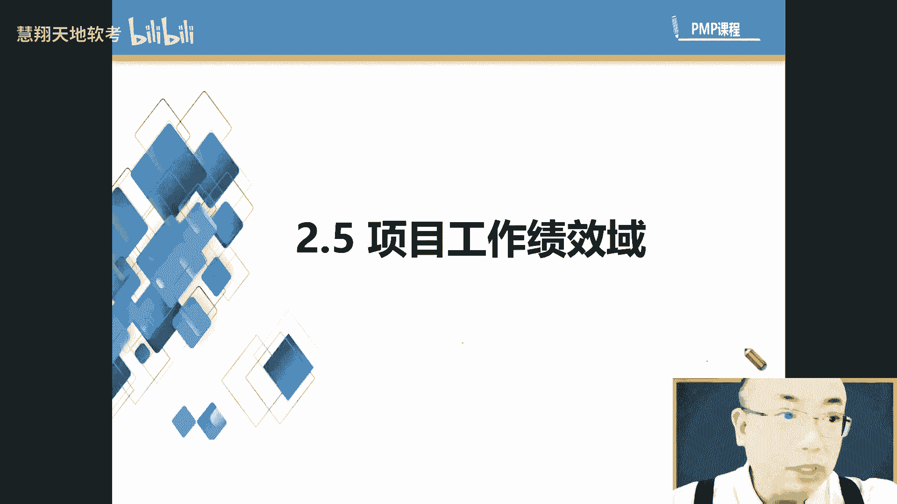

大家可以看一下啊，大声读，现今天我希望你们都能读起来，好不好，读出来了，先读右边吧，读右边的我希望听到每个人的声音好不好，来读右边的是几点来这来多读下来，我希望听到你的声音好不好，来开始了嗯对。

所以说相同和相互感谢，第一个告诉。

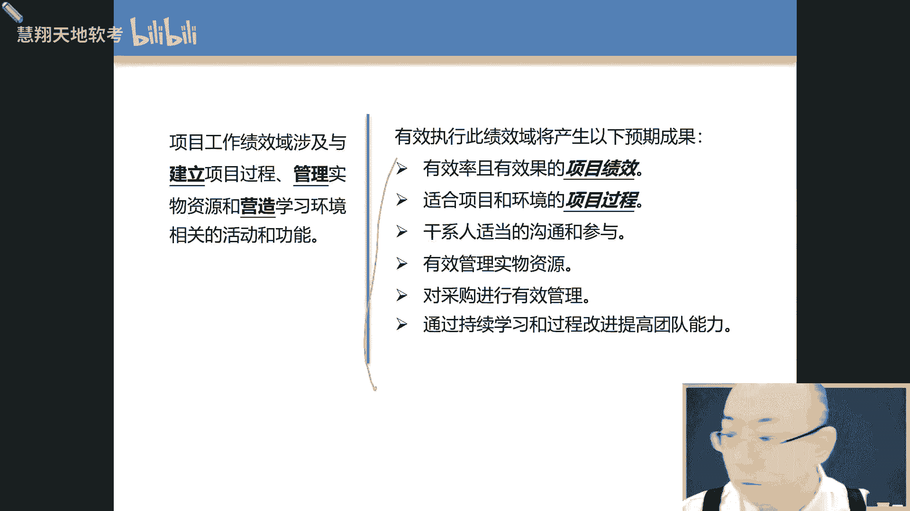

好的他你看有几个有几个词哈，有几个词哈，比如说他说什么有效有效率，效果的什么呀，像的什么呀，绩效啊绩效，你看我的书写的都是这样的，这第二本书弄烂了，写的特别细哈，就这样子。

我们来首先看一下什么叫work啊，这是我说的，因为这个词我不建议大家翻译翻译，所以翻译完之后会产生歧义，是不是对好那个小朋友，你能找到那个核心词吗，我们一起找核心词哈，他的模板知道吗，什么叫模板。

就是某某的绩效与设计的一些活动，和设计的活动和什么功能，这个是模板啊，就是就是吉祥玉设计什么活动和功能，那有什么与什么相关，与什么相关的，与什么相关的功能，与什么相关的，OK你们找一下有几个动词三。

给你三个establish，manage和foster k这三个字，我告诉你真的是这个词的逻辑好难找啊，你看看第一要建立一个过程，就建立项目的过程啊，这是一些过程啊，就是比过程。

然后管理资源和营造学习环境，坦率讲，这个东西跟这三个，这三这三个词，真的是就是就很难找到他的联系点，没关系，先放那啊，好了，这边是几个，左边是几个，左边是几个，一起说几个，张嘴来几个三，一定要张嘴啊。

张嘴三个K，你在你在内向的人，大大的老师课堂这边有几个这几个六个哈，好的，我们看一下过程有没有有，然后学习有没有有的这块过程也有了学习，有了资源有没有有了好了，比如这边六个呢，其中这三个都包含了。

那哪个还不包含呢，就比如说绩效啊绩效，然后呢沟通和参与干系人，然后呢采购哎，你看到这时候有什么有什么感觉没有。

啊除了他除了他说的什么，就是这个过程过程什么学习资源之后，它还包含什么呀，包含采购，包含干系人，包含沟通，包含参与，你现在感觉出来了没有，来各位小伙伴动动你的脑，脑，脑部的神经，看看这里面有这个采购。

也有了肝气人，也有了沟通，也有参与，也有了，这就是包含什么东西，我记得是十大知识领域吧，你看这个地方，你看这个地方是不是都包含十大知识领域，光这个地方就几个知识领域，干系人沟通参与几个就俩吧俩了。

采购的一个是不是资源，又是一个就是你看啊采购一个自愿，一个采购，一个自愿，一个干系人，一个沟通，一个是不是这几个都是几个的，这就是四个，这四个啊，所以这张是很难找的很，就是反正写这块做的。

我们的时候真的是很难找到他的内在的内在逻，但有一点我很清楚，你知道这里面的核心是哪个核心吗，感觉好像是这个核心没有建立项目什么呀，过程过程，然后资源学习，OK然后你看像采购也好，干系也好，沟通好参与哦。

包资源好，是在我们师大知识领域中的前半部分，还是后半部分，大家说说看是我们十大知识女的前半部分，后半部分什么干系人，采购来张嘴哎。

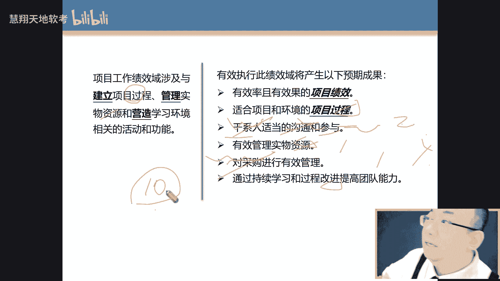

后半部分清楚了吧，后半部分OK好，这个地方我们再看一下他的呃呃呃，那个术语术语，你们看到那个术语有招标会，招标文件，招标会，然后呢，显性知识和隐性知识诶，告诉我这个是哪第六版的哪个知识领域的，第六版。

哪个知识领域招标投标，这属于哪个知识领域，A采购显性知识领域，知识是知识管理4。4是哪个4。4吗，四是哪个呀，整合管理吗，整合管理是哪个呀，整合管理啊，等会儿第四个嘛，第一是早的还是是开始的还是结束的。

开始的那个4。4，就是那个知识的管理非常重要哈，我们知道显性和隐性哪个更哪个更值钱呢，对应性的我们知道你在做项目中，其实你特别希望一做项目有人给你一堆文档，而且最好是那种就是平时看不到的干货，给到你呃。

所以有一部分的公司但不多啊，会有这种像我每年至少做三个项目，就是这个客委会请我去找一个山清水秀的，一定是没有信号的地方干嘛，real就待在哪，一般至少两天两夜，三天三夜，就在那去，把他们公司。

最近这两年的做的项目的干货提取出来啊，那个环境真的是就是所以你才知道，原来我们国家那么好哇，那么多好环境，我你怎么没去过武夷山哪啊，像那个张家界呀，好多那个包含西湖那边那个山上啊。

好多地方都特别特别特别好的地儿，然后呢为什么没有信号吗，就怕你手机干扰你的一些思路啊，或者有些被外泄出去了等等，然后公司内部的最顶级的专家坐在哪，在哪去，好吃好喝啊，一般都是那种极度的放松。

为什么要放松啊，由于放松，你才没有警戒嘛，没有警戒才能把知识怎么样贡献出来啊，这个超级重要啊，这个咱们讲过了，不要浪费大家时间，比如说那个隐形之中到过一些什么信念，经验和洞察诶，你们觉得哪个比较值钱呢。

music比较值钱，你们说insight洞察，最后来说说看你挑一个词洞察啊，都挑洞察对经验啊，你们就不挑那个词belief吗，贴比利贴比利就像情商一样的，其实这个东西比比这两个词其实一点不差的啊。

他为什么你想我们很多时候就想说，现在经济形势和挑战一样的，但是有些人呢他在一直在想办法，每天都想办法啊，其实他是靠着一股劲儿能够扛过去的，扛过去的，belief啊，这beautiful特别重要。

有的时候你到了一定的level之后，经验和洞察这些东西都是没问题，因为经验是没问题的啊，但是信念是很难信，你就有些人就有些人他就做不下去了，神不行了，没有贝雷斯，他不愿意干这个，就像我们做项目一样。

他不愿意干了，就他是我们那是最好的，最好的人，最牛的人，他不愿意干，他没有，他没有信念了，1~1组，就像大家听过抑郁症没有，是不是在招英语，中国的医生比例是超高的，尤其是疫情那段时间。

包现在心情不好的时候，那个有些人就直接蹦下去了，但我就是扼腕叹息，说这么优秀，怎么会这样子呢，那样忘了那个人，他就是因为他没有什么没有了，Beef beef。

这个是这个有点像我们说的那个resilience，一样的那个韧性一样的啊，任性一样啊，这个呢你而且你会发现很多有belief的人，一般他的出身，他的经历都是比较什么呀，是曲折还是顺呢，非常曲折的。

就是你你看他貌似能熬到今天，他已经这都不知道吃了多少亏，受了多少苦，你是不知道的啊。

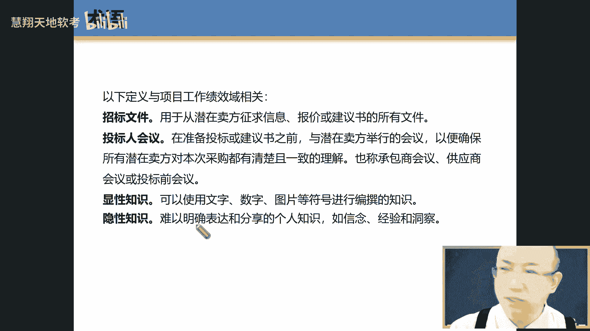

这个很关键啊，OK这都是考点啊，好的我们再次看到这个worker，大家翻到这个书的多少页，翻到第70页，来张嘴70好，你们来快速看一下，把刚才的三个六个和这几个呀，这八个你们来转一下。

你们调给你们十秒钟，结合刚才的三个六个八个，368368，好我们来快速看一下哈，依然看的最多的是哪个流程，流程流程是不是沟通，有的采购是有的，采购是有的学习是有的诶，这边多了个什么呀，多了一个什么呀。

一个变更是吧，多了一个变更，多了一个什么呀，专注专注，好你们可以看到那句话啊，那个小红把第一句话读下来，项目工作可使这项目工作同时向组队保持专注，并使项目能顺利进行，所以你会发现这个这个work啊。

我们还是要就这个work，所以就像好多词一样，它是有很多意思，比如我们在那个DBS中，那个work就是最小化的什么呀，交互物是不是就是the minimal minimal delivers。

那这个work work这是什么词啊，这个work这work说啊，我是为了让我的团队能够更加focus focus呃，我们昨天讲过说避免分那个领导力中，有个叫避免分什么爱分心，分心就让你不要去做时间。

不要做一些时间碎片化的东西，你集中精力做做项目就是这样子啊，所以你也是一样的啊，所以就是说嗯就是呃就是你会看，你像比如说他们说哎，你要分析说宁都还在刷抖音呢，我说你可以看我的抖音，你刷的。

因为刷抖音看到你给他刷东西吗，就像我刷那个百度一样的啊，你说他爱看百度，我说你看我的百度，你一看，因为他现在对实现所有的工具，他们的影响，百度也好，抖音好，他都会按你的习惯来推，你只要不看这个东西。

他都不会推，然后一看我就发现我的什么呀，我的那个我看那东西叫什么新电池电池啊，新能源啊啊什么高科技啊，量子计算啊，就这种什么运算法啊，全是东西啊，就是包括什么现在大语言模型LOM，就这东西也就是。

所以你就是你看所以看到些知识博主一些VLOG，所以这个也是一样啊，就保持关注，所以这块重点关注一下，就是你看这画个圈圈，保持完整流程，不用说流程不用说，这没问题，最终使项目执行顺利进行。

所以这个时候他说这些work包含了什么，就这些work包含了什么几个动词啊，发个动词啊，发个动词，把动词给你们十秒35秒钟，快速把这八个动词来读一下，来八个动词读来大声读八个动词，就把第一个动词补一下。

大声一定要大声，一大声我就愿意大声，你要不大声，我都不大声了，来，好我们看一下哈，我们说过变更考试，变更时考试题多不多，变更考试题多的多的哈。

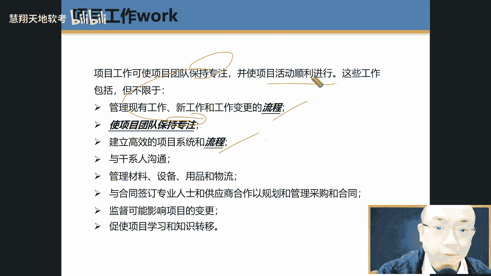

好的，这个时候就是我们这个大头了，叫什么呀。

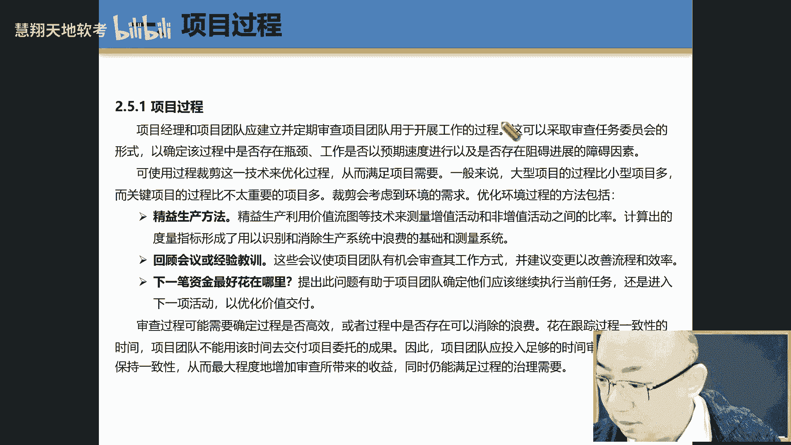

过程啊，过程，但这个过程大家听过这个地方帮我写一个词啊，不要这个过程帮我写一个词。

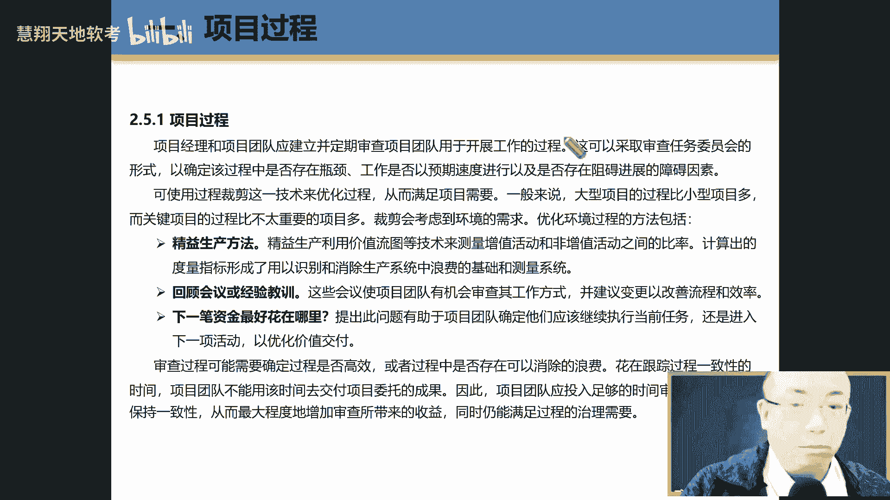

不要从字面去理解，特别棒，不要随便理解，因为这个过程跟我们那个呃，在第六版学那个49过程这个词是一模一样，process是吧，process那说明了process，包括我们以后在公司内部要画个流程。

比如那个小红，你是做那个比如钢铁那个电商那块，那你要会你要绘画你整个电商，钢铁电商的这个p two p采购啊，什么p two p采购什么之类的，你一定要画流程逻辑，那个每个每个采购流程的逻辑。

包括里面的算法都要搞得很清楚才行啊。

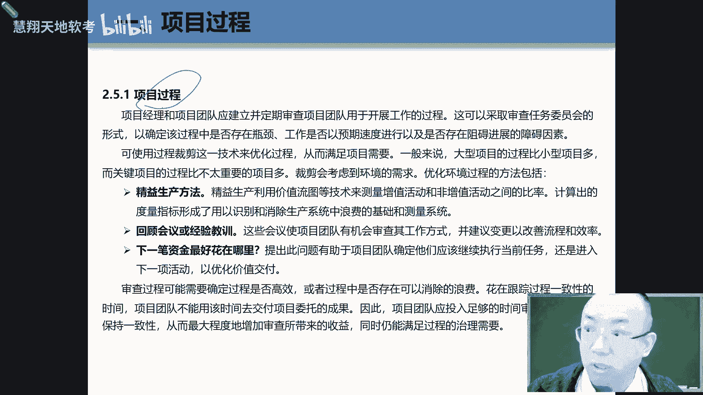

好的，那这个过程跟我们的过程是不一样的，诶你发现这个过程包含什么东西。

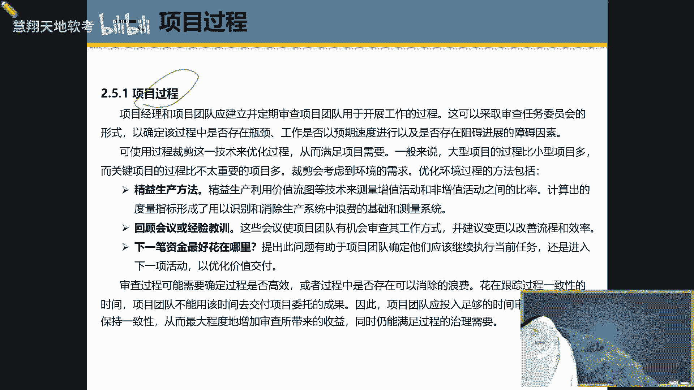

包含什么东西，你看啊，他说，嗯已经离开，过程中是否存在瓶颈，工作是可以预期的速度进行。

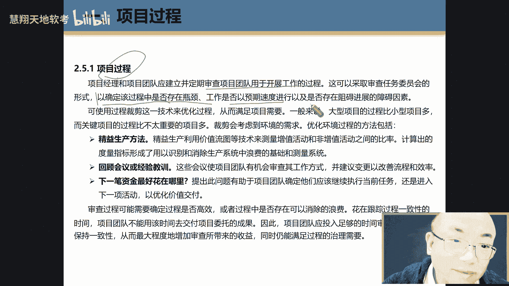

以及是否存在阻碍进展的障因素。

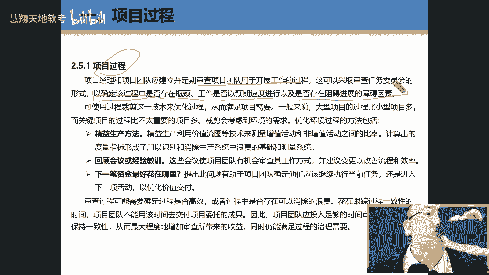

你看这里是不是有点像我们说过那个什么，说过那个那个信息流，是不是有些公司或者有些团队，信息流是非常的顺畅，它就及时的反馈，是不是，但你会发现有些公司那个那个流程的反馈，怎么样，很差很差很差。

他都让你给人发指啊，这个发质就是这样的啊，好的，所以这个时候你要清楚我们这说的过程是干嘛，是为了找那个流程中的那个过程中的什么呀，那么这个地方呢bottle neck什么样平静，哪有你的瓶颈，知道吗。

好了，这时候第一个就想到什么样，就是怎么做呢，因为你要优化这个优化这个过程嘛，第一什么精益生产，所以我说过了哈，学PP中哪几个小伙伴是有优势的，一搞咱们精益生产，比如通信制造啊什么的经营之道。

因为这个因素要做经济，只取得到经济是吧，但这个基因是跟我们的软件开发的，经济优势不一样啊，这基因指导比如说呃呃八个浪费啊，什么5S啊，这些东西啊，啊那么全面质量管理都包括都包括经济制造。

像那个最近最经典的，就是我们知道那个丰田的是推迟还是拉式生产，丰田的拉伸伸开来，手边这怎么样拉伸拉伸啊，这个好好看一下啊，精英生产经营这个精英的词是哪个词，你看是哪个词，拎来顺便来拎拎啊。

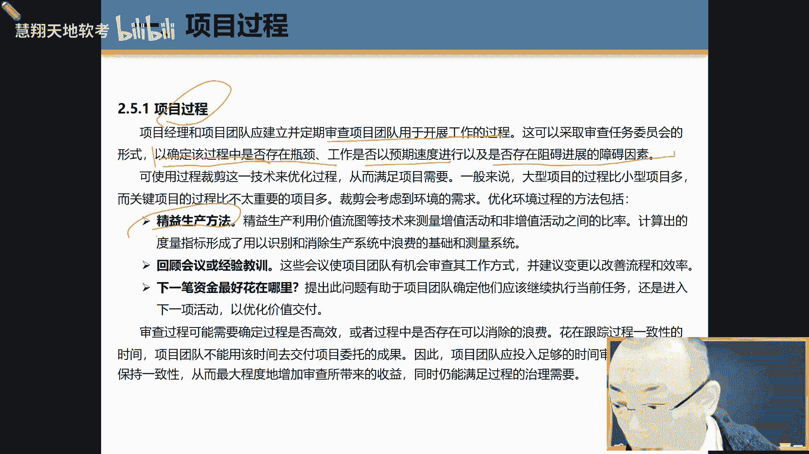

OK好了，为了让找到那个过程中的呃平静，还用到了回顾经验教训，是不是这属于pd c中哪个环节，pd c的哪个环节回顾啊，经验教训是干嘛，知道是PEC哪个动词，PDCAX来猜一个嘛呢，PDCAAA啊。

A好A好的，还有一个什么资金花在什么地方啊，看一看就可以了啊，这段文字好好看一下哈，这段文字的含金量很高。

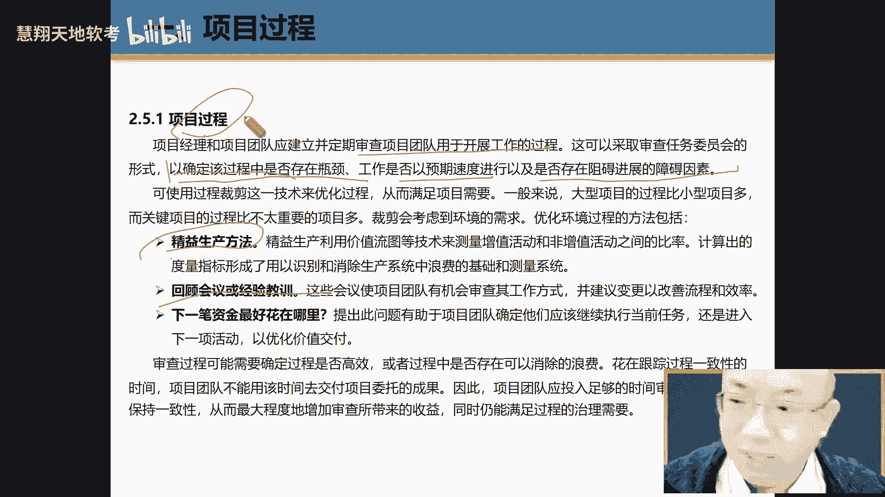

因为他为什么高呢。

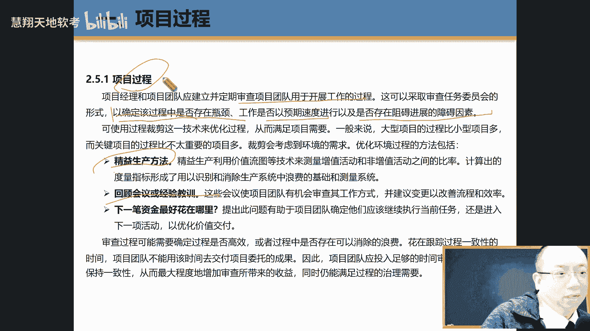

他就是有一些有一些技术在这里，我想说那个好的。

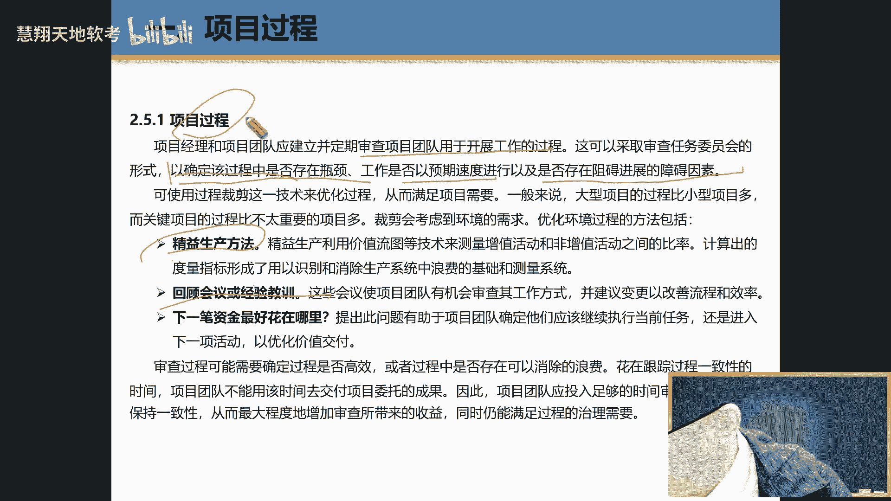

重点的去把那个还有那个后面那句，就这段文字把它看一下，这段文字。

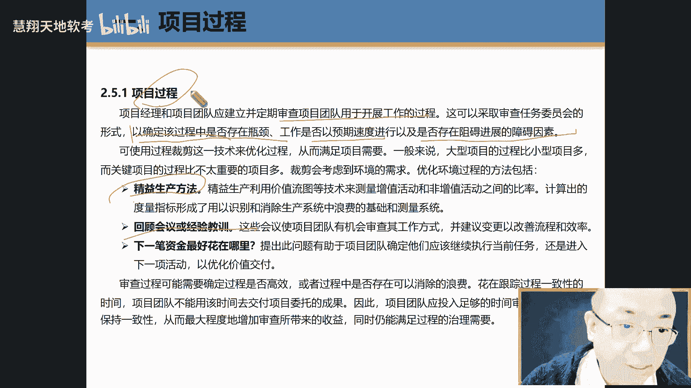

这就这段文字你倒好看一下啊，那个小红马最起码第一句话读下去。

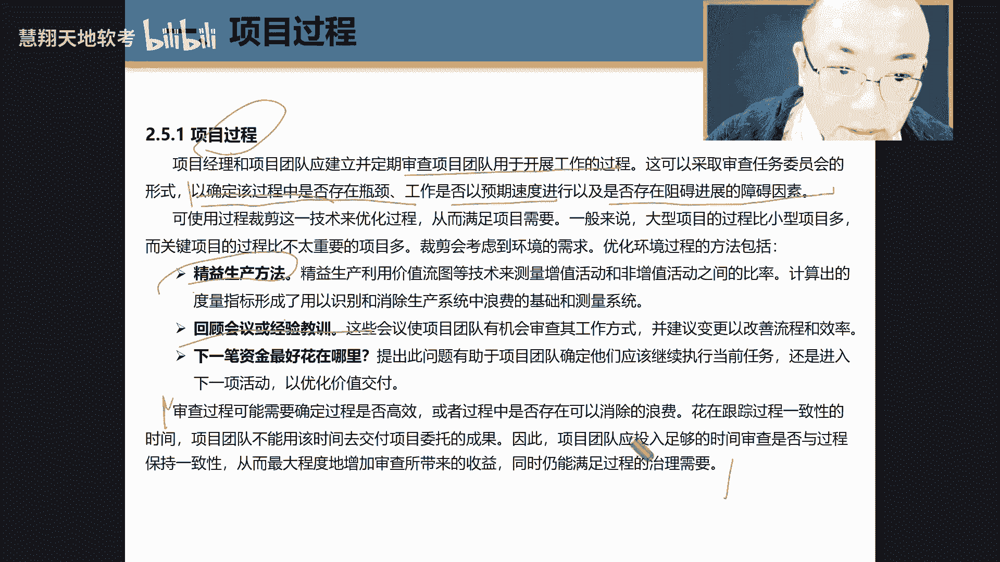

审查功能，审查过程可能需要确定过程是否方向，或者过程中是否存在可以消除浪费就可以了啊，然后你能把这段都要读完，挺重要的，就是说因为这章中你看在想握手中，一直在断那段时，那个三还是六还是个八。

都一直说是变过程，项目的过程，要建立这个项目的过程，但这个过程是干嘛，其实干嘛，是为了进步的更精致，更加精致，更加的更加的什么呀，是多浪费少浪费少浪费，这样子效率会比较高，是真的思。

这个项目的过程是不是跟你想的不一样啊，就像你不要通知你自己去理解呃，呃第二个啊。

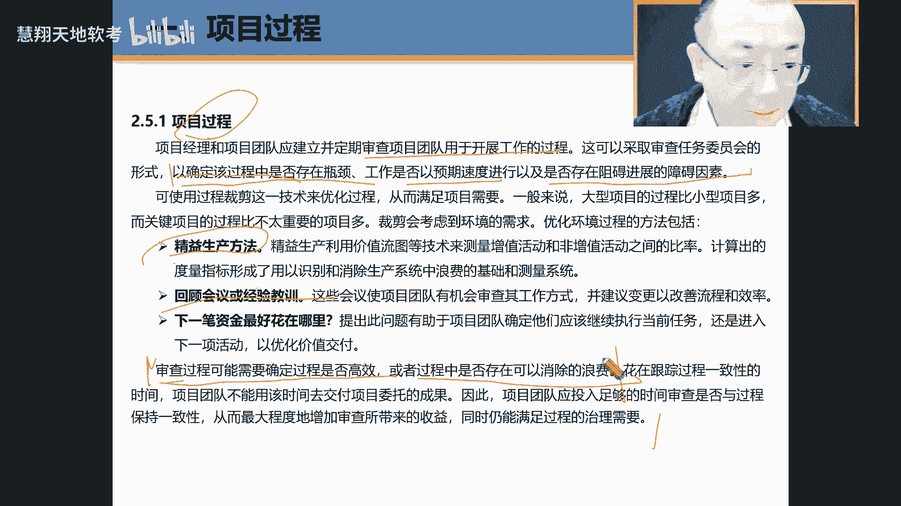

第二个我们看一下这个这个好理解，平衡竞争性制约性因素呃。

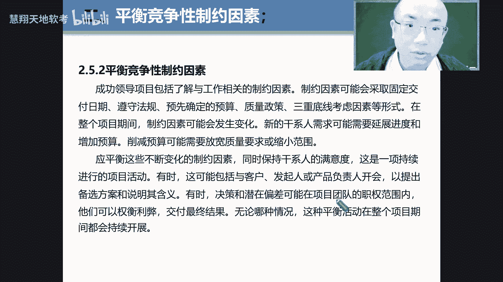

我们在你看这边提到过哈，什么叫平衡竞争性这个因素，我们来看一下啊。

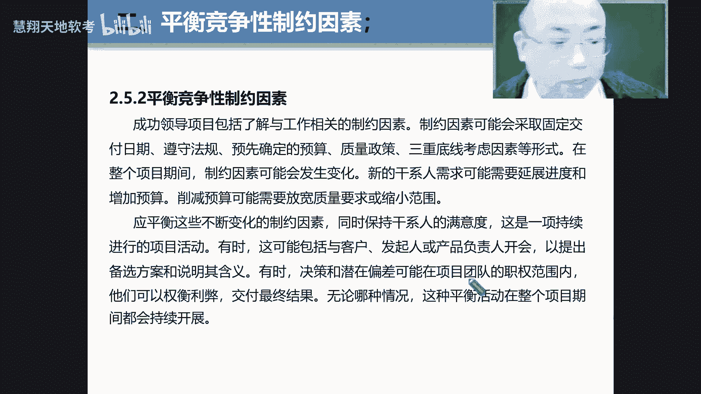

这就是那个三重底线，还记得吗，那三重底线财务什么经济环境，是不是那几个三个因素，就是数据你都找到了啊，那个来我们看一下还有那些东西，比如说呃像什么竞争性，比如说像预算质量法规，他们之间是不是竞争性的。

就举个例子比较多，你想多快好省，可以吗，不可以的啊，就像说预算和质量一样，你钱给的很少，质量能好吗，能好哪去，这叫什么呀，平衡竞争性因素，就是说什么意思，就是说这个这些因素它们是相互竞争性的。

你有他就没有他这个好理解吧，所以你要干嘛要什么呀，balance啊，你不能说活还多干，然后还总变更，然后还希望时间还少，然后希望这个什么那个钱更少，钱更少，时间更短，质量更好。

怎么可能你要去平衡这些因素啊，最重要干嘛保证该信任的什么呀，满意度，他说这是一个什么持续进行的项目活动，就是个平衡，那这既然是一个平衡还是持续进行，那是一个动态还是静态的平衡，动态平衡非常不错啊。

然而这种平衡活动是可以开的，所以你知道这，所以这里有一个就要你打三个T啊，什么意思，就是你那有一种什么能力，就在动态中寻找项目的竞争性平衡的因素，什么意思，就是说我的那些他刚讲过什么三重底线。

什么预算质量法规时间，这都是什么，都是什么平衡因素，因为比如像土地上，我们像我们去学习相关的平均正常，比如像有一些比如发达国家，它的那个就是那个有一个部门非常重要，就是那个法规部门啊，因为法治社会嘛。

法治社会呃，然后律师法规法律法规做的事，包括专利法各方面非常非常发达，非常发达，所以就这个时候包括保护保护一些什么那个呃，知识，知识产权什么之类的啊，做的非常非常发达。

所以这个时候他就这东西他都都考虑的非常，考虑的非常非常到位，非常非常到位，就这样子，这个好好看啊，好来了。

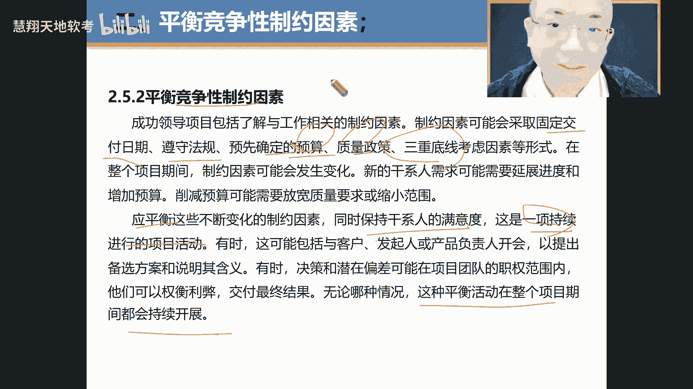

保持专注，保持专注，这一句话不要从什么，刚才你说不要从什么字面去理解，字面去理解啊，什么什么意思啊，什么保持你的专注啊，什么保持你的注意力啊，啊这个地方呢重点看这一段啊。

就是呃你要看就是那个小鹏把电话做下这句话，领导项目可以包括我们工作量和评估，团队成员是否对其工作完毕，从而使他们保持对激励，嗯对了，你们听完这个什么感觉吗，各位小伙伴，什么叫保，什么叫团队聚焦啊。

我告诉你，我以我刚开始我看这块儿，我没翻译之前，我又没去，你们不去看个几十遍，100遍的时候，有时候感觉好像保持专注，那是不是就说就像在座各位，你们听不听那个study with me。

来听过study with me的举手，这三个字清楚吗，study with me就和我一起什么学习哇，这个东西我是跟我女儿学的，然后她每次在那学的时候。

她又要打开那个平板去听那个start with me，比如今天是听的是哈佛的一段，比那些yellow一点就什么意思，就是很多那些学霸呀，跟他们开那种呃录录像和直播模式，就是他在哈佛图书馆或者耶鲁图书馆。

或者在麻省图书馆，在那学习或者教室学习，然后把那个整个环境录下来，然后有白噪音和当时的那个场景，我就什么好处吗，深证过什么呀，Focus focus，如果你要不知道的话，你先上那个上呃，上那个QQ啊。

或者什么整个音乐平台让你搜的，Study with me，他也会给你些，比如下雨的呀，教室的咖啡馆这种音乐就让你更加什么呀，study就更加什么，Focus on focus on。

今天学到一学到一招没有啊，因为你不能每天都去星巴克做的吧，没地儿是不是怎么样子诶，就我在我在我办公室也是这样，就说我会你看我会买一个星巴克的杯子，然后我会也会买一个星巴克的这种小的。

这种咖啡的这种小咖啡，然后到我办公室，办公室桌子上布置的跟星巴克的咖啡感觉一样，再放点新的白噪音子弹，都是你目的是干嘛，知道吗，让我们怎么样fox啊，fox你学废了吗，学废了啊，这个低学费和专注。

但是我们以为是我以为是那个专注啊，不要去思考啊，想别的东西啊，不是的，他是干嘛，他是让你什么，让你觉得呃你平衡你的工作量，看你十分满意，是不是被激励到，是这个的专注，明白吗。

就是说非常在乎员工的什么健康和满意度，是你专注于，所以你会发现哈，当然这个东西一切都是基于形势很好的时候，就比如像一些腾讯他们那几个大厂，腾讯呢阿里不知道了，反正像腾讯一样做什么，腾讯的，阿里也OK的。

经济很好的时候，大家都有钱，企业也非常重视，因为都是年轻人嘛，就是他们经常晒他们那伙食，伙食是不是特别好，一日三餐全是免费啊，一乳酸正确，还有夜宵啊什么的，包括那个一些硅谷更是更不用说了，健身房啊。

什么都有游泳池，什么都有带娃的，养宠物都有，哇塞就是团队很健康，大家满意度很高，这有什么好处吗，他们从来没有在加班，为什么他觉得这个比我家还高，哇塞你家里睡觉，第二天睡觉的屋子都是从国外进厂。

打椅子往那一躺，我因为我去过嘛，那个那个那个椅子像个蛋一样的，然后坐那就整个人就没有，你听不到周围的噪音呢，环境特别好，这样你有什么好处吗，你拿着电脑在那干活，你就根本不想回去，为什么呀。

我回去给你乱死了，孩子估计还骑着共享单车，这是多好啊，天天24小时后买回家，注意信息都可以洗澡，什么都有，你明白吗，所以就是你可以干嘛，你也很健康，你也很开心，为什么你可以认识一帮牛人，都是些高的。

都是知名学校毕业的啊，我告诉你啊，我们说的什么叫牛人，第一ITENT什么ITENT能力，第2engaged来再说一遍，所以一说牛人是哪两种人，第一什么呀，Competent，这里面engage。

所以为什么说哎呀，老师我不是，我们不能像那个什么谷歌一样，什么那个什么meta一样，那么牛逼啊，人家我进那个学校的人都进了单位，都是什么人呢，第一看你就看你的专业水平，你做了什么，你不知道考了多说什么。

毕业证那一方面你你参与过多少项目，你知道做了多少成果出来，然后第二你这个本人敬不敬业，你有企业家精神，有没有野心，有抱负，你要没有这个根本就就好多不会考虑啊，所以这点很重要啊。

所以这章这一页呢是挺重要的啊，考不考不说，但是呢你一定要清楚，所以你发现work work讲到这时候，你发现这个work讲的很散，还是很很很散，感觉work超级散啊，超级散好的。

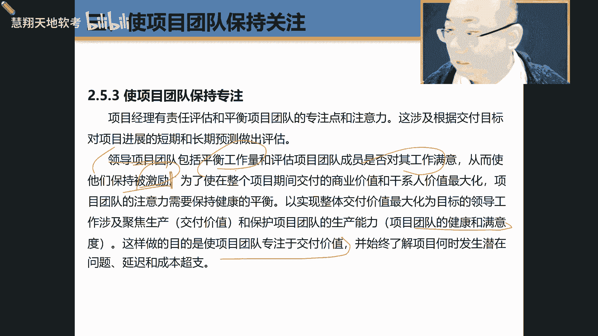

后面内容就很好理解的啊，什么沟通参与是不是沟通和参与啊，把这个文章把它好好看一下啊，再次提到过这篇博客中是比较偏后的，还是偏比较偏前的部分，哎OK啊，这个这个以前我们讲过啊。

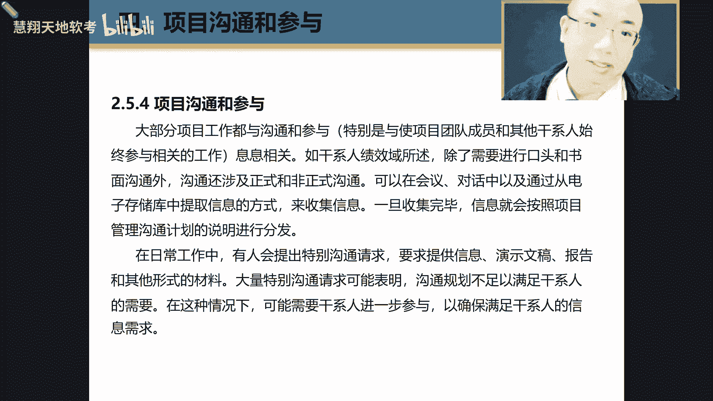

不要浪费你的时间，好的采购是不是采购不就是资源，咱们讲过了没有，第六版讲过没有，来告诉我这个资源讲过了没有讲过的啊，这个地方帮我写一个字啊，这个地方帮我填写个生产制造啊，写了写几个字啊。

生产制造什么物流系统啊，什么之类的，生产制造这么好，我们知道考编不有两个，哪几个新闻领域，小伙伴只有优势，第一做生产制造的，最后偏了质量啊，进行生产，第二批开发中的民间开发，清楚啊。

呃回去呢去搜下八大浪费啊，甚至知道八浪费移动是不是浪费，移动移动是不是浪费，来告诉我移动是不是浪费啊，浪费就这样子，然后还有一个就是，比如说我的半成品是不是浪费，半成品半成品是不是浪费，是的对呀。

你像小哥做生产的，知道半生浪费最好是中间是没有w IP with zero的，是不是等等，等待是不是浪费，等待浪费，所以像我们古代大家分享一个经验哈，就是呃有一张表叫cheat sheet啊。

cheat就是骗子的意思啊，但这个地方可不是骗子的意思啊，叫cheat，那个表，它是一页纸页纸，就是我在做任何工作时，我会有一页纸提醒我怎么做，这有什么好处吗，就是就像我收拾东西一样。

我一般会写一个收拾，我这个怎么去把我铺这个摊子铺出来，然后再怎么收，快速收，有这样一个表，这样什么好处，免得浪费东西，免得丢东西，你丢三落四，因为还有一点减少你无谓的思考，是不是。

因为还有一点就是单线和多线，哪个是比较节省脑力的，单线和多线，单线你要同时做很多事的时候，就很容易造成错误的，有时候你命都搭上去的，因为你你考虑考虑吧，你考的好，别出事就道啊。

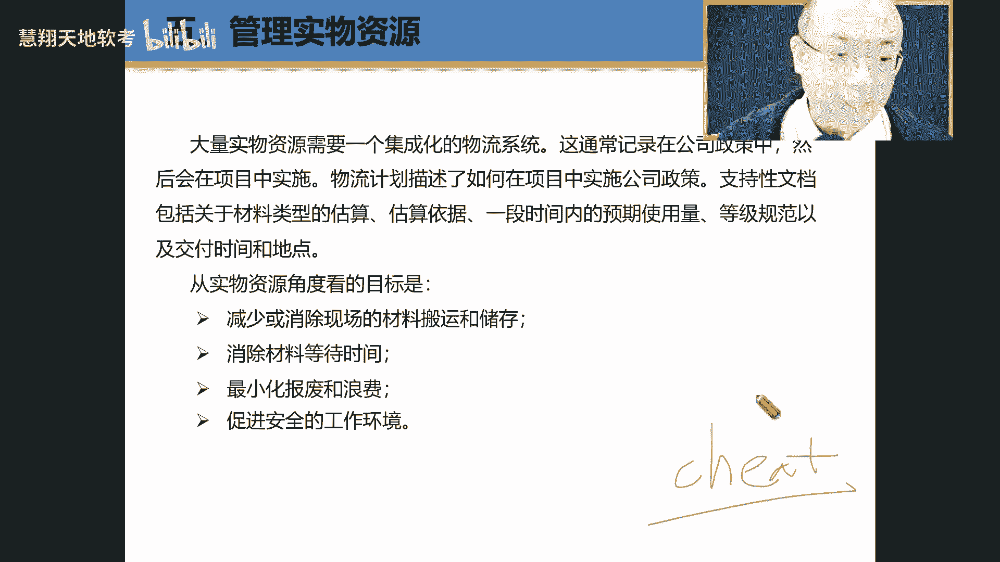

好的采购是不是讲过了，咱们讲过了啊，这个不浪费你的时间。

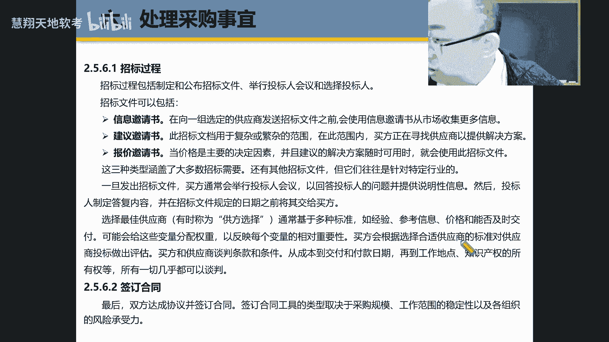

包括这几个词，第六版讲过阿尔法FP，阿尔法Q是不是OK包括签订合同。

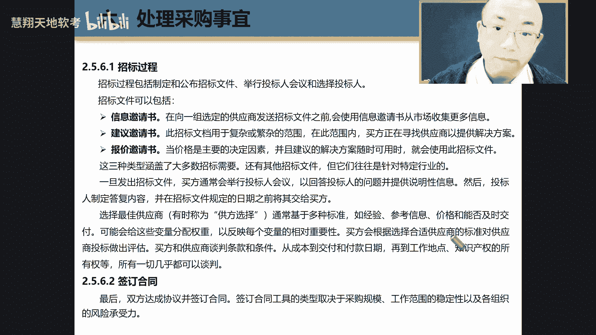

这地方帮我写个600，写个600，采购那个地方比他写得更详细。

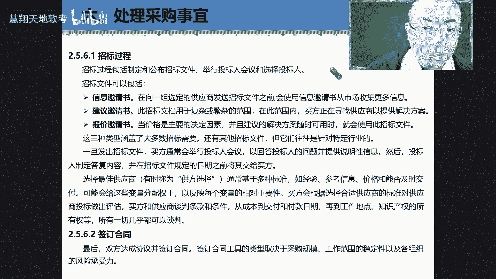

对外采购。

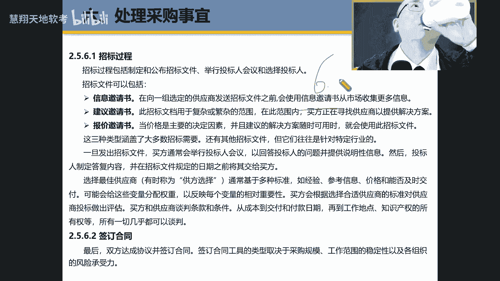

像小鹏是做那个你那个行业的呃，那个电商这方面，所以这块应该研究的要多一点，是不是就好好学警员，还是话我建议你去最好去看哪个英文版，这样提高你的逼格，提高你的逼格。

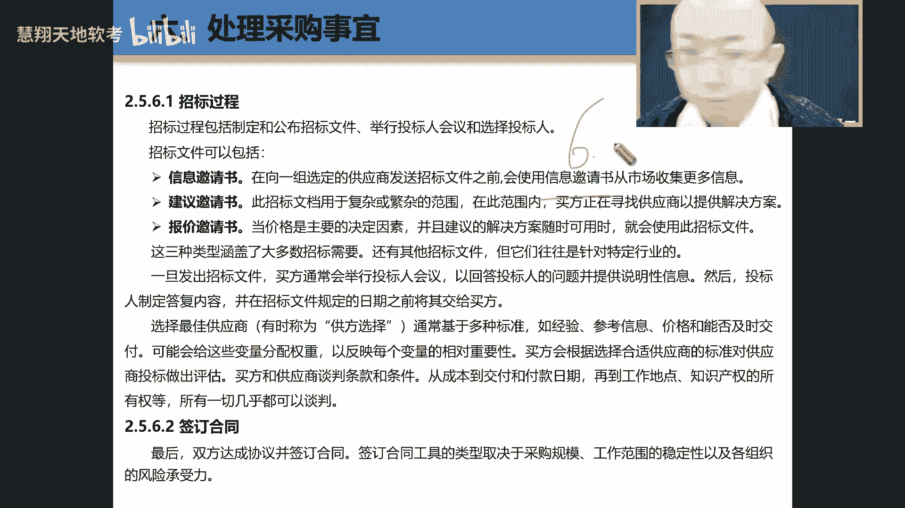

好的变更重点的重点打一个圈圈吧。

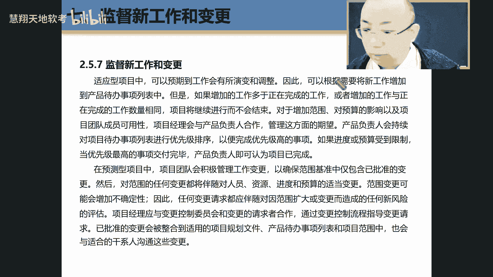

因为我们要打个圈圈，因为变革是多还是少啊，变革来告诉我这个是多少啊，对你看他这个提提提到过啊，就是这段文字。

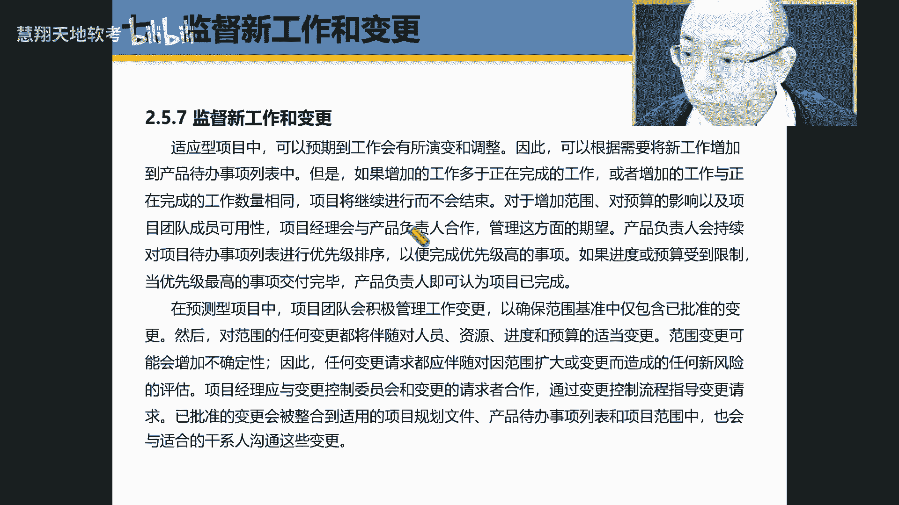

这两段文字回头把头看一下，就定义来看，他在适应性项目中，可以预可以预期到工作中会有演变和调整，可以根据需要新的工作完成，但是如果真能感受到多余，正在完成工作或者增加的工作与，能不能比人家多进去几年。

而不会接受，对于增加反而和离散成性的行，这边特别提到过一句话哈，你看他说呃，我因为我们在尤其在这个开在，你看它这个是适应型号预测性，看这是适应性预测性，这适应性，所以它的开发一般是就比如像迭代式开发性。

比迭代式开发比较多，那迭代开发都完成什么东西，完全就是这个就是叫做待办事项，叫backlog来说，原来这是必考的backlog，backlog就说那BLO是多还是少，一般是多还是少。

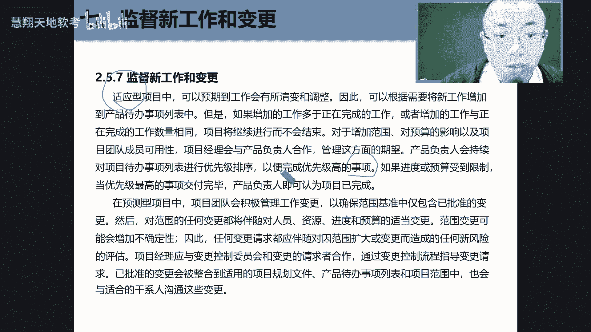

躲在这干嘛呀，优先级排序，所以我在呃我的做优先级排序是每次都做，还是每次叠的多，还是做一次对，每次跌我要去做一下这个东西，就是这样的啊，就是来做个星级排序，所以这个时候呢就是他一直在做这种呃。

因为我们知道适应项目变更是多少少，适应适应性的时候变更是多少少多，所以说你要不断的去去呃，去看去检查你还有多少的那个backlog，然后对象进行排序，然后下一次呃我们我们要做敏捷吧。

一般会叫敏捷规划来张嘴来叫什么敏捷规划，也有人说要冲刺规划都行啊，规划去看嘛，主要是看这些代办事项的优先级就可以了，所以你会发现很有意思啊。

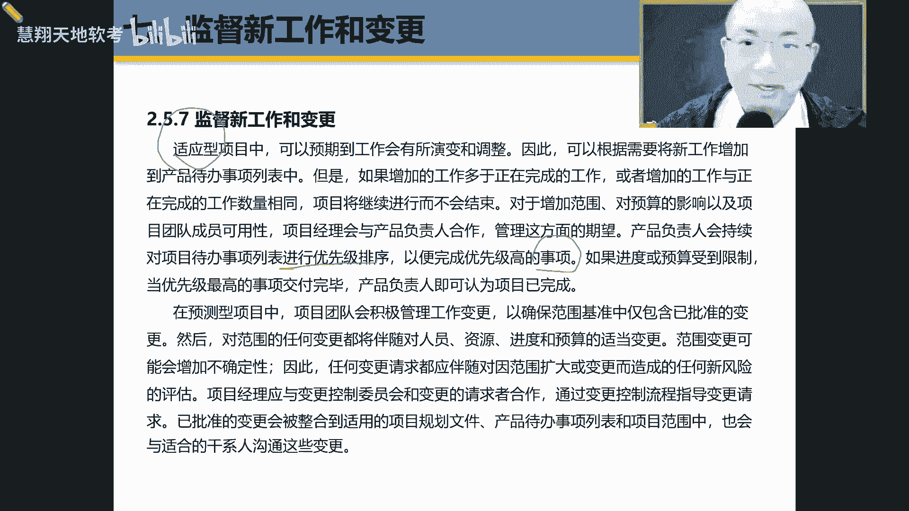

你看适应性的时候，如果我看到了一些新增的工作，我就把它加到哪里。

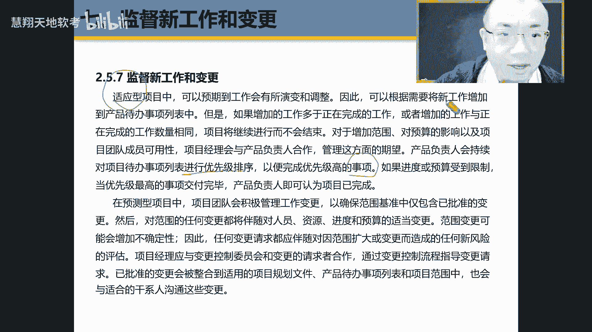

将新工作职业交到哪里啊，代表出现中去，是不是。

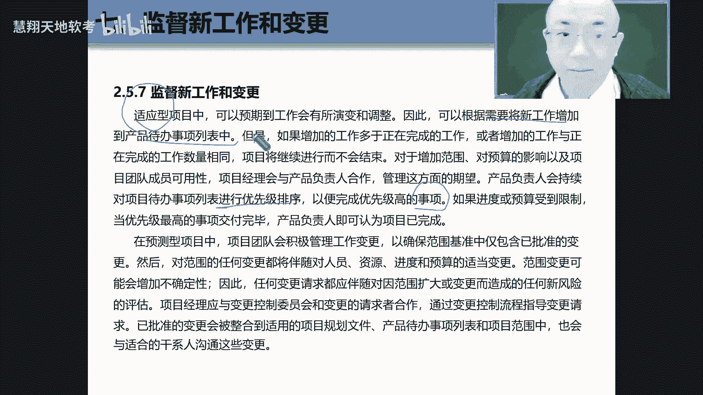

你们可以看一下啊，这个词有点道，啊你能用这个词用的这个比如新工作，他说if more work is added than to be。

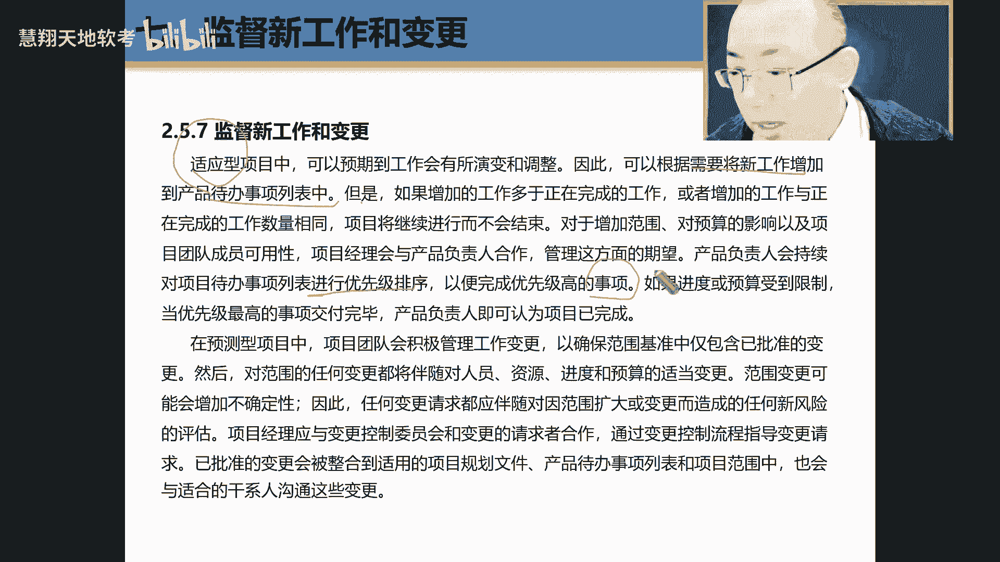

巴巴拉巴拉巴拉，什么work，Can be added，这个词用的是哪个词，Work，用的是哪个词work，所以这个地方呢这work指的是一个什么东西啊。

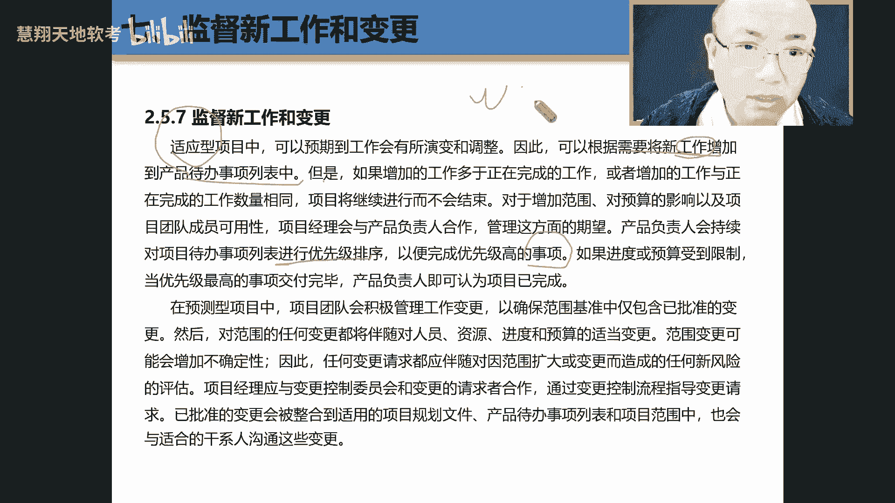

这个work，Her work work，Could be added work。

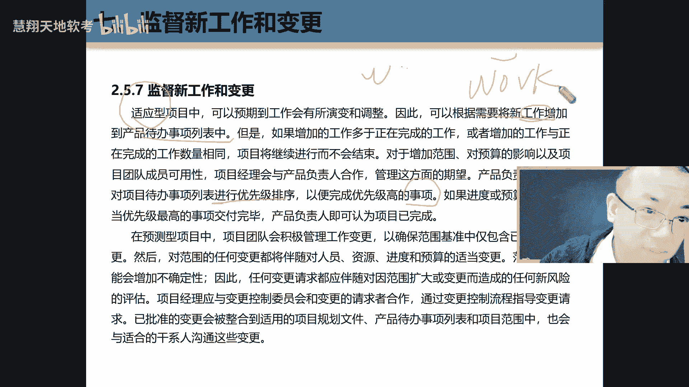

会be added，你这个跟我们是不是就是不是就有点重，是一个词，但这个你记住哈，这个词的work更像是一个什么呀，在这他说work can be added，这个work更像是个什么词，不要这样子呀。

JORGAN是一个什么词，肯定是一个名词，它指的什么意思吗，啊这这我觉得他这个说的就比较广泛了，反正肯定是一个活或者是任务，这个大的比较不具体的活动，这个活动是可以做大一点，这个word有个活动。

每个课间都在这个地方，这刻度谁大一点啊，这颗粒度啊肯定是word大一点，大一点好，好了，这适应性就是如果你有什么调整的话，你就直接把word加到待办事项中去了。

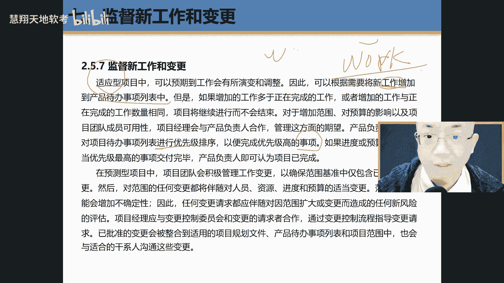

是不是啊，但是呢你会发现在预测不是预测怎么样，在，那个这个小峰把这句话读下来。

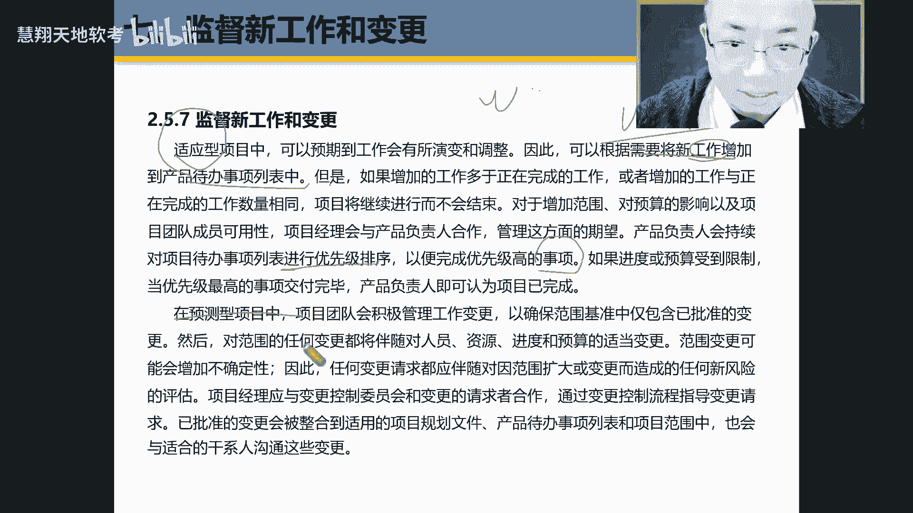

在预测性项目中，在预测在预测型项目中。

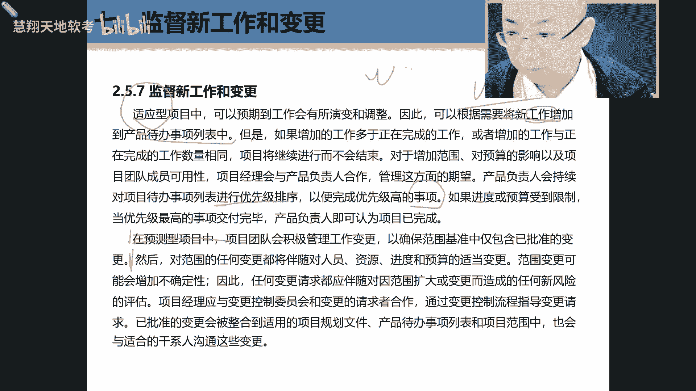

项目可能会积极管理，做变革，缺乏项目范围，基本中仅包含已批准变更，哎这跟我们那个原本讲的第六版是一模一样，就是说我们不轻易变更，记住哈，不轻易变更，但如果你要变更的话，就是你一定要找那个变更变更流程。

这是那个经过CCB来批，是不是如果橡皮你有也行，有权利也批也可以的啊，然后呢你要看还有一点就是说我已批准完之后，肯定会有时不会影响你的什么基准呢。

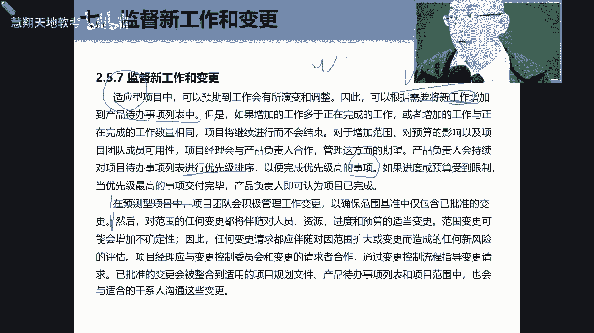

不一样，有什么基本的范围，基本是这样的。

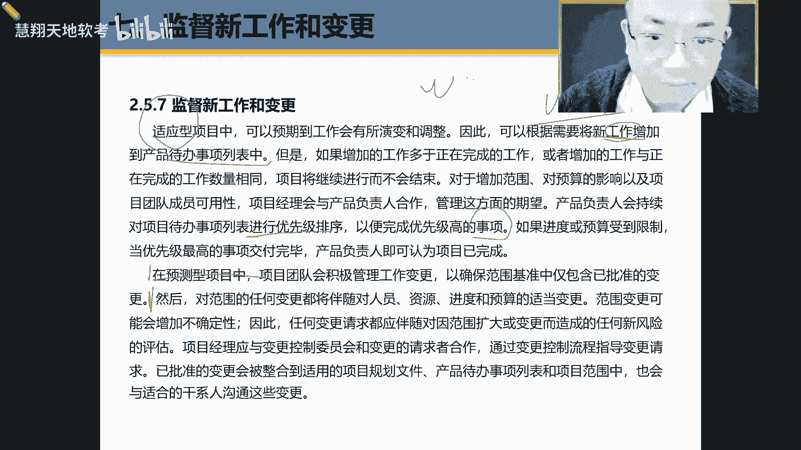

刚才也说了，他如果你要动你的范围的话，你的范围变更有可能会增加什么不确定性，增加什么新的风险啊什么之类的。

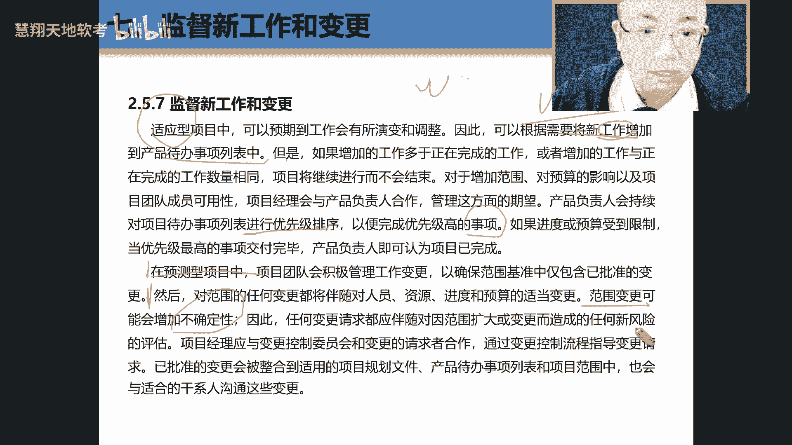

包括你的变更也要跟这些干系人跟沟通，这一变更哇。

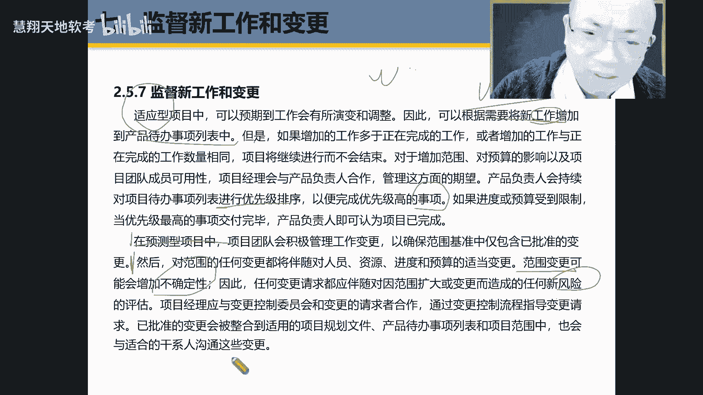

这个地方打六个P吧，考点就在这就在这。

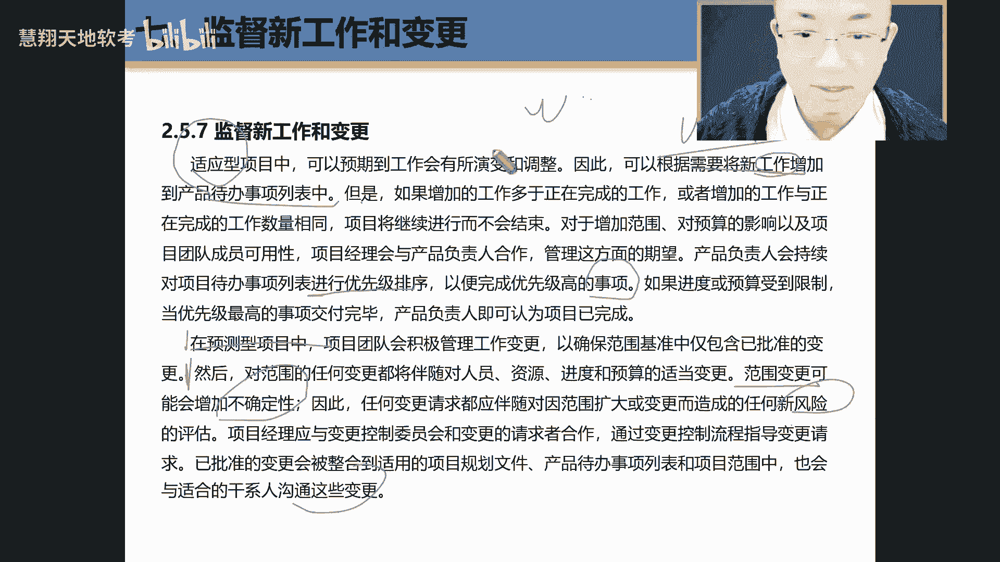

就有时候比如你要在做变更的时候，一定要跟别人跟跟干系人沟通啊。

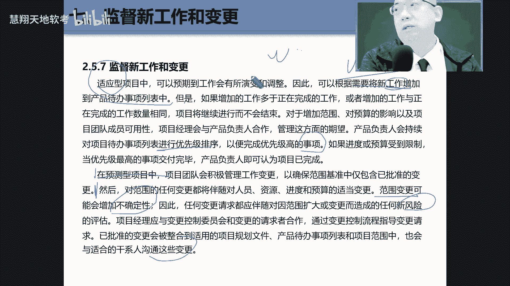

沟通变更啊，沟通变更是不是要做文档记录啊，可以口头提出，但一定要做文档记录，然后变更变更前边的狗都要跟别人及时的沟通，尤其变更后，我一定要跟别人沟通，你别什么变更完之后都悄无声息不跟别人说。

要尽可能走变更流程啊。

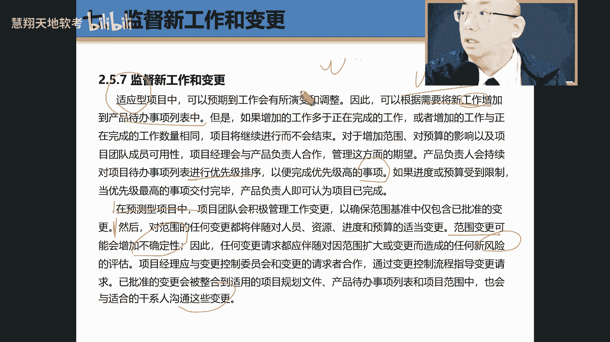

在变更前一定要什么，一定要评估一下那个变更影响。

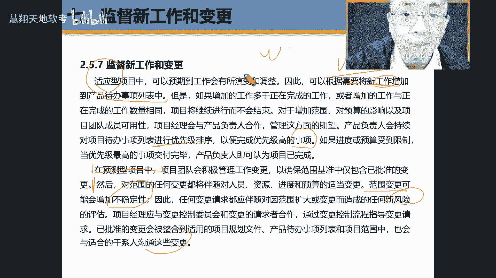

OK这个是我们在前面刚讲讲，word中是常见还是不常见的部分，这个是常见的，你他一开始在那个三有六有八，有没有那个368还记得吧，那个368那个表不是那三个吗，是不是，然后接下来那个左边是三坐标。

表格是三个表，又是六个，然后接下来不是八个吗，这就是学习啊，正好学习来第一大家一起把这句话读下来，来张嘴，整个都在学习，做好知识管理啊，行行止一张，门前都讲过了，讲过了，但这点我觉得挺重要的。

就是这个呢就是呃考试的时候，一定会一定会至少考一道题，就是有关learning类的learning的，比如像培训啊，学习啊，挺重要的啊，挺重要的，就是这一点真的是大家一定要好好去理解啊。

就是我们的传统教育，其实现在是不是你现在这个这个技科，技科技发展呢，现在我们这个传统的教育，但没办法，因为现在中国人也比较多啊，尤其那些比较欠发达的地区，所以它就是只有通过这种最传统的方式来去。

那个来做，但是因为我们也是当时这是教育的身份受益者，因为也是这么小众都能出来，那如果现在今天就是科技这么发展，都AI出来了，其实现在传统教育一点意义都没有，也就是说其实如果需要达到这个水平的话。

你要读到博士，大概多少，得到博士，正常对，差不多是28号，你要读的工科老博士导师在卡，你一下子让你做个什么免费劳动力，一般30才能毕业，其实你知道吗，其实如果说有些人有这个AI在加持的话。

再加上你自己很牛逼，你知道多少CP达到poo水平，我觉得你知道二十二三岁就差不多了，二三就不会超过234234岁，因为你就是那种那种学习真的是很无语的，学习效率又低，然后就跟着死记硬背刷题没有意义的。

你其实说白了像我们这些初高中，好多学习是没有意义的，真的是没有意义的，明白了吗，所以这个时候还有一点很重要，就是说人这个人就是，由于我们做做项目有一个特点，你每做一个新项目，你是不是要学新东西啊。

这个对你学习要求，学习能力，学习能力要求是比较高的，就是你弟爱学习，就是你是很你是很渴望的，你是你是很渴望学习的那种，很有好奇心，第二你很懂学习方法，第三行会跟别人互相学习，互学习，自学习都会做的哈。

就我们知道学习有三种，第一自学习，第二互学习，就是我们是相互学习，你知道吗啊，还有出外学习等等啊，还有研究宏观就是他整个项目前都在学习，包括人一样，我们叫life learning，就终身什么学习。

但非常遗憾的是，我们身边你们发现终身学习人多吗，很少很少，比如说中文学习了很多人，到大学之后就不学了，为什么，因为他在上大学之前，把他这一辈子的那个学习的那个呃意愿和经历，都怎么样耗费完好绯闻啊。

所以呢就说所以为什么说现在，所以我一直我就说老师，为什么说那个说做项目的，有些人都到现在这个经济形势这么不好，为什么做项目还有一份工作，我说你知道做项目多么难受吗，他每做一个新项目都要在干嘛呀。

learning学习啊，学习是学习是一个开心还是不开心的，学习相对而言是否可行，学习是反人性的，你知道吗，OK好清楚了啊，做好知识管理，知识这块呢画个圈圈，回答的好好读哈。

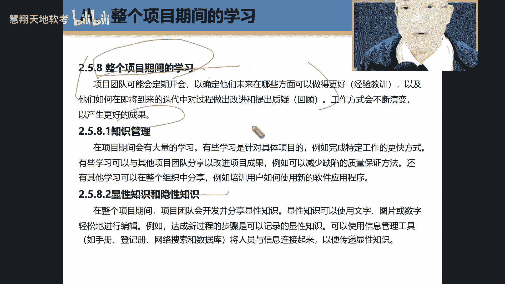

重点去读，重点去读，明白了吗，把这一做跟着我一起来学一下哈。

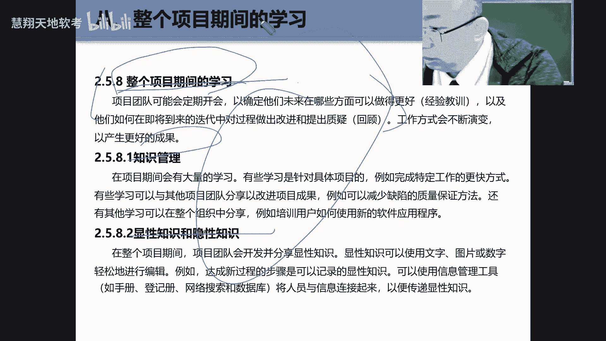

写一下哈，这个地方呢写个4。4，4。4，因为在第六版的4。4中。

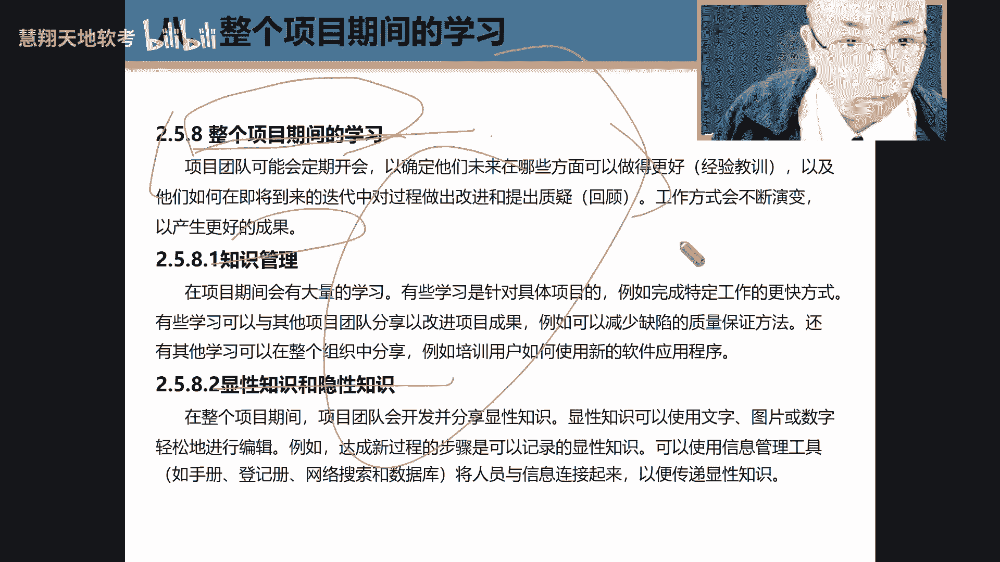

重点会讲这个知识管理啊，在那个整合管理中，4。4来说一遍4。4啊，然后这个地方去看一下那个第六版中，那个显性知识和隐性知识。

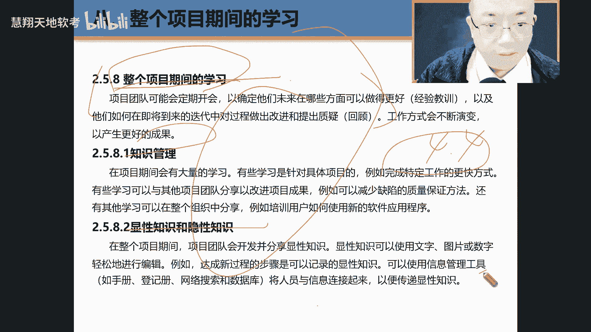

第六版讲的非常好，咱们也讲过了。

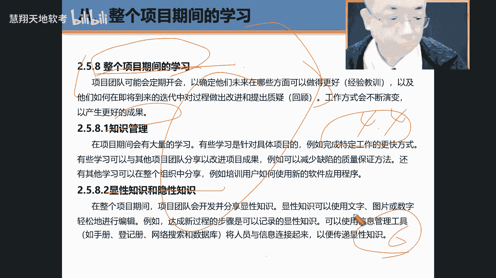

好与其他效益的关系哈，我们看都有哪些相遇哈，这work效啊都有啊，比如说呃不确定性和模糊性和复杂性啊，跟他们干系人这些这些有些关系啊，这个我们知道这个呢就是这个是在那个等会，我们讲在变革那个绩效域。

那个就是那个变革，就是在那个变革和UUUV，不是乌卡那个那个吉祥云中，最后一个我就讲好了，这个work呢是目前看我们是最散最惨，最捉摸着头脑的，但是呢因为散内容也比较多，其实确实很好记的很好记的啊。

所以就是也不用太复杂哈。

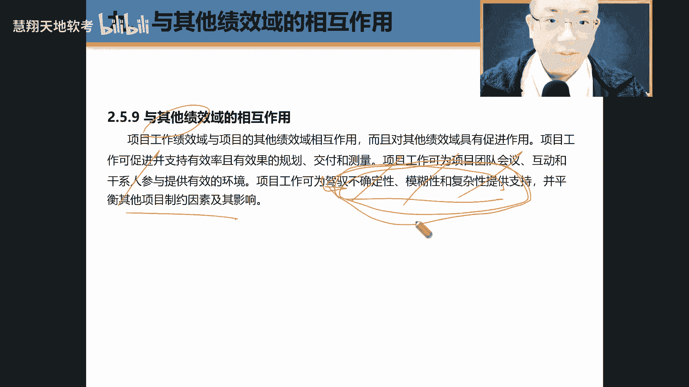

来我们看下来总有几个成果出来几个成果。

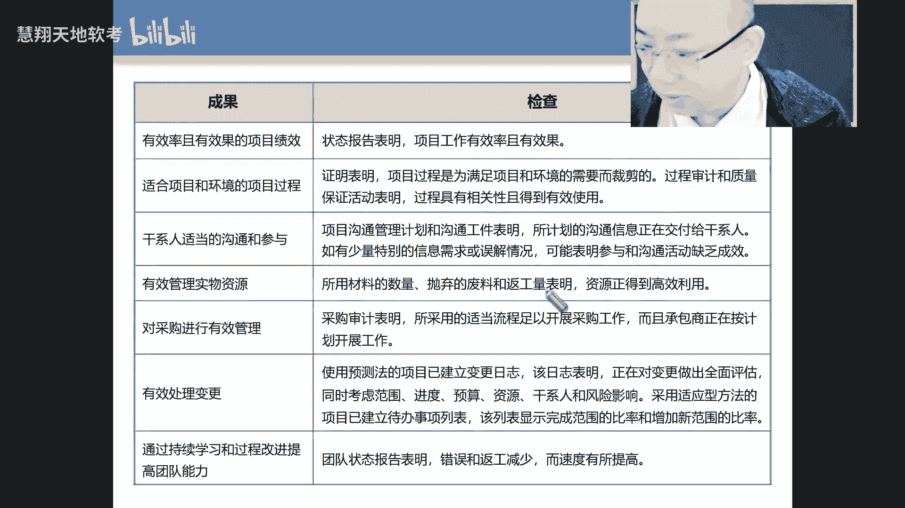

七个啊，七个成果是不是七个啊，这个啊啊比如说什么有绩效，我们先看是哪个，这几年中间找哪个，先找哪个去了，先找哪个，你说先找哪个，不说了吗，这个，就是你要做work，先找。

先找一个适合这个项目环境的这样一个过程，那怎么证明你检查，怎么证明这跟你这个过程跟项目比较适合的啊，就是是不是做了裁剪，做了裁剪，做台阶，做台阶，你说老师什么样裁剪来，我就举个例子明白了。

比如说我做核电站和做一个一个，一个普通的一个软件系统，哪个是质量质量很关注啊，核电站，那就是怎么做裁剪呢，就我那个在做质量，在做这个核电站项目的时候，那个你们这个有关质量这块内容多还是少。

还有一个就是说比如说我项目，比如这个项目200人，跟项目五个人，那沟通这块哪个内容更多呀，多的还是少的，人是人多的还是人少的呀，肯定人多的吗，沟通比较多呀，这个还能答错呀，这个不应该答错的啊。

这个不应该答错的啊，这是不是你也反了哈哈这个叫什么呀，裁剪裁剪好了，看完这个之后呢，我们可以看一下，还有那个就是比较常见的，就是这个是呃，比如说像这个变更变更也比较常见，变更你是不是走了一些变更流程。

重点和重点啊，变更这块画个圈圈嘛，我就理解一下，就这块哈，因为我们说变更体至少30道题，是来我们说过做怎么做变形题啊，来告诉我一般是是说变就变吗，是不是不是的啊，可不可以口头剔除，可以的哈。

但一定要做这做什么一定要归档做记录啊，还有一个就是在做评估之前，一定要干嘛呀，不能说我不经过我，我做评估之前要干嘛，要做审核，那审核是干嘛呀，是评估这个变更带来了什么影响。

影响是Impact influence，然后呢影响要看影响还要看什么，还要看变更就走变更流程啊，这样子，那还有一点就是变更完之后干嘛遇到沟通，跟别人沟通，你们说做完毕之后不跟别人沟通，不允许不允许的嗯。

好这边如果持续学习很重要，一定要学习，学习目的是干嘛，好看啊，管实物资源，管沟通，这前面沟通呢干系人啊，资源啊，这个采购助理，然后最后去看项目的技巧啊，看项目技巧，OK这个结合那个前面那张表一起来看。

再说一遍，这是写下来，结合前面那什么页面看一下啊，这个地方呢就是你要记住啊，这个内容呢就是叫做说散就有点散啊，有点散有点散有点晕，但其实不散不晕，为什么会转晕，他讲的是挺挺实在的。

你看干系人有了沟通也要采购也有了啊，这采购有了什么变更也有了，是不是过程其实也有了，就我一点让你觉得这个其实你知道这个地方，我们说过了，这个学习是跟我们第六版中哪个哪个哪个技巧，哪个就是哪个知识领域。

A太棒了，来掌声掌声鼓励，掌声鼓，对郑和郑和中四点几4。44。4特别重要，反正我这块我觉得挺重要，就是就是我不知道你是不是那个就是那个小，那个小董应该有这种感觉，没有就说哎呀，我是那种学习的受益者。

有这种感觉吗，你举个例子，就是说什么学习，就说我比如说举个例子，就是那个我原来有一次去那个西安做项目，是一个保密单位啊，我印象特别深刻，然后他不让带电脑，不让带书，直接带个大脑，什么都不让带。

比什么都什么都不让带，就就穿一件他们那个那个那个特种工作服，然后进去了，然后给你讲三天三夜就讲这个项目管理诶，怎么重点人群就是那种东西了吗，帮我喊一下，那个小叶是不是看他是不是那个是不动东西了。

然后呢我印象特别深刻，但是他因为他是一个项目，有点大，得过半年呢，然后他就问他，就说你们谁能够呃，谁能够就是不用电脑啊，不用讲，当时那几个老师就懵了，哇塞他说哪有讲课，不带笔记本，不带电脑的。

不是我说我说我可以尝试一下，因为我也不敢保证我是不是不OK，然后我说这是那个教材啊，和这个书，还有那个电脑放，那你看我哪儿讲多了，还讲的少了，对不对，因为我也不能保证，因为我们以前没遇到过这种情况。

说不让带电脑啊，不让带书都不让带的，然后我再然后最后最后我讲完了，然后你知道那个说哇塞你好厉害，这都怎么一点都不漏，然后我就把我的书给他看一下，明白了吧，就是基本上都可能背在那了。

而且我说我说我说我那唯一做过这个书的翻译，就做过审计，他说他说这是什么意思吗，他意思就是我这本书说句难听的话，就是得把吃肚子里消化了，就这样。

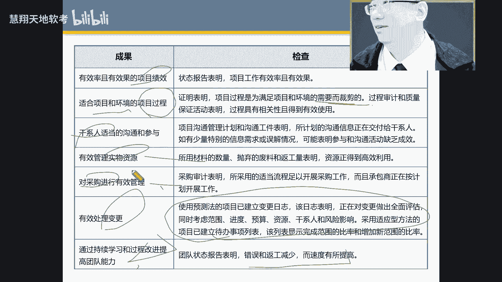

就是那边都背的很熟很熟，因为我每天都在就是导入的东西导入就这样，所以后来所以当时也不好读什么东西了。

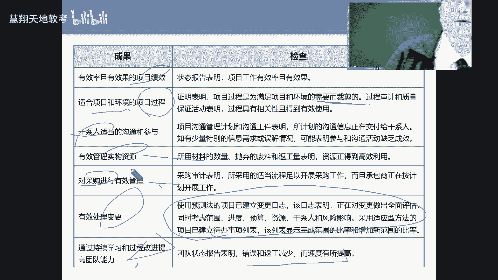

所以就突然我那次我觉得哎呀，这个学习真的怎么样，这就是真的，我倒不是我多爱学习哈，这个东西这个底儿是有点虚伪，就是就是书中自有什么呀，黄金屋，书中自有颜如玉，就是这种感觉就是你除非你家有矿。

也因为我们家有矿，有十个亿，等你继承副行长，那算了，是不是那啥都不是，那你靠学习，所以再提到过什么呀，就这学习数学系，学习什么可以减少，是什么，提高速度啊，你这的确是啊，你说你为什么给速度可以提高啊。

现在你要用AI去的时候，我以前我们做那个论文的时候，一天能查一篇论文，看一篇论文，我给你说我都已经觉得到天了，就觉得不可能，你知道吗，现在如果你要把AI学好了，咱们去查论文，怎么白嫖论文。

怎么用AI来看论文，怎么来八个论文的重写这个论文，哇塞你爽的不要不要了，所以现在我告诉你哈，网上有好多内容，就白嫖那个论文的网站是国外做的，那个真的是so，然后下载量中国第一，美国第二俄罗斯。

所以说那些网站要被关掉了，那些中国的那些搞科研的人就没法搞科研，真的是太厉害了啊，所以这张其实我其实我超喜欢这一张，为什么这张特别特别特别是特别七，还是干嘛，你对当特别干，为什么这么干呢。

全是做项目内容，明白我意思吧，他不像有的人做完了，看完之后虚头巴脑的，他说啥好吧，我们来看看这个下面几个哇。

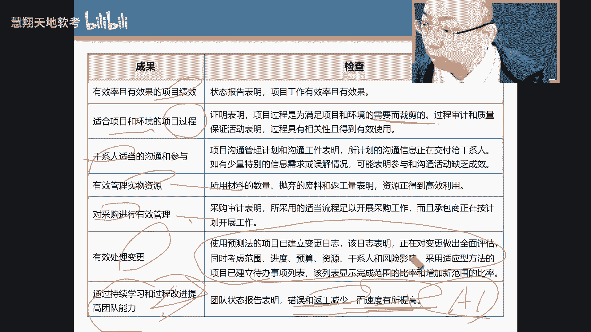

下面这个特别好讲，来交付啊，交付交付中呃，啊那个英文词是哪个词。

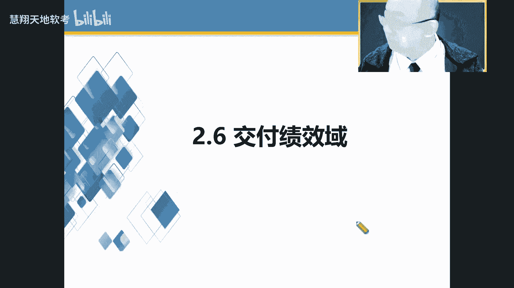