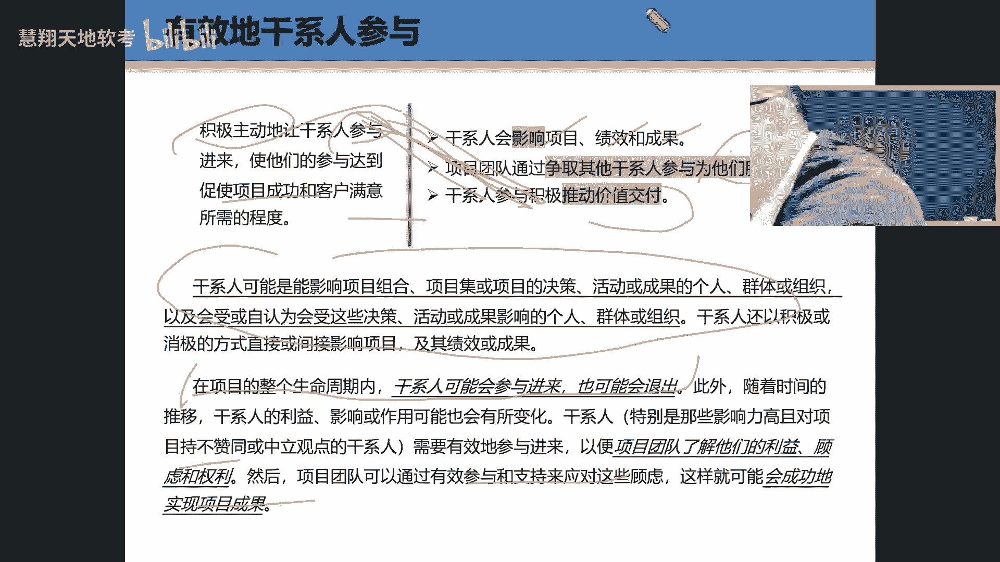

# PMP第七版全新课程 PMP精讲课程 ｜ 限时免费 知识点：干系人参与、领导力行为 - P1 - 慧翔天地软考 - BV1Bz42117xw

好的，有效干系人参与哈，我们可以说哈那个词那个词参与那个词怎么说？参与怎么说？参与这个词一起说engage来顺便来engage这个词是翻轻了还是翻重了？就把翻参与是轻了还是重了，告诉我是轻了还是重了。

肯定是轻了嘛？我们在取项目管理集那本书的时候，我们在翻那本书的时候，那个项目级管理的时候，那个词翻正争争取。但是我们在第四版的时候，第三版我忘了。但是我们都教的时候，他那个当时说我说为什么不同意。

但那个做那个项目管理集翻译的那帮人那个专家门说不行，我们必要翻译争取啊，所以我当时还蛮认可他的想法。其实因为他说他能把那个词意思翻的很重，你知道吗？很对的，但是呢你要参与翻浅了啊浅了啊OK好的。😊。

Yeah。呃，他特别提到过叫 engageage stakeholdersholder proactively啊。那个词叫积极主动的让干系人参与啊积主动这个词就是积极主动的让干系人参与。

把这个词说一遍啊，那个让某些人参与是engage somebody，还有叫engage with somebody啊，这个细为区别，你们要自己查一下啊。

还有叫engage somebody proactive，就是积极主动的让谁来参与进来啊，OK。呃，就是让这些干线人能够积极主动参与的目的是干嘛嘛？第一，能够保证项目能够什么。成功。

同时呢客户会满意满意。好的，它包括了三部分内容啊，三部分内容干系人参与就是干系人参与的有效干参情话，包括第一个什么呀？就是干系人会什么呀？第一会影响什么影响项目啊，绩效和成果。干心是很重要的啊。

它会影响这个项目绩效等等。然后呢，其实我们知道我们项目团队就为那个干情人服务，怎么帮怎怎么做呢？怎么做为为他服务呢？就是通过让他能够参与项目来为他们服务，是这个意思啊。Yeah。然后呢。

我们为什么要积极主动的让他参与，目的是为了推动价值交互。所以这两个地方来画一个连接线。好了吗？这。发个连接线啊，就是说我们让他能够积极主动的参与，是为了能够干嘛呀？价值交付。好的。

在30页下面那段文字啊，咱们第六版就实学过的什么样干系人，就是影响项目或者被项目什么影响的这个人看看就可以的啊。好的，翻过来哈翻过来。呃，在32页下面。代理声。

这句话呢挺有实在意义的哈。呃，你打三个P吧，就是小丽把这句话读下来这句话。在项目的整个生命周期，连干系的可能。可能这个好理解吧。你你你做一个项目，少则半年一年的，多则5年、十年都有的，这几十年都有的。

所以你们的干系人可能会参与或退出退出。所以说静态还是动态的呀？这属于属属属属于变更，干性的变更，属不属于啊？当然，当你的干涉变更的时候，对其对项目影响非常大的。就像我们做的一些歪企个企这种项目。

我告诉你啊，你要慎重，为什么他突然又换了某个大boss之后就怎么样子样，需求怎么样子就变。而且我们是这种这些这些类型的企业的特点，很有特点。就是说当一个新的boss代替另外一个boss的时候。

只要上一个boss做的项目怎么样子。前面里面啊？对，这就是这个。所以就是这就是我们这个所以就是没办法。所以我们比说所以有时候我们就是作为项目经理，其实你的命运其实完全不沾在你的手中。

但是老板不管老板不管那么多，就是你的公司老板说，对下目失败就是你的责任，所以有些人就比较聪明，他会及时监控到这个甲方的这些干系人的什么进退什么之类的。你要做好充分的思想准备啊，充分的思想准备。

包括要了解这些干系人，他们的利益啊、顾虑啊，基本上来保障项目成果。所以这个呢打个圈圈嘛，超那种打四个题吧，打四个题，很多人是有sense，很多人是没有sense的啊。好的，那干系人啊有什么特点？

我可以翻到书的第32页啊，他说干系人有哪些方面啊，干系人可以影响哪些方面？

影响你的风。我说干系生很对项目成功率很高啊，它会影响哪些方面，影响以下11个11个啊，这个自己看就可以了。第一个很重要。影不影响范围啊？当然了，哇塞这太影响范围了，是不是进度啊。

成本哦影响是不是团队啊、计划包括收益风险质量成功，都影响总共是几个11个，这看就可以了啊。好的。

那我们做的工作，我们但我们作为我们做项目经理，我们知道什么？去与该去跟该线生沟通，让他参与，让他更加投入参与进来，然后去我们需要很强的什么人际技能在书的33页。嗯，对了，比如第一句话很关键。

小丽帮我读一下这句话。

啊，从项目开始到结束，有识别分析并够争取该事的差具，有助于项目取得成功。嗯，好，我们来看一下三个动词哈，哪三个动词一起读下来一起读来。识别一组来识别分析，然后积极争取啊，就应该 somebody啊。

只有这样，就是你要第要识别干系人，这不需要我们第六版，这不是第六版不讲了吗？写写个600，在旁边写个660版不就这样吗？识别干系人，是不是？然后让他参与进来，是不是？就这样，而从开项面开始。

所以你会发现。项目今天主要工作是什么？争取人的工作，是不是啊争取人的工作啊。Good。嗯。Yeah。没。好的，你们看这三个词哈沟通参与人际技能。我们看一下这个沟通嘛，就是说你为了让这些干线人参与。

就是你必须要跟那什么参与沟通。沟通，尤其是沟通。啊，把这个绿色部分投像小叶来就读绿子行了。沟通是什么？沟通是参密的工具这什么意思？就是说你为了让这些干线能够参与进来，你要你要花很多时间跟他什么沟通沟通。

所以你会发现但凡呃我们很多人又会有一个误解，以为沟通就是说话，就是跟别人说话，不是其实沟通说话这是一个表象东西，你怎么去说话，它是最核心的啊，最核心的。我见过一个比较厉害的项目经理哈。然后不是有个项名。

你就每次就说你必须参加不参加我弄死你哦，不参加老板会弄死你的，就这么说。那另外一个项目就和和我聊天。他说哎呀，你和那个张哥这个项目美女不行啊，我塞就像对方觉得怎么样，我很崇高一样，我和美大爷样。

反正你说你必须参加，你必须不要教文档，你必须跟我觉得这，对方的不开心啊，所以怎么去沟通很关键啊，O反这好好看一下啊，然后呢这个时候呢，你有着让干星人能够参与进来，需要你极强的什么呀，人技什么技能。

猪八戒和孙悟空，谁的人际技能比较强啊，八戒和八戒，所以你发现往往水平比较厉害人，像孙悟空一样，人际技能是比较弱的啊。😊，呃，最终呢我们让干系人参与目的时达成共识一致性啊，让他能够接受一些方案等等啊。

把这段文字这个123425在那个33页，这好好看一下啊。因为干系人呢是我们考试也是我们考试的重点部分。咋了吗？在33页啊，那段文字啊就可以。还是那句话啊。

呃是强烈建议大家平时呢就准备一个这样的一个padpad。呃，就是说因为因为像午有有像疫情之前尽量我去给一些著名高校给他们讲课，我发现呃好像学学生都带一个pa，一般就是ipad。

就是他主要是他有很好的一些那个嗯take notes什么工具。他甚至就是把老师一边上课把老师的那个录音和他的那个笔记之间他给你同步。有些那个n软件抄好。那他一边录老师的课，一边他会跟那个memo。

他要自动把那个memo做出来。然后你是需要标注可以了。这样就是复起来非常的快，非常快啊，所以很重要啊，一些好的工具和方法要去用。好的，我们看这个价值。哎，这属于哪个我们前面讲过属于哪个呀。

属哪个哎起说谁哪个。属于什么呀？新疆什么呀？对，新疆旧，这属于新还是旧啊，新啊就要有价值。

我们来看一下哈，来看一下它有哪些核心词啊，哪些核心词嗯。Okay。没。Yeah。Yeah。Yeah。他说啊他说他说持续的什么呀，持续的评估啊，做出呃调整啊调整调整。目的是干嘛呀？

这里面的这里面有个有一个词哈，个这里面要找到核心词啊，核心词啊核心词核心词。这就是也就是说这段文字我是强烈建议你看英文。因为你要看中文的话，我告诉你呃，这块是你要能看通过中文能看出来。

那真的是绝对是大咖了，感觉说是很难看出来。但是你要看英文的话呢，分析下那个句式啊，句式它的目的是干嘛干嘛。Okay。Yeah。你上面就有你这里面有哪几个动词，你说有哪几个动词？你们找到了没有？

说第一个评估还有什么调整，你看他那个调整后面那个调整。调整什么呀？调整项目啊。他是调整项目，是调整项目，调整项目的alignment。对。

应该说是项目alment alignment跟这个alignment。就是跟那个就调整项目跟谁align的，跟你的业务的目标啊，还有你的一些价值啊，收益进行调整，明白吗？

所以它的核心词就是就是对项目进行持续的评估和调整调整啊，评估调整嗯。怎么调整啊，根据什么呀，根据什么来调整。你的目标商业目标，你的预期收益和你的价值来做调整就可以了。这个都看吧多看这个就是好。

如果你不知道，没关系哈，我们来看一下这里面几个核心子啊，大概有5个啊，比如说价值是什么呀，项目最终什么呀？😊，最终最终的指标就是以我在河南这个项目中，最终的指标就还是看价值，我带了哪些价值，你明白了吗？

好的，呃，价值。第二个什么呀？价值是怎么在项目中什么呀实现的啊，在整个。呃，项目的过程在项目结束和项目完成之后。也就说价值呃它是只是在一个点，还是在一个过程中，既有点也有什么过程？

我们通常以为价值在哪儿实现呢呀？我们通常有价值是在什么项目结束之后实现的那个点上，但其实不是他有可能在整个过程中去实现，是不是啊就是这样。然后价值什么定性定量看看啊。好来看第四个什么呀？不意。

如果是我们聚焦聚焦成果的话，就会让我们项目团队干嘛呀？就会。你会你会去干嘛去？你们会去做那些创造价值的收益的东西啊，这是很关键的。就是当你聚焦成果的时候，你会更多聚焦于什么呀？收益收益。

包括什么评估这个评估这个进度，然后最终是价值的最大化。反正这张稍微有点抽象哈，有点抽象啊，没关系啊，继续啊。呃，刚刚讲过这个，他说价值是项目的什么呀，成功的什么呀？意读什么。这终指标就这句话。7。

你把它呃画一个圈圈哈，就这儿。嗯。就两要居住聚决于聚焦于最终指标和聚焦于最终指标，聚焦于项目。对需要项目的收益。OK。

Okay。

呃，然后这边特别提到过，他说这个许多项目都是基就基于什么商业论证，这个地方帮我写一个6吧，6还记得商业论证吗？basiness case，我们知道在我们国内商业论证。

有点像我们国内那个呀可行性什么报告就是就faceibility啊，faceibility可研报告啊，可研报告来说遍我们这说的商业论证是写的像咱们国内那个呀。可研报告这在项目的早期还是中期还是晚期做的。

很早期做的啊。OK这个在你这帮这帮我写个6版。第六版有我重点去讲的在第六版的前几章讲过的。好了，那商业论证包包括哪些东西？其实这我们第六版讲过，包括什么商业需求啊。

需要啊、项目理由啊和这个商战这个一些商业战略。尤其那个justification，最好看一下啊。这个不一定考，但是超级值钱啊超级值钱。Justification。这把好好看一下，你多阅读吧。

把头理解下来。

。

不。Okay。Yes。

Okay。对。我们可以看到啊小丽方把这句话读下来，就把这句话在整个项目期间就这。第一句话对。项目期间用清晰描述，以迭代方式并更新希望成果。也就是说其实我们知道我们在项目的这个项目的一个成果啊，第一。

你要清晰的描述出来。第二，它是一成不变的吗？不是的，它是要迭代的，还需要更新的啊，更新对。Yeah。Yeah。包括在第二段中他提到过，他这个价值啊，关于这个商业价值，这个价值这个东西它是具有什么性啊。

是主观还是客观价值？哎，来看一下这样就主观还是客观主观性啊主观性。就是不同人的理解是不一样。Yes。Yeah。

。嗯，这段我们再好好看一下啊，在书的36页。

把这种的好好看一下哈，画一个大圈圈啊，他举一个例子啊。举个例子，就是说我在跟别人开发一个软件的时候，软件只是一个交付。但是客户不是说你给我一个软件，你要给我价值，那怎么办呀？那我就通过一些培训和教练。

让大家能够体就是实现他的更多的生产力的成果能够看到项目的价值。所以培训教练特别重要。培训那个教练目的是干嘛，就让你去用那个软件，你用的越好，其实你的价值会什么越什么越多，就像那个PPT1样。

我发现有些人做的PPT我们做的PPT你你小时子像幼儿园水平。人做PPT我那样PPT跟放电影一样，你看我PPT没有我们这各种遮罩，哎呦动画我做的什么音响哎呀做的。我我说我说你拿什么软件做，他PPT做的啊。

我配这么好的功能啊，我塞我专门干这个的啊，然后跟他聊完之后，他也说其实我们现在也不香，我说为什么不香，现在开始用什么用什么用AI那些工具来做，就是这样，所以就是最终是要看到价值，看到其是这个好好看啊。

重点在书的第36页那个文字，重点都是重点啊。😊，は。对。然后在下面那个文字中啊，那个小李把这句话主要他说项目工作的价值贡献。

嗯，项目的。项目工作的价值贡献可能是一种短期或短期的策略。嗯嗯。对。也就说其实我们要看这工作价值，可能有时候既有短期的，也有什么长期的啊，是这个意思。他。

Okay。好，我们看到这个啊，这个是在哪块？这个系统性是在哪块，记得吗？Yeah。环境那里是吧，是在环境还是人。Yeah。那我们再读一下黄金都有谁环金都有谁，环境都有谁变革适应性韧性。It。

是不是背错了，是背错了来。对呀，环境属于系统性和复杂性，人事团队干系人管家领导啊，这件属于什么？这是什么环境啊环境好，我们来看一下哈这里的环境，看一下这个系统啊系统嗯。Okay。

我们来看一下有几个动词啊，动词啊。

Yes。尤其那个有一有一个词啊，有一个像像算是一个像一个副词一样，你要从整体角度是识别评估应对什么呀和响应什么呀，响应谁呀？这个动态的环境啊环境，然后干嘛呀？突啊，积极的去积极的去影响项目的什么绩效。

这不是讲从这个项目整体的角度fromholistic view啊。这个也有人把它理解成叫树定思维。这就是。受定思维是哪两个哪两个字啊？树顶树的什么呀？顶部啊，这是个专业术语，叫top tree。

叫te top。而站在树的顶部，就像类似于看在上帝视角来看这个问题。明白了吗？就像举例，假如说你是一个普通人，你看着就是每天的一日三餐。但你要是看的看的更高的话，那就那。啊，从总体上去看这个问题。

所以我们就要不管是治理一个国家，还是治理一个项目，其实都是要从一个整体上来看，系统性的啊这样。所以你把那个词叫叫hollistic way来说出来hollistic wayOK好的。那特别提到过。

其实以前第六板讲到过哈，他说其实项目是一个什么呀？项目是一个啥事，其实项目是一个啥？所以它是一个系统，他们之间有什么有什么相互依赖呀，这样的一个相互依赖的一些关系，这些活动组成，它是一个系统啊。

第二个就是你要有系统思考啊，系统思考。来，小丽把你这句话做下，什么叫系统思考。对，系统思考需要从整整体角度了解项目的各个部分，如何相目作用以及或与外部的交互。嗯，哇，这个真的是有点难了哈，有点难。

就是你要从首先还是从那个整体角度from view来看，就是你的你的这个项目的一各种组成部分与项目之间是什么关系。举个例子。大照现在就是人的东的关系的健康嘛，但有有些有些是要你的命的。

就是我们知道就是现在很多心脏，人的心脏都不好，而还包含什么胆囊啊，什么脂肪肝啊，各种就是一个是消就是一些一些消化内分泌还有一些什么一些一些就是不好。比如像我们知道现在很多人得那个什么呃脂肪肝啊。

重度脂肪肝，然后胆囊炎，然后呃胆囊胆囊呃息肉、胆囊结石。然后其实后来有些人找不到具体的原理。但是大夫一般会说，那你平时要注意什么的摄入啊。Yeah。呃，就是脂肪的摄入，脂肪的摄入。

你看因为他很多那个胆囊它的息肉啊，那个结石都是那个结晶，脂肪就是那个胆不醇结晶在里面。哇塞，因那个结石一般情况之后，你你只有一种可能就把那胆囊给切掉，因为它没有办法，因为那个石头是排不出来的。

它不像肾至可以排出来的。所以很多时候所以你在思考的问题时候，是要从什么角度考虑啊。从什么角度，整体角度整体角度。还有就是说比如像我们知道，就是像很多现呃中国的男生胃癌的肠癌，我们家有两个肠癌。

都是晚期肠癌，很你很恐怖的，都把它都把肠子都给截了。那就我们知道其实肠癌得肠癌很重要原，就是说明你的吃中什么吃少了。脂肪吃多了呃，所以就是你的粗纤维吃少了。

所但是我们现在基本上都么人我们都不能么吃粗纤维了，是不是？所以就是很这注。所以你这女发现就是包括还有像胃癌，那胃是最讨厌吃什么呀？油啊、咸呐油啊这东西的。但是我们都特喜欢吃的东西。

所以发现所以我们平时引以为傲的那些所谓的美食，其实对我们的消化好不好啊。很不好，喜欢吃烫的那对你的食道为什么食道还那么多呀？烫太多了，咸的油的哈，所以这个候你要从哪个角度考虑呀？😊，这是同的角度考虑啊。

整体角度考虑啊就很关键这角。和他们间相互的作用。好的，嗯，什么系统变换，这都是OK的啊。还有一个就是说呃我们在做整个系统考的试时候，你要一定要继续做出一些响应啊，响应就是response要做响应啊。

这样子这很关键。其实我们在什么叫系统嘛？就是你要你你不能说当发现一个问题的时，你要继续响应它，你不能够已经给你报警了，你还会去响应它，这是很重要的。Oh。好的，呃，下面开始做解释了。

这个呢就呃这个东西呢是比较偏一些工科和理科思维的哈，再说明比较偏什么工科和理科思维的。我们看一下哈，刚才讲过了，说什么叫系统，具体刚才讲过了，系统是个巴巴拉巴的东西。😊。

。Yeah。然后一个项目可以在较导系同运作。就类似于我们说我们是一个项目，在项目级，在项目组合中动也有系统思维。要保持要尽量的保持一致。

这个保持这叫alignalign。

好的，我们可以翻到我们说的。呃，第第38页第二段。Thank。好，小丽把这句话读一下。对，38页第二段这个嗯我觉得项目的发展内部和外部好像会不到变化。但，这个变更可能会产生多种影响。嗯。😊。

他这边举个例子哈，就说我们在做项目的时候，呃，就是我们内外环境是在不断变化的啊变化的。但这个时候他举了例比，在大型的施工项目中什么是发生变化了呀？什么发变更了，你看在A需求变更哇，挺恐怖的啊。

需求变更一般会发生什么？合同要发生变更你引起为也会对什么呀？也会对成本进度变更。这个地方打5个P吧，这个地方打5个P超级重要啊。因为我们在实际过程就是这样。所以项目在一展开的过程中，需求变更。

需求变更合同要变更，也变更你的引你的进度成本范围都要发生变更，这就是一个系统思维，所以我们会发现很多人不会做项目，就是缺乏什么思维，哎，对了，每次就是什么多坏好少，他不他不知道你多了。

那还怎么可能还快呢？怎么还会省呢，怎么还会好呢？说不可能啊，你要什么缺乏系统思维啊，系统思维来，大家把手伸出来来这样子。对，这么叫做事做事做人嘛，做事要先定什么定范围啊，老板比较关注项目状态。

什么时间、成本质量。所以很多时候呢需求变更就范围增多了，那你的进度你的进度会快还是慢呢？一般是一般范围变多嘛？变难嘛？那进度为什么呀？变慢对变长，然后成本呢变多，质量呢变差，这就是一个系统思维。O。

然后这边要要持续关注啊持续关注变更啊，持续关注。我们知道变更题很多哈，变更题一般大概有30有30道题左右吧啊，30道题就是在180道题中有30题左右是多还是少啊，变更题多的啊，很多变更又缺乏什么思维啊。

系统思维啊。Yeah。Yeah。Yeah。Okay。这边特题的特需要是我们我们要做做一个原工什么要有一些么系统性思考完啊，这个像有些什么像呃什么批判式思维啊，系统式思维啊都挺关键的。

就是我们慢慢要学会呃系统性思考，就不要去看一个点啊，看一个点。

这个好理解。好，这个要做这种系统性思考，怎么去怎么怎么实现这种系统性思考啊，可以看一下哈。Okay。对。Yeah。Oh。Okay。就这个系统性思考叫stem review怎么做啊，但以下的7点啊。

以下7点这。就是在这个大的系统，它是相互交互的。你要关注这种不断变化的啊不断变化不断。Yeah。Yeah。Yeah。嗯。这个这个好好理解啊。比如说呃比如对商业领域就同意，这个面都不会考。

但是你要再做对多做项目大项目是有帮助的。比如说他这个翻译成同理心，其实你什么意思？就是你对商业领域性更敏感啊，你能理有一些敏感敏感。第二个观点叫什么呀？关注大剧的批判性思维。这个词翻译完之后呢。

就是这个词其实如果你要看英文原版你你去查定义的话，呃，大家大家现在就比如现在要有学会用AI，你可以用国内的国外都可以啊去看。呃，但是你要最好拿英文去查，因为有时候一翻译你翻译中文中隐差然起义了。

比如很多人以为批判性思维就是要批判你对不对？不是的，他批判性思维什么意思？就是说基于数据数据分析，分析偏差，找到改进措施，是这个意思啊，就是找到那个偏差，通过数据分析找到偏差嗯改进的意思啊，批判性思维。

就是说比就说其实我在思考的问题的时候，是基于主观还是基于客观的。而基而且是基于数据分析来的啊，是非常客观的啊，是这叫c thinking啊，就是是这就是所以但是我一发生批判你思之后。

还是我要我要跟你就挑战你，批判你不是人。所以在咱们实际的科技用中强这种词还挺多的，会产生歧义啊，就cry thinking啊，然后一定要关注大局啊，外部整合啊，建模啊什么就达成共识啊，这看看就可以了。

。好的，他说如果我们有这种系统思维的时候，我们什么好处哈。我们在这个地方刚刚讲过了，这个地方看那个小丽把这句就这这这都这句话叫什么呀来读评估可以了好，可以了啊，你看啊这这三个动词记住了吗？

哪三个动词识别评估和什么识别评估和响应。A，我们再翻翻回来这儿。

こ。这识别评估什么响应。就是我要是识别评估和响应在这儿。

嗯。所以你要去看这个远刚那张表就是识别评估。啊，就是我去识别我去识别我去评估，我去响应这个系统交互我会有哪些好处，以下的11点啊，以下的11点。

Yeah。呃，这块东西呢有一稍微有一点对于呃有一些可能没有学过这方面呃东西的小伙伴可能会稍微有一点晕啊，有时候有点晕，因为比较抽象啊，比较抽象。但你要学过一些，比如说学过一些系统性的，比如说运筹学啊。

决策决策这东西，一般都会呃了解这些东西啊这些东西。比如我们看最后一个。小礼帮读下叫什么叫。嗯，更全面更明确的识别风险。还有这个呢这个多西来这个。你是整个组织受益的决策。哎，你会发现啊。

我在去做决策的时候，我是从根据谁来考虑，是整就整对整个组织是有好处的。我不会考虑谁啊，个体而是整体受益啊，是这样啊，就这样子。就像我们平常说，我们要不惜一些代价达到什么实现什么共同富裕啊。

可能你呢有的时候你想这啥意思？就是说他是要让这个整个组织受益，但是你会牺牲一些个人的利益，懂我意思了吧？这好理解。Yes。这个好看一下就行。

好，我们看一下这个。哇，这个很关键啊，这是必考的必考的领导力 leadershipdership啊，我们说过，这属于什么环境人什么。😊，啊，会呃人都包括什么呀？团队干系人还什么呀，管家力和什么领导力哈。

OK呃，而且记住哈，在12个原则中讲到了领导力。在八大就12个原则中，prison model讲到这个leadership。同时我们在讲到那个八大绩效育的时候也讲到什么呀？

leadership是一回事吗？no不是一回事啊，这个地方讲到leadership讲的更多是什么？😊，原则之道就是比较high还是比较low啊，比较high level的。

但是我们讲到那个绩效率的时候讲到领导你的时候，他讲的就是些领导你的具体的动作啊，具体一些行动啊，明白吗？所以它是有不一样啊。好，我们来看一下哈，这里面有一些词啊。😊。

对他说你要去展现，还要去调整你的领导力的行为啊行为。啊，你的行为干嘛呢？to do啊，以什么呢？以支持个人和团队。全供支持，就主要是你要是展现出调整你的一些领导力的行为。好，我们看一下这以下的几点吧。

有6点啊6点。Okay。第一个，他说，如果你这个领导力比较好的话呢，是有助于项目取得什么成功的。哇，第二句话超重要。来，小丽把电话读下来。

对，任何项目间可以的表现出领导力明白了吗？记得就是也就是说你不管是一个普通普通员工还是项目成员，你都得都都得表着领导力。呃，这个词呢我说这个词我一直认为这个词发译的会产生歧义这个词。

其他不是领导力是什么力啊，带领你就是我愿意去这个事交给我，我去带他家去做这个事带。因为领导力，他为什么产生歧疑呢？因为很多人一一提领导力心中不免的感觉哈，像就像个领导一样具有的能力。不是的啊。

你是去利着别人做一个事儿啊，明白了吗？所以你发现哈有些小伙伴，呃，我们昨天在学讲第六版说过，只有多少人最终能成为大项目经理啊。😊，年均表明百分之几啊，2%缺3个。第一人际技能沟通技巧和积极的心态。

这第一个就是很关键叫就是比较牛掰的那个什么人际技能育人。我们知道其实因为我们平时我们受的教育啊，咱们受的教育就是什么呀？就是比较peaceful，比较什么叫内向啊，比较内向啊。

就是就是所以就不是像这种这种这种传统的教育是不适合做项目经理，不相要干嘛，要主动啊要主动去主动去利得别人是吧去利得别人。所以你要如果你以后想提升你的项目经理的能力的话呢，你要去表现出啊。

他说了任何人都可以有具备这个领导力行为的啊，但是领导力和人不一样啊。来读一下领导可能不一样，职权职权啥意思？就我有权，但领导里有权吗？no authority没权的没权的啊。然后这个时候呢。

你要根据环境调整风格。就举例子，假如这个人大家都很都都是自组织的话，那你的领导力就不从家长式的领导利益，不是命令型的，明白了吗？假如大家都是那种就是那种都都很都是自组织的话。

就是selforganize自组织的话，那我的领导里的风格就是服务型领导，这个能理解了吧啊，是这样子。Yeah。所以很多人有时候经常有人聊，有我说项目说老说我特别羡慕谷歌啊，谷歌都是那种什么。

谷歌都是那种什么呀，都是那种呃就是很领导都很服务气。就是说上班也没有什么太严格要求打卡时间，下班时间啊，他们也不怎么加班的啊，还有一个就是呃就是大家很就是上班可以带狗带娃都很放松的，很放松的。

那为什么我们做不到啊，我们做不到。啊，这个有很多原因，我说说一说几点你都也做不到。因为能进谷歌的人一般都是什么人呢？都全球最顶尖的什么呀？最顶尖学校的那能够进到顶尖学校读书人，他有什么特点吗？

就是自我约束，自律性是强还是弱呀，很强的。还有那种就是那种叫企业家精神，什么叫企业精神，我一定要达到一个商业目的，商业价值的。所以他那那个时候就是他已经不是一个普通的打工者了。这能理解吗？

他应为不是一个普通打工者，他是一个叫我要我们在一起，我们要实现商业价值的。所以你发现你进去之后，如果你你大家你发现你你进来了，你你也进到我们项目组了。如果你没有价值，你也不能主动你也不参与沟通。

你也不能互动那很快就把你淘汰掉你明白吗？所以这个时候你会发有机机会大家去多去那个那个外面去找资料去看那个美国硅谷那些呃那个东西。因为有一段时间我们在硅谷做项目，特意看到好多硅谷的资料。

我看完之后觉得哇塞我们受到教育真的是他们受教育特别强的什么？就是说那个叫entprene什么prene叫企业家精神什么叫业精神就说我愿意大家去把个商业价值实现赚钱的目的技术实现么之类很重要调整风格然后最后还有一个特别提到就是展现出期望的行为一旦了leader之后。

他是有行为标准行为标准行为标准因为在咱们生活的环境中，你会发现一旦 leaderder之后，你的这形象。😊，这样是不是会发现跟别人基本上不一样啊，是吧？会稍微职业一点，是不是？这是咱们生活中的特点啊？

OK好的，这个讲完之后我来看一下，记住哈，在表中这些内容这些内容都会在一般情况下都会在下面都会在有的啊有的。😊。

嗯。Okay。呃，这句话那个小丽帮我读一下这句话。Okay。Okay。呃，项目对有效领导力有独特的需要，这啥意思嘛？简单一点啥意思嘛？什么叫项目对。Yes。你要看那个就是。

这块呢稍微有点有些你要我不知道你们明白啥意思吗？这也有点需要。就是也就是说你看那英文原版意思是么？就是项目会创造一种需创造一种独特的需求，是需要需要什么呀，有效的什么呀？领导力就是项目需要什么呀？

需要领导力，leadership需要带领力。所以各位小伙伴，你听明白这句话的意思了吗？所以你以后想做项目，你必须表现出什么呀？来跟自己拍拍你肩嘛，你要什么呀？leadership。

我这话一说的够到头了吧，你像这个行业听不清那，我就帮不了你。你这有什么人个什么呃，过去的皇帝一般什么样，就过去的皇帝一般什么样的妃子会殉葬吗？就是有一个有一个有一个说法，就说没有生过孩子。

那企业你知道什么财什么财什么一些那个岁数表，比如说现在中国咱们也挺不容易，35岁算大龄青年哈，35岁被干掉，读到博士当8岁30岁了，在干5年被干掉哈，很奇怪啊，你知道企业班会把什么样的专家干掉吗？

就是说没有立得过什么呀项目团队的所以各位小伙伴，你不当不光以你的技术要O，你还得怎么样干立得过什么呀？哎张嘴，你还什么呀？立得过什么呀？团队的。明白了，举下手来，明白吗？你得干嘛？就是你第一你得什么呀？

专业的厉害，第二你要干嘛呀？要立的什么团队，这个明白吗？哈，最近很重要，因为项目需要你有leadership啊对。那怎么去立的一个团队啊，再说第四世页下面那句话，你要干嘛呀？你要什么？有愿景啊。

创造力啊、激励啊、热情啊、鼓励啊，这可以更好的有更好的一个结果啊结果嗯。不是。什么叫领导力啊？领导力呢其实有一句话就是这句话。小礼拜绿化的，你那里包括什么东西？领导力包括对项目团队域外的个人施加影响。

现预期活来告诉我核心词什么核心词吗？大家一起说。这句话的核心词什么？核心词？其实。不领导你包含了包括了什么东西？😊，小丽包括什么东西？嗯哼。😊，这就为什么说要你看原版，在国内哈，我不说了吗？

真正讲原版的课可能就我一个人。😊，不好讲，你知道吗？但是很多也很多人你看看完应文原版之后，你今天看完之后你他都还是得都理解错了吧。那你看原版看的清二楚，这话啥意思吗？😊。

来那个小哥哥说说看那个小哥哥那惠普的那个领导力什么呀？领导的包含什么东西啊？找你找找到应用源码了，没看应用源码了吗？来读下来compromise什么呀？And。对呀，是在前面的后面，告诉我在前面在后面。

不是对你看你看中是在哪里啊？😡，后面而且中文翻译的，我其实翻译错了的，就这种翻译是翻译错的啊，翻译错了，你明白了吗？我的力量是担保的，因为我就是我就我只能说尽可能能培养一出来就培养一个就培养一个。

所以说一什么他说他说领导里其实包含了什么，包含了这些什么一些态度、才能、性格和行为行为。然后干嘛呀？然后这个行为以意什么去影响他人，去样to influence influence。但你要看这个中文言。

你要看这个中文的话，我告诉你，理解肯定是错的。因为他会觉得好像刚才那个那个小弟物说啊，包什么影响，嗯，不是，是这个像你等你包含了这个这个态度，他们去影他们去影响这些人啊，影响。所以各位小伙伴你要干嘛？

就你要培养出你平时一些态度，你的些才能，一些个人特点啊，一些behaviorbehavior。嗯这个还是学到圆满了学到圆满了吗。我还我觉得我我尽可能去教到你，我希望你能明白啊明白因为这东西很关键。

因为否的话你就是理解错误啊，列解错好的哇重点来了，这句话一定要读一下，个41页来那个小法第一句话读一下领导力并非什么领导力并非任何特定这有点像咱们咱们你们学过那个古文没有王后将相什么啊，学习没学过。

是不是样啊，反正我们那个那时候那个上高中的时候啊，对好多古文啊，就这就是他这个就是有点像思，就是说领导者并不是说你志好你必须领导来领导，其实每个人都是都是lea啊，就这意思看一下啊。

这把话重点重点啊花前去啊。

然后来了我来了我这个是特别重要。那个把那个你把你把这就41页这几段文的全部画个全圈，全是考点啊，全是考点。好的，你看他第二个特别提到过哈，就是说我们在立的一个团队的时候，那个团队是一个矛盾的联合体啊。

联合体。这句话呢那句话你自己好好看一下啊，而正我们做项目是要干嘛？是要他们达成共识的啊，达成共识。他们本他们本身是一个矛盾的联合体。然后我们还要达成共识，好不好达成共识啊。他们是一个矛盾联合体，的。

还有打成工人好不好啊，不好，所以这你要干嘛呀？影响激励指导教流。所以这段文字重点中的重点，你明白了吗？来，各位小伙伴转过去，跟他跟他们后面的人碰个碰下拳头吧，先碰下拳头啊，叶来哥哥给你们碰下拳头吧。

这什么意思？就是。大家都是一个什么题啊？刚讲我是一个什么题。😡，矛盾的联合体都是来自于五空四海是什么？但是我们做项目要达成什么共识。那，共识那这是干嘛呀？你就要去学会影响他们，激励他们，指导他们。

教导他们。我告诉你哈，比如像我我要自己做项目，我对我这己要求特别高，就是我自己我自己会略我自己的。但是老板让我贷款的时候，我发现哎呀你都不能要求拿自己要求的标准要求别人。为什么有为你是个leader。

他达不到你那个水平，所以你还更多是你来干嘛呀？影响他，激励他指导他。😊，然后呢，就是先说是先批评还是先什么先先表扬吗？先表扬，就比如说举例子，你比如现在你住酒店。

酒店那些服务那些服务人员都现在都是都是多少岁数，你知道吗？当你住的肯定不是五星酒店，六星酒六星五星酒店啊，说普通酒店你都是什么人呢？都说比退休那帮人了，所以你他们干活肯定达不到你的要求。

但你也要你要认可他啊，比如今天你查的做的比较干净啊，哎这个凳子比较整齐啊，然后客户对你对你写的表扬信啊，这认可他，然后就说哎如果我们再次注那个注下自己仪仪容仪表更棒了。每天就这样词，每天就这样词。

你知道吗？就这样词，你就说影响基地和指照，这是你的工作啊，你就你如果你要是做过这点，你是没法立得别人立得别人好了，那句话挺重要，就是这句话来小丽把这句话就下领导力不什么。

法律不一职权混淆。重点呢的重点啊，这个我就我我告诉你哈，41页这一段我呢你把它好好读N多遍都不会过，圆满阅读啊，圆满阅读。好看就是这个就是就是领导力，不是权利，不是那个权利，权利那个词怎么说呀？

authority来说遍auority就是所以现在很流行一个词叫非权力的影响力。但是呢在讲这门课的时候，强烈建议不要大家找那些通用老师，这为通用老师吗？

就是那种你知道现在好多老师那种就是可能是做那种普通普就是他不是因为为什么我不建议他来讲呢？因为如果他没有做过项目管理的人，他去讲那个课的时候，完全你因没讲出那个场景出来，你知道吗？因为我们做项目的时候。

其实有的时候嗯那种场景，你你就在把人放到那个场景下，你才能讲明白什么叫做非权的影响力。你没有权利，你还得影响他做项目，是不是啊，是这个意思啊？所以你看更多什么？就是你看他提会提到过，要利用你的什么。

利用你的什么呃，就像来影响激励和指导他人。嗯，OK但这与领导力还是不一样的。正好看一下啊。Okay。你看啊他说那个在小丽把电话读下来，仅仅应用什么呀？王友有职权是不够的，还需要领导一的体的。

你想他们调整个人利益，支持集体的。继续努力，使得项目团队。个人，你看啊要激励他们，影响他们。我举例子啊。现在呢其实你知道为什么很多人不愿意养小孩吗？其中有很重要原因，就发现就是父母很清楚自己都是高职。

比如都是985985博士毕业的。他会发现他们生了孩子之后，孩子并不一定能够学的很好，你知道吗？所以就是父母就很受不了，哇，每天都气得很受不了，还有一个特点是这样，就是说呃你会发现但凡比较厉害的父母啊。

就是教孩子教的比较好的父母还有两个动作。第一什么呀？激励，第二是什么呀？影响，就举个例子，我们父母都希望孩子讲一口流利的英文，那这个父母应该怎么办呀？对你自己你得学英文呢，让他会影响他呀，知吧？

这很重要，但是我们可多父母自己不学，让孩子学，就自己自己不努力啊，自己让别人努力，这不可以啊，你要去影响他。第二天要放基地就么举个例子。

就是你要怎么就激励他这个基地是很关键的我举子我们家有我们家孩子有时候有点那种有点像躺平的太关爱想学习，比坐飞机我都讲我有一次能就买的我都买了一个什么买了一个就是买了一个那个就是那种就是那个那个普通舱。

就是后面的普通舱是坐的就是老头老太那种旅游团。我，我们坐那有那个吵的，就那个飞16个小时很痛苦，关键什么厕所巨脏无比好多些老人真的是我都不用说了。那个厕所弄完之后很难受。后第二次我这次我在回国的时候。

带带他坐的那个头等舱。然后我头等舱然但我陪他一去坐，然后呢就发现吃的食物是不一样，关键是厕所比干又大又干地，然后我就说我说你想我说。😊，以后你想做飞想做什么仓，还好，他跟我说，他说爸爸。

我我还是想做头等舱，我特特别担心做什么呀？行了，咱就做个商务舱，不是做个普通舱就挺好的哈。所以他说想做头等舱的时候，我感觉来了，为什么？因为这个时候我可以激励他，我是这样吧。

我说这我这学期如果你要是能考到全年界前十0，那百成的将有10%的话，那我就我这次我讲一定来万万几上，就是头等舱。😊，我。哇塞，这就是什么？所以提有些人有些你知道有有些人为什么激励激励不了他吗？😡。

来告诉我为什么有些人激励他激励不到他。他没有什么呀。目标你们遇到过同人没有？那这种情况我也没办法，因为他没有目标，你咋激励呀。所以你有的时候你会发现你有时候你要感谢感谢谁是谁呢？

就是你的你的一些领导或你的一些父母或者你的前辈，或者是你的先辈，他给你遗传了一些什么你看遗传一些什么，就是你想有目标感的那种基因给到你。因为有些人有妈妈生两孩子，有个孩子就是我见过我都不说名字了。

是是我们国内目前最顶级的这种呃百万百亿级的富豪哈，他生了两个孩子儿子是老大，女儿是老二，然后呢，本来他想把家产传给他的儿子的，因为中国传统嘛，就他这个儿子就是什么？就是那种躺平式的。

就觉得读过大学就我就找个工找个工作就可以了。因为他他爸爸的企业嘛，他爸爸企业他爸爸想培培养接班人，他完全不是那块料，你知道就是完全都没有那个想没想法，女儿就不一样，女儿一看就是生性像个男人一样。

就是他就想实现像花木兰一样，实现在的报复，他爸爸就改变思维，就把这个家产传给他女儿。😊，因为什么他女儿有什么有什么感，目标感、使命感。所以各位小伙伴就是你也是这样，就是说你再带一个团队去啊。

你先第一步什么给他带什么，给他带什么东西啊，目标，因为只要有了目目标之后，你的激励才有什么呀？效果。当对方要没有目标的时候，你能激励吗？没有，所以我们今天晚上萝卜胡萝卜什么大棒先给到他什么呀？😊。

胡萝卜啊胡萝卜这点很重要。这做个这做过问我在在做你有有目标感的帮局长，有我还是有目标的帮局长，我看下有没有目标改。哎，你都听到这个问题了吗？来，各位小各位小姐，你有你说我还是蛮有目标感的，帮我举。

目标感的帮我举上OK哈，这点是非常非常重要的啊非常非常重要的啊。😊，Yeah。好的，呃，接下来我们特别提到过这个这这张没考的就是领导力的风格，就是我用什么样领导风格。这边特别提到过哪几种风格哈。😊。

时一班要读下，呢种风格读下对装嗯装饰前免在成翻前。东し。嗯，嗯，这个呢特别举了个例子哈，他说什么样的，比如说举个例子，就是说呃当然我们都我们都希欢什么行为，都希望什民主型，是不是啊，民主型比较好一点。

是不是？或者知识性能比较好一点。但是呢他说如果这个团队这个项目是一个混乱舞过序的时候，就通过指令性的，就是老板就没有什么没有民主了，就听老板就经得了啊，这样子。但如果这个大家都是有高度胜任敬业。

所以在提高说那个谷歌像谷歌啊，facebook这些公司啊，这些人就不像硅谷那些公司，这能所以他那个硅谷的很多人都是来自于那个学校就来自于他他那个呃在那个硅谷那有两个学校啊，其实最著名的斯坦福斯坦福啊。

斯坦福培养的就是什么？就是第一你的能力超强，高度胜任，关键是么呀？敬业。非常亲年。所以在赛后比较牛的一些人是什么？一般读个大一大二就不读了，就就辍学，然后拿到一笔风头，然后他开始创业行。

所以他就所以在这种情况就是属于能能够产生世界顶尖级的那些头部的企业，非常厉害，的创新态极开始创新。OK所以你记住了吗？你需要哪两个条件。第一什么呀？高度什么？喝度什么呀？胜任。第二什么呀？

敬业好engage。你刚才把那两词叫什么记下来叫highlycompcomp和engage engaged。这两词翻译的什么？这两词翻译的挺好的，所以这种就是授权就可以了。好的，这句话是非常重要的哈。

非常重要的。在那个42页啊，42页那个小弟帮我读一下领导力是什么呀？领岗虑技能是可以培养也可以去学习和发展。个人的专业资验。这个你明白了？各位小伙伴啊，就是我们学领导力不是为了说是为了领导学。

最终是为谁来学的，你自己所以我说过以后你就是你趁着年轻创造机会多去有去带团队。我想问一下团队好不好带呀。很不好带，就因为不好带，你带过了，所以后来你就比别人强比别人强我原来我们在应聘的时候。

比人说你带了可能没有哎，我说我说很遗憾，我说带了可能人数比较少，说带多少人，我说带有带了不到20个人嘛，就十多个人，有些人带几千是几百上千人带过来，比如带一个呼叫中心那样子的你就带带带带十几个人呢。

哎呀，我说我带了个人都说我们公司最顶尖的那个专行业专家哇听完之后到时清呆了，我在公司里顶级的行业专都是什么至少大15岁以上啊，都是一一个比一个难搞难伺候没有你能把这种带下来，你带。

你年轻的那不是易如反掌，明白，所以你有个人资产的啊。好的，那这个时候呢，我怎么去提高我自己的这个呃这个叫深化领导力，叫deepen啊 deepepen深化领导力，那是让你领导力变强还是变弱呀，变强。

通过以下的多少点呢，以下的19点啊，十9点哎，你们会发现正好是19个什么大概十几个都都是是都是全部都是以动词为主的啊。

都是以动词的什么focus什么arulatese generaterate over你go that coachach appreciatereate全是动词啊，就是都是以动词为主啊，以动词为主。

这我就不浪费你的时间了，自己看就可以了。好好读一下，好好读一下。

对。包括你看这里面就我就就我就挑这个比较好的词吧，就比如有自我意识，自我意识，适应变革角测时这那个自自我意识超重要一个词哈，叫什么叫selfa self就自我意识，就是make sense。

就是他他很清晰自己的有感觉，有sense的有sense的自我意识的，在情商中第一个就是什么叫self selfa。我们在做项目经理你知道为什么只有少部分人才成为大项目经理嘛？就是他是没有selfa。

就没有自我意识的。他不清楚这个这个做项目经理是就是你是是我对我自我意识种自我认知。就举个例子一样，就是你知道有些人他就是说能力很强，老板很想培养。像原来我的我在线做第一个大项目前。

我的前面老板干掉了4个人，我是第五个人，就那几个人都是都如果从学历呀各方面都要比我强很多，都是对顶级的在北京顶级的学校毕业的。但是他们有一个特点就是不够se wellness，就是他们更多强调都是什么？

就是我自己我自己要得到什么样的一个特点。但是老板实际意思说你做一个项目经理的se wellness来说一遍叫什么？你你们把前面那个词都放了，叫什么呢？就作为一个项目经理的self，而不是你作为一个个人。

一个本体，就我作为一个个人的self。那作为个人的alice是什么呀？少加班。😊，是吧少加班少出差，少认认识一些垃圾人，就difficult person。

但是作为项目经理self word列是啥意思嘛？就是说。要么闲死，要么忙死，你选哪个？就是你做为项目经理，就老板不用说他说你现在项目经理，你告诉我你是闲死还是忙死。那我巴不的说我要选闲死。

那就是你的从你的个人角度。但是你记住做项目命理一一旦做就像做艺人一样，艺人有简种死法，一种是闲死和忙死，哪种选哪个？😡，忙死，为什么呀？你想写死太容易了，就立马血藏你就是通告也不给你做了。

就电视剧也不找你拍了，电影不正好拍了，就没人找你的，你就没有流量，你长得再漂亮，实在再好完蛋了。你懂我意思吗？因为没有话题度了，所以就是这样。所以每次有时候那个有的时候我们有有些有些项目理跟我说，哎。

老师，我看现太累了，我能不能少跟我派点活，我说太容易了。你不是不想不干活吗？他不是不是我就少派点活，我说没有这种可能，要么就是都给你派活，要么没人找你派活，没有说十二派十二不派，没有。

就是我就像这个能理解吗？所以这个很痛，就像艺人一样，你看艺人，你看你看一人他般什么时候睡觉？😡，都转场要睡觉。所以你看谷歌那个出事儿怎么出事嘛？就他从那个影视基地到另外一个影视基地。

中间一般都是晚上晚上坐车嘛，出车祸就这样子。像你像我们也是转场里面的页嘛，就是红远航班转红远航班转场。你说你说休息休息个啥呀？嗯，原来我们原来有一段时间我们做项目的时候，真的累的跟鬼一样的。

然后真然后我们说不想干了，太累了，说你们请请假。老板当是我们因为那时候做那个四大嘛，老板说你们一年挣好几百个W，你还有来回脸睡觉，大家都不自声，你明白意思了吧？

你做咨询公司那帮就是样就一年就挣好几百来觉，但是你要说你说我不想干，那太容易了。那个销售不给你不给你订单立马就凉菜，你一个活也没有你说我很牛跟谁留钱，所以这样什么叫se什么呀啊。

我像这个东西不是这东西不是说交来的是怎么来的，你自我感觉，因为很多人就像说我几个前人一样，他就不这么认为明白活还要适应变革，适应变革，还有角色示范。

我们知道其实做领导者其实很痛苦为什么痛苦因为要求别人你得干嘛呀？ play你是好吧，这可以了啊，我们来看这块内容啊，就是说你要做一个领导者。😊。

这边呃翻到这个第43页啊第43页。嗯，啊把这这几个都画个大圈圈嘛，这四段画个圈回头好好看一下啊。

好好看一下没考点。对。比如呃领到你的这个个性很重要，这个个性这个词翻译的时有点怪怪的哈，翻译点怪怪的哈。其实准确的说说呃，哎那个谁帮把那个麦风给我，这个没没电。😊。

好的，s没见嗯没见。然后那个就是这个个性很重要。他这个性其实也不是这个个性，他就是因为一些行为，就是领导的一些行为很重要，哪些行为特别特别重要。因为这个行为呢是大家的期望行为。举个例子。

就像说一个名人一样啊，名人一般会给给自己打造一个什么呀，打造一个人设。其实这个人设跟他本人是一回事嘛？不是一回事，但你毕竟有这样的人设。

这个人设就是我们常说的这个人员那叫caricature啊carroature。因为这个这个人设往往是大家的什么期望的行为。😊。

期望的行为。所以你会发现这段时间就是反正前一段时间就是基本上好多艺人就是那个顶牛都都都什么塌方。这为什么塌反呢？因为他只是做了他最己真实的行为而已，但是你接受不了，因为粉丝都希望什么呀？

他有什么期望的行为，他怎么样哇有这个有哪怎么可能？所以这个我们做领导者一事，你又有一那个行为啊，是别人期望的啊。😊，OK然后第二个非常重要。我们作为一个领导者是要学会什么？除了引导别人，还有什么？

就是会激励他人重是考点考点来啊，把这种好好看一下。比如这边说激励因素包括什么呀？小丽把这个读下来，激励因素包括重起来激励因素包括资金权超级重要啊，超级重要。比如说我们第一个特别喜欢什么东西啊。

资金好吧，你给我钱，我都给我好好干，是不是给你涨1000没感觉，跟涨1万一有感觉，是不是资金还有认可，就是每天老板认可一下我是不是认可一下啊，其实认可就是这种情绪价值嘛，情绪价值，然后让我就自自主。

不要每天跟派活自主。但是话说了，刚讲过了啊，那个自主团队一般有什么特点吗？刚讲过。😊，两特点技什么？超级敬业，还有什么呀？能力超强，两者缺一不可。所以以后不要从让老板人给我自主，老板不给你自主。

第一种可能是什么？就第一你能力不够。第二什么？你还不够不够那个engage啊，不够超级投入。Yeah。好的，包括有效的才能可推项目成功。这不用说了哈。下面有一个考点叫共享性领导力，看到没有？

共享性领导力。Yeah。这个可以看在倒数第二段的第一行嗯，共献领导力是干嘛是干嘛的？一会看一下啊，看一下就可以。好吧。嗯。我们还能讲一点吗？这个讲下面一个好的，裁剪paer啊，这个paer这个词。

我们说我这属于什么，一起告诉我这属于什么嗯。😡，跟谁执行的？跟那个价值和财。

