# PMP第五版PMBOK5完整培训视频教程 项目管理 - P2：02 - 超越思考 - BV1NY4y1U7s2

欢迎来到pmp项目管理网络课程的学习，本课程基于最新发布的pm报告指南第五版，下面我们将一起学习第二章，组织影响和项目生命周期，通过本课程的学习，我们将要达到以下目标。

包括了解组织文化与风格对项目管理的影响，掌握组织结构的类型和特征，针对具体的项目情景，能够为其选择合适的组织结构，掌握组织过程，资产和事业环境因素的定义和包含的内容，并对两者进行区别。

掌握干系人的概念及干系人管理策略，了解主要项目干系人的概念和作用，掌握项目生命周期，项目阶段的定义，掌握三种项目生命周期类型，熟悉项目生命周期和产品，生命周期的区别和联系。

本课程我们将按照如画面所示的大纲为您讲述，首先是组织对项目管理的影响，这一部分我们会为您讲解，组织文化与风格和组织结构，其中重点讲解各种组织结构的特点和适用情况，接下来的内容是组织过程。

资产和事业环境因素，这是大部分规划过程的输入，在项目干系人部分介绍干系人的定义，干系人管理五步走战略，主要项目干系人的概念和作用，还有项目团队的组成，最后一部分对项目生命周期进行概述。

在本部分将会讲解项目生命周期，项目阶段的定义，通用生命周期结构及特点，项目生命周期分类以及产品生命周期的概念，课程的最后是本课核心知识整理，现在我们来学习组织对项目管理的影响。

任何一个项目都是在一定的组织环境中进行的，组织文化风格和结构会对项目实施产生影响，本部分内容将详细的介绍，这些可能对项目产生影响的组织环境，再次说明，这里的组织既可以是盈利性的企业，也可以是非盈利机构。

包括政府部门。

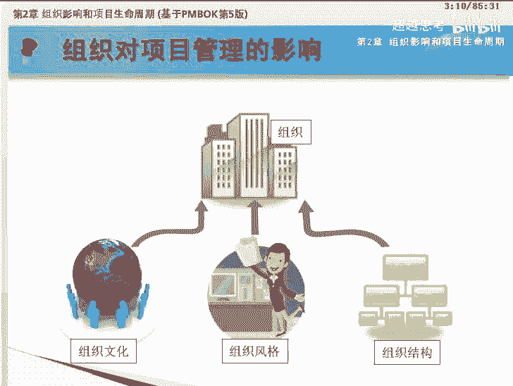

组织文化与风格是项目所面对的软环境，可能对项目实现目标的能力产生强烈影响，一个良好的组织文化与风格，可以帮助组织提升业绩，在特定的组织中管理项目，必须考虑该组织的文化保证，所采用的管理方法和领导风格。

与组织文化相匹配，组织文化的表现形式包括以下几个方面，员工所具有的共同愿望，价值观，信念和期望，公司的规章政策法规，对一些事情处理的特定方法和程序，奖励和激励制度。

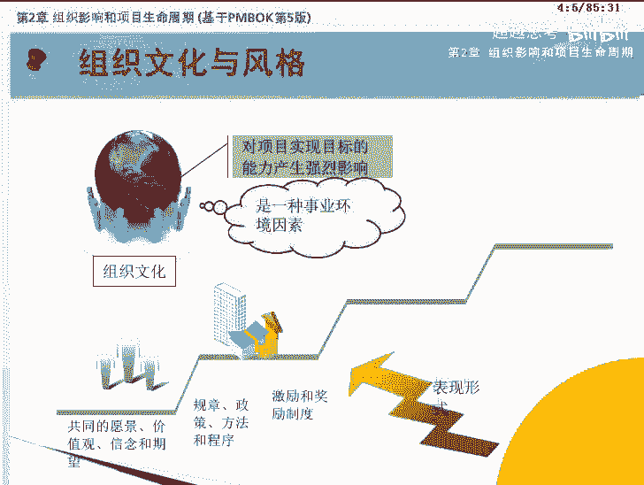

风险承受力，对领导力层级体系和职权关系的看法，如公司的权力机构设置，以及员工对权力的认识，行为准则，职业道德和工作时间，如大家习惯的工作时间以及时间观念等内容，另外还有组织的运营环境。

组织文化和风格是一种事业环境因素，因此项目经理应该了解可能对项目造成影响的，不同的组织风格和文化，关于试验环境因素，本章的最后会为您详细讲解，组织结构是项目面临的一个硬环境，也是一种适应环境因素。

它可能影响资源的可用性，组织结构形式对项目影响的实质是，项目经理控制资源的能力，或项目获得资源的能力，组织结构还会影响项目的管理模式，即使项目经理拥有较强的领导力，组织对结构类型。

还是会对项目绩效产生巨大的影响，因此组织结构是pmp考试和培训，学习的一个重要内容。

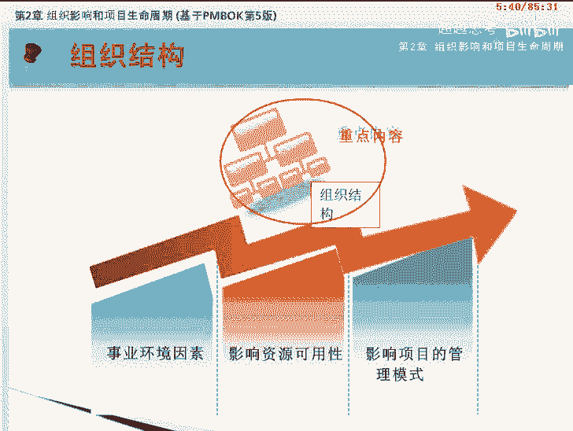

pm报告中，讨论了三种典型的完成项目的组织结构形式，分别是职能型组织，矩阵型组织和项目型组织，在职能型组织中，人员按专业分组，每个成员有一位明确的上级及职能经理，各个部门相互独立地开展各自的项目工作。

在项目型组织中，整个组织都是按项目来划分和管理的，团队成员通常集中办公。

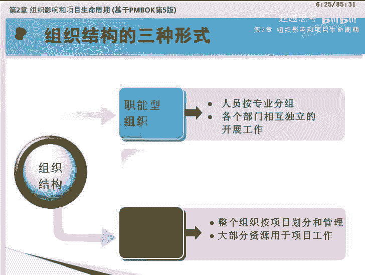

组织的大部分资源都用于项目工作，矩阵型组织兼具职能型和项目型组织的特点，它是一个重要的考点，如果pmp考题中没有明确说明组织结构的类型，你必须假设项目是在矩阵型组织中实施的，下面我们就对他们一一的讲解。

首先是职能型组织，这是比较传统的组织形式，组织内部按职能专业来划分部门，如财务部，生产部，市场部等，在这种组织下，没有单独的项目部，项目是放在各职能部门中进行的，项目组成员从各职能部门中抽取。

每一个成员，有一个明确的上司及本部门的职能经理，项目组成员不仅要从事项目工作，同时还要承担日常的部门工作，在职能型组织结构中，一般没有单独或全职的项目经理，而是由某个人进行项目协调，称为协调员或联络员。

当沟通需要跨部门时，项目协调一般都要通过职能经理来完成。

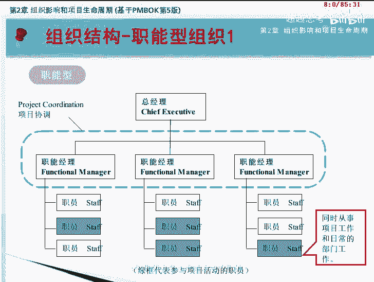

职能型组织的优点有以下几个方面。

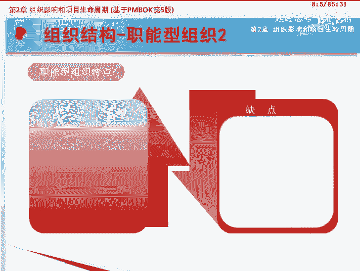

一是典型的职能型组织，是一种层级结构，采用直线管理的方法，部门内部信息垂直传递，每个员工只有一个上级，二是按专业分组，更便于员工的专业发展，也更容易管理专业人士，同一部门类似，资源更集中。

使得部门内的协调和沟通比较容易，专业内的问题可以得到迅速的响应和解决，除了优点，当然职能型组织结构，也有其不可避免的缺陷和不足，其缺点主要表现在一，由于项目成员来自于职能部门。

由职能经理对其进行绩效评估，所以职能工作往往优先于项目工作，在职能型组织中没有全职的项目经理，项目经理只是进行一些协调工作，权力很小，第三由于项目依附于职能部门，使得项目经理领域内没有职业发展道路。

第四职能型组织采用直线式管理，使得与其他职能部门之间没有沟通，容易忽视其他部门在项目上的利益，同时也导致跨部门使用资源困难，使得项目管理不易进行，基于以上分析，我们可以得出。

职能型组织结构适用于规模较小的，以技术为重点的内部项目，不适用于时间限制性强，或要求对变化快速响应的项目，复杂的和需要跨专业的项目，也不适合用职能型组织结构。

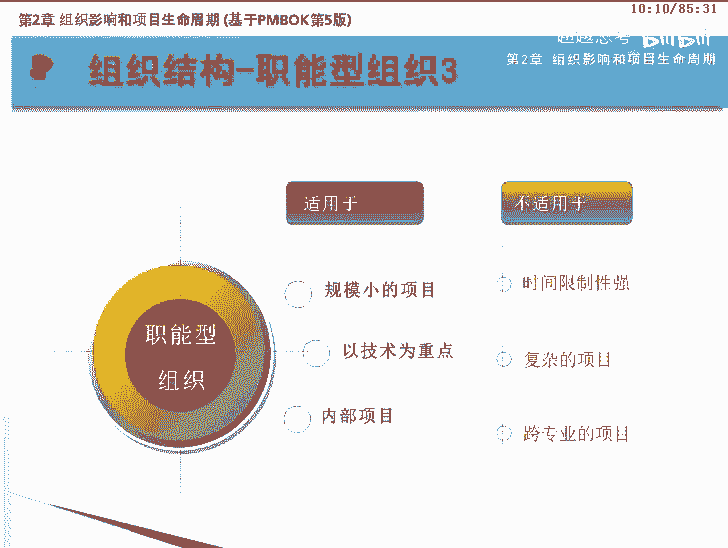

相比职能型组织，走向另外一个极端的是项目型组织，项目型组织是按项目来划分和管理的，项目团队成员只为本项目提供支持服务，直接向项目经理汇报，项目经理对项目有完全的管理与控制权，项目经理负责项目内部的协调。

在现实生活中，其实没有一个组织能够完全是项目型的，因为他多多少少都需要职能部门的支持，但是从单个项目的角度来说，可以采取项目型的组织，即一个自成体系的项目，拥有所需全部人员的项目团队。

在实施项目的过程中，不需要母公司各职能部门的支持。

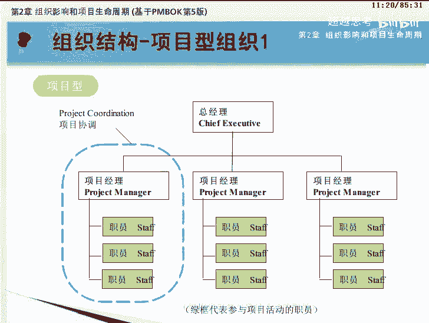

项目型组织具有如下优点，一是有明确的项目经理，项目经理拥有很大的自主性和职权，二是项目成员全职于项目工作，对项目忠诚，三是团队成员直接向项目经理汇报，使得沟通更有效果，决策速度也更快。

最后组织以项目的形式存在，便于项目团队的建设。

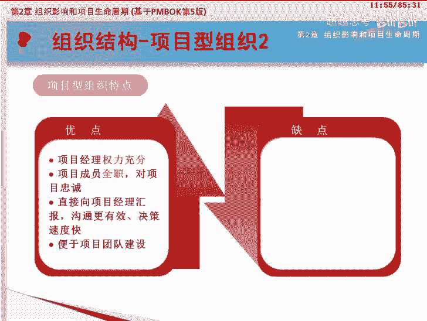

项目型组织具有如下缺点，由于团队成员专职于项目，所以在项目结束后，项目成员会有无家可归的忧虑感，另外由于整个项目团队缺乏专业化分工，不利于团队成员专业技术发展，最后每个团队成员只为本项目工作。

会造成人力资源使用效率低下的后果，这些都是项目型组织的缺点，那么项目型组织适用于哪些情况呢，项目型组织特别适用于，包括多个相似项目的单位或组织，以及长期的大型的技术。

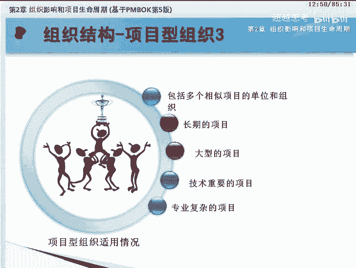

重要的和专业复杂的项目，下面我们开始介绍最复杂，也是篇报告中最重视的组织类型，矩阵型组织，矩阵型组织，兼具职能型组织和项目型组织的特征，他的目的是为了同时利用，职能型组织和项目型组织的优点。

并尽量避免他们的缺点，矩阵型组织呈现出两个主要特点，一个是借资源，大部分项目团队成员和其他资源，都是从职能部门借来的，他们可能只是在项目上兼职，另一个特点是有两个老板，项目团队成员需要同时接受。

项目经理和职能经理的领导，这种情况也称为多头领导，经常会导致冲突。

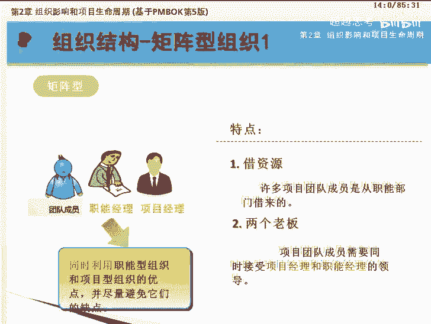

矩阵型组织又可以分成三种形式，弱矩阵，平衡矩阵和强矩阵，其主要区别在于，项目经理和职能经理权力的大小，接下来我们分别讲解这三种矩阵型组织结构。

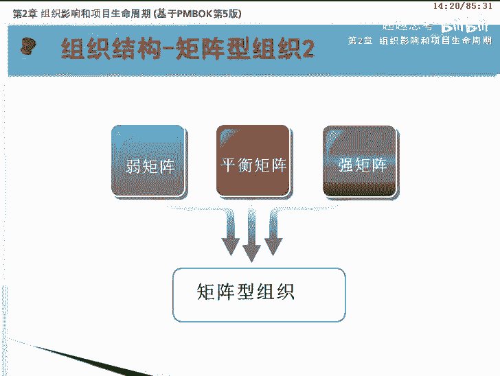

弱矩阵型组织保留了职能型组织的大部分特征，没有全职项目经理，此时项目经理的角色更像是协调员或者联络员，而非真正的项目经理，在这种组织结构中，由名义上的项目经理负责项目的协调，因此在弱矩阵型组织中。

权力主要控制在职能经理的手中，项目经理的地位低于职能经理，项目经理的角色更像是协调员或联络员，缺乏分配项目资源的权利，实际上，协调员和联络员在概念上有一点小小的区别，我们后面会详细介绍。

图中所示的是平衡矩阵，在平衡矩阵中认可了项目经理的重要性，有专门的项目经理，由项目经理负责项目的协调，是否存在专门的项目经理，是区分弱矩阵和平衡矩阵以及强矩阵的标志。

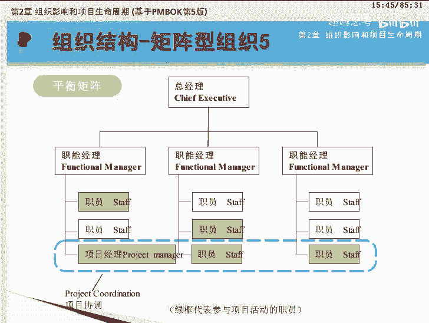

平衡矩阵型组织虽然承认项目经理的重要性，但并未授权其全权管理项目和项目资金，平衡矩阵中权力由职能经理和项目经理分享，两者地位基本平等，强取阵型组织则具有项目型组织的许多特征，拥有掌握较大职权的项目经理。

和全职的项目行政人员，在强矩阵中权力主要由项目经理控制，项目经理对团队成员的控制高于职能经理，在矩阵型组织中，项目相当于需要浇灌的田地，而各职能部门则是相关专业技，术和专门人才的蓄水池。

当项目需要某种技术人才时，各职能部门立即释放出来，当项目不在需要时，就立即收回去，因此矩阵型组织有如下优点，第一资源使用率高，能最大限度地使用组织的稀缺资源，第二矩阵型组织中仍然存在专业分工。

有利于专业知识的积累和专业人才的成长，第三来自于不同职能部门的人员，共同为一个项目工作，有利于更好的跨部门协调，第四职能型组织主要是现行传递信息，矩阵型组织，更有利于信息的水平传递。

最后项目成员来自于不同的职能部门，项目结束后，成员可以回到相应的职能部门。

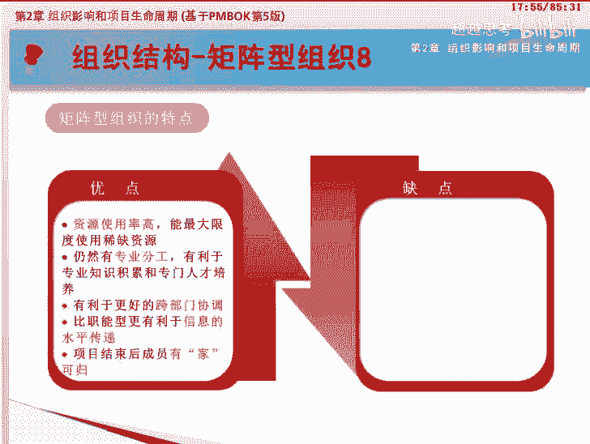

保证有家可归，虽然矩阵型组织，希望避免其他两种组织形式的缺点，但事物的两面性注定其不可避免的缺点，首先是矩阵型组织中，项目成员有多个上级，不符合组织结构理论的基本要求，其次矩阵型组织结构复杂。

人员来自不同的部门，沟通复杂，管理难度大，另外项目经理和职能经理容易产生权力争斗，不利于项目的顺利进行，由于成员的双重身份，容易导致项目工作和职能工作对资源的争夺，最后在矩阵型组织中。

项目经理对项目成员可能没有足够的控制权，矩阵型组织在项目管理中用的最多是合规模，中等的跨专业的项目，项目需要利用多个职能部门的资源，而且技术相对复杂，在矩阵型组织中，不需要技术人员全职为项目工作。

特别适合于某些需要同时共享某些技术人，员等核心资源的项目，大家可能会疑惑，在矩阵型组织中，项目经理和职能经理具体都做什么工作呢，其实按照p mi的要求，它们之间是有一定的分工原则的，一般情况下。

项目经理负责做什么，什么时候做，为什么要做，以多大成本做，而职能经理负责由谁来做，怎么做，在职能型组织和弱矩阵型组织中，我们提到了项目联络员和项目协调员，他们都是用来称呼项目经理的。

那它们之间有什么不同呢，各自在项目中起什么作用呢，其实项目联络员没有任何决策权，主要起沟通联络作用，以促进各部门更好的协调工作，项目联络员既可以是某职能部门内部的，也可以是各相关职能部门之间的。

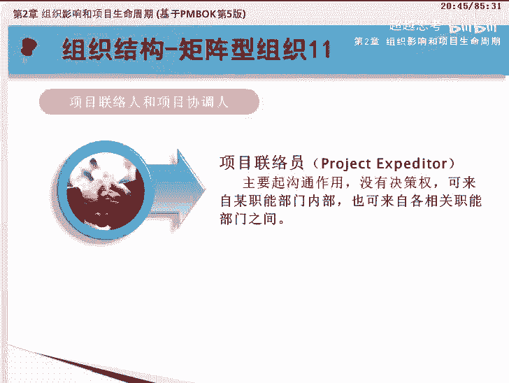

项目协调员，地位比项目联络员要高一些，具有一定的项目决策权，如果是职能部门内部的协调员，就向该职能经理汇报，如果是跨职能部门的协调员，则由公司总经理委派，直接向总经理汇报，在学习中。

你可能会遇到一个叫做紧密型矩阵的名词，其实紧密型矩阵并不是矩阵型组织的一种，他也叫集中办公，是指将项目团队成员集中在一办公，以提高工作绩效，不是组织结构的一种形式，现在我们来对各种组织结构中。

项目的特征进行一个汇总整理，从表中可以看出，矩阵型组织分为弱矩阵，平衡矩阵和强矩阵三类，从职能型到矩阵型，再到项目型组织，项目经理的权力逐渐增大，可用的资源也逐渐增多，在职能型组织和弱矩阵型组织中。

没有全职的项目经理，项目经理的角色实际是兼职在工作，直到平衡矩阵才有了全职项目经理，因此平衡型矩阵中，全职项目经理的出现是强弱矩阵分水岭，另外我们还可以看到，在强矩阵和项目型矩阵中。

项目管理行政人员也是全职的了，在实际管理过程中，很多组织的结构并不是单一的，他们会在不同层次上用到职能型组织，矩阵型组织以及项目型组织，我们将这种由两种以上组织结构混合而成，的组织形式叫做复合型组织。

如在典型的职能型组织中，建立专门的项目团队来实施重要的项目，该团队可能具备项目型组织中，项目团队的许多特征，可以拥有全职项目人员，可以制定自己的规章制度，办事流程，在pmp考试中，有一类考题是根据情景。

选择一个合适的组织结构，我们要熟记前面介绍过的，每类组织结构的特点及适用情况，只有这样才能出色的完成考试中涉及的内容，这里我们做个简单总结，如果是实施起来简单，专业单一的项目就一般用职能型组织结构。

如果是跨专业的，需要多部门合作的项目，就用矩阵型组织结构。

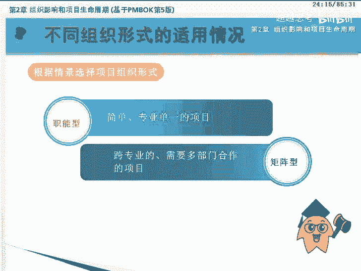

如果需要最大限度地控制资源，如工期很紧，需要全部成员全职参与工作，就用项目型组织，当然各种组织结构的选择还需要考虑其优缺点，接下来我们要讲解项目管理过程中，不可避免的会涉及到的两个概念，组织过程。

资产和事业环境因素，他们是在做项目的过程中，必须要充分考虑和加以充分利用的因素，各位学员应该认真体会，这两者所包含的内容和作用，这里要提醒大家的是，两者间会有一些交叉。

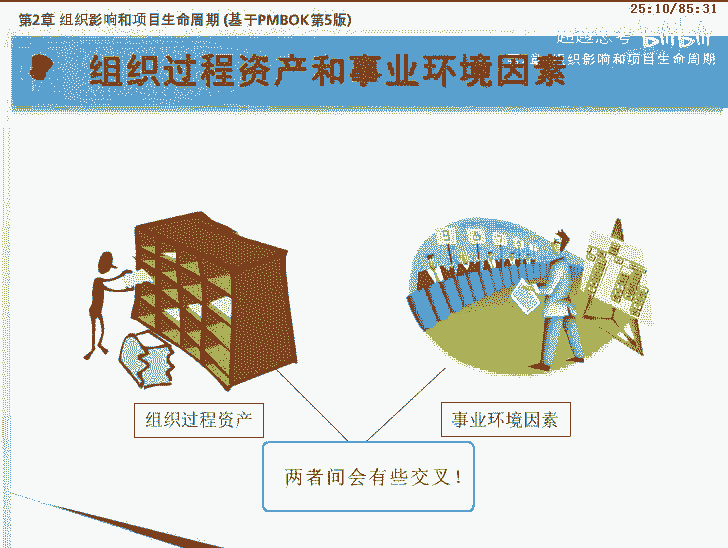

那么什么是组织过程资产呢，组织过程资产是执行组织所持有，并可以投入使用的计划流程，政策，程序知识库可以来自于参与项目的所有组织，用于帮助项目成功，组织过程资产是组织做项目管理最重要的，无形资产。

包括完整的进度计划，风险数据和正值数据等，是人们要主动利用的，项目团队成员在做项目的过程中，还要经常进行组织过程资产的更新，对于pmbok指南中的大部分规划过程，组织过程资产都是其重要的输入，组织过程。

资产的内容可分为流程与程序和共享知识库，两个主要部分，流程与程序包括指南和标准，他们用于裁剪组织标准流程，以满足项目要求，组织标准和政策，如人力资源和健康安全政策，职业道德政策和项目管理政策。

产品和项目生命周期标准，质量政策与程序模板，如风险登记册模板，w b s模板，进度网络模板，合同模板等，各种控制程序，如变更控制程序，财务控制程序，问题与缺陷，管理程序和风险控制程序等。

此外还包括项目控制及收尾过程的指南或要求，共享知识库主要包括组织存取的各种信息，这些信息包括配置管理知识库，其中包括执行组织的所有标准政策程序，和任何项目文件的各种版本与基准财务数据库，其中包括人工时。

实际成本，预算和成本超支等方面的信息，历史信息与经验教训知识，如项目记录与文件，完整的项目收尾信息与文件，关于以往项目决策的结果，以及以往项目绩效的信息，以及从风险管理活动中获取的信息。

问题与缺陷管理数据库，包括问题与缺陷的状态控制，信息解决方案，以及相关行动的结果，过程测量数据库，用来收集与提供过程和产品的测量数据，以往项目的项目档案如范围，成本进度与绩效测量基准，项目日历。

项目进度网络图，风险登记册，风险应对计划和风险影响评价，总的来说，组织过程资产是组织重要的无形资产，一定要善加利用，什么是事业环境因素呢，视野环境因素是指项目团队不能控制的，将对项目产生影响。

限制或指令作用的各种条件，事业环境因素，包括组织外部的环境要素和组织内部的因素，事业环境因素通常是项目不能直接控制，但会直接影响项目的那些因素，即使人们不想主动利用他们。

他们也会提高或限制项目管理的灵活性，并可能对项目结果产生积极或消极影响，事业环境因素是大多数规划过程的输入，事业环境因素包含的内容众多，总体上，我们可以将其分为组织内部环境因素。

和组织外部环境因素两大类，内部环境因素包括组织文化结构和治理，设施和资源的地理分布，基础设施如现有的设施和固定资产，现有人力资源状况，如人员在设计开发，法律合同和采购等方面的技能素养与知识。

人事管理制度，如人员招聘和留用指南，员工绩效评价与培训记录，奖励与加班政策以及考勤制度，公司的工作授权系统，组织已有的沟通渠道。

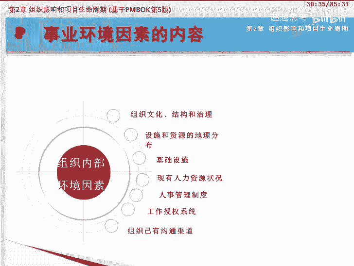

外部环境因素包括政府或行业标准，行为准则，产品标准，质量标准和工艺标准，市场条件，干系人，风险承受力，政治氛围，商业数据库如标准化的成本估算数据，行业风险研究资料和风险数据库等。

项目管理信息系统如自动化工具，包括进度计划，软件配置管理系统，信息收集与发布系统，或进入其他在线自动系统的网络界面，刚讲了那么多，事业环境因素和组织过程资产的内容，大家可能觉得两者并不是很好区别。

现在我们就来看，如何区分事业环境因素和组织过程资产，首先事业环境因素是项目经理必须考虑的，内外部环境条件，而组织过程资产是供项目利用，对项目成功起支持作用的因素。

项目的实施一般不能对事业环境因素产生影响，除了建设项目团队和管理项目团队，两个过程会导致试验环境因素更新，而对于组织过程资产来讲，项目的实施过程中一直在对其进行补充和更新，除商业数据库外。

事业环境因素都会对项目有直接制约作用，而组织过程资产是组织内部所有的需要，项目团队主动加以利用，最后有关系统和因素都是事业环境因素，有关程序的因素都是组织过程资产。

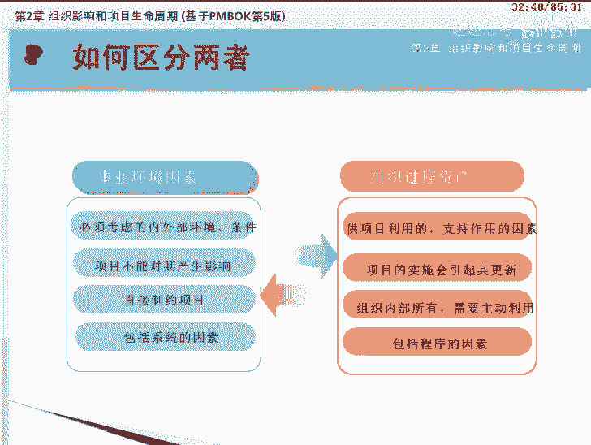

接下来我们详细讲解项目干系人的概念，该系人是指能影响项目决策活动或结果的，个人群体或组织，以及会受或自认为会受项目决策活动或结果，影响的个人群体或组织，根据在项目中发挥的作用，我们可以将干系人分为两类。

参与项目和受项目影响或影响项目，参与项目的干系人，有发起人，项目经理，项目管理团队，项目团队，pmo，项目组合经理，职能经理等，如果项目需要外部提供一些资源，参与项目的干系人，还会包括卖方。

以及一些参与项目工作的业务伙伴，如分包商，生产商等，受项目影响或影响项目的干系人有客户，用户，政府或社会团体机构以及普通公众，总的来说，与项目有直接或间接关系的任何组织和个人，都是项目干系人。

这张图中展现各类干系人之间的关系不同，该系人在项目中的责任和职权各不相同，他们参与项目的程度可能差别很大，有些只是偶尔参与项目调查或焦点小组活动，有些则为项目提供全方位资助，包括资金支持。

正直支持或其他支持，有些干系人可能被动或主动地干扰项目，取得成功，项目经理应该在整个项目生命周期内，特别关注这部分干系人，并提前做好计划，以应对他们可能导致的任何问题，要成功地完成项目。

应该把项目干系人的范围尽量考虑的宽泛一些，以免漏掉重要的干系人，关于干系人概念，后面会再次讲解，由画面所示的一个建筑工程项目干系人示意图，可知，项目该纪人不只是项目经理，项目承建方，项目团队。

还包括许多其他的组织与个人，如画面所示的发起人，客户，社会相关利益团体，甚至项目团队成员，家属，公共传媒公民个人，都会对项目的实施产生影响，项目经理的目的，既包括满足项目干系人。

对项目已经表达出来的各种利益追求，也包括满足他们对项目，尚未表达出来的利益期望。

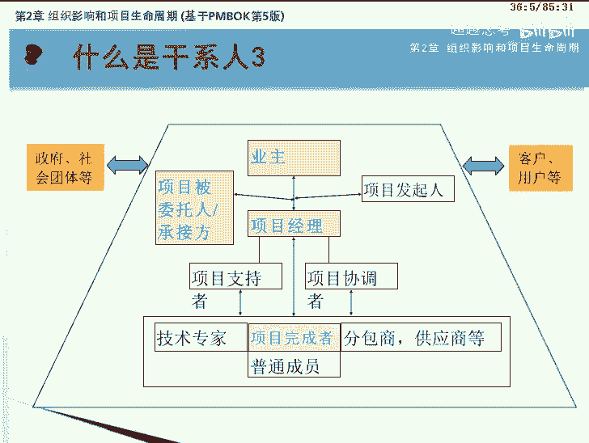

因为干系人对项目成功与否具有很大的影响，所以为了确保项目成功，项目经理必须针对项目要求来管理各种干系人。

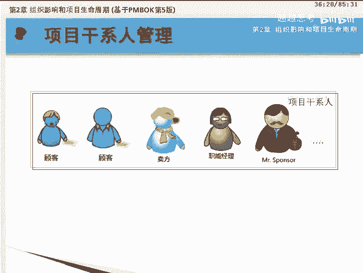

对项目的影响，项目干系人管理是项目管理中的重要内容，它是指项目管理团队必须识别项目干系人，分析他们对项目的要求及需求，并且管理和影响这些要求，以确保项目成功，要成功地管理干系人。

项目经理和项目团队需要做几个方面的工作，本课程将其总结为干系人管理五步走，战略及识别干系人，干系人优先级排序管理干系人，期望持续识别干系人收尾项目阶段，获得主要干系人的接受和认可。

接下来我们就向大家一一讲解这五个步骤。

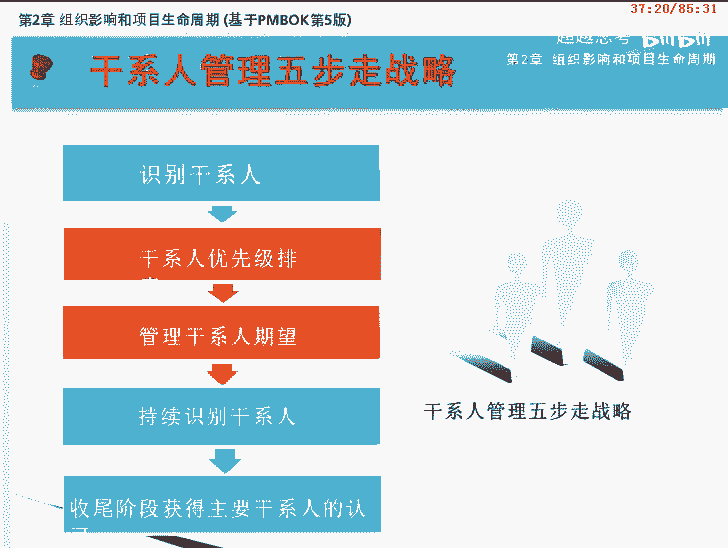

第一步识别干系人，识别每个干系人对项目的需求，期望和对项目的贡献以及制约作用，并让他们尽早参与进来，p mi要求理论上应识别出项目的所有干系人，在现实中这点比较困难，但项目团队应尽可能地。

将与项目相关的干系人都考虑进来，第二步，干系人优先级排序，干系人对项目产生的影响或积极或消极，其对待项目的态度以及对项目的认知程度，各有不同，项目团队需要分析每一个干系人的角色，并根据其对项目的影响力。

支持态度，急迫性等要素综合评定，进行干系人优先级排序和分类，pmi要求考虑全部干新人的利益与影响，充分评价项目干系人的知识与技能，并加以充分利用，第三步管理干及人期望，有些干系人可能会受益于项目。

而有些干系人，则看到项目给他们带来的负面影响，因此项目经理需要通过各种途径调动积极因素，化解消极因素，由于干系人的期望往往差别很大，甚至互相冲突，因此管理干系人的期望是项目经理的重要职责。

项目经理要平衡干系人的不同利益，是干系人能最大程度地为项目成功提供支持，以实现项目目标，pmi要求充分发挥全部项目干系人的作用，来保证项目成功，pmi认为干系人管理做的不好。

经常是造成项目失败的主要原因，第四步持续识别干系人，识别干系人是一个持续的过程，随着项目的进行，干系人有可能发生变化，当干系人发生变动时，要重新识别和评估干系人，并主动投入精力进行沟通。

pmi要求尽早面对负面干系人，如同面对正面干系人一样，忽视负面干系人，会提高项目失败的可能性。

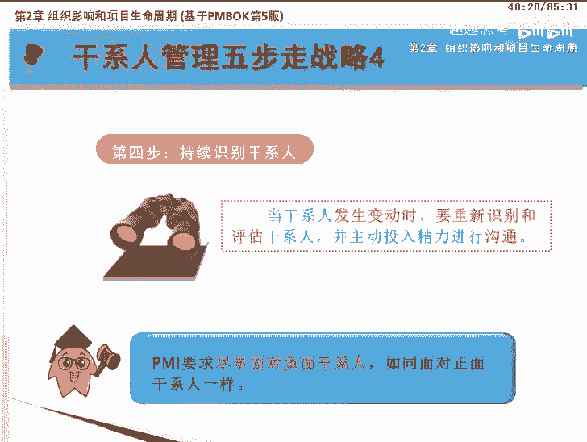

最后一步是项目收尾阶段，获得主要项目干系人对项目结果的接受与认可，项目收尾阶段，项目产品服务或成果应该得到使用者的认可，因此当干系人的利益发生冲突时，通常应按照有利于客户的原则进行处理，如果客户众多。

应按最终端客户的利益至上为原则，如研制一种新药，医院开药的医生，病人都是这一项目的客户，病人是肝新药最终的使用者，所以应以病人的利益为首要出发点，来考虑冲突问题，pmi认为干系人管理不好。

经常是造成项目失败的主要原因，项目干系人的范围十分广泛，项目经理和项目团队，必须尽可能地识别出全部干系人，接下来本课程中列出部分主要干系人，分析他们在项目中的作用和职能。

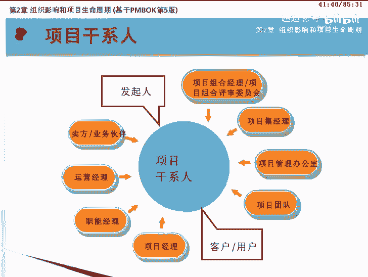

首先我们来了解什么是发起人，发起人是为项目提供资源和支持的个人或团体，发起人对项目的作用，早在项目开始构思时就产生，包括游说更高层的管理人员，获得组织的支持以及宣传项目的利益收入，在项目正式批准前。

发起人对整个项目起领导作用，项目获批后，发起人对制定项目初步范围与章程起重要作用，在项目执行过程中，发起人要对项目进行监控，对超出项目经理控制范围的事项，需要发起人参与管理和控制。

另外发起人还要参与范围变更，审批阶段末评审以及遇到重大风险时，对项目是否继续进行决策，另一个我们需要了解的重要，该系人是客户或用户，客户是将要批准和管理项目产品，服务或成果的个人或组织。

用户是将要使用项目产品，服务或成果的个人或组织，在有些领域，客户和用户是同义词，如为某公司开发的办公自动化系统，客户和用户都是该公司，而在另一些领域，客户是指购买项目产品的个人或组织。

而用户则是指直接使用项目产品的个人或组织，如建造一个花园式小区项目，而用户是即将入住的居民。

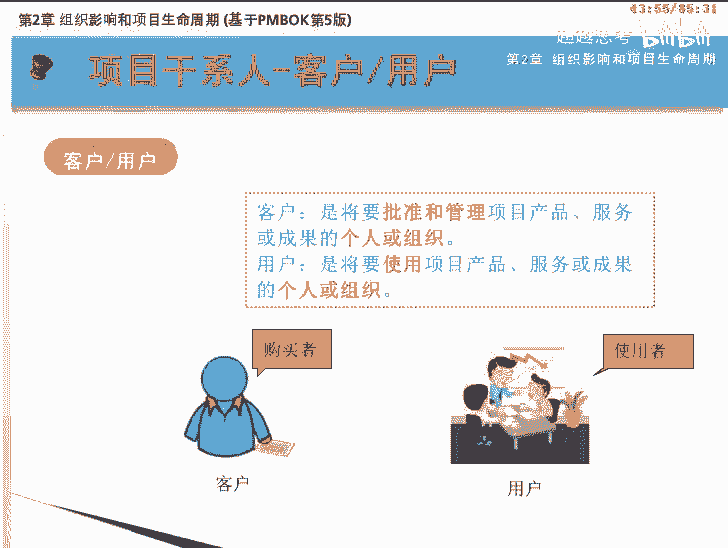

卖方是根据合同协议，为项目提供组件或服务的外部公司，卖方根据不同的项目情况，又称为供应商，供方或承包方，如为一个建筑项目提供钢材的商家，就是卖方，负责建筑项目某一部分建筑任务的外包工程队，是承包方。

业务伙伴也是外部公司通过某个认证过程，与本公司建立的特殊关系，为项目提供专业技术或安装定制等特定服务，他们与本企业间存在着某种特殊关系，如某律师事务所专门负责本企业的法律事务，某人才资源管理公司。

负责为本项目培训适合的人才。

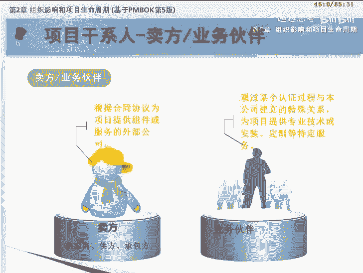

组织内的团体是受项目团队活动影响的，内部干系人，例如市场营销，人力资源，法律，财务运营，制造和客户服务等业务部门，都可能受项目影响，他们为项目执行提供业务环境，他们可以对项目需求提出意见。

并参与项目可交付成果的验收。

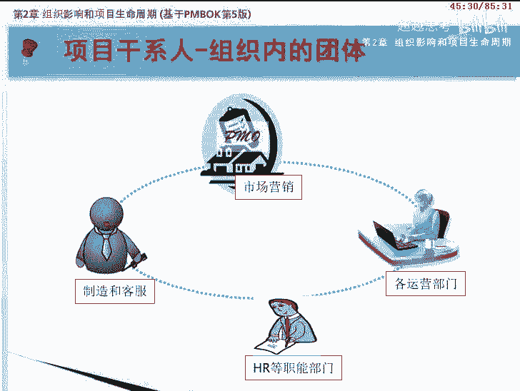

职能经理是在行政或职能领域，如人力资源，财务，会计或采购，承担管理角色的重要人物，他们配有固定员工，已开展持续性工作，他们对所辖职能领域中的所有任务，有明确的指挥权。

职能经理可为项目提供相关领域的专业技术，或者职能部门，可为项目提供相关服务，项目里可能包括其他项目干系人，项目组合经理，负责对一组项目或项目集进行宏观治理，这些项目或项目及可能相关或不相关。

项目组合评审委员会由组织中负责项目选择的，高层管理人员组成，对每个项目的投资回报，价值风险和其他属性进行评审。

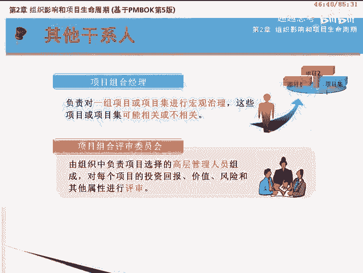

项目集经理统筹管理一组相关的项目，从而取得对单个项目分别管理，所无法实现的利益和控制，此外还有其他干系人，如采购单位，金融机构，政府机构主题专家顾问和其他人，可能在项目中有财务利益，可能向项目提供建议。

或者对项目结果感兴趣，监管职能，覆盖整个项目生命周期，项目治理框架由项目组合，项目及或发起组织来定义，向项目经理和团队提供管理项目的结构流程，决策模式和工具，项目治理框架，同时对项目进行支持和控制。

以实现项目的成功交付，通俗地讲，项目治理是为项目管理搭架子，指路子，对于任何项目项目治理都非常关键，尤其是对于复杂和高风险的项目，通过定义记录和沟通，可靠的可复用的项目实践，项目治理为控制项目。

并确保项目成功提供了一套全面的一致的方法，项目治理框架中的主要内容包括，项目成功标准和可交付成果验收标准，用于识别升级和解决项目期间的问题的流程，项目团队组织团体和外部干系人之间的关系，项目组织图。

其中定义了项目角色信息沟通的流程和程序，项目决策流程，协调项目治理和组织战略的指南，项目生命周期方法，阶段关口或阶段审查流程，对超出项目经理权限的预算范围，质量和进度变更的审批流程。

保证内部干系人遵守项目过程要求的流程，我们看到，虽然项目治理给项目团队提供了一个工作框架，但项目团队仍然要负责项目的规划执行，控制和收尾，项目团队包括项目经理，以及为实现项目目标而一起工作的一群人。

至少包括项目经理，项目管理人员和其他项目团队成员，项目团队由来自不同团体的个人组成，他们拥有执行项目工作所需的，专业知识或特定技能，项目团队结构和特点可以相差很大，但项目经理作为项目领导者的角色。

是固定不变的，无论项目团队成员有多大的职权，项目团队中的角色，有项目管理人员，开展项目管理活动的团队成员，开展各种规划工作及行政支持，有时pmo可以履行或支持这些工作，项目人员执行工作。

以创造项目可交付成果的团队成员，支持专家为项目管理计划的制定或执行，提供支持，根据项目的规模大小和所需的支持程度，支持专家可以全职或兼职参与项目工作。

用户或客户代表将要接受项目，可交付成果或产品的组织，可以派代表或联络员参与项目来协调相关工作，提出需求建议或者确认项目结果的接受性，卖方卖方又称为供应商，供方或承包方，是根据合同协议。

为项目提供组件或服务的外部公司，通常项目团队负责监管卖方的工作绩效，并验收卖方的可交付成果或服务，如果卖方对交付项目结果承担着大部分风险，那么他们就在项目团队中扮演着重要角色，业务伙伴成员。

业务伙伴组织可以派代表参与项目团队，来协调相关工作，业务伙伴，业务伙伴也是外部组织，但是与本企业存在某种特定关系，这种关系可能是通过某个认证过程建立的，业务伙伴为项目提供专业技术或填补某种空白。

如提供安装定制，培训或支持等特定服务，至此我们已经学完了关于项目干系人的知识，具体如何进行识别和管理，干系人将在本课程的第13章进行详细讲解，接下来我们学习项目生命周期的知识，有关生命周期的说法。

大家一定不会陌生，对于我们人来说，生命个体的周期可以分为母体中的胎儿，出生后的婴儿，儿童少年青年中年老年。

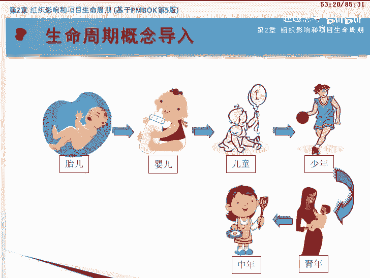

一直到生命的结束，跟人一样，项目也有生命周期，本节课我们将和大家一起学习，项目生命周期和组织的相关内容，首先我们来看什么是项目生命周期，项目生命周期是指项目从启动到收尾，所经历的一系列阶段。

也就是项目从开始到结束的阶段的集合，具体说明项目在不同的时间段要做什么，项目生命周期从定义上讲，通常是按顺序排列，有时又互相交叉的各阶段的集合，针对较复杂的项目，为了有效地进行管理，规划和控制。

项目所在组织往往将项目划分为若干个阶段，通过完成项目各阶段来实现项目的整体目标，如一个软件开发项目，我们可以将其分为需求分析，设计调试安装这三个按顺序排列的阶段，下一阶段的开始取决于上一阶段的完成。

又如建设一个新工厂的项目，我们可以将整个项目生命周期划分为设计阶段，施工阶段，当全部设计图纸完成的差不多的时候，可以进行地基建设阶段，即这两个阶段可以有些许交叉，结合前面的软件工程。

项目和建筑项目的阶段划分，对于项目生命周期，我们应了解项目生命周期的几点，不同类型的项目有不同的生命周期阶段划分，不同项目的生命周期中，阶段数量名称和顺序都可以互不相同，项目生命周期的每一个阶段。

都可以当做一个单独的项目或子项目来完成，一般情况下是一个阶段结束后，另一个阶段才开始，但如果风险不大，也可以在一个阶段结束前开始下一个阶段。

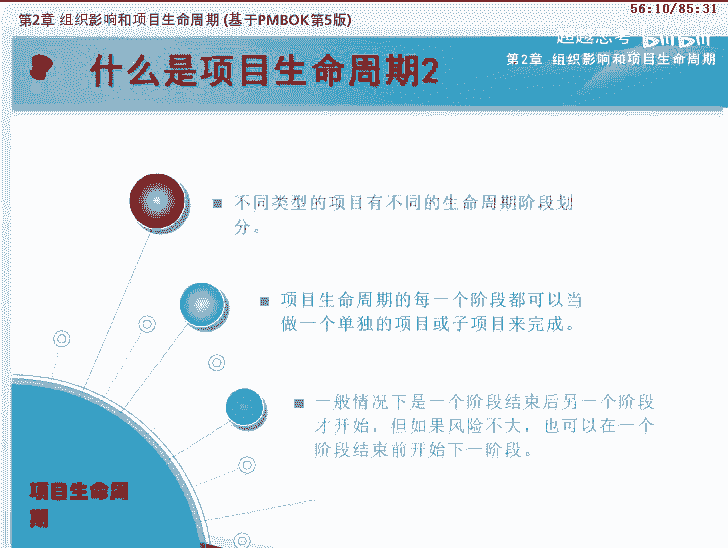

无论项目涉及什么具体工作生命周期，都能为管理项目提供基本框架，项目生命周期通常对如下内容进行具体定义，各个阶段需要完成哪些技术工作，第二各个阶段的可交付成果何时产生，如何验证和确认。

第三各个阶段需要和人参与，第四如何控制和验收。

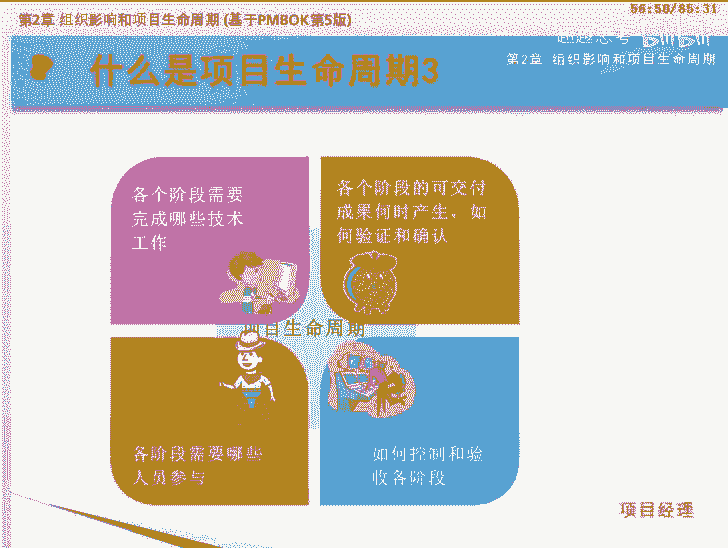

各个阶段，由于生命周期的考虑，项目经理有权决定对某些阶段的可交付成果，给予更多更强更有力的控制，项目生命周期的划分，主要由项目的技术特性和所在组织的特点决定，因此不同的项目会有不同的项目生命周期划分。

但是无论项目的大小与复杂程度如何，都可以包括启动项目组织与准备，执行项目工作和结束项目这一生命周期结构，我们将这一生命周期结构，称为通用生命周期结构，这里我们只对通用的项目生命周期划分，进行讨论。

画面上我们用横轴表示时间，纵轴表示项目中成本和人力投入水平，我们看到随着时间的推进，项目所需成本和人力投入水平，成图中所示的变化趋势，即在项目初期成本与人力投入水平较低，在工作执行期间达到最高。

并在项目快要结束时迅速回落，需要提醒大家的是，图中成本和人力投入的典型走势，可能并不适用于所有项目，有的项目在生命周期早期支出较大，以确保所需资源到位，例如在生命周期很早的时点就配备全部人员。

同样随着项目的进行，项目的风险与不确定性以及项目变更的代价等，变量都会呈现不同的变化趋势，如画面所示，项目的风险与不确定性在项目开始时最大，并在项目的整个生命周期中，随着时间推移而递减，在项目初期。

由于对项目中会涉及的风险并不明确，也不知道在将来会发生什么样的变更，因此在初期项目的风险和不确定性也是最大的，随着项目的进行，对项目的了解与控制能力越来越大，风险和不确定性逐渐减少。

改变项目产品最终特性的能力，或者说变更和纠正错误的代价，在项目的初期，最低在项目接近完成时，通常会显著增高，譬如一个建大楼的项目，如果在设计图纸阶段需要改变整栋房子的结构。

那我们只需要设计团队花费一点时间，而如果在房子已经差不多建好了后，再更改结构，那需要的代价会特别大，下面我们对项目生命周期的特征做一个小结，项目生命周期各阶段要素变化的特征总结，如图画面所示。

项目所处的阶段越早，项目的风险不确定性越高，干系人的影响力越大，项目调整或变更的代价越低，随着项目的进行，不确定性和风险逐渐减小，而变更的代价，付出的人力成本投入逐渐增加，项目调整和变更的代价逐渐提高。

前面我们提到，项目生命周期是由一系列阶段组成的，那么什么是项目阶段呢，项目阶段是一组具有逻辑关系的，项目活动的集合，通常以一个或多个可交付成果的完成为结束，一个项目可以划分为任意数量的阶段。

如果待执行的工作具有某种特殊性，就可以把它们当做一个项目阶段，对项目做阶段划分是为了更好的管理和控制。

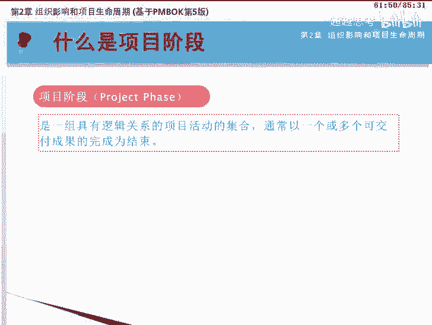

至于究竟应该分为几个阶段，以及什么阶段，取决于组织对项目控制的需要，往往以主要可交付成果的完成，作为阶段结束的时点，一般情况下，项目可以划分为四个通用的阶段，即启动阶段，组织与准备阶段。

执行阶段和结束项目阶段，每个阶段结束都会有一个成果，如启动阶段结束会产生项目章程，组织与准备阶段会产生项目管理计划，执行阶段会产生可交付成果，最后结束项目阶段会产生存档的项目文件。

项目各阶段的工作重点不同，通常需要涉及不同的组织部门，需要不同的技能，项目经理可以对某个阶段施加额外的控制，已成功实现各阶段的主要可交付成果，或阶段目标，阶段需要批准才算结束。

阶段结束点是重新评估项目活动，并变更或终止项目的一个当然时点，这个时点可称为阶段关口，里程碑，阶段审查阶段门或关键决策点，对于规模或复杂度不大的项目，可以只用一个阶段来完成。

图中所示的电信网络安装管理项目，就是单阶段的项目示例，我们看到在这个唯一的阶段中执行了启动规划，执行收尾和监控五个过程组。

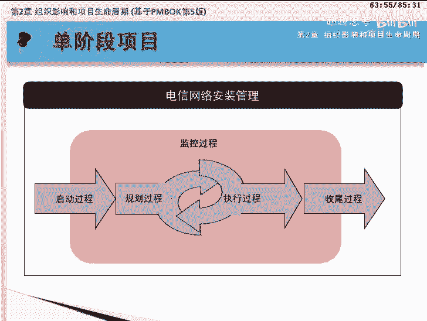

当项目被划分为多个阶段时，这些阶段之间通常按前后顺序排列，但有些情况下也可以交叠进行或并行进行，项目阶段与阶段之间存在三种关系，顺序关系，交叠关系，并行关系，其中并行关系实际上是一种特殊的交叠关系。

接下来我们详细展开讨论。

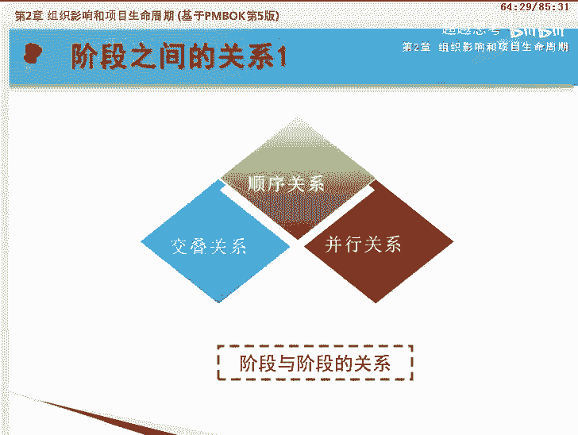

顺序关系，顾名思义，就是当前的阶段只能在上一阶段完成后，开始阶段之间按部就班先后进行，如危险废弃物场地清理项目，必须按顺序先执行设施停用，然后才是移除废弃物，最后再执行环境美化等一系列阶段工作。

这种关系可以减少项目的不确定性，但是不太容易缩短进度。

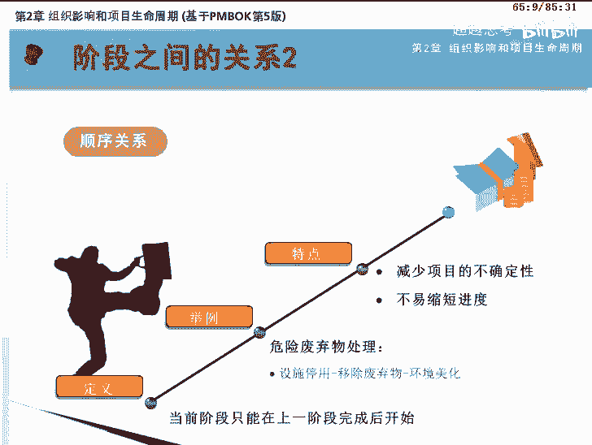

图中所示是顺序关系的事例，我们可以看到，该项目生命周期被分为了三个顺序的阶段，在每个阶段内部也要执行五个项目管理过程组。

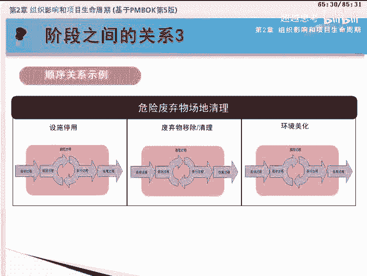

交叠关系就是后一阶段在前一阶段完成前，便开始了，如建房子时，在图纸还没有全部完成的情况下，可以先进入打地基的施工阶段，这种阶段关系可以适当节省时间，有利于快速跟进，满足项目的进度要求。

但是可能会增加项目的风险，从而导致返工。

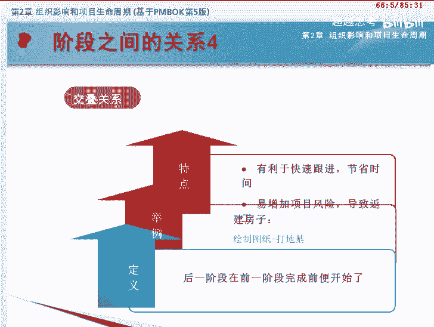

图中制是交叠关系的事例，我们可以看到，该项目生命周期被分为了两个相互交叠的阶段，设计阶段没完成之前就开始了施工阶段，这样可以节约总工期，同样的在每个阶段内部，也要执行五个项目管理过程组。

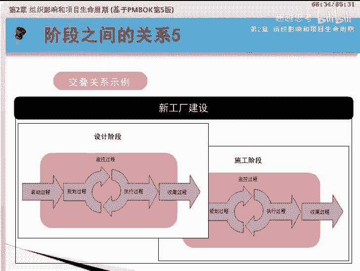

最后要说明的是，在整个项目生命周期中，可能发生不止一种阶段与阶段的关系，项目所需达到的控制水平和效果，以及项目所存在的不确定性程度，决定着要采用何种阶段关系，因此上述三种关系及顺序交叠并发。

可能在同一个项目内发生。

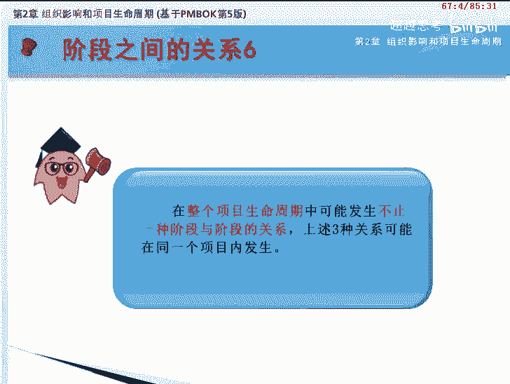

在pmbok指南第五版中，按照项目需求及范围的变更幅度，以及所采取的具体管理手段，把项目生命周期分为三种类型，分别是预测型生命周期迭代和增量型，生命周期和适应型生命周期。

我们为自己的项目选择生命周期模型时，可以选择其中的一种，或介于这三者之间的其他形式，需要提醒大家的是，无论你选用哪种项目生命周期类型，都可以在阶段之间采用顺序或交叠的关系，下面我们进行一一讲解。

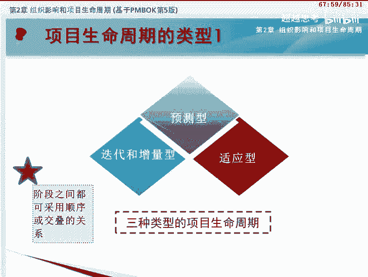

预测型生命周期，也称为完全计划驱动型生命周期，是项目生命周期的一种，在项目生命周期的早期就确定项目范围，并确定交付此范围所需的时间和成本，预测型生命周期适用于范围明确，变更较小，风险较低。

有成熟项目经验的项目，如建筑工程项目，水电工程项目等，此外对于需要整体交付的项目，也适用于预测型生命周期，发起人或客户只参与启动和阶段结束，通常每个阶段只关注一组项目，活动和项目管理过程。

每个阶段之间工作有本质的差别，所需的技能也不尽相同，预测型生命周期中，也并不要求初始计划是一成不变的，可以使用滚动式规划技术，在每个阶段开始之前细化本阶段内容，预测型生命周期的阶段关系。

可以是顺序或交叠的，图中所示是一个预测型生命周期项目的示例，该项目分为需求可行性，研究规划设计建造测试移交共七个阶段，阶段之间可以是顺序或交叠关系，每个阶段的任务完全不同，需要使用不同的技术。

甚至不同的团队成员完成项目结束后，可交付成果，一次性移交给客户，迭代和增量型生命周期，就是同时采用迭代和增量的方式来开发产品，迭代方法是通过一系列重复的循环活动，来开发产品。

而增量方法是渐进的增加产品的功能，迭代和增量型生命周期，适用于范围和目标不明确，风险较大，复杂性较高和部分交付的项目。

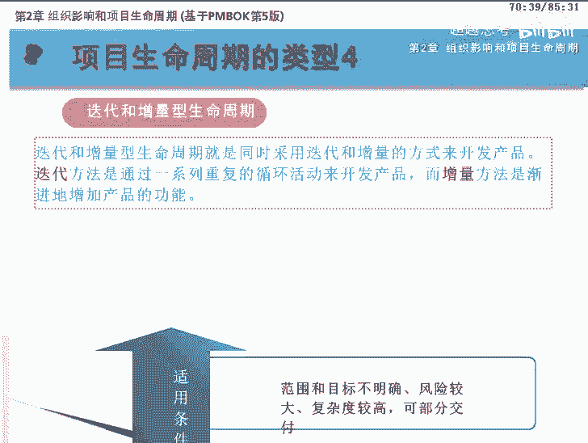

如大型软件开发项目，创新研究课题等，迭代和增量型生命周期，要求该系人在项目全程各个阶段参与项目，每个阶段之前提出自己的要求和建议，阶段结束后，审查和验收当前阶段的可交付成果，在迭代和增量型生命周期中。

随着项目团队对产品的理解程度逐渐提高，每个阶段的执行水平和细致程度，都比上一阶段有所提高，这种生命周期中普遍适用滚动式规划技术，在迭代和增量型生命周期中，迭代的概念不是特别容易理解。

下面我们进行简单介绍，迭代关系就是一次只规划项目的一个阶段，且下一阶段取决于当前阶段及其阶段，成果的进展情况，迭代关系适合在很不明确，或快速变化的环境之中使用，但是不利于长期规划。

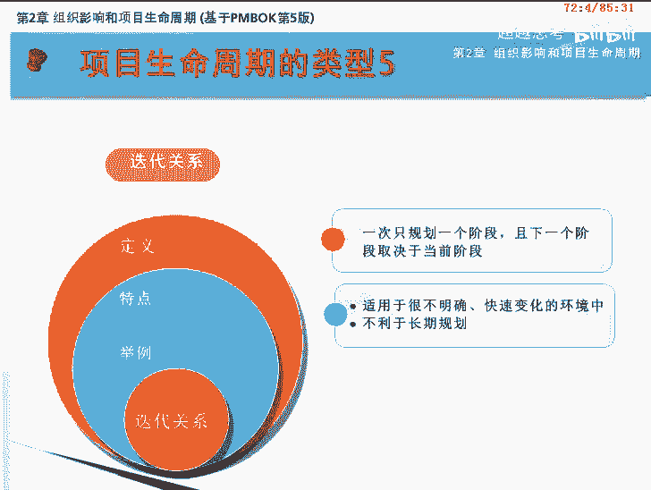

警察画嫌疑犯的模拟像，就可以看作是一个迭代关系，根据多个目击者的描述，一步步的细化嫌疑犯的形象，直到最后画出最接近的图像篇，报告书的一次又一次的阅读和复习，也是典型的迭代关系。

为了让大家更好地理解迭代和增量型生命周期，我们举一个软件行业著名的统一软件开发过程，r u p进行说明，r u p就是采用了迭代和增量型生命周期，我们看到在这个生命周期中，把项目分为了四个阶段。

分别是先启动细化构造和移交阶段，这些阶段完成是通过总共八次迭代完成的，每次迭代都要执行左边所示的，软件开发行业的九大规程，包括设定业务规程，需求管理分析与设计，实施测试部署等，在这种生命周期中。

项目的每次迭代都能新产生，包含特定功能的程序版本，到了最后一次迭代将包括系统的整个功能，这就是所谓的增量开发，因此这种生命周期就被称为，迭代和增量型生命周期，对于软件行业来说。

一方面应该从提出需求到开发，部署的周期越来越短，另一方面，又不得不面对客户随时提出的各种需求变化，如果采用传统项目生命周期模型进行开发，开发和需求始终处于脱节状态，最终常常使客户愿望难以实现。

并且时间往往产生延误，因此越来越多的软件开发企业，开始引入敏捷开发，解决上述问题篇，报告指南第五版提出的适应型生命周期的概念，相当于软件行业的敏捷开发，下面我们会进行讲解，适应型生命周期。

也称为变更驱动方法或敏捷方法，其目的在于应对大量变更，获取干系人的持续参与，适应型生命周期也包含迭代和增量的概念，但它比迭代和增量型生命周期迭代速度更快，通常2~4周迭代一次。

而且每次迭代所需时间和资源是固定的，适应型生命周期适合以下情况，环境快速变化，需求和范围频繁变更，风险巨大，干系人希望迅速实现原形，在变化迅速的软件开发行业，特别是需求不稳定的中小型软件开发项目。

大量使用这种生命周期模型，迭代和增量型生命周期，要求干系人紧密参与项目，根据项目执行情况，快速做出反馈和建议，及时审查可交付成果，适应型生命周期中，每次迭代都快速产生可交付成果。

经过审查并进一步确认需求后，快速开始下一次迭代，并且在迭代过程中，需求有可能随时变更，因此有人形容，采用适应型生命周期，实际上需要我们拥抱变化，刚才我们介绍的是项目生命周期的概念和定义。

接下来我们补充另外一个概念，产品生命周期，产品生命周期包含通常顺序排列，且不相互交叉的一系列产品阶段，一般产品生命周期包括概念成长，成熟衰退和退出几个阶段，产品生命周期的最后阶段，通常是产品的市场推出。

因此可以把产品生命周期看作是，从提出产品概念推向市场，到产品完全退出市场，进行生命终止的全过程，产品生命周期中，每个阶段的活动都可以作为项目来实施，如产品概念的提出或其研发可以是一个项目。

产品运营过程中的升级更新，甚至是产品的退出都可以当做项目来做，因此在一个产品生命周期中，往往包括多个项目生命周期。

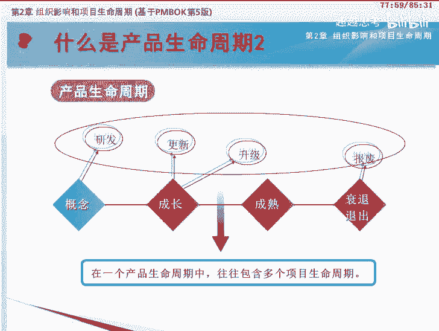

项目生命周期一般是产品生命周期的一部分，一个产品可能包含多个相关项目，因此我们可以将与这一产品研发相关，的一系列项目作为项目集来统筹管理，提高项目效率，如新款汽车研发中，发动机轮胎。

新型挡风玻璃等主要部件的研发，都可以作为一个项目，为了便于整个项目的完成，可以将它们作为一个项目集来进行管理。

如果项目产出的是一种产品，项目生命周期一般包含在产品生命周期中，如图所示，新产品的开发可以当做一个项目来进行，经历了概念开发，执行到最后结束阶段，臣出臣品新产品开发完成后，提交到日常运营部门。

在运营过程中发现产品存在的不足，然后对其进行运营维护或升级，当然升级过程也可以按照新的项目来实施，经历一个新的项目生命周期，如果要继续升级换代，则不断进行着新的项目，直到产品报废退出市场。

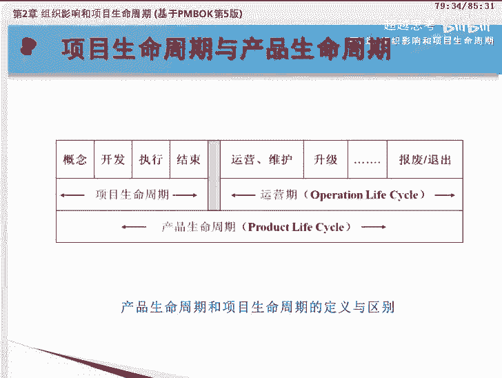

下面我们对这章的内容进行简单回顾，有三种常见的组织形式，职能型，矩阵型和项目型，它们各有优缺点，各有适用的情形。

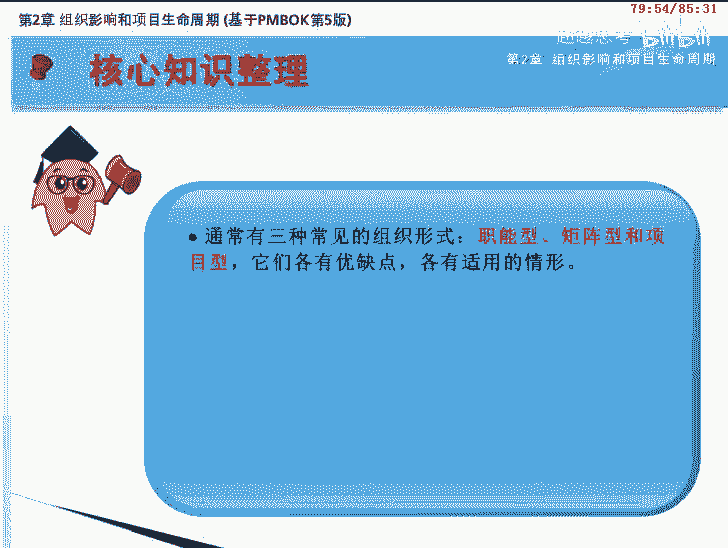

项目经理在项目型组织中权力最大，在矩阵型中次之，在职能型中最小，项目联络员没有任何权利，只负责联络项目协调员有一定权利，可直接向职能经理或公司经理汇报组织过程，资产和事业环境因素，是项目管理工作中。

必须要考虑和加以利用的因素，项目生命周期是指从项目开始。

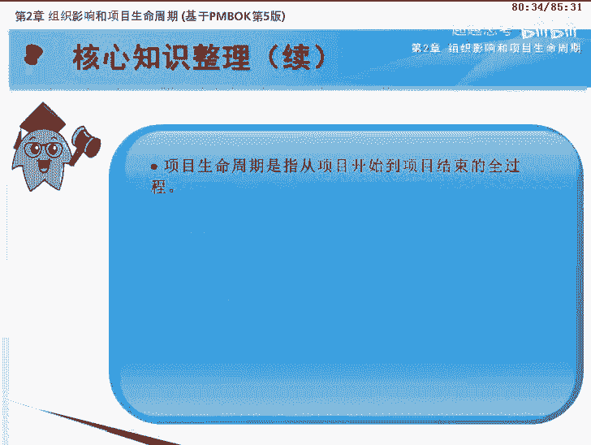

到项目结束的全过程，为便于管理与控制，我们通常把项目生命周期划分成，几个不同的阶段，不同阶段风险等变化趋势不同，在项目的早期不确定性大，风险大，变更的代价小，项目阶段之间的关系可以是先后关系。

相互交叠关系，产品生命周期是从项目开始到项目结束，再到产品运行终止的全过程，项目，该技人是与项目有利害关系的，任何组织团体或个人，各位学员，恭喜您已经完成了p mp项目管理。

第二章组织影响和项目生命周期的学习建议，接下来继续学习，第三章项目管理过程。

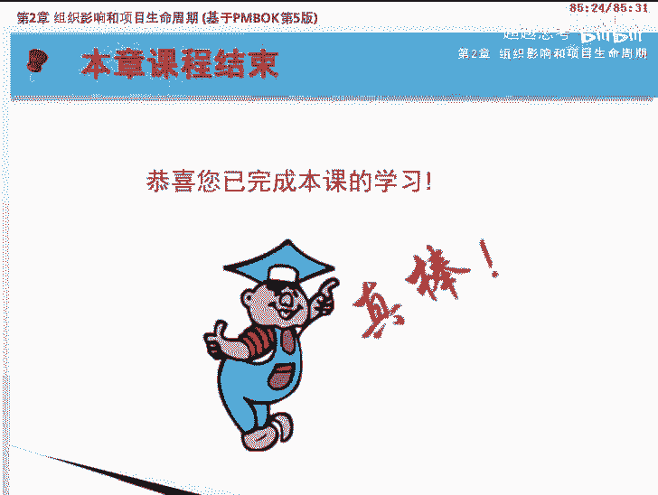