# PMP第五版PMBOK5完整培训视频教程 项目管理 - P4：04 - 超越思考 - BV1NY4y1U7s2

欢迎来到pmp项目管理网络课程的学习，本课程基于最新发布的pmbok指南第500，下面我们将一起学习第四章项目整合管理，在正式学习之前，我们先来介绍本知识领域的基本概念和框架，在项目管理十大知识领域。

五大过程组的体系中，项目整合管理处于怎样的地位呢，请和我一起观察这幅位置图，整合管理是第一个知识领域，有六个过程分散在五大过程组中，它起到了协调与统一其他各知识领域的作用，在这一章。

我们要重点学习项目整合管理的六个过程，分别是启动过程组的制定项目章程规划，过程组的制定项目管理计划，执行过程组的指导与管理项目工作，监控过程组的监控，项目工作和实施整体变更控制。

以及收尾过程组的结束项目或阶段，是考试必须考的重点，请务必记下来，那么什么是项目整合管理呢，项目整合管理包括未识别定义组合，统一和协调，各项目管理过程组的各种过程和活动，而开展的过程与活动。

在项目管理中整合，兼具统一合并，沟通和集成的性质，对受控项目从执行到完成成功管理，干系人期望和满足项目要求都至关重要。

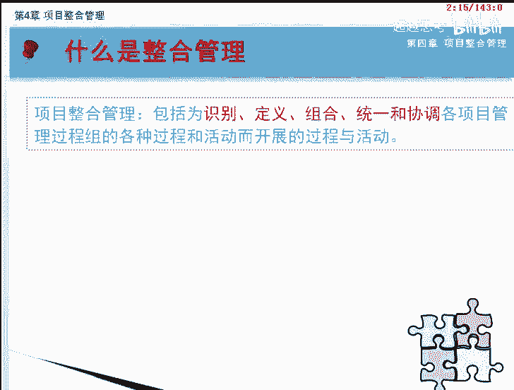

项目整合管理包括选择资源分配方案，平衡相互竞争的目标和方案，以及管理项目管理知识领域之间的依赖关系，虽然各项目管理过程通常以界限分明，相互独立的形式出现，但在实践中。

它们会以本指南无法全面叙述的方式相互交叠，相互作用，为什么需要整合管理呢，因为在项目中有许多的结合点，如不同组织的结合点，不同专业的结合点，不同过程的结合点，它的处理直接影响到项目的顺利与否。

比如为实现项目目标，需要在相互竞争的范围，时间成本和质量等分目标上进行整合，还需要在不同利益的，各项目干系人之间进行整合，此外在项目管理的各过程之间也少不了整合，比如为应急计划制定成本估算时。

就需要整合成本，时间和风险管理，知识领域的多个相互联系的过程，由此可见项目整合管理的重要性，项目整合管理如此重要，那谁来承担整合管理的责任呢，毋庸置疑，这自然是项目经理的职责。

项目经理在项目管理中的角色是多方面的，这其中最重要的角色是整合者，整合既不能牺牲任何项目目标，也不能伤害任何项目干系人，这就是项目经理的专业化职责之一。

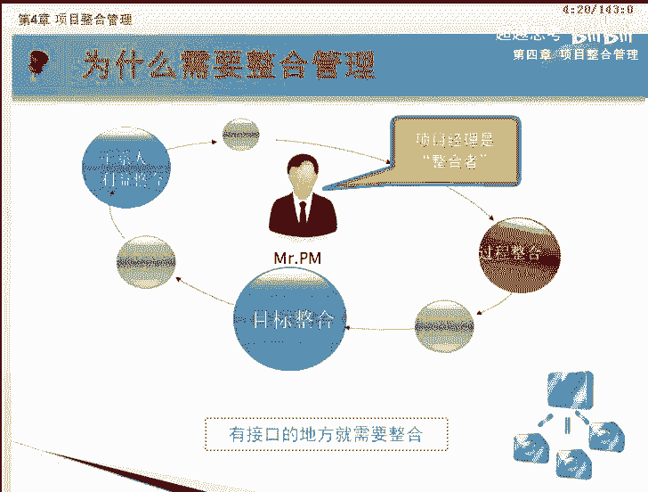

按照pmbok指南第五版，项目整合管理，通过以下六个过程来实现，制定项目章程，这是项目启动阶段要做的一项重要工作，已正式启动项目，确定它的合法地位，制定项目管理计划，项目正式启动后。

编制一份综合性的项目管理计划，指导与管理项目工作，按照项目管理计划的要求开展项目工作，以实现项目目标监控，项目工作，对项目执行工作进行监督与控制，实施整体变更控制，对项目执行和监控过程中提出的变更请求。

进行评审，结束项目或阶段完结，所有项目或阶段过程组的活动正式结束，项目或项目的某个阶段，各位学员马上进入项目整合管理，这一知识领域的各过程的学习吧。

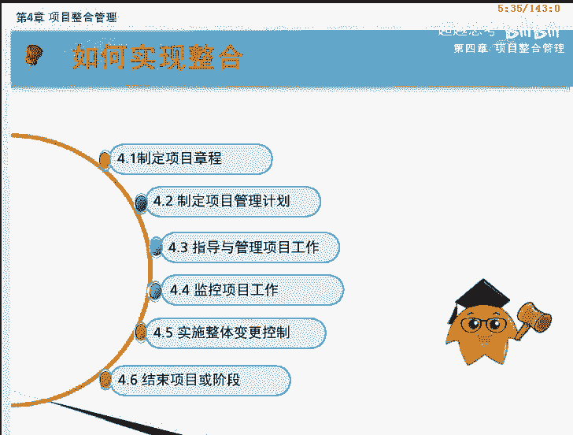

本课程我们将一起学习第四章，项目整合管理知识领域的第一节制定项目章程，各位学员，以下的情况请你先思考，有一天，发起人mr sponsor找到mr pm，想请他出任一个项目的项目经理，与此同时。

你sponsor表示，因为项目的时间很紧张，因此可以省略掉发布项目章程的环节，直接进入项目的启动阶段，以便加快项目的进展，这让mr pm陷入困惑，他不知道应该欣然接受任务呢。

还是向mr sponsor要求更多的资源后再接受任务，又或者告诉miss sponsor，没有项目章程就做项目会产生不良后果。

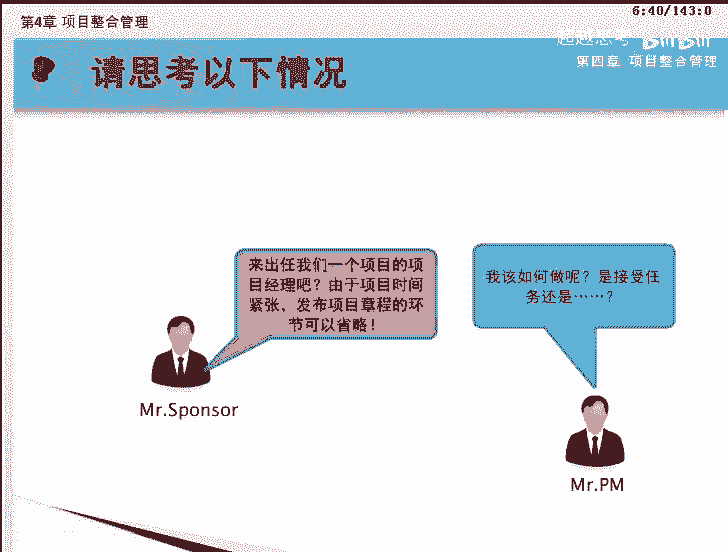

通过本课程的学习，我们将要达到以下目标，包括掌握制定项目章程过程的含义与作用，掌握项目工作说明书的含义与内容，了解商业论证的意义与编制基础，了解协议事业环境因素和组织过程，资产的含义与内容。

知道专家获取的渠道有哪些，掌握项目章程的含义和包含的主要内容，掌握制定项目章程过程所涉及的p m i思维，本课程我们将按照如画面所示的大纲为您讲述，首先是对项目章程及制定项目章程。

过程的基本含义进行讲解，接下来分析制定项目章程的输入，及项目工作说明书，商业论证协议，事业环境因素和组织过程，资产专家判断和引导技术，作为制定项目章程过程的工具与技术，我们也会详细解释。

当然我们还对本过程的输出及项目章程，进行细致讲解，课程的最后由本课核心知识整理以及课后测试，在学习制定项目章程过程之前，我们先来了解两个基本概念，项目章程和制定项目章程。

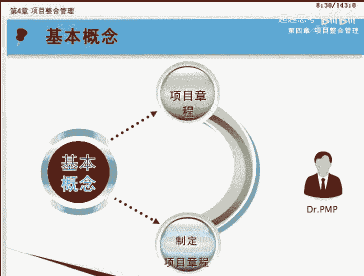

项目章程是由项目启动者或发起人发布，正式批准项目成立，并授权项目经理动用组织资源，开展项目活动的文件，在这个定义里要强调的是，项目章程的签发人是项目启动者或发起人，他的签订意味着项目的正式成立。

而且项目经理就是拿着这个尚方宝剑，去要资源的，根据刚才讲解的定义来回答下面三个问题吧，发人是谁，在新版骗案报告中，当然前提是获得授权和认可，至于签发和批准，项目章程。

通常由身处项目团队外部的人或组织批准，其级别适用于为项目出资或提供资源，如项目发起人，启动者，高层管理人员，项目管理办公室或项目组合管理委员会等，二项目章程的主要作用是什么，孔子曰，名不正则言不顺。

言不顺则事不成，其实对项目管理来说也是如此，项目与日常运营工作不同之处，主要在于临时性，日常运营工作具有一定的惯性，人们会自然地投入资源来完成项目则不同，人们往往不会主动参与。

因此需要把人们对项目的重视度，提升到日常工作之上，首要的工作就是证明，项目章程是为项目证明的重要文档，另外在项目章程中，会授权项目经理在项目活动中使用组织资源，所以项目章程的另外一个主要作用。

就是对项目经理进行授权，三项目章程是否可有可无，不是的，相信通过前面的讲解，大家已经知道项目章程的必要性，既然是为项目证明的文件，无论是内部项目还是外部项目，所有项目都必须有项目章程。

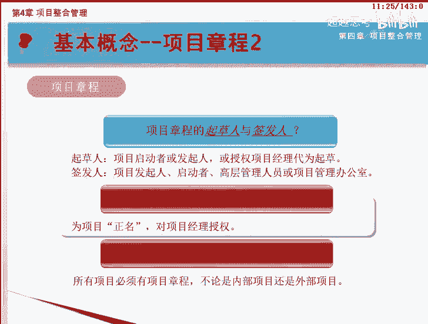

制定项目章程是编写一份正式批准项目，并授权项目经理，在项目活动中使用组织资源的文件的过程，本过程的主要作用是，明确定义项目开始和项目边界，确立项目的正确地位，以及高级管理层植树他们对项目的支持。

这里要特别指出的是，该过程的输出，是一份正式批准项目或阶段的文件，也就是说，项目章程获得批准，就标志着项目的正式启动，但需要说明的是，项目章程只是记录初步要求，因为他一般只涉及一些总体性的描述。

项目章程的制定，由项目需求组织和执行组织共同商讨确定，同时也在执行组织与需求组织之间，建立起伙伴关系，还应注意的是，项目经理今后要领导这个团队实现项目目标，项目经理，最晚也必须在规划开始之前。

项目经理应该参与项目章程的制定，以便对项目需求有基本的了解，从而在随后的项目活动中更有效地分配资源。

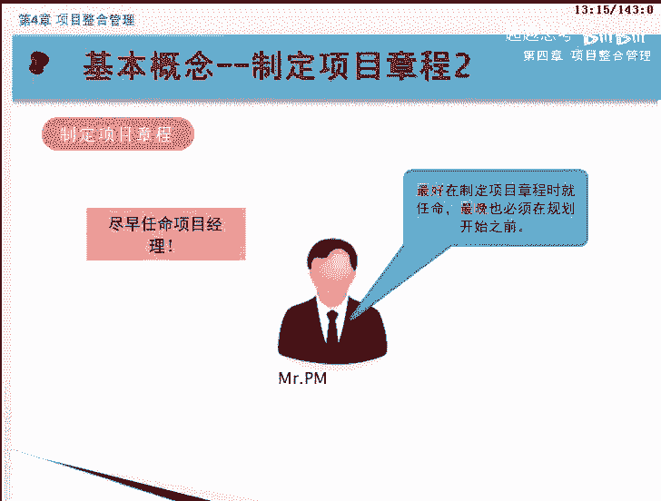

接下来让我们来看看项目章程，是如何被制定出来的，这个过程的输入内容包括项目工作说明书，商业论证协议，事业环境因素和组织过程，资产在输入的基础上，我们应用专家判断和引导技术得到最终的输出。

项目章程这个文件，在这个过程的i t t o中，我们会对项目工作说明书和商业论证，专家判断以及项目章程进行重点讲解，这是制定项目章程过程的数据流向图，展现了该过程如何通过输入输出，与其他过程进行交互。

可以看到项目章程是许多规划过程的输入。

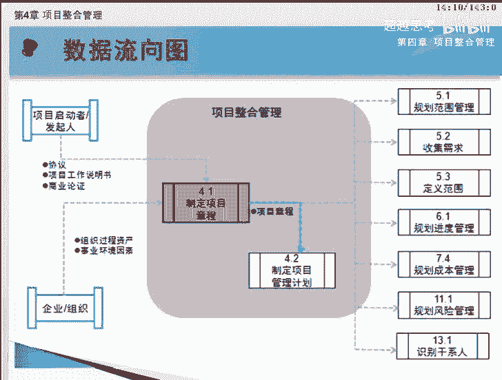

制定项目章程共有五个输入，下面我们依次来了解他们吧。

我们先来看输入中的项目工作说明书，项目工作说明书，英文statement of work，简称s o w，是对项目需交付的产品或服务或成果，的叙述性描述。

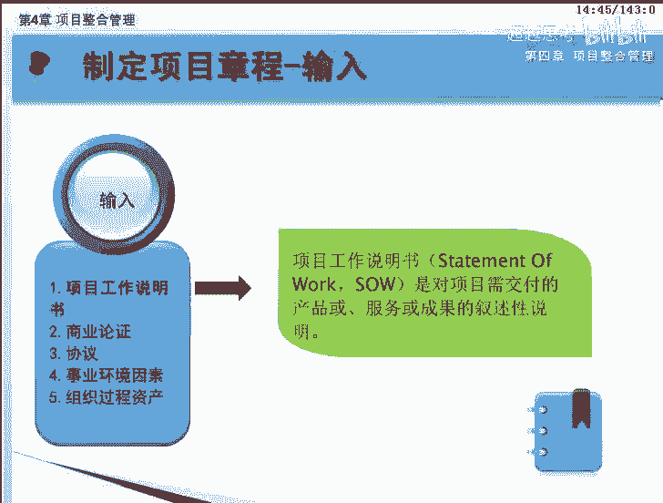

接下来我们来了解项目工作说明书，的提供者是谁，以及会涉及哪些内容，项目工作说明书作为制定项目章程的重要收入，其提供者根据项目类型的不同而有所不同，如果是内部项目，项目启动者或发起人。

根据业务需要及对产品或服务的需求，来提供工作说明书，比如某培训公司为了提高收入，公司高层批准一个新课程开发项目，在这种情况下，项目说明书的提供者就是公司高层，如果是外部项目工作说明书则由客户提供。

比如刚才讲到的，培训公司在某企业客户的定制需求下，为其开发课件，此时的项目工作说明书的提供者就是该客户，在这种情况下，工作说明书的内容可以是招标文件，比如建议邀请书，信息邀请书。

投标邀请书的一部分或者合同的一部分。

项目工作说明书涉及的内容，包括业务需要，他回答了我们为什么需要这个项目的问题，包括产品氛围描述，这回答了项目做什么的问题，还包括战略计划，也就是做哪一个项目比较好的问题。

或者说符合所在组织的更高层次战略目标，要注意的是，p m i认为项目工作说明书应由发起人提供。

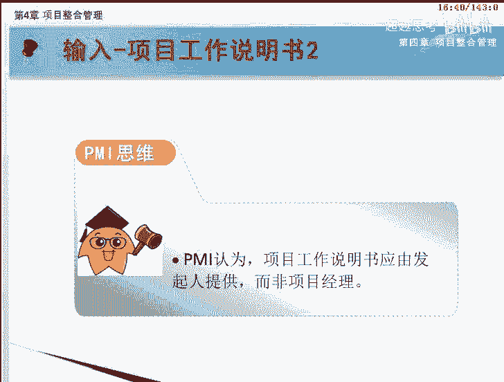

而非项目经理，那商业论证是从哪些方面展开的呢，通常会基于以下一个或多个原因，包括市场需求，组织需要，客户需求，技术进步，法律要求，生态影响和社会需要等，比如为了缓解低收入家庭住房难的局面。

某市批准经济适用房项目，这就是基于社会需要进行商业论证分析的案例，在多阶段项目中，可通过对商业论证的定期审核，来确保项目能实现其商业利益。

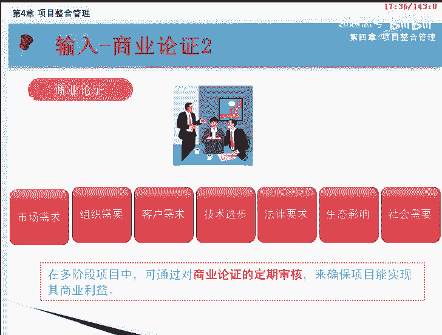

制定项目章程过程的第三个输入是协议，如果项目是为外部客户做的，往往需要一份协议来做保证。

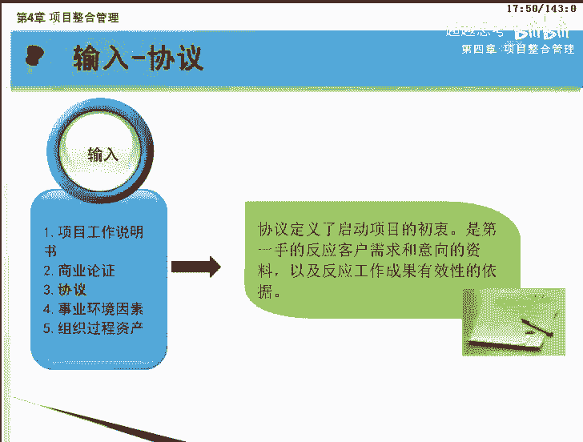

协议定义了启动项目的初衷，协议作为制定项目章程的输入之一，是第一手反映客户需求和意向的资料，以及反映工作成果有效性的依据，在项目按照协议执行时，经签字的协议，通常即作为卖方，也就是项目经理所在方的。

项目章程中的重要内容，协议有多种形式，包括合同，谅解备忘录，服务品质协议，协议书，意向书等协议，可以是口头协议，也可以是以电子邮件或其他书面协议，制定项目章程时需要考虑许多事业环境因素，包括政府标准。

行业标准或法规，组织文化和结构，市场条件等，实际上事业环境因素是好多过程的输入。

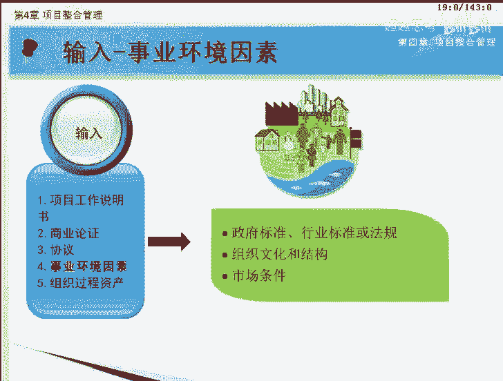

聪明的人不重复发明轮子，项目经理应善于使用组织过程资产，帮助自己获得项目成功，这些信息有助于项目经理，从组织过去的项目中吸取经验，许多项目经理不注意总结，利用以往项目的知识库，所以在新项目中。

他们必须从头开始进行所有的工作，而良好的经验教训，知识库能有助于组织项目的持续提高，制定项目章程时能够使用的组织过程资产，包括组织的标准过程，政策和过程定义模板，如项目章程模板。

历史信息与经验教训知识库，如项目记录和文件，完整的项目收尾信息和文档，关于以往项目选择决策的结果，和以往项目绩效的信息，以及风险管理活动中产生的信息等等，制定项目章程，这个过程有两个工具与技术。

专家判断和引导技术。

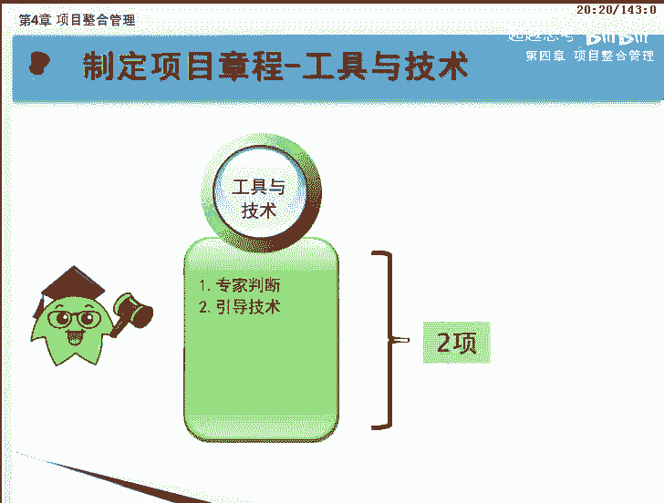

我们一块来学习，先来看专家判断，这种技术专家所具备的企业知识和判断力，常用于评估制定项目章程的输入，处理，各种技术和管理问题，实际上，专家判断是项目整合管理，这一知识领域的六个过程的通用工具与技术。

你也许会问，专家判断中的专家都是从哪儿来的呢，其实专家可以是任何具有专业知识，或专业培训经历的小组或个人，主要的获取渠道，有组织内的其他部门顾问，该系人包括客户或发起人，专业与技术协会，行业团体。

主题专家，项目管理办公室，可以说，只要不是竞争对手，人人都可以是专家，制定项目章程的第二个工具与技术是引导技术，这是一类技术，广泛应用于各种项目管理过程的关键技术，也可用于指导项目章程的制定。

引导者可以使用引导技术，帮助团队和个人完成项目活动，引导技术具体包括头脑风暴，冲突处理，问题解决和会议管理等，这些将在后续章节介绍。

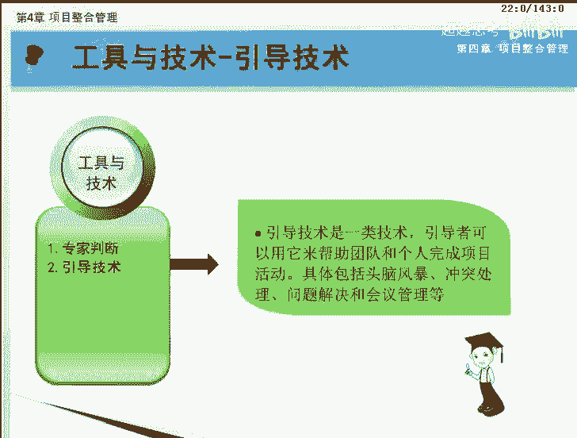

制定项目章程，这个过程只有一个输出及项目章程，我们一块来学习吧。

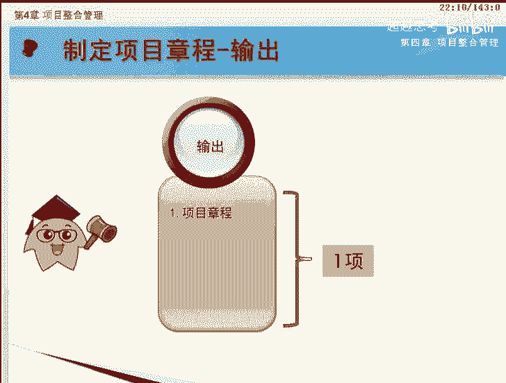

在前面基本概念介绍中，我们已经学习了项目章程的定义，你能回顾起来吗，项目章程是由项目启动者或发起人发布，正式批准项目成立，并授权项目经理，动用组织资源开展项目活动的文件，pmbok很重视项目章程。

因为它涉及对项目经理的授权，每个项目必须有项目章程，项目章程中记录了项目目标以及高层次的要求，及约束内容如下，项目目的或批准项目的原因，可测量的项目目标或相关的成功标准，高层级需求假设条件和制约因素。

高层级项目描述和边界，定义高层级风险总体里程碑，进度计划，总体预算，该系人清单，项目审批要求，如用什么标准评价项目成功，由谁对项目成功下结论，由谁来签署，项目结束，委派的项目经理及其职权，发起人。

或其他批准项目章程的人员的姓名和职权，不同企业的项目章程是不一样的，这里是一份项目章程的模板，包含了项目启动的主要因素，项目征程需要项目经理和发起人签字认可，表示组织选择了项目经理并进行授权。

同时表明项目经理接受了任务，会全力完成项目，项目章程的模板，可以根据组织特点进行修改。

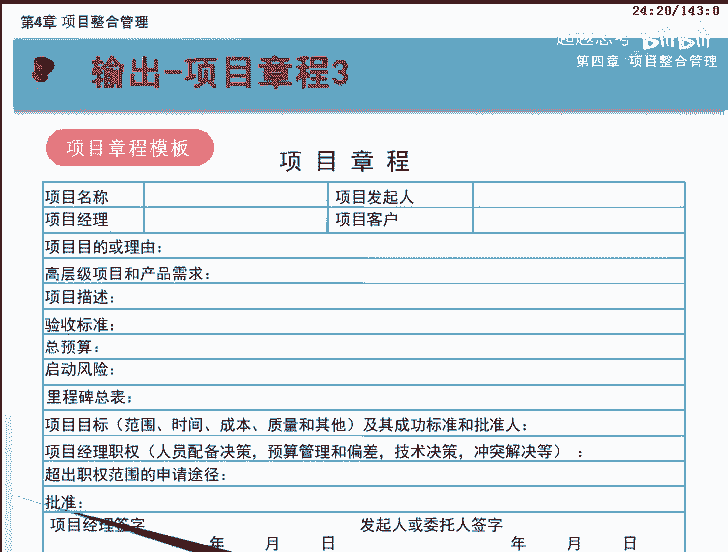

好了到此制定项目章程，这个过程我们都已经学习完了，你应该对项目章程有了进一步的了解，现在我们回顾一下课程开始时问的问题，在没有项目章程的时候，mr pm该不该回答mr sponsor开始做项目呢，没错。

mr pm应该告诉mr sponsor，在没有项目章程之前开始项目，会产生严重的不良后果，即使项目再紧张，也要先制定出项目章程，如果发起人时间紧迫或者精力有限。

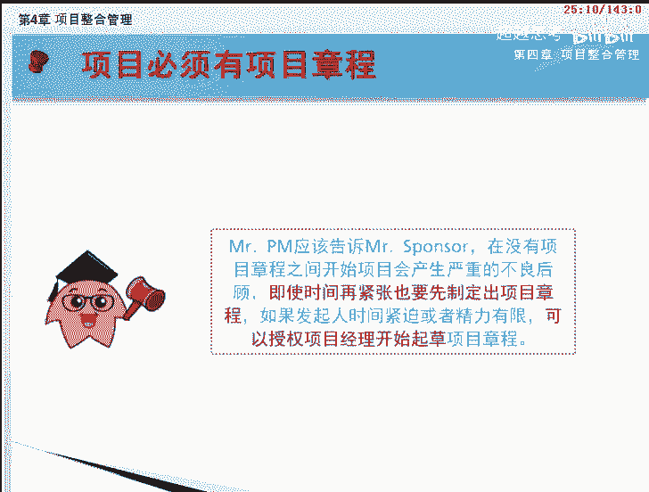

现在我们来回顾一下本过程的核心知识，项目章程一般由项目发起人发布项目章程，对项目经理进行授权，从而保证项目经理可以把组织用于项目活动。

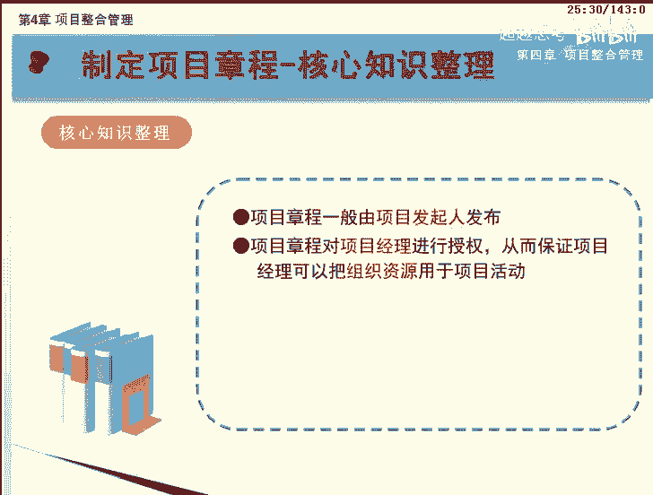

工作说明书是对项目产品的叙述性描述，它由发起人或客户提供，在项目中，项目经理应该尽早委派，恭喜你完成制定项目章程过程的学习，下节课见，本课程我们将一起学习第四章，项目整合管理知识领域的，第二节。

制定项目管理计划，本课程我们将一起学习第四章，项目整合管理知识领域的，第二节，制定项目管理计划，推荐mr pm在思考，在项目管理中，为什么有的项目做得井井有条，忙而不乱，有的项目却是一团乱麻，主次不分。

最后井井有条的项目，能够分期分批的交付项目工作成果，最终实现项目目标，而一团乱麻的项目却迟迟交不出东西，或者交出的产品质量严重不符，与项目目标相距甚远，各位学员你思考过这个问题吗。

其实mr pm思考的是两个极端的情况，更为常见的则是项目存在不同程度的延期，超支和质量不佳的问题，那么为什么会造成这样的结果呢，你想过吗，这可能是项目管理计划出了问题，军队中常说的一句话是。

一切行动听指挥，用在项目管理上，可以演变为一切活动看计划，项目管理计划是项目活动的指南，唯有让项目沿着既定的轨道运转，才能最终实现项目目标，本过程就带领大家学习如何制定项目管理计划。

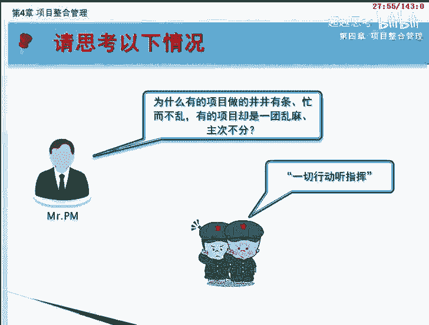

通过本课程的学习，我们将要达到以下目标，包括熟悉项目管理计划，以及制定项目管理计划过程的定义，掌握项目管理计划与项目文件的区别，了解制定项目管理计划的目的和核心思想，理解制定项目管理计划。

与其他规划过程的输出的关系，了解制定项目管理计划，涉及到的事业环境因素和组织过程，资产，了解本过程中专家判断的应用，熟悉项目管理计划包含的内容。

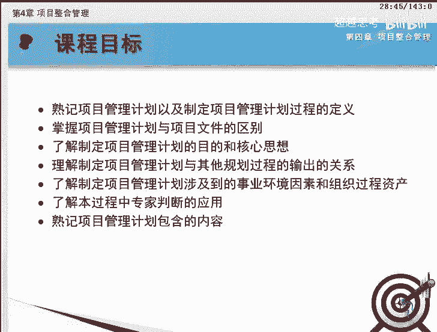

本课程我们将会按照如画面所示的大纲，为您讲述基本概念，包括讲述什么是项目管理计划，什么是项目文件和基准，以及什么是制定项目管理计划过程，在制定项目管理计划的输入中，我们为您阐述其他规划过程的输出。

以及事业环境因素和组织过程，资产专家判断和引导技术，作为制定项目管理计划过程的工具与技术，我们也会解释，当然我们还会对本过程的输出及项目管理计划，进行细致讲解，课程的最后由本课核心知识整理。

在学习制定项目管理计划过程之前，我们先来了解几个基本概念，项目管理计划，项目文件基准和制定项目管理计划。

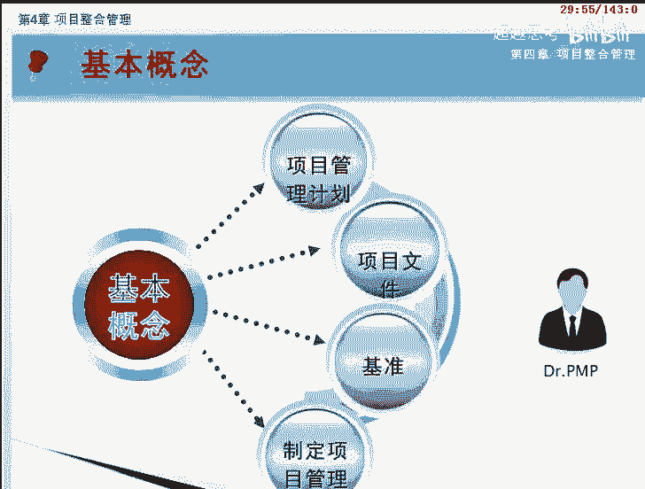

我们先来看什么是项目管理计划，项目管理计划是确定项目的执行，监控和收尾方式，并经过批准的正式文件，关于项目管理计划的详略程度，要根据具体的项目情况而定，项目管理计划有时简称为项目计划，需要明确的是。

pp考试时是默认存在项目管理计划的，项目管理计划的主要组成部分是子管理，计划和基准，这些子管理计划涵盖了项目管理十大知识领域，的13个子计划，计划英文是plan，而规划英文为planning。

我们再来学习基准，基准是一份经过批准的项目计划，加上或减去经批准的变更，用于与实际绩效比较，来确定绩效是否在可接受的偏差范围内，一般指当前基准，也可指原始基准或其他基准，通俗地讲。

基准是一种特殊版本的项目计划，它的特殊性包括，一，批准一定是经过高级管理层和主要项目干系人，批准的，而不是项目团队自编自用，无需特定批准的细节性计划，而且变更需要记录，同时说明变更的理由。

三比较是项目经理和项目管理团队，据以考核项目执行情况的依据，其作为比较的基础，四，当前基准都是指最新版本的项目计划，及当前基准，而不是过去曾经作为基准使用过的项目计划，项目管理计划中包括三个基准。

分别是范围基准，进度基准和成本基准，这些在以后课程中我们将详细讲解，项目文件只会影响项目管理工作，但又不属于项目管理计划的其他文档，项目文件用来指导和规范项目实施的各项活，动和过程。

尽管项目计划和项目文件，都有助于项目经理管理项目，但它们有很大的区别，项目管理计划主要是规划过程组的输出，而五大过程组的输出中都可能有项目文件。

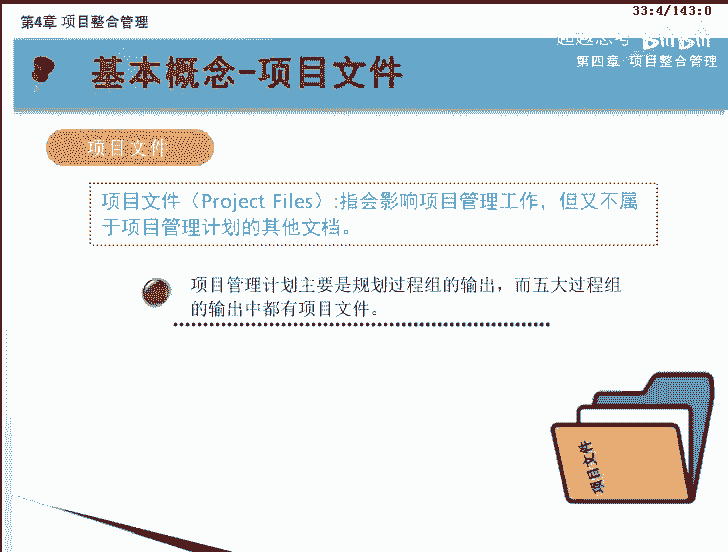

项目管理47个过程的输出，除少数非正式类或成果，以及属于项目管理计划的内容外，都是项目文件的组成部分，项目管理计划和项目文件具有交叉，比如项目绩效基准，在项目管理计划和项目文件中都存在。

带有不同的侧重点，需要注意的是，pm报告强调，各自计划和相关基准，是项目管理计划的主要组成部分，下面我们再来具体看一下，项目管理计划和项目文件的区别，请观察这张表格，他列出了项目管理计划和项目文件。

所包含的全部内容，项目管理计划包含了蓝色字体表示的，变更管理计划，沟通管理计划，配置管理计划，成本管理计划，人力资源管理计划，过程改进计划，采购管理计划，质量管理计划，需求管理计划，风险管理计划。

进度管理计划，干系人管理计划和范围管理计划，共13个子计划，还有红色字体表示的成本基准，范围基准和进度基准共三个基准，其中范围基准又包括范围说明书，工作分解结构，w bs和w p s词典。

剩下的影响项目管理的工作，但不属于项目管理计划的文件，均属于项目文件，用黑色字体表示，一般来说，项目管理计划，需要发起人或项目管理办公室批准，而项目文件除了项目章程，工作说明书和合同等有限的几个文件。

需要审核外，其他文件项目经理真不需要交给项目发起人，另外我们通常将范围进度和成本基准，合并为一个绩效测量基准，作为项目的整体基准，以便据此测量项目的整体绩效。

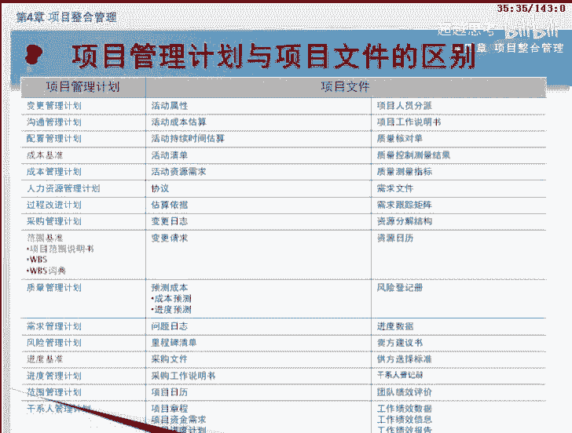

制定项目管理计划，是定义准备和协调所有子计划，并把它们整合为一份综合项目管理计划的过程，本过程的主要作用是生成一份核心文件，作为所有项目工作的依据，项目管理计划的主要目的共有四点。

一指导项目的执行监控和收尾，二，将核心的项目管理计划，和项目文档文件整理成档，从而可以指导项目实施，三有助于干系人之间的沟通，该系人之间的沟通核心是要看项目范围说明书，但是项目管理计划和项目文件。

能在范围说明书的基础上进行进一步细化，因此有助于干系人之间的沟通，四有了基准，就为绩效测量和项目控制提供了基准，从而可以对项目进行有效的监控，在了解了有关项目管理计划和，制定项目管理计划的定义之后。

我们来做个判断吧，第一题，项目管理计划是由项目经理独自考虑制定的吗，答案是no，因为项目管理计划是由项目团队，自下而上编制的，项目经理起总负责和整合的作用，在编制项目管理计划的过程中。

项目经理和项目团队成员，也要充分听取其他主要项目干系人的意见。

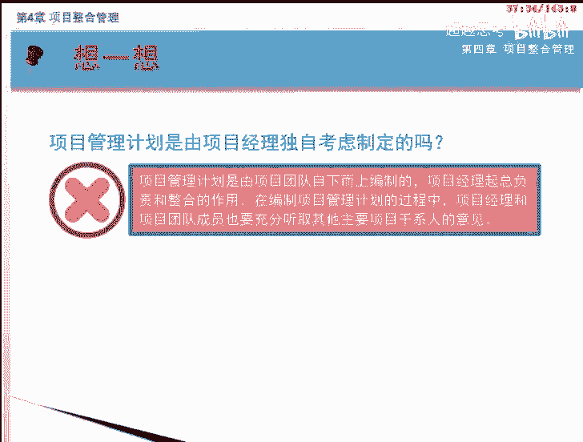

问题二，是不是项目执行开始之前，就要制定出完整的项目管理计划，以后便不再更改，答案也是no，项目在开始执行之前，要编制出尽可能完整的项目管理计划，但是项目管理计划。

需要在项目生命周期的后续阶段中不断审阅，细化完善和更新是一个渐进明细的过程，接下来让我们来看看项目管理计划，是如何被制定出来的，制定项目管理计划过程的输入，包括制定项目章程过程的输出及项目章程。

同时还包括其他所有规划过程，输出的任何基准和子计划，这些规划过程将在后面章节讲解，此外还包括事业环境因素和组织过程资产，在上述输入的基础上，我们应用专家判断和引导技术得到最终的输出，项目管理计划。

下面我们来具体学习这个过程的i t t o，这是制定项目管理计划过程的数据流向图，展现了该过程如何通过输入输出，与其他过程进行交互，我们看到，项目管理计划，是许多规划执行和监控过程的输入。

制定项目管理计划共有四个输入，下面我们依次来了解他们吧。

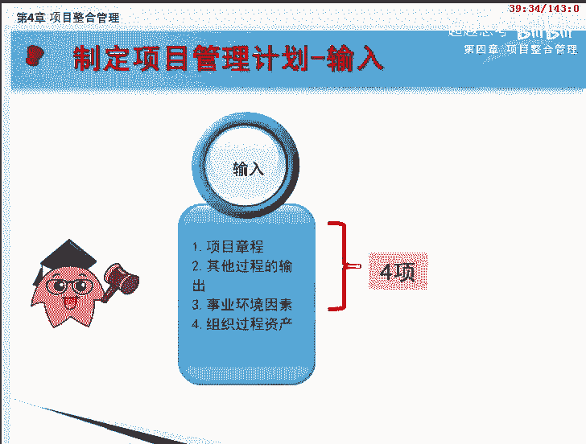

在本过程中，项目章程是项目管理计划的主要收入之一，它是制定项目章程过程的输出，前面课程已经介绍过。

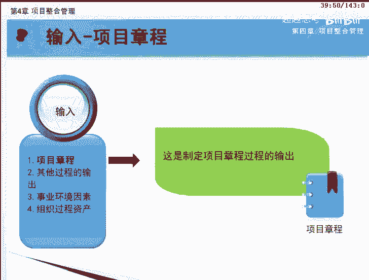

在制定项目管理计划时，需要其他规划过程的输出作为它的输入，这些其他过程输出的此计划输入后，经过专家判断，引导技术等工具的整合，成为项目管理计划的一部分，另一方面，项目管理计划又会成为其他规划过程的输入。

此外对其他规划过程输出文件的更新，都会导致对项目管理计划的相应更新，由此可见，其他规划过程的输出，和项目管理计划之间的关系，是循环往复和迭代的。

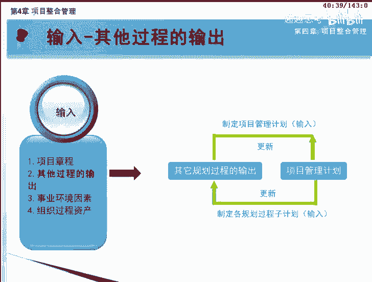

与其说项目管理计划是制定出来的，不如说项目管理计划是整合出来的，可能影响制定项目管理计划过程的，事业环境因素包括以下几点，政府或行业标准，纵向市场或专门领域的项目管理知识体系，项目管理信息系统。

如自动化工具，包括进度计划，软件配置管理系统，信息收集与发布系统，或进入其他在线自动化系统的网络界面，组织的结构，文化管理实践和可持续发展，基础设施，如现有设施和固定资产，人事管理制度。

如人员招聘和解雇指南，员工绩效评价，员工发展与培训记录等，影响制定项目管理计划过程的组织过程，资产包括如下几点，标准化的指南，工作指示，建议书，评价准则和绩效测量准则，项目管理计划模板。

包括根据项目的具体需要，裁剪组织标准流程的指南与准则，项目收尾指南或要求，如产品确认及验收标准，变更控制程序，包括修改组织标准，政策，计划和程序所必须遵循的步骤。

以及如何批准和确认变更以往项目的项目档案，如范围，成本进度与绩效测量基准，项目日历，项目进度，网络图和风险登记册等，历史信息与经验教训知识库配置管理，知识库包括组织标准。

政策程序和项目文件的各种版本与基准，接下来我们讲解工具和技术，制定项目管理计划，这个过程有两个工具和技术，专家判断和引导技术，我们一块来学习。

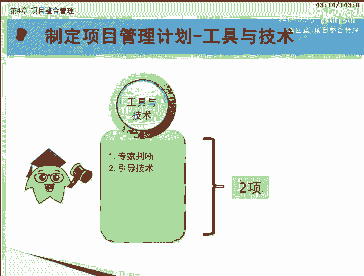

先来看专家判断这种技术，我们知道，专家判断是项目整合管理，这一知识领域的六个过程的通用工具与技术。

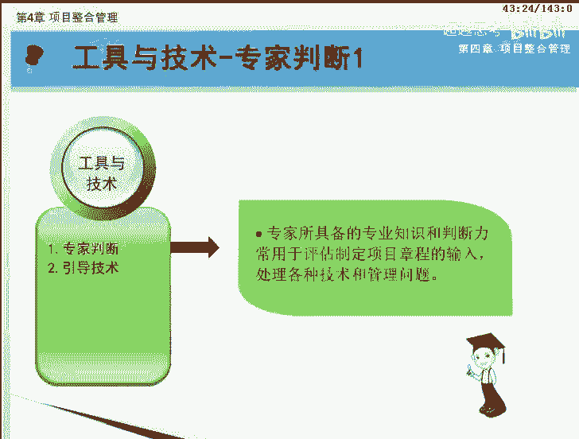

在制定项目管理计划时，专家判断可用于根据项目需要而裁减，项目管理过程，编制，应包括在项目管理计划中的技术与管理细节，确定项目所需的资源与技能水平，定义项目的配置，管理级别。

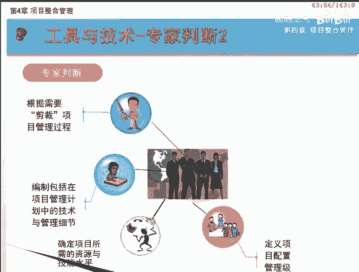

确定哪些项目文件受制于正式的变更控制过程，确定项目工作的优先级，确保把项目资源在合适的时间，分配到合适的工作，制定项目管理计划的第二个工具和技术，是引导技术，这是一类技术。

广泛应用于各项目管理过程的关键技术，也可用于指导项目章程的制定，引导者可以使用引导技术，帮助团队和个人完成项目活动，引导技术具体包括头脑风暴，冲突处理，问题解决和会议管理等，这些将在后续课程介绍。

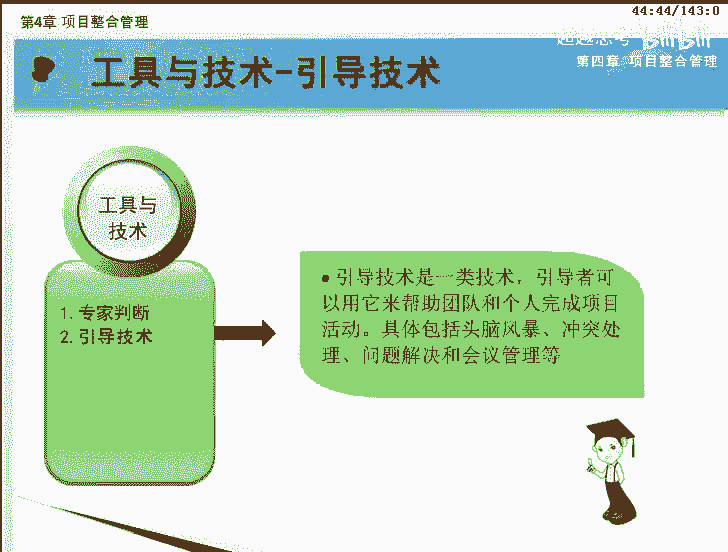

制定项目管理计划，这个过程只有一个输出及项目管理计划，我们一块来学习。

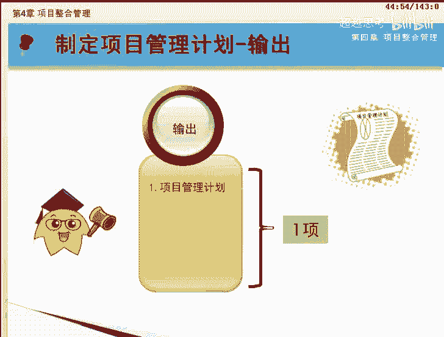

项目管理计划整合了其他许多子计划和基准，让我们来看看项目管理计划，包含的具体内容有哪些，首先他要整合三大基准，包括范围基准，进度基准和成本基准，他还整合了其他九大知识领域的，共11个子计划。

另外还有两个重要的子计划，变更管理计划，他定义如何对变更进行监控，还有配置管理计划，他明确了如何开展配置管理，这些子计划我们会在后续的课程中做详细讲解。

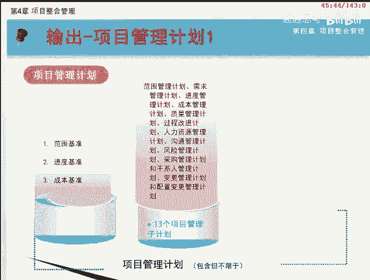

另外项目管理计划中，还包括对项目生命周期的定义，以及明确各阶段究竟使用哪些项目管理过程，大家先来想一想，项目管理知识体系指南中的47个过程，会全部用在所有的项目中吗，答案是否定的。

因此项目管理者就需要根据项目的实际需要，确定采用47个过程中的哪些过程，或增加部分过程，这个对项目管理过程的取舍，就成了项目管理计划的一部分，此外项目管理计划还包括其他内容。

如关于如何执行工作以实现项目目标的描述，该系人的沟通需求和技术等，要说明的是，以上所说的项目管理计划包含的内容都是，包含但不限于，要想穷尽项目管理计划，可能包括的所有内容是不可能的，当然具体到某个项目。

项目管理计划可详可略，这完全取决于具体的项目要求。

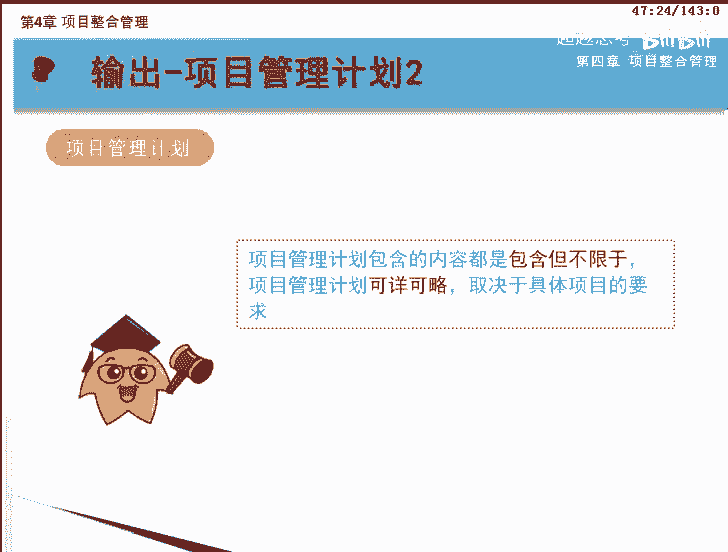

项目经理不需要亲自参与，项目管理计划的制定过程，因为项目经理的核心角色是整合者，此外项目管理计划需要审批通过，才能成为执行的依据，即来自管理层，发起人，职能经理，项目团队和干系人的签字认可。

现在我们来回顾一下本过程的核心知识，项目管理计划，记录了规划过程组的各个规划，子过程的全部成果，项目管理计划，由项目管理团队与项目团队成员一同编制。

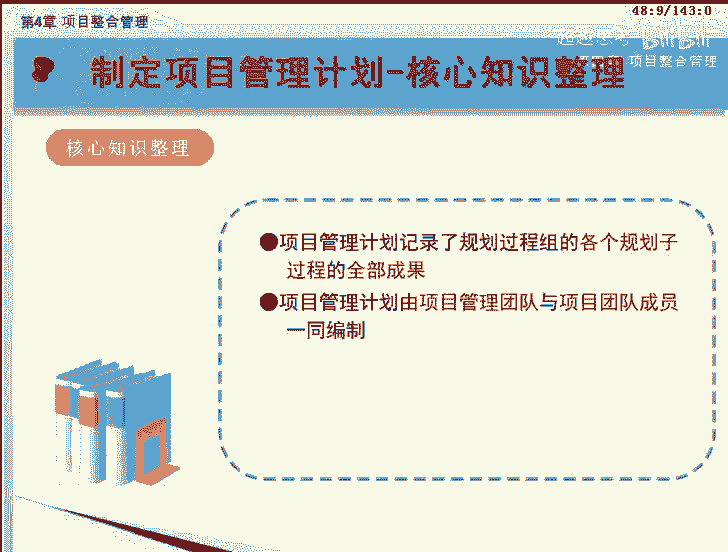

通常采用滚动式规划来逐渐细化项目管理计划，本课程我们将一起学习第四章，项目整合管理知识领域的第三节，指导与管理项目工作，这个过程属于执行过程组。

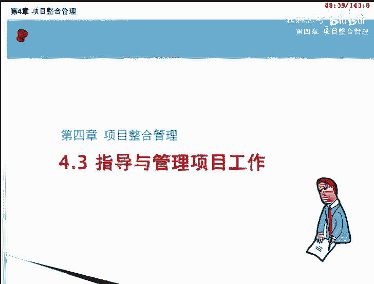

众所周知，计划是用于指导实践的，通过前面的学习，我们已经知道如何制定项目章程，和项目管理计划，但要实现项目目标，我们还有很长的路要走，从现在开始，让我们为了目标的实现而行动起来吧。

让我们一起进入指导与管理，项目工作过程的学习。

通过本课程的学习，我们将要达到以下目标，包括掌握指导与管理项目工作过程的定义，熟悉指导与管理项目工作过程的输入，工具与技术及输出的内容，掌握项目管理信息系统这一工具的应用，以及各种会议的区分。

掌握变更请求包含的内容，并能对他们进行区分，了解本过程输出的可交付成果，工作绩效数据的含义和内容。

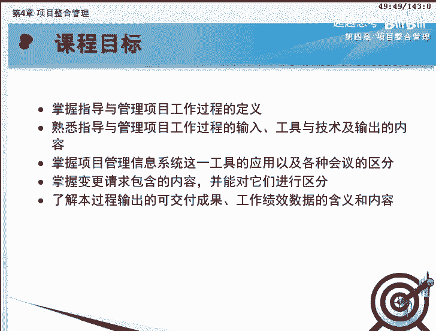

本课程我们将按照如画面所示的大纲顺序，为您讲述，在基本概念中，我们将为您讲述指导与管理，项目工作和项目启动会议两个基本概念，指导与管理项目工作的输入，涉及的内容包括项目管理计划批准的变更请求。

事业环境因素，组织过程，资产指导与管理项目工作过程的工具与技术，包括专家判断，项目管理信息系统和会议，重点是项目管理信息系统，指导与管理项目工作过程的输出，包括可交付成果，工作绩效数据变更。

请求项目管理计划更新和项目文件更新，我们将对工作绩效数据和变更请求，进行重点讲解，最后是对本节的核心内容进行整理，在学习指导与管理项目工作过程之前，我们先来了解两个基本概念。

指导与管理项目工作和项目启动会议。

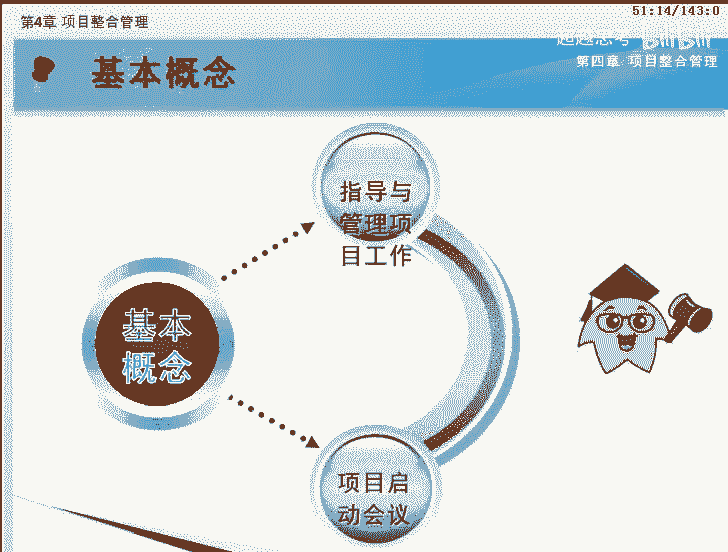

什么是指导与管理项目工作呢，指导与管理项目工作，是为实现项目目标而领导和执行，项目管理计划中所确定的工作，并实施以批准变更的过程，本过程的主要作用是对项目工作提供全面管理。

项目的大多数预算都发生在这个过程，项目经理与项目团队成员一起，指导与管理项目工作，项目经理在这个过程中，要对所有的活动进行动态管理，并对每一个项目成员的工作进行检查，监督和控制，以及实施批准的变更。

指导与管理项目工作的活动，包括开展活动，以实现项目目标，创造项目的可交付成果，完成规划的项目工作，配备培训和管理项目团队成员，获取管理和使用资源，包括材料工具，设备与设施，执行已计划好的方法和标准。

建立并管理项目团队内外的项目沟通渠道，生成工作绩效数据，为预测提供基础，提出变更请求，并根据项目范围计划和环境来实施批准的变更，管理风险并实施风险应对活动管理，卖方和供应商管理干系人。

及他们在项目中的参与，收集和记录经验教训，并实施批准的过程改进活动，项目开工或启动会议，是在项目计划编制基本结束，执行工作开始前，由主要干系人联合召开的会议，标志着项目开始实施，相当于开工典礼。

那么项目开工会议上我们到底要做什么呢，为项目制定具体的行动方案吗，其实项目开工会议，只是一个信息沟通与协调的会议，它不涉及项目具体的实施方案，项目开工会议的主要内容包括，介绍团队成员，让团队间相互认识。

建立联系，设置团队目标，明确项目目的确认项目中个人和团队的职责。

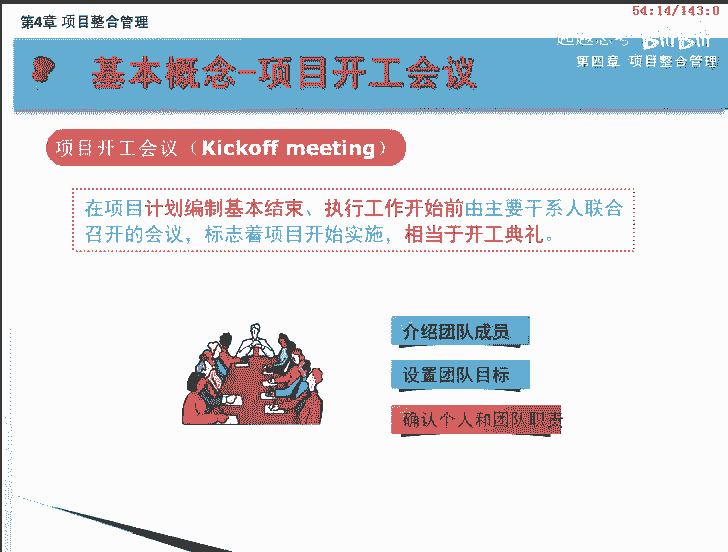

明确项目实施的背景，通过开工会议初步进行信息沟通，现在我们来了解一下，指导与管理项目工作过程的i t t，指导与管理项目工作过程，其实就是pm报告指南中，其他各知识领域的所有执行过程的综合，在本过程中。

项目团队依据项目管理计划，借助专家判断，项目管理信息系统和会议执行项目，产生可交付成果和工作绩效数据，并根据执行情况提出必要的变更请求，同时对已经经过批准的变更请求，也需要在此过程中进行实施。

由于在执行过程中提出了变更，并产生新的项目信息，所以要对项目管理计划和项目文件进行更新，下面我们来具体学习这个过程的i t t，这是指导与管理项目工作过程的数据流向图，展现了该过程如何通过输入。

输出与其他过程进行交互，指导与管理项目工作共有四个输入，下面依次来了解他们。

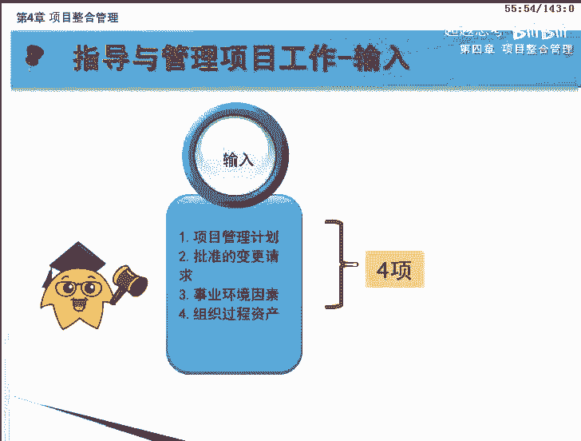

在指导与管理项目工作过程中，执行的便是项目管理计划中所确定的工作，所以项目管理计划，首当其冲的要成为本过程的输入，在前面我们讲过指导与管理项目工作过程，还需要实施以批准的变更请求。

因此输入的另一个比较重要的内容，是批准的变更请求，批准的变更请求是经过整体变更控制过程处理，并批准的变更请求，有关实施整体变更控制过程的内容，我们会在后面介绍。

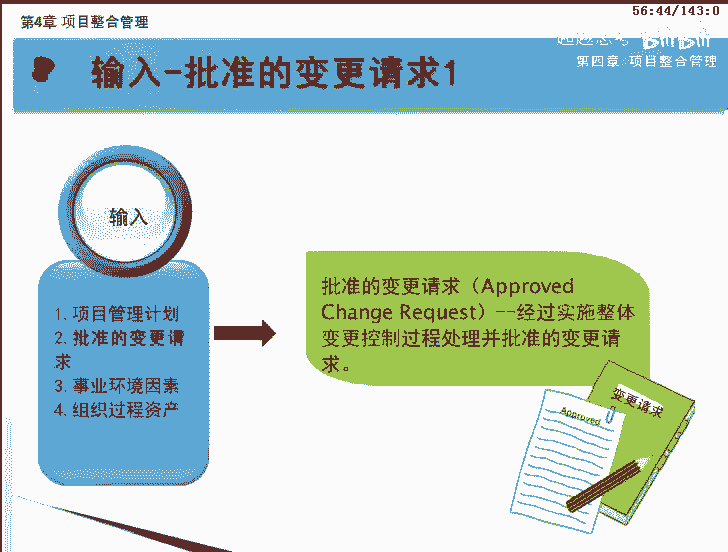

在执行项目的过程中，我们会就某些问题提出变更，但并不是所有的变更都能得到允许，这些变更请求必须提交给实施，整体变更控制过程，由他决定变更是否可行，然后对其给出是否合理的判断，只有在整体变更控制过程中。

得到批准的那些变更请求，才能在项目执行过程中予以实施，因此批准的变更请求来源于整体变更控制过程，对已批准的变更请求需要列入计划，由项目团队在指导与管理项目工作过程中实施。

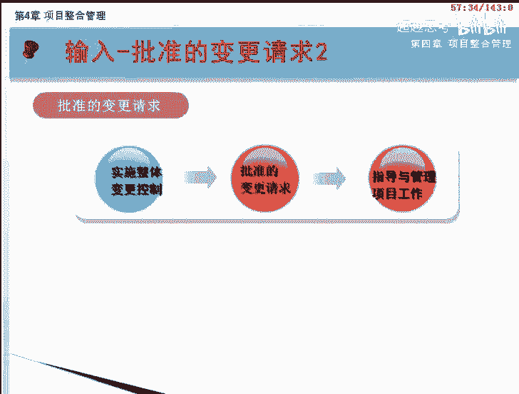

批准的变更请求有如下作用，书面记录了经过批准的变更，扩大或缩小项目范围，修改政策，项目管理计划程序，成本预算或进度计划，可能影响指导与管理项目工作过程的，事业环境因素，主要包括，组织文化。

公司文化或客户文化，执行组织或发起组织的结构，基础设施，如现有的设施和固定资产，人事管理制度，如人员雇佣与解聘指南，员工绩效评价与培训记录，干系人风险承受力，如允许的成本超支百分比，项目管理信息系统。

能够影响指导与管理项目工作过程的组织过程，资产包括标准化的指南和工作指示，组织对沟通的要求，如许可的沟通媒介记录，保存政策及安全要求，问题与缺陷管理程序，包括对问题与缺陷的控制识别与处理。

以及对相关行动的跟踪过程，测量数据库，用来收集与提供过程和产品的测量数据，以往项目的项目档案，问题与缺陷管理数据库，接下来我们讲解工具和技术指导与管理，项目工作。

这个过程有三个工具和技术专家判断项目管理，信息系统和会议，我们一块来学习。

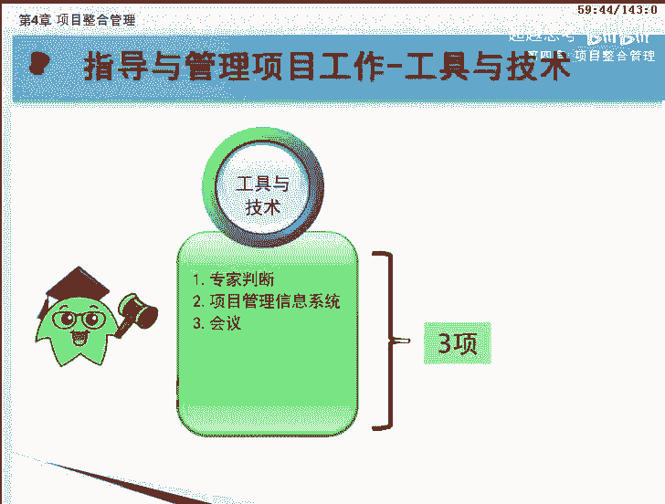

先来看专家判断这种技术，我们知道，专家判断是项目整合管理，这一知识领域的六个过程的通用工具与技术，在本过程中，专家判断用于评估各项输入，也可以使用专家判断和专业知识，来处理各种技术和管理问题。

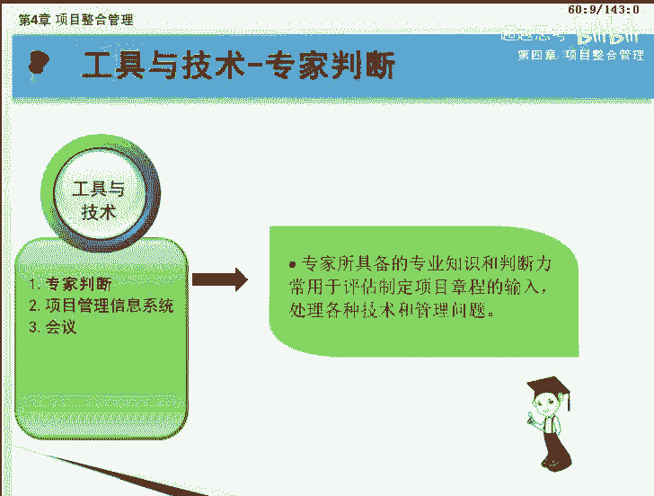

项目管理信息系统，由收集整合和传播，项目管理过程成果的工具和技术所组成的，信息系统是适应环境因素的组成部分，可以指导项目管理的执行，并支持项目，从启动到结束的各个方面的全部工作，项目管理信息系统。

可以包括人工系统和自动化系统，所有的项目文件都可以在，项目管理信息系统中存档，典型的项目管理信息系统，会包括两个重要的子系统，配置管理系统和变更控制系统，首先我们来了解配置管理系统，配置管理系统。

是项目管理信息系统的自动化工具，也是项目管理信息系统的子系统，由一系列正式的书面程序组成，包括文件和跟踪系统，明确了未核准和控制变更所需的层次，配置管理系统用于提交变更建议。

追踪变更建议的审查与批准制度，确定变更的批准级别以及确认批准的变更方法，配置管理系统的作用主要是识别产品成果，服务或部件的功能与实体特征，并形成文件，如检查可交付成果，是否符合技术规范或相关要求。

并对检查结果进行记录，形成文件，如果不符控制上述特征的所有变更，在控制变更的过程中，记录并报告每一变更及其实施状况，在实施过程中，在对辅助产品成果或者部件进行审查。

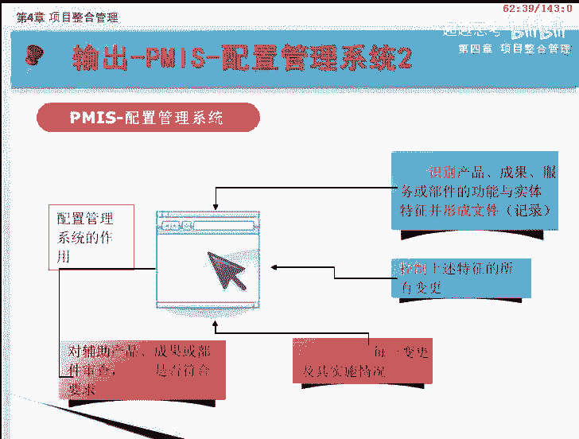

核实是否符合要求，刚讲了那么多配置管理系统的作用，可是我们到底在什么时候用这样一个，功能强大的系统呢，其实这是用于配置管理的一个工具，在做项目的过程中，我们一直强调，配置管理到底为什么要进行配置管理呢。

实施配置管理的目的在于，保证项目产品的正确和完备，即通过统一的管理，把合适的活动配置到合适的，可交付成果的生产过程中，比如通过技术规范来保证项目产品，满足客户的需求。

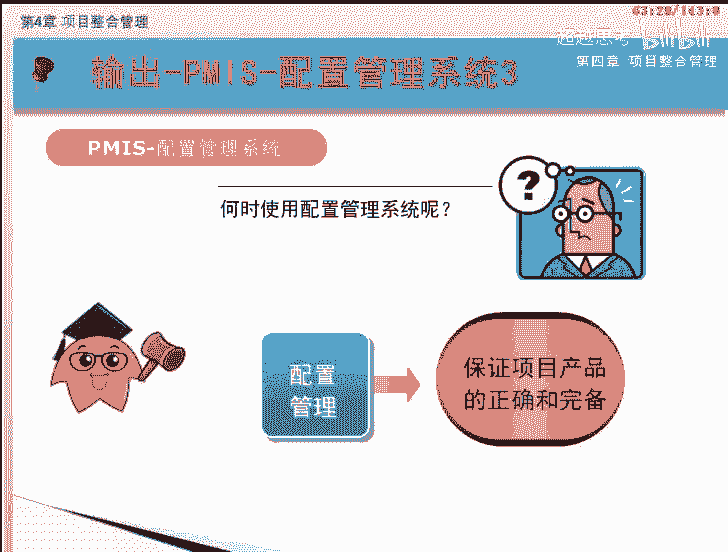

变更控制系统是p miss的另一个重要子系统，变更控制系统还是配置管理系统的一个子系统，用于规定如何控制改变和批准项目，可交付成果和文件的一套正式书面程序，重要的变更，必须严格按照正式的书面程序来执行。

这种书面程序也可称之为变更控制方法。

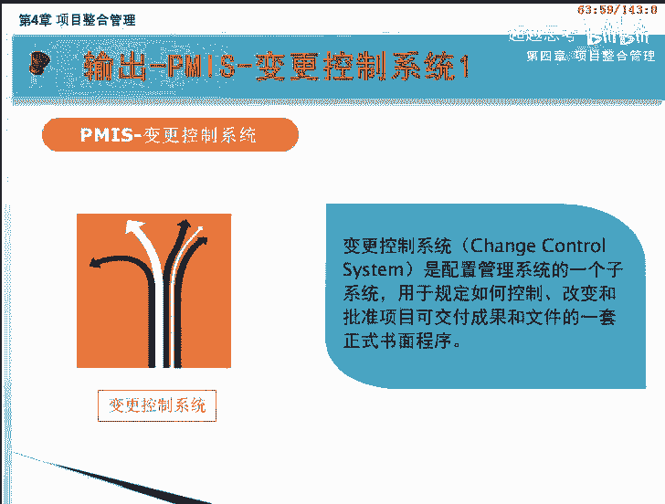

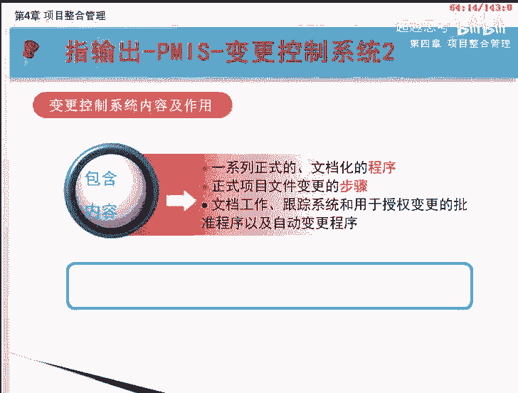

项目经理应该掌握通用会议技巧，在会议周期进行管理，包括会前准备，应该做好准备工作，包括确定会议议程，目的目标和期限，会中控制，把握会议进程和主题，处理例外情况，会后总结，要形成书面的会议纪要和行动方案。

应该按照项目管理计划中的规定保存会议纪要。

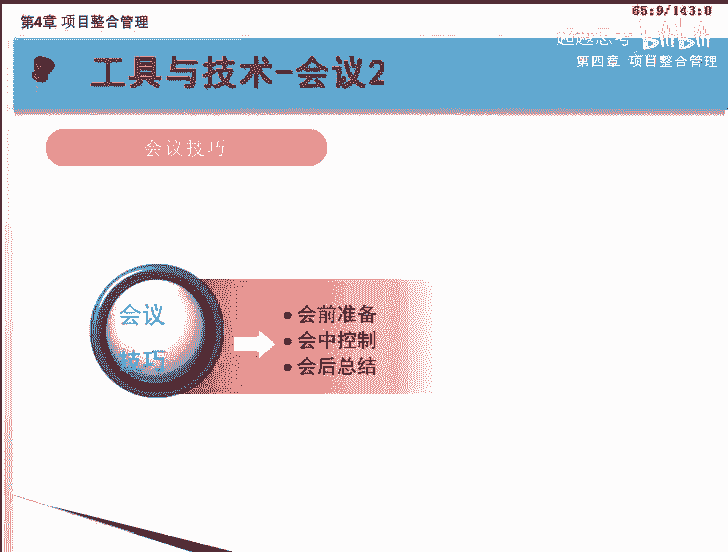

指导与管理项目工作，这个过程共有五个输出，下面我们一块来学习。

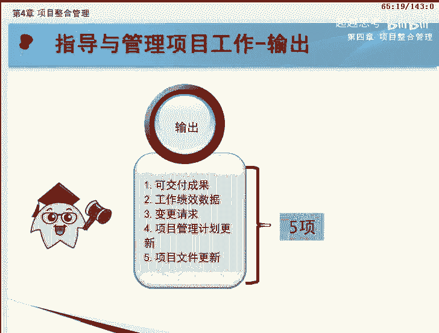

可交付成果是指导与管理项目工作过程，最重要的输出之一，什么是可交付成果呢。

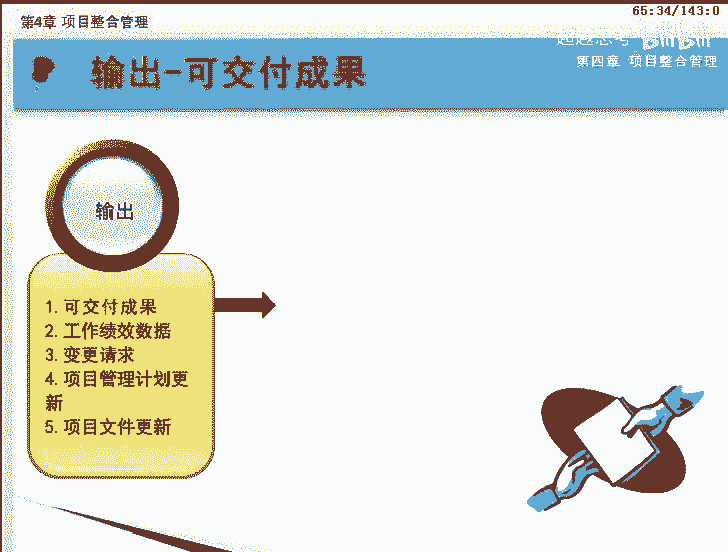

可交付成果在某一过程阶段或项目完成时，必须产出的，任何独特并可核实的产品成果或服务能力，可交付成果产生的时间，并不一定是在项目完成时，在某一个过程或阶段结束时，也会产生相应的可交付成果。

这个概念是p m p考试的重要考点之一，在pmbok指南中，可交付成果作为直接输出的，只有这个过程，即指导与管理项目工作过程，产生完全意义上的可交付成果。

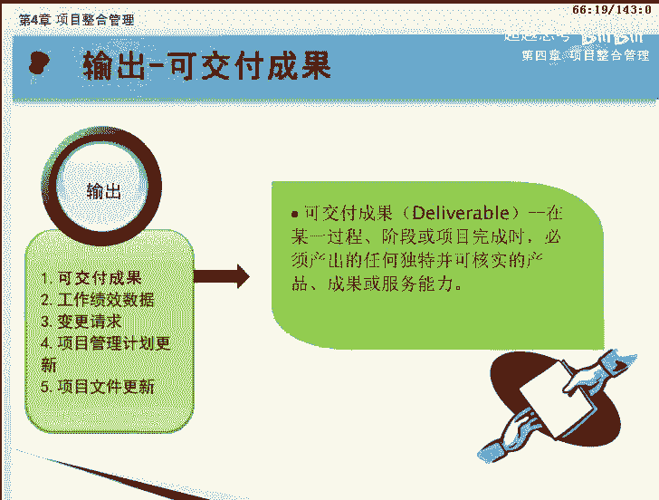

工作绩效数据是在执行项目工作的过程中，从每一个正在执行的活动中，收集到的原始观察结果和测量值，数据是指最底层的细节，将由其他过程从中提炼出项目信息，在工作执行过程中收集数据。

再交由各控制过程做进一步分析，换句话说，工作绩效数据是实事求是的数据，工作绩效数据可以包括许多内容，例如已完成的工作关键绩效指标，技术绩效测量结果，进度活动的开始日期和结束日期，变更请求的数量。

缺陷的数量，实际成本和实际持续时间等，在第三章的项目信息一节，我们已经介绍了工作绩效数据，工作绩效信息和工作绩效报告的对比，大家可以参考，变更请求是关于修改任何文档，可交付成果或基准的正式提议。

在指导与管理项目工作过程中，如果发现问题，就需要提出变更请求，来对项目的范围，成本预算政策，计划或质量等方面提出修改，所以本过程会输出变更请求，需要提醒的是，输出的变更请求，包括将来会得到批准的和。

未得到批准的变更请求，变更请求是本章一个非常重要的知识点，所有监控过程和很多执行过程，都会产生变更请求，这个输出变更请求被批准之后，将会引起对相关文档可交付成果或基准的修改，也可能导致对项目管理计划。

其他相关部分的更新，所以接下来我们将对变更请求的内容，进行具体讲解，变更请求的内容包括纠正措施，预防措施，缺陷补救和更新。

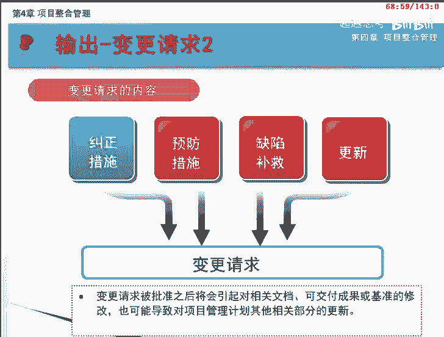

什么是纠正措施呢，纠正措施就是为此项目工作绩效，重新与项目管理计划一致而进行的，有目的的活动，就像行车路线一样，当你发现脱离了原有的行车线时，必须及时的调整方向，以免发生危险事件，需要强调的是。

任何的纠正措施都要加以记录，再根据需要采取纠正措施之后，要对纠正措施的有效性进行评价，看是否达到了预期的效果，预防措施是为确保项目工作的未来绩效，符合项目管理计划而进行的有目的的活动，顾名思义。

预防措施就是危险事件还没有发生时，预先做好防备，预防措施就是通过实施某种活动，来降低项目风险，消极后果。

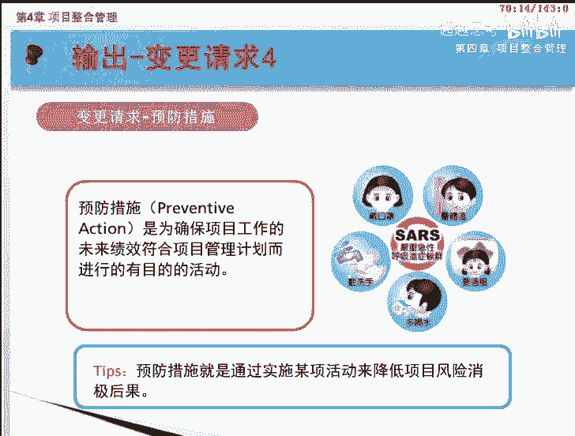

而进行的有目的的活动，缺陷补救是问题已经出现了，为了减少问题的严重性而提出的解决措施，主要针对成果。

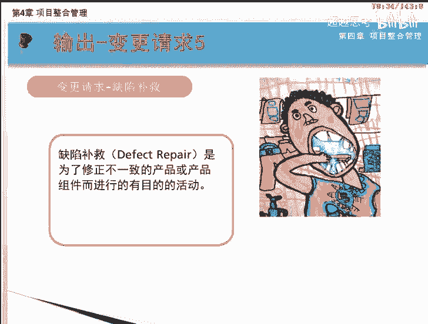

更新是对正式受控的项目，文件或计划等进行的变更，以反映修改或增加的意见或内容，更新及在项目执行过程中，根据具体的实施情况，对计划或项目文件中的内容进行修改或增加，这里要注意的是。

对项目文件或项目管理计划的更新，也是变更请求的一部分，所以在涉及到变更请求的时候，请大家不要忽略掉更新这一内容。

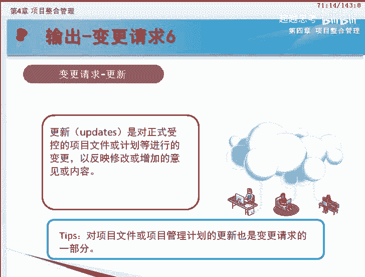

刚才我们具体讲解了变更请求的内容，相信你对他们的概念已经有了基本的理解，接下来我们就来一起分析预防措施，纠正措施以及缺陷补救之间的区别，预防措施采用的时机是偏差还未产生，只是将来有可能发生作用。

是降低偏差出现的可能性，减少消极风险的影响，纠正措施采用的时机是项目不能接受的，实际偏差，已经发生了消极的影响，已经产生，它的作用是将项目绩效拉回到计划的要求上来，纠正措施和预防措施。

针对项目的所有方面，通常不会影响项目基准，只是对基于基准的具体实施工作产生影响，缺陷补救采用的时机是发现项目质量存在缺陷，针对的是项目质量问题，它的作用是指项目质量符合要求。

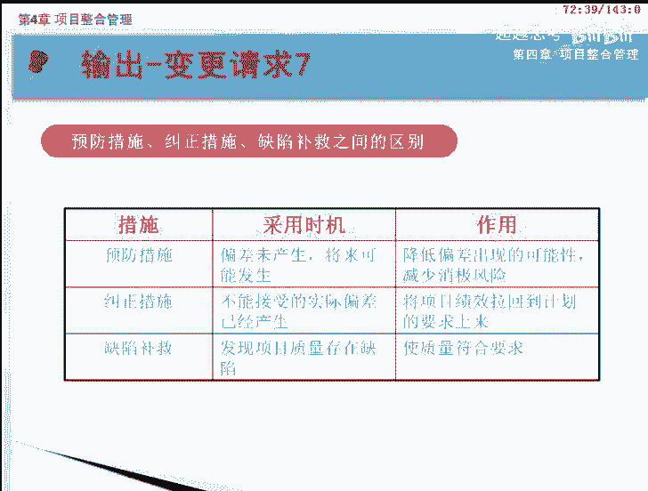

下面我们对变更请求的内容做一个总结，变更请求是在项目执行过程以正式方式提出的，所有变更请求，都必须以书面形式记录，并纳入变更管理或配置管理系统中，由项目整体变更控制过程处理，变更请求一定要正式提出。

而不能非正式提出，另外变更请求，可以直接或间接由内部或外部提出，可以是选择的，也可以是法律或合同强制要求的变更，是无法避免的，项目经理不仅要实施变更，还要预测可能的变更，尽量减少不必要的变更。

指导与管理，项目工作的最后两个输出是项目管理，计划更新和项目文件更新，在项目执行过程中产生了变更和新的信息，因此项目管理计划和项目文件，要进行必要的更新，现在我们来回顾一下本过程的核心知识。

指导与管理项目工作过程，执行的是项目管理计划和已批准的变更请求，并在过程中收集项目及小数据，启动会议标志着项目的开始，其主要目的是沟通信息。

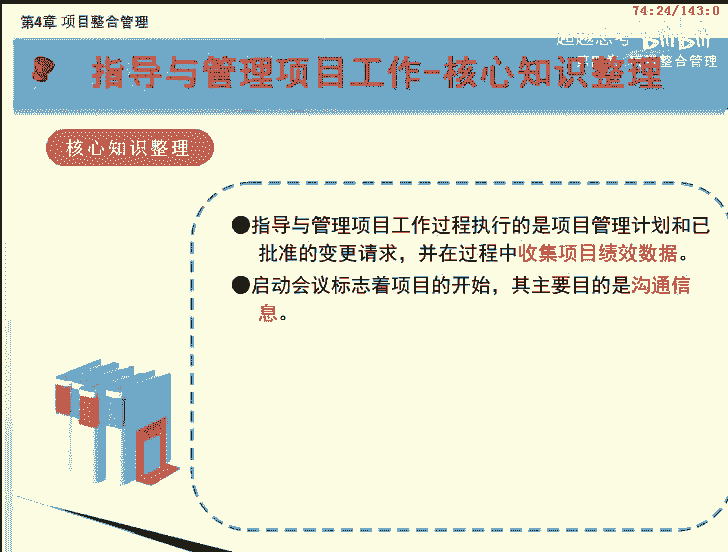

项目管理信息系统，p miss是视野环境因素的组成部分，它的两个重要子系统是，配置管理系统和变更控制系统，变更请求是在项目计划执行过程中，以正式书面文件提出的，由整体变更控制过程处理，包括纠正措施。

预防措施，缺陷补救及更新，恭喜你完成指导与管理项目工作过程的学习，下节课见，本课程我们将一起学习第四章，项目整合管理知识领域的第四节监控项目工作，这个过程属于监控过程组。

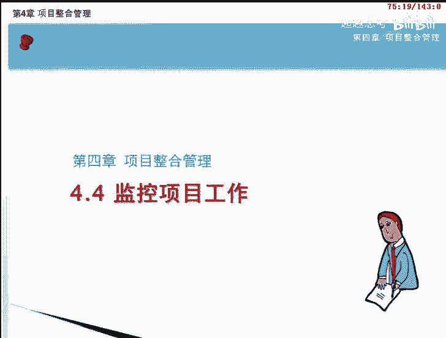

通过本课程的学习，我们将要达到以下目标，包括掌握监控项目工作的含义与作用，掌握工作绩效报告的概念和所包含的内容，了解事业环境因素和组织过程，资产的含义与内容，了解专家判断的含义以及专家的来源。

了解监控项目工作过程的输出，所包含的主要内容，理解监控项目工作所涉及的pmi思维。

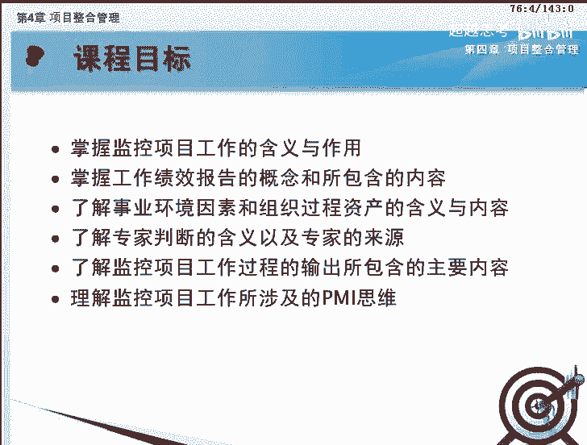

本课程我们将按照如画面所示的大纲展开，首先对监控项目工作，工作绩效报告和工作授权系统，这三个术语的基本概念进行阐述，接下来讲述监控项目工作过程的输入，工具与技术以及输出。

在这里会对工作绩效报告以及输出的详细内容，进行分析，最后重述本课程的核心知识。

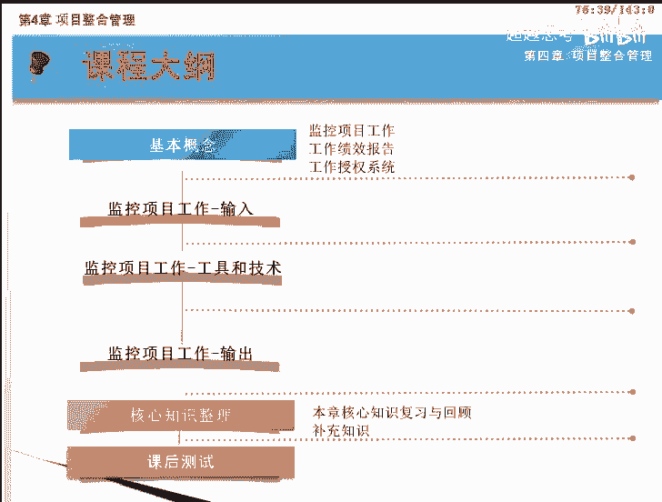

在学习监控项目工作之前，我们先来了解几个基本概念，监控项目工作工作绩效报告和工作授权系统。

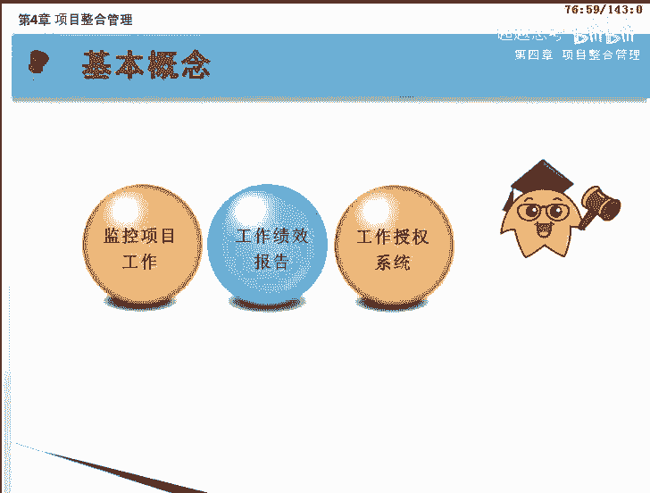

监控项目工作是跟踪审查和报告项目进展，已实现项目管理计划中确定的绩效目标的过程，本课程的主要作用，是让干系人了解项目的当前状态，以采取的步骤，以及对预算进度和范围的预测，我们知道在项目进行过程中。

会有很多与项目管理计划不一致的地方，这个时候就需要进行监督和控制，以确保符合原定目标，监控项目工作主要包含两方面的工作，一方面在项目全生命周期进行监控及收集测量，和发布绩效信息，分析结果，预测趋势。

以便推动过程改进，另一方面进行控制，即制定纠正或预防措施，或进行重新规划，并跟踪行动计划的实施，以确保他们能有效解决问题。

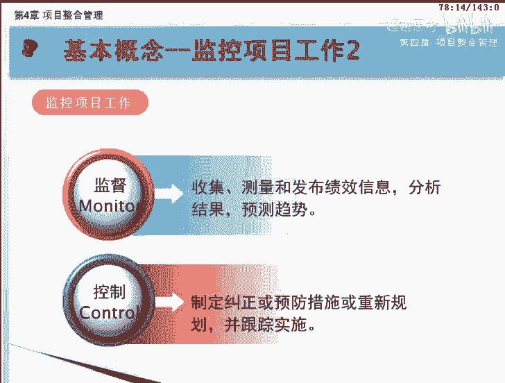

监控项目工作的活动，包括，把项目的实际绩效与项目管理计划进行比较，评估，项目绩效决定是否需要采取纠正或预防措施，并推荐必要的措施，识别新风险，分析跟踪和监测已有风险，确保全面识别风险，报告风险状态。

并执行适当的风险应对计划，在整个项目期间，维护一个准确且及时更新的信息库，以反映项目产品及相关文件的情况，为状态，报告进展测量和预测提供信息，作出预测，已更新当前的成本与进度。

信息监督已批准变更的实施情况，如果项目是项目集的一部分，还应向项目集管理层报告项目进展和状态，简单地说，项目的监控工作要遵循一个流程，在项目进行过程中，不断地收集有关实际绩效的资料。

虽然这些工作并不属于本过程，然后将项目的实际绩效与项目管理计划做比较，在此基础上评估项目绩效，并对是否需要提出变更作出判断，也就是说，如果绩效与计划不一致，就要考虑变更，如果需要变更。

确定必要的纠正措施，预防措施或者缺陷补救措施，并提出变更请求，从而进入下一个过程，实施变更控制过程，如果不需要变更，继续实施项目活动，并随时收集绩效资料，重复此过程，确保一切按计划行事。

在整个项目期间，需要维护一个信息库，以反映项目产品及相关文件的情况，等人信息库要随时更新，工作绩效报告是为制定决策，采取行动或引起关注而汇编工作绩效信息，所形成的实物或电子项目文件。

项目信息可以通过口头形式进行传达，但为了便于绩效信息的记录存储和分发，有必要使用实物形式或电子形式的项目文件，工作绩效报告包含一系列的项目文件，旨在引起关注并制定决策或采取行动。

可以在项目开始时就规定具体的项目绩效指标，并在正常的工作绩效报告中，向关键干系人报告这些指标的落实情况，例如工作绩效报告包括状态报告，备忘录，论证报告信息札记，推荐意见和情况更新。

绩效报告由项目团队编制，而非项目经理独自完成，工作授权系统，是整个项目管理系统的一个子系统，它是一系列正式书面程序的集合，规定如何授权项目工作，以保证该工作由正确的组织，在正确的时间以正确的顺序执行。

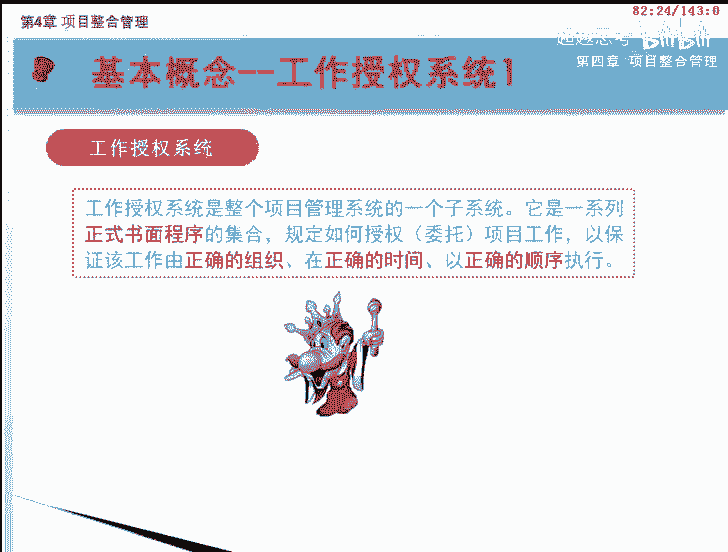

工作授权系统包括发布工作授权所需的步骤，文件跟踪系统以及审批层次，有效的授权对于项目经理来说是非常必要的，借助于工作授权系统，项目经理不仅可以使项目团队成员，明确了解其具体执行的活动的目标。

而且可以使他们充分意识到，自己被授予的权力的所负担的责任，有了工作授权系统，项目经理以及团队成员，就不必事事都向上级请示，通过前面的定义，我们可以看出，工作授权系统强调了四个要素，他批准了谁。

也就是什么组织，在什么时间按照什么顺序做什么工作，因此也可以说，工作授权系统是为确保工作，按规定时间和顺序进行而采取的一套项目工作，正是审批程序，当然对许多较小型的项目而言，口头核准一般就已经足够了。

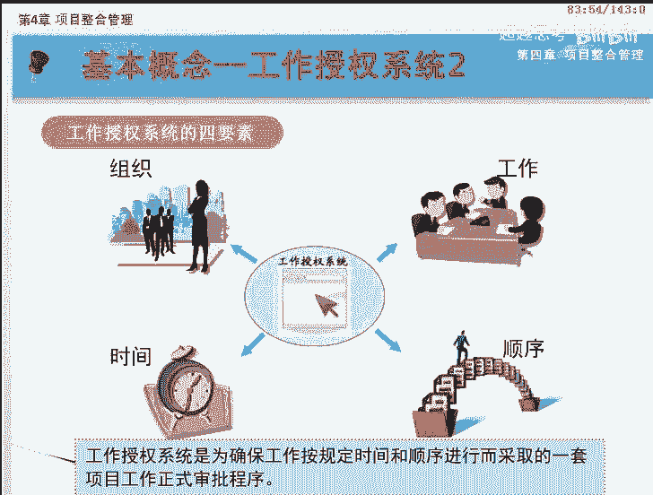

现在我们来了解一下，监控项目工作过程的i t t，我们看到该过程有七项输入，经过四项工具和技术的处理，生成四项输出，其中变更请求和工作绩效报告是非常重要的，输出我们会详细介绍。

下面我们来具体学习这个过程的i t t，这是监控项目工作过程的数据流向图，展现了该过程如何通过输入，输出与其他过程进行交互，监控项目工作共有七个输入，下面我们依次来了解他们吧。

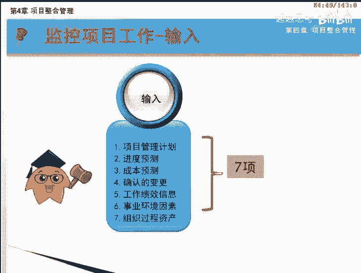

监控项目工作要以项目管理计划为基础，项目管理计划中的子计划和基准是监控的依据，监控就是审查实际执行的工作，和项目管理计划中所确定的工作有何出入，所以项目管理计划，首当其冲的要成为本过程的输入。

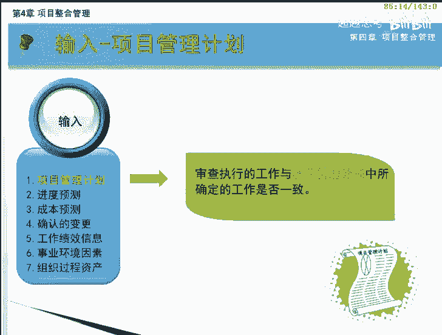

监控项目工作要参考进度预测，进度预测是基于实际进展与进度基准的比较，而计算出来的，包括完工尚需时间估算etc进度偏差，sv和进度技巧指数s p i等，这些概念在后续章节会介绍，通过预测。

可以确定项目是否仍处于可容忍范围内，并识别任何必要的变更，监控项目工作还要参考成本预测，成本预测是基于实际进展与成本基准的比较，而计算出来的，包括完工尚需估算etc成本偏差，cv和成本绩效指数cpi等。

这些概念也将在后续章节会介绍。

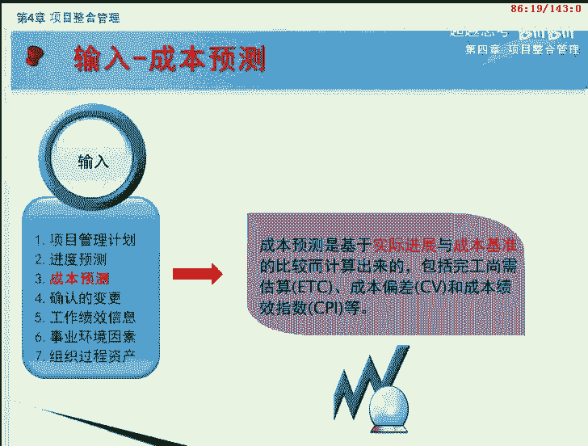

确认的变更是控制质量过程的输出，它是对变更或补救的对象进行检查，如果通过。

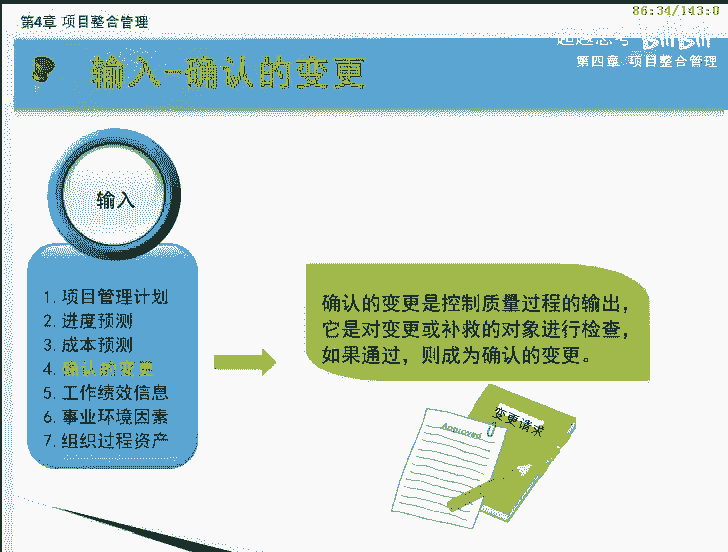

则成为确认的变更，工作绩效信息是从各控制过程中收集，并结合相关背景和跨领域关系，进行整合分析而得到的绩效数据，工作绩效信息可包括可交付成果的状态变更，请求的落实情况及预测的完工尚需估算。

可能影响监控项目工作过程的事业环境因素，主要包括政府或行业标准，行为准则，产品标准，质量标准和工艺标准，组织的工作授权系统，该系人风险承受能力，项目管理信息系统，可能影响监控项目工作过程的组织过程。

资产包括组织对沟通的要求，财务控制程序问题与缺陷，管理程序变更控制程序，风险控制程序过程测量数据库经验教训，数据库，监控项目工作的工具与技术共有四个，下面我们依次来了解。

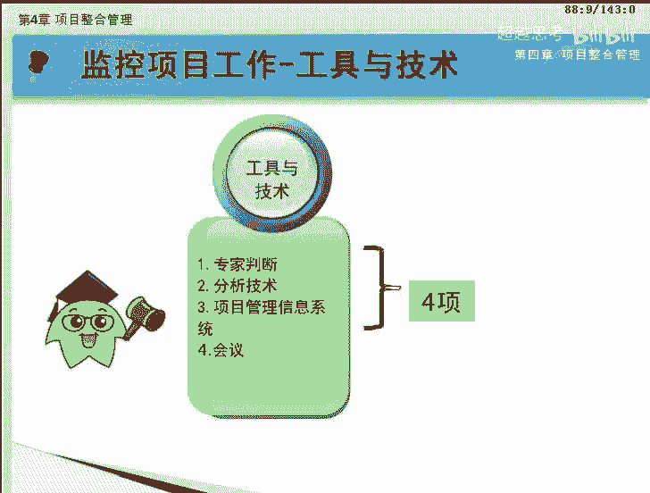

专家判断这种技术前面已经介绍过，在监控项目工作过程，项目管理团队借助专家判断来解读，由各监控过程提供的信息，项目经理与项目管理团队一起制定所需措施，确保项目绩效达到预期要求，在监控项目工作。

以至于在整个项目管理中，根据可能的项目或环境变量的变化，以及它们与其他变量之间的关系，采用分析技术来预测潜在的后果，这就是分析技术，它是一类技术的统称，包括回归分析，分组分析，因果分析，根本原因分析。

储备分析等，他们中的大部分会在后续课程中介绍。

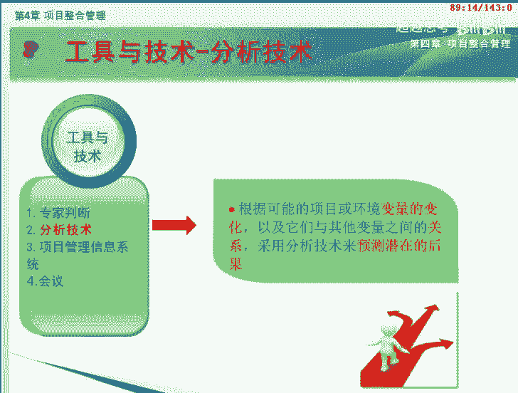

作为事业环境因素的一部分，项目管理信息系统，为监控项目工作过程提供自动化工具，以及绩效指标数据库，项目记录和财务数据等，监控项目工作时召开的会议形式，可以是面对面或虚拟会议，正式或非正式会议。

参会者可包括项目团队成员，干系人及参与项目或受项目影响的其他人，会议的类型，包括用户小组会议和用户审查会议等。

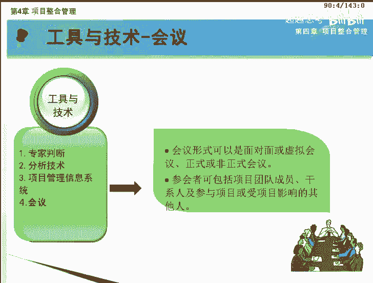

监控项目工作，这个过程共有四个输出变更，请求工作绩效报告，项目管理计划更新和项目文件更新，下面我们一块来学习。

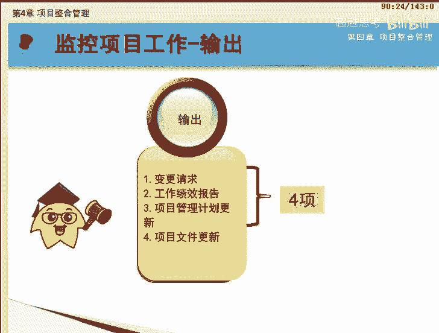

在监控项目工作时，通过比较实际情况与计划要求，可能需要提出变更请求，变更请求可以是，扩大调整或缩小项目范围与产品范围，或者提高调整或降低质量要求和进度，或成本基准。

变更请求可能导致需要收集和记录新的需求，变更可能会影响项目管理计划，项目文件或产品可交付成果，符合项目变更控制准则的变更，应该由项目既定的整体变更控制过程进行处理。

大多数执行过程和监控过程都会提出变更请求，本过程输出中的变更请求包括纠正措施，预防措施和缺陷补救，工作绩效报告是监控项目工作的重要输出，我们在基本概念部分已经介绍过了。

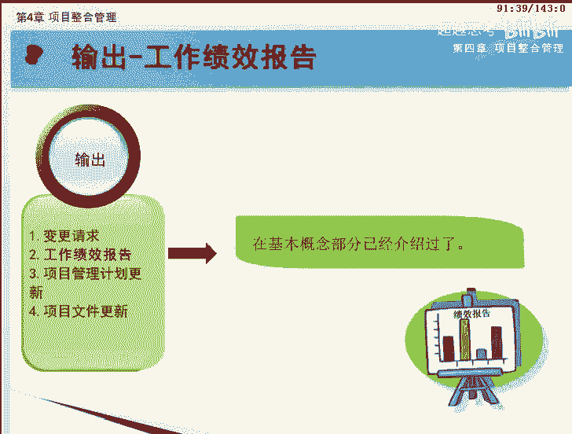

在监控项目工作过程中提出的变更，可能会影响项目管理计划，这些变更在经恰当的变更控制过程处理后，可能导致对项目管理计划的更新，可能引起更新的子计划，包括范围管理计划，需求管理计划，进度管理计划。

成本管理计划，质量管理计划等，还有项目管理计划中的范围基准，进度基准和成本基准，这三个基准也会引起更新，在监控项目工作这个过程中，一些项目文件也会进行更新，包括进度和成本预测工作，绩效报告，问题日志等。

好让我们来回顾一下本过程的核心知识工作，授权系统用来保证项目工作由正确的组织，在正确的时间以正确的顺序进行，不仅要对项目执行情况进行监控。

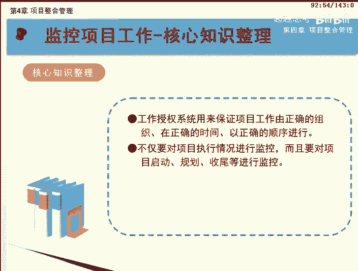

而且要对项目启动，规划收尾等进行监控，监控项目工作过程的一项重要输出是变更请求，此外变更请求也可以在执行过程中提出，恭喜你完成监控项目工作过程的学习，下节课见，本课程我们将一起学习第四章。

项目整合管理知识领域的，第五节实施整体变更控制，这个过程属于监控过程组。

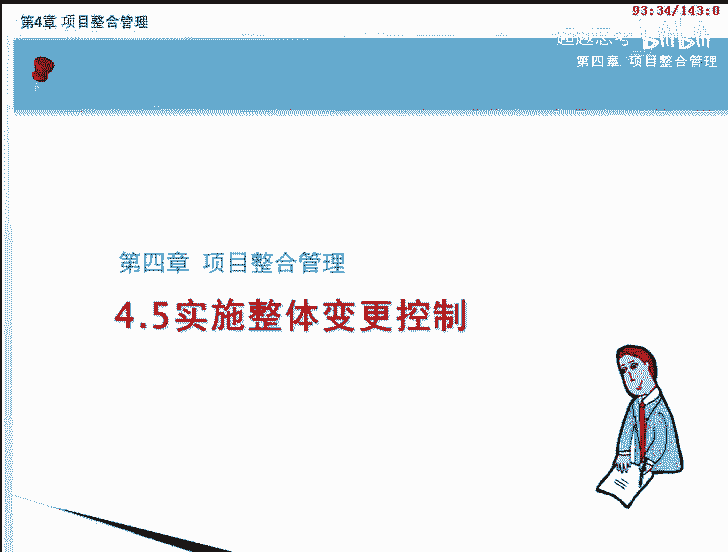

通过本课程的学习，我们将要达到以下目标，包括熟记实施整体变更控制的概念，了解实施整体变更控制过程，包括的变更管理活动，了解配置管理系统的特点及目标，掌握配置管理活动，了解本过程专家判断的来源渠道。

熟记变更控制委员会的定义，组成及作用，熟记本过程的输入工具与技术和输出。

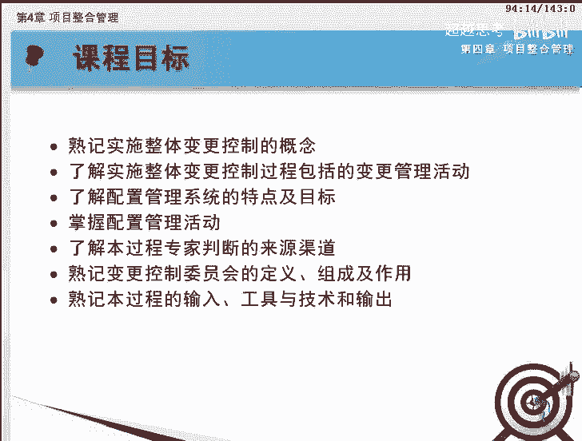

本课程我们将按照如图所示的大纲展开，首先对实施整体变更控制，变更控制委员会，配置管理系统这三个术语的基本概念进行阐述，接下来讲述实施整体变更控制过程的输入，工具与技术以及输出。

在这里我们会详细讨论工具和技术，最后重述本课程的核心知识点，在实施整体变更控制过程之前，我们先来了解几个基本概念，实施整体变更控制，变更控制委员会配置管理系统。

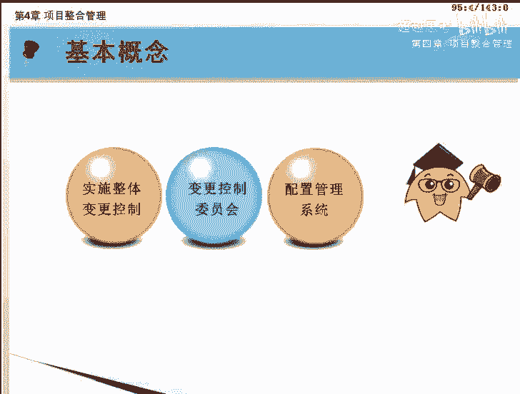

实施整体变更控制是审查所有变更请求，批准变更管理，对可交付成果组织过程，资产项目文件和项目管理计划的变更，并对变更处理结果进行沟通的过程，该过程审查所有针对项目文件。

可交付成果基准或项目管理计划的变更请求，并批准或否决这些变更。

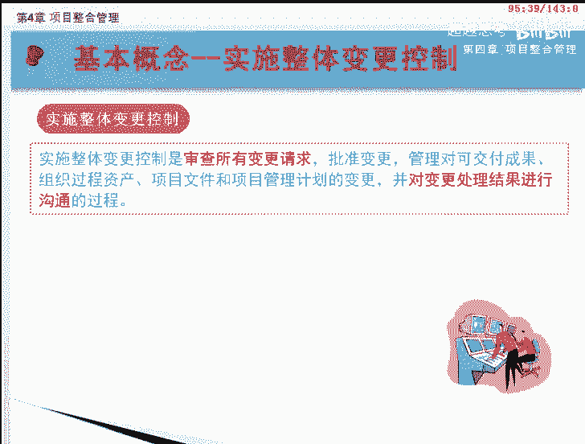

本过程的主要作用是从整合的角度考虑，记录在案的项目变更，从而降低因未考虑变更，对整个项目目标或计划的影响，而产生的项目风险，在项目的执行过程中，需要谨慎持续的管理变更，以实现项目目标。

同时考虑是否更新项目管理计划，项目范围说明书和其他可交付成果，因此实施整体变更控制过程贯穿项目始终，任何项目干系人都可以提出变更请求，但需要注意的是，口头提出的变更请求必须有书面记录。

并纳入变更管理或配置管理系统中，按照相关过程进行处理，实施整体变更控制过程中，对基准的变更只能针对以后的情况，而不能变更以前的绩效数据，也就是说，当基准发生变更时，这个变更是为当前和将来而实施的。

过去的数据并没有发生改变，变更控制委员会，负责审查评价批准，推迟或否决项目变更，以及记录和传达变更处理决定，变更控制委员会所作出的决定和建议，都应该记录在案，在很多项目中，根据项目角色和职责文件的规定。

发起人或项目经理，有权批准某些种类的变更请求，但必要时需要变更，控制委员会负责批准或否决变更请求，变更控制委员会，c c b应该包括各方面的重要干系人，如果ccb中没有客户或发起人参与的话。

某些特定的变更请求在c c b批准之后，还可能需要得到他们的批准，配置管理系统可以用来集中管理，已批准的变更与基准，这种管理变更的方式最大的特点是标准化，效果好，效率高。

配置管理要通过一系列的活动得到实现，在整体变更控制过程中的配置管理，活动包括三种，其配置识别配置状态，记录和配置何时与审计，其中配置识别是识别哪些项需要配置，然后作出选择。

从而为定义与核实产品的配置标志，产品的文件管理变更和明确责任提供基础，配置状态，记录是记录和报告，在识别配置活动中，所选择的配置项的数据和相关信息，这些信息主要包括已批准的配置识别清单。

配置变更请求的状态，和已批准的变更的实施状态，这项活动是为了能及时提供关于配置项的适当，数据，配置的核实和审计，也就是保证配置项组合的正确性，保证相应的变更都登记评估，批准跟踪和正确实施。

从而确保配置文件所规定的功能要求。

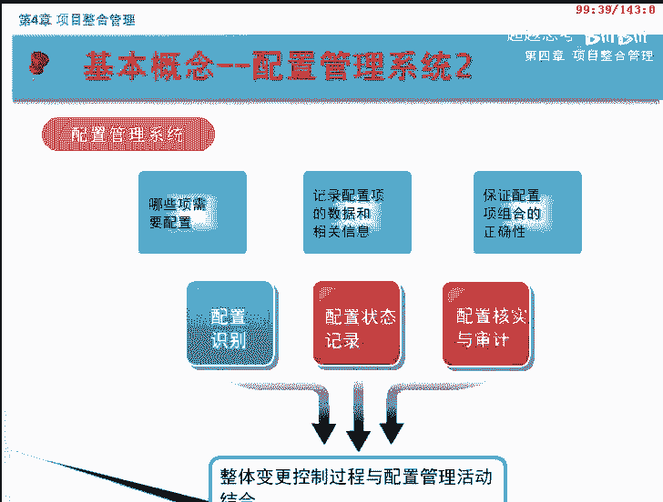

都已经实现，现在我们来了解一下，实施整体变更控制过程的i t t，实施整体变更控制，就是以项目管理计划和工作绩效报告为依据，通过专家判断和变更控制委员们的会议，对指导与管理项目。

执行和监控项目工作等各过程，提出的变更请求进行处理，批准或拒绝变更，同时提出对项目管理计划和项目文件的更新，下面我们将有重点的具体学习，这个过程中的i t t o，这是实施整体变更控制过程的数据流向图。

它展现了该过程如何通过输入，输出与其他过程进行交互，实施整体变更控制过程共有五个输入，包括项目管理计划，工作绩效报告，变更请求事业环境因素和组织过程资产，下面我们依次来了解他们。

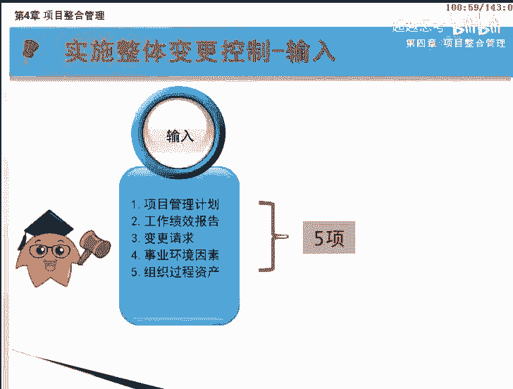

输入中的项目管理计划，是制定项目管理计划过程的重要输出，我们前面已经进行了详细介绍，大家可以参考，需要注意的是，项目管理计划中的变更管理计划，为管理变更控制过程提供指导记录，变更控制委员会的情况。

项目管理计划中的配置管理计划，明确了如何开展配置管理，这是实施整体变更控制过程的重要输入。

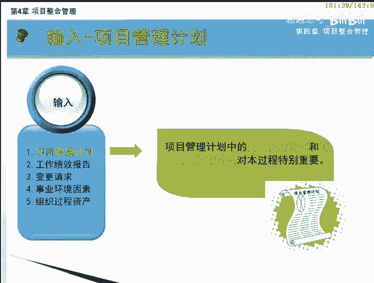

工作绩效报告是监控项目工作过程的输出，我们前面也学习过，对实施整体变更控制过程，特别有用的工作绩效报告，包括资源可用情况，进度和成本数据，正值管理报告，燃烧图或燃进图，我们知道pm报考指南中。

所有的监控过程和大部分执行过程，都会产生变更请求，这个输出并成为实施整体变更控制的一个输入，这些变更请求可以包括纠正措施，预防措施和缺陷补救这三类请求的，这三类请求的目的，是为了保证项目按照计划执行。

其中的纠正措施和预防措施，通常不会影响项目的基准，只会影响相对于基准的绩效，或者只对基于基准的具体实施工作产生影响，从较高层面上来说，这三类变更是为了保证执行情况，符合基准计划的要求。

并不是更新修改或调整基准计划，所以不会导致对基准的修改，从较低层面上来说，这三者都需要纳入到具体的操作性计划中，然后再加以执行，所以他们只会影响具体的操作性的计划。

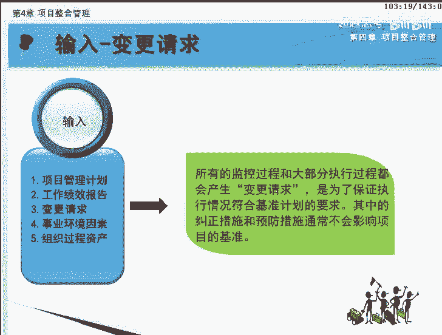

可能影响实施整体变更控制过程的，事业环境因素主要是项目管理信息系统，包括进度计划，软件工具配置管理系统，信息收集与发布系统，进入其他在线自动化系统的网络界面等，可能影响实施整体变更控制过程的组织过程。

资产包括变更控制程序，包括修改组织标准，政策计划和其他项目文件所需遵守的步骤，以及如何批准确认和实时变更，批准于签发变更的程序，过程测量数据库，用来收集与提供过程和产品的测量数据。

项目档案配置管理知识库，包括组织标准，政策程序和项目文件的各种版本及基准。

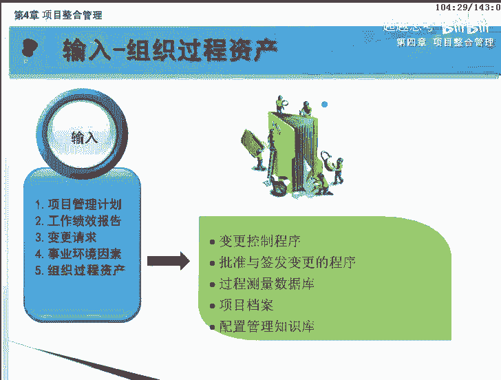

接下来我们来学习工具与技术，实施整体变更控制过程共有三个工具和技术，包括专家判断会议变更控制工具，下面我们依次来了解他们吧。

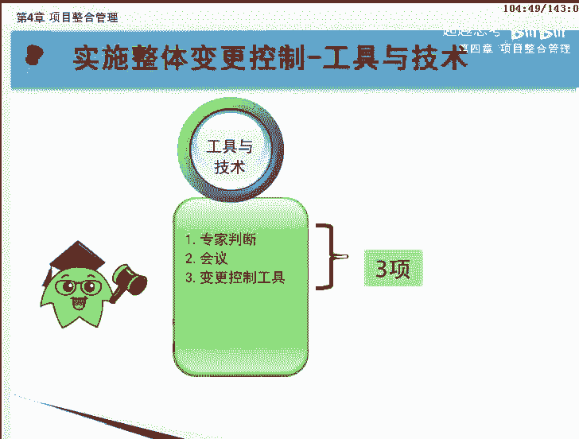

专家判断这种技术前面已经介绍过，在实施整体变更控制过程中，除了项目经理与项目管理团队的专家判断外，也可以邀请干系人贡献专业知识，和加入变更控制委员会，c c b在本过程中，专家判断和专业知识。

可用于处理各种技术和管理问题，并可从各种渠道获得，实施整体变更控制过程中召开的会议，通常是指变更控制会议，根据项目需要，可以由变更控制委员会cc b开会审查变更请求，并作出批准否决或其他决定。

cc b也可以审查配置管理活动，应该明确规定，并经相关干系人一致同意后，记录在变更管理计划中，c c b的决定都应该记录在案，并向该气人传达，以便其知晓并采取后续措施，为了便于开展配置和变更管理。

可以使用一些手工或自动化的工具，工具的选择应基于项目干系人的需要，并考虑组织和环境情况和制约因素，可以使用工具来管理变更请求和后续的决策，同时还要格外关注沟通，以帮助c cb成员履行职责。

以及向相关干系人传达决定。

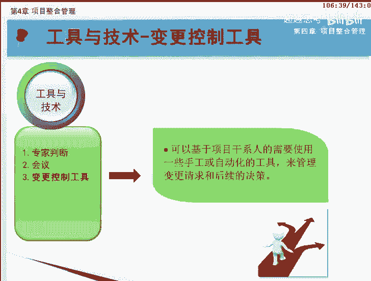

我们看到实施整体变更控制过程共有四个，输出批准变更请求变更日志，项目管理计划更新和项目文件更新，下面我们一块来学习。

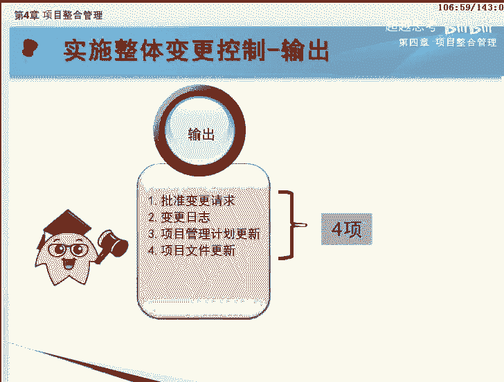

项目经理c c b或指定的团队成员，应该根据变更控制系统处理变更请求，批准的变更请求，应通过指导与管理项目工作过程加以实施，全部变更请求的处理结果，无论批准与否，都要在变更日志中更新。

这种更新是项目文件更新的一部分，变更日志用来记录项目过程中出现的变更，应该与相关的干系人沟通，这些变更以及对项目时间成本和风险的影响，被否决的变更请求也应该记录在变更日志中。

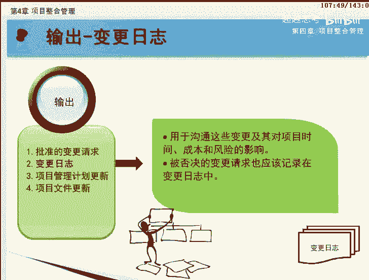

实施整体变更控制过程中，对于变更的审查批准和否决，可能会导致项目管理计划的更新，主要包括子管理计划的更新和有待正式变更，控制过程审查的基准，需要注意的是，对于基准的变更，只能针对今后的情况。

不能变更以往的绩效，这有助于保护基准和历史绩效数据的严肃性，实施整体变更控制过程结束后，可能更新项目，正式变更控制过程所涉及的所有文件。

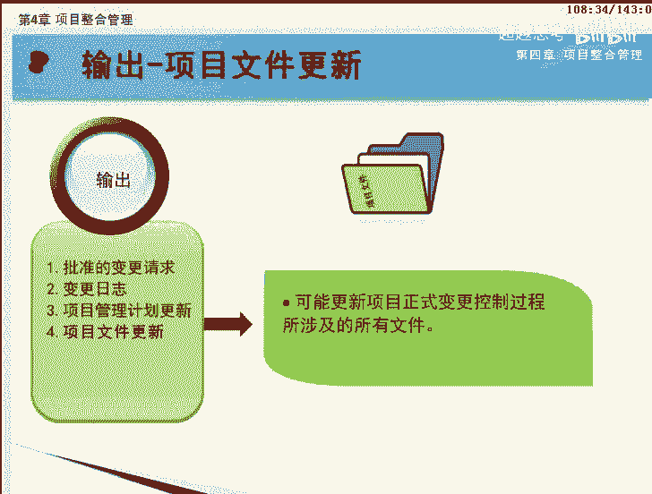

现在我们来回顾一下本课程的核心知识，实施整体变更控制过程，贯穿于项目始终，任何干系人都可提出变更请求，可口头或书面提出，但必须书面记录，变更控制委员会c c b负责批准或否决重大。

特别是关于基准和项目管理计划的更新。

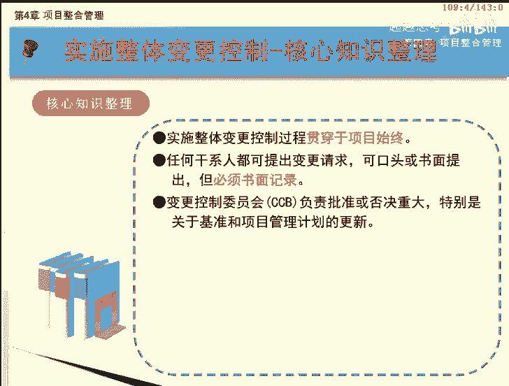

配置管理系统，关注可交付成果的物理状态和特性，可以提供标准化，效果好的方式来管理已批准的变更与基准，变更请求可以包括纠正措施，预防措施和缺陷补救，恭喜你完成实施整体变更控制过程的学习，我们下节课见。

本课程我们将一起学习第四章，项目整合管理知识领域的第六节，结束项目或阶段，这个过程属于收尾过程组。

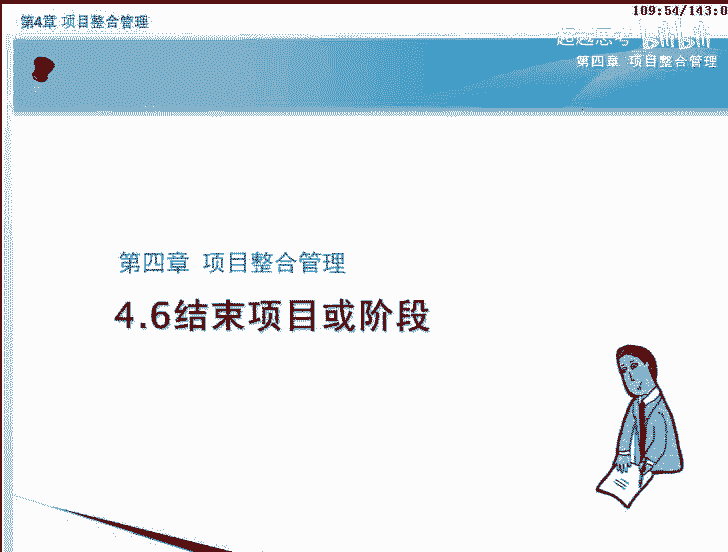

各位学员，你一定听说过烂尾楼吧，所谓的烂尾楼，通常是说那些已经开工的建筑项目，由于缺乏资金或因为产权纠纷，工程质量不合格等原因而被迫停工，然后被搁置一边无人问津，这样的项目不仅无法进行正常交付。

还会造成巨大的损失和资源的搁置，作为项目经理的你，当然不希望出现烂尾楼。

这样的项目，其实不论是成功实现目标的项目，还是遇到问题无法进展下去的项目，如项目所必需的资源被转移出该项目，项目失去原有的竞争力，难以生存下去等等，都应该认真做好项目的收尾工作。

也就是我们经常说的善始善终，只有这样才符合项目管理协会的理念，下面让我们一起学习结束项目或阶段这个过程，通过本课程的学习，我们将要达到以下目标，包括掌握结束项目或阶段过程的定义和重要性。

了解结束项目或阶段过程所必须实施的活动，熟悉结束项目或阶段过程的输入，工具与技术及输出的内容，了解行政收尾的含义。

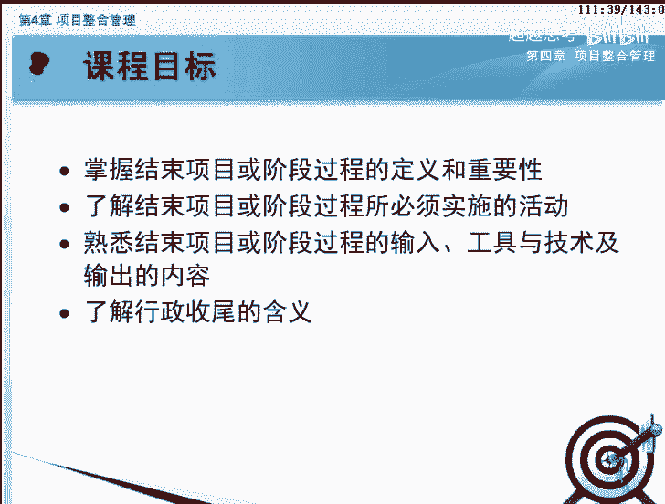

本课程我们将按照如画面所示的大纲展开，首先对结束项目或阶段，这个术语的基本概念进行阐释，接下来讲述该过程的输入，工具与技术以及输出，在这里会对工具和技术的详细内容进行分析，最后着重陈述本过程的核心知识。

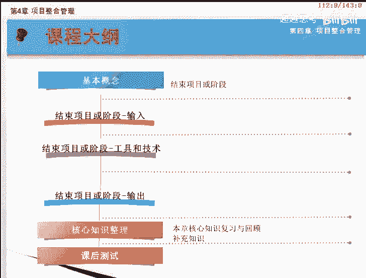

在学习结束项目或阶段过程之前，我们先来了解一下这个过程名称，结束项目或阶段，结束项目或阶段，是完结所有项目管理过程组的所有活动，已正式结束项目或阶段的过程。

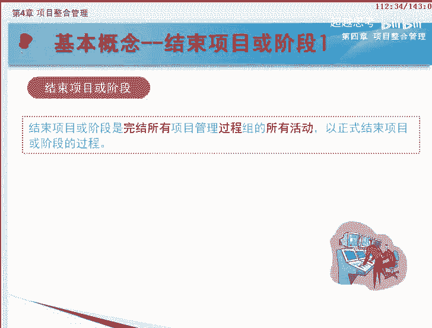

本过程的主要作用是总结经验教训，正式结束项目工作，为开展新工作而释放组织资源，与之相对应的是合同收尾，合同收尾，我们会在后续课程中，项目采购管理知识领域的结束，采购过程进行讲解，下面让我们先来了解一下。

这个项目收尾所需的活动有哪些，结束项目或阶段时，首先是核实工作完成，也就是要确认全部工作都按要求完成了，项目的产品获得正式的认可，确保项目目标已经实现，其次完成最终绩效报告，如正值管理数据。

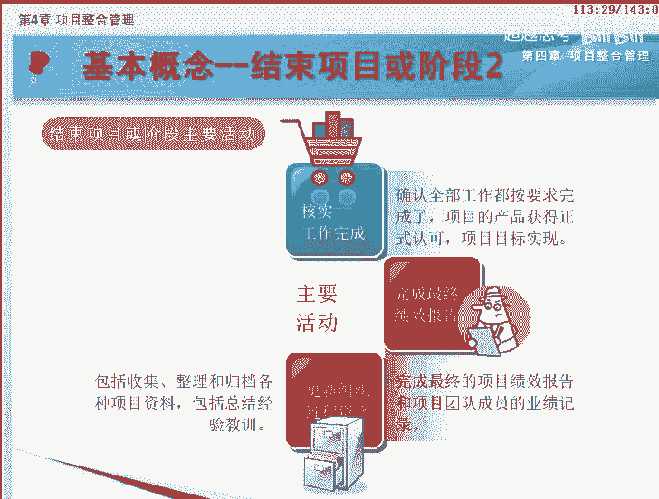

还有更新组织过程资产，包括总结项目工作在哪些方面做得好，哪些方面做得不好，如果重新做一次这个项目，我们会怎么做，这些资料最终成为组织过程资产的一部分，供组织未来使用，最后提交所有资料。

结束项目干系人在项目上的关系，解散项目团队，释放资源，包括人力资源和非人力资源，在刚才的主要活动中，你注意到了吗，释放资源是项目收尾的最后一个活动，其实它也应该是项目收尾的最后一步。

因为收尾工作需要一些干系人参与其中，团队成员是重要的，干系人，如果在此之前已释放资源，就无法完成社会工作，下面我们一起来看一下，结束项目或阶段过程的i t t，这个过程的输入包括项目管理计划。

验收的可交付成果等，在此基础上应用专家判断和分析技术，最后的结果是对最终产品服务或成果进行移交，对组织过程资产进行更新，下面我们将有重点的具体学习，这个过程中的i t t o。

这是结束项目或阶段过程的数据流向图，展现了该过程如何通过输入，输出与其他过程进行交互。

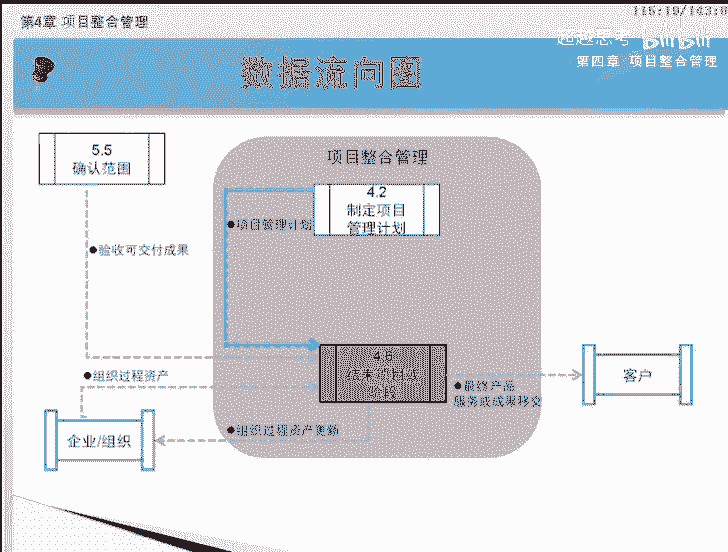

结束项目或阶段过程共有三个输入，包括项目管理计划，验收的可交付成果和组织过程资产，下面我们依次来了解他们吧。

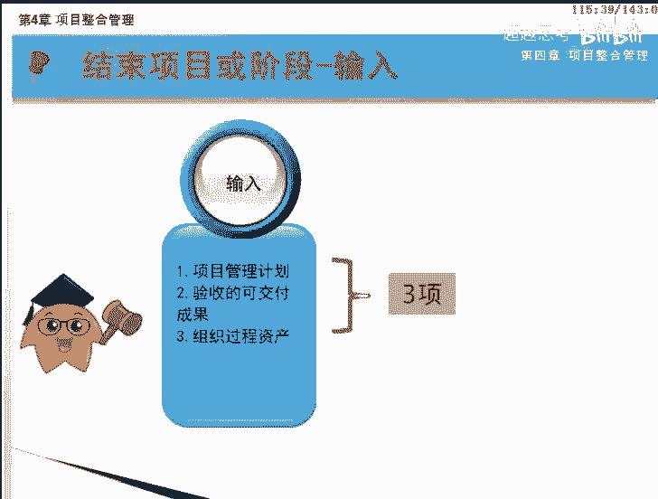

其中项目管理计划是制定项目管理计划，过程的重要输出，我们前面已经进行了详细介绍，大家可以参考，既然本过程要结束项目或阶段，所以项目经理就需要对照项目管理计划，来进行审查。

确保项目遵循了项目管理计划没有遗漏，因为项目管理计划，相当于项目经理和发起人之间的协议，其中规定了完工的标准。

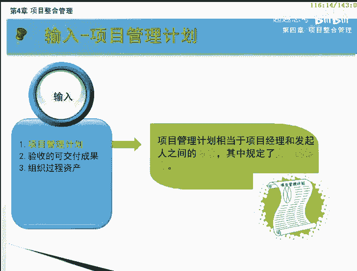

在这里验收的可交付成果是指那些可交付成果，在确认范围过程中通过验收，并经过客户或发起人的正式签字批准，这证明了干系人对项目可交付成果的正式验收，这就成为本过程的一项输入。

验收的可交付成果可能包括批准的产品，规范交货收据和工作绩效文件，所以这里的验收的可交付成果是验收文件，而非项目的可交服务，或者简单的说是一种形式上的验收，可交付成果，实质性的验收发生在确认范围过程。

在分阶段实施的项目或被取消的项目中，可能会包括未全部完成的可交付成果，或中建可交付成果，可能影响结束项目或阶段过程的组织过程，资产包括项目或阶段收为指南或要求，如行政手续，项目审计，项目评价和移交准则。

历史信息与经验教训知识库，如项目记录与文件，完整的项目收尾信息与文档，关于以往项目决策的结果，与以往项目绩效的信息，以及从风险管理活动中得到的信息。

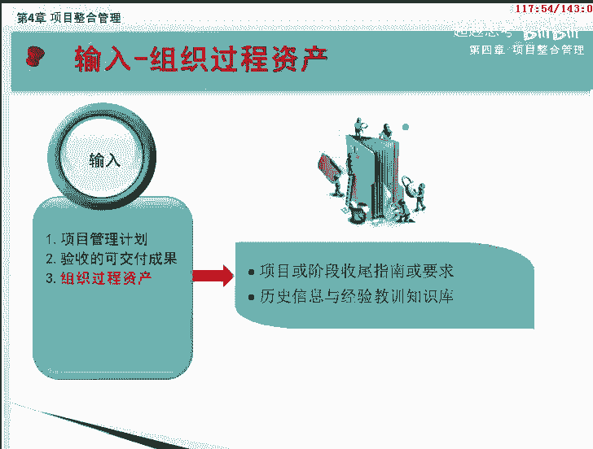

接下来我们来学习工具和技术，结束项目或阶段过程，共有三个工具和技术，包括专家判断，分析技术和会议，下面我们依次来了解他们。

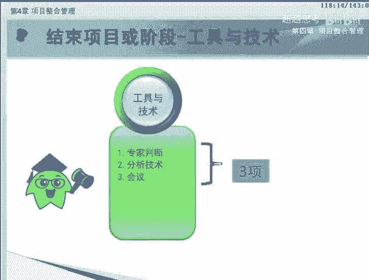

专家所具备的专业知识和判断力，常用于开展行政社会活动，由相关专家确保项目或阶段收尾符合适用标准，专家判断可从各种渠道获得需要，再次明确，专家判断是项目整合管理，这一知识领域的六个过程的通用工具与技术。

分析技术在监控项目工作过程已经进行过介绍，就是根据可能的项目或环境变量的变化，以及它们与其他变量之间的关系，来预测潜在的后果，可用于项目收尾的分析技术，主要有回归分析和趋势分析。

结束项目或阶段时召开的会议，可以是面对面或虚拟会议，正式或非正式会议，参会者可包括项目团队成员及，参与项目或受项目影响的其他干系人，会议的类型可以是经验教训总结会，收尾会，用户小组会和用户审查会等。

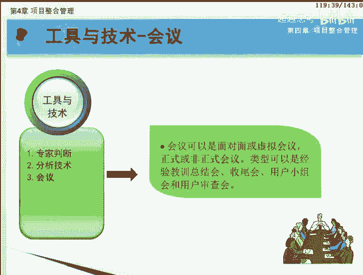

介绍完了工具和技术，我们来看看结束项目或阶段过程的输出，这个过程共有两个输出，分别是最终产品服务或成果移交，以及组织过程资产更新，下面我们一块来学习。

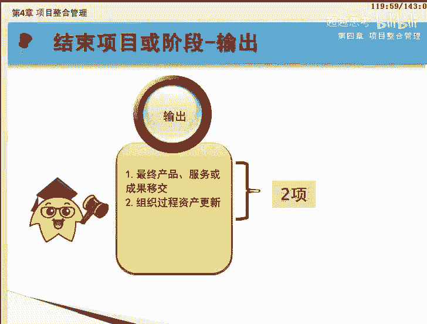

在本过程之前，项目或阶段所产生的产品服务或成果，已经经过了客户或发起人的签字确认，如果是整个项目的收尾，需要把最终的产品服务或成果移交给客户，如果是阶段收尾，移交的应该是该阶段的中间产品服务或成果。

项目的可交付物移交给客户之后，对项目团队来说，收获的另一个重要财富，就是组织过程资产的更新，这为今后的项目提供了历史资料和经验教学，组织过程资产的更新主要有项目档案，项目或阶段收尾文件和历史信息。

接下来我们对它们进行详细的讲解。

组织过程资产中的项目档案，是在项目活动中产生的各种文件，如项目管理计划范围计划，成本计划，进度计划，项目日历，风险登记册，其他登记册，变更管理文件，风险应对计划和风险影响评价等，项目或阶段收尾文件。

包括表明项目或阶段完工的正式文件，以及用来把完成的项目或阶段，可交付成果移交给他人的正式文件，如果项目在完工前提前终止，则需要在正式的社会文件中，说明项目终止的原因，并规定正式程序。

把该项目的已完成和未完成的可交付成果，移交给他人。

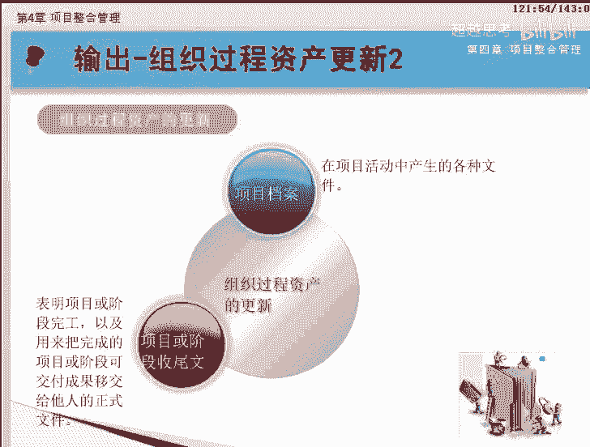

结束项目或阶段时，需要把历史信息和经验教训信息，存入经验教训知识库，供未来项目或阶段使用，这些信息可包括问题与风险的信息，以及适用于未来项目的有效技术的信息，现在我们来回顾一下本过程的核心知识。

无论什么原因导致项目终止，也无论什么时候项目终止，都必须进行行政收尾工作。

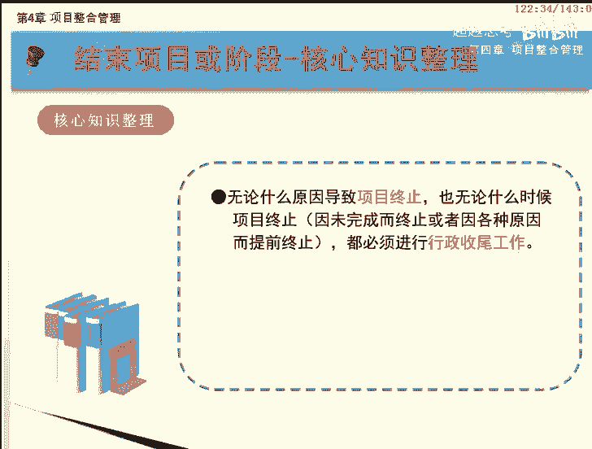

结束项目或阶段过程的输出，中组织过程资产的更新，包括项目档案，项目或阶段收尾文件和历史信息，恭喜你完成结束项目或阶段过程的学习，我们下节课见。

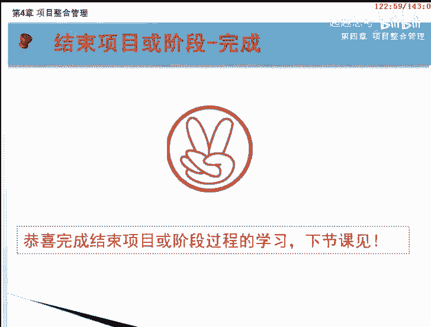

各位学员，第四章，项目整合管理知识领域的全部六个过程，已经全部学习完毕，现在就来做个总结吧，在学习项目整合管理知识领域的各过程中，您有没有发现这些过程的输入，输出之间经常是相互联系的，前一个过程的输出。

经常就是后一个或几个过程的输入，下面让我们来回顾一下，在项目启动之前，项目发起人以项目工作说明书的形式，提出他们对项目的总体要求，结合相关人员对项目进行的商业论证，如果是外部项目，还要签署协议。

这些成为制定项目章程的依据，运用专家判断以及引导技术，最后得出项目章程，项目章程一旦批准，意味着项目的正式启动，接下来项目团队就要根据这个项目章程，还有其他规划过程的输出来制定项目管理计划。

项目管理计划编制好，项目团队即可依据此计划来执行项目工作，在执行过程会产生可交付成果，工作绩效数据以及必要的变更请求，在项目执行的同时，项目团队还要依据项目管理计划。

和各控制过程产生的工作绩效信息以及预测，来监控项目工作，发现由于计划不一致的地方，随即提出变更请求，当然监控结果需要整理成绩效报告，监控项目工作的同时，项目团队还要根据执行与监控过程，提出的变更请求。

对照项目管理计划以及工作绩效报告，实施整体变更控制过程，项目执行过程中输出的可交付成果，将会提交给控制质量过程进行核实，核实的可交付成果，在经过确认范围过程验收验收后，即可进入最后的结束项目或阶段过程。

最后将最终的产品服务或成果移交给客户，这个回购过程我们没有考虑事业环境因素，组织过程，资产和各种文件的更新，你可以翻看pm bok指南来进行回顾，在项目管理实践中。

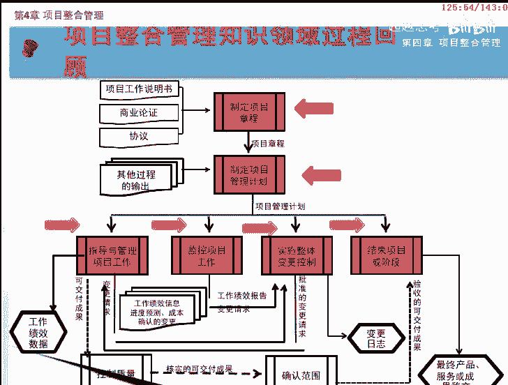

可能需要了解一些pm，包括指南中没有涵盖的内容，下面我们来补充一个知识点。

项目选择方法，项目选择方法用于决定组织选择执行哪个项目，这些方法通常可归为下面两大类，收益测量法包括对比法，评分模型，收益分布或经济模型，考试中经常出现的净现值法，年执法内部收益率法，投资回收期法。

表格法和决策数法等，属于收益测量方法。

还有一种选择项目的方法是数学模型，数学模型也称约束条件下的优化方法，包括线性非线性动态整体及多目标规划算法，决策模型等，在实际的项目选择中，应用最多，最普遍的仍然是第一类方法，收益测量法。

经济模型法是p m p考试中可能出现的知识点，需要掌握现值净现值，内部收益率，投资回收期和投资回报率等基本概念，但是提醒大家的是，在pmp考试中很少出现项目选择指标方面，具体的计算题。

你只需要知道它的大致含义，以及与项目选择的关系即可。

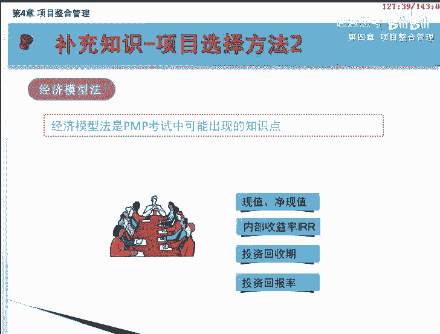

下面我们来讲解一个重要的概念，净现值，根据经验，我们知道货币是有时间价值的，比如今天的一元钱比明天的一元钱更值钱，至少你可以将一元钱存入银行，这样未来就可以获得额外的利息，先来看现值与将来值的概念。

pv表示现值，present value，f v表示将来时，future value，两者之间的转换公式是，pv等于f v除以1+2的n次方，其中二是利率，n是时间期数，举个小例子。

老板答应2年后给你10万元奖金，那么这10万元折算到现在值多少钱呢，假设利率r等于10%，根据公式pv等于f v除以1+2的n次方，在本题中就是，100000÷1+10%的二次方，等于8万，2645元。

也就是说，2年后的10万元钱只相当于现在的8万多元，下面我们来看净现值np v的概念，这是衡量项目经济效益最重要的指标，净现值是把项目所有预期的，未来现金流入与流出都折算成现值。

这些值累加的和叫做该项目的净现值，净现值的计算公式如下，简单的说就是把项目所有年份的所有进出款项，折成现值，最后把这些限值进行累加，即可得到该项目的净现值，接下来举一个例子说明净现值的计算。

表中的项目生命周期是5年，第1年年初投资1000万美元，第1年到第5年，每年年末都得到收入300万美元，对照10%的基准折现率，可以将第一到第5年各年末的收益进行折现，得到收益现值。

将所有年份的收益现值累加，就得到净现值npv了，胜利的npv是137。24万美元，np v大于零，表明这个项目可做，现在我们来学习内部收益率，它也是衡量项目经济效益的重要指标。

内部收益率i i2 是指项目在计算期内净现值，npv等于零时的折现率，说的通俗点，内部收益率越高，说明你投入的成本相对的少，但获得的收益却相对的多。

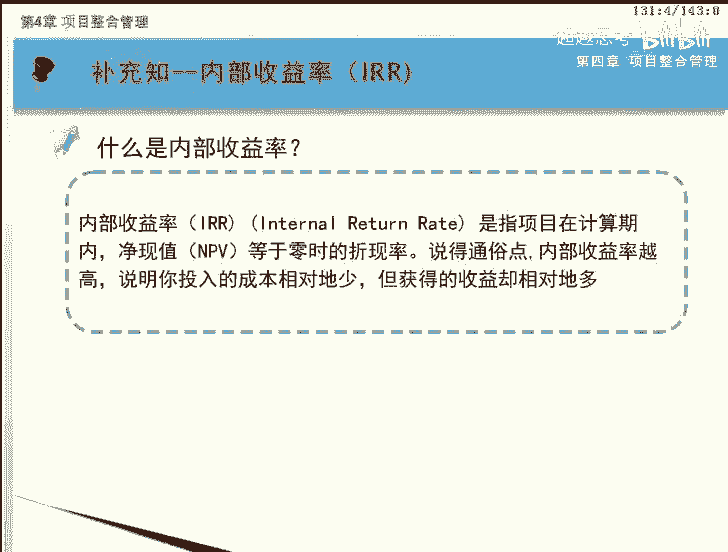

内部收益率的计算方法比较复杂，如果不使用计算机，内部收益率，要用若干个折现率进行试算，直到找到净现值等于零，或接近于零的那个折现率，p m p考试题目不会要求计算内部收益率。

特别感兴趣的学员可以参考课件，下面计算i22 的公式及解释，我们来学习如何计算投资回收期，一般来讲，投资回收期都是指静态投资，回收期是不考虑资金的时间价值时，收回初始投资所需要的时间。

一般从开始建设时算起，表格中显示了项目a和项目b从第0年，也就是当年到第4年的净现金流，我们看到第0年的净现金流都是负的，35000元，到第3年末，累计现金流恰好都为零。

也就是说他们的静态投资回收期都是3年，这里给出了静态投资回收期的表达式，公式中p t为静态投资回收期，大写的t为累计净现金流量出现正值的年数，分式中分子的u t减一只出现正值年份。

上1年累计净现金流量的绝对值，分式中分母vt是出现正值年份的净现金流量。

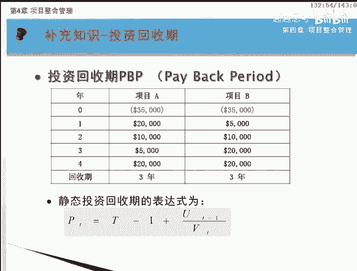

我们来看一个计算静态投资回收期的例题，如表格的第二行所示，在该项目中，从第0年开始到第3年，每年的净现金流量分别为-525，125，300和400，如表格的第三行所事，从第0年开始到第3年。

净现金流量累计值分别为-525，-400，负一百三百，第2年末累计净现金流量为负的100，第3年末累计净现金流量为正的300，说明第3年开始盈利，根据刚才介绍计算静态投资回收期的公式，回收期等于2年。

加上100÷400，等于2。2，5年约等于27个月，p m p考试中不会出现这样复杂的计算题，我们了解即可，我们来学习投资回报率，投资回报率，roi是指通过投资而应返回的价值。

企业从一项投资性商业活动的投资，中得到的经济回报，投资回报率考虑了整个项目的投资收益状况，投资回报率的计算方法非常简单。

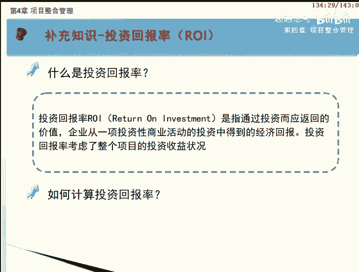

投资回报率，roi等于年利润或年均利润，除以投资总额乘以百分之百，从公式可以看出，企业可以通过降低销售成本，提高利润率，投资回报率能反映投资中心的综合盈利能力，因而具有横向可比性。

有利于判断各投资中心经营业绩的优劣，此外投资回报率可以作为选择投资机会的依据，有利于优化资源配置，我们来看一个关于投资回报率的例题，表格中显示了项目a和项目b从第0年，也就是当年到第4年的净现金流。

我们看到两个项目的投资都是35000元，4年累计的收入均为55000元，利润为两块，所以r o i为20000÷35000乘以百分之百，等于57。1%。

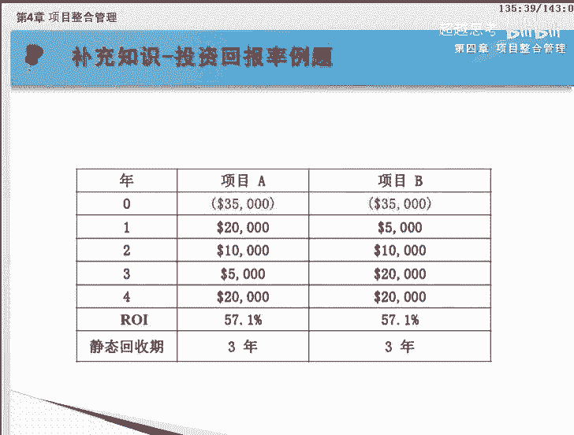

这里是对各种项目选择指标的小结，npv净现值涉按一定的折现率，将各年净现金流量折现到同一时点的现值，累加值，np v考虑了风险，如通货膨胀率，npv的选择标准是越大越好，i i2 ，内部收益率。

是一个项目净现值等于零时的投资收益率，即项目现金流入量，现值等于现金流出量现值时的折现率，i i2 表现了生命期内项目的相对获利能力，选择标准是i r2 越大越好，回收期分动态静态两种。

是指收回成本所需的时间，反映投资的回收速度，回收期越短越好，r i投资利润率是用利润除以投资li越大越好，还有一个概念是bc 2，收益成本分期用收益除以成本，是指每投资一美元所获得的收益。

注意收益不一定是金钱，收益成本比越大越好，如果对项目a或b进行二选一，那么就选择净现值大的，内部收益率大的和收益成本比高的项目，以及投资回收期短的项目，比如行情二项目a的内部收益率是13%。

项目b的内部收益率是17%，当然选择b在pmp考试中，如果遇上了这样一种情况，即项目a的净现值是95000美元，但同时内部收益率是13%，而项目b的净现值是75000美元，而内部收益率是17%。

那么根据优先考虑净现值大的原则，选择项目a进行投资，其他指标出现矛盾的考题，几乎没有，如果有，还是坚持净现值大的原则。

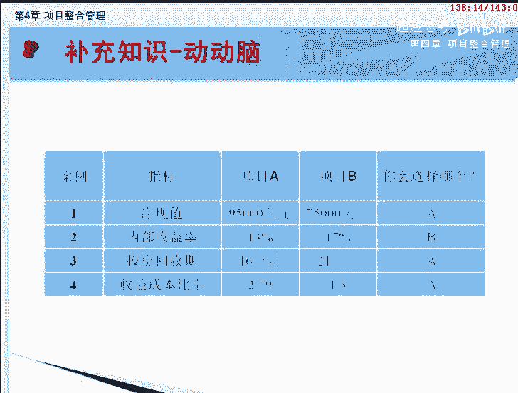

各位学员，恭喜您已经完成了第四章项目整合管理，这一知识领域的学习建议，接下来继续学习，第五章项目范围管理。

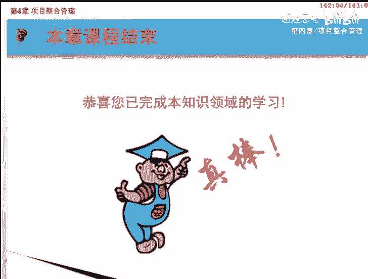