# PMP第五版PMBOK5完整培训视频教程 项目管理 - P7：07 - 超越思考 - BV1NY4y1U7s2

欢迎来到pmp项目管理网络课程的学习，本课程基于最新发布的pmbok指南第五版，下面我们将一起学习第七章项目成本管理，项目成本管理知识领域，有资格过程分散在规划过程组和监控过程组中。

在这一章我们要重点学习，项目成本管理的这四个过程，分别是规划过程组的规划成本管理，估算成本和制定预算共三个规划过程，还有控制过程组的控制成本过程，这四个过程不但彼此互相作用。

而且还与其他知识领域中的过程相互作用，请务必记下来，此外在学习的过程中，大家还要格外注意，每个过程所使用的工具和技术，他们也是本章的重点内容，那么什么是项目成本管理呢，项目成本管理包含位置。

项目在批准的预算内完成，而对成本进行规划估算，预算融资筹资管理和控制的各个过程，成本管理的目的是，确保项目在批准的预算内完工，项目成本管理要关注两种成本，一个是要重点关注，完成项目活动所需资源的成本。

但同时也应该考虑项目决策对项目，产品服务或成果的使用成本，维护成本和支持成本的影响，例如在设计阶段减少审查的次数，可降低项目成本，但可能导致产品运营成本的增加，在项目成本管理中有几点需要注意。

第一是需要考虑该系人对成本信息的特殊需求，不同的干些人会在不同的时间，用不同的方法核算项目成本，因此对于项目团队来说，在项目成本管理中应该考虑哪些干系人，需要了解哪些项目阶段的成本情况。

第二是项目团队应该在项目规划的早期，就对成本管理进行规划，并完成项目成本管理计划，已建立各项目成本管理过程的基本框架，从而确保各过程的有效性及其之间的协调性，按照pmbok指南第五版。

项目成本管理主要通过四个过程完成，首先要制定项目成本管理计划，这是进行成本管理的基础，之后如果是小项目，可以直接对项目活动进行成本估算，如果项目比较大，则可能需要针对工作分解结构中的工作包。

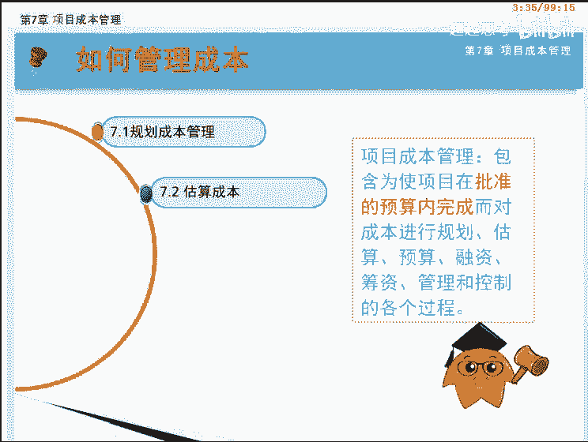

进行估算，在制定预算过程中，需要用合理的方法，对各活动或工作包成本的汇总结果，进行交叉验证，并做必要的调整，在项目整个过程中，需要使用控制成本过程，监督项目状态，已更新项目成本管理。

成本基准变更的过程可见跟时间管理一样，工作分解结构也是项目成本管理的重要依据，成本估算和成本预算之间的联系非常紧密，在一些范围较小的项目中，估算成本和制定预算，这两个过程可视为同一个过程。

甚至可以由同一个人在较短的时间内完成，需要注意的是，项目管理团队提前完成的成本管理计划，可以对规划组织估算预算和控制项目成本，统一格式，建立准则，本课程我们将一起学习第七章。

项目成本管理知识领域的第一节规划，成本管理。

通过本课程的学习，我们将要达到以下目标，包括掌握规划成本管理过程的含义与作用，了解规划成本管理过程使用的分析技术，掌握成本管理计划的含义与内容。

本课程我们将按照如画面所示的大纲为您讲述，首先是对成本管理计划以及规划。

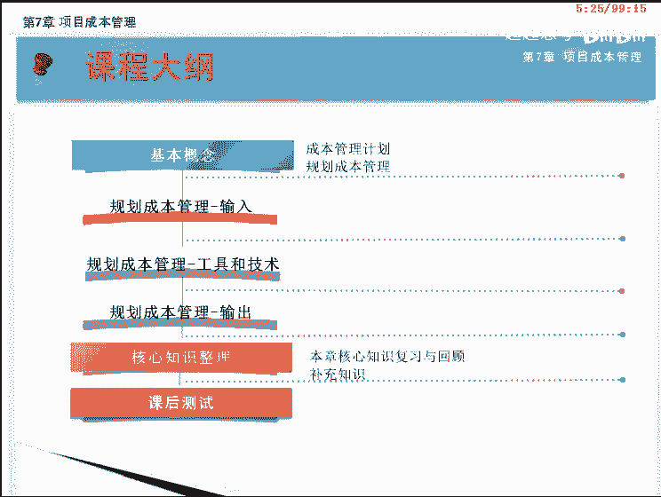

成本管理过程的基本含义进行讲解，接下来分析规划成本管理过程的输入，工具和技术以及输出课程的，最后由本课核心知识整理，在学习规划成本管理过程之前，我们先来了解两个基本概念，成本管理计划和规划成本管理。

成本管理计划是项目管理计划的组成部分，描述将如何规划安排和控制项目成本，成本管理过程及其工具与技术，应记录在成本管理计划中，成本管理计划中应作如下规定，计量单位需要规定每种资源的计量单位。

例如用于测量时间的人时数，人天数或周数，用于计量数量的米升吨千米或立方米，或者用货币表示的总价精确度，根据活动范围和项目规划设定成本估算，向上或向下取整的程度，例如100。49美元取整为100美元。

995。59美元取整为1000美元。

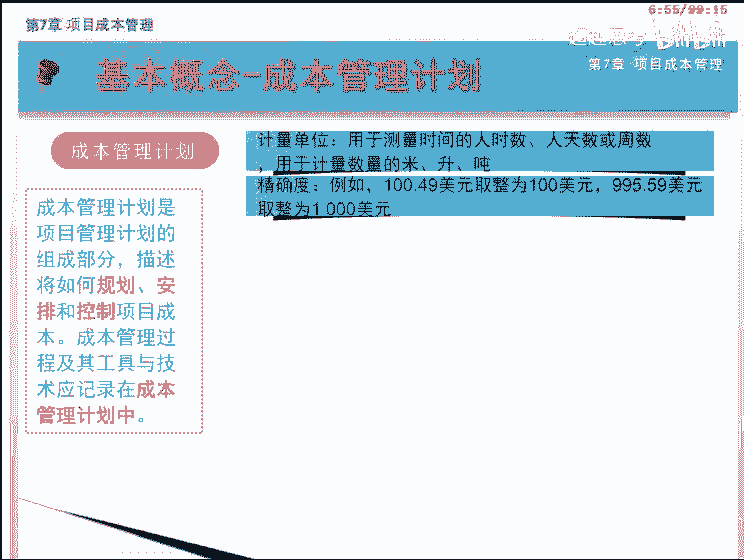

准确度为活动成本估算规定一个可接受的区间，如正-10%，其中可能包括一定数量的应急储备，组织程序链接工作分解结构，为成本管理计划提供了框架，以便据此规范的开展成本估算，预算和控制。

在项目成本核算中使用的wb s组件，称为控制账户，每个控制账户都有唯一的编码或账号，直接与执行组织的会计制度相联系，控制临界值可能需要规定偏差，临界值用于监督成本绩效，它是在需要采取某种措施前。

允许出现的最大偏差，通常用偏离基准计划的百分数来表示，绩效测量规则需要规定，用于绩效测量的正职管理规则，应包括定义w bs中用于绩效测量的控制账户，确定你用的正值测量技术。

并规定跟踪方法和用于计算项目完工估算，eac的正值管理公式，报告格式需要规定，各种成本报告的格式和编制频率，过程描述，对其他每个成本管理过程进行书面描述，其他细节是关于成本管理活动的，其他细节。

包括对战略投资方案的说明，处理汇率波动的程序以及记录项目成本的程序，规划成本管理，是为规划管理花费和控制项目成本而，制定政策程序和文档的过程。

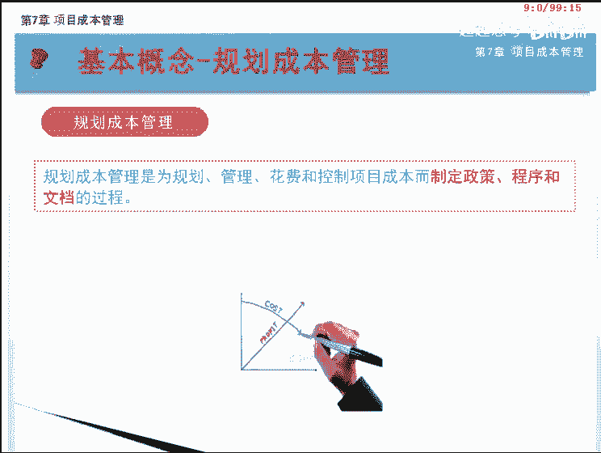

本课程的主要作用是在整个项目中，为如何管理项目成本提供指南和方向，接下来让我们来看看成本管理计划，是如何被制定出来的，规划，成本管理，就是依据项目管理计划中已有的子计划，结合项目章程。

使用专家判断和分析技术，得到最终的子计划，成本管理计划，这是规划成本管理过程的数据流向图，可以看到该过程通过输入，输出与其他过程进行交互。

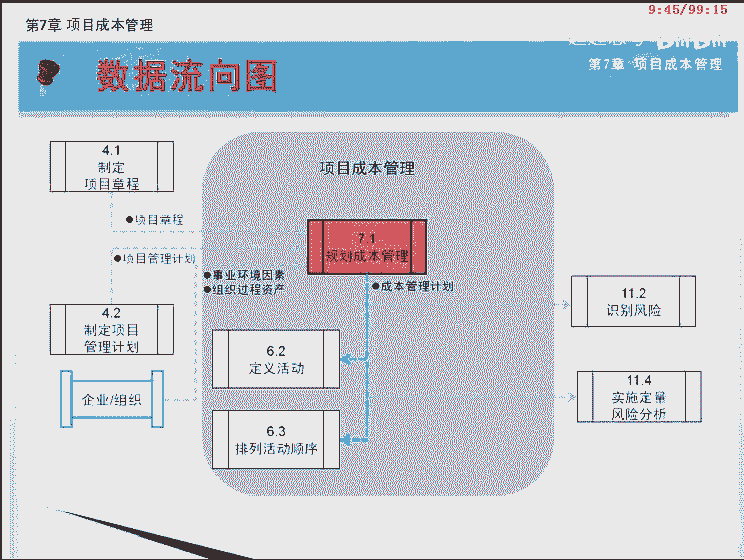

规划成本管理过程共有四个输入，分别是项目管理计划，项目章程，事业环境因素以及组织过程资产，下面我们依次来了解他们。

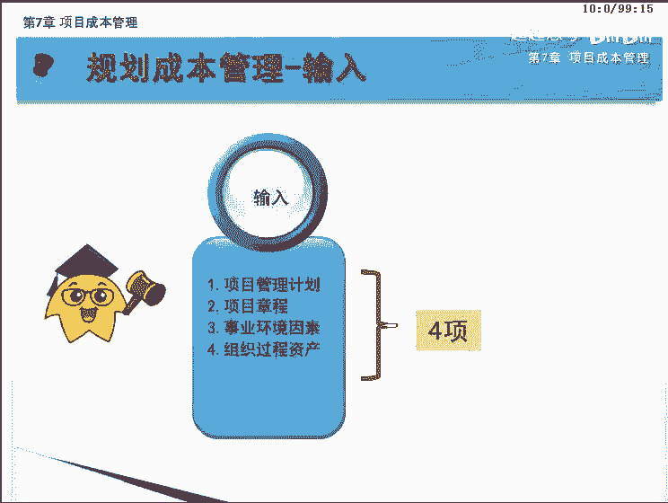

第一个收入是项目管理计划，项目管理计划中用以制定成本管理计划的信息，包括范围基准，范围基准，包括项目范围说明书和w p s详细信息，可用于成本估算和管理进度基准，进度基准定义了项目成本将在何时发生。

其他信息，项目管理计划中，与成本相关的进度风险和沟通决策等信息。

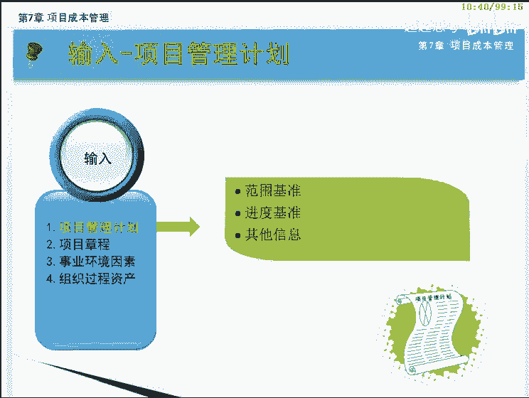

项目章程规定了项目总体预算，可据此确定详细的项目成本，项目章程所规定的项目审批要求，也对项目成本管理有影响。

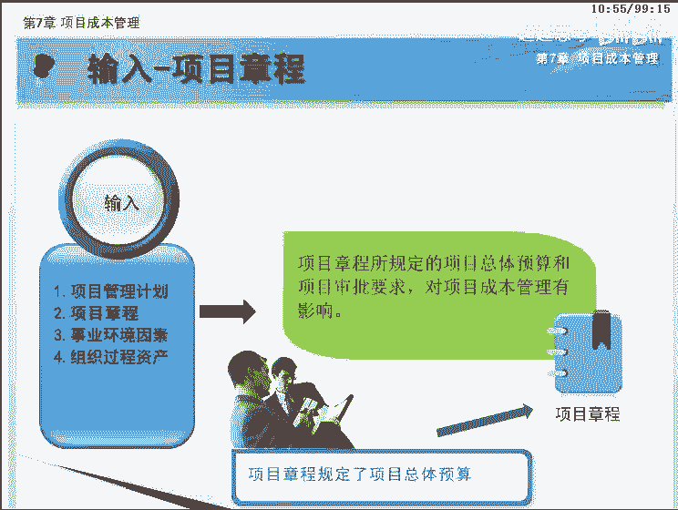

会影响规划成本管理过程的事业环境因素，包括能影响成本管理的组织文化和组织结构，市场条件，这决定着在当地及全球市场上，可获取哪些产品服务和成果，货币汇率用于换算发生在多个国家的项目成本，发布的商业信息。

经常可以从商业数据库中获取，资源成本费率及相关信息，项目管理信息系统可为管理成本提供多种方案。

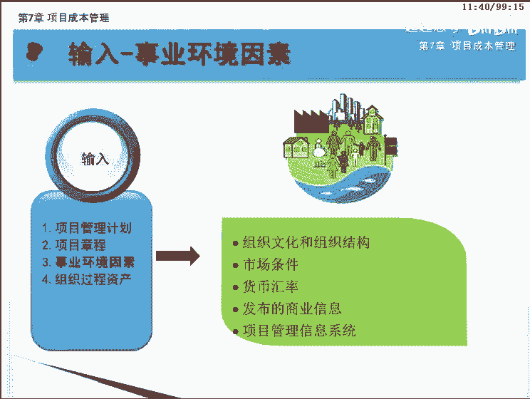

会影响规划成本管理的组织过程，资产包括财务控制程序，如定期报告费，用于支付，审查会计编码及标准合同条款等，历史信息和经验教训知识库，财务数据库，现有的正式的和非正式的。

与成本估算和预算有关的政策程序和指南。

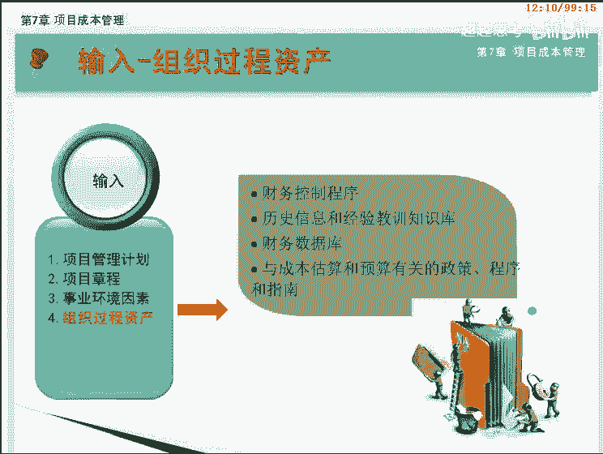

规划成本管理这个过程有三个工具与技术，分别是专家判断，分析技术和会议。

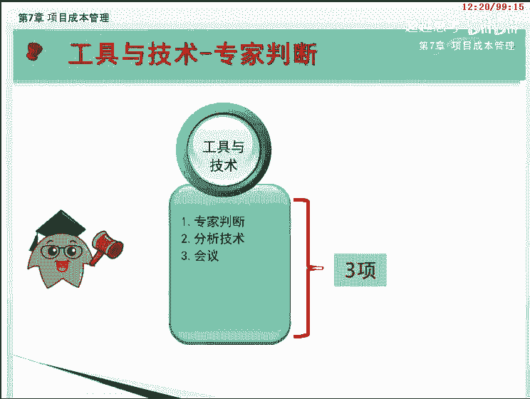

我们一块来学习，先来看专家判断，基于历史信息，专家判断，可以对项目环境及以往类似项目的信息，提供有价值的见解，专家判断还可以对是否需要联合使用多种方法，以及如何协调方法之间的差异提出建议。

针对正在开展的活动，基于某种应用领域，知识领域，学科行业等的专业知识而做出的判断，应该用于制定成本管理计划，分析技术是一类技术的统称，在制定成本管理计划时，可能需要选择项目投资的战略方法，如自筹资金。

股权投资，借贷投资等，成本管理计划中可能也需详细说明，筹集项目资源的方法，如自制采购，租用或租赁组织政策和程序，可能影响采用哪种财务技术进行决策，可用的技术包括回收期，投资回报率，内部收益率。

现金流贴现和净现值等。

项目团队可能举行规划会议，来制定成本管理计划，参会人员可能包括项目经理，项目发起人选定的项目团队成员，选定的干系人，项目成本负责人以及其他必要人员。

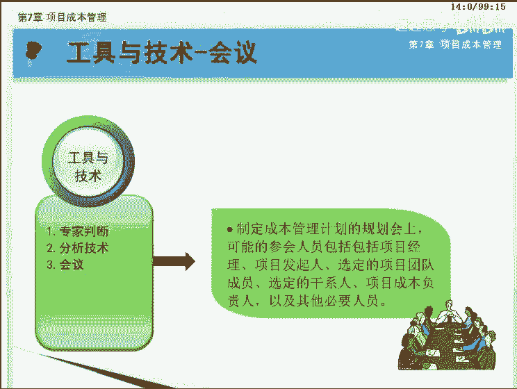

规划成本管理过程的输出是成本管理计划，在本过程开始的基本概念里面已经介绍过。

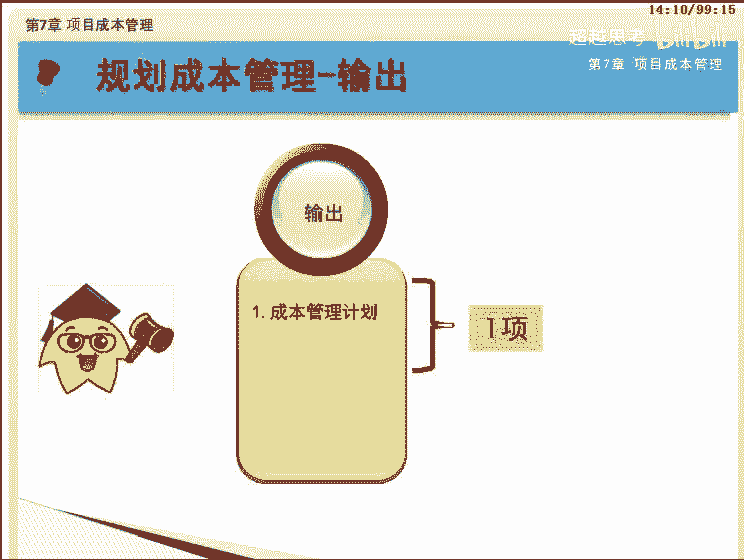

现在我们来回顾一下本过程的核心知识，规划成本管理，在整个项目中对如何管理成本提供指南和方向，成本管理计划是项目管理计划的组成部分，描述将如何进行项目成本管理。

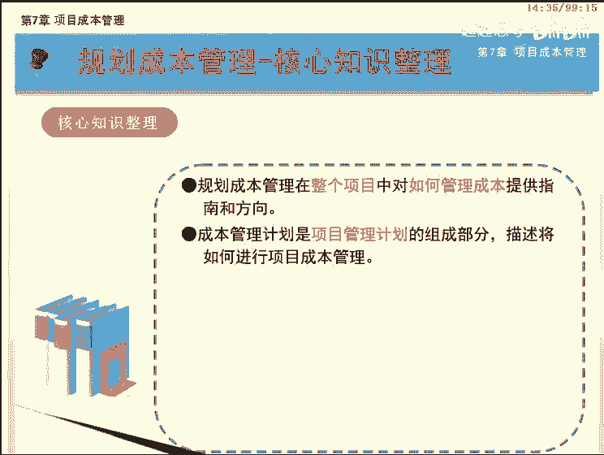

成本管理计划中应该对项目中的计量单位，精确度，准确度等作出规定，还应指明与成本相关的控制临界值，制定成本管理计划的规划，会上可能需要各方面的干净人参与，恭喜你完成了规划成本管理过程的学习，我们下节课见。

本课程我们将一起学习第七章，项目成本管理知识领域的第二节估算成本。

通过本课程的学习，我们将要达到以下目标，熟悉估算成本的定义，并了解估算的内容，理解估算的精确等级的含义，掌握自下而上估算的含义和用法，熟记估算的支持信息，包含的内容，熟记本课程的输入工具于技术及输出。

理解本过程中的p m i思维。

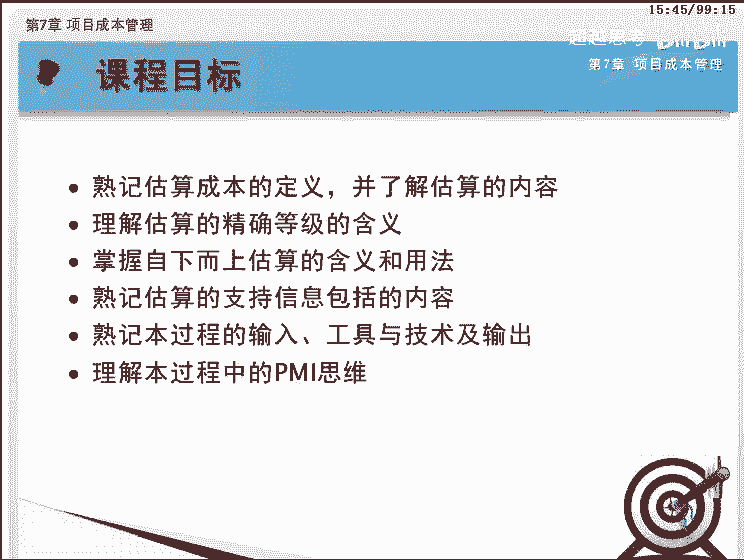

本课程我们将按照如画面所示的大纲为您讲述，首先是对估算成本的概念进行讲解，接下来是估算成本过程的输入，然后学习这个过程中所需要的，不同的工具和技术，接下来我们会仔细为您讲解，估算成本过程的输出。

课程的最后是本课核心知识整理。

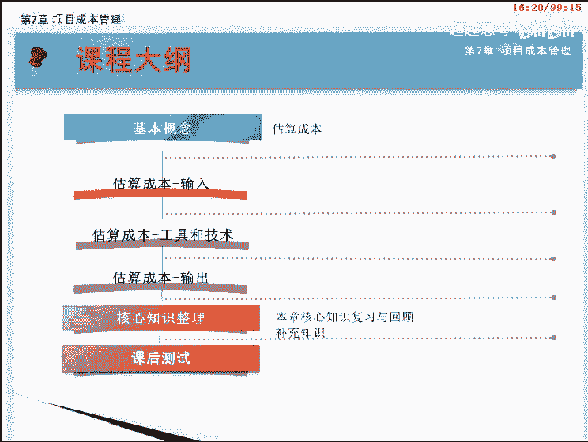

在学习本过程之前，我们先来学习估算成本的基本概念，估算成本是对完成项目活动所需资金，进行近似估算的过程，本课程的主要作用是，确定完成项目工作所需要的成本数额，成本估算是在某特定时点。

根据已知信息所做出的成本预测，为了优化项目成本，在估算成本时需要识别和分析，用于启动与完成项目的备选成本方案，还要权衡备选成本方案并考虑风险，如比较自制成本与外购成本。

购买成本与租赁成本及多种资源共享方案，以优化项目成本，估算成本时所使用的单位通常用某种货币单位。

如美元，欧元，日元等进行成本估算，但有时也可采用其他计量单位，如人时数或人天数，以消除通货膨胀的影响，便于成本比较。

在项目生命周期中，项目估算的准确性，将随着项目的进展而逐步提高，包括启动阶段的粗略级估算和，规划后期的确定性估算，进行成本估算，应该考虑将向项目收费的全部资源，包括人工材料，设备，服务设施。

以及一些特殊的成本种类，如通货膨胀补贴，融资成本或应急成本，成本估算，是对完成活动所需资源的可能成本的量化评估，成本估算可在活动及呈现，也可以汇总形式呈现。

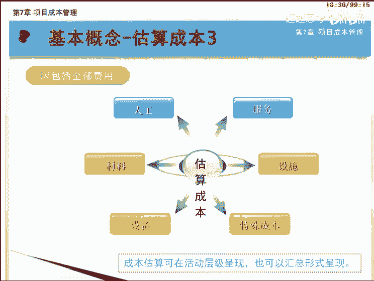

接下来让我们来看看如何估算成本，该过程在成本管理计划的指导下，以范围基准为基础，参照人力资源管理计划和项目进度计划，使用专家判断类比，估算参数估算等估算技术，利用项目管理软件生成活动的成本估算。

这是估算成本过程的数据流向图，可以看到该过程通过输入，输出与其他过程进行交互，估算成本过程共有七个输入，它们是成本管理计划，人力资源管理计划，范围基准项目进度计划，风险登记册，事业环境因素和组织过程。

资产。

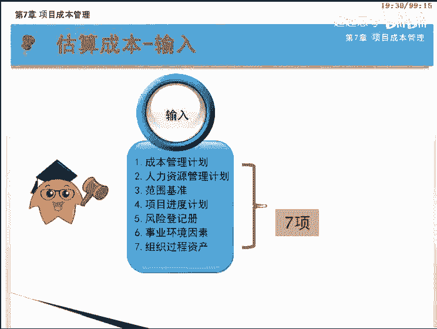

成本管理计划规定了如何管理和控制项目成本，包括估算活动成本的方法和需要达到的准确度，因此估算成本的时候。

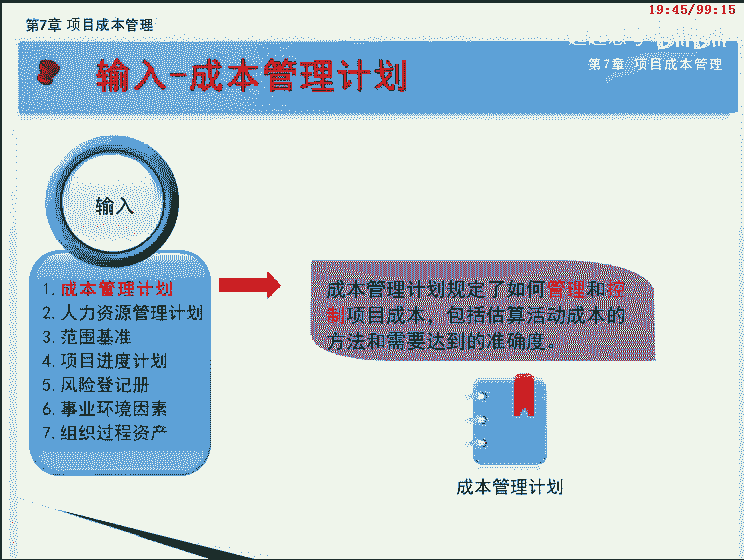

主要的参考计划就是成本管理计划，人力资源管理计划是组建项目团队过程的输出，提供了项目人员配备情况，人工费率和相关奖励认可方案，是制定项目成本估算时必须考虑的因素，从创建w bs过程。

我们知道范围基准包括三方面的内容及，范围说明书，工作分解结构和工作分解结构词典，这三者的含义我们已经很清楚了，但是范围基准是如何影响成本的估算呢，范围说明书提供了产品描述，验收标准，主要可交付成果。

项目边界，特别是项目的假设条件和制约因素，这些会直接影响成本估算过程，另外在估算项目成本时，必须首先确定估算将仅限于直接成本，还是也包括间接成本，wb和wb s词典，也是估算成本的一个重要的依据。

需要根据wb s组成部分，和可交付成果之间的关系，以及w p s元素的详细信息，来估算各个项目活动所需的成本，项目进度计划，记录了进度活动所需的资源及其使用时间，这是估算成本过程的重要收入。

因为项目工作所需的资源种类数量和使用时间，都会对项目成本产生很大影响，在估算成本时，需要通过审查风险登记册，考虑应对风险所需的成本，风险既可以是威胁，也可以是机会，通常会对活动及整个项目的成本产生影响。

一般而言，在项目遇到负面风险事件后，项目的近期成本将会增加，有时还会造成项目进度延误，同样项目团队应该对可能给业务带来好处，如直接降低活动成本，或加快项目进度的潜在机会保持敏感。

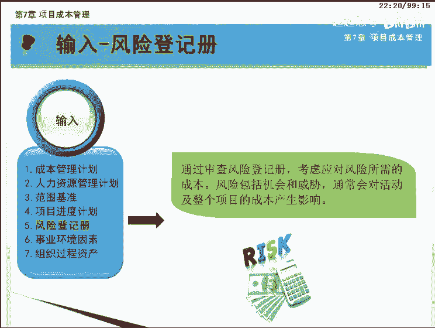

会影响估算成本过程的事业环境因素，包括市场条件，可以从市场上获得什么，产品服务和成果可以从谁那里以什么条件获得，发布的商业信息，经常可以从商业数据库中获取资源成本，费率及相关信息，这些数据库动态跟踪。

具有相应技能的人力资源的成本数据，也提供材料与设备的标准成本数据，还可以从卖方公布的价格清单中获取相关信息，会影响估算成本过程的组织过程，资产包括成本估算政策，成本估算模板。

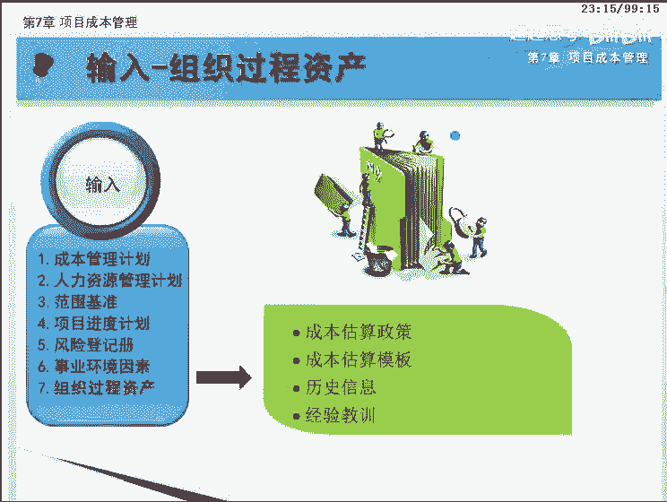

历史信息以及经验教学估算成本，这个过程有十个工具和技术，分别是专家判断类比估算，自下而上，估算三点，估算储备分析，质量成本，项目管理软件，卖方投标分析以及群体决策技术，下面我们来一块学习。

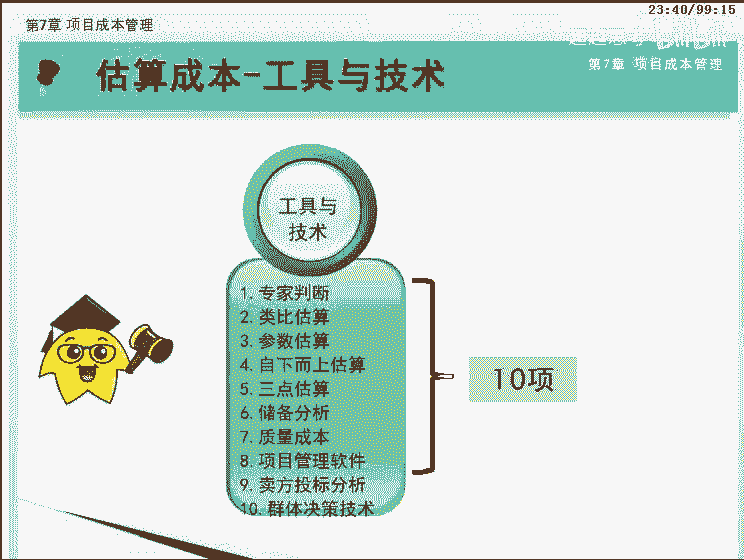

基于历史信息，如人工费率和通货膨胀等，专家判断，可以对项目环境及以往类似项目的信息，提供有价值的见解，专家判断还可以对是否联合使用多种估算方法，以及如何协调方法之间的差异作出决定，成本类比估算。

是指以过去类似项目的参数值或规模指标，为基础来估算当前项目的同类参数或指标。

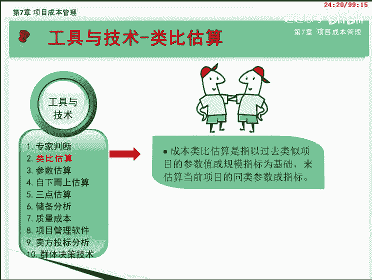

类比估算是粗略估算技术，常在项目早期信息不足时使用，它的特点是成本低，耗时少，但准确性低，该方法综合利用了历史信息和专家判断，参数估算，我们在上一个知识领域也介绍过，在估算成本时。

可以利用历史数据之间的统计关系，和其他变量来进行估算，参数估算的准确性，取决于参数模型的成熟度和基础数据的可靠性，参数部分，可以针对整个项目或项目中的某个部分，自下而上估算。

是对工作组成部分进行估算的一种方法，可在项目规划中后期使用，估算成本相对较多，耗时长，准确性也较高。

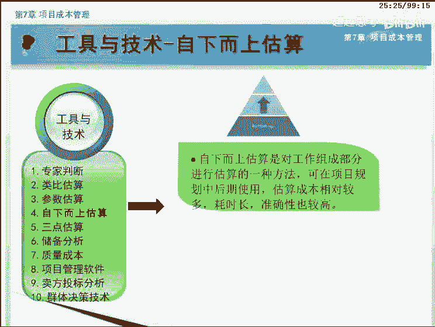

再把w bs分解为更细化的部分的基础上，对单个工作包或活动成本，进行最具体细致的估算，然后把这些细节性成本向上汇总，或滚动到更高层次，得到总投入，用于后续报告和跟踪。

自下而上估算法的准确性及其本身所需的成本，取决于丹戈尔活动，我工作包的规模和复杂程度，三点估算，这种技术，我们在前一章估算活动持续时间时用到过，它也可以用于估算成本，通过考虑估算中的不确定性与风险。

使用三种估算值来界定活动成本的近似区间，最可能成本cm。

对所需进行的工作和相关费用进行比较，现实的估算，所得到的活动成本最乐观成本ceo，基于活动的最好情况所得到的活动成本，最悲观成本cp，基于活动的最差情况所得到的估算成本，根据最新的pmbok指南第五版。

基于三个基础值，可以使用两个常用公式来计算预期成本，c3 角分布的公式是c e等于co，加上cm加上cp除以三，贝塔分布的公式是c e等于co加上四倍的cm，加上cp除以六偏僻。

考试时要特别留意题目要求的计算方法，默认情况下建议采用贝塔分布的计算公式，因为它源自传统的pro的技术，到现在为止，我们学过的有关估算的典型工具与技术，有类比估算，自下而上估算参数估算和专家判断。

类比估算速度快，成本低，但估算结果不是很准确，一般归于自上而下的估算范畴，自下而上估算基于项目的实际情况，精度高，但费时耗力，参数估算虽然简单灵活，但在很大程度上都依赖于所建立的参数，模型和数据质量。

专家判断可在信息不足时使用，但依赖于专家的主观看法，容易产生偏见，画面中是对这几种估算技术的优缺点，做的详细比较，需要仔细阅读并回顾，这几种工具技术的含义和用法，需要深入了解这几种工具技术。

因为这是考试必考的内容，为了应对成本方面的不确定性，往往需要预留一些成本，这就是储备分析应该回答的问题，储备可以分为应急储备和管理储备，我们下面会详细解释，先来看应急储备的概念。

应急储备是包含在成本基准内的一部分预算，用来应对已经接受的以识别风险，以及已经制定应急或减轻措施的，以识别风险，应急储备与已知已知风险相关需要，加以合理估算，用于完成未知的工作量。

随着项目信息越来越明确，可以动用，减少或取消应急储备。

下面我们再来看管理储备的概念，管理储备是为管理控制的目的，而特别流出的项目预算，用来应对项目范围中不可预见的工作，管理储备用来应对会影响项目的未知未知风险，管理储备不包括在成本基准中。

但属于项目总预算和资金需求的一部分，使用管理储备可能需要变更成本基准，成本质量是为保证质量符合要求，而付出成本的一种方法，在估算活动成本时，可能要用到关于质量成本的各种假设。

这种技术我们会在第八章项目质量管理的规划，质量管理过程中深入讲解，项目管理软件能简化某些成本估算技术的使用，使人们能快速考虑多种成本估算方案，项目管理软件包括项目管理应用软件，电子表单模拟和统计工具等。

可用来辅助成本估算，在成本估算过程中，可能需要根据合格卖方的投标情况，分析项目成本。

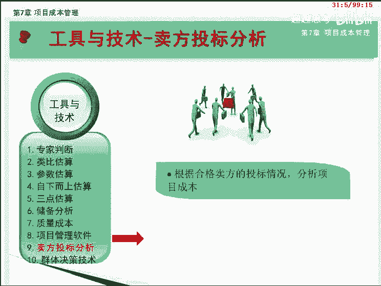

这种技术就是卖方图标分析，在用竞争性招标选择卖方的项目中，项目团队需要开展额外的成本估算工作，以便审查各项可交付成果的价格，并计算出组成项目最终总成本的各分项成本，群体决策技术。

是估算成本时可以利用的一类技术，主要指基于团队的方法，如我们前面介绍过的头脑风暴德尔菲技术，或名义小组技术，这些方法可以调动团队成员的参与，以提高估算的准确度，并提高对估算结果的责任感。

选择一组与技术工作密切相关的人员，参与估算过程，可以获取额外的信息，得到更准确的估算，另外让成员亲自参与估算，能够提高他们对实现估算的责任感，估算成本过程共有三个输出，分别是活动成本估算。

估算依据以及项目文件更新，下面我们逐一介绍。

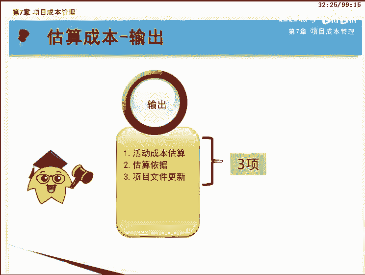

活动成本估算，是对完成项目可能需要的成本的量化估算，在形式上对活动成本的估算可以是汇总的，也可以是详细分裂的，在内容上，对活动成本的估算，应该覆盖活动所使用的全部资源，比如人工材料。

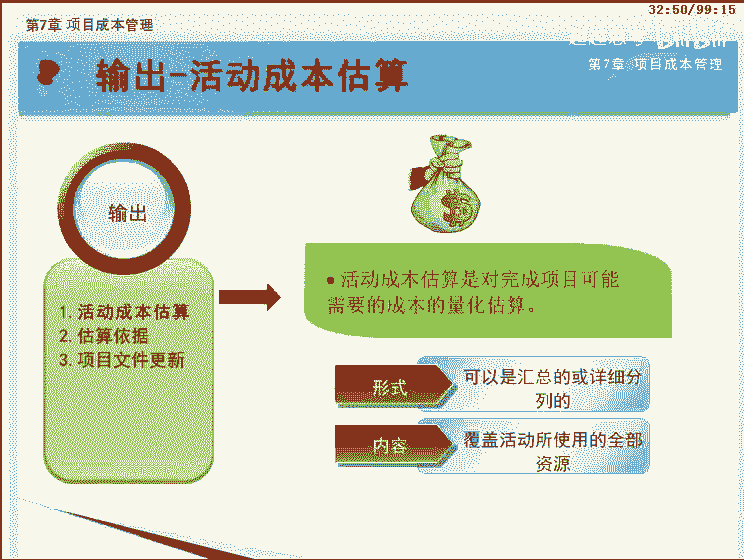

设备，特殊的成本种类等，如果对活动成本的估算还涉及到间接成本，可以在w b s中的活动层次或者更高的层次上，比如工作包等来估算间接成本，成本估算所需的支持信息的数量和种类，可能会因应用领域而异。

不管其详细程度如何，支持文件，都应该能清晰完整地说明，成本估算是如何得出的，具体来说，用于支持活动成本估算的信息，包括关于估算依据的文件，比如估算是如何编制的，关于全部假设条件的文件。

比如假设年通货膨胀率是40%，关于各种已知制约因素的文件，如有限的项目预算等等，对估算的区间说明，比如1万美元加减10%，就说明了预期成本的所在区间为，9000美元到11000美元之间。

还有对最终估算的置信水平的说明，比如98%的可信度等，在估算成本过程可能需要更新的项目文件，包括风险登记册等。

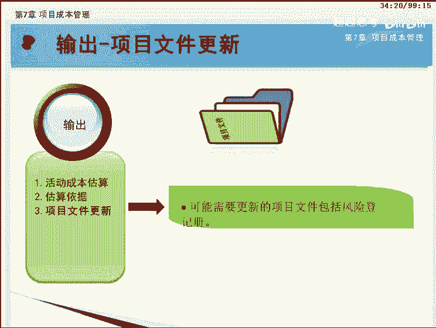

本课程的主要内容到此完毕，现在我们来回顾一下本过程的核心知识，估算成本是对完成项目活动所需资金，进行近似估算的过程，估算成本的目的，是确定完成项目工作所需的成本数额，在项目生命周期中，项目估算的准确性。

将随着项目的进展而逐步提高，进行成本估算，应该考虑将向项目收费的全部资源。

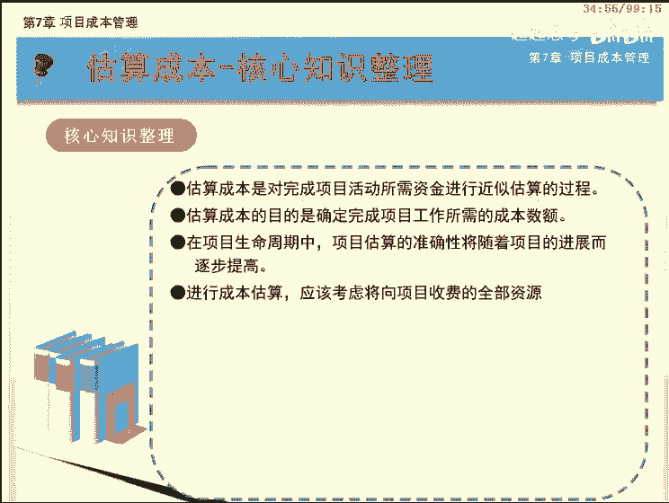

自下而上估算，是对工作组成部分进行估算的一种方法，可在项目规划中后期使用，预留的储备，可以分为应急储备和管理储备，随着项目信息越来越明确，可以动用，减少或取消应急储备，活动成本估算。

是对完成项目可能需要的成本的量化估算，恭喜你完成估算成本过程的学习，我们下节课见，本课程我们将一起学习第七章，项目成本管理知识领域的。

第三节制定预算，通过本课程的学习，我们将要达到以下目标，包括熟记制定预算的含义，理解应急储备和管理储备的区别，理解成本绩效基准，支出与资金需求之间的关系，熟记等过程的输入工具于技术和输出。

本课程我们将按照如图所示的大纲为您讲述，首先是对几个基本概念制定预算，应急储备和管理储备进行讲解，接下来分析该过程的输入，然后学习这个过程所需要的不同的工具和技术，接下来我们会仔细为您讲解该过程的输出。

课程的最后是本课核心知识整理。

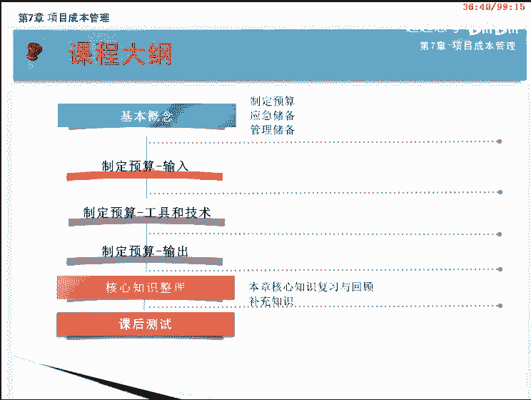

有时候特别是小项目中，估算成本和制定预算两个过程，可视为同一个过程，甚至可以由同一个人在较短的时间内完成，那么估算成本和制定预算两个过程，究竟有什么区别呢，本过程我们就来学习制定预算。

一起来分析估算成本和制定预算的异同，在学习制定预算过程之前，我们先来了解三个基本概念，制定预算，应急储备和管理储备，其中后两个概念我们在前面已经介绍过一次。

制定预算是汇总所有单个活动或工作包，的估算成本，建立一个经批准的成本基准的过程，本过程的主要作用是确定成本基准，可据此监督和控制项目绩效，制定预算的一个重要依据是工作分解结构，是根据工作分解结构。

以及分解后的活动等各个层级来进行汇总的，首先应该计算出各进度活动所需要的成本，一般由实际从事该活动的员工来做相关计算，然后将项目活动的成本汇总到它的上一层，也就是工作包得出工作包的成本。

第三步是将工作包的成本，继续向工作分解结构的上一层汇总，得到控制账户的成本，把控制账户的成本汇总起来，就得到了整个项目的成本，最后在项目成本的基础上，还要加上一定的不可预见的费用及应急储备。

在这些费用得到批准后，才能得到项目的成本基准，也就是成本预算，我们再一次详细解释应急储备的概念，应急储备是为未规划但可能发生的变更，提供的补贴，这些变更由风险登记册中所列的，已知的未知风险引起。

也就是预期但不确定的风险事件，应急储备的开支由项目经理掌握，项目经理可不经高级管理层或项目发起人批准，便可使用该应急储备，应急储备主要用于估算成本过程，关于已知的未知风险和未知的未知风险。

我们在风险管理中再详细讲解，而管理储备则是为未规划的范围变更，与成本变更而预留的预算，管理储备针对的风险是完全未知的，称为未知的未知风险，即项目管理团队根本不知道这个风险是否发生，也就是风险事件。

不知道管理储备由项目所在组织控制，项目经理如果要使用管理储备，必须得到高级管理层或项目发起人的批准，管理储备主要用于制定预算，不属于成本基准，也不纳入后面要讲的正值计算。

一般来说多数项目不需要动用管理储备，但一旦动用，需要投入的资金储备量会很多。

画面中的表是对应急储备和管理储备，在所属过程，应对世界类型等方面做的一个比较，请自己对比记忆理解，需要注意的是，应急储备属于成本基准，而管理储备不属于成本基准，但它属于项目总预算的范围。

成本基准加上管理储备才是项目总预算，接下来让我们来看看如何制定预算，该过程在成本管理计划的指导下，利用活动成本估算的结果，结合范围基准及清除计划，同时还要把风险考虑进来，再利用成本汇总，储备分析等技术。

最终形成成本基准，这是制定预算过程的数据流向图，可以看到，该过程通过输入输出与其他过程进行交互，制定预算过程共有九个输入，分别是成本管理计划范围，基准活动，成本估算，估算依据，项目进度计划，资源日历。

风险登记册协议和组织过程资产，下面我们依次来介绍。

成本管理计划来自规划，成本管理过程描述将如何管理和控制项目成本。

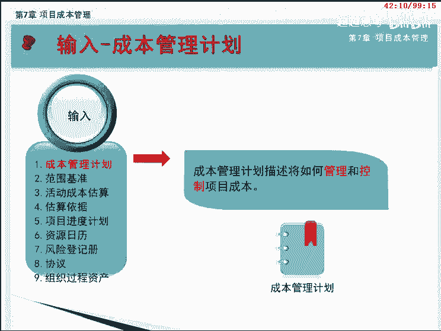

从创建wb s过程，我们知道范围基准包括三方面的内容及范围，说明书，工作分解结构和工作分解结构词典，这三者都会影响预算的制定，首先项目范围说明书中的资金制约因素，包括组织协议或其他机构。

可能对项目资金支出施加正式的阶段性限制，还有工作分解结构，w b s指明了项目全部可交付成果，及其各组件之间的相互关系，最后在wb s词典和相关的工作详细说明中，列出了可交付成果。

并描述了为产出可交付成果，w bs各组件所需进行的工作，以上这些都会影响预算的制定，活动成本估算和估算依据来自于估算成本过程，活动成本估算是指各种工作包内，每个活动的成本估算。

汇总后得到各工作包的成本估算，估算依据，列出了在估算依据中包括的基本假设条件，项目进度计划包括项目活动里程碑，工作包和控制账户的计划，开始和完成日期，可根据这些信息，把计划成本和实际成本。

汇总到相应的日历时段中，资源日历来自于，组建项目团队过程和实施采购过程，规定了在项目期间的资源可用性，从资源日历中了解项目资源的种类和使用时间，可根据这些信息确定项目周期，各阶段的资源成本。

风险登记册来自于风险管理知识领域，应该审查风险登记册，从而确定如何汇总风险，应对成本，对风险登记册的更新包含在项目文件更新中，协议是实时采购过程的输出，在制定预算时，需要考虑将要或已经采购的产品。

服务或成果的成本以及适用的协议信息，会影响制定预算过程的组织过程，资产包括现有的正式和非正式的，与成本预算有关的政策程序和指南，成本预算工具以及报告方法，制定预算过程有五个工具和技术。

分别是成本汇总储备分析，专家判断历史关系和资金限制平衡，下面我们一块来学习。

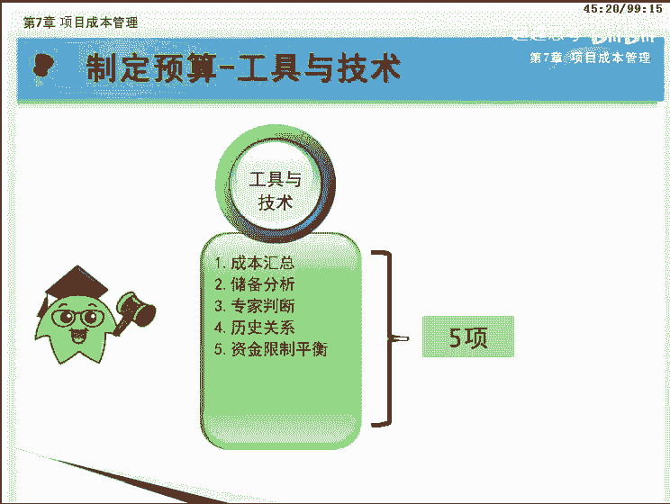

在讲解制定预算的概念时，我们已经了解了制定预算的过程，也知道了制定预算是以wb为依据，将项目活动的成本汇总起来，因此成本汇总首先以w bs中的工作包为单位，对活动成本估算进行汇总。

然后再由工作包汇总制w bs的更高层次，如控制账户等，并最终得出整个项目的总成本。

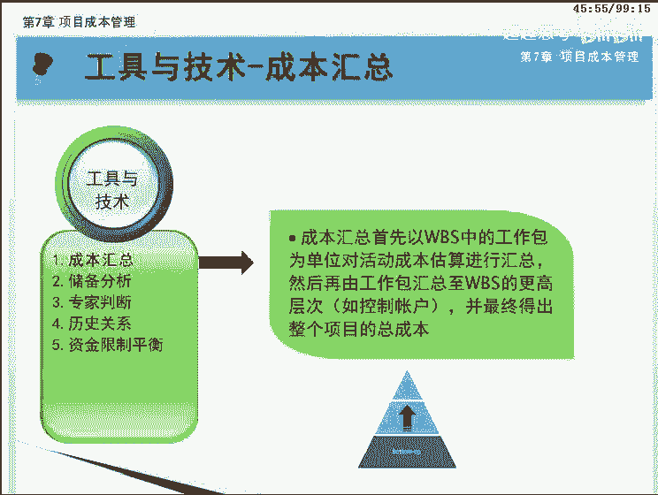

在制定预算时，通过预算储备分析，可以计算出项目的应急储备与管理储备，管理储备和应急储备的含义，我们已经在基本概念部分详细介绍过，专家判断是我们熟知的技术，基于应用领域，知识领域。

学科行业或相似项目的经验，专家判断可对制定预算提供帮助，专家判断的来源非常广，泛，可来自受过专门教育，或具有专门知识技能经验或培训经历的，任何小组或个人。

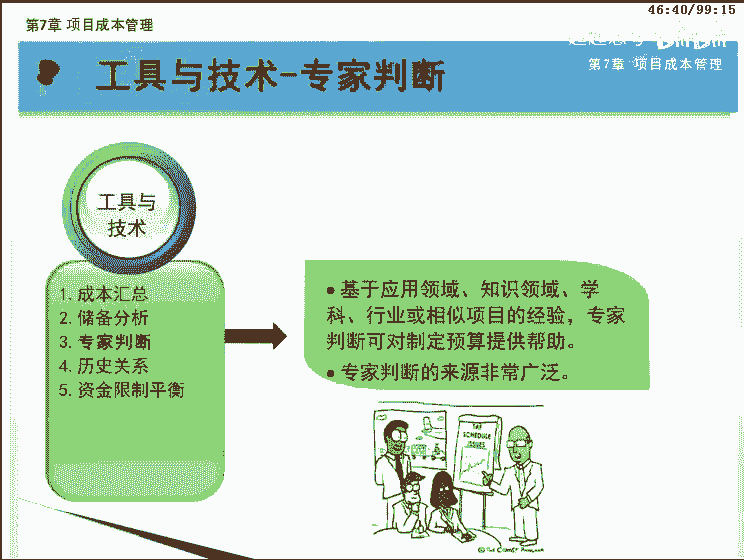

先来看什么是历史关系，在现实世界中，变量之间，可能存在一些，可据以进行参数估算或类比估算的关系，这就是历史关系，可以基于这些历史关系，利用项目特征来建立数学模型，预测项目总成本，数学模型可以是简单的。

例如建造住房的总成本取决于单位面积，建造成本也可以是复杂的，例如软件开发项目的成本模型中有多个变量，且每个变量又受许多因素的影响。

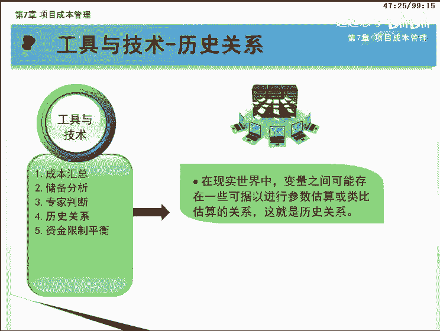

在进行类比估算或参数估算时，怎样才能使估算结果更加可靠呢，需要注意以下三点，第一用来建立模型的历史信息准确，第二模型中的参数易于量化，第三模型可以调整，以便对大项目，小项目和各项目阶段都适用。

任何项目的资金都不是没有限制的，在制定项目预算时，应该根据对项目资金的限制来平衡资金支出，如果发现资金限制与计划支出之间的差异，则可能需要调整工作的进度计划，以平衡资金支出水平。

这可以通过在项目进度计划中添加强制日期，来实现资金限制平衡，制定预算这个过程共有三个输出，它们是成本基准项目资金需求，项目文件更新，下面我们一块来学习。

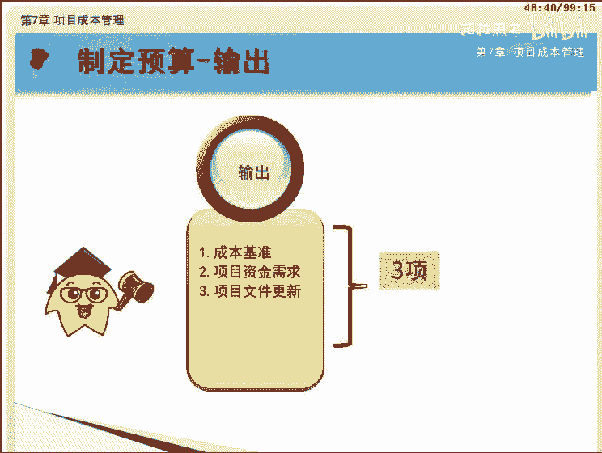

在制定预算时，把不同进度活动经批准的预算进行累加，最后可以得到整个项目的成本基准。

成本基准是经批准的，按时间段分配的项目预算，不包括任何管理储备，只有通过正式的变更控制程序才能变更，用作与实际结果进行比较的依据。

下面我们来学习项目预算和成本基准的，各个组成部分是如何得到的，先汇总各项目活动的成本估算及其应急储备，得到相关工作包的成本，然后汇总各工作包的成本估算以及应急储备，得到控制账户的成本。

在汇总各控制账户的成本，得到成本基准，最后在成本基准之上增加管理储备，得到项目预算，当出现有必要动用管理储备的变更时，曾经在获得变更控制过程的批准之后，把适量的管理储备移入成本基准中。

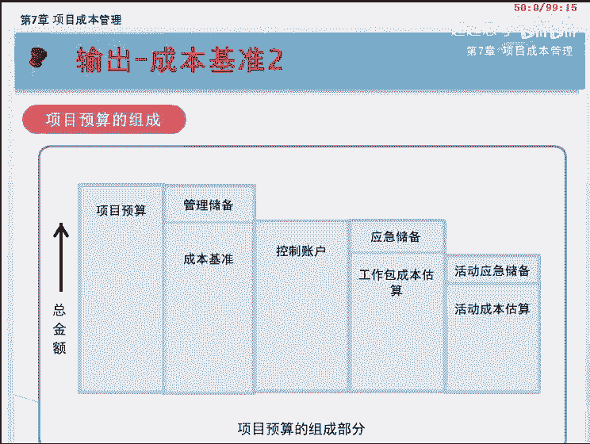

由于成本基准中的成本估算，与进度活动直接关联，因此就可按时间段分配成本基准，得到一条s曲线，因此我们需要知道成本基准不是一个具体的值，而是由按时间段连续排列的值，所组成的一条曲线，从图中我们看到。

管理储备是在基准之外的资金预算，它包含在总的项目预算中，从图中我们还可以看到，项目的实际支出超出了成本基准，但还是在项目预算之内的。

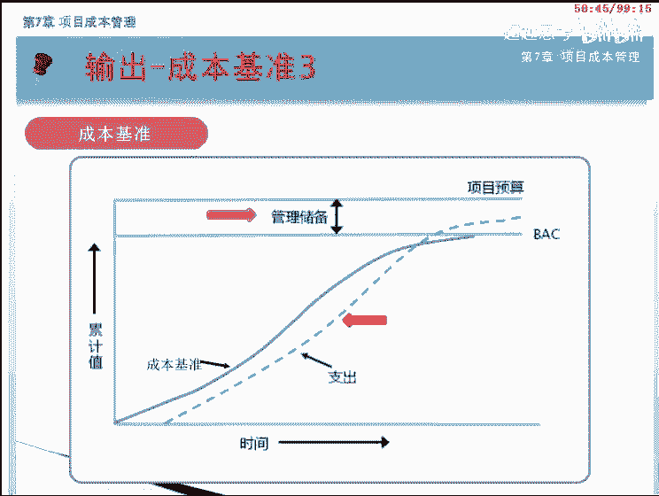

根据成本基准，确定总资金需求和阶段性资金需求，成本基准中既包括预计的支出，也包括预计的债务项目，资金通常以增量而非连续的方式投入，并且可能是非均衡的，在资金需求文件中。

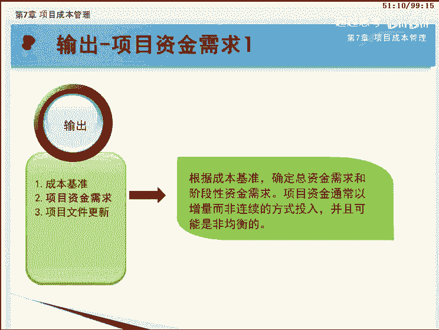

也可说明资金的来源，如图所示，红色的阶梯形线就是资金需求，如果有管理储备，则总资金需求等于成本基准加上管理储备。

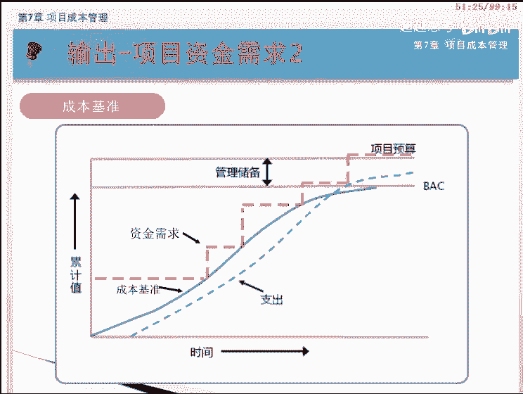

在制定预算过程可能需要更新的项目文件，包括风险登记册，活动成本估算以及项目进度计划等。

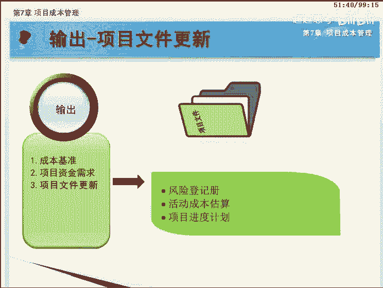

好了，现在我们来回顾一下本过程的核心知识，制定预算是汇总所有单个活动或工作包，的估算成本，建立一个经批准的成本基准的过程，应急储备是由风险登记册中所列的，已知的未知风险引起的，由项目经理掌握。

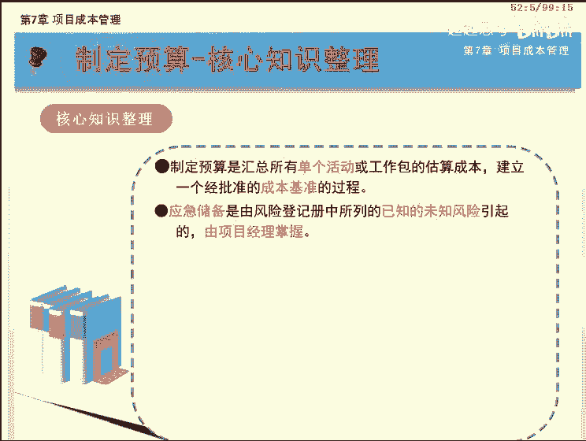

管理储备则是为未知风险准备的，项目经理如果要使用管理储备，必须得到高级管理层或项目发起人的批准，制定预算时，首先对活动成本进行汇总，然后再由工作包汇总制w bs的更高层次，最终得出整个项目的总成本。

成本基准是经过批准的，按时间段分配的，项目预算，不包括管理储备，恭喜你完成制定预算过程的学习，我们下节课见，本课程我们将一起学习第七章，项目成本管理知识领域的第四节控制成本，成本管理的四个过程。

分别分布在规划过程组和监控过程组中，在前面，我们已经学习了规划过程组中的三个过程，本节我们来学习监控过程组的监控成本过程。

通过本课程的学习，我们将要达到以下目标，包括掌握控制成本过程的含义与作用，熟记本过程的输入工具与技术以及输出，掌握政治管理的基本概念，能够根据项目所给的数据计算各种指标。

比如会对不同情况下的etc和ea c进行计算，掌握完工商学技巧指数的计算方法，并明确这些指标所表达的含义，了解正值估算的一些常用规则，本课程我们将按照如画面所示的大纲为您讲述。

首先是对控制成本这个基本概念进行讲解，接下来分析控制成本过程的输入工具和技术，以及输出课程的，最后是本课核心知识整理。

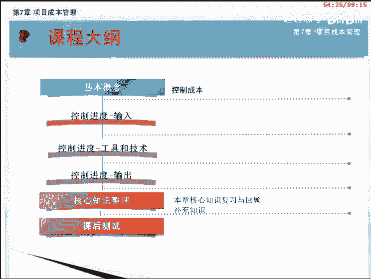

在学习本过程之前，我们先来看看什么是控制成本，控制成本是监督项目状态，已更新项目成本管理成本基准变更的过程，本课程的主要作用是发现实际与计划的差异，以便采取纠正措施，降低风险。

控制成本是实施整体变更控制的一部分，它的主要任务就是找出影响成本偏差的因素，更新项目预算管理成本基准变更，在控制成本过程中，对预算的管理要经过以下程序，首先需要记录截止目前为止的实际成本。

然后判断是否符合预算，如果符合，那么继续监控项目状态，对项目的成本进行记录，如果实际成本与预算不符合，则提交变更，只有经过实施整体变更控制过程的批准，才可以更新预算，然后继续监控项目状态，直到项目结束。

在成本控制中，应重点分析，项目资金支出，与相应完成的实体工作之间的关系，有效成本控制的关键在于，对经批准的成本绩效基准及其变更进行管理。

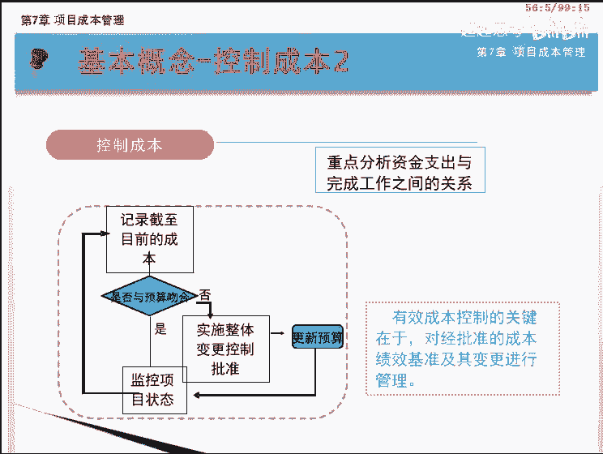

控制成本的内容，包括管理变更和管理偏差两个主要部分，管理变更的工作包括，对造成成本基准变更的因素施加影响，确保所有变更请求都得到及时处理，当变更实际发生时，管理这些变更。

防止在成本或资源使用报告中，出现未经批准的变更，向有关该县人报告，所有经批准的变更及其相关成本，在控制成本过程中，管理偏差的工作包括，确保成本支出不超过批准的资金限额，即不超出按时段按w b s组件。

按活动分配的限额，也不超过项目总限额，监督成本绩效，找出并分析与成本基准间的偏差。

对照资金支出监督工作绩效，设法把预期的成本超支控制在可接受的范围内，接下来让我们来看看如何控制成本，该过程以项目管理计划中的成本基准，和成本管理计划为基础，参照工作绩效数据。

利用正值管理和预测等工具和技术，把成本执行情况，汇编为关于成本的工作绩效信息，并对未来的成本绩效进行预测，如果发现偏差较大，可能提出变更请求，这是控制成本过程的数据流向图，可以看到该过程通过输入。

输出与其他过程进行交互。

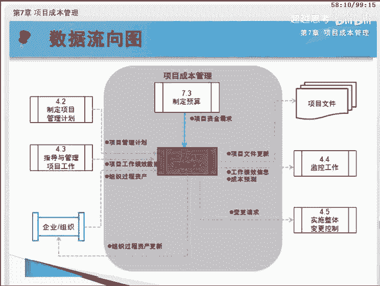

控制成本过程共有四个输入，分别是项目管理计划，项目资金需求，工作绩效数据和组织过程资产，下面我们依次来了解他们吧。

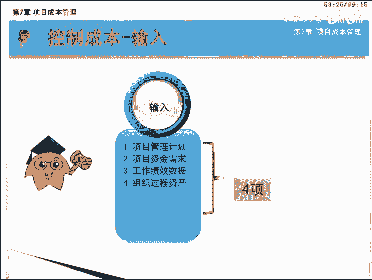

项目管理计划中包含的可用于控制成本的信息，包括成本基准和成本管理计划，成本基准，但成本基准与实际结果相比，以判断是否需要进行变更，或采取纠正或预防措施，成本管理计划，成本管理计划。

规定了如何管理与控制项目成本的信息，项目资金需求来自于制定预算过程，包括预计支出加上预计债务。

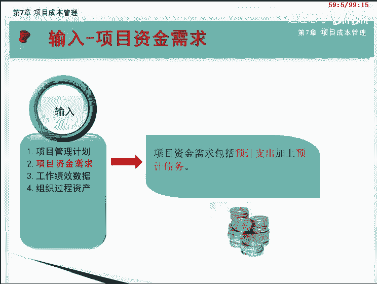

工作绩效数据是关于项目进展情况的数据，如哪些活动已开工，进展如何，以及哪些可交付成果已完成，还包括已批准的成本和已发生的成本，它是在指导与管理项目工作过程，产生的原始数据，会影响控制成本过程的组织过程。

资产包括现有的正式和非正式的，与成本控制相关的政策程序和指南，还有成本控制工具，以及可用的监督和报告方法。

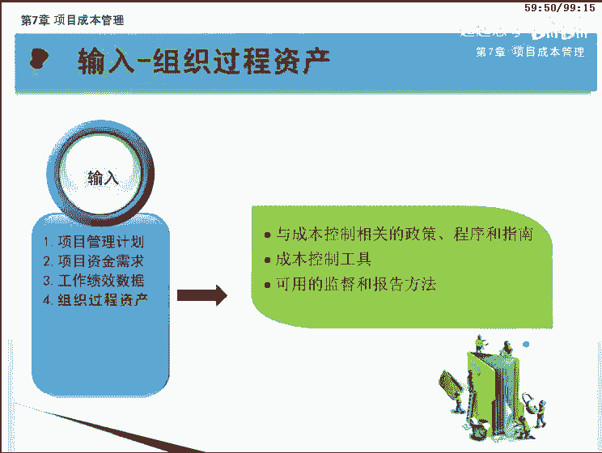

控制成本过程的工具和技术共有六个，分别是正职管理预测完工尚需绩效指数，绩效审查，项目管理软件和储备分析。

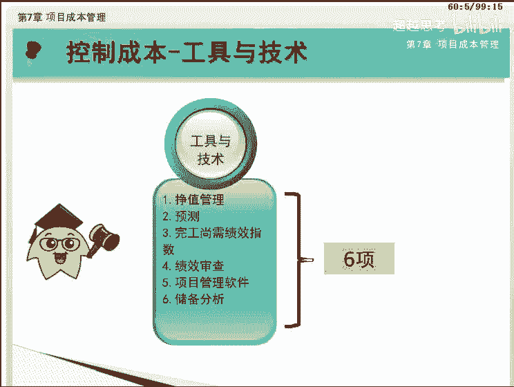

下面我们逐个讲解，在控制成本的工具与技术中，我们首先要讲解的是正职管理，政治管理是一种常用的绩效测量方法，它综合考虑项目范围，资源绩效与进度指标，帮助项目管理团队评估与测量项目绩效和进展。

他把范围基准，成本基准和进度基准整合起来，形成绩效基准，以便项目管理团队评估和测量项目绩效和进展，也就是说，政治管理是在既定的范围之下来，综合考虑时间和成本绩效，可以避免单独衡量时间或成本绩效的弊端。

政治管理要求，人们不仅要问项目进展到了什么程度，还要问花了多少成本，政治管理是针对每个工作包和控制账户的，它的原理适用于任何行业的任何项目，在系统的讲述正值管理之前，我先向大家介绍一个。

正在进行的项目的进展情况，小张打算简单装修一下现有的房屋，这个项目主要包括五项工作及设计，铺地吊顶，安装门窗，粉刷墙壁，这些工作均按完成到开始的关系逐项进行，计划的总工期为十天，预计的总费用为1万元。

具体工作计划安排如表一所示，现在是第七天结束，项目的实际进展情况如表二所示，接下来请大家记住这两个表格，进入政治管理的学习，首先我们要了解的是，政治管理中的几个基本概念，计划价值正值。

实际成本和完工预算，这些概念是政治管理的基础，大家一定要理解并熟记，另外正值反映的是任何一个时刻或时间点的，项目绩效情况。

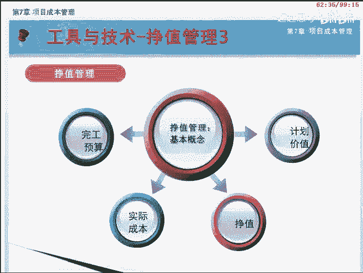

计划价值pv被某活动或工作分解，结构组成部分的预计工作进度分配，且经批准的预算是计划完成工作的预算价值，计划价值应该与经批准的特定工作内容相对应，计划价值pv等于计划要完成的工作量，乘以预算单价。

所以截止到第七天，小张的房屋装修项目，按计划应该要完成的pv等于百分之百乘以1000，加上百分之百乘以5000，加上百分之百乘以1000=7000，同样截止到第五天或第六天的pv也可以算出来。

正值一威，是项目活动或工作分解结构组成部分的，已完成工作的价值，用分配给该工作的预算来表示，是实际已完成工作的预算价值，正值ev等于实际已完成的工作量乘以预算单价，所以截止到第七天。

小张的房屋装修项目的正值，等于百分之百乘以1000，加上百分之百乘以5000，加上70%乘以1000，等于6700元，需要说明的是，正值的计算必须与计划价值pv相对应，实际成本ac社会完成活动或工作。

分解结构组成部分的工作，而实际发生并记录在案的总成本，是已完成工作的实际成本，实际成本ac等于已完成的工作量乘以实际单价，截止到第七天，小张的房屋装修项目的实际成本，ac等于1100+5100。

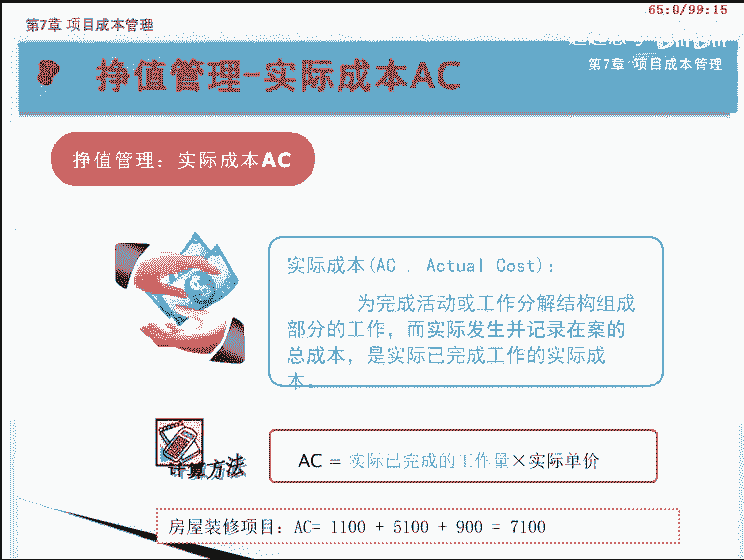

加上900=7100元，实际成本没有上限，为完成活动所花费的任何成本都要计算进去，文工预算b a c是项目工作工作，分解结构组成部分或进度活动的所有预算之和，及项目的总计划价值。

完工预算有时被称为绩效测量基准，p m b除非已得到批准进行变更，否则项目的完工预算一般不会变化，在房屋装修项目中，完工预算bac等于1万元，接下来我们要学习两个政治管理中，与成本相关的重要概念。

他们是成本偏差，cv和成本绩效指数，cpi，首先我们来看成本偏差，cv，成本偏差是在某个指定时点的预算，亏空或盈余量表示为正值与实际成本之差，成本偏差是项目成本绩效的一种指标。

它等于正值ev减去实际成本，ac成本偏差，指明了实际绩效与成本支出之间的关系。

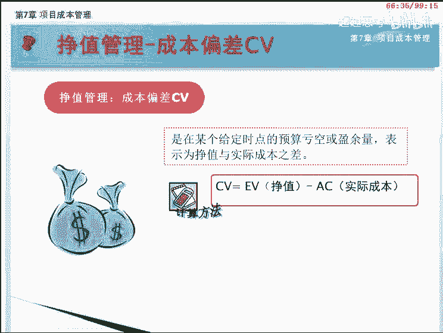

所以十分重要，成本偏差是正值，表示对预算的节约，负值表示对预算成本的超支，负的成本偏差已经发生，一般都是不可弥补的，项目结束时的成本偏差，就是完工预算b a c与实际总成本之间的差值。

前面我们已经计算得到，房屋装修项目的正值为6700，实际成本为7100，由此我们可以算出房屋装修项目的成本偏差，cv等于6700，减去7100，等于负的400，可以看到。

这个项目目前已经出现了成本超支的情况，成本绩效指数，cpi是测量预算资源的成本效率的一种指标，表示为正值与实际成本之比，它可以表示实际花费的每一元，做了价值多少钱的事，用于考核已完成工作的成本。

效率是政治管理最重要的指标，成本绩效指数的计算公式是cpi等于正值。

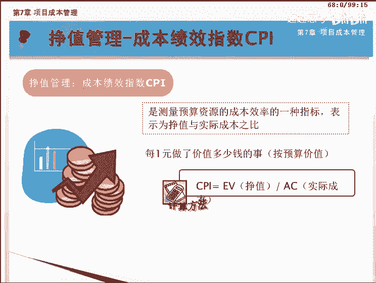

ev除以实际成本ac如果cpi大于一，则表示到目前为止成本有结余，如果cpi小于一，说明已完成工作的成本超支，房屋装修项目的成本绩效指数，cpi等于正值6700除以实际花费的成本，7100=0。94。

其实际花费的每一元钱只做了计划，0。94元做的事情，cpi和cv反映的基本信息是相同的，不过一个是相对比率，一个是绝对数量，接下来我们要学习两个政治管理中，与进度相关的重要概念。

他们是进度偏差sv和进度绩效指数s p i，进度偏差sv是项目进度绩效的一种指标，表示为正值与计划价值之差，表明项目是否落后于基准，进度是一个非常重要的指标，其计算方法为进度偏差，sv等于正值。

ev减去计划价值pv，如果计算结果是正值，则表示提前完成进度计划，如果是负值，则表示实际进度落后于进度计划。

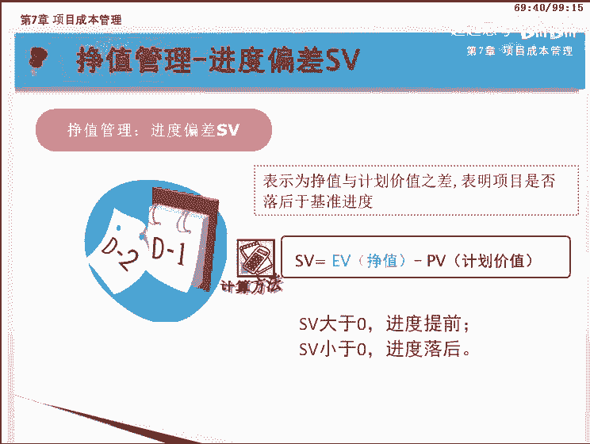

由于项目完工时，全部的计划价值都将实现，即成为正直，所以正值管理中进度偏差最终将等于零，房屋装修项目的进度偏差等于正值6700，减去计划价值，7000等于负的300，也就是说。

这个项目本来应该已经完成的，价值300元的工作还没有完成，进度落后，进度绩效指数，s p i是测量进度效率的一种指标，表示为正值与计划价值之比，它反映了项目团队利用时间的效率。

可以表示实际进度是计划进度的多少倍，或百分之多少，有时与成本绩效指数cpi一起使用，以预测最终的完工，估算s p i进度绩效指数等于正值，ev与计划价值pv的比值。

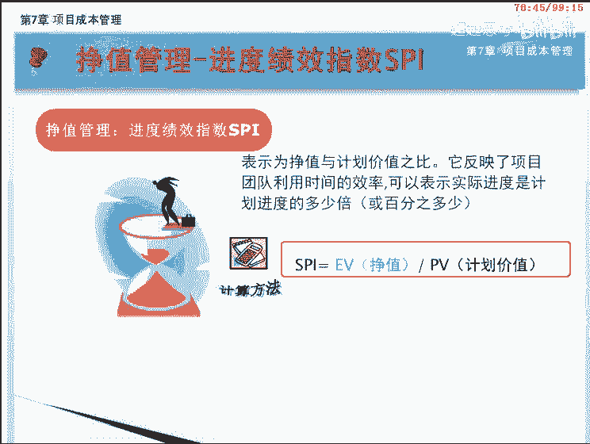

当s spi大于一时，则说明已完成的工作量超过计划小于一，则表示有未完成计划要求的工作量，由于s p i测量的是项目总工作量，所以还需要对关键路径上的绩效进行单独分析。

已确认项目是否将被计划日期提前或延迟完成，房屋装修项目的进度，绩效指数，s p i等于正值6700除以计划价值，7000=0。96，也就是说，实际进度只是计划进度的96%，在正值测量时。

对于某些已经开始但尚未完成的工作，确定其准确的正值可能比较麻烦，可使用一些简单的政治规则，以快速简单的得到近似正值，首先是5050规则，只要工作或活动已经开始，就按50%正值算。

到结束时再按百分之百计算，这种规则的特点是比较中和的，2080规则开始按20%算，这是一种比较保守的方法，零百分之百规则中，只要没结束，不管开始了多少工作，都按0%计算，是一种最保守的方法。

100 100规则中，只要开始了，就按百分之百的政治计算，这种计算方法最激进，当然不管哪种政治规则，工作未开始，按0%算，完全结束，按百分之百算，所不同的是，工作开始而又未结束状态时的正值量计算。

对计划价值pv正值，ev和实际成本ac这三个参数，既可以以周或月为单位，分阶段进行监测和报告，也可以针对从项目开始到数据日期为止，的累计值进行监测和报告，图中s曲线展示了某个项目的累计净值数据。

我们看到截止数据日期正值，ev的值低于pv和ac，因此该项目的状态是预算超支且进度落后。

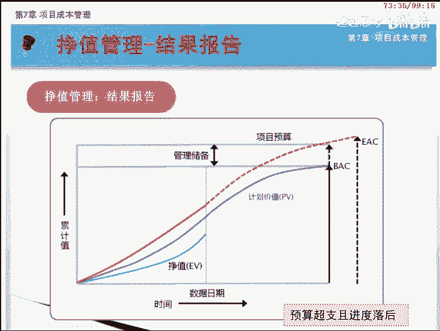

正值计算中涉及到了很多的计算，计算偏差时ev总是出现在前面，是被减数，结果是正的，表明是有利的，负的结果是不利的，零表示正好符合计划计算指数时，因为总是在分子上作为被除数，结果大于一是有利的。

小于一是不利的，等于一，正好符合计划要求，除了b a c以外，其他计算都要考虑节制或在某个时点的问题，在预测未来项目情况时，如果题目中没有明确说明，项目过去已经发生的偏差，是否属于典型的。

都按典型来考虑，控制成本中的预测，是指基于项目当前绩效和其他知识，对未来绩效进行预测，得到关于项目未来情况的信息，预测指标包括完工估算ea c和文工尚需估算etc，后面我们会详细介绍。

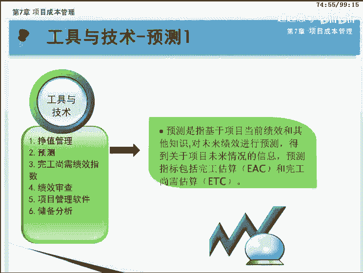

什么是完工估算ea c呢，完工估算就是为完成某进度活动工作，分解结构，组成部分或整个项目所需的预期总成本，它可以根据迄今为止的实际绩效进行计算，也可以由项目团队根据其他因素做出估算。

那什么又是员工上去估算etc呢。

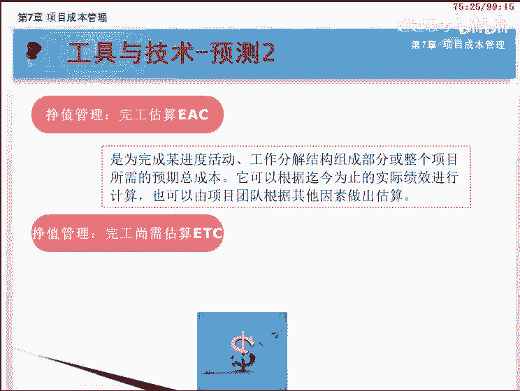

王公上去估算是为完成某进度活动工作，分解结构组成部分或整个项目的所有剩余工作，而预计需要的成本，首先我们来看完工尚需估算etc的计算方法，如果项目发生的成本偏差是典型的。

即这种偏差在项目中比较具有代表性，还会在项目中继续同样规模的发生，这个时候etc等于bc减去1v之后除以cpi，如果项目发生的偏差是由特殊原因造成的，这种偏差以后不会再发生，剩余工作仍可按预期绩效完成。

则etc等于bc减去1v，如果截止目前的成本绩效和进度绩效都不理想，而又必须按期按预算完工，则etc等于bc减去1v之后除以cpi乘以s p i，其中cpi乘以p i称为关键比率。

用来考核成本与进度的综合绩效，如果不属于上述两种情况，则可以采用自下而上的方式，全新的估算一个数字，重新估算的数字通常会更加准确，但是需要花费额外的时间和成本。

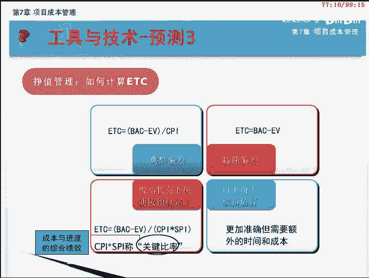

因为完工估算等于实际成本加上完工尚需估算，因此完工估算eac也有四种情况，如果是基于典型原因造成的偏差，则e a c等于ac加上b a c减去e v之后，除以cpi或b a c除以cpi。

如果是基于特殊原因造成的偏差，则eac等于ac加上b a c减去1v，或者等于bc减去cv，如果偏差是由关键比率，spi和cpi共同原因造成的，则eac等于ac加上bac，减去1v除以cpi乘以p i。

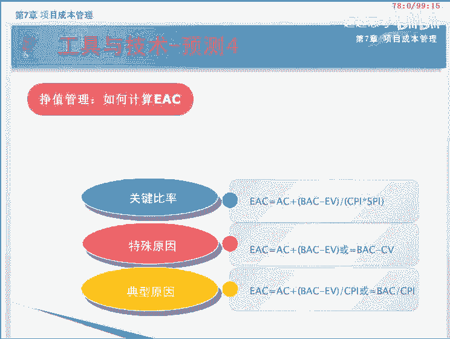

如果选择对剩余工作进行重新估算，则eac等于ac加上etc，可以结合前面的房屋装修项目，按照不同的方法来计算etc g e a c，另外还有个简单的概念需要我们了解文工偏差。

vac它是对预算亏空量或盈余量的一种预测，它表现了项目完工成本和估算成本的差异，计算公式是v a c等于完工预算，b a c减去完工估算e a c。

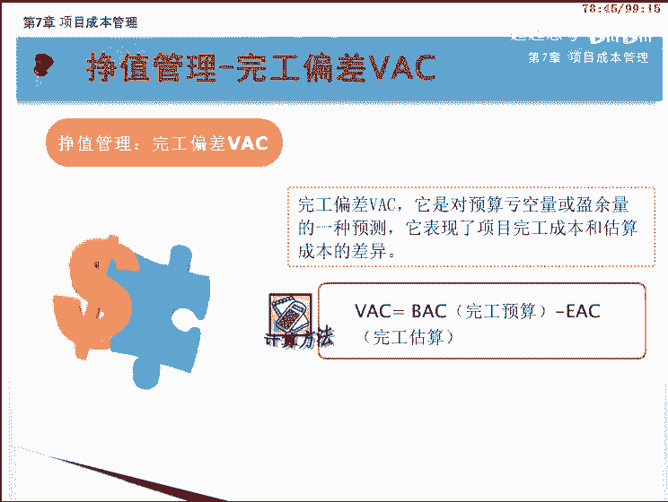

如果vac大于零，表示在计划成本之内，如果vac小于零，表示超过计划成本，空上需技巧指数，t cpi是一种为了实现特定的管理目标，如达到完工预算b a c或完工估算e a c。

剩余资源的使用必须达到的成本绩效指标，简单的说，t cpi是完成剩余工作所需的成本，与剩余预算之比，t cpi的计算与项目目标息息相关，如果完工预算bac可行，则要达到的目标是按b a c完成项目。

则t cpi的计算公式是，t cpi等于b a c减去e v除以b a c减去ac，如果完工预算bc已经明显不再可行，则项目经理应预测完工预算，ea c一经批准。

e a c就取代b a c成为新的成本绩效目标，此时需要达到的成本目标是ea c，所以t cpi等于bc减去ev除以e ac减去ac。

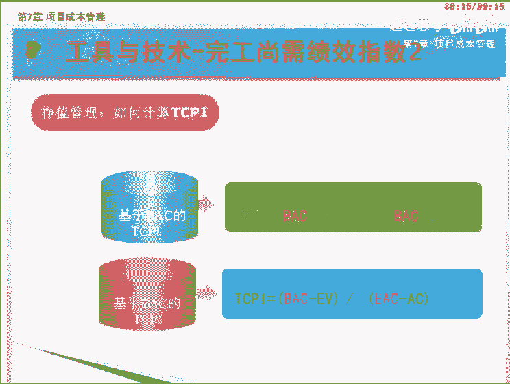

现在我们来看画面所示的完工尚需绩效指数，t cpi的示意图，如果项目目前的累计cpi低于基准计划，那么项目的全部未来工作，都必须立即按基于b a c的tc pi执行，以确保实际总成本不超过批准的bac。

此时t cpi必须大于一，才有可能是项目成本控制在bc之内，至于所需要的这种绩效水平是否可行，需要综合考虑风险进度，技术等多种因素才能判断，如果管理层认为bac不可实现，而需按新的完工估算eac为标准。

这时项目未来所需要的绩效水平，就是按照基于ea c的t cpi执行。

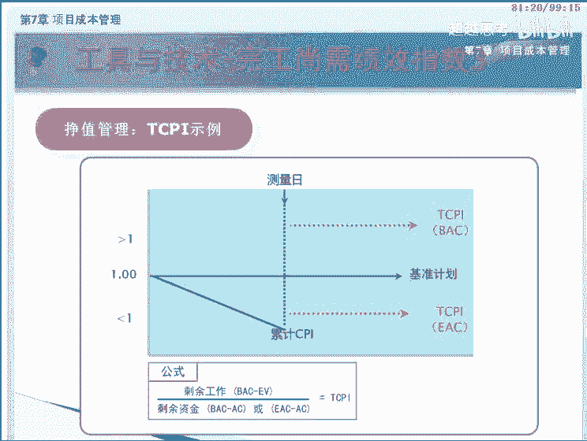

在控制成本的过程中，需要对项目的成本绩效进行审查，绩效审查的对象包括成本绩效随时间的变化，进度活动或工作包超出或低于预算的情况，以及完成工作所需的资金估算等，如果是采用正职管理技术进行绩效审查。

则需要对偏差，趋势和政治绩效三个指标进行分析，偏差分析是指把实际项目绩效，与计划或预期绩效进行比较，一般需要进行分析的是成本偏差和进度偏差，以判断偏离进度基准的原因和程度。

并决定是否需要采取纠正或预防措施，趋势分析旨在审查项目绩效随时间的变化情况，以判断绩效是正在改善还是在恶化，一般会采用图形分析方法，正值绩效分析，就是将基准计划与实际进度和成本相比较。

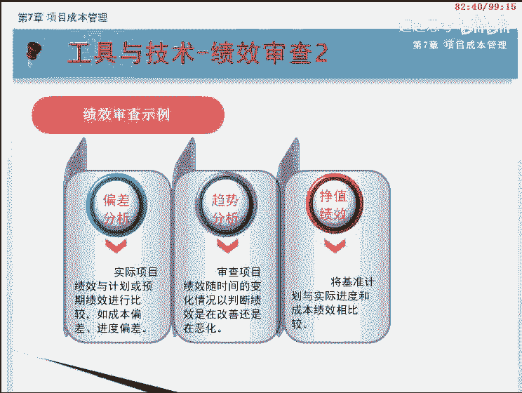

以判断成本绩效情况，在控制成本的过程中，往往采用项目管理软件来监测pv，ev和ac这三个正值管理指标，绘制趋势图，并预测最终项目结果的可能区间。

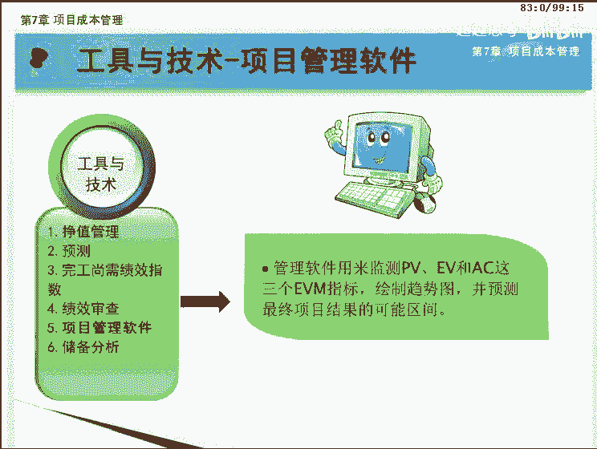

我们知道，在估算成本和制定预算时，为了应对风险，曾经为项目预留了应急储备和管理储备，随着项目工作的进展，这些储备可能已按计划用于支付，风险或其他应急情形的成本，或者如果风险事件没有如预计的那样发生。

就可能要从项目预算中扣除未使用的应急储备，为其他项目或运营腾出资源，再或者经过进一步风险分析，可能会发现需要为项目预算申请额外的储备，那到底剩余的储备和剩余的风险是否匹配呢。

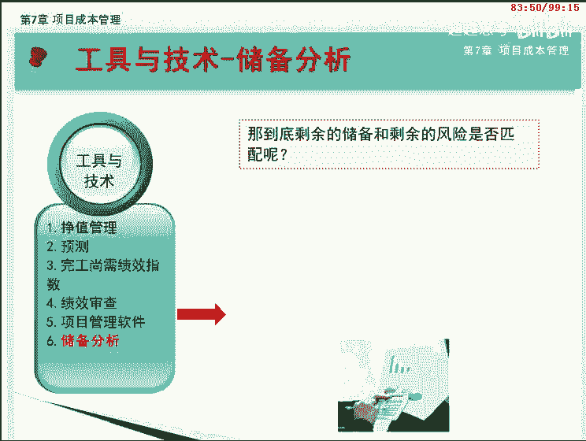

这就要求我们在控制成本过程中，采用储备分析来监督项目中，应急储备和管理储备的使用情况，从而判断是否还需要这些储备，或者是否需要增加额外的储备，控制成本过程共有六个输出，他们是工作绩效信息。

成本预测变更请求，项目管理计划更新，项目文件更新和组织过程资产更新，下面我们一块来学习。

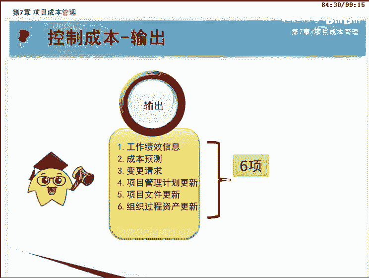

工作绩效信息是控制成本过程的第一个输出，w bs各组件，尤其是工作包和控制账户的cv sv，cpi s p i t c p i和vac值都需要记录下来，并传达给干系人，这些值就是写入到工作绩效信息中。

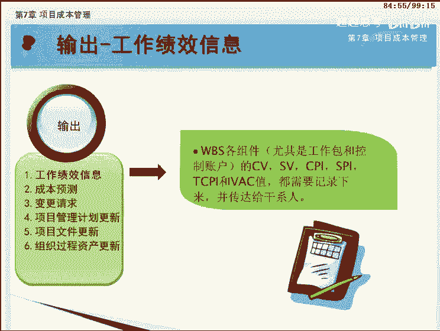

这个过程的第二个输出是成本预测，在控制成本过程中，无论是通过典型偏差计算得到的完工估算，e a c，还是通过自下而上得到的e a c预测值，都必须记录下来，并传达给相关干系人，通过分析项目绩效。

项目管理团队可能会对成本，绩效基准，或者项目管理计划的其他一些组成部分，提出变更请求，这些变更请求可能包括预防措施或纠正措施，变更请求需要经过实施整体变更，控制过程的审查和处理。

在控制成本过程可能需要更新项目管理计划，项目管理计划更新的内容包括两部分，一个是成本基准，在批准对范围活动资源或成本估算的变更后，需要对成本基准相应作出变更，有时成本偏差太过严重。

以至于需要修订成本基准，以便为绩效测量提供现实可行的依据，项目管理计划更新的第二个内容，是成本管理计划，成本管理计划中需要更新的内容，包括，用于管理项目成本的控制，临界值或所要求的准确度。

要根据干系人的反馈意见对他们进行更新。

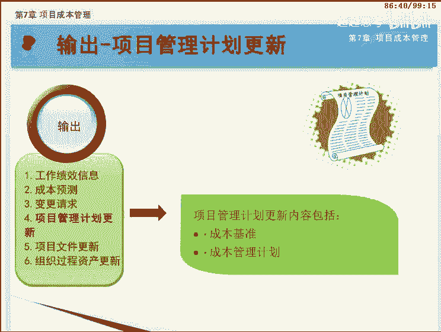

在控制成本过程可能需要更新的项目文件，包括成本估算和估算依据等。

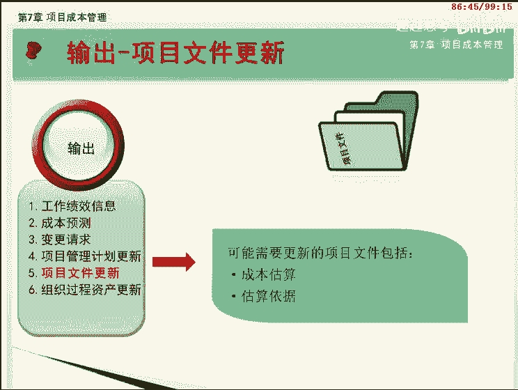

控制成本过程可能需要更新的组织过程，资产包括偏差的原因，采取的纠正措施及理由，财务数据库，以及从项目成本控制中得到的其他经验教训，现在我们来回顾一下本过程的核心知识，控制成本是监督项目状态。

已更新项目成本管理，成本基准变更的过程，正值反映的是任何一个时刻或时间点。

的项目绩效情况，政治管理中四个基本概念是计划价值，pv正值ev实际成本ac和完工预算，bac与成本绩效相关的概念是成本偏差，cv和成本绩效指数，cpi与进度绩效相关的概念是进度偏差，sv和进度绩效指数。

s p i对成本的预测，包括计算完工估算ea c和完工尚需估算etc，恭喜你完成控制成本过程的学习。

各位学员，第七章项目成本管理，知识领域的全部四个过程已经学习完毕，现在就来做个总结吧，首先需要对如何进行成本管理进行规划，这个过程就是规划成本管理，他根据项目章程和前期已经批准的项目管理，子计划。

生成项目成本管理计划，第二个过程，估算成本是根据w bs以及风险登记册等信息，估算每个活动所需的成本，在这里可以根据风险预留一些应急储备，之后利用制定预算过程，将前期估算的所有成本进行累积汇总。

加上应急储备，形成整个项目的成本基准，在成本基准之上加入管理储备，就形成了整个项目的预算，在项目进行的全过程，需要监督项目活动状态，更新，项目成本管理，成本基准变更，这是控制成本过程要完成的工作。

这个过程会产生工作绩效信息，并可能提出变更请求，这个回顾过程我们没有考虑事业环境因素，组织过程，资产和各种文件的更新，你可以翻看篇报和指南来进行回顾。

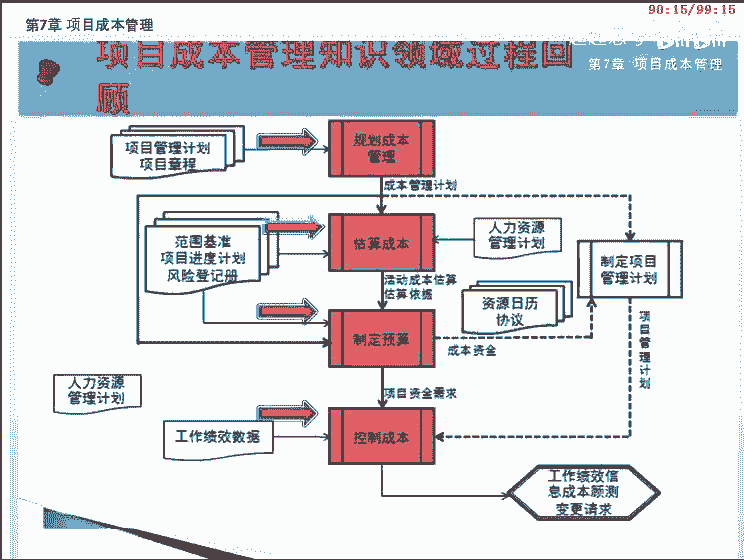

各位学员，恭喜您已经完成了第七章项目成本管理，这一知识领域的学习建议，接下来继续学习，第八章项目质量管理。

