# PMP第五版PMBOK5完整培训视频教程 项目管理 - P1：01 - 超越思考 - BV1NY4y1U7s2

欢迎来到pmp项目管理网络课程的学习，本课程基于最新发布的偏报课指南第五版，下面我们将一块学习第一章引论，在开始本章学习之旅前，我们先回到古代，看看人类文明的一些伟大成果，古埃及法老的坟墓。

金字塔在公元前26世纪就出现了，我国宏伟的万里长城，修筑于遥远的春秋战国时代，迄今为止仍在使用的都江堰水利工程，完成于战国时代，金字塔万里长城，都江堰工程，这些公认的世界奇迹，今天我们叫工程或项目。

都是在科学技术极不发达的，那些年代修建起来的，绝不是朝夕完成的，在建造的过程中，必然有我们不一定了解的管理方法和技术，虽然这些方法和技术，在那个年代也许没有形成体系，但从今天大型项目的完成来看。

系统管理方法和技术，是确保一个庞大工程项目成功的必要条件。

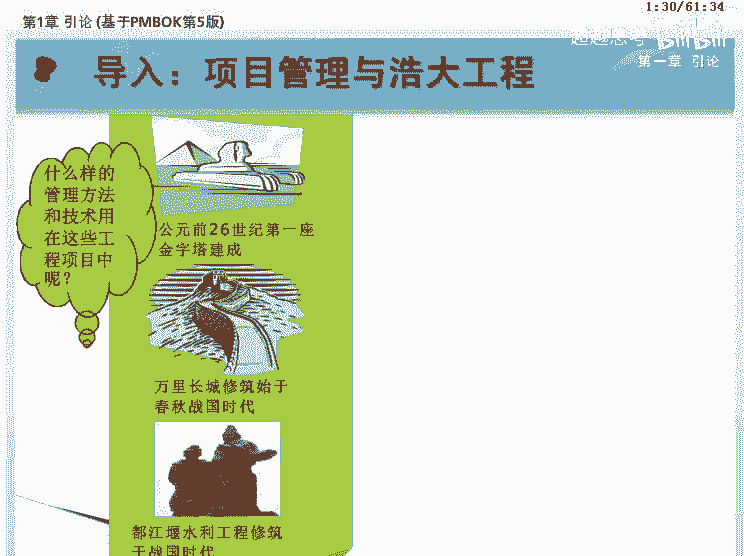

我们再来看现在2008年北京奥运会，2010年广州亚运会，这些项目面对着复杂的人员，大量的资源，质量的保证以及风险的控制等诸多问题，而这些问题都用到了现代项目管理的理念方法，工具和技术。

可以说项目管理的应用及其创新，对现代大型项目的成功举办有突出的贡献，改革开放至今，相信鲁布格这个名字早已响遍全中国，甚至在世界上也有一定知名度，其实呢，卢布格原本仅是一个，名不见经传的布依族小山寨。

他的名声远播，缘起鲁布革水电站的兴建。

1981年6月，国家批准建设，装机600000千瓦时的鲁布革水电站，年发电量28。2亿千瓦时，并列为国家重点工程，整个工程由一座1百米高的堆石坝，一条长9km的引水隧道。

一座装机600000千瓦时的地下厂房组成，鲁布革水电站工程，原由我国水电部14工程局负责施工，但缺乏资金使得工程进展非常缓慢，1984年4月，水电部决定在鲁布格工程采用世界银行贷款，基本建设项目。

但是根据与世界银行的协议，工程三大部分之一，引水隧洞工程必须进行国际招标，在中国，日本，挪威，意大利，美国，德国，法国八国承包商的竞争中，日本大成公司以低于标的40%，的报价中标。

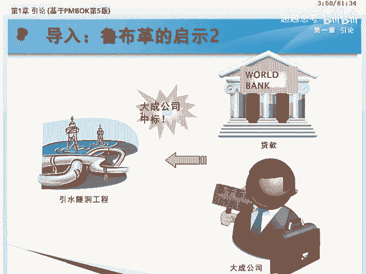

在引水隧道项目实施过程中，大成公司派到中国来的，仅是一支30人的管理队伍，现场从中国水电14局，招募了424名劳动工人，中国工人在日本大成公司先进的项目管理下，引水隧道单头月平均进尺222。5米。

相当于我国同类工程的二至2。5倍，使得整个项目工期比合同计划提前近五个月，工程质量优良，完成的成本，还在中标造价的基础上再节约了40%，这就是大成公司带来的先进项目管理。

让鲁布格引水隧道工程取得了如此巨大的成功，从此以后，在鲁布格其他工程中也取得了很大的成功，还创造了著名的鲁布格工程项目管理经验，由此可见，先进的项目管理方法，是项目取得成功的关键所在，听到这里。

相信大家也明白，为什么项目管理在当今社会是如此重要了。

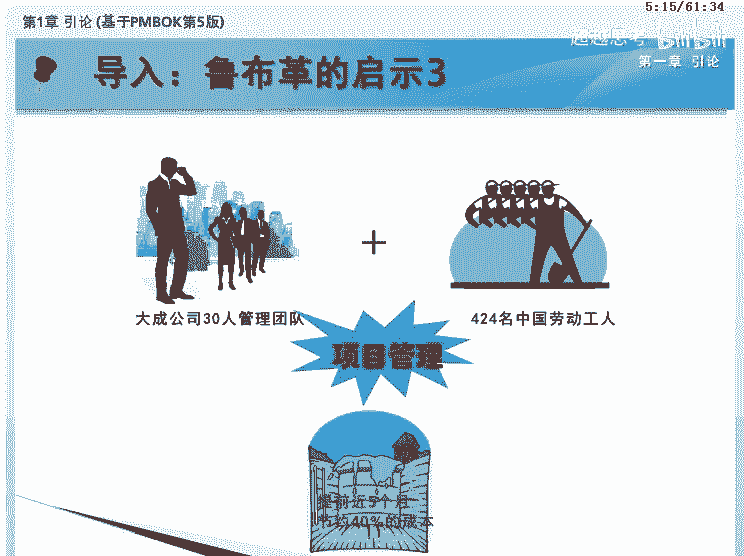

虽然我国项目管理的导入是被动的，但通过项目管理，如不格项目投资责任主体得到明确，招投标得以公开执行，项目合同管理能够严格前后比较，在没有现代项目管理的情况下，我们做项目是计划欠缺，组织落后。

所以对1984年之前的卢布格项目，有一些形象的说法，包括投资无底洞项目马拉松等，而有了现代项目管理后，这两方面都发生了巨大变化，中国人意识到，现在项目管理不仅仅需要管理思想的变化。

还需要应用许多科学的项目管理技术工具。

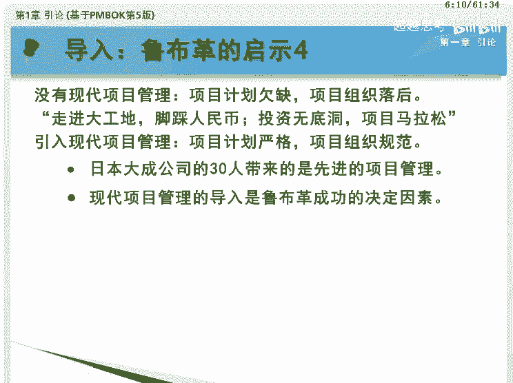

在全国范围内开始推广鲁布格项目的成功经验，学习完本章，您将达到以下学习目标，掌握项目的定义及特点，并能区分项目结果的分类，掌握项目管理的定义及其四个要点，理解项目制约因素之间的关系，理解项目组合。

项目及项目和组织级项目之间的关系，掌握项目集和项目集管理的定义，及其关注的重点，掌握项目组合和项目组合管理的定义，及其关注的重点，理解项目与战略规划的关系，掌握pmo的定义。

分类职责以及其余项目经理的差异，理解项目与运营的异同点，并能对他们进行区分，了解项目管理在组织中的作用，了解基于项目的组织po及商业价值的概念，了解他们与项目之间的关系，掌握项目经理的职责能力。

及其与职能运营经理的区别，本课程我们将按照如图所示的大纲顺序，为您讲述，包括什么是项目，项目与运营，什么是项目管理，项目组合，项目集和项目管理的联系，运营与项目管理，项目经理的角色。

最后是对本章的核心知识进行整理，说到项目这个词你会想到什么，是不是也会想起我们国家举办的几次国际盛会，奥运会和2010上海世博会，还有广州亚运会呢，没错，这种大型盛会对于举办方来说是项目。

当然你可能也会想到装修一套房子，举办一次婚礼，开发一个新软件等等其他小型的项目，但这些都是你对项目的一些感性的认识，如何用文字来对项目进行定义呢，在项目管理中，最基本的概念无非就是项目了。

下面我们就从项目这个概念入手，来开始本课程的正式学习吧。

在pm报考指南中把项目定义为，项目是为创造独特的产品服务或成果，而进行的临时性工作，实际上项目有三个显著的特点，临时性，独特性和渐进明细，首先项目是临时性的工作，具有临时性的特点。

也就是说项目具有明确的起点和终点，它不会无限期地延续下去，但项目的临时性并不意味着持续时间短，持续一周的项目是临时的，虽然项目具有临时性，但项目所创造的结果不一定是临时的。

很多项目都是为了创造永久性的结果，它们产生的成果会一直持续使用，实际上大多数项目都是为了创造持续的结果，项目的第二个特点是独特性，也就是说，每个项目都会创造独特的产品服务或成果。

即便是在不同项目中存在重复的元素，如两栋大楼都由同一个施工队来建设，都采用相同建筑材料，但最后两栋大楼会有不同的地理位置，有不同的内部设计，完成的时间也可能是不一样的，项目的第三个特点是渐进明细。

由于项目团队需要完成的工作可能是全新的，难以按组织现有做事情的方法重复进行，因而存在着风险或不确定性，这导致项目所创造的产品，服务或成果也存在不确定性，也就是说，可能不能按照最早设想的方式去完成项目。

与之对应的是项目具有渐进明细性，也就是说，一开始对项目最终完成什么可能不清楚，随着项目的进行，一些原来不清楚或不明确的事情逐渐清晰，明确了，从项目的定义中可以看出，项目创造的结果分为四类，即有形的产品。

无形的服务或能力，其他成果，以及对现有产品线或服务的升级，友情的产品，也就是我们能够看得见摸得着的东西，它可以是最终形态的产品，如电脑的主机，也可以是其他产品的组成部分。

比如生产电脑主机所必需的中间产品，cpu还可以是其他产品的升级，如苹果手机推出的新版本，有些项目的结果是无形的，是看不见摸不着的服务或能力，比如人员培训项目开发出来的员工能力，这属于一种能力。

能够用来提供某种服务，项目还可能产生出其他成果，又如政府入住h7 n9 防治防治项目，研究出来的关于预防h7 n9 的知识，政府希望公众更好的知道，如何有效预防h7 n9 ，这属于项目产生的成果。

既不是产品，也不是能力，只能归属于结论性的成果，除此之外，其实项目产生的结果，也可能是对现有产品线或服务的改进，如在质量控制中实施六西格玛项目，以降低产品缺陷率，下面的工作都是项目开发一项新产品或服务。

升级原有生产线，举办一次婚礼，参与一次投标发射卫星危房改造，购买一套e p系统，增加pmp考试。

要在城市的各个路口设置交通灯和相关设施，来对路面交通进行统一管理和调度，以保持城市交通有条不紊的运行，做项目也一样，既然发起一个项目，就要对项目进行计划控制和管理，使各种资源能被项目工作合理使用。

是项目按计划执行，最后产生期望的结果。

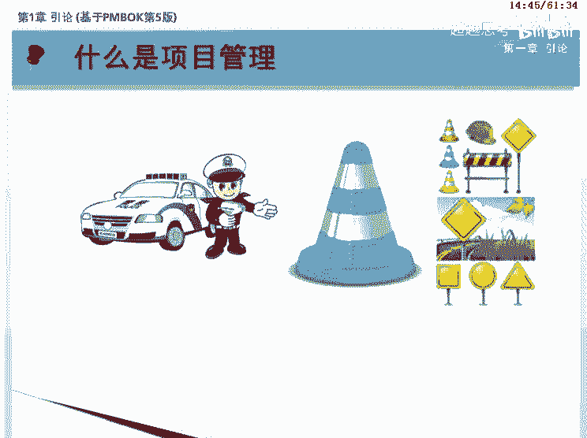

为了确保项目中所需的各种资源，能合理高效地利用，就必须进行项目管理，那么什么是项目管理呢，项目管理就是将知识技能工具和技术，应用于项目活动，以满足项目的要求，在这里我们需要对知识技能。

工具和技术做一下区分，举例来说，知识可以是你通过阅读学习pm报告获得的，关于项目管理方面的知识，但是你光知道了知识是不够的，你需要把你获得的知识应用于实践，技能是你将获得的这些知识应用于实践的能力。

而工具和技术是指项目管理中的一些特定的，工具与技术，比如专家判断项目管理，信息系统和工作分解结构等等。

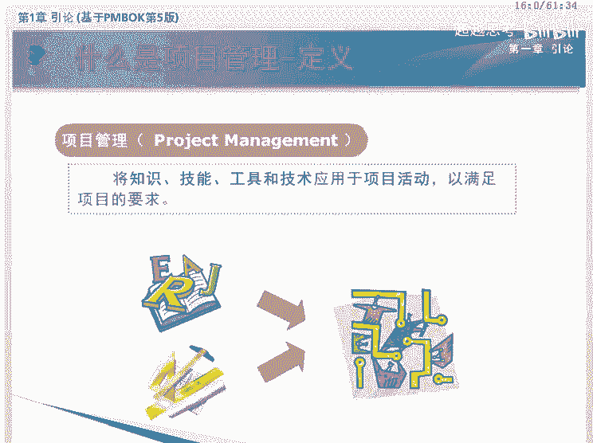

管理一个项目通常要识别需求，管理期望平衡，限制因素，善用滚动式规划，这也是项目管理的四个要点，识别需求是项目管理中的一个非常重要的理念，一个项目最终是要满足干系人的期望的，只有准确地了解了干系人的需求。

才能为项目的规划执行，以及项目最后的验收收尾提供指导和检验标准，因此在项目的一开始就应该识别该新人的需求，不同的干系人，对项目的需求和期望又是不一样的，可能某些干系人更追求项目的经济效益。

而某些干系人则更在乎项目的质量，因此在项目规划和执行时，要特别注意处理好不同干系人的各种需求，关注和期望，项目的范围，时间质量成本，资源和风险都是项目的制约因素，这些因素之间存在着相互制约的关系。

任何一个因素变化都会影响至少一个其他因素，因而要取得项目的成功，在项目管理过程中，要平衡好这些限制约束，并将其余管理干系人的期望对应起来，渐进明细是项目的一个重要特点，只随着时间的推移。

项目信息越来越多，各种估算越来越准确，因而项目团队对目标的理解就更加完整和深入，项目团队可以持续改进和细化原有的计划，由于可能发生变更，项目管理计划作为项目管理的核心计划，渐进明细。

这样才能使项目管理团队，能随项目的进展而进行更深入的管理。

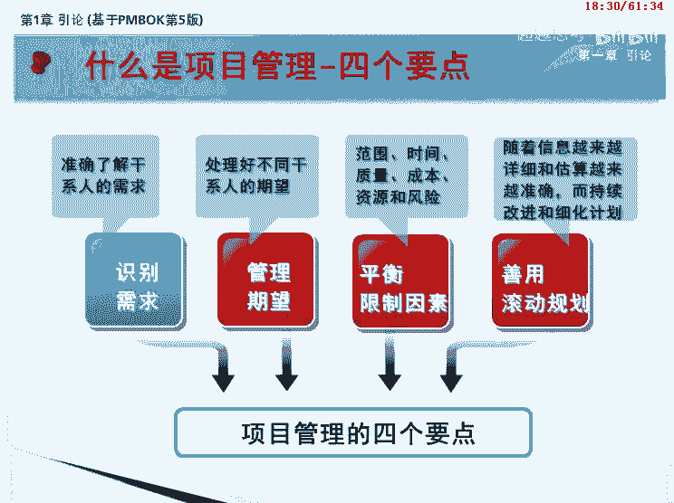

项目经理在实际项目中，经常需要对制约因素进行权衡，传统的三种约束，包括范围，时间成本或者时间成本，质量，在篇报告新版本中，增加了风险和资源两个制约因素，实际上项目会受到更多制约因素的影响。

我们要根据具体项目识别各种制约因素，这些制约因素共同影响项目范围的实现，这些因素中的任何一个发生变化，都会影响至少一个其他因素，不同的项目，干系人对这些因素的重要性有不同的看法。

有些干系人更看重项目的质量，而不在乎牺牲时间和金钱，有的干系人则更看重项目所带来的经济效益，这个时候项目团队就必须正确分析项目状况，以平衡这些制约因素。

最终让客户满意，那么针对某个项目，项目管理制约因素的重要性如何排序呢，一般来讲，各种制约因素没有绝对的顺序关系，不同的干系人由于利益和关注点不同，排序的顺序也不尽相同，这就要求项目经理进行权衡。

但主要考虑管理者的态度，也就是说，每一个项目中制约因素的重要性，是由管理者决定的，需要提醒的是，在pmbok指南中，在项目管理计划中特别强调了范围，进度成本三个基准，所以在考试中如果没有特殊说明。

可以认为他们是最重要的三重约束。

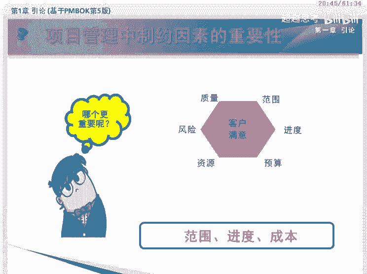

在实际工作中，不太可能一个组织中只有一个项目在执行，大多数时候是在一个组织中，同时进行着多个项目，为了更好地对这些项目集中管理，需要考虑其他两个概念及项目集和项目组合，下面我们来看一个例子。

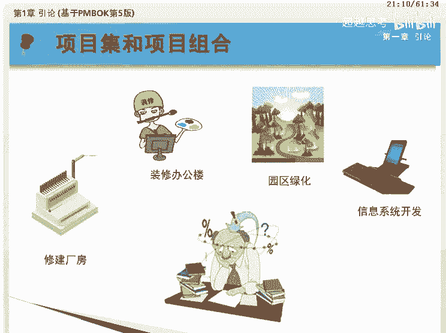

我们来看一下一个建筑公司的项目管理实例，来讨论项目集和项目集管理的概念，该建筑公司承包了一幢大楼的项目建设，其中包括大楼a的建房项目，布线项目及装修项目，我们都知道这三个项目存在着一定的依赖关系。

在建房的时候要考虑布线的问题，并且只有在建房完成后才能进行装修，该建筑公司的做法是把这三个统一起来管理，而非分开管理，我们把统一起来的这三个项目称为项目集。

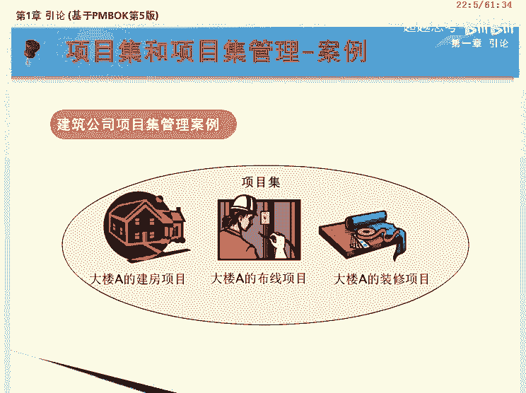

那么什么是项目集呢，项目集是一组相互关联且被协调管理的项目，子项目集和项目及活动，这里面有两点需要注意，首先是多个项目之间相互关联，但这还不够，这些项目必须被协调且集中统一管理。

项目集中的项目或子项目集，通过产生共同的结果或整体能力而相互联系，比如之前讲过的建筑公司承包的大楼a项目，集中建房项目，布线项目和装修项目都是未完成大楼a的建设，项目集中不仅包括单个的项目或子项目集。

也包括单个项目范围之外的相关工作，比如项目之间的设备资源或人员的协调等，项目集中的项目或子项目集，必须存在着一定的依赖关系，比如大楼a的布线项目，在设计上依赖于大楼a的建房项目。

它的装修项目在时间上依赖于建房项目，如果项目间的联系，仅仅只是共享雇主供应商技术或资源，而没有协调管理，则不能把这些项目看成一个项目集。

既然有项目集，就有必要对项目集进行管理，项目集管理是对项目集进行统一协调管理，以实现项目级的战略目标和利益，进行项目及管理的目的，是为了获得对单个项目分别管理，所无法实现的利益和控制。

他重点关注的是如何管理项目间的依赖关系，并帮助找到管理这些依赖关系的最佳方法。

如果该建筑公司在承包了大楼a建设的同时，又承包了一段铁路的建设，其中包括铁路的规划项目和铁路施工项目，从我们刚学过的项目及的知识来看，铁路规划项目和铁路施工项目，是不是也能当做一个项目集来进行管理呢。

如果该建筑公司，同时还承包了一座桥梁的施工项目，那么建房项目，铁路项目和桥梁项目，都要使用该公司的有限资源，那该公司的管理层，该如何管理这些项目集和项目呢，这时我们需要把这些项目集和项目。

当做一个项目组合来进行管理，那么什么是项目组合呢，项目组合是指，为了实现战略目标而组合在一起的项目，项目集，子项目组合和运营工作，从定义看来，除了项目组合中可以包括项目及以外。

并不能清楚地区分项目集和项目组合，为了将二者区分开来，我们可以从以下几个方面入手，第一项目组合中的项目，项目集和其他工作不一定要彼此依赖，或有直接联系，像上面讲到的例子中，大楼建设项目集。

铁路建设项目集和桥梁施工项目，并没有直接的内在联系，也不互相依赖，第二项目组合中包括非项目的其他运营工作，而项目集中虽然可以包括，单个项目之外的其他工作，但这些工作有时也可以当做一个项目来做。

第三如果项目间的联系，仅限于共享雇主供应商技术或资源，则不是项目集，但可以当做项目组合，比如上面讲到的项目组合中，大楼建设，铁路建设和桥梁施工三者之间的联系，就只是可能共享同样的水泥供应商。

共享该供应商的人力资源和技术，所以我们把它们看作是项目组合，而不是项目集。

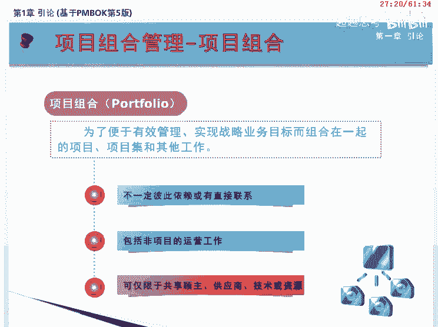

同样的有项目组合就有项目组合管理，项目组合管理是为了实现战略业务目标，而对一个或多个项目组合进行的集中管理，包括识别排序，授权管理和控制项目项目集和其他有关工作，组织关注包括投资在内的资源的有效使用。

因此项目组合管理与资源在项目上的分配，紧密相关，它的目的在于有效分配组织资源，实现其对组织的最大贡献，他重点关注的也是通过审核项目和项目集，来确定资源的分配优先顺序。

并确保对项目组合的管理与组织战略协调一致，我们可以类比一句，在投资领域很流行的俗语，不要把鸡蛋放在同一个篮子里，他说的是，不要把资金都投入在高风险的投资上面，从长远打算，资金应该合理分配。

在具有不同风险等级的投资项目上，项目组合管理的目的也是如此，为了组织的长远发展，资源分配应该有一定的优先顺序，它装有不同鸡蛋数量的篮子组合起来管理，才能不至于一次就摔碎一篮鸡蛋，组织级项目管理。

简称o p m是一种战略执行框架，通过应用项目管理，项目集管理，项目组合管理及组织驱动实践，不断地以可预见的方式取得更好的绩效，更好的结果，即可持续的竞争优势，从而实现组织战略，也就是说，项目组合。

项目集和项目管理，均需符合组织战略或者有组织战略驱动反制，项目组合，项目集和项目管理，又以不同的方式服务于战略目标的实现，o p m，把项目项目集和项目组合管理的原则和实践，与组织驱动因素如组织结构。

组织文化，组织技术，人力资源实践等联系起来，从而提升组织能力，支持战略目标，组织应该测评自身能力，然后制定和实施能力提升计划，以七系统的应用最佳实践，为了理解项目组合管理，项目集管理和项目管理。

识别它们之间的相似性和差异性非常重要，项目项目集和项目组合管理，除了在目的和关注重点上存在区别外，在范围变更，规划管理成功和监督等各个方面也有差异，这里从这几个方面，将项目项目集和项目组合做了一个比较。

有助于区分项目项目集和项目组合，我们可以暂停观看，项目组合，项目集和项目之间的关系可以这样表述，项目组合是为了实现战略目标而组合在一起，管理的项目及项目，是项目组合和运营工作的集合。

项目集包含在项目组合中，其自身又包含需协调管理的子项目及项目，或其他工作，以支持项目组合，单个项目无论属于或不属于项目集，都是项目组合的组成部分，虽然项目组合中的项目或项目集，不一定彼此依赖或直接相关。

但是他们都通过项目组合，与组织战略规划联系在一起，项目经常被作为实现组织战略规划的一种手段，组织的战略规划是决定项目投资的主要因素，通常处于以下一项或多项战略考虑，而批准项目启动，市场需求。

比如在h7 n9 流行期间，市场对口罩的需求量急速上升，为了提高其经济收益，某纺织厂看准该市场需求，决定启动提高口罩生产率的项目，以在较短的时间内生产出更多的口罩，来满足市场需求，获得更大的经济效益。

当有战略机会或者业务需求时，组织也会考虑启动一个新的项目，比如一家培训公司为了提高收入，批准一个课程开发的项目，社会需要也是启动项目的可能原因，如非政府组织批准一个项目，向地震灾区提供饮用水系统。

医疗设施，环境考虑也可能导致引起一个项目，如为降低污染，某上市公司批准一个项目，建立一项共享电动小轿车的新服务，如果客户直接向组织提出要求，比如某企业要求一软件公司为自己量身定制。

也是促进组织其中新项目的原因，除此之外，有时技术的进步也迫使企业或组织改变战略计，划，发起新的项目，来使自己的产品符合新技术的要求，正如现在电脑cpu技术不断进步，电脑内存也要跟得上才行。

因而不断会有新的项目，来从各方面提高电脑的性能，另外法律要求，对企业或组织的战略计划也有影响，例如化工厂的新产品研发产生了新的有害物质，根据相关的环境保护法的要求，该化工厂必然要批准一个。

处理新型毒害物质的项目，需要指明的是，尽管单个项目都有各自的利益，但一般都能为项目级的整体利益，项目组合的整体目标和，组织的战略目标作出贡献。

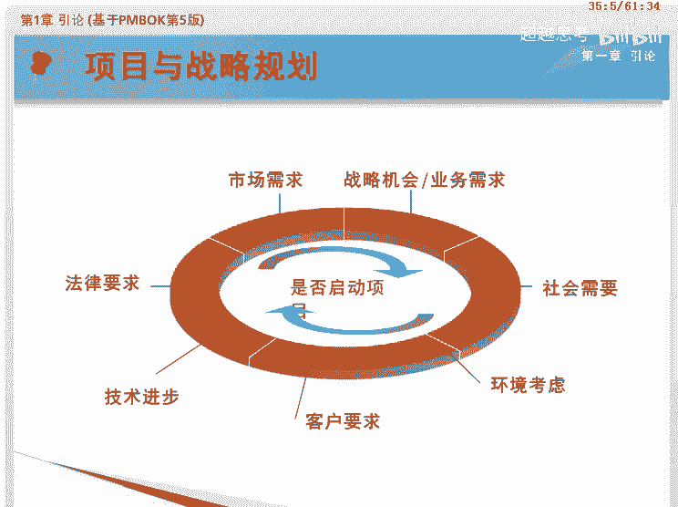

为了实现多项目项目集和项目组合的管理，企业或组织需要建立一个项目管理办公室，这样的部门，项目管理办公室project management office简称pmo。

是负责对于项目相关的治理过程进行标准化，并促进资源方法论，工具和技术共享的一个组织部门，其职责涵盖，从提供项目管理支持，到直接管理一个或多个项目，虽然项目管理办公室支持或管理多个项目。

但各项目不一定彼此关联，因此项目管理办公室的具体形式，职能和结构也不是统一不变的，而是取决于组织的需求。

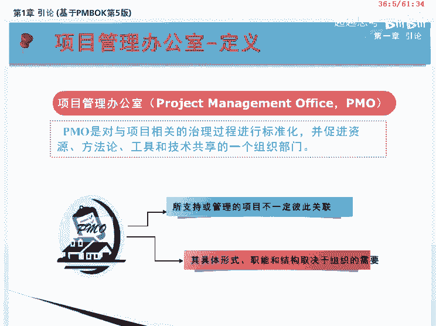

根据p mo对项目的控制和影响程度不同，可以把pmo分成如下三种类型，支持行支持型pmo担当顾问的角色，向项目提供模板，最佳实践培训，以及来自其他项目的信息和经验教学。

这种类型的pmo其实就是一个项目资源库，对项目的控制程度很低，控制型控制型pmo不仅给项目提供支持，而且通过各种手段要求项目服从，例如要求采用项目管理框架或方法论，使用特定的模板格式和工具。

或者服从智力，这种类型的pmo对项目的控制程度属于中等，指令行指令型pmo直接管理和控制项目，这种类型的pmo对项目的控制程度很高。

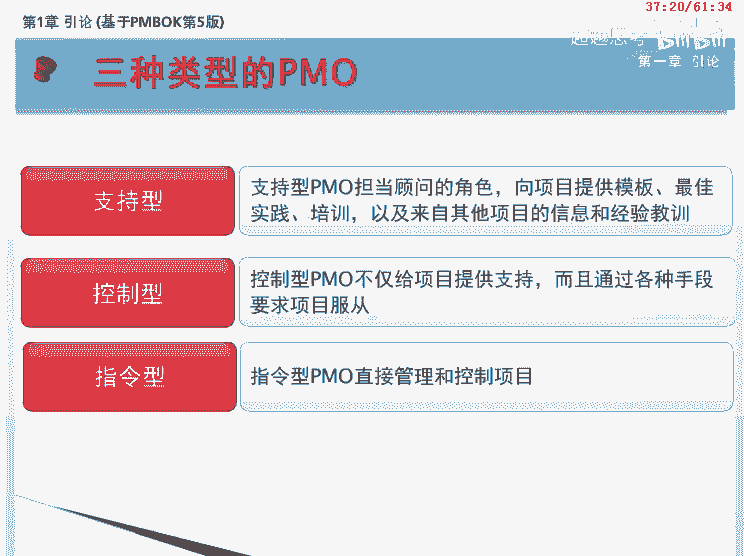

pmo可能在每个项目的生命周期中，充当不同的角色，比如在项目的开始阶段，为了确保项目符合组织业务目标，po有权随时提出建议，提前终止项目或采取其他必要措施，此外po还可参与对共享资源或专用资源的选择。

管理和调配。

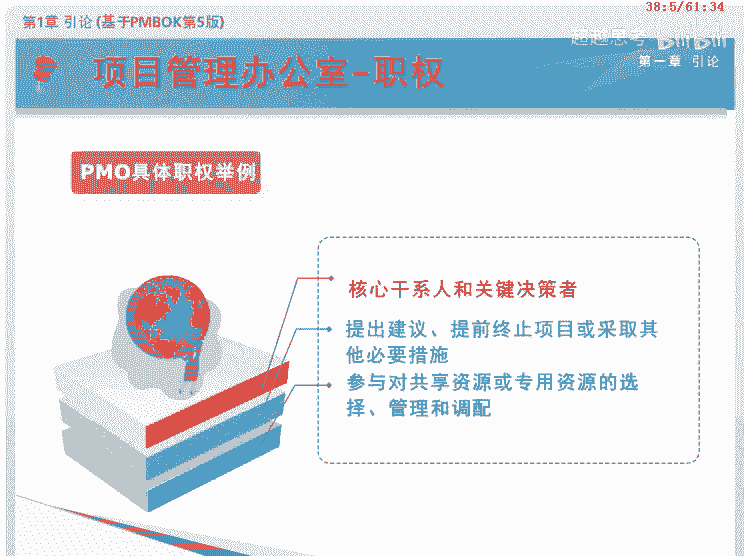

下列都是pmo可能的工作，对po所辖的全部项目的共享资源进行管理，识别和制定项目管理方法，最佳实践和标准指导辅导培训和监督，通过项目审计监督对项目管理标准，政策程序和模板的遵守程度。

制定和管理项目政策程序，模板和其他共享的文件，对跨项目的沟通进行协调，虽然po的具体职能取决于组织的需要，但它的一个最主要的职能是通过各种方式，支持项目经理，具体来说。

项目经理与po之间又存在着一些差异。

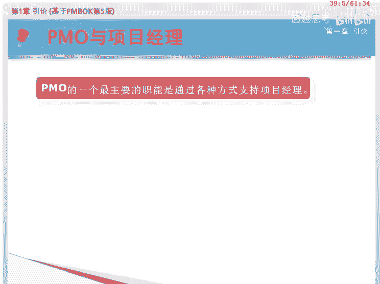

首先二者的关注目标不同，项目经理关注特定项目目标，而p m o特别关注项目及范围变更，这些变更可被看作是，能促进业务目标实现的潜在机会，其次二者管理资源的范围不同，项目经理只能控制分配给本项目的资源。

以更好地实现项目目标，而pmo负责优先利用所有项目共享的组织资源，最后项目经理和p mo管理的项目制约因素不同，项目经理管理单个项目的制约因素，如范围，进度，成本和质量等，而pmo站在企业的高度。

对方法论标准，整体风险或机会测量指标和项目间的依赖关系，进行管理，尽管二者存在差异，所遵守的要求也不相同，但他们所有努力都必须符合组织的战略需求，从项目的定义特点以及产生的结果来看。

我们平时所做的工作并不全都是项目，比如新建一个pmp学习辅导网站，是一个项目，那平时的网站运营维护，在线答疑，这些工作又是什么呢，这里要讲到一个与项目相对应的概念，运营或称运作，在一般情况下。

所有的工作可分为两类，一类是项目，另一类就是运营，与项目的临时性和独特性相比，运营是通过开展持续的活动，来生产或提供重复的服务的一种组织职能，需要说明的是，这里的组织不但包括盈利性的企业。

也包括非盈利性的组织，当然很多时候我们会用企业来代替组织的说法，这主要是由于现实经济生活中，大量的还是企业这种组织单元。

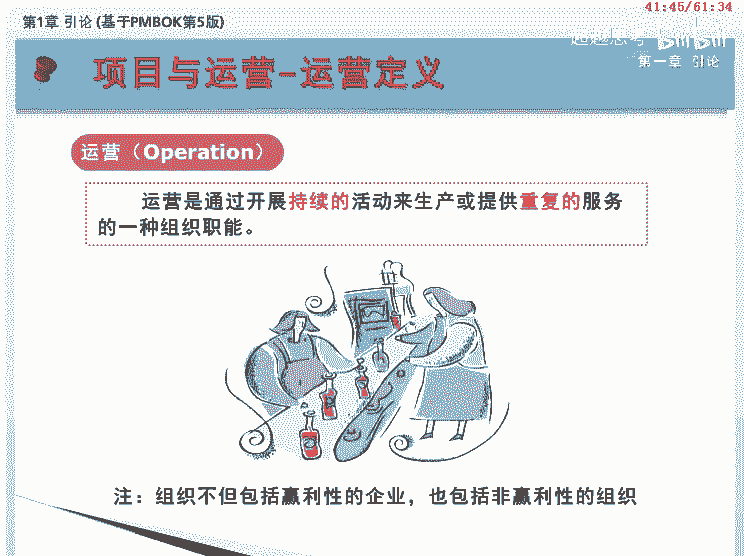

项目和运营有许多共同之处，比如他们都需要人来实施，都会受到某种因素的限制，都需要进行规划执行和监控，而且都是为了实现组织的目标或战略计划，共同点这么多，你知道怎么区分它们吗，它们之间的主要差别在于。

项目是临时的，有明确的终点，并产生独特的产品服务或成果，而运营是持续的，没有明确的终点，产生重复的产品服务或成果，根据这两点，我们就很容易清楚地区分二者了。

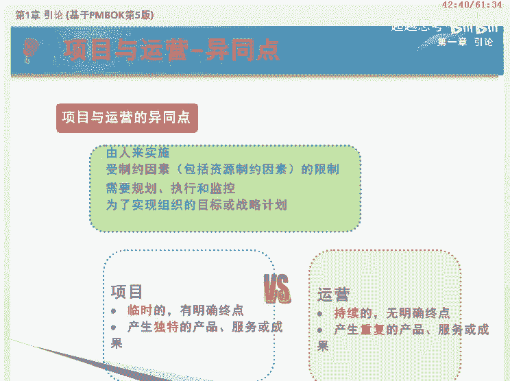

为了完成组织的战略规划，要同时执行项目和运营工作，在产品生命周期中，项目和运营可以在不同的时点交叉，在每个时点，随着相关工作的完成，可交付成果和知识在项目和运营间转移，在项目的收尾阶段。

资源可能从项目转移到运营，项目产生的结果投入到运营中，在新产品开发，产品升级或提高产量时，会启动新的项目，此时资源会从运营转移到项目当中。

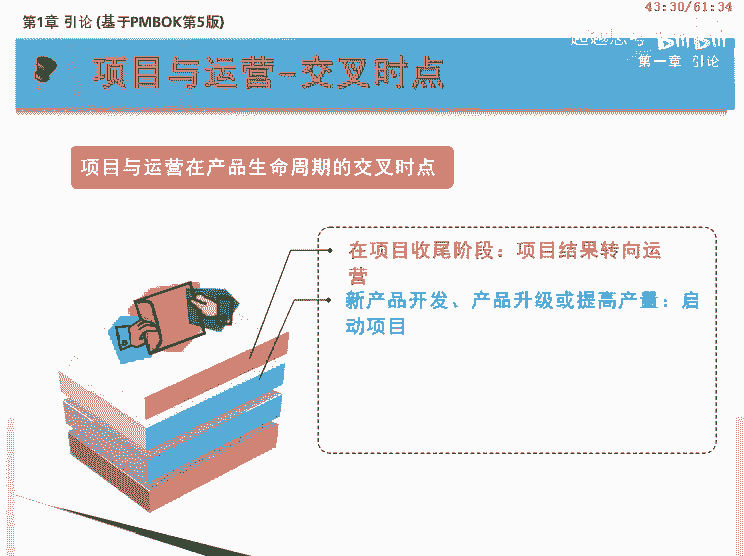

在改进运营或产品开发流程时，也需要启动项目，也是把资源从运营转移到项目当中，最后在产品生命周期结束之前，也就是产品退出运行之前，可能会要对产品进行报废，之前的运营工作结束，开始实施报废项目。

以便结束产品的生命周期，我们知道运营和项目是不同性质的工作，运营管理也不同于项目管理，但是如果项目将对运营工作人员的工作和事业，产生影响，那么项目管理者应该在项目中，认真考虑这些运营干系人的需求。

项目经理需要考虑运营干系人，并邀请他们适当参与项目的所有阶段，以便获取他们的见解，防止因忽视他们的意见而导致不必要的麻烦，运营干系人应该参与项目，他们的需求应该记录在干系人登记册中。

他们的影响包括正面和负面的影响，应该记录在风险管理计划中。

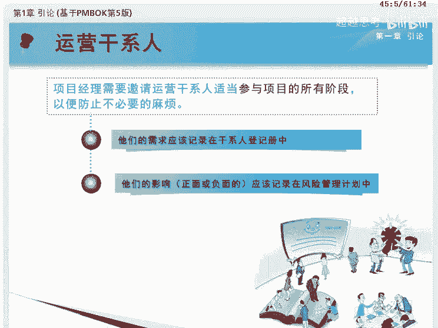

运营干系人的例子包括设备操作员，生产线主管服务台，员工生产系统，支持分析师，客户服务代表，销售人员，维修工人，电话销售人员，呼叫中心人员，零售工人，实现经理，培训专员等，基于项目的组织。

p p o是指建立临时机构来开展工作的，各种组织形式，在各种不同的组织结构中都可以建立p，p p o的优势，因为在p p o中，考核工作成败的依据是最终结果，与职位或政治因素无关。

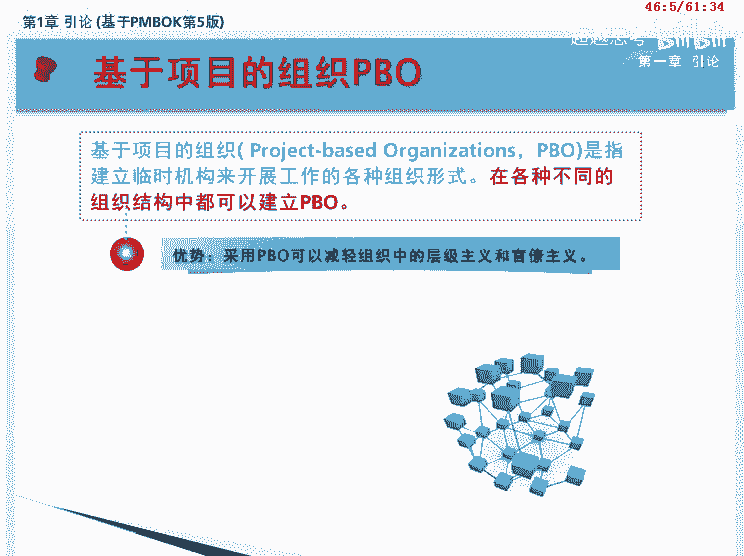

p p o的特点，在p p o中，大部分工作都被当做项目来做，按项目方式而非职能方式进行管理，例如针对一家出版社，可以把工作按照每一本书的出版发行，设置为一个个的项目，p p o可建立在多个层次。

比如可以在整个公司层面采用p o，也可以仅在组织的某个部门或分支机构内部，采用p o，一些大型的p p o可能需要职能部门的支持，世界上没有完全相同的两片树叶，每个组织都有其独特的商业价值。

商业价值指组织所从事业务的整体价值，包括全部的有形价值和无形价值，有形价值包括货币资产，固定设备，股东权益，其他有用的物品或器材等，无形价值包括商誉，品牌认知度，公共利益，商标等。

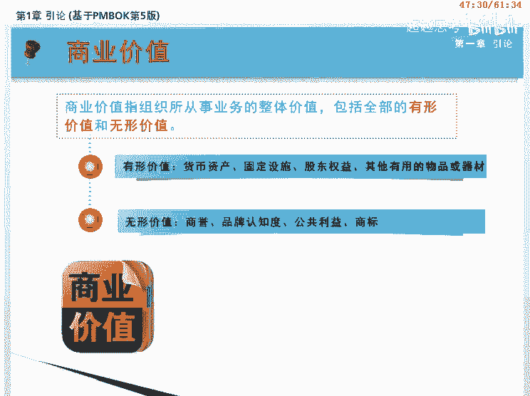

组织存在的目的，就是创造提升和维护自己的商业价值，项目组合，项目集和项目，是组织快速实现商业价值的有力保障，前面的课程，我们讲解了项目以及项目所处环境的相关知识，我们已经对项目经理的重要性有了初步认识。

下面我们就来了解一下项目经理的角色，与p m o不同，项目经理是执行组织，委派领导团队实现项目目标的个人，这是一个富有挑战且备受瞩目的角色，具有重要的职责和不同的权利，主要对完成项目的目标负责。

对项目进行管理，项目经理必须能理解项目的细节，但这并不意味着，项目经理要自己做项目中所有的事情，而是从项目全局的角度管理项目的所有方面，特别是对于大项目来说，项目经理主要就是一个整合者和沟通者。

其中整合主要是通过沟通实现的，项目经理的主要职责包括，组织制定项目管理计划和所有子计划，使项目符合进度和预算要求，识别监测和应对风险，准确及时的报告项目进展。

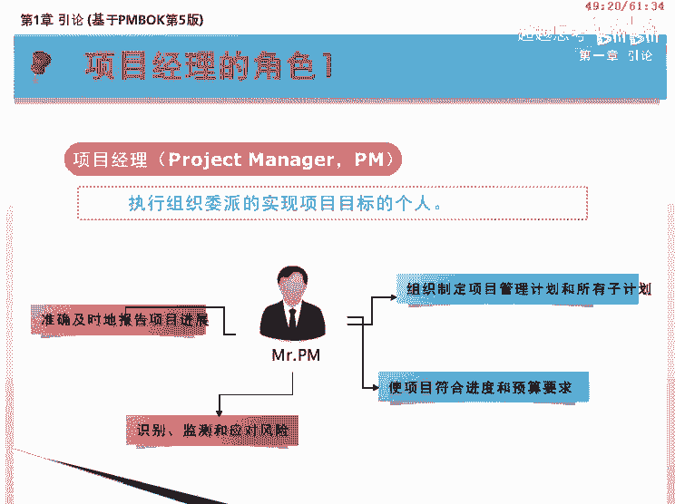

既然项目经理在整个项目中，扮演着如此重要的角色，那对项目经理的能力要求也是相当高的，作为项目的管理者，整合者和沟通者，掌握项目管理的各种工具和技术是必不可少的，但是远远不够。

它必须具备多方面的能力和素质，一般而言包括三个方面，首先它必须具备一些特定应用领域的技能，也就是说项目经理需要具有所管辖项目，所属应用领域的技能，比如说，如果一个项目经理，负责的是一个软件开发的项目。

那么他必须对软件开发的流程，相关标准，甚至是软件开发的相关术语都要有所了解，当然也还包括一些职能部门和支持领域的技能，项目经理必须具备的第二个方面的能力，是通用的管理能力。

这是作为一个管理者所必须具备的，比如财务方面的管理，采购方面的管理，销售方面的管理等等，另外也是非常重要的一点，项目经理还必须具备一定的知识，实践能力和个人能力，知识是指我们对项目或者项目管理领域的知。

识和技能，知道了什么，知道了多少，实践能力，就是我们能够应用所掌握的知识，做什么事情，完成哪些目标，在领导和管理项目及项目团队时，项目经理的个人能力也非常重要，它主要指项目经理工作中的行为方式。

项目经理的态度，人格特征和领导力，对项目的执行，项目团队的建设都具有相当大的影响，决定着项目经理行为的有效性。

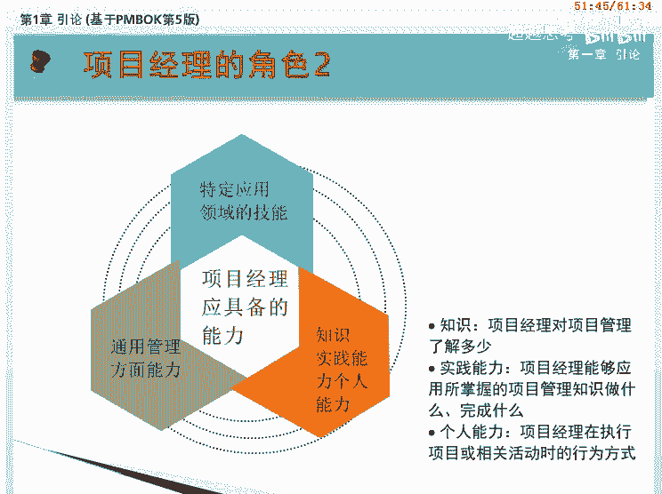

在企业或组织中，除了有项目经理，还有职能经理和运营经理，三者的角色和职责也存在差异，项目经理负责实现项目目标，职能经理则是在行政或职能领域，承担管理角色的重要人物，比如人力资源管理，财务管理。

采购管理等等，运营经理则是在核心业务领域，承担管理角色的个人，比如研发设计制造等等，他们直接管理供销售的产品或服务，的生产和维护，他们都配有固定的员工，已开展持续性工作。

并能全权管理所辖职能领域的所有任务，尽管三者的角色和职责不同，但都能不同程度地支持项目目标的实现，职能经理能够为项目提供相关领域的专业技，术或服务，比如为项目提供财务方面的人力支持。

并为项目成本管理提出建议，在项目完成目完成项目的项目的技术，其他其他永久性的文件，全网需要移交给交给运营管理管理人员，运营经理，运营经理负责把移交的项目纳入日运营运营中，并为之提供长期支持。

本课程最后一个知识点是项目管理知识体系，项目管理知识体系，主要指那些项目管理领域内独特，以及与其他管理学科重叠的知识，项目管理知识体系指南及本课程学习的pm，报考指南是项目管理知识体系的一部分。

项目管理知识体系主要由三部分组成，项目生命周期的定义，五大项目管理过程组和十大知识领域，这些在以后的课程中都会为大家详细讲解。

五个过程组和十大知识领域，是项目管理体系中的重点内容，五个过程组包括启动规划执行监控，收尾过程组，十大知识领域则包括，项目整合管理，项目范围管理，项目时间管理，项目成本管理，项目质量管理。

项目人力资源管理，项目沟通管理，项目风险管理，项目采购管理和项目干系人管理，每一个知识领域包含了若干个过程，在美国过程组中也会涉及相关知识领域的过程，每个过程都是由各过程的输入输出，以及工具与技术组成。

各个过程之间通过输入输出相互联系在一起，构成了项目管理知识体系的整体大厦。

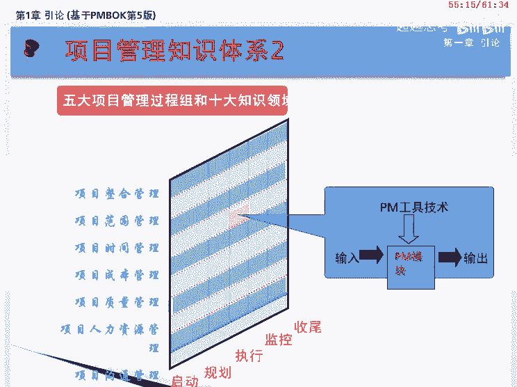

在我们后续的学习中，会涉及到许多项目管理方面的方法和工具，我们先对最主要的几个做一介绍，让大家对今后的课程内容有个初步印象，项目管理历史悠久，但很多项目管理工具都是近百年产生的。

而且很多项目管理技术来源于军事，1917年，亨利甘特发明了甘特图，首次使用条形图进行进度安排，20世纪50年代，美国杜邦公司创造了关键路径法，用于复杂进度计划的编制，同时美国海军开始使用计划评审技术。

进行工期估算和计划编排之后的工作，分解结构，蒙特卡洛模拟技术和政治分析技术，更为现代项目管理学科奠定了基础。

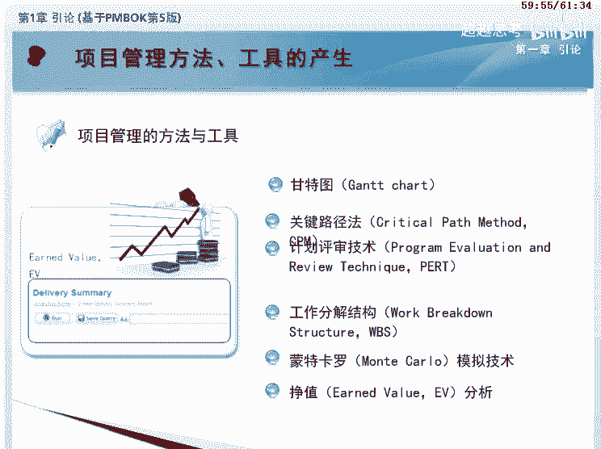

最后我们对本课程的核心知识，做一个简单的回顾，项目是为创造独特的产品服务或成果而进行的，临时性工作，具有临时性，独特性和渐进明细性，项目管理是将知识技能，工具与技术应用于项目活动，以满足项目要求。

项目集管理重点关注项目间的依赖关系，项目组合管理重点关注资源分配优先顺序，pmo是负责对所辖各项目集中管理的组织部门。

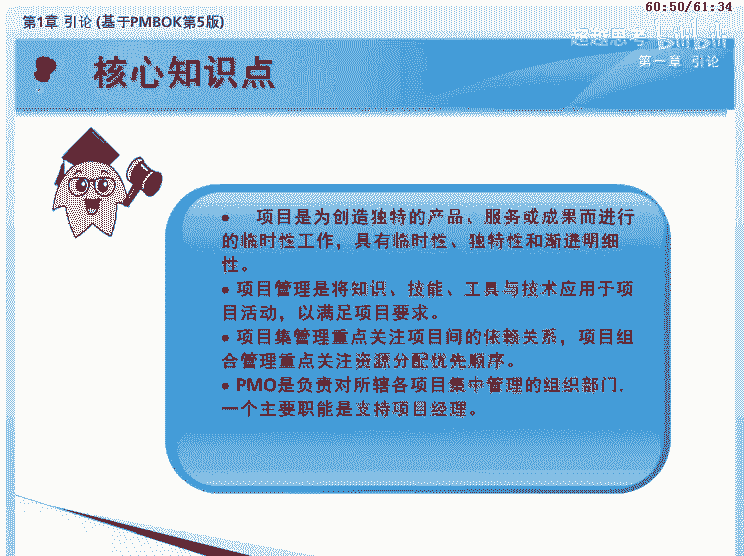

一个主要职能是支持项目经理，项目经理是执行组织，委派其实现项目目标的个人，他应，各位学员，恭喜您已经完成了p np项目管理，第一章引论的学习建议，接下来继续学习，第二章组织影响和项目生命周期。

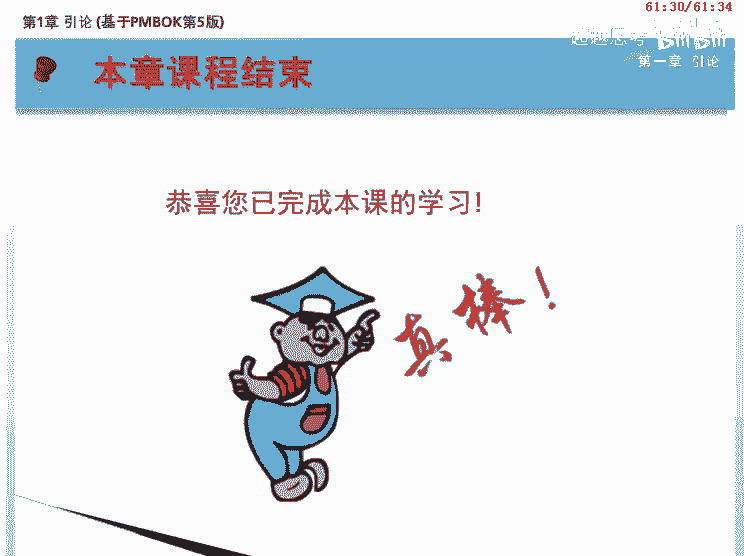