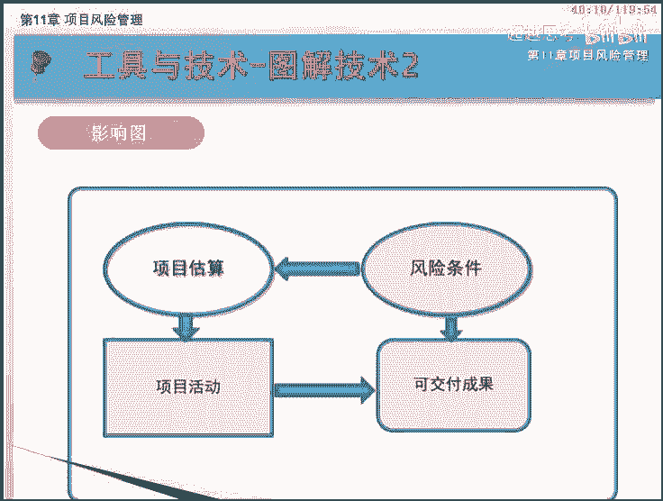
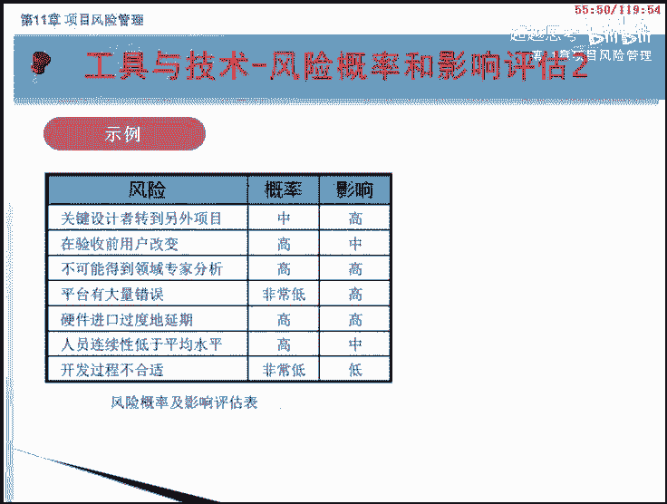
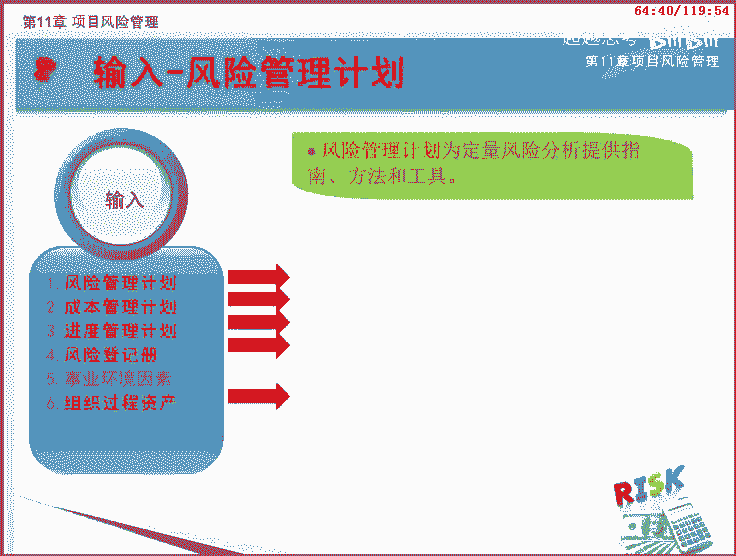
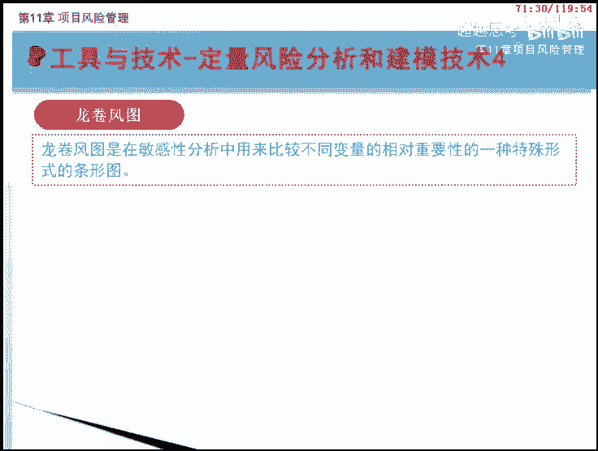
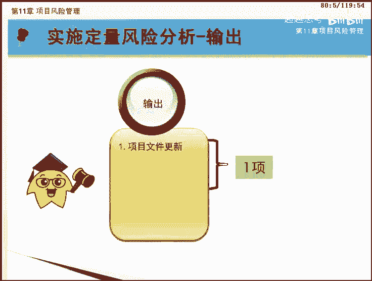
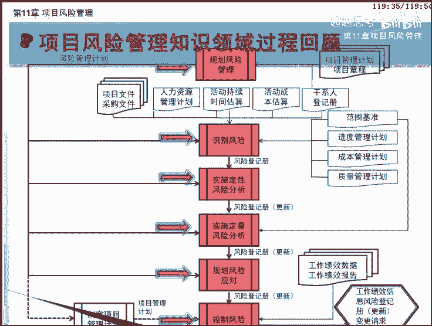

# PMP第五版PMBOK5完整培训视频教程 项目管理 - P11：11 - 超越思考 - BV1NY4y1U7s2

欢迎来到pmp项目管理网络课程的学习，本课程基于最新发布的pm报告指南第五版，下面我们将一起学习第11章项目风险管理，项目风险管理的目标在于，提高项目中积极事件的概率和影响。

降低项目中消极事件的概率和影响，项目风险管理知识领域共有六个过程，它们分散在规划过程组和监控过程组中，其中有五个过程在规划过程组可见，项目的风险管理主要依赖于规划，其中规划过程组的过程有规划风险管理。

识别风险，实施定性风险分析，实施定量风险分析和规划风险应对，监控过程组的过程是控制风险，这六个过程不但彼此互相作用，而且还与其他知识领域中的过程相互作用，请务必记下来，此外在学习的过程中。

大家还要格外注意，每个过程所使用的工具和技术，这也是本章的重点内容，先来看看什么是项目风险管理呢，项目风险管理包括规划风险管理，识别风险，实施风险分析，规划风险应对和控制风险等，各个过程，风险无处不在。

例如项目进度拖延，项目费用超出预算，团队成员离职，产品出现质量缺陷，功能无法满足客户要求等，但是这并不意味着项目中的风险是无法管理的，相反任何一个项目的管理者都必须面对风险，积极主动开展风险管理。

比如我们生活中，为了顺利买到春运的火车票，往往事先计划好行程，准备好备选车次和可更改的日期，通过网络电话等多渠道购票，有时还要考虑一旦购买火车票失败，是否采取其他方式等备用计划，这就是在做风险管理。

实际上，项目中的大多数风险都是可以预测和管理的，通过合理的风险管理，项目风险会大大降低，项目成功的可能性大大提高，本周我们来学习项目风险管理的知识，人们常常提到风险，我国古代也积累了大量关于风险的成语。

比如有备无患，防患未然，居安思危，未雨绸缪等，但不是每个人都认真地思考过风险的含义，作为项目管理人员，必须弄清楚什么是风险，我们首先来了解风险的基本概念，包括风险的定义。

分类以及风险管理在整个项目管理中的作用，风险是一种不确定的事件或条件，一旦发生，会对至少一个项目目标造成影响，需要特别说明的是，这种影响可能是坏的损失，也可能是好的利益，积极的风险被称为机会。

消极的风险被称为威胁，机会和威胁都属于风险，在项目管理中，风险不可避免，因此风险管理在项目管理知识体系中。

占据了非常重要的位置，项目不同阶段会有不同的风险，风险大多数随着项目的进展而变化，不确定性会随之逐渐减少，最大的不确定性存在于项目的早期，在项目各种风险中，进度拖延往往是费用超支。

现金流出以及其他损失的主要原因，俗话说，长痛不如短痛被减少，项目整体损失在早期阶段主动付出必要的代价，要比拖到后期阶段。

迫不得已采取措施好得多，风险主要涉及四个要素，第一是起因，风险的起因可以是已知或潜在的需求，假设条件，制约因素或某种状况，可能引起消极或积极结果，例如项目需要先申请环境许可证。

或者分配给项目的设计人员有限，都可能成为风险起因，其次是条件，也称事件，是指可能引发项目风险的各种项目，或组织环境因素，如不成熟的项目管理实践，缺乏综合管理系统。

多项目并行实施或依赖不可控的外部参与者等。

另外风险的发生有一定的概率，因此我们要分析发生的概率有多大，最后风险的发生会导致一定后果，从而对项目的成本进度或绩效等目标产生影响，风险管理就是围绕风险的起因，发生条件，概率和后果分析。

以有效方法管理风险，把绝对不可控变成相对可控，一般情况下，将风险事件，概率和后果这三者称为风险的三要素，组织把风险看作不确定性，给项目和组织目标造成的影响，基于不同的风险态度。

组织和干系人愿意接受不同程度的风险，组织和干系人的风险态度受多种因素影响，这些因素大体可分为三类，风险偏好，为了预期的回报，一个实体愿意承受不确定性的程度。

风险承受力，组织或个人能承受的风险程度数量或容量，风险临界值，干系人特别关注的特定的不确定性，程度和影响程度，低于风险临界值，组织会接受风险，高于风险临界值，组织将不能承受风险。

风险态度是指人对风险所采取的态度，属于事业环境因素，或者说是对重要的不确定性认知，所选择的回应方式，可以根据个人或团体对风险所采取的态度，把它们分为三类，风险规避者，风险中立者和风险追随者。

图中展示了三类人群对风险的态度，中间蓝色的曲线是风险中立者的态度，他们希望活动获得成功的概率，随着投入的增加，呈s曲线规律增加，当投入少时，人们可以接受较大的风险，即获得成功的概率不高，也可能接受。

当投入逐渐增加时，人们就开始变得谨慎起来，希望活动获得成功的概率提高了，最好达到百分之百，上面红色的曲线是风险规避者的态度，他们谨慎小心逃避风险，即使投资很小的项目，也不希望有太大的风险。

他们希望所有项目获得稳妥的成功可能性，最下面绿色曲线是风险追随者的态度，他们敢于冒险，即使投资很大时，也能承受风险，按照pm报告指南第五版，项目风险管理主要通过六个过程完成。

首先要通过制定项目风险管理计划，指导项目风险管理活动的各过程，这是进行风险管理的基础，对应的过程是规划风险管理之后，开始从各种渠道识别风险，并记录风险特征，这个过程是识别风险。

接下来使用实施定性风险分析过程，评估并综合分析风险的发生概率和影响，对风险进行优先排序，对于重要风险还要进行定量分析，在上面分析的基础上执行规划风险应对过程，针对项目目标制定提高机会。

降低威胁的方案和措施，在整个项目执行过程中，需要实施风险应对计划跟踪，以识别风险，监督残余风险，识别新风险以及评估风险过程的有效性，这是监控风险过程的职责，本课程我们将一起学习第11章。

项目风险管理知识领域的第一节规划。

风险管理，通过本节课程的学习，我们将要达到以下目标，包括掌握风险和规划，风险管理过程的定义，熟悉规划，风险管理过程的输入工具与技术及输出的内容。

了解分析技术和规划会议的内容，了解风险管理计划包含的内容，熟悉风险类别以及风险概率和影响的定义，本课程我们将按照如画面所示的大纲为您讲述，首先是对规划风险管理过程的基本含义，进行讲解。

接下来讲解规划风险管理过程的输入，工具和技术，以及输出课程的，最后是本节核心知识整理，在学习本过程之前，我们先来了解一个基本概念，规划风险管理过程，规划风险管理是定义，如何实施项目风险管理活动的过程。

本过程的主要作用是确保风险管理的程度，类型和可见度，与风险及项目对组织的重要性相匹配，风险管理计划对促进与所有干系人的沟通，获得他们的同意与支持，从而确保风险管理过程。

在整个项目生命周期中的有效实施至关重要，仔细周密的规划，将提高其他风险管理过程的成功率，规划风险管理的重要性，还在于为风险管理活动安排充足的资源和时间，并为评估风险奠定一个共同认可的基础。

规划风险管理过程在项目构思阶段就应该开始，并在项目规划阶段的早期完成，接下来让我们来看看风险管理计划，是如何被制定出来的，规划，风险管理就是依据项目章程和项目管理计划中，已有的子计划。

考虑了干系人登记册中识别出的，所有干系人在风险中的角色，使用分析技术和规划会议等工具与技术，得到最终的子计划，风险管理计划，这是规划风险管理过程的数据流向图，可以看到该过程通过输入。

输出与其他过程进行交互。

规划风险管理过程共有五个输入项目管理计划，项目章程，干系人登记册，事业环境因素和组织过程资产，下面我们依次来了解他们吧。

项目管理计划提供了会受风险影响的范围，进度和成本的基准或当前状态，在规划风险管理时，应该考虑所有已批准的自管理计划和基准，使风险管理计划与之相协调，风险管理计划也是项目管理计划的组成部分。

制定项目风险管理计划时需要参考项目章程，项目章程可提供各种输入，如高层及风险项目描述和需求。

干系人登记册，包含了项目干系人的详细信息及角色概述，进行风险管理时，需要考虑各类干系人对风险的态度和影响，也需要从各类干系人那里获得风险输入，能够影响规划风险管理过程的事业环境因素，包括组织的风险态度。

临界值和承受力，他们描述了组织愿意并能够承受的风险程度。

能够影响规划风险管理过程的组织过程，资产包括风险类别，概念和术语的通用定义，风险描述的格式标准，模板，角色和职责决策所需的职权级别以及经验教训，规划风险管理过程共有三个工具和技术，它们分别是分析技术。

专家判断和会议，下面我们一块来学习。

分析技术用来理解和定义项目的总体，风险管理环境，风险管理环境是基于项目总体情况的，干系人风险态度和项目战略风险敞口的组合，例如可以通过对干系人风险资料的分析。

确定该系人的风险偏好和承受力的等级与性质，其他技术如战略风险积分表，用来基于项目总体情况，概要的评估项目的风险敞口，这里的风险敞口指未加保护的风险，基于这些评估，项目团队可以调配合适资源。

并关注风险管理活动，为了编制全面的风险管理计划，应该征求那些具备特定培训经历或专业知识的，小组或个人的意见，这里使用的就是专家判断技术，为了制定风险管理计划，项目团队应举行规划会议。

参与者可包括项目经理，选定的项目团队成员和干系人，组织中负责管理风险，规划和应对活动的任何人员，以及需要参加的其他人员。

风险规划会议的内容包括，确定实施风险管理活动的总体计划，确定用于风险管理的成本种类和进度活动，并分别将其纳入项目预算和进度计划中，建立或评审风险应急储备使用方法，分配风险管理职责，根据具体项目的需要。

裁剪组织中有关风险类别和术语，定义等的通用模板，如果组织中缺乏可供风险管理，其他步骤使用的模板，会议中可能也要制定这些模板，规划风险管理过程只有一个输出风险管理计划，下面我们一块来学习。

风险管理计划是项目管理计划的组成部分，描述将如何安排与实施风险管理活动，风险管理计划包括以下内容，方法论，确定项目风险管理将使用的方法，工具及数据来源，角色与职责，确定每个风险管理活动的领导者。

支持者和参与者，并明确他们的职责预算，根据分配的资源估算所需资金，并将其纳入成本基准，制定应急储备和管理储备的使用方案，事先安排，确定在项目生命周期中，实施风险管理过程的时间和频率，制定进度。

应急储备的使用方案，确定风险管理活动，并纳入项目进度计划中，风险类别规定了对潜在风险成因的分类方法，它提供了一种结构化方法，把所有可能的风险系统的组织起来，有助于项目团队在识别风险的过程中。

发现有可能引起风险的多种原因，风险分解结构，r b s是按风险类别排列的一种层级结构，不同的r b s适用于不同类型的项目组织，可使用事先准备好的分类框架，可以是简易的分类清单，或结构化的风险分解结构。

我们看到这里把风险分为了四大类，分别是技术类，外部类，组织类和项目管理类，采用rbs的一个好处是提醒风险识别人员，风险产生的原因是多种多样的，要全面考虑各方面风险存在的可能性。

风险可分为内部风险和外部风险，内部风险指在项目团队的控制和影响之内，的风险，包括技术风险和项目管理风险，技术风险，如采用的技术过于复杂或不成熟，绩效目标脱离实际等。

项目管理风险包括项目管理计划实施效果差，时间资源分配不当。

项目沟通差等，外部风险只超出了项目团队的控制范围，的风险包括组织风险和环境风险，组织风险如多个项目之间的资源冲突，项目资金不足，组织内部各项目优先级不确定，环境风险如市场上通货膨胀，法律法规变化。

风险可以分为已知风险和未知风险两大类，已知风险指项目团队能够识别和分析的风险，也就是风险事件概率和影响都知道的风险，未知风险是无法进行主动管理的风险，也就是风险事件概率和影响。

这三个要素至少有一个不知道的风险，未知风险又可以分为已知未知和未知未知。

两大类，已知未知是说风险是已知的，但是不知道风险发生的概率或影响，未知未知是说不知道有此风险的存在，当然更无法知道发生的概率，已知未知风险动用应急储备，而未知未知风险需要动用管理储备。

为了确保风险分析的质量和可信度，需要对项目环境中特定的风险，概率和影响的不同层次进行定义，画面所说的表格，定义了风险对四个项目目标的影响度，在规划风险管理过程中，需要根据不同项目的具体情况。

以及组织的风险临界值来检查，通用的风险概率和影响定义，供实施定性，风险分析过程，使用，本表格只对风险产生的消极影响进行了定义，我们也可以用类似的方法对积极影响进行定义，这个影响度的定义是很主观的。

风险管理计划中的其他内容，包括概率和影响矩阵，概率和影响矩阵，是把每个风险发生的概率和一旦发生，对项目目标的影响映射起来的表格，根据风险可能对项目目标产生的影响，对风险进行优先排序，修订的干系人承受力。

可在规划风险管理过程中，对干系人的承受力进行修订，以适应具体项目的情况，报告格式规定将如何记录，分析和沟通风险管理过程的结果，规定，风险登记册以及其他风险报告的内容和格式。

跟踪规定将如何记录风险活动，促进当前项目的开展，以及将如何审计风险管理过程，本课程的主要内容到此学习完毕，现在我们来回顾一下本过程的核心知识，风险是指一旦发生，就会对项目目标产生积极或消极影响的。

不确定事件或条件规划，风险管理是定义，如何实施项目风险管理活动的过程。

风险管理计划是项目管理计划的组成部分，描述将如何安排与实施风险管理活动，风险分解结构二，bs是按风险类别排列的一种层级结构，有助于项目团队识别风险，风险分为已知风险和未知风险。

其中未知风险又分为已知未知和未知未知风险，恭喜你完成规划风险管理过程的学习，我们下节课见。

本课程我们将一起学习第11章，项目风险管理知识领域的第二节识别风险。

通过本课程的学习，我们将要达到以下目标，包括掌握识别风险过程的定义，熟悉识别风险过程的输入，工具与技术及输出的内容，掌握信息收集技术在识别风险中的应用，熟悉风险登记册的内容。

本课程我们将按照如画面所示的大纲为您讲述，首先是对识别风险过程的基本含义进行讲解，接下来讲解识别风险过程的输入工具与技术，以及输出课程的，最后是本节的核心知识整理。

在学习本过程之前，我们先来了解一个基本概念，什么是识别风险，识别风险是判断哪些风险可能影响项目，并记录其特征的过程，本过程的主要作用是对已有风险进行文档化，并为项目团队预测未来事件积累知识和技能。

应鼓励全体项目人员参与潜在风险的识别工作，特别是项目团队应参与识别风险过程，以便创造并维护团队成员对风险及其应对措施，的主人翁感和责任感，识别风险是一个反复进行的过程，反复的频率及每轮的参与者。

因具体情况不同而异，接下来让我们来看看如何识别风险，识别风险时需要在风险管理计划的指导下，参考其他子计划及范围，基准成本估算，持续时间估算以及其他相关文件，使用各种工具和技术。

把识别出来的风险原因以及潜在影响记录下来，形成风险登记册，图中所示是识别风险过程的数据流向图，可以看到该过程通过输入，输出与其他过程进行交互，识别风险过程共有13个输入，它们是风险管理计划。

成本管理计划，进度管理计划，质量管理计划，人力资源管理计划，范围基准活动成本估算活动持续时间，估算干系人登记册，项目文件，采购文件，事业环境因素和组织过程资产，下面我们依次来向您介绍。

风险管理计划，为识别风险过程提供一些关键要素，包括角色和职责分配，已列入预算和进度计划的风险管理活动，以及可能以风险分解结构的形式，呈现的风险类别，识别风险时还应参考各个子管理计划，从中识别风险。

这些子计划包括成本管理计划，进度管理计划，质量管理计划和人力资源管理计划等，项目范围说明书中包括项目的假设条件，应该把项目假设条件中的不确定性，作为项目风险的潜在原因加以评估。

w bs是识别风险过程的关键输入，因为它方便人们同时从微观和宏观两个层面，认识潜在风险，可以在总体控制账户和工作包层级上识别，并继而跟踪风险，对活动成本估算进行审查，有利于识别风险。

活动成本估算是对完成进度，活动可能需要的成本的量化评估，最好用一个区间来表示，区间的宽度代表着风险的程度，在进行活动持续时间估算时，估算区间的宽度也代表着风险的相对程度。

因此对活动持续时间估算进行审查，有利于识别与活动或整个项目的应急储备时间，有关的风险，前面我们提到过，应鼓励更多的干系人参与风险识别，可以利用干系人的信息，确保关键干系人，特别是发起人和客户。

能以访谈或其他方式参与识别风险过程，为识别风险过程提供各种输入，项目文件能为项目团队更好地识别风险，提供与决策有关的信息，项目文件有助于跨团队沟通，和干系人之间的沟通，项目文件包括项目章程，项目进度。

计划进度，网络图，问题日志质量核对单，以及对识别风险有用的其他信息，如果项目需要采购外部资源，采购文件就成为识别风险过程的重要收入，采购文件的复杂程度和详细程度，应与计划采购的价值及采购中的风险相匹配。

能够影响识别风险过程的事业环境因素，包括公开发布的信息，比如商业数据库，学术研究资料，公开发布的核对单标杆，对照资料，行业研究资料以及风险态度等，能够影响识别风险过程的组织过程，资产包括项目文档。

比如实际数据，组织和项目的过程控制资料，风险描述和格式或模板，经验教训等，识别风险过程共有七个工具和技术，它们分别是文档审查，信息收集技术，核对单分析，假设分析，图解技术，svt分析以及专家判断。

下面让我们一块来学习。

识别风险过程的第一步是文档审查，就是对项目文档包括各种计划，假设条件，以往的项目文档，协议和其他信息等进行结构化审查，项目计划的质量，以及这些计划与项目需求和假设，之间的匹配程度。

都可能是项目的风险指示器，都可以通过有经验的文档审查发现分析，识别风险，在识别风险过程中，需要收集很多的信息，可用于识别风险的信息，收集的技术包括头脑风暴，德尔菲技术访谈以及根本原因分析。

接下来我们对这四种方法进行具体讲解。

前面范围管理知识领域的收集需求过程中，我们已经学习过头脑风暴方法，在识别风险时，也可以使用头脑风暴，获得一份综合的项目风险清单，通常由项目团队开展，头脑风暴，团队以外的多学科专家也经常参与其中。

在主持人的引导下，参加者提出各种关于项目风险的注意，头脑风暴可采用畅所欲言的传统自由模式，也可采用结构化的集体访谈方式，可用风险类别作为基础框架，然后以风险类别进行识别和分类，并进一步阐明风险的定义。

德尔菲技术，是组织专家达成一致意见的一种方法，最大特点是项目风险专家匿名参与其中，组织者使用调查问卷，就重要的项目风险征询意见，然后对专家的答卷进行归纳，并把结果反馈给专家做进一步评论。

这个过程反复几轮后就可能达成一致意见。

德尔菲技术有助于减轻数据的偏移，防止任何个人对结果产生不恰当的影响，访谈是指访谈有经验的项目参与者，干系人或相关主题专家，获得他们对风险的识别，这有助于识别风险，根本原因分析是指发现问题。

找到其深层原因，并制定预防措施的一种特定技术。

风险识别实际是关于将来风险事件的设想，是一种预测，如果把人们经历过的风险事件及其来源，罗列出来，写成一张核对单，那么项目管理人员看了就容易开阔思路，容易想到本项目会有哪些潜在的风险。

可以根据以往类似项目和其他来源的，历史信息与知识，编制风险识别和对单，核对单简单易用，但无法穷尽，所以应该注意，不要用核对单取代必要的风险识别，努力，在项目收尾过程中，应该对核对单进行审查。

并根据新的经验教训改进核对单，供未来项目使用，核对单可以包含多种内容，例如以前项目成功或失败的原因，项目其他方面规划的结果，如范围，成本质量进度，采购与合同，人力资源沟通等计划成果。

还有项目产品或服务的说明书，图中展示的是一个研发项目的风险检查单，其中根据历史经验，把可能发生的风险按内部，外部和可控不可控两个维度进行描述，这样在我们识别风险时，就可以用它作为参考了。

每个项目及其计划，都是基于一套假想设想或假设而构建的，假设分析是检验假设条件在项目中的有效性，并识别因其中的不准确，不稳定，不一致或不完整而导致的项目风险，识别风险时可用的图解基础包括三种，因果图。

又称石川图或鱼骨图，用于识别风险的起因系统或过程流程图，显示系统各要素之间的相互联系，及因果传导机制，影响图，用图形方式表示变量与结果之间的因果关系，事件时间顺序及其他关系，图中所示是影响图的示例。

我们看到风险条件可以直接影响可交付成果，也可以通过影响项目估算而影响项目活动，最终间接影响可交付成果，这里不仅展现了因果关系，也展现了影响的顺序。

在现代项目管理领域，sport分析应该算是一个众所周知的工具，在风险管理中，smart分析实际上是对项目内外部条件，各方面内容进行综合和概括，进而分析项目的优劣势，面临的机会和威胁的一种方法。

通过sout可以识别出风险，vt分析从四个角度对研究对象进行分析，s代表优势，w代表劣势，o代表机会，t代表威胁，其中s w侧重内部因素，ot侧重外部因素，首先从项目组织或一般业务范围的角度。

识别组织的优势和劣势，然后通过smart分析，识别出由组织优势带来的各种机会，以及有组织劣势引发的各种威胁，来看一个电信行业svd分析的模板，某电信公司进行业务规划或者项目规划时。

可以按照该模板进行分析，先考虑内部因素，把自己的优势和劣势罗列出来，可以从网络经营，人才研发等多个角度考虑自己的优缺点，再考虑外部因素，把机会和威胁列出来，可以从政治，经济，社会科技等角度考虑。

最后可以看到这些因素之间有一定的交叉，针对那些既是优势又是机会的因素，要把握住并加以利用，针对既是劣势又是威胁的因素，要竭力克服和避免，拥有类似项目或业务领域经验的专家，可以直接识别风险。

邀请他们根据以往经验和专业知识，指出可能的风险，在进行专家判断时需要注意专家的偏见，识别风险过程只有一个输出风险登记册，我们一块来学习。

识别风险过程的主要输出就是风险登记册，该过程填写了风险登记册的最初内容，随着其他风险管理过程的实施，风险登记册还会记录，风险分析和风险应对规划等过程的结果，其中的信息种类和数量也就逐渐增加，也就是说。

风险登记册的编制始于识别风险过程，然后供其他风险管理过程和项目管理过程使用，退出的风险登记册包括如下信息。

以识别风险清单，对以识别风险进行尽可能详细的描述，可采用结构化的风险描述语句对风险进行描述，例如某事件可能发生，从而造成什么影响，或者如果存在某个原因，某事件就可能发生，从而导致什么影响。

在罗列出已识别风险之后，这些风险的根本原因可能更加明显，风险的根本原因就是，造成一个或多个以识别风险的基本条件或事件，应记录在案，用于支持本项目和其他项目，以后的风险识别工作，潜在应对措施清单。

在识别风险过程中，有时可以识别出风险的潜在应对措施，这些应对措施应该作为规划风险，应对过程的输入，本课程的主要内容到此学习完毕，现在让我们来回顾一下本过程的核心知识，识别风险是判断哪些风险可能影响项目。

并记录其特征的过程，应鼓励全体项目人员参与潜在风险的识别工作，可用于识别风险的信息收集技术，包括头脑风暴，德尔菲技术访谈以及根本原因分析。

根据以往类似项目和其他来源的历史信息与知，识，编制风险识别和对单，vt分析对项目的内外部优劣势，面临的机会和威胁进行分析，恭喜你完成识别风险过程的学习，我们下节课见，本课程我们将一起学习第11章。

项目风险管理知识领域的第三节，实施定性风险分析。

通过本课程的学习，我们将要达到以下目标，包括掌握实施定性风险分析过程的定义，了解实施定性风险分析过程的目标，熟悉实施定性风险分析过程的输入，工具与技术及输出的内容，掌握概率影响矩阵的用法。

了解本过程中风险登记册更新的内容。

本课程我们将按照如画面所示的大纲为您讲述，首先是对实施定性风险分析过程的基本含义，进行讲解，接下来讲解实时定性风险分析的输入，工具和技术以及输出课程的，最后是本节核心知识整理，在学习本过程之前。

我们先来了解两个基本概念，实施定性风险分析和概率影响矩阵。

实施定性风险分析，是评估并综合分析风险的概率和影响，对风险进行优先排序，从而为后续分析或行动提供基础的过程，本过程的主要作用是，使项目经理能够降低项目的不确定性级别，并重点关注高优先级的风险。

实施定性风险分析分为以下四个步骤，第一步，以主观方式评价风险发生的相对概率或可能性，风险发生后对项目目标的相应影响及其他因素。

第二步，根据上述分析结果来评估。

以识别风险的优先级，第三步评估风险紧迫性，第四步，确定哪些风险进入实施定量风险分析过程，最后需要把以上各步骤的结果，更新到风险登记册中，如何对每个风险进行评级呢，最有效的方式是使用概率影响矩阵。

概率影响矩阵是本过程的一个重要工具，它是综合考虑风险的两个维度，发生的可能性，也就是概率和一旦发生，将对目标造成的影响，来判断一个风险是低中还是高风险的常用方法，概率影响矩阵是在风险管理计划中定义的。

这是一个概率影响矩阵的事例，该矩阵把风险发生的概率，也就是可能性分成0。1~0。95个级别，把风险对总目标的影响程度，划分为0。05至0。805个等级，从而可以计算出风险事件对总目标的影响。

预期值来进行分析，例如项目的某个风险事件的概率是0。3，对目标的影响是0。8，风险的预期值就是0。24，根据这个概率影响矩阵，可以帮助管理者了解如何处理各种类型的风险，表中显示了组织对低风险。

中等风险与高风险所规定的临界值，根据临界值，把每个风险归入高中低风险，分别用红黄绿表示，对于威胁而言，红色高风险区域内发生的风险，对目标造成负面影响最大，应主动制定相应策略，及时进行应对。

绿色低风险区域内发生的威胁，除了把它放在监视列表，并安排一定的应急储备外，不用采取主动的措施，对于机会而言，红色高风险区域内的机会易于成功，并能提供最大利益，将会被优先考虑，绿色低风险区域内的机会。

保持监视即可，接下来让我们来看看如何定性的分析风险，对风险进行初步分析时，需要在风险管理计划的指导下，参考范围基准和风险登记册，定性评估出风险发生的概率和影响，并查询风险概率影响矩阵。

已确认风险等级之后，还需对风险进行分类以及评估，风险紧迫性，在整个过程中，需要把相关信息更新进风险登记册中，图中所示是实施定性风险分析过程，的数据流向图，可以看到，该过程通过输入输出与其他过程进行交互。

实施定性风险分析过程共有五个输入，包括风险管理计划范围，基准风险登记册，事业环境因素和组织过程资产，下面我们依次来了解他们。

风险管理计划中，用于定性风险分析过程的主要部分包括，风险管理的职责和职责，风险管理的预算和进度，活动，风险类别，概率和影响的定义，概率和营销矩阵及修订的干系人，风险承受力，在规划风险管理过程中。

通常已经把这些内容裁剪成适合某具体项目，如果风险管理计划中还没有这些内容，则可以在实施定性风险分析过程中加以开发，常规或反复性项目的风险往往比较容易理解，而采用创新或最新技术且极其复杂的项目。

不确定性往往要大得多，可通过查阅范围基准来评估项目情况。

实施定性风险分析的其他三个输入，包括风险登记册，其中包含了评估风险和划分风险优先级，所需的信息。

视野环境因素，记录了了解与风险评估有关的背景信息，例如风险专家对类似项目的行业研究，可以从行业或专有渠道获得的风险数据库，另外还有组织过程资产，能够影响实施定性风险分析过程的，组织过程资产。

包括以往已完成的类似项目的信息，实施定性风险，飞机过程有六个工具和技术，包括风险概率和影响，评估概率和影响矩阵，风险数据质量评估，风险分类，风险紧迫性评估和专家判断。

识别的风险都应进行概率及影响评估，风险概率分析，只调查每一项具体风险发生的可能性。

风险影响评估，只在调查风险对项目目标的潜在影响，影响分析应当全面，需要包括对时间，费用范围或质量等各方面的潜在影响，其中不仅仅包括对项目的负面影响，还应当分析风险带来的机会。

这有助于项目经理更精确的把握风险，对于同一个风险，由于不同的角色或参与者会有不同的看法，因此一般采用会议的方式进行风险，可能性与影响的分析，因为风险分析需要一定的经验和技巧。

也需要对风险所在的领域有一定的经验，因此在分析时，最好邀请相关领域的资深人士参加，以提高风险分析结果的准确性，例如对于技术类风险的分析，就应该邀请技术类专家参与评估，我们来看一个示例。

这张表格展现的是对某项目进行风险，概率影响评估的结果，表格里共有七个风险，其中第一个风险关键设计者转到另外项目，它发生的概率中等，一旦发生后，对项目的影响最大。

需要对每项风险的概率级别，及其对每项项目目标的影响进行评估，风险概率和影响明显很低的风险可不排序，而是列入观察清单，供将来检测，听清风险分析的可信度，要求精确无偏的数据。

风险数据的质量分析，是评价风险管理中风险数据有效的技术，他考察人们对风险的理解程度，以及考察风险数据的准确性，质量，可靠性和完整性，用低质量的风险数据进行定性分析，对项目没有任何好处。

如果数据质量不可接受，那么就有必要收集更好的数据，经常收集风险信息是比较困难的，而且会花费比原计划更多的时间和资源，对项目风险进行分类，有助于为制定有效的风险应对措施而确定，工作包活动，项目阶段。

甚至项目中的角色。

可以按照多个维度对风险进行分类，如风险来源，受影响的项目工作，根本原因或其他有效分类标准，可以把近期就需要应对的风险，确定为更紧迫的风险，风险的可监测性，风险应对的时间要求。

风险征兆和预警信号以及风险等级等，都是应考虑的指标，在某些定性分析中，可以综合考虑风险的紧迫性，即从概率和影响矩阵中得到的风险等级，从而得到最终的风险严重性级别，在实施定性风险分析过程。

需要使用专家判断，来评估每个风险的概率和影响，专家是那些具有新进类似项目经验的人，专家判断经常可通过风险研讨会或访谈来获取，实施定性风险分析过程只有一个输出项目，文件更新，下面我们一块来学习。

在该过程需要更新的项目文件，主要包括风险登记册和假设条件日志。

首先是风险登记册，随着定性风险评估产生出新信息，需要更新，风险登记册，更新的内容包括对每个风险的概率和影响，评估风险评级和分值，风险紧迫性或风险分类，以及低概率风险的观察清单，或需要进一步分析的风险。

然后是假设条件日志，随着定性风险评估产生出新信息，假设条件可能发生变化，需要根据这些新信息来调整假设条件日志，假设条件可包含在项目范围说明书中。

也可记录在独立的假设条件日志中，本过程的主要内容到此学习完毕，现在我们来回顾一下本过程的核心知识，实施定性风险分析，是评估并综合分析风险的概率和影响，对风险进行优先排序。

从而为后续分析或行动提供基础的过程。

实施定性风险分析的步骤包括，评价和风险概率和影响，优先级排序，评估紧迫性，评估重要性，结果更新到风险登记册，概率影响矩阵，综合考虑风险的发生概率和对目标的影响，两个维度。

风险概率和影响明显很低的风险可不排序，而是列入观察清单，供将来检测，风险数据的质量分析，是评价风险管理中风险数据有效性的技术，恭喜你完成实施定性风险分析过程的学习，我们下节课见本课程。

我们将一起学习第11章，项目风险管理知识领域的第四节，实施定量风险分析，通过本课程的学习，我们将要达到以下目标，包括掌握实施定量风险分析过程的定义，了解实施定量风险分析过程的目标。

熟悉实施定量风险分析过程的输入，工具与技术及输出的内容，掌握决策树的分析方法，和预期货币值分析的计算，了解敏感性分析，建模和模拟技术在定量风险分析中的应用，了解本过程中风险登记册更新的内容。

本课程我们将按照如画面所示的大纲为您讲述，首先是对实施定量风险分析的基本含义，进行讲解，接下来讲解实施定量风险分析过程的输入，工具与技术以及输出课程的，最后是本节核心知识整理，学习本过程之前。

我们先来介绍一下什么是实施定量风险分析。

实施定量风险分析施救，以识别风险对项目整体目标的影响，进行定量分析的过程，本过程的主要作用是产生量化风险信息，来支持决策制定，降低项目的不确定性，相对于定性分析来说，风险定量分析更难操作。

而且会消耗比较大的人力和物力，因此一般先进行风险的定性分析，在有了对风险相对清晰的认识后，再进行定量分析，接下来让我们来看看如何定量的分析风险，对风险进行定量分析时，需要在风险管理计划。

成本管理计划和进度管理计划，这三个子计划的指导下，参考风险登记册中已有的风险进行分析，所使用的技术包括数据收集和展示技术，以及一些更为复杂的建模技术，定量风险分析的结果。

主要是各种计算出来的概率和量化风险趋势，这些信息要更新进风险登记册中，图中所示是实施定量风险分析过程，的数据流向图，可以看到，该过程通过输入输出与其他过程进行交互。

实施定量风险分析过程共有六个输入，分别是风险管理计划，成本管理计划，进度管理计划，风险登记册，事业环境因素和组织过程资产，下面我们依次来了解。

实施定量风险分析的输入包括如下即可子计划，其中风险管理计划为定量风险分析提供指南。

方法和工具，成本管理计划，为建立和管理风险储备提供指南，进度管理计划，为建立和管理风险储备提供指南，另外风险登记册为实施定量风险分析提供基础，还有能够影响实施定量风险分析过程的组织过，程，资产。

包括以往完成的类似的项目信息，实施定量风险分析过程中，可以从事业环境因素中，了解与风险分析有关的背景信息，包括风险专家对类似项目的行业研究，可以从行业或专有渠道获得的风险数据库。

实施定量风险分析过程有三个工具和技术，分别是数据收集和展示技术，定量风险分析和建模技术，以及专家判断技术，下面让我们一块来学习。

在实施定量风险分析过程中，需要使用访谈技术获得干系人对风险的看法，并使用概率分布技术，把前期收集的数据进行统计与比较，下面我们对访谈和概率分布进行讲解，访谈技术利用经验和历史数据。

对风险概率及其对项目目标的影响，进行量化分析，访谈所需的信息取决于所用的概率分布类型，如图所示，示例中的项目包括设计，建造和试验三部分内容，为了估算项目成本，通过访谈。

收集干系人对每部分工作所需成本的最乐观估，算，最悲观估算与最可能估算，通过累加计算出整个项目的最乐观，最悲观和最可能估算，在本例中已等于或小于4100万美元，完成项目的可能性很低，我们再来看概率分布。

这里所说的概率分布是指连续概率分布，代表着数值的不确定性，如进度活动的持续时间，和项目组成部分的成本的不确定性，图中展示了广为使用的两种连续概率分布，贝塔分布和三角分布，这些分布的形状与量化风险分析中。

得出的典型数值相符，概率分布的知识了解即可。

定量风险分析和建模技术是本章的重点内容，也是p m p考试中的难点，常用的定量风险分析和建模技术，包括敏感性分析，预期货币价值分析，建模和模拟，现在我们就来进行详细学习。

敏感性分析法是指从众多不确定性因素中，找出对目标指标有重要影响的敏感性因素，并分析测算其对目标的影响程度和敏感性程度，进而判断项目承受风险能力，的一种不确定性分析方法，敏感性分析有助于确定哪些风险。

对项目具有最大的潜在影响，他把所有其他不确定性因素固定在基准值，考察每个因素的变化，会对目标产生多大程度的影响，下面我们会看到一个敏感性分析的事例，假设某个项目的内部收益率，是我们关心的一个目标。

他受到三个不确定性因素的影响，分别是投资额，成本和销售额，当这三个因素都固定在自己的基准值时，项目的内部收益率是稳定的，现在我们想知道各因素变动时，对内部收益率的影响。

图中横轴是各个不确定性因素的变化率，纵轴是内部收益率的值，先看投资额这个因素，假设投资额可以在基准的正-10%，范围内波动，我们把其他两个因素固定在基准值，算出投资额的变动如何影响内部收益率。

化成蓝色的直线，同样我们把投资额和销售额两个因素，固定在基准值上，得到成本变动对内部收益率的影响，也就是图中绿色直线，最后我们把投资额和成本两个因素，固定在基准值上，得到销售额变动对内部收益率的影响。

也就是图中紫色直线，从敏感性分析的结果可以看到，三个不确定性因素变动，对目标的影响是不一样的，投资额比成本对目标影响更大，他们的变动都会对内部收益率产生反向影响。

销售额的变动会对内部收益率产生正向的影响，还可以通过各直线的清洁度看出，投资额最能影响内部收益率，或者说它是内部收益率最敏感的影响因素，销售额的变化对内部收益率影响最小，所以它是最不敏感的影响因素。

我们可以把敏感性分析的结果，画成另外一种图形，龙卷风图，龙卷风图是在敏感性分析中，用来比较不同变量的相对重要性，的一种特殊形式的条形图。

在龙卷风图中，y轴代表处于基准值的各种不确定因素，x轴代表不确定因素与所研究的输出，之间的相关性，图中每种不确定因素各有一根水平条形，从基准值开始向两边延伸，这些条形按延伸长度递减。

垂直排列，图中所示的就是一个龙卷风图的示例，横轴是内部收益率的值，纵轴是把各不确定性因素按敏感度进行了排序，先来看最上面投资额这个因素它的敏感度最高，或者说最不稳定，在成本和销售额固定的情况下。

如果投资额变通到110万，这内部收益率降为7。4%，如果投资额变动到90万，则内部收益率上升为12。3%，排在第二位的成本因素敏感度次之，最后销售额这个因素敏感度最低，或者说最稳定。

整张图看起来像龙卷风，所以这种图被称为龙卷风图，预期货币价值emv是一个统计概念，用以计算在将来某种情况发生或不发生情况下，的平均结果，机会的预期货币价值一般表示为正数。

而威胁的预期货币价值一般被表示为负数，那么预期货币价值emv是如何计算的呢，把每个可能结果的数值与其发生的概率相乘，再把所有乘积相加，就可以计算出项目的emv，我们来看表格中的示例。

这里一共给出了三个风险，比如第一个风险是项目进度延误，一个月之内发生的概率是0。4，一旦发生会赔偿客户10万元，所以损失值是10万，那么该风险的预期货币价值，emv是0。4x10万，等于4万元。

以此类推，第二个风险的预期货币价值是5万，第三个风险的预期货币价值是2。4万，决策树是对所考虑的决策，以及采用这种或者那种现有方案，可能产生的后果进行描述的一种图解方法。

它综合了每项可用选项的成本和概率，以及每条事件逻辑路径的收益，通过决策树分析可以找出每种选择的具体情况，包括成本，预期回报等。

定量分析，使用决策树进行选择的过程，往往需要计算每个方案的预期货币价值emv，来看一个示例，目前已面临投资决策，有两个项目可选，其中项目a有70%的成功概率，一旦成功将获得500万回报。

另外有30%的概率是失败的，此时会损失200万，那么项目a的预期货币值是多少呢，这种情况下，emv等于0。7x500，减去0。3x200，等于290万，再来看项目b的情况，有80%的成功概率。

一旦成功会得到500万收益，但也有20%失败概率将损失400万，项目b的预期货币值是e mv，等于0。8x500，减去0。2x400，等于320万，可见我们会选择预期货币值高的项目b。

我们来看一个比较复杂的决策树示例。

在本例中，某工厂面临两个选择，一个是建设新厂，一个是扩建旧场，我们看到建设新厂需要投入1。2亿美元资金，而氪金旧厂需要5000万美元资金，图中的方框表示决策节点，圆圈表示机会，节点三角表示分支结束。

在分支的末端，用收益减去投资得到净利润，对于每条决策分支，把每种情况的净利润与其概率相乘，然后再相加就得到该方案的整体emv，从计算结果来看，扩建救场方案的emv较高及4600万美元。

而建设新厂的emv是3600万美元，我们选择emv大的扩建旧厂，避免了可能损失3000万美元的最坏结果，建模和模拟是一类技术的统称，是指使用一个模型，计算项目各细节方面的不确定性，对项目目标的潜在影响。

建模和模拟技术中，最有代表性的是蒙特卡洛技术。

蒙特卡洛技术的基本原理是某事件的概率，可以用大量试验中该事件发生的频率来估算，当样本容量足够大时，可以认为该事件的发生频率即为其概率，在模拟中要利用项目模型进行多次计算。

每次计算时都从这些变量的概率分布中，随机抽取数值作为输入，通过多次计算得出一个概率分布直方图，下面我们看一个蒙特卡洛分析的例子，我们知道影响项目成本的因素，包括进度安排，每个活动的成本。

人力资源投入情况等，为了估算整个项目的成本，首先可以对多个影响因素进行多次模拟，利用这些模拟结果计算出项目成本，需要强调的是，蒙特卡洛技术分析的结果不是一个具体值，而是一个概率，比如图中所示的。

是使用蒙特卡洛技术分析项目成本的结果，它是一条概率累积曲线，从图中可以看到，项目以4100万成本完成的概率是10%，二，项目以5100万完成的概率是75%。

在实施定量风险分析过程中，我们还能用到专家判断这种技术，专家判断，用于识别风险对成本和进度的潜在影响，估算概率及定义各种分析工具所需的输入，如概率分布，专家判断还可在数据解释中发挥作用。

专家应该能够识别各种分析工具的优势与劣势，另外根据组织的能力和文化，专家可以决定某个特定工具，应该或不应该在何时使用，实施定量风险分析过程只有一个输出项目，文件更新。

在该过程中主要是对风险登记册进行更新，需要更新的具体内容包括项目的概率分布，对项目可能的进度与成本结果进行估算，列出可能的完工日期和完工成本，及其相应的置信水平，分析的结果通常表现为累计频率分布。

实现成本和时间目标的概率，当项目面临风险时，可根据定量风险分析的结果来估算，在现行计划下实现项目目标的概率。

量化风险优先级清单，此风险清单中包括对项目造成最大威胁，或提供最大机会的风险，他们是对成本应急储备影响最大的风险，以及最可能影响关键路径的风险，定量风险分析结果的趋势，随着分析的反复进行。

风险可能呈现某种明显的趋势，可以从这种趋势中得到某种结论，本课程的主要内容到此学习完毕，现在我们来回顾一下本课程的核心知识，实施定量风险分析，是就以识别风险对项目整体目标的影响，进行定量分析的过程。

一般先进行风险的定性分析，在有了对风险相对清晰的认识后，再进行定量分析。

敏感性分析法是指从众多不确定性因素中，找出对目标指标有重要影响的敏感性因素，预期货币价值emv是一个统计概念，用以计算在将来某种情况发生或不发生情况下，的平均结果，蒙特卡洛分析。

对多个影响因素进行多次模拟，蒙特卡洛的结果不是一个具体值，而是一个概率，恭喜你完成实施定量风险分析过程的学习，我们下节课见。

本课程我们将一起学习第11章，项目风险管理知识领域的第五节规划风险应对。

通过本课程的学习，我们将要达到以下目标，包括掌握规划风险应对过程的定义，了解规划风险应对过程的目标，熟悉规划风险，应对过程的输入工具与技术及输出的内容，掌握针对威胁和机会的各种应对策略及其应用。

掌握应急计划，弹回计划的区分，了解次生风险和残余风险的概念，本课程我们将按照如画面所示的大纲为您讲述，首先是对规划风险应对的基本含义进行讲解，接下来讲解规划风险应对过程的输入，工具与技术以及输出课程的。

最后是本节核心知识整理，在学习本过程之前，我们先来介绍两个概念，规划风险应对和风险责任人规划。

风险应对是针对项目目标制定提高机会，降低威胁的方案和措施的过程，本过程的主要作用是，根据风险的优先级来制定应对措施，并把风险应对所需的资源和活动，加进项目的预算进度计划和项目管理计划中，到目前为止。

我们先后介绍了规划风险管理，识别并定性和定量的分析风险，我们最终的目的是，减少项目中风险发生的可能性，降低风险带来的危害，提高风险带来的收益，可见还必须针对识别出的风险制定相应的措施。

来防范风险的发生或增加风险收益，这些措施就是风险应对措施，他们体现在风险应对计划中，风险应对措施必须与风险的重要性相匹配。

能经济有效的应对挑战，在当前项目背景下，现实可行，能获得全体相关方的同意，并由一名责任人具体负责，经常需要从几个备选方案中选择，最佳的风险应对措施，由于风险包括能影响项目成功的威胁和机会。

后面将分别讨论威胁和机会的应对措施，在规划风险应对过程中，项目经理不可能对所有风险都熟悉，他需要把每个识别的风险，都分配给某个人或小组，由他们充当风险的业主，这就是风险责任人。

风险责任人也称风险应对责任人，他们参与规划风险应对过程负责，以确认且有资金支持的风险的应对工作，他需要对风险提出应对方案，监控并跟踪风险。

在以后的风险监控过程中，风险负责人应当定期向项目经理汇报，内容，包括应对计划的有效性和未曾预料到的后果，并定期或不定期对风险应对策略，进行审查和更新，以及提出需要的纠正措施。

接下来让我们来看看如何规划风险应对，制定风险应对措施时，需要在风险管理计划的指导下，依照风险登记册中已有的内容，分别针对威胁和机会制定应对策略，对于有征兆的风险，还要制定应急应对策略，规划风险应对过程。

除了需要把风险应对措施，记录到风险登记册中外，还可能引起项目管理计划各个方面的更新，这是规划风险应对过程的数据流向图，可以看到该过程通过输入，输出与其他过程进行交互。

规划风险应对过程共有两个输入，分别是风险管理计划和风险登记册，下面我们依次来了解他们。

在规划风险应对时，应参考风险管理计划的重要内容，包括角色和职责，风险分析定义，审查时间安排，以及关于低中高风险的风险临界值。

风险临界值有助于识别，需要特定应对措施的风险，风险登记册中的信息，对规划风险应对过程尤其重要，包括以识别的风险，风险的根本原因，潜在应对措施清单，风险责任人征兆和预警信号。

项目风险的相对评级或优先级清单，近期需要应对的风险，需要进一步分析和应对的风险清单，定性分析结果的趋势，以及低优先级风险的观察清单，规划风险应对过程有四个工具和技术，它们是消极风险或威胁的应对策略。

积极风险或机会的应对策略，应急应对策略以及专家判断，下面我们一块来学习。

首先我们来了解消极风险或威胁的应对策略，面对负面的能带来损失的风险，我们大体有四种应对策略，包括规避，转移，减轻和接受，其中第四种策略及接受，即可用来应对消极风险或威胁，也可用来应对积极风险或机会。

每种风险应对策略，对风险状况都有不同且独特的影响，要根据风险的发生概率，和对项目总体目标的影响，选择不同的策略，规避和减轻策略通常适用于高迎祥的严重风险，而转移和接受，则更适用于低影响的不太严重威胁。

下面进一步讨论这四种策略，风险规避是指项目团队采取行动来消除威胁，设法阻止风险的发生，或消除风险发生的危害的应对策略，风险规避的具体措施包括改变项目管理计划，或者把项目目标从风险的影响中分离出来。

还可改变受到威胁的目标，如延长进度，改变策略，缩小范围，最极端的情况是关闭整个项目，此外在早期采用的规避策略包括澄清需求，获取信息，改善沟通，取得专有技能等，风险转移是指项目团队把威胁造成的影响。

连同应对责任一起转移给第三方的风险，应对策略，转移风险是把风险管理责任简单地推给另一方，而并非消除风险，风险转移策略对处理风险的财务后果最有效，但几乎总是需要向风险承担者支付风险费用。

风险转移可采用多种工具，包括保险履约保函，担保书和保证书等，可以利用合同或协议，把某些具体风险转移给另一方，风险减轻是指项目团队采取行动，降低风险发生的概率，或造成的影响的风险应对策略。

它意味着把不利风险的概率和影响，降低到可接受的临界值范围内，这是一种提前采取行动的策略，比风险发生后再设法补救，往往会更加有效，减轻措施的例子包括采用不太复杂的流程，进行更多的测试。

或者选用更可靠的供应商，他可能需要开发原型，以降低从实验台模型放大到实际工艺或产品，过程中的风险，如果无法降低风险概率，也许可以从决定风险严重性的关联点入手，针对风险影响来采取减轻措施。

例如在一个系统中加入冗余部件，可以减轻主部件故障所造成的影响，风险接受是指项目团队决定接受风险的存在，而不采取任何措施的风险应对策略，这一策略在不可能用其他方法时使用，或者其他方法不具经济有效性时使用。

如果使用该策略，说明项目团队已决定，不为处理某风险而变更项目管理计划，或者无法找到任何其他的合理应对策略，接受策略可分为主动接受和被动接受，主动接受是建立应急储备来应对风险。

应急储备的形式可以是时间或资金，被动接受，只记录本策略，不采取任何行动，在风险发生时，由团队视情况进行处理，积极风险或机会的应对策略也有四种，包括开拓分享，提高和接受，前三种是专为对项目目标。

有潜在积极影响的风险而设计的，第四种策略，即接受即可用来应对消极风险或威胁，也可用来应对积极风险或机会，下面进一步讨论这四种策略，如果组织想要确保机会得以实现，就可对具有积极影响的风险采取本策略。

本策略旨在消除与某个特定积极风险相关，的不确定性，确保机会肯定出现，他跟消极风险的回避策略刚好相反，开拓的例子包括，把组织中最有能力的资源分配给项目，来缩短完成时间，或者采用全新或改进的技术来节约成本。

缩短实现项目目标的持续时间，提高这种策略，旨在提高机会的发生概率或积极影响，识别那些会影响积极风险发生的关键因素，并使这些因素最大化，以提高机会发生的概率，它跟消极风险的减轻策略相对应。

提高机会的例子包括，为尽早完成活动而增加资源，考试的时候需要区分开拓和提高这两种策略，如果未抓住机会，增加的是关键资源，则选择开拓，如果增加的是普通资源，这个选择提高，还有一种策略是分享分享，积极风险。

是指把应对机会的部分或全部责任，分配给最能为项目利益抓住该机会的第三方，其目的就是要充分利用机会，使各方都从中受益，本策略与消极风险的转移策略相对应。

分享的例子包括，建立风险共担的合作关系和团队，以及为特殊目的成立公司或联营体，以便充分利用机会，使各方都从中受益，前面我们介绍了，可以采用很多方法来防范风险的发生，但风险本身就是一种不确定因素。

不可能在项目中完全消除，那么我们还需要制定一些应急措施，来解决风险带来的问题，这些措施也叫应急应对策略。

应急应对策略，是只有在某些预定条件发生时才能实施的，应对计划，如果确信风险的发生会有充分的预警信号，就应该制定应急应对策略，这种策略也可以看作接受项目风险的一种做法，事先计划好，当接收的风险发生时。

应该采取的具体步骤，一般来讲，应急应对策略不在项目管理计划中体现，而是单独制定一个应急计划，例如研发12306购票网站时，不知道目前架构是否能够满足用户的需求，也就是说系统性能是一个风险。

这个风险单独制定一个应急应对计划，计划中载明，一旦高峰时段平均响应时间多于五秒，则立即部署额外的100台服务器来提高性能。

高峰时段平均响应时间多于五秒，就是风险的触发因素，或称风险征兆，当然如果风险不发生，那么对应的应急计划将不会执行，在制定应急应对策略时，除了制定应急计划，还可以制定弹回计划，弹回计划也称后备计划。

备用计划或b计划，在主应对措施及通常的应急计划，不起作用的情况下使用，我们还举上面12306网站的例子，刚才提到应急计划是部署额外的100台服务器，假如这个风险非常重要。

还需要考虑应急计划失败时的备用措施，比如把火车票放到淘宝网发售，这就是弹回计划，弹回计划和应急计划既可以针对机会，也可以针对威胁，在规划风险应对时，由具有相关知识者，为每个具体的以定义的风险的应对措施。

作出专家判断，专家判断可以来自具有特定教育知识，技能经验或培训背景的任何小组或个人，规划风险应对过程共有两个输出，分别是项目管理计划更新和项目文件更新，下面我们一块来学习规划风险应对时。

会导致项目管理计划的更新，可能更新的内容包括，进度管理计划，成本管理计划，质量管理计划，采购管理计划，人力资源管理计划，范围基准，进度基准和成本基准等，在规划风险应对过程中。

应该根据需要更新若干项目文件，包括风险登记册，假设条件，日志，技术文件和变更请求等。

在规划风险应对时，风险登记册中需要增加或更新大量内容，包括风险责任人及其职责商定的应对策略，实施所选应对策略所需要的具体行动，风险发生的触发条件，征兆和预警信号，实施所选应对策略所需要的预算和进度。

活动应急计划，即启动应急计划的触发因素，弹回计划，以便在风险发生并且主要应对措施无效时使用，在采取预定应对措施之后，仍然存在的残余风险，以及已经有意接受的风险，实施风险应对措施直接导致的次生风险。

根据项目的定量风险分析及组织的风险临界值，计算出来的应急储备，下面我们来看残余风险和次生风险的概念，残余风险是指在采取预定应对措施之后，仍然存在的风险，以及已经有意接受的风险。

次生风险是执行应对措施直接导致的新风险，即如果不应对前一个风险，便不会发生这个风险，在制定应对策略时，应该考虑该策略实施后，可能出现的残余风险和次生风险，并根据需要制定应对策略。

本课程的主要内容到此学习完毕，现在我们来回顾一下本过程的核心知识，规划风险应对是针对项目目标制定提高机会，降低威胁的方案和措施的过程，风险管理计划中的风险临界值，有助于识别需要特定应对措施的风险。

风险责任人参与规划风险应对过程，负责风险的应对工作，对风险提出应对方案，监控并跟踪风险威胁有四种，应对策略，包括规避转移，减轻和接受机会的应对策略，也有四种，包括开拓，提高分享和接受，在制定应对策略时。

应该考虑残余风险和次生风险，恭喜你完成规划风险应对过程的学习，我们下节课见本课程，我们将一起学习第11章，项目风险管理知识领域的第六节控制风险。

通过本课程的学习，我们将要达到以下目标，包括掌握控制风险过程的定义，理解控制风险过程的目标，熟悉控制风险过程的输入工具与技术及输出，理解风险再评估和风险审计的作用。

理解权变措施的概念，本节课我们将按照如画面所示的大纲为您讲述，首先是对控制风险的基本含义进行讲解，接下来讲解控制风险过程的输入工具和技术。

以及输出课程的，最后是本节核心知识整理，学习本过程之前，我们先来介绍一个基本概念，监控风险。

控制风险是在整个项目中实施风险应对，计划跟踪，以识别风险，监督残余风险，识别新风险以及评估风险过程有效性的过程。

本课程的主要作用是在整个项目生命周期中，提高应对风险的效率，不断优化风险应对，应该在项目生命周期中，实施风险登记册中所列的风险应对措施，持续监督项目风险，以便发现新风险，风险变化和过时风险。

控制风险过程的目的在于确定如下事项，项目假设条件是否仍然成立，某个已评估过的风险是否已发生变化或消失，风险管理政策和程序是否已得到遵守，根据当前的风险评估，是否需要调整成本或进度，应急储备。

控制风险回收及选择替代策略，实施应急或弹回计划，采取纠正措施以及修订项目管理计划。

风险应对责任人应定期向项目经理汇报，计划的有效性，未曾预料到的后果，以及为合理应对风险而需要采取的纠正措施，接下来让我们来看看如何控制风险，在项目全程都要对风险进行控制，控制风险过程需要在项目管理计划。

特别是风险管理计划的指导下，依照风险登记册中的内容使用风险，在评估风险，审计以及其他测量和偏差分析技术，跟踪风险情况，将这些信息整理成工作绩效信息，如果涉及到与风险相关的变更请求。

则提交给实施整体变更控制流程进行处理，这是控制风险过程的数据流向图，可以看到该过程通过输入输出，与其他过程进行交互控制，风险过程共有四个输入，分别是项目管理计划，风险登记册，工作绩效数据和工作绩效报告。

下面我们依次来了解他们吧。

项目管理计划和风险登记册，是控制风险过程的重要输入，控制风险时，首先要依据项目管理计划中的风险管理计划，作为指南，关于各类识别出来的风险细节信息，则需要参考风险登记册。

工作绩效数据来自于执行过程，与可能受风险影响的工作相关的工作绩效数据，包括可交付成果的状态，进度进展情况。

已经发生的成本，工作绩效报告来自于监控项目工作过程，是从绩效测量值中提取信息并进行分析的结果，提供关于项目工作绩效的信息，包括偏差分析结果，正值数据和预测数据等，这些数据有助于控制与绩效有关的风险。

控制风险过程有六个工具和技术，分别是风险再评估风险，审计偏差与趋势分析技术，绩效测量储备分析和会议。

我们下面一块来学习，先来看什么是风险再评估，在控制风险过程中，经常需要识别新风险，对现有风险进行再评估，以及删去已过时的风险，因此需要定期进行项目风险再评估，如果发现原有策略已经不再合适。

则需要重新制定应对策略，反复进行再评估的次数和详细程度，应该根据相对于项目目标的项目进展情况而定，风险审计是检查并记录风险应对措施，在处理以识别风险及其根源方面的有效性，以及风险管理过程的有效性。

项目经理要确保按项目风险管理计划，所规定的频率实施风险审计，既可以在日常的项目审查会中进行风险审计，也可单独召开风险审计会议，在实施审计前要明确定义审计的格式和目标，偏差分析来比较计划结果与实际结果。

趋势分析，可以揭示项目在完成时，可能偏离成本和进度目标的程度，为了控制风险，应该利用绩效数据，结合正值分析等技术，对偏差和风险进行分析，从而对项目总体绩效进行监控，与基准计划的偏差。

可能表明威胁或机会的潜在影响，技术绩效测量，是把项目执行期间所取得的技术成果，与关于取得技术成果的计划进行比较，他要求定义关于技术绩效的客观的，量化的测量指标，以便句词比较实际结果与计划。

要求这些技术绩效测量指标可包括重量，处理时间，缺陷数量和存储容量等，测量出的偏差值，有助于预测项目范围方面的成功程度，在项目实施过程中，可能发生一些对预算或进度，应急储备有积极或消极影响的风险。

控制风险过程的储备分析，是指在项目的任何时点，比较剩余应急储备与剩余风险量，从而确定剩余储备是否仍然合理。

必要时需要增加或减少储备，以降低项目风险，这里提到的会议指项目定期状态审查会，项目风险管理应该是状态审查会中的一项议程，该议程所占用的会议时间长短，取决于以识别的风险及其优先级和应对难度。

越经常开展风险管理，风险管理就会变得越容易，经常讨论风险，可以促使人们识别风险和机会，控制风险过程共有五个输出，他们是工作绩效信息变更，请求项目管理计划更新，项目文件更新以及组织过程资产更新。

下面我们一块来学习控制风险的，第一个输出是工作绩效信息，提供了沟通和支持项目决策的机制，第三个输出是项目管理计划更新，在这个过程，项目管理计划中可能需要更新的内容，与规划风险应对过程相同。

包括三个基准和其他子计划，在控制风险过程中，实施应急计划或全变措施会导致变更请求，变更请求要提交给实施整体变更控制过程。

审批变更请求，也可包括推荐的纠正措施和预防措施，其中推荐的纠正措施又包括，应急计划和全面措施，权变措施的概念，我们接下来将详细讲解，权变措施是指在控制风险的过程中，针对以往未曾识别或被动接受的。

目前正在发生的风险而采取的，未经事先计划的应对措施。

权变措施是通过管理储备来应对的，比如项目执行过程中突然发生地震，导致主服务器遭到破坏，这个风险从未被识别，但是既然发生了，就必须重新购买并恢复数据，这时所采取的措施就是全变措施，所花费用来自管理储备。

控制风险过程需要更新的项目文件，主要是风险登记册，风险登记册更新包括风险在评估。

风险审计和定期风险审查的结果，这些结果可能包括新识别的风险，以及对风险概率影响，优先级应对计划责任人和风险登记册，其他要素的更新，还可能包括删掉不再存在的风险，并释放相应的储备。

项目风险及其应对的实际结果，这些信息有助于项目经理们，横跨整个组织进行风险规划，也有助于他们改进未来的项目的风险规划，控制风险过程中需要更新的组织过程，资产包括风险管理计划的模板，包括概率和影响矩阵。

风险登记册等风险分解结构，以及从项目风险管理活动中得到的经验教训等，本课程的主要内容到此学习完毕，现在我们来回顾一下本过程的核心知识，控制风险，在整个项目中实施风险应对计划跟踪，以识别风险。

监督残余风险，识别新风险，并评估风险过程的有效性，控制风险过程中应反复进行风险再评估，风险审计是检查并记录风险应对措施，以及风险管理过程的有效性。

项目风险管理应该是状态审查会中的一项议程，经常讨论风险可以促使人们识别风险和机会，权变措施是指针对以往未曾识别或被动接受的，目前正在发生的风险而采取的，未经事先计划的应对措施。

恭喜你完成控制风险过程的学习。

各位学员，第11章，项目风险管理，知识领域的全部六个过程已经学习完毕，现在就来做个总结吧，首先需要对如何进行风险管理进行规划，这个过程就是规划风险管理，他根据项目章程和前期已经批准的项目管理，子计划。

生成项目风险管理计划，第二个过程识别风险，开始根据风险管理计划，从各种渠道和各种文档中识别风险，形成第一个版本的风险登记册，之后针对识别出的风险进行定性分析，评估其概率和影响，并对结果进行排序。

并更新风险登记册，对于重要或紧急的风险，还要进一步实施定量风险分析，然后才能根据前面分析的结果规划风险应对，对机会和威胁都要制定风险应对措施，最后在项目执行过程中，需要监控风险管理执行情况。

并评价风险管理过程的有效性，这是控制风险过程需要执行的工作。

各位学员，恭喜您已经完成了第11章项目风险管理，这一知识领域的学习建议。

