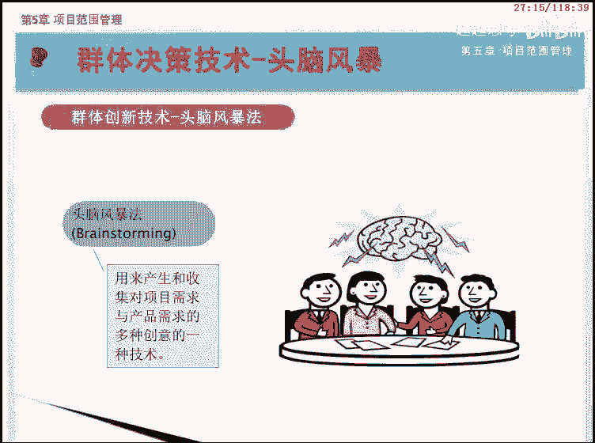
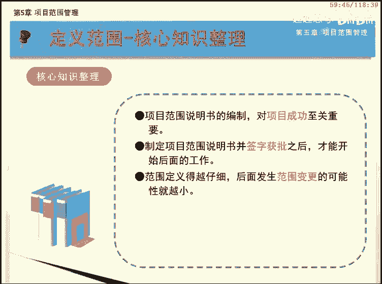
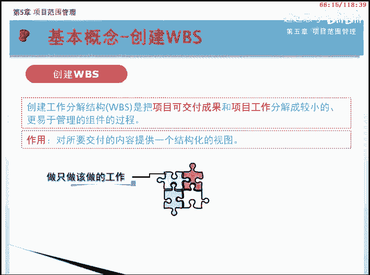
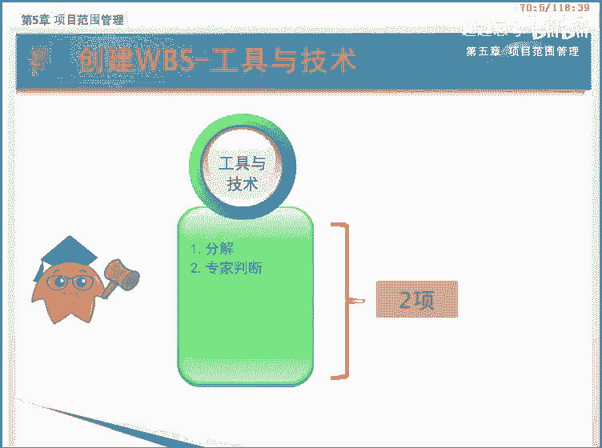
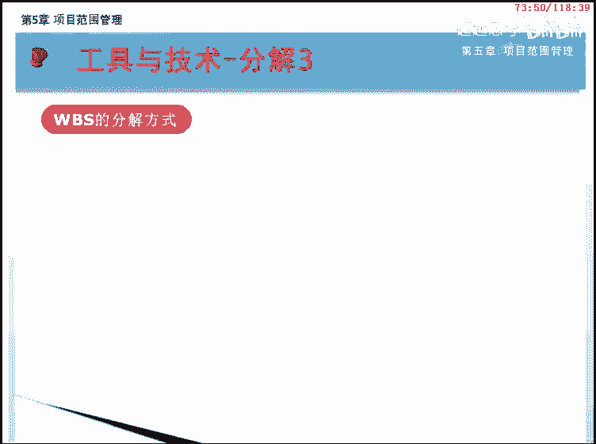
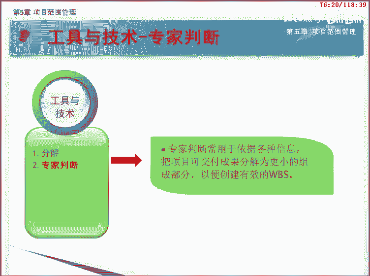
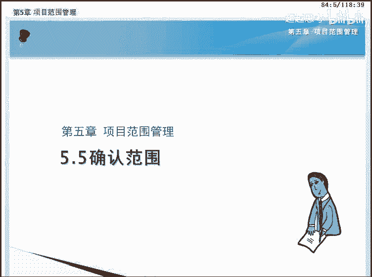
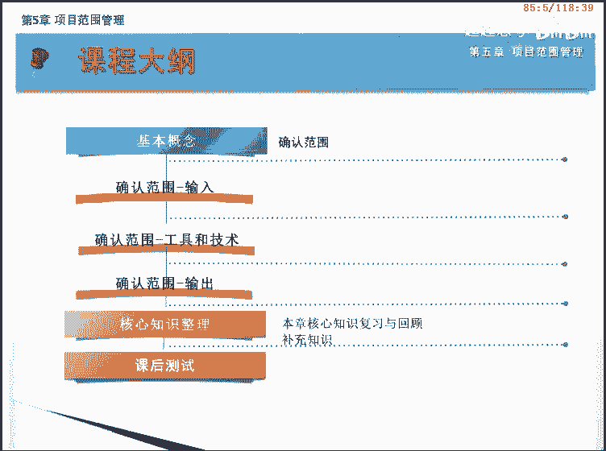
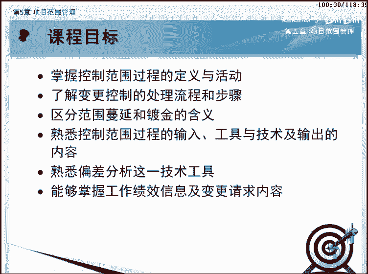
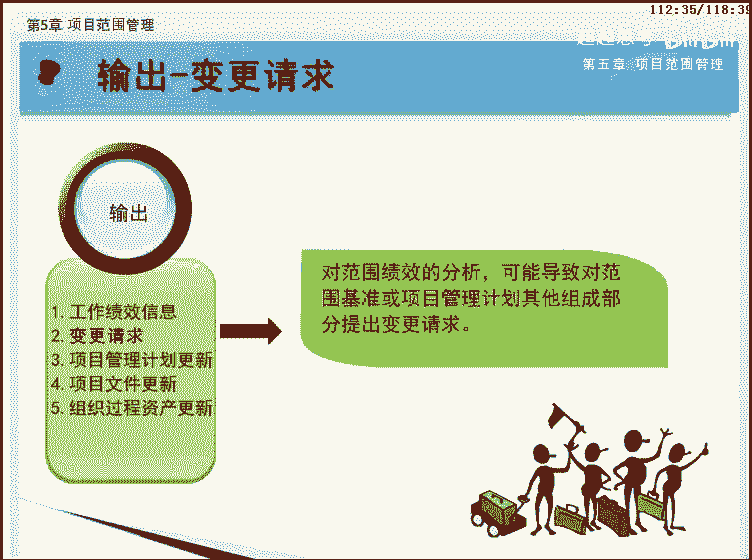

# PMP第五版PMBOK5完整培训视频教程 项目管理 - P5：05 - 超越思考 - BV1NY4y1U7s2

欢迎来到pmp项目管理网络课程的学习，本课程基于最新发布的pmbok指南第五版，下面我们将一起学习，第五章项目范围管理，项目范围管理知识领域有六个过程，分散在规划过程组和监控过程组中，在这一章。

我们将重点学习项目范围管理的这六个过程，分别是规划过程组的规划范围管理，收集需求，定义范围，创建w p s，以及监控过程组的确认范围和控制范围，这六个过程不但彼此互相作用。

而且还与其他知识领域中的过程相互作用，请务必记下来，此外在学习的过程中，大家还要格外注意，每个过程所使用的工具和技术，他们也是本章的重点内容，项目范围管理，包括确保项目做且只做所需的全部工作。

已成功完成，项目的各个过程，对这一定义的理解应该注意以下几点，第一全部工作范围管理，应该包括完成项目的全部工作，不能有所遗漏，也就是不能少做，第二做切直错范围管理。

不但要定义和控制哪些工作应该包含在项目内，还要定义和控制哪些工作不应该包含在项目内，也就是不能多做。

要防止范围蔓延，可以说项目范围管理是其他所有管理的基础，没有这个基础，其他的管理根本就无从谈起，与之相对应的是项目范围的任何变更，一方面要评估这个变更对时间成本，质量风险和资源的影响。

另一方面要正式提交变更请求，管理项目范围主要在于定义和控制，哪些工作应该包括在项目内，哪些不应该包括在项目内，在项目的环境中，我们通常把范围看作是一个项目所提供的产品，服务或成果的总和。

开始做项目工作之前，必须定义清楚项目范围并获得批准，但范围这一术语可以继续分类，一是产品范围及表征某种产品服务或成果，所具有的各种特性和功能，另一个是项目范围，即为交付具有规定特性和功能的产品。

服务或成果而必须完成的工作，你有没有想到产品范围和项目范围，这两个概念的区别和联系呢。

产品范围和项目范围，这两个概念的区别在于使用了不同的衡量标准，产品范围的完成情况是参照产品需求，特别是客户的要求或产品的质量性能来衡量的，比如具体的技术指标，而项目范围的完成情况。

则是参照项目管理计划来检验的，即确保所有该做的工作都做完了，产品的范围和项目范围的联系，是为了使项目成果达到产品范围的要求，需要使项目工作达到项目范围的要求，因此这两个范围必须要有较好的统一性。

以确保项目范围的具体工作，成功的按特定的产品范围要求准时交付。

按照pmbok指南第五版，项目范围管理，通过以下六个过程来实现规划，范围管理是创建范围管理计划，书面描述将如何定义，确认和控制项目范围的过程，收集需求设备，实现项目目标。

而确定记录并管理干系人的需要和需求的过程，定义范围是制定项目和产品详细描述的过程，创建wb s是将项目可交付成果和项目工作，分解为较小的，更易于管理的组件的过程，确认范围是正式验收。

已完成的项目可交付成果的过程，控制范围是监督项目和产品的范围状态，管理范围基准变更的过程，各位学员马上进入项目范围管理，这一知识领域的各过程的学习吧。

本课程我们将一起学习，第五章项目范围管理，知识领域的第一节规划范围管理，它属于规划过程组。

通过本课程的学习，我们将要达到以下目标，包括掌握规划范围管理过程的含义与作用，掌握范围管理计划的含义与内容，了解需求管理计划的内容。

本课程我们将按照如图所示的大纲为您讲述，首先是对范围管理计划，需求管理，计划，以及规划范围管理过程的基本含义进行讲解，接下来分析规划范围管理过程的输入，工具和技术以及输出课程的。

最后是本章的核心知识整理。

学习本过程之前，我们先来了解几个基本概念，范围管理计划，需求管理计划以及规划范围管理过程。

范围管理计划，是项目或项目集管理计划的组成部分，描述将如何定义，制定监督控制和确认项目范围，范围管理计划是制定项目管理计划，过程和其他范围管理过程的主要输入，范围管理计划。

要对用于下列工作的管理过程作出决定，制定详细的项目范围说明书，根据详细项目范围说明书，创建w p s维护和批准w bs正式验收，已完成的项目可交付成果处理，对详细项目范围说明书的变更。

该工作与实施整体变更控制过程直接关联，根据项目需要，范围管理计划可以是正式或非正式的，非常详细或高度概括的，需求管理计划也是项目管理计划的组成部分，描述将如何分析记录和管理需求，阶段与阶段间的关系。

对如何管理需求有很大影响，并将它记录在需求管理计划中，需求管理计划的许多内容，都是以阶段关系为基础的，需求管理计划的主要内容包括，如何规划跟踪和报告各种需求活动，配置管理活动，例如如何启动产品变更。

如何分析其影响，如何进行追诉，跟踪和报告，以及变更审批权限，需求优先级排序过程，产品测量指标及使用这些指标的理由，用来反映哪些需求属性，将被列入跟踪矩阵的跟踪结构，规划范围管理是创建范围管理计划。

书面描述将如何定义，确认和控制项目范围的过程。

本过程的作用是在整个项目中，对如何管理范围提供指南和方向，范围管理计划有助于降低项目范围蔓延的风险，接下来让我们来看看范围管理计划，是如何被制定出来的，输入的内容包括项目管理计划。

项目章程和事业环境因素，在输入的基础上，我们应用专家判断及会议，得到最终的两个子计划，范围管理计划和需求管理计划，这是规划范围管理过程的数据流向图，图中展现了该过程如何通过输入，输出与其他过程进行交互。

规划范围管理过程共有四个输入，他们是项目管理计划，项目章程，事业环境因素和组织过程资产，下面我们依次来学习。

项目管理计划中经过批准的子计划，是创建范围管理计划的依据，它们会影响规划和管理范围，依据项目章程中的项目背景信息，来规划各个范围管理过程，项目征程提供了高层级的项目描述和产品特征。

其中产品特征出自于项目工作说明书。

规划范围管理时需要考虑许多事业环境因素，包括组织文化基础设施。

人事管理制度，市场条件等，能够影响规划范围管理过程的组织过程，资产包括政策和程序，历史信息和经验教训知识库等。

规划范围管理这个过程有两个工具和技术，专家判断和会议。

我们一块来学习，先来看专家判断这种技术，我们知道，专家判断是指由具备相关知识和经验的各方，所提供的意见，在这个过程中的专家，应该是具有与制定范围管理计划相关的，专业学历，知识。

技能经验或培训经历的任何小组或个人。

项目团队可以参加项目会议，来制定范围管理计划，与会人员可能包括项目经理，项目发起人选定的项目团队成员，选定的干系人，范围管理各过程的负责人以及其他必要人员。

规划范围管理过程的输出，是范围管理计划和需求管理计划，这两个都是项目管理计划的子计划，在本过程开始的基本概念里已经介绍过。

现在我们来回顾一下本过程的核心知识，规划范围管理在整个项目中，对如何管理范围提供指南和方向，范围管理计划，是项目或项目及管理计划的组成部分，描述将如何进行项目范围管理。

需求管理计划是项目管理计划的组成部分，描述将如何分析记录和管理需求，项目经理把阶段间关系记录在需求管理计划中，恭喜你完成规划范围管理过程的学习，下节课见，本课程我们将一起学习第五章项目范围，知识领域的。

第二节收集需求，通过本课程的学习，我们将要达到以下目标，包括了解什么是需求以及收集需求的定义，掌握项目需求和产品需求的区别，了解项目章程和干系人登记册的含义，了解并区分各种收集需求的工具与技术。

掌握需求文件，需求管理计划和需求跟踪矩阵的内容，掌握收集需求的过程所涉及的p m i思维。

本课程我们将按照如画面所示的大纲为您讲述，首先是对需求和收集需求的基本概念进行讲解，接下来分析收集需求的输入，然后学习收集需求过程中，所需要的不同工具和技术，该过程共有11种工具和技术。

接下来我们会仔细为您讲解，收集需求过程的输出，包括需求文件和需求跟踪矩阵，课程的最后是本课核心知识整理。

在学习本过程之前，我们先来了解两个基本概念，需求和收集需求。

在项目管理中，需要与期望不容易区分，一般也不必区分，需要是我们让他人做什么，以满足自己的目标，而期望是我们期望别人应该主动做什么，比如期望电子产品是安全的，咖啡是热的等等，在骗报告指南中。

需求是指根据特定协议或其他强制性规范，项目必须满足的条件或能力，或者产品服务或成果必须具备的条件或能力，其中的强制性的文件包括合同标准，规格或其他正式的强制性文件，以及项目章程中的内容。

此外还可以通过通过工具和技术，工具和机器人的构图描述来提取需求，也可以说需求包括发起人，客户和其他干系人的，以量化且书面记录的需要和期望，需求是整个项目特别是后面的创建工作，分解结构过程以及规划成本。

进度和质量等过程的基础，只有明确了需求，后续工作才能有序进行，项目最终实现的产出才有价值，打个比喻，就是如果你不知道要到哪里，那你也就不知道什么时候能到达，以及是否到达了。

当项目没有一个明确的需求的时候，你就不会知道项目到底要做什么，是否已经做完，等，篇报告指南第五版中把需求分为如下六类，业务需求，整个组织的高层级需要，例如解决业务问题或抓住业务机会，以及实现项目的原因。

干系人需求，干系人或干系人群体的需要解决方案需求，为满足业务需求和干系人需求，产品服务或成果必须具备的特性，功能和特征，过度需求，从当前状态过渡到将来状态所需的临时能力，如数据转换和培训需求，项目需求。

项目需要满足的行动过程或其他条件，质量需求，用于确认项目可交付成果的成功完成，或其他项目需求的实现的任何条件或标准，需要注意的是，解决方案需求又进一步分为，功能需求和非功能性需求。

功能需求是关于产品能开展的行为，如流程数据以及与产品互动，非功能需求是对功能需求的补充，是产品正常运行所需的环境条件或质量，如可靠性，安全性性能安全性，服务水平，可支持性等。

收集需求是为实现项目目标而确定，记录并管理干系人的需要和需求的过程。

本课程的主要作用是被定义和管理项目范围，奠定基础，接下来让我们看看如何收集需求，该过程输入的内容包括范围管理计划，需求管理计划，干系人管理计划三个子计划，需求主要是指干系人的需要和期望。

因此项目章程和干系人登记册也是重要收入，在输入的基础上，我们应用很多工具和技术，把这些需求进行分析整理，最后形成需求文件，为了在整个项目生命周期中，对需求进行追溯管理，该过程还要建立一个需求跟踪矩阵。

这是收集需求过程的数据流向图，图中展现了该过程如何通过输入，输出与其他过程进行交互。

收集需求过程共有下面五个输入，下面我们依次来了解他们。

输入中的范围管理计划和需求管理计划，是刚刚学习过的规划范围管理过程的输出，用于指导如何进行范围管理，和如何进行收集需求，我们在这里就不进行重复了。

干系人管理计划是第13章规划，干系人管理过程的输出，它是项目管理计划的一个子计划，为有效调动干系人参与而规定所需的管理策略，我们会在后续课程中详细介绍。

收集需求时，可以从干系人管理计划中，了解干系人的沟通需求和参与程度，以便评估并适应干系人对需求活动的参与程度，收集需求时，可以从项目章程中了解项目产品，服务或成果的高层级描述，并据此收集详细的需求。

干系人登记册是第13章，识别干系人过程的输出，用于记录已识别的所有干系人的详细信息，他也记录了干系人对项目的主要需求和期望，可以从干系人登记册中了解，哪些干系人能够提供需求方面的信息。

收集需求过程的工具和技术比较多，共有11个，大部分都是p m p考试的重点，下面让我们一块来学习。

访谈是我们在日常生活中，经常使用或见到的一种方法，它是一种通过与干系人直接交谈，来获得信息的正式或非正式方法，典型的做法是采取一对一的形式，或者多个被访问者和多个访问者共同参与。

访问者向被访问者提出预设和即兴的问题。

并记录他们的回答，访谈的对象是有经验的项目参与者，发起人与其他高管以及主题专家，这样有助于识别和定义项目可交付成果的特，征和功能，访谈也可用于获取机密信息，焦点小组是把预先选定的干系人。

和对某个主题熟悉的专家集中在一起，了解他们对所提议产品，服务或成果的期望和态度，通常由一位受过训练的主持人，引导大家进行互动式讨论，因此往往比一对一的访谈更热烈，得到的答案也会更加具有针对性。

引导日研讨会把主要干系人召集在一起，通过集中讨论来定义产品需求，研讨会是快速定义跨职能需求。

和协调干系人差异的重要技术，它有三个主要的特点，第一能快速定义跨职能需求和协调干系人差异，第二能建立信任，改进关系，改善沟通，有利于参与者达成一致意见，第三比单项会议更快的发现和解决问题。

它广泛应用的两个行业是软件开发和制造行业，在软件开发行业，有一种被称为联合应用开发jd的，引导式研讨会，注重把用户和开发团队集中在一起，来改进软件开发的过程，在制造行业则使用质量功能展开q f d。

来帮助确定新产品的关键特征，q f d从收集客户需求开始，然后客观的对这些需求进行分类和排序，从而为实现这些需求设置目标，另外还有一种方法是用户故事描述，哪个干系人将从功能中受益，它需要实现什么。

以及它将获得的收益，用户故事在敏捷方法中广泛使用，群体创新技术是组织一些群体活动，来识别项目和产品需求，常用的群体创新技术包括头脑风暴法，名义小组技术，概念思维导图，亲河图以及多标准决策分析。

他们的共同特点是有一群人共同出谋划策，来找出项目或产品需求，下面我们会对群体创新技术的五个方法，进行详细的讲解，头脑风暴法是用来产生和收集，对项目需求与产品需求的多种创意的一种技术。

他强调来自于不同背景或专业的参与者，不受限制的就问题自由发表，尽可能多的意见和解决方案，而无论什么意见或想法，参与者都不能否认或批评他人的意见，头脑风暴法本身不包含投票或排序。

常与其他群体创新技术一起使用。

民意小组技术是先由规模较小的群体，进行头脑风暴提出意见，再由规模较大的群体对意见进行评审，这个评审的方式可以是通过投票来排列，最有效的创意，以便进行进一步的头脑风暴或优先排序，实际上。

灵异小组技术是头脑风暴法的深化应用。

概念导图或思维导图，就是把从头脑风暴中获得的创意，用一张简单的图联系起来，以反映这些创意之间的共性与差异，从而引导出新的创意，在寻找创意的过程中，他将中心概念与关联概念连接起来。

通过训练运用全脑思维来刺激想象力和创造力，可以说，这是全面调动分析能力和创造能力，的一种思考方法，清河图用来对大量创意进行分组的技术，以便进一步审查和分析，清河图针对某一问题广泛收集资料，如头脑风暴法。

按照资料近似程度内在联系进行分类整理，归类合并，从而从复杂的现象中整理出思路，抓住本质并找出解决办法，像现在的这幅图片，亲河图，把获得女友的好感的事情，按照近似程度分成几类。

然后在每个类别中找到相应的对策，从而找到解决事情的根本方法。

多标准决策分析，借助决策矩阵，用系统分析方法建立诸如风险水平，不确定性和价值收益等多种标准，从而对众多方案进行评估和排序的一种技术。

图表中是一个决策的事例，用来决定等待时间过长中，哪一方面的问题应该优先解决，问题出现在顾客等待接待，顾客等待接待者，顾客等待食物和顾客等待付账几个方面，评价标准为给顾客造成的不便，解决的容易程度。

对其他系统的影响和解决的速度，这些标准被赋予不同的权重，用321分别表示，将每个问题分成高中低三个等级，例如在问题顾客等待食物中，由于周围气氛很好，给顾客带来的不便就评为终极二。

将每个问题的得分都与权重相乘，我们看到顾客等待接待得到了最高分28分，可见这是应该优先解决的问题，群体决策技术是为了达成某种期望结果，而对多个未来行动方案进行评估的过程，本技术用于生成产品需求。

并对产品需求进行归类和优先级排序，达成群体决策的方法有很多。

例如一致同意大多数原则，相对多数原则，一致同意，即每个人都同意某个行动方案，达成一致同意的一种方法是dlc技术，大多数原则，需要获得群体50%以上的支持，相对多数原则。

即根据群体中相对多数者的意见作出决定，即使未能获得大部分人的支持，就是某一个人为群体做出决策，在收集需求过程中，上述群体决策技术，都可以与群体创新技术联合使用，问卷调查是指通过设计书面问题。

向为数众多的受访者快速收集信息，问卷调查方法非常适用于以下情况，受众多样化，需要快速完成调查，受访者地理位置分散，并且适合开展统计分析，但是在问卷的过程中，可能出现问卷回答不全面等问题。

因此要想取得好的需求分析结果，一定要设计合理的问卷，并提高问卷的回收率，观察是指直接观察个人在各自的环境中，如何开展工作和实时流程，当产品使用者难以或不越说明他们的需求时。

就需要通过观察来了解细节，观察也称为工作跟踪，观察的方式有两种，一种是外部观察，由观察者从外部来观察使用者的工作，第一种是内部观察及观察者，另一种是内部观察及参与观察者，来实际执行一个流程或程序。

体验该流程或程序是如何实施的，以便挖掘出隐藏的需求，在项目管理中，原型是有形的食物，它是干系人有机会体验最终产品的模型，而不只是讨论抽象的需求陈述，原心法是指在实际制造预期产品之前。

先造出该产品的实用模型，并据此征求对需求的早期反馈。

原型法支持渐进明细的理念，需要经历从模型创建，在经过足够的反馈循环之后，就可以通过原型获得足够的需求信息，从而进入设计或制造阶段，故事版是一种圆形技术，通过一系列的图像或图示，来展示顺序或导航路径。

故事版用于各种行业的各种项目中，如电影广告，教学设计以及敏捷和其他软件开发项目，在软件开发中，故事版使用实体模型来展示网页，屏幕或其他用户界面的导航路径，六根对照就是将实际或计划的做法。

与其他可比组织的做法进行比较，以便识别最佳实践，形成改进意见，并为绩效考核提供依据，被对照的可以是流程和操作过程，条纹对照所采用的可比组织，可以是内部的，也可以是外部的，系统交互图是范围模型的一个例子。

它是对产品范围的可视化描绘，显示业务系统包括过程设备，计算机系统等，及其与人和其他系统之间的交互方式，系统交互图显示了业务系统的输入，输入提供者，业务系统的输出和输出，接收者。

文件分析就是通过分析现有文档，识别与需求相关的信息来挖掘需求，可供分析的文档很多，包括商业计划，营销文献协议，建议邀请出现行流程逻辑数据模型，业务规则库，应用软件文档，业务流程或接口文档用例。

其他需求文档问题，日志，政策程序和法律文件等，收集需求，这个过程共有两个输出，分别是需求文件和需求跟踪矩阵，下面我们一块来学习。

需求文件描述各种单一需求将如何满足，与项目相关的业务需求，需求文件不是一个文件的名字，在不同的公司可能有不同的名字，这个文件不是一开始就明晰的，而是随着信息的增加而逐渐细化，一开始可能只有高层级的需求。

然后随着有关需求信息的增加而逐步细化。

有人可能会问，不同的干系人有不同的需求，而且来源也五花八门，那么什么样的需求可以作为基准呢，在这里我们给出了一个定义，即可测量和可测试的，可跟踪的，完整的，相互协调的。

且主要关系人愿意认可的需求才能作为基准，按照这个基准形成的需求，文件格式不限，既可以是一份按干系人和优先级分类，列出全部需求的简单文件，也可以是一份包括内容提要，细节描述和附件等的详细文件。

需求文件的格式多种多样，既可以是一份按干系人和优先级分类，列出全部需求的简单文件，也可以是一份包括内容提要，细节描述和附件等的详细文件，需求文件的主要内容，可能涵盖下述各项业务需求。

包括可跟踪的业务目标和项目目标，执行组织的业务规则，根系人需求包括对组织其他领域的影响，对执行组织内部或外部团体的影响，干系人对沟通和报告的需求，解决方案需求包括功能和非功能需求，技术和标准。

合规性需求支持和培训的需求，质量需求报告需求，项目需求，例如服务水平，绩效安全和合规性验收标准等，另外还有过度需求和与需求相关的假设条件，依赖关系和制约因素。

需求跟踪矩阵是把产品需求从其来源连接到，能满足需求的可交付成果的一种表格，需求跟踪矩阵是一个非常重要的内容。

有以下几个方面的优势，第一，他把每个需求与业务目标或项目目标联系起来，有助于确保每个需求都具有商业价值，第二他提供了在整个项目生命周期中，跟踪需求的一种方法，有助于确保需求文件中被批准的每项需求。

在项目结束的时候都能交付，最后他还为管理产品范围变更提供了框架，需求跟踪包括以下内容，业务需要击毁目的和目标项目，目标项目范围，w bs，可交付成果，产品设计，产品开发，测试策略和测试场景。

高层级需求到详细需求。

应在需求跟踪矩阵中记录每个需求的相关属性，这些属性有助于明确每个需求的关键信息，需求跟踪矩阵中记录的典型属性，包括唯一标识需求的文字描述，收录该需求的理由，所有者来源优先级别版本，当前状态和状态日期。

为确保干系人满意，可能需要增加一些补充属性，如稳定性，复杂性和验收标准，图中是需求跟踪矩阵的一个示例，其中也有相关的需求属性。

现在我们来回顾一下本过程的核心知识，收集需求是为实现项目目标而定义，并记录干系人需求的过程，需求文件描述，各种单一的需求。

将如何满足与项目相关的业务需求，需求管理计划描述在整个项目生命周期内，如何分析记录和管理需求，需求跟踪矩阵，确保需求文件所批准的每一项需求，在项目结束时都能得到实现，恭喜你完成收集需求过程的学习。

我们下节课见，本课程我们将一起学习第五章，项目范围管理知识领域的第三节定义范围。

下面先让我们一起了解本节的课程目标，掌握定义范围过程的定义，熟悉定义范围过程的输入，工具与技术及输出的内容，了解产品分析这一技术工具，熟悉项目范围说明书包含的内容，并了解其作用。

了解项目范围与产品范围之间的关系。

本课程我们将按照如画面所示的大纲为您讲述，首先是对定义范围过程的基本含义进行讲解，接下来分析定义范围过程的输入工具和技术，以及输出课程的，最后是本课的核心知识整理。

在学习这个过程之前，我们先来了解一下定义范围的概念。

定义范围是制定项目和产品详细描述的过程。

本过程的作用主要是明确所收集的需求，哪些将包含在项目范围内，哪些将排除在项目范围外，从而明确项目服务或成果的边界，定义范围主要回答做什么工作，以及做出什么东西的问题，范围的详细清晰定义。

且获得批准是非常重要的，可以说，完整准确的范围经常是项目取得成功的前提，而欠缺错误的范围则往往是项目失败的根源，学习氛围管理，最需要记住的一点是项目管理的一个基本思想，那就是给多少钱办多少事。

要防止范围蔓延和镀金，至于如何防止范围蔓延和镀金，我们在后面的章节会详细的讲解，定义范围是制定项目和产品详细描述的过程，本过程的依据是项目章程范围，管理计划，需求文件等，并在规划过程组中分析现有风险。

假设条件和制约因素，并随时补充完善的项目风险，定义范围的结果是制定出详细的项目范围，说明书，它是项目成功的关键要素。

接下来让我们来看看项目范围说明书，是如何生成的吧，首先我们要输入的内容是项目章程范围，管理计划，需求文件和组织过程资产，然后选用专家判断产品分析等工具与技术，经过分析，我们会得到输出项目范围。

说明书和项目文件的更新，在本章中，我们主要讲解的是产品分析，备选方案生成及项目范围说明书，这是定义范围过程的数据流向图，图中展现了该过程如何通过输入，输出与其他过程进行交互。

定义范围过程共有四个输入，分别是范围管理计划，项目章程，需求文件和组织过程资产。

下面我们依次来了解他们，范围管理计划是规划范围管理过程的输出，确定了制定监督和控制项目范围的各种活动，用于指导定义范围。

项目章程中，包含对项目和产品特征的高层级描述，它还包括项目审批要求，如果执行组织不使用项目章程，则应取得或编制类似的信息，用作制作详细范围说明书的基础，如果组织不制定正式的项目章程。

通常会进行非正式的分析，为后续的范围规划提供依据。

需求文件是收集需求过程的输出，使用需求文件来选择哪些需求将包含在项目中。

能够影响定义范围过程的组织过程，资产，包括，终于制定项目范围说明书的政策程序和模板，以往项目的项目档案，以往阶段或项目的经验教训。

定义范围过程共有四个工具和技术专家判断，产品分析，备选方案生成和引导式研讨会，下面我们逐个学习。

专家判断常用来分析制定项目范围，说明书所需的信息，专家判断和专业知识可用来处理各种技术细节，专家判断可来自具有专门知识，或经过专门培训的任何小组或个人，可从许多渠道获得包括组织内的其他部门顾客。

该系人包括客户或发起人，专业与技术协会，行业团体主题专家，对于那些以产品为可交付成果的项目，产品分析是一种有效的工具，每个应用领域都有一种或几种普遍公认的方法，用以把高层级的产品描述。

转变为有形的可交付成果，产品分析技术包括产品分解，系统分析，需求分析，系统工程，价值工程和价值分析等。

价值工程又被称为价值分析，价值工程是通过集体智慧和有组织的活动，对产品进行功能分析，使产品能以最低的寿命周期成本，可靠的实现其必要的功能，从而提高产品的价值，比如说你想解决口渴的问题。

你可以选择喝一角钱的白开水，也可以选择喝两元钱的可口可乐，还可以喝20元钱的乌龙茶，经过价格比较，我们认为如果只是解决口渴问题，实现这个功能的话，成本只要一角钱，这种尽量节省成本的思想或分析方法。

就是价值工程，他的主要思想是，通过对选定的研究对象的功能及费用进行分析，从而提高对象的价值，即价值等于功能，处于成本，上帝中，白开水的价值为一，而可口可乐的价值为一角钱除以二元，即5%。

价值工程的意义是优化项目生命周期费用，节省时间，增加利润，提高质量，扩大市场份额，有效利用资源，备选方案生成，是一种用来制定尽可能多的，潜在可选方案的技术，用于识别执行项目工作的不同方法。

简单点理解就是选出多种可行的备选方案，然后在方案中选择最佳答案，条条大路通罗马，实现项目的目标成果并不局限于一种方案，可以有多种备选方案，当然备选方案的产生也不是什么高深的技术，无非来源于以下几个方面。

头脑风暴，横向思维，备选方案分析等，其中头脑风暴在收集需求过程中已经介绍过，备选方案分析，在估算活动资源过程将会讲解，因此下面我们只需要了解什么是横向思维，横向思维是指思维的广阔度。

他要求人们能全面地观察问题，从事物多种多样的联系和关系中去认识事物，近似于发散思维，这个方法的好处是，思考者在思考问题时，摆脱已有知识和旧的经验束缚，冲破常规，提出富有创造性的见解，观点和方案。

横向思维可能绕个弯，甚至是逆向而行，却有效地解决了棘手的难题，战国时代田忌赛马的例子就是横向思维的实力，田忌采用不同常规的赛马组合方式，最终在劣势下赢得胜利。

引导式研讨会在收集需求过程已经介绍过，具有不同期望或专业知识的关键人物，参与这类工作，会议，有助于就项目目标和项目限制，达成跨职能的共识，比如在软件项目中，如果范围不清晰的情况下。

可以要求项目的用户和开发团队集中在一起，共同分析需求，并达成一致意见，完成范围的定义，这样的一个会议就是引导式研讨会，定义范围，这个过程共有两个输出，项目范围说明书和项目文件更新，下面我们一块来学习。

项目范围说明书是对项目范围，主要可交付成果，假设条件和制约因素的描述，包括项目和产品范围，项目范围说明书详细描述项目的可交付成果，以及为创建这些可交付成果而必须开展的工作。

项目范围说明书描述，要做和不要做的工作的详细程度，决定着项目管理团队，控制整个项目范围的有效程度，详细的项目范围说明书包括以下内容，产品范围描述逐步细化，在项目章程和需求文件中所述的产品。

服务或成果的特征，验收标准，可交付成果通过验收前必须满足的一系列条件。

可交付成果在这一过程阶段或项目完成时，必须产出的任何独特并可核实的，产品成果或服务能力，可交付成果也包括各种辅助成果，如项目管理报告和文件，对可交付成果的描述可略可详，项目的除外责任。

通常需要识别出什么是被排除在项目之外的，明确说明哪些内容不属于项目范围，有助于管理干系人的期望，制约因素，对项目或过程的执行有影响的限制性因素，需要列举并描述与项目范围有关。

且会影响项目执行的各种内外部，制约或限制条件，例如客户或执行组织事先确定的预算，强制性日期或进度里程碑，如果项目是根据协议实施的，那么合同条款通常也是制约因素，关于制约因素的信息可以列入项目范围。

说明书，也可以独立成册，假设条件是在制定计划时，不需验证即可视为正确真实或确定的因素，同时还应描述，如果这些因素不成立，可能造成的潜在影响，在项目规划过程中，项目团队应该经常识别记录，并确认假设条件。

项目范围说明书对于整个项目至关重要，在这里，我们把项目范围说明书的作用归纳为五个方面，希望学员能够掌握它们的作用，分别是，第一表明项目干系人之间，就项目范围所达成的共识。

第二使项目团队能够开展更详细的规划，第三作为将来项目决策的根据，指导项目团队的工作，第四为评价变更请求或额外工作，是否超出项目边界提供基准，第五更好的定义范围，能预防项目范围变更。

基于项目范围说明书的作用，我们提出了两个问题供思考，第一项目范围说明书需要由客户签字吗，答案是肯定的，因为只有明确项目范围，制定详细的项目范围说明书，并由客户确认之后，才能开展后面的工作。

定义范围限于成本进度，质量风险的规划，后面很多过程的输入都有项目范围说明书，如果前面没有确认，后面的工作也很难进行，第二哪个文件能够明确客户所要求的工作，是否超出项目边界。

答案是范围说明书，因为我们在编写项目范围说明书的时候，全面地考虑了所有干系人的需求和期望，项目范围说明书也是评价变更或额外工作，是否超出项目边界的一个基准，定义的越细致，后面范围变更的可能性就越小。

项目文件是指会影响项目管理工作，但又不属于项目管理计划的其他文档，在定义范围的输出中，我们要更新的文件包括干系人登记册，需求文件。

需求跟踪矩阵等，现在我们来回顾一下本过程的核心知识，项目范围说明书的编制对项目成功至关重要，制定项目范围说明书并签字，获批之后才能开始后面的工作范围，定义的越仔细，后面发生范围变更的可能性就越小。

范围管理的思想是给多少钱办多少事，要防止范围蔓延和镀金，恭喜你完成了定义范围过程的学习，下节课见，本课程我们将一起学习第五章，项目范围管理知识领域的第四节，创建wb s，在项目范围管理知识领域。

甚至整个项目管理过程中，工作分解结构w bs都是非常重要的输入，任何一个有经验的项目经理，都知道w bs有着重要的作用，作为项目经理，你对w b s了解多少呢，你知道怎么创建w bs吗。

本过程将向您一一介绍。

通过本课程的学习，我们将要达到以下目标，包括熟悉工作分解结构和创建工作，分解结构的概念，了解工作分解结构的作用，理解工作包和工作的含义，理解分解的含义，过程及分解的方式和原则，熟悉工作分解结构。

词典的定义及其包含的内容，熟记范围基准的定义及包含的内容，熟记本过程的输入工具与技术及输出，本课程我们将按照如图所示的大纲为您讲述，首先是对工作分解结构，w bs，可交付成果和创建w bs。

三个基本概念进行讲解，接下来分析创建w b s过程的输入工具和技术，以及输出课程的，最后由本课核心知识整理。

在学习创建w bs过程之前，我们先来看三个基本概念，工作分解结构w bs可交付成果和创建w bs。

工作分解结构，w bs是以可交付成果为导向的工作层级分解，其分解的对象是项目团队为实现项目目标，提交所需可交付成果而实施的工作，需要注意的是，这里所说的工作，不是为创造结果而付出的努力本身。

而是经过努力所获得的成果，它是一个名词而非动词，因为工作分解结构是以可交付成果为导向的。

工作分解结构是工作的逐级分解，它每向下降一个层次，是对上一层的进一步分解，并意味着对项目工作更详尽的定义，如果架桥是第一层的工作，那下一层就可以把大桥分解成桥墩，桥身和引桥等工作。

工作分解结构只包含项目范围内的工作，不包含项目范围以外的工作，究竟为什么要创建工作分解结构，工作分解结构能起到什么作用呢，这个问题我们可以从四个方面进行分析，首先工作分解结构定义了整个项目的范围。

并构成了项目范围的基准，为整个项目的实施和验收提供了范围标准，其次工作分解结构作为范围基准的一部分，是范围变更的一部分，改变工作分解结构就是变更了项目范围，再次有了工作分解结构，并且以书面形式确定下来。

这样促使项目团队对项目的范围，有一个统一的认识，有利于整个项目的实施和验收，最后工作分解结构中的账户编码，就像一个人的身份证号码，或者大学读书时的学号，唯一确定工作分解结构这个单元。

在工作分解结构的概念上，我们提到了，它是以可交付成果为导向的工作层级分解，那什么是可交付成果呢，可交付成果是指在某一过程阶段或项目完成时，必须产出的任何独特并可验证的产品，形成的服务，由此可见。

可交付成果是项目的结果，可以是有形的产品，比如建造房屋项目的产出一个20层楼的公寓，就是该项目的可交付成果。

可交付成果也可以是无形的成果，比如服务开发项目开发出来的服务能力，也是该项目的可交付成果，再次强调可交付成果必须能够验证，第三个要理解的概念便是创建工作，分解结构过程。

创建wb s是把项目可交付成果和项目工作，分解成较小的更易于管理的组件的过程，本课程的主要作用是对所要交付的内容，提供一个结构化的视图工作，分解结构w bs的任何工作是必须做的。

之外的任何工作都是必须不做的。

该过程实际上是通过对复杂问题简单化处理，来实现更易管理的过程，通过创建w p s，可以将可交付成果细化并能够验证，这一过程也是将项目范围说明书的内容，用生动形象的分层模式表现出来的过程。

接下来我们来对创建w bs过程的i t t，进行讲解，创建w bs就是根据范围管理计划需求文件，项目范围说明书，一种事业环境因素和组织过程，资产应用分解和专家判断技术，来把项目范围说明书。

wbs和w p s词典整合成分为基准的过程，在这个过程的i t t o中，我们会对分解这种工具与技术，以及w bw bs词典和范围基准进行重点讲解，这是创建w bs过程的数据流向图。

图中展现了该过程如何通过输入，输出与其他过程进行交互，创建w bs过程共有五个输入，他们分别是范围管理计划，项目范围说明书，需求文件，事业环境因素和组织过程资产，我们依次来了解他们。

范围管理计划是规划范围管理过程的输出，其中定义了应该如何根据详细项目范围说明书，创建wb s，以及应该如何维护和批准wb，项目范围说明书是定义范围过程的输出，描述了需要实时的工作。

即不包含在项目中的工作，同时也列举和描述了会影响项目执行的，各种内外部制约或限制条件，可以指导创建w bs的工作。

需求文件描述各种单一需求将如何满足，与项目相关的业务需求，详细的需求文件对理解需要产出什么项目，结果需要做什么来交付项目及其最终产品，都是非常重要的，项目所在行业的w bs标准。

可以作为创建w bs的外部参考资料，这些内容属于事业环境因素。

能够影响创建w p s过程的组织过程，资产包括用于创建w bs的政策程序和模板，以往项目的项目档案，以往项目的经验教训。

创建w bs过程有两个工具和技术，分别是分解和专家判断，下面我们一块来学习。

分解是一种把项目范围和项目可交付成果，逐步划分为更小，更便于管理的组成部分的技术工作包，是w bs最底层的工作，可对其成本和持续时间进行估算和管理。

分解的程度取决于所需的控制程度，以实现对项目的高效管理，工作包的详细程度，因项目规模和复杂程度而异，可交付成果或此项目有的只需分解一层，就可达到工作包的层次，有的则需要分解好几层，工作分解的越细致。

对工作的规划管理和控制就越有利，但是过细的分解也不合适，一般4~6层即可，有些项目的可交付成果或子项目，要在未来远期才能完成，当前可能无法分解，项目团队，通常要等到这些可交付成果或子项目。

的信息足够明确后，才能制定出工作分解结构中相应细节，这种技术有时称作滚动式规划，将项目工作进行分解，需要展开一系列的活动，首先应该识别和分析可交付成果和相关工作，也就是了解什么需要被分解。

其次应该确定工作分解结构的结构与编排方式，也就是确定应该怎样分解的问题，第三步就是自上而下逐步进行细化分解了，分解完成后，需要为工作分解结构的每一个组成部分，制定和分配标识。

编码类似于我们生活中的身份证或学号，以方便对工作单元的管理，最后就是要核实可交付成果，分解的程度应该足够细化，直到工作包的层次，但又不能过度细化，而导致耗费更多的人力物力资源。

关于如何对可交付成果和此项目进行分解，有一定的原则，我们来依次介绍包含原则及上下包含关系，包含项目所需做的全部工作，名词原则w b s分解后得到的工作包是名词，不是动词或动名词。

团队原则w b s分解不是任何一个人去做的，必须是团队共同完成80小时原则，最底层可交付成果可在80小时内完成。

独立责任原则，分解到可安排给一个责任者或团队负责的力度，滚动分解原则，远期不清楚信息暂不分解，待了解后再分解，wb的分解方式有多种。

按内容分解，根据可交付成果或服务的组成部分，进行内容分解，比如新款汽车项目可分解为发动机，底盘，内饰等的开发，也可根据子系统或子项目进行内容分解，比如鲁布格工程项目分为引水隧道，电站。

也可根据模块来进行内容分解，比如在软件程序开发项目中，可将程序分为模块a b c，还可以按时间分解，比如软件开发分为需求设计，编码和测试等，除了内容和时间，还有一些其他的分解方式，如按地理分解配送工作。

可按配送到的不同区域分解，还可按组织单元分解，如建筑设计分为结构，土建和给排水等，而这些都可以分配给独立的组织单元去完成。

如图所示，这是软件产品开发的wb，在这里以项目生命周期的各阶段作为分解的，第二层，把产品和项目可交付成果放在第三层。

在这个例子中，这是飞行系统的wb，以项目的可交付成果作为分解的第二层，创建wbs的第二个工具是专家判断，专家判断常用于根据各种信息，把项目可交付成果分解为更小的组成部分，以便创建有效的wb。

专家判断和专业知识，可用来处理有关项目范围的各种技术细节，并协调各种不同的意见，以便用最好的方法对项目整体范围进行分解，专家判断可以来自具备相关培训知识，或相似项目或业务经验的任何小组或个人，专家判断。

也可表现为预定义的模板。

创建w bs这个过程共有两个输出，分别是分为基准和项目文件更新，我们接下来会介绍。

在创建wbs过程中，要整合出范围基准，范围基准包括三方面的内容，有定义范围过程的输出，项目范围说明书，以及本过程的两个输出，w bs和w bs指点范围基准中的内容。

只有通过正式的变更控制程序才能进行变更，它被用作比较的基础，范围基准是项目管理计划的组成部分，下面我们对其中的三项内容进行介绍。

其中的项目范围说明书是定义范围过程的输出，包括对项目范围，主要可交付成果，假设条件和制约因素的描述，它代表干系人对项目范围达成的一致，在这里把它作为范围基准的重要组成部分。

前面我们已经讲过了，工作分解结构w bs的概念，即以可交付成果为导向的工作层级分解，其分解对象是项目团队为实现项目目标，提交所需可交付成果而实施的工作，w p s的第一层往往是项目的名称，比如客房装修。

某软件开发等，接下来就把项目分解为可交付成果阶段，或者子项目作为整体结构的第二层，再把可交付成果阶段，或者子项目分解为控制账户或者可交付成果。

控制账户是一种管理控制点，它最早来源于公司，管理层，需要了解项目的成本花费，但又不想知道具体工作包层次的成本，所以就在工作包和项目之间的层次，增加了一个控制单元，称为控制账户。

简单的说控制账户是多个工作包的累加，为工作包建立控制账户，并根据账户编码分配标志号，是创建w bs的最后一个步骤，从分解的概念我们知道，工作包是工作分解结构w bs的最底层，也就是最低层次的可交付成果。

从范围规划需要角度上来说，已经不需要再分了，分解的工作包可以由一个人或一个小组，依据现有的信息负责完成，在工作包层次工作所需的资源，时间和成本等已经可以比较准确的估算了，还可以对工作进行有效的时间成本。

质量范围和风险的控制，最后工作包还可以考虑分包给外面的公司去做，w bs词典是在创建w bs过程中产生，并用于支持w bs的文件，w bs词典也是分为基准的重要内容，w p s词典详细描述可交付成果。

活动和进度的详细信息，在wb s词典中可能包含的内容有如下，账户编码标识工作描述，假设条件和制约因素，负责的组织进度，里程碑相关的进度活动，所需资源成本估算，质量要求，验收标准技术参考文献以及协议信息。

创建w bs过程的第二个输出，是项目文件的更新，在创建w bs时，可能需要更新项目的需求文件，在需求文件中反映经批准的变更，如果在创建w bs过程中提交了变更请求，并获得了批准，那么应该更新需求文件。

以反应经批准的变更。

到现在为止，我们已经学习了创建w p s的整个过程，在这里，我们对几种描述项目范围的文件进行了整理，从目的范围描述和范围之外的信息，几个方面作为比较，从表格中可以看到，项目工作说明书和项目范围说明书。

都是在较高层次对项目范围的粗略说明，wb和wb词典是对项目范围最详细的说明，其中w bs词典对应于w bs中的各要素，说明了各要素的负责人目标及资源要求等等，请仔细阅读比较并理解。

现在让我们来回顾一下本过程的核心知识，所有的项目都必须有w b s，w b s是以可交付成果为导向的工作，层级分解工作是尽努力取得的成果，而非努力本身wps可按内容。

时间地点和其他方式进行分解，控制账户是一种管理控制点，在该控制点上把范围预算，实际成本和进度加以整合，并把它们与正值相比较，以测量绩效工作包是w bs分解的最底层，恭喜你完成创建w bs过程的学习。

我们下节课见，本课程我们将一起学习第五章项目范围管理，知识领域的第五节确认范围，范围管理的六个过程，分别分布在规划过程组和监控过程组中，在前面我们已经学习了，规划过程组中的规划范围管理，收集需求。

定义范围和创建wps 4个过程，本节我们来学习第五个过程，确认范围，确认范围是在项目监控过程中进行的，在可交付成果完成后，必须及时进行验收，从而有时间解决发现的问题。

通过本课的学习，我们将要达到以下目标，包括掌握确认范围过程的定义与活动，熟悉确认范围过程的输入，工具与技术及输出的内容，了解检查这一工具，掌握可交付成果的定义，并能区分。

核实的可交付成果和验收的可交付成果，能够区别确认范围和控制质量这两个过程。

本课程我们将按照如画面所示的大纲为您讲述，首先是对确认范围这个基本概念进行讲解，接下来分析确认范围过程的输入工具和技术，以及输出课程的，最后由本课核心知识整理。

在学习确认范围过程之前，我们先来看看什么是确认范围。

确认范围是正式验收已完成的项目，可交付成果的过程，本过程的主要作用是使验收过程具有客观性，同时通过验收每个可交付成果，提高最终产品服务或成果获得验收的可能性，项目以最终的可交付成果。

得到客户或发起人的验收为主要目标，确认范围过程，就是把可交付成果与计划的要求进行比较，确保可交付成果符合客户或发起人的要求，确认范围的参与人员主要是客户，顾客和发起人，在确认范围过程中。

项目经理要与顾客，客户或发起人一起审查可交付成果，确保可交付成果已圆满完成。

从而获得客户或发起人，对可交付成果的正式验收，我们来看进行确认范围的时机，进行确认范围过程的时机，最晚要在项目快结束或每个阶段末期，建议越早越好，确认范围贯穿于整个项目生命周期中，项目的每个阶段结束时。

都要进行范围确认，并对下一阶段工作的必要性，可行性进行评审，如果项目提前终止，确认范围过程，应当把项目完成的水平和程度记录下来，在确认范围过程中所做的工作，一般包括审查工作，产品和结果。

以保证他们按要求完成记录，可交付成果的完成情况，得到发起人或客户的正式签字。

接下来我们来对确认范围，过程的i t t进行讲解，确认范围就是打精控制质量过程，检验合格的核实的可交付成果与项目管理计划，需求文件，需求跟踪矩阵等进行对比，应用检查等技术得到干系人，对可交付成果的验收。

中间也可能引起变更和对项目文件的更新，该过程执行的结果记录到工作绩效信息中，这是确认范围过程的数据流向，图，图中展现了该过程如何通过输入，输出与其他过程进行交互。

确认范围过程共有五个输入，分别是项目管理计划需求文件，需求跟踪矩阵，核实的可交付成果以及工作绩效信息，我们下面依次来了解。

第一个收入是项目管理计划，项目管理计划是大多数监控过程的输入，在确认范围过程需要参考项目管理计划中，与范围相关的子计划和基准。

下面我们将详细展开，项目管理计划包含范围管理计划和范围基准，其中范围管理计划，定义了项目已完成可交付成果的正式验收程序。

范围基准包含批准的范围说明书，w bs和相应的w bs词典，项目范围说明书，由于有产品范围描述和项目可交付成果，以及用户对产品的验收标准，而成为本过程的重要收入，wps定义并分解每一项可交付成果。

w p s词典对每一项可交付成果做详细说明，只有通过正式的变更控制程序，才可对基准进行变更，基准用作比较的基础，需求文件是收集需求过程的输出，列明了全部项目需求，产品需求及对项目和产品的其他类型的需求。

同时还有相应的验收标准，需求文件是定义管理和控制项目范围的基础，为确认范围过程提供了保证。

需求跟踪矩阵连接了需求与需求源，用于在整个项目生命周期中对需求进行跟踪，他也是确认范围的重要收入。

确认范围过程的第四个输入，是核实的可交付成果，它是指已经完成并被控制质量过程，检查为正确的可交付成果，这是确认范围最重要的输入。

确认范围过程还有一项输入是工作绩效数据，工作绩效数据是指导与管理项目，工作过程的重要输出，可能包括符合需求的程度不一致的数量，不一致的严重性，或在某时间段内开展确认的次数。

这些都是确认范围过程需要的信息，确认范围过程有两个工具和技术，分别是检查和群体决策技术，下面让我们一块来学习。

检查是指开展测量审查与确认等活动，来判断工作和可交付成果，是否符合需求和产品验收标准，检查有时也被称为审查产品审查，审计和巡检等，需要强调的是，在确认范围过程中，检查一般是由发起人或客户来执行的。

群体决策技术是为了达成某种期望结果，而对多个未来行动方案进行评估的过程，达成群体决策的方法很多，例如一致同意大多数原则，相对多数原则，可以使用这些技术来达成结论。

确认范围，这个过程共有四个输出，分别是验收的可交付成果变更请求，工作绩效信息和项目文件更新，下面我们依次来学习。

符合验收标准的可交付成果，应该由客户或发起人正式签字批准，应该从客户或发起人那里获得正式文件，证明干系人对项目可交付成果的正式验收。

可交付成果验收后，一定要将验收结果详细记录在案，并及时分发给其他相关工作人员，需要说明的是，本过程的输出，验收的可交付成果，是结束项目或阶段过程的输入，换句话说，结束项目或阶段过程。

需要再对项目进行一种形式上的验收，实质性的验收工作都在本过程完成，下面我们来做一个概念对比。

验收的可交付成果，是经过客户或发起人正式验收的可交付成果，而确认的可交付成果，是经过项目团队实施质量控制过程，检验合格的可交付成果，大家要对两者进行区别，通过确认范围过程会输出验收的可交付成果。

这个过程不一定一帆风顺，那可能会出现什么问题呢。

确认范围作为一项检查性的过程，肯定会面临通过与不通过两种情况，一种情况是何时通过，这时候需要通过验收的可交付成果，正式记录在文件中，并作为依据，继续前面已经讲解的第四章。

结束项目或阶段过程，另一种核实未通过，你同样需要进行记录，并需要附上交付成果，未得到通过的理由，然后继续进入实施整体变更控制过程进行处理，变更请求，而不是置之不理，放之任之，确认范围未通过。

几乎都与当初的定义范围过程有关，一般可分为以下三种情况，一种情况是由于最初的工作说明书，s o w不够完整，导致对可交付成果的理解出现错误，第二种情况是在定义范围时出现漏象。

导致对可交付成果的描述不完整。

还有一种情况是在定义范围和制定验收标准时，没有让重要该机人充分参与定义的范围和基准，也没有得到重要关系人的批准和接受，大家在实际工作和p mp考试中，一定要尽量避免这些失误的发生。

确保可交付成果通过验收，在确认范围过程中，对已经完成但未通过正式验收的可交付成果，及其未通过验收的原因应该记录在案，可能需要针对这些可交付成果提出变更请求，已进行缺陷补救。

变更请求应该由实施整体变更控制过程，进行审查与处理，确认范围过程，还有一个输出是工作绩效信息，工作绩效信息包括项目进展信息，例如哪些可交付成果已经开始实施，他们的进展如何，哪些可交付成果已经完成。

或者哪些已经被验收，这些信息应该被记录下来，并传递给干净人。

作为确认范围过程的结果，可能需要更新的项目文件，包括定义产品或报告产品完成情况的任何文件，确认文件需要客户或发起人，以签字或会签的形式进行批准。

至此我们已经学完了确认范围过程的输入，工具与技术以及输出的内容，大家可能会有疑问，确认范围和控制质量有什么区别呢，这要看其关注的内容和实施主体确认范围，关注对可交付成果的验收。

强调其对于发起人和客户的可接受性，而控制质量主要是关注可交付成果是否正确，以及满足质量要求，确认范围的实施主体是客户或发起人，而控制质量是由项目团队实施的，当然两者间也有一定的联系。

他们都用到了检查工具，在实施时间上，一般现在项目团队内部完成控制，质量在与发起人或客户联系进行范围的确认，但两者也可能同时进行。

现在我们来回顾一下本过程的核心知识，确认范围考察的是项目可交付成果的可接受性，其结果是对可交付成果的正式验收，核实范围需要客户和发起人参与，在每个项目阶段结束时进行。

如果项目提前终止，核实范围，过程应当查明或记录完成的水平与程度，验收的可交付成果是符合验收标准，并得到客户或发起人正式签字批准的，可交付成果，恭喜你完成确认范围过程的学习，我们下节课见。

本课程我们将一起学习第五章，项目范围管理知识领域的第六节控制范围，控制范围是在项目监控过程组进行的，在项目执行过程中，应该对范围进行全程监控。

通过本课程的学习，我们将要达到以下目标，包括掌握控制范围过程的定义与活动，了解变更控制的处理流程和步骤，区分范围蔓延和镀金的含义，熟悉控制范围过程的输入，工具与技术及输出的内容。

熟悉偏差分析这一工具技术，能够掌握工作绩效信息及变更请求内容。

本课程我们将按照如画面所示的大纲为您讲述，首先是对控制范围范围，蔓延和镀金的概念进行讲解，接下来分析控制范围过程的输入工具和技术，以及输出课程的，最后是本课核心知识整理。

学习控制范围过程之前，我们先来了解几个基本概念，它们是控制范围范围蔓延和镀金。

控制范围是监督项目和产品的范围状态，管理范围基准变更的过程，本课程的主要作用是在整个项目期间，保持对范围基准的维护，对范围的变更并不直接进行，而是首先将那些变更请求，推荐的纠正措施或预防措施。

经过整体变更控制过程后得到同意或者否决后，进行范围控制过程来管理，当然控制范围过程也会与其他控制过程一起，特别是整体变更控制过程进行整合，系统考虑和管理，变更，为什么要进行范围变更呢，当出现哪些情况。

我们会去变更呢，下面一起看看变更的几个原因吧，第一是因为外部事件必须变更，例如当与项目有关的政府政策的改变时，项目需要变更，这个时候必须按照政府新的政策形式，第二是最初制定产品范围时存在失误或漏洞。

例如在产品设计时漏掉了一个必须的功能，第三是定制项目范围时存在失误或漏洞，例如创建一个不完全的w b s，第四是增值变更，例如在一个环境保护项目中，政府增加了相关补贴。

用于新技术引进的变更，第五是实施应急计划或全变计划后，引起的范围变更，及其他监控过程活动实施后引起的范围变更，变更不可避免，因而必须强制实施某种形式的变更控制，设定严格的计划变更控制程序。

是范围控制的基本方法，它一方面可以守住范围的边界，尽量减少范围基准的轻易变更，另一方面，即使迫不得已非要变更范围，也可以做到步步为营，进退有序，避免全线崩溃，变更处理的程序如下。

第一要先提出正式的变更申请，这样做的好处是，一方面可以记录存档，划清责任，另一方面可以说明变更的必要性，第二评估变更所造成的影响，进行整体变更控制，这个评估包括项目章程，项目范围以及项目的成本，进度。

质量和风险资源等各方面。

第三在变更控制前征得各方的批准，第四就是实时变更，有的时候项目经理没有遵循变更的程序，这时就会出现变更失控，我们把这个未得到控制的产品或项目，范围的扩大称为范围蔓延。

范围蔓延一般来源于客户或发起人的要求，且没有经过正常的范围变更控制批准程序，而直接扩大了项目范围定义的工作内容。

而项目这样做的后果很可能是时间超期，成本超支，质量下降，然后是整个项目计划如同多米诺骨牌倒塌，全线崩溃，成为上不去也下不来的胡子工程，跟范围失控相关的。

还有一个概念是镀金，镀金一般指项目团队主动为客户或发起人，多做点超出范围定义的事情，即主动增加额外的工作，而得不到任何经济补偿的行为，这些额外的工作在项目的范围之外，为了赶上项目进度。

很多时候就采取加班的方式来完成，但不能增加经费，所以多干无报酬，无论是范围蔓延还是镀金，都是项目管理过程中要坚决避免的，为了对付范围蔓延或镀金，作为项目经理要坚持下面两个原则，第一在变更未获批准前。

坚决不做项目范围基准之外的工作，项目变更要根据变更的程序进行，在软件项目中，有的时候，一些项目成员觉得小的变更可以随手改动，无需进行变更申请等，其实这样是非常错误的，小的变更没有记录。

可能让项目找不到头绪，一团糟，因此作为项目成员，变更未获得批准前，坚决不做项目范围基准之外的工作，第二如果变更较大，可以考虑开始一个新合同，比如在建筑工程项目中，如果想增加一个小型的建筑。

这其实是增加了项目的功能，这种变更较大的项目，则可以考虑开始一个新的合同，建立一个新的项目。

接下来让我们来看看控制范围的i t t，输入的内容，包括项目管理计划需求，文件需求跟踪矩阵，工作绩效数据和组织过程资产，在这些输入的基础上，我们应用偏差分析这一工具与技术，得到最终的输出。

工作绩效信息变更，请求项目管理计划更新，项目文件更新和组织过程资产更新等，在这个过程的i t t o中，我们会对偏差分析和工作绩效信息，进行重点讲解，图中所示是控制范围过程的数据流向图。

图中展现了该过程如何通过输入，输出与其他过程进行交互，控制范围过程共有五个输入，它们分别是项目管理计划，需求文件，需求跟踪矩阵，工作绩效数据和组织过程资产，我们会一一介绍。

项目管理计划中包含了可用来控制范围的基准，和多个子计划，第一我们用范围基准与实际结果比较，可以决定是否有必要进行变更，采取纠正措施或采取预防措施，第二用范围管理计划描述，将如何管理和控制项目范围。

第三用变更管理计划定义管理项目变更的过程，可以对变更进行监控，第四用配置管理计划定义配置项，定义需要正式变更控制的内容，并为这些配置项和内容规定变更控制过程，第五用需求管理计划说明。

如何分析记录和管理需求活动，需求文件和需求跟踪矩阵，是收集需求过程的重要输出，记录了需求的相关信息，在控制范围过程中作为输入内容，可以根据需求的信息，发现任何变更或对基准的偏离，便于控制范围变化的大小。

工作绩效数据是指导与管理项目，工作过程的输出，可能包括收到的变更请求的数量，接受的变更请求的数量，或者完成的可交付成果的数量等，这些信息可以帮助我们控制范围。

能够影响控制范围过程的组织过程资产，包括现有的正式和非正式的，与范围控制相关的政策程序和指南，可用的监督和报告的方法与模板，控制范围过程只有一个工具和技术，我们来一块学习。

偏差分析是一种确定实际绩效与基准的，差异程度及原因的技术，可利用项目绩效测量结果，评估偏离范围基准的程度，确定偏离范围基准的原因和程度，并决定是否需要采取纠正或预防措施，是项目范围控制的重要工作。

范围基准的内容就是我们前面课程讲过的，项目范围说明书，w bs和w bs词典，控制范围，这个过程共有五个输出，他们是工作绩效信息变更，请求项目管理计划更新，项目文件更新和组织过程，资产更新。

我们一一来介绍。

很多过程都会产生工作绩效信息，本过程产生的工作绩效信息，是有关项目范围实施情况的相互关联，且与各种背景相结合的信息，这些信息是与范围基准进行了对照比较，这些信息的内容包括收到的变更。

分类识别的范围偏差和原因偏差，对进度和成本的影响，以及对将来范围绩效的预测，这些信息是制定范围决策的基础，对范围绩效的分析，可能导致对范围基准或项目管理计划，其他组成部分提出变更请求。

变更请求可包括预防措施，纠正措施，缺陷补救或改善请求，变更请求需要经过实施整体变更，控制过程的审查和处理，控制范围过程中对项目管理计划可能的更新，包括范围基准更新。

如果批准的变更请求会对项目范围产生影响，那么范围说明书，wbg wbs词典都需要重新修订和发布，以反映这些通过实施整体变更控制过程，批准的变更，还有其他基准的更新，如果批准的变更请求。

会对项目范围以外的方面产生影响，那么相应的成本基准和进度基准，也需要重新修订和发布，以反映这些被批准的变更。

在控制范围过程中，可能需要更新的项目文件，包括需求文件和需求跟踪矩阵。

在控制范围过程中，还可能需要去更新组织过程，资产可能更新的内容，包括造成偏差的原因，所选的纠正措施及选择理由，从项目范围控制中得到的其他经验教训，现在我们来回顾一下本过程的核心知识，变更请求。

需要由实施整体变更控制过程来审查和处理，如果变更较大，有可能要开始一个新合同，未得到控制的变更，通常称为项目范围蔓延。

与范围蔓延相联系的另外一种特殊变更是镀金，是指项目团队超出范围定义，主动增加额外的工作，而得不到任何经济补偿的行为，要防止范围蔓延和范围镀金，在变更未获得批准前，不做项目范围之外的工作。

恭喜你已经完成了控制范围过程的学习。

各位学员，第五章，项目整合管理知识领域的全部六个过程，已经学习完毕，现在就来做个总结吧，首先需要对如何进行范围管理进行规划，这个过程就是规划范围管理，他根据项目章程以及前期已经批准的项目管理，子计划。

生成项目范围管理计划和需求管理计划，第二个过程，收集需求也是范围管理的基础，收集需求时需要参考各种已知文件，从各类干系人那里尽可能多的得到需求，这需要我们运用包括群体创新和群体决策技术，在内的好多技巧。

形成的需求文件非常重要，今后的定义范围，创建w bs确认范围和控制范围，过程依赖于这个需求文件作为输入，在定义范围的过程中，项目团队依据项目章程，项目管理计划和需求文件等输入，来编制项目范围说明书。

这代表了干系人对项目范围达成的共识，接下来我们根据项目范围说明书来创建wb，w p s是整个项目规划执行及监控的基础，项目的整个生命周期都伴随着w bs进行，我们必须记住，把项目范围说明书。

wbs和w bs词典整合成了项目的范围基准，确认范围过程依据，对经控制质量过程检验合格的可交付成果，进行验收，得到验收的可交付成果，并可能提出变更请求，验收的可交付成果，就是结束项目或阶段过程的输入。

最后是控制范围的过程，项目团队把工作绩效数据，与计划和基准中的相关内容进行比较，得到工作绩效信息，并可能提出变更请求，控制范围过程，需要注意防止范围蔓延和镀金这两种情况。

这个回顾过程我们没有考虑事业环境因素，组织过程，资产和各种文件的更新，你可以翻看pmbok进行回顾，各位学员，恭喜您已经完成了第五章项目范围管理，这一知识领域的学习建议，接下来继续学习。

第六章项目时间管理。

