# PMP第五版PMBOK5完整培训视频教程 项目管理 - P9：09 - 超越思考 - BV1NY4y1U7s2

欢迎来到pmp项目管理网络课程的学习，本课程基于最新发布的pm报考指南第五版，下面我们将一起学习，第九章项目人力资源管理，项目人力资源管理是组织管理与领导，项目团队的各个过程。

项目人力资源管理的四个过程，分布在规划过程组和执行过程组，其中规划人力资源管理在规划过程组，其他三个过程在执行过程组及组建项目团队，建设项目团队及管理项目团队，这四个过程不但彼此互相作用。

而且还与其他知识领域中的过程相互作用，请务必记下来，此外在学习的过程中，大家还要格外注意，每个过程所使用的工具和技术，它们也是本章的重点内容，先来看看什么是项目人力资源管理呢。

项目人力资源管理的主要工作就是，组织管理与领导项目团队的各个过程，项目是依靠人来完成的，项目管理中的人应当是一个团队，而非团体，项目团队是由未完成项目，而承担不同的角色和职责的人员组成。

项目团队的工作是否有成效，会直接影响项目的成败。

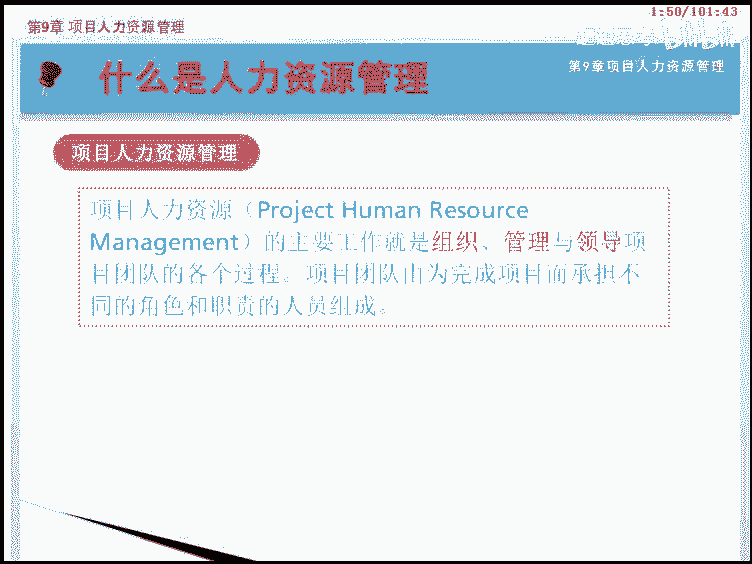

本章知识既包括技术层面的内容，也包含社会层面的内容，还涉及很多西方价值取向的问题，可以说项目人力资源管理不但是技术，而且是艺术，作为人力资源管理的执行者，接下来我们来看看什么是项目管理团队。

项目管理团队是项目团队的一部分，负责项目管理和领导活动，如项目各阶段的启动，规划执行监督控制和收尾，项目管理团队也称为核心团队，执行团队或领导团队。

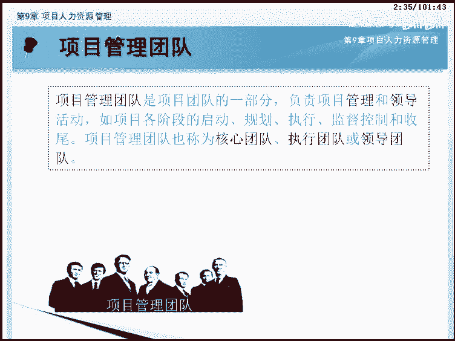

对于小型项目项目管理职责，可由整个项目团队分担，或者由项目经理独自承担，为了更好地开展项目，项目发起人应该与项目管理团队一起工作，特别是协助项目筹资，明确项目范围，监督项目进程以及影响他人。

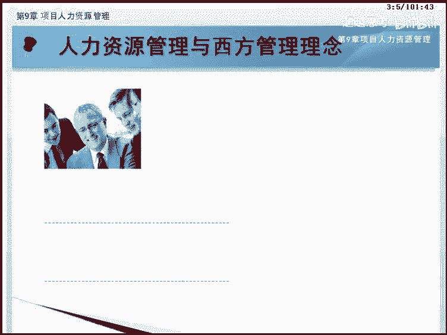

在pm报告指南中，项目管理过程常以界限分明，相互独立的形式出现，但在实践中，它们会相互交叠，相互作用，过程间的相互作用可能需要额外的规划工作，例如在首批团队成员编制出工作分解结构后。

可能需要招募更多的团队成员，新团队成员加入后，其经验水平高低将会减少或增加项目风险，从而有必要进行额外的风险规划，如果在确定项目团队，全部成员及其能力水平之前，就估算了项目活动持续时间，编制了预算。

界定了范围，制定了计划，则这些内容都可能面临变更，另外我们需要了解，那就是以人为本，尊重个人需求评估，重视沟通，长远计划，优秀人才的选拔和训练，这些理念也处处体现在文章的各个过程中。

按照pm报考指南第五版，项目人力资源管理主要通过四个过程完成，首先要通过制定项目人力资源管理计划，建立项目角色与职责，这是进行人力资源管理的基础，对应的过程是规划人力资源管理之后，开始组建项目团队。

这个过程需要确定人力资源可用情况，形成项目人员分派和资源日益，接下来的过程是为了提高团队工作能力，和提高项目绩效的建设，项目团队过程，在整个项目执行过程中，需要跟踪成员工作表现，提供反馈，解决问题。

以优化项目绩效，这是管理项目团队过程的任务。

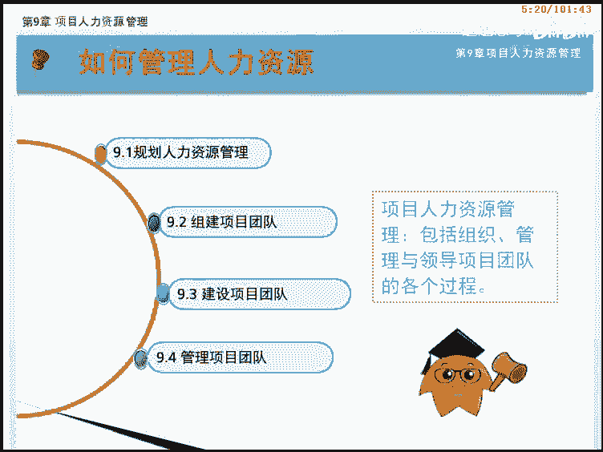

本课程我们将一起学习第九章，项目人力资源管理知识领域的第一节规划，人力资源管理。

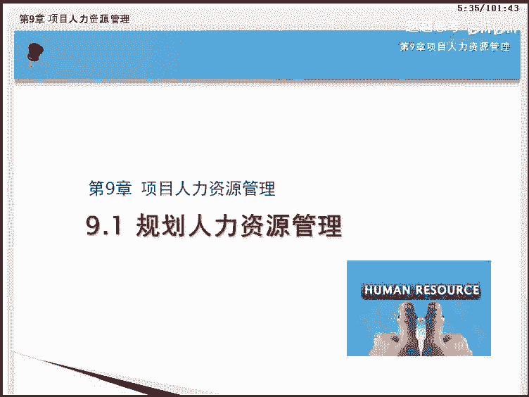

通过本课程的学习，我们将要达到以下目标，包括了解规划人力资源管理的意义及方法，了解活动资源需求，事业环境因素及组织过程，资产与规划人力资源管理的关系，掌握图纸图与职位描述的几种形式。

掌握人际交往及组织理论的含义和内容，掌握角色和职责，项目组织图及人员配备管理计划的含义和内容，本课程我们将按照如画面所示的大纲为您讲述，首先是对规划人力资源管理过程的基本含义，进行讲解。

接下来分析规划人力资源管理过程的，输入工具和技术以及输出课程的，最后是本章核心知识整理，我们先来了解一个基本概念，规划人力资源管理的过程，规划人力资源管理是识别和记录项目角色，职责所需技能报告关系。

并编制人员配备管理计划的过程，本课程的主要作用是建立项目角色与职责，项目组织图，以及包含人员招募和遣散时间表的人员配备，管理计划，规划，人力资源管理过程属于规划过程组，是建设和管理项目团队的基础。

通常在项目早期就已经开始，例如某公司要新建一栋大楼，需要在项目初期确定项目所需的角色，包括项目经理，项目副经理，技术负责人以及设计，采购和质量等相关职能负责人等，除角色外。

项目还要进一步确定角色承担的责任，需要的技能以及他们之间的关系，之后在此基础上编制人员配备管理计划，完成人力资源计划的制定后，即可以以此为依据进行人员的招募和分派，可以说。

规划人力资源管理是项目人力资源管理的基础，只有制定好人力资源管理计划，才能够进行下面的组建，建设和管理项目团队工作，pmi认为，规划人力资源管理主要有三方面的内容，第一项目角色与职责的记录。

第二项目组织机构图，第三包括人员招募和遣散时间表的，人员配备管理计划，在制定项目人力资源计划时，应该特别关注稀缺或有限人力资源的可得性，或者其他项目对这些资源的竞争。

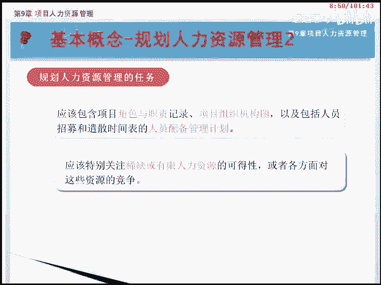

另外还需要考虑那些可能对项目成本进度，风险质量以及其他方面有显著影响的因素，因为这些因素会影响项目目标的实现，因此需要编制人力资源配备的备选计划方案，项目人力资源计划的制定至关重要。

它将对制定项目管理计划以及估算成本，又直接影响，接下来让我们来看看人力资源管理计划，是如何被制定出来的，规划，人力资源管理，就是依据项目管理计划中已有的子计划，结合活动资源需求。

使用专家判断和其他组织理论，得到最终的子计划，人力资源管理计划，这是规划人力资源管理过程的数据流向图，我们可以看到，该过程通过输入输出与其他过程进行交互。

规划人力资源管理过程共有四个输入，分别是项目管理计划活动，资源需求，事业环境因素和组织过程资产，下面我们依次来了解他们。

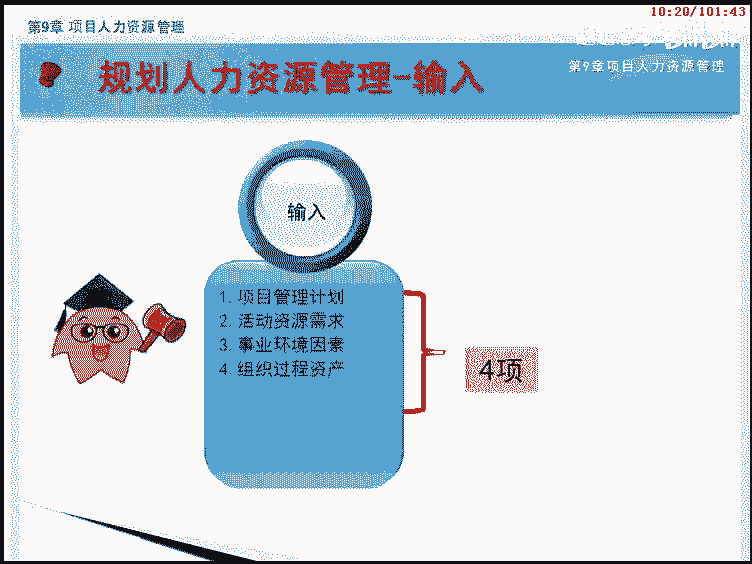

首先是项目管理计划，在制定人力资源管理计划时，需要考虑整个项目已有的项目管理以及子计划，有用的信息，包括项目生命周期和你用于每个阶段的过程，未完成项目目标，如何执行各项工作，变更管理计划。

规定了如何监控变更配置管理计划，规定了如何开展配置管理工作，还有如何维持项目基准的完整性，以及该系人之间的沟通需求和方法，进行人力资源规划，首先需要根据活动资源需求，来确定项目所需的人力资源。

当然这些人力资源，特别是项目团队成员及其能力的需求，是渐进明细的，活动资源需求来自估算活动资源过程，即先识别出每项活动所需的资源类型和数量，然后再考虑具体的人力资源需求。

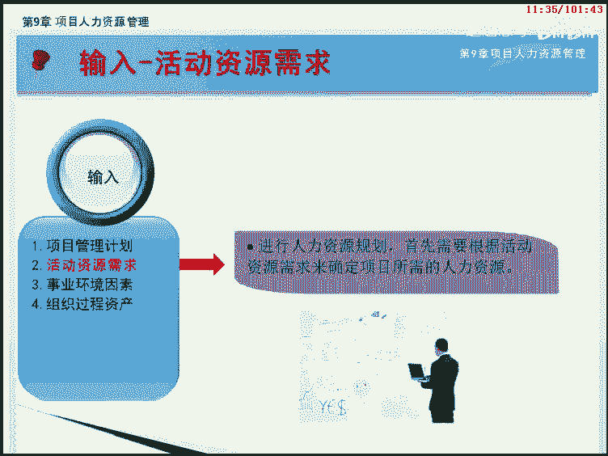

能够影响规划人力资源管理过程的，事业环境因素，包括组织文化与结构，现有人力资源情况，团队成员的地理位置分布，人事管理政策以及市场条件。

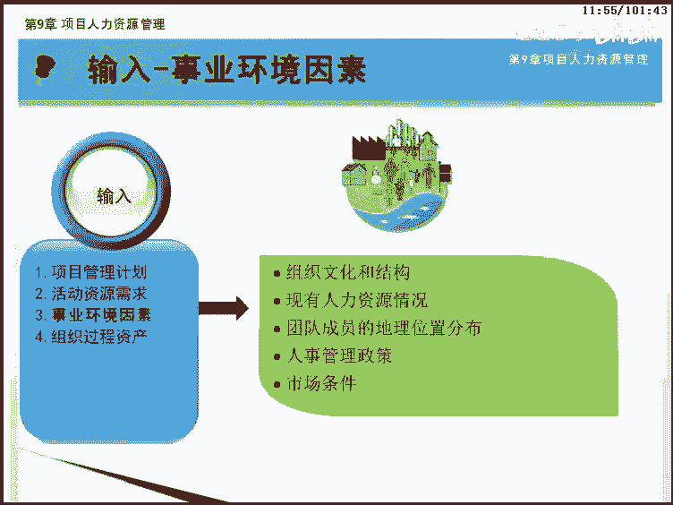

还有能够影响规划人力资源管理过程的，组织过程资产包括组织的标准流程，政策和角色描述，组织图和职位描述模板，以往项目中与组织结构有关的经验教训，团队和执行组织内用于解决问题的升级程序。

我们来看规划人力资源，管理过程的五个工具和技术，它们是组织图和职位描述，人际交往，组织理论，专家判断以及会议，接下来我们一块来学习。

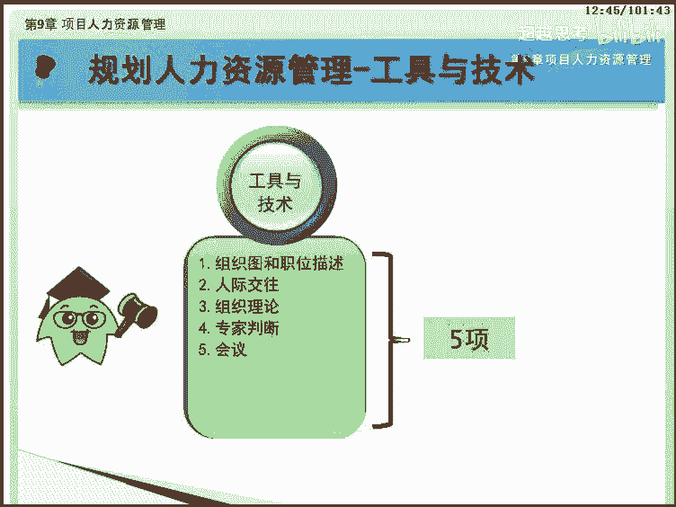

作为规划人力资源管理过程中，最重要的工具与技术，组织图与职位描述，可采用多种格式来记录团队成员的角色与职责，目的是确保每个工作包都有明确的责任人，确保全体团队成员都清楚地理解其角色和职责。

接下来我们来学习组织图与十位描述方法，图中展示的是最常见的，记录角色和职责的三种格式及层级型，矩阵型和文本型，下面我们将对这三种格式一一进行讲解。

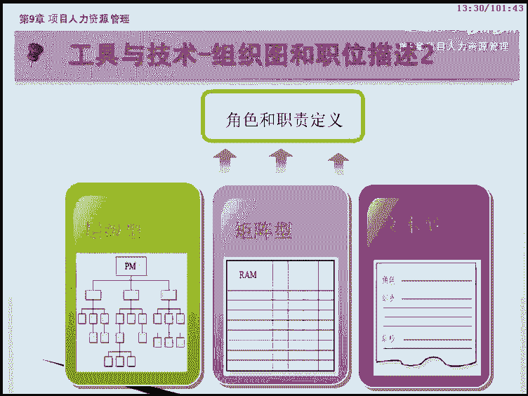

传统的组织结构图就是一种典型的层次结构图，他用图形的形式，从上至下的描述团队中的角色和关系，常见的层级型组织图，可以通过组织分解结构o b s来完成，即按照组织现有的部门单元或团队排列，如图所示。

项目部下面分为研发部和质量管理部，其中研发部负责搭建系统，又分为需求组和程序组，质量管理部负责质量管理，又分为质保组和测试组，这种层级型的组织结构图，简单易懂，非常明确地展现了各部门之间的汇报关系。

得到广泛使用，看到组织分解结构o b s的表现形式，你能否想起项目中还有类似的图形吗，是的，工作分解结构w bs和资源分解结构，rbs的展现方式与o b s类似，它们都是层级型的分解结构图。

下面我们对它们做个对比，这几种分解结构都用层级型图形进行展示，工作分解结构w bs以可交付成果为导向，把项目可交付成果及其工作层层分解，直至分解为工作包，资源分解结构，rbs是按照资源类别。

把项目中所需的资源划分成层级结构图。

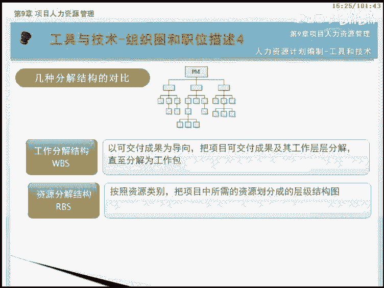

组织分解结构，o b s是按照组织现有的部门单元或团队排列，进行层层分级，展现了各部门的隶属关系，实际上在后面介绍风险管理的时候，我们也可以把项目中的风险，按类别画成类似的结构图，叫做风险分解结构。

简称也是rbs，其中资源分解结构对追踪项目成本很有用，并与项目所在组织的会计系统对接，下面我们将举例说明，这几种层级图的内容与关系，图中展示的是某人力资源管理，软件开发项目的组织分解结构图。

o b s和工作分解结构图，w bs以及它们之间的关系，两张图交叉中的黑色圆点代表o b s中，各部门或工作组需承担的项目职责，在wps中相对应的位置，由此可以看出。

o b s是按照组织现有部门和团队进行划分的，而wbs是按照项目可交付成果的分解进行的，两者的结合，可以将项目活动和工作包等列在各部门下，这样一个部门，只需要找到其所在组织分解结构中的位置。

就可以了解他应该承担的所有项目职责，图中这些黑点可以看成控制账户，除了前面介绍的层级型图纸图外，第二种图纸图与职位描述是矩阵形，可以采用责任分配矩阵，r a m来显示分配给每个工作包的项目资源。

也就是显示工作包或活动，与项目团队成员之间的联系，责任分配矩阵rm是最直观的方法，在大型项目中，rm也可以分成多个层级。

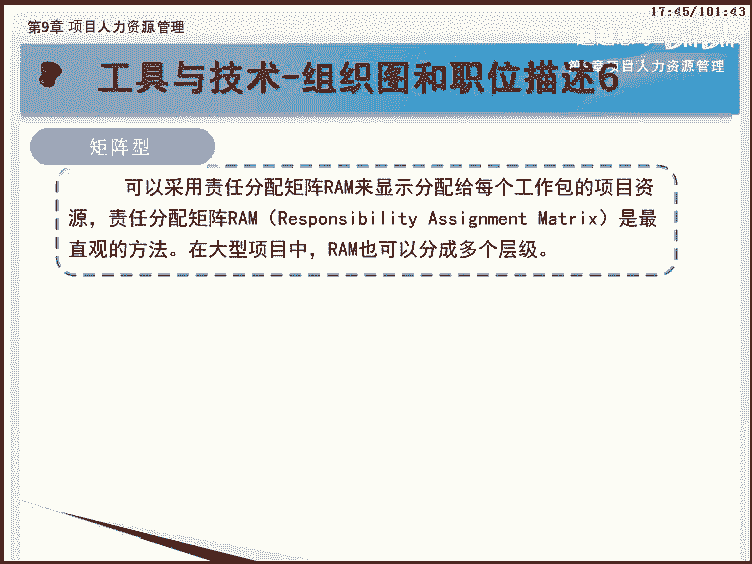

这个表格展现的就是责任分配矩阵，表格的每一列代表具体的人员或小组，表格的每一行代表一项任务或职责，从这个责任分配矩阵也可以清楚地看到，每个人在项目中的责任，比如需求调研，这项任务是由王公负责的。

理工需要参与评审，我们也可以看到，理工不但要参与需求调研的评审，还要同时负责需求分析及测试两项工作，责任分配矩阵r a m的一个例子，是r a c i矩阵或者r a c i图，如图所示。

最左边的一个列表示有待完成的工作或活动，可以针对个人或小组分配工作，其中r执行表示该工作尤其具体执行，a负责表示该工作需由其批准，c咨询表示拥有相关信息，爱知情表示其对该工作有知情权。

但并不需要征询他的意见。

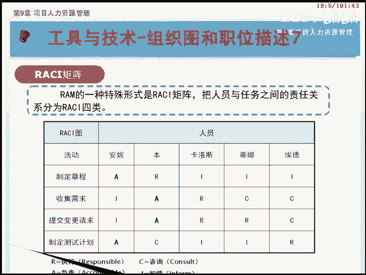

i c i矩阵中需要注意，要确保任何一项任务都只有一个人负责，另外值得注意的是，组织分解结构o b s与责任分配矩阵，im或i c i h阵的区别在于，o b s反映部门与工作计划活动的联系。

而rm或r a c i，反映工作与项目组和项目团队成员的联系。

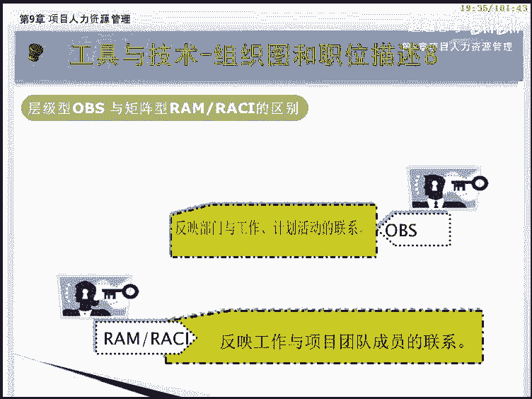

职位描述的最后一种表现形式，是最简单的文本性描述，他用文字形式对团队成员职责进行描述，通常提供如下的信息，职责权利能力和资格等。

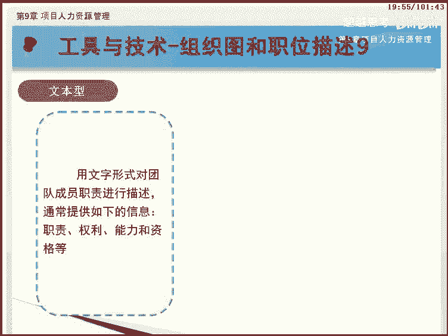

画面中展示的示例是架构设计师的，文本形式为描述，除了组织图与职位描述以外，规划人力资源管理的工具和技术中，还包括人际交往和组织理论，人际交往是指在组织行业或职业环境中，与他人的正式或非正式互动。

开始了解项目中政治与人际因素的有益途径，人际交往活动包括主动写信，无参会，非正式对话，如会议和活动，贸易洽谈会和座谈会等，人际交往在项目初始时特别有用，并可在项目期间以及项目结束后。

有效促进项目管理职业的发展，这类似于我们中国人说的关系，组织是由两个以上的人组成的，为实现共同目标，以一定形式加以编制的集合体，组织理论是阐述个人团队和组织部门的行为方，式，有效利用组织理论。

可以缩减编制人力资源计划的时间，成本及人力投入，并提高规划工作的效率。

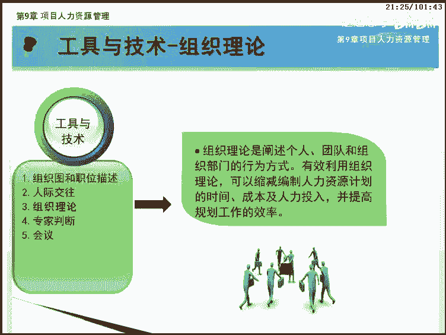

在制定人力资源管理计划时，专家判断被用于下列情况，列出对人力资源的初步要求，根据组织的标准化角色描述，分析项目所需的角色，确定项目所需的初步投入水平和资源数量，根据组织文化确定所需的报告关系。

根据经验教训和市场条件指导，提前配备人员，识别与人员招募游泳和遣散有关的风险，为遵守适用的政府法规和公会合同，制定并推荐工作程序，在规划项目，人力资源管理师，项目管理团队将会举行规划会议。

在这些会议中应该综合使用其他工具和技术，使所有项目管理团队成员，对人力资源管理计划达成共识，规划项目人力资源管理过程只有一个输出，是人力资源管理计划，下面我们一块来了解。

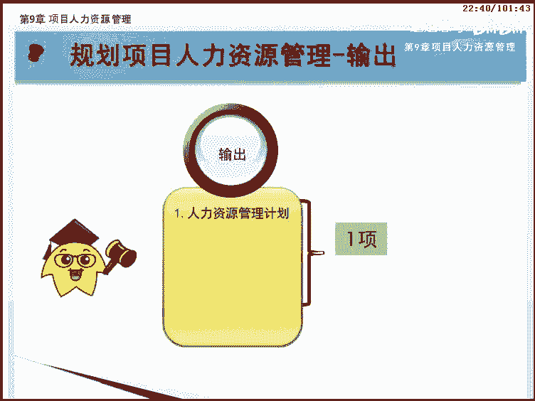

作为项目管理计划的一部分，人力资源管理计划提供了关于如何定义，配备管理及最终遣散项目人力资源的指南，通过人力资源的合理配置，可以提高人力资源利用效率，增强人力资源优势，提高项目成功几率。

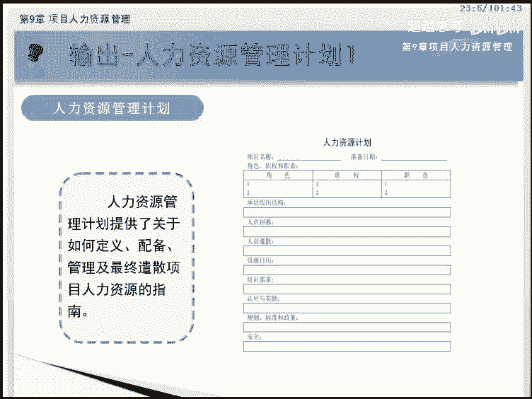

人力资源管理计划中包含三方面的内容，分别是角色和职责，项目组织图及人员配备管理计划，角色和职责中的角色，描述了未完成项目所需的职责划分，职权是指使用项目资源做出决策和批准的权利，职责是指为了完成项目。

要求项目团队成员执行工作能力，是完成项目活动所需要的技能，项目组织图以图形表示项目汇报关系，人员配备管理计划是人力资源计划的子计划，内容会在后面详细讲解。

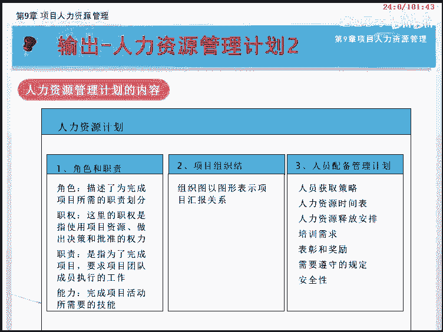

这张图罗列了项目经理的角色与职责，我们看到项目经理是整个项目的团队领导，他担负着整个项目的主要责任，项目经理在大项目中是作为整合者出现的，而整合是通过沟通实现的，项目经理对项目的成功负责。

但不对质量负全部责任，因为项目经理并不能掌控所有资源，接下来看项目组织图，项目组织图以图形方式展现，项目团队成员及其报告关系，基于项目的需要，项目组织图可以是正式或非正式的，非常详细或高度概括的。

一个3000人的建筑工程项目的组织图，详尽的多。

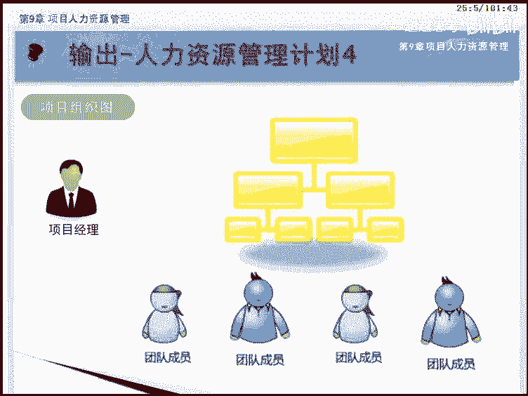

人力资源管理计划的最后一项内容是，人员配备管理计划，它包含七个方面的内容，分别是人员招募次元日历，人员遣散计划，培训需要认可与奖励，合规性安全，其中值得我们重点注意的是。

人员遣散计划在人员配备管理计划中。

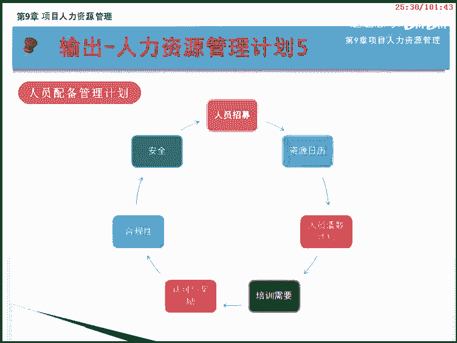

还有一个更小的子计划及人员遣散计划，事先制定人员遣散的方法和时间，从而让项目团队成员提前知晓的重要性在于，一旦把团队成员从项目中遣散出去，项目就不再负担与这些成员相关的成本，从而节约项目成本。

如果已经为员工安排，好像新项目的平滑过度则可以提高士气，人员遣散计划，也有助于减轻项目过程中或项目结束时，可能发生的人力资源风险，人力资源直方图也称人力资源柱状图，是人员配备管理计划的一部分。

人力资源直方图显示在整个项目期间，每周或每月需要某人，某部门或整个项目团队的工作小时数，图中展现的是项目对高级设计师，这种资源的需求，直方图横坐标表示时间一般以周或月为刻度，纵坐标表示每个时间。

刻度上需要该类资源的工作时间，可以是小时天等，可在资源这方图中画一条水平线，代表某特定资源最多可用的小时数，如果住行超过该水平线，就表明需要采用资源平衡策略，如增加资源或修改进度计划等。

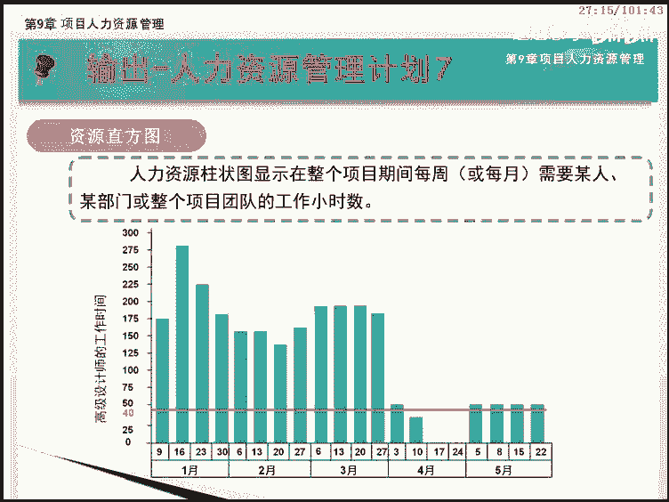

我们需要区分资源日历和资源直方图，这两个概念，资源日历强调的是资源可用于项目的时间，是客观情况，而资源直方图强调的是，资源在某时间需要工作的小时数，更多反映主观安排和需要，对此需要加以区分。

现在我们来回顾一下本过程的核心知识，项目管理团队是项目团队的一部分，负责项目管理和领导互动规划，人力资源管理，是识别和记录项目角色实则所需技能报告关系，并编制人员配备管理计划的过程。

组织图与职位描述有三种格式及层级型，矩阵型和文本型。

责任分配矩阵，r a m用来显示分配给每个工作包的项目资源，人力资源管理计划，提供了关于如何定义配备管理，及最终遣散项目人力资源的指南，人员配备管理计划，是人力资源管理计划的组成部分。

说明将在何时以何种方式获得项目团队成员，以及他们需要在项目中工作多久，恭喜你完成规划人力资源管理过程的学习，我们下节课见，本课程我们将一起学习，第九章项目人力资源管理知识领域的第二节，组建项目团队。

它位于执行过程组。

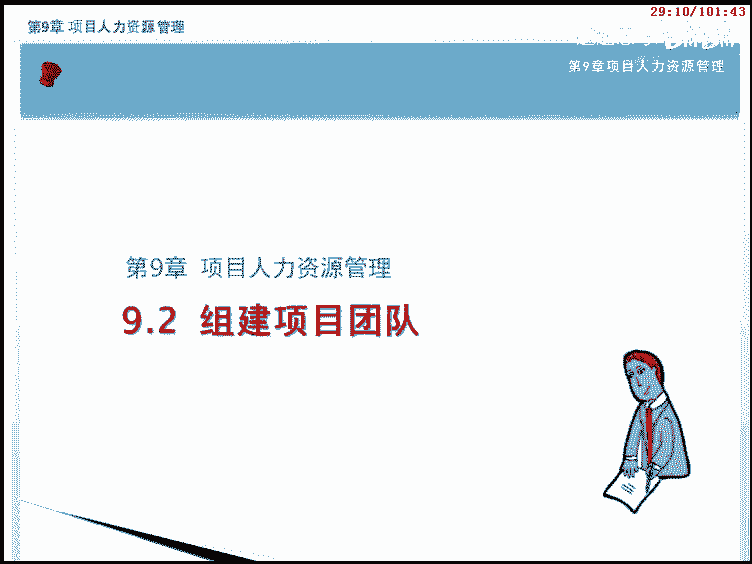

通过本课程的学习，我们将要达到以下目标，包括了解组建项目团队过程的输入内容，掌握预分派谈判和招募的含义和方法，掌握虚拟团队的概念和意义，了解组建项目团队输出包含的主要内容。

理解组建项目团队所涉及的p m i思维。

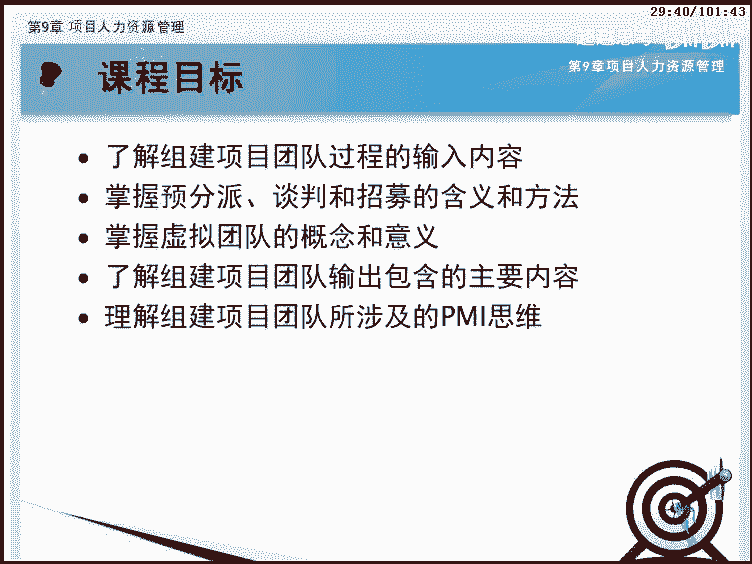

本课程我们将按照如画面所示的大纲为您讲述，首先是对组建项目团队这个基本概念进行讲解，接下来分析组建项目团队过程的输入，工具和技术以及输出课程的，最后是本节核心知识整理。

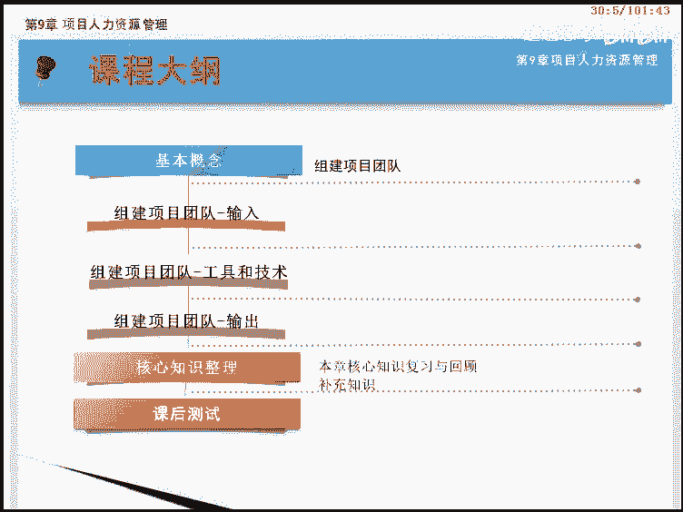

在学习本过程之前，我们先来看看什么是组建项目团队，组建项目团队是确认人力资源的可用情况，并未开展项目活动而组建团队的过程。

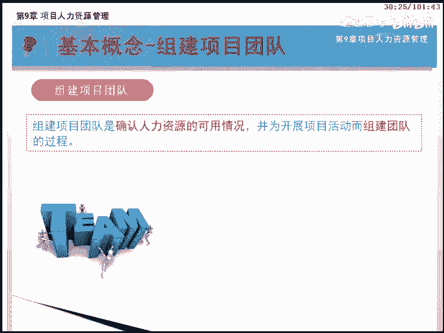

本课程的主要作用是指导团队选择和职责分配，组建一个成功的团队，项目经理或项目管理团队，应该在项目进度计划，项目预算，项目风险计划，项目质量计划，培训计划以及其他相关计划中说明，缺少所需人力资源的后果。

接下来让我们来看看如何组建项目团队，该过程在人力资源管理计划的指导下，考虑与人力资源相关的事业，环境因素和组织过程，资产采用一分派谈判，招募虚拟团队等技术，从各种渠道把成员召集到项目中来，形成项目团队。

最终确定了人员分配情况，并把每个人可以在项目上工作的时间，记录到资源日历中，这是组建项目团队过程的数据流向图，可以看到该过程通过输入，输出与其他过程进行交互。

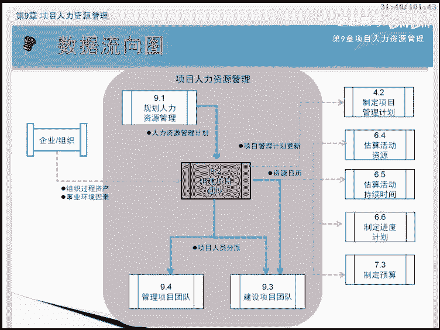

组建项目团队过程共有三个输入，分别是人力资源管理计划，事业环境因素和组织过程资产，下面我们依次来了解他们吧。

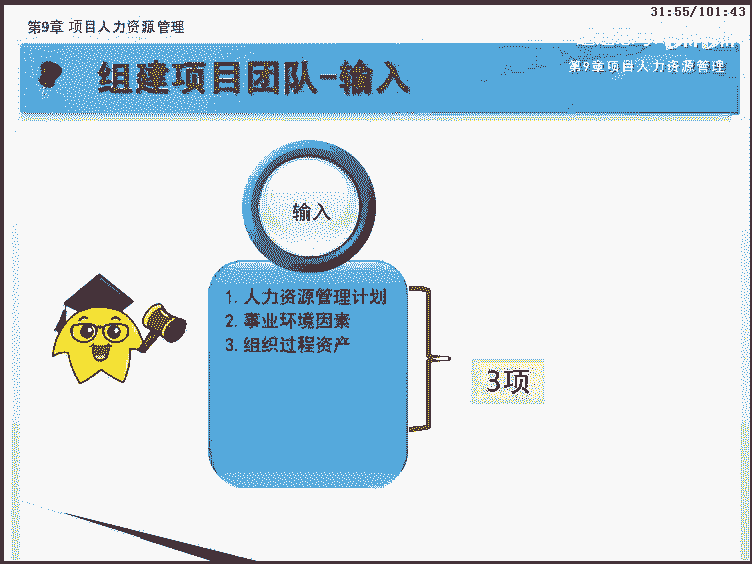

组建项目团队时应该参考人力资源管理计划，人力资源管理计划，提供了如何定义配备管理和最终遣散，人力资源的指南，它包括如下信息，角色与职责。

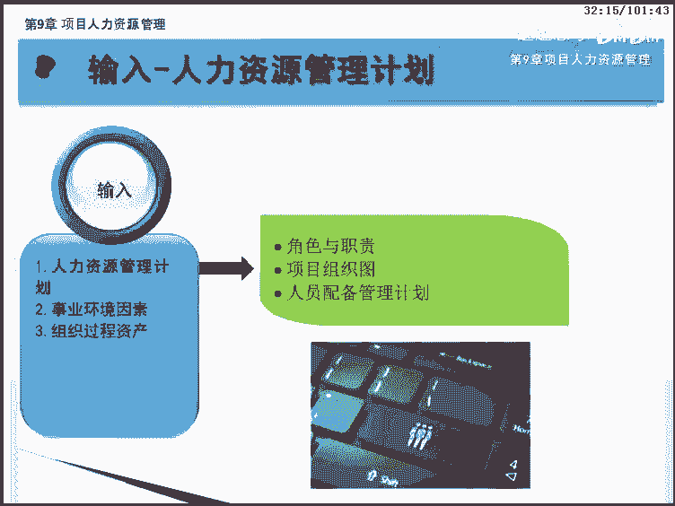

这定义项目所需的岗位技能和能力，项目组织图说明项目所需的人员数量，人员配备管理计划，说明需要每个团队成员的时间段，以及有助于项目团队参与的其他重要信息，组建项目团队时。

应该了解现有人力资源情况和企业人事管理政，策，可能影响组建项目团队过程的事业环境因素，包括现有人力资源情况，比如可用性性能水平，以往经验对本项目工作的兴趣和成本费率等，还有人事管理政策。

如影响外包的政策，组织结构也需要了解，另外是集中办公或多个工作地点的信息。

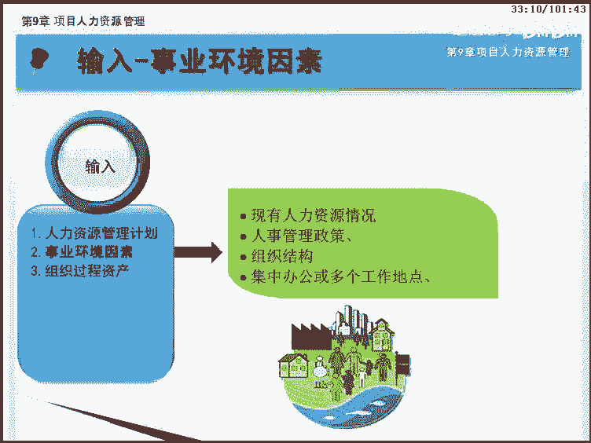

也在事业环境因素中体现，昨天项目团队时还应考虑组织的标准政策，流程和程序，这些属于组织过程资产的范畴。

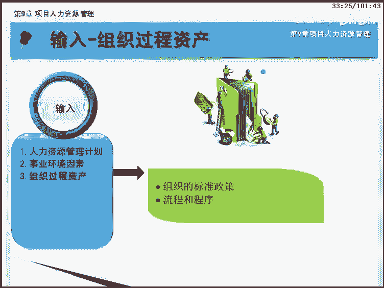

组建项目团队过程的五个工具和技术，分别是预分派谈判，招募虚拟团队和多标准决策分析，下面我们一块来学习。

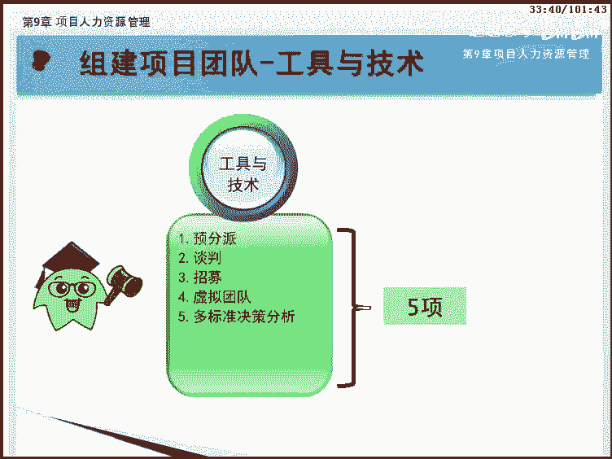

一般来讲，项目团队的成员，由项目经理和项目管理团队选定，但有些情况下，项目团队成员是事先选定的，这就是预分派，一分派多用于组织内部人力资源的获取，或者某个特殊人员的考虑，玉芬派可在下列情况下发生。

在竞标过程中承诺分派特定人员进行项目工作，例如某软件开发项目在招标文件中承诺中标后，将派遣组织内部，一位资深程序员担任软件调试工作，项目取决于特定人员的专有技能，特别稀缺的人力资源。

必须在项目启动之前进行预约，例如在一些新产品的研发项目中，需事先预约该领域顶尖的研究人员参与项目，如不能获得这些人员，项目将受到严重影响，甚至导致取消项目。

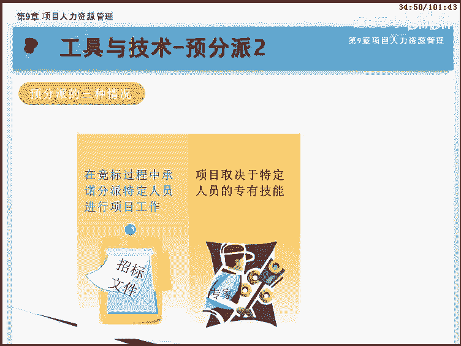

或者项目章程中指定了某些人员的工作分配，这些都属于与分派的情况，谈判是一种软技能，项目经理通常不直接掌握组织的人力资源，在许多情况下需要通过谈判完成人员分派。

在组建项目团队过程中，项目管理团队需要由下列各方进行谈判，职能经理，确保项目能够在需要时获得，具备适当能力的人员，确保项目团队成员能够愿意，并且有权在项目上工作，直到完成其职责。

执行组织中的其他项目管理团队，合理分配稀缺或特殊人力资源，外部组织，卖方供应商，承包商等，获取合适的稀缺的，特殊的，合格的，经认证的或其他诸如此类的特殊人力资源，特别需要注意与外部谈判有关的政策惯例。

流程指南，法律以及其他标准。

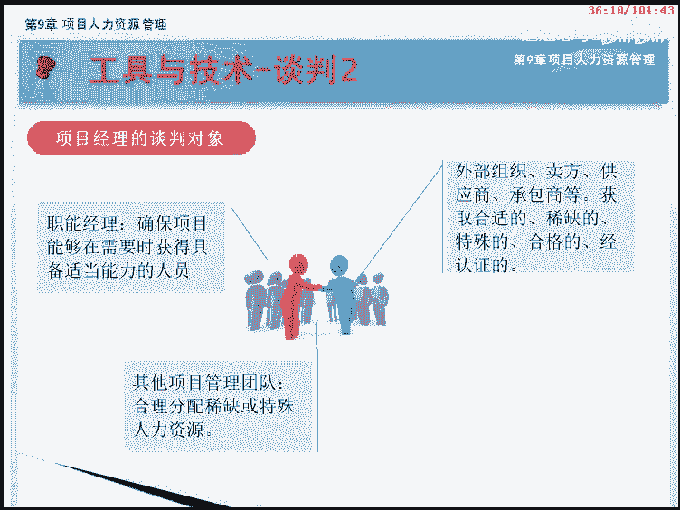

在人员分派谈判中，项目管理团队影响他人的能力很重要，如同在组织中的政治能力一样重要，例如职能经理在决定把杰出人才，分配给哪个项目时，将会权衡各竞争项目的优势和知名度。

如果执行组织不能提供未完成项目所需的人员，就需要从外部获得所需的服务，这可能包括雇佣独立咨询师，或把相关工作分包给其他组织。

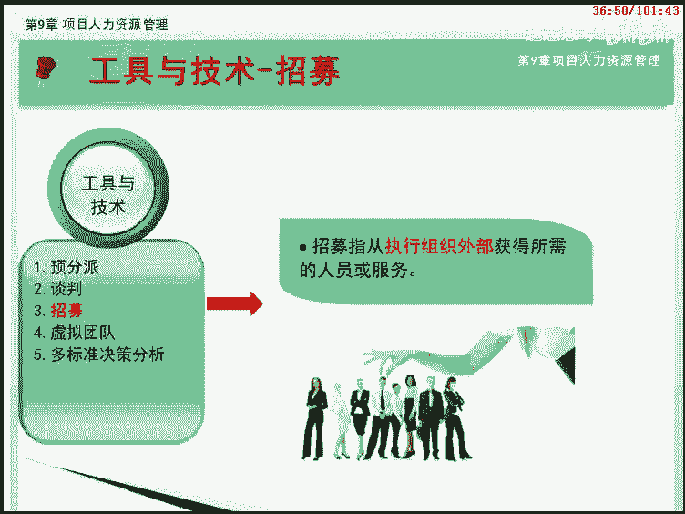

组建项目团队的工具与技术中，还有一项是虚拟团队，虚拟团队的使用，为招募项目团队成员提供了新的可能，虚拟团队可定义为具有共同目标，在完成角色任务的过程中。

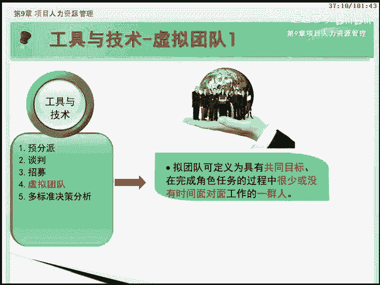

很少或没有时间面对面工作的一群人，现代沟通技术如电子邮件，电话会议，社交媒体，网络会议和视频会议等，使虚拟团队成为可行，虚拟团队模式使人们有可能进行下列活动，在组织内部。

地处不同地理位置的员工之间组建团队，为项目团队增加特殊技能，即使相应的专家不在同一地理区域，将在家办公的员工纳入团队。

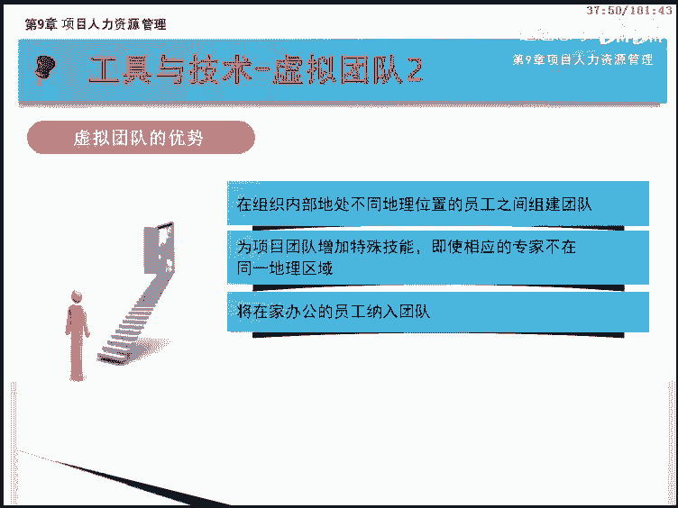

在工作班次，工作小时或工作日不同的员工之间组建团队，将行动不便者或残疾人纳入团队执行，那些原本会因差旅费用过高而被否决的项目，当然虚拟团队也有一些缺点，例如沟通困难可能产生误解，距离远，有孤立感。

团队成员之间难以分享知识和经验，可能引起通信技术的成本。

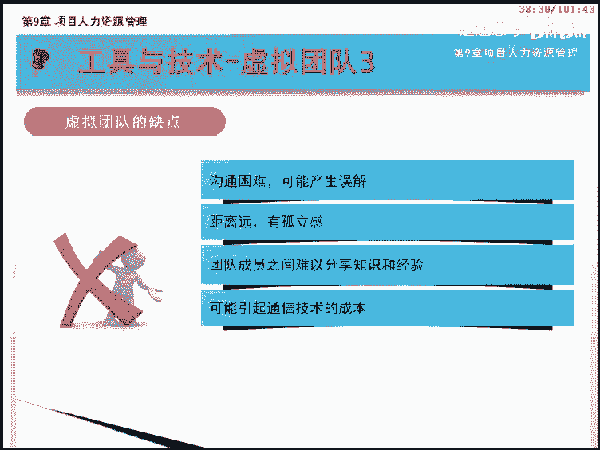

为了避免上述缺点，在虚拟团队的环境中，要更加重视规划沟通工作，可能需要花更多时间来设定明确的期望，促进沟通，制定冲突解决方法，召集人员参与决策，理解文化差异以及共享成功喜悦，在组建项目团队过程中。

经常需要使用团队成员选择标准，通过多标准决策分析，制定出选择标准，并据此对候选团队成员进行定级或打分，根据各种因素对团队的不同重要性，赋予选择标准不同的权重。

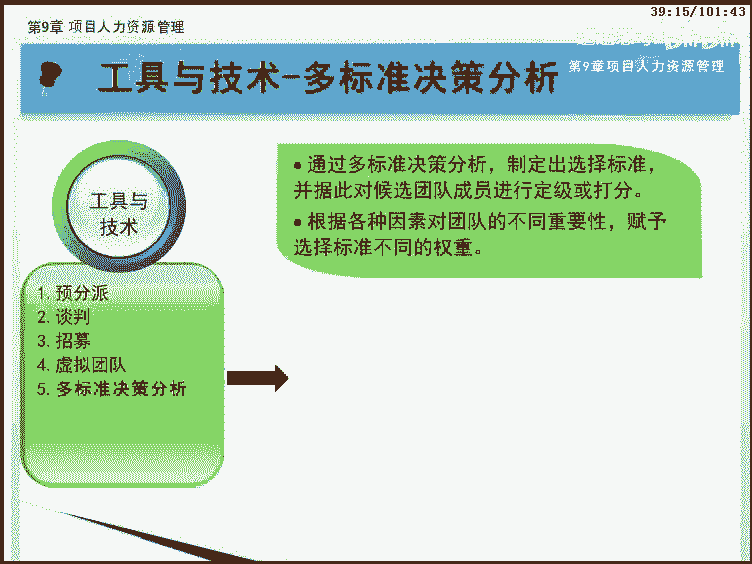

例如可用下列标准对团队成员进行打分，可用性，团队成员能否在项目所需时段内为项目工作，在项目期间内是否存在影响可用性的因素，成本是聘用团队成员所需的成本，是否在规定的预算内，经验。

是团队成员是否具备项目所需的相关经验能力，团队成员是否具备项目所需的能力知识，团队成员是否掌握关于客户，类似项目和项目环境细节的相关知识技能，团队成员是否具有相关的技能来使用项目工具。

开展项目执行或培训态度，团队成员能否与他人协同工作，已形成有凝聚力的团体，国际因素，团队成员的位置，时区和沟通能力等，组建项目团队，这个过程共有三个输出，分别是项目人员分派资源，日历和项目管理计划更新。

下面我们一块来学习。

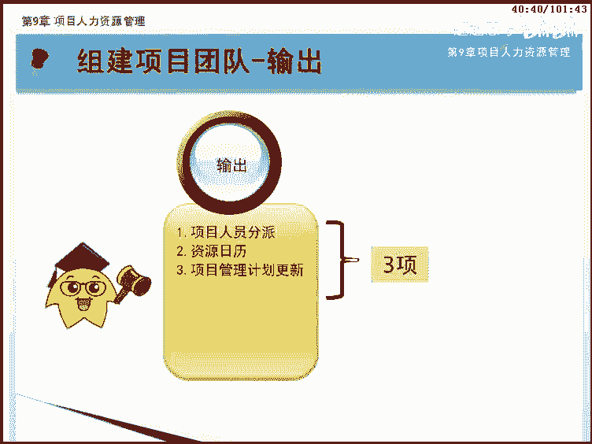

项目人员分派，就是通过把合适的人员分配到团队，来为项目配备人员，与项目人员分派相应的文件，包括项目团队名录和致团队成员的备忘录，还需要把人员姓名，插入项目管理计划的其他部分，如项目组织图和进度计划等。

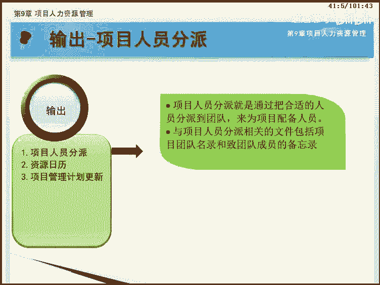

完成项目人员分派，是建设和管理项目的先决条件，所以项目人员分派也是人力资源管理，下面两个过程的输入，必须很好地了解每个人的可用性和时间限制，包括时区工作时间，休假时间。

当地节假日和在其他项目的工作时间等，这样才能编制出可靠的进度计划，资源日历，记录每个项目团队成员在项目上的工作时间段，退后本过程还将更新项目管理计划，此处的项目管理计划，特指其中的人力资源管理计划。

例如承担某个角色的人员，未达到人力资源管理计划所规定的全部要求，就需要更新项目管理计划，对团队结构人员角色或职责进行变更。

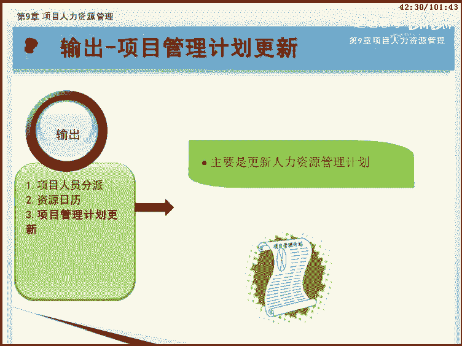

现在我们来回顾一下本过程的核心知识，组建项目团队是确认人力资源的可用情况，并未开展项目活动而组建团队的过程，预分派指项目团队成员事先选定，多用于组织内部人力资源的获取或考虑，特殊人员。

项目经理需要通过谈判完成人员分派。

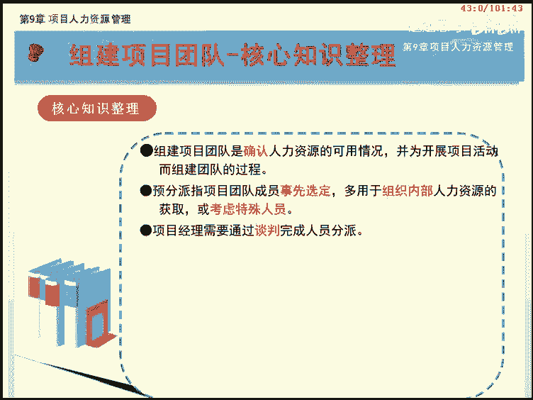

招募只从执行组织外部获得所需的人员或服务，虚拟团队可定义为具有共同目标，在完成角色任务的过程中，很少或没有时间面对面工作的一群人，项目人员分派，是建设和管理项目团队的先决条件。

恭喜你完成组建项目团队过程的学习，我们下节课见本课程，我们将一起学习，第九章项目人力资源管理知识领域的第三节，建设项目团队，它位于执行过程组。

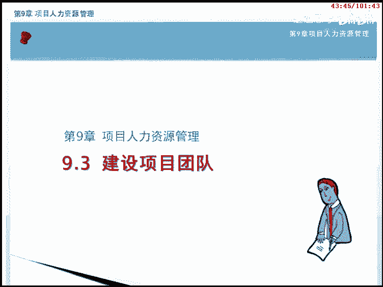

通过本课程的学习，我们将要达到以下目标，包括了解建设项目团队的目标，了解建设项目团队的输入内容，了解项目经理应该具备的人际关系技能，了解培训的含义与方法，掌握团队建设的意义及团队建设，去经历的五个阶段。

了解基本规则与集中办公的含义，掌握认可与奖励的意义及激励理论，掌握团队绩效，主要评价标准和需要更新的事业环境因素内容，本课程我们将按照如画面所示的大纲为您讲述，首先是对建设项目团队这个基本概念进行讲解。

接下来分析建设项目团队过程的输入，工具和技术以及输出课程的，最后是本节核心知识整理。

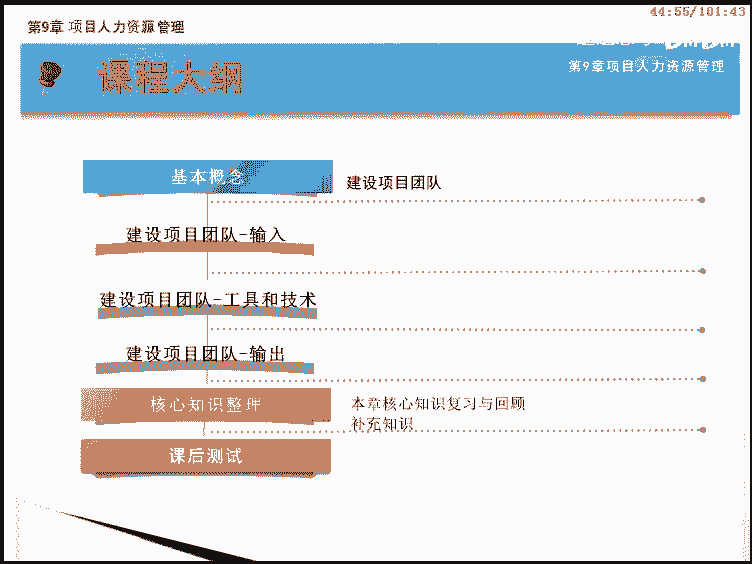

在学习本过程之前，我们先来看看什么是建设项目团队。

建设项目团队是提高工作能力，促进团队成员互动，改善团队整体氛围，以提高向母亲笑的过程等，过程的主要作用是改进团队协作，增强人际技能，激励团队成员，降低人员离职率，提升整体项目绩效。

团队协作是项目成功的关键因素，而建设高校的项目团队，是项目经理的主要职责之一，建设项目团队的目标包括，提高团队成员的知识和技能，以提高他们完成项目交付成果的能力，并降低成本，缩短工期和提高质量。

提高团队成员之间的信任和认同感，以提高士气，减少冲突和促进团队协作。

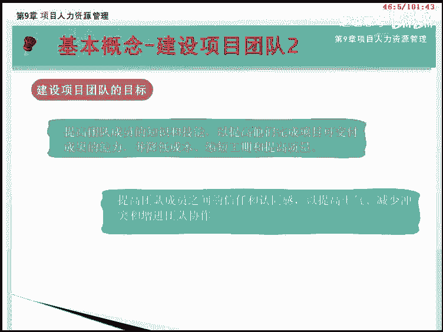

创建富有生气，凝聚力和协作性的团队文化，以便提高个人和团队生产率，振奋团队精神，促进团队合作，并且促进团队成员之间的交叉培训和辅导，以分享知识和经验，项目经理，在全球化环境和富有文化多样性的项目中工作。

团队成员经常来自不同的行业，讲不同的话语，有时甚至会在工作中使用一种特别的团队语言，而不是使用他们的母语，项目管理团队应该利用文化差异，在整个项目生命周期中，致力于发展和维护项目团队。

并促进在相互信任的氛围中充分协作。

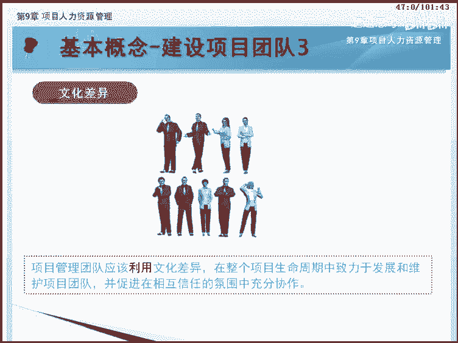

接下来让我们来看看如何建设项目团队，该过程在人力资源管理计划的指导下，参考项目人员分派和人员资源日历，通过人际关系技能培训，团队建设活动等各种技术，改善团队氛围，以提高项目整体绩效，在这个过程中。

需要对团队绩效进行评价，以明确团队的现状，这是建设项目团队过程的数据流向图，可以看到该过程通过输入，输出与其他过程进行交互。

建设项目团队过程共有三个输入，它们是人力资源管理计划，项目人员分派和资源日历。

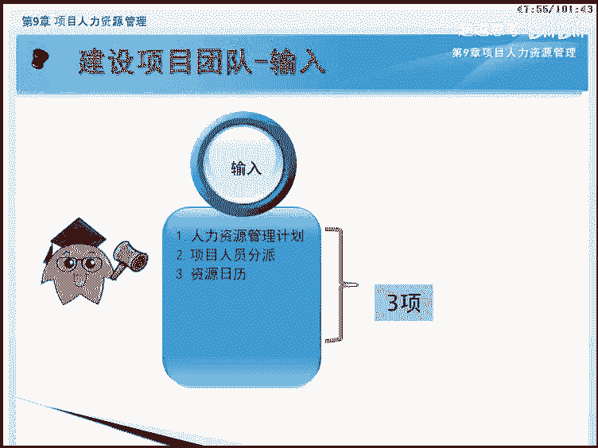

接下来我们会依次来介绍，我们知道人力资源管理计划，提供了关于如何定义配备管理，控制及最终遣散人力资源的指南，他确定了培训策略和团队建设计划，建设项目团队过程，在人力资源管理计划的指导下展开工作。

另外在建设项目团队过程中，通过持续的团队绩效评价，和其他形式的团队管理活动，可以把奖励反馈，附加培训及纪律惩罚等事项，加入人力资源管理计划中。

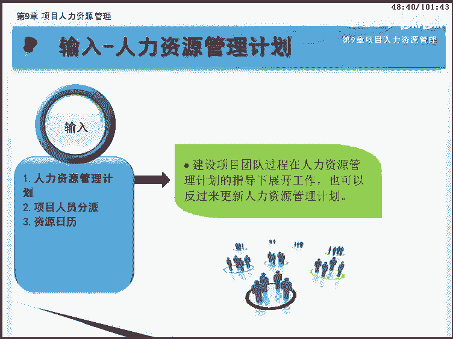

项目人员分派和资源日历，是组建项目团队的输出，要进行项目团队建设，首先要知道谁是团队成员，所以要从获得项目团队成员的名单开始，项目人员分派，就是把合适的人员分配到，未完成项目人员配备的过程。

该过程在组建项目团队时完成，而资源日历定义了项目团队成员，何时能参与团队建设活动。

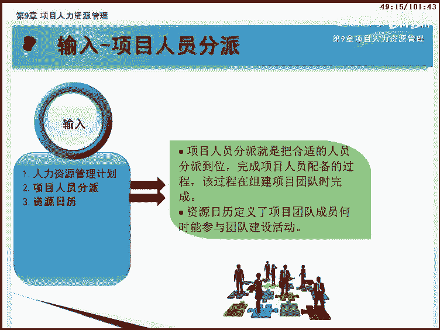

建设项目团队过程有七个工具和技术，分别是人际关系技能培训，团队建设活动基本规则，集中办公认可与奖励以及人事测评工具，下面我们一块来学习。

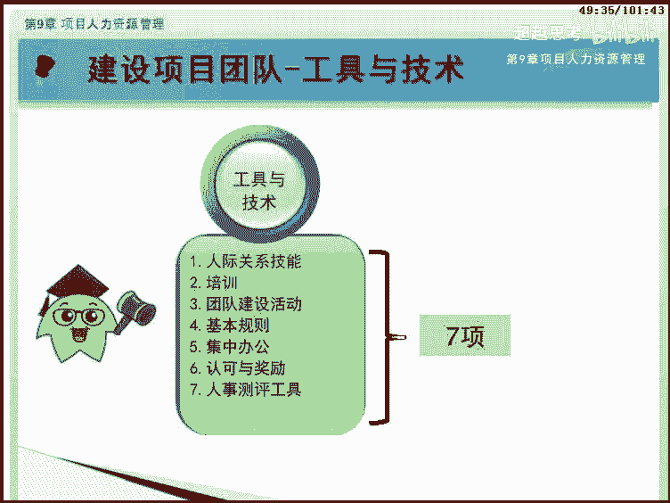

人际关系技能有时也被称为软技能，对团队建设特别重要，通过了解项目团队成员的感情，预测其行动，了解其后顾之忧，并尽力帮助解决问题，可大大减少麻烦并促进合作，从第四版pmbok开始，包括第五版pm报告。

更加强调人际关系技能，这也是由于当今的项目中，团队成员有可能来自不同国家，拥有不同文化背景及语言，很难在项目初期对项目目标形成统一认识，要使团队成员良好合作，发挥其才能，达成项目目标。

项目经理必须有很强的人际关系能力，将项目团队整合起来，对很多较大的项目来说，项目经理的主要工作是组织项目团队，和其他干系人共同完成项目，而不是自己解决技术问题，甚至可以说大一点的项目。

项目经理是组织专家做事的人，而不是自己亲手做事的人，这就要求项目经理不仅要拥有一定的专业水平，更重要的是要具有极强的人际关系能力。

新版pm报告的附录x3 ，概括性地讨论了，项目经理应该具备的人际关系技能，包括领导力，激励，沟通，影响力，决策，政治和文化意识以及谈判等11项内容，由此可见，项目经理在项目管理中扮演的是整合者的角色。

培训包括，旨在提高项目团队成员能力的全部活动，对项目团队成员进行针对项目的培训，是项目经理的重要工作，例如项目经理获得了一个成员，但该人员加入项目团队后，发现自己并不具备从事本项工作的某些知识。

这时项目经理首先想到的应该是，对其进行针对项目的培训，而不是辞退该人员，或者向管理层求助，人最宝贵的素质就是学习能力，人的大脑具有极强的可塑性。

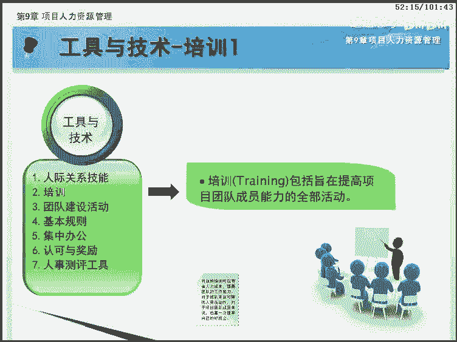

在项目中有效的培训可以节省人力成本，提高团队的工作能力，对于项目来说，可降低人员流动性，对于项目团队成员来说，也是一次提高自己的好机会，培训可分为计划内与计划外两类，计划内培训是按照人员配备。

管理计划中的培训计划进行，计划外部分要根据观察交谈和项目绩效情况，发现有能力不足等情况时临时安排，从培训的方式上，可分为正式培训和非正式培训两类，正式培训由专门的培训老师授课，如课堂培训，在线培训。

计算机辅助培训等，非正式培训为工作中的以老带新的学习方式，除此之外，制定项目管理计划，建立w bs经验总结等活动，也具有团队建设的作用，值得注意的是，职能经理需要对员工的一般知识与技能，进行培训。

但针对本项目的培训应当由项目经理负责，另外培训费用不论计划内还是计划外，一般都属于项目的直接成本，由项目承担，但如果涉及质量采购等，本应由项目所在组织承担的工作，而组织无法提供，是由项目团队自己培养时。

相关费用应由项目所在组织承担，团队建设活动是用以提升人际关系，改善团队成员有效合作的活动，它既可以是状态审查会上的五分钟一程，也可以是为改善人际关系而设计的，在非工作场所专门举办的体验活动。

正式的沟通固然重要，而非正式的沟通，也有助于建立信任和良好的工作关系，团队建设活动的目的，是帮助团队更加有效地协同工作，此外如果团队成员的工作地点相隔甚远，无法进行面对面接触。

就特别需要有效的团队建设策略，塔克曼认为，团队发展通常要经过五个阶段，分别是形成阶段，在本阶段，团队成员相互认识并了解项目情况，及他们在项目中的正式角色与职责，团队成员倾向于相互独立，不一定开诚布公。

震荡阶段，在本阶段，团队开始从事项目工作，制定技术决策和讨论项目管理方法，如果团队成员不能用合作和开放的态度，对待不同观点和意见，团队环境可能变得事与愿违。

规范阶段，在规范阶段，团队成员开始协同工作，并调整各自的工作习惯和行为来支持团队，团队成员开始相互信任，成熟阶段，进入这一阶段后，团队就像一个组织有序的单位，按应工作，团队成员之间相互依靠。

平稳高效的解决问题。

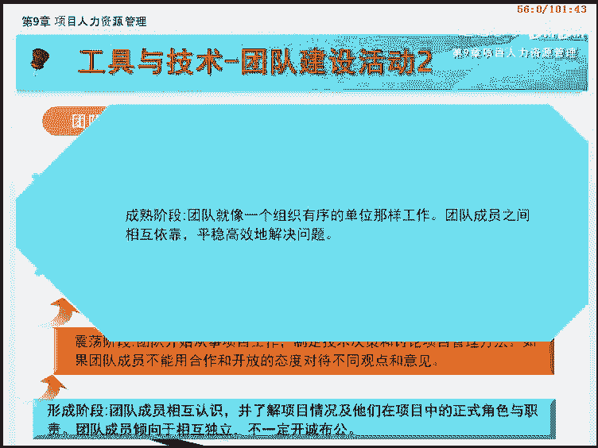

解散阶段，在解散阶段，团队完成所有工作，团队成员离开项目，通常在项目可交付成果完成之后再释放人员，解散团队，或者在结束项目或阶段过程中解散团队，在项目团队建设中，五个阶段的特点，如图所示。

从团队士气的角度看，第二个阶段震荡阶段中冲突最多，此时项目团队的士气最为低落，从规范阶段开始使气逐渐回升，从项目绩效角度看，在第四个阶段，也就是绩效阶段，团队整体效率最高。

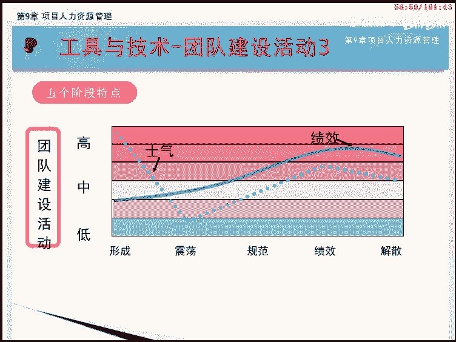

基本规则，对项目团队成员的可接受行为作出明确规定，尽早制定并遵守明确的规则，有助于减少误解，提高生产力，对诸如行为规范，沟通方式，协同工作，会议礼仪等的基本规则进行讨论。

有利于团队成员相互了解对方的价值观规则。

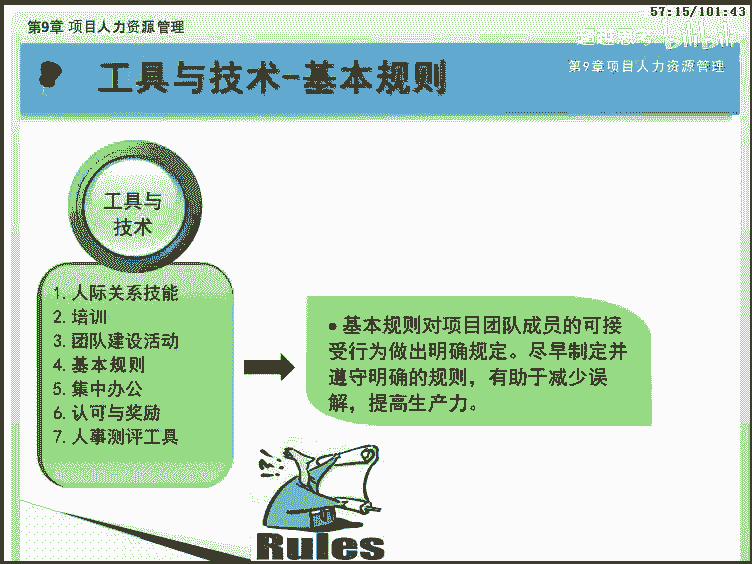

一旦建立，全体项目团队成员都必须遵守，集中办公，是指把许多或全部最活跃的项目团队成员，安排在同一物理体检工作，以增强团队工作能力，集中办公也被称为作战室或紧密矩阵，它既可以是临时的。

如仅在项目特别重要的时期，也可以贯穿整个项目。

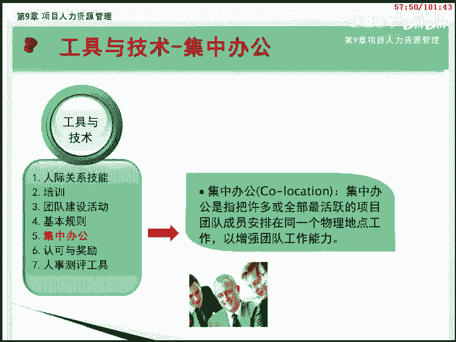

另外项目冲突是必然的，而面对面会议是与干系人讨论，解决问题的最有效办法，然而尽管集中办公是一种良好的团队建设策略，但虚拟团队的使用有时也不可避免，集中办公对应作战室和紧密矩阵概念，其极端形式是作战室。

下面我们来看认可与奖励，在团队建设过程中，需要对成员的优良行为给予认可和奖励，关于奖励方法的最初计划，是在规划人力资源管理过程中编制的。

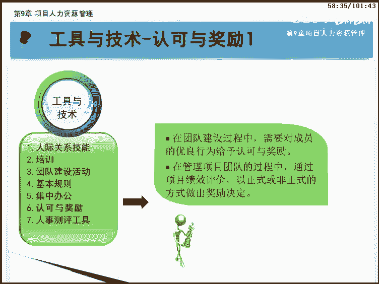

在管理项目团队的过程中，通过项目绩效评价，以正式或非正式的方式作出奖励决定，必须认识到，只有能满足被奖励者的某个重要需求的奖励，才是有效的奖励，在决定认可与奖励时，还应考虑文化差异。

下面我们来了解关于奖励的几点说明，通常金钱奖励是奖励制度中最有型的奖励，然而也存在各种更有效的无形奖励。

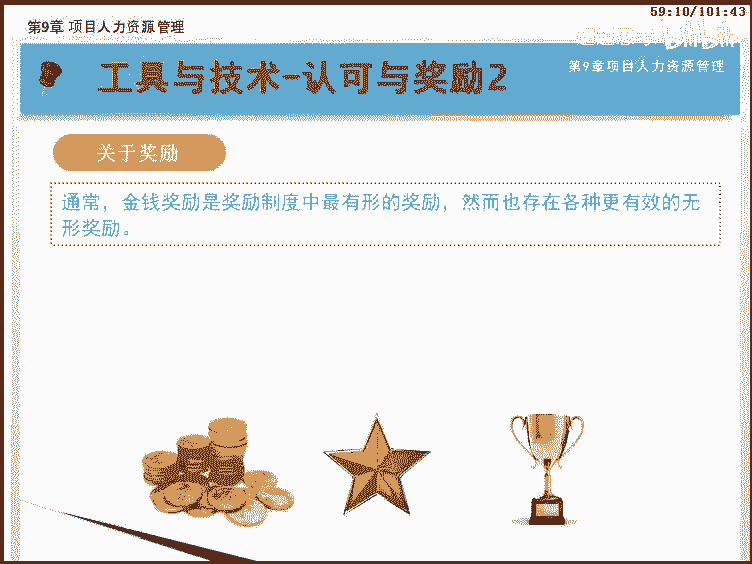

大多数项目团队成员会因得到成长机会，获得成就感，以及用专业技能迎接新挑战而受到激励，项目经理应该在整个项目生命周期中，尽可能地给予表彰，而不是等到项目结束之后，当人们感到自己在组织中的价值。

并且可以通过获得奖励来体现这种价值，他们就会受到激励，为此我们应该掌握一些经典的激励理论，如图所示，马斯洛的需求层次理论认为，每个人从低到高的需求分为五个层次，生理需求，安全需求，社会归属感，受。

尊重和自我实现。

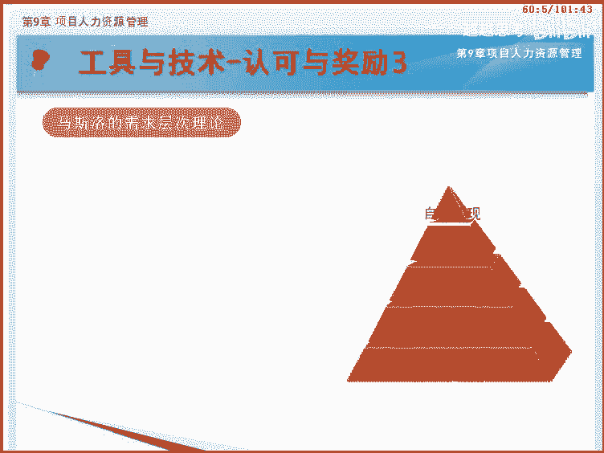

只维持人类生存所必需的身体需要，如水食物等生存必需品，第二个层次是安全需要，保证身心免受伤害，包括居住环境安全，工作环境安全和有稳定的经济收入，第三个层次是社会归属感需要，也称归属和爱的需要。

包括感情归属，未接纳友谊等需要，第四个层次是被尊重的需要，包括内在的尊重，如自尊心，自主权，成就感等需要和外在的尊重，如地位认同，受重视等需要，包括个人成长，发挥个人潜能，实现个人理想的需要。

马斯洛需求层次的三个假设，a已被满足的需要失去激励作用，只有满足未被满足的需要才有激励作用，b人的需要按重要性从低到高排成金字塔状，c当人的某一级需要满足后，才会追求更高一级的需要，赫兹伯格发现。

使职工感到满意的，都是属于工作本身或工作内容方面的，使职工感到不满意的，都是属于工作环境或工作关系方面的，他把前者叫做激励因素，后者叫做保健因素，保健因素是指那些与人们的不满情绪，有关的因素。

包括公司政策，管理措施，监督人际关系，物质工作条件，工资福利等，他只是消除了不满意，并不会导致积极的态度，保健因素的满足，对员工产生的效果，类似于卫生保健对身体健康所起的作用。

当这些因素恶化到人们不可接受水平以下时，就会产生对工作的不满意。

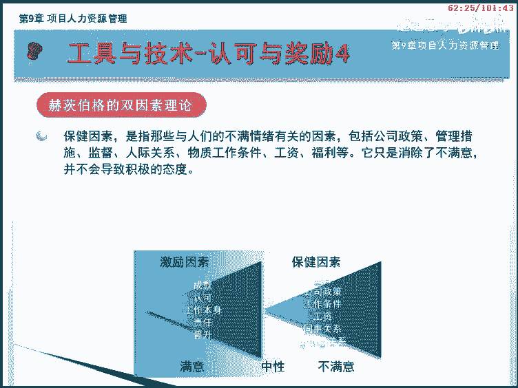

激励因素是指那些能带来积极态度，满意和激励作用的因素，包括成就赏识，挑战性的工作，增加的工作责任以及成长和发展的机会，如果这些因素具备了，就能对人们产生更大的激励。

激励因素是能满足个人自我实现需要的因素，从这个意义出发，赫兹伯格认为，传统的激励假设如工资刺激人际关系的改善，提供良好的工作条件等，都不会产生更大的激励，他们能消除不满意，防止产生问题。

但这些传统的激励因素即使达到最佳程度，也不会产生积极的激励，按照赫兹伯格的意见，管理者应该认识到，保健因素是必须的，不过他一旦是不满意，中和以后，就不能产生更积极的效果。

只有激励因素才能使人们有更好的工作成绩，麦克利兰认为，在人的生存需要基本得到满足的前提下，成就需要，权力需要和亲和需要是人的最主要的三种需要，该理论认为，有成就需要的人，对胜任和成功有强烈的要求。

他们的事业心强，喜欢那些能发挥独立解决问题能力的环境，在管理中，只要对他提供合适的环境，他就会充分发挥自己的能力，权力需要较强的人，有责任感，愿意承担需要的竞争，并且能够取得较高的社会地位的工作。

喜欢指挥和影响别人，具有亲和需要的人，通常从友爱情谊，人际关系的社会交往中得到欢乐和满足，并总是设法避免因某个组织或社会团体，拒之门外而带来的痛苦，他们渴望获得他人赞同，高度服从群体规范。

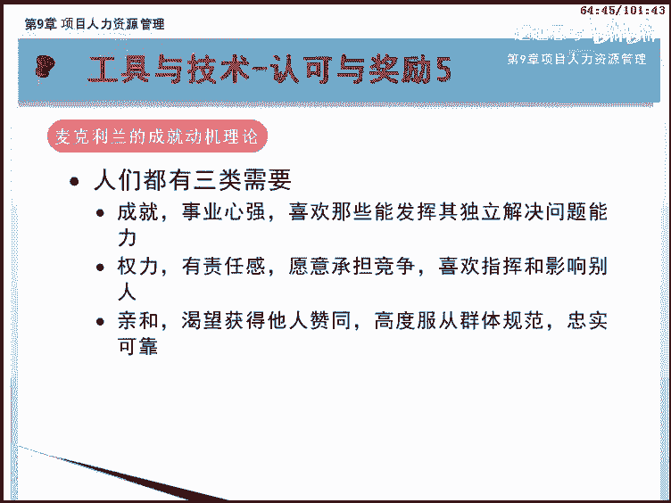

忠实可靠，每个人对三类需求的急切程度不同，了解了成就动机理论，就可以根据人们不同的需要进行对应的激励，麦格雷格的x理论可以说是人性恶理论，该理论认为，对人来说，工作是不愉快的，人们缺乏进取心。

懒惰而逃避责任，因此要奖惩结合，适用于工人而败理论是人性善，理论认为，人对工作有可能产生兴趣，有自我约束及向上的趋势，并有能力和意向去解决问题，因此要说服教育，用成就和责任来激励，适用于素质较高者。

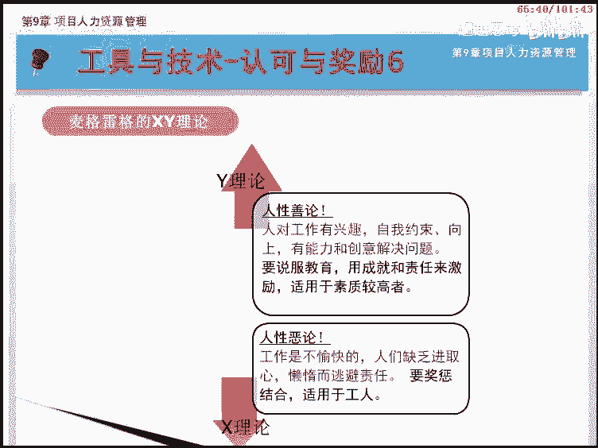

建设项目团队的最后一个工具和技术，是人事测评工具，它能让项目经理和项目团队，洞察成员的优势和劣势，这些工具可帮助项目经理，评估团队成员的偏好和愿望，团队成员如何处理和整理信息，团队成员如何制定决策。

以及团队成员喜欢如何与人打交道，人事测评工具包括态度调查，细节评估，结构化面谈，能力测试及焦点小组讨论，这些工具有利于增进团队成员间的理解信任，忠诚和沟通，在整个项目期间，不断提高团队成效。

建设项目团队过程有两个输出，分别是团队绩效评价和事业环境因素更新。

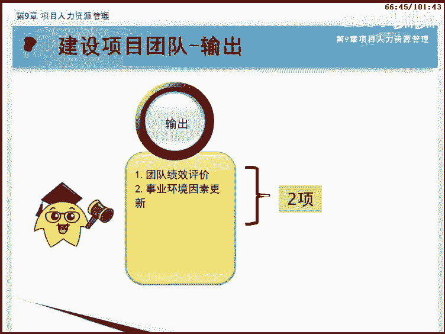

下面我们一块来学习，随着项目团队建设工作的开展，项目管理团队应该对项目团队的有效性，进行正式或非正式评价，团队绩效评价标准应由全体相关各方联合确定，并被整合到建设项目团队过程的输入中。

以任务和结果为导向，是高效团队的重要特征。

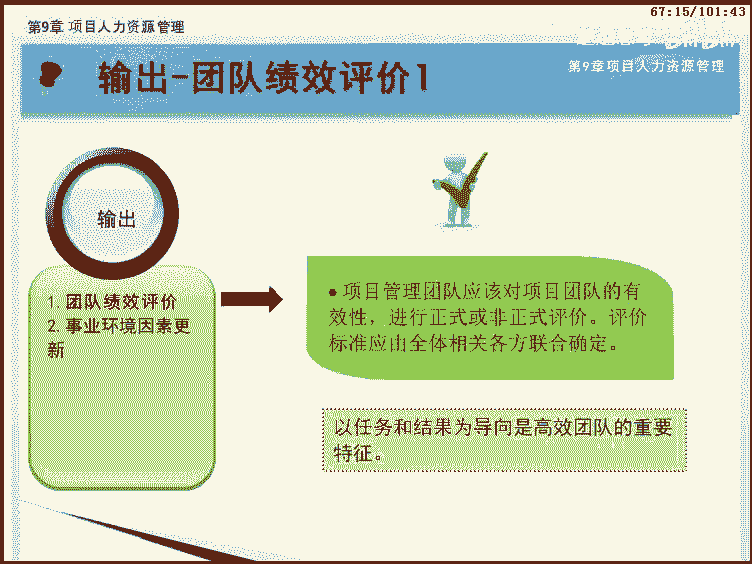

团队绩效主要评价标准为，项目的技术成功度和是否达到目标，项目进度，绩效是否按时完成和成本，绩效及费用是否在约束内完成，评价团队有效性的指标，还包括四个个人技能的改进，团队能力的改进。

团队成员离职率的降低，还有团队凝聚力的加强。

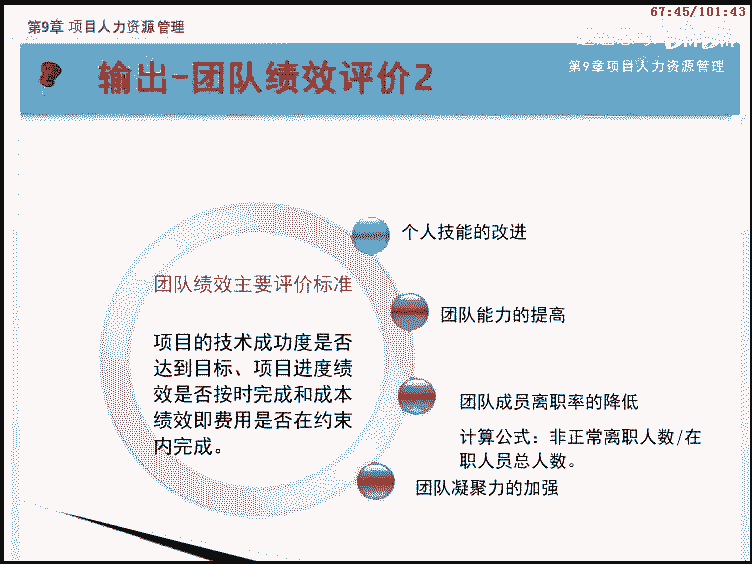

通过对团队整体绩效的评价，项目管理团队能够识别出所需的特殊培训教练，辅导协助或改变，以提高团队绩效，项目管理团队也应该识别出合适或所需的资源，以执行和实现，在绩效评价过程中提出的改进建议。

最后应该妥善记录，这些团队改进建议和所需资源。

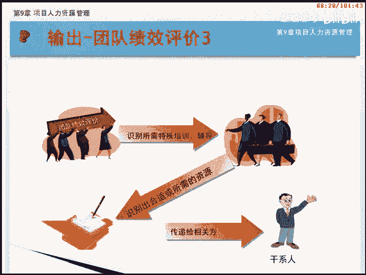

并传达给相关方，很少有过程会更新视野环境因素，本过程就是个例外，作为建设项目团队过程的结果，可能需要更新的事业环境因素，包括人事管理制度，员工培训记录和技能评估。

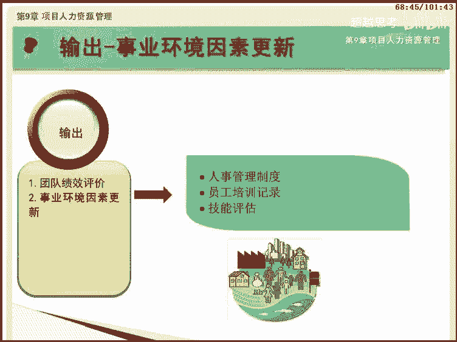

现在我们来回顾一下本过程的核心知识，建设项目团队是提高工作能力，促进团队成员互动，改善团队整体氛围，以提高项目绩效的过程，项目管理团队应该利用文化差异，在整个项目生命周期中建设项目团队。

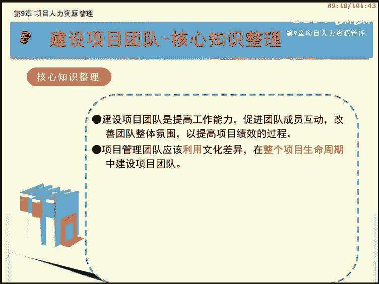

团队建设中，非正式的沟通，有助于建立信任和良好的工作关系，团队发展通常经过形成震荡，规范成熟解散五个阶段，尽早制定并遵守明确的规则，有助于减少误解，提高生产力，恭喜你完成建设项目团队过程的学习。

我们下节课见，本课程我们将一起学习第九章，项目人力资源管理知识领域的第四节，管理项目团队，它位于执行过程组。

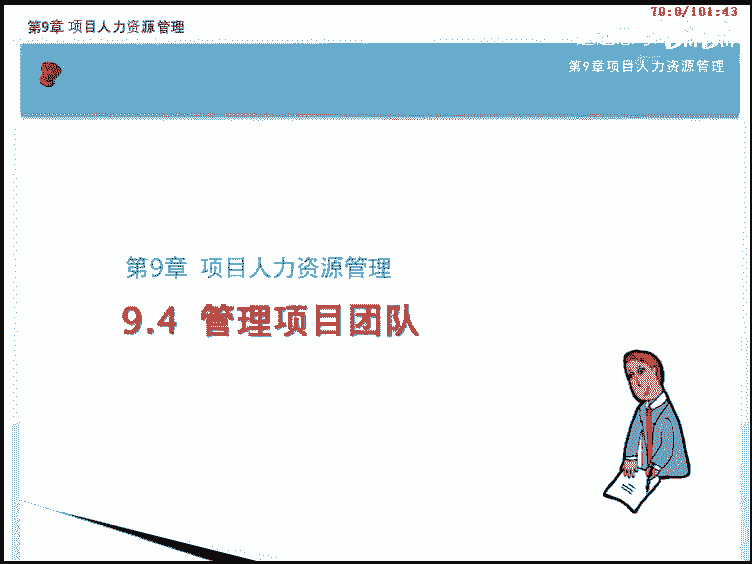

通过本课程的学习，我们将要达到以下目标，了解管理项目团队的概念和目的，了解管理项目团队的输入及输出内容，了解观察与交谈问题，日志的概念和意义，掌握项目绩效评估的内容和意义，掌握五种冲突解决方法。

掌握常用的几种人际关系技能。

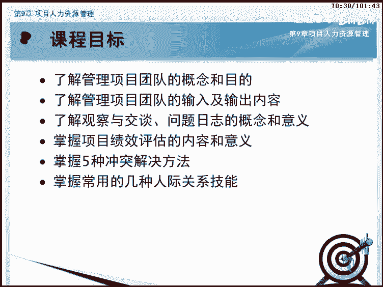

本课程我们将按照如画面所示的大纲为您讲述，首先是对管理项目团队这个基本概念进行讲解，接下来分析管理项目团队过程的，输入工具与技术以及输出课程的，最后是本节核心知识整理。

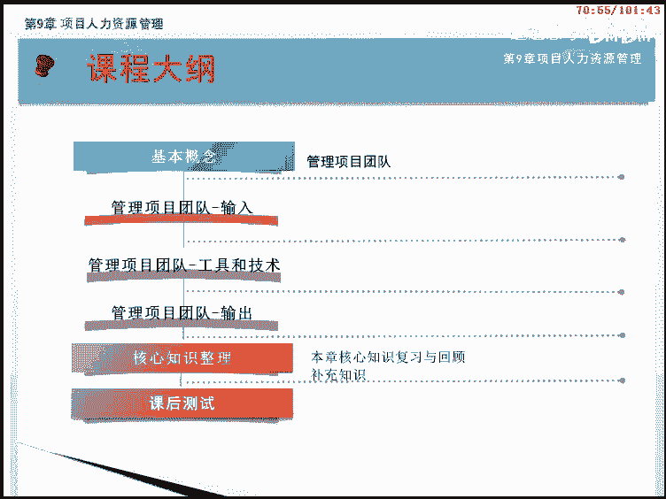

在学习本过程之前，我们先来看看什么是管理项目团队。

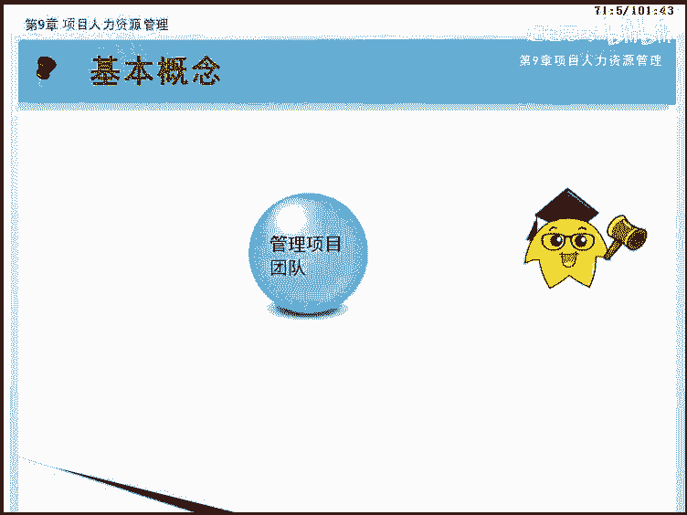

管理项目团队是跟踪团队成员工作表现，提供反馈，解决问题并管理团队变更。

以优化项目绩效的过程，本课程的主要作用是影响团队行为，管理冲突，解决问题，并评估团队成员的绩效，管理项目团队所得到的结果包括，提出变更请求，更新人力资源管理计划，解决问题，为绩效评估提供输入。

以及为组织数据库增加经验教训，接下来让我们来看看如何管理项目团队，该过程在人力资源管理计划的指导下，收集团队绩效评价和工作绩效报告等信息，利用观察和交谈，项目绩效评估。

以及人际关系技能等技术跟踪团队成员表现，提出反馈意见，如果在此过程中发生冲突，要及时采取解决措施，该过程可能会引起与人员配备相关的变更请求，以及对人力资源管理计划，项目文件，甚至是事业环境因素的更新。

这是管理项目团队过程的数据流向图，可以看到该过程通过输入，输出与其他过程进行交互，管理项目团队过程共有六个输入，它们是人力资源管理计划，项目人员分派团队绩效评价问题日志，工作绩效报告和组织过程资产。

下面我们依次来了解。

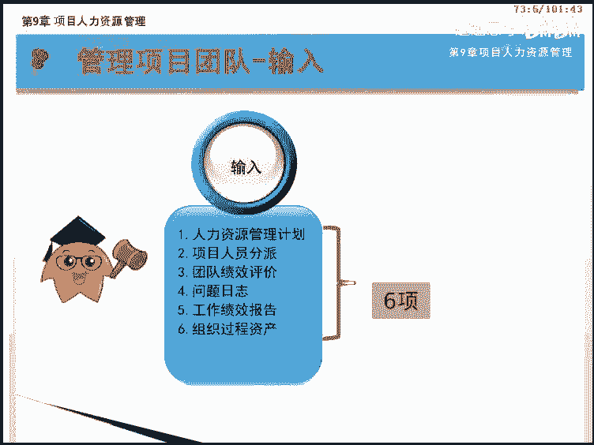

管理项目团队过程，在人力资源管理计划的指导下展开工作，该计划提供了如何定义配备管理，控制及最终遣散项目人力资源的指南，它包括角色与职责，项目组织和人员配备管理计划，项目人员分派是组建项目团队过程的输出。

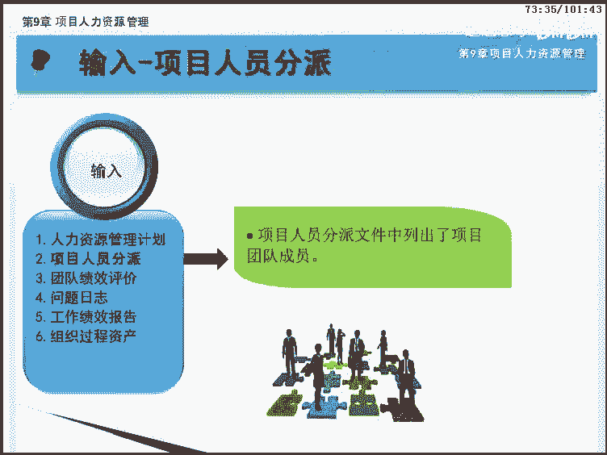

其中列出了项目团队成员，团队绩效评价来自于建设项目团队过程，项目管理团队应该持续地对项目团队绩效进行，正式或非正式评价，不断地评价项目团队绩效，有助于采取措施解决问题，调整沟通方式。

解决冲突和改进团队互动，在管理项目团队过程中，总会出现各种问题，可以用问题日志记录，由谁负责在目标日期内解决特定问题，并监督解决情况，问题日志是非常重要的一类项目文件。

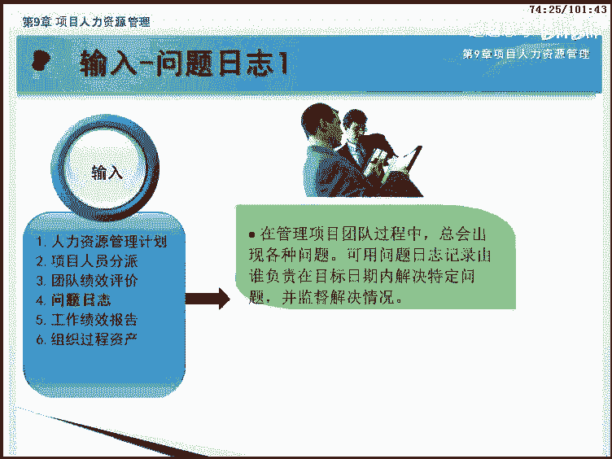

我们要牢记这个概念。

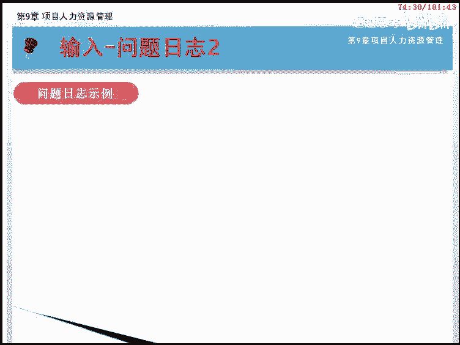

图中所示就是一个问题日志的事例，我们看到其中记录了问题描述，提出时间，责任人预计解决时间，问题状态等信息，在第13章控制干系人参与过程，还会用到问题日志，工作绩效报告来自于监控项目工作过程。

能够提供当前项目状态与预期项目状态的比较，从进度控制，成本控制，质量控制和范围确认中得到的结果，有助于项目团队管理，绩效报告和相关预测报告中的信息，有助于确定未来的人力资源需求。

开展认可与奖励以及更新人员配备管理计划，能够影响管理项目团队过程的组织过程，资产包括嘉奖证书，新闻报道网站奖金结构，公司制服，组织中其他的额外待遇等。

管理项目团队过程共有四个工具和技术，分别是观察和交谈，项目绩效评估，冲突管理以及人际关系技能，下面我们一块来学习。

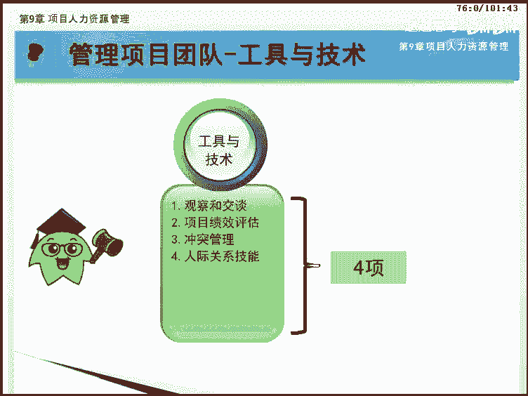

项目管理团队可通过观察和交谈，随时了解项目团队成员的工作和态度。

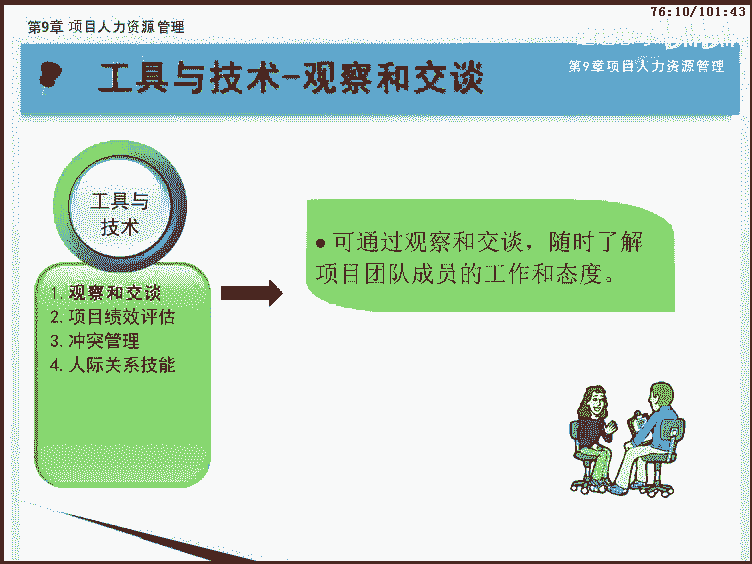

项目管理团队应该监督项目可交付成果的进展，了解团队成员引以为荣的成就，了解各种人际关系问题，项目绩效评估及评估，项目团队成员在项目期间的绩效。

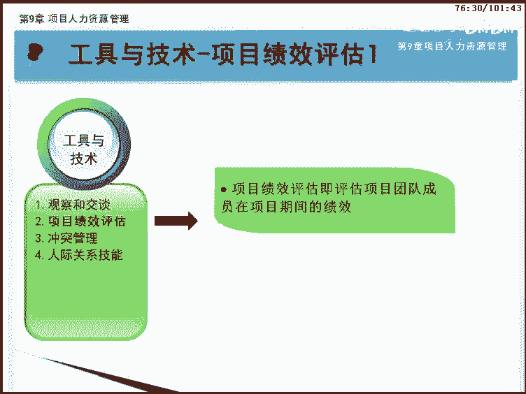

其目的包括澄清角色与职责，向团队成员提供建设性反馈，发现未知或未决问题，制定个人培训计划，以及确立未来各时期的具体目标，项目绩效评估取决于项目工期长短，项目复杂程度，组织政策，劳动合同要求。

以及所需定期沟通的数量和质量等因素，可以开展正式或非正式的项目绩效评估，项目绩效评估，在名称上与团队绩效评价较为相似，容易被混为一谈，然而两者有着本质的区别。

团队绩效评价是针对项目，团队的绩效情况的评价。

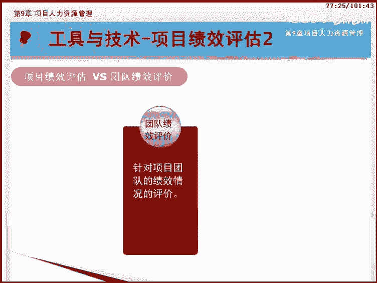

而项目绩效评估是针对团队成员，个人在项目期间的绩效表现的评估，评估该团队成员是否适合其承担的项目工作，值得注意的是，项目绩效评估之所以不称之为，项目成员绩效评估，是因为在矩阵型组织机构中。

团队成员可能身兼数个项目。

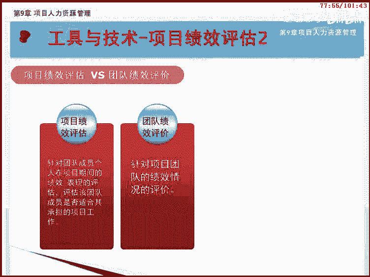

不过项目经理只需了解并评估，团队成员在本项目中的绩效，团队成员的总体绩效评价，尤其所在部门的职能经理评价，冲突管理是指处理或解决项目中，某些关系难以协调而导致的矛盾激化和行为对。

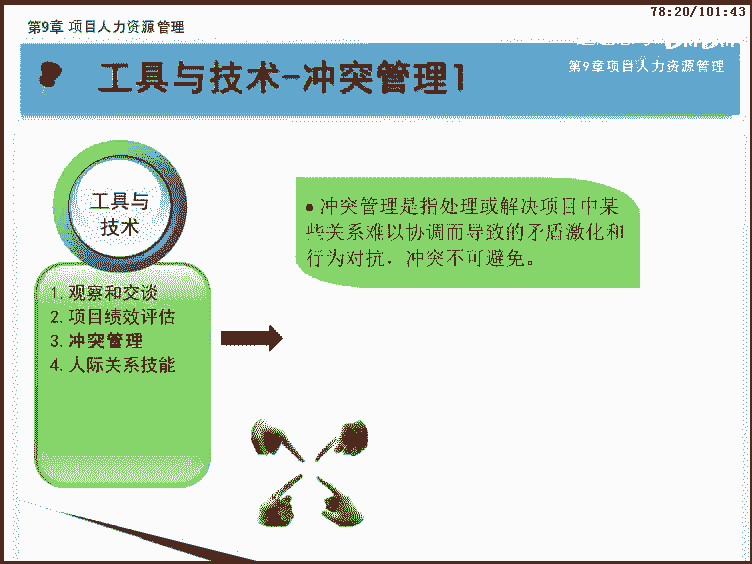

抗，冲突不可避免，现代的项目管理观点认为，冲突不可避免，适当的冲突是有益的，有利于提高团队创造力，成功的冲突管理可提高生产力，改进工作关系，提高项目实施水平，另外冲突因团队而存在，开诚布公。

有利于解决冲突，解决冲突，应对事不对人，解决冲突应着眼于现在，而非过去，项目中冲突难以避免，冲突产生的来源，包括对稀缺资源的争抢，高压力的项目环境责任模糊，存在多个上级新技术的应用等诸多方面。

概括起来可以把冲突分为如下七种类型，进度及进度计划冲突指项目任务的进度安排，任务的排序和时间选择存在不同意见，项目优先级，这项目干系人在活动的优先顺序上有不同意见，资源起因是资源匮乏，包括设备材料。

人力资源的不足导致的冲突，技术指技术意见与执行情况的权衡冲突，在技术问题上的争执，以及在观念与执行之间进行权衡上，存在不一致意见，管理程序指行政程序上的冲突，在如何管理项目的问题上发生的。

项目管理和行政管理程序之间的冲突。

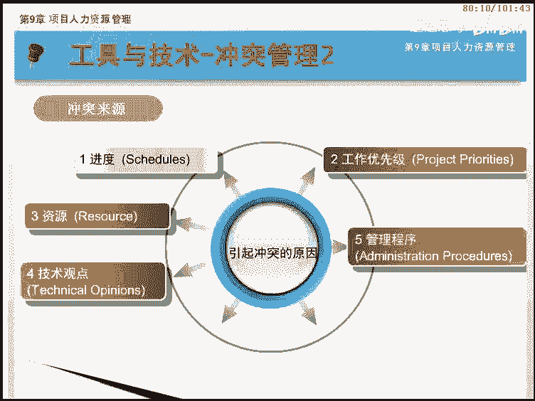

成本在涉及到工作分解结构上，来自相关部门的成本估算上的冲突，个性指个人工作风格或个性冲突，来自于人际关系方面，在项目的各个阶段，任务不同，人们关注的重点也不同，项目的不同阶段，常常出现的冲突也有所不同。

一般来说，概念阶段或启动阶段，冲突出现频率的排序为工作优先级冲突，管理程序冲突和进度冲突，当项目进行到计划阶段时，冲突排序为工作优先级冲突，进度冲突和管理程序冲突，在执行阶段冲突排序为进度冲突。

技术冲突和资源冲突，在最后的收尾阶段，冲突排序为进度冲突，资源冲突和个性冲突。

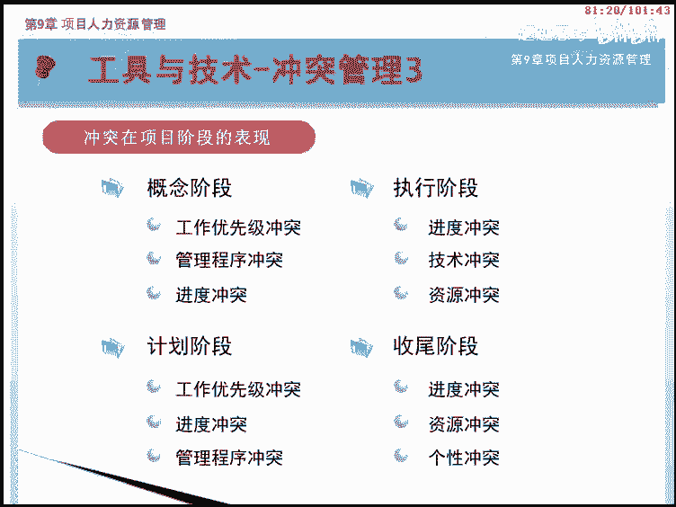

冲突有正面的和负面的，负面冲突会对整个项目产生消极影响，甚至阻碍项目目标的实现，项目经理必须尽量在冲突，对项目产生不利影响之前解决，项目经理分析冲突原因和解决冲突的能力。

在很大程度上决定着其管理项目团队的能力，不同的项目经理可能有不同的解决冲突的风格，影响冲突解决方法的因素，包括冲突的重要性与激烈程度，解决冲突的紧迫性，冲突各方的立场，以及永久或暂时解决冲突的动机。

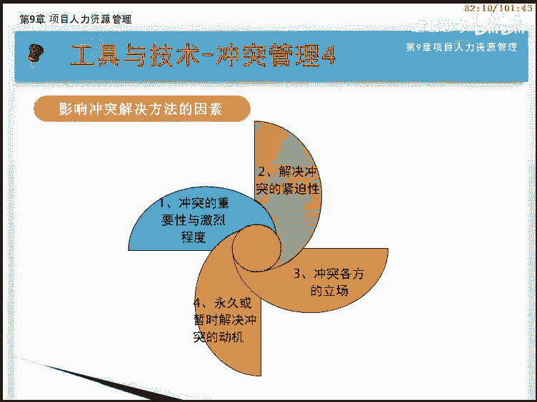

解决冲突是项目经理面临的最大问题，不能逃避问题，必须以主动的态度去发现和处理问题，出现冲突，最好在项目经理的帮助下，由项目团队成员自行解决，如果冲突依旧存在，影响了整个团队，则可在团队公开讨论解决方案。

最后方式才是上升给职能经理或高级经理，协助解决，在破坏性冲突继续存在的情况下，还可以采取惩戒措施。

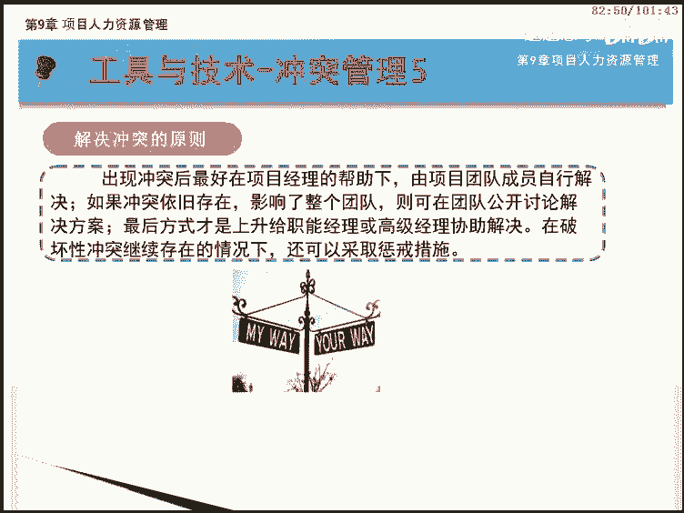

一般来讲，项目经理应遵循直接合作，尽早私下的八字方针，管理冲突，解决冲突可以使用下面的五种具体方法，我们需要理解并记忆撤退，回避是从实际或潜在冲突中退出，将问题推迟到准备充分的时候。

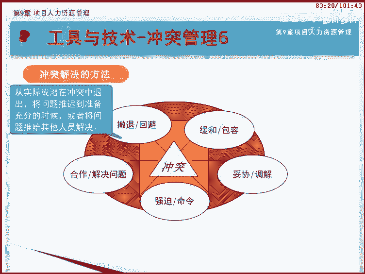

或者将问题推给其他人员解决，缓和包容是强调一致而非差异，为维持和谐的关系而退让一步，考虑其他方的需要，回避了解决冲突的根源，妥协调节是为了暂时或部分解决冲突，寻找能让各方都在一定程度上满意的方案。

但冲突各方没有任何一方完全满意，强迫命令以牺牲其他方为代价，推行某一方的观点，只提供营收方案，通常是利用权力来强行解决紧急问题，适用于赢输这样的情经历，合作解决问题。

也称面对问题是综合考虑不同的观点和意见，采用合作的态度和开放式对话，引导各方达成共识和承诺，这是一种双赢或多赢的解决方案，我们最后再对五种冲突解决的方法，进行一个小结合作解决问题是双赢的解决方式。

一起面对并公开讨论，最终达成共识，这是最好的解决冲突的方式，强迫命令是一输一赢的解决方式，在紧急情况下必须做决定时才使用，问题虽然解决了，但可能引起一方的不满，妥协调节是双输的解决问题方式。

它平衡各方利益，各有让步，但好处是问题解决了缓解包容，可以看成是求同存异，他强调一致而非差异，回避了冲突，缺点是问题没有解决，撤退回避是指退出冲突，推迟或推给他人解决问题的条件，不成熟时才使用。

当然这种情况下问题没有得到解决，项目经理应该综合运用技术，人际和概念技能来分析形式，并与团队成员有效互动，恰当地使用人际关系技能，可充分发挥全体团队成员的优势，具体内容请参见pm报和第五本附录x3 。

人际关系技能包含的内容，很多，项目经理在管理项目团队中，最常用的人际关系技能包括领导力，领导力，对沟通愿景，以及鼓舞项目团队高效工作特别重要，领导力在项目生命周期中的所有阶段都很重要。

影响力在矩阵环境中，项目经理对团队成员往往没有，或只有很小的直接权利，所以他们适时影响干系人的能力。

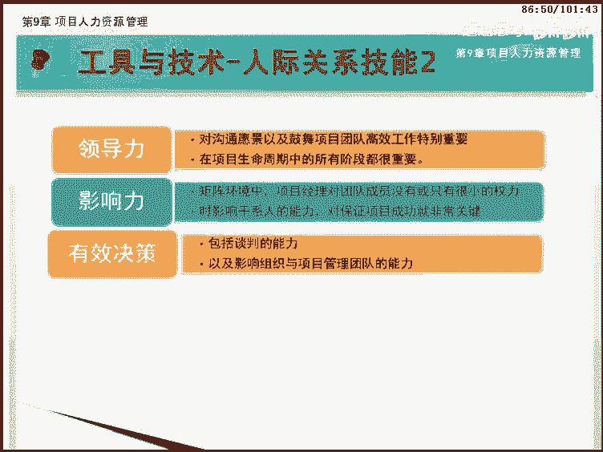

对保证项目成功就非常关键，影响力主要体现在如下，各方面，说服别人以及清晰表达观点和立场的能力，积极且有效地倾听了解并综合考虑各种观点，收集相关且关键的信息，以解决重要问题，维护相互信任，达成一致意见。

有效决策包括谈判的能力，以及影响组织与项目管理团队的能力，进行有效决策需要着眼于所要达到的目标，遵循决策流程，研究环境因素分析，可用信息提升团队成员个人素质，激发团队创造力，管理风险，除此而外。

沟通谈判和激励等能力，也是人际关系技能的重要组成部分，管理项目团队过程共有五个输出，他们是变更请求项目管理计划更新，项目文件更新，视野环境因素更新以及组织过程资产更新，下面我们一块来学习。

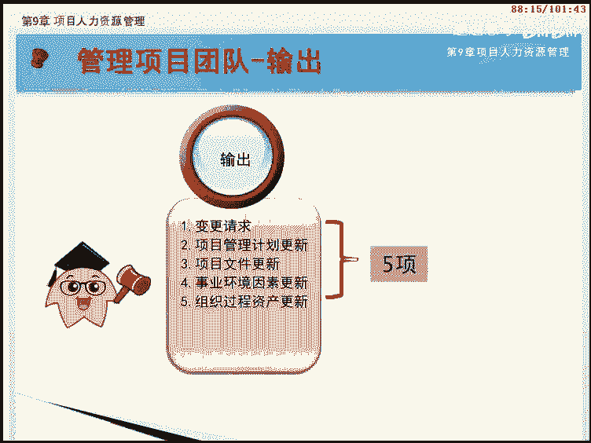

人员配备的变化，无论是自主选择还是由不可控事件造成，都会影响项目管理计划的其他部分。

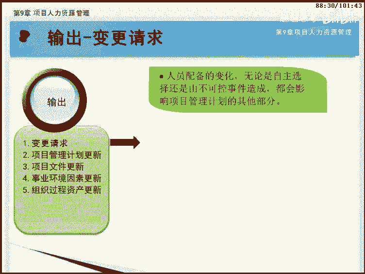

人员配备问题可能导致的变更，包括转派人员，外包部分工作，以及替换离职人员，在管理项目团队过程，也可以采取预防措施来降低问题发生概率，包括为减轻成员缺勤所带来的问题，而开展的交叉培训。

为确保所有职责的履行而进一步开展的，角色澄清，需要注意，上述所有变更都要走整体变更控制流程，项目管理计划中可能需要更新的内容，主要是指人力资源管理计划，在管理项目团队过程，可能被间接更新的项目文件。

包括问题日志，角色描述以及项目人员分派。

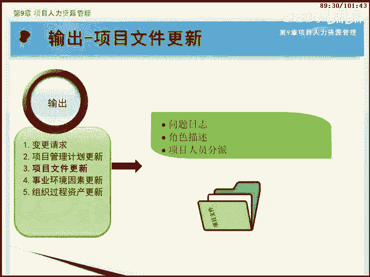

管理项目团队时也可能需要更新事业环境因素，包括对组织绩效评价的输入和个人技能的更新，作为管理项目团队过程的结果，可能需要更新的组织过程，资产包括历史信息和经验教训文档相关模板，组织的标准流程等。

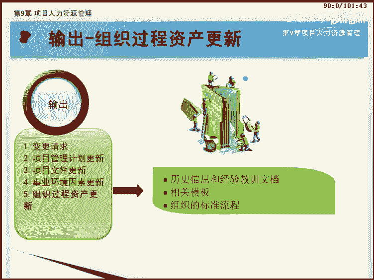

本课程的主要内容到此完毕，现在我们来回顾一下本过程的核心知识，管理项目团队是跟踪团队成员工作表现，提供反馈，解决问题并管理团队变更，以优化项目绩效的过程，用问题日志记录由谁负责。

在目标日期内解决特定问题，并监督解决情况。

项目绩效评估及评估，项目团队成员在项目期间的绩效，可以是正式或非正式的，项目中冲突不可避免，适当的冲突是有益的，冲突来源可分为七种，进度工作优先级，资源技术管理程序，成本和个性，项目经理应遵循直接合作。

尽早私下的八字方针管理冲突，恭喜你完成管理项目团队过程的学习。

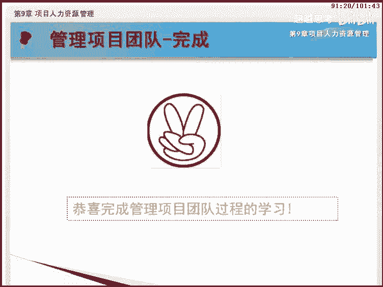

下面我们来补充一个知识点，项目经理的五种权利，权力就是让员工不得不做事的潜在影响力，权力往往用来让员工改变他们的行为，而听从管理者的意愿，在项目团队建设的过程中，项目经理一般可以利用五种权利。

来管理和要求项目团队的成员来完成工作，第一种法定权利，也称合法权利，是指在高级管理层，对项目经理的正式授权的基础上，项目经理让员工进行工作的权利，第二种强制力，用惩罚威胁或者其他的消极手段。

强迫员工去做他们不想做的事，当然一般强制力对项目团队的建设，不是一个很好的方法，通常会带来项目的失败，建议不要经常使用第三种奖励权利，使用一些激励措施来引导员工去工作，奖励包括薪金，职位认可度。

特殊的任务，以及其他的奖励员工满意行为的手段，专家权利用个人知识和技能，让员工改变他们的行为，如果项目经理让员工感到他在某些领域有专长，那么他们就会遵照项目经理的意见形式，最后一种是参考权利。

也叫感召权利，建立在别人的微信或个人感召权利的基础上，人们有时非常尊重某些具有感召权力的人，他们会照他所说的去做，以上是项目经理的五个权利类型，其中前三种权利来自于项目经理的所在职位。

其他两种来自于项目经理，个人建议，项目经理最好用奖励权利和专家权力，来影响团队去做事，尽量避免使用强制力，各位学员，第九章，项目人力资源管理知识领域的全部四个过程，已经学习完毕，现在就来做个总结吧。

首先需要对如何进行人力资源管理进行规划，这个过程是规划人力资源管理，他根据前期已经批准的项目管理子计划，以及项目对人力资源的需求，生成项目人力资源管理计划，第二个过程，组建项目团队。

是依据钢材产生的人力资源管理计划，通过各种渠道和手段，把团队成员召集到项目中来，最后形成项目人员分派和资源制定，团队成员确定完成后，不一定会产生很好的工作效率，这就需要在项目的全生命周期进行建设。

项目团队过程，以改善团队整体氛围，提高项目绩效，建设项目团队的效果，需要用团队绩效评价来衡量，管理项目团队是在项目执行过程中，跟踪团队成员的工作表现，发现问题及时解决并管理团队变更。

以优化项目绩效的过程，在这个过程里，主要我们要了解如何解决冲突。

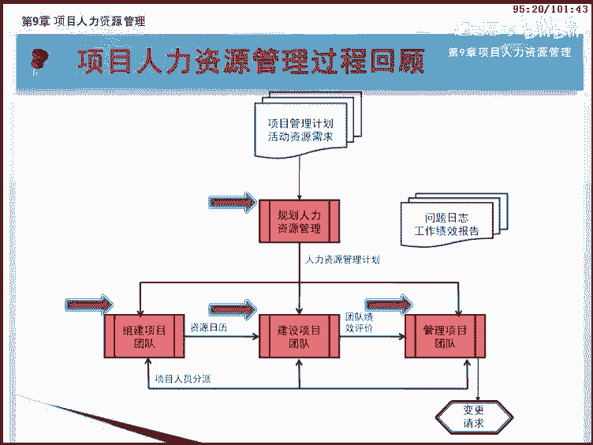

恭喜您已经完成了，第九章，向某人力资源管理这一知识领域的学习建议，接下来继续学习，第十章项目沟通管理。

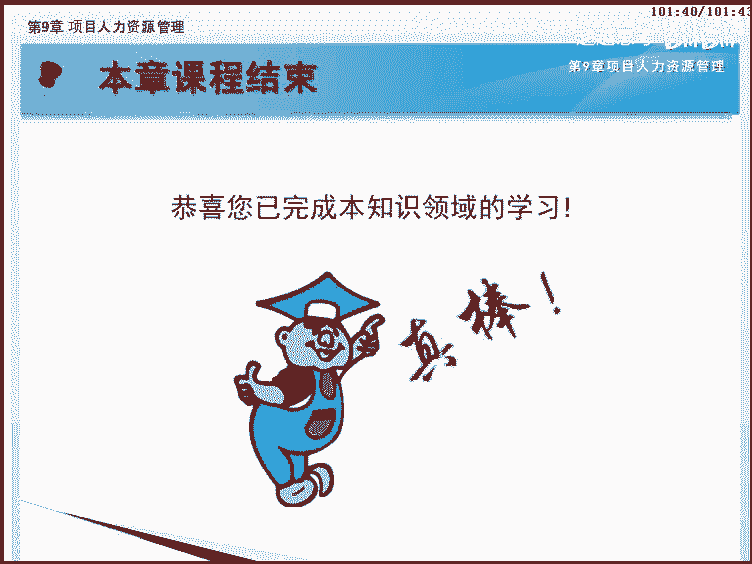