# PMP精讲核心课三：项目整合管理 - P1 - 立智教育 - BV1Ax4y1A7mU

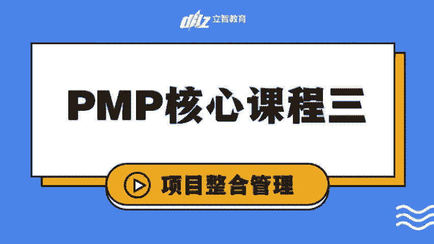

呃前两次课呢，我们相当于把整个什么是项目经理，为什么考p mp以及引论呢，还有项目运行环境和项目经理的角色，给大家介绍了一遍，那昨天的开始呢，其实我们就已经进入到第四章的内容了。

也就是今天啊我们要开启的第一个支持语，就是项目整合管理，对吧，是我们整个一个项目整合管理的过程，ok那项目整合管理呢，啊昨天我们跟大家讲了4。1的过程，制定项目章程，那我们详细讲了4。1过程。

中间有哪些输入和输出，那我还是呢在这之间我们从因为前三章的review，我们已经在之前看到了，那整个项目整合管理呢，是我们整个我们不是有十大知识域吗，那其他九个呢都是分别独立的。

比如说我们会说有范围管理呀，有成本管理呀，然后有进度管理，有风险对吧，有采购，还有我们的啊，整个这个呃呃相关方，然后还有沟通的管理，还有等等我们这个资源的管理啊，整个还有一个质量的管理的过程。

那只有整合管理是一个看上去是一个没有，就是没有一个特定词啊，就对吧，就是感觉整合管理好像不是一个名词，是不是，所以我们可能重新今天大家帮大家review一点，那我们之前其实讲过这个点。

就是项目经理最核心的点是什么呀，是沟通，是不是你是一个大型管弦乐队的指挥家，是不是你在指挥大家一起来做事，所以其实整个项目整合管理是一个tm来说，是他最我们会讲这是pm最核心的工作。

所以啊我也希望大家今天把书都能找着，或者是能带上哈，那在如果没有的话，您看一下群聊的聊天记录啊，之前会有一些文件，然后之前我也看有一个同学说啊，需要找一些我们补充的讲义的文件。

那补充讲义的文件也在群里面，大家搜索群资料就可以找到这个内容啊，ok欢迎大家把书翻到啊，然后我也找一下啊，把书翻到我们的第72页，书的第72页，我们会讲项目整合管理的核心就是什么，由项目经理来负责。

而且第二句会讲，整个项目的整合管理，责任是不能被授权或者转移的，项目经理必须对整个项目承担最终责任啊，在这一段的最后一句，所以项目经理的一个很核心的点，我们都说了，项目经理90%的时间都在进行沟通对吧。

那么整合管理就是项目经理来说最常做的事情，或者说这就是他不能被授权，和他需要去做的事情，所以怎么去解释这个整合管理呢，我觉得会从两个维度来去解释这个点，第一个维度呢是我们去解释整合。

如果大量有同学是也是做软件啊，或者什么之类的，你就会觉得整合是不是跟集成和，整个我们说架构其实是有一定就是相关系，或者类似关系的这样的一个点对吧，那讲的事情就是呃，所有的人都会有他们擅长的点。

但是一个项目需要有一个统一的目标，那这个统一的目标是由项目经理，所以我们要把，同时我们也需要把所有各方面的这样的一个，专业知识，不管是在范围成本和进度方面内容，都通过整合管理，把它合合并在一起来做啊。

合并在一起来做，所以这是对整合的第一个理解，那对整合的第二个理解呢，其实我想阐述的点是，对项目经理来说，不管您是做的沟通的工作还是做了协调的工作，而即使在这个过程中间，其实您都起到了什么整合的作用。

对不对，其他团队凝聚和整个项目目标，唯一性和目标导向性的这样的一个作用，所以整合管理整个这一章呢我们会从在一起，它会涵盖我们整个五个过程组，会涵盖我们整个五个过程组，第一个呢就是启动过程组对吧。

启动过程组我们会要做的是4。1项目章程，那其次呢会有制定项目管理计划，这样的一个规划，过程组我们也讲了，制定管理计划，其实它是一个它是一个综合管理计划，它其实是汇总各个方面，大家往后去找。

会有规划范围管理和规划成本呃，规划进度管理，规划成本管理等等，会把这些各自分门别类的管理计划，在这个地方进行统一的汇总，我们后面会讲到12+7的这样的一个文件，12加息的这样的一个文件。

那除了启动和规划过程呢，接下来我们就会说执行过程也很重要，对不对，在这个过程中间，项目经理主要做的工作是什么呀，是指导和管理项目工作，所以别人是在正常的在干活，对项目经理来说，您是在指导和管理整个工作。

这是对你的，所以我们说这是在执行过程组，4。4的过程管理项目知识也是在这个过程中，我们来对所有的知识来进行复用的，这样的一个核心的点，那执行过程做完之后呢，就会有监控过程组，监控过程组，4。

5的过程的本质啊，其实就是发布工作绩效报告，这整个项目的情况怎么样，我怎么去汇报啊，这个绩效的企额绩效报告怎么样，我们就在4。5过程来做，那4。6过程呢是对整个项目进行变更的控制。

他讲的是变更审批的流程啊，他讲的不是整个变更确定了我们要怎么去做，变更，确定了要怎么去执行，那还是项目执行的过程，那还是回到4。3过程对吧，4。6过程讲的是变更的，审批权究竟在哪个地方。

我们应该站在项目综合考虑，对项目有益的情况下来进行综合审批啊，而不是只考虑它单方面的影响，ok那收尾过程组呢就是我们的4。7过程，结束项目或阶段，所以整个整合管理啊，是我们全书十大知识域里面。

他是唯一最全的对吧，毫无疑问，因为收尾过程只有一个，收尾过程组只有一个过程，就是在整合管理这个这样的一个只是语种啊，所以这是我们啊整个从4。1~4。7的过程，那ok啊，接下来呢我们昨天就提到了什。

么是制定项目章程，它是一份正式批准的，并授权项目经理动用了这样的一个文啊，并授权项目经理来动用，使用组织资源的这样的一个稳健的过程，所以这个过程的目的是什么呀，目的是不是为了获得授权。

目的是不是就为了编制获得这样一份项目章程，所以为了编制和获得这样的一个项目章程呢，我们就会有我们的输出，就已经确定了，我们就会有项目章程啊，我们还会有假设日志，假设日志就是在项目商城过过程制定过程中间。

有些事情是我们卫星调研推测，或者说基于已有内容推测出来的，或者说有部分它不是就是我们假定出来的，他可能有一些市场调研和市场信息，但是它可能不是全面的，对这是我们这样的一个假定的这样的一个事情。

所以基于这样的一个假设日志，好，不好意思，我今天应该可能有点鼻炎犯了，所以听上去可能偶尔可能状态不太好，希望大家能谅解哈，所以基于这样的一个输出的内容，项目章程啊，假设日志这样点，然后我们再回推。

要有这样的输出，我们需要有什么样的输入呢，我们的输入是什么呀，所以我们是不是需要有我们的商业可行性论证，啊，对吧，我们为了获得这样的授权，是证明项目可以开展，所以我们需要的输入是你知道的。

有一个商业文件，因为商业文件就是一个文档化的经济可研报告，对不对，对于一个文档化的经济可研报告，他不就论证这个项目赚钱嘛，所以正是因为这个项目赚钱，所以我们才获得启动的资质，我们才获得启动的资源。

所以我们一般看呃，这是帮助大家整体来记一下i t t o的内容，所以我们一般看这个过程的名称，4。1制定项目章程，所以我们就可以确定啊，在这个过程中间，我们需要确定我们的输出是什么。

项目章程最核心的输出，其次还会有假设日志，因此我们就会倒推出来啊，我们的是我们需要什么样的输入，我们需要商业文件啊，我们需要协议啊，协议一般是指外部的项目的过程中间，我们就需要协议。

然后我们就会倒推出来啊，在这个过程中间，项目一定处于某个运行的环境下面，所以我们就会面临事业环境因素和可以动用的，组织过程资产，那正是有了这样的输入和输出，那我们就会去想啊，那在这个过程中。

我怎么从输入连到输出呢，那在这个过程中，我们可能需要动用的一些工具，就有专家判断对吧，专家说了呃，经济可研报告出来了嗯，可能我们还需要去找专家看看，哎确实这个事情赚钱，但是为了取得这个目标。

大致有哪些高层级的规划呢，专家可以提供意见，但其次之外呢，我们还会有头脑风暴啊，焦点小组和访谈的形式，来收集到这些高层级的需求，同时我们也可以通过冲突管理啊，引导和会议管理的方式，而在不同的干系人中间。

把它进一步的启发和协调它们之间，不同的利益的点来去平衡，我们整个这样的一个高层级的需求，和高层级的一个目标，然后我们可能会在这个过程中开一个啊，就是一个启动的会啊，不是一个很重要的一个会议。

这个会议的核心的目的是什么呀，就是和项目章程一致对吧，就是告诉你老板任命了我，我来做下，我来我们要启动这个项目了，然后我们的目标是什么，跟大家讲凝聚共识啊，跟大家凝聚共识。

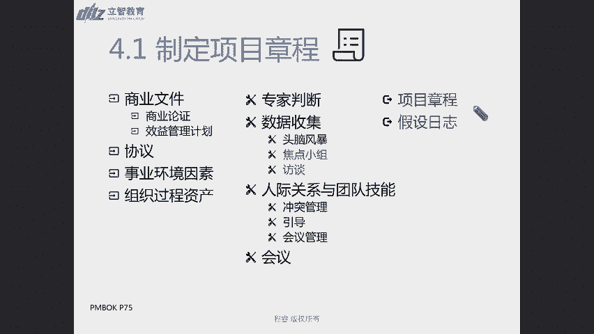

所以在这个过程中，我们会讲焦点小组，需要由受训的主持人来开展啊。

访谈通常是一对一的，因此呢项目章程的起的编写或者说发布吧，我们一般说项目招才能发布，是启动者或者项目发起人来发布对吧，是他来给我们授权，所以不能是由项目经理来发布这个事情。

但是由授启动者或发起人来发布这个点，那正式批准项目成立，并授权项目经理来动用组织资源开展这些活动，同时中间会规定一些高层级的信息，那所以项目章程的核心的要点就有项目的呀，衡量项目成功的标准呀。

以及高层级的需求，项目的描述，整体的项目的风险，总体的进度以及关键的核心的这个事情，你可能需要找谁商量啊，批审批的要求啊，以及退出的标准，以及项目经理，你真正的职责和范围到底是在哪些地方啊。

这就是我们一个啊项目章程的内容，所以通过这样呃，建议大家可以以这样的一个核心的点，来去记忆整个i t t o的过程，那以哪一个点开记i t t o过程呢，呃我做一个屏幕共享啊，我不知道这个画板好不好用。

我试一下啊。

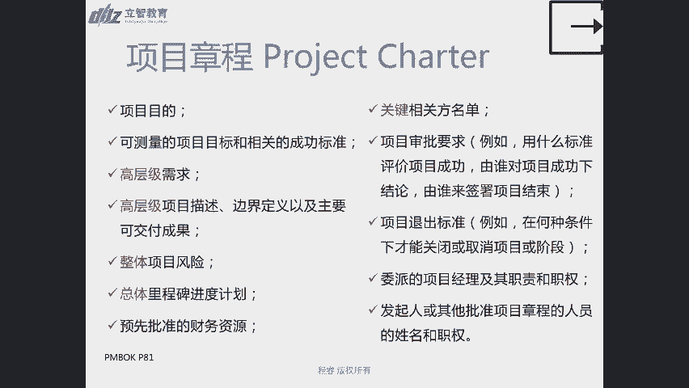

画板好像需要哦，我自己来演示好吧，我还是用思维导图吧，我可能习惯于这种方式。

ok大家可以看到我的屏幕好是吧，那所以我想强调的一点呢，就是在整合管理过程中，我们刚才讲了什么是整合管理，就是它是整合集成式架构啊，所以对pm是对此负责的，那i t t o的汇总呢。

我可能会在这个地方跟大家brief一个点，就是呃因为昨天也是有同学啊，私信我说i t t l还是好难记啊，特别后面这么多i t t l还是预习了的，那怎么整体的i t t o的记忆的方针和策略呢。

刚才我给大家也讲过了，呃，可能用一个小窍门来讲吧，可能是我们讲到了三从四德，但是不是他那个三重呃，我们古代讲的那个是谁好，那我们这个地方我们想跟大家强调一点的，就是从第一个是从过程去想。

结果就是有了制定项目章程，所以我去想啊，我的从过程去想，我的输出是什么内容对吧，从过程去想，我们的输出是什么内容，因此我们再从输出，去想我们的什么呀，去想我们的输入是什么内容，所以从输出知道是什么。

知道我们的输入过程是什么，ok那其次还有一点呢，我们有了输入，有了输出，有了输入，因此我们就可以从输入中间，选择我们需要的工具，对选择我们的工具，所以我们一般来讲，如果您确实i t t不记得了。

或者说你想养成一个i t t o的一个习惯，那我们建议一般都是从过程去联想输出，有输出推输入啊，再由输入来去挑选，两头来去凑的方式对吧，去找到中间的工具是什么，那除了一般的项目，一般的项目管理过程呢。

一般都会有它这个目标词的这样一个输出，之外呢，还会有什么样的一个输出呢，我们会跟大家总结一下，因为输出不是一个很关键的点吗，那输出可能从过程中间可以去得，那还有什么类其他类型的输出呢。

我们一般会说整个项目，每一个项目管理过程做完之后呢，首先第一个你就可以得到一个，通常可能可能会得到一个文件或者是一个计划，这就是我们4。2可能会跟大家重点讲的，文件和计划还是有点不太一样。

后面会给大家讲清楚，其次呢我们会讲，那如果他是执行过程组，那他除了呃它一般通常来讲他可能会得到什么，得到是项目成果或者是数据对吧，在我们会讲，那个执行过程组最重要的一个点就是有树有果。

就是在这执行过程中间，你得有成果的产出，同时你还会有数据，工作绩效数据的啊，得到好工作绩效数据的得到，因为只有工作绩效数据的得到，我们才可以往上去加工，才可以去把它汇报出来，当做一个片子去打。

把它当做一个报告来回报资，其次在过程中间呢还可能会得到什么，还可能会得到变更，请求会得到变更请求，变更请求也是啊很多一些执行啊，或者监控过程组，我们发现了一些问题，所以我们就会提出变更请求。

那一旦提出变更请求，那变更请求我们会把它分为几类，分为的这些类别呢，我们会在4。6过程中得到综合评审，会在4。6过程中得到综合评审，其次在这个过程中，我们通常还会更新一类东西，叫做更新因素和资产。

就是我们之前讲到的事业环境因素和组织过程，资产和事业环境因素和过程资产，ok，所以这是希望大家方便大家去记忆，整个it to的过程，ok可以吗，我们把它稍微留几遍，321好，ok。

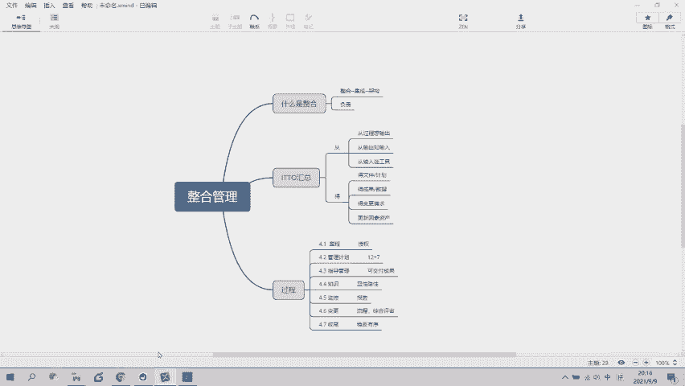

嗯稍等我一下，我需要去整回到重新使用这个内容。

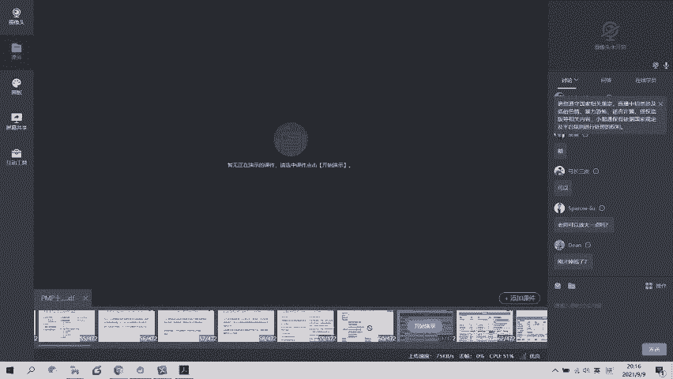

好，好的呃，大家都掉线了吗，目前是个什么情况，如果你们还可以看到我的片子，我回到正常的点的时候，ok好，那么我们现在还是回到4。1，制定项目章程，这样的一个i p t u的内容点上了对吧。

呃刚才的那个啊，sorry，刚才的那个脑图有部分同学没有看的太清楚，是不是好脑图之后我会给大家发到群里头，ok没问题，脑图我一会儿就给大家发到群里面好吧，课间休息的时候给大家发过去，所以核心的点呢。

我觉得大家应该通过刚才的口述还是能记住吧，是不是我们会讲整个i t c的过程，建议大家基于过程来去想他的输出，基于输出去推输入，基于输入和输出去凑中间的，这样的一个工具和技术，ok这是啊，这是事情一。

那第二个点呢就是输出这么重要，那么整个输出过程中，我们常见的输出会有什么，帮大家总结了一下，常见的输出会有文件或者是计划成果，或者是数据变更请求，以及事业环境因素，或者是组织过程资产，ok好吧。

就是把这个地方，我们做了一个延展和拓展的内容，ok这是4。1。

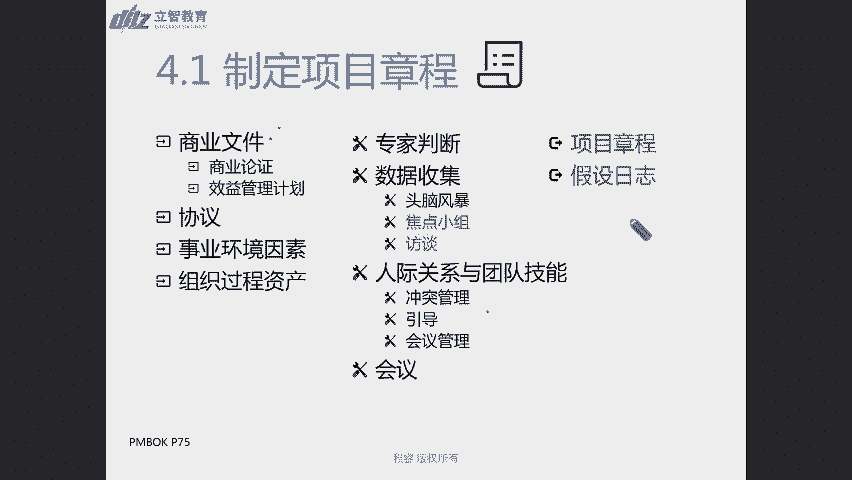

我们去讲到这个点，ok焦点小组访谈我们都讲完了啊。

项目章程我们都跟大家讲，brief完了，然后我们还提到了另外一个很重要的点，就是假设日志，那假设日志就是记录我们整个项目生命过程中，的所有假设的条件和制约因素啊，假设条件和制约因素。

所以啊比如说有人说是到底什么是假设日志，那我之前也举个例子，那对于一些外部项目来说，可能你设想的啊这个项目的市场环境啊，或者什么之类的那个论证的情况，那有可能有部分的东西也是没有。

基于呃不充足的调研来论证的，所以在这个地方，我们就都需要，你可以把它当做一个什么甩锅工具，对不对，这些事件事情都是我们当初来进行呃，呃是我们调查分析的一些制约因素，所以有部分的情况没有调查清楚啊。

有些假设条件我们可能没有brief清楚，那比如说即使是外包的项目，也有可能我们可能会假定对吧，我们可能会假定客户的付付款周期会很不错啊，但是实际情况不是这样的啊，所以可能对我们的项目项目项目的额。

现金的实收款这块可能也会产生一点压力，还有一颗可能性呢，就是我们可能假设条件是啊，我们的干系人只有这些方面啊，可能没有什么其他的更多的外部肝血人，但实际过程过程过程中间，我们可能会发现。

又involve进来更多的干系人了，他们可能也对会项目会提出各式各样的要求，所以正是这样的情况，我们都需要把它记录在这样的一个假设，日志中间，ok，那么结束完4。1过程之后呢，我们就会讲到4。2过程。

在讲4。2过程之前呢，我想跟大家分享的是这一页ppt啊，是这页ppt讲的核心的点，就是我们讲4。2过程的输入和输出的时候，我们就会讲4。2过程，它有一个很核心的点，你看他用了其他过程的输出。

非常谁的一个词还没有具体讲清楚它是什么，那是因为在我们的很多的每一个知识语的，一开始都会有一个过程叫做规划，什么什么管理啊，都会有一个叫做规划，什么什么管理的过程啊，比如说图中所列的规划范围管理。

它就会输出范围管理计划和需求管理计划，那无论是范围管理计划还是需求管理计划，他们都会一同汇总到4。2的过程，制定项目管理计划，这个过程中间会打包来形成，我们这个整体的这样的一个。

整体的这样一个项目管理计划哈，所以4。2的过程，大家可以把它呃，形象的记忆成是一个打包的过程啊，当然它不仅仅只是打包这么简单，我们也会去讲述这个事情，但是为什么呢，是因为制定项目管理计划。

就是我们我们不是整合嘛，对不对，我们要把各个知识域的东西，都在这个4。2的过程进行统一的汇总和整合，而它是定义准备和协调，项目计划的所有组成部分，并把它整合为一份综合项目管理计划的过程啊。

所以它是一份综合文件，所以对于这样的活动呢，一般仅开展一次啊，或者是在项目预定一点开展，就是这样的过程，一般就开展一次，那如果这个项目规定啊，我有多个阶段，每个阶段我可能都需要重新来去制定。

我们整个一个啊管理计划，那么规划的管理计划，那ok他可能会在多个预定一点来着，所以书中讲的这个多个像讲的这个预定一点啊，其实就是他他需要退一步去讲啊，万一有的项目有多个阶段，或者有各种各样的问题。

不是一次呢，对不对，所以它是，所以大家可以笼统的去记啊，它一般都是一次或者是预定的，你当初规定的他几次发生几次在什么时间发生，就是这样的一个情况，ok，4。2的过程，那所以我们输出就是什么。

输出就是项目管理计划，对不对，有了这样的一个项目管理计划，我们去倒推，那他需要哪些输入呢，首先第一个我们做任何事情，一定我们已经有钢了呀，4。1过程已经制定了我们的方向，目标。

确定了我们项目经理可以动用哪些东西，有高层级的这样的一个目标和需求，那在这样的情况下面，项目章程肯定是我们的纲领性的文件吧，是不是，就类似于有点红星闪耀的这样的一种感觉，所以它是一个纲领性的东西。

所以项目章程一定是这个章节的一个重要输入，那其次呢我们还讲，他既然是汇总其他过程的这样的一个内容，所以他一定会有其他过程的输出的情况，ok那同时他也在一个项目环境中间。

所以它一定会面临事业环境因素和组织过程，资产啊，一定会面临事业环境因素和组织过程资产，ok那有这样的输入和输出，我们就来去推导中间可能会面临哪些事情，那最常见的就是面临啊，这是我们要会会讲到的啊。

专家可能得给我提供一些意见啊，比如说这些材料，而这些不同的这样的一个项目文件和项目，管理的计划的细分，项的管理计划有冲突怎么办，可能我们还需要进行重新的调整和整理，所以我们需要专家判断。

那在这个过程中间呢，我们可能需要和其他的才能收集更多的数据，所以想要收集数据，第一反应就是有头脑风暴，有焦点小组合方，对不对，本老风暴是一个发三次的教练小组，小组是一个有训练的方式。

来帮助我们梳理整个过程，那访谈是1v一的方式来获取这个点，那除此之外呢，还有一个核对单，核对单其实也是一个很有用的工具，我们可以直接去看呢，而哪些分项计划都已经给我了啊。

可能给我完之后可能还有一个review的过程啊，哪些过程哪些呃，分项管理计划我可能又打回去了，又重新去调整了，那打回去之后给有没有还给我，对不对，那我们完全可以通过这个核对单，来进一步的去核对。

那除了这样的内容点以外呢，那我们当然还会遇到一些冲突，还会遇到我们要进行啊这样的一个发散和引导，然后我们也有会议的管理工具啊，这个过程中间也有会议对，那这些常见的呢我们可能就不会展开了。

那么我们主要去展开的点是什么呀，我们主要去展开的点，就是先讲这个输出项目管理计划，我们为什么会去讲这个点呢，就是我们会认为项目管理计划，有一个很核心的点，就是呃它其实呃我们之前讲过什么导航，对不对。

整个项目管理过程，相当于一个开车过程中间的一个导航过程，所以你一定是有一个参照物和参照系的，你说这个地方堵车啊，那它到底是堵成多严重，什么情况，那你一定有一个坐标参照系，那同样我们做项目过程中间。

你也需要有一个参照系，而这样的一个参照系，就是我们的项目管理计划啊，原本而我们整个项目的过程啊，是按照什么样的啊，时间和计划去走的，我们整个一个审批流是怎么来进行的。

那么目前的情况是不是按照当初的预想来做的，这不就是我们来和参照系对比嘛，所以我们说项目管理计划应该基准吧，因此以便于对项目执行情况和管理项目的绩效，以便考核项目管理执行情况和管理项目绩效。

所以在基准之前啊，这就是会涉及到4。6的过程变更了，在基准还没确定之前，我们项目管理计划可不可以改啊，当然是可以改的，你还没有最终去final，没有最终去确定，但是如果一旦它确定了基准。

那我们就不能随便动用了，我们就只能通过实施整体变更控制啊，这样的一个过程来进行更新，当然经营人性当然在，因为我们会讲到了整个项目的过程，其实不仅有瀑布，还有啊敏捷的过程，有适应性的过程。

所以有很多时候项目管理计划，它随着我们很多项目推进过程中，我们启动背景的不断完善，它也是一个什么呀，渐进明细的过程，但随着它的渐进明细过程，如果但他一旦动基准了。

所以我们一定还是需要回到控制和批准的流程，对吧，还是要回到我们的控制和批准的流程，所以我们会讲项目管理计划的一个核心点，除了整合汇总，第二个核心的点就是基准，基准的目的是什么。

基准的目的就是设立设立参考坐标系啊，我得知道这个目前我们的海平面是多少啊，对不对，海拔是多少，我得知道我们目前的堵车情况是什么样子，我得知道我们目前项目的执行和管理绩效，是不是在on track上。

是在轨道上面，目前还正不正常，所以我们要把它基准化来进行参考化，那最常见的基准是什么呢，最常见的基准其实就是三个，一个叫做进度，一个叫做范围，一个叫做成本，我是不是按计划产出了，我是不是产出了这些。

对我国产出的这些可交付成果，是不是按照我预想的花费了这么多对吧，有没有超支，有没有超时，有没有缺少范围或者是超出范围啊，所以最常见的基准其实就是这三个基准啊，这三个基准。

这也是我们经常会讲的项目的三重约束，ok好再讲呃，所以我们在讲开工会议之前，我会特别希望提到的是这两个点，就是我们刚才讲了，项目管理计划的一个核心点是一个整合，另外一个特点就是基准化。

那么到底哪些可以被称之为项目管理计划呢，那么整个项目管理计划，其实是包括12+7的内容，大家可以找到书上的这张图片是89页的，这张图片，89页这张图片里面只有18个点，但是你往前翻88页。

中间他讲到其他组件之后，就讲到了变更控制配置管理，绩效测量标准，项目生命周期描述，开发方法，后面还有一个点，他是在做表格的时候已经忘了啊，这是一个当时书上的一个bug，所以要邀请大家，也是要求大家吧。

在这张89页书上表里面，自己写一个19管理审查，好写上一个19管理审查，ok，在89页，项目管理计划的18点后面补一个19点啊，这个19点就是88页上面提到的管理审查，都找到了吧，好那我们继续啊。

所以我就来大家我们讲了他是整合，我们讲了它是基准，那我们来看一看到底有哪些19个文件呢，首先最常见的我们刚才后面讲了，由19 九九大除了我们整合管理以外，有什么有九大知识语，对不对。

所以每个知识语我们都需要人，有这样的一个管理计划，比如说范围管理计划，需求管理计划，进度管理计划，成本质量，资源沟通等等，那这些管理计划的一个核心的，通用的普适的点是什么，他们都会被具备程序性的特点。

所谓程序性的特点就是说他们都会去讲，类似于我第一天开课讲的事情，就是把大象放冰箱分几步，第一步打开冰箱，第二步放进去，第三步关上，所以他们就会详细的规定啊，做范围管理计划，做范围管理的时候啊。

你每一步应该怎么去做啊，你的程序应该是什么，应该得到哪些人审批，出现问题应该怎么去解决，大概流程是什么，所以他们其实都有一个通用的特点，就是它们都非常符合，类似于刑事诉讼法或者民事诉讼法里面的点。

他会告诉你起诉应该怎么去起诉啊，你到底应该去法，要找什么样的法院啊，区一级的法院还是市一级的法院，找到这个法院之后，应该去填表，怎么去做这个事情，他们其实都是这样的一个程序性的点。

他们不会去告诉你范围管理计划的本身，这个文件里面他不会去写啊，到底我们这个项目的范围是什么，他不会去写这个东西，它更多讲的点是要做范围管理，我怎么去做范围范围，怎么去确定谁来审批，范围蔓延和范围呃。

扩散之后就是范围被扩大之后，镀金之后，那怎么来去做这个点，我们谁来去审查责任在哪个地方，所以它更多的是程序性的点，当然除了程序性是通用的点以外，那对于某些过程来说，主要是偏向后面的啊，如果您看到啊。

我们还记得我，我把这张片子找找哈，稍等我一下。

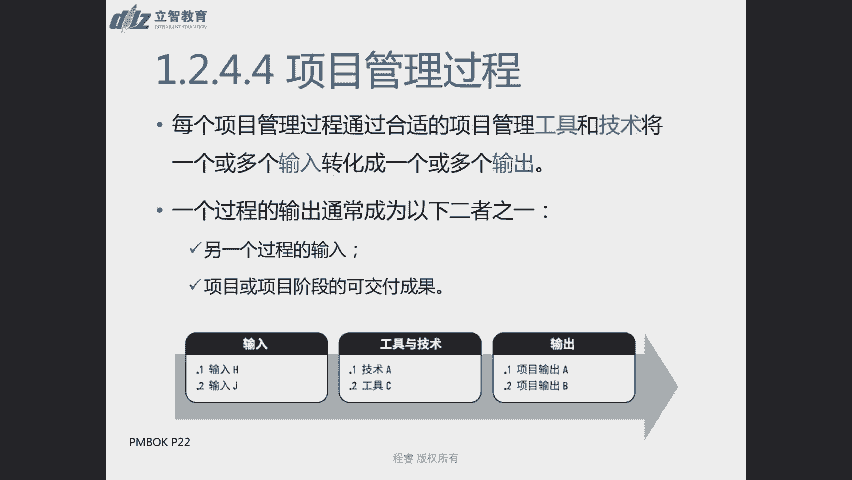

啊所以有的时候翻指示书就是有一个好处，有折角了。

就一眼能翻着，对不对，不翻ppt就比较难啊，大家看到这个地方没有，如果在规划过程的时候，比如说规划范围管理之后，它只是一个程序性的计划，但是后面我们会去讲怎么收集范围，怎么定，怎么收集需求。

怎么定义范围，怎么创建w bs以及进度管理，我们规定啊进度活动怎么去分解啊，怎么去确定进度的这个时间，然后怎么去压缩时间的这样常见的一个流程，怎么去审批这个点之后，他后面会讲定义活动排列，活动顺序。

估算活动持续时间和制定进度计划，那这些具体的这些规划过程，它实际就相当于我们的实体性计划，我们前面不是讲的是程序性计划吗，那这个6。26~6。5的过程，就相当于实体性计划。

他详细的在规划过程里面去讲清楚了啊，到底进度计划它会产出个整个一个进度计划，或者说是一个工作以及范围管理里面的工作，分解结构，那么到底这个项目特有的点是什么，而范围管理规划，范围管理和进度管理。

这样的一个这样的一个范围管理，计划和进度管理计划，他们可能是程序性的，所以他们可能有部分的项目来说，他们具有普适性或长得非常相似，但是每一个项目来说，他们的工作分解结构，他们的项目进度计划表。

这样肯定都是不一样的，都会有每个项目特殊的点，但是在程序上面，他们可能都具有相似性对吧，那么但是除此之外，对于如果只有一个过程的，比如说规划质量管理啊，规划沟通管理，规划采购管理，规划相关方管理。

那在他们的这些相关方参与计划采购呃，呃采购管理计划以及沟通管理计划，还有质量管理计划里面，ok他可能会有一部分的实体性的内容啊，它可能会有一部分的实体性的内容，所以粗略上的g就是。

如果这个过程组里面只有一个规划过程，ok它里面除了程序性的内容规定以外，还有一些实体性的规定啊，还有一些实体性的规定，ok好吧，这是我们来去聊到了这样的一个点好，所以我们的范围。

我们的管理计划还没有讲完啊，所以我们还是要回到我们这个点，啊片子有没有回来回来了，是不是，那除了这九个管理计划之外呢，还会有三个不是我们知识域里面的管理计划，对不对，一个是需求管理及法。

需求管理计划和范围管理计划，其实是一体的对吧，我们会去讲先得收集需求，收集需求之后，我们才能定义范围啊，才能定义范围，所以它是把整个范围管理计划和需求管理计划，把适当的拆开了，适当的拆开了。

那除此之外还有变更管理计划和配置管理计划，变更管理计划和配置管理计划的变更，管理计划讲的其实是整个变更过程，我们怎么去控制啊，整个变更过程审批流程在哪里，怎么去审批啊，所有的变更应该记录在哪里。

怎么来去做记录啊，这样的一个核心的点，那刚才同学也提到一个问题，配置管理计划是什么意思哈，资源管理计划是我们要讲的啊，规划资源管理那一章的内容，那规划资源管理啊，资源管理的那个知识域里面呢。

我们会讲资源其实主要分为两类，一类是食物资源，另外一类是人力资源对吧，那这是资源管理的内容点，那配置管理是什么核心的点啊，配置的核心的点，我们也会在今天四个六个过程争取给大家讲完。

那配置管理的一个很核心的点呢，是它讲的是一些项目发展发生和发展过程中间，不容易被察觉的隐藏的这些事情，所以我们需要把它单独拎出来，去确定这些事情的核心的点是不是这么回事。

那配置配置就是一个项目的配置单呗，对不对，就很类似于一些项目的性能的点，那比如说一个车辆，那我设计的钢的强度是多少，这个事情如果我偷偷的换一个钢材，是不是不容易被查察觉呀，对不对。

所以我们需要特殊对他进行审计，要进行质量的管理，要进行监督，要进行审查，所以这些就是我们配置管理的点，但对于一个盖房子的项目同样如此对吧，那钢筋混凝土的强度，这都决定了这个房子承载的高度。

以以后是不是容易变成危楼了点啊，所以这些都是我们要重点管理的配置管理，那么对于软件项目来说，什么是配置管理呢，那我们可能类比来说，第一个最常见的就是你的软件的设计能力对吧，你的并发量，你的吞吐量。

你同时处理的能力是多少对吧，这些也不是跟code，也没有直接关系对吧，它其实是跟底层服务器之间的架构有关系的，对不对，所以这些我们都需要去管理，还有一类常见的配置管理是嘛，这是版本管理啊。

这是一个版本管理，就是我拿着4。2。5在干活，你拿着3。2。6的版本在干活，那咱俩干出来的东西肯定不一样，对不对，都差一代了，对不对，所以同样举个例子，大家如果问我问题的时候。

我觉得你们班应该都是嗯没有，有没有上期前一个班的老学员啊，就是呃因为各种原因，没有参加考试或者参加考试挂了的同学，那有的时候你们可能拿到你们的讲义，和我们现在的讲义去对，那可能是不一致的。

那甚至有可能拿着你们的题目去，和我们的题目去对，也会不一式，所以大家如果以后问书上的题目之前，如果可以的话，把那个版本后排给我一下，这样的话，我也去方便去找到，这个版本到底是哪个版本的啊。

所以这也是配置管理中间的核心的点，对不对，如果你拍了一张照，问了我一个题目，那这个题目可能啊看上去都是全真一的，但是版本不一样了，我也找不到他的标准答案是多少了，ok好吗，所以这是配置管理。

我们要可能除了这些隐藏的技术参数以外，和强行规定的技术指标以外，还有一个最常见的就是版本管理啊，还有一个最常见的版本管理，那我们讲了管理计划的通用的核心点呢，就是程序信息化，那有个别是实体性计划之后呢。

那我们刚才还讲了一个重要的核心的点，就是基准，对不对，基准那基准呢都是实体性的范围，基准规定我们项目到底要做哪些范围，那进度基准规定，我们项目的重要的核心的节点是什么样子。

成本基准规定我们项目到底大概会花多少钱，管理储备是多少，那绩效测量基准会去确定啊，我们这些绩效测量的标准是什么，究竟按照什么样的方式来进行测量啊，这这些呢都是我们的核心的基准的内容。

ok那除了12和这四个宫啊，这样的一个文呃管理计划之外呢，还有三个，一个是项目生命周期，一个是开发方法，一个是管理审查啊，那这些内容以及我们这里提到的项目文件，在大家的新的考纲里面，会把给他们一个。

更加比项目管理计划和项目文件更高的一个，呃名称，它叫做弓箭啊，请大家记录一下这个词啊，我在对话框里打一下，我觉得有可能不是每个同学都看了，我发的那个那个考纲，对不对，在新版的考纲里面呢。

是用弓箭这样的一个词，把所有的document文档，然后来进行了一个汇总啊，弓箭其实大家可以看看哎这好友汉语好有歧义，是不是，他其实在英文里面可能更类似于，就是容器的意思对吧。

不管你是管理计划还是项目文件，一定是有一个动物地方去存储它，去放置它，那所以呢我们会把它称之为工作文件好，就把它称之为弓箭啊o啊，所以这是我们项目管理计划，制定项目管理计划呢。

就会产出这些对这些项目管理计划的一个产出，那项目这个过程中间呢，可能还会用到其他的项目文件啊，可能还会用到其他的项目文件，所以我们会说还有一个很核心的书啊，过程就是什么呀，其他过程的输入对不对。

所以我们在其他过程中过程里面得到那些材料，我们在整个这个项目管理，制定项目管理计划过程里面把它进行汇总，ok，那么呃，除了我们讲完了这样的一个输出，和这个输入的点之后呢。

我们就开始要讲这些工具和技术上的，一个核心的点了，就是开工会议啊，昨天有同学提到了take off meeting，那take off meeting呢，其实是我们第六版的书里面。

为数不多留着的一个会议了，就是kick off meeting啊，我们希望大家把它记住，它的英文，一定要记住这个英文哈，都特意把它加红了，加红了哈，那因为我们之前有讲过，我们是考培分离的。

所以在考试的时候，有可能他会把kick off翻译成启动会议，各种各种各样的会议，但是您不用去管它的中文到底是什么，它的他的英文一定是kick off meeting，就是开题会议呀。

不对这样的一种感觉，还是他讲的事情是啊，整个项目管理计划都已经制定完成了啊，那ok那就意味着我们规划阶段的结束和执行，项目的开始对吧，所以这个会议我们需要跟大家取得一致。

那规划的时候项目风险投入产出还好，一定要开始执行了，那投入产出那是相当惊人的，所以在此之前我们再开一个开关会议对吧啊，取得各方的共识啊，大家是不是都是这么认可的呀，如果都是这么认可的。

ok我们就开始去做这个事情，所以我们讲在大型的项目里面，通常由项目管理团队来开展，大部分的规划工作啊，然后在开始执行的阶段的时候才参与进来，有可能所以啊这个开工会议的粗细程度。

可能也根据项目大小的情况啊，会会有略微的不同，可能会有6a的不，好那么在整个这个文件里面呢，我也特别想跟大家再补充和回溯的一点，就是什么呀，就是这个我们一直在帮大家再强调一遍。

进度管理计划里面只规定进度管理怎么去干啊，我们怎么去制定这个项目管理，项目的进度计划好，然后我们怎么当项目管理计划发生偏差的时候，我们要采取哪些程序的流程，大概是什么样子的。

它规定的是进度管理一共分几步，怎么去制定，怎么去维护，怎么去遵守，怎么去改进，但是他不会去讲，我这个项目到底9月30号交，还是10月30号交，那哪个文件里面会去讲到这些时间点呢，就是在这个项目进度计划。

以及把它进行基准化之后生成的进度基准里面，好，就在这两个文件里面，他可能会去体现，ok到底是什么时间，你要完成你的具体的哪些工作，那项目进度计划这样的一个计划啊，希望大家在后面给他写个单词啊。

这是这也是一个翻，这也是一个翻译的问题，如果你把英文写上，我觉得你就能能堆到这个点了，或者你直接把他的中文写上，就是项目进度计划其实是一个schedule，是一个表，是一个计划表，是一个日程表的形式。

那所以它会更加详细一点，那我们把它highlight出来，得到一些基础的一个参照系，可能在这个进度计划表里面，每一项的工作都会去规定，但是进度基准可能是拿的中间的一些大的，一些核心的节点，一些管理节点。

对吧啊，这样的一个控制又讲到后面的点了，就是你可以也是一个大大的一个审查点啊，来去讲到这样的一个精通汽水的内容，ok行吗啊，这是我们整个4。2啊，整个4。2的内容，好我们继续好，讲完4。2之后呢。

我们启动过程组也讲完了，规划过程组也呃，这不对，启动过程组讲了一个过程，4。20规划过程组里面的最终的收尾的过程，那下面4。3呢就是执行过程组里的一个点，所以啊您一定不需要有一个续冠的关系。

就是前一个干完了，干后一个什么什么之类的，他们大概也是这样一个流程，但是其中还会穿插很多其他的过程，会在我们后面去讲到，那4。3的过程呢，是一个指导与管理项目工作的过程，请记住他是执行过程组的内容。

ok为什么呢，因为这是讲项目经理为了实现项目目标，领导和执行项目管理计划中所确定的工作啊，并实施以批准的变更请求的过程，所以团队成员是在干活，你是在指导和管理项目工作，所以这个是执行过程。

所以执行过程呢它自然就会有一个重要的产出，是什么呀，执行过程一定可以产出可交付成果啊，执行过程一定可以产出可交付成果，然后可以产出，边干活，我就可以边收集到什么，就可以边收集到数据了，对不对啊。

到底花了五个小时干完这个活啦，还是花了八八天的时间才干完，这这样的一个可交付成果，究竟是什么样的一个情况，所以这是收集的一线数据啊，这里我们只是收集了一线数据，还没有提到任何去做信息的对比呀。

还没有提到去做报告的过程，我们在执行过程我们就先得到这个数据，除了得到可交付成果，团队成员得到可交付成果，我们我们收集到大家的工作绩效数据，我们可能在这个执行过程中会发现什么，会发现问题。

所以我们要把这些问题啊，sorry没有画质好，我们会把这些问题放在问题日志里面啊，我们会把这些问题放在问题日志里面，这就是一个问题，是不是，然后同时我们也会发现这个有一个问题了，是不是得提变更啊。

只有变更才能解决这个点啊，所以我们可能会有一个变更请求啊，我们可能会有一个变更请求啊，我们就会有一个变更请求，所以这是4。3的过程指导与管理项目工作，我们会讲到四个非常核心的输出，因为这是一个执行过程。

我们根据整个过程先定输出好吧，然后同时在这个过程中间，我们会也会有什么项目文件的更新，项目管理计划的更新和组织过程，资产的更新对吧，ok那我们定义了这些输出内容之后呢，我们基于这些输出内容去看输入。

所以我们要干活，我们就不能再拿着章程纲领性的东西来干活了，对不对，我们得有项目管理计划啊，我们得拿着项目管理计划来干活对吧，那么我们可能中间还会需要用到，大量的项目文件啊，来去做这个事情。

那他是执行过程组最核心的过程，就是其实干活的过程都是这个过程，所以我们被批准的新的变更请求来了，新的事情同意了，要干的事情最终也需要在4。3的过程，由项目团队成员来去做。

所以批准的变更请求也在这个中间来得到执行，4。3过程去执行这些批准的变更请求，当然我们也会身处在我们的事业环境因素和，组织过程资产里面，所以在这个过程中间，对项目经理来说。

它通常它通常需要使用的工具和技术是什么呀，啊专家判断对吧，这个这个活的过程的这个数据啊，问题啊，变更的请求啊，是不是这么回事啊，如果我不太清楚，找个专家问问吧，对不对。

然后这些工作绩效数据我们建议放在哪里啊，建议放在项目管理信息系统里面吧，对不对，这样的话大家都能看到，都可以去共享到，然后有的时候我们还需要经常的去开会对吧，经常去开会去讨论我们啊做了什么事情。

遇到哪些困难，遇到了哪些困难，所以这都是4。3的过程指导与管理项目工作，我们面临面对的这些输入和输出，ok，好那我们继续，那我们就会去讲到，第一个跟大家去讲到这个内容，就是工作绩效数据，工作绩效数据呢。

就是在执行执行项目过程中间啊，从每个执行活动中间收集到的原始，一定要记住，这是原始的观察结果和测量值啊，所以我们可能会讲啊，我们会讲收集的东西有哪些呀，包括做了哪些工作呀，对不对啊，绩效数据怎么样。

kpi的值是什么样子，技术的测量值是什么样子，实际开始和实际完成的时间，做了多少个故事点啊，可交付成果的状态是什么样子，进展情况变更数量，缺陷数量等等啊，收集的是这些内容，那这些都是一线的数据。

我们要把这些数据存好，存好之后后续要干什么呀，说后续要进行对比分析，有对比分析之后呢，我们就会产出工作绩效信息，然后我们有对比了之后，我们可能会得出结论，直到我们后续的运行啊。

所以我们就会得到我们的另外一个内容，叫做工作绩效报告啊，所以我们之前有的章节，中间有一个遗漏的问题的点，和我们昨天有提到，希望大家折页的地方能找到吗，27页书上的27，ok这里就详细讲到。

讲述了整个工作绩效数据的这样，26页和27页啊，26页是用文字性阐述的，27页是有个图表啊，找到了整个这样的一些性工作绩效的这些数据，信息和报告的这样整个一个旅程，所以请大家画一下26页的第一行啊。

26页的第一个菱形的那一行，工作绩效数据啊，以及他这一行的最后几个字，原始观测结果和测量值对吧，对工作绩效数据一定是原始观测结果和测量值，下个菱形工作绩效信息对它是进行了什么呀，整合分析啊。

该行的最后几个字整合分析而得到的绩效数据，所以通常这个时候一般都会有偏差分析啊，会有对比，它是一个对比分析的过程，你可以在旁边写上两个字，对比，这个，那有有对比信息之后呢。

下一步我们就要开始去汇报了对吧，我们需要领导去讲工作绩效报告，工作绩效报告呢是为了做出下一步的决策，提出问题而进行呢，汇编工作绩效信息所形成的实物或电子文档，所以呃它一定是一个文件了。

同时我希望大家能记住这个点，就是决策好，把决策提出问题，采取行动也画一下，所以工作绩效报告呢，一般都会有一个结论性的东西，首先我们会先记录原始数，其次我们才会把它进行对比分析。

有了对比分析的这样的信息之后，下一步我们就要去想，下一步我们要采取什么行动，采取什么措施，有什么样的引导的点，ok所以27页去讲到了执行过程，我们就可以得到了工作绩效数据，有了这个执行过程呢。

我们在控制过程里面，在各个子过程的一个对比的控制里面，那么啊控制采购，然后还讲到了控制进度，我们那天讲了控制范围好，控制成本，这些控制过程里面呢，我们就会进行偏差分析，会进行对比分析。

我们就会得到工作绩效信息，我们会把所有的工作绩效信息在后面，我们会讲到一个过程，就是我们提到的整体项目控制这个过程里面啊，我们会进行把它输出，得到工作绩效报告，有了这样的工作绩效报告。

就可以指导我们后续项目变更控制啊，指导我们整个项目过程和项目沟通记录的内容，ok好那可以啊，我们再回来，好那我们还是回到这个呃，我们整个4。3过程是第一个啊，第二个重要的输出啊，第一个是可交付成果对吧。

您在指挥，那么团队在干活，他们就输出了可交付成果，同时在这个过程中间，您就需要得到这样的一个工作绩效数据啊，工作绩效数据，那除了工作绩效数据之外呢，还会有第二第三个产出，第三个产出就是问题日志问我。

我可能希望跟大家强调一点，但凡提到日志这个东西，希望大家都觉得它比较重要一点哈，就是没有，我们可能平时就是做软件开发的同学，可能觉得啊，日志不就是平时软件运行过程中间，自己打的日志吗。

放在那个地方就好了，那我们整个项目管理过程中间讲到日志，其实一般都还蛮重要的，一般都还蛮重要的，它是他和那个就是我们会讲到，软件开发过程中的日志，有一个共通的点，共同点是什么呀。

就是他们都会有始有终的记录全过程啊，他们会在整个项目生命周期里面啊，都会去记录，所以我们要不断的去更新啊，是在全生命周期里面反复去更新，所以它是一个全状态的日志，这是他们的共同点，它们的差异点是啊。

在项目管理过程中间，我们的对日志的词还是比较重要的，因为还会有这些信息，这些问题或者是变更日志或者是什么，假设日志到底是怎么去更新的，那么在这个过程中，我们都会把它记录下来好，所以问题日志首先是在4。

3过程，首次被创建啊，首次被指网线，然后在整个项目过程中间，它都会随着监控活动，就是监控过程组而不断的去更新，而不断的去更新，所以问题日志就是我们经常会遇到的问题，差距不一致和意外冲突。

所以问题日志以中间记录的问题，一定是大声的啊，问题日志中间记录的点一定是发生了点，ok好，下面呢就给大家一个模板，这个模板，其实您我们昨天也给大家一个压缩包了，你也可以在其中找到跟他很类似的内容。

那么问题日志呢我们一般会有一个id，会有一个问题的分类啊，具体问题的描述啊，它可能会影响到什么样的情况，还是紧急程度怎么样，是优先还是一般，还是说一个更加迫切的情况，block的情况对吧。

然后责任是责任是在谁那儿，然后他要采取什么样的措施啊，谁的这个地方的呃，问题的点呢，我们更加强调的点就是说谁来去解决这个问题，所以除了问题的提出的情况，在第一行业外，后面我跟他去讲怎么去解决问题。

它不是一个追责的工具啊，它只是一个问题的一个记录的点啊，然后我们会去说，而且我们整个项目管理过程其实不太强调追责，我们会去讲，如果任何发现的问题，我们需要都需要寻找管理上的原因啊。

需要去寻找管理上的原因，所以我们会去记录啊，责任者去解决他的责任是谁，采取什么样的行动啊，目前的状态是什么样子啊，有没有截止时间，然后comments所以截止时间有可能会变化。

所以问题日志我们会需要经常去更新，ok好这是第三个输出，那第四个输出是什么呢，是变更请求，因为我们在做工作的过程中间，可能会发现有很多事情，和之前的内容感觉不太一致了对吧，和之前的内容去感觉不太一致了。

所以呃在过程当中，我们可能就会提出各式各样的变更请求，会提出啊各式各样的变更请求，那任何提出的变更请求呢，我们都需要在变更控，实施整体变更控制里面得到进行处理，但是他的提出啊，是由这个过程4。

3过程来提出的，当然除了4。3过程，还有很多其他的过程也会提出变更请求啊，也会提出变更请求，ok那我们就会提到这个变更请求的过程啊，我们就会提到变更请求的类型，那变更请求呢我们通常会把它分为纠正措施。

预防措施和缺陷补救以及更新，预防措施和纠正措施，我觉得是最容易理解的，就是纠正措施就是目前的情工作，绩效情况和项目管理不一致了，为了使它使得他们一致，所以我们要进行什么样的活动对吧。

那预防措施是目前好像还一致，但是未来可能会不一致，所以要确保未来的绩效符合管理计划，所以我们要提前采取的内容就是什么啊，我们提前采取的内容就是这样的一个预防措施，就是我们这样的一个预防措施，ok。

缺陷补救，或者是活动，就是这个产品已经出出来了，这个产品它可能会有什么质量问题，所以对于这样的质量问题，我们要采取变更，所以这个就是我们通常说的缺陷补救，最后一个变更请求就是更新啊。

有些文件可能不一致了啊，对于这些不一致的文件，那我们就把这些文件重新进行修改啊，重新进行修改，所以变更请求呢一般就会有这么四种类型，变更器就就有这么四种类型，ok所以有这样的。

后面有一个变更请求的这样的一个案例，但是严格来讲啊，我们我我觉得这个案例不是特别贴切吧，现在叫做变更请求的申请单啊，但是在这个过程中间啊，所有的事，我觉得他可能更加偏向于变更日志对吧。

他跟之前我们讲到的问题日志一样啊，所以大家可以在这里记录一下，它是变更日志对吧，因为变更请求这个东西，它其实只是这样的一个输出啊，他在项目让我找一下，我们刚才提到的这样的一个啊。

这样的一个项目文件里面我们用到的是什么呀，这样的文件里面我们通常用到的是变更日志，好，用变更日志这个事情，来去记录我们整个的一个变更请求，所以呢啊所以我们会说这个变更请求的模板。

ok在这里更像一个变更日志的模板，他也会详细的去记录是谁提出的变更，变更是不是要执行对吧，执行完成的日期是什么情况，那四点接下来呢我们会讲到4。4的过程，这也是另外一个执行过程组的过程。

但是它相对来说比较简单，他讲的是实行式吗，管理项目知识，管理项目知识啊，就是指，只用现有知识并生成新知识，以实现项目目标，帮助组织学习的过程对吧，他会去讲，我们要把不断的把我们的知识进行复用。

我们在这这个知识的过程中不断的去搭建啊，衍生出新的知识，对这个地方其实隐含了一个点，就是你作为项目经理，在这个过程中间，你得创造出一个帮助大家进行，知识分享的这样一个环境对吧，让大家愿意去表达。

愿意去分享，创造一个可信赖的环境，所以在这样的环境下面，其实更加有利于基于现有知识来生成新的知识，而来帮助此时组织来学习的这样的一个过程，ok所以既然是要管理项目知识，而且这个知识讲的是帮助组织学习。

帮助什么样的组织，至少从小范围来讲，是帮助整个项目团队不断的去提高，对不对，所以很容易可以了解到，这个地方有一个很核心的输出，什么经验教训总结对吧，经验教训总结，ok那好ok思维导图，我一会发好。

刚才确实忘了，我刚才喝水去了，那整个一个经验教育，所以基于这个过程呢，我们会基于这个管理项目知识来去倒推，我们一个很核心的一个输出是什么呀，经验教训登记册啊，经验教训登记册，因为管理项目知识的目的。

是为了不断去提高组织，提高团队的这样的一个持续进步，持续提升的这样一个能力，所以管理项目知识，麻烦大家在旁边写两个字啊，在书上或者在讲义上面都可以，还有两个恒生点，第一个是创造知识共享的氛围啊。

创造氛围对吧，还有另外一个点是什么样，就是，我们要我们要讲这个目标是什么，目标是持续提升啊，持续提升持续几分，所以持续提升让整个团队不断去进步，这其实是项目经理的一个核心的工作对吧。

你带着团队不断的去取得项目目标，不断去提升团队的绩效水平，所以它被归为了执行过程组啊，所以它被归为了执行过程组，所以呢为了怎么让团队不断的提升呢，因此很容易去想到的是一个输出，就是经验教训登记册啊。

经验教训登记册，那这样的一个登记册里面啊，我们最容易找到这样的工作啊，这样最容易让整个团队来进行提升，所以我们先讲一讲什么是经验教训等级测，今天教训登记测呢就是记录遇到的挑战，问题和风险。

意识到的风险和机会以及他其他实用的内容，那么我们在项目结束的时候，还把它归入到经验教训知识库里面，成为整个组织过程资产的一部分，所以对于经验教训这块内容，我们可能会去讲啊，我们遇到了一个什么问题啊。

我们怎么去可能把它做的更好，然后哦我们怎么去能够进一步的去提升它啊，这就是我们经验教训登记册里面，最核心的一个内容，最核心的一个内容，所以除了经验教训登记册以外呢，我们可能还有哪些输出啊。

是不是项目管理计划的更新对吧，我们要重新review，重新更新我们的一个执行之前的指导性文件，也是规划的产出啊，项目4。2的过程，项目管理计划的更新，然后我们又会有组织过程资产的更新啊。

这个地方请记住它不涉及到事业环境因素，事业环境因素是外部或者内部强制的那知识，它作为一个可以添加的内容的点，那更多是组织过程资产的更新，以及我们整个一个项目啊，规划这样的一个项目管理计划的更新。

所以有了这样的一个输出之后，我们再去看输入，那么它也是一个执行过程，所以我们要以我们的项目管理计划，为依据来输入，我们也可能会用到大量的项目文件啊，我们也可能会有啊，我们的可交付成果的情况。

还有事业环境因素和组织过程，资产等等这些内容，所以我们把这些内容输入之后，然后我们可能会找专家看一看对吧，然后我们还会有知识管理和信息管理的点，然后在此过程中间呢，我们可能还会用到一些人际关系的和团队。

倾听技能，团队技能，比如说积极倾听啊，引导啊，领导力啊这些方式去获得大家，给大家培养，给大家创造一个更好的氛围，让大家勇于去表达这些内容，所以在这样的情况下面呢，我们希望对这些政治意识啊。

包括这些点都是一种鼓励分享，鼓励分享的一个点，所以我们要创造这样一个善于分享的，这样的一个环境啊，善于分享和总结的这样的一个环境。

啊这里还我们还会有一些经验登记，教训册的模板，也是可以供大家去看到的，这个是之前的一个结尾，那么这里还会有风险和问题啊，我们的回应一般是什么，然后comments还有哪些评论和建议的简。

然后在供应商管理的过程中间，供应商有哪些问题，解决方案是什么，还有哪些可评论的点，那呃知识管理除了讲义中间嗯，鼠标滑太多了呃，让我找到除了讲义中间的内容之外呢，我们还会另外讲到一个可以看到吗。

对我会讲到这样一个点，知识管理和信息管理的区别啊，我们会去把它稍微来做一个延展呃，他应该对应的书上的内容应该是在，嗯大概对应的书上内容应该是在100页，我们先看到100页。

然后我们会再去讲后面的知识管理和信息管理，ok那么呃100页先给了一个输入，这叫做知识，通常分为显性知识和隐性知识，显性知识是那种文字啊，图片啊，数字这种知识，隐性知识呢对难以表我的一些内容。

就比如说我们通常会因为我们是做车企项目，很多车企项目，有的时候他会呃会有一些呃就是经验传承，那么光看别人早前的文档，你可能能获得很多点，但是还是需要进一步的交流，然后你才能知道中间在隐藏的一些问题的点。

所以这就是我们通常讲的显性知识和隐性知识，你从前供应商里面去接手了这个项目，他那些文档性的东西那都是显性直尺对吧，你去在交接的会议上，或者跟他啊，他一起去共同来去做这个交接的过程中。

获得的知识就是隐性知识，对不对，所以做知识管理就会衍生出来这样的一个点啊，在下一段他又会去讲到了会有两个误解啊，就是知识管理只是把记录的知识用来分享，其实不是这样子的对吧。

然后另外一个就是误解是知识管理，只在项目总结的时候才总结，以供未来项目使用，所以也不是这样子的，因为我们只是啊4。4过程是执行项目，执行过程组的一个过程，所以执行过程中间，我们就不断的去总结经验教训啊。

只是在项目结束的时候，我们会把它把它进行汇总，把他编到这样的一个组织过程，资产里面去来做这个点啊，因此我们讲显性知识呢啊他虽然易于分享，下面又讲到了，但是无法保证正确的理解，隐性知识呢它蕴含情境。

但是通常往往难以揣测，难以往往边转，所以其实整个ping book这本书，其实不就相当于是一本什么显性知识，对不对，那我跟大家分享的过程呢，其实就是一种隐性知识啊，把整个过程就是蕴含的情景。

去帮助你去理解这个点，所以确实正如他讲讲的这个内容，就是真的是很多内容不是您怀疑您的中文水平，就是有很多知识，他应该把它分为显性知识和隐性知识啊，它应该把它分为显性知识和隐性因子。

因此其实正是基于100页，关于项目知识的分类之后呢，所以大家可以翻到102和103页，中间就会讲到了知识管理和信息管理，那知识管理呢就是把这些啊，我们要讲知识管理的工具和技术，把员工联系起来。

使得他们能够愿意去分享知识对吧，然后以及形成分享隐性知识，来形成不同团队所拥有的，这样的一个知识的过程，而信息管理呢是啊创造人与知识的连接，可以有效地促进和明确显性知识的分享。

所以您可以看到信息管理更加强调的是啊，这东西把一个可以被撰写和描述出来的东西，把它存起来，给它成为一个信息的内容，所以是信息管理适用于显性资质，而知识管理往往通常对应的是一个隐性资质。

所以知识管理后面的工具，我觉得之前讲了很多的点，我特别希望大家mark的是啊，第四点，103的，第四个菱形就是工作跟随和跟随指导，就是工作跟随和跟随指导，一个讲的是工作跟随指导，就是下面的人在干啊。

然后是呃上面的管理层去指导他啊，我看你做的什么样子，我告诉我看你是不是按照这个流程去做的，工作跟随呢，就是说学徒跟着师傅对吧，这就是一种很典型的工作跟随，所以在这种过程中去进行传承也是很古啊。

就是以前很常见的一种方式，其实现在呢我们也会啊，大多数来采用这样的方式啊，当然后面还有一些交互式的培训呢，我们现在采用的就是一个交互式的培训嘛，来跟大家去分享这些隐性知识，ok好，这是4。4的过程。

我们稍微进行了一个延展，后来阐述的这样的一个啊管理呃。

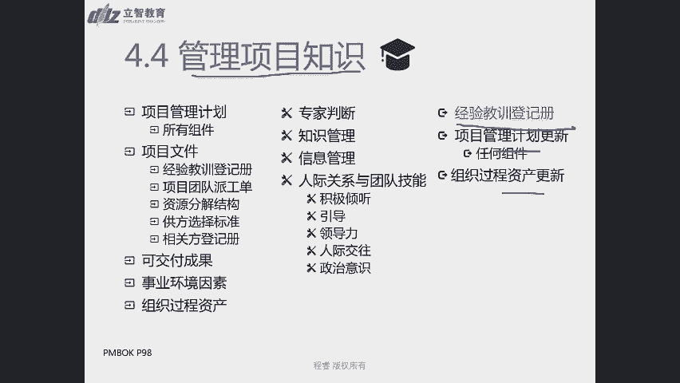

管理知识的这样一个过程，好，这个非常短。

然后我们结束之后呢，我们就可以进入4。5的过程监控项目工作，那监控项目工作呢是跟踪审查和报告，整体项目进展，以实现项目管理计划中确定的绩效目标的过程，那监控项目工作呢，它就显然不属于执行过程组了对吧。

它属于监控过程组啊，那我们在这个过程里面呢，我们一定监控项目工作，那它是一个整体的一个监控作用，因为还记得我们整个这一章的指示域，就是一个汇总的指示欲，对不对，这是一个整合的支持域。

所以它会把其他的监控过程组的东西，都在这一章进行一个汇总，那我们把这些监控的内容进行嗯比较的工作，绩效偏差内容进行一个监控之后，我们的目的是什么呀，是不是指导我们未来的工作怎么去做。

所以监控项目工作最长，我们会遇到的一个输出就是什么呀，工作绩效报告，对不对，我们讲刚才已经提到了，工作绩效报告是一个啊带结论的，有有文档化的东西要去汇报的，那么汇报的目的一定是为了。

要不讲现在多么多么好，那我们也一定会去讲，未来我们要提出哪些改进措施对吧，怎么让整个项目做得更好，所以工整个间4。5的过程呢，我们的最大的一个核心的输出，就是工作绩效报告，那在这个过程中间呢。

肯定也会衍生出来，因为很多监控过程组啊，都会出这样的一个东西叫做变更请求啊，都会出这样的一个内容叫做变更请求，因为监控吗，你监控整个过程你会发现啊，执行过程和规划过程组不一致了，相关的东西不一致了。

所以我们要进行提出变更请求啊，这都是4。5监控项目工作，不仅是四点变更请求，不仅是4。5监控项目工作，也是整个监控过程组里面，常见的这样的一个输出啊，常见的这样一个输出的内容。

所以有这样的一个输出之后呢，我们还有两个更新啊，这就不再多讲了，我们就会去倒逼，我们当然需要哪些输入呢，我们的输入，因为我们说工作绩效的流程是什么样的，先是工作绩效数据，有数据之后。

我们得在其他监控过程组的，比如说控制成本，控制范围，控制进度啊，以及控制采购这样的过程中间，我们进行比较分析，偏差分析，我们得到他们的一个啊有差异化的一个结论，所以我们这个有差异化的一个点。

所以我们就称之为工作绩效信息，有了这些信息，我们要导出未来怎么去做，要导出结论，所以我们把这个工作绩效信息作为输入来输出，我们的工作绩效报告，来输出我们的工作绩效报告，ok这是4。

5过程的一个很重要的是输入啊，除了这个输入之外呢，也会有项目运行环境啊，特别这里还强调了一个什么，强调了一个协议啊，是因为有的时候做一些外部的项目的时候啊，我们可能会受到一些其他的一些啊要求，一些条款。

比如说他就说了，我这个事情外包给你点，你你就必须要在什么什么时候来进行，定期向我汇报，对不对，所以协议呢也通常会作为4。5监控项目工作，这样的一个输入，输入的这样一个内容，那除了这些信息之外呢。

还会有什么项目管理计划和项目文件，因为这中间也会对一些执行过程组成的内容，进行啊进行一些约束性的点，所以我们需要有这样的输出情况下面，然后我们来产出这样的一个输出啊，我们有这样的一些文件。

我们有项目管理计划的参照基准，所以我们工作绩效报告，我们可以再去比较一下公，sorry，我们可以再去比较一下工作绩效信息，然后我们来去的产出我们的工作绩效报告，所以毫无疑问我们肯定也会问专家，对不对。

我们可能会去开会，那么要阐述这个报告，可能我们需要有一个决议和决策对吧，既然是指导性的东西，它一定是有知道下一步行动的，一定要有决策和决议，那在这个过程中呢，我们不再是进行数据收集了。

前面的过程我们规划或者是执行的时候，我们可能偏向的是数据收集的一些点，但在监控过程的时候，我们开，特别是对于这样监控汇总的时候呢，我们要进行试吗，数据分析了，对不对，我们要分析啊。

我们有没有其他的备选方案呢，我们的成本效率是怎么样的呀，然后我们要可能会做政治分析，这是后面大家可能最会头疼的问题哈，我会做政治分析，我们会做根因分析，会做趋势分析，可以做偏差分析。

会做这些分析的内容啊，所以这是基于这些输入和这些要求的输出，我们会推出来，我们要做专家判断，做数据分析，做决策和会议，ok，那我们讲完整个过程之后呢，我们就会还会跟大家再讲一讲监控监控。

就正如我们之前大家还记得那样，那一页的这个虚构非虚构图，它是一个动态的过程，那所以监控其实是贯穿整个项目管理的过程啊，它包括收集测量和分析，测量结果以及预测趋势啊，来推动整个过程。

所以呢它的一个核心的点是什么呀，洞察项目的健康状况啊，洞察项目的健康状况，那除了监督之外呢，还有一类就是控制啊，控制就是要制定纠正和预防措施，或者重新规划来有效的去解决问题啊，有这样的去解决问题。

所以我们项目经理能够控制的，我们能在我们份内的，我们要去采取纠正和预防措施的，比如说控制进度，控制范围，控制成本，控制采购这些内容啊，我们都是去控制控制风险，那么监督呢就是监督相关方监督沟通啊对吧。

这些内容我们都采取的是监督的形式，ok对监督和控制啊，稍微有点啊词的一个不一样的点，那所以在这个时候呢，所有的工作绩效报告的产出啊，都属于这个过程啊，所有的工作绩效报告的产出都属于过程。

包括实体和电子形式编制的，然后我们会要求制定决策，采取行动和引起关注，所以工作绩效报告呢要可视化对吧，你需要用更多的图表的形式来去阐述，要求风险情况来进行概述啊，就风险情况来进行概述。

所以有的时候特别是工作绩效报告，一般是report给高层的，所以对高层来说，我们要有一些采取行动的仪表图啊，信号灯图啊等形式，让大家一目了然，就知道这个项目目前的情况会是怎么样子。

所以我们这个地方会有一个，工作绩效报告的一个案例，那在我的实际过程中间哈，我们通常会用的是红绿灯图，确实是信号灯图对吧，如果这个目前的情况，我们一定会强制把它标一个绿灯，黄灯和红灯啊。

我们一定会去标标书这些内容啊，我们一定去标注这些内容，那除了标注这些内容之外呢，工作绩效报告的一个核心点，就是它一定是有结论的，他一定是有一个下一步的工作和预测的内容。

一定是有一个下一步的工作预测的内容，所以我们得有解决方案去提出他怎么来去做啊，提去提出他怎么去做，那除了这样的一个表格的形式来展现呢，其次还会在敏捷的方法里面啊，我们又提到敏捷了。

一一直对大家有抱琵琶半遮面，是不是，就是为了吸引你们，更多的去了解到敏捷的东西哈，我们后面会做一个汇总，在敏捷的项目里面呢，我们还会用这样的一种图表，叫做burn up和burn down。

就是燃尽图和燃烧图，其中燃尽图会更有名一点哈，燃尽图会更加有名一点，他讲的事情是什么呀，就是我们原本计划有这么多个工作，这它它它妹其实是故事点哈，其实是故事点，那故事点是什么，还没讲对吧。

那么呃刚才也画了这样的一个内容，那么后面我们会讲到它其实就是一种估算方式，我们通常去估算的时候呢，会说这个工作我们要干八个小时啊，还是40个小时，还是什么样的情况，那故事点呢其实就是一种相对估算。

它讲述的也是这么一个任务，这样的一个用户故事，它大概需要它和一个参照系之间比，它大概是它的几倍关系啊，所以我们来去描述的这样的一个故事点啊，所以如果您不用故事点，你说你就是想用这个公式也可以。

没问题的啊，通常情况下只是它是会用故事点，那用这个地方用工时也是可以的，那我们原本计划啊到25，这条线呢是我们啊大概规划这个点，原本我们计划是从12号到25号，这样一个迭代周期里头。

我们整个啊18个故事点就全部都做完了啊，这就差一点点哈，但是您可以理解成那正好应该是零，这个位置差一点就做完了，但是实际的运行情况是什么样子的呀，啊一开始哎做的挺快的唉。

从18个故事点迅速下到12个故事点，然后遇到问题了啊，就遇到问题就开始开始变慢了啊，直接可能就是一个bug了，一个测试的点了，是不是啊，一个就挑战不过去的坎，又修复之前的bug。

所以呢我们可能一直横盘期间，就是这些事情还没解决啊，还在解决之前的问题呢啊可算是解决了，然后往下去走好啊，终于整个团队的效率又提升了，然后可以快速快速去解决问题了，所以这个其实一个是蛮现实的一个点。

通过这样的形式其实可以比较好的去体现啊，整个这样的一个目前工作推进的情况对吧，目前工作的推进情况，这就是燃尽图啊，像一个啊蜡烛一样，是不是越往下越少，越往下越少，这是一个燃尽图，那另外还有一种模式呢。

比较就是燃起图啊，燃起图的点是什么样子啊，燃起图它有一个比较好的特点，就是它可以去啊去，就是我们这是这个蓝色的线，是原本计划的except的吗，原本计划的那在这个过程中做着做着，我们这是我们实际情况的。

所以基于这种的实际情况，我们可以画一个辅助线啊，如果我们这个点的话，按照我们预想的速度的话，可能我们可能做不完了对吧，我们可能只能做到这个，只能做到140个story point嘛。

只能做到140个故事点，就是这样的一个情况啊，这是这样的一个情况，ok那人企图其实燃烧图，我们或者称之为燃起图呢，其实还有另外一个好处，就有的项目的时候啊，他可能啊除了rm以外哈。

就是有些看板的一些这样的一个敏捷的方法，里面呢，它可能会中间还会接新的需求，那在接新的需求的过程中间呢，o或者说把一个需求拆分成两个需求啊，发现啊其实当初的当初想象不一样。

那可能应该把它拆分成两个需求的情况，下面啊，我们可以往上去追加啊，来去证明啊，我们可能需要做更多的东西，需要做更多的东西，但是呃燃起图尽管有它有这样的好处，但是我们更多的使用的是一些燃净土的方式啊。

为什么呢，因为这是因为scrame决定的，rame是一个时间和，所以在这个时间河里面，我们是拒绝变更的好，后面我们会去讲到这个点，所以啊在这种情况下面，我们原则上是拒绝变更的啊。

ok所以呢就是我们讲到的啊，通过这样的方式啊，这样的一个图表的形式，也可以去展现整个一个工作绩效报告啊，工作绩效报告的一个很多图表的内容，你要去给领导展示一目了然，去看到啊，整个目前团队的情况啊。

包括我们去开敏捷回顾会议的时候，我们就可以看到到底是在哪个地方出现问题，这个问题到底是什么情况啊，我们都会不断去讨论这个点，ok好吧，这是整个4。5啊，监控项目工作，ok那么我们就要开始清清楚。

我们今天最后一个我知道还有一个4。7，我们可能会在需要留到下次讲，看看今天能不能讲完哈，4。6过程我可能会讲的比较多一，点四六过程我知道大家有点累了，是不是，4。6过程，麻烦你打起精神来好好听一听，4。

6过程，整个变更嗯，少说吧，您可能会在您的考试中间，至少遇到十几道跟变更相关的题目，它是一个非常容易考到的题，地方会非常容易考的地方，我们会把这个这个过程讲的更慢一点，讲得更慢一点好，那首先4。

6过程呢是实施整体变更控制，所以它是审查所有变更的请求，批准变更和管理对可交付成果，项目文件和项目管理计划的变更，并对变更处理结果进行沟通的过程啊，所以他是审查变更批准变更和就变更的结果。

处理结果进行沟通的过程，记录了一些完全过沟通的过程，所以发现变更请求不在这个过程里面哈，发现变更请求会有很多过程来展开，通常是什么呀，4。3，直到和管理项目工作以及整个监控过程组里面。

我们都会发现这些变更请求，那发现了变更品球，在这个4。6过程得到批准之后，在哪里执行啊，还是回到4。3过程对吧，来进行执行啊，来进行执行，然后来来把这个是啊同意变更的项目来，由项目团队来进行执行来干活。

所以项目经理在这个过程中，指导和管理他们的工作对吧，ok 4。6过程实施整体变更控制，一定要确保对项目中已记录在案，变更要进行什么综合评审啊，要进行综合评审，所以这是4。6过程中间最重要的一个点啊。

最重要的一个点。

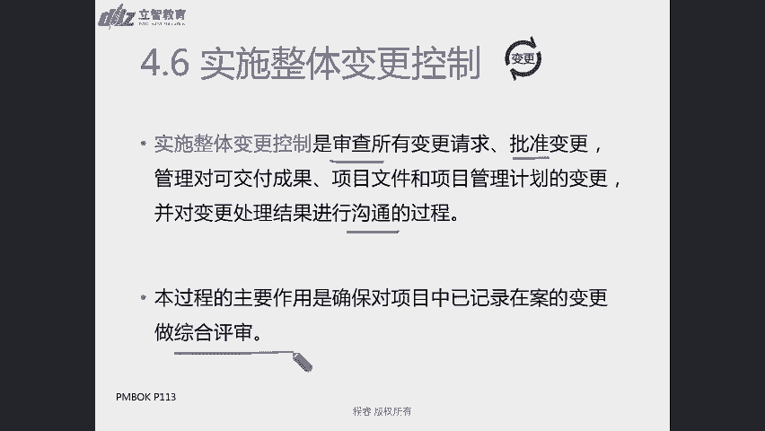

嗯好那我们先讲这个的输入和输出啊。

我们先讲这个的输入和输出，那实施整体变更控制，所以你审批完了，最容易得到的是什么点啊，批准的变更控制对吧，批准的变更控制，那有同学会说没批准的变更控制放哪去了，没批准的变更。

是我们还是在会把它放在变更日志里面，因为他已经不做一个批准的点了嘛，那就在变更日这边去写啊，当初有人批准了，有人提出了这个变更请求，但是基于啊整个变更控制的流程，然后经过大家的评审，认为他不行。

所以我们暂停推迟了或者暂停了，或者拒绝了这样的一个变更日志，拒绝了这样的一个变更日志啊，拒绝了这样一个变更请求，所以我们把它还会在变更日志里面，把它进行记录啊，然后把它进行记录。

所以变更日志一定要记住是什么，有始有终啊，有始有终的过程，所以没批准的变更请求，我们也是在变更日志里面会把它进行记录，因为一开始提出这个变更请求的时候，我就会把它放在变更日志里。

ok所以批准的变更请求还可能会引起什么呀，还引起会引起项目管理计划的，任何组件的更新啊，会引起它的更新，那这是有了这样的一个输出，我们再去推输入，那么批准的变更请求，你总得有个变更请求来吧，对不对。

所以很核心的点就是会有一个变更请求进来，这是一个很核心的输入，其次还会我们会有什么呀，我们刚才讲了，工作绩效报告里面，不是会有下一步的行动和建议嘛，对不对，他们也是变更请求的一部分。

但是同样我们在工作绩效报告中间，也可以找到他们的来源对吧，所以我们会去找到这样的一个来源，那同样呢我们也需要去遵循某些项目管理计划，遵循变更管理计划，遵循配置管理计划啊，配置管一句话就是我们4。

6要讨论的，因为他们刚才讲了，他们是一些很隐藏的一些技术的项目，还有一些版本控制的点，所以我们要在四点对它的变更啊，对整个配置管理信息的变更，我们也都是要在4。6过程来进行。

所以这是两个管理计划来去指导，4。6个过程究竟怎么去做对吧，它是程序性的告诉你什么样的变更请求进来了，我们要怎么去审批，怎么来去记录，怎么来去通知，这样的过程都是变更管理计划来进行输入的。

这样的一个过程，ok那同时呢在这个过程中，我们还有大量会用到什么范围基准，进度基准和成本基准对吧，你批准的变更请求，那对范围成本和进度啊，我们可能会后续都会去考量他们的影响。

所以你之前先要把它拿过来对吧，我得先知道这些点啊，我得把它作为一个输入，然后我研究研究之后可能会把它发生一个变动，项目文件呢可能也是这样的，我可能会把改一些项目文件，所以在这个过程中。

我们会对项目管理计划，项目文件进行更新，会对他们来进行更新，ok那么在这个过程中，我们会用到哪些工具呢啊专家专家说了，总永远算对是吧，专家然后还会有什么变更控制工具啊，会用到一些变更控制工具。

这个稍后我们也会去讲到，然后还会有做一些数据分析啊，再看到底什么样才叫做综合评审啊，什么样才对他有利啊，所以我们还会用到一些决策的工具啊，可能我们不能一言堂对吧，带大家投个票啊。

然后得多标准的角色分析啊，来去做的事情，当然也有可以一言堂的时候说，发起人或者老板觉得我就是应该怎么去做啊，也需要有一个过程来确保，也是一个符合科学逻辑的啊，不会出现问题的。

ok然后我们也有一个会议去传达，或者说在这个会议上来去做这个决定，ok这是变更实施整体变更控制里面，然后我们来用到这样一个点，ok对专家判断是一个工具和技术啊，专家判断是一个工具，专家这个人他不是啊。

但是你去找专家去咨询问题啊，由专家来去提供给你建议啊，那一定是一个工具和技术中的一个一类，ok，好，那讲完变更控制的这样一个输入和输出之后呢，我们我们讲了他是一个非常重要的一个点。

所以我们会把它的重点来去哪讲到，那这页的内容呢是啊，书上啊对应的p120 页的内容，然后同时也在即115页也有相关的内容，点，第115页，书上第115页有相关的点，我们会说在整个项目生命周期的任何时间。

参与的任何的相关方都可以提出变更请求啊，任何人都可以提对吧，你不能去阻碍大家提提想法的这样的一个诉求，所以我们鼓励大家都提变更请求啊，然后来了之后怎么办呢，第一个在基准批准之前，你没有参照系之前。

那变更无需受控，正式的批准流程对吧，基准都还没确定呢，我们的甚至我们的变更管理计划，可能都还没有呢，但是如果我们一旦确定了项目基准，确定了我们整个一个项目管理计划，我们有了我们的变更管理计划之后。

我们就必须要按照本过程来处理所有的变更啊，一定要按照本过程来处理所有的变更，那所有的病跟任何人不都可以提吗，没关系，你们口头提都行，但是所有的变更请求，都必须以书面的形式来进行记录，记录在哪里啊。

是不是记录在变更日志里面啊，对不对，我变更日志作为一个容器，作为一个弓箭，把所有的变更请求都记录在其中啊，并且纳入到变更管理和配置管理的系统中啊，这样的一个我们可能会有一些变更版本控制啊，包括禅道啊。

那些工具不都是这样的一些内容吗，所以我们要通过这样一些版本控制的文件啊，这些都属于变更控制工具啊，这样的一个信息系统这样的一些内容，那除此我们会讲到一个很重要的一个角色，叫做ccd啊。

ccd是一个正式组成的团体，负责审查评价批准，推迟或否决变更决定，以及记录和传达变更处理的决定，c c b是一群人，我们是讲综合去评审，所以综合评审我们既然要做综合评审，项目经理自己直接来去做评审。

是不是有点有失偏颇呀，所以我们尽可能联合一切可以联合的力量，对不对，好，基于我们整个一个啊，这个项目章程和给你的授权范围啊，确定的，以及我们整个变更管理计划里面最终确定的，整个一个变更控制委员会的组成。

是由哪些人来组成这个变更委员会啊，然后我们来去由他们来提交这样的一个审核，然后他们来提交这样的一个审查，所以呢，变更控制委员会是一个正式组成的一个团体，避免一言堂对吧，我们一起来去商量啊，一起来去商量。

所以cc b他们是一个决策机构啊，他们是去定我能不能批准这个变更请求的啊，他不负责干负责干对吧，那对于影响基准的变更呢，都应该是由什么呀，对于影响项目基准变更呢。

应由ccb或者是客户或者发起人来进行审批啊，或者除非他们就是c c b的成员，其实这句话他讲的比较绕口，但是他一直想说的这样的一个核心的点呢，就是你最好得随随避震c c b，如果真的没有的话。

那找谁认呢，找客户或者发起人，他们是掏钱的人对吧，得他们去认啊这个东西，所以这个我们一直是在讲谁是谁谁b，以及对这种变更请求影响的人，都由ccb来去做这个事情啊，有ccb来去做这个事情好。

那在某如果对于有些甲乙双方的项目来说，可能ccd p完了还不算啊对吧，可能还需要客户和发起人进行审批啊，可能和客户发起人是进行审批，因为他们是最终掏钱的人呢，对不对，我们是最终掏钱的人。

所以我们一般这个决策链条一般是什么呢，是由项目经理ccb或者指定的成员，指定成员一般是谁啊，客户或者发起人，或者由客户发起人指定了团队的某些成员，他们代行这个职权对吧，然后来根据变更管理计划啊。

这是一个程序性的计划，告诉我们变更怎么去走来处理变更请求，变更请求会有三种状态，一种是批准好，另外两种我们会统称为不批准，不批准又分为两种状态，一个是推迟决定以后再做决定，一个就是直接否决掉，对不对。

就很类似于啊就是啊信号灯是不是红灯，黄灯绿灯这样的一个情况，对不对，直接否决掉对吧，那之后再说啊啊或者说可以通行对吧，这样的一个情况，这张图呢啊是我们书上没有的。

然后也是希望大家把这张图啊好好的保存下来，折个角或者什么之类的，这张图非常重要，这张图非常重要，后面的题目里面我们会经常使用到它，我们会经常使用到它啊，它相当于是一个非常经典的点。

就是我们会讲整个流程是怎么开始啊，提出变更啊，啊正式的书面的，你口头的我们要把它记录下来了对吧，我们其书面的最好了，我们口头的，我们要把它转化成这样一个正式的书面的，ok然后提出变更之后。

我们得什么先了解变更啊，你变更到底说的什么意思啊，我们得知道它的前因后果背景啊，对不对，我了解你这个变更情况，了解变更情况之后呢，我去想一想，综合评估和影响一下到底会对哪些人产生影响，对不对啊。

会影响到谁，那么我们先去想一想，想完之后呢，我们会去做什么，寻找可行方案好，会有哪几种方法会来去解决这个问题呢，啊我们这就是非常类似于典型的西方思维，一步一步不down去解哦，不能跳步好不能跳步。

所以这是不是我们中国的就是跳跃性思维，它是一个呃有很缜密的逻辑思维，所以看到了变更请求，我们去了解他是不是这么回事，然后我们去评估它会对各方造成的影响，然后我们寻找解决方案啊，寻找可能的可行方案。

所以我们拿着评估影响和可行方案，这两个东西去问相关方的意见，哎你觉得你是不是这么想的呀，你你的认可的点是什么样子，ok啊收集初步收集了一波意见之后啊，我们最终这个时候可能他们还会提出啊。

你这个变更影响范围可能估计小啦，你这个可能影响范围挺大的，你可能会对其他方面也会造成影响对吧，那么我们去看它是否会涉及到基准啊，是否会涉及到基准，如果不涉及基准，而不会去动用那些不变范围基准。

不变成本基准啊，不变这个进度基准不动这三个基准，那么以及我们的绩效测量基准，这样的内容之后不动，那ok我们不需要去找c c b了对吧，你不不涉及钱，不涉及活，不涉及时间的事情，ok项目经理自己去批啊。

你们我的相关方有问了，大家都说了这个事情好，项目项目经理批准了同意，那就开始接着往后去干，更新这些日志，如果不同意，ok我们更新变更日志，告诉提出了相关方啊，你这个否决了，就是这么一个流程。

如果他动基准了，项目经理就没有全批了，必须得找谁啊，去找c c b啊，由c c b来批，由cc bp完之后呢，也一样的，如果同意了，我们就去更新这些文件，更新这些日志啊，通知相关方实施变更请求。

然后最终变更请求情况，如果不同意，我们也要更新变更日志，写一下什么时候拒绝了，或者什么时候要决定下次什么时候去审，推迟了，然后通知变更请求相关方对吧，就是这样的一个流程图好，所以我们拿一个情景。

然后来跟大家说，那比如说我们在做，我们前段时间在做这个事情的时候，我们开发了一个接口啊，接口一个文档给来做，那接口之后呢，他们会有的人就会提出一个变更请求，就是说你这个接口你有车型，车系没有年款。

你应该把年款的信息把它更进一步的细化，所以我要提出变更请求，要求接口里面去加入更多的信息，然后我们就要去跟他去聊对吧，你这个想在接口里面加入更多的一些信息，或者说加入更多的字段对吧。

那你为什么要去做这个事情啊，这个年款的信息我不能在什么车型车系里面，其他的字段里面隐藏了吗，啊都带上这个字段了吗，他说不行，这个其他的那些字段都是放其他内容的，我就得加我这个新的东西。

我必须得加这个这个我我我们这个不同的两款，差价还比较大呢，所以你必须得在接口里面放这个点好，我了解他的这个点了，然后我们就去评估影响啊，那这个嗯他要求在接口里面更新这个点，那现在的接口直接改行不行啊。

啊有人就我们我们团队就要七嘴八黑，就八折去说这个点啊，不行啊，现在的接口好多相关方都在用呢对吧，各个项目都在用，这个事情可能不能嗯，不能只如果要改这个接口，影响挺大的，我们什么时候去实时修改啊。

什么时候去部署上线啊，这个切换怎么去做呀，然后大家就去想这个点，然后我们可能就想到了一个解决方案了，哎这个接口我们是不是可以再做一个接口，新接口出来，然后我们有两个接口来并行来去运行一下，看看怎么样。

如果都确认各方没问题了之后，我们在某一个晚上好，我们再去去替换这个点啊，我们大概有一个解决方案了，然后就拿着解决方案呢，就去和各个使用这个接口的相关方去问啊，你们是不是认可这个点啊，什么之类的。

好大家都说的意见了，然后大家可能对整个这个变更到底怎么去作业，形成共识了，甚至我们可能会形成几个解决方案，来去做这个事情，ok下面我们就去讨论这个事情，涉不涉及到基准了对吧，那涉不记得动不动钱呢。

动不动他显然要改一个那个什么机制，要改一个这样的一个接口，它显然是要工作量的呀，要工作量就要动钱的呀，而且要有一个产出时间了，那肯定是需要去更新这个点，能动了几组啊，要不然我这个接口都已经上线了。

要重新去改这个东西，o那就需要去找c c b的审批啊，客户得看呐，你愿不愿意掏这个钱呢，你看我得花上八天八九天来去干这个事情，你得去认可，你得你得同意，让我去干呢，好c c b呢就批准哈。

你们要花八天去干这个事情，就为了加一个这个破年款，这个要干嘛不加不行吗，对不对，影响这么大啊，然后还不干了对吧，不干了，我们就更新跟着打，就你们这个需求被终止了，领导说啊。

就是客户说ccb说这个没有什么投入产出，比你这个信息不重要对吧，那就不干了，那如果他们就说非得重要啊，这个影响很大，就必须得去干，ok那你只要你掏钱就可以嘛，对不对，只要你们给我们批准新的成本基准对吧。

把这部分加到我们项目里面来，不能说我们这个项目超支了对吧，ok那你们批准我的钱，ok那我就干呗，对不对，然后也给我足够的时间，也给我钱，然后也把它承认它是范围里面，ok那我们就有这个更新的文件。

然后更新的日志，然后我们也会通知相关方来实施这个变更，然后最后变更晚了就结束啊，所以这是一个整个这样的一个流程啊，所以这样一个流程，所以刚才用一个形象发点，跟大家去讲述这个事情呢。

希望大家希望大家一定要去记忆的点哈，就是这个变更出来之后啊，我们得先和团队成员一起先综合评估影响，找到他可行的解决方案，尽可能先征求意见之后再上会对吧，最后再去上，会先尽可能的团结一切可以团结的力量。

再往后去走好不好，然后我们再去提交cc b的审查啊，再去提交cc b的审查，ok就是这张普这张片子是非常重要的一个点，后续你们做题目的时候，一定一定会要用到这张片子的，希望大家啊呃会要把它记住哈。

我要把它记住，ok特别是这里的几个点，了解变更评估影响寻找可行方案，征求相关方意见，ok好讲完这个点之后呢，我们就会这个地方就会放了，刚才我们类似这样的一个比他会更加详细的，这样一个变更日志对吧。

他讲的事情就是啊他会有一个d了对吧，还有分类啊，它的描述，然后是被提谁提出来的啊，提交日期是什么时候，目前的状态是什么时候，处理的意见是什么样子啊，以及这个变更管理计划的模板啊。

变更管理计划的模板呢我们就会讲啊，这是什么项目啊，这个时间是什么时候，然后那个我们会去讲啊，这个如果涉及到范围的变更啊，什么是叫做范围的变更，什么是啊预算的变更，是啊是啊，什么是进度的变更。

什么是预算的变更，什么是范围的变更，然后还有项目文档的一些变更情况，定义到底是什么啊对吧，那c c b的人到底是谁啊，名字是谁，然后角色是谁，他们的职责是谁，那么他们的授权范围是什么样子啊。

整个变更的流程啊，怎么去走，这是一个很典型的这样一个变更管理计划，所以可能很多项目对于这样的一个程序进化，他可能都是类似的对吧，都是c c b都是那些那几号人对吧，cc b的流程啊。

整个整个项目的流程变更流程，都是这样来去处理啊，但是啊我们是要求按照这个程序性的计划，一步一步去走啊，要求按照这个程序性计划一步一步去走，ok那除了讲义上提到的这些内容之外呢。

那书上还有一些点需要跟大家一起来mark一下，就要跟书上一起来去标记和mark一下，啊115页，这这里头我们刚才已经讲到了啊，实施整体变更控制过程贯穿贯穿项目始终，项目经理对此承担最终责任。

因为我们讲了，整个整合管理，都是项目经理来承担最终责任对吧，你是一个整合者，你是那个指挥官对吧，那么在任何项目周期的时，是在项目生命周期的任何时间，参与项目的任何相关方都可以提出变更请求啊。

这是这一段里，我觉得刚才已经跟大家讲到了一个很重要的点，然后第二段的第一句话也是刚才讲到了，就是在基准确定之前无需受控，一旦确定了，就需要按照本过程来处理，在这一段的最后一句话讲到一个点。

对配置要素的任何变更都应该提出变更请求，并经过正式控制好，所以配置要素就是我们刚才提到的啊，这些啊一些很重要的核心技术参数啊，钢架啊，当今的强度啊，然后对于一些开发的项目来说。

这对于一些呃建筑项目来说对吧，那对于一些开发项目来说，可能软件版本号，版本号的控制也是一个很重要的一个点，那下一段的首句话呢讲到了，尽管可以口头提出，但所有变更都必须以书面形式记录啊。

都必须以书面形式记录嗯，然后在这一段的第三行的后面句号，后面开始就开始讲了，每一项b记录在案的变更请求，都必须由一个责任人批准，推迟和否决，这个责任人通常是发起人或项目经理，应该在项目管理计划。

也就是我们刚才看到的，目前屏幕上显示的这个变更管理计划对吧，或组织程序中指定这位责任人，必要的时候，其实应该是这个人其实应该是由c c b对吧，因为我们讲啊一个人去做角色还是比较狭隘的。

我们尽可能是由一个团队来做角色，来分散角色压力，是不是比如ccd来开展实施整体变更控制的过程，ccd是一个正式的团体，负责审查评价批准，推迟或否决变更请求，否决变更请求。

ok在下一段中间讲到了变更请求批准之后呢，可能需要更新，需要新编或者修订，以及在下一行中间提到的前面的这些点啊，前面讲了好多例子都是分啊，都是我们那就是叫什么逻辑结构里面的分，总结构。

是不是他先举了这些例子，然后举了这些例子之后合起来汇总一下，所以他们要新编或者要修订的是什么呀，都是这些项目管理计划或者是其他项目文件，ok，好这是我们啊115。

也希望大家可能稍微需要去重点去画这些内容，好，118页，4。6。2。2，变更控制工具啊，在这个下面去详细的展开了非常隐藏的，详细的展开了配置管理的费用对吧，好好我们看到4。6。2。2，118页，4。6。

2。2变更控制工具啊，配置控制的重点关注，可交付成果及各个过程的技术规范啊，对因为我现在没有办法去投屏，我也是拿着一个纸质书，跟大家一起一起去讲的哈，ok如果稍后的这块需要投屏的话。

我可以把这一块给您截个图出来啊，到时候发给大家，ok配置控制的重点关注，可交付成果和各个过程的技术规范，而变更控制着眼于记录识别记录，批准或者否决对项目文件啊，可交付成果的变更。

那接下来呢在下一段就讲到了三个星号，讲到了配置管理活动，我们要识别配置项记录并报报告配置项的状态，进行配置项的核实和审计啊，一定要进行配置项的核实和审计，ok，啊这是118页很核心的一个内容，好。

那以上呢，我们基本上就把整个这个4。6的过程，跟大家基本上都讲完了啊，119页还有几个点哈，我们会这个目前不是特别常考的一个点，但是希望大家有余力的同学，还是把它记录一下吧，就是我们说变更的工具。

应该支持整个变更管理活动，那整个变更管理活动有哪些内容呢，使识别变更记录变更，做出变更决定，然后跟踪变更对吧，就相当于是把我们刚才的这个大的流程图，进行了一个汇总，识别变更记录变更。

作出变更决定和跟踪变更好，所以如果您记得这个大流程图，其实你大概对这个流程也不会陌生对吧，11 119页上面的一个流程，识别变更记录，变更和做出变更决定，以及跟踪变更的这样的一个核心的点，ok好。

以上呢其实就是我们到4。6之前的内容啊，4。7的过程确实是今天讲不完啊，我们通常的核心的点呢，都会是在下一结课的时候，才会跟大家去讲到4。7的过程哈，所以第四章是一个非常重要的一章。

特别是变更我们就会讲到很多内容，好，我们快速的把我们今天所有的内容，跟大家简单的summ一下，然后再重新回顾一下，我们是从呃4。2开始的对吧，我们讲了制定项目管理计划，制定项目管理计划。

它相当于一个什么啊，整合相当于一个打包的过程，所以呢我们会有很多大量的其他过程的输出，然后我们也会采用kick off，开工会议的形式来去做这个内容，所以啊项目管理计划特点除了打包和整合以外。

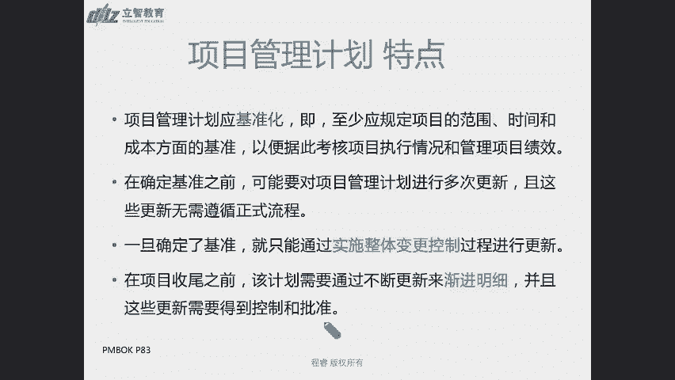

还有另外一个主要特点是基准化，哪些东西特别要做基准化。

特别是范围进度和成本对吧，范围进度和成本o刚才讲了会议开工，会议开工，会议，往往意味着规划阶段的结束和执行过程的开始，ok那具体有哪些项目范围管理计划呢，我们是12+7，12+7。

所以有九个知识域的管理计划，还有需求管理计划，变更管理计划和配置管理计划，变更管理计划和配置管理计划，其实今天都已经或多或少跟大家讲了对吧，变更管理计划已经给大家演示了，我们会讲中间谁是c c b啊。

整个变更的流程以及一些专业术语，什么是范围变更啊，什么是进度变更，什么是文件更新啊，这样的一个定义，我们都需要在变更管理计划中间描述，而配置管理计划呢，刚才也跟大家画了一下书，配置管理计划。

我们应该至少遵循三个流程对吧，识别配置项记录并报告配置状态，进行配置项的核实和审计，这是118页的内容，那啊还除了这些管理计划之外呢，还会有四个基准范围，进度成本基准，还有一个绩效测量基准。

绩效测量基准，那除了这些文件之外呢，还会有项目生命周期开发方法和管理审查啊，这些书会去规定，我们整个项目是按照瀑布流的方式，还是敏捷的方式啊，怎么来去做啊，可能是用哪种语言。

java还是什么方式来去来去做这些内容，或者说我们整体采用的啊，什么分包制啊，或者什么形式，这些都是我们常见的开发方法，然后还有管理审查的节点，除了项目管理计划呢，我们还会有这些项目的文件。

可以方便大家来进行对比啊，这也是书上89页的内容啊，整体大概情况下是左边是程序性的，右边是实体性的，但是不完全这样子啊，因为有些只有这个过程，只有这个单独规划过程的，他就是既有程序性，也有实体性的。

另外我们的基准也都是一些实体性的内容的点，然后4。3呢，其实就是项目经理开做项目的过程对吧，你的工作就是指导和管理工作，所以这个过程会输出可交付成果，会有工作绩效数据会有问题，日志会有变更请求。

然后我们又讲了整个工作绩效，从数据到信息到报告的这样一个流程，先是有原始数据，再有对比分析，然后再会有结论好，然后我们会讲到问题日志啊，我们会讲到问题日志，记住日志性的东西一定是有头有尾，会更新状态的。

会更新状态的，然后我们会提到变更请求，4。3过程嘛，做项目的时候，我们可能会发现有些偏差，我们要提出变更请求，然后变更请求呢可能会把它分成四类啊，纠正措施，预防措施，这是一组需要进行对比记忆。

缺陷补救和更新呢是衍生出来的，另外两类，一个是针对产品的，一个是针对文件，或者我们称之为工件来进行的项目文件和计划，ok然后我们讲到了4。4的过程，项目管理，项目知识管理项目知识。

它包括显性知识和隐性知识对吧，我们在经验教训登记册里面，执行过程里面就可以生成了，ok然后我们就进入了4。5监控项目工作，监控项目工作，其实就是对工作绩效报告来进行，一个产出的过程和一个沟通的过程。

监控是贯穿始终的，监都监控分为监督和控制啊，监督和控制啊，工作绩效报告呢一定要有决策行动，或者是要引起关注啊，然后我们会讲到这个燃尽图的这样的一个形式，然后就进入了我们刚才最重要的，实施整体变更控制啊。

实施整体变更控制，我们去详细去讲述了啊，我们基于这个整个一个变更控制流程，我们就会得到批准的变更请求，我们会有变更日志这样的一个项目文件的更新，我们可能还会有其他项目管理计划，组件的更新啊。

这样的一个过程，所以我们画了很多变更的重点，包括任何人都可以提出书面记录啊，c c b的形式，谁是c c b啊，谁是c c b，以及整个一个变更的流程和流程，希望大家啊回去多看看几遍。

然后做到这些题目的时候，天天测做这道题目的时候，可以把这些内容都把它去好好的去回顾一下啊，这个时候我觉得大家可能，今天听完之后是一个感觉，做完题目之后还会有很多问题，欢迎大家在群里面提问。

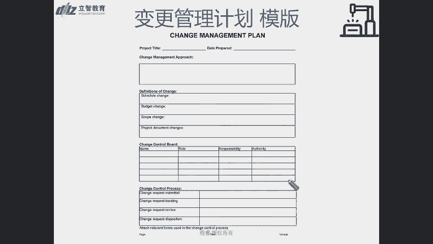