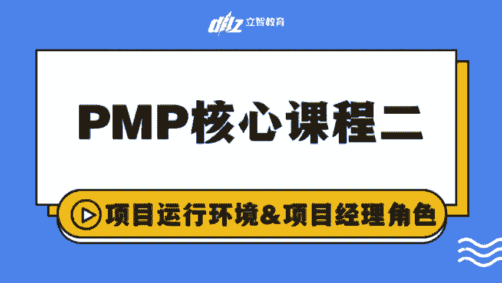
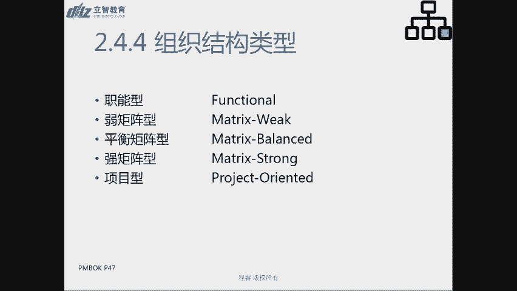
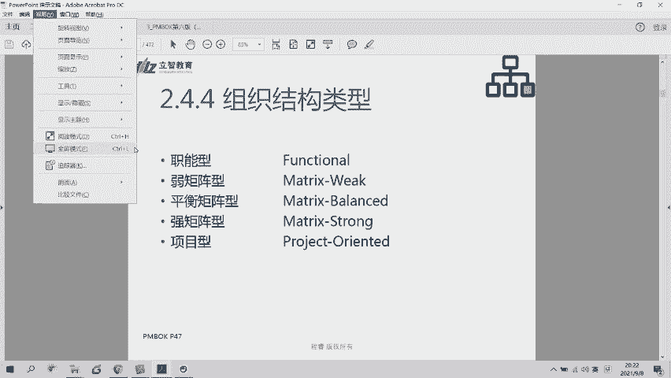
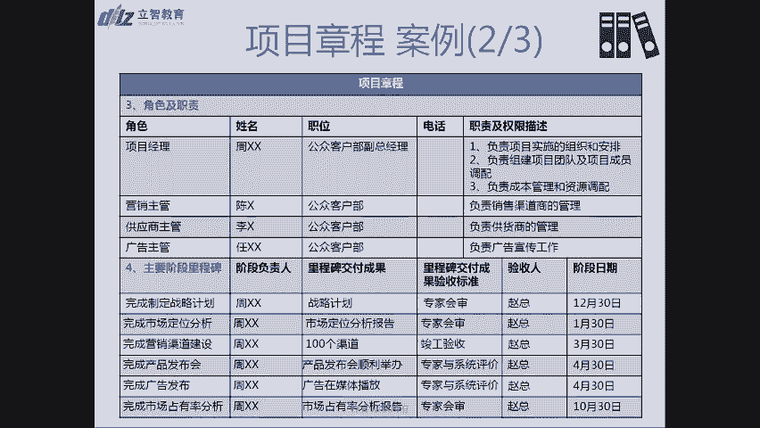
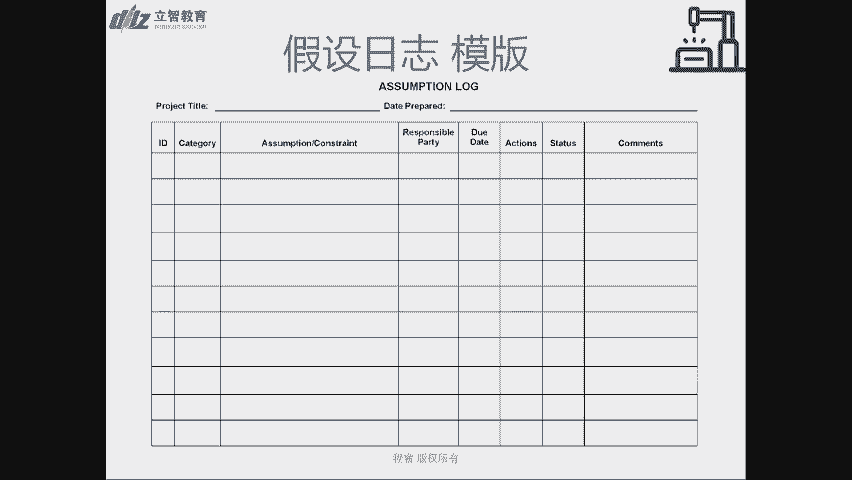

# PMP精讲核心课二：项目运行环境和项目经理角色 - P1 - 立智教育 - BV1Mb411o7zu

那上一次的课呢，我们其实相当于是一个开场，给大家介绍了一下啊，包括我从我的一些经验的分享啊，还有一些相关的内容给大家试用一下啊，b m p是个什么内容，然后通过这个项目管理，希望大家学到什么点啊。

希望大家算是一个啊管理的入门课，和整个职场的一个素质课或者是提升课吧，我觉得这是啊b m p作为重要的一个点，当然大家可能更关注的是考证的问题，上次我们也提到了考证的这些点，其实我觉得只要您按照流程。

按照规范去走，在考前的时候，目前的时候都投入一定的时间和精力，那肯定是能够过的啊，肯定是能够过的，ok那讲完这些铺垫之后呢，上周我们大家啊，sorry啊，前天的时候，周一的时候，那些上一次课的时候呢。

我跟大家提到过整个第一章引论的内容，那也是在理论里面，我们主要是讲了什么是项目啊，怎么是项目管理，然后今天呢我们会开始第二章的内容，项目运营环境以及第三章的内容，然后我们会在今天结束之前。

把前三章的内容重新再做一个review，让大家重新再整体回顾一下，呃，如果大家是在家里，而且手边比较方便的情况下，我还是像我上次说的，我特别推荐大家把那本比较厚的，pinbox的第六版那本书找出来好吧。

把啊对700多页的那本书找出来好吧，把那本书找着，ok然后您拿在您的手机或者是电脑旁边，今天都会把这些内容给大家带到，ok如果您确实不太方便，没有找到这样的一个手头先找，那ok没关系，您可以哦。

刚才让博雅老师，我们班主任把一些电子书，电子版的版本的书也放在群里面了，大家如果电子版方便的话，也可以打开，如果仍然还不方便，如果只有一个终端设备的话，ok没关系。

那您课后的时候你把它再汇总和总结一下好吧，因为我们这些片子里面其实都有啊，是在哪一页，ok那第二章呢我们要开始讨论项目运营环境了，项目运营环境最主要的讨论的两个点呢，其实主要就是事业环境。

事业环境因素和组织过程资产啊，主要是事业环境因素和组织过程资产，那整个跟事业环境因素和组织过程资产，为什么要会会呃，是因为我们昨天不还讲到了吗，sorry总是感觉是昨天在上一次课的时候，我们还讲到了。

就是我们项目最重要的点是什么呀，是十大知识域，对不对，为什么讲了这么半天，今天的内容还没有开启十大知识域的点呢，就是因为整个内容我们也是非常严谨的，我们会先定义我们讨论什么东西，我们讨论什么是项目。

什么是项目管理，那我们就一定会说做项目管理过程，其实啊你一定是在一个受控环境下，或者是受制约因素的环境下，来从事这些事情的对吧，你不可能资源无限，你也不可能啊所有的那你说的，甚至你不可能所有的事情一对。

必须得follow流程对吧，那公司如果有一定的规定或者规章制度，你这个项目就是不能开展了，那你确实就不能开张，所以面对这些制约因素和内容，我们会先讲我们项目经理的工作之前，我们会把整个第二章内容。

项目运行环境，我们整个把环境的内容，跟大家全部都交代一遍啊，跟大家全部都交代一遍，所以在这一部分内容里面呢，我们主要最主要的核心点的两个事情呢，一个就是事业环境因素，一个就是组织过程资产。

那就会提到这个点了，什么是事业环境因素，什么是组织过程资产，那事业环境因素啊，其实呃讲上去呢其实就是enterprise，environmental factors，如果看到这个factors。

你就会觉得就在英语的语境里面，它其实有点就是就是强迫性或者面对性的内容，所以其实所谓的事业环境因素呢，其实就是指什么，就是团项目团队自己不能控制的对吧，对项目直接会产生影响，限制和指令的各种条件。

就是我们自己项目控制不了，那我们项项目控制不了的东西呢，自然就会很显然会分为两类，第一类呢是我们企业内屁股的，第二类呢是起，所以很显然我们就可以把什么事业环境因素啊，区分成啊内部和外部因素对吧。

你会把它区分为内部和外部因素好，但外部因素很好理解对吧，外部因素就包括什么呀，就包括我们这里讲到的这些内容，比如说市场条件啊，法律限制啊啊包括一些道德伦理的一些要求啊，还有一些啊整个物理环境啊。

整个这块的内容啊，那怎么来去讲这个事情，那比如说嗯我们会举个例子，比如说那个p two p，是不是不知道大家有没有这个印象，然后之前因为我也做过一小段时间，金融科技相关的项目。

所以很明显感觉到那当时即使在银行里面啊，这个这些这些相关的业务啊，理财啊，然后再融资啊，这些内容也太方便能开展，更何况在外面对吧，那所以啊对于这样的因素不允许你做了，那就是要求合规，这是政策法规的问题。

那显然就是事业环境因素，所以受到这样的事业环境因素，对项目肯定会有直接的影响，对项目会有直接的影响，那什么是内部的事业环境因素呢，其实很显然，比如说我们组织内部的架构啊。

因为我们后面也会讲到组织的运行呃，我们的组织运行环境对项目的影响对吧，那你到底是一个啊在什么样的一个组织里头，这个组织是从上项目文化，大家都是在项目制的下面来干活，还是说这个组是从上啊。

类似于职能性的啊，大家都是条块分割的啊，也会对你整个项目的推进会产生很大的影响，甚至我们呃来从事项目的方法，都可能会不太一样，有可能会不太一样，ok所以这也是事业环境因素这块的，我们的举个例子。

那接下来就可以跟大家我们简单来说说，比如说我们在如果做一些一些很多，外国项目的时候，一不利的政策不利的因素，比如说罢工啊啊出现了罢工的情况，那您会觉得它是什么，一定是事业环境因素。

而且是外部的事业环境因素对吧，这是比如说罢工啊，对整个这个项目的影响o所以讲到这些内容呢，其实都是外部事业环境的因素影响啊，比如说呃我不知道有多少同学在大连，大连最近外卖是不是不太好点，是不是啊。

那么在这个过程中，就是因为创城的被影响，不允许大量使用电动车了，所以在这个过程中间，您会觉得啊对于外卖企业来说啊，他们会觉得，这个对我们的生意，也是会受到一定的冲击和影响，这些都是外部的事业环境因素。

但内部的事业环境因素呢，其实我们刚才讲完了，我们组织的相关的内容之外呢，还会有什么样的因素的影响，那比如说啊我们呃我们的机房，我们的云设施啊，我们工单位统一规定它都放在这个位置。

那这个位置发生了断电或者什么的因素的影响，那可能会对我们的事情造成影响对吧，还有比如说有些就像我们单位，我们我们总不是一个在上海的一个集团，那我就会觉得，其实嗯，我们在招聘一些相关的市场营销人才的时候。

我就会觉得啊我的team在大连，那我整个贷的事情，我觉得我会受到限制和影响，因为我我的员工的能力的水平其实是不太够的，所以我在内部的时候我会看到哎我们的成都，我们的杭州的团队。

他们在其他的方面是能够补充我们短板，所以在这个过程中间，其实各地人工能力，或者是他们的思维倾向性的不同，所以我们才会提到这个点，他其实也是内部事业环境因素的一部分，好吧嗯。

所以我们就详细的把什么是事业环境因素，跟大家brief了一遍，那接下来呢讲，我们刚才不是说对项目运行的影响，首先就会分为事业环境服，其次还会用什么呀，这过程资产啊，主过程资产那可能会有其他不同的翻译。

就是在这张图里面把它翻译成了内部，组织过程资产好，但是请记住，事业环境因素也是包括内部和外部，ok那组织过程资产主要讲的事情是什么呢，他讲的是形制啊，比如说组织过程资产是执行组织，所特执行组织。

我们不都是项目吗，我们不就是项目的执行组织吗，因为我们不是项目的需求组织或者发起项目的，需求组织或发起组织是项目发起人，那我们整个项目团队，项目经理所带领的项目团队就是执行组织。

执行所知组织所特有并使用的计划，过程，政策，程序和知识库也会对项目管理产生影响，但因此呢下面就会把它分为两类，一类是过程政策和程序，一类是组织知识库，那读知识库，知识库呢我觉得是特别容易去讲的这个内容。

因为比如说我们公司我做过很多网站，开发小程序电商的项目，那如果我再接网站开发小程序的项目，那对我来说我我有很强大的组织知识库对吧，因为我在做这样的项目的话，我是有经验的。

我可以直接把以前的经验来进行复用，这些东西我们都是存在一个我们的组织，可复用了一个我们称之为钉盘里面啊，我们会在其中进行服用，所以呢这是我们的一个组织指示库，那其次呢而且在这个过程中间。

我们自身项目在做的过程中，我们还会不断去更新对吧，其实呢还会有一些过程政策和程序，那比如说我我刚才举的例子，那我们经常会做网站啊，小程序的项目，所以网站的建站更新要怎么使用，我们有完整的过程。

我们有政策和程序，那这些东西都变成了嗯，很相当来说是规范和流程的一部分，所以这一部分呢一般会由p mo管理办公室，或者项目外的职能部门来进行存储，由他们来负责更新对吧，这是一个通用的。

是的适合一些相关的内容的东西，所以呢我们就会称之为这类呀，是组织过程资产，那就讲到这个地方呢，我就会跟大家，可能会跟大家室友的一个很重要的一个点，就帮大家去比较一下什么是啊e f，什么是这个o p a。

那o t a这个地方用的单词是asset，asset，asset呢更加强调的事情是，就是我是可利用的，这是一个资产嘛，对不对，我能不能用，想不想用，我是可以自己去做决定对吧。

而事业环境因素呢更加具有一些强迫性，就是说你必须，你会面临到这种各种各样的限制性的条件，所以我们通常会有这么一句话，称之为可以，大家可以开始做脾气了，就是但凡你能，但凡你必须需要限制的就是事业环境因素。

但凡你可以利用的就是组织过程资产啊，就是如果我可以使用的啊，我可遵守，可不遵守的，然后我觉得遵守啊follow这些规则，或者在这个规则上进一步细化，我们自己的事情的这些内容的，我们就称之为组织过程资产。

所以有的时候啊，eef和op a之间其实会有两面性，就是说有一个东西如果你必须遵守，ok他可能就是事业环境因素，如果它其实可以在这个因素上，没有这么强烈的限制性，那么在这个过程中间。

我还可以再进一步的延展或者是创造一些东西，那我们一般会称之为这类事组织过程资产，然后无论如何呢，他们其实都对项目呢会产生较大的影响，他们都会对项目产生较大的影响，所以呢我们就会把它放在什么。

第及项目运行环境里也来对吧，ok，素如果你觉得可以利用的，我们称之为组织过程资产，就是简单来记忆这个内容，大原则大方向是这样的，好，假设工程资产和事业环境因素之后呢，呃其实呃如果大家手头有书的情况。

下面好，大家可以往后找一找我，我想在讲2。4。4过程之前呢，我们在brief，另外一个内容是在书上的第44页，可以看到吗，呃驻场第44页，中间又特地，我们昨天不还讲了，项目及项目组合和项目之间的关系吗。

就，那么大的，一个，对的是几个关注，共同你个脑瘫对另外一个项目有没有影响，项目组我是什么，我们举的例子是组合，所以项目祝大家会竞争相同的嗯，还讲到了那个在讲47页。

关于组织结构类型之前呢，我想给大家补充一个点，希望大家翻到p44 页的内容，然后我们又review了一下，昨天讲到了项目集，项目组合的内容对吧，我们讲到项目组合是竞争相同资源对吧，公司的资源是有限的。

人是只有这么多的，那在这个过程中，我们接哪些项目不接哪些项目，做哪些项目不做哪些项目，其实是有一个投资回报考虑的内容对吧，所以这是我们讲到项目组合的问题，那ok在这之后呢，在44页和45页的时候。

提到了一个很小的一个知识点啊，讲到的内容是什么，讲的是项目治理和项目管理之间的区别，就是什么是项目治理，什么是项目管理，那呃这个用英文词呢，治理是governance，然后管理是manager对吧。

management，那治理和管理这边的，在中文解释上的区别点是什么样子呢，就治理更加强调的可能是类似于公司的董事会，那管理呢可能讲的是公司的总经理，那所以董事会对公司的公司的控制呢。

一般是我们称之为治理，而管理呢一般是具体管哪些事物啊，总经理获得授权了，我具体怎么去做啊，这就是我们常讲的治理和管理之间的区别，所以昨天我们有讲到，昨天晚上有个同学有道题目吧。

是讲的o p m o p m，其实讲的就是组织级的项目管理，组织级的项目管理，那呃项目治理里头我们最核心的点是什么呀，项目治理的核心的点，治理和管理的区别，刚才我们讲的是董事会和总经理的区。

可能会有些同学还是不是能够特别能够make sense，能理解到这个点，那么您可以这么去理解，就是但凡你们公司发了一些红头文件呢，其实类似于这种就是规章制度啊，这种类似于为整个公司提供这样一个。

框架性的东西，或者是有的公司可能会发布一些未来的愿景啊，白皮书啊，甚至类似于小米决定我们要开始造车了，这个事情呢都是董事会所做的决定，然后说清楚这个公司治理要求的内容的，那我们一般这种框架性的东西。

或者是方向性的东西，我们一般称之为治理governance，那管理呢就是讲总经理下面具体去做的，这些事情是什么类型呢，就是说我在这个框架，在这个大方向下面，我具体管理哪些事情啊，具体管理哪些事情。

所以在这种情况下，我们就会说这就是一个管理工作，所以在呃在书上的44页和呃，这应该是43页对吧，就讲了是治理的框架，中间具体提到了以及什么是管理的要素，那这个点呢基本上考试的时候不会考。

所以在这张片子里面，我们呃没有去体现这个点，那为什么跟大家今天来brief一下这个点呢。

是希望如果您在考试过程中间，再遇到一些相关的内容，您可以基于这个啊来有所呃，有有一个这样的一个基础概念嘛，对不对，所以治理是比管理更高级的，111个内容好一般啊，董事会或者是呃呃。

我们会讲他的工作一般就是玩，一般就是治理，一般就是治理好吧，ok那结束了这个内容呢，我们可以再次回来，我们开始讲到我们啊47页的内容哈，一开始我们要会开始讲到了组织结构的类型，就是我们刚才讲到了。

组织结构，对公司商业项目的运营环境是会产生影响的，那会有什么样的影响，会有什么样的组织结构类型呢，以及怎么产生影响呢，就是我们下面要讲的内容，那首先第一种类型非常好理解，什么职能型对吧。

我觉得可能会有很多国企呀，或者说是啊很多啊，相关就是比较传统的公司，可能大多数都会采用这种职能型的这种组织，您说我们会分为职能部门，每个职能部门下面会有各自的员工对吧，然后职能的员工的情况是什么样子。

就是一个典型的职能性，那职能型的，这是一个或者说职能型的组织里面呢，在这个情况下面，一般就是没有项目经理这样的一个title或者点，就是项目经理只是一个他工作的一部分，对吧哦我可能呃比如说这张片子中间。

我们举个例子，这个员工a1 b2 b3 c3 ，他们可能同时在做一个项目，那么可能我们会说领导者，一般可能是他们的职能经理在领导这个事情啊，比如说这个地方看上去好，这个项目就在这个公司里面。

有可能因为我不知道上下文背景，有可能是职能经理b，因为他的人最多嘛，对不对，有可能是他来负责做一部分这样的工作啊，但是大家是一个团队，然后我们把这个事情给做完，那这个时候呢一般没有呃。

项目经理的这样的一个title，大家就是在这个职能智能系里面，我们大家一起来去做一些事情啊，这是职能型的组织，对在职能型的组织里面呢，其实大家强调的是分工对吧，大家强调的是分工，那这样的环境呢。

其实对来做项目来做这个事情呢，其实是影响是蛮大的，影响是蛮大的啊，对因为我们来做项目的时候，怎么就是我们讲究的，我们还记得我们上次讲的事情吗，我们希望我们这个team是能够合理的，大家朝着一个目标去走。

而且在这种情况下面，大家的考核啊，各种权限都不在一起，所以其实对项目的挑战和风险性是最大的，在讲完职能型的情况之后呢，我们就会讲到了啊，我们就我们就会讲到啊，这几张片子我先跳过去。

我会回过头来再给大家讲的，我们就会讲到项目型啊，我们就会讲到项目型，项目型正好相反，就是我会看到据我的观察哈，会很多一些互联网的新兴的互联网企业呀，然后包括一些就是比较革新的一些企业。

比如说我接触的车企里面，长城我觉得算是比较革新的，他们就是呃所有的一个车型都是一个，他们称之为作战单元，而作战单元其实就很类似于一个项目制，但这个项目经理下面他有最大的权限，我对这个车型负责。

这个车型卖的好不好，我我们整个团队是要负责任的对吧，而对于传统车企里面，大家可能分的很细啊，谁是自造，谁是产品经理，部门制造又分好多，比如说是总成的发动机的什么什么的，会有各种的，那对于长城来说。

我在我这个team里面，我各种各样的人，我都有了各种各样的角色，我都有了，我们自己就能设计出来一个车，设计出来一个测试后，我们自己负责这个车的销售，销售政策的制定，对于从销售到整个设计和生产啊。

他们其实都在一条线上面的边，对他们就是一个很典型的项目型，那项目型呢其实是做对于我们来说，做项目经理来说，应该是我们最乐意看到的点对吧，是我们最希望点，因为在这种情况下。

我们推行项目的阻力会更少一些对吧，我们都是在一个点下面来做这个事情啊，一个点下来做这个事情，那另外对于像我刚才举的例子，作战单元下面呢，他们其实类似于就是整个h9 或者h6 ，他们其实相当于是什么。

他们您可以理解成这是一个项目集对吧，这个项目集都是坐h9 的车，但是大家分别做h9 的车的不同的部分，所以在这种情况下，我们甚至可以称之为做的多单单元，就是一个项目集群里啊，就是这样的啊这样的一个情况。

所以讲完啊这个那个职能型和项目型之后呢，我们就会回过头来讲究一个矩阵型，因为其实呃很多目前的纯现在纯职能型的，据我的观察其实也比较少了对吧，所以在这种背景下，其实我是可以观察到，有的大家会有一种局限性。

但是我有的时候我还是有职能经理，但是我这个时候又出了一个项目经理的经理哈，又出了一个项目经理的经历，那在这种强矩阵的下面呢，项目经理是有title的，然后他可以拉着这些人一起来干这个事情。

所以项目经理怎么样啊，他也是一个全职的工作，是一个指定的角色啊，所以在相当于是在职能环境下取得了一个平衡，对吧，它比项目制要退了一步对吧，我这些人不是我这个不是我我我这个部门的。

但是我有很大的权限可以把它都拉在一起啊，我有很大的权限把拉拉在一起，所以有的时候我们呃，我当时呢我们一般讲会讲的是这个，当时在excel的时候，我们老师说这个很常见的一个点，就比如说这个部门。

可能平时的绩效的点都是职能经理来做的，但是至少在强举政治组织里面，他的年终奖和各种项目奖，项目经理都是可以说了算的啊，他至少有一定的财权了，是不是啊，他也可以跟职能经理之间来进行有效的互动。

ok所以这是强矩阵性，那ok我们又会把这个刚才讲到的项目型，退到了强矩阵型，然后我们再退一步就变成了弱矩阵型，在弱矩阵形形式的情况下面，就没有这个项目经理的经历了，这样的一个角色了对吧。

那么它的核心点是，大家都是在不同的职能部门里面啊，大家都是在不同的职能部门里面，但是呢那个我可以我可以，我可能获得了一个全职或者兼职的，就是至少有这么一个title了。

我可能是一个兼职的点啊或者什么之类的，但是我可以拉着一帮人一起来去做这个事情了，我可能其他的时候还有自己的一些本职工作，比如说在这种情况下，可能这个职能经理是设计部门，这个b可能是开发部门。

c可能是测试部门，那比如说这个产品经理，这个部门的人，带着所有的同事一起来做这个项目啊，看啊在这个产品经理的时候，他同时也兼任项目经理的这样的一个角色，就是一个蛮典型的一个事情，或者说是哦，有的时候。

然后他来同理这些事情啊，也有可能是这样的一个情况，所以他可能还是有他自己平时的工作，但是他也能做一些项目经理的一些工作了，同时他还有个title对吧，所以他相对他来说，sorry，相对于这个强举人来说。

它其实退了一步，他在这种情况下面，他并不是一个全职的角色了啊，他可能是一个兼职的角色，所以麻烦大家在这个slice上面notes一下，就是记录一下这个项目经理，可能是一个是一个part time。

一个兼职的一个点，而对于强矩阵型的时候，他应该一般来说哈，他应该都是全职的一个角色，ok所以我们从一个呃全职的强矩阵的组织里面，退后退了一步，然后到了平衡组织再退一步呢，我们就会去了一个弱矩阵组织。

在弱矩阵组织里面，甚至项目经理都没有一个抬头对吧，但是我们大家一起来去做这个事情了，但是在这个情况下面，不是由直男经理来协调了，而我们整个team里面，我们自己可能就有一个人，他负责去来协调一些事情。

他负责来去做一些协调的工作，所以这也是工作他他工作里面的一部分，但是您显然会感觉到，啊我们会从职能型到弱矩阵到平衡矩阵，到强矩阵到项目型，整体的感觉是什么样啊，就这项目资源的可用性越来越强。

是不是我说了能算呢，对不对啊，我想要啥资源，我自己我有我有能调动的人，而越往弱取分型，或者越往项目型的组织里面呢，我们可能更加侧重的是协调啊，这个时候呢我可能需要跟各方去达成一致啊，告诉大家啊。

这个我们项目确实很重要，你看我们这个会有多大的影响什么什么的，所以你借个人给我吧，怎么怎么怎么的，所以确实对一个组织，对一个项目运行环境会有什么，会有一个比较直接的影响。

o所以这就是我们讲到的比较典型的职能型，弱矩阵型，平衡型，强矩阵和项目型，那除了我们在片子中间所列的这些类型之外呢，呃可大家可以翻到书上的第47页啊，书上的第47页，我们还有会有一些其他的类型，找到吗。

可以好，一个是我们会从比如说系统型或者简单型，就是这个公司一个创业公司可能人比较少，大家都背靠背啊，几个人一起开始创业的时候，这个时候我们一般称之为他的人，公司形态会是系统性啊，会是系统性或者简单性。

然后往下走之后呢，我们这个地方还会出现一个什么呀，好多部门型，是不是好多部门型这个地方讲的一个点，其实蛮呃让我找一找，其实有点类似于哈，我们会讲的一个事业不行的这样的一个点。

就是在一个事业部下面怎么来去做这些事情，我也会讲的是这样的一个事情啊，然后再往下走呢，我们会有什么啊，项目导向型，在这个项目导向型里面呢，它又会把它区分成了复合型和啊混合型，所以它要把它进一步来区分。

还有虚拟型混合型和p m o型，p m o型啊，p m o呢就是我们接下来要开始讲到的内容，就是项目管理办公室了，ok呃，项目管理办公室又是一个什么样的一个起源呢，其实就是他是负责什么。

对项目相关的治理过程进行一个标准化，所以就是为什么前面我们要讲治理对吧，它会有一个框架和一个架构唉，比如说我们做项目必须用哪些文档啊，比如说在这个过程中间，我们有什么流程审批的点啊，这过程这个框架对吧。

做做事情的框架都是治理过程嘛，都是由来谁来做的呀，都是由项目管理办公室来做的，并促进资源方法论，工具和技术共享的这样的一个五个结构啊，所以在这种情况下面呢啊pmi非常喜欢喜欢分类。

是不是又把它分成三种类型，一种是支持，一种是控制一种指令，什么意思啊，支持性就是我负责给你提供顾问的角色，就是我给你提供模板啊，你参考我这个点，我还给你提供培训，我给你最佳实践，你就从我这里去参考吧。

这样的一个组织的这样的一个办公室呢，其实他对项目控制程度还是相对较低的，那在这种情况下面啊，还是啊，还是就是对于项目经理来说还是比较友好的，是不是我们真正可以称之为他们是我们的娘家，有啥事。

我们找他就给我出谋划策了，那第二种类型呢是控制型，就是这个时候我不仅仅是给你支持了，我还需要你服从，比如说以前是一个表给你可以参考，你可以使用啊，接下来控制型的时候，这个表你得填呐，你得你得交给我呀。

每周每周几反馈一下项目状态，唉这种情况下面其实就是啊，开始是一个控制型了，但是他还好还没有对你的项目工作指手画脚，对不对，他只是说你每周必须得给我一个反馈，给我个报告对吧，那接下来呢我会说指令型。

那指令型的就会有的时候他就会直接控制你啊，这个项目你就应该这么去做这个项目，你的情况问题的点，然后甚至会经常会做一些审计啊，或者呢你得定期给我进行record，然后我们会进行评议。

这个时候呢我们经常会称之为指令型，所以从朴素的道理来讲，我们可能会觉得啊指令型的这种婆家和娘家啊，这种娘家是不是太苛刻了呀，对不对啊，反应太苛刻了，但是其实换种思维去想，当你项目遇到困难的时候。

你除了去找发起人，那其实如果你在指定型的pmo的里面，其实有很多事情都可以让po来帮你协调，对不对，任何事情是吗，都是双刃剑啊，对不对，任何事情都是双刃剑是吧，所以啊就是我们会讲到啊。

项目管理办公室的这样一个点，所以呃项目管理办公室，他们是把这些项目来进行集中化的一些管理，所以呃项目管理办公室，通常管理的项目是什么类型的呀，是不是一个项目组合的类型的项目，对不对。

因为他们要为公司的整个投资角色来负责，这些项目我都管，甭管你是相互之间有没有关联关系的，那我是对老板去负责任的，我得对ro ro i投资回报率来负责，所以我也得等着对公司的这样战略落地的。

这些项目的情况来进行汇总，所以项目管理办公室，那一般也都是会管理这些啊，相符了啊，可能是支持性，也可能是控制型，也可能是独立型，k，嗯好那讲完这个点之后呢，我们第二章的内容基本上就算是结束了。

那接下来之后呢，我们会就会讲到一个第三章的内容啊，第三章的内容，项目经理的角色，项目经理的角色呢，其实我们昨天的课里面，已经跟大家讲到了很多相关的内容对吧，我们会讲啊，您项目经理应该去做。

就是您是一个协调者的角色，你得有一个管家思维啊，你得把所有的事情都统给统领起来，那我们期望项目金额应该是一个判刑的人才，那在这个过程中间呢，其实书上的第写希望大家翻到书上的第一啊，没有这么快哈。

希望翻到大家书上的第51页，在51页中间其实就有我昨天那个比喻啊，就我们会说对于一个大型的项目经理，和大型的管弦乐队的指挥官来进行对比的话呢，其实我们就会说啊，这个帮助大家去理解项目新的角色。

那成员的角角色，大型的项目和大型的，就是整个一个什么音乐会里面的乐队，就是整个一个大型的演奏会吧，他们都会有很多成员啊，有的人会啊钢琴，有的是打鼓的，有的是各种号，什么小号，中号大号什么之类的。

那他们就相当于我们项目中间的什么啊，各种各样的角色，什么设计啊啊前端开发后端，然后架构师，还有或者是我们说的测试啊，或者说呃其他传统项目里面，我们也会其实也会有讲到的，比如说什么呃三电工程师啊。

各等等各种各样的角色，那么呃他们项目经理和指挥官，就是那个乐队的指挥家，其实都很类似，他们都是为整个团队的成果负责的对吧，我们也昨天也提到了，老板付给pm的钱，是希望pm把整个项目的目标能够达成。

是为了带领团队，所以付给pm的钱工资为什么高，是因为付给你的钱是让你看过整个团队的，所以他其实和管弦乐队的指挥官很类似，你得把大家的所有的人，让所有所有的团队成员啊，所有的团队成员。

让大家达成自主性和一致性的统一对吧，有节奏的去演奏这些事情，可以让整个团队有自主啊，即大家发挥大家的聪明才智啊，创造力和想象力，又有同样的一个目标去往前使劲啊，这也是所以节，所以我们经常会说。

项目经理的节奏感真的是非常重要的，所以呃书上的第52页，中间就会提到一个内容，好，就会说知识和技能的点，就是对于pm来说，其实有的时候你可能不需要掌握每种运乐器，但是你需要通晓整个音乐知识和理解经验。

对对项目经理来说，你可能不能把所有的设计啊，开发呀，业测试的活你都能干出来，但是你需要具备一个项目管理知识，技术知识和理解经验能力对吧，所以这个能力是什么点呢，我们就会通常就会说到这里讲到的人才三角。

人才三角，所以你既要能够带领团队成员，音乐需要有一定的流程的管控能力，同时还会有一些战略和商务，就是对环境的感知的能力对吧，所以就是我们会讲到人才的三角这个点，然后呃这里我还会讲到一个很重要的一个点。

是老老请大家翻到书上的p53 页，53页中间还有一个很小的一个概念的点啊，很小的一个概念的点，讲的内容是什么，讲的是像那种有有那里有一张大图，不知道大家能不能看到好讲的是什么，项目经理的影响范围。

所以项目经理最容易影响的是谁呀，这是项目团队对吧，和资源经理，资源经理也是我们通常提到的职能经理啊，因为你要去找职能经理要人啊，要啊，或者说要一些采购的权限啊什么之类的。

那其次呢我们会讲到它会影响到发起人啊，需求组织领导机构指导委员会po在外层呢，我们就会讲到它可能会影响到相关方供应商，客户和最终的用户，所以我们会讲项目经理啊，其实就是领导下面有一句话。

项目经理领导项目团队，实现项目目标和相关方的期望啊，然后麻烦大家把这句话给mark一下，麻烦大家把这句话给mark一下，所以我们会说它其实是一个沟通者，对不对，它是一个协调者和沟通者，ok。

好然后讲到这之后呢，下面就会书上就会详细展开了啊，你需要什么样的能力啊，什么之类的行业的啊，学专业知识的，ok这个我们都可以快速跳过，所以就会来到我们片子上面呈现的这个点，p57 页。

这个内容就是啊我们pm i的人才三角，这也是大家，我对这张图我想多讲一讲啊，我想这张图我想多讲一讲，为什么呢，这张图我们会侧重讲到的点，就是我们的考纲相关的内容，对不对啊，上次课周一的时候。

已经把考纲跟大家一起分享了，我不知道有多少人打开了，对不对，所以我希望大家能看到的点，第一个讲到领导力了，我们的后面的课呢，还会拿着这个考纲反复跟大家讲，包括我们的串讲课呀，还有冲刺课。

我会把这个是整个事情帮大家带重新回顾一遍，包括我们的串讲课，也是按照新考纲重新编排了一下，给大家一个呃，希望大家去填写内容的这样的一个呃，我们会称之为工作不符，what book应该是叫做工作簿吧。

就是希望大家在这个过程中，把你啊听到课的内容写下来，所以领导力领呢我们更多讲的是指导啊，激励啊，带领团队所需的一些知识技能和行为，那在这个过程中我们也会有详细的一个展开，那技术项目管理呢。

我们中间更多的，我们上次也讲到了很多，这个流程方面的东西对吧，管理领域特区的知识技能啊，是一个就类似于手，我们会说项目经理也是个手艺活对吧，你的工作分解结构怎么干啊。

你的整个那个政治管理怎么去计算这些东西呢，都是在这样的一个内容中间，考纲就在群里面，你网上再找找，有一个我给大家特地发的是一个链接，你把那个链接打开，就是一个pdf的文件好吧。

ok然后我们讲完啊pmi的整个人才三角之后呢，我们就会讲啊，项目经理需要有这些方面的能力，ok那我们项目经理有这些能力之后，我们还有什么点啊，我们有什么有什么一些权利呢，有的你你也是有这些权益的。

但是说实话，其实我不是可能跟我的环境有关系哈，我也是在一个类似于矩阵性的组织，甚至是一个我会称之为均衡呃，平衡型的矩阵组织里面嘛，我其实我经常会跟我的下面的一些，项目经理的人说。

我说嗯你们其实不要老是觉得自己的权力很大，今天哈佛那个明天只会这个什么之类的，我觉得真的就是你也需要去考虑团队的感受，对吧，就算你有这个权利，你都想把你的团队全员给逼走嘛，对不对，所以从我的角度来说。

其实我觉得所谓的这些权利啊，或者点，其实最大的点就是你需要有一些个人魅力，你需要让你的团队成员，因为你是执行组织的头对吧，你是执行组织的依靠，你需要让大家觉得啊，这个我我这个领导啊，对他他对我亮。

总对我特别好对吧，他处处为我着想啊，客户有什么需求，他都会跟我去帮我争取啊什么之类的，只有这样的话，你才能够团结你的团队嘛，对不对，所以我往往会觉得，其实所谓的权利或者领导力啊。

其实更多的最大的点是个人魅力，只有这些东西不太好用的情况下，会有的人真的需要去点的情况下面，ok我们可能会才会用到其他点，就是我们讲首先你是有一个地位的，你会有一个title对吧，项目经理的抬头。

至少你是个经理了，manager了对吧，现在经历太多了，是不是，然后其次呢你会有一些奖励相关的，那么像我们我们会我们部门，我们单位就会给一些项目经理，一些奖励的权限啊，他至少每个月有一个。

他自己可以凭一个优秀项目，下面下属的一个优秀团队，优秀的人，那我会给他这样的一个奖励啊，这是奖励相关的啊，500块钱对吧，那我至少有个全了嘛，对不对，然后下面呢就是处罚和强制力的问题。

就比如说我觉得你这个事情确实干的不对，然后又出问题了，我们可能会通报批评，或者一起开会的时候讲一下对吧，这这这些都是你的权利，然后还会有一些参考的权利，什么是参考的权利啊。

就是大家啊去大家以你为参照物对吧，觉得啊对对对，这个他这个项目经理做的真真棒啊，真不错啊，是不是，所以我们以他而来为尊重，所以你的一言就是我经常会跟他们说，你的一言一行大家都看着对吧。

我今天还跟我下面的一个项目经理说，我说那个我是在他们的群里面，我看我私聊跟他讲，我说你团队群，团队同事给你提了一个一个很好的建议，也不是一个就是他们在干一些活，然后有各种各样各种不同的发散的思维。

然后他去告诉人家，我觉得这个地方有问题啊，这个地方不对，然后我我我会跟他说，我说我说我建议你谨慎一点，我说你那个语句不如莫不如换成这样子，如果把这个东西换成这样是不是更好呢，对不对，你不要去否定他人。

而是换一种建设性的意见去鼓励和引导他人，我说这个其实就是一个参考的对象啊，大家大家其实在这个过程中间会觉得啊，你有专业性，你有内容的点，所以我会尊重和赞赏你啊，获得大家的一个信任的点。

那接下来呢我们还会有一个关系的能力对吧，就是你你也和不同的人在一个公司团队里面，大家会一起吃饭，一起共事，所以大家人际关系交往怎么去开展，这也是蛮重要的一个点，最后是一个专家权利，就是说啊你讲的话都对。

是不是啊，你会有又有p m p的证书对吧，所以也是鼓励大家不断的去学习，然后不断的去了解新的跟项目管理，或者跟您行业更加相关的内容啊，这些都是正是因为您只有这样的一些，魅力的发散啊。

所以大家会觉得嗯你的信息的点很足啊，我我觉得我得尊重你啊，这是一个权力的所在，所以讲到这个之后呢，我们就会自然去聊到什么领导力风格了啊，讲到领导力风格之前呢，我可能还会呃。

让我让我看一下他们两者之间的关系，ok讲到那个领导力风格之前呢，我希望大家能在领导力风格之前，找到那个p64 页，我们会再讲另外一个小的一个知识点，就是管理和领导力的区别啊，管理和领导力的区别。

这个点其实我们刚才已经渗透过很多内容了，就是什么是管理啊，管理其实就是告诉一个人，你必须去到那里，对不对，所以书上六四事业已经了，麻烦大家可以把这句话找着把它画出来，而是在呃64页，第一行和第二行。

管理更接近于运用一系列已知的预期行为，ok指使另一个人从一个位置到另一个位置啊，这个地方就是管理，领导力是什么呢，领导力是什么，通过讨论或者与他人合作，带领他们从一个位置走到另外一个位置啊。

代理他们同一个位置，就相当于说管理就是我告诉你，你必须得去，那你就必须得做这个事情，那领导力呢是说哎，我告诉你整个事情的前因后果啊，我如果我是你，我觉得我可以这么去做这个事情，你看你是不是这么去做啊。

他一听觉得啊这个领导说的有道理啊，是不是我得这么去干嘛，对不对，所以呢这就这就是我们通常说的领导力，那管理和领导力呢，其实嗯当时我们在讲的时候，我们会说他们其实没有优劣之分。

大家第一反应就是啊我们都应该用领导力吧，是不是领导力才会更好一些，其实没有，主要是看您的下属，或者说您所在的行业是一个什么样的一个类型，如果你是一个知识密集型的行业，比如说是软件开发呀或者相关的点。

在这些行业里面人才是蛮重要的对吧，所以在这种情况下面，我们会说大家都有聪明才智在一起，发挥聪明才智，一起来干这些事情呗，这不好吗对吧，那对于管理来说呢，他可能讲的更多的是这种劳动密集型的行业。

那对他们来说可能就是说啊，对一些普通的一线工人，流水线的工人，甚至是建筑的一些搬砖的人好，那么哦对他们来说，可能会说就是我告诉你这个事情怎么干，你就开始干嘛了对吧，你不要说那么多对吧。

你就是流水线上的一个钉子，是不是啊，那所以在这种情况下的管理和领导力呢，其实没有优劣的区别啊，希望大家一定能记住，所以下面呃第三段就讲到了，为了获得成功，其实项目经理必须采用领导力和管理两种方式。

找到一个下面一行就有一个平衡点，所以即使是在我们这种知识密集的朋友，可能我们更鼓励大家使用领导力，但是有些面对一些核心的问题的时候啊，或者是一些短期容易见到的事情，或者说一些上级布置的强制性的东西。

你不需要知道这么多背景的情况，下面一干就是了，对不对，所以我们要找到一个管理和领导力的平衡，但是如果您说您在软件行业，或者说是在一个呃互联网行业里面，总是领导力的点嗯也不太合适对吧，那如果总是管理的点。

天天告诉人就这么干，这么干，大家会觉得没有成长啊，所以有的时候我们还是说，要取得管理和领导力的一个平衡，呃提到了一个问题是p6 斯事业书中讲到哦，管理是正确，是做正确的事情，对的没错。

那又会提到那个领导力是做正确的事情，事和事情之间有什么区别，是不是那个因为我们讲管理是什么呀，呃管理就是我告诉你做什么你就做什么，对不对，所以在这个过程中间，就是你负责干干这些活就可以了。

所以在这个时候呃，呃我不太记得他的英文的点是什么了哈，但是这个时候我们可能更关注的是matter item啊，啊这种词就是你就干这个点就行了，而领导力的时候呢，我们会怎么样，我们会跟他们合作。

会跟他一起通过讨论和辩论的方式来讨论，这个整个test这个ip怎么去做，所以这个时候我们可能更强调的是，整个这个一个task，或者说是这整个这个一个事情，所以你会把整个事情的全貌给它还原出来啊。

所以在中文翻译里面，一个用的是是一个用的是事情啊，一个用的是是一个是事情，所以区别也是这样子，所以我也是特别鼓励，就是我们有的时候跟嗯，我因为有的时候信息可能会不对等。

因为发起人有些事情可能会找项目经理去说，说完之后，你可能再往下去跟你的团队成员去阐述，在这个过程中间，如果你觉得这不是一个特别简单的事情，也不是一个特别急迫呀，特别什么指令性的东西。

但我还是比较希望大家都能把事情的背景啊，客户的目标告诉大家，在这种情况下面，我们一起朝着这个目标好，让大家都能发挥自己的聪明才智，自主性和一致性的统一嘛对吧，这是我们一直在强调这个点。

所以领导力的发挥呢，就是我们会更加侧重于这个点，那个我们的重点是什么，重点其实告诉大家一句很扎心的话，好，就是您看到我们这个片子里面，陈瑞老师这个slice片子里面的核心的点，其实大多数都是重点啊。

我在目前跟大家补充的刚才讲了，希望大家去记录的这些点呢，一般没有这么重要，就是如果你只是为了考试，ok那看这个slice，应该这个这个我们的这个片子就应该就够了，如果你觉得整个过程中间。

因为我们现在还是主讲课，那我们冲刺课和呃主讲课之后会有串讲课，那主讲课呢，我们是希望因为每个人的记忆力是有限的，那我们希望把这个事情，灌输到您的老脑子里面去，把这个事情的前因后果跟他都哭诉出来。

就在这个时候呢，我们更多更多的会补充和发散一些点，然后再讲核心课，在讲串讲课，这是我们核心课的点，那串讲课的时候呢，因为时间比较紧张，所以我们会快速的按照考纲内容气过啊，这些只有考试的内容我们都会讲。

不考试内容我们就完全就不会讲，大概会按照这个思路去做，然后冲刺客的时候呢，基本上教你们的是降龙18掌，就是如果考试的时候遇到不会的东西了，我们按照什么套路来解题啊，就这么一个过程啊，所以核心课的时候呢。

我们可能更加侧重的是大家，项目管理过程中的方方面面，我们都会给大家带到，ok，ok还有一个同学提到ppt会分享给我们吗，这个ppt会你们应该都有纸质版，对不对，但这个纸质版呃的过程中间。

大家可以去拿这个点报啊，大家可以去拿这个事情呃，有一个同学讲到了，问到啊，解裁剪是什么，一会儿跟大家说，没有问题，不要着急，然后呃在64页里面讲到的是正，做正确的事和做正确的事情，确实只有一个字的差别。

然后另外一个同学想到的是，do things right和do the right things，这个不是管理和领导力的区别，这个我们会讲的是正确的做事和做正确的事，这个区别。

这个过程中我们往往在这个语境下面，我们讲的是项目经理和产品经理的区别，就是但是我我个人觉得哈没有这么绝对，就是产品经理的那帮人就nb d p，我之前也是学n p d p的，包括整个n p d p。

我觉得受益也是蛮蛮蛮很多受益的内容嘛，受益匪浅，那我会觉得他们确实会讲啊，什么事情我们应该怎么去做啊，怎么来进行商业的分析啊，怎么来去做这些单位的点，我觉得他们确实是选择什么。

do you think啊，do the right things，但是我觉得项目经理，现在这个范畴已经变化大了，我觉得不仅仅是把这个事情做好，do things right了啊。

有的时候我们也要让管理沿着正确的方向前进，ok啊这是回应一下大家的一些内容，好讲完这个点之后呢，我们会回到我们刚才退休之前的内容，退休之前呢，我们讲到的点就是领导力的风格，我们比较完了管理和领导力。

所以管理和领导力的区别，不是那个做正确的事和正确做事的区别，而是讲这个事情，我们究竟管理，其实我们强调的是一致性，就是整个团队你有一个控制，你有一个顺从性，又一次性一致性往前走，而领导力呢。

我们可能更加强调的是，自主与自主性和一致性的统一，所以往往领导力可能会比较难一点，因为你既要让大家朝这个方向，让大家发挥聪明才智出来，所以在这个时候呢，你可能需要用各种套路，对不对，这个套路是什么呢。

就是我们讲到的领导力风格，用各种各样的style，那在这种这六个类型里面呢，我特别想希望大家把它圈出来，重点记录的一个事情就是服务型领导，服务型领导，我们一会儿会跟大家讲一下，为什么这个是最重要的。

也是这个地方还特地加了一个logo的问题，ok那第一种类型是放任型领导，无为而治嘛，就有点中国什么什么庄子的这个感受啊，就是说那团队大家一起来做决定啊，大家我们听团队的想法，对不对。

来一起来去设置这个点，所以在这个过程中间啊，领导和就是项目经理和整个团队成员，大家的互动关系会非常好对吧，他们会觉得啊这个领导真好，对不对，那我们大家一起去商量啊，他们来做这个对。

但交易型的领导是什么样的情况呢，会是我们讲的这个点，怎么就是领导可能关注目标啊，反馈或成就，你来确定这样的你到底有什么奖励啊，所以通常他可能更关注是例外管理对吧，就是说那个啊这个人表现很好对吧。

又给我们整个项目做了很大的贡献啊，或者说晚上大家都睡觉了，都睡着了，然后突然发生了一个不可测的事件，然后导致整个项目崩了，然后他马上起来开始解决这些问题了，所以我们要奖励他，这就是一种交易性的领导。

就是说你取得一个什么样的目标和反馈的点蜡，所以我要给予你一些奖励对吧，你表能拯救团队于水果，或者给团队锦上添花的时候，给你一样的奖励，那第三个点呢就是服务型领导，服务型领导呢。

是我们特别想希望大家重点记住呢，因为什么呢，我们会讲敏捷，也就是适应性里面会有一个很核心的观点，我们期望我们的项目经理，更加注重的是一个无误性的领导啊，就是你在这个过程中，你是一个服务型的领导，是服务。

什么是服务型的领导呢，就是你你为团队做出，团队是冲锋在前的，他们在一线打去打仗的，所以他们再去做句子，所以在这个过程我给你提供support的，给你提供支持，我关注整个团队成员的成长。

学习发展和自主性和扶持，关注人际关系，团队与合作服务优先于领导，在这种情况下，我们称之为服务型领导，quan master就是一个很典型的服务型领导，那你有同学会说，我们确实我们之前没有讲生命周期。

我们只讲了就是大家需要去理解这个点，没有详细去讲生命周期，一会儿我们会把前三章内容在，帮他在review一下的时候，就会提到整个开发生命周期，我们会和敏捷在讲完啊，整个一个范围成本和进度之后。

我们会把敏捷做一个summer，会做一个总结的时候，我们会在那个地方详细跟大家来进行阐述，所以您现在先有一这么一个概念啊，有一类开发生命周期叫做敏捷，是适应性的，它们的核心的特点是什么样。

它们的核心的特点是我们只有一个项目，大概的方向是什么样子，然后边干边滚动着来设计，来滚动着计划，就在这种情况下，在这种呃项目里面，这样领导一般会采用服务型的领导，或者是更加侧重服务型的领导，要赋能团队。

要支持团队，让团队冲在前面啊，做出服务的承诺啊，ok好吧，那我们往下那讲了，放任型，交易型和服务型之后呢，还有三种类型，就说他特别鼓励的是创新啊，有一种理想化的特质和行为，那么鼓励激励整个团队。

来不断的进行创新和创造啊，所以是个人关怀来提高追寻求能力，那其次呢还会有一个魅力性，魅力型什么，就是就是可能还是一个比较具有煽动性的点啊，团队遇到困难的时候什么点，那我们一定要去克服困难。

然后跟大家发表激情洋溢的演讲啊，演出啊过程过程啊，能能够support能能够激励他人啊，就让出去的啊，我应该往这个事事情上面啊，这是真的团队遇到问题了，所以我们要想办法去解决呀。

所以这种就是激励他的领导，所以一般什么二战越是战争时期啊，或者什么的点的时候，我们一般会这样人群吗，嗯就是领袖一般就是这种魅力型的领导，说丘吉尔啊或什么之类的，他们的演说非常具有煽动性和鼓舞性。

能够激励他人啊，是比较充满自信吧，热情洋溢，甚至二战的反面人物，是不是啊，希特勒也是这样的一个人对，然后最后一种类型呢是交互型的领导，交互型的领导呢其实就是我们啊，您越看pmi的东西。

你会越觉得它其实本身是作为一个标准嘛，所以在标准的过程中间，他是什么呀，他是需要概括所有的，所以它会出现一个交互性的领导，他讲的事情是结合了前面各自领导的特点，比如说交易性啊，魅力型的特点的事情。

我们会称之为交互性，引导，会称之为交互性的，ok那我们前三章的内容就讲完了，我们今天后面呢也会开启第四章的一部分东西，因为第四章的内容太多了，比如从4。1~4。7对吧，特别是4。6呃。

整个一个变更的流程是非常重要的点，所以我们今天需要把它稍微break一下，要不然明天讲不完，嗯所以在开启第四章内容之前呢，我们会把钱再亮的东西再帮大家复习一遍，因为我们前三章的内容啊。

我们基本上呃重点的东西我们都放在这里了，但是还有一些小的知识点，希望能让大家回顾一下，希望大家回顾一下你第一章引论在呃，呃如果大家有pink book的书的话，希望大家开始从前面我们一起来翻一翻。

然后大概这些核心的点在哪里哈，搬到第一页目录就比较长，是不是搬到目录之后的第一页哈，呃所以第一章引论之前呢，我们先讲了什么是项目对吧，然后在想项目之前呢，我们其实还有一个很核心的点没给大家讲啊。

就是说整个呃在第一页里面，我们会讲我们整个pbook，这本书里面讲的是一个呃第一页的倒数，第二行有一句话叫做pinbo，定义为描述项目管理，专业范围内的知识的术语啊，项目项目范围之内的知识术语啊。

希望大家能够记住这个点，所以呢它其实是在第二页中间会讲到，他是一个普遍认可的一个良好实践，所以普遍认可的就是，这些知识是适用于大多数的时候的，大多数项目他也是被大家证明的，应该按照这个方法去做。

是一个良好的实践，但是啊我们也会讲项目下面一行，所谓普遍认可和所谓良好时间的，下面的一段话讲，项目经理和项目团队，怎么样与其他相关方携手合作，共同确定并采用适合的各个项目，且普遍认可的良好事件。

讲的就是我们这本书，讲的就是我们这本书，所以这本书里面，是不是所有的项目都一定适用了，不是对不对，您的项目可能有您自己的独特的位置的点，所以你需要进行裁剪啊，这就是之前有一个同学提问，就说什么是裁剪。

裁剪是什么意思，就是我们这本书里面讲了什么49个过程，那这49个过程你是不是得一模一样，原封不动的，必须得去做呀，那不是的，您是可以基于您的项目的点，去进行适当的裁剪的啊，当然不能把它全踩没了。

就剩一个过程了，是不是啊，但是49过程我们一般会讲到，有一我们后面讲的时候，我会跟大家讲到有些过程的点呢，有一两个过程其实在书中间都会跟你讲，其实您完全推荐你把它裁剪掉啊，只是适用一些大型的项目啊。

或者相关的内容，但是还是希望大家也按照这49的过程，都走一遍啊，按照14 19个过程都走一遍啊，就是悲，还记得昨天说过了，对不对啊，啊就是我们避免就是我们硬甩锅的宝典吗，是不是，所以这49个过程都过啊。

肯定不能跳坑，就这么回事啊，就是能把帮助你少跳点坑，所以在这个过程中间，你可以进行裁剪，比如说定量风险分析，那这个事情可能只是些大型的项目啊，只适用于一些啊，就是只适用于一些。

就是比较具有统计专业的能力的，人事参与的这些项目才能做，那这个过程中间啊，定量风险分析有可能就会被裁剪掉，那除了过程的裁剪之外呢，可能还会有一些文件的裁剪啊，比如说我这个项目我没有那个实物资源。

我全都是软件开发人力堆出来的，但有一些什么啊，呃我们会讲那个实物资源的获取，当物质资源的获取，他可能就没有对吧，所以在这个过程中间，您会要根据您的项目情况，取消掉我们整个书里面的部分的内容。

或者是部分的工具，或者部分的输入和输出，那ok就把它裁剪掉，就是像裁缝衣服一样，对不对，把它剪掉，就是我们说的裁剪，ok好，我们接着往后走在这一页里面呢，所以呃我们会讲我们整本书评book。

讲的是一个描述性的实践，而不是一个规范的一个事件，您可以从年进行挑选和选择好，那下面一页第三页就会讲，我们所有指南只适用于项目管理，好我们只适用项目管理，也是我们整个学科的基本要素。

然后这个地方会引出出来1。1。3，道德与专业行为规范，这中间会有四个基本道德，分别讲的是责任，尊重公平和诚实，这是我们的项目经理的四个价值观，那项目经理的四个价值观，我们昨天好像还跟上一次课的时候。

跟大家提过一个新版书里面有个12个原则，12个原则既是从人流程环境衍生出来的，也是从责任，尊重公平诚信，第四个价值观里面演变出来的，也是从这四个价值观里面出来的，所以我们会说呃，整个项目管理的指南。

它是一个推荐性的，您可以基于这个内容来进行裁剪和选择，但是大家都需要有有共同的理解，这也就是为什么我们学d m p的原因，那但是其中我们还会有一个道德行为准则，或者说道德与专业行为规范。

这个里面就包括期望性标准和强制标准，所以在这个情况下面，他是强制的哈，道德与行为，专业行为规范里面是有相关强制性的内容，ok啊这是啊，我们讲昨天没有提到这个点讲书的之前。

我们把它brief的一点点小相关的内容好，再往下走之后呢，我们就会讲到了第四页的内容，就讲到项目，项目，我们会说它是创造独特的产品服务和成果，而进行的临时工作对吧，什么是独特的产品和服务。

ok那么除了独特的产品和服务以外呢，还是一个临时性的工作，什么是临时啊，有明确的起点和终点，有明确的起点和终点，最终会交付一个产品和成果，所以昨天有的同学的题目的时候会讲，那个服务流程再造。

这为什么会认为它不是一个项目呢，他会认为呃，服务流程再造这个东西不是没有产出产品吗，对于流程改造吗，他流程改造出来的是不是有一个成果呀，对不对，这个成果是不是独特的，对不对，所以对于这个成果来说。

它就是一个项目啊，它是有起始的点，你不能无休止地进行服务流程的再造，对不对，你是有一个定义的点，就是流程服务流，有同学说我做错了选项，不是因为服务流程再造，不能我不知道他这个产品服务和成果的点。

我的错误的点是在于我不理解这句话，让我们抽丝剥茧，不就是流程再造嘛，对不对，核心的词，那流程再造这个这个点不就是改流程吗，改流程当然是一个什么独特的一个成果嘛，对不对。

所以我们会讲到这个点是这个临时的啊，独特性的这样的一个工作好，所以呢我们除了这三个最重要的要点以外呢，第六页翻会呢，翻到第六页会讲到了，所以在项目开始之前，好往下数建图杠一之后的那一句话。

后面开始那句话，在项目开始之前，通常此时将此时的赌石描述成当前状态，也就是将来状态诶，比如说你创造了商业价值，在这个项目中赚钱的过程中，不仅创造了商业价值，你还什么让团队获得更多能力的提升。

那对于服务流程再造的这种情况来说，所以商业价值下面有张图啊，我觉得写的特别好，随着项目的过程从当前态变成了将来看，商业价值也得到了提升，所以就会引出了这三个基本点之后，还有两个小点。

一个是创造商业商业价值啊，创造商业价值，ok然后还有另外的衍生点呢，叫做另外一个衍生点的，叫做项目具有启动背景啊，项目具有启动背景，就是一定是受到各种因素的影响，各种因素的影响，对我们会说。

我们会今天会讲到事业环境因素和，嗯这就是引申的一些小点，ok，除此之外呢，还有第九页的那张图，欢迎大家烦恼，他讲的是促成项目剑的因素势力啊，促成项目创建的因素，势力什么会一般会引起一个项目呢。

比如说有新技术了，比如说有竞争啊，竞争力的问题了，我们要跟别人竞争的点，然后有材料问题和政治啊市场的问题，所以就在这种情况下都会出现一些新的项目，都会出现一些新的项目o啊，对于我说啊，pp还是很惊艳的。

不要去找什么其他的教辅资料对吧，最最核心的资料就是pp对吧，虽然他讲您不用完全是按照这个工作，一项一项去做，但是希望你能够理解所有中间讲到的内容，然后尽量去follow up，尽量去follow。

那么接下来呢我们会讲到项目管理的重要性啊，项目管理的重要性，ok，项目管理的重要性呢，其实就是把知识技能和工具应用于项目重点，所以我们要处理各种相关方的需求关注和期望，所以之前我们也会有对进行一个对比。

项目和运营之间的一个对比对吧，然后讲完这个之后呢，我们就会开启吗，项目项目集和项目组合之间的关系啊，这是我们第11页相关的内容，那在书上的p 12页的时候呢，就会出现这句话，一些这张图啊。

我看看对这里这个地方没有，但是核心的点就在这个地方，就是呃在p 10 i的图下面就会有这样的一个点，就是从组织的角度来看，项目项目集和项目组合，那项目集和项目管理的重点是以正确的方式。

开展项目级或者项目，也就是我们今天康康同学讲到的write things对吧，就是你要正确的方式，正确的做事啊，对不对，那项目组合管理呢，更粗壮的是开展正确的项目集和项目，也就是do the啊。

sorry，这是do the right things，而前面是do things right，前面讲的是正正确的做这个项目啊，正确的做这个项目，把事情做对，后面是做正确的项目对吧，做正确的事情。

ok所以这个地方其实是很关键的一个点啊，希望大家把这一页都画个这个角对吧，这也是我们项目集和项目组合中间的，最核心的问题，ok，然后我们会提到项目集管理啊，这个刚才已经跟大家讲了。

项目集管理呢是相关联的，项目要分别管理，没有办法获得更加的收益，怎么样集中起来关注他们的变更的情况，那项目组合呢是因为为了实现战略目标，什么对战略目标最有价值，然后我们要竞争相同的资源。

所以我们集中去找到相关的内容的点，ok，然后欢迎大家翻到邀请大家翻到17页，17届，有一个组织项目管理，好o o m组织及项目管理啊，他讲的内容是只为了组织级项目管理，17页的第一段的啊。

倒数倒数第二行开始，op是指为了实现战略目标而整合项目组合，项目及项目管理与组织驱动因素的框架，所以下一段o p m，旨在确保组织正确的开展项目，并适当的分配关键资源，所以oppm就是老板干的事情。

对不对啊，老板干的事情，所以啊往后下面有一张图，不知道大家能不能找到对吧，我们会讲从战略指导项目组合，从项目组合指导项目集合呃，项目，然后再进行通过进行成果交付之后进行运营，运营的商业价值实现之后。

又会影响到我们的战略啊，整个过程这是一个o p m的过程，所以呃我们会讲越到老板层次呢，我们希望老板越关注的是架构对吧，越专关注的是战略，因为只有老板关注战略，关注架构，关注方向性的东西。

同时下面有人给他落地的情况，下面其实这个组织会走的更长远哦，我当时在我工作应该是第2年的时候，我当时就蛮有深刻的一个点，就是我们当时有一个我们老板，把我们的公司一分为二，拆成了两块业务。

分别讲了两个故事，然后在市场上就融了8000万啊，我当时觉得是真的是一个非常经典的，现在看来哈真是一个非常经典的o p m，但是他关注的是框架的治理对吧，他会觉得我怎么去给资本市场上讲故事。

所以啊我们以前只有车厂的业务，ok我们单拎出来，我们现在既对车厂，也对经销商，我们会有两块的业务来实现，所以我们可以实现双业务的驱动，然后我们把两块业务，然后分别拆开，我们把它进来进行融资。

所以op m的这个点呢是希望大家补充哦，也就是他没有不是考试那么重要的核心的点，但是希望大家对整个一个管理啊，包括治理其实都是有一个清晰的认识的点，那讲完这个点之后呢，我们就会开始讲啊。

邀请大家翻到的是下一页，有时候会开始讲项目生命周期和项目的过程，对吧，加页有这个点，从下一页的图上面有十大知识域，十大知识有到我们昨天讲的五大过程组，然后有到我们讲的项目的生命周期，有开始组织项目。

执行项目结束项目这样的一个过程，为什么会有这么一个点呢，是因为我们会讲了，所以让我找到一下这一页，五大过程组，我们一直强调它不是一个序贯的关系对吧，昨天我们一直也讲了，在一些敏捷和适应的性。

在一些敏捷和适应的项目里面，我们会定方向，定完大方向之后呢，我们可能会滚动化滚啊，滚动化来执行和滚动化来规划，所以有些事情我们清楚了，我们我们先来做，有些是不清楚的，我们往后规划，往后来做。

所以在这个过程中间会有启动过程组，规划过程组，执行过程组，监控过程组，收尾过程组，但是在项目的生命周期里面，我们一般通常会说是开始项目对吧，提前开始项目，组织于准备阶段，然后开始执行项目了。

开始做项目了，因为你是一个执行啊，执行工作啊，我们是一个项目执行组织对吧，然后最后结束项目，所以他们是从两个维度来讨论的这个事情啊，两个维度讨论的这个事情嗯，然后这张图如果你要说在以前。

我觉得会非常重要，但是在新考纲里面，基本上把这块东西相对弱化了，所以我们在核心的课的片子里面，没有再发这个内容了，但是书上面的点，您可以大概稍微来理解和过一下这个内容。

然后接下来呢在书上的整个这个第19页，希望大家打个折折印，因为之后我们会详细把这一页在敏捷的时候，跟大家再讲一讲啊，简单来说呢，其实就是，啊简单来说呢，其实就是我们会讲到它是什么，是预测型，就是瀑布型。

前面干什么事情，在干什么，迭代型而不断增量去做，而不断迭代，反复循环去做，增量型呢是啊不断的往上去增量，只要在最后一次产品才被视为完整，适应型呢是属于敏捷啊，敏捷型或者是迭代型增量型的这样的一个点。

然后在这个适应性的生命周期里面呢，也称之为一个敏捷的点，后面我们会详细展开，因为它这个地方讲的还是不够透彻，然后混合型的是前面的一种混合啊，所以在这种情况下面，我们会在稍后的敏捷。

讲完项目的三重约束之后呢，会把这个地方详细跟大家来进行一个讲述，会举很多例子，然后这个地方大家可以先打一个德国角，然后之后我们会想起来跟大家阐述一下，okay，然后我们会遇到了一个点。

也是一个非常小的一个点，就是在21页会讲到了项目的关卡啊，什么是项目的关卡呢，就是项目关卡，有的项目特别大的一些项目啊，嗯我们可能会分阶段来去做，分阶段来去做，每每一个阶段结束的时候。

我们来重新审视一下这个项目，现在还有没有开展的必要性，能不能给他带皮肤一笔钱接着往下去做，而在于这样的项目来说呢，我们一般会设立一个关卡啊，你只有通过这样的关卡之后呢，我们才会让项目进入下一个阶段。

我们才能拨付下一笔费用，才能拨付下一笔费用，也就是项目跟项目关卡相关的内容，关口算项目关口相关的内容，那讲完项目关口之后呢，我们就会讲到项目管理过程啊，这个是我们现在已经放完了。

就会有输入i t t o对吧，输入工具和技术和输出啊，这些相关的项目管理过程，但是呃项目管理过程呢，其实又会分为有些过程啊，其实不仅开展一次啊，请大家翻到这是比22页，22页下面会在这张图图一杠六。

下面呢就会讲到有些过程呢，它可能只在一只开展一次，或者是只在某个预定一点，就是特定的时期开展，所谓的预定地点就是在特定的时期开展的过程，那么其次还有一些过程呢，是根据需要定期开展的过程。

还有另外一些过程呢，是贯穿于整个项目始终的过程啊，比如说我们可能会说变更啊，就是一个贯穿始终的过程，那这些点呢我们会后面会有详细的展开，会有后面会有详细的展开呃，关口一般指的是有一些大的项目。

它可能会把它分割成多个阶段，所以在不同的阶段的过程中间来进行来处理，所以这个地方讲的阶段呢，和我们刚才讲到的项目生命周期的阶段，什么开始组织准备和执行还不太一致，他讲的是有一些大型的项目。

特别是一些呃我我参与过的，我知晓的一个点，比如说我们会在汽车的里面，有一些设计的点的时候，有些有些车一开始比如说很多车型，其实最终不会面试，因为他有可能在涉及到某一个点的时候，他就卡住了。

他就没办法往后去推了，因为商业环境的影响或者是一些点的影响，所以他就会放在那个地方，比如说我知道的奥迪，其实很早之前就在想，中国推出所有bag，就是那种溜背式的那种车。

但是因为当时考虑到大众的接受程度啊，或者什么点，因为溜背式的车它看上去很漂亮，风景也很不错，但是它其实很挤占车内空间，而中国人其实对空间的感触是很很敏感的，所以很很多年前。

大奥迪一直没有在中国市场推出溜背车，就是因为这些东西他们之前其实就有设计，有内有市场调研，但是他就是没有开始进入批量的投产，他整个这个如果整个这个车的制造，是一个项目的话，它就卡在卡在那个关口上了。

所以他是把整个一个很多，有时候一些大型项目的搞，他会把它进行分阶段处理的时候，会出现这样的问题，昨天我们也讲到了，整个每一个项目的这样的一个过程，然后我们会说启动规划，实行监控和收尾过程度对吧。

我们会提到这些过程组，然后请注意哈，那个我们刚才也反复提到了23页，中间也有这么一句话，讲到的事情是1。2。4。6，项目管理知识域的前面也讲到了这么一句话，请注意过程组合，项目阶段是不同的啊。

一定要跟大家再次强调一次啊，过程组呢因为我们讲了他是一个去关心它，不是一个虚构性的点，它是一个动态性的过程，而项目的阶段呢是我们刚才讲的开始项目啊，组织和准备执行项目，可能抽结束项目。

它是站在一个更高的一个层次，从一个项目的需求组织到一个项目的执行组织，这样的一个过程中转变的点，而整个一个启动规划执行监控收尾呢，是我们自己项目经理，站在我们整个一个项目执行组织，项目管理过程中间。

我们把我们整个项目管理过程，分成了这样一个启动规划执行监控收尾的过程，ok所以这是两个地方，我们再强调一下，因此呢我们就会讲述啊，启动过程分为啊，制定项目章程和识别相关方对吧，规划呢我们会有很多规划。

课程核心讲起来呢主要会有一个什么各种规划，什么什么什么管理啊，以及制定什么什么什么计划啊，然后识别什么内容，然后实施什么分析啊，这些都是常见的规划过程组，这是我们要说的什么要定导航啊，对不对。

我们那呃那天讲到的内容，大概要规划一下几条路线，是啊做规划的一个很核心的点就是要知变通，所以我们要特别强调的是风险管理的内容的识，别，风险管理，还有整个项目的范围，进度和成本，你要知变通。

你得知道我这个是不是在checking上面，我是不是在这个正常的轨迹上进行运行，如果不是了，是哪些风险，我们要我们要后续走下去，哪些做事，这些都是会做规划，就是核心点是建一个参照系。

同时也我们也知道我们什么情况，下面要知道变通，这是规划过程组，但执行过程组呢我们强调的核心点怎么样，我们其实就是对项目成员来说，他们是做项目工作，那对于我们项目经理，项目管理来说。

就是指导管理项目工作啊，所以我们要能管理的，我们就管理对吧，我们要管理各种各方面的事情，我们要实施相关的内容啊，那么监控过程组是什么呢，就是在执行过程中发现问题了，我们要需要去纠编。

我们要去进行偏大分析，要去进行纠偏，你在这个过程中，我们会一般会有除了确认范围以外，那其他的会有控制范围，控制什么什么东西是我们项目经理能控制的，我们不能控制的，跟相关方要合作的都是监督啊。

监督相关方参与监督风险监督沟通，最后我们就会进入收尾过程组，ok是我们那边讲到了这些核心的内容，所以我们一直推荐大家去找到，25页的这张表，25页的张表让我找找啊，好我们在片子里面没有这个表啊。

希望大家去啊，在那个片子里面有张表，对我记得是没有，但是刚才没有找到，就是25页，书上25页有张表，这张表我们后面反复会提到，反复反复会提到，希望大家把十大过程，五大过程组合。

四大指数与进行一个交叉记忆，就是这样的一个交叉的一个很新的点，然后呢呃第第26页啊，你这里也有一个三个很核心的一个内容，这个之后的内容呢我们也会去提到啊，如果有余力的同学，现在也可以看一眼。

大家也可以把这些得一个角，是工作需要数据信息和报告，这个之后我们也会跟大家去遇到，这个效果的内容哦，然后讲完这个事情之后，我们就会进入项目管理的商业文件，项目管理商业文件，项目管理的商业文件是什么呢。

我们会说是由发起人通常来负责商业论证，来进行维护，他其实商业论证就是一个文档化的，经济可行性研究报告，项目到底赚不赚钱啊，有没有值得干个几点啊，对不对，那对于甲方乙方向来说，可能就是招投标或者中间啊。

我报价我可能需要去考虑各方面的因素对吧，所以发起人呢通常是负责项目商业文件的论证，制定和维护，而项目经理在过程中间提供建议和见解啊，项目的商业文件会包括两个29页，中年会提到一个叫做商业论证。

一个叫做项目效益管理计划，项目效益管理计划，这是项目商业文件的两个词层展开，所以在这个过程中间呢，啊我们一般会讲到通常需要考虑的是什么，通常需要考虑的是机会成本啊，不用考虑的制作成本，ok。

那效益管理计划和商业论证啊，他们都是属于项目的商业文件之一的内容，好，然后呢我们就可以开始进入我们今天的事情了，我们今天的第二章讲的是项目的运行环境，包括事业环境因素和组织过程资产。

事业环境因素呢就是我们团队成员不能控制的，是包括外部和内部的，包括这一页的图表呢，也是在书上的第37页有相关的内容，然后事业环境度讲完之后呢，我们就会有组织过程资产啊，组织过程资产呢主要是我们能利用的。

包括一些过程程序和政策，以及组织知识库，然后我们也会讲到，其实很多时候补出过程资产和事业环境因素吗，具有两面性，具有两面性，就是如果是前后必须要求的，那其实它就往往事业环境因素。

那这个事情对我们工作有利的，我们能够拿来使用的是可以变通的，那可能我们或者是发散的往上去进行提升的，那可能就是这过程资产了，那讲完这个之后呢，我们之前在书上还还有一个小点啊。

也欢迎大家去找到它是p42 页，去讲到这样的一个内容，好我们会讲到那个我们一般会称之为呃项目，为什么，这是有一个系统思考的一个原则，就是我们刚才讲了管理要素和治理框架，那为什么会讲到这个点呢。

是因为有一个我们会称之为系统思考的点，关于系统思考有几个原则，一个是系统是动态的题，书上书上p42 页啊，系统是动态的，系统是可以优化的，系统的组件也是可以优化的，那么系统的响应是非线性的啊。

系统和主线不能同时优化，可能一个来进行调优，然后所以在这个过程中，其实就阐述了一个大的系统，它下面是包括组件和组件之间的关系的，所以啊组件和组件之间关系的，所以整个系统它是一个动态的过程中。

整个系统也是可以进行优化的，组件单个也是可以进行优化的，但是两者不能同时进行优化对吧，那也就是通常举个例子，比如说我们来考虑这个事情，比如说一个公司公司它可能就是一个什么，就是一个系统。

一个很复杂的系统是吧，公司总是动态的对吧，然后公整个公司是不是可以优化的，可以啊啊被收购啊或什么之类的呃，公司各个组件也是我们的人，或者说我们的一个一个一个的小部门。

一个一个小团队是不是也是可以优化的可以，但是一般没有公司和部门同时游吧，是不是啊啊或者人的这个点来进行来这个事情，而且呃团队的提升，往往也不能直接体现在公司上面，公司是一个非线性的响应的过程。

所以就拿了一个类比，那这是一个公司的类比，那另外一个类比呢其实就是人，其实人，其实我们整个一个身体也是一个动态的过程，对吧，那我们整个人的身体条件啊，也是可以不断去优化的，因为可以锻炼各种手臂的肌肉啊。

手臂的力量啊，这些组件也是可以进行优化的，但是往往很难找到一项运动，可以同时把整个人体的素质，包括各块肌肉都能够锻炼的非常好，是不是同时来做这个事情对吧，所以我们可能会有一个轻重缓急。

前后排序的一个变更的过程，然后整个身体的状况呢，也是一个非线性的一个响应过程啊，这人体内也是一个很精密的仪器，所以这些思想都是一些，为什么没有在这个片子里面，都是一些底层的思想。

希望大家能够在这个过程中得到点，所以这就是我们会后面就会讲到啊，智力我们刚才提到过治理和管理这样的区别，然后我们书上的大概逻辑就会告诉大家，ok你了解了什么治理，你了解什么是管理。

ok我们就开始进入你的架构对吧，组织架构对项目的影响，就开始有些实质性的内容了，开始我们讲了职能型好，开开始我们讲了弱取分型啊，什么是平等形，所以职能型是更加传统的，偏部门型的这样的一个领导。

那弱举成型呢在这个时候呢，是啊大家开始啊，有一部分什么在职能型的时候，项目的协调往往是由职能经理来做，但在弱举证的时候呢，可能这个团队成员自己我们就是一个team了。

我们自己就可以开始承担反对协调的项目，协调的职责了，但这个时候呢，可能还没有一个项目经理抬头的点，那在平衡型矩阵里面的项目经理，开始可能有开头了，但是在这种情况下，不管是弱矩阵还是平衡矩阵都是什么。

这都是不是他的全职工作，他可能还有别的部分的工作对吧，然后在强度举证的时候呢，项目经理才开始全职画，项目经理的经理对吧，然后在项目群里面呢，项目经理自己有更大的权限了，我的成员都直接在我的范围范围内。

来做这些事情啊，我之前可以去管理就是这些类型啊，除了这些类型以外呢，啊书中的表格里面还提到了其他类型，比如说系统性或者简单型，虚拟型，夜猫型，以及还有混合型这样的类型。

然后我们就会自然提到什么是项目管理办公室，项目管理办公室就是与项目相关的治理过程，来进行标准化的一个共享的组织，所以在这个过程中间，它会有支持性，控制性和不行啊，知识型呢就更加侧重的是啊。

我给你提供顾问，我给你各种各式各样的文档啊，你在这个过程中间，你可以去参考我们的信息，控制型呢就是我不仅给你们打，我还要求你反馈对吧，你得每周一给我反馈这些内容，所以你得对来进行项目服从。

那指令型呢讲的事情，就是我可以开始直接管理你的项目，要控制型和支持性，更加侧重的是智力，对不对，指令型就更加侧重是直接管理和控制啊，你要对我进行报告啊，你要对我进行报告。

那在接下来呢我会讲到项目经理的角色啊，项目经理的角色啊，项目经理的角色呢，我们其实最主要核心的点展开的是什么，就是人才三角对吧，人才三角啊，之前呢我们会讲到p53 页，刚才提到了项目经理的影响范围。

项目经理的影响范围以及项目经理的权利，包括一些地位啊，参考关系专家奖励和强制性的权利，然后以及我们项目的领导力风格，特别希望大家mark的是服务性的领导，mark的就是服务性的领导。

ok以上呢就是我们前三张哦，其实包括引论，包括运行环境，包括项目经理的点，其实整体来说呢，他们可能更加侧重的还是我们十大知识，与之前的内容与他们的考点上更多，其实就是啊我们编辑中间讲到的点。

但是这些内容呢其实都是很基础的点，希望大家能记住，那么第四章之后呢，我们就开始进入什么呀，项目整合管理，第四章开始，我们就进入我们的第一个支持语，把项目整合管理，项目整合管理之前呢，呃邀请大家把书翻到。

然后会上啊，第四章项目整合管理啊，请把书翻到我们的第71点，书翻到第71页的内容啊，71页，就把整个项目整合管理的这个全域给大了，展示出来了，那么所以4。1是启动过程组的内容啊，4。

1是启动过程组的内容，在这个过程中，我们要主要做的事情是制定项目章程，你在这个时候的收入呢更多是一些商业文件，商业论证的这个事情可以干了对吧，协议了外部买呃，这进进行了采购啊，我们可以开始做这个项目了。

然后我们可能会有事业环境因素的限制啊，组织过程资产的一些可利用的点啊，然后我们要通过专家判断，数据收集等等这些方法，然后来产出产出什么呀，出项目章程和假设日志，就是我们4。1的一个重要的过程。

就是制定项目章程，它是启动过程组的，往往我们会说，这个时候我们通过制定项目章程，获得的是什么呀，获得的是项目目标以及项目背书，我们会说就是啊我项目经理才真正得到认命啊，我有哪些权利，我可以动用哪些点。

高层直树对我的支持啊，这就是项目章程里面最核心的变化，后面我们就跟大家展开这个点啊，4。2的过程呢是制定项目管理计划，四定二点的项目管理过程里，有个比较比较贼的点，希望大家能记住。

有个输入叫做其他过程的输入，4。2的过程啊，会输输入十个呃，呃什么什么什么计划，什么范围管理计划呀，需求管理计划呀，还有我们会讲到的啊，进度管理计划等等，那么它们都是一些程序性的计划为主啊。

腾讯计划计划为主，那么会在4。2的过程来进行一个汇总，对4。2的过程会把其他很多过程的输出，在这里进行汇总，得到一个项目管理计划，有了这个项目管理计划之后呢，我们一般就会召开什么开工会议啊。

之后也会给大家讲到会召开开工会议，就是像这4。2的过程啊，往往就会标志我们规划过程的结束，规划过程的结束，我们可以开始干活了，可以开始进入执行过程中，或者是说规划过程中的方向的确定。

对于适应而适应性的这个项目生命周期来说，那我们整个客户把它确定啊，可以开始进行运转了，我们整个大框架已经把它打好，ok那4。3呢，就是我们项目经理的这样的一个执行过程，因为我们刚才一直在强调啊。

对于团队来说，他们做的事情是什么，他们做的是具体多一个某个活对吧，他们是呃交响乐团里面的拉大吹大号的，或者说是大提琴啊，小提琴的各种各样的演奏家，我们项目经理呢是一个指挥官的角色。

或者是一个指挥家的角色，所以这个时候你的工作，其实就是指导与管理项目工作了，所以这是执行过程啊，请大家一定不要被这个词给迷惑，它是一个执行过程组啊，是一个执行过程组的一个过程o，那4。

4呢是我们也是执行过程中间，会管理项目的知识，因为随着项目的演进，会产出各种各样的显性和隐性知识啊，这个后面我们会去提到什么是显性隐性知识，就把它放起来，要把它存好啊，确保这些问题没有问题。

所以这也是我们项目经理的，另外一个重要的工作，对你来说就是要把这些知识给管理好，对猎人的执行过程，那接下来呢我们会进入监控过程组，监控过程组呢会有啊，在整个管理领域里面会有两个过程。

一个叫做监控项目工作啊，这个时候我们就会产出小蓝马，标记好是在71页，4。5过程有一个重要产出就是工作绩效报告，所以我们会在那个时候跟大家，把工作前面讲到的工作绩效信息，工作绩效额数据以及工作信号。

到这里进行一个详细的一个汇总，然后4。6过程呢就是实施整体变更控制，因为项目可能会遇到各种各样的问题，那跟项目的情况不太一致的时候，我们就要变更，那变更究竟怎么去做，这也是我们明天非常重要讲的一个点。

还有一个4。7的过程，就是收尾的过程，是一个收尾的过程，ok那就是我们整个第四章的一个概览啊，整个我们第四章的一个概览，那么在71页之前呢，70页呢还会有用文字来对它进行了一个大概，也邀请大家之后呢。

把它稍微再读一读，详细的看一看好吧，那么70页之后呢，我们再讲这个片子，其实这个过程之前呢，我们会请大家翻到73页，73页，有一个项目整合管理的发展趋势和新兴实践，这个地方后面会讲到啊。

推荐大家使用一些自动化的工具，使用一些可视化的管理工具和项目知识，管理的东西，同时也增加项目经理的职责啊，增加项目经理资格以及一些混合的方法，这些都是一些新兴的发展趋势，怎么来说呢。

其实就是呃现在都上系统了，所以我们越来越多的项目管理，以前可能是文档化的，指示化的，流程性的一些东西，但这过程中我们能不能审批，流挖或者过各种过程，都在啊p m i s上面来进行，所以我们版本管理变更。

管理控制管理都在这个重点来进行，那么我们推荐大家使用一些可视化的管理，可视化的管理在秘籍里面可能会更加强调，比如说用一些禅道啊，ja啊，等等这些工具，来进行一个整体的一个可视化的一个管理。

那么我们也要求对知识管理来进行一个储备啊，有形成一个知识库，可能是百度网盘，可能是盯盘，甚至你们自己构建的这样的一个服务器，来实现项目知识的一个，共享和和复用的一个过程。

同时也鼓励呢增加项目经理的职责对吧，我们也是会更加侧重项目经理，一定要有管家思维，要确保守好这篇土地，对不对，要取得我们项目的目标啊，最后一个就是混合性的方法，我们也会在敏捷中间来详细跟大家讲到。

ok这也是一些新兴的一些方法和趋势，好希望大家能够把他mark住，ok好讲完这个第四以后，每章的节奏其实都是这样的一个过程，每一章每一个知识欲，其实都会有一个概览图呈现给大家。

然后会讲有哪些新兴的实践和实应用，然后同时呢会开之后才会开始4。1，4。2往后的一些过程，ok 4。1过程，制定项目章程，好制定项目章程的这个点呢，我们讲的事情什么，制定项目章程是编写一份正式批准项目。

并授权项目经理在活动中使用组织资源的文件，会说项目章程里面一般他是授权批准对吧，给你拿到了一个尚方宝剑，ok我可以干活了，对不对，那在嗯我知道了点里面呢，就是有一些国内的公司或者项目管理流程的公，司。

不是那么完善的公司呢，他可能没有一个文档化的一个项目章程，但是他们也都会干一个事情，开一个会对吧，统一一下思想来，我真是任命这个谁谁谁，他是我们我们要开始做一个项目，这个项目很重要啊。

他是我们的项目经理，所以这个过程呢，其实也是一个制定项目章程的一个事情，这不也是一种裁剪嘛，对不对，但是但凡在有标准项目管理流程的公司里面，其实都会有这样的一个项目章准，ok我给你正式的批准。

然后授权你开始动用哪些资源啊，这个时候呢他过程的主要的目的是什么呀，明确项目与组织战略目标之间的直接联系，确定项目的正式地位，并展现组织对项目的承诺，并展现组织对项目的承诺，ok呃请大家注意。

我们刚才讲到了呃，这个时候的会议啊，一般我们称之为项目启动会议，不是项目开工会，而不是keoff meeting，在这个时候呢，一般就是说我们开始要干这个活了，然后任命了一个人啊，大概核心的点是这样子。

那take off meeting呢就是我们的项目的开工会呢，我们会在4。2，一般我们应该是明天我们会讲到这个点啊，明天我们会讲到这个点，就是制定项目管理计划的时候会有相关内容，项目章程的时候呢。

只是得到了项目经理的任意，ok所以在第六版的书里面，大家现在是没有这个会议了，叫做项目启动会，那在以前的老板书里面会有这个会议哦，四点呃，第五版的书或者更早之前的书里面会提到，就是项目启动会。

所以在现在的这本书，特别现在都第七版了，是不是，所以在这个时候呢，我们会讲一般就是核心的输出，其实就是一个东西，相目张程想不长成，ok那在项目章程过程中的输入是什么，输入就是商业文件，商业文件。

包括我们讲的商业论证和效益管理计划，然后如果是一个外部项目，一般会有协议对吧，是一个肯定会签，当然签合同啊，然后还会有事业环境因素和组织过程资产啊，会有这样的内容，然后中间我们会用专家判断数据。

收集的一些工具，人际关系的工具，会议的工具啊，我们刚才讲到的，然后产出是什么内容啊，项目章程和假设日志啊，项目章程和假设日志，那在此之前呢，我们主要会把这些红色的点来帮大家，就不对付一下商业文件。

我们昨天上一次课里已经讲到了，它主要是一些商业论证，就是领导去证明啊，这个项目有意义干啊，值得去干，还是一个文档化的啊，经济可行性研究报告，那么呃效益管理计划呢，会详细阐述我们怎么去测量它。

大概会取得哪些r o i的点，那这个我们刚才这些点我们都提到了，所以这些是制定项目章程的输入，我们得知道我们所处的运行环境，我们得知道外部的协议或者是内部的商业文件，然后我们可以开始基于专家给你建议啊。

你这个帐篷的目标是可行的对吧，你要取得一个什么样的点，然后我们这是我们重要运用的一个点，除此之外呢，我们还会用到的一个嗯相关的内容呢，就是我们要讲的是数据收集的一个点，那专家为什么有个好处。

就是他可能以前干过这个项目啊，所以它具有专业性，所以我们可能听取他的这个点啊，我们在制定项目章程的时候找他去聊一聊，那么除此之外呢还会有一个数据收集，那么我们不是为了制定章程吗。

所以听听大家的反馈的意见，那所谓的章程呢，我们要听哪些意见呢，我们都会重新来进行收集，那么我们会有一些呃头脑风暴，这也是一个很大很常见的一个点对吧，头脑风暴可能收集到各个方面的内容，头脑风暴的这个工具。

大家在应用中间，我特别想强调一点，就是不要去否定，一定要去鼓励和嫁接，有一个人可能有一个不成熟的观点，没关系，我们可以把它逐步嫁接成一个成熟的观点，头脑风暴就是一个发散性的点，而不要去否定它。

而不要去否定它，除了头脑风暴之外呢，可能还会有一个焦点小组，是大家不太熟悉的一个工具，焦点小组呢其实在国外还是比较常见的啊，核心的一个点呢一般会有一个单面玻璃，然后单面玻璃这边可能会有项目相关的人。

然后再把单面玻璃的里面啊，他们看不到外面，但是外面的人可以看到里面到底发生什么事情，然后大家相关方和主题专家i c m，就大家坐在一起，然后再一起讨论一下这个项目的风险和成功性，好，大家一起来去讨论。

所以这个时候呢一般对这个主持人啊，有一个比较高的要求，是受过训练的主持人啊，其他的人项目的发起人啊，项目的经理啊，就在外面去看啊，大家知道大家对这个事情的，反馈程度是怎么样的。

所以这是一个焦点小组这样的一个过程，访谈也是比较直接了，就是大家常用的就是一对一的访谈啊，去进行一个review的过程，特别是指通过与相关方直接交谈，来了解一些高层级的需求啊，假设条件制约因素。

审批批标准等等，那ok那通过这些我们刚才讲到的专家判断，数据收集的工具，以及呃在这个过程中可能会出现一些冲突管理，因为可能大家相关方的目标是不一致的，那我们怎么去听取和了解这些点，后续我们会讲到啊。

呃听部分的书上的啊，80页也提到了，这一点就是冲突管理在建9。5。2。1，我们会有详细的阐述，然后可以通过一些引导的方式引导团队活动啊，大家来达成这样的一个共识，或者通过会议管理的方式。

不要去讨论和会议无关的内容的点，好来去确保我们大家讨论的是一致性的内容，都讲的是这个项目的目标是做什么，成功的标准是什么，主要可交付物的是内容是什么，ok然后开完这些应，用完这些工具和技术之后呢。

我们就开始可以正式的去产出项目章程了，项目章程主要是什么呀，是由启动者和发起人他们来发布的，正式批准成立的，授权项目经理使用项目组织的文件啊，所以他指出了高层的知识，它一般包括什么呢。

我们一般会称之为他一般至少包括启动有理，就是说你这个项目启动肯定是有目的的，对他的理由是什么，你知道有个项目的名字吧，对不对，那么整个的目的是什么，可测量的标准是什么，成功的方法。

然后会有很多高层级的需求啊，大家会说啊，我要做这个项目目的是什么，我要取得一个什么样的事情，然后高层级的目标，整个项目的边界等风险，总体的里程碑一般，如果我们刚才提到了。

有些项目你可能分要需要分几个阶段，那你可能需要有大的里程，有些小的里程碑，可能我们需要在其中来进行确定，总体的里程碑的进度计划，什么时候大概得产出啊，或者做成什么样子对吧，然后预先批准的财务资源啊。

这些都是高层级的高层级的一些内容，还有关键的相关方名单啊，这个项目啊，你主要是不要跟这些人去获得一些内容，然后什么审批的一要求对吧，我得拿到一个尚方宝剑啊，我有什么我可以审批哪些事情。

我可以做出哪些决定啊，以及啊以及项目的退出标准，以及委派的项目经理啊，我可以我的职责，我的权限是什么，那么项目可以怎么来去评价，sorry，刚才讲过的就是项目的审批的要求。

讲的是什么的标准来评价项目的成功，以及发起人和其他的批准，项目人得有他们的名字和职责吧，去签个字啊，所以这些是我们核心讲到的，通过上述热点来获取的项目章程，然后这是我们举了一个例子。

项目章程的模板呢一般会是这些内容啊，一般就是启动有理啊，授权开展高层级的目标，得到这些内容，那项目章程的呃，这里我们也有详细的举例，比如说某个市场的策划的项目啊，项目参与的部门以及验收的条件是什么。

目标是什么样子，所以项目章程会大致决定它的一个方向，但不会把它讲得非常详细，也不会去规定这个项目究竟怎么去干啊，只会讲到我们要取得一个预期的目标是什么，对于角色死者估计的里程碑，什么时候干完什么事情。

然后这个里程碑交付什么东西，由谁来进行验收，由谁来进行验收。

ok以及主要的相关方主要的风险啊，签署人啊，在这个过程，所以这里头最核心的签字是什么，都得发起人签字啊，是得发起人签字，但是项目经理同样参与其中，项目签参与其中，ok我们多利用两分钟的时间稍微来讲一下。

假设日志啊，我们4。1的过程就结束了，那假设日志项目章程是一个非常通用性的点，那项目章程做完之后呢，其实还会伴随另外一个产出，就是假设日志，就是你的项目，一定是有一在一个假设条件和制约因素。

下面来进行开展对吧，那假设日志里面呢，就会记录整个项目生命过程中的，所有的假设条件和支援因素，所以我们假设好，我们要开展刚才我们举的这个例子，某手机市场的策划与实际实施项目，那我们假设我们这个点。

市场环境还是比较不错的，我们整个品牌还有竞争力的，所以呃有可能这个假设是不成立的对吧，它也往往是风险的来源，所以对于比如说前段时间不太好的一，个手机厂商魅族来说，但很多项目的时候，它可能是假设啊。

我们是在这个市场细分市场是领先的，所以未来我们还打算做哪些哪些项目，所以这是一个假设条件的一个点，同时还会有一些制约因素啊，这些因素和假设条件呢，都会把它放置在这样的一个假设日志里面。

所以啊在整个过程里面，其实4。1的过程，在启动阶段我们需要明确啊，我们到底项目章程获得的授权，其中有理的点是在哪里，同时建议大家容易忽略的一个点，就是把假设日志给记录好，因为其实很多项目的风险。

其实都往往都是来源于我们前期的一些假设，假设，太想当然了，是不是，所以我们完全可以把这些假设条件把它写清楚，这样的话，如果这两份文件一起签字，项目经理是不是不用背锅了，是不是。

ok这是他们主要设想的一些点。

