# PMP考前冲刺课程 - P1 - 奥德彪地区分彪拽哥 - BV1kM4y167Zc

这个就是我们通过考试一个非常非常重要的一个备考前提啊。那今天我讲解的内容呢，我给它取名叫PMP考试之40记，它的核心呢就是让大家把这40大类知识点全部要掌握。那么你考试的时候呢。

你才能更游刃有余的去答题。那我给大家讲一下，我大概的这一个40个G的一个编排哈。首先哈呃它没有一个说我排在最前面的是更重要的知识点，排在后面是不重要的。这40个分类的知识点都已经很重要了。

因为啊呃大家都知道偏M不的知识点很多，所以能抽取进来这些内容出来，这已经是不能干的再干的一些内容了啊，所以每一个分类的知识点，我们都要重点去记忆啊，你记得越多，你考试分数可能越高。那么第二点呢。

我在整个的讲解一个知识点的过程中哈，我会给大家讲说这个知识点跟我们的现在考试它的结合点在哪里。而且呢我讲完这个知识点之后呢，后面会跟着一两道题。让大家呢找感觉说我真正在考试中拿到一道题。

我怎么样能从题干中或者是题目选项中的一些分析出来，到底这道题考的是哪个知识点。然后呢，再从记忆里去搜索我这个知识点呢到底它的答案是什么？怎么样去解答。这样来说呢？

这就有的放矢的去帮助你更好的把我们考试中这道题做对啊。好，所以这是这个套路啊，每道题讲呃每个知识点讲完了之后，都会跟着一两道题解释。好，那整个的逻辑呢。

我还是先按照大家比较熟悉的先讲传统项目管理的这些逻辑。那传统项目管理的编排呢，我们还是采用书中编排啊，从第一章到第13章往后梳理。好，传统梳理完了之后呢，下一块呢我给大家讲混合的内容啊。

那混合的内容就是说我们当去做传统项目管理的时候，先想往敏捷去转型的时候，那么这个时候，那么呃我应该去怎么去做。那现在有很多考题是这样的考题。那我们看看这段的考题，它有哪些知识点是需要我们掌握的。

第3块呢就是纯敏捷的题目。好，那敏捷的题目知识点有哪些？那么我们就分成这3块给大家梳理。好，所以今天的重点呢给大家主要就这40个知识点，按这种编排顺序给大家梳理。

当然梳理完了之后呢啊我们还有另外一块内容，就是说什么呢？针对我们近期的考试的一个动向和考题的一个啊内容给大家呢做一些解析。这样来说，帮助大家更好的备考你即将到来的考试啊，让大家找感觉。

然后呢甚至找到方法，甚至你扣住知识点啊，那么你能更好的去应对你的考试啊，所以啊简单来说呢？两大部分第一大部分讲四十计第二大部分讲我们近年的考试和这个的一个动向和考题。

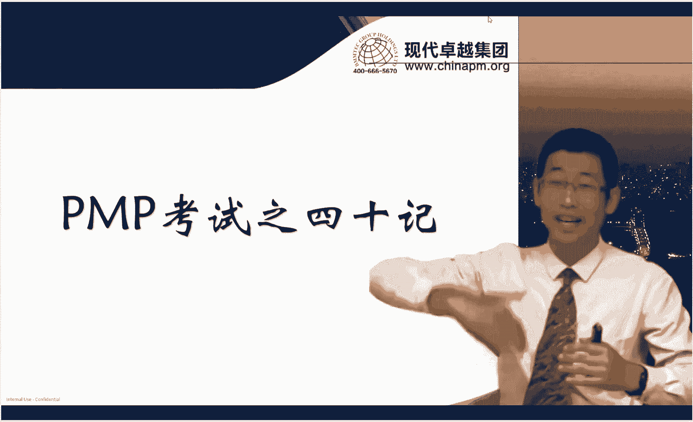

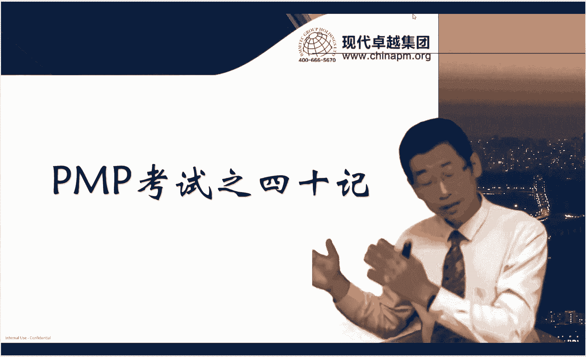

好，那么我们先从第一部分开始啊，先从40G开始，先从传统项目管理给大家讲起。好，我们先来看第一季。第一季呢传统项目管理的前三章内容啊，实际上来说，现在考的内容不是特别多。

那聚焦在两个内容一一大块内容就是我们各式各样的关键相关方的一个分类。那么在这里呢呃我们要去了解啊，对于项目经理来说，内部重要的相关方和外部相关方的内容啊，这个相关相关人有哪些。

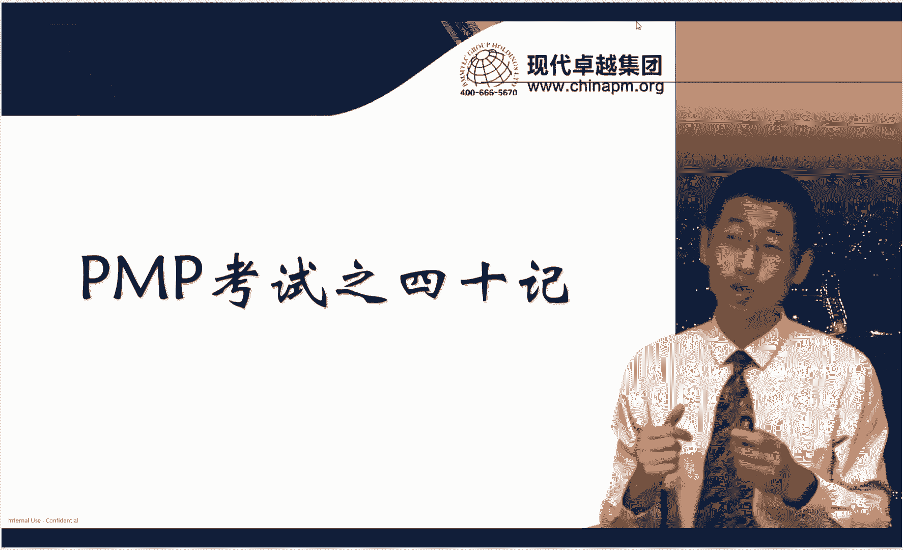

好，我们先来看一看啊，内部的相关人跟考试相关，考的比较多的就是发钱人。大家经常会在题目中哈会看到说哎我要找发钱人怎么怎么样啊，那我们要知道哈，其实啊发钱重点的去做，其实就4件事情。

第一个他帮助你去定义商业论证啊。而且呢他不是具体的编写者，他只是啊给一定的意见，然后帮你审核这点来说呢，考试中呢，我们见到比较少啊，但是第二个。项目章程，这是我们考试中特别常见的，对不对？

因为项目章程一定要发起人审批，原则上来说也应该发起人编写。即使项目经理编写，我们也得要发起人签字。对吧这是常考的考点。第三个呢，发起人可以协助验收啊，但是第四个是重点考点。

就是发起人可以帮助我们做项目经理能力范围外的事儿。那这一点呢其实给我们的考试中就两个信息。第一个信息就是我们大多数的题目其实找发起人作为正确的选项是不对的。因为什么呢？

因为我们的项目经理在考试中默认是强聚阵的组织架构，强制性组织架构的项目经理权力是很大的。如果你什么事情都去向发起人汇报，那么这种呢啊做法呢就违背了强聚阵的项目经理的一些特点啊。

所以呢这种选项呢往往不对啊，什么时候去找发起人呢？是说我们根据题干中的描述，我们会发现项目经理已经做了很多的努力，但是无效，或者是项目经理呢发现哎这件事情根本就是他控制不了的事儿。

那么这个时候你再去选找发起人就是正确的。比如说。啊，说现在呢有一个资源被我们的啊这个什么什么高管调走了，而且呢调走了之后呢啊没有其他的替代资源。好，那如果项目经理说应该怎么做的时候。

那么你这个时候再去找发起人，这个是可以的啊。但是呢如果题干中说只是调走了，请问你项目经理怎么做。那下面选项找替代人员啊，或者是内部人员的培训呢？哎，这就是项目经理自己做的，这个时候你要再去选。

我应该去上报发起人，那么这个就不对的啊。所以啊我们一定要去定位这道题，看看这道题到底有没有超过项目经理能力范围之外，如果有就选找发起人，如果没有就不选啊，所以发起人主要的在我们考试中就出现这两个事儿。

一个是批准项目章程，一个是帮你解决能力范围以外的事儿。呃，第二大类呢，我们可能会在考题中看到职能经理啊，那职能经理呢无外乎啊，对我们考试中就是获取资源。其他的事儿呢，他也做不了啥啊。

那当然偶尔的在资源这张我们会看到这种题啊。好，那第三大类就是PMO。啊，我们同学也习惯什么事儿都去在选项中啊，去找PMO。那我现在告诉你，这事儿也不能乱选PMO啊，首先我们要知道它是分类型的啊。

尤其是那种支持型的PMO他根本就没有权利帮你调配资源，因为他也不管资源，他管的就是一些项目管理的规范和模板，是不是？好，所以啊不要万事都找PMO。哎，你要考试中选一个选项，说我这件事情找PMO。

你就得琢磨琢磨啊。我这个PMO到底找的对不对？是让PMO帮我解决啥问题。你要是给我一个模板，这事儿就靠谱。哎，如果你是帮我协调资源，这事儿可能就不靠谱，可能就是一个错误答案。另外两个呢。

这是我们在新考纲里出现的关于PMO的一个职责问题。第一个就是PMO会管理合规性的问题。合规性呢在我们最近的考试中也常出。比如说说现在呢啊外部啊要求必须做这个项目，经过一些什么法律条款啊，对不对？

必须经过批准，你才能上。哎，这种合规性有PMO去管理啊，PMO去根据外部的一些环境啊去啊做一些规划呀，然后再去做一些跟踪啊。哎，你说你合规性的事儿搞不定了，找PMO这可以啊。

第三个事儿就是PMO管理效益。那管理效益和管理合规性都跟我们新考纲那个什么部分有关系呢？叫做商业环境。商业环境我们都知道新考纲会考8%的题目，对不对？那8%的题目从哪出呢？其实就从重点从这两个事儿啊。

合规性和效益啊，那题干中出现了说现在啊项目啊啊还没正式启动。但是呢现在项目经理呢，可能啊现在需要确定这个项目跟战略啊，这个是不是保持一致啊，或者是相关方呢啊对你这个项目呢跟战略啊，他觉得有一定质疑。

比如说现在他觉得不一致，那请问你怎么办？还，你看哎这种题呢，如果我们没有聚焦到商业环境的时候，我们可能就会认为说他考的是商业论证，是不是啊？我们传统项目管理有商业论证跟这个比较像。

但是啊如果大家知道商业环境这个题的话，你就知道其实他是超过商业论证的一个范畴呢。他这里面有具体的内容啊？比如说啊我们有效益管理计划啊？然后呢我们有专门的效益负责人。

那这块呢一会儿我们专门有个知识点给大家去补充复习。啊，所以呢像跟效益相关的内容。在对于我们来职责来说呢，是跟PMO必然相关的。PMO负责管理效益。所以啊如果说你想在题干中说，哎，我看到了一个效益。

不知道跟这个项目的效益跟战略是否保持一致，那我找谁，我可以去找PMO。好，所以这2块内容是PMO新承承担的两个角色，大家一定要注意啊。好，所以总结来说啊，不要万事都找PMO啊，PMO不替你协调资源。

它只提供模板。第二个就是跟新考纲相关的PMO负责合规性和效益啊PMO这事我们搞定。再往下呢叫智力委员会啊，智理委员会呢其实也是信考纲中特别提到的啊，就是我们会做一些项目治理。

项目治理呢是在项目管理之上的啊一部分工作。他呢主要的工作也是解决项目经理能力范围外的事儿了。所以啊当你看着项目经理自己搞不定的时候，找发起人可以找治理委员会也可以啊，他俩呢也没有说谁优先级。

说先找谁再找谁找谁都可以啊，所以考试中呢，他也不会专门考说A找发起人，B找治理委员会，不会这样的啊啊，所以呢你就放心大胆的看着什么，选什么就完了。啊，再往下呢就是CDBCB大家就懂了。

就是主要是给变更审批的。好，就考这一点，然后呢是风险责任，风险责任人是我们比较容易忽略的。因为从PMI的角度来说哈，他认为。风险其实只要项目经理管理，项目经理其实是没那么大精力的。

项目经理会被大量的精力放在规划沟通上，所以专门他去管风险的话，他没精力怎么办呢？所以他有一个专门风险责任人这么一个角色啊。那当然实际工作中，这个大企业可能会专门有个小企业的话呢，可能由项目经理兼职了。

那我们考试中，我们默认还是有这种单一的风险责任的啊，当然哎，如果题目中非说说项目经理也兼任风险责任也可以。反正总之这个角色不能少，这个角色它干嘛呢？主要用于规划和实施风险应对的啊。

OK当然监控风险也也是他的职责，但是以前考试没考过，重点考的就是规划和实施风险应对策略。好，这是风险责任啊，针对外部的一些呃这个相关方来说哈，主要的我们要啊考的就是客户和最终用户的一个区别。

那我们都知道哈，客户是我们交付项目负责项目验收的这么一个人。而最终用户是针对我们项目产出的一些产品啊，服务的一些使用者，所以他俩呢是有区别的啊，你别混为一谈就好了。啊，另外一块呢就供应商。

那供应商呢就是我们题干中出现了供应商，我们就马上定位到采购管理就完了。所以这块我们要记住。另外呢呃最近几年还出现的考题是项目经理啊，把项目做完了之后交接给谁，他交接给的是运营部门。那运营部门负责交接。

但这个地方大家要特别注意，就是项目有没有维保这件事情。题干如果说项目有维保的工作，那么我们要注意啊，那现在还是属于项目经理负责的啊，如果本身项目来说全部结束了，没有维保的问题啊。

那么由运营部门去啊去接题。那维保呢在题干中也会叫做什么啊？叫做啊，比如说我们叫做质量保证期啊，质量保证期。那么这种呢都是属于项目经理他职责范围以内的。另外一块呢就是项目经理呢会做到一个汇报。

他用什么汇报呢？用的是工作绩效报告。那工作纪效报告呢，我们考试中最近也常考，那工作绩要报告大家能明白，首先由什么来的，是先有工作绩要数据，再有工作纪要信息，再有工作绩要报告，对不对？另外呢。

工作纪要报告呢主要写什么东西啊，那这里面有状态报告啊，对写现在的事儿了，有进展报告写啊这个过去啊离我比较近的过去发生的事情和预测报告啊，对不对？这些呢都是用于汇报我项目的一个状态的一个内容的啊，对不对？

好，这是工作绩要报告，我们都需要掌握啊，所以这是第一大类。好，我们来看到题感受一下哈。那呃大家这个时候啊，我每讲一道题的时候呢，大家可以摁下暂停键，然后呢呃先别听我讲，你先把这个题做完了。

做完了之后你再听我讲啊，那收获会比较大一点啊。好，那这道题呢我们选择的是A选项啊，那这道题关键是考什么呢？考的就是我们的一些重要的相关方，而且是外部的相关方，这个外部的相关方干嘛呢？

外部的相关方现在来反对你了。那我们相关方要怎么样？相关方要管理啊，对不对？好，所以他考的就是外部相关方的管理。那怎么管理呢？我们就分析相关方，然后制定相应的管理策略啊，那如果这个管理策略不行。

我们再去调整管理策略就完了啊，所以要针对相关方进行管理。好了，这道题选A。呃，B选项通知项目发起人，该维权组织体现了项目进度的一个风险。这个就是我们刚才说的，别啥事儿都找花钱，能自己做的事儿。

你就去自己做，是不是C选项与该维权组织开会，将其需求添加到该项目中。题干中从来没有说现在当地居民有什么新需求，对不对？他新需求是让你取消项目，那你能这么做吗？你不能啊，所以不是这道题考的是范围管理啊。

这道题考的是相关方管理。好，那第四个也不对啊，教育该维权组织让其了解该项目将为社区带来的好处啊，你不要去教育人家，你应该更多的去管理。当然，教育也是管理这种手段。但现在来说哈，针对反对你的干型。

你光教育这事儿肯定是不行的哈。所以这道题关键就是考A考的就是我们前面的知识点，外部的相关方啊。好，那么第二个知识点呢是关于项目经理的一些角色的那我们在最近几年常考的一个内容呢。

就是关于项目经理的领导力的一个风格。那我们来连一下线哈呃大家可以先看看右面具体的描述，我们看是哪种领导力的风格啊。首先啊呃在呃这个。我们促进创新和创造，以及个人关怀，提高追随者的能力的时候。

这个属于左面的哪个领导力风格呢？这个属于变革型变革型大家一定要注意，就是它肯定有一些创新啊，对不对？因为有什么呢？因为它要变化嘛。是吧比如说现在由我们传统项目管理往敏捷项目管里转，所以这就是一种创新。

所以这都属于变革型领导力的一种体现。再往下走哈，精神饱满，热诚洋溢，充满自信。这什么呢？哎，这很明显哈，这就说明呢你个人很有魅力是吧？往下关注目标反馈和成就。一确定奖励。哎，你做完了，我给你奖励。哎。

这个点像有的时候我们教育孩子经常说，哎，你考试考的好，我给你奖励，这是什么，这叫交易性啊。再往下哈结合了交易型、变革型和魅力型领导的特点。那这是什么呢？这属于交互型啊。

就是啊所有的这个领导力会交织在一起，要交互型哈呃往下走，允许团队自主决策和设定目标啊，什么东西都交给团队。那么这个时候呢大家。是最起码来说我们目标是得达这个达成统一，我还要给他们一定支持。

是不是这个就是啥都不管，这叫放人行。最后一个，处处先为他人着鲜，关注他人的成长，这个属于同人性。那我们都知道，在敏捷里，我们重点强到的就是仆人性的领导，是不是？哎，好。

所以首先我们在啊这个整个的项目管理领导力风格当中，这些都得知道啊。其次呢，敏捷的这个重点的特点，仆人是领导，我们也讲重点关注。好，再来看看领导方式哈，其实跟领导风格特别的像，我们来连一下线哈。

右面叫做对下属需要完热点的领导不知道人招线，关注他人的成长，这个属于同人性。

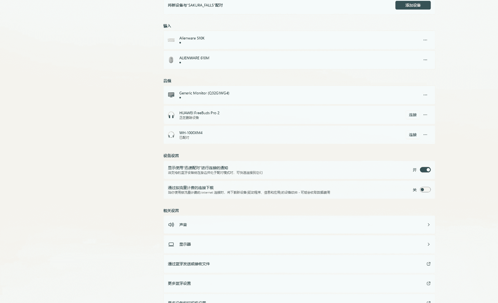

那我们都知道，在敏捷里，我们重点强到的就是仆人性的领导，是不是？哎，好，所以首先我们在啊这个整个的项目管理领导力风格当中，这些都得知道啊。其次呢，敏捷的这个重点的特点，仆人是领导，我们也要重点关注。好。

再来看看领导方式哈，其实跟领导风格特别的像，我们来连一下线哈，右面叫做对下属需要完成的任务进行说明，就是啥事儿，我都给你指挥。那这叫什么？这叫指令型领导。第二个，与下属一起讨论，共同决策。哎。

讨论一起讨论决策一起决策，这叫啥呢？这个叫做参与型领导，有啥事儿我都参与啊，决策我也不是啊，我自己决策，我是跟你一块去决策，叫参与性。往下走与下属一起讨论，但最终决策由自己定，这叫啥？这叫示范性领导。

也有的时候被叫做教练式领导。哎，我教你哎，但我教你完了之后呢，那你现在还不成熟，所以我来决定。最后一个叫在下属有需要时才啊真诚的去帮助这个叫什么叫支持性。那我们在敏捷里重点强调的就是支持性是吧？好。

当然啊支持性之前呢，如果团队成员能力还不够，我们可能采用的更多的就变成了参与性啊、示范型啊，对不对？但传统项目管理讲的比较多的就是指令性是吧？所以这是关于项目领导力风格啊方式啊。

它需要我们掌握的一些核心内容啊，我们看这道题。这道题呢我们选择的是A选项啊，这道题很明显啊，题干中有一个关键字叫做鼓励他们改变项目环境。另外一个就是发挥创造力。你看哎跳出我们现有的环境。

你要去改变有创造力，这不就是什么？这不属于变革型的一个特点嘛，对不对？不是交互，不是放任，也不是交易啊，对吧？哎，所以这道题选择A选项。前面两季呢。

我们重点针对我们篇book前两章的核心点给大家点出来了。从第三季开始呢，其实我们已经进入到了正式的项目管理的十大知识领域的学习了。啊，但是啊我之前给大家说过啊，我们在新考纲里加了一部分。

这加了一部分呢叫做我们的商业环境。商业环境里重点聚焦是在项目开始之前，我就应该考虑项目未来有哪些收益。而在整个的项目的执行过程中呢，我还要不断的去持续跟踪我的项目效益和价值啊。

所以这部分内容也是我们考试中现在考到的一个重点内容。所以我在命名的第三季啊评估和交付项目的效益和价值。这部分内容呢啊其实在我们篇部课中呢，在前三章呢讲到了一点。然后在商业论证呢讲到了一点。

但是核心有些点还是我们在书中没有讲到的。我再给这里给大家补充到啊，针对这个项目的效益和价值啊。首先我先给大家区分两个概念，就是效益和价值是有区别的。效益是什么呢？效益呢你可以拆解为两个字，叫效率和收益。

那效率和收益。你想啊，就是我们来对比一个项目成本和收入它的一个关系，我们都知道最简单的啊一个逻辑，就是收益要大于成本嘛，我们这个项目才能做嘛，是不是啊好。

所以呢通常来说哈效益的核心还是以成本收益来考量为主。当然我们有些项目还有一些特殊性，你说啊我成本这真的大过了收益，但是我这个项目啊，有一些战略意义，我也会去做，对吧？好。

那这个呢就不仅仅是效益层面的事了，它还牵扯到价值层面的事儿了。所以从价值层面来事呢，我们可以看的更广一些啊，不光是看这个项目本身能不能啊获得一些钱，他还要看到说有没有什么啊这个业务价值啊。

或者有没有能跟客户呢有更好的长期合作呀，这些都是价值的体现。所以我们在篇部我们也学到了价值分为。有形价值和无形价值，对不对啊？所以呢这也是考量项目值不值得做的一个很重要的一个指标啊。

所以我们先搞清楚效益和价值不是完全一样的东西。价值更多的是项目最后的一个产出，可以是啊钱也可能是其他东西，而效益的重点关注的就是成本和收益的一个比。好，这是第一个事儿啊。那第二个事儿呢。

就是这里面呢有哪些具体知识点，我们需要掌握。首先哈我们看这张图啊，第一列呢啊叫做效益和价值，它得有一些具体的角色和职责。这里面呢有两个角色啊，一个叫PO，一个叫做关键相关方。而且这个关键相关方。

它是什么呢？它就是在我们的项目中那些核心的一些人员，这些人员必须要对我们项目的效益和价值，它到底会怎么样？然后产出会什么样子达成共识啊，PMO这事我们讲过了，刚才我们说了，重点就是管理它的一个效益。

而关键相关方一定要在项目启动之前就要达成共识。我们的项目呢才值得启动啊，当然其实共识这个事儿哈，不管是我们传统项目管理，甚至是合敏捷项目管理，这都是一个非常重要的概念，对不对？

大家想协作就必须达成共识啊，所以这事儿大家一定要记住啊，角色有两个人PMO和关键相关方PMO负责管理效益啊，关键相关方负责达成共识。第二大类呢就是工具。工具呢这里用到一个大家比较熟悉的工具。

叫成本效益分析。成本效益分析在商业论证里就讲到了成本效益分析干嘛？就是评估效益的一个核心关键，对不对啊，好，那成本效益分析呢，实际上来说，如果想量化的话呢，又牵扯到一些其他的我们学到的一些啊这个方法。

比如说啊计算LI计算IRR啊，然后呢啊计算正值啊，然后或者是计算决错数啊，对吧？决错数虽然在风险的时中讲，但是它也是说我到底你比如说啊我是到底选择A还是选择B。还记着我们书中那个啊那个例题。

我到底是新建啊这个工厂还是扩建旧厂，对吧？它也是一种项目针对决策的一个很好的一个啊一个工具。这些呢都可以支持成本效益分析。但是呢呃大家会看到哈呃针对这个内容呢，我没有给它标红。因为什么呢？

现在我们考试中哈考的计算题太少了，所以这块内容呢啊几乎呢也很难有涉及。所以对大家来说，更重要的是理解理念成本效益分析这个理念。不要去太关注它的计算去怎么去做。另外一块呢，其实它也牵扯到价值分析。

价值分析跟成本效益分析还不太一样。成本效益分析更多的聚焦是效益，而价值分析聚焦于无形价值和有形价值的分析，对吧？啊，所以这块内容呢大家也稍稍理解一下就行了啊，以前也没有特别出现过这种价值分析的概念。

OK但是出现了之后，你别到陌生词汇啊。好，第3块呢就是文件。这里的文件呢啊重点两个文件，一个是效育管理计划啊，干嘛的？就像我们各式各样的项目管理计划的管理计划呗，对不对？进度管理计划干嘛的？

进度管理计划就是我怎么样去啊制定我们的进度计划，怎么样去跟踪我们的进度计划，对不对啊，怎么样去监控我们的进度计划，对不对？这些都是管理计划组的事，而效育管理计划管的，哎，怎么样去定义我们的效益。

怎么样去跟踪我们的效益，他的怎么样去监控我们的效益有没有实现，对不对？管理计划不就做这事儿了嘛，对吧？所以这个呢是我们评估效益和价值的一个指导文件。另外一个呢，就是到底项目最终应该实现哪些效益。

应该有没有哪些价值，这些会写在我们的商业论证，商业论证，大家不陌生，是不是？所以这个啊都是我们的一个重点啊，那我们也说了商业论证考试中啊不是商业论证，商业环境这个内容会在我们考试中占到8%的题目。

所以呢这块内容对大家来说呢蛮重要的啊，大家一定要重点去掌握。另外呢其实针对效益和价值呢还有一些啊补充的文件，但这些文件呢在书中没有特别出现过以前考题中也没有出现过这些词，所以大家呢啊了解一下就行了。

如果考试中万一出现，别当陌生词汇，你知道大概什么意思就可以了啊。比如说效育实施计划书。啥意思啊？哎，就是我定义了这个项目应该花费哪些成本，应该有哪些收益。那我真正去在项目执行过程中呢。

我要根据这个效益呃，这个实现的计划数，我要跟着照样去做吧，哎看看这些成本该不该花啊，有没有直接成本有没有间接成本，你要去跟踪，对不对？啊，这些呢会写在我们的效益实施计划书里，还有叫效育登记册啊。

记着风险登记测吧，那风险登记测是记记风险的，效益登记测是记啊，到底花了多少成本，然后有哪些收益呢？好，另外呢啊还牵扯到我们有一些这个啊效益的一些啊实施的一些这个路线图。那这个路线图就是相当于一个。啊。

计划一下，我们学到过产品路线图，就是规定哪一个时间段公布了哪些产品版本是吧？那我们在这个里呢啊实施路线图，就是效益在哪个阶段实施了哪些收益，对吧？叫效益实施路线图。啊，最后一块呢就是效益的一个分类啊。

那可以写在我们的效益的细分啊，这个结构里啊，告诉你说哎会实现哪些收益啊，这啊这部分是实现了哪些这个赚了哪些钱，那部分赚哪些钱啊，有一个细分。这些都是一些新的词汇，请大家稍稍了解啊。好，我们看到题目。

这道题呢我们选择的是D选项啊，题干中有个非常关键的关键字叫做项目经理呢，正在决定该向谁咨询，以确认是否会取得效益。那么很明显哈考的就是我们刚才说的效益和价值的这么一个角色。那重点角色就两个嘛。

1个PMO一个关键相关方。那啊我们应该跟关键相关方开会，然后达成共识。这样来说呢，大家都知道说我最终这个项目应该怎么去实现我这些效益。然后应该通过什么文件去跟踪效益管理计划，是不是就达成共识这点。

所以这道题选择的是D选项啊，其他几个选项我们就都不选了。比如说A选项与最密切相关的职能经理啊一起核实效益情况，这跟他没关系。第二项服务提供商确认，第三个取得发起人。你看哎。

我们刚才这跟我们核心角色都没关系。所以这道题选择D选项啊。好，那既然说到了商业论证，我们也就再看看商业论证在我们这块有哪几块内容。当然啊说到商业论证，你就离不开项目章程。因为有了商业论证，有了项目章程。

项目才能正式启动啊，所以我们的第四季呢，我们重点掌握商业论证，项目章程来连一下线啊。啊，先看中间的主要考点啊，业务需要是会写在我们的商业论证文件里，看项目章程文件里，这个地方容易错。

大家可能会认为说业务需要重点写在项目章程里。但是你要知道业务需要其实是写在商业论证里，商业论证里重点聚焦你的项目和你的战略之间有没有达成一致性。那战略怎么描述，就是通过业务需要描述的。

而到了项目章程的时候呢，更多的就是什么呢？哎，项目的背景，项目的目标了，是不是啊，项目的背景它跟业务需要呢是有一些关联关系的，但是啊它是从另外的角度去学的，说这个项目为什么要去立项，是不是啊？

那这里呢还不完全是业务需要的一个描述。OK好，往下走哈，对业务目标的贡献。😊，啊你看一牵扯到贡献，你得说上业论证，对不对？我做完这个项目到底能产生什么样的收益是吧？OK。呃，再往下授权项目经理动用资源。

哎，这是项目章程干的事儿。批准项目成立项目章程干的事儿，发起人发布和批准项目章程干的事儿，成本效益分析，商业论证干的事儿。对吧？好，另外呢在右侧那两个主要考点呢，商业论证还包括什么呢？

包含了市场需要啊、组织需要啊、客户要求啊、技术进步等等等等。所以你就会发现商业论证聚焦的不光是钱的事儿，还聚焦于有一些无形价值的产生。另外呢，项目章程里我们需要重点掌握内容呢。

包含了第一个常考的就是高层级的需求和项目描述。考题中，一旦出现了高层级需求，高层级的项目描述你要知道这些写写在项目章程里。另外一块呢，考题中还经常考到说项目经理的职权啊，那么姓名大家都知道啊。

项目章项目章程会有，但是职权是在哪里。选项中经常有一些选项会干扰你。比如说A选项的项目章程，B选项叫做RAACA大家一看到RARCA都特别的亲切是吧？马上回去选RACA。

但是我再次强调项目章程里的这个叫职权，而RARCI里叫做角色和职责啊，职责和职权是不一样的，职权是权利是吧？我能在这个项目中拥有什么样的权利，我能指挥谁，我能听谁的，是不是好，那而职责是你针对什么事。

你负责干啥？你是负责人呢，还是执行者呀，还是咨询者，对不对？它是针对事件的，你的一个职责的一个责任是啊，所以这是不一样的啊，所以看到职权，你要选择的是项目章程好。

另外一个呢啊大家常考的就是能看到就是项目求大会了啊，选大会呢，因为啊我们有两个请大会都叫都被。开成启大会，一个叫initating meeting，一个叫Koff meeting。

记着initating meeting是项目启动的时候去开的，尤其是项目管理启动过程组我们召开的一个会议。对吧他干嘛呢？公布项目经理，然后发布项目章程的。

而Koff meeting是在项目管理的规划过程组已经结束了。项目经理呢已经都规划完了，在执行之前开的一个会，更多的是团队成员见面，然后呢鼓舞一些士气，并介绍一下项目情况。

我们必要考的比较多的是Kakeoff meeting啊，所以这个是在项目管理的规划过程组结束之后，执行开始之前再去做的啊，这个是项目章程。我们要注意的。好，我们看到题目。这道题目呢我们选择的是A选项。

因为题干中说到了制定项目章程时，我们应该使用什么。那刚才呢我们说了项目章程很重要。那章程时是不是会聚焦在战略计划。那你就掉到了这个坑里啊，如果你选C，你就知道其实是错误的。因为我们刚才给大家讲了。

其实啊在商业论证里或者是在效益管理计划中跟效益跟价值相关，它才聚焦战略战略和项目有没有匹配。但是项目章程什么？项目章程就是说这个项目哎，我要做哪些事儿了，我要正式的启动了。所以它呢不聚焦于战略了。啊。

项目要启动，已经说已经和战略是一致了。所以这道题我们选择的是AB和D呢，都是项目章程之后，我们再去制定。A，为什么要经验教训呢？这事儿很简单，我们要参考过去的我们的组织构程资产，是不是啊？

所以这时候你一定要区分开啊，这个战略计划和项目的一致性由哪一部分组成，由效益和价值这部分管，而不由项目章程去管啊。来，这道题。这道题呢我们选择的是B选项。这道题有两个题干中两个重要的关键词。

一个在项目启动阶段。一看到项目启动阶段，我们就知道那要不就是我们刚才讲过的重点的是啊这个项目章程啊、商业论证啊啊，或者是项目的一些效益和价值的评估啊。再一块就是相关方的一个识别是吧？那很明显哈。

那这道题呢考的是我们说的第一块就是商业论证的那部分内容。因为后面又一个关键字叫做估算预算，高于原始预算。那很明显哈，你就往效益呀、价值、商业论证去贴就完了吗。那这道题目就选B呗，审查商业论证。

确认商业利益和职约因素是否仍然有效。跟这个什么A要减少项目范围啊，C与分包商谈判啊，那都没关系，因为这个都是不是项目启动以后的事儿了。对吧啊那都是后面发生的事了。而D你能随便找项目发起人吗？你不可以啊。

是吧？你要先自己去搞定，所以D也不能选这道题，重点选择就是B选项。我们来看第五季。第五季呢是我们第四章一个非常重要的概念，就项目管理计划。那首先看第一个知识点，就是我们要一定要知道一道考题出现了以后啊。

我们知道哪些文件是属于项目管理计划，哪些属于项目文件。啊呃PMI严格区分出任何属于项目管理计划的文件都不属于项目文件，任何属于项目文件的内容也不属于项目管理计划。

比如说进度基准它就属于项目管理计划而进度计划啊，就是没有被批准的进度计划啊，那么它就是属于项目文件啊，所以这个一定要严格区分开啊O那考试考的最多的呢是第二点，就是我们说的项目管理计划。啊。

就是说哎现在我们题干中说缺乏规划啦，然后我们想规划了，那应该制定什么呢？应该制定的就是项目管理计划啊，对不对？而且我们必须知道项目管理计划，它里面有什么东西，主要的。啊。

十大知识领域的各个知各个知识领域的管理计划。对吧另外呢就是三个最最重要的基准，范围基准，技度基准成本基准。另外还有一些东西啊，比如说变更管理计划，对不对？另外还有一些项目生命周期的描述啊，对吧？

传统跟敏捷的做法不一样啊，这些都会写在项目管理计划。所以这是第一大类参考的。呃，第二大类常考就是我们要区分出啊资源。沟通跟相关方管理计划是有区别的啊，对不对？尤其是相关方呢，它还不叫管理计划。

他新起了名叫相关方参与计划。那这三者的一个区别叫做什么呢？哎，资源管理计划呢，除了一些实物。如果针对人力资源的话，它聚焦的是团队管理啊，就是我们的项目团队，团队成员的管理。

而我们的沟通管理解决的什么问题呢？是信息传递的问题。题干中说说哎，谁第一次听到啊，从来没听说过啊，OK然后表示很惊讶呀，对不对？说不开会了。然后大家都不知道说这个开会的时候说啥了。

那这些都是信息传递的问题。这些我们用沟通管理计划去解决。什么是相关方参与计划应该解决呢？相关方不参与不开会呀，然后不了解你的情况啊，也不想知道你的情况啊，或者对你的情况不满意啊。

这都属于相关方参与计划没有执定好，或者是呃执行的有问题，对不对？所以他们三个一定要区分开啊，根据题干中不同，我们要区分开啊，资源针对团队沟通呢是针对信息传递，而相关方呢针对的是相关方不参与和不满意。

另外一块哈呃大家要注意的就是关于范围和需求的区别。尤其大家要明白，范围管理那块呢输出的是两个管理文件，一个叫范围管理计划，一个叫需求管理计划。那么范围管理计划和需求管理计划，一个是聚焦范围。

一个聚焦需求。需求更多你可以理解为是一个项目的成果。可交成果，对不对？这是聚焦需求的，而范围什么呢？既聚焦成果又聚焦过程，是不是？这是我们的范围管理要做的事。所以简单来说呢，如果都是这一个项目。

需求已经确定好了，这个项目就做哪些需求。那么他这里面的所谓的项目范围是包含项目需求的。因为范围既聚既聚焦于需求那些成果还聚焦于为了完成这些成果，你要做的一系列过程的事啊，O所以他俩你要明白啊。

另外呢啊你要了解的就是管理计划跟我们的呃项目文件啊是有一定区别的啊，尤其是我们的需求文件，属于项目文件，需求管理计划属于项目管理计划，对不对？它不像说范围基准和项目管理计划，都属于项目管理计划啊。

但是你也知道他们也是有区别的。管理计划聚焦的是how怎么做，而我们的像范围基准和需求文件聚焦的是what。做什么是吧啊OK一个是做什么，一个是怎么做啊。好。

那当然啊同理的还有一些什么像进度管理计划和进度基准也是一样。管理计划说我应该怎么去做怎么去制定我们的计划啊，它聚焦的是怎么做。比如说你到底是头脑风暴讨论，你要做这个计划啊，还是访谈啊。

还是你项目经理去自己去憋进度计划呀，对吧？这都属于管理计划写的。而进度计划什么进度计划就是产生出什么时间做什么事的甘测图嘛，是不是哎，O好，这是属于啊我们一个是做什么和怎么做的一个区别啊。

这点来说也要区分开啊，所以这三个啊考试中都有可能出现，一个是项目管理计划，一个是呢这这些管理计划之间的一些区分。比如说范围管理需求管理区分资源啊，沟通啊。

相方的区分和第三大类就是啊做什么和怎么做的一个区分。好，看到题目。这道题目我们选择的是第四个选项啊，第四为什么选择第四个呢？考的就是我刚才说的项目管理计划这个考点。

提干中说说项目经理应该怎么做来尽可能的提高项目的成功率。应该规划呀，那规划是哪个？应该是D呀，不是A和C呀，对吧？A和C还没谈到说针对整个项目有个具体的规划，对不对啊？所以这个考的就是D啊。

当然选B更不可能，我要去上报发起人，这不可能。这是我们的第五个，我们来看第六集。变更控制流程。变更控制流程是我们考试中必考的一块内容。但是对于新考纲来说哈，它考的聚焦点呢其实不是全流程的考察。

它聚焦点聚焦在几块内容的考察，那我们来给大家说一下啊，这几块包括什么？第一块呢就是我们要去先识别变更啊，你要确定出说有人提出来一个变更，是不是啊？有人说我要增加一个新范围啊，增加一个新需求。

这你得说先识别变更题干中经常会有典型这种字样，对吧？哎，哪个客户提出来一个新要求，这个新要求不在范围以内，对不对？哪个客户说你必须得给我改成这样，对吧？这些都是识别变更的一个内容，好。

识别变更完了之后呢，有一种考题什么呢？你要去先去查阅变更管理计划。因为什么？因为你想要做变更，首先你的这个项目得有变更管理流程才行。变更变更管理流程写在哪里啊？写在变更管理计划中嘛，是吧？

所以你没有这个变更管理计划，你是没有地方或者是没有流程去执行这个变更啊，就跟说你要去整容，非去一个啊，你们门口的社区医院，那你怎么整容啊，对吧？人家没有那个流程。

所以这个地方一定要注意我们考试中怎么考呢？考试中一道变更的题目，大家第一反应就是我按照变更流程，但是呢大家可能说哎，现在是不是有一个变更被提交了，被正式记录了。然后我们下一步要分析，你别着急。

如果ABCD选项中专门有一个选项。写的啥呢？说你要查阅。一个什么管理文件，那你要小心。那么它应该是那个正确选项。因为我们的第一步骤先要查阅这个管理计划。这个管理计划呢可能是变更管理计划，也可能是范围。

也可能是需求管理计划，这是都可能有的。因为我们考试中针对变更的题目大多数题目都是说我要针对啊现现在项目正增加一个新范围，新需求。那么你范围也好，需求也好。

那么它的管理计划中也一定都会写针对需求或针对范围，我应该怎么样去走变更，是不是？所以这些管理计划也都会写针对范围和需求的一个变更管理流程的。所以查阅这些东西也是对的啊，所以这几点都是对的。

ABCD选项中有这样的选项特别的小心，有可能它才是第一步。当然，如果ABCD选生没有这个选项，那你可以往下选。那下一步干嘛呢？变更文件的记录。哎，因为我们书中明确学到了变更，只有被正式提出才算完事儿。

才算这个步骤才能结束。不能口头提出。那你正式提出怎么怎么体现啊，就是一定要记录下来嘛，是不是？所以呢它会专门写到一个叫变更申请表里，是吧？啊，当然我们考试中呢很很少出现这个文件的名词。

我们基本上来说出现就是说我要提交一个变更啊，然后呢，我要正式一个记录啊，对不对？哎，这些都体现着我们变更文件的一个记录。当然，除了我们要去记载一个变更申请表去申请这个变更。

同时变更日志也得实时的去更新是吧？啊，所以这两个文件呢缺一不可。有了这个变更文件的记录以后呢，说明这个变更已经被正式提出了下一步干嘛呢？就是项目经理和团队要分析这个影响。啊。

分析变更对我的进度啊、成本啊，风险有什么样的影响是吧？然后呢，干嘛呢？下一步叫做制定行动方针。制定行动方针其实它包含几块。哎，我们理解说哎。

我是不是应该把这个呃现在的这个风险影响情况跟我的变更发起人谈一谈呢？然后呢，谈完了之后，如果他坚持要变更，我是不是还得跟他去交流交流，你这个变更到底怎么去做呀。这些都属于行动方针里的事儿啊。

所以呢他专门起了一个名叫行动方针啊，你就知道去谈一谈具体这个变更，应该怎么去实施。但是不代表你制定了实施计划，你就能实施。因为后面还得针对CCB的审批。况且哈你要明白哈。

你想经过CB审批之前一定要制定行动方针的。因为CCB一定会问你个问题，你这个变更除了对我的进度成本有影响之外，你准备怎么干呢？哎，对吧？领导得听说你怎么干，他他心里有数嘛，是不是啊。

所以这事呢你一定是先做第五步，再做第六步。那审批分成两种情况，第一种就是no。啊，那告诉发起人说不行，把变更日更新一下就完了。第2块说行行，别忘了先更新我们的项目管理计划和项目文件。哎。

这步呢千万不能错，因为啥呢？你记住啊，传统项目管理走变更流程的一些需求，一定是怎么样？一定是文件先行，啥事儿先记录下来。对不对？PMP尤其是针对传统项目考试的那种，一定是先记下来，记下来以后再做。

这样有据可查。对不对？好，所以这个地方要小心。

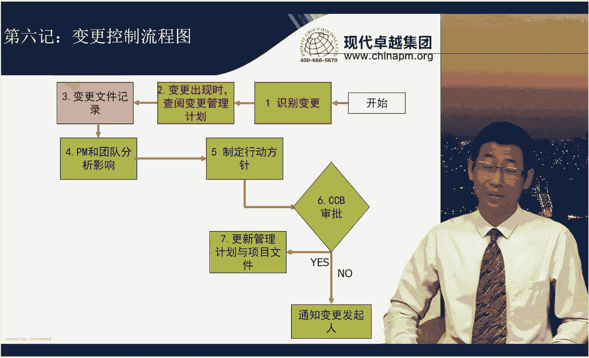

好，更新完了之后，实时变更，同时通知相关方，这个变更呢才算结束。好，所以啊考试中这几个步骤是一定要记得。哎，我们经常会考你考怎么考就出现一个场景题，你要定位你处于变更流程的哪一步骤。确定好了之后呢，好。

他问你项目经理应该怎么做，项目经理首先怎么做，你就往下选就完了，对吧？啊，好，那往下选完了之后呢，哎到哪步选哪步就可以。你就选对了啊，但是不要。把后面那步选到前面去。你比如说A选项是第四步，先分析影响。

然后呢，B选项就CB审批，你别先着急，先审批哈，一定是先分析影响啊，这事别别搞错了。那第二种类型呢，就是你还要区分说哎这几个步骤属于我们篇book讲中的哪个过程。啊，请记住哈。

尤其是他讲到了一个叫实施整体变更控制。啊，就是这个变更控制这个流程，它对应的是哪几个步骤？对应的我给大家讲哈，是第四步到第七步，这个事儿一定别错了啊。因为实施整体变更控制这个过程，它输入叫做批准呃。

叫做变更请求，输出叫做批准的变更请求。这个过程只负责审批你的变更。那审批变更包含了变包含你的准备工作，先分析影响啊，制定行动方案呢，然后再审批审批完了以后呢啊更新了项目管理计划，项目文件就完了。哎。

所以就是4到7步，而那个第三步变更文件的记录，在很多很多过程都有。因为任何一个过程，产出有变更请求，那就说明他已经被正式记录了呗。所以它不属于实施整体变更控制流程。哎，这个地方一定要区分开。好那。

还有呢是什么呢？像识别变更查阅变更管理计划。那这个事儿呢，它也不属于实时性的变更控制。因为它更属于什么？它属于在进入实施整体变更控制之前，你要去做的相关的一系列工作。

对吧比如说变更管理计划的制定在规划阶段制定了。那制定完了之后呢，你现在要去查阅，那你就随着项目的推进，只要发现有变更，你就先去查阅。所以这属于什么呢？属于项目执行阶段，我们做了很多事。

那执行阶段做的事还包含啥了呢？还包含了实施变更是吧？啊，实时变更也属于执行阶段做的事。对不对啊，所以啊其实过程和过程都不太一样。重点你要了解，我们聚焦在实时整理面额控制只包含4到7步。不包含其他的过程。

这是第二大类考题。好，我们看到题。这道题我们选择的是A选项，说题干中说一旦变更获得批准，这道题就考我说的第一种类型嘛，那你就往下选就好了嘛。项目经理应该做什么？下一步就是重定项目基准并通知团队啊。

我要开始去实施变更了，是吧？OK好，那再看这道题。😊，这道题我们选择的是D选项。这道题呢你可能会选择B说记录变更。但是我再次强调B和D它不是一回事儿。

B记录变更针对我刚才那个流程图指的就是第三步变更被啊这个正式记载在文件中。而我们的启动变更管理程序，它这个程序指的不是我们刚才讲的全套流程。启动变更管理程序，它指的就是实时整题变更控制这个过程。

实施政题变更控制这个过程，我再次强调，这是第四步到第七步做的事。题干中说的说我已经开会讨论了，都已经开会讨论了，这讨论啥，讨论变更给我们带来的影响嘛。说明这个变更早已经被正式记录了嘛。

因为我刚才跟大家讲了嘛，PMI认为说你一个任何一个这个一个动作出现了以后，你得先记录啊，你现在都开会讨论了，说明你已经已经有了一些纸质文件了，有些纸质文件里你已经把变更已经被正式记录了嘛。

所以这个B这个。这个这个选项已经过去了是吧？啊，它不再是啊现在要做的事儿了，它已经过去了。我们现在要做的什么呢？我们要进行影响分析了。所以这道题选择D选项，不选择B啊，我们一定要记住是先有B再有D。

不是D包含B啊。O这个地方搞清楚啊。当然这道题更不会选择A了啊，根据风险政策不对哈啊，这道题跟风险只是其中的一个。因为题干中说了，开会讨论什么项目进度啊、生产率啊、资源啊以及风险啊，风险只是一小块。

我们来看第七季啊收尾。收尾呢那我们一定要明白啊啊一看到收尾，大家习惯选的就是啊可交付成果的移交。然后经验教学总结，偶尔呃再选择一个说客户满意度调查。而且大家基本上来说，聚焦在经验教型总结这儿。

但是我要给大家讲啊，收尾流程不光是做这个事儿啊，你还要记得更全面。因为我们很多收尾流程的题目是按照这个流程图去考的。你要明白收尾的时候先做什么再做什么。好，收尾哈。首先我们要解决一个误区。

就是会不会有变更，收尾的阶段也会出现变更。但是这个变更呢啊只是很短的一个时间段内会出现，后面的都不会出现。在哪个阶段呢？在第一步，项目的最终验收的时候会出现。哎，你说老师项目的验收好像不叫确认范围吗？

那你就记错了，我们一定要区分开哈，确认范围跟收尾的验收是有区别的。确认范围那个叫验收可交付成果。而我们的收尾的时候叫做全面的一个验收。验收可交付成果呢，其实它可以包含了无数可交付成果。可交付成果。

你做完了以后就可以验收。你比如说我举个例子，如果你的可交付成果里有一个可交付成果叫做项目章程的那你甚至在项目的很早的时间，你做完了项目章程，你就已经验收过了。所以整个的确认范围哈。

呃它指的是验收可交付成果是贯穿项目整个生命周期的，你都会去验收可交付成果。但是在收尾的时候，你会把所有验收过的可交付成果进行一个整体的验收。好，就跟啊我们说了。

说你你你跟这个这个这个你做一个产品有很多功能，你已经都验收过了啊，在前期做完了一个已经都给客户验收过，都甚至都签完字了。但是你整体的时候哎，你往上一搭配，你发现哎。呀客户说了。

你这个还得再调整一下布局啊。对不吧你这些功能放在一块儿，我总觉得很别扭是吧啊？那你要调整，那你调整这个过程中，你说人家还没签字呢，哎，那你要调整，你要不要变更，你就会出现变更。

所以这个叫项目的最终验熟啊。好，那当然自此之后再没有变更了，那你下一步干嘛呢？要把所有的可交付成果进行所有权的移交。好，那移交完了之后干嘛做财务啊、法律啊，行政的收尾啊，对不对？该关的账你得关的。

该结的账你得结了。因为我们很多项目是有尾款的，是吧，得结了。那该有的法律纠纷你得解决，然后行政进行收位啊，行政流程的收位。好，然后干嘛呢？发布项目最终报告，这个事儿是大家比较容易遗漏的。

因为我们有的时候实际很多项目经理做项目的时候都不写这个项目最终报告。然后很快速的就收尾了，但是大家都不知道项目做完了啊。OK所以这事别忘了。啊，再整理经验教训，这是我们参考的，但是它已经到了第五步了。

然后进行项目的归档，供未来项目审计。啊，再进行相关方的反馈，调查相关方满意度。最后再到开庆宫宴解散团队。哎，然后到结束。所以这个流程啊，请大家务必要记下来，尤其大家比较容易忽略的。

像啊这个从第二步到第六步啊，这个容易比较忽略。大家都知道说我们前面哈有个最终验收，后面有个呃满意度调查开清重面。但是中间这几个步骤的顺序，请大家务必记下来。大家看这道题说我们考试中怎么考？好。

这道题选择的是C选项。啊，我们同学一看愿意选A，这不收尾了吗？你就选A。但是这道题你要记住，记录经验教训之前，还有发布最终报告完成工作绩效评估的。现在题干中说了是有相关方验收了，验收完了以后。

你移交可交成果财务法律、行政的收尾，然后是发布最终报告，完成工作绩效评估啊，对不对？所以C在A的前面。这教题选C。再看这种。这道题选择的是A选项，客户批准了最终产品。对吧那我们干嘛呢？哎。

我们还是先走行政啊啊这个法律的收尾啊，然后发布最终报告。然后到A再去到B，是不是？然后再到C啊D呀，像这种东西，对不对？所以A在B的前面，所以这道题选择A选项。哎，所以这就告诉大家。

关于收尾的题目一定是按照流程去做啊，按照流程。好，我们来看第八季。呃，在范围这张里，一些基本概念是我们最近考试常考的一些内容啊。啊，我们来对应一下他们之间的关系哈。首先看主要考点。

这里叫为交付具有特规定特性与功能的产品服务或成果而必须完成的工作啊，那这个属于啥呢？这个属于我们就是项目范围啊，而项目范围呢，有时也包含了产品范围啊，因为项目比较灵活嘛。

有的时候除了产品本身或者产品服务本身还有一些其他的特点。比如说有个项目飞写说你除了给我做好这个产品，顺便你还替我得招两个新资源来。好，这跟产品本身没关系，但你写在现在项目范围里，你该做也得做。哎。

所以这就有的时候项目范围也包含产品范围。好，另外一个呢我们要掌握的就是项目范围说明书里包含的具体内容。你看到这些东西，你得知道是项目范围说明书。最近啊考试也常考啊，到底有哪些内容。

尤其是大家比较不熟悉的，像什么除外责任，除外责任就是哪些事儿是你的事儿，哪些事儿不是你的事儿啊，比如说你做一个项目啊，产品安装是你的啊，比如说产品售后就不是你的那这事儿呢你得写清楚。那再往下呢。

批准项目启动的文件，这个比较简单，项目章程这个大家都懂。另外一个呢就是把每个需求与业务目标或项目标联系起来，有助于确保每个需求都具有相应价值。还为管理变更，提供了框架。这个属于需求跟踪矩阵。

最近的考试需求跟踪矩阵还挺红它比需求文件还红。按理来说，需求文件呢是记载所有需求的内容，是不是啊，需求跟踪矩阵，它的更聚焦是管理变更的啊，因为有变更之后呢，它相当于一个索引表一样。

迅速能找到说我这个需求变更了以后会影响哪些开发，你看哪些测试啊，对吧？它主要干这事儿，但是。啊，最近的考试呢特别会强调说需求工能矩阵也也写清楚了很多很多的呃这个需求啊，然后把需求都罗列出来了。

所以用需求恒能矩阵去看看你到底啊做的这个产品有没有满足他的需求啊，值不值得验收啊，哎，用它去衡量啊，也可不可以呢？可以啊。所以我们特别注意这个概念就好了哈。呃，再往下哈。

对项目团队为实现项目标创建所需可交成果而需要实施的全部工作范围的层级分解WBS啊，WBS还是一如既往的很火啊，大家要明白工作分解结构啊，我们啊以前考，现在还是在继续考啊。呃。

最后一个就是每项产品服务或成果所具有的特征和功能就要产品范围啊，所以产品范围和项目范围还是要区分。一个是说还是聚焦于最终的一个啊成果啊，然后另外一个呢是聚焦于他的一个工作啊，要区分开。

这道题我们选择的是D选项啊，就我刚才说的啊。这个网红工具啊啊题干中说说客户对最终产品感到不满意。那你想呃我们一看到说对最终产品不满意的话呢，那无外乎两种结果。就第一种呢就是你该做的没做啊。

你没满足人需求。那你那你的需求在哪里呢？你需求不就在需求文件里嘛？那这里没有需求文件，我们就选需求更多举着买。第二个就是客户这个满意度不够呗。题干又说了，他说你要若要避免这种情况。

那现在就是说呃你你避免这种情况，无外乎。第一个就是你把需求该写的写清楚。第二个就是你要管理相关方法。那这道题呢考的就是第一点啊，叫做你应该去这个把需求都完善了，所以就选D呗是吧？呃。

那当然你可能会说老师其他几个选项会不会选，你比A选项在制定质量管理计划的同时，安排更多的会议，会议多了也不见得有效，是吧？那所以A不对哈，B确保可交成果符合质量控制测量结果中列出的一个要求啊。好。

这个是啥？这你要做也应该在D的后面，你先从根儿做起啊，B相当于说你已经做出来了，先要做一个内部的审核，再去给客户。没错，但是你是不是应该先从圆通规划。规划的阶段你就应该做好，先有利再有弊，对不对？

所以这道题选择D更好一点。我们来看第九季，说到了范围呢，大家马上就会想到有一个常考的点，就是确认范围，也就是验收可交付成果。所以我们还得梳理清楚可交付成果这个链条。可交付成果在哪个过程产出呢？

在指导与管理项目工作的时候，首先产生了可交付成果。可交付成果呢，在给客户之前呢，我们要先做内部的验收内部验收呢用哪个过程呢要控制质量。控制质量得到了叫合实的可交付成果。

核实的可交付成果通过确认范围就会给客户验收，得到验收可交付成果。验收的可交付成果，通过结束项目或阶段会得到移交的可交付成果。所以这条链条不能做。我们来看这道题。这道题我们选择第四个选项。

他是收尾的时候啊，相关方呢哎不接受啊，这个很多可教程我就是哎，这这不要我不要不要不要不要不要。但是不接受的概念未必是一个正式的验收的概念，对不对啊？而且我们都知道在整个的确认范围啊哈。

他也不光是在收尾的时候验收，现在已经到收尾的时候不接受，那怎么样亡羊补牢啊，为时未晚，你看看我们到底应该找哪些相关方验收啊啊，兴许验收可交付成果的那些相关方，其实他跟这个不接受的这些相关方。

还不见得是一批人呢，对不对？怎么样，还是先去确认范围，看看有哪些可交付成的验收。哎，你等实在实在验收不了的时候，再去选B提交变更请求，再去变更啊，不能说相关方不接受，那我就赶紧去提交变更啊。

那他又不接受，咋办呢？还是要走正式的验收流程。所以这道题选择第四个选项。那既然说到了客户不接受，客户不验收，我们会发现常考的种考题就是我们第十季客户不验收这个解题词。啊，题干中说，各种客户不验收。

那么无外乎就两种问法。第一种问你，项目经理下一步怎么办？项目经理首先怎么办？项目经理应该怎么办？第二种问你未来如何避免客户不验收的情况出现。那如果是第一种情况，项目经理应该怎么办？

那你应该先生先查阅项目范围说明书啊，你先看看为什么客户不验熟，到底是我该做的没做，还是客户提了这个项目范围以外的条件，出现了范围蔓延的一个情况是吧？OK好，那这个地方我们要注意啊好。

那当然如果ABCD选项中没有查阅项目范围说明书，你还可以查阅其他的。比如说范围基准需求文件和需求更多矩阵。尤其我刚才讲到了需求更多矩阵，现在变成了一个很重要的一个概念哈。好，那如果问你是如何避免。

那你有几种选择。第一种叫做有效的范围和学需求管理。为什么？因为如果你想避免客户不验收，你首先要从源头抓起，那源头抓起是哪个源头呢？规划阶段就得规划的好，规划的时候先规划啥呢？

不是先规划项目范围说明书是先规划范围管理计划和需求管理计划，对不对？啊，那这个第一点就是有效的范围和需求管理计划啊，有和需求管理。简单来说就是制定有效的范围管理计划和需管理计划。好，再往下。

再怎么避免啊？如果范围管理下需求管理计划没毛病，那你就得正确的收集需求的方式。比如说你是不是用对了需求收集的工具，该用问卷调查，你用访谈，对不对啊？啊，该用什么结合图，你非用啊这个观察这都不对。

所以要正确的需求收集。第三种呢就是关键相关方参与。如果相关方收集需求的是候不不参与，未来他很有可能会跳出来。第四种呢就是哎前面的规划都没毛病。那我在交付给客户之前，我要进行一个内部的验收。

所以叫定期核实可交付成功啊。简单来说就是我做质量控制，我要做的好。最后一点叫啥杜绝范围卖延案。啊，你不能想提就提，杜绝范围卖延最有效的手段是啥呀？你得有变更流程，是不是？所以如果他说了啊。

你要用变更流程去控制啊这个客户不验收的问题啊，这对不对呢？哎，如果前面那几个选项都没得选，那这也是对的，是不是？啊，所以呢就是先从源头一直往后找，源头能解决的，你就不用往后找啊。OK所以按照这个顺序。

我们往下走完了。好，这是客户不验收的问题。我们来看到题目。这道题我们选择A选项啊啊，题干中说了说一个项目的可交付成果没有实现。那么请问你咋办？那没有实现，我们刚才说了吗？你得先查阅项目范围说明书啊。

是不是先分析一下，所以选A。那B选项啊，有些同学也愿意选你说审查项目章程，那这就牵扯到项目章程和项目范围说明书，他们之间的一个区别。项目范围说明书写的更详细。项目章程写的更粗略。

那我应该查查阅一个相对来说比较详细的，能说的清楚这个范围到底要不要做，可调程果到底呃它其中的功能到底有没有实现。所以我们选A好于B。那么C选项叫审查质量管理计划，这个可交成果还是属于范围。

跟质量管理计划就没什么关系了。好，那D选项哈获得该消方的新需求，这里也没说新需求，对不对？他他就说你这个该实现的没实现啊，这可能是旧需求。所以这道题选择A选项。好，我们再看一道。这道题我们选择A选项。

题干中说客户拒手交付，就客户不愿说问，请问你如要避免这个问题怎么办？我们刚才讲了，如要避免，应该从规划开始做起，但是很可惜哈呃，这道题从规划做起的，没有一个正确选项啊。

大家可能认为说老师B是不是质量审查质量核对单质量核作单是个工具，che个例的工具，你审查工具干嘛，对不对？肯定用不了了。那规划没有，你就往后找呗，那你先怎么？哎，先是说我过程中我应该自己内部先定期检查。

所以这道题选A。A在D的前面，省的说客户确认范围的时候搞不定。这里还有个C执行质量改进计划，质量改进计划，这是个陌生词汇，你就不选了啊，没有这个词。好，这道题选A。第十一季。预算的概念啊，成本这章呢。

我们知道最重要的现在除了我们政治管理呢，就是一些基本的概念。那我们在做WBS的时候呢，我们是自上而下的去分解。但是我们做这个估算的时候，我们应该自下而上去估算，这样来说比较准确。

最底层呢叫做活动成本的估算。活动成本的估算的时候呢，一定要加应急储备。所以这是针对每个活动包都会有应急储备的一个增加。当然了呃这个是我们团队成员啊，就会主动把应急储备就会加上去。

那把活动成本估算累加成呃工作包成本估算以后呢，项目经理呢还最针对工作包整体的一个成本估算呢，再会加一个应急储备啊，这个是啊从一个所有的工作包加起来的一个维度，加一个总的应急储备。好。

那这个时候啊我们把工作包成本估算的一个累加值就变成了控制账户这一层的一个啊累计的这么一个预算。那在控制账户这个累加完了之后再往上呢就变成了成本基准啊，那成本基准呢，这时候应急储备已经都包括了。

但是他呢还要考虑一个另外一个储备叫做管理储备成本基准加管理储备，最后等于项目的总预算。那我们在最近啊的考试过程中哈，我们现在出的比较多的就是应急储备跟管理储备的一个区别。那这个呢是很容易区分的。

我们都知道啊，针对已知风险，我们用的是应急储备啊，项目经理是可以直接动用的。但是针对未知风险，我们采取的是管理储备的使用，管理储备的使用，必须批准了之后才能被使用。那谁批准啊走CB流程被批准就行了。好。

所以这点呢我们一定要记住。好，我们看到题目。这道题目呢我们选择D选项，就是管理储备，你要使用，必须得经过我们的CCB的批准之后才能去使用。而且那么管理储备在使用的同时会去修改我们的成本基准啊。

那这个道理很简单。比如说啊我们的成本基准是100块钱，然后管理储备是200块钱。那这个人呢呃现在呢啊我这个只花了10块钱的呃这个预算啊，但是呢管理储备动用了，所以一共花了210块钱。

那如果你的成本基准呢不跟着变。那么那你就变成什么呢？你成本基准是100块，但你花了210就说明你超支了，但实际上来说，他花的是更多是管理储备，所以你该怎么办呢？当你动用了管理储备之后呢。

你成本基准会跟着变一下，有100块钱再加上200，应该是300块钱的成本基准对比210花的这个实际的成本，这样来说才表明你不超支嘛啊，所以这道题选D啊，不要去选A。

和C因为我们不需要找发钱走CB就可以了啊。好。呃，那再下一块呢跟成本相关的就是我们的5种的估算方法啊，这5种估算方法对大家来说啊其实都非常简单。因为从概念角度来说都非常的容易，类比估算呢就是要有对比项。

那参数估算呢也得有这种参考模型。但是参数估算和类比估算区别在于参数估算必须得需要计算，对不对？三点估算也需要计算，但是三点估算有标准的公式是吧？啊，当然我们现在呢最近计算题呢考的比较少。

所以呢三点估算已经啊不是我们的重点了。那另外呢呃自下上估算是最准确的估算。专家判断呢是最粗略的一种估算方式，这些概念都比较简单。但是啊啊我希望大家了解，那么从最新的考纲来看哈。

必须了解其中三种估算的优缺点啊，这个我们是需要掌握的。所以我们的填下空哈，大家可以看到啊右侧的啊，第一个估算的优点是不费时。但是易计算缺点。可能不准确，具体取决于所使用的历史信息的完整性。啊。

这个呢我们选什么？这个我们很容易选成类比估算，但是实际上来说，因为它有计算在里面，所以它是属于参数估算，参数估算也得看历史信息的完整性的。比如说啊我说我一个人做这件事情需要这个100块钱。

那我10个人做这事不就是10个人要乘以100块钱嘛，对不对？但是你的历史信息如果啊这个不准确，你算不到一个人一天需要100块钱的话，你就没有办法用参数估算去计算的，对不对好，第二个呢就是准确啊。

然后呢可能很费时，而且只有在WBS定义准确后才能使用，这很明显这是自下而上的估算啊？第三个呢优点是可以确保工作估算啊，不因疏忽而忽略任何工作缺点是说对基层经理而言呢，有时可能难以分摊成本估算。

那就是啊比较简单粗暴的估算，你分摊不出来，那很明显，这属于类比估算啊类比估算当。啊，你说最后一个是不是属于专家判断的，我们都知道类比估算，往往也属于专家判断的一种，对吧？所以本质上来讲啊。

从这个优缺点来说呢，确实啊啊有点难于开始专家判断和类比估算。但是大家要注意啊，最近的考试考类比估算的题目啊会明显的增多。所以类比估算的是我们一个关注的一个重点。这点一定要记住。好，我们来看一下题目。

看看这道题目选什么。这道题我们选择的是B选项，因为题干中明显说了，项目经理利用一个过往类似项目，对不对？这典型的类比估算的特点。再看一道。这道题我们选择的是B选项参数估算。题干中明确说了。

公司制定了模块屏幕数量和生产一个模块所需的劳动小时数之间的统计关系。我们知道参数关参参数估算有个很重要的工作，就是我要。加以统计计算，对不对？因为它是按比例去计算的，所以这道题呢我们选择的是参数估算啊。

第十三季呢，我们来看看正值计算。那正值计算呢虽然哈在我们的考试中，现在出现的比例越来越少，但是啊每次考试呢或多或少呢还会有一些。而且呢现在正值啊计算的一个特点趋向于说不需要你计算。

更多需要你去理解本身正值的这些参数的一些含义啊。好，所以呢这块内容呢，我们除了记公式以外，更多的你要去理解这些参数，它的实际含义是什么？我们来先来回忆一下哈，它这些参数的意义和它的对应的一些公式哈。

首先我们知道哈CV这属于成本偏差，它的公式呢很简单，等于EV减AC，但是大于零小于零等于0。这事我们一定要清楚大于零好的啊，成本节约小于零不好等于零正常啊，SV啊进度偏差SV等于EV减PV大于零好。

小于零不好等于零正常VAC这个我们叫完工偏差哈，别忘了。工偏差什么对比出来的，是BAC和EAC之间的差差值。我们能出来整个的完工偏差是多少。呃。

CPICPI呢是等于EV除以AC那么它呢最重要是考量大于一小于和等于一的一个特点，大于好，小于一不好啊，然后等于正常。而SPI是属于进度绩效指数SPI等于EV除以PV这里面呢有一个重要的考点。

大家要记住，就是SPI和关键路径的一个关系。啊，我们都知道啊SPI大于一，我们说好的，但是并不代表进度一定提前SPI小于一也不代表进度一定落后。因为啊SPI等于EV除以PV。如果SPI大于一。

只代表EV大于PVEV代大于PV代表什么呢？代表你实际完成的工作量只是大于计划完成的工作量。这里有一个呃重要的点就是我有可能哈啊非关键路径上的工作完成的特别多。但是关键路径完成的特别少。

也会造成EV大于PV。但是这种情况其实很有可能就是我们的关键路径完成少，导致进度落后了，进度落后，但是SPI还大于一。这种特殊的情况产生。所以这这点来说，大家一定要注意。

当然反之SPI小于一也不代表进度一定落后，有可能进度还提前的。所以这个考点大家一定要小心，我们一定要看关键路径上的工作完成的多还是少啊。OK好，那再往下啊EAC呢，这是我们的什么这叫完工新的预算啊。

完工新的预算。这个完工新的预算，几个公式一定要记住。第一个就是AC加ETC。另外一个呢，如果是典型绩效的话呢，EAC得BAC除以CPI什么叫典型绩效？就是啊从头至尾，我们所用的绩效都是保持一致的。

即使你前面的落后了，后面还会一直保持这个绩效继续落后下去，这叫典型绩效考试的时候啊，这个它通常会。题干中，如果考到这个EAC他会告诉你，我们现在是典型绩效还是非典型绩效，对不对？

典型绩效他会说说前期啊已经落后了，但是后期我们没有没有任何改变措施，这就很很明显典型绩效。那我们EAC就这个公式ETC呢我们有三个公式，一个是典型绩效啊，跟刚才一样，另外一个呢就是非典型绩效啊。

那另外一个就是赶工。但是赶工这个我们这公式呢以前从来没考过，所以对大家来说呢，不是重点。那我们还要区分区分非典型绩效的含义。非典型绩效是哎我们到现在为止。

我们来看我们现在工作情况就是已经发生的绩效可能落后了，也可能提前了。但是这些都不是一种这个常规现象，是偶发现象。后期。不会跟前期跑的绩效一样。后期可能又回归正常了，或者前期落后了，后面可能还在追进度。

还提前了，对不对？你这这种就是哎从当前时间点前后绩效保持不一致，这种叫做非典型绩效啊，这种我们就用另外一个公式ETC的BAC减去EV就完了啊。好啊，那TCPI呢有两个公式。一个是按计划TC片。

等于BAC减1V除以BAC减AC一个是基准变更。基准变更什么意思啊？哎，我到现在这个时间点了，我发现进度落后了，我去找老板。我说老板，你看我现在的进度落后了，我想干杠工啊，加加资源。

你能不能给我新批比预算。如果他同意新批了预算，那你的预算不就变了嘛，你就有之前的BAC变成新的EAC那你衡量现有的绩效，你肯定是用EAC去衡量了，对不对？所以它这个分母啊，就从BAC变成EAC了啊。

其实基这公式也不难，你没有发现啊很典型的特点是说他的分子都是BAC减1V对不对？剩余完成工作量啊，只是分母呢会有一些啊稍稍有些变化啊，跟绩效相关的呢就是CPI对不对？那跟这个TCPI相关的呢。

就是BAC减AC或者EAC减AC就剩余的钱，是不是啊，上面都是这个分子都是剩余的工作量是吧？把这事记下来就好了啊。好，我们看到题目。这道题目我们选择C选项，这道题目是很容易错的啊。因为呃他不需要计算啊。

跟现在的套路题比较像，但是他需要你理解。这个理解的容易理解错了。如果我们理解的是说现在CPI小于1SPI大于一，请问你啊，现在这种这种情况来说是什么情况，我们应该怎么去啊纠正，那你就理解错了。

这个题目是说，由于我ABCE这4种情况，我们发生了之后造成了CPI小于1SPI大于一。那么以下哪种情况会造成我们体感的这个特点。那AVCD哪个造成呢？C是可以造成的。

说预料到延期我们项目必须赶工以压缩进度，这是什么呢？我是预料到就是我估未来有延期的风险，我现在就开始赶工。那你现在这么一赶工的话，你想你就是哎投入了更多的资源去抢进度，现在进度就比原计划就会提前了。

那SPI大于一了。但是你花的成本就高了。CPI就会小于移了，就会造成题干的特点是吧？A不行，关键资源长期病价这情况事先未预料到，那关键资源一并价，那我们的进度不就延期了吗，对不对？B施工材料涨价10%。

而你在项目中的预测是涨价12%，那就相当于啥呢？哎，那我肯定会多放一些预算嘛。对不对？你的预算是12%，我多换个预算，成本就不可能小于一嘛，对吧？所以B也不对啊，D混凝土有4000等待时间。

什么工作也不做，那肯定进度也延期了嘛，所以只有C符合这道题。这道题。这道题目选择的是B选项，大家看题干叫做截止上月底哈，应该支出1100万元。根据项目的财务账，截止上月底实际已经支出1150万元。

那你想一想哈，这个政治管理中，首先截至上业底应该支出1100万元，这是属于PV。那实际呢哎我们叫做支出1150万，就叫AC啊，它得的成本超支是怎么来的呢？是用AC减去PV我们哪有这种公式啊，对吧？

这个呢其实就犯了一个正值管理本身来说概念不清楚。大家想一想啊，政治管理呢比较容易犯的一个错误，就是不衡量进度的情况下，只衡量成本就会造成这种错误啊，就跟啊你跟老板汇报，老板问你说，哎。

你现在项目这个成本怎么样？你跟他说老板，我给你省钱了啊，现在这个呃原计划啊，到现在为止应该花100万，我现在才花了10万块。你钱是花的少的，但是你活干多少，你没说呀，所以衡量成本超不超支。

它一定要结合进度一块衡量。这个呢题干中其实就没说完成了多少事儿，只说花了多少钱。所以呢用了一个错误的公式，就直接用AC减PV它就一定是错误的嘛啊？所以啊你应该向审计人员解释绩效报告中数字没有错误，哎。

不是超支了啊，那我现在钱花多了，我事儿还干得多呢，对不对？所以它是这个啊，这道题选B啊，那你不能选其他的哈，说A按照审计纠正，我没错误。对不对啊，我没说进度多少，我要说进度可能我还提前了呢，我没错误。

C建议公司推广审经员所采用的成本，他都错了，你怎么推广？D向管理层举报审计员的无知啊，这个啊不需要是吧？啊，我们不需要先现在找领导哈，我们先选B啊。好，我们来看看第十4季啊，质量这张内容。

质量这张呢我们要掌握几点质量的工具，质量的过程和质量的一些文件。我们先看质量的工具哈啊在中间任行工具列里面哈，有一些画红颜色的啊一些工具，这是我们近期特别爱考的一些工具。

我们先来跟右侧的主要考点做一个连接哈。首先看问题的根本原因。这个问题根本原因呢，我们肯定是选择因果图，根本原因分析。但是这点来说大家特别注意一点哈，就是当一道题目中A选项是因果图。

B选项是根本原因分析的时候，那我们选哪个？我们肯定首选的还是根本原因分析。因为根本原因分析是个分析工具，而因果图是个展现工具，对吧？当然没有根本原因分析的时候，我们去选因果图，一点毛病都没有啊。

再下潜在问题，逻辑关系。一看到逻辑关系，我相信你能想到就是流程图。那么流程图呢，其实我们通常讲到啊，它能帮我们通过一个流程去挖掘出未来可能有什么样的问题，对不对？

所以呢其实它也是一个风险的这么一个预测的一个工具啊，预测一些质量风险。好，另外一个呢还能跟呃风险相关的，就是我先提前做准备，等问题出现了以后，我再挖掘的这个叫做核查表，它是收集潜在质量问题的数据的啊。

好，因为什么呢？因为当你问题发现了，我就可以拿着数据去看看到底哪儿在这个比如说项目在执行过程中或在产品的运行过程中出现的数据问题啊。所以这两个呢，你可以放在一块记，都是跟风险相关的呃，再往下。

针对过程进行逐一检查，这个叫核对单，所以啊核对单和核查表别记混了。虽然都姓核是吧？啊，核对单是一个checklist啊，而核查表呢是先收集数据的，为了将来有问题所做的储备啊。好。

那么一致性成本和非执证成本这是属于质量成本。质量成本呢近期考。所以我们要把这个事儿呢要搞得细致一点。比如说一致性成本又包含什么？包含预防加检查、预防啊，包括了像流程文档化呀啊。

然后这个像我们的呃供应商的调查呀，检查成本啊评估成本，包含了检查呀、测试啊，然后破坏性测试啊，对不对？这都属于评估成本哈，非质性成本呢包含内部缺陷和外部缺陷啊。

内部缺陷又包含了返工啊、废品啊外部缺陷又包含了客户流失啊，然后这个客户要求召回呀是吧？啊，这些都属于非执营成本啊。另外呢我们知道哈在项目期间运行的成本是一定成本，加上非经营成本里的内部缺陷。

没有到客户手里的，都是属于项目期间我们发生的成本。而项目啊完成之后发生的成本是属于外部缺陷成本。好，往下走，质量成本和预期效益对比，这是我们一个重要的工具，叫成本效益分析。成本效益分析跟哪个一起记呢？

哎，要跟我们前面讲到的效益和这个价值这块一起记那个商业论证的时候，我们也谈到了成本效益分析。但是那个是项目成本和收益啊的一个对比。而而这个里面呢是质量成本和收益的对比。因为我们知道投入太多的质量成本。

有的时候也无济于事。因为质量成本和项目的质量收益之间是有一个拐点的，对不对？好，所以它衡量就是这个我到拐点之前，我多投入在质量成本，我让我的项目质量成本提高啊，质量收益好一点啊，然后呢过了一个拐点。

我可能就要减少投入，甚至不投入了。好，往下走，识别对项目成功至关重要的质量测量指标。这个呢大家比较这个不太熟悉哈，这是矩阵图。大家可以想一想啊，我们在其他呃知识领域学到的工具，比如说s分析呀。

像这个权利利益方格啊，它都是一个简单的一个二维矩阵表啊啊，然后二维矩阵表里呢，那就比如说权利利益方格里。哎这个权力大利益大怎么样，权力小利益小怎么办？权利权力大利益小怎么样，哎。

你会发现啊你很容易从四个象限就摆人进行分类了，所以让你感觉就是很全面是吧？所以矩阵图呢有有一点啊，就是啊我能啊相当于我在方方面面能把一些重要的质量测量指标都识别出来，这是它的一个特点。

另外一个啊有的时候啊如果考题中出现了去矩阵图跟三点图都出现的时候呢，你也要区分出来矩阵图跟三点图之间呢也有一些联系和区别，联系什么呢？这两个图都能找学啊，两个因素之间或者多个因素之间的关系。啊。

就是你看矩阵图的特点，你看比如说我们用的比较多的二维矩阵图哈，这里大家比较熟悉的就是15至尊图。呃，一个过程对应纵轴就是我们的过程组，横轴就是我们的知识领域。

所以我们就知道这个过程在我们的知识领域跟过程组里是占什么样的地位啊，它跟其他这个过程他们之间到底有什么样的关系，它跟过程组有什么样的关系，跟知识领域有什么样的关系，都能啊这个搞明白。

所以矩阵图它呢也能找寻出因素之间的关联关系。但是它找的什么呢？是多个因素之间的关联关系。而三点图也能找寻两个因素之间的关系，但是只能找寻两个因素，两个因素之间的关系，要不密切，要不不密切是吧？

所以这是它俩的区别啊。矩阵图三点图。好，往下走，选取样本抽取频率，这是我们的统计抽样啊，对不对啊？这个比较简单哈呃，往下遵循标准，识别最佳实践，总结经验教训。这一看要遵循标准，我们就知道这是审计。

因为审计是QA使用的最重要的一个工具，它就是看看你有没有按照标准来，并且呢哎帮着你去审核，你按照标准来还不行，那是不是标准有问题，对不对？当能帮帮助你去识别最佳实践，总结经验教训。啊。

往下产品开发X方面优化设计，那那肯定是面向X设计。在早期方方面面都考虑到哎，我设计的时候要怎么设计，才能更好的保证我的产品的呃像开发呀、运营啊，这些都要考虑到就X方面啊，方方面面。

两个变量之间的紧密程度就我们讲了散点图啊，最后啊过程是否受控预测哎，这是控制图，预测有这个控制图和预测的功能，这都比较简单。因为它是一个折线啊，那另外呢就是过程是否受控，就是控制图跟其他的图形。

有个很典型的区别。控制图可以在中间很多点就能知道啊，我在某些过程中就失控了。那你就很容易去纠偏啊，但是像什么因果图啊啊这个直方图啊，帕雷托图啊，甚至于散点图这些东西呢。

都是说当啊这个产品基本上来说有了一个结果，不管是啊它的半成品还是最终的结果，它都有一个成果之后，我们再去看看说这个成果有问题，我们再去找问题啊，它不像控制图能从过程中管控。

所以我们可以理解说控制图是唯一过程中管控的些工具，而像因果图啊，直方图啊。多都是针对最后的结果去找原因的一个工具啊，这个要区别开。呃，还有一个就是问题的普遍原因，就我们直方图。

我们都知道直方图是查询问题普遍原因的。因为有些问题不止一个原因，对吧？那所以直方图可以排上用场。再来按照左边的连一下线哈啊那起点规则我们都知道这是控制图的特点啊，连续7个点。

即使没有任何一个点超过了控制上下线，也表示质量指控。只要它在标准值的同侧是连续7个点是吧？好，那与精翼六西格马都属于精翼的，就是属于啊精益管理的。这里的唯一的一个工具叫做面向X设计。对。呃。

确认变更的实施情况，哎，变更实施的好还是不好，哪个工具能确认呢审计。所以审计能看看你变更做的好不？所以这是一个比较特殊的点啊，大家要特殊记一下。好，我们看看题目。这道题我们选择B选项啊。

我们同学容易选成A选项。因为你觉得说是不是快速分析就因果图，但是别忘了，题干有一句叫生产过程不稳定。我过程中找问题，我们用控制图就可以了啊。这道题我们选择C选项啊，因为质量审计，刚才我们说了几点。

第一个看看你是否遵循过程。这就是我们onA说的，决定项目活动是否与组织政策一致。另外呢就是呃识别最佳实践，也就是B了啊，决定低效或者无效的政策，还要确定变更时际情况就是D了吧。

所以只有C不是因为ABD其实都是QA做的事。2C是QC做的事，质量控制做的事。O。另外呢质量这张呢啊还要掌握三个过程，他们的一个特点。那首先我们来连一下线哈啊何时可交成股，这是哪个过程干的呢？控制质量。

对标准和过程审核是否正确，这是。哎，叫管理质量。别忘了，刚才我们说了，审计里就是第一个看看你有没有按照标准来。第二个其实他也能看到说你按照标准来，如果还有问题，那就是你标准都有问题。

所以它是帮你在过程中审核标准的一个很有效的一个手段啊，另外呢针对结果和问题提出纠正措施，这是这谁干的QC干的是吧？而制定质量标准是么？规划质量干的事，而P4产品出现了问题，这是哪件事情没做好啊，当然。

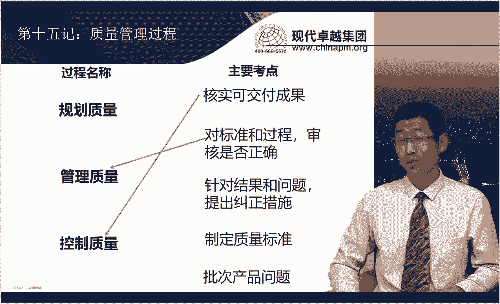

这个你说规划质量做的不好，这肯定有问题。但是关键就是哎如果你规划好了，然后呢，还是出现批次产品质量问题，这个是管理质量的问题，还是控制质量的问题啊，请记住哈，这一定是管理质量的问题。

因为管理质量就是帮助你去审核你的标准有没有问题，标准出现问题才是大问题啊啊，对不对。所以这点一定要记住啊，标准如果有问题，11万把钥匙，9000把钥匙都打不开门，这就是批次产品质量问题啊。

这是归管理质量管的啊。OK好，所以这个他们的区别一定要区分开管理质量聚焦标准和过程，控质量聚焦结果和问题，而规划质量聚焦的是制定标准，而管理质量控质量聚焦的是检查啊我们的标准和结果啊。这道题。

我们选择C选项啊，这道题的一个关键在于说，为了确定问题的根本原因，一看到是哎我们针对问题，我们要去找原因的话，那么不是QA是QC是控制质量。好，这道题。这道题我们选择的是B选项。

首先哈我们就知道在项目执行过程中，在项目执行过程中呢，我们知道啊这就就一定不是规划质量，我们要去做的事儿了啊，另外呢说项目无法满足为制定的质量标准。那你看以对标准产生了质疑。那二话不说。

这应该是质量管理，不是质量控制，我们选B，当然不能选C了啊，质量分析本身就是一个陌生词汇是吧？啊，所以这道题我们选择的是B选项啊。第16集啊，质量管理的一些重要的一些文件和一些概念。我们来连一下线哈呃。

那么用于核对可交付成果，哪个文件是可核对可交付成果到底是合格还是不合格呢？那二话不说，质量测量指标对吧？用于建立质量管理标准和质量流程的。哎，就是我们质量管理计划。这两个文件呢是我们在规划质量的时候。

两个最重要的输出对吧？啊，再往下哈，可帮助采取纠正措施，实现质量期望。为什么能实现质量期望啊？大家觉觉得说你的标准做的一定没问题呀，就你的标准我一定能信任你啊，那这个是谁能做的这很明显QA啊。

那QA一个重要的输出就是质量报告啊。

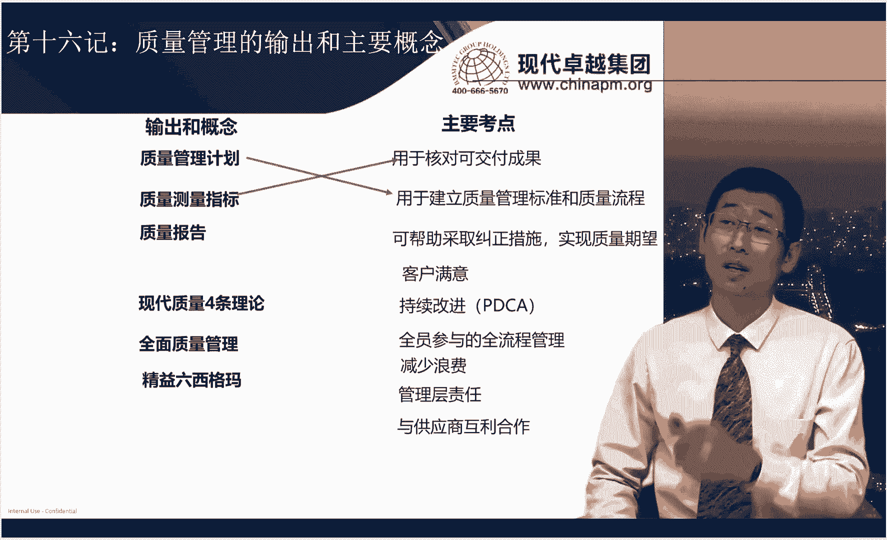

好，那另外客户满意，这属于什么现代质量的四条理论之一，持续改进。第二条。再往下走，全员参与的全流程管理，哎，这叫什么？这叫全面质量管理。减少浪费啊，一看到减少浪费，马上想起来精益六七个吧啊。

尤其是精益这个点哈，这点一出我们就知道马上跟减少浪费这件事情要融合上啊。好呃管理层责任这是什么现代质量管理的4条理论之一啊，与供应商互利合作，哎，四条管理质量的最后一条啊，好。

所以这些概念我们要去掌握啊。好，我们看看题目。这道题我们选择的是C选项啊，题干明确说了说过多的质量测试时间。但是呢他说若要在将来避免。还记着我们在范围内张，你专门讲到了。

说如果哈呃你发现了一些客户不验收的问题。我们想要避免它，我一定要从源头做起。所以这道题就是我发现了我做了过多的质量成本。那我想避免做过多质量成本，我要避免它是不是从源头规划，你就要做的好啊。

那你规划做的好的话，那无外乎就是规划两件事情。第一个规划我们的这个质量测量指标。一另外一个就是质规划质量管理计划嘛，对不对？那你看C叫做规划质量测量指标没毛病。但是D叫审查质量管理计划。

你应该叫规划质量管理计划说的去。所以很明显，C是对的。D是错的啊，而A和B都是以测试团队一起什么开展，这个没有必要，我们不需要找测试团队，我规划的时候，以项目管理团队啊。

和所有的这个团队一些重要的跟质量相关的团成员有关系，未必一定跟测试团队有关系，对吧？所以这道题二话不说，你就应该选C啊。我们来看第十七季啊，合规性。

合规性呢是我们新考纲里针对商业环境又一个非常重要的知识点啊，需要我们去掌握。啊，那么合规性呢，它跟我们的质量管理这是密切相关的。它相当于什么呢？相当于组织外部提一个合规性。你想让项目最终取得成功啊。

在质量上能达标，客户能验收，你必须把合规性作为一个外部的制约因素啊，或者是一个新的这么一个必须要实现的需求。跟我们的项目需求做一个融合啊，那你必须考虑这点。那所以呢呃这块内容呢。

我们呃也要去重点去掌握哈。好，那在整个的合规性的考法来说哈，我们首先可以根据合规性遵守的一个流程，看看他在这些流程点这儿到底考试的时候会呃会有哪些考点哈。首先啊合规性的第一步就是这我说的。

你得给他把这个合规的需求给他找出来，叫确认项目合规性的一个要求。在这块考试的时候呢，你比如说题干就会说说现在有一个合规性要求啊，那么啊请问你啊，项目经理应该怎么办。

那我们知道首先哈项目经理要做的几件事情都会涵盖这里。这就号称叫做项目管理的合规性的五大支柱啊，第一大呢叫合规性的文件的一个记录，就是合规性的这个呃相关的一些材料什么，你得专门给他收藏起来记录下来啊。好。

第二个叫合规委员会，就是从组织层面来说，会有这么一个合规委员会存在啊。那么啊他将来会负责你的合规的一个工作的一个审计啊，那他是也存在的。第三个叫合规风险，就是你有了合规性的话啊。

他可能对你的整个项目带来一些新的风险。比如说进度延期啊，成本超支啊，这些啊，你可能会牵扯到要去考虑是吧？那。第四个就合规审计。啊，将来会有专门的组织去合规审计。

你比如说合规委员会会不会对你的整个的合规的一个执行情况有一个审计啊啊第5块呢就是合规责任，就是谁来啊承担这个对合规性遵守的这么一个职责啊，到底是项目经理还是专门有其他的责任人，对吧？

所以题干中如果出了一个合规性的话，那ABCD中啊，有任何一个这五大支柱里的内容，它都是啊属于可选的这个选项之一。当然你要看具体这个题干中还要怎么去问你对不对啊，他怎么问你你就怎么去作答啊。

所以这5个选项呢，其实都是应该考虑的。第二个呢，就是当出现了合规性的一些要求以外，你要知道合规性要求，就会成为我们项目制定质量管理计划的一个重要的一个输入或者是参考的一个因素。

因为你在做项目的质量管理的时候，你要不考虑合规性。将来你的项目的质量就会可能定义为不合格。所以这是第二点。第三点呢就是啊他呢呃可能会对你的整个的项目的范围有一定这个改变啊。

这就牵扯到说我们配置管理中的一个变更的这么一个出现。啊，所以你要通过合规性的一些这个变化，你要知道我们的对我们的项目是如何去走这个变更流程的啊。OK所以这是关于啊确认合规性要求的第三个考点。好。

那再往下走哈，合规性流程的第二步呢叫做分类合规性的一个类型啊，就是合规性需求搞清楚之后，我还要分类。我看看这个合规性它属于哪一类，或者有这么多合规性，我是不是还要给它区分一下。

这个呢哎就是由PMO来掌控。就是你不是由项目经理来区分合规性，而是由PMO分好了，告诉你说他属于哪几类，你必须遵守。啊，OK所以就是PMO出来啊。好呃，第三件事情呢就是要确定啊所谓的潜在风险。

那刚才我们也谈了，其实合规需求里就应该考虑一些合规风险。那在这个地方呢，我们也知道合规性带来一些风险的管控。所以啊如果选项中出现了说你要去啊识别一些风险的制定对策略，这个没毛病。

你都应该记住到风险的一侧种啊。然后再往下呢，就是啊你真正执行的时候，你肯定要支持合规性，对不对？有合规性要求你就必须得做。那在这里呢做的过程中呢，到底有没有偏差，就出现了几个考试内容。

比如说第一个我怎么样去检查有没有偏差，我可以通过执行报告。啊，对吧执行报告去看看有没有啊有没有内容。那考试中如果出现了说绩效报告里去查看有没有合规性的一些这个执行情况。

那这个呢就相当于他想表示的执行报告。再下一个就是偏差分析，对不对？哎，之前有合规性要求，你到底满不满足是吧？哎，我要衡量一下，满不满足这偏差性分析。再一个就是合规性也是有控制界限的，控制控制图。

我们还记得它有控制上下限，不是说你只要跟标准值偏离一点，就是表示你不合规了，没有那么严格的要求，对不对？啊，比如就像我们说了说人家合规性的要求说你做的啊这个产品啊，那在国家标准上啊，一点偏离都没有。

那就就不合理。反正说国家标准这个基础上可以偏离偏离正负一个毫米。哎，这叫做控制界限。啊，那这个是可以的，这是允许的啊，有这个偏差也不表示你就不合规了啊。所以这个点啊大家特别注意一点。好。

再往下呢呃是分析并确定措施，这就相当于说当你有了偏差了之后，你应该怎么去处理，那你就按照问题处理的方式，我前面有合规性的要求，执行过程中有偏差了。那后来我就解决就好了，所以就按照问题处理的就是发现问题。

分析问题，解决问题就完了啊，就可能考这个问题分析这个点啊，问题分析和处理这个点。最后一个呢就是衡量合规性，谁来衡量PMO来衡量啊，他通过什么衡量呢？质量审计就可以衡量。哎，所以啊其实总结下来啊。

你看这里有几个内容。是在合规题出现了以后，特别容易考的一个考点。第一个就是跟质量相关，质量管理计划、质量审计。对第二个。角色什么呢？PM。第三个就是问题处理啊，有了偏差，我要找问题。第四个就是风险管控。

对吧。那当然最后一个就是我们说了，可能会控制一些变更。这些内容呢其实都是涵盖在五大支柱里面的啊，对不对？有审计呀，有风险呐，有谁的责任呢，对不对啊？然后还有一些记录啊。

所以这块的几个考点就给大家梳理清楚了啊，好，我们看看题目。这道题我们选择的是A选项。题干中明确说了说一个不合规问题。那不合规问题，那我们就要问题处理呗，所以就先分析再解决。只有A是先分析了。

然后再解决了。而BCD都不是。你看B呢叫做审查质量管理计划，你确认是否包含安全要求，你现在就相当于啥呢？你还没找根本原因，说为什么不合规，先着集审查质量管理计划，人家可能质量管理计划早就已经写了。

对不对？说我应该遵守回救性，只是在执行阶段，哎，我没做成。所以啊先分析根本原因再去执行C与安全审计员协商，降低已发现问题的重要性，这个肯定不行啊，你随随便便的去降低问题重要性，这个就有问题了啊。

D验证质量要求，以解决方案是否一致并更新质量管理计划，这个也是有问题的，对不对啊，那就相当于说人家都已经说不合规了。然后现在呢你还去验证它，这就没有必要了啊，所以D也不对，这题选A。我们来看下一道题。

这道题我们选择A选项啊，题干中说呃，你开展质量管理工作的重要依据，你必须保证项目质量计划符合相关法规的要求。那我们就知道合规性一定要。去作为一个重要的考虑，纳入到质量管理计划中去，那就算是什么呢？

这些法规就是规划质量管理过程的一个输入嘛，是不是？OK我们再看其他几个选项，B有助于进行质量管理的一个革新啊，这个不牵扯到说革新的事儿。这个呢本身来说它就是你必须遵守。C会导致项目质量成本的上升啊。

这个呢其实也不一定啊不是一定质量成本的上升。兴许你的法规遵守了以后，质量成本还会下降呢啊，因为你的外部缺陷和内部缺陷的成本可能降低了。D有助于楼房建设质量的优化啊，这个呃也未必。对吧，执行法规。

有的时候这种法律政策的话呢，更多的是符合我们国家的一些要求，也不见得说对楼房建设质量一定有优化。所以这里最重要的还是这个A选项。刚才我们讲到。呃，这个合规性它是我们规划质量一个重要的输入。

第十八季我们来看看第九章资源管理。资源管理呢，首先我们需要掌握就是一系列工具啊，尤其是我们这里标记的在近年考试中，我们常考的一些工具哈，我们来连一下线啊，在整个生命周期，优良行为进行奖励，要认可与奖励。

对吧啊第二个紧密矩阵，作战室哎，集中办公。第三个包含了情商倾听同理心，这都属于啥呀？这个都属于人际关系。啊，这点来说呢，我们就要知道啊。人际关系里有很多很多的内容，那他跟情商不是完全一回事儿。

情商是人际关系里的一部分，因为情商更多的就是一个情绪的事儿。而人际关系不光是情绪的事儿，还包括你能不能站在对方的角度去看问题啊，共情啊，会不会倾听啊，对不对？会不会反馈呀，这些都属于人际关系的一个内容。

好，往下走，改善人际关系状态审查会。哎，这是属于我们团队建设的啊。OK好，缺乏技能。那这是我们的培训可以搞定的呃，考虑了资源可用性、成本经验、能力知识态度。哎，这是选人的时候的多标准决策分析。

控制情绪的能力跟情绪相关。我们知道这是情商啊。啊，与职能经理、其他项目管理团队和外部组织协调资源，这是属于谈判。竞标专有技能项目章程指定。就是我们在竞标过程中，我们会先提前就指定人员专有专有技能。

别人都不能用，就就这个人可以使啊。项目章程指定的啊。OK这个人必须我来用，这都属于预以分派。好，层级型矩阵图。文本型这都属于啥呀？这都属于角色和职责吧，这都属于叫什么工具呢？

图表这个工具里呈现角色和职责的一个特点。那这个也是我们考试中特别爱考的一个内容啊，那因为什么考试题会经常说现在角色和职责分工不清，请问你什么能解决，那肯定就是我们的图表这里面的这个工具。

最后一个相互信任，打造相互信任，然后还能达成一致的，得靠什么？得靠你能影响到别人，这叫影响力啊，影响力。这些内容我们需要掌握。另外呢，其实在团队建设活动层面啊，还有两个重要的考点，我们是需要掌握的。

一块呢就是塔克曼模型。谈湾模型里面呢呃它的五层阶梯理论是我们考试中哈，几乎每次都会有一些涉及的。那么这里呢我们来回忆一下啊，最底层是形成阶段啊，那再往上是震荡啊，再往上什么啊，到了这个规范，然后是成熟。

最后到解散是吧？啊，那每一个层面来说都有它的一些特点，那我们需要去掌握啊，比如说形成阶段呢，我们刚开始认识震荡阶段呢会有绩要的下降，而规范阶段呢开始协同工作了，而成熟阶段呢基本上来说啊。

你大家可以互相依靠了是吧？你不需要去管控了。所以项目经理最后到解散啊，文化多样性这个事儿哈啊不管是在传统项目管理还是在敏捷项目管理啊，都蛮关注这个事了。就是啊如果。我们团队之间啊文化啊是有差异的。

你利用好了啊，你比如说你利用文化差异是可以让我们团队绩效上升的，但是你利用不好，可能就会产生绩效下降的问题，对不对？所以它有好的一面，当然也有差的一面，这取决于你应该去如何去利用文化多样性这件事情。好。

这需要我们掌握。我们来看看题目。这道题我们选择A选项。题干中呢说叫任务和资源都已确定，说要确保资源。那很明显啊，就是规划已经做完了啊，我现在呢就是我想把资源要来啊，就是谈判那个工具。

那我们选A要求职能经理啊为项目提供可用资源啊，B与职能经理协商，项目的资源和角色，角色不需要与职能经理去协商，角色是你规划阶段已经规划好了。所以B不对，C自己联系资源不行。

D将资源需求发给发起人或者职能经理协商，不需要找发起人，对不对？找职能经理去谈判谈判，我们就不就三种人嘛，对不对？职能经理。其他一些管理团队和啊一些外部的啊或者是供应商啊去去去讨论是吧？好。这道题。

这道题我们选择的是A选项啊啊团队成员不尊重彼此的意见，这种环境还起到了一个负效果啊，所以这道题我们选择就是震荡阶段出现了一个情况。第十九计冲突的解决方法啊，那么冲突解决方法这五种方法啊。

如果只是凭上面它的一些特点来说，那我相信对大家来说比较简单。比如说我们现在连一下线，比如说各让一步，哎，这样很典型，妥协调节。第二个，牺牲其他方推行另一方的观点啊，很明显强迫命令，达成共识。

最好的冲突解决方法。好，合作解决问题，求同存异，缓和包容。

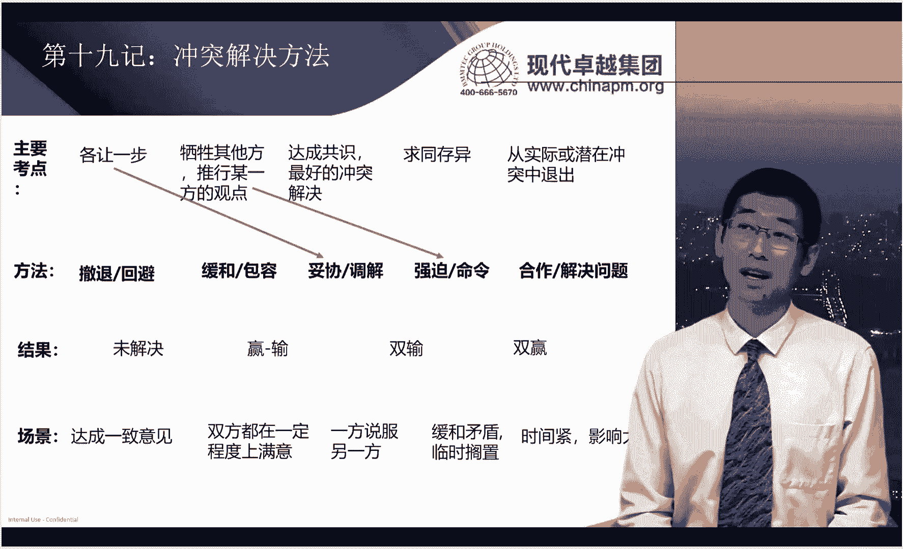

从实际或潜在冲突中退出，这属于撤退回避。但是啊到结果和场景这儿来说就有一点点难了啊。那比如说哈撤退回避，这是属于结果是属于未解决。缓和包容呢，是属于一赢一输还是双输呢？啊，这个属于一赢一输。

给大家举个例子啊啊就是比如说哈你去买房子。那中介呢想卖给你300万，你想200万搞定。所以你们在价格上是有一些冲突的。那这时候中介最擅长的一种就是求同存异。说哎呀，你看看。

你现在呢不就是价格上有这么大差异吗？但是你自己看一看这房子多好啊，学区好，物业好。朝向好，然后哪哪都好。我跟你说啊，你呢如果纠结这个钱这事儿呢，也可以再纠结再想想。但是呢房东说了不肯降价啊。

你不买呢也没关系，后面呢有一堆人在排队呢啊，不是我吓唬你。你看其他的中介也都盯着呢，我现在是看你是老客户，看你买好久了没买着，现在呢给你个机会，你要不要买啊，你要不买呢，被人抢走了，你还真别赖我。好。

你看哎这时候中间一说，你真的动心了，说哎呀。可能呢这个房子就值300万，我要再不买呢，可能不行了，有咬咬牙买了，你他使用的方法就是求同存异。好，那最后达成的效果是啥呢？你呢咬咬牙，你输了花了钱。哎。

但是他赢了，所以这就是缓和包容采取的一些策略和手段啊，好，那妥协呢哎妥协很明显，双输各让一物，对不对？就像我们说300万200万啊，中间的差距怎么样，一人各让50万，对吧？哎。

这就是但是这种就是双输谁都不开心是吧？好，强迫命令是一赢一输，合作解决问题是双赢最好的一些策略，再来看看场景。好，车队回避属于哪种场景呢？哎叫。时啊叫缓和矛盾，临时搁置，对不对？我先临时哎。

我先放下来啊，所以考试中，如果题干中出现些场景，你一定要区分开。啊，暂时不讨论，不代表你就退缩了，是怎么等待时机成熟再去讨论。就跟我们说了，哎，有时候夫妻俩吵架，这男方说啊，我先不跟你吵了。

我要出去冷静冷静，这就是撤退回避，未必是坏事。因为过俩小时可能回来了，回来说，哎呀，老婆我错了，可么这事情解了，明白吧？啊，所以这叫临时搁置，等待这个啊有充分的解决策略的时候再去解决啊，好。

缓和包容呢就叫啥？我刚才说了一赢一输，结果啥一方说服另外一方而妥协调解呢是双方都在一定程度上满意强迫命令是时间紧影响大的时候就强迫命令啊，时间紧啊，这个时间要宽松，影响不大，你也别随便强迫命令。

因为毕竟来说啊强压式的这种管理呢也不太好。OK那合作解决问题最后就是达成一致意见啊，这是我们的冲突解决方法。啊。我们看两道题，这道题我们选择的是第四个选项，题干中明显出了叫立即解决这个问题，时间紧。

影响大是吧？选择强迫命令。这道题我们选择的是C选项。呃，项目经理收到一份来自相关方的电子邮件，说他们对同意的解决方案又改变主意了。这什么概念啊？哎，我明明之前同意了，现在我又改了，这说明啥。

说明其实他也没那么坚定啊，他是有缓和余地的那你干嘛不尝试先去说服他们是不是啊，缓解的意思就是缓和，那你先去求同存异，再说说他再说说他他可能又改回来了是吧？先别着急妥协啊，好，所以这道题选C好于A。

我们来看第二十集啊，资源管理的一些文件哈啊这里呢三个最重要的文件，资源管理计划、团队绩效评价和团队章程。我们先来对比一下他们的一个区别哈。资源管理计划和团队章程呢都是在规划阶段，我们输出的两个文件。

那资源管理计划呢其实是给项目经理看的。他重点呢是告诉项目经理该如何去管理团队，对吧？而团队章程呢更多的是给团队成员看的，它是相当于团队共同遵守的一个规范和标准啊。

所以呢他一定是讲说团队成员怎么样啊应该沟通，怎么样去解决冲突啊，都是团队成员共同遵守的。所以这是他们两者的一个区别哈。给的人看不同，然后呢一个是管理，一个共同遵守的准则。而团队需要评价呢。

它跟这两个文件不一样，它是在执行过程中针对我们团队成员是否按照标准去执行的一个考核的一个绩效，有点类似我们的KPI绩效，对不对？只不过是说他是从团队角度去评估的啊。所以呢依据这三点。

我们就知道他们里面的内容应该是有区别的。我们来连一下线哈，先看右面的主要考点跟我们这三个文件的关系，角色和职责，哎，这是谁来管理团队呢？就是项目经理用来管理团队的角色和职责的内容呢。

也是我们考试的一个重点。刚才我们在工具中学到了图表的三种工具obBSRACI和我们的文本型。重点我们考的就是OBS和RACI尤其是RARCCI因为RACI呢他强调的角色和职责。

是针对每个活动它都有具体的角色和职责啊，这个很了不起。这个从项目角度就已经区分的特别详细了。OBS还做不到OBS呢其实它是以部门为单位部门的职责。所以我们知道我们要看到考试中看到RACI。

我们知道它非常有可能是那个正确答案啊。好，那往下走团队价值观和共识。哎，一看到这个团队价值观这个事，我们就知道大家共同遵守的一些准则。好，沟通冲突决策标准过程，这也是团队章程的。大家应该遵守这些要求。

好，个人技能的改进。你看哎这是一个绩效的一个内容了。所以这团队绩要评价识别和获取资源，这很明显这要管理团队要干的事。啊，所以处于资源管理计划。

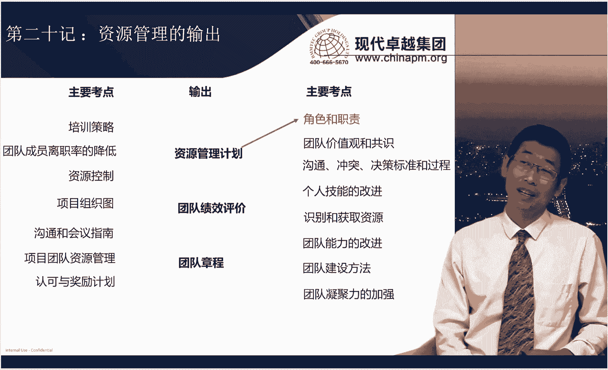

好，团队能力的改进还又是KPI了啊，属于团队绩效评价团队建设方法。哎，你看又是管理团队的团队凝聚力的加强是个结果，所以是属于团队绩效评价。再看左边培训策略，哎，又是管理团队的一个要求。好。

团队成员离职率的结降低，这是个结果，属于团队绩效评价，资源控制啊又是管理团队的方法。项目组织图啊，这给谁看的啊，那这是给项目经理看的团队章程里都是一些规则，大家遵守的准则。

不需要专门去看什么项目组织图了。沟通和会议指南。哎，这是团队章程有的项目团队资源管理管理团队有的资源属于资源管理计划认可与奖励计划。哎，就奖励团奖励团队有的，这个属于资源管理计划。

所以呢其实最重要的就是区分他们的使用的啊角色和他们的目的，这个就能很好的区分了啊。好，我们看题目。这道题选择的是B选项啊，题干中说获得有关团队建设的信息，那你在哪里啊？哎，你要管理团队嘛。

所以是项目资源管理计划中有的，其他几个选项都没有团队建设的信息。好，看这道题。这道题我们选择的是D选项，因为题干中说了啊，叫做可交付成果，拥有所有权。哎，谁来去啊针对这个可交付成果。

谁是有这个控制权负责权它是这个意思啊，那就是角色和职责的一个分工嘛，是不是？那我们说了责任分配矩阵里能聚焦到每一个活动，每一个成果，它应该有谁来负责。然后谁来咨询谁来通知的这么一个内容。

所以这道题选择的是D选项啊，责任分配矩阵啊，我们不会去选B选项哈，需求跟踪矩阵呢，虽然说在需求那章呢很重要，但是实际上来说哈。他更多描述的是什么？每个需求啊，我们应该跟其他的啊一些可交付成果啊。

测试之间的关联关系。但是这个题干中说的是可交付成果和人之间的一个关系啊，那跟人之间的关系呢，我们更多的呢啊还是选责任分配矩阵。

而需求分同矩阵更多的是需求跟其他的一些这个啊这个这个这个像测试啊设计的一些技术性的文档啊，或者管理性的文档一些关系啊，所以有区别啊。这道题我们选D。我们来看第21季关于沟通那些工具和输出哈。呃。

那么我们先看它的一些主要考点哈呃首先啊第一个沟通胜任力，反馈非口头沟通演示，这都属于沟通技能。就是你有没有能力去做好这个沟通啊，会不会反馈会不会非口头沟通啊，会不会肢体语言表达，对吧？这都属于沟通技能。

在最近呢考的比较多的，就是反馈，就是我们要学会给对方，当对方给我们一定信息的时候，要给予反馈啊，这都属于沟通技能啊，记住啊，往下走渠道N乘N减一除以2，这都属于沟通渠道。再往下哈分析沟通需求。

确定相关方的信息需求，包含所需信息的类型格式。这属于沟通需求分析。这点来说要特别的注意，就是我们考试中哈，绝大多数沟通的题目，你会发现哈啊他都是首选沟通管理计划啊。

但是呢有些选项中没有沟通管理计划的时候，大家就要小心了，它可能是沟通需求分析。因为什么呢？因为往往题目都是说现在呢有些沟通的障碍啊，然后呢，请问你项目经理应该怎么做。那项目经理呢。

那其实你除了要调整沟通管理计划啊，沟通管理计划以外，你最重要的就是了解对方到底想怎么样去沟通他的需求是什么，对不对？然后呢，你要按照他的沟通需求，你给的更合适合适的沟通渠道，沟通方法去沟通对吧？

所以他会成为这个第二个重要的选项啊，好往下走啊，编码传送信息解码确认啊，这属于沟通模型，确认呢啊是一个比较重要的内容，就是你要告诉对方。啊，我收到这个信息啊，你解完码之后，哎说哎这个哎我知道了。

你跟我说的就是啊你你你现在已经复习的很好了啊，我确认我听到了啊，所以这个这个过程也是沟通模型里一个过程。这个大家要记住哈啊有助于减少误解并促进沟通和知识分享，这是属于会倾听啊，会倾听就会达到这个效果啊。

互动式沟通推式沟通拉式沟通，这个叫沟通方法，拉式沟通里啊，尤其是比较爱考的一个点就是当信息量很大的时候受众很多的时候，我们用拉式沟通，就是我们拉信息，从网站上之类的，我们去拽信息下来啊。好。

那这个点我们要特别记住哈。最后一个就包含了沟通需求沟通内容，沟通格式沟通频率，沟通人员沟通技术和信息保密性的，这属于沟通管理计划。所以为什么说沟通管理计划会成为这么重要的选项。

因为它基本上来说该有的内容，它都写在这个文件里。好，这道题。这道题我们选择A选项啊，这道题就是考我刚才给大家说的，在沟通这个方法中的一个所谓的拉式沟通。一个项目的团队成员呢位于不同国家。

然后呢呃团队审查大量信息，哎，一看有大量信息有不同国家，那你最好就是从网站去拉啊，所以这道题选择A不选择啊B呀、C呀这种啊这种互动式沟通或者是推时沟通。啊，这道题。这题选择的是B选项。因为什么呢？

说项目经理必须沟通范围变更，并获得跨过新东方的批准。就是你有一来一回了，是不是别人又给你确认，又给你反馈了，这不就是我们的互动沟通嘛？所以这道题选择B选项。第22级相关方管理啊。

沟通和相关方呢这是密不可分的。考试的时候也经常被放在一起考哈。那相关方管理中关于它里面有一些工具和一些过程啊，它有的时候是很难区分的啊，那所以呢我们现在呢通过啊这块这个机会，我们把它区分开哈。

我们来看看右面的主要考点跟我们左边的连线哈，收集和分析信息，识别出相关方的利益期望和影响，这属于什么相关方分析。用于将相关方当前参与水平与期望参与水平进行比较。哎，这是属于相关方参与度评估矩阵。第三个。

记录相关方的信息，这就属于消防方登记测。你看消防登预测和消方分析，很多同学就分不清。啊，现在你就知道啊，一个是收集分析的，一个是记录的啊。OK好，往下包含相关方分析和相关内测的工具。

这属于识别相关方案这个过程。为调动相关方参与制定管理策略，这属于相关方参与计划里面写的主要内容啊，它是专门写制定出来的管理策略的，而实施管理策略，这属于管理相关方参与。而根据项目和环境变化。

调整管理策略，这属于监督相关方参与的。哎，所以你看这些动词，你现在就能区分开了啊。好，我们看看题目。好，这道题目我们选择的是D选项，是在相关方登记册中。我们既然之前分析了他们的需求期望影响。

做相方分析的时候，不重点要进行的就相关分类吗。那相方分类分类完了以后，你在相方登记册中，你不就要把这些信息写出来吗？当然你也得明白啊，我们在考试中有的时候也会考你是先做相框分析，还先先具有相关登记册。

那很明显啊，我们一定是先做分析再有登记测。因为分析是个工具啊，而登记册是个输出啊，我们肯定是先拿工具，结合输入才有输出的嘛，对不对？好，所以这个点不能错啊，这道题选择D选项。

其他的内容都不一定写在相方登记册中。好，那说到了相关分析，我们就自然得记住标准的相关分析的一些典型的模型。尤其我们考试中最爱考到的就是权利利益方格。所以权利利益方格在每个方格里，每个分类里，它管理策略。

首先我们来记下来，权力大利益大的，我们要怎么样。要重点管理权利大利益小的，我们要令其满意。权利小，利益利益大的，我们要随时告知。权利小利益小的，我们要监督是不是啊，好，所以这个模型我们是一定要记住的啊。

另外呢啊书中也讲到了几个其他的模型，像权力影响啊，作用影响啊。但是啊这里面呢都没啊一就是就是强调哈让我们掌握里面的一些管理策略。所以呢我们重点掌握的是权力利益模型就比较好了。但是凸显模型呢。

你得搞跟这个二维矩阵的这些模型要搞清楚二维象限的这些内容啊。他都有一个特点，就是啊相对来说哈啊他们都是管理比较简单的相关方的。而凸显模型呢，它是3块内容结合交织在一起去把相关方进行分类嘛。

就像三个圈套在一起。那相关方可以啊在不同的圈里进行分类嘛，是不是所以它的种类会更多一些。所以面对着更复杂的啊一些这个相关方的啊一些关系的时候，我们可以用凸显模型。当然还可以用优先影响方向和优先级排序。

那这两个呢以前呢就是只是说到过提到过啊，你不需要掌握里面太多的细节。其实呢啊它你可以简单理解影响方向就是向上影响，比如说向上管理领导啊，向下管理团队啊，向外管理其他的项目经理啊，然后这个横向去管理啊。

跟你相关的一些人员啊，对不对？这都属于影响方向的一个内容。而优先级排序啥，哎重要的相关方，我优先管理非重要的相关方，我甚至。可能不管理，对不对啊？你比如说像淘宝啊，他的相关方可能就太多了，对不对？

所以普通用户呃，人家根本就没精力去管理你是吧？所以这就属于优先级排序啊，记住这点啊。好，我们看一道题目。这道题我们选择的是D选项啊，题干中明确说了叫权利等级较高，但是利益较低，权利大利益小的。

我们选择令其满意。这道题。这道题我们选择的是A选项。啊，因为题干中明确说了，项目经理正在与多位相关方一起管理一个庞大而复杂的项目。那很明显哈，凸显模型呢是管理庞大复杂的项目会更好一点，比B和C会更复杂。

相关方立方体啊，其实它管理的相关方啊也相对来说呢啊是啊没有凸显模型那么多啊，因为它更多的是体现出一个相关方，它从多维度的角度去管理你啊。那呃但是呢相关方之间的关系没有那么复杂。所以凸显模型呢，你就记住。

管理庞大而复杂的项目更合适一点啊。好，我们来看第24集，说完了沟通，说完了相关方，我们再来看看一道题目。那么我们到底首先去确认他到底是沟通还是相关方。那这里呢其实很好区分哈，一道题目。

你看他到底强调的是信息传递的问题还是相关方参与的问题。题干中会怎么说呢？题干中关于信息传递的问题，无外乎就是有人表示第一次听说，有人对你说的事情非常的惊讶啊。CIO说我之前直接去找的团队成员交流。哎。

这都属于信息传递不正确导致的问题。这个呢？你就从沟通的维度去找。好，那另外一种呢就是相关方参与的问题。比如说相关方说我不来开会了。相关方说，我对你的产品啊，我觉得不满意啊，即使范围啊进度都合格。

我也不满意。那像这种题目来说呢，我们选择的是相关方的题目啊，那么沟通的题目来说呢，又分成两类哈。第一大类呢就是我们刚才学的啊，考一些沟通的技术啊，考一些沟通的工具啊。

考一些沟通的输出啊啊或者是甚至考一些沟通的一个渠道的一个计算呢。当然计算题现在来说比较少一点哈。当然这都属于第一大类题哈。第二大类题呢就是刚才我说的场景题，就是各式各样的信息，没有没有成功传递。

那信息没有重复传递，就从这三个选项中选沟通管理计划、沟通规划和沟通需求分析。我刚才说了，沟通管理计计划是第一选项。信息没重复传递，就是你沟通过理计划没制定好吧。😡，是不是你要不就没有。

要不就制定的得需要调整。剩下的就是没有沟通管理计划，你就选沟通规划没规划好，或者是需求分析，你没分析好。而相关方呢啊不满意不参与这种场景题呢，我们其实是从四个选项中去选啊，就是相关方参与计划没制定好。

管理相关方参与没管理好。因为他俩区别就是一个是制定管理策略，一个是执行管理策略，你要不就制定管理策略没制定好，要不就是啊执行策略没执行好。然后第三个叫做让消关方没有尽早参与嘛。对不对？哎。

那没有尽早参与，他对你的这个这个慢慢的一个产产物来说，他也不知晓了，或者是他也慢慢也对你来说也没那么支持了，所以也会引起。这个牵扯到不满意不参与的问题啊，最后一个就是监督相关方参与，没有监督好。

没有监督好的啥呢？就是哎你调整了管理策略，发现还是不行，或者你压根儿哎就是你没调整管理策略，你光执行了，发现还是有问题。好，所以这都属于我们相关方不满意或者不参与的问题。另外一种呢。

考相关方的题目就是刚才我们说了相关方管理的那些工具过程和文件之间的一个区别啊，所以如果是考沟通管理的工具啊，文件和相关方管理的文件工具都比较简单。但是如果考场景题的话。

你就从我刚才写的这些选项中去选就好了。好，这是关于沟通和相关方的题。我们来看看题目。这道题我们选择的是A选项，大家可以看一看啊。题干中说，你想要了解向不同相关方提供何类信息。

以及应采用什么方法提供上述信息，都是信息信息信息。看到信息，你就知道信息，这是信息传递的事了。信息传递的事就选沟通管理计划，不要选相方登记册或者是啊其他的一些选项啊，就是沟通的问题。OK好，选A。

我们来看第25计风险风险这块呢，其实它考的就分几大类。第一大类呢就是风险的几个过程之间的关系。第二大类就风险的核心工具。第三大类呢就是风险的一些这个分类啊，我们一块这块来看啊啊。

有一类考题呢就是考你风险的这几个过程，他们之间的一个先后顺序。我们先把风险的这几个过程先回顾一下哈啊，第一个过程叫做规划风险管理，然后呢去识别风险，然后去做定性风险分析，做定量风险分析。

然后做规划风险对和实施风险对，最后做监督风险。在这里呢题干中无外乎就是出一个所谓的现在场景题，你在哪哪一个啊步骤。然后请问你项目经理下一步怎么办？项目经理应该怎么办？项目经理首先怎么办。好。

这个地方呢我们会出现一个B选项叫做更新风险能预测。为什么说B选项呢？因为风险能预测呢，除了在规划风险管理中没有输出，在识别风险中它就有输出了。然后在后面的每个过程它都有输出。所以题干中说。

现在我正在识别风险，请问你下一步做什么？下一步肯定要是先去把风险登记测先做一个更新啊，对吧？你做完了定性之后，也是首先更新风险登性测，再去做定量风险分析。

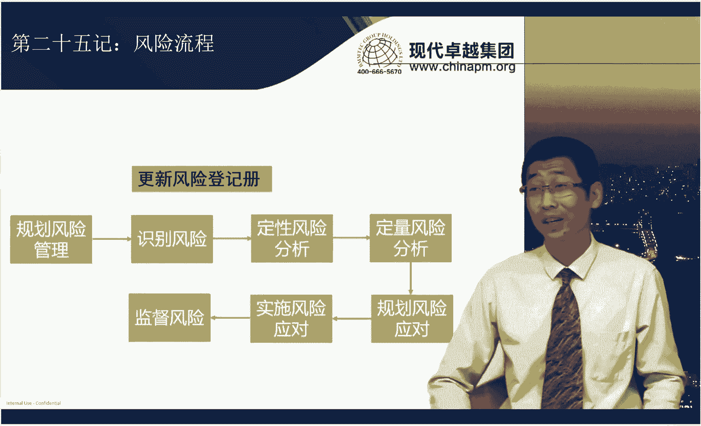

之前在变更那章，我就给大家讲过了，PMI永远说的是在传统项目管理中是文件先性，先记文件，再去做实际的动作啊，这是他要求你流程一定要标准化、合理化的一个最简单有效的手段。

所以呢我为什么说一旦考到这种考题啊，题干中说，我现在正在做定性呢？请问你下一步做什么呃，ABCD中有风险登记测的更新，一定首选风险登记测？好，我看看题目。这是第一大类啊。这道题选择的是C选项。

题干中说了风险二字。那我跟大家说过了啊，你不用考虑说我到底后面是到底是预计持续6到12个月还是24到36个月，这都不重要。最重要的是你应该做什么？你应该先把更风险登记册做一个更新啊。

然后再去考虑我到底怎么去应对它，对吧？所以这道题选C就完了。这道题我们选择的是C选项啊，不知道大家有没有选择B选项啊。OK呃，大家可以想一想啊，我放在风险这张，你要选个B选项，这你有点太不给我面子了哈。

啊，那控制范围蔓延是变更管理没毛病，但是控制范围蔓延的负面影响，简单来说就是控制负面影响这个风险管理。因为范蔓范围蔓延的负面影响很多呀。进度延期呀、资源时期低下呀、质量变差呀。

这些有的时候不能光靠变更管理去解决。尤其像什么团队绩效低下，你你怎么变更呢？啊，所以这个呢我们用的是风险管理，不用其他的一些管理手段。

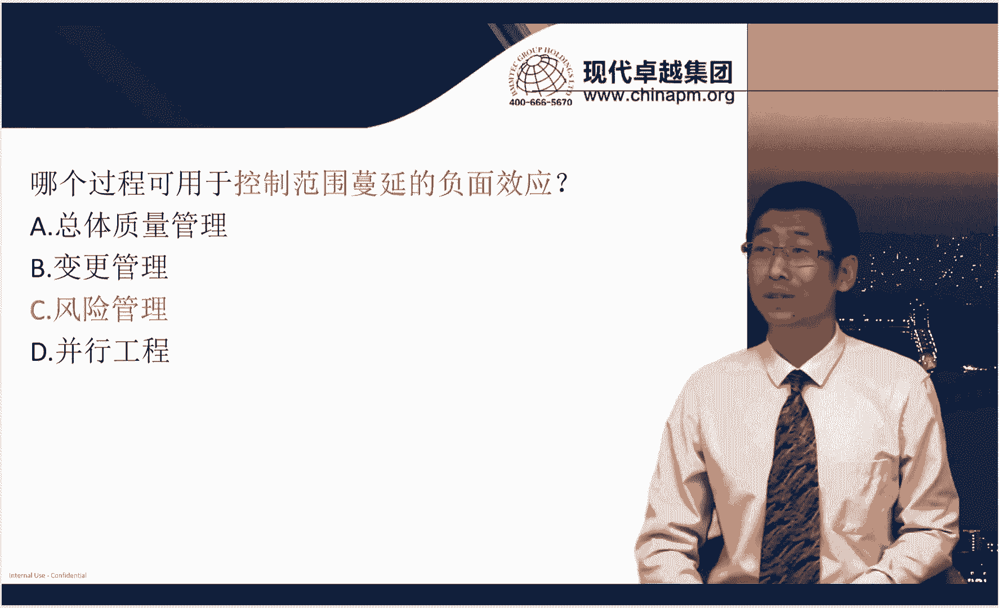

好，我们来再看第二大类题目哈。第二大类是风险的一些工具。那风险的工具呢，首先看看我们常考的一些工具哈，先拿右面的跟我们左面的工具进行一下连线哈，发现问题深层原因制定预防措施。

这是属于根本原因分析就比较简单，全面识别风险。我们跟你说大家说了，一牵扯到前面你就要想取矩阵呢二维象限呢，它会让人感觉很全面，那哪个是二维象限呢啊，s分析啊，识别单个或整体风险，哎，怎么都行，哎。

那个什么靠人了头脑风暴啊，利用RBS最底层RBS最底层它可以查缺补漏啊，对吧？查缺补漏。我们说了在指南那章我们学到一个工具叫做核对单。啊，把RBS的啊这个整个内容写在核对单里，一条条检查呀。

不就查缺补漏。好，包括了紧迫性战略影响力的类似层级图。层级图，我不知道大家记不记得它是一个从三维象限角度去分析风险的一个层级或者是风险的等级的啊，到底是高风险、中风险还是低风险。

那这个呢其实它跟概率影响矩阵不一样。概率影响矩阵是一个二维矩阵。而这个三维矩阵，它用到的一个工具叫做其他风险参数评估。啊，他能给我们概率上就这进行一些增补。啊，因为大家都知道紧迫性也会影响风险的。

对不对？好，所以这事儿我们要记得哈啊利用经验和历史数据进行分析，这是属于访谈啊，访谈的一个分析工具，而且是定量分析的。啊，对不对？哎，我看看别人的历史数据下，这个项目成功概率有多少，对不对？

你能看出人家实实在在的数据啊，评估风险数据的有用程度。哎，这个大家容易遗忘。这个大家呢你要记住哈，为什么会有干这个事儿呢？因为概定向矩阵。这个工具有的时候会被人质疑，为什么质疑？

因为概率影响矩阵它的概率和影响都不是啊完完全全从市场啊或者是从组织过程资产呢完全量化来的，它更多的就是啊是定性分析来的。比如说到理一个风险它的概率啊有多大啊，这个其实没有那么量化。

所以呢我们都知道概率影响矩阵呢，它虽然最后评估高中低风险是按照概率成影响，但是概率成影响，它还是做一个定性，它只分成高风险中风险低风险啊，它不会分的那么详细说这个第一名比第二名高几个百分点啊。

它真不会算这个。因为啥呀？因为概率和影响本身这个横轴和纵轴的这两条线就不是特别准确的啊，那有人质疑你不准确怎么办呢？你就靠。风险数据质量评估这个工具啊，结合概亮项矩阵去证明你我告诉你。

我概量项矩阵也不是拍脑袋来的。我是做过质量评估的啊。我告诉你，这个是可信的啊。所以啊你把这两个工具一起记啊，概量项矩阵，风险数据质量评估，才能证明你的风险分类是有效的。O再加上其他风险参数评估。

就能把风险分类做的更有效。因为你从更多的层次去确定我们的风险分类。好，往下走，排序风险分类，低风险观察清单。哎，这是啥？这就概率想矩阵啊，这个都比较简单了哈。尤其记住这个低风险观察清单啊。

就是风险如果被确定为低风险的话，你有的时候不需要去制定应对措施。啊，因为你任何一个风险登记侧重风险，你都需要制定对措施的。所以如果低风险你又不想制定对措施，你把它写到低风险观察清单啊。

先暂时不用去应对它啊，也不用制定应对策略。啊，往下走哈，项目经理检查风险应对和风险管理的有效性。哎，检查有效性得靠什么？得靠外部人员审计你审计一般都外部人员来，对吧？哎。

外部人员才能看清你到底做的好不好。所以你知道审计这件事情不是QA做的不是外部人员嘛啊，所以你要注意这点哈，OK审计。好，往下走，统计方法，EMV计算风险中立这是什么决策数。每次改变某个因素的风险。

量化排序，龙卷风土，哎，这敏感性分布啊，敏感性分布，你要跟该亮项矩阵要区别啊区别开啊，该亮项矩阵是定性风险分析哈。啊，那钙敏感性分布呢是定量。而且呢他俩都有一些特点，其实他俩都是给风险排序的。

只不过干上矩阵只能定性而敏感性。这个分布它可以定量去排序。好，最后一个呃识别新风险，删除旧风险，效风险再评估，这属于风险审查会议区我们要做的事啊，这是我们常用的一些工具啊。另外呢呃风险的应对策略。

这是我们考试必考的一些工具啊，我们来连一下线，先看右面的哈啊他们的这个风险应对策略的一些特点，提高积极风险的概率及其积极影响，哎，这属于什么呀？这属于提高。好，将风险责任分配给第三方啊。

这个责任是一些正面的责任的话呢，我们就是选择分享啊。如果是负面责任的话呢，我们就选择转移了，对不对？好，消除不确定性，确保机会肯定出现啊，这属于开拓。

准备应急储备接受转给第三方支付风险费用对处理财务后果最有效。哎，这就很明显，就有点像外包啊、保险呢，这属于转移。降低概率和影响，这属于减轻。改变计划和范围，完全消除威胁，这属于。

回避某威胁不在项目范围中或应对措施超出了项目经理权限，这属于上报这块的内容呢相对来说呢，对大家来说都不难。难的在于左面这一块内容啊，这有点难啊，更多测试，更可靠供应商冗于不见。考试中经常像这种场景。

让你去选择对应的工具。那这属于什么呢？哎，需要更多的测试，就是什么能减轻或者降低风险发生的概率。购买保险和外包，这属于什么？转移。去掉有风险的工作包或取消项目，哎，这属于回避啊，自然灾害。没办法。

只能上报。安排时间资源当做应急储备，由应急储备的变成接束了。改进技术，节约成本，并缩短工期，这属于。开拓。因为通过改进技术，我确实完成了节约成本和缩短进度的目标。百分之百抓住了机会啊，就是开通啊。

建立风险共担的风险合作方式。啊，这是分享。好，增加资源。哎，这属于提高。好，这是风险应对策略的一些特点啊。好，我们看题目。好，这道题我们选择C选项。在第二年开始时，项目稳定下来，问题数据也显著减少。

也就是在项目的过程中，你要去监督风险，那我们选择风险审查会，因为可以继续识别新风险并删除就风险啊，并且重新评估现有风险。加几个选项都不选了啊，像D什么啊进行定性分析。对残与风险题干中从来没说残与风险啊。

对吧？残与风险的意思是说，风险应对了，没完全应对成功。他只是说现在的问题越来越少了啊，不是参与风险啊，B减少管理储备。啊，那这个呃这个也也不需要，你你要调整的，只能说是应急储备，对吧？啊。

A取消剩余的已计划好的啊风险评估会，风险评估会你该开还是要开的嘛，对不对啊？好，所以这道题只能选C。教体。这道题我们选择D啊，因为题干中说，其中一个可能的风险不能减少，又不能减少啊。

然后呢看来呢也没法规避是吧，减少都不能怎么规避呢？那是只能接受了吧，所以选择D使用应急储备。这道题我们选择的是C选项呃，题干中说用于评估替代供应商是否符合资格。那替代供应商有替代的吗？还没替代。

它只是准备，所以就降低风险发生的概率了，或者是降低风险对的影响，这不就是减轻嘛，是吧？所以这道题选C选项。好，那么风险的这个还有一块呢，就是考风险的一个分类。风险的分类呢重点呢它怎么考你呢？

就是你看着一道场景题系之后啊啊你要评估出来它现在题干中描述的是哪种风险类型，到底是已知已知还是已知未知还是未知。因为不同的风险类型，它的控制流程是不一样的啊，那这个呢大家得会。好。

那我们来快速过一下哈啊，那针对已知已知风险，我们怎么样呢？我们要去。分析风险，然后呢并且制定应对策略。什么时候执行，哎，你可能会在。很快就执行了。换句话来说，我们应该在风险转变成问题之前，我们就执行。

为什么呢？比如说大家这个。女孩去找去相亲的时候啊啊，她识别出来一个长相风险。那长相风险呢，她也知道长相对她来说呢特别的重要。所以她能知道这个风险发生的概率和对他的影响，那这就是一个已知已知风险。

那你看他制定的应对策略叫做要照片儿。是吧那你说他什么时候要是现在要还是等见成了以后再要，肯定是风险转变上问题之前就会要照片。啊，所以这个应对策略要照片，这个策略会在风险发生之前啊，就转变成问题之前。

你就会去执行。那花的什么钱呢？哎，花的是项目成本，因为要招片这件事情你一定会去做。因为你已经知道这是个已知风险了，而且你也知道它对你的影响概率了，那你肯定会要招片是吧？既然肯定会要照片。

这不就是WWBS包里的一个工作包嘛？所以花的是项目成本，会运行变更，不会，因为这属于WBS包范围基准里的内容不会引急变更。但是如果是一个已知未知风险呢，哎，既然是已知风险，我们肯定也会分析风险制定策略。

但是什么时候再去执行呢？一定是发生了之后再去执行。为什么说呢？说我去相亲的时候啊，我这个识别到一什么风险呢？说这个男生是话痨啊，特别喜欢啰啰啰嗦，不喜欢听他说的那你想一想啊，那这个不喜欢说这个事儿呢？

你就算你识别到这个话痨这个风险，但是你很难去评估出来他对你的影响和发生的概率。因为一个男生嘟里嘟噜嘟说了很多，但是每句话你都爱听，哎，他就不是一个话痨是吧？那另外呢，其实你也不知道他说哪一句话开始。

你开始反啊，所以你第一你也不知道他发生的概率。第二，你也不知道他对你的影响有多大。你知道他话唠从什么程度，你受不了，会崩溃吗？对不对？你也不知道，所以你不知道它对你的影响和概率，我们叫做已知未知风险。

那这种已知未知风险的。啊，他的处理手段是说我制定一个管理策略。比如说制定管理策略是啊这个不能说体育，不能说军事和政治。那你想想你什么时候去执行这个策略，一定是他开始变话痨的时候，你才去执行。

你不会说说哎他还是这个没开始说话呢，哎，往那一坐，我说你先别说话啊，我跟你说啊，今天讨论的话题不能包括体育社和政治，你开始说吧。对方一下就懵了，不知道说啥好了，是既然咋那么侥幸，那我不和他谈了，是不是？

所以呢一定是等他开始什么谈C罗啦，开始谈这个中日啊，这个之这个之间的对抗了。哎，他始谈那个时候，哎对不起。我们能不能不谈体育军事和政治，我对这些话题不感兴趣，你看这个多自然，所以一定是风险已经发生之后。

你再去分析这个问题，然后去啊去执行这个策略。但是执行这作策略之前呢，你还要在分析分析说现在已发生的这个风险跟我的管理策略到底对对应能不能对应上。所以他就会是先分析问题，再查阅能力策。

看看这个策略能不能对应上。然后你再去执行。好，为什么这么说呢？你想啊他是话痨，你跟他说说我的应对策略叫不谈体育军事政治。你跟他说完了之后，他说我没谈这些，我们谈的是感情啊，对吧？你看情感也是话痨。

你就应对的有问题了。所以你得看看他到底他是不是谈军事的时候，你在抛出这个有没有效。因为毕竟你制定策略和你执行策略的时间有个时间间隔啊，本身来说它个风险啊，可能跟你的这个策略其实就对不上的一个问题了。好。

所以呢它是分析问题，查询能预测并执行应急应对策略。我们针对已知未知风险，我们的采取的策略叫做应急计划，或者叫做应急应对策略是吧？而针对已知已知风险，我们执行叫做应对计划。啊，那么已知未知风险。

我们执行应急计划以后花了什么钱呢？应急储备。因为你说啊你说我这个请不要谈体育军事政治这件事情不会写在项目管理计划中的。作为WBS工作包的一个内容的。因为如果他不是话痨，你根本就不会去使用，是不是？

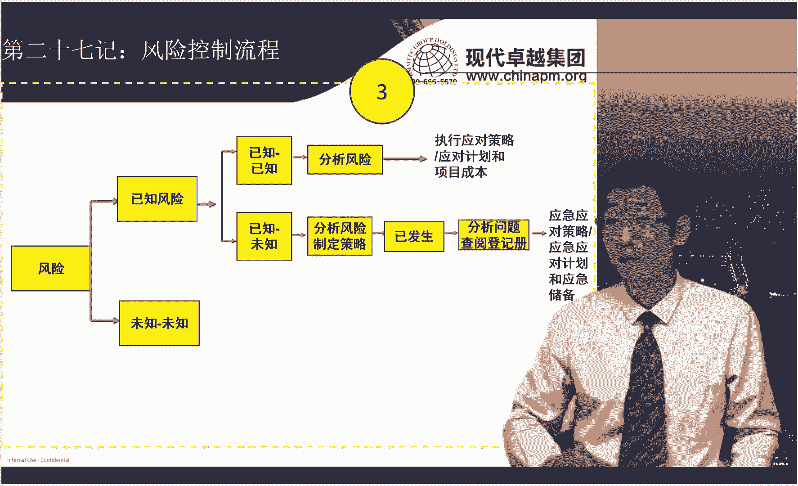

啊，所以你只能花应急储备，不能花项目成本里的钱，那会不会一起变更呢？会呀，既然不是项目管理计划中的内容，你使用起来它不就会引起变更吗？是吧。那当然未知风险我们要怎么做呢？未知风险一定是已经发生的时候。

你再去应对，那也是什么分析问题，然后执行相应的应对策略，并花的是管理储备，是吧？好，当然未知风险呢哎也会引起变更。啊，因为啥？你说地震了以后跑，那你在项目完计划中永远不会写，我做着做着项目我就跑了是吧？

所以既然跑了啊，你去应对风险了，这一定也会产生一些变更，因为会影响你进度啊成本的一个一个变化，是吧？好，当然。呃，未知风险下次你再去识别的时候，就应该成为一个已知风险了。对吧你第一次就不知道。

你第二次再不知道，那这事儿就怪你了啊，是吧？好。那当然啊这个风险呢我们还有几大类哈，叫做自身风险、残与风险和弹簧计划。这个我们得需要掌握啊，简单回顾一下，你看自身风险，比如说。你说你相亲啊。

你发现他不适合你，你的应对措施就直接跟他说，你说我觉得咱俩不适合哎，应对了，但应对成功了没毛病。但怎么样呢？这哥们抑郁了啊，你看新的风险发生了啊，好，他是你俩是不适合了，但是他产生了新的风险。

要次生风险，由于使用应对策略导致的新风险发生，那什么叫残与风险，参与风险没有应对完全成功，还有遗漏你比如说哎我是要照片，我是担担心长相风险，要上照片去看了以后没问题，这是这个长相，但是怎么样？身高不对。

我想找个一。8，他结果长成2。8是吧？残与风险啊，什么叫谈回计划，第一次应对失败了，再次应对叫谈回计划。我觉得他不适合，我想从啊这个厕所跑，结果我好不容易跑到厕所一溜出来，哇吓一跳，他站在门口等着我啊。

他说我看你半天没出来，我担心你出什么事。好，第一次应对失败被抓过去了。第二次再应对，假装家里人找他，喂，电话谁呀，那我赶紧回家，对不对？第二次弹回计划。好，所以这个几个事儿啊一定要记下来啊。好吧。

针对不同题目，我们选择不同的风险流程。好，我们看看题目。这道题我们选择的是C选项，因为纠正措施是不是属于变更里的一个类型啊，这属于变更啊。那我们刚才讲到了哪种类型的风险会产生变更。

无外乎就已知未知风险和未知风险嘛，对不对？啊，好，那。现在ABCD选项中哪个跟这个风险有关系啊？应急计划，因为应急计划执行的就是已知未知风险的应对策略，对不对？所以这道题选C选项啊。

不选AABDABD都跟这个风险的类型的应对措施都没啥关系，对不对？都是属于风险的工具。好，这道题。这道题我们选择的是C选项啊，题干中说说我执行了一个措施，但导致了新的风险，这不叫自生风险。

自身风险呢有的时候会产生一些翻译错误。所以这个地方呢啊专门提醒大家啊，自生风险呢有的时候被翻译成二级风险。因为英文叫secondary，就第二个的风险。所以呢其实这表明就是自生风险的概念啊。

我们选C就完了。那看完了整个的风险的内容之后呢，我们最后再来梳理梳理风险问题跟变更之间的关系。这有时候也是我们同学经常啊这个搞不清楚的哪一道题好像又是变更，又是问题，又是风险，怎么区分，尤其A选项。

更新问题日志，B选项，更新通用能力册C选项，还要提交变更请求，对吧？说不清楚了。好，那首先哈我们拿到一道题呢，你要搞清楚哈。那么其实哈变更呢它分成四种类型，大家还记得啊，预防啊、缺陷补救啊、纠正啊。

再加上更新。其实呢只有一种题，你可以迅速定位它，它不是问题，不是风险，它就是变更题目，就是更新的类型。更新的类型题干中就是哎客户提出一个新要求，客户要提出加加一个新范围，客户要加一个新功能。这很明显。

这就是典型的变更的更新的题目，跟问题风险没什么关系，你就直接选变更题目就行了。但是剩下的题大家区分不了的那就是好像现在题干中说是有一个风险或者一个问题。然后这个问题你要引起一个变更是吧？啊，好。

这种题那这种题我们要搞清楚，就是到底是先有风险和问题还是先有变更，一定是先有风险和问题再有变更。因为变更的类型，我刚才说了，刚才其中有三种都跟问题相关，叫做预防啊，然后缺院补救和纠正措施。

这三种都有可能引起变更。那你现在是不是先这样，先是先有问题，然后分析问题解决问题的时候才生才会产生产生变更。比如说给这个强刷油漆。墙皮脱落，你要重新刷，这就是一次返工。那首先是什么呢？

是墙皮刷完油漆以后脱落了。有这个问题分析原因就是因为我们之前我们刷的这个油漆的时候，前墙面没有干。对吧原因找出来了。那我的这个纠正措施说，我再重新刷一遍，哎，你看这不就是一个变更是吧？啊。

也是一个问题的解决策略，所以是由于问题的解决策略导致处理一个变更。所以我们通常来讲，针对这种题一定是先有风险和问题再有变更，所以相互顺序你就搞清楚，有了这个相后顺序，你就知道了项目经理应该怎么处理啊。

对不对？通常来讲呢，他应该先处理风险和问题再处理变更啊，因为变更就是由于解决问题解决啊，或者是执行风险应对的时候产生了变更。这个是第一点，我们要注意。第二点呢，我们要区分出风险和问题之间的区别。

那风险的问题呢，我们来看啊PPT的内容哈，风险题目意是什么呢？是说可能影响项目的时间，专注于未来。而问题是已经发生，并将影响项目的风险，专注于现在。你比如说季度延期。哎，你说这是可能影响项目。

还是已经发生不影响项目，那一定是个问题呀，对不对？哎你说他说现在呢一个关键资源离职了。那这事儿呢哎就不一定是什么了。因为你得看看他到底后面有没有话，他说关键资源离职了啊，人家说我啊没关系啊，他走了。

我还有备选人员不会影响项。那他对我们来说，哎对来说就是个风险，关键资源离职只是一个风险，对项目未必有影响。啊，他就是一个风险。但是说了，关键资源离职了啊，我们现在没有替代资源项目。这个啊要延期了。

那他就是一个问题，对不对？所以还是要从题干中评估，它是到底是专注于未来还是专注于现在。到底会不会马上就影响项目？这事儿一定要区分开。好，你就到时候就拿着两句话就跟题干去去去死磕就完了。好。

那如果你评判出这是个风险题目，风险题目无外无考三种类型。第一种我刚才说了风险流程。第二种风险工具。第三种风险分类。那风险分类中，哪两种风险的应对措施可能会导致变更呢？一个就是应急计划。

一个就是未知风险的措施。我们经常有的时候在第五版里叫全面措施。现在简单来说呢，有的时候也不叫全面措施了，直接就叫做应对措施啊。OK好，那这两种会引起变更啊，而之间的应对计划不会引起变更。

已知已知风险的应对措施不会引起变更。那针对问题呢，无外乎我们看看有没有问题日。如果有的话呢，有可能成为B选项。因为什么？他说项目经理下一步怎么办？那你要更新问题日。如果没有的话，那。

你就分析问题解决问题完了。对不对？那解决问题的时候就可能会产生变更了。因为你要啊去做一些纠正啊，要做一些缺陷补救了，对不对啊，这就有可能会进变更是吧啊，然后做了做完了变更的时候，按照变更流程走完了之后。

然后再总结经验教训，整个流程就完了。所以这点来说，拿一道题先看到底是变更题还是风险和问题的题。然后如果是确定是风险和问题题，你要确定是风险题还是问题题。啊，然后再去看说ABCD选项，你先做什么再做什么。

先处理风险问题，再处理变更。分析的到底是分析问题的影响，还是分析变更的影响。分析问题的影响在前，分析变更的影响在后，是不是哎，按照流程选，绝对选不错了啊。OK好，看看题目。

这道题我们选择D题干中说这是一个风险，那风险就按照风险流程去做就好了。所以分析风险去执行或者制定执行应对策略就完了。选DABC呢哎这个都不是啊一定会去这么做是最好的。所以D是最好的。

一定是啊实施风险应对计划。这应对计划呢可以包含ABC中的其中的某一项是吧？下一道。这道题我们选择的是C选项。这题是一个风险而问题呢？这是问题。因为什么该团队成员无法按时完成分配的任务，对项目有影响了。

对，影响项目进度了啊，影响团队绩效了，是不是？所以这是问题。问题按照问题处理的方式啊，我们选C讨论这个问题，并一致达成意向，具有可测量纠正措施的情况计划。对哎，这就是问题处理。

而A识别所需的额外培训并更新资源管理计划，B将问题升级上报，D将下次要评估中解决成员的培训需求。这个都是啥？哎，我们不分析问题，我们上来就直接解决问题了啊，那这个呢是没有C好的。啊，所以要题选C。

那第二十九计呢就进入到我们啊第十二章的采购管理了啊，采购管理呢我们现在呢重点去掌握的就是它的一些核心的一些文件。在这里有个大前提哈，就是什么样的题是采购的题目？

就是你一定要看题干中出没出现过跟供应商相关内容，出现供应商就是采购。而且一出现采购的题目，马上你要一个定位，就是项目经理角色要逆转，项目经理变成甲方了。然后呢，乙方是供应商。

然后我们去按照采购的方式去选。一定要记住这。我们平时做所有的题目来说，项目经理都是乙方，对不对？我们有客户，我们要满足客户的需求。现在是我们怎么样去监督供应商，对吧？好，我们来连一下线哈。

看看这些主要考点都是哪些我们的这些重要的文件哈。呃，交付方法。确定合同支付类型，然后确定采购阶段，这都属于啥的内容。采购策略就是我在采购之前，我要定一些策略，告诉你，我希望乙方怎么样去交付。

希望我的合同支付类型是到底是供料合同还是固定总价合同，还是成本补偿类合同。我想让他按照我的套路来，你不就得先制定策略啊，所以叫采购策略。潜在供应商投标书。哎，他投标书，这个在我们书中叫做卖方建议书。

用于评级和打分的是哪个文件呢？叫做供方选择标准。用一个供应商确定需求的叫做采购说明书。除了采购说明书以外，还包含了信息邀请书啊、建议邀请书啊、报要请书啊，这都属于采购文件。最后包含你采用的合同类型啊。

有一些这个合同的模板啊，对不对？哎，那这些呢写在我们的采购管理计划中。好，那这块我们要掌握。这道题我们选择的是D选项。题干中说呃，最好是与一所具有授予项管理专业硕士学位资格的知名大学一定联系。

最好是什么概念？最好是加分项，不是B选项。B选项，我们可以选采购工作说明书，也就是那个B。但是如果是加分项，它就是一个从啊众多满足条件里选择一个更好的人，那就是供方选择标准，对不对啊？

而A跟这个呃独立评价没关系，独立评价是自己评估我这个项目到底需要多少钱？C建立一个评价系统，这个是为了评标用的。而题干中说的说现在呢我还需要最好的这么一个啊一个一个一个一个候选人。

这个属于供方选择标准里的。一个内容啊，选择D。我们来看第30集合同的类型。那呃这些合同呃，它的不同的特点呢，我们必须掌握啊，跟右边的连下线哈，最高限价奖励节约反对浪费。一看到最高限价。

我们知道这属于总价，然后呢，奖励节约反对浪费，属于总价加激励费用。范围不明确，项目复杂，奖金不变。哎，在范围不明确的情况下呢，我们知道属于成本或者供料类合同，但是项目又复杂。

所以会聚焦在成本补偿类合同啊。因为供料合同一般都属于签签署的项目比较简单的项目啊，奖金不变，属于成本加固定奖励。范围不明确，项目复杂，买方考核绩效预算粗略，这个属于成本加奖励。大家一定要记住哈。

那这个成本加奖励呢，它有一个特点是说我的买方是可以去考核对方的绩效的。而且这个绩效呢不局限于成本，还包含了进度啊范围啊。所以如果你签成本补偿类合同。你又想控制对方质量的一些这个合不合格啊。

你最好加成本加奖励不要加成本加激励。因为成本加激励只考核成本，它可以替你节节约了钱，但是质量做的很差，那可能就有一些问题了啊。O好，那一口价不容易改变范围。产品范围很明确是我们先固定总价执行周期长。

我们签总价加经营价格调整啊，范围不明确，项目不复杂，需要外部人员或专家单位时间固定成本，固定价格谈判快，就什么工料合同范围不明确，项目复杂，奖励成本节约，反对浪费，我们签成本加激励费用合同。那通常来讲。

买方风险最小的肯定是固定增价。但是我跟大家讲，这也不是绝对的啊。因为有些考题他会说现在周期特别长，请问你啊，这个甲方最喜欢签什么合同，那你就签总价加金价的调整啊啊。

所以你还需要跟呃具体的情况要具体做分析，对不对啊？好，所以这个地方我们要注意啊，看题目。这道题我们选择的是A选项哈，那我们可能会认为说老师是不是选其他选项，我给你分析一下哈，在固定总价合同里呢。

甲方是没有费用和利润的，只有乙方有费用和利润，对不对？好，那乙方的费用和利润，他能算得出来吗？他只有在收尾的时候，他才能得到这个结论。我到底到底花了多少钱，哪些是我剩余的利润。对不对？在早期的时候。

他只能有个预估，但预估是不准确的是吧？他预估说我花100万，你这个项目总共给我200万，我有利润100万。但实际上来说可能花超也可能花少呢。所以对他来说其实是未知的。当然我们很多同学会说，那是不是选D。

另外一方在项目结束时所决定的，他是决定不了的，他只能在结束时才能知道，是不是？所以这道题只能选择A啊。平时不知道，只能结束的时候才知道。啊，这道题。这道题我们选择的是A选项啊。

因为该项目需要某个特定技术的专家，又无法提供准确的工作说明书，那就是范围不明确。然后呢，又希望有专家啊人员。那么这道题选择公料合同就好了。好，那前面呢是啊传统项目管理的一些主要特点。

当然这里包含了一些商业价值的合规性啊，然后呢和我们的效益和价值的评估啊的内容。好，那我们后面呢我们来看一看混合项目管理和敏捷项目管理一些内容。混合项目管理的。第一大类呢我们要搞清楚啊，就是什么样的项目。

我们用传统项目管理，什么项目我们用啊混合什么项目用敏捷项目管理。所以这个呢区分呢其实主要区分的就是它生命周期的类型啊。那我们根据它题干中那些描述，我们去选择最合适的生命周期。哎。

这就是第一种混合类考题的特点。我们先连一下线吧。啊，允许对未完成的工作进行反馈，从而改进和修改该工作啊，就不停的我要去做啊这个迭代，然后去做修订，这属于迭代性生命周期。呃，第二个。

向客户提供各个已完成的，可能立即使用的可交付成果。好，就是哎哎小批次的提供可交付成果，这是属于什么增量式的那既有迭代又有增量，然后便于完善工作，又又能频繁交付的。哎。

就每个交付都都有这个可可上限的可使用的可交成果，这就属于敏捷啊，所以敏捷是兼具增量和迭代的两个特点啊，那最后一个提前进行大量的工作，然后一次性执行工作，这就属于预测。所以看到题干什么样的特点。

你就选择什么样的类型就。我们来看到题目。这道题我们选择C选项哈啊，题干中说部分需求恒定，部分需求变化。那部分需求恒定的话呢，我们啊可以考虑预测是吧？部分需求变化呢，我们考虑迭代或者是敏捷。

所以呢现在有点不好说，那不好说怎么样？你是不是应该针对具体问题要具体分析一下。所以这道题选C最合适。首先考虑采用什么样的生命周期去管理项目，你别着急，我现在就确定是预测还是确定面积，而是确定混合。

我总要看看说到底哪些需求比例是高一点还是低一点。然后最后达成一个相对来说比较最好的一个生命周期管理的一个方式啊。我们看32集关于混合型的第二大类考题。混合型第二第二大类考题呢，其实在考试中怎么考啊。

就是题干中说我现在正在一个预测型的或者叫传统的项目管理。我现在呢想往敏捷去转型啊，那我项目经理应该去怎么去做？那这个考题呢很明显哈，我们就是往敏捷思想那去拐。就告诉你，你应该啊去往敏捷那去引导去管。

其实这就很简单。所以对于我们来说哈，解他这种题的话，我们就是把敏捷思想记下来就好啊。而且为什么说都是往敏捷那拐呢？好，你像首先哈呃我们看到题永远都是说我现在是传统往敏杰那去。啊。

但没看到说有时候我现在敏捷往传统那去，那你想你的目标是由传统往敏捷那去，那你的目标就是想做敏捷。那你的目标都定了，你是不是应该往敏捷那去使劲呢，对不对？哎。

所以啊我们大多数就靠敏捷的思想就能把混合这道题去做对了啊，当然有这种特例啊，比如说我们看到最近的考试有特例说，现在公司还没准备好啊，公司现在就是传统的文化。

那么现在只是说我招来一些敏捷的啊这个有敏捷经验的一些资源怎么办啊？那这个时候呢，有的时候我们往敏捷那去够可以，有的时候没有经过批准，可能还够不到？那你就想我可能还是啊有一些妥协的一些办法。

那这个呢只能具体问题，具体分析，但是绝大多数混合题，你一定往敏捷思想那去管。尤其刚做敏捷转型的时候，他也不会说你转型，我就给你考到很深入的敏捷工具。不会，它就是敏捷思想啊。

所以我们看看这这里的题哈啊都牵扯了哪些敏捷思想。我们看三2计这个首先敏捷价值观，我们需要掌握啊，敏捷价值观的四句话啊，我们连下线哈叫做响应变化，重于遵守计划，客户协作重于。合同谈判可用的软件重于。

完备的文档，个体与交互重于过程和工具啊，所以就往这管。

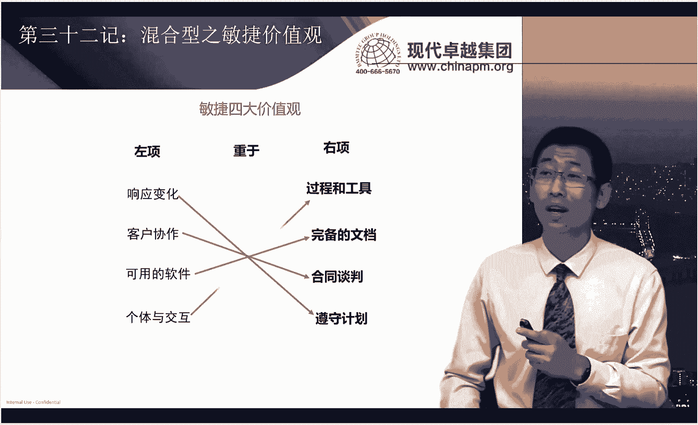

看看题目怎么出。这道题选择A选项，你先在说说现在我们迷间团队发现传统的项目管理还是有过多的文档。那你你过多敏感是不是也删除啊？因为啥？因为个体与交互重于哎我们流程和这个啊和和工具，对不对？然后呢。

可用的软件重于完备的文档。所以我要往实际的软件那实际的个体与交互那去导嘛，对不对？所以那怎么导，那就是选A告诉你教授合适的敏捷原则，达成共识驱动适应性，我要往敏捷那去拽啊啊。

你再看BB允许其他团队成员准备那些似乎没有带来价值的文件，你就这不是这不就相当于做没用的事儿嘛？我还在做传统的事儿，这不行哈。C告知项目经理其他文档的技术，识别哪些文档带来的价值啊，哪些没有带来价值。

啊，你为什么要这个其他文档的技术呢，对不对啊？你现在解决的是思想的事儿，不光是一个文档的事儿。地遵从现有的流程，以避免冲突，这不行，你要往敏捷那去管啊，所以核心就是往敏捷那去管。我们再来看第二大类啊。

第二大类也是一样，说还是敏捷转型的时候，往敏捷思想上管，前面是敏捷的四个价值观，这是敏捷的12原则啊，这就更细致一些。哎，就告诉你说如果选项中有这个跟敏捷原则相近的，你往这儿去选啊，这也就错不了啊。

我们来巩固巩固敏捷12原则是什么哈啊，第一个敏捷过程是提倡可持续的开发项目发群开发人员，用户应该都能够始终保持叫啥呢？这叫步调稳定就是你别动不动加班都能加班，你要很持续的稳定的输出啊。

一周工作40小时啊，你也啊别就总是什么过劳去去去抢进度，没有这个必要啊，叫步调稳定。好，第二条项目实施工程啊，业务人员与开发人员必须怎么样哎，叫通力协作啊。一定要讲究协作。那第三个，要善于激励项目人员。

给予他们所需的环境和支持，并相信他们能够完成任务。第四点，无论是对开发团队还是团队内部信息传达最有效的方法都是。面对面交谈。第五点，最佳的沟通需求、设计都出自于自组织团队。第六点，团队要定期。

反省才能更有效，并相应的调整团队行为。你有没有发现哈这几点呢其实都体现了一个最重要的事儿叫做以人为本。那另外呢就是以人为本的这个前五点哈体现的更深刻。第六点呢还包含了一个什么呢？大家要不停的去反省。

要有一个持续改进的过程。以人为本包含了几个事儿。第一个我们要跟这个呃我们的所有的业务人员都要同力合作。第二个，我们团队呢要被激励，要自组织，对不对啊？所以整个的不管是客户也好，业务人员也好。

还是我们自己的人也好，都要有很好的态度能力，然后一起工作。哎，所以这是敏捷里新强调的一个事儿。那来我们再看另外啊这个6个原则，他讲的什么？我们的最高目标是通过。哎，叫的什么？快速的。

尽早的持续的交付有价值的软件来满足客户的需求。这体现啥呀？就是小迭代啊，然后快速的产生一些能交付的可可交付成果，就是迭代和我们的增量的一个融合。而且呢什么是衡量进度的首要度量标准呢？

你必须得是做出来的东西，能交付的东西可用的软件。第三点，要经常交付可用的软件，周期从几周到几月不等，钱越短越好。哎，这跟第一条其实特别像啊，就尽早交付。第四点，对技术的精益求精，以及对设计的不断完善。

将提高。敏捷性因为啥？因为你水平越来越高嘛，那你自然就做的越来越快了。所以他其实敏杰里还强调说，其实这点又强调说我们熟才能啊生巧。对吧好，第五点呃。这是什么会尽可能尽大可能减少不必要的工作。

这是一门技术。哎，简洁啊，做的简单一点，有效一点啊。OK其实这强调啥价值？价值也是很多。做的别太复杂，投入的成本不要太太多啊，那你要求的是最终的一个质量。好，所以第四点和第五点特别强调价值这件事情。

而第2123点说的时，我要快速的迭代的去交付，其实它也在引射一种价值的理念。对吧只不过说第四点和第五点是基于成本来讲的，而123呢是基于最后的收益，快速的收益来讲的，是吧？好。呃，第六点。

欢迎对需求提出变更，即使开放后期也不例外，敏捷过程要善于适应需求变更，帮助客户获得竞争。所以这个6条呢体现了呃两个特点。第一个特点就是我要一定要关注价值，价值交付。而第六点呢关注的就是适应变化啊。

所以呢其实总结来说，十二大原则，我们总结了这个四句话就是啥以人为本持续改进。然后什么关注价值或者要价值交付，然后适应变化，对不对？哎，这个就是白敏捷的思想，其实又融合一点啊，我们就基于这个思想。

我们去选择我们的怎么样确保敏捷转，那你自然就能选择对了。OK好，我们看看题目。啊，我看这道题。这道题我们选择A选项。啊，题干中说说客户很少想问题，频繁的不参与，我们都知道敏捷里一定要强调说我要多参与。

我要多协作。那现在你不参与，就说明你没有到达敏捷的那个点嘛。那你现在你要去往那转型，你怎么办？那你就应该教育他，说你应该去往那转吗？是不是那就选A喽，而B让团队通过专家判断做出具有教育意义的啊决定。

那你让团队去替代客户能替代吗？替代不了C停止开发不靠谱D请求产品负责人进行必要的客户反馈，现在题干中有说产品负责人能替代客户吗？啊，不能是不是你要真是说我产品负责人就能全权这个代替客户，那D没毛病。

但是现在来说呢，我们还是需要客户能积极参与。所以这道题呢？A就是往敏那去转了嘛。我们来看看第34集。啊，到这一季开始呢，我们已经进入到整个的就是纯敏捷的一些题目了啊。那之前呢我们讲传统项目，我来讲混合。

尤其是混合呢讲到两大类。第一大类呢就是针对我的一些啊这个啊预测还是敏捷的这个特点都有的一些项目。我们采用什么样的方式。那我要首先去考虑我到底往哪个方向更偏向一点哈。

然后就选择不同的生命周期的一个啊一种题型哈，另外一种题型呢就是啊从传统往敏捷转型的时候，我们要怎么怎么办。那我们说选择往敏捷思想啊，这个贴的比较近的那些选项去选。那么在纯敏捷的题目来说哈。

首先我们遇到的最多的题目就是啊请问你啊，谁谁谁应该怎么办？那那无外乎项目经理应该怎么办的题目是最多的。对吧只是说在敏捷项目啊经理这呢，其实他教法很多，有什么团队促进者啊啊有这个敏捷啊项目经理啊。

有叫项目经理的啊，对不对？还还有叫敏捷教练的，反正叫什么都有啊，但是不管叫什么啊，他都脱离不开他的本质性的一个角色，就是他不再是一个啊纯粹的一个发号施令的一个指令性的一个领导，他是一个支持者。

简单来说呢，他有点像一个政委的角色，或者像像一个书记的角色啊，所以就搞清楚这个事，这记住这事就完了。那产品负责人呢，我们要记住，他永远不是呃直接跟我们公司，有些产品负责人直接是画对等的哈。我们要理解。

其实他属于甲方的产品负责人，就是说能代表甲方啊，能说了算，而团队呢更多你要记住一个词就是自组织什么事呢？他要自己去决定自己去啊解决问题，然后呢去自己去啊提升啊，然后也包含了一些风分享一些知识啊。

这些内容。所以基于这几个点，我们再去选择一些敏捷的相关的一些这个选项就比较好选了。来，比如说我们来连一下线哈，啊，大家可以看说增加和调整用户故事，这属于谁做的。这属于我们甲方的产品负责人做的事儿，对吧？

啊，产品负责人做的事儿啊。

好，第二个全职啊，自组织哎，这很明显，这属于团队啊，那项目成果的评审反馈，这属于谁？产品负责人是吧？持续引导项目愿景，这属于我们的。团队促进去，也就是我们的项目经理。因为什么呢？

项目经理只有不断的去让我们的团队啊知道这个项目远景不能偏离，大家才能愿意跟着你往前走嘛，对不对啊？就像我们讲到的说这个这个领导力哈，他我为什么呃别人愿意跟着你一块往正确的方向走啊。

因为你在不停的跟他说说，你应该往这个方向走，你往这个方向走是对的。啊，这是一个带领的效果。就像啊这个我们经常说政委做的事，书记做的事。大家要起往一处使，劲儿往一块用。对。在这里呢有几个名词哈。

大家要注意考试的时候可能会有涉及。就第一个就是章程。章程包含两种章程，第一种是项目章程，第二种叫团队章程。团队章程不多说，就是一些规则。只有大家遵守了，才能更啊目标统一才能往前走。而项目章程呢。

描述里们就是项目愿景，对不对？开关会呢描述的很多内容也是跟项目相愿景相关的，对不对？这个开工会指的是Kake off meeting，让大聚在一起，大家讨论讨论项目的情况。

产品和练习它指的是说哎我们针对啊这个一些啊这个可以培训的场景哈啊，比如说大家一块来学习的场景，让让通过制造产品盒子啊，我们可以去把愿景梳理清楚，大家可以想想啊，产品盒有点像什么呢？

你比如说我给你一个呃这个药盒子你把核心的你这个药的一些特点要在盒盒子上展示。大家可以回去看看你们拿任何一个药的药盒子，是不是都很经炼的，把一些这个药的核心的特点使用方法都写在盒子上了。

因为盒子就那么大点，你写多了不行。那这对我们的项目的一个愿景的一个提炼啊和理解，这也是很有帮助的一种练习啊，所以他通过产品和练习呢能能让大家能快速把我们的项目愿景提炼出来。

然后呢描述的很清晰描述的很有趣儿。哎，这样子大家呢就是感同身受啊，才能更知道说我们的项目愿景是什么啊，OK啊，所以才能相当于持续的引导我们的项目愿景。啊，隐喻上就是比喻了。

你要纯粹用一些这个KPI指标去说的，大家听着没有感觉，反正就是为了完成任务。但是你你用比喻的方法，大家就觉得好像这事儿哎确实挺有意思啊，跟我有关系，是不是？对。那像讲故事的方式一样去阐述。

那么这种呢引导效果就会更好一些，这些都是属于持续引导项目愿景的一些手段。这都是项目经理可以去做的。再往下呢，就是保护项目工作呢不被中断啊，这是f领导的一个很重要的一个工作啊。

那么考试考题中啊就会啊这个经常出现什么样的题呢？就是说现在呢相关方啊，一些关键相关人啊总总去找团队，团队都没有辛勤工作了，团队或者都延误了。那你作为项目经理，你就应该去摆件事儿了。这个应该承担下来。

应该阻止他们，对不对啊，防止他们打扰我们的团队。好，再往下哈，自我决策主动解决问题，这谁干的事儿，团队干的事儿。采用试度式沟通，分享知识。哎，学习知识，这一定是团队要做的事儿。

那这个渗透士沟通这个概念啊，有的时候我们可以出现，但我们都知道哈集中办公的时候啊，就可以采用渗透士沟通啊，别人说的知识我在这儿好像跟我没啥关系，但我也听到了，我就学到了。

是的是活东拥有私人区域和公共区域，对不对？那啊有自己办公的区域，还有大家一块讨论的区域，能增强增强协作。负责扫清障碍。政委做的事对吧啊？大家往前冲，我把障碍给你铺平。是吧好。

制定产品路线图发布计划这是谁？这应该是我们甲方的产品负责人干的事。传统项目经理呢是做这事儿的。但是我们知道在敏捷项目经理时候，敏捷项目经理他不负责具体的这个项目本身里的具体业务上的事儿。

他负责的都是支持啊，激励培养，对吧？那你说具体这个产品怎么去规划，那个谁做的，那肯定是产品负责人做的事儿。啊，产品路愿图和发布计划，那你要懂得区别。

产品路愿图其实以年为单位的两年啊、三年、5年呢而发布计划是按月的啊，一个月啊、6个月啊、12个月啊，对吧？啊，你要懂得这个区分。最后一个激发团队创造环境。那就二话不说，团队促运组做的事儿。这三种角色。

尤其是三种主要的角色一定要搞清楚。我们看看题目。好，这道题选择A选项。这道题就是说项目经理应该怎么做？项目经理应该具备仆认识领导力，对吧？B啊、C啊、D啊，这个都不仅仅是敏捷项目经理做的事儿啊。

传统项目经理也做是吧？啊。啊，第35计呢啊角色搞清楚之后呢，我们知道啊针对团队这一块呢，那还会有一个虚拟团队。在传统项目案理呢，我们对虚拟团队其实讲的非常简单，就虚拟团队我要多沟通就完了。

但是在敏捷里呢，他也非常重视虚拟团队这个事儿。那他这里讲到说虚拟团队啊，首先哈你要知道考试中经常会出现说虚拟团队可能有什么样的问题啊，那这里两个主要问题，一个就缺乏沟通，再一个就是团队可能低级效。

因为人隔得比较远嘛，你也不好激励，对不对啊？然后讨论呢，然后或者是任何起冲突啊，容易让士气下降啊，所以这是他两两个主要的一个缺点。那解决策略呢那无外乎。第一个缺乏沟通，你要促进沟通。促进沟通呢。

我们要掌握几点啊，第一个。有机会还是要面对面沟通。所以在这里呢有些考题说怎么样去促进沟通呢？哎，能出差啊，我们要定期的聚在一起。如果不能出差，我们要举行虚拟的开工会议。啊。

让大家有机会还是面对面的去啊有一个交流啊，再加增强协作。第二件事情呢，就是我们可以先与项目负责人会面，然后再与整个团队会面。就先做铺垫啊，知道怎么样跟团队去沟通。第三件事情就我们说了定期见面会。

定期飞到一块就好了。那针对团队低绩效的事儿呢，怎么办呢？哎，有两件事情，第一个就是信息共享。啊，信息共享的很多工具啊，在面接着我们讲到说看板、燃镜图啊、燃起图啊。共享那些消息版的知识库啊、日历啊。

让大家很容易学习，然后很容易透明化的展现项目的一些状态。这样来说呢，团队就知道说哎我在这个整整个团队中，我现在做的怎么样？我能不能呃这个呃这个跟着团队一起去进步，一起去实现我们的项目愿景啊，这样来说呢。

效果就会比较好一些。啊，另外一点呢就是。经常采取一些在线讨论，而不是光用电子邮件。视频会议啊，然后语音呢在这里呢有个呃很重要的点就要制定规则，对不对啊？有时人经常出现一些问题，你要有有有规则的强调。

你才能把在线讨论讨论好。否则的话大家一讨论就乱了，是吧？这都是解决虚拟团队的一种啊手段哈，所以记住哈，缺乏沟通，要促进沟通。团队第一效我要信息共享和在线讨论。好，看看题目。

这道题我们选择的是D选项哈啊题干中说说讨论许多与项目工作相关和无关的问题，就是开在线讨论会的时候，大家讨论的总是不着边际，怎么样，就是没有规则嘛。啊，所以你会制定规则啊。

所以就要求团队使用其他渠道进行与工作无关对话。A什么都不做肯定不行，B取消聊天工具，这个你也没有办法去让团队提升绩效。C加入到乐趣中啊，那这肯定不行，越讨论越偏啊，这也有问题。好。

这是关于虚拟团队的事儿。看完了角色之后呢，那我们再看里面具体的敏捷有些工具和方法。那我们知道像产品代表列表，这个是记录我们敏捷的用户啊这个故事，或者叫记录敏捷的需求的这么一个文件。

这个是考试必考的内容啊，也就相当于我们传统相目管理范围内容。啊后我们这块内容我们是啊必须要掌握的哈。那这块内容呢有哪些知识点呢？我们一个个看哈，用户故事要编写什么，确保验收时甲乙双方能够有据可查，哎。

就叫验收标准。对吧啊相当于我们项目发明说明书里写那个验收标准。好，产品代办列表啊是有一系列需求。这个需求我们叫什么啊？叫做用户故事，对吧？啊，用户故事的验证呢要符合01法则啊，要不就是做完了。

要不就是啊相当于没做啊，这样来说好衡点。对需求无从下手时，什么可作为代办列表的有效输入啊，就要影响地图。对吧？好，工作开始之前，不需要为整个项目创建所有的故事，只需要了解啊滚动是么，只需要了解什么呀？

第一个发布的主要内容正确即可。史诗故事哎，大故事写在未完象的最底部。产品梳理会的主要目的，包括把当前的产品需求清单进行梳理，包括排优先级和什么和用户故事拆分，对吧？啊。

有点类似我们传统项目管理的WBS拆解啊，这个这的产品梳理会啊去做这个事儿啊，好，只有产品代办列表梳理会完成，那么。冲刺规划会议才能开始啊，冲刺规划会议就不再去做用户故事拆分和排序原先题了。

更多的是讨论用户故事。哎，我具体怎么拆解为任务了啊，然后再排具体的迭代计划。啊，所以他的目的不一样啊，产品代办列表中也写入。风险应对计划与用户故事一起排序。我都知道产品价编列表中啊会记载所有的需求。

然后问题的处理方式，风险的应对计划都一起排序。好啊，最小可行性产品MVP通常是指第一次发布产出的成果啊，就这个需求到底怎么去验证。好，那这些事呢就是都在我们产品代白列表中，你要搞清楚啊，看看题目。

这道题我们选择的是第四个选项。题干中说。呃，排在了待开发项的顶部啊，有些新区排在顶部，因为干系人未能完成正确的营销分析，说明他排的有问题呀。那敏捷团队在下个阶段应该怎么办呢？应该重新排呀？

是不是重新排的哪个会？刚才我们说了嘛？不带产品代办列表梳理会吗？所以那不就选D吗？在做冲刺规划之前，我们讨论待开发向细化的需要。哎，就是做这事。A按照待开发列表的优先级，从上到下选择适当数量的故值。

那排错了，你怎么能去按这个做呢？啊，A不对，B按照原始展现在开发量顺序就行不行。那你忽略他的新需求也不可以。C向团队提出建议，以便在下个阶段中选择和实现啊，这个那些故事，这也不行啊，你说了不算啊，对吧？

项目经理说了不算，团队自己来说了算。好，这道题选择的是A选项啊，题干中说，在一个新故事机很模糊，缺少验收标准，那验收标准你得写啊，那在在哪个写代办列表梳理会呀，是不是？选A罢了。好。

我们来看看第37计啊，那么呃代办列表梳理会搞清楚了啊，然后里面写了用户故事了，那用户故事拆解也拆解的差不多了，那你是不是得排优先级啊？排优先级啊有几种方法啊那这个我们要掌握一下啊。

MSCW这是属于莫斯科法的一种排序方式。基本需要性能需要，鱼也需要，这属于canle模型。分给每每人100点，让大家选择你认为最重要的需求，这叫100点法。根据客户的判断，按照产品特定价值最大化的排序。

这个是要相对量级，有点像我们专家判断是吧？这几种都是我们优先级的一个排序。让我们来看这道题。这道题选择的是第四个选项啊，题干中说在评审会中发现了某些功能不满，然后呢又增加了几个新需求。

但是你请看题干中说是在后续spprint执行详细分析师啊，不是现有的要解决问题了。所以我们不能去选A哈，在后续的时候有这么多需求，最重要的就是排序了吧。所以选DB也不对。通过细化一种标准。

验收标准有什么好细化的呢，对不对？你就定每个用户故事你就定义就好了哈。C根本就啊这个是一个陌生词汇就不选了。什么叫三角测量啊。好，看下一道题。好，这道题我们选择C啊。

莫斯科法就是确定故事的一个优先级的对吧？好，下一个我们需要掌握的知识点呢，就是用户故事的一个估算方法。刚才我们讲到了用户故事的排序，现在还要有估算，你才能未来才能制定季度计划嘛，是吧？啊。

那首先哈第一个就要对比一个用户故事，一个故事点的故事，然后去粗略估算其他故事点的方式，就是相对规模估算。大家要明白，整个的估算扑克啊，T恤估算甚至其他的估算方式都是基于相对规模估算来的。

你像估算扑克不也是有一个基基本的故事点，我再去打扑克的时候，我们都来评估下一个用户故事是前面的用户故事的工作量的几倍嘛。如果是几倍，我们就出几个故事点吗。然后再达成共识嘛，对不对？好。

所以相对规模相对规模估算是它所有的估算的一个前提。呃，第二个就是团队进行估算，使用非布纳些数列这属于。估算。那估算扑克太复杂，大家总达不成一致。所以呢会有两种演变哈。第一种就是团队为了达成共识。

简化规模就是用一种teacher估算。还有一种呢啊就是啊每个人可以去自己去投票。那叫这叫啥呢？叫点式估算啊，叫点式投票啊，点式投票什么意思呢？哎，就是哎我我拿着一这个一堆用户故事点哈。

我我我看着哪个用户事我想估算，我就。让我定后柜家，你翻过去，我就放过去。这样来说呢，呃你不用像这个呃打扑克一样，你先大家先拿出一个统一的故事点，然后大家一块出。然后针对这一个故事点讨论讨论讨论。

现在是谁想估就估那。好处啥呢？很快速。那坏处就是不准确呗。对，但是有的时候啊这个啊我们偶尔哈针对一些啊这个小用户故事啊，采这种方式估算不会有太大偏差的啊，也是可以用一用的啊。像这种呢理论上用的比较多。

但实际上来说，你也知道风险比较高，估的也不准啊，所以实际场景下啊用的也不是特别多。好，但是我们知道哈我们新考纲里出现过这个概念，大家稍稍理解一下，懂得它这种估算方式就好。好，最后一种呢就是你会发现啊。

你不管是用估算扑克还是用T shirt，还是用点式估算，亦或是用其他的估算方式，都有一些估算不准确的问题。敏捷跟传统相管理最大的不同在于说它是可以实时去调整啊。

他去根据你的这个估算的一个情况和你实际完成的情况进行对比，发现你估算的不准确呢，他会根据你的估算情况去在下个迭代，再或者下几个迭进行调整啊，这种就是要监控你的估算的一个速率。啊。

就看你你说你一个啊一个迭代可以完成20个用户故事，这20个用户故事可以分啊可以这个这个呃对应的是100个故事点。但会你实际你只完完成了80个，那你下次我就调整80个故事啊，调整80个故事点。

对应的可能就是10个用户故事。所以他可以随时调整。但是传统项目管理做不到，传统项目管理就估一次，基本上完了，对吧？而且估算我们都知道不准确，最后就导致进度业绩成本超值。都是因为前期有的时候估算不准确。

还不光是因为我后期我做的呃做的效率太低，是吧？好，所以这是一个优点。所以其实这块呢我们可以分成2块机哈。因为考试中我们就知道哎实际你想让它估的准啊，就是通过迭代不停的反复用估算速度啊。

那刚开始估算的时候，我们可以用相对规模估算扑克提 shirt，甚至用点式估算。那我们看这道题。这道题选择A选项啊，题干中说的是啊敏捷扑克。那敏捷扑克的话呢，就相当于用故事点进行相对规模估算。对不对啊？

有一个基础故事点，然后大家再评估一个新的用户故事，这几个故事点，然后再来一个再估分。啊，B通过将其粗略归类来估算故事，这个有点相当于T恤啊，T恤不就是那几个尺寸嘛，所以它就是把用户故事进行。哎。

我觉得是S，我觉得是M，它有点归类的方式。即通过将其与过去类似功能进行对比估算故事点，这有点类比估算。D使用100点来估算估事点，这个有点像点是投票是吧？都跟呃敏捷扑克不太一样了啊。好看下一道题。

这道题我们选择的是D选项哈。题干中说啊衡量团队生产力的方式存在一些障碍。这个这个就是我们要衡量的就是我们的一个团队速率了。然后题干中说，现在衡量的不对啊，有问题。那敏捷教练要看看能有问题。

那也就是ABCD选项中衡量哪种衡量方式是有问题。你看A管理层正在查看墙上展示所有团队人进图，这个没有问题，看人进图有啥问题，人进图肯定是啊正确的能表示你的团队的一个速率的。B。

查看看板来管理任务流以及显示在这品数量。这没有问题，看板本身就是通过这种任务流来看你的效率的。C管理层一直让团队添加WIP限制，以便额外的工作，不会被拉进WIP状态中。这看板里也有这个要求，没问题。

D管理层正在比较团队间的速度，并奖励速度最高的团队，这就不对。因为团队的速率是用故事点来表示的，故事点只是一个啊相对规模的衡量，对不对啊？那你想想，如果两个团队他们的故事点对应的。这个一个工作量。

有差距呢啊，你的一个故事点可能对应的是两个小时工作量。我的一个故事点对应的可能是20个小时工作量。那。你速度快就能证明你效率高吗？这肯定不对。所以D是有问题的。那往下走啊，到第三十九季呢。

我们还需要掌握一些敏捷的一些核心的工具啊，这是我们考试有的时候会考到的哈。那在这里呢呃这个我们来连一下线哈啊共享站点或位置可以在其中共享主要的重要信息啊，就是发送信息的。一看到信息敏捷的啊。

这个跟传统项目管理呢会有区别。传统项目管理是沟通管理计划。敏捷里跟信息相关叫信息辐射器，或者叫信息发射器啊，怎么调性，就说翻译的问题哈。呃，再往下走啊，产品负责人接受或者拒绝故事竟是在哪个工具里啊。

还记在评审会里面。找问题，找原因，找对策。啊，就很明显回顾会查询经验教训。产品负责人讲解产品代办列表的内容。规划会议所的时候。成员轮流回答工作进展、计划问题。战例会对吧，昨天做了啥，今天准备做啥。

还有啥问题？待改进项放入产品代办列表，怎么出现了？待改进项，回归会才会出现待改进项。问题添加进停车场，另一个会议解决佳会。对啊。团队成员确定任务分工和时间估算。就很明显。规划会议做的事儿。

通过燃进图、燃起图任务板跟踪进度。啊，哪个会。哎，站会啊，因为站会我们之前讲到过，除了你去大家讨论，每天你的昨天做点啥，今天做点啥啥问题，你说不清楚，还可以用看板去展示。

所以通过看板呢燃进图、燃体图任务板去展示的话呢，能让大家对各自的进度有更清晰的认知啊，所以这是战略会我们做的事。团队与PO协商下一步的计划，那肯定就是哎我们讲究评审会，我们要考虑下一步整体计划做的事儿。

你可能会认为说老师这是不是。迭代会啊迭代规划会议做的事儿，迭代规划会议只考虑我当前迭代要做哪些事儿，而下一步的计划，评审会有的时候会考虑这个是什么呢？评审会的另外一个特点。评审会的一个主要特点就是反馈。

但另外一特点呢就是可以讨论讨论未来哎下一步。哎，我们既然讨论有了反馈之后，说这个产品啊这要改A要改，B要改，C要改。那么下一步啊，你准备大概在什么时期内改，所以会在下一步有个整体的规划啊，这个是评审会。

它的另外一个特点啊，大家把这个事要记下来。使用累计流量图进行效率监控。一看到累计流量图知道看板。好，项目成果的评审反馈，那评审会要做什？在这品数量，你看到这个事看吧。未知情况进行探探测，哎，这是探针。

这样啊我探测一下我这个到底这个项目能不能成功，或者这个功能能不能实现，是吧？这都属于探针。这些主要工具的特点哈，大家一定要掌握啊啊，如果大家对这儿还有疑义的话呢，一定要回去看我们以前的一些视频讲解哈。

把这个基础的东西再巩固一下啊。你看看题目。这道题选择的是第二个选项。因为他说新团人没没有敏捷经验，并且很难理解每日战会，你的战会的价值。你想想，第一个大家有个互相承诺，有个互相状态的一个展示。

第二个核心的就是哎我要把问题这些展示出来嘛？这不就是如何识别障碍了吗？再看其他这个选项，A描述战略会是如何减少同满的压力。本来战会就是一个增加压力的是吧？啊，大家互相给压力，互相推进。

C解释战例会啊如何排除团队承诺的必要性。怎么叫排除承诺呢？就是让大家互相承诺。D展示战会如何克服不必要的协作啊这个。战会本身就是呃提升协作的啊，为什么要克服不必要的协作呢？这个展示展示不了是吧？

OK所以D也不对啊，这道题选B。好，我们看这道题。照题选择A选项啊啊题干中说来确保开发工作得到认可，那就开评审会认可啊，我才能认可你。B选项根据客户的需求，重新启动项目，这肯定说过去啊。

不会重新启动项目。C在产品演示之前沟通所有的变更啊。你真正有些什么需求的反复来项，我不需要走什么变更的，我们直接加入到代办列表就行了，对不对啊？所以不牵扯到师沟通所有的变更。

D在产品演示之前获得产品负责人的批准。你在现场获得批准就行了。谁家选一就。好，这道题选择。第4个。呃，在迭代国家期间，由于技术的困难。啊，团队估算有些问题，那怎么样先探测一下吧。

探测时呢你才知道这个技术能不能实现，然后你才能知道估算怎么样才更准确。鱼骨图是查询问题根原因的，跟这个你做估算啊没有关系，对不对？这是有了问题，我查询你。好，B超额估算，那这事肯定不行。

你纯粹拍脑袋加太多应急储备，这肯定有问题啊。C规划普扑克啊，规划扑客啊，这种估算呢是可以使，但是解决不了说团队技术困难的这个问题啊，对不对？这他题干都已经说了，团队估算有问题，你还光用规划扑克。

达不成一致。所以这道题选D。教体。我们选择B选项，看板的特点。首先第一个就是能可视化工作流，这样能促进大家协作。第二个就限制WIP能提升我们的速率啊，所以这两个都有了。所以这道题选B。

而ACD都跟看板的特点没什么关系。我们来看看最后一集。就是我们做敏捷项目也肯定会遇到各式各样的一种问题。那在敏捷里呢，他提到了一个叫障碍的一个概念，而且把障碍这个这个这个概念扩展了。

包括了障碍阻碍和路障啊，那这些呢其实我们都可以知道，其实啊有了这些障碍也好啊，问题也好，我们都要去处理。那处理呢哎我们就要跟用户故事呢去都放入代办列表就排优先级处理。所以呃你知道有了问题，分析问题。

解决问题，也是我们处理敏捷的障碍阻碍或者路障的一种。同样的一种手段。好，那对我们来说呢，考试中如果出现这些名词的话，我们不能当成陌生词汇。我们要懂得他们的一个区别。

然后我们也要按照问题的处理方式去处理就好了。好，那我们知道哈首先哈导致停工或者停止任何进展的事件或者条件就是最严重的这个问题，导致项目都没法进展了，我们给他起名叫路障。减慢或阻碍前进的哎。

就会导致我们磕磕绊绊往前走的啊，这种呢啊中等问题呢我们管它叫障碍。以某种程度的努力和策略就可以移动，避免克服的妨碍物啊，小的我们是小问题，我们叫做阻碍啊，所以是路障障碍阻碍。好。

记录安排优先级呀啊然后发布应对沟通项目障碍的那这个叫做障碍日志。看板方法是用行动版啊，这这就为什么行动版就专门写这个障碍的一个白板啊，这我们叫障碍看板。那我真要移除这些障碍的时候，我们怎么样呢？

作为项目经理，第一使用的是影响力。第二，使用资源。第三，使用权利啊，最重要的我们还是一个支持者。所以我们首先选用它影响力，影响到我们整个团队，帮助我们一块把障碍移除。我作为主导啊。

在移除障碍这个层面来说呢，项目经理呢可以作为主导者啊，因为我们就是扫清障碍的那个人。但是到具体问题处理的时候啊，我们作为主导者，我们引导团队和团队跟我们一块儿把这个问题解决。啊。

所以要懂得说对于障碍来说，项目经理可以主导，但是具体解决障碍啊，处理问题那些人还是团队。我们这个就好了。看到题。这道题我们选择的是第四个啊，题干中说，组织中存在许多障碍，造成了项目的延误和返工。

那么在这个层面来说呢呃就是我们要促进合作，然后帮助团队呢一块去消除障碍就好了啊，就按照问题处理方式一通这个逻辑就可以了。好，这是整个的我们的40记的一个内容哈。

那大家呢如果对啊这个里面哪块的内容啊还不熟悉的话呢，一定要回到啊我们之前的大家看过的一些精讲视频啊串讲视频啊，然后再去反复的把知识点夯实啊，把逻辑搞清楚，啊后回过头来再把再通过冲刺，把这些点记下来啊。

这样来说呢，对于你整个理解这个知识点呢，会有一个啊非常平顺的这么一个过程啊，这样才能更好的去记忆它。好，那呃我们这块讲完了之后呢，我们来看第2块内容。好，那再往下呢。

就是我给大家讲解讲解啊考题特别相似的一些题目啊，帮助大家呢能更好的去备考。我们马上要进入考试。这些题目啊请大家一定要仔细的然后认真的去学习和分析这些题目比任何我们以前出现的模拟题，它的重要性还重要啊。

OK那我们争取啊把每道题我们都要去掌握啊，把它这个搞明白。好。我们一道题一道题看啊。嗯第一道题。来做一下。这道题呢我们选择的是C啊。好，那么呃这道题关键字是在这儿哈。

说企业希望跟踪这个框架应用所带来的价值，但没有为这个框架定义一套可衡量的项目。这道题看着前面的内容你会发现出现了混合框架这个字样。混合框架的字样，说明这道题目是一道混合题目。那。

这套混合题目我给大家讲过，混合的题目你怎么做啊？你要往预测啊，你要往这个敏捷方向去拐，对不对？从预测往敏捷，你要往敏敏捷方向去拐。那你你看看ABCD哪个是往那个拐的意思啊，题干的意思是说。

我现在呢想往敏捷拐。但是我还没有一套可衡量的项目，那怎么办呢？先做一做，先试一试。这道题选C，因为C是符合敏捷思想的，与相关方合作，确定哪些可测量的效益可以跟跟踪，并指定一个负责人去监测和报告他们。

这是啥呢？这个就是价值跟踪，价值交付。敏捷里我们说了，在思想层面特别强调价值交付，对不对？好，所以这个是正确的哈，我们再来看其他几个选项，A使用与上一个预测性项目相同的效益跟踪，这还是预测。

所以我们就不选了啊，对不对？混合我们这道题是往敏捷管啊，所以A不对啊，B选项在工作分解结构，WBS基础上创建一个报告，并定期更新。那这个混合项目哈，它不仅仅是一个汇报啊，它要往这个敏捷的思想上去靠的。

对不对？所以B肯定也不对哈。啊，D呢呃是研究哪些报告模板在这个框架中啊使用的最多啊，并将其纳入到项目中来啊啊，那混合项目也不仅仅是创个创建个模板。而C的特点是说，我通过小的迭代交付。

我可以不停的去交付价值交付收益，然后我还专门有人去跟踪它，对不对啊？第一，符合我们说敏捷的特点。第二呢。你看我们之前讲到的效益和价值的这个收益这块，其实他也是这样的，他也是这么去衡量的，对不对？

效果会更好一些是吧？好，所以第一题选C。第二题。第二题，我们选择B选项哈，题干中有个非常典型的标记，叫由于缺乏信息。那由于缺乏信息，你就用一个标准的工具传递信息呗。那我们就选B呗，使用看板啊。

可以使工这个工作可见A什么应精益生产C什么小批量工作，D增加回顾会议，这些跟缺乏信息根本没关系，就不要去选了。所以第二题我们选B。第三题。第三题呢，我们选择D和E啊，多选题选择两个啊。

题干中说通常不交流很多细节。第二个关键字呢是后面的叫做不同的国家。哎，这很明显，这就考这个我们虚拟团队的一个特点吧，是不是？那虚拟团队我们说了第一个D鼓励所有团队成员使用虚拟工作区干嘛呀？

这样能更好的去交流呗，提高沟通呗，对不对？好，E与团队成员讨论他们的参与并采取适当的一个行动，哎，帮助大家提升绩效。哎，不就是我们讲虚拟团队两个特点呢，缺乏沟通，低绩效。那我们帮助他们去解决解决问题。

是不是？A选项啊，将工作重新分配给参加日常通话的资源，这根本就没有解决题干的这个一个交流不畅的一个问题，是吧？啊，B向职能经理报告该团队成员的不良表现，你不告状吗？不选了哈。

C要求该团队成员发送电子邮件，说明详细的任务进展，这跟题干解决问题也没啥关系，是吧？所以啊我们解决一个题目的关键，想选对的关键就是一定要就着这个问题，我们去解决这个问题啊，就就题啊，论题就问题解决。

这才是核心啊。而我们这个A和C啊啊都是就问题不解决问题，就不选了啊。这道题选D和E。第四题，我们选择C选项啊，题干关键字叫做估计故事的持续时间。大家知道我们用户故事一般估算的时候是用故事点。

那什么时候会继续把故事点再给它变成持续时间的估算呢？是把用户故事拆解为任务的时候。所以把用户故事拆解为任务，这已经到什么样的一个啊这个一个一个计划中呢？在迭代计划中啊，在开迭话迭代规划会议的时候。

我们针对一个迭代，我们会把这个迭代我们要做的用户故事拆解为任务，这个任务就可以用实续时间估算了。所以它聚焦是当前迭代。所以呢二话不说选C就对了。一个迭代不是多个迭代。第五题。这道题我们选择A选项哈。

题干中两个关键字，第一个叫因最新实施的模块被征收重法。第二关键字要确保最近的实施没有产生任何责任，这考什么考合规性啊，刚开始不合规有重罚，现在呢我们怎么样保证未来合规？那我们说了啊。

合规我们必须得遵守啊，合规当成一个需求来看啊，那需求谁提的？相关方提出来的，所以我们是不是得做相关方满意的这个需求啊，是不是？所以哎你必须遵守，怎么样，你让你的组织说哎，我这么做是对的。

对吧这么做是合规的，这不就行了吗？所以这个不就选A吗？而B什么确保范围内确定的必要的任务都顺利完成。C什么确保测试中发现的所有权限的时终完成。D确保所有的文件在实施后完成，然后关闭项。

这都跟我们题干中说的合规没什么关系啊。所以这个第五题只能选A。好，第六题的关键字呢叫做迭代结束时。迭代结束时呢，我们肯定要开评审会议。那我们说了评审会议其实有两个特点。第一个特点呢就是反馈。

第二个特点呢是说我要为下一步的这个工作啊制定一个总体的这么一个计划是吧？啊，所以呢在这点来说啊啊我们就是举行迭代评审会议，并且在要这个评审会议中，根据我们新颁布的这个法规，我们再讨论讨论呃。

将来怎么样去啊应对这个新法规。所以这道题选C啊。A叫重新进行测试啊，使实验符合新法规。那你不影响了当前的迭代了嘛，对不对？哎，这肯定不行啊。B进行评估，已确认在下个迭代中遵守该新法规。哎。

你要知道这个新法规未必在下一个迭代就多一个新法规呢，我们是按照代办列表去排序的，是不是？哎，那排到哪个迭代就到哪个迭代啊，所以B也不对，D就项目范围提出变更请求，哎，这是传统的项目管理这种做法了，对吧？

啊，所以我们就不选了啊。第七题。😊，这道题我们选择B选项。题干中说了，第一个事儿呢就是项目风险啊。第二个事儿呢就是概率很低。那我们说了低一风险项目应该怎么办呢？我们应该记住低风险啊，这个观察清单。

怎么样啊，先不去管它，然后等它有变化的时候呢，再去处理它就好了。所以这就是啊典型的一个B的操作，而A呀C呀，D呀，都不是针对低风险，我们要做的事儿，尤其是说D说概率很低，从风险中删除，那也不对啊。

我们是专门要把它记录下来的啊，OK要去监控它啊，所以这道题选B。第八题选择的是A选项啊，关键字是一些需求很明确，但是一些需求需要更多细节。那你。还搞不清楚你到底应该去用什么生命周期去做的时候。

到底是预测呀还是敏捷还是混合呀，那怎么样，先去做A啊，确定最合适该项目的生命周期方法啊，好，那B是啥呀？B就是用敏捷方式去做了呗，将所有需求都记录在代表列表，没说用敏捷的啊。C是什么预测型的。

就是说内容预测呢，现在也没说用预测啊。啊，D将相关需求拆分，把它安排成单单独的项目里，现在没说我要把一个这么多需求拆分成多个项目，对不对？所以D也不对，第八题只能选择A选项。第九题。

第九题选择的是B选项，项目经理正在于谋srumrum团队啊，scrrum团队，这很明显敏捷的题目。这然后最后面出现几个字叫能力错配啊，记住我们跟大家讲过哈，在敏捷里啊。

这个啊学习知识很重要的那你能力不够怎么样，不是说换人啊，不是说去啊这个外包，我是怎么样，我要让你赶紧提升，所以这道题就选B就对了啊，选用适当培训，对该错配予以弥补。好呃，A选项呃是接受该什么错配。

这就属于属于风险接受了，这也太消极了啊，所以就不选了哈。C更新项目机动计划，也反应该延迟。D项团队强调到达商定的最后倾项重要性，这很明显啊，这都是传统的项目管理这种做法哈，那我们都不选了。

这道题是敏捷的题目啊。第十题。第十题我们选择D选项啊，题干中说了，第一个每个模块持续了35天。然后呢，另外呢现在已经用了45天了，说明我们进度延期了，进度延期就压缩呗，所以选D呗啊。

评估情况确定相关方法，以便在不影响基准情况下压缩进度我们计划啊。A选项让团队加班加点，这个就不太好了哈啊，进度压缩可未必是加班是吧？所以A就不选了B项项项目发起人提交标更请求，没必要。你就算提交变更。

你找CB就完了哈。C检查范围，核实是否存在范围蔓延的问题，是项目符合进度计划。这个题纲中可能从来没说有这个范围的问题哈。所以其实你弟的应该先去好好评估评估到底是啥问题，对不对啊，怎么去解决。

而不是先去猜一想说这是不是有范围蔓延的问题啊。好。十一题。十一题我们选择的是A选项哈，题干中说提出一项新的合规需求，哎，有合规性。刚才我们说了，合规性也是需求的。然后他说必须先与其他的需求交付。

当然也不是客户说这个一定是优先交付，我们就优先交付。我们还要啊考虑他优先级。尤其题干就说是混合性框架。混合性框架我往敏捷这偏的话，就是啊我要去啊跟我团队一起合作啊。

那么要去看一看到底啊这个需求优先级高还是低啊，要做一个优先级排序，是不是？所以这里选择A，而且A呢出现一个叫合规团队成员。还记得我们在啊这个冲刺专门给大家讲的这个合规的一个委员会。

他指的就是这个啊帮助我们去梳理到底这个需求到底重不重要啊啊，B选项哈，将合规负责人啊纳入干线名单，并等等待下一次呢状态啊，这个回忆一看到等待举行，这个其实就是有问题了哈好C将该新的合规啊需求增至啊。

我们的代办列表。那么因为技术团队无法腾出人手，你看到无法腾出人手，你就知道，那你就对他待答不理呗，那肯定不行嘛，所以C错了哈。啊，D选项那让该团队将合规性纳入当前冲刺并交付该需求。我们再紧急。

我们经常也不会影响当前冲刺的对吧？你非要影响的话，你就除非被当前冲刺取消是吧？啊，这是敏捷的一个做法。所以D呢影响当前冲刺，这肯定不行。所以十一题选A。十二题。十二题我们选择C选项哈。

题干中说了说资源之间关系紧张啊，那么我资源关系紧张怎么样呢？那你就团建呗，因为团建可以解决资源冲突的问题吧，所以选择C选项啊。呃，A选项是向人力资源专家咨询意见啊，我们就算要向别人求助。

我们得先自己先看看能不能搞定嘛。所以要做也得先洗嘛，再去A嘛。B为海外团队成员分配更多任务。那你不能说现在我这面有问题，然后就给他们多分啊，那你这不是啊激发矛盾啊。啊，D添加更多资源。

以减少本地团队成员的工作量啊，那这也不是啊这个有效的解决方案哈，对不对啊，这就是你。拆了东墙补西墙，这肯定不合适哈。所以12题选C。1三题。十三题我们选择的是B选项啊，题干中说了说。

该项目与去年实施的一个项目非常相似。一看到这句话，我们就知道哎，是不是考类比估算是吧？后面又说了，项目经理是公司的新人，他忧心忡忡，因为预算超出了预期。那哎你怎么样，那你就类比一下。

然后呢证明哎我们的预算还是合理的，对不对？就考这个点啊。A啊运用软技能去说服项目发起人批准新的预算估算啊，这个呢你就算要做，也先把B做好吧，对不对？我既然啊有参考值，我就参考参考。

就是哎我现在呢先先先让大家证明说我们现在估算是有效的，省得自己忧心忡忡，也省得别人不相信，是不是啊，然后你再去考虑说我怎么样去说服别人啊，C将预算方法改成更准确的自下而上的成本估算啊，也是一样的啊。

我先去把B做好了。然后呢。实在不行，你说还是忧心忡忡，我们再去考虑C是吧？啊，D审视组织流程评估啊，已确定啊预算中考虑应币储备，这跟题干没啥关系，解决不了忧心忡忡的问题。是吧啊好。

所以呢呃十三题我们只能选择B选项。十四题。我们选择的是B选项啊，那么题干中说了需求多变，需求多变，二话不说还是应该用敏捷是吧？啊，其他的东西都不是跟敏捷相关的。所以我们选B。15题。

十5题我们选择C选项哈，题干中说两点。第一个就是风险很高。第二呢，一些相关方的知持度不高，那知识度不高怎么？我们能让多参与。那风险很高，那又没有之前的一些参考怎么样，那我得去识别风险。

所以C就干这两件事儿。第一个找相关方。第二个一起分析一些这个风险的输入啊，比如说职约因素啊，假设条件啊，关键输入啊都会能帮助你去识别风险，这道题考就是启动过程中我们应该去识别风险。

A选项说服高通管理者放弃该项这个不归你管，对不吧？放不放弃项，我们不归你管啊，A不选B检视啊，用于该项目的组织管理结构啊，什么程序知识。组织管理计划是个啥东西？陌生词汇别选了啊。D支持项目团队会议。

然后更新风险能预测和项目管理计划。跟题干中说的什么风险很高，好像没什么关系，对不对？所以就别选了哈，15题选C。16题。十六题选择D选项哈啊那么题干中说说有一个内部相关方，并且呢未能让其参与表示不满。

那很明显，这就是相关方不满意的问题。相关方不满意的问题，原则上来说，你就应该去管理相关方嘛。但这道题呢哎他都没有出现过说相关方参与计划这种东西，他就是简单粗暴的问你问题如何处理。那问题如何处理。

你就分析问题解决问题呗。所以选D就行了。啊，与相关方会面一了解详细的信息，然后再进行答复。啊，A选项就是审查所添加内容是否包含在项目范围内。你应该先去把D做好了，再考虑做A啊。好。

B选项呢是啊提交并请求让CCB决定添加内容是否在项目范围内啊，这个呃你你让CCB确认这事就不对，CCB只负责审批是吧？啊，好，所以呢这个B本身有毛病哈，C更新相关方管理计划。

确保该相关方在相关方登记册中啊，这个根本解决不了题干的问题，是不是啊，光记录登记册就有用了嘛？这不行的啊，所以16题选择D选项17题。这道题选择A选项啊，敏捷项目可交付成果呢不能符合要求而不停的抱怨。

那如果你想这个避免它不符合要求，前面你就得定义验收标准呢，从源头你得抓起啊，所以这道题选A啊啊，这道题考的就是我们用户故事的一个DorD就是ation档简单来说就是要给用户故事定义验收标准，对吧？

所以考这个点啊，所以选A啊，B在每日战会期间啊，让消关方参与进来并监督进展情况，光监督进展没有用啊，你是现在要检查你的用户故事到底满不满足需求啊，是吧？好，所以B不对啊。C创建需求跟踪矩阵。

并将之分发出去。这个是我们传统项目管理的这种做法。好，不选了。D，避免让消关方参与迭代评审，你还你还不敢见人啊，还躲着别人啊，这个不对啊，所以17题选A18题。十八题，我们选择的是C选项哈。题干中说了。

敏捷项目经理呢被要求消减预算30%。然后第二个关键字是确保在受限制的环境中持续交付价值啊，那在敏捷里哈，一旦预算被这个削减了。通过倒三角模型，你范围肯定要跟着变。因为在敏捷里。

我们啊这个最需要调整的就是这个范围。啊，那你预算没那么多钱了，你就范围按优先级呗，低优先级的就不做了嘛，所以就考这个点啊，所以选C啊，对寻找高价值、低成本的代办事项进行优先级排序。

然后评调整项目人员配置。你对这些事项进行说明啊，就是先做高优先级的。A选项。减少人员并调整范围和进度，以及啊一一为消减工作提供支持。那你A就没有办法持续的去交付价值了，你把人都砍掉了是吧？啊。

你这个啊这个这个啊有很多东西你就做不出来了，是吧？啊，所以呢这块呢其实是没有C好的哈。啊，那么B选项哈限定范围在必要的基本功能上啊，那么按当前项目人员配置继续开展项目。这个说的其实貌似好像也对。

说只需要在基本功能上。但是你要注意一个问题啊，就是我削减范围，我是以价值为优先级，不是说哪些基本功能，我就先做哪个价值哪个高的话，可能包含基本功能，还可能包含一些辅助的一个额外的功能的。

那你你光聚焦在基本功能其实可能是不够的。所以B是不完善的。D协调人员配置比例，应对各种预算紧张的问题，并提供培训，以避免绩效低下。那你就是本人累死的节奏呗。啊，所以呢这事儿呢其实也没有C好哈。

没有调整范围啊，所以D不行啊，18题只能选C19题。十九题我们选择的是B选项哈，关键字提供某中型项目剩余任务的说明。哎，就是看你呃一个项目的一个绩效情况吧。那么这道题二话不说。

我们选发布燃气图敏捷的内容我们就靠燃气图燃体图来去看呗。A呀D呀，这都跟这个敏捷没什么关系。C呢貌似有点关系，但是光故事点没有用，故事点你得跟时间匹配，对吧？人间图里有故事点，还有具体的时间轴呢。

所以C不行，知道只能选择B。20。20题，我们选择的是C选项题干中说说是一个混合型。然后呢，说某些团队成员仅了解预测型，那你往敏捷拐的话，你得赶紧去培训啊，让人让人懂那个混合型和敏捷型的一些方法嘛。

所以这道题选CA选项评估每名成员不需要啊啊，因为有些人其实已经懂了，你不需要评估每名成成员，B项所有团队成员不需要啊，是不是？D对团队进行改造，你你作为敏捷项目经理，你是一个支持者，你是一个仆人识领导。

你你你没这个权利，对不对？所以这道题只能选择C。21体。21题我们选择的是B选项哈。题干中说这是第三个迭代了啊，然后呢团队速度下降，绩效开始下滑啊，这说明啥呀？这说明我们在啊敏捷的执行过程中啊啊。

团队呢确实是啊这个有一些问题了啊，那有问题怎么办啊？赶紧解决问题呗。所以哪个能解决问题呢？B啊，那举行团队建设活动，以解决关键绩效指数KPI的一些问题啊，这是可以解决一些资源啊，绩效下下滑的问题。

A降温问题上报不着急。啊，对不对？先自己解决C引导团队回到行成阶段还是正导阶段。那你不是越干越缩嗦嘛，对吧？这肯定不合适哈。D与人力资源部门讨论生产效率下降的问题，别着急，先自己解决。21选B。22题。

22题选A，这就是跑政治管理，但是不需要计算。你看到CPI小于一，你就知道项目啊这个现在成本不太好，但成本现在不太好，不代表未来一直不好。所以他选择的是项目将难以按计划完成。

他不会去选D说项目将不会按计划完成，哎，未必有，万一后面抢回来呢啊，对不对？所以D不对哈啊B项目将计划更易于完成和C项目将完全按计划完成，这这这不对，这很明显就跟题干去冲突啊，所以22选A。23题。

2三题选B啊，题干中说，由于相关方意见有分歧啊，这就是典型的。我们说传统项目管理，当你有了分歧之后怎么样，那你就分析问题解决问题好了，所以选B就完了啊，识别分析原因而A分析相关方啊啊。

什么C组织团队建设，你这个就没有对症下药吧。你还不知道问题在哪儿，你就先开始就工作起来了，这个肯定是有问题的D联络给项目发起人，这就你先上报，别着急，先把B做好。24题。24题我们选择A选项啊。

题干中说的是耳朵问题听不清啊，那耳朵问题听不清我们到底是选人际关系还是选情商，还是选冲突，还是选影响力。这个呢啊回到我们刚才在冲刺课中专门讲到了说他们之间的一些区别哈。

那我们知道人际关系是包含情商的情商呢是解只只解决这个情绪的问题。那题干呢不光是情绪的问题，还包括人能不能理解这个啊有残障的团队成员。同理心的问题。那这个呢都属于人际关系里的一部分。

而冲突技巧和倾听呢也也不包含同理心的事，影响力呢也不忘。对吧影响力的更多的是说让别人去被你影响到听你的。现在我只是说更改了开会时间，还没牵扯到说影响力的事儿。那我更多什么呢？通过同理心，通过人际关系。

让大家能去有一个比较啊这个轻松的氛围就好了。所以这道题选择A选项啊。25题。25题选择C选项。题干中说，寻求风险减轻方面的指导和建议。那他想要被指导，那你就指导他喽。所以C就是指导他。

因为啊我们知道在这个项目经理这个层面来说，你必须要有一些领导力能负责指导别人。啊，那A选项让该初级团的成员请教开发团的成员，你就把锅背给别人了呗，你不管呗，让别人管呗，这不对哈。好啊，B。

告知该初级团队成员，风险减轻不属于他们的工作，那不可能。谁都啊有义务去啊这个管理风险哈。D告诉该初级团队成员，可以从经验教训中找到相关信息，这也太敷衍了。你去找找吧，我不管你啊，这肯定不合适。26题。

教题选择的是A选项啊，关键字叫了解财务状态和进度状态绩效报告，那你就选A了啊，对不对？新建报告展示进度和成本情况。而B呀，什么找一个资源业务人员呢，C呀，告诉业务分析师什么只需要做好自己的工作。

D把进度成本信息告诉业务啊，分析师啊，这个都是太简单粗暴了，这有点太不着调了啊，对不对啊，人家说问你句啊，我来给你讲一讲啊啊，或者说这个我找别人给你讲一讲啊，这个就是太不符合我们的这个项目管理流程是吧？

项目管理流程还是要规范啊，找纪要报告。27题。27题选择C说一个新资源，新资源你现在能力不够怎么办？你赶紧要培训他，所以选C啊，发送技术文档啊，并对下个阶代进行培训。A完成公司所有强制性培训。

那就培训要好几年培训，你能做得完吗？做不完啊，所以A不行啊，B分配同原先资源相同的任务，你没培训他，你让他做任务，他搞不定怎么办，是吧？B不对？D分配部分工作给新资源，那其他工作谁做呀。

那他绩效也太低了，是不是这也不行。28题。28题选择ABC啊，这道题一看敏捷项目，那只有三项跟敏捷项目有关，就是ABCD和E跟敏捷没啥关系是吧？啊，所以就不选了。29题。29题选择A啊。

提下句关键字敏捷，然后又是什么资源有不同的倾向加入不同的项目。在敏捷项目中，一个敏捷的项目经理他是什么支持者，你有权利准许或者不准许吗？哎，你真没这个权利，所以你更多的准许啥意思啊？就是人家想去。

你就得让你去啊，所以呢没有说不允许不准许的意思，BCD都不对啊，我们只能准许啊，选A。3十题。30题选择的是A和D啊，题干中说说冲刺规划会，然后需要哪两套信息？冲刺规划会干嘛呀？

冲刺规划会就是我要去把用户故事拆解为用户故事嘛，对吧？啊，用户故事拆解为任务嘛，是吧？然后再啊做小的这个进度计划，做估算。所以其实就两个跟冲刺规划的事有关系。第一个叫产品代办事项列表啊。

你要拆解用户故事。第二个就是冲刺目标，看看你要完成多少用户故事。B冲刺章程压根就没有，我们只有项目章程团队章程。C公司使命和愿景，这个不需要在每个冲刺规划会议再反复强调了，是吧？易燃进图。

我们规划会议时我们不看，我们是监控状态的时候再去看是吧？啊，所以这道题选A和D。三1体。31题选择A和C啊，这个关键字是回顾会议。然后呢，项目经理呢减少了准备和讨论的时间。那你回顾会议的时候。

你卡了这么多准备和讨论时间，那么引引起的问题就是A和CA叫参加研讨会的团队缺乏方向和积极性。因为你本来你说我充分的讨论，现在讨论两下子。大家觉得啊行吧，对吧？你没有积极性是吧？所以A啊是一个问题哈。

C是一个问题，进行很多讨论要么无果而终，要么可能形成太多结果。因为你没有深入讨论啊，讨论讨论就差不多就结束了啊，所以这是两个问题。B呀，聚焦于负面情况，对进一步的改进不感兴趣，你不能讨论少。

你就只聚焦于负面啊，这不对，那讨论少，还有可能聚焦于正面情况呢。哎说好好，大家都好，行散了吧。你看讨论少，也有可能只聚焦于正面情况，所以B不对。D其他团队的经验教训啊不会被纳入考虑范围。呃。

你即使讨论多，其他团队经验教训也未必会纳入考虑范围。关键是你看你得请不请其他团队的人，对吧？好呃，E回过会回购研讨会的时间管理计划不会得到更西啊呃，这跟题干没什么关系，是不是啊，所以E就不要去选了啊。

32题。32题选择的是B和D啊关键字。呃，这个应采取哪两种措施来避免团队成员不符合资格的要求，你不符合资格，你就赶紧学习嘛。所以B是在学习成员阶段啊，知识共享D也在学习。

与外部培训师一起一起开展我们的培训活动啊。A将该新技能传就交给我们整个团队。好，你没必要交给整个团队嘛，对不对啊？好，C增加需要此类技能的活动，预计所需时间啊，这跟提升资源没啥关系，对不对啊？好。

所以不选了，E将相关活动从录言中删除，啊，这个跟我们题干中也没啥关系，对吧？你不能说我现在提高团队资格，你现在把活动都不让他干了哈，这个肯定不成啊，所以只能选B和D。33题。33题选择C选项啊。

题干中说收尾，然后呢又说了优先要物啊，收尾我们想想收尾流程，我们刚开始是最终验收，然后就开始移交呗。所以C是首先要做的事儿，确保。按计划开展知识转移活动。A什么标记产品代位列表的完成情况。

并更新沟沟通管理计划，这根本就不是首尾。B释放资源，这个肯定在C的后面。D召开指导委员会告知其项目完成。这个我可以理解为有点像发布最终报告，是不是啊，那发布最终报告肯定也在转移活动后面啊。

开始只是转移后面啊，所以啊C是首选的。34题。34题选择A选项哈，项目经理遇到范围变更和关键任务交付延误的问题。这就是一道典型的变更流程的题。那呃有范围变更，那我就提出变更请求，有范围延误。

那我就调整时间表是吧？啊，所以选A就完了啊，B召集团队会议已决定是否应该做出这些变更。这个项目经理自己决定不了得CB决定是吧？C啊，在每周项目报告中将这些顾虑告知项目啊管理办公室啊，这个你该怎么解决。

怎么解决，该怎么走流程，走流程吧，你没必要说还等到什么呃每周报告告知项目办理办公室啊。呃，D选项进行影响分析啊，并将成果提交给指导委员会，以代其审批啊，我不需要我们走变更，找CGB就行了。

不需要找指导委员会啊，所以34选A。35题。35题选B。啊啊因其无法准确描述自己的需求。那你就说客户说不清楚他的需求呗，那怎么办呢？那就你小迭代嘛啊，随做随反馈嘛。所以基于这点来说。

我们选择B与产品负责人共同定义最小可行性产品啊。A选项啊，制定并监督一个到期日明确的计划，以减少完成产品的情况。这个只解决进度问题，跟提干说的需求没啥关系。C选项啊，遵循预测性方法，这个是非敏捷了啊。

题干中明确这个说明还是需求不明确，还是敏捷的一个题目哈。D选项通过培训增强团队的谈判技能和软技能，这个是解决资源问题，跟需求没关系，所以也不选。36题。36题选择B啊，关键字关键相啊关键该选。

第二个关键字高扰干扰团队的工作。那我们都知道哈，在这个项目经理中，尤其敏捷项目经理，一定要避免这个团队成员被干扰，对吧？所以呢啊这道题我们选B安排一个会议，团队成员共同解决该干嫌人的一个顾虑啊。

做好相关方管理，不让他干扰。啊，A啊努力理解。该干系人的顾虑，并在例行的项目状谈报告中提供反馈。那你想一想啊，首先哈呃你光努力理解，你不找他直面的去讨论，那肯定就有问题，对不对？

其实你光在报告中去提供反馈也不见得面对面直直接提供反馈不好吗？是不是？好，C选项将该情况上报至发起人，这个不需要。D选项像该关键竿弦着重表明项目正如期进行，这你太简单粗暴了是吧？啊，你就说哎，没事儿。

你不用管，对吧？这这个对于竿弦的这个满意度是有影响的哈。37题。这道题选择B选项啊，题干中说有一个商业价值啊，然后呢啊要创建一个原型，然后什么事情能是优先药物。那我就是赶紧去交付的商业价值嘛，对不对？

又要创建原型，又要去实现商业价值。那么我就小迭代嘛，快速去产出，这不就敏捷的特点，快速交付商业价值啊。啊，A什么确保发钱直到上市时间。C强调使用看板D实施PDC都不是敏捷里的优先药物，是吧？啊。

所以这道题只能选B。38题。这题选择B选项，关键字叫做开始交付所要求的功能，非常困惑。那你不懂，我就支持你去教你吧，所以就选B吧。就如何创建产品代办事项列表向产品负责人提供指导。啊。

A选项创建一个工作分解机构，并向产品负责人说明可交付成果。这是一个传统的一个处理方式啊，跟题干这个敏捷的就不相符了啊。C选项鼓励团队细化项目任务啊，团队细化任务跟产品的功能也不在一个层面上。

所以呢呃光鼓励团队细化任务，解决不了题干的问题，所以就不选了。D啊讨论产品负责人在项目团队中的一个职责，这解决不了体感中他困惑的问题是吧？啊，所以38只能选B39题。这道题选择B选项哈。

题干中说的一些发票这个款项哈出现了延误支付啊，然后还有一些未付款啊那这就是一个付款的问题。付款问题，你就按照问题处理的方式去解决就好了。所以这道题选BA选项将未付款的情况增加至问题日志。

并对付款情况持续跟踪光买未付款的情况增加问题日那延误付延误付款难道不增加吗？所以A不全面就不选了。C审查过网项目了解与付款相关的经验教训啊，这个你光了解还没有解决题干中的一些问题啊，所以不够好啊。

D选项安排与项目团队开会并更新财务管理计划，题干中也没有说有采购的事情出现，对吧？也没说供应商，所以这个就不对啊，39题选B。40题。照题选择的D选项哈，题干成说表明其不想举行会议。

就是相关方不想参与嘛，就相关方管理的问题。那相关管理的问题，我们应该怎么样分享项目文件，邀请该相关方讨论其任何顾虑，我们应该去分析并解决这个问题。好，那A选项继续与不隶属于该关键干系人的团队举举行会议。

那你这个就是有点啊这个忽略本身这个问题了是吧啊，我。这就你不来开会，我就不找你了是吧啊，那这不行啊。啊，B让项目发起人运用权利对该干寻施压啊，以便获取期限推进项目，这个就告状了，这不好哈。

C邀请该干学人加入项目变更控制委员会，讨论项目策略调整时际，人家不想参加，你就要给人呃找一个呃这个重要的活干着啊，那万一人家不应该参加变更控制委员会呢，是不是啊，是不是他权力也不应该那么大呢，怎么办呢？

啊，所以C也不对啊。41题。41题选择D选项啊，题干中说，客户对发送给他代齐审批的文件的处理时间比较长，总是超过约定时间表。这个题干就说明哎是有一个啊这个很典型的冲突。这个冲突是啥呢？就是我们让他审批。

他总是拖拖拉拉啊，那这个冲突我们也得解决啊，那我们就合作解决问题呗，与客户共同确定可接受的一个文件审批期限呗，是吧？好，A选项更新项目风险能预测，在其中注明可能会发生延误的情况。

这个你解决不了题干的问题。题干中专门说了项目经理应该如何为新项目解决此问题，A解决不了，对吧？啊，这个地方别看错了啊，B啊，告知客户需要额外增加资源啊，使客户有更多时间审核待审批文件。这可不一定啊。

这个有可能说客户还是有其他问题的，是吧？啊，你光给他额外增加资源，他就一定给你审批就快了，是不是？所以这个呢啊你没对症下药不好。C告知客户有责任审批此相关文件，没说客户不知道啊。

客户只是没有时间及时批复，对不对？好，所以41呢我们选D选项啊。42题。42题我们选A啊，题干说一个第一个迭代，第二个就是一些同样的问题再次出现啊。那再出现怎么样，你改呗，那总结经验教训才能改嘛。

所以这道题选A，让团队自我组织，并确定防止这些问题再次发生的最佳方式。啊，B选项强烈建议团队确定这些问题是否再次出现，因为共识未得到遵循。这个首先哈就不是项目经理，尤其是敏捷项目经理的事儿。是不是？好。

所以呢啊这个还是由他自组的决定哈，所以B不选C将这些共识发在显眼的地方，以便在团队的成员都能看得到。这个你看得到，难道他就解决了吗？难道之前没看到吗？VB啊，所以这是没有A好的啊，没有对症下药。

D选项将这些问题通知高级这个高层管理员，这属于上报了，这不合适。43题。这题选择A选项啊啊提干出新团队成员，让项目团队的一些成员感到沮丧。这个新团队成员还得需要去培训啊，别让人家感到沮丧是吧？

所以选A就项目团队正在使用的方法，为该新团队成员提供辅导。B选项安排会议，让项目团队成员查查阅沟通管理计划，这是传统的做法。C向项目团队成员发送电子邮件，概述沟通策略，这是传统的做法啊。

D选项让项目团队其他成员继续与该团队成员开展讨论，这个也不解决问题，是吧？好，所以43只能选A。44题。这道题关键字选D选项哈，题干中说了，说，由于次级供应商遇到技术问题，交货可能会延迟。

那我们应该怎么怎么替换啊，那你不能人家说替换，你就替换呢。所以这是他针对风险的一个应对措施的一个建议。那我们得看看这个建议合不合适。所以我们选D咨询主题专家的意见，了解该变更提议是否可以接受。

A选项坚持要求使用符合项目规格的组件，并将设备空运过来以减轻延迟啊这个风险啊，这有点太绝对了啊，我们应该先把D做好啊，然后再考虑说要不要做AB接受更换建议，以便使采购活动正常进行，也是先做D啊。

C提供提示供应商使用符合项目规格的空件，并更新进度墙，还是要先做D，先把D做好。45题。45题选择C选项啊，题干中说，重要的成功因素包含了敏捷性、市场适应能力和对市场上产品服务的快速选应能力。

这道题考的是商业环境啊，那么我们针对商业环境，我们要怎么样啊，我们应该去持续的去管理这个商业环境是吧？啊，根据我们的效益管理计划，所以C是持续的去关注和管理。定期审查项目的计划、目标和可交付成果。

一、确保获取所相关的数据，从而继续进行明智的项目决策。啊，好，A选项与项目发起人一起审查商业呃项目目标，以商定更加现实的一个目标。题干中从来没说现在的项目标有问题，你干嘛商定更加现实的，对不对？

B请求项目发起人增拨自己以雇佣额外的技能熟练的资源，并提高项目交付方法和结果的质量啊，那这个题干中从来没说我需要增加钱，对吧？啊，所以B呢随便增加钱也不对。啊，D呢呃在进行市场观察后创建商业论证。

我们知道商业论证本身来说啊就不是项目经理创建啊，这还是由商业分析师创建的。所以D也不对这道题选择C选项。46题。这以这道题目选择A哈，题干中说说一个类似项目啊曾导致客户投诉。但是改进后呢。

产品的用户体验更差，就是你改了越改越差。那我们现在我们的新项目怎么办？那既然有以前相水这种问题，对我们来说就是个风险嘛，所以要界定高层级风险，然后呢并制定啊风险减轻计划。当然这个A不够好。

但是最起码来说排除法你就只能选A啊，我不制定风险减性计划，其实会不会有风险规避计划呢？是不是啊？那所以呢A呢其实是有一点缺陷的，但是BCD都错了。

B什么将一个用户焦点确定为对结果有很大影响的外部关系这跟题干有啥关系。C聘用顾问进行效益分析，并且分析结果作为项目章程的输入内容，这跟题干有啥关系，没关系，D聘用多名外部用户对产品进行验收测试啊。

这可能说我验收测试是不是就效果更好？但是你这个也太简单粗暴了，是不是因为他之前的这个问题可能有很多很多的情况产生，不光是一个测试的事就能解决先选人需求都没搞清楚，是不是所以这个也防不住啊。

所以46呢我们只能选择A选项。48题。这道题选择B和E哈。题干中说是某啊某任务在完成时啊发生了延误，而且这个题是一个呃敏捷的题目。因为他明确说了是迭代目标啊，造成影响。那针对啊这个敏捷的一个任务延误。

它的最核心的就是我们对我们自己的能力估估计不足啊，所以B选项刚好解决了这个估计啊，有问题的事，我们要进一步拆分任务并重新进行估算，我们要估算更准确一些，就解决这个问题了。

另外呢我们要在后期举行一些回顾会议啊，然后呢去讨论一些根本原因啊，当然你说A根本原因对不对呢？根本原因呢，我们一般传统项目管理呢，我们这么叫叫根本原因，而我们在敏捷里呢一般是通过回顾会议去找根本原因。

所以本身来说啊在敏捷里A也在E的里面，所以选E更好一些啊。而C啊和D这个啊都不属于我们这个题干中解决问题的啊，C创建风险管理机构啊，这个风险管理计划解决不了题干的问题。哈啊，那我要是说真有一个风险。

我记记也记入风险能预测，对不对？而D呢将该问题上报，这个不着急，先自己解决啊。所以48选B和E49题。关键字啊。项目经理必须让项目团队成员了解任何变更啊，那这道题选择A。那呃你要让我们了解任何变更。

我要传递信息，你就定期开会吧。我们能保证我们了解变更就行了。这就是一个信息的问题。那我通过A可以解决B核实团队成员的变更意愿啊，这个跟题干中说的信息问题没啥关系啊，所以不选C与有抗拒情绪的成员举行会议。

以促使项目顺利进行，是个信息传递的问题啊，不是相关方蛮满意的问题啊，所以两回事，所以这个啊C不选啊啊，D对团队发挥影响力，向其沟通任何变更啊，这个还是这句话啊，这不是一个资源的问题。

这是个信息传递的问题。然后因为信息传递解决就行了啊，不用像D我什么要发挥影响力去解决资源啊，这个比如说资源不高兴啊，或者是资源不配合的问题，不需要解决这些问题啊，49选A。五十题。这道题选择C选项哈。

题干中说，项目经理无意中听到一位高管要求一名团队成员提供仪表盘。啊，那这是一个错误的信息传递方式。正常来说，高管应该找项目经理，是不是啊，然后你不应该找团队成员嘛？所以呢本身这个信息要求就有错误。

那应该怎么样？这些信息传递的问题应该写在沟通办理计划中嘛，所以选C嘛，更新沟通办理计划将正式请求包含进去。A选项让刚团队成员通过项目经理发送干理情况，这个请求找团队成员就不对。

你还让团队成员通过项目经理发送干嘛，对不对？所以A错了哈。B让团队成员开发仪表盘，这更错了。D更新相方参与度、评估矩阵，这属于变成了相关方的问题。本来题干中是个沟通的问题，所以D也不对啊，50题选C。

51体。51题选择B选项啊啊，题干中说，有必要加快行动，以确保不错过市场份额啊，就加快加快加快。那这个就是敏捷里要加快的话，我就把迭代做的更快速一点，做小迭代了，对不对？

所以在这里呢就是我们帮助团队找到一种新的方法来尽快推出产品。我们看看敏捷的这个流程，怎么样能更优化一些嘛啊。好，A选项呃，将竞争对手的功能添加到产品代卖列表中，这是PO的事情啊。C选项要求团队提高速度。

这也不是你能决定的，团队自己才能决定。D选项要求发钱，你要求不了，你没权利啊，所以50亿选择B。52题。52题选择A选项哈，题干的中说说一个混合方式，然后相关方直接找团队成员反馈变更啊。

那我们说了混合方式呢，你相关方直接找团队成员那就不合适。往敏捷这拐的话，就是相关方骚扰了团队成员。对不对？那你不应该直接骚扰团队成员的啊，你应该找谁啊？你要找的话，你应该去找项目经理，对吧？

所以呢呃A选项向相方解释，正确的变更请求是直接向项目经理提交啊。B选项向相关方解释正确的变更请求，是直接向CB提交。不对，CB是管审批的，不是管提交的啊。C啊将变更请求及其影响报告至敏捷教练。

这个跟题干没啥关系是吧？解决不了干扰的问题。第一让敏捷教练联系该情关报已获取相关的呃这个变更信息啊呃，这个本身来说，敏捷教练也不是干这事的对吧？他是支持你的啊，培培训你的指导你的人。

你怎么让他去获取变更信息了，这肯定是错误啊，这52选A53题。53题选B啊。呃，题干说，有一个团队从预测形象敏捷性转型，你看又是转型啊，又是混合的特点啊。

一个具有敏捷经验的团队和项目的高管发生了一些争执。啊，那这说明啥呀？就高管不支持敏捷，不懂敏捷嘛，对，要怎么发生争执，能怎么样？哎，那你要给高管提供一些敏捷的培训，让他了解敏捷。A跟高管一起讨论。

商讨一个程序啊，这个肯定是没有B好的，对不对？因为高管现在还不理解敏捷啊，所以你光跟他去商讨一个程序来说啊，你不如跟他去给他一定的培训，让他知道敏捷的含义是什么啊。C让高管参加回顾性会议。

这个你就没解决问题嘛，对不对？他现在不懂，你让他参加回顾会议，他还是不懂。第一让高管遵循这些敏捷的方法，他不懂，你光遵循有没有用啊，是吧？还是先从根儿里去解决，让他了解敏捷思想。不是4题。54题选B啊。

关键字，项目团队一直进行一个功能，忽略了其他计划中的用户估事，说明啥？说明其实延期了，光做一个事儿，其他的事儿都忘做了。这说明我们的这个估算还是有不合理的地方。所以你应该按照你的速率去调整你的新的估算。

所以B选项就干这个事儿。啊，用户故事规模和迭代进要进行修复啊，就是开重新的调整估算。A增加迭代范围啊，你这肯定不行，你都已经延后了，你还增加迭代范围就更多了。C申请一个高级资源。

这个也不是一个解决策略啊，我们知道敏捷团队不不会随随便便的加人的哈，人员还是要稳定，比较好一点。好，D选项奖奖励按时交付啊，这个有点太简单粗暴啊，这个敏捷理不是说你完成了，我就奖励你啊。

没完成我就惩罚你。所以54呢还是选B比较好啊。55题。55题选择D啊，关键字哈新实习生，然后呢只派一名老团队成员进行指导。然后两个月后呢，发现了重大问题，就是新实习生虽然指导了，但是还是有问题。怎么样。

那你得给他更多的指导，所以为指导工作增加更多的时间。A劝关键资源留下来。人家走就走呗，新实习生也不能啊就光不成长了，是吧？所以这个不选A啊，B要职能经理要求一个同级别人员，新实生可以啊，没问题啊。

你就培养他就好了嘛。C延长项目时间啊，所以你不是随便延长的是吧？不是说你延长就延长。55选D。56题。56题选择A啊，关键字啊，然后项目经理觉得可以免去制作质量管理计划。质量管理计划能随便免吗？

那质量怎么控制啊，对不对？所以啊质量管理计划和成本进度计划一样重要，不能省略不做。B要求客户进行验收的时候进行外部审计，就可以免去这部分预算了。你怎么可能要求客户进行外部审计呢，对不对啊？

你你你又没这个权利，C允许不做测试，省下的钱作为管理处员，这不可以，就是不做测试是错误的。D取消测试环节也是错误的啊，56选A。57题。57题选择C选项啊，题干中说你查阅了你的风险登记册。

发现你并没有计划到这一点。啊，这说明现在是一个新风险啊，识别了新风险，识别新风险下一步咋办，那你就要去分析风险，分析风险用啥呀？定性风险分析的话，不就是查阅概率和影响矩阵嘛啊那。

A选项和B选项呢都是已经制定应对措施了，所以都在C的后面哈。那么D选项进行定量和定性的风险分析。你要知道，首先先进行定量就不对啊，而且呢有些风险未必能定量，所以说的不准确哈。所以这道题选择的是C选项啊。

如果是定性或定量性选说的过去啊。58题。教题选择C关键字过程中啊发现了数据泄露啊。好，数据泄露呢，这个呢我们不知道对我们的项目到底有没有影响啊，所以呢它对我们来说是一个潜在的风险。好。

那怎么更新风险登测，注重事件及情景的一个描述啊。A选项实施风险的措施。那你是不是应该先考虑C呢？是吧？B选项资询发起人应该怎么做？你找发起人干嘛呀？D不做处理，这肯定不合适啊，所以这道题选C选项。

59题。这题选择A选项啊。呃，关键字当前讲述在当当前讲述到预算时，CEO叫停了会议。这道题啊其实说的是啥呢？就是你不应该在客户面前讲你们的预算。所以CEO觉得你那个信息传递的有问题啊，对不对？

你得看看该不该在客户面前传递这个信息啊。所以这A是正确答案。在邀请外部客户代表与会前审视沟通管理计划啊，这就是一个信息传递的问题。

B选项呢是在邀请外部客户代表啊与会前先与内部参加者和CEO共同审核成本管理计划啊。好，这个呃成本管理计划中也没写预算，所以你光审核成本管理计划也没有用啊。即使是你觉得预算这个有啥问题。

你也不应该审核成本管理计划，你应该审审核呃像这个呃项目总体预算是吧？C将幻灯片儿演示稿发送给内部参加者，然后在开会前发给外部客户的吧，这跟题干中说的事儿没关系啊。好。

D选项就涉及外部客户代表事先事宜进行根本原因分析，并在经验教训登测中记录问题点。题干中说的是，请问项目经理事先做什么啊，D是事后啊去解决问题了，所以D也不选这道题选择A。六十题。6题选择B啊。啊。

题干中说的是相关方担忧的问题。那呃这道题呢就是通过情商嘛啊，因为你轻商就是能呃了解别人的情绪嘛，他担忧了就情绪上有一些波动嘛。那你用情商去说服行了方，这个就挺好的啊。A上报太夸张了，不需要哈。

C编写验收弃权书，这也太夸张了，你就干脆不验收了哈。呃，D找另外的相款方验收，这你根本就没有解决相款方担忧的问题，你就找别人了啊，避重就轻，这肯定有问题啊。又一题。这题选择B啊，了解敏捷风险。

敏捷风险是一个啊这个可以去讨论，然后去大家共同识别出来的对吧？啊，所以呢啊这道题我们选B啊。A对支持者访谈，那么难道只对支持者访谈吗？那你对中立者或者反对者就不访谈了吗？所以A错误。C一风险概率评估啊。

这个就不是像题干中的说的一个识别风险啊，它是做风险定性评估了啊。D呢风险规避研讨会，这个就是属于我们讨论风险应对措施了。所以跟题干中说的识别风险也不一样。所以61我们只能选B。63题。63题选C啊。

关键字就这些法规是否应包含进MVP。团队未达成共识，因为这可能延长进度。哎，就说这些法规别做了，对不对？这些法规这个会导致我们这个进度都延期的，干脆不做。但是你要思考一个问题，就是法规你不做。

有可能你MVP都发不出去。是吧所以啊呃你得向团队提供一些法规的培训，让他们去考虑哎这个法规到底要不要加去啊，现在明显认知不够啊，所以你得培训的，所以第道题选CA承诺把所有必要法规包含进去。

这是人家产品负责人的事，不是你的事儿。B参与者要聚焦于产品功能。哎，你必须要考虑法规。对吧合规性这事儿你能不考虑吗啊？D请发起人分配更多的时间，你不要去找发起人啊，选C就行了。64题。

这题选A关键字服务型领导就不认识领导啊，不认识领导就是给团队一些支持。对吧你可以打上MVP可以。B选项根据进度计划开发产品，以便进行集成和测试。哎，这是传统啊这个项目管理的做法了哈。

C选项调整项目预算啊，传统项目管理的做法D项项目发钱提交变更请求啊，这就更不对了，还找项目发钱提交啊，这就更离谱。OK所以64只能选A选项。65题。65题选择B啊，关键字。

但当所有团队在产品层面进行集成时，却发现存在很多集成方面的问题。这说明啥呀？这说明你在后面集成已经来不及了嘛，那你是不应该提前去该始就启动一些集成工作了，是不是哎就早点发现问题嘛？好，所以呢选B。

确保经常并持续对工作进行集成，以便获得反馈并持续学习。啊，A选项组建质量保定团队，对来自各个团队的所有产品进行监督。这个呢啊就是传统的项目管理做法了啊，不是我们的敏捷的做法了。

C啊安排与集成概念相关的在线会议，并向团队提出工具方面的建议，这个也得太简单的建议了，这个不能解决题干中的问题啊，D定制crrum ofcrrum会议，以帮助团队清除障碍因素。

这个呢只能srumm Scrumm只能解决一些说我们通过沟通看到了一些障碍。但是你并不能发现这个问题啊，现在是我后面我才发现了这个问题。你在前面你光开会的时候，你也不知道有这个问题，是不是啊啊。

除非你前面你就发现这个问题，你才能用srumm Sc去沟通，再去改这个障碍啊，你是现在提干的意思，你之前就没发现。啊，那你没发现的话，你现在怎么发现，你提前的去通过技术去发现。65选B啊。

这里呢就用到了1个XP里的持续集成的概念哈，持续集成的概念呢，那在这个稍微给大家回顾一下哈，那就是。啊，我们把一些工作哈，做完了之后呢，就是啊能提前去啊大家做一个融合，做一个整合。

就有点像我说写书一样哈啊，大家写完一章就赶紧大家合并一下，看看有什么啊那个这个这个模式上啊，或者是格式上的一些错误啊，对不对？然后呢再去调整，调整完再写，有点像我们敏捷里的。这个小迭代对吧？

所以做这事就能快速的发现问题。所以65选B。66题。66题选B哈。关键字哈，某敏捷项目团队正寻求为某项目制定质量标准。我们说了啊，在敏捷里哈对我们的用户故事需求制定质量标准的时候。

我们用的一个非常重要的工具叫做UD啊，就是验收标准。所以这个考就是这个点啊，确保当PO同意针对用户故事的所有验收标准提供已完成。A坚持在进行自动检测的同时，实施测试驱动开发。这个不是题干中说的。

为项目制定质量标准。啊，这只是一种做法。C高的团队为了确保PO接入解决方案，需要进行用户接受度测试，这也不是为项目制定质量标准。D确定适合于该项目的工具和技术，并并确保尽早一贯的完成测试。还是那句话。

这都不是制定指量标准，这只是说我要做质量控制而已。67题。67题选择C啊，关键字是前一个项目在实施适应性工具时就失败了。那说明我们这个还是水平有限，水平有限，你得培训啊。

所以呢我们选C引入一家第三方公司，尤其为该特定项目开发并实施一个混合性框架啊，那就是啊我通过第三家公司，我去啊这个学习，然后不断的去成长。A向PMO提出建议。

指出现在不是在项目中开始实施适应性工具的适当时机啊，这个呢为啥呢？我为啥不可以实施呢？当然可以实施了，对不对？所以A不对啊，B编制变更请求就该新的项目框架寻求获得指导委员会的批准啊，这个我新的框架。

为什么需要批准啊，对不对？前面都说我可以使用了，那我就使用就好了。不需要经过批准啊。D与关键相关方单独访谈，以了解他们所有的顾虑，然后编制沟通乱计划。题干中从来没说这是个沟通的问题。啊，所以就不选了。

67选C68题。68题选B啊。题干中说，某敏捷团队一直在努力保持计划的速度，而这经常导致冲刺失败，这说明啥？这说明我们的估算还是不准确啊，我们高估了自己的能力嘛，怎么办？

你要按照几个冲刺的一个速度要进行调整啊，所以呢选B审查团队在过去几个冲刺中的速度，B相应的对计划做出调整。A选项让项目发起批准加班啊，这个加班肯定不是敏捷倡导的敏捷倡导的是持续的一个交付，对吧？

C让经验更加丰富的团队成员代替初级团队成员，你替代本身来说，敏捷就不提倡啊，敏捷团队成员要稳稳定是吧？D转向看板方法，你看板没意义，对不对？好，解决不了题干的问题啊，68选B。69题。69题选B啊。

题干说，该团队迟迟不肯采用该新方法。那为啥？因为。不会呗那不会的培训嘛，所以就举行面向所有项目团队成员的培训会议。好，这个能解决这个问题啊。当然B呢其实说所有团队成员啊其实培训的话也不是最好的选项啊。

但是其他的就更离谱了。你A发送电子邮件，要求所有团队成员当天结束后完成更新，这你无权要求，你是项目经理是吧？而且敏捷的项目经理来说。你也没有权利要求别人，C主动联系职能部门经理，向其寻求支持。

你这就是相当于上报了，是不是啊，你不着急，先自己解决啊，D就进行所需的更新，与各位团队成员单独沟通啊。你要做的话，是不是应该先把D先把这个B做好啊？是吧啊，你一这个单独沟通的话，你想你得沟通多久啊。

所以先做培训，然后再沟通啊，所以69题选B选项啊。70题。其十题我们选B选项啊，题干中说成员有特殊需要，这个特殊需要的。你看其实就是成员呢其实就是走路有点问题，他不是说他有什么特殊需要。

就是他本身来说他有一定残疾啊，那么呃敏捷团队呢这个民捷专家应该怎么办啊，那我们应该去开会，组织团队，看看我们应该做哪些调整，团队应该自组织，对吧？啊，看看怎么样去帮助这个有特殊需要的成员。

A选项呢是制定相关方财与计划，题干就根本不是一个相关方管理的问题，这是团团队自己内部的一个问题。B制定沟通管理计划，这也不是沟通的问题。D更新团队章程，这个不需要。啊，对不对？我们就这个帮子就行了。

这个不用制定什么规则啊。好，所以其实选B。71题。71题选择B选项啊。关键字呢是发现客户的截图哈似乎不完整啊，那你似乎不完整，我就得解决这个问题了啊分析解决嘛。那B选项与客户协商是否继续执行项目啊。

那本身的这道题呢，其实也不是特别完整啊，他指指的意思是说我现在呢就是要讨论一下，看看怎么样去解决问题，然后再去执行项目，是这个意思。A呢叫做继续使用客户使用的截图支能项目，这肯定没有解决问题。好。

C是重新安排执行日期。这个你是不是应该先把B协商了以后再确定怎么样去执行啊？D商报发起人商报是错误的。所以其实一题我们选择B选项啊。72题。72题我们选择BCD啊。

题干中说的相关方对于团队成员绩效多有抱怨。同时不增加客户成本啊，这道题指的是说团队成员绩效有问题。我想不增加成本的情况下，去让团队成员的绩效呢能有一个好的提升。那怎么样子去做呢？啊B进行项目绩效的审查。

对吧？C举行回顾会议，帮他提升D定义团队基本规则，通过这几点来说呢？A确实啊。鼓励大家照着规则去做啊，然后呢总结经验教训。并进行一些评估。这样在对于大家来说呢，有一定约束，团队成员绩效会有一些提升。

而A进行年度评估，跟我们的项目团队成员没啥关系。E举行每日战例会啊，每日例会它的作用也不是让大家提高绩效的啊，当然是一个互相承诺的过程，对不对？不是监控绩效，所以这道题选BCD。73题。

73题选择B选项啊，题干中说，一位相关方一直因易怒和对项目横加挑剔哎而被人诟病。那么啊应该为团队选择什么样的培训？你看这是为团队选择的培训。因为团队选择的培训是说我应该怎么样跟一个易怒的人进行沟通。

而而而如果是给这个相关方，你应该是轻商啊，情商是控制情绪。现在是为团队就选B。民间培训没有这个必要。啊，这里跟民捷没关系，哎，谈判培训也没有必要。对吧这是一个沟通问题，不是谈判的问题。74题。

其实四题选B啊，题干中说了啊，发现项目实施地为政府所用。那你说这事儿对我们的项目有没有影响？当然有了，实施地都被征用了。怎么样？更新问题是治它不是一个风险嘛啊，他会对我项目一定有影响的嘛，是不是？好。

所以选B不选A啊，C什么确定实施地点，提出变更请求，这都在B的后面。啊，题干中说的是首先做什么？75题。教题选择的是B和E。关键字是项目完成之后，项目经理的主管询问项目用户对项目运作方式是否满意。

这个就是项目完成后的一个客户满意度调查嘛。那客户满意度调查的话，那就是第一我可以通过问卷调查，对吧？第二呢，我可以去看看沟通管理计划中怎么写的，我就怎么样去调研是吧？A将项目材料交付给用户。

看看他们是否会提出任何意见啊，这个肯定是错误的。为啥要项目材料给用户呢，对不对？C整理该项目阶段的经验教训，这肯定没毛病，收尾肯定要做。但是这跟题干不相符，题干中说我问要问问满意度啊。

你为什么要去整理经验教训。D从各个国家地区获得关于该新过程的证实啊标准啊这个呃。这个D选项跟题干中说的这个什么满意度调查也没啥关，也不干这事儿啊，所以D也不选这道题选A啊，选B和E。76题。

76题选择B选项。关键字，虽然计划已经获批，国际相关方有不同程度的理解，那么怎么样阻止这种情况发生？哎，就是计划都批了，但是相关方还是觉得有问题。那你就应该怎么样提前澄清嘛，是吧，提前确认嘛。啊。

所以应该怎么样在启动会议时确认各相关方的理解情况。这样来说呢，不用等着说我后面的在审批了之后，然后大家理解还不一致。A选项是整个各个文化和地区分别召开启动会议。这个就没有必要了。题干中说的是理解不同。

你非要针对不同的时区就要开会啊，那这个大家不在一起开会，不在一起讨论，说的可能事儿还不一样呢。同样的事儿理解可能又不一样啊，所以A不对啊。呃，C在启动会议后将会议纪要发送各相号方。那你光发送各相方。

大家光读你的文字记录还是理解不一致。D在启动会议结束后立即审批所有这个审批。那你还是不行啊，你还是有不同的理解，解决不了问题啊。所以76只能选B。77题。这道题选择B啊，客户提出一项设计变更请求。

而该变更可能会对项目增加价值。那这个题呢你直接选的，你真的不好选，但是你用排除法其实可以选择B选项啊，A叫顾及该变更请求，以满足该客户的需求，这个变更一定做吗？对吧？那不一定对吧？啊。

你要做你应该走变更流程嘛，所以A肯定不对。C咨询团队成员的意见，让他们做出决定啊，这个不归团队成员啊说哈，得走变更流程。D说覆盖客户不要对项目做成变更，变更有啥不好？B制定聚焦于项目目标的交易啊决定啊。

那这个没问题哈啊这个是说我如果真的有价值的话，那就该申请就申请，该提交提交吧。从敏捷角度来看呢，这事也对，就是该变更呢会对项目有增有有增加价值。那说明它价值高嘛，价值高的话，你就应该说价值高的是变更。

我就应该考虑要去做呗。在代办列表的这个啊相当于这个它的顶部了呗，是吧？啊，所以这题B就是这个意思哈制定聚焦于项目目标的交易决定。其实8体。78题我们选择的是B选项哈。

项目经理发现项目团队成员所用风险登预测的版本和项目经理使用的风险登记测的版本不同啊，为啥使用不同啊？哎，就是大家啊在这个沟通层面来说哈啊还是不一致。这个沟通呢这个也包括文字上的一些这个偏差哈，对不对啊。

信息传递的问题嘛，对不对？啊，所以呢我们应该参照沟通管理计划。A呢叫一从专业判断，专业判断就能避免这个问题出现了吗？不能。啊，对吧C验证问题是志啊，什么叫验证问题是志？是吧验证问题是质，哎。

你看问题是质说有这个问题，你就能避免吗？题干中说的是避免发生，那肯定不行。第验证项目工件啊，我都把项目工件验收了，那大家就一定不使错版本了，这也不一定。验证项目工件只能说这个工件呢已经确认没毛病了。

没问题了，只能过关了。但是大家还容易从信息层面去使错。所以这道题选择B参照沟通管理计划。

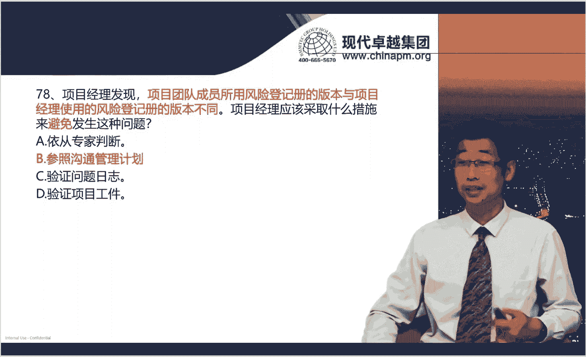

好了，整个的6月25号的一个考试动向哈，然后和一些这个题目的分析就给大家做完了啊，我们整个的冲刺课程内容呢也给大家讲完了。那啊对大家来说哈，第一要重点回去看我们冲刺讲的一些核心的一些知识点啊。

尤其是我们说啊现在考试越来越偏向于敏捷。然后越偏向混合项目管理，越然后还有一些商业环境的一些内容，这些呢都是大家重点要去学习复习总结内容啊，另外呢一些啊这个传统项目管理的重点的考点。

我们要这个加强的去总结。另外一块呢就是我们要对6月25号我们讲解的这些内容，再回去反复的去复习理解记忆。这样我相信哈对于大家啊这个未来马上要进行的考试。那么啊一定会有很大帮助。

也希望大家充满信心的去参加考试。然后期待大家会有一个好的消息。好，感谢各位的观赏，我们下次再见。😊。