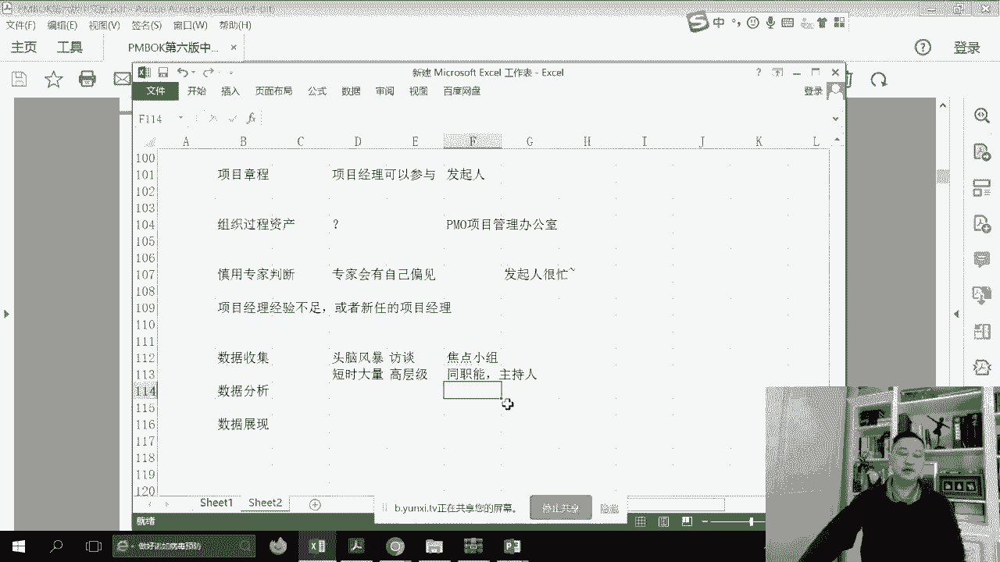
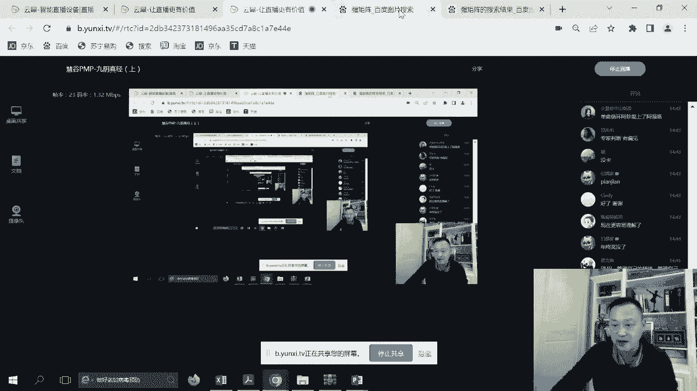
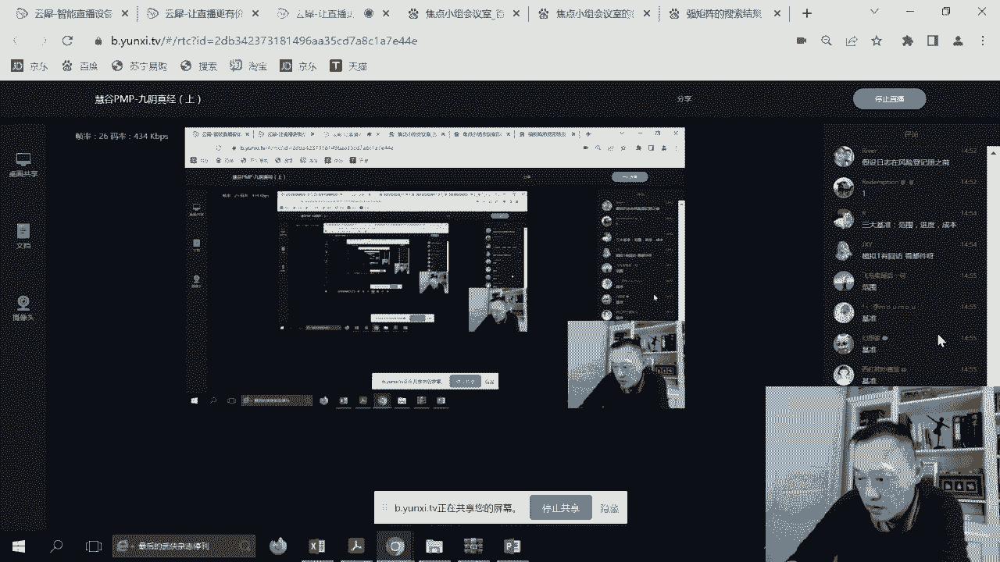
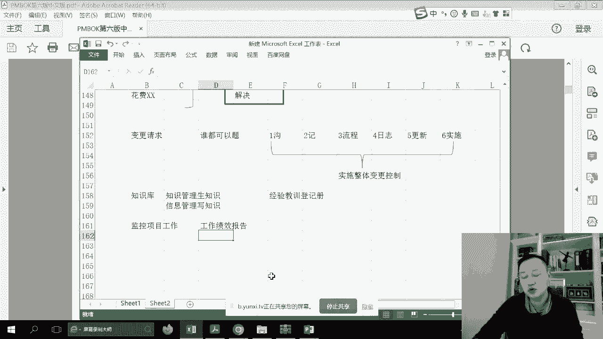
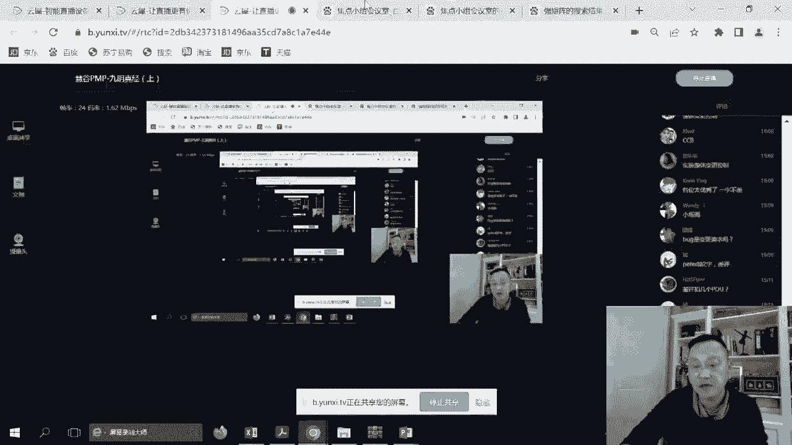
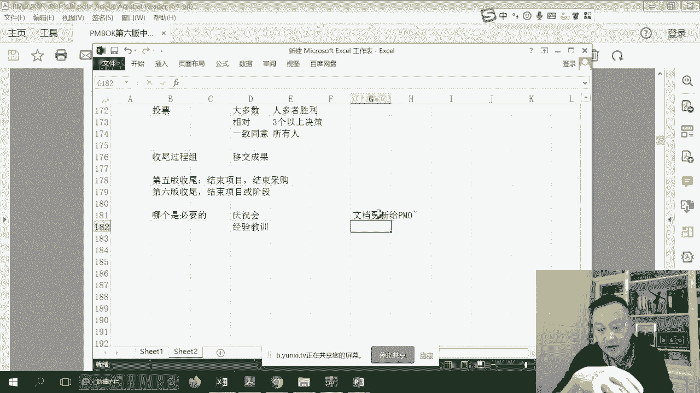

# PMP考前强化记忆串讲 - P2：PMBOK第4章考前强化记忆视频 - 交大慧谷PMP培训 - BV1yg4y157ux

如果有一天啊你在职场上感觉到，无论是硬技能还是软技能方面有所缺失，都可以让我睡觉，那起来提升不会鼓，让梦想有回响，第四章整合，那我在看很多同学还在问那个25页的表，要不要背，就是五大过程，十大知识领域。

我记得在我开课的第一课就跟大家说了，这是一个pmp必备的表格，而必备的表格，你知道每个模块在什么样子的位置，那如果说我们看第四章整合，应该要知道啊，我就大家大家背一下启动，执行监控和收尾。

这需要我们叫五大过程组启动，其实就是讲的是一个什么项目章程好，我们立项规划讲的是项目管理计划，不计划而执行呢我们叫做指导与项目管理执行，但是注意一下啊，指导与项目管理执行，注意一下，这是一个瀑布式理念。

如果是敏捷式理念，它就没有这种指导的概念了，对不对，还有一个呢叫做知识库，knowledge，在监控里面呢，我们有一个叫监控项目工作，然后呢以及一个叫做什么，叫做实施整体变更控制，我们就把简称cdb。

在收尾的时候有一个结束项目啊，再回忆一下，还记得这这五大过程组吧，里面的这些内容好，首先我们来看到项目章程啊，这个概念会相对来说比较简单，项目章程，我们先来看一下i t t o。

所有的pmbok都是以input和output和tooth，tooth and technology来写的，input output文档也tooth方法也，那么在早期的判决里面，你会发觉就是一般啊。

就是他问了啊，就是啊项目经理啊，应该怎么做，一般可能会考工具会比较多一些，或者说一般他问项目经理应该参照，哎这个可能是指的是什么文档，就是我们的input output会比较多点。

当然这不会不是完全绝对的，你还要看这个题目到底怎么说好，我们来看一下，快速的来看一下这些工具和输入和输出，首先章程项目经理可不可以写可以，但是要怎么样可以参与，可以写，也有人说商业论证可不可以参与。

可以，现在都是什么年代了，但是一定要有什么，但是但是一定要由谁起签字，就是老外认为签字就是怎么样，我们的一个达成的协议啊，所以呢我们就可以怎么样，认为这个项目怎么样被启动了，这就是章程好。

那么继续商业文件，就是刚才我们所谓的哎，我们的一个确定这个项目是不是能推，他的r o怎么样，那觉得ok的一个味道啊，这些就不用去看了啊，这些就不用去看了，大概是有有些什么需需要，另外一个是协议协议。

我们把它可以认为是c r a谅解合同，就是这个项目一定是要外边怎么样跟我，跟我就是有过合约的啊，我才那个那如果是内部项目，那么至少内部的某一个需求部门，跟我也是有合约的，我才认为这个项目是存在的好。

事业环境因素的一些法规，组织过程，资产的一些曾经的文档，唉有一个概念，我要跟大家说一下这个组织过程资产啊，谁负责梳理呢，唉组织过程资产谁负责梳理，如果说要问你要考你。

大家记住由pm就项目管理办公室负责好，那我知道一下，那么另外呢我们看一下工具technology，专家判断我在所有的体检里面，我也给大家写到ok啊，甚至不好意思啊，各位老铁，我可能大家有没有发现。

我前半部分的体检，跟今年的体检是风格完全不同，因为前半部分的题型可能比知识汇总会有，但是呢呃讲的就是怎么说呢，是比较官方呃，比较装逼，而今年的这个季节呢，我会写写的比较有意思。

我也想大家已经很苦逼了对吧，有的同学已经2年没参加考试，有的同学也等了好久好久好久，然后除了去学东西以外，那那个看题还还是比较，所以在体检里面可能会出现一些网红的一些单，词和叫法，呃，大家喜欢你就ok。

如果你不喜欢这个网红的叫法，你就可以忽略了什么阿珍爱上了阿强啊，然后让你的心我的心串一串，那么有时候哎看看这个呢会比较舒服一点，那为什么继续回到专家判断这个单词，一般情况下面慎用。

为什么慎用这专家判断呢，你会发觉pmbok的所有的子过程都有这个工具，所有此过程都是你会发现很有意思的考法呢，举个例子啊，我们来看一下项目经理正在制定项目章程，以下哪个是最好的主意，然后呢我们说呃。

那a选专家判断，b选，我们采用焦点小组会议，这时候你会发觉他会搭的，你知道吗，看这两个工具都是建议不要去学那个专家判断，因为大家知道专家呢会有，自己的一些偏见，那么什么情况下面会选，其实啊，不对。

这道题说得很清楚，像经理经验不足，或者一个新任的，啊你你可能你去看看里面哎，只有这种情况下面才可以去考虑这个问题，还有呢大家有没有发现现在的做题当中，我们已经基本上撇开这个发起了。

就是说啊项目碰到问题啊，项目经理如果搞不定，那那那怎么办，建议不要老是去找发起人，因为发起人他已经签字，都签了，项目已经授权给你了，所以建议啊你要去积极主动地去解决问题，不要去找他发起人，我给你写个字。

很忙，背下这几个专家史慎用啊慎用，如果说你为了做题，我教你一个最简单的办法，你要分数高，你看到专家就基本上不选的话，基本上都会分数高，除非看到怎么样经验不足的啊，另外呢大家不要就是嗯钻牛角尖的原则。

因为偏僻的考试它是一定的绿，你差不多四道里面能对三道，那你肯定过了啊，不要为了某一个知识一定就是哎呀马莱斯纳了，ok那你会很惨，ok所以大度一点哦，哦错了错了就错了，对了就做对了。

往一个时间点去让自己怎么样行云流水去做，就好好继续，呃，这里面讲到数据收集，那么纵观pm bok啊，大家大家大家知道一下，纵观pm它其实会有现在的这种大工具，大工具，那我们呃给大家标记一下。

那么也会有数据分析技术，也会由数据展现技术，其实现在就是一个贝贝贝塔，他这个这个工具用的很好啊，很多人只是不理解，你看何为数据收集，就是我不能够靠五段的专家，我也不可能去靠自己的经验主义。

我需要怎么样才没集数据，那么在采集数据的里面，我们可以用到哪些方法呢，第一种方法我们一群人yy，这时候我们讲到的这些知识点概念，我就把它采回来，把它记下来，或者是访谈到专业的人士。

或者是这里面又讲了一个叫做焦点小组，那么数据分析呢，其实对采来的这些数据怎么样，我们进行到底这个是主选是什么，去解决备选是什么，解决什么是数据展现呢，就是把这些解决方案或者这些收集来的数据。

用各种各样的图表把它画出来，而在第八章里面你会见到的图表是最多的，像直方图，散点图等等，所以你要你要懂，你要了解他，他他讲什么好，那么头脑风暴有什么关键字呢，我们来看看时间短，大量创业，但是怎么样。

但是他的需求点会很散，再来看一下访谈高层级需求，谁你你你会去跟谁访谈，你会不会去找你们的c o v p一起来头脑风暴，当然不会啦，你肯定会选那帮子团队的阿乌卵，对不对啊，大家来，我兄弟们来。

我们一起头脑风暴一下，所以这种访谈是针对于高层的诶，有什么业务需求了对吧，你希望达到的你的一个价值是什么，所以记住访谈一般对于高层的需求，那么焦点小组呢注意一下它是，着急的专家就你知道同职能的。

然后呢还会有主持人，哎我们以前我记得我在上课的时候。

我还特地跟大家去了解，来翻过一个焦点小组的那个照片。

我看看现在还有没有啊，没有了，现在还有那典型的我们内部是焦点小组会议，然后我们在外部可以去看到，他们的整个讲话的情况，甚至我们有新的怎么样论点，我们还可以发送过去，这是一面墙，这是一面镜子。

外面看得到里面里面看不到外面，ok啊，所以这是焦点小组好，那么继续，好那么继续我们来看第二个叫焦点小组，好，那么继续我们再看看其他的东西，好互动交流，举个例子，我们想知道各个it部门的预算。

你肯定请的就是各个企业的it经理，对不对，我想了解就是中国的呃，证券里面呃，大家是怎么样子工作的，那我肯定请的是证券公司的某些人，二指的是焦点围绕某些好，再来看这人际关系技能，人际关系技能。

其实是在pm里面一直在用的那种软件，就在立项的时候，你可能会碰到冲突，你怎么去引导你，怎么去会议管理，这个很难去考到你啊，很难去考到你好，另外一个会议开会，然后呢最终呢产出项目章程。

那有人说这里面要不要背，不要章项目章程里面有什么，如果说大家还回到老邱所说的东西的，而所说的内容的话，我们来聊一聊项目章程有什么，每六个数高层级的范围进度，我们的里程碑是什么，高层级准备的投资预算。

然后呢大概有哪些t的啊，member资源质量，还有呢风险大概就是这六个广告，所以如是章程里面它不会有几十页，就一页纸就ok了，我们准备建建一个兵工厂，我们就准备建一个什么什么什么，然后大概什么时候完工。

然后大概投一个亿资源什么什么，ok所以我们叫做六高啊，六高好，那么继续往下呃，什么是假设日志呢，呃很少考你，你记住，就是我们的一些假设和制约，会专门建立一个文档呃，在什么情况呢。

在我们还没有风险登记册之前，对于项目的一些假设和资源呢，因为你会发觉传统项目管理师叫做什么，做的是很细很细的，任何东西，建议大家怎么样，要有存档吗，来建议大家寻找，所以我们之前你看啊。

我们准备建一个兵工厂，那我假设假设最近啊，嗯疫情可能会要怎么怎么样，那他其实是会以会影响到我的整个项目推进，所以我上上手怎么样把它记录一遍啊，到最后我们会把它考虑，是不是放到风险的预测更好好。

这是起初的东西好，那么继续我们来看看第二个叫项目管理计划，其实项目管理计划里面有什么呢，第一个叫其他项目章程，第二个叫其他规划的输出是什么意思呢，啊如果说你记得我的课的话，我们来翻翻25页。

首先我们来找到项目管理计划，它是在这儿4。2，在项目管理计划里面，其他是什么呢，就是范进程，指资源风和资源风险，沟通相关方等等的所有的此计划，里面是所有的叉叉子计划，或者说你在我教你做题。

或者是你在我上课的时候，你经常会听到什么范围管理计划，无范围需求管理计划，无需求到底是什么意思呢，其实啊你会发觉范围管理计划，需求管理计划就5。1的输出，其实里面没有，具体就是我们的方法论。

进度管理是6。1的输出，方法论，7。1方法论，所以呢有人问啊，我要去看项目范围，你千万别选范围管理计划，因为这是方法论，那么到底什么里面有范围呢，基准我们待会儿会说到三大基准啊。

所以呢先把12个字计划纳入进来，然后加上了三大基准，这才是我们项目管理计划的原理，而这三大基准是什么，就是我们所谓的范进程，做完药已经病了以后啊，这玩意已经定了以后，你会发觉整个项目是有一把尺去衡量的。

那有人说啊，那个项目我们看如啊，看看做题的时候，如你一道题发现沟通不畅，你怎么办，我可以修订沟通管理计划，各位老铁们说诶，这要不要提变更，要不要习惯了就不要提变更，这只是某一个自然计划的修整。

哎呀相关方纷纷投诉，发现没有识别到这个相关方，那么我识别相关方，我修订，相关方管理计划要不要去变更，又如在题目里面我们会发觉怎么样呃，我们发现有一个资源啊，可能会不到位，这个时候来不了。

但是有一个其他的替代资源可以用，那这时候我能不能修订资源管理计划呢，我们的回答当然可以，因为这些都是什么自然文档的更新，那么什么是不能随意去修改的呢，各位老铁应该能告诉我吧，好什么是不能修订的。

大家能知道吗，不能改的就是我们的三大基准啊，比方说用户增加功能，对吧，然后呢，我们的里程碑要，延期或者要更多的预算，不好意思，已经动了我的极限了，我是不能随意的，我至少我要怎么样保住自己的底线。

那对不对，所以我底线之余你弄我就弄算了，ok所以呢如果说有人要动，这个就是我们出现了一个新的概念，叫做变更的知识领域，要动这个就必须要考虑，实施整体变更控制的思路了，ok啊，我看一眼直播间啊。

不然我我也要稍微看看你们的整个情况。

好，好那么这个我们能明白啊，所以这个就是我们搭的是项目管理计划，的框架啊，因为时间关系，我只能说快速的跟大家去看一看一轮了，那么也就是说意味着以后呢我带你看过了，你如果说是以后就是项目里面有兴趣。

你可以去那个呃，也不用花很多时间去去阅读了，po，这样的话很浪费你23天的备考时间，你的所有时间就是除非我带你上课之外，就是做题做题做题做题做题好，我们来看看项目管理计划，差不多在这个位置。

好那么输入就不看了，我们来看工具，又是专家判断啊，没问题，数据收集，这时候你看又是个大工具c的，但是这时候c里面比刚才多一个，大家有看到核对单，为什么，因为前核对单又叫做。

up to check rest，老外跟中国人不一样，他特别怕遗漏，所以你看我的项目管理计划里面，有13个子计划，那你就把13个子机构列出来，做完一个打个勾勾，做完一个打个勾，当时三个勾全部打完。

我认为项目管理情况ok了，这就是我们的所谓的check好，所以唉注意一下check list好，除了checklist以外呢，我们，我们又出现了人际关系技能，包括冲突管理引导啊。

这个为什么我在这没有细细的跟大家讲呢，其实呃未来我们去翻阅我们的软的实力的，像第九章的时候，你会发现这些技能会讲的更清楚，包括会议，那么这里有一个知识点就是kick off meeting。

来注意一下啊，开工会议通常是什么时候呢，通常我们看一下啊，书上写着啊算了，我来直接给大家总结了，keep off meeting呢，注意一下，是在启动啊，有的有的时候翻译成启动，会不是在启动，在规划。

最后就是我们的项目管理计划都已经有了，要执行之前，我们准备带着兄弟们干了，所以我要请相关方们，高层们团队们一起来开会，了解整个项目的目的，目标范畴等等内容，这就是kick off，不要忘记啊。

kick off到是反而容易考你的，所以你要知道，这个知识点，最终输出了我们的项目管理计划里面，哒哒哒哒子计划，基本上你看叉叉计划，五叉叉呀，ok呀好，那么最后呢三大基准啊，注意下基准基准很重要。

考变更依然是现在的重点，是中中重点变更题不少的一套卷子，20题有的好，那么这个就不看了呃，项目管理计划左边部分是用来干嘛，指引我们接下来怎么做的，右边部分项目的document是用来存档的啊。

所以呢哎注意一下计划和项目文件，现在已经不再是十几年前问题，那这个文档是属于计划还是属于文档呢，这太low了，ok啊现在都是一种快速的场景，现甚至大家有没有发觉，在题目里面还会考到这种医疗系统。

kiss的这种概念啊，所以知道一下呃，再来看指导与项目管理工作，在执行过程中，而在执行过程中，那它的意义是什么呢，讲的最简单，就是根据计划读音i n g，而根据计划读音i n g。

那么接下来我们会发现了哪些重要的知识点，我们往下看看呃，先来看一下输入，看计划没干，干活没问题，ok干活没问题，然后呢包括各种各样的报告，这个问题不大，而批准的变更请求我们会拿到。

执行过程中我们会拿到怎么样批准的变更，就是最新的，或者说没有变更，那就按原计划dog啊，就是这个道理ok啊，就是这个道理，在瀑布式里面我们说啊计划做出了怎么样，等于项目完成一半了啊。

所以就知道事业环境因素，组织过程资产来看一下工具啊，专家慎用啊，慎用呃，另外我们会有一个叫pm p m s，你在做题的时候也可能会碰到这里面呢，其实你就把它当做是一个什么呢，项目管理的软件啊。

p m s，软件工具吧啊它里面可能会有一些是做呃，呃就派公的，有一些是做项目配置库的，有说是什么发布的等等，包括还有knowledge啊，所以呢就像那个我们在日常工作当中，我们会用一些呃工工作流软件吧。

比方说我们用钉钉的会比较多一样的，ok这是你的项目管理的软件好，那么这时候呢又会出现了啊会议啊会议，那么这时候你会发觉怎么样还会有一个叫做，那这里又提了开哦，不好不好意思，开工会，这里是提了。

但是是应该是这里往前一点，对不对，因为这是执行嘛，应该是规划，最后执行之前啊，注意一下好开工会，那么开工会是开一次还是呃很多次呢，呃书上没有铭文，就是跟安居，按照项目特例，像我们之前一般会。

每个阶段我们会大家开一个kick off meeting，的一个喷头会啊，kick off meeting，包括什么迭代会议，而这些都是敏捷的术语，那么最终的会输出可交付成果，这什么玩意儿，什么玩意儿。

项目做出来那玩意儿啊，但是我不知道大家还有没有这个脑子的思路流，可教成我给谁，如果说你现在是没有这个思路流的话，你这个有点out了啊，如果有，那最好首先给这个，qc质量控制，我们内讧，ok啊。

看一下有没有bug，看一下有没有什么那个不好的点，那么如果说内控ok，那么我们就会变成什么，何时大课教父就是我们qg怎么样，测试过了测量过了，qc都没问题的话，那到哪里了，到达一个另外一个直播间。

就是5。4要给客户了，其实敏捷也是一样，我们spring出来以后对吧，我们也也经过测试了，那我那我也要给什么给po呀，所以呢我们要确认范围啊，确认范围，给谁给用户们啊，其实原理是一样的。

最后呢变成验收的课交作啊，各位老铁，很多同学做题啊，认为结束项目或阶段才是验收，不是确认范围监控才到了验收结束项，项目和阶段，是将验收的可交付成果转成什么移交的，可能是最后移交啊，这是这个过程。

所以验收是在确认范围，大家在做题的时候一定切记啊，一定切记在这个位置好呃，第二个就是我们所谓的工作绩效数据啊，有的人看不看看了，那个就是什么那个ppp bc是什么，问我这个呢，我跟现在再给你讲明白。

其实浪费你的时间了，我就讲得最简单呃，项目，计划怎么怎么样，实际怎么怎么样，大概就讲这样子一个情况，然后呢花费怎么怎么样，大概这些，然后呢我们未来导入什么导入分析机制，了解项目的现状啊，大概知道啊。

大概知道这整个环节和效果好，那么继续哦，这玩意儿考得比较多啊，这玩意考虑比较多，问题日志，什么是问题问题，它不是变更，变更是破难难难，那刚才我说的三基准，而问题是我们必须记录改良的这些东西啊。

记录改良的东西叫做问题日志啊，而且是已发生的，记录它跟踪它解决它啊，这个文档叫问题认知，而风问题日志很容易跟另外一个东西搞在一起，就是风险跟机测这两个不一样的，这个事情发生的已经出现了。

但很多同学估计要问哎，邱老师啊，我记得有一道题是数据泄露，你怎么会考虑选择风险的预测，而不选择护肤问题日志呢，虽然数据泄露确实是已发生，但是对于数据泄露这件事情来说啊，他是无法量化的呀。

我必须要怎么样去想办法定性它，然后定量它它吸了多少，写了哪些数据，是敏感数据还是非敏感数据，所以那题后来选了风险等一侧，所以这个呢是指未来的可能大声的那些东西，最我在看他在做题的时候。

有些同学还是搞不清楚，风险对策和应对措施是什么，我们在九阴真经的下半部分，我会跟大家去去分享到啊，去分享到好继续，所以呢这是问题日志，另外变更请求而变更四大状态，现在已经不再会考你。

但是变更流程在座各位还是要清楚的，变更请求谁都可以提，谁都可以提，大家知道变更是谁为他负全责吧，很多人可能不知道，你看待会再哦，这样还没有待会在实施整体变更控制时，书上这么写道，希望目经理应该为他负责。

其实负责的是什么，负责走流程啊，去check他的流程好，那么谁都可以提，所以呢变更的时候，大家还记得，我跟大家一起回顾的变更的流程是什么，一勾2g集体跟鞋勾二记录，把它变成变更单三流程。

我们走cctp审批啊，注意一下，现在已经不再是问啊，变更是发行的p还是cg bp了，你都统一选c g b ok啊，这很简单，日志，我们会把一个批准的变更，update到我们的一个单个的。

怎么样变更的汇总表里面，你就这么想啊，是日志五更新么，样，根据我们的项目管理计划实施这个变革啊，所以他在考你的时候会问你，哎我在什么阶段呢，项目经理啊已经记录了这个变更，接下来怎么做。

那当然是下六层哎呀，c d p p的，接下来怎么走，选最近的，但是各位同学应该知道的有一个什么呀，王者的回答，哪个网址回答包括了所有流程，实施整体变更控制，如果说在答案里面，你看到一个变更题应该怎么办。

虽然有一一勾二级三流程，或者怎么样看到实施整体变更控制，已经基本可以定性是它了啊，所以知道一下他的一个牛逼之处好，那么继续讲题，继续讲题，我们正常文档更新，项目文件更新，它不会考你，我们只是知道啊。

pm不会这么写，这么写的好，knowledge，知识知识是什么，知识是力量，我们怎么去获取知识，怎么把它变成经验，教训根基册是这样的一个过程呃，你会在日常的帮助学习中当中，包括是敏捷的项目经理的话。

也是在不断的帮大家去获取，并且总结经验教学呃，他在执行过程中没有问题啊，显性知识，隐性知识不会考你，但是我们大概也知道文字是显性的，包括一些呃洞察力诀窍，这是隐性的，我们希望把隐性的变成显性就好ok了。

然后来看一下输入哒哒哒，这个就不用不用细看了，然后呢工具有两个啊，有有有有有三个，其实这玩意儿又是专家判断，不用不用太多，一个叫知识管理，一个叫做信息管理，哎这两个其实不一样的。

呃有人问你如何去获取知识，其实讲的是这个，知识管理，知识管理呢你看帮你结对生成新事实，就是帮你生的，为知识管理深知识，那么什么呢，下面有一个叫做信息管理写知识，啊这两个工具本来一看到哎。

我就等于有点像是数据收集吗，我去我去获取，那我去参加他会，我去参加沙龙，我去参加什么呢，或知识，然后呢通过信息管理去写，你可以用软件写，可以用硬件写，可以用文档写，甚至是手写，最后出产出一个东西。

p m p很喜欢的，而很容易考你的一样东西叫做经验，教训人几册优化自己，啊，所以呢这是我们知识库管理的一个，非常重大的知识点，或者是考考点，还有一期访问啊，经验教育政策，好再来看一下监控项目工作。

监控项目工作的作用是什么，是监督跟踪报告项目进展呃，监督跟踪报告项目进展，然后呢你会发觉啊，它其实是属于呃已经不在执行过程组了，是属于监控过程组，要讲明白这个原理呢。

你首先要嗯同样的去看到pmbok的25页，好我们来继续来看到25页，你会发觉啊，就是因为在整合过程中，它是整合下面所有的，所以你看直到项目管理层，整合下面所有监控项目工作。

也是整合下面所有下面所有的什么呢，这时候又回到原先一个东西了，工作绩效数据变信息信息呢，最后我们汇总所有的项目的report，变成了一个工作绩效报告，在我们的项目的怎么样，现状报表。

最主要就要产生工作绩效，工作绩效报告呢其实有人问长什么样子呃。

我百度1个给你吧。

应该网上有，非常的项目管理师，我最好是找一个pm box上面的，就政治管理啊，啊就就这个吧，最好不要有logo的，你知道吧，啊就这个吧，把它复制手工图片，这就是将来去讲究的一个项目的现状。

那么这种体现模式呢是一种政治体现法，而政治体现法啊，不要不要留大量的时间再去背那些东西了，政治待会我们讲到政治的话，你只要花五分钟，我只要要求你了解cpi和s p i是什么，这是最容易考。

不然你寄不回来啊，同学们啊，当然有的同学如果学习比较好的话，当然你不放弃也是好的，那么注意一下，又回到一个谁负责发送绩效工作，绩效报告，包括它的格式，它的频率，啊再回忆一下。

而工作绩效报告它有各种各样的说法，比方说状态报告，比方说呃进展报告，比方说正值啊，这不是政政治报告，可以比方说敏捷的叫做什么燃进步，你都可以把它当做是项目现状的，由他去管，所以大家有没有发觉在题目当中。

有的时候会出现一个会议给你的线索，叫项目状态会，其实讲的应该是沟通知识领域，你有没有发觉还有一段呃，你你你回忆一下有没有甲状状状态，最终选的是沟通管理计划，这些都是线索，靠沟通协作啊，大家知道好。

那么我们继续回到我们的监控项目工作，啊就是这就是指的这个东西，所以其他的呢也不用花很多时间在这个值，在这个啊资过程当中了，知道原理就好，那么再来，我们下面还会有什么呢，就是实施整体变更控制了，我们看看。

然后注意下看一下其他的一些工具啊，嗯专家判断没问题的，数据分析，唉注意一下，这里面就会出现数据分析了，你看呃一个叫数据去收集嘛，什么访谈啊，同道风暴啊等等的去搜的。

然后呢收到的数据呢将来有一天是需要分析，他们介绍了主选和备选成本效益，包括正值，包括根本原因，包括趋势包哎这种分析技术啊，他是个totally总的，而这种分析技术呢呃相对来说啊，大家来看看。

考你最多的是哪哪哪哪几个根本原因分析，一定是考的最多的，然后趋势偏差考得不多，呃，备选稍微多一点点，ok只知道一下主选和备选吧，plan a和plan b，ok这是备选根本原因分析的。

一般可以呃找根本原因或者是找经验教训等等，都会有根本原因分析好决策，大家投票，然后呢包括我们开会等等，就会输出我们的一个report，注意你看进展报告，包括我们有一些图表，啊图表啊。

根据沟通管理计划想发看到了这些，其实就是我刚才跟大家去说的，考中如何去理解和考的知识点好，那么最后呢我们又来到了实施整体变更控制，它属于监控过程组，作用是什么，很简单。

c t b把所有的变更怎么样批批准生成结果好，然后呢，你看输入式变更请求输出应该是有一个结果，包括这些结果会放到怎么样，因为单据很多呀，所以我有叫汇总表目录叫做编程认知好，我们看一下里面的东西啊。

你看啊这句话实施整体变更控制贯穿始终，答案是谁负责，最终承担责任骗啊他，但是他不是签字啊签字，所以他要找c t b的，而这部分你看定基准之前，啊所以我们也要有基准，那有了基准以后，我们一切按流程。

那么这里面又说到了一个新的概念，但是ccb，变更，委员会他委员会是什么，有人说哎是不是类似于po这样子，不好意思，不是的，你就在项目管理计划里面的变更，管理计划里面写进去呗。

张三李四王5c c b成员就好了，同意他们就好了，ok啊，所以呢哎这是一个变更的一个想法和思路，变更可以口头，但是要走cco好工作绩效报告这些都讲过了，变更请求也ok，没问题啊。

思状态不用不用不用不用不用去背，太多了，不会考你冷静好实施整体变更控制，你看它甚至会有变更的工具啊，甚至是我们要识别配置项等等，那么这个呢就是走到i7 的路线了，因为i t讲究的是稳定性。

我的任何一个比方说我要增加一台服务器，我要呃减少一台服务器，其实都必须要走，怎么样，我们的变革流的啊，变更流的这个呢，跟很多如果没有做过运维的同学，他应该不一定清楚，反正就是我们可以通过软件来管变更。

然后另外呢我们会有主选和备选，是不是确定一定要用这个背的，如果用这个变革是主主选是什么，备选是什么，ok啊，甚至是可以怎么样决策，包括投票，包括多标准啊，注意一下这是三种啊，投票就是大多数的那个。

但是呢这里面啊，这玩意儿其实是比较容易考你的，什么叫做大多数，什么叫做相对，那我们来看一下投票政策，大多数，少人多者胜，那什么叫做相对呢，因为你可能会投票三个以上决策，并不一定一个能够完全压倒。

完全压倒，所以他看上去怎么，那比方说100票40 30 30，那么40票通过相对原则呢，我们决定ok好，甚至还有一种比最苛刻的一致同意，所有人ok了，所有的人都统一，对不对，知道一下。

最终可能会输出一个已经被批准的，不管是批准还是否决否决的，我也要也要输出啊，我也要不能死，不能死掉，也要存档好，到了最后呃属于执行过程组，我们来看一下，啊不不不是执行过程组属于收尾过程组。

首先我们的思路要清楚，收尾过程中不是验收的，而最大的作用是移交成果，你可以像什么可以去向你的甲方爸爸一下，你也可以像我的运维团队移交，因为很多企业它是内部的，它可能像运维团队移交。

而且这个移交呢是要怎么样，他们都签过字的啊，在确认范围手签字，在这时候是移交，ok啊，所以哎注意一下，输入是验收的，输出其实是溢交的啊，一级的呃，快速的来看一下结束项目时，要确定要什么回顾计划。

然后确定什么都达标，对不对，这个做文字大家都都应该能明白，然后呢看一下输入啊，章程也好，计划也好，文档也好，因为你这个项目做起来确实是大量的文档呀，甚至我要把这些文章有的文档能看，有的文档不能看。

对不对，要编起来编辑什么的，待会我们看看啊，那首首先入手验收的和教育情况，这不是咱们这时候做的，因为它是输入嘛，就确认范围内，然后呢确定啊我的商业文件，另外你会发觉这两块协议和采购文档呃。

这个要讲讲第五版和第六版的区别，在第五版中，说我有两个子过程，哎呦喂，怎么这么多广告，我真的是阿迪丽娘嘞，后面有两个是，第一个叫做结束项目，第二个是结束采购，但是到了第六版之后呃，收尾只有一个了。

结束项目或阶段，那么也就是说意味着，这两块其实是要要你怎么样跟乙方能够顺利的，接下来，所以也放在这里了，好那么看一下工具专家没问题，数据分析啊，这个文件回归趋势分析，这个到第八章会讲的更细一些。

然后呢啊可能会有会议，包括经验教训会，包括庆祝会，这些都是可以的，但是啊我问你啊，如果说答案里面只有两个，他说哎呀项目已经结束了，呃，呃准备结束了，我们接下来哪个是必要的，项目结束，哪个是必要的。

啊比方说a开个庆祝会，第二开个经验教训会，你觉得哪个你选经验教训了啊，庆祝个毛啊，对不对，ok啊，所以注意一下必要的和可选的好，另外结束项目或阶段会输出文档，最终产品就是我最最的移交的。

给到我的customer，以及我们可能会要去写到最终报告，项目的最终的report啊，我因为最终报告是给甲方或者老板们，要去看到的，他不他们不需要去看你们这么多的怎么样啊，文档这么多的这个这个产物。

但是你要你要你要去跟追踪报告，然后呢会出现怎么样，我们相应的一些正常的文档的更新啊，比方说我们整个项目从开始到后来所有的文档，那个文档更新给谁呢，这个文档更新给，g e m o，好的。

那么以上差不多一个小时不到一点的讲解呢，其实我个是跟大家那个领略了，就是我们所谓的啊。

