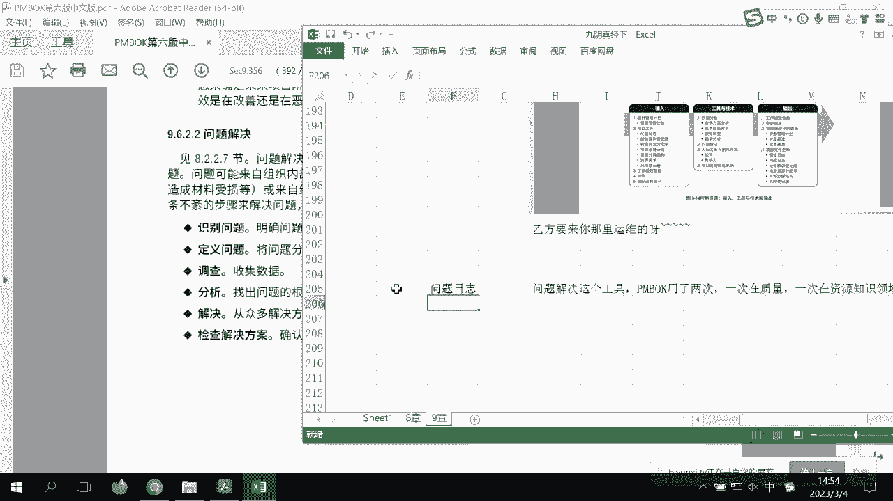

# PMP考前强化记忆串讲 - P5：PMBOK第9章考前强化记忆视频 - 交大慧谷PMP培训 - BV1yg4y157ux

如果有一天啊你在职场上感觉到，无论是硬技能还是软技能方面有所缺失，都可以让我睡觉，那岂不是成功会鼓让梦想有回响好，那么接下来我们顺着我们的质量往下看，就是我们讲到第九章的资源，那资源是什么。

首先在pmbok里面，特别不管是做题还是看这个篇幅，我们对于三个知识领域非常能够去呃分清楚，我们这样吧，每个章节，好再来一个新的叫第九章，首先要有对于pm不会要有一个出题。

就是说在pp上面有三个知识是讲软的，第一个就是我们所谓的资源知识领域，第二个我们叫做沟通知识领域，第三个我们叫做相关方知识，为了让你很快的能做题，能够去辩解，其实这三个三个知识领域的作用都是不一样的。

资源知识领域最简单，你的团队你怎么办，而沟通知识领域是什么，很多人都认认沟通不好，怎么不好，其实沟通知识领域就是好一个计划，沟通管理计划，这什么长得再白一点，就是你要让大家了解项目的现状。

而这项目的现状写在哪里，写在一个东西叫做工作绩效报告，或者我们叫状态报告，或者叫做进展报告，whatever，他有很多甚至是在敏捷项目，我们叫做什么叫燃尽图，所以我要很快能分出它的知识领域。

让大家明白我项目现状，而且我要考虑到不同的人，应该给他不同的工作绩效报告，员工可以看到的是，像项目的技术老板，只要看图，对不对，ok啊，所以这就沟通知识领域，那么什么是相关方知识领域呢。

所有的团队以外跟项目大概的人，可能有高权利的，可能有阿姨妈妈，就是这个叫做相关方，对于相关方来说，我们的知识就是你好我好，大家好，营造一个怎么样共同，支持的环境即可，啊，所以大家知道一下。

这三个知识领域的一个区别在哪里，那么这时候我们来索引，我们现在并不是在讲那个呃质量啊呃呃呃，资源或者沟通，或者是想我们我们先把这三个能明白，那你在做题方面就是怎么样会有大量的提高。

那么接下来我们来看资源知识领域呃，在资源知识领域里面，里面其实是分两个规划，一个叫做规划，资源管理就是要出现一个资源管理计划，待会我会跟他说一下资源日历是什么，而第二个叫做估算。

资源我们这里面最大的一个叫做资源分解结构，不来即可好，那么三个在执行一个叫做组件啊，我们去获取建设管理团队来执行，还有一个叫监控控制资源，填空啊大概就是这样子去排列的啊，所以呢我们现在一个个的往下看。

到底是一个什么样子的概念和理念，你会发现在你们做题里面有很多像什么冲突，管理啊，或者怎么样，其实都是资源知识点，那你要营造的就是怎么样，我们团队环境肯定是好的，不会去营造差的。

然后呢我们叫做资源管理方法啊，我们是不是用一些怎么样精益对吧，或者是情商这个自主哦，注意一下，自主是团队，这个我要跟你，sorry，那自主产生这个我们要那个做一下笔记，他是解释了，可以不成为项目经理。

其实square master，对不对，这个概念我们知道好，那么继续呃，虚拟团队呃，虚拟团队会在啊啊啊，运营团队你会发现在我们的呃，这几套卷子里面会出现的非常非常多，所以如果说一旦考到虚拟团队。

你的唯一，你就要知道虚拟团队沟通不畅，那你应该怎么样优化沟通，这是你要做的关键中的关键，优化沟通啊，在家办公，homework homework嘛，对不对，很多很多，那可以接受各种各样的技术。

有人说一定是视频会议，好不好意思，像有一些那个我们有时差的呀，哈对吧，所以要借助各种各样的沟通技术，有时候你会发觉在跟格罗伯的聊天，就是沟通的时候，其实我们有时候还还真的会发觉怎么样。

电子邮件还是一个不错的方法，对啊好，那么继续，而且不用看了，多文化，那第一个叫做规划资源管理，到底出现一个什么呢，呃呃这些可以不用很在意的专家判断，同样的，对不对，不用很在意的。

我们来看到数据表现在这里面呢，就是我们可以有一些呃数据表现，来帮助你去找到合适的人和职位，那这里面介绍一个呃我们的o b s好了，o b s叫什么，ob s叫做组织分解结构，它是一个自上而下的分解。

那作为项目经理的，你只要看到组织工作分解结构，你就会很快的了解我的什么样子的人，可以在怎么样的团队里面去找到，我要技术肯定是技术部，我要研发肯定是研发部，对不对，所以呢唉我们注意一下。

obs叫组织分解结构，这没完没了了，这个这个图呢是白的，算了啊，不要他了，我要看看他那个，好我就可以知道怎么样，ob s可以知道不同的人在哪个，哪个职能可以去获取到了啊。

这就是我们的呃组织分解结构的一个作用，好那么继续往下这里面讲这个东西很重要，叫做rc模型，rc模型你会会考的很多次，注意一下rc模型呢它其实有两个叫法，一个叫r a m m或者叫做ra si模型。

它是用来干嘛的，它是用来进行分工的，确定谁做什么任务，对啊，用来分工谁做什么任务，大家回忆一下是不是做到互相类型的题目，那么首先呢pinbox上面的我就不截取了，我网上给你们截一个rc模型。

啊这还是那个，那么这时候我们可以看到有人得到的是r，r就是负责的，你就这样执行的人要更好理解，那么我们来看一下创建章程，谁是二呢，本是执行的人，看到吧，那负责人我们要执行a呢。

你就可以把他的accountable就是老板，c就是咨询的人，i就是通知inform的人，ok了，所以来确定谁做什么任务的，啊我看错出现一个错别字啊，i c i。

所以哎注意下i c i模型是第九章出来的，ok啊数据表现在里面，o b s也在第九章出现过啊，所以大家注意一下谁做什么的任务，用来分工的好，那么继续啊，组织理论，组织理论呢。

其实就是我们组织和团队的一些行为行为模式，你会发觉不同的企业的组织理论是不一样的，就像国企和外企和民企，他们的行为方式其实是有很大的区别和不同，ok啊，包括像我们上海的企业和北方的企业。

其实大家在谈论的啊，整个整个模式还是有些不一样，好，好那么注意一下组织理论，然后呢最终的输出资源管理计划，注意一下资源管理计划，很多人认为很，嗯很复杂，其实很简单，你就简单一点，那我把重要的如何识别。

ok的，不用不用的获取，然后呢我这些资源将来会考虑哪些角色，职权职责责任等等，啊这里叫能力啊，具备的能力等等，那如果说你想这些东西，如果说我公司里面呃，像职能部门没有，那我就可以把这个表单怎么样给他。

hi hi，就根据哎你要招聘的职啊，决策是什么，职权和职责在哪里，需要什么能力，什么大学本科几年哎，这个就可以招人了吗，好那么另外呢我们这儿又介绍了组组织图，就是我们的项目组织图，自上而下的可以有。

好那么包括我们的项目的如何去管理资源，如何去奖励这些资源呢，资源管理我们叫做什么呢，叫做人员配备，管理计划啊，这个就说的很清楚，就是你要知道项目的资源，不是说好一下子yes，一下子就是就是没有的。

或者一下子都要来，一下子就要走，项目的资源应该是怎么样呢，有分别的进来的先后顺序的吧，比方说张三从几月到几月，李四几月到几月，那么这时候呢，其实如果说你们去研究一下早期版本的，应该有一个文档叫资源利。

而现在的很多版本啊，对于资源日历，他其实讲的已经是少之又少了，那我们叫做呃，所以呢我会跟大家去，去找一下资源日历的样子诶，包括在我的体检里面，怎么也会就是什么叫资源日历，就是你要用到这个资源的小时数。

我找到找一个project，所以你要知道这些资源什么时候来，什么时候走，甚至有一道题里面怎么样，节假日要不要有，你完全可以在这些资源这里面本给他标出来，节假日，注意一下，老外节假日是永远是不会加班的。

清楚了吧，所以你只要在新年日历里面把他任务点节假日，那就不要安排工作，不安排工作，他就不会点雷，因为你没有计划任务，有一个这样的说法，对了我没有经贸工作，怎么可能会碰到delay呢。

就是大家还记得有一道题是a a国抱怨，比国对吧，这时候问你怎么办，其实你要在我的资源管理计划里面明确好，把这个敌国的这些人全部是放假状态，那么这时候你的计划没有的，那就不会有delay的情况。

啊所以下注意一下这儿有一个很好的东西好，那么具具体我们再往下看看啊，包括我们的团队的怎么样，呃，我们的认可计划就是我们的奖金怎么分配，是什么，这些都是我们的资源管理计划。

所以啊你看资源知识领域的资源管理计划，是把未来的这些资源如何去管理，如何配备，写得清清楚楚，一目了然，啊写的清清楚楚，一目了然，被你们听到了某些声音好，那么继续往下，我们来看到团队章程。

这玩意儿我告诉你，起码每套卷子考试题十题有点夸张，但是真的容易考，呃首先团队章程呢在翻译里面，有时候他不一定叫团队章程，它叫基本规则，把团队教他叫基本规则，那么这时候呢大家注意是大家。

因为我们项目是个临时的，他不可能去做一个项目的行为准则，所以呢我要做一些规则，让大家共同认可，共同确定，那么大家记得吧，有一题他就说到了，诶，我们已经有了团队账号，但是有一个人他说我从来没听说过。

那这又是为什么呢，因为我告诉你啊，大家共同价值观指南等等，你看团队章程是由团队制定，参与才是最佳效果，不是说你项目经理发一个文，是大家怎么样一起来的，决策的我们开会，直到发红包项目哦，任务晚了。

做俯卧撑更好，以后大家都是这样子啊，这就是我们所谓的团队章程，那么呃你在做题的时候注意一下，有时候它不叫团队章程，他有时候讲翻译成叫做基本规则，你看，所以这两个你可以把它当做是约等于的，ok啊。

约等于六，那如果出现选择题，他说choose to a，选团的交换比写基本都是有可能对吧，或者说呃他选单选题，要么出现团队教程，要么出现基本规则啊，这就是我们的团队教程好，那么估算活动资源那里。

其实里面有很多的估算工具，这个我会很快的过去，这里面的估算工具呢，其实是在我们的上了九阴真经上的时候呢，会跟大家分享，那我最主要的就是要知道哎，我看看能不能把它截下来啊，怎么样。

最主要的就是出现一个这个叫做资源分解结构，那最清楚我们知道这是什么了，好那么我们继续继续好，接下来看获取资源，现在呢就到了执行的过程组了，在执行过程组里面其实是三个，一个叫做获取资源。

第二个叫做呃建设团队，第三个叫做管理团队，首先我们来确定一下它的区别，获取资源就是把人拉进来，因为什么，因为我们有一个人员配备管理计划，确定这些人什么时候来，什么时候走呀，我按计划来啊。

因为为什么他不来，我不能干活啊，所以最大的工具叫谈判，跟谁谈，跟跟职能经理谈，跟其他项目团队谈，跟每个人要去谈判，建设项目团队呢就是我们要做团建，让他爽，管理团队呢，怎么样要鞭策他，优化绩效啊。

很清楚三个字，我这个作业，好所以当我们知道这三个子过程的作用之后，我们再往下来看获取资源啊，这个不用不用不用太那个了，看到工具多，标准决策，第一个工具，这是我要的人，可能是考虑可用性。

但是每每天给我一个小时，我要用它干嘛了，我们的成本怎么样，这个人能力怎么样，个人经验怎么样，这个人知识怎么样等等等等的，来多个维度来确定我要怎么样子的人，那么第二个叫人际关系，其实讲的就是谈判了。

那么最下里面有一个很小的考点，你看啊，问职能经理一般要的就是仇人，啊如果说他分文很像，他有一个普通人，你就不要写错了呃，叫谈判，用一个普通人问谁要职能经理，还有呢特殊人稀缺的，看书上看其他小怪。

他的因为怎么样，你还等着你要在部门，在部门里面没想过，要么都是普通人了，每个项目都真正要的肯定在其他项目团队了，比如很小的，是很小的好，那么包括外部组织也有，那么这时候呢我们看啊，在谈判中啊。

怎么样子呢，要说服他们看到前景，这些都是很重要的，好舒服，好那么继续呃，另外一个呢工具叫预分派，有人知道，虽然出现过考试的时候出现过这种单词预分派，是怎么样呢，是之前就承诺要在这个项目组的预测派。

注意一下，如果这个点问的再细，他其实有三种情况，第一个是啊，我我按照书上竞标中承诺的，第二个章程指定的好，那谁谁谁为核心的team member，第三个其实就是什么呢，测试应该是特殊技能。

就它可以有这种预分派的权利啊，如果说啊题目里面他经常会出这么错啊，他说以下都是预分派，除了什么，你只要记住这三点，不是这三点都不是，好那么继续往下虚拟团队什么最重要，沟通最重要注意一下啊。

虚拟团队虚拟团队，虚拟团队工作班次，现在全球化的都是在家训练，我们现在夫妻也是虚拟团队，所以对于要怎么样改善沟通，永远是关键中的关键，这几天我发现你们做题，很多同学都不知道沟通三种模式，什么推迟拉屎交。

不是待会我们会继续往下讲，但是我们现在知道一下这样的情况就好了好，那么最终呢我们输出了我们的人员，派工单资源日历，我们看一下输出啊，比我们攻占，资源是利，其实就是我刚才给大家看的呢，哪些人能看到吧。

职业日历记一下工作班次，上下班时间，那他在这儿，好那么其他不用多关注其他文档了，我们继续往下，那么第二个呢叫做建设团队呃，最像美系风格，就是对于团队来说啊，那个你要实在性，就说团队气势不好什么的。

你千万别选那种画大饼的那种那种打底，你就是基本上团建这个答案是非常好的，那团建不一定一定要花钱啊，而且并不一定一定要在一个地方，我们远程团建也是可以的，ok啊所以建设团队，提高他们的怎么样工作能力。

改善范围呢，就是这个作用，好那么我们来看看工具啊，这个其他的啰嗦的就比较那个了，其实你要你要记他的，激励他们，鼓舞士气等等，这个我们都知道，那么注意一下，这里面还有一种培训叫做交叉培训，在哪里。

算了我就直接那个做笔记，哎注意一下嗯，很多人啊都不知道，很多人不太能理解交叉培训是什么，就是呃很多就是那一般的培训，就是你v你很多人其实啊你要知道交叉培训呢，我们很多企业里面会有一个叫a角。

一角色他说我做a的人能了解b做什么，做b的人也能了解a做什么，当有人请假的时候，你这种很好的交叉培训，就是能够让大家很快的能够顶上来，对啊，所以唉会有这样子说，角角a角b角的一个一个说法。

ok a角b角的一个说法好，那么继续这样子的话呢，能够保证怎么样，我们的资源啊不会被这项目进度不会有呃，或或者资源嗯，有后备，啊这这个很好，那么接下来呢我们来谈一下这个模型，这个模型一定有一道两道题的。

叫做塔可卖，可能你们在做题的时候碰到过，大部分模型就是说一个团队从开始到最后，他是怎么样子的，我们把它的关键词给他那个形成，行程是什么呢，症状，所以他会问你哎呦，我们团队现在属于什么什么情况，对不对。

规范成熟也算呃，首先形成的是指互相独立，行程都写错了，所以大家刚刚碰到肾脏呢，其实是有破坏性的，不同观点和意见，就像我我我跟大家去说，哎呀我要跟大家好好的去把pmbok好好捋一捋，捋一捋。

但是有的同学说哎干嘛不讲题呢，所以这时候属于震荡啊，因为讲题我会放在另外视频里面，那么第三规范呢叫做怎么样，你看啊，学会信任调整习惯，学会信任，这就是我们的规范，什么是成熟呢，组织有序平稳高效。

所以这个其实是我认为是最好的，最后什么叫解散呢，各回各家都会去哪里去职能部门了，所以我我给他加一个塔克曼模型的图啊，应该网上有，就很舒服，当你看到这个图的时候，你就会记起了，哇对呀。

当时好像上课的时候有讲过的，那ok那么注意一下塔克曼模型可跳跃，什么时候跳跃团队怎么样，曾经共事过，把他是从诶又到心头诶，小王你又来了，也可以倒退，现在大家都已经怎么样组织有序了，突然之间怎么样倒退了。

为什么出来了一个新规定，说由于疫情考试不考虑不就去年吗，所以大家怎么一下子又倒退到震荡了，哎呀怎么这么又新，又到现在又又又到行程了，所以啊ak ok由于某个事情也是可以倒退的，ok。

好那么所以注意一下塔克曼模型的笔记啊，塔克曼模型的笔记好，那么往下建设团内输入，不不用不用太担心，这些不太会会考，你好，集中办公非常好，在想就是写在哪比较好啊，就写在这吧，集中办公。

啊大家怎么样物理的安排在一起工作，但是注意一下，不是所有的都能集中办公，注意国际的什么，很多分支你就别选让他们所有人集中办公，但是你可以怎样每个分支的集中办公，就每个set是集中办公。

不知道怎么选这种全球化，把所有的全全世界的人放在一起啊，第2002不行的，ok啊，所以你可以让每个site怎么样集中办公是可以的，它的作用是什么呢，可以增进沟通和集体感，特别是有一种项目啊。

大家注意一下，有一种项目敏捷，需要集中办公，啊最好把它关起来，不要跟部门其他的职能经理在一起，第二个跟他相反，正好是虚拟团队，沟通减得尤为重要，对而且但是你看它可以降低成本，这倒是对的。

用集中办公要钱吗，好包括这样又介绍了，我们可以通过各种各样的沟通技术，如什么呢，包括视频等等等等等等等等等等，音频，那电子邮件，这都是能够让团队能够，那个我前前天我去了一个杭州的一个金融机构。

它是在美国的，然后我就会发觉，他他他们基本上，50%的员工都是在家办公的，他们基本上都是远程工作的，ok啊啊，而而且效率非常非常高啊，好那么再来看人际关系技能，这个冲突管理影响力激励谈判很少能够那个。

但是呢呃我我把重要的给大家那个激励，这个都ok的，主要是谈判，呃很少能考到这么细节的东西，但是谈判会考了很多，其实谈判的作用是永远是共识，还有一个就是团建了，关键你会发觉这个工具老美用的特别特别多。

用在哪里呢，并不是所有的都是那个，你看可以是五分钟的，主要是改善人际关系的，可以一起去啊，我跟你说，我还真的见过有一家那个做，就是中介公司，他们团建就是从呃他们公司一直走走走，走到外滩。

大家看一下外滩的景色，哇，我想在上海立足下来，买个房可以的，谁说团结一定要花钱，ok啊，所以哎我们注意一下，团队建设并不是一定花钱，也并不一定要在物理啊，同一个位置，是不是都是远程团结的了，ok啊。

所以来说一下我们的一些说法，所以当怎么样，我我我我记一下啊，当时期一落选团建，当迷茫选团建，反正你会发现只要是团团队里有点问题，这个工具会秒杀其他很多所有的，除非他说出现了一些新的关键词好。

那么认可和奖励，大家注意一下，认可和奖励应该是贯穿于始终的，千万不要选，项目做完了奖励他好的时候就要奖励，奖励分为有形和无形，无形比有形更好，如画饼，当然这画饼我说我很山寨的说法啊。

就是我我我对于他的理解，你看金钱是有心奖励，但是以更有效的叫做无形奖励，ok啊，所以唉我们要时时刻刻的给员工，怎么样奖励这个东西好，那么另外呢我们来看看培训，这个培训这个工具基本上也也是万能的。

只要看到技能不足，缺乏呃，缺乏经验等等等等，选这个基本无敌了，但是现在会考很多培训的细节，就是大家记住有如果说两个培训让你选，内部培训优于外部培训，因为，内部不花钱，啊对啊，所以你就是考虑到那个。

就是说如果说真的看到员工缺乏技能，有两个选a pm项目，寻找包括呃我们看看敏捷里面除了指导以外，还有一个叫做叫叫叫叫叫叫什么叫做教练，对不对，用教练，一请外部培训师，你觉得哪个更好，当然是这个。

二所以注意一下，这里面有一个小窍门，因为有很多外部培训你是没有办法把控的，ok啊，而且外训不是你说了算的，我们要采购部去采够的，所以很复杂，你知道吧，好那么继续，那么另外一个叫做个人能力的评估。

是什么意思呢，个人或者团队，其实这个这里面呢就是，不是确定他们的怎么样工作，做得怎么样，团队呢我还是按初上的吧，团队工作做的咋样，个人的工作做的咋样，其实有点类似于我们的啊，很多职能工作的kpi。

但是我们不叫api，因为kpi是职能的叫法，我们就叫评估，而比较呃比较有用，有用的一个评估的叫做36 360度啊，考核法或者评估法，我不会有上级的评价，评级的评价，下级的评价。

大家在有没有公司里面有过这个评价啊，所以呢会对你大概人的情况怎么样呢，有啊，好那么继续，另外我们说会议这个不用看了，团队建设输出啊，我们的团队的绩效评价，就是你个人或者是那个或者是团队，整个团队情况。

好了，那么最后呢我们应该知道就是呃输出，团队绩效评价，这里面有个人的，那我问你对于这些绩效评价，哪怕是做了360度对吧，你要不要告诉我一个员工，你现在的整个情况怎么样，我你我希望你如何去优化呢。

所以你要让他们正视这些事情，所以才会到了下一步叫做管理项目团队，所以你会看到它的跟踪表现，提供反馈优化诶，就是刚才我们的评价情况，啊管理变更就不要讲了啊，根据刚才的怎么样。

我们就算做了in building，就算做了团建各种，他们到最后作为一个结果，所以我要怎么样跟踪他的一个表现，告诉你你现在怎么样，所以呢在我们的职能工作里面呢，一般把这个叫做考评，月度考评。

我知道有些星座看到这两个字又难受了，我们项目可能我不项目值得的，所以呢你要去告诉他，你的情况怎么样，我希望你如何去优化好继续，那么呃我们来到这儿啊，提供协作怎么怎么样，问题不大啊，好冲突管理，注意下。

冲突管理永远是最容易最容易考你的，各种各样的方法，它会有这几种，啊大家不要坐不住，我已经把你们差不多，你看呃，版本pm报告就是三天的学习放在了三个小时，把后面三天的学习放在了三个小时，已经是最快最精华。

最直接讲那个考试和知识点的东西了，好那么继续呃，冲突管理里面呢其实会有几种，第一种叫撤退，其实是什么样呢，从冲突中退出，或者是等有时间再解决，对了你最近怎么样，老板有点脑子抽住了，老是骂你。

根本你怎么样也不要跟他对奶酪哦，好吧，那你就好好开门就好了，说不定明天把你不骂呢，第二个缓解，缓和，其实啊我告诉你这个是什么呢，事情不解决，人所，一般呢我喜欢用中文叫安抚，怎么啦，刚才你那个外族入侵了。

那怎么办，我如果去打仗，不知道打不过，那我不能解决，打不过呀，那怎么办呢，和亲不就是安慰安抚或是缓和的作用吗，第三个是妥协，是各退一步，就是张三要去哪儿，李四要去哪儿，那张三要去北京，李四要去怎么样。

成都算了，各退一步吧，走近一点的南京咯，ok啊所以呢哎我们做了让步了，强迫，是最紧急的，最快解决问题，大家真的不要吵了，听我的，或者是推一方，唉你们不要吵了，就听了小王的就可以了。

但是作为项目经理最好的应该是合作啊，pm最应该用的没有任何线索都选合作，啊大家注意一下，没有任何线索都选合作，嗯好好，没有任何线索都是合作，那么如果说对于冲突呢，其实我也可以找到一些冲突管理的图给你。

打架冲突管理，合作啊，强迫找点关键字给他做个笔记，找不到啊，行我真好看啊，哦在这里，让大家来看一下，合作是怎么样双赢的，大家有没有看到，然后如果是强制呢，是推一方而放弃一方，而这个是安抚呢。

其实我们要把它认为迁就也可以，ok啊是关注他人而放弃我，我的一些想法，回避呢是从冲突，从冲突里面退出，如果去妥协呢，是各退一步啊，有这张图呢就来的诶，好玩的多得多，所以呢我把它插头放在这里好。

那么继续我们的时间问观点啊，所以在这么多的题目里面，冲突题嘛一般180嘛，两三道题目是要考的好，两三道题目是要考的啊，情商诶，诶注意下情商，呃教你们一个简单的判题方法，因为这种软件的题很难判啊。

项目经理啊，那个划线团队怎么样，那个最近状态很低啊，然后怎么怎么样的，那怎么去，接下来怎么做呢，可能会用到什么领导力啊，安抚他们啊，或者是谈判啊什么的，但是一般选情商是没有错的，情商包括了所有。

基本上是一个无敌的，就是软技能和无敌的答案了，好软技能无敌的答案，好那么我们继续啊，呃包括影响力这个领导力，这个自己看了pm项目管理的信息系统，用软件，ok然后输出等等不用了。

那么最后一个呢看一下控制资源，在老版本里面是没有控制资源的，在老版本里面是没有控制的，基本在新的版本里面，就是我说第五版，第六版，为什么呢，因为有很多资源，我们是operation，它是非人啊。

他是什么机器，机器人设备我们都要怎么样运维的过程，所以我们会发觉他输入正还有协议，为什么我们按协议来运维的呀，大哥们，那是不是这个道理，对而且有的运维是不需要公司内部运维的，是哪个运维啊。

哈外部的供应商，你方乙方要来你们你那里运为地，呀啦啦啦啦啦啦啦，怎么啦好，所以呢就这样子，好在这里面能考到的东西不多了，问题日志也讲过了，那这里面讲的那个什么备选主选这个都ok的。

成本效益绩效审查还难考到你们了，好另外又看到了一个问题解决，这个工具啊，pm不会用两次，一次带质量，一次在哪里，资源知识领域，而同理的，我们需要的单据就是问题日志记录。

跟踪解决定义。