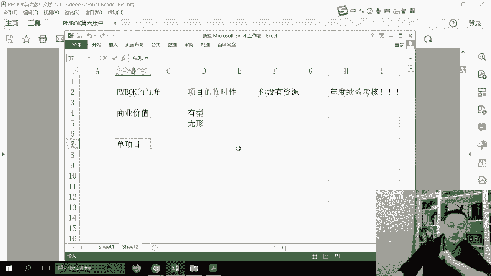
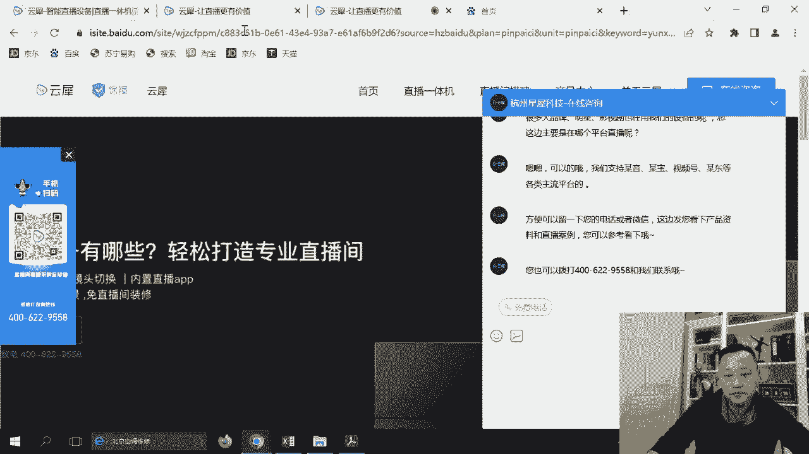
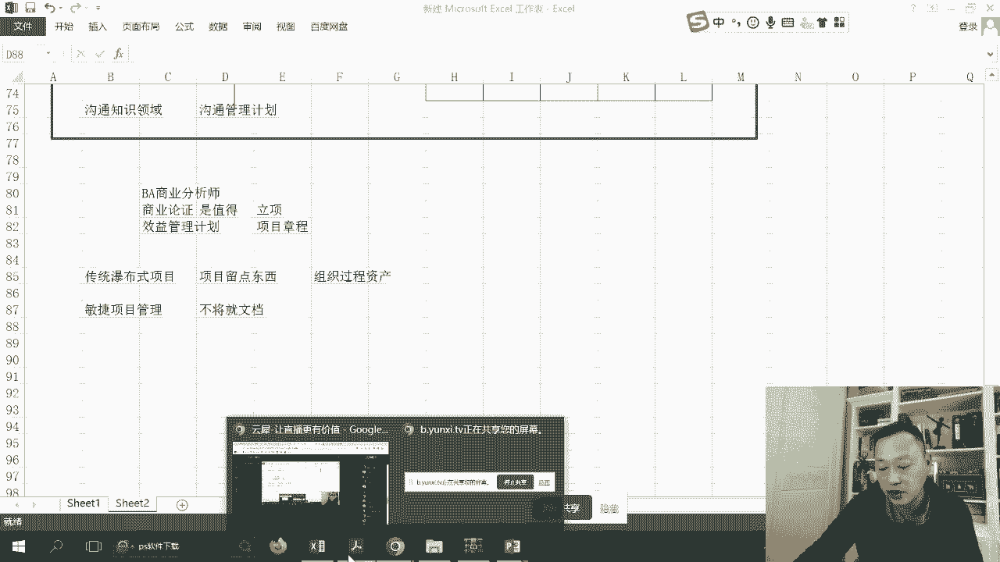
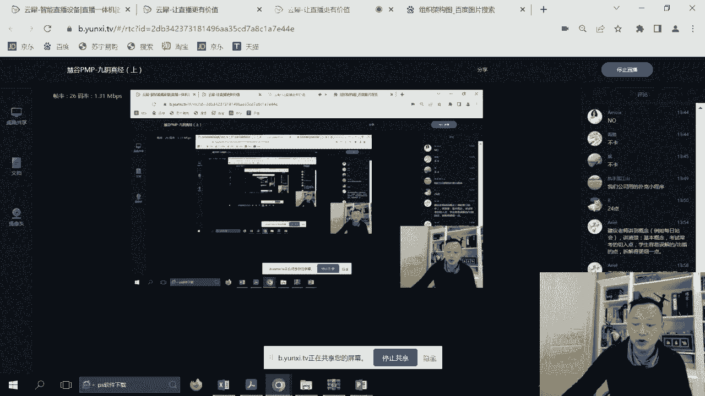
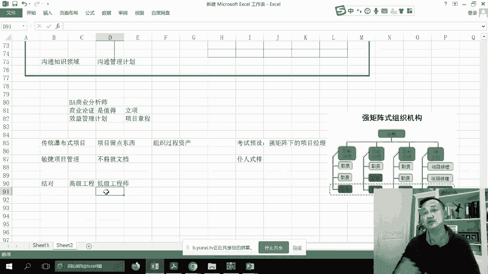

# PMP考前强化记忆串讲 - P1：PMBOK1-3章考前强化记忆视频 - 交大慧谷PMP培训 - BV1yg4y157ux

如果有一天啊你在职场上感觉到。

无论是硬技能还是软技能方面有所缺失，都可以让我睡觉，那岂提升自会骨，让梦想有回响，看看他到底讲的是什么东西和内容，然后它里面哪些知识点是比较重要的，哪些是直面考试的，ok啊，我们来看一下。

你会发现在偏poke的前面好多都是什么影啊，那个目录啊什么的，我们来看看啊，我们的第一章节第一部分啊，终于到了项目管理，然后呢我看一下我的位置，我的位置是在右下角，我觉得个人感觉还是比较好的。

因为这样子会不不遮挡视线，第一部分我们来看一下项目管理的知识体系呃，首先我们来快速的来看一遍影呃，包括概念，包括目的，其实项目是什么呃，你就记住项目是临时性的，你的考试是一个项目经理。

所以你千万不要去用职能经理的视角，我们来看一下项目的视角，你是一个什么，你是一个临时的project manager，带着大家临时的完成任务，ok啊，所以你的做题视角注意一下项目的临时性。

所以你是没有任何资源的，资源在哪里，资源在职能部门，所以大家注意一下这种什么年度绩效考核，等等等等的说法，这些其实都是什么只能去考虑的考量的，而并非是项目经理考量。

而项目经理最好也不要对你的team member，去做任何的考核，你应该做的就是团建啊，让大家怎么样积极阳光，所以注意一下你是个临时的相机啊，呃我们看到项目管理里面有标准，其实标准有三个呃。

叫单项目管理，项目组合管理和项目集管理，包括里面说到的通用词汇，这些我们都可以忽略过去了，包括职业道德规范，其实现在已经不会在中国地区去考，职业道德规规范，ok啊，所以这些可以忽略过去。

好项目创造独特的成果，临时的这个大家大家有些相相应的概念就ok了，临时的，那么接下来呢我们说呃，项目驱动变更是组织的当前状态改为新的状态，就是我们给组织上新的系统，我们的cm，我们的e r p。

我们的包括人力资源系统，其实都是可以去认为是个project，它是将组织怎么样嵌入到一个新的一个状态，而我们做的任何事情，其实都可以去认为是项目管理好，那么项目创造的是什么，是商业价值。

注意一下商业价值，那说到这点呢，我也需要跟大家去做一下，就是笔记和分享，因为待会会讲到商业论证，呃注意一下价值这个东西，你要知道它是分为什么，有形友情是什么金钱股票，对不对，你的权益等等。

但是还有一种价值是什么无形的价值，ok认为有形和无形价值，而这些其实都会在p p里面讲的，很少在哪里讲的，就专门有一本书叫做商业分析师，里面会写，这里面说到的商业分析指南好，我们继续往下去。

看到我们的三驾马车啊，包括这里面新技术啊，包括政治能力啊，包括这个材料，我告诉你，你愿意去看，你就去看考试，他不会去考这些东西，ok考试不会考，你就记住项目是个独特的临时的。

我是一个怎么样单独的项目经理，我不是永久的职能经理啊，我也不管这些什么kpi等等这些东西好，那么继续呃，项目的重要性，我们往下啊，这这里会比较重要，就说讲到这三个单项目，项目集和项目组合。

如果说你还记得的话，我们来回忆一下单项目是什么。

我们首先要来到我们的职能架构。

我们如果说回忆到职能架构，就是我们的一个叫组织架构图，我们说这是一个非常典型的职能架构，职能给了我们企业怎么样operation能力，运营运维的能力，只要我们有任务，我们每个部门都会有相应的职责和职能。

我们的销售部管理的是公司的业绩，我们的怎么样，我们的生产部管理的是公司的不断的产能，我们的研发部管理的是我们的一个创新，那这个是一个职能架构，而项目是一个打穿职能架构的过程，它是一个怎么样二维的。

所以呢我们会从各个职能部门抽取人，形成了单项目管理，大家还记得吧，我们可能会从行政财务，包括商务，包括生产里面我们就会形成一个怎么样project，而赋予这个项目的目标，什么目标，一个临时性的目标。

我们可以上一个系统，可以改进一个功能，可以怎么样创新一个产品，那当然了，我们公司可能也有目标二目标三，目标是目标五，所以呢我们有单项目是不够的，我们可能会把同样的项目放到一类。

让这些项目怎么样资源能够共享，包括我们的经验能够共享，那么这就不，又超越了怎么样单项目的一个理念，这就超越了单项目里面，这就是我们如果说啊去了解pm，可以知道这种我们叫做什么，叫做项目集。

啊这种叫做项目集，所以呢我们来看一下，很多企业对于项目集会单列出，这是一个某某的事业部哦，然后在事业部里面就会有一个个项目经理，项目经理不会多的对吧，然后当这些项目经理诶需要资源的时候。

向职能部门去要当怎么样项目做完以后，资源还给部门，所以呢我们就会有事业部的一个概念，那么所以项目级的作用是什么，资源最大化，所以这时候我们就引入了第二个概念，什么是项目型。

那当然随着我们的企业可能怎么样，功能战略越来越多，所以我们可能不单单只有一个事业部，我们也有怎么样其他的项目事业部，所以呢唉我们就会形成怎么样，另外一个项目级的，第二个。

那比方说我们这个事业部是负责游戏类产品的，而这个事业部是负责怎么样新媒体方向，所以在事业部和事业部的上头呢，其实我们还有一个这叫什么，这叫项目的，不可这就是我们项目管理的三驾马车，而有人问我啊。

有人问我，项目组合是什么意，其实它最大的就是什么，在，有没有可能一个项目是贴钱的，是亏本的，但是我们公司还是要继续往下做呢，就像说就像集结号里面有一个怎么样团队，我是当炮灰的。

所以我们要考虑到战略的一个概念，所以综上所述三个概念，什么是项目组合，当然它里面也有角色的项目组合经理，他负责的是战略，那么是项目集经理，他负责的是资源最大化或者资源优化最优化。

不要让项目跟项目之间怎么样进行打架，什么是单项目管理，本项目的目标的完成即可，所以在第一章里面啊，各位同学们一定要注意这三驾马车的作用，那一定要注意这三驾马车，而且有人问，万一运营的作用呢，持续的。

持续重复的啊，知道一下啊，运营是持续重复的好，我们来看到我们的pmbok的，继续往下，所以这里面啊哗哗哗哗写了这么多次，你记住三里面单项目我自己的目标项目集，所有项目。

就是我这集下面的所有项目资源最大化，而项目组合战略战略好，可以忽略了啊，可以忽略了这么多字，不用去看好，那么我们再往下看一下啊，又是这样，项目组合好，运营简单一点，刚才我跟大家说了，持续重复的。

而他们之间是有交叉点的，没问题啊，他们之间有交叉点，运营有丰富的矿产，丰富的资源就是人，项目有战略，有目标，有方向，好啊，继续往下，那我们来看一下这o p m不会考你啊。

就超超越我们的那个好项目的生命期，我们回忆一下，就是所谓的我们的五大过程组，喜贵直接收，而且这就是我们pm 25页最平均的，我们如何去启动一个项目，如何做一个plan，如何去执行。

如何去监控and如何去收尾，而这些内容，我们会在后期里面也跟大家去聊一聊，十大知识领域，这个你的脑子里一定要有啊，小哥哥小姐姐们，如果说到现在你的脑子里面还没有这些包好了，喜欢了ok喜欢了好。

我们继续往下，项目开发生命周期里面的第一种叫预测性，预测性就是我们所谓的瀑布型，而所谓的预测性就是瀑布型，其作用就是我们最常见的怎么样按计划推进，什么计划大计划，把所有的未来的怎么样。

内容全部怎么样给他写出计划，然后按计划怎么样蹭蹭蹭蹭蹭蹭的一个推进，那这种其实是类似于什么呢，我们的大型工程对吧，或者是大型的制造，你会发现像这样的项目会有大量的投入，所以我们的计划优于一切。

在计划里面我们要考虑到范围，进度，成本质量风险，包括供应商等等，我全部要写出来，那么简述一下，如果说项目会有阶段一，三个阶段我是当时是这么计划的规划的，所以说在项目什么一开始阶段一的时候。

要把所有的计划怎么样，三步做出来哦，把所有计划做出来，按照这个，所以如果说大家发现了这种预测型，不是说他一定out了啊，有它存在，一定是有它存在的，必要性的在工程的大型的怎么样，高风险领域里面。

预测型依然被大量的使用，或者说大量的小，我也很喜欢预测型啊，呃在偏僻的考试当中，他不会怎么样非常明确的去考你啊，这个是什么，是增量，是什么，是迭代，因为这是十几年前的考点了。

那你就大概的怎么样记住一下哎，增量和迭代性的作用是什么呢，就是做一部分计划，实施一部分计划做一个分析，而但是呢你要知道阶段是非常大的，它可能是怎么样3~5个月的，直接。

那也就是说我大概这次的计划就是做3月计划，或者是5月计划，因为这个阶段怎么样，有3~5个月啊，所以呢我们哎注意一下，这是第二类的，第二类的他不会考系，那么第三类呢其实是最关键中的关键。

我在这次的考试当中，也特地的跟大家去说了什么敏捷，敏捷的考法，第三类是敏捷呃，或者说在考试当中，他会告诉你怎么样混合，或者叫叫叫叫做什么，那混合跟敏捷是什么关系呢，其实混合就是预测加敏捷。

就是有部分怎么样，比方说我们硬件是用那个预测性的，而软件部分呢是用到敏捷型的，而在我们的pmbok的各个版本上面，其实对于敏捷强的很小，但是大家实测一下，你们做180题里面呃，讲到敏捷的。

其实会有大量的，我们目测一下差不多是90题是敏捷场景，所以呢我们要对整个敏捷场景，就要有非常独到的见解和想法，那么大家来看一下我的给大家的分享，他的敏捷的长方体的ppt。

好我们来看一下我在更新出来的一部分的内容，好大家可以看到这是顶级学员，那敏捷，其实这样子一个组织或者这个思路，其实是从什么呢，从1999年就成立到现在了，所以说在座各位你可以看到我们的整个想法。

就是我们要从原先瀑布式，就是项目经理做了计划，按计划走，我最怕的是变更，我最头疼的是怎么样，所以一有变更，找c c b的这种思路，慢慢的变成怎么样有高弹性的，我们的scream的种种想法。

所以我们发掘什么呀，个体高于流程啊，我们讲究怎么样个人的发挥，软件刚于文档，然后克合作高于谈判，我们是怎么样分享的，而且怎么样讲究响应变化，而讲究响应变化，所以呢我们要知道。

脑子里面有这样子的一些互动和原则，包括我们追求的目标，这是每局的12原则啊，大家说稍微了解一下这些东西，并非并非在课件里面才有，这些是网上公开的，你直接去百度搜索敏捷12元素就能看到。

那么另外呢在敏捷的角度里面呢，我们会考虑怎么样价值，大家有没有发觉做好多题，特别是敏捷题，他问你，我们怎么考虑价值优先的啊，我们考虑价值才是我们的一个目标，而并不并不是怎么样像传统的瀑布一样。

我们为了造东西而去造，造造这东西我们讲究value高一切，第二我们考虑到质量啊，第三我们考虑到怎么样约束目标，所以大概要有这样的一个思路的转变啊，大概就这样思路转变，还好我们同学们是考第六版。

如果说在未来的第七版里面，他还加入了一个非常重要的情况，就是我们的不确定性啊，不确定性好，那么首先我们来看看在敏捷里面的，几个比较重要的东西，第一我们经常会看到这个考点叫做mvp啊。

nvp其实呢我们叫做最小可行性产品，对于我们的敏捷人而言，我们没有必要怎么样花大量的时间和精力，怎么样去做大量的计划，然后按照计划去推进，可能我们的客户需求就是要出去走，那看上面上面这部分。

其实就是我们传统瀑布式的做法，我们从一次次的到最后，而下面呢我们会发觉怎么样，客户说要去要要要要有远行的想法，我们可能上手先给他一个滑板，让他怎么先先解决，怎么样可以走啊，可以用工具代替走。

但是他可能又又会说怎么样，我觉得我左右不好一样，唉，在层层层层层层最终交付客户的产品，而这是户，这是怎么样，这是符合我们互联网思路的，你会发觉现在的竞技进商业竞争质量唯快不破，大家都在创新产品。

只有快速的创建产品，快速的迭代出新的功能才是我们最重要的，所以我们叫最基本可可信，另外呢那个再给大家讲一个新的知识点，叫做最小的可塑性，哎我们也没有必要怎么样，就是一下子出来一个package。

我可能会有一些怎么样小的群组功能，去说一下市场啊，这是我们的一个叫mvp的一个概念，好我们继续往下来，深深深深深深看一下敏捷里面三大角色，大家还记得吗，唉这部分内容呃。

我特地我我想就是这次我跟他去分享的，第一个叫产品负责人，叫product honor，好我们这样吧，我把那个mvp会考的，我给大家做一个笔记，一个mvp，啊这些我是在课后会发给大家，很不友好吗。

啊我们调最小可心，这个我们要知道，第二个呢就是在敏捷里面的三个角色，第一个叫产品经理到product honor，或者在翻译当中，我们叫产品负责人，我们叫p o，第二个角色就是我我们的视角了。

我们是什么项目经理，叫做sm叫scremaster，或者叫我们叫敏捷的教练啊，各位各位老铁，我我一直在在跟大家去讲的，就是你要有一个怎么样教练精神，或者说是要有一个雨果精神，大家还记得吧。

所以哎这是你的一个视角，第三个就是很重要的是敏捷的，那你还要敏捷的团队是缺一不可的，那有人问pu的作用是什么，做了这么久了，大家能告诉我po的作用是什么，他负责一样东西叫做代办列表，代表列表又是什么呢。

就是我们所有准备要做或者已经做，或者进行中的一样东西，叫做use the story的汇聚体，好所以我们要了解一下这三个的作用，好我们继续再看啊，这三个具体作用是什么呢，我们看三大角色。

第一个产品负责任，第一个产品清单就是我们的大表列表，或者是呃我们叫做product backlog，对不对，然后呢确定诶在在大盘列表里面，哪些是价值比较高的，因为我们敏捷的团队都是怎么技术呢。

我们又不懂了，所以他确定诶在这个backlog里面，哪个会是我们的value比较好高，或者说我们还没有用户或者还没有客户的时候，它代表了用户或者客户啊，他他是业务方的代表，包括怎么样。

包括我们大家有一些诶，觉得好像我们理解上有问题的话，由他怎么样澄清需求，包括他可以接受你们哎，在我们的评审会议上面，到底东西是他要的还是他不要好，另外一个我们在考点里面也会看到。

有一个叫产品线路图的一个概念，就是也是他他他来的，他拥有整个产品线路图，框架是什么，由他来决定，所以你可以把它认为是站在甲方爸爸的那个人，对站在法甲方爸爸最了解业务的那个人，排列整个怎么样。

user story优先级的那个好，我们继续，第二个就是你了，score master帮助团队解除障碍，告诉大家怎么样价值观啊，所以呢诶这个是什么strong master的一个作用啊。

而是你的一个视角，p考试的一个视角，ok第三个敏捷团队自我组织，ok而且呢怎么样，我们会让大家去考虑去结对，就是我们自己选择，自己想成为怎么样一起干活的小的队形，而且呢团队人数不宜太多，七正-2。

我们建议集中摆布，为什么这样子能够让大家最快最好的进入了，下面一个东西叫spring sprint，这个单词在我们的p m p考试当中，是非常非常常常见常见的，它是指的是什么呢，我们就是大家发排除万难。

为做一些事情拼命的，怎么样贡献自己的能力和力量，拼命的干活，外界一切都是浮云，好外界一切都是假的，所以我们叫做spring，好我们继续，那么它的时间是我们定义的2~4周好，二到14周。

待会我们会看到一个叫做time box，ok甚至我们要怎么定义，未来的这些大概是怎么样的，好首先我们来看一下冲刺的一个概念，冲刺，如果说我们整个团队认为是两周，那么以后都是两周，不过认为是两周。

那么以后都是两周一次，如果这是我们大家的一个怎么约定，在冲刺的时候，我们会拿代办列表，哦不好意思，冲刺的时候不会，我们当呃，我应该是冲刺会的时候，所以怎么样呢，我们的操项目经理就是sm。

防止团队怎么样被外界打扰，让我们的整个团队能够怎样，安心的为我们的整个这个这次冲刺而进行努力，干活好，接下来我们来说冲刺会议啊，冲刺会议，那么这时候我们要参加人员，第一个不要太久而无畏的太久。

由p o square master和团队，我们可以考虑和其他的就是也不要人太多了，对不对，就这样才参与，然后在第一阶段的时候呢，我们的product honor。

就要怎么样挑选出高优先级的user story，并且刚跟大家去讲解清楚，不然的话大家可能误解呀，然后呢哎我们就要去确定怎么样，我们要在这次spring里里面完成多少的backrock啊。

对就是把他的value to排出来，把这value摆拍出来好，那么这时候你看啊，我们来看到那个sprint的一个会议，好参加者是谁，他们这些人对不对，产品经理，项目经理团队，而由产品经理来确定。

告诉大家代代办列表里面的一些啊，用户故事的优先级，由团队，自动的认领任务啊，我觉得我诶这这个是我的强项，但是这个是哎我们怎么样，并且结对就是两两相对，或者是三个人为一个小队去完成，好绝对去认领。

是什么样，相应的用户故事，那么这时候po是解释相应的怎么样，我们的待办列表的优先级，好再来看sm呢，sm负责的是什么，他最了解敏捷的规则，所以大家注意一下，我们在做题的时候，是不是有人问你诶。

谁为了去维护大概列表，其实是我们的p o的责任，而敏捷它就是什么，我的教练，ok教练，好那么继续我们往下相应的内容，相应的内容呃，再来看到user story是什么。

user story呢是站在业务角度，你会发现太多的，特别是技术人员，他是站在技术角度，你问他lisa永远是普莱斯，所以我们要代表用户，作为这个用户，我想要什么什么，以便于达到某一个商业价值。

而这些价值可能会有高和低，由谁来确认我们的po来确认，那么这时候你会发觉用户故事是有高和低的，但是用户故事要去完成这个用户故事，你会发觉怎么样，这个时间是不一样的，时间是不一样的。

所以呢我们会确定这个用户故事的大小，我们用户故事大小又出现了一个新的概念，叫做故事点，二用户点其实就是用户这大小，在上一次1128的时候啊，我们考到了一个考点叫做敏捷扑克。

我们来看一下是怎么样的一个情况，我们会用一种敏捷扑克，大家来确定我们用户故事的大小，而是由团队啊，比方说我们团队一起打，说三或者五或者七，当大家打出来也不一样的时候，大家可以讨论第二轮再打，直到怎么样。

我们认为唉，大家都觉得这个故事点为几为最好啊，所以呢这时候我们出现一个叫做故事点的，估算方法，用的是敏捷的扑克啊，专门有这个扑克牌的，好的，那其实我们可以反推啊，如果说最小的那个叫做故事点一。

那么跟他比，如果我是他的两倍，那我就这个是固值点二，别的是故事点，三，生是故事点四等等等等，好，那这就是我们用户故事的故事点的做法，那么继续我们往期我们还会看到什么，还会看到一个概念叫time box。

time box是什么，是我们这一次冲刺的，最多能够燃烧掉多少用户故事，而且我们的那个最终最终能够烧掉多少，用户故事，就是我们一个时间盒子，那举个例子，我们认为我们的整个团队的。

在冲刺当中的tbox是20，我们的time box是20，那么我们有好多好多高value的故事要做，比方说啊15 七，但这是我们最高value的准备要做的这些故事，那么经过我们的团队讨论啊。

你会选择哪些故事，说这些故事都是统一的最高的，那我们相信我们最好是把它撑满，所以呢我们选十再选一个七，再选一个三，我们会觉得最最划算，但有同学说诶10+7+5这样多做一点，不是个啊，这是违背敏捷原则的。

大家注意一下啊，这是time box的一个概念好，那么继续跟我们p m p考试里面，经常会出现的概念，另外一个叫做冲刺中不允许变更，就是这时候因为冲刺是之前po也在sm也在，团队也在value也有了。

那么大家要去做人了对吧，那么大家就要就去做的时候，切记不允许任何人停止一诶，这个好像当时我们这个需求错了，哎这个问题因为什么，因为大家记住我们的冲刺只有两种，哪怕是错了，我们将来到两周之后再去改。

不要怎么样在这里面马上去改啊，所以呢我们知道一下冲刺不允许变更的概念，ok有人说哎p p p s就是a product backlog，ok好，那那个，继续，不好意思，第一概念就是15分钟之内。

那就是说能不能聊其他东西，不好意思啊，不好意思，我们只聊三件东西，一大家都站起来，团队成员也站起来，s m也站起来，团队成员会说我昨天做了什么，今天准备做什么，怎么样，那个碰到哪些问题啊，注意一下。

所以只问这三个事情，ok所以只问这三个事情好，讨论什么问题，日志啊，第20年了，这些都是错的，好不好，我们只问这三件事，ok了，各位能不能延长，不能延长，ok啊，不要去延长好，另外呢我们会看到评审会议。

评审会议也不是无限制的，ok啊，上限是四个小时，那么谁来参加呢，他应该是那些user po要来参加，或者有客户的话，客户也要来参加好，所以呢我们了解一下评审会议，那么这时候呢我们把几个会议利率啊。

敏捷四个会议就出来了，第一个会议从此为，用来确定用户故事，确定backlog里面的value，确定怎么样让用用啊，让团队去认领，然后我们就进入spirit，在spring过程当中，我们每天都要开会。

这个叫做每日，但会用来干嘛，用来确定相应的三句话，每个人都要做15分钟，然后呢我们刚才可以看到这个会议，就是什么叫做评审会议，这是用来确定怎么样，我们叫修case嘛，我们到底哎两周做了，做了什么，老大。

你看一下怎么样，满不满意，开不开心，抱不抱平，哎啊这是这是网络术语，我们叫做爆款，对不对，ok啊，所以呢哎基本上是什么看结果的，按两周的成果来做一些，你愿不愿意，那么还有呢我们一会儿会看到另外一个会议。

就是我们p p t再往下一个叫做回顾会，是不是经常会考到哈，回顾会叫做怎么样，我们第一时间只有这两个小时，反省反省的作用是什么，做的其实就是一样东西，经验教训，所以大家还记得吧。

有的题里面哎呀我们怎么经常会出错，那作为敏捷的项目经理，你怎么办，那要么做回顾会议，要么做根本原因分析了，哎所以讲这种会议是做经验教训，我们不要再有那种思路，什么经验教训到项目完了才做。

我们每次你看两周就要做一次次尖叫性，这就是我们敏捷四大会啊，大家切记切记在题目当中一定会看到的啊，一定会看到的好，我们继续往下，我们继续往下，那么另外一个呢叫敏捷的看板看吧，你可以去可以简单的去去把。

就是我们的backrock怎么样可视化，我们可以看到怎么样哪些任务是待开发的，哪些user stories是开发中就被自动认领，而且肯定是从高value会优先，哪些是在测试，哪些测试中。

哪些是测试完毕啊，这个我们要知道叫敏捷看板好，所以呢有时候在题目里面会出现这个概念，就是我们是希望把所有的用户故事怎么样，通过强把它怎么样公式化，ok啊所以这个概念大家要非常清楚，那当然了。

还有一个叫做什么燃尽图，如果说燃尽图跟瀑布的什么比较像，就瀑布里面我们有一个叫做工作绩效报告，主要是来让大家了解项目项目现现状的，在敏捷里面我们用的是燃尽图，来让大家了解在我们的项目当中已经做了多少。

还剩余多少在哪儿呢，在这个位置啊，人气spring过程当中，好大家知道一下，就是呃如果说政治管理是s曲线，是从下往上的，而燃尽图是我totally有多少个user story。

注意不是user story，是故事点夯布朗，当225个继续通过，一次一次一次the sprint，我们希望到什么时候可以做完整个项目啊，这个也是可以公开和公司在外面的啊。

这个是知道一些软件图的一个概念，当然了，我也要给大家去补一些，比方说大家经常看到一个结对，结对其实是来源于极限编程xp的一个概念，ok啊xp的一个概念里面会讲到的，绝对的ok聚焦一些，那么其实xp也好。

rom也好，很多新的学术也好，其实都叫做敏捷啊，只是大家的一个门派，不同门派不同，包括我们也看到过一个叫测试驱动开发机的吧，t t t t d d也是极限变成的呀，好我们先编写代码。

而在那个编写测试代码，然后在编写完测试代码的时候，我们确认这是好的还是不好的，然后呢，我们再来考虑我们怎么去过这个怎么样啊，我们的测试，ok这个是测试驱动开发的一个概念啊。

也是来源于xp里面的一些最佳时间好了，那么最后呢再给大家补几个，可能会考到的第一个scp of scrap叫做大规模敏捷，我们可以由多个敏捷的team啊，刚才我们发出来就敏捷的team是七个人，对不对。

但是七个人会很少啊，我们如果说项目过大，那怎么办，我们就可以sram of squirm，叫大规模，每个团队sm团队负责认领一部分用户故事，这个sm团队负责认领一个团队多，怎么样烧起来就很快。

当然但是你会发觉怎么样，大家沟通有问题，所以我们会在每个团队里面拉一个人，会开相应的跟其他团队的一个会议，我们叫做每日协调，也有可能他们做偏了，但我要知道他们在做什么。

ok那么这就是我们的scream of scream，最后一个跟大家说一下，啊safe safe呢主要讲的是敏捷火车的一个概念，ok啊，也是用于大规模敏捷的。

所以对于scm of squirm或者safe，是这些概念呢，大家就看到哎呀功能很复杂，敏捷团队很多，那么怎么办，看看答案里面有没有scp of scp，或者是safe的什么东西。

因为这个其实已经有点我觉得超纲了，但是大家有没有发现，在题目里面还是会出现这几个单词，ok啊，所以呢唉我们在笔记下重要的东西，敏捷看板燃尽图里面后来又讲到了怎么样测试，开发的，大家不要忘记，对不对啊。

绝对的概念不要忘记，ok啊，所以呢哎这是在敏捷里的一些思路，所以这些思路有了以后，你再去做相应的题目啊，你就会说有反转，敏捷教练ok啊po，然后团队spring，然后故事点故事点大小啊。

用户故事故事点大小，包括敏捷扑克好四大会注意一下冲刺，每日向会评审经验教训，ok每个会议是干嘛的，敏捷的展现软件图是干嘛的，ok啊，敏捷看板是干嘛的，包括一些其他的概念，大家都大家都知道好的。

那么我们时间关系关于敏捷里面啊，那我们刚才讲的适应性，而我们还有一种场景就是混合型啊，混合型，你会发觉很多偏僻的考试都是这样的一个场景，就是一个企业正在从瀑布向敏捷的一个，怎么样转变，那么问你怎么转变。

大家切记不要选那种全权转变，你可以找到试点，小规模的转变会是比较好的，ok啊好的，那么继续往下继续往下，那么关于关于阶段这个我们不要去考虑的，就是不会考你很多啊，不会考你很多，继续往下好。

那我们再来看到项目管理过程，i t t o讲的是input，tools output，这是我们未来都会要去有的这些东西，好继续往下，这就是我们呃整个项目从进度，成本资源管理里面考虑的一个视角，ok啊。

考虑到一个视角好，那继续往下，这里面考的不会很多，其实我觉得我刚才给大家讲的，差不多有20几分钟啊，这些概念其实还是最最重要的，在你们题目里面好，这就是我们所谓的五大过程组啊。

五大过程组起归直接收十大知识领域，从第四章一直到第13章，这个我们都要非常清楚，那么呃现在就是有有有一些同学可能时间长，忘了，有很多题他会把收集需求认为项目启动之前的，作为我们pp视角。

其实收集需求是要张张成都制定以后，在规划的时候才会考虑的事情啊，这是我们非常传统的，又又又又不是敏捷了啊，非常传统又不是敏捷了，然后继续每个支持零，那么今天其实我们一会儿会从四，一直跟大家复习到七。

下周呢其实八复习到13啊，这些东西大家都要都要知道好，那么什么是工作绩效数据，什么是工作绩效信息，什么是工作绩效报告，在考试的时候，其实会经常会问到你们，首先呢我们来说一下这玩意儿是啥，它是一个术语。

呃首先工作绩效数据就你们就讲的最简单，就是我们的什么呀，p v e v a c等等，就是在我们的pm box的第三堂课的时候会的啊，我计划做多少工作，那个实际做多少多少工作啊，实际花了多少钱。

哎呦他说哦，邱老师啊，我政治题不会做，不要急，我教你的政治题，待会儿我们就五分钟记几个概念就好了，不然的话你再去弄原理会很浪费你的时间，ok然后呢工作绩效信息呢其实是spi，c p i等等。

就是经过分析过的，那么到最后呢，我们汇总的一张报表呢叫做工作绩效报告，就是美系的报表，那么他呢讲的其实就是项目的整个现状啊，我们大概计划到每个模块a咪西咪咪，对不对，每个人的现状怎么样。

现在知道一下哪个就这三个概念，那么对于这呢我要跟大家去补一点的是，工作绩效报告是围绕第几章呢，其实是围绕第十章，围绕第十章，第十章是什么呢，沟通知识点，很多同学哎到现在你再去做题。

你会发觉啊什么都是选择什么，当时沟通不畅，改沟通管理叫不好意思，我们的偏僻要非常机械化的去做题的话，我们的整个沟通知识领域，目的就是向外边散发工作绩效报告，就是让大家了解项目的现状，这就是沟通知识类。

我不做任何相关方，我只是而我们沟通知识领域的里面的，唯一最有用的东西叫做沟通管理计划，它驱动到底工作绩效报告的发送合适，我可以口述了，哎兄弟啊，我们项目当时模块已经做了80%了，也可以。

我们可以发邮件吗，我们可以把它当成报表啊，到底是什么形态，我们就看沟通管理器，所以大家切记在考试的时候，问哎呀，工作绩效报告好像有点问题啊，或者是客户抱怨工作绩效报告的格式，发了不同的内容，问你怎么办。

注意一下，永远选择怎么样修改和修订沟通管理计划，啊ok啊，是修订和修改沟通管理计划，因为有人说这是项目管理计划，不好意思啊，它不是基准，待会我们会受到基准，所以像这类计划，我们可以作为实时的直线形体。

注意小工作数据，工作信息，工作报告，沟通管理计划的考点，好我们再继续往下，我们来看一看那个未来可能会碰到的相对内容，哦对了，还有一个敏捷的考法，因为有人问哎，我们的燃尽图应该怎么做，做成什么样。

其实又应该看什么，其实一样的，我们也是沟通管理计划习惯，虽然敏捷里面他们不讲究用文档和计划，但是在考试里面他说哎呀，我们人家你你也可以考虑选择，看看有没有看沟通管理，因为他就是什么样。

我们的工作绩效报告的另外一种呈现模式，好我们继续往下继续往下好了，那个这个就不用看了，讲的是工作报数据变信息，信息变报告将来怎么样走沟通知识领域啊，好裁剪不会考，你好，再注意一下两个东西。

一个叫商业论证，一个叫做效益管理计划，在书里面包括pmbok里面会考到你，包括在p m p的真实考题里面会考到你，首先呢大家注意商业文件其实包括商业论证，是在立项之前的，立项主要讲的是项目章程。

对他是立项之前由谁呢，以我们的商业分析师确定，确定是否值得投资的一个文章，那么但是有的人也扯啊，他说诶我怎么做到题目里面那个呃一个项目嘛，有了一个商机啊，一个项目还没立项，那怎么消目经理去写商业论证呢。

没有完全的答案，你只有一个最接近的答案，项目经理可以找别人写过了，所以诶他给你的场景项目还没立项之前，第一个都是向三论证，另外一个呢就是效益管理计划，确定将来项目得到了收益后，应该是如何来分配的啊。

所以知道要这两个的，好行行分配好，那么我们继续往下去说到啊，这这些东西啊，商业分析师，商业论证，效益管理项目上升，好继续往下，那么我们要知道项目生命周期是一个之前嘛，商业论证和下一管理计划，三一论证。

确定决策的依据啊，确定决策的依据啊，包括些业务需要等等等等等等等一套呃，我们的效效益管理计划，确定未来怎么样，效益责任人如何来，怎么样share这些东西啊，项目里面一定是会有收益的。

好其他的有同学说哎邱老师，你的这些进线值pvp l i这些还会不会考我们呃，首先你概念知道就好了，他不会考你计算了，已经哦，我觉得这些东西已经是超纲了啊，你进线值是干嘛的对吧，我撇去这个怎么样呃。

撇去我们长时间的这个就是贬值率，最后到底项目存多少钱，投资回报率roi对吧，哎呀这个我们大概知道就好，好那么第二章第一章基本上完了，所以我们重看第一章啊，如果说按照原先我的教法。

我会重点去放在项目组织架构里面，就是给大家去讲到的那个呃，单项目项目集和项目组合，但是按照我们现在的心理，有考纲，我的重点我会告诉大家敏捷是什么，ok了，敏捷的思路是什么，好那么继续往下呃。

我们来看项目运行环境，第一个适应环境所回忆一下，有内部的外部的影响到我的对吧，不能去不能去违背的，我只能遵守的东西叫做事业环境因素啊，这个概念我们知道还有一个呢叫组织过程资产。

就是我们曾经怎么样企业用过的啊，用过的，用过的那些怎么样相应的文档知识，包括经验教训等等等等等等，ok啊经验教训等等东西，那个我们都需要怎么样，都要去给大家怎么样存放下来，那这里面又是一个辩证。

就是什么呢，我们来看啊，就是说我们的传统企业，说我们叫瀑布式项目吧，我们叫嗯啊，我希望项目组能留点都行，这东西叫什么，叫组织过程资产，因为怎么样，我未来的项目会继承原先项目的一些特有的，新的啊。

特有的属性应该差不多的，但是我们现在的敏捷是项目管理，你会发觉我们打破了原有的，因为我们认为每个项目都是新的，我没有必要把这些文档怎么样花时间写文档，我们尽量文档要少啊，所以不讲究文档，好各位同学。

这个我们都要哎知道的，ok了，都要知道好，那么所以呢唉从讲究文档到不讲究文档，其实这里面我们会有。

好我在看你们群里面，就是直播间在说的一些内容，ok啊我可能没有办法就是实时的给大家回答，因为我要非常认真的去进入到。

我的一个跟大家四个小时的一个讲课状态，那么呃我们的组织过程，资产里面基本上就是政策指南文档啊，当然如果说问你一定什么最重要经验教训啊，今天这解说好，那么另外我们说到组织系统呢。

如果按照原先ppt我们会去讲到什么职能型，项目型，矩阵型等等，那大家记住项目的形态有很多，但是你们考试一定是有一个预设形态，如果说你们的考试预设形态，大家记住你是一个强矩阵下面的，这是一个考试预测。

所以你没有资源，你只能二问什么呀，问其他部门去，或者问运营团队去索取资源好，那有同学说那个这个墙角，这又是什么，这样吧，百度1下，我给你们放放个图，就是我们所谓的怎么样事业部呀。

啊这是我给你们放在笔记里面，大家来看到强矩阵啊，这是我们的项目事业部，这边都是职能部门，所以我们这里面怎么样，项目经理项这些职能部门抢人，ok啊，然后完成组织性目标，这就是我们考试的预设。

那如果说非瀑布是敏捷的预设，那你就是一个普人乱世的，其他不用浪费时间去记了，所以我们知道一下相应的观点，啊所以动态的这些都不会考你啊，都不会考你，那么包括管理要素，这个不会不会不会不会不会，ok。

好那么这张表呢你大概知道就好，所以我们大概是考试视角在这，考试就在这里，那么另外呢我们最后讲到一个po po是什么，它分为三大特性和支持性，控制性指令型，你会发觉呃，在题目当中经常会出现这个组织和单位。

所以我们要理解一下，这个组织和单位在在在偏僻的哪个位置，它其实是一个职能部门，注意下，他负责支持控制或者是指挥所有的项目组，那有人问我，po到底想像什么，其实项目呢是业务为代表，是目标为代表。

pm的作用是以流程为代表，或者是以项目管理思路为代表，那举个最简单例子，这是一个军长，这是一个团长，算是项目急，然后呢我们还会有连长吧，那在我们的军长团长连长旁边，其实我们甚至会放另外一个人是什么。

是政委，军长团长连长是负责打仗，这个战斗一定要胜利，但是政委是确定怎么样，在项目管理里面也是一样的，可能你的项目经理怎么样，项目做的很好，客户怎么表现很好，但是也有可能你是违背我们流程方法和思路的。

ok所以唉回忆一下pmo好，不是p m p，dmo的一个叫法，注意一下屏幕是怎么怎么样，寻找团长，这是业务，ok啊好，我们继续分享，继续分享，所以这个不用去背，大概知道，好来到第三章，我们可以快速。

那么第三章讲的是什么呢，讲的其实是项目经理的角色呃，按照我们之前的说法和考点，其实呃原先这个章节是没有的，按照我们到了第六版或者是到第七版以后，他会觉得项目管理越来越是以人为本，尊重拥抱变化，ok呃。

像原先那种硬性的我们的指挥型的项目经理呢，可能会越来越少，所以你会发现他是希望项目经理能够怎么样，驱动所有人，大概是这个意思好，那么，这是这章节的重点项目管理铁三角，而根据这个铁三角。

他竟然把我们的原先的五大过程的考纲，那还行吧，起规直接收已经变成了这三个了，技术项目管理就是流程领导力，我作为一个scremaster，会不会怎么样，不许教大家，然后呢，战略和商务是指你的业务能力。

k p m2 t3 人才贴三条好呃，我为什么没有这么快去结束呢，因为还有一点点东西，大家注意一下，这些不会考你，就是你要注意一下，就是一个领导者建立信任啊，平衡冲突，就这种，你要带着这种视角去啊。

乐观有远见，带这种思路去答题，你会你会达到一个比较高的高分，好啊，这个然后呢，我想给大家看到的就是领导的一些特点，这一页其实会考你的，但是不是所有的领导类型会考考你，一般会考你什么呢。

一般会考你那种敏捷诗情况下面适合于怎么样，比方说这种服务型领导，对吧啊，包括怎么样，那个交互性领导大概有什么特，但是如果问我这里面，曲老师，你别让我了解这么多，你告诉我哪个最容易考服务型领导，最容易考。

ok是所有唯有服务型领导最容易考好，那因为容易好敏捷啊，整合过程认知，这个已经是超超出了，超出了这个内容好，那么我们呢大概1~3章，跟大家的一个快速的就是讲解呃，基本上呢我觉得差不多到这里了，然后呢。

刚才我看到有几个同学说结队一定是两人，还不好意思啊，到底是几人结对，让他们自己去选择，你说的那种结队呢，就是xp里面那种结队叫做怎么样呢，一个高手和一个低手也是一个，也是一种结对方式。

这是培养出怎么样我们的新的能力的，比方说我一个，这也是用别的话，一个是面面对用户故事，一个是面对能力提升，高级工程师和一个低级，ok高级工程和低级工程，但是这种是比较多常见的一个解决方式。

然后呢一个人做，一个人看，这样子的话，这个低级的公式是怎么样。

