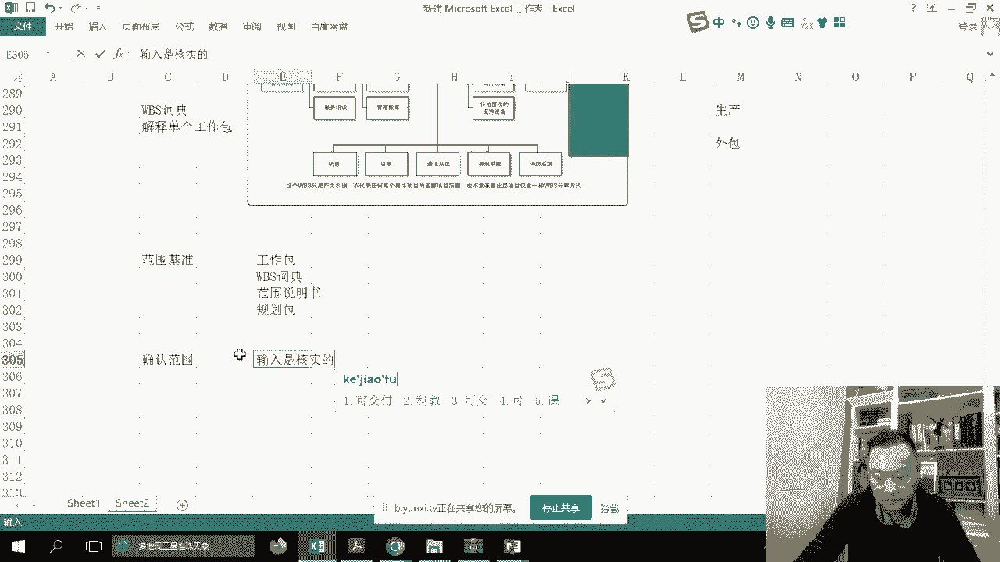
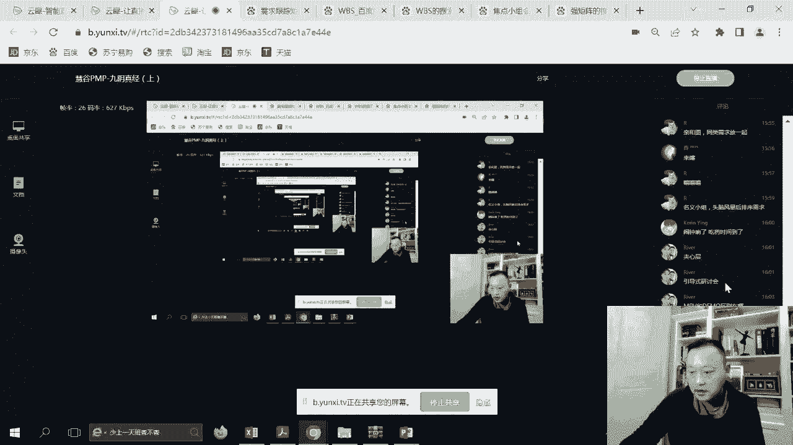
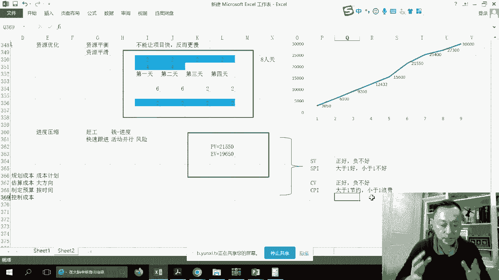

# PMP考前强化记忆串讲 - P3：PMBOK5-7章考前强化记忆视频 - 交大慧谷PMP培训 - BV1yg4y157ux

如果有一天啊你在职场上感觉到，无论是硬技能还是软技能方面有所缺失，都可以让我睡觉，那岂不是成功会鼓让梦想有回响，那么我们来看到567，567这三章我放在一起讲，因为我要告诉大家的是范生进进生成的道理。

首先什么是范围，当整个项目被立项之后，那么立项就是我们所谓的章程，大家在启动之后，所以我要能快速的，因为都是粗略的，我要能够快速的紧缩这些范围，所以我首先要考虑的是如何更精细化的收集啊。

如何更精细化的收集需求等等等等，那么在范围知识领域里面的第一个叫做呃规划，范围管理其实主要出现的是我们的方法论，叫范围管理计划和需求管理计划好了，那么接下来就是我们所谓的收集里面。

容易考你的就是各种各样的工具，你是不是熟悉，ok啊，样本量大的用什么，样本量小的用什么，其实还是333大收，就这个马老师的画发发货会画画，对不对，我们收分和把它绘制出来好。

那么另外一个呢就是我们要定下来到底是，而收集需求你要告诉我，可以告诉你常常有的我们的客户用户对不对，或者是一些相关方面的一些想法，而且他们的这些想法是可能会有打架的，可能会有我们范围之外的。

可能会有我们各种各样新的东西，所以我们要保证是他们想要的，然后呢，我创出一个项目的半成品，就是所谓的wb s，讲的是这些哦，半成品自上而下的工作分解好，我们继续，那么时间关系呢，我不会浪费大家。

时间会长得快一些啊，这里没有什么考点啊，裁剪这也不是什么那个大的考点啊，第一规划范围管理，我们要很快的过去出现两个计划，需求管理计划和范围管理计划，本项目的方法论可以直接过去呃。

需求管理计划里面如何定义，对吧啊，包括追溯啊，这排优先级，然后呢范围管理计划里面呢，我们如何怎么怎么样，你看如何做范围说明书，如何做w b s如何，这就是方法论啊，没有实质没有实质。

所以范围管理计划无范围，需求管理计划无需求好，那么继续呃，来到第二个词，过程就是真正有有肉的，里面考的很多的各种各样的工具收集需求，第一反应收集需求不是一蹴而而成的，你需要反复的多次的。

甚至是反复的多次，那么我们要界定什么，界定的是，鉴定的是你看啊，在需求里面有商业分析里面提供的信息，就是我们的呃，商业论证里面的大方向，也有具体的技术性的需求，甚至是是有质量的需求，甚至是有过度的需求。

就walk around，举个例子，南浦大桥塌了，但是我们还是要过桥怎么办，我们用船把人送过去的过渡性的需求啊，所以呢然后呢需求呢也会变成什么，我们未来的所有的衡量基础，哎这里泛进程大家有看到吧。

诶这又多了一个叫质量的，我们常用的就是所谓的项目基准，我们回到基准，我一直说范进程，其实如果说做题的时候大家碰到，但如果说有人说要改这三个肯定走变更，但是有人说要改几样的，就是要忘记。

还有第三或第四个隐藏的基准，质量的基准好，我们来看快速的来看到输入问题不大啊，主要是有协议对吧，然后包括我们的商业文件也问题不大，然后呢那个看一下工具，第一个专家判断慎选，除非说到你是个阿乌卵，怎么样。

那个不给力，或者你不懂这种场景，好来来来又来了，我最喜欢的c的呃，新的里面我帮大家一个个做好笔记，因为这里面真的是容易考你，但是不一定是考这个子过程，就是我们要了解数据收集里面有哪些。

里面的一个叫做数据收集，同样的我们来回忆一下他讲到的啊头脑啊，我们看看他第一个叫什么，我们可以先跟他抄，然后快速的把他怎么样做出书笔记来，这些我觉得你去阅读我的笔记，甚至是会比阅读po会更加的快。

头脑风暴，百万大量创意，关键是那访谈呢相对来说是一对一的，而且呢你可以得到，你看啊，正是非正式的，但是一般是睡姿吗，心理信息啊，高层的，机密，因为你想唉头脑风暴大家都在，有的人是不是不愿意说出来。

如果题目考你哎，我们想知道一些高层的机密的信息怎么办，肯定是选房谈，千万别选头脑风暴好，交警小组，好正好review一下主持人，专家们，对吧，比方就是同领域的既讨论，而且是比较热烈，好再往下呃。

问卷问卷这个方法用的太好了，而且是最容易考呃，在是上一期就是改版之前，就是的时候他经常会去考到这个方法，其实这个方法呢也是老外和现在的整个项目学，包括我们的商业分析师都会去用它的样本量大。

注意一下关键词快速多样化分散，啊当题目出现这种关键字的时候，你你你要你要确定一下，觉得啊项目经理啊想了解需求，但是呢我们的供应商呢，这是全全世界各地，而且人很多，对不对哦，还有人多。

那尽量我们会选的是问卷这种工具，而最后一个我们叫标杆对照，标杆是什么最佳，而且是什么，可以是外部的，就是我们行业的最佳，也可以是我们内部的一下，他讲的最简单就是什么，我们知道它抄呗，ok啊照他抄呗。

所以呢通过这样子的一些技术呢，我们快速的去吸，大家来看一下，c而且你有没有想过一个项目过大的话，可能这多种技术你同时在用，项目需求或者是数据，那每天相对来说比较简单一点啊。

敏捷相对来说都比较比较简单一点，对不对，c数据好，那么除了c以外呢，啊包括那个标杆问卷这些以外呢，探讨数据分析，我们可以拿到这些数据进行分析，然后这里介绍了一个叫做看文件，看文档来分析。

我们在协议里面当时是怎么签的对吧，然后呢，我们在章程里面大概是怎么怎么怎么写的，哎看完脑壳，这是看人找人，不是看文档唉，这里面也有需求，但是呢这里可能会有些误解对吧，看文档也不是特别那个的好。

那么再来什么叫决策呢，你想过吗，就是说当这些人778877887788，文档77887788以后，你会发觉很散，你会发觉你的需求很散，甚至需求打架，这时候我问你，你项目经理敢不敢，三需求。

pm box在写一些工具的时候，它前后其实是有一定逻辑关系，我告诉你绝对不敢，你一旦被删需求，那你接下来得到的一定是，那怎么办，所以他就会用了下边的方法指引你决策呀，什么决策能让这些人狗咬狗，懂不了。

那我肯定说的呀，看到我肯定说的哎，兄弟们这个这个需求实在我们态度满足不了，那这样子吧，那个怎么样，用户吗啊相关方吗，客户吗，你们弹头看一下哪些我们就正式做，哪些怎么样，我们到下一期再做吧对吧。

是不是这样子，所以在投票的决策的时候，你就会考虑让他们投票啊，不好意思啊，这不是我砍的，是你们自己投的，所以这就是作为项目经理如何避责，不要有锅都是自己背，保镖大多数相对一致，第二种实在不行。

怎么样找他，你们ceo说的呀，下面这把阿伦改该说否定不来，或者第三种，我们要决策哪些哪些需求去做，叫多标准，就给他怎么样，各种各样的权重的标准，那我们就把风险水平不定期啊，我就把这个好了。

把每个需求呢就分为这三个，然后我们给他马上，30 40 30好了，给上权重100%，把每个需求就是这里面全都打一遍，在权重低的需求我就不做，权重高的需求就做，这也是一种我们传统瀑布式的ok啊，当然了。

如果说是敏捷式的需求是用什么啊，用户故事叫价值优先，低价值低价值我不懂，啊大概是这样的一个情况啊，那么另外呢它将数据表现是干嘛呢，诶我收好了吗，就好了哦，那么我们刚才不是筛过了吗，筛过了吗，筛过了吗。

我再，筛一轮，我就把筛过的数据啊，快速的怎么样能够去画的出来，那画的画有两种，第一种亲和哦，这些需求是一类的，根本将来这些需求就是某一阶段我们要做的呀，好所以新河图关键字，他写得不清楚。

其实是同类的需求放一起，氢一样的和放在一起，同类需求放一起，那好了，最简单，为了让大家直观一点，我直接网上给大家找个清河图，同类的需求放弃，来cf了，还有一种头脑风暴，一样的快速的去梳理呃。

我们用个软件吧，mad manager，我把它绘出来，大家人都能看得懂啊，哦不好意思，我刚才说错了，不是头脑风暴，是思维导图，大家都能换，你要么用氢合同，要么思维导图，大家要么归归类对吧。

要么把它怎么样画画分，其实这个两个其实很像，那么关键的，它的考点分析在哪里呢，我们来看一下书上的原文啊，头脑风暴呢把创意那注意共性和差异啊，不是分析的大量进行分析，一个是什么共性和差异，啊这个是以便。

分析，然后呢再找出新需求，你看激发新创意嘛，所以你看嘻嘻嘻嘻，投票不要的，然后画出来，这才是项目经理很多会去做的好再来，那么这时候他又介绍了一个叫民小组，你看名小组呢对投票进行什么呀。

排列把需求啊先后排序，那为什么这时候还要排序呢，因为你要做的事情太多呀，就算我画出来了，那你总有一个先后先后，把哪些先做哪些后座，那敏捷里面用价值进行排序，那正常的项目里面我们就会怎么样呢，把名义小组。

头脑风暴后排序序，好它的作用是这样子，所以关键词头脑风暴后再来排列顺序，要注意题目中出现过这样子的考点，问试用的是什么技术，其实关键词名义消除好，那么继续呃，我们可以用。

那这里面用的什么五分十分几分几分，那么这时候呢我们呢那举个例子，这里的需求对吧，其实是有优先级的，有没有发现我们对于需求怎么越玩越顺了，这是分类，甚至有优先级的。

那么优先级高的是放到放到什么项目前期去做，优先级低的放到项目去后面去做，举个例子，我分了123455个阶段对吧，那么接下来我肯定要有些一轻重缓急了好，那么再来看观察和交谈，观察和交谈我们叫做什么呢。

叫工作跟随，就是我在后面去仔细去看，他们的整个工作流是怎么样子，老中医，大家就想象老中医就是喜欢用观察和交谈，望闻问切啊，知道他哪里有问题，好，那么另外呢这里又介绍了一个叫做引导技术。

注意一下引导就会弄得很深，他这个叫做什么呢，叫做引导会，而引导会，那么你看到后来是以前是越来越，那个到后来是越来越越来越变成展现了，因为你知道原先我们这种方式需求收好，不要做好，都是让我们有人去做。

但是你会发觉很大情况下会出现一个问题，是什么呢，你看tm烧了这些需求，通过以上各种方式收了这些需求，好的我记啊，你们来说我来记这些需求都很重要，然后我们排了序，对不对，我们画了图，然后跑到团队那里。

哎团队我们现在都已经这样了啊，我们要继续往下做，团队告诉他，其实你是个沙雕，这些需求我们做不了，然后偏偏又去找客户，又去谈，然后客户说你知道沙雕，当时你为什么答答应我，那我这要是里外不是人了，那怎么办。

我们是不是生成一个新的功能呢，当时谈的时候就应该在一起干嘛呢，我把客户用户连在一起，我们开会，我在会上就直接说了，所以呢这种呢叫做引导式研讨，那么如果是呃制造行业呢叫做啊质量功能展开。

在it行业呢叫做联合应用开发，在软件行业呢叫敏捷，注意一下，你看好像用户故事一样的啊，叫敏捷，就哎就这个意思，所以我们现在玩儿的是越来越先进了，好再来玩，玩好这个你也可以通过这种方式来确定需求。

那么接下来呢我们可以看看，用用一些系统交互图可视化的描绘出来，那么接下来你有没有发觉，就是当我这些需求收了，我不是确定做不做，我是要让用户去确认，哎我这个东西我给你做成这样，可不可以。

那把它描绘成怎么样可视化的，那系统交互图多了而变成可视化又升级了，看到吗，以前啊这样系统，那你先我们做只空谈，现在我们慢慢的怎么变成可视化，可视化的怎么样，如果说像it行业叫做啊，我们叫做网络拓补图。

然后呢呃我们如果在建筑行业呢，我们用cad或者是呃loe就画画出一个草图出来，把功能开发图就把原理画出来，诶这时候不再是原先的怎么样空谈好继续，那么另外呢我们还可以用一个方法叫做做demo。

产出一个模型用于征集返回，你看已经不在了，是什么，你说我做点样子出来，最后一个叫做原行，好所以知道一下征求反馈，那么每个啊每个工具的要点我给大家去讲述了，并且给大家关键是那个。

然后你会发觉大概有20级左右会去考范围，知识领域的这些东西啊，得知道每个工具的用法，最后呢产出需求文件，我的，我的每一个当时提到的功能点，或者有人说的，你用访谈就记一个个记用问卷，那就问就会有输出的呀。

我们大家怎么用户用用户是怎么样，用户怎么说的，这报告呀，全部啊啊文档，那么接下来呢你会发觉我只记的需求是不对的，我还要干嘛呢，走下面一个文档，注意啊，而且是可测量的，可跟踪的。

唉这个是敏符合敏捷原则的啊，啊顺顺大便看一下，那老板提的是业务需求，相关方阿姨妈妈也提了社社社会群体的需要，然后解决方案有功能，非功能，有质量的，甚至是过度的，刚才我提到对吧，只要提到的我都给他记。

那么而且呢现在呢我就觉得啊，那当时因为从人人的角度来说，当时这些东西你们提的，我应该都要帮你们记下来，而且我也给你筛的，也也也要帮你那个，那么这时候呢我是需要有一个连接叫做什么呢，需求跟踪矩阵是什么。

我们得到了这些需求，然后我们怎么去满足，啊这个需求刚才呃当时提过的，但是怎么样被否决了啊，这个需求我们需要做的啊，这个需求待定的啊，这个需求啊，下一期开发这个需求否决呃，这样子一张表格。

然后呢这个需求要做的，那我怎么做，待定可以不用下一对吧，呃待定的呃，下一个也也考虑怎么做啊，所以呢它是连接需求跟，如何满足的那个表格，注意一下它是个表格，到底目标是什么，哦所以学会有这玩意啊。

所以当时我在我们在学的时候，真的要去碰撞和想那么好了，这时候我们需求都ok了，但是你不可能给别人看一张表吧，那太大意了对吧，所以我这样，我我我我百度1个需求跟踪矩阵给你们，那这个太大意了。

这个项目很怎么弄，对不对，所以你会发现我们里面讲的很多文档，在很多企业当中其实都已经落实，都已经有落落地，我随便找一个文档给你看，那么这时候呢，我你觉得这张表能能不能给用户看，你把这玩意给用户看。

第一反应就是又使得投诉了，你要知道现在用户都是很多的，为什么技术文档人家看不懂，你要不要看它做一个比较友好的东西，在客户描述我们给你做点啥出来，而这个比较友好的东西，就是我们下面一个范围说明书。

所以这时候你看它是根据之前的表格，根据之前的需求，我们给客户啊，不要的文字去掉一点，要的文字加一点，对不对，包括他当时提的吗，他估计也忘了，我们就告诉他他做什么吧，好我们来看一下啊。

所以呢需求跟踪矩阵是呢对于收集的需求诶，最后怎么输出啊，怎么输出啊，这点确定了整个项目我到底做什么范围，那么这时候我们看书啊，这些文化等等等等等，然后看一下工具啊。

专家判断数据分析可以又讲了主选备选对吧，就他他可能当时说的是希望怎么样，要有一个马桶，那马桶的话他也有很多的怎么样品牌，那主选和备选，甚至我们这时候也可以做决策啊，建议怎么样决策，不要自己决策。

让什么让用户去决策，我觉得这是相对来说比较好，就确定啊期望度需求到底是什么样子，需求员，对不对，对不对，可能会引导，包括产品分析等等，就确定怎么样，我如何去交付这些产品，而这里面如果是考点的话。

其实并不多的，他不太会考这种东西的，而考的是什么呢，考的是输出范围，说明书是什么范围，说明书是对于可交付成果的描述，ok他可简可繁也，但是它提供了基准，啊所以呢诶我们的哎等一下啊。

所以呢我们的整个项目的scope，就在这时候才是真正的出来，所以它是层层层层层层的叠进的过程，哦所以就会出现这个东西，好，那么范围说明，书理人员有什么也可交付成果验收的，包括主要是除外责任。

哪些不是我们奔向我们的范畴，要写清楚了，好，那么这时候你会发觉我我比较担心的一件事情，就是这个项目范围是有了，我怎么做怎么做，就会出现一个半成品，较小的，易于管理的工作包，不管叫什么叫非。

啊叫做工作包的w vs，这时候就是把它拆解拆解成什么自上而下，阿菜进行四场一下，为了让大家那个呢，我们也随便找个w b s给大家就是形象一点，因为这是给大家做的一个笔记，啊自上而下的随便找找一个啊。

按功能的分析，突然，再找找看吧啊就这个吧，这这这就是我们偏book上面的一个，非常重要的一个文档，而这个文档w bs也是经常会考你们的，它是一个什么，它是一个承上启下的，成的是什么，成的是范围。

对范围拆除更加友好的工作层的分解，在wb s底层叫工作包，工作包不是活，不是活动，比工作包再小的，就是我们的activity活动，它就是我们的一个架构框架，然后就像我们要做建筑项目。

我就把一层层楼给带搭起来，但是这个楼里面怎么装饰，楼里面放什么，楼里面的东西是活动，啊这里面又提到了一个叫什么叫什么呢，叫做w bs词典，那么别的词典的作用，就是对每个工作包进行详细的解释。

因为将来我们要对工作包进行，什么样进行分解啊，进行分工，那么我们来看看啊，tm下面的，所以啊我们进行分分供给等等，然后wbs的实现好输入啊，然后呢你看这是书上的那一层两层三层四层啊，现在整个半成品啊。

这是个软件的wb s，然后然后最终呢我们范围矩阵就有了，包括范围说明书，w b s工作包和规划包，诶，这里怎么会有这个，这个这个好像第一次可以看到对吧，好，我们来看看啊，范围基准。

那我们就有了这个大家商量好的呀，你能做包啊，w bs词典，呃范范围说明书是之前就有的，对不对，还有一个叫做规划包，所以规划包它不会考虑，但是我们知道一下，举个简单例子呃，我就把这个也引一引掉。

把这个引掉在我们的测试和评价里面，因为还没有分解的这些工作包，我把它认为叫规划包，如果分解出来了就叫工作啊，这大家这不是考点，知道知道即可好，那么接下来我们可能怎么样数据的给研发团队，我们看一下啊。

hr，我举个简单例子，你看啊，这样子之后我们做项目管理的这些，我可能会丢给po这些包，然后po他知道细节呢看w b词典，然后培训呢就丢给人力资源部吧，对吧，这样就能分工了，然后数据呢给研发团队吧。

然后呃设施呢可能给生产，或者有些给外包，那么这样子的话，可以把一个大项目分成很多很多子项目，这也是可以的，那么最后呢还有两个子过程，一个叫做确认范围，好，注意下作用它是怎么样输入是输入是，核实，和交互。

好输入是合适的，可交付，好。

那么我再看一下你们的整个那个，我只要都都都在线哦，可了那就好说了，是合适的可交成果输出是什么，所以如果题目考你何时验收，当当确认范围，还有一个子过程叫做呃，叫做控制范围。

其实这两个子过程我就不用再带着大家去看了，就是只要知道它的作用，一个是给客户看，而控制范围呢，因为我们有了范围基准，每个人都想怎么样，都想来挑战你的范围，客户用户发起人等等等等等等。

那么这时候如果说有人来挑战你的范围，你怎么办呢，那一定是老板，你你别动，你先动我，不好意思啊，兄弟啊，这件事情不是我说了算的，这件事情我们要走一下公司的流程，而这个流程是什么，实施。

天哪装了一个360这么多广告，实施整体变更控制，去搜了算，它是一个基本过程，o所以这两个字过程知道就好了好了，接下来我们再来回忆一下基准，基准是我们范围里面，最最怎么样要保证的一个东西，聊下来。

商量下来最终决定的东西，那么接下来呢我们范围就要伸出进度了，我们叫做范生进静深沉，什么意思呢，我们来看一个案例，在进度知识领域里面，我们往下翻啊，这个这个范围我们已经可以弄掉了，在进度知识领域里面呢。

我们也要有一个框架，首先我们来看几个子过程的规划，进度管理，出现的是进度管理计划里面是进度方法论，第二个是定义活动，并且作用就是拆解，来不要去看书了，我就直接告诉你排列活动顺序，就是把工作包先后排序。

然后估算时间，哥们觉得工期了，对吧，然后呢制定计划，那就是画甘特图了，那么在进度计划里面呢，有一个有两个概念，一个叫做里程碑，大家注意一下，它是不可动的，我们在进度计划里面是有活动。

我们是要经常调整去优化的啊，到底是什么意思呢，我们第一页看来好，那首先我们来到不浪费了啊，那个不浪费时间，规划进度管理出现怎么样大方向，进度管理计划里面是没有任何具体进度的，我们来看一下啊。

这里的工具已经不再那么重要了啊，不会考你这里的工具，包括京东模型，计量单位是人天还是怎么样的方法论，然后到了第二个子过程，定义活动罪，专家判断分解滚动式，包括出现活动清单，那么这是什么意思呢。

我们来看一下，呃同样的我们拿到了我们的培训的三个工作包，我们分为我们拿到三个工作包，分为设备设施服务培训，那么这时候呢我们就要考虑我们如何去避这些，就是我们做这三个包有哪些任务。

所以呢我们给每个任务都有abc，e f等等的叫法，那比方说我们测了一下啊，就是要做这些呢，我们先做访谈，做完访谈以后呢，我们要写，那因为这些都是培训，所以呢我们要写课件，写出这些内容的课件。

写完课件以后呢，我们就要组织啊设备的培训，组织设施的培训，组织o的培训，然后培训完以后呢，我们就要考试，这就是什么，这就是我们所谓的活动的清单，是w bs的儿子向下一步的。

那么接下来呢这就是我们所谓的那个，然后我们看一下工具专家判断用过的分解，用过的滚动式，就是有如果说这个这个东西是1年以后的，我甚至现在都都不拆，如果这个东西是我下个月的，那么我要拆这种怎么样。

长期的我们我们先做一下笔记吧，近期详细未来出对的一种方法，在pmbok里面叫做规模式规划，那么写完课件以后干嘛呢，哦就是的，另另外在这里面我们可能会有里程碑啊，我们认为啊就是，呃我怎么发现反转不过来。

我们认为我们要满足怎么样，某个时间节点完成设备啊，完成课件，我们也认为我们要在某个时间点完成某个考试，而且呢最好是有个日期啊，注意一下里程碑它不是活动，它是就是一个节点，是个日期，呃这里是活动的id。

这里是或者我们叫做任务，对不对，往下一点，好，那么这时候呢，我们接下来就要考虑如何来快速的排列a到f，就是我们的排列活动顺序，我们来排排看啊，我们认为啊根据大家商量下来呢，这么排是最划算的，先做a。

你他们两个是有关系，然后呢cd呢是可以分开的，然后最后呢我们的考试再来组成，组成这样子我觉得是最划算，a跟b前后关系，那么这种排法呢我们就叫做颈前关系度的排法，叫做pdm，注意一下。

在pm上面介绍了pdm，而现在的a d m呢就是相对来说就会用的很少，对吧，这样子排列活动顺序叫做项目，注意这个图网络图好，各位老铁，我们顺便看着pm box的章节往下看一下，进行活动。

ok然后呢工具式分解也没有问题，滚动式规划会议输出，对不对，刚才还少说了一个活动清单，有了还有一个叫活动里程碑清单，有了还有一个叫活动属性是什么呢，嘿嘿大家来看一下，我会在每个活动上面加一个标注。

访谈去啊，部门经理啊，员工发问卷，不是对于每一个活动我们会有细节，那这种细节呢我们把它叫做什么，叫做活动的属性，就有点像是工作报业，它的细节叫做什么，w bs 4点好，那么这种呢我们叫做排列活动顺序。

我来继续往下看一下，好排列活动顺序介绍了各种各样的方法，而这里面的工具不会考你，而不会考你啊，什么啊，这种可能会考，知道一下什么是fs，前面finish，后面start。

活动b的finish依赖于a的finish，s活动b的start依赖于a的start呃，sf活动b的finish依赖于活动a的start，这个就是我们在课上有讲的啊，这个细节大家也要去抠一抠。

我告诉你这玩意儿容易考的啊，题不多一两题啊，考你一个信号关系好，那么强逻辑，软逻辑大概要知道，其实一定要一个作文做下一名强逻辑，什么叫软逻辑，然后呢提前滞后量要能看懂啊，可能有时候他会给你一道题。

告诉你哎我我我我我是什么样子好，最终输出一个呢，类似于像我刚才给大家画的，叫做项目进行管系统好，那么接下来呢我们看到估算活动持续时间，但是我告诉你，由于版本的问题，在第六版的时候啊，其实呃估算活动资源。

把它放到第九章去了，其实我们一般情况下来，我给大家加一个，一般情况下我们会先估算资源，因为我知道估算了多少资源，我就可以知道在这个资源上面大概多少多少，那个了，资源发现人贴，你看啊。

我一个活动100人天，100人就不大概100天了，所以我可能选十个人，那就十天啊，所以资源跟天使有换算的，那么这时候呢我们来看啊，呃这个资源我们叫人力吧，还有用的资源物料，还有呢可能设备都要快一点了。

那么我们对于这样子这些资源呢，可以诶，我居中一下啊，可以呢，举个例子写课件啊，我要快一点了，访谈三个部门嘛，每个部门两天16，那就是乘以36乘以三四十八解课件，每个课件给三天，那就是24乘以三七十二啊。

注意一下，我这种其实也是一种估算方法，用多少乘多少，大家知道吧，因为将来会收到估算，有很多很多工具，比方说类比，呃被写在写到这儿，可以把他们再过去一点，在这儿给大家写一下那个估算的一些方法方式。

类比估算，呃，你们将来会那个一般会是怎么样呢，呃顺便吧，就在这里面呢，正好有我就一起带掉了，好类比就是拿历史数据，某一个活动的历史数据，就曾经这个活动多久，那我就然后就关键字，那么除了劣币以外。

还有参数，参数是拿什么呢，他也拿历史信息的，但是他用一定的统计算法，历史的看到吧，统计的啊算了，我就不复制了，这样子你就比较清楚了，举个例子，我刚才明显用的是一个多久，三个多久，其实我用的是参数估算啊。

参数估算，然后呢注意一下他说啊多少乘多少，参数三点估算，那这个呢三点就是我们用乐观悲观，可能大家还记得吧，但这种估算是用在哪里呢，应用在数据不确定性，找到确定性，但它不是最精确的，好再来往下看。

自下而上不算哦，这个其实是最确定的，那么怎么最精确呢，我们继续往下，我们看看自下而上啊，啊组织社会培训三天设施培训，两天服务培训，一天考试四个小时，那物料呢，那我就呃暂时我就略了。

时间关系不可能给大家再重新来一遍啊，对，唉天呐天呐，好略了，那么这是什么，这是估算资源，那么通过资源呢，我们再来估时间会比较清楚，首先呢我们想了想，项目经理一想。

哎其实啊在这个项目里面的三个人是最划算的，你看都是三的倍数，那我就找到怎么样，三个人分为小王，小李和小张，那么这时候我们再通过这样子的分工来考虑，未来怎么怎么怎么处理，那首先我们看三个人访谈。

那就不是48人，天是48，三个人访谈是16，就每人去防他一个，那么这时候三人去写课件，分开写，那也不是72了，24，然后三人分开培训呢，呃24，老王，然后16小李，然后发小汤，最后小王收尾就是四小时。

所以在你的审核考虑当中，你甚至是可以顺带便，把人力资源计划都写出来了，对不对，一个人大概用多久，所以它的各个子过程之间其实是有相辅相成的，好whatever，我们停一停，那么在这里面呢，我们这个叫什么。

我们用了一个叫估算持续时间，持续时间有了最终制定进度计划怎么制定呢，嘿嘿我们来看一下我们横轴是什么，横轴是天1234678，这几天我们看啊，五天八天八天九天，好的，举重。

呃访谈几天不是不是看这儿看这访谈是两天，所以我们用颜色，来确定纵轴式活动，横轴是时间，用颜色来确定我们项目的持续时间，这是三吧，我们这种图叫做甘特图，好最终我们的整个项目的进度计划就有了。

所以这时候我们又出现了一样东西，就是我们的进度基准，而注意一下进度基准和计划不是同一种东西，不是同一个东西，进度基准是指不能逾越的里程碑，啊不能改的已成飞，而进度计划你是项目经的实时调整的。

我问你这个计划排出来以后，项目经理觉得诶不给力，我觉得这样行不行，ok没问题，你在优化你的计划，你可能上手人不够，要不要提变更，不需要，好的，你要改里程碑需不需要提变更，一定要，oo明白了吧。

所以这就是我们制定进度计划出现的东西好，那么继续我们的半身镜，当然有看到了，那镜怎么生成呢，我们再往下翻一翻好，所以这样的知识点基本上就ok了，那么我们来看一下成本知识领域，在啊。

这里面有很多很多东西嗯，我觉得大家不用去呃花很久，因为关于进度和成本知识领域呢，有的东西啊就不太容易考啊，当当当然我们再来捋一捋啊，制定进度计划的时候，可能会用到的工具，第一种工具叫资源优化。

又要给讲讲工具，一个叫资源优化，注意一下，里面分为资源平衡和资源平滑嗯，对象资源平衡并不能够让项目快，反而更慢，很多人看到这哇，这是加快的，不好意思啊，他是让他更慢的呃，我们来看一下资源平衡的例子。

你看我们开始排了进度计划，这时候你会发觉西欧这个人要做16小时，所以考虑到资源优先，所以我把原先两天的工作变成三天了，大家看到了，这才是真正的资源平衡，而而资源平滑呢关键字是在非关键路径啊。

注意一下非关键路径啊，那不改变关键路径，大家看到了是在非关键路径当中去，那个举个简单例子，我们有呃四个任务，四个任务分别为a b c d，然后呢在非关键路径呢有两个任务，然后呢分别为怎么样呢。

两天两天两天两天两人天，那这就是八人间，那么这时候呢我们有两个两个任务，分别为四人填，四人填，那这时候大家有没有发觉，是我们纵向看资源的话，第一天，那这是第一天，从活动再把资源放进去以后呢。

我们发掘啊不划算，因为第一天要用用六，第二天用六，第三天用二，第四天用完，所以请问在座各位有什么办法做资源平滑呢，我相信很多人告诉我，邱老师，我有办法干嘛呢，时间长一点无所谓，因为它是非关键路基因。

所以呢会变成2222，又会出现一条新的关键路线，但是问题不大，我们康康风险就好了吧，啊这个呢才是真正的资源平滑啊，各位老铁啊，注意一下，它不能让项目更快啊，两个工具都不能让项目更快，老铁们这才是关键啊。

好的再有一个让项目快的下，不叫资源优化，叫进度压缩，这时候各位同学，你们要知道它是有两个，一个是什么干工，办公室用钱买什么进度，都是可以改的，还有一个呢叫做快速跟进，有的活动并行，买进度。

但是他会用有什么风险，啊所以唉最主要的是这两个，那么像这种什么蒙特卡罗什么的，现在基本上不太会考你们了啊，不太会考你们啊，那就是这个质量工具容易卡好，那么我们刚才说翻身了，净净怎么生成呢。

我们来到成本知识领域了，就到了第七章的内容，相关知识领域，我们先来纵观看一下成本知识领域的章节，呃从规划成本出现一个成本计划方法论，然后再出现一个估算成本二的大方向，制定预算，按日期，做预算了。

还有一个就是啊控制成本在监控，那么这些大概是一个什么意思呢，我们来看看来一探究竟，首先我们继续可以用到这张表，我们把它往后，然后四个在这张表里面啊，其实你可以继续做预算啊，第一个人工费，这个材料费。

第三个应急储备，第四个管理储备，注意一下这些关键字，人工材料我觉得都没有问题，我人工费我就假设安100块钱一小时好了，那这就是4800，那就是7200，这就是2400，这就是1600，这就是800。

就400，那么大家看一下一个自下而上估算啊，我把它相汇总，那这个就叫自小而上估算，那你有没有发现它是最精确的好材料费1000，因为都是绿的，我瞎写了啊，好，这时候我们又会出现一个自下而上的材料费啊。

注意下，为什么我说我瞎写呢，就是因为刚才是略的，所以我这里面是逆的，我们在项目里面要正式去估，那么为什么会有应急储备和管理储备呢，因为你要知道你的预算，如果这些肯定是不够的，所以将来要考虑应对风险的钱。

要考虑应对变更的钱，应对风险叫应急储备，应对变更叫管理储备，那么这时候呢我就每个算他300，那么这里面呢应该是，11800啊，管理储备呢我大概也每个放300，那么这时候也是1800。

所以我们估算成本就会出现估算依据，项目成本是31800，那这时候我们有一个概念叫成本基准，那么基准就是项目经理能用的钱，是多少呢，人工费，你要用的材料费，你要用的应急储备，你也要用的。

所以你的成本基准应该是在这里，是多少呢，3万块，管理储备1800，这是我们的估算依据，然后大家去看p3 boss就会有这个这个概念，估算一级就这么来的好了，那么这个都ok以后呢，我们再往下呃。

我们叫什么估算什么大方向制定预算哦，根据时间我就可以了解什么时候该花多少钱呢，首先我们来看一下活动访谈要两天，夯不啷当是多少呢，6100，那么6100÷2，我可以认为是第一天的，且30503050。

那么这时候呢它是多少呢，9500÷33166，那么这里面就有点复杂了，呃这里面有点复杂是什么呢，它是5700，5700除以三一千九，啥呢，3900÷3÷2=3900÷2，1950，让我喝杯水。

最后呢他们是2000亿，那也就是说我这一天的预算应该是5950，第七天的预算是两个嘛，那就3850，然后这一天1900，然后到了第九天呢，算一下啊，2700，ok各位老铁们，我们预算就做出来了。

那何为预算呢，就是根据我们的项目的时间推移，什么时候该拿花多少钱，或者你该拿多少钱出来，好这一部分也有了，那么接下来做什么呢，接下来估算成本，制定预算以后，我们就要考虑出现一个成本基准的s曲线。

怎么出现，它等于它加上前面的一位了，那3万块钱预算哎，又要收一下好了，那么怎么怎么怎么算呢，我们可以看一下，我们可以画一个图出来，这里应该是可以插入图片的吧，很久没画这个图了，我看看啊。

呃我插入哦对是这样子的，插入图表，图表呢我们选一个线性表啊，这样子，那这个表还不够完美不够完美，为什么呢，我把它叫做政治管理的，好那么在这个表上面呢，我要把它的刻度给他，描述描绘出来。

ok那么这是什么呢，这就是我们翻身晋晋升成，撑到最后的我们的普通项目管理的s曲线，那就是说每天都有计划任务，大家能告诉我每天的计划任务是多少吗，第一天3050，第二天6100，第三天9266，第四天。

第五天，一直到最后我要花完3万块钱的预算好，这时候就到了我们的政治管理，我举一个政治管理的小例子啊，呃现在是，现在是我们的第六天结束，发现有一个活没做，我只能安排到后面去做，大家看明白了吧。

有一个活没做，我这样啊，所以呢我就把它变成红色，或者做了要翻工，所以啊你会发觉到了第六天，你的pv应该是21550 360，你的gb呢等于多少，21550-1950等于多少呢，等它啊。

它等于8-1900，就是对吧啊，等于1960，然后呢这就可以打开了政治管理的篇章，来算项目速度快还是速度慢，项目成本超支还是成本节约，但是各位老铁不要急，我是不会再帮你们把政治管理再去讲一遍的。

你们也没必要，真正考试当中计算题极少5t以内，基本上你们都猜得出来，所以我接下来要教你们一个最简单的方法，去看正值题目里面说的内容，大家记住spi啊，spi或者是s，不是跟进度相关的，都是跟进度相关的。

要去背公式了，你要能看数据，它是为正的，等2s v120 200正的对象不好，富，spi呢它叫绩效指数，你要去看一大于一，小于一就是不好不好就是慢，那同样的cv或者cpi，你们在考试中你会见到这个词。

同样的，就是钱省呗，对不对，付不好，请请亏本，tb的cpu呢，这成本绩效呢大于一，属于节约，就好，小于一就浪费，你记住这四个东西，命考可以了，那他最多一般考到底就是spi或者是cpi，像这样的知识好的。

那么关于如何去了解pmbok的。

前面的几章内容呢。