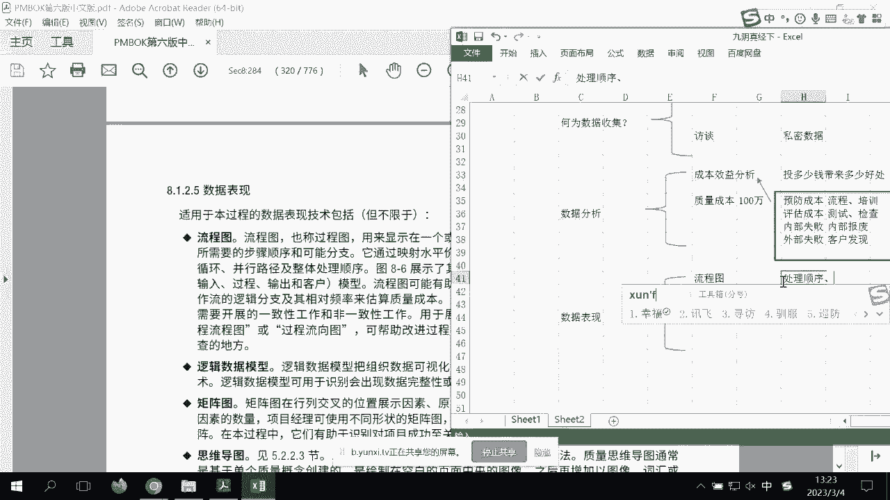
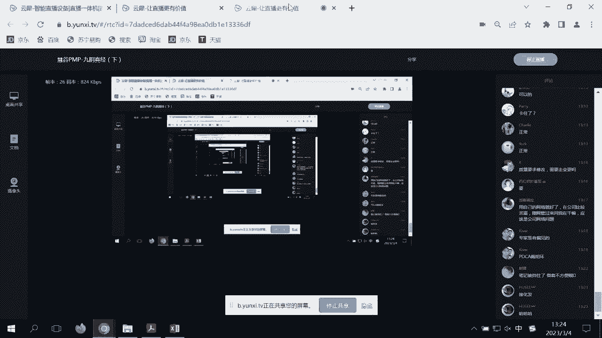
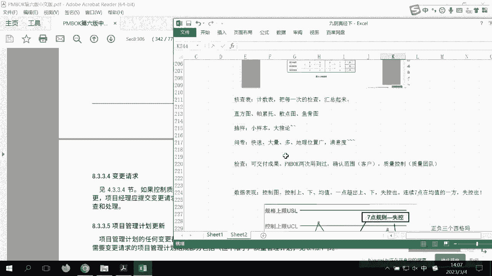
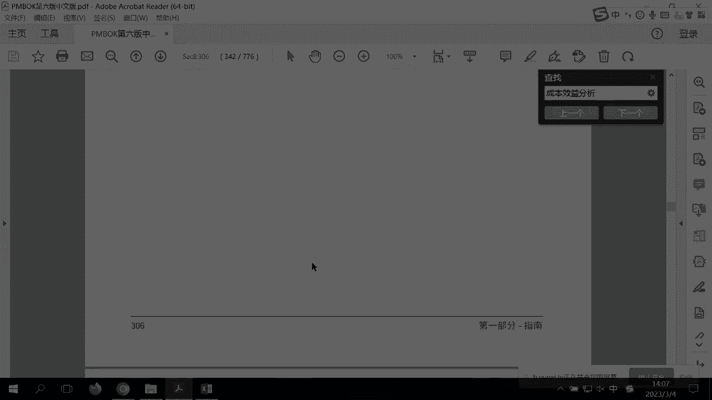

# PMP考前强化记忆串讲 - P4：PMBOK第8章考前强化记忆视频 - 交大慧谷PMP培训 - BV1yg4y157ux

如果有一天啊你在职场上感觉到，无论是硬技能还是软技能方面有所提示，都可以让人睡觉，那岂不是成功会鼓让梦想有回响，那别的你应该是跟我一样，是有pbox，那么其实上节课我们已经一起回顾了1~7。

那么现在我们来看看，八到13又是一个怎么样的内容，我希望带我带着你啊，快速的跟我一起去把pmbok的后半本书给回来，首先我们说第八章质量管理，在质量知识领域里面，在质量知识领域里面。

无非就是第一个叫做规划质量啊，其目的就是明确未来的质量，目标和检测方法是什么呢，那么第二个我们会比较关注的是什么呢，我们叫做管理质量，唉，我们来想确定一下它的它的过程组，这个是在规划，这是在执行。

那么也就是说我们在执行过程，就是要要要要要确定什么，要确定我们能够去什么检测，或者说我们有一个有一个执行的团队，能够实时的帮助我们去检测，而不是项目做完以后再去检测的，所以他在执行过程中。

那么第三个叫控制质量，注意只要主要是针对怎么样可交付成果，好监控过程中，其主要目的是要确定可交付成果已经有了之后，我们如何能够怎么样去检测可交付成果，所以这个是什么过程检查这个是结果的检查，注意一下。

各位在这里面又会出现一个第三方的团队，大家大家注意一下质量团队，质量团队，那他切记记住质量团队，它不属于，项目团队的一部分，那么所以说他要保证怎么样，我们第三方的公平公正性，而这个质量团队呢。

在座各位应该知道怎么样，对于我们很多企业来说，就是质量部门或者叫qc好，有了这些视角和影响，我们再来往下，那么我们会清楚和克莱的多得多，那我们来翻译一下在质量过程当中，我们会碰到的一些问题呃。

首先我们带一些新的概念，比方说我们对于新型的质量啊，我们会考虑等级等级是什么，它功能不不不不多的啊，低等级，那么什么是高等级呢，它的功能是繁多的，那么对于我们所有的人来说，而低等级不代表低质量。

高等级不代表高质量，大家可以想象一下以前的手机，我们最常见的啊，诺基亚还是诺基亚的吧，他没有那么多的app可以装，它只是怎么样符合一个打电话，但是你可以现在可以看到，我们现在都有很多什么智能。

手机其实是你可以把它认为是一个怎么样，我们所谓的高质量的一个产品，好高质量的产品，hg p p0304 ，ok，哦没有我我我自己手机也开一下，我来确定一下那个我是不是能够听得比较清楚。

所以呢这个我们知道质量和等级的一个作用好，那么继续往下继续往下，那么这时候我也可以看到，因为我手机可以看到你们直播间的一些提问，不然的话我觉得我讲话你们可能会看不到，好那么我们继续啊。

那么我们看到了等级和质量，那么继续啊，对于这种预防啊，空差啊，这个我们都要都要都要有一些概念，就是说新的质量学，我们要知道质量是靠预防出来的，我们质量是靠规划出来，而不是靠怎么样检查出来。

我把它缩小一点吧，不然的话谈来谈去麻烦，而质量是靠规划出来，而不是检查出来，这些我们都要有一些新的爱的主题啊，这些都是要新的i t2 的主题，那么包括这种公差呀，呃抽样呀，其实会考你的考点已经很少了。

而在现在的整个项目管理的新版考试当中啊，因为老板考试他可能会更多的偏向于制造行业，而新版的考试，你要知道跟质量里面相关的一个敏捷的思路，就是我们怎么样叫做测试驱动开发，我们先确定诶他是怎么测试的。

再考虑我们怎么开发啊，这个我们知道一下测试驱动开发的一个作用好，那么继续往下，我们说质量的一些新兴实践，这个我们要知道一下怎么样符合需求，持续改进，注意一下，注意一下各位老铁，注意一下，持续改进。

很多人不知道，基本上这个答案已经是王王者答案了，这是什么，pvca由休哈特提出代名完善的，一般我们叫做叫做戴明环啊，注意一下各位老铁戴明环的重要性，那他说质量是靠a靠规划，b靠检查，c靠pdc。

基本上各位老铁，啊注意这一分一秒啊，注意这一份一定要好，那么继续我们来到继续的一个话题，那么说什么管理责任，包括供应商互惠关系，其实很少能够去考到你，呃我我也在看，很多同学说啊，没卡呀，没有声音啊。

没有画面，我不知道到底我自己这样，这测试下来非常非常的顺畅，非常非常的流畅，你们这边你们这边怎么样，ok啊如果说没有问题，不要老是打断我，或者说其他同学那个跟他说一下，应该是你的网络问题的最简单。

你的杀毒软件有没有开着，你的防火墙有没有开着，ok啊，那个不然的话，我们今天就不会不断的被怎么样被停滞停滞，我是希望带给你们一一次非常special的ok啊，一个复习指导，ok好，那么继续好。

那么我们往下呢，来看一下我们所谓的敏捷适应的一些因素，它包括了回顾，包括了那这叫引导变更，你有看到吧，什么叫引导变更，拥抱变化，所以呢很多情况下面呃敏捷思维啊，跟我们正常的一些瀑布思维。

还是有一些怎么样呢，包括小的增量，大家还记得吧，这个叫什么叫做nvp，一些想法最早，发布ok啊，所以这些我们要知道好，那么继续往下，我们来看看规划质量管理，那么这时候呢各位同学说。

哎呀邱老师既然现在不太考纸了，不不也不能完全说不太考，那我问你万一考到的五分十分，你要不要，那肯定要啊，所以说这还是需要了解他到底是什么的，包括有的同学还我，这为什么质量管理计划无质量。

为什么你说风险管理计划无风险，为什么说沟通管理计划咋咋咋，其实都是在今天下午的内容里面好，所以呢我们知道一下呃，首先来看到规划质量里面的一些输入，对于我来说，这里面其实输入什么问题不大了啊，问题不大。

如果说最大的就是我们要知道，在我们的范围基准里面会有大量的治疗要求，所以在这里面我在慢慢的细化，如果说你翻过偏薄荷，你会发觉在呃我们的呃，我们的需求文件里面有有一部分是质量需求啊。

需求文件里面有一部分是是质量需求的好，那么继续我们来看一下工具专家判断，各位同学已经问了我很多次了，到底要不要选择专家判断，首先我对大家的回顾一定是专家有偏见的，那么那么那么那既然专家有偏见。

那么一律不选了，但是为什么有的题又会去选到呢，大家记住看到一个关键词，如果说你只有一种情况，你可以选，你是一个新上任的项目经理，或者说你是没有任何经验，那你可以选啊，其他的都正确，因为这个答案不够完美。

ok啊，因为这个答案不够完美好，那么再继续，我们往下看到，又是数据收集来，各位老铁们能告诉我何为数据收集，其实大家记住它是一个吸星大法，它是一个西数据的一个工具，ok啊。

所以呢在这样子的一个一个工具里面，它可能会纳入了很多的子工具，我们来用我们的视角来看一下，质量知识领域里面的一些子工具在哪里，呃，我把它放下来一点点，所以我们要对每个工具都进行一些那个。

快速的指引和汇总，比方说第一个叫标杆对照，ok标杆对照，其实在范围知识领域里面也用到过，好在范围知识领域里面也用到过，那时候是找到怎么样最佳实践，或者是外部的最佳，但是在质量里面也是一样的。

我们可以考虑到怎么样质量的最佳实践，可以是内部的，也可以是外部的啊，大家知道一下，另外一个是头脑风暴啊，头脑风暴，也可以帮你去吸到很多质量，就是讲的最简单，别人是怎么测的，那我们自己一帮子人yy。

我们也可以怎么测，那么这里面的关键字是什么，快速大量ok啊，快速大量，对诶各位同学想看现在我们在哪里在规划讲哦，就是我们要确定怎么样子去那个，那么在质量里面你会发觉啊，专家判断这个工具很有意思。

只有在规划的时候用到过到了管理和那我，到了管理和监控是不用专家判断的，为什么，因为我们要看大数据，专家是由偏见，各位老铁注意一下啊，专家是有偏见的，所以在一开始可能我们会听一些什么，戴明华，听那个呃。

我们说朱兰的，对不对，有一些很好的学术啊，但是各位老铁虽然在我们ppt里面出现过啊，像朱兰啊，cross比大家还记得吧，我当时我说哎稍微记一下，但是这几年他基本上最多能考到代理了，好。

那么我们继续第二个快速大量的，第三个c的访谈，也所以你看啊，呃这种数据收集技术很好记头脑风暴啊，访谈啊，焦点小组啊对吧，还有一个问卷啊，只是在这时候我们用访谈，大家注意看啊，正式配方是保密的。

获得怎么可诚实的，ok啊，所以一般访谈用于什么，一般叫私密的数据，他举举个最简单的例子，你会发现很多企业它的整个质量检测，它可能是对外不公开的，那么我们可能一对一的会比较好一点啊。

可能一对一的比较能吸到一些数据好，那么当我数据稀了，你看p p无非就这三大工具，第一西数据的，第二是什么，分析数据的，好第二大工具是分析数据的，我们来看看，而在分析数据里面的第一个叫做成本效益分析。

那么再次做各位很多同学在考试的时候，经常会碰到这个工具，成本效益分析，成本效益分析呢，其实你说用在做商业论证可不可以，其实也是可以的啊，那么呃一般如果说在pp上面说到成本效益分。

其实是这个工具会用到好几个地方，所以你不要认为它一定是值，只是用在质量上面，我们可以搜索一下，看到了备选方案里面又是做成本效益分析啊，很多地方ok啊，很多地方那么呃所以如果说你简单一点。

就是考虑哎投多少钱带来多少好处，那在商业论证里面，那就是我投这个项目给我的企业带来多少好处，ok所以哎有这个工具叫成本效益分析，那么另外一个我们会考得很大的，一个叫做质量成本，那举个例子。

我们准备在项目里面啊，质量成本是投100万元，那么这100万哪里来的呢，我们是做了成本效益，所以其实虽然偏颇，可官方没有对外部说我们的工具有先后，其实啊我我我们还是有一定写好的，那么从这100万我们。

经过成本效益分析，那么这100万投在哪里呢，哎注意一下，它会分四大成本，第一个叫做预防成本，预防成本里面包括了，比方说我们做流程对吧，那我们看一下啊，做流程呃，再看看后面的这样更清楚。

那做流程做培训对吧，啊做流程，做培训，买更好的设备啊，就这些都是好的，大家带来怎么样质量意识的提高，第二个叫做评估成本，那么一般呢是做测试，第三第三种叫做内部失败，就是我们发现怎么样，我们内部的报废。

包括外部失败，我们的客户发现的，那这就是我们四大成本，那么同样的可能我会留一些怎么样成本，在这部分，也可能会留一些成本在这部分，那么我想在座各位，如果说你要花钱是尽量的哪些多投，哪些少投呢。

我相信啊你们跟我一样的，你们更喜欢怎么样头上面的，因为越下面的怎么样，会带来客户的满意度越差对吧，所以说呢哎我们这100万准备怎么投，我们就会有这四种成本类型，各位老铁，大家注意一下质量成本的四种类型。

二质量成本的四种类型，我给大家怎么样都规划起来了，好那么如果说这个我们都明白，那么我们继续，那么决策到底是怎么样，介绍了多标准决策，我们到底是哪些啊啊优先哪些怎么样，我们的滞后啊，哪些优先，哪些滞后。

那么接下来呢我们说你看先怎么样，就是我们如果说讲到化灰化发，首先先来收再来分析，那么第三档就是我们叫做数据表现啊，所以你去看pbox就像看一本很有意思的小说，每次去看都会去诶，有有一定的怎么样。

我们的新的呃碰撞出来，那就是把这些得到的数据，不管是标杆，不管是头脑风暴，不管是访谈，甚至是拿历史的数据，我们把它画出来，画出来，怎么样让所有人啊都能看得懂，其实我会发现现在很多的企业要上很多软件。

上很多系统，其实最主要的目的，最最小的就是我们家下面叫基础数据，到了最最最后我们要有数据呈现，我们要直方图要大，比如其实我们质量也是一样的呀，第一种我们叫做流程图，把它画出来，那我们将来如何检测。

我们直接就可以拿流程图，那么流程图里面有什么作用呢，我们会有处理顺序循环等等啊，我就不把书上念了，我们要处理，循环。

等等，包括分支啊，那么为了让大家能够怎么样，就是很好的去了解这个流程图的样式呢。

我就给他做个笔记，把它放进去，接化发得跟马老师一样好，那我们就做一个那最简单的程序流程图，它会有处理顺序，有循环，有判断等等啊，这就是我们最简单的流程图，好我把它缩小一点。

好那么第二个我们可以看到的工具，它叫做逻辑数据模型，其实它是把一些商用的啊，就是那个我们的下面是出呃，就是那个data或者是那个数据，其实它是用商业语言来表述，让大家怎么样呢，能看得更清楚一些，ok啊。

图表，商用逻辑到业务逻辑啊，随便找一个，ok啊，所以呢后后边底层其实都是相应的代码，我只是把它怎么样给相应的给它绘出来，那么这样子的话呢，有助于大家怎么样能够了解到，ok啊，了解到我们的系统原理等等。

好那么注意一下，我们加到第二个叫逻辑数据模型，好在我们的质量知识领域里，那么除了逻辑数据模型里面呢，他又介绍了一个矩阵图，其实矩阵图就是我们的excel excel，那在我的上课的时候，我跟大家说啊。

那个矩阵图它可以用怎么样用横和纵，其实有了这个东西以后啊，就能够表示怎么样呢，我们的我们就是做表格做怎么样哦，对不在这了，我们就可以做表格了，在这些这些excel表格里面要找到相应的强关系。

弱关系就是我们平时要做的去重比对，we look up等等等等的ok来进行，我们这叫做什么呢，叫做大数据的分析啊，所以pmbok写的很隐晦，他们有没有说说那个这个逻辑数据模型是什么，其实就是恒合作。

它进行大数据的分析，那么呃最后一个呢，我们介绍了一个叫做思维导图，把思维导图的话，我也给大家做一个呃，做一个分类吧，随便找一张思维导图图，那，对吧，那么思维导图的作用。

其实是把大量的这些关联呢给它放在一起，而把它放在一起，让你非常有序的，包括我们在质量里面，我们也希望怎么样把一些质量问题啊，通过思维导图给他非常有序的给它画出来，或者说我们如何检测。

也可以用思维导图给他画出来，那么这就是我们常用的思维导图的一个用法啊，思维导图一个用法，所以哎我们进行可视化的啊，确定依赖关系，所以呢各种普法我们要知道一下，那么呃我们叫可视化的，那么具体啊。

它在题目里面要去真正去考虑到它很细很细，其实我纵观了呃，这几年的考试，它不会啊，考到你更新的内容了啊，更考到了你的更新内容了，好那么我们继续有了这些图，你在复习的时候，基本上每个一看哦，原来是这个哦。

原来是那个要比看枯燥的pm来的好得多，那么最后一个呢我们要确定怎么样，我们将来的测试方法，那么这个测试规划呢我们叫做阿尔法测试，贝塔测试，我们确定未来的测试方法，而在软件行业。

art alpha包括那个单元测试对吧，是怎么测的，是不是要做单元测试，是不是要做集成测试，注意下，好我们要明确起来，所以我们纵观我们的规划，质量其实都是在做设计，你看都是在做设计。

那么当这些设计全部ok之后呢，我们就可以出来两大文档，这第一大文档叫做质量管理计划，注意一下，质量管理计划无质量，唉有人说为什么又是无质量，它是本项目的质量方针，就是我们未来要达到的一个目标是什么。

就像我们企业或者我们国家会有一个怎么样，我们叫做未来我们要做啊，就像数字化经济，但是具体怎么数字化，它是没有的啊，它是质量方针，我们要拿到iso 9001啊，我们符合国六标准啊，这就是我们的质量东西。

好我看到小姐姐在给我怎么样纠错，好的好的，我刚才写错了啊，e x c e l好吧，那个根据你们的那个做大数据好，那么有人说，那我就给你看，这样不是有测测试方法吗，那我怎么测呢，有一个叫做质量测量指标。

这里面其实是对质量的啊，所有的检测方法，我们的百分比测量故障率，缺陷率，包括怎么样代码错误数，包括我们的客户满意度，这些我们的标准都在里面，啊所以呢注意一下这两个文档的区别，一个叫质量管理计划。

一个叫做质量测量指标好，这就是我们质量知识领域里面，两个在规划的时候出来的重大文档，好，在规划的时候出来的两个重大问答，所以大家一定要记住，一定要切记好，那么在这个之后呢。

其实我们的质量规划就就就就就结束了，那么来到我们第二个叫做管理质量，那么管理质量呢，其实大家知道真正的实施主体并非是我们的啊，管理质量，因为他在执行，ok是我们的值，我们可以可以配合体量团队对吧。

甚至大家应该知道，有很多企业都会去被外外部的公司要做什么，要做审计，要做audit，它其实就是一个过程检查，ok，所以呢你可以把它作为一个叫做执行过程中，如何把控，如何把控，那么我们来看看管理质量。

希望给我们带来的是什么，那么呃这个呢，其实呃考点我觉得已经比较老化了啊，他说输入是质量控制，测量结果就是我们我们最终的测量结果，然后呢在执行的时候呢，我们要知道啊，这个这个也不会这么去考你了。

包括一些质量报告等等，好我们继续来看工具，数据收集啊，数据收集这里介绍了一个叫做check list和对待，那么其实你会发觉啊，那个我们的工具你看又是个稀的，你会发现这时候的c没有向上向上。

再规划几年的时候，我们啥都没有的，c你看我们又要头脑风暴了，又要找标杆，又要防弹，这时候我们一切拿数据说话，而且你看在质量的里面是没有专家判断的，ok在管理质量里面是没有专家判断，那数据收集叫做什么呢。

叫做和对待，不是我拿检测的核对单来进行说话，那么有人问核对单是什么，我们随随便找一张好了，我给大家做笔记，我们就是质量控制表嘛，我拿一个工程的，你们可能会有i t的诶，软件的等等，无所谓。

到时候你们想看就直接把它给放大，我们进行怎么样一次一次的测量，最终就会有一个相应的核电站，ok相应的结果啊，这个就很简单，那么有了和质量核对单以后呢，第二个你看灰化发呀，又是数据分析了哈。

那么这时候呢我们拿到之后呢，我们就会有数据分析，那怎么分析呢，我们来看看啊，pm希望收到一个备选，啊我们可能会诶，接下来我们在过程当中，我们可以有主选和备选，包括我们的检测也可以有主选和备选。

所以我们甚至是可以考虑哪些方案，可以做到怎么样符合质量法案，这题可以第二个文件分析，看文档，我们有太多的东西了，第一个看我的checklist对吧，看我的很多的质量的一些文档和报告。

了解什么我们偏差在哪里，因为大家要知道现在属于pvc的路，这时候你要改还可以，为什么，因为我们可交什么还没有，所以我们这时候还是可以改进的啊，还是可以改进的，包括过程分析，干嘛呢，找到一些非增值的。

有同学说这时候还可以啊，哦如果说说到这儿了，那这个篇幅就要从第四版开始说了，在第四版的时候呢，其实呃我我这儿还给大家做一个笔记啊，第四版，有一个计划叫做过程改进计划，说我们要做p d c a的。

那问你这是在哪里做p d c a呢，其实我告诉你不是在监控，是在这时候还是可以做p d c a，而用的工具就是过程分析识别非增值，那举个简单例子，如果说我们在上课的时候对吧，呃是上课完了去做问卷。

还是上课过程做问卷，我说那肯定是上课过程，所以你看他在执行过程中，那么在做问卷的时候，我们要去了解是课程内容有多好呢，还是哪里有多糟糕，那我们当然会反应了是哪里有多少，其实大家要知道。

现在有一个有一个有一个说法叫做什么呢，叫做吐槽，我前阵子还跟一些产品创新的人说吐槽啊，其实对于我们整个产品创新来说，是一个非常非常好的一个呃idea和概念，如果说这个产品的吐槽率很高。

我们把这个吐槽率变成怎么样，我们创新的新意识，你会发觉你的产品是不断在激进，所以呢哎我们说过程分析是找到那些不好的，我们还可以来得及好了，那么最，最后我们再来看看一个叫做根本原因分析，叫阿西唉。

注意一下，可能我们会用到根本原因，分析的时候是会用到鱼骨图的，但是各位老铁，你们要知道这个鱼骨图啊只是r c的一部分，这个工具超强的，你看啊，他除了找到根本原因之外，鱼骨图是找根本原因的。

还可以消除原因，杜绝问题再次发生在一起就看到了，萧楚云杜绝再次发现，所以在这个工具上面，基本上你你有没有发现跟跟我们敏捷的，有一个会基本已经无敌了，那我记得有一道题，他说啊，我们希望怎么样去做改善。

或者是那个呃去去改进项目，一个敏捷项目怎么办，其实我要改进项目，第一你去看看有没有回顾会议，大家还记得吧，我一直在说的敏捷四大会议吗，各位老铁，老子要清清爽爽，其实回顾会议就是做经验教训。

防止问题再次发生，对吧，但是rc一样的消除问题，防止再次发生，所以那道题大家还记得，我们选两个选项，一个选回顾，一个选，根本愿意分析，一个选回顾，一个选根本原因分析好，那么我们继续。

在这里面又出现了一个叫做多标准决策啊，我们把多标准决策也给他放过来吧，我们可以用多个维度怎么投票，只是一个单标准，我们可以多多个维度来确定怎么样呢，我们是否满足期望，或者说呃以及这些缺陷是不是有缺陷。

好你看我们可以从项目，可以从产品，那我们我们从几个维度嘛，比方说从项目从产品，从呃进度，从成本，从质量啊多个维度一起来论证啊，论证或者是做一些怎么样相应的决策，甚至是可以怎么样给他相应的权重。

比方说我们项目里面占百分之呃四三十，产品占30%，我们的进度时成本时质量20，那那进行权重的来确定什么是否要做了，而不是担心好，那么我们这种叫做多标准决策，因为在之前的复习里面呢。

我其实没有怎么讲到过多标准决策，所以在这次里面呢，我给大家哎稍微加一个多标准决策的用法啊，多标准决策，所以不单单是单个维度啊，yes or no，好，注意一下，又是灰画法，你看这个是收集分析。

灰化发了第三个什么数据表现，把它能够画出来啊，数据表现能够把它给画出来，所以这时候老板都很喜欢啊，我们叫做，好数据表现，各位老铁不要觉得枯燥，其实我觉得讲讲偏不和我每次讲我都会很激动。

因为我都从里面可以得到很多，很多的好玩的东西，那第一个叫新合同呃，清河图是在我们的范围知识领域里面有讲过，收集需求的时候，用过注意一下关键词氢一样的和放一起，放在那么这个青铜呢，我我我。

我觉得让大家就是像像像上面一样挥发灰，化发一样，我把大家的青稞图给他，要画在下面呃，我们叫质量里面的亲和度，看看能不能找到没没有，只能找范围的啊，清河法啊，这厉害了，这是一个产品的实用性差。

那么它呢会找到了亲和的很多，那比方说我们在携带不方便里面有哒哒哒哒哒，在操作困难里面有哒哒哒哒哒，你看同样的放一起和ok啊，所以如果说你要去考偏僻，那个清河图的关键字就是差不多的放在一起，ok啊。

差不多放在一起，其实我跟你说，他跟思维导图也很像，思维导图就是把它更怎么样有序的直观，轻和时差不多放一起好，我们除了这个以外呢，再来看看第二个因果图，注意这是最容易考你的，因为它的别名实在是太多了。

最容易考多选题，最容易考多选题，好那么注意一下它的别名因果图，鱼骨图，啊yy图，包括五个，为什么唉他有这么多病例哦，还有一个别名叫什么叫石川土啊，把他最早的那个石川土，ok所以你看到这些关键字才啊。

我们要做根本原因分析，用什么图，基本上那你知道基本上就是就是这些图，啊所以呢因果图才有很多，那么流程图刚才有讲过的，把他的先后顺序处理顺序决策对吧，回路都给他画出来就好了，矩阵图，直接。

把流程图处理顺序回落，本质啊，都给他写出来，那么最后一个我们可以看到的叫散点图啊，虽然这些比较枯燥，但是在我们很多制造行业里面倒是用的很多的，它会显示两个变量的关系啊，它会显示两个变量的关系呃。

我们有什么叫因变量，自变量，好因变量自变量，当我们的随着时间的推移，这两个变量是怎么样子，好，各位同学别急，我会一个个地图的给大家做笔记，第二个图，我们把因果图的鱼骨图给大家。

怎么样写在我们的课堂笔记里面，啊鱼骨头有了，然后呢三呃这两个可以不用了，因为这两个流程图已经有过了啊，矩阵图加这恒河纵，我们做大数据的，然后呢那个散点图呢，我看一下能不能找到一些散点图啊。

比较直观一点的吧，嗯这个这个，因为有的散点图很复杂，我想帮你们找一个简单一点的散点图，疫情的站点途径，找到这些变量当中的一些怎么样一些共同点，ok了，直方图呢，那个如果说说说白了说了再复杂一点啊。

其实在第六版里面有一个特殊的直方图啊，第五版里面有一个特殊的直方图叫帕雷托图呃，考试不太会考你，但是会出现这个术语，好我们有同学说还有一个图是直方图啊，在这行行行，那我给它加进去。

它就是怎么样显示我们的一个数字的条形图呀，那我随便找个直方图给你了，结果了后面是二，然后呢把这个excel怎么样给他导到直方图里面，我们就可以去找到一些怎么样相应的一些，相应的一些数据。

好所以你会发现质量里面有很多怎么样呃，很多东西其实稍微有点枯燥的，ok但是呢我要告诉你们呃，你们在后期题目里面会做到一个很奇怪的单词，它其实也是个直方图，但是在第六版里面已经没有了，叫做帕累托图，算了。

因为今天我们去做总复习，我觉得是知识点的，我给你大家说一下，但是未必一定会考到呃，首先呢我们说呃帕雷托他其实是个人的名字，是一个意大利的经济学家啊，他们发明了一个叫做8020原则。

他们发明了一个叫做8020原则，那么这时候呢哎啊这个帕里图图不好啊，我们看看这里，他是一个意大利的一个经济学家，就是呃说8020的那哥们，那么首先呢我们来看一下啊，就是他这样的。

在右边呢应该是我们的百分比，然后呢在左边呢是发生了一个bug的频率啊，bug的频率，那么我们首先帕雷托图，它也是直方图，它是怎么样呢，从左到右，从高到低的，排列的，好在因为我记得在未来的你们的考试当中。

或者是这一次考试应该会出现这个单词，好，它是从左到右，它也是直方图，那么这时候呢我们就会对于所有的八个，从高到低的排列，那么第一个呢我们可以看到它的一个战略啊，第一个呢就是一共是18次。

他占总的就是把总的全部相加之一，就有一个累字嘛啊总的18次，但总比的24。7%，看到了吗，各位老铁，那么我们认为这是一个a类原因，第二个是45，怎么会占，怎么会是占总比的45。21呢，它是将18的二。

就是18次加上15次的，它就是累计出来的，其实就是二次4。7，再加上15占了多少，那么这时候你或者说讲的再简单一点，就是18+15，总比的大家有看到吧，那么所以说呢，这时候呢。

我们认为在80%以内都是a的原因，所以我们一定要怎么样主要解决，那么像这种帕累托图，对于b类c类，我们先先不解决，我们有重点去采取措施就好了，ok，所以呢帕列兔兔的关键词是有重点的采取措施。

而不是所有的原因都要解决，啊所以不是所有的都要求，那么这个累就是，累积的累ok啊，所以它是一点点累上，所以你再看第三个，虽然看上去14，它是等于是18+15+14，占总比要到63。8%。

到了查询是是将前面的相加，占总比的75。34，明白了这个磊子ok啊，所以呢至高往低的累计的占比，所以呢这已经是b类了啊，上是c类了啊，但是我们了解一点点就好了，了解一点点就好了，ok了好。

那么不占那个大家的学习时间和篇幅，我们继续往下好，另外一个审计，在之前我说的那个考点当中，我们说那个审计是一个很大的一个考点，那那没错，这是在老版本考纲里面，在新版本考纲里面呢，其实对于。

审计啊就是考的并不是特别特别的多和严格了，反正我们就记记住几句话吧，质量审计看的是过程政策指南，看文档呢，第二呢可以由内部或者是外部的审计师进行，我们叫做内审员，叫做外审员。

质量审计呢可以带来质量成本的降低，为什么，因为你要你要你要做审计，你肯定要投钱吗，投的是什么，我叫做一致性，成本上一飞一直，好还有呢质量审计可以给你经验教训啊，我们叫做什么不符合项，你要整改。

而且在审计当中最怕的一个问题就是版本问题，所以说你会发觉怎么样呢，要确定你的这些变更啊，都已经落实没有，那比方说你现在的整个受控文档用的是r3 ，但是你在现场用的是r2 ，那么这马上就是一个什么呀。

不符合相，所以对于文档的变更，我们都认为是变更，所以计划驱动一切，ok啊，对我会讲的很快，那如果说大家同学能够记得的话，其实在我们的那个考前辅导的就是音频里面，就是我们考前辅导一的音频里面。

或者是在我之前的课堂讲解里面呢，其实都有讲解，而这里面已经是快速的去了解他的一些动向，啊都是了解他的动向好，那么质量审计都ok了，然后有同学说老师放大点字看不清呃，我建议我们是在哪里看呢。

是在我们的电脑上看，如果用手机看的话，你的眼无珠要看坏的，知道吗，ok啊好，那么大概知道，那么对于这种面相差的设计，包括那个像这些，其实都是在六西格玛里面的一些工具，一些子工具像面向差的设计。

或者说像以前叫做实验设计，叫die等等等等，好多ok啊，那么这里面呢其实我们大概就知道一下原理，它不会细问的，面向差是什么，面向某各对象的，比方说面向经济的，面向质量的，面向成本的。

我们做一些怎么样相应的设计，当然这里面有六七根本方法，好那么我们继续啊，继续继续继续啊，眼无珠哈雷油啊，继续，那么另外一个呢，这里又出现了一个叫做问题解决好，那么注意一下，我们总结一下。

总结一下各位老铁怎么解决问题，他只是个工具大哥，其实在这个工具之前，你必须有一张单子，这张单子叫做问题理智，我们首先要记录到怎么样问题日志，然后呢根据问题日志的优先级对吧，然后呢用这个工具去干嘛呢。

定义问题根本唉算了，我简单一点解决问题，包括怎么样验证问题，就在这时候其实是doing的，那么对于问题日志的两个，有两个工具都可以去帮他解决，一个在质量支持领域，就是我们的怎么样qc。

还有一个是在资源支持领域，我们待会儿都能够去判断，好有人说d f x对的，d f x叫做面相差的设计，其实我说的d o e其实另外一个叫做实验设计，ok都在68里面的一些工具工具集里面好，那么继续呃。

质量改进方法，那这里讲究的是什么，pd c a的六西格玛，啊对的，有同学说哎呀，q老师能不能告诉我奖励时间讲六七个吧，欢迎大家来到交大会部培训中心，参加我们的6c他们绿带和黑带的认知。

我们作为p p只是知道有这个东西就好了好，那么继续我们输出的两个文档，第一个叫做质量报告，其实大家有没有发觉，在很多题里面很少去看到这个东西，其实是希望是可能是一些图形的，一些数据的一些文件。

其实是给什么，老大们能一看就能看明白的，因为你会发觉老大们永远不想看表，老大们最想看的东西就是图，如果说是想一个啊，哇像一个我们说银行行长，企业ceo什么的，他管你底层数据是什么，他只要看图的啊。

所以呢我们可以做一些图形化的报告和报表，那么还有一个呢就是测试和评估文件，那一般是什么呢，我们可能是更详细的，更详细如何去测的一些技术文档，ok这就是社区评估文件好，那么我们继续啊。

继续跟大家一起往下复习，这里变更请求不用去关了，关注了，我们看到第三个叫做控制质量，控制质量呢其实是指我的可交付成果已经有了，注意一下关键词控制质量，a做的我们团队做的给谁。

给我们的质量团队进行检测的过程，所以你会发觉它会输出什么质量控制的，它叫可输入，是可交付成果，输出是什么，叫核实的可交付成果，看到吧好，它会有这样的输入输出，那这样吧，我print一下。

这样子的话又是一个，你会不让我print，再print一下，放放小一点啊，所以呢唉这儿的笔记，就是大家注意一下它的输入，这可交付成果输出是何时的核实的可交付，那么这时候呢你就可以知道了。

哎是给qc检测的过程好，那么我们继续往下来看看它的一些重点，所以呢他在质量过程，是验证它的合规性的一个作用啊，其他不用不用不用浪费时间，ok我们继续往下好，批准的验收可调，这个也也不用浪费时间好。

那么注意一下几个单词，第一个单词叫做核对单，诶，又出现了大哥，你怎么又出现了，老是出现哎，我跟你说啊，我跟你讲啊，做过程检查的，我们叫做过程巡检，啊哪一个类型的checklist，我们是对于结果检查的。

我们叫做交付，群演员是不是拿另外一个checklist，这两个checklist应该是不一样的吧，对吧，造房的时候，一个是什么，一个是监理，一个是验房师，的区别咯，对不对。

所以哎这时候我们就要checklist这两个，那么什么是核查表呢，和差表，就是讲的更简单一点，就是说他是把一次次的我们的checklist，把它汇总起来，所以呢各位同学啊，你们如果说去摆一只手啊。

把它引掉，只有日期一的话，你可以把它当做一个是一个核对待，但是呢核查表又叫计数表，是把每一次的，检查怎么样汇总起来，那么各位同学，有了这个东西以后，你可以做什么，就可以做大数据了呀。

你就可以做所有你想做的东西，因为我们在集数据嘛，你会不会把它画出直方图，怕来拓土，包括我们的散点图，包括你想画的鱼骨图，所以这些我们告诉他，告诉在座各位，这些都是我们叫大数据。

所以你会发觉在管理和呃就是监控监控过程中，我们不再要专家，我们要数据来说话啊，然后我们再继续，那这时候我们可以做抽样或者是问卷，他抽样子为什么呢，因为你会发觉，有的时候对于检查它是有破坏性的。

所以呢我们可以以小样本进行大的推论，对这批产品的评测，那我最简单怎么抽烟，我现在带里面有1000多人，我随便拉一个人把他叫到我面前，那1年我双手插兜问他，你偏不25页没出来了吗，他说不知道，来摸一遍。

发现没有，你们好嘞，家里娘了，有ok好，所以小样本大推论，另外一个我们叫做问卷，问卷很好，问卷用在哪里呢，我们可以快速的，对不对，可以快速的集齐各种各样的它，这里面是不是涉及到满意度。

大量受访者多逆离广，啊甚至是满意度等等的一些信息啊，就是在这时候好了，规划方，第二个就是分析了，这里面介绍了绩效审查，又介绍了我们叫根本原因分析和r c，很牛逼的一个工具啊，好然后又又通过检查来检查。

这个工具呢，一般啊就是我看一下，检查这个工具一般是看的是可交付成果，在偏薄荷上面两次用到过，第一次用在确认范围，什么意思，是客户检查可交付成果，第二次用在质量控制，谁来检查我们的qc质量团队，来检查。

好所以呢注意一下下检查，另外一个就是具体测试了啊，我就不写了，具体大家找找到那个好，那么最终呢我们又出现了一些绘画，发了我们数据表现因果图，然后呢直方图散点图这里都不讲，我主要讲一个控制的。

我看一下板式啊，不要跟上面歪了，啊差不多差不多就到这，是一个什么收回来，然后分析过把它能够变成图表数据表现，这里面最最最根本的一个图叫做控制图，注意一下控制图的关键字，它有控制上限，控制下限，有均值。

怎么看这个控制图，注意啊，这会考你的，他会给你看，连续七点问你哪里失控了，第一有一点掏出上或者是下失控，也连续七点在军，的一方，时空也，好在哪儿呢，我们来拿一个控制图给大家做一个笔记，还漏加一句。

均值呢是正负的三个西格玛的位置啊，这个控制图，看一下pm box上面的孔雀图，要要能找到一个七点原则，这些都是好的呀，最好是能够找到骗子更好填报的，好的，来看一个控制图，首先呢它只有均值在中间。

大家有看到啊，中间是均值上限，控制上限它是上下限，是正负正-3个西西格玛的位置，那具体每个西格玛怎么算，那这个就讲复杂了，我们要讲正态分布了，这个没关系，这是我们正-3的西格玛，然后呢如果说有一点。

你看下面一点或者上面一点，超出控制上限或下限代表失控，然后连续12345677点，在均值就中间那个黑线的一方代表，啊注意一下，这是控制中的用法，那当然他可能还有规格性，但是控制出失控不代表四品。

大家只知道一下，又是怎么样对你进行警报的作用，因为从正态分布来说，它应该是上上线下，不可能是连续七次都在怎么样一方的啊，所以知道一下我们的控制图啊，我也把他笔记做下来了，所以你们到课后啊去翻翻这些图。

很有意思好，这时候又做一些经验教训，最终呢控制质量输出啊，具体的检测结果我们看过的交互物，包括是工作绩效信息，哎如果说听过上节课的同学，应该知道什么叫做工作绩效信息吧，tv v a c。

什么叫做工作绩效信息分析过的，分析过的cpi spi，等等，什么叫做工作绩效报告，把它汇总过的，我们的项目的正值报表，因为怎么样，我们的整个项目推进不可能就单个模块，多互模块。

其实我在我们项目里面叫做周报日报啊，这个我们要快速的去知道这些东西了好，那么关于质量知识领域呢，其实大概我们的一个篇幅啊，就是这些内容啊，这些内容，所以在在座各位课后可以呃。

再看一下我们的视频。

