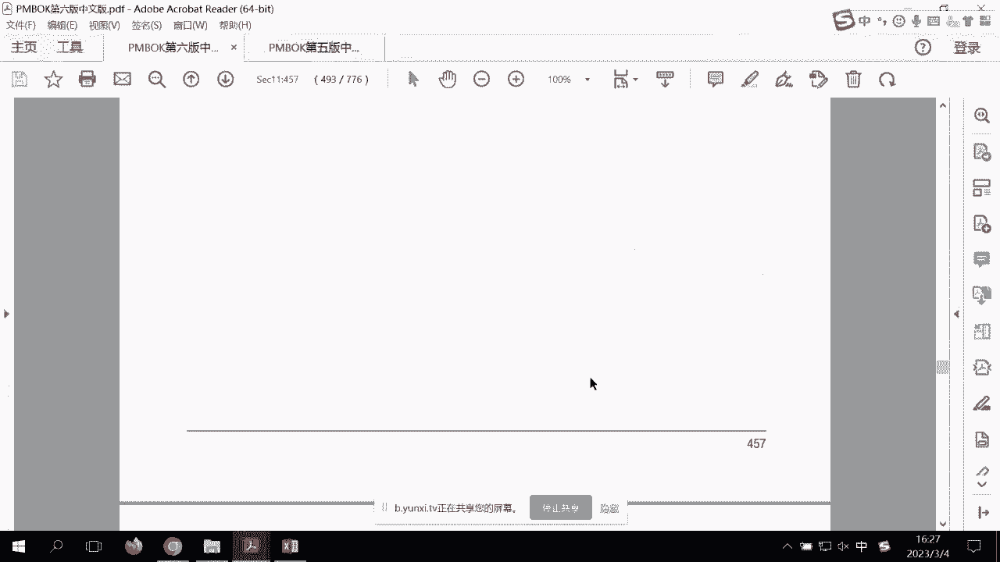

# PMP考前强化记忆串讲 - P6：PMBOK10-11章考前强化记忆视频 - 交大慧谷PMP培训 - BV1yg4y157ux

如果有一天啊你在职场上感觉到，无论是硬技能还是软技能方面有所缺失，都可以让我睡觉，为企业提升，都会鼓让梦想有回响，我们来到了新的章节，我们的pmbok第九第十章，高通知识类。

很多人初学者一般沟通都会选的很机械，什么时间打打电话或者怎么样子，大家记住，pmi主义在沟通知识领域里面永远有这三部曲，第一部曲规划沟通干嘛的，确定明确未来的沟通方式，出现了什么，沟通管理计划。

确定未来的沟通模式即可，所以很机械，未来能够在项目里面流传的沟通只有一样东西，工作绩效报告，第二个管理沟通，其作用永远是沟通，i n g happy，i n g就是我根据计划沟通g不要偏离啊，不要偏离。

我们要去设计好最好的沟通，在这里读音g就这么简单，好那么继续第三个控制沟通，其作用以无非也就是讲的再简单一点，我们会发觉有沟通不畅，如何去优化，嗨，别小看我说的三点p m p的，在之前的考试当中。

沟通的题目后几十道好吧，但是当你了解到沟通的考题，做题这三个原则的话，你要知道这些基本上都是拿分的好，我们来看看沟通知识领域的这三大沟通，什么非正式手头啊，口头书面，这个我觉得大家都能理解。

什么叫做内部沟通，什么叫外部，什么叫正式非正式，这也ok呃，上下级沟通，包括官方和非官方这些能出题，但是我希望我相信考考考不了你的，那么什么沟通五系原则呢，就是剪辑啊，这个这个书上都有问题不大好。

那么我们来往下，第一个叫规划过度，因为你要知道我们会在项目中产生大量的信息，我们要把这些东西发送给相关方，就要编制一个书面的沟通计划啊，大概是这样子的过程，那么输入不用看了啊，输入不用看了。

大概知道就好了，看看工具吧，又出现专家判断了啊，工具，专家判断，注意下关键字，注意偏见，没经验才能选，ok啊，好第二个沟通需求分析，ok沟通需求分析就是确定怎么样，它是需要单渠道的还是多渠道的沟通。

好沟通，需求分析，第二工具，是需要单渠道还是多渠道的，比方说你跟老板沟通，可能是像是自下而上的汇报，我还给他写进去吧，他用的是汇报，所以你应该设计跟老板的沟通方法，他要看的不是过程，他要看的是结果。

你要给他看的是图，这里面呢就会出现一个计算题，就是n乘以n，n减减1÷2，就是多渠道的n乘以，点1÷2什么意思，如果说有十个人，整个项目有十个包含项目经理，你啊那就是10x9÷2啊，这样子一个算法。

10x9除以n乘以n减一除以啊，注意一下，这里面会有计算题，一题一般性一一次考试好，那么另外呢我们会考虑沟通技术，那比方说我们信息紧迫，用什么变化以及一颗划过去了对吧，包括怎么样技术可靠性。

包括可用性等等，那举个最简单的例子，你说我们很多企业为什么要用钉钉，或者是企业微信呢，你会发觉这种沟通的设计是自上而下的，因为会有一个东西叫做已读不回，就是老板发了，看到你诶看了这是保护的，是老板。

那为什么会有个人微信呢，好或者是信息接收者，你到底读了不读，对方不知道的，大家有发现会有各种各样的东西好，那么继续继续呃，包括敏感性等等，那么沟通模型会有编码，大家注意，这里比较枯燥啊，会有编码。

然后呢也会有解码，你就记住发送方要负责清晰，接收方要负责收到，要正确理解，这才是真正我们要有好的沟通模型，那也有反馈，收到响应啊，这些东西好讲的是沟通模型，那么再继续什么多文化忠诚吗，什么哎，注意一下。

沟通可能会有噪音，来注意一下诶，这还有成本价，一分钱bt下，那这个图就是最好的能够去理解，他希望说的这些话，怎么会有这么多哈哈，那你就这样这样理解发送方编码，接收方解码都要正确的顺序的。

领带是中间有这个噪音，我们的整个沟通知识领域，希望做的是降噪啊，所以具体的案例，我就不能再花这个时间去那个了，比方说我们在演讲的时候，用p p t p p t是降噪的，因为怎么样，他除了看你人以外。

他还能看到字，对不对，然后我们用阶梯教室其实也是这样造的，让后边的人能很清楚地看到前面的文字，而不是前面的人头对吧，我们用的怎么样，麦克风其实都是降噪的一些方式的方法，好那继续。

那么我们再来看沟通方法有三个，这一定会考一道两道题的，注意一下沟通方法啊，这个比之前还要有用，啊以前叫做交互式沟通，注意一下这个这个互互动沟通翻译，有可能叫做交互式工沟通，一样的道理就是什么。

你你说他也可以说啊，但是你有没有发觉这种互动沟通啊，他有关键字或者关键点的，你不要所有的你如果互动沟通是很好的，那么喜欢了他不能人很多吧，你想看全球有3万人，我们怎么互动沟通对吧。

所以呢哎我们两方或多方，但是不能太拖，可以会议及时电话这种事，我们相相对来说呢，我们的沟通障碍比较小，那么第二个呢叫推式沟通诶，他经常会问你呢，给你一个场景，为什么会是沟通呢，向特地的发送信息。

而且呢是什么呢，受众但不确保信息被受众理解，但是也可以发大量的信息，而且不是大量信息，受众者多，可以多但是信息量啊，一般是什么呢，电子邮件等等，那你最最简单，你说你电子邮件里面我给你发一段文字。

那就几kb是可以的，我可以发几千人，但是如果说我电子邮件里面给你发一段视频，两个g发的了吧，所以像这一类的怎么样，我们的受访者很多，啊，地理位置分散，大家记得吧，有几道题专门就是考拉是沟通的。

而且文件很大，复杂文件很大呢，所以我们应该用的是拉式，大家能够记得考啊，我给你们做了几道考题了，是不是人很多地理位置分散全球不同的set，那而且文件很大很大量data，那怎么办。

把那个data放在那就需要去取而已，啊所以来注意一下这三个沟通的怎么样，不同点在哪里好，后面这个不不会考你不会考你，那沟通是一个大的好，包括人际关系技能里面，你考虑到怎么样沟通的一些那个方法。

就是不会考你了，好政治文化意思不会考你，数据表现里面那个分析矩阵，这个也不会考你，最主要就是这玩意儿沟通管理计划，啊注意一下沟通管理计划最容易考考什么，跟几个搞，第一个搞呢相关方登记册稿。

第二个稿呢哦我把它下来一点啊，他最喜欢搞一个搞搞相关方登记册，还有搞什么呢，叫相关方参与计划，大家还记得吧，我们就是要相关方管理计划，就是那个有收费，有时候呢它又叫做干洗人啊，干西人探一计划。

注意一下翻译问题，老版本都叫干洗人，新版本叫小官方，你以后看到相关方就是干系人，那么这三个的区别是什么呢，大家要注意p m p的考题，他不是中国人出的，所以啊观音的脑子很简单，那举个例子。

就今天还有同学在问我，他说诶那出现了一个需要相关方，新的相关方，首先你要要确保沟通，首先更新什么，你有问题，那首先我们说你说选相关方登记册呢，他不错的，那出现新的相关方法。

我肯定是先update相关方登记册，但是你要你要你要你要你要你要记住，老外他没有这么思路复杂的啊，老外他不像中国人会想很多考点是什么，我出现了一个新的相关方，要让他确保沟通，应该更新的是什么呢。

沟通管理计划，注意下关键词，确保沟通，那你想你更新了相关方管理计划，相关方分析策，他能够得到沟通吗，但是你更新了沟通管理计划，能得到沟通吗，能清爽，还有一种题就更复杂了，就说他是这么说。

他说一个相关方投诉，还记得说得到的工作绩效报告不对，那么你应该，好首先注意一下，我们已经不再研究什么啊，啊这个东西要不要走变更流程了，变更流程永远是只有三样东西，范进程对不对。

所以这这这个这个肯定是更新正常文档，第一呢相关方投诉，大家注意以后以后看到单纯的相关方投诉啊，不理解，没任何信息，选相关方参与计划，但是这一题里面你会说的是投诉内容是什么。

工作绩效报告其实走的是沟通知识领域，所以像这类题虽然是投诉，你要知道他投诉的原则是什么，是什么，是我们的更新沟通管理计划，因为更新了这个，你把工作绩效报告的格式改对了，相关方他就不投诉了啊。

所以啊有时候有有没有发觉这种问题就很搞，你注意一下，但是你搞明白了，哎，这样子你就做了三份了，啊这样子搞明白你就多了三分了啊，所以知道一下跟这里面容易出现的考点好，那么我们看一下沟通管理计划里面有什么。

这里面要比我讲的复杂，比方说上报步骤，然后呢他的沟通需求，我用什说多久跟他沟通一次，用什么频率等等，所以呢我们简述一下，大概主要的那个沟通需求发送原则对吧，是否私密，然后呢包括呃接收者群体。

所以你会发现你的沟通管理计划里面，应该针对不同的，当有不同的沟通模式啊，你要发送的永远只有一样东西，工作绩效报告，你给老板的，比程碑，图片的，超话各位老铁，而且是什么自下而上，那比方说你给呃用户啊。

客户的你要怎么样里程碑的，图片的那是怎么样汇报的，那你给用户们的，那可能是细细节的，但是啊无图片的啊，但是是用什么用电子邮件的好了，那相关方面阿姨妈妈们，那好我们就不用电子邮件。

我们建一个什么数据系统来了解项目的，不要细节图片即可得了，这才是真正的怎么样，我们的规划沟通，而且频率呢，唉我们接下来老板的客户的啊，月报月报周报周报可以了，那这才是我们真正是希望达到的效果，好好。

那么接下来我们来看到的是下一个词，过程叫管理沟通，所以管理沟通是根据我们刚才的计划怎么样，doing i n g，好发布mg就好了，那么这时候呢那是你看这里又搞了这么多报告。

其实最核心的还是工作计划报告啊，包括媒介选择，包括演示对吧，你怎么怎么怎么去读的好，那继续啊，这里面不浪费大家时间了，包括你的沟通啊，沟通技能，我们稍微那个吧，所以呢你会这里会出现这种什么沟通。

对不同的人讲出来的东西是不一样的呀，啊沟通胜任啊，包括反馈演讲义，对不对口，狗头技能，这就是讲的最简单一点，你就派一个人去客户那里去讲，有的人回来就是得头术，有的人客户怎么样很开心呀，为什么呢。

因为个人的这种能力也会怎么样，交付不同的东西，甚至是我们是可以用p m s的，p m s叫什么，叫做项目管理信息系统，我们可以通过怎么样电子仪表盘哎，注意一下仪表盘是什么，呃其实仪表盘的话。

你可以把它当作是类似于敏捷的，这叫叫叫叫叫叫叫叫叫，叫叫那个那个那个那个叫什么来着，就是敏捷的那个那个那个那个叫叫叫叫，燃尽图嘛，唉你们会在考试中也看到过这种单词，这不是啊，这是车的仪表盘项目项目。

ok啊，那这些其实也是用来怎么样电子化的，汇报整个项目进展的，你还用这个东西多好啊，大家怎么样一目了然，ok啊，所以说通过电子化的去告知项目的信息，也是可以的，或者说我我我土方法，我用电子邮件也是可以。

好所以呢唉我们找到了电子仪表盘的一个说法，好，那么呃项目报告的发布就ok了，包括你在说在在在在在发布，或者在客户现场的时候，你是不是要有各种各样的人际关系技能，包括积极聆听他在说你是不是能打断。

然后冲突管理，文化意识，会议管理，会议管理这个最重要，开会之前怎么样，安徽之前要有一层，开会过程当中不要被打断，然后会后要有什么会议纪要，这里面又会出现另一种考法，就说呃项目团队。

项目经理呢在一次组织会议过程当中，不断的被打断，问你应该要告诉大家什么，其实这时候有一样东西叫做基本规则啊，注意一下啊，基本规则你都会听到的，把基本规则你会听到，注意一下这个考点。

基本规则可以明确会议礼仪，啊注意一下基本规则和明确会理好了，接下来会议怎么怎么样来，然后怎么样输出项目的沟通，沟通肯定要沟通记录了，有人说沟通技术产品不是这个是第二类娘嘞，你发邮件给他们，allo。

发件箱里面没有吧，对不对，我们的仪表盘里面可以做怎么样访问记录啊，就像你们做题，我都是有相应的怎么样记录的呀，哦这个才叫项目大沟通啊，项目的沟通，包括开会就会有会议纪要，这些都是可以存档的啊。

不要认为这些都是什么虚的，有的好，那么再往下监督沟通，所以呢确保怎么去优化我们的啊传啊，是不是按照我们的计划传递来，我们看啊，表现是确保是按计划传递的，第二件事情，优化沟通i n g，为什么。

因为我们通过电子邮件发现大家都不看的，我真的呀，我发现那个到现在还有同学在问，哎呀，这个呃我们这学习计划是什么啊，我们的那个k连kick off meeting都不看的，那确实邮件有人是会看不到。

或者是在垃圾箱里面，那那这时候怎么办呢，我已经把沟通已经能够弄弄弄到最极致了，我都已经视频给你们可以告诉了，对不对，那那那如何优化，那好，好采取什么观察什么的，这个都不会考你的啊，信息技术啊。

人际关系技能啊，最终怎么怎么样，所以呢哎这儿呢我们就可以快速的过去了，因为今天的时间呢还是比较有限的好，所以呢沟通知识领域里面，大家切记能考你的就是沟通管理计划，还有沟通需求分析对吧。

然后我们的沟通技术出来以后，还如何去优化我们的新的一个，好再注意一点是更新沟通管理计划，属于自然文档更新，千万不要提变更好吧，第十章很快，那接下来是我们看看第11章，很大的考点，好在之前就特讲这一章。

之前我特地讲一个叫做数据隐私保护，在老美专门有一个叫数据隐私保护的认证，包括那个那知道数据这个东西啊，是有不确定性的，又到底泄露了多少，被看了多少，这个完全不知道，所以呢呃有一道题说到啊。

我们的项目数据泄露了，然后呢到底是看问题日志，因为问题日志我们当时认为这已发生的，那就是记录跟踪解决，而我们的风险登记册，是要怎么样要定性定量应对的，所以我要能能确定对吧。

这个当时跟某些人的照片被多少人看了，看了几张对吧，将来会不会有更多人看，这是我要考虑的风险知识领域的，所以它它的一个考考点和想法，跟我们日常的这种啊，制造行业其实是不一样的啊，制造行业是不一样的。

好注意一下，那么我们纵观风险知识领域，呃，首先啊我们来把每个提纲给大家提炼一下，第一个叫做规划，风险管理其实出现的是叫做风险管理，好我的语录，一直说风险管理，计划无风险，那这是什么。

这是风险知识领域的方法论呢，这风险知识领域的方法论，那么第二个叫什么叫识别风险，导出来定性风险，确定概率影响定量风险，量化吗，对于你来说，最想量化的就是什么钱呀，规划风险应对，好注意一下以前的考点。

什么应急计划，应对计划，现在基本上不会考，你怎么写了，就是我如何出现应对预案啊，不要预案了，你们又搞了计划，什么方式去好，还有一个是监督风险，会经常出现新风险，有时候删除老风险，因为怎么样。

我要这么多都在维护一样东西，这个东西是什么，我们风险支持领域的至尊文档，风险等级策，所以大家回忆一下，是不是考很多风险知识领域的时候，当发现了一个风险，不是直接去应对它，因为题目里面没有说有应对预案。

你不能选应对，我要去更新我的风险的预测好，那么我们根据篇幅一个个来看啊，一个来看，好一个来看呃，什么变异性，模糊性，这些都可以快点过去，我们先来看一下风险的那个呃风险的登记册啊，风险登记册。

首先呢这是一个风险登记册，里面非常呃，我这样吧，我看网上的风险那一次可能更nice一点，算了吧，我还是拿pmbok吧啊风险rbs，这个应该是pmbok啊，对的，啊我就拿这个吧，对吧，就可能会有各类的。

对这时候如果说题目说啊，我们项目经理发现了一个风险，而且他已经有应对方式了，你怎么能选ibs呢，这里面没有具体实质啊，这玩意儿啊，这才是ds，所以这里面是什么，还有呢我们说风险的一些方法论。

概率影响矩阵啊，算了算了，那个我我我给大家那个笔记吧，风险的一些方法论，风险的概率影响量表，或者是举概率影响矩阵啊，说到这，很多同学就一下子诶怎么会有这么复杂的，就上手，我们先说好规则。

将来如果说哎风险是达到概率影响多少，到多少的，那对我项目我一看这个表，我就真能知道怎么样，对我项目影响是什么样子啊，这就是量表，啊这样子比较快，或者是拿那个矩阵将来答出来，怎么样，我们项目。

当然如果说到了定性的时候，打出的分值又会是怎么样呢，而且是我跟在座各位说啊，这两个东西二选一，只要是为的目的是为了呃定性的时候，能够给具体风险找到相应的位置，是高，东还是低呢啊。

所以呢我们就上手做了一个这样子宏伟的计划，这个计划呢我们叫做我们的风险管理计划，就是方法论，好了有了方法论之后，那么我们整个风险知识领域，要去研究的一样东西就要出来了，就是识别风险出现什么风险嗯。

计策那风险登记册里面长什么样子，很简单，我就给大家做一个，第一个是什么呢，d风险的来源，然后呢第二个呢具体的风险，好来源风险，所以呢唉什么叫识别风险，是记录风险来源，并且怎么样呢。

能够把它给列到一个风险登记册的，好继续啊，输入不看了，我们看一下工具专家判断，我把风险登记册单列一个风险等级测，左边做笔记，右边就写那个呃工具，专家判断，注意一下专家的偏见好，第二个就是会花发了啊。

花费花了，对不对，数据收集就是我希望能够去收把把把，把这些数据怎么样去收起来，那第一种一帮子人，作用速度快，但是乱，好第二个叫核对单，checklist，那有人说怎么做最简单，你看啊。

我们把ibs放放大，我们一个个的去应对呃，需求里面可能会有哪些风险，技术里面可能会有哪些复杂性，可能会有哪些，就是把它怎么样一个一个的核对，不会泄露，ok啊，所以呢我们简单一点。

我们可以把风险分解结构的底层，一个个的列，再往下我们叫核对待，第三访谈用于什么私密的，为什么医生看病要一人一间，因为病人的每个病都是私密的，私密的啊，这样子才会怎么样，不可偏见。

不然的话很多病人都不敢说出来，好规划发第二个数据分析，他得了这些数据以后，那比方说我们可以做根本原因分析啊，所以有有人说，根本原因一定是用在质量没有用的好，很多地方。

你可以把它当做r c是杜绝再次发生嘛，对不对，假设和制约，好我们yy之后可能会有什么第三个swe，不是从优势劣势机会威胁，好第四个我们可以看文件，那这样吧我后面也做笔记啊，根本原因啊，rc杜绝再次发生。

而假设和制约呢我们确定了他的假设和啊，其实呢在之前有一个叫做假设和制约日志，举个简单的例子，你要去旅行，准备5月1号去三亚，现在你还没娶你，第一个假设是什么，那里人很多，好了。

接下来你就可能玩玩出更多的风险，这叫数据分析，对不对好，那么sweat呢是优势劣势机会威胁的，而且，好那么继续啊，文件分析你可以看很多的文档，比方说你看合同里面的不可能啊，违约责任。

你可以看到我们的进度表里面全是关键路径，你可以看到各种各样的，比方说呃，质量的呃，测量是外部的，这些其实都会给你带来怎么样相应的诶，对于风险的判断啊，对于风险的判断好。

包括人际关系技能里面要引导了客服偏见了，ok都没有问题，那么这里面呢这个他不会考你，其实清单呢其实我也是很久没那个了，其实其实清单有点像是swat，就预设了某一些方法，我就我一个个的往下问。

啊对于经济技术或者是变异性，模糊性或者是怎么样子，一个个的往下好，那么另外开会议，最终的产出，我们的风险不是管理计划的登记册，好，我们实验归实验，我们继续往下呃，在这里面呢，第一个我们把它都居中一下啊。

做一个风险增益测，中间一个是id啊，我们就用a e e f啊，我们去识别这些风险，那么这儿呢是风险的名称，好那么我们根据刚才我们所讲的这些方法，那个我们可以一个个的试一下呃，首先呢我们可以想想看啊。

就是我们3月18号呢，要考试，那么基于这个事情呢，其实我们就可以做一张风险的单子，这张单子我们叫做风险登记册好，那么首先我们用第一种yy就是大家头脑风暴，你们也可以说我也可以说。

我们发现呢我们找到了一个风险呢，可能会是，少了就来不及做，啊第一个风险来不及做题，那么再来看看呢，我们可以找专家或者怎么怎么样的，或者说我们去在这里面，我们去找找诶，关于那评估风险或者怎么样子。

天气风险都可以了，whatever，只要能够给我线索，我都可以玩，把它往下好，那接下来有同学说诶没有带身份证，啊然后呢我们再来看一下假设制约，因为我们那天啊我们有一个制约因素，就是一定要上午考试。

上午要几点呢，说是要八点左右就要到到场，那是个制约，然后假设呢那天人太多了，然后还有呢我这样看啊，没带身份证，人太多了呃，阳了感冒了，那这一系列我们都叫哦对不，那个时间关系我就快一点。

这就一起来都叫识别风险，所以各位老铁，你看识别风险是由具体的从风险登记册的底层，而风险管理计划的底层，纳入到风险登记册的过程好，那这就是那么这里面的潜在责任人潜在应对呢，我就呃不写进去了，就不写进去好。

继续往下，那么在风险定性测里面呢，又会下面一个叫做定性，定性的作用，就是打上概率影响进行，最早版本的风险环啊，风险等级测，那么接下来我们来看到定性，定性最好是啊。

嗯在这信息的作用就是按照书上的给它抄下来，就是什么，把评估概率影响以及能够评，优先急了，那么我们先来看工具啊，那个再来我们具体实操，那么工具里面讲到了几个，但是这些工具我觉得他不会细细考。

反而定量的工具容易细考，比较专家不用细，数据收集又是什么新数据的，大量的西数据里面有很多子工具，对不对，c分析展现永远是我们三大工具好了，吸完以后进行书数据分析了啊，数据质量评估包括概率影响评估呃。

首先呢，首先，下来就点数了，那数据分析里面第一个叫做数据质量评估，就是确定这个到底是不是风险，不是的，我现在就删掉了，因为风险本来就是不确定性的，第二个呢叫做概率，影响，那这时候是我们最常用的。

就是在风险登记册里面，怎么样打上风险概率和影响啊，这时候呢我们在做运行，啊来不及做题，概率0。35影响0。9，没带身份证概率很小，影响零点八八点到场概率是0。9，哦八点到场迟到迟到的概率不可能这么说。

0。2影响呢可能要进不了考场了啊，0。9，然后人太多的概率，那肯定很高，那天呃影响不高，然后扬了的概率冥想0。9就不能考了，感冒的概率，0。3影响0。7好了，那么这时候大家可以看一下。

它乘以它就可以有值，并且进行排序的，大家看到了，所以经过排序的话，我发现怎么样呢，有两个风险，我是最高的，一个是来不及做题，一个是人太多，那大家有看到吧，所以唉我们这里是稍微停一停，就大概知道怎么样。

他的一个想法，所以这个就叫概率影响评估，包括其他参数，书上也写了那个什么紧迫性，邻近性，潜伏性这些呢，我个人认为啊，他不太容易去判断，好所以呢大家看一下，就是说他可能会有一些其他参数。

但是能考你的基本上就是概率影响了啊，能考你的就是概率影响好了，那么继续呃，最终呢我们就会出现怎么样，那风险分类啊，重新来确定是不是在某一个这个无所谓啊，ok无所谓，然后又可以看到数据收分又是展现了。

那这时候呢我们可以通过概率影响矩阵，包括我们的乘积图呢来确定它的整个位置啊，沉积图又叫气泡图啊，首先我们先来看下这个，你看啊0。27属于什么呢，我们对一下我们的刚才的有一个概率影响矩阵，就在这。

那这个就是数据展现吗，0。27呢属于在那月末在0。28，所以它属于高危风险，那我们再来对一下刚才另外一个风险呢，我们的0。08没带身份证呢，属于中微风险，大家有看到吧，所以有了这样子的一个位置。

能够很很好地告诉你他的风险情况怎么样，所以呢这里面就介绍了一个怎么样，我们所谓的数据表现，包括成绩图，呃首先关于你的理解就是成绩图的话呢，就是我们叫气泡图，它三个值稍微能看看就好了，呃很难考你的。

就是横向的代表的是可监测性，那也就是越往右可监测性越高，然后气泡越大代表风险越大，然后呢越往上临近性越高，那最简单的这个就是怎么样一个蛮大的风险，我知道它是啥啊，马上就要出现了。

这个呢是一个满中型的风险，我不太知道是啥，也是未来要出现的事情，ok啊好，所以呢哎注意一下我们大概的那个整个位置好，另外我们会开会议，最终呢会出现这个东西，那么在这里面呢，我甚至还要告诉你。

有一个叫做风险责任人，在老版本里里面认为风险责任人是risk的命，但是你要知道，现在的风险责任人可以是团队的某一个人，在什么时候确定，在定性的时候确定责任，注意一下啊，注意一下。

各位老铁注意一下这个概念，我把它再圈一圈，我在风险登记册里面就不浪费时间写了，这是一个知识点，定性好，那么接下来我们来看啊，就是说我们定量风险分析，定量风险分析，那其实是要除了概率影响之外呢。

还要能算出一些钱出来，啊还要能算出一些钱，那么怎么算呢，他就是会画各种各样的图啊，画各种各样的图啊，我们看下工具啊，同样的数据收集访谈，然后简单一点量化，再讲的简单一点，算钱钱最量化了好。

那么讲到的工具是什么呢，访谈私密信息呃，然后呢包括人际关系技能怎么怎么样，然后就有数据表现，我告诉你这玩意儿啊，各位老铁是不能很快的看懂的，因为为啥呢，因为第六版写的很奇怪，我们来看一下第五版。

我们看到第五版的风险呢写得比较清楚，我们对照一下，这样子有助于你理解，首先呢在第五版的时候呢，定量的工具一样也叫数据收集，那么它呢首先是用的一个工具叫访谈，那么如果说你记得呢啊这样最好什么呢。

这叫三点估算，最低最有可能最高对吧，然后呢他是这样子的，访谈了以后进行三点估算，然后三点估算呢，其实如果说按照我们偏僻呢，它一般用贝塔估算，啊这个时间关系我就不不讲的很细了，因为贝塔估算之后呢。

我们就可以画出各种各样的分布啊，贝塔分布和三角分布，这是量化吗，然后呢画出分布之后呢，我们就可以来算，那比方说哪些风险带来的这个钱，最高可能带来怎么样8000块的损失，他但是也有可能他好呀。

带来18000的收入，就把他怎样自上而下的列出来啊，这时候我是看第五版才能看懂的，你来看第六版就觉得很突兀了，你看不知道他想说什么不确定性，那么男的呢，到这儿才写到了敏感性分析，所以我们先来看一下吧。

第二个呢数据分析，这里面用了一个叫做蒙特卡罗的概率分析，叫做单变量反复模拟，然后呢通过蒙特卡罗呢它就可以啊，门出来了，这样子一个图表，那么这个图表呢稍微跟大家呃看一下呃，不会考你不会考你。

大概知道一下篇幅的关系，就是你要能看懂他是算那个完工的，员工的成本的啊，这个是呃要用到统计学了，比方说你要看得懂啊，220万问你完工的概率23%左右，呃，235万呢，差不多60%左右吧。

呃那如果是245呢，大概多少啊，这就是量化分析，那么再来呢他就说了，除了这玩意以外呢，我们还可以用敏感性分析，敏感性呢又叫做龙卷风图，别觉得无聊，有用的，它的作用是最大潜在影响，虽然书上说了。

红茶用龙卷风表里说了这么多，看也看不懂，还不如我一句话，最大潜力，那么书上的这个敏感性呢画的有点糙，就粗糙，所以呢我们拿到第一这个敏感性就比较好了，我们对于风险进行列入了最大的都是赚钱嘛。

好这样子最最好了啊，这种敏感性分析，或者说还有一种分析法呢，我们叫做抑郁期价值货币法，就是我们最常见的所谓的e mv法，这个好像有点卡住了，或者说他还把它算成这个叫做决策树啊。

我把他这个决策树啊截屏放到我们的笔记来，而决策树呢其实呃之前的课上有有讲过，我们稍微看一看那个在我们的考纲改改之后，考决策是我觉得不太可能，但是万一有一题呢，你这题也不要浪费啊，这题也不要浪费。

我们来看一下决策树，第一种算法我们是正常算法，正常算法是什么概率乘以影响，你看啊，我们如果是呃新建一个新场，需要投1。2亿，然后呢需求强劲是2亿，概率60%，这是定性得来的疲软啊。

9000万概率是40%，那么很简单，我们有200000000x0。6，就是1。2亿，加上下面的493 16，这就是我有可能的收入对吧，有40%和60吗，再减去我的投资1。2亿。

这个就是这个就是我们正常算法是多少呢，应该是1。56-1。21，等于0。36个力，那么第二种算法呢，我们看下面的改建呢是0。72，大家分一下啊，1。21x0。6，再加上零点四六二十四，那再加上d吧。

减去你的投资，投资就不是那个那么贵了，0。5亿得到多少呢，0。960。46亿，所以呢根据我们的正常算法，我们应该选择的是什么呢，是新建，但是各位老铁啊，你知道吧，他喜欢考的不是这种正常算法啊。

记住没有写任何线索，用这个正常算法算，但是还有一种写了它叫做什么呢，叫路经禁止法是怎么算的呢，大家记住，虽然给你一张图，也给你看概率，啥都不用，可考虑概率是假的，怎么算呢，你就用收入减支出2亿，1。2。

再加上0。9亿，点1。2注意下啊，看到了，等于多少呢，上面的是8000万，下面的是-30000000，等于5000万，还有没有发现那个结果不一样了，然后然后再来看下面的1。2亿减去，0。5亿，20。

6亿减0。5亿，大家跟得上哈，肯听得懂啊，等于，7+1嘛，0。81，所以从数学角度来说，他们是不一样的，ok吧，所以唉他可能会有这个陷阱给你，你之前很喜欢考学测书的，最后呢我们什么影响和这个也不用讲了。

最后呢就是我们就是量化了好，那么其实呢大家注意，不是所有的项目都需要定量的，所以我在这里尽量讲得很快，因为题目出量化呢不多的啊不多的，为什么我这么说呢，大家来看一下定量分析的，有一句原话。

并非所有项目都需要定量分析，好那么继续呃，最后呢我们来看到的是规划风险应对啊，最后我们来看到的是规划风险应对，规划风险应堆里面最重要的是什么呢，我们要，啊这些都不重要啊这些都不重要，只要访谈什么的。

规划风险应对里面最重要的是风险战略，这一定会考你好几分的，我们来看一下，所以呢这里面其实也是在更新风险等级测，那么最后我们来看一下规划风险应对，规划风险应对最重要的就是风险占有风险。

战略里面我们翻到pmbok刚才的这个位置，就是我们要确定各种各样的计划，那么之前呢我们会有有的战略叫做上报，超出我的，在别的项目的我选择上号，那么还有一个呢叫做回避或者叫规避，考试的时候很喜欢叫回避。

我我可能我可能怎么样呢，觉得什么这个风险发生的概率极高，对我影响极大，那么我把它归一零，我们也回避，我觉得出去要摔跤，我不出去了，这就是所谓的规定好，还有呢转移转移一般是应用在哪里呢。

第三方一般用什么呢，这种呃财务风险，用转移，包括担保啊啊履约履约保函啊等等这些，我们叫做转移或者是外包，这样转移啊，这是一个转移的战略，那么还有是什么呢，减轻点击是什么呢，我们降低概率，降低影响。

唉我跟你说，减轻里面的东西啊，很容易考你，所以呢这个是我们比较注重，比方说他这里面提到案例更可靠，着卖方做更多测试，原形啊，我们来找找啊，这里面的很多关键词啊，更多测试原型对吧，然后呢，更多测试更可靠。

卖方原型哦，荣誉，都是减轻的例子，最后一个是接受，你会把哪些风险接受，就是概率小了，我干嘛要去那个了，做各种各样的应对了，对不对，呃，明讲小王，那么我觉得出来了我就花钱不少地方好了。

所以呢这是我们风险的威胁的，那么说威胁呢，我们知道风险是两面性，除了威胁之外，它还有什么机会，机会在哪里，正好是444亿，好，我们来看看啊，同样的，对啊，你这时候你要去回忆一下，你当时做的很多题里面。

是不是经常会问考你战略的，第一个同样的上报，第二个呢跟规避正好相反，开拓，第三个叫分享，叫馅儿，第四个提高，第五个接受，那我们同样的来把他们的一些要点，跟大家快速的进行分析哦，不别人的。

开拓100%到唉，注意一下，你能懂原理，但是不一定你会做题，你看一下题目，一般是把组织中最有能力的来说，短时间题目会怎么考，他说项目经理啊，那个发现了有一个啊提提前完工的一个机会。

这时候呢他请了一个注意哈，请了一个牛人，你应该选的是，开拓一般场景就是缩短缩短时间在缩短，你你可以看到，那么如果是个仇人呢，提提高是什么，提高概率或者是影响同样的提高也是这么说的。

机会措施早日完成活动而增加资源，你会发现这两个很难选，那你就到时候看这个，就这个人如果是一个，不好看，提高概率提提高影响托人给你给给你驮人，你可以选题考，哎真的会有一个这么小的差距的。

你看机会是给未尽早完成活动而增加资源，看到了他没写牛人，所以以后做题同样的是一个机会，牛人选开拓戳人选，提高分享，你用了一块系统，怎么样馅儿给，五只其他人哦，接受不主动啊，不主动也不迎合。

所以说到这儿呢，各位老铁们，我们再继续回到我们刚才的风险登记册，这时候呢其实你要对这些风险啊，第一个确定责任人，那么责任人呢属于定性的，定量呢，量化算钱呗，然后呢这儿呢就要做我们的规划，风险应对啊。

这就是应对计划，那如果说你上过我之前课，我们的风险知识领域其实没这么简单，我们除了应对计划以外，还有什么应急计划，但是注意一下，为了时间，为了节约你的那个频率，现在他不会考这么细责任人，那就是你自己。

好我们来看一下，来不及做题，你首先考虑一下用什么，如果说是用规避的话，那我就是，辞职做，我不能死螺丝啊，我就怎么样提前下班，提前下班的话，那这是属于不是属于规避了，属于风险战略的，怎么样减轻啊。

我每天花花点钱，没带身份证，那我可以怎么样，我做检查，每天上上去考考场的时候去检查一遍，我做个checklist，对不对，然后呢，八点钟到到场就是到不了，那我可能怎么样，提前祝，有人说住附近啊。

那我我能不能选择一个规避，提前住考场，我睡在考场里面，人太多，那这个没有办法，那我只能接受，我改变不了啊，凉了也是感冒了，吃药来减轻，ok所以呢这个可能都会有一定量化的钱，提前下班不用钱，检查不用钱啊。

住考场可能我需要留200块预算，买个睡袋，对不对，人太多了，不要钱啊，凉了不要凉了，我不知道啊，对不对，那吃药药总得有多少钱吧，所以呢这时候就是我们为华风险的策，那么到了最后呢。

其实到了规划风险应对之后呢，我们还差一个叫做监督服务器，好监督风险，好注意一下，这里面呢呃说不考呢，也也也不能够很武断的说，他其实有几个工具，我们要知道一下呃，所谓监控过程组那个我们来看啊。

呃输入不看了哦，还有一个叫实施风险应对，sorry，我老是把它忘记，这就很快了谁呢，风险责任人根据风险，登机侧看到风险出来，好盘它吧，即可对一下这个作，还有人问风险责任需要做什么吗。

他需要监控着我的这张风险的预测呀，当有的风险出来以后，我我读研按g了，还有一个是监督风险，那么监督风险呢，其实我要怎么样呢，来看看，第一个数诶，他没有收集了，你看到了数据分析，那技术绩效测量。

比方说我们用技术啊分析结果，说明风控情况，那最近高血压了，对不对，那我吃了高血压药，那么最近血压是多少，这个是技术技巧，第二个叫储备分析，用来比较怎么样呢，剩余风险和剩余储备的量为什么呢。

因为我们来看一下，在这里面我们算出的钱，你就可以把它当做应急储备了呀，啊就可以把它划到应急储备，那么这时候你可以看到项目做了50%，储备，用了80%可能不够了，除非用了20%，可能够，大概是这个意思好。

又会有audit风险审计，其实风险审计呢是审查什么呢，风险应对的有效性，可以看看哪些风险出来了，对不对，然后我们怎么应对的啊，是不是有更好的更好的效果，最后呢他有一个叫做会议会议。

他写的比较那个会议呢讲的是这个东西，退役呢在以前有一个工具叫做风险再评估，那为什么我们经常会出会出会识别新的风险，也可能会删除老的风险，什么意思呢，你看啊，重新评估当前风险，关闭过时风险，那是什么呢。

因为我们要不断的维护这项风险分子，接下来呢我们要来总结一下风险登记册，接下来的一个情况，你看啊，呃经常题目会问啊，项目经理啊，发现了一个新风险，所谓发现了他就是没发生，那你怎么办呢，你可以最佳选项选择。

这永远不错的，更新风险登记册了，你也知道更新的方法是重新怎样识别，并来识别定性定量应对，但是没那么简单，它考题的时候他不会考什么，他会考，你发现发生了一个风险好了，这时候啊甚至说是他会告诉你这个风险啊。

在风险登记册有，请问你怎么办，你可以选择用应对计划去应对，但是如果说他还有一种情况说风险分析侧，没有没有的风险发生了，那怎么办呢，你可以的选项是提一种快速的变更，叫做全变措施。

而大家记住在这里面用到的所有的钱，我们都给他一个叫法，叫什么储备呢，叫做面积储备，而全变错是变更的，这种钱又叫做一种新的方法，叫做管理储备，好，所以呢大家注意一下。

